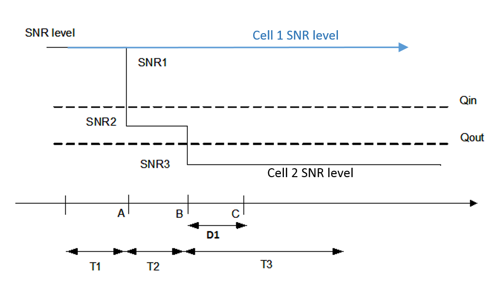
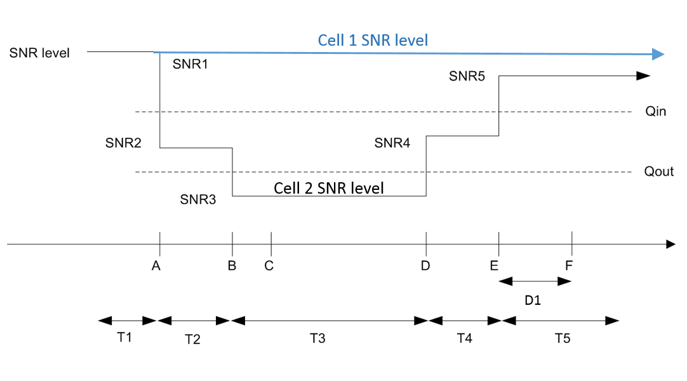
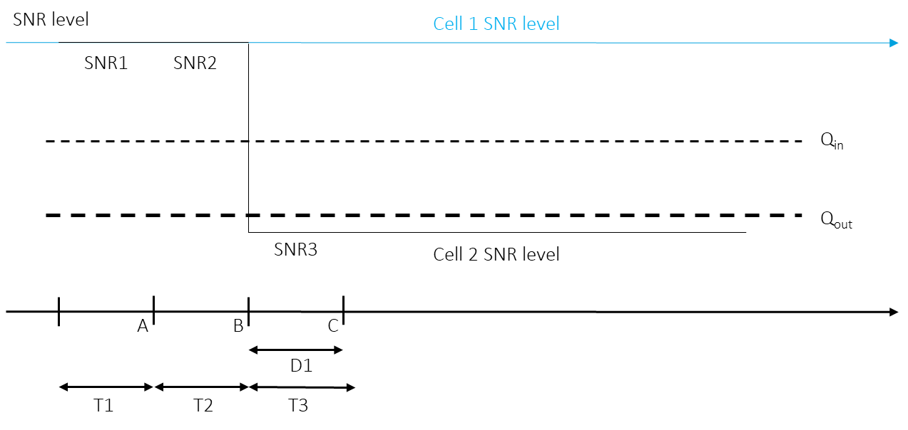
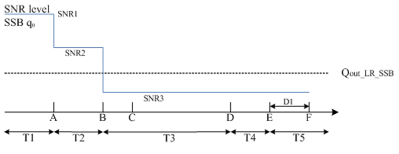
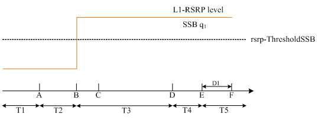
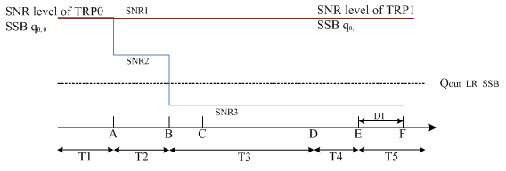
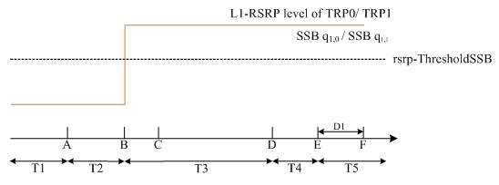
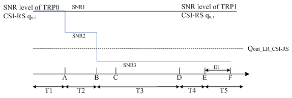

# A.4 EN-DC tests with all NR cells in FR1
## A.4.1 Void
## A.4.2 Void
## A.4.3 RRC_CONNECTED state mobility
### A.4.3.1 Void
### A.4.3.2 RRC Connection Mobility Control
#### A.4.3.2.1 Void
#### A.4.3.2.2 Random Access
##### A.4.3.2.2.1 4-step RA type contention based random access test in FR1 for PSCell in EN-DC
A.4.3.2.2.1.1 Test Purpose and Environment
The purpose of this test is to verify that the behavior of the random access procedure is according to the requirements and that the PRACH power settings and timing are within specified limits. This test will verify the requirements in clause 6.2.2.2 and clause 7.1.2 in an AWGN model.
For this test two cells are used, with the configuration of Cell 1 (E-UTRA PCell) specified in clause A.3.7.2.1 and Cell 2 configured as PSCell in FR1. Supported test parameters are shown in table A.4.3.2.2.1.1-1. UE capable of EN-DC with PSCell in FR1 needs to be tested by using the parameters in table A.4.3.2.2.1.1-2.
Table A.4.3.2.2.1.1-1: Supported test configurations for contention based random access test in FR1 for PSCell in EN-DC
| Config | Description |
| --- | --- |
| 1 | LTE FDD, NR 15 kHz SSB SCS, 10 MHz bandwidth, FDD duplex mode |
| 2 | LTE TDD, NR 15 kHz SSB SCS, 10 MHz bandwidth, FDD duplex mode |
| 3 | LTE FDD, NR 30 kHz SSB SCS, 40 MHz bandwidth, TDD duplex mode |
| 4 | LTE TDD, NR 30 kHz SSB SCS, 40 MHz bandwidth, TDD duplex mode |
| NOTE: The UE is only required to be tested in one of the supported test configurations depending on UE capability |  |

Table A.4.3.2.2.1.1-2: General test parameters for contention based random access test in FR1 for PSCell in EN-DC
| Parameter | Unit | Test 1 | Comments |  |  |
| --- | --- | --- | --- | --- | --- |
| SSB Configuration | Config 1,2 |  | SSB pattern 3 in FR1 | As defined in A.3.10 |  |
|  | Config 3,4 |  | SSB pattern 4 in FR1 |  |  |
|  |  |  |  |  |  |
|  |  |  |  |  |  |
| Duplex Mode for Cell 2 | Config 1,2 |  | FDD |  |  |
|  | Config 3,4 |  | TDD |  |  |
| TDD Configuration | Config 3,4 |  | TDDConf.2.1 |  |  |
| OCNG Pattern Note 1 |  | OCNG pattern 1 | As defined in A.3.2.1. |  |  |
| PDSCH parameters | Config 1,2 |  | SR.1.1 FDD | As defined in A.3.1.1. |  |
| Note 4 | Config 3,4 |  | SR.2.1 TDD |  |  |
| RMSI CORESET Reference Channel | Config 1,2 |  | CR.1.1 FDD |  |  |
|  | Config 3,4 |  | CR.2.1 TDD |  |  |
| Dedicated CORESET Reference Channel | Config 1,2 |  | CCR.1.1 FDD |  |  |
|  | Config 3,4 |  | CCR.2.1 TDD |  |  |
| NR RF Channel Number |  | 1 |  |  |  |
| EPRE ratio of PSS to SSS | dB |  |  |  |  |
| EPRE ratio of PBCH_DMRS to SSS | dB |  |  |  |  |
| EPRE ratio of PBCH to PBCH_DMRS | dB |  |  |  |  |
| EPRE ratio of PDCCH_DMRS to SSS | dB | 0 |  |  |  |
| EPRE ratio of PDCCH to PDCCH_DMRS | dB |  |  |  |  |
| EPRE ratio of PDSCH_DMRS to SSS | dB |  |  |  |  |
| EPRE ratio of PDSCH to PDSCH_DMRS | dB |  |  |  |  |
| SSB with index 0 |  | dB | 3 | Power of SSB with index 0 is set to be above configured rsrp-ThresholdSSB |  |
|  |  | Config 1,2 | dBm/15 kHz | -98 |  |
|  |  | Config 3,4 |  | -101 |  |
|  |  | dB | 3 |  |  |
|  | SS-RSRP Note 3 | dBm/SCS | -95 |  |  |
| SSB with index 1 |  | dB | -17 | Power of SSB with index 1 is set to be below configured rsrp-ThresholdSSB |  |
|  |  | Config 1,2 | dBm/15 kHz | -98 |  |
|  |  | Config 3,4 |  | -101 |  |
|  |  | dB | -17 |  |  |
|  | SS-RSRP Note 3 | dBm/SCS | -115 |  |  |
| Io Note 2 | Config 1,2 | dBm | -65.3/9.36 MHz | For symbols without SSB |  |
|  | Config 3,4 |  | -62.2/38.16 MHz | index 1 |  |
| ss-PBCH-BlockPower | dBm/SCS | -5 | As defined in clause 6.3.2 in TS 38.331 [2]. |  |  |
| Configured UE transmitted power () | dBm | 23 | As defined in clause 6.2.4 in TS 38.101-1 [18]. |  |  |
| PRACH Configuration |  | FR1 PRACH configuration 1 | As defined in A.3.8.2. |  |  |
| Propagation Condition | - | AWGN |  |  |  |
| NOTE 1: OCNG shall be used such that the cell is fully allocated and a constant total transmitted power spectral density is achieved for all OFDM symbols. The OCNG pattern is chosen during the test according to the presence of a DL reference measurement channel. NOTE 2: SS-RSRP, Es/Iot and Io levels have been derived from other parameters for information purpose. They are not settable parameters. NOTE 3: Void NOTE 4: The DL PDSCH reference measurement channel is used in the test only when a downlink transmission dedicated to the UE under test is required. |  |  |  |  |  |

A.4.3.2.2.1.2 Test Requirements
Contention based random access is triggered by not explicitly assigning a random access preamble via the dedicated signalling in the downlink.
A.4.3.2.2.1.2.1 Random Access Preamble Transmission
To test the UE behavior specified in clause 6.2.2.2.1.1 the System Simulator shall receive the Random Access Preamble which belongs to one of the Random Access Preambles associated with the SSB with index 0, which has SS-RSRP above the configured rsrp-ThresholdSSB.
In addition, the power applied to all preambles shall be in accordance with what is specified in clause 6.2.2.2. The power of the first preamble shall be 22  dBm with an accuracy specified in clause 6.3.4.2 of TS 38.101-1 [18]. The relative power applied to additional preambles shall have an accuracy specified in clause 6.3.4.3 of TS 38.101-1 [18].
The transmit timing of all PRACH transmissions shall be within the accuracy specified in clause 7.1.2.
A.4.3.2.2.1.2.2 Random Access Response Reception
To test the UE behavior specified in clause 6.2.2.2.1.2 the System Simulator shall transmit a Random Access Response containing a Random Access Preamble identifier corresponding to the transmitted Random Access Preamble after 5 preambles have been received by the System Simulator. In response to the first 4 preambles, the System Simulator shall transmit a Random Access Response not corresponding to the transmitted Random Access Preamble.
The UE may stop monitoring for Random Access Response(s) and shall transmit the msg3 if the Random Access Response contains a Random Access Preamble identifier corresponding to the transmitted Random Access Preamble.
The UE shall again perform the Random Access Resource selection procedure specified in clause 5.1.2 in TS 38.321 [7], and transmit with the calculated PRACH transmission power when the backoff time expires if all received Random Access Responses contain Random Access Preamble identifiers that do not match the transmitted Random Access Preamble.
In addition, the power applied to all preambles shall be in accordance with what is specified in clause 6.2.2.2. The power of the first preamble shall be 22  dBm with an accuracy specified in clause 6.3.4.2 of TS 38.101-1 [18]. The relative power applied to additional preambles shall have an accuracy specified in clause 6.3.4.3 of TS 38.101-1 [18].
The transmit timing of all PRACH transmissions shall be within the accuracy specified in clause 7.1.2.
A.4.3.2.2.1.2.3 No Random Access Response Reception
To test the UE behavior specified in clause 6.2.2.2.1.3 the System Simulator shall transmit a Random Access Response containing a Random Access Preamble identifier corresponding to the transmitted Random Access Preamble after 5 preambles have been received by the System Simulator. The System Simulator shall not respond to the first 4 preambles.
The UE shall again perform the Random Access Resource selection procedure specified in clause 5.1.2 in TS 38.321 [7], and transmit with the calculated PRACH transmission power when the backoff time expires if no Random Access Response is received within the RA Response window.
In addition, the power applied to all preambles shall be in accordance with what is specified in clause 6.2.2.2. The power of the first preamble shall be 22  dBm with an accuracy specified in clause 6.3.4.2 of TS 38.101-1 [18]. The relative power applied to additional preambles shall have an accuracy specified in clause 6.3.4.3 of TS 38.101-1 [18].
The transmit timing of all PRACH transmissions shall be within the accuracy specified in clause 7.1.2.
A.4.3.2.2.1.2.4 Receiving an UL grant for msg3 retransmission
To test the UE behavior specified in clause 6.2.2.2.1.4, the System Simulator shall provide an UL grant for msg3 retransmission following a successful Random Access Response.
The UE shall re-transmit the msg3 upon the reception of an UL grant for msg3 retransmission..
A.4.3.2.2.1.2.5 Void
A.4.3.2.2.1.2.6 Void
A.4.3.2.2.1.2.7 Contention Resolution Timer expiry
To test the UE behavior specified in clause 6.2.2.2.1.6 the System Simulator shall not send a response to a msg3.
The UE shall again perform the Random Access Resource selection procedure specified in clause 5.1.2 in TS 38.321 [7], and transmit with the calculated PRACH transmission power when the backoff time expires if the Contention Resolution Timer expires.
##### A.4.3.2.2.2 4-step RA type n on-contention based random access test in FR1 for PSCell in EN-DC
A.4.3.2.2.2.1 Test Purpose and Environment
The purpose of this test is to verify that the behavior of the random access procedure is according to the requirements and that the PRACH power settings and timing are within specified limits. This test will verify the requirements in clause 6.2.2.2 and clause 7.1.2 in an AWGN model.
For this test two cells are used, with the configuration of Cell 1 (E-UTRA PCell) specified in clause A.3.7.2.1 and Cell 2 configured as PSCell in FR1. Supported test parameters are shown in table A.4.3.2.2.2.1-1. UE capable of EN-DC with PSCell in FR1 needs to be tested by using the parameters in table A.4.3.2.2.2.1-2 for SSB-based non-contention based random access test (Test 1) and CSI-RS-based non-contention based random access test (Test 2). Test 2 is only applicable to UE which supports csi-RSRP-AndRSRQ-MeasWithSSB or csi-RSRP-AndRSRQ-MeasWithoutSSB.
Table A.4.3.2.2.2.1-1: Supported test configurations for non-contention based random access test in FR1 for PSCell in EN-DC
| Config | Description |
| --- | --- |
| 1 | LTE FDD, NR 15 kHz SSB SCS, 10 MHz bandwidth, FDD duplex mode |
| 2 | LTE TDD, NR 15 kHz SSB SCS, 10 MHz bandwidth, FDD duplex mode |
| 3 | LTE FDD, NR 30 kHz SSB SCS, 40 MHz bandwidth, TDD duplex mode |
| 4 | LTE TDD, NR 30 kHz SSB SCS, 40 MHz bandwidth, TDD duplex mode |
| NOTE: The UE is only required to be tested in one of the supported test configurations depending on UE capability |  |

Table A.4.3.2.2.2.1-2: General test parameters for non-contention based random access test in FR1 for PSCell in EN-DC
| Parameter | Unit | Test 1 | Test 2 | Comments |  |  |
| --- | --- | --- | --- | --- | --- | --- |
| SSB Configuration | Config 1,2 |  | SSB pattern 3 in FR1 | SSB pattern 3 in FR1 | As defined in A.3.10 |  |
|  | Config 3,4 |  | SSB pattern 4 in FR1 | SSB pattern 4 in FR1 |  |  |
| CSI-RS Configuration | Config 1,2 |  | N/A | CSI-RS.1.1 FDD | As defined in A.3.1.4 |  |
|  | Config 3,4 |  |  | CSI-RS.2.1 TDD |  |  |
| Duplex Mode for Cell | Config 1,2 |  | FDD | FDD |  |  |
| 2 | Config 3,4 |  | TDD | TDD |  |  |
| TDD Configuration | Config 3,4 |  | TDDConf.2.1 | TDDConf.2.1 |  |  |
| OCNG Pattern Note 1 |  | OCNG pattern 1 | OCNG pattern 1 | As defined in A.3.2.1. |  |  |
| PDSCH parameters | Config 1,2 |  | SR.1.1 FDD | SR.1.1 FDD | As defined in |  |
| Note 4 | Config 3,4 |  | SR.2.1 TDD | SR.2.1 TDD | A.3.1.1. |  |
| RMSI CORESET Reference Channel | Config 1,2 |  | CR.1.1 TDD | CR.1.1 TDD |  |  |
|  | Config 3,4 |  | CR.2.1 TDD | CR.2.1 TDD |  |  |
| Dedicated CORESET Reference Channel | Config 1,2 |  | CCR.1.1 TDD | CCR.1.1 TDD |  |  |
|  | Config 3,4 |  | CCR.2.1 TDD | CCR.2.1 TDD |  |  |
| NR RF Channel Number |  | 1 | 1 |  |  |  |
| EPRE ratio of PSS to SSS | dB |  |  |  |  |  |
| EPRE ratio of PBCH_DMRS to SSS | dB |  |  |  |  |  |
| EPRE ratio of PBCH to PBCH_DMRS | dB |  |  |  |  |  |
| EPRE ratio of PDCCH_DMRS to SSS | dB | 0 | 0 |  |  |  |
| EPRE ratio of PDCCH to PDCCH_DMRS | dB |  |  |  |  |  |
| EPRE ratio of PDSCH_DMRS to SSS | dB |  |  |  |  |  |
| EPRE ratio of PDSCH to PDSCH_DMRS | dB |  |  |  |  |  |
| SSB with index 0 |  | dB | 3 | 3 | Power of SSB with index 0 is set to be above configured rsrp-ThresholdSSB |  |
|  |  | Config 1,2 | dBm/15 kHz | -98 | -98 |  |
|  |  | Config 3,4 |  | -101 | -101 |  |
|  |  | dB | 3 | 3 |  |  |
|  | SS-RSRP Note 3 | dBm/SCS | -95 | -95 |  |  |
| SSB with index 1 |  | dB | -17 | -17 | Power of SSB with index 1 is set to be below configured rsrp-ThresholdSSB |  |
|  |  | Config 1,2 | dBm/15 kHz | -98 | -98 |  |
|  |  | Config 3,4 |  | -101 | -101 |  |
|  |  | dB | -17 | -17 |  |  |
|  | SS-RSRP Note 3 | dBm/SCS | -115 | -115 |  |  |
| Io Note 2 | Config 1,2 | dBm | -65.3/9.36 MHz | -65.3/9.36 MHz | For symbols |  |
|  | Config 3,4 |  | -62.2/38.16 MHz | -62.2/38.16 MHz | without SSB index 1 |  |
| ss-PBCH-BlockPower | dBm/SCS | -5 | -5 | As defined in clause 6.3.2 in TS 38.331 [2]. |  |  |
| Configured UE transmitted power () | dBm | 23 | 23 | As defined in clause 6.2.4 in TS 38.101-1 [18]. |  |  |
| PRACH Configuration |  | FR1 PRACH configuration 2 | FR1 PRACH configuration 3 | As defined in A.3.8.2. |  |  |
| Propagation Condition | - | AWGN | AWGN |  |  |  |
| NOTE 1: OCNG shall be used such that the cell is fully allocated and a constant total transmitted power spectral density is achieved for all OFDM symbols. The OCNG pattern is chosen during the test according to the presence of a DL reference measurement channel. NOTE 2: SS-RSRP, Es/Iot and Io levels have been derived from other parameters for information purpose. They are not settable parameters. NOTE 3: Void NOTE 4: The DL PDSCH reference measurement channel is used in the test only when a downlink transmission dedicated to the UE under test is required. |  |  |  |  |  |  |

A.4.3.2.2.2.2 Test Requirements
Non-contention based random access is triggered by explicitly assigning a random access preamble via dedicated signalling in the downlink. In the test, the non-contention based random access procedure is not initialized for Other SI requested from UE or beam failure recovery.
A.4.3.2.2.2.2.1 SSB-based Random Access Preamble Transmission
In Test-1, to test the UE behavior specified in clause 6.2.2.2.2.1 for SSB-based Random Access Preamble transmission, with the contention-free Random Access Resources and the contention-free PRACH occasions associated with SSBs configured, the System Simulator shall receive the Random Access Preamble which has the Preamble Index associated with the SSB with index 0.
In addition, the System Simulator shall receive the Random Access Preamble on the PRACH occasion which belongs to the PRACH occasions corresponding to the SSB with index 0, and the selected PRACH occasion shall belongs to the PRACH occasions permitted by the restrictions given by the ra-ssb-OccasionMaskIndex.
In addition, the power applied to all preambles shall be in accordance with what is specified in clause 6.2.2.2.. The power of the first preamble shall be 22  dBm with an accuracy specified in clause 6.3.4.2 of TS 38.101-1 [18]. The relative power applied to additional preambles shall have an accuracy specified in clause 6.3.4.3 of TS 38.101-1 [18].
The transmit timing of all PRACH transmissions shall be within the accuracy specified in clause 7.1.2.
A.4.3.2.2.2.2.2 CSI-RS-based Random Access Preamble Transmission
In Test-2, to test the UE behavior specified in clause 6.2.2.2.2.1 for CSI-RS-based Random Access Preamble transmission, with the contention-free Random Access Resources and the contention-free PRACH occasions associated with CSI-RSs configured, the System Simulator shall receive the Random Access Preamble which has the Preamble Index associated with the CSI-RS configured.
In addition, the System Simulator shall receive the Random Access Preamble on the PRACH occasion which belongs to the PRACH occasions corresponding to the CSI-RS configured, and the selected PRACH occasion shall belongs to the PRACH occasions permitted by the restrictions given by the ra-OccasionList.
In addition, the power applied to all preambles shall be in accordance with what is specified in clause 6.2.2.2. The power of the first preamble shall be 22 dBm with an accuracy specified in clause 6.3.4.2 of TS 38.101-1 [18]. The relative power applied to additional preambles shall have an accuracy specified in clause 6.3.4.3 of TS 38.101-1 [18].
The transmit timing of all PRACH transmissions shall be within the accuracy specified in clause 7.1.2.
A.4.3.2.2.2.2.3 Random Access Response Reception
To test the UE behavior specified in clause 6.2.2.2.2.2 the System Simulator shall transmit a Random Access Response containing a Random Access Preamble identifier corresponding to the transmitted Random Access Preamble after 5 preambles have been received by the System Simulator. In response to the first 4 preambles, the System Simulator shall transmit a Random Access Response not corresponding to the transmitted Random Access Preamble.
The UE may stop monitoring for Random Access Response(s) if the Random Access Response contains a Random Access Preamble identifier corresponding to the transmitted Random Access Preamble.
The UE shall again perform the Random Access Resource selection procedure specified in clause 5.1.2 in TS 38.321 [7], and transmit with the calculated PRACH transmission power if all received Random Access Responses contain Random Access Preamble identifiers that do not match the transmitted Random Access Preamble.
In addition, the power applied to all preambles shall be in accordance with what is specified in clause 6.2.2.2. The power of the first preamble shall be 22 dBm with an accuracy specified in clause 6.3.4.2 of TS 38.101-1 [18]. The relative power applied to additional preambles shall have an accuracy specified in clause 6.3.4.3 of TS 38.101-1 [18].
The transmit timing of all PRACH transmissions shall be within the accuracy specified in clause 7.1.2.
A.4.3.2.2.2.2.4 No Random Access Response Reception
To test the UE behavior specified in clause 6.2.2.2.2.3 the System Simulator shall transmit a Random Access Response containing a Random Access Preamble identifier corresponding to the transmitted Random Access Preamble after 5 preambles have been received by the System Simulator. The System Simulator shall not respond to the first 4 preambles.
The UE shall again perform the Random Access Resource selection procedure specified in clause 5.1.2 in TS 38.321 [7], and transmit with the calculated PRACH transmission power when the backoff time expires if no Random Access Response is received within the RA Response window configured in RACH-ConfigCommon.
In addition, the power applied to all preambles shall be in accordance with what is specified in clause 6.2.2.2. The power of the first preamble shall be 22 dBm with an accuracy specified in clause 6.3.4.2 of TS 38.101-1 [18]. The relative power applied to additional preambles shall have an accuracy specified in clause 6.3.4.3 of TS 38.101-1 [18].
The transmit timing of all PRACH transmissions shall be within the accuracy specified in clause 7.1.2.
##### A.4.3.2.2.3 2-step RA type contention based random access test in FR1 for PSCell in EN-DC
A.4.3.2.2.3.1 Test Purpose and Environment
The purpose of this test is to verify that the behaviour of the random access procedure is according to the requirements and that the MsgA PRACH, MsgA PUSCH power settings and timing are within specified limits. This test will verify the requirements in clause 6.2.2.3 and clause 7.1.2 in an AWGN model.
For this test two cells are used, with the configuration of Cell 1 (E-UTRA PCell) specified in clause A.3.7.2.1 and Cell 2 configured as PSCell in FR1. Supported test parameters are shown in table A.4.3.2.2.3.1-1. UE capable of EN-DC with PSCell in FR1 needs to be tested by using the parameters in table A.4.3.2.2.3.1-2.
Table A.4.3.2.2.3.1-1: Supported test configurations for 2-step RA type contention based random access test in FR1 for PSCell in EN-DC
| Config | Description |
| --- | --- |
| 1 | LTE FDD, NR 15 kHz SSB SCS, 10 MHz bandwidth, FDD duplex mode |
| 2 | LTE TDD, NR 15 kHz SSB SCS, 10 MHz bandwidth, FDD duplex mode |
| 3 | LTE FDD, NR 30 kHz SSB SCS, 40 MHz bandwidth, TDD duplex mode |
| 4 | LTE TDD, NR 30 kHz SSB SCS, 40 MHz bandwidth, TDD duplex mode |
| NOTE: The UE is only required to be tested in one of the supported test configurations depending on UE capability |  |

Table A.4.3.2.2.3.1-2: General test parameters for 2-step RA type contention based random access test in FR1 for PSCell in EN-DC
| Parameter | Unit | Test 1 | Comments |  |  |
| --- | --- | --- | --- | --- | --- |
| SSB Configuration | Config 1,2 |  | SSB pattern 3 in FR1 | As defined in A.3.10 |  |
|  | Config 3,4 |  | SSB pattern 4 in FR1 |  |  |
| Duplex Mode for Cell 2 | Config 1,2 |  | FDD |  |  |
|  | Config 3,4 |  | TDD |  |  |
| TDD Configuration | Config 3,4 |  | TDDConf.2.1 |  |  |
| OCNG Pattern Note 1 |  | OCNG pattern 1 | As defined in A.3.2.1. |  |  |
| PDSCH parameters Note 3 | Config 1,2 |  | SR.1.1 FDD | As defined in A.3.1.1. |  |
|  | Config 3,4 |  | SR.2.1 TDD |  |  |
| RMSI CORESET Reference Channel | Config 1,2 |  | CR.1.1 FDD |  |  |
|  | Config 3,4 |  | CR.2.1 TDD |  |  |
| Dedicated CORESET Reference Channel | Config 1,2 |  | CCR.1.1 FDD |  |  |
|  | Config 3,4 |  | CCR.2.1 TDD |  |  |
| NR RF Channel Number |  | 1 |  |  |  |
| EPRE ratio of PSS to SSS | dB |  |  |  |  |
| EPRE ratio of PBCH_DMRS to SSS | dB |  |  |  |  |
| EPRE ratio of PBCH to PBCH_DMRS | dB |  |  |  |  |
| EPRE ratio of PDCCH_DMRS to SSS | dB | 0 |  |  |  |
| EPRE ratio of PDCCH to PDCCH_DMRS | dB |  |  |  |  |
| EPRE ratio of PDSCH_DMRS to SSS | dB |  |  |  |  |
| EPRE ratio of PDSCH to PDSCH_DMRS | dB |  |  |  |  |
| SSB with index 0 |  | dB | 3 | Power of SSB with index 0 is set to be above configured msgA-RSRP-ThresholdSSB |  |
|  |  | Config 1,2 | dBm/15 kHz | -98 |  |
|  |  | Config 3,4 |  | -101 |  |
|  |  | dB | 3 |  |  |
|  | SS-RSRP Note 2 | dBm/SCS | -95 |  |  |
| SSB with index 1 |  | dB | -17 | Power of SSB with index 1 is set to be below configured msgA-RSRP-ThresholdSSB |  |
|  |  | Config 1,2 | dBm/15 kHz | -98 |  |
|  |  | Config 3,4 |  | -101 |  |
|  |  | dB | -17 |  |  |
|  | SS-RSRP Note 2 | dBm/SCS | -115 |  |  |
| Io | Config 1,2 | dBm | -65.3/9.36 MHz | For symbols without SSB |  |
|  | Config 3,4 |  | -62.2/38.16 MHz | index 1 |  |
| ss-PBCH-BlockPower | dBm/SCS | -5 | As defined in clause 6.3.2 in TS 38.331 [2]. |  |  |
| Configured UE transmitted power () | dBm | 23 | As defined in clause 6.2.4 in TS 38.101-1 [18]. |  |  |
| MsgA Configuration |  | FR1 MsgA configuration 1 | As defined in A.3.20.2.1. |  |  |
| msgA-RSRP-ThresholdSSB | dBm | RSRP_51 | The actual value of the threshold is -105 dBm, as defined in TS 38.331 [2]. |  |  |
| Propagation Condition | - | AWGN |  |  |  |
| NOTE 1: OCNG shall be used such that the cell is fully allocated and a constant total transmitted power spectral density is achieved for all OFDM symbols. The OCNG pattern is chosen during the test according to the presence of a DL reference measurement channel. NOTE 2: SS-RSRP, Es/Iot and Io levels have been derived from other parameters for information purpose. They are not settable parameters. NOTE 3: The DL PDSCH reference measurement channel is used in the test only when a downlink transmission dedicated to the UE under test is required. |  |  |  |  |  |

A.4.3.2.2.3.2 Test Requirements
Contention based random access is triggered by not explicitly assigning a random access preamble via dedicated signalling in the downlink.
A.4.3.2.2.3.2.1 MsgA Transmission
To test the UE behaviour specified in clause 6.2.2.3.1.1 the System Simulator shall receive the MsgA with a preamble which belongs to one of the Random Access Preambles associated with the SSB with index 0, which has SS-RSRP above the configured msgA-RSRP-ThresholdSSB.
In addition, the power applied to all MsgA transmission shall be in accordance with what is specified in Clause 6.2.2.2. The power of the first MsgA preamble shall be -22 dBm with an accuracy specified in clause 6.3.4.2 of TS 38.101-1 [18]. The power of the first MsgA PUSCH transmission shall be 3 dB lower than first MsgA PRACH power for test configuration 1 & 2 and same as first MsgA PRACH power for test configuration 3 & 4 with an accuracy specified in clause 6.3.4.2 of TS 38.101-1 [18]. The relative power applied to additional MsgA transmissions shall have an accuracy specified in clause 6.3.4.3 of TS 38.101-1 [18].
The transmit timing of all MsgA transmissions shall be within the accuracy specified in clause 7.1.2.
A.4.3.2.2.3.2.2 MsgB Reception
To test the UE behaviour specified in clause 6.2.2.3.1.2 the System Simulator shall transmit a MsgB with fallbackRAR containing a Random Access Preamble identifier corresponding to the transmitted Random Access Preamble after 5 preambles have been received by the System Simulator. In response to the first 4 preambles, the System Simulator shall transmit a MsgB not corresponding to the transmitted Random Access Preamble.
The UE may stop monitoring for MsgB(s) and shall transmit the msg3 if the MsgB with a fallbackRAR contains a Random Access Preamble identifier corresponding to the transmitted Random Access Preamble.
The UE shall again perform the Random Access Resource selection procedure specified in clause 5.1.2a in TS 38.321 [7], and transmit with the calculated MsgA PRACH and MsgA PUSCH transmission power when the backoff time expires if all received MsgB’s contain Random Access Preamble identifiers that do not match the transmitted Random Access Preamble.
In addition, the power applied to all MsgA transmission shall be in accordance with what is specified in Clause 6.2.2.2. The power of the first MsgA preamble shall be -22 dBm with an accuracy specified in clause 6.3.4.2 of TS 38.101-1 [18]. The power of the first MsgA PUSCH transmission shall be 3 dB lower than first MsgA PRACH power for test configuration 1 & 2 and same as first MsgA PRACH power for test configuration 3 & 4 with an accuracy specified in clause 6.3.4.2 of TS 38.101-1 [18]. The relative power applied to additional MsgA transmissions shall have an accuracy specified in clause 6.3.4.3 of TS 38.101-1 [18].
The transmit timing of all MsgA transmissions shall be within the accuracy specified in clause 7.1.2.
A.4.3.2.2.3.2.3 No MsgB Reception
To test the UE behavior specified in clause 6.2.2.3.1.3 the System Simulator shall transmit a MsgB with fallbackRAR containing a successRAR message and a Random Access Preamble identifier corresponding to the transmitted Random Access Preamble after 5 preambles have been received by the System Simulator. The System Simulator shall not respond to the first 4 preambles.
The UE shall again perform the Random Access Resource selection procedure specified in clause 5.1.2a in TS 38.321 [7], and transmit with the calculated MsgA PRACH and MsgA PUSCH transmission power when the backoff time expires if no MsgB  is received within the MsgB Response window.
In addition, the power applied to all MsgA transmission shall be in accordance with what is specified in Clause 6.2.2.2. The power of the first MsgA preamble shall be -22 dBm with an accuracy specified in clause 6.3.4.2 of TS 38.101-1 [18]. The power of the first MsgA PUSCH transmission shall be 3 dB lower than first MsgA PRACH power for test configuration 1 & 2 and same as first MsgA PRACH power for test configuration 3 & 4 with an accuracy specified in clause 6.3.4.2 of TS 38.101-1 [18]. The relative power applied to additional MsgA transmissions shall have an accuracy specified in clause 6.3.4.3 of TS 38.101-1 [18].
The transmit timing of all MsgA transmissions shall be within the accuracy specified in clause 7.1.2.
##### A.4.3.2.2.4 2-step RA type non-contention based random access test in FR1 for PSCell in EN-DC
A.4.3.2.2.4.1 Test Purpose and Environment
The purpose of this test is to verify that the behavior of the random access procedure is according to the requirements and that the MsgA PRACH, MsgA PUSCH power settings and timing are within specified limits. This test will verify the requirements in clause 6.2.2.3 and clause 7.1.2 in an AWGN model.
For this test two cells are used, with the configuration of Cell 1 (E-UTRA PCell) specified in clause A.3.7.2.1 and Cell 2 configured as PSCell in FR1. Supported test parameters are shown in table A.4.3.2.2.4.1-1. UE capable of EN-DC with PSCell in FR1 needs to be tested by using the parameters in table A.4.3.2.2.4.1-2.
Table A.4.3.2.2.4.1-1: Supported test configurations for non-contention based random access test for 2-step RA type in FR1 for PSCell in EN-DC
| Config | Description |
| --- | --- |
| 1 | LTE FDD, NR 15 kHz SSB SCS, 10 MHz bandwidth, FDD duplex mode |
| 2 | LTE TDD, NR 15 kHz SSB SCS, 10 MHz bandwidth, FDD duplex mode |
| 3 | LTE FDD, NR 30 kHz SSB SCS, 40 MHz bandwidth, TDD duplex mode |
| 4 | LTE TDD, NR 30 kHz SSB SCS, 40 MHz bandwidth, TDD duplex mode |
| NOTE: The UE is only required to be tested in one of the supported test configurations depending on UE capability |  |

Table A.4.3.2.2.4.1-2: General test parameters for non-contention based random access test for 2-step RA type in FR1 for PSCell in EN-DC
| Parameter | Unit | Test 1 | Comments |  |  |
| --- | --- | --- | --- | --- | --- |
| SSB Configuration | Config 1,2 |  | SSB pattern 3 in FR1 | As defined in A.3.10 |  |
|  | Config 3,4 |  | SSB pattern 4 in FR1 |  |  |
| Duplex Mode for Cell | Config 1,2 |  | FDD |  |  |
| 2 | Config 3,4 |  | TDD |  |  |
| TDD Configuration | Config 3,4 |  | TDDConf.2.1 |  |  |
| OCNG Pattern Note 1 |  | OCNG pattern 1 | As defined in A.3.2.1. |  |  |
| PDSCH parameters | Config 1,2 |  | SR.1.1 FDD | As defined in |  |
| Note 3 | Config 3,4 |  | SR.2.1 TDD | A.3.1.1. |  |
| RMSI CORESET Reference Channel | Config 1,2 |  | CR.1.1 TDD |  |  |
|  | Config 3,4 |  | CR.2.1 TDD |  |  |
| Dedicated CORESET Reference Channel | Config 1,2 |  | CCR.1.1 TDD |  |  |
|  | Config 3,4 |  | CCR.2.1 TDD |  |  |
| NR RF Channel Number |  | 1 |  |  |  |
| EPRE ratio of PSS to SSS | dB |  |  |  |  |
| EPRE ratio of PBCH_DMRS to SSS | dB |  |  |  |  |
| EPRE ratio of PBCH to PBCH_DMRS | dB |  |  |  |  |
| EPRE ratio of PDCCH_DMRS to SSS | dB | 0 |  |  |  |
| EPRE ratio of PDCCH to PDCCH_DMRS | dB |  |  |  |  |
| EPRE ratio of PDSCH_DMRS to SSS | dB |  |  |  |  |
| EPRE ratio of PDSCH to PDSCH_DMRS | dB |  |  |  |  |
| SSB with index 0 |  | dB | 3 | Power of SSB with index 0 is set to be above configured msgA-RSRP-ThresholdSSB |  |
|  |  | Config 1,2 | dBm/15 kHz | -98 |  |
|  |  | Config 3,4 |  | -101 |  |
|  |  | dB | 3 |  |  |
|  | SS-RSRP | dBm/SCS | -95 |  |  |
| SSB with index 1 |  | dB | -17 | Power of SSB with index 1 is set to be below configured msgA-RSRP-ThresholdSSB |  |
|  |  | Config 1,2 | dBm/15 kHz | -98 |  |
|  |  | Config 3,4 |  | -101 |  |
|  |  | dB | -17 |  |  |
|  | SS-RSRP | dBm/SCS | -115 |  |  |
| Io Note 2 | Config 1,2 | dBm | -65.3/9.36 MHz | For symbols |  |
|  | Config 3,4 |  | -62.2/38.16 MHz | without SSB index 1 |  |
| ss-PBCH-BlockPower | dBm/SCS | -5 | As defined in clause 6.3.2 in TS 38.331 [2]. |  |  |
| Configured UE transmitted power (PCMAX,f,c) | dBm | 23 | As defined in clause 6.2.4 in TS 38.101-1 [18]. |  |  |
| MsgA Configuration |  | FR1 MsgA configuration 2 | As defined in A.3.20.2. |  |  |
| msgA-RSRP-ThresholdSSB | dBm | RSRP_51 | The actual value of the threshold is -105 dBm, as defined in TS 38.331 [2]. |  |  |
| Propagation Condition | - | AWGN |  |  |  |
| NOTE 1: OCNG shall be used such that the cell is fully allocated and a constant total transmitted power spectral density is achieved for all OFDM symbols. The OCNG pattern is chosen during the test according to the presence of a DL reference measurement channel. NOTE 2: SS-RSRP, Es/Iot and Io levels have been derived from other parameters for information purpose. They are not settable parameters. NOTE 3: The DL PDSCH reference measurement channel is used in the test only when a downlink transmission dedicated to the UE under test is required. |  |  |  |  |  |

A.4.3.2.2.4.2 Test Requirements
Non-Contention based random access is triggered by explicitly assigning a random access preamble via dedicated signalling in the downlink. In the test, the non-contention based random access procedure is not initialized for Other SI requested from UE or beam failure recovery.
A.4.3.2.2.4.2.1 MsgA Transmission
In Test-1, to test the UE behavior specified in clause 6.2.2.3.2.1 for MsgA transmission, with the contention-free Random Access Resources and the contention-free PRACH occasions associated with SSBs configured, the System Simulator shall receive the MsgA which has the Preamble Index associated with the SSB with index 0.
In addition, the System Simulator shall receive the MsgA on the PRACH occasion which belongs to the PRACH occasions corresponding to the SSB with index 0, and the selected PRACH occasion shall belongs to the PRACH occasions permitted by the restrictions given first by the msgA-SSB-SharedRO-MaskIndex if configured, or next by the ra-ssb-OccasionMaskIndex if configured.
In addition, the power applied to all MsgA transmission shall be in accordance with what is specified in Clause 6.2.2.2. The power of the first preamble shall be -22 dBm with an accuracy specified in clause 6.3.4.2 of TS 38.101-1 [18]. The power of the first MsgA PUSCH transmission shall be 3 dB lower than first MsgA PRACH power for test configuration 1 & 2 and same as first MsgA PRACH power for test configuration 3 & 4 with an accuracy specified in clause 6.3.4.2 of TS 38.101-1 [18]. The relative power applied to additional MsgA transmissions shall have an accuracy specified in clause 6.3.4.3 of TS 38.101-1 [18].
The transmit timing of all MsgA transmissions shall be within the accuracy specified in clause 7.1.2.
A.4.3.2.2.4.2.2 MsgB Reception
To test the UE behavior specified in clause 6.2.2.3.2.2 the System Simulator shall transmit a MsgB containing a successRAR MAC subPDU corresponding to the transmitted Random Access Preamble after 5 MsgA transmissions have been received by the System Simulator. In response to the first 4 preambles, the System Simulator shall transmit a MsgB not corresponding to the transmitted Random Access Preamble.
The UE may stop monitoring for MsgB if the MsgB contains a successRAR MAC subPDU corresponding to the transmitted Random Access Preamble.
The UE shall again perform the Random Access Resource selection procedure specified in clause 5.1.2a in TS 38.321 [7], and transmit with the calculated MsgA transmission power if Random Access Responses Reception has not been considered as successful.
In addition, the power applied to all MsgA transmissions shall be in accordance with what is specified in Clause 6.2.2.3. The power of the first preamble shall be -22 dBm with an accuracy specified in clause 6.3.4.2 of TS 38.101-1 [18]. The power of the first MsgA PUSCH transmission shall be 3 dB lower than first MsgA PRACH power for test configuration 1 & 2 and same as first MsgA PRACH power for test configuration 3 & 4 with an accuracy specified in clause 6.3.4.2 of TS 38.101-1 [18]. The relative power applied to additional MsgA transmissions shall have an accuracy specified in clause 6.3.4.3 of TS 38.101-1 [18].
The transmit timing of all MsgA transmissions shall be within the accuracy specified in clause 7.1.2.
A.4.3.2.2.4.2.3 No MsgB Reception
To test the UE behavior specified in clause 6.2.2.3.2.3 the System Simulator shall transmit a MsgB corresponding to the transmitted Random Access Preamble after 5 preambles have been received by the System Simulator. The System Simulator shall not respond to the first 4 preambles.
The UE shall again perform the Random Access Resource selection procedure specified in clause 5.1.2a in TS 38.321 [7], and transmit with the calculated MsgA transmission power when the backoff time expires if no MsgB is received within the MsgB Response window configured in RACH-ConfigGenericTwoStepRA.
In addition, the power applied to all MsgA transmissions shall be in accordance with what is specified in Clause 6.2.2.3. The power of the first preamble shall be -22 dBm with an accuracy specified in clause 6.3.4.2 of TS 38.101-1 [18]. The power of the first MsgA PUSCH transmission shall be 3 dB lower than first MsgA PRACH power for test configuration 1 & 2 and same as first MsgA PRACH power for test configuration 3 & 4 with an accuracy specified in clause 6.3.4.2 of TS 38.101-1 [18]. The relative power applied to additional MsgA transmissions shall have an accuracy specified in clause 6.3.4.3 of TS 38.101-1 [18].
The transmit timing of all MsgA transmissions shall be within the accuracy specified in clause 7.1.2.
#### A.4.3.2.3 Void
### A.4.3.3 Handover with PSCell from EN-DC to EN-DC with known target PSCell in FR1
#### A.4.3.3.1 Test Purpose and Environment
This test is to verify the requirements for E-UTRA intra frequency handover with NR FR1 PSCell change specified in clause 5.8 in E-UTRA RRM specification [15] for the case when the target PSCell is known by the UE. Supported test configurations are shown in table A.4.3.3.1-1.
The general test parameters are given in table A.4.3.3.1-2. E-UTRA cells and NR cells specific test parameters are given in table A.4.3.3.1-3 and A.4.3.3.1-4. In the test there are four cells: Cell 1 and Cell 2 are PCell and target PCell on E-UTRA carrier, Cell 3 and Cell 4 are PSCell and target PSCell on NR FR1 carrier. The test consists of three successive time periods, with time durations of T1, T2 and T3 respectively. Before the test starts the UE is connected to Cell 1 (E-UTRA PCell) and Cell 3 (NR PSCell) with EN-DC mode. At the start of time duration T1, the UE has not any timing information of cell 2 and cell 4. During T1, the UE is configured in the measurement control information that event-triggered reporting with Event A3 for neighbour cells on E-UTRA carrier and NR carrier.
The Cell 2 and Cell 4 becomes known to the UE, and E-UTRA PCell (Cell 1) shall send an RRC message implying handover with PSCell to cell 2 and cell4 during T2. The RRC message implying handover with PSCell shall be sent to the UE after the UE has reported Event A3 for SpCells. The start of T3 is defined as the end of the last TTI containing the RRC message implying handover with PSCell.
Table A.4.3.3.1-1: Handover with PSCell from EN-DC to EN-DC test configurations in FR1
| Config | Description |
| --- | --- |
| 1 | LTE FDD, NR 15 kHz SSB SCS, 10 MHz bandwidth, PSCell FDD duplex mode |
| 2 | LTE FDD, NR 15 kHz SSB SCS, 10 MHz bandwidth, PSCell TDD duplex mode |
| 3 | LTE FDD, NR 30 kHz SSB SCS, 40 MHz bandwidth, PSCell TDD duplex mode |
| 4 | LTE TDD, NR 15 kHz SSB SCS, 10 MHz bandwidth, PSCell FDD duplex mode |
| 5 | LTE TDD, NR 15 kHz SSB SCS, 10 MHz bandwidth, PSCell TDD duplex mode |
| 6 | LTE TDD, NR 30 kHz SSB SCS, 40 MHz bandwidth, PSCell TDD duplex mode |
| NOTE: The UE is only required to be tested in one of the supported test configurations |  |

Table A.4.3.3.1-2: General test parameters for Handover with PSCell from EN-DC to EN-DC
| Parameter | Unit | Value | Comment |  |
| --- | --- | --- | --- | --- |
| RF Channel Number |  | 1, 2 | One is E-UTRA RF channel and one is NR RF channel |  |
| Initial conditions | Active PCell |  | Cell 1 | On E-UTRA RF channel number 1. |
|  | E-UTRA Neighbouring cell |  | Cell 2 | On E-UTRA RF channel number 1. |
|  | Active PSCell |  | Cell 3 | On NR RF channel number 2. |
|  | NR Neighbouring cell |  | Cell 4 | On NR RF channel number 2. |
| Final conditions | Active PCell |  | Cell 2 |  |
|  | Active PSCell |  | Cell 4 |  |
| CP length |  | Normal | Applicable to Cell 1, Cell 2, Cell 3 and Cell 4. |  |
| A3-Offset | dB | 0 |  |  |
| Hysteresis | dB | 0 |  |  |
| Time To Trigger | s | 0 |  |  |
| Filter coefficient |  | 0 | L3 filtering is not used |  |
| DRX |  | OFF | Continuous monitoring of primary cell |  |
| Access Barring Information | - | Not Sent | No additional delays in random access procedure. |  |
| Time offset between same RAT cells | µs | 3 | Synchronous cells |  |
| T1 | s | 5 |  |  |
| T2 | s | 5 |  |  |
| T3 | s | 1 |  |  |

Table A.4.3.3.1-3: E-UTRAN cell specific test parameters for Handover with PSCell from EN-DC to EN-DC
| Parameter | Unit | Cell1 | Cell2 |  |  |  |  |
| --- | --- | --- | --- | --- | --- | --- | --- |
|  |  | T1 | T2 | T3 | T1 | T2 | T3 |
| E-UTRA RF Channel Number |  | 1 | 1 |  |  |  |  |
| Duplex mode |  | FDD or TDD | FDD or TDD |  |  |  |  |
| TDD special subframe configurationNote1 |  | 6 | 6 |  |  |  |  |
| TDD uplink-downlink configurationNote1 |  | 1 | 1 |  |  |  |  |
| BWchannel |  | 5 MHz: NRB,c = 25 10 MHz: NRB,c = 50 20 MHz: NRB,c = 100 | 5 MHz: NRB,c = 25 10 MHz: NRB,c = 50 20 MHz: NRB,c = 100 |  |  |  |  |
| PDSCH parameters: DL Reference Measurement ChannelNote2 |  | 5 MHz: R.7 FDD 10 MHz: R.3 FDD 20 MHz: R.6 FDD 5 MHz: R.4 TDD 10 MHz: R.0 TDD 20 MHz: R.3 TDD | 5 MHz: R.7 FDD 10 MHz: R.3 FDD 20 MHz: R.6 FDD 5 MHz: R.4 TDD 10 MHz: R.0 TDD 20 MHz: R.3 TDD |  |  |  |  |
| PCFICH/PDCCH/PHICH parameters: DL Reference Measurement ChannelNote2 |  | 5 MHz: R.11 FDD 10 MHz: R.6 FDD 20 MHz: R.10 FDD 5 MHz: R.11 TDD 10 MHz: R.6 TDD 20 MHz: R.10 TDD | 5 MHz: R.11 FDD 10 MHz: R.6 FDD 20 MHz: R.10 FDD 5 MHz: R.11 TDD 10 MHz: R.6 TDD 20 MHz: R.10 TDD |  |  |  |  |
| OCNG Patterns defined in A.3.2.1 (FDD) and in A.3.2.2(TDD) Note2 |  | 5 MHz: OP.20 FDD 10MHz: OP.1 FDD 20 MHz: OP.17 FDD 5 MHz: OP.9 TDD 10 MHz: OP.1 TDD 20 MHz: OP.7 TDD | OP.18 FDD OP.2 FDD OP.14 FDD OP.10 TDD OP.2 TDD OP.8 TDD | 5MHz: OP.18 FDD 10MHz: OP.2 FDD 20MHz: OP.14 FDD 5MHz: OP.10 TDD 10MHz: OP.2 TDD 20MHz: OP.8 TDD | OP.20 FDD OP.1 FDD OP.17 FDD OP.9 TDD OP.1 TDD OP.7 TDD |  |  |
| PRACH configuration |  | - | 4, As specified in table 5.7.1-2 in TS 36.211 |  |  |  |  |
| PBCH_RA | dB | 0 | 0 |  |  |  |  |
| PBCH_RB | dB |  |  |  |  |  |  |
| PSS_RA | dB |  |  |  |  |  |  |
| SSS_RA | dB |  |  |  |  |  |  |
| PCFICH_RB | dB |  |  |  |  |  |  |
| PHICH_RA | dB |  |  |  |  |  |  |
| PHICH_RB | dB |  |  |  |  |  |  |
| PDCCH_RA | dB |  |  |  |  |  |  |
| PDCCH_RB | dB |  |  |  |  |  |  |
| PDSCH_RA | dB |  |  |  |  |  |  |
| PDSCH_RB | dB |  |  |  |  |  |  |
| OCNG_RANote3 | dB |  |  |  |  |  |  |
| OCNG_RBNote3 | dB |  |  |  |  |  |  |
| NocNote4 | dBm/15 kHz | -98 |  |  |  |  |  |
| Ês/Noc | dB | 8 | 8 | 8 | -infinite | 11 | 11 |
| Ês/Iot | dB | 8 | -3.3 | -3.3 | -infinite | 2.36 | 2.36 |
| RSRP Note5 | dBm/15 kHz | -90 | -90 | -90 | -infinite | -87 | -87 |
| SCH_RP Note5 | dBm/15 kHz | -90 | -90 | -90 | -infinite | -87 | -87 |
| Io Note5 | dBm/Ch BW | -61.58+10∙ log(NRB,c /50) | -57.23+10∙log(NRB,c /50) | -61.58+10∙ log(NRB,c /50) | -57.23+10∙log(NRB,c /50) |  |  |
| Propagation Condition |  | AWGN |  |  |  |  |  |
| Antenna Configuration |  | 1x2 |  |  |  |  |  |
| Note 1: Special subframe and uplink-downlink configurations are specified in table 4.2-1 in TS 36.211. Note 2: DL RMCs and OCNG patterns are specified in clauses A 3.1 and A 3.2 of TS 36.133 respectively. Note 3: OCNG shall be used such that all cells are fully allocated and a constant total transmitted power spectral density is achieved for all OFDM symbols. Note 4: Interference from other cells and noise sources not specified in the test is assumed to be constant over subcarriers and time and shall be modelled as AWGN of appropriate power for Noc to be fulfilled. Note 5: Es/Iot, RSRP, SCH_RP and Io levels have been derived from other parameters for information purposes. They are not settable parameters themselves. |  |  |  |  |  |  |  |

Table A.4.3.3.1-4: NR cell specific test parameters for Handover with PSCell from EN-DC to EN-DC
| Parameter | Unit | Cell 3 | Cell 4 |  |  |  |  |  |
| --- | --- | --- | --- | --- | --- | --- | --- | --- |
|  |  | T1 | T2 | T3 | T1 | T2 | T3 |  |
| NR RF Channel Number |  | 2 | 2 |  |  |  |  |  |
| Duplex mode | Config 1, 4 |  | FDD |  |  |  |  |  |
|  | Config 2,3,5,6 |  | TDD |  |  |  |  |  |
| TDD configuration | Config 1, 4 |  | Not Applicable |  |  |  |  |  |
|  | Config 2, 5 |  | TDDConf.1.1 |  |  |  |  |  |
|  | Config 3, 6 |  | TDDConf.2.1 |  |  |  |  |  |
| BWchannel | Config 1,2,4,5 | MHz | 10: NRB,c = 52 |  |  |  |  |  |
|  | Config 3,6 |  | 40: NRB,c = 106 |  |  |  |  |  |
| BWP BW | Config 1,2,4,5 | MHz | 10: NRB,c = 52 |  |  |  |  |  |
|  | Config 3,6 |  | 40: NRB,c = 106 |  |  |  |  |  |
| DRX Cycle | ms | Not Applicable |  |  |  |  |  |  |
| PDSCH Reference measurement channel | Config 1,4 |  | SR.1.1 FDD |  |  |  |  |  |
|  | Config 2,5 |  | SR.1.1 TDD |  |  |  |  |  |
|  | Config 3,6 |  | SR.2.1 TDD |  |  |  |  |  |
| CORESET Reference Channel | Config 1,4 |  | CR.1.1 FDD |  |  |  |  |  |
|  | Config 2,5 |  | CR.1.1 TDD |  |  |  |  |  |
|  | Config 3,6 |  | CR.2.1 TDD |  |  |  |  |  |
| TRS configuration | Config 1,4 |  | TRS.1.1 FDD |  |  |  |  |  |
|  | Config 2,5 |  | TRS.1.1 TDD |  |  |  |  |  |
|  | Config 3,6 |  | TRS.1.2 TDD |  |  |  |  |  |
| OCNG Patterns |  | OP.1 |  |  |  |  |  |  |
| SMTC Configuration |  | SMTC.1 |  |  |  |  |  |  |
| SSB Configuration | Config 1,2,4,5 |  | SSB.1 FR1 |  |  |  |  |  |
|  | Config 3,6 |  | SSB.2 FR1 |  |  |  |  |  |
| PDSCH/PDCCH subcarrier spacing | Config 1,2,4,5 | kHz | 15 |  |  |  |  |  |
|  | Config 3,6 |  | 30 |  |  |  |  |  |
| PUCCH/PUSCH subcarrier spacing | Config 1,2,4,5 | kHz | 15 |  |  |  |  |  |
|  | Config 3,6 |  | 30 |  |  |  |  |  |
| PRACH configuration |  | FR1 PRACH configuration 1 |  |  |  |  |  |  |
| BWP configuration | Initial DL BWP |  | DLBWP.0.1 |  |  |  |  |  |
|  | Dedicated DL BWP |  | DLBWP.1.1 |  |  |  |  |  |
|  | Initial UL BWP |  | ULBWP.0.1 |  |  |  |  |  |
|  | Dedicated UL BWP |  | ULBWP.1.1 |  |  |  |  |  |
| EPRE ratio of PSS to SSS | dB | 0 |  |  |  |  |  |  |
| EPRE ratio of PBCH DMRS to SSS |  |  |  |  |  |  |  |  |
| EPRE ratio of PBCH to PBCH DMRS |  |  |  |  |  |  |  |  |
| EPRE ratio of PDCCH DMRS to SSS |  |  |  |  |  |  |  |  |
| EPRE ratio of PDCCH to PDCCH DMRS |  |  |  |  |  |  |  |  |
| EPRE ratio of PDSCH DMRS to SSS |  |  |  |  |  |  |  |  |
| EPRE ratio of PDSCH to PDSCH |  |  |  |  |  |  |  |  |
| EPRE ratio of OCNG DMRS to SSS(Note 1) |  |  |  |  |  |  |  |  |
| EPRE ratio of OCNG to OCNG DMRS (Note 1) |  |  |  |  |  |  |  |  |
| Note2 | dBm/15 kHz | -98 |  |  |  |  |  |  |
| Note2 | Config 1,2,4,5 | dBm/SCS | -98 |  |  |  |  |  |
|  | Config 3,6 |  | -95 |  |  |  |  |  |
|  | dB | 8 | -3.3 | -3.3 | -Infinity | 2.36 | 2.36 |  |
|  | dB | 8 | 8 | 8 | -Infinity | 11 | 11 |  |
| SSB_RP | Config 1,2,4,5 | dBm/SCS | -90 | -90 | -90 | -Infinity | -87 | -87 |
|  | Config 3,6 | dBm/SCS | -87 | -87 | -87 | -Infinity | -84 | -84 |
| IoNote3 | Config 1,2,4,5 | dBm/ 9.36 MHz | -61.41 | -57.06 | -57.06 | -61.41 | -57.06 | -57.06 |
|  | Config 3,6 | dBm/ 38.16 MHz | -55.31 | -50.96 | -50.96 | -55.31 | -50.96 | -50.96 |
| Propagation condition | - | AWGN | AWGN |  |  |  |  |  |
| NOTE 1: OCNG shall be used such that both cells are fully allocated and a constant total transmitted power spectral density is achieved for all OFDM symbols. NOTE 2: Interference from other cells and noise sources not specified in the test is assumed to be constant over subcarriers and time and shall be modelled as AWGN of appropriate power for  to be fulfilled. NOTE 3: Io levels have been derived from other parameters for information purposes. They are not settable parameters themselves. |  |  |  |  |  |  |  |  |

#### A.4.3.3.2 Test Requirements
The UE shall start to transmit the PRACH to Cell 2 less than 60 ms from the beginning of time period T3.
The UE shall transmit the PRACH preamble to Cell 4 less than 87 ms from the beginning of time period T3.
The rate of correct handovers observed during repeated tests shall be at least 90%.
The rate of correct PSCell addition observed during repeated tests shall be at least 90%.
NOTE: The handover requirements for handover with PSCell for EN-DC is defined in clause 5.8 in [15] as:
DHOwithPSCel_PSCell = TRRC_delay + Tsearch + TIU + Tprocessing
Where:
TRRC_delay = 20 ms for ‘RRC connection reconfiguration (NR SCG establishment/ /modification/release)’.
Tsearch = 0 ms for known cell.
TIU = 15 ms in the test configuration.
Tprocessing = 25 ms for source Cell and target Cell are in the same FR.
This gives a total of 60 ms for handover delay.
NOTE: The PSCell change delay for handover with PSCell for EN-DC is defined in clause 5.8 in TS 36.133 [15] as:
DHOwithPSCel_PSCell = TRRC_delay + Tprocessing + Tsearch + T∆ + TPSCell_ DU + TPCell_DU + 2 ms
Where:
TRRC_delay = 20 ms for ‘RRC connection reconfiguration (NR SCG establishment/ /modification/release)’.
Tprocessing = 25 ms for source Cell and target Cell are in the same FR.
Tsearch = 0 ms for known cell.
T∆ = 20 ms for fine time tracking and acquiring full timing information of the target cell. 1 SMTC period.
TPSCell_ DU = 20 ms based on PSCell addition test in TS 38.133 A.4.5.7.
TPCell_ DU = 0 ms, no clolliding with PCell RACH.
This gives a total of 87 ms for handover delay.
## A.4.4 Timing
### A.4.4.1 UE transmit timing
#### A.4.4.1.1 NR UE Transmit Timing Test for FR1
##### A.4.4.1.1.1 Test Purpose and environment
The purpose of this test is to verify that the UE can follow frame timing change of the connected gNB and that the UE initial transmit timing accuracy, maximum amount of timing change in one adjustment, minimum and maximum adjustment rate are within the specified limits. This test will verify the requirements in clause 7.1.2. Supported test configurations are shown in table 4.4.1.1.1-1.
Table A.4.4.1.1.1-1: Supported test configurations for FR1 PSCell
| Configuration | Description |
| --- | --- |
| 1 | LTE FDD, NR FDD, SSB SCS 15 kHz, data SCS 15 kHz, BW 10 MHz |
| 2 | LTE FDD, NR TDD, SSB SCS 15 kHz, data SCS 15 kHz, BW 10 MHz |
| 3 | LTE FDD, NR TDD, SSB SCS 30 kHz, data SCS 30 kHz, BW 40 MHz |
| 4 | LTE TDD, NR FDD, SSB SCS 15 kHz, data SCS 15 kHz, BW 10 MHz |
| 5 | LTE TDD, NR TDD, SSB SCS 15 kHz, data SCS 15 kHz, BW 10 MHz |
| 6 | LTE TDD, NR TDD, SSB SCS 30 kHz, data SCS 30 kHz, BW 40 MHz |
| NOTE: The UE is only required to be tested in one of the supported test configurations |  |

The test consists of E-UTRA PCell and NR PSCell. The configuration for E-UTRA is given in clause A.3.7.2.1. Table A.4.4.1.1.1-2 defines the parameters to be configured and strength of the transmitted signals. The transmit timing is verified by the UE transmitting SRS using the configuration defined in table A.4.4.1.1.1-3.
Table A.4.4.1.1.1-2: Cell Specific Test Parameters for UL Transmit Timing test
| Parameter | Unit | Config | Test1 | Test2 | Band Group |
| --- | --- | --- | --- | --- | --- |
| SSB ARFCN |  | 1,2,3,4,5,6 | Freq1 | Freq1 |  |
| Duplex Mode |  | 1,4 | FDD |  |  |
|  |  | 2,3,5,6 | TDD |  |  |
| TDD configuration |  | 1,4 | Not Applicable |  |  |
|  |  | 2,5 | TDDConf.1.1 |  |  |
|  |  | 3,6 | TDDConf.2.1 |  |  |
| BWchannel | MHz | 1,4 | 10: NRB,c = 52 |  |  |
|  |  | 2,5 | 10: NRB,c = 52 |  |  |
|  |  | 3,6 | 40: NRB,c = 106 |  |  |
| Initial BWP Configuration |  | 1,2,3,4,5,6 | DLBWP.0.1 ULBWP.0.1 |  |  |
| Dedicated BWP Configuration |  | 1,2,3,4,5,6 | DLBWP.1.1 ULBWP.1.1 |  |  |
| DRX Cycle | ms | 1,2,3,4,5,6 | N/A | DRX.8Note5 |  |
| PDSCH Reference |  | 1,4 | SR.1.1 FDD |  |  |
| measurement channel |  | 2,5 | SR.1.1 TDD |  |  |
|  |  | 3,6 | SR.2.1 TDD |  |  |
| RMSI CORESET Reference |  | 1,4 | CR.1.1 FDD |  |  |
| Channel |  | 2,5 | CR.1.1 TDD |  |  |
|  |  | 3,6 | CR.2.1 TDD |  |  |
| Dedicated CORESET Reference Channel |  | 1,4 | CCR.1.1 FDD |  |  |
|  |  | 2,5 | CCR.1.1 TDD |  |  |
|  |  | 3,6 | CCR.2.1 TDD |  |  |
| OCNG Patterns |  | 1,2,3,4,5,6 | OP.1 |  |  |
| SSB configuration |  | 1,4 | SSB.1 FR1 |  |  |
|  |  | 2,5 | SSB.1 FR1 |  |  |
|  |  | 3,6 | SSB.2 FR1 |  |  |
| SMTC configuration |  | 1,2,3,4,5,6 | SMTC.2 |  |  |
| TRS configuration |  | 1,4 | TRS.1.1 FDD |  |  |
|  |  | 2,5 | TRS.1.1 TDD |  |  |
|  |  | 3,6 | TRS.1.2 TDD |  |  |
| PDSCH/PDCCH | kHz | 1,2,4,5 | 15 |  |  |
| subcarrier spacing |  | 3,6 | 30 |  |  |
| EPRE ratio of PSS to SSS |  |  |  |  |  |
| EPRE ratio of PBCH DMRS to SSS |  |  |  |  |  |
| EPRE ratio of PBCH to PBCH DMRS |  |  |  |  |  |
| EPRE ratio of PDCCH DMRS to SSS |  |  |  |  |  |
| EPRE ratio of PDCCH to PDCCH DMRS | dB | 1,2,3,4,5,6 | 0 | 0 |  |
| EPRE ratio of PDSCH DMRS to SSS |  |  |  |  |  |
| EPRE ratio of PDSCH to PDSCH |  |  |  |  |  |
| EPRE ratio of OCNG DMRS to SSS(Note 1) |  |  |  |  |  |
| EPRE ratio of OCNG to OCNG DMRS (Note 1) |  |  |  |  |  |
| Note2 | dBm/15 kHz | 1,2,3,4,5,6 | -98 | -98 |  |
| Note2 | dBm/SCS | 1,2,4,5 | -98 | -98 |  |
|  |  | 3,6 | -95 | -95 |  |
|  |  | 1,2,3,4,5,6 | 3 | 3 |  |
|  |  | 1,2,3,4,5,6 | 3 | 3 |  |
| SS-RSRPNote3 | dBm/SCS | 1,2,4,5 | -95 | -95 |  |
|  |  | 3,6 | -92 | -92 |  |
| IoNote3 | dBm/9.36 MHz | 1,2,4,5 | -65.2 | -65.2 |  |
|  | dBm/38.1 MHz | 3,6 | -59.2 | -59.2 |  |
| Propagation condition |  | 1,2,3,4,5,6 | AWGN |  |  |
| SRS Config |  | 1,2,4,5 | SRSConf.1Note6 | SRSConf.3Note6 |  |
|  |  | 3, 6 | SRSConf.1Note6 | SRSConf.2Note6 |  |
| NOTE 1: OCNG shall be used such that both cells are fully allocated and a constant total transmitted power spectral density is achieved for all OFDM symbols. NOTE 2: Interference from other cells and noise sources not specified in the test is assumed to be constant over subcarriers and time and shall be modelled as AWGN of appropriate power for  to be fulfilled. NOTE 3: SS-RSRP and Io levels have been derived from other parameters for information purposes. They are not settable parameters themselves. NOTE 4: SS-RSRP minimum requirements are specified assuming independent interference and noise at each receiver antenna port. NOTE 5: DRX related parameters are given in Table A.3.3.8-1 NOTE 6: SRS configs are given in Table A.4.4.1.1.1-3 |  |  |  |  |  |

Table A.4.4.1.1.1-3: SRS Configuration for Timing Accuracy Test
|  | Field | SRSConf.1 | SRSConf.2 | SRSConf.3 | Comments |
| --- | --- | --- | --- | --- | --- |
| SRS- | srs-ResourceSetId | 0 | 0 | 0 |  |
| ResourceSet | srs-ResourceIdList | 0 | 0 | 0 |  |
|  | resourceType | Periodic | Periodic | Periodic |  |
|  | Usage | Codebook | Codebook | Codebook |  |
| SRS-Resource | SRS-ResourceId | 0 | 0 | 0 |  |
|  | nrofSRS-Ports | Port1 | Port1 | Port1 |  |
|  | transmissionComb | n2 | n2 | n2 |  |
|  | combOffset-n2 | 0 | 0 | 0 |  |
|  | cyclicShift-n2 | 0 | 0 | 0 |  |
|  | resourceMapping startPosition | 0 | 0 | 0 |  |
|  | resourceMapping nrofSymbols | n1 | n1 | n1 |  |
|  | resourceMapping repetitionFactor | n1 | n1 | n1 |  |
|  | freqDomainPosition | 0 | 0 | 0 |  |
|  | freqDomainShift | 0 | 0 | 0 |  |
|  | freqHopping c-SRS | 14 for test configuration 1,2,4,5 25 for test configuration 3,6 | 25 | 14 | Matches NRB,c |
|  | freqHopping b-SRS | 0 | 0 | 0 |  |
|  | freqHopping b-hop | 0 | 0 | 0 |  |
|  | groupOrSequenceHopping | Neither | Neither | Neither |  |
|  | resourceType | Periodic | Periodic | Periodic |  |
|  | periodicityAndOffset-p | sl1, 0 | sl640, 5 | sl320, 3 | Offset to align with DRX periodicity |
|  | sequenceId | 0 | 0 | 0 | Any 10 bit number |

##### A.4.4.1.1.2 Test requirements
The test sequence shall be carried out in RRC_CONNECTED for every test case.
Following will be the test sequence for this test
1) Set up E-UTRA PCell according to parameters given in table A.3.7.2.1-1 and setup NR PSCell according to parameters given in table A.4.4.1.1.1-1.
2) After connection set up with the cell, the test equipment will verify that the timing of the NR cell is within (NTA + NTA_offset)×Tc ± Te of the first detected path of DL SSB.
a. The NTA offset value (in Tc units) is 25600
b. The Te values depend on the DL and UL SCS for which the test is being run and are given in table 7.1.2-1
3) The test system shall adjust the timing of the DL path by values given in table A.4.4.1.1.2-1
Table A.4.4.1.1.2-1: Adjustment Value for DL Timing
| SCS of SSB signals (kHz) | Adjustment Value |  |
| --- | --- | --- |
|  | Test1 | Test2 |
| 15 | +64*64Tc | +32*64Tc |
| 30 | +32*64Tc | +16*64Tc |

4) The test system shall verify that the adjustment step size and the adjustment rate shall be according to requirements specified in clause 7.1.2 table 7.1.2.1-1 until the UE transmit timing offset is within (NTA + NTA_offset) ×Tc ± Te respective to the first detected path (in time) of DL SSB. Skip this step for test 2 with DRX configured.
5) The test system shall verify that the UE transmit timing offset stays within (NTA + NTA_offset) ×Tc ± Te of the first detected path of DL SSB. For Test 2 the UE transmit timing offset shall be verified for the first transmission in the DRX cycle immediately after DL timing adjustment.

#### A.4.4.1.2 NR UE Transmit Timing Test for two TRPs in FR1
##### A.4.4.1.2.1 Test Purpose and environment
The purpose of this test is to verify that the UE can follow frame timings change of the connected gNB and that the UE initial transmit timing accuracy, maximum amount of timing change in one adjustment, minimum and maximum adjustment rate are within the specified limits for both TRPs. The test is configured with two TRPs in NR PSCell. This test will verify the requirements in clause 7.1.2. Supported test configurations are shown in table A.4.4.1.2.1-1.
Table A.4.4.1.2.1-1: Supported test configurations for FR1 PSCell
| Configuration | Description |
| --- | --- |
| 1 | LTE FDD, NR FDD, SSB SCS 15 kHz, data SCS 15 kHz, BW 10 MHz |
| 2 | LTE FDD, NR TDD, SSB SCS 15 kHz, data SCS 15 kHz, BW 10 MHz |
| 3 | LTE FDD, NR TDD, SSB SCS 30 kHz, data SCS 30 kHz, BW 40 MHz |
| 4 | LTE TDD, NR FDD, SSB SCS 15 kHz, data SCS 15 kHz, BW 10 MHz |
| 5 | LTE TDD, NR TDD, SSB SCS 15 kHz, data SCS 15 kHz, BW 10 MHz |
| 6 | LTE TDD, NR TDD, SSB SCS 30 kHz, data SCS 30 kHz, BW 40 MHz |
| NOTE: The UE is only required to be tested in one of the supported test configurations |  |

The test consists of E-UTRA PCell and NR PSCell. For NR PSCell, two TRPs are configured. The configuration for E-UTRA is given in A.3.7.2.1. Table A.4.4.1.2.1-2 defines the parameters to be configured and strength of the transmitted signals. The transmit timing is verified by the UE transmitting SRS using the configuration defined in table A.4.4.1.2.1-3.
For UE not supporting the capability of “rxTimingDiff-r18”, the UE is only required to be tested in Test1 and Test3.
For UE supports the capability of “rxTimingDiff-r18”, the UE is only required to be tested in Test2 and Test4.
Table A.4.4.1.2.1-2: Cell Specific Test Parameters for UL Transmit Timing test
| Parameter | Unit | Config | Test1 | Test2 | Test3 | Test4 | Band Group |  |  |  |  |
| --- | --- | --- | --- | --- | --- | --- | --- | --- | --- | --- | --- |
|  |  |  | TRP#1 | TRP#2 | TRP#1 | TRP#2 | TRP#1 | TRP#2 | TRP#1 | TRP#2 |  |
| SSB ARFCN |  | 1,2,3,4,5,6 | Freq1 |  |  |  |  |  |  |  |  |
| Duplex Mode |  | 1,4 | FDD |  |  |  |  |  |  |  |  |
|  |  | 2,3,5,6 | TDD |  |  |  |  |  |  |  |  |
| TDD configuration |  | 1,4 | Not Applicable |  |  |  |  |  |  |  |  |
|  |  | 2,5 | TDDConf.1.1 |  |  |  |  |  |  |  |  |
|  |  | 3,6 | TDDConf.2.1 |  |  |  |  |  |  |  |  |
| BWchannel | MHz | 1,4 | 10: NRB,c = 52 |  |  |  |  |  |  |  |  |
|  |  | 2,5 | 10: NRB,c = 52 |  |  |  |  |  |  |  |  |
|  |  | 3,6 | 40: NRB,c = 106 |  |  |  |  |  |  |  |  |
| Initial BWP Configuration |  | 1,2,3,4,5,6 | DLBWP.0.1 ULBWP.0.1 |  |  |  |  |  |  |  |  |
| Dedicated BWP Configuration |  | 1,2,3,4,5,6 | DLBWP.1.1 ULBWP.1.1 |  |  |  |  |  |  |  |  |
| DRX Cycle | ms | 1,2,3,4,5,6 | N/A | DRX.8Note5 |  |  |  |  |  |  |  |
| PDSCH Reference |  | 1,4 | SR.1.1 FDD |  |  |  |  |  |  |  |  |
| measurement channel |  | 2,5 | SR.1.1 TDD |  |  |  |  |  |  |  |  |
|  |  | 3,6 | SR.2.1 TDD |  |  |  |  |  |  |  |  |
| RMSI CORESET Reference |  | 1,4 | CR.1.1 FDD |  |  |  |  |  |  |  |  |
| Channel |  | 2,5 | CR.1.1 TDD |  |  |  |  |  |  |  |  |
|  |  | 3,6 | CR.2.1 TDD |  |  |  |  |  |  |  |  |
| Dedicated CORESET Reference Channel |  | 1,4 | CCR.1.1 FDD |  |  |  |  |  |  |  |  |
|  |  | 2,5 | CCR.1.1 TDD |  |  |  |  |  |  |  |  |
|  |  | 3,6 | CCR.2.1 TDD |  |  |  |  |  |  |  |  |
| coresetPoolIndex for dedicated CORESET Reference Channel |  | 1,2,3,4,5,6 | 0 | 1 | 0 | 1 | 0 | 1 | 0 | 1 |  |
| Timing difference compared to TRP#1 | us | 1,2,4,5 | 0 | 3 | 0 | 30 | 0 | 3 | 0 | 30 |  |
|  |  | 3,6 |  | 1.5 |  |  |  | 1.5 |  |  |  |
| OCNG Patterns |  | 1,2,3,4,5,6 | OP.1 |  |  |  |  |  |  |  |  |
| SSB configuration |  | 1,4 | SSB.3 FR1 |  |  |  |  |  |  |  |  |
|  |  | 2,5 | SSB.3 FR1 |  |  |  |  |  |  |  |  |
|  |  | 3,6 | SSB.4 FR1 |  |  |  |  |  |  |  |  |
| SSB index |  | 1,4 | 0 | 1 | 0 | 1 | 0 | 1 | 0 | 1 |  |
|  |  | 2,5 | 0 | 1 | 0 | 1 | 0 | 1 | 0 | 1 |  |
|  |  | 3,6 | 0 | 1 | 0 | 1 | 0 | 1 | 0 | 1 |  |
| SMTC configuration |  | 1,2,3,4,5,6 | SMTC.2 |  |  |  |  |  |  |  |  |
| TRS configuration |  | 1,4 | TRS.1.1 FDD for DLorJoint TCI.State.1.3 & DLorJoint TCI.State.1.4 |  |  |  |  |  |  |  |  |
|  |  | 2,5 | TRS.1.1 TDD for DLorJoint TCI.State.1.3 & DLorJoint TCI.State.1.4 |  |  |  |  |  |  |  |  |
|  |  | 3,6 | TRS.1.2 TDD for DLorJoint TCI.State.1.3 & DLorJoint TCI.State.1.4 |  |  |  |  |  |  |  |  |
| PDSCH/PDCCH | kHz | 1,2,4,5 | 15 |  |  |  |  |  |  |  |  |
| subcarrier spacing |  | 3,6 | 30 |  |  |  |  |  |  |  |  |
| EPRE ratio of PSS to SSS |  |  |  |  |  |  |  |  |  |  |  |
| EPRE ratio of PBCH DMRS to SSS |  |  |  |  |  |  |  |  |  |  |  |
| EPRE ratio of PBCH to PBCH DMRS |  |  |  |  |  |  |  |  |  |  |  |
| EPRE ratio of PDCCH DMRS to SSS |  |  |  |  |  |  |  |  |  |  |  |
| EPRE ratio of PDCCH to PDCCH DMRS | dB | 1,2,3,4,5,6 | 0 | 0 |  |  |  |  |  |  |  |
| EPRE ratio of PDSCH DMRS to SSS |  |  |  |  |  |  |  |  |  |  |  |
| EPRE ratio of PDSCH to PDSCH |  |  |  |  |  |  |  |  |  |  |  |
| EPRE ratio of OCNG DMRS to SSS(Note 1) |  |  |  |  |  |  |  |  |  |  |  |
| EPRE ratio of OCNG to OCNG DMRS (Note 1) |  |  |  |  |  |  |  |  |  |  |  |
| Note2 | dBm/15 kHz | 1,2,3,4,5,6 | -98 | -98 |  |  |  |  |  |  |  |
| Note2 | dBm/SCS | 1,2,4,5 | -98 | -98 |  |  |  |  |  |  |  |
|  |  | 3,6 | -95 | -95 |  |  |  |  |  |  |  |
|  |  | 1,2,3,4,5,6 | 3 | 3 |  |  |  |  |  |  |  |
|  |  | 1,2,3,4,5,6 | 3 | 3 |  |  |  |  |  |  |  |
| SS-RSRPNote3 | dBm/SCS | 1,2,4,5 | -95 | -95 |  |  |  |  |  |  |  |
|  |  | 3,6 | -92 | -92 |  |  |  |  |  |  |  |
| IoNote3 | dBm/9.36 MHz | 1,2,4,5 | -65.2 | -65.2 |  |  |  |  |  |  |  |
|  | dBm/38.1 MHz | 3,6 | -59.2 | -59.2 |  |  |  |  |  |  |  |
| Propagation condition |  | 1,2,3,4,5,6 | AWGN |  |  |  |  |  |  |  |  |
| SRS Config |  | 1,2,4,5 | SRSConf.1Note6 | SRSConf.3Note6 |  |  |  |  |  |  |  |
|  |  | 3, 6 | SRSConf.1Note6 | SRSConf.2Note6 |  |  |  |  |  |  |  |
| NOTE 1: OCNG shall be used such that both cells are fully allocated and a constant total transmitted power spectral density is achieved for all OFDM symbols. NOTE 2: Interference from other cells and noise sources not specified in the test is assumed to be constant over subcarriers and time and shall be modelled as AWGN of appropriate power for  to be fulfilled. NOTE 3: SS-RSRP and Io levels have been derived from other parameters for information purposes. They are not settable parameters themselves. NOTE 4: SS-RSRP minimum requirements are specified assuming independent interference and noise at each receiver antenna port. NOTE 5: DRX related parameters are given in Table A.3.3.8-1 NOTE 6: SRS configs are given in Table A.4.4.1.2.1-3 |  |  |  |  |  |  |  |  |  |  |  |

Table A.4.4.1.2.1-3: SRS Configuration for Timing Accuracy Test
|  | Field | SRSConf.1 | SRSConf.2 | SRSConf.3 | Comments |
| --- | --- | --- | --- | --- | --- |
| SRS- | srs-ResourceSetId | 0 | 0 | 0 |  |
| ResourceSet | srs-ResourceIdList | 0 | 0 | 0 |  |
|  | resourceType | Periodic | Periodic | Periodic |  |
|  | Usage | Codebook | Codebook | Codebook |  |
| SRS-Resource | SRS-ResourceId | 0 | 0 | 0 |  |
|  | nrofSRS-Ports | Port1 | Port1 | Port1 |  |
|  | transmissionComb | n2 | n2 | n2 |  |
|  | combOffset-n2 | 0 | 0 | 0 |  |
|  | cyclicShift-n2 | 0 | 0 | 0 |  |
|  | resourceMapping startPosition | 0 | 0 | 0 |  |
|  | resourceMapping nrofSymbols | n1 | n1 | n1 |  |
|  | resourceMapping repetitionFactor | n1 | n1 | n1 |  |
|  | freqDomainPosition | 0 | 0 | 0 |  |
|  | freqDomainShift | 0 | 0 | 0 |  |
|  | freqHopping c-SRS | 14 for test configuration 1,2,4,5 25 for test configuration 3,6 | 25 | 14 | Matches NRB,c |
|  | freqHopping b-SRS | 0 | 0 | 0 |  |
|  | freqHopping b-hop | 0 | 0 | 0 |  |
|  | groupOrSequenceHopping | Neither | Neither | Neither |  |
|  | resourceType | Periodic | Periodic | Periodic |  |
|  | periodicityAndOffset-p | sl1, 0 | sl640, 5 | sl320, 3 | Offset to align with DRX periodicity |
|  | sequenceId | 0 | 0 | 0 | Any 10 bit number |

##### A.4.4.1.2.2 Test requirements
The test sequence shall be carried out in RRC_CONNECTED for every test case.
Following will be the test sequence for this test
1) Set up E-UTRA PCell according to parameters given in table A.3.7.2.1-1 and setup NR PSCell according to parameters given in table A.4.4.1.2.1-1.
2) After connection set up with the cell, the test equipment will verify that the timing of the NR cell is within (NTA + NTA_offset)×Tc ± Te of the first detected path of DL SSB of TRP#1 and TRP#2.
a. The NTA offset value (in Tc units) is 25600
b. The Te values depend on the DL and UL SCS for which the test is being run and are given in table 7.1.2-1
3) The test system shall adjust the timing of the DL path by values given in table A.4.4.1.2.2-1 for only TRP#1. The timing of the DL path of TRP#2 is not changed.
Table A.4.4.1.2.2-1: Adjustment Value for DL Timing
| SCS of SSB signals (kHz) | Adjustment Value |  |
| --- | --- | --- |
|  | Test1&2 | Test3&Test4 |
| 15 | +64*64Tc | +32*64Tc |
| 30 | +32*64Tc | +16*64Tc |

4) The test system shall verify that the adjustment step size and the adjustment rate shall be according to requirements specified in clause 7.1.2 table 7.1.2.1-1 until the UE transmit timing offset is within (NTA + NTA_offset) ×Tc ± Te respective to the first detected path (in time) of DL SSB for TRP#1. For TRP#2, the test system shall verify there is no adjustment.
5) The test system shall verify that the UE transmit timing offset stays within (NTA + NTA_offset) ×Tc ± Te of the first detected path of DL SSB of TRP#1.
#### A.4.4.1.3 NR UE Transmit Timing Test with 2-TA and two TRPs for FR1 UE supporting single DCI
##### A.4.4.1.3.1 Test Purpose and environment
The purpose of this test is to verify that the UE can follow frame timings change of the connected gNB and that the UE initial transmit timing accuracy, maximum amount of timing change in one adjustment, minimum and maximum adjustment rate are within the specified limits for UE not configured PL offset and is configured with 2 TAGs for
single-DCI multi-TRP operation. The test is configured with two TRPs in NR PSCell. This test will verify the requirements in clause 7.1.2. Supported test configurations are shown in table A.4.4.1.3.1-1.
Table A.4.4.1.3.1-1: Supported test configurations for FR1 PSCell
| Configuration | Description |
| --- | --- |
| 1 | LTE FDD, NR FDD, SSB SCS 15 kHz, data SCS 15 kHz, BW 10 MHz |
| 2 | LTE FDD, NR TDD, SSB SCS 15 kHz, data SCS 15 kHz, BW 10 MHz |
| 3 | LTE FDD, NR TDD, SSB SCS 30 kHz, data SCS 30 kHz, BW 40 MHz |
| 4 | LTE TDD, NR FDD, SSB SCS 15 kHz, data SCS 15 kHz, BW 10 MHz |
| 5 | LTE TDD, NR TDD, SSB SCS 15 kHz, data SCS 15 kHz, BW 10 MHz |
| 6 | LTE TDD, NR TDD, SSB SCS 30 kHz, data SCS 30 kHz, BW 40 MHz |
| NOTE: The UE is only required to be tested in one of the supported test configurations |  |

The test consists of E-UTRA PCell and NR PSCell. For NR PSCell, two TRPs are configured. The configuration for E-UTRA is given in A.3.7.2.1. Table A.4.4.1.3.1-2 defines the parameters to be configured and strength of the transmitted signals. The transmit timing is verified by the UE transmitting SRS using the configuration defined in table A.4.4.1.3.1-3.
Table A.4.4.1.3.1-2: Cell Specific Test Parameters for UL Transmit Timing test
| Parameter | Unit | Config | Test1 | Test2 | Band Group |  |  |
| --- | --- | --- | --- | --- | --- | --- | --- |
|  |  |  | TRP#1 | TRP#2 | TRP#1 | TRP#2 |  |
| SSB ARFCN |  | 1,2,3,4,5,6 | Freq1 |  |  |  |  |
| Duplex Mode |  | 1,4 | FDD |  |  |  |  |
|  |  | 2,3,5,6 | TDD |  |  |  |  |
| TDD configuration |  | 1,4 | Not Applicable |  |  |  |  |
|  |  | 2,5 | TDDConf.1.1 |  |  |  |  |
|  |  | 3,6 | TDDConf.2.1 |  |  |  |  |
| BWchannel | MHz | 1,4 | 10: NRB,c = 52 |  |  |  |  |
|  |  | 2,5 | 10: NRB,c = 52 |  |  |  |  |
|  |  | 3,6 | 40: NRB,c = 106 |  |  |  |  |
| Initial BWP Configuration |  | 1,2,3,4,5,6 | DLBWP.0.1 ULBWP.0.1 |  |  |  |  |
| Dedicated BWP Configuration |  | 1,2,3,4,5,6 | DLBWP.1.1 ULBWP.1.1 |  |  |  |  |
| DRX Cycle | ms | 1,2,3,4,5,6 | N/A | DRX.8Note5 |  |  |  |
| PDSCH Reference |  | 1,4 | SR.1.1 FDD |  |  |  |  |
| measurement channel |  | 2,5 | SR.1.1 TDD |  |  |  |  |
|  |  | 3,6 | SR.2.1 TDD |  |  |  |  |
| RMSI CORESET Reference |  | 1,4 | CR.1.1 FDD |  |  |  |  |
| Channel |  | 2,5 | CR.1.1 TDD |  |  |  |  |
|  |  | 3,6 | CR.2.1 TDD |  |  |  |  |
| Dedicated CORESET Reference Channel |  | 1,4 | CCR.1.1 FDD |  |  |  |  |
|  |  | 2,5 | CCR.1.1 TDD |  |  |  |  |
|  |  | 3,6 | CCR.2.1 TDD |  |  |  |  |
| coresetPoolIndex for dedicated CORESET Reference Channel |  | 1,2,3,4,5,6 | 0 | 1 | 0 | 1 |  |
| Timing difference compared to TRP#1 | us | 1,2,4,5 | 0 | 3 | 0 | 3 |  |
|  |  | 3,6 |  | 1.5 |  | 1.5 |  |
| OCNG Patterns |  | 1,2,3,4,5,6 | OP.1 |  |  |  |  |
| SSB configuration |  | 1,4 | SSB.3 FR1 |  |  |  |  |
|  |  | 2,5 | SSB.3 FR1 |  |  |  |  |
|  |  | 3,6 | SSB.4 FR1 |  |  |  |  |
| SSB index |  | 1,4 | 0 | 1 | 0 | 1 |  |
|  |  | 2,5 | 0 | 1 | 0 | 1 |  |
|  |  | 3,6 | 0 | 1 | 0 | 1 |  |
| TRS configuration |  | 1,4 | TRS.1.1 FDD for DLorJoint TCI.State.1.3 & DLorJoint TCI.State.1.4 |  |  |  |  |
|  |  | 2,5 | TRS.1.1 TDD for DLorJoint TCI.State.1.3 & DLorJoint TCI.State.1.4 |  |  |  |  |
|  |  | 3,6 | TRS.1.2 TDD for DLorJoint TCI.State.1.3 & DLorJoint TCI.State.1.4 |  |  |  |  |
| PDSCH/PDCCH | kHz | 1,2,4,5 | 15 |  |  |  |  |
| subcarrier spacing |  | 3,6 | 30 |  |  |  |  |
| EPRE ratio of PSS to SSS |  |  |  |  |  |  |  |
| EPRE ratio of PBCH DMRS to SSS |  |  |  |  |  |  |  |
| EPRE ratio of PBCH to PBCH DMRS |  |  |  |  |  |  |  |
| EPRE ratio of PDCCH DMRS to SSS |  |  |  |  |  |  |  |
| EPRE ratio of PDCCH to PDCCH DMRS | dB | 1,2,3,4,5,6 | 0 |  |  |  |  |
| EPRE ratio of PDSCH DMRS to SSS |  |  |  |  |  |  |  |
| EPRE ratio of PDSCH to PDSCH |  |  |  |  |  |  |  |
| EPRE ratio of OCNG DMRS to SSS(Note 1) |  |  |  |  |  |  |  |
| EPRE ratio of OCNG to OCNG DMRS (Note 1) |  |  |  |  |  |  |  |
| Note2 | dBm/15 kHz | 1,2,3,4,5,6 | -98 |  |  |  |  |
| Note2 | dBm/SCS | 1,2,4,5 | -98 |  |  |  |  |
|  |  | 3,6 | -95 |  |  |  |  |
|  |  | 1,2,3,4,5,6 | 3 |  |  |  |  |
|  |  | 1,2,3,4,5,6 | 3 |  |  |  |  |
| SS-RSRPNote3 | dBm/SCS | 1,2,4,5 | -95 |  |  |  |  |
|  |  | 3,6 | -92 |  |  |  |  |
| IoNote3 | dBm/9.36 MHz | 1,2,4,5 | -65.2 |  |  |  |  |
|  | dBm/38.1 MHz | 3,6 | -59.2 |  |  |  |  |
| Propagation condition |  | 1,2,3,4,5,6 | AWGN |  |  |  |  |
| SRS Config |  | 1,2,4,5 | SRSConf.1Note6 | SRSConf.3Note6 |  |  |  |
|  |  | 3, 6 | SRSConf.1Note6 | SRSConf.2Note6 |  |  |  |
| NOTE 1: OCNG shall be used such that both cells are fully allocated and a constant total transmitted power spectral density is achieved for all OFDM symbols. NOTE 2: Interference from other cells and noise sources not specified in the test is assumed to be constant over subcarriers and time and shall be modelled as AWGN of appropriate power for  to be fulfilled. NOTE 3: SS-RSRP and Io levels have been derived from other parameters for information purposes. They are not settable parameters themselves. NOTE 4: SS-RSRP minimum requirements are specified assuming independent interference and noise at each receiver antenna port. NOTE 5: DRX related parameters are given in Table A.3.3.8-1 NOTE 6: SRS configs are given in Table A.4.4.1.3.1-3 |  |  |  |  |  |  |  |

Table A.4.4.1.3.1-3: SRS Configuration for Timing Accuracy Test
|  | Field | SRSConf.1 | SRSConf.2 | SRSConf.3 | Comments |
| --- | --- | --- | --- | --- | --- |
| SRS- | srs-ResourceSetId | 0 | 0 | 0 |  |
| ResourceSet | srs-ResourceIdList | 0 | 0 | 0 |  |
|  | resourceType | Periodic | Periodic | Periodic |  |
|  | Usage | Codebook | Codebook | Codebook |  |
| SRS-Resource | SRS-ResourceId | 0 | 0 | 0 |  |
|  | nrofSRS-Ports | Port1 | Port1 | Port1 |  |
|  | transmissionComb | n2 | n2 | n2 |  |
|  | combOffset-n2 | 0 | 0 | 0 |  |
|  | cyclicShift-n2 | 0 | 0 | 0 |  |
|  | resourceMapping startPosition | 0 | 0 | 0 |  |
|  | resourceMapping nrofSymbols | n1 | n1 | n1 |  |
|  | resourceMapping repetitionFactor | n1 | n1 | n1 |  |
|  | freqDomainPosition | 0 | 0 | 0 |  |
|  | freqDomainShift | 0 | 0 | 0 |  |
|  | freqHopping c-SRS | 14 for test configuration 1,2,4,5 25 for test configuration 3,6 | 25 | 14 | Matches NRB,c |
|  | freqHopping b-SRS | 0 | 0 | 0 |  |
|  | freqHopping b-hop | 0 | 0 | 0 |  |
|  | groupOrSequenceHopping | Neither | Neither | Neither |  |
|  | resourceType | Periodic | Periodic | Periodic |  |
|  | periodicityAndOffset-p | sl1, 0 | sl640, 5 | sl320, 3 | Offset to align with DRX periodicity |
|  | sequenceId | 0 | 0 | 0 | Any 10 bit number |

##### A.4.4.1.3.2 Test requirements
The test sequence shall be carried out in RRC_CONNECTED for every test case.
Following will be the test sequence for this test
1) Set up E-UTRA PCell according to parameters given in table A.3.7.2.1-1 and setup NR PSCell according to parameters given in table A.4.4.1.3.1-1.
2) After connection set up with the cell, the test equipment will verify that the timing of the NR cell is within (NTA + NTA_offset)×Tc ± Te of the first detected corresponding path of DL SSB (index 0) for each TAG and detected another path of DL SSB (index 1).
a. The NTA offset value (in Tc units) is 25600
b. The Te values depend on the DL and UL SCS for which the test is being run and are given in table 7.1.2-1
3) The test system shall adjust the timing of the DL path by values given in table A.4.4.1.3.2-1 for only TRP#1. The timing of the DL path of TRP#2 is not changed.
Table A.4.4.1.3.2-1: Adjustment Value for DL Timing
| SCS of SSB signals (kHz) | Adjustment Value |  |
| --- | --- | --- |
|  | Test1 | Test2 |
| 15 | +64*64Tc | +32*64Tc |
| 30 | +32*64Tc | +16*64Tc |

4) The test system shall verify that the adjustment step size and the adjustment rate shall be according to requirements specified in clause 7.1.2 table 7.1.2.1-1 until the UE transmit timing offset is within (NTA + NTA_offset) ×Tc ± Te respective to the first detected path (in time) of corresponding DL SSB (TRP#1) of each TAG used by the UE to determine downlink timing is received from the reference cell at UE antenna. For TRP#2, the test system shall verify there is adjusted as well. Skip this step for test 2 with DRX configured.
5) The test system shall verify that the UE transmit timing offset stays within (NTA + NTA_offset) ×Tc ± Te of the first detected path of corresponding DL SSB of TRP#1 for each TAG. For Test 2 the UE transmit timing offset shall be verified for the first transmission in the DRX cycle immediately after DL timing adjustment.
### A.4.4.2 UE timer accuracy
### A.4.4.3 Timing advance
#### A.4.4.3.1 EN-DC FR1 timing advance adjustment accuracy
##### A.4.4.3.1.1 Test Purpose and Environment
The purpose of the test is to verify UE Timing Advance adjustment delay and accuracy requirement defined in clause 7.3.
##### A.4.4.3.1.2 Test Parameters
Supported test configurations are shown in table A.4.4.3.1.2-1. Both timing advance adjustment delay and accuracy are tested by using the parameters in tables A.4.4.3.1.2-2, A.4.4.3.1.2-3 and A.4.4.3.1.2-4. The configuration of Cell 1 (LTE PCell) is specified in clause A.3.7.2.1.
In all test cases, two cells are used. Cell 1 is the PCell in the primary Timing Advance Group (pTAG) and cell 2 is the PSCell is in the secondary Timing Advance Group (sTAG). Each test consists of two successive time periods, with time duration of T1 and T2 respectively. In each time period, timing advance commands for sTAG are sent to the UE and Sounding Reference Signals (SRS), as specified in table A.4.4.3.1.2-3, are sent from the UE and received by the test equipment. By measuring the reception of the SRS, the transmit timing, and hence the timing advance adjustment accuracy, can be measured for PSCell in sTAG.
During time period T1, the test equipment shall send one message with a Timing Advance Command MAC Control Element for sTAG, as specified in clause 6.1.3.4 in TS 38.321 [7]. The Timing Advance Command value shall be set to 31, which according to clause 4.2 in TS 38.213 [3] results in zero adjustment of the Timing Advance. In this way, a reference value for the timing advance for sTAG used by the UE is established.
During time period T2, the test equipment shall send a sequence of messages with Timing Advance Command MAC Control Elements for sTAG, with Timing Advance Command value specified in table A.4.4.3.1.2-2. This value shall result in changes of the timing advance for sTAG used by the UE, and the accuracy of the change shall then be measured, using the SRS sent from the UE.
As specified in clause 7.3.2.1, the UE adjusts its uplink timing at slot n+k for a timing advance command received in slot n. This delay must be taken into account when measuring the timing advance adjustment accuracy, via the SRS sent from the UE.
The UE Time Alignment Timer, described in clause 5.2 in TS 38.321 [7], shall be configured so that it does not expire in the duration of the test.
Table A.4.4.3.1.2-1: Timing advance supported test configurations
| Config | Description |
| --- | --- |
| 1 | LTE FDD, NR 15 kHz SSB SCS, 10 MHz bandwidth, FDD duplex mode |
| 2 | LTE FDD, NR 15 kHz SSB SCS, 10 MHz bandwidth, TDD duplex mode |
| 3 | LTE FDD, NR 30 kHz SSB SCS, 40 MHz bandwidth, TDD duplex mode |
| 4 | LTE TDD, NR 15 kHz SSB SCS, 10 MHz bandwidth, FDD duplex mode |
| 5 | LTE TDD, NR 15 kHz SSB SCS, 10 MHz bandwidth, TDD duplex mode |
| 6 | LTE TDD, NR 30 kHz SSB SCS, 40 MHz bandwidth, TDD duplex mode |
| NOTE: The UE is only required to be tested in one of the supported test configurations |  |

Table A.4.4.3.1.2-2: General test parameters for timing advance
| Parameter | Unit | Value | Comment |
| --- | --- | --- | --- |
| RF channel number |  | Cell 1: 1 Cell 2: 2 | 1 for E-UTRAN PCell 2 for NR PSCell |
| Initial DL BWP |  | DLBWP.0.1 | As specified in Table A.3.9.2.1-1 |
| Dedicated DL BWP |  | DLBWP.1.1 | As specified in Table A.3.9.2.2-1 |
| Initial UL BWP |  | ULBWP.0.1 | As specified in Table A.3.9.3.1-1 |
| Dedicated UL BWP |  | ULBWP.1.1 | As specified in Table A.3.9.3.2-1 |
| Timing Advance Command (TA) value during T1 |  | 31 | NTA_new = NTA_old for the purpose of establishing a reference value from which the timing advance adjustment accuracy can be measured during T2 |
| Timing Advance Command (TA) value during T2 |  | 39 | For 15 kHz SCS NTA_new = NTA_old + 8192*Tc For 30 kHz SCS NTA_new = NTA_old + 4096*Tc (based on equation in clause 4.2 of TS 38.213 [3]) |
| T1 | s | 5 |  |
| T2 | s | 5 |  |

Table A.4.4.3.1.2-3: Cell specific test parameters for timing advance
| Parameter | Unit | Test1 |  |
| --- | --- | --- | --- |
|  |  | T1 | T2 |
| Duplex mode | Config 1,4 |  | FDD |
|  | Config 2,3,5,6 |  | TDD |
| TDD configuration | Config 1,4 |  | Not Applicable |
|  | Config 2,5 |  | TDDConf.1.1 |
|  | Config 3,6 |  | TDDConf.2.1 |
| BWchannel | Config 1,4 | MHz | 10: NRB,c = 52 |
|  | Config 2,5 |  | 10: NRB,c = 52 |
|  | Config 3,6 |  | 40: NRB,c = 106 |
| BWP BW | Config 1,4 | MHz | 10: NRB,c = 52 |
|  | Config 2,5 |  | 10: NRB,c = 52 |
|  | Config 3,6 |  | 40: NRB,c = 106 |
| DRX Cycle | ms | Not Applicable |  |
| PDSCH Reference | Config 1,4 |  | SR.1.1 FDD |
| measurement | Config 2,5 |  | SR.1.1 TDD |
| channel | Config 3,6 |  | SR2.1 TDD |
| RMSI CORESET Reference | Config 1,4 |  | CR.1.1 FDD |
| Channel | Config 2,5 |  | CR.1.1 TDD |
|  | Config 3,6 |  | CR.2.1 TDD |
| Dedicated CORESET Reference Channel | Config 1,4 |  | CCR.1.1 FDD |
|  | Config 2,5 |  | CCR.1.1 TDD |
|  | Config 3,6 |  | CCR.2.1 TDD |
| TRS configuration | Config 1,4 |  | TRS.1.1 FDD |
|  | Config 2,5 |  | TRS.1.1 TDD |
|  | Config 3,6 |  | TRS.1.2 TDD |
| OCNG Patterns |  | OCNG pattern 1 |  |
| SSB Configuration | Config 1,2,4,5 |  | SSB.1 FR1 |
|  | Config 3,6 |  | SSB.2 FR1 |
| SMTC configuration | Config 1,2,4,5 |  | SMTC.1 FR1 |
|  | Config 3,6 |  | SMTC.2 FR1 |
| PDSCH/PDCCH | Config 1,2,4,5 | kHz | 15 kHz |
| subcarrier spacing | Config 3,6 |  | 30 kHz |
| PUCCH/PUSCH | Config 1,2,4,5 | kHz | 15 kHz |
| subcarrier spacing | Config 3,6 |  | 30 kHz |
| EPRE ratio of PSS to SSS |  |  |  |
| EPRE ratio of PBCH DMRS to SSS |  |  |  |
| EPRE ratio of PBCH to PBCH DMRS |  |  |  |
| EPRE ratio of PDCCH DMRS to SSS |  |  |  |
| EPRE ratio of PDCCH to PDCCH DMRS | dB | 0 |  |
| EPRE ratio of PDSCH DMRS to SSS |  |  |  |
| EPRE ratio of PDSCH to PDSCH |  |  |  |
| EPRE ratio of OCNG DMRS to SSS(Note 1) |  |  |  |
| EPRE ratio of OCNG to OCNG DMRS (Note 1) |  |  |  |
| Note2 | dBm/15 kHz | -98 |  |
| Note2 | Config 1,2,4,5 | dBm/SCS | -98 |
|  | Config 3,6 |  | -95 |
|  | dB | 3 |  |
|  | dB | 3 |  |
| IoNote3 | Config 1,2,4,5 | dBm/9.36 MHz | -67.57 |
|  | Config 3,6 | dBm/38.16 MHz | -62.58 |
| Propagation condition | - | AWGN |  |
| NOTE 1: OCNG shall be used such that both cells are fully allocated and a constant total transmitted power spectral density is achieved for all OFDM symbols. NOTE 2: Interference from other cells and noise sources not specified in the test is assumed to be constant over subcarriers and time and shall be modelled as AWGN of appropriate power for  to be fulfilled. NOTE 3: Io levels have been derived from other parameters for information purposes. They are not settable parameters themselves. |  |  |  |

Table A.4.4.3.1.2-4: Sounding Reference Symbol Configuration for timing advance
| Field | Value | Comment |  |
| --- | --- | --- | --- |
| c-SRS | Config 1,2,4,5 | 12 | Frequency hopping is disabled |
|  | Config 3,6 | 24 |  |
| b-SRS | 0 |  |  |
| b-hop | 0 |  |  |
| freqDomainPosition | 0 | Frequency domain position of SRS |  |
| freqDomainShift | 0 |  |  |
| groupOrSequenceHopping | neither | No group or sequence hopping |  |
| SRS-PeriodicityAndOffset | sl5=2 for SCS 15 kHz sl5=4 for SCS 30 kHz | Once every 5 slots |  |
| pathlossReferenceRS | ssb-Index=0 | SSB #0 is used for SRS path loss estimation |  |
| usage | Codebook | Codebook based UL transmission |  |
| startPosition | 0 | resourceMapping setting. SRS on last |  |
| nrofSymbols | n1 | symbol of slot, and 1 symbols for SRS |  |
| repetitionFactor | n1 | without repetition. |  |
| combOffset-n2 | 0 | transmissionComb setting |  |
| cyclicShift-n2 | 0 |  |  |
| nrofSRS-Ports | port1 | Number of antenna ports used for SRS transmission |  |
| NOTE: For further information see clause 6.3.2 in TS 38.331 [2]. |  |  |  |

##### A.4.4.3.1.3 Test Requirements
The UE shall apply the signalled Timing Advance value for PSCell in sTAG to the transmission timing at the designated activation time i.e. k+1 slots after the reception of the timing advance command, where k=5.
The Timing Advance adjustment accuracy for PSCell in sTAG shall be within the limits specified in clause 7.3.2.2.
The rate of correct Timing Advance adjustments observed during repeated tests shall be at least 90%.
#### A.4.4.3.2 EN-DC FR1 timing advance adjustment accuracy for asymmetric DL sTRP/UL mTRP deployment with two TAs
##### A.4.4.3.2.1 Test Purpose and Environment
The purpose of the test is to verify UE Timing Advance adjustment delay and accuracy requirement defined in clause 7.3 for asymmetric DL sTRP/UL mTRP deployment with two TAs when PL-offset is configured joint/UL TCI state(s).
##### A.4.4.3.2.2 Test Parameters
Supported test configurations are shown in table A.4.4.3.2.2-1. Both timing advance adjustment delay and accuracy are tested by using the parameters in tables A.4.4.3.2.2-2, A.4.4.3.2.2-3 and A.4.4.3.2.2-4. The configuration of Cell 1 (LTE PCell) is specified in clause A.3.7.2.1.
In all test cases, two cells are used. Cell 1 is the PCell in the primary Timing Advance Group (pTAG) and cell 2 is the PSCell is in the secondary Timing Advance Group (sTAG). The NR PSCell is configured with two TRPs (TRP1 and TRP2) in the test. UE is also configured with tag2 in ServingCellConfig. Two SRS resource sets are configured and associated to different TAGs via TCI state configuration. Each test consists of two successive time periods, with time duration of T1 and T2 respectively. In each time period, timing advance commands for two TRP are sent to the UE and Sounding Reference Signals (SRS), as specified in table A.4.4.3.2.2-3, are sent from the UE and received by the test equipment. By measuring the reception of the SRS, the transmit timing, and hence the timing advance adjustment accuracy, can be measured for two TRP in the PSCell.
During time period T1, the test equipment shall send one message with a Timing Advance Command MAC Control Element for each of the TAGs, as specified in clause 6.1.3.4 in TS 38.321 [7]. The Timing Advance Command value shall be set to 31, 16 respectively for TRP1 and TRP2, which according to clause 4.2 in TS 38.213 [3] results in zero adjustment of the Timing Advance. In this way, a reference value for the timing advance for TRP1 and TRP2 used by the UE is established.
During time period T2, the test equipment shall send a sequence of messages with Timing Advance Command MAC Control Elements for both TRP, with Timing Advance Command value specified in table A.4.4.3.2.2-2. This value shall result in changes of the timing advance for TRP1 and TRP2 used by the UE, and the accuracy of the change shall then be measured, using the SRS sent from the UE for both TRPs.
As specified in clause 7.3.2.1, the UE adjusts its uplink timing at slot n+k for a timing advance command received in slot n. This delay must be taken into account when measuring the timing advance adjustment accuracy, via the SRS sent from the UE.
The UE Time Alignment Timer, described in clause 5.2 in TS 38.321 [7], shall be configured so that it does not expire in the duration of the test.
Table A.4.4.3.2.2-1: Timing advance supported test configurations
| Config | Description |
| --- | --- |
| 1 | LTE FDD, NR 15 kHz SSB SCS, 10 MHz bandwidth, FDD duplex mode |
| 2 | LTE FDD, NR 15 kHz SSB SCS, 10 MHz bandwidth, TDD duplex mode |
| 3 | LTE FDD, NR 30 kHz SSB SCS, 40 MHz bandwidth, TDD duplex mode |
| 4 | LTE TDD, NR 15 kHz SSB SCS, 10 MHz bandwidth, FDD duplex mode |
| 5 | LTE TDD, NR 15 kHz SSB SCS, 10 MHz bandwidth, TDD duplex mode |
| 6 | LTE TDD, NR 30 kHz SSB SCS, 40 MHz bandwidth, TDD duplex mode |
| NOTE: The UE is only required to be tested in one of the supported test configurations |  |

Table A.4.4.3.2.2-2: General test parameters for timing advance
| Parameter | Unit | Value | Comment |  |
| --- | --- | --- | --- | --- |
|  |  | TRP #1 | TRP #2 |  |
| RF channel number |  | Cell 1: 1 Cell 2: 2 | 1 for E-UTRAN PCell 2 for NR PSCell |  |
| Initial DL BWP |  | DLBWP.0.1 | As specified in Table A.3.9.2.1-1 |  |
| Dedicated DL BWP |  | DLBWP.1.1 | As specified in Table A.3.9.2.2-1 |  |
| Initial UL BWP |  | ULBWP.0.1 | As specified in Table A.3.9.3.1-1 |  |
| Dedicated UL BWP |  | ULBWP.1.1 | As specified in Table A.3.9.3.2-1 |  |
| Timing Advance Command (TA) value during T1 |  | 31 | 16 | NTA_new = NTA_old for the purpose of establishing a reference value from which the timing advance adjustment accuracy can be measured during T2 |
| Timing Advance Command (TA) value during T2 |  | 39 | 8 | For 15 kHz SCS NTA_new = NTA_old + 8192*Tc For 30 kHz SCS NTA_new = NTA_old + 4096*Tc (based on equation in clause 4.2 of TS 38.213 [3]) |
| T1 | s | 5 |  |  |
| T2 | s | 5 |  |  |

Table A.4.4.3.2.2-3: Cell specific test parameters for timing advance
| Parameter | Unit | Config | Test1 | Test2 |  |  |
| --- | --- | --- | --- | --- | --- | --- |
|  |  |  | TRP #1 | TRP #2 | TRP #1 | TRP #2 |
| SSB ARFCN |  | 1,2 | Freq1 |  |  |  |
| Duplex Mode |  | 1,2 | TDD |  |  |  |
| TDD configuration |  | 1,2 | TDDConf.3.1 |  |  |  |
| BWchannel | MHz | 1,2 | 100: NPRB,c = 66 |  |  |  |
| Data PRBs allocated |  | 1,2 | 66 |  |  |  |
| Initial BWP Configuration |  | 1,2 | DLBWP.0.1 ULBWP.0.1 |  |  |  |
| Dedicated BWP Configuration |  | 1,2 | DLBWP.1.1 ULBWP.1.1 |  |  |  |
| TRS Configuration |  | 1,2 | TRS.2.1 TDD TRS.2.2 TDD |  |  |  |
| DRX Cycle | ms | 1,2 | N/A | DRX.8Note2 |  |  |
| PDSCH Reference measurement channel |  | 1,2 | SR.3. 3 TDD |  |  |  |
| RMSI CORESET Reference Channel |  | 1,2 | CR.3.2 TDD |  |  |  |
| coresetPoolIndex for dedicated CORESET Reference Channel |  | 1,2 | 0 | 1 | 0 | 1 |
| Dedicated CORESET Reference Channel |  | 1,2 | CCR.3.4 TDD | CCR.3.6 TDD | CCR.3.4 TDD | CCR.3.6 TDD |
| TCI configuration |  | 1,2 | DLorJoint TCI.State.0 with tag-Id-ptr-r18 = n0 | DLorJoint TCI.State.1 with tag-Id-ptr-r18 = n1 | DLorJoint TCI.State.0 with tag-Id-ptr-r18 = n0 | DLorJoint TCI.State.1 with tag-Id-ptr-r18 = n1 |
| Timing difference compared to TRP#1 | us | 1,2 | 0 | 0.1 | 0 | 0.1 |
| OCNG Patterns |  | 1,2 | OP.1 |  |  |  |
| SSB Configuration |  | 1,2 | SSB.1 FR2 | SSB.1 FR2 |  |  |
| SSB index |  | 1,2 | 0 | 1 | 0 | 1 |
| PDSCH/PDCCH subcarrier spacing | kHz | 1,2 | 120 | 120 |  |  |
| EPRE ratio of PSS to SSS | dB | 1,2 | 0 |  |  |  |
| EPRE ratio of PBCH DMRS to SSS |  |  |  |  |  |  |
| EPRE ratio of PBCH to PBCH DMRS |  |  |  |  |  |  |
| EPRE ratio of PDCCH DMRS to SSS |  |  |  |  |  |  |
| EPRE ratio of PDCCH to PDCCH DMRS |  |  |  |  |  |  |
| EPRE ratio of PDSCH DMRS to SSS |  |  |  |  |  |  |
| EPRE ratio of PDSCH to PDSCH |  |  |  |  |  |  |
| EPRE ratio of OCNG DMRS to SSS(Note 1) |  |  |  |  |  |  |
| EPRE ratio of OCNG to OCNG DMRS (Note 1) |  |  |  |  |  |  |
| Propagation condition |  | 1,2 | AWGN |  |  |  |
| SRS Config |  | 1,2 | SRSConf.1Note3 | SRSConf.2Note3 |  |  |
| NOTE 1: OCNG shall be used such that both cells are fully allocated and a constant total transmitted power spectral density is achieved for all OFDM symbols. NOTE 2: DRX related parameters are given in table A.3.3.8-1 NOTE 3: SRS configs are given in table A.7.4.1.4.1-3 |  |  |  |  |  |  |

Table A.4.4.3.2.2-4: Sounding Reference Symbol Configuration for timing advance
| Field | Value | Comment |  |
| --- | --- | --- | --- |
| c-SRS | Config 1,2,4,5 | 12 | Frequency hopping is disabled |
|  | Config 3,6 | 24 |  |
| b-SRS | 0 |  |  |
| b-hop | 0 |  |  |
| freqDomainPosition | 0 | Frequency domain position of SRS |  |
| freqDomainShift | 0 |  |  |
| groupOrSequenceHopping | neither | No group or sequence hopping |  |
| SRS-PeriodicityAndOffset | sl5=2 for SCS 15 kHz sl5=4 for SCS 30 kHz | Once every 5 slots |  |
| pathlossReferenceRS | ssb-Index=0 | SSB #0 is used for SRS path loss estimation |  |
| usage | Codebook | Codebook based UL transmission |  |
| startPosition | 0 | resourceMapping setting. SRS on last |  |
| nrofSymbols | n1 | symbol of slot, and 1 symbols for SRS |  |
| repetitionFactor | n1 | without repetition. |  |
| combOffset-n2 | 0 | transmissionComb setting |  |
| cyclicShift-n2 | 0 |  |  |
| nrofSRS-Ports | port1 | Number of antenna ports used for SRS transmission |  |
| NOTE: For further information see clause 6.3.2 in TS 38.331 [2]. |  |  |  |

##### A.4.4.3.2.3 Test Requirements
The UE shall apply the signalled Timing Advance value for TRP1 and TRP2  to the transmission timing at the designated activation time i.e. k+1 slots after the reception of the timing advance command, where k=5.
The Timing Advance adjustment accuracy for TRP1 and TRP2 shall be within the limits specified in clause 7.3.2.2.
The rate of correct Timing Advance adjustments observed during repeated tests shall be at least 90%.
## A.4.5 Signaling characteristics
### A.4.5.1 Radio link Monitoring
In the following clause, any uplink signal transmitted by the UE is used for detecting the In-/Out-of-Sync state of the UE. In terms of measurement, the uplink signal is verified on the basis of the UE output power:
For intra-band contiguous carrier aggregation, transmit OFF power is measured as the mean power per component carrier.
For UE with multiple transmit antennas, transmit OFF power is measured as the mean power at each transmit connector.
- UE output power higher than Transmit OFF power -50 dBm (as defined in TS 38.101-3 [20]) means uplink signal.
- UE output power equal to or less than Transmit OFF power -50 dBm (as defined in TS 38.101-3 [20]) means no uplink signal.
#### A.4.5.1.1 Radio Link Monitoring Out-of-sync Test for FR1 PSCell configured with SSB-based RLM RS in non-DRX mode
##### A.4.5.1.1.1 Test Purpose and Environment
The purpose of this test is to verify that the UE properly detects the out-of-sync and in sync for the purpose of monitoring downlink radio link quality of the PSCell. This test will partly verify the FR1 PSCell radio link monitoring requirements in clause 8.1.
In the test, UE is configured to perform RLM on SSB, with detectionResource included in RadioLinkMonitoringRS set to SSB#0, and purpose set to ‘rlf’. Supported test configurations are shown in table A.4.5.1.1.1-1. The test parameters are given in tables A.4.5.1.1.1-2, A.4.5.1.1.1-3, and A.4.5.1.1.1-4 below. There are two cells, Cell 1 is the E-UTRAN PCell, and Cell 2 is the PSCell, in the test. The E-UTRAN PCell setting refers to table A.3.7.2.1-1. The test consists of three successive time periods, with time duration of T1, T2 and T3 respectively. Figure A.4.5.1.1.1-1 shows the variation of the downlink SNR in the active Cell 2 to emulate out-of-sync and in-sync states. Prior to the start of the time duration T1, the UE shall be fully synchronized to Cell 1 and Cell 2. The UE shall be configured for periodic CSI reporting with a reporting periodicity of 5 ms. The UE is configured to perform inter-frequency measurements using Gap Pattern ID #0 (40 ms) in test 1.
Table A.4.5.1.1.1-1: Supported test configurations for FR1 PSCell
| Configuration | Description |
| --- | --- |
| 1 | LTE FDD, NR 15 kHz SSB SCS, 10 MHz bandwidth, FDD duplex mode |
| 2 | LTE FDD, NR 15 kHz SSB SCS, 10 MHz bandwidth, TDD duplex mode |
| 3 | LTE FDD, NR 30 kHz SSB SCS, 40 MHz bandwidth, TDD duplex mode |
| 4 | LTE TDD, NR 15 kHz SSB SCS, 10 MHz bandwidth, FDD duplex mode |
| 5 | LTE TDD, NR 15 kHz SSB SCS, 10 MHz bandwidth, TDD duplex mode |
| 6 | LTE TDD, NR 30 kHz SSB SCS, 40 MHz bandwidth, TDD duplex mode |
| NOTE: The UE is only required to pass in one of the supported test configurations in FR1 |  |

Table A.4.5.1.1.1-2: General test parameters for FR1 out-of-sync testing in non-DRX mode
| Parameter | Unit | Value |  |
| --- | --- | --- | --- |
|  |  | Test 1 |  |
| Active E-UTRA PCell |  | Cell 1 |  |
| E-UTRA RF Channel Number |  | 1 |  |
| Active PSCell |  | Cell 2 |  |
| RF Channel Number |  | 2 |  |
| Duplex mode | Config 1, 4 |  | FDD |
|  | Config 2, 3, 5, 6 |  | TDD |
| BWchannel | Config 1, 4 | MHz | 10: NRB,c = 52 |
|  | Config 2, 5 |  | 10: NRB,c = 52 |
|  | Config 3, 6 |  | 40: NRB,c = 106 |
| DL initial BWP configuration | Config 1, 2, 3, 4, 5, 6 |  | DLBWP.0.1 |
| DL dedicated BWP configuration | Config 1, 2, 3, 4, 5, 6 |  | DLBWP.1.1 |
| UL initial BWP configuration | Config 1, 2, 3, 4, 5, 6 |  | ULBWP.0.1 |
| UL dedicated BWP configuration | Config 1, 2, 3, 4, 5, 6 |  | ULBWP.1.1 |
| TDD Configuration | Config 1, 4 |  | Not Applicable |
|  | Config 2, 5 |  | TDDConf.1.1 |
|  | Config 3, 6 |  | TDDConf.2.1 |
| CORESET | Config 1, 4 |  | CR.1.1 FDD |
| Reference Channel | Config 2, 5 |  | CR.1.1 TDD |
|  | Config 3, 6 |  | CR.2.1 TDD |
| SSB Configuration | Config 1, 4 |  | SSB.1 FR1 |
|  | Config 2, 5 |  | SSB.1 FR1 |
|  | Config 3, 6 |  | SSB.2 FR1 |
| SMTC | Config 1, 2, 4, 5 |  | SMTC.1 |
| Configuration | Config 3, 6 |  | SMTC.1 |
| PDSCH/PDCCH | Config 1, 2, 4, 5 |  | 15 kHz |
| subcarrier spacing | Config 3, 6 |  | 30 kHz |
| PRACH Configuration | Config 1, 2, 4, 5 |  | Table A.3.8.2.1-1 |
|  | Config 3, 6 |  | Table A.3.8.2.1-1 |
| SSB index assigned as RLM RS |  | 0 |  |
| OCNG parameters |  | OP.1 |  |
| CP length |  | Normal |  |
| Correlation Matrix and Antenna Configuration |  | 2x2 Low |  |
| Out of sync | DCI format |  | 1-0 |
| transmission parameters | Number of Control OFDM symbols |  | 2 |
|  | Aggregation level | CCE | 8 |
|  | Ratio of hypothetical PDCCH RE energy to average SSS RE energy | dB | 4 |
|  | Ratio of hypothetical PDCCH DMRS energy to average SSS RE energy | dB | 4 |
|  | DMRS precoder granularity |  | REG bundle size |
|  | REG bundle size |  | 6 |
| DRX |  | OFF |  |
| Gap pattern ID |  | gp0 |  |
| Layer 3 filtering |  | Enabled |  |
| T310 timer | ms | 0 |  |
| T311 timer | ms | 1000 |  |
| N310 |  | 1 |  |
| N311 |  | 1 |  |
| CSI-RS for CSI | Config 1, 4 |  | CSI-RS.1.1 FDD |
| reporting | Config 2, 5 |  | CSI-RS.1.1 TDD |
|  | Config 3, 6 |  | CSI-RS.2.1 TDD |
| CSI-RS for tracking | Config 1, 4 |  | TRS.1.1 FDD |
|  | Config 2, 5 |  | TRS.1.1 TDD |
|  | Config 3, 6 |  | TRS.1.2 TDD |
| T1 | s | 0.2 |  |
| T2 | s | 0.48 |  |
| T3 | s | 0.48 |  |
| D1 | s | 0.44 |  |
| NOTE 1: All configurations are assigned to the UE prior to the start of time period T1. NOTE 2: UE-specific PDCCH is not transmitted after T1 starts. NOTE 3: E-UTRAN is in non-DRX mode under test. |  |  |  |

Table A.4.5.1.1.1-3: Cell specific test parameters for FR1 (Cell 2) for out-of-sync radio link monitoring tests in non-DRX mode
| Parameter | Unit | Test 1 |  |  |  |
| --- | --- | --- | --- | --- | --- |
|  |  | T1 | T2 | T3 |  |
| EPRE ratio of PDCCH DMRS to SSS | dB | 4 |  |  |  |
| EPRE ratio of PDCCH to PDCCH DMRS | dB | 0 |  |  |  |
| EPRE ratio of PBCH DMRS to SSS | dB |  |  |  |  |
| EPRE ratio of PBCH to PBCH DMRS | dB |  |  |  |  |
| EPRE ratio of PSS to SSS | dB |  |  |  |  |
| EPRE ratio of PDSCH DMRS to SSS | dB | 0 |  |  |  |
| EPRE ratio of PDSCH to PDSCH DMRS | dB |  |  |  |  |
| EPRE ratio of OCNG DMRS to SSS | dB |  |  |  |  |
| EPRE ratio of OCNG to OCNG DMRS | dB |  |  |  |  |
| SNR on | Config 1, 4 | dB | 1 | -7 | -15 |
| RLM-RS | Config 2, 5 |  | 1 | -7 | -15 |
|  | Config 3, 6 |  | 1 | -7 | -15 |
|  | Config 1, 4 | dBm/15 kHz | -98 |  |  |
|  | Config 2, 5 |  | -98 |  |  |
|  | Config 3, 6 |  | -98 |  |  |
|  | Config 1, 4 | dBm/SCS | -98 |  |  |
|  | Config 2, 5 |  | -98 |  |  |
|  | Config 3, 6 |  | -95 |  |  |
| Propagation condition |  | TDL-C 300 ns 100 Hz |  |  |  |
| NOTE 1: OCNG shall be used such that the resources in Cell 2 are fully allocated and a constant total transmitted power spectral density is achieved for all OFDM symbols. NOTE 2: The signal contains PDCCH for UEs other than the device under test as part of OCNG. NOTE 3: SNR levels correspond to the signal to noise ratio over the SSS REs. |  |  |  |  |  |

Table A.4.5.1.1.1-4: Measurement gap configuration for out-of-sync tests in non-DRX mode
| Field | Test 1 |
| --- | --- |
|  | Value |
| gapOffset | 0 |
| NOTE 1: E-UTRAN PCell and PSCell are SFN-synchronous and frame boundary aligned. (Ensure that RLM RS is partially overlapped with measurement gap). |  |

Figure A.4.5.1.1.1-1: SNR variation for out-of-sync testing
##### A.4.5.1.1.2 Test Requirements
The UE behaviour in each test during time durations T1, T2 and T3 shall be as follows:
During the period from time point A to time point B the UE shall transmit uplink signal at least in all uplink slots configured for CSI transmission according to the configured periodic CSI reporting.
The UE shall stop transmitting uplink signal in Cell 2 no later than time point C (D1 seconds after the start of the time duration T3).
The rate of correct events observed during repeated tests shall be at least 90%.
#### A.4.5.1.2 Radio Link Monitoring In-sync Test for FR1 PSCell configured with SSB-based RLM RS in non-DRX mode
##### A.4.5.1.2.1 Test Purpose and Environment
The purpose of this test is to verify that the UE properly detects the out-of-sync and in sync for the purpose of monitoring downlink radio link quality of the PSCell. This test will partly verify the FR1 PSCell radio link monitoring requirements in clause 8.1.
In the test, UE is configured to perform RLM on SSB, with detectionResource included in RadioLinkMonitoringRS set to SSB#0, and purpose set to ‘rlf’. Supported test configurations are shown in table A.4.5.1.2.1-1. The test parameters are given in tables A.4.5.1.2.1-2, and A.4.5.1.2.1-3 below. There are two cells, Cell 1 is the E-UTRAN PCell, and Cell 2 is the PSCell, in the test. The E-UTRAN PCell setting refers to table A.3.7.2.1-1. The test consists of five successive time periods, with time duration of T1, T2, T3, T4 and T5 respectively. Figure A.4.5.1.2.1-1 shows the variation of the downlink SNR in the active Cell 2 to emulate out-of-sync and in-sync states. Prior to the start of the time duration T1, the UE shall be fully synchronized to Cell 1 and Cell 2. The UE shall be configured for periodic CSI reporting with a reporting periodicity of 5 ms.
Table A.4.5.1.2.1-1: Supported test configurations for FR1 PSCell
| Configuration | Description |
| --- | --- |
| 1 | LTE FDD, NR 15 kHz SSB SCS, 10 MHz bandwidth, FDD duplex mode |
| 2 | LTE FDD, NR 15 kHz SSB SCS, 10 MHz bandwidth, TDD duplex mode |
| 3 | LTE FDD, NR 30 kHz SSB SCS, 40 MHz bandwidth, TDD duplex mode |
| 4 | LTE TDD, NR 15 kHz SSB SCS, 10 MHz bandwidth, FDD duplex mode |
| 5 | LTE TDD, NR 15 kHz SSB SCS, 10 MHz bandwidth, TDD duplex mode |
| 6 | LTE TDD, NR 30 kHz SSB SCS, 40 MHz bandwidth, TDD duplex mode |
| NOTE: The UE is only required to pass in one of the supported test configurations in FR1 |  |

Table A.4.5.1.2.1-2: General test parameters for FR1 in-sync testing in non-DRX mode
| Parameter | Unit | Value |  |
| --- | --- | --- | --- |
|  |  | Test 1 |  |
| Active E-UTRA PCell |  | Cell 1 |  |
| E-UTRA RF Channel Number |  | 1 |  |
| Active PSCell |  | Cell 2 |  |
| RF Channel Number |  | 2 |  |
| Duplex mode | Config 1, 4 |  | FDD |
|  | Config 2, 3, 5, 6 |  | TDD |
| BWchannel | Config 1, 4 | MHz | 10: NRB,c = 52 |
|  | Config 2, 5 |  | 10: NRB,c = 52 |
|  | Config 3, 6 |  | 40: NRB,c = 106 |
| DL initial BWP configuration | Config 1, 2, 3, 4, 5, 6 |  | DLBWP.0.1 |
| DL dedicated BWP configuration | Config 1, 2, 3, 4, 5, 6 |  | DLBWP.1.1 |
| UL initial BWP configuration | Config 1, 2, 3, 4, 5, 6 |  | ULBWP.0.1 |
| UL dedicated BWP configuration | Config 1, 2, 3, 4, 5, 6 |  | ULBWP.1.1 |
| TDD | Config 1, 4 |  | Not Applicable |
| Configuration | Config 2, 5 |  | TDDConf.1.1 |
|  | Config 3, 6 |  | TDDConf.2.1 |
| CORESET | Config 1, 4 |  | CR.1.1 FDD |
| Reference | Config 2, 5 |  | CR.1.1 TDD |
| Channel | Config 3, 6 |  | CR.2.1 TDD |
| SSB | Config 1, 4 |  | SSB.1 FR1 |
| Configuration | Config 2, 5 |  | SSB.1 FR1 |
|  | Config 3, 6 |  | SSB.2 FR1 |
| SMTC Configuration | Config 1, 2, 4, 5 |  | SMTC.1 |
|  | Config 3, 6 |  | SMTC.1 |
| PDSCH/PDCCH subcarrier | Config 1, 2, 4, 5 |  | 15 kHz |
| spacing | Config 3, 6 |  | 30 kHz |
| PRACH Configuration | Config 1, 2, 4, 5 |  | Table A.3.8.2.1-1 |
|  | Config 3, 6 |  | Table A.3.8.2.1-1 |
| SSB index assigned as RLM RS |  | 0 |  |
| OCNG parameters |  | OP.1 |  |
| CP length |  | Normal |  |
| Correlation Matrix and Antenna Configuration |  | 2x2 Low |  |
| In sync transmission parameters | DCI format |  | 1-0 |
|  | Number of Control OFDM symbols |  | 2 |
|  | Aggregation level | CCE | 4 |
|  | Ratio of hypothetical PDCCH RE energy to average SSS RE energy | dB | 0 |
|  | Ratio of hypothetical PDCCH DMRS energy to average SSS RE energy | dB | 0 |
|  | DMRS precoder granularity |  | REG bundle size |
|  | REG bundle size |  | 6 |
| Out of sync transmission parameters | DCI format |  | 1-0 |
|  | Number of Control OFDM symbols |  | 2 |
|  | Aggregation level | CCE | 8 |
|  | Ratio of hypothetical PDCCH RE energy to average SSS RE energy | dB | 4 |
|  | Ratio of hypothetical PDCCH DMRS energy to average SSS RE energy | dB | 4 |
|  | DMRS precoder granularity |  | REG bundle size |
|  | REG bundle size |  | 6 |
| DRX |  | OFF |  |
| Gap pattern ID |  | N.A. |  |
| Layer 3 filtering |  | Enabled |  |
| T310 timer | ms | 1000 |  |
| T311 timer | ms | 1000 |  |
| N310 |  | 1 |  |
| N311 |  | 1 |  |
| CSI-RS for | Config 1, 4 |  | CSI-RS.1.1 FDD |
| CSI reporting | Config 2, 5 |  | CSI-RS.1.1 TDD |
|  | Config 3, 6 |  | CSI-RS.2.1 TDD |
| CSI-RS for | Config 1, 4 |  | TRS.1.1 FDD |
| tracking | Config 2, 5 |  | TRS.1.1 TDD |
|  | Config 3, 6 |  | TRS.1.2 TDD |
| T1 | s | 0.2 |  |
| T2 | s | 0.2 |  |
| T3 | s | 0.24 |  |
| T4 | s | 0.2 |  |
| T5 | s | 0.88 |  |
| D1 | s | 0.84 |  |
| NOTE 1: All configurations are assigned to the UE prior to the start of time period T1. NOTE 2: UE-specific PDCCH is not transmitted after T1 starts. NOTE 3: E-UTRAN is in non-DRX mode under test. |  |  |  |

Table A.4.5.1.2.1-3: Cell specific test parameters for FR1 (Cell 2) for in-sync radio link monitoring tests in non-DRX mode
| Parameter | Unit | Test 1 |  |  |  |  |  |
| --- | --- | --- | --- | --- | --- | --- | --- |
|  |  | T1 | T2 | T3 | T4 | T5 |  |
| EPRE ratio of PDCCH DMRS to SSS | dB | 0 |  |  |  |  |  |
| EPRE ratio of PDCCH to PDCCH DMRS | dB | 0 |  |  |  |  |  |
| EPRE ratio of PBCH DMRS to SSS | dB |  |  |  |  |  |  |
| EPRE ratio of PBCH to PBCH DMRS | dB |  |  |  |  |  |  |
| EPRE ratio of PSS to SSS | dB |  |  |  |  |  |  |
| EPRE ratio of PDSCH DMRS to SSS | dB | 0 |  |  |  |  |  |
| EPRE ratio of PDSCH to PDSCH DMRS | dB |  |  |  |  |  |  |
| EPRE ratio of OCNG DMRS to SSS | dB |  |  |  |  |  |  |
| EPRE ratio of OCNG to OCNG DMRS | dB |  |  |  |  |  |  |
| SNR on | Config 1, 4 | dB | 1 | -7 | -15 | -4.5 | 1 |
| RLM-RS | Config 2, 5 |  | 1 | -7 | -15 | -4.5 | 1 |
|  | Config 3, 6 |  | 1 | -7 | -15 | -4.5 | 1 |
|  | Config 1, 4 | dBm/15 kHz | -98 |  |  |  |  |
|  | Config 2, 5 |  | -98 |  |  |  |  |
|  | Config 3, 6 |  | -98 |  |  |  |  |
|  | Config 1, 4 | dBm/SCS | -98 |  |  |  |  |
|  | Config 2, 5 |  | -98 |  |  |  |  |
|  | Config 3, 6 |  | -95 |  |  |  |  |
| Propagation condition |  | TDL-C 300 ns 100 Hz |  |  |  |  |  |
| NOTE 1: OCNG shall be used such that the resources in Cell 2 are fully allocated and a constant total transmitted power spectral density is achieved for all OFDM symbols. NOTE 2: The signal contains PDCCH for UEs other than the device under test as part of OCNG. NOTE 3: SNR levels correspond to the signal to noise ratio over the SSS REs. NOTE 4: The SNR in time periods T1, T2, T3, T4 and T5 is denoted as SNR1, SNR2, SNR3, SNR4 and SNR5 respectively in Figure A.4.5.1.2.1-1. NOTE 5: The SNR values are specified for testing a UE which supports 2RX on at least one band. For testing of a UE which supports 4RX on all bands, the SNR during T3 and T4 is modified as specified in clause A.3.6. |  |  |  |  |  |  |  |

Table A.4.5.1.2.1-4: Void

Figure A.4.5.1.2.1-1: SNR variation for in-sync testing
##### A.4.5.1.2.2 Test Requirements
The UE behaviour in each test during time durations T1, T2, T3, T4 and T5 shall be as follows:
During the period from time point A to time point F (D1 seconds after the start of time duration T5) the UE shall transmit uplink signal at least in all uplink slots configured for CSI transmission according to the configured periodic CSI reporting.
The rate of correct events observed during repeated tests shall be at least 90%.
#### A.4.5.1.3 Radio Link Monitoring Out-of-sync Test for FR1 PSCell configured with SSB-based RLM RS in DRX mode
##### A.4.5.1.3.1 Test Purpose and Environment
The purpose of this test is to verify that the UE properly detects the out-of-sync and in sync for the purpose of monitoring downlink radio link quality of the PSCell when DRX is used. This test will partly verify the FR1 radio link monitoring requirements in clause 8.1.
In the test, UE is configured to perform RLM on SSB, with detectionResource included in RadioLinkMonitoringRS set to SSB#0, and purpose set to ‘rlf’. Supported test configurations are shown in table A.4.5.1.3.1-1. The test parameters are given in tables A.4.5.1.3.1-2 and A.4.5.1.3.1-3. There are two cells, Cell 1 is the E-UTRAN PCell, and Cell 2 is the PSCell, in the test. The E-UTRAN PCell setting refers to table A.3.7.2.1-1. The test consists of three successive time periods, with time duration of T1, T2 and T3 respectively. Figure A.4.5.1.3.1-1 shows the variation of the downlink SNR in the active Cell 2 to emulate out-of-sync and in-sync states. Prior to the start of the time duration T1, the UE shall be fully synchronized to Cell 1 and Cell 2. The UE shall be configured for periodic CSI reporting with a reporting periodicity of 5 ms. In the test, DRX configuration is enabled and DRX inactivity timer has already been expired, i.e. UE tries to decode PDCCH and to send periodic CSI during the period when On-duration timer is running. Time alignment timers shall be set to “infinity” so that UL timing alignment is maintained during the test.
Table A.4.5.1.3.1-1: Supported test configurations for FR1 PSCell
| Configuration | Description |
| --- | --- |
| 1 | LTE FDD, NR 15 kHz SSB SCS, 10 MHz bandwidth, FDD duplex mode |
| 2 | LTE FDD, NR 15 kHz SSB SCS, 10 MHz bandwidth, TDD duplex mode |
| 3 | LTE FDD, NR 30 kHz SSB SCS, 40 MHz bandwidth, TDD duplex mode |
| 4 | LTE TDD, NR 15 kHz SSB SCS, 10 MHz bandwidth, FDD duplex mode |
| 5 | LTE TDD, NR 15 kHz SSB SCS, 10 MHz bandwidth, TDD duplex mode |
| 6 | LTE TDD, NR 30 kHz SSB SCS, 40 MHz bandwidth, TDD duplex mode |
| NOTE: The UE is only required to pass in one of the supported test configurations in FR1 |  |

Table A.4.5.1.3.1-2: General test parameters for FR1 out-of-sync testing in DRX mode
| Parameter | Unit | Value |  |
| --- | --- | --- | --- |
|  |  | Test 1 |  |
| Active E-UTRA PCell |  | Cell 1 |  |
| E-UTRA RF Channel Number |  | 1 |  |
| Active PSCell |  | Cell 2 |  |
| RF Channel Number |  | 2 |  |
| Duplex mode | Config 1, 4 |  | FDD |
|  | Config 2, 3, 5, 6 |  | TDD |
| BWchannel | Config 1, 4 | MHz | 10: NRB,c = 52 |
|  | Config 2, 5 |  | 10: NRB,c = 52 |
|  | Config 3, 6 |  | 40: NRB,c = 106 |
| DL initial BWP configuration | Config 1, 2, 3, 4, 5, 6 |  | DLBWP.0.1 |
| DL dedicated BWP configuration | Config 1, 2, 3, 4, 5, 6 |  | DLBWP.1.1 |
| UL initial BWP configuration | Config 1, 2, 3, 4, 5, 6 |  | ULBWP.0.1 |
| UL dedicated BWP configuration | Config 1, 2, 3, 4, 5, 6 |  | ULBWP.1.1 |
| TDD | Config 1, 4 |  | Not Applicable |
| Configuration | Config 2, 5 |  | TDDConf.1.1 |
|  | Config 3, 6 |  | TDDConf.2.1 |
| CORESET | Config 1, 4 |  | CR.1.1 FDD |
| Reference | Config 2, 5 |  | CR.1.1 TDD |
| Channel | Config 3, 6 |  | CR.2.1 TDD |
| SSB | Config 1, 4 |  | SSB.1 FR1 |
| Configuration | Config 2, 5 |  | SSB.1 FR1 |
|  | Config 3, 6 |  | SSB.2 FR1 |
| SMTC | Config 1, 2, 4, 5 |  | SMTC.1 |
| Configuration | Config 3, 6 |  | SMTC.1 |
| PDSCH/PDCCH | Config 1, 2, 4, 5 |  | 15 kHz |
| subcarrier spacing | Config 3, 6 |  | 30 kHz |
| PRACH | Config 1, 2, 4, 5 |  | Table A.3.8.2.1-1 |
| Configuration | Config 3, 6 |  | Table A.3.8.2.1-1 |
| SSB index assigned as RLM RS |  | 0 |  |
| OCNG parameters |  | OP.1 |  |
| CP length |  | Normal |  |
| Correlation Matrix and Antenna Configuration |  | 2x2 Low |  |
| Out of sync | DCI format |  | 1-0 |
| transmission parameters | Number of Control OFDM symbols |  | 2 |
|  | Aggregation level | CCE | 8 |
|  | Ratio of hypothetical PDCCH RE energy to average SSS RE energy | dB | 4 |
|  | Ratio of hypothetical PDCCH DMRS energy to average SSS RE energy | dB | 4 |
|  | DMRS precoder granularity |  | REG bundle size |
|  | REG bundle size |  | 6 |
| DRX Configuration |  | DRX.3 |  |
| Gap pattern ID |  | N.A. |  |
| Layer 3 filtering |  | Enabled |  |
| T310 timer | ms | 0 |  |
| T311 timer | ms | 1000 |  |
| N310 |  | 1 |  |
| N311 |  | 1 |  |
| CSI-RS for CSI | Config 1, 4 |  | CSI-RS.1.1 FDD |
| reporting | Config 2, 5 |  | CSI-RS.1.1 TDD |
|  | Config 3, 6 |  | CSI-RS.2.1 TDD |
| CSI-RS for | Config 1, 4 |  | TRS.1.1 FDD |
| tracking | Config 2, 5 |  | TRS.1.1 TDD |
|  | Config 3, 6 |  | TRS.1.2 TDD |
| T1 | s | 0.2 |  |
| T2 | s | 0.68 |  |
| T3 | s | 0.68 |  |
| D1 | s | 0.64 |  |
| NOTE 1: All configurations are assigned to the UE prior to the start of time period T1. NOTE 2: UE-specific PDCCH is not transmitted after T1 starts. NOTE 3: E-UTRAN is in non-DRX mode under test. |  |  |  |

Table A.4.5.1.3.1-3: Cell specific test parameters for FR1 (Cell 2) for out-of-sync radio link monitoring tests in DRX mode
| Parameter | Unit | Test 1 |  |  |  |
| --- | --- | --- | --- | --- | --- |
|  |  | T1 | T2 | T3 |  |
| EPRE ratio of PDCCH DMRS to SSS | dB | 4 |  |  |  |
| EPRE ratio of PDCCH to PDCCH DMRS | dB | 0 |  |  |  |
| EPRE ratio of PBCH DMRS to SSS | dB |  |  |  |  |
| EPRE ratio of PBCH to PBCH DMRS | dB |  |  |  |  |
| EPRE ratio of PSS to SSS | dB |  |  |  |  |
| EPRE ratio of PDSCH DMRS to SSS | dB | 0 |  |  |  |
| EPRE ratio of PDSCH to PDSCH DMRS | dB |  |  |  |  |
| EPRE ratio of OCNG DMRS to SSS | dB |  |  |  |  |
| EPRE ratio of OCNG to OCNG DMRS | dB |  |  |  |  |
| SNR on | Config 1, 4 | dB | 1 | -7 | -15 |
| RLM-RS | Config 2, 5 |  | 1 | -7 | -15 |
|  | Config 3, 6 |  | 1 | -7 | -15 |
|  | Config 1, 4 | dBm/15 kHz | -98 |  |  |
|  | Config 2, 5 |  | -98 |  |  |
|  | Config 3, 6 |  | -98 |  |  |
|  | Config 1, 4 | dBm/SCS | -98 |  |  |
|  | Config 2, 5 |  | -98 |  |  |
|  | Config 3, 6 |  | -95 |  |  |
| Propagation condition |  | TDL-C 300 ns 100 Hz |  |  |  |
| NOTE 1: OCNG shall be used such that the resources in Cell 2 are fully allocated and a constant total transmitted power spectral density is achieved for all OFDM symbols. NOTE 2: The signal contains PDCCH for UEs other than the device under test as part of OCNG. NOTE 3: SNR levels correspond to the signal to noise ratio over the SSS REs. NOTE 4: The SNR in time periods T1, T2 and T3 is denoted as SNR1, SNR2 and SNR3 respectively in Figure A.4.5.1.3.1-1. NOTE 5: The SNR values are specified for testing a UE which supports 2RX on at least one band. For testing of a UE which supports 4RX on all bands, the SNR during T3 is A.3.6. |  |  |  |  |  |

Table A.4.5.1.3.1-4: Void
Table A.4.5.1.3.1-5: Void

Figure A.4.5.1.3.1-1: SNR variation for out-of-sync testing
##### A.4.5.1.3.2 Test Requirements
The UE behaviour in each test during time durations T1, T2 and T3 shall be as follows:
During the period from time point A to time point B the UE shall transmit uplink signal at least in all uplink slots configured for CSI transmission according to the configured periodic CSI reporting.
The UE shall stop transmitting uplink signal in Cell 2 no later than time point C (D1 seconds after the start of the time duration T3).
The rate of correct events observed during repeated tests shall be at least 90%.
#### A.4.5.1.4 Radio Link Monitoring In-sync Test for FR1 PSCell configured with SSB-based RLM RS in DRX mode
##### A.4.5.1.4.1 Test Purpose and Environment
The purpose of this test is to verify that the UE properly detects the out-of-sync and in sync for the purpose of monitoring downlink radio link quality of the PSCell when DRX is used. This test will partly verify the FR1 radio link monitoring requirements in clause 8.1.
In the test, UE is configured to perform RLM on SSB, with detectionResource included in RadioLinkMonitoringRS set to SSB#0, and purpose set to ‘rlf’. Supported test configurations are shown in table A.4.5.1.4.1-1. The test parameters are given in tables A.4.5.1.4.1-2, and A.4.5.1.4.1-3. There are two cells, Cell 1 is the E-UTRAN PCell, and Cell 2 is the PSCell, in the test. The E-UTRAN PCell setting refers to table A.3.7.2.1-1. The test consists of five successive time periods, with time duration of T1, T2, T3, T4 and T5 respectively. Figure A.4.5.1.4.1-1 shows the variation of the downlink SNR in the active Cell 2 to emulate out-of-sync and in-sync states. Prior to the start of the time duration T1, the UE shall be fully synchronized to Cell 1 and Cell 2. The UE shall be configured for periodic CSI reporting with a reporting periodicity of 5 ms. In the test, DRX configuration is enabled and DRX inactivity timer has already been expired, i.e. UE tries to decode PDCCH and to send periodic CSI during the period when On-duration timer is running. Time alignment timers shall be set to “infinity” so that UL timing alignment is maintained during the test.
Table A.4.5.1.4.1-1: Supported test configurations for FR1 PSCell
| Configuration | Description |
| --- | --- |
| 1 | LTE FDD, NR 15 kHz SSB SCS, 10 MHz bandwidth, FDD duplex mode |
| 2 | LTE FDD, NR 15 kHz SSB SCS, 10 MHz bandwidth, TDD duplex mode |
| 3 | LTE FDD, NR 30 kHz SSB SCS, 40 MHz bandwidth, TDD duplex mode |
| 4 | LTE TDD, NR 15 kHz SSB SCS, 10 MHz bandwidth, FDD duplex mode |
| 5 | LTE TDD, NR 15 kHz SSB SCS, 10 MHz bandwidth, TDD duplex mode |
| 6 | LTE TDD, NR 30 kHz SSB SCS, 40 MHz bandwidth, TDD duplex mode |
| NOTE: The UE is only required to pass in one of the supported test configurations in FR1 |  |

Table A.4.5.1.4.1-2: General test parameters for FR1 in-sync testing in DRX mode
| Parameter | Unit | Value |  |
| --- | --- | --- | --- |
|  |  | Test 1 |  |
| Active E-UTRA PCell |  | Cell 1 |  |
| E-UTRA RF Channel Number |  | 1 |  |
| Active PSCell |  | Cell 2 |  |
| RF Channel Number |  | 2 |  |
| Duplex mode | Config 1, 4 |  | FDD |
|  | Config 2, 3, 5, 6 |  | TDD |
| BWchannel | Config 1, 4 | MHz | 10: NRB,c = 52 |
|  | Config 2, 5 |  | 10: NRB,c = 52 |
|  | Config 3, 6 |  | 40: NRB,c = 106 |
| DL initial BWP configuration | Config 1, 2, 3, 4, 5, 6 |  | DLBWP.0.1 |
| DL dedicated BWP configuration | Config 1, 2, 3, 4, 5, 6 |  | DLBWP.1.1 |
| UL initial BWP configuration | Config 1, 2, 3, 4, 5, 6 |  | ULBWP.0.1 |
| UL dedicated BWP configuration | Config 1, 2, 3, 4, 5, 6 |  | ULBWP.1.1 |
| TDD Configuration | Config 1, 4 |  | Not Applicable |
|  | Config 2, 5 |  | TDDConf.1.1 |
|  | Config 3, 6 |  | TDDConf.2.1 |
| CORESET Reference | Config 1, 4 |  | CR.1.1 FDD |
| Channel | Config 2, 5 |  | CR.1.1 TDD |
|  | Config 3, 6 |  | CR.2.1 TDD |
| SSB Configuration | Config 1, 4 |  | SSB.1 FR1 |
|  | Config 2, 5 |  | SSB.1 FR1 |
|  | Config 3, 6 |  | SSB.2 FR1 |
| SMTC Configuration | Config 1, 2, 4, 5 |  | SMTC.1 |
|  | Config 3, 6 |  | SMTC.1 |
| PDSCH/PDCCH | Config 1, 2, 4, 5 |  | 15 kHz |
| subcarrier spacing | Config 3, 6 |  | 30 kHz |
| PRACH Configuration | Config 1, 2, 4, 5 |  | Table A.3.8.2.1-1 |
|  | Config 3, 6 |  | Table A.3.8.2.1-1 |
| SSB index assigned as RLM RS |  | 0 |  |
| OCNG parameters |  | OP.1 |  |
| CP length |  | Normal |  |
| Correlation Matrix and Antenna Configuration |  | 2x2 Low |  |
| In sync | DCI format |  | 1-0 |
| transmission parameters | Number of Control OFDM symbols |  | 2 |
|  | Aggregation level | CCE | 4 |
|  | Ratio of hypothetical PDCCH RE energy to average SSS RE energy | dB | 0 |
|  | Ratio of hypothetical PDCCH DMRS energy to average SSS RE energy | dB | 0 |
|  | DMRS precoder granularity |  | REG bundle size |
|  | REG bundle size |  | 6 |
| Out of sync | DCI format |  | 1-0 |
| transmission parameters | Number of Control OFDM symbols |  | 2 |
|  | Aggregation level | CCE | 8 |
|  | Ratio of hypothetical PDCCH RE energy to average SSS RE energy | dB | 4 |
|  | Ratio of hypothetical PDCCH DMRS energy to average SSS RE energy | dB | 4 |
|  | DMRS precoder granularity |  | REG bundle size |
|  | REG bundle size |  | 6 |
| DRX Configuration |  | DRX.3 |  |
| Gap pattern ID |  | N.A. |  |
| Layer 3 filtering |  | Enabled |  |
| T310 timer | ms | 1000 |  |
| T311 timer | ms | 1000 |  |
| N310 |  | 1 |  |
| N311 |  | 1 |  |
| CSI-RS for CSI | Config 1, 4 |  | CSI-RS.1.1 FDD |
| reporting | Config 2, 5 |  | CSI-RS.1.1 TDD |
|  | Config 3, 6 |  | CSI-RS.2.1 TDD |
| CSI-RS for tracking | Config 1, 4 |  | TRS.1.1 FDD |
|  | Config 2, 5 |  | TRS.1.1 TDD |
|  | Config 3, 6 |  | TRS.1.2 TDD |
| T1 | s | 0.2 |  |
| T2 | s | 0.2 |  |
| T3 | s | 0.64 |  |
| T4 | s | 0.2 |  |
| T5 | s | 0.88 |  |
| D1 | s | 0.84 |  |
| NOTE 1: All configurations are assigned to the UE prior to the start of time period T1. NOTE 2: UE-specific PDCCH is not transmitted after T1 starts. NOTE 3: E-UTRAN is in non-DRX mode under test. |  |  |  |

Table A.4.5.1.4.1-3: Cell specific test parameters for FR1 (Cell 2) for in-sync radio link monitoring tests in DRX mode
| Parameter | Unit | Test 1 |  |  |  |  |  |
| --- | --- | --- | --- | --- | --- | --- | --- |
|  |  | T1 | T2 | T3 | T4 | T5 |  |
| EPRE ratio of PDCCH DMRS to SSS | dB | 0 |  |  |  |  |  |
| EPRE ratio of PDCCH to PDCCH DMRS | dB | 0 |  |  |  |  |  |
| EPRE ratio of PBCH DMRS to SSS | dB |  |  |  |  |  |  |
| EPRE ratio of PBCH to PBCH DMRS | dB |  |  |  |  |  |  |
| EPRE ratio of PSS to SSS | dB |  |  |  |  |  |  |
| EPRE ratio of PDSCH DMRS to SSS | dB | 0 |  |  |  |  |  |
| EPRE ratio of PDSCH to PDSCH DMRS | dB |  |  |  |  |  |  |
| EPRE ratio of OCNG DMRS to SSS | dB |  |  |  |  |  |  |
| EPRE ratio of OCNG to OCNG DMRS | dB |  |  |  |  |  |  |
| SNR on | Config 1, 4 | dB | 1 | -7 | -15 | -4.5 | 1 |
| RLM-RS | Config 2, 5 |  | 1 | -7 | -15 | -4.5 | 1 |
|  | Config 3, 6 |  | 1 | -7 | -15 | -4.5 | 1 |
|  | Config 1, 4 | dBm/15 kHz | -98 |  |  |  |  |
|  | Config 2, 5 |  | -98 |  |  |  |  |
|  | Config 3, 6 |  | -98 |  |  |  |  |
|  | Config 1, 4 | dBm/SCS | -98 |  |  |  |  |
|  | Config 2, 5 |  | -98 |  |  |  |  |
|  | Config 3, 6 |  | -95 |  |  |  |  |
| Propagation condition |  | TDL-C 300 ns 100 Hz |  |  |  |  |  |
| NOTE 1: OCNG shall be used such that the resources in Cell 2 are fully allocated and a constant total transmitted power spectral density is achieved for all OFDM symbols. NOTE 2: The signal contains PDCCH for UEs other than the device under test as part of OCNG. NOTE 3: SNR levels correspond to the signal to noise ratio over the SSS REs. NOTE 4: The SNR in time periods T1, T2, T3, T4 and T5 is denoted as SNR1, SNR2, SNR3, SNR4 and SNR5 respectively in Figure A.4.5.1.4.1-1. NOTE 5: The SNR values are specified for testing a UE which supports 2RX on at least one band. For testing of a UE which supports 4RX on all bands, the SNR during T3 and T4 is modified as specified in clause A.3.6. |  |  |  |  |  |  |  |

Table A.4.5.1.4.1-4: Void
Table A.4.5.1.4.1-5: Void

Figure A.4.5.1.4.1-1: SNR variation for in-sync testing
##### A.4.5.1.4.2 Test Requirements
The UE behaviour in each test during time durations T1, T2, T3, T4 and T5 shall be as follows:
During the period from time point A to time point F (D1 seconds after the start of time duration T5) the UE shall transmit uplink signal at least in all uplink slots configured for CSI transmission according to the configured periodic CSI reporting.
The rate of correct events observed during repeated tests shall be at least 90%.
#### A.4.5.1.5 EN-DC Radio Link Monitoring Out-of-sync Test for FR1 PSCell configured with CSI-RS-based RLM in non-DRX mode
##### A.4.5.1.5.1 Test Purpose and Environment
The purpose of this test is to verify that the UE properly detects the out-of-sync for the purpose of monitoring downlink CSI-RS based radio link quality of the PSCell when no DRX is used. This test will partly verify the FR1 PSCell CSI-RS out-of-sync radio link monitoring requirements in clause 8.1.
The test parameters are given in tables A.4.5.1.5.1-1, A.4.5.1.5.1-2, A.4.5.1.5.1-3, and A.4.5.1.5.1-3A below. There are two cells, cell 1 is the E-UTRAN PCell, and cell 2 is the PSCell, in the test. The test consists of three successive time periods, with time duration of T1, T2 and T3 respectively. Figure A.4.5.1.5.1-1 shows the variation of the downlink SNR in the E-UTRAN PCell and the PSCell to emulate out-of-sync and in-sync states. Prior to the start of the time duration T1, the UE shall be fully synchronized to cell 1 and cell 2. The UE shall be configured for periodic CSI reporting with a reporting periodicity of 5 ms. In the test, DRX configuration is not enabled. The UE is configured to perform inter-frequency measurements using GP ID #0 (40 ms). In the test, SSB0 is configured as the BFD-RS.
Table A.4.5.1.5.1-1: Supported test configurations for FR1 PSCell
| Configuration | Description |
| --- | --- |
| 1 | LTE FDD, NR 15 kHz SSB SCS, 10 MHz bandwidth, FDD duplex mode |
| 2 | LTE FDD, NR 15 kHz SSB SCS, 10 MHz bandwidth, TDD duplex mode |
| 3 | LTE FDD, NR 30 kHz SSB SCS, 40 MHz bandwidth, TDD duplex mode |
| 4 | LTE TDD, NR 15 kHz SSB SCS, 10 MHz bandwidth, FDD duplex mode |
| 5 | LTE TDD, NR 15 kHz SSB SCS, 10 MHz bandwidth, TDD duplex mode |
| 6 | LTE TDD, NR 30 kHz SSB SCS, 40 MHz bandwidth, TDD duplex mode |
| NOTE: The UE is only required to pass in one of the supported test configurations in FR1 |  |

Table A.4.5.1.5.1-2: General test parameters for FR1 PSCell for CSI-RS out-of-sync testing in non-DRX mode
| Parameter | Unit | Value |  |
| --- | --- | --- | --- |
|  |  | Test 1 |  |
| Active E-UTRA PCell |  | Cell 1 |  |
| E-UTRA RF Channel Number |  | 1 |  |
| Active PSCell |  | Cell 2 |  |
| RF Channel Number |  | 2 |  |
| Duplex mode | Config 1, 4 |  | FDD |
|  | Config 2, 3, 5, 6 |  | TDD |
| TDD Configuration | Config 1, 4 |  | Not Applicable |
|  | Config 2, 5 |  | TDDConf.1.1 |
|  | Config 3, 6 |  | TDDConf.2.1 |
| DL initial BWP configuration | Config 1, 2, 3, 4, 5, 6 |  | DLBWP.0.1 |
| DL dedicated BWP configuration | Config 1, 2, 3, 4, 5, 6 |  | DLBWP.1.1 |
| UL initial BWP configuration | Config 1, 2, 3, 4, 5, 6 |  | ULBWP.0.1 |
| UL dedicated BWP configuration | Config 1, 2, 3, 4, 5, 6 |  | ULBWP.1.1 |
| RMC CORESET Reference | Config 1, 4 |  | CCR.1.1 FDD |
| Channel | Config 2, 5 |  | CCR.1.1 TDD |
|  | Config 3, 6 |  | CCR.2.1 TDD |
| SSB Configuration | Config 1, 4 |  | SSB.1 FR1 |
|  | Config 2, 5 |  | SSB.1 FR1 |
|  | Config 3, 6 |  | SSB.2 FR1 |
| SMTC Configuration | Config 1, 2, 4, 5 |  | SMTC.1 |
|  | Config 3, 6 |  | SMTC.1 |
| PDSCH/PDCCH subcarrier | Config 1, 2, 4, 5 |  | 15 KHz |
| spacing | Config 3, 6 |  | 30 KHz |
| TRS configuration | Config 1, 4 |  | TRS.1.1 FDD |
|  | Config 2, 5 |  | TRS.1.1 TDD |
|  | Config 3, 6 |  | TRS.1.2 TDD |
| CSI-RS for RLM | Config 1, 4 |  | Resource #4 in TRS.1.1 FDD |
|  | Config 2, 5 |  | Resource #4 in TRS.1.1 TDD |
|  | Config 3, 6 |  | Resource #4 in TRS.1.2 TDD |
| TCI configuration for PDCCH/PDSCH |  | TCI.State. 2 |  |
| OCNG parameters |  | OP.1 |  |
| CP length |  | Normal |  |
| Correlation Matrix and Antenna Configuration |  | 2x2 Low |  |
| Out of sync transmission | DCI format |  | 1-0 |
| parameters | Number of Control OFDM symbols |  | 2 |
|  | Aggregation level | CCE | 8 |
|  | Ratio of hypothetical PDCCH RE energy to average CSI-RS RE energy | dB | 4 |
|  | Ratio of hypothetical PDCCH DMRS energy to average CSI-RS RE energy | dB | 4 |
|  | DMRS precoder granularity |  | REG bundle size |
|  | REG bundle size |  | 6 |
| DRX |  | OFF |  |
| Gap pattern ID |  | gp0 |  |
| Layer 3 filtering |  | Enabled |  |
| T310 timer | ms | 0 |  |
| T311 timer | ms | 1000 |  |
| N310 |  | 1 |  |
| N311 |  | 1 |  |
| CSI-RS for reporting | Config 1, 4 |  | CSI-RS1.1 FDD |
|  | Config 2, 5 |  | CSI-RS.1.1 TDD |
|  | Config 3, 6 |  | CSI-RS.2.1 TDD |
| T1 | s | 0.2 |  |
| T2 | s | 0.48 |  |
| T3 | s | 0.48 |  |
| D1 | s | 0.44 |  |
| NOTE 1: UE-specific PDCCH is not transmitted after T1 starts. NOTE 2: E-UTRAN is in non-DRX mode under test. |  |  |  |

Table A.4.5.1.5.1-3: Cell specific test parameters for FR1 for CSI-RS out-of-sync radio link monitoring in non-DRX mode
| Parameter | Unit | Test 1 |  |  |  |
| --- | --- | --- | --- | --- | --- |
|  |  | T1 | T2 | T3 |  |
| EPRE ratio of PDCCH DMRS to SSS | dB | 4 |  |  |  |
| EPRE ratio of PDCCH to PDCCH DMRS | dB |  |  |  |  |
| EPRE ratio of PBCH to PBCH DMRS | dB |  |  |  |  |
| EPRE ratio of PSS to SSS | dB |  |  |  |  |
| EPRE ratio of PBCH DMRS to SSS | dB | 0 |  |  |  |
| EPRE ratio of PDSCH to PDSCH DMRS | dB |  |  |  |  |
| EPRE ratio of PDSCH DMRS to SSS | dB |  |  |  |  |
| EPRE ratio of OCNG DMRS to SSS | dB |  |  |  |  |
| EPRE ratio of OCNG to OCNG DMRS | dB |  |  |  |  |
| SNR on | Config 1, 4 | dB | 1 | -7 | -15 |
| RLM-RS | Config 2, 5 |  | 1 | -7 | -15 |
|  | Config 3, 6 |  | 1 | -7 | -15 |
|  | Config 1, 4 | dBm/15KHz | -98 |  |  |
|  | Config 2, 5 |  | -98 |  |  |
|  | Config 3, 6 |  | -98 |  |  |
| Propagation condition |  | TDL-C 300 ns 100 Hz |  |  |  |
| NOTE 1: OCNG shall be used such that the resources in Cell 2 are fully allocated and a constant total transmitted power spectral density is achieved for all OFDM symbols. NOTE 2: The uplink resources for CSI reporting are assigned to the UE prior to the start of time period T1. NOTE 3: NZP CSI-RS resource set configuration for CSI reporting is assigned to the UE prior to the start of time period T1. NOTE 4: Measurement gap configuration is assigned to the UE prior to the start of time period T1. NOTE 5: The timers and layer 3 filtering related parameters are configured prior to the start of time period T1. NOTE 6: The signal contains PDCCH for UEs other than the device under test as part of OCNG. NOTE 7: SNR levels correspond to the signal to noise ratio over the SSS REs. NOTE 8: The SNR in time periods T1, T2 and T3 is denoted as SNR1, SNR2 and SNR3 respectively in figure A.4.5.1.5.1-1. NOTE 9: The SNR values are specified for testing a UE which supports 2RX on at least one band. For testing of a UE which supports 4RX on all bands, the SNR during T3 is specified in clause A.3.6.1.1.. |  |  |  |  |  |

Table A.4.5.1.5.1-3A: Measurement gap configuration for FR1 CSI-RS out-of-sync radio link monitoring in non-DRX mode
| Field | Test 1 |
| --- | --- |
|  | Value |
| gapOffset | 0 |
| NOTE 1: E-UTRAN PCell and PSCell are SFN-synchronous and frame boundary aligned. |  |

Table A.4.5.1.5.1-4: Void

Figure A.4.5.1.5.1-1: SNR variation for CSI-RS out-of-sync testing
##### A.4.5.1.5.2 Test Requirements
The UE behaviour during time durations T1, T2, and T3 shall be as follows:
During the period from time point A to time point B the UE shall transmit uplink signal in Cell 2 (PSCell) at least in all uplink slots configured for CSI transmission according to the configured periodic CSI reporting for Cell 2.
The UE shall stop transmitting uplink signal in Cell 2 (PSCell) no later than time point C (D1 after the start of the time duration T3) on the PSCell.
The rate of correct events observed during repeated tests shall be at least 90%.
#### A.4.5.1.6 EN-DC Radio Link Monitoring In-sync Test for FR1 PSCell configured with CSI-RS-based RLM in non-DRX mode
##### A.4.5.1.6.1 Test Purpose and Environment
The purpose of this test is to verify that the UE properly detects the in sync for the purpose of monitoring downlink CSI-RS based radio link quality of the PSCell when no DRX is used. This test will partly verify the FR1 PSCell CSI-RS In-sync radio link monitoring requirements in clause 8.1.
The test parameters are given in tables A.4.5.1.6.1-1, A.4.5.1.6.1-2, and A.4.5.1.6.1-3 below. There are two cells, cell 1which is the E-UTRAN PCell, and cell 2 is the PSCell, in the test. The test consists of five successive time periods, with time duration of T1, T2, T3, T4 and T5 respectively. Figure A.4.5.1.6.1-1 shows the variation of the downlink SNR in the PSCell to emulate out-of-sync and in-sync states. Prior to the start of the time duration T1, the UE shall be fully synchronized to cell 1 and cell 2. The UE shall be configured for periodic CSI reporting with a reporting periodicity of 5 ms. In the test, DRX configuration is not enabled. In the test, SSB0 is configured as the BFD-RS.
Table A.4.5.1.6.1-1: Supported test configurations for FR1 PSCell
| Configuration | Description |
| --- | --- |
| 1 | LTE FDD, NR 15 kHz SSB SCS, 10 MHz bandwidth, FDD duplex mode |
| 2 | LTE FDD, NR 15 kHz SSB SCS, 10 MHz bandwidth, TDD duplex mode |
| 3 | LTE FDD, NR 30 kHz SSB SCS, 40 MHz bandwidth, TDD duplex mode |
| 4 | LTE TDD, NR 15 kHz SSB SCS, 10 MHz bandwidth, FDD duplex mode |
| 5 | LTE TDD, NR 15 kHz SSB SCS, 10 MHz bandwidth, TDD duplex mode |
| 6 | LTE TDD, NR 30 kHz SSB SCS, 40 MHz bandwidth, TDD duplex mode |
| NOTE: The UE is only required to pass in one of the supported test configurations in FR1 |  |

Table A.4.5.1.6.1-2: General test parameters for FR1 PSCell for CSI-RS in-sync testing in non-DRX mode
| Parameter | Unit | Value |  |
| --- | --- | --- | --- |
|  |  | Test 1 |  |
| Active E-UTRA PCell |  | Cell 1 |  |
| E-UTRA RF Channel Number |  | 1 |  |
| Active PSCell |  | Cell 2 |  |
| RF Channel Number |  | 2 |  |
| Duplex mode | Config 1, 4 |  | FDD |
|  | Config 2, 3, 5, 6 |  | TDD |
| TDD Configuration | Config 1, 4 |  | Not Applicable |
|  | Config 2, 5 |  | TDDConf.1.1 |
|  | Config 3, 6 |  | TDDConf.2.1 |
| DL initial BWP configuration | Config 1, 2, 3, 4, 5, 6 |  | DLBWP.0.1 |
| DL dedicated BWP configuration | Config 1, 2, 3, 4, 5, 6 |  | DLBWP.1.1 |
| UL initial BWP configuration | Config 1, 2, 3, 4, 5, 6 |  | ULBWP.0.1 |
| UL dedicated BWP configuration | Config 1, 2, 3, 4, 5, 6 |  | ULBWP.1.1 |
| RMC CORESET Reference | Config 1, 4 |  | CCR.1.1 FDD |
| Channel | Config 2, 5 |  | CCR.1.1 TDD |
|  | Config 3, 6 |  | CCR.2.1 TDD |
| SSB Configuration | Config 1, 4 |  | SSB.1 FR1 |
|  | Config 2, 5 |  | SSB.1 FR1 |
|  | Config 3, 6 |  | SSB.2 FR1 |
| SMTC Configuration | Config 1, 2, 4, 5 |  | SMTC.1 |
|  | Config 3, 6 |  | SMTC.1 |
| PDSCH/PDCCH subcarrier | Config 1, 2, 4, 5 |  | 15 KHz |
| spacing | Config 3, 6 |  | 30 KHz |
| TRS configuration | Config 1, 4 |  | TRS.1.1 FDD |
|  | Config 2, 5 |  | TRS.1.1 TDD |
|  | Config 3, 6 |  | TRS.1.2 TDD |
| CSI-RS for RLM | Config 1, 4 |  | Resource #4 in TRS.1.1 FDD |
|  | Config 2, 5 |  | Resource #4 in TRS.1.1 TDD |
|  | Config 3, 6 |  | Resource #4 in TRS.1.2 TDD |
| TCI configuration for PDCCH/PDSCH |  | TCI.State. 2 |  |
| OCNG parameters |  | OP.1 |  |
| CP length |  | Normal |  |
| Correlation Matrix and Antenna Configuration |  | 2x2 Low |  |
| Out of sync transmission parameters | DCI format |  | 1-0 |
|  | Number of Control OFDM symbols |  | 2 |
|  | Aggregation level | CCE | 8 |
|  | Ratio of hypothetical PDCCH RE energy to average CSI-RS RE energy | dB | 4 |
|  | Ratio of hypothetical PDCCH DMRS energy to average CSI-RS RE energy | dB | 4 |
|  | DMRS precoder granularity |  | REG bundle size |
|  | REG bundle size |  | 6 |
| In sync transmission parameters | DCI format |  | 1-0 |
|  | Number of Control OFDM symbols |  | 2 |
|  | Aggregation level | CCE | 4 |
|  | Ratio of hypothetical PDCCH RE energy to average CSI-RS RE energy | dB | 0 |
|  | Ratio of hypothetical PDCCH DMRS energy to average CSI-RS RE energy | dB | 0 |
|  | DMRS precoder granularity |  | REG bundle size |
|  | REG bundle size |  | 6 |
| DRX |  | OFF |  |
| Gap pattern ID |  | N.A. |  |
| Layer 3 filtering |  | Enabled |  |
| T310 timer | ms | 1000 |  |
| T311 timer | ms | 1000 |  |
| N310 |  | 1 |  |
| N311 |  | 1 |  |
| CSI-RS for reporting | Config 1, 4 |  | CSI-RS.1.1 FDD |
|  | Config 2, 5 |  | CSI-RS.1.1 TDD |
|  | Config 3, 6 |  | CSI-RS.2.1 TDD |
| T1 | s | 0.2 |  |
| T2 | s | 0.2 |  |
| T3 | s | 0.44 |  |
| T4 | s | 0.2 |  |
| T5 | s | 0.88 |  |
| T6 | s | 0.84 |  |
| NOTE 1: UE-specific PDCCH is not transmitted after T1 starts. NOTE 2: E-UTRAN is in non-DRX mode under test. |  |  |  |

Table A.4.5.1.6.1-3: Cell specific test parameters for FR1 for CSI-RS in-sync radio link monitoring in non-DRX mode
| Parameter | Unit | Test 1 |  |  |  |  |  |
| --- | --- | --- | --- | --- | --- | --- | --- |
|  |  | T1 | T2 | T3 | T4 | T5 |  |
| EPRE ratio of PDCCH DMRS to SSSPDCCH_beta | dB | 0 |  |  |  |  |  |
| EPRE ratio of PDCCH to PDCCH DMRSPDCCH_DMRS_beta | dB |  |  |  |  |  |  |
| EPRE ratio of PBCH DMRS to SSSPBCH_beta | dB |  |  |  |  |  |  |
| EPRE ratio of PSS to SSSPSS_beta | dB |  |  |  |  |  |  |
| EPRE ratio of PBCH to PBCH DMRSSSS_beta | dB | 0 |  |  |  |  |  |
| EPRE ratio of PDSCH to PDSCH DMRSPDSCH_beta | dB |  |  |  |  |  |  |
| EPRE ratio of PDSCH DMRS to SSS | dB |  |  |  |  |  |  |
| EPRE ratio of OCNG DMRS to SSS | dB |  |  |  |  |  |  |
| EPRE ratio of OCNG to OCNG DMRS | dB |  |  |  |  |  |  |
| SNR on | Config 1, 4 | dB | 1 | -7 | -15 | -4.5 | 1 |
| RLM-RS | Config 2, 5 |  | 1 | -7 | -15 | -4.5 | 1 |
|  | Config 3, 6 |  | 1 | -7 | -15 | -4.5 | 1 |
|  | Config 1, 4 | dBm/15KHz | -98 |  |  |  |  |
|  | Config 2, 5 |  | -98 |  |  |  |  |
|  | Config 3, 6 |  | -98 |  |  |  |  |
| Propagation condition |  | TDL-C 300 ns 100 Hz |  |  |  |  |  |
| NOTE 1: OCNG shall be used such that the resources in Cell 2 are fully allocated and a constant total transmitted power spectral density is achieved for all OFDM symbols. NOTE 2: The uplink resources for CSI reporting are assigned to the UE prior to the start of time period T1. NOTE 3: NZP CSI-RS resource set configuration for CSI reporting are assigned to the UE prior to the start of time period T1. NOTE 4: Measurement gap configuration is assigned to the UE prior to the start of time period T1. NOTE 5: The timers and layer 3 filtering related parameters are configured prior to the start of time period T1. NOTE 6: The signal contains PDCCH for UEs other than the device under test as part of OCNG. NOTE 7: SNR levels correspond to the signal to noise ratio over the SSS REs. NOTE 8: The SNR in time periods T1, T2, T3, T4 and T5 is denoted as SNR1, SNR2, SNR3, SNR4 and SNR5 respectively in figure A.4.5.1.6.1-1. NOTE 9: The SNR values are specified for testing a UE which supports 2RX on at least one band. For testing of a UE which supports 4RX on all bands, the SNR during T3 is specified in clause A.3.6.1.1.. |  |  |  |  |  |  |  |

Table A.4.5.1.6.1-3A: Void
Table A.4.5.1.6.1-4: Void

Figure A.4.5.1.6.1-1: SNR variation for CSI-RS in-sync testing
##### A.4.5.1.6.2 Test Requirements
The UE behaviour in each test during time durations T1, T2, T3, T4 and T5 shall be as follows:
During the period from time point A to time point F (T6 second after the start of time duration T5) the UE shall transmit uplink signal at least in all uplink slots configured for CSI transmission according to the configured periodic CSI reporting on the PSCell.
The rate of correct events observed during repeated tests shall be at least 90%.
#### A.4.5.1.7 EN-DC Radio Link Monitoring Out-of-sync Test for FR1 PSCell configured with CSI-RS-based RLM in DRX mode
##### A.4.5.1.7.1 Test Purpose and Environment
The purpose of this test is to verify that the UE properly detects the out-of-sync for the purpose of monitoring downlink CSI-RS based radio link quality of the PSCell when no DRX is used. This test will partly verify the FR1 PSCell CSI-RS out-of-sync radio link monitoring requirements in clause 8.1.
The test parameters are given in tables A.4.5.1.7.1-1, A.4.5.1.7.1-2, and A.4.5.1.7.1-3 below. There are two cells, cell 1 is the E-UTRAN PCell, and cell 2 is the PSCell, in the test. The test consists of three successive time periods, with time duration of T1, T2 and T3 respectively. Figure A.4.5.1.7.1-1 shows the variation of the downlink SNR in the E-UTRAN PCell and the PSCell to emulate out-of-sync and in-sync states. Prior to the start of the time duration T1, the UE shall be fully synchronized to cell 1 and cell 2. The UE shall be configured for periodic CSI reporting with a reporting periodicity of 5 ms. In the test, DRX configuration is enabled in PSCell and DRX inactivity timer has already been expired, i.e. UE tries to decode PDCCH and to send periodic CQI during the period when On-duration timer is running. Time alignment timers shall be set to “infinity” so that UL timing alignment is maintained during the test. In the test, SSB0 is configured as the BFD-RS.
Table A.4.5.1.7.1-1: Supported test configurations for FR1 PSCell
| Configuration | Description |
| --- | --- |
| 1 | LTE FDD, NR 15 kHz SSB SCS, 10 MHz bandwidth, FDD duplex mode |
| 2 | LTE FDD, NR 15 kHz SSB SCS, 10 MHz bandwidth, TDD duplex mode |
| 3 | LTE FDD, NR 30 kHz SSB SCS, 40 MHz bandwidth, TDD duplex mode |
| 4 | LTE TDD, NR 15 kHz SSB SCS, 10 MHz bandwidth, FDD duplex mode |
| 5 | LTE TDD, NR 15 kHz SSB SCS, 10 MHz bandwidth, TDD duplex mode |
| 6 | LTE TDD, NR 30 kHz SSB SCS, 40 MHz bandwidth, TDD duplex mode |
| NOTE: The UE is only required to pass in one of the supported test configurations in FR1 |  |

Table A.4.5.1.7.1-2: General test parameters for FR1 PSCell for CSI-RS out-of-sync testing in DRX mode
| Parameter | Unit | Value |  |
| --- | --- | --- | --- |
|  |  | Test 1 |  |
| Active E-UTRA PCell |  | Cell 1 |  |
| E-UTRA RF Channel Number |  | 1 |  |
| Active PSCell |  | Cell 2 |  |
| RF Channel Number |  | 2 |  |
| Duplex mode | Config 1, 4 |  | FDD |
|  | Config 2, 3, 5, 6 |  | TDD |
| TDD Configuration | Config 1, 4 |  | Not Applicable |
|  | Config 2, 5 |  | TDDConf.1.1 |
|  | Config 3, 6 |  | TDDConf.2.1 |
| DL initial BWP configuration | Config 1, 2, 3, 4, 5, 6 |  | DLBWP.0.1 |
| DL dedicated BWP configuration | Config 1, 2, 3, 4, 5, 6 |  | DLBWP.1.1 |
| UL initial BWP configuration | Config 1, 2, 3, 4, 5, 6 |  | ULBWP.0.1 |
| UL dedicated BWP configuration | Config 1, 2, 3, 4, 5, 6 |  | ULBWP.1.1 |
| RMC CORESET Reference | Config 1, 4 |  | CCR.1.1 FDD |
| Channel | Config 2, 5 |  | CCR.1.1 TDD |
|  | Config 3, 6 |  | CCR.2.1 TDD |
| SSB Configuration | Config 1, 4 |  | SSB.1 FR1 |
|  | Config 2, 5 |  | SSB.1 FR1 |
|  | Config 3, 6 |  | SSB.2 FR1 |
| SMTC Configuration | Config 1, 2, 4, 5 |  | SMTC.1 |
|  | Config 3, 6 |  | SMTC.1 |
| PDSCH/PDCCH subcarrier | Config 1, 2, 4, 5 |  | 15 KHz |
| spacing | Config 3, 6 |  | 30 KHz |
| TRS configuration | Config 1, 4 |  | TRS.1.1 FDD |
|  | Config 2, 5 |  | TRS.1.1 TDD |
|  | Config 3, 6 |  | TRS.1.2 TDD |
| CSI-RS for RLM | Config 1, 4 |  | Resource #4 in TRS.1.1 FDD |
|  | Config 2, 5 |  | Resource #4 in TRS.1.1 TDD |
|  | Config 3, 6 |  | Resource #4 in TRS.1.2 TDD |
| TCI configuration for PDCCH/PDSCH |  | TCI.State. 2 |  |
| OCNG parameters |  | OP.1 |  |
| CP length |  | Normal |  |
| Correlation Matrix and Antenna Configuration |  | 2x2 Low |  |
| Out of sync transmission | DCI format |  | 1-0 |
| parameters | Number of Control OFDM symbols |  | 2 |
|  | Aggregation level | CCE | 8 |
|  | Ratio of hypothetical PDCCH RE energy to average CSI-RS RE energy | dB | 4 |
|  | Ratio of hypothetical PDCCH DMRS energy to average CSI-RS RE energy | dB | 4 |
|  | DMRS precoder granularity |  | REG bundle size |
|  | REG bundle size |  | 6 |
| DRX |  | DRX.3 |  |
| Gap pattern ID |  | N.A. |  |
| Layer 3 filtering |  | Enabled |  |
| T310 timer | ms | 0 |  |
| T311 timer | ms | 1000 |  |
| N310 |  | 1 |  |
| N311 |  | 1 |  |
| CSI-RS for reporting | Config 1, 4 |  | CSI-RS.1.1 FDD |
|  | Config 2, 5 |  | CSI-RS.1.1 TDD |
|  | Config 3, 6 |  | CSI-RS.2.1 TDD |
| T1 | s | 0.2 |  |
| T2 | s | 1.28 |  |
| T3 | s | 1.28 |  |
| D1 | s | 1.24 |  |
| NOTE 1: UE-specific PDCCH is not transmitted after T1 starts. NOTE 2: E-UTRAN is in non-DRX mode under test. |  |  |  |

Table A.4.5.1.7.1-3: Cell specific test parameters for FR1 for CSI-RS out-of-sync radio link monitoring in DRX mode
| Parameter | Unit | Test 1 |  |  |  |
| --- | --- | --- | --- | --- | --- |
|  |  | T1 | T2 | T3 |  |
| EPRE ratio of PDCCH DMRS to SSSPDCCH_beta | dB | 4 |  |  |  |
| EPRE ratio of PDCCH to PDCCH DMRSPDCCH_DMRS_beta | dB |  |  |  |  |
| EPRE ratio of PBCH DMRS to SSSPBCH_beta | dB |  |  |  |  |
| EPRE ratio of PBCH to PBCH DMRSPSS_beta | dB |  |  |  |  |
| EPRE ratio of PBCH to PBCH DMRSSSS_beta | dB | 0 |  |  |  |
| EPRE ratio of PDSCH DMRS to SSS PDSCH_beta | dB |  |  |  |  |
| EPRE ratio of PDSCH to PDSCH DMRS | dB |  |  |  |  |
| EPRE ratio of OCNG DMRS to SSS | dB |  |  |  |  |
| EPRE ratio of OCNG to OCNG DMR | dB |  |  |  |  |
| SNR on | Config 1, 4 | dB | 1 | -7 | -15 |
| RLM-RS | Config 2, 5 |  | 1 | -7 | -15 |
|  | Config 3, 6 |  | 1 | -7 | -15 |
|  | Config 1, 4 | dBm/15KHz | -98 |  |  |
|  | Config 2, 5 |  | -98 |  |  |
|  | Config 3, 6 |  | -98 |  |  |
| Propagation condition |  | TDL-C 300 ns 100 Hz |  |  |  |
| NOTE 1: OCNG shall be used such that the resources in Cell 2 are fully allocated and a constant total transmitted power spectral density is achieved for all OFDM symbols. NOTE 2: The uplink resources for CSI reporting are assigned to the UE prior to the start of time period T1. NOTE 3: NZP CSI-RS resource set configuration for CSI reporting are assigned to the UE prior to the start of time period T1. NOTE 4: Measurement gap configuration is assigned to the UE prior to the start of time period T1. NOTE 5: The timers and layer 3 filtering related parameters are configured prior to the start of time period T1. NOTE 6: The signal contains PDCCH for UEs other than the device under test as part of OCNG. NOTE 7: SNR levels correspond to the signal to noise ratio over the SSS REs. NOTE 8: The SNR in time periods T1, T2 and T3 is denoted as SNR1, SNR2 and SNR3 respectively in figure A.4.5.1.7.1-1. NOTE 9: The SNR values are specified for testing a UE which supports 2RX on at least one band. For testing of a UE which supports 4RX on all bands, the SNR during T3 is specified in clause A.3.6.1.1.. |  |  |  |  |  |

Table A.4.5.1.7.1-3A: Void
Table A.4.5.1.7.1-4: Void
Table A.4.5.1.7.1-5: Void
Table A.4.5.1.7.1-6: Void

Figure A.4.5.1.7.1-1: SNR variation for CSI-RS out-of-sync testing
##### A.4.5.1.7.2 Test Requirements
The UE behaviour during time durations T1, T2, and T3 shall be as follows:
During the period from time point A to time point B the UE shall transmit uplink signal in Cell 2 (PSCell) at least in all uplink slots configured for CSI transmission according to the configured periodic CSI reporting for Cell 2.
The UE shall stop transmitting uplink signal in Cell 2 (PSCell) no later than time point C (D1 after the start of the time duration T3) on the PSCell.
The rate of correct events observed during repeated tests shall be at least 90%.
#### A.4.5.1.8 EN-DC Radio Link Monitoring In-sync Test for FR1 PSCell configured with CSI-RS-based RLM in DRX mode
##### A.4.5.1.8.1 Test Purpose and Environment
The purpose of this test is to verify that the UE properly detects the in sync for the purpose of monitoring downlink CSI-RS based radio link quality of the PSCell when no DRX is used. This test will partly verify the FR1 PSCell CSI-RS in-sync radio link monitoring requirements in clause 8.1.
The test parameters are given in Tables A.4.5.1.8.1-1, A.4.5.1.8.1-2, A.4.5.1.8.1-3 and A.4.5.1.8.1-3A below. There are two cells, cell 1 is the E-UTRAN PCell, and cell 2 is the NR PSCell, in the test. The test consists of five successive time periods, with time duration of T1, T2, T3, T4 and T5 respectively. Figure A.4.5.1.8.1-1 shows the variation of the downlink SNR in the PSCell to emulate out-of-sync and in-sync states. Prior to the start of the time duration T1, the UE shall be fully synchronized to cell 1 and cell 2. The UE shall be configured for periodic CSI reporting with a reporting periodicity defined in CSI-RS configuration. In the test, DRX configuration is not enabled. The UE is configured to perform inter-frequency measurements using GP ID #0 (40ms). In the test, SSB0 is configured as the BFD-RS.
Table A.4.5.1.8.1-1: Supported test configurations for FR1 PSCell
| Configuration | Description |
| --- | --- |
| 1 | LTE FDD, NR 15 kHz SSB SCS, 10 MHz bandwidth, FDD duplex mode |
| 2 | LTE FDD, NR 15 kHz SSB SCS, 10 MHz bandwidth, TDD duplex mode |
| 3 | LTE FDD, NR 30 kHz SSB SCS, 40 MHz bandwidth, TDD duplex mode |
| 4 | LTE TDD, NR 15 kHz SSB SCS, 10 MHz bandwidth, FDD duplex mode |
| 5 | LTE TDD, NR 15 kHz SSB SCS, 10 MHz bandwidth, TDD duplex mode |
| 6 | LTE TDD, NR 30 kHz SSB SCS, 40 MHz bandwidth, TDD duplex mode |
| NOTE: The UE is only required to pass in one of the supported test configurations in FR1 |  |

Table A.4.5.1.8.1-2: General test parameters for FR1 PSCell for CSI-RS in-sync testing in DRX mode
| Parameter | Unit | Value |  |
| --- | --- | --- | --- |
|  |  | Test 1 |  |
| Active E-UTRA PCell |  | Cell 1 |  |
| E-UTRA RF Channel Number |  | 1 |  |
| Active PSCell |  | Cell 2 |  |
| RF Channel Number |  | 2 |  |
| Duplex mode | Config 1, 4 |  | FDD |
|  | Config 2, 3, 5, 6 |  | TDD |
| TDD Configuration | Config 1, 4 |  | Not Applicable |
|  | Config 2, 5 |  | TDDConf.1.1 |
|  | Config 3, 6 |  | TDDConf.2.1 |
| DL initial BWP configuration | Config 1, 2, 3, 4, 5, 6 |  | DLBWP.0.1 |
| DL dedicated BWP configuration | Config 1, 2, 3, 4, 5, 6 |  | DLBWP.1.1 |
| UL initial BWP configuration | Config 1, 2, 3, 4, 5, 6 |  | ULBWP.0.1 |
| UL dedicated BWP configuration | Config 1, 2, 3, 4, 5, 6 |  | ULBWP.1.1 |
| RMC CORESET Reference | Config 1, 4 |  | CCR.1.1 FDD |
| Channel | Config 2, 5 |  | CCR.1.1 TDD |
|  | Config 3, 6 |  | CCR.2.1 TDD |
| SSB Configuration | Config 1, 4 |  | SSB.1 FR1 |
|  | Config 2, 5 |  | SSB.1 FR1 |
|  | Config 3, 6 |  | SSB.2 FR1 |
| SMTC Configuration | Config 1, 2, 4, 5 |  | SMTC.1 |
|  | Config 3, 6 |  | SMTC.1 |
| PDSCH/PDCCH subcarrier | Config 1, 2, 4, 5 |  | 15 KHz |
| spacing | Config 3, 6 |  | 30 KHz |
| TRS configuration | Config 1, 4 |  | TRS.1.1 FDD |
|  | Config 2, 5 |  | TRS.1.1 TDD |
|  | Config 3, 6 |  | TRS.1.2 TDD |
| CSI-RS for RLM | Config 1, 4 |  | Resource #4 in TRS.1.1 FDD |
|  | Config 2, 5 |  | Resource #4 in TRS.1.1 TDD |
|  | Config 3, 6 |  | Resource #4 in TRS.1.2 TDD |
| TCI configuration for PDCCH/PDSCH |  | TCI.State. 2 |  |
| OCNG parameters |  | OP.1 |  |
| CP length |  | Normal |  |
| Correlation Matrix and Antenna Configuration |  | 2x2 Low |  |
| Out of sync transmission parameters | DCI format |  | 1-0 |
|  | Number of Control OFDM symbols |  | 2 |
|  | Aggregation level | CCE | 8 |
|  | Ratio of hypothetical PDCCH RE energy to average CSI-RS RE energy | dB | 4 |
|  | Ratio of hypothetical PDCCH DMRS energy to average CSI-RS RE energy | dB | 4 |
|  | DMRS precoder granularity |  | REG bundle size |
|  | REG bundle size |  | 6 |
| In sync transmission parameters | DCI format |  | 1-0 |
|  | Number of Control OFDM symbols |  | 2 |
|  | Aggregation level | CCE | 4 |
|  | Ratio of hypothetical PDCCH RE energy to average CSI-RS RE energy | dB | 0 |
|  | Ratio of hypothetical PDCCH DMRS energy to average CSI-RS RE energy | dB | 0 |
|  | DMRS precoder granularity |  | REG bundle size |
|  | REG bundle size |  | 6 |
| DRX |  | DRX.3 |  |
| Gap pattern ID |  | gp0 |  |
| Layer 3 filtering |  | Enabled |  |
| T310 timer | ms | 2000 |  |
| T311 timer | ms | 1000 |  |
| N310 |  | 1 |  |
| N311 |  | 1 |  |
| CSI-RS for reporting | Config 1, 4 |  | CSI-RS.1.1 FDD |
|  | Config 2, 5 |  | CSI-RS.1.1 TDD |
|  | Config 3, 6 |  | CSI-RS.2.1 TDD |
| T1 | s | 0.2 |  |
| T2 | s | 0.2 |  |
| T3 | s | 1.24 |  |
| T4 | s | 0.2 |  |
| T5 | s | 1.88 |  |
| T6 | s | 1.84 |  |
| NOTE 1: UE-specific PDCCH is not transmitted after T1 starts. NOTE 2: E-UTRAN is in non-DRX mode under test. |  |  |  |

Table A.4.5.1.8.1-3: Cell specific test parameters for FR1 for CSI-RS in-sync radio link monitoring in DRX mode
| Parameter | Unit | Test 1 |  |  |  |  |  |
| --- | --- | --- | --- | --- | --- | --- | --- |
|  |  | T1 | T2 | T3 | T4 | T5 |  |
| EPRE ratio of PDCCH DMRS to SSSPDCCH_beta | dB | 0 |  |  |  |  |  |
| EPRE ratio of PDCCH to PDCCH DMRSPDCCH_DMRS_beta | dB |  |  |  |  |  |  |
| EPRE ratio of PBCH DMRS to SSSPBCH_beta | dB |  |  |  |  |  |  |
| EPRE ratio of PBCH to PBCH DMRSPSS_beta | dB |  |  |  |  |  |  |
| EPRE ratio of PSS to SSSSSS_beta | dB | 0 |  |  |  |  |  |
| EPRE ratio of PDSCH DMRS to SSS PDSCH_beta | dB |  |  |  |  |  |  |
| EPRE ratio of PDSCH to PDSCH DMRS | dB |  |  |  |  |  |  |
| EPRE ratio of OCNG DMRS to SSS | dB |  |  |  |  |  |  |
| EPRE ratio of OCNG to OCNG DMRS | dB |  |  |  |  |  |  |
| SNR on | Config 1, 4 | dB | 1 | -7 | -15 | -4.5 | 1 |
| RLM-RS | Config 2, 5 |  | 1 | -7 | -15 | -4.5 | 1 |
|  | Config 3, 6 |  | 1 | -7 | -15 | -4.5 | 1 |
|  | Config 1, 4 | dBm/15KHz | -98 |  |  |  |  |
|  | Config 2, 5 |  | -98 |  |  |  |  |
|  | Config 3, 6 |  | -98 |  |  |  |  |
| Propagation condition |  | TDL-C 300 ns 100 Hz |  |  |  |  |  |
| NOTE 1: OCNG shall be used such that the resources in Cell 2 are fully allocated and a constant total transmitted power spectral density is achieved for all OFDM symbols. NOTE 2: The uplink resources for CSI reporting are assigned to the UE prior to the start of time period T1. NOTE 3: NZP CSI-RS resource set configuration for CSI reporting is assigned to the UE prior to the start of time period T1. NOTE 4: Measurement gap configuration is assigned to the UE prior to the start of time period T1. NOTE 5: The timers and layer 3 filtering related parameters are configured prior to the start of time period T1. NOTE 6: The signal contains PDCCH for UEs other than the device under test as part of OCNG. NOTE 7: SNR levels correspond to the signal to noise ratio over the SSS REs. NOTE 8: The SNR in time periods T1, T2, T3, T4 and T5 is denoted as SNR1, SNR2, SNR3, SNR4 and SNR5 respectively in figure A.4.5.1.8.1-1. NOTE 9: The SNR values are specified for testing a UE which supports 2RX on at least one band. For testing of a UE which supports 4RX on all bands, the SNR during T3 is specified in clause A.3.6.1.1. |  |  |  |  |  |  |  |

Table A.4.5.1.8.1-3A: Measurement gap configuration for FR1 CSI-RS in-sync radio link monitoring in DRX mode
| Field | Test 1 |
| --- | --- |
|  | Value |
| gapOffset | 0 |
| NOTE 1: E-UTRAN PCell and PSCell are SFN-synchronous and frame boundary aligned. |  |

Table A.4.5.1.8.1-4: Void
Table A.4.5.1.8.1-5: Void
Table A.4.5.1.8.1-6: Void

Figure A.4.5.1.8.1-1: SNR variation for CSI-RS in-sync testing
##### A.4.5.1.8.2 Test Requirements
The UE behaviour in each test during time durations T1, T2, T3, T4 and T5 shall be as follows:
During the period from time point A to time point F (T6 second after the start of time duration T5) the UE shall transmit uplink signal at least in all uplink slots configured for CSI transmission according to the configured periodic CSI reporting on the PSCell.
The rate of correct events observed during repeated tests shall be at least 90%.
#### A.4.5.1.9 Radio Link Monitoring Out-of-sync Test for FR1 PSCell configured with SSB-based RLM RS for UE fulfilling relaxed measurement criterion
##### A.4.5.1.9.1 Test Purpose and Environment
The purpose of this test is to verify that the UE properly detects the out-of-sync and in sync for the purpose of monitoring downlink radio link quality of the PSCell when DRX is used. This test will partly verify the FR1 radio link monitoring requirements specified in clause 8.1.2.4 for UE fulfilling good serving cell quality criterion and low mobility criterion, if configured.
In the test, UE is configured to perform RLM on SSB, with detectionResource included in RadioLinkMonitoringRS set to SSB#0, and purpose set to ‘rlf’. Supported test configurations are shown in table A.4.5.1.9.1-1. The test parameters are given in tables A.4.5.1.9.1-2 and A.4.5.1.9.1-3. There are two cells, Cell 1 is the E-UTRAN PCell, and Cell 2 is the PSCell, in the test. The E-UTRAN PCell setting refers to table A.3.7.2.1-1. The test consists of three successive time periods, with time duration of T1, T2 and T3 respectively. Figure A.4.5.1.9.1-1 shows the variation of the downlink SNR in the active Cell 2 to emulate out-of-sync and in-sync states. Prior to the start of the time duration T1, the UE shall be fully synchronized to Cell 1 and Cell 2. The UE shall be configured for periodic CSI reporting with a reporting periodicity of 5 ms. In the test, DRX configuration is enabled and DRX inactivity timer has already been expired, i.e. UE tries to decode PDCCH and to send periodic CSI during the period when On-duration timer is running. Time alignment timers shall be set to “infinity” so that UL timing alignment is maintained during the test.
Table A.4.5.1.9.1-1: Supported test configurations for FR1 PSCell
| Configuration | Description |
| --- | --- |
| 1 | LTE FDD, NR 15 kHz SSB SCS, 10 MHz bandwidth, FDD duplex mode |
| 2 | LTE FDD, NR 15 kHz SSB SCS, 10 MHz bandwidth, TDD duplex mode |
| 3 | LTE FDD, NR 30 kHz SSB SCS, 40 MHz bandwidth, TDD duplex mode |
| 4 | LTE TDD, NR 15 kHz SSB SCS, 10 MHz bandwidth, FDD duplex mode |
| 5 | LTE TDD, NR 15 kHz SSB SCS, 10 MHz bandwidth, TDD duplex mode |
| 6 | LTE TDD, NR 30 kHz SSB SCS, 40 MHz bandwidth, TDD duplex mode |
| NOTE: The UE is only required to pass in one of the supported test configurations in FR1 |  |

Table A.4.5.1.9.1-2: General test parameters for FR1 out-of-sync testing in DRX mode
| Parameter | Unit | Value |  |
| --- | --- | --- | --- |
|  |  | Test 1 |  |
| Active E-UTRA PCell |  | Cell 1 |  |
| E-UTRA RF Channel Number |  | 1 |  |
| Active PSCell |  | Cell 2 |  |
| RF Channel Number |  | 2 |  |
| Duplex mode | Config 1, 4 |  | FDD |
|  | Config 2, 3, 5, 6 |  | TDD |
| BWchannel | Config 1, 4 | MHz | 10: NRB,c = 52 |
|  | Config 2, 5 |  | 10: NRB,c = 52 |
|  | Config 3, 6 |  | 40: NRB,c = 106 |
| DL initial BWP configuration | Config 1, 2, 3, 4, 5, 6 |  | DLBWP.0.1 |
| DL dedicated BWP configuration | Config 1, 2, 3, 4, 5, 6 |  | DLBWP.1.1 |
| UL initial BWP configuration | Config 1, 2, 3, 4, 5, 6 |  | ULBWP.0.1 |
| UL dedicated BWP configuration | Config 1, 2, 3, 4, 5, 6 |  | ULBWP.1.1 |
| TDD | Config 1, 4 |  | Not Applicable |
| Configuration | Config 2, 5 |  | TDDConf.1.1 |
|  | Config 3, 6 |  | TDDConf.2.1 |
| CORESET | Config 1, 4 |  | CR.1.1 FDD |
| Reference | Config 2, 5 |  | CR.1.1 TDD |
| Channel | Config 3, 6 |  | CR.2.1 TDD |
| SSB | Config 1, 4 |  | SSB.1 FR1 |
| Configuration | Config 2, 5 |  | SSB.1 FR1 |
|  | Config 3, 6 |  | SSB.2 FR1 |
| SMTC | Config 1, 2, 4, 5 |  | SMTC.1 |
| Configuration | Config 3, 6 |  | SMTC.1 |
| PDSCH/PDCCH | Config 1, 2, 4, 5 |  | 15 kHz |
| subcarrier spacing | Config 3, 6 |  | 30 kHz |
| PRACH | Config 1, 2, 4, 5 |  | Table A.3.8.2.1-1 |
| Configuration | Config 3, 6 |  | Table A.3.8.2.1-1 |
| SSB index assigned as RLM RS |  | 0 |  |
| OCNG parameters |  | OP.1 |  |
| CP length |  | Normal |  |
| Correlation Matrix and Antenna Configuration |  | 2x2 Low |  |
| Out of sync | DCI format |  | 1-0 |
| transmission parameters | Number of Control OFDM symbols |  | 2 |
|  | Aggregation level | CCE | 8 |
|  | Ratio of hypothetical PDCCH RE energy to average SSS RE energy | dB | 4 |
|  | Ratio of hypothetical PDCCH DMRS energy to average SSS RE energy | dB | 4 |
|  | DMRS precoder granularity |  | REG bundle size |
|  | REG bundle size |  | 6 |
| DRX Configuration |  | DRX.3 |  |
| Gap pattern ID |  | N.A. |  |
| Layer 3 filtering |  | Enabled |  |
| T310 timer | ms | 0 |  |
| T311 timer | ms | 1000 |  |
| N310 |  | 1 |  |
| N311 |  | 1 |  |
| CSI-RS for CSI | Config 1, 4 |  | CSI-RS.1.1 FDD |
| reporting | Config 2, 5 |  | CSI-RS.1.1 TDD |
|  | Config 3, 6 |  | CSI-RS.2.1 TDD |
| CSI-RS for | Config 1, 4 |  | TRS.1.1 FDD |
| tracking | Config 2, 5 |  | TRS.1.1 TDD |
|  | Config 3, 6 |  | TRS.1.2 TDD |
| T1 | s | 5.2 |  |
| T2 | s | 0.68 |  |
| T3 | s | 2.48 |  |
| D1 | s | 2.44 |  |
| NOTE 1: All configurations are assigned to the UE prior to the start of time period T1. NOTE 2: UE-specific PDCCH is not transmitted after T1 starts. NOTE 3: E-UTRAN is in non-DRX mode under test. |  |  |  |

Table A.4.5.1.91-3: Cell specific test parameters for FR1 (Cell 2) for out-of-sync radio link monitoring tests in DRX mode
| Parameter | Unit | Test 1 |  |  |  |
| --- | --- | --- | --- | --- | --- |
|  |  | T1 | T2 | T3 |  |
| EPRE ratio of PDCCH DMRS to SSS | dB | 4 |  |  |  |
| EPRE ratio of PDCCH to PDCCH DMRS | dB | 0 |  |  |  |
| EPRE ratio of PBCH DMRS to SSS | dB |  |  |  |  |
| EPRE ratio of PBCH to PBCH DMRS | dB |  |  |  |  |
| EPRE ratio of PSS to SSS | dB |  |  |  |  |
| EPRE ratio of PDSCH DMRS to SSS | dB | 0 |  |  |  |
| EPRE ratio of PDSCH to PDSCH DMRS | dB |  |  |  |  |
| EPRE ratio of OCNG DMRS to SSS | dB |  |  |  |  |
| EPRE ratio of OCNG to OCNG DMRS | dB |  |  |  |  |
| SNR on | Config 1, 4 | dB | 1 | 1 | -15 |
| RLM-RS | Config 2, 5 |  | 1 | 1 | -15 |
|  | Config 3, 6 |  | 1 | 1 | -15 |
|  | Config 1, 4 | dBm/15 kHz | -98 |  |  |
|  | Config 2, 5 |  | -98 |  |  |
|  | Config 3, 6 |  | -98 |  |  |
|  | Config 1, 4 | dBm/SCS | -98 |  |  |
|  | Config 2, 5 |  | -98 |  |  |
|  | Config 3, 6 |  | -95 |  |  |
| goodServingCellEvaluationRLM |  | configured |  |  |  |
| offset in goodServingCellEvaluationRLM | dB | Not configured |  |  |  |
| goodServingCellEvaluationRLM | dB | 0 |  |  |  |
| s-SearchDeltaP-Connected | dB | 3 |  |  |  |
| t-SearchDeltaP-Connected | s | 5 |  |  |  |
| Propagation condition |  | TDL-C 300 ns 100 Hz |  |  |  |
| NOTE 1: OCNG shall be used such that the resources in Cell 2 are fully allocated and a constant total transmitted power spectral density is achieved for all OFDM symbols. NOTE 2: The signal contains PDCCH for UEs other than the device under test as part of OCNG. NOTE 3: SNR levels correspond to the signal to noise ratio over the SSS REs. NOTE 4: The SNR in time periods T1, T2 and T3 is denoted as SNR1, SNR2 and SNR3 respectively in Figure A.4.5.1.9.1-1. NOTE 5: The SNR values are specified for testing a UE which supports 2RX on at least one band. For testing of a UE which supports 4RX on all bands, the SNR during T3 is A.3.6. |  |  |  |  |  |

Figure A.4.5.1.9.1-1: SNR variation for out-of-sync testing
A.4.5.1.9.2 Test Requirements
The UE behaviour in each test during time durations T1, T2 and T3 shall be as follows:
During the period from time point A to time point B the UE shall transmit uplink signal at least in all uplink slots configured for CSI transmission according to the configured periodic CSI reporting.
The UE shall stop transmitting uplink signal in Cell 2 no later than time point C (D1 seconds after the start of the time duration T3).
The rate of correct events observed during repeated tests shall be at least 90%.
#### A.4.5.1.10 EN-DC Radio Link Monitoring Out-of-sync Test for FR1 PSCell configured with CSI-RS-based RLM in non-DRX mode when CD-SSB is outside active BWP
##### A.4.5.1.10.1 Test Purpose and Environment
The purpose of this test is to verify that the UE properly detects the out-of-sync for the purpose of monitoring downlink CSI-RS based radio link quality of the PSCell when no DRX is used and when CD-SSB is outside active BWP. This test will partly verify the FR1 PSCell CSI-RS out-of-sync radio link monitoring requirements in clause 8.1.
The test is for UE supporting rlm-BM-BFD-CSI-RS-OutsideActiveBWP-r18 and the UE is not required past legacy test in clause A.4.5.1.5.
The test environment is the same as in clause A.4.5.1.5 with following exceptions in Table A.4.5.1.5.1-2.
The value of parameter “DL dedicated BWP configuration” is DLBWP.1.2. The value of parameter “UL dedicated BWP configuration” is ULBWP.1.2.
NOTE: The starting PRB index of the SSB can be any possible PRB index of the RF channel BW occurring after the last PRB of the DL active BWP.
The test requirements are the same as for A.4.5.1.5.2.
#### A.4.5.1.11 Radio Link Monitoring Out-of-sync Test for FR1 PSCell configured with SSB-based RLM RS in non-DRX mode when CD-SSB is outside active BWP
##### A.4.5.1.11.1 Test Purpose and Environment
The purpose of this test is to verify that the UE supporting bwpOperationMeasWithoutInterrupt-r18 properly detects the out-of-sync and in sync for the purpose of monitoring downlink radio link quality of the PSCell when CD-SSB is outside active BWP. This test will partly verify the FR1 PSCell radio link monitoring requirements in clause 8.1.
The test environment is the same as in clause A.4.5.1.1 with following exceptions in Table A.4.5.1.1.1-2.
| Parameter | Unit | Value |  |
| --- | --- | --- | --- |
|  |  | Test 1 |  |
| DL dedicated BWP configuration | Config 1, 2, 3, 4, 5, 6 |  | DLBWP.1.2 |
| UL dedicated BWP configuration | Config 1, 2, 3, 4, 5, 6 |  | ULBWP.1.2 |

##### A.4.5.1.11.2 Test Requirements
The test requirements are the same as in clause A.4.5.1.1.2.
#### A.4.5.1.12 EN-DC Radio Link Monitoring Out-of-sync Test for FR1 PSCell configured with SSB-based RLM RS in non-DRX mode for UE supporting NCD-SSB based measurement outside active BWP
##### A.4.5.1.12.1 Test Purpose and Environment
The purpose of this test is to verify that the UE properly detects the out-of-sync and in sync for the purpose of monitoring downlink radio link quality of the PSCell for UE supporting FG 53-3. This test will partly verify the FR1 PSCell radio link monitoring requirements in clause 8.1.
In the test, UE is configured to perform RLM on SSB, with detectionResource included in RadioLinkMonitoringRS set to SSB#0, and purpose set to ‘rlf’. Supported test configurations are shown in table A.4.5.1.12.1-1. The test parameters are given in tables A.4.5.1.12.1-2, A.4.5.1.12.1-3, and A.4.5.1.12.1-4 below. There are two cells, Cell 1 is the E-UTRAN PCell, and Cell 2 is the PSCell, in the test. The E-UTRAN PCell setting refers to table A.3.7.2.1-1. The test consists of three successive time periods, with time duration of T1, T2 and T3 respectively. Figure A.4.5.1.12-1 shows the variation of the downlink SNR in the active Cell 2 to emulate out-of-sync and in-sync states. Prior to the start of the time duration T1, the UE shall be fully synchronized to Cell 1 and Cell 2. The UE shall be configured for periodic CSI reporting with a reporting periodicity of 5 ms. The UE is configured to perform inter-frequency measurements using Gap Pattern ID #0 (40 ms) in test 1.
Table A.4.5.1.12.1-1: Supported test configurations for FR1 PSCell for UE supporting NCD-SSB based measurement outside active BWP
| Configuration | Description |
| --- | --- |
| 1 | LTE FDD, NR 15 kHz SSB SCS, 10 MHz bandwidth, FDD duplex mode |
| 2 | LTE FDD, NR 15 kHz SSB SCS, 10 MHz bandwidth, TDD duplex mode |
| 3 | LTE FDD, NR 30 kHz SSB SCS, 40 MHz bandwidth, TDD duplex mode |
| 4 | LTE TDD, NR 15 kHz SSB SCS, 10 MHz bandwidth, FDD duplex mode |
| 5 | LTE TDD, NR 15 kHz SSB SCS, 10 MHz bandwidth, TDD duplex mode |
| 6 | LTE TDD, NR 30 kHz SSB SCS, 40 MHz bandwidth, TDD duplex mode |
| NOTE: The UE is only required to pass in one of the supported test configurations in FR1 |  |

Table A.4.5.1.12.1-2: General test parameters for FR1 out-of-sync testing in non-DRX mode for UE supporting NCD-SSB based measurement outside active BWP
| Parameter | Unit | Value |  |
| --- | --- | --- | --- |
|  |  | Test 1 |  |
| Active E-UTRA PCell |  | Cell 1 |  |
| E-UTRA RF Channel Number |  | 1 |  |
| Active PSCell |  | Cell 2 |  |
| RF Channel Number |  | 2 |  |
| Duplex mode | Config 1, 4 |  | FDD |
|  | Config 2, 3, 5, 6 |  | TDD |
| BWchannel | Config 1, 4 | MHz | 10: NRB,c = 52 |
|  | Config 2, 5 |  | 10: NRB,c = 52 |
|  | Config 3, 6 |  | 20: NRB,c = 51 |
| DL initial BWP configuration | Config 1, 2, 3, 4, 5, 6 |  | DLBWP.0.1 |
| DL dedicated BWP configuration | Config 1, 2, 3, 4, 5, 6 |  | DLBWP.1.1 |
| UL initial BWP configuration | Config 1, 2, 3, 4, 5, 6 |  | ULBWP.0.1 |
| UL dedicated BWP configuration | Config 1, 2, 3, 4, 5, 6 |  | ULBWP.1.1 |
| TDD Configuration | Config 1, 4 |  | Not Applicable |
|  | Config 2, 5 |  | TDDConf.1.1 |
|  | Config 3, 6 |  | TDDConf.2.1 |
| CORESET | Config 1, 4 |  | CR.1.1 FDD |
| Reference Channel | Config 2, 5 |  | CR.1.1 TDD |
|  | Config 3, 6 |  | CR.2.1 TDD |
| SSB Configuration | Config 1, 4 |  | SSB.1 FR1 |
|  | Config 2, 5 |  | SSB.1 FR1 |
|  | Config 3, 6 |  | SSB.2 FR1 |
| NCD-SSB Configuration | Config 1 |  | SSB.9 FR1 |
|  | Config 2 |  | SSB.9 FR1 |
|  | Config 3 |  | SSB.10 FR1 |
| SMTC | Config 1, 2, 4, 5 |  | SMTC.10 |
| Configuration | Config 3, 6 |  | SMTC.10 |
| PDSCH/PDCCH | Config 1, 2, 4, 5 |  | 15 kHz |
| subcarrier spacing | Config 3, 6 |  | 30 kHz |
| PRACH Configuration | Config 1, 2, 4, 5 |  | Table A.3.8.2.1-1 |
|  | Config 3, 6 |  | Table A.3.8.2.1-1 |
| SSB index assigned as RLM RS |  | 0 |  |
| OCNG parameters |  | OP.1 |  |
| CP length |  | Normal |  |
| Correlation Matrix and Antenna Configuration |  | 2x2 Low |  |
| Out of sync | DCI format |  | 1-0 |
| transmission parameters | Number of Control OFDM symbols |  | 2 |
|  | Aggregation level | CCE | 8 |
|  | Ratio of hypothetical PDCCH RE energy to average SSS RE energy | dB | 4 |
|  | Ratio of hypothetical PDCCH DMRS energy to average SSS RE energy | dB | 4 |
|  | DMRS precoder granularity |  | REG bundle size |
|  | REG bundle size |  | 6 |
| DRX |  | OFF |  |
| Gap pattern ID |  | gp0 |  |
| Layer 3 filtering |  | Enabled |  |
| T310 timer | ms | 0 |  |
| T311 timer | ms | 1000 |  |
| N310 |  | 1 |  |
| N311 |  | 1 |  |
| CSI-RS for CSI | Config 1, 4 |  | CSI-RS.1.1 FDD |
| reporting | Config 2, 5 |  | CSI-RS.1.1 TDD |
|  | Config 3, 6 |  | CSI-RS.2.1 TDD |
| CSI-RS for tracking | Config 1, 4 |  | TRS.1.1 FDD |
|  | Config 2, 5 |  | TRS.1.1 TDD |
|  | Config 3, 6 |  | TRS.1.2 TDD |
| T1 | s | 0.2 |  |
| T2 | s | 0.48 |  |
| T3 | s | 0.48 |  |
| D1 | s | 0.44 |  |
| NOTE 1: All configurations are assigned to the UE prior to the start of time period T1. NOTE 2: UE-specific PDCCH is not transmitted after T1 starts. NOTE 3: E-UTRAN is in non-DRX mode under test. |  |  |  |

Table A.4.5.1.12.1-3: Cell specific test parameters for FR1 (Cell 2) for out-of-sync radio link monitoring tests in non-DRX mode for UE supporting NCD-SSB based measurement outside active BWP
| Parameter | Unit | Test 1 |  |  |  |
| --- | --- | --- | --- | --- | --- |
|  |  | T1 | T2 | T3 |  |
| EPRE ratio of PDCCH DMRS to SSS | dB | 4 |  |  |  |
| EPRE ratio of PDCCH to PDCCH DMRS | dB | 0 |  |  |  |
| EPRE ratio of PBCH DMRS to SSS | dB |  |  |  |  |
| EPRE ratio of PBCH to PBCH DMRS | dB |  |  |  |  |
| EPRE ratio of PSS to SSS | dB |  |  |  |  |
| EPRE ratio of PDSCH DMRS to SSS | dB | 0 |  |  |  |
| EPRE ratio of PDSCH to PDSCH DMRS | dB |  |  |  |  |
| EPRE ratio of OCNG DMRS to SSS | dB |  |  |  |  |
| EPRE ratio of OCNG to OCNG DMRS | dB |  |  |  |  |
| SNR on | Config 1, 4 | dB | 1 | -7 | -15 |
| RLM-RS | Config 2, 5 |  | 1 | -7 | -15 |
|  | Config 3, 6 |  | 1 | -7 | -15 |
|  | Config 1, 4 | dBm/15 kHz | -98 |  |  |
|  | Config 2, 5 |  | -98 |  |  |
|  | Config 3, 6 |  | -98 |  |  |
|  | Config 1, 4 | dBm/SCS | -98 |  |  |
|  | Config 2, 5 |  | -98 |  |  |
|  | Config 3, 6 |  | -95 |  |  |
| Propagation condition |  | TDL-C 300 ns 100 Hz |  |  |  |
| NOTE 1: OCNG shall be used such that the resources in Cell 2 are fully allocated and a constant total transmitted power spectral density is achieved for all OFDM symbols. NOTE 2: The signal contains PDCCH for UEs other than the device under test as part of OCNG. NOTE 3: SNR levels correspond to the signal to noise ratio over the SSS REs. |  |  |  |  |  |

Table A.4.5.1.12.1-4: Measurement gap configuration for out-of-sync tests in non-DRX mode
| Field | Test 1 |
| --- | --- |
|  | Value |
| gapOffset | 0 |
| NOTE 1: E-UTRAN PCell and PSCell are SFN-synchronous and frame boundary aligned. (Ensure that RLM RS is partially overlapped with measurement gap). |  |

Figure A.4.5.1.12-1: SNR variation for out-of-sync testing
##### A.4.5.1.12.2 Test Requirements
The UE behaviour in each test during time durations T1, T2 and T3 shall be as follows:
During the period from time point A to time point B the UE shall transmit uplink signal at least in all uplink slots configured for CSI transmission according to the configured periodic CSI reporting.
The UE shall stop transmitting uplink signal in Cell 2 no later than time point C (D1 seconds after the start of the time duration T3).
The rate of correct events observed during repeated tests shall be at least 90%.
### A.4.5.2 Interruption
#### A.4.5.2.1 E-UTRAN – NR FR1 interruptions at transitions between active and non-active during DRX in synchronous EN-DC
##### A.4.5.2.1.1 Test Purpose and Environment
The purpose of this test is to verify that when LTE PCell is in DRX and NR PSCell is in non-DRX, NR PSCell interruptions due to transitions from active to non-active and from non-active to active during LTE PCell DRX the UE missed ACK/NACK does not exceed the limits. This test will verify the missed ACK/NACK rate for NR PSCell in EN-DC specified in TS 38.133 clause 8. 2.1.2.1. Supported test configurations are shown in table A.4.5.2.1.1-1.
The general test parameters and NR cell specific test parameters are given in Tables A.4.5.2.1.1-2 and A.4.5.2.1.1-3. The E-UTRAN PCell DRX configuration parameters are given in Table A.4.5.2.1.1-2 below. And the E-UTRAN cell specific test parameters can refer to Table A.3.7.2.1-1. In the test there are two cells: Cell 1 and Cell 2. Cell 1 is LTE PCell and Cell 2 is NR FR1 PSCell. The test consists of one time period, with duration of T1. During T1, NR PSCell is continuously scheduled in DL while LTE PCell is not scheduled and has DRX configured. Prior to the start of the time duration T1, the UE shall be fully synchronized to Cell 1 and Cell 2. Cell 1 shall be configured as LTE PCell and Cell 2 shall be configured as NR PSCell. Prior to start of T1 the DRX inactivity timer for the LTE PCell has already expired. During T1 the UE shall be continuously scheduled on NR PSCell while not scheduled on LTE PCell. CORESET indicating a new transmission on PSCell shall be sent continuously during the entire time duration to ensure UE would not enter DRX state on PSCell.
Table A.4.5.2.1.1-1: Interruption at transitions between active and non-active during DRX supported test configurations
| Config | Description |
| --- | --- |
| 1 | LTE FDD, NR 15 kHz SSB SCS, 10 MHz bandwidth, FDD duplex mode |
| 2 | LTE FDD, NR 15 kHz SSB SCS, 10 MHz bandwidth, TDD duplex mode |
| 3 | LTE FDD, NR 30 kHz SSB SCS, 40 MHz bandwidth, TDD duplex mode |
| 4 | LTE TDD, NR 15 kHz SSB SCS, 10 MHz bandwidth, FDD duplex mode |
| 5 | LTE TDD, NR 15 kHz SSB SCS, 10 MHz bandwidth, TDD duplex mode |
| 6 | LTE TDD, NR 30 kHz SSB SCS, 40 MHz bandwidth, TDD duplex mode |
| NOTE: The UE is only required to be tested in one of the supported test configurations |  |

Table A.4.5.2.1.1-2: General test parameters for E-UTRAN – NR FR1 interruptions at transitions between active and non-active during DRX in synchronous EN-DC
| Parameter | Unit | Value | Comment |
| --- | --- | --- | --- |
| RF Channel Number |  | 1, 2 | One is E-UTRAN RF channel and the other is NR RF channel |
| Active PCell |  | Cell 1 | PCell on E-UTRAN RF channel number 1. |
| Configured PSCell |  | Cell 2 | PSCell on NR RF channel number 2. |
| CP length |  | Normal | Applicable to Cell 1 and Cell 2 |
| DRX |  | DRX.4 | DRX related parameters are defined in Table A.3.3.4-1 |
| Measurement gap pattern Id |  | OFF |  |
| T1 | s | 10 |  |

Table A.4.5.2.1.1-3: NR cell specific test parameters for E-UTRAN – NR FR1 interruptions at transitions between active and non-active during DRX in synchronous EN-DC
| Parameter | Unit | Cell 2 |  |
| --- | --- | --- | --- |
| Frequency Range |  | FR1 |  |
| Duplex mode | Config 1,4 |  | FDD |
|  | Config 2,3,5,6 |  | TDD |
| TDD configuration | Config 1,4 |  | Not Applicable |
|  | Config 2,5 |  | TDDConf.1.1 |
|  | Config 3,6 |  | TDDConf.2.1 |
| BWchannel | Config 1,4 |  | 10: NRB,c = 52 |
|  | Config 2,5 |  | 10: NRB,c = 52 |
|  | Config 3,6 |  | 40: NRB,c = 106 |
| Initial DL BWP | Config 1,4 |  | DLBWP.0.1 |
| Configuration | Config 2,5 |  | DLBWP.0.1 |
|  | Config 3,6 |  | DLBWP.0.1 |
| Dedicated DL BWP Configuration | Config 1,4 |  | DLBWP.1.1 |
|  | Config 2,5 |  | DLBWP.1.1 |
|  | Config 3,6 |  | DLBWP.1.1 |
| Initial UL BWP Configuration | Config 1,4 |  | ULBWP.0.1 |
|  | Config 2,5 |  | ULBWP.0.1 |
|  | Config 3,6 |  | ULBWP.0.1 |
| Dedicated UL BWP Configuration | Config 1,4 |  | ULBWP.1.1 |
|  | Config 2,5 |  | ULBWP.1.1 |
|  | Config 3,6 |  | ULBWP.1.1 |
| PDSCH Reference | Config 1,4 |  | SR.1.1 FDD |
| measurement channel | Config 2,5 |  | SR.1.1 TDD |
|  | Config 3,6 |  | SR.2.1 TDD |
| RMSI CORESET | Config 1,4 |  | CR.1.1 FDD |
| parameters | Config 2,5 |  | CR.1.1 TDD |
|  | Config 3,6 |  | CR.2.1 TDD |
| PDCCH CORESET | Config 1,4 |  | CCR.1.1 FDD |
| parameters | Config 2,5 |  | CCR.1.1 TDD |
|  | Config 3,6 |  | CCR.2.1 TDD |
| OCNG Patterns |  | OP.1 |  |
| SMTC Configuration |  | SMTC.1 |  |
| TRS configuration | Config 1,4 |  | TRS.1.1 FDD |
|  | Config 2,5 |  | TRS.1.1 TDD |
|  | Config 3,6 |  | TRS.1.2 TDD |
| SSB Configuration | Config 1,2,4,5 |  | SSB.1 FR1 |
|  | Config 3,6 |  | SSB.2 FR1 |
| Correlation Matrix and Antenna Configuration |  | 1x2 Low |  |
| EPRE ratio of PSS to SSS |  |  |  |
| EPRE ratio of PBCH DMRS to SSS |  |  |  |
| EPRE ratio of PBCH to PBCH DMRS |  |  |  |
| EPRE ratio of PDCCH DMRS to SSS |  |  |  |
| EPRE ratio of PDCCH to PDCCH DMRS | dB | 0 |  |
| EPRE ratio of PDSCH DMRS to SSS |  |  |  |
| EPRE ratio of PDSCH to PDSCH |  |  |  |
| EPRE ratio of OCNG DMRS to SSS (Note 1) |  |  |  |
| EPRE ratio of OCNG to OCNG DMRS (Note 1) |  |  |  |
| NocNote 2 | dBm/15 kHz | -104 |  |
| SS-RSRP Note 3 | dBm/15 kHz | -87 |  |
| Ês/Iot | dB | 17 |  |
| Ês/Noc | dB | 17 |  |
| IoNote3 | Config 1,2,4,5 | dBm/9.36 MHz | -58.96 |
|  | Config 3,6 | dBm/38.16 MHz | -52.86 |
| Time offset to Cell 1 Note 4 | s | 33 |  |
| Propagation Condition |  | AWGN |  |
| NOTE 1: OCNG shall be used such that both cells are fully allocated and a constant total transmitted power spectral density is achieved for all OFDM symbols. NOTE 2: Interference from other cells and noise sources not specified in the test is assumed to be constant over subcarriers and time and shall be modeled as AWGN of appropriate power for Noc to be fulfilled. NOTE 3: SS-RSRP and Io levels have been derived from other parameters for information purposes. They are not settable parameters themselves. NOTE 4: Receive time difference of signals received between subframe timing boundary of E-UTRA PCell and slot timing boundary of PSCell at the UE antenna connector including time alignment error between the two cells |  |  |  |

Table A.4.5.2.1.1-4: Void
##### A.4.5.2.1.2 Test Requirements
The UE shall be continuously scheduled in NR PSCell during the entire length of T1. UE shall not be scheduled in LTE PCell during T1. During the time duration T1 the UE shall transmit at least 99% of ACK/NACK on NR PSCell.
Interruption on NR PSCell shall not exceed X slots as defined in Table A.4.5.2.1.2-1.
Table A.4.5.2.1.2-1: Interruption length X at transition between active and non-active during DRX
|  | NR Slot | Interruption length X (slot) |
| --- | --- | --- |
|  | length (ms) | Sync |
| 0 | 1 | 1 |
| 1 | 0.5 | 1 |

The rate of correct events observed during repeated tests shall be at least 90%.
#### A.4.5.2.2 E-UTRAN – NR FR1 interruptions at transitions between active and non-active during DRX in asynchronous EN-DC
##### A.4.5.2.2.1 Test Purpose and Environment
The purpose of this test is to verify that when LTE PCell is in DRX and NR PSCell is in non-DRX, NR PSCell interruptions due to transitions from active to non-active and from non-active to active during LTE PCell DRX the UE missed ACK/NACK does not exceed the limits. This test will verify the missed ACK/NACK rate for NR PSCell in EN-DC specified in TS 38.133 clause 8.2.1.2.1. Supported test configurations are shown in table A.4.5.2.2.1-1.
The general test parameters and NR cell specific test parameters are given in Tables A.4.5.2.2.1-2 and A.4.5.2.2.1-3. The E-UTRAN PCell DRX configuration parameters are given in Table A.4.5.2.2.1-2 below. And the E-UTRAN cell specific test parameters can refer to Table A.3.7.2.1-1. In the test there are two cells: Cell 1 and Cell 2. Cell 1 is LTE PCell and Cell 2 is NR FR1 PSCell. The test consists of one time period, with duration of T1. During T1, NR PSCell is continuously scheduled in DL while LTE PCell is not scheduled and has DRX configured. Prior to the start of the time duration T1, Cell 1 shall be configured as LTE PCell and Cell 2 shall be configured as NR PSCell. Prior to start of T1 the DRX inactivity timer for the LTE PCell has already expired. During T1 the UE shall be continuously scheduled on NR PSCell while not scheduled on LTE PCell. PDCCH indicating a new transmission on PSCell shall be sent continuously during the entire time duration to ensure UE would not enter DRX state on PSCell.
Table A.4.5.2.2.1-1: Interruption at transitions between active and non-active during DRX supported test configurations
| Config | Description |
| --- | --- |
| 1 | LTE FDD, NR 15 kHz SSB SCS, 10 MHz bandwidth, FDD duplex mode |
| 2 | LTE FDD, NR 15 kHz SSB SCS, 10 MHz bandwidth, TDD duplex mode |
| 3 | LTE FDD, NR 30 kHz SSB SCS, 40 MHz bandwidth, TDD duplex mode |
| 4 | LTE TDD, NR 15 kHz SSB SCS, 10 MHz bandwidth, FDD duplex mode |
| 5 | LTE TDD, NR 15 kHz SSB SCS, 10 MHz bandwidth, TDD duplex mode |
| 6 | LTE TDD, NR 30 kHz SSB SCS, 40 MHz bandwidth, TDD duplex mode |
| NOTE: The UE is only required to be tested in one of the supported test configurations |  |

Table A.4.5.2.2.1-2: General test parameters for E-UTRAN – NR FR1 interruptions at transitions between active and non-active during DRX in asynchronous EN-DC
| Parameter | Unit | Value | Comment |
| --- | --- | --- | --- |
| RF Channel Number |  | 1, 2 | One is E-UTRAN RF channel and the other is NR RF channel |
| Active PCell |  | Cell 1 | PCell on E-UTRAN RF channel number 1. |
| Configured PSCell |  | Cell 2 | PSCell on NR RF channel number 2. |
| CP length |  | Normal | Applicable to Cell 1 and Cell 2 |
| DRX |  | DRX.4 | DRX related parameters are defined in Table A.3.3.4-1 |
| Measurement gap pattern Id |  | OFF |  |
| T1 | s | 10 |  |

Table A.4.5.2.2.1-3: NR cell specific test parameters for E-UTRAN – NR FR1 interruptions at transitions between active and non-active during DRX in asynchronous EN-DC
| Parameter | Unit | Cell 2 |  |
| --- | --- | --- | --- |
| Frequency Range |  | FR1 |  |
| Duplex mode | Config 1,4 |  | FDD |
|  | Config 2,3,5,6 |  | TDD |
| TDD configuration | Config 1,4 |  | Not Applicable |
|  | Config 2,5 |  | TDDConf.1.1 |
|  | Config 3,6 |  | TDDConf.2.1 |
| BWchannel | Config 1,4 |  | 10: NRB,c = 52 |
|  | Config 2,5 |  | 10: NRB,c = 52 |
|  | Config 3,6 |  | 40: NRB,c = 106 |
| Initial DL BWP | Config 1,4 |  | DLBWP.0.1 |
| Configuration | Config 2,5 |  | DLBWP.0.1 |
|  | Config 3,6 |  | DLBWP.0.1 |
| Dedicated DL BWP Configuration | Config 1,4 |  | DLBWP.1.1 |
|  | Config 2,5 |  | DLBWP.1.1 |
|  | Config 3,6 |  | DLBWP.1.1 |
| Initial UL BWP Configuration | Config 1,4 |  | ULBWP.0.1 |
|  | Config 2,5 |  | ULBWP.0.1 |
|  | Config 3,6 |  | ULBWP.0.1 |
| Dedicated UL BWP Configuration | Config 1,4 |  | ULBWP.1.1 |
|  | Config 2,5 |  | ULBWP.1.1 |
|  | Config 3,6 |  | ULBWP.1.1 |
| PDSCH Reference | Config 1,4 |  | SR.1.1 FDD |
| measurement channel | Config 2,5 |  | SR.1.1 TDD |
|  | Config 3,6 |  | SR.2.1 TDD |
| RMSI CORESET | Config 1,4 |  | CR.1.1 FDD |
| parameters | Config 2,5 |  | CR.1.1 TDD |
|  | Config 3,6 |  | CR.2.1 TDD |
| PDCCH CORESET | Config 1,4 |  | CCR.1.1 FDD |
| parameters | Config 2,5 |  | CCR.1.1 TDD |
|  | Config 3,6 |  | CCR.2.1 TDD |
| OCNG Patterns |  | OP.1 |  |
| SMTC Configuration |  | SMTC.1 |  |
| TRS configuration | Config 1,4 |  | TRS.1.1 FDD |
|  | Config 2,5 |  | TRS.1.1 TDD |
|  | Config 3,6 |  | TRS.1.2 TDD |
| SSB Configuration | Config 1,2,4,5 |  | SSB.1 FR1 |
|  | Config 3,6 |  | SSB.2 FR1 |
| Correlation Matrix and Antenna Configuration |  | 1x2 Low |  |
| EPRE ratio of PSS to SSS |  |  |  |
| EPRE ratio of PBCH DMRS to SSS |  |  |  |
| EPRE ratio of PBCH to PBCH DMRS |  |  |  |
| EPRE ratio of PDCCH DMRS to SSS |  |  |  |
| EPRE ratio of PDCCH to PDCCH DMRS | dB | 0 |  |
| EPRE ratio of PDSCH DMRS to SSS |  |  |  |
| EPRE ratio of PDSCH to PDSCH |  |  |  |
| EPRE ratio of OCNG DMRS to SSS(Note 1) |  |  |  |
| EPRE ratio of OCNG to OCNG DMRS (Note 1) |  |  |  |
| NocNote 2 | dBm/15 kHz | -104 |  |
| SS-RSRP Note 3 | dBm/15 kHz | -87 |  |
| Ês/Iot | dB | 17 |  |
| Ês/Noc | dB | 17 |  |
| IoNote3 | Config 1,2,4,5 | dBm/9.36 MHz | -58.96 |
|  | Config 3,6 | dBm/38.16 MHz | -52.86 |
| Time offset to Cell 1 Note 4 | s | 500 |  |
| Propagation Condition |  | AWGN |  |
| NOTE 1: OCNG shall be used such that both cells are fully allocated and a constant total transmitted power spectral density is achieved for all OFDM symbols. NOTE 2: Interference from other cells and noise sources not specified in the test is assumed to be constant over subcarriers and time and shall be modeled as AWGN of appropriate power for Noc to be fulfilled. NOTE 3: SS-RSRP and Io levels have been derived from other parameters for information purposes. They are not settable parameters themselves. NOTE 4: Receive time difference of signals received between subframe timing boundary of E-UTRA PCell and slot timing boundary of PSCell at the UE antenna connector including time alignment error between the two cells |  |  |  |

Table A.4.5.2.2.1-4: Void
##### A.4.5.2.2.2 Test Requirements
The UE shall be continuously scheduled in NR PSCell during the entire length of T1. UE shall not be scheduled in LTE PCell during T1. During the time duration T1 the UE shall transmit at least 99% of ACK/NACK on NR PSCell.
Interruption on NR PSCell shall not exceed X slots as defined in Table A.4.5.2.2.2-1.
Table A.4.5.2.2.2-1: Interruption length X at transition between active and non-active during DRX
|  | NR Slot | Interruption length X (slots) |
| --- | --- | --- |
|  | length (ms) | Async |
| 0 | 1 | 2 |
| 1 | 0.5 | 2 |

The rate of correct events observed during repeated tests shall be at least 90%.
#### A.4.5.2.3 E-UTRAN – NR FR1 interruptions during measurements on deactivated NR SCC in synchronous EN-DC
##### A.4.5.2.3.1 Test Purpose and Environment
The purpose of this test is to verify E-UTRAN PCell and NR PSCell interruptions during the measurement on the deactivated NR SCC, the UE missed ACK/NACK does not exceed the limits. This test will verify the missed ACK/NACK rate for E-UTRAN PCell and NR PSCell in EN-DC specified in TS 38.133 clause 8.2.1.2. Supported test configurations for LTE PCell and NR PSCell are shown in table A.4.5.2.3.1-1. Supported test configurations for NR SCell are shown in table A.4.5.2.3.1-1A. Test configuration for LTE PCell and NR PSCell and test configuration for NR SCell are chosen independently.
The general test parameters and NR cell specific test parameters are given in Tables A.4.5.2.3.1-2, A.4.5.2.3.1-3 and A.4.5.2.3.1-4 below. And the E-UTRAN cell specific test parameters can refer to Table A.3.7.2.1-1. In the test there are three cells: Cell 1, Cell 2 and Cell 3. Cell 1 is LTE PCell, Cell 2 and Cell 3 is NR PSCell and NR deactivated SCell. Cell 1 shall be configured as LTE PCell and Cell 2 shall be configured as NR PSCell. The test consists of one time period, with duration of T1. Prior to the start of the time duration T1, the UE is connected to Cell 1 and Cell 2 and the RRC message including measCycleSCell or allowInterruptions for the deactivated NR SCells is received at the UE antenna connector. During T1, LTE PCell and NR PSCell are continuously scheduled in DL
Table A.4.5.2.3.1-1: Interruptions during measurements on deactivated NR SCC supported test configurations for LTE PCell and NR PSCell
| Config | Description |
| --- | --- |
| 1 | LTE FDD, NR 15 kHz SSB SCS, ≥10 MHz bandwidth, FDD duplex mode |
| 2 | LTE FDD, NR 15 kHz SSB SCS, ≥10 MHz bandwidth, TDD duplex mode |
| 3 | LTE FDD, NR 30 kHz SSB SCS, ≥40 MHz bandwidth, TDD duplex mode |
| 4 | LTE TDD, NR 15 kHz SSB SCS, ≥10 MHz bandwidth, FDD duplex mode |
| 5 | LTE TDD, NR 15 kHz SSB SCS, ≥10 MHz bandwidth, TDD duplex mode |
| 6 | LTE TDD, NR 30 kHz SSB SCS, ≥40 MHz bandwidth, TDD duplex mode |
| NOTE 1: The UE is only required to be tested in one of the supported test configurations NOTE 2: The UE is only required to be tested in one with smallest aggregated channel bandwidth from supported band combinations which is composed of CCs ≥ the bandwidth (BWchannel) defined in each test configuration, |  |

Table A.4.5.2.3.1-1A: Interruptions during measurements on deactivated NR SCC supported test configurations for NR SCell
| ConfigSCell | Description |
| --- | --- |
| 1 | NR 15 kHz SSB SCS, ≥10 MHz bandwidth, FDD duplex mode |
| 2 | NR 15 kHz SSB SCS, ≥10 MHz bandwidth, TDD duplex mode |
| 3 | NR 30 kHz SSB SCS, ≥40 MHz bandwidth, TDD duplex mode |
| NOTE 1: The UE is only required to be tested in one of the supported test configurations NOTE 2: The UE is only required to be tested in one with smallest aggregated channel bandwidth from supported band combinations which is composed of CCs ≥ the bandwidth (BWchannel) defined in each test configuration |  |

Table A.4.5.2.3.1-2: General test parameters for E-UTRAN – NR interruptions during measurements on deactivated NR SCC in synchronous EN-DC
| Parameter | Unit | Value | Comment |
| --- | --- | --- | --- |
| RF Channel Number |  | 1, 2, 3 | One is E-UTRAN RF channel and the other two are NR RF channels |
| Active PCell |  | Cell 1 | PCell on E-UTRAN RF channel number 1. |
| Active PSCell |  | Cell 2 | PSCell on NR RF channel number 2. |
| Configured deactivated SCell |  | Cell 3 | Deactivated SCell on NR RF channel number 3. |
| CP length |  | Normal | Applicable to Cell 1, Cell 2 and Cell 3 |
| DRX |  | OFF |  |
| Measurement gap pattern Id |  | OFF |  |
| SCell measurement cycle (measCycleSCell) | ms | 640 |  |
| T1 | s | 10 |  |

Table A.4.5.2.3.1-3: NR cell specific test parameters for NR PSCell for E-UTRAN – NR interruptions during measurements on deactivated NR SCC in synchronous EN-DC
| Parameter | Unit | Cell 2 |  |
| --- | --- | --- | --- |
| Frequency Range |  | FR1 |  |
| Duplex mode | Config 1,4 |  | FDD |
|  | Config 2,3,5,6 |  | TDD |
| TDD configuration | Config 1,4 |  | Not Applicable |
|  | Config 2,5 |  | TDDConf.1.1 |
|  | Config 3,6 |  | TDDConf.2.1 |
| BWchannel | Config 1,4 |  | Note 8 |
|  | Config 2,5 |  | Note 8 |
|  | Config 3,6 |  | Note 8 |
| BWoccupied | Config 1,4 | RB | 52 Note 6 |
|  | Config 2,5 |  | 52 Note 6 |
|  | Config 3,6 |  | 106 Note 7 |
| Initial DL BWP Configuration | Config 1,4 |  | DLBWP.0.1 |
|  | Config 2,5 |  | DLBWP.0.1 |
|  | Config 3,6 |  | DLBWP.0.1 |
| Dedicated DL BWP Configuration | Config 1,4 |  | DLBWP.1.1 |
|  | Config 2,5 |  | DLBWP.1.1 |
|  | Config 3,6 |  | DLBWP.1.1 |
| Initial UL BWP Configuration | Config 1,4 |  | ULBWP.0.1 |
|  | Config 2,5 |  | ULBWP.0.1 |
|  | Config 3,6 |  | ULBWP.0.1 |
| Dedicated UL BWP Configuration | Config 1,4 |  | ULBWP.1.1 |
|  | Config 2,5 |  | ULBWP.1.1 |
|  | Config 3,6 |  | ULBWP.1.1 |
| PDSCH Reference measurement channel | Config 1,4 |  | SR.1.1 FDD |
|  | Config 2,5 |  | SR.1.1 TDD |
|  | Config 3,6 |  | SR.2.1 TDD |
| RMSI CORESET parameters | Config 1,4 |  | CR.1.1 FDD |
|  | Config 2,5 |  | CR.1.1 TDD |
|  | Config 3,6 |  | CR.2.1 TDD |
| PDCCH CORESET parameters | Config 1,4 |  | CCR.1.1 FDD |
|  | Config 2,5 |  | CCR.1.1 TDD |
|  | Config 3,6 |  | CCR.2.1 TDD |
| TRS configuration | Config 1,4 |  | TRS.1.1 FDD |
|  | Config 2,5 |  | TRS.1.1 TDD |
|  | Config 3,6 |  | TRS.1.2 TDD |
| OCNG Patterns | Config 1,2,4,5 |  | OP.1 Note 6 |
|  | Config 3,6 |  | OP.1 Note 7 |
| SMTC Configuration |  | SMTC.1 |  |
| TCI state |  | TCI.State.0 |  |
| SSB Configuration | Config 1,2,4,5 |  | SSB.1 FR1 |
|  | Config 3,6 |  | SSB.2 FR1 |
| Correlation Matrix and Antenna Configuration |  | 1x2 Low |  |
| EPRE ratio of PSS to SSS | dB | 0 |  |
| EPRE ratio of PBCH DMRS to SSS |  |  |  |
| EPRE ratio of PBCH to PBCH DMRS |  |  |  |
| EPRE ratio of PDCCH DMRS to SSS |  |  |  |
| EPRE ratio of PDCCH to PDCCH DMRS |  |  |  |
| EPRE ratio of PDSCH DMRS to SSS |  |  |  |
| EPRE ratio of PDSCH to PDSCH |  |  |  |
| EPRE ratio of OCNG DMRS to SSS Note 1 |  |  |  |
| EPRE ratio of OCNG to OCNG DMRS Note 1 |  |  |  |
| NocNote 2 | dBm/15 kHz | -104 |  |
| SS-RSRP Note 3 | dBm/15 kHz | -87 |  |
| Ês/Iot | dB | 17 |  |
| Ês/Noc | dB | 17 |  |
| IoNote3 | Config 1,2,4,5 | dBm/ 9.36 MHz | -58.96 |
|  | Config 3,6 | dBm/ 38.16 MHz | -52.86 |
| Time offset to Cell 1 Note 4 | s | 3 for intra-band EN-DC, 33 for inter-band EN-DC |  |
| Time offset to Cell 2 Note 5 | s | - |  |
| Propagation Condition |  | AWGN |  |
| NOTE 1: OCNG shall be used such that both cells are fully allocated and a constant total transmitted power spectral density is achieved for all OFDM symbols. NOTE 2: Interference from other cells and noise sources not specified in the test is assumed to be constant over subcarriers and time and shall be modeled as AWGN of appropriate power for Noc to be fulfilled within BWoccupied. NOTE 3: SS-RSRP and Io levels have been derived from other parameters for information purposes. They are not settable parameters themselves. NOTE 4: Receive time difference of signals received between subframe timing boundary of E-UTRA PCell and slot timing boundary of PSCell at the UE antenna connector including time alignment error between the two cells NOTE 5: Receive time difference between slot boundaries of signals received from the two cells at the UE antenna connector including time alignment error between the two cells. NOTE 6: All UL/DL transmission shall be confined within BWoccupied (i.e. 10 MHz, 52 RBs) from FC,low, and Io is independent of the BWchannel configured. NOTE 7: All UL/DL transmission shall be confined within BWoccupied (i.e. 40 MHz, 106 RBs) from FC,low, and Io is independent of the BWchannel configured. NOTE 8: NRB,c. is derived from Table 5.3.2-1 in TS 38.101-1[18] with configured BWchannel. |  |  |  |

Table A.4.5.2.3.1-4: NR cell specific test parameters for NR SCell for E-UTRAN – NR interruptions during measurements on deactivated NR SCC in synchronous EN-DC
| Parameter | Unit | Cell 3 |  |
| --- | --- | --- | --- |
| Frequency Range |  | FR1 |  |
| Duplex mode | ConfigSCell 1 |  | FDD |
|  | ConfigSCell 2,3 |  | TDD |
| TDD configuration | ConfigSCell 1 |  | Not Applicable |
|  | ConfigSCell 2 |  | TDDConf.1.1 |
|  | ConfigSCell 3 |  | TDDConf.2.1 |
| BWchannel | ConfigSCell 1 |  | Note 8 |
|  | ConfigSCell 2 |  | Note 8 |
|  | ConfigSCell 3 |  | Note 8 |
| BWoccupied | ConfigSCell 1 | RB | 52 Note 6 |
|  | ConfigSCell 2 |  | 52 Note 6 |
|  | ConfigSCell 3 |  | 106 Note 7 |
| Initial DL BWP Configuration | ConfigSCell 1 |  | DLBWP.0.1 |
|  | ConfigSCell 2 |  | DLBWP.0.1 |
|  | ConfigSCell 3 |  | DLBWP.0.1 |
| Dedicated DL BWP Configuration | ConfigSCell 1 |  | DLBWP.1.1 |
|  | ConfigSCell 2 |  | DLBWP.1.1 |
|  | ConfigSCell 3 |  | DLBWP.1.1 |
| Initial UL BWP Configuration | ConfigSCell 1 |  | ULBWP.0.1 |
|  | ConfigSCell 2 |  | ULBWP.0.1 |
|  | ConfigSCell 3 |  | ULBWP.0.1 |
| Dedicated UL BWP Configuration | ConfigSCell 1 |  | ULBWP.1.1 |
|  | ConfigSCell 2 |  | ULBWP.1.1 |
|  | ConfigSCell 3 |  | ULBWP.1.1 |
| PDSCH Reference measurement channel | ConfigSCell 1 |  | - |
|  | ConfigSCell 2 |  | - |
|  | ConfigSCell 3 |  | - |
| RMSI CORESET parameters | ConfigSCell 1 |  | CR.1.1 FDD |
|  | ConfigSCell 2 |  | CR.1.1 TDD |
|  | ConfigSCell 3 |  | CR.2.1 TDD |
| PDCCH CORESET parameters | ConfigSCell 1 |  | CCR.1.1 FDD |
|  | ConfigSCell 2 |  | CCR.1.1 TDD |
|  | ConfigSCell 3 |  | CCR.2.1 TDD |
| TRS configuration | ConfigSCell 1 |  | TRS.1.1 FDD |
|  | ConfigSCell 2 |  | TRS.1.1 TDD |
|  | ConfigSCell 3 |  | TRS.1.2 TDD |
| OCNG Patterns | ConfigSCell 1,2 |  | OP.1 Note 6 |
|  | ConfigSCell 3 |  | OP.1 Note 7 |
| SMTC Configuration |  | SMTC.1 |  |
| TCI state |  | TCI.State.0 |  |
| SSB Configuration | ConfigSCell 1,2 |  | SSB.1 FR1 |
|  | ConfigSCell 3 |  | SSB.2 FR1 |
| Correlation Matrix and Antenna Configuration |  | 1x2 Low |  |
| EPRE ratio of PSS to SSS | dB | 0 |  |
| EPRE ratio of PBCH DMRS to SSS |  |  |  |
| EPRE ratio of PBCH to PBCH DMRS |  |  |  |
| EPRE ratio of PDCCH DMRS to SSS |  |  |  |
| EPRE ratio of PDCCH to PDCCH DMRS |  |  |  |
| EPRE ratio of PDSCH DMRS to SSS |  |  |  |
| EPRE ratio of PDSCH to PDSCH |  |  |  |
| EPRE ratio of OCNG DMRS to SSS Note 1 |  |  |  |
| EPRE ratio of OCNG to OCNG DMRS Note 1 |  |  |  |
| NocNote 2 | dBm/15 kHz | -104 |  |
| SS-RSRP Note 3 | dBm/15 kHz | -87 |  |
| Ês/Iot | dB | 17 |  |
| Ês/Noc | dB | 17 |  |
| IoNote3 | ConfigSCell 1,2 | dBm/9.36 MHz | -58.96 |
|  | ConfigSCell 3 | dBm/38.16 MHz | -52.86 |
| Time offset to Cell 1 Note 4 | s | 3 + Time offset to Cell 2 for intra-band EN-DC, 33 + Time offset to Cell 2 for inter-band EN-DC |  |
| Time offset to Cell 2 Note 5 | s | 3 |  |
| Propagation Condition |  | AWGN |  |
| NOTE 1: OCNG shall be used such that both cells are fully allocated and a constant total transmitted power spectral density is achieved for all OFDM symbols. NOTE 2: Interference from other cells and noise sources not specified in the test is assumed to be constant over subcarriers and time and shall be modeled as AWGN of appropriate power for Noc to be fulfilled within BWoccupied. NOTE 3: SS-RSRP and Io levels have been derived from other parameters for information purposes. They are not settable parameters themselves. NOTE 4: Receive time difference of signals received between subframe timing boundary of E-UTRA PCell and slot timing boundary of PSCell at the UE antenna connector including time alignment error between the two cells NOTE 5: Receive time difference between slot boundaries of signals received from the two cells at the UE antenna connector including time alignment error between the two cells. NOTE 6: All UL/DL transmission shall be confined within BWoccupied (i.e. 10 MHz, 52 RBs) from FC,low, and Io is independent of the BWchannel configured. NOTE 7: All UL/DL transmission shall be confined within BWoccupied (i.e. 40 MHz, 106 RBs) from FC,low, and Io is independent of the BWchannel configured. NOTE 8: NRB,c. is derived from Table 5.3.2-1 in TS 38.101-1[18] with configured BWchannel. |  |  |  |

##### A.4.5.2.3.2 Test Requirements
The UE shall be continuously scheduled in LTE PCell and NR PSCell during the entire length of T1. During the time duration T1 the UE shall transmit at least 99.5% of ACK/NACK on NR PSCell.
If the NR PSCell is not in the same band as the deactivated SCell, the UE is only allowed to cause interruptions on NR PSCell immediately before and immediately after an SMTC. Each interruption on NR PSCell shall not exceed the value defined in table A.4.5.2.3.2-1.
If the NR PSCell is in the same band as the deactivated SCell, the UE is only allowed to cause an interruption on PSCell no earlier than 1 slot before an SMTC and no later than 1 slot after the SMTC. The interruption on NR PSCell shall not exceed the value defined in Table A.4.5.2.3.2-2.
Table A.4.5.2.3.2-1: Interruption duration if the NR PSCell is not in the same band as the deactivated SCell
|  | NR Slot length (ms) | Interruption length (slot) |
| --- | --- | --- |
| 0 | 1 | 1 |
| 1 | 0.5 | 1 |

Table A.4.5.2.3.2-2: Interruption duration if the NR PSCell is in the same band as the deactivated SCell
|  | NR Slot length (ms) | Interruption length |
| --- | --- | --- |
| 0 | 1 | 2 + SMTC duration |
| 1 | 0.5 | 2 + SMTC duration |

For synchronous inter-band EN-DC, the UE is only allowed to cause interruptions on E-UTRA PCell immediately before and immediately after an SMTC. Each interruption on E-UTRA PCell shall not exceed 1 subframe.
For synchronous intra-band EN-DC, the UE is only allowed to cause an interruption on E-UTRA PCell no earlier than 1 subframe before an SMTC and no later than 1 subframe after the SMTC. The interruption on E-UTRA PCell shall not exceed SMTC duration + 2 subframes.
The rate of correct events observed during repeated tests shall be at least 90%.
#### A.4.5.2.4 E-UTRAN – NR FR1 interruptions during measurements on deactivated NR SCC in asynchronous EN-DC
##### A.4.5.2.4.1 Test Purpose and Environment
The purpose of this test is to verify E-UTRAN PCell and NR PSCell interruptions during the measurement on the deactivated NR SCC, the UE missed ACK/NACK does not exceed the limits. This test will verify the missed ACK/NACK rate for E-UTRAN PCell and NR PSCell in EN-DC specified in TS 38.133 clause 8.2.1.2.5. Supported test configurations for LTE PCell and NR PSCell are shown in table A.4.5.2.4.1-1. Supported test configurations for NR SCell are shown in table A.4.5.2.4.1-1. Test configuration for LTE PCell and NR PSCell and test configuration for NR SCell are chosen independently.
The general test parameters and NR cell specific test parameters are given in Tables A.4.5.2.4.1-2, A.4.5.2.4.1-3 and A.4.5.2.4.1-4 below. And the E-UTRAN cell specific test parameters can refer to Table A.3.7.2.1-1. In the test there are three cells: Cell 1, Cell 2 and Cell 3. Cell 1 is LTE PCell, Cell 2 and Cell 3 is NR PSCell and NR deactivated SCell. Cell 1 shall be configured as LTE PCell and Cell 2 shall be configured as NR PSCell. The test consists of one time period, with duration of T1. Prior to the start of the time duration T1, the UE is connected to Cell 1 and Cell 2and the RRC message including measCycleSCell or allowInterruptions for the deactivated NR SCells is received at the UE antenna connector. During T1, LTE PCell and NR PSCell are continuously scheduled in DL.
Table A.4.5.2.4.1-1: Interruptions during measurements on deactivated NR SCC supported test configurations for LTE PCell and NR PSCell
| Config | Description |
| --- | --- |
| 1 | LTE FDD, NR 15 kHz SSB SCS, ≥10 MHz bandwidth, FDD duplex mode |
| 2 | LTE FDD, NR 15 kHz SSB SCS, ≥10 MHz bandwidth, TDD duplex mode |
| 3 | LTE FDD, NR 30 kHz SSB SCS, ≥40 MHz bandwidth, TDD duplex mode |
| 4 | LTE TDD, NR 15 kHz SSB SCS, ≥10 MHz bandwidth, FDD duplex mode |
| 5 | LTE TDD, NR 15 kHz SSB SCS, ≥10 MHz bandwidth, TDD duplex mode |
| 6 | LTE TDD, NR 30 kHz SSB SCS, ≥40 MHz bandwidth, TDD duplex mode |
| NOTE 1: The UE is only required to be tested in one of the supported test configurations NOTE 2: The UE is only required to be tested in one with smallest aggregated channel bandwidth from supported band combinations which is composed of CCs ≥ the bandwidth (BWchannel) defined in each test configuration, |  |

Table A.4.5.2.4.1-1A: Interruptions during measurements on deactivated NR SCC supported test configurations for NR SCell
| ConfigSCell | Description |
| --- | --- |
| 1 | NR 15 kHz SSB SCS, ≥10 MHz bandwidth, FDD duplex mode |
| 2 | NR 15 kHz SSB SCS, ≥10 MHz bandwidth, TDD duplex mode |
| 3 | NR 30 kHz SSB SCS, ≥40 MHz bandwidth, TDD duplex mode |
| NOTE 1: The UE is only required to be tested in one of the supported test configurations NOTE 2: The UE is only required to be tested in one with smallest aggregated channel bandwidth from supported band combinations which is composed of CCs ≥ the bandwidth (BWchannel) defined in each test configuration |  |

Table A.4.5.2.4.1-2: General test parameters for E-UTRAN – NR interruptions during measurements on deactivated NR SCC in asynchronous EN-DC
| Parameter | Unit | Value | Comment |
| --- | --- | --- | --- |
| RF Channel Number |  | 1, 2, 3 | One is E-UTRAN RF channel and the other two are NR RF channels |
| Active PCell |  | Cell 1 | PCell on E-UTRAN RF channel number 1. |
| Configured PSCell |  | Cell 2 | PSCell on NR RF channel number 2. |
| Configured deactivated SCell |  | Cell 3 | Deactivated SCell on NR RF channel number 3. |
| CP length |  | Normal | Applicable to Cell 1, Cell 2 and Cell 3 |
| DRX |  | OFF |  |
| Measurement gap pattern Id |  | OFF |  |
| SCell measurement cycle (measCycleSCell) | ms | 640 |  |
| T1 | s | 10 |  |

Table A.4.5.2.4.1-3: NR cell specific test parameters for NR PSCell for E-UTRAN – NR interruptions during measurements on deactivated NR SCC in asynchronous EN-DC
| Parameter | Unit | Cell 2 |  |
| --- | --- | --- | --- |
| Frequency Range |  | FR1 |  |
| Duplex mode | Config 1,4 |  | FDD |
|  | Config 2,3,5,6 |  | TDD |
| TDD configuration | Config 1,4 |  | Not Applicable |
|  | Config 2,5 |  | TDDConf.1.1 |
|  | Config 3,6 |  | TDDConf.2.1 |
| BWchannel | Config 1,4 |  | Note 8 |
|  | Config 2,5 |  | Note 8 |
|  | Config 3,6 |  | Note 8 |
| BWoccupied | Config 1,4 | RB | 52 Note 6 |
|  | Config 2,5 |  | 52 Note 6 |
|  | Config 3,6 |  | 106 Note 7 |
| Initial BWP Configuration | Config 1,4 |  | DLBWP.0.1 |
|  | Config 2,5 |  | DLBWP.0.1 |
|  | Config 3,6 |  | DLBWP.0.1 |
| Dedicated DL BWP Configuration | Config 1,4 |  | DLBWP.1.1 |
|  | Config 2,5 |  | DLBWP.1.1 |
|  | Config 3,6 |  | DLBWP.1.1 |
| Initial UL BWP Configuration | Config 1,4 |  | ULBWP.0.1 |
|  | Config 2,5 |  | ULBWP.0.1 |
|  | Config 3,6 |  | ULBWP.0.1 |
| Dedicated UL BWP Configuration | Config 1,4 |  | ULBWP.1.1 |
|  | Config 2,5 |  | ULBWP.1.1 |
|  | Config 3,6 |  | ULBWP.1.1 |
| PDSCH Reference measurement channel | Config 1,4 |  | SR.1.1 FDD |
|  | Config 2,5 |  | SR.1.1 TDD |
|  | Config 3,6 |  | SR.2.1 TDD |
| RMSI CORESET parameters | Config 1,4 |  | CR.1.1 FDD |
|  | Config 2,5 |  | CR.1.1 TDD |
|  | Config 3,6 |  | CR.2.1 TDD |
| PDCCH CORESET parameters | Config 1,4 |  | CCR.1.1 FDD |
|  | Config 2,5 |  | CCR.1.1 TDD |
|  | Config 3,6 |  | CCR.2.1 TDD |
| TRS configuration | Config 1,4 |  | TRS.1.1 FDD |
|  | Config 2,5 |  | TRS.1.1 TDD |
|  | Config 3,6 |  | TRS.1.2 TDD |
| OCNG Patterns | Config 1,2,4,5 |  | OP.1 Note 6 |
|  | Config 3,6 |  | OP.1 Note 7 |
| SSB Configuration | Config 1,2,4,5 |  | SSB.1 FR1 |
|  | Config 3,6 |  | SSB.2 FR1 |
| SMTC Configuration |  |  | SMTC.1 |
| TCI state |  | TCI.State.0 |  |
| Correlation Matrix and Antenna Configuration |  | 1x2 Low |  |
| EPRE ratio of PSS to SSS | dB | 0 |  |
| EPRE ratio of PBCH DMRS to SSS |  |  |  |
| EPRE ratio of PBCH to PBCH DMRS |  |  |  |
| EPRE ratio of PDCCH DMRS to SSS |  |  |  |
| EPRE ratio of PDCCH to PDCCH DMRS |  |  |  |
| EPRE ratio of PDSCH DMRS to SSS |  |  |  |
| EPRE ratio of PDSCH to PDSCH |  |  |  |
| EPRE ratio of OCNG DMRS to SSS Note 1 |  |  |  |
| EPRE ratio of OCNG to OCNG DMRS Note 1 |  |  |  |
| NocNote 2 | dBm/15 Hz | -104 |  |
| SS-RSRP Note 3 | dBm/15 kHz | -87 |  |
| Ês/Iot | dB | 17 |  |
| Ês/Noc | dB | 17 |  |
| IoNote3 | Config 1,2,4,5 | dBm/9.36 MHz | -58.96 |
|  | Config 3,6 | dBm/38.16 MHz | -52.86 |
| Time offset to Cell 1 Note 4 | Config 1,2,4,5 | s | 500 |
|  | Config 3,6 |  | 250 |
| Time offset to Cell 2 Note 5 | s | - |  |
| Propagation Condition |  | AWGN |  |
| NOTE 1: OCNG shall be used such that both cells are fully allocated and a constant total transmitted power spectral density is achieved for all OFDM symbols. NOTE 2: Interference from other cells and noise sources not specified in the test is assumed to be constant over subcarriers and time and shall be modeled as AWGN of appropriate power for Noc to be fulfilled within BWoccupied. NOTE 3: SS-RSRP and Io levels have been derived from other parameters for information purposes. They are not settable parameters themselves. NOTE 4: Receive time difference of signals received between subframe timing boundary of E-UTRA PCell and slot timing boundary of PSCell at the UE antenna connector including time alignment error between the two cells NOTE 5: Receive time difference between slot boundaries of signals received from the two cells at the UE antenna connector including time alignment error between the two cells. NOTE 6: All UL/DL transmission shall be confined within BWoccupied (i.e. 10 MHz, 52 RBs) from FC,low, and Io is independent of the BWchannel configured. NOTE 7: All UL/DL transmission shall be confined within BWoccupied (i.e. 40 MHz, 106 RBs) from FC,low, and Io is independent of the BWchannel configured. NOTE 8: NRB,c. is derived from Table 5.3.2-1 in TS 38.101-1[18] with configured BWchannel. |  |  |  |

Table A.4.5.2.4.1-4: NR cell specific test parameters for NR SCell for E-UTRAN – NR interruptions during measurements on deactivated NR SCC in asynchronous EN-DC
| Parameter | Unit | Cell 3 |  |
| --- | --- | --- | --- |
| Frequency Range |  | FR1 |  |
| Duplex mode | ConfigSCell 1 |  | FDD |
|  | ConfigSCell 2,3 |  | TDD |
| TDD configuration | ConfigSCell 1 |  | Not Applicable |
|  | ConfigSCell 2 |  | TDDConf.1.1 |
|  | ConfigSCell 3 |  | TDDConf.2.1 |
| BWchannel | ConfigSCell 1 |  | Note 8 |
|  | ConfigSCell 2 |  | Note 8 |
|  | ConfigSCell 3 |  | Note 8 |
| BWoccupied | ConfigSCell 1 | RB | 52 Note 6 |
|  | ConfigSCell 2 |  | 52 Note 6 |
|  | ConfigSCell 3 |  | 106 Note 7 |
| Initial BWP Configuration | ConfigSCell 1 |  | DLBWP.0.1 |
|  | ConfigSCell 2 |  | DLBWP.0.1 |
|  | ConfigSCell 3 |  | DLBWP.0.1 |
| Dedicated DL BWP Configuration | ConfigSCell 1 |  | DLBWP.1.1 |
|  | ConfigSCell 2 |  | DLBWP.1.1 |
|  | ConfigSCell 3 |  | DLBWP.1.1 |
| Initial UL BWP Configuration | ConfigSCell 1 |  | ULBWP.0.1 |
|  | ConfigSCell 2 |  | ULBWP.0.1 |
|  | ConfigSCell 3 |  | ULBWP.0.1 |
| Dedicated UL BWP Configuration | ConfigSCell 1 |  | ULBWP.1.1 |
|  | ConfigSCell 2 |  | ULBWP.1.1 |
|  | ConfigSCell 3 |  | ULBWP.1.1 |
| PDSCH Reference measurement channel | ConfigSCell 1 |  | - |
|  | ConfigSCell 2 |  | - |
|  | ConfigSCell 3 |  | - |
| RMSI CORESET parameters | ConfigSCell 1 |  | CR.1.1 FDD |
|  | ConfigSCell 2 |  | CR.1.1 TDD |
|  | ConfigSCell 3 |  | CR.2.1 TDD |
| PDCCH CORESET parameters | ConfigSCell 1 |  | CCR.1.1 FDD |
|  | ConfigSCell 2 |  | CCR.1.1 TDD |
|  | ConfigSCell 3 |  | CCR.2.1 TDD |
| TRS configuration | ConfigSCell 1 |  | TRS.1.1 FDD |
|  | ConfigSCell 2 |  | TRS.1.1 TDD |
|  | ConfigSCell 3 |  | TRS.1.2 TDD |
| OCNG Patterns | ConfigSCell 1,2 |  | OP.1 Note 6 |
|  | ConfigSCell 3 |  | OP.1 Note 7 |
| SSB Configuration | ConfigSCell 1,2 |  | SSB.1 FR1 |
|  | ConfigSCell 3 |  | SSB.2 FR1 |
| SMTC Configuration |  |  | SMTC.1 |
| TCI state |  | TCI.State.0 |  |
| Correlation Matrix and Antenna Configuration |  | 1x2 Low |  |
| EPRE ratio of PSS to SSS | dB | 0 |  |
| EPRE ratio of PBCH DMRS to SSS |  |  |  |
| EPRE ratio of PBCH to PBCH DMRS |  |  |  |
| EPRE ratio of PDCCH DMRS to SSS |  |  |  |
| EPRE ratio of PDCCH to PDCCH DMRS |  |  |  |
| EPRE ratio of PDSCH DMRS to SSS |  |  |  |
| EPRE ratio of PDSCH to PDSCH |  |  |  |
| EPRE ratio of OCNG DMRS to SSS Note 1 |  |  |  |
| EPRE ratio of OCNG to OCNG DMRS Note 1 |  |  |  |
| NocNote 2 | dBm/15 kHz | -104 |  |
| SS-RSRP Note 3 | dBm/15 kHz | -87 |  |
| Ês/Iot | dB | 17 |  |
| Ês/Noc | dB | 17 |  |
| IoNote3 | ConfigSCell 1,2 | dBm/ 9.36 MHz | -58.96 |
|  | ConfigSCell 3 | dBm/ 38.16 MHz | -52.86 |
| Time offset to Cell 1 Note 4 | ConfigSCell 1,2 | s | 500 + Time offset to Cell 2 |
|  | ConfigSCell 3 |  | 250 + Time offset to Cell 2 |
| Time offset to Cell 2 Note 5 | s | 3 |  |
| Propagation Condition |  | AWGN |  |
| NOTE 1: OCNG shall be used such that both cells are fully allocated and a constant total transmitted power spectral density is achieved for all OFDM symbols. NOTE 2: Interference from other cells and noise sources not specified in the test is assumed to be constant over subcarriers and time and shall be modeled as AWGN of appropriate power for Noc to be fulfilled within BWoccupied. NOTE 3: SS-RSRP and Io levels have been derived from other parameters for information purposes. They are not settable parameters themselves. NOTE 4: Receive time difference of signals received between subframe timing boundary of E-UTRA PCell and slot timing boundary of PSCell at the UE antenna connector including time alignment error between the two cells NOTE 5: Receive time difference between slot boundaries of signals received from the two cells at the UE antenna connector including time alignment error between the two cells. NOTE 6: All UL/DL transmission shall be confined within BWoccupied (i.e. 10 MHz, 52 RBs) from FC,low, and Io is independent of the BWchannel configured. NOTE 7: All UL/DL transmission shall be confined within BWoccupied (i.e. 40 MHz, 106 RBs) from FC,low, and Io is independent of the BWchannel configured. NOTE 8: NRB,c. is derived from Table 5.3.2-1 in TS 38.101-1[18] with configured BWchannel. |  |  |  |

##### A.4.5.2.4.2 Test Requirements
The UE shall be continuously scheduled in LTE PCell and NR PSCell during the entire length of T1. During the time duration T1 the UE shall transmit at least 99.5% of ACK/NACK on NR PSCell.
If the NR PSCell is not in the same band as the deactivated SCell, the UE is only allowed to cause interruptions on NR PSCell immediately before and immediately after an SMTC. Each interruption on NR PSCell shall not exceed the value defined in table A.4.5.2.4.2-1.
If the NR PSCell is in the same band as the deactivated SCell, the UE is only allowed to cause an interruption on PSCell no earlier than 1 slot before an SMTC and no later than 1 slot after the SMTC. The interruption on NR PSCell shall not exceed the value defined in Table A.4.5.2.4.2-2.
Table A.4.5.2.4.2-1: Interruption duration if the NR PSCell is not in the same band as the deactivated SCell
|  | NR Slot length (ms) | Interruption length (slot) |
| --- | --- | --- |
| 0 | 1 | 1 |
| 1 | 0.5 | 1 |

Table A.4.5.2.4.2-2: Interruption duration if the NR PSCell is in the same band as the deactivated SCell
|  | NR Slot length (ms) | Interruption length |
| --- | --- | --- |
| 0 | 1 | 2 + SMTC duration |
| 1 | 0.5 | 2 + SMTC duration |

For asynchronous inter-band EN-DC, the UE is only allowed to cause interruptions on E-UTRA PCell immediately before and immediately after an SMTC. Each interruption on E-UTRA PCell shall not exceed 2 subframe.
The rate of correct events observed during repeated tests shall be at least 90%.
#### A.4.5.2.5 E-UTRAN – NR FR1 interruptions during measurements on deactivated E-UTRAN SCC in synchronous EN-DC
##### A.4.5.2.5.1 Test Purpose and Environment
The purpose of this test is to verify E-UTRAN PCell and NR PSCell interruptions during the measurement on the deactivated E-UTRAN SCC, the UE missed ACK/NACK does not exceed the limits. This test will verify the missed ACK/NACK rate for E-UTRAN PCell and NR PSCell in EN-DC specified in TS 38.133 clause 8.2.1.2.5. Supported test configurations are shown in table A.4.5.2.5.1-1.
The general test parameters and NR cell specific test parameters are given in table A.4.5.2.5.1-2 and A.4.5.2.5.1-3 below. And the E-UTRAN cell specific test parameters can refer to table A.3.7.2.1-1. In the test there are three cells: Cell 1, Cell 2 and Cell 3. Cell 1 and Cell 3 is E-UTRAN PCell and E-UTRAN deactivated SCell, Cell 2 is NR FR1 PSCell. Cell 1 shall be configured as LTE PCell and Cell 2 shall be configured as NR PSCell. The test consists of one time period, with duration of T1. Prior to the start of the time duration T1, the UE is connected to Cell 1 and Cell 2 and the RRC message including measCycleSCell or allowInterruptions for the deactivated E-UTRAN SCells is received at the UE antenna connector. During T1, LTE PCell and NR PSCell are continuously scheduled in DL.
Table A.4.5.2.5.1-1: Interruptions during measurements on deactivated E-UTRAN SCC supported test configurations
| Config | Description |
| --- | --- |
|  | LTE PCell + NR PSCell Note 2 |
| 1 | LTE FDD, NR 15 kHz SSB SCS, 10 MHz bandwidth, FDD duplex mode |
| 2 | LTE FDD, NR 15 kHz SSB SCS, 10 MHz bandwidth, TDD duplex mode |
| 3 | LTE FDD, NR 30 kHz SSB SCS, 40 MHz bandwidth, TDD duplex mode |
| 4 | LTE TDD, NR 15 kHz SSB SCS, 10 MHz bandwidth, FDD duplex mode |
| 5 | LTE TDD, NR 15 kHz SSB SCS, 10 MHz bandwidth, TDD duplex mode |
| 6 | LTE TDD, NR 30 kHz SSB SCS, 40 MHz bandwidth, TDD duplex mode |
| NOTE 1: The UE is only required to be tested in one of the supported test configurations NOTE 2: The duplex mode of the LTE SCell is determined based on the band combination to be tested. |  |

Table A.4.5.2.5.1-2: General test parameters for E-UTRAN – NR interruptions during measurements on deactivated E-UTRAN SCC in synchronous EN-DC
| Parameter | Unit | Value | Comment |
| --- | --- | --- | --- |
| RF Channel Number |  | 1, 2, 3 | One is NR RF channel and the other two are E-UTRAN RF channels |
| Active PCell |  | Cell 1 | PCell on E-UTRAN RF channel number 1. |
| Active PSCell |  | Cell 2 | PSCell on NR RF channel number 2. |
| Configured deactivated SCell |  | Cell 3 | Deactivated SCell on E-UTRAN RF channel number 3. |
| CP length |  | Normal | Applicable to Cell 1, Cell 2 and Cell 3 |
| DRX |  | OFF |  |
| Measurement gap pattern Id |  | OFF |  |
| SCell measurement cycle (measCycleSCell) | ms | 640 |  |
| T1 | s | 10 |  |

Table A.4.5.2.5.1-3: NR cell specific test parameters for E-UTRAN – NR interruptions during measurements on deactivated E-UTRAN SCC in synchronous EN-DC
| Parameter | Unit | Cell 2 |  |
| --- | --- | --- | --- |
| Frequency Range |  | FR1 |  |
| Duplex mode | Config 1,4 |  | FDD |
|  | Config 2,3,5,6 |  | TDD |
| TDD configuration | Config 1,4 |  | Not Applicable |
|  | Config 2,5 |  | TDDConf.1.1 |
|  | Config 3,6 |  | TDDConf.2.1 |
| BWchannel | Config 1,4 | MHz | 10: NRB,c = 52 |
|  | Config 2,5 |  | 10: NRB,c = 52 |
|  | Config 3,6 |  | 40: NRB,c = 106 |
| Initial DL BWP | Config 1,4 |  | DLBWP.0.1 |
| Configuration | Config 2,5 |  | DLBWP.0.1 |
|  | Config 3,6 |  | DLBWP.0.1 |
| Dedicated DL BWP | Config 1,4 |  | DLBWP.1.1 |
| Configuration | Config 2,5 |  | DLBWP.1.1 |
|  | Config 3,6 |  | DLBWP.1.1 |
| Initial UL BWP | Config 1,4 |  | ULBWP.0.1 |
| Configuration | Config 2,5 |  | ULBWP.0.1 |
|  | Config 3,6 |  | ULBWP.0.1 |
| Dedicated UL BWP | Config 1,4 |  | ULBWP.1.1 |
| Configuration | Config 2,5 |  | ULBWP.1.1 |
|  | Config 3,6 |  | ULBWP.1.1 |
| PDSCH Reference | Config 1,4 |  | SR.1.1 FDD |
| measurement channel | Config 2,5 |  | SR.1.1 TDD |
|  | Config 3,6 |  | SR.2.1 TDD |
| RMSI CORESET | Config 1,4 |  | CR.1.1 FDD |
| parameters | Config 2,5 |  | CR.1.1 TDD |
|  | Config 3,6 |  | CR.2.1 TDD |
| PDCCH CORESET | Config 1,4 |  | CCR.1.1 FDD |
| parameters | Config 2,5 |  | CCR.1.1 TDD |
|  | Config 3,6 |  | CCR.2.1 TDD |
| TRS configuration | Config 1,4 |  | TRS.1.1 FDD |
|  | Config 2,5 |  | TRS.1.1 TDD |
|  | Config 3,6 |  | TRS.1.2 TDD |
| OCNG Patterns |  | OP.1 |  |
| SMTC Configuration |  | SMTC.1 |  |
| TCI state |  | TCI.State.0 |  |
| SSB Configuration | Config 1,2,4,5 |  | SSB.1 FR1 |
|  | Config 3,6 |  | SSB.2 FR1 |
| Correlation Matrix and Antenna Configuration |  | 1x2 Low |  |
| EPRE ratio of PSS to SSS |  |  |  |
| EPRE ratio of PBCH DMRS to SSS |  |  |  |
| EPRE ratio of PBCH to PBCH DMRS |  |  |  |
| EPRE ratio of PDCCH DMRS to SSS |  |  |  |
| EPRE ratio of PDCCH to PDCCH DMRS | dB | 0 |  |
| EPRE ratio of PDSCH DMRS to SSS |  |  |  |
| EPRE ratio of PDSCH to PDSCH |  |  |  |
| EPRE ratio of OCNG DMRS to SSS(Note 1) |  |  |  |
| EPRE ratio of OCNG to OCNG DMRS (Note 1) |  |  |  |
| NocNote 2 | dBm/15 kHz | -104 |  |
| SS-RSRP Note 3 | dBm/15 kHz | -87 |  |
| Ês/Iot | dB | 17 |  |
| Ês/Noc | dB | 17 |  |
| IoNote3 | Config 1,2,4,5 | dBm/9.36 MHz | -58.96 |
|  | Config 3,6 | dBm/38.16 MHz | -52.86 |
| Time offset to Cell 1 Note 4 | s | 33 |  |
| Propagation Condition |  | AWGN |  |
| NOTE 1: OCNG shall be used such that both cells are fully allocated and a constant total transmitted power spectral density is achieved for all OFDM symbols. NOTE 2: Interference from other cells and noise sources not specified in the test is assumed to be constant over subcarriers and time and shall be modeled as AWGN of appropriate power for Noc to be fulfilled. NOTE 3: SS-RSRP and Io levels have been derived from other parameters for information purposes. They are not settable parameters themselves. NOTE 4: Receive time difference of signals received between subframe timing boundary of E-UTRA PCell and slot timing boundary of PSCell at the UE antenna connector including time alignment error between the two cells |  |  |  |

##### A.4.5.2.5.2 Test Requirements
The UE shall be continuously scheduled in LTE PCell and NR PSCell during the entire length of T1. During the time duration T1 the UE shall transmit at least 99.5% of ACK/NACK on NR PSCell. The UE is only allowed to cause interruptions immediately before and immediately after an SMTC. Each interruption on NR PSCell shall not exceed X defined in Table A.4.5.2.5.2-1 if the NR PSCell is not in the same band as the E-UTRAN deactivated SCell or Y in Table A.4.5.2.5.2-1 if the NR PSCell is in the same band as the E-UTRAN deactivated SCell.
Table A.4.5.2.5.2-1: Interruption length X and Y at measurements on deactivated E-UTRA SCC
|  | NR Slot | Interruption length X slot | Interruption length Y slot |
| --- | --- | --- | --- |
|  | length (ms) | Sync |  |
| 0 | 1 | 1 | 1 |
| 1 | 0.5 | 1 | 1 |

Each interruption on E-UTRAN PCell shall not exceed 1 subframe if the PCell is not in the same band as the deactivated SCell, or 5 subframes if the PCell is in the same band as the deactivated SCell.
The rate of correct events observed during repeated tests shall be at least 90%.
#### A.4.5.2.6 E-UTRAN – NR FR1 interruptions during measurements on deactivated E-UTRAN SCC in asynchronous EN-DC
##### A.4.5.2.6.1 Test Purpose and Environment
The purpose of this test is to verify E-UTRAN PCell and NR PSCell interruptions during the measurement on the deactivated NR SCC, the UE missed ACK/NACK does not exceed the limits. This test will verify the missed ACK/NACK rate for E-UTRAN PCell and NR PSCell in EN-DC specified in TS 38.133 clause 8.2.1.2.5. Supported test configurations are shown in table A.4.5.2.6.1-1.
The general test parameters and NR cell specific test parameters are given in table A.4.5.2.6.1-1 and A.4.5.2.6.1-2 below. And the E-UTRAN cell specific test parameters can refer to table A.3.7.2.1-1. In the test there are three cells: Cell 1, Cell 2 and Cell 3. Cell 1 and Cell 3 is E-UTRAN PCell and E-UTRAN deactivated SCell, Cell 2 is NR FR1 PSCell. Cell 1 shall be configured as LTE PCell and Cell 2 shall be configured as NR PSCell. The test consists of one time period, with duration of T1. Prior to the start of the time duration T1, the UE is connected to Cell 1 and Cell 2 and the RRC message including measCycleSCell or allowInterruptions for the deactivated NR SCells is received at the UE antenna connector. During T1, LTE PCell and NR PSCell are continuously scheduled in DL.
T antenna connector. During T1, LTE PCell and NR PSCell are continuously scheduled in DL.
Table A.4.5.2.6.1-1: Interruptions during measurements on deactivated E-UTRAN SCC supported test configurations
| Config | Description |
| --- | --- |
|  | LTE PCell + NR PSCell Note 2 |
| 1 | LTE FDD, NR 15 kHz SSB SCS, 10 MHz bandwidth, FDD duplex mode |
| 2 | LTE FDD, NR 15 kHz SSB SCS, 10 MHz bandwidth, TDD duplex mode |
| 3 | LTE FDD, NR 30 kHz SSB SCS, 40 MHz bandwidth, TDD duplex mode |
| 4 | LTE TDD, NR 15 kHz SSB SCS, 10 MHz bandwidth, FDD duplex mode |
| 5 | LTE TDD, NR 15 kHz SSB SCS, 10 MHz bandwidth, TDD duplex mode |
| 6 | LTE TDD, NR 30 kHz SSB SCS, 40 MHz bandwidth, TDD duplex mode |
| NOTE 1: The UE is only required to be tested in one of the supported test configurations NOTE 2: The duplex mode of the LTE SCell is determined based on the band combination to be tested. |  |

Table A.4.5.2.6.1-2: General test parameters for E-UTRAN – NR interruptions during measurements on deactivated E-UTRAN SCC in asynchronous EN-DC
| Parameter | Unit | Value | Comment |
| --- | --- | --- | --- |
| RF Channel Number |  | 1, 2, 3 | One is NR RF channel and the other two are E-UTRAN RF channels |
| Active PCell |  | Cell 1 | PCell on E-UTRAN RF channel number 1. |
| Configured PSCell |  | Cell 2 | PSCell on NR RF channel number 2. |
| Configured deactivated SCell |  | Cell 3 | Deactivated SCell on E-UTRAN RF channel number 3. |
| CP length |  | Normal | Applicable to Cell 1, Cell 2 and Cell 3 |
| DRX |  | OFF |  |
| Measurement gap pattern Id |  | OFF |  |
| SCell measurement cycle (measCycleSCell) | ms | 640 |  |
| T1 | s | 10 |  |

Table A.4.5.2.6.1-3: NR cell specific test parameters for E-UTRAN – NR interruptions during measurements on deactivated E-UTRAN SCC in asynchronous EN-DC
| Parameter | Unit | Cell 2 |  |
| --- | --- | --- | --- |
| Frequency Range |  | FR1 |  |
| Duplex mode | Config 1,4 |  | FDD |
|  | Config 2,3,5,6 |  | TDD |
| TDD configuration | Config 1,4 |  | Not Applicable |
|  | Config 2,5 |  | TDDConf.1.1 |
|  | Config 3,6 |  | TDDConf.2.1 |
| BWchannel | Config 1,4 |  | 10: NRB,c = 52 |
|  | Config 2,5 |  | 10: NRB,c = 52 |
|  | Config 3,6 |  | 40: NRB,c = 106 |
| Initial DL BWP | Config 1,4 |  | DLBWP.0.1 |
| Configuration | Config 2,5 |  | DLBWP.0.1 |
|  | Config 3,6 |  | DLBWP.0.1 |
| Dedicated DL BWP | Config 1,4 |  | DLBWP.1.1 |
| Configuration | Config 2,5 |  | DLBWP.1.1 |
|  | Config 3,6 |  | DLBWP.1.1 |
| Initial UL BWP | Config 1,4 |  | ULBWP.0.1 |
| Configuration | Config 2,5 |  | ULBWP.0.1 |
|  | Config 3,6 |  | ULBWP.0.1 |
| Dedicated UL BWP | Config 1,4 |  | ULBWP.1.1 |
| Configuration | Config 2,5 |  | ULBWP.1.1 |
|  | Config 3,6 |  | ULBWP.1.1 |
| PDSCH Reference | Config 1,4 |  | SR.1.1 FDD |
| measurement channel | Config 2,5 |  | SR.1.1 TDD |
|  | Config 3,6 |  | SR.2.1 TDD |
| RMSI CORESET | Config 1,4 |  | CR.1.1 FDD |
| parameters | Config 2,5 |  | CR.1.1 TDD |
|  | Config 3,6 |  | CR.2.1 TDD |
| PDCCH CORESET | Config 1,4 |  | CCR.1.1 FDD |
| parameters | Config 2,5 |  | CCR.1.1 TDD |
|  | Config 3,6 |  | CCR.2.1 TDD |
| TRS configuration | Config 1,4 |  | TRS.1.1 FDD |
|  | Config 2,5 |  | TRS.1.1 TDD |
|  | Config 3,6 |  | TRS.1.2 TDD |
| OCNG Patterns |  | OP.1 |  |
| SMTC Configuration |  | SMTC.1 |  |
| TCI state |  | TCI.State.0 |  |
| SSB Configuration | Config 1,2,4,5 |  | SSB.1 FR1 |
|  | Config 3,6 |  | SSB.2 FR1 |
| Correlation Matrix and Antenna Configuration |  | 1x2 Low |  |
| EPRE ratio of PSS to SSS |  |  |  |
| EPRE ratio of PBCH DMRS to SSS |  |  |  |
| EPRE ratio of PBCH to PBCH DMRS |  |  |  |
| EPRE ratio of PDCCH DMRS to SSS |  |  |  |
| EPRE ratio of PDCCH to PDCCH DMRS | dB | 0 |  |
| EPRE ratio of PDSCH DMRS to SSS |  |  |  |
| EPRE ratio of PDSCH to PDSCH |  |  |  |
| EPRE ratio of OCNG DMRS to SSS(Note 1) |  |  |  |
| EPRE ratio of OCNG to OCNG DMRS (Note 1) |  |  |  |
| NocNote 2 | dBm/15 kHz | -104 |  |
| SS-RSRP Note 3 | dBm/15 kHz | -87 |  |
| Ês/Iot | dB | 17 |  |
| Ês/Noc | dB | 17 |  |
| IoNote3 | Config 1,2,4,5 | dBm/9.36 MHz | -58.96 |
|  | Config 3,6 | dBm/38.16 MHz | -52.86 |
| Time offset to Cell 1 Note 4 | s | 500 |  |
| Propagation Condition |  | AWGN |  |
| NOTE 1: OCNG shall be used such that both cells are fully allocated and a constant total transmitted power spectral density is achieved for all OFDM symbols. NOTE 2: Interference from other cells and noise sources not specified in the test is assumed to be constant over subcarriers and time and shall be modeled as AWGN of appropriate power for Noc to be fulfilled. NOTE 3: SS-RSRP and Io levels have been derived from other parameters for information purposes. They are not settable parameters themselves. NOTE 4: Receive time difference of signals received between subframe timing boundary of E-UTRA PCell and slot timing boundary of PSCell at the UE antenna connector including time alignment error between the two cells |  |  |  |

##### A.4.5.2.6.2 Test Requirements
The UE shall be continuously scheduled in LTE PCell and NR PSCell during the entire length of T1. During the time duration T1 the UE shall transmit at least 99.5% of ACK/NACK on E-UTRAN PCell and NR PSCell. The UE is only allowed to cause interruptions immediately before and immediately after an SMTC. Each interruption on NR PSCell shall not exceed the value defined in Table A.4.5.2.6.2-1 and Table A.4.5.2.6.2-2.
Table A.4.5.2.6.2-1: Interruption duration if the NR PSCell is not in the same band as the E-UTRAN deactivated SCell
|  | NR Slot length (ms) | Interruption length (slots) |
| --- | --- | --- |
| 0 | 1 | 2 |
| 1 | 0.5 | 2 |

Table A.4.5.2.6.2-2: Interruption duration if the NR PSCell is in the same band as the E-UTRAN deactivated SCell
|  | NR Slot length (ms) | Interruption length |
| --- | --- | --- |
| 0 | 1 | 2 slots + SMTC duration |
| 1 | 0.5 | 2 slots + SMTC duration |

Each interruption on E-UTRAN PCell shall not exceed 1 subframe if the PCell is not in the same band as the deactivated SCell, or 5 subframes if the PCell is in the same band as the deactivated SCell.
The rate of correct events observed during repeated tests shall be at least 90%.
#### A.4.5.2.7 Void
#### A.4.5.2.8 E-UTRAN - NR FR1 interruptions at NR SRS carrier based switching in asynchronous EN-DC
##### A.4.5.2.8.1 Test Purpose and Environment
The purpose of this test is to verify that when a UE needs to transmit aperiodic SRS, the UE can perform carrier based switching to one carrier not configured for PUCCH/PUSCH transmission from a CC with PUCCH/PUSCH transmission. The test will verify the UE missed ACK/NACK does not exceed the interruption requirements on E-UTRAN PCell and NR PSCell in clause 8.2.1.2.12. Supported test configurations are shown in table A.4.5.2.8.1-1.
The general test parameters and NR cell specific test parameters are given in Table A.4.5.2.8.1-2 and A 4.5.2.8.1-3 below. And the E-UTRAN cell specific test parameters can refer to Table A.3.7.2.1-1. In the test there are three cells: Cell 1, Cell 2 and Cell 3. Cell 1 is E-UTRAN PCell, Cell 2 is NR PSCell in FR1 with PUCCH/PUSCH transmission, and Cell 3 is an activated NR SCell in FR1 which operates in downlink without PUCCH/PUSCH transmission. The UE is configured with the SRS carrier based switching between PSCell and SCell.
The test consists of two successive time periods, with duration of T1 and T2, respectively. Throughout the test the UE shall be continuously scheduled on PCell and PSCell. Immediately at the beginning of T2, a PDCCH with TPC-SRS-RNTI is sent to the UE to initiate NR SRS switching.
Table A.4.5.2.8.1-1: Interruptions at SRS carrier switching supported test configurations in FR1
| Config | Description |
| --- | --- |
| 1 | LTE FDD, NR 15 kHz SSB SCS, 10 MHz bandwidth, PSCell FDD duplex mode, SCell TDD duplex mode |
| 2 | LTE FDD, NR 15 kHz SSB SCS, 10 MHz bandwidth, PSCell TDD duplex mode, SCell TDD duplex mode |
| 3 | LTE FDD, NR 30 kHz SSB SCS, 40 MHz bandwidth, TDD duplex mode |
| 4 | LTE TDD, NR 15 kHz SSB SCS, 10 MHz bandwidth, PSCell FDD duplex mode, SCell TDD duplex mode |
| 5 | LTE TDD, NR 15 kHz SSB SCS, 10 MHz bandwidth, PSCell TDD duplex mode, SCell TDD duplex mode |
| 6 | LTE TDD, NR 30 kHz SSB SCS, 40 MHz bandwidth, TDD duplex mode |
| NOTE: The UE is only required to be tested in one of the supported test configurations |  |

Table A.4.5.2.8.1-2: General test parameters for E-UTRAN – NR FR1 interruptions at SRS carrier based switching in asynchronous EN-DC
| Parameter | Unit | Value | Comment |
| --- | --- | --- | --- |
| RF Channel Number |  | 1, 2, 3 | One is E-UTRAN RF channel and the other two are NR RF channels |
| Active PCell |  | Cell 1 | PCell on E-UTRAN RF channel number 1. |
| Configured PSCell |  | Cell 2 | Configured PSCell on NR RF channel number 2. |
| Configured SCell |  | Cell 3 | Configured activated secondary cell on NR RF channel number 3. |
| CP length |  | Normal | Applicable to Cell 1, Cell 2 and Cell 3. |
| DRX |  | OFF | Continuous monitoring of primary cell |
| Filter coefficient |  | 0 | L3 filtering is not used |
| T1 | s | 5 |  |
| T2 | ms | 40 | UE shall perform SRS switching during T2 |

Table A.4.5.2.8.1-3: NR Cell specific test parameters for E-UTRAN – NR FR1 interruptions at SRS carrier based switching in asynchronous EN-DC
| Parameter | Unit | Cell 2 | Cell 3 |  |
| --- | --- | --- | --- | --- |
| Frequency Range |  | FR1 | FR1 |  |
| Duplex mode | Config 1,4 |  | FDD | TDD |
|  | Config 2,3,5,6 |  | TDD | TDD |
| TDD configuration | Config 1,4 |  | Not Applicable | TDDConfig.1.1 |
|  | Config 2,5 |  | TDDConf.1.1 | TDDConfig.1.1 |
|  | Config 3,6 |  | TDDConf.2.1 | TDDConfig.2.1 |
| BWchannel | Config 1,2,4,5 | MHz | 10: NRB,c = 52 | 10: NRB,c = 52 |
|  | Config 3,6 |  | 40: NRB,c = 106 | 40: NRB,c = 106 |
| DL Initial BWP configuration | Config 1-6 |  | DLBWP.0.1 | DLBWP.0.1 |
| DL dedicated BWP configuration | Config 1-6 |  | DLBWP.1.1 | DLBWP.1.1 |
| UL Initial BWP configuration | Config 1-6 |  | ULBWP.0.1 | - |
| UL dedicated BWP configuration | Config 1-6 |  | ULBWP.1.1 | - |
| PDSCH Reference measurement channel | Config 1,4 |  | SR.1.1 FDD | SR.1.1 TDD |
|  | Config 2,5 |  | SR.1.1 TDD | SR.1.1 TDD |
|  | Config 3,6 |  | SR.2.1 TDD | SR.2.1 TDD |
| RMSI CORESET Reference Channel | Config 1,4 |  | CR.1.1 FDD | CR.1.1 TDD |
|  | Config 2,5 |  | CR.1.1 TDD | CR.1.1 TDD |
|  | Config 3,6 |  | CR.2.1 TDD | CR.2.1 TDD |
| RMC CORESET Reference Channel | Config 1,4 |  | CCR.1.1 FDD | CCR.1.1 TDD |
|  | Config 2,5 |  | CCR.1.1 TDD | CCR.1.1 TDD |
|  | Config 3,6 |  | CCR.2.1 TDD | CCR.2.1 TDD |
| OCNG Patterns |  | OP.1 | OP.1 |  |
| TRS configuration | Config 1,4 |  | TRS.1.1 FDD | TRS.1.1 TDD |
|  | Config 2,5 |  | TRS.1.1 TDD | TRS.1.1 TDD |
|  | Config 3,6 |  | TRS.1.2 TDD | TRS.1.2 TDD |
| SMTC configuration |  | SMTC.1 | SMTC.1 |  |
| SSB configuration | Config 1,2,4,5 |  | SSB.1 FR1 | SSB.1 FR1 |
|  | Config 3,6 |  | SSB.2 FR1 | SSB.2 FR1 |
| PDSCH/PDCCH subcarrier spacing | Config 1,2,4,5 | kHz | 15 kHz | 15 kHz |
|  | Config 3,6 |  | 30 kHz | 30 kHz |
| SRS Configuration | Config 1,2,4,5 | kHz | - | SRS.4 TDD |
|  | Config 3,6 |  | - | SRS.5 TDD |
| PUCCH/PUSCH subcarrier spacing | Config 1,2,4,5 | kHz | 15 kHz | - |
|  | Config 3,6 |  | 30 kHz | - |
| EPRE ratio of PSS to SSS | dB | 0 | 0 |  |
| EPRE ratio of PBCH DMRS to SSS |  |  |  |  |
| EPRE ratio of PBCH to PBCH DMRS |  |  |  |  |
| EPRE ratio of PDCCH DMRS to SSS |  |  |  |  |
| EPRE ratio of PDCCH to PDCCH DMRS |  |  |  |  |
| EPRE ratio of PDSCH DMRS to SSS |  |  |  |  |
| EPRE ratio of PDSCH to PDSCH |  |  |  |  |
| EPRE ratio of OCNG DMRS to SSS (Note 1) |  |  |  |  |
| EPRE ratio of OCNG to OCNG DMRS (Note 1) |  |  |  |  |
| Note2 | dBm/15 kHz | -104 | -104 |  |
| Note2 | Config 1,2,4,5 | dBm/SCS | -104 | -104 |
|  | Config 3,6 |  | -101 | -101 |
| SS-RSRPNote3 | Config 1,2,4,5 | dBm/SCS | -87 | -87 |
|  | Config 3,6 |  | -84 | -84 |
|  | dB | 17 | 17 |  |
|  | dB | 17 | 17 |  |
| IoNote3 | Config 1,2,4,5 | dBm/ 9.36 MHz | -58.96 | -58.96 |
|  | Config 3,6 | dBm/ 38.16 MHz | -52.86 | -52.86 |
| Time offset to Cell 1 Note 5 | s | - | 3 |  |
| Propagation condition | - | AWGN | AWGN |  |
| NOTE 1: OCNG shall be used such that both cells are fully allocated and a constant total transmitted power spectral density is achieved for all OFDM symbols. NOTE 2: Interference from other cells and noise sources not specified in the test is assumed to be constant over subcarriers and time and shall be modelled as AWGN of appropriate power for  to be fulfilled. NOTE 3: Io levels have been derived from other parameters for information purposes. They are not settable parameters themselves. NOTE 5: Receive time difference between slot boundaries of signals received from the two cells at the UE antenna connector including time alignment error between the two cells. |  |  |  |  |

Table A.4.5.2.8.1-4:  Void
##### A.4.5.2.8.2 Test Requirements
During the time duration T2, the missed ACK/NACK interruption on NR PSCell during the switching from NR PSCell to NR SCell shall not exceed the value as defined in table A.4.5.2.8.2-1 dependent on the applied SRS carrier switching time.
Table A4.5.2.8.2-1: Interruption length on NR active serving cells at NR SRS carrier switching (slot)
|  | NR Slot length | SRS carrier | Interruption length X1 (slots) |  |
| --- | --- | --- | --- | --- |
|  | (ms) of victim cell | switching time (us)Note 1 | Sub carrier spacing for aggressor cell (kHz) |  |
|  |  |  | 15 | 30 |
| 0 | 1 | ≤ 200 | 2 | 2 |
|  |  | 300, 500 | 2 | 2 |
|  |  | 900 | 3 | 3 |
| 1 | 0.5 | ≤ 200 | 3 | 2 |
|  |  | 300, 500 | 3 | 3 |
|  |  | 900 | 4 | 4 |
| NOTE 1: NR SRS carrier switching time is UE capability indicated by higher layer parameter SRS-SwitchingTimeNR. |  |  |  |  |

During the time duration T2, the missed ACK/NACK interruption on E-UTRAN PCell during the switching from NR PSCell to NR SCell shall not exceed the value as defined in table A.4.5.2.8.2-2 dependent on the applied SRS carrier switching time.
Table A4.5.2.8.2-2: Interruption length on E-UTRAN active serving cells at NR SRS carrier switching
| NR SRS carrier switching time (us)note1 | Interruption length X1 (subframes) |
| --- | --- |
|  |  |
| ≤500 | 2 |
| 900 | 3 |
| NOTE 1: NR SRS carrier switching time is UE capability indicated by higher layer parameter SRS-SwitchingTimeNR. |  |

The rate of correct events observed during repeated tests shall be at least 90%.
#### A.4.5.2.9 E-UTRAN – NR interruptions at E-UTRA SRS carrier based switching
##### A.4.5.2.9.1 Test Purpose and Environment
The purpose of this test is to verify that when a UE needs to transmit aperiodic SRS on a PUSCH-less carrier of SCell, the UE can perform carrier based switching to one PUSCH-less SCCs from a CC with PUSCH. The test will verify the UE missed ACK/NACK does not exceed the interruption requirements on active serving cell in SCG in clause 8.2.1.2.13. Supported test configurations are shown in table A.4.5.2.9.1-1.
In the test there are three cells: Cell 1, Cell 2 and Cell 3. Cell 1 is E-UTRAN PCell on the primary component carrier. Cell 3 is E-UTRAN SCell on the TDD secondary component carrier which operates in downlink without PUCCH/PUSCH. Cell 2 is NR FR1 PSCell. The UE is configured with the SRS switching between E-UTRAN PCell and E-UTRAN SCell. The general test parameters, NR cell specific test parameters and E-UTRA SRS configurations are given in table A.4.5.2.9.1-2, A.4.5.2.9.1-3 and table A.4.5.2.9.1-4 below. And the E-UTRAN cell specific test parameters (for Cell 1 and Cell 3) can refer to table A.3.7.2.1-1. The test consists of two successive time periods, with duration of T1 and T2, respectively. During T1 LTE PCell and NR PSCell are continuously scheduled in DL. Immediately at the beginning of T2, the UE is triggered for SRS switching by DCI 2_3 scheduling. After T2, the UE is expected to transmit aperiodic SRS on a special slot in the configured TDD UL/DL configuration, as scheduled by DCI 2_3.
Table A.4.5.2.9.1-1: E-UTRAN – NR interruptions at E-UTRA SRS carrier based switching supported test configurations
| Config | Description |
| --- | --- |
| 1 | LTE FDD(Cell 1), LTE TDD (Cell 3), NR 15 kHz SSB SCS, 10 MHz bandwidth, FDD duplex mode |
| 2 | LTE FDD(Cell 1), LTE TDD (Cell 3), NR 15 kHz SSB SCS, 10 MHz bandwidth, TDD duplex mode |
| 3 | LTE FDD(Cell 1), LTE TDD (Cell 3), NR 30 kHz SSB SCS, 40 MHz bandwidth, TDD duplex mode |
| 4 | LTE TDD(Cell 1), LTE TDD (Cell 3), NR 15 kHz SSB SCS, 10 MHz bandwidth, FDD duplex mode |
| 5 | LTE TDD(Cell 1), LTE TDD (Cell 3), NR 15 kHz SSB SCS, 10 MHz bandwidth, TDD duplex mode |
| 6 | LTE TDD(Cell 1), LTE TDD (Cell 3), NR 30 kHz SSB SCS, 40 MHz bandwidth, TDD duplex mode |
| NOTE: The UE is only required to be tested in one of the supported test configurations |  |

Table A.4.5.2.9.1-2: General test parameters for E-UTRAN – NR interruptions at E-UTRA SRS carrier based switching
| Parameter | Unit | Value | Comment |
| --- | --- | --- | --- |
| RF Channel Number |  | 1, 2, 3 | One is NR RF channel and the other two are E-UTRAN RF channels |
| Active PCell |  | Cell 1 | PCell on E-UTRAN RF channel number 1. |
| Active PSCell |  | Cell 2 | PSCell on NR RF channel number 2. |
| Activated SCell |  | Cell 3 | SCell on E-UTRAN RF channel number 3. |
| CP length |  | Normal | Applicable to Cell 1, Cell 2 and Cell 3 |
| DRX |  | OFF |  |
| Measurement gap pattern Id |  | OFF |  |
| T1 | s | 0.2 |  |
| T2 | s | 0.2 | UE shall perform SRS switching during T2 |

Table A.4.5.2.9.1-3: NR cell specific test parameters for E-UTRAN – NR interruptions at E-UTRA SRS carrier based switching
| Parameter | Unit | Cell 2 |  |
| --- | --- | --- | --- |
| Frequency Range |  | FR1 |  |
| Duplex mode | Config 1,4 |  | FDD |
|  | Config 2,3,5,6 |  | TDD |
| TDD configuration | Config 1,4 |  | Not Applicable |
|  | Config 2,5 |  | TDDConf.1.1 |
|  | Config 3,6 |  | TDDConf.2.1 |
| BWchannel | Config 1,4 | MHz | 10: NRB,c = 52 |
|  | Config 2,5 |  | 10: NRB,c = 52 |
|  | Config 3,6 |  | 40: NRB,c = 106 |
| Initial DL BWP | Config 1,4 |  | DLBWP.0.1 |
| Configuration | Config 2,5 |  | DLBWP.0.1 |
|  | Config 3,6 |  | DLBWP.0.1 |
| Dedicated DL BWP | Config 1,4 |  | DLBWP.1.1 |
| Configuration | Config 2,5 |  | DLBWP.1.1 |
|  | Config 3,6 |  | DLBWP.1.1 |
| Initial UL BWP | Config 1,4 |  | ULBWP.0.1 |
| Configuration | Config 2,5 |  | ULBWP.0.1 |
|  | Config 3,6 |  | ULBWP.0.1 |
| Dedicated UL BWP | Config 1,4 |  | ULBWP.1.1 |
| Configuration | Config 2,5 |  | ULBWP.1.1 |
|  | Config 3,6 |  | ULBWP.1.1 |
| PDSCH Reference | Config 1,4 |  | SR.1.1 FDD |
| measurement channel | Config 2,5 |  | SR.1.1 TDD |
|  | Config 3,6 |  | SR.2.1 TDD |
| RMSI CORESET | Config 1,4 |  | CR.1.1 FDD |
| parameters | Config 2,5 |  | CR.1.1 TDD |
|  | Config 3,6 |  | CR.2.1 TDD |
| PDCCH CORESET | Config 1,4 |  | CCR.1.1 FDD |
| parameters | Config 2,5 |  | CCR.1.1 TDD |
|  | Config 3,6 |  | CCR.2.1 TDD |
| TRS configuration | Config 1,4 |  | TRS.1.1 FDD |
|  | Config 2,5 |  | TRS.1.1 TDD |
|  | Config 3,6 |  | TRS.1.2 TDD |
| OCNG Patterns |  | OP.1 |  |
| SMTC Configuration |  | SMTC.1 |  |
| TCI state |  | TCI.State.0 |  |
| SSB Configuration | Config 1,2,4,5 |  | SSB.1 FR1 |
|  | Config 3,6 |  | SSB.2 FR1 |
| Correlation Matrix and Antenna Configuration |  | 1x2 Low |  |
| EPRE ratio of PSS to SSS |  |  |  |
| EPRE ratio of PBCH DMRS to SSS |  |  |  |
| EPRE ratio of PBCH to PBCH DMRS |  |  |  |
| EPRE ratio of PDCCH DMRS to SSS |  |  |  |
| EPRE ratio of PDCCH to PDCCH DMRS | dB | 0 |  |
| EPRE ratio of PDSCH DMRS to SSS |  |  |  |
| EPRE ratio of PDSCH to PDSCH |  |  |  |
| EPRE ratio of OCNG DMRS to SSS(Note 1) |  |  |  |
| EPRE ratio of OCNG to OCNG DMRS (Note 1) |  |  |  |
| NocNote 2 | dBm/15 kHz | -104 |  |
| SS-RSRP Note 3 | dBm/15 kHz | -87 |  |
| Ês/Iot | dB | 17 |  |
| Ês/Noc | dB | 17 |  |
| IoNote3 | Config 1,2,4,5 | dBm/9.36 MHz | -58.96 |
|  | Config 3,6 | dBm/38.16 MHz | -52.86 |
| Time offset to Cell 1 Note 4 | s | 33 |  |
| Propagation Condition |  | AWGN |  |
| NOTE 1: OCNG shall be used such that both cells are fully allocated and a constant total transmitted power spectral density is achieved for all OFDM symbols. NOTE 2: Interference from other cells and noise sources not specified in the test is assumed to be constant over subcarriers and time and shall be modeled as AWGN of appropriate power for Noc to be fulfilled. NOTE 3: SS-RSRP and Io levels have been derived from other parameters for information purposes. They are not settable parameters themselves. NOTE 4: Receive time difference of signals received between subframe timing boundary of E-UTRA PCell and slot timing boundary of PSCell at the UE antenna connector including time alignment error between the two cells |  |  |  |

Table A.4.5.2.9.1-4: Sounding Reference Symbol Configuration for E-UTRAN – NR interruptions at E-UTRA SRS carrier based switching
| Field | Value | Comment |
| --- | --- | --- |
| srsBandwidthConfiguration | bw5 |  |
| srsSubframeConfiguration | Sc8 | Once every 5 subframes |
| ackNackSrsSimultaneousTransmission | FALSE |  |
| srsMaxUpPTS | N/A | Not applicable |
| srsBandwidth | 0 | No hopping |
| srsHoppingBandwidth | hbw0 |  |
| frequencyDomainPosition | 0 |  |
| Duration | TRUE | Indefinite duration |
| Srs-ConfigIndexAp | 17 | SRS periodicity of 10ms. See Table 8.2-5 in TS 36.213 [39] for aperiodic SRS transmission. |
| transmissionComb | 0 |  |
| cyclicShift | cs0 | No cyclic shift |
| SRS-AntennaPort | an1 | Number of antenna ports used for SRS transmission |
| NOTE: For further information see clause 6.3.2 in TS 36.331 [16]. |  |  |

##### A.4.5.2.9.2 Test Requirements
The UE shall be continuously scheduled in NR PSCell throughout the test and during the time duration T2. Each missed ACK/NACK interruption on NR PSCell shall not exceed X defined in Table A.4.5.2.9.2-1.
Table A.4.5.2.9.2-1: Interruption length X (slot) E-UTRAN – NR at E-UTRA SRS carrier based switching
|  | NR Slot | Interruption length X3 |
| --- | --- | --- |
|  | length (ms) | (slots) |
| 0 | 1 | 2 |
| 1 | 0.5 | 3 |

The rate of correct events observed during repeated tests shall be at least 90%.
#### A.4.5.2.10 E-UTRAN – NR FR1 interruptions due to RRM and RLM/BFD measurements on deactivated NR PSCell
##### A.4.5.2.10.1 Test Purpose and Environment
The purpose of this test is to verify E-UTRAN PCell interruptions due to RRM measurements and RLM/BFD measurements on the deactivated NR PSCell, and the UE missed ACK/NACK does not exceed the limits. This test will verify the missed ACK/NACK rate for E-UTRAN PCell in EN-DC according to the requirements specified in TS 36.133 [15] clause 7.32.2.20 for RRM measurements, and BFD measurements. Supported test configurations are shown in table A.4.5.2.10.1-1.
The general test parameters and NR cell specific test parameters are given in Tables A.4.5.2.10.1-2 and A.4.5.2.10.1-3 below. And the E-UTRAN cell specific test parameters can be referred to in Table A.3.7.2.1-1. In the test there are two cells: Cell 1 and Cell 2. Cell 1 is E-UTRAN PCell, and Cell 2 is deactivated NR FR1 PSCell. The test consists of one single period, T1.
Prior to the start of the time duration T1, the UE is connected to Cell 1 and Cell 2. At the start of T1, the RRC message including measCyclePSCell or allowInterruptions is received at the UE antenna connector and Cell 2 is deactivated. During T1, Cell 1 continuously schedules data in DL and the UE is configured with RRM and bfd-and-RLM measurements on the deactivated Cell 2. It is assumed that Cell 1 and Cell 2 are synchronized with a timing difference not larger than 3 ms between the two cells.
Table A.4.5.2.10.1-1: Interruptions due to RRM and RLM/BFD measurements on deactivated NR PSCell supported test configurations
| Config | Description |
| --- | --- |
| 1 | LTE FDD, NR 15 kHz SSB SCS, 10 MHz bandwidth, FDD duplex mode |
| 2 | LTE FDD, NR 15 kHz SSB SCS, 10 MHz bandwidth, TDD duplex mode |
| 3 | LTE FDD, NR 30 kHz SSB SCS, 40 MHz bandwidth, TDD duplex mode |
| 4 | LTE TDD, NR 15 kHz SSB SCS, 10 MHz bandwidth, FDD duplex mode |
| 5 | LTE TDD, NR 15 kHz SSB SCS, 10 MHz bandwidth, TDD duplex mode |
| 6 | LTE TDD, NR 30 kHz SSB SCS, 40 MHz bandwidth, TDD duplex mode |
| NOTE: The UE is only required to be tested in one of the supported test configurations |  |

Table A.4.5.2.10.1-2: General test parameters for E-UTRAN – NR interruptions due to measurements on deactivated PSCell in synchronous EN-DC
| Parameter | Unit | Value | Comment |
| --- | --- | --- | --- |
| RF Channel Number |  | 1, 2 | One is NR RF channel and the other is E-UTRAN RF channel |
| Active PCell |  | Cell 1 | PCell on E-UTRAN RF channel number 1. |
| Configured PSCell |  | Cell 2 | PSCell on NR RF channel number 2. |
| CP length |  | Normal | Applicable to Cell 1, Cell 2 |
| DRX |  | OFF |  |
| Measurement gap pattern Id |  | OFF |  |
| PSCell measurement cycle (measCyclePSCell) | ms | 640 |  |
| T1 | s | 10 |  |

Table A.4.5.2.10.1-3: NR cell specific test parameters for E-UTRAN – NR interruptions due to measurements on deactivated PSCell in synchronous EN-DC
| Parameter | Unit | Cell 2 |  |
| --- | --- | --- | --- |
| Frequency Range |  | FR1 |  |
| Duplex mode | Config 1,4 |  | FDD |
|  | Config 2,3,5,6 |  | TDD |
| TDD configuration | Config 1,4 |  | Not Applicable |
|  | Config 2,5 |  | TDDConf.1.1 |
|  | Config 3,6 |  | TDDConf.2.1 |
| BWchannel | Config 1,4 |  | 10: NRB,c = 52 |
|  | Config 2,5 |  | 10: NRB,c = 52 |
|  | Config 3,6 |  | 40: NRB,c = 106 |
| Initial DL BWP | Config 1,4 |  | DLBWP.0.1 |
| Configuration | Config 2,5 |  | DLBWP.0.1 |
|  | Config 3,6 |  | DLBWP.0.1 |
| Dedicated DL BWP | Config 1,4 |  | DLBWP.1.1 |
| Configuration | Config 2,5 |  | DLBWP.1.1 |
|  | Config 3,6 |  | DLBWP.1.1 |
| Initial UL BWP | Config 1,4 |  | ULBWP.0.1 |
| Configuration | Config 2,5 |  | ULBWP.0.1 |
|  | Config 3,6 |  | ULBWP.0.1 |
| Dedicated UL BWP | Config 1,4 |  | ULBWP.1.1 |
| Configuration | Config 2,5 |  | ULBWP.1.1 |
|  | Config 3,6 |  | ULBWP.1.1 |
| PDSCH Reference | Config 1,4 |  | SR.1.1 FDD |
| measurement channel | Config 2,5 |  | SR.1.1 TDD |
|  | Config 3,6 |  | SR.2.1 TDD |
| RMSI CORESET | Config 1,4 |  | CR.1.1 FDD |
| parameters | Config 2,5 |  | CR.1.1 TDD |
|  | Config 3,6 |  | CR.2.1 TDD |
| PDCCH CORESET | Config 1,4 |  | CCR.1.1 FDD |
| parameters | Config 2,5 |  | CCR.1.1 TDD |
|  | Config 3,6 |  | CCR.2.1 TDD |
| TRS configuration | Config 1,4 |  | TRS.1.1 FDD |
|  | Config 2,5 |  | TRS.1.1 TDD |
|  | Config 3,6 |  | TRS.1.2 TDD |
| OCNG Patterns |  | OP.1 |  |
| SMTC Configuration |  | SMTC.1 |  |
| TCI state |  | TCI.State.0 |  |
| SSB Configuration | Config 1,2,4,5 |  | SSB.1 FR1 |
|  | Config 3,6 |  | SSB.2 FR1 |
| Correlation Matrix and Antenna Configuration |  | 1x2 Low |  |
| EPRE ratio of PSS to SSS |  |  |  |
| EPRE ratio of PBCH DMRS to SSS |  |  |  |
| EPRE ratio of PBCH to PBCH DMRS |  |  |  |
| EPRE ratio of PDCCH DMRS to SSS |  |  |  |
| EPRE ratio of PDCCH to PDCCH DMRS | dB | 0 |  |
| EPRE ratio of PDSCH DMRS to SSS |  |  |  |
| EPRE ratio of PDSCH to PDSCH |  |  |  |
| EPRE ratio of OCNG DMRS to SSS(Note 1) |  |  |  |
| EPRE ratio of OCNG to OCNG DMRS (Note 1) |  |  |  |
| NocNote 2 | dBm/15 kHz | -104 |  |
| SS-RSRP Note 3 | dBm/15 kHz | -87 |  |
| Ês/Iot | dB | 17 |  |
| Ês/Noc | dB | 17 |  |
| IoNote3 | Config 1,2,4,5 | dBm/9.36 MHz | -58.96 |
|  | Config 3,6 | dBm/38.16 MHz | -52.86 |
| Time offset to Cell 1 Note 4 | s | 500 |  |
| Propagation Condition |  | AWGN |  |
| NOTE 1: OCNG shall be used such that both cells are fully allocated and a constant total transmitted power spectral density is achieved for all OFDM symbols. NOTE 2: Interference from other cells and noise sources not specified in the test is assumed to be constant over subcarriers and time and shall be modeled as AWGN of appropriate power for Noc to be fulfilled. NOTE 3: SS-RSRP and Io levels have been derived from other parameters for information purposes. They are not settable parameters themselves. NOTE 4: Receive time difference of signals received between subframe timing boundary of E-UTRA PCell and slot timing boundary of PSCell at the UE antenna connector including time alignment error between the two cells |  |  |  |

##### A.4.5.2.10.2 Test Requirements
The UE shall be continuously scheduled in Cell 1 during the entire length of T1 and the UE is configured with RRM and RLM/BFD measurements on the deactivated Cell 2. During the time duration T1 the UE shall transmit at least 98.5% of ACK/NACK on E-UTRAN PCell.
The rate of correct events observed during repeated tests shall be at least 90%.
#### A.4.5.2.11 E-UTRAN - NR FR1 interruptions at NR SRS antenna port switching with 1 SRS symbol in a slot in synchronous EN-DC
##### A.4.5.2.11.1 Test Purpose and Environment
The purpose of this test is to verify that the UE can perform SRS antenna port switching when the UE is configured with the higher layer parameter usage in SRS-ResourceSet set as 'antennaSwitching'. The test will verify the interruption requirements on E-UTRAN PCell and NR PSCell at SRS antenna switching in synchronous EN-DC as specified in table 8.2.1.2.18-1 of clause 8.2.1.2.18. Supported test configurations for LTE PCell, NR PSCell and NR SCell are shown in table A.4.5.2.11.1-1. Test configuration for LTE PCell and NR PSCell and test configuration for NR SCell are chosen independently.
The general test parameters and NR cell specific test parameters are given in table A.4.5.2.11.1-2 and A 4.5.2.11.1-3 below. The dedicated SRS configuration for antenna port switching with 1 SRS symbol in a slot is given in table A 4.5.2.11.1-4 and Table A 4.5.2.11.1-5. And the E-UTRAN cell specific test parameters can refer to table A.3.7.2.1-1. In the test there are three cells: Cell 1, Cell 2 and Cell 3. Cell 1 is E-UTRAN PCell, Cell 2 is NR PSCell in FR1 and Cell 3 is an activated NR SCell in FR1. The UE is configured with SRS antenna port switching on NR PSCell.
The test consists of two successive time periods, with duration of T1 and T2, respectively. Throughout the test the UE shall be continuously scheduled on PCell and SCell. Immediately at the beginning of T2, a PDCCH with TPC-SRS-RNTI is sent to the UE to initiate NR SRS switching.
Table A.4.5.2.11.1-1: Interruptions at SRS antenna port switching supported test configurations in FR1 for LTE PCell and NR PSCell
| Config | Description |
| --- | --- |
| 1 | LTE FDD, NR PSCell 15 kHz SSB SCS, =10 MHz bandwidth, TDD duplex mode, NR SCell 15 kHz SSB SCS, =10 MHz bandwidth, FDD duplex mode |
| 2 | LTE FDD, NR PSCell 15 kHz SSB SCS, =10 MHz bandwidth, TDD duplex mode, NR SCell 15 kHz SSB SCS, =10 MHz bandwidth, TDD duplex mode |
| 3 | LTE FDD, NR PSCell 30 kHz SSB SCS, =40 MHz bandwidth, TDD duplex mode, NR SCell 30 kHz SSB SCS, =40 MHz bandwidth, TDD duplex mode |
| 4 | LTE TDD, NR PSCell 15 kHz SSB SCS, =10 MHz bandwidth, TDD duplex mode, NR SCell 15 kHz SSB SCS, =10 MHz bandwidth, FDD duplex mode |
| 5 | LTE TDD, NR PSCell 15 kHz SSB SCS, =10 MHz bandwidth, TDD duplex mode, NR SCell 15 kHz SSB SCS, =10 MHz bandwidth, TDD duplex mode |
| 6 | LTE TDD, NR PSCell 30 kHz SSB SCS, =40 MHz bandwidth, TDD duplex mode, NR SCell 30 kHz SSB SCS, =40 MHz bandwidth, TDD duplex mode |
| NOTE 1: The UE is only required to be tested in one of the supported test configurations |  |

Table A.4.5.2.11.1-1A: Void
Table A.4.5.2.11.1-1A: Interruptions at SRS antenna port switching supported test configurations for NR SCell
| Config | Description |
| --- | --- |
| 1 | NR 15 kHz SSB SCS, =10 MHz bandwidth, FDD duplex mode |
| 2 | NR 15 kHz SSB SCS, =10 MHz bandwidth, TDD duplex mode |
| 3 | NR 30 kHz SSB SCS, =40 MHz bandwidth, TDD duplex mode |
| NOTE 1: The UE is only required to be tested in one of the supported test configurations |  |

Table A.4.5.2.11.1-2: General test parameters for E-UTRAN – NR FR1 interruptions at SRS antenna port switching in synchronous EN-DC
| Parameter | Unit | Value | Comment |
| --- | --- | --- | --- |
| RF Channel Number |  | 1, 2, 3 | One is E-UTRAN RF channel and the other two are NR RF channels |
| Active PCell |  | Cell 1 | PCell on E-UTRAN RF channel number 1. |
| Configured PSCell |  | Cell 2 | Configured PSCell on NR RF channel number 2. |
| Configured SCell |  | Cell 3 | Configured activated secondary cell on NR RF channel number 3. |
| CP length |  | Normal | Applicable to Cell 1, Cell 2 and Cell 3. |
| DRX |  | OFF | Continuous monitoring of primary cell |
| Filter coefficient |  | 0 | L3 filtering is not used |
| T1 | s | 0.2 |  |
| T2 | ms | 40 | UE shall perform SRS switching during T2 |

Table A.4.5.2.11.1-3: NR Cell specific test parameters for E-UTRAN – NR FR1 interruptions at SRS antenna port switching in synchronous EN-DC
| Parameter | Unit | Cell2 | Cell3 |  |
| --- | --- | --- | --- | --- |
| Frequency Range |  | FR1 | FR1 |  |
| Duplex mode | Config 1,4 |  | TDD | FDD |
|  | Config 2,3,5,6 |  | TDD | TDD |
| TDD configuration | Config 1,4 |  | TDDConf.1.2 | N/A |
|  | Config 2,5 |  | TDDConf.1.2 | TDDConfig.1.2 Note6 |
|  | Config 3,6 |  | TDDConf.2.3 | TDDConfig.2.3 Note6 |
| BWchannel | Config 1,2,4,5 | MHz | 10: NRB,c = 52 | 10: NRB,c = 52 |
|  | Config 3,6 |  | 40: NRB,c = 106 | 40: NRB,c = 106 |
| DL Initial BWP configuration | Config 1-6 |  | DLBWP.0.1 | DLBWP.0.1 |
| DL dedicated BWP configuration | Config 1-6 |  | DLBWP.1.1 | DLBWP.1.1 |
| UL Initial BWP configuration | Config 1-6 |  | ULBWP.0.1 | - |
| UL dedicated BWP configuration | Config 1-6 |  | ULBWP.1.1 | - |
| PDSCH Reference measurement channel | Config 1,4 |  | SR.1.1 TDD | SR.1.1 FDD |
|  | Config 2,5 |  | SR.1.1 TDD | SR.1.1 TDD |
|  | Config 3,6 |  | SR.2.1 TDD | SR.2.1 TDD |
| RMSI CORESET Reference Channel | Config 1,4 |  | CR.1.1 TDD | CR.1.1 FDD |
|  | Config 2,5 |  | CR.1.1 TDD | CR.1.1 TDD |
|  | Config 3,6 |  | CR.2.1 TDD | CR.2.1 TDD |
| RMC CORESET Reference Channel | Config 1,4 |  | CCR.1.1 TDD | CCR.1.1 FDD |
|  | Config 2,5 |  | CCR.1.1 TDD | CCR.1.1 TDD |
|  | Config 3,6 |  | CCR.2.1 TDD | CCR.2.1 TDD |
| OCNG Patterns |  | OP.1 | OP.1 |  |
| TRS configuration | Config 1,4 |  | TRS.1.1 TDD | TRS.1.1 FDD |
|  | Config 2,5 |  | TRS.1.1 TDD | TRS.1.1 TDD |
|  | Config 3,6 |  | TRS.1.2 TDD | TRS.1.2 TDD |
| SMTC configuration |  | SMTC.1 | SMTC.1 |  |
| SSB configuration | Config 1,2,4,5 |  | SSB.1 FR1 | SSB.1 FR1 |
|  | Config 3,6 |  | SSB.2 FR1 | SSB.2 FR1 |
| PDSCH/PDCCH subcarrier spacing | Config 1,2,4,5 | kHz | 15 | 15 |
|  | Config 3,6 |  | 30 | 30 |
| SRS Configuration | Config 1,2,4,5 | kHz | SRSConf.1 | - |
|  | Config 3,6 |  | SRSConf.2 | - |
| PUCCH/PUSCH subcarrier spacing | Config 1,2,4,5 | kHz | 15 | - |
|  | Config 3,6 |  | 30 | - |
| EPRE ratio of PSS to SSS | dB | 0 | 0 |  |
| EPRE ratio of PBCH DMRS to SSS |  |  |  |  |
| EPRE ratio of PBCH to PBCH DMRS |  |  |  |  |
| EPRE ratio of PDCCH DMRS to SSS |  |  |  |  |
| EPRE ratio of PDCCH to PDCCH DMRS |  |  |  |  |
| EPRE ratio of PDSCH DMRS to SSS |  |  |  |  |
| EPRE ratio of PDSCH to PDSCH |  |  |  |  |
| EPRE ratio of OCNG DMRS to SSS (Note 1) |  |  |  |  |
| EPRE ratio of OCNG to OCNG DMRS (Note 1) |  |  |  |  |
| Note2 | dBm/15kHz | -104 | -104 |  |
| Note2 | Config 1,2,4,5 | dBm/SCS | -104 | -104 |
|  | Config 3,6 |  | -101 | -101 |
| SS-RSRPNote3 | Config 1,2,4,5 | dBm/SCS | -87 | -87 |
|  | Config 3,6 |  | -84 | -84 |
|  | dB | 17 | 17 |  |
|  | dB | 17 | 17 |  |
| IoNote3 | Config 1,2,4,5 | dBm/ 9.36MHz | -58.96 | -58.96 |
|  | Config 3,6 | dBm/ 38.16MHz | -52.86 | -52.86 |
| Time offset to Cell1 Note 4 | s | 33 | 33 + Time offset to Cell2 |  |
| Time offset to Cell2 Note 5 | s | - | 3 |  |
| Propagation condition | - | AWGN | AWGN |  |
| Note 1: OCNG shall be used such that both cells are fully allocated and a constant total transmitted power spectral density is achieved for all OFDM symbols. Note 2: Interference from other cells and noise sources not specified in the test is assumed to be constant over subcarriers and time and shall be modelled as AWGN of appropriate power for  to be fulfilled. Note 3: Io levels have been derived from other parameters for information purposes. They are not settable parameters themselves. Note 4: Receive time difference between slot boundaries of signals received from the two cells at the UE antenna connector including time alignment error between the two cells. Note 5: Receive time difference between slot boundaries of signals received from the two cells at the UE antenna connector including time alignment error between the two cells. Note 6: The test configuration for NR SCell is selected from Table A.4.5.2.11.1-1. |  |  |  |  |

Table A.4.5.2.11.1-4: SRSConf.1 Dedicated SRS Configuration for antenna port switching with 1 SRS symbol in a slot in synchronous EN-DC
| SRSConf.1 | 1T2R | 2T4R | 1T4R |  |  |  |  |  |
| --- | --- | --- | --- | --- | --- | --- | --- | --- |
| srs-ResourceId | 0 | 1 | 0 | 1 | 0 | 1 | 2 | 3 |
| startPosition | 3 | 3 | 3 | 3 | 3 | 3 | 3 | 3 |
| nrofSymbols | 1 | 1 | 1 | 1 | 1 | 1 | 1 | 1 |
| nrofSRS-Ports | port1 | port1 | port2 | port2 | port1 | port1 | port1 | port1 |
| periodicityAndOffset-p | sl40, 1 | sl40, 6 | sl40, 1 | sl40, 6 | sl40, 1 | sl40, 6 | sl40, 11 | sl40, 16 |
| Note 1: ‘xTyR’ depends on indicated UE capability for SRS antenna port switching Note 2: SRS configurations follow (the dedicated configuration table) if the entries are included in Table A.4.5.2.11.1-4, otherwise following corresponding common configuration SRS.1 TDD in A.3.24 |  |  |  |  |  |  |  |  |

Table A.4.5.2.11.1-5: SRSConf.2 Dedicated SRS Configuration for antenna port switching with 1 SRS symbol in a slot in synchronous EN-DC
| SRSConf.2 | 1T2R | 2T4R | 1T4R |  |  |  |  |  |  |
| --- | --- | --- | --- | --- | --- | --- | --- | --- | --- |
| srs-ResourceId | 0 | 1 | 0 | 1 | 0 | 1 | 2 | 3 |  |
| startPosition | 3 | 3 | 3 | 3 | 3 | 3 | 3 | 3 |  |
| nrofSymbols | 1 | 1 | 1 | 1 | 1 | 1 | 1 | 1 |  |
| nrofSRS-Ports | port1 | port1 | port2 | port2 | port1 | port1 | port1 | port1 |  |
| periodicityAndOffset-p | sl80, 3 | sl80, 13 | sl80, 3 | sl80, 13 | sl80, 3 | sl80, 13 | sl80, 23 | sl80, 33 |  |
| Note 1: ‘xTyR’ depends on indicated UE capability for SRS antenna port switching Note 2: SRS configurations follow (the dedicated configuration table) if the entries are included in Table A.4.5.2.11.1-5, otherwise following corresponding common configuration SRS.2 TDD in A.3.24. |  |  |  |  |  |  |  |  |  |

##### A.4.5.2.11.2 Test Requirements
In the test, the interruption is verified by monitoring ACK/NACK sent in E-UTRAN PCell and NR SCell during the SRS antenna switching on NR PSCell.
During the time duration T2, the DL interruption on NR SCell during the SRS antenna switching in each SRS transmission slot on NR PSCell shall not exceed 1 slot if SCell is indicated in txSwitchImpactToRx, and the UL interruption on NR SCell during the SRS antenna switching in each SRS transmission slot on NR PSCell shall not exceed 1 slot if SCell is indicated in txSwitchWithAnotherBand. Otherwise, the NR SCell shall not be interrupted.
During the time duration T2, the DL interruption on E-UTRAN PCell during the SRS antenna switching in each SRS transmission slot on NR PSCell shall not exceed 1 subframe if PCell is indicated in txSwitchImpactToRx, and the UL interruption on E-UTRAN PCell during the SRS antenna switching in each SRS transmission slot on NR PSCell shall not exceed 1 subframe if SCell is indicated in txSwitchWithAnotherBand. Otherwise, the EUTRAN PCell shall not be interrupted.
The rate of correct events observed during repeated tests shall be at least 90%.
#### A.4.5.2.12 E-UTRAN - NR FR1 interruptions at NR SRS antenna port switching in asynchronous EN-DC
##### A.4.5.2.12.1 Test Purpose and Environment
The purpose of this test is to verify the interruption during NR SRS antenna port switching on E-UTRAN PCell and NR SCell in TS 36.133 [15] clause 7.32.2.18 and clause 8.2.1.2.18. Supported test configurations for LTE PCell, NR PSCell and NR SCell are shown in table A.4.5.2.12.1-1. Test configuration for LTE PCell and NR PSCell and test configuration for NR SCell are chosen independently.
The general test parameters and NR cell specific test parameters are given in table A.4.5.2.12.1-2, A.4.5.2.12.1-3 and A.4.5.2.12.1-4 below. And the E-UTRAN cell specific test parameters can refer to table A.3.7.2.1-1. In the test there are three cells: Cell 1, Cell 2 and Cell 3. Cell 1 is E-UTRAN PCell, Cell 2 is NR PSCell in FR1, Cell 3 NR SCell in FR1. The UE is configured with the SRS antenna port switching on Cell 2.
The test consists of two time period, with duration of T1 and T2. Prior to the start of the time duration T1, the UE is connected to Cell 1, Cell 2 and Cell 3. LTE PCell and NR PSCell are continuously scheduled in DL during T1 and T2. UE receives RRC message to trigger periodic SRS for antenna switching and it ready for SRS antenna switching before T2.
Table A.4.5.2.12.1-1: Interruptions at SRS antenna port switching supported test configurations in FR1 for LTE PCell and NR PSCell
| Config | Description |
| --- | --- |
| 1 | LTE FDD, NR PSCell 15 kHz SSB SCS, =10 MHz bandwidth, TDD duplex mode, NR SCell 15 kHz SSB SCS, =10 MHz bandwidth, FDD duplex mode |
| 2 | LTE FDD, NR PSCell 15 kHz SSB SCS, =10 MHz bandwidth, TDD duplex mode, NR SCell 15 kHz SSB SCS, =10 MHz bandwidth, TDD duplex mode |
| 3 | LTE FDD, NR PSCell 30 kHz SSB SCS, =40 MHz bandwidth, TDD duplex mode, NR SCell 30 kHz SSB SCS, =40 MHz bandwidth, TDD duplex mode |
| 4 | LTE TDD, NR PSCell 15 kHz SSB SCS, =10 MHz bandwidth, TDD duplex mode, NR SCell 15 kHz SSB SCS, =10 MHz bandwidth, FDD duplex mode |
| 5 | LTE TDD, NR PSCell 15 kHz SSB SCS, =10 MHz bandwidth, TDD duplex mode, NR SCell 15 kHz SSB SCS, =10 MHz bandwidth, TDD duplex mode |
| 6 | LTE TDD, NR PSCell 30 kHz SSB SCS, =40 MHz bandwidth, TDD duplex mode, NR SCell 30 kHz SSB SCS, =40 MHz bandwidth, TDD duplex mode |
| Note 1: The UE is only required to be tested in one of the supported test configurations |  |

Table A.4.5.2.12.1-1A: Void
Table A.4.5.2.12.1-1A: Interruptions at SRS antenna port switching supported test configurations for NR SCell
| Config | Description |
| --- | --- |
| 1 | NR 15 kHz SSB SCS, =10 MHz bandwidth, FDD duplex mode |
| 2 | NR 15 kHz SSB SCS, =10 MHz bandwidth, TDD duplex mode |
| 3 | NR 30 kHz SSB SCS, =40 MHz bandwidth, TDD duplex mode |
| NOTE 1: The UE is only required to be tested in one of the supported test configurations |  |

Table A.4.5.2.12.1-2: General test parameters for E-UTRAN – NR FR1 interruptions at SRS antenna port switching in asynchronous EN-DC
| Parameter | Unit | Value | Comment |
| --- | --- | --- | --- |
| RF Channel Number |  | 1, 2, 3 | One is E-UTRAN RF channel and the other two are NR RF channels |
| Active PCell |  | Cell 1 | PCell on E-UTRAN RF channel number 1. |
| Configured PSCell |  | Cell 2 | Configured PSCell on NR RF channel number 2. |
| Configured SCell |  | Cell 3 | Configured activated secondary cell on NR RF channel number 3. |
| CP length |  | Normal | Applicable to Cell 1, Cell 2 and Cell 3. |
| DRX |  | OFF | Continuous monitoring of primary cell |
| Filter coefficient |  | 0 | L3 filtering is not used |
| T1 | s | 0.2 |  |
| T2 | ms | 40 |  |

Table A.4.5.2.12.1-3: NR Cell specific test parameters for E-UTRAN – NR FR1 interruptions at SRS antenna port switching in asynchronous EN-DC for NR PSCell
| Parameter | Unit | Cell2 |  |
| --- | --- | --- | --- |
| Frequency Range |  | FR1 |  |
| Duplex mode | Config 1,4 |  | TDD |
|  | Config 2,3,5,6 |  | TDD |
| TDD configuration | Config 1,4 |  | TDDConf.1.2 |
|  | Config 2,5 |  | TDDConf.1.2 |
|  | Config 3,6 |  | TDDConf.2.3 |
| BWchannel | Config 1,2,4,5 | MHz | 10: NRB,c = 52 |
|  | Config 3,6 |  | 40: NRB,c = 106 |
| DL Initial BWP configuration | Config 1-6 |  | DLBWP.0.1 |
| DL dedicated BWP configuration | Config 1-6 |  | DLBWP.1.1 |
| UL Initial BWP configuration | Config 1-6 |  | ULBWP.0.1 |
| UL dedicated BWP configuration | Config 1-6 |  | ULBWP.1.1 |
| PDSCH Reference measurement channel | Config 1,4 |  | SR.1.1 TDD |
|  | Config 2,5 |  | SR.1.1 TDD |
|  | Config 3,6 |  | SR.2.1 TDD |
| RMSI CORESET Reference Channel | Config 1,4 |  | CR.1.1 TDD |
|  | Config 2,5 |  | CR.1.1 TDD |
|  | Config 3,6 |  | CR.2.1 TDD |
| RMC CORESET Reference Channel | Config 1,4 |  | CCR.1.1 TDD |
|  | Config 2,5 |  | CCR.1.1 TDD |
|  | Config 3,6 |  | CCR.2.1 TDD |
| OCNG Patterns |  | OP.1 |  |
| TRS configuration | Config 1,4 |  | TRS.1.1 TDD |
|  | Config 2,5 |  | TRS.1.1 TDD |
|  | Config 3,6 |  | TRS.1.2 TDD |
| SMTC configuration |  | SMTC.1 |  |
| SSB configuration | Config 1,2,4,5 |  | SSB.1 FR1 |
|  | Config 3,6 |  | SSB.2 FR1 |
| PDSCH/PDCCH subcarrier spacing | Config 1,2,4,5 | kHz | 15 |
|  | Config 3,6 |  | 30 |
| SRS Configuration | Config 1,2,4,5 |  | SRSConf.1 |
|  | Config 3,6 |  | SRSConf.2 |
| PUCCH/PUSCH subcarrier spacing | Config 1,2,4,5 | kHz | 15 |
|  | Config 3,6 |  | 30 |
| EPRE ratio of PSS to SSS | dB | 0 |  |
| EPRE ratio of PBCH DMRS to SSS |  |  |  |
| EPRE ratio of PBCH to PBCH DMRS |  |  |  |
| EPRE ratio of PDCCH DMRS to SSS |  |  |  |
| EPRE ratio of PDCCH to PDCCH DMRS |  |  |  |
| EPRE ratio of PDSCH DMRS to SSS |  |  |  |
| EPRE ratio of PDSCH to PDSCH |  |  |  |
| EPRE ratio of OCNG DMRS to SSS (Note 1) |  |  |  |
| EPRE ratio of OCNG to OCNG DMRS (Note 1) |  |  |  |
| Note2 | dBm/15kHz | -104 |  |
| Note2 | Config 1,2,4,5 | dBm/SCS | -104 |
|  | Config 3,6 |  | -101 |
| SS-RSRPNote3 | Config 1,2,4,5 | dBm/SCS | -87 |
|  | Config 3,6 |  | -84 |
|  | dB | 17 |  |
|  | dB | 17 |  |
| IoNote3 | Config 1,2,4,5 | dBm/ 9.36MHz | -58.96 |
|  | Config 3,6 | dBm/ 38.16MHz | -52.86 |
| Time offset to Cell1 Note 4 | s | 500 |  |
| Time offset to Cell2 Note 5 | s | - |  |
| Propagation condition | - | AWGN |  |
| Note 1: OCNG shall be used such that both cells are fully allocated and a constant total transmitted power spectral density is achieved for all OFDM symbols. Note 2: Interference from other cells and noise sources not specified in the test is assumed to be constant over subcarriers and time and shall be modelled as AWGN of appropriate power for  to be fulfilled. Note 3: Io levels have been derived from other parameters for information purposes. They are not settable parameters themselves. Note 4: Receive time difference of signals received between subframe timing boundary of E-UTRA PCell and slot timing boundary of PSCell at the UE antenna connector including time alignment error between the two cells. Note 5: Receive time difference between slot boundaries of signals received from the two cells at the UE antenna connector including time alignment error between the two cells. |  |  |  |

Table A.4.5.2.12.1-4: NR Cell specific test parameters for E-UTRAN – NR FR1 interruptions at SRS antenna port switching in asynchronous EN-DC for NR SCell
| Parameter | Unit | Cell 3 |  |
| --- | --- | --- | --- |
| Frequency Range |  | FR1 |  |
| Duplex mode | Config 1,4 |  | FDD |
|  | Config 2,3,5,6 |  | TDD |
| TDD configuration | Config 1,4 |  | Not Applicable |
|  | Config 2,5 |  | TDDConfig.1.2 |
|  | Config 3,6 |  | TDDConfig.2.3 |
| BWchannel | Config 1,4 |  | 10: NRB,c = 52 |
|  | Config 2,5 |  | 10: NRB,c = 52 |
|  | Config 3,6 |  | 40: NRB,c = 106 |
| Initial DL BWP Configuration | Config 1,4 |  | DLBWP.0.1 |
|  | Config 2,5 |  | DLBWP.0.1 |
|  | Config 3,6 |  | DLBWP.0.1 |
| Dedicated DL BWP Configuration | Config 1,4 |  | DLBWP.1.1 |
|  | Config 2,5 |  | DLBWP.1.1 |
|  | Config 3,6 |  | DLBWP.1.1 |
| Initial UL BWP Configuration | Config 1,4 |  | ULBWP.0.1 |
|  | Config 2,5 |  | ULBWP.0.1 |
|  | Config 3,6 |  | ULBWP.0.1 |
| Dedicated UL BWP Configuration | Config 1,4 |  | ULBWP.1.1 |
|  | Config 2,5 |  | ULBWP.1.1 |
|  | Config 3,6 |  | ULBWP.1.1 |
| PDSCH Reference measurement channel | Config 1,4 |  | - |
|  | Config 2,5 |  | - |
|  | Config 3,6 |  | - |
| RMSI CORESET parameters | Config 1,4 |  | CR.1.1 FDD |
|  | Config 2,5 |  | CR.1.1 TDD |
|  | Config 3,6 |  | CR.2.1 TDD |
| PDCCH CORESET parameters | Config 1,4 |  | CCR.1.1 FDD |
|  | Config 2,5 |  | CCR.1.1 TDD |
|  | Config 3,6 |  | CCR.2.1 TDD |
| TRS configuration | Config 1,4 |  | TRS.1.1 FDD |
|  | Config 2,5 |  | TRS.1.1 TDD |
|  | Config 3,6 |  | TRS.1.2 TDD |
| OCNG Patterns | Config 1,2,4,5 |  | OP.1 |
|  | Config 3,6 |  | OP.1 |
| SMTC Configuration |  | SMTC.1 |  |
| TCI state |  | TCI.State.0 |  |
| SSB Configuration | Config 1,2,4,5 |  | SSB.1 FR1 |
|  | Config 3,6 |  | SSB.2 FR1 |
| Correlation Matrix and Antenna Configuration |  | 1x2 Low |  |
| EPRE ratio of PSS to SSS | dB | 0 |  |
| EPRE ratio of PBCH DMRS to SSS |  |  |  |
| EPRE ratio of PBCH to PBCH DMRS |  |  |  |
| EPRE ratio of PDCCH DMRS to SSS |  |  |  |
| EPRE ratio of PDCCH to PDCCH DMRS |  |  |  |
| EPRE ratio of PDSCH DMRS to SSS |  |  |  |
| EPRE ratio of PDSCH to PDSCH |  |  |  |
| EPRE ratio of OCNG DMRS to SSS(Note 1) |  |  |  |
| EPRE ratio of OCNG to OCNG DMRS (Note 1) |  |  |  |
| NocNote 2 | dBm/15 kHz | -104 |  |
| SS-RSRP Note 3 | dBm/15 kHz | -87 |  |
| Ês/Iot | dB | 17 |  |
| Ês/Noc | dB | 17 |  |
| IoNote3 | Config 1,2,4,5 | dBm/ 9.36 MHz | -58.96 |
|  | Config 3,6 | dBm/ 38.16 MHz | -52.86 |
| Time offset to Cell 1 Note 4 | s | 500 + Time offset to Cell 2 |  |
| Time offset to Cell 2 Note 5 | s | 3 |  |
| Propagation Condition |  | AWGN |  |
| NOTE 1: OCNG shall be used such that both cells are fully allocated and a constant total transmitted power spectral density is achieved for all OFDM symbols. NOTE 2: Interference from other cells and noise sources not specified in the test is assumed to be constant over subcarriers and time and shall be modeled as AWGN of appropriate power for Noc to be fulfilled within BWoccupied. NOTE 3: SS-RSRP and Io levels have been derived from other parameters for information purposes. They are not settable parameters themselves. NOTE 4: Receive time difference of signals received between subframe timing boundary of E-UTRA PCell and slot timing boundary of PSCell at the UE antenna connector including time alignment error between the two cells NOTE 5: Receive time difference between slot boundaries of signals received from the two cells at the UE antenna connector including time alignment error between the two cells. |  |  |  |

Table A.4.5.2.12.1-5: SRSConf.1 Dedicated SRS Configuration for antenna port switching
| SRSConf.1 | 1T2RNote 1 | 2T4RNote 1 | 1T4RNote 1 |  |  |  |  |  |
| --- | --- | --- | --- | --- | --- | --- | --- | --- |
| srs-ResourceId | 0 | 1 | 0 | 1 | 0 | 1 | 2 | 3 |
| startPosition | 5 | 3 | 5 | 3 | 5 | 3 | 5 | 3 |
| nrofSymbols | 1 | 1 | 1 | 1 | 1 | 1 | 1 | 1 |
| nrofSRS-Ports | port1 | port1 | port2 | port2 | port1 | port1 | port1 | port1 |
| periodicityAndOffset-p | sl40, 1 | sl40, 1 | sl40, 1 | sl40, 1 | sl40, 1 | sl40, 1 | sl40, 6 | sl40, 6 |
| Note 1: ‘xTyR’ depends on indicated UE capability for SRS antenna port switching Note 2: SRS configurations follow (the dedicated configuration table) if the entries are included, otherwise following corresponding common configuration SRS.1 TDD in A.3.24 |  |  |  |  |  |  |  |  |

Table A.4.5.2.12.1-6: SRSConf.2 Dedicated SRS Configuration for antenna port switching
| SRSConf.2 | 1T2R Note 1 | 2T4R Note 1 | 1T4R Note 1 |  |  |  |  |  |
| --- | --- | --- | --- | --- | --- | --- | --- | --- |
| srs-ResourceId | 0 | 1 | 0 | 1 | 0 | 1 | 2 | 3 |
| startPosition | 5 | 3 | 5 | 3 | 5 | 3 | 5 | 3 |
| nrofSRS-Ports | port1 | port1 | port2 | port2 | port1 | port1 | port1 | port1 |
| nrofSymbols | 1 | 1 | 1 | 1 | 1 | 1 | 1 | 1 |
| periodicityAndOffset-p | sl80, 3 | sl80, 3 | sl80, 3 | sl80, 3 | sl80, 3 | sl80, 3 | sl80, 13 | sl80, 13 |
| Note 1: ‘xTyR’ depends on indicated UE capability for SRS antenna port switching Note 2: SRS configurations follow (the dedicated configuration table) if the entries are included, otherwise following corresponding common configuration SRS.2 TDD in A.3.24 |  |  |  |  |  |  |  |  |

A.4.5.2.12.2 Test Requirements
The UE shall be scheduled on Cell 1 and Cell 3 continuously throughout the test. During the time duration T2, the interruption on Cell 1 shall not be more than the values specified in clause 7.32.2.18 in TS 36.133 [15] for each SRS transmission slot, and the interruption on Cell 3 shall not be more than the values specified in clause 8.2.1.2.18 for each SRS transmission slot
The rate of correct events observed during repeated tests shall be at least 90%.
### A.4.5.3 SCell Activation and Deactivation Delay
#### A.4.5.3.1 SCell Activation and deactivation of known SCell in FR1 for 160 ms SCell measurement cycle
##### A.4.5.3.1.1 Test Purpose and Environment
The purpose of this test is to verify that the SCell activation and deactivation times are within the requirements stated in clause 8.3, when the SCell in FR1 is known by the UE at the time of activation.
The supported test configurations for LTE PCell and NR PSCell are shown in table A.4.5.3.1.1-1 below. Supported test configurations for NR SCell are shown in table A.4.5.3.1.1-1A below. Test configuration for LTE PCell and NR PSCell and test configuration for NR SCell are chosen independently. The test parameters are given in Tables A.4.5.3.1.1-2 and cell-specific parameters in table A.4.5.3.1.1-3 and A.4.5.3.1.1-4 below. The test consists of three successive time periods, with duration of T1, T2 and T3, respectively. There are three carriers, E-UTRA has one cell, NR has two cells. All cells have constant signal levels throughout the test. Before the test starts the UE is connected to Cell 1 (PCell) on E-UTRA and Cell 2 (PSCell) on NR but is not aware of Cell 3 (SCell) on NR. The UE is monitoring the PCell and PSCell. The UE shall be continuously scheduled in the PCell and PSCell throughout the whole test.
At the beginning of T1 the UE receives an RRC message by which the SCell (Cell 3) becomes configured on NR. The UE now starts monitoring the SCell. The test equipment sends a MAC message for activation of the SCell.
The point in time at which the MAC message is received at the UE antenna connector, in a slot # denoted m, defines the start of time period T2. The UE shall be able to report valid CSI in PSCell for the activated SCell at latest in slot $m+\frac{T_{HARQ}+T_{activation_time}+T_{CSI_Reporting}}{NR slot length}$, as defined in clause 8.3. The UE shall start reporting CSI in PSCell after at least one CSI-RS transmission occasion for channel measurement plus nCSI_ref  slots, as defined in clause 5.2.2.5 in TS 38.214 [26], and reporting after slot (m+k) and shall report CQI index 0 (out-of-range) until the SCell activation has been completed. Any PSCell interruption due to activation of SCell shall occur in the slot $m+1+\frac{T_{HARQ}}{NR slot length}$ to slot $m+1+\frac{T_{HARQ}+3ms+T_{X}}{NR slot length}+N_{interruption}$, as defined in clause 8.3, where $N_{interruption}$ is the interruption length given in clause 8.2. Any E-UTRA PCell interruption due to activation of SCell shall occur in the subframe $m_{1}+1+\frac{T_{HARQ}}{EUTRA slot length}$ to subframe $m_{2}+1+\frac{T_{HARQ}+3ms+T_{X}}{EUTRA slot length}+N_{interruption}$, where $m_{1}$ and $m_{2}$ are the index of the first and last subframe of E-UTRA PCell which overlaps with slot m, and $N_{interruption}$ is the interruption length given in TS 36.133 [15] clause 7.32.
Time period T3 starts when a MAC message for deactivation of SCell, sent from the test equipment to the UE in a slot # denoted n, is received at the UE antenna connector. The UE shall carry out deactivation of the SCell in a slot $n+\frac{T_{HARQ}+3ms}{NR slot length}$, as defined in clause 8.3. The starting point of any PSCell interruption due to the deactivation shall occur in the slot $n+1+\frac{T_{HARQ}}{NR slot length}$ to $n+1+\frac{T_{HARQ}+3 ms}{NR slot length}$, as defined in clause 8.3. The starting point of any E-UTRA PCell interruption due to the deactivation shall occur in the subframe $n_{1}+1+\frac{T_{HARQ}}{EUTRA subframe length}$ to subframe $n_{2}+1+\frac{T_{HARQ}+3 ms}{EUTRA subframe length}$, where $n_{1}$ and $n_{2}$ are the index of the first and last subframe of E-UTRA PCell which overlaps with slot n.
The test equipment verifies that potential interruption is carried out in the correct time span by monitoring ACK/NACK sent in PSCell during activation and deactivation of SCell, respectively.
The test equipment verifies the activation time by counting the slots from the time when the SCell activation command is sent until a CSI report with other than CQI index 0 is received.
The test equipment verifies the deactivation time by counting the slots from the time when the SCell deactivation command is sent until CSI reporting for SCell is discontinued.
Table A.4.5.3.1.1-1: known FR1 SCell activation in non-DRX for 160 ms SCell measurement cycle supported test configurations for LTE PCell and NR PSCell
| Config | Description |
| --- | --- |
| 1 | LTE FDD, NR 15 kHz SSB SCS, ≥10 MHz bandwidth, FDD duplex mode |
| 2 | LTE FDD, NR 15 kHz SSB SCS, ≥10 MHz bandwidth, TDD duplex mode |
| 3 | LTE FDD, NR 30 kHz SSB SCS, ≥40 MHz bandwidth, TDD duplex mode |
| 4 | LTE TDD, NR 15 kHz SSB SCS, ≥10 MHz bandwidth, FDD duplex mode |
| 5 | LTE TDD, NR 15 kHz SSB SCS, ≥10 MHz bandwidth, TDD duplex mode |
| 6 | LTE TDD, NR 30 kHz SSB SCS, ≥40 MHz bandwidth, TDD duplex mode |
| NOTE 1: The UE is only required to be tested in one of the supported test configurations NOTE 2: The UE is only required to be tested in one with smallest aggregated channel bandwidth from supported band combinations which is composed of CCs ≥ the bandwidth (BWchannel) defined in each test configuration, |  |

Table A.4.5.3.1.1-1A: known FR1 SCell activation in non-DRX for 160 ms SCell measurement cycle supported test configurations for NR SCell
| ConfigSCell | Description |
| --- | --- |
| 1 | NR 15 kHz SSB SCS, ≥10 MHz bandwidth, FDD duplex mode |
| 2 | NR 15 kHz SSB SCS, ≥10 MHz bandwidth, TDD duplex mode |
| 3 | NR 30 kHz SSB SCS, ≥40 MHz bandwidth, TDD duplex mode |
| NOTE 1: The UE is only required to be tested in one of the supported test configurations NOTE 2: The UE is only required to be tested in one with smallest aggregated channel bandwidth from supported band combinations which is composed of CCs ≥ the bandwidth (BWchannel) defined in each test configuration, |  |

Table A.4.5.3.1.1-2: General test parameters for known FR1 SCell activation case, 160 ms SCell measurement cycle
| Parameter | Unit | Value | Comment |
| --- | --- | --- | --- |
| RF Channel Number |  | 1,2,3 | One E-UTRAN radio channel (1) and two NR radio channel (2,3) are used for this test |
| Active PCell |  | Cell 1 | Primary cell on E-UTRAN RF channel number 1. As specified in clause A.3.7.2.1 |
| Active PSCell |  | Cell 2 | Primary secondary cell on NR RF channel number 2. |
| Configured deactivated SCell |  | Cell 3 | Configured deactivated secondary cell on NR RF channel number 3 |
| CP length |  | Normal |  |
| DRX |  | OFF | Continuous monitoring of primary cell |
| Cell-individual offset for cells on E-UTRA RF channel number | dB | 0 | Individual offset for cells on primary component carrier. |
| Cell-individual offset for cells on NR channel number | dB | 0 | Individual offset for cells on secondary component carrier. |
| SCell measurement cycle (measCycleSCell) | ms | 160 |  |
| Cell 3 timing offset to Cell 2 | s | 0 |  |
| Time alignment error between Cell 3 and Cell 2 | s | Time alignment error as specified in TS 38.104 [13] clause 6.5.3.1. | The value of time alignment error depends upon the type of carrier aggregation. |
| T1 | s | 7 | During this time the PSCell shall be known and the SCell configured and detected. |
| T2 | s | 1 | During this time the UE shall activate the SCell. |
| T3 | s | 1 | During this time the UE shall deactivate the SCell. |
| A3-offset | dB | -15 |  |
| THARQ | ms | k1NR slot length | k1 is a number of slots indicated by the PDSCH-to-HARQ_feedback timing indicator field in a corresponding DCI format or provided by dl-DataToUL-ACK if the PDSCH-to-HARQ feedback timing field is not present in the DCI format, the value is defined in 38.213 [3] |
| TCSI_Reporting | ms | 15 | the delay (in ms) including uncertainty in acquiring the first available downlink CSI reference resource, UE processing time for CSI reporting (clause 5.2.2.5 in TS 38.214 [26]) and uncertainty in acquiring the first available CSI reporting resources as specified in TS 38.331 [2] |
| k | slot |  | As specified in clause 4.3 of TS 38.213 [3] |

Table A.4.5.3.1.1-3: Cell specific test parameters for NR PSCell for known FR1 SCell activation case, 160 ms SCell measurement cycle
| Parameter | Unit | Cell 2 |  |  |
| --- | --- | --- | --- | --- |
|  |  | T1 | T2 | T3 |
| SSB ARFCN |  | freq1 |  |  |
| Duplex mode | Config 1,4 |  | FDD |  |
|  | Config 2,3,5,6 |  | TDD |  |
| TDD configuration | Config 1,4 |  | Not Applicable |  |
|  | Config 2,5 |  | TDDConf.1.1 |  |
|  | Config 3,6 |  | TDDConf.2.1 |  |
| BWchannel | Config 1,4 | MHz | Note 7 |  |
|  | Config 2,5 |  | Note 7 |  |
|  | Config 3,6 |  | Note 7 |  |
| BWoccupied | Config 1,4 | RB | 52 Note 5 |  |
|  | Config 2,5 |  | 52 Note 5 |  |
|  | Config 3,6 |  | 106 Note 6 |  |
| DL initial BWP configuration | Config 1, 2, 3, 4, 5, 6 |  | DLBWP.0.1 |  |
| DL dedicated BWP configuration | Config 1, 2, 3, 4, 5, 6 |  | DLBWP.1.1 |  |
| UL initial BWP configuration | Config 1, 2, 3, 4, 5, 6 |  | ULBWP.0.1 |  |
| UL dedicated BWP configuration | Config 1, 2, 3, 4, 5, 6 |  | ULBWP.1.1 |  |
| DRX Cycle | ms | Not Applicable |  |  |
| PDSCH Reference measurement channel | Config 1,4 |  | SR.1.1 FDD |  |
|  | Config 2,5 |  | SR.1.1 TDD |  |
|  | Config 3,6 |  | SR.2.1 TDD |  |
| RMSI CORESET Reference Channel | Config 1,4 |  | CR.1.1 FDD |  |
|  | Config 2,5 |  | CR.1.1 TDD |  |
|  | Config 3,6 |  | CR.2.1 TDD |  |
| RMC CORESET Reference Channel | Config 1,4 |  | CCR.1.1 FDD |  |
|  | Config 2,5 |  | CCR.1.1 TDD |  |
|  | Config 3,6 |  | CCR.2.1 TDD |  |
| TRS configuration | Config 1,4 |  | TRS.1.1 FDD |  |
|  | Config 2,5 |  | TRS.1.1 TDD |  |
|  | Config 3,6 |  | TRS.1.2 TDD |  |
| OCNG Patterns | Config 1,2,4,5 |  | OP.1 Note 5 |  |
|  | Config 3,6 |  | OP.1 Note 6 |  |
| SMTC configuration |  | SMTC.1 |  |  |
| SSB configuration | Config 1,2,4,5 |  | SSB.1 FR1 |  |
|  | Config 3,6 |  | SSB.2 FR1 |  |
| CSI-RS configuration for CSI reporting | Config 1,4 |  | CSI-RS.1.1 FDD |  |
|  | Config 2,5 |  | CSI-RS.1.1 TDD |  |
|  | Config 3,6 |  | CSI-RS.2.1 TDD |  |
| PDSCH/PDCCH subcarrier spacing | Config 1,2,4,5 | kHz | 15 |  |
|  | Config 3,6 |  | 30 |  |
| reportConfigType | Config 1-6 |  | periodic |  |
| reportQuantity | Config 1-6 |  | cri-RI-PMI-CQI |  |
| CSI reporting periodicity | Config 1,2,4,5 | slot | 5 |  |
|  | Config 3,6 |  | 10 |  |
| CSI reporting offset | Config 1,2,4,5 | slot | 2 |  |
|  | Config 3,6 |  | 4 |  |
| EPRE ratio of PSS to SSS | dB | 0 |  |  |
| EPRE ratio of PBCH DMRS to SSS |  |  |  |  |
| EPRE ratio of PBCH to PBCH DMRS |  |  |  |  |
| EPRE ratio of PDCCH DMRS to SSS |  |  |  |  |
| EPRE ratio of PDCCH to PDCCH DMRS |  |  |  |  |
| EPRE ratio of PDSCH DMRS to SSS |  |  |  |  |
| EPRE ratio of PDSCH to PDSCH |  |  |  |  |
| EPRE ratio of OCNG DMRS to SSS Note 1 |  |  |  |  |
| EPRE ratio of OCNG to OCNG DMRS Note 1 |  |  |  |  |
| Note2 | dBm/15 kHz | -104 |  |  |
| Note2 | Config 1,2,4,5 | dBm/SCS | -104 |  |
|  | Config 3,6 |  | -101 |  |
|  | dB | 17 |  |  |
|  | dB | 17 |  |  |
| SS-RSRP Note3 | Config 1,2,4,5 | dBm/SCS | -87 |  |
|  | Config 3,6 |  | -84 |  |
| SCH_RP Note 3 | dBm/15 kHz | -87 |  |  |
| IoNote3 | Config 1,2,4,5 | dBm/9.36 MHz | -58.96 |  |
|  | Config 3,6 | dBm/38.16 MHz | -52.87 |  |
| Propagation condition | - | AWGN |  |  |
| Correlation Matrix and Antenna Configuration | - | 2x2 Low |  |  |
| NOTE 1: OCNG shall be used such that both cells are fully allocated and a constant total transmitted power spectral density is achieved for all OFDM symbols. NOTE 2: Interference from other cells and noise sources not specified in the test is assumed to be constant over subcarriers and time and shall be modelled as AWGN of appropriate power for  to be fulfilled within BWoccupied. NOTE 3: SS-RSRP, Io and SCH_RP levels have been derived from other parameters for information purposes. They are not settable parameters themselves. NOTE 4: The uplink resources for CSI reporting are assigned to the UE prior to the start of time period T2. NOTE 5: All UL/DL transmission shall be confined within BWchannel_actual-occupied (i.e. 10 MHz, 52 RBs) from FC,low, and Io is independent of the BWchannel configured. NOTE 6: All UL/DL transmission shall be confined within BWchannel_actual-occupied (i.e. 40 MHz, 106 RBs) from FC,low, and Io is independent of the BWchannel configured. NOTE 7: NRB,c. is derived from Table 5.3.2-1 in TS 38.101-1[18] with configured BWchannel. |  |  |  |  |

Table A.4.5.3.1.1-4: Cell specific test parameters for NR SCell for known FR1 SCell activation case, 160 ms SCell measurement cycle
| Parameter | Unit | Cell 3 |  |  |
| --- | --- | --- | --- | --- |
|  |  | T1 | T2 | T3 |
| SSB ARFCN |  | freq2 |  |  |
| Duplex mode | ConfigSCell 1 |  | FDD |  |
|  | ConfigSCell 2,3 |  | TDD |  |
| TDD configuration | ConfigSCell 1 |  | Not Applicable |  |
|  | ConfigSCell 2 |  | TDDConf.1.1 |  |
|  | ConfigSCell 3 |  | TDDConf.2.1 |  |
| BWchannel | ConfigSCell 1 | MHz | Note 7 |  |
|  | ConfigSCell 2 |  | Note 7 |  |
|  | ConfigSCell 3 |  | Note 7 |  |
| BWoccupied | ConfigSCell 1 | RB | 52 Note 5 |  |
|  | ConfigSCell 2 |  | 52 Note 5 |  |
|  | ConfigSCell 3 |  | 106 Note 6 |  |
| DL initial BWP configuration | ConfigSCell 1-3 |  | DLBWP.0.1 |  |
| DL dedicated BWP configuration | ConfigSCell 1-3 |  | DLBWP.1.1 |  |
| UL initial BWP configuration | ConfigSCell 1-3 |  | ULBWP.0.1 |  |
| UL dedicated BWP configuration | ConfigSCell 1-3 |  | ULBWP.1.1 |  |
| DRX Cycle | ms | Not Applicable |  |  |
| PDSCH Reference measurement channel | ConfigSCell 1 |  | SR.1.1 FDD |  |
|  | ConfigSCell 2 |  | SR.1.1 TDD |  |
|  | ConfigSCell 3 |  | SR.2.1 TDD |  |
| RMSI CORESET Reference Channel | ConfigSCell 1 |  | CR.1.1 FDD |  |
|  | ConfigSCell 2 |  | CR.1.1 TDD |  |
|  | ConfigSCell 3 |  | CR.2.1 TDD |  |
| RMC CORESET Reference Channel | ConfigSCell 1 |  | CCR.1.1 FDD |  |
|  | ConfigSCell 2 |  | CCR.1.1 TDD |  |
|  | ConfigSCell 3 |  | CCR.2.1 TDD |  |
| TRS configuration | ConfigSCell 1 |  | TRS.1.1 FDD |  |
|  | ConfigSCell 2 |  | TRS.1.1 TDD |  |
|  | ConfigSCell 3 |  | TRS.1.2 TDD |  |
| OCNG Patterns | ConfigSCell 1,2 |  | OP.1 Note 5 |  |
|  | ConfigSCell 3 |  | OP.1 Note 6 |  |
| SMTC configuration |  | SMTC.1 |  |  |
| SSB configuration | ConfigSCell 1,2 |  | SSB.1 FR1 |  |
|  | ConfigSCell 3 |  | SSB.2 FR1 |  |
| CSI-RS configuration for CSI reporting | ConfigSCell 1 |  | CSI-RS.1.1 FDD |  |
|  | ConfigSCell 2 |  | CSI-RS.1.1 TDD |  |
|  | ConfigSCell 3 |  | CSI-RS.2.1 TDD |  |
| PDSCH/PDCCH subcarrier spacing | ConfigSCell 1,2 | kHz | 15 |  |
|  | ConfigSCell 3 |  | 30 |  |
| reportConfigType | ConfigSCell 1-3 |  | periodic |  |
| reportQuantity | ConfigSCell 1-3 |  | cri-RI-PMI-CQI |  |
| CSI reporting periodicity | ConfigSCell 1,2 | slot | 5 |  |
|  | ConfigSCell 3 |  | 10 |  |
| CSI reporting offset | ConfigSCell 1,2 | slot | 2 |  |
|  | ConfigSCell 3 |  | 4 |  |
| EPRE ratio of PSS to SSS | dB | 0 |  |  |
| EPRE ratio of PBCH DMRS to SSS |  |  |  |  |
| EPRE ratio of PBCH to PBCH DMRS |  |  |  |  |
| EPRE ratio of PDCCH DMRS to SSS |  |  |  |  |
| EPRE ratio of PDCCH to PDCCH DMRS |  |  |  |  |
| EPRE ratio of PDSCH DMRS to SSS |  |  |  |  |
| EPRE ratio of PDSCH to PDSCH |  |  |  |  |
| EPRE ratio of OCNG DMRS to SSS Note1 |  |  |  |  |
| EPRE ratio of OCNG to OCNG DMRS Note 1 |  |  |  |  |
| Note2 | dBm/15 kHz | -104 |  |  |
| Note2 | ConfigSCell 1,2 | dBm/SCS | -104 |  |
|  | ConfigSCell 3 |  | -101 |  |
|  | dB | 17 |  |  |
|  | dB | 17 |  |  |
| SS-RSRPNote3 | ConfigSCell 1,2 | dBm/SCS | -87 |  |
|  | ConfigSCell 3 |  | -84 |  |
| SCH_RP Note 3 | dBm/15 kHz | -87 |  |  |
| IoNote3 | ConfigSCell 1,2 | dBm/9.36 MHz | -58.96 |  |
|  | ConfigSCell 3 | dBm/38.16 MHz | -52.87 |  |
| Propagation condition | - | AWGN |  |  |
| Correlation Matrix and Antenna Configuration | - | 2x2 Low |  |  |
| NOTE 1: OCNG shall be used such that both cells are fully allocated and a constant total transmitted power spectral density is achieved for all OFDM symbols. NOTE 2: Interference from other cells and noise sources not specified in the test is assumed to be constant over subcarriers and time and shall be modelled as AWGN of appropriate power for  to be fulfilled within BWoccupied. NOTE 3: SS-RSRP, Io and SCH_RP levels have been derived from other parameters for information purposes. They are not settable parameters themselves. NOTE 4: The uplink resources for CSI reporting are assigned to the UE prior to the start of time period T2.] NOTE 5: All UL/DL transmission shall be confined within BWchannel_actual-occupied (i.e. 10 MHz, 52 RBs) from FC,low, and Io is independent of the BWchannel configured. NOTE 6: All UL/DL transmission shall be confined within BWchannel_actual-occupied (i.e. 40 MHz, 106 RBs) from FC,low, and Io is independent of the BWchannel configured. NOTE 7: NRB,c. is derived from Table 5.3.2-1 in TS 38.101-1[18] with configured BWchannel. |  |  |  |  |

##### A.4.5.3.1.2 Test Requirements
During T2 the UE shall send the first CSI report for SCell in the first available uplink resource after slot (m+k). UE is allowed to postpone CSI report to next available uplink resource if an available uplink resource is subject to interruption.  Whether CSI report in slot (m+k) was interrupted is checked by monitoring ACK/NACK sent in PCell in slot (m+k).
During T2 the UE shall start sending CSI reports for SCell with non-zero CQI index at latest in a slot $m+\frac{T_{HARQ}+T_{activtion_time}+T_{CSI_Reporting}}{NR slot length}$, Tactivation_time = TFirstSSB+ 5 ms, as defined in clause 8.3.
During T3 the UE shall stop sending CSI reports for SCell at latest in a slot $n+\frac{T_{HARQ}+3 ms}{NR slot length}$, as defined in clause 8.3.
During T2 interruption of PSCell during SCell activation shall not happen outside the slot $m+1+\frac{T_{HARQ}}{NR slot length}$ to  $m+1+\frac{T_{HARQ}+3 ms+T_{X}}{NR slot length}+N_{interruption}$, and interruption of E-UTRA PCell during SCell activation shall not happen outside the subframe $m_{1}+1+\frac{T_{HARQ}}{EUTRA slot length}$ to subframe$m_{2}+1+\frac{T_{HARQ}+3 ms+T_{X}}{EUTRA slot length}+N_{interruption}$, as defined in clause 8.3.
During T3 the starting point of interruption of PSCell during SCell deactivation shall not happen outside the slot $n+1+\frac{T_{HARQ}}{NR slot length}$ to $n+1+\frac{T_{HARQ}+3 ms}{NR slot length}$, as defined in clause 8.3 and the starting point of interruption of E-UTRA PCell during SCell deactivation shall not happen outside the subframe $n_{1}+1+\frac{T_{HARQ}}{EUTRA subframe length}$ to subframe $n_{2}+1+\frac{T_{HARQ}+3 ms}{EUTRA subframe length}$.
The interruption of PSCell shall not be more than the values specified for EN-DC in clause 8.2.1.2.4.
All of the above test requirements shall be fulfilled in order for the observed SCell activation delay and SCell deactivation delay to be counted as correct. The rate of correct observed SCell activation delay and SCell deactivation delay during repeated tests shall be at least 90%.
NOTE: During T2 if there are no uplink resources for reporting the valid CSI in a slot $m+\frac{T_{HARQ}+T_{activtion_time}+T_{CSI_Reporting}}{NR slot length}$ as defined in clause 8.3 then the UE shall use the next available uplink resource for reporting the corresponding valid CSI.
#### A.4.5.3.2 SCell Activation and deactivation of known SCell in FR1 for 640 ms SCell measurement cycle
##### A.4.5.3.2.1 Test Purpose and Environment
The purpose of this test case is the same as for the test defined in clause A.4.5.3.1.1. The supported test configurations are the same as defined in clause A.4.5.3.1.1. The test parameters are the same except those described in the following clause. The listed parameter values in tables A.4.5.3.2.1-1 will replace the values of corresponding parameters in tables A.4.5.3.1.1-2.
Table A.4.5.3.2.1-1: General test parameters for known FR1 SCell activation case, 640 ms SCell measurement cycle
| Parameter | Unit | Value | Comment |
| --- | --- | --- | --- |
| SCell measurement cycle (measCycleSCell) | ms | 640 |  |

##### A.4.5.3.2.2 Test Requirements
The test requirements defined in clause A.4.5.3.1.2 shall apply to this test case, except Tactivation_time will be replaced with the value TFirstSSB_MAX + Trs + 5 ms.
#### A.4.5.3.3 SCell Activation and deactivation of unknown SCell in FR1
##### A.4.5.3.3.1 Test Purpose and Environment
The purpose of this test is to verify that the SCell activation and deactivation times are within the requirements stated in clause 8.3, when the SCell in FR1 is unknown by the UE at the time of activation.
The supported test configurations are defined in clause A.4.5.3.1.1. The test parameters are the same except those described in the following clause. The listed parameter values in tables A.4.5.3.3.1-1 will replace the values of corresponding parameters in tables A.4.5.3.1.1-2. The test consists of three successive time periods, with duration of T1, T2 and T3, respectively. There are three carriers, E-UTRA has one cell, NR has two cells. Cell 1 and Cell 2 have constant signal levels throughout the test. Before the test starts the UE is connected to Cell 1 (PCell) on E-UTRAN and Cell 2 (PSCell) on NR, but is not aware of Cell 3 (SCell) on NR. The UE is monitoring the PCell and PSCell. The UE shall be continuously scheduled in the PCell and PSCell throughout the whole test.
At the beginning of T1 the UE receives an RRC message by which the SCell (Cell 3) becomes configured on NR. During T1 the SCell is powered off and UE is not aware of SCell.
A MAC message for activation of SCell is sent by the test equipment 100ms after the RRC message, in a slot # denoted m. The point in time at which the MAC message for activation of SCell is received at the UE antenna connector defines the start of time period T2. The UE shall be able to report valid CSI for the activated SCell at latest in slot $m+\frac{T_{HARQ}+T_{activtion_time}+T_{CSI_Reporting}}{NR slot length}$  as defined in clause 8.3 provided the SCell can be successfully detected on the first attempt. The UE shall start reporting CSI after at least one CSI-RS transmission occasion for channel measurement plus nCSI_ref  slots, as defined in clause 5.2.2.5 in TS 38.214 [26], and reporting after slot (m+k) and shall report CQI index 0 (out-of-range) until the SCell activation has been completed. Any PSCell interruption due to activation of SCell shall occur in the slot $m+1+\frac{T_{HARQ}}{NR slot length}$ to slot $m+1+\frac{T_{HARQ}+3ms+T_{X}}{NR slot length}+N_{interruption}$, as defined in clause 8.3, where $N_{interruption}$ is the interruption length given in clause 8.2. Any E-UTRA PCell interruption due to activation of SCell shall occur in the subframe $m_{1}+1+\frac{T_{HARQ}}{EUTRA slot length}$ to subframe $m_{2}+1+\frac{T_{HARQ}+3ms+T_{X}}{EUTRA slot length}+N_{interruption}$, where $m_{1}$ and $m_{2}$ are the index of the first and last subframe of E-UTRA PCell which overlaps with slot m, and $N_{interruption}$ is the interruption length given in TS 36.133 [15] clause 7.32.
Time period T3 starts when a MAC message for deactivation of the SCell, sent from the test equipment to the UE in a slot # denoted n, is received at the UE antenna connector. The UE shall carry out deactivation of the SCell at latest in slot $n+\frac{T_{HARQ}+3ms}{NR slot length}$ as defined in clause 8.3. The starting point of any PSCell interruption due to the deactivation shall occur in the slot $n+1+\frac{T_{HARQ}}{NR slot length}$ to $n+1+\frac{T_{HARQ}+3 ms}{NR slot length}$, as defined in clause 8.3. The starting point of any E-UTRA PCell interruption due to the deactivation shall occur in the subframe $n_{1}+1+\frac{T_{HARQ}}{EUTRA subframe length}$ to subframe $n_{2}+1+\frac{T_{HARQ}+3 ms}{EUTRA subframe length}$, where $n_{1}$ and $n_{2}$ are the index of the first and last subframe of E-UTRA PCell which overlaps with slot n.
The test equipment verifies the activation time by counting the slots from the time when the SCell activation command is sent until a CSI report with other than CQI index 0 is received.
The test equipment verifies the deactivation time by counting the slots from the time when the SCell 1 deactivation command is sent until CSI reporting for SCell 1 is discontinued.
Table A.4.5.3.3.1-1: General test parameters for unknown FR1 SCell activation case, 160 ms SCell measurement cycle
| Parameter | Unit | Value | Comment |
| --- | --- | --- | --- |
| T1 | ms | 100 | During this time the PSCell shall be known and the SCell configured, but not detected. |

##### A.4.5.3.3.2 Test Requirements
The test requirements defined in clause A.4.5.3.1.2 shall apply to this test case, except Tactivation_time will be replaced with the value TFirstSSB_MAX + TSMTC_MAX + 2*Trs + 5 ms as defined in clause 8.3.
#### A.4.5.3.4 SCell Activation and deactivation of multiple unknown SCells in FR1 with single activation/deactivation command
##### A.4.5.3.4.1 Test Purpose and Environment
The purpose of this test is to verify that the multiple SCell activation and deactivation times are within the requirements stated in clause 8.3.7 and 8.3.8, when the two configured deactivated SCells in FR1 are unknown by the UE at the time of activation.
The supported test configurations are the same as defined in clause A.4.5.3.1.1. The test parameters are the same except those described in the following clause. The listed parameter values in table A.4.5.3.4.1-1 will replace the values of corresponding parameters in table A.4.5.3.1.1-2. The cell specific test parameter values in table A.4.5.3.4.1-2 will replace the values of corresponding parameters in table A.4.5.3.1.1-3.
The test consists of three successive time periods, with duration of T1, T2 and T3, respectively. There are four carriers, E-UTRA has one cell, and NR has three cells. Cell 1 and Cell 2 have constant signal levels throughout the test. Before the test starts the UE is connected to Cell 1 (PCell) on E-UTRAN and Cell 2 (PSCell) on NR, but is not aware of Cell 3 (SCell) and Cell 4(SCell) on NR. The UE is monitoring the PCell and PSCell. The UE shall be continuously scheduled in the PCell and PSCell throughout the whole test.
At the beginning of T1 the UE receives an RRC message by which the SCells (Cell 3 and Cell 4) become configured on NR. During T1 the SCells (Cell 3 and Cell 4) are powered off and UE is not aware of SCells.
A MAC message for activation of SCells(Cell 3 and Cell 4) is sent by the test equipment 100ms after the RRC message, in a slot # denoted m. The point in time at which the MAC message for activation of SCells is received at the UE antenna connector defines the start of time period T2. Immediately at beginning of T2 the transmission power of cell 3 and cell 4 are increased to same level as for cell 2. The UE shall be able to report valid CSI for the activated SCells (Cell 3 and Cell 4) at latest in slot $m+\frac{T_{HARQ}+T_{activation_time_multiple_scells}+T_{CSI_Reporting}}{NR slot length}$  respectively as defined in clause 8.3.7 provided the SCells can be successfully detected on the first attempt. The UE shall start reporting CSI for cell 3 and cell 4 after at least one CSI-RS transmission occasion for channel measurement and reporting after slot (m+k) and shall report CQI index 0 (out-of-range) until the SCell activation for cell 3 and cell 4 has been completed, respectively. Any PSCell interruption due to activation of SCells shall occur in the slot $m+1+\frac{T_{HARQ}}{NR slot length}$ to slot$m+1+\frac{T_{HARQ}+3ms+T_{X}}{NR slot length}+N_{interruption}$, as defined in clause 8.3, where  $N_{interruption}$is the interruption length given in section 8.2. Any E-UTRA PCell interruption due to activation of SCells shall occur in the subframe $m_{1}+1+\frac{T_{HARQ}}{EUTRA slot length}$ to subframe$m_{2}+1+\frac{T_{HARQ}+3ms+T_{X}}{EUTRA slot length}+N_{interruption}$, where $m_{1}$ and $m_{2}$ are the index of the first and last subframe of E-UTRA PCell which overlaps with slot m, and $N_{interruption}$  is the interruption length given in TS 36.133 [15] clause 7.32.
Time period T3 starts when a MAC message for deactivation of the SCells (Cell 3 and Cell 4), sent from the test equipment to the UE in a slot # denoted n, is received at the UE antenna connector. The UE shall carry out deactivation of the SCells at latest in slot $n+\frac{T_{HARQ}+3ms}{NR slot length}$  as defined in clause 8.3. The starting point of any PSCell interruption due to the deactivation shall occur in the slot $n+1+\frac{T_{HARQ}}{NR slot length}$ to $n+1+\frac{T_{HARQ}+3 ms}{NR slot length}$, as defined in clause 8.3. The starting point of any E-UTRA PCell interruption due to the deactivation shall occur in the subframe $n_{1}+1+\frac{T_{HARQ}}{EUTRA subframe length}$ to subframe $n_{2}+1+\frac{T_{HARQ}+3 ms}{EUTRA subframe length}$, where $n_{1}$ and $n_{2}$ are the index of the first and last subframe of E-UTRA PCell which overlaps with slot n.
The test equipment verifies the activation time for Cell 3 by counting the slots from the time when the SCell activation command is sent until CSI report of activated Cell 3 with other than CQI index 0 is received.
The test equipment verifies the activation time for Cell 4 by counting the slots from the time when the SCell activation command is sent until CSI report of activated Cell 4 with other than CQI index 0 is received.
The test equipment verifies the deactivation time for Cell 3 by counting the slots from the time when the SCell deactivation command is sent until CSI reporting for Cell 3 is discontinued.
The test equipment verifies the deactivation time for Cell 4by counting the slots from the time when the SCell deactivation command is sent until CSI reporting for Cell 4 is discontinued.
Table A.4.5.3.4.1-1: General test parameters for unknown FR1 SCell activation case with 2 deactivated SCells, 160 ms SCell measurement cycle
| Parameter | Unit | Value | Comment |
| --- | --- | --- | --- |
| Configured deactivated SCell 1 |  | Cell 3 | Configured deactivated secondary cell on NR RF channel number 3 which is an intra-band contiguous CC to PSCC of Cell 2; ssb-PositionInBurst of Cell 3 is same as the one for Cell 2 |
| Configured deactivated SCell 2 |  | Cell 4 | Configured deactivated secondary cell on NR RF channel number 4 which is an inter-band CC to PSCC of Cell 2 |
| Cell 3 timing offset to Cell 2 | s | 0 |  |
| Cell 4 timing offset to Cell 2 | s | 0 |  |
| Time alignment error between Cell 3 and Cell 2 | s | Time alignment error as specified in TS 38.104 [13] clause 6.5.3.1. | The value of time alignment error depends upon the type of carrier aggregation. |
| Time alignment error between cell4 and Cell 2 | s | Time alignment error as specified in TS 38.104 [13] clause 6.5.3.1. | The value of time alignment error depends upon the type of carrier aggregation. |
|  |  |  |  |
|  |  |  |  |
|  |  |  |  |
| T1 | ms | 100 | During this time the PSCell shall be known and the SCell configured, but not detected. |

Table A. 4.5.3.4.1-2: Cell specific test parameters for known FR1 SCell activation case, 160 ms SCell measurement cycle
| Parameter | Unit | Cell 3 | Cell 4 |  |  |
| --- | --- | --- | --- | --- | --- |
|  |  | T2 | T3 | T2 | T3 |
| SSB ARFCN |  | Freq2 | Freq3 |  |  |
| Duplex mode | Config 1,4 |  | FDD |  |  |
|  | Config 2,3,5,6 |  | TDD |  |  |
| TDD configuration | Config 1,4 |  | Not Applicable |  |  |
|  | Config 2,5 |  | TDDConf.1.1 |  |  |
|  | Config 3,6 |  | TDDConf.2.1 |  |  |
| BWchannel | Config 1,4 | MHz | 10: NRB,c = 52 |  |  |
|  | Config 2,5 |  | 10: NRB,c = 52 |  |  |
|  | Config 3,6 |  | 40: NRB,c = 106 |  |  |
| DL initial BWP configuration | Config 1, 2, 3, 4, 5, 6 |  | DLBWP.0.1 |  |  |
| DL dedicated BWP configuration | Config 1, 2, 3, 4, 5, 6 |  | DLBWP.1.1 |  |  |
| UL initial BWP configuration | Config 1, 2, 3, 4, 5, 6 |  | ULBWP.0.1 |  |  |
| UL dedicated BWP configuration | Config 1, 2, 3, 4, 5, 6 |  | ULBWP.1.1 |  |  |
| DRX Cycle | ms | Not Applicable |  |  |  |
| PDSCH Reference measurement channel | Config 1,4 |  | SR.1.1 FDD | SR.1.1 FDD |  |
|  | Config 2,5 |  | SR.1.1 TDD | SR.1.1 TDD |  |
|  | Config 3,6 |  | SR.2.1 TDD | SR.2.1 TDD |  |
| RMSI CORESET Reference Channel | Config 1,4 |  | CR.1.1 FDD | CR.1.1 FDD |  |
|  | Config 2,5 |  | CR.1.1 TDD | CR.1.1 TDD |  |
|  | Config 3,6 |  | CR.2.1 TDD | CR.2.1 TDD |  |
| RMC CORESET Reference Channel | Config 1,4 |  | CCR.1.1 FDD | CCR.1.1 FDD |  |
|  | Config 2,5 |  | CCR.1.1 TDD | CCR.1.1 TDD |  |
|  | Config 3,6 |  | CCR.2.1 TDD | CCR.2.1 TDD |  |
| TRS configuration | Config 1,4 |  | TRS.1.1 FDD | TRS.1.1 FDD |  |
|  | Config 2,5 |  | TRS.1.1 TDD | TRS.1.1 TDD |  |
|  | Config 3,6 |  | TRS.1.2 TDD | TRS.1.2 TDD |  |
| OCNG Patterns |  | OP.1 |  |  |  |
| SMTC configuration |  | SMTC.1 |  |  |  |
| SSB configuration | Config 1,2,4,5 |  | SSB.1 FR1 |  |  |
|  | Config 3,6 |  | SSB.2 FR1 |  |  |
| PDSCH/PDCCH subcarrier spacing | Config 1,2,4,5 | kHz | 15 kHz |  |  |
|  | Config 3,6 |  | 30 kHz |  |  |
| EPRE ratio of PSS to SSS | dB | 0 |  |  |  |
| EPRE ratio of PBCH DMRS to SSS |  |  |  |  |  |
| EPRE ratio of PBCH to PBCH DMRS |  |  |  |  |  |
| EPRE ratio of PDCCH DMRS to SSS |  |  |  |  |  |
| EPRE ratio of PDCCH to PDCCH DMRS |  |  |  |  |  |
| EPRE ratio of PDSCH DMRS to SSS |  |  |  |  |  |
| EPRE ratio of PDSCH to PDSCH |  |  |  |  |  |
| EPRE ratio of OCNG DMRS to SSS(Note 1) |  |  |  |  |  |
| EPRE ratio of OCNG to OCNG DMRS (Note 1) |  |  |  |  |  |
| Note2 | dBm/15 kHz | -104 |  |  |  |
| Note2 | Config 1,2,4,5 | dBm/SCS | -104 |  |  |
|  | Config 3,6 |  | -101 |  |  |
|  | dB | 17 |  |  |  |
|  | dB | 17 |  |  |  |
| SS-RSRPNote3 | Config 1,2,4,5 | dBm/SCS | -87 |  |  |
|  | Config 3,6 |  | -84 |  |  |
| SCH_RP Note 3 | dBm/15 kHz | -87 |  |  |  |
| Propagation condition | - | AWGN |  |  |  |
| Note 1: OCNG shall be used such that both cells are fully allocated and a constant total transmitted power spectral density is achieved for all OFDM symbols. Note 2: Interference from other cells and noise sources not specified in the test is assumed to be constant over subcarriers and time and shall be modelled as AWGN of appropriate power for  to be fulfilled. Note 3: SS-RSRP and SCH_RP levels have been derived from other parameters for information purposes. They are not settable parameters themselves. Note 4: The uplink resources for CSI reporting are assigned to the UE prior to the start of time period T2. |  |  |  |  |  |

##### A.4.5.3.4.2 Test Requirements
The test requirements defined in clause A.4.5.3.1.2 shall apply to this test case for both Cell 3 and Cell 4, except the followings:
- For Cell 3 activation delay, Tactivation_time will be replaced with the value $T_{activation_time_multiple_scells}$= TFirstSSB_MAX_multiple_scells + TSMTC_MAX_multiple_scells+Trs +5 ms as defined in clause 8.3.7.
- For Cell 4 activation delay, Tactivation_time will be replaced with the value $T_{activation_time_multiple_scells}$= TFirstSSB_MAX_multiple_scells + TSMTC_MAX_multiple_scells+2*Trs +5 ms as defined in clause 8.3.7.
#### A.4.5.3.5 Direct SCell activation at SCell addition of known SCell in FR1
##### A.4.5.3.5.1 Test Purpose and Environment
The purpose of this test is to verify that the direct SCell activation time is within the requirements stated in clause 8.3.4, when the SCell in FR1 is known by the UE at the time of activation.
The supported test configurations for LTE PCell and NR PSCell are shown in table A.4.5.3.5.1-1 below. The supported test configurations for NR SCell are shown in table A.4.5.3.5.1-1A below. Test configuration for LTE PCell and NR PSCell and test configuration for NR SCell are chosen independently. The test parameters are given in tables A.4.5.3.5.1-2 and cell-specific parameters in A.4.5.3.5.1-3 and A.4.5.3.5.1-4 below. The test consists of two successive time periods, with duration of T1 and T2, respectively. There are three carriers, E-UTRA has one cell, NR has two cells. All cells have constant signal levels throughout the test. Before the test starts the UE is connected to Cell 1 (PCell) on E-UTRA and Cell 2 (PSCell) on NR, but is not aware of Cell 3 (SCell) on NR. The UE is monitoring the PCell and PSCell. The UE shall be continuously scheduled in the PCell and PSCell throughout the whole test.
At the beginning of T1 the UE receives an RRC message by which the measurement on Cell 3 is configured. The UE now starts measuring the Cell 3. During T1, Cell 3 should be detected and measured by the UE such that it meets the condition for known cell defined in clause 8.3.4 for direct SCell activation. At the end of T1, the test equipment sends an RRC message for direct SCell activation of the Cell 3.
The point in time at which the RRC message for direct SCell activation is received at the UE antenna connector, in a slot # denoted m, defines the start of time period T2. The UE shall be able to report valid CSI in PSCell for the activated SCell at latest in slot $m+\frac{N_{direct}}{NR slot length}$, as defined in clause 8.3.4. The UE shall start reporting CSI in PSCell in slot (m+k+TRRC_process) and shall report CQI index 0 (out-of-range) until the SCell activation has been completed. Any PSCell interruption due to activation of SCell shall occur in the slot $m+1$ to slot $m+1+\frac{T_{RRC_Process}+T_{1}+T_{X}}{NR slot length}+N_{interruption}$, as defined in clause 8.3.4, where $N_{interruption}$ is the interruption length given in clause 8.2. Any E-UTRA PCell interruption due to activation of SCell shall occur in the subframe $m_{1}+1$ to subframe $m_{2}+1+\frac{T_{RRC_Process}+T_{1}+T_{X}}{NR slot length}+N_{interruption}$, where $m_{1}$ and $m_{2}$ are the index of the first and last subframe of E-UTRA PCell which overlaps with slot m, and $N_{interruption}$ is the interruption length given in TS 36.133 [15] clause 7.32.
The test equipment verifies that potential interruption is carried out in the correct time span by monitoring ACK/NACK sent in PSCell during activation of SCell.
The test equipment verifies the activation time by counting the slots from the time when the direct SCell activation command is sent until a CSI report with other than CQI index 0 is received.
Table A.4.5.3.5.1-1: known FR1 direct SCell activation supported test configurations for LTE PCell and NR PSCell
| Config | Description |
| --- | --- |
| 1 | LTE FDD, NR 15 kHz SSB SCS, ≥10 MHz bandwidth, FDD duplex mode |
| 2 | LTE FDD, NR 15 kHz SSB SCS, ≥10 MHz bandwidth, TDD duplex mode |
| 3 | LTE FDD, NR 30 kHz SSB SCS, ≥40 MHz bandwidth, TDD duplex mode |
| 4 | LTE TDD, NR 15 kHz SSB SCS, ≥10 MHz bandwidth, FDD duplex mode |
| 5 | LTE TDD, NR 15 kHz SSB SCS, ≥10 MHz bandwidth, TDD duplex mode |
| 6 | LTE TDD, NR 30 kHz SSB SCS, ≥40 MHz bandwidth, TDD duplex mode |
| NOTE 1: The UE is only required to be tested in one of the supported test configurations NOTE 2: The UE is only required to be tested in one with smallest aggregated channel bandwidth from supported band combinations which is composed of CCs ≥ the bandwidth (BWchannel) defined in each test configuration. |  |

Table A.4.5.3.5.1-1A: known FR1 direct SCell activation supported test configurations for NR SCell
| ConfigSCell | Description |
| --- | --- |
| 1 | NR 15 kHz SSB SCS, ≥10 MHz bandwidth, FDD duplex mode |
| 2 | NR 15 kHz SSB SCS, ≥10 MHz bandwidth, TDD duplex mode |
| 3 | NR 30 kHz SSB SCS, ≥40 MHz bandwidth, TDD duplex mode |
| NOTE 1: The UE is only required to be tested in one of the supported test configurations NOTE 2: The UE is only required to be tested in one with smallest aggregated channel bandwidth from supported band combinations which is composed of CCs ≥ the bandwidth (BWchannel) defined in each test configuration |  |

Table A.4.5.3.5.1-2: General test parameters for known FR1 direct SCell activation
| Parameter | Unit | Value | Comment |
| --- | --- | --- | --- |
| RF Channel Number |  | 1,2,3 | One E-UTRAN radio channel (1) and two NR radio channel (2,3) are used for this test |
| Active PCell |  | Cell 1 | Primary cell on E-UTRAN RF channel number 1. As specified in clause A.3.7.2.1 |
| Active PSCell |  | Cell 2 | Primary secondary cell on NR RF channel number 2. |
| SCell |  | Cell 3 | Secondary cell on NR RF channel number 3 |
| CP length |  | Normal |  |
| DRX |  | OFF | Continuous monitoring of primary cell |
| CQI/PMI periodicity and offset configuration index |  | 0 | CQI reporting for SCell every four slots. |
| Cell-individual offset for cells on E-UTRA RF channel number | dB | 0 | Individual offset for cells on primary component carrier. |
| Cell-individual offset for cells on NR channel number | dB | 0 | Individual offset for cells on secondary component carrier. |
| SCell measurement cycle (measCycleSCell) | ms | 160 |  |
| Cell 3 timing offset to Cell 2 | s | 0 |  |
| Time alignment error between Cell 3 and Cell 2 | s | Time alignment error as specified in TS 38.104 [13] clause 6.5.3.1. | The value of time alignment error depends upon the type of carrier aggregation. |
| T1 | s | 7 | During this time the Cell 3 shall be known. |
| T2 | s | 1 | During this time the UE shall activate the SCell. |
| A3-offset | dB | -15 |  |
| THARQ | ms | k1×NR slot length | k1 is a number of slots indicated by the PDSCH-to-HARQ_feedback timing indicator field in a corresponding DCI format or provided by dl-DataToUL-ACK if the PDSCH-to-HARQ feedback timing field is not present in the DCI format, the value is defined in 38.213 [3] |
| TCSI_Reporting | ms | 2 | the delay uncertainty in acquiring the first available CSI reporting resources as specified in TS 38.331 [2] |
| k | ms |  | As specified in clause 4.3 of TS 38.213 [3] |

Table A.4.5.3.5.1-3: Cell specific test parameters for NR PSCell for known FR1 direct SCell activation
| Parameter | Unit | Cell 2 |  |
| --- | --- | --- | --- |
|  |  | T1 | T2 |
| SSB ARFCN |  | freq1 |  |
| Duplex mode | Config 1,4 |  | FDD |
|  | Config 2,3,5,6 |  | TDD |
| TDD configuration | Config 1,4 |  | Not Applicable |
|  | Config 2,5 |  | TDDConf.1.1 |
|  | Config 3,6 |  | TDDConf.2.1 |
| BWchannel | Config 1,4 | MHz | 10: NRB,c = 52 |
|  | Config 2,5 |  | 10: NRB,c = 52 |
|  | Config 3,6 |  | 40: NRB,c = 106 |
| DL initial BWP configuration | Config 1,2,3,4,5,6 |  | DLBWP.0.1 |
| DL dedicated BWP configuration | Config 1,2,3,4,5,6 |  | DLBWP.1.1 |
| UL initial BWP configuration | Config 1,2,3,4,5,6 |  | ULBWP.0.1 |
| UL dedicated BWP configuration | Config 1,2,3,4,5,6 |  | ULBWP.1.1 |
| DRX Cycle | ms | Not Applicable |  |
| PDSCH Reference | Config 1,4 |  | SR.1.1 FDD |
| measurement channel | Config 2,5 |  | SR.1.1 TDD |
|  | Config 3,6 |  | SR.2.1 TDD |
| RMSI CORESET | Config 1,4 |  | CR.1.1 FDD |
| Reference Channel | Config 2,5 |  | CR.1.1 TDD |
|  | Config 3,6 |  | CR.2.1 TDD |
| RMC CORESET | Config 1,4 |  | CCR.1.1 FDD |
| Reference Channel | Config 2,5 |  | CCR.1.1 TDD |
|  | Config 3,6 |  | CCR.2.1 TDD |
| TRS configuration | Config 1,4 |  | TRS.1.1 FDD |
|  | Config 2,5 |  | TRS.1.1 TDD |
|  | Config 3,6 |  | TRS.1.2 TDD |
| OCNG Patterns |  | OP.1 |  |
| SMTC configuration |  | SMTC.1 |  |
| SSB configuration | Config 1,2,4,5 |  | SSB.1 FR1 |
|  | Config 3,6 |  | SSB.2 FR1 |
| PDSCH/PDCCH | Config 1,2,4,5 | kHz | 15 kHz |
| subcarrier spacing | Config 3,6 |  | 30 kHz |
| CSI-RS configuration for CSI reporting | Config 1,4 |  | CSI-RS.1.1 FDD |
|  | Config 2,5 |  | CSI-RS.1.1 TDD |
|  | Config 3,6 |  | CSI-RS.2.1 TDD |
| PDSCH/PDCCH subcarrier spacing | Config 1,2,4,5 | kHz | 15 |
|  | Config 3,6 |  | 30 |
| reportConfigType | Config 1-6 |  | periodic |
| reportQuantity | Config 1-6 |  | cri-RI-PMI-CQI |
| CSI reporting periodicity | Config 1,2,4,5 | slot | 5 |
|  | Config 3,6 |  | 10 |
| CSI reporting offset | Config 1,2,4,5 | slot | 2 |
|  | Config 3,6 |  | 4 |
| EPRE ratio of PSS to SSS |  |  |  |
| EPRE ratio of PBCH DMRS to SSS |  |  |  |
| EPRE ratio of PBCH to PBCH DMRS |  |  |  |
| EPRE ratio of PDCCH DMRS to SSS |  |  |  |
| EPRE ratio of PDCCH to PDCCH DMRS | dB | 0 |  |
| EPRE ratio of PDSCH DMRS to SSS |  |  |  |
| EPRE ratio of PDSCH to PDSCH |  |  |  |
| EPRE ratio of OCNG DMRS to SSS Note 1 |  |  |  |
| EPRE ratio of OCNG to OCNG DMRS Note 1 |  |  |  |
| Note2 | dBm/15 kHz | -104 |  |
| Note2 | Config 1,2,4,5 | dBm/SCS | -104 |
|  | Config 3,6 |  | -101 |
|  | dB | 17 |  |
|  | dB | 17 |  |
| SS-RSRPNote3 | Config 1,2,4,5 | dBm/SCS | -87 |
|  | Config 3,6 |  | -84 |
| SCH_RP Note 3 | dBm/15 kHz | -87 |  |
| Propagation condition | - | AWGN |  |
| NOTE 1: OCNG shall be used such that both cells are fully allocated and a constant total transmitted power spectral density is achieved for all OFDM symbols. NOTE 2: Interference from other cells and noise sources not specified in the test is assumed to be constant over subcarriers and time and shall be modelled as AWGN of appropriate power for  to be fulfilled. NOTE 3: SS-RSRP and SCH_RP levels have been derived from other parameters for information purposes. They are not settable parameters themselves. NOTE 4: The uplink resources for CSI reporting are assigned to the UE prior to the start of time period T2. |  |  |  |

Table A.4.5.3.5.1-4: Cell specific test parameters for NR SCell for known FR1 direct SCell activation
| Parameter | Unit | Cell 3 |  |
| --- | --- | --- | --- |
|  |  | T1 | T2 |
| SSB ARFCN |  | freq2 |  |
| Duplex mode | ConfigSCell 1 |  | FDD |
|  | ConfigSCell 2,3 |  | TDD |
| TDD configuration | ConfigSCell 1 |  | Not Applicable |
|  | ConfigSCell 2 |  | TDDConf.1.1 |
|  | ConfigSCell 3 |  | TDDConf.2.1 |
| BWchannel | ConfigSCell 1 | MHz | 10: NRB,c = 52 |
|  | ConfigSCell 2 |  | 10: NRB,c = 52 |
|  | ConfigSCell 3 |  | 40: NRB,c = 106 |
| DL initial BWP configuration | ConfigSCell 1,2,3 |  | DLBWP.0.1 |
| DL dedicated BWP configuration | ConfigSCell 1,2,3 |  | DLBWP.1.1 |
| UL initial BWP configuration | ConfigSCell 1,2,3 |  | ULBWP.0.1 |
| UL dedicated BWP configuration | ConfigSCell 1,2,3 |  | ULBWP.1.1 |
| DRX Cycle | ms | Not Applicable |  |
| PDSCH Reference | ConfigSCell 1 |  | SR.1.1 FDD |
| measurement channel | ConfigSCell 2 |  | SR.1.1 TDD |
|  | ConfigSCell 3 |  | SR.2.1 TDD |
| RMSI CORESET | ConfigSCell 1 |  | CR.1.1 FDD |
| Reference Channel | ConfigSCell 2 |  | CR.1.1 TDD |
|  | ConfigSCell 3 |  | CR.2.1 TDD |
| RMC CORESET | ConfigSCell 1 |  | CCR.1.1 FDD |
| Reference Channel | ConfigSCell 2 |  | CCR.1.1 TDD |
|  | ConfigSCell 3 |  | CCR.2.1 TDD |
| TRS configuration | ConfigSCell 1 |  | TRS.1.1 FDD |
|  | ConfigSCell 2 |  | TRS.1.1 TDD |
|  | ConfigSCell 3 |  | TRS.1.2 TDD |
| OCNG Patterns |  | OP.1 |  |
| SMTC configuration |  | SMTC.1 |  |
| SSB configuration | ConfigSCell 1,2 |  | SSB.1 FR1 |
|  | ConfigSCell 3 |  | SSB.2 FR1 |
| PDSCH/PDCCH | ConfigSCell 1,2 | kHz | 15 |
| subcarrier spacing | ConfigSCell 3 |  | 30 |
| CSI-RS configuration for CSI reporting | ConfigSCell 1 |  | CSI-RS.1.1 FDD |
|  | ConfigSCell 2 |  | CSI-RS.1.1 TDD |
|  | ConfigSCell 3 |  | CSI-RS.2.1 TDD |
| PDSCH/PDCCH subcarrier spacing | ConfigSCell 1,2 | kHz | 15 |
|  | ConfigSCell 3 |  | 30 |
| reportConfigType | ConfigSCell 1-3 |  | periodic |
| reportQuantity | ConfigSCell 1-3 |  | cri-RI-PMI-CQI |
| CSI reporting periodicity | ConfigSCell 1,2 | slot | 5 |
|  | ConfigSCell 3 |  | 10 |
| CSI reporting offset | ConfigSCell 1,2 | slot | 2 |
|  | ConfigSCell 3 |  | 4 |
| EPRE ratio of PSS to SSS |  |  |  |
| EPRE ratio of PBCH DMRS to SSS |  |  |  |
| EPRE ratio of PBCH to PBCH DMRS |  |  |  |
| EPRE ratio of PDCCH DMRS to SSS |  |  |  |
| EPRE ratio of PDCCH to PDCCH DMRS | dB | 0 |  |
| EPRE ratio of PDSCH DMRS to SSS |  |  |  |
| EPRE ratio of PDSCH to PDSCH |  |  |  |
| EPRE ratio of OCNG DMRS to SSS Note 1 |  |  |  |
| EPRE ratio of OCNG to OCNG DMRS Note 1 |  |  |  |
| Note2 | dBm/15 kHz | -104 |  |
| Note2 | ConfigSCell 1,2 | dBm/SCS | -104 |
|  | ConfigSCell 3 |  | -101 |
|  | dB | 17 |  |
|  | dB | 17 |  |
| SS-RSRPNote3 | ConfigSCell 1,2 | dBm/SCS | -87 |
|  | ConfigSCell 3 |  | -84 |
| SCH_RP Note 3 | dBm/15 kHz | -87 |  |
| Propagation condition | - | AWGN |  |
| NOTE 1: OCNG shall be used such that both cells are fully allocated and a constant total transmitted power spectral density is achieved for all OFDM symbols. NOTE 2: Interference from other cells and noise sources not specified in the test is assumed to be constant over subcarriers and time and shall be modelled as AWGN of appropriate power for  to be fulfilled. NOTE 3: SS-RSRP and SCH_RP levels have been derived from other parameters for information purposes. They are not settable parameters themselves. NOTE 4: The uplink resources for CSI reporting are assigned to the UE prior to the start of time period T2. |  |  |  |

##### A.4.5.3.5.2 Test Requirements
During T2 the UE shall send the first CSI report for SCell in the first available uplink resource after slot (m+k+TRRC_process). UE is allowed to postpone CSI report to next available uplink resource if an available uplink resource is subject to interruption.  Whether CSI report in slot (m+k+TRRC_process) was interrupted is checked by monitoring ACK/NACK sent in PCell in slot (m+k+TRRC_process).
During T2 the UE shall start sending CSI reports for SCell with non-zero CQI index at latest in a slot $m+\frac{N_{direct}}{NR slot length}$. Ndirect = TRRC_Process + T1 + Tactivation_time + TCSI_Reporting - 3 ms, where TRRC_Process = 20 ms and other components are defined in clause 8.3.4.
During T2 interruption of PSCell during direct SCell activation shall not happen outside the slot $m+1$ to  $m+1+\frac{T_{RRC_Process}+T_{1}+T_{X}}{NR slot length}+N_{interruption}$, and interruption of E-UTRA PCell during SCell activation shall not happen outside the subframe $m_{1}+1$ to subframe$m_{2}+1+\frac{T_{RRC_Process}+T_{1}+T_{X}}{NR slot length}+N_{interruption}$, as defined in clause 8.3.4.
The interruption of PSCell shall not be more than the values specified for EN-DC in clause 8.2.1.2.8.
All of the above test requirements shall be fulfilled in order for the observed direct SCell activation delay to be counted as correct. The rate of correct observed direct SCell activation delay during repeated tests shall be at least 90%.
NOTE: During T2 if there are no uplink resources for reporting the valid CSI in a slot $m+\frac{T_{RRC_Process}+T_{1}+T_{X}}{NR slot length}$ as defined in clause 8.3.4 then the UE shall use the next available uplink resource for reporting the corresponding valid CSI.
#### A.4.5.3.6 Fast SCell Activation of known SCell in FR1 for 160 ms SCell measurement cycle
##### A.4.5.3.6.1 Test Purpose and Environment
The purpose of this test is to verify that the fast SCell activation times are within the requirements stated in clause 8.3.16, when the SCell in FR1 is known by the UE at the time of activation.
The supported test configurations are shown in table A.4.5.3.6.1-1 below. The test parameters are given in tables A.4.5.3.6.1-2 and cell-specific parameters in A.4.5.3.6.1-3 below. The test consists of two successive time periods, with duration of T1 and T2, respectively. There are three carriers, E-UTRA has one cell, NR has two cells. All cells have constant signal levels throughout the test. Before the test starts the UE is connected to Cell 1 (PCell) on E-UTRA and Cell 2 (PSCell) on NR, but is not aware of Cell 3 (SCell) on NR. The UE is monitoring the PCell and PSCell. The UE shall be continuously scheduled in the PCell and PSCell throughout the whole test.
At the beginning of T1 the UE receives an RRC message by which the SCell (Cell 3) becomes configured on NR. The UE now starts monitoring the SCell. The test equipment sends a MAC message for activation of the SCell and triggering the aperiodic CSI-RS for fast SCell activation.
The point in time at which the MAC message is received at the UE antenna connector, in a slot # denoted m, defines the start of time period T2. The UE shall be able to report valid CSI in PSCell for the activated SCell at latest in slot $m+\frac{T_{HARQ}+T_{activation_time}+T_{CSI_Reporting}}{NR slot length}$, as defined in clause 8.3. The UE shall start reporting CSI in PSCell after at least one CSI-RS transmission occasion for channel measurement and reporting after slot (m+k) and shall report CQI index 0 (out-of-range) until the SCell activation has been completed. Any PSCell interruption due to activation of SCell shall occur in the slot $m+1+\frac{T_{HARQ}}{NR slot length}$ to slot $m+1+\frac{T_{HARQ}+3 ms+T_{X}}{NR slot length}+N_{interruption}$, as defined in clause 8.3, where $N_{interruption}$ is the interruption length given in clause 8.2. Any E-UTRA PCell interruption due to activation of SCell shall occur in the subframe $m_{1}+1+\frac{T_{HARQ}}{EUTRA slot length}$ to subframe $m_{2}+1+\frac{T_{HARQ}+3 ms+T_{X}}{EUTRA slot length}+N_{interruption}$, where $m_{1}$ and $m_{2}$ are the index of the first and last subframe of E-UTRA PCell which overlaps with slot m, and $N_{interruption}$ is the interruption length given in TS 36.133 [15] clause 7.32.
The test equipment verifies that potential interruption is carried out in the correct time span by monitoring ACK/NACK sent in PSCell during activation and deactivation of SCell, respectively.
The test equipment verifies the activation time by counting the slots from the time when the SCell activation command is sent until a CSI report with other than CQI index 0 is received.
Table A.4.5.3.6.1-1: fast known FR1 SCell activation in non-DRX for 160 ms SCell measurement cycle supported test configurations
| Configuration | Description |
| --- | --- |
| 1 | LTE FDD, NR 15 kHz SSB SCS, ≥10 MHz bandwidth, FDD duplex mode |
| 2 | LTE FDD, NR 15 kHz SSB SCS, ≥10 MHz bandwidth, TDD duplex mode |
| 3 | LTE FDD, NR 30 kHz SSB SCS, ≥40 MHz bandwidth, TDD duplex mode |
| 4 | LTE TDD, NR 15 kHz SSB SCS, ≥10 MHz bandwidth, FDD duplex mode |
| 5 | LTE TDD, NR 15 kHz SSB SCS, ≥10 MHz bandwidth, TDD duplex mode |
| 6 | LTE TDD, NR 30 kHz SSB SCS, ≥40 MHz bandwidth, TDD duplex mode |
| NOTE 1: The UE is only required to be tested in one of the supported test configurations NOTE 2: The UE is only required to be tested in one with smallest aggregated channel bandwidth from supported band combinations which is composed of CCs ≥ the bandwidth (BWchannel) defined in each test configuration, |  |

Table A.4.5.3.6.1-2: General test parameters for fast known FR1 SCell activation case, 160 ms SCell measurement cycle
| Parameter | Unit | Value | Comment |
| --- | --- | --- | --- |
| RF Channel Number |  | 1,2,3 | One E-UTRAN radio channel (1) and two NR radio channel (2,3) are used for this test |
| Active PCell |  | Cell 1 | Primary cell on E-UTRAN RF channel number 1. As specified in clause A.3.7.2.1 |
| Active PSCell |  | Cell 2 | Primary secondary cell on NR RF channel number 2. |
| Configured deactivated SCell |  | Cell 3 | Configured deactivated secondary cell on NR RF channel number 3 |
| CP length |  | Normal |  |
| DRX |  | OFF | Continuous monitoring of primary cell |
| Cell-individual offset for cells on E-UTRA RF channel number | dB | 0 | Individual offset for cells on primary component carrier. |
| Cell-individual offset for cells on NR channel number | dB | 0 | Individual offset for cells on secondary component carrier. |
| SCell measurement cycle (measCycleSCell) | ms | 160 |  |
| Cell 3 timing offset to Cell 2 | s | 0 |  |
| Time alignment error between Cell 3 and Cell 2 | s | Time alignment error as specified in TS 38.104 [13] clause 6.5.3.1. | The value of time alignment error depends upon the type of carrier aggregation. |
| T1 | s | 7 | During this time the PSCell shall be known and the SCell configured and detected. |
| T2 | s | 1 | During this time the UE shall activate the SCell. |
| A3-offset | dB | -15 |  |
| THARQ | ms | k1NR slot length | k1 is a number of slots indicated by the PDSCH-to-HARQ feedback timing indicator field in a corresponding DCI format or provided by dl-DataToUL-ACK if the PDSCH-to-HARQ feedback timing field is not present in the DCI format, the value is defined in TS 38.213 [3] |
| TCSI_Reporting | ms | 15 | the delay (in ms) including uncertainty in acquiring the first available downlink CSI reference resource, UE processing time for CSI reporting (clause 5.2.2.5 in TS 38.214 [26]) and uncertainty in acquiring the first available CSI reporting resources as specified in TS 38.331 [2] |
| k | slot |  | As specified in clause 4.3 of TS 38.213 [3] |

Table A.4.5.3.6-3: Cell specific test parameters for fast known FR1 SCell activation case, 160 ms SCell measurement cycle
| Parameter | Unit | Cell 2 | Cell 3 |  |  |
| --- | --- | --- | --- | --- | --- |
|  |  | T1 | T2 | T1 | T2 |
| SSB ARFCN |  | freq1 | freq2 |  |  |
| Duplex mode | Config 1,4 |  | FDD |  |  |
|  | Config 2,3,5,6 |  | TDD |  |  |
| TDD configuration | Config 1,4 |  | Not Applicable |  |  |
|  | Config 2,5 |  | TDDConf.1.1 |  |  |
|  | Config 3,6 |  | TDDConf.2.1 |  |  |
| BWchannel | Config 1,4 | MHz | Note 7 |  |  |
|  | Config 2,5 |  | Note 7 |  |  |
|  | Config 3,6 |  | Note 7 |  |  |
| BWoccupied | Config 1,4 | RB | 52 Note 5 |  |  |
|  | Config 2,5 |  | 52 Note 5 |  |  |
|  | Config 3,6 |  | 106 Note 6 |  |  |
| DL initial BWP configuration | Config 1, 2, 3, 4, 5, 6 |  | DLBWP.0.1 |  |  |
| DL dedicated BWP configuration | Config 1, 2, 3, 4, 5, 6 |  | DLBWP.1.1 |  |  |
| UL initial BWP configuration | Config 1, 2, 3, 4, 5, 6 |  | ULBWP.0.1 |  |  |
| UL dedicated BWP configuration | Config 1, 2, 3, 4, 5, 6 |  | ULBWP.1.1 |  |  |
| Aperiodic CSI-RS for Scell activation | Config 1,4 |  | N/A | TRS.1.3 FDD |  |
|  | Config 2,5 |  | N/A | TRS.1.3 TDD |  |
|  | Config 3,6 |  | N/A | TRS.1.4 TDD |  |
| gapBetweenBursts |  | Slot | N/A |  |  |
| DRX Cycle | ms | Not Applicable |  |  |  |
| PDSCH Reference | Config 1,4 |  | SR.1.1 FDD | SR.1.1 FDD |  |
| measurement channel | Config 2,5 |  | SR.1.1 TDD | SR.1.1 TDD |  |
|  | Config 3,6 |  | SR.2.1 TDD | SR.2.1 TDD |  |
| RMSI CORESET | Config 1,4 |  | CR.1.1 FDD | CR.1.1 FDD |  |
| Reference Channel | Config 2,5 |  | CR.1.1 TDD | CR.1.1 TDD |  |
|  | Config 3,6 |  | CR.2.1 TDD | CR.2.1 TDD |  |
| RMC CORESET | Config 1,4 |  | CCR.1.1 FDD | CCR.1.1 FDD |  |
| Reference Channel | Config 2,5 |  | CCR.1.1 TDD | CCR.1.1 TDD |  |
|  | Config 3,6 |  | CCR.2.1 TDD | CCR.2.1 TDD |  |
| TRS configuration | Config 1,4 |  | TRS.1.1 FDD | TRS.1.1 FDD |  |
|  | Config 2,5 |  | TRS.1.1 TDD | TRS.1.1 TDD |  |
|  | Config 3,6 |  | TRS.1.2 TDD | TRS.1.2 TDD |  |
| OCNG Patterns | Config 1,2,4,5 |  | OP.1 Note 5 |  |  |
|  | Config 3,6 |  | OP.1 Note 6 |  |  |
| SMTC configuration |  | SMTC.1 |  |  |  |
| SSB configuration | Config 1,2,4,5 |  | SSB.1 FR1 |  |  |
|  | Config 3,6 |  | SSB.2 FR1 |  |  |
| CSI-RS configuration for CSI reporting | Config 1,4 |  | CSI-RS.1.1 FDD |  |  |
|  | Config 2,5 |  | CSI-RS.1.1 TDD |  |  |
|  | Config 3,6 |  | CSI-RS.2.1 TDD |  |  |
| PDSCH/PDCCH | Config 1,2,4,5 | kHz | 15 |  |  |
| subcarrier spacing | Config 3,6 |  | 30 |  |  |
| reportConfigType | Config 1-6 |  | periodic |  |  |
| reportQuantity | Config 1-6 |  | cri-RI-PMI-CQI |  |  |
| CSI reporting periodicity | Config 1,2,4,5 | slot | 5 | N/A |  |
| CSI reporting offset | Config 3,6 | slot | 10 | N/A |  |
|  | Config 1,2,4,5 |  | 2 | N/A |  |
|  | Config 3,6 |  | 4 | N/A |  |
| EPRE ratio of PSS to SSS |  |  |  |  |  |
| EPRE ratio of PBCH DMRS to SSS |  |  |  |  |  |
| EPRE ratio of PBCH to PBCH DMRS |  |  |  |  |  |
| EPRE ratio of PDCCH DMRS to SSS |  |  |  |  |  |
| EPRE ratio of PDCCH to PDCCH DMRS | dB | 0 |  |  |  |
| EPRE ratio of PDSCH DMRS to SSS |  |  |  |  |  |
| EPRE ratio of PDSCH to PDSCH |  |  |  |  |  |
| EPRE ratio of OCNG DMRS to SSS(Note 1) |  |  |  |  |  |
| EPRE ratio of OCNG to OCNG DMRS (Note 1) |  |  |  |  |  |
| Note2 | dBm/15 kHz | -104 |  |  |  |
| Note2 | Config 1,2,4,5 | dBm/SCS | -104 |  |  |
|  | Config 3,6 |  | -101 |  |  |
|  | dB | 17 |  |  |  |
|  | dB | 17 |  |  |  |
| SS-RSRPNote3 | Config 1,2,4,5 | dBm/SCS | -87 | NA |  |
|  | Config 3,6 |  | -84 | NA |  |
| CSI-RSRPNote3 | Config 1,2,4,5 | dBm/SCS | NA | -87 |  |
|  | Config 3,6 |  | NA | -84 |  |
| SCH_RP Note 3 | dBm/15 kHz | -87 |  |  |  |
| Propagation condition | - | AWGN |  |  |  |
| IoNote3 | Config 1,2,4,5 | dBm/ 9.36 MHz | -58.96 |  |  |
|  | Config 3,6 | dBm/ 38.16 MHz | -52.87 |  |  |
| NOTE 1: OCNG shall be used such that both cells are fully allocated and a constant total transmitted power spectral density is achieved for all OFDM symbols. NOTE 2: Interference from other cells and noise sources not specified in the test is assumed to be constant over subcarriers and time and shall be modelled as AWGN of appropriate power for  to be fulfilled within BWoccupied. NOTE 3: SS-RSRP, Io and SCH_RP levels have been derived from other parameters for information purposes. They are not settable parameters themselves. NOTE 4: The uplink resources for CSI reporting are assigned to the UE prior to the start of time period T2.] NOTE 5: All UL/DL transmission shall be confined within BWoccupied (i.e. 10 MHz, 52 RBs) from FC,low, and Io is independent of the BWchannel configured. NOTE 6: All UL/DL transmission shall be confined within BWoccupied (i.e. 40 MHz, 106 RBs) from FC,low, and Io is independent of the BWchannel configured. NOTE 7: NRB,c. is derived from Table 5.3.2-1 in TS 38.101-1[18] with configured BWchannel. |  |  |  |  |  |

##### A.4.5.3.6.2 Test Requirements
During T2 the UE shall send the first CSI report for SCell in the first available uplink resource after slot (m+k). UE is allowed to postpone CSI report to next available uplink resource if an available uplink resource is subject to interruption.  Whether CSI report in slot (m+k) was interrupted is checked by monitoring ACK/NACK sent in PCell in slot (m+k).
During T2 the UE shall start sending CSI reports for SCell with non-zero CQI index at latest in a slot $m+\frac{T_{HARQ}+T_{activtion_time}+T_{CSI_Reporting}}{NR slot length}$, Tactivation_time = TFirstATRS + 5 ms, as defined in clause 8.3.
During T2 interruption of PSCell during SCell activation shall not happen outside the slot $m+1+\frac{T_{HARQ}}{NR slot length}$ to  $m+1+\frac{T_{HARQ}+3 ms+T_{X}}{NR slot length}+N_{interruption}$, and interruption of E-UTRA PCell during SCell activation shall not happen outside the subframe $m_{1}+1+\frac{T_{HARQ}}{EUTRA slot length}$ to subframe$m_{2}+1+\frac{T_{HARQ}+3 ms+T_{X}}{EUTRA slot length}+N_{interruption}$, as defined in clause 8.3.
The interruption of PSCell shall not be more than the values specified for EN-DC in clause 8.2.1.2.19.
All of the above test requirements shall be fulfilled in order for the observed SCell activation delay and SCell deactivation delay to be counted as correct. The rate of correct observed SCell activation delay during repeated tests shall be at least 90%.
NOTE: During T2 if there are no uplink resources for reporting the valid CSI in a slot $m+\frac{T_{HARQ}+T_{activtion_time}+T_{CSI_Reporting}}{NR slot length}$ as defined in clause 8.3 then the UE shall use the next available uplink resource for reporting the corresponding valid CSI.
#### A.4.5.3.7 Fast SCell Activation of known SCell in FR1 for 640 ms SCell measurement cycle
##### A.4.5.3.7.1 Test Purpose and Environment
The purpose of this test case is the same as for the test defined in clause A.4.5.3.6.1. The supported test configurations are the same as defined in clause A.4.5.3.6.1. The test parameters are the same except those described in the following clause. The listed parameter values in tables A.4.5.3.7.1-1 will replace the values of corresponding parameters in tables A.4.5.3.6.1-2. The listed parameter values in tables A.4.5.3.7.1-2 will replace the values of corresponding parameters in tables A.4.5.3.6.1-3.
Table A.4.5.3.7.1-1: General test parameters for known FR1 SCell activation case, 640 ms SCell measurement cycle
| Parameter | Unit | Value | Comment |
| --- | --- | --- | --- |
| SCell measurement cycle (measCycleSCell) | ms | 640 |  |

Table A.4.5.3.7-2: Cell specific test parameters for known FR1 Scell activation case, 640 ms Scell measurement cycle
| Parameter | Unit | Cell 2 | Cell 3 |  |  |
| --- | --- | --- | --- | --- | --- |
|  |  | T1 | T2 | T1 | T2 |
| gapBetweenBursts |  | Slot | 2 |  |  |

##### A.4.5.3.7.2 Test Requirements
The test requirements defined in clause A.4.5.3.6.2 shall apply to this test case, except Tactivation_time will be replaced with the value TFirstATRS + Tgap + TATRS+ 5 ms.

#### A.4.5.3.8 SCell Activation and deactivation of unknown SCell in FR1 for UE capable of short measurement interval
##### A.4.5.3.8.1 Test Purpose and Environment
The purpose of this test is to verify that the SCell activation and deactivation times are within the requirements stated in clause 8.3, when the SCell in FR1 is unknown by the UE at the time of activation and when UE supports shortMeasInterval-r18 capability.
The supported test configurations are defined in clause A.4.5.3.1.1. The test parameters are the same except those described in the following clause. The listed parameter values in Tables A.4.5.3.8.1-1 will replace the values of corresponding parameters in Tables A.4.5.3.1.1-2. The test consists of three successive time periods, with duration of T1, T2 and T3, respectively. There are three carriers, E-UTRA has one cell, and NR has two cells. Cell 1 and Cell 2 have constant signal levels throughout the test. Before the test starts the UE is connected to Cell 1 (PCell) on E-UTRAN and Cell 2 (PSCell) on NR but is not aware of Cell 3 (SCell) on NR. The UE is monitoring the PCell and PSCell. The UE shall be continuously scheduled in the PCell and PSCell throughout the whole test.
At the beginning of T1 the UE receives an RRC message by which the SCell (Cell 3) becomes configured on NR. During T1 the SCell is powered off and UE is not aware of SCell.
A MAC message for activation of SCell is sent by the test equipment 100 ms after the RRC message, in a slot # denoted m. The point in time at which the MAC message for activation of SCell is received at the UE antenna connector defines the start of time period T2. The UE shall be able to report valid CSI for the activated SCell at latest in slot $m+\frac{T_{HARQ}+T_{activtion_time}+T_{CSI_Reporting}}{NR slot length}$  as defined in clause 8.3 provided the SCell can be successfully detected on the first attempt. The UE shall start reporting CSI after at least one CSI-RS transmission occasion for channel measurement and reporting after slot (m+k) and shall report CQI index 0 (out-of-range) until the SCell activation has been completed. Any PSCell interruption due to activation of SCell shall occur in the slot $m+1+\frac{T_{HARQ}}{NR slot length}$ to slot $m+1+\frac{T_{HARQ}+3 ms+T_{X}}{NR slot length}+N_{interruption}$, as defined in clause 8.3, where $N_{interruption}$ is the interruption length given in clause 8.2. Any E-UTRA PCell interruption due to activation of SCell shall occur in the subframe $m_{1}+1+\frac{T_{HARQ}}{EUTRA slot length}$ to subframe $m_{2}+1+\frac{T_{HARQ}+3 ms+T_{X}}{EUTRA slot length}+N_{interruption}$, where $m_{1}$ and $m_{2}$ are the index of the first and last subframe of E-UTRA PCell which overlaps with slot m, and $N_{interruption}$ is the interruption length given in TS 36.133 [15] clause 7.32.
Time period T3 starts when a MAC message for deactivation of the SCell, sent from the test equipment to the UE in a slot # denoted n, is received at the UE antenna connector. The UE shall carry out deactivation of the SCell at latest in slot $n+\frac{T_{HARQ}+3ms}{NR slot length}$ as defined in clause 8.3. The starting point of any PSCell interruption due to the deactivation shall occur in the slot $n+1+\frac{T_{HARQ}}{NR slot length}$ to $n+1+\frac{T_{HARQ}+3 ms}{NR slot length}$, as defined in clause 8.3. The starting point of any E-UTRA PCell interruption due to the deactivation shall occur in the subframe $n_{1}+1+\frac{T_{HARQ}}{EUTRA subframe length}$ to subframe $n_{2}+1+\frac{T_{HARQ}+3 ms}{EUTRA subframe length}$, where $n_{1}$ and $n_{2}$ are the index of the first and last subframe of E-UTRA PCell which overlaps with slot n.
The test equipment verifies the activation time by counting the slots from the time when the SCell activation command is sent until a CSI report with other than CQI index 0 is received.
The test equipment verifies the deactivation time by counting the slots from the time when the SCell 1 deactivation command is sent until CSI reporting for SCell 1 is discontinued.
Table A.4.5.3.8.1-1: General test parameters for unknown FR1 SCell activation case, 160 ms SCell measurement cycle
| Parameter | Unit | Value | Comment |
| --- | --- | --- | --- |
| DRX |  | DRX.8 | DRX cycle = 320 ms and TAT = Infinity |
| T1 | ms | 100 | During this time the PSCell shall be known and the SCell configured, but not detected. |
| T2 | s | [1] | During this time the UE shall activate the SCell. |

##### A.4.5.3.8.2 Test Requirements
The test requirements defined in clause A.4.5.3.1.2 shall apply to this test case, except Tactivation_time will be replaced with the value below as defined in clause 8.3.2 when UE supports shortMeasInterval-r18 capability:
Tactivation_time = 3 ms + TFirstSSB_MAX, enhanced + TSMTC_MAX, enhanced + Trs, enhanced + TL1-RSRP, enhanced_measure + TL1-RSRP ,report + max(THARQ + Tuncertainty_MAC + 5 ms + TFineTiming, Tuncertainty_RRC + TRRC_delay), for which TFirstSSB_MAX, enhanced = TSMTC_MAX, enhanced = Trs, enhanced =20 ms; TL1-RSRP, enhanced_measure = 60 ms and TL1-RSRP, report=5 ms.
#### A.4.5.3.9 SCell Activation of unknown SCell with valid L3 measurement results in FR1 for 160 ms SCell measurement cycle
##### A.4.5.3.9.1 Test Purpose and Environment
The purpose of this test is to verify that the SCell activation time are within the requirements stated in clause 8.3.17, when the SCell in FR1 is unknown by the UE at the time of activation, but UE has valid L3 measurement results of the SCell.
The supported test configurations for LTE PCell and NR PSCell are shown in table A.4.5.3.9.1-1 below. Supported test configurations for NR SCell are shown in table A.4.5.3.9.1-1A below. Test configuration for LTE PCell and NR PSCell and test configuration for NR SCell are chosen independently. The test parameters are given in Tables A.4.5.3.9.1-2 and cell-specific parameters in A.4.5.3.9.1-3 and A.4.5.3.9.1-4 below. The test consists of three successive time periods, with duration of T1, T2 and T3, respectively. There are three carriers, E-UTRA has one cell, and NR has two cells. All cells have constant signal levels throughout the test. Before the test starts the UE is connected to Cell 1 (PCell) on E-UTRA and Cell 2 (PSCell) on NR, but is not aware of Cell 3 (SCell) on NR. The UE is monitoring the PCell and PSCell.
The test consists of three sub tests. The slot at which the MAC message is received at the UE antenna connector, is denoted slot #n. TE continuously schedules the downlink data to UE on PCell and PSCell. TE shall schedule DCI format 0_1 at slot n + $\frac{T_{HARQ}+7ms}{NR slot length}$. In Sub-test 2, TE shall schedule DCI format 0_1 at slot n + $\frac{T_{HARQ}+3ms+M-k2}{NR slot length}$, where M is defined in 8.3.17 and k2 = 1. In Sub-test 3, UE shall tranmsit scheduling request on the first SR resource by 7ms+ THARQ + TSR_Periodicity to obtain the UL grant for L3 report transmission.
At the beginning of T1 the UE receives an RRC message by which the SCell (Cell 3) becomes configured on NR. The UE now starts monitoring the SCell. T1 is sufficiently long enough so that UE is able to complete the L3 detection and measurements on the SCell to be activated. The test equipment sends a MAC message for activation of the SCell.
The point in time at which the MAC message is received at the UE antenna connector, in a slot # denoted m, defines the start of time period T2. UE is expected to report L3 measurement result at the first PUSCH scheduled by TE.
The UE shall be able to report valid CSI in PSCell for the activated SCell at latest in slot $m+\frac{T_{HARQ}+T_{activation_time}+T_{CSI_Reporting}}{NR slot length}$, as defined in clause 8.3. TE shall also indicate the TCI based on L3 report of the UE. The UE shall start reporting CSI in PSCell after at least one CSI-RS transmission occasion for channel measurement and reporting after slot (m+k) and shall report CQI index 0 (out-of-range) until the SCell activation has been completed.
During T2, any PSCell interruption due to activation of SCell shall occur in the slot $m+1+\frac{T_{HARQ}}{NR slot length}$ to slot $m+1+\frac{T_{HARQ}+3 ms+T_{X}}{NR slot length}+N_{interruption}$, as defined in clause 8.3, where $N_{interruption}$ is the interruption length given in clause 8.2. Any E-UTRA PCell interruption due to activation of SCell shall occur in the subframe $m_{1}+1+\frac{T_{HARQ}}{EUTRA slot length}$ to subframe $m_{2}+1+\frac{T_{HARQ}+3 ms+T_{X}}{EUTRA slot length}+N_{interruption}$, where $m_{1}$ and $m_{2}$ are the index of the first and last subframe of E-UTRA PCell which overlaps with slot m, and $N_{interruption}$ is the interruption length given in TS 36.133 [15] clause 7.32.
Time period T3 starts when a MAC message for deactivation of SCell, sent from the test equipment. T3 shall be long enough to ensure UE completes the SCell de-activation.
The test equipment verifies that potential interruption is carried out in the correct time span by monitoring ACK/NACK sent in PSCell during activation of SCell.
The test equipment verifies the activation time by counting the slots from the time when the SCell activation command is sent until a CSI report with other than CQI index 0 is received.
Table A.4.5.3.9.1-1: known FR1 SCell activation in non-DRX for 160 ms SCell measurement cycle supported test configurations for LTE PCell and NR PSCell
| Config | Description |
| --- | --- |
| 1 | LTE FDD, NR 15 kHz SSB SCS, ≥10 MHz bandwidth, FDD duplex mode |
| 2 | LTE FDD, NR 15 kHz SSB SCS, ≥10 MHz bandwidth, TDD duplex mode |
| 3 | LTE FDD, NR 30 kHz SSB SCS, ≥40 MHz bandwidth, TDD duplex mode |
| 4 | LTE TDD, NR 15 kHz SSB SCS, ≥10 MHz bandwidth, FDD duplex mode |
| 5 | LTE TDD, NR 15 kHz SSB SCS, ≥10 MHz bandwidth, TDD duplex mode |
| 6 | LTE TDD, NR 30 kHz SSB SCS, ≥40 MHz bandwidth, TDD duplex mode |
| NOTE 1: The UE is only required to be tested in one of the supported test configurations NOTE 2: The UE is only required to be tested in one with smallest aggregated channel bandwidth from supported band combinations which is composed of CCs ≥ the bandwidth (BWchannel) defined in each test configuration, |  |

Table A.4.5.3.9.1-1A: known FR1 SCell activation in non-DRX for 160 ms SCell measurement cycle supported test configurations for NR SCell
| ConfigSCell | Description |
| --- | --- |
| 1 | NR 15 kHz SSB SCS, ≥10 MHz bandwidth, FDD duplex mode |
| 2 | NR 15 kHz SSB SCS, ≥10 MHz bandwidth, TDD duplex mode |
| 3 | NR 30 kHz SSB SCS, ≥40 MHz bandwidth, TDD duplex mode |
| NOTE 1: The UE is only required to be tested in one of the supported test configurations NOTE 2: The UE is only required to be tested in one with smallest aggregated channel bandwidth from supported band combinations which is composed of CCs ≥ the bandwidth (BWchannel) defined in each test configuration, |  |

Table A.4.5.3.9.1-2: General test parameters for known FR1 SCell activation case, 160 ms SCell measurement cycle
| Parameter | Unit | Value | Comment |
| --- | --- | --- | --- |
| RF Channel Number |  | 1,2,3 | One E-UTRAN radio channel (1) and two NR radio channel (2,3) are used for this test |
| Active PCell |  | Cell 1 | Primary cell on E-UTRAN RF channel number 1. As specified in clause A.3.7.2.1 |
| Active PSCell |  | Cell 2 | Primary secondary cell on NR RF channel number 2. |
| Configured deactivated SCell |  | Cell 3 | Configured deactivated secondary cell on NR RF channel number 3 |
| CP length |  | Normal |  |
| DRX |  | OFF | Continuous monitoring of primary cell |
| Cell-individual offset for cells on E-UTRA RF channel number | dB | 0 | Individual offset for cells on primary component carrier. |
| Cell-individual offset for cells on NR channel number | dB | 0 | Individual offset for cells on secondary component carrier. |
| SCell measurement cycle (measCycleSCell) | ms | 160 |  |
| Cell 3 timing offset to Cell 2 | s | 0 |  |
| Time alignment error between Cell 3 and Cell 2 | s | Time alignment error as specified in TS 38.104 [13] clause 6.5.3.1. | The value of time alignment error depends upon the type of carrier aggregation. |
| T1 | s | 7 | During this time the PSCell shall be known and the SCell is configured and detected. |
| T2 | ms | <200 ms |  |
| T3 | ms | 200 ms |  |
| A2-threshold | dBm | -130 |  |
| ReportCofing |  | reportConfigId = 0: A2-event-triggered reportConfig = 1: reportOnScellActivation-r18 |  |
| THARQ | ms | k1NR slot length | k1 is a number of slots indicated by the PDSCH-to-HARQ_feedback timing indicator field in a corresponding DCI format or provided by dl-DataToUL-ACK if the PDSCH-to-HARQ feedback timing field is not present in the DCI format, the value is defined in 38.213 [3] |
| TCSI_Reporting | ms | 15 | the delay (in ms) including uncertainty in acquiring the first available downlink CSI reference resource, UE processing time for CSI reporting (clause 5.2.2.5 in TS 38.214 [26]) and uncertainty in acquiring the first available CSI reporting resources as specified in TS 38.331 [2] |
| Tuncertainty_RRC | ms | 0 | The CSI reporting for SCell being activated is provided during SCell addition. |

Table A.4.5.3.9.1-3: Cell specific test parameters for NR PSCell for known FR1 SCell activation case, 160 ms SCell measurement cycle
| Parameter | Unit | Cell 2 |  |  |
| --- | --- | --- | --- | --- |
|  |  | T1 | T2-T3 | T4 |
| SSB ARFCN |  | freq1 |  |  |
| Duplex mode | Config 1,4 |  | FDD |  |
|  | Config 2,3,5,6 |  | TDD |  |
| TDD configuration | Config 1,4 |  | Not Applicable |  |
|  | Config 2,5 |  | TDDConf.1.1 |  |
|  | Config 3,6 |  | TDDConf.2.1 |  |
| BWchannel | Config 1,4 | MHz | Note 7 |  |
|  | Config 2,5 |  | Note 7 |  |
|  | Config 3,6 |  | Note 7 |  |
| BWoccupied | Config 1,4 | RB | 52 Note 5 |  |
|  | Config 2,5 |  | 52 Note 5 |  |
|  | Config 3,6 |  | 106 Note 6 |  |
| DL initial BWP configuration | Config 1, 2, 3, 4, 5, 6 |  | DLBWP.0.1 |  |
| DL dedicated BWP configuration | Config 1, 2, 3, 4, 5, 6 |  | DLBWP.1.1 |  |
| UL initial BWP configuration | Config 1, 2, 3, 4, 5, 6 |  | ULBWP.0.1 |  |
| UL dedicated BWP configuration | Config 1, 2, 3, 4, 5, 6 |  | ULBWP.1.1 |  |
| DRX Cycle | ms | Not Applicable |  |  |
| PDSCH Reference measurement channel | Config 1,4 |  | SR.1.1 FDD |  |
|  | Config 2,5 |  | SR.1.1 TDD |  |
|  | Config 3,6 |  | SR.2.1 TDD |  |
| RMSI CORESET Reference Channel | Config 1,4 |  | CR.1.1 FDD |  |
|  | Config 2,5 |  | CR.1.1 TDD |  |
|  | Config 3,6 |  | CR.2.1 TDD |  |
| RMC CORESET Reference Channel | Config 1,4 |  | CCR.1.1 FDD |  |
|  | Config 2,5 |  | CCR.1.1 TDD |  |
|  | Config 3,6 |  | CCR.2.1 TDD |  |
| TRS configuration | Config 1,4 |  | TRS.1.1 FDD |  |
|  | Config 2,5 |  | TRS.1.1 TDD |  |
|  | Config 3,6 |  | TRS.1.2 TDD |  |
| OCNG Patterns | Config 1,2,4,5 |  | OP.1 Note 5 |  |
|  | Config 3,6 |  | OP.1 Note 6 |  |
| SMTC configuration |  | SMTC.1 |  |  |
| SSB configuration | Config 1,2,4,5 |  | SSB.1 FR1 |  |
|  | Config 3,6 |  | SSB.2 FR1 |  |
| CSI-RS configuration for CSI reporting | Config 1,4 |  | CSI-RS.1.1 FDD |  |
|  | Config 2,5 |  | CSI-RS.1.1 TDD |  |
|  | Config 3,6 |  | CSI-RS.2.1 TDD |  |
| PDSCH/PDCCH subcarrier spacing | Config 1,2,4,5 | kHz | 15 |  |
|  | Config 3,6 |  | 30 |  |
| reportConfigType | Config 1-6 |  | periodic |  |
| reportQuantity | Config 1-6 |  | cri-RI-PMI-CQI |  |
| CSI reporting periodicity | Config 1,2,4,5 | slot | 5 |  |
|  | Config 3,6 |  | 10 |  |
| CSI reporting offset | Config 1,2,4,5 | slot | 2 |  |
|  | Config 3,6 |  | 4 |  |
| EPRE ratio of PSS to SSS | dB | 0 |  |  |
| EPRE ratio of PBCH DMRS to SSS |  |  |  |  |
| EPRE ratio of PBCH to PBCH DMRS |  |  |  |  |
| EPRE ratio of PDCCH DMRS to SSS |  |  |  |  |
| EPRE ratio of PDCCH to PDCCH DMRS |  |  |  |  |
| EPRE ratio of PDSCH DMRS to SSS |  |  |  |  |
| EPRE ratio of PDSCH to PDSCH |  |  |  |  |
| EPRE ratio of OCNG DMRS to SSS Note 1 |  |  |  |  |
| EPRE ratio of OCNG to OCNG DMRS Note 1 |  |  |  |  |
| Note2 | dBm/15 kHz | -104 |  |  |
| Note2 | Config 1,2,4,5 | dBm/SCS | -104 |  |
|  | Config 3,6 |  | -101 |  |
|  | dB | 17 |  |  |
|  | dB | 17 |  |  |
| SS-RSRP Note3 | Config 1,2,4,5 | dBm/SCS | -87 |  |
|  | Config 3,6 |  | -84 |  |
| SCH_RP Note 3 | dBm/15 kHz | -87 |  |  |
| IoNote3 | Config 1,2,4,5 | dBm/9.36 MHz | -58.96 |  |
|  | Config 3,6 | dBm/38.16 MHz | -52.87 |  |
| Propagation condition | - | AWGN |  |  |
| Correlation Matrix and Antenna Configuration | - | 2x2 Low |  |  |
| NOTE 1: OCNG shall be used such that both cells are fully allocated and a constant total transmitted power spectral density is achieved for all OFDM symbols. NOTE 2: Interference from other cells and noise sources not specified in the test is assumed to be constant over subcarriers and time and shall be modelled as AWGN of appropriate power for  to be fulfilled within BWoccupied. NOTE 3: SS-RSRP, Io and SCH_RP levels have been derived from other parameters for information purposes. They are not settable parameters themselves. NOTE 4: The uplink resources for CSI reporting are assigned to the UE prior to the start of time period T2.] NOTE 5: All UL/DL transmission shall be confined within BWchannel_actual-occupied (i.e. 10 MHz, 52 RBs) from FC,low, and Io is independent of the BWchannel configured. NOTE 6: All UL/DL transmission shall be confined within BWchannel_actual-occupied (i.e. 40 MHz, 106 RBs) from FC,low, and Io is independent of the BWchannel configured. NOTE 7: NRB,c. is derived from Table 5.3.2-1 in TS 38.101-1[18] with configured BWchannel. |  |  |  |  |

Table A.4.5.3.9.1-4: Cell specific test parameters for NR SCell for known FR1 SCell activation case, 160 ms SCell measurement cycle
| Parameter | Unit | Cell 3 |  |  |
| --- | --- | --- | --- | --- |
|  |  | T1 | T2-T3 | T4 |
| SSB ARFCN |  | freq2 |  |  |
| Duplex mode | ConfigSCell 1 |  | FDD |  |
|  | ConfigSCell 2,3 |  | TDD |  |
| TDD configuration | ConfigSCell 1 |  | Not Applicable |  |
|  | ConfigSCell 2 |  | TDDConf.1.1 |  |
|  | ConfigSCell 3 |  | TDDConf.2.1 |  |
| BWchannel | ConfigSCell 1 | MHz | Note 7 |  |
|  | ConfigSCell 2 |  | Note 7 |  |
|  | ConfigSCell 3 |  | Note 7 |  |
| BWoccupied | ConfigSCell 1 | RB | 52 Note 5 |  |
|  | ConfigSCell 2 |  | 52 Note 5 |  |
|  | ConfigSCell 3 |  | 106 Note 6 |  |
| DL initial BWP configuration | ConfigSCell 1-3 |  | DLBWP.0.1 |  |
| DL dedicated BWP configuration | ConfigSCell 1-3 |  | DLBWP.1.1 |  |
| UL initial BWP configuration | ConfigSCell 1-3 |  | ULBWP.0.1 |  |
| UL dedicated BWP configuration | ConfigSCell 1-3 |  | ULBWP.1.1 |  |
| DRX Cycle | ms | Not Applicable |  |  |
| PDSCH Reference measurement channel | ConfigSCell 1 |  | SR.1.1 FDD |  |
|  | ConfigSCell 2 |  | SR.1.1 TDD |  |
|  | ConfigSCell 3 |  | SR.2.1 TDD |  |
| RMSI CORESET Reference Channel | ConfigSCell 1 |  | CR.1.1 FDD |  |
|  | ConfigSCell 2 |  | CR.1.1 TDD |  |
|  | ConfigSCell 3 |  | CR.2.1 TDD |  |
| RMC CORESET Reference Channel | ConfigSCell 1 |  | CCR.1.1 FDD |  |
|  | ConfigSCell 2 |  | CCR.1.1 TDD |  |
|  | ConfigSCell 3 |  | CCR.2.1 TDD |  |
| TRS configuration | ConfigSCell 1 |  | TRS.1.1 FDD |  |
|  | ConfigSCell 2 |  | TRS.1.1 TDD |  |
|  | ConfigSCell 3 |  | TRS.1.2 TDD |  |
| OCNG Patterns | ConfigSCell 1,2 |  | OP.1 Note 5 |  |
|  | ConfigSCell 3 |  | OP.1 Note 6 |  |
| SMTC configuration |  | SMTC.1 |  |  |
| SSB configuration | ConfigSCell 1,2 |  | SSB.3 FR1 |  |
|  | ConfigSCell 3 |  | SSB.4 FR1 |  |
| CSI-RS configuration for CSI reporting | ConfigSCell 1 |  | CSI-RS.1.1 FDD |  |
|  | ConfigSCell 2 |  | CSI-RS.1.1 TDD |  |
|  | ConfigSCell 3 |  | CSI-RS.2.1 TDD |  |
| PDSCH/PDCCH subcarrier spacing | ConfigSCell 1,2 | kHz | 15 |  |
|  | ConfigSCell 3 |  | 30 |  |
| reportConfigType | ConfigSCell 1-3 |  | periodic |  |
| reportQuantity | ConfigSCell 1-3 |  | cri-RI-PMI-CQI |  |
| CSI reporting periodicity | ConfigSCell 1,2 | slot | 5 |  |
|  | ConfigSCell 3 |  | 10 |  |
| CSI reporting offset | ConfigSCell 1,2 | slot | 2 |  |
|  | ConfigSCell 3 |  | 4 |  |
| EPRE ratio of PSS to SSS | dB | 0 |  |  |
| EPRE ratio of PBCH DMRS to SSS |  |  |  |  |
| EPRE ratio of PBCH to PBCH DMRS |  |  |  |  |
| EPRE ratio of PDCCH DMRS to SSS |  |  |  |  |
| EPRE ratio of PDCCH to PDCCH DMRS |  |  |  |  |
| EPRE ratio of PDSCH DMRS to SSS |  |  |  |  |
| EPRE ratio of PDSCH to PDSCH |  |  |  |  |
| EPRE ratio of OCNG DMRS to SSS Note1 |  |  |  |  |
| EPRE ratio of OCNG to OCNG DMRS Note 1 |  |  |  |  |
| Note2 | dBm/15 kHz | -104 |  |  |
| Note2 | ConfigSCell 1,2 | dBm/SCS | -104 |  |
|  | ConfigSCell 3 |  | -101 |  |
|  | dB | 17 |  |  |
|  | dB | 17 |  |  |
| SS-RSRPNote3 | ConfigSCell 1,2 | dBm/SCS | -87 |  |
|  | ConfigSCell 3 |  | -84 |  |
| SCH_RP Note 3 | dBm/15 kHz | -87 |  |  |
| IoNote3 | ConfigSCell 1,2 | dBm/9.36 MHz | -58.96 |  |
|  | ConfigSCell 3 | dBm/38.16 MHz | -52.87 |  |
| Propagation condition | - | AWGN |  |  |
| Correlation Matrix and Antenna Configuration | - | 2x2 Low |  |  |
| NOTE 1: OCNG shall be used such that both cells are fully allocated and a constant total transmitted power spectral density is achieved for all OFDM symbols. NOTE 2: Interference from other cells and noise sources not specified in the test is assumed to be constant over subcarriers and time and shall be modelled as AWGN of appropriate power for  to be fulfilled within BWoccupied. NOTE 3: SS-RSRP, Io and SCH_RP levels have been derived from other parameters for information purposes. They are not settable parameters themselves. NOTE 4: The uplink resources for CSI reporting are assigned to the UE prior to the start of time period T2.] NOTE 5: All UL/DL transmission shall be confined within BWchannel_actual-occupied (i.e. 10 MHz, 52 RBs) from FC,low, and Io is independent of the BWchannel configured. NOTE 6: All UL/DL transmission shall be confined within BWchannel_actual-occupied (i.e. 40 MHz, 106 RBs) from FC,low, and Io is independent of the BWchannel configured. NOTE 7: NRB,c. is derived from Table 5.3.2-1 in TS 38.101-1[18] with configured BWchannel. |  |  |  |  |

Table A.4.5.3.9.1-5: Scheduling request parameters
| Parameter | Value |  |
| --- | --- | --- |
| schedulingRequestId | 0 |  |
| sr-ProhibitTimer | 16ms |  |
| sr-TransMax | n4 |  |
| periodicityAndOffset | Sl2 |  |
| PUCCH resource ID | 0 |  |
| PUCCH resource | Starting PRB | To be determined by RAN5 |
|  | intraSlotFrequencyHopping | disabled |
|  | Format | format 2 |
|  | nrofPRBs | 2 |
|  | nrofSymbols | 1 |
|  | startingSymbolIndex | 0 |

##### A.4.5.3.9.2 Test Requirements
During T2, the UE shall send the first CSI report for SCell in the first available uplink resource after slot ($m+1+\frac{T_{HARQ}+3 ms}{NR slot length}$). UE is allowed to postpone CSI report to next available uplink resource if an available uplink resource is subject to interruption.
During T2 the UE shall start sending CSI reports for SCell with non-zero CQI index at latest in a slot $m+\frac{T_{HARQ}+T_{activtion_time}+T_{CSI_Reporting}}{NR slot length}$,
For Sub-test 1, Tactivation_time = 7 ms + k2/SCS + max(THARQ + Tuncertainty_MAC + 5 ms + TFineTiming, Tuncertainty_RRC + TRRC_delay) as defined in clause 8.3.17, where k2/SCS is 1 ms for config 1,2 and 0.5 ms for config 3.
For Sub-test 2, Tactivation_time = 3 ms + M + max(THARQ + Tuncertainty_MAC + 5 ms + TFineTiming, Tuncertainty_RRC + TRRC_delay) as defined in clause 8.3.17.
For Sub-test 3, [Tactivation_time = 7ms + Tuncertainity_ULgrant + max (THARQ + Tuncertainty_MAC + 5ms + TFineTiming, Tuncertainty_RRC + TRRC_delay) as defined in clause 8.3.17. Where, Tuncertainity_ULgrant is uncertainty in acquiring UL grant after sending scheduling request].
During T2, interruption of PSCell during SCell activation shall not happen outside the slot $m+1+\frac{T_{HARQ}}{NR slot length}$ to  $m+1+\frac{T_{HARQ}+3 ms+T_{X}}{NR slot length}+N_{interruption}$, and interruption of E-UTRA PCell during SCell activation shall not happen outside the subframe $m_{1}+1+\frac{T_{HARQ}}{EUTRA slot length}$ to subframe$m_{2}+1+\frac{T_{HARQ}+3 ms+T_{X}}{EUTRA slot length}+N_{interruption}$, as defined in clause 8.3.
The interruption of PSCell shall not be more than the values specified for EN-DC in clause 8.2.1.2.4.
All of the above test requirements shall be fulfilled in order for the observed SCell activation delay and SCell deactivation delay to be counted as correct. The rate of correct observed SCell activation delay and SCell deactivation delay during repeated tests shall be at least 90%.
NOTE: During T2, if there are no uplink resources for reporting the valid CSI in a slot $m+\frac{T_{HARQ}+T_{activtion_time}+T_{CSI_Reporting}}{NR slot length}$ as defined in clause 8.3 then the UE shall use the next available uplink resource for reporting the corresponding valid CSI.
#### A.4.5.3.10 SCell Activation of multiple unknown SCells in FR1 with L3 reporting with single activation/deactivation command in non-DRX
##### A.4.5.3.10.1 Test Purpose and Environment
The purpose of this test is to verify that the multiple SCell activation times are within the requirements stated in clause 8.3.18 when the two configured deactivated SCells in FR1 are unknown by the UE at the time of activation.
The supported test configurations for LTE PCell, NR PSCell and NR SCell are the same as defined in clause A.4.5.3.9.1. The test parameters are the same except those described in the following clause. The listed parameter values in table A.4.5.3.10.1-1 will replace the values of corresponding parameters in table A.4.5.3.9.1-2. The cell specific test parameter values in table A.4.5.3.10.1-2 will replace the values of corresponding parameters in table A.4.5.3.9.1-3.
The test consists of two successive time periods, with duration of T1 and T2, respectively. There are four carriers, E-UTRA has one cell, and NR has three cells. Cell 1 and Cell 2 have constant signal levels throughout the test. Before the test starts the UE is connected to Cell 1 (PCell) on E-UTRAN and Cell 2 (PSCell) on NR, but is not aware of Cell 3 (SCell) and Cell 4 (SCell) on NR. The UE is monitoring the PCell and PSCell. TE continuously schedules the downlink data to UE on PCell and PSCell throughout the whole test.
The test consists of two sub tests. The slot at which the MAC message is received at the UE antenna connector, is denoted slot #n.
At the beginning of T1 the UE receives an RRC message by which the Cell 3 and Cell 4 becomes configured on radio channel 3 and 4 respectively. During T1 the SCells (Cell 3 and Cell 4) are powered off and UE is not aware of SCells. The UE starts monitoring the SCC1(Cell 3 CC) and SCC2 (Cell 4 CC). The test equipment sends a MAC message for activation of the Cell 3 and Cell 4 simultaneously.
The point in time at which the MAC message is received at the UE antenna connector, in slot # denoted n, defines the start of time period T2.
In sub test 1,TE shall transmit DCI 0-1 on PCell to schedule the PUSCH at slot $n+\frac{T_{HARQ}+7 ms}{NR slot length}$, and the UE shall be able to transmit L3 measurement report of SCells at slot $n+\frac{T_{HARQ}+7 ms+k2}{NR slot length}$, where k2 = 1.
In sub test 2, TE shall transmit DCI 0-1 on PCell to schedule the PUSCH at slot $n+\frac{T_{HARQ}+3ms+M-k2}{NR slot length}$, where M is defined in clause 8.3.17 and k2 = 1, and the UE shall be able to transmit L3 measurement report of SCells at slot $n+\frac{T_{HARQ}+3ms+M}{NR slot length}$. For sub test 2, TE will send TCI activation command after receiving L3 measurement report of the SCell.
The UE shall be able to report valid CSI for the activated SCells (Cell 3 and Cell 4) at latest in slot $n+\frac{T_{HARQ}+T_{activation_time_multiple_scells}+T_{CSI_Reporting}}{NR slot length}$  respectively as defined in clause 8.3.18 provided the SCells can be successfully detected on the first attempt.
The UE shall start reporting CSI for cell 3 and cell 4 after at least one CSI-RS transmission occasion for channel measurement and reporting after slot $n+\frac{T_{HARQ}+3ms}{NR slot length}$  and shall report CQI index 0 (out-of-range) until the SCell activation for cell 3 and cell 4 has been completed, respectively. Any PSCell interruption due to activation of SCells shall occur in the slot $n+1+\frac{T_{HARQ}}{NR slot length}$ to slot$n+1+\frac{T_{HARQ}+3ms+T_{X}}{NR slot length}+N_{interruption}$, as defined in clause 8.3.18, where  $N_{interruption}$is the interruption length given in clause 8.2. Any E-UTRA PCell interruption due to activation of SCells shall occur in the subframe $n_{1}+1+\frac{T_{HARQ}}{EUTRA slot length}$ to subframe$n_{2}+1+\frac{T_{HARQ}+3ms+T_{X}}{EUTRA slot length}+N_{interruption}$, where $n_{1}$ and $n_{2}$ are the index of the first and last subframe of E-UTRA PCell which overlaps with slot n, and $N_{interruption}$ is the interruption length given in TS 36.133 [15] clause 7.32.
The test equipment verifies the activation time for Cell 3 by counting the slots from the time when the SCell activation command is sent until CSI report of activated Cell 3 with other than CQI index 0 is received.
The test equipment verifies the activation time for Cell 4 by counting the slots from the time when the SCell activation command is sent until CSI report of activated Cell 4 with other than CQI index 0 is received.
Table A.4.5.3.10.1-1: General test parameters for multiple unknown FR1 SCell activation case with 2 deactivated SCells, 160 ms SCell measurement cycle
| Parameter | Unit | Value | Comment |
| --- | --- | --- | --- |
| Configured deactivated SCell 1 |  | Cell 3 | Configured deactivated secondary cell on NR RF channel number 3 which is an intra-band contiguous CC to PSCC of Cell 2; ssb-PositionInBurst of Cell 3 is same as the one for Cell 2 |
| Configured deactivated SCell 2 |  | Cell 4 | Configured deactivated secondary cell on NR RF channel number 4 which is an inter-band CC to PSCC of Cell 2 |
| Cell 3 timing offset to Cell 2 | s | 0 |  |
| Cell 4 timing offset to Cell 2 | s | 0 |  |
| Time alignment error between Cell 3 and Cell 2 | s | Time alignment error as specified in TS 38.104 [13] clause 6.5.3.1. | The value of time alignment error depends upon the type of carrier aggregation. |
| Time alignment error between cell4 and Cell 2 | s | Time alignment error as specified in TS 38.104 [13] clause 6.5.3.1. | The value of time alignment error depends upon the type of carrier aggregation. |
| T1 | ms | 100 | During this time the PSCell shall be known and the SCell configured, but not detected. |
| T2 | s | 1 | During this time the UE shall activate the SCell 1 and SCell 2. |
| A2-threshold | dBm | -130 |  |
| ReportConfig |  | reportConfigId = 0: A2-event-triggered reportConfig = 1: reportOnScellActivation-r18 |  |
| THARQ | ms | Config 1: 2 Config 2: 3 Config 3: 2.5 | k1$\times$NR slot length k1 is a number of slots and is indicated by the PDSCH-to-HARQ-timing-indicator field in the DCI format, if present, or provided by dl-DataToUL-ACK, the value of k should be the minimum value defined in TS 38.213 [3] that will meet the timing constraints of this test case. |
| TCSI_Reporting | ms | 15 | the delay (in ms) including uncertainty in acquiring the first available downlink CSI reference resource, UE processing time for CSI reporting (clause 5.2.2.5 in TS 38.214 [26]) and uncertainty in acquiring the first available CSI reporting resources as specified in TS 38.331 [2] |
| Tuncertainty_RRC | Tuncertainty_RRC | Tuncertainty_RRC | The CSI reporting for SCell being activated is provided during SCell addition. |

Table A.4.5.3.10.1-2: Cell specific test parameters for NR SCell for multiple unknown FR1 SCell activation case, 160ms SCell measurement cycle
| Parameter | Unit | Cell 3 | Cell 4 |  |
| --- | --- | --- | --- | --- |
|  |  | T2 | T2 |  |
| SSB ARFCN |  | Freq2 | Freq3 |  |
| Duplex mode | Config 1,4 |  | FDD |  |
|  | Config 2,3,5,6 |  | TDD |  |
| TDD configuration | Config 1,4 |  | Not Applicable |  |
|  | Config 2,5 |  | TDDConf.1.1 |  |
|  | Config 3,6 |  | TDDConf.2.1 |  |
| BWchannel | Config 1,4 | MHz | 10: NRB,c = 52 |  |
|  | Config 2,5 |  | 10: NRB,c = 52 |  |
|  | Config 3,6 |  | 40: NRB,c = 106 |  |
| DL initial BWP configuration | Config 1, 2, 3, 4, 5, 6 |  | DLBWP.0.1 |  |
| DL dedicated BWP configuration | Config 1, 2, 3, 4, 5, 6 |  | DLBWP.1.1 |  |
| UL initial BWP configuration | Config 1, 2, 3, 4, 5, 6 |  | ULBWP.0.1 |  |
| UL dedicated BWP configuration | Config 1, 2, 3, 4, 5, 6 |  | ULBWP.1.1 |  |
| DRX Cycle | ms | Not Applicable |  |  |
| PDSCH Reference measurement channel | Config 1,4 |  | SR.1.1 FDD | SR.1.1 FDD |
|  | Config 2,5 |  | SR.1.1 TDD | SR.1.1 TDD |
|  | Config 3,6 |  | SR.2.1 TDD | SR.2.1 TDD |
| RMSI CORESET Reference Channel | Config 1,4 |  | CR.1.1 FDD | CR.1.1 FDD |
|  | Config 2,5 |  | CR.1.1 TDD | CR.1.1 TDD |
|  | Config 3,6 |  | CR.2.1 TDD | CR.2.1 TDD |
| RMC CORESET Reference Channel | Config 1,4 |  | CCR.1.1 FDD | CCR.1.1 FDD |
|  | Config 2,5 |  | CCR.1.1 TDD | CCR.1.1 TDD |
|  | Config 3,6 |  | CCR.2.1 TDD | CCR.2.1 TDD |
| TRS configuration | Config 1,4 |  | TRS.1.1 FDD | TRS.1.1 FDD |
|  | Config 2,5 |  | TRS.1.1 TDD | TRS.1.1 TDD |
|  | Config 3,6 |  | TRS.1.2 TDD | TRS.1.2 TDD |
| OCNG Patterns |  | OP.1 |  |  |
| SMTC configuration |  | SMTC.1 |  |  |
| SSB configuration | Config 1,2,4,5 |  | SSB.3 FR1 |  |
|  | Config 3,6 |  | SSB.4 FR1 |  |
| PDSCH/PDCCH subcarrier spacing | Config 1,2,4,5 | kHz | 15 kHz |  |
|  | Config 3,6 |  | 30 kHz |  |
| EPRE ratio of PSS to SSS | dB | 0 |  |  |
| EPRE ratio of PBCH DMRS to SSS |  |  |  |  |
| EPRE ratio of PBCH to PBCH DMRS |  |  |  |  |
| EPRE ratio of PDCCH DMRS to SSS |  |  |  |  |
| EPRE ratio of PDCCH to PDCCH DMRS |  |  |  |  |
| EPRE ratio of PDSCH DMRS to SSS |  |  |  |  |
| EPRE ratio of PDSCH to PDSCH |  |  |  |  |
| EPRE ratio of OCNG DMRS to SSS(Note 1) |  |  |  |  |
| EPRE ratio of OCNG to OCNG DMRS (Note 1) |  |  |  |  |
| Note2 | dBm/15 kHz | -104 |  |  |
| Note2 | Config 1,2,4,5 | dBm/SCS | -104 |  |
|  | Config 3,6 |  | -101 |  |
|  | dB | 17 |  |  |
|  | dB | 17 |  |  |
| SS-RSRPNote3 | Config 1,2,4,5 | dBm/SCS | -87 |  |
|  | Config 3,6 |  | -84 |  |
| SCH_RP Note 3 | dBm/15 kHz | -87 |  |  |
| Propagation condition | - | AWGN |  |  |
| Note 1: OCNG shall be used such that both cells are fully allocated and a constant total transmitted power spectral density is achieved for all OFDM symbols. Note 2: Interference from other cells and noise sources not specified in the test is assumed to be constant over subcarriers and time and shall be modelled as AWGN of appropriate power for  to be fulfilled. Note 3: SS-RSRP and SCH_RP levels have been derived from other parameters for information purposes. They are not settable parameters themselves. Note 4: The uplink resources for CSI reporting are assigned to the UE prior to the start of time period T2. |  |  |  |  |

##### A.4.5.3.10.2 Test Requirements
During T2, the UE shall start sending CSI reports for the SCell with non-zero CQI index in the configured slots for CSI reporting no later than slot $n+\frac{T_{HARQ}+Tactivation_time_multiple_scells+T_{CSI_Reporting}}{NR slot length}$, where as defined in clause 8.3.18, in sub test 1,    Tactivation_time_multiple_scells = 7 ms  + $\frac{k2}{NR slot length}$+ max (THARQ + Tuncertainty_MAC + 5 ms + TFineTiming, Tuncertainty_RRC + TRRC_delay), where $\frac{k2}{NR slot length}$= 1 ms for SCS of PSCell =15 kHz, and 0.5 ms for SCS of PSCell = 30 kHz,
In sub test 2, Tactivation_time_multiple_scells = 3 ms + M  + max (THARQ + Tuncertainty_MAC + 5 ms + TFineTiming, Tuncertainty_RRC + TRRC_delay).
#### A.4.5.3.11 TRS-based SCell Activation of SSB-less SCell in FR1 collocated inter-band
##### A.4.5.3.11.1 Test Purpose and Environment
The purpose of this test is to verify that the TRS based SCell activation times are within the requirements stated in clause 8.3.2, when the SCell is an SSB-less SCell on a FR1 band different from the reference cell (i.e., PSCell) and provided with periodic CSI-RS for tracking instead of SSB. The SCell and PSCell are collocated.
The supported test configurations are shown in table A.4.5.3.11.1-1 below. The test parameters are given in tables A.4.5.3.11.1-2 and cell-specific parameters in A.4.5.3.11.1-3 below. The test consists of two successive time periods, with duration of T1 and T2, respectively. There are three carriers, E-UTRA has one cell; NR has two cells, where each NR cell has one carrier and these two carriers are collocated and on different FR1 bands. SSB is not transmitted on the SCell hence the UE is not provided with SSB configuration (absoluteFrequencySSB) in the SCell (FrequencyInfoDL) nor SMTC configuration. Before the test starts the UE is connected to Cell 1 (PCell) on E-UTRA and Cell 2 (PSCell) on NR, but is not aware of Cell 3 (SCell) on NR. The UE is monitoring the PCell and PSCell. The UE shall be continuously scheduled in the PCell and PSCell throughout the whole test.
At the beginning of T1 the UE receives an RRC message by which the SCell (Cell 3) becomes configured on NR. The test equipment sends a MAC message for activation of the SCell and triggering the periodic CSI-RS for TRS-based SCell activation.
The point in time at which the MAC message is received at the UE antenna connector, in a slot # denoted m, defines the start of time period T2. The UE shall be able to report valid CSI in PSCell for the activated SCell at latest in slot $m+\frac{T_{HARQ}+T_{activation_time}+T_{CSI_Reporting}}{NR slot length}$, as defined in clause 8.3.2. The UE shall start reporting CSI in PSCell after at least one CSI-RS transmission occasion for channel measurement and reporting after slot (m+k) and shall report CQI index 0 (out-of-range) until the SCell activation has been completed.
Any PSCell interruption due to activation of SCell shall occur in the slot $m+1+\frac{T_{HARQ}}{NR slot length}$ to slot $m+1+\frac{T_{HARQ}+3 ms+T_{X}}{NR slot length}+N_{interruption}$, as defined in clause 8.3, where $N_{interruption}$ is the interruption length given in clause 8.2. Any E-UTRA PCell interruption due to activation of SCell shall occur in the subframe $m_{1}+1+\frac{T_{HARQ}}{EUTRA slot length}$ to subframe $m_{2}+1+\frac{T_{HARQ}+3 ms+T_{X}}{EUTRA slot length}+N_{interruption}$, where $m_{1}$ and $m_{2}$ are the index of the first and last subframe of E-UTRA PCell which overlaps with slot m, and $N_{interruption}$ is the interruption length given in TS 36.133 [15] clause 7.32.
The test equipment verifies that potential interruption is carried out in the correct time span by monitoring ACK/NACK sent in PSCell during activation of SCell.
The test equipment verifies the activation time by counting the slots from the time when the SCell activation command is sent until a CSI report with other than CQI index 0 is received.
Table A.4.5.3.11.1-1: TRS-based SCell activation of SSB-less SCell in FRI inter-band supported test configurations
| Configuration | Description |
| --- | --- |
| 1 | LTE FDD, NR 15 kHz SSB SCS, ≥10 MHz bandwidth, FDD duplex mode |
| 2 | LTE FDD, NR 15 kHz SSB SCS, ≥10 MHz bandwidth, TDD duplex mode |
| 3 | LTE FDD, NR 30 kHz SSB SCS, ≥40 MHz bandwidth, TDD duplex mode |
| 4 | LTE TDD, NR 15 kHz SSB SCS, ≥10 MHz bandwidth, FDD duplex mode |
| 5 | LTE TDD, NR 15 kHz SSB SCS, ≥10 MHz bandwidth, TDD duplex mode |
| 6 | LTE TDD, NR 30 kHz SSB SCS, ≥40 MHz bandwidth, TDD duplex mode |
| NOTE 1: The UE is only required to be tested in one of the supported test configurations NOTE 2: The UE is only required to be tested in one with smallest aggregated channel bandwidth from supported band combinations which is composed of CCs ≥ the bandwidth (BWchannel) defined in each test configuration, |  |

Table A.4.5.3.11.1-2: General test parameters for TRS-based SCell activation of SSB-less SCell in FR1 inter-band
| Parameter | Unit | Value | Comment |
| --- | --- | --- | --- |
| RF Channel Number |  | 1,2,3 | One E-UTRAN radio channel (1) and two NR radio channel (2,3) are used for this test |
| Active PCell |  | Cell 1 | Primary cell on E-UTRAN RF channel number 1. As specified in clause A.3.7.2.1 |
| Active PSCell |  | Cell 2 | Primary secondary cell on NR RF channel number 2. |
| Configured deactivated SCell |  | Cell 3 | Configured deactivated secondary cell on NR RF channel number 3 |
| CP length |  | Normal |  |
| DRX |  | OFF | Continuous monitoring of primary cell |
| Cell-individual offset for cells on E-UTRA RF channel number | dB | 0 | Individual offset for cells on primary component carrier. |
| Cell-individual offset for cells on NR channel number | dB | 0 | Individual offset for cells on secondary component carrier. |
| Cell 3 timing offset to Cell 2 | s | Length of CP of Cell 3 |  |
| Time alignment error between Cell 3 and Cell 2 | s | Time alignment error as specified in TS 38.104 [13] clause 6.5.3.1. | The value of time alignment error depends upon the type of carrier aggregation. |
| T1 | ms | 100 | During this time the PSCell shall be known and the SCell is configured but not detected. |
| T2 | s | 1 | During this time the UE shall activate the SCell. |
| THARQ | ms | k1$\times$NR slot length | k1 is a number of slots indicated by the PDSCH-to-HARQ_feedback timing indicator field in a corresponding DCI format or provided by dl-DataToUL-ACK if the PDSCH-to-HARQ feedback timing field is not present in the DCI format, the value is defined in TS38.213 [3] |
| TCSI_Reporting | ms | 15 | the delay (in ms) including uncertainty in acquiring the first available downlink CSI reference resource, UE processing time for CSI reporting (clause 5.2.2.5 in TS 38.214 [26]) and uncertainty in acquiring the first available CSI reporting resources as specified in TS 38.331 [2] |
| k | slot |  | As specified in clause 4.3 of TS 38.213 [3] |

Table A.4.5.3.11-3: Cell specific test parameters for TRS-based SCell activation of SSB-less SCell in FR1 inter-band
| Parameter | Unit | Cell 2 | Cell 3 |  |  |
| --- | --- | --- | --- | --- | --- |
|  |  | T1 | T2 | T1 | T2 |
| SSB ARFCN |  | freq1 | freq2 |  |  |
| Duplex mode | Config 1,4 |  | FDD |  |  |
|  | Config 2,3,5,6 |  | TDD |  |  |
| TDD configuration | Config 1,4 |  | Not Applicable |  |  |
|  | Config 2,5 |  | TDDConf.1.1 |  |  |
|  | Config 3,6 |  | TDDConf.2.1 |  |  |
| BWchannel | Config 1,4 | MHz | Note 7 |  |  |
|  | Config 2,5 |  | Note 7 |  |  |
|  | Config 3,6 |  | Note 7 |  |  |
| BWoccupied | Config 1,4 | RB | 52 Note 5 |  |  |
|  | Config 2,5 |  | 52 Note 5 |  |  |
|  | Config 3,6 |  | 106 Note 6 |  |  |
| DL initial BWP configuration | Config 1, 2, 3, 4, 5, 6 |  | DLBWP.0.1 |  |  |
| DL dedicated BWP configuration | Config 1, 2, 3, 4, 5, 6 |  | DLBWP.1.1 |  |  |
| UL initial BWP configuration | Config 1, 2, 3, 4, 5, 6 |  | ULBWP.0.1 |  |  |
| UL dedicated BWP configuration | Config 1, 2, 3, 4, 5, 6 |  | ULBWP.1.1 |  |  |
| gapBetweenBursts |  | Slot | N/A |  |  |
| DRX Cycle | ms | Not Applicable |  |  |  |
| PDSCH Reference | Config 1,4 |  | SR.1.1 FDD | SR.1.1 FDD |  |
| measurement channel | Config 2,5 |  | SR.1.1 TDD | SR.1.1 TDD |  |
|  | Config 3,6 |  | SR.2.1 TDD | SR.2.1 TDD |  |
| RMSI CORESET | Config 1,4 |  | CR.1.1 FDD | CR.1.1 FDD |  |
| Reference Channel | Config 2,5 |  | CR.1.1 TDD | CR.1.1 TDD |  |
|  | Config 3,6 |  | CR.2.1 TDD | CR.2.1 TDD |  |
| RMC CORESET | Config 1,4 |  | CCR.1.1 FDD | CCR.1.1 FDD |  |
| Reference Channel | Config 2,5 |  | CCR.1.1 TDD | CCR.1.1 TDD |  |
|  | Config 3,6 |  | CCR.2.1 TDD | CCR.2.1 TDD |  |
| TRS configuration | Config 1,4 |  | TRS.1.1 FDD | TRS.1.1 FDD |  |
|  | Config 2,5 |  | TRS.1.1 TDD | TRS.1.1 TDD |  |
|  | Config 3,6 |  | TRS.1.2 TDD | TRS.1.2 TDD |  |
| OCNG Patterns | Config 1,2,4,5 |  | OP.1 Note 5 |  |  |
|  | Config 3,6 |  | OP.1 Note 6 |  |  |
| TCI state | Config 1, 2, 3, 4, 5, 6 |  | TCI.State.0 | TCI.State.0 Note 8 |  |
| SMTC configuration | Config 1, 2, 3, 4, 5, 6 |  | SMTC.1 | Not Applicable |  |
| SSB configuration | Config 1,2,4,5 |  | SSB.1 FR1 | Not Applicable |  |
|  | Config 3,6 |  | SSB.2 FR1 | Not Applicable |  |
| CSI-RS configuration for CSI reporting | Config 1,4 |  | CSI-RS.1.1 FDD |  |  |
|  | Config 2,5 |  | CSI-RS.1.1 TDD |  |  |
|  | Config 3,6 |  | CSI-RS.2.1 TDD |  |  |
| PDSCH/PDCCH | Config 1,2,4,5 | kHz | 15 |  |  |
| subcarrier spacing | Config 3,6 |  | 30 |  |  |
| reportConfigType | Config 1-6 |  | periodic |  |  |
| reportQuantity | Config 1-6 |  | cri-RI-PMI-CQI |  |  |
| CSI reporting periodicity | Config 1,2,4,5 | slot | 5 | N/A |  |
|  | Config 3,6 |  | 10 | N/A |  |
| CSI reporting offset | Config 1,2,4,5 | slot | 2 | N/A |  |
|  | Config 3,6 |  | 4 | N/A |  |
| EPRE ratio of PSS to SSS |  | 0 | N/A |  |  |
| EPRE ratio of PBCH DMRS to SSS |  | 0 | N/A |  |  |
| EPRE ratio of PBCH to PBCH DMRS |  | 0 | N/A |  |  |
| EPRE ratio of PDCCH DMRS to SSS |  | 0 | N/A |  |  |
| EPRE ratio of PDCCH to PDCCH DMRS | dB | 0 | N/A |  |  |
| EPRE ratio of PDSCH DMRS to SSS |  | 0 | N/A |  |  |
| EPRE ratio of PDSCH to PDSCH |  | 0 |  |  |  |
| EPRE ratio of OCNG DMRS to SSS(Note 1) |  | 0 | N/A |  |  |
| EPRE ratio of OCNG to OCNG DMRS (Note 1) |  | 0 |  |  |  |
| Note2 | dBm/15 kHz | -104 | -120 |  |  |
| Note2 | Config 1,2,4,5 | dBm/SCS | -104 | -120 |  |
|  | Config 3,6 |  | -101 | -117 |  |
|  | dB | 19 | 35-ΔEPRENote 9 |  |  |
|  | dB | 19 | 35-ΔEPRENote 9 |  |  |
| SS-RSRPNote3 | Config 1,2,4,5 | dBm/SCS | -85 | NA |  |
|  | Config 3,6 |  | -82 | NA |  |
| SCH_RP Note 3 | dBm/15 kHz | -85 | NA |  |  |
| Propagation condition | - | AWGN |  |  |  |
| IoNote3 | Config 1,2,4,5 | dBm/ 9.36 MHz | -56.99 | -69.03 (ΔEPRE = 12dB) -85.85 (ΔEPRE = 30dB) |  |
|  | Config 3,6 | dBm/ 38.16 MHz | -50.90 | -62.92 (ΔEPRE = 12dB) -79.75 (ΔEPRE = 30dB) |  |
| NOTE 1: OCNG shall be used such that both cells are fully allocated and a constant total transmitted power spectral density is achieved for all OFDM symbols. NOTE 2: Interference from other cells and noise sources not specified in the test is assumed to be constant over subcarriers and time and shall be modelled as AWGN of appropriate power for  to be fulfilled within BWoccupied. NOTE 3: SS-RSRP, Io and SCH_RP levels have been derived from other parameters for information purposes. They are not settable parameters themselves. NOTE 4: The uplink resources for CSI reporting are assigned to the UE prior to the start of time period T2.] NOTE 5: All UL/DL transmission shall be confined within BWoccupied (i.e. 10 MHz, 52 RBs) from FC,low, and Io is independent of the BWchannel configured. NOTE 6: All UL/DL transmission shall be confined within BWoccupied (i.e. 40 MHz, 106 RBs) from FC,low, and Io is independent of the BWchannel configured. NOTE 7: NRB,c. is derived from Table 5.3.2-1 in TS 38.101-1[18] with configured BWchannel. NOTE 8: The SSB in referenceSignal in the TCI state is configured as the SSB in Cell 2. NOTE 9: ΔEPRE is configured as different values to verify different requirements defined in clause A.4.5.3.11.2. |  |  |  |  |  |

##### A.4.5.3.11.2 Test Requirements
During T2 the UE shall send the first CSI report for SCell in the first available uplink resource after slot (m+k). UE is allowed to postpone CSI report to next available uplink resource if an available uplink resource is subject to interruption.  Whether CSI report in slot (m+k) was interrupted is checked by monitoring ACK/NACK sent in PSCell in slot (m+k).
During T2 the UE shall start sending CSI reports for SCell with non-zero CQI index at latest in a slot $m+\frac{T_{HARQ}+T_{activtion_time}+T_{CSI_Reporting}}{NR slot length}$, where Tactivation_time =
- Tfirst_TRS + TTRS + 5 ms, when the EPRE difference(ΔEPRE) is equal to 12 dB
- Tfirst_TRS + 2*TTRS +5 ms, when the EPRE difference(ΔEPRE) is equal to 30 dB
as defined in clause 8.3.2.
During T2 interruption of PSCell during SCell activation shall not happen outside the slot $m+1+\frac{T_{HARQ}}{NR slot length}$ to  $m+1+\frac{T_{HARQ}+3 ms+T_{X}}{NR slot length}+N_{interruption}$, and interruption of E-UTRA PCell during SCell activation shall not happen outside the subframe $m_{1}+1+\frac{T_{HARQ}}{EUTRA slot length}$ to subframe$m_{2}+1+\frac{T_{HARQ}+3 ms+T_{X}}{EUTRA slot length}+N_{interruption}$, as defined in clause 8.3.
The interruption of PSCell shall not be more than the values specified for EN-DC in clause 8.3.2.
All of the above test requirements shall be fulfilled in order for the observed SCell activation delay to be counted as correct. The rate of correct observed SCell activation delay during repeated tests shall be at least 90%.
NOTE: During T2 if there are no uplink resources for reporting the valid CSI in a slot $m+\frac{T_{HARQ}+T_{activtion_time}+T_{CSI_Reporting}}{NR slot length}$ as defined in clause 8.3 then the UE shall use the next available uplink resource for reporting the corresponding valid CSI.
#### A.4.5.3.12 Inter-band SSB-less Scell activation using A-TRS
##### A.4.5.3.12.1 Test Purpose and Environment
The purpose of this test is to verify the SSB less SCell activation delay is within the requirements stated in clause 8.3.2.
The supported test configurations are shown in table A.4.5.3.12.1-1 below. The test parameters are given in tables A.4.5.3.12.1-2 and cell-specific parameters in A.4.5.3.12.1-3 below. The test consists of two successive time periods, with duration of T1 and T2, respectively. There are three carriers, E-UTRA has one cell, NR has two cells. All cells have constant signal levels throughout the test. Before the test starts the UE is connected to Cell 1 (PCell) on E-UTRA and Cell 2 (PSCell) on NR but is not aware of Cell 3 (SCell) on NR. The UE is monitoring the PCell and PSCell. The UE shall be continuously scheduled in the PCell and PSCell throughout the whole test.
At the beginning of T1 the UE receives an RRC message by which the SCell (Cell 3) becomes added. The configuration for the SCell (Cell 3) is not provided with SSB configuration (absoluteFrequencySSB) in the SCell FrequencyInfoDL nor SMTC configuration for the SCell and PSCell (Cell 2) is indicated as reference cell by higherlayer parameter referenceCell-r18. Cell 3 is configured with aperiodic-TRS as shown in table A.4.5.3.12.1-3. The RS(s) of the Cell 3 is QCL-TypeA with TRS(s) of the Cell 3, and the TRS(s) of the Cell 3 is QCL-TypeC with SSB(s) of Cell 2.
The test equipment sends a MAC message for activation of the SCell and triggering the aperiodic CSI-RS for fast SCell activation. The point in time at which the MAC message is received at the UE antenna connector, in a slot # denoted m, defines the start of time period T2.
The UE shall be able to report valid CSI in PSCell for the activated SCell at latest in slot $m+\frac{T_{HARQ}+T_{activation_time}+T_{CSI_Reporting}}{NR slot length}$, as defined in clause 8.3. The UE shall start reporting CSI in PSCell after at least one CSI-RS transmission occasion for channel measurement and reporting after slot (m+k) and shall report CQI index 0 (out-of-range) until the SCell activation has been completed. Any PSCell interruption due to activation of SCell shall occur in between slot $m+1+\frac{T_{HARQ}}{NR slot length}$ to slot $m+1+\frac{T_{HARQ}+3 ms+Tfirst_ATRS}{NR slot length}+N_{interruption}$as defined in clause 8.3. Any E-UTRA PCell interruption due to activation of SCell shall occur in between subframe $m_{1}+1+\frac{T_{HARQ}}{EUTRA slot length}$ to subframe $m_{2}+1+\frac{T_{HARQ}+3 ms+Tfirst_ATRS}{EUTRA slot length}+N_{interruption}$  where $m_{1}$ and $m_{2}$ are the index of the first and last subframe of E-UTRA PCell which overlaps with slot m.
The test equipment verifies that potential interruption is carried out in the correct time span by monitoring ACK/NACK sent in PSCell during activation and deactivation of Scell, respectively.
The test equipment verifies the activation time by counting the slots from the time when the Scell activation command is sent until a CSI report with other than CQI index 0 is received.
Table A.4.5.3.12.1-1: Inter-band SSB less SCell SCell activation in FR1 supported test configurations
| Configuration | Description |
| --- | --- |
| 1 | LTE FDD, NR 15 kHz SSB SCS, ≥10 MHz bandwidth, FDD duplex mode |
| 2 | LTE FDD, NR 15 kHz SSB SCS, ≥10 MHz bandwidth, TDD duplex mode |
| 3 | LTE FDD, NR 30 kHz SSB SCS, ≥40 MHz bandwidth, TDD duplex mode |
| 4 | LTE TDD, NR 15 kHz SSB SCS, ≥10 MHz bandwidth, FDD duplex mode |
| 5 | LTE TDD, NR 15 kHz SSB SCS, ≥10 MHz bandwidth, TDD duplex mode |
| 6 | LTE TDD, NR 30 kHz SSB SCS, ≥40 MHz bandwidth, TDD duplex mode |
| NOTE 1: The UE is only required to be tested in one of the supported test configurations NOTE 2: The UE is only required to be tested in one with smallest aggregated channel bandwidth from supported band combinations which is composed of CCs ≥ the bandwidth (BWchannel) defined in each test configuration, |  |

Table A.4.5.3.12.1-2: General test parameters for Inter-band SSB less SCell SCell activation in FR1
| Parameter | Unit | Value | Comment |
| --- | --- | --- | --- |
| RF Channel Number |  | 1,2,3 | One E-UTRAN radio channel (1) and two NR radio channel (2,3) are used for this test |
| Active PCell |  | Cell 1 | Primary cell on E-UTRAN RF channel number 1. As specified in clause A.3.7.2.1 |
| Active PSCell |  | Cell 2 | Primary secondary cell on NR RF channel number 2. |
| Configured deactivated SCell |  | Cell 3 | Configured deactivated secondary cell on NR RF channel number 3 |
| CP length |  | Normal |  |
| DRX |  | OFF | Continuous monitoring of primary cell |
| Cell-individual offset for cells on E-UTRA RF channel number | dB | 0 | Individual offset for cells on primary component carrier. |
| Cell-individual offset for cells on NR channel number | dB | 0 | Individual offset for cells on secondary component carrier. |
| Cell 3 timing offset to Cell 2 | s | Length of CP of Cell 3 |  |
| Time alignment error between Cell 3 and Cell 2 | s | 3 | The value of time alignment error depends upon the type of carrier aggregation. |
| T1 | s | 7 | During this time the PSCell shall be known and the SCell is configured and detected. |
| T2 | s | 1 | During this time the UE shall activate the SCell. |
| THARQ | ms | k1 NR slot length | k1 is a number of slots indicated by the PDSCH-to-HARQ_feedback timing indicator field in a corresponding DCI format or provided by dl-DataToUL-ACK if the PDSCH-to-HARQ feedback timing field is not present in the DCI format, the value is defined in TS 38.213 [3] |
| TCSI_Reporting | ms | 15 | the delay (in ms) including uncertainty in acquiring the first available downlink CSI reference resource, UE processing time for CSI reporting (clause 5.2.2.5 in TS 38.214 [26]) and uncertainty in acquiring the first available CSI reporting resources as specified in TS 38.331 [2] |
| k | slot |  | As specified in clause 4.3 of TS 38.213 [3] |

Table A.4.5.3.12-3: Cell specific test parameters for Inter-band SSB less SCell activation in FR1
| Parameter | Unit | Cell 2 | Cell 3 |  |  |
| --- | --- | --- | --- | --- | --- |
|  |  | T1 | T2 | T1 | T2 |
| SSB ARFCN |  | freq1 | Not applicable |  |  |
| Duplex mode | Config 1,4 |  | FDD |  |  |
|  | Config 2,3,5,6 |  | TDD |  |  |
| TDD configuration | Config 1,4 |  | Not Applicable |  |  |
|  | Config 2,5 |  | TDDConf.1.1 |  |  |
|  | Config 3,6 |  | TDDConf.2.1 |  |  |
| Reference Channel |  |  | N/A | Cell 2 |  |
| BWchannel | Config 1,4 | MHz | Note 7 |  |  |
|  | Config 2,5 |  | Note 7 |  |  |
|  | Config 3,6 |  | Note 7 |  |  |
| BWoccupied | Config 1,4 | RB | 52 Note 5 |  |  |
|  | Config 2,5 |  | 52 Note 5 |  |  |
|  | Config 3,6 |  | 106 Note 6 |  |  |
| DL initial BWP configuration | Config 1, 2, 3, 4, 5, 6 |  | DLBWP.0.1 |  |  |
| DL dedicated BWP configuration | Config 1, 2, 3, 4, 5, 6 |  | DLBWP.1.1 |  |  |
| UL initial BWP configuration | Config 1, 2, 3, 4, 5, 6 |  | ULBWP.0.1 |  |  |
| UL dedicated BWP configuration | Config 1, 2, 3, 4, 5, 6 |  | ULBWP.1.1 |  |  |
| TCI state |  |  | TCI.State.0 | TCI.State.0 Note 8 |  |
| Aperiodic CSI-RS for SCell activation | Config 1,4 |  | N/A | TRS.1.3 FDD |  |
|  | Config 2,5 |  | N/A | TRS.1.3 TDD |  |
|  | Config 3,6 |  | N/A | TRS.1.4 TDD |  |
| gapBetweenBursts |  | Slot | N/A |  |  |
| DRX Cycle | ms | Not Applicable |  |  |  |
| PDSCH Reference | Config 1,4 |  | SR.1.1 FDD | SR.1.1 FDD |  |
| measurement channel | Config 2,5 |  | SR.1.1 TDD | SR.1.1 TDD |  |
|  | Config 3,6 |  | SR.2.1 TDD | SR.2.1 TDD |  |
| RMSI CORESET | Config 1,4 |  | CR.1.1 FDD | CR.1.1 FDD |  |
| Reference Channel | Config 2,5 |  | CR.1.1 TDD | CR.1.1 TDD |  |
|  | Config 3,6 |  | CR.2.1 TDD | CR.2.1 TDD |  |
| RMC CORESET | Config 1,4 |  | CCR.1.1 FDD | CCR.1.1 FDD |  |
| Reference Channel | Config 2,5 |  | CCR.1.1 TDD | CCR.1.1 TDD |  |
|  | Config 3,6 |  | CCR.2.1 TDD | CCR.2.1 TDD |  |
| TRS configuration | Config 1,4 |  | TRS.1.1 FDD | TRS.1.1 FDD |  |
|  | Config 2,5 |  | TRS.1.1 TDD | TRS.1.1 TDD |  |
|  | Config 3,6 |  | TRS.1.2 TDD | TRS.1.2 TDD |  |
| OCNG Patterns | Config 1,2,4,5 |  | OP.1 Note 5 |  |  |
|  | Config 3,6 |  | OP.1 Note 6 |  |  |
| SMTC configuration |  | SMTC.1 | Not Applicable |  |  |
| SSB configuration | Config 1,2,4,5 |  | SSB.1 FR1 | Not Applicable |  |
|  | Config 3,6 |  | SSB.2 FR1 | Not Applicable |  |
| CSI-RS configuration for CSI reporting | Config 1,4 |  | CSI-RS.1.1 FDD |  |  |
|  | Config 2,5 |  | CSI-RS.1.1 TDD |  |  |
|  | Config 3,6 |  | CSI-RS.2.1 TDD |  |  |
| PDSCH/PDCCH | Config 1,2,4,5 | kHz | 15 |  |  |
| subcarrier spacing | Config 3,6 |  | 30 |  |  |
| reportConfigType | Config 1-6 |  | periodic |  |  |
| reportQuantity | Config 1-6 |  | cri-RI-PMI-CQI |  |  |
| CSI reporting periodicity | Config 1,2,4,5 | slot | 5 | N/A |  |
| CSI reporting offset | Config 3,6 | slot | 10 | N/A |  |
|  | Config 1,2,4,5 |  | 2 | N/A |  |
|  | Config 3,6 |  | 4 | N/A |  |
| EPRE ratio of PSS to SSS |  | 0 | 0 |  |  |
| EPRE ratio of PBCH DMRS to SSS |  |  |  |  |  |
| EPRE ratio of PBCH to PBCH DMRS |  |  |  |  |  |
| EPRE ratio of PDCCH DMRS to SSS |  |  |  |  |  |
| EPRE ratio of PDCCH to PDCCH DMRS | dB |  |  |  |  |
| EPRE ratio of PDSCH DMRS to SSS |  |  |  |  |  |
| EPRE ratio of PDSCH to PDSCH |  |  |  |  |  |
| EPRE ratio of OCNG DMRS to SSS(Note 1) |  |  |  |  |  |
| EPRE ratio of OCNG to OCNG DMRS (Note 1) |  |  |  |  |  |
| Note2 | Config 1,2,4,5 | dBm/SCS | -107 |  |  |
|  | Config 3,6 |  | -104 |  |  |
|  | dB | 10 | 22 |  |  |
|  | dB | 10 | 22 |  |  |
| SS-RSRPNote3 | Config 1,2,4,5 | dBm/SCS | -97 | NA |  |
|  | Config 3,6 |  | -94 | NA |  |
| SCH_RP Note 3 | dBm/15 kHz | -97 | NA |  |  |
| Propagation condition | - | AWGN |  |  |  |
| IoNote3 | Config 1,2,4,5 | dBm/ 9.36 MHz | -68.63 | -57.02 |  |
|  | Config 3,6 | dBm/ 38.16 MHz | -62.54 | -50.92 |  |
| NOTE 1: OCNG shall be used such that both cells are fully allocated and a constant total transmitted power spectral density is achieved for all OFDM symbols. NOTE 2: Interference from other cells and noise sources not specified in the test is assumed to be constant over subcarriers and time and shall be modelled as AWGN of appropriate power for  to be fulfilled within BWoccupied. NOTE 3: SS-RSRP, Io and SCH_RP levels have been derived from other parameters for information purposes. They are not settable parameters themselves. NOTE 4: The uplink resources for CSI reporting are assigned to the UE prior to the start of time period T2.] NOTE 5: All UL/DL transmission shall be confined within BWoccupied (i.e. 10 MHz, 52 RBs) from FC,low, and Io is independent of the BWchannel configured. NOTE 6: All UL/DL transmission shall be confined within BWoccupied (i.e. 40 MHz, 106 RBs) from FC,low, and Io is independent of the BWchannel configured. NOTE 7: NRB,c. is derived from Table 5.3.2-1 in TS 38.101-1[18] with configured BWchannel. NOTE 8: The SSB in referenceSignal in the TCI state is configured as the SSB in Cell 2. |  |  |  |  |  |

##### A.4.5.3.12.2 Test Requirements
During T2 the UE shall send the first CSI report for SCell in the first available uplink resource after slot (m+k). UE is allowed to postpone CSI report to next available uplink resource if an available uplink resource is subject to interruption.  Whether CSI report in slot (m+k) was interrupted is checked by monitoring ACK/NACK sent in PSCell in slot (m+k).
During T2 the UE shall start sending CSI reports for SCell with non-zero CQI index at latest in a slot $m+\frac{T_{HARQ}+T_{activtion_time}+T_{CSI_Reporting}}{NR slot length}$, Tactivation_time = Tfirst_ATRS + Tgap + TATRS + 5 ms, as defined in clause 8.3.
During T2 interruption of PSCell during SCell activation shall not happen outside the slot $m+1+\frac{T_{HARQ}}{NR slot length}$ to  $m+1+\frac{T_{HARQ}+3 ms+T_{X}}{NR slot length}+N_{interruption}$, and interruption of E-UTRA PCell during SCell activation shall not happen outside the subframe $m_{1}+1+\frac{T_{HARQ}}{EUTRA slot length}$ to subframe$m_{2}+1+\frac{T_{HARQ}+3 ms+T_{X}}{EUTRA slot length}+N_{interruption}$, as defined in clause 8.3.
The interruption of PSCell shall not be more than the values specified for EN-DC in clause 8.2.1.2.19.
All of the above test requirements shall be fulfilled in order for the observed SCell activation delay and SCell deactivation delay to be counted as correct. The rate of correct observed SCell activation delay during repeated tests shall be at least 90%.
NOTE: During T2 if there are no uplink resources for reporting the valid CSI in a slot $m+\frac{T_{HARQ}+T_{activtion_time}+T_{CSI_Reporting}}{NR slot length}$ as defined in clause 8.3 then the UE shall use the next available uplink resource for reporting the corresponding valid CSI.
### A.4.5.4 UE UL carrier RRC reconfiguration Delay
#### A.4.5.4.1 UE UL carrier RRC reconfiguration Delay
Table A.4.5.4.1-1 - Table A.4.5.4.1-4 : Void
##### A.4.5.4.1.1 Test Purpose and Environment
The purpose of this test is to verify that when the UE receives an RRC message implying NR UL or Supplementary UL carrier configuration, the UE shall be ready to start transmission on the newly configured carrier within the time limits specified in clause 8.4.2 and 8.4.3 for configuring and deconfiguring, respectively.
There are three cells: E-UTRAN PCell (Cell 1), FR1 PSCell (Cell 2) and FR1 SCell (Cell 3). For SCell, both NR uplink and supplementary uplink are broadcast by ServingCellConfigCommonSIB. The test parameters for PSCell and SCell are given in Table A. 4.5.4.1.1-1, Table A. 4.5.4.1.1-2, Table A. 4.5.4.1.1-3 and Table A. 4.5.4.1.1-4 below.  The test parameters and applicability for E-UTRAN PCell are defined in clause A.3.7.2.  The test consists of two separate tests. The test consists of three time periods, with duration of T1, T2 and T3 respectively. During time duration T1, NR uplink of cell 3 is configured to UE. At the start of T2, a supplementary uplink of Cell 3 is configured to UE through RRCReconfiguration, then UE shall start transmission on the supplementary uplink. At the start of T3, the supplementary uplink is released through RRCReconfiguration.
Table A.4.5.4.1.1-1: Supported test configurations
| Configuration | PSCell (Cell 2) | SCell (Cell 3) |
| --- | --- | --- |
| 1 | 15 kHz SSB SCS, ≥10 MHz bandwidth, FDD duplex mode | DL and UL: 15 kHz SSB SCS, ≥10 MHz bandwidth, FDD duplex mode; SUL: 15 kHz SCS, ≥10 MHz bandwidth, SUL duplex mode |
| 2 | 15 kHz SSB SCS, ≥10 MHz bandwidth, FDD duplex mode | DL and UL: 15 kHz SSB SCS, ≥10 MHz bandwidth, TDD duplex mode; SUL: 15 kHz SCS, ≥10 MHz bandwidth, SUL duplex mode |
| 3 | 15 kHz SSB SCS, ≥10 MHz bandwidth, FDD duplex mode | DL and UL: 30 kHz SSB SCS, ≥40 MHz bandwidth, TDD duplex mode; SUL: 30 kHz SCS, ≥40 MHz bandwidth, SUL duplex mode |
| 4 | 15 kHz SSB SCS, ≥10 MHz bandwidth, TDD duplex mode | DL and UL: 15 kHz SSB SCS, ≥10 MHz bandwidth, FDD duplex mode; SUL: 15 kHz SCS, ≥10 MHz bandwidth, SUL duplex mode |
| 5 | 15 kHz SSB SCS, ≥10 MHz bandwidth, TDD duplex mode | DL and UL: 15 kHz SSB SCS, ≥10 MHz bandwidth, TDD duplex mode; SUL: 15 kHz SCS, ≥10 MHz bandwidth, SUL duplex mode |
| 6 | 15 kHz SSB SCS, ≥10 MHz bandwidth, TDD duplex mode | DL and UL: 30 kHz SSB SCS, ≥40 MHz bandwidth, TDD duplex mode; SUL: 30 kHz SCS, ≥40 MHz bandwidth, SUL duplex mode |
| 7 | 30 kHz SSB SCS, ≥40 MHz bandwidth, TDD duplex mode | DL and UL: 15 kHz SSB SCS, ≥10 MHz bandwidth, FDD duplex mode; SUL: 15 kHz SCS, ≥10 MHz bandwidth, SUL duplex mode |
| 8 | 30 kHz SSB SCS, ≥40 MHz bandwidth, TDD duplex mode | DL and UL: 15 kHz SSB SCS, ≥10 MHz bandwidth, TDD duplex mode; SUL: 15 kHz SCS, ≥10 MHz bandwidth, SUL duplex mode |
| 9 | 30 kHz SSB SCS, ≥40 MHz bandwidth, TDD duplex mode | DL and UL: 30 kHz SSB SCS, ≥40 MHz bandwidth, TDD duplex mode; SUL: 30 kHz SCS, ≥40 MHz bandwidth, SUL duplex mode |
| NOTE 1: The UE is only required to be tested in one of the supported test configurations NOTE 2: The UE is only required to be tested in one with smallest aggregated channel bandwidth from supported band combinations which is composed of CCs ≥ the bandwidth (BWchannel) defined in each test configuration, |  |  |

Table A.4.5.4.1.1-2: General test parameters for EN-DC UE UL carrier RRC reconfiguration Delay
| Parameter | Unit | Test configuration | Value | Comment |
| --- | --- | --- | --- | --- |
| RF Channel Number |  | Config 1,2,3, 4, 5, 6, 7, 8, 9 | 1, 2, 3 | Three radio channels are used for this test. |
| Active cell |  | Config 1,2,3, 4, 5, 6, 7, 8, 9 | Cell 1: E-UTRAN PCell Cell 2: FR1 PSCell Cell 3: FR1 SCell | E-UTRAN PCell on RF channel number 1 FR1 PSCell on RF channel number 2 FR1 SCell on RF channel number 3 |
| CP length |  | Config 1,2,3, 4, 5, 6, 7, 8, 9 | Normal |  |
| DRX |  | Config 1,2,3, 4, 5, 6, 7, 8, 9 | OFF |  |
| Measurement gap pattern Id |  | Config 1,2,3, 4, 5, 6, 7, 8, 9 | OFF |  |
| Filter coefficient |  | Config 1,2,3, 4, 5, 6, 7, 8, 9 | 0 | L3 filtering is not used |
| T1 | s | Config 1,2,3, 4, 5, 6, 7, 8, 9 | 5 |  |
| T2 | s | Config 1,2,3, 4, 5, 6, 7, 8, 9 | 5 |  |
| T3 | s | Config 1,2,3, 4, 5, 6, 7, 8, 9 | 5 |  |

Table A.4.5.4.1.1-3: NR Cell specific test parameters for EN-DC UE UL carrier RRC reconfiguration Delay on PSCell (Cell 2)
| Parameter | Unit | Test Configuration | Test 1 |  |  |
| --- | --- | --- | --- | --- | --- |
|  |  |  | T1 | T2 | T3 |
| Channel number |  | Conf 1, 2, 3, 4, 5, 6, 7, 8, 9 | 2 |  |  |
| TDD configuration |  | Conf 1, 2, 3 | N/A |  |  |
|  |  | Conf 4, 5, 6 | TDD Conf.1.1 |  |  |
|  |  | Conf 7, 8, 9 | TDD Conf.2.1 |  |  |
| BWchannel | MHz | Conf 1, 2, 3 | Note 6 |  |  |
|  |  | Conf 4, 5, 6 | Note 6 |  |  |
|  |  | Conf 7, 8, 9 | Note 6 |  |  |
| BWoccupied | RB | Conf 1, 2, 3 | 52 Note 4 |  |  |
|  |  | Conf 4, 5, 6 | 52 Note 4 |  |  |
|  |  | Conf 7, 8, 9 | 106 Note 5 |  |  |
| PDSCH reference measurement channel |  | Conf 1, 2, 3 | SR.1.1 FDD |  |  |
|  |  | Conf 4, 5, 6 | SR.1.1 TDD |  |  |
|  |  | Conf 7, 8, 9 | SR 2.1 TDD |  |  |
| RMSI CORESET reference measurement channel |  | Conf 1, 2, 3 | CR.1.1 FDD |  |  |
|  |  | Conf 4, 5, 6 | CR.1.1 TDD |  |  |
|  |  | Conf 7, 8, 9 | CR.2.1 TDD |  |  |
| RMC CORESET reference measurement channel |  | Conf 1, 2, 3 | CCR.1.1 FDD |  |  |
|  |  | Conf 4, 5, 6 | CCR.1.1 TDD |  |  |
|  |  | Conf 7, 8, 9 | CCR.2.1 TDD |  |  |
| OCNG Pattern Note 1 |  | Conf 1, 2, 3, 4, 5, 6 | OP.1 Note 4 |  |  |
|  |  | Config 7, 8, 9 | OP.1 Note 5 |  |  |
| SSB configuration |  | Conf 1, 2, 3, 4, 5, 6 | SSB.1 FR1 |  |  |
|  |  | Conf 7, 8, 9 | SSB.2 FR1 |  |  |
| SMTC configuration |  | Conf 1, 2, 3, 4, 5, 6, 7, 8, 9 | SMTC.1 |  |  |
| CSI-RS for tracking |  | Conf 1 | TRS.1.1 FDD |  |  |
|  |  | Conf 2 | TRS.1.1 FDD |  |  |
|  |  | Conf 3 | TRS.1.1 FDD |  |  |
|  |  | Conf 4 | TRS.1.1 TDD |  |  |
|  |  | Conf 5 | TRS.1.1 TDD |  |  |
|  |  | Conf 6 | TRS.1.1 TDD |  |  |
|  |  | Conf 7 | TRS.1.2 TDD |  |  |
|  |  | Conf 8 | TRS.1.2 TDD |  |  |
|  |  | Conf 9 | TRS.1.2 TDD |  |  |
| DL initial BWP configuration |  | Conf 1, 2, 3, 4, 5, 6, 7, 8, 9 | DLBWP.0.1 |  |  |
| DL dedicated BWP configuration |  | Conf 1, 2, 3, 4, 5, 6, 7, 8, 9 | DLBWP.1.1 |  |  |
| UL dedicated BWP configuration |  | Conf 1, 2, 3, 4, 5, 6, 7, 8, 9 | ULBWP.1.1 |  |  |
| EPRE ratio of PSS to SSS | dB | Conf 1, 2, 3, 4, 5, 6, 7, 8, 9 | 0 |  |  |
| EPRE ratio of PBCH_DMRS to SSS |  |  |  |  |  |
| EPRE ratio of PBCH to PBCH_DMRS |  |  |  |  |  |
| EPRE ratio of PDCCH_DMRS to SSS |  |  |  |  |  |
| EPRE ratio of PDCCH to PDCCH_DMRS |  |  |  |  |  |
| EPRE ratio of PDSCH_DMRS to SSS |  |  |  |  |  |
| EPRE ratio of PDSCH to PDSCH_DMRS |  |  |  |  |  |
| EPRE ratio of OCNG DMRS to SSS |  |  |  |  |  |
| EPRE ratio of OCNG to OCNG DMRS |  |  |  |  |  |
|  Note 2 | dBm / 15 kHz | Conf 1, 2, 3, 4, 5, 6, 7, 8, 9 | -102 |  |  |
|  | dBm/SCS | Conf 1,2,3,4,5,6 | -102 |  |  |
|  |  | Conf 7,8,9 | -99 |  |  |
|  | dB | Conf 1, 2, 3, 4, 5, 6, 7, 8, 9 | 16 | 16 | 16 |
|  Note 3 | dB | Conf 1, 2, 3, 4, 5, 6, 7, 8, 9 | 16 | 16 | 16 |
| SS-RSRP Note 3 | dBm/SCS | Conf 1,2,3,4,5,6 | -86 | -86 | -86 |
|  |  | Conf 7,8,9 | -83 | -83 | -83 |
| Io Note 3 | dBm/ 9.36 MHz | Conf 1,2,3,4,5,6 | -57.9 | -57.9 | -57.9 |
|  | dBm/ 38.16 MHz | Conf 7,8,9 | -51.8 | -51.8 | -51.8 |
| Propagation Condition |  | Conf 1, 2, 3, 4, 5, 6, 7, 8, 9 | AWGN |  |  |
| Antenna configuration |  | Conf 1, 2, 3, 4, 5, 6, 7, 8, 9 | 1 x 2 |  |  |
| NOTE 1: OCNG shall be used such that both cells are fully allocated, and a constant total transmitted power spectral density is achieved for all OFDM symbols. NOTE 2: Interference from other cells and noise sources not specified in the test is assumed to be constant over subcarriers and time and shall be modelled as AWGN of appropriate power for  to be fulfilled within BWoccupied. NOTE 3: , Io, and SS-RSRP levels have been derived from other parameters for information purposes. They are not settable parameters themselves. NOTE 4: All UL/DL transmission shall be confined within BWoccupied (i.e. 10 MHz, 52 RBs) from FC,low, and Io is independent of the BWchannel configured. NOTE 5: All UL/DL transmission shall be confined within BWoccupied (i.e. 40 MHz, 106 RBs) from FC,low, and Io is independent of the BWchannel configured. NOTE 6: NRB,c. is derived from Table 5.3.2-1 in TS 38.101-1[18] with configured BWchannel. |  |  |  |  |  |

Table A.4.5.4.1.1-4: NR Cell specific test parameters for EN-DC UE UL carrier RRC reconfiguration Delay on SCell (Cell 3)
| Parameter | Unit | Test Configuration | Test 1 |  |  |
| --- | --- | --- | --- | --- | --- |
|  |  |  | T1 | T2 | T3 |
| Channel number |  | Conf 1, 2, 3, 4, 5, 6, 7, 8, 9 | 3 |  |  |
| TDD configuration |  | Conf 1, 4, 7 | N/A |  |  |
|  |  | Conf 2, 5, 8 | TDDConf.1.1 |  |  |
|  |  | Conf 3, 6, 9 | TDDConf.2.1 |  |  |
| BWchannel | MHz | Conf 1, 4, 7 | Note 6 |  |  |
|  |  | Conf 2, 5, 8 | Note 6 |  |  |
|  |  | Conf 3, 6, 9 | Note 6 |  |  |
| BWoccupied | RB | Conf 1, 4, 7 | 52 Note 4 |  |  |
|  |  | Conf 2, 5, 8 | 52 Note 4 |  |  |
|  |  | Conf 3, 6, 9 | 106 Note 5 |  |  |
| PUSCH parameters for NR UL carrier |  | Conf 1, 4, 7 | G-FR1-A3-10 in TS 38.104 [13] | G-FR1-A3-10 in TS 38.104 [13] | G-FR1-A3-10 in TS 38.104 [13] |
|  |  | Conf 2, 5, 8 | G-FR1-A3-10 in TS 38.104 [13] | G-FR1-A3-10 in TS 38.104 [13] | G-FR1-A3-10 in TS 38.104 [13] |
|  |  | Conf 3, 6, 9 | G-FR1-A3-14 in TS 38.104 [13] | G-FR1-A3-14 in TS 38.104 [13] | G-FR1-A3-14 in TS 38.104 [13] |
| PUCCH parameters For NR UL carrier |  | Conf 1, 4, 7 | Table 8.3.3.1.2-1 in TS 38.104 [13] | Table 8.3.3.1.2-1 in TS 38.104 [13] | Table 8.3.3.1.2-1 in TS 38.104 [13] |
|  |  | Conf 2, 5, 8 | Table 8.3.3.1.2-1 in TS 38.104 [13] | Table 8.3.3.1.2-1 in TS 38.104 [13] | Table 8.3.3.1.2-1 in TS 38.104 [13] |
|  |  | Conf 3, 6, 9 | Table 8.3.3.1.2-2 in TS 38.104 [13] | Table 8.3.3.1.2-2 in TS 38.104 [13] | Table 8.3.3.1.2-2 in TS 38.104 [13] |
| PUSCH parameters for supplementary UL |  | Conf 1, 4, 7 | N/A | G-FR1-A3-10 in TS 38.104 [13] | N/A |
|  |  | Conf 2, 5, 8 | N/A | G-FR1-A3-10 in TS 38.104 [13] | N/A |
|  |  | Conf 3, 6, 9 | N/A | G-FR1-A3-14 in TS 38.104 [13] | N/A |
| PUCCH parameters for supplementary UL |  | Conf 1, 4, 7 | N/A | N/A | N/A |
|  |  | Conf 2, 5, 8 | N/A | N/A | N/A |
|  |  | Conf 3, 6, 9 | N/A | N/A | N/A |
| PDSCH reference measurement channel |  | Conf 1, 4, 7 | SR.1.1 FDD |  |  |
|  |  | Conf 2, 5, 8 | SR.1.1 TDD |  |  |
|  |  | Conf 3, 6, 9 | SR 2.1 TDD |  |  |
| RMSI CORESET reference measurement channel |  | Conf 1, 4, 7 | CR.1.1 FDD |  |  |
|  |  | Conf 2, 5, 8 | CR.1.1 TDD |  |  |
|  |  | Conf 3, 6, 9 | CR.2.1 TDD |  |  |
| RMC CORESET reference measurement channel |  | Conf 1, 4, 7 | CCR.1.1 FDD |  |  |
|  |  | Conf 2, 5, 8 | CCR.1.1 TDD |  |  |
|  |  | Conf 3, 6, 9 | CCR.2.1 TDD |  |  |
| OCNG Pattern Note 1 |  | Conf 1, 2, 4, 5, 7, 8 | OP.1 Note 4 |  |  |
|  |  | Conf 3, 6, 9 | OP.1 Note 5 |  |  |
| SSB configuration |  | Conf 1, 2, 4, 5, 7,8 | SSB.1 FR1 |  |  |
|  |  | Conf 3, 6, 9 | SSB.2 FR1 |  |  |
| SMTC configuration |  | Conf 1, 2, 3, 4, 5, 6, 7, 8, 9 | SMTC.1 |  |  |
| CSI-RS for tracking |  | Conf 1 | TRS.1.1 FDD |  |  |
|  |  | Conf 2 | TRS.1.1 TDD |  |  |
|  |  | Conf 3 | TRS.1.2 TDD |  |  |
|  |  | Conf 4 | TRS.1.1 FDD |  |  |
|  |  | Conf 5 | TRS.1.1 TDD |  |  |
|  |  | Conf 6 | TRS.1.2 TDD |  |  |
|  |  | Conf 7 | TRS.1.1 FDD |  |  |
|  |  | Conf 8 | TRS.1.1 TDD |  |  |
|  |  | Conf 9 | TRS.1.2 TDD |  |  |
| DL initial BWP configuration |  | Conf 1, 2, 3, 4, 5, 6, 7, 8, 9 | DLBWP.0.1 |  |  |
| DL dedicated BWP configuration |  | Conf 1, 2, 3, 4, 5, 6, 7, 8, 9 | DLBWP.1.1 |  |  |
| UL dedicated BWP configuration |  | Conf 1, 2, 3, 4, 5, 6, 7, 8, 9 | ULBWP.1.1 |  |  |
| EPRE ratio of PSS to SSS | dB | Conf 1, 2, 3, 4, 5, 6, 7, 8, 9 | 0 |  |  |
| EPRE ratio of PBCH_DMRS to SSS |  |  |  |  |  |
| EPRE ratio of PBCH to PBCH_DMRS |  |  |  |  |  |
| EPRE ratio of PDCCH_DMRS to SSS |  |  |  |  |  |
| EPRE ratio of PDCCH to PDCCH_DMRS |  |  |  |  |  |
| EPRE ratio of PDSCH_DMRS to SSS |  |  |  |  |  |
| EPRE ratio of PDSCH to PDSCH_DMRS |  |  |  |  |  |
| EPRE ratio of OCNG DMRS to SSS |  |  |  |  |  |
| EPRE ratio of OCNG to OCNG DMRS |  |  |  |  |  |
|  Note 2 | dBm / 15 kHz | Conf 1, 2, 3, 4, 5, 6, 7, 8, 9 | -102 |  |  |
|  | dBm/SCS | Conf 1, 2, 4, 5, 7,8 | -102 |  |  |
|  |  | Conf 3, 6, 9 | -99 |  |  |
|  | dB | Conf 1, 2, 3, 4, 5, 6, 7, 8, 9 | 16 | 16 | 16 |
|  Note 3 | dB | Conf 1, 2, 3, 4, 5, 6, 7, 8, 9 | 16 | 16 | 16 |
| SS-RSRP Note 3 | dBm/SCS | Conf 1, 2, 4, 5, 7,8 | -86 | -86 | -86 |
|  |  | Conf 3, 6, 9 | -83 | -83 | -83 |
| Io Note 3 | dBm/ 9.36 MHz | Conf 1, 2, 4, 5, 7,8 | -57.9 | -57.9 | -57.9 |
|  | dBm/ 38.16 MHz | Conf 3, 6, 9 | -51.8 | -51.8 | -51.8 |
| Propagation Condition |  | Conf 1, 2, 3, 4, 5, 6, 7, 8, 9 | AWGN |  |  |
| Antenna configuration |  | Conf 1, 2, 3, 4, 5, 6, 7, 8, 9 | 1 x 2 |  |  |
| SUL RSRP threshold (rsrp-ThresholdSSB-SUL) | dBm | Conf 1,2,3,4,5,6 | -75 |  |  |
|  |  | Conf 7,8,9 | -72 |  |  |
| NOTE 1: OCNG shall be used such that both cells are fully allocated, and a constant total transmitted power spectral density is achieved for all OFDM symbols. NOTE 2: Interference from other cells and noise sources not specified in the test is assumed to be constant over subcarriers and time and shall be modelled as AWGN of appropriate power for  to be fulfilled within BWoccupied. NOTE 3: , Io, and SS-RSRP levels have been derived from other parameters for information purposes. They are not settable parameters themselves. NOTE 4: All UL/DL transmission shall be confined within BWoccupied (i.e. 10 MHz, 52 RBs) from FC,low, and Io is independent of the BWchannel configured. NOTE 5: All UL/DL transmission shall be confined within BWoccupied (i.e. 40 MHz, 106 RBs) from FC,low, and Io is independent of the BWchannel configured. NOTE 6: NRB,c. is derived from Table 5.3.2-1 in TS 38.101-1[18] with configured BWchannel. |  |  |  |  |  |

##### A.4.5.4.1.2 Test Requirements
The UE shall be ready to start transmission on the supplementary uplink carrier on SCell within 20 ms from the start of T2.
The UE shall stop the transmission on the supplementary uplink carrier on SCell within 20 ms from the start of T3.
All of the above test requirements shall be fulfilled in order for the observed UE UL carrier configuration delay and UE UL carrier release delay to be counted as correct. The rate of correct observed UE UL carrier configuration delay and UE UL carrier release delay during repeated tests shall be at least 90%.
### A.4.5.5 Beam Failure Detection and Link recovery procedures
#### A.4.5.5.1 EN-DC Beam Failure Detection and Link Recovery Test for FR1 PSCell configured with SSB-based BFD and LR in non-DRX mode
##### A.4.5.5.1.1 Test Purpose and Environment
The purpose of this test is to verify that the UE properly detects SSB-based beam failure in the set q0 configured for a serving PSCell and that the UE performs correct SSB-based link recovery based on beam candidate set q1. The purpose is to test the downlink monitoring for beam failure detection within the UEs active DL BWP of the PSCell, during the evaluation period, and link recovery, when no DRX is used. This test will partly verify the SSB based beam failure detection and link recovery for an FR1 serving cell requirements in clause 8.5.
The test parameters are given in Tables A.4.5.5.1.1-1, A.4.5.5.1.1-2, and A.4.5.5.1.1-3 below. There are two cells, cell 1 is the E-UTRAN PCell, and cell 2 is the PSCell, in the test. The test consists of five successive time periods, with time duration of T1, T2, T3, T4 and T5 respectively. Figure A.4.5.5.1.1-1 shows the variation of the downlink SNR of the PCell and the SNR of the SSB in set q0 in the active PSCell to emulate SSB based beam failure. Figure A.4.5.5.1.1-2 shows the variation of the downlink L1-RSRP of the SSB in set q1 of the candidate beam used for link recovery. Prior to the start of the time duration T1, the UE shall be fully synchronized to cell 1 and cell 2. The UE shall be configured for periodic CSI reporting with a reporting periodicity of 5  ms. In the test, DRX configuration is not enabled. The UE is configured to perform inter-frequency measurements using GP ID #0 (40ms) in test 1.
Table A.4.5.5.1.1-1: Supported test configurations for FR1 PCell
| Configuration | Description |
| --- | --- |
| 1 | LTE FDD, NR 15 kHz SSB SCS, 10 MHz bandwidth, FDD duplex mode |
| 2 | LTE FDD, NR 15 kHz SSB SCS, 10 MHz bandwidth, TDD duplex mode |
| 3 | LTE FDD, NR 30 kHz SSB SCS, 40 MHz bandwidth, TDD duplex mode |
| 4 | LTE TDD, NR 15 kHz SSB SCS, 10 MHz bandwidth, FDD duplex mode |
| 5 | LTE TDD, NR 15 kHz SSB SCS, 10 MHz bandwidth, TDD duplex mode |
| 6 | LTE TDD, NR 30 kHz SSB SCS, 40 MHz bandwidth, TDD duplex mode |
| NOTE: The UE is only required to pass in one of the supported test configurations in FR1 |  |

Table A.4.5.5.1.1-2: General test parameters for FR1 PSCell for SSB-based beam failure detection and link recovery testing in non-DRX mode
| Parameter | Unit | Value | Comment |  |
| --- | --- | --- | --- | --- |
|  |  | Test 1 |  |  |
| Active E-UTRA PCell |  | Cell 1 |  |  |
| E-UTRA RF Channel Number |  | 1 |  |  |
| Active PSCell |  | Cell 2 |  |  |
| RF Channel Number |  | 2 |  |  |
| Duplex mode | Config 1, 4 |  | FDD |  |
|  | Config 2, 3, 5, 6 |  | TDD |  |
| BWchannel | Config 1, 4 | MHz | 10: NRB,c = 52 |  |
|  | Config 2, 5 |  | 10: NRB,c = 52 |  |
|  | Config 3, 6 |  | 40: NRB,c = 106 |  |
| DL initial BWP configuration | Config 1, 2, 3, 4, 5, 6 |  | DLBWP.0.1 |  |
| DL dedicated BWP configuration | Config 1, 2, 3, 4, 5, 6 |  | DLBWP.1.1 |  |
| UL initial BWP configuration | Config 1, 2, 3, 4, 5, 6 |  | ULBWP.0.1 |  |
| UL dedicated BWP configuration | Config 1, 2, 3, 4, 5, 6 |  | ULBWP.1.1 |  |
| TDD | Config 1, 4 |  | Not Applicable |  |
| Configuration | Config 2, 5 |  | TDDConf.1.1 |  |
|  | Config 3, 6 |  | TDDConf.2.1 |  |
| CORESET | Config 1, 4 |  | CR.1.1 FDD |  |
| RMSI CORESET | Config 1, 4 |  | CR.1.1 FDD |  |
| Reference | Config 2, 5 |  | CR.1.1 TDD |  |
| Channel | Config 3, 6 |  | CR.2.1 TDD |  |
| Dedicated CORESET | Config 1, 4 |  | CCR.1.1 FDD |  |
| Reference | Config 2, 5 |  | CCR.1.1 TDD |  |
|  | Config 3, 6 |  | CCR.2.1 TDD |  |
| SSB | Config 1, 4 |  | SSB.3 FR1 |  |
| Configuration | Config 2, 5 |  | SSB.3 FR1 |  |
|  | Config 3, 6 |  | SSB.4 FR1 |  |
| SMTC Configuration | Config 1, 2, 4, 5 |  | SMTC.1 |  |
|  | Config 3, 6 |  | SMTC.1 |  |
| PDSCH/PDCCH subcarrier | Config 1, 2, 4, 5 |  | 15 KHz |  |
| spacing | Config 3, 6 |  | 30 KHz |  |
| PRACH Configuration | Config 1, 2, 4, 5 |  | Table A.3.8.2.2-1 |  |
|  | Config 3, 6 |  | Table A.3.8.2.2-1 |  |
| SSB Index assigned as BFD RS (q0) |  | 0 |  |  |
| SSB Index assigned as CBD RS (q1) |  | 1 |  |  |
| OCNG parameters |  | OP.1 |  |  |
| CP length |  | Normal |  |  |
| Correlation Matrix and Antenna Configuration |  | 2x2 Low |  |  |
| Beam failure | DCI format |  | 1-0 |  |
| detection transmission parameters | Number of Control OFDM symbols |  | 2 |  |
|  | Aggregation level | CCE | 8 |  |
|  | Ratio of hypothetical PDCCH RE energy to average SSS RE energy | dB | 0 |  |
|  | Ratio of hypothetical PDCCH DMRS energy to average SSS RE energy | dB | 0 |  |
|  | DMRS precoder granularity |  | REG bundle size |  |
|  | REG bundle size |  | 6 |  |
| DRX |  | OFF |  |  |
| Gap pattern ID |  | gp0 |  |  |
| gapOffset |  | 0 |  |  |
| rlmInSyncOutOfSyncThreshold |  | absent | When the field is absent, the UE applies the value 0. (Table 8.1.1-1). |  |
| rsrp-ThresholdSSB | Config 1, 2, 4, 5 | dBm/SCS kHz | -98 | Threshold used for Qin_LR_SSB |
|  | Config 3, 6 |  | -95 |  |
| powerControlOffsetSS |  | db0 | Used for deriving rsrp-ThresholdCSI-RS |  |
| beamFailureInstanceMaxCount |  | n1 | see TS 38.321 [7], clause 5.17 |  |
| beamFailureDetectionTimer |  | pbfd4 | see TS 38.321 [7], clause 5.17 |  |
| CSI-RS | Config 1, 4 |  | CSI-RS.1.1 FDD |  |
| configuration for | Config 2, 5 |  | CSI-RS.1.1 TDD |  |
| CSI reporting | Config 3, 6 |  | CSI-RS.2.1 TDD |  |
| CSI-RS for | Config 1, 4 |  | TRS.1.1 FDD |  |
| tracking | Config 2, 5 |  | TRS.1.1 TDD |  |
|  | Config 3, 6 |  | TRS.1.2 TDD |  |
| SSB Index assigned as RLM RS |  | 0,1 |  |  |
| T310 timer | ms | 1000 |  |  |
| N310 |  | 2 |  |  |
| T1 | s | 0.2 | During this time the the UE shall be fully synchronized to cell 1 |  |
| T2 | s | 0.37 |  |  |
| T3 | s | 0.24 |  |  |
| T4 | s | 0 |  |  |
| T5 | s | 0.17 |  |  |
| D1 | s | 0.14 |  |  |
| NOTE 1: All configurations are assigned to the UE prior to the start of time period T1. NOTE 2: UE-specific PDCCH is not transmitted after T1 starts. NOTE 3: E-UTRAN is in non-DRX mode under test. |  |  |  |  |

Table A.4.5.5.1.1-3: Cell specific test parameters for FR1 PSCell for SSB-based beam failure detection and link recovery testing in non-DRX mode
| Parameter | Unit | Test 1 |  |  |  |  |  |
| --- | --- | --- | --- | --- | --- | --- | --- |
|  |  | T1 | T2 | T3 | T4 | T5 |  |
| EPRE ratio of PDCCH DMRS to SSS | dB |  |  |  |  |  |  |
| EPRE ratio of PDCCH to PDCCH DMRS | dB |  |  |  |  |  |  |
| EPRE ratio of PBCH DMRS to SSS | dB |  |  |  |  |  |  |
| EPRE ratio of PBCH to PBCH DMRS | dB |  |  |  |  |  |  |
| EPRE ratio of PSS to SSS | dB | 0 |  |  |  |  |  |
| EPRE ratio of PDSCH DMRS to SSS | dB |  |  |  |  |  |  |
| EPRE ratio of PDSCH to PDSCH DMRS | dB |  |  |  |  |  |  |
| EPRE ratio of OCNG DMRS to SSS | dB |  |  |  |  |  |  |
| EPRE ratio of OCNG to OCNG DMRS | dB |  |  |  |  |  |  |
| SNR_SSB of set q0 | Config 1, 4 | dB | 5 | -3 | -12 | -12 | -12 |
|  | Config 2, 5 |  | 5 | -3 | -12 | -12 | -12 |
|  | Config 3, 6 |  | 5 | -3 | -12 | -12 | -12 |
| SNR_SSB of set q1 | Config 1, 4 | dB | -10 | -10 | 10 | 10 | 10 |
|  | Config 2, 5 |  | -10 | -10 | 10 | 10 | 10 |
|  | Config 3, 6 |  | -10 | -10 | 10 | 10 | 10 |
| SSB_RP of set q1 | Config 1, 4 | dBm/SCS | -108 | -108 | -88 | -88 | -88 |
|  | Config 2, 5 | kHz | -108 | -108 | -88 | -88 | -88 |
|  | Config 3, 6 |  | -105 | -105 | -85 | -85 | -85 |
|  | Config 1, 4 | dBm/15 KHz | -98 |  |  |  |  |
|  | Config 2, 5 |  | -98 |  |  |  |  |
|  | Config 3, 6 |  | -98 |  |  |  |  |
| Propagation condition |  | TDL-C 300 ns 100 Hz |  |  |  |  |  |
| NOTE 1: OCNG shall be used such that the resources in Cell 1 are fully allocated and a constant total transmitted power spectral density is achieved for all OFDM symbols. NOTE 2: The uplink resources for CSI reporting are assigned to the UE prior to the start of time period T1. NOTE 3: NZP CSI-RS resource set configuration for CSI reporting are assigned to the UE prior to the start of time period T1. NOTE 4: Measurement gap configuration is assigned to the UE prior to the start of time period T1. NOTE 5: The timers and layer 3 filtering related parameters are configured prior to the start of time period T1. NOTE 6: The signal contains PDCCH for UEs other than the device under test as part of OCNG. NOTE 7: SNR levels correspond to the signal to noise ratio over the SSS REs. NOTE 8: The SNR in time periods T1, T2, T3, T4 and T5 is denoted as SNR1, SNR2 and SNR3 respectively in figure A.4.5.5.1.1-1. NOTE 9: The SNR values are specified for testing a UE which supports 2RX on at least one band. For testing of a UE which supports 4RX on all bands, the SNR during T3 is modified as specified in clause A.3.6. |  |  |  |  |  |  |  |

Table A.4.5.5.1.1-4: Void

Figure A.4.5.5.1.1-1: SNR variation for SSB-based beam failure detection and link recovery testing in non-DRX mode

Figure A.4.5.5.1.1-2: L1-RSRP level variation for SSB-based beam failure detection and link recovery testing in non-DRX mode
##### A.4.5.5.1.2 Test Requirements
The UE behaviour during time durations T1, T2, T3, T4 and T5 shall be as follows:
During the time duration T1 and T2, the UE shall transmit uplink signal at least in all subframes configured for CSI transmission on Cell 2.
During the period from time point A to time point B the UE shall transmit uplink signal in Cell 2 in all uplink slots configured for CSI transmission according to the configured periodic CSI reporting for Cell 2.
During T3 the UE shall detect beam failure and initiate link recovery. During T4 and T5 the UE measures and evaluate beam candidate from beam candidate set q1.
No later than time point F occurring no later than D1 = 120+20 ms after the start of T5, the UE shall transmit preamble on a beam associated with the candidate beam set q1. The UE shall not transmit preamble on a beam associated with the candidate beam set q1 earlier than time point B.
Test is concluded once the test equipment has received the initial preamble transmission from the UE. The rate of correct events observed during repeated tests shall be at least 90%.
#### A.4.5.5.2 EN-DC Beam Failure Detection and Link Recovery Test for FR1 PSCell configured with SSB-based BFD and LR in DRX mode
##### A.4.5.5.2.1 Test Purpose and Environment
The purpose of this test is to verify that the UE properly detects SSB-based beam failure in the set q0 configured for a serving PSCell and that the UE performs correct SSB-based link recovery based on beam candidate set q1. The purpose is to test the downlink monitoring for beam failure detection within the UEs active DL BWP of the PSCell, during the evaluation period, and link recovery, when DRX is used. This test will partly verify the SSB based beam failure detection and link recovery for an FR1 serving cell requirements in clause 8.5.
The test parameters are given in Tables A.4.5.5.2.1-1, A.4.5.5.2.1-2, and A.4.5.5.2.1-3 below. There are two cells, cell 1 is the E-UTRAN PCell, and cell 2 is the PSCell, in the test. The test consists of five successive time periods, with time duration of T1, T2, T3, T4 and T5 respectively. Figure A.4.5.5.2.1-1 shows the variation of the downlink SNR of the PSCell and the SNR of the SSB in set q0 in the active PSCell to emulate SSB based beam failure. Figure A.4.5.5.2.1-2 shows the variation of the downlink L1-RSRP of the SSB in set q1 of the candidate beam used for link recovery. Prior to the start of the time duration T1, the UE shall be fully synchronized to cell 1 and cell 2. The UE shall be configured for periodic CSI reporting with a reporting periodicity of 5  ms. In the test, DRX configuration is enabled in PSCell and DRX inactivity timer has already been expired, i.e. UE tries to decode PDCCH and to send periodic CQI during the period when On-duration timer is running. Time alignment timers shall be set to “infinity” so that UL timing alignment is maintained during the test.
Table A.4.5.5.2.1-1: Supported test configurations for FR1 PCell
| Configuration | Description |
| --- | --- |
| 1 | LTE FDD, NR 15 kHz SSB SCS, 10 MHz bandwidth, FDD duplex mode |
| 2 | LTE FDD, NR 15 kHz SSB SCS, 10 MHz bandwidth, TDD duplex mode |
| 3 | LTE FDD, NR 30 kHz SSB SCS, 40 MHz bandwidth, TDD duplex mode |
| 4 | LTE TDD, NR 15 kHz SSB SCS, 10 MHz bandwidth, FDD duplex mode |
| 5 | LTE TDD, NR 15 kHz SSB SCS, 10 MHz bandwidth, TDD duplex mode |
| 6 | LTE TDD, NR 30 kHz SSB SCS, 40 MHz bandwidth, TDD duplex mode |
| NOTE: The UE is only required to pass in one of the supported test configurations in FR1 |  |

Table A.4.5.5.2.1-2: General test parameters for FR1 PCell for SSB-based beam failure detection and link recovery testing in DRX mode
| Parameter | Unit | Value | Comment |  |
| --- | --- | --- | --- | --- |
|  |  | Test 1 |  |  |
| Active E-UTRA PCell |  | Cell 1 |  |  |
| E-UTRA RF Channel Number |  | 1 |  |  |
| Active PSCell |  | Cell 2 |  |  |
| RF Channel Number |  | 2 |  |  |
| Duplex mode | Config 1, 4 |  | FDD |  |
|  | Config 2, 3, 5, 6 |  | TDD |  |
| BWchannel | Config 1, 4 | MHz | 10: NRB,c = 52 |  |
|  | Config 2, 5 |  | 10: NRB,c = 52 |  |
|  | Config 3, 6 |  | 40: NRB,c = 106 |  |
| DL initial BWP configuration | Config 1, 2, 3, 4, 5, 6 |  | DLBWP.0.1 |  |
| DL dedicated BWP configuration | Config 1, 2, 3, 4, 5, 6 |  | DLBWP.1.1 |  |
| UL initial BWP configuration | Config 1, 2, 3, 4, 5, 6 |  | ULBWP.0.1 |  |
| UL dedicated BWP configuration | Config 1, 2, 3, 4, 5, 6 |  | ULBWP.1.1 |  |
| TDD Configuration | Config 1, 4 |  | Not Applicable |  |
|  | Config 2, 5 |  | TDDConf.1.1 |  |
|  | Config 3, 6 |  | TDDConf.2.1 |  |
| CORESET Reference | Config 1, 4 |  | CR.1.1 FDD |  |
| RMSI CORESET Reference | Config 1, 4 |  | CR.1.1 FDD |  |
| Channel | Config 2, 5 |  | CR.1.1 TDD |  |
|  | Config 3, 6 |  | CR.2.1 TDD |  |
| Dedicated CORESET Reference | Config 1, 4 |  | CCR.1.1 FDD |  |
| Channel | Config 2, 5 |  | CCR.1.1 TDD |  |
|  | Config 3, 6 |  | CCR.2.1 TDD |  |
| SSB Configuration | Config 1, 4 |  | SSB.3 FR1 |  |
|  | Config 2, 5 |  | SSB.3 FR1 |  |
|  | Config 3, 6 |  | SSB.4 FR1 |  |
| SMTC Configuration | Config 1, 2, 4, 5 |  | SMTC.1 |  |
|  | Config 3, 6 |  | SMTC.1 |  |
| PDSCH/PDCCH | Config 1, 2, 4, 5 |  | 15 KHz |  |
| subcarrier spacing | Config 3, 6 |  | 30 KHz |  |
| PRACH Configuration | Config 1, 2, 4, 5 |  | Table A.3.8.2.2-1 |  |
|  | Config 3, 6 |  | Table A.3.8.2.2-1 |  |
| SSB Index assigned as BFD RS (q0) |  | 0 |  |  |
| SSB Index assigned as CBD RS (q1) |  | 1 |  |  |
| OCNG parameters |  | OP.1 |  |  |
| CP length |  | Normal |  |  |
| Correlation Matrix and Antenna Configuration |  | 2x2 Low |  |  |
| Beam failure detection | DCI format |  | 1-0 |  |
| transmission parameters | Number of Control OFDM symbols |  | 2 |  |
|  | Aggregation level | CCE | 8 |  |
|  | Ratio of hypothetical PDCCH RE energy to average SSS RE energy | dB | 0 |  |
|  | Ratio of hypothetical PDCCH DMRS energy to average SSS RE energy | dB | 0 |  |
|  | DMRS precoder granularity |  | REG bundle size |  |
|  | REG bundle size |  | 6 |  |
| DRX |  | DRX.7 | A.3.3.7 |  |
| Gap pattern ID |  | N.A. |  |  |
| rlmInSyncOutOfSyncThreshold |  | absent | When the field is absent, the UE applies the value 0. (Table 8.1.1-1). |  |
| rsrp-ThresholdSSB | Config 1, 2, 4, 5 | dBm/SCS | -98 | Threshold used for |
|  | Config 3, 6 |  | -95 | Qin_LR_SSB |
| powerControlOffsetSS |  | db0 | Used for deriving rsrp-ThresholdCSI-RS |  |
| beamFailureInstanceMaxCount |  | n1 | see TS 38.321 [7], clause 5.17 |  |
| beamFailureDetectionTimer |  | pbfd4 | see TS 38.321 [7], clause 5.17 |  |
| CSI-RS configuration for CSI reporting | Config 1, 4 |  | CSI-RS.1.1 FDD |  |
|  | Config 2, 5 |  | CSI-RS.1.1 TDD |  |
|  | Config 3, 6 |  | CSI-RS.2.1 TDD |  |
| CSI-RS for tracking | Config 1, 4 |  | TRS.1.1 FDD |  |
|  | Config 2, 5 |  | TRS.1.1 TDD |  |
|  | Config 3, 6 |  | TRS.1.2 TDD |  |
| SSB Index assigned as RLM RS |  | 0,1 |  |  |
| T310 Timer | ms | 1000 |  |  |
| N310 |  | 2 |  |  |
| T1 | s | 1 | During this time the the UE shall be fully synchronized to cell 1 |  |
| T2 | s | 5.17 |  |  |
| T3 | s | 3.24 |  |  |
| T4 | s | 0 |  |  |
| T5 | s | 1.97 |  |  |
| D1 | s | 1.94 |  |  |
| NOTE 1: All configurations are assigned to the UE prior to the start of time period T1. NOTE 2: UE-specific PDCCH is not transmitted after T1 starts. NOTE 3: E-UTRAN is in non-DRX mode under test. |  |  |  |  |

Table A.4.5.5.2.1-3: Cell specific test parameters for FR1 PSCell for SSB-based beam failure detection and link recovery testing in DRX mode
| Parameter | Unit | Test 1 |  |  |  |  |  |
| --- | --- | --- | --- | --- | --- | --- | --- |
|  |  | T1 | T2 | T3 | T4 | T5 |  |
| EPRE ratio of PDCCH DMRS to SSS | dB |  |  |  |  |  |  |
| EPRE ratio of PDCCH to PDCCH DMRS | dB |  |  |  |  |  |  |
| EPRE ratio of PBCH DMRS to SSS | dB |  |  |  |  |  |  |
| EPRE ratio of PBCH to PBCH DMRS | dB |  |  |  |  |  |  |
| EPRE ratio of PSS to SSS | dB | 0 |  |  |  |  |  |
| EPRE ratio of PDSCH DMRS to SSS | dB |  |  |  |  |  |  |
| EPRE ratio of PDSCH to PDSCH DMRS | dB |  |  |  |  |  |  |
| EPRE ratio of OCNG DMRS to SSS | dB |  |  |  |  |  |  |
| EPRE ratio of OCNG to OCNG DMRS | dB |  |  |  |  |  |  |
| SNR_SSB of set q0 | Config 1, 4 | dB | 5 | -3 | -12 | -12 | -12 |
|  | Config 2, 5 |  | 5 | -3 | -12 | -12 | -12 |
|  | Config 3, 6 |  | 5 | -3 | -12 | -12 | -12 |
| SNR_SSB of set q1 | Config 1, 4 | dB | -10 | -10 | 10 | 10 | 10 |
|  | Config 2, 5 |  | -10 | -10 | 10 | 10 | 10 |
|  | Config 3, 6 |  | -10 | -10 | 10 | 10 | 10 |
| SSB_RP of set q1 | Config 1, 4 | dBm/SCS kHz | -108 | -108 | -88 | -88 | -88 |
|  | Config 2, 5 |  | -108 | -108 | -88 | -88 | -88 |
|  | Config 3, 6 |  | -105 | -105 | -85 | -85 | -85 |
|  | Config 1, 4 | dBm/15 KHz | -98 |  |  |  |  |
|  | Config 2, 5 |  | -98 |  |  |  |  |
|  | Config 3, 6 |  | -98 |  |  |  |  |
| Propagation condition |  | TDL-C 300 ns 100 Hz |  |  |  |  |  |
| NOTE 1: OCNG shall be used such that the resources in Cell 1 are fully allocated and a constant total transmitted power spectral density is achieved for all OFDM symbols. NOTE 2: The uplink resources for CSI reporting are assigned to the UE prior to the start of time period T1. NOTE 3: NZP CSI-RS resource set configuration for CSI reporting are assigned to the UE prior to the start of time period T1. NOTE 4: Void NOTE 5: The timers and layer 3 filtering related parameters are configured prior to the start of time period T1. NOTE 6: The signal contains PDCCH for UEs other than the device under test as part of OCNG. NOTE 7: SNR levels correspond to the signal to noise ratio over the SSS REs. NOTE 8: The SNR in time periods T1, T2, T3, T4 and T5 is denoted as SNR1, SNR2 and SNR3 respectively in figure A.4.5.5.1.1-1. NOTE 9: The SNR values are specified for testing a UE which supports 2RX on at least one band. For testing of a UE which supports 4RX on all bands, the SNR during T3 is modified as specified in clause A.3.6. |  |  |  |  |  |  |  |

Table A.4.5.5.2.1-4: Void
Table A.4.5.5.2.1-5: Void

Figure A.4.5.5.2.1-1: SNR variation for SSB-based beam failure detection and link recovery testing in DRX mode

Figure A.4.5.5.2.1-2: L1-RSRP level variation for SSB-based beam failure detection and link recovery testing in DRX mode
##### A.4.5.5.2.2 Test Requirements
The UE behaviour during time durations T1, T2, T3, T4 and T5 shall be as follows:
During the time duration T1 and T2, the UE shall transmit uplink signal at least in all subframes configured for CSI transmission on Cell 2.
During the period from time point A to time point B the UE shall transmit uplink signal in Cell 2 in all uplink slots configured for CSI transmission according to the configured periodic CSI reporting for Cell 2.
During T3 the UE shall detect beam failure and initiate link recovery. During T4 and T5 the UE measures and evaluate beam candidate from beam candidate set q1.
No later than time point F occurring no later than D1 = 1920+20 ms after the start of T5, the UE shall transmit preamble on a beam associated with the candidate beam set q1. The UE shall not transmit preamble on a beam associated with the candidate beam set q1 earlier than time point B.
Test is concluded once the test equipment has received the initial preamble transmission from the UE. The rate of correct events observed during repeated tests shall be at least 90%.
#### A.4.5.5.3 EN-DC Beam Failure Detection and Link Recovery Test for FR1 PSCell configured with CSI-RS-based BFD and LR in non-DRX mode
##### A.4.5.5.3.1 Test Purpose and Environment
The purpose of this test is to verify that the UE properly detects CSI-RS-based beam failure in the set q0 configured for a serving PSCell and that the UE performs correct CSI-RS-based link recovery based on beam candidate set q1. The purpose is to test the downlink monitoring for beam failure detection within the UEs active DL BWP of the PSCell, during the evaluation period, and link recovery, when no DRX is used. This test will partly verify the CSI-RS based beam failure detection and link recovery for an FR1 serving cell requirements in clause 8.5.
The test parameters are given in tables A.4.5.5.3.1-1, A.4.5.5.3.1-2, and A.4.5.5.3.1-3 below. There are two cells, cell 1 is the E-UTRAN PCell, and cell 2 is the PSCell, in the test. The test consists of five successive time periods, with time duration of T1, T2, T3, T4 and T5 respectively. Figure A.4.5.5.3.1-1 shows the variation of the downlink SNR of the PSCell and the SNR of the CSI-RS in set q0 in the active PSCell to emulate CSI-RS based beam failure. Figure A.4.5.5.3.1-2 shows the variation of the downlink L1-RSRP of the CSI-RS in set q1 of the candidate beam used for link recovery. Prior to the start of the time duration T1, the UE shall be fully synchronized to cell 1 and cell 2. The UE shall be configured for periodic CSI reporting with a reporting periodicity of 5  ms. In the test, DRX configuration is not enabled.
Table A.4.5.5.3.1-1: Supported test configurations for FR1 PSCell
| Configuration | Description |
| --- | --- |
| 1 | LTE FDD, NR 15 kHz SSB SCS, 10 MHz bandwidth, FDD duplex mode |
| 2 | LTE FDD, NR 15 kHz SSB SCS, 10 MHz bandwidth, TDD duplex mode |
| 3 | LTE FDD, NR 30 kHz SSB SCS, 40 MHz bandwidth, TDD duplex mode |
| 4 | LTE TDD, NR 15 kHz SSB SCS, 10 MHz bandwidth, FDD duplex mode |
| 5 | LTE TDD, NR 15 kHz SSB SCS, 10 MHz bandwidth, TDD duplex mode |
| 6 | LTE TDD, NR 30 kHz SSB SCS, 40 MHz bandwidth, TDD duplex mode |
| NOTE: The UE is only required to pass in one of the supported test configurations in FR1 |  |

Table A.4.5.5.3.1-2: General test parameters for FR1 PSCell for CSI-RS-based beam failure detection and link recovery testing in non-DRX mode
| Parameter | Unit | Value | Comment |  |
| --- | --- | --- | --- | --- |
|  |  | Test 1 |  |  |
| Active PCell |  | Cell 1 |  |  |
| RF Channel Number |  | 1 |  |  |
| Active PSCell |  | Cell 2 |  |  |
| RF Channel Number |  | 2 |  |  |
| Duplex mode | Config 1, 4 |  | FDD |  |
|  | Config 2, 3, 5, 6 |  | TDD |  |
| BWchannel | Config 1, 4 | MHz | 10: NRB,c = 52 |  |
|  | Config 2, 5 |  | 10: NRB,c = 52 |  |
|  | Config 3, 6 |  | 40: NRB,c = 106 |  |
| DL initial BWP configuration | Config 1, 2, 3, 4, 5, 6 |  | DLBWP.0.1 |  |
| DL dedicated BWP configuration | Config 1, 2, 3, 4, 5, 6 |  | DLBWP.1.1 |  |
| UL initial BWP configuration | Config 1, 2, 3, 4, 5, 6 |  | ULBWP.0.1 |  |
| UL dedicated BWP configuration | Config 1, 2, 3, 4, 5, 6 |  | ULBWP.1.1 |  |
| TDD Configuration | Config 1, 4 |  | Not Applicable |  |
|  | Config 2, 5 |  | TDDConf.1.1 |  |
|  | Config 3, 6 |  | TDDConf.2.1 |  |
| RMSI CORESET | Config 1, 4 |  | CR.1.1 FDD | A.3.1.2 |
| Reference Channel | Config 2, 5 |  | CR.1.1 TDD |  |
|  | Config 3, 6 |  | CR.2.1 TDD |  |
| Dedicated CORESET | Config 1, 4 |  | CCR.1.1 FDD | A.3.1.3 |
| Reference Channel | Config 2, 5 |  | CCR.1.1 TDD |  |
|  | Config 3, 6 |  | CCR.2.1 TDD |  |
| SSB Configuration | Config 1, 4 |  | SSB. 3 FR1 | A.3.10 |
|  | Config 2, 5 |  | SSB. 3 FR1 |  |
|  | Config 3, 6 |  | SSB. 4 FR1 |  |
| SMTC | Config 1, 2, 4, 5 |  | SMTC.1 | A.3.11 |
| Configuration | Config 3, 6 |  | SMTC.1 |  |
| PDSCH/PDCCH | Config 1, 2, 4, 5 |  | 15 KHz |  |
| subcarrier spacing | Config 3, 6 |  | 30 KHz |  |
| PRACH Configuration | Config 1, 2, 4, 5 |  | FR1 PRACH configuration 4 | A.3.8.2 |
|  | Config 3, 6 |  | FR1 PRACH configuration 4 | A.3.8.2 |
| csi-RS-Index assigned as beam failure detection RS in set q0 |  | 0 |  |  |
| OCNG parameters |  | OP.1 | A.3.2.1 |  |
| CP length |  | Normal |  |  |
| Correlation Matrix and Antenna Configuration |  | 2x2 Low |  |  |
| Beam failure | DCI format |  | 1-0 |  |
| detection transmission parameters | Number of Control OFDM symbols |  | 2 |  |
|  | Aggregation level | CCE | 8 |  |
|  | Ratio of hypothetical PDCCH RE energy to average CSI-RS RE energy | dB | 0 |  |
|  | Ratio of hypothetical PDCCH DMRS energy to average CSI-RS RE energy | dB | 0 |  |
|  | DMRS precoder granularity |  | REG bundle size |  |
|  | REG bundle size |  | 6 |  |
| DRX |  | OFF |  |  |
| Gap pattern ID |  | N.A. |  |  |
| csi-RS-Index assigned as candidate beam detection RS in set q1 |  | 1 |  |  |
| rlmInSyncOutOfSyncThreshold |  | absent | When the field is absent, the UE applies the value 0. (Table 8.1.1-1). |  |
| rsrp- | Config 1, 2, 4, 5 | dBm/SCS | -98 | Threshold used |
| ThresholdCSI-RS | Config 3, 6 |  | -95 | for Qin_LR_CSI-RS |
| powerControlOffsetSS |  | db0 | Used for deriving rsrp-ThresholdCSI-RS |  |
| beamFailureInstanceMaxCount |  | n1 | see TS 38.321 [7], clause 5.17 |  |
| beamFailureDetectionTimer |  | pbfd4 | see TS 38.321 [7], clause 5.17 |  |
| CSI-RS | Config 1, 4 |  | CSI-RS.1.2 FDD | A.3.14 |
| configuration for q0 | Config 2, 5 |  | CSI-RS.1.2 TDD |  |
| and q1 | Config 3, 6 |  | CSI-RS.2.2 TDD |  |
| CSI-RS | Config 1, 4 |  | CSI-RS.1.1 FDD | A.3.14 |
| configuration for | Config 2, 5 |  | CSI-RS.1.1 TDD |  |
| CSI reporting | Config 3, 6 |  | CSI-RS.2.1 TDD |  |
| TRS configuration | Config 1, 4 |  | TRS.1.1 FDD |  |
|  | Config 2, 5 |  | TRS.1.1 TDD |  |
|  | Config 3, 6 |  | TRS.1.2 TDD |  |
| csi-RS-Index | Config 1, 4 |  | CSI-RS.1.2 FDD | A.3.14 |
| assigned as RLM | Config 2, 5 |  | CSI-RS.1.2 TDD |  |
| RS | Config 3, 6 |  | CSI-RS.2.2 TDD |  |
| T310 Timer | ms | 1000 |  |  |
| N310 |  | 2 |  |  |
| T1 | s | 1 | During this time the the UE shall be fully synchronized to cell 1 |  |
| T2 | s | 0.18 |  |  |
| T3 | s | 0.14 |  |  |
| T4 | s | 0 |  |  |
| T5 | s | 0.08 |  |  |
| D1 | s | 0.05 |  |  |
| NOTE 1: UE-specific PDCCH is not transmitted after T1 starts. |  |  |  |  |

Table A.4.5.5.3.1-3: Cell specific test parameters for FR1 PSCell for CSI-RS-based beam failure detection and link recovery testing in non-DRX mode
| Parameter | Unit | Test 1 |  |  |  |  |  |
| --- | --- | --- | --- | --- | --- | --- | --- |
|  |  | T1 | T2 | T3 | T4 | T5 |  |
| EPRE ratio of PDCCH DMRS to SSS | dB |  |  |  |  |  |  |
| EPRE ratio of PDCCH to PDCCH DMRS | dB |  |  |  |  |  |  |
| EPRE ratio of PBCH DMRS to SSS | dB |  |  |  |  |  |  |
| EPRE ratio of PBCH to PBCH DMRS | dB |  |  |  |  |  |  |
| EPRE ratio of PSS to SSS | dB | 0 |  |  |  |  |  |
| EPRE ratio of PDSCH DMRS to SSS | dB |  |  |  |  |  |  |
| EPRE ratio of PDSCH to PDSCH DMRS | dB |  |  |  |  |  |  |
| EPRE ratio of OCNG DMRS to SSS | dB |  |  |  |  |  |  |
| EPRE ratio of OCNG to OCNG DMRS | dB |  |  |  |  |  |  |
| SNR_CSI-RS of set q0 | Config 1, 4 | dB | 5 | -3 | -12 | -12 | -12 |
|  | Config 2, 5 |  | 5 | -3 | -12 | -12 | -12 |
|  | Config 3, 6 |  | 5 | -3 | -12 | -12 | -12 |
| SNR_CSI-RS of set q1 | Config 1, 4 | dB | -10 | -10 | 10 | 10 | 10 |
|  | Config 2, 5 |  | -10 | -10 | 10 | 10 | 10 |
|  | Config 3, 6 |  | -10 | -10 | 10 | 10 | 10 |
| CSI-RS_RP of set q1 | Config 1, 4 | dBm/SCS | -108 | -108 | -88 | -88 | -88 |
|  | Config 2, 5 | kHz | -108 | -108 | -88 | -88 | -88 |
|  | Config 3, 6 |  | -105 | -105 | -85 | -85 | -85 |
|  | Config 1, 4 | dBm/15 KHz | -98 |  |  |  |  |
|  | Config 2, 5 |  | -98 |  |  |  |  |
|  | Config 3, 6 |  | -98 |  |  |  |  |
| Propagation condition |  | TDL-C 300 ns 100 Hz |  |  |  |  |  |
| NOTE 1: OCNG shall be used such that the resources in Cell 1 are fully allocated and a constant total transmitted power spectral density is achieved for all OFDM symbols. NOTE 2: The uplink resources for CSI reporting is assigned to the UE prior to the start of time period T1. NOTE 3: NZP CSI-RS resource set configuration for CSI reporting are assigned to the UE prior to the start of time period T1. NOTE 4: Void NOTE 5: The timers and layer 3 filtering related parameters are configured prior to the start of time period T1. NOTE 6: The signal contains PDCCH for UEs other than the device under test as part of OCNG. NOTE 7: SNR levels correspond to the signal to noise ratio over the REs carrying CSI-RS. NOTE 8: The SNR in time periods T1, T2, T3, T4 and T5 is denoted as SNR1, SNR2 and SNR3 respectively in figure A.4.5.5.3.1-1. NOTE 9: The SNR values are specified for testing a UE which supports 2RX on at least one band. For testing of a UE which supports 4RX on all bands, the SNR during T3 is modified as specified in clause A.3.6. |  |  |  |  |  |  |  |

Figure A.4.5.5.3.1-1: SNR variation for CSI-RS-based beam failure detection and link recovery testing in non-DRX mode

Figure A.4.5.5.3.1-2: L1-RSRP level variation for CSI-RS based beam failure detection and link recovery testing in non-DRX mode
##### A.4.5.5.3.2 Test Requirements
The UE behaviour during time durations T1, T2, T3, T4 and T5 shall be as follows:
During the time duration T1 and T2, the UE shall transmit uplink signal at least in all subframes configured for CSI transmission on Cell 2.
During the period from time point A to time point B the UE shall transmit uplink signal in Cell 2 in all uplink slots configured for CSI transmission according to the configured periodic CSI reporting for Cell 2.
During T3 the UE shall detect beam failure and initiate link recovery. During T4 and T5 the UE measures and evaluate beam candidate from beam candidate set q1.
No later than time point F occurring no later than D1 = 30+20 ms after the start of T5, the UE shall transmit preamble on a beam associated with the candidate beam set q1. The UE shall not transmit preamble on a beam associated with the candidate beam set q1 earlier than time point B.
Test is concluded once the test equipment has received the initial preamble transmission from the UE. The rate of correct events observed during repeated tests shall be at least 90%.
#### A.4.5.5.4 EN-DC Beam Failure Detection and Link Recovery Test for FR1 PSCell configured with CSI-RS-based BFD and LR in DRX mode
##### A.4.5.5.4.1 Test Purpose and Environment
The purpose of this test is to verify that the UE properly detects CSI-RS-based beam failure in the set q0 configured for a serving PSCell and that the UE performs correct CSI-RS-based link recovery based on beam candidate set q1. The purpose is to test the downlink monitoring for beam failure detection within the UEs active DL BWP of the PSCell, during the evaluation period, and link recovery, when DRX is used. This test will partly verify the CSI-RS based beam failure detection and link recovery for an FR1 serving cell requirements in clause 8.5.
The test parameters are given in Tables A.4.5.5.4.1-1, A.4.5.5.4.1-2, and A.4.5.5.4.1-3 below. There are two cells, cell 1 is the E-UTRAN PCell, and cell 2 is the PSCell, in the test.  The test consists of five successive time periods, with time duration of T1, T2, T3, T4 and T5 respectively. Figure A.4.5.5.4.1-1 shows the variation of the downlink SNR of the PSCell and the SNR of the CSI-RS in set q0 in the active PSCell to emulate CSI-RS based beam failure. Figure A.4.5.5.4.1-2 shows the variation of the downlink L1-RSRP of the CSI-RS in set q1 of the candidate beam used for link recovery. Prior to the start of the time duration T1, the UE shall be fully synchronized to cell 1 and cell 2. The UE shall be configured for periodic CSI reporting with a reporting periodicity of 5  ms. In the test, DRX configuration is enabled in PSCell and DRX inactivity timer has already been expired, i.e. UE tries to decode PDCCH and to send periodic CQI during the period when On-duration timer is running. Time alignment timers shall be set to “infinity” so that UL timing alignment is maintained during the test.
Table A.4.5.5.4.1-1: Supported test configurations for FR1 PSCell
| Configuration | Description |
| --- | --- |
| 1 | LTE FDD, NR 15 kHz SSB SCS, 10 MHz bandwidth, FDD duplex mode |
| 2 | LTE FDD, NR 15 kHz SSB SCS, 10 MHz bandwidth, TDD duplex mode |
| 3 | LTE FDD, NR 30 kHz SSB SCS, 40 MHz bandwidth, TDD duplex mode |
| 4 | LTE TDD, NR 15 kHz SSB SCS, 10 MHz bandwidth, FDD duplex mode |
| 5 | LTE TDD, NR 15 kHz SSB SCS, 10 MHz bandwidth, TDD duplex mode |
| 6 | LTE TDD, NR 30 kHz SSB SCS, 40 MHz bandwidth, TDD duplex mode |
| NOTE: The UE is only required to pass in one of the supported test configurations in FR1 |  |

Table A.4.5.5.4.1-2: General test parameters for FR1 PSCell for CSI-RS-based beam failure detection and link recovery testing in DRX mode
| Parameter | Unit | Value | Comment |  |
| --- | --- | --- | --- | --- |
|  |  | Test 1 |  |  |
| Active PCell |  | Cell 1 |  |  |
| RF Channel Number |  | 1 |  |  |
| Active PSCell |  | Cell 2 |  |  |
| RF Channel Number |  | 2 |  |  |
| Duplex mode | Config 1, 4 |  | FDD |  |
|  | Config 2, 3, 5, 6 |  | TDD |  |
| BWchannel | Config 1, 4 | MHz | 10: NRB,c = 52 |  |
|  | Config 2, 5 |  | 10: NRB,c = 52 |  |
|  | Config 3, 6 |  | 40: NRB,c = 106 |  |
| DL initial BWP configuration | Config 1, 2, 3, 4, 5, 6 |  | DLBWP.0.1 |  |
| DL dedicated BWP configuration | Config 1, 2, 3, 4, 5, 6 |  | DLBWP.1.1 |  |
| UL initial BWP configuration | Config 1, 2, 3, 4, 5, 6 |  | ULBWP.0.1 |  |
| UL dedicated BWP configuration | Config 1, 2, 3, 4, 5, 6 |  | ULBWP.1.1 |  |
| TDD Configuration | Config 1, 4 |  | Not Applicable |  |
|  | Config 2, 5 |  | TDDConf.1.1 |  |
|  | Config 3, 6 |  | TDDConf.2.1 |  |
| RMSI CORESET Reference | Config 1, 4 |  | CR.1.1 FDD | A.3.1.2 |
| Channel | Config 2, 5 |  | CR.1.1 TDD |  |
|  | Config 3, 6 |  | CR.2.1 TDD |  |
| Dedicated CORESET Reference | Config 1, 4 |  | CCR.1.1 FDD | A.3.1.3 |
| Channel | Config 2, 5 |  | CCR.1.1 TDD |  |
|  | Config 3, 6 |  | CCR.2.1 TDD |  |
| SSB Configuration | Config 1, 4 |  | SSB. 3 FR1 | A.3.10 |
|  | Config 2, 5 |  | SSB. 3 FR1 |  |
|  | Config 3, 6 |  | SSB. 4 FR1 |  |
| SMTC Configuration | Config 1, 2, 4, 5 |  | SMTC.1 | A.3.11 |
|  | Config 3, 6 |  | SMTC.1 |  |
| PDSCH/PDCCH subcarrier spacing | Config 1, 2, 4, 5 |  | 15 KHz |  |
|  | Config 3, 6 |  | 30 KHz |  |
| PRACH Configuration | Config 1, 2, 4, 5 |  | FR1 PRACH configuration 4 | A.3.8.2 |
|  | Config 3, 6 |  | FR1 PRACH configuration 4 | A.3.8.2 |
| csi-RS-Index assigned as beam failure detection RS in set q0 |  | 0 |  |  |
| OCNG parameters |  | OP.1 | A.3.2.1 |  |
| CP length |  | Normal |  |  |
| Correlation Matrix and Antenna Configuration |  | 2x2 Low |  |  |
| Beam failure detection | DCI format |  | 1-0 |  |
| transmission parameters | Number of Control OFDM symbols |  | 2 |  |
|  | Aggregation level | CCE | 8 |  |
|  | Ratio of hypothetical PDCCH RE energy to average CSI-RS RE energy | dB | 0 |  |
|  | Ratio of hypothetical PDCCH DMRS energy to average CSI-RS RE energy | dB | 0 |  |
|  | DMRS precoder granularity |  | REG bundle size |  |
|  | REG bundle size |  | 6 |  |
| DRX |  | DRX.7 | A.3.3.7 |  |
| Gap pattern ID |  | N.A. |  |  |
| csi-RS-Index assigned as candidate beam detection RS in set q1 |  | 1 |  |  |
| rlmInSyncOutOfSyncThreshold |  | absent | When the field is absent, the UE applies the value 0. (Table 8.1.1-1). |  |
| rsrp-ThresholdCSI-RS | Config 1, 2, 4, 5 | dBm/SCS | -98 | Threshold used |
|  | Config 3, 6 |  | -95 | for Qin_LR_CSI-RS |
| powerControlOffsetSS |  | db0 | Used for deriving rsrp-ThresholdCSI-RS |  |
| beamFailureInstanceMaxCount |  | n1 | see TS 38.321 [7], clause 5.17 |  |
| beamFailureDetectionTimer |  | pbfd4 | see TS 38.321 [7], clause 5.17 |  |
| CSI-RS configuration for q0 and q1 | Config 1, 4 |  | CSI-RS.1.2 FDD | A.3.14 |
|  | Config 2, 5 |  | CSI-RS.1.2 TDD |  |
|  | Config 3, 6 |  | CSI-RS.2.2 TDD |  |
| CSI-RS configuration for CSI reporting | Config 1, 4 |  | CSI-RS.1.1 FDD | A.3.14 |
|  | Config 2, 5 |  | CSI-RS.1.1 TDD |  |
|  | Config 3, 6 |  | CSI-RS.2.1 TDD |  |
| TRS configuration | Config 1, 4 |  | TRS.1.1 FDD |  |
|  | Config 2, 5 |  | TRS.1.1 TDD |  |
|  | Config 3, 6 |  | TRS.1.2 TDD |  |
| csi-RS-Index assigned as RLM RS | Config 1, 4 |  | CSI-RS.1.2 FDD | A.3.14 |
|  | Config 2, 5 |  | CSI-RS.1.2 TDD |  |
|  | Config 3, 6 |  | CSI-RS.2.2 TDD |  |
| T310 Timer | ms | 1000 |  |  |
| N310 |  | 2 |  |  |
| T1 | s | 1 | During this time the the UE shall be fully synchronized to cell 1 |  |
| T2 | s | 8.37 |  |  |
| T3 | s | 6.44 |  |  |
| T4 | s | 0 |  |  |
| T5 | s | 1.97 |  |  |
| D1 | s | 1.94 |  |  |
| NOTE 1: UE-specific PDCCH is not transmitted after T1 starts. |  |  |  |  |

Table A.4.5.5.4.1-3: Cell specific test parameters for FR1 PSCell for CSI-RS-based beam failure detection and link recovery testing in DRX mode
| Parameter | Unit | Test 1 |  |  |  |  |  |
| --- | --- | --- | --- | --- | --- | --- | --- |
|  |  | T1 | T2 | T3 | T4 | T5 |  |
| EPRE ratio of PDCCH DMRS to SSS | dB |  |  |  |  |  |  |
| EPRE ratio of PDCCH to PDCCH DMRS | dB |  |  |  |  |  |  |
| EPRE ratio of PBCH DMRS to SSS | dB |  |  |  |  |  |  |
| EPRE ratio of PBCH to PBCH DMRS | dB |  |  |  |  |  |  |
| EPRE ratio of PSS to SSS | dB | 0 |  |  |  |  |  |
| EPRE ratio of PDSCH DMRS to SSS | dB |  |  |  |  |  |  |
| EPRE ratio of PDSCH to PDSCH DMRS | dB |  |  |  |  |  |  |
| EPRE ratio of OCNG DMRS to SSS | dB |  |  |  |  |  |  |
| EPRE ratio of OCNG to OCNG DMRS | dB |  |  |  |  |  |  |
| SNR_CSI-RS of set q0 | Config 1, 4 | dB | 5 | -3 | -12 | -12 | -12 |
|  | Config 2, 5 |  | 5 | -3 | -12 | -12 | -12 |
|  | Config 3, 6 |  | 5 | -3 | -12 | -12 | -12 |
| SNR_CSI-RS of set q1 | Config 1, 4 | dB | -10 | -10 | 10 | 10 | 10 |
|  | Config 2, 5 |  | -10 | -10 | 10 | 10 | 10 |
|  | Config 3, 6 |  | -10 | -10 | 10 | 10 | 10 |
| CSI-RS_RP of set q1 | Config 1, 4 | dBm/SCS | -108 | -108 | -88 | -88 | -88 |
|  | Config 2, 5 | kHz | -108 | -108 | -88 | -88 | -88 |
|  | Config 3, 6 |  | -105 | -105 | -85 | -85 | -85 |
|  | Config 1, 4 | dBm/15 KHz | -98 |  |  |  |  |
|  | Config 2, 5 |  | -98 |  |  |  |  |
|  | Config 3, 6 |  | -98 |  |  |  |  |
| Propagation condition |  | TDL-C 300 ns 100 Hz |  |  |  |  |  |
| NOTE 1: OCNG shall be used such that the resources in Cell 1 are fully allocated and a constant total transmitted power spectral density is achieved for all OFDM symbols. NOTE 2: The uplink resources for CSI reporting are assigned to the UE prior to the start of time period T1. NOTE 3: NZP CSI-RS resource set configuration for CSI reporting is assigned to the UE prior to the start of time period T1. NOTE 4: Void NOTE 5: The timers and layer 3 filtering related parameters are configured prior to the start of time period T1. NOTE 6: The signal contains PDCCH for UEs other than the device under test as part of OCNG. NOTE 7: SNR levels correspond to the signal to noise ratio over the REs carrying CSI-RS. NOTE 8: The SNR in time periods T1, T2, T3, T4 and T5 is denoted as SNR1, SNR2 and SNR3 respectively in figure A.4.5.5.4.1-1. NOTE 9: The SNR values are specified for testing a UE which supports 2RX on at least one band. For testing of a UE which supports 4RX on all bands, the SNR during T3 is modified as specified in clause A.3.6. |  |  |  |  |  |  |  |

Table A.4.5.5.4.1-4: Void
Table A.4.5.5.4.1-5: Void
Table A.4.5.5.4.1-6: Void

Figure A.4.5.5.4.1-1: SNR variation for CSI-RS-based beam failure detection and link recovery testing in DRX mode

Figure A.4.5.5.4.1-2: L1-RSRP level variation for CSI-RS based beam failure detection and link recovery testing in DRX mode
##### A.4.5.5.4.2 Test Requirements
The UE behaviour during time durations T1, T2, T3, T4 and T5 shall be as follows:
During the time duration T1 and T2, the UE shall transmit uplink signal at least in all subframes configured for CSI transmission on Cell 2.
During the period from time point A to time point B the UE shall transmit uplink signal in Cell 2 in all uplink slots configured for CSI transmission according to the configured periodic CSI reporting for Cell 2.
During T3 the UE shall detect beam failure and initiate link recovery. During T4 and T5 the UE measures and evaluate beam candidate from beam candidate set q1.
No later than time point F occurring no later than D1 = 1920+20 ms after the start of T5, the UE shall transmit preamble on a beam associated with the candidate beam set q1. The UE shall not transmit preamble on a beam associated with the candidate beam set q1 earlier than time point B.
Test is concluded once the test equipment has received the initial preamble transmission from the UE. The rate of correct events observed during repeated tests shall be at least 90%.
#### A.4.5.5.5 EN-DC Beam Failure Detection and Link Recovery Test for FR1 SCell configured with CSI-RS-based BFD and SSB-based LR in non-DRX mode
##### A.4.5.5.5.1 Test Purpose and Environment
The purpose of this test is to verify that the UE properly detects CSI-RS-based beam failure in the set q0 configured for a serving SCell and that the UE performs correct SSB-based link recovery based on beam candidate set q1. The purpose is to test the downlink monitoring for beam failure detection within the UEs active DL BWP of the SCell without schedulingRequestID-BFR-SCell-r16 configuration, during the evaluation period, and link recovery, when no DRX is used. This test will partly verify the beam failure detection and link recovery for an FR1 serving cell requirements in clause 8.5.
The test parameters are given in tables A.4.5.5.5.1-1, A.4.5.5.5.1-2, and A.4.5.5.5.1-3 below. There are three cells, cell 1 is the E-UTRAN PCell, cell 2 is the PSCell and cell 3 is the SCell, in the test. UE is not provided by schedulingRequestID-BFR-SCell-r16, i.e., no configuration for PUCCH transmission resources, and UE shall perform the random access procedure to recover the beam failure. The test consists of five successive time periods, with time duration of T1, T2, T3, T4 and T5 respectively. Figure A.4.5.5.5.1-1 shows the SNR of the CSI-RS in set q0 in the active SCell to emulate beam failure. Figure A.4.5.5.5.1-2 shows the variation of the downlink L1-RSRP of the SSB in set q1 of the candidate beam used for link recovery. Prior to the start of the time duration T1, the UE shall be fully synchronized to cell 1, cell 2 and Cell 3. The UE shall be configured for periodic CSI reporting with a reporting periodicity of 5 ms. In the test, DRX configuration is not enabled.
Table A.4.5.5.5.1-1: Supported test configurations for FR1 PCell and SCell
| Configuration | Description |
| --- | --- |
| 1 | LTE FDD, NR 15 kHz SSB SCS, 10 MHz bandwidth, FDD duplex mode |
| 2 | LTE FDD, NR 15 kHz SSB SCS, 10 MHz bandwidth, TDD duplex mode |
| 3 | LTE FDD, NR 30 kHz SSB SCS, 40 MHz bandwidth, TDD duplex mode |
| 4 | LTE TDD, NR 15 kHz SSB SCS, 10 MHz bandwidth, FDD duplex mode |
| 5 | LTE TDD, NR 15 kHz SSB SCS, 10 MHz bandwidth, TDD duplex mode |
| 6 | LTE TDD, NR 30 kHz SSB SCS, 40 MHz bandwidth, TDD duplex mode |
| NOTE: The UE is only required to pass in one of the supported test configurations in FR1 |  |

Table A.4.5.5.5.1-2: General test parameters for FR1 SCell for beam failure detection and link recovery testing in non-DRX mode
| Parameter | Unit | Value | Comment |  |
| --- | --- | --- | --- | --- |
|  |  | Test 1 |  |  |
| Active PCell |  | Cell 1 |  |  |
| E-UTRA RF Channel Number |  | 1 |  |  |
| Active PSCell |  | Cell 2 |  |  |
| RF Channel Number for PSCell |  | 2 |  |  |
| Active SCell |  | Cell 3 |  |  |
| RF Channel Number for SCell |  | 3 |  |  |
| Duplex mode | Config 1, 4 |  | FDD |  |
|  | Config 2, 3, 5, 6 |  | TDD |  |
| BW channel | Config 1, 4 |  | 10: NRB,c = 52 |  |
|  | Config 2, 5 | MHz | 10: NRB,c = 52 |  |
|  | Config 3, 6 |  | 40: NRB,c = 106 |  |
| DL initial BWP configuration | Config 1, 2, 3, 4, 5, 6 |  | DLBWP.0.1 |  |
| DL dedicated BWP configuration | Config 1, 2, 3, 4, 5, 6 |  | DLBWP.1.1 |  |
| UL initial BWP configuration | Config 1, 2, 3, 4, 5, 6 |  | ULBWP.0.1 |  |
| UL dedicated BWP configuration | Config 1, 2, 3, 4, 5, 6 |  | ULBWP.1.1 |  |
| TDD Configuration | Config 1, 4 |  | Not Applicable |  |
|  | Config 2, 5 |  | TDDConf.1.1 |  |
|  | Config 3, 6 |  | TDDConf.2.1 |  |
| CORESET | Config 1, 4 |  | CR.1.1 FDD | A.3.1.2 |
| Reference Channel | Config 2, 5 |  | CR.1.1 TDD |  |
|  | Config 3, 6 |  | CR.2.1 TDD |  |
| SSB Configuration | Config 1, 4 |  | SSB.1 FR1 | A.3.10 |
|  | Config 2, 5 |  | SSB.1 FR1 |  |
|  | Config 3, 6 |  | SSB.2 FR1 |  |
| SMTC Configuration | Config 1, 2, 3, 4, 5, 6 |  | SMTC.1 | A.3.11 |
| PDSCH/PDCCH | Config 1, 2, 4, 5 | kHz | 15 |  |
| subcarrier spacing | Config 3, 6 |  | 30 |  |
| PRACH Configuration | Config 1, 2, 4, 5 |  | Table A.3.8.2.2-1 |  |
|  | Config 3, 6 |  | Table A.3.8.2.2-1 |  |
| csi-RS-Index assigned as beam failure detection RS in set q0 in activated SCell |  | 0 |  |  |
| OCNG parameters |  | OP.1 | A.3.2.1 |  |
| CP length |  | Normal |  |  |
| Correlation Matrix and Antenna Configuration |  | 2x2 Low |  |  |
| Beam failure | DCI format |  | 1-0 |  |
| detection transmission parameters | Number of Control OFDM symbols |  | 2 |  |
|  | Aggregation level | CCE | 8 |  |
|  | Ratio of hypothetical PDCCH RE energy to average CSI-RS RE energy | dB | 0 |  |
|  | Ratio of hypothetical PDCCH DMRS energy to average CSI-RS RE energy | dB | 0 |  |
|  | DMRS precoder granularity |  | REG bundle size |  |
|  | REG bundle size |  | 6 |  |
| DRX |  | OFF |  |  |
| Gap pattern ID |  | N.A. |  |  |
| schedulingRequestID-BFR-SCell-r16 |  | absent | When the field is absent, the random access procedure will be triggered for SCell BFR |  |
| SSB Index assigned as CBD RS (q1) in activated SCell |  | 0 |  |  |
| rlmInSyncOutOfSyncThreshold |  | absent | When the field is absent, the UE applies the value 0. (Table 8.1.1-1). |  |
| rsrp- | Config 1, 2, 4, 5 | dBm/SCS | -98 | Threshold used |
| ThresholdBFR | Config 3, 6 |  | -95 | for Qin_LR_SSB |
| powerControlOffsetSS |  | db0 | Used for deriving rsrp-ThresholdCSI-RS |  |
| beamFailureInstanceMaxCount |  | n1 | see TS 38.321 [7], clause 5.17 |  |
| beamFailureDetectionTimer |  | pbfd4 | see TS 38.321 [7], clause 5.17 |  |
| CSI-RS | Config 1, 4 |  | CSI-RS.1.2 FDD | A.3.14 |
| configuration for q0 in activated SCell | Config 2, 5 |  | CSI-RS.1.2 TDD |  |
|  | Config 3, 6 |  | CSI-RS.2.2 TDD |  |
| CSI-RS | Config 1, 4 |  | CSI-RS.1.1 FDD | A.3.14 |
| configuration for | Config 2, 5 |  | CSI-RS.1.1 TDD |  |
| CSI reporting | Config 3, 6 |  | CSI-RS.2.1 TDD |  |
| TRS configuration | Config 1, 4 |  | TRS.1.1 FDD |  |
|  | Config 2, 5 |  | TRS.1.1 TDD |  |
|  | Config 3, 6 |  | TRS.1.2 TDD |  |
| csi-RS-Index | Config 1, 4 |  | CSI-RS.1.2 FDD | A.3.14 |
| assigned as RLM | Config 2, 5 |  | CSI-RS.1.2 TDD |  |
| RS in PSCell | Config 3, 6 |  | CSI-RS.2.2 TDD |  |
| T310 Timer | ms | 1000 |  |  |
| N310 |  | 2 |  |  |
| T1 | s | 1 | During this time the the UE shall be fully synchronized to cell 1 |  |
| T2 | s | 0.18 |  |  |
| T3 | s | 0.14 |  |  |
| T4 | s | 0 |  |  |
| T5 | s | 0.17 |  |  |
| D1 | s | 0.13 |  |  |
| NOTE 1: UE-specific PDCCH is not transmitted after T1 starts. |  |  |  |  |

Table A.4.5.5.5.1-3: Cell specific test parameters for FR1 PSCell and SCell for beam failure detection and link recovery testing in non-DRX mode
| Parameter | Unit | Cell 2 | Test 1 Cell 3 |  |  |  |  |  |
| --- | --- | --- | --- | --- | --- | --- | --- | --- |
|  |  | T1 to T5 | T1 | T2 | T3 | T4 | T5 |  |
| EPRE ratio of PDCCH DMRS to SSS | dB |  |  |  |  |  |  |  |
| EPRE ratio of PDCCH to PDCCH DMRS | dB |  |  |  |  |  |  |  |
| EPRE ratio of PBCH DMRS to SSS | dB |  |  |  |  |  |  |  |
| EPRE ratio of PBCH to PBCH DMRS | dB |  |  |  |  |  |  |  |
| EPRE ratio of PSS to SSS | dB | 0 | 0 |  |  |  |  |  |
| EPRE ratio of PDSCH DMRS to SSS | dB |  |  |  |  |  |  |  |
| EPRE ratio of PDSCH to PDSCH DMRS | dB |  |  |  |  |  |  |  |
| EPRE ratio of OCNG DMRS to SSS | dB |  |  |  |  |  |  |  |
| EPRE ratio of OCNG to OCNG DMRS | dB |  |  |  |  |  |  |  |
| SNR_CSI-RS of set q0 | Config 1, 4 | dB | 5 | 5 | -3 | -12 | -12 | -12 |
|  | Config 2, 5 |  | 5 | 5 | -3 | -12 | -12 | -12 |
|  | Config 3, 6 |  | 5 | 5 | -3 | -12 | -12 | -12 |
| SNR_SSB of set q1 | Config 1, 4 | dB | -10 | -10 | -10 | 10 | 10 | 10 |
|  | Config 2, 5 |  | -10 | -10 | -10 | 10 | 10 | 10 |
|  | Config 3, 6 |  | -10 | -10 | -10 | 10 | 10 | 10 |
| SSB_RP of set q1 | Config 1, 4 | dBm/SCS | -108 | -108 | -108 | -88 | -88 | -88 |
|  | Config 2, 5 |  | -108 | -108 | -108 | -88 | -88 | -88 |
|  | Config 3, 6 |  | -105 | -105 | -105 | -85 | -85 | -85 |
|  | Config 1, 4 | dBm/15 kHz | -98 | -98 |  |  |  |  |
|  | Config 2, 5 |  | -98 | -98 |  |  |  |  |
|  | Config 3, 6 |  | -98 | -98 |  |  |  |  |
| Propagation condition |  | TDL-C 300 ns 100 Hz | TDL-C 300 ns 100 Hz |  |  |  |  |  |
| NOTE 1: OCNG shall be used such that the resources in Cell 1 are fully allocated and a constant total transmitted power spectral density is achieved for all OFDM symbols. NOTE 2: The uplink resources for CSI reporting are assigned to the UE prior to the start of time period T1. NOTE 3: NZP CSI-RS resource set configuration for CSI reporting is assigned to the UE prior to the start of time period T1. NOTE 4: Void NOTE 5: The timers and layer 3 filtering related parameters are configured prior to the start of time period T1. NOTE 6: The signal contains PDCCH for UEs other than the device under test as part of OCNG. NOTE 7: SNR levels correspond to the signal to noise ratio over the REs carrying CSI-RS. NOTE 8: The SNR in time periods T1, T2, T3, T4 and T5 is denoted as SNR1, SNR2 and SNR3 respectively in figure A.4.5.5.5.1-1. NOTE 9: The SNR values are specified for testing a UE which supports 2RX on at least one band. For testing of a UE which supports 4RX on all bands, the SNR during T3 is modified as specified in clause A.3.6. |  |  |  |  |  |  |  |  |

Figure A.4.5.5.5.1-1: SNR variation for beam failure detection and link recovery testing for SCell in non-DRX mode

Figure A.4.5.5.5.1-2: L1-RSRP level variation for beam failure detection and link recovery testing for SCell in non-DRX mode
##### A.4.5.5.5.2 Test Requirements
The UE behaviour during time durations T1, T2, T3, T4 and T5 shall be as follows:
During the time duration T1 and T2, the UE shall transmit uplink signal at least in all subframes configured for CSI transmission on Cell 2.
During the period from time point A to time point B the UE shall transmit uplink signal in Cell 2 in all uplink slots configured for CSI transmission according to the configured periodic CSI reporting for Cell 2.
During T3 the UE shall detect beam failure and initiate link recovery. During T4 and T5 the UE measures and evaluate beam candidate from beam candidate set q1.
No later than time point F occurring no later than D1 = 120+10 ms after the start of T5, the UE shall transmit preamble for UL-SCH resource application, followed by MAC-CE on the assigned uplink resources containing  a beam associated with the candidate beam set q1. The UE shall not transmit preamble earlier than time point B.
During T5, the System Simulator shall transmit a Random Access Response to UE after the System Simulator receives the preamble from UE. The UE shall transmit the msg.3 containing candidate beam set q1 for SCell BFR if UE receives the Random Access Response.
Test is concluded once the test equipment has received the initial preamble transmission from the UE. The rate of correct events observed during repeated tests shall be at least 90%.
#### A.4.5.5.6 EN-DC Beam Failure Detection and Link Recovery Test for FR1 SCell configured with CSI-RS-based BFD and SSB-based LR in DRX mode
##### A.4.5.5.6.1 Test Purpose and Environment
The purpose of this test is to verify that the UE properly detects CSI-RS based beam failure in the set q0 configured for a serving SCell and that the UE performs correct SSB-based link recovery based on beam candidate set q1. The purpose is to test the downlink monitoring for beam failure detection within the UEs active DL BWP of the SCell without schedulingRequestID-BFR-SCell-r16 configuration, during the evaluation period, and link recovery, when DRX is used. This test will partly verify the beam failure detection and link recovery for an FR1 serving cell requirements in clause 8.5.
The test parameters are given in tables A.4.5.5.6.1-1, A.4.5.5.6.1-2, and A.4.5.5.6.1-3below. There are three cells, cell 1 is the E-UTRAN PCell, cell 2 is the PSCell and cell 3 is the SCell, in the test. UE is not provided by schedulingRequestID-BFR-SCell-r16, i.e., no configuration for PUCCH transmission resources, and UE shall perform the random access procedure to recover the beam failure. The test consists of five successive time periods, with time duration of T1, T2, T3, T4 and T5 respectively. Figure A.4.5.5.6.1-1 shows the SNR of the CSI-RS in set q0 in the active SCell to emulate beam failure. Figure A.4.5.5.6.1-2 shows the variation of the downlink L1-RSRP of the CSI-RS in set q1 of the candidate beam used for link recovery. Prior to the start of the time duration T1, the UE shall be fully synchronized to cell 1, cell 2 and cell 3. The UE shall be configured for periodic CSI reporting with a reporting periodicity of 5 ms. In the test, DRX configuration is enabled in SCell and DRX inactivity timer has already been expired, i.e. UE tries to decode PDCCH and to send periodic CQI during the period when On-duration timer is running. Time alignment timers shall be set to “infinity” so that UL timing alignment is maintained during the test.
Table A.4.5.5.6.1-1: Supported test configurations for FR1 PCell and SCell
| Configuration | Description |
| --- | --- |
| 1 | LTE FDD, NR 15 kHz SSB SCS, 10 MHz bandwidth, FDD duplex mode |
| 2 | LTE FDD, NR 15 kHz SSB SCS, 10 MHz bandwidth, TDD duplex mode |
| 3 | LTE FDD, NR 30 kHz SSB SCS, 40 MHz bandwidth, TDD duplex mode |
| 4 | LTE TDD, NR 15 kHz SSB SCS, 10 MHz bandwidth, FDD duplex mode |
| 5 | LTE TDD, NR 15 kHz SSB SCS, 10 MHz bandwidth, TDD duplex mode |
| 6 | LTE TDD, NR 30 kHz SSB SCS, 40 MHz bandwidth, TDD duplex mode |
| NOTE: The UE is only required to pass in one of the supported test configurations in FR1 |  |

Table A.4.5.5.6.1-2: General test parameters for FR1 SCell for beam failure detection and link recovery testing in DRX mode
| Parameter | Unit | Value | Comment |  |
| --- | --- | --- | --- | --- |
|  |  | Test 1 |  |  |
| Active PCell |  | Cell 1 |  |  |
| E-UTRA RF Channel Number |  | 1 |  |  |
| Active PSCell |  | Cell 2 |  |  |
| RF Channel Number for PSCell |  | 2 |  |  |
| Active SCell |  | Cell 3 |  |  |
| RF Channel Number for SCell |  | 3 |  |  |
| Duplex mode | Config 1, 4 |  | FDD |  |
|  | Config 2, 3, 5, 6 |  | TDD |  |
| BWchannel | Config 1, 4 |  | 10: NRB,c = 52 |  |
|  | Config 2, 5 | MHz | 10: NRB,c = 52 |  |
|  | Config 3, 6 |  | 40: NRB,c = 106 |  |
| DL initial BWP configuration | Config 1, 2, 3, 4, 5, 6 |  | DLBWP.0.1 |  |
| DL dedicated BWP configuration | Config 1, 2, 3, 4, 5, 6 |  | DLBWP.1.1 |  |
| UL initial BWP configuration | Config 1, 2, 3, 4, 5, 6 |  | ULBWP.0.1 |  |
| UL dedicated BWP configuration | Config 1, 2, 3, 4, 5, 6 |  | ULBWP.1.1 |  |
| TDD Configuration | Config 1, 4 |  | Not Applicable |  |
|  | Config 2, 5 |  | TDDConf.1.1 |  |
|  | Config 3, 6 |  | TDDConf.2.1 |  |
| CORESET Reference | Config 1, 4 |  | CR.1.1 FDD | A.3.1.2 |
| Channel | Config 2, 5 |  | CR.1.1 TDD |  |
|  | Config 3, 6 |  | CR.2.1 TDD |  |
| SSB Configuration | Config 1, 4 |  | SSB.1 FR1 | A.3.10 |
|  | Config 2, 5 |  | SSB.1 FR1 |  |
|  | Config 3, 6 |  | SSB.2 FR1 |  |
| SMTC Configuration | Config 1, 2, 3, 4, 5, 6 |  | SMTC.1 | A.3.11 |
| PDSCH/PDCCH subcarrier spacing | Config 1, 2, 4, 5 | kHz | 15 |  |
|  | Config 3, 6 |  | 30 |  |
| PRACH Configuration | Config 1, 2, 4, 5 |  | Table A.3.8.2.2-1 |  |
|  | Config 3, 6 |  | Table A.3.8.2.2-1 |  |
| csi-RS-Index assigned as beam failure detection RS in set q0 in activated SCell |  | 0 |  |  |
| OCNG parameters |  | OP.1 | A.3.2.1 |  |
| CP length |  | Normal |  |  |
| Correlation Matrix and Antenna Configuration |  | 2x2 Low |  |  |
| Beam failure detection | DCI format |  | 1-0 |  |
| transmission parameters | Number of Control OFDM symbols |  | 2 |  |
|  | Aggregation level | CCE | 8 |  |
|  | Ratio of hypothetical PDCCH RE energy to average CSI-RS RE energy | dB | 0 |  |
|  | Ratio of hypothetical PDCCH DMRS energy to average CSI-RS RE energy | dB | 0 |  |
|  | DMRS precoder granularity |  | REG bundle size |  |
|  | REG bundle size |  | 6 |  |
| DRX |  | DRX.7 | A.3.3.7 |  |
| Gap pattern ID |  | N.A. |  |  |
| schedulingRequestID-BFR-SCell-r16 |  | absent | When the field is absent, the random access procedure will be triggered for SCell BFR |  |
| SSB Index assigned as CBD RS (q1) in activated SCell |  | 1 |  |  |
| rlmInSyncOutOfSyncThreshold |  | absent | When the field is absent, the UE applies the value 0. (Table 8.1.1-1). |  |
| rsrp-ThresholdBFR | Config 1, 2, 4, 5 | dBm/SCS | -98 | Threshold used |
|  | Config 3, 6 |  | -95 | for Qin_LR_SSB |
| powerControlOffsetSS |  | db0 | Used for deriving rsrp-ThresholdCSI-RS |  |
| beamFailureInstanceMaxCount |  | n1 | see TS 38.321 [7], clause 5.17 |  |
| beamFailureDetectionTimer |  | pbfd4 | see TS 38.321 [7], clause 5.17 |  |
| CSI-RS configuration for q0 in activated SCell | Config 1, 4 |  | CSI-RS.1.2 FDD | A.3.14 |
|  | Config 2, 5 |  | CSI-RS.1.2 TDD |  |
|  | Config 3, 6 |  | CSI-RS.2.2 TDD |  |
| CSI-RS configuration for CSI reporting | Config 1, 4 |  | CSI-RS.1.1 FDD | A.3.14 |
|  | Config 2, 5 |  | CSI-RS.1.1 TDD |  |
|  | Config 3, 6 |  | CSI-RS.2.1 TDD |  |
| TRS configuration | Config 1, 4 |  | TRS.1.1 FDD |  |
|  | Config 2, 5 |  | TRS.1.1 TDD |  |
|  | Config 3, 6 |  | TRS.1.2 TDD |  |
| csi-RS-Index assigned as RLM RS in PSCell | Config 1, 4 |  | CSI-RS.1.2 FDD | A.3.14 |
|  | Config 2, 5 |  | CSI-RS.1.2 TDD |  |
|  | Config 3, 6 |  | CSI-RS.2.2 TDD |  |
| T310 Timer | ms | 1000 |  |  |
| N310 |  | 2 |  |  |
| T1 | s | 1 | During this time the the UE shall be fully synchronized to cell 1 |  |
| T2 | s | 8.37 |  |  |
| T3 | s | 6.44 |  |  |
| T4 | s | 0 |  |  |
| T5 | s | 1.97 |  |  |
| D1 | s | 1.93 |  |  |
| NOTE 1: UE-specific PDCCH is not transmitted after T1 starts. |  |  |  |  |

Table A.4.5.5.6.1-3: Cell specific test parameters for FR1 SCell for beam failure detection and link recovery testing in DRX mode
| Parameter | Unit | Cell 2 | Test 1 Cell 3 |  |  |  |  |  |
| --- | --- | --- | --- | --- | --- | --- | --- | --- |
|  |  | T1 to T5 | T1 | T2 | T3 | T4 | T5 |  |
| EPRE ratio of PDCCH DMRS to SSS | dB |  |  |  |  |  |  |  |
| EPRE ratio of PDCCH to PDCCH DMRS | dB |  |  |  |  |  |  |  |
| EPRE ratio of PBCH DMRS to SSS | dB |  |  |  |  |  |  |  |
| EPRE ratio of PBCH to PBCH DMRS | dB |  |  |  |  |  |  |  |
| EPRE ratio of PSS to SSS | dB | 0 | 0 |  |  |  |  |  |
| EPRE ratio of PDSCH DMRS to SSS | dB |  |  |  |  |  |  |  |
| EPRE ratio of PDSCH to PDSCH DMRS | dB |  |  |  |  |  |  |  |
| EPRE ratio of OCNG DMRS to SSS | dB |  |  |  |  |  |  |  |
| EPRE ratio of OCNG to OCNG DMRS | dB |  |  |  |  |  |  |  |
| SNR_CSI-RS of set q0 | Config 1, 4 | dB | 5 | 5 | -3 | -12 | -12 | -12 |
|  | Config 2, 5 |  | 5 | 5 | -3 | -12 | -12 | -12 |
|  | Config 3, 6 |  | 5 | 5 | -3 | -12 | -12 | -12 |
| SNR_SSB of set q1 | Config 1, 4 | dB | -10 | -10 | -10 | 10 | 10 | 10 |
|  | Config 2, 5 |  | -10 | -10 | -10 | 10 | 10 | 10 |
|  | Config 3, 6 |  | -10 | -10 | -10 | 10 | 10 | 10 |
| SSB_RP of set q1 | Config 1, 4 | dBm/SCS kHz | -108 | -108 | -108 | -88 | -88 | -88 |
|  | Config 2, 5 |  | -108 | -108 | -108 | -88 | -88 | -88 |
|  | Config 3, 6 |  | -105 | -105 | -105 | -85 | -85 | -85 |
|  | Config 1, 4 | dBm/ 15 kHz | -98 | -98 |  |  |  |  |
|  | Config 2, 5 |  | -98 | -98 |  |  |  |  |
|  | Config 3, 6 |  | -98 | -98 |  |  |  |  |
| Propagation condition |  | TDL-C 300 ns 100 Hz | TDL-C 300 ns 100 Hz |  |  |  |  |  |
| NOTE 1: OCNG shall be used such that the resources in Cell 1 are fully allocated and a constant total transmitted power spectral density is achieved for all OFDM symbols. NOTE 2: The uplink resources for CSI reporting are assigned to the UE prior to the start of time period T1. NOTE 3: NZP CSI-RS resource set configuration for CSI reporting are assigned to the UE prior to the start of time period T1. NOTE 4: Void NOTE 5: The timers and layer 3 filtering related parameters are configured prior to the start of time period T1. NOTE 6: The signal contains PDCCH for UEs other than the device under test as part of OCNG. NOTE 7: SNR levels correspond to the signal to noise ratio over the REs carrying CSI-RS. NOTE 8: The SNR in time periods T1, T2, T3, T4 and T5 is denoted as SNR1, SNR2 and SNR3 respectively in figure A.4.5.5.6.1-1. NOTE 9: The SNR values are specified for testing a UE which supports 2RX on at least one band. For testing of a UE which supports 4RX on all bands, the SNR during T3 is modified as specified in clause A.3.6. |  |  |  |  |  |  |  |  |

Figure A.4.5.5.6.1-1: SNR variation for beam failure detection and LR testing for SCell in DRX mode

Figure A.4.5.5.6.1-2: L1-RSRP level variation for beam failure detection and link recovery testing for SCell in DRX mode
##### A.4.5.5.6.2 Test Requirements
The UE behaviour during time durations T1, T2, T3, T4 and T5 shall be as follows:
During the time duration T1 and T2, the UE shall transmit uplink signal at least in all subframes configured for CSI transmission on Cell 2.
During the period from time point A to time point B the UE shall transmit uplink signal in Cell 2 in all uplink slots configured for CSI transmission according to the configured periodic CSI reporting for Cell 2.
During T3 the UE shall detect beam failure and initiate link recovery. During T4 and T5 the UE measures and evaluate beam candidate from beam candidate set q1.
No later than time point F occurring no later than D1 = 120+10 ms after the start of T5, the UE shall transmit preamble for UL-SCH resource application, followed by MAC-CE on the assigned uplink resources containing  a beam associated with the candidate beam set q1. The UE shall not transmit preamble earlier than time point B.
During T5, the System Simulator shall transmit a Random Access Response to UE after the System Simulator receives the preamble from UE. The UE shall transmit the msg.3 containing candidate beam set q1 for SCell BFR if UE receives the Random Access Response.
Test is concluded once the test equipment has received the initial preamble transmission from the UE. The rate of correct events observed during repeated tests shall be at least 90%.
#### A.4.5.5.7 EN-DC TRP specific Beam Failure Detection and Link Recovery Test for FR1 PSCell configured with SSB-based BFD and LR in non-DRX mode
##### A.4.5.5.7.1 Test Purpose and Environment
The test scenario is EN-DC and NR configured in the test contains two TRPs (i.e., TRP0 and TRP1). Each TRP is configured with different SSB for beam failure detection and candidate beam detection. SSB is configured as BFD-RS and CBD-RS.
The purpose of this test is to verify that the UE properly detects the TRP specific SSB-based beam failure in the set (q0,0) for TRP0 configured for a serving PSCell and that the UE performs correct SSB-based link recovery based on beam candidate set (q1,0). The purpose is to test the downlink monitoring for beam failure detection within the UEs active DL BWP of the PSCell with schedulingRequestID-BFR-r17 configured, during the evaluation period, and link recovery, when no DRX is used. This test will partly verify the SSB based beam failure detection and link recovery for an FR1 serving cell requirements in clause 8.5.
The test parameters are given in Tables A.4.5.5.7.1-1, A.4.5.5.7.1-2, and A.4.5.5.7.1-3 below. There are two cells, cell 1 is the E-UTRAN PCell, and cell 2 is the active PSCell, in the test. The test consists of five successive time periods, with time duration of T1, T2, T3, T4 and T5 respectively. Figure A.4.5.5.7.1-1 shows the variation of the downlink SNR of the PSCell and the SNR of the SSB in set q0 in the active PSCell to emulate SSB based beam failure. Figure A.4.5.5.7.1-2 shows the variation of the downlink L1-RSRP of the SSB in set q1 of the candidate beam used for link recovery. Prior to the start of the time duration T1, the UE shall be fully synchronized to cell 1 and cell 2. The UE shall be configured for periodic CSI reporting with a reporting periodicity of 5 ms. In the test, DRX configuration is not enabled. The UE is configured to perform inter-frequency measurements using GP ID #0 (40ms) in test 1.
Table A.4.5.5.7.1-1: Supported test configurations for FR1 PCell
| Configuration | Description |
| --- | --- |
| 1 | LTE FDD, NR 15 kHz SSB SCS, 10 MHz bandwidth, FDD duplex mode |
| 2 | LTE FDD, NR 15 kHz SSB SCS, 10 MHz bandwidth, TDD duplex mode |
| 3 | LTE FDD, NR 30 kHz SSB SCS, 40 MHz bandwidth, TDD duplex mode |
| 4 | LTE TDD, NR 15 kHz SSB SCS, 10 MHz bandwidth, FDD duplex mode |
| 5 | LTE TDD, NR 15 kHz SSB SCS, 10 MHz bandwidth, TDD duplex mode |
| 6 | LTE TDD, NR 30 kHz SSB SCS, 40 MHz bandwidth, TDD duplex mode |
| NOTE: The UE is only required to pass in one of the supported test configurations in FR1 |  |

Table A.4.5.5.7.1-2: General test parameters for FR1 PSCell for SSB-based beam failure detection and link recovery testing in non-DRX mode
| Parameter | Unit | Value | Comment |  |
| --- | --- | --- | --- | --- |
|  |  | Test 1 |  |  |
| Active E-UTRA PCell |  | Cell 1 |  |  |
| E-UTRA RF Channel Number |  | 1 |  |  |
| Active PSCell |  | Cell 2 |  |  |
| RF Channel Number for PSCell |  | 2 |  |  |
| Duplex mode | Config 1, 4 |  | FDD |  |
|  | Config 2, 3, 5, 6 |  | TDD |  |
| BW channel | Config 1, 4 |  | 10: NRB,c = 52 |  |
|  | Config 2, 5 | MHz | 10: NRB,c = 52 |  |
|  | Config 3, 6 |  | 40: NRB,c = 106 |  |
| DL initial BWP configuration | Config 1, 2, 3, 4, 5, 6 |  | DLBWP.0.1 |  |
| DL dedicated BWP configuration | Config 1, 2, 3, 4, 5, 6 |  | DLBWP.1.1 |  |
| UL initial BWP configuration | Config 1, 2, 3, 4, 5, 6 |  | ULBWP.0.1 |  |
| UL dedicated BWP configuration | Config 1, 2, 3, 4, 5, 6 |  | ULBWP.1.1 |  |
| TDD Configuration | Config 1, 4 |  | Not Applicable |  |
|  | Config 2, 5 |  | TDDConf.1.1 |  |
|  | Config 3, 6 |  | TDDConf.2.1 |  |
| CORESET Reference Channel | Config 1, 4 |  | CR.1.1 FDD | A.3.1.2 |
|  | Config 2, 5 |  | CR.1.1 TDD |  |
|  | Config 3, 6 |  | CR.2.1 TDD |  |
| SSB Configuration for TRP0 | Config 1, 4 |  | SSB.3 FR1 | A.3.10 |
|  | Config 2, 5 |  | SSB.3 FR1 |  |
|  | Config 3, 6 |  | SSB.4 FR1 |  |
| SSB Configuration for TRP1 | Config 1, 4 |  | SSB.7 FR1 | A.3.10 |
|  | Config 2, 5 |  | SSB.7 FR1 |  |
|  | Config 3, 6 |  | SSB.8 FR1 |  |
| SMTC Configuration | Config 1, 2, 3, 4, 5, 6 |  | SMTC.1 | A.3.11 |
| PDSCH/PDCCH | Config 1, 2, 4, 5 | kHz | 15 |  |
| subcarrier spacing | Config 3, 6 |  | 30 |  |
| PRACH Configuration | Config 1, 2, 4, 5 |  | Table A.3.8.2.2-1 |  |
|  | Config 3, 6 |  | Table A.3.8.2.2-1 |  |
| SSB Index assigned as BFD RS (q0,0) |  | 0 |  |  |
| SSB Index assigned as CBD RS (q1,0) |  | 1 |  |  |
| SSB Index assigned as BFD RS (q0,1) |  | 2 |  |  |
| SSB Index assigned as CBD RS (q1,1) |  | 3 |  |  |
| OCNG parameters |  | OP.1 | A.3.2.1 |  |
| CP length |  | Normal |  |  |
| Correlation Matrix and Antenna Configuration |  | 2x2 Low |  |  |
| Beam failure detection transmission parameters | DCI format |  | 1-0 |  |
|  | Number of Control OFDM symbols |  | 2 |  |
|  | Aggregation level | CCE | 8 |  |
|  | Ratio of hypothetical PDCCH RE energy to average CSI-RS RE energy | dB | 0 |  |
|  | Ratio of hypothetical PDCCH DMRS energy to average CSI-RS RE energy | dB | 0 |  |
|  | DMRS precoder granularity |  | REG bundle size |  |
|  | REG bundle size |  | 6 |  |
| DRX |  | OFF |  |  |
| Gap pattern ID |  | gp0 |  |  |
| gapOffset |  | 0 |  |  |
| schedulingRequestID-BFR- r17 |  | Configured |  |  |
| Periodicity of PUCCH for SR configuration for BFR on PSCell | Config 1, 2, 4, 5 | slot | 5 | 5 ms |
|  | Config 3, 6 |  | 10 |  |
| rlmInSyncOutOfSyncThreshold |  | absent | When the field is absent, the UE applies the value 0. (Table 8.1.1-1). |  |
| rsrp- | Config 1, 2, 4, 5 | dBm/SCS | -98 | Threshold used |
| ThresholdSSB | Config 3, 6 |  | -95 | for Qin_LR_SSB |
| powerControlOffsetSS |  | db0 | Used for deriving rsrp-ThresholdCSI-RS |  |
| beamFailureInstanceMaxCount |  | n1 | see TS 38.321 [7], clause 5.17 |  |
| beamFailureDetectionTimer |  | pbfd4 | see TS 38.321 [7], clause 5.17 |  |
| SSB Index assigned as RLM RS |  | 0,1,2,3 |  |  |
| T310 Timer | ms | 1000 |  |  |
| N310 |  | 2 |  |  |
| T1 | s | 1 | During this time the the UE shall be fully synchronized to cell 1 |  |
| T2 | s | 0.37 |  |  |
| T3 | s | 0.24 |  |  |
| T4 | s | 0 |  |  |
| T5 | s | 0.17 |  |  |
| D1 | s | 0.13 |  |  |
| NOTE 1: All configurations are assigned to the UE prior to the start of time period T1. NOTE 2: UE-specific PDCCH is not transmitted after T1 starts. NOTE 3: E-UTRAN is in non-DRX mode under test. |  |  |  |  |

Table A.4.5.5.7.1-3: Cell specific test parameters for FR1 PSCell for SSB-based beam failure detection and link recovery testing in non-DRX mode
| Parameter | Unit | Test 1 |  |  |  |  |  |
| --- | --- | --- | --- | --- | --- | --- | --- |
|  |  | T1 | T2 | T3 | T4 | T5 |  |
| EPRE ratio of PDCCH DMRS to SSS | dB |  |  |  |  |  |  |
| EPRE ratio of PDCCH to PDCCH DMRS | dB |  |  |  |  |  |  |
| EPRE ratio of PBCH DMRS to SSS | dB |  |  |  |  |  |  |
| EPRE ratio of PBCH to PBCH DMRS | dB |  |  |  |  |  |  |
| EPRE ratio of PSS to SSS | dB | 0 |  |  |  |  |  |
| EPRE ratio of PDSCH DMRS to SSS | dB |  |  |  |  |  |  |
| EPRE ratio of PDSCH to PDSCH DMRS | dB |  |  |  |  |  |  |
| EPRE ratio of OCNG DMRS to SSS | dB |  |  |  |  |  |  |
| EPRE ratio of OCNG to OCNG DMRS | dB |  |  |  |  |  |  |
| SNR_SSB of set q0,0 | Config 1, 4 | dB | 5 | -3 | -12 | -12 | -12 |
|  | Config 2, 5 |  | 5 | -3 | -12 | -12 | -12 |
|  | Config 3, 6 |  | 5 | -3 | -12 | -12 | -12 |
| SNR_SSB of set q0,1 | Config 1,4 | dB | 5 | 5 | 5 | 5 | 5 |
|  | Config 2, 5 |  | 5 | 5 | 5 | 5 | 5 |
|  | Config 3, 6 |  | 5 | 5 | 5 | 5 | 5 |
| SNR_SSB of set q1,0 | Config 1, 4 | dB | -10 | -10 | 10 | 10 | 10 |
|  | Config 2, 5 |  | -10 | -10 | 10 | 10 | 10 |
|  | Config 3, 6 |  | -10 | -10 | 10 | 10 | 10 |
| SNR_SSB of set q1,1 | Config 1, 4 | dB | -10 | -10 | 10 | 10 | 10 |
|  | Config 2, 5 |  | -10 | -10 | 10 | 10 | 10 |
|  | Config 3, 6 |  | -10 | -10 | 10 | 10 | 10 |
| SSB_RP of set q1,0 | Config 1, 4 | dBm/SCS | -108 | -108 | -88 | -88 | -88 |
|  | Config 2, 5 | kHz | -108 | -108 | -88 | -88 | -88 |
|  | Config 3, 6 |  | -105 | -105 | -85 | -85 | -85 |
| SSB_RP of set q1,1 | Config 1, 4 | dBm/SCS kHz | -108 | -108 | -88 | -88 | -88 |
|  | Config 2, 5 |  | -108 | -108 | -88 | -88 | -88 |
|  | Config 3, 6 |  | -105 | -105 | -85 | -85 | -85 |
|  | Config 1, 4 | dBm/15 KHz | -98 |  |  |  |  |
|  | Config 2, 5 |  | -98 |  |  |  |  |
|  | Config 3, 6 |  | -98 |  |  |  |  |
| Propagation condition |  | TDL-C 300 ns 100 Hz |  |  |  |  |  |
| NOTE 1: OCNG shall be used such that the resources in Cell 1 are fully allocated and a constant total transmitted power spectral density is achieved for all OFDM symbols. NOTE 2: The uplink resources for CSI reporting are assigned to the UE prior to the start of time period T1. NOTE 3: NZP CSI-RS resource set configuration for CSI reporting are assigned to the UE prior to the start of time period T1. NOTE 4: Measurement gap configuration is assigned to the UE prior to the start of time period T1. NOTE 5: The timers and layer 3 filtering related parameters are configured prior to the start of time period T1. NOTE 6: The signal contains PDCCH for UEs other than the device under test as part of OCNG. NOTE 7: SNR levels correspond to the signal to noise ratio over the SSS REs. NOTE 8: he SNR in time periods T1, T2, T3, T4 and T5 is denoted as SNR1, SNR2 and SNR3 respectively in figure A.4.5.5.7.1-1. NOTE 9: The SNR values are specified for testing a UE which supports 2RX on at least one band. For testing of a UE which supports 4RX on all bands, the SNR during T3 is modified as specified in clause A.3.6. |  |  |  |  |  |  |  |

Figure A.4.5.5.7.1-1: SNR variation for SSB-based beam failure detection and link recovery testing in non-DRX mode

Figure A.4.5.5.7.1-2: L1-RSRP level variation for SSB-based beam failure detection and link recovery testing in non-DRX mode
##### A.4.5.5.7.2 Test Requirements
Test requirements are applied to TRP specific report respectively on (q0,0), (q1,0) for TRP 0 and (q0,1), (q1,1)  for TRP 1 respectively as Figure A.4.5.5.7.1-1.
The UE behaviour during time durations T1, T2, T3, T4 and T5 shall be as follows:
During the time duration T1 and T2, the UE shall transmit uplink signal at least in all subframes configured for CSI transmission on Cell 2.
During the period from time point A to time point B the UE shall transmit uplink signal in Cell 2 in all uplink slots configured for CSI transmission according to the configured periodic CSI reporting for Cell 2.
During T3 the UE shall detect beam failure and initiate link recovery. During T4 and T5 the UE measures and evaluate beam candidate from beam candidate set q1,0.
No later than time point F occurring no later than D1 = 120+10 ms after the start of T5, the UE shall transmit PUCCH with LRR, followed by BFR MAC CE containing a beam associated with the candidate beam set q1,0. The UE shall not transmit PUCCH with an LRR with the candidate beam set q1,0 earlier than time point B.
Test is concluded once the test equipment has received the initial preamble transmission from the UE. The rate of correct events observed during repeated tests shall be at least 90%.
#### A.4.5.5.8 EN-DC TRP specific Beam Failure Detection and Link Recovery Test for FR1 SCell configured with CSI-RS-based BFD and SSB-based LR in non-DRX mode
##### A.4.5.5.8.1 Test Purpose and Environment
The test scenario is EN-DC and a NR SCell configured in the test contains two TRPs (i.e., TRP0 and TRP1). Each TRP is configured with different CSI-RS and SSB for beam failure detection and candidate beam detection. CSI-RS is configured as BFD-RS and SSB is configured as CBD-RS.
The purpose of this test is to verify that the UE properly detects the CSI-RS-based beam failure on the TRP using the respective configured BFD set $\hat{q}_{0,0}$ for TRP0. After the BFD is detected for the TRP, the test further verifies whether the UE performs the correct SSB-based link recovery based on the configured beam candidate set $\hat{q}_{1,0}$ for TRP0. In the test two TRPs (TRP0 and TRP1) are provided with schedulingRequestID-BFR-r17. This test will partly verify the beam failure detection and link recovery for an FR1 serving cell requirements in clause 8.18.
Supported test configuration are provided in table A.4.5.5.8.1-1, general test parameters for FR1 SCell is provided in table A.4.5.5.8.1-2, and Cell specific test parameter are provided in table A.4.5.5.8.1-3. There are three cells in the test, cell 1 is the E-UTRAN PCell, cell 2 is the NR PSCell and cell 3 is the NR SCell. CSI report for SCell (cell 3) are transmitted on PSCell (cell 2).
The test consists of five successive time periods, with time duration of T1, T2, T3, T4 and T5 respectively. Figure A.4.5.5.8.1-1 shows the SNR of the CSI-RS in set q0,0 in the TRP0 to emulate beam failure. Figure A.4.5.5.8.1-2 shows the variation of the downlink L1-RSRP of the SSB in set q10 and q11 of the candidate beam used for link recovery. Prior to the start of the time duration T1, the UE shall be fully synchronized to cell 1, cell 2 and Cell 3. The UE shall be configured for periodic CSI reporting with a reporting periodicity of 5 ms. In the test, DRX configuration is not enabled.
Table A.4.5.5.8.1-1: Supported test configurations for FR1 PCell and SCell
| Configuration | Description |
| --- | --- |
| 1 | LTE FDD, NR 15 kHz SSB SCS, 10 MHz bandwidth, FDD duplex mode |
| 2 | LTE FDD, NR 15 kHz SSB SCS, 10 MHz bandwidth, TDD duplex mode |
| 3 | LTE FDD, NR 30 kHz SSB SCS, 40 MHz bandwidth, TDD duplex mode |
| 4 | LTE TDD, NR 15 kHz SSB SCS, 10 MHz bandwidth, FDD duplex mode |
| 5 | LTE TDD, NR 15 kHz SSB SCS, 10 MHz bandwidth, TDD duplex mode |
| 6 | LTE TDD, NR 30 kHz SSB SCS, 40 MHz bandwidth, TDD duplex mode |
| NOTE: The UE is only required to pass in one of the supported test configurations in FR1 |  |

Table A.4.5.5.8.1-2: General test parameters for FR1 SCell for beam failure detection and link recovery testing in non-DRX mode
| Parameter | Unit | Value | Comment |  |
| --- | --- | --- | --- | --- |
|  |  | Test 1 | Same configuration for both TRP whereever applicbale |  |
| Active PCell |  | Cell 1 |  |  |
| E-UTRA RF Channel Number |  | 1 |  |  |
| Active PSCell |  | Cell 2 |  |  |
| RF Channel Number for PSCell |  | 2 |  |  |
| Active SCell |  | Cell 3 |  |  |
| RF Channel Number for SCell |  | 3 |  |  |
| Duplex mode | Config 1, 4 |  | FDD |  |
|  | Config 2, 3, 5, 6 |  | TDD |  |
| BW channel | Config 1, 4 |  | 10: NRB,c = 52 |  |
|  | Config 2, 5 | MHz | 10: NRB,c = 52 |  |
|  | Config 3, 6 |  | 40: NRB,c = 106 |  |
| DL initial BWP configuration | Config 1, 2, 3, 4, 5, 6 |  | DLBWP.0.1 |  |
| DL dedicated BWP configuration | Config 1, 2, 3, 4, 5, 6 |  | DLBWP.1.1 |  |
| UL initial BWP configuration | Config 1, 2, 3, 4, 5, 6 |  | ULBWP.0.1 |  |
| UL dedicated BWP configuration | Config 1, 2, 3, 4, 5, 6 |  | ULBWP.1.1 |  |
| TDD Configuration | Config 1, 4 |  | Not Applicable |  |
|  | Config 2, 5 |  | TDDConf.1.1 |  |
|  | Config 3, 6 |  | TDDConf.2.1 |  |
| CORESET | Config 1, 4 |  | CR.1.1 FDD | A.3.1.2 |
| Reference Channel | Config 2, 5 |  | CR.1.1 TDD |  |
|  | Config 3, 6 |  | CR.2.1 TDD |  |
| SSB Configuration | Config 1, 4 |  | SSB.1 FR1 | A.3.10 |
|  | Config 2, 5 |  | SSB.1 FR1 | Same configuration for both TRP |
|  | Config 3, 6 |  | SSB.2 FR1 |  |
| SMTC Configuration | Config 1, 2, 3, 4, 5, 6 |  | SMTC.1 | A.3.11, Same configuration for both TRP |
| PDSCH/PDCCH | Config 1, 2, 4, 5 | kHz | 15 |  |
| subcarrier spacing | Config 3, 6 |  | 30 |  |
| PRACH Configuration | Config 1, 2, 4, 5 |  | Table A.3.8.2.2-1 |  |
|  | Config 3, 6 |  | Table A.3.8.2.2-1 |  |
| csi-RS-Index assigned as beam failure detection RS in set q00 in activated SCell |  | 0 |  |  |
| csi-RS-Index assigned as beam failure detection RS in set q01 in activated SCell |  | 2 |  |  |
| OCNG parameters |  | OP.1 | A.3.2.1 |  |
| CP length |  | Normal |  |  |
| Correlation Matrix and Antenna Configuration |  | 2x2 Low |  |  |
| Beam failure | DCI format |  | 1-0 |  |
| detection transmission parameters | Number of Control OFDM symbols |  | 2 |  |
|  | Aggregation level | CCE | 8 |  |
|  | Ratio of hypothetical PDCCH RE energy to average CSI-RS RE energy | dB | 0 |  |
|  | Ratio of hypothetical PDCCH DMRS energy to average CSI-RS RE energy | dB | 0 |  |
|  | DMRS precoder granularity |  | REG bundle size |  |
|  | REG bundle size |  | 6 |  |
| DRX |  | OFF |  |  |
| Gap pattern ID |  | N.A. |  |  |
| schedulingRequestID-BFR-r17 |  | Configured, 1-2 |  |  |
| Periodicity of PUCCH for SR configuration for BFR on SCell | Config 1, 2, 4, 5 | slot | 5 | 5 ms |
|  | Config 3, 6 |  | 10 |  |
| schedulingRequestID-BFR2-r17 |  | absent | When the field is absent, the random access procedure will be triggered for TRP BFR |  |
| Periodicity of PUCCH for SR configuration for BFR on TRP0 | Slot | 5 |  |  |
| SSB Index assigned as CBD RS (q10) in activated SCell |  | 1 |  |  |
| SSB Index assigned as CBD RS (q11) in activated SCell |  | 3 |  |  |
| rlmInSyncOutOfSyncThreshold |  | absent | When the field is absent, the UE applies the value 0. (Table 8.1.1-1). |  |
| rsrp- | Config 1, 2, 4, 5 | dBm/SCS | -98 | Threshold used |
| ThresholdSSB | Config 3, 6 |  | -95 | for Qin_LR_SSB |
| powerControlOffsetSS |  | db0 | Used for deriving rsrp-ThresholdCSI-RS |  |
| beamFailureInstanceMaxCount |  | n1 | see TS 38.321 [7], clause 5.17 |  |
| beamFailureDetectionTimer |  | pbfd4 | see TS 38.321 [7], clause 5.17 |  |
| BFD-RS (CSI-RS) | Config 1, 4 |  | CSI-RS.1.2 FDD | A.3.14 |
| configuration for q00 in activated SCell | Config 2, 5 |  | CSI-RS.1.2 TDD |  |
|  | Config 3, 6 |  | CSI-RS.2.2 TDD |  |
| BFD-RS (CSI-RS) configuration for q01 in activated SCell | Config 1, 4 |  | CSI-RS.1.7 FDD | A.3.14 |
|  | Config 2, 5 |  | CSI-RS.1.6 TDD |  |
|  | Config 3, 6 |  | CSI-RS.2.7 TDD |  |
| CSI-RS | Config 1, 4 |  | CSI-RS.1.1 FDD | A.3.14 |
| configuration for | Config 2, 5 |  | CSI-RS.1.1 TDD |  |
| CSI reporting | Config 3, 6 |  | CSI-RS.2.1 TDD |  |
| TRS configuration | Config 1, 4 |  | TRS.1.1 FDD |  |
|  | Config 2, 5 |  | TRS.1.1 TDD |  |
|  | Config 3, 6 |  | TRS.1.2 TDD |  |
| csi-RS-Index | Config 1, 4 |  | CSI-RS.1.2 FDD | A.3.14 |
| assigned as RLM | Config 2, 5 |  | CSI-RS.1.2 TDD |  |
| RS in PSCell | Config 3, 6 |  | CSI-RS.2.2 TDD |  |
| T310 Timer | ms | 1000 |  |  |
| N310 |  | 2 |  |  |
| T1 | s | 1 | During this time the the UE shall be fully synchronized to cell 1 |  |
| T2 | s | 0.18 |  |  |
| T3 | s | 0.14 |  |  |
| T4 | s | 0 |  |  |
| T5 | s | 0.17 |  |  |
| D1 | s | 0.06 |  |  |
| NOTE 1: UE-specific PDCCH is not transmitted after T1 starts. |  |  |  |  |

Table A.4.5.5.8.1-3: Cell specific test parameters for FR1 PSCell and SCell for beam failure detection and link recovery testing in non-DRX mode
| Parameter | Unit | Cell 2 | TRP 0/1 Cell 3 |  |  |  |  |  |
| --- | --- | --- | --- | --- | --- | --- | --- | --- |
|  |  | T1 to T5 | T1 | T2 | T3 | T4 | T5 |  |
| EPRE ratio of PDCCH DMRS to SSS | dB |  |  |  |  |  |  |  |
| EPRE ratio of PDCCH to PDCCH DMRS | dB |  |  |  |  |  |  |  |
| EPRE ratio of PBCH DMRS to SSS | dB |  |  |  |  |  |  |  |
| EPRE ratio of PBCH to PBCH DMRS | dB |  |  |  |  |  |  |  |
| EPRE ratio of PSS to SSS | dB | 0 | 0 |  |  |  |  |  |
| EPRE ratio of PDSCH DMRS to SSS | dB |  |  |  |  |  |  |  |
| EPRE ratio of PDSCH to PDSCH DMRS | dB |  |  |  |  |  |  |  |
| EPRE ratio of OCNG DMRS to SSS | dB |  |  |  |  |  |  |  |
| EPRE ratio of OCNG to OCNG DMRS | dB |  |  |  |  |  |  |  |
| SNR_CSI-RS of set q00 | Config 1, 4 | dB | 5 | 5 | -3 | -12 | -12 | -12 |
|  | Config 2, 5 |  | 5 | 5 | -3 | -12 | -12 | -12 |
|  | Config 3, 6 |  | 5 | 5 | -3 | -12 | -12 | -12 |
| SNR_CSI-RS of set q01 | Config 1, 4 | dB | 5 | 5 | 5 | 5 | 5 | 5 |
|  | Config 2, 5 |  | 5 | 5 | 5 | 5 | 5 | 5 |
|  | Config 3, 6 |  | 5 | 5 | 5 | 5 | 5 | 5 |
| SNR_SSB of set q10 | Config 1, 4 | dB | -10 | -10 | -10 | 10 | 10 | 10 |
|  | Config 2, 5 |  | -10 | -10 | -10 | 10 | 10 | 10 |
|  | Config 3, 6 |  | -10 | -10 | -10 | 10 | 10 | 10 |
| SNR SSB of set q11 | Config 1, 4 | dB | -10 | -10 | -10 | 10 | 10 | 10 |
|  | Config 2, 5 |  | -10 | -10 | -10 | 10 | 10 | 10 |
|  | Config 3, 6 |  | -10 | -10 | -10 | 10 | 10 | 10 |
| SSB_RP of set q10 | Config 1, 4 | dBm/SCS kHz | -108 | -108 | -108 | -88 | -88 | -88 |
|  | Config 2, 5 |  | -108 | -108 | -108 | -88 | -88 | -88 |
|  | Config 3, 6 |  | -105 | -105 | -105 | -85 | -85 | -85 |
| SSB_RP of set q11 | Config 1, 4 | dBm/SCS kHz | -108 | -108 | -108 | -88 | -88 | -88 |
|  | Config 2, 5 |  | -108 | -108 | -108 | -88 | -88 | -88 |
|  | Config 3, 6 |  | -105 | -105 | -105 | -85 | -85 | -85 |
|  | Config 1, 4 | dBm/15 kHz | -98 | -98 |  |  |  |  |
|  | Config 2, 5 |  | -98 | -98 |  |  |  |  |
|  | Config 3, 6 |  | -98 | -98 |  |  |  |  |
| Propagation condition |  | TDL-C 300 ns 100 Hz | TDL-C 300 ns 100 Hz |  |  |  |  |  |
| NOTE 1: OCNG shall be used such that the resources in Cell 1 are fully allocated and a constant total transmitted power spectral density is achieved for all OFDM symbols. NOTE 2: The uplink resources for CSI reporting are assigned to the UE prior to the start of time period T1. NOTE 3: NZP CSI-RS resource set configuration for CSI reporting are assigned to the UE prior to the start of time period T1. NOTE 4: Void NOTE 5: The timers and layer 3 filtering related parameters are configured prior to the start of time period T1. NOTE 6: The signal contains PDCCH for UEs other than the device under test as part of OCNG. NOTE 7: SNR levels correspond to the signal to noise ratio over the REs carrying CSI-RS. NOTE 8: The SNR in time periods T1, T2, T3, T4 and T5 is denoted as SNR1, SNR2 and SNR3 respectively in figure A.4.5.5.8.1-1. NOTE 9: The SNR values are specified for testing a UE which supports 2RX on at least one band. For testing of a UE which supports 4RX on all bands, the SNR during T3 is modified as specified in clause [A.3.6]. |  |  |  |  |  |  |  |  |

Figure A.4.5.5.8.1-1: SNR variation for beam failure detection and link recovery testing for TRP0 in non-DRX mode

Figure A.4.5.5.8.1-2: L1-RSRP level variation for beam failure detection and link recovery testing for TRP 0 in non-DRX mode
##### A.4.5.5.8.2 Test Requirements
The UE behaviour during time durations T1, T2, T3, T4 and T5 shall be as follows:
During the time duration T1 and T2, the UE shall transmit uplink signal at least in all subframes configured for CSI transmission on Cell 2.
During the period from time point A to time point B the UE shall transmit uplink signal in Cell 2 in all uplink slots configured for CSI transmission according to the configured periodic CSI reporting for Cell 2.
During T3 the UE shall detect beam failure on TRP0 and initiate link recovery. During T4 and T5 the UE measures and evaluate beam candidate from beam candidate set q1,0.
For TRP0, no later than time point F occurring no later than D1 = 60 ms after the start of T5, the UE shall transmit PUCCH with LRR, followed by BFR MAC CE containing a beam associated with the candidate beam set q1,0. The UE shall not transmit PUCCH with an LRR with the candidate beam set q1,0 earlier than time point B.
Test is concluded once the test equipment has received the BFR MAC CE from the UE. The rate of correct events observed during repeated tests shall be at least 90%.
### A.4.5.6 Active BWP switch
#### A.4.5.6.1 DCI-based and Timer-based Active BWP Switch
##### A.4.5.6.1.1 E-UTRAN – NR PSCell FR1 DL active BWP switch in non-DRX in synchronous EN-DC
A.4.5.6.1.1.1 Test Purpose and Environment
The purpose of this test is to verify the DL BWP switch delay requirement defined in TS 38.133 clause 8.6, and interruption requirement for E-UTRA victim cell defined in TS 36.133 [15] clause 7.32.2.7. Supported test configurations are shown in table A.4.5.6.1.1.1-1.
The test scenario comprises of one E-UTRA PCell (Cell 1), and one NR PSCell (Cell 2) as given in table A.4.5.6.1.1.1-2. Cell-specific parameters of E-UTRA PCell are specified in table A.3.7.2.1-1 and Cell-specific parameters of NR PSCell is specified in table A.4.5.6.1.1.1-3 below.
PDCCHs indicating new transmissions shall be sent continuously on PCell (Cell 1) to ensure that the UE will have ACK/NACK sending.
PDCCHs indicating new transmissions shall be sent continuously on PSCell (Cell 2) to ensure that the UE would have ACK/NACK sending except for the time duration when BWP is switching on Cell 2 and the time duration of T2.
Before the test starts,
- UE is connected to Cell 1 (PCell) on radio channel 1 (PCC), and Cell 2 (PSCell) on radio channel 2 (PSCC).
- UE is configured with 2 different UE-specific downlink bandwidth parts for PSCell, BWP-1 and BWP-2, in Cell 2 before starting the test. BWP-1 and BWP-2 always include bandwidth of the initial DL BWP and SSB.
- UE is indicated in firstActiveDownlinkBWP-Id that the active DL BWP is BWP-1 in PSCell.
- UE is configured with a bwp-InactivityTimer timer value for PSCell.
All cells have constant signal levels throughout the test.
The test consists of 3 successive time periods, with durations of T1, T2, and T3, respectively.
During T1,
Time period T1 starts when a DCI format 1_1 command for PSCell DL BWP switch, sent from the test equipment to the UE, is received at the UE side in PSCell’s slot # denoted i. The UE shall switch its bandwidth part from BWP-1 to BWP-2.
The UE shall be able to receive PDSCH at the beginning of the DL slot right after PSCell’s DL slot (i+TBWPswitchDelay) as defined in clause 8.6.2 and starts to report valid ACK/NACK for the PSCell no later than at the beginning of the DL slot right after DL slot (i+TBWPswitchDelay+k1). The UE shall be continuously scheduled on PSCell’s BWP-2 starting from the beginning of the DL slot right after DL slot (i+TBWPswitchDelay).
The starting time of PCell (Cell 1) interruption due to BWP switch on PSCell shall occur within the BWP switch delay.
During T2, the test equipment will not transmit DCI format for PDSCH reception on PSCell(Cell 2).
During T3,
The time period T3 starts from the slot #j, where j is the beginning slot of the DL subframe immediately after the bwp-InactivityTimer timer expires. The UE shall switch its bandwidth part from BWP-2 back to the default bandwidth part – BWP-1.
The UE shall be able to receive PDSCH at the beginning of the DL slot right after PSCell’s DL slot (j+TBWPswitchDelay) as defined in clause 8.6.2 and starts to report valid ACK/NACK for the PSCell at latest at the beginning of the DL slot right after DL slot (j+TBWPswitchDelay+k1). The UE shall be continuously scheduled on PSCell’s BWP-1 starting from the beginning of the DL slot right after DL slot (j+TBWPswitchDelay).
The starting time of PCell(Cell 1) interruption due to BWP switch of PSCell shall occur within the BWP switch delay.
The test equipment verifies the DL BWP switch time in PSCell by counting the slots from the time when the BWP switch command is received or bwp-InactivityTimer timer expires till an ACK is received.
The test equipment verifies that potential interruption to E-UTRA PCell is carried out in the correct time span by monitoring ACK/NACK sent in PCell during BWP switch of PSCell, respectively.
Table A.4.5.6.1.1.1-1: DL BWP switch supported test configurations
| Config | Description |
| --- | --- |
| 1 | LTE FDD, NR 15 kHz SSB SCS, 10 MHz bandwidth, FDD duplex mode |
| 2 | LTE FDD, NR 15 kHz SSB SCS, 10 MHz bandwidth, TDD duplex mode |
| 3 | LTE FDD, NR 30 kHz SSB SCS, 40 MHz bandwidth, TDD duplex mode |
| 4 | LTE TDD, NR 15 kHz SSB SCS, 10 MHz bandwidth, FDD duplex mode |
| 5 | LTE TDD, NR 15 kHz SSB SCS, 10 MHz bandwidth, TDD duplex mode |
| 6 | LTE TDD, NR 30 kHz SSB SCS, 40 MHz bandwidth, TDD duplex mode |
| NOTE 1: The UE is only required to be tested in one of the supported test configurations. NOTE 2: A UE which fulfils the requirements in test case A.4.5.6.1.2 can skip the test cases in A.4.5.6.1.1. |  |

Table A.4.5.6.1.1.1-2: General test parameters for DL BWP switch in synchronous EN-DC
| Parameter | Unit | Value | Comment |
| --- | --- | --- | --- |
| E-UTRA RF Channel Number |  | 1 | One E-UTRA radio channel is used for this test |
| NR RF Channel Number |  | 2 | One NR radio channel is used for this test |
| Active PCell |  | Cell 1 | PCell on RF channel number 1. |
| Active PSCell |  | Cell 2 | PSCell on RF channel number 2. |
| CP length |  | Normal |  |
| DRX |  | OFF | For both PCell and PSCell |
| bwp-InactivityTimer | ms | 200 |  |
| PDCCH and PDSCH maximum number of HARQ transmission |  | 1 | For both PCell and PSCell |
| Cell-individual offset for cells on RF channel number 1 | dB | 0 | Individual offset for cells on PCC. |
| Cell-individual offset for cells on RF channel number 2 | dB | 0 | Individual offset for cells on PSCC. |
| Cell 2 timing offset to Cell 1 | s | 3 | Synchronous EN-DC |
| T1 | s | 0.2 |  |
| T2 | s | 0.2 |  |
| T3 | s | 0.2 |  |

Table A.4.5.6.1.1.1-3.: NR Cell specific test parameters for DL BWP switch in synchronous EN-DC
| Parameter | Unit | Cell 2 |  |
| --- | --- | --- | --- |
| Frequency Range |  | FR1 |  |
| Duplex mode | Config 1,4 |  | FDD |
|  | Config 2,3,5,6 |  | TDD |
| TDD configuration | Config 1,4 |  | Not Applicable |
|  | Config 2,5 |  | TDDConf.1.1 |
|  | Config 3,6 |  | TDDConf.2.1 |
| BWchannel | Config 1,4 |  | 10 MHz: NRB,c = 52 |
|  | Config 2,5 |  | 10 MHz: NRB,c = 52 |
|  | Config 3,6 |  | 40 MHz: NRB,c = 106 |
| Active BWP ID |  | 1, 2 |  |
| Initial DL BWP | Config 1,4 |  | DLBWP.0.2 Note 4 |
| Configuration | Config 2,5 |  |  |
|  | Config 3,6 |  |  |
| Active DL BWP-1 | Config 1,4 |  | DLBWP.1.1 Note 4 |
| Configuration | Config 2,5 |  |  |
|  | Config 3,6 |  |  |
| Active DL BWP-2 | Config 1,4 |  | DLBWP.1.3 Note 4 |
| Configuration | Config 2,5 |  |  |
|  | Config 3,6 |  |  |
| Initial UL BWP | Config 1,4 |  | ULBWP.0.2 Note 4 |
| Configuration | Config 2,5 |  |  |
|  | Config 3,6 |  |  |
| Active UL BWP-1 | Config 1,4 |  | ULBWP.1.1 Note 4 |
| Configuration | Config 2,5 |  |  |
|  | Config 3,6 |  |  |
| Active UL BWP-2 | Config 1,4 |  | N/A |
| Configuration | Config 2,5 |  | ULBWP.1.3 Note 4 |
|  | Config 3,6 |  | ULBWP.1.3 Note 4 |
| PDSCH Reference | Config 1,4 |  | SR.1.1 FDD |
| measurement channel | Config 2,5 |  | SR.1.1 TDD |
|  | Config 3,6 |  | SR.2.1 TDD |
| RMSI CORESET | Config 1,4 |  | CR.1.1 FDD |
| parameters | Config 2,5 |  | CR.1.1 TDD |
|  | Config 3,6 |  | CR.2.1 TDD |
| Dedicated CORESET | Config 1,4 |  | CCR.1.2 FDD |
| parameters | Config 2,5 |  | CCR.1.2 TDD |
|  | Config 3,6 |  | CCR.2.4 TDD |
| OCNG Patterns |  | OP.1 |  |
| SSB Configuration | Config 1,2,4,5 |  | SSB.1 FR1 |
|  | Config 3,6 |  | SSB.2 FR1 |
| SMTC Configuration |  |  | SMTC.1 |
| Correlation Matrix and Antenna Configuration |  | 1x2 Low |  |
| TRS Configuration | Config 1,4 |  | TRS.1.1 FDD |
|  | Config 2,5 |  | TRS.1.1 TDD |
|  | Config 3,6 |  | TRS.1.2 TDD |
| EPRE ratio of PSS to SSS |  |  |  |
| EPRE ratio of PBCH DMRS to SSS |  |  |  |
| EPRE ratio of PBCH to PBCH DMRS |  |  |  |
| EPRE ratio of PDCCH DMRS to SSS |  |  |  |
| EPRE ratio of PDCCH to PDCCH DMRS | dB | 0 |  |
| EPRE ratio of PDSCH DMRS to SSS |  |  |  |
| EPRE ratio of PDSCH to PDSCH |  |  |  |
| EPRE ratio of OCNG DMRS to SSS(Note 1) |  |  |  |
| EPRE ratio of OCNG to OCNG DMRS (Note 1) |  |  |  |
| NocNote 2 | Config 1,2,4,5 | dBm/SCS | -104 |
|  | Config 3,6 |  | -101 |
| NocNote 2 | dBm/15 kHz | -104 |  |
| SS-RSRP Note 3 | Config 1,2,4,5 | dBm/SCS | -87 |
|  | Config 3,6 |  | -84 |
| Ês/Iot | dB | 17 |  |
| Ês/Noc | dB | 17 |  |
| IoNote3 | Config 1,2,4,5 | dBm/9.36 MHz | -58.96 |
|  | Config 3,6 | dBm/38.16 MHz | -52.86 |
| Propagation Condition |  | AWGN |  |
| NOTE 1: OCNG shall be used such that both cells are fully allocated and a constant total transmitted power spectral density is achieved for all OFDM symbols. NOTE 2: Interference from other cells and noise sources not specified in the test is assumed to be constant over subcarriers and time and shall be modelled as AWGN of appropriate power for Noc to be fulfilled. NOTE 3: SS-RSRP and Io levels have been derived from other parameters for information purposes. They are not settable parameters themselves. NOTE 4: For unpaired spectrum, a DL BWP is linked with an UL BWP. DLBWP.0.2 is linked with ULBWP.0.2; DLBWP.1.1 is linked with ULBWP.1.1; DLBWP.1.3 is linked with ULBWP.1.3 defined in clause 12 of TS 38.213 [3]. |  |  |  |

A.4.5.6.1.1.2 Test Requirements
During T1, the UE shall start to send the ACK for PSCell from the first UL slot that occurs after the beginning of DL slot (i+TBWPswitchDelay+k1).
During T3, the UE shall start to send the ACK for PSCell from the first UL slot that occurs after the beginning of DL slot (j+TBWPswitchDelay+k1).
Where, k1 is the timing between DL data receiving and acknowledgement as specified in TS 38.321 [7].
Depending on UE capability bwp-SwitchingDelay TS 38.331 [2], UE shall finish BWP switch within the time duration TBWPswitchDelay defined in Table 8.6.2-1.
All of the above test requirements shall be fulfilled in order for the observed PSCell active BWP switch delay to be counted as correct.
The rate of correct events observed during repeated tests shall be at least 90%.
During T1, the start time of PCell interruption during PSCell active BWP switch shall not happen outside the BWP switch delay.
During T3, the start time of PCell interruption of during PSCell active BWP switch shall not happen outside the BWP switch delay.
The interruption of PCell shall not be longer than the interruption duration specified for active BWP switch in TS 36.133 [15] clause 7.32.2.7.
All of the above test requirements shall be fulfilled in order for the observed PCell active BWP switch interruption to be counted as correct.
The rate of correct events observed during repeated tests shall be at least 90%.
NOTE: During T1, T3 if there are no uplink resources for reporting the ACK in the DL slot right after DL slot (i+TBWPswitchDelay+k1), (j+TBWPswitchDelay+k1), then the UE shall use the next available uplink resource for reporting the corresponding ACK.
##### A.4.5.6.1.2 E-UTRAN – NR PSCell FR1 DL active BWP switch with FR1 SCell in non-DRX in synchronous EN-DC
A.4.5.6.1.2.1 Test Purpose and Environment
The purpose of this test is to verify the DL BWP switch delay requirement defined in clause 8.6.2, and interruption requirements for NR victim cell defined in clause 8.2.1.2.7 and interruption requirement for E-UTRA victim cell defined in clause 7.32.2.7 of TS 36.133 [15]. Supported test configurations for LTE PCell and NR PSCell are shown in Table A.4.5.6.1.2.1-1. Supported test configurations for NR SCell are shown in table A.4.5.6.1.2.1-1A. Test configuration for LTE PCell and NR PSCell and test configuration for NR SCell are chosen independently.
The test scenario comprises of one E-UTRA PCell (Cell 1), one PSCell (Cell 2) and one SCell (Cell 3) as given in table A.4.5.6.1.2.1-2. Cell-specific parameters of E-UTRA PCell are specified in table A.3.7.2.1-1 and Cell-specific parameters of PSCell and SCell are specified in table A.4.5.6.1.2.1-3 and table A.4.5.6.1.2.1-4 below.
PDCCHs indicating new transmissions shall be sent continuously on E-UTRA PCell (Cell 1) and PSCell (Cell 2) to ensure that the UE will have ACK/NACK sending.
PDCCHs indicating new transmissions shall be sent continuously on SCell (Cell 3) to ensure that the UE would have ACK/NACK sending except for the time duration when BWP is switching on Cell 3 and the time duration of T2.
Before the test starts,
- UE is connected to Cell 1 (E-UTRA PCell) on radio channel 1 (PCC), Cell 2 (PSCell) on radio channel 2 (PSCC) and Cell 3 (SCell) on radio channel 3 (SCC).
- UE is configured with 2 different UE-specific downlink bandwidth parts for SCell, BWP-1 and BWP-2, in Cell 3 before starting the test. BWP-1 and BWP-2 always include bandwidth of the initial DL BWP and SSB.
- UE is configured with 1 UE-specific downlink bandwidth parts the same as initial BWP for PSCell, BWP-0 in Cell 2 before starting the test.
- UE is indicated in firstActiveDownlinkBWP-Id that the active DL BWP is BWP-1 in SCell.
- UE is indicated in firstActiveDownlinkBWP-Id that the active DL BWP is BWP-0 in PSCell.
- UE is configured with a bwp-InactivityTimer timer value for SCell.
All cells have constant signal levels throughout the test.
The test consists of 3 successive time periods, with durations of T1, T2, and T3, respectively.
During T1,
Time period T1 starts when a DCI format 1_1 command for SCell DL BWP switch, sent from the test equipment to the UE, is received at the UE side in SCell’s slot # denoted i. The UE shall switch its bandwidth part from BWP-1 to BWP-2.
The UE shall be able to receive PDSCH on the first DL slot that occurs after the beginning of SCell’s DL slot (i+TBWPswitchDelay) as defined in clause 8.6.2 and starts to report valid ACK/NACK for the SCell on PSCell no later than on the first UL slot that occurs after the beginning of slot (i+TBWPswitchDelay+k1). The UE shall be continuously scheduled on SCell’s BWP-2 starting from the first DL slot that occurs after the beginning of slot (i+TBWPswitchDelay).
E-UTRA PCell(Cell 1) interruption due to BWP switch on PSCell shall occur within the BWP switch delay.
PSCell(Cell 2) interruption due to BWP switch on SCell shall occur within the BWP switch delay.
During T2, the test equipment will not transmit DCI format for PDSCH reception on SCell(Cell 3).
During T3,
The time period T3 starts from the slot #j, where j is the first slot of the subframe immediately after bwp-InactivityTimer timer expires. The UE shall switch its bandwidth part from BWP-2 back to the default bandwidth part – BWP-1.
The UE shall be able to receive PDSCH on the first DL slot that occurs after the beginning of SCell’s DL slot (j+TBWPswitchDelay) as defined in clause 8.6 and starts to report valid ACK/NACK for the SCell on PSCell no later than on the first UL slot that occurs after the beginning of the slot (j+TBWPswitchDelay+k1). The UE shall be continuously scheduled on SCell’s BWP-1 starting from the first DL slot that occurs after the beginning of slot (j+TBWPswitchDelay).
E-UTRA PCell (Cell 1) interruption due to BWP switch of SCell shall occur within the BWP switch delay.
PSCell (Cell 2) interruption due to BWP switch of SCell shall occur within the BWP switch delay.The test equipment verifies the DL BWP switch time in SCell by counting the slots from the time when the BWP switch command is received or bwp-InactivityTimer timer expires till an ACK is received.
The test equipment verifies that potential interruption to E-UTRA PCell and NR PSCell is carried out in the correct time span by monitoring ACK/NACK sent in PCell and PSCell during BWP switch of SCell, respectively.
Table A.4.5.6.1.2.1-1: DL BWP switch supported test configurations for LTE PCell and NR PSCell
| Config | Description |
| --- | --- |
| 1 | LTE FDD, NR 15 kHz SSB SCS, ≥10 MHz bandwidth, FDD duplex mode |
| 2 | LTE FDD, NR 15 kHz SSB SCS, ≥10 MHz bandwidth, TDD duplex mode |
| 3 | LTE FDD, NR 30 kHz SSB SCS, ≥40 MHz bandwidth, TDD duplex mode |
| 4 | LTE TDD, NR 15 kHz SSB SCS, ≥10 MHz bandwidth, FDD duplex mode |
| 5 | LTE TDD, NR 15 kHz SSB SCS, ≥10 MHz bandwidth, TDD duplex mode |
| 6 | LTE TDD, NR 30 kHz SSB SCS, ≥40 MHz bandwidth, TDD duplex mode |
| NOTE 1: The UE is only required to be tested in one of the supported test configurations NOTE 2: A UE which fulfils the requirements in test case A.4.5.6.1.2 can skip the test cases in A.4.5.6.1.1. NOTE 3: Void NOTE 4: The UE is only required to be tested in one with smallest aggregated channel bandwidth from supported band combinations which is composed of CCs ≥ the bandwidth (BWchannel) defined in each test configuration |  |

Table A.4.5.6.1.2.1-1A: DL BWP switch supported test configurations for NR SCell
| ConfigSCell | Description |
| --- | --- |
| 1 | NR 15 kHz SSB SCS, ≥10 MHz bandwidth, FDD duplex mode |
| 2 | NR 15 kHz SSB SCS, ≥10 MHz bandwidth, TDD duplex mode |
| 3 | NR 30 kHz SSB SCS, ≥40 MHz bandwidth, TDD duplex mode |
| NOTE 1: The UE is only required to be tested in one of the supported test configurations NOTE 2: A UE which fulfils the requirements in test case A.4.5.6.1.2 can skip the test cases in A.4.5.6.1.1. NOTE 3: The UE is only required to be tested in one with smallest aggregated channel bandwidth from supported band combinations which is composed of CCs ≥ the bandwidth (BWchannel) defined in each test configuration |  |

Table A.4.5.6.1.2.1-2: General test parameters for DL BWP switch in synchronous EN-DC
| Parameter | Unit | Value | Comment |
| --- | --- | --- | --- |
| E-UTRA RF Channel Number |  | 1 | One E-UTRA radio channel is used for this test |
| NR RF Channel Number |  | 2, 3 | Two NR radio channel is used for this test |
| Active PCell |  | Cell 1 | PCell on RF channel number 1. |
| Active PSCell |  | Cell 2 | PSCell on RF channel number 2. |
| Active SCell |  | Cell 3 | SCell on RF channel number 3. |
| CP length |  | Normal |  |
| DRX |  | OFF |  |
| bwp-InactivityTimer | ms | 200 |  |
| PDCCH and PDSCH maximum number of HARQ transmission |  | 1 | For PCell, PSCell and SCell |
| Cell-individual offset for cells on RF channel number 1 | dB | 0 | Individual offset for cells on PCC. |
| Cell-individual offset for cells on RF channel number 2 | dB | 0 | Individual offset for cells on PSCC. |
| Cell-individual offset for cells on RF channel number 3 | dB | 0 | Individual offset for cells on SCC. |
| Cell 2 timing offset to Cell 1 | s | 3 | Synchronous EN-DC |
| Cell 3 timing offset to Cell 2 | s | 3 | Synchronous cells |
| T1 | s | 0.2 |  |
| T2 | s | 0.2 |  |
| T3 | s | 0.2 |  |

Table A.4.5.6.1.2.1-3: NR Cell specific test parameters for NR PSCell for DL BWP switch in synchronous EN-DC
| Parameter | Unit | Cell 2 |  |
| --- | --- | --- | --- |
| Frequency Range |  | FR1 |  |
| Duplex mode | Config 1,4 |  | FDD |
|  | Config 2,3,5,6 |  | TDD |
| TDD configuration | Config 1,4 |  | Not Applicable |
|  | Config 2,5 |  | TDDConf.1.1 |
|  | Config 3,6 |  | TDDConf.2.1 |
| BWchannel | Config 1,2,3,4,5,6 |  | Note 7 |
| BWoccupied | Config 1,2,4,5 | RB | 52 Note 5 |
|  | Config 3,6 |  | 106 Note 6 |
| Active BWP ID |  | 0 |  |
| Initial DL BWP Configuration | Config 1,2,3,4,5,6 |  | DLBWP.0.2 |
| Active DL BWP-0 Configuration | Config 1,2,3,4,5,6 |  | DLBWP.0.2 |
| Active DL BWP-1 Configuration | Config 1,2,3,4,5,6 |  | N.A. |
| Active DL BWP-2 Configuration | Config 1,2,3,4,5,6 |  | N.A. |
| Initial UL BWP Configuration | Config 1,2,3,4,5,6 |  | ULBWP.0.2 |
| Active UL BWP-0 Configuration | Config 1,2,3,4,5,6 |  | ULBWP.0.2 |
| Active UL BWP-1 Configuration | Config 1,2,3,4,5,6 |  | N.A. |
| Active UL BWP-2 Configuration | Config 1,2,3,4,5,6 |  | N.A. |
| PDSCH Reference measurement channel | Config 1,4 |  | SR.1.1 FDD |
|  | Config 2,5 |  | SR.1.1 TDD |
|  | Config 3,6 |  | SR.2.1 TDD |
| RMSI CORESET parameters | Config 1,4 |  | CR.1.1 FDD |
|  | Config 2,5 |  | CR.1.1 TDD |
|  | Config 3,6 |  | CR.2.1 TDD |
| Dedicated CORESET parameters | Config 1,4 |  | CCR.1.2 FDD |
|  | Config 2,5 |  | CCR.1.2 TDD |
|  | Config 3,6 |  | CCR.2.4 TDD |
| OCNG Patterns | Config 1,2,4,5 |  | OP.1 Note 5 |
|  | Config 3,6 |  | OP.1 Note 6 |
| SSB Configuration | Config 1,2,4,5 |  | SSB.1 FR1 |
|  | Config 3,6 |  | SSB.2 FR1 |
| SMTC Configuration |  | SMTC.1 |  |
| TRS Configuration | Config 1,4 |  | TRS.1.1 FDD |
|  | Config 2,5 |  | TRS.1.1 TDD |
|  | Config 3,6 |  | TRS.1.2 TDD |
| Antenna Configuration |  | 1x2 |  |
| Propagation Condition |  | AWGN |  |
| EPRE ratio of PSS to SSS | dB | 0 |  |
| EPRE ratio of PBCH DMRS to SSS |  |  |  |
| EPRE ratio of PBCH to PBCH DMRS |  |  |  |
| EPRE ratio of PDCCH DMRS to SSS |  |  |  |
| EPRE ratio of PDCCH to PDCCH DMRS |  |  |  |
| EPRE ratio of PDSCH DMRS to SSS |  |  |  |
| EPRE ratio of PDSCH to PDSCH |  |  |  |
| EPRE ratio of OCNG DMRS to SSS Note 1 |  |  |  |
| EPRE ratio of OCNG to OCNG DMRS Note 1 |  |  |  |
| NocNote 2 | dBm/15 kHz | -104 |  |
| SS-RSRP Note 3 | dBm/15 kHz | -87 |  |
| Ês/Iot | dB | 17 |  |
| Ês/Noc | dB | 17 |  |
| IoNote3 | Config 1,2,4,5 | dBm/9.36 MHz | -58.96 |
|  | Config 3,6 | dBm/38.16 MHz | -52.86 |
| NOTE 1: OCNG shall be used such that both cells are fully allocated and a constant total transmitted power spectral density is achieved for all OFDM symbols. NOTE 2: Interference from other cells and noise sources not specified in the test is assumed to be constant over subcarriers and time and shall be modelled as AWGN of appropriate power for Noc to be fulfilled within BWoccupied. NOTE 3: SS-RSRP and Io levels have been derived from other parameters for information purposes. They are not settable parameters themselves. NOTE 4: For unpaired spectrum, a DL BWP is linked with an UL BWP. DLBWP.0.2 is linked with ULBWP.0.2; DLBWP.1.1 is linked with ULBWP.1.1; DLBWP.1.3 is linked with ULBWP.1.3 defined in clause 12 of TS 38.213 [3]. NOTE 5: All UL/DL transmission shall be confined within BWoccupied (i.e. 10 MHz, 52 RBs) from FC,low, and Io is independent of the BWchannel configured. NOTE 6: All UL/DL transmission shall be confined within BWoccupied (i.e. 40 MHz, 106 RBs) from FC,low, and Io is independent of the BWchannel configured. NOTE 7: NRB,c. is derived from Table 5.3.2-1 in TS 38.101-1[18] with configured BWchannel. |  |  |  |

Table A.4.5.6.1.2.1-4: NR Cell specific test parameters for NR SCell for DL BWP switch in synchronous EN-DC
| Parameter | Unit | Cell 3 |  |
| --- | --- | --- | --- |
| Frequency Range |  | FR1 |  |
| Duplex mode | ConfigSCell 1 |  | FDD |
|  | ConfigSCell 2,3 |  | TDD |
| TDD configuration | ConfigSCell 1 |  | Not Applicable |
|  | ConfigSCell 2 |  | TDDConf.1.1 |
|  | ConfigSCell 3 |  | TDDConf.2.1 |
| BWchannel | ConfigSCell 1,2,3 |  | Note 7 |
| BWoccupied | ConfigSCell 1,2 | RB | 52 Note 5 |
|  | ConfigSCell 3 |  | 106 Note 6 |
| Active BWP ID |  | 1,2 |  |
| Initial DL BWP Configuration | ConfigSCell 1,2,3 |  | DLBWP.0.2 |
| Active DL BWP-0 Configuration | ConfigSCell 1,2,3 |  | N.A. |
| Active DL BWP-1 Configuration | ConfigSCell 1,2,3 |  | DLBWP.1.3 |
| Active DL BWP-2 Configuration | ConfigSCell 1,2,3 |  | DLBWP.1.1 |
| Initial UL BWP Configuration | ConfigSCell 1,2,3 |  | N.A. |
| Active UL BWP-0 Configuration | ConfigSCell 1,2,3 |  | N.A. |
| Active UL BWP-1 Configuration | ConfigSCell 1,2,3 |  | N.A. |
| Active UL BWP-2 Configuration | ConfigSCell 1,2,3 |  | N.A. |
| PDSCH Reference measurement channel | ConfigSCell 1 |  | SR.1.1 FDD |
|  | ConfigSCell 2 |  | SR.1.1 TDD |
|  | ConfigSCell 3 |  | SR.2.1 TDD |
| RMSI CORESET parameters | ConfigSCell 1 |  | CR.1.1 FDD |
|  | ConfigSCell 2 |  | CR.1.1 TDD |
|  | ConfigSCell 3 |  | CR.2.1 TDD |
| Dedicated CORESET parameters | ConfigSCell 1 |  | CCR.1.2 FDD |
|  | ConfigSCell 2 |  | CCR.1.2 TDD |
|  | ConfigSCell 3 |  | CCR.2.4 TDD |
| OCNG Patterns | ConfigSCell 1,2 |  | OP.1 Note 5 |
|  | ConfigSCell 3 |  | OP.1 Note 6 |
| SSB Configuration | ConfigSCell 1,2 |  | SSB.1 FR1 |
|  | ConfigSCell 3 |  | SSB.2 FR1 |
| SMTC Configuration |  | SMTC.1 |  |
| TRS Configuration | ConfigSCell 1 |  | TRS.1.1 FDD |
|  | ConfigSCell 2 |  | TRS.1.1 TDD |
|  | ConfigSCell 3 |  | TRS.1.2 TDD |
| Antenna Configuration |  | 1x2 |  |
| Propagation Condition |  | AWGN |  |
| EPRE ratio of PSS to SSS | dB | 0 |  |
| EPRE ratio of PBCH DMRS to SSS |  |  |  |
| EPRE ratio of PBCH to PBCH DMRS |  |  |  |
| EPRE ratio of PDCCH DMRS to SSS |  |  |  |
| EPRE ratio of PDCCH to PDCCH DMRS |  |  |  |
| EPRE ratio of PDSCH DMRS to SSS |  |  |  |
| EPRE ratio of PDSCH to PDSCH |  |  |  |
| EPRE ratio of OCNG DMRS to SSS Note 1 |  |  |  |
| EPRE ratio of OCNG to OCNG DMRS Note 1 |  |  |  |
| NocNote 2 | dBm/15 kHz | -104 |  |
| SS-RSRP Note 3 | dBm/15 kHz | -87 |  |
| Ês/Iot | dB | 17 |  |
| Ês/Noc | dB | 17 |  |
| IoNote3 | ConfigSCell 1,2 | dBm/9.36 MHz | -58.96 |
|  | ConfigSCell 3 | dBm/38.16 MHz | -52.86 |
| NOTE 1: OCNG shall be used such that both cells are fully allocated and a constant total transmitted power spectral density is achieved for all OFDM symbols. NOTE 2: Interference from other cells and noise sources not specified in the test is assumed to be constant over subcarriers and time and shall be modelled as AWGN of appropriate power for Noc to be fulfilled within BWoccupied. NOTE 3: SS-RSRP and Io levels have been derived from other parameters for information purposes. They are not settable parameters themselves. NOTE 4: For unpaired spectrum, a DL BWP is linked with an UL BWP. DLBWP.0.2 is linked with ULBWP.0.2; DLBWP.1.1 is linked with ULBWP.1.1; DLBWP.1.3 is linked with ULBWP.1.3 defined in clause 12 of TS 38.213 [3]. NOTE 5: All UL/DL transmission shall be confined within BWoccupied (i.e. 10 MHz, 52 RBs) from FC,low, and Io is independent of the BWchannel configured. NOTE 6: All UL/DL transmission shall be confined within BWoccupied (i.e. 40 MHz, 106 RBs) from FC,low, and Io is independent of the BWchannel configured. NOTE 7: NRB,c. is derived from Table 5.3.2-1 in TS 38.101-1[18] with configured BWchannel. |  |  |  |

A.4.5.6.1.2.2 Test Requirements
During T1, the UE shall start to send the ACK for SCell on PSCell from the first UL slot that occurs after the beginning of DL slot (i+TBWPswitchDelay+k1).
During T3, the UE shall start to send the ACK for SCell on PSCell from the first UL slot that occurs after the beginning of DL slot (j+TBWPswitchDelay+k1).
All of the above test requirements shall be fulfilled in order for the observed SCell active BWP switch delay to be counted as correct.
The rate of correct events observed during repeated tests shall be at least 90%.
During T1, the start of the interruption of PCell during SCell active BWP switch shall not happen outside the BWP switch delay.
During T3, the start of the interruption of PCell during SCell active BWP switch shall not happen outside the BWP switch delay.
The interruption of PCell shall not be longer than the interruption duration specified for active BWP switch in clause 7.32.2.7 of TS 36.133 [15].
During T1, the start of the interruption of PSCell during SCell active BWP switch shall not happen outside the BWP switch delay.
During T3, the start of the interruption of PSCell during SCell active BWP switch shall not happen outside the BWP switch delay.
The interruption of PSCell shall not be longer than the interruption duration specified for active BWP switch in clause 8.6.2.
All of the above test requirements shall be fulfilled in order for the observed PCell active BWP switch interruption to be counted as correct.
The rate of correct events observed during repeated tests shall be at least 90%.
NOTE: During T1, T3 if there are no uplink resources for reporting the ACK/NACK in the first UL slot that occurs after the beginning of DL slot (i+TBWPswitchDelay+k1), (j+TBWPswitchDelay+k1), then the UE shall use the next available uplink resource for reporting the corresponding ACK.
#### A.4.5.6.2 RRC-based Active BWP Switch
A.4.5.6.2.1 E-UTRAN – NR PSCell FR1 DL active BWP switch in non-DRX in synchronous EN-DC
A.4.5.6.2.1.1 Test Purpose and Environment
The purpose of this test is to verify the DL BWP switch delay requirement for RRC-based BWP switch defined in clause 8.6.3. Supported test configurations are shown in table A.4.5.6.2.1.1-1.
The test scenario comprises of one E-UTRA PCell (Cell 1) and one NR PSCell (Cell 2) as given in table A.4.5.6.2.1.1-2. Cell-specific parameters of E-UTRA PCell are specified in table A.3.7.2.1-1 and Cell-specific parameters of NR PSCell are specified in table A.4.5.6.2.1.1-3 below.
PDCCHs indicating new transmissions shall be sent continuously on PCell (Cell 1) to ensure that the UE will have ACK/NACK sending.
PDCCHs indicating new transmissions shall be sent continuously on PSCell (Cell 2) to ensure that the UE would have ACK/NACK sending except for the time duration when BWP is switching on Cell 2.
Before the test starts,
- UE is connected to Cell 1 (PCell) on radio channel 1 (PCC) and to Cell 2 (PSCell) on radio channel 2 (PSCC).
- UE has bandwidth part BWP-1 in its RRC-configuration for Cell 1 (PSCell).
- UE is indicated in firstActiveDownlinkBWP-Id that the active DL BWP is BWP-1 of initial condition in PSCell.
All cells have constant signal levels throughout the test.
The test consists of 1 time period, with duration of T1.
During T1,
If the RRCReconfiguration is embedded in E-UTRA RRC message, time period T1 starts when a E-UTRA RRC message RRCConnectionReconfiguration with updated bandwidth part configuration, sent from the test equipment to the UE, is completely received at the UE side from PCell in PSCell’s slot # denoted i. Otherwise, i.e., if the RRCReconfiguration is not embedded in E-UTRA RRC message, time period T1 starts when the RRCReconfiguration with updated bandwidth part configuration, sent from the test equipment to the UE, is completely received at the UE side in from PSCell in PSCell’s slot # denoted i. The UE shall reconfigure its bandwidth part with the updated bandwidth part BWP-1 of final condition.
The UE shall be able to receive PDSCH at the beginning of the DL slot right after PSCell’s DL slot (i+TRRCprocessingDelay+TBWPswitchDelayRRC) as defined in clause 8.6.3 and be ready for the reception of uplink grant for the PSCell no later than at the beginning of the DL slot right after slot (i+TRRCprocessingDelay+TBWPswitchDelayRRC). The UE shall be continuously scheduled on PSCell’s BWP-1 starting from the beginning of the DL slot right after slot (i+TRRCprocessingDelay+TBWPswitchDelayRRC).
TRRCprocessingDelay and TBWPswitchDelayRRC are defined in clause 8.6.3.
The test equipment verifies the DL BWP switch time in PSCell by counting the time from the time when the RRC Reconfiguration message including updated BWP configurations sent till the time when RRC Reconfiguration Complete message is received.
Table A.4.5.6.2.1.1-1: DL BWP switch supported test configurations
| Config | Description |
| --- | --- |
| 1 | LTE FDD, NR 15 kHz SSB SCS, 10 MHz bandwidth, FDD duplex mode |
| 2 | LTE FDD, NR 15 kHz SSB SCS, 10 MHz bandwidth, TDD duplex mode |
| 3 | LTE FDD, NR 30 kHz SSB SCS, 40 MHz bandwidth, TDD duplex mode |
| 4 | LTE TDD, NR 15 kHz SSB SCS, 10 MHz bandwidth, FDD duplex mode |
| 5 | LTE TDD, NR 15 kHz SSB SCS, 10 MHz bandwidth, TDD duplex mode |
| 6 | LTE TDD, NR 30 kHz SSB SCS, 40 MHz bandwidth, TDD duplex mode |
| NOTE 1: The UE is only required to be tested in one of the supported test configurations |  |

Table A.4.5.6.2.1.1-2: General test parameters for DL BWP switch in synchronous EN-DC
| Parameter | Unit | Value | Comment |
| --- | --- | --- | --- |
| E-UTRA RF Channel Number |  | 1 | One E-UTRA radio channel is used for this test |
| NR RF Channel Number |  | 2 | One NR radio channel is used for this test |
| Active PCell |  | Cell 1 | PCell on RF channel number 1. |
| Active PSCell |  | Cell 2 | PSCell on RF channel number 2. |
| CP length |  | Normal |  |
| DRX |  | OFF |  |
| PDCCH and PDSCH maximum number of HARQ transmission |  | 1 | For both PCell and PSCell |
| Cell-individual offset for cells on RF channel number 1 | dB | 0 | Individual offset for cells on PCC. |
| Cell-individual offset for cells on RF channel number 2 | dB | 0 | Individual offset for cells on PSCC. |
| Cell 2 timing offset to Cell 1 | s | 3 | Synchronous EN-DC |
| T1 | s | [0.2] |  |

Table A.4.5.6.2.1.1-3: NR Cell specific test parameters for DL BWP switch in synchronous EN-DC
| Parameter | Unit | Cell 2 |  |  |
| --- | --- | --- | --- | --- |
| Frequency Range |  | FR1 |  |  |
| Duplex mode | Config 1,4 |  | FDD |  |
|  | Config 2,3,5,6 |  | TDD |  |
| TDD configuration | Config 1,4 |  | Not Applicable |  |
|  | Config 2,5 |  | TDDConf.1.1 |  |
|  | Config 3,6 |  | TDDConf.2.1 |  |
| BWchannel | Config 1,4 |  | 10 MHz: NRB,c = 52 |  |
|  | Config 2,5 |  | 10 MHz: NRB,c = 52 |  |
|  | Config 3,6 |  | 40 MHz: NRB,c = 106 |  |
| Active DL BWP ID |  | 1, 2 |  |  |
| Initial DL BWP | Config 1,4 |  | DLBWP.0.2 |  |
| Configuration | Config 2,5 |  |  |  |
|  | Config 3,6 |  |  |  |
| Initial UL BWP | Config 1,4 |  | ULBWP.0.2 |  |
| Configuration | Config 2,5 |  |  |  |
|  | Config 3,6 |  |  |  |
| Initial | Active DL | Config 1,4 |  | DLBWP.1.3 |
| Condition | BWP-1 | Config 2,5 |  |  |
|  | Configuration | Config 3,6 |  |  |
|  | Active UL | Config 1,4 |  | ULBWP.1.3 |
|  | BWP-1 | Config 2,5 |  |  |
|  | Configuration | Config 3,6 |  |  |
| Final | Active DL | Config 1,4 |  | DLBWP.1.1 |
| Condition | BWP-1 | Config 2,5 |  |  |
|  | Configuration | Config 3,6 |  |  |
|  | Active UL | Config 1,4 |  | ULBWP.1.1 |
|  | BWP-1 | Config 2,5 |  |  |
|  | Configuration | Config 3,6 |  |  |
| Initial UL BWP | Config 1,4 |  | ULBWP.0.2 |  |
| Configuration | Config 2,5 |  |  |  |
|  | Config 3,6 |  |  |  |
| Active UL BWP-1 | Config 1,4 |  | ULBWP.1.3 |  |
| Configuration | Config 2,5 |  |  |  |
|  | Config 3,6 |  |  |  |
| Active UL BWP-2 | Config 1,4 |  | ULBWP.1.1 |  |
| Configuration | Config 2,5 |  |  |  |
|  | Config 3,6 |  |  |  |
| PDSCH Reference | Config 1,4 |  | SR.1.1 FDD |  |
| measurement channel | Config 2,5 |  | SR.1.1 TDD |  |
|  | Config 3,6 |  | SR2.1 TDD |  |
| RMSI CORESET | Config 1,4 |  | CR.1.1 FDD |  |
| parameters | Config 2,5 |  | CR.1.1 TDD |  |
|  | Config 3,6 |  | CR2.1 TDD |  |
| Dedicated CORESET | Config 1,4 |  | CCR.1.2 FDD |  |
| parameters | Config 2,5 |  | CCR.1.2 TDD |  |
|  | Config 3,6 |  | CCR.2.4 TDD |  |
| OCNG Patterns |  | OP.1 |  |  |
| SSB Configuration | Config 1,2,4,5 |  | SSB.1 FR1 |  |
|  | Config 3,6 |  | SSB.2 FR1 |  |
| SMTC Configuration |  | SMTC.1 |  |  |
| TRS Configuration | Config 1,4 |  | TRS.1.1 FDD |  |
|  | Config 2,5 |  | TRS.1.1 TDD |  |
|  | Config 3,6 |  | TRS.1.2 TDD |  |
| Antenna Configuration |  | 1x2 |  |  |
| Propagation Condition |  | AWGN |  |  |
| EPRE ratio of PSS to SSS |  |  |  |  |
| EPRE ratio of PBCH DMRS to SSS |  |  |  |  |
| EPRE ratio of PBCH to PBCH DMRS |  |  |  |  |
| EPRE ratio of PDCCH DMRS to SSS |  |  |  |  |
| EPRE ratio of PDCCH to PDCCH DMRS | dB | 0 |  |  |
| EPRE ratio of PDSCH DMRS to SSS |  |  |  |  |
| EPRE ratio of PDSCH to PDSCH |  |  |  |  |
| EPRE ratio of OCNG DMRS to SSS(Note 1) |  |  |  |  |
| EPRE ratio of OCNG to OCNG DMRS (Note 1) |  |  |  |  |
| NocNote 2 | dBm/15 kHz | -104 |  |  |
| SS-RSRP Note 3 | dBm/15 kHz | -87 |  |  |
| Ês/Iot | dB | 17 |  |  |
| Ês/Noc | dB | 17 |  |  |
| IoNote3 | Config 1,2,4,5 | dBm/9.36 MHz | -58.96 |  |
|  | Config 3,6 | dBm/38.16 MHz | -52.86 |  |
| NOTE 1: OCNG shall be used such that both cells are fully allocated and a constant total transmitted power spectral density is achieved for all OFDM symbols. NOTE 2: Interference from other cells and noise sources not specified in the test is assumed to be constant over subcarriers and time and shall be modelled as AWGN of appropriate power for Noc to be fulfilled. NOTE 3: SS-RSRP and Io levels have been derived from other parameters for information purposes. They are not settable parameters themselves. NOTE 4: For unpaired spectrum, a DL BWP is linked with an UL BWP. DLBWP.0.2 is linked with ULBWP.0.2; DLBWP.1.1 is linked with ULBWP.1.1; DLBWP.1.3 is linked with ULBWP.1.3 defined in clause 12 of TS 38.213 [3]. |  |  |  |  |

A.4.5.6.2.1.2 Test Requirements
During T1, the UE shall be ready for the reception of uplink grant for PSCell in the beginning of the DL slot right after  slot (i+ TRRCprocessingDelay+TBWPswitchDelayRRC ).
All of the above test requirements shall be fulfilled in order for the observed PSCell active BWP switch delay to be counted as correct.
The rate of correct events observed during repeated tests shall be at least 90%.
#### A.4.5.6.3 Simultaneous DCI-based and Timer-based Active BWP Switch on multiple CCs
##### A.4.5.6.3.1 Simultaneous E-UTRAN – NR PSCell FR1 DL active BWP switch in non-DRX in EN-DC on multiple CCs
A.4.5.6.3.1.1 Test Purpose and Environment
The purpose of this test is to verify the requirement of DL BWP switch delay on multiple CCs in TS 38.133 clause 8.6.2A.1, and interruption requirement for E-UTRA victim cell defined in TS 36.133 [15] clause 7.32.2.7. Supported test configurations for LTE PCell and NR PSCell are shown in table A.4.5.6.3.1.1-1. Supported test configurations for NR SCell are shown in table A.4.5.6.3.1.1-1A. Test configuration for LTE PCell and NR PSCell and test configuration for NR SCell are chosen independently.
The test scenario comprises of one E-UTRA PCell (Cell 1), one NR PSCell (Cell 2) and one NR SCell (Cell 3) as given in table A.4.5.6.3.1.1-2. Cell-specific parameters of E-UTRA PCell are specified in table A.3.7.2.1-1 and Cell-specific parameters of NR PSCell and NR SCell are specified in table A.4.5.6.3.1.1-3 and table A.4.5.6.3.1.1-4 below.
PDCCHs indicating new transmissions shall be sent continuously on PCell (Cell 1) to ensure that the UE will have ACK/NACK sending.
PDCCHs indicating new transmissions shall be sent continuously on PSCell (Cell 2) and SCell (Cell 3) to ensure that the UE would have ACK/NACK sending except for the time duration T2 when BWPs are switching on Cell 2 and Cell 3.
Before the test starts,
- UE is connected to Cell 1 (PCell) on radio channel 1 (PCC), Cell 2 (PSCell) on radio channel 2 (PSCC) and Cell 3 (SCell) on radio channel 3.
- UE is configured with 2 different UE-specific downlink bandwidth parts for PSCell, BWP-1 and BWP-2, before starting the test. BWP-1 and BWP-2 always include bandwidth of the initial DL BWP and SSB.
- UE is configured with 2 different UE-specific downlink bandwidth parts for SCell, BWP-1 and BWP-2, before starting the test. BWP-1 and BWP-2 always include bandwidth of the initial DL BWP and SSB.
- UE is indicated in firstActiveDownlinkBWP-Id that the active DL BWP is BWP-1 in PSCell
- UE is indicated in firstActiveDownlinkBWP-Id that the active DL BWP is BWP-1 in SCell
- UE is configured with a bwp-InactivityTimer timer value for PSCell and SCell.
All cells have constant signal levels throughout the test.
The test consists of 3 successive time periods, with durations of T1, T2, and T3, respectively.
During T1,
Time period T1 starts when a DCI format 1_1 command for PSCell DL BWP switch, sent from the test equipment to the UE, is received at the UE side in PSCell’s slot # denoted i. The UE shall switch its PSCell bandwidth part from BWP-1 to BWP-2. On the same slot on Cell 3 test equipment shall send a DCI format 1_1 command for SCell DL BWP switch. The UE shall switch its SCell bandwidth part from BWP-1 to BWP-2.
The UE shall be able to receive PDSCH on PSCell and SCell at the beginning of the DL slot right after DL slot (i+ TMultipleBWPswitchDelay) as defined in clause 8.6.2A.1 and starts to report valid ACK/NACK for the PSCell and SCell no later than at the beginning of the DL slot right after DL slot (i+ TMultipleBWPswitchDelay+k1). The UE shall be continuously scheduled on both PCell’s and SCell’s BWP-2 starting from the beginning of the DL slot right after DL slot (i+ TMultipleBWPswitchDelay).
The starting time of PCell(Cell 1) interruption due to BWP switch on PSCell and SCell shall occur within the BWP switch delay.
During T2, the test equipment will not transmit DCI format for PDSCH reception on PSCell(Cell 2) and SCell(Cell 3).
During T3,
The time period T3 starts from the slot #j, where j is the beginning slot of the DL subframe immediately after the bwp-InactivityTimer timer expires on PSCell. bwp-InactivityTimer timer on SCell shall also expire on slot #j. The UE shall switch its bandwidth part from BWP-2 back to the default bandwidth part – BWP-1 on both PSCell and SCell. The UE shall be able to receive PDSCH on both PSCell and SCell at the beginning of the DL slot right after  DL slot (j+ TMultipleBWPswitchDelay) as defined in clause 8.6.2B.1 and starts to report valid ACK/NACK for the PSCell and SCell  at latest at the beginning of the DL slot right after DL slot (j+ TMultipleBWPswitchDelay +k1). The UE shall be continuously scheduled on both PSCell’s and SCell’s BWP-1 starting from the beginning of the DL slot right after DL slot (j+ TMultipleBWPswitchDelay).
The starting time of PCell(Cell 1) interruption due to BWP switch of PSCell shall occur within the BWP switch delay.
The test equipment verifies the DL BWP switch time in PSCell and SCell by counting the slots from the time when the BWP switch command is received or bwp-InactivityTimer timer expires till an ACK is received.
The test equipment verifies that potential interruption to E-UTRA PCell is carried out in the correct time span by monitoring ACK/NACK sent in PCell during BWP switch of PSCell and SCell.
Table A.4.5.6.3.1.1-1: DL BWP switch supported test configurations for LTE PCell and NR PSCell
| Config | Description |
| --- | --- |
| 1 | LTE FDD, NR 15 kHz SSB SCS, ≥10 MHz bandwidth, FDD duplex mode |
| 2 | LTE FDD, NR 15 kHz SSB SCS, ≥10 MHz bandwidth, TDD duplex mode |
| 3 | LTE FDD, NR 30 kHz SSB SCS, ≥40 MHz bandwidth, TDD duplex mode |
| 4 | LTE TDD, NR 15 kHz SSB SCS, ≥10 MHz bandwidth, FDD duplex mode |
| 5 | LTE TDD, NR 15 kHz SSB SCS, ≥10 MHz bandwidth, TDD duplex mode |
| 6 | LTE TDD, NR 30 kHz SSB SCS, ≥40 MHz bandwidth, TDD duplex mode |
| NOTE 1: The UE is only required to be tested in one of the supported test configurations. NOTE 2: The UE is only required to be tested in one with smallest aggregated channel bandwidth from supported band combinations which is composed of CCs ≥ the bandwidth (BWchannel) defined in each test configuration. |  |

Table A.4.5.6.3.1.1-1A: DL BWP switch supported test configurations for NR SCell
| ConfigSCell | Description |
| --- | --- |
| 1 | NR 15 kHz SSB SCS, ≥10 MHz bandwidth, FDD duplex mode |
| 2 | NR 15 kHz SSB SCS, ≥10 MHz bandwidth, TDD duplex mode |
| 3 | NR 30 kHz SSB SCS, ≥40 MHz bandwidth, TDD duplex mode |
| NOTE 1: The UE is only required to be tested in one of the supported test configurations NOTE 2: The UE is only required to be tested in one with smallest aggregated channel bandwidth from supported band combinations which is composed of CCs ≥ the bandwidth (BWchannel) defined in each test configuration |  |

Table A.4.5.6.3.1.1-2: General test parameters for DL BWP switch in synchronous EN-DC
| Parameter | Unit | Value | Comment |
| --- | --- | --- | --- |
| E-UTRA RF Channel Number |  | 1 | One E-UTRA radio channel is used for this test |
| NR RF Channel Number |  | 2,3 | Two NR radio channels are used for this test |
| Active PCell |  | Cell 1 | PCell on RF channel number 1. |
| Active PSCell |  | Cell 2 | PSCell on RF channel number 2. |
| Active SCell |  | Cell 3 | SCell on RF channel number 3. |
| CP length |  | Normal |  |
| DRX |  | OFF | For both PCell and PSCell |
| bwp-InactivityTimer | ms | 200 | For both PSCell and SCell |
| Cell-individual offset for cells on RF channel number 1 | dB | 0 | Individual offset for cells on PCC. |
| Cell-individual offset for cells on RF channel number 2 | dB | 0 | Individual offset for cells on PSCC. |
| Cell-individual offset for cells on RF channel number 3 | dB | 0 | Individual offset for cells on SCC. |
| Cell 2 timing offset to Cell 1 | s | 3 | Synchronous EN-DC |
| Cell 3 timing offset to Cell 2 | s | 3 | Synchronous EN-DC |
| T1 | s | 0.2 |  |
| T2 | s | 0.2 |  |
| T3 | s | 0.2 |  |

Table A.4.5.6.3.1.1-3: NR Cell specific test parameters for NR PSCell for DL BWP switch in synchronous EN-DC
| Parameter | Unit | Cell 2 |  |
| --- | --- | --- | --- |
| Frequency Range |  | FR1 |  |
| Duplex mode | Config 1,4 |  | FDD |
|  | Config 2,3,5,6 |  | TDD |
| TDD configuration | Config 1,4 |  | Not Applicable |
|  | Config 2,5 |  | TDDConf.1.1 |
|  | Config 3,6 |  | TDDConf.2.1 |
| BWchannel | Config 1,4 |  | 10 MHz: NRB,c = 52 |
|  | Config 2,5 |  | 10 MHz: NRB,c = 52 |
|  | Config 3,6 |  | 40 MHz: NRB,c = 106 |
| Active BWP ID |  | 1,2 |  |
| Initial DL BWP Configuration | Config 1,4 |  | DLBWP.0.2 Note 4 |
|  | Config 2,5 |  |  |
|  | Config 3,6 |  |  |
| Active DL BWP-1 Configuration | Config 1,4 |  | DLBWP.1.1 Note 4 |
|  | Config 2,5 |  |  |
|  | Config 3,6 |  |  |
| Active DL BWP-2 Configuration | Config 1,4 |  | DLBWP.1.3 Note 4 |
|  | Config 2,5 |  |  |
|  | Config 3,6 |  |  |
| Initial UL BWP Configuration | Config 1,4 |  | ULBWP.0.2 Note 4 |
|  | Config 2,5 |  |  |
|  | Config 3,6 |  |  |
| Active UL BWP-1 Configuration | Config 1,4 |  | ULBWP.1.1 Note 4 |
|  | Config 2,5 |  |  |
|  | Config 3,6 |  |  |
| Active UL BWP-2 Configuration | Config 1,4 |  | ULBWP.1.3 Note 4 |
|  | Config 2,5 |  |  |
|  | Config 3,6 |  |  |
| PDSCH Reference measurement channel | Config 1,4 |  | SR.1.1 FDD |
|  | Config 2,5 |  | SR.1.1 TDD |
|  | Config 3,6 |  | SR.2.1 TDD |
| RMSI CORESET parameters | Config 1,4 |  | CR.1.1 FDD |
|  | Config 2,5 |  | CR.1.1 TDD |
|  | Config 3,6 |  | CR.2.1 TDD |
| Dedicated CORESET parameters | Config 1,4 |  | CCR.1.1 FDD |
|  | Config 2,5 |  | CCR.1.1 TDD |
|  | Config 3,6 |  | CCR.2.1 TDD |
| OCNG Patterns |  | OP.1 |  |
| SSB Configuration | Config 1,2,4,5 |  | SSB.1 FR1 |
|  | Config 3,6 |  | SSB.2 FR1 |
| SMTC Configuration |  |  | SMTC.1 |
| Correlation Matrix and Antenna Configuration |  | 1x2 Low |  |
| TRS Configuration | Config 1,4 |  | TRS.1.1 FDD |
|  | Config 2,5 |  | TRS.1.1 TDD |
|  | Config 3,6 |  | TRS.1.2 TDD |
| EPRE ratio of PSS to SSS | dB | 0 |  |
| EPRE ratio of PBCH DMRS to SSS |  |  |  |
| EPRE ratio of PBCH to PBCH DMRS |  |  |  |
| EPRE ratio of PDCCH DMRS to SSS |  |  |  |
| EPRE ratio of PDCCH to PDCCH DMRS |  |  |  |
| EPRE ratio of PDSCH DMRS to SSS |  |  |  |
| EPRE ratio of PDSCH to PDSCH |  |  |  |
| EPRE ratio of OCNG DMRS to SSS Note 1 |  |  |  |
| EPRE ratio of OCNG to OCNG DMRS Note 1 |  |  |  |
| NocNote 2 | Config 1,2,4,5 | dBm/SCS | -104 |
|  | Config 3,6 |  | -101 |
| NocNote 2 | dBm/15 kHz | -104 |  |
| SS-RSRP Note 3 | Config 1,2,4,5 | dBm/SCS | -87 |
|  | Config 3,6 |  | -84 |
| Ês/Iot | dB | 17 |  |
| Ês/Noc | dB | 17 |  |
| IoNote3 | Config 1,2,4,5 | dBm/ 9.36 MHz | -58.96 |
|  | Config 3,6 | dBm/ 38.16 MHz | -52.86 |
| Propagation Condition |  | AWGN |  |
| NOTE 1: OCNG shall be used such that both cells are fully allocated and a constant total transmitted power spectral density is achieved for all OFDM symbols. NOTE 2: Interference from other cells and noise sources not specified in the test is assumed to be constant over subcarriers and time and shall be modelled as AWGN of appropriate power for Noc to be fulfilled. NOTE 3: SS-RSRP and Io levels have been derived from other parameters for information purposes. They are not settable parameters themselves. NOTE 4: For unpaired spectrum, a DL BWP is linked with an UL BWP. DLBWP.0.2 is linked with ULBWP.0.2; DLBWP.1.1 is linked with ULBWP.1.1; DLBWP.1.3 is linked with ULBWP.1.3 defined in clause 12 of TS 38.213 [3]. |  |  |  |

Table A.4.5.6.3.1.1-4: NR Cell specific test parameters for NR SCell for DL BWP switch in synchronous EN-DC
| Parameter | Unit | Cell 3 |  |
| --- | --- | --- | --- |
| Frequency Range |  | FR1 |  |
| Duplex mode | ConfigSCell 1 |  | FDD |
|  | ConfigSCell 2,3 |  | TDD |
| TDD configuration | ConfigSCell 1 |  | Not Applicable |
|  | ConfigSCell 2 |  | TDDConf.1.1 |
|  | ConfigSCell 3 |  | TDDConf.2.1 |
| BWchannel | ConfigSCell 1 |  | 10 MHz: NRB,c = 52 |
|  | ConfigSCell 2 |  | 10 MHz: NRB,c = 52 |
|  | ConfigSCell 3 |  | 40 MHz: NRB,c = 106 |
| Active BWP ID |  | 1,2 |  |
| Initial DL BWP Configuration | ConfigSCell 1 |  | DLBWP.0.2 Note 4 |
|  | ConfigSCell 2 |  |  |
|  | ConfigSCell 3 |  |  |
| Active DL BWP-1 Configuration | ConfigSCell 1 |  | DLBWP.1.1 Note 4 |
|  | ConfigSCell 2 |  |  |
|  | ConfigSCell 3 |  |  |
| Active DL BWP-2 Configuration | ConfigSCell 1 |  | DLBWP.1.3 Note 4 |
|  | ConfigSCell 2 |  |  |
|  | ConfigSCell 3 |  |  |
| Initial UL BWP Configuration | ConfigSCell 1 |  | ULBWP.0.2 Note 4 |
|  | ConfigSCell 2 |  |  |
|  | ConfigSCell 3 |  |  |
| Active UL BWP-1 Configuration | ConfigSCell 1 |  | ULBWP.1.1 Note 4 |
|  | ConfigSCell 2 |  |  |
|  | ConfigSCell 3 |  |  |
| Active UL BWP-2 Configuration | ConfigSCell 1 |  | ULBWP.1.3 Note 4 |
|  | ConfigSCell 2 |  |  |
|  | ConfigSCell 3 |  |  |
| PDSCH Reference measurement channel | ConfigSCell 1 |  | SR.1.1 FDD |
|  | ConfigSCell 2 |  | SR.1.1 TDD |
|  | ConfigSCell 3 |  | SR.2.1 TDD |
| RMSI CORESET parameters | ConfigSCell 1 |  | CR.1.1 FDD |
|  | ConfigSCell 2 |  | CR.1.1 TDD |
|  | ConfigSCell 3 |  | CR.2.1 TDD |
| Dedicated CORESET parameters | ConfigSCell 1 |  | CCR.1.1 FDD |
|  | ConfigSCell 2 |  | CCR.1.1 TDD |
|  | ConfigSCell 3 |  | CCR.2.1 TDD |
| OCNG Patterns |  | OP.1 |  |
| SSB Configuration | ConfigSCell 1,2 |  | SSB.1 FR1 |
|  | ConfigSCell 3 |  | SSB.2 FR1 |
| SMTC Configuration |  |  | SMTC.1 |
| Correlation Matrix and Antenna Configuration |  | 1x2 Low |  |
| TRS Configuration | ConfigSCell 1 |  | TRS.1.1 FDD |
|  | ConfigSCell 2 |  | TRS.1.1 TDD |
|  | ConfigSCell 3 |  | TRS.1.2 TDD |
| EPRE ratio of PSS to SSS | dB | 0 |  |
| EPRE ratio of PBCH DMRS to SSS |  |  |  |
| EPRE ratio of PBCH to PBCH DMRS |  |  |  |
| EPRE ratio of PDCCH DMRS to SSS |  |  |  |
| EPRE ratio of PDCCH to PDCCH DMRS |  |  |  |
| EPRE ratio of PDSCH DMRS to SSS |  |  |  |
| EPRE ratio of PDSCH to PDSCH |  |  |  |
| EPRE ratio of OCNG DMRS to SSS Note 1 |  |  |  |
| EPRE ratio of OCNG to OCNG DMRS Note 1 |  |  |  |
| NocNote 2 | ConfigSCell 1,2 | dBm/SCS | -104 |
|  | ConfigSCell 3 |  | -101 |
| NocNote 2 | dBm/15 kHz | -104 |  |
| SS-RSRP Note 3 | ConfigSCell 1,2 | dBm/SCS | -87 |
|  | ConfigSCell 3 |  | -84 |
| Ês/Iot | dB | 17 |  |
| Ês/Noc | dB | 17 |  |
| IoNote3 | ConfigSCell 1,2 | dBm/ 9.36 MHz | -58.96 |
|  | ConfigSCell 3 | dBm/ 38.16 MHz | -52.86 |
| Propagation Condition |  | AWGN |  |
| NOTE 1: OCNG shall be used such that both cells are fully allocated and a constant total transmitted power spectral density is achieved for all OFDM symbols. NOTE 2: Interference from other cells and noise sources not specified in the test is assumed to be constant over subcarriers and time and shall be modelled as AWGN of appropriate power for Noc to be fulfilled. NOTE 3: SS-RSRP and Io levels have been derived from other parameters for information purposes. They are not settable parameters themselves. NOTE 4: For unpaired spectrum, a DL BWP is linked with an UL BWP. DLBWP.0.2 is linked with ULBWP.0.2; DLBWP.1.1 is linked with ULBWP.1.1; DLBWP.1.3 is linked with ULBWP.1.3 defined in clause 12 of TS 38.213 [3]. |  |  |  |

A.4.5.6.3.1.2 Test Requirements
During T1, the UE shall start to send the ACK for PSCell and SCell from the first UL slot that occurs after the beginning of DL slot (i+ TMultipleBWPswitchDelay +k1).
During T3, the UE shall start to send the ACK for PSCell and SCell from the first UL slot that occurs after the beginning of DL slot (j+ TMultipleBWPswitchDelay +k1).
Where, k1 is the timing between DL data receiving and acknowledgement as specified in TS 38.321 [7].
Depending on UE capability, UE shall finish BWP switch within the time duration TMultipleBWPswitchDelay defined in clause 8.6.2A.1.
All of the above test requirements shall be fulfilled in order for the observed PSCell and SCell active BWP switch delay to be counted as correct.
The rate of correct events observed during repeated tests shall be at least 90%.
During T1, the start time of PCell interruption during PSCell and SCell active BWP switch shall not happen outside the BWP switch delay.
During T3, the start time of PCell interruption of during PSCell and SCell active BWP switch shall not happen outside the BWP switch delay.
The interruption of PCell shall not be longer than the interruption duration specified for active BWP switch in TS 36.133 [15] clause 7.32.2.7.
All of the above test requirements shall be fulfilled in order for the observed PCell active BWP switch interruption to be counted as correct.
The rate of correct events observed during repeated tests shall be at least 90%.
NOTE: During T1, T3 if there are no uplink resources for reporting the ACK in the DL slot right after DL slot (i+ TMultipleBWPswitchDelay +k1), (j+ TMultipleBWPswitchDelay +k1), then the UE shall use the next available uplink resource for reporting the corresponding ACK.
#### A.4.5.6.4 Simultaneous RRC-based Active BWP Switch on multiple CCs
##### A.4.5.6.4.1 E-UTRAN – NR PSCell FR1 DL active BWP switch in non-DRX in synchronous EN-DC on multiple CCs
###### A.4.5.6.4.1.1 Test Purpose and Environment
The purpose of this test is to verify the DL dormant BWP switch delay requirement defined in clause 8.6.3A.1, and interruption requirements for NR victim cell defined in clause 8.2.1.2.15 and interruption requirement for E-UTRA victim cell defined in clause 7.32.2.7 of TS 36.133 [15]. Supported test configurations for LTE PCell and NR PSCell are shown in Table A.4.5.6.4.1.1-1. Supported test configurations for NR SCell are shown in Table A.4.5.6.4.1.1-1A. Test configuration for LTE PCell and NR PSCell and test configuration for NR SCell are chosen independently.
The test scenario comprises of one E-UTRA PCell (Cell 1), one NR PSCell (Cell 2) and one NR SCell (Cell 3) as given in table A.4.5.6.4.1.1-2. Cell-specific parameters of E-UTRA PCell are specified in table A.3.7.2.1-1 and Cell-specific parameters of NR PSCell and SCell are specified in table A.4.5.6.4.1.1-3 and table A.4.5.6.4.1.1-4 below.
PDCCHs indicating new transmissions shall be sent continuously on PCell (Cell 1) to ensure that the UE will have ACK/NACK sending.
Before the test starts,
- UE is connected to Cell 1 (PCell) on radio channel 1 (PCC), PSCell (Cell 2) on radio channel 2 (PSCC) and SCell (Cell 3) on radio channel 3 (SCC).
- UE has bandwidth part BWP-1 in its RRC-configuration for PSCell (Cell 2) and SCell (Cell 3)
- UE is indicated in firstActiveDownlinkBWP-Id that the active DL BWP is BWP-1 in PSCell (Cell 2) and SCell (Cell 3).
All cells have constant signal levels throughout the test.
The test consists of 1 time period, with duration of T1.
During T1,
Time period T1 starts when the RRCReconfiguration with updated bandwidth part configuration for both PSCell(Cell 2) and SCell(Cell 3), sent from the test equipment to the UE, is completely received at the UE side in PSCell’s slot # denoted i. The UE shall reconfigure its bandwidth part with the updated bandwidth part configuration on PSCell(Cell 2) and SCell(Cell 3).
The UE shall be able to receive PDSCH at the beginning of the DL slot right after PSCell’s DL slot (i+$\frac{T_{RRCprocessingDelay}+T_{BWPswitchDelayRRC}+D_{RRC}}{NR slot length}$) as defined in clause 8.6.3A.1 and be ready for the reception of uplink grant for the PSCell(Cell 2) and SCell(Cell 3) no later than at the beginning of the DL slot right after slot (i+$\frac{T_{RRCprocessingDelay}+T_{BWPswitchDelayRRC}+D_{RRC}}{NR slot length}$). The UE shall be continuously scheduled on PSCell’s BWP-1 and SCell’s BWP-1 starting from the beginning of the DL slot right after slot (i +$\frac{T_{RRCprocessingDelay}+T_{BWPswitchDelayRRC}+D_{RRC}}{NR slot length}$).
TRRCprocessingDelay , TBWPswitchDelayRRC, $D_{RRC}$are defined in clause 8.6.3A.1 .
The test equipment verifies the DL BWP switch time in PSCell (Cell 2) and SCell (Cell 3) by counting the time from the time when the RRC Reconfiguration message including updated BWP configuration sent till the time when RRC Reconfiguration Complete message is received.
Table A.4.5.6.4.1.1-1: DL BWP switch supported test configurations for LTE PCell and NR PSCell
| Config | Description |
| --- | --- |
| 1 | LTE FDD, NR 15 kHz SSB SCS, ≥10 MHz bandwidth, FDD duplex mode |
| 2 | LTE FDD, NR 15 kHz SSB SCS, ≥10 MHz bandwidth, TDD duplex mode |
| 3 | LTE FDD, NR 30 kHz SSB SCS, ≥40 MHz bandwidth, TDD duplex mode |
| 4 | LTE TDD, NR 15 kHz SSB SCS, ≥10 MHz bandwidth, FDD duplex mode |
| 5 | LTE TDD, NR 15 kHz SSB SCS, ≥10 MHz bandwidth, TDD duplex mode |
| 6 | LTE TDD, NR 30 kHz SSB SCS, ≥40 MHz bandwidth, TDD duplex mode |
| NOTE 1: The UE is only required to be tested in one of the supported test configurations NOTE 2: A UE which fulfils the requirements in the test case in clause A.4.5.6.4.2 can skip the test cases in current clause A.4.5.6.4.1. NOTE 3: Void NOTE 4: The UE is only required to be tested in one with smallest aggregated channel bandwidth from supported band combinations which is composed of CCs ≥ the bandwidth (BWchannel) defined in each test configuration |  |

Table A.4.5.6.4.1.1-1A: DL BWP switch supported test configurations for NR SCell
| ConfigSCell | Description |
| --- | --- |
| 1 | NR 15 kHz SSB SCS, ≥10 MHz bandwidth, FDD duplex mode |
| 2 | NR 15 kHz SSB SCS, ≥10 MHz bandwidth, TDD duplex mode |
| 3 | NR 30 kHz SSB SCS, ≥40 MHz bandwidth, TDD duplex mode |
| NOTE 1: The UE is only required to be tested in one of the supported test configurations NOTE 2: A UE which fulfils the requirements in the test case in clause A.4.5.6.4.2 can skip the test cases in current clause A.4.5.6.4.1. NOTE 3: The UE is only required to be tested in one with smallest aggregated channel bandwidth from supported band combinations which is composed of CCs ≥ the bandwidth (BWchannel) defined in each test configuration |  |

Table A.4.5.6.4.1.1-2: General test parameters for DL BWP switch in synchronous EN-DC
| Parameter | Unit | Value | Comment |
| --- | --- | --- | --- |
| E-UTRA RF Channel Number |  | 1 | One E-UTRA radio channel is used for this test |
| NR RF Channel Number |  | 2,3 | Two NR radio channel is used for this test |
| Active PCell |  | Cell 1 | Pcell on RF channel number 1. |
| Active PSCell |  | Cell 2 | PSCell on RF channel number 2. |
| Active SCell |  | Cell 3 | SCell on RF channel number 3. |
| CP length |  | Normal |  |
| DRX |  | OFF |  |
| Cell-individual offset for cells on RF channel number 1 | dB | 0 | Individual offset for cells on PCC. |
| Cell-individual offset for cells on RF channel number 2 | dB | 0 | Individual offset for cells on PSCC. |
| Cell-individual offset for cells on RF channel number 3 | dB | 0 | Individual offset for cells on SCC. |
| Cell 2 timing offset to Cell 1 | s | 3 | Synchronous EN-DC |
| Cell 3 timing offset to Cell 2 | s | 3 | Synchronous cells |
| T1 | s | [0.2] |  |

Table A.4.5.6.4.1.1-3: NR Cell specific test parameters for NR PSCell for DL BWP switch in synchronous EN-DC
| Parameter | Unit | Cell 2 |  |
| --- | --- | --- | --- |
| Frequency Range |  | FR1 |  |
| Duplex mode | Config 1,4 |  | FDD |
|  | Config 2,3,5,6 |  | TDD |
| TDD configuration | Config 1,4 |  | Not Applicable |
|  | Config 2,5 |  | TDDConf.1.1 |
|  | Config 3,6 |  | TDDConf.1.2 |
| BWchannel | Config 1,4 |  | 10 MHz: NRB,c = 52 |
|  | Config 2,5 |  | 10 MHz: NRB,c = 52 |
|  | Config 3,6 |  | 40 MHz: NRB,c = 106 |
| Active BWP ID |  | 1,2 |  |
| Initial BWP | Config 1,4 |  | DLBWP.0.2 |
| Configuration | Config 2,5 |  |  |
|  | Config 3,6 |  |  |
| Active BWP-0 | Config 1,4 |  | N/A |
| Configuration | Config 2,5 |  |  |
|  | Config 3,6 |  |  |
| Active BWP-1 | Config 1,4 |  | DLBWP.1.3 |
| Configuration | Config 2,5 |  |  |
|  | Config 3,6 |  |  |
| Active BWP-2 | Config 1,4 |  | DLBWP.1.1 |
| Configuration | Config 2,5 |  |  |
|  | Config 3,6 |  |  |
| PDSCH Reference | Config 1,4 |  | SR.1.1 FDD |
| measurement channel | Config 2,5 |  | SR.1.1 TDD |
|  | Config 3,6 |  | SR.2.1 TDD |
| RMSI CORESET | Config 1,4 |  | CR.1.1 FDD |
| parameters | Config 2,5 |  | CR.1.1 TDD |
|  | Config 3,6 |  | CR.2.1 TDD |
| Dedicated CORESET | Config 1,4 |  | CCR.1.1 FDD |
| parameters, Test 1 | Config 2,5 |  | CCR.1.1 TDD |
|  | Config 3,6 |  | CCR.2.1 TDD |
| Dedicated CORESET | Config 1,4 |  | CCR.1.5 FDD |
| parameters, Test 2 | Config 2,5 |  | CCR.1.5 TDD |
|  | Config 3,6 |  | CCR.2.3 TDD |
| OCNG Patterns |  | OP.1 |  |
| SSB Configuration | Config 1,2,4,5 |  | SSB.1 FR1 |
|  | Config 3,6 |  | SSB.2 FR1 |
| SMTC Configuration |  | SMTC.1 |  |
| TRS Configuration | Config 1,4 |  | TRS.1.1 FDD |
|  | Config 2,5 |  | TRS.1.1 TDD |
|  | Config 3,6 |  | TRS.1.2 TDD |
| Antenna Configuration |  | 1x2 |  |
| Propagation Condition |  | AWGN |  |
| EPRE ratio of PSS to SSS |  |  |  |
| EPRE ratio of PBCH DMRS to SSS |  |  |  |
| EPRE ratio of PBCH to PBCH DMRS |  |  |  |
| EPRE ratio of PDCCH DMRS to SSS |  |  |  |
| EPRE ratio of PDCCH to PDCCH DMRS | dB | 0 |  |
| EPRE ratio of PDSCH DMRS to SSS |  |  |  |
| EPRE ratio of PDSCH to PDSCH |  |  |  |
| EPRE ratio of OCNG DMRS to SSS Note 1 |  |  |  |
| EPRE ratio of OCNG to OCNG DMRS Note 1 |  |  |  |
| NocNote 2 | dBm/15 kHz | -104 |  |
| SS-RSRP Note 3 | dBm/15 kHz | -87 |  |
| Ês/Iot | dB | 17 |  |
| Ês/Noc | dB | 17 |  |
| IoNote3 | Config 1,2,4,5 | dBm/9.36 MHz | -58.96 |
|  | Config 3,6 | dBm/38.16 MHz | -52.86 |
| NOTE 1: OCNG shall be used such that both cells are fully allocated and a constant total transmitted power spectral density is achieved for all OFDM symbols. NOTE 2: Interference from other cells and noise sources not specified in the test is assumed to be constant over subcarriers and time and shall be modelled as AWGN of appropriate power for Noc to be fulfilled. NOTE 3: SS-RSRP and Io levels have been derived from other parameters for information purposes. They are not settable parameters themselves. NOTE 4: For unpaired spectrum, a DL BWP is linked with an UL BWP. DLBWP.0.2 is linked with ULBWP.0.2; DLBWP.1.1 is linked with ULBWP.1.1; DLBWP.1.3 is linked with ULBWP.1.3 defined in clause 12 of TS 38.213 [3]. |  |  |  |

Table A.4.5.6.4.1.1-4: NR Cell specific test parameters for NR SCell for DL BWP switch in synchronous EN-DC
| Parameter | Unit | Cell 3 |  |
| --- | --- | --- | --- |
| Frequency Range |  | FR1 |  |
| Duplex mode | ConfigSCell 1 |  | FDD |
|  | ConfigSCell 2,3 |  | TDD |
| TDD configuration | ConfigSCell 1 |  | Not Applicable |
|  | ConfigSCell 2 |  | TDDConf.1.1 |
|  | ConfigSCell 3 |  | TDDConf.1.2 |
| BWchannel | ConfigSCell 1 |  | 10 MHz: NRB,c = 52 |
|  | ConfigSCell 2 |  | 10 MHz: NRB,c = 52 |
|  | ConfigSCell 3 |  | 40 MHz: NRB,c = 106 |
| Active BWP ID |  | 0 |  |
| Initial BWP | ConfigSCell 1 |  | DLBWP.0.2 |
| Configuration | ConfigSCell 2 |  |  |
|  | ConfigSCell 3 |  |  |
| Active BWP-0 | ConfigSCell 1 |  | DLBWP.0.2 |
| Configuration | ConfigSCell 2 |  |  |
|  | ConfigSCell 3 |  |  |
| Active BWP-1 | ConfigSCell 1 |  | N/A |
| Configuration | ConfigSCell 2 |  |  |
|  | ConfigSCell 3 |  |  |
| Active BWP-2 | ConfigSCell 1 |  | N/A |
| Configuration | ConfigSCell 2 |  |  |
|  | ConfigSCell 3 |  |  |
| PDSCH Reference | ConfigSCell 1 |  | SR.1.1 FDD |
| measurement channel | ConfigSCell 2 |  | SR.1.1 TDD |
|  | ConfigSCell 3 |  | SR.2.1 TDD |
| RMSI CORESET | ConfigSCell 1 |  | CR.1.1 FDD |
| parameters | ConfigSCell 2 |  | CR.1.1 TDD |
|  | ConfigSCell 3 |  | CR.2.1 TDD |
| Dedicated CORESET | ConfigSCell 1 |  | CCR.1.1 FDD |
| parameters, Test 1 | ConfigSCell 2 |  | CCR.1.1 TDD |
|  | ConfigSCell 3 |  | CCR.2.1 TDD |
| Dedicated CORESET | ConfigSCell 1 |  | CCR.1.5 FDD |
| parameters, Test 2 | ConfigSCell 2 |  | CCR.1.5 TDD |
|  | ConfigSCell 3 |  | CCR.2.3 TDD |
| OCNG Patterns |  | OP.1 |  |
| SSB Configuration | ConfigSCell 1,2 |  | SSB.1 FR1 |
|  | ConfigSCell 3 |  | SSB.2 FR1 |
| SMTC Configuration |  | SMTC.1 |  |
| TRS Configuration | ConfigSCell 1 |  | TRS.1.1 FDD |
|  | ConfigSCell 2 |  | TRS.1.1 TDD |
|  | ConfigSCell 3 |  | TRS.1.2 TDD |
| Antenna Configuration |  | 1x2 |  |
| Propagation Condition |  | AWGN |  |
| EPRE ratio of PSS to SSS |  |  |  |
| EPRE ratio of PBCH DMRS to SSS |  |  |  |
| EPRE ratio of PBCH to PBCH DMRS |  |  |  |
| EPRE ratio of PDCCH DMRS to SSS |  |  |  |
| EPRE ratio of PDCCH to PDCCH DMRS | dB | 0 |  |
| EPRE ratio of PDSCH DMRS to SSS |  |  |  |
| EPRE ratio of PDSCH to PDSCH |  |  |  |
| EPRE ratio of OCNG DMRS to SSS Note 1 |  |  |  |
| EPRE ratio of OCNG to OCNG DMRS Note 1 |  |  |  |
| NocNote 2 | dBm/15 kHz | -104 |  |
| SS-RSRP Note 3 | dBm/15 kHz | -87 |  |
| Ês/Iot | dB | 17 |  |
| Ês/Noc | dB | 17 |  |
| IoNote3 | ConfigSCell 1,2 | dBm/9.36 MHz | -58.96 |
|  | ConfigSCell 3 | dBm/38.16 MHz | -52.86 |

###### A.4.5.6.4.1.2 Test Requirements
During T1, the UE shall be ready for the reception of uplink grant for PSCell and SCell in the beginning of the DL slot right after  slot (i+$\frac{T_{RRCprocessingDelay}+T_{BWPswitchDelayRRC}+D_{RRC}}{NR slot length}$) .
All of the above test requirements shall be fulfilled in order for the observed PSCell and SCell active BWP switch delay to be counted as correct.
The rate of correct events observed during repeated tests shall be at least 90%.
##### A.4.5.6.4.2 E-UTRAN – NR FR1 PSCell SCell dormancy switch of two FR1 SCells inside active time
###### A.4.5.6.4.2.1 Test Purpose and Environment
The purpose of this test is to verify the delay requirement of BWP switching from dormancy to non-dormancy and from non-dormancy to dormancy on SCell defined in clause 8.6.2, and interruption requirements for NR victim cell defined in clause 8.2.1.2.15 and interruption requirement for E-UTRA victim cell defined in clause 7.32.2.7 of TS 36.133 [15]. Supported test configurations for LTE PCell and NR PSCell are shown in table A.4.5.6.4.2.1-1. Supported test configurations for NR SCells are shown in table A.4.5.6.4.2.1-1A. Test configuration for LTE PCell and NR PSCell and test configuration for NR SCells are chosen independently. Test configurations for two NR SCells are chosen independently.
The test scenario comprises of one E-UTRA PCell (Cell 1), one NR PSCell (Cell 2) and two NR SCells (Cell 3, and Cell 4) as given in table A.4.5.6.4.2.1-2. Cell-specific parameters of E-UTRA PCell are specified in table A.3.7.2.1-1 and Cell-specific parameters of NR PSCell and SCells are specified in table A.4.5.6.4.2.1-3, table A.4.5.6.4.2.1-4 and table A.4.5.6.4.2.1-5 below.
PDCCHs indicating new transmissions shall be sent continuously on PCell (Cell 1) and PSCell (Cell 2) to ensure that the UE will have ACK/NACK sending.
PDCCHs indicating new transmissions shall be sent continuously on SCell (Cell 3, and Cell 4) to ensure that the UE would have ACK/NACK sending except for the time duration when SCell (Cell 2) performs the dormancy switching and stays in the dormant BWP.
Before the test starts,
- UE is connected to Cell 1 (PCell) on radio channel 1 (PCC), Cell 2 (PSCell) on radio channel 2 (PSCC),, Cell 3 (SCell) on radio channel 3 (SCC) and Cell 4 (SCell) on radio channel 4 (SCC).
- UE is configured with 1 UE-specific downlink bandwidth parts the same as initial BWP for PSCell, BWP-0, in Cell 2 before starting the test. BWP-0 always include bandwidth of the initial DL BWP and SSB.
- UE is configured with 2 UE-specific downlink bandwidth parts for SCell, BWP-1 and BWP-2 in Cell 3 and Cell 4 before starting the test.
- UE is indicated in firstActiveDownlinkBWP-Id that the active DL BWP is BWP-0 in PSCell.
- UE is indicated in firstActiveDownlinkBWP-Id that the active DL BWP is BWP-1 in all SCells.
- UE is indicated in dormantBWP -Id that the dormant BWP is BWP-2 in all SCells.
All cells have constant signal levels throughout the test.
The test consists of 3 successive time periods, with durations of T1, T2, and T3, respectively.
During T1,
Time period T1 starts when a DCI format 1_1 command for enterning dormant BWP in SCell, sent from the test equipment to the UE, is received at the UE side in PCell’s slot # denoted i. Upon reception of the PDCCH indicating entering dormant BWP in PCell, UE shall switch the DL BWP-1 to DL BWP-2 in all SCells, i.e., switching from non-dormant BWP to dormant BWP.
The UE shall be able to receive PDSCH and report valid ACK/NACK on the PCell and PSCell all the time except interruption.
The starting time of PCell (Cell 1) interruption due to dormancy switching on SCells shall occur within the dormant BWP switch delay.
The starting time of PSCell (Cell 2) interruption due to dormancy switching on SCells shall occur within the dormant BWP switch delay.
During T2, the test equipment will not transmit DCI format for PDSCH reception on all SCells.
The UE shall be able to receive PDSCH and report valid ACK/NACK on the PCell and PSCell all the time except interruption.
During T3,
Time period T3 starts when a DCI format 1_1 command for leaving dormant BWP in SCells, sent from the test equipment to the UE, is received at the UE side in PSCell’s slot # denoted j. Upon reception of the PDCCH indicating leaving dormant BWP in PSCell, UE shall switch the DL BWP-2 to DL BWP-1 in SCells, i.e., switching from dormant BWP to non-dormant BWP.
The UE shall be able to receive PDSCH on all SCells no later than the first DL slot that occurs after the beginning of PSCell’s DL slot (j+ TmutipledormantBWPswitchDelay) as defined in clause 8.6 and starts to report valid ACK/NACK on all SCells no later than the first UL slot that occurs after the beginning of slot (j+N) as defined in clause 10.3 in TS 38.213.
The UE shall be able to receive PDSCH and report valid ACK/NACK on the PCell and PSCell all the time except interruption.
The starting time of PCell (Cell 1) interruption due to dormancy switching on SCells shall occur within the dormant BWP switch delay.
The starting time of PSCell (Cell 2) interruption due to dormancy switching on SCells shall occur within the dormant BWP switch delay.
The test equipment verifies that potential interruption to E-UTRA PCell and NR PSCell is carried out in the correct time span by monitoring ACK/NACK sent in PCell and PSCell during dormant BWP switch of SCells, respectively.
Table A.4.5.6.4.2.1-1: Dormant BWP switch supported test configurations for LTE PCell and NR PSCell
| Config | Description |
| --- | --- |
| 1 | LTE FDD, NR 15 kHz SSB SCS, ≥10 MHz bandwidth, FDD duplex mode |
| 2 | LTE FDD, NR 15 kHz SSB SCS, ≥10 MHz bandwidth, TDD duplex mode |
| 3 | LTE FDD, NR 30 kHz SSB SCS, ≥40 MHz bandwidth, TDD duplex mode |
| 4 | LTE TDD, NR 15 kHz SSB SCS, ≥10 MHz bandwidth, FDD duplex mode |
| 5 | LTE TDD, NR 15 kHz SSB SCS, ≥10 MHz bandwidth, TDD duplex mode |
| 6 | LTE TDD, NR 30 kHz SSB SCS, ≥40 MHz bandwidth, TDD duplex mode |
| NOTE 1: The UE is only required to be tested in one of the supported test configurations NOTE 2: A UE which fulfils the requirements in the test case in current clause A.4.5.6.4.2 can skip the test cases in clause A.4.5.6.4.1 NOTE 3: Void. NOTE 4: The UE is only required to be tested in one with smallest aggregated channel bandwidth from supported band combinations which is composed of CCs ≥ the bandwidth (BWchannel) defined in each test configuration |  |

Table A.4.5.6.4.2.1-1A: Dormant BWP switch supported test configurations for NR SCells
| ConfigSCell | Description |
| --- | --- |
| 1 | NR 15 kHz SSB SCS, ≥10 MHz bandwidth, FDD duplex mode |
| 2 | NR 15 kHz SSB SCS, ≥10 MHz bandwidth, TDD duplex mode |
| 3 | NR 30 kHz SSB SCS, ≥40 MHz bandwidth, TDD duplex mode |
| NOTE 1: The UE is only required to be tested in one of the supported test configurations NOTE 2: A UE which fulfils the requirements in the test case in current clause A.4.5.6.4.2 can skip the test cases in clause A.4.5.6.4.1 NOTE 3: The UE is only required to be tested in one with smallest aggregated channel bandwidth from supported band combinations which is composed of CCs ≥ the bandwidth (BWchannel) defined in each test configuration NOTE 4: Test configurations for two NR SCells are chosen independently. |  |

Table A.4.5.6.4.2.1-2: General test parameters for Dormant BWP switch in synchronous EN-DC
| Parameter | Unit | Value | Comment |  |
| --- | --- | --- | --- | --- |
|  |  | Test 1 | Test 2 |  |
| E-UTRA RF Channel Number |  | 1 | One E-UTRA radio channel is used for this test |  |
| NR RF Channel Number |  | 2, 3, 4 | Three NR radio channels are used for this test |  |
| Active PCell |  | Cell 1 | PCell on RF channel number 1. |  |
| Active PSCell |  | Cell 2 | PSCell on RF channel number 2. |  |
| Active SCell |  | Cell 3 | SCell on RF channel number 3. |  |
| Active SCell |  | Cell 4 | SCell on RF channel number 4. |  |
| CP length |  | Normal |  |  |
| DRX |  | OFF |  |  |
| bwp-InactivityTimer | ms | 200 |  |  |
| Cell-individual offset for cells on RF channel number 1 | dB | 0 | Individual offset for cells on PCC. |  |
| Cell-individual offset for cells on RF channel number 2 | dB | 0 | Individual offset for cells on PSCC. |  |
| Cell-individual offset for cells on RF channel number 3 | dB | 0 | Individual offset for cells on SCC. |  |
| Cell 2 timing offset to Cell 1 | s | 3 | Synchronous EN-DC |  |
| Cell 3 timing offset to Cell 2 | s | 3 | Synchronous cells |  |
| Cell 4 timing offset to Cell 2 | s | 3 | Synchronous cells |  |
| OFDM symbol range in slot for transmission of DCI with dormancy indication |  | 0 – 2 | 3 – 11 |  |
| T1 | s | 0.2 |  |  |
| T2 | s | 0.2 |  |  |
| T3 | s | 0.2 |  |  |

Table A.4.5.6.4.2.1-3: NR Cell specific test parameters for NR PSCell for Dormant BWP switch in synchronous EN-DC
| Parameter | Unit | Cell 2 |  |
| --- | --- | --- | --- |
| Frequency Range |  | FR1 |  |
| Duplex mode | Config 1,4 |  | FDD |
|  | Config 2,3,5,6 |  | TDD |
| TDD configuration | Config 1,4 |  | Not Applicable |
|  | Config 2,5 |  | TDDConf.1.1 |
|  | Config 3,6 |  | TDDConf.1.2 |
| BWchannel | Config 1,4 |  | 10 MHz: NRB,c = 52 |
|  | Config 2,5 |  | 10 MHz: NRB,c = 52 |
|  | Config 3,6 |  | 40 MHz: NRB,c = 106 |
| Active BWP ID |  | 0 |  |
| Initial BWP | Config 1,4 |  | DLBWP.0.2 |
| Configuration | Config 2,5 |  |  |
|  | Config 3,6 |  |  |
| Active BWP-0 | Config 1,4 |  | DLBWP.0.2 |
| Configuration | Config 2,5 |  |  |
|  | Config 3,6 |  |  |
| Active BWP-1 | Config 1,4 |  | N/A |
| Configuration | Config 2,5 |  |  |
|  | Config 3,6 |  |  |
| Active BWP-2 | Config 1,4 |  | N/A |
| Configuration | Config 2,5 |  |  |
|  | Config 3,6 |  |  |
| PDSCH Reference | Config 1,4 |  | SR.1.1 FDD |
| measurement channel | Config 2,5 |  | SR.1.1 TDD |
|  | Config 3,6 |  | SR2.1 TDD |
| RMSI CORESET | Config 1,4 |  | CR.1.1 FDD |
| parameters | Config 2,5 |  | CR.1.1 TDD |
|  | Config 3,6 |  | CR2.1 TDD |
| Dedicated CORESET | Config 1,4 |  | CCR.1.1 FDD |
| parameters, Test 1 | Config 2,5 |  | CCR.1.1 TDD |
|  | Config 3,6 |  | CCR.2.1 TDD |
| Dedicated CORESET | Config 1,4 |  | CCR.1.5 FDD |
| parameters, Test 2 | Config 2,5 |  | CCR.1.5 TDD |
|  | Config 3,6 |  | CCR.2.3 TDD |
| OCNG Patterns |  | OP.1 |  |
| SSB Configuration | Config 1,2,4,5 |  | SSB.1 FR1 |
|  | Config 3,6 |  | SSB.2 FR1 |
| SMTC Configuration |  | SMTC.1 |  |
| TRS Configuration | Config 1,4 |  | TRS.1.1 FDD |
|  | Config 2,5 |  | TRS.1.1 TDD |
|  | Config 3,6 |  | TRS.1.2 TDD |
| Antenna Configuration |  | 1x2 |  |
| Propagation Condition |  | AWGN |  |
| EPRE ratio of PSS to SSS |  |  |  |
| EPRE ratio of PBCH DMRS to SSS |  |  |  |
| EPRE ratio of PBCH to PBCH DMRS |  |  |  |
| EPRE ratio of PDCCH DMRS to SSS |  |  |  |
| EPRE ratio of PDCCH to PDCCH DMRS | dB | 0 |  |
| EPRE ratio of PDSCH DMRS to SSS |  |  |  |
| EPRE ratio of PDSCH to PDSCH |  |  |  |
| EPRE ratio of OCNG DMRS to SSS Note 1 |  |  |  |
| EPRE ratio of OCNG to OCNG DMRS Note 1 |  |  |  |
| NocNote 2 | dBm/15 kHz | -104 |  |
| SS-RSRP Note 3 | dBm/15 kHz | -87 |  |
| Ês/Iot | dB | 17 |  |
| Ês/Noc | dB | 17 |  |
| IoNote3 | Config 1,2,4,5 | dBm/9.36 MHz | -58.96 |
|  | Config 3,6 | dBm/38.16 MHz | -52.86 |
| NOTE 1: OCNG shall be used such that both cells are fully allocated and a constant total transmitted power spectral density is achieved for all OFDM symbols. NOTE 2: Interference from other cells and noise sources not specified in the test is assumed to be constant over subcarriers and time and shall be modelled as AWGN of appropriate power for Noc to be fulfilled. NOTE 3: SS-RSRP and Io levels have been derived from other parameters for information purposes. They are not settable parameters themselves. NOTE 4: For unpaired spectrum, a DL BWP is linked with an UL BWP. DLBWP.0.2 is linked with ULBWP.0.2; DLBWP.1.1 is linked with ULBWP.1.1; DLBWP.1.3 is linked with ULBWP.1.3 defined in clause 12 of TS 38.213 [3]. |  |  |  |

Table A.4.5.6.4.2.1-4: NR Cell specific test parameters for NR SCell (Cell 3) for Dormant BWP switch in synchronous EN-DC
| Parameter | Unit | Cell 3 |  |
| --- | --- | --- | --- |
| Frequency Range |  | FR1 |  |
| Duplex mode | ConfigSCell 1 1 |  | FDD |
|  | ConfigSCell 1 2,3 |  | TDD |
| TDD configuration | ConfigSCell 1 1 |  | Not Applicable |
|  | ConfigSCell 1 2 |  | TDDConf.1.1 |
|  | ConfigSCell 1 3 |  | TDDConf.1.2 |
| BWchannel | ConfigSCell 1 1 |  | 10 MHz: NRB,c = 52 |
|  | ConfigSCell 1 2 |  | 10 MHz: NRB,c = 52 |
|  | ConfigSCell 1 3 |  | 40 MHz: NRB,c = 106 |
| Active BWP ID |  | 1,2 |  |
| Initial BWP | ConfigSCell 1 1 |  | N/A |
| Configuration | ConfigSCell 1 2 |  |  |
|  | ConfigSCell 1 3 |  |  |
| Active BWP-0 | ConfigSCell 1 1 |  | N/A |
| Configuration | ConfigSCell 1 2 |  |  |
|  | ConfigSCell 1 3 |  |  |
| Active BWP-1 | ConfigSCell 1 1 |  | DLBWP.1.1 |
| Configuration | ConfigSCell 1 2 |  |  |
|  | ConfigSCell 1 3 |  |  |
| Active BWP-2 | ConfigSCell 1 1 |  | DLBWP.1.3 |
| Configuration | ConfigSCell 1 2 |  |  |
|  | ConfigSCell 1 3 |  |  |
| PDSCH Reference | ConfigSCell 1 1 |  | SR.1.1 FDD |
| measurement channel | ConfigSCell 1 2 |  | SR.1.1 TDD |
|  | ConfigSCell 1 3 |  | SR.2.1 TDD |
| RMSI CORESET | ConfigSCell 1 1 |  | CR.1.1 FDD |
| parameters | ConfigSCell 1 2 |  | CR.1.1 TDD |
|  | ConfigSCell 1 3 |  | CR.2.1 TDD |
| Dedicated CORESET | ConfigSCell 1 1 |  | CCR.1.1 FDD |
| parameters, Test 1 | ConfigSCell 1 2 |  | CCR.1.1 TDD |
|  | ConfigSCell 1 3 |  | CCR.2.1 TDD |
| Dedicated CORESET | ConfigSCell 1 1 |  | CCR.1.5 FDD |
| parameters, Test 2 | ConfigSCell 1 2 |  | CCR.1.5 TDD |
|  | ConfigSCell 1 3 |  | CCR.2.3 TDD |
| OCNG Patterns |  | OP.1 |  |
| SSB Configuration | ConfigSCell 1 1,2 |  | SSB.1 FR1 |
|  | ConfigSCell 1 3 |  | SSB.2 FR1 |
| SMTC Configuration |  | SMTC.1 |  |
| TRS Configuration | ConfigSCell 1 1 |  | TRS.1.1 FDD |
|  | ConfigSCell 1 2 |  | TRS.1.1 TDD |
|  | ConfigSCell 1 3 |  | TRS.1.2 TDD |
| Antenna Configuration |  | 1x2 |  |
| Propagation Condition |  | AWGN |  |
| EPRE ratio of PSS to SSS |  |  |  |
| EPRE ratio of PBCH DMRS to SSS |  |  |  |
| EPRE ratio of PBCH to PBCH DMRS |  |  |  |
| EPRE ratio of PDCCH DMRS to SSS |  |  |  |
| EPRE ratio of PDCCH to PDCCH DMRS | dB | 0 |  |
| EPRE ratio of PDSCH DMRS to SSS |  |  |  |
| EPRE ratio of PDSCH to PDSCH |  |  |  |
| EPRE ratio of OCNG DMRS to SSS Note 1 |  |  |  |
| EPRE ratio of OCNG to OCNG DMRS Note 1 |  |  |  |
| NocNote 2 | dBm/15 kHz | -104 |  |
| SS-RSRP Note 3 | dBm/15 kHz | -87 |  |
| Ês/Iot | dB | 17 |  |
| Ês/Noc | dB | 17 |  |
| IoNote3 | ConfigSCell 1 1,2 | dBm/9.36 MHz | -58.96 |
|  | ConfigSCell 1 3 | dBm/38.16 MHz | -52.86 |
| NOTE 1: OCNG shall be used such that both cells are fully allocated and a constant total transmitted power spectral density is achieved for all OFDM symbols. NOTE 2: Interference from other cells and noise sources not specified in the test is assumed to be constant over subcarriers and time and shall be modelled as AWGN of appropriate power for Noc to be fulfilled. NOTE 3: SS-RSRP and Io levels have been derived from other parameters for information purposes. They are not settable parameters themselves. NOTE 4: For unpaired spectrum, a DL BWP is linked with an UL BWP. DLBWP.0.2 is linked with ULBWP.0.2; DLBWP.1.1 is linked with ULBWP.1.1; DLBWP.1.3 is linked with ULBWP.1.3 defined in clause 12 of TS 38.213 [3]. |  |  |  |

Table A.4.5.6.4.2.1-5: NR Cell specific test parameters for NR SCell (Cell 4) for Dormant BWP switch in synchronous EN-DC
| Parameter | Unit | Cell 4 |  |
| --- | --- | --- | --- |
| Frequency Range |  | FR1 |  |
| Duplex mode | ConfigSCell2 1 |  | FDD |
|  | ConfigSCell2 2,3 |  | TDD |
| TDD configuration | ConfigSCell2 1 |  | Not Applicable |
|  | ConfigSCell2 2 |  | TDDConf.1.1 |
|  | ConfigSCell2 3 |  | TDDConf.1.2 |
| BWchannel | ConfigSCell2 1 |  | 10 MHz: NRB,c = 52 |
|  | ConfigSCell2 2 |  | 10 MHz: NRB,c = 52 |
|  | ConfigSCell2 3 |  | 40 MHz: NRB,c = 106 |
| Active BWP ID |  | 1,2 |  |
| Initial BWP | ConfigSCell2 1 |  | N/A |
| Configuration | ConfigSCell2 2 |  |  |
|  | ConfigSCell2 3 |  |  |
| Active BWP-0 | ConfigSCell2 1 |  | N/A |
| Configuration | ConfigSCell2 2 |  |  |
|  | ConfigSCell2 3 |  |  |
| Active BWP-1 | ConfigSCell2 1 |  | DLBWP.1.1 |
| Configuration | ConfigSCell2 2 |  |  |
|  | ConfigSCell2 3 |  |  |
| Active BWP-2 | ConfigSCell2 1 |  | DLBWP.1.3 |
| Configuration | ConfigSCell2 2 |  |  |
|  | ConfigSCell2 3 |  |  |
| PDSCH Reference | ConfigSCell2 1 |  | SR.1.1 FDD |
| measurement channel | ConfigSCell2 2 |  | SR.1.1 TDD |
|  | ConfigSCell2 3 |  | SR.2.1 TDD |
| RMSI CORESET | ConfigSCell2 1 |  | CR.1.1 FDD |
| parameters | ConfigSCell2 2 |  | CR.1.1 TDD |
|  | ConfigSCell2 3 |  | CR.2.1 TDD |
| Dedicated CORESET | ConfigSCell2 1 |  | CCR.1.1 FDD |
| parameters, Test 1 | ConfigSCell2 2 |  | CCR.1.1 TDD |
|  | ConfigSCell2 3 |  | CCR.2.1 TDD |
| Dedicated CORESET | ConfigSCell2 1 |  | CCR.1.5 FDD |
| parameters, Test 2 | ConfigSCell2 2 |  | CCR.1.5 TDD |
|  | ConfigSCell2 3 |  | CCR.2.3 TDD |
| OCNG Patterns |  | OP.1 |  |
| SSB Configuration | ConfigSCell2 1,2 |  | SSB.1 FR1 |
|  | ConfigSCell2 3 |  | SSB.2 FR1 |
| SMTC Configuration |  | SMTC.1 |  |
| TRS Configuration | ConfigSCell2 1 |  | TRS.1.1 FDD |
|  | ConfigSCell2 2 |  | TRS.1.1 TDD |
|  | ConfigSCell2 3 |  | TRS.1.2 TDD |
| Antenna Configuration |  | 1x2 |  |
| Propagation Condition |  | AWGN |  |
| EPRE ratio of PSS to SSS |  |  |  |
| EPRE ratio of PBCH DMRS to SSS |  |  |  |
| EPRE ratio of PBCH to PBCH DMRS |  |  |  |
| EPRE ratio of PDCCH DMRS to SSS |  |  |  |
| EPRE ratio of PDCCH to PDCCH DMRS | dB | 0 |  |
| EPRE ratio of PDSCH DMRS to SSS |  |  |  |
| EPRE ratio of PDSCH to PDSCH |  |  |  |
| EPRE ratio of OCNG DMRS to SSS Note 1 |  |  |  |
| EPRE ratio of OCNG to OCNG DMRS Note 1 |  |  |  |
| NocNote 2 | dBm/15 kHz | -104 |  |
| SS-RSRP Note 3 | dBm/15 kHz | -87 |  |
| Ês/Iot | dB | 17 |  |
| Ês/Noc | dB | 17 |  |
| IoNote3 | ConfigSCell2 1,2 | dBm/9.36 MHz | -58.96 |
|  | ConfigSCell2 3 | dBm/38.16 MHz | -52.86 |
| NOTE 1: OCNG shall be used such that both cells are fully allocated and a constant total transmitted power spectral density is achieved for all OFDM symbols. NOTE 2: Interference from other cells and noise sources not specified in the test is assumed to be constant over subcarriers and time and shall be modelled as AWGN of appropriate power for Noc to be fulfilled. NOTE 3: SS-RSRP and Io levels have been derived from other parameters for information purposes. They are not settable parameters themselves. NOTE 4: For unpaired spectrum, a DL BWP is linked with an UL BWP. DLBWP.0.2 is linked with ULBWP.0.2; DLBWP.1.1 is linked with ULBWP.1.1; DLBWP.1.3 is linked with ULBWP.1.3 defined in clause 12 of TS 38.213 [3]. |  |  |  |

###### A.4.5.6.4.2.2 Test Requirements
During T1, the UE shall be able to to send the ACK/NACK for all SCells before UE PDCCH indicating entering dormant BWP is received in PSCell’s slot # denoted.
During T3, the UE shall start to send the ACK/NACK for all SCells from the first UL slot that occurs after the beginning of DL slot (j+N).
Where, N is the timing that UE provide HARQ-ACK information in response to a detection of a DCI format 1_1 indicating SCell dormancy as specified in [3].
All of the above test requirements shall be fulfilled in order for the observed SCell dormant BWP switch delay to be counted as correct.
The rate of correct events observed during repeated tests shall be at least 90%.
During T1, the start of the interruption of PCell during SCell active BWP switch shall not happen outside the BWP switch delay.
During T3, the start of the interruption of PCell during SCell active BWP switch shall not happen outside the BWP switch delay.
During T1, the start of the interruption of PSCell during SCell active BWP switch shall not happen outside the BWP switch delay.
During T3, the start of the interruption of PSCell during SCell active BWP switch shall not happen outside the BWP switch delay.
The interruption of PCell shall not be longer than the interruption duration specified for active BWP switch in clause 7.32.2.7 of TS 36.133 [15].
The interruption of PSCell shall not be longer than the interruption duration specified for dormant BWP switch in clause 8.6.
NOTE: During T1, T3 if there are no uplink resources for reporting the ACK/NACK in the first DL slot that occurs after the beginning of DL slot (i+ N), (j+ N), then the UE shall use the next available uplink resource for reporting the corresponding ACK/NACK.
#### A.4.5.6.5 SCell dormancy switch
##### A.4.5.6.5.1 E-UTRAN – NR FR1 PSCell SCell dormancy switch of single FR1 SCell outside active time
A.4.5.6.5.1.1 Test Purpose and Environment
The purpose of this test is to verify the DL BWP switch delay requirement on multiple CCs for RRC-based BWP switch defined in clause 8.6.3A.1. Supported test configurations for LTE PCell and NR PSCell are shown in table A.4.5.6.5.1.1-1. Supported test configurations for NR SCell are shown in table A.4.5.6.5.1.1-1A. Test configuration for LTE PCell and NR PSCell and test configuration for NR SCell are chosen independently.
The test scenario comprises of one E-UTRA PCell (Cell 1), one NR PSCell (Cell 2) and one NR SCell(Cell 3) as given in table A.4.5.6.5.1.1-2. Cell-specific parameters of E-UTRA PCell are specified in table A.3.7.2.1-1 and Cell-specific parameters of NR PSCell and NR SCell are specified in table A.4.5.6.5.1.1-3 and table A.4.5.6.5.1.1-4 below.
PDCCHs indicating new transmissions shall be sent continuously on PCell (Cell 1) and PSCell (Cell 2) to ensure that the UE will have ACK/NACK sending.
PDCCHs indicating new transmissions shall be sent continuously on SCell (Cell 3) to ensure that the UE would have ACK/NACK sending except for the time duration when the SCell is in dormancy during T2.
The UE is configured to monitor PDCCH for DCI format 2_6 at ps-Offset before the start of onDuration. Two tests are specified, where a UE that only supports triggering within the first three OFDM symbols of a slot shall undergo Test1 only, and a UE that supports triggering also in remaining OFDM symbols of a slot shall undergo both Test1 and Test2. In the tested scenario, ps-Offset is selected to correspond to the dormancy switching time specified in clause 8.6.2A.
Before the test starts,
- UE is connected to Cell 1 (PCell) on radio channel 1 (PCC), Cell 2 (PSCell) on radio channel 2 (PSCC) and Cell 3 (SCell) on radio channel 3 (SCC).
- UE is configured with 1 UE-specific downlink bandwidth parts the same as initial BWP for PSCell, BWP-1 in Cell 3 before starting the test.
- UE is configured with 2 different UE-specific downlink bandwidth parts for SCell, BWP-1 and BWP-2, in Cell 3 before starting the test. BWP-1 and BWP-2 always include bandwidth of the initial DL BWP and SSB. BWP-1 is configured in OutsideActiveTimeConfig as firstOutsideActiveTimeBWP. BWP-2 is configured as dormantBWP.
- UE is configured with RRM measurement on SCC.
- UE is indicated in firstActiveDownlinkBWP-Id that the active DL BWP is BWP-1 in PSCell.
- UE is indicated in firstActiveDownlinkBWP-Id that the active DL BWP is BWP-1 in SCell.
- UE is configured to monitor DCI format 2_6, and to be active during onDuration even when no DCI format 2_6 is detected (ps-WakeUp).
All cells have constant signal levels throughout the test.
The test consists of 3 successive time periods, with durations of T1, T2, and T3, respectively.
Time period T1 starts when a DCI format 2_6 command for SCell switch from non-dormany to dormancy, sent from the test equipment to the UE, is received at the UE side at ps-Offset before onDuration. The UE shall switch its SCell bandwidth part from BWP-1 to BWP-2 into dormancy. During T1, test equipement verifies that:
The UE shall be able to receive CSI-RS on SCell BWP-2 at the beginning of the DL slot right after SCell’s DL slot (i+TdormantBWPswitchDelay) as defined in clause 8.6. TE shall observe the periodic reporting of CQI for SCell starting from slot (i+TdormantBWPswitchDelay).
PCell (Cell 1) interruption due to dormancy switch on SCell shall occur within the dormancy switch delay.
PSCell (Cell 2) interruption due to dormancy switch on SCell shall occur within the dormancy switch delay.
Time period T2 starts when T1 is completed. During T2, the test equipment continues to schedule the UE continuously in PCell and PSCell. The UE shall carry out CSI and RRM measurements on the dormant SCells. The UE shall report ACK/NACK in PCell and PSCell in response to scheduled PDSCH, with the maximum loss of transmitted ACK/NACKs fulfilling the requirement in clause 8.2.1.2.15. The test equipment verifies that the loss of ACK/NACKs is no larger than 1.5%.
Time period T3 starts when T2 is completed. During T3, the test equipment does not schedule the UE, by which the inactivity timer expires and the UE stops monitoring PDCCH except for signalling using DCI format 2_6 at wake-up signalling occasions.
Time period T4 starts when the UE at ps-Offset before onDuration detects a DCI format 2_6 carrying dormancy indication that indicates that SCell 1 and SCell2 are to be switched from dormancy to non-dormancy. During T4, the test equipment schedules the UE with new data indication in PCell, PSCell and SCell during onDuration. The test equipment verifies that:
The UE shall be able to receive PDSCH at the beginning of the DL slot right after PSCell’s DL slot (j+TdormantBWPswitchDelay) as defined in clause 8.6 and starts to report valid ACK/NACK for the SCell at latest at the beginning of the DL slot right after slot (j+TdormantBWPswitchDelay+k1). The UE shall be continuously scheduled on SCell’s BWP-1 starting from the beginning of the DL slot right after slot (j+TdormantBWPswitchDelay).
PCell (Cell 1) interruption due to dormancy switch on SCell shall occur within the dormancy switch delay.
PSCell (Cell 2) interruption due to dormancy switch on SCell shall occur within the dormancy switch delay.
Table A.4.5.6.5.1.1-1: DL BWP switch supported test configurations for LTE PCell and NR PSCell
| Config | Description |
| --- | --- |
| 1 | LTE FDD, NR 15 kHz SSB SCS, ≥10 MHz bandwidth, FDD duplex mode |
| 2 | LTE FDD, NR 15 kHz SSB SCS, ≥10 MHz bandwidth, TDD duplex mode |
| 3 | LTE FDD, NR 30 kHz SSB SCS, ≥40 MHz bandwidth, TDD duplex mode |
| 4 | LTE TDD, NR 15 kHz SSB SCS, ≥10 MHz bandwidth, FDD duplex mode |
| 5 | LTE TDD, NR 15 kHz SSB SCS, ≥10 MHz bandwidth, TDD duplex mode |
| 6 | LTE TDD, NR 30 kHz SSB SCS, ≥40 MHz bandwidth, TDD duplex mode |
| NOTE 1: The UE is only required to be tested in one of the supported test configurations NOTE 2: The UE is only required to be tested in one with smallest aggregated channel bandwidth from supported band combinations which is composed of CCs ≥ the bandwidth (BWchannel) defined in each test configuration |  |

Table A.4.5.6.5.1.1-1A: DL BWP switch supported test configurations for NR SCell
| ConfigSCell | Description |
| --- | --- |
| 1 | NR 15 kHz SSB SCS, ≥10 MHz bandwidth, FDD duplex mode |
| 2 | NR 15 kHz SSB SCS, ≥10 MHz bandwidth, TDD duplex mode |
| 3 | NR 30 kHz SSB SCS, ≥40 MHz bandwidth, TDD duplex mode |
| NOTE 1: The UE is only required to be tested in one of the supported test configurations NOTE 2: The UE is only required to be tested in one with smallest aggregated channel bandwidth from supported band combinations which is composed of CCs ≥ the bandwidth (BWchannel) defined in each test configuration |  |

Table A.4.5.6.5.1.1-2: General test parameters for DL BWP switch in synchronous EN-DC
| Parameter | Unit | Value | Comment |  |
| --- | --- | --- | --- | --- |
|  |  | Test1 | Test2 |  |
| E-UTRA RF Channel Number |  | 1 | One E-UTRA radio channel is used for this test |  |
| NR RF Channel Number |  | 2, 3 | Two NR radio channel is used for this test |  |
| Active PCell |  | Cell 1 | PCell on RF channel number 1. |  |
| Active PSCell |  | Cell 2 | PSCell on RF channel number 2. |  |
| Active SCell |  | Cell 3 | SCell on RF channel number 3. |  |
| CP length |  | Normal |  |  |
| CSI reporting periodicity, Non-dormant BWP | ms | 2 | CSI reporting periodicity for periodic reporting of CQI for PCell and non-dormant SCells |  |
| CSI reporting periodicity, Dormant BWP | ms | 40 | CSI reporting periodicity for periodic reporting of CQI for dormant SCells |  |
| ps-Offset |  | Depending on UE capability | Monitoring of DCI 2_6 ahead of start of drx-onDurationTimer. Value of ps-Offset shall correspond to SCell dormancy switching time for switching of two SCells, as specified in clause 8.6.2A. Actual value depends on reported UE capabilities. |  |
| ps-WakeUp |  | true | Wake up for onDuration in case DCI format 2_6 is not detected. |  |
| DRX |  | DRX.1 |  |  |
| 'bwp-InactivityTimer | ms | 200 |  |  |
| Cell-individual offset for cells on RF channel number 1 | dB | 0 | Individual offset for cells on PCC. |  |
| Cell-individual offset for cells on RF channel number 2 | dB | 0 | Individual offset for cells on PSCC. |  |
| Cell-individual offset for cells on RF channel number 3 | dB | 0 | Individual offset for cells on SCC. |  |
| Cell2 timing offset to Cell 1 | s | 3 | Synchronous EN-DC |  |
| Cell 3 timing offset to Cell 2 | s | 3 | Synchronous cells |  |
| Number of CSI-RS ports |  | 4 | The number of CSI-RS ports in a single resource without CRI report |  |
| OFDM symbol range in slot for transmission of DCI with dormancy indication |  | 0 – 2 | 3 – 11 | Test1 is based on that triggering DCI is received within the first three OFDM symbols of a slot. Test2 is based on that the triggering DCI is received later than within the first three OFDM symbols of a slot. |
| T1 | s | 10 |  |  |
| T2 | s | 0.2 |  |  |
| T3 | s | 0.2 |  |  |
| T4 | s | 10 |  |  |

Table A.4.5.6.5.1.1-3: NR Cell specific test parameters for NR PSCell for DL BWP switch in synchronous EN-DC
| Parameter | Unit | Cell 2 |  |  |
| --- | --- | --- | --- | --- |
| Frequency Range |  | FR1 |  |  |
| Duplex mode | Config 1,4 |  | FDD |  |
|  | Config 2,3,5,6 |  | TDD |  |
| TDD configuration | Config 1,4 |  | Not Applicable |  |
|  | Config 2,5 |  | TDDConf.1.1 |  |
|  | Config 3,6 |  | TDDConf.1.2 |  |
| BWchannel | Config 1,4 |  | 10 MHz: NRB,c = 52 |  |
|  | Config 2,5 |  | 10 MHz: NRB,c = 52 |  |
|  | Config 3,6 |  | 40 MHz: NRB,c = 106 |  |
| Active DL BWP ID |  | 1 |  |  |
| Initial DL BWP Configuration | Config 1,4 |  | DLBWP.0.2 |  |
|  | Config 2,5 |  |  |  |
|  | Config 3,6 |  |  |  |
| Initial UL BWP Configuration | Config 1,4 |  | ULBWP.0.2 |  |
|  | Config 2,5 |  |  |  |
|  | Config 3,6 |  |  |  |
| Initial Condition | Active DL BWP-1 Configuration | Config 1,4 |  | DLBWP.1.3 |
|  |  | Config 2,5 |  |  |
|  |  | Config 3,6 |  |  |
|  | Active UL BWP-1 Configuration | Config 1,4 |  | ULBWP.1.3 |
|  |  | Config 2,5 |  |  |
|  |  | Config 3,6 |  |  |
| Final Condition | Active DL BWP-1 Configuration | Config 1,4 |  | DLBWP.1.1 |
|  |  | Config 2,5 |  |  |
|  |  | Config 3,6 |  |  |
|  | Active UL BWP-1 Configuration | Config 1,4 |  | ULBWP.1.1 |
|  |  | Config 2,5 |  |  |
|  |  | Config 3,6 |  |  |
| PDSCH Reference measurement channel | Config 1,4 |  | SR.1.1 FDD |  |
|  | Config 2,5 |  | SR.1.1 TDD |  |
|  | Config 3,6 |  | SR2.1 TDD |  |
| RMSI CORESET parameters | Config 1,4 |  | CR.1.1 FDD |  |
|  | Config 2,5 |  | CR.1.1 TDD |  |
|  | Config 3,6 |  | CR2.1 TDD |  |
| Dedicated CORESET parameters | Config 1,4 |  | CCR.1.1 FDD |  |
|  | Config 2,5 |  | CCR.1.1 TDD |  |
|  | Config 3,6 |  | CCR.2.1 TDD |  |
| OCNG Patterns |  | OP.1 |  |  |
| SSB Configuration | Config 1,2,4,5 |  | SSB.1 FR1 |  |
|  | Config 3,6 |  | SSB.2 FR1 |  |
| SMTC Configuration |  | SMTC.1 |  |  |
| TRS Configuration | Config 1,4 |  | TRS.1.1 FDD |  |
|  | Config 2,5 |  | TRS.1.1 TDD |  |
|  | Config 3,6 |  | TRS.1.2 TDD |  |
| Antenna Configuration |  | 1x2 |  |  |
| Propagation Condition |  | AWGN |  |  |
| EPRE ratio of PSS to SSS | dB | 0 |  |  |
| EPRE ratio of PBCH DMRS to SSS |  |  |  |  |
| EPRE ratio of PBCH to PBCH DMRS |  |  |  |  |
| EPRE ratio of PDCCH DMRS to SSS |  |  |  |  |
| EPRE ratio of PDCCH to PDCCH DMRS |  |  |  |  |
| EPRE ratio of PDSCH DMRS to SSS |  |  |  |  |
| EPRE ratio of PDSCH to PDSCH |  |  |  |  |
| EPRE ratio of OCNG DMRS to SSS Note 1 |  |  |  |  |
| EPRE ratio of OCNG to OCNG DMRS Note 1 |  |  |  |  |
| NocNote 2 | dBm/15 kHz | -104 |  |  |
| SS-RSRP Note 3 | dBm/15 kHz | -87 |  |  |
| Ês/Iot | dB | 17 |  |  |
| Ês/Noc | dB | 17 |  |  |
| IoNote3 | Config 1,2,4,5 | dBm/ 9.36 MHz | -58.96 |  |
|  | Config 3,6 | dBm/ 38.16 MHz | -52.86 |  |
| NOTE 1: OCNG shall be used such that both cells are fully allocated and a constant total transmitted power spectral density is achieved for all OFDM symbols. NOTE 2: Interference from other cells and noise sources not specified in the test is assumed to be constant over subcarriers and time and shall be modelled as AWGN of appropriate power for Noc to be fulfilled. NOTE 3: SS-RSRP and Io levels have been derived from other parameters for information purposes. They are not settable parameters themselves. NOTE 4: For unpaired spectrum, a DL BWP is linked with an UL BWP. DLBWP.0.2 is linked with ULBWP.0.2; DLBWP.1.1 is linked with ULBWP.1.1; DLBWP.1.3 is linked with ULBWP.1.3 defined in clause 12 of TS 38.213 [3]. |  |  |  |  |

Table A.4.5.6.5.1.1-4: NR Cell specific test parameters for NR SCell for DL BWP switch in synchronous EN-DC
| Parameter | Unit | Cell 3 |  |  |
| --- | --- | --- | --- | --- |
| Frequency Range |  | FR1 |  |  |
| Duplex mode | ConfigSCell 1 |  | FDD |  |
|  | ConfigSCell 2,3 |  | TDD |  |
| TDD configuration | ConfigSCell 1 |  | Not Applicable |  |
|  | ConfigSCell 2 |  | TDDConf.1.1 |  |
|  | ConfigSCell 3 |  | TDDConf.1.2 |  |
| BWchannel | ConfigSCell 1 |  | 10 MHz: NRB,c = 52 |  |
|  | ConfigSCell 2 |  | 10 MHz: NRB,c = 52 |  |
|  | ConfigSCell 3 |  | 40 MHz: NRB,c = 106 |  |
| Active DL BWP ID |  | 1 |  |  |
| Initial DL BWP Configuration | ConfigSCell 1 |  | DLBWP.0.2 |  |
|  | ConfigSCell 2 |  |  |  |
|  | ConfigSCell 3 |  |  |  |
| Initial UL BWP Configuration | ConfigSCell 1 |  | ULBWP.0.2 |  |
|  | ConfigSCell 2 |  |  |  |
|  | ConfigSCell 3 |  |  |  |
| Initial Condition | Active DL BWP-1 Configuration | ConfigSCell 1 |  | DLBWP.1.3 |
|  |  | ConfigSCell 2 |  |  |
|  |  | ConfigSCell 3 |  |  |
|  | Active UL BWP-1 Configuration | ConfigSCell 1 |  | ULBWP.1.3 |
|  |  | ConfigSCell 2 |  |  |
|  |  | ConfigSCell 3 |  |  |
| Final Condition | Active DL BWP-1 Configuration | ConfigSCell 1 |  | DLBWP.1.1 |
|  |  | ConfigSCell 2 |  |  |
|  |  | ConfigSCell 3 |  |  |
|  | Active UL BWP-1 Configuration | ConfigSCell 1 |  | ULBWP.1.1 |
|  |  | ConfigSCell 2 |  |  |
|  |  | ConfigSCell 3 |  |  |
| PDSCH Reference measurement channel | ConfigSCell 1 |  | SR.1.1 FDD |  |
|  | ConfigSCell 2 |  | SR.1.1 TDD |  |
|  | ConfigSCell 3 |  | SR 2.1 TDD |  |
| RMSI CORESET parameters | ConfigSCell 1 |  | CR.1.1 FDD |  |
|  | ConfigSCell 2 |  | CR.1.1 TDD |  |
|  | ConfigSCell 3 |  | CR 2.1 TDD |  |
| Dedicated CORESET parameters | ConfigSCell 1 |  | CCR.1.1 FDD |  |
|  | ConfigSCell 2 |  | CCR.1.1 TDD |  |
|  | ConfigSCell 3 |  | CCR.2.1 TDD |  |
| OCNG Patterns |  | OP.1 |  |  |
| SSB Configuration | ConfigSCell 1,2 |  | SSB.1 FR1 |  |
|  | ConfigSCell 3 |  | SSB.2 FR1 |  |
| SMTC Configuration |  | SMTC.1 |  |  |
| TRS Configuration | ConfigSCell 1 |  | TRS.1.1 FDD |  |
|  | ConfigSCell 2 |  | TRS.1.1 TDD |  |
|  | ConfigSCell 3 |  | TRS.1.2 TDD |  |
| Antenna Configuration |  | 1x2 |  |  |
| Propagation Condition |  | AWGN |  |  |
| EPRE ratio of PSS to SSS | dB | 0 |  |  |
| EPRE ratio of PBCH DMRS to SSS |  |  |  |  |
| EPRE ratio of PBCH to PBCH DMRS |  |  |  |  |
| EPRE ratio of PDCCH DMRS to SSS |  |  |  |  |
| EPRE ratio of PDCCH to PDCCH DMRS |  |  |  |  |
| EPRE ratio of PDSCH DMRS to SSS |  |  |  |  |
| EPRE ratio of PDSCH to PDSCH |  |  |  |  |
| EPRE ratio of OCNG DMRS to SSS Note 1 |  |  |  |  |
| EPRE ratio of OCNG to OCNG DMRS Note 1 |  |  |  |  |
| NocNote 2 | dBm/15 kHz | -104 |  |  |
| SS-RSRP Note 3 | dBm/15 kHz | [87 |  |  |
| Ês/Iot | dB | 17 |  |  |
| Ês/Noc | dB | 17 |  |  |
| IoNote3 | ConfigSCell 1,2 | dBm/ 9.36 MHz | -58.96 |  |
|  | ConfigSCell 3 | dBm/ 38.16 MHz | -52.86 |  |
| NOTE 1: OCNG shall be used such that both cells are fully allocated and a constant total transmitted power spectral density is achieved for all OFDM symbols. NOTE 2: Interference from other cells and noise sources not specified in the test is assumed to be constant over subcarriers and time and shall be modelled as AWGN of appropriate power for Noc to be fulfilled. NOTE 3: SS-RSRP and Io levels have been derived from other parameters for information purposes. They are not settable parameters themselves. NOTE 4: For unpaired spectrum, a DL BWP is linked with an UL BWP. DLBWP.0.2 is linked with ULBWP.0.2; DLBWP.1.1 is linked with ULBWP.1.1; DLBWP.1.3 is linked with ULBWP.1.3 defined in clause 12 of TS 38.213 [3]. |  |  |  |  |

A.4.5.6.5.1.2 Test Requirements
During T1, any interruption on PCell and PSCell due to dormancy switching of SCell shall be within the requirement specified in in clause 8.2.1.2.15.1 for NR victim cell, and clause 7.32.2.14.1 of 36.133 [15] for E-UTRA victim cell. Starting from onDuration in time period T1, the UE shall transmit ACK/NACK in response to scheduling in PCell and PSCell. There shall be no loss of ACK/NACK.
During time period T2, the UE shall transmit ACK/NACKs in response to scheduling in PCell and the rate of missed ACK/NACKs shall be no more than 1.5%.
During T1, any interruption on PCell and PSCell due to dormancy switching of SCell shall be within the requirement specified in in clause 8.2.1.2.15.1 for NR victim cell, and clause 7.32.2.14.1 of 36.133 [15] for E-UTRA victim cell. Starting from onDuration in time period T4, the UE shall transmit ACK/NACK in response to scheduling in PCell, SCell 1 and SCell2. There shall be no loss of ACK/NACK.
The rate of correct events observed during repeated tests shall be at least 90%.
##### A.4.5.6.5.2 E-UTRAN – NR FR1 PSCell SCell dormancy switch of two FR1 SCells inside active time
###### A.4.5.6.5.2.1 Test Purpose and Environment
The purpose of this test is to verify the delay requirement of BWP switching from dormancy to non-dormancy and from non-dormancy to dormancy on SCell defined in clause 8.6.2, and interruption requirements for NR victim cell defined in clause 8.2.1.2.15 and interruption requirement for E-UTRA victim cell defined in clause 7.32.2.7 of TS 36.133 [15]. Supported test configurations are shown in table A.4.5.6.5.2.1-1.
The test scenario comprises of one E-UTRA PCell (Cell 1), one NR PSCell (Cell 2) and two NR SCells (Cell 3, and Cell 4) as given in table A.4.5.6.5.2.1-2. Cell-specific parameters of E-UTRA PCell are specified in table A.3.7.2.1-1 and Cell-specific parameters of NR PSCell and SCells are specified in table A.4.5.6.5.2.1-3 below.
PDCCHs indicating new transmissions shall be sent continuously on PCell (Cell 1) and PSCell (Cell 2) to ensure that the UE will have ACK/NACK sending.
PDCCHs indicating new transmissions shall be sent continuously on SCell (Cell 3, and Cell 4) to ensure that the UE would have ACK/NACK sending except for the time duration when SCell (Cell2) performs the dormancy switching and stays in the dormant BWP.
Before the test starts,
- UE is connected to Cell 1 (PCell) on radio channel 1 (PCC), Cell 2 (PSCell) on radio channel 2 (PSCC), Cell 3 (SCell) on radio channel 3 (SCC) and Cell 4 (SCell) on radio channel 4 (SCC).
- UE is configured with 1 UE-specific downlink bandwidth parts the same as initial BWP for PSCell, BWP-0, in Cell 2 before starting the test. BWP-0 always include bandwidth of the initial DL BWP and SSB.
- UE is configured with 2 UE-specific downlink bandwidth parts for SCell, BWP-1 and BWP-2 in Cell 3 and Cell 4 before starting the test.
- UE is indicated in firstActiveDownlinkBWP-Id that the active DL BWP is BWP-0 in PSCell.
- UE is indicated in firstActiveDownlinkBWP-Id that the active DL BWP is BWP-1 in all SCells.
- UE is indicated in dormantBWP -Id that the dormant BWP is BWP-2 in all SCells.
All cells have constant signal levels throughout the test.
The test consists of 3 successive time periods, with durations of T1, T2, and T3, respectively.
During T1,
Time period T1 starts when a DCI format 1_1 command for enterning dormant BWP in SCell, sent from the test equipment to the UE, is received at the UE side in PCell’s slot # denoted i. Upon reception of the PDCCH indicating entering dormant BWP in PCell, UE shall switch the DL BWP-1 to DL BWP-2 in all SCells, i.e., switching from non-dormant BWP to dormant BWP.
The UE shall be able to receive PDSCH and report valid ACK/NACK on the PCell and PSCell all the time except interruption.
The starting time of PCell (Cell 1) interruption due to dormancy switching on SCells shall occur within the dormant BWP switch delay.
The starting time of PSCell (Cell 2) interruption due to dormancy switching on SCells shall occur within the dormant BWP switch delay.
During T2, the test equipment will not transmit DCI format for PDSCH reception on all SCells.
The UE shall be able to receive PDSCH and report valid ACK/NACK on the PCell and PSCell all the time except interruption.
During T3,
Time period T3 starts when a DCI format 1_1 command for leaving dormant BWP in SCells, sent from the test equipment to the UE, is received at the UE side in PSCell’s slot # denoted j. Upon reception of the PDCCH indicating leaving dormant BWP in PSCell, UE shall switch the DL BWP-2 to DL BWP-1 in SCells, i.e., switching from dormant BWP to non-dormant BWP.
The UE shall be able to receive PDSCH on all SCells no later than the first DL slot that occurs after the beginning of PSCell’s DL slot (j+ TmutipledormantBWPswitchDelay) as defined in clause 8.6 and starts to report valid ACK/NACK on all SCells no later than the first UL slot that occurs after the beginning of slot (j+N) as defined in clause 10.3 in TS 38.213 [3].
The UE shall be able to receive PDSCH and report valid ACK/NACK on the PCell and PSCell all the time except interruption.
The starting time of PCell (Cell 1) interruption due to dormancy switching on SCells shall occur within the dormant BWP switch delay.
The starting time of PSCell (Cell 2) interruption due to dormancy switching on SCells shall occur within the dormant BWP switch delay.
The test equipment verifies that potential interruption to E-UTRA PCell and NR PSCell is carried out in the correct time span by monitoring ACK/NACK sent in PCell and PSCell during dormant BWP switch of SCells, respectively.
Table A.4.5.6.5.2.1-1: Dormant BWP switch supported test configurations
| Config | Description |
| --- | --- |
| 1 | LTE FDD, NR 15 kHz SSB SCS, 10 MHz bandwidth, FDD duplex mode |
| 2 | LTE FDD, NR 15 kHz SSB SCS, 10 MHz bandwidth, TDD duplex mode |
| 3 | LTE FDD, NR 30 kHz SSB SCS, 40 MHz bandwidth, TDD duplex mode |
| 4 | LTE TDD, NR 15 kHz SSB SCS, 10 MHz bandwidth, FDD duplex mode |
| 5 | LTE TDD, NR 15 kHz SSB SCS, 10 MHz bandwidth, TDD duplex mode |
| 6 | LTE TDD, NR 30 kHz SSB SCS, 40 MHz bandwidth, TDD duplex mode |
| NOTE 1: The UE is only required to be tested in one of the supported test configurations NOTE 2: A UE which fulfils the requirements in the test case in current clause A.4.5.6.5.2 can skip the test cases in clause A.4.5.6.5.1. NOTE 3: NR configuration is the same for PSCell and SCells. |  |

Table A.4.5.6.5.2.1-2: General test parameters for Dormant BWP switch in synchronous EN-DC
| Parameter | Unit | Value | Comment |  |
| --- | --- | --- | --- | --- |
|  |  | Test 1 | Test 2 |  |
| E-UTRA RF Channel Number |  | 1 | One E-UTRA radio channel is used for this test |  |
| NR RF Channel Number |  | 2, 3, 4 | Three NR radio channels are used for this test |  |
| Active PCell |  | Cell 1 | PCell on RF channel number 1. |  |
| Active PSCell |  | Cell 2 | PSCell on RF channel number 2. |  |
| Active SCell |  | Cell 3 | SCell on RF channel number 3. |  |
| Active SCell |  | Cell 4 | SCell on RF channel number 4. |  |
| CP length |  | Normal |  |  |
| DRX |  | OFF |  |  |
| bwp-InactivityTimer | ms | 200 |  |  |
| Cell-individual offset for cells on RF channel number 1 | dB | 0 | Individual offset for cells on PCC. |  |
| Cell-individual offset for cells on RF channel number 2 | dB | 0 | Individual offset for cells on PSCC. |  |
| Cell-individual offset for cells on RF channel number 3 | dB | 0 | Individual offset for cells on SCC. |  |
| Cell2 timing offset to Cell 1 | s | 3 | Synchronous EN-DC |  |
| Cell 3 timing offset to Cell 2 | s | 3 | Synchronous cells |  |
| Cell 4 timing offset to Cell 2 | s | 3 | Synchronous cells |  |
| OFDM symbol range in slot for transmission of DCI with dormancy indication |  | 0 – 2 | 3 – 11 |  |
| T1 | s | 0.2 |  |  |
| T2 | s | 0.2 |  |  |
| T3 | s | 0.2 |  |  |

Table A.4.5.6.5.2.1-3: NR Cell specific test parameters for Dormant BWP switch in synchronous EN-DC
| Parameter | Unit | Cell 2 | Cell 3 | Cell 4 |
| --- | --- | --- | --- | --- |
| Frequency Range |  | FR1 |  |  |
| Duplex mode | Config 1,4 |  | FDD |  |
|  | Config 2,3,5,6 |  | TDD |  |
| TDD configuration | Config 1,4 |  | Not Applicable |  |
|  | Config 2,5 |  | TDDConf.1.1 |  |
|  | Config 3,6 |  | TDDConf.1.2 |  |
| BWchannel | Config 1,4 |  | 10 MHz: NRB,c = 52 |  |
|  | Config 2,5 |  | 10 MHz: NRB,c = 52 |  |
|  | Config 3,6 |  | 40 MHz: NRB,c = 106 |  |
| Active BWP ID |  | 0 | 1, 2 |  |
| Initial BWP | Config 1,4 |  | DLBWP.0.2 | NA |
| Configuration | Config 2,5 |  |  |  |
|  | Config 3,6 |  |  |  |
| Active BWP-0 | Config 1,4 |  | DLBWP.0.2 | NA |
| Configuration | Config 2,5 |  |  |  |
|  | Config 3,6 |  |  |  |
| Active BWP-1 | Config 1,4 |  | NA | DLBWP.1.1 |
| Configuration | Config 2,5 |  |  |  |
|  | Config 3,6 |  |  |  |
| Active BWP-2 | Config 1,4 |  | NA | DLBWP.1.3 |
| Configuration | Config 2,5 |  |  |  |
|  | Config 3,6 |  |  |  |
| PDSCH Reference | Config 1,4 |  | SR.1.1 FDD |  |
| measurement channel | Config 2,5 |  | SR.1.1 TDD |  |
|  | Config 3,6 |  | SR2.1 TDD |  |
| RMSI CORESET | Config 1,4 |  | CR.1.1 FDD |  |
| parameters | Config 2,5 |  | CR.1.1 TDD |  |
|  | Config 3,6 |  | CR2.1 TDD |  |
| Dedicated CORESET | Config 1,4 |  | CCR.1.1 FDD |  |
| parameters, Test 1 | Config 2,5 |  | CCR.1.1 TDD |  |
|  | Config 3,6 |  | CCR.2.1 TDD |  |
| Dedicated CORESET | Config 1,4 |  | CCR.1.5 FDD |  |
| parameters, Test 2 | Config 2,5 |  | CCR.1.5 TDD |  |
|  | Config 3,6 |  | CCR.2.3 TDD |  |
| OCNG Patterns |  | OP.1 |  |  |
| SSB Configuration | Config 1,2,4,5 |  | SSB.1 FR1 |  |
|  | Config 3,6 |  | SSB.2 FR1 |  |
| SMTC Configuration |  | SMTC.1 |  |  |
| TRS Configuration | Config 1,4 |  | TRS.1.1 FDD |  |
|  | Config 2,5 |  | TRS.1.1 TDD |  |
|  | Config 3,6 |  | TRS.1.2 TDD |  |
| Antenna Configuration |  | 1x2 |  |  |
| Propagation Condition |  | AWGN |  |  |
| EPRE ratio of PSS to SSS |  |  | 0 |  |
| EPRE ratio of PBCH DMRS to SSS |  |  |  |  |
| EPRE ratio of PBCH to PBCH DMRS |  |  |  |  |
| EPRE ratio of PDCCH DMRS to SSS |  |  |  |  |
| EPRE ratio of PDCCH to PDCCH DMRS | dB | 0 |  |  |
| EPRE ratio of PDSCH DMRS to SSS |  |  |  |  |
| EPRE ratio of PDSCH to PDSCH |  |  |  |  |
| EPRE ratio of OCNG DMRS to SSS Note 1 |  |  |  |  |
| EPRE ratio of OCNG to OCNG DMRS Note 1 |  |  |  |  |
| NocNote 2 | dBm/15 kHz | -104 | -104 |  |
| SS-RSRP Note 3 | dBm/15 kHz | -87 | -87 |  |
| Ês/Iot | dB | 17 | 17 |  |
| Ês/Noc | dB | 17 | 17 |  |
| IoNote3 | Config 1,2,4,5 | dBm/9.36 MHz | -59 | -58.96 |
|  | Config 3,6 | dBm/38.16 MHz | -61.9 | -52.86 |
| NOTE 1: OCNG shall be used such that both cells are fully allocated and a constant total transmitted power spectral density is achieved for all OFDM symbols. NOTE 2: Interference from other cells and noise sources not specified in the test is assumed to be constant over subcarriers and time and shall be modelled as AWGN of appropriate power for Noc to be fulfilled. NOTE 3: SS-RSRP and Io levels have been derived from other parameters for information purposes. They are not settable parameters themselves. NOTE 4: For unpaired spectrum, a DL BWP is linked with an UL BWP. DLBWP.0.2 is linked with ULBWP.0.2; DLBWP.1.1 is linked with ULBWP.1.1; DLBWP.1.3 is linked with ULBWP.1.3 defined in clause 12 of TS 38.213 [3]. |  |  |  |  |

###### A.4.5.6.5.2.2 Test Requirements
During T1, the UE shall be able to to send the ACK/NACK for all SCells before UE PDCCH indicating entering dormant BWP is received in PSCell’s slot # denoted.
During T3, the UE shall start to send the ACK/NACK for all SCells from the first UL slot that occurs after the beginning of DL slot (j+N).
Where, N is the timing that UE provide HARQ-ACK information in response to a detection of a DCI format 1_1 indicating SCell dormancy as specified in [3].
All of the above test requirements shall be fulfilled in order for the observed SCell dormant BWP switch delay to be counted as correct.
The rate of correct events observed during repeated tests shall be at least 90%.
During T1, the start of the interruption of PCell during SCell active BWP switch shall not happen outside the BWP switch delay.
During T3, the start of the interruption of PCell during SCell active BWP switch shall not happen outside the BWP switch delay.
During T1, the start of the interruption of PSCell during SCell active BWP switch shall not happen outside the BWP switch delay.
During T3, the start of the interruption of PSCell during SCell active BWP switch shall not happen outside the BWP switch delay.
The interruption of PCell shall not be longer than the interruption duration specified for active BWP switch in clause 7.32.2.7 of TS 36.133 [15].
The interruption of PSCell shall not be longer than the interruption duration specified for dormant BWP switch in clause 8.6.
NOTE: During T1, T3 if there are no uplink resources for reporting the ACK/NACK in the first DL slot that occurs after the beginning of DL slot (i+ N), (j+ N), then the UE shall use the next available uplink resource for reporting the corresponding ACK/NACK.
### A.4.5.7 PSCell addition and release delay
#### A.4.5.7.1 Addition and Release Delay of known NR PSCell
##### A.4.5.7.1.1 Test purpose and environment
The purpose of this test is to verify that the NR PSCell addition and release delays under EN-DC are within the requirements stated in clause 7.31.2 TS 36.133 [15] for the case when the PSCell is known by the UE at the time of addition.
Supported test configurations are shown in table A.4.5.7.1.1-1. The test parameters for the E-UTRA cell are given in Table A.3.7.2.1-1. The E-UTRA cell once set up is not changed across time.
The test parameters for NR cell are given in Tables A.4.5.7.1.1-2 and cell-specific parameters in table A.4.5.7.1.1-3 below. The test consists of six successive time periods with duration of T1, T2, T3, T4, T5 and T6 respectively. There are two carriers each with one cell. Before the test starts the UE is connected to Cell 1 (E-UTRA PCell) on radio channel 1 (PCC) but is not aware of Cell 2 (NR PSCell) on radio channel 2. The UE is only monitoring the PCC. During T1 only Cell1 is known to the UE.
Before the start of T2, the UE in the measurement control information that event-triggered reporting with Event B1 is configured for neighbour cell (Cell2). Before the start of T2 the UE is configured with the measurement gaps (gap pattern Id # 0). The Cell2 becomes known to the UE during T2. Therefore, during T2 the UE shall report Event B1. The point in time at which the RRC message to release measurement gap is transmitted from the test system defines the start of period T3. During T3, after measurement gap is released, the test system transmits the RRC message to the UE to add PSCell on radio channel 2.
The RRC message (to add PSCell) also includes a request for the UE to start periodic CSI reporting for the PSCell after the PSCell has been successfully added. The point in time at which the RRC message to add PSCell (Cell2) is received at the UE antenna connector defines the start of period T4.
The test system shall observe the periodic reporting of CSI for PSCell during T5. The point in time at which the UE has sent PRACH to the PSCell (Cell 2) defines the start of period T5.
The test system shall send an RRC message to the UE to release PSCell (Cell 2) on radio channel 2. The RRC message to release PSCell (Cell2) shall be sent to the UE during period T5, after the UE has sent at least one CQI report with non-zero CQI index for PSCell (Cell 2). The point in time at which the RRC message to release PSCell (Cell2) is received at the UE antenna connector defines the start of period T6.
Table A.4.5.7.1.1-1: Supported test configurations for FR1 PSCell
| Configuration | Description |
| --- | --- |
| 1 | LTE FDD, NR SCS 15 kHz, BW 10 MHz, FDD |
| 2 | LTE FDD, NR SCS 15 kHz, BW 10 MHz, TDD |
| 3 | LTE FDD, NR SCS 30 kHz, BW 40 MHz, TDD |
| 4 | LTE TDD, NR SCS 15 kHz, BW 10 MHz, FDD |
| 5 | LTE TDD, NR SCS 15 kHz, BW 10 MHz, TDD |
| 6 | LTE TDD, NR SCS 30 kHz, BW 40 MHz, TDD |
| NOTE: The UE is only required to pass in one of the supported test configurations in FR1 |  |

Table A.4.5.7.1.1-2: General Test Parameters for PSCell Addition and Release
| Parameter | Unit | Value | Comment |  |
| --- | --- | --- | --- | --- |
| RF Channel Number |  | 1, 2 | Two radio channels are used for this test. One for E-UTRA cell and second for NR Cell |  |
| Initial | Active PCell |  | Cell 1 | PCell on RF channel number 1. |
|  | Neighbour cell |  | Cell2 | Neighbour cell on RF channel number 2. |
| Final | Active PCell |  | Cell 1 | PCell on RF channel number 1. |
| Condition | Neighbour Cell |  | Cell2 | PSCell released on RF channel number 2. |
| B1 | Hysteresis | dB | 0 | Hysteresis for evaluation of event B1. |
|  | Threshold RSRP | dBm | -93 | Actual RSRP threshold for event B1. Needs to take absolute accuracy tolerance in clause 9.1.11.1 into account plus margin. |
|  | Time to Trigger | S | 0 |  |
| DRX |  | OFF | Continuous monitoring of primary cell |  |
| Measurement gap pattern Id |  | 0 | Gaps are configured before T2 and released before T3. |  |
| PRACH configuration on Cell 2 |  | FR1 PRACH configuration 1 | Captured in A.3.8.2.1 |  |
| Cell-individual offset for cells on RF channel number 1 | dB | 0 | Individual offset for cells on primary component carrier. |  |
| Cell-individual offset for cells on RF channel number 2 | dB | 0 | Individual offset for cells on carrier frequency of Cell 2. |  |
| T1 | s | 1 | During this time the PCell shall be known and Cell 2 shall be unknown. |  |
| T2 | s | 1.5 | During this time the UE shall identify neighbour cell (Cell 2) and report event B1. |  |
| T3 | s | 3 | During this time the test system transmits the RRC messages to release measurement gap and add PSCell. |  |
| T4 | s | 0.5 | During this time the UE adds the PSCell. |  |
| T5 | s | 0.5 | During this time the UE sends CSI reports for PSCell. |  |
| T6 | s | 0.5 | During this time the UE releases the PSCell. |  |

Table A.4.5.7.1.1-3: Cell Specific Parameters for PSCell Addition and Release
| Parameter | Unit | Config | Test |  |  |  |  |  |
| --- | --- | --- | --- | --- | --- | --- | --- | --- |
|  |  |  | T1 | T2 | T3 | T4 | T5 | T6 |
| E-UTRA RF Channel Number |  | 1,2,3,4,5,6 | 1 |  |  |  |  |  |
| NR RF Channel Number |  | 1,2,3,4,5,6 | 2 |  |  |  |  |  |
| TDD |  | 1,4 | Not Applicable |  |  |  |  |  |
| configuration |  | 2,5 | TDDConf.1.1 |  |  |  |  |  |
|  |  | 3,6 | TDDConf.2.1 |  |  |  |  |  |
| BWchannel | MHz | 1,4 | 10: NRB,c = 52 |  |  |  |  |  |
|  |  | 2,5 | 10: NRB,c = 52 |  |  |  |  |  |
|  |  | 3,6 | 40: NRB,c = 106 |  |  |  |  |  |
| Initial BWP Configuration |  | 1,2,3 | DLBWP.0.1 ULBWP.0.1 |  |  |  |  |  |
| Dedicated BWP Configuration |  | 1,2,3 | DLBWP.1.1 ULBWP.1.1 |  |  |  |  |  |
| PDSCH Reference |  | 1,4 | SR.1.1 FDD |  |  |  |  |  |
| measurement |  | 2,5 | SR.1.1 TDD |  |  |  |  |  |
| channel |  | 3,6 | SR.2.1 TDD |  |  |  |  |  |
| RMSI CORESET Reference |  | 1,4 | CR.1.1 FDD |  |  |  |  |  |
| Channel |  | 2,5 | CR.1.1 TDD |  |  |  |  |  |
|  |  | 3,6 | CR.2.1 TDD |  |  |  |  |  |
| Dedicated CORESET Reference |  | 1,4 | CCR.1.1 FDD |  |  |  |  |  |
| Channel |  | 2,5 | CCR.1.1 TDD |  |  |  |  |  |
|  |  | 3,6 | CCR.2.1 TDD |  |  |  |  |  |
| OCNG Patterns |  | 1,2,3,4,5,6 | OP.1 |  |  |  |  |  |
| SSB configuration |  | 1,2,4,5 | SSB.1 FR1 |  |  |  |  |  |
|  |  | 3,6 | SSB.2 FR1 |  |  |  |  |  |
| SMTC configuration |  | 1,2,4,5 | SMTC.1 |  |  |  |  |  |
|  |  | 3,6 | SMTC.1 |  |  |  |  |  |
| TRS Configuration |  | 1,4 | TRS.1.1 FDD |  |  |  |  |  |
|  |  | 2,5 | TRS.1.1 TDD |  |  |  |  |  |
|  |  | 3,6 | TRS.1.2 TDD |  |  |  |  |  |
| CSI-RS configuration for CSI reporting |  | 1,4 | CSI-RS.1.1 FDD |  |  |  |  |  |
|  |  | 2,5 | CSI-RS.1.1 TDD |  |  |  |  |  |
|  |  | 3,6 | CSI-RS.2.1 TDD |  |  |  |  |  |
| reportConfigType |  | 1,2,3,4,5,6 | periodic |  |  |  |  |  |
| reportQuantity |  | 1,2,3,4,5,6 | cri-RI-PMI-CQI |  |  |  |  |  |
| CSI reporting periodicity | slot | 1,2,4,5 | 5 |  |  |  |  |  |
|  |  | 3,6 | 10 |  |  |  |  |  |
| CSI reporting offset | slot | 1,2,4,5 | 2 |  |  |  |  |  |
|  |  | 3,6 | 4 |  |  |  |  |  |
| EPRE ratio of PSS to SSS |  |  |  |  |  |  |  |  |
| EPRE ratio of PBCH DMRS to SSS |  |  |  |  |  |  |  |  |
| EPRE ratio of PBCH to PBCH DMRS |  |  |  |  |  |  |  |  |
| EPRE ratio of PDCCH DMRS to SSS |  |  |  |  |  |  |  |  |
| EPRE ratio of PDCCH to PDCCH DMRS | dB | 1,2,3,4,5,6 | 0 |  |  |  |  |  |
| EPRE ratio of PDSCH DMRS to SSS |  |  |  |  |  |  |  |  |
| EPRE ratio of PDSCH to PDSCH |  |  |  |  |  |  |  |  |
| EPRE ratio of OCNG DMRS to SSS(Note 1) |  |  |  |  |  |  |  |  |
| EPRE ratio of OCNG to OCNG DMRS (Note 1) |  |  |  |  |  |  |  |  |
| Note2 | dBm/15 kHz | 1,2,3,4,5,6 | N/A | -85 |  |  |  |  |
| Note2 | dBm/SCS | 1,2,4,5 | N/A | -85 |  |  |  |  |
|  |  | 3,6 | N/A | -82 |  |  |  |  |
|  |  | 1,2,3,4,5,6 | -infinity | 0 |  |  |  |  |
|  |  | 1,2,3,4,5,6 | -infinity | 0 |  |  |  |  |
| SS-RSRPNote3 | dBm/SCS | 1,2,4,5 | -infinity | -85 |  |  |  |  |
|  |  | 3,6 | -infinity | -82 |  |  |  |  |
| IoNote3 | dBm/9.36 MHz | 1,2,4,5 | N/A | -54.04 |  |  |  |  |
|  | dBm/38.1 MHz | 3,6 | N/A | -47.94 |  |  |  |  |
| Propagation condition |  | 1,2,3,4,5,6 | AWGN |  |  |  |  |  |
| NOTE 1: OCNG shall be used such that both cells are fully allocated and a constant total transmitted power spectral density is achieved for all OFDM symbols. NOTE 2: Interference from other cells and noise sources not specified in the test is assumed to be constant over subcarriers and time and shall be modelled as AWGN of appropriate power for  to be fulfilled. NOTE 3: SS-RSRP and Io levels have been derived from other parameters for information purposes. They are not settable parameters themselves. NOTE 4: SS-RSRP minimum requirements are specified assuming independent interference and noise at each receiver antenna port. |  |  |  |  |  |  |  |  |

##### A.4.5.7.1.2 Test Requirements
The UE shall transmit the PRACH to PSCell no later than 82 msNote1 from the start of T4.
The UE shall send at least one CSI report for PSCell with non-zero CQI index during T5.
The UE shall periodically send CSI reports for PSCell after the UE has sent first CQI report with non-zero CQI index during T5
The UE shall stop sending CSI reports for PSCell no later than 20 ms from the start of T6.
All the above test requirements shall be fulfilled in order for the observed PSCell addition delay and PSCell release delay to be counted as correct. The rate of correct observed PSCell addition delay and PSCell release delay during repeated tests shall be at least 90%.
Note1: The PSCell addition delay can be expressed as follows as specified in clause 7.31.2 TS 36.133 [15]:
Tconfig_PSCell = TRRC_delay + Tprocessing + Tsearch + T∆ + TPSCell_ DU + 2 ms
Where:
TRRC_delay = 20 ms
Tprocessing = 20 ms
Tsearch  = 0
T∆ = 20 ms
TPSCell_ DU = 1*10+10 = 20 ms
### A.4.5.8 DL Interruptions at switching between two uplink carriers
#### A.4.5.8.1 Test Purpose and Environment
The purpose of this test is to verify DL interruption requirements during UE dynamic switching between two uplink carriers defined in clause 8.2.1.2.14. The test case is applicable for an uplink band pair of an inter-band EN-DC configuration when the capability uplinkTxSwitchingPeriod is present.
There are two cells: E-UTRAN FDD PCell (Cell 1), FR1 PSCell (Cell 2). The test parameters for PSCell are given in Table A.4.5.8.1-1, Table A.4.5.8.1-2 and Table A.4.5.8.1-3 below.
Aperiodic CSI-RS for L1-RSRP reporting is triggered with power boosting 6 dB on following symbol on the 1 st special slot of every radio frame on NR TDD carrier (Cell 2):
symbol#10 if UE does not report uplinkTxSwitching-DL-Interruption-r16;
otherwise,
symbol#5 if UE capability uplinkTxSwitchingPeriod is 140 us or
symbol #8 if UE capability uplinkTxSwitchingPeriod is 35 us.
The test parameters and applicability for E-UTRAN FDD PCell are defined in clause A.3.7.2. The test consists of one time period, with duration of T1. Prior to the start of the time duration T1, uplinkTxSwitching is indicated to UE. This test verifies that the UE correctly report the L1-RSRP reporting.
Table A.4.5.8.1-1: Supported test configurations
| Configuration | PSCell (Cell2) |
| --- | --- |
| 1 | 30 kHz SSB SCS, 40 MHz bandwidth, TDD duplex mode |

Table A. 4.5.8.1-2: General test parameters for DL Interruptions at switching between two uplink carriers in EN-DC
| Parameter | Unit | Test configuration | Value | Comment |
| --- | --- | --- | --- | --- |
| RF Channel Number |  | Config 1 | 1, 2 | Two radio channels are used for the test. |
| Active cell |  | Config 1 | Cell 1: E-UTRAN FDD PCell Cell 2: FR1 PSCell | E-UTRAN FDD PCell on RF channel number 1 FR1 PSCell on RF channel number 2 |
| CP length |  | Config 1 | Normal |  |
| DRX |  | Config 1 | OFF |  |
| Measurement gap pattern Id |  | Config 1 | OFF |  |
| Filter coefficient |  | Config 1 | 0 | L3 filtering is not used |
| CSI-RS configuration for L1-RSRP reporting |  | Config 1 | CSI-RS.2.5 TDD |  |
| T1 | s | Config 1 | 5 |  |

Table A. 4.5.8.1-3: NR Cell specific test parameters for DL Interruptions at switching between two uplink carriers in EN-DC (Cell 2)
| Parameter | Unit | Cell2 |  |
| --- | --- | --- | --- |
| Frequency Range |  | FR1 |  |
| Duplex mode | Config 1 |  | TDD |
| TDD configuration | Config 1 |  | TDDConf.2.1 except that: S=’11DL:1GP:2UL’; nrofDownlinkSymbols:11 nrofUplinkSymbols: 2 |
| BWchannel | Config 1 |  | 40 MHz: NRB,c = 106 |
| Initial BWP Configuration | Config 1 |  | DLBWP.0.1 |
| DL dedicated BWP configuration | Config 1 |  | DLBWP.1.1 |
| UL dedicated BWP configuration |  |  | ULBWP.1.1 |
| SRS configuration |  |  | SRSConf.4 in Table A.4.5.8.1-4 |
| PDSCH Reference measurement channel | Config 1 |  | SR.2.1 TDD |
| RMSI CORESET parameters | Confiq 1 |  | CR.2.1 TDD |
| Dedicated CORESET parameters | Config 1 |  | CCR.2.1 TDD |
| OCNG Patterns |  | OP.1 |  |
| SMTC Configuration |  | SMTC.1 |  |
| SSB Configuration | Config 1 |  | SSB.2 FR1 |
| Correlation Matrix and Antenna Configuration |  | 2x2 low |  |
| EPRE ratio of PSS to SSS | dB | 0 |  |
| EPRE ratio of PBCH DMRS to SSS |  |  |  |
| EPRE ratio of PBCH to PBCH DMRS |  |  |  |
| EPRE ratio of PDCCH DMRS to SSS |  |  |  |
| EPRE ratio of PDCCH to PDCCH DMRS |  |  |  |
| EPRE ratio of PDSCH DMRS to SSS |  |  |  |
| EPRE ratio of PDSCH to PDSCH |  |  |  |
| EPRE ratio of OCNG DMRS to SSS(Note 1) |  |  |  |
| EPRE ratio of OCNG to OCNG DMRS (Note 1) |  |  |  |
| powerControlOffsetSS | dB | 6 |  |
| NocNote 2 | dBm/15 kHz | -104 |  |
| SS-RSRP Note 3 | dBm/SSB SCS | -87 |  |
| CSI-RS RSRP Note6 | dBm/SCS | -81 |  |
| Ês/Iot | dB | 14 |  |
| Ês/Noc | dB | 14 |  |
| NocNote 2 | Config 1 | dBm/SCS | -101 |
| IoNote3 on symbols without CSI-RS | Config 1 | dBm/ 38.16MHz | -55.78 |
| IoNote6 on symbols with CSI-RS | Config 1 | dBm/ 38.16MHz | -53.43 |
| Time offset to Cell1 Note 5 | s | 0 |  |
| Propagation Condition |  | AWGN |  |
| Note 1: OCNG shall be used such that both cells are fully allocated and a constant total transmitted power spectral density is achieved for all OFDM symbols. Note 2: Interference from other cells and noise sources not specified in the test is assumed to be constant over subcarriers and time and shall be modelled as AWGN of appropriate power for Noc to be fulfilled. Note 3: SS-RSRP and Io levels have been derived from other parameters for information purposes. They are not settable parameters themselves. Note 4: Void Note 5: Receive time difference between slot boundaries of signals received from the two cells at the UE antenna connector including time alignment error between the two cells. Note 6: CSI-RS RSRP and Io levels have been derived from other parameters for information purposes. They are not settable parameters themselves. |  |  |  |

Table A.4.5.8.1-4: SRS Configuration for DL Interruptions at switching between two uplink carriers
|  | Field | SRSConf.4 | Comments |
| --- | --- | --- | --- |
| SRS- | srs-ResourceSetId | 0 |  |
| ResourceSet | srs-ResourceIdList | 0 |  |
|  | resourceType | Periodic |  |
|  | Usage | Codebook |  |
| SRS-Resource | SRS-ResourceId | 0 |  |
|  | nrofSRS-Ports | Port2 |  |
|  | transmissionComb | n2 |  |
|  | combOffset-n2 | 0 |  |
|  | cyclicShift-n2 | 0 |  |
|  | resourceMapping startPosition | 1 |  |
|  | resourceMapping nrofSymbols | n2 |  |
|  | resourceMapping repetitionFactor | n1 |  |
|  | freqDomainPosition | 0 |  |
|  | freqDomainShift | 0 |  |
|  | freqHopping c-SRS | 0 | Matches NRB,c |
|  | freqHopping b-SRS | 0 |  |
|  | freqHopping b-hop | 0 |  |
|  | groupOrSequenceHopping | Neither |  |
|  | resourceType | Periodic |  |
|  | periodicityAndOffset-p | sl20, 3 |  |
|  | sequenceId | 0 |  |

#### A.4.5.8.2 Test Requirements
The UE behaviour follows the requirements defined in clause 8.2.1.2.14.
UE shall send L1-RSRP report while meeting the accuracy requirements defined in clause 10.1.19.2.
The rate of correct events observed during repeated tests shall be at least 90%.
### A.4.5.9 UE specific CBW change
#### A.4.5.9.1 UE specific CBW change on FR1 NR PSCell with non-DRX in synchronous EN- DC
##### A.4.5.9.1.1 Test Purpose and Environment
The purpose of this test is to verify the UE specific CBW change delay requirement defined in clause 8.13.1. Supported test configurations are shown in table A.4.5.9.1.1-1.
The test scenario comprises of one E-UTRA PCell (Cell 1) and one NR PSCell (Cell 2) as given in table A.4.5.9.1.1-2. Cell-specific parameters of E-UTRA PCell are specified in table A.3.7.2.1-1 and Cell-specific parameters of NR PSCell are specified in table A.4.5.9.1.1-3 below.
PDCCHs indicating new transmissions shall be sent continuously on PCell (Cell 1) to ensure that the UE will have ACK/NACK sending.
Before the test starts,
- UE is connected to Cell 1 (PCell) on radio channel 1 (PCC) and to Cell 2 (PSCell) on radio channel 2 (PSCC).
- UE has bandwidth part BWP-1 in its RRC-configuration for Cell 1 (PSCell).
- UE is indicated in firstActiveDownlinkBWP-Id that the active DL BWP is BWP-1 of initial condition in PSCell.
- UE is indicated in SCS-SpecificCarrier that the active CBW is CBW-1 of initial condition in PSCell.
All cells have constant signal levels throughout the test.
The test consists of 1 time period, with duration of T1.
During T1,
Time period T1 starts when the RRCReconfiguration with updated CBW configuration, sent from the test equipment to the UE, is completely received at the UE side in PSCell’s slot # denoted i. The UE shall reconfigure its CBW with the updated CBW of final condition (CBW-2).
The UE shall be able to receive PDSCH at the beginning of the DL slot right after PSCell’s DL slot (i+ $\frac{T_{RRCprocessingDelay}+T_{CBWchangeDelayRRC}}{NR Slot length}$) as defined in clause 8.13.1 and be ready for the reception of uplink grant for the PSCell no later than at the beginning of the DL slot right after slot (i+ $\frac{T_{RRCprocessingDelay}+T_{CBWchangeDelayRRC}}{NR Slot length}$). The UE shall be continuously scheduled on PSCell’s BWP-1 of CBW-2 starting from the beginning of the DL slot right after slot (i+ $\frac{T_{RRCprocessingDelay}+T_{CBWchangeDelayRRC}}{NR Slot length}$).
TRRCprocessingDelay and TCBWchangeDelayRRC are defined in clause 8.13.1.
The test equipment verifies the UE specific CBW change time in PSCell by counting the time from the time when the RRC Reconfiguration message including updated CBW configurationis sent till the time when RRC Reconfiguration Complete message is received.
Table A.4.5.9.1.1-1: UE specific CBW change supported test configurations
| Config | Description |
| --- | --- |
| 1 | LTE FDD, NR 15 kHz SSB SCS, 10 MHz bandwidth, FDD duplex mode |
| 2 | LTE FDD, NR 15 kHz SSB SCS, 10 MHz bandwidth, TDD duplex mode |
| 3 | LTE FDD, NR 30 kHz SSB SCS, 40 MHz bandwidth, TDD duplex mode |
| 4 | LTE TDD, NR 15 kHz SSB SCS, 10 MHz bandwidth, FDD duplex mode |
| 5 | LTE TDD, NR 15 kHz SSB SCS, 10 MHz bandwidth, TDD duplex mode |
| 6 | LTE TDD, NR 30 kHz SSB SCS, 40 MHz bandwidth, TDD duplex mode |
| NOTE 1: The UE is only required to be tested in one of the supported test configurations |  |

Table A.4.5.9.1.1-2: General test parameters for UE specific CBW change in synchronous EN-DC
| Parameter | Unit | Value | Comment |
| --- | --- | --- | --- |
| E-UTRA RF Channel Number |  | 1 | One E-UTRA radio channel is used for this test |
| NR RF Channel Number |  | 2 | One NR radio channel is used for this test |
| Active PCell |  | Cell 1 | PCell on RF channel number 1. |
| Active PSCell |  | Cell 2 | PSCell on RF channel number 2. |
| CP length |  | Normal |  |
| DRX |  | OFF |  |
| Cell-individual offset for cells on RF channel number 1 | dB | 0 | Individual offset for cells on PCC. |
| Cell-individual offset for cells on RF channel number 2 | dB | 0 | Individual offset for cells on PSCC. |
| Cell2 timing offset to Cell 1 | s | 3 | Synchronous EN-DC |
| T1 | s | 0.2 |  |

A.4.5.9.1.1-3: NR Cell specific test parameters for UE specific CBW change in synchronous EN-DC
| Parameter | Unit | Cell 2 |  |  |
| --- | --- | --- | --- | --- |
| Frequency Range |  | FR1 |  |  |
| Duplex mode | Config 1,4 |  | FDD |  |
|  | Config 2,3,5,6 |  | TDD |  |
| TDD configuration | Config 1,4 |  | Not Applicable |  |
|  | Config 2,5 |  | TDDConf.1.1 |  |
|  | Config 3,6 |  | TDDConf.1.2 |  |
| BWchannel | Config 1,4 |  | 10 MHz: NRB,c = 52 |  |
|  | Config 2,5 |  | 10 MHz: NRB,c = 52 |  |
|  | Config 3,6 |  | 40 MHz: NRB,c = 106 |  |
| Active DL BWP ID |  | 0 |  |  |
| Initial DL BWP | Config 1,4 |  | DLBWP.0.2 |  |
| Configuration (BWP-1) before and after UE specific CBW change | Config 2,5 |  |  |  |
|  | Config 3,6 |  |  |  |
| Initial UL BWP (BWP-1) | Config 1,4 |  | ULBWP.0.2 |  |
| Configuration before and after UE specific CBW change | Config 2,5 |  |  |  |
|  | Config 3,6 |  |  |  |
| Initial | Active DL | Config 1,4 |  | DLCBW.1.1 |
| Condition | CBW | Config 2,5 |  |  |
|  | Configuration (CBW-1) | Config 3,6 |  |  |
|  | Active UL | Config 1,4 |  | ULCBW.1.1 |
|  | CBW | Config 2,5 |  |  |
|  | Configuration (CBW-1) | Config 3,6 |  |  |
| Final | Active DL | Config 1,4 |  | DLCBW.1.2 |
| Condition | CBW | Config 2,5 |  |  |
|  | Configuration (CBW-2) | Config 3,6 |  |  |
|  | Active UL | Config 1,4 |  | ULCBW.1.2 |
|  | CBW | Config 2,5 |  |  |
|  | Configuration (CBW-2) | Config 3,6 |  |  |
| PDSCH Reference | Config 1,4 |  | SR.1.1 FDD |  |
| measurement channel | Config 2,5 |  | SR.1.1 TDD |  |
|  | Config 3,6 |  | SR2.1 TDD |  |
| RMSI CORESET | Config 1,4 |  | CR.1.1 FDD |  |
| parameters | Config 2,5 |  | CR.1.1 TDD |  |
|  | Config 3,6 |  | CR2.1 TDD |  |
| Dedicated CORESET | Config 1,4 |  | CCR.1.1 FDD |  |
| parameters | Config 2,5 |  | CCR.1.1 TDD |  |
|  | Config 3,6 |  | CCR.2.1 TDD |  |
| OCNG Patterns |  | OP.1 |  |  |
| SSB Configuration | Config 1,2,4,5 |  | SSB.1 FR1 |  |
|  | Config 3,6 |  | SSB.2 FR1 |  |
| SMTC Configuration |  | SMTC.1 |  |  |
| TRS Configuration | Config 1,4 |  | TRS.1.1 FDD |  |
|  | Config 2,5 |  | TRS.1.1 TDD |  |
|  | Config 3,6 |  | TRS.1.2 TDD |  |
| Antenna Configuration |  | 1x2 low |  |  |
| Propagation Condition |  | AWGN |  |  |
| EPRE ratio of PSS to SSS |  |  |  |  |
| EPRE ratio of PBCH DMRS to SSS |  |  |  |  |
| EPRE ratio of PBCH to PBCH DMRS |  |  |  |  |
| EPRE ratio of PDCCH DMRS to SSS |  |  |  |  |
| EPRE ratio of PDCCH to PDCCH DMRS | dB | 0 |  |  |
| EPRE ratio of PDSCH DMRS to SSS |  |  |  |  |
| EPRE ratio of PDSCH to PDSCH |  |  |  |  |
| EPRE ratio of OCNG DMRS to SSS(Note 1) |  |  |  |  |
| EPRE ratio of OCNG to OCNG DMRS (Note 1) |  |  |  |  |
| NocNote 2 | dBm/15 kHz | -104 |  |  |
| SS-RSRP Note 3 | dBm/15 kHz | -87 |  |  |
| Ês/Iot | dB | 17 |  |  |
| Ês/Noc | dB | 17 |  |  |
| IoNote3 | Config 1,2,4,5 | dBm/9.36 MHz | -58.96 |  |
|  | Config 3,6 | dBm/38.16 MHz | -52.86 |  |
| NOTE 1: OCNG shall be used such that both cells are fully allocated and a constant total transmitted power spectral density is achieved for all OFDM symbols. NOTE 2: Interference from other cells and noise sources not specified in the test is assumed to be constant over subcarriers and time and shall be modelled as AWGN of appropriate power for Noc to be fulfilled. NOTE 3: SS-RSRP and Io levels have been derived from other parameters for information purposes. They are not settable parameters themselves. NOTE 4: For unpaired spectrum, a DL BWP is linked with an UL BWP. DLBWP.0.2 is linked with ULBWP.0.2; DLBWP.1.1 is linked with ULBWP.1.1; DLBWP.1.3 is linked with ULBWP.1.3 defined in clause 12 of TS 38.213 [3]. |  |  |  |  |

##### A.4.5.9.1.2 Test Requirements
During T1, the UE shall be ready for the reception of uplink grant for PSCell in the beginning of the DL slot right after slot (i+ $\frac{T_{RRCprocessingDelay}+T_{CBWchangeDelayRRC}}{NR Slot length}$).
All of the above test requirements shall be fulfilled in order for the observed PSCell UE specific CBW change delay to be counted as correct.
The rate of correct events observed during repeated tests shall be at least 90%.
### A.4.5.10 PSCell activation and deactivation delay
#### A.4.5.10.1 PSCell activation and deactivation delay
##### A.4.5.10.1.1 Test purpose and environment
The purpose of this test is to verify that the NR PSCell activation and deactivation delay under EN-DC are within the requirements stated in clause 7.38 in TS 36.133 [15] for the case when UE configured with one deactivated SCG and when PScell in one SCG is being activated where the PSCell is known by the UE at the time of activation.
Supported test configurations are shown in table A.4.5.10.1.1-1. The test parameters for the E-UTRA cell are given in Table A.3.7.2.2-1. The E-UTRA cell once set up is not changed across time.
The test parameters for NR cell are given in Tables A.4.5.10.1.1-2, cell-specific parameters in table A.4.5.10.1.1-3 below. The test consists of four successive time periods with duration of T1, T2, T3 and T4. There are two carriers each with one cell. The UE is connected to Cell 1 (E-UTRA PCell) on radio channel 1 (PCC) and PSCell (Cell2) is in deactivated state. During T1, both Cell1 and Cell2 are known to UE and UE performs measurement on deactivated PCell. Before the test starts the UE is configured RLM and BFD on deactivated PSCell. During T1, UE performs RLM and BFD on the deactivated PSCell and TCI state is known.
The test system shall send a RRC message to the UE to activate PSCell (Cell 2) on radio channel 2, where no any PSCell parameter is modified in the RRC message. The RRC message (to activate PSCell) also includes a request for the UE to transmit scheduling request on PUCCH for the PSCell after the PSCell has been successfully activated. The RRC message to activate PSCell shall be sent to the UE during period T1. The point in time at which the RRC message to activate PSCell (Cell2) is received at the UE antenna connector defines the start of period T2.
The test system shall observe the periodic reporting of CSI for PSCell during T3. The point in time at which the UE has sent scheduling request on PUCCH for PSCell (Cell 2) defines the start of period T3.
The test system shall send a RRC message to the UE to deactivate PSCell (Cell 2) on radio channel 2. The RRC message to deactivate PSCell (Cell2) shall be sent to the UE during period T3, after the UE has sent at least one CQI report with non-zero CQI index for PSCell (Cell 2). The point in time at which the RRC message to deactivate PSCell (Cell2) is received at the UE antenna connector defines the start of period T4.
Table A.4.5.10.1.1-1: Supported test configurations for FR1 PSCell
| Configuration | Description |
| --- | --- |
| 1 | LTE FDD, NR SCS 15 kHz, BW 10 MHz, FDD |
| 2 | LTE FDD, NR SCS 15 kHz, BW 10 MHz, TDD |
| 3 | LTE FDD, NR SCS 30 kHz, BW 40 MHz, TDD |
| 4 | LTE TDD, NR SCS 15 kHz, BW 10 MHz, FDD |
| 5 | LTE TDD, NR SCS 15 kHz, BW 10 MHz, TDD |
| 6 | LTE TDD, NR SCS 30 kHz, BW 40 MHz, TDD |
| NOTE: The UE is only required to pass in one of the supported test configurations in FR1 |  |

Table A.4.5.10.1.1-2: General Test Parameters for PSCell activation and deactivation
| Parameter | Unit | Value | Comment |  |
| --- | --- | --- | --- | --- |
| RF Channel Number |  | 1, 2 | Two radio channels are used for this test. One for E-UTRA cell and second for NR Cell |  |
| Initial | Active PCell |  | Cell 1 | PCell on RF channel number 1. |
| Condition | Deactivated cell |  | Cell2 | To be activated PSCell on RF channel number 2. |
| Final | Active PCell |  | Cell 1 | PCell on RF channel number 1. |
| Condition | Deactivated cell |  | Cell2 | PSCell deactivated on RF channel number 2. |
| DRX |  | OFF | Continuous monitoring of primary cell |  |
| Scheduling request resource periodicity |  | 20 ms | At the starting of period T3, UE sends a SR on PUCCH for PSCell |  |
| T1 | s | 1 | During this time the PCell shall be known and Cell 2 shall be unknown. |  |
| T2 | s | 1 | During this time the UE adds the PSCell. |  |
| T3 | s | 1 | During this time the UE sends CSI reports for PSCell. |  |
| T4 | s | 1 | During this time the UE releases the PSCell. |  |

Table A.4.5.10.1.1-3: Cell Specific Parameters for PSCell activation and deactivation
| Parameter | Unit | Config | Test |  |  |  |
| --- | --- | --- | --- | --- | --- | --- |
|  |  |  | T1 | T2 | T3 | T4 |
| E-UTRA RF Channel Number |  | 1,2,3,4,5,6 | 1 |  |  |  |
| NR RF Channel Number |  | 1,2,3,4,5,6 | 2 |  |  |  |
| TDD |  | 1,4 | Not Applicable |  |  |  |
| configuration |  | 2,5 | TDDConf.1.1 |  |  |  |
|  |  | 3,6 | TDDConf.2.1 |  |  |  |
| BWchannel | MHz | 1,4 | 10: NRB,c = 52 |  |  |  |
|  |  | 2,5 | 10: NRB,c = 52 |  |  |  |
|  |  | 3,6 | 40: NRB,c = 106 |  |  |  |
| Initial BWP Configuration |  | 1,2,3 | DLBWP.0.1 ULBWP.0.1 |  |  |  |
| Dedicated BWP Configuration |  | 1,2,3 | DLBWP.1.1 ULBWP.1.1 |  |  |  |
| PDSCH Reference |  | 1,4 | SR.1.1 FDD |  |  |  |
| measurement |  | 2,5 | SR.1.1 TDD |  |  |  |
| channel |  | 3,6 | SR.2.1 TDD |  |  |  |
| RMSI CORESET Reference |  | 1,4 | CR.1.1 FDD |  |  |  |
| Channel |  | 2,5 | CR.1.1 TDD |  |  |  |
|  |  | 3,6 | CR.2.1 TDD |  |  |  |
| Dedicated CORESET Reference |  | 1,4 | CCR.1.1 FDD |  |  |  |
| Channel |  | 2,5 | CCR.1.1 TDD |  |  |  |
|  |  | 3,6 | CCR.2.1 TDD |  |  |  |
| OCNG Patterns |  | 1,2,3,4,5,6 | OP.1 |  |  |  |
| SSB configuration |  | 1,2,4,5 | SSB.1 FR1 |  |  |  |
|  |  | 3,6 | SSB.2 FR1 |  |  |  |
| SMTC configuration |  | 1,2,4,5 | SMTC.1 |  |  |  |
|  |  | 3,6 | SMTC.1 |  |  |  |
| TRS Configuration |  | 1,4 | TRS.1.1 FDD |  |  |  |
|  |  | 2,5 | TRS.1.1 TDD |  |  |  |
|  |  | 3,6 | TRS.1.2 TDD |  |  |  |
| CSI-RS configuration for CSI reporting |  | 1,4 | CSI-RS.1.1 FDD |  |  |  |
|  |  | 2,5 | CSI-RS.1.1 TDD |  |  |  |
|  |  | 3,6 | CSI-RS.2.1 TDD |  |  |  |
| reportConfigType |  | 1,2,3,4,5,6 | periodic |  |  |  |
| reportQuantity |  | 1,2,3,4,5,6 | cri-RI-PMI-CQI |  |  |  |
| CSI reporting periodicity | slot | 1,2,4,5 | 5 |  |  |  |
|  |  | 3,6 | 10 |  |  |  |
| CSI reporting offset | slot | 1,2,4,5 | 2 |  |  |  |
|  |  | 3,6 | 4 |  |  |  |
| EPRE ratio of PSS to SSS |  |  |  |  |  |  |
| EPRE ratio of PBCH DMRS to SSS |  |  |  |  |  |  |
| EPRE ratio of PBCH to PBCH DMRS |  |  |  |  |  |  |
| EPRE ratio of PDCCH DMRS to SSS |  |  |  |  |  |  |
| EPRE ratio of PDCCH to PDCCH DMRS | dB | 1,2,3,4,5,6 | 0 |  |  |  |
| EPRE ratio of PDSCH DMRS to SSS |  |  |  |  |  |  |
| EPRE ratio of PDSCH to PDSCH |  |  |  |  |  |  |
| EPRE ratio of OCNG DMRS to SSS(Note 1) |  |  |  |  |  |  |
| EPRE ratio of OCNG to OCNG DMRS (Note 1) |  |  |  |  |  |  |
| Note2 | dBm/15 kHz | 1,2,3,4,5,6 | N/A | -85 |  |  |
| Note2 | dBm/SCS | 1,2,4,5 | N/A | -85 |  |  |
|  |  | 3,6 | N/A | -82 |  |  |
|  |  | 1,2,3,4,5,6 | -infinity | 0 |  |  |
|  |  | 1,2,3,4,5,6 | -infinity | 0 |  |  |
| SS-RSRPNote3 | dBm/SCS | 1,2,4,5 | -infinity | -85 |  |  |
|  |  | 3,6 | -infinity | -82 |  |  |
| IoNote3 | dBm/9.36 MHz | 1,2,4,5 | N/A | -54.04 |  |  |
|  | dBm/38.1 MHz | 3,6 | N/A | -47.94 |  |  |
| Propagation condition |  | 1,2,3,4,5,6 | AWGN |  |  |  |
| NOTE 1: OCNG shall be used such that both cells are fully allocated and a constant total transmitted power spectral density is achieved for all OFDM symbols. NOTE 2: Interference from other cells and noise sources not specified in the test is assumed to be constant over subcarriers and time and shall be modelled as AWGN of appropriate power for  to be fulfilled. NOTE 3: SS-RSRP and Io levels have been derived from other parameters for information purposes. They are not settable parameters themselves. NOTE 4: SS-RSRP minimum requirements are specified assuming independent interference and noise at each receiver antenna port. |  |  |  |  |  |  |

##### A.4.5.10.1.2 Test Requirements
The UE performs RACH-less based PSCell activation. UE shall transmit the SR on PUCCH for PSCell at latest 67 msNote1 into T2.
The UE shall send at least one PUSCH on PSCell during T3.
The UE shall stop transmit PUSCH for PSCell in at latest 20 ms into T4.
All the above test requirements shall be fulfilled for the observed PSCell activation delay and PSCell deactivation delay to be counted as correct. The rate of correct observed PSCell activation delay and PSCell deactivation delay during repeated tests shall be at least 90%.
Note1: The PSCell activation delay can be expressed as follows as specified in clause 7.38 in TS 36.133 [15]:
Tactivation_time = TRRC_delay + Tprocessing + Tsearch + T∆ + TIU + 2 ms
Where:
TRRC_delay = 20 ms
Tprocessing = 5 ms
Tsearch = 0 ms
T∆ = 20 ms
TIU= max 20 ms
### A.4.5.11 Conditional PSCell addition and release delay (FR1 EN-DC)
#### A.4.5.11.1 Conditional PSCell Addition and Release Delay
##### A.4.5.11.1.1 Test purpose and environment
The purpose of this test is to verify that the NR conditional PSCell addition and release delay under EN-DC is within the requirements stated in clause 8.9A.2.
##### A.4.5.11.1.2 Test Parameters
Supported test configurations are shown in table A.4.5.11.1.2-1. The test parameters for the E-UTRA cell are given in Table A.4.5.11.1.2-2. The E-UTRA cell once set up is not changed across time.
The test parameters for NR cell are given in Tables A.4.5.11.1.2-2 and cell-specific parameters in table A.4.5.11.1.2-3 below. The test consists of four successive time periods with duration of T1, T2, T3 and T4 respectively. There are two carriers each with one cell. Before the test starts the UE is connected to Cell 1 (E-UTRA PCell) on radio channel 1 (PCC) but is not aware of Cell 2 (NR PSCell) on radio channel 2. The UE is only monitoring the PCC. During T1 only Cell1 is known to the UE.
At the start of time duration T1, the UE does not have any timing information of Cell 2. The network shall configure a condition and the target PSCell configuration implying addition to cell 2 during T1, at a time earlier than TRRC_delay before the beginning of T2.
At the start of T2, cell 2 becomes detectable and meets the addition condition. UE shall be able to measure and detect that the condition is fulfilled during time Tmeasure. After which it will transmit the PRACH preamble. Reception by the test system of the PRACH preamble defines the start of T3.
During T3, the UE shall send periodic CSI reports in PSCell. After having received at least one such report, the test system shall send an RRC message instructing the UE to release the PSCell. Reception by the UE of the RRC message defines the start of T4.
During T4, the UE shall release the PSCell.
Table A.4.5.11.1.2-1: Supported test configurations for FR1 PSCell
| Configuration | Description |
| --- | --- |
| 1 | LTE FDD, NR SCS 15 kHz, BW 10 MHz, FDD |
| 2 | LTE FDD, NR SCS 15 kHz, BW 10 MHz, TDD |
| 3 | LTE FDD, NR SCS 30 kHz, BW 40 MHz, TDD |
| 4 | LTE TDD, NR SCS 15 kHz, BW 10 MHz, FDD |
| 5 | LTE TDD, NR SCS 15 kHz, BW 10 MHz, TDD |
| 6 | LTE TDD, NR SCS 30 kHz, BW 40 MHz, TDD |
| NOTE: The UE is only required to pass in one of the supported test configurations in FR1 |  |

Table A.4.5.11.1.2-2: General Test Parameters for Conditional PSCell Addition and Release
| Parameter | Unit | Value | Comment |  |
| --- | --- | --- | --- | --- |
| RF Channel Number |  | 1, 2 | Two radio channels are used for this test. One for E-UTRA cell and second for NR Cell |  |
| Initial | Active PCell |  | Cell 1 | PCell on RF channel number 1. |
|  | Neighbour cell |  | Cell2 | Neighbour cell on RF channel number 2. |
| Final | Active PCell |  | Cell 1 | PCell on RF channel number 1. |
| Condition | Neighbour Cell |  | Cell2 | PSCell released on RF channel number 2. |
| B1 | Hysteresis | dB | 0 | Hysteresis for evaluation of event B1. |
|  | Threshold RSRP | dBm | -93 | Actual RSRP threshold for event B1. Needs to take absolute accuracy tolerance in clause 9.1.11.1 into account plus margin. |
|  | Time to Trigger | s | 0 |  |
| DRX |  | OFF | Continuous monitoring of primary cell |  |
| Measurement gap pattern Id |  | 0 | Gaps are configured before T2 and released before T3. |  |
| PRACH configuration on Cell 2 |  | FR1 PRACH configuration 1 | Captured in A.3.8.2.1 |  |
| Cell-individual offset for cells on RF channel number 1 | dB | 0 | Individual offset for cells on primary component carrier. |  |
| Cell-individual offset for cells on RF channel number 2 | dB | 0 | Individual offset for cells on carrier frequency of Cell 2. |  |
| T1 | s | 5 | During this time the PCell is known and Cell 2 is unknown. |  |
| T2 | s | 7 | During this time Cell 2 meets the addition condition and UE adds this PSCell. |  |
| T3 | s | 1 | During this time the UE sends CSI reports for Cell 2. And the test system shall send an RRC message instructing the UE to release the PSCell. |  |
| T4 | s | 1 | During this time the UE releases the Cell 2. |  |

Table A.4.5.11.1.2-3: Cell Specific Parameters for Conditional PSCell Addition and Release
| Parameter | Unit | Config | Test |  |  |  |
| --- | --- | --- | --- | --- | --- | --- |
|  |  |  | T1 | T2 | T3 | T4 |
| E-UTRA RF Channel Number |  | 1,2,3,4,5,6 | 1 |  |  |  |
| NR RF Channel Number |  | 1,2,3,4,5,6 | 2 |  |  |  |
| TDD |  | 1,4 | Not Applicable |  |  |  |
| configuration |  | 2,5 | TDDConf.1.1 |  |  |  |
|  |  | 3,6 | TDDConf.2.1 |  |  |  |
| BWchannel | MHz | 1,4 | 10: NRB,c = 52 |  |  |  |
|  |  | 2,5 | 10: NRB,c = 52 |  |  |  |
|  |  | 3,6 | 40: NRB,c = 106 |  |  |  |
| Initial BWP Configuration |  | 1,2,3 | DLBWP.0.1 ULBWP.0.1 |  |  |  |
| Dedicated BWP Configuration |  | 1,2,3 | DLBWP.1.1 ULBWP.1.1 |  |  |  |
| PDSCH Reference |  | 1,4 | SR.1.1 FDD |  |  |  |
| measurement |  | 2,5 | SR.1.1 TDD |  |  |  |
| channel |  | 3,6 | SR.2.1 TDD |  |  |  |
| RMSI CORESET Reference |  | 1,4 | CR.1.1 FDD |  |  |  |
| Channel |  | 2,5 | CR.1.1 TDD |  |  |  |
|  |  | 3,6 | CR.2.1 TDD |  |  |  |
| Dedicated CORESET Reference |  | 1,4 | CCR.1.1 FDD |  |  |  |
| Channel |  | 2,5 | CCR.1.1 TDD |  |  |  |
|  |  | 3,6 | CCR.2.1 TDD |  |  |  |
| OCNG Patterns |  | 1,2,3,4,5,6 | OP.1 |  |  |  |
| SSB configuration |  | 1,2,4,5 | SSB.1 FR1 |  |  |  |
|  |  | 3,6 | SSB.2 FR1 |  |  |  |
| SMTC configuration |  | 1,2,4,5 | SMTC.1 |  |  |  |
|  |  | 3,6 | SMTC.1 |  |  |  |
| TRS Configuration |  | 1,4 | TRS.1.1 FDD |  |  |  |
|  |  | 2,5 | TRS.1.1 TDD |  |  |  |
|  |  | 3,6 | TRS.1.2 TDD |  |  |  |
| CSI-RS configuration for CSI reporting |  | 1,4 | CSI-RS.1.1 FDD |  |  |  |
|  |  | 2,5 | CSI-RS.1.1 TDD |  |  |  |
|  |  | 3,6 | CSI-RS.2.1 TDD |  |  |  |
| reportConfigType |  | 1,2,3,4,5,6 | periodic |  |  |  |
| reportQuantity |  | 1,2,3,4,5,6 | cri-RI-PMI-CQI |  |  |  |
| CSI reporting periodicity | slot | 1,2,4,5 | 5 |  |  |  |
|  |  | 3,6 | 10 |  |  |  |
| CSI reporting offset | slot | 1,2,4,5 | 2 |  |  |  |
|  |  | 3,6 | 4 |  |  |  |
| EPRE ratio of PSS to SSS |  |  |  |  |  |  |
| EPRE ratio of PBCH DMRS to SSS |  |  |  |  |  |  |
| EPRE ratio of PBCH to PBCH DMRS |  |  |  |  |  |  |
| EPRE ratio of PDCCH DMRS to SSS |  |  |  |  |  |  |
| EPRE ratio of PDCCH to PDCCH DMRS | dB | 1,2,3,4,5,6 | 0 |  |  |  |
| EPRE ratio of PDSCH DMRS to SSS |  |  |  |  |  |  |
| EPRE ratio of PDSCH to PDSCH |  |  |  |  |  |  |
| EPRE ratio of OCNG DMRS to SSS(Note 1) |  |  |  |  |  |  |
| EPRE ratio of OCNG to OCNG DMRS (Note 1) |  |  |  |  |  |  |
| Note2 | dBm/15 kHz | 1,2,3,4,5,6 | N/A | -85 |  |  |
| Note2 | dBm/SCS | 1,2,4,5 | N/A | -85 |  |  |
|  |  | 3,6 | N/A | -82 |  |  |
|  |  | 1,2,3,4,5,6 | -infinity | 0 |  |  |
|  |  | 1,2,3,4,5,6 | -infinity | 0 |  |  |
| SS-RSRPNote3 | dBm/SCS | 1,2,4,5 | -infinity | -85 |  |  |
|  |  | 3,6 | -infinity | -82 |  |  |
| IoNote3 | dBm/9.36 MHz | 1,2,4,5 | N/A | -54.04 |  |  |
|  | dBm/38.1 MHz | 3,6 | N/A | -47.94 |  |  |
| Propagation condition |  | 1,2,3,4,5,6 | AWGN |  |  |  |
| NOTE 1: OCNG shall be used such that both cells are fully allocated and a constant total transmitted power spectral density is achieved for all OFDM symbols. NOTE 2: Interference from other cells and noise sources not specified in the test is assumed to be constant over subcarriers and time and shall be modelled as AWGN of appropriate power for  to be fulfilled. NOTE 3: SS-RSRP and Io levels have been derived from other parameters for information purposes. They are not settable parameters themselves. NOTE 4: SS-RSRP minimum requirements are specified assuming independent interference and noise at each receiver antenna port. |  |  |  |  |  |  |

##### A.4.5.11.1.3 Test Requirements
TRRC_delay + TEvent_DU occurs during T1 as the addition condition becomes satisfied at the start of T2. The test shall verify that there are no interruptions during T1.
The UE shall start to transmit the PRACH to Cell 2 less than Tmeasure + TUE_preparation + Tprocessing + T∆ + TPSCell_ DU + 2 ms = 1040 ms+10 ms +62ms=1112 ms from the start of T2.
The UE shall transmit at least one periodic CSI report for PSCell during T3.
The UE shall stop transmitting CSI reports for PSCell at latest 20 ms into T4.
All of the above test requirements shall be fulfilled in order for the observed conditional PSCell addition and release delay to be counted as correct. The rate of correct events observed during repeated tests shall be at least 90%.
## A.4.6 Measurement procedure
### A.4.6.1 Intra-frequency Measurements
#### A.4.6.1.1 EN-DC event triggered reporting tests without gap under non-DRX
##### A.4.6.1.1.1 Test purpose and Environment
The purpose of this test is to verify that the UE makes correct reporting of an event. This test will partly verify the intra-frequency cell search requirements in clause 9.2.5.1 and 9.2.5.2.
##### A.4.6.1.1.2 Test parameters
Three cells are deployed in the test, which are E-UTRAN PCell (Cell 1), FR1 PSCell (Cell 2) and a FR1 neighbour cell (Cell 3) on the same frequency as the PSCell. The test parameters for PSCell are given in Table A.4.6.1.1.2-1, A.4.6.1.1.2-2, A.4.6.1.1.2-3 below and the test parameters and applicability for the E-UTRAN cell are defined in clause A.3.7.2. In the measurement control information, a measurement object is configured for the frequency of the PSCell, and it is indicated to the UE that event-triggered reporting with Event A3 is used. The test consists of two successive time periods, with time duration of T1, and T2 respectively. During time duration T1, the UE shall not have any timing information of cell 3.
Table A.4.6.1.1.2-1: Supported test configurations
| Config | Description |
| --- | --- |
| 1 | LTE FDD, NR 15 kHz SSB SCS, 10 MHz bandwidth, FDD duplex mode |
| 2 | LTE FDD, NR 15 kHz SSB SCS, 10 MHz bandwidth, TDD duplex mode |
| 3 | LTE FDD, NR 30 kHz SSB SCS, 40 MHz bandwidth, TDD duplex mode |
| 4 | LTE TDD, NR 15 kHz SSB SCS, 10 MHz bandwidth, FDD duplex mode |
| 5 | LTE TDD, NR 15 kHz SSB SCS, 10 MHz bandwidth, TDD duplex mode |
| 6 | LTE TDD, NR 30 kHz SSB SCS, 40 MHz bandwidth, TDD duplex mode |
| NOTE 1: The UE is only required to be tested in one of the supported test configurations NOTE 2: Target NR Cell 3 has the same SCS, BW and duplex mode as NR serving Cell 2 |  |

Table A.4.6.1.1.2-2: General test parameters for EN-DC intra-frequency event triggered reporting without gap for PSCell in FR1
| Parameter | Unit | Test | Value | Comment |
| --- | --- | --- | --- | --- |
|  |  | configuration |  |  |
| Active cell |  | 1, 2, 3, 4, 5, 6 | E-UTRAN Cell 1 and NR Cell 2 |  |
| Neighbour cell |  | 1, 2, 3, 4, 5, 6 | NR Cell 3 | Cell to be identified. |
| RF Channel Number |  | 1, 2, 3, 4, 5, 6 | 1: Cell 1 2: Cell 2 and Cell 3 |  |
| SSB configuration |  | 1, 4 | SSB.1 FR1 |  |
|  |  | 2, 5 | SSB.1 FR1 |  |
|  |  | 3, 6 | SSB.2 FR1 |  |
| SMTC configuration |  | 1, 4 | SMTC.2 |  |
|  |  | 2, 5 | SMTC.1 |  |
|  |  | 3, 6 | SMTC.1 |  |
| A3-Offset | dB | 1, 2, 3, 4, 5, 6 | -4.5 |  |
| CP length |  | 1, 2, 3, 4, 5, 6 | Normal |  |
| Hysteresis | dB | 1, 2, 3, 4, 5, 6 | 0 |  |
| Time To Trigger | s | 1, 2, 3, 4, 5, 6 | 0 |  |
| Filter coefficient |  | 1, 2, 3, 4, 5, 6 | 0 | L3 filtering is not used |
| DRX |  | 1, 2, 3, 4, 5, 6 | N/A | OFF |
| Time offset between PCell and PSCell |  | 1, 2, 3, 4, 5, 6 | 3 s | Synchronous EN-DC |
| Time offset between serving and neighbour cells |  | 1, 4 | 3 ms | Asynchronous cells. The timing of Cell 3 is 3 ms later than the timing of Cell 2. |
|  |  | 2, 5 | 3 s | Synchronous cells |
|  |  | 3, 6 | 3 s | Synchronous cells |
| T1 | s | 1, 2, 3, 4, 5, 6 | 5 |  |
| T2 | s | 1, 2, 3, 4, 5, 6 | 5 |  |

Table A.4.6.1.1.2-3: NR Cell specific test parameters for EN-DC intra-frequency event triggered reporting without gap for PSCell in FR1
| Parameter | Unit | Test | Cell 2 | Cell 3 |  |  |
| --- | --- | --- | --- | --- | --- | --- |
|  |  | configuration | T1 | T2 | T1 | T2 |
| TDD |  | 1, 4 | N/A | N/A |  |  |
| configuration |  | 2, 5 | TDDConf.1.1 | TDDConf.1.1 |  |  |
|  |  | 3, 6 | TDDConf.2.1 | TDDConf.2.1 |  |  |
| PDSCH RMC |  | 1, 4 | SR.1.1 FDD | N/A |  |  |
| configuration |  | 2, 5 | SR.1.1 TDD |  |  |  |
|  |  | 3, 6 | SR.2.1 TDD |  |  |  |
| RMSI CORESET |  | 1, 4 | CR.1.1 FDD | N/A |  |  |
| RMC |  | 2, 5 | CR.1.1 TDD | N/A |  |  |
| configuration |  | 3, 6 | CR.2.1 TDD | N/A |  |  |
| Dedicated |  | 1, 4 | CCR.1.1 FDD | N/A |  |  |
| CORESET RMC |  | 2, 5 | CCR.1.1 TDD | N/A |  |  |
| configuration |  | 3, 6 | CCR.2.1 TDD | N/A |  |  |
| OCNG Patterns |  | 1, 2, 3, 4, 5, 6 | OP.1 | OP.1 |  |  |
| TRS |  | 1, 4 | TRS.1.1 FDD | N/A |  |  |
| configuration |  | 2, 5 | TRS.1.1 TDD | N/A |  |  |
|  |  | 3, 6 | TRS.1.2 TDD | N/A |  |  |
| Initial BWP configuration |  | 1, 2, 3, 4, 5, 6 | DLBWP.0.1 ULBWP.0.1 | DLBWP.0.1 ULBWP.0.1 |  |  |
| Active DL BWP configuration |  | 1, 2, 3, 4, 5, 6 | DLBWP.1.1 | DLBWP.1.1 |  |  |
| Active UL BWP configuration |  | 1, 2, 3, 4, 5, 6 | ULBWP.1.1 | ULBWP.1.1 |  |  |
| RLM-RS |  | 1, 2, 3, 4, 5, 6 | SSB | SSB |  |  |
|  Note 2 | dBm/SCS | 1, 4 | -98 |  |  |  |
|  |  | 2, 5 | -98 |  |  |  |
|  |  | 3, 6 | -95 |  |  |  |
|  Note 2 | dBm/15 kHz | 1, 4 | -98 |  |  |  |
|  |  | 2, 5 |  |  |  |  |
|  |  | 3, 6 |  |  |  |  |
|  | dB | 1, 4 | 4 | -1.46 | -Infinity | -1.46 |
|  |  | 2, 5 |  |  |  |  |
|  |  | 3, 6 |  |  |  |  |
|  | dB | 1, 4 | 4 | 4 | -Infinity | 4 |
|  |  | 2, 5 |  |  |  |  |
|  |  | 3, 6 |  |  |  |  |
| SS-RSRP Note 3 | dBm/SCS | 1, 4 | -94 | -94 | -Infinity | -94 |
|  |  | 2, 5 | -94 | -94 | -Infinity | -94 |
|  |  | 3, 6 | -91 | -91 | -Infinity | -91 |
| Io | dBm/9.36 MHz | 1, 4 | -64.60 | -62.25 | -64.60 | -62.25 |
|  | dBm/9.36 MHz | 2, 5 | -64.60 | -62.25 | -64.60 | -62.25 |
|  | dBm/38.16 MHz | 3, 6 | -58.50 | -56.16 | -58.50 | -56.16 |
| Propagation Condition |  | 1, 2, 3, 4, 5, 6 | AWGN |  |  |  |
| NOTE 1: The resources for uplink transmission are assigned to the UE prior to the start of time period T2. NOTE 2: Interference from other cells and noise sources not specified in the test is assumed to be constant over subcarriers and time and shall be modelled as AWGN of appropriate power for  to be fulfilled. NOTE 3: SS-RSRP levels have been derived from other parameters for information purposes. They are not settable parameters themselves. |  |  |  |  |  |  |

##### A.4.6.1.1.3 Test Requirements
The UE shall send one Event A3 triggered measurement report, with a measurement reporting delay less than 800 ms from the beginning of time period T2. The UE is not required to read the neighbour cell SSB index in this test.
The UE shall not send event triggered measurement reports, as long as the reporting criteria are not fulfilled.
The rate of correct events observed during repeated tests shall be at least 90%.
NOTE: The actual overall delays measured in the test may be up to 2xTTIDCCH higher than the measurement reporting delays above because of TTI insertion uncertainty of the measurement report in DCCH.
#### A.4.6.1.2 EN-DC event triggered reporting tests without gap under DRX
##### A.4.6.1.2.1 Test purpose and Environment
The purpose of this test is to verify that the UE makes correct reporting of an event. This test will partly verify the TDD intra-frequency cell search requirements in clause 9.2.5.1 and 9.2.5.2.
##### A.4.6.1.2.2 Test parameters
Three cells are deployed in the test, which are E-UTRAN PCell (Cell 1), FR1 PSCell (Cell 2) and a FR1 neighbour cell (Cell 3) on the same frequency as the PSCell. The test parameters for PSCell are given in Table A.4.6.1.2.2-1, A.4.6.1.2.2-2, and A.4.6.1.2.2-3 below and the test parameters and applicability for the E-UTRAN cell are defined in clause A.3.7.2. In the measurement control information, a measurement object is configured for the frequency of the PSCell, and it is indicated to the UE that event-triggered reporting with Event A3 is used. The test consists of two successive time periods, with time duration of T1, and T2 respectively. During time duration T1, the UE shall not have any timing information of cell 3.
UE needs to be provided 500 ms with new Timing Advance Command MAC control element at least once during each time alignment timer period to maintain uplink time alignment. Furhtermore UE is allocated with PUSCH resource at every DRX cycle.
Table A.4.6.1.2.2-1: Supported test configurations
| Config | Description |
| --- | --- |
| 1 | LTE FDD, NR 15 kHz SSB SCS, 10 MHz bandwidth, FDD duplex mode |
| 2 | LTE FDD, NR 15 kHz SSB SCS, 10 MHz bandwidth, TDD duplex mode |
| 3 | LTE FDD, NR 30 kHz SSB SCS, 40 MHz bandwidth, TDD duplex mode |
| 4 | LTE TDD, NR 15 kHz SSB SCS, 10 MHz bandwidth, FDD duplex mode |
| 5 | LTE TDD, NR 15 kHz SSB SCS, 10 MHz bandwidth, TDD duplex mode |
| 6 | LTE TDD, NR 30 kHz SSB SCS, 40 MHz bandwidth, TDD duplex mode |
| NOTE 1: The UE is only required to be tested in one of the supported test configurations NOTE 2: Target NR Cell 3 has the same SCS, BW and duplex mode as NR serving Cell 2 |  |

Table A.4.6.1.2.2-2: General test parameters for EN-DC intra-frequency event triggered reporting without gap for PSCell in FR1 with DRX
| Parameter | Unit | Test | Value | Comment |  |
| --- | --- | --- | --- | --- | --- |
|  |  | configuration | Test 1 | Test 2 |  |
| Active cell |  | 1, 2, 3, 4, 5, 6 | E-UTRAN Cell 1 and NR Cell 2 |  |  |
| Neighbour cell |  | 1, 2, 3, 4, 5, 6 | NR Cell 3 | Cell to be identified. |  |
| RF Channel Number |  | 1, 2, 3, 4, 5, 6 | 1: Cell 1 2: Cell 2 and Cell 3 |  |  |
| SSB configuration |  | 1, 4 | SSB.1 FR1 |  |  |
|  |  | 2, 5 | SSB.1 FR1 |  |  |
|  |  | 3, 6 | SSB.2 FR1 |  |  |
| SMTC configuration |  | 1, 4 | SMTC.2 |  |  |
|  |  | 2, 5 | SMTC.1 |  |  |
|  |  | 3, 6 | SMTC.1 |  |  |
| A3-Offset | dB | 1, 2, 3, 4, 5, 6 | -4.5 |  |  |
| CP length |  | 1, 2, 3, 4, 5, 6 | Normal |  |  |
| Hysteresis | dB | 1, 2, 3, 4, 5, 6 | 0 |  |  |
| Time To Trigger | s | 1, 2, 3, 4, 5, 6 | 0 |  |  |
| Filter coefficient |  | 1, 2, 3, 4, 5, 6 | 0 | L3 filtering is not used |  |
| DRX |  | 1, 2, 3, 4, 5, 6 | DRX.1 | DRX. 7 |  |
| Time offset between PCell and PSCell |  | 1, 2, 3, 4, 5, 6 | 3 s | Synchronous EN-DC |  |
| Time offset between serving and neighbour cells |  | 1, 4 | 3 ms | Asynchronous cells. The timing of Cell 3 is 3 ms later than the timing of Cell 2. |  |
|  |  | 2, 5 | 3 s | Synchronous cells |  |
|  |  | 3, 6 | 3 s | Synchronous cells |  |
| T1 | s | 1, 2, 3, 4, 5, 6 | 5 |  |  |
| T2 | s | 1, 2, 3, 4, 5, 6 | 5 | 10 |  |

Table A.4.6.1.2.2-3: NR Cell specific test parameters for EN-DC intra-frequency event triggered reporting without gap for PSCell in FR1 with DRX
| Parameter | Unit | Test | Cell 2 | Cell 3 |  |  |
| --- | --- | --- | --- | --- | --- | --- |
|  |  | configuration | T1 | T2 | T1 | T2 |
| TDD |  | 1, 4 | N/A | N/A |  |  |
| configuration |  | 2, 5 | TDDConf.1.1 | TDDConf.1.1 |  |  |
|  |  | 3, 6 | TDDConf.2.1 | TDDConf.2.1 |  |  |
| PDSCH RMC |  | 1, 4 | SR.1.1 FDD | N/A |  |  |
| configuration |  | 2, 5 | SR.1.1 TDD |  |  |  |
|  |  | 3, 6 | SR.2.1 TDD |  |  |  |
| RMSI CORESET |  | 1, 4 | CR.1.1 FDD | N/A |  |  |
| RMC |  | 2, 5 | CR.1.1 TDD | N/A |  |  |
| configuration |  | 3, 6 | CR.2.1 TDD | N/A |  |  |
| Dedicated |  | 1, 4 | CCR.1.1 FDD | N/A |  |  |
| CORESET RMC |  | 2, 5 | CCR.1.1 TDD | N/A |  |  |
| configuration |  | 3, 6 | CCR.2.1 TDD | N/A |  |  |
| OCNG Patterns |  | 1, 2, 3, 4, 5, 6 | OP.1 | OP.1 |  |  |
| TRS |  | 1, 4 | TRS.1.1 FDD | N/A |  |  |
| configuration |  | 2, 5 | TRS.1.1 TDD | N/A |  |  |
|  |  | 3, 6 | TRS.1.2 TDD | N/A |  |  |
| Initial BWP configuration |  | 1, 2, 3, 4, 5, 6 | DLBWP.0.1 ULBWP.0.1 | DLBWP.0.1 ULBWP.0.1 |  |  |
| Active DL BWP configuration |  | 1, 2, 3, 4, 5, 6 | DLBWP.1.1 | DLBWP.1.1 |  |  |
| Active UL BWP configuration |  | 1, 2, 3, 4, 5, 6 | ULBWP.1.1 | ULBWP.1.1 |  |  |
| RLM-RS |  | 1, 2, 3, 4, 5, 6 | SSB | SSB |  |  |
|  Note 2 | dBm/SCS | 1, 4 | -98 |  |  |  |
|  |  | 2, 5 | -98 |  |  |  |
|  |  | 3, 6 | -95 |  |  |  |
|  Note 2 | dBm/15 kHz | 1, 4 | -98 |  |  |  |
|  |  | 2, 5 |  |  |  |  |
|  |  | 3, 6 |  |  |  |  |
|  | dB | 1, 4 | 4 | -1.46 | -Infinity | -1.46 |
|  |  | 2, 5 |  |  |  |  |
|  |  | 3, 6 |  |  |  |  |
|  | dB | 1, 4 | 4 | 4 | -Infinity | 4 |
|  |  | 2, 5 |  |  |  |  |
|  |  | 3, 6 |  |  |  |  |
| SS-RSRP Note 3 | dBm/SCS kHz | 1, 4 | -94 | -94 | -Infinity | -94 |
|  |  | 2, 5 | -94 | -94 | -Infinity | -94 |
|  |  | 3, 6 | -91 | -91 | -Infinity | -91 |
| Io | dBm/9.36 MHz | 1, 4 | -64.60 | -62.25 | -64.60 | -62.25 |
|  | dBm/9.36 MHz | 2, 5 | -64.60 | -62.25 | -64.60 | -62.25 |
|  | dBm/38.16 MHz | 3 | -58.50 | -56.16 | -58.50 | -56.16 |
| Propagation Condition |  | 1, 2, 3, 4, 5, 6 | AWGN |  |  |  |
| NOTE 1: The resources for uplink transmission are assigned to the UE prior to the start of time period T2. NOTE 2: Interference from other cells and noise sources not specified in the test is assumed to be constant over subcarriers and time and shall be modelled as AWGN of appropriate power for  to be fulfilled. NOTE 3: SS-RSRP levels have been derived from other parameters for information purposes. They are not settable parameters themselves. |  |  |  |  |  |  |

##### A.4.6.1.2.3 Test Requirements
In test 1, the UE shall send one Event A3 triggered measurement report, with a measurement reporting delay less than 920 ms from the beginning of time period T2. The UE is not required to read the neighbour cell SSB index in this test.
In test 2, the UE shall send one Event A3 triggered measurement report, with a measurement reporting delay less than 6400 ms from the beginning of time period T2. The UE is not required to read the neighbour cell SSB index in this test.
The UE shall not send event triggered measurement reports, as long as the reporting criteria are not fulfilled.
The rate of correct events observed during repeated tests shall be at least 90%.
NOTE: The actual overall delays measured in the test may be up to 2xTTIDCCH higher than the measurement reporting delays above because of TTI insertion uncertainty of the measurement report in DCCH.
#### A.4.6.1.3 EN-DC event triggered reporting tests with per-UE gaps under non-DRX
##### A.4.6.1.3.1 Test purpose and Environment
The purpose of this test is to verify that the UE makes correct reporting of an event. This test will partly verify the TDD intra-frequency cell search requirements in clause 9.2.6.2 and 9.2.6.3.
##### A.4.6.1.3.2 Test parameters
Three cells are deployed in the test, which are E-UTRAN PCell (Cell 1), FR1 PSCell (Cell 2) and a FR1 neighbour cell (Cell 3) on the same frequency as the PSCell.The test parameters for PSCell are given in Table A.4.6.1.3.2-1 and A.4.6.1.3.2-2 below and the test parameters and applicability for the E-UTRAN cell are defined in clause A.3.7.2. In the measurement control information, a measurement object is configured for the frequency of the PSCell, and it is indicated to the UE that event-triggered reporting with Event A3 is used. The test consists of two successive time periods, with time duration of T1, and T2 respectively. During time duration T1, the UE shall not have any timing information of cell 3.
There are two BWPs configured in Cell 2, BWP1 which contains the cell defining SSB, and BWP2 which does not contain any SSB of Cell 2. During the whole test, BWP2 is always scheduled as the active BWP for the UE.
Table A.4.6.1.3.2-1: Supported test configurations
| Config | Description |
| --- | --- |
| 1 | LTE FDD, NR 15 kHz SSB SCS, 10 MHz bandwidth, FDD duplex mode |
| 2 | LTE FDD, NR 15 kHz SSB SCS, 10 MHz bandwidth, TDD duplex mode |
| 3 | LTE FDD, NR 30 kHz SSB SCS, 40 MHz bandwidth, TDD duplex mode |
| 4 | LTE TDD, NR 15 kHz SSB SCS, 10 MHz bandwidth, FDD duplex mode |
| 5 | LTE TDD, NR 15 kHz SSB SCS, 10 MHz bandwidth, TDD duplex mode |
| 6 | LTE TDD, NR 30 kHz SSB SCS, 40 MHz bandwidth, TDD duplex mode |
| NOTE 1: The UE is only required to be tested in one of the supported test configurations NOTE 2: Target NR Cell 3 has the same SCS, BW and duplex mode as NR serving Cell 2 |  |

Table A.4.6.1.3.2-2: General test parameters for EN-DC intra-frequency event triggered reporting with per-UE gaps for PSCell in FR1
| Parameter | Unit | Test configuration | Value | Comment |
| --- | --- | --- | --- | --- |
| Active cell |  | 1, 2, 3, 4, 5, 6 | E-UTRAN Cell 1 and NR Cell 2 |  |
| Neighbour cell |  | 1, 2, 3, 4, 5, 6 | NR Cell 3 | Cell to be identified. |
| RF Channel Number |  | 1, 2, 3, 4, 5, 6 | 1: Cell 1 2: Cell 2 and Cell 3 |  |
| Measurement gap type |  | 1, 2, 3, 4, 5, 6 | Per-UE gaps |  |
| Measurement gap repitition periodicity | ms | 1, 2, 3, 4, 5, 6 | 40 |  |
| Measurement gap length | ms | 1, 2, 3, 4, 5, 6 | 6 |  |
| Measurement gap offset | ms | 1, 2, 3, 4, 5, 6 | 39 |  |
| SSB configuration |  | 1, 4 | SSB.1 FR1 |  |
|  |  | 2, 5 | SSB.1 FR1 |  |
|  |  | 3, 6 | SSB.2 FR1 |  |
| SMTC configuration |  | 1, 4 | SMTC.2 |  |
|  |  | 2, 5 | SMTC.1 |  |
|  |  | 3, 6 | SMTC.1 |  |
| CSI-RS parameters |  | 1, 4 | CSI-RS.1.2 FDD resource #0 |  |
|  |  | 2, 5 | CSI-RS.1.2 TDD resource #0 |  |
|  |  | 3, 6 | CSI-RS.2.2 TDD resource #0 |  |
| A3-Offset | dB | 1, 2, 3, 4, 5, 6 | -4.5 |  |
| CP length |  | 1, 2, 3, 4, 5, 6 | Normal |  |
| Hysteresis | dB | 1, 2, 3, 4, 5, 6 | 0 |  |
| Time To Trigger | s | 1, 2, 3, 4, 5, 6 | 0 |  |
| Filter coefficient |  | 1, 2, 3, 4, 5, 6 | 0 | L3 filtering is not used |
| DRX |  | 1, 2, 3, 4, 5, 6 | N/A | OFF |
| Time offset between PCell and PSCell |  | 1, 2, 3, 4, 5, 6 | 3 s | Synchronous EN-DC |
| Time offset between serving and neighbour cells |  | 1, 4 | 3 ms | Asynchronous cells. The timing of Cell 3 is 3 ms later than the timing of Cell 2. |
|  |  | 2, 5 | 3 s | Synchronous cells |
|  |  | 3, 6 | 3 s | Synchronous cells |
| T1 | s | 1, 2, 3, 4, 5, 6 | 5 |  |
| T2 | s | 1, 2, 3, 4, 5, 6 | 5 |  |

Table A.4.6.1.3.2-3: NR Cell specific test parameters for EN-DC intra-frequency event triggered reporting with per-UE gaps for PSCell in FR1
| Parameter | Unit | Test | Cell 2 | Cell 3 |  |  |
| --- | --- | --- | --- | --- | --- | --- |
|  |  | configuration | T1 | T2 | T1 | T2 |
| TDD |  | 1, 4 | N/A | N/A |  |  |
| configuration |  | 2, 5 | TDDConf.1.1 | TDDConf.1.1 |  |  |
|  |  | 3, 6 | TDDConf.2.1 | TDDConf.2.1 |  |  |
| PDSCH RMC |  | 1, 4 | SR.1.1 FDD | N/A |  |  |
| configuration |  | 2, 5 | SR.1.1 TDD |  |  |  |
|  |  | 3, 6 | SR.2.1 TDD |  |  |  |
| RMSI CORESET |  | 1, 4 | CR.1.1 FDD | N/A |  |  |
| RMC |  | 2, 5 | CR.1.1 TDD | N/A |  |  |
| configuration |  | 3, 6 | CR.2.1 TDD | N/A |  |  |
| Dedicated |  | 1, 4 | CCR.1.2 FDD | N/A |  |  |
| CORESET RMC |  | 2, 5 | CCR.1.2 TDD | N/A |  |  |
| configuration |  | 3, 6 | CCR.2.1 TDD | N/A |  |  |
| OCNG Patterns |  | 1, 2, 3, 4, 5, 6 | OP.1 | OP.1 |  |  |
| TRS |  | 1, 4 | TRS.1.1 FDD | N/A |  |  |
| configuration |  | 2, 5 | TRS.1.1 TDD | N/A |  |  |
|  |  | 3, 6 | TRS.1.2 TDD | N/A |  |  |
| Initial BWP configuration |  | 1, 2, 3, 4, 5, 6 | DLBWP.0.1 ULBWP.0.1 | DLBWP.0.1 ULBWP.0.1 |  |  |
| Active DL BWP configuration |  | 1, 2, 3, 4, 5, 6 | DLBWP.1.2 | DLBWP.1.1 |  |  |
| Active UL BWP configuration |  | 1, 2, 3, 4, 5, 6 | ULBWP.1.2 | ULBWP.1.1 |  |  |
| RLM-RS |  | 1, 2, 3, 4, 5, 6 | CSI-RS | SSB |  |  |
|  Note 2 | dBm/SCS | 1, 4 | -98 |  |  |  |
|  |  | 2, 5 | -98 |  |  |  |
|  |  | 3, 6 | -95 |  |  |  |
|  Note 2 | dBm/15 kHz | 1, 4 | -98 |  |  |  |
|  |  | 2, 5 |  |  |  |  |
|  |  | 3, 6 |  |  |  |  |
|  | dB | 1, 4 | 4 | -1.46 | -Infinity | -1.46 |
|  |  | 2, 5 |  |  |  |  |
|  |  | 3, 6 |  |  |  |  |
|  | dB | 1, 4 | 4 | 4 | -Infinity | 4 |
|  |  | 2, 5 |  |  |  |  |
|  |  | 3, 6 |  |  |  |  |
| SS-RSRP Note 3 | dBm/SCS | 1, 4 | -94 | -94 | -Infinity | -94 |
|  |  | 2, 5 | -94 | -94 | -Infinity | -94 |
|  |  | 3, 6 | -91 | -91 | -Infinity | -91 |
| Io | dBm/9.36 MHz | 1, 4 | -64.60 | -62.25 | -64.60 | -62.25 |
|  | dBm/9.36 MHz | 2, 5 | -64.60 | -62.25 | -64.60 | -62.25 |
|  | dBm/38.16 MHz | 3, 6 | -58.50 | -56.16 | -58.50 | -56.16 |
| Propagation Condition |  | 1, 2, 3, 4, 5, 6 | AWGN |  |  |  |
| NOTE 1: The resources for uplink transmission are assigned to the UE prior to the start of time period T2. NOTE 2: Interference from other cells and noise sources not specified in the test is assumed to be constant over subcarriers and time and shall be modelled as AWGN of appropriate power for  to be fulfilled. NOTE 3: SS-RSRP levels have been derived from other parameters for information purposes. They are not settable parameters themselves. |  |  |  |  |  |  |

##### A.4.6.1.3.3 Test Requirements
The UE shall send one Event A3 triggered measurement report, with a measurement reporting delay less than 800 ms from the beginning of time period T2. The UE is not required to read the neighbour cell SSB index in this test.
The UE shall not send event triggered measurement reports, as long as the reporting criteria are not fulfilled.
The rate of correct events observed during repeated tests shall be at least 90%.
NOTE: The actual overall delays measured in the test may be up to 2xTTIDCCH higher than the measurement reporting delays above because of TTI insertion uncertainty of the measurement report in DCCH.
#### A.4.6.1.4 EN-DC event triggered reporting tests with per-UE gaps under DRX
##### A.4.6.1.4.1 Test purpose and Environment
The purpose of this test is to verify that the UE makes correct reporting of an event. This test will partly verify the intra-frequency cell search requirements in clause 9.2.6.2 and 9.2.6.3.
##### A.4.6.1.4.2 Test parameters
Three cells are deployed in the test, which are E-UTRAN PCell (Cell 1), FR1 PSCell (Cell 2) and a FR1 neighbour cell (Cell 3) on the same frequency as the PSCell. The test parameters for PSCell are given in Table A.4.6.1.4.2-1, A.4.6.1.4.2-2, and A.4.6.1.4.2-3 below and the test parameters and applicability for the E-UTRAN cell are defined in clause A.3.7.2. In the measurement control information, a measurement object is configured for the frequency of the PSCell, and it is indicated to the UE that event-triggered reporting with Event A3 is used. The test consists of two successive time periods, with time duration of T1, and T2 respectively. During time duration T1, the UE shall not have any timing information of cell 3.
There are two BWPs configured in Cell 2, BWP1 which contains the cell defining SSB, and BWP2 which does not contain any SSB of Cell 2. During the whole test, BWP2 is always scheduled as the active BWP for the UE.
UE needs to be provided with new Timing Advance Command MAC control at least once during each time alignment timer period to maintain uplink time alignment. Furhtermore UE is allocated with PUSCH resource at every DRX cycle.
Table A.4.6.1.4.2-1: Supported test configurations
| Config | Description |
| --- | --- |
| 1 | LTE FDD, NR 15 kHz SSB SCS, 10 MHz bandwidth, FDD duplex mode |
| 2 | LTE FDD, NR 15 kHz SSB SCS, 10 MHz bandwidth, TDD duplex mode |
| 3 | LTE FDD, NR 30 kHz SSB SCS, 40 MHz bandwidth, TDD duplex mode |
| 4 | LTE TDD, NR 15 kHz SSB SCS, 10 MHz bandwidth, FDD duplex mode |
| 5 | LTE TDD, NR 15 kHz SSB SCS, 10 MHz bandwidth, TDD duplex mode |
| 6 | LTE TDD, NR 30 kHz SSB SCS, 40 MHz bandwidth, TDD duplex mode |
| NOTE 1: The UE is only required to be tested in one of the supported test configurations NOTE 2: Target NR Cell 3 has the same SCS, BW and duplex mode as NR serving Cell 2 |  |

Table A.4.6.1.4.2-2: General test parameters for EN-DC intra-frequency event triggered reporting with per-UE gaps for PSCell in FR1 with DRX
| Parameter | Unit | Test | Value | Comment |  |
| --- | --- | --- | --- | --- | --- |
|  |  | configuration | Test 1 | Test 2 |  |
| Active cell |  | 1, 2, 3, 4, 5, 6 | E-UTRAN Cell 1 and NR Cell 2 |  |  |
| Neighbour cell |  | 1, 2, 3, 4, 5, 6 | NR Cell 3 | Cell to be identified. |  |
| RF Channel Number |  | 1, 2, 3, 4, 5, 6 | 1: Cell 1 2: Cell 2 and Cell 3 |  |  |
| Measurement gap type |  | 1, 2, 3, 4, 5, 6 | Per-UE gaps |  |  |
| Measurement gap repitition periodicity | ms | 1, 2, 3, 4, 5, 6 | 40 |  |  |
| Measurement gap length | ms | 1, 2, 3, 4, 5, 6 | 6 |  |  |
| Measurement gap offset | ms | 1, 2, 3, 4, 5, 6 | 39 |  |  |
| SSB configuration |  | 1, 4 | SSB.1 FR1 |  |  |
|  |  | 2, 5 | SSB.1 FR1 |  |  |
|  |  | 3, 6 | SSB.2 FR1 |  |  |
| SMTC configuration |  | 1, 4 | SMTC.2 |  |  |
|  |  | 2, 5 | SMTC.1 |  |  |
|  |  | 3, 6 | SMTC.1 |  |  |
| CSI-RS parameters |  | 1, 4 | CSI-RS.1.2 FDD resource #0 |  |  |
|  |  | 2, 5 | CSI-RS.1.2 TDD resource #0 |  |  |
|  |  | 3, 6 | CSI-RS.2.2 TDD resource #0 |  |  |
| A3-Offset | dB | 1, 2, 3, 4, 5, 6 | -4.5 |  |  |
| CP length |  | 1, 2, 3, 4, 5, 6 | Normal |  |  |
| Hysteresis | dB | 1, 2, 3, 4, 5, 6 | 0 |  |  |
| Time To Trigger | s | 1, 2, 3, 4, 5, 6 | 0 |  |  |
| Filter coefficient |  | 1, 2, 3, 4, 5, 6 | 0 | L3 filtering is not used |  |
| DRX |  | 1, 2, 3, 4, 5, 6 | DRX.1 | DRX. 7 |  |
| Time offset between PCell and PSCell |  | 1, 2, 3, 4, 5, 6 | 3 s | Synchronous EN-DC |  |
| Time offset between serving and neighbour cells |  | 1, 4 | 3 ms | Asynchronous cells. The timing of Cell 3 is 3 ms later than the timing of Cell 2. |  |
|  |  | 2, 5 | 3 s | Synchronous cells |  |
|  |  | 3, 6 | 3 s | Synchronous cells |  |
| T1 | s | 1, 2, 3, 4, 5, 6 | 5 |  |  |
| T2 | s | 1, 2, 3, 4, 5, 6 | 5 | 10 |  |

Table A.4.6.1.4.2-3: NR Cell specific test parameters for EN-DC intra-frequency event triggered reporting with per-UE gaps for PSCell in FR1 with DRX
| Parameter | Unit | Test | Cell 2 | Cell 3 |  |  |
| --- | --- | --- | --- | --- | --- | --- |
|  |  | configuration | T1 | T2 | T1 | T2 |
| TDD |  | 1, 4 | N/A | N/A |  |  |
| configuration |  | 2, 5 | TDDConf.1.1 | TDDConf.1.1 |  |  |
|  |  | 3, 6 | TDDConf.2.1 | TDDConf.2.1 |  |  |
| PDSCH RMC |  | 1, 4 | SR.1.1 FDD | N/A |  |  |
| configuration |  | 2, 5 | SR.1.1 TDD |  |  |  |
|  |  | 3, 6 | SR.2.1 TDD |  |  |  |
| RMSI CORESET |  | 1, 4 | CR.1.1 FDD | N/A |  |  |
| RMC |  | 2, 5 | CR.1.1 TDD | N/A |  |  |
| configuration |  | 3, 6 | CR.2.1 TDD | N/A |  |  |
| Dedicated |  | 1, 4 | CCR.1.2 FDD | N/A |  |  |
| CORESET RMC |  | 2, 5 | CCR.1.2 TDD | N/A |  |  |
| configuration |  | 3, 6 | CCR.2.1 TDD | N/A |  |  |
| OCNG Patterns |  | 1, 2, 3, 4, 5, 6 | OP.1 | OP.1 |  |  |
| TRS |  | 1, 4 | TRS.1.1 FDD | N/A |  |  |
| configuration |  | 2, 5 | TRS.1.1 TDD | N/A |  |  |
|  |  | 3, 6 | TRS.1.2 TDD | N/A |  |  |
| Initial BWP configuration |  | 1, 2, 3, 4, 5, 6 | DLBWP.0.1 ULBWP.0.1 | DLBWP.0.1 ULBWP.0.1 |  |  |
| Active DL BWP configuration |  | 1, 2, 3, 4, 5, 6 | DLBWP.1.2 | DLBWP.1.1 |  |  |
| Active UL BWP configuration |  | 1, 2, 3, 4, 5, 6 | ULBWP.1.2 | ULBWP.1.1 |  |  |
| RLM-RS |  | 1, 2, 3, 4, 5, 6 | CSI-RS | SSB |  |  |
|  Note 2 | dBm/SCS | 1, 4 | -98 |  |  |  |
|  |  | 2, 5 | -98 |  |  |  |
|  |  | 3, 6 | -95 |  |  |  |
|  Note 2 | dBm/15 KHz | 1, 4 | -98 |  |  |  |
|  |  | 2, 5 |  |  |  |  |
|  |  | 3, 6 |  |  |  |  |
|  | dB | 1, 4 | 4 | -1.46 | -Infinity | -1.46 |
|  |  | 2, 5 |  |  |  |  |
|  |  | 3, 6 |  |  |  |  |
|  | dB | 1, 4 | 4 | 4 | -Infinity | 4 |
|  |  | 2, 5 |  |  |  |  |
|  |  | 3, 6 |  |  |  |  |
| SS-RSRP Note 3 | dBm/SCS KHz | 1, 4 | -94 | -94 | -Infinity | -94 |
|  |  | 2, 5 | -94 | -94 | -Infinity | -94 |
|  |  | 3, 6 | -91 | -91 | -Infinity | -91 |
| Io | dBm/9.36 MHz | 1, 4 | -64.60 | -62.25 | -64.60 | -62.25 |
|  | dBm/9.36 MHz | 2, 5 | -64.60 | -62.25 | -64.60 | -62.25 |
|  | dBm/38.16 MHz | 3, 6 | -58.50 | -56.16 | -58.50 | -56.16 |
| Propagation Condition |  | 1, 2, 3, 4, 5, 6 | AWGN |  |  |  |
| NOTE 1: The resources for uplink transmission are assigned to the UE prior to the start of time period T2. NOTE 2: Interference from other cells and noise sources not specified in the test is assumed to be constant over subcarriers and time and shall be modelled as AWGN of appropriate power for  to be fulfilled. NOTE 3: SS-RSRP levels have been derived from other parameters for information purposes. They are not settable parameters themselves. |  |  |  |  |  |  |

##### A.4.6.1.4.3 Test Requirements
In test 1, the UE shall send one Event A3 triggered measurement report, with a measurement reporting delay less than 920 ms from the beginning of time period T2. The UE is not required to read the neighbour cell SSB index in this test.
In test 2, the UE shall send one Event A3 triggered measurement report, with a measurement reporting delay less than 6400 ms from the beginning of time period T2. The UE is not required to read the neighbour cell SSB index in this test.
The UE shall not send event triggered measurement reports, as long as the reporting criteria are not fulfilled.
The rate of correct events observed during repeated tests shall be at least 90%.
NOTE: The actual overall delays measured in the test may be up to 2xTTIDCCH higher than the measurement reporting delays above because of TTI insertion uncertainty of the measurement report in DCCH.
#### A.4.6.1.5 EN-DC event triggered reporting tests without gap under non-DRX with SSB index reading
##### A.4.6.1.5.1 Test purpose and Environment
The purpose of this test is to verify that the UE makes correct reporting of an event. This test will partly verify the FDD intra-frequency cell search requirements in clause 9.2.5.1 and 9.2.5.2.
##### A.4.6.1.5.2 Test parameters
Three cells are deployed in the test, which are E-UTRAN PCell (Cell 1), FR1 PSCell (Cell 2) and a FR1 neighbour cell (Cell 3) on the same frequency as the PSCell.The test parameters for FDD PSCell are given in Table A.4.6.1.5.2-2 and A.4.6.1.5.2-3 below and the test parameters and applicability for the E-UTRAN cell are defined in A.3.7.2. In the measurement control information, a measurement object is configured for the frequency of the PSCell, and it is indicated to the UE that event-triggered reporting with Event A3 is used. The test consists of two successive time periods, with time duration of T1, and T2 respectively. During time duration T1, the UE shall not have any timing information of cell 3.
Table A.4.6.1.5.2-1: Supported test configurations
| Config | Description |
| --- | --- |
| 1 | LTE FDD, NR 15 kHz SSB SCS, 10 MHz bandwidth, FDD duplex mode |
| 2 | LTE TDD, NR 15 kHz SSB SCS, 10 MHz bandwidth, FDD duplex mode |
| NOTE 1: The UE is only required to be tested in one of the supported test configurations NOTE 2: Target NR Cell 3 has the same SCS, BW and duplex mode as NR serving Cell 2 |  |

Table A.4.6.1.5.2-2: General test parameters for EN-DC intra-frequency event triggered reporting without gap for FDD PSCell in FR1 with SSB index reading
| Parameter | Unit | Test configuration | Value | Comment |
| --- | --- | --- | --- | --- |
| Active cell |  | 1, 2 | E-UTRAN Cell 1 and NR Cell 2 |  |
| Neighbour cell |  | 1, 2 | NR Cell 3 | Cell to be identified. |
| RF Channel Number |  | 1, 2 | 1: Cell 1 2: Cell 2 and Cell 3 |  |
| SSB configuration |  | 1, 2 | SSB.1 FR1 |  |
| SMTC configuration |  | 1, 2 | SMTC.2 |  |
| A3-Offset | dB | 1, 2 | -4.5 |  |
| CP length |  | 1, 2 | Normal |  |
| Hysteresis | dB | 1, 2 | 0 |  |
| Time To Trigger | s | 1, 2 | 0 |  |
| Filter coefficient |  | 1, 2 | 0 | L3 filtering is not used |
| DRX |  | 1, 2 | N/A | OFF |
| Time offset between PCell and PSCell |  | 1, 2 | 3 s | Synchronous EN-DC |
| Time offset between serving and neighbour cells |  | 1, 2 | 3 ms | Asynchronous cells. The timing of Cell 3 is 3 ms later than the timing of Cell 2. |
| T1 | s | 1, 2 | 5 |  |
| T2 | s | 1, 2 | 5 |  |

Table A.4.6.1.5.1-3: NR Cell specific test parameters for EN-DC intra-frequency event triggered reporting without gap for FDD PSCell in FR1 with SSB index reading
| Parameter | Unit | Test | Cell 2 | Cell 3 |  |  |
| --- | --- | --- | --- | --- | --- | --- |
|  |  | configuration | T1 | T2 | T1 | T2 |
| TDD configuration |  | 1, 2 | N/A | N/A |  |  |
| PDSCH RMC configuration |  | 1, 2 | SR.1.1 FDD | N/A |  |  |
| RMSI CORESET RMC configuration |  | 1, 2 | CR.1.1 FDD | N/A |  |  |
| Dedicated CORESET RMC configuration |  | 1, 2 | CCR.1.1 FDD | N/A |  |  |
| OCNG Patterns |  | 1, 2 | OP.1 | OP.1 |  |  |
| TRS configuration |  | 1, 2 | TRS.1.1 FDD | N/A |  |  |
| Initial BWP configuration |  | 1, 2 | DLBWP.0.1 ULBWP.0.1 | DLBWP.0.1 ULBWP.0.1 |  |  |
| Active DL BWP configuration |  | 1, 2 | DLBWP.1.1 | DLBWP.1.1 |  |  |
| Active UL BWP configuration |  | 1, 2 | ULBWP.1.1 | ULBWP.1.1 |  |  |
| RLM-RS |  | 1, 2 | SSB | SSB |  |  |
|  Note 2 | dBm/SCS | 1, 2 | -98 |  |  |  |
|  Note 2 | dBm/15 kHz | 1, 2 | -98 |  |  |  |
|  | dB | 1, 2 | 4 | -1.46 | -Infinity | -1.46 |
|  | dB | 1, 2 | 4 | 4 | -Infinity | 4 |
| SS-RSRP Note 3 | dBm/SCS | 1, 2 | -94 | -94 | -Infinity | -94 |
| Io | dBm/9.36 MHz | 1, 2 | -64.60 | -62.25 | -64.60 | -62.25 |
| Propagation Condition |  | 1, 2 | AWGN |  |  |  |
| NOTE 1: The resources for uplink transmission are assigned to the UE prior to the start of time period T2. NOTE 2: Interference from other cells and noise sources not specified in the test is assumed to be constant over subcarriers and time and shall be modelled as AWGN of appropriate power for  to be fulfilled. NOTE 3: SS-RSRP levels have been derived from other parameters for information purposes. They are not settable parameters themselves. |  |  |  |  |  |  |

##### A.4.6.1.5.3 Test Requirements
The UE shall send one Event A3 triggered measurement report, with a measurement reporting delay less than 920 ms from the beginning of time period T2. The UE is required to read the neighbour cell SSB index and report the acquired SSB index in this test.
The UE shall not send event triggered measurement reports, as long as the reporting criteria are not fulfilled.
The rate of correct events observed during repeated tests shall be at least 90%.
NOTE: The actual overall delays measured in the test may be up to 2xTTIDCCH higher than the measurement reporting delays above because of TTI insertion uncertainty of the measurement report in DCCH.
#### A.4.6.1.6 EN-DC event triggered reporting tests with SSB index reading with per-UE gaps
##### A.4.6.1.6.1 Test purpose and Environment
The purpose of this test is to verify that the UE makes correct reporting of an event. This test will partly verify the intra-frequency cell search requirements in clause 9.2.6.2 and 9.2.6.3.
##### A.4.6.1.6.2 Test parameters
Three cells are deployed in the test, which are E-UTRAN PCell (Cell 1), FR1 PSCell (Cell 2) and a FR1 neighbour cell (Cell 3) on the same frequency as the PSCell. The test parameters for PSCell are given in Table A.4.6.1.6.2-1 A.4.6.1.6.2-2 and A.4.6.1.6.2-3 below and the test parameters and applicability for the E-UTRAN cell are defined in clause A.3.7.2. In the measurement control information, a measurement object is configured for the frequency of the PSCell, and it is indicated to the UE that event-triggered reporting with Event A3 is used. The test consists of two successive time periods, with time duration of T1, and T2 respectively. During time duration T1, the UE shall not have any timing information of cell 3.
There are two BWPs configured in Cell 2, BWP1 which contains the cell defining SSB, and BWP2 which does not contain any SSB of Cell 2. During the whole test, BWP2 is always scheduled as the active BWP for the UE.
Table A.4.6.1.6.2-1: Supported test configurations
| Config | Description |
| --- | --- |
| 1 | LTE FDD, NR 15 kHz SSB SCS, 10 MHz bandwidth, FDD duplex mode |
| 2 | LTE TDD, NR 15 kHz SSB SCS, 10 MHz bandwidth, FDD duplex mode |
| NOTE 1: The UE is only required to be tested in one of the supported test configurations NOTE 2: Target NR Cell 3 has the same SCS, BW and duplex mode as NR serving Cell 2 |  |

Table A.4.6.1.6.2-2: General test parameters for EN-DC intra-frequency event triggered reporting with gap for PSCell in FR1 with SSB index reading
| Parameter | Unit | Test configuration | Value | Comment |
| --- | --- | --- | --- | --- |
| Active cell |  | 1, 2 | E-UTRAN Cell 1 and NR Cell 2 |  |
| Neighbour cell |  | 1, 2 | NR Cell 3 | Cell to be identified. |
| RF Channel Number |  | 1, 2 | 1: Cell 1 2: Cell 2 and Cell 3 |  |
| Measurement gap type |  | 1, 2 | Per-UE gaps |  |
| Measurement gap repitition periodicity | ms | 1, 2 | 40 |  |
| Measurement gap length | ms | 1, 2 | 6 |  |
| Measurement gap offset | ms | 1, 2 | 39 |  |
| SSB configuration |  | 1, 2 | SSB.1 FR1 |  |
| SMTC configuration |  | 1, 2 | SMTC.2 |  |
| CSI-RS parameters |  | 1, 2 | CSI-RS.1.2 FDD resource #0 |  |
| A3-Offset | dB | 1, 2 | -4.5 |  |
| CP length |  | 1, 2 | Normal |  |
| Hysteresis | dB | 1, 2 | 0 |  |
| Time To Trigger | s | 1, 2 | 0 |  |
| Filter coefficient |  | 1, 2 | 0 | L3 filtering is not used |
| DRX |  | 1, 2 | N/A | OFF |
| Time offset between PCell and PSCell |  | 1, 2 | 3 s | Synchronous EN-DC |
| Time offset between serving and neighbour cells |  | 1, 2 | 3 ms | Asynchronous cells. The timing of Cell 3 is 3 ms later than the timing of Cell 2. |
| T1 | s | 1, 2 | 5 |  |
| T2 | s | 1, 2 | 5 |  |

Table A.4.6.1.6.2-3: NR Cell specific test parameters for EN-DC intra-frequency event triggered reporting with gap for PSCell in FR1 with SSB index reading
| Parameter | Unit | Test | Cell 2 | Cell 3 |  |  |
| --- | --- | --- | --- | --- | --- | --- |
|  |  | configuration | T1 | T2 | T1 | T2 |
| TDD configuration |  | 1, 2 | N/A | N/A |  |  |
| PDSCH RMC configuration |  | 1, 2 | SR.1.1 FDD | N/A |  |  |
| RMSI CORESET RMC configuration |  | 1, 2 | CR.1.1 FDD | N/A |  |  |
| Dedicated CORESET RMC configuration |  | 1, 2 | CCR.1.2 FDD | N/A |  |  |
| OCNG Patterns |  | 1, 2 | OP.1 | OP.1 |  |  |
| TRS configuration |  | 1, 2 | TRS.1.1 FDD | N/A |  |  |
| Initial BWP configuration |  | 1, 2 | DLBWP.0.1 ULBWP.0.1 | DLBWP.0.1 ULBWP.0.1 |  |  |
| Active DL BWP configuration |  | 1, 2 | DLBWP.1.2 | DLBWP.1.1 |  |  |
| Active UL BWP configuration |  | 1, 2 | ULBWP.1.2 | ULBWP.1.1 |  |  |
| RLM-RS |  | 1, 2 | CSI-RS | SSB |  |  |
|  Note 2 | dBm/SCS | 1, 2 | -98 |  |  |  |
|  Note 2 | dBm/15 kHz | 1, 2 | -98 |  |  |  |
|  | dB | 1, 2 | 4 | -1.46 | -Infinity | -1.46 |
|  | dB | 1, 2 | 4 | 4 | -Infinity | 4 |
| SS-RSRP Note 3 | dBm/SCS | 1, 2 | -94 | -94 | -Infinity | -94 |
| Io | dBm/9.36 MHz | 1, 2 | -64.60 | -62.25 | -64.60 | -62.25 |
| Propagation Condition |  | 1, 2 | AWGN |  |  |  |
| NOTE 1: The resources for uplink transmission are assigned to the UE prior to the start of time period T2. NOTE 2: Interference from other cells and noise sources not specified in the test is assumed to be constant over subcarriers and time and shall be modelled as AWGN of appropriate power for  to be fulfilled. NOTE 3: SS-RSRP levels have been derived from other parameters for information purposes. They are not settable parameters themselves. |  |  |  |  |  |  |

##### A.4.6.1.6.3 Test Requirements
The UE shall send one Event A3 triggered measurement report, with a measurement reporting delay less than 920 ms from the beginning of time period T2. The UE is required to read the neighbour cell SSB index and report the acquired SSB index in this test.
The UE shall not send event triggered measurement reports, as long as the reporting criteria are not fulfilled.
The rate of correct events observed during repeated tests shall be at least 90%.
NOTE: The actual overall delays measured in the test may be up to 2xTTIDCCH higher than the measurement reporting delays above because of TTI insertion uncertainty of the measurement report in DCCH.
#### A.4.6.1.7 EN-DC event triggered reporting tests under DRX for UE configured with highSpeedMeasFlag-r16
##### A.4.6.1.7.1 Test purpose and Environment
The purpose of this test is to verify that the UE makes correct reporting of an event for UE configured with highSpeedMeasFlag-r16. This test will partly verify the intra-frequency cell search requirements in clause 9.2.5.1 and 9.2.5.2.
##### A.4.6.1.7.2 Test parameters
Three cells are deployed in the test, which are E-UTRAN PCell (Cell 1), FR1 PSCell (Cell 2) and a FR1 neighbour cell (Cell 3) on the same frequency as the PSCell. The test parameters for PSCell are given in Table A.4.6.1.7.2-1, A.4.6.1.7.2-2, and A.4.6.1.7.2-3 below and the test parameters and applicability for the E-UTRAN cell are defined in clause A.3.7.2. In the measurement control information, a measurement object is configured for the frequency of the PSCell, and it is indicated to the UE that event-triggered reporting with Event A3 is used. The test consists of two successive time periods, with time duration of T1, and T2 respectively. During time duration T1, the UE shall not have any timing information of cell 3.
UE needs to be provided with new Timing Advance Command MAC control element at least once during each time alignment timer period to maintain uplink time alignment. Furhtermore UE is allocated with PUSCH resource at every DRX cycle.
Table A.4.6.1.7.2-1: Supported test configurations
| Configuration | Description |
| --- | --- |
| 1 | LTE FDD, NR 15 kHz SSB SCS, 10 MHz bandwidth, FDD duplex mode |
| 2 | LTE FDD, NR 15 kHz SSB SCS, 10 MHz bandwidth, TDD duplex mode |
| 3 | LTE FDD, NR 30 kHz SSB SCS, 40 MHz bandwidth, TDD duplex mode |
| 4 | LTE TDD, NR 15 kHz SSB SCS, 10 MHz bandwidth, FDD duplex mode |
| 5 | LTE TDD, NR 15 kHz SSB SCS, 10 MHz bandwidth, TDD duplex mode |
| 6 | LTE TDD, NR 30 kHz SSB SCS, 40 MHz bandwidth, TDD duplex mode |
| NOTE 1: The UE is only required to be tested in one of the supported test configurations. NOTE 2: Target NR Cell 3 has the same SCS, BW and duplex mode as NR serving Cell 2 |  |

Table A.4.6.1.7.2-2: General test parameters for EN-DC intra-frequency event triggered reporting without gap for PSCell in FR1 with DRX for UE configured with highSpeedMeasFlag-r16
| Parameter | Unit | Test configuration | Value | Comment |
| --- | --- | --- | --- | --- |
| highSpeedMeasFlag-r16 |  | 1,2,3,4,5,6 | Present | To enable high speed measurement enhancements |
| Active cell |  | 1, 2, 3,4,5,6 | E-UTRAN Cell 1 and NR Cell 2 |  |
| Neighbour cell |  | 1, 2, 3,4,5,6 | NR Cell 3 | Cell to be identified. |
| RF Channel Number |  | 1, 2, 3,4,5,6 | 1: Cell 1 2: Cell 2 and Cell 3 |  |
| SSB configuration |  | 1,4 | SSB.1 FR1 |  |
|  |  | 2,5 | SSB.1 FR1 |  |
|  |  | 3,6 | SSB.2 FR1 |  |
| SMTC configuration |  | 1,4 | SMTC.2 |  |
|  |  | 2,5 | SMTC.1 |  |
|  |  | 3,6 | SMTC.1 |  |
| A3-Offset | dB | 1, 2, 3,4,5,6 | -4.5 |  |
| CP length |  | 1, 2, 3,4,5,6 | Normal |  |
| Hysteresis | dB | 1, 2, 3,4,5,6 | 0 |  |
| Time To Trigger | s | 1, 2, 3,4,5,6 | 0 |  |
| Filter coefficient |  | 1, 2, 3,4,5,6 | 0 | L3 filtering is not used |
| DRX |  | 1, 2, 3,4,5,6 | DRX. 7. | 640 ms DRX cycle |
| Time offset between PCell and PSCell |  | 1, 2, 3,4,5,6 | 3 s | Synchronous EN-DC |
| Time offset between serving and neighbour cells |  | 1,4 | 3 ms | Asynchronous cells. The timing of Cell 3 is 3 ms later than the timing of Cell 2. |
|  |  | 2,5 | 3 s | Synchronous cells |
|  |  | 3,6 | 3 s | Synchronous cells |
| T1 | s | 1, 2, 3,4,5,6 | 5 |  |
| T2 | s | 1, 2, 3,4,5,6 | 6 |  |

Table A.4.6.1.7.2-3: NR Cell specific test parameters for EN-DC intra-frequency event triggered reporting without gap for PSCell in FR1 with DRX for UE configured with highSpeedMeasFlag-r16
| Parameter | Unit | Test configuration | Cell 2 | Cell 3 |  |  |
| --- | --- | --- | --- | --- | --- | --- |
|  |  |  | T1 | T2 | T1 | T2 |
| TDD configuration |  | 1,4 | N/A | N/A |  |  |
|  |  | 2,5 | TDDConf.1.1 | TDDConf.1.1 |  |  |
|  |  | 3,6 | TDDConf.2.1 | TDDConf.2.1 |  |  |
| PDSCH RMC configuration |  | 1,4 | SR.1.1 FDD | N/A |  |  |
|  |  | 2,5 | SR.1.1 TDD |  |  |  |
|  |  | 3,6 | SR.2.1 TDD |  |  |  |
| RMSI CORESET RMC configuration |  | 1,4 | CR.1.1 FDD | CR.1.1 FDD |  |  |
|  |  | 2,5 | CR.1.1 TDD | CR.1.1 TDD |  |  |
|  |  | 3,6 | CR.2.1 TDD | CR.2.1 TDD |  |  |
| Dedicated CORESET RMC configuration |  | 1,4 | CCR.1.1 FDD | CCR.1.1 FDD |  |  |
|  |  | 2,5 | CCR.1.1 TDD | CCR.1.1 TDD |  |  |
|  |  | 3,6 | CCR.2.1 TDD | CCR.2.1 TDD |  |  |
| OCNG Patterns |  | 1, 2, 3,4,5,6 | OP.1 | OP.1 |  |  |
| TRS configuration |  | 1,4 | TRS.1.1 FDD | N/A |  |  |
|  |  | 2,5 | TRS.1.1 TDD | N/A |  |  |
|  |  | 3,6 | TRS.1.2 TDD | N/A |  |  |
| Initial BWP configuration |  | 1, 2, 3,4,5,6 | DLBWP.0.1 ULBWP.0.1 | DLBWP.0.1 ULBWP.0.1 |  |  |
| Active DL BWP configuration |  | 1, 2, 3,4,5,6 | DLBWP.1.1 | DLBWP.1.1 |  |  |
| Active UL BWP configuration |  | 1, 2, 3,4,5,6 | ULBWP.1.1 | ULBWP.1.1 |  |  |
| RLM-RS |  | 1, 2, 3,4,5,6 | SSB | SSB |  |  |
|  Note 2 | dBm/SCS | 1,4 | -98 |  |  |  |
|  |  | 2,5 | -98 |  |  |  |
|  |  | 3,6 | -95 |  |  |  |
|  Note 2 | dBm/15 kHz | 1,4 | -98 |  |  |  |
|  |  | 2,5 |  |  |  |  |
|  |  | 3,6 |  |  |  |  |
|  | dB | 1,4 | 4 | -1.46 | -Infinity | -1.46 |
|  |  | 2,5 |  |  |  |  |
|  |  | 3,6 |  |  |  |  |
|  | dB | 1,4 | 4 | 4 | -Infinity | 4 |
|  |  | 2,5 |  |  |  |  |
|  |  | 3,6 |  |  |  |  |
| SS-RSRP Note 3 | dBm/SCS kHz | 1,4 | -94 | -94 | -Infinity | -94 |
|  |  | 2,5 | -94 | -94 | -Infinity | -94 |
|  |  | 3,6 | -91 | -91 | -Infinity | -91 |
| Io | dBm/9.36 MHz | 1,4 | -64.60 | -62.25 | -64.60 | -62.25 |
|  | dBm/9.36 MHz | 2,5 | -64.60 | -62.25 | -64.60 | -62.25 |
|  | dBm/38.16 MHz | 3,6 | -58.50 | -56.16 | -58.50 | -56.16 |
| Propagation Condition |  | 1, 2,4,5 | AWGN | AWGN 1944 Hz Note 4 |  |  |
|  |  | 3,6 | AWGN | AWGN 3334 Hz Note 5 |  |  |
| NOTE 1: The resources for uplink transmission are assigned to the UE prior to the start of time period T2. NOTE 2: Interference from other cells and noise sources not specified in the test is assumed to be constant over subcarriers and time and shall be modelled as AWGN of appropriate power for  to be fulfilled. NOTE 3: SS-RSRP levels have been derived from other parameters for information purposes. They are not settable parameters themselves. NOTE 4: The AWGN 1944 Hz condition is a non fading propagation channel with one tap. Doppler shift is a constant 1944 Hz. NOTE 5: The AWGN 3334 Hz condition is a non fading propagation channel with one tap. Doppler shift is a constant 3334 Hz. |  |  |  |  |  |  |

##### A.4.6.1.7.3 Test Requirements
The UE shall send one Event A3 triggered measurement report, with a measurement reporting delay less than 5120 ms from the beginning of time period T2. The UE is not required to read the neighbour cell SSB index in this test.
The UE shall not send event triggered measurement reports, as long as the reporting criteria are not fulfilled.
The rate of correct events observed during repeated tests shall be at least 90%.
NOTE: The actual overall delays measured in the test may be up to 2xTTIDCCH higher than the measurement reporting delays above because of TTI insertion uncertainty of the measurement report in DCCH.
#### A.4.6.1.8 EN-DC event triggered reporting tests for FR1 cell without SSB time index detection when DRX is used for UE configured with highSpeedMeasCA-Scell-r17
##### A.4.6.1.8.1 Test Purpose and Environment
The purpose of this test is to verify that the UE makes correct reporting of an event. This test will partly verify the EN-DC intra-frequency NR measurement requirements in clause 9.2.5.
In this test, there are four cells: LTE cell 1 as PCell on E-UTRA RF channel 1, NR cell 2 as PSCell in FR1 on NR RF channel 1, NR cell 3 as deactivated SCell in FR1 on NR RF channel 2, and NR cell 4 as neighbour cell on the same frequency as cell 3.  The test parameters and configurations are given in Tables A.4.6.1.8.1-1, A.4.6.1.8.1-1A, A.4.6.1.8.1-2, and A.4.6.1.8.1-3.
In the measurement control information, it is indicated to the UE that event-triggered reporting with Event A6 is used. The test consists of two successive time periods, with time duration of T1, and T2 respectively. During time duration T1, the UE shall not have any timing information of NR cell 3.
The configuration of LTE cell 1 is defined in table A.3.7.2.1-1. Supported test configurations are shown in table A.4.6.1.8.1-1.
Table A.4.6.1.8.1-1: Supported PCell and PSCell configurations in EN-DC event triggered reporting tests for FR1 cell without SSB time index detection when DRX is used for UE configured with highSpeedMeasCA-Scell-r17
| Config | Description |
| --- | --- |
| 1 | LTE FDD, NR 15 kHz SSB SCS, 10 MHz bandwidth, FDD duplex mode |
| 2 | LTE FDD, NR 15 kHz SSB SCS, 10 MHz bandwidth, TDD duplex mode |
| 3 | LTE FDD, NR 30 kHz SSB SCS, 40 MHz bandwidth, TDD duplex mode |
| 4 | LTE TDD, NR 15 kHz SSB SCS, 10 MHz bandwidth, FDD duplex mode |
| 5 | LTE TDD, NR 15 kHz SSB SCS, 10 MHz bandwidth, TDD duplex mode |
| 6 | LTE TDD, NR 30 kHz SSB SCS, 40 MHz bandwidth, TDD duplex mode |
| NOTE 1: The UE is only required to be tested in one of the supported test configurations NOTE 2: The UE is only required to be tested in one of the supported test configurations with the smallest aggregated channel bandwidth from supported band combinations which is composed of CCs ≥ the bandwidth (BWchannel) defined in each test configuration |  |

Table 4.6.1.8. 1-1A: Supported SCell test configurations in EN-DC event triggered reporting tests for FR1 cell without SSB time index detection when DRX is used for UE configured with highSpeedMeasCA-Scell-r17
| ConfigSCell | Description |
| --- | --- |
| 1A | 15 kHz SSB SCS, 10 MHz bandwidth, FDD duplex mode |
| 2A | 15 kHz SSB SCS, 10 MHz bandwidth, TDD duplex mode |
| 3A | 30 kHz SSB SCS, 40 MHz bandwidth, TDD duplex mode |
| NOTE 1: The UE is only required to be tested in one of the supported test configurations. NOTE 2: The UE is only required to be tested in one of the supported test configurations with the smallest aggregated channel bandwidth from supported band combinations which is composed of CCs ≥ the bandwidth (BWchannel) defined in each test configuration. NOTE 3: NR Cell 4 has the same SCS, BW and duplex mode as NR Cell 3. |  |

Table A.4.6.1.8.1-2: General test parameters for EN-DC event triggered reporting tests for FR1 cell without SSB time index detection when DRX is used for UE configured with highSpeedMeasCA-Scell-r17
| Parameter | Unit | Test configuration | Value | Comment |
| --- | --- | --- | --- | --- |
| highSpeedMeasCA-Scell-r17 |  | Config 1,2,3,4,5,6 | Present | To enable high speed measurement enhancements |
| E-UTRA RF Channel Number |  | Config 1,2,3,4,5,6 | 1 | One E-UTRAN carrier frequencies is used. |
| NR RF Channel Number |  | Config 1,2,3,4,5,6 | 1, 2 | Two FR1 NR carrier frequencies are used. |
| Active cell |  | Config 1,2,3,4,5,6 | LTE Cell 1 (PCell) and NR cell 2 (PScell) | LTE Cell 1 is on E-UTRA RF channel number 1. NR Cell 2 is on NR RF channel number 1. |
| Deactivated Scell |  | Config 1A,2A,3A | NR cell 3 | NR cell 3 is on NR RF channel number 2. |
| Neighbour cell |  | Config 1A,2A,3A | NR cell 4 | NR cell 4 is on NR RF channel number 2. |
| A6-Offset | dB | Config 1,2,3,4,5,6 | -4.5 |  |
| Hysteresis | dB | Config 1,2,3,4,5,6 | 0 |  |
| CP length |  | Config 1,2,3,4,5,6 | Normal |  |
| Measurement gap pattern Id |  |  | OFF |  |
| SCell measurement cycle (measCycleSCell) |  | Config 1,2,3,4,5,6 | 160 ms |  |
| TimeToTrigger | s | Config 1,2,3,4,5,6 | 0 |  |
| Filter coefficient |  | Config 1,2,3,4,5,6 | 0 | As specified in clause A.3.3 |
| DRX |  | Config 1,2,3,4,5,6 | DRX.4 |  |
| Time offset between PCell and PSCell |  | Config 1,2,3,4,5,6 | 3 s | Synchronous EN-DC |
| Time alignment error between Cell 2 and Cell 3 | s | Time alignment error as specified in TS 38.104 [13] clause 6.5.3.1. | The value of time alignment error depends upon the type of carrier aggregation. | Time alignment error between Cell 2 and Cell 3 |
| Time offset between serving l and neighbour cells |  | Config 1,4 | 3 ms | Asynchronous cells. The timing of Cell 4 is 3 ms later than the timing of Cell 3. |
|  |  | Config 2,3,5,6 | 3 s | Synchronous cells. |
| T1 | s | Config 1,2,3,4,5,6 | 5 |  |
| T2 | s | Config 1,2,3,4,5,6 | 1 |  |

Table A.4.6.1.8.1-3: Cell specific test parameters for EN-DC event triggered reporting tests for FR1 cell without SSB time index detection when DRX is used for UE configured with highSpeedMeasCA-Scell-r17
| Parameter | Unit | Test | Cell 2 | Cell 3 | Cell 4 |  |  |  |
| --- | --- | --- | --- | --- | --- | --- | --- | --- |
|  |  | configuration | T1 | T2 | T1 | T2 | T1 | T2 |
| NR RF Channel Number |  | Config 1,2,3,4,5,6,1A,2A,3A | 1 | 2 | 2 |  |  |  |
| Duplex mode |  | Config 1,4,1A | FDD | FDD |  |  |  |  |
|  |  | Config 2,3,5,6,2A,3A | TDD | TDD |  |  |  |  |
| BWchannel | MHz | Config 1,4,1A | 10: NRB,c = 52 | 10: NRB,c = 52 |  |  |  |  |
|  |  | Config 2,5,2A | 10: NRB,c = 52 | 10: NRB,c = 52 |  |  |  |  |
|  |  | Config 3,6,3A | 40: NRB,c = 106 | 40: NRB,c = 106 |  |  |  |  |
| BWP BW | MHz | Config 1,4,1A | 10: NRB,c = 52 | 10: NRB,c = 52 |  |  |  |  |
|  |  | Config 2,5,2A | 10: NRB,c = 52 | 10: NRB,c = 52 |  |  |  |  |
|  |  | Config 3,6,3A | 40: NRB,c = 106 | 40: NRB,c = 106 |  |  |  |  |
| TDD configuration |  | Config 2,5,2A | TDDConf.1.1 | TDDConf.1.1 | TDDConf.1.1 |  |  |  |
|  |  | Config 3,6,3A | TDDConf.2.1 | TDDConf.2.1 | TDDConf.2.1 |  |  |  |
| Initial DL BWP |  | Config 1,2,3,4,5,6,1A,2A,3A | DLBWP.0.1 | DLBWP.0.1 | DLBWP.0.1 |  |  |  |
| Initial UL BWP |  | Config 1,2,3,4,5,6,1A,2A,3A | ULBWP.0.1 | NA | NA |  |  |  |
| Dedicated DL BWP |  | Config 1,2,3,4,5,6,1A,2A,3A | DLBWP.1.1 | DLBWP.1.1 | DLBWP.1.1 |  |  |  |
| Dedicated UL BWP |  | Config 1,2,3,4,5,6,1A,2A,3A | ULBWP.1.1 | NA | NA |  |  |  |
| TRS configuration |  | Config 1,4,1A | TRS.1.1 FDD | NA | NA |  |  |  |
|  |  | Config 2,5,2A | TRS.1.1 TDD | NA | NA |  |  |  |
|  |  | Config 3,6,3A | TRS.1.2 TDD | NA | NA |  |  |  |
| OCNG Patterns |  | Config 1,2,3,4,5,6, ,1A,2A,3A | OP.1 | OP.1 | OP.1 |  |  |  |
| PDSCH Reference |  | Config 1,4,1A | SR.1.1 FDD | SR.1.1 FDD | SR.1.1 FDD |  |  |  |
| measurement channel |  | Config 2,5,2A | SR.1.1 TDD | SR.1.1 TDD | SR.1.1 TDD |  |  |  |
|  |  | Config 3,6,3A | SR2.1 TDD | SR2.1 TDD | SR2.1 TDD |  |  |  |
| RMSI CORESET Reference |  | Config 1,4,1A | CR.1.1 FDD | CR.1.1 FDD | CR.1.1 FDD |  |  |  |
| Channel |  | Config 2,5,2A | CR.1.1 TDD | CR.1.1 TDD | CR.1.1 TDD |  |  |  |
|  |  | Config 3,6,3A | CR2.1 TDD | CR2.1 TDD | CR2.1 TDD |  |  |  |
| Dedicated CORESET Reference Channel |  | Config 1,4,1A | CCR.1.1 FDD | CCR.1.1 FDD | CCR.1.1 FDD |  |  |  |
|  |  | Config 2,5,2A | CCR.1.1 TDD | CCR.1.1 TDD | CCR.1.1 TDD |  |  |  |
|  |  | Config 3,6,3A | CCR.2.1 TDD | CCR.2.1 TDD | CCR.2.1 TDD |  |  |  |
| SSB parameters |  | Config 1,4,1A | SSB.1 FR1 | SSB.5 FR1 | SSB.5 FR1 |  |  |  |
|  |  | Config 2,5,2A | SSB.1 FR1 | SSB.5 FR1 | SSB.5 FR1 |  |  |  |
|  |  | Config 3,6,3A | SSB.2 FR1 | SSB.6 FR1 | SSB.6 FR1 |  |  |  |
| SMTC configuration |  | Config 1,4,1A | SMTC.2 | SMTC.5 | SMTC.5 |  |  |  |
|  |  | Config 2,3,5,6,2A,3A | SMTC.1 | SMTC.4 | SMTC.4 |  |  |  |
| PDSCH/PDCCH | kHz | Config 1,2,4,5,1A,2A | 15 |  |  |  |  |  |
| subcarrier spacing |  | Config 3,6,3A | 30 |  |  |  |  |  |
| EPRE ratio of PSS to SSS |  |  |  |  |  |  |  |  |
| EPRE ratio of PBCH DMRS to SSS |  |  |  |  |  |  |  |  |
| EPRE ratio of PBCH to PBCH DMRS |  |  |  |  |  |  |  |  |
| EPRE ratio of PDCCH DMRS to SSS |  |  |  |  |  |  |  |  |
| EPRE ratio of PDCCH to PDCCH DMRS |  | Config 1,2,3,4,5,6,1A,2A,3A | 0 | 0 | 0 |  |  |  |
| EPRE ratio of PDSCH DMRS to SSS |  |  |  |  |  |  |  |  |
| EPRE ratio of PDSCH to PDSCH |  |  |  |  |  |  |  |  |
| EPRE ratio of OCNG DMRS to SSS(Note 1) |  |  |  |  |  |  |  |  |
| EPRE ratio of OCNG to OCNG DMRS (Note 1) |  |  |  |  |  |  |  |  |
| Note2 | dBm/15 kHz |  | -98 | -98 | -98 |  |  |  |
| Note2 | dBm/SCS | Config 1,2,4,5,1A,2A | -98 | -98 | -98 |  |  |  |
|  |  | Config 3,6,3A | -95 | -95 | -95 |  |  |  |
| SS-RSRP Note 3 | dBm/SCS | Config 1,2,4,5,1A,2A | -94 | -94 | -94 | -94 | -Infinity | -94 |
|  |  | Config 3,6,3A | -91 | -91 | -91 | -91 | -Infinity | -91 |
|  | dB | Config 1,2,3,4,5,6,1A,2A,3A | 4 | 4 | 4 | -1.46 | -Infinity | -1.46 |
|  | dB | Config 1,2,3,4,5,6,1A,2A,3A | 4 | 4 | 4 | 4 | -Infinity | 4 |
| IoNote3 | dBm/9.36 MHz | Config 1,2,4,5,1A,2A | -64.59 | -64.59 | -64.59 | -62.26 | -64.59 | -62.26 |
|  | dBm/38.16 MHz | Config 3,6,3A | -58.49 | -58.49 | -58.49 | -56.15 | -58.49 | -56.15 |
| Propagation Condition |  | Config 1,2,4,5,1A,2A | AWGN | AWGN | AWGN 1944 Hz Note 5 |  |  |  |
|  |  | Config 3,6,3A | AWGN | AWGN | AWGN 3334 Hz Note 6 |  |  |  |
| NOTE 1: OCNG shall be used such that both cells are fully allocated and a constant total transmitted power spectral density is achieved for all OFDM symbols. NOTE 2: Interference from other cells and noise sources not specified in the test is assumed to be constant over subcarriers and time and shall be modelled as AWGN of appropriate power for  to be fulfilled. NOTE 3: SS-RSRP and Io levels have been derived from other parameters for information purposes. They are not settable parameters themselves. NOTE 4: SS-RSRP minimum requirements are specified assuming independent interference and noise at each receiver antenna port. NOTE 5: The AWGN 1944 Hz condition is a non fading propagation channel with one tap. Doppler shift is a constant 1944 Hz. NOTE 6: The AWGN 3334 Hz condition is a non fading propagation channel with one tap. Doppler shift is a constant 3334 Hz. |  |  |  |  |  |  |  |  |

##### A.4.6.1.8.2 Test Requirements
The UE shall send one Event A6 triggered measurement report, with a measurement reporting delay less than 1600 ms from the beginning of time period T2. The UE shall not send event triggered measurement reports, as long as the reporting criteria are not fulfilled. The rate of correct events observed during repeated tests shall be at least 90%.
UE is not required to report SSB time index.
NOTE: The actual overall delays measured in the test may be up to 2xTTIDCCH higher than the measurement reporting delays above because of TTI insertion uncertainty of the measurement report in DCCH.
#### A.4.6.1.9 EN-DC event triggered reporting tests without gap under non-DRX with NCD-SSB
##### A.4.6.1.9.1 Test purpose and Environment
The purpose of this test is to verify that the UE makes correct reporting of an event. This test will partly verify the intra-frequency cell search requirements when NCD-SSB is configured in clause 9.2.5.1 and 9.2.5.2.
##### A.4.6.1.9.2 Test parameters
Three cells are deployed in the test, which are E-UTRAN PCell (Cell 1), FR1 PSCell (Cell 2) and a FR1 neighbour cell (Cell 3) on the same frequency as the PSCell. The test parameters for PSCell are given in Table A.4.6.1.9.2-1, A.4.6.1.9.2-2, and A.4.6.1.9.2-3 below and the test parameters and applicability for the E-UTRAN cell are defined in clause A.3.7.2. The CD-SSB is configured outside active DL BWP and NCD-SSB is configured fully within active DL BWP of FR1 PSCell. In the measurement control information, a measurement object is configured for the frequency of the PSCell, and it is indicated to the UE that event-triggered reporting with Event A3 is used. The test consists of two successive time periods, with time duration of T1, and T2 respectively. During time duration T1, the UE shall not have any timing information of cell 3.
Table A.4.6.1.9.2-1: Supported test configurations
| Config | Description |
| --- | --- |
| 1 | LTE FDD, NR 15 kHz SSB SCS, 10 MHz bandwidth, FDD duplex mode |
| 2 | LTE FDD, NR 15 kHz SSB SCS, 10 MHz bandwidth, TDD duplex mode |
| 3 | LTE FDD, NR 30 kHz SSB SCS, 40 MHz bandwidth, TDD duplex mode |
| 4 | LTE TDD, NR 15 kHz SSB SCS, 10 MHz bandwidth, FDD duplex mode |
| 5 | LTE TDD, NR 15 kHz SSB SCS, 10 MHz bandwidth, TDD duplex mode |
| 6 | LTE TDD, NR 30 kHz SSB SCS, 40 MHz bandwidth, TDD duplex mode |
| NOTE 1: The UE is only required to be tested in one of the supported test configurations NOTE 2: Target NR Cell 3 has the same SCS, BW and duplex mode as NR serving Cell 2 |  |

Table A.4.6.1.9.2-2: General test parameters for EN-DC intra-frequency event triggered reporting without gap for PSCell in FR1
| Parameter | Unit | Test | Value | Comment |
| --- | --- | --- | --- | --- |
|  |  | configuration |  |  |
| Active cell |  | 1, 2, 3, 4, 5, 6 | E-UTRAN Cell 1 and NR Cell 2 |  |
| Neighbour cell |  | 1, 2, 3, 4, 5, 6 | NR Cell 3 | Cell to be identified. |
| RF Channel Number |  | 1, 2, 3, 4, 5, 6 | 1: Cell 1 2: Cell 2 and Cell 3 |  |
| SSB configuration |  | 1, 4 | SSB.1 FR1 |  |
|  |  | 2, 5 | SSB.1 FR1 |  |
|  |  | 3, 6 | SSB.2 FR1 |  |
| NCD-SSB configuration |  | 1, 4 | SSB.9 FR1 |  |
|  |  | 2, 5 | SSB.9 FR1 |  |
|  |  | 3, 6 | SSB.10 FR1 |  |
| SMTC configuration for NCD-SSB |  | 1, 4 | SMTC.11 |  |
|  |  | 2, 5 | SMTC.10 |  |
|  |  | 3, 6 | SMTC.10 |  |
| A3-Offset | dB | 1, 2, 3, 4, 5, 6 | -4.5 |  |
| CP length |  | 1, 2, 3, 4, 5, 6 | Normal |  |
| Hysteresis | dB | 1, 2, 3, 4, 5, 6 | 0 |  |
| Time To Trigger | s | 1, 2, 3, 4, 5, 6 | 0 |  |
| Filter coefficient |  | 1, 2, 3, 4, 5, 6 | 0 | L3 filtering is not used |
| DRX |  | 1, 2, 3, 4, 5, 6 | N/A | OFF |
| Time offset between PCell and PSCell |  | 1, 2, 3, 4, 5, 6 | 3 s | Synchronous EN-DC |
| Time offset between serving and neighbour cells |  | 1, 4 | 3 ms | Asynchronous cells. The timing of Cell 3 is 3 ms later than the timing of Cell 2. |
|  |  | 2, 5 | 3 s | Synchronous cells |
|  |  | 3, 6 | 3 s | Synchronous cells |
| T1 | s | 1, 2, 3, 4, 5, 6 | 5 |  |
| T2 | s | 1, 2, 3, 4, 5, 6 | 5 |  |

Table A.4.6.1.9.2-3: NR Cell specific test parameters for EN-DC intra-frequency event triggered reporting without gap for PSCell in FR1
| Parameter | Unit | Test | Cell 2 | Cell 3 |  |  |
| --- | --- | --- | --- | --- | --- | --- |
|  |  | configuration | T1 | T2 | T1 | T2 |
| TDD |  | 1, 4 | N/A | N/A |  |  |
| configuration |  | 2, 5 | TDDConf.1.1 | TDDConf.1.1 |  |  |
|  |  | 3, 6 | TDDConf.2.1 | TDDConf.2.1 |  |  |
| PDSCH RMC |  | 1, 4 | SR.1.1 FDD | N/A |  |  |
| configuration |  | 2, 5 | SR.1.1 TDD |  |  |  |
|  |  | 3, 6 | SR.2.1 TDD |  |  |  |
| RMSI CORESET |  | 1, 4 | CR.1.1 FDD | N/A |  |  |
| RMC |  | 2, 5 | CR.1.1 TDD | N/A |  |  |
| configuration |  | 3, 6 | CR.2.1 TDD | N/A |  |  |
| Dedicated |  | 1, 4 | CCR.1.1 FDD | N/A |  |  |
| CORESET RMC |  | 2, 5 | CCR.1.1 TDD | N/A |  |  |
| configuration |  | 3, 6 | CCR.2.1 TDD | N/A |  |  |
| OCNG Patterns |  | 1, 2, 3, 4, 5, 6 | OP.1 | OP.1 |  |  |
| TRS |  | 1, 4 | TRS.1.1 FDD | N/A |  |  |
| configuration |  | 2, 5 | TRS.1.1 TDD | N/A |  |  |
|  |  | 3, 6 | TRS.1.2 TDD | N/A |  |  |
| Initial BWP configuration |  | 1, 2, 3, 4, 5, 6 | DLBWP.0.1 ULBWP.0.1 | DLBWP.0.1 ULBWP.0.1 |  |  |
| Active DL BWP configuration |  | 1, 2, 3, 4, 5, 6 | DLBWP.1.1 | DLBWP.1.1 |  |  |
| Active UL BWP configuration |  | 1, 2, 3, 4, 5, 6 | ULBWP.1.1 | ULBWP.1.1 |  |  |
| RLM-RS |  | 1, 2, 3, 4, 5, 6 | SSB | SSB |  |  |
|  Note 2 | dBm/SCS | 1, 4 | -98 |  |  |  |
|  |  | 2, 5 | -98 |  |  |  |
|  |  | 3, 6 | -95 |  |  |  |
|  Note 2 | dBm/15 kHz | 1, 4 | -98 |  |  |  |
|  |  | 2, 5 |  |  |  |  |
|  |  | 3, 6 |  |  |  |  |
|  | dB | 1, 4 | 4 | -1.46 | -Infinity | -1.46 |
|  |  | 2, 5 |  |  |  |  |
|  |  | 3, 6 |  |  |  |  |
|  | dB | 1, 4 | 4 | 4 | -Infinity | 4 |
|  |  | 2, 5 |  |  |  |  |
|  |  | 3, 6 |  |  |  |  |
| SS-RSRP Note 3 | dBm/SCS kHz | 1, 4 | -94 | -94 | -Infinity | -94 |
|  |  | 2, 5 | -94 | -94 | -Infinity | -94 |
|  |  | 3, 6 | -91 | -91 | -Infinity | -91 |
| Io | dBm/9.36 MHz | 1, 4 | -64.60 | -62.25 | -64.60 | -62.25 |
|  | dBm/9.36 MHz | 2, 5 | -64.60 | -62.25 | -64.60 | -62.25 |
|  | dBm/38.16 MHz | 3, 6 | -58.50 | -56.16 | -58.50 | -56.16 |
| Propagation Condition |  | 1, 2, 3, 4, 5, 6 | AWGN |  |  |  |
| NOTE 1: The resources for uplink transmission are assigned to the UE prior to the start of time period T2. NOTE 2: Interference from other cells and noise sources not specified in the test is assumed to be constant over subcarriers and time and shall be modelled as AWGN of appropriate power for  to be fulfilled. NOTE 3: SS-RSRP levels have been derived from other parameters for information purposes. They are not settable parameters themselves. |  |  |  |  |  |  |

##### A.4.6.1.9.3 Test Requirements
The UE shall send one Event A3 triggered measurement report, with a measurement reporting delay less than 1000 ms from the beginning of time period T2. The UE is not required to read the neighbour cell SSB index in this test.
The UE shall not send event triggered measurement reports, as long as the reporting criteria are not fulfilled.
The rate of correct events observed during repeated tests shall be at least 90%.
NOTE: The actual overall delays measured in the test may be up to 2xTTIDCCH higher than the measurement reporting delays above because of TTI insertion uncertainty of the measurement report in DCCH.
#### A.4.6.1.10 EN-DC event triggered reporting tests without gap under non-DRX when CD-SSB is outside active BWP
##### A.4.6.110.1 Test purpose and Environment
The purpose of this test is to verify that the UE supporting bwpOperationMeasWithoutInterrupt-r18 makes correct reporting of an event when CD-SSB is outside active BWP. This test will partly verify the intra-frequency cell search requirements in clause 9.2.5.1 and 9.2.5.2.
The test environment is the same as in clause A.4.6.1.1 with following exceptions in Table A.4.6.1.1.2-3.
| Parameter | Unit | Test | Cell 2 | Cell 3 |  |  |
| --- | --- | --- | --- | --- | --- | --- |
|  |  | configuration | T1 | T2 | T1 | T2 |
| Initial BWP configuration |  | 1, 2, 3, 4, 5, 6 | DLBWP.0.1 ULBWP.0.1 | - |  |  |
| Active DL BWP configuration |  | 1, 2, 3, 4, 5, 6 | DLBWP.1.2 | - |  |  |
| Active UL BWP configuration |  | 1, 2, 3, 4, 5, 6 | ULBWP.1.2 | - |  |  |

##### A.4.6.1.10.2 Test Requirements
The test requirements are the same as in clause A.4.6.1.1.3.
### A.4.6.2 Inter-frequency Measurements
#### A.4.6.2.1 EN-DC event triggered reporting tests for FR1 cell without SSB time index detection when DRX is not used
##### A.4.6.2.1.1 Test Purpose and Environment
The purpose of this test is to verify that the UE makes correct reporting of an event. This test will partly verify the EN-DC inter-frequency NR cell search requirements in clause 9.3.4.
In this test, there are three cells: LTE cell 1 as PCell on E-UTRA RF channel 1, NR cell 2 as PSCell in FR1 on NR RF channel 1 and NR cell 3 as neighbour cell in FR1 on NR RF channel 2.  The test parameters and configurations are given in tables A.4.6.2.1.1-1, A.4.6.2.1.1-2, and A.4.6.2.1.1-3.
Measurement gap pattern configuration is defined in table A.4.6.2.1.1-2.
In the measurement control information, it is indicated to the UE that event-triggered reporting with Event A3 is used. The test consists of two successive time periods, with time duration of T1, and T2 respectively. During time duration T1, the UE shall not have any timing information of NR cell 3.
The configuration of LTE cell 1 is defined in table A.3.7.2.1-1. Supported test configurations are shown in table A.4.6.2.1.1-1.
Table A.4.6.2.1.1-1: EN-DC event triggered reporting tests without SSB index reading for FR1-FR1
| Config | Description |
| --- | --- |
| 1 | LTE FDD, NR 15 kHz SSB SCS, 10 MHz bandwidth, FDD duplex mode |
| 2 | LTE FDD, NR 15 kHz SSB SCS, 10 MHz bandwidth, TDD duplex mode |
| 3 | LTE FDD, NR 30 kHz SSB SCS, 40 MHz bandwidth, TDD duplex mode |
| 4 | LTE TDD, NR 15 kHz SSB SCS, 10 MHz bandwidth, FDD duplex mode |
| 5 | LTE TDD, NR 15 kHz SSB SCS, 10 MHz bandwidth, TDD duplex mode |
| 6 | LTE TDD, NR 30 kHz SSB SCS, 40 MHz bandwidth, TDD duplex mode |
| NOTE 1: The UE is only required to be tested in one of the supported test configurations NOTE 2: target NR Cell 3 has the same SCS, BW and duplex mode as NR serving Cell 2 |  |

Table A.4.6.2.1.1-2: General test parameters for EN-DC inter-frequency event triggered reporting without SSB time index detection
| Parameter | Unit | Test | Value | Comment |
| --- | --- | --- | --- | --- |
|  |  | configuration |  |  |
| E-UTRA RF Channel Number |  | Config 1,2,3,4,5,6 | 1 | One E-UTRAN carrier frequencies is used. |
| NR RF Channel Number |  | Config 1,2,3,4,5,6 | 1, 2 | Two FR1 NR carrier frequencies is used. |
| Active cell |  | Config 1,2,3,4,5,6 | LTE Cell 1 (PCell) and NR cell 2 (PScell) | LTE Cell 1 is on E-UTRA RF channel number 1. NR Cell 2 is on NR RF channel number 1. |
| Neighbour cell |  | Config 1,2,3,4,5,6 | NR cell 3 | NR cell 3 is on NR RF channel number 2. |
| Gap Pattern Id |  | Config 1,2,3,4,5,6 | 0 | As specified in clause 9.1.2-1. |
| Measurement gap offset |  | Config 1,2,3,4,5,6 | 9 |  |
| A3-Offset | dB | Config 1,2,3,4,5,6 | -6 |  |
| Hysteresis | dB | Config 1,2,3,4,5,6 | 0 |  |
| CP length |  | Config 1,2,3,4,5,6 | Normal |  |
| TimeToTrigger | s | Config 1,2,3,4,5,6 | 0 |  |
| Filter coefficient |  | Config 1,2,3,4,5,6 | 0 | L3 filtering is not used |
| DRX |  | Config 1,2,3,4,5,6 | OFF | DRX is not used |
| Time offset between PCell and PSCell |  | Config 1,2,3,4,5,6 | 3 s | Synchronous EN-DC |
| Time offset between serving and neighbour cells |  | Config 1,4 | 3 ms | Asynchronous cells. The timing of Cell 3 is 3 ms later than the timing of Cell 2. |
|  |  | Config 2,3,5,6 | 3 s | Synchronous cells. |
| T1 | s | Config 1,2,3,4,5,6 | 5 |  |
| T2 | s | Config 1,2,3,4,5,6 | 1 |  |

Table A.4.6.2.1.1-3: Cell specific test parameters for EN-DC inter-frequency event triggered reporting without SSB time index detection
| Parameter | Unit | Test | Cell 2 | Cell 3 |  |  |
| --- | --- | --- | --- | --- | --- | --- |
|  |  | configuration | T1 | T2 | T1 | T2 |
| NR RF Channel Number |  | Config 1,2,3,4,5,6 | 1 | 2 |  |  |
| Duplex mode |  | Config 1,4 | FDD |  |  |  |
|  |  | Config 2,3,5,6 | TDD |  |  |  |
| BWchannel | MHz | Config 1,4 | 10: NRB,c = 52 |  |  |  |
|  |  | Config 2,5 | 10: NRB,c = 52 |  |  |  |
|  |  | Config 3,6 | 40: NRB,c = 106 |  |  |  |
| BWP BW | MHz | Config 1,4 | 10: NRB,c = 52 |  |  |  |
|  |  | Config 2,5 | 10: NRB,c = 52 |  |  |  |
|  |  | Config 3,6 | 40: NRB,c = 106 |  |  |  |
| TDD configuration |  | Config 2,5 | TDDConf.1.1 | TDDConf.1.1 |  |  |
|  |  | Config 3,6 | TDDConf.2.1 | TDDConf.2.1 |  |  |
| Initial DL BWP |  | Config 1,2,3,4,5,6 | DLBWP.0.1 | NA |  |  |
| Initial UL BWP |  | Config 1,2,3,4,5,6 | ULBWP.0.1 | NA |  |  |
| Dedicated DL BWP |  | Config 1,2,3,4,5,6 | DLBWP.1.1 | NA |  |  |
| Dedicated UL BWP |  | Config 1,2,3,4,5,6 | ULBWP.1.1 | NA |  |  |
| TRS configuration |  | Config 1,4 | TRS.1.1 FDD | NA |  |  |
|  |  | Config 2,5 | TRS.1.1 TDD | NA |  |  |
|  |  | Config 3,6 | TRS.1.2 TDD | NA |  |  |
| OCNG Patterns |  | Config 1,2,3,4,5,6 | OP.1 | OP.1 |  |  |
| PDSCH Reference |  | Config 1,4 | SR.1.1 FDD | - |  |  |
| measurement channel |  | Config 2,5 | SR.1.1 TDD |  |  |  |
|  |  | Config 3,6 | SR2.1 TDD |  |  |  |
| RMSI CORESET Reference |  | Config 1,4 | CR.1.1 FDD | - |  |  |
| Channel |  | Config 2,5 | CR.1.1 TDD |  |  |  |
|  |  | Config 3,6 | CR2.1 TDD |  |  |  |
| Dedicated CORESET Reference Channel |  | Config 1,4 | CCR.1.1 FDD | - |  |  |
|  |  | Config 2,5 | CCR.1.1 TDD |  |  |  |
|  |  | Config 3,6 | CCR.2.1 TDD |  |  |  |
| SSB parameters |  | Config 1,4 | SSB.1 FR1 | SSB.5 FR1 |  |  |
|  |  | Config 2,5 | SSB.1 FR1 | SSB.5 FR1 |  |  |
|  |  | Config 3,6 | SSB.2 FR1 | SSB.6 FR1 |  |  |
| SMTC configuration |  | Config 1,4 | SMTC.2 | SMTC.5 |  |  |
|  |  | Config 2,3,5,6 | SMTC.1 | SMTC.4 |  |  |
| PDSCH/PDCCH | kHz | Config 1,2,4,5 | 15 |  |  |  |
| subcarrier spacing |  | Config 3,6 | 30 |  |  |  |
| EPRE ratio of PSS to SSS |  |  |  |  |  |  |
| EPRE ratio of PBCH DMRS to SSS |  |  |  |  |  |  |
| EPRE ratio of PBCH to PBCH DMRS |  |  |  |  |  |  |
| EPRE ratio of PDCCH DMRS to SSS |  |  |  |  |  |  |
| EPRE ratio of PDCCH to PDCCH DMRS |  | Config 1,2,3,4,5,6 | 0 | 0 |  |  |
| EPRE ratio of PDSCH DMRS to SSS |  |  |  |  |  |  |
| EPRE ratio of PDSCH to PDSCH |  |  |  |  |  |  |
| EPRE ratio of OCNG DMRS to SSS(Note 1) |  |  |  |  |  |  |
| EPRE ratio of OCNG to OCNG DMRS (Note 1) |  |  |  |  |  |  |
| Note2 | dBm/15 kHz |  | -98 | -98 |  |  |
| Note2 | dBm/SCS | Config 1,2,4,5 | -98 | -98 |  |  |
|  |  | Config 3,6 | -95 | -95 |  |  |
| SS-RSRP Note 3 | dBm/SCS | Config 1,2,4,5 | -94 | -94 | -Infinity | -91 |
|  |  | Config 3,6 | -91 | -91 | -Infinity | -88 |
|  | dB | Config 1,2,3,4,5,6 | 4 | 4 | -Infinity | 7 |
|  | dB | Config 1,2,3,4,5,6 | 4 | 4 | -Infinity | 7 |
| IoNote3 | dBm/9.36 MHz | Config 1,2,4,5 | -64.59 | -64.59 | -70.05 | -62.26 |
|  | dBm/38.16 MHz | Config 3,6 | -58.49 | -58.49 | -63.94 | -56.15 |
| Propagation Condition |  | Config 1,2,3,4,5,6 | AWGN |  |  |  |
| NOTE 1: OCNG shall be used such that both cells are fully allocated and a constant total transmitted power spectral density is achieved for all OFDM symbols. NOTE 2: Interference from other cells and noise sources not specified in the test is assumed to be constant over subcarriers and time and shall be modelled as AWGN of appropriate power for  to be fulfilled. NOTE 3: SS-RSRP and Io levels have been derived from other parameters for information purposes. They are not settable parameters themselves. NOTE 4: SS-RSRP minimum requirements are specified assuming independent interference and noise at each receiver antenna port. |  |  |  |  |  |  |

##### A.4.6.2.1.2 Test Requirements
The UE shall send one Event A3 triggered measurement report, with a measurement reporting delay less than 920 ms from the beginning of time period T2. The UE shall not send event triggered measurement reports, as long as the reporting criteria are not fulfilled. The rate of correct events observed during repeated tests shall be at least 90%.
UE is not required to report SSB time index.
NOTE: The actual overall delays measured in the test may be up to 2xTTIDCCH higher than the measurement reporting delays above because of TTI insertion uncertainty of the measurement report in DCCH.
#### A.4.6.2.2 EN-DC event triggered reporting tests for FR1 cell without SSB time index detection when DRX is used
##### A.4.6.2.2.1 Test Purpose and Environment
The purpose of this test is to verify that the UE makes correct reporting of an event. This test will partly verify the EN-DC inter-frequency NR cell search requirements in clause 9.3.4.
In this test, there are three cells: LTE cell 1 as PCell on E-UTRA RF channel 1, NR cell 2 as PSCell in FR1 on NR RF channel 1 and NR cell 3 as neighbour cell in FR1 on NR RF channel 2.  The test parameters and configurations are given in tables A.4.6.2.2.1-1, A.4.6.2.2.1-2, and A.4.6.2.2.1-3.
Measurement gap pattern configuration is defined in table A.4.6.2.2.1-2.
In the measurement control information, it is indicated to the UE that event-triggered reporting with Event A3 is used. The test consists of two successive time periods, with time duration of T1, and T2 respectively. During time duration T1, the UE shall not have any timing information of NR cell 3.
The configuration of LTE cell 1 is defined in table A.3.7.2.1-1. Supported test configurations are shown in table A.4.6.2.2.1-1.
UE needs to be provided with new Timing Advance Command MAC control at least once during each time alignment timer period to maintain uplink time alignment. Furthermore, UE is allocated with PUSCH resource at every DRX cycle.
Table A.4.6.2.2.1-1: EN-DC event triggered reporting tests without SSB index reading for FR1-FR1
| Config | Description |
| --- | --- |
| 1 | LTE FDD, NR 15 kHz SSB SCS, 10 MHz bandwidth, FDD duplex mode |
| 2 | LTE FDD, NR 15 kHz SSB SCS, 10 MHz bandwidth, TDD duplex mode |
| 3 | LTE FDD, NR 30 kHz SSB SCS, 40 MHz bandwidth, TDD duplex mode |
| 4 | LTE TDD, NR 15 kHz SSB SCS, 10 MHz bandwidth, FDD duplex mode |
| 5 | LTE TDD, NR 15 kHz SSB SCS, 10 MHz bandwidth, TDD duplex mode |
| 6 | LTE TDD, NR 30 kHz SSB SCS, 40 MHz bandwidth, TDD duplex mode |
| NOTE 1: The UE is only required to be tested in one of the supported test configurations NOTE 2: target NR Cell 3 has the same SCS, BW and duplex mode as NR serving Cell 2 |  |

Table A.4.6.2.2.1-2: General test parameters for EN-DC inter-frequency event triggered reporting without SSB time index detection
| Parameter | Unit | Test | Value | Comment |  |
| --- | --- | --- | --- | --- | --- |
|  |  | configuration | Test 1 | Test 2 |  |
| E-UTRA RF Channel Number |  | Config 1,2,3,4,5,6 | 1 | One E-UTRAN carrier frequencies is used. |  |
| NR RF Channel Number |  | Config 1,2,3,4,5,6 | 1, 2 | Two FR1 NR carrier frequencies is used. |  |
| Active cell |  | Config 1,2,3,4,5,6 | LTE Cell 1 (PCell) and NR cell 2 (PScell) | LTE Cell 1 is on E-UTRA RF channel number 1. NR Cell 2 is on NR RF channel number 1. |  |
| Neighbour cell |  | Config 1,2,3,4,5,6 | NR cell 3 | NR cell 3 is on NR RF channel number 2. |  |
| Gap Pattern Id |  | Config 1,2,3,4,5,6 | 0 | As specified in clause 9.1.2-1. |  |
| Measurement gap offset |  | Config 1,2,3,4,5,6 | 9 |  |  |
| A3-Offset | dB | Config 1,2,3,4,5,6 | -6 |  |  |
| Hysteresis | dB | Config 1,2,3,4,5,6 | 0 |  |  |
| CP length |  | Config 1,2,3,4,5,6 | Normal |  |  |
| TimeToTrigger | s | Config 1,2,3,4,5,6 | 0 |  |  |
| Filter coefficient |  | Config 1,2,3,4,5,6 | 0 | L3 filtering is not used |  |
| DRX | ms | Config 1,2,3,4,5,6 | DRX.1 | DRX.7 | As specified in clause A.3.3 |
| Time offset between PCell and PSCell |  | Config 1,2,3,4,5,6 | 3 s | Synchronous EN-DC |  |
| Time offset between serving and neighbour cells |  | Config 1,4 | 3 ms | Asynchronous cells. The timing of Cell 3 is 3 ms later than the timing of Cell 2. |  |
|  |  | Config 2,3,5,6 | 3s | Synchronous cells. |  |
| T1 | s | Config 1,2,3,4,5,6 | 5 |  |  |
| T2 | s | Config 1,2,3,4,5,6 | 1.1 | 11 |  |

Table A.4.6.2.2.1-3: Cell specific test parameters for EN-DC inter-frequency event triggered reporting without SSB time index detection
| Parameter | Unit | Test | Cell 2 | Cell 3 |  |  |
| --- | --- | --- | --- | --- | --- | --- |
|  |  | configuration | T1 | T2 | T1 | T2 |
| NR RF Channel Number |  | Config 1,2,3,4,5,6 | 1 | 2 |  |  |
| Duplex mode |  | Config 1,4 | FDD |  |  |  |
|  |  | Config 2,3,5,6 | TDD |  |  |  |
| BWchannel | MHz | Config 1,4 | 10: NRB,c = 52 |  |  |  |
|  |  | Config 2,5 | 10: NRB,c = 52 |  |  |  |
|  |  | Config 3,6 | 40: NRB,c = 106 |  |  |  |
| BWP BW | MHz | Config 1,4 | 10: NRB,c = 52 |  |  |  |
|  |  | Config 2,5 | 10: NRB,c = 52 |  |  |  |
|  |  | Config 3,6 | 40: NRB,c = 106 |  |  |  |
| TDD configuration |  | Config 2,5 | TDDConf.1.1 |  |  |  |
|  |  | Config 3,6 | TDDConf.2.1 |  |  |  |
| Initial DL BWP |  | Config 1,2,3,4,5,6 | DLBWP.0.1 | NA |  |  |
| Initial UL BWP |  | Config 1,2,3,4,5,6 | ULBWP.0.1 | NA |  |  |
| Dedicated DL BWP |  | Config 1,2,3,4,5,6 | DLBWP.1.1 | NA |  |  |
| Dedicated UL BWP |  | Config 1,2,3,4,5,6 | ULBWP.1.1 | NA |  |  |
| TRS configuration |  | Config 1,4 | TRS.1.1 FDD | NA |  |  |
|  |  | Config 2,5 | TRS.1.1 TDD | NA |  |  |
|  |  | Config 3,6 | TRS.1.2 TDD | NA |  |  |
| OCNG Patterns |  | Config 1,2,3,4,5,6 | OP.1 | OP.1 |  |  |
| PDSCH Reference |  | Config 1,4 | SR.1.1 FDD | - |  |  |
| measurement channel |  | Config 2,5 | SR.1.1 TDD |  |  |  |
|  |  | Config 3,6 | SR2.1 TDD |  |  |  |
| RMSI CORESET Reference |  | Config 1,4 | CR.1.1 FDD | - |  |  |
| Channel |  | Config 2,5 | CR.1.1 TDD |  |  |  |
|  |  | Config 3,6 | CR2.1 TDD |  |  |  |
| Dedicated CORESET Reference Channel |  | Config 1,4 | CCR.1.1 FDD | - |  |  |
|  |  | Config 2,5 | CCR.1.1 TDD |  |  |  |
|  |  | Config 3,6 | CCR.2.1 TDD |  |  |  |
| SSB parameters |  | Config 1,4 | SSB.1 FR1 | SSB.5 FR1 |  |  |
|  |  | Config 2,5 | SSB.1 FR1 | SSB.5 FR1 |  |  |
|  |  | Config 3,6 | SSB.2 FR1 | SSB.6 FR1 |  |  |
| SMTC configuration |  | Config 1,4 | SMTC.2 | SMTC.5 |  |  |
|  |  | Config 2,3,5,6 | SMTC.1 | SMTC.4 |  |  |
| PDSCH/PDCCH subcarrier spacing | kHz | Config 1,2,4,5 | 15 |  |  |  |
|  |  | Config 3,6 | 30 |  |  |  |
| EPRE ratio of PSS to SSS |  |  |  |  |  |  |
| EPRE ratio of PBCH DMRS to SSS |  |  |  |  |  |  |
| EPRE ratio of PBCH to PBCH DMRS |  |  |  |  |  |  |
| EPRE ratio of PDCCH DMRS to SSS |  |  |  |  |  |  |
| EPRE ratio of PDCCH to PDCCH DMRS |  | Config 1,2,3,4,5,6 | 0 | 0 |  |  |
| EPRE ratio of PDSCH DMRS to SSS |  |  |  |  |  |  |
| EPRE ratio of PDSCH to PDSCH |  |  |  |  |  |  |
| EPRE ratio of OCNG DMRS to SSS(Note 1) |  |  |  |  |  |  |
| EPRE ratio of OCNG to OCNG DMRS (Note 1) |  |  |  |  |  |  |
| Note2 | dBm/15 kHz |  | -98 | -98 |  |  |
| Note2 | dBm/SCS | Config 1,2,4,5 | -98 | -98 |  |  |
|  |  | Config 3,6 | -95 | -95 |  |  |
| SS-RSRP Note 3 | dBm/SCS | Config 1,2,4,5 | -94 | -94 | -Infinity | -91 |
|  |  | Config 3,6 | -91 | -91 | -Infinity | -88 |
|  | dB | Config 1,2,3,4,5,6 | 4 | 4 | -Infinity | 7 |
|  | dB | Config 1,2,3,4,5,6 | 4 | 4 | -Infinity | 7 |
| IoNote3 | dBm/9.36 MHz | Config 1,2,4,5 | -64.59 | -64.59 | -70.05 | -62.26 |
|  | dBm/38.16 MHz | Config 3,6 | -58.49 | -58.49 | -63.94 | -56.15 |
| Propagation Condition |  | Config 1,2,3,4,5,6 | AWGN |  |  |  |
| NOTE 1: OCNG shall be used such that both cells are fully allocated and a constant total transmitted power spectral density is achieved for all OFDM symbols. NOTE 2: Interference from other cells and noise sources not specified in the test is assumed to be constant over subcarriers and time and shall be modelled as AWGN of appropriate power for  to be fulfilled. NOTE 3: SS-RSRP and Io levels have been derived from other parameters for information purposes. They are not settable parameters themselves. NOTE 4: SS-RSRP minimum requirements are specified assuming independent interference and noise at each receiver antenna port. |  |  |  |  |  |  |

##### A.4.6.2.2.2 Test Requirements
In test 1 with per-UE gap, the UE shall send one Event A3 triggered measurement report, with a measurement reporting delay less than 1080 ms from the beginning of time period T2. The UE shall not send event triggered measurement reports, as long as the reporting criteria are not fulfilled. The rate of correct events observed during repeated tests shall be at least 90%.
In test 2 with per-UE gap, the UE shall send one Event A3 triggered measurement report, with a measurement reporting delay less than 10240 ms from the beginning of time period T2. The UE shall not send event triggered measurement reports, as long as the reporting criteria are not fulfilled. The rate of correct events observed during repeated tests shall be at least 90%.
In test 3 with per-FR gap, the UE shall send one Event A3 triggered measurement report, with a measurement In test 1 and 2, UE is not required to report SSB time index.
NOTE: The actual overall delays measured in the test may be up to 2xTTIDCCH higher than the measurement reporting delays above because of TTI insertion uncertainty of the measurement report in DCCH.
#### A.4.6.2.3 Void
#### A.4.6.2.4 Void
#### A.4.6.2.5 EN-DC event triggered reporting tests for FR1 cell with SSB time index detection when DRX is not used
##### A.4.6.2.5.1 Test Purpose and Environment
The purpose of this test is to verify that the UE makes correct reporting of an event. This test will partly verify the EN-DC inter-frequency NR cell search requirements in clause 9.3.4.
In this test, there are three cells: LTE cell 1 as PCell on E-UTRA RF channel 1, NR cell 2 as PSCell in FR1 on NR RF channel 1 and NR cell 3 as neighbour cell in FR1 on NR RF channel 2.  The test parameters and configurations are given in tables A.4.6.2.5.1-1, A.4.6.2.5.1-2, and A.4.6.2.5.1-3.
Measurement gap pattern configuration is defined in table A.4.6.2.5.1-2.
In the measurement control information, it is indicated to the UE that event-triggered reporting with Event A3 is used. The test consists of two successive time periods, with time duration of T1, and T2 respectively. During time duration T1, the UE shall not have any timing information of NR cell 3.
The configuration of LTE cell 1 is defined in table A.3.7.2.1-1. Supported test configurations are shown in table A.4.6.2.5.1-1.
Table A.4.6.2.5.1-1: EN-DC event triggered reporting tests without SSB index reading for FR1-FR1
| Config | Description |
| --- | --- |
| 1 | LTE FDD, NR 15 kHz SSB SCS, 10 MHz bandwidth, FDD duplex mode |
| 2 | LTE FDD, NR 15 kHz SSB SCS, 10 MHz bandwidth, TDD duplex mode |
| 3 | LTE FDD, NR 30 kHz SSB SCS, 40 MHz bandwidth, TDD duplex mode |
| 4 | LTE TDD, NR 15 kHz SSB SCS, 10 MHz bandwidth, FDD duplex mode |
| 5 | LTE TDD, NR 15 kHz SSB SCS, 10 MHz bandwidth, TDD duplex mode |
| 6 | LTE TDD, NR 30 kHz SSB SCS, 40 MHz bandwidth, TDD duplex mode |
| NOTE 1: The UE is only required to be tested in one of the supported test configurations NOTE 2: target NR Cell 3 has the same SCS, BW and duplex mode as NR serving Cell 2 |  |

Table A.4.6.2.5.1-2: General test parameters for EN-DC inter-frequency event triggered reporting with SSB time index detection
| Parameter | Unit | Test | Value | Comment |
| --- | --- | --- | --- | --- |
|  |  | configuration |  |  |
| E-UTRA RF Channel Number |  | Config 1,2,3,4,5,6 | 1 | One E-UTRAN carrier frequencies is used. |
| NR RF Channel Number |  | Config 1,2,3,4,5,6 | 1, 2 | Two FR1 NR carrier frequencies is used. |
| Active cell |  | Config 1,2,3,4,5,6 | LTE Cell 1 (PCell) and NR cell 2 (PScell) | LTE Cell 1 is on E-UTRA RF channel number 1. NR Cell 2 is on NR RF channel number 1. |
| Neighbour cell |  | Config 1,2,3,4,5,6 | NR cell 3 | NR cell 3 is on NR RF channel number 2. |
| Gap Pattern Id |  | Config 1,2,3,4,5,6 | 0 | As specified in clause 9.1.2-1. |
| Measurement gap offset |  | Config 1,2,3,4,5,6 | 9 |  |
| A3-Offset | dB | Config 1,2,3,4,5,6 | -6 |  |
| Hysteresis | dB | Config 1,2,3,4,5,6 | 0 |  |
| CP length |  | Config 1,2,3,4,5,6 | Normal |  |
| TimeToTrigger | s | Config 1,2,3,4,5,6 | 0 |  |
| Filter coefficient |  | Config 1,2,3,4,5,6 | 0 | L3 filtering is not used |
| DRX |  | Config 1,2,3,4,5,6 | OFF | DRX is not used |
| Time offset between PCell and PSCell |  | Config 1,2,3,4,5,6 | 3 s | Synchronous EN-DC |
| Time offset between serving and neighbour cells |  | Config 1,4 | 3 ms | Asynchronous cells. The timing of Cell 3 is 3 ms later than the timing of Cell 2. |
|  |  | Config 2,3,5,6 | 3s | Synchronous cells. |
| T1 | s | Config 1,2,3,4,5,6 | 5 |  |
| T2 | s | Config 1,2,3,4,5,6 | 1.1 |  |

Table A.4.6.2.5.1-3: Cell specific test parameters for EN-DC inter-frequency event triggered reporting with SSB time index detection
| Parameter | Unit | Test | Cell 2 | Cell 3 |  |  |
| --- | --- | --- | --- | --- | --- | --- |
|  |  | configuration | T1 | T2 | T1 | T2 |
| NR RF Channel Number |  | Config 1,2,3,4,5,6 | 1 | 2 |  |  |
| Duplex mode |  | Config 1,4 | FDD |  |  |  |
|  |  | Config 2,3,5,6 | TDD |  |  |  |
| BWchannel | MHz | Config 1,4 | 10: NRB,c = 52 |  |  |  |
|  |  | Config 2,5 | 10: NRB,c = 52 |  |  |  |
|  |  | Config 3,6 | 40: NRB,c = 106 |  |  |  |
| BWP BW | MHz | Config 1,4 | 10: NRB,c = 52 |  |  |  |
|  |  | Config 2,5 | 10: NRB,c = 52 |  |  |  |
|  |  | Config 3,6 | 40: NRB,c = 106 |  |  |  |
| TDD configuration |  | Config 2,5 | TDDConf.1.1 |  |  |  |
|  |  | Config 3,6 | TDDConf.2.1 |  |  |  |
| Initial DL BWP |  | Config 1,2,3,4,5,6 | DLBWP.0.1 | NA |  |  |
| Initial UL BWP |  | Config 1,2,3,4,5,6 | ULBWP.0.1 | NA |  |  |
| Dedicated DL BWP |  | Config 1,2,3,4,5,6 | DLBWP.1.1 | NA |  |  |
| Dedicated UL BWP |  | Config 1,2,3,4,5,6 | ULBWP.1.1 | NA |  |  |
| TRS configuration |  | Config 1,4 | TRS.1.1 FDD | NA |  |  |
|  |  | Config 2,5 | TRS.1.1 TDD | NA |  |  |
|  |  | Config 3,6 | TRS.1.2 TDD | NA |  |  |
| OCNG Patterns |  | Config 1,2,3,4,5,6 | OP.1 | OP.1 |  |  |
| PDSCH Reference |  | Config 1,4 | SR.1.1 FDD |  |  |  |
| measurement channel |  | Config 2,5 | SR.1.1 TDD |  |  |  |
|  |  | Config 3,6 | SR2.1 TDD |  |  |  |
| RMSI CORESET Reference |  | Config 1,4 | CR.1.1 FDD | - |  |  |
| Channel |  | Config 2,5 | CR.1.1 TDD |  |  |  |
|  |  | Config 3,6 | CR.2.1 TDD |  |  |  |
| Dedicated CORESET Reference Channel |  | Config 1,4 | CCR.1.1 FDD | - |  |  |
|  |  | Config 2,5 | CCR.1.1 TDD |  |  |  |
|  |  | Config 3,6 | CCR.2.1 TDD |  |  |  |
| SSB parameters |  | Config 1,4 | SSB.1 FR1 | SSB.5 FR1 |  |  |
|  |  | Config 2,5 | SSB.1 FR1 | SSB.5 FR1 |  |  |
|  |  | Config 3,6 | SSB.2 FR1 | SSB.6 FR1 |  |  |
| SMTC configuration defined |  | Config 1,4 | SMTC.2 | SMTC.5 |  |  |
| in A.3.11 |  | Config 2,3,5,6 | SMTC.1 | SMTC.4 |  |  |
| PDSCH/PDCCH subcarrier spacing | kHz | Config 1,2,4,5 | 15 |  |  |  |
|  |  | Config 3,6 | 30 |  |  |  |
| EPRE ratio of PSS to SSS |  |  |  |  |  |  |
| EPRE ratio of PBCH DMRS to SSS |  |  |  |  |  |  |
| EPRE ratio of PBCH to PBCH DMRS |  |  |  |  |  |  |
| EPRE ratio of PDCCH DMRS to SSS |  |  |  |  |  |  |
| EPRE ratio of PDCCH to PDCCH DMRS |  | Config 1,2,3,4,5,6 | 0 | 0 |  |  |
| EPRE ratio of PDSCH DMRS to SSS |  |  |  |  |  |  |
| EPRE ratio of PDSCH to PDSCH |  |  |  |  |  |  |
| EPRE ratio of OCNG DMRS to SSS(Note 1) |  |  |  |  |  |  |
| EPRE ratio of OCNG to OCNG DMRS (Note 1) |  |  |  |  |  |  |
| Note2 | dBm/15 kHz |  | -98 | -98 |  |  |
| Note2 | dBm/SCS | Config 1,2,4,5 | -98 | -98 |  |  |
|  |  | Config 3,6 | -95 | -95 |  |  |
| SS-RSRP Note 3 | dBm/SCS | Config 1,2,4,5 | -94 | -94 | -Infinity | -91 |
|  |  | Config 3,6 | -91 | -91 | -Infinity | -88 |
|  | dB | Config 1,2,3,4,5,6 | 4 | 4 | -Infinity | 7 |
|  | dB | Config 1,2,3,4,5,6 | 4 | 4 | -Infinity | 7 |
| IoNote3 | dBm/9.36 MHz | Config 1,2,4,5 | -64.59 | -64.59 | -70.05 | -62.26 |
|  | dBm/38.16 MHz | Config 3,6 | -58.49 | -58.49 | -63.94 | -56.15 |
| Propagation Condition |  | Config 1,2,3,4,5,6 | AWGN |  |  |  |
| NOTE 1: OCNG shall be used such that both cells are fully allocated and a constant total transmitted power spectral density is achieved for all OFDM symbols. NOTE 2: Interference from other cells and noise sources not specified in the test is assumed to be constant over subcarriers and time and shall be modelled as AWGN of appropriate power for  to be fulfilled. NOTE 3: SS-RSRP and Io levels have been derived from other parameters for information purposes. They are not settable parameters themselves. NOTE 4: SS-RSRP minimum requirements are specified assuming independent interference and noise at each receiver antenna port. |  |  |  |  |  |  |

##### A.4.6.2.5.2 Test Requirements
The UE shall send one Event A3 triggered measurement report, with a measurement reporting delay less than 1040 ms from the beginning of time period T2. The UE shall not send event triggered measurement reports, as long as the reporting criteria are not fulfilled. The rate of correct events observed during repeated tests shall be at least 90%.
UE is required to report SSB time index.
NOTE: The actual overall delays measured in the test may be up to 2xTTIDCCH higher than the measurement reporting delays above because of TTI insertion uncertainty of the measurement report in DCCH.
#### A.4.6.2.6 EN-DC event triggered reporting tests for FR1 cell with SSB time index detection when DRX is used
##### A.4.6.2.6.1 Test Purpose and Environment
The purpose of this test is to verify that the UE makes correct reporting of an event. This test will partly verify the EN-DC inter-frequency NR cell search requirements in clause 9.3.4.
In this test, there are three cells: LTE cell 1 as PCell on E-UTRA RF channel 1, NR cell 2 as PSCell in FR1 on NR RF channel 1 and NR cell 3 as neighbour cell in FR1 on NR RF channel 2.  The test parameters and configurations are given in tables A.4.6.2.6.1-1, A.4.6.2.6.1-2, and A.4.6.2.6.1-3.
Measurement gap pattern configuration is defined in table A.4.6.2.6.1-2.
In the measurement control information, it is indicated to the UE that event-triggered reporting with Event A3 is used. The test consists of two successive time periods, with time duration of T1, and T2 respectively. During time duration T1, the UE shall not have any timing information of NR cell 3.
The configuration of LTE cell 1 is defined in table A.3.7.2.1-1. Supported test configurations are shown in table A.4.6.2.6.1-1.
UE needs to be provided with new Timing Advance Command MAC control element at least once during each time alignment timer period to maintain uplink time alignment. Furthermore, UE is allocated with PUSCH resource at every DRX cycle.
Table A.4.6.2.6.1-1: EN-DC event triggered reporting tests without SSB index reading for FR1-FR1
| Config | Description |
| --- | --- |
| 1 | LTE FDD, NR 15 kHz SSB SCS, 10 MHz bandwidth, FDD duplex mode |
| 2 | LTE FDD, NR 15 kHz SSB SCS, 10 MHz bandwidth, TDD duplex mode |
| 3 | LTE FDD, NR 30 kHz SSB SCS, 40 MHz bandwidth, TDD duplex mode |
| 4 | LTE TDD, NR 15 kHz SSB SCS, 10 MHz bandwidth, FDD duplex mode |
| 5 | LTE TDD, NR 15 kHz SSB SCS, 10 MHz bandwidth, TDD duplex mode |
| 6 | LTE TDD, NR 30 kHz SSB SCS, 40 MHz bandwidth, TDD duplex mode |
| NOTE 1: The UE is only required to be tested in one of the supported test configurations NOTE 2: target NR Cell 3 has the same SCS, BW and duplex mode as NR serving Cell 2 |  |

Table A.4.6.2.6.1-2: General test parameters for EN-DC inter-frequency event triggered reporting with SSB time index detection
| Parameter | Unit | Test | Value | Comment |  |
| --- | --- | --- | --- | --- | --- |
|  |  | configuration | Test 1 | Test 2 |  |
| E-UTRA RF Channel Number |  | Config 1,2,3,4,5,6 | 1 | One E-UTRAN carrier frequencies is used. |  |
| NR RF Channel Number |  | Config 1,2,3,4,5,6 | 1, 2 | Two FR1 NR carrier frequencies is used. |  |
| Active cell |  | Config 1,2,3,4,5,6 | LTE Cell 1 (PCell) and NR cell 2 (PScell) | LTE Cell 1 is on E-UTRA RF channel number 1. NR Cell 2 is on NR RF channel number 1. |  |
| Neighbour cell |  | Config 1,2,3,4,5,6 | NR cell 3 | NR cell 3 is on NR RF channel number 2. |  |
| Gap Pattern Id |  | Config 1,2,3,4,5,6 | 0 | As specified in clause 9.1.2-1. |  |
| Measurement gap offset |  | Config 1,2,3,4,5,6 | 9 |  |  |
| A3-Offset | dB | Config 1,2,3,4,5,6 | -6 |  |  |
| Hysteresis | dB | Config 1,2,3,4,5,6 | 0 |  |  |
| CP length |  | Config 1,2,3,4,5,6 | Normal |  |  |
| TimeToTrigger | s | Config 1,2,3,4,5,6 | 0 |  |  |
| Filter coefficient |  | Config 1,2,3,4,5,6 | 0 | L3 filtering is not used |  |
| DRX | ms | Config 1,2,3,4,5,6 | DRX.1 | DRX.7 | As specified in clause A.3.3 |
| Time offset between PCell and PSCell |  | Config 1,2,3,4,5,6 | 3 s | Synchronous EN-DC |  |
| Time offset between serving and neighbour cells |  | Config 1,4 | 3 ms | Asynchronous cells. The timing of Cell 3 is 3 ms later than the timing of Cell 2. |  |
|  |  | Config 2,3,5,6 | 3s | Synchronous cells. |  |
| T1 | s | Config 1,2,3,4,5,6 | 5 |  |  |
| T2 | s | Config 1,2,3,4,5,6 | 1.3 | 13.5 |  |

Table A.4.6.2.6.1-3: Cell specific test parameters for EN-DC inter-frequency event triggered reporting with SSB time index detection
| Parameter | Unit | Test | Cell 2 | Cell 3 |  |  |
| --- | --- | --- | --- | --- | --- | --- |
|  |  | configuration | T1 | T2 | T1 | T2 |
| NR RF Channel Number |  | Config 1,2,3,4,5,6 | 1 | 2 |  |  |
| Duplex mode |  | Config 1,4 | FDD |  |  |  |
|  |  | Config 2,3,5,6 | TDD |  |  |  |
| BWchannel | MHz | Config 1,4 | 10: NRB,c = 52 |  |  |  |
|  |  | Config 2,5 | 10: NRB,c = 52 |  |  |  |
|  |  | Config 3,6 | 40: NRB,c = 106 |  |  |  |
| BWP BW | MHz | Config 1,4 | 10: NRB,c = 52 |  |  |  |
|  |  | Config 2,5 | 10: NRB,c = 52 |  |  |  |
|  |  | Config 3,6 | 40: NRB,c = 106 |  |  |  |
| OCNG Patterns |  | Config 1,2,3,4,5,6 | OP.1 | OP.1 |  |  |
| PDSCH Reference |  | Config 1,4 | SR.1.1 FDD | - |  |  |
| measurement channel |  | Config 2,5 | SR.1.1 TDD |  |  |  |
|  |  | Config 3,6 | SR2.1 TDD |  |  |  |
| RMSI CORESET Reference |  | Config 1,4 | CR.1.1 FDD | - |  |  |
| Channel |  | Config 2,5 | CR.1.1 TDD |  |  |  |
|  |  | Config 3,6 | CR.2.1 TDD |  |  |  |
| Dedicated CORESET Reference Channel |  | Config 1,4 | CCR.1.1 FDD | - |  |  |
|  |  | Config 2,5 | CCR.1.1 TDD |  |  |  |
|  |  | Config 3,6 | CCR.2.1 TDD |  |  |  |
| TDD configuration |  | Config 2,5 | TDDConf.1.1 |  |  |  |
|  |  | Config 3,6 | TDDConf.2.1 |  |  |  |
| Initial DL BWP |  | Config 1,2,3,4,5,6 | DLBWP.0.1 |  |  |  |
| TRS configuration |  | Config 1,4 | TRS.1.1 FDD | N/A |  |  |
|  |  | Config 2,5 | TRS.1.1 TDD | N/A |  |  |
|  |  | Config 3,6 | TRS.1.2 TDD | N/A |  |  |
| Initial UL BWP |  | Config 1,2,3,4,5,6 | ULBWP.0.1 |  |  |  |
| Dedicated DL BWP |  | Config 1,2,3,4,5,6 | DLBWP.1.1 |  |  |  |
| Dedicated UL BWP |  | Config 1,2,3,4,5,6 | ULBWP.1.1 |  |  |  |
| SSB parameters |  | Config 1,4 | SSB.1 FR1 |  |  |  |
|  |  | Config 2,5 | SSB.1 FR1 |  |  |  |
|  |  | Config 3,6 | SSB.2 FR1 |  |  |  |
| SMTC configuration |  | Config 1,4 | SMTC.2 |  |  |  |
|  |  | Config 2,3,5,6 | SMTC.1 |  |  |  |
| PDSCH/PDCCH subcarrier spacing | kHz | Config 1,2,4,5 | 15 |  |  |  |
|  |  | Config 3,6 | 30 |  |  |  |
| EPRE ratio of PSS to SSS |  |  |  |  |  |  |
| EPRE ratio of PBCH DMRS to SSS |  |  |  |  |  |  |
| EPRE ratio of PBCH to PBCH DMRS |  |  |  |  |  |  |
| EPRE ratio of PDCCH DMRS to SSS |  |  |  |  |  |  |
| EPRE ratio of PDCCH to PDCCH DMRS |  | Config 1,2,3,4,5,6 | 0 | 0 |  |  |
| EPRE ratio of PDSCH DMRS to SSS |  |  |  |  |  |  |
| EPRE ratio of PDSCH to PDSCH |  |  |  |  |  |  |
| EPRE ratio of OCNG DMRS to SSS(Note 1) |  |  |  |  |  |  |
| EPRE ratio of OCNG to OCNG DMRS (Note 1) |  |  |  |  |  |  |
| Note2 | dBm/15 kHz |  | -98 | -98 |  |  |
| Note2 | dBm/SCS | Config 1,2,4,5 | -98 | -98 |  |  |
|  |  | Config 3,6 | -95 | -95 |  |  |
| SS-RSRP Note 3 | dBm/SCS | Config 1,2,4,5 | -94 | -94 | -Infinity | -91 |
|  |  | Config 3,6 | -91 | -91 | -Infinity | -88 |
|  | dB | Config 1,2,3,4,5,6 | 4 | 4 | -Infinity | 7 |
|  | dB | Config 1,2,3,4,5,6 | 4 | 4 | -Infinity | 7 |
| IoNote3 | dBm/9.36 MHz | Config 1,2,4,5 | -64.59 | -64.59 | -70.05 | -62.26 |
|  | dBm/38.16 MHz | Config 3,6 | -58.49 | -58.49 | -63.94 | -56.15 |
| Propagation Condition |  | Config 1,2,3,4,5,6 | AWGN |  |  |  |
| NOTE 1: OCNG shall be used such that both cells are fully allocated and a constant total transmitted power spectral density is achieved for all OFDM symbols. NOTE 2: Interference from other cells and noise sources not specified in the test is assumed to be constant over subcarriers and time and shall be modelled as AWGN of appropriate power for  to be fulfilled. NOTE 3: SS-RSRP and Io levels have been derived from other parameters for information purposes. They are not settable parameters themselves. NOTE 4: SS-RSRP minimum requirements are specified assuming independent interference and noise at each receiver antenna port. |  |  |  |  |  |  |

##### A.4.6.2.6.2 Test Requirements
In test 1 with per-UE gap, the UE shall send one Event A3 triggered measurement report, with a measurement reporting delay less than 1280 ms from the beginning of time period T2. The UE shall not send event triggered measurement reports, as long as the reporting criteria are not fulfilled. The rate of correct events observed during repeated tests shall be at least 90%.
In test 2 with per-UE gap, the UE shall send one Event A3 triggered measurement report, with a measurement reporting delay less than 12160 ms from the beginning of time period T2. The UE shall not send event triggered measurement reports, as long as the reporting criteria are not fulfilled. The rate of correct events observed during repeated tests shall be at least 90%.
In test 1 and 2, UE is required to report SSB time index.
NOTE: The actual overall delays measured in the test may be up to 2xTTIDCCH higher than the measurement reporting delays above because of TTI insertion uncertainty of the measurement report in DCCH.
#### A.4.6.2.7 Void
#### A.4.6.2.8 Void
#### A.4.6.2.9 EN-DC event triggered reporting tests for FR1 cell without SSB time index detection when DRX is used for UE configured with highSpeedMeasInterFreq-r17
##### A.4.6.2.9.1 Test Purpose and Environment
The purpose of this test is to verify that the UE makes correct reporting of an event for UE configured with highSpeedMeasInterFreq-r17. This test will partly verify the EN-DC inter-frequency NR cell search requirements in clause 9.3.4.
In this test, there are three cells: LTE cell 1 as PCell on E-UTRA RF channel 1, NR cell 2 as PSCell in FR1 on NR RF channel 1 and NR cell 3 as neighbour cell in FR1 on NR RF channel 2. The test parameters and configurations are given in tables A.4.6.2.9.1-1, A.4.6.2.9.1-2, and A.4.6.2.9.1-3.
Measurement gap pattern configuration is defined in table A.4.6.2.9.1-2 In the measurement control information, it is indicated to the UE that event-triggered reporting with Event A3 is used. The test consists of two successive time periods, with time duration of T1, and T2 respectively. During time duration T1, the UE shall not have any timing information of NR cell 3.
The configuration of LTE cell 1 is defined in table A.3.7.2.1-1. Supported test configurations are shown in table A.4.6.2.9.1-1.
UE needs to be provided with new Timing Advance Command MAC control at least once during each time alignment timer period to maintain uplink time alignment. Furthermore, UE is allocated with PUSCH resource at every DRX cycle.
Table A.4.6.2.9.1-1: EN-DC event triggered reporting tests without SSB index reading for FR1-FR1 for UE configured with highSpeedMeasInterFreq-r17
| Config | Description |
| --- | --- |
| 1 | LTE FDD, NR 15 kHz SSB SCS, 10 MHz bandwidth, FDD duplex mode |
| 2 | LTE FDD, NR 15 kHz SSB SCS, 10 MHz bandwidth, TDD duplex mode |
| 3 | LTE FDD, NR 30 kHz SSB SCS, 40 MHz bandwidth, TDD duplex mode |
| 4 | LTE TDD, NR 15 kHz SSB SCS, 10 MHz bandwidth, FDD duplex mode |
| 5 | LTE TDD, NR 15 kHz SSB SCS, 10 MHz bandwidth, TDD duplex mode |
| 6 | LTE TDD, NR 30 kHz SSB SCS, 40 MHz bandwidth, TDD duplex mode |
| NOTE 1: The UE is only required to be tested in one of the supported test configurations NOTE 2: target NR Cell 3 has the same SCS, BW and duplex mode as NR serving Cell 2 |  |

Table A.4.6.2.9.1-2: General test parameters for EN-DC inter-frequency event triggered reporting without SSB time index detection for UE configured with highSpeedMeasInterFreq-r17
| Parameter | Unit | Test | Value | Comment |
| --- | --- | --- | --- | --- |
|  |  | configuration |  |  |
| E-UTRA RF Channel Number |  | Config 1,2,3,4,5,6 | 1 | One E-UTRAN carrier frequencies is used. |
| NR RF Channel Number |  | Config 1,2,3,4,5,6 | 1, 2 | Two FR1 NR carrier frequencies is used. |
| Active cell |  | Config 1,2,3,4,5,6 | LTE Cell 1 (PCell) and NR cell 2 (PScell) | LTE Cell 1 is on E-UTRA RF channel number 1. NR Cell 2 is on NR RF channel number 1. |
| Neighbour cell |  | Config 1,2,3,4,5,6 | NR cell 3 | NR cell 3 is on NR RF channel number 2. |
| Gap Pattern Id |  | Config 1,2,3,4,5,6 | 0 | As specified in clause 9.1.2-1. |
| Measurement gap offset |  | Config 1,2,3,4,5,6 | 9 |  |
| A3-Offset | dB | Config 1,2,3,4,5,6 | -6 |  |
| Hysteresis | dB | Config 1,2,3,4,5,6 | 0 |  |
| CP length |  | Config 1,2,3,4,5,6 | Normal |  |
| TimeToTrigger | s | Config 1,2,3,4,5,6 | 0 |  |
| Filter coefficient |  | Config 1,2,3,4,5,6 | 0 | L3 filtering is not used |
| DRX | ms | Config 1,2,3,4,5,6 | DRX.14 | As specified in clause A.3.3 |
| Time offset between PCell and PSCell |  | Config 1,2,3,4,5,6 | 3 s | Synchronous EN-DC |
| Time offset between serving and neighbour cells |  | Config 1,4 | 3 ms | Asynchronous cells. The timing of Cell 3 is 3 ms later than the timing of Cell 2. |
|  |  | Config 2,3,5,6 | 3s | Synchronous cells. |
| T1 | s | Config 1,2,3,4,5,6 | 5 |  |
| T2 | s | Config 1,2,3,4,5,6 | 3 |  |

Table A.4.6.2.9.1-3: Cell specific test parameters for EN-DC inter-frequency event triggered reporting without SSB time index detection for UE configured with highSpeedMeasInterFreq-r17
| Parameter | Unit | Test | Cell 2 | Cell 3 |  |  |
| --- | --- | --- | --- | --- | --- | --- |
|  |  | configuration | T1 | T2 | T1 | T2 |
| NR RF Channel Number |  | Config 1,2,3,4,5,6 | 1 | 2 |  |  |
| Duplex mode |  | Config 1,4 | FDD |  |  |  |
|  |  | Config 2,3,5,6 | TDD |  |  |  |
| BWchannel | MHz | Config 1,4 | 10: NRB,c = 52 |  |  |  |
|  |  | Config 2,5 | 10: NRB,c = 52 |  |  |  |
|  |  | Config 3,6 | 40: NRB,c = 106 |  |  |  |
| BWP BW | MHz | Config 1,4 | 10: NRB,c = 52 |  |  |  |
|  |  | Config 2,5 | 10: NRB,c = 52 |  |  |  |
|  |  | Config 3,6 | 40: NRB,c = 106 |  |  |  |
| TDD configuration |  | Config 2,5 | TDDConf.1.1 |  |  |  |
|  |  | Config 3,6 | TDDConf.2.1 |  |  |  |
| Initial DL BWP |  | Config 1,2,3,4,5,6 | DLBWP.0.1 | NA |  |  |
| Initial UL BWP |  | Config 1,2,3,4,5,6 | ULBWP.0.1 | NA |  |  |
| Dedicated DL BWP |  | Config 1,2,3,4,5,6 | DLBWP.1.1 | NA |  |  |
| Dedicated UL BWP |  | Config 1,2,3,4,5,6 | ULBWP.1.1 | NA |  |  |
| TRS configuration |  | Config 1,4 | TRS.1.1 FDD | NA |  |  |
|  |  | Config 2,5 | TRS.1.1 TDD | NA |  |  |
|  |  | Config 3,6 | TRS.1.2 TDD | NA |  |  |
| OCNG Patterns |  | Config 1,2,3,4,5,6 | OP.1 | OP.1 |  |  |
| PDSCH Reference |  | Config 1,4 | SR.1.1 FDD | - |  |  |
| measurement channel |  | Config 2,5 | SR.1.1 TDD |  |  |  |
|  |  | Config 3,6 | SR2.1 TDD |  |  |  |
| RMSI CORESET Reference |  | Config 1,4 | CR.1.1 FDD | - |  |  |
| Channel |  | Config 2,5 | CR.1.1 TDD |  |  |  |
|  |  | Config 3,6 | CR2.1 TDD |  |  |  |
| Dedicated CORESET Reference Channel |  | Config 1,4 | CCR.1.1 FDD | - |  |  |
|  |  | Config 2,5 | CCR.1.1 TDD |  |  |  |
|  |  | Config 3,6 | CCR.2.1 TDD |  |  |  |
| SSB parameters |  | Config 1,4 | SSB.1 FR1 | SSB.5 FR1 |  |  |
|  |  | Config 2,5 | SSB.1 FR1 | SSB.5 FR1 |  |  |
|  |  | Config 3,6 | SSB.2 FR1 | SSB.6 FR1 |  |  |
| SMTC configuration |  | Config 1,4 | SMTC.2 | SMTC.5 |  |  |
|  |  | Config 2,3,5,6 | SMTC.1 | SMTC.4 |  |  |
| PDSCH/PDCCH subcarrier spacing | kHz | Config 1,2,4,5 | 15 |  |  |  |
|  |  | Config 3,6 | 30 |  |  |  |
| EPRE ratio of PSS to SSS |  |  |  |  |  |  |
| EPRE ratio of PBCH DMRS to SSS |  |  |  |  |  |  |
| EPRE ratio of PBCH to PBCH DMRS |  |  |  |  |  |  |
| EPRE ratio of PDCCH DMRS to SSS |  |  |  |  |  |  |
| EPRE ratio of PDCCH to PDCCH DMRS |  | Config 1,2,3,4,5,6 | 0 | 0 |  |  |
| EPRE ratio of PDSCH DMRS to SSS |  |  |  |  |  |  |
| EPRE ratio of PDSCH to PDSCH |  |  |  |  |  |  |
| EPRE ratio of OCNG DMRS to SSS(Note 1) |  |  |  |  |  |  |
| EPRE ratio of OCNG to OCNG DMRS (Note 1) |  |  |  |  |  |  |
| Note2 | dBm/15 kHz |  | -98 | -98 |  |  |
| Note2 | dBm/SCS | Config 1,2,4,5 | -98 | -98 |  |  |
|  |  | Config 3,6 | -95 | -95 |  |  |
| SS-RSRP Note 3 | dBm/SCS | Config 1,2,4,5 | -94 | -94 | -Infinity | -91 |
|  |  | Config 3,6 | -91 | -91 | -Infinity | -88 |
|  | dB | Config 1,2,3,4,5,6 | 4 | 4 | -Infinity | 7 |
|  | dB | Config 1,2,3,4,5,6 | 4 | 4 | -Infinity | 7 |
| IoNote3 | dBm/9.36 MHz | Config 1,2,4,5 | -64.59 | -64.59 | -70.05 | -62.26 |
|  | dBm/38.16 MHz | Config 3,6 | -58.49 | -58.49 | -63.94 | -56.15 |
| Propagation Condition |  | Config 1,2, 4,5 | AWGN | AWGN 1944 Hz Note 5 |  |  |
|  |  | Config 3,6 |  | AWGN 3334 Hz Note 6 |  |  |
| NOTE 1: OCNG shall be used such that both cells are fully allocated and a constant total transmitted power spectral density is achieved for all OFDM symbols. NOTE 2: Interference from other cells and noise sources not specified in the test is assumed to be constant over subcarriers and time and shall be modelled as AWGN of appropriate power for  to be fulfilled. NOTE 3: SS-RSRP and Io levels have been derived from other parameters for information purposes. They are not settable parameters themselves. NOTE 4: SS-RSRP minimum requirements are specified assuming independent interference and noise at each receiver antenna port. NOTE 5: The AWGN 1944 Hz condition is a non fading propagation channel with one tap. Doppler shift is a constant 1944 Hz. NOTE 6: The AWGN 3334 Hz condition is a non fading propagation channel with one tap. Doppler shift is a constant 3334 Hz. |  |  |  |  |  |  |

##### A.4.6.2.9.2 Test Requirements
The UE shall send one Event A3 triggered measurement report, with a measurement reporting delay less than 2240 ms from the beginning of time period T2. The UE shall not send event triggered measurement reports, as long as the reporting criteria are not fulfilled. The rate of correct events observed during repeated tests shall be at least 90%.
UE is not required to report SSB time index.
NOTE: The actual overall delays measured in the test may be up to 2xTTIDCCH higher than the measurement reporting delays above because of TTI insertion uncertainty of the measurement report in DCCH.
#### A.4.6.2.10 EN-DC: event triggered reporting tests under non-DRX in FR1 for UE supporting threeCarrierMeasWithoutGap-r19
##### A.4.6.2.10.1 Test purpose and Environment
The purpose of this test is to partly verify the inter-frequency cell search requirements in clause 9.1.5.1 and 9.3.9 for UE supports interFrequencyMeas-Nogap-r16 and/or NeedForGapsInfoNR-r16 and threeCarrierMeasWithoutGap-r19 makes correct reporting of an event.
The UE is only required to pass one of the three tests in A.4.6.2.10 for FR1 EN-DC, A.6.6.2.17 for FR1 CA, A.7.6.2.25 for FR1 and FR2 CA.
##### A.4.6.2.10.2 Test parameters
In this test, LTE cell 1 as PCell in FR1 on LTE RF channel 1, NR cell 2 as PSCell in FR1 on NR RF channel 2, NR cell 3 as SCell in FR1 on NR RF channel 3. NR cell 4 as neighbour cell in FR1 on NR RF channel 4 which is in the same band as NR Cell 3.  The SSB of Cell 4 is completely within UE’s active BWP BW. The RBs containing SSB from Cell 3 and Cell 4 should be different in frequency location within the cell bandwidth.
In the measurement control information, it is indicated to the UE that event-triggered reporting with Event A3 is used.
The test consists of two successive time periods, with time duration of T1, and T2 respectively. During time duration T1, the UE shall not have any timing information of NR Cell 4.

Table A.4.6.2.10.2-1: Supported test configurations
| Configuration | Description |
| --- | --- |
| 1 | LTE cell: LTE FDD FR1 cell: 15 kHz SSB SCS, 10 MHz bandwidth, FDD duplex mode |
| NOTE 1: The UE is only required to be tested in one of the supported test configurations |  |

Table A.4.6.2.10.2-2: General test parameters for inter-frequency event triggered reporting for FR2 without SSB time index detection
| Parameter | Unit | Test configuration | Value | Comment |
| --- | --- | --- | --- | --- |
|  |  |  | Test 2 |  |
| NR RF Channel Number |  | Config 1 | 2,3,4 |  |
| E-UTRA RF Channel Number |  | Config 1 | 1 | One E-UTRAN FDD carrier frequency is used. |
| Active cell |  | Config 1 | LTE cell 1 (PCell), NR cell 2(PSCell), NR cell 3(SCell) |  |
| Neighbour cell |  | Config 1 | NR cell 4 |  |
| SMTC-SSB parameters on NR RF Channels |  | Config 1 | SSB.1 FR1 | As specified in clause A.3.10.1 for FR1 and A.3.10.2 for FR2 |
| A3-Offset | dB | Config 1 | -6 |  |
| Hysteresis | dB | Config 1 | 0 |  |
| A3-Threshold | dBm | Config 1 | -11 |  |
| CP length |  | Config 1 | Normal |  |
| TimeToTrigger | s | Config 1 | 0 |  |
| Filter coefficient |  | Config 1 | 0 | L3 filtering is not used |
| DRX |  | Config 1 | OFF | DRX is not used |
| Time offset between serving and neighbour cells |  | Config 1 | 3 s | Synchronous NR CA Synchronous EN-DC |
|  |  | Config 1 | 3s | Synchronous cells |
| T1 | s | Config 1 | 5 |  |
| T2 | s | Config 1 | 2 |  |

Table A.4.6.2.10.2-3: Cell specific test parameters for inter-frequency event triggered reporting for FR1 without SSB time index detection
| Parameter | Unit | Test configuration | Serving cell 1 | Serving cell 2,3 | Neighbour Cell 4 |  |  |  |
| --- | --- | --- | --- | --- | --- | --- | --- | --- |
|  |  |  | T1 | T2 | T1 | T2 | T1 | T2 |
| TDD configuration |  | Config 1 | Not Applicable | Not Applicable | Not Applicable |  |  |  |
| BWchannel | MHz | Config 1 |  | 10: NPRB,c = 52 | 10: NPRB,c = 52 |  |  |  |
| Data PRBs allocated |  | Config 1 |  | 52 | 52 |  |  |  |
| BWP BW | MHz | Config 1 |  | 52 | 52 |  |  |  |
| BWP configuration | Initial DL BWP |  | Config 1 |  | DLBWP.0.1 | N/A |  |  |
|  | Initial UL BWP |  |  |  | ULBWP.0.1 | N/A |  |  |
|  | Dedicated DL BWP |  |  |  | DLBWP.1.1 | N/A |  |  |
|  | Dedicated UL BWP |  |  |  | ULBWP.1.1 | N/A |  |  |
| OCNG Patterns defined in A.3.2.1.1 (OP.1) |  | Config 1 |  | OP.1 | OP.1 |  |  |  |
| PDSCH Reference |  | Config 1 |  | SR.1.1 TDD | - |  |  |  |
| measurement channel |  |  |  |  |  |  |  |  |
|  |  |  |  |  |  |  |  |  |
| RMSI CORESET Reference |  | Config 1 |  | CR.1.1 TDD | - |  |  |  |
| Channel |  |  |  |  |  |  |  |  |
|  |  |  |  |  |  |  |  |  |
| Dedicated CORESET RMC configuration |  | Config 1 |  | CCR.1.1 TDD | - |  |  |  |
|  |  |  |  |  |  |  |  |  |
|  |  |  |  |  |  |  |  |  |
| SMTC configuration defined |  | Config 1 |  | SMTC.2 | SMTC.5 |  |  |  |
| in A.3.11.1 and A.3.11.2 |  |  |  |  |  |  |  |  |
| PDSCH/PDCCH subcarrier spacing | kHz | Config 1 |  | 15 | 15 |  |  |  |
|  |  |  |  |  |  |  |  |  |
| EPRE ratio of PSS to SSS |  |  |  |  |  |  |  |  |
| EPRE ratio of PBCH DMRS to SSS |  |  |  |  |  |  |  |  |
| EPRE ratio of PBCH to PBCH DMRS |  |  |  |  |  |  |  |  |
| EPRE ratio of PDCCH DMRS to SSS |  |  |  |  |  |  |  |  |
| EPRE ratio of PDCCH to PDCCH DMRS |  | Config 1 |  | 0 | 0 |  |  |  |
| EPRE ratio of PDSCH DMRS to SSS |  |  |  |  |  |  |  |  |
| EPRE ratio of PDSCH to PDSCH |  |  |  |  |  |  |  |  |
| EPRE ratio of OCNG DMRS to SSS(Note 1) |  |  |  |  |  |  |  |  |
| EPRE ratio of OCNG to OCNG DMRS (Note 1) |  |  |  |  |  |  |  |  |
| Noc | dBm/SCS | Config 1 |  | -98 |  |  |  |  |
| Ês | dBm/SCS | Config 1 |  | -94 | -Infinity | -91 |  |  |
| SSB_RP Note 3 | dBm/SCS | Config 1 |  | -94 | -Infinity | -91 |  |  |
|  | dB | Config 1 |  | 4 | -Infinity | 7 |  |  |
| Ês /Noc | dB | Config 1 |  | 4 | -Infinity | 7 |  |  |
| Io | dBm/9.36 MHz | Config 1 |  | -64.60 | -Infinity | -61.26 |  |  |
| Propagation Condition |  | Config 1 |  | AWGN | AWGN |  |  |  |
| NOTE 1: OCNG shall be used such that both cells are fully allocated and a constant total transmitted power spectral density is achieved for all OFDM symbols. NOTE 2: Void NOTE 3: SS B_RP, Es/Iot and Io levels have been derived from other parameters for information purposes. They are not settable parameters themselves. NOTE 4: Void NOTE 5: Equivalent power received by an antenna with 0 dBi gain at the centre of the quiet zone NOTE 6: As observed with 0 dBi gain antenna at the centre of the quiet zone NOTE 7: Information about types of UE beam is given in clause B.2.1.3, and does not limit UE implementation or test system implementation |  |  |  |  |  |  |  |  |

##### A.4.6.2.10.3 Test Requirements
In this test, the UE shall send one Event A3 triggered measurement report, with a measurement reporting delay less than 1600 ms from the beginning of time period T2
UE is not required to report SSB time index. The UE shall not send event triggered measurement reports, as long as the reporting criteria are not fulfilled. The rate of correct events observed during repeated tests shall be at least 90 %.
NOTE: The actual overall delays measured in the test may be up to 2xTTIDCCH higher than the measurement reporting delays above because of TTI insertion uncertainty of the measurement report in DCCH.
### A.4.6.3 Void
### A.4.6.4 L1-RSRP measurement for beam reporting
#### A.4.6.4.1 SSB based L1-RSRP measurement when DRX is not used
##### A.4.6.4.1.1 Test Purpose and Environment
The purpose of this test is to verify that the UE makes correct reporting of L1-RSRP measurement. This test will partly verify the L1-RSRP measurement requirements in clause 9.5.4.1, with the testing configurations for NR cells in table A.4.6.4.1.1-1.
Table A.4.6.4.1.1-1: Applicable NR configurations for FR1 SSB based L1-RSRP test
| Config | Description |
| --- | --- |
| 1 | LTE FDD, NR 15 kHz SSB SCS, 10 MHz bandwidth, FDD duplex mode |
| 2 | LTE FDD, NR 15 kHz SSB SCS, 10 MHz bandwidth, TDD duplex mode |
| 3 | LTE FDD, NR 30 kHz SSB SCS, 40 MHz bandwidth, TDD duplex mode |
| 4 | LTE TDD, NR 15 kHz SSB SCS, 10 MHz bandwidth, FDD duplex mode |
| 5 | LTE TDD, NR 15 kHz SSB SCS, 10 MHz bandwidth, TDD duplex mode |
| 6 | LTE TDD, NR 30 kHz SSB SCS, 40 MHz bandwidth, TDD duplex mode |
| NOTE: The UE is only required to be tested in one of the supported test configurations |  |

##### A.4.6.4.1.2 Test parameters
There are two cells in the test, E-UTRAN PCell (Cell 1) and FR1 PSCell (Cell 2). The test parameters and applicability for Cell 1 are defined in clause A.3.7.2. The test parameters for the Cell 2 are given in Table A.4.6.4.1.2-1 and Table A.4.6.4.1.2-2 below.
In CSI measurement configuration, UE is indicated to perform L1-RSRP measurement on the SSBs and report periodically. The test consists of two successive time periods, with time duration of T1 and T2 respectively. The test has higher layer parameter timeRestrictionForChannelMeasurements configured.
There is no measurement gap configured in the test. Before the test, UE is configured to perform RLM, BFD and L1-RSRP measurement based on the SSBs.
Table A.4.6.4.1.2-1: General test parameters
| Parameter | Config | Unit | Value |
| --- | --- | --- | --- |
| SSB ARFCN | 1~6 |  | freq1 |
| Duplex mode | 1,4 |  | FDD |
|  | 2,5 |  | TDD |
|  | 3,6 |  | TDD |
| TDD Configuration | 1,4 |  | N/A |
|  | 2,5 |  | TDDConf.1.1 |
|  | 3,6 |  | TDDConf.2.1 |
| BWchannel | 1,4 | MHz | 10: NRB,c = 52 |
|  | 2,5 |  | 10: NRB,c = 52 |
|  | 3,6 |  | 40: NRB,c = 106 |
| PDSCH Reference measurement | 1,4 |  | SR.1.1 FDD |
| channel | 2,5 |  | SR.1.1 TDD |
|  | 3,6 |  | SR.2.1 TDD |
| RMSI CORESET Reference | 1,4 |  | CR.1.1 FDD |
| Channel | 2,5 |  | CR.1.1 TDD |
|  | 3,6 |  | CR.2.1 TDD |
| Dedicated CORESET Reference | 1,4 |  | CCR.1.1 FDD |
| Channel | 2,5 |  | CCR.1.1 TDD |
|  | 3,6 |  | CCR.2.1 TDD |
| SSB configuration | 1,4 |  | SSB.3 FR1 |
|  | 2,5 |  | SSB.3 FR1 |
|  | 3,6 |  | SSB.4 FR1 |
| OCNG Patterns | 1~6 |  | OP.1 |
| Initial BWP Configuration | 1~6 |  | DLBWP.0.1 ULBWP.0.1 |
| Dedicated BWP configuration | 1~6 |  | DLBWP.1.1 ULBWP.1.1 |
| SMTC configuration | 1~6 |  | SMTC.1 |
| TRS Configuration | 1,4 |  | TRS.1.1 FDD |
|  | 2,5 |  | TRS.1.1 TDD |
|  | 3,6 |  | TRS.1.2 TDD |
| DRX configuration | 1~6 |  | Off |
| reportConfigType | 1~6 |  | periodic |
| reportQuantity | 1~6 |  | ssb-Index-RSRP |
| Number of reported RS | 1~6 |  | 2 |
| L1-RSRP reporting period | 1~6 | slot | 80 |
| T1 | 1~6 | s | 5 |
| T2 | 1~6 | s | 1 |
| EPRE ratio of PSS to SSS |  |  |  |
| EPRE ratio of PBCH DMRS to SSS |  |  |  |
| EPRE ratio of PBCH to PBCH DMRS |  |  |  |
| EPRE ratio of PDCCH DMRS to SSS |  |  |  |
| EPRE ratio of PDCCH to PDCCH DMRS | 1~6 | dB | 0 |
| EPRE ratio of PDSCH DMRS to SSS |  |  |  |
| EPRE ratio of PDSCH to PDSCH DMRS |  |  |  |
| EPRE ratio of OCNG DMRS to SSSNote 1 |  |  |  |
| EPRE ratio of OCNG to OCNG DMRS Note 1 |  |  |  |
| Propagation condition | 1~6 |  | AWGN |
| NOTE 1: OCNG shall be used such that both cells are fully allocated and a constant total transmitted power spectral density is achieved for all OFDM symbols. |  |  |  |

Table A.4.6.4.1.2-2: SSB specific test parameters
| Parameter | Config | Unit | SSB#0 | SSB#1 |  |  |
| --- | --- | --- | --- | --- | --- | --- |
|  |  |  | T1 | T2 | T1 | T2 |
| Note2 | 1~6 | dBm/15 kHz | -94.65 |  |  |  |
| Note2 | 1,2,4,5 | dBm/SSB SCS | -94.65 |  |  |  |
|  | 3,6 |  | -91.65 |  |  |  |
|  | 1~6 | dB | 0 | 0 | -Infinity | 3 |
| SSB RSRP Note3 | 1,2,4,5 | dBm/SSB SCS | -94.65 | -94.65 | -Infinity | -91.65 |
|  | 3,6 |  | -91.65 | -91.65 | -Infinity | -88.65 |
| Io Note3 | 1,2,4,5 | dBm/9.36 MHz | -63.69 | -63.69 | -66.70 | -61.93 |
|  | 3,6 | dBm/38.16 MHz | -57.59 | -57.59 | -60.61 | -55.84 |
|  | 1~6 | dB | 0 | 0 | -Infinity | 3 |
| NOTE 1: The resources for uplink transmission are assigned to the UE prior to the start of time period T2. NOTE 2: Interference from other cells and noise sources not specified in the test is assumed to be constant over subcarriers and time and shall be modelled as AWGN of appropriate power for  to be fulfilled. NOTE 3: SS-RSRP and Io levels have been derived from other parameters for information purposes. They are not settable parameters themselves. |  |  |  |  |  |  |

##### A.4.6.4.1.3 Test Requirements
The UE shall send L1-RSRP report every 80 slots. No later than 640 ms plus 80 slots from the beginning of time period T2, UE shall send L1-RSRP report including results of both SSB0 and SSB1 while meeting the absolute accuracy requirement in clause 10.1.19.1.1 and relative accuracy requirement in clause 10.1.19.1.2. The rate of correct events observed during repeated tests shall be at least 90%.
NOTE: The actual overall delays measured in the test may be up to 2xTTIDCCH higher than the measurement reporting delays above because of TTI insertion uncertainty of the measurement report in DCCH.
#### A.4.6.4.2 SSB based L1-RSRP measurement when DRX is used
##### A.4.6.4.2.1 Test Purpose and Environment
The purpose of this test is to verify that the UE makes correct reporting of L1-RSRP measurement. This test will partly verify the L1-RSRP measurement requirements in clause 9.5.4.1, with the testing configurations for NR cells in table A.4.6.4.2.1-1.
Table A.4.6.4.2.1-1: Applicable NR configurations for FR1 SSB based L1-RSRP test
| Config | Description |
| --- | --- |
| 1 | LTE FDD, NR 15 kHz SSB SCS, 10 MHz bandwidth, FDD duplex mode |
| 2 | LTE FDD, NR 15 kHz SSB SCS, 10 MHz bandwidth, TDD duplex mode |
| 3 | LTE FDD, NR 30 kHz SSB SCS, 40 MHz bandwidth, TDD duplex mode |
| 4 | LTE TDD, NR 15 kHz SSB SCS, 10 MHz bandwidth, FDD duplex mode |
| 5 | LTE TDD, NR 15 kHz SSB SCS, 10 MHz bandwidth, TDD duplex mode |
| 6 | LTE TDD, NR 30 kHz SSB SCS, 40 MHz bandwidth, TDD duplex mode |
| NOTE: The UE is only required to be tested in one of the supported test configurations |  |

##### A.4.6.4.2.2 Test parameters
There are two cells in the test, E-UTRAN PCell (Cell 1) and FR1 PSCell (Cell 2). The test parameters and applicability for Cell 1 are defined in clause A.3.7.2. The test parameters for the Cell 2 are given in Table A.4.6.4.2.2-1 and Table A.4.6.4.2.2-2 below.
In CSI measurement configuration, UE is indicated to perform L1-RSRP measurement on the SSBs and report periodically. The test consists of two successive time periods, with time duration of T1 and T2 respectively. The test has higher layer parameter timeRestrictionForChannelMeasurements configured.
There is no measurement gap configured in the test. Before the test, UE is configured to perform RLM, BFD and L1-RSRP measurement based on the SSBs.
Table A.4.6.4.2.2-1: General test parameters
| Parameter | Config | Unit | Value |
| --- | --- | --- | --- |
| SSB ARFCN | 1~6 |  | freq1 |
| Duplex mode | 1,4 |  | FDD |
|  | 2,5 |  | TDD |
|  | 3,6 |  | TDD |
| TDD Configuration | 1,4 |  | N/A |
|  | 2,5 |  | TDDConf.1.1 |
|  | 3,6 |  | TDDConf.2.1 |
| BWchannel | 1,4 | MHz | 10: NRB,c = 52 |
|  | 2,5 |  | 10: NRB,c = 52 |
|  | 3,6 |  | 40: NRB,c = 106 |
| PDSCH Reference measurement | 1,4 |  | SR.1.1 FDD |
| channel | 2,5 |  | SR.1.1 TDD |
|  | 3,6 |  | SR.2.1 TDD |
| RMSI CORESET Reference | 1,4 |  | CR.1.1 FDD |
| Channel | 2,5 |  | CR.1.1 TDD |
|  | 3,6 |  | CR.2.1 TDD |
| Dedicated CORESET Reference | 1,4 |  | CCR.1.1 FDD |
| Channel | 2,5 |  | CCR.1.1 TDD |
|  | 3,6 |  | CCR.2.1 TDD |
| SSB configuration | 1,4 |  | SSB.3 FR1 |
|  | 2,5 |  | SSB.3 FR1 |
|  | 3,6 |  | SSB.4 FR1 |
| OCNG Patterns | 1~6 |  | OP.1 |
| Initial BWP Configuration | 1~6 |  | DLBWP.0.1 ULBWP.0.1 |
|  |  |  |  |
| Dedicated BWP configuration | 1~6 |  | DLBWP.1.1 ULBWP.1.1 |
| SMTC configuration | 1~6 |  | SMTC.1 |
| TRS Configuration | 1,4 |  | TRS.1.1 FDD |
|  | 2,5 |  | TRS.1.1 TDD |
|  | 3,6 |  | TRS.1.2 TDD |
| DRX configuration | 1~6 |  | DRX.3 |
| reportConfigType | 1~6 |  | periodic |
| reportQuantity | 1~6 |  | ssb-Index-RSRP |
| Number of reported RS | 1~6 |  | 2 |
| L1-RSRP reporting period | 1~6 | slot | 80 |
| T1 | 1~6 | s | 5 |
| T2 | 1~6 | s | 1 |
| EPRE ratio of PSS to SSS |  |  |  |
| EPRE ratio of PBCH DMRS to SSS |  |  |  |
| EPRE ratio of PBCH to PBCH DMRS |  |  |  |
| EPRE ratio of PDCCH DMRS to SSS |  |  |  |
| EPRE ratio of PDCCH to PDCCH DMRS | 1~6 | dB | 0 |
| EPRE ratio of PDSCH DMRS to SSS |  |  |  |
| EPRE ratio of PDSCH to PDSCH DMRS |  |  |  |
| EPRE ratio of OCNG DMRS to SSSNote 1 |  |  |  |
| EPRE ratio of OCNG to OCNG DMRS Note 1 |  |  |  |
| Propagation condition | 1~6 |  | AWGN |
| NOTE 1: OCNG shall be used such that both cells are fully allocated and a constant total transmitted power spectral density is achieved for all OFDM symbols. |  |  |  |

Table A.4.6.4.2.2-2: SSB specific test parameters
| Parameter | Config | Unit | SSB#0 | SSB#1 |  |  |
| --- | --- | --- | --- | --- | --- | --- |
|  |  |  | T1 | T2 | T1 | T2 |
| Note2 | 1~6 | dBm/15 kHz | -94.65 |  |  |  |
| Note2 | 1,2,4,5 | dBm/SSB SCS | -94.65 |  |  |  |
|  | 3,6 |  | -91.65 |  |  |  |
|  | 1~6 | dB | 0 | 0 | -Infinity | 3 |
| SSB RSRP Note3 | 1,2,4,5 | dBm/SSB SCS | -94.65 | -94.65 | -Infinity | -91.65 |
|  | 3,6 |  | -91.65 | -91.65 | -Infinity | -88.65 |
| Io Note3 | 1,2,4,5 | dBm/9.36 MHz | -63.69 | -63.69 | -66.70 | -61.93 |
|  | 3,6 | dBm/38.16 MHz | -57.59 | -57.59 | -60.61 | -55.84 |
|  | 1~6 | dB | 0 | 0 | -Infinity | 3 |
| NOTE 1: The resources for uplink transmission are assigned to the UE prior to the start of time period T2. NOTE 2: Interference from other cells and noise sources not specified in the test is assumed to be constant over subcarriers and time and shall be modelled as AWGN of appropriate power for  to be fulfilled. NOTE 3: SS-RSRP and Io levels have been derived from other parameters for information purposes. They are not settable parameters themselves. |  |  |  |  |  |  |

##### A.4.6.4.2.3 Test Requirements
The UE shall send L1-RSRP report every 80 slots. No later than 640 ms plus 80 slots from the beginning of time period T2, UE shall send L1-RSRP report including results of both SSB0 and SSB1 while meeting absolute accuracy requirement in clause 10.1.19.1.1 and relative accuracy requirement in clause 10.1.19.1.2. The rate of correct events observed during repeated tests shall be at least 90%.
NOTE: The actual overall delays measured in the test may be up to 2xTTIDCCH higher than the measurement reporting delays above because of TTI insertion uncertainty of the measurement report in DCCH.

#### A.4.6.4.3 CSI-RS based L1-RSRP measurement when DRX is not used
##### A.4.6.4.3.1 Test Purpose and Environment
The purpose of this test is to verify that the UE makes correct reporting of L1-RSRP measurement. This test will partly verify the L1-RSRP measurement requirements in clause 9.5.4.2, with the testing configurations for NR cells in table A.4.6.4.3.1-1.
Table A.4.6.4.3.1-1: Applicable NR configurations for FR1 CSI-RS based L1-RSRP test
| Config | Description |
| --- | --- |
| 1 | LTE FDD, NR 15 kHz SSB SCS, 10 MHz bandwidth, FDD duplex mode |
| 2 | LTE FDD, NR 15 kHz SSB SCS, 10 MHz bandwidth, TDD duplex mode |
| 3 | LTE FDD, NR 30 kHz SSB SCS, 40 MHz bandwidth, TDD duplex mode |
| 4 | LTE TDD, NR 15 kHz SSB SCS, 10 MHz bandwidth, FDD duplex mode |
| 5 | LTE TDD, NR 15 kHz SSB SCS, 10 MHz bandwidth, TDD duplex mode |
| 6 | LTE TDD, NR 30 kHz SSB SCS, 40 MHz bandwidth, TDD duplex mode |
| NOTE: The UE is only required to be tested in one of the supported test configurations |  |

##### A.4.6.4.3.2 Test parameters
There are two cells in the test, E-UTRAN PCell (Cell 1) and FR1 PSCell (Cell 2). The test parameters and applicability for Cell 1 are defined in clause A.3.7.2. The test parameters for the Cell 2 are given in Table A.4.6.4.3.2-1 and Table A.4.6.4.3.2-2 below.
In CSI measurement configuration, UE is indicated to perform L1-RSRP measurement on the CSI-RS and report aperiodically. The test consists of a single time period T1, during which the UE is triggered via DCI to report L1-RSRP on aperiodic CSI-RS resources. UE is also configured to measure L1-RSRP based on SSB. After 80 ms from the beginning of the test, the DCI trigger comes in slot n (0 for Config 1,2,4,5 and 8 for Config 3,6) of a frame and UE provides the report back based on the reporting configuration as defined in table A.4.6.4.3.2-1.
There is no measurement gap configured in the test. Before the test, UE is configured to perform RLM and BFD based on the SSBs.
Table A.4.6.4.3.2-1: General test parameters
| Parameter | Config | Unit | Value |
| --- | --- | --- | --- |
| SSB ARFCN | 1~6 |  | freq1 |
| Duplex mode | 1,4 |  | FDD |
|  | 2,5 |  | TDD |
|  | 3,6 |  | TDD |
| TDD Configuration | 1,4 |  | N/A |
|  | 2,5 |  | TDDConf.1.1 |
|  | 3,6 |  | TDDConf.2.1 |
| BWchannel | 1,4 | MHz | 10: NRB,c = 52 |
|  | 2,5 |  | 10: NRB,c = 52 |
|  | 3,6 |  | 40: NRB,c = 106 |
| PDSCH Reference measurement | 1,4 |  | SR.1.1 FDD |
| channel | 2,5 |  | SR.1.1 TDD |
|  | 3,6 |  | SR.2.1 TDD |
| RMSI CORESET Reference Channel | 1,4 |  | CR.1.1 FDD |
|  | 2,5 |  | CR.1.1 TDD |
|  | 3,6 |  | CR.2.1 TDD |
| Dedicated CORESET Reference | 1,4 |  | CCR.1.1 FDD |
| Channel | 2,5 |  | CCR.1.1 TDD |
|  | 3,6 |  | CCR.2.1 TDD |
| SSB configuration | 1,4 |  | SSB.3 FR1 |
|  | 2,5 |  | SSB.3 FR1 |
|  | 3,6 |  | SSB.4 FR1 |
| CSI-RS configuration | 1,4 |  | CSI-RS 1.3 FDD |
|  | 2,5 |  | CSI-RS 1.3 TDD |
|  | 3,6 |  | CSI-RS 2.3 TDD |
| OCNG Patterns | 1~6 |  | OP.1 |
| TRS Configuration | 1,4 |  | TRS.1.1 FDD |
|  | 2,5 |  | TRS.1.1 TDD |
|  | 3,6 |  | TRS.1.2 TDD |
| Initial BWP Configuration | 1~6 |  | DLBWP.0.1 ULBWP.0.1 |
| Dedicated BWP configuration | 1~6 |  | DLBWP.1.1 ULBWP.1.1 |
| SMTC configuration | 1~6 |  | SMTC.1 |
| DRX configuration | 1~6 |  | Off |
| reportConfigType | 1~6 |  | aperiodic |
| reportQuantity | 1~6 |  | cri-RSRP |
| Number of reported RS | 1~6 |  | 2 |
| qcl-Info | 1~6 |  | SSB#0 for resource#0 |
|  |  |  | SSB#1 for resource#1 |
| reportSlotOffsetList | 1~6 | slots | 8 |
| T1 | 1~6 | s | 5 |
| EPRE ratio of PSS to SSS |  |  |  |
| EPRE ratio of PBCH DMRS to SSS |  |  |  |
| EPRE ratio of PBCH to PBCH DMRS |  |  |  |
| EPRE ratio of PDCCH DMRS to SSS |  |  |  |
| EPRE ratio of PDCCH to PDCCH DMRS |  |  |  |
| EPRE ratio of PDSCH DMRS to SSS | 1~6 | dB | 0 |
| EPRE ratio of PDSCH to PDSCH DMRS |  |  |  |
| EPRE ratio of OCNG DMRS to SSSNote 1 |  |  |  |
| EPRE ratio of OCNG to OCNG DMRS Note 1 |  |  |  |
| Propagation condition | 1~6 |  | AWGN |
| NOTE 1: OCNG shall be used such that both cells are fully allocated and a constant total transmitted power spectral density is achieved for all OFDM symbols. |  |  |  |

Table A.4.6.4.3.2-2: CSI-RS specific test parameters
| Parameter | Config | Unit | CSI-RS#0 | CSI-RS#1 |
| --- | --- | --- | --- | --- |
| Note1 | 1~6 | dBm/15 kHz | -94.65 |  |
| Note1 | 1,2,4,5 | dBm/SSB SCS | -94.65 |  |
|  | 3,6 |  | -91.65 |  |
|  | 1~6 | dB | 0 | 3 |
| CSI-RS RSRP Note2 | 1,2,4,5 | dBm/SSB SCS | -94.65 | -91.65 |
|  | 3,6 |  | -91.65 | -88.65 |
| Io Note2 | 1,2,4,5 | dBm/9.36 MHz | -63.69 | -61.93 |
|  | 3,6 | dBm/38.16 MHz | -57.59 | -55.84 |
|  | 1~6 | dB | 0 | 3 |
| NOTE 2: Interference from other cells and noise sources not specified in the test is assumed to be constant over subcarriers and time and shall be modelled as AWGN of appropriate power for  to be fulfilled. NOTE 3: CSI-RS RSRP and Io levels have been derived from other parameters for information purposes. They are not settable parameters themselves. |  |  |  |  |

##### A.4.6.4.3.3 Test Requirements
After 80 ms from the beginning of the test, the UE shall send L1-RSRP report at slot 8  from the reception of DCI triggering the L1-RSRP measurement. The L1-RSRP report shall include the results for both CSI-RS#0 and CSI-RS#1 while meeting the absolute accuracy requirement in clause 10.1.20.1.1 and relative accuracy requirement in clause 10.1.20.1.2.
The rate of correct events observed during repeated tests shall be at least 90%.
NOTE: The actual overall delays measured in the test may be up to 2xTTIDCCH higher than the measurement reporting delays above because of TTI insertion uncertainty of the measurement report in DCCH.
#### A.4.6.4.4 CSI-RS based L1-RSRP measurement when DRX is used
##### A.4.6.4.4.1 Test Purpose and Environment
The purpose of this test is to verify that the UE makes correct reporting of L1-RSRP measurement. This test will partly verify the L1-RSRP measurement requirements in clause 9.5.4.2, with the testing configurations for NR cells in table A.4.6.4.4.1-1.
Table A.4.6.4.4.1-1: Applicable NR configurations for FR1 CSI-RS based L1-RSRP test
| Config | Description |
| --- | --- |
| 1 | LTE FDD, NR 15 kHz SSB SCS, 10 MHz bandwidth, FDD duplex mode |
| 2 | LTE FDD, NR 15 kHz SSB SCS, 10 MHz bandwidth, TDD duplex mode |
| 3 | LTE FDD, NR 30 kHz SSB SCS, 40 MHz bandwidth, TDD duplex mode |
| 4 | LTE TDD, NR 15 kHz SSB SCS, 10 MHz bandwidth, FDD duplex mode |
| 5 | LTE TDD, NR 15 kHz SSB SCS, 10 MHz bandwidth, TDD duplex mode |
| 6 | LTE TDD, NR 30 kHz SSB SCS, 40 MHz bandwidth, TDD duplex mode |
| NOTE: The UE is only required to be tested in one of the supported test configurations |  |

##### A.4.6.4.4.2 Test parameters
There are two cells in the test, E-UTRAN PCell (Cell 1) and FR1 PSCell (Cell 2). The test parameters and applicability for Cell 1 are defined in clause A.3.7.2. The test parameters for the Cell 2 are given in Table A.4.6.4.4.2-1 and Table A.4.6.4.4.2-2 below.
In CSI measurement configuration, UE is indicated to perform L1-RSRP measurement on the CSI-RS and report aperiodically. The test consists of a single time period T1, during which the UE is triggered via DCI to report L1-RSRP on aperiodic CSI-RS resources. UE is also configured to measure L1-RSRP based on SSB. After 80 ms from the beginning of the test, the DCI trigger comes in slot n (0 for Config 1,2,4,5 and 8 for Config 3,6) of a frame and UE provides the report back based on the reporting configuration as defined in table A.4.6.4.4.2-1.
There is no measurement gap configured in the test. Before the test, UE is configured to perform RLM and BFD based on the SSBs.
Table A.4.6.4.4.2-1: General test parameters
| Parameter | Config | Unit | Value |
| --- | --- | --- | --- |
| SSB ARFCN | 1~6 |  | freq1 |
| Duplex mode | 1,4 |  | FDD |
|  | 2,5 |  | TDD |
|  | 3,6 |  | TDD |
| TDD Configuration | 1,4 |  | N/A |
|  | 2,5 |  | TDDConf.1.1 |
|  | 3,6 |  | TDDConf.2.1 |
| BWchannel | 1,4 | MHz | 10: NRB,c = 52 |
|  | 2,5 |  | 10: NRB,c = 52 |
|  | 3,6 |  | 40: NRB,c = 106 |
| PDSCH Reference measurement | 1,4 |  | SR.1.1 FDD |
| channel | 2,5 |  | SR.1.1 TDD |
|  | 3,6 |  | SR.2.1 TDD |
| RMSI CORESET Reference Channel | 1,4 |  | CR.1.1 FDD |
|  | 2,5 |  | CR.1.1 TDD |
|  | 3,6 |  | CR.2.1 TDD |
| Dedicated CORESET Reference | 1,4 |  | CCR.1.1 FDD |
| Channel | 2,5 |  | CCR.1.1 TDD |
|  | 3,6 |  | CCR.2.1 TDD |
| SSB configuration | 1,4 |  | SSB.3 FR1 |
|  | 2,5 |  | SSB.3 FR1 |
|  | 3,6 |  | SSB.4 FR1 |
| CSI-RS configuration | 1,4 |  | CSI-RS 1.3 FDD |
|  | 2,5 |  | CSI-RS 1.3 TDD |
|  | 3,6 |  | CSI-RS 2.3 TDD |
| OCNG Patterns | 1~6 |  | OP.1 |
| TRS Configuration | 1,4 |  | TRS.1.1 FDD |
|  | 2,5 |  | TRS.1.1 TDD |
|  | 3,6 |  | TRS.1.2 TDD |
| Initial BWP Configuration | 1~6 |  | DLBWP.0.1 ULBWP.0.1 |
| Dedicated BWP configuration | 1~6 |  | DLBWP.1.1 ULBWP.1.1 |
| SMTC configuration | 1~6 |  | SMTC.1 |
| DRX configuration | 1~6 |  | DRX.3 |
| reportConfigType | 1~6 |  | aperiodic |
| reportQuantity | 1~6 |  | cri-RSRP |
| Number of reported RS | 1~6 |  | 2 |
| qcl-Info | 1~6 |  | SSB#0 for resource#0 |
|  |  |  | SSB#1 for resource#1 |
| reportSlotOffsetList | 1~6 | slots | 8 |
| T1 | 1~6 | s | 5 |
| EPRE ratio of PSS to SSS |  |  |  |
| EPRE ratio of PBCH DMRS to SSS |  |  |  |
| EPRE ratio of PBCH to PBCH DMRS |  |  |  |
| EPRE ratio of PDCCH DMRS to SSS |  |  |  |
| EPRE ratio of PDCCH to PDCCH DMRS | 1~6 | dB | 0 |
| EPRE ratio of PDSCH DMRS to SSS |  |  |  |
| EPRE ratio of PDSCH to PDSCH DMRS |  |  |  |
| EPRE ratio of OCNG DMRS to SSSNote 1 |  |  |  |
| EPRE ratio of OCNG to OCNG DMRS Note 1 |  |  |  |
| Propagation condition | 1~6 |  | AWGN |
| NOTE 1: OCNG shall be used such that both cells are fully allocated and a constant total transmitted power spectral density is achieved for all OFDM symbols. |  |  |  |

Table A.4.6.4.4.2-2: CSI-RS specific test parameters
| Parameter | Config | Unit | CSI-RS#0 | CSI-RS#1 |
| --- | --- | --- | --- | --- |
| Note1 | 1~6 | dBm/15 kHz | -94.65 |  |
| Note1 | 1,2,4,5 | dBm/SSB SCS | -94.65 |  |
|  | 3,6 |  | -91.65 |  |
|  | 1~6 | dB | 0 | 3 |
| CSI-RS RSRP Note2 | 1,2,4,5 | dBm/SSB SCS | -94.65 | -91.65 |
|  | 3,6 |  | -91.65 | -88.65 |
| Io Note2 | 1,2,4,5 | dBm/9.36 MHz | -63.69 | -61.93 |
|  | 3,6 | dBm/38.16 MHz | -57.59 | -55.84 |
|  | 1~6 | dB | 0 | 3 |
| NOTE 2: Interference from other cells and noise sources not specified in the test is assumed to be constant over subcarriers and time and shall be modelled as AWGN of appropriate power for  to be fulfilled. NOTE 3: CSI-RS RSRP and Io levels have been derived from other parameters for information purposes. They are not settable parameters themselves. |  |  |  |  |

##### A.4.6.4.4.3 Test Requirements
After 80 ms from the beginning of the test, the UE shall send L1-RSRP report at slot 8  from the reception of DCI triggering the L1-RSRP measurement. The L1-RSRP report shall include the results for both CSI-RS#0 and CSI-RS#1 while meeting absolute accuracy requirement in clause 10.1.20.1.1 and relative accuracy requirement in clause 10.1.20.1.2.
The rate of correct events observed during repeated tests shall be at least 90%.
NOTE: The actual overall delays measured in the test may be up to 2xTTIDCCH higher than the measurement reporting delays above because of TTI insertion uncertainty of the measurement report in DCCH.
#### A.4.6.4.5 SSB based L1-RSRP measurement when DRX is used for UE configured with highSpeedMeasFlag-r16
##### A.4.6.4.5.1 Test Purpose and Environment
The purpose of this test is to verify that the UE makes correct reporting of L1-RSRP measurement when UE is configured with highSpeedMeasFlag-r16. This test will partly verify the L1-RSRP measurement requirements for UE configured with highSpeedMeasFlag-r16 in clause 9.5.4.1, with the testing configurations for NR cells in table A.4.6.4.5.1-1.
Table A.4.6.4.5.1-1: Applicable NR configurations for FR1 SSB based L1-RSRP test
| Config | Description |
| --- | --- |
| 1 | LTE FDD, NR 15 kHz SSB SCS, 10 MHz bandwidth, FDD duplex mode |
| 2 | LTE FDD, NR 15 kHz SSB SCS, 10 MHz bandwidth, TDD duplex mode |
| 3 | LTE FDD, NR 30 kHz SSB SCS, 40 MHz bandwidth, TDD duplex mode |
| 4 | LTE TDD, NR 15 kHz SSB SCS, 10 MHz bandwidth, FDD duplex mode |
| 5 | LTE TDD, NR 15 kHz SSB SCS, 10 MHz bandwidth, TDD duplex mode |
| 6 | LTE TDD, NR 30 kHz SSB SCS, 40 MHz bandwidth, TDD duplex mode |
| NOTE: The UE is only required to be tested in one of the supported test configurations |  |

##### A.4.6.4.5.2 Test parameters
There are two cells in the test, E-UTRAN PCell (Cell 1) and FR1 PSCell (Cell 2). The test parameters and applicability for Cell 1 are defined in clause A.3.7.2. The test parameters for the Cell 2 are given in Table A.4.6.4.5.2-1 and Table A.4.6.4.5.2-2 below.
In CSI measurement configuration, UE is indicated to perform L1-RSRP measurement on the SSBs and report periodically. The test consists of two successive time periods, with time duration of T1 and T2 respectively. The test has higher layer parameter timeRestrictionForChannelMeasurements configured.
There is no measurement gap configured in the test. Before the test, UE is configured to perform RLM, BFD and L1-RSRP measurement based on the SSBs.
Table A.4.6.4.5.2-1: General test parameters for UE configured with highSpeedMeasFlag-r16
| Parameter | Config | Unit | Value |
| --- | --- | --- | --- |
| SSB ARFCN | 1~6 |  | freq1 |
| Duplex mode | 1,4 |  | FDD |
|  | 2,5 |  | TDD |
|  | 3,6 |  | TDD |
| TDD Configuration | 1,4 |  | N/A |
|  | 2,5 |  | TDDConf.1.1 |
|  | 3,6 |  | TDDConf.2.1 |
| BWchannel | 1,4 | MHz | 10: NRB,c = 52 |
|  | 2,5 |  | 10: NRB,c = 52 |
|  | 3,6 |  | 40: NRB,c = 106 |
| PDSCH Reference measurement channel | 1,4 |  | SR.1.1 FDD |
|  | 2,5 |  | SR.1.1 TDD |
|  | 3,6 |  | SR.2.1 TDD |
| RMSI CORESET Reference Channel | 1,4 |  | CR.1.1 FDD |
|  | 2,5 |  | CR.1.1 TDD |
|  | 3,6 |  | CR.2.1 TDD |
| Dedicated CORESET Reference Channel | 1,4 |  | CCR.1.1 FDD |
|  | 2,5 |  | CCR.1.1 TDD |
|  | 3,6 |  | CCR.2.1 TDD |
| SSB configuration | 1,4 |  | SSB.3 FR1 |
|  | 2,5 |  | SSB.3 FR1 |
|  | 3,6 |  | SSB.4 FR1 |
| OCNG Patterns | 1~6 |  | OP.1 |
| Initial BWP Configuration | 1~6 |  | DLBWP.0.1 ULBWP.0.1 |
| Dedicated BWP configuration | 1~6 |  | DLBWP.1.1 ULBWP.1.1 |
| SMTC configuration | 1~6 |  | SMTC.1 |
| TRS Configuration | 1,4 |  | TRS.1.1 FDD |
|  | 2,5 |  | TRS.1.1 TDD |
|  | 3,6 |  | TRS.1.2 TDD |
| DRX configuration | 1~6 |  | DRX.3 |
| reportConfigType | 1~6 |  | periodic |
| reportQuantity | 1~6 |  | ssb-Index-RSRP |
| Number of reported RS | 1~6 |  | 2 |
| L1-RSRP reporting period | 1~6 | slot | 80 |
| T1 | 1~6 | s | 5 |
| T2 | 1~6 | s | 2 |
| EPRE ratio of PSS to SSS | 1~6 | dB | 0 |
| EPRE ratio of PBCH DMRS to SSS |  |  |  |
| EPRE ratio of PBCH to PBCH DMRS |  |  |  |
| EPRE ratio of PDCCH DMRS to SSS |  |  |  |
| EPRE ratio of PDCCH to PDCCH DMRS |  |  |  |
| EPRE ratio of PDSCH DMRS to SSS |  |  |  |
| EPRE ratio of PDSCH to PDSCH DMRS |  |  |  |
| EPRE ratio of OCNG DMRS to SSSNote 1 |  |  |  |
| EPRE ratio of OCNG to OCNG DMRS Note 1 |  |  |  |
| NOTE 1: OCNG shall be used such that both cells are fully allocated and a constant total transmitted power spectral density is achieved for all OFDM symbols. |  |  |  |

Table A.4.6.4.5.2-2: SSB specific test parameters for UE configured with highSpeedMeasFlag-r16
| Parameter | Config | Unit | SSB#0 | SSB#1 |  |  |
| --- | --- | --- | --- | --- | --- | --- |
|  |  |  | T1 | T2 | T1 | T2 |
| Note2 | 1~6 | dBm/15 kHz | -94.65 |  |  |  |
| Note2 | 1,2,4,5 | dBm/SSB SCS | -94.65 |  |  |  |
|  | 3,6 |  | -91.65 |  |  |  |
|  | 1~6 | dB | 0 | 0 | -Infinity | 3 |
| SSB RSRP Note3 | 1,2,4,5 | dBm/SSB SCS | -94.65 | -94.65 | -Infinity | -91.65 |
|  | 3,6 |  | -91.65 | -91.65 | -Infinity | -88.65 |
| Io Note3 | 1,2,4,5 | dBm/9.36 MHz | -63.69 | -63.69 | -66.70 | -61.93 |
|  | 3,6 | dBm/38.16 MHz | -57.59 | -57.59 | -60.61 | -55.84 |
|  | 1~6 | dB | 0 | 0 | -Infinity | 3 |
| Propagation condition | 1,2,4,5 |  | AWGN | AWGN 1944 Hz |  |  |
|  | 3,6 |  | AWGN | AWGN 3334 Hz |  |  |
| NOTE 1: The resources for uplink transmission are assigned to the UE prior to the start of time period T2. NOTE 2: Interference from other cells and noise sources not specified in the test is assumed to be constant over subcarriers and time and shall be modelled as AWGN of appropriate power for  to be fulfilled. NOTE 3: SS-RSRP and Io levels have been derived from other parameters for information purposes. They are not settable parameters themselves. |  |  |  |  |  |  |

##### A.4.6.4.5.3 Test Requirements
The UE shall send L1-RSRP report every 80 slots. No later than 640 ms plus 80 slots from the beginning of time period T2, UE shall send L1-RSRP report including results of both SSB0 and SSB1 while meeting absolute accuracy requirement in clause 10.1.19.1.1 and relative accuracy requirement in clause 10.1.19.1.2. The rate of correct events observed during repeated tests shall be at least 90%.
NOTE: The actual overall delays measured in the test may be up to 2xTTIDCCH higher than the measurement reporting delays above because of TTI insertion uncertainty of the measurement report in DCCH.
#### A.4.6.4.6 CSI-RS based L1-RSRP measurement when DRX is not used when CD-SSB is outside active BWP
##### A.4.6.4.6.1 Test Purpose and Environment
The purpose of this test is to verify that the UE makes correct reporting of L1-RSRP measurement when CD-SSB is outside active BWP. This test will partly verify the L1-RSRP measurement requirements in clause 9.5.4.2, with the testing configurations for NR cells in table A.4.6.4.3.1-1.
The test is for UE supporting rlm-BM-BFD-CSI-RS-OutsideActiveBWP-r18 and the UE is not required past legacy test in clause A.4.6.4.3.
The test environment is the same as in clause A.4.6.4.3.2 with following exceptions in Table Table A.4.6.4.3.2-1.
The value of parameter “Dedicated BWP configuration” is DLBWP.1.2 and ULBWP.1.2.
Note: The starting PRB index of the SSB can be any possible PRB index of the RF channel BW occurring after the last PRB of the DL active BWP.
The test requirements are the same as in clause A.4.6.4.3.3.
#### A.4.6.4.7 SSB based L1-RSRP measurement when DRX is not used when CD-SSB is outside active BWP
##### A.4.6.4.7.1 Test Purpose and Environment
The purpose of this test is to verify that the UE supporting bwpOperationMeasWithoutInterrupt-r18 makes correct reporting of L1-RSRP measurement when CD-SSB is outside active BWP. This test will partly verify the L1-RSRP measurement requirements in clause 9.5.4.1, with the testing configurations for NR cells in table A.4.6.4.1.1-1.
The test environment is the same as in clause A.4.6.4.1 with following exceptions in Table A.4.6.4.1.2-1.
| Parameter | Config | Unit | Value |
| --- | --- | --- | --- |
| Dedicated BWP configuration | 1~6 |  | DLBWP.1.2 ULBWP.1.2 |

##### A.4.6.4.7.2 Test Requirements
The test requirements are the same as in clause A.4.6.4.1.3.
#### A.4.6.4.8 SSB based L1-RSRP measurement for UE supporting NCD-SSB based L1 measurement outside active BWP when DRX is not used
##### A.4.6.4.8.1 Test Purpose and Environment
The purpose of this test is to verify that the UE makes correct reporting of L1-RSRP measurement. This test will partly verify the L1-RSRP measurement requirements in clause 9.5.4.1, with the testing configurations for NR cells in table A.4.6.4.8.1-1.
Table A.4.6.4.8.1-1: Applicable NR configurations for FR1 SSB based L1-RSRP test
| Config | Description |
| --- | --- |
| 1 | LTE FDD, NR 15 kHz SSB SCS, 10 MHz bandwidth, FDD duplex mode |
| 2 | LTE FDD, NR 15 kHz SSB SCS, 10 MHz bandwidth, TDD duplex mode |
| 3 | LTE FDD, NR 30 kHz SSB SCS, 40 MHz bandwidth, TDD duplex mode |
| 4 | LTE TDD, NR 15 kHz SSB SCS, 10 MHz bandwidth, FDD duplex mode |
| 5 | LTE TDD, NR 15 kHz SSB SCS, 10 MHz bandwidth, TDD duplex mode |
| 6 | LTE TDD, NR 30 kHz SSB SCS, 40 MHz bandwidth, TDD duplex mode |
| NOTE: The UE is only required to be tested in one of the supported test configurations |  |

##### A.4.6.4.8.2 Test parameters
There are two cells in the test, E-UTRAN PCell (Cell 1) and FR1 PSCell (Cell 2). The test parameters and applicability for Cell 1 are defined in clause A.3.7.2. The test parameters for the Cell 2 are given in Table A.4.6.4.8.2-1 and Table A.4.6.4.8.2-2 below.
In CSI measurement configuration, UE is indicated to perform L1-RSRP measurement on the SSBs and report periodically. The test consists of two successive time periods, with time duration of T1 and T2 respectively. The test has higher layer parameter timeRestrictionForChannelMeasurements configured. During time duration T1, the UE shall not have any timing information of NR cell 2.
There is no measurement gap configured in the test. Before the test, UE is configured to perform RLM, BFD and L1-RSRP measurement based on the SSBs.
Table A.4.6.4.8.2-1: General test parameters
| Parameter | Config | Unit | Value |
| --- | --- | --- | --- |
| SSB ARFCN | 1~6 |  | freq1 |
| Duplex mode | 1,4 |  | FDD |
|  | 2,5 |  | TDD |
|  | 3,6 |  | TDD |
| TDD Configuration | 1,4 |  | N/A |
|  | 2,5 |  | TDDConf.1.1 |
|  | 3,6 |  | TDDConf.2.1 |
| BWchannel | 1,4 | MHz | 10: NRB,c = 52 |
|  | 2,5 |  | 10: NRB,c = 52 |
|  | 3,6 |  | 40: NRB,c = 106 |
| PDSCH Reference measurement | 1,4 |  | SR.1.1 FDD |
| channel | 2,5 |  | SR.1.1 TDD |
|  | 3,6 |  | SR.2.1 TDD |
| RMSI CORESET Reference | 1,4 |  | CR.1.1 FDD |
| Channel | 2,5 |  | CR.1.1 TDD |
|  | 3,6 |  | CR.2.1 TDD |
| Dedicated CORESET Reference | 1,4 |  | CCR.1.1 FDD |
| Channel | 2,5 |  | CCR.1.1 TDD |
|  | 3,6 |  | CCR.2.1 TDD |
| CD-SSB configuration | 1,4 |  | SSB.3 FR1 |
|  | 2,5 |  | SSB.3 FR1 |
|  | 3,6 |  | SSB.4 FR1 |
| NCD-SSB configuration | 1,4 |  | SSB.9 FR1 |
|  | 2,5 |  | SSB.9 FR1 |
|  | 3,6 |  | SSB.10 FR1 |
| OCNG Patterns | 1~6 |  | OP.1 |
| Initial BWP Configuration | 1~6 |  | DLBWP.0.1 ULBWP.0.1 |
| Dedicated BWP configuration | 1~6 |  | DLBWP.1.1 RedCap ULBWP.1.1 RedCap |
| SMTC configuration | 1~6 |  | SMTC.2 RedCap |
| TRS Configuration | 1,4 |  | TRS.1.1 FDD |
|  | 2,5 |  | TRS.1.1 TDD |
|  | 3,6 |  | TRS.1.2 TDD |
| DRX configuration | 1~6 |  | Off |
| reportConfigType | 1~6 |  | periodic |
| reportQuantity | 1~6 |  | ssb-Index-RSRP |
| Number of reported RS | 1~6 |  | 2 |
| L1-RSRP reporting period | 1~6 | slot | 80 |
| T1 | 1~6 | s | 5 |
| T2 | 1~6 | s | 1 |
| EPRE ratio of PSS to SSS |  |  |  |
| EPRE ratio of PBCH DMRS to SSS |  |  |  |
| EPRE ratio of PBCH to PBCH DMRS |  |  |  |
| EPRE ratio of PDCCH DMRS to SSS |  |  |  |
| EPRE ratio of PDCCH to PDCCH DMRS | 1~6 | dB | 0 |
| EPRE ratio of PDSCH DMRS to SSS |  |  |  |
| EPRE ratio of PDSCH to PDSCH DMRS |  |  |  |
| EPRE ratio of OCNG DMRS to SSSNote 1 |  |  |  |
| EPRE ratio of OCNG to OCNG DMRS Note 1 |  |  |  |
| Propagation condition | 1~6 |  | AWGN |
| NOTE 1: OCNG shall be used such that both cells are fully allocated and a constant total transmitted power spectral density is achieved for all OFDM symbols. |  |  |  |

Table A.4.6.4.8.2-2: SSB specific test parameters
| Parameter | Config | Unit | SSB#0 | SSB#1 |  |  |
| --- | --- | --- | --- | --- | --- | --- |
|  |  |  | T1 | T2 | T1 | T2 |
| Note2 | 1~6 | dBm/15 kHz | -94.65 |  |  |  |
| Note2 | 1,2,4,5 | dBm/SSB SCS | -94.65 |  |  |  |
|  | 3,6 |  | -91.65 |  |  |  |
|  | 1~6 | dB | 0 | 0 | -Infinity | 3 |
| SSB RSRP Note3 | 1,2,4,5 | dBm/SSB SCS | -94.65 | -94.65 | -Infinity | -91.65 |
|  | 3,6 |  | -91.65 | -91.65 | -Infinity | -88.65 |
| Io Note3 | 1,2,4,5 | dBm/9.36 MHz | -63.69 | -63.69 | -66.70 | -61.93 |
|  | 3,6 | dBm/38.16 MHz | -57.59 | -57.59 | -60.61 | -55.84 |
|  | 1~6 | dB | 0 | 0 | -Infinity | 3 |
| NOTE 1: The resources for uplink transmission are assigned to the UE prior to the start of time period T2. NOTE 2: Interference from other cells and noise sources not specified in the test is assumed to be constant over subcarriers and time and shall be modelled as AWGN of appropriate power for  to be fulfilled. NOTE 3: SS-RSRP and Io levels have been derived from other parameters for information purposes. They are not settable parameters themselves. |  |  |  |  |  |  |

##### A.4.6.4.8.3 Test Requirements
The UE shall send L1-RSRP report every 80 slots. No later than [620ms] plus 80 slots from the beginning of time period T2, UE shall send L1-RSRP report including results of both SSB0 and SSB1 while meeting the absolute accuracy requirement in clause 10.1.19.1.1 and relative accuracy requirement in clause 10.1.19.1.2. The rate of correct events observed during repeated tests shall be at least 90%.
NOTE: The actual overall delays measured in the test may be up to 2xTTIDCCH higher than the measurement reporting delays above because of TTI insertion uncertainty of the measurement report in DCCH.
### A.4.6.5 CLI measurements
#### A.4.6.5.1 SRS-RSRP measurement with non-DRX
##### A.4.6.5.1.1 Test Purpose and Environment
The purpose of this test is to verify that the UE makes correct reporting of SRS-RSRP measurement. This test will verify the SRS-RSRP measurement requirements in clause 9.7.2.5 with the testing configurations for NR cells in table A.4.6.5.1.1-1.
Table A.4.6.5.1.1-1: Applicable NR configurations for FR1 SRS-RSRP test
| Configuration | Description |
| --- | --- |
| 1 | NR 15 kHz SRS SCS, 10 MHz bandwidth, TDD duplex mode |
| 2 | NR 30 kHz SRS SCS, 40 MHz bandwidth, TDD duplex mode |
| NOTE: The UE is only required to be tested in one of the supported test configurations |  |

##### A.4.6.5.1.2 Test Parameters
Two cells are deployed in the test, which are E-UTRAN PCell (Cell 1) and FR1 PSCell (Cell 2). The test parameters for PSCell is given in Table A.4.6.5.1.2-1 and A.4.6.5.1.2-2 below and applicability for the E-UTRAN cell are defined in clause A.3.7.2. In the measurement control information, a measurement object is configured for the frequency of the PSCell, and it is indicated to the UE that event-triggered reporting with Event I1 is used. The test consists of two successive time periods, with time duration of T1 and T2, respectively.
During the test, the test system transmits SRS resource for measurement in the DL slot according to the SRS configuration in table A.4.6.5.1.2-4 and the test parameters for the (virtual) neighbour cell UE in table A.4.6.5.1.2-3. During the test, the test system does not transmit PDCCH/PDSCH/OCNG on SRS symbol to be transmitted and on 1 data symbol before SRS to be transmitted.
Table A.4.6.5.1.2-1: General test parameters for SRS-RSRP event triggered reporting for PSCell in FR1
| Parameter | Unit | Test configuration | Value | Comment |
| --- | --- | --- | --- | --- |
| Active cell |  | 1, 2 | E-UTRAN Cell 1 and NR Cell 2 |  |
| RF Channel Number |  | 1, 2 | 1: Cell 1 2: Cell 2 |  |
| SSB configuration |  | 1 | SSB.1 FR1 |  |
|  |  | 2 | SSB.2 FR1 |  |
| SMTC configuration |  | 1 | SMTC.1 |  |
|  |  | 2 | SMTC.1 |  |
| SRS configuration |  | 1 | SRSConf.1 | Table A.4.6.5.1.2-3 |
|  |  | 2 | SRSConf.2 |  |
| CP length |  | 1, 2 | Normal |  |
| i1-Threshold | dBm | 1 | -97 |  |
|  |  | 2 | -95 |  |
| Hysteresis | dB | 1, 2 | 0 |  |
| Time To Trigger | s | 1, 2 | 0 |  |
| Filter coefficient |  | 1, 2 | 0 | L3 filtering is not used |
| DRX |  | 1, 2 | OFF | Non-DRX |
| Time offset between DL from serving cell and SRS from test system | s | 1,2 | 17.67 |  |
| T1 | s | 1, 2 | 5 |  |
| T2 | s | 1, 2 | 1 |  |

Table A.4.6.5.1.2-2: NR Cell specific test parameters for SRS-RSRP event triggered reporting for PSCell in FR1
| Parameter | Unit | Test | Cell 2 |  |
| --- | --- | --- | --- | --- |
|  |  | configuration | T1 | T2 |
| TDD configuration |  | 1 | TDDConf.1.1 |  |
|  |  | 2 | TDDConf.2.1 |  |
| PDSCH RMC |  | 1 | SR.1.1 TDD |  |
| configuration |  | 2 | SR.2.1 TDD |  |
| RMSI CORESET RMC |  | 1 | CR.1.1 TDD |  |
| configuration |  | 2 | CR.2.1 TDD |  |
| Dedicated CORESET |  | 1 | CCR.1.1 TDD |  |
| RMC configuration |  | 2 | CCR.2.1 TDD |  |
| OCNG Patterns |  | 1, 2 | OP.1 |  |
| TRS Configuration |  | 1 | TRS.1.1 TDD |  |
|  |  | 2 | TRS.1.2 TDD |  |
| Initial BWP configuration |  | 1, 2 | DLBWP.0.1 ULBWP.0.1 |  |
| Active DL BWP configuration |  | 1, 2 | DLBWP.1.1 |  |
| Active UL BWP configuration |  | 1, 2 | ULBWP.1.1 |  |
|  Note 2 | dBm/15 kHz | 1 | -98 |  |
|  |  | 2 |  |  |
|  Note 2 | dBm/SCS | 1 | -98 |  |
|  |  | 2 | -95 |  |
| Propagation Condition |  | 1, 2 | AWGN |  |
| NOTE 1: The resources for uplink transmission are assigned to the UE prior to the start of time period T2. NOTE 2: Interference from other cells and noise sources not specified in the test is assumed to be constant over subcarriers and time and shall be modelled as AWGN of appropriate power for  to be fulfilled. |  |  |  |  |

Table A.4.6.5.1.2-3: NR Cell specific test parameters for SRS-RSRP event triggered reporting for neighbour cell UE
| Parameter | Unit | Test | Neighbour cell UE |  |
| --- | --- | --- | --- | --- |
|  |  | configuration | T1 | T2 |
|  Note 2 | dBm/15 kHz | 1 | -98 |  |
|  |  | 2 |  |  |
|  Note 2 | dBm/SCS | 1 | -98 |  |
|  |  | 2 | -95 |  |
|  | dB | 1 | -infinity | 4 |
|  |  | 2 |  |  |
|  | dB | 1 | -infinity | 4 |
|  |  | 2 |  |  |
| SRS-RSRP Note 3 | dBm/SCS kHz | 1 | -infinity | -94 |
|  |  | 2 | -infinity | -91 |
| Io | dBm/9.36 MHz | 1 | -70.05 | -64.59 |
|  | dBm/38.16 MHz | 2 | -63.96 | -58.50 |
| Propagation Condition |  | 1, 2 | AWGN |  |
| NOTE 1: The resources for uplink transmission are assigned to the UE prior to the start of time period T2. NOTE 2: Interference from other cells and noise sources not specified in the test is assumed to be constant over subcarriers and time and shall be modelled as AWGN of appropriate power for  to be fulfilled. NOTE 3: SRS-RSRP levels have been derived from other parameters for information purposes. They are not settable parameters themselves. |  |  |  |  |

Table A.4.6.5.1.2-4: SRS configuration for measurement reporting
|  | Field | SRSConf.1 | SRSConf.2 | Comments |
| --- | --- | --- | --- | --- |
| SRS- | srs-ResourceSetId | 0 | 0 |  |
| ResourceSet | srs-ResourceIdList | 0 | 0 |  |
|  | resourceType | Periodic | Periodic |  |
|  | Usage | Codebook | Codebook |  |
| SRS- | SRS-ResourceId | 0 | 0 |  |
| Resource | nrofSRS-Ports | Port1 | Port1 |  |
|  | transmissionComb | n2 | n2 |  |
|  | combOffset-n2 | 0 | 0 |  |
|  | cyclicShift-n2 | 0 | 0 |  |
|  | resourceMapping startPosition | 0 | 0 |  |
|  | resourceMapping nrofSymbols | n1 | n1 |  |
|  | resourceMapping repetitionFactor | n1 | n1 |  |
|  | freqDomainPosition | 0 | 0 |  |
|  | freqDomainShift | 0 | 0 |  |
|  | freqHopping c-SRS | 12 | 12 |  |
|  | freqHopping b-SRS | 0 | 0 |  |
|  | freqHopping b-hop | 0 | 0 |  |
|  | groupOrSequenceHopping | Neither | Neither |  |
|  | resourceType | Periodic | Periodic |  |
|  | periodicityAndOffset | sl20, 9 | sl40, 19 |  |
|  | sequenceId | 0 | 0 | Any 10 bit number |

##### A.4.6.5.1.3 Test Requirements
The UE shall send one Event I1 triggered measurement report, with a measurement reporting delay less than 60 ms from the beginning of time period T2.
The UE shall not send event triggered measurement reports, as long as the reporting criteria are not fulfilled.
The rate of correct events observed during repeated tests shall be at least 90%.
NOTE: The actual overall delays measured in the test may be up to 2xTTIDCCH higher than the measurement reporting delays above because of TTI insertion uncertainty of the measurement report in DCCH.
#### A.4.6.5.2 CLI-RSSI measurement with non-DRX
##### A.4.6.5.2.1 Test Purpose and Environment
The purpose of this test is to verify that the UE makes correct reporting of CLI-RSSI measurement. This test will verify the CLI-RSSI measurement requirements in clause 9.7.3.5 with the testing configurations for NR cells in table A.4.6.5.2.1-1.
Table A.4.6.5.2.1-1: Applicable NR configurations for FR1 CLI-RSSI test
| Configuration | Description |
| --- | --- |
| 1 | NR 15 kHz SCS, 10 MHz bandwidth, TDD duplex mode |
| 2 | NR 30 kHz SCS, 40 MHz bandwidth, TDD duplex mode |
| NOTE: The UE is only required to be tested in one of the supported test configurations |  |

##### A.4.6.5.2.2 Test Parameters
Two cells are deployed in the test, which are E-UTRAN PCell (Cell 1) and FR1 PSCell (Cell 2). The test parameters for PSCell is given in Table A.4.6.5.2.2-1 and A.4.6.5.2.2-2 below and applicability for the E-UTRAN cell are defined in clause A.3.7.2. In the measurement control information, a measurement object is configured for the frequency of the PSCell, and it is indicated to the UE that event-triggered reporting with Event I1 is used. The test consists of two successive time periods, with time duration of T1 and T2, respectively.
During the test, the test system does not transmit PDCCH/PDSCH/OCNG on symbols for CLI-RSSI measurement resource and on 1 data symbol before. The CLI-RSSI measurement resource configuration is in table A.4.6.5.2.2-3.
Table A.4.6.5.2.2-1: General test parameters for CLI-RSSI event triggered reporting for PSCell in FR1
| Parameter | Unit | Test configuration | Value | Comment |
| --- | --- | --- | --- | --- |
| Active cell |  | 1, 2 | E-UTRAN Cell 1 and NR Cell 2 |  |
| RF Channel Number |  | 1, 2 | 1: Cell 1 2: Cell 2 |  |
| SSB configuration |  | 1 | SSB.1 FR1 |  |
|  |  | 2 | SSB.2 FR1 |  |
| SMTC configuration |  | 1 | SMTC.1 |  |
|  |  | 2 | SMTC.1 |  |
| CLI-RSSI configuration |  | 1 | CLI-RSSIConf.1 | Table A.4.6.5.2.2-3 |
|  |  | 2 | CLI-RSSIConf.2 |  |
| CP length |  | 1, 2 | Normal |  |
| i1-Threshold | dBm | 1 | -93 |  |
|  |  | 2 | -93 |  |
| Hysteresis | dB | 1, 2 | 0 |  |
| Time To Trigger | s | 1, 2 | 0 |  |
| Filter coefficient |  | 1, 2 | 0 | L3 filtering is not used |
| DRX |  | 1, 2 | OFF | Non-DRX |
| Time offset between DL from serving cell and OCNG from test system | s | 1,2 | 17.67 |  |
| T1 | s | 1, 2 | 5 |  |
| T2 | s | 1, 2 | 1 |  |

Table A.4.6.5.2.2-2: NR Cell specific test parameters for CLI-RSSI event triggered reporting for PSCell in FR1
| Parameter | Unit | Test | Cell 2 |  |
| --- | --- | --- | --- | --- |
|  |  | configuration | T1 | T2 |
| TDD configuration |  | 1 | TDDConf.1.1 |  |
|  |  | 2 | TDDConf.2.1 |  |
| PDSCH RMC configuration |  | 1 | SR.1.1 TDD |  |
|  |  | 2 | SR.2.1 TDD |  |
| RMSI CORESET RMC |  | 1 | CR.1.1 TDD |  |
| configuration |  | 2 | CR.2.1 TDD |  |
| Dedicated CORESET RMC |  | 1 | CCR.1.1 TDD |  |
| configuration |  | 2 | CCR.2.1 TDD |  |
| OCNG Patterns Note 3 |  | 1, 2 | OP.1 |  |
| TRS Configuration |  | 1 | TRS.1.1 TDD |  |
|  |  | 2 | TRS.1.2 TDD |  |
| Initial BWP configuration |  | 1, 2 | DLBWP.0.1 ULBWP.0.1 |  |
| Active DL BWP configuration |  | 1, 2 | DLBWP.1.1 |  |
| Active UL BWP configuration |  | 1, 2 | ULBWP.1.1 |  |
| on CLI-RSSI | dBm/15 kHz | 1 | -116 | -108 |
| measurement resource Note 2 |  | 2 |  |  |
|  on CLI-RSSI | dBm/SCS | 1 | -116 | -108 |
| measurement resource Note 2 |  | 2 | -113 | -105 |
| Io on CLI-RSSI | dBm/9.36 MHz | 1 | -88.05 | -80.05 |
| measurement resource | dBm/38.16 MHz | 2 | -81.96 | -74.00 |
| Io on CLI-RSSI | dBm/1.08 MHz | 1 | -97.43 | -89.43 |
| measurement resource | dBm/1.08 MHz | 2 | -97.44 | -89.44 |
| Propagation Condition |  | 1, 2 | AWGN |  |
| NOTE 1: The resources for uplink transmission are assigned to the UE prior to the start of time period T2. NOTE 2: Interference from other cells and noise sources not specified in the test is assumed to be constant over subcarriers and time and shall be modelled as AWGN of appropriate power for  to be fulfilled. NOTE 3: OCNG is not transmitted in the CLI-RSSI measurement resources. |  |  |  |  |

Table A.4.6.5.2.2-3: CLI-RSSI measurement resource configuration for measurement reporting
|  | Field | CLI-RSSIConf.1 | CLI-RSSIConf.2 |
| --- | --- | --- | --- |
| RSSI- | rssi-ResourceId | 0 | 0 |
| Resource | rssi-SCS | 15 | 30 |
|  | startPRB | 0 | 0 |
|  | nrofPRBs | 52 | 106 |
|  | startPosition | 3 | 3 |
|  | nrofSymbols | 11 | 11 |
|  | rssi-PeriodicityAndOffset | sl20, 9 | sl40, 19 |

##### A.4.6.5.2.3 Test Requirements
The UE shall send one Event I1 triggered measurement report, with a measurement reporting delay less than 20 ms from the beginning of time period T2. The nominal RSSI used to evaluate the requirement shall be based on Io.
The UE shall not send event triggered measurement reports, as long as the reporting criteria are not fulfilled.
The rate of correct events observed during repeated tests shall be at least 90%.
NOTE: The actual overall delays measured in the test may be up to 2xTTIDCCH higher than the measurement reporting delays above because of TTI insertion uncertainty of the measurement report in DCCH.
A.4.6.6 Measurements with autonomous gaps
A.4.6.6.1 EN-DC intra-frequency CGI identification of NR FR1 cell with autonomous gaps in synchronous EN-DC
A.4.6.6.1.1 Test Purpose and Environment
The purpose of this test is to verify the requirements for intra-frequency identification of a new CGI of NR FR1 cell with autonomous gaps in clause 9.11 for EN-DC.
The test scenario comprises of one E-UTRA carrier and one NR FR1 carrier. Three cells are deployed in the test, which are E-UTRAN PCell (Cell 1) on E-UTRA RF channel 1, NR FR1 PSCell (Cell 2) and NR FR1 neighbour cell (Cell 3) on NR RF channel 1. The supported test configurations are shown in table A.4.6.6.1.1-1 below. The test parameters for NR Cells are given in Tables A.4.6.6.1.2-2 and A.4.6.6.1.2-3 below. The test parameters and applicability for the E-UTRAN PCell are defined in clause A.3.7.2.1. The test consists of three successive time periods, with time durations of T1, T2 and T3 respectively. At the start of time duration T1, the UE does not have any timing information of Cell 3. Starting T2, Cell 3 becomes detectable and the UE is expected to detect and send a measurement report.
An RRC message implying SI reading shall be sent to the UE during period T2, after the UE has reported Event A3. The RRC message shall create a measurement report configuration with purpose reportCGI which cellForWhichToReportCGI set to the physical cell identity of Cell 3. The start of T3 is the instant when the last TTI containing the RRC message implying SI reading of the neighbour cell (Cell 3) using autonomous gap is sent to the UE.
Table A.4.6.6.1.1-1: intra-frequency CGI identification of NR FR1 cell with autonomous gaps in synchronous EN-DC
| Config | Description |
| --- | --- |
| 1 | LTE FDD, NR 15 kHz SSB SCS, 10 MHz bandwidth, FDD duplex mode |
| 2 | LTE FDD, NR 15 kHz SSB SCS, 10 MHz bandwidth, TDD duplex mode |
| 3 | LTE FDD, NR 30 kHz SSB SCS, 40 MHz bandwidth, TDD duplex mode |
| 4 | LTE TDD, NR 15 kHz SSB SCS, 10 MHz bandwidth, FDD duplex mode |
| 5 | LTE TDD, NR 15 kHz SSB SCS, 10 MHz bandwidth, TDD duplex mode |
| 6 | LTE TDD, NR 30 kHz SSB SCS, 40 MHz bandwidth, TDD duplex mode |
| NOTE 1: The UE is only required to be tested in one of the supported test configurations NOTE 2: target NR Cell 3 has the same SCS, BW and duplex mode as NR serving Cell 2 |  |

Table A.4.6.6.1.1-2: General test parameters for intra-frequency CGI identification of NR FR1 cell with autonomous gaps in synchronous EN-DC
| Parameter | Unit | Test | Value | Comment |
| --- | --- | --- | --- | --- |
|  |  | configuration |  |  |
| E-UTRA RF Channel Number |  | Config 1,2,3,4,5,6 | 1 | One E-UTRAN radio channel is used. |
| NR RF Channel Number |  | Config 1,2,3,4,5,6 | 1 | One NR FR1 radio channel is used. |
| Active cell |  | Config 1,2,3,4,5,6 | LTE Cell 1 (PCell) and NR Cell 2 (PScell) | LTE Cell 1 is on E-UTRA RF channel number 1. NR Cell 2 is on NR RF channel number 1. |
| Neighbour cell |  | Config 1,2,3,4,5,6 | NR Cell 3 | NR Cell 3 is on NR RF channel number 1. |
| A3-Offset | dB | Config 1,2,3,4,5,6 | -4.5 |  |
| Hysteresis | dB | Config 1,2,3,4,5,6 | 0 |  |
| CP length |  | Config 1,2,3,4,5,6 | Normal |  |
| TimeToTrigger | s | Config 1,2,3,4,5,6 | 0 |  |
| Filter coefficient |  | Config 1,2,3,4,5,6 | 0 | L3 filtering is not used |
| DRX |  | Config 1,2,3,4,5,6 | OFF | DRX is not used |
| Time offset between PCell and PSCell |  | Config 1,2,3,4,5,6 | 3 s | Synchronous EN-DC |
| Time offset between serving and neighbour cells |  | Config 1,4 | 3 ms | Asynchronous cells. The timing of Cell 3 is 3 ms later than the timing of Cell 2. |
|  |  | Config 2,3,5,6 | 3 s | Synchronous cells. |
| T1 | s | Config 1,2,3,4,5,6 | 5 |  |
| T2 | s | Config 1,2,3,4,5,6 | 10 |  |
| T3 | s | Config 1,2,3,4,5,6 | 5 |  |

Table A.4.6.6.1.1-3: Cell specific test parameters for intra-frequency CGI identification of NR FR1 cell with autonomous gaps in synchronous EN-DC
| Parameter | Unit | Test | Cell 2 | Cell 3 |  |  |  |  |
| --- | --- | --- | --- | --- | --- | --- | --- | --- |
|  |  | configuration | T1 | T2 | T3 | T1 | T2 | T3 |
| Duplex mode |  | Config 1,4 | FDD |  |  |  |  |  |
|  |  | Config 2,3,5,6 | TDD |  |  |  |  |  |
| BWchannel | MHz | Config 1,4 | 10: NRB,c = 52 |  |  |  |  |  |
|  |  | Config 2,5 | 10: NRB,c = 52 |  |  |  |  |  |
|  |  | Config 3,6 | 40: NRB,c = 106 |  |  |  |  |  |
| BWP BW | MHz | Config 1,4 | 10: NRB,c = 52 |  |  |  |  |  |
|  |  | Config 2,5 | 10: NRB,c = 52 |  |  |  |  |  |
|  |  | Config 3,6 | 40: NRB,c = 106 |  |  |  |  |  |
| TDD configuration |  | Config 1,4 | N/A | N/A |  |  |  |  |
|  |  | Config 2,5 | TDDConf.1.1 | TDDConf.1.1 |  |  |  |  |
|  |  | Config 3,6 | TDDConf.2.1 | TDDConf.2.1 |  |  |  |  |
| Initial DL BWP |  | Config 1,2,3,4,5,6 | DLBWP.0.1 | NA |  |  |  |  |
| Initial UL BWP |  | Config 1,2,3,4,5,6 | ULBWP.0.1 | NA |  |  |  |  |
| Dedicated DL BWP |  | Config 1,2,3,4,5,6 | DLBWP.1.1 | NA |  |  |  |  |
| Dedicated UL BWP |  | Config 1,2,3,4,5,6 | ULBWP.1.1 | NA |  |  |  |  |
| TRS configuration |  | Config 1,4 | TRS.1.1 FDD | NA |  |  |  |  |
|  |  | Config 2,5 | TRS.1.1 TDD |  |  |  |  |  |
|  |  | Config 3,6 | TRS.1.2 TDD |  |  |  |  |  |
| OCNG Patterns defined in A.3.2.1.1 (OP.1) |  | Config 1,2,3,4,5,6 | OP.1 | OP.1 |  |  |  |  |
| PDSCH Reference |  | Config 1,4 | SR.1.1 FDD | NA |  |  |  |  |
| measurement channel |  | Config 2,5 | SR.1.1 TDD |  |  |  |  |  |
|  |  | Config 3,6 | SR.2.1 TDD |  |  |  |  |  |
| RMSI CORESET Reference Channel |  | Config 1,4 | CR.1.1 FDD | NA |  |  |  |  |
|  |  | Config 2,5 | CR.1.1 TDD | NA |  |  |  |  |
|  |  | Config 3,6 | CR.2.1 TDD | NA |  |  |  |  |
| RMC CORESET Reference Channel |  | Config 1, 4 | CCR.1.1 FDD | NA |  |  |  |  |
|  |  | Config 2, 5 | CCR.1.1 TDD | NA |  |  |  |  |
|  |  | Config 3, 6 | CCR.2.1 TDD | NA |  |  |  |  |
| SSB parameters |  | Config 1,2,4,5 | SSB.1 FR1 |  |  |  |  |  |
|  |  | Config 3,6 | SSB.2 FR1 |  |  |  |  |  |
| SMTC configuration |  | Config 1,4 | SMTC.2 |  |  |  |  |  |
| defined in A.3.11 |  | Config 2,3,5,6 | SMTC.1 |  |  |  |  |  |
| RMSI scheduling periodicity | ms | Config 1,2,3,4,5,6 | 20ms |  |  |  |  |  |
| PDSCH/PDCCH | kHz | Config 1,2,4,5 | 15 |  |  |  |  |  |
| subcarrier spacing |  | Config 3,6 | 30 |  |  |  |  |  |
| RLM-RS |  | Config 1,2,3,4,5,6 | SSB | SSB |  |  |  |  |
| EPRE ratio of PSS to SSS |  |  | 0 | 0 |  |  |  |  |
| EPRE ratio of PBCH DMRS to SSS |  |  |  |  |  |  |  |  |
| EPRE ratio of PBCH to PBCH DMRS |  |  |  |  |  |  |  |  |
| EPRE ratio of PDCCH DMRS to SSS |  |  |  |  |  |  |  |  |
| EPRE ratio of PDCCH to PDCCH DMRS |  | Config 1,2,3,4,5,6 |  |  |  |  |  |  |
| EPRE ratio of PDSCH DMRS to SSS |  |  |  |  |  |  |  |  |
| EPRE ratio of PDSCH to PDSCH |  |  |  |  |  |  |  |  |
| EPRE ratio of OCNG DMRS to SSS(Note 1) |  |  |  |  |  |  |  |  |
| EPRE ratio of OCNG to OCNG DMRS (Note 1) |  |  |  |  |  |  |  |  |
| Note2 | dBm/15kHz |  | -98 | -98 |  |  |  |  |
| Note2 | dBm/SCS | Config 1,2,4,5 | -98 | -98 |  |  |  |  |
|  |  | Config 3,6 | -95 | -95 |  |  |  |  |
| SS-RSRP Note 3 | dBm/SCS | Config 1,2,4,5 | -94 | -94 | -94 | -Infinity | -94 | -94 |
|  |  | Config 3,6 | -91 | -91 | -91 | -Infinity | -91 | -91 |
|  | dB | Config 1,2,3,4,5,6 | 4 | -1.46 | -1.46 | -Infinity | -1.46 | -1.46 |
|  | dB | Config 1,2,3,4,5,6 | 4 | 4 | 4 | -Infinity | 4 | 4 |
| IoNote3 | dBm/9.36MHz | Config 1,2,4,5 | -64.60 | -62.25 | -62.25 | -64.60 | -62.25 | -62.25 |
|  | dBm/38.16MHz | Config 3,6 | -58.50 | -56.16 | -56.16 | -58.50 | -56.16 | -56.16 |
| Propagation Condition |  | Config 1,2,3,4,5,6 | AWGN |  |  |  |  |  |
| Note 1: OCNG shall be used such that both cells are fully allocated and a constant total transmitted power spectral density is achieved for all OFDM symbols. Note 2: Interference from other cells and noise sources not specified in the test is assumed to be constant over subcarriers and time and shall be modelled as AWGN of appropriate power for  to be fulfilled. Note 3: SS-RSRP and Io levels have been derived from other parameters for information purposes. They are not settable parameters themselves. Note 4: SS-RSRP minimum requirements are specified assuming independent interference and noise at each receiver antenna port. |  |  |  |  |  |  |  |  |

##### A.4.6.6.1.2 Test Requirements
The UE shall transmit a measurement report containing the cell global identifier of Cell 3 within 260 ms from the start of T3.
Test requirement = RRC Procedure delay + Tidentify_CGI_NR + TTI insertion uncertainty
= 15 + 240 + 2
= 257 ms, allow 260 ms.
The UE shall be scheduled continuously throughout the test, and from the start of T3 until 260 ms the number of interrupted slots shall not exceed the allowed number specified in clause 8.2.1.2.16.
The rate of correct events observed during repeated tests shall be at least 90%.
NOTE: The actual overall delays measured in the test may be up to 2xTTIDCCH higher than the measurement reporting delays above because of TTI insertion uncertainty of the measurement report in DCCH.
### A.4.6.7 L1-SINR measurement for beam reporting
A.4.6.7.1 L1-SINR measurement with CSI-RS based CMR and no dedicated IMR when DRX is not used
A.4.6.7.1.1 Test Purpose and Environment
The purpose of this test is to verify that the UE makes correct reporting of L1-SINR measurement based on CSI-RS CMR without dedicated IMR. This test will partly verify the L1-SINR measurement requirements in clause 9.8.4.1, with the testing configurations for NR cells in table A.4.6.7.1.1-1.
Table A.4.6.7.1.1-1: Applicable NR configurations for FR1 CSI-RS based L1-SINR test
| Config | Description |
| --- | --- |
| 1 | LTE FDD, NR 15 kHz SSB SCS, 10 MHz bandwidth, FDD duplex mode |
| 2 | LTE FDD, NR 15 kHz SSB SCS, 10 MHz bandwidth, TDD duplex mode |
| 3 | LTE FDD, NR 30 kHz SSB SCS, 40 MHz bandwidth, TDD duplex mode |
| 4 | LTE TDD, NR 15 kHz SSB SCS, 10 MHz bandwidth, FDD duplex mode |
| 5 | LTE TDD, NR 15 kHz SSB SCS, 10 MHz bandwidth, TDD duplex mode |
| 6 | LTE TDD, NR 30 kHz SSB SCS, 40 MHz bandwidth, TDD duplex mode |
| NOTE: The UE is only required to be tested in one of the supported test configurations |  |

A.4.6.7.1.2 Test parameters
There are two cells in the test, E-UTRAN PCell (Cell 1) and FR1 PSCell (Cell 2). The test parameters and applicability for Cell 1 are defined in clause A.3.7.2. The test parameters for the Cell 2 are given in Table A.4.6.7.1.2-1 and Table A.4.6.7.1.2-2 below.
In CSI measurement configuration, UE is indicated to perform L1-SINR measurement on the CSI-RS and report aperiodically. The test consists of a single time period T1, during which the UE is triggered via DCI to report L1-SINR on aperiodic CSI-RS resources. After 80 ms from the beginning of the test, the DCI trigger comes in slot n (1 Config 1,2,4,5 and 8 for Config 3,6) of a frame and UE provides the report back based on the reporting configuration as defined in table A.4.6.7.1.2-1.
There is no measurement gap configured in the test. Before the test, UE is configured to perform RLM and BFD based on the SSBs.
Table A.4.6.7.1.2-1: General test parameters
| Parameter | Config | Unit | Value |
| --- | --- | --- | --- |
| SSB ARFCN | 1~6 |  | freq1 |
| Duplex mode | 1,4 |  | FDD |
|  | 2,5 |  | TDD |
|  | 3,6 |  | TDD |
| TDD Configuration | 1,4 |  | N/A |
|  | 2,5 |  | TDDConf.1.1 |
|  | 3,6 |  | TDDConf.2.1 |
| BWchannel | 1,4 | MHz | 10: NRB,c = 52 |
|  | 2,5 |  | 10: NRB,c = 52 |
|  | 3,6 |  | 40: NRB,c = 106 |
| PDSCH Reference measurement channel | 1,4 |  | SR.1.1 FDD |
|  | 2,5 |  | SR.1.1 TDD |
|  | 3,6 |  | SR.2.1 TDD |
| RMSI CORESET Reference Channel | 1,4 |  | CR.1.1 FDD |
|  | 2,5 |  | CR.1.1 TDD |
|  | 3,6 |  | CR.2.1 TDD |
| Dedicated CORESET Reference Channel | 1,4 |  | CCR.1.1 FDD |
|  | 2,5 |  | CCR.1.1 TDD |
|  | 3,6 |  | CCR.2.1 TDD |
| SSB configuration | 1,4 |  | SSB.3 FR1 |
|  | 2,5 |  | SSB.3 FR1 |
|  | 3,6 |  | SSB.4 FR1 |
| CSI-RS configuration | 1,4 |  | CSI-RS.1.3 FDD |
|  | 2,5 |  | CSI-RS.1.3 TDD |
|  | 3,6 |  | CSI-RS.2.3 TDD |
| OCNG Patterns | 1~6 |  | OP.1 |
| TRS Configuration | 1,4 |  | TRS.1.1 FDD |
|  | 2,5 |  | TRS.1.1 TDD |
|  | 3,6 |  | TRS.1.2 TDD |
| Initial BWP Configuration | 1~6 |  | DLBWP.0.1 ULBWP.0.1 |
| Dedicated BWP configuration | 1~6 |  | DLBWP.1.1 ULBWP.1.1 |
| SMTC configuration | 1~6 |  | SMTC.1 |
| DRX configuration | 1~6 |  | Off |
| reportConfigType | 1~6 |  | aperiodic |
| reportQuantity-r16 | 1~6 |  | cri-SINR-r16 |
| Number of reported RS | 1~6 |  | 2 |
| qcl-Info | 1~6 |  | SSB#0 for resource#0 |
|  |  |  | SSB#1 for resource#1 |
| reportSlotOffsetList | 1~6 | slots | 26 |
| T1 | 1~6 | s | 5 |
| EPRE ratio of PSS to SSS | 1~6 | dB | 0 |
| EPRE ratio of PBCH DMRS to SSS |  |  |  |
| EPRE ratio of PBCH to PBCH DMRS |  |  |  |
| EPRE ratio of PDCCH DMRS to SSS |  |  |  |
| EPRE ratio of PDCCH to PDCCH DMRS |  |  |  |
| EPRE ratio of PDSCH DMRS to SSS |  |  |  |
| EPRE ratio of PDSCH to PDSCH DMRS |  |  |  |
| EPRE ratio of OCNG DMRS to SSSNote 1 |  |  |  |
| EPRE ratio of OCNG to OCNG DMRS Note 1 |  |  |  |
| Propagation condition | 1~6 |  | AWGN |
| NOTE 1: OCNG shall be used such that both cells are fully allocated and a constant total transmitted power spectral density is achieved for all OFDM symbols. |  |  |  |

Table A.4.6.7.1.2-2: CSI-RS specific test parameters
| Parameter | Config | Unit | CSI-RS#0 | CSI-RS#1 |
| --- | --- | --- | --- | --- |
| Note1 | 1~6 | dBm/15 kHz | -94.65 |  |
| Note1 | 1,2,4,5 | dBm/SSB SCS | -94.65 |  |
|  | 3,6 |  | -91.65 |  |
|  | 1~6 | dB | 0 | 3 |
| CSI-RS RSRP Note3 | 1,2,4,5 | dBm/SSB SCS | -94.65 | -91.65 |
|  | 3,6 |  | -91.65 | -88.65 |
| Io Note2 | 1,2,4,5 | dBm/9.36 MHz | -63.69 | -61.93 |
|  | 3,6 | dBm/38.16 MHz | -57.59 | -55.84 |
|  | 1~6 | dB | 0 | 3 |
| NOTE 2: Interference from other cells and noise sources not specified in the test is assumed to be constant over subcarriers and time and shall be modelled as AWGN of appropriate power for  to be fulfilled. NOTE 3: CSI-RS RSRP and Io levels have been derived from other parameters for information purposes. They are not settable parameters themselves. |  |  |  |  |

A.4.6.7.1.3 Test Requirements
After 80 ms from the beginning of the test, the UE shall send L1-SINR report at slot 26 from the reception of DCI triggering the L1-SINR measurement. The L1-SINR report shall include the results for both CSI-RS#0 and CSI-RS#1 while meeting the absolute accuracy requirement in clause 10.1.27.1.1 and relative accuracy requirement in clause 10.1.27.1.2.
The rate of correct events observed during repeated tests shall be at least 90%.
NOTE: The actual overall delays measured in the test may be up to 2xTTIDCCH higher than the measurement reporting delays above because of TTI insertion uncertainty of the measurement report in DCCH.
#### A.4.6.7.2 L1-SINR measurement with SSB based CMR and dedicated IMR when DRX is used
##### A.4.6.7.2.1 Test Purpose and Environment
The purpose of this test is to verify that the UE makes correct reporting of L1-SINR measurement. This test will partly verify the L1-SINR measurement requirements with SSB based CMR and CSI-IM based IMR in clause 9.8.4.2, with the testing configurations for NR cells in table A.4.6.7.2.1-1.
Table A.4.6.7.2.1-1: Applicable NR configurations for FR1 L1-SINR measurement test with SSB based CMR and CSI-IM based IMR
| Config | Description |
| --- | --- |
| 1 | LTE FDD, NR 15 kHz SSB SCS, 10 MHz bandwidth, FDD duplex mode |
| 2 | LTE FDD, NR 15 kHz SSB SCS, 10 MHz bandwidth, TDD duplex mode |
| 3 | LTE FDD, NR 30 kHz SSB SCS, 40 MHz bandwidth, TDD duplex mode |
| 4 | LTE TDD, NR 15 kHz SSB SCS, 10 MHz bandwidth, FDD duplex mode |
| 5 | LTE TDD, NR 15 kHz SSB SCS, 10 MHz bandwidth, TDD duplex mode |
| 6 | LTE TDD, NR 30 kHz SSB SCS, 40 MHz bandwidth, TDD duplex mode |
| NOTE: The UE is only required to be tested in one of the supported test configurations |  |

##### A.4.6.7.2.2 Test parameters
There are two cells in the test, E-UTRAN PCell (Cell 1) and FR1 PSCell (Cell 2). The test parameters and applicability for Cell 1 are defined in clause A.3.7.2. The test parameters for the Cell 2 are given in Table A.4.6.7.2.2-1 and Table A.4.6.7.2.2-2 below.
In CSI measurement configuration, UE is indicated to perform L1-SINR measurement on the SSBs and the associated CSI-IM resources, and report periodically. The test consists of two successive time periods, with time duration of T1 and T2 respectively. The test has higher layer parameter timeRestrictionForChannelMeasurements configured.
There is no measurement gap configured in the test. Before the test, UE is configured to perform RLM and BFD measurements based on the SSBs, and UE is configured to perform L1-SINR measurement based on the SSBs as CMR and the CSI-IM resources as IMR.
Table A.4.6.7.2.2-1: General test parameters
| Parameter | Config | Unit | Value |
| --- | --- | --- | --- |
| SSB ARFCN | 1~6 |  | freq1 |
| Duplex mode | 1,4 |  | FDD |
|  | 2,5 |  | TDD |
|  | 3,6 |  | TDD |
| TDD Configuration | 1,4 |  | N/A |
|  | 2,5 |  | TDDConf.1.1 |
|  | 3,6 |  | TDDConf.2.1 |
| BWchannel | 1,4 | MHz | 10: NRB,c = 52 |
|  | 2,5 |  | 10: NRB,c = 52 |
|  | 3,6 |  | 40: NRB,c = 106 |
| PDSCH Reference measurement channel | 1,4 |  | SR.1.1 FDD |
|  | 2,5 |  | SR.1.1 TDD |
|  | 3,6 |  | SR.2.1 TDD |
| RMSI CORESET Reference Channel | 1,4 |  | CR.1.1 FDD |
|  | 2,5 |  | CR.1.1 TDD |
|  | 3,6 |  | CR.2.1 TDD |
| Dedicated CORESET Reference Channel | 1,4 |  | CCR.1.1 FDD |
|  | 2,5 |  | CCR.1.1 TDD |
|  | 3,6 |  | CCR.2.1 TDD |
| SSB configuration | 1,4 |  | SSB.3 FR1 |
|  | 2,5 |  | SSB.3 FR1 |
|  | 3,6 |  | SSB.4 FR1 |
| CSI-IM configuration | 1,4 |  | CSI-IM.1.1 FDD |
|  | 2,5 |  | CSI-IM.1.1 TDD |
|  | 3,6 |  | CSI-IM.2.1 TDD |
| OCNG Patterns | 1~6 |  | OP.1 |
| Initial BWP Configuration | 1~6 |  | DLBWP.0.1 ULBWP.0.1 |
| Dedicated BWP configuration | 1~6 |  | DLBWP.1.1 ULBWP.1.1 |
| SMTC configuration | 1~6 |  | SMTC.1 |
| TRS Configuration | 1,4 |  | TRS.1.1 FDD |
|  | 2,5 |  | TRS.1.1 TDD |
|  | 3,6 |  | TRS.1.2 TDD |
| DRX configuration | 1~6 |  | DRX.3 |
| reportConfigType | 1~6 |  | periodic |
| reportQuantity-r16 | 1~6 |  | ssb-Index-SINR-r16 |
| Number of reported RS | 1~6 |  | 2 |
| L1-SINR reporting period | 1~6 | slot | 80 |
| T1 | 1~6 | s | 5 |
| T2 | 1~6 | s | 1 |
| EPRE ratio of PSS to SSS | 1~6 | dB | 0 |
| EPRE ratio of PBCH DMRS to SSS |  |  |  |
| EPRE ratio of PBCH to PBCH DMRS |  |  |  |
| EPRE ratio of PDCCH DMRS to SSS |  |  |  |
| EPRE ratio of PDCCH to PDCCH DMRS |  |  |  |
| EPRE ratio of PDSCH DMRS to SSS |  |  |  |
| EPRE ratio of PDSCH to PDSCH DMRS |  |  |  |
| EPRE ratio of OCNG DMRS to SSSNote 1 |  |  |  |
| EPRE ratio of OCNG to OCNG DMRS Note 1 |  |  |  |
| Propagation condition | 1~6 |  | AWGN |
| NOTE 1: OCNG shall be used such that both cells are fully allocated and a constant total transmitted power spectral density is achieved for all OFDM symbols. |  |  |  |

Table A.4.6.7.2.2-2: SSB specific test parameters
| Parameter | Config | Unit | SSB#0 | SSB#1 |  |  |
| --- | --- | --- | --- | --- | --- | --- |
|  |  |  | T1 | T2 | T1 | T2 |
| Note2 | 1~6 | dBm/15 kHz | -94.65 |  |  |  |
| Note2 | 1,2,4,5 | dBm/SSB SCS | -94.65 |  |  |  |
|  | 3,6 |  | -91.65 |  |  |  |
|  | 1~6 | dB | 0 | 0 | -Infinity | 3 |
| SS-RSRP Note3 | 1,2,4,5 | dBm/SSB SCS | -94.65 | -94.65 | -Infinity | -91.65 |
|  | 3,6 |  | -91.65 | -91.65 | -Infinity | -88.65 |
| Io Note3 | 1,2,4,5 | dBm/9.36 MHz | -63.69 | -63.69 | -66.70 | -61.93 |
|  | 3,6 | dBm/38.16 MHz | -57.59 | -57.59 | -60.61 | -55.84 |
|  | 1~6 | dB | 0 | 0 | -Infinity | 3 |
| NOTE 1: The resources for uplink transmission are assigned to the UE prior to the start of time period T2. NOTE 2: Interference from other cells and noise sources not specified in the test is assumed to be constant over subcarriers and time and shall be modelled as AWGN of appropriate power for  to be fulfilled. NOTE 3: SS-RSRP and Io levels have been derived from other parameters for information purposes. They are not settable parameters themselves. |  |  |  |  |  |  |

##### A.4.6.7.2.3 Test Requirements
The UE shall send L1-SINR report every 80 slots. No later than 640 ms plus 80 slots from the beginning of time period T2, UE shall send L1-SINR report including results of both SSB#0+CSI-IM#0 and SSB#1+CSI-IM#1 while meeting the accuracy requirement in clause 10.1.27.2. The rate of correct events observed during repeated tests shall be at least 90%.
NOTE: The actual overall delays measured in the test may be up to 2xTTIDCCH higher than the measurement reporting delays above because of TTI insertion uncertainty of the measurement report in DCCH.
#### A.4.6.7.3 L1-SINR measurement with CSI-RS based CMR and dedicated IMR configured when DRX is used
##### A.4.6.7.3.1 Test Purpose and Environment
The purpose of this test is to verify that the UE makes correct reporting of L1-SINR measurement. This test will partly verify the L1-SINR measurement requirements with CSI-RS based CMR and dedicated IMR cofigured in clause 9.8.4.3, with the testing configurations for NR cells in table A.4.6.7.3.1-1.
Table A. A.4.6.7.3.1-1: Applicable NR configurations for FR1 L1-SINR test with CMR and dedicated IMR
| Config | Description |
| --- | --- |
| 1 | LTE FDD, NR 15 kHz SSB SCS, 10 MHz bandwidth, FDD duplex mode |
| 2 | LTE FDD, NR 15 kHz SSB SCS, 10 MHz bandwidth, TDD duplex mode |
| 3 | LTE FDD, NR 30 kHz SSB SCS, 40 MHz bandwidth, TDD duplex mode |
| 4 | LTE TDD, NR 15 kHz SSB SCS, 10 MHz bandwidth, FDD duplex mode |
| 5 | LTE TDD, NR 15 kHz SSB SCS, 10 MHz bandwidth, TDD duplex mode |
| 6 | LTE TDD, NR 30 kHz SSB SCS, 40 MHz bandwidth, TDD duplex mode |
| NOTE: The UE is only required to be tested in one of the supported test configurations |  |

##### A.4.6.7.3.2 Test parameters
There are two cells in the test, E-UTRAN PCell (Cell 1) and FR1 PSCell (Cell 2). The test parameters and applicability for Cell 1 are defined in clause A.3.7.2. The test parameters for the Cell 2 are given in Table A.4.6.7.3.2-1 and Table A.4.6.7.3.2-2 below.
In CSI measurement configuration, UE is indicated to perform L1-SINR measurement on the configured CSI-RS as CMR and an associated CSI-RS as IMR, and report aperiodically. The test consists of a single time period T1, during which the UE is triggered via DCI to report L1-SINR on aperiodic CSI-RS resources and the associated IMR. After 80 ms from the beginning of the test, the DCI trigger comes in slot n (1 Config 1,2,4,5 and 8 for Config 3,6) of a frame and UE provides the report back based on the reporting configuration as defined in table A.4.6.7.3.2-1.
There is no measurement gap configured in the test. Before the test, UE is configured to perform RLM and BFD based on the SSBs, and UE is configured to perform L1-SINR measurement based on the CSI-RS as CMR and the CSI-RS as IMR.
Table A.4.6.7.3.2-1: General test parameters
| Parameter | Config | Unit | Value |
| --- | --- | --- | --- |
| SSB ARFCN | 1~6 |  | freq1 |
| Duplex mode | 1,4 |  | FDD |
|  | 2,5 |  | TDD |
|  | 3,6 |  | TDD |
| TDD Configuration | 1,4 |  | N/A |
|  | 2,5 |  | TDDConf.1.1 |
|  | 3,6 |  | TDDConf.2.1 |
| BWchannel | 1,4 | MHz | 10: NRB,c = 52 |
|  | 2,5 |  | 10: NRB,c = 52 |
|  | 3,6 |  | 40: NRB,c = 106 |
| PDSCH Reference measurement channel | 1,4 |  | SR.1.1 FDD |
|  | 2,5 |  | SR.1.1 TDD |
|  | 3,6 |  | SR.2.1 TDD |
| RMSI CORESET Reference Channel | 1,4 |  | CR.1.1 FDD |
|  | 2,5 |  | CR.1.1 TDD |
|  | 3,6 |  | CR.2.1 TDD |
| Dedicated CORESET Reference Channel | 1,4 |  | CCR.1.1 FDD |
|  | 2,5 |  | CCR.1.1 TDD |
|  | 3,6 |  | CCR.2.1 TDD |
| SSB configuration | 1,4 |  | SSB.3 FR1 |
|  | 2,5 |  | SSB.3 FR1 |
|  | 3,6 |  | SSB.4 FR1 |
| CSI-RS configuration as CMR | 1,4 |  | CSI-RS.1.3 FDD |
|  | 2,5 |  | CSI-RS.1.3 TDD |
|  | 3,6 |  | CSI-RS.2.3 TDD |
| CSI-RS configuration as IMR | 1,4 |  | CSI-RS.1.2A FDD |
|  | 2,5 |  | CSI-RS.1.2A TDD |
|  | 3,6 |  | CSI-RS.2.2A TDD |
| OCNG Patterns | 1~6 |  | OP.1 |
| TRS Configuration | 1,4 |  | TRS.1.1 FDD |
|  | 2,5 |  | TRS.1.1 TDD |
|  | 3,6 |  | TRS.1.2 TDD |
| Initial BWP Configuration | 1~6 |  | DLBWP.0.1 ULBWP.0.1 |
| Dedicated BWP configuration | 1~6 |  | DLBWP.1.1 ULBWP.1.1 |
| SMTC configuration | 1~6 |  | SMTC.1 |
| DRX configuration | 1~6 |  | DRX.3 |
| reportConfigType | 1~6 |  | aperiodic |
| reportQuantity-r16 | 1~6 |  | cri-SINR-r16 |
| Number of reported RS | 1~6 |  | 2 |
| qcl-Info | 1~6 |  | SSB#0 for resource#0 |
|  |  |  | SSB#1 for resource#1 |
| reportSlotOffsetList | 1~6 | slots | 26 |
| T1 | 1~6 | s | 5 |
| EPRE ratio of PSS to SSS | 1~6 | dB | 0 |
| EPRE ratio of PBCH DMRS to SSS |  |  |  |
| EPRE ratio of PBCH to PBCH DMRS |  |  |  |
| EPRE ratio of PDCCH DMRS to SSS |  |  |  |
| EPRE ratio of PDCCH to PDCCH DMRS |  |  |  |
| EPRE ratio of PDSCH DMRS to SSS |  |  |  |
| EPRE ratio of PDSCH to PDSCH DMRS |  |  |  |
| EPRE ratio of OCNG DMRS to SSSNote 1 |  |  |  |
| EPRE ratio of OCNG to OCNG DMRS Note 1 |  |  |  |
| Propagation condition | 1~6 |  | AWGN |
| NOTE 1: OCNG shall be used such that both cells are fully allocated and a constant total transmitted power spectral density is achieved for all OFDM symbols. |  |  |  |

Table A.4.6.7.3.2-2: CSI-RS specific test parameters
| Parameter | Config | Unit | CSI-RS#0 | CSI-RS#1 |
| --- | --- | --- | --- | --- |
| Note1 | 1~6 | dBm/15 kHz | -94.65 |  |
| Note1 | 1,2,4,5 | dBm/SSB SCS | -94.65 |  |
|  | 3,6 |  | -91.65 |  |
|  | 1~6 | dB | 0 | 3 |
|  | 1~6 | dB | 0 | 3 |
| CSI-RS RSRP Note2 | 1,2,4,5 | dBm/SSB SCS | -94.65 | -91.65 |
|  | 3,6 |  | -91.65 | -88.65 |
| Io Note2 | 1,2,4,5 | dBm/9.36 MHz | -63.69 | -61.93 |
|  | 3,6 | dBm/38.16 MHz | -57.59 | -55.84 |
| NOTE 1: Interference from other cells and noise sources not specified in the test is assumed to be constant over subcarriers and time and shall be modelled as AWGN of appropriate power for  to be fulfilled. NOTE 2: CSI-RS RSRP and Io levels have been derived from other parameters for information purposes. They are not settable parameters themselves. |  |  |  |  |

##### A.4.6.7.3.3 Test Requirements
After 80 ms from the beginning of the test, the UE shall send L1-SINR report at slot 26 from the reception of DCI triggering the L1-SINR measurement. The L1-SINR report shall include the results for both CSI-RS#0 as CMR + CSI-RS#0 as IMR and CSI-RS#1 as CMR + CSI-RS#1 as IMR while meeting the accuracy requirement in clause 10.1.27.3.
The rate of correct events observed during repeated tests shall be at least 90%.
NOTE: The actual overall delays measured in the test may be up to 2xTTIDCCH higher than the measurement reporting delays above because of TTI insertion uncertainty of the measurement report in DCCH.
### A.4.6.8 CSI-RS based intra-frequency Measurement
#### A.4.6.8.1 EN-DC event triggered reporting tests without gap under DRX
##### A.4.6.8.1.1 Test purpose and Environment
The purpose of this test is to verify that the UE makes correct reporting of an event. This test will partly verify the CSI-RS based L3 intra-frequency requirements in clause 9.10.2.
Three cells are deployed in the test, which are E-UTRAN PCell (Cell 1), FR1 PSCell (Cell 2) and a FR1 neighbour cell (Cell 3) on the same frequency as the PSCell. The test parameters for PSCell are given in Table A.4.6.8.1.1-1, A.4.6.8.1.1-2, and A.4.6.8.1.1-3 below and the test parameters and applicability for the E-UTRAN cell are defined in clause A.3.7.2. In the measurement control information, a measurement object is configured for the frequency of the PSCell, and it is indicated to the UE that event-triggered reporting with Event A3 is used for the CSI-RS based L3 intra-frequency measurements. The test consists of two successive time periods, with time duration of T1, and T2 respectively. During time duration T1, the UE shall not have any timing information of cell 3.
UE is allocated with PUSCH resource at every DRX cycle.
NOTE: TAT= infinite based on the DRX configuration used in test.
Table A.4.6.8.1.1-1: Supported test configurations
| Config | Description |
| --- | --- |
| 1 | LTE FDD, NR 15 kHz SSB and CSI-RS SCS, 10 MHz bandwidth, FDD duplex mode |
| 2 | LTE FDD, NR 15 kHz SSB and CSI-RS SCS, 10 MHz bandwidth, TDD duplex mode |
| 3 | LTE FDD, NR 30 kHz SSB and CSI-RS SCS, 40 MHz bandwidth, TDD duplex mode |
| 4 | LTE TDD, NR 15 kHz SSB and CSI-RS SCS, 10 MHz bandwidth, FDD duplex mode |
| 5 | LTE TDD, NR 15 kHz SSB and CSI-RS SCS, 10 MHz bandwidth, TDD duplex mode |
| 6 | LTE TDD, NR 30 kHz SSB and CSI-RS SCS, 40 MHz bandwidth, TDD duplex mode |
| NOTE 1: The UE is only required to be tested in one of the supported test configurations NOTE 2: Target NR Cell 3 has the same SCS, BW and duplex mode as NR serving Cell 2 |  |

Table A.4.6.8.1.1-2: General test parameters for EN-DC intra-frequency event triggered reporting without gap for PSCell in FR1 with DRX
| Parameter | Unit | Test | Value | Comment |
| --- | --- | --- | --- | --- |
|  |  | configuration | Test 1 |  |
| Active cell |  | 1, 2, 3, 4, 5, 6 | E-UTRAN Cell 1 and NR Cell 2 |  |
| Neighbour cell |  | 1, 2, 3, 4, 5, 6 | NR Cell 3 | Cell to be identified. |
| RF Channel Number |  | 1, 2, 3, 4, 5, 6 | 1: Cell 1 2: Cell 2 and Cell 3 |  |
| SMTC configuration |  | 1, 4 | SMTC.2 |  |
|  |  | 2, 5 | SMTC.1 |  |
|  |  | 3, 6 | SMTC.1 |  |
| A3-Offset | dB | 1, 2, 3, 4, 5, 6 | -4.5 |  |
| CP length |  | 1, 2, 3, 4, 5, 6 | Normal |  |
| Hysteresis | dB | 1, 2, 3, 4, 5, 6 | 0 |  |
| Time To Trigger | s | 1, 2, 3, 4, 5, 6 | 0 |  |
| Filter coefficient |  | 1, 2, 3, 4, 5, 6 | 0 | L3 filtering is not used |
| DRX |  | 1, 2, 3, 4, 5, 6 | DRX.5 |  |
| Time offset between PCell and PSCell | s | 1, 2, 3, 4, 5, 6 | 3 | Synchronous EN-DC |
| Time offset between serving and neighbour cells | s | 1, 4 | 4.7 | The timing of Cell 3 is CP later than the timing of Cell 2. |
|  |  | 2, 5 | 4.7 |  |
|  |  | 3, 6 | 2.35 |  |
| T1 | s | 1, 2, 3, 4, 5, 6 | 5 |  |
| T2 | s | 1, 2, 3, 4, 5, 6 | 11 |  |

Table A.4.6.8.1.1-3: NR Cell specific test parameters for EN-DC intra-frequency event triggered reporting without gap for PSCell in FR1 with DRX
| Parameter | Unit | Test | Cell 2 | Cell 3 |  |  |
| --- | --- | --- | --- | --- | --- | --- |
|  |  | configuration | T1 | T2 | T1 | T2 |
| TDD |  | 1, 4 | N/A | N/A |  |  |
| configuration |  | 2, 5 | TDDConf.1.1 | TDDConf.1.1 |  |  |
|  |  | 3, 6 | TDDConf.2.1 | TDDConf.2.1 |  |  |
| PDSCH RMC |  | 1, 4 | SR.1.1 FDD | N/A |  |  |
| configuration |  | 2, 5 | SR.1.1 TDD |  |  |  |
|  |  | 3, 6 | SR.2.1 TDD |  |  |  |
| RMSI CORESET |  | 1, 4 | CR.1.1 FDD | CR.1.1 FDD |  |  |
| RMC |  | 2, 5 | CR.1.1 TDD | CR.1.1 TDD |  |  |
| configuration |  | 3, 6 | CR.2.1 TDD | CR.2.1 TDD |  |  |
| Dedicated |  | 1, 4 | CCR.1.1 FDD | CCR.1.1 FDD |  |  |
| CORESET RMC |  | 2, 5 | CCR.1.1 TDD | CCR.1.1 TDD |  |  |
| configuration |  | 3, 6 | CCR.2.1 TDD | CCR.2.1 TDD |  |  |
| OCNG Patterns |  | 1, 2, 3, 4, 5, 6 | OP.1 | OP.1 |  |  |
| TRS |  | 1, 4 | TRS.1.1 FDD | N/A |  |  |
| configuration |  | 2, 5 | TRS.1.1 TDD | N/A |  |  |
|  |  | 3, 6 | TRS.1.2 TDD | N/A |  |  |
| Initial BWP configuration |  | 1, 2, 3, 4, 5, 6 | DLBWP.0.1 ULBWP.0.1 | DLBWP.0.1 ULBWP.0.1 |  |  |
| Active DL BWP configuration |  | 1, 2, 3, 4, 5, 6 | DLBWP.1.1 | DLBWP.1.1 |  |  |
| Active UL BWP configuration |  | 1, 2, 3, 4, 5, 6 | ULBWP.1.1 | ULBWP.1.1 |  |  |
| SSB parameters |  | 1,4 | SSB.1 FR1 | SSB.5 FR1 |  |  |
|  |  | 2,5 | SSB.1 FR1 | SSB.5 FR1 |  |  |
|  |  | 3,6 | SSB.2 FR1 | SSB.6 FR1 |  |  |
| CSI-RS configuration for RRM |  | 1,4 | CSI-RS.RRM.FR1.1 FDD |  |  |  |
|  |  | 2,5 | CSI-RS.RRM.FR1.1 TDD |  |  |  |
|  |  | 3,6 | CSI-RS.RRM.FR1.2 TDD |  |  |  |
| RLM-RS |  | 1, 2, 3, 4, 5, 6 | SSB | SSB |  |  |
|  Note 2 | dBm/SCS | 1,2,4,5 | -98 |  |  |  |
|  |  | 3, 6 | -95 |  |  |  |
|  Note 2 | dBm/15 kHz | 1, 2, 3, 4, 5, 6 | -98 |  |  |  |
|  for SSB | dB | 1, 2, 3, 4, 5, 6 | 4 | -1.46 | -Infinity | -1.46 |
|  for CSI-RS | dB | 1, 2, 3, 4, 5, 6 | 4 | -1.46 | -Infinity | -1.46 |
|  for SSB | dB | 1, 2, 3, 4, 5, 6 | 4 | 4 | -Infinity | 4 |
| for CSI-RS | dB | 1, 2, 3, 4, 5, 6 | 4 | 4 | -Infinity | 4 |
| SS-RSRP Note 3 | dBm/SCS | 1, 4 | -94 | -94 | -Infinity | -94 |
|  |  | 2, 5 | -94 | -94 | -Infinity | -94 |
|  |  | 3, 6 | -91 | -91 | -Infinity | -91 |
| CSI-RSRP Note 3 | dBm/SCS | 1, 4 | -94 | -94 | -Infinity | -94 |
|  |  | 2, 5 | -94 | -94 | -Infinity | -94 |
|  |  | 3, 6 | -91 | -91 | -Infinity | -91 |
| Io | dBm/9.36 MHz | 1, 4 | -64.60 | -62.25 | -64.60 | -62.25 |
|  | dBm/9.36 MHz | 2, 5 | -64.60 | -62.25 | -64.60 | -62.25 |
|  | dBm/38.16 MHz | 3, 6 | -58.50 | -56.16 | -58.50 | -56.16 |
| Propagation Condition |  | 1, 2, 3, 4, 5, 6 | AWGN |  |  |  |
| NOTE 1: The resources for uplink transmission are assigned to the UE prior to the start of time period T2. NOTE 2: Interference from other cells and noise sources not specified in the test is assumed to be constant over subcarriers and time and shall be modelled as AWGN of appropriate power for  to be fulfilled. NOTE 3: SS-RSRP and CSI-RSRP levels have been derived from other parameters for information purposes. They are not settable parameters themselves. |  |  |  |  |  |  |

##### A.4.6.8.1.2 Test Requirements
In test 1, the UE shall send one Event A3 triggered measurement report, with a measurement reporting delay less than 10240 ms from the beginning of time period T2. The UE is not required to read the SSB index indicated by associatedSSB in the neighbour cell in this test.
The UE shall not send event triggered measurement reports, as long as the reporting criteria are not fulfilled.
The rate of correct events observed during repeated tests shall be at least 90%.
NOTE: The actual overall delays measured in the test may be up to 2xTTIDCCH higher than the measurement reporting delays above because of TTI insertion uncertainty of the measurement report in DCCH.
### A.4.6.9 CSI-RS based inter-frequency Measurement
#### A.4.6.9.1 EN-DC event triggered reporting tests for FR1 cell when non-DRX is used
##### A.4.6.9.1.1 Test Purpose and Environment
The purpose of this test is to verify that the UE makes correct reporting of an event. This test will partly verify the EN-DC inter-frequency NR cell measurement requirements in clause 9.10.3.
In this test, there are three cells: LTE cell 1 as PCell on E-UTRA RF channel 1, NR cell 2 as PSCell in FR1 on NR RF channel 1 and NR cell 3 as neighbour cell in FR1 on NR RF channel 2.  The test parameters and configurations are given in tables A.4.6.9.1.1-1, A.4.6.9.1.1-2, and A.4.6.9.1.1-3.
In test 1 measurement gap pattern configuration # 0 as defined in Table A.4.6.9.1.1-2 is provided for a UE that does not support per-FR gap and in test 2 measurement gap pattern configuration #4 as defined in Table A.4.6.2.2.1-2 is provided for UE that support per-FR gap. If a UE supports per-FR gap and gap pattern configuration #4, it is only required to pass test 2. Otherwise, it is only required to pass test 1.
In the measurement control information, it is indicated to the UE that event-triggered reporting with Event A3 is used. The test consists of two successive time periods, with time duration of T1, and T2 respectively. During time duration T1, the UE shall not have any timing information of NR cell 3.
The configuration of LTE cell 1 is defined in table A.3.7.2.1-1. Supported test configurations are shown in table A.4.6.9.1.1-1.
Table A.4.6.9.1.1-1: EN-DC event triggered reporting tests with SSB index reading for FR1-FR1
| Config | Description |
| --- | --- |
| 1 | LTE FDD, NR 15 kHz SSB and CSI-RS SCS, 10 MHz bandwidth, FDD duplex mode |
| 2 | LTE FDD, NR 15 kHz SSB and CSI-RS SCS, 10 MHz bandwidth, TDD duplex mode |
| 3 | LTE FDD, NR 30 kHz SSB and CSI-RS SCS, 40 MHz bandwidth, TDD duplex mode |
| 4 | LTE TDD, NR 15 kHz SSB and CSI-RS SCS, 10 MHz bandwidth, FDD duplex mode |
| 5 | LTE TDD, NR 15 kHz SSB and CSI-RS SCS, 10 MHz bandwidth, TDD duplex mode |
| 6 | LTE TDD, NR 30 kHz SSB and CSI-RS SCS, 40 MHz bandwidth, TDD duplex mode |
| NOTE 1: The UE is only required to be tested in one of the supported test configurations NOTE 2: target NR Cell 3 has the same SCS, BW and duplex mode as NR serving Cell 2 |  |

Table A.4.6.9.1.1-2: General test parameters for EN-DC inter-frequency event triggered reporting
| Parameter | Unit | Test | Value | Comment |  |
| --- | --- | --- | --- | --- | --- |
|  |  | configuration | Test 1 | Test 2 |  |
| E-UTRA RF Channel Number |  | Config 1,2,3,4,5,6 | 1 | One E-UTRAN TDD carrier frequencies is used. |  |
| NR RF Channel Number |  | Config 1,2,3,4,5,6 | 1, 2 | Two FR1 NR carrier frequencies are used. |  |
| Active cell |  | Config 1,2,3,4,5,6 | LTE Cell 1 (PCell) and NR cell 2 (PScell) | LTE Cell 1 is on E-UTRA RF channel number 1. NR Cell 2 is on NR RF channel number 1. |  |
| Neighbour cell |  | Config 1,2,3,4,5,6 | NR cell 3 | NR cell 3 is on NR RF channel number 2. |  |
| Gap Pattern Id |  | Config 1,2,3,4,5,6 | 0 | 4 | As specified in clause 9.1.2-1. |
| Measurement gap offset |  | Config 1,2,3,4,5,6 | 39 | 19 |  |
| A3-Offset | dB | Config 1,2,3,4,5,6 | -6 |  |  |
| Hysteresis | dB | Config 1,2,3,4,5,6 | 0 |  |  |
| CP length |  | Config 1,2,3,4,5,6 | Normal |  |  |
| TimeToTrigger | s | Config 1,2,3,4,5,6 | 0 |  |  |
| Filter coefficient |  | Config 1,2,3,4,5,6 | 0 | L3 filtering is not used |  |
| DRX | ms | Config 1,2,3,4,5,6 | OFF | DRX is not used |  |
| Time offset between PCell and PSCell | s | Config 1,2,3,4,5,6 | 3 | Synchronous EN-DC |  |
| Time offset between serving and neighbour cells | s | Config 1,4 | 4.7 | The timing of Cell 3 is CP later than the timing of Cell 2. |  |
|  |  | Config 2,5 | 4.7 |  |  |
|  |  | Config 3,6 | 2.35 |  |  |
| T1 | s | Config 1,2,3,4,5,6 | 5 |  |  |
| T2 | s | Config 1,2,3,4,5,6 | 3 | 3 |  |

Table A.4.6.9.1.1-3: Cell specific test parameters for EN-DC inter-frequency event triggered reporting
| Parameter | Unit | Test | Cell 2 | Cell 3 |  |  |
| --- | --- | --- | --- | --- | --- | --- |
|  |  | configuration | T1 | T2 | T1 | T2 |
| NR RF Channel Number |  | Config 1,2,3,4,5,6 | 1 | 2 |  |  |
| Duplex mode |  | Config 1,4 | FDD |  |  |  |
|  |  | Config 2,3,5,6 | TDD |  |  |  |
| BWchannel | MHz | Config 1,4 | 10: NRB,c = 52 |  |  |  |
|  |  | Config 2,5 | 10: NRB,c = 52 |  |  |  |
|  |  | Config 3,6 | 40: NRB,c = 106 |  |  |  |
| BWP BW | MHz | Config 1,4 | 10: NRB,c = 52 |  |  |  |
|  |  | Config 2,5 | 10: NRB,c = 52 |  |  |  |
|  |  | Config 3,6 | 40: NRB,c = 106 |  |  |  |
| TDD configuration |  | Config 2,5 | TDDConf.1.1 |  |  |  |
|  |  | Config 3,6 | TDDConf.2.1 |  |  |  |
| Initial DL BWP |  | Config 1,2,3,4,5,6 | DLBWP.0.1 | NA |  |  |
| Initial UL BWP |  | Config 1,2,3,4,5,6 | ULBWP.0.1 | NA |  |  |
| Dedicated DL BWP |  | Config 1,2,3,4,5,6 | DLBWP.1.1 | NA |  |  |
| Dedicated UL BWP |  | Config 1,2,3,4,5,6 | ULBWP.1.1 | NA |  |  |
| TRS configuration |  | Config 1,4 | TRS.1.1 FDD | NA |  |  |
|  |  | Config 2,5 | TRS.1.1 TDD | NA |  |  |
|  |  | Config 3,6 | TRS.1.2 TDD | NA |  |  |
| OCNG Patterns |  | Config 1,2,3,4,5,6 | OP.1 | OP.1 |  |  |
| PDSCH Reference |  | Config 1,4 | SR.1.1 FDD | - |  |  |
| measurement channel |  | Config 2,5 | SR.1.1 TDD |  |  |  |
|  |  | Config 3,6 | SR.2.1 TDD |  |  |  |
| CORESET Reference |  | Config 1,4 | CR.1.1 FDD | - |  |  |
| Channel |  | Config 2,5 | CR.1.1 TDD |  |  |  |
|  |  | Config 3,6 | CR.2.1 TDD |  |  |  |
| SSB parameters |  | Config 1,4 | SSB.1 FR1 | SSB.5 FR1 |  |  |
|  |  | Config 2,5 | SSB.1 FR1 | SSB.5 FR1 |  |  |
|  |  | Config 3,6 | SSB.2 FR1 | SSB.6 FR1 |  |  |
| SMTC configuration |  | Config 1,4 | SMTC.2 |  |  |  |
|  |  | Config 2,3,5,6 | SMTC.1 |  |  |  |
| CSI-RS configuration for RRM |  | Config 1,4 | CSI-RS.RRM.FR1.1 FDD |  |  |  |
|  |  | Config 2,5 | CSI-RS.RRM.FR1.1 TDD |  |  |  |
|  |  | Config 3,6 | CSI-RS.RRM.FR1.2 TDD |  |  |  |
| PDSCH/PDCCH subcarrier spacing | kHz | Config 1,2,4,5 | 15 |  |  |  |
|  |  | Config 3,6 | 30 |  |  |  |
| EPRE ratio of PSS to SSS |  |  |  |  |  |  |
| EPRE ratio of PBCH DMRS to SSS |  |  |  |  |  |  |
| EPRE ratio of PBCH to PBCH DMRS |  |  |  |  |  |  |
| EPRE ratio of PDCCH DMRS to SSS |  |  |  |  |  |  |
| EPRE ratio of PDCCH to PDCCH DMRS |  | Config 1,2,3,4,5,6 | 0 | 0 |  |  |
| EPRE ratio of PDSCH DMRS to SSS |  |  |  |  |  |  |
| EPRE ratio of PDSCH to PDSCH |  |  |  |  |  |  |
| EPRE ratio of OCNG DMRS to SSS(Note 1) |  |  |  |  |  |  |
| EPRE ratio of OCNG to OCNG DMRS (Note 1) |  |  |  |  |  |  |
| Note2 | dBm/15 kHz |  | -98 | -98 |  |  |
| Note2 | dBm/SCS | Config 1,2,4,5 | -98 | -98 |  |  |
|  |  | Config 3,6 | -95 | -95 |  |  |
| SS-RSRP Note 3 | dBm/SCS | Config 1,2,4,5 | -94 | -94 | -Infinity | -91 |
|  |  | Config 3,6 | -91 | -91 | -Infinity | -88 |
| CSI-RSRP Note 3 | dBm/SCS | Config 1,2,4,5 | -94 | -94 | -Infinity | -91 |
|  |  | Config 3,6 | -91 | -91 | -Infinity | -88 |
| for SSB | dB | Config 1,2,3,4,5,6 | 4 | 4 | -Infinity | 7 |
| for CSI-RS | dB | Config 1,2,3,4,5,6 | 4 | 4 | -Infinity | 7 |
| for SSB | dB | Config 1,2,3,4,5,6 | 4 | 4 | -Infinity | 7 |
| for CSI-RS | dB | Config 1,2,3,4,5,6 | 4 | 4 | -Infinity | 7 |
| IoNote3 | dBm/9.36 MHz | Config 1,2,4,5 | -64.59 | -64.59 | -70.05 | -62.26 |
|  | dBm/38.16 MHz | Config 3,6 | -58.49 | -58.49 | -63.94 | -56.15 |
| Propagation Condition |  | Config 1,2,3,4,5,6 | AWGN |  |  |  |
| NOTE 1: OCNG shall be used such that both cells are fully allocated and a constant total transmitted power spectral density is achieved for all OFDM symbols. NOTE 2: Interference from other cells and noise sources not specified in the test is assumed to be constant over subcarriers and time and shall be modelled as AWGN of appropriate power for  to be fulfilled. NOTE 3: SS-RSRP, CSI-RSRP and Io levels have been derived from other parameters for information purposes. They are not settable parameters themselves. NOTE 4: SS-RSRP minimum requirements are specified assuming independent interference and noise at each receiver antenna port. |  |  |  |  |  |  |

##### A.4.6.9.1.2 Test Requirements
In test 1 with per-UE gap, the UE shall send one Event A3 triggered measurement report, with a measurement reporting delay less than 2240 ms from the beginning of time period T2. The UE shall not send event triggered measurement reports, as long as the reporting criteria are not fulfilled. The rate of correct events observed during repeated tests shall be at least 90%.
In test 2 with per-FR gap, the UE shall send one Event A3 triggered measurement report, with a measurement reporting delay less than 2000 ms from the beginning of time period T2. The UE shall not send event triggered measurement reports, as long as the reporting criteria are not fulfilled. The rate of correct events observed during repeated tests shall be at least 90%.
The UE is required to read the SSB index indicated by associatedSSB in the neighbour cell in this test.
NOTE: The actual overall delays measured in the test may be up to 2xTTIDCCH higher than the measurement reporting delays above because of TTI insertion uncertainty of the measurement report in DCCH.

---

## A.4.7 Measurement Performance requirements
Unless explicitly stated otherwise:
- Reported measurements shall be within defined range of accuracy limits defined in clause 10 for at least 90 % of the reported cases. If multiple measurement performance requirements are verified in the same test, the reported measurements for each requirement shall be within defined range of accuracy limits of the corresponding requirement defined in clause 10 for at least 90 % of the reported cases.
- Measurements are performed in RRC_CONNECTED state.
- The reference channels assume transmission of PDSCH with a maximum number of 5 HARQ transmissions unless otherwise specified.
### A.4.7.1 SS-RSRP
#### A.4.7.1.1 EN-DC Intra-frequency measurement accuracy with FR1 serving cell and FR1 target cell
##### A.4.7.1.1.1 Test Purpose and Environment
The purpose of this test is to verify that the SS-RSRP measurement accuracy is within the specified limits. This test will verify the requirements in clauses 10.1.2.1.1 and 10.1.2.1.2 for intra-frequency measurements.
##### A.4.7.1.1.2 Test parameters
In this set of test cases all NR cells are on the same carrier frequency. Supported test configurations are shown in table A.4.7.1.1.2-1. Both absolute and relative accuracy of SS-RSRP intra-frequency measurements are tested by using the parameters in A.4.7.1.1.2-2. The configuration of Cell 1 (E-UTRA PCell) is specified in clause A.3.7.2.1 In all test cases, Cell 2 is the PSCell, and Cell 3 is the target cell.
Table A.4.7.1.1.2-1: SS-RSRP Intra frequency SS-RSRP supported test configurations
| Config | Description |
| --- | --- |
| 1 | LTE FDD, NR 15 kHz SSB SCS, 10 MHz bandwidth, FDD duplex mode |
| 2 | LTE FDD, NR 15 kHz SSB SCS, 10 MHz bandwidth, TDD duplex mode |
| 3 | LTE FDD, NR 30 kHz SSB SCS, 40 MHz bandwidth, TDD duplex mode |
| 4 | LTE TDD, NR 15 kHz SSB SCS, 10 MHz bandwidth, FDD duplex mode |
| 5 | LTE TDD, NR 15 kHz SSB SCS, 10 MHz bandwidth, TDD duplex mode |
| 6 | LTE TDD, NR 30 kHz SSB SCS, 40 MHz bandwidth, TDD duplex mode |
| NOTE: The UE is only required to be tested in one of the supported test configurations for each supported band |  |

Table A.4.7.1.1.2-2: SS-RSRP Intra frequency test parameters
| Parameter | Unit | Test 1 | Test 2 | Test 3 |  |  |  |  |  |
| --- | --- | --- | --- | --- | --- | --- | --- | --- | --- |
|  |  | Cell 2 | Cell 3 | Cell 2 | Cell 3 | Cell 2 | Cell 3 |  |  |
| Physical cell ID |  | 489 | 0 | 489 | 0 | 489 | 0 |  |  |
| SSB ARFCN |  | freq1 | freq1 | freq1 |  |  |  |  |  |
| Duplex mode | Config 1,4 |  | FDD |  |  |  |  |  |  |
|  | Config 2,3,5,6 |  | TDD |  |  |  |  |  |  |
| TDD configuration | Config 1,4 |  | Not Applicable |  |  |  |  |  |  |
|  | Config 2,5 |  | TDDConf.1.1 |  |  |  |  |  |  |
|  | Config 3,6 |  | TDDConf.2.1 |  |  |  |  |  |  |
| BWchannel | Config 1,4 | MHz | 10: NPRB,c = 52 |  |  |  |  |  |  |
|  | Config 2,5 |  | 10: NPRB,c = 52 |  |  |  |  |  |  |
|  | Config 3,6 |  | 40: NPRB,c = 106 |  |  |  |  |  |  |
| Downlink initial BWP configuration |  | DLBWP.0.1 |  |  |  |  |  |  |  |
| Downlink dedicated BWP configuration |  | DLBWP.1.1 |  |  |  |  |  |  |  |
| Uplink initial BWP configuration |  | ULBWP.0.1 |  |  |  |  |  |  |  |
| Uplink dedicated BWP configuration |  | ULBWP.1.1 |  |  |  |  |  |  |  |
| TRS configuration | Config 1,4 |  | TRS.1.1 FDD | NA | TRS.1.1 FDD | NA | TRS.1.1 FDD | NA |  |
|  | Config 2,5 |  | TRS.1.1 TDD | NA | TRS.1.1 TDD | NA | TRS.1.1 TDD | NA |  |
|  | Config 3,6 |  | TRS.1.2 TDD | NA | TRS.1.2 TDD | NA | TRS.1.2 TDD | NA |  |
| DRX Cycle | ms | Not Applicable |  |  |  |  |  |  |  |
| PDSCH Reference measurement channel | Config 1,4 |  | SR.1.1 FDD | - | SR.1.1 FDD | - | SR.1.1 FDD | - |  |
|  | Config 2,5 |  | SR.1.1 TDD |  | SR.1.1 TDD |  | SR.1.1 TDD |  |  |
|  | Config 3,6 |  | SR2.1 TDD |  | SR2.1 TDD |  | SR2.1 TDD |  |  |
| RMSI CORESET Reference Channel | Config 1,4 |  | CR.1.1 FDD | - | CR.1.1 FDD | - | CR.1.1 FDD | - |  |
|  | Config 2,5 |  | CR.1.1 TDD |  | CR.1.1 TDD |  | CR.1.1 TDD |  |  |
|  | Config 3,6 |  | CR2.1 TDD |  | CR2.1 TDD |  | CR2.1 TDD |  |  |
| Control Channel RMC | Config 1,4 |  | CCR.1.1 FDD | - | CCR.1.1 FDD | - | CCR.1.1 FDD | - |  |
|  | Config 2,5 |  | CCR.1.1 TDD |  | CCR.1.1 TDD |  | CCR.1.1 TDD |  |  |
|  | Config 3,6 |  | CCR2.1 TDD |  | CCR2.1 TDD |  | CCR2.1 TDD |  |  |
| SSB configuration | Config 1,4 |  | SSB.1 FR1 | SSB.1 FR1 | SSB.1 FR1 | SSB.1 FR1 | SSB.1 FR1 | SSB.1 FR1 |  |
|  | Config 2,5 |  | SSB.1 FR1 | SSB.1 FR1 | SSB.1 FR1 | SSB.1 FR1 | SSB.1 FR1 | SSB.1 FR1 |  |
|  | Config 3,6 |  | SSB.2 FR1 | SSB.2 FR1 | SSB.2 FR1 | SSB.2 FR1 | SSB.2 FR1 | SSB.2 FR1 |  |
| Time offset with Cell 2 | Config 1,4 | ms | - | 3 | - | 3 | - | 3 |  |
|  | Config 2,3,5,6 | s | - | 3 | - | 3 | - | 3 |  |
| SMTC configuration | Config 1,4 |  | SMTC.2 |  |  |  |  |  |  |
|  | Config 2,3,5,6 |  | SMTC.1 |  |  |  |  |  |  |
| OCNG Patterns |  | OP.1 |  |  |  |  |  |  |  |
| PDSCH/PDCCH | Config 1,2,4,5 | kHz | 15 kHz |  |  |  |  |  |  |
| subcarrier spacing | Config 3,6 |  | 30 kHz |  |  |  |  |  |  |
| EPRE ratio of PSS to SSS | dB | 0 | 0 | 0 | 0 | 0 | 0 |  |  |
| EPRE ratio of PBCH DMRS to SSS |  |  |  |  |  |  |  |  |  |
| EPRE ratio of PBCH to PBCH DMRS |  |  |  |  |  |  |  |  |  |
| EPRE ratio of PDCCH DMRS to SSS |  |  |  |  |  |  |  |  |  |
| EPRE ratio of PDCCH to PDCCH DMRS |  |  |  |  |  |  |  |  |  |
| EPRE ratio of PDSCH DMRS to SSS |  |  |  |  |  |  |  |  |  |
| EPRE ratio of PDSCH to PDSCH |  |  |  |  |  |  |  |  |  |
| EPRE ratio of OCNG DMRS to SSS(Note 1) |  |  |  |  |  |  |  |  |  |
| EPRE ratio of OCNG to OCNG DMRS (Note 1) |  |  |  |  |  |  |  |  |  |
| Note2 | Config 1,2,4,5 | NR_FDD_FR1_A, NR_TDD_FR1_A NOTE 6 | dBm/15KhZ | -106 | -88 | -114 |  |  |  |
|  |  | NR_FDD_FR1_B, NR_TDD_FR1_B |  |  |  | -113.5 |  |  |  |
|  |  | NR_FDD_FR1_C, NR_TDD_FR1_C |  |  |  | -113 |  |  |  |
|  |  | NR_FDD_FR1_D, NR_TDD_FR1_D |  |  |  | -112.5 |  |  |  |
|  |  | NR_FDD_FR1_E, NR_TDD_FR1_E |  |  |  | -112 |  |  |  |
|  |  | NR_FDD_FR1_F |  |  |  | -111.5 |  |  |  |
|  |  | NR_FDD_FR1_G, NR_TDD_FR1_G |  |  |  | -111 |  |  |  |
|  |  | NR_FDD_FR1_H |  |  |  | -110.5 |  |  |  |
|  |  | NR_FDD_FR1_N |  |  |  | -107.5 |  |  |  |
|  | Config 3,6 | NR_FDD_FR1_A, NR_TDD_FR1_A NOTE 6 |  | Not applicableNote 5 | -94 | -114 |  |  |  |
|  |  | NR_FDD_FR1_B, NR_TDD_FR1_B |  |  |  | -113.5 |  |  |  |
|  |  | NR_FDD_FR1_C, NR_TDD_FR1_C |  |  |  | -113 |  |  |  |
|  |  | NR_FDD_FR1_D, NR_TDD_FR1_D |  |  |  | -112.5 |  |  |  |
|  |  | NR_FDD_FR1_E, NR_TDD_FR1_E |  |  |  | -112 |  |  |  |
|  |  | NR_FDD_FR1_F |  |  |  | -111.5 |  |  |  |
|  |  | NR_FDD_FR1_G, NR_TDD_FR1_G |  |  |  | -111 |  |  |  |
|  |  | NR_FDD_FR1_H |  |  |  | -110.5 |  |  |  |
|  |  | NR_FDD_FR1_N |  |  |  | -107.5 |  |  |  |
| Note2 | Config 1,2,4,5 | dBm/SCS | -106 | -88 | Same as Noc/15 kHz |  |  |  |  |
|  | Config 3,6 | NR_FDD_FR1_A, NR_TDD_FR1_A NOTE 6 |  | Not applicableNote 5 | -91 | -111 |  |  |  |
|  |  | NR_FDD_FR1_B, NR_TDD_FR1_B |  |  |  | -110.5 |  |  |  |
|  |  | NR_FDD_FR1_C, NR_TDD_FR1_C |  |  |  | -110 |  |  |  |
|  |  | NR_FDD_FR1_D, NR_TDD_FR1_D |  |  |  | -109.5 |  |  |  |
|  |  | NR_FDD_FR1_E, NR_TDD_FR1_E |  |  |  | -109 |  |  |  |
|  |  | NR_FDD_FR1_F |  |  |  | -108.5 |  |  |  |
|  |  | NR_FDD_FR1_G, NR_TDD_FR1_G |  |  |  | -108 |  |  |  |
|  |  | NR_FDD_FR1_H |  |  |  | -107.5 |  |  |  |
|  |  | NR_FDD_FR1_N |  |  |  | -104.5 |  |  |  |
|  | dB | 2.46 | -5.97 | 2.46 | -5.97 | -0.01 | -4.76 |  |  |
|  | dB | 6 | 1 | 6 | 1 | 3 | 0 |  |  |
| SS-RSRPNote3 | Config 1,2,4,5 | NR_FDD_FR1_A, NR_TDD_FR1_A NOTE 6 | dBm/SCS | -100 | -105 | -82 | -87 | -111.00 | -114.00 |
|  |  | NR_FDD_FR1_B, NR_TDD_FR1_B |  |  |  |  |  | -110.50 | -113.50 |
|  |  | NR_FDD_FR1_C, NR_TDD_FR1_C |  |  |  |  |  | -110.00 | -113.00 |
|  |  | NR_FDD_FR1_D, NR_TDD_FR1_D |  |  |  |  |  | -109.50 | -112.50 |
|  |  | NR_FDD_FR1_E, NR_TDD_FR1_E |  |  |  |  |  | -109.00 | -112.00 |
|  |  | NR_FDD_FR1_F |  |  |  |  |  | -108.50 | -111.50 |
|  |  | NR_FDD_FR1_G, NR_TDD_FR1_G |  |  |  |  |  | -108.00 | -111.00 |
|  |  | NR_FDD_FR1_H |  |  |  |  |  | -107.50 | -110.50 |
|  |  | NR_FDD_FR1_N |  |  |  |  |  | -104.50 | -107.50 |
|  | Config 3,6 | NR_FDD_FR1_A, NR_TDD_FR1_A NOTE 6 |  | - Not applicableNote 5 | Not applicableNote 5 | -85 | -90 | -108.00 | -111.00 |
|  |  | NR_FDD_FR1_B, NR_TDD_FR1_B |  |  |  |  |  | -107.50 | -110.50 |
|  |  | NR_FDD_FR1_C, NR_TDD_FR1_C |  |  |  |  |  | -107.00 | -110.00 |
|  |  | NR_FDD_FR1_D, NR_TDD_FR1_D |  |  |  |  |  | -106.50 | -109.50 |
|  |  | NR_FDD_FR1_E, NR_TDD_FR1_E |  |  |  |  |  | -106.00 | -109.00 |
|  |  | NR_FDD_FR1_F |  |  |  |  |  | -105.50 | -108.50 |
|  |  | NR_FDD_FR1_G, NR_TDD_FR1_G |  |  |  |  |  | -105.00 | -108.00 |
|  |  | NR_FDD_FR1_H |  |  |  |  |  | -104.50 | -107.50 |
|  |  | NR_FDD_FR1_N |  |  |  |  |  | -101.50 | -104.50 |
| IoNote3 | Config 1,2,4,5 | NR_FDD_FR1_A, NR_TDD_FR1_A NOTE 6 | dBm/ 9.36 MHz | -70.09 | -52.09 | -80.03 |  |  |  |
|  |  | NR_FDD_FR1_B, NR_TDD_FR1_B |  |  |  | -79.53 |  |  |  |
|  |  | NR_FDD_FR1_C, NR_TDD_FR1_C |  |  |  | -79.03 |  |  |  |
|  |  | NR_FDD_FR1_D, NR_TDD_FR1_D |  |  |  | -78.53 |  |  |  |
|  |  | NR_FDD_FR1_E, NR_TDD_FR1_E |  |  |  | -78.03 |  |  |  |
|  |  | NR_FDD_FR1_F |  |  |  | -77.53 |  |  |  |
|  |  | NR_FDD_FR1_G, NR_TDD_FR1_G |  |  |  | -77.03 |  |  |  |
|  |  | NR_FDD_FR1_H |  |  |  | -76.53 |  |  |  |
|  |  | NR_FDD_FR1_N |  |  |  | -73.53 |  |  |  |
|  | Config 3,6 | NR_FDD_FR1_A, NR_TDD_FR1_A NOTE 6 | dBm/ 38.16 MHz | Not applicableNote 5 | -51.99 | -73.94 |  |  |  |
|  |  | NR_FDD_FR1_B, NR_TDD_FR1_B |  |  |  | -73.44 |  |  |  |
|  |  | NR_FDD_FR1_C, NR_TDD_FR1_C |  |  |  | -72.94 |  |  |  |
|  |  | NR_FDD_FR1_D, NR_TDD_FR1_D |  |  |  | -72.44 |  |  |  |
|  |  | NR_FDD_FR1_E, NR_TDD_FR1_E |  |  |  | -71.94 |  |  |  |
|  |  | NR_FDD_FR1_F |  |  |  | -71.44 |  |  |  |
|  |  | NR_FDD_FR1_G, NR_TDD_FR1_G |  |  |  | -70.94 |  |  |  |
|  |  | NR_FDD_FR1_H |  |  |  | -70.44 |  |  |  |
|  |  | NR_FDD_FR1_N |  |  |  | -67.44 |  |  |  |
| Propagation condition | - | AWGN |  |  |  |  |  |  |  |
| Antenna configuration |  | 1x2 |  |  |  |  |  |  |  |
| NOTE 1: OCNG shall be used such that both cells are fully allocated and a constant total transmitted power spectral density is achieved for all OFDM symbols. NOTE 2: Interference from other cells and noise sources not specified in the test is assumed to be constant over subcarriers and time and shall be modelled as AWGN of appropriate power for  to be fulfilled. NOTE 3: SS-RSRP and Io levels have been derived from other parameters for information purposes. They are not settable parameters themselves. NOTE 4: SS-RSRP minimum requirements are specified assuming independent interference and noise at each receiver antenna port. NOTE 5: Subtest 1 is not used when testing with 30 kHz SSB SCS NOTE 6: The test configuration excludes support for band n51 and it is not required to run this test on band n51 in this release of the specification |  |  |  |  |  |  |  |  |  |

##### A.4.7.1.1.3 Test Requirements
The SS-RSRP measurement accuracy for Cell 2 and Cell 3 shall fulfil absolute requirement in clause 10.1.2.1.1 and relative requirement in clause 10.1.2.1.2.
#### A.4.7.1.2 EN-DC inter-frequency measurement accuracy with FR1 serving cell and FR1 target cell
##### A.4.7.1.2.1 Test Purpose and Environment
The purpose of this test is to verify that the SS-RSRP measurement accuracy is within the specified limits. This test will verify the requirements in clauses 10.1.4.1.1 and 10.1.4.1.2 for inter-frequency measurements with the testing configurations in table A.4.7.1.2.1-1.
Table A.4.7.1.2.1-1: Applicable NR configurations for FR1 inter-frequency SS-RSRP accuracy test
| Config | Description |
| --- | --- |
| 1 | LTE FDD, NR 15 kHz SSB SCS, 10 MHz bandwidth, FDD duplex mode |
| 2 | LTE FDD, NR 15 kHz SSB SCS, 10 MHz bandwidth, TDD duplex mode |
| 3 | LTE FDD, NR 30 kHz SSB SCS, 40 MHz bandwidth, TDD duplex mode |
| 4 | LTE TDD, NR 15 kHz SSB SCS, 10 MHz bandwidth, FDD duplex mode |
| 5 | LTE TDD, NR 15 kHz SSB SCS, 10 MHz bandwidth, TDD duplex mode |
| 6 | LTE TDD, NR 30 kHz SSB SCS, 40 MHz bandwidth, TDD duplex mode |
| NOTE: The UE is only required to be tested in one of the supported test configurations on each supported band |  |

##### A.4.7.1.2.2 Test parameters
In this set of test cases there are three cells in the test, E-UTRAN PCell (Cell 1), FR1 PSCell (Cell 2) and a FR1 neighbour cell (Cell 3) on a different frequency than the PSCell. The test parameters and applicability for Cell 1 are defined in A.3.7.2. The test parameters for the Cell 2 and Cell 3 are given in table A.4.7.1.2.2-1 below. Both absolute and relative accuracy of RSRP inter-frequency measurements are tested by using the parameters in table A.4.7.1.2.2-1. The inter-frequency measurements are supported by a measurement gap.
Table A.4.7.1.2.2-1: SS-RSRP inter-frequency test parameters
| Parameter | Config | Unit | Test 1 | Test 2 |  |  |
| --- | --- | --- | --- | --- | --- | --- |
|  |  |  | Cell 2 | Cell 3 | Cell 2 | Cell 3 |
| SSB ARFCN | 1~6 |  | freq1 | freq2 | freq1 | freq2 |
| BWchannel | 1,4 | MHz | 10: NPRB,c = 52 | 10: NPRB,c = 52 |  |  |
|  | 2,5 |  | 10: NPRB,c = 52 | 10: NPRB,c = 52 |  |  |
|  | 3,6 |  | 40: NPRB,c = 106 | 40: NPRB,c = 106 |  |  |
| Gap pattern ID |  |  | 0 | 0 |  |  |
| Duplex mode | 1,4 |  | FDD | FDD |  |  |
|  | 2,5 |  | TDD | TDD |  |  |
|  | 3,6 |  | TDD | TDD |  |  |
| TDD configuration | 1,4 |  | N/A | N/A |  |  |
|  | 2,5 |  | TDDConf.1.1 | TDDConf.1.1 |  |  |
|  | 3,6 |  | TDDConf.2.1 | TDDConf.2.1 |  |  |
| PDSCH Reference measurement channel | 1,4 |  | SR.1.1 FDD | - | SR.1.1 FDD | - |
|  | 2,5 |  | SR.1.1 TDD |  | SR.1.1 TDD |  |
|  | 3,6 |  | SR.2.1 FDD |  | SR.2.1 FDD |  |
| RMSI CORESET Reference Channel | 1,4 |  | CR.1.1 FDD | - | CR.1.1 FDD | - |
|  | 2,5 |  | CR.1.1 TDD | - | CR.1.1 TDD | - |
|  | 3,6 |  | CR.2.1 FDD | - | CR.2.1 FDD | - |
| Dedicated CORESET Reference Channel | 1,4 |  | CCR.1.1 FDD | - | CCR.1.1 FDD | - |
|  | 2,5 |  | CCR.1.1 TDD | - | CCR.1.1 TDD | - |
|  | 3,6 |  | CCR.2.1 TDD | - | CCR.2.1 TDD | - |
| SSB configuration | 1,4 |  | SSB.1 FR1 | SSB.1 FR1 |  |  |
|  | 2,5 |  | SSB.1 FR1 | SSB.1 FR1 |  |  |
|  | 3,6 |  | SSB.2 FR1 | SSB.2 FR1 |  |  |
| OCNG Patterns | 1~6 |  | OP.1 | OP.1 |  |  |
| TRS configuration | 1,4 |  | TRS.1.1 FDD | - | TRS.1.1 FDD | - |
|  | 2,5 |  | TRS.1.1 TDD |  | TRS.1.1 TDD |  |
|  | 3,6 |  | TRS.1.2 TDD |  | TRS.1.2 TDD |  |
| Initial BWP Configuration | 1~6 |  | DLBWP.0.1 ULBWP.0.1 | DLBWP.0.1 ULBWP.0.1 |  |  |
| Dedicated BWP configuration | 1~6 |  | DLBWP.1.1 ULBWP.1.1 | DLBWP.1.1 ULBWP.1.1 |  |  |
| Time offset with Cell 2 | 1,4 | ms | - | 3 | - | 3 |
|  | 2,3,5,6 | s | - | 3 | - | 3 |
| SMTC configuration | 1,4 |  | SMTC.2 | SMTC.2 |  |  |
|  | 2,3,5,6 |  | SMTC.1 | SMTC.1 |  |  |
| EPRE ratio of PSS to SSS |  |  |  |  |  |  |
| EPRE ratio of PBCH DMRS to SSS |  |  |  |  |  |  |
| EPRE ratio of PBCH to PBCH DMRS |  |  |  |  |  |  |
| EPRE ratio of PDCCH DMRS to SSS |  |  |  |  |  |  |
| EPRE ratio of PDCCH to PDCCH DMRS | 1~6 | dB | 0 | 0 | 0 | 0 |
| EPRE ratio of PDSCH DMRS to SSS |  |  |  |  |  |  |
| EPRE ratio of PDSCH to PDSCH DMRS |  |  |  |  |  |  |
| EPRE ratio of OCNG DMRS to SSSNote 1 |  |  |  |  |  |  |
| EPRE ratio of OCNG to OCNG DMRS Note 1 |  |  |  |  |  |  |
| Note2 | NR_FDD_FR1_A, NR_TDD_FR1_A NOTE 5, | 1~6 | dBm/15 kHz | -94.65 | ( for Cell 3 +8 dB) | -115 |
|  | NR_FDD_FR1_B, NR_TDD_FR1_B |  |  |  |  | -114.5 |
|  | NR_FDD_FR1_C, NR_TDD_FR1_C |  |  |  |  | -114 |
|  | NR_FDD_FR1_D, NR_TDD_FR1_D |  |  |  |  | -113.5 |
|  | NR_FDD_FR1_E, NR_TDD_FR1_E |  |  |  |  | -113 |
|  | NF_FDD_FR1_F |  |  |  |  | -112.5 |
|  | NR_FDD_FR1_G, NR_TDD_FR1_G |  |  |  |  | -112 |
|  | NR_FDD_FR1_H |  |  |  |  | -111.5 |
|  | NR_FDD_FR1_N |  |  |  |  | -108.5 |
| Note2 | NR_FDD_FR1_A, NR_TDD_FR1_A NOTE 5, | 1,2,4,5 | dBm/SSB SCS | -94.65 | ( for Cell 3 +8 dB) | -115 |
|  | NR_FDD_FR1_B, NR_TDD_FR1_B |  |  |  |  | -114.5 |
|  | NR_FDD_FR1_C, NR_TDD_FR1_C |  |  |  |  | -114 |
|  | NR_FDD_FR1_D, NR_TDD_FR1_D |  |  |  |  | -113.5 |
|  | NR_FDD_FR1_E, NR_TDD_FR1_E |  |  |  |  | -113 |
|  | NR_FDD_FR1_F |  |  |  |  | -112.5 |
|  | NR_FDD_FR1_G, NR_TDD_FR1_G |  |  |  |  | -112 |
|  | NR_FDD_FR1_H |  |  |  |  | -111.5 |
|  | NR_FDD_FR1_N |  |  |  |  | -108.5 |
|  | NR_FDD_FR1_A, NR_TDD_FR1_A NOTE 5, NR_SDL_FR1_A | 3,6 |  | -91.65 | ( for C 3 +8 dB) | -112.00 |
|  | NR_FDD_FR1_B, NR_TDD_FR1_B |  |  |  |  | -111.50 |
|  | NR_FDD_FR1_C, NR_TDD_FR1_C |  |  |  |  | -111.00 |
|  | NR_FDD_FR1_D, NR_TDD_FR1_D |  |  |  |  | -110.50 |
|  | NR_FDD_FR1_E, NR_TDD_FR1_E |  |  |  |  | -110.00 |
|  | NR_FDD_FR1_F |  |  |  |  | -109.50 |
|  | NR_FDD_FR1_G, NR_TDD_FR1_G |  |  |  |  | -109.00 |
|  | NR_FDD_FR1_H |  |  |  |  | -108.50 |
|  | NR_FDD_FR1_N |  |  |  |  | -105.50 |
|  |  |  |  |  |  |  |
|  | 1~6 | dB | 10 | 10 | 13 | -3 |
| SS-RSRPNote3 | NR_FDD_FR1_A, NR_TDD_FR1_A NOTE 5 | 1,2,4,5 | dBm/SCS | -84.65 | (RSRP for Cell 3 +24 dB) | -118.00 |
|  | NR_FDD_FR1_B, NR_TDD_FR1_B |  |  |  |  | -117.50 |
|  | NR_FDD_FR1_C, NR_TDD_FR1_C |  |  |  |  | -117.00 |
|  | NR_FDD_FR1_D, NR_TDD_FR1_D |  |  |  |  | -116.50 |
|  | NR_FDD_FR1_E, NR_TDD_FR1_E |  |  |  |  | -116.00 |
|  | NR_FDD_FR1_F |  |  |  |  | -115.50 |
|  | NR_FDD_FR1_G, NR_TDD_FR1_G |  |  |  |  | -115.00 |
|  | NR_FDD_FR1_H |  |  |  |  | -114.50 |
|  | NR_FDD_FR1_N |  |  |  |  | -111.50 |
|  | NR_FDD_FR1_A, NR_TDD_FR1_A NOTE 5, | 3,6 |  | -81.65 | (RSRP for Cell 3 +24 dB) | -115.00 |
|  | NR_FDD_FR1_B, NR_TDD_FR1_B |  |  |  |  | -114.50 |
|  | NR_FDD_FR1_C, NR_TDD_FR1_C |  |  |  |  | -114.00 |
|  | NR_FDD_FR1_D, NR_TDD_FR1_D |  |  |  |  | -113.50 |
|  | NR_FDD_FR1_E, NR_TDD_FR1_E |  |  |  |  | -113.00 |
|  | NR_FDD_FR1_F |  |  |  |  | -112.50 |
|  | NR_FDD_FR1_G, NR_TDD_FR1_G |  |  |  |  | -112.00 |
|  | NR_FDD_FR1_H |  |  |  |  | -111.50 |
|  | NR_FDD_FR1_N |  |  |  |  | -108.50 |
| IoNote3 | NR_FDD_FR1_A, NR_TDD_FR1_A NOTE 6, | 1,2,4,5 | dBm/ 9.36 MHz | -56.28 | (Io for Channel 3 +19.45 dB) | -85.28 |
|  | NR_FDD_FR1_B, NR_TDD_FR1_B |  |  |  |  | -84.78 |
|  | NR_FDD_FR1_C, NR_TDD_FR1_C |  |  |  |  | -84.28 |
|  | NR_FDD_FR1_D, NR_TDD_FR1_D |  |  |  |  | -83.78 |
|  | NR_FDD_FR1_E, NR_TDD_FR1_E |  |  |  |  | -83.28 |
|  | NR_FDD_FR1_F |  |  |  |  | -82.78 |
|  | NR_FDD_FR1_G, NR_TDD_FR1_G |  |  |  |  | -82.28 |
|  | NR_FDD_FR1_H |  |  |  |  | -81.78 |
|  | NR_FDD_FR1_N |  |  |  |  | -78.78 |
|  | NR_FDD_FR1_A, NR_TDD_FR1_A NOTE 6, | 3,6 | dBm/ 38.16 MHz | -50.19 | (Io for Channel 3 +19.45 dB) | -79.19 |
|  | NR_FDD_FR1_B, NR_TDD_FR1_B |  |  |  |  | -78.69 |
|  | NR_FDD_FR1_C, NR_TDD_FR1_C |  |  |  |  | -78.19 |
|  | NR_FDD_FR1_D, NR_TDD_FR1_D |  |  |  |  | -77.69 |
|  | NR_FDD_FR1_E, NR_TDD_FR1_E |  |  |  |  | -77.19 |
|  | NR_FDD_FR1_F |  |  |  |  | -76.69 |
|  | NR_FDD_FR1_G, NR_TDD_FR1_G |  |  |  |  | -76.19 |
|  | NR_FDD_FR1_H |  |  |  |  | -75.69 |
|  | NR_FDD_FR1_N |  |  |  |  | -72.69 |
|  | 1~6 | dB | 10 | 10 | 13 | -3 |
| Propagation condition | 1~6 | - | AWGN | AWGN |  |  |
| Antenna configuration |  |  | 1x2 | 1x2 |  |  |
| NOTE 1: OCNG shall be used such that both cells are fully allocated and a constant total transmitted power spectral density is achieved for all OFDM symbols. NOTE 2: Interference from other cells and noise sources not specified in the test is assumed to be constant over subcarriers and time and shall be modelled as AWGN of appropriate power for  to be fulfilled. NOTE 3: RSRP and Io levels have been derived from other parameters for information purposes. They are not settable parameters themselves. NOTE 4: RSRP minimum requirements are specified assuming independent interference and noise at each receiver antenna port. Note 5 The test configuration excludes support for band n51 and it is not required to run this test on band n51 in this release of the specification |  |  |  |  |  |  |

##### A.4.7.1.2.3 Test Requirements
The SS-RSRP measurement accuracy for Cell 2 and Cell 3 shall fulfil the Absolute requirement in clause 10.1.4.1.1 and Relative requirement in clause 10.1.4.1.2.
#### A.4.7.1.3 Void
### A.4.7.2 SS-RSRQ
#### A.4.7.2.1 EN-DC Intra-frequency measurement accuracy with FR1 serving cell and FR1 target cell
##### A.4.7.2.1.1 Test Purpose and Environment
The purpose of this test is to verify that the SS-RSRQ measurement accuracy is within the specified limits. This test will verify the requirements in clause 10.1.7.1.1.
##### A.4.7.2.1.2 Test Parameters
In this test case all cells are on the same carrier frequency. Supported test configuration are shown in table A.4.7.2.1.2-1. The absolute accuracy of SS-RSRQ intra-frequency measurement is test by using the parameters in table A.4.7.2.1.2-2. The configuration of Cell 1 (E-UTRA PCell) is specified in clause A.3.7.2.1. In all test cases, Cell 2 is the PSCell and Cell 3 is the target cell.
Table A.4.7.2.1.2-1: SS-RSRQ Intra frequency SS-RSRQ supported test configurations
| Config | Description |
| --- | --- |
| 1 | LTE FDD, NR 15 kHz SSB SCS, 10 MHz bandwidth, FDD duplex mode |
| 2 | LTE FDD, NR 15 kHz SSB SCS, 10 MHz bandwidth, TDD duplex mode |
| 3 | LTE FDD, NR 30 kHz SSB SCS, 40 MHz bandwidth, TDD duplex mode |
| 4 | LTE TDD, NR 15 kHz SSB SCS, 10 MHz bandwidth, FDD duplex mode |
| 5 | LTE TDD, NR 15 kHz SSB SCS, 10 MHz bandwidth, TDD duplex mode |
| 6 | LTE TDD, NR 30 kHz SSB SCS, 40 MHz bandwidth, TDD duplex mode |
| NOTE: The UE is only required to be tested in one of the supported test configurations in each supported band |  |

Table A.4.7.2.1.2-2: SS-RSRQ Intra frequency test parameters
| Parameter | Unit | Test 1 | Test 2 | Test 3 |  |  |  |  |  |
| --- | --- | --- | --- | --- | --- | --- | --- | --- | --- |
|  |  | Cell 2 | Cell 3 | Cell 2 | Cell 3 | Cell 2 | Cell 3 |  |  |
| Cell ID |  | 489 | 0 | 489 | 0 | 489 | 0 |  |  |
| SSB ARFCN |  | freq1 | freq1 | freq1 |  |  |  |  |  |
| Duplex mode | Config 1,4 |  | FDD |  |  |  |  |  |  |
|  | Config 2,3,5,6 |  | TDD |  |  |  |  |  |  |
| TDD configuration | Config 1,4 |  | Not Applicable |  |  |  |  |  |  |
|  | Config 2,5 |  | TDDConf.1.1 |  |  |  |  |  |  |
|  | Config 3,6 |  | TDDConf.2.1 |  |  |  |  |  |  |
| BWchannel | Config 1,4 | MHz | 10: NPRB,c = 52 |  |  |  |  |  |  |
|  | Config 2,5 |  | 10: NPRB,c = 52 |  |  |  |  |  |  |
|  | Config 3,6 |  | 40: NPRB,c = 106 |  |  |  |  |  |  |
| BWP configuration | Initial DL BWP |  | DLBWP.0.1 |  |  |  |  |  |  |
|  | Dedicated DL BWP |  | DLBWP.1.1 |  |  |  |  |  |  |
|  | Initial UL BWP |  | ULBWP.0.1 |  |  |  |  |  |  |
|  | Dedicated UL BWP |  | ULBWP.1.1 |  |  |  |  |  |  |
| DRX Cycle | ms | Not Applicable |  |  |  |  |  |  |  |
| PDSCH Reference measurement channel | Config 1,4 |  | SR.1.1 FDD | - | SR.1.1 FDD | - | SR.1.1 FDD | - |  |
|  | Config 2,5 |  | SR.1.1 TDD |  | SR.1.1 TDD |  | SR.1.1 TDD |  |  |
|  | Config 3,6 |  | SR2.1 TDD |  | SR2.1 TDD |  | SR2.1 TDD |  |  |
| RMSI CORESET Reference Channel | Config 1,4 |  | CR.1.1 FDD | - | CR.1.1 FDD | - | CR.1.1 FDD |  |  |
|  | Config 2,5 |  | CR.1.1 TDD |  | CR.1.1 TDD |  | CR.1.1 TDD |  |  |
|  | Config 3,6 |  | CR.2.1 TDD |  | CR.2.1 TDD |  | CR.2.1 TDD |  |  |
| Control Channel RMC | Config 1,4 |  | CCR.1.1 FDD | - | CCR.1.1 FDD | - | CCR.1.1 FDD | - |  |
|  | Config 2,5 |  | CCR.1.1 TDD |  | CCR.1.1 TDD |  | CCR.1.1 TDD |  |  |
|  | Config 3,6 |  | CCR.2.1 TDD |  | CCR.2.1 TDD |  | CCR.2.1 TDD |  |  |
| TRS configuration | Config 1,4 |  | TRS.1.1 FDD | - | TRS.1.1 FDD | - | TRS.1.1 FDD | - |  |
|  | Config 2,5 |  | TRS.1.1 TDD |  | TRS.1.1 TDD |  | TRS.1.1 TDD |  |  |
|  | Config 3,6 |  | TRS.1.2 TDD |  | TRS.1.2 TDD |  | TRS.1.2 TDD |  |  |
| OCNG Patterns |  | OP. 1 |  |  |  |  |  |  |  |
| SS-RSSI-Measurement |  | Not Applicable |  |  |  |  |  |  |  |
| Time offset with | Config 1,4 | ms | - | 3 | - | 3 | - | 3 |  |
| Cell 2 | Config 2,3,5,6 | s | - | 3 | - | 3 | - | 3 |  |
| SMTC | Config 1,4 |  | SMTC.2 |  |  |  |  |  |  |
| configuration | Config 2,3,5,6 |  | SMTC.1 |  |  |  |  |  |  |
| SSB configuration | Config 1,2,4,5 |  | SSB.1 FR1 |  |  |  |  |  |  |
|  | Config 3,6 |  | SSB.2 FR1 |  |  |  |  |  |  |
| PDSCH/PDCCH | Config 1,2,4,5 | kHz | 15 kHz |  |  |  |  |  |  |
| subcarrier spacing | Config 3,6 |  | 30 kHz |  |  |  |  |  |  |
| EPRE ratio of PSS to SSS | dB | 0 | 0 | 0 | 0 | 0 | 0 |  |  |
| EPRE ratio of PBCH DMRS to SSS |  |  |  |  |  |  |  |  |  |
| EPRE ratio of PBCH to PBCH DMRS |  |  |  |  |  |  |  |  |  |
| EPRE ratio of PDCCH DMRS to SSS |  |  |  |  |  |  |  |  |  |
| EPRE ratio of PDCCH to PDCCH DMRS |  |  |  |  |  |  |  |  |  |
| EPRE ratio of PDSCH DMRS to SSS |  |  |  |  |  |  |  |  |  |
| EPRE ratio of PDSCH to PDSCH |  |  |  |  |  |  |  |  |  |
| EPRE ratio of OCNG DMRS to SSS(Note 1) |  |  |  |  |  |  |  |  |  |
| EPRE ratio of OCNG to OCNG DMRS (Note 1) |  |  |  |  |  |  |  |  |  |
| Note2 | Config 1,2,4,5 | NR_FDD_FR1_A, NR_TDD_FR1_A NOTE 7 | dBm/15 kHz | -85 | -101 | -114 |  |  |  |
|  |  | NR_FDD_FR1_B, NR_TDD_FR1_B |  |  |  | -113.5 |  |  |  |
|  |  | NR_FDD_FR1_C, NR_TDD_FR1_C |  |  |  | -113 |  |  |  |
|  |  | NR_FDD_FR1_D, NR_TDD_FR1_D |  |  |  | -112.5 |  |  |  |
|  |  | NR_FDD_FR1_E, NR_TDD_FR1_E |  |  |  | -112 |  |  |  |
|  |  | NR_FDD_FR1_F |  |  |  | -111.5 |  |  |  |
|  |  | NR_FDD_FR1_G, NR_TDD_FR1_G |  |  |  | -111 |  |  |  |
|  |  | NR_FDD_FR1_H |  |  |  | -110.5 |  |  |  |
|  |  | NR_FDD_FR1_N |  |  |  | -107.5 |  |  |  |
|  | Config 3,6 | NR_FDD_FR1_A, NR_TDD_FR1_A NOTE 7 |  | -91 | - | -114 |  |  |  |
|  |  | NR_FDD_FR1_B, NR_TDD_FR1_B |  |  |  | -113.5 |  |  |  |
|  |  | NR_FDD_FR1_C, NR_TDD_FR1_C |  |  |  | -113 |  |  |  |
|  |  | NR_FDD_FR1_D, NR_TDD_FR1_D |  |  |  | -112.5 |  |  |  |
|  |  | NR_FDD_FR1_E, NR_TDD_FR1_E |  |  |  | -112 |  |  |  |
|  |  | NR_FDD_FR1_F |  |  |  | -111.5 |  |  |  |
|  |  | NR_FDD_FR1_G, NR_TDD_FR1_G |  |  |  | -111 |  |  |  |
|  |  | NR_FDD_FR1_H |  |  |  | -110.5 |  |  |  |
|  |  | NR_FDD_FR1_N |  |  |  | -107.5 |  |  |  |
| Note2 | Config 1,2,4,5 | NR_FDD_FR1_A, NR_TDD_FR1_A NOTE 7 | dBm/SC S | -85 | -101 | -114 |  |  |  |
|  |  | NR_FDD_FR1_B, NR_TDD_FR1_B |  |  |  | -113.5 |  |  |  |
|  |  | NR_FDD_FR1_C, NR_TDD_FR1_C |  |  |  | -113 |  |  |  |
|  |  | NR_FDD_FR1_D, NR_TDD_FR1_D |  |  |  | -112.5 |  |  |  |
|  |  | NR_FDD_FR1_E, NR_TDD_FR1_E |  |  |  | -112 |  |  |  |
|  |  | NR_FDD_FR1_F |  |  |  | -111.5 |  |  |  |
|  |  | NR_FDD_FR1_G, NR_TDD_FR1_G |  |  |  | -111 |  |  |  |
|  |  | NR_FDD_FR1_H |  |  |  | -110.5 |  |  |  |
|  |  | NR_FDD_FR1_N |  |  |  | -107.5 |  |  |  |
|  | Config 3,6 | NR_FDD_FR1_A, NR_TDD_FR1_A NOTE 7 |  | -88 | - | -111 |  |  |  |
|  |  | NR_FDD_FR1_B, NR_TDD_FR1_B |  |  |  | -110.5 |  |  |  |
|  |  | NR_FDD_FR1_C, NR_TDD_FR1_C |  |  |  | -110 |  |  |  |
|  |  | NR_FDD_FR1_D, NR_TDD_FR1_D |  |  |  | -109.5 |  |  |  |
|  |  | NR_FDD_FR1_E, NR_TDD_FR1_E |  |  |  | -109 |  |  |  |
|  |  | NR_FDD_FR1_F |  |  |  | -108.5 |  |  |  |
|  |  | NR_FDD_FR1_G, NR_TDD_FR1_G |  |  |  | -108 |  |  |  |
|  |  | NR_FDD_FR1_H |  |  |  | -107.5 |  |  |  |
|  |  | NR_FDD_FR1_N |  |  |  | -104.5 |  |  |  |
|  | dB | -1.76 | -4.7 | -5.46 | -5.46 |  |  |  |  |
|  | dB | 3 | 3 | -2.9 | -2.9 | -4 | -4 |  |  |
| SS-RSRPNote3 | Config 1,2,4,5 | NR_FDD_FR1_A, NR_TDD_FR1_A NOTE 7 | dBm/SCS | -82 | -82 | -103.9 | -103.9 | -118 | -118 |
|  |  | NR_FDD_FR1_B, NR_TDD_FR1_B |  |  |  |  |  | -117.5 | -117.5 |
|  |  | NR_FDD_FR1_C, NR_TDD_FR1_C |  |  |  |  |  | -117 | -117 |
|  |  | NR_FDD_FR1_D, NR_TDD_FR1_D |  |  |  |  |  | -116.5 | -116.5 |
|  |  | NR_FDD_FR1_E, NR_TDD_FR1_E |  |  |  |  |  | -116 | -116 |
|  |  | NR_FDD_FR1_F |  |  |  |  |  | -115.5 | -115.5 |
|  |  | NR_FDD_FR1_G, NR_TDD_FR1_G |  |  |  |  |  | -115 | -115 |
|  |  | NR_FDD_FR1_H |  |  |  |  |  | -114.5 | -114.5 |
|  |  | NR_FDD_FR1_N |  |  |  |  |  | -111.5 | -111.5 |
|  | Config 3,6 | NR_FDD_FR1_A, NR_TDD_FR1_A NOTE 7 |  | -85 | -85 | - | - | -115 | -115 |
|  |  | NR_FDD_FR1_B, NR_TDD_FR1_B |  |  |  |  |  | -114.5 | -114.5 |
|  |  | NR_FDD_FR1_C, NR_TDD_FR1_C |  |  |  |  |  | -114 | -114 |
|  |  | NR_FDD_FR1_D, NR_TDD_FR1_D |  |  |  |  |  | -113.5 | -113.5 |
|  |  | NR_FDD_FR1_E, NR_TDD_FR1_E |  |  |  |  |  | -113 | -113 |
|  |  | NR_FDD_FR1_F |  |  |  |  |  | -112.5 | -112.5 |
|  |  | NR_FDD_FR1_G, NR_TDD_FR1_G |  |  |  |  |  | -112 | -112 |
|  |  | NR_FDD_FR1_H |  |  |  |  |  | -111.5 | -111.5 |
|  |  | NR_FDD_FR1_N |  |  |  |  |  | -108.5 | -108.5 |
| SS-RSRQ Note3 | NR_FDD_FR1_A, NR_TDD_FR1_A NOTE 7 | dB | -14.77 | -14.77 | -16.76 | -16.76 | -17.34 | -17.34 |  |
|  | NR_FDD_FR1_B, NR_TDD_FR1_B |  |  |  |  |  |  |  |  |
|  | NR_FDD_FR1_C, NR_TDD_FR1_C |  |  |  |  |  |  |  |  |
|  | NR_FDD_FR1_D, NR_TDD_FR1_D |  |  |  |  |  |  |  |  |
|  | NR_FDD_FR1_E, NR_TDD_FR1_E |  |  |  |  |  |  |  |  |
|  | NR_FDD_FR1_F |  |  |  |  |  |  |  |  |
|  | NR_FDD_FR1_G, NR_TDD_FR1_G |  |  |  |  |  |  |  |  |
|  | NR_FDD_FR1_H |  |  |  |  |  |  |  |  |
|  | NR_FDD_FR1_N |  |  |  |  |  |  |  |  |
| IoNote3 | Config 1,2,4,5 | NR_FDD_FR1_A, NR_TDD_FR1_A NOTE 7 | dBm/ 9.36 MHz | -50 | -70 | -83.5 |  |  |  |
|  |  | NR_FDD_FR1_B, NR_TDD_FR1_B |  |  |  | -83 |  |  |  |
|  |  | NR_FDD_FR1_C, NR_TDD_FR1_C |  |  |  | -82.5 |  |  |  |
|  |  | NR_FDD_FR1_D, NR_TDD_FR1_D |  |  |  | -82 |  |  |  |
|  |  | NR_FDD_FR1_E, NR_TDD_FR1_E |  |  |  | -81.5 |  |  |  |
|  |  | NR_FDD_FR1_F |  |  |  | -81 |  |  |  |
|  |  | NR_FDD_FR1_G, NR_TDD_FR1_G |  |  |  | -80.5 |  |  |  |
|  |  | NR_FDD_FR1_H |  |  |  | -80 |  |  |  |
|  |  | NR_FDD_FR1_N |  |  |  | -77 |  |  |  |
|  | Config 3,6 | NR_FDD_FR1_A, NR_TDD_FR1_A NOTE 7 | dBm/ 38.16 MHz | -50 | - | -77.4 |  |  |  |
|  |  | NR_FDD_FR1_B, NR_TDD_FR1_B |  |  |  | -76.9 |  |  |  |
|  |  | NR_FDD_FR1_C, NR_TDD_FR1_C |  |  |  | -76.4 |  |  |  |
|  |  | NR_FDD_FR1_D, NR_TDD_FR1_D |  |  |  | -75.9 |  |  |  |
|  |  | NR_FDD_FR1_E, NR_TDD_FR1_E |  |  |  | -75.4 |  |  |  |
|  |  | NR_FDD_FR1_F |  |  |  | -74.9 |  |  |  |
|  |  | NR_FDD_FR1_G, NR_TDD_FR1_G |  |  |  | -74.4 |  |  |  |
|  |  | NR_FDD_FR1_H |  |  |  | -73.9 |  |  |  |
|  |  | NR_FDD_FR1_N |  |  |  | -70.9 |  |  |  |
| Propagation condition | - | AWGN | AWGN | AWGN | AWGN | AWGN | AWGN |  |  |
| Antenna configuration |  | 1x2 | 1x2 | 1x2 | 1x2 | 1x2 | 1x2 |  |  |
| NOTE 1: OCNG shall be used such that both cells are fully allocated and a constant total transmitted power spectral density is achieved for all OFDM symbols. NOTE 2: Interference from other cells and noise sources not specified in the test is assumed to be constant over subcarriers and time and shall be modelled as AWGN of appropriate power for  to be fulfilled. NOTE 3: SS-RSRQ, SS-RSRP, and Io levels have been derived from other parameters for information purposes. They are not settable parameters themselves. NOTE 4: SS-RSRQ, SS-RSRP minimum requirements are specified assuming independent interference and noise at each receiver antenna port. NOTE 5: NR operating band groups are as defined in clause 3.5.2. NOTE 6: Subtest 2 is not used when testing with 30 kHz SSB SCS NOTE 7: The test configuration excludes support for band n51 and it is not required to run this test on band n51 in this release of the specification |  |  |  |  |  |  |  |  |  |

##### A.4.7.2.1.3 Test Requirements
The SS-RSRQ measurement accuracy shall fulfil the requirements in clause 10.1.7.1.1.
#### A.4.7.2.2 EN-DC Inter-frequency measurement accuracy with FR1 serving cell and FR1 target cell
##### A.4.7.2.2.1 Test Purpose and Environment
The purpose of this test is to verify that the SS-RSRQ measurement accuracy is within the specified limits. This test will verify the requirements in clause 10.1.9.1.1 and 10.1.9.1.2 for inter frequency measurement.
##### A.4.7.2.2.2 Test Parameters
In this test case the two NR cells (i.e., Cell 2 and Cell 3) are on different carrier frequencies and measurement gaps are provided. Supported test configurations are shown in table A.4.7.2.2.2-1. Both absolute accuracy and relative accuracy requirements of SS-RSRQ inter-frequency measurement are tested by using test parameters in table A.4.7.2.2.2-2. In all test cases, Cell 2 is the PSCell and Cell 3 is target cell. Cell 1 is the E-UTRA cell which specific test parameters for this test case are specified in table A.3.7.2.1-1.
Table A.4.7.2.2.2-1: SS-RSRQ Inter frequency SS-RSRQ supported test configurations
| Config | Description |
| --- | --- |
| 1 | LTE FDD, NR 15 kHz SSB SCS, 10 MHz bandwidth, FDD duplex mode |
| 2 | LTE FDD, NR 15 kHz SSB SCS, 10 MHz bandwidth, TDD duplex mode |
| 3 | LTE FDD, NR 30 kHz SSB SCS, 40 MHz bandwidth, TDD duplex mode |
| 4 | LTE TDD, NR 15 kHz SSB SCS, 10 MHz bandwidth, FDD duplex mode |
| 5 | LTE TDD, NR 15 kHz SSB SCS, 10 MHz bandwidth, TDD duplex mode |
| 6 | LTE TDD, NR 30 kHz SSB SCS, 40 MHz bandwidth, TDD duplex mode |
| NOTE: The UE is only required to be tested in one of the supported test configurations |  |

Table A.4.7.2.2.2-2: SS-RSRQ Inter frequency test parameters
| Parameter | Unit | Test 1 | Test 2 | Test 3 |  |  |  |  |  |
| --- | --- | --- | --- | --- | --- | --- | --- | --- | --- |
|  |  | Cell 2 | Cell 3 | Cell 2 | Cell 3 | Cell 2 | Cell 3 |  |  |
| SSB ARFCN |  | freq1 | freq2 | freq1 | freq2 | freq1 | freq2 |  |  |
| Duplex mode | Config 1,4 |  | FDD |  |  |  |  |  |  |
|  | Config 2,3,5,6 |  | TDD |  |  |  |  |  |  |
| TDD configuration | Config 1,4 |  | Not Applicable |  |  |  |  |  |  |
|  | Config 2,5 |  | TDDConf.1.1 |  |  |  |  |  |  |
|  | Config 3,6 |  | TDDConf.2.1 |  |  |  |  |  |  |
| BWchannel | Config 1,4 | MHz | 10: NPRB,c = 52 |  |  |  |  |  |  |
|  | Config 2,5 |  | 10: NPRB,c = 52 |  |  |  |  |  |  |
|  | Config 3,6 |  | 40: NPRB,c = 106 |  |  |  |  |  |  |
| BWP BW | Config 1,4 | MHz | 10: NPRB,c = 52 |  |  |  |  |  |  |
|  | Config 2,5 |  | 10: NPRB,c = 52 |  |  |  |  |  |  |
|  | Config 3,6 |  | 40: NPRB,c = 106 |  |  |  |  |  |  |
| DRX Cycle | ms | Not Applicable |  |  |  |  |  |  |  |
| PDSCH Reference measurement channel | Config 1,4 |  | SR.1.1 FDD | - | SR.1.1 FDD | - | SR.1.1 FDD | - |  |
|  | Config 2,5 |  | SR.1.1 TDD |  | SR.1.1 TDD |  | SR.1.1 TDD |  |  |
|  | Config 3,6 |  | SR.2.1 TDD |  | SR.2.1 TDD |  | SR.2.1 TDD |  |  |
| RMSI CORESET Reference Channel | Config 1,4 |  | CR.1.1 FDD | - | CR.1.1 FDD | - | CR.1.1 FDD | - |  |
|  | Config 2,5 |  | CR.1.1 TDD |  | CR.1.1 TDD |  | CR.1.1 TDD |  |  |
|  | Config 3,6 |  | CR.2.1 TDD |  | CR.2.1 TDD |  | CR.2.1 TDD |  |  |
| Dedicated CORESET Reference Channel | Config 1,4 |  | CCR.1.1 FDD | - | CCR.1.1 FDD | - | CCR.1.1 FDD | - |  |
|  | Config 2,5 |  | CCR.1.1 TDD |  | CCR.1.1 TDD |  | CCR.1.1 TDD |  |  |
|  | Config 3,6 |  | CCR.2.1 TDD |  | CCR.2.1 TDD |  | CCR.2.1 TDD |  |  |
| TRS configuration | Config 1,4 |  | TRS.1.1 FDD | - | TRS.1.1 FDD | - | TRS.1.1 FDD | - |  |
|  | Config 2,5 |  | TRS.1.1 TDD |  | TRS.1.1 TDD |  | TRS.1.1 TDD |  |  |
|  | Config 3,6 |  | TRS.1.2 TDD |  | TRS.1.2 TDD |  | TRS.1.2 TDD |  |  |
| OCNG Patterns |  | OCNG pattern 1 |  |  |  |  |  |  |  |
| Time offset with Cell 2 | Config 1,4 | ms | - | 3 | - | 3 | - | 3 |  |
|  | Config 2,3,5,6 | s | - | 3 | - | 3 | - | 3 |  |
| SMTC configuration | Config 1,4 |  | SMTC pattern 2 |  |  |  |  |  |  |
|  | Config 2,3,5,6 |  | SMTC pattern 1 |  |  |  |  |  |  |
| SSB configuration | Config 1,2,4,5 |  | SSB pattern 1 in FR1 |  |  |  |  |  |  |
|  | Config 3,6 |  | SSB pattern 2 in FR1 |  |  |  |  |  |  |
| PDSCH/PDCCH | Config 1,2,4,5 | kHz | 15 kHz |  |  |  |  |  |  |
| subcarrier spacing | Config 3,6 |  | 30 kHz |  |  |  |  |  |  |
| EPRE ratio of PSS to SSS | dB | 0 | 0 | 0 | 0 | 0 | 0 |  |  |
| EPRE ratio of PBCH DMRS to SSS |  |  |  |  |  |  |  |  |  |
| EPRE ratio of PBCH to PBCH DMRS |  |  |  |  |  |  |  |  |  |
| EPRE ratio of PDCCH DMRS to SSS |  |  |  |  |  |  |  |  |  |
| EPRE ratio of PDCCH to PDCCH DMRS |  |  |  |  |  |  |  |  |  |
| EPRE ratio of PDSCH DMRS to SSS |  |  |  |  |  |  |  |  |  |
| EPRE ratio of PDSCH to PDSCH |  |  |  |  |  |  |  |  |  |
| EPRE ratio of OCNG DMRS to SSS(Note 1) |  |  |  |  |  |  |  |  |  |
| EPRE ratio of OCNG to OCNG DMRS (Note 1) |  |  |  |  |  |  |  |  |  |
| Note2 | Config 1,2,4,5 | NR_FDD_FR1_A NR_TDD_FR1_A NR_SDL_FR1_A | dBm/15 kHz | -80.18 | -80.18 | -106 | -106 | -116 | -116 |
|  |  | NR_FDD_FR1_B, NR_TDD_FR1_B |  |  |  |  |  | -115.5 | -115.5 |
|  |  | NR_FDD_FR1_C, NR_TDD_FR1_C |  |  |  |  |  | -115 | -115 |
|  |  | NR_FDD_FR1_D NR_TDD_FR1_D |  |  |  |  |  | -114.5 | -114.5 |
|  |  | NR_FDD_FR1_E NR_TDD_FR1_E |  |  |  |  |  | -114 | -114 |
|  |  | NR_FDD_FR1_G, NR_TDD_FR1_G |  |  |  |  |  | -113 | -113 |
|  |  | NR_FDD_FR1_H |  |  |  |  |  | -112.5 | -112.5 |
|  |  | NR_FDD_FR1_N |  |  |  |  |  | -109.5 | -109.5 |
|  | Config 3,6 | NR_FDD_FR1_A NR_TDD_FR1_A NR_SDL_FR1_A | dBm/15 kHz | -86.27 | -86.27 | -113 | -113 | -116 | -116 |
|  |  | NR_FDD_FR1_B, NR_TDD_FR1_B |  |  |  |  |  | -115.5 | -115.5 |
|  |  | NR_FDD_FR1_C, NR_TDD_FR1_C |  |  |  |  |  | -115 | -115 |
|  |  | NR_FDD_FR1_D NR_TDD_FR1_D |  |  |  |  |  | -114.5 | -114.5 |
|  |  | NR_FDD_FR1_E NR_TDD_FR1_E |  |  |  |  |  | -114 | -114 |
|  |  | NR_FDD_FR1_G, NR_TDD_FR1_G |  |  |  |  |  | -113 | -113 |
|  |  | NR_FDD_FR1_H |  |  |  |  |  | -112.5 | -112.5 |
|  |  | NR_FDD_FR1_N |  |  |  |  |  | -109.5 | -109.5 |
| Note2 | Config 1,2,4,5 | NR_FDD_FR1_A NR_TDD_FR1_A NR_SDL_FR1_A | dBm/SCS | -80.18 | -80.18 | -106 | -106 | -116 | -116 |
|  |  | NR_FDD_FR1_B, NR_TDD_FR1_B |  |  |  |  |  | -115.5 | -115.5 |
|  |  | NR_FDD_FR1_C, NR_TDD_FR1_C |  |  |  |  |  | -115 | -115 |
|  |  | NR_FDD_FR1_D NR_TDD_FR1_D |  |  |  |  |  | -114.5 | -114.5 |
|  |  | NR_FDD_FR1_E NR_TDD_FR1_E |  |  |  |  |  | -114 | -114 |
|  |  | NR_FDD_FR1_G, NR_TDD_FR1_G |  |  |  |  |  | -113 | -113 |
|  |  | NR_FDD_FR1_H |  |  |  |  |  | -112.5 | -112.5 |
|  |  | NR_FDD_FR1_H |  |  |  |  |  | -112.5 | -112.5 |
|  |  | NR_FDD_FR1_N |  |  |  |  |  | -109.5 | -109.5 |
|  | Config 3,6 | NR_FDD_FR1_A NR_TDD_FR1_A NR_SDL_FR1_A |  | -83.27 | -83.27 | -110 | -110 | -113 | -113 |
|  |  | NR_FDD_FR1_B, NR_TDD_FR1_B |  |  |  |  |  | -112.5 | -112.5 |
|  |  | NR_FDD_FR1_C, NR_TDD_FR1_C |  |  |  |  |  | -112 | -112 |
|  |  | NR_FDD_FR1_D NR_TDD_FR1_D |  |  |  |  |  | -111.5 | -111.5 |
|  |  | NR_FDD_FR1_E NR_TDD_FR1_E |  |  |  |  |  | -111 | -111 |
|  |  | NR_FDD_FR1_G, NR_TDD_FR1_G |  |  |  |  |  | -110 | -110 |
|  |  | NR_FDD_FR1_H |  |  |  |  |  | -109.5 | -109.5 |
|  |  | NR_FDD_FR1_N |  |  |  |  |  | -106.5 | -106.5 |
|  | dB | -1.75 | -1.75 | -1.75 | -1.75 | 3 | -1.75 |  |  |
|  | dB | -1.75 | -1.75 | -1.75 | -1.75 | 3 | -1.75 |  |  |
| SS-RSRPNote3 | Config 1,2,4,5 | NR_FDD_FR1_A NR_TDD_FR1_A NR_SDL_FR1_A | dBm/SCS | -81.93 | -81.93 | -107.75 | -107.75 | -113 | -117.75 |
|  |  | NR_FDD_FR1_B, NR_TDD_FR1_B |  |  |  |  |  | -112.5 | -117.25 |
|  |  | NR_FDD_FR1_C, NR_TDD_FR1_C |  |  |  |  |  | -112 | -116.75 |
|  |  | NR_FDD_FR1_D NR_TDD_FR1_D |  |  |  |  |  | -111.5 | -116.25 |
|  |  | NR_FDD_FR1_E NR_TDD_FR1_E |  |  |  |  |  | -111 | -115.75 |
|  |  | NR_FDD_FR1_G, NR_TDD_FR1_G |  |  |  |  |  | -110 | -114.75 |
|  |  | NR_FDD_FR1_H |  |  |  |  |  | -109.5 | -114.25 |
|  |  | NR_FDD_FR1_N |  |  |  |  |  | -106.5 | -111.25 |
|  | Config 3,6 | NR_FDD_FR1_A NR_TDD_FR1_A NR_SDL_FR1_A |  | -85.02 | -85.02 | -111.75 | -111.75 | -110 | -114.75 |
|  |  | NR_FDD_FR1_B, NR_TDD_FR1_B |  |  |  |  |  | -109.5 | -114.25 |
|  |  | NR_FDD_FR1_C, NR_TDD_FR1_C |  |  |  |  |  | -109 | -113.75 |
|  |  | NR_FDD_FR1_D NR_TDD_FR1_D |  |  |  |  |  | -108.5 | -113.25 |
|  |  | NR_FDD_FR1_E NR_TDD_FR1_E |  |  |  |  |  | -108 | -112.75 |
|  |  | NR_FDD_FR1_G, NR_TDD_FR1_G |  |  |  |  |  | -107 | -111.75 |
|  |  | NR_FDD_FR1_H |  |  |  |  |  | -106.5 | -111.25 |
|  |  | NR_FDD_FR1_N |  |  |  |  |  | -103.5 | -108.25 |
| SS-RSRQ Note3 | NR_FDD_FR1_A NR_TDD_FR1_A | dB | -14.77 | -14.77 | -14.77 | -14.77 | -12.56 | -14.76 |  |
|  | NR_FDD_FR1_B, NR_TDD_FR1_B |  |  |  |  |  |  |  |  |
|  | NR_FDD_FR1_C, NR_TDD_FR1_C |  |  |  |  |  |  |  |  |
|  | NR_FDD_FR1_D NR_TDD_FR1_D |  |  |  |  |  |  |  |  |
|  | NR_FDD_FR1_E NR_TDD_FR1_E |  |  |  |  |  |  |  |  |
|  | NR_FDD_FR1_G, NR_TDD_FR1_G |  |  |  |  |  |  |  |  |
|  | NR_FDD_FR1_H |  |  |  |  |  |  |  |  |
|  | NR_FDD_FR1_N |  |  |  |  |  |  |  |  |
| IoNote3 | Config 1,2,4,5 | NR_FDD_FR1_A NR_TDD_FR1_A NR_SDL_FR1_A | dBm/ 9.36 MHz | -50 | -50 | -75.83 | -75.83 | -83.28 | -85.83 |
|  |  | NR_FDD_FR1_B, NR_TDD_FR1_B |  |  |  |  |  | -82.78 | -85.33 |
|  |  | NR_FDD_FR1_C, NR_TDD_FR1_C |  |  |  |  |  | -82.28 | -84.83 |
|  |  | NR_FDD_FR1_D NR_TDD_FR1_D |  |  |  |  |  | -81.78 | -84.33 |
|  |  | NR_FDD_FR1_E NR_TDD_FR1_E |  |  |  |  |  | -81.28 | -83.83 |
|  |  | NR_FDD_FR1_G, NR_TDD_FR1_G |  |  |  |  |  | -80.28 | -82.83 |
|  |  | NR_FDD_FR1_H |  |  |  |  |  | -79.78 | -82.33 |
|  |  | NR_FDD_FR1_N |  |  |  |  |  | -76.78 | -79.33 |
|  | Config 3,6 | NR_FDD_FR1_A NR_TDD_FR1_A NR_SDL_FR1_A | dBm/ 38.16 MHz | -50 | -50 | -76.73 | -76.73 | -77.19 | -79.73 |
|  |  | NR_FDD_FR1_B, NR_TDD_FR1_B |  |  |  |  |  | -76.69 | -79.23 |
|  |  | NR_FDD_FR1_C, NR_TDD_FR1_C |  |  |  |  |  | -76.19 | -78.73 |
|  |  | NR_FDD_FR1_D NR_TDD_FR1_D |  |  |  |  |  | -75.69 | -78.23 |
|  |  | NR_FDD_FR1_E NR_TDD_FR1_E |  |  |  |  |  | -75.19 | -77.73 |
|  |  | NR_FDD_FR1_G, NR_TDD_FR1_G |  |  |  |  |  | -74.19 | -76.73 |
|  |  | NR_FDD_FR1_H |  |  |  |  |  | -73.69 | -76.53 |
|  |  | NR_FDD_FR1_N |  |  |  |  |  | -70.69 | -73.53 |
| Propagation condition |  | AWGN | AWGN | AWGN | AWGN | AWGN | AWGN |  |  |
| NOTE 1: OCNG shall be used such that both cells are fully allocated and a constant total transmitted power spectral density is achieved for all OFDM symbols. NOTE 2: Interference from other cells and noise sources not specified in the test is assumed to be constant over subcarriers and time and shall be modelled as AWGN of appropriate power for  to be fulfilled. NOTE 3: SS-RSRQ, SS-RSRP, and Io levels have been derived from other parameters for information purposes. They are not settable parameters themselves. NOTE 4: SS-RSRQ, SS-RSRP minimum requirements are specified assuming independent interference and noise at each receiver antenna port. NOTE 5: NR operating band groups are as defined in clause 3.5.2. |  |  |  |  |  |  |  |  |  |

##### A.4.7.2.2.3 Test Requirements
The SS-RSRQ measurement accuracy shall fulfil the requirements in clause 10.1.9.1.1 and 10.1.9.1.2.
### A.4.7.3 SS-SINR
#### A.4.7.3.1 EN-DC Intra-frequency measurement accuracy with FR1 serving cell and FR1 target cell
##### A.4.7.3.1.1 Test Purpose and Environment
The purpose of this test is to verify that the SS-SINR measurement accuracy is within the specified limits. This test will verify the requirements in clause 10.1.12.1.1.
##### A.4.7.3.1.2 Test Parameters
In this test case all cells are on the same carrier frequency. Supported test configuration are shown in table A.4.7.3.1.2-1. The absolute accuracy of SS-SINR intra-frequency measurement is tested by using the parameters in table A.4.7.3.1.2-2. The configuration of Cell 1 (E-UTRA PCell) is specified in clause A.3.7.2.1. In all test cases, Cell 2 is the PSCell and Cell 3 is the target cell.
Table A.4.7.3.1.2-1: SS-SINR Intra frequency SS-SINR supported test configurations
| Config | Description |
| --- | --- |
| 1 | LTE FDD, NR 15 kHz SSB SCS, 10 MHz bandwidth, FDD duplex mode |
| 2 | LTE FDD, NR 15 kHz SSB SCS, 10 MHz bandwidth, TDD duplex mode |
| 3 | LTE FDD, NR 30 kHz SSB SCS, 40 MHz bandwidth, TDD duplex mode |
| 4 | LTE TDD, NR 15 kHz SSB SCS, 10 MHz bandwidth, FDD duplex mode |
| 5 | LTE TDD, NR 15 kHz SSB SCS, 10 MHz bandwidth, TDD duplex mode |
| 6 | LTE TDD, NR 30 kHz SSB SCS, 40 MHz bandwidth, TDD duplex mode |
| NOTE: The UE is only required to be tested in one of the supported test configurations |  |

Table A.4.7.3.1.2-2: SS-SINR Intra frequency test parameters
| Parameter | Unit | Test 1 | Test 2 |  |  |  |  |
| --- | --- | --- | --- | --- | --- | --- | --- |
|  |  | Cell 2 | Cell 3 | Cell 2 | Cell 3 |  |  |
| Cell ID |  | 489 | 0 | 489 | 0 |  |  |
| SSB ARFCN |  | freq1 | freq1 |  |  |  |  |
| Duplex mode | Config 1,4 |  | FDD |  |  |  |  |
|  | Config 2,3,5,6 |  | TDD |  |  |  |  |
| TDD configuration | Config 1,4 |  | Not Applicable |  |  |  |  |
|  | Config 2,5 |  | TDDConf.1.1 |  |  |  |  |
|  | Config 3,6 |  | TDDConf.2.1 |  |  |  |  |
| Downlink initial BWP configuration |  | DLBWP.0.1 |  |  |  |  |  |
| Downlink dedicated BWP configuration |  | DLBWP.1.1 |  |  |  |  |  |
| Uplink initial BWP configuration |  | ULBWP.0.1 |  |  |  |  |  |
| Uplink dedicated BWP configuration |  | ULBWP.1.1 |  |  |  |  |  |
| DRX Cycle configuration | ms | Not Applicable |  |  |  |  |  |
| TRS Configuration | Config 1,4 |  | TRS.1.1 FDD | - | TRS.1.1 FDD | - |  |
|  | Config 2,5 |  | TRS.1.1 TDD |  | TRS.1.1 TDD |  |  |
|  | Config 3,6 |  | TRS.1.2 TDD |  | TRS.1.2 TDD |  |  |
| PDSCH Reference measurement channel | Config 1,4 |  | SR.1.1 FDD | - | SR.1.1 FDD | - |  |
|  | Config 2,5 |  | SR.1.1 TDD |  | SR.1.1 TDD |  |  |
|  | Config 3,6 |  | SR.2.1 TDD |  | SR2.1 TDD |  |  |
| RMSI CORESET Reference Channel | Config 1,4 |  | CR.1.1 FDD | - | CR.1.1 FDD |  |  |
|  | Config 2,5 |  | CR.1.1 TDD |  | CR.1.1 TDD |  |  |
|  | Config 3,6 |  | CR.2.1 TDD |  | CR.2.1 TDD |  |  |
| Dedicated CORESET Reference Channel | Config 1,4 |  | CCR.1.1 FDD | - | CCR.1.1 FDD | - |  |
|  | Config 2,5 |  | CCR.1.1 TDD |  | CCR.1.1 TDD |  |  |
|  | Config 3,6 |  | CCR.2.1 TDD |  | CCR.2.1 TDD |  |  |
| OCNG Patterns |  | OP.1 |  |  |  |  |  |
| SS-RSSI-Measurement |  | Not Applicable |  |  |  |  |  |
| Time offset with Cell 2 | Config 1,4 | ms | - | 3 | - | 3 |  |
|  | Config 2,3,5,6 | s | - | 3 | - | 3 |  |
| SMTC configuration | Config 1,4 |  | SMTC.2 |  |  |  |  |
|  | Config 2,3,5,6 |  | SMTC.1 |  |  |  |  |
| SSB configuration | Config 1,2,4,5 |  | SSB.1 FR1 |  |  |  |  |
|  | Config 3,6 |  | SSB.2 FR1 |  |  |  |  |
| PDSCH/PDCCH subcarrier spacing | Config 1,2,4,5 | kHz | 15 |  |  |  |  |
|  | Config 3,6 |  | 30 |  |  |  |  |
| EPRE ratio of PSS to SSS | dB | 0 | 0 | 0 | 0 |  |  |
| EPRE ratio of PBCH DMRS to SSS |  |  |  |  |  |  |  |
| EPRE ratio of PBCH to PBCH DMRS |  |  |  |  |  |  |  |
| EPRE ratio of PDCCH DMRS to SSS |  |  |  |  |  |  |  |
| EPRE ratio of PDCCH to PDCCH DMRS |  |  |  |  |  |  |  |
| EPRE ratio of PDSCH DMRS to SSS |  |  |  |  |  |  |  |
| EPRE ratio of PDSCH to PDSCH |  |  |  |  |  |  |  |
| EPRE ratio of OCNG DMRS to SSS(Note 1) |  |  |  |  |  |  |  |
| EPRE ratio of OCNG to OCNG DMRS (Note 1) |  |  |  |  |  |  |  |
| Note2 | NR_FDD_FR1_A, NR_TDD_FR1_A NOTE 6 | dBm/15 kHz | -93 | -116 |  |  |  |
|  | NR_FDD_FR1_B, NR_TDD_FR1_B |  |  | -115.5 |  |  |  |
|  | NR_FDD_FR1_C, NR_TDD_FR1_C |  |  | -115 |  |  |  |
|  | NR_FDD_FR1_D, NR_TDD_FR1_D |  |  | -114.5 |  |  |  |
|  | NR_FDD_FR1_E, NR_TDD_FR1_E |  |  | -114 |  |  |  |
|  | NR_FDD_FR1_F |  |  | -113.5 |  |  |  |
|  | NR_FDD_FR1_G, NR_TDD_FR1_G |  |  | -113 |  |  |  |
|  | NR_FDD_FR1_H |  |  | -112.5 |  |  |  |
|  | NR_FDD_FR1_N |  |  | -109.5 |  |  |  |
| Note2 | Config 1,2,4,5 | dBm/SCS | -93 | Same as Noc for 15 kHz |  |  |  |
|  | Config 3,6 | NR_FDD_FR1_A, NR_TDD_FR1_A NOTE 6 |  | -90 | -113 |  |  |
|  |  | NR_FDD_FR1_B, NR_TDD_FR1_B |  |  | -112.5 |  |  |
|  |  | NR_FDD_FR1_C, NR_TDD_FR1_C |  |  | -112 |  |  |
|  |  | NR_FDD_FR1_D, NR_TDD_FR1_D |  |  | -111.5 |  |  |
|  |  | NR_FDD_FR1_E, NR_TDD_FR1_E |  |  | -111 |  |  |
|  |  | NR_FDD_FR1_F |  |  | -110.5 |  |  |
|  |  | NR_FDD_FR1_G, NR_TDD_FR1_G |  |  | -110 |  |  |
|  |  | NR_FDD_FR1_H |  |  | -109.5 |  |  |
|  |  | NR_FDD_FR1_N |  |  | -106.5 |  |  |
|  | dB | 0 | -3.19 | -5.46 | -5.46 |  |  |
|  | dB | 4.54 | 2.66 | -4 | -4 |  |  |
| SS-RSRPNote3 | Config 1,2,4,5 | NR_FDD_FR1_A, NR_TDD_FR1_A | dBm/SCS | -88.46 | -90.34 | -120 | -120 |
|  |  | NR_FDD_FR1_B, NR_TDD_FR1_B |  |  |  | -119.5 | -119.5 |
|  |  | NR_FDD_FR1_C, NR_TDD_FR1_C |  |  |  | -119 | -119 |
|  |  | NR_FDD_FR1_D, NR_TDD_FR1_D |  |  |  | -118.5 | -118.5 |
|  |  | NR_FDD_FR1_E, NR_TDD_FR1_E |  |  |  | -118 | -118 |
|  |  | NR_FDD_FR1_F |  |  |  | -117.5 | -117.5 |
|  |  | NR_FDD_FR1_G, NR_TDD_FR1_G |  |  |  | -117 | -117 |
|  |  | NR_FDD_FR1_H |  |  |  | -116.5 | -116.5 |
|  |  | NR_FDD_FR1_N |  |  |  | -113.5 | -113.5 |
|  | Config 3,6 | NR_FDD_FR1_A, NR_TDD_FR1_A NOTE 6 |  | -85.46 | -87.34 | -117 | -117 |
|  |  | NR_FDD_FR1_B, NR_TDD_FR1_B |  |  |  | -116.5 | -116.5 |
|  |  | NR_FDD_FR1_C, NR_TDD_FR1_C |  |  |  | -116 | -116 |
|  |  | NR_FDD_FR1_D, NR_TDD_FR1_D |  |  |  | -115.5 | -115.5 |
|  |  | NR_FDD_FR1_E, NR_TDD_FR1_E |  |  |  | -115 | -115 |
|  |  | NR_FDD_FR1_F |  |  |  | -114.5 | -114.5 |
|  |  | NR_FDD_FR1_G, NR_TDD_FR1_G |  |  |  | -114 | -114 |
|  |  | NR_FDD_FR1_H |  |  |  | -113.5 | -113.5 |
|  |  | NR_FDD_FR1_N |  |  |  | -110.5 | -110.5 |
| SS-SINR Note3 | NR_FDD_FR1_A, NR_TDD_FR1_A NOTE 6 | dB | 0 | -3.19 | -5.46 | -5.46 |  |
|  | NR_FDD_FR1_B, NR_TDD_FR1_B |  |  |  |  |  |  |
|  | NR_FDD_FR1_C, NR_TDD_FR1_C |  |  |  |  |  |  |
|  | NR_FDD_FR1_D, NR_TDD_FR1_D |  |  |  |  |  |  |
|  | NR_FDD_FR1_E, NR_TDD_FR1_E |  |  |  |  |  |  |
|  | NR_FDD_FR1_F |  |  |  |  |  |  |
|  | NR_FDD_FR1_G, NR_TDD_FR1_G |  |  |  |  |  |  |
|  | NR_FDD_FR1_H |  |  |  |  |  |  |
|  | NR_FDD_FR1_N |  |  |  |  |  |  |
| IoNote3 | Config 1,2,4,5 | NR_FDD_FR1_A, NR_TDD_FR1_A NOTE 6 | dBm/ 9.36 MHz | -57.5 | -85.51 |  |  |
|  |  | NR_FDD_FR1_B, NR_TDD_FR1_B |  |  | -85.01 |  |  |
|  |  | NR_FDD_FR1_C, NR_TDD_FR1_C |  |  | -84.51 |  |  |
|  |  | NR_FDD_FR1_D, NR_TDD_FR1_D |  |  | -84.01 |  |  |
|  |  | NR_FDD_FR1_E, NR_TDD_FR1_E |  |  | -83.51 |  |  |
|  |  | NR_FDD_FR1_F |  |  | -83.01 |  |  |
|  |  | NR_FDD_FR1_G, NR_TDD_FR1_G |  |  | -82.51 |  |  |
|  |  | NR_FDD_FR1_H |  |  | -82.01 |  |  |
|  |  | NR_FDD_FR1_N |  |  | -79.01 |  |  |
|  | Config 3,6 | NR_FDD_FR1_A, NR_TDD_FR1_A NOTE 6 | dBm/ 38.16 MHz | -51.41 | -79.41 |  |  |
|  |  | NR_FDD_FR1_B, NR_TDD_FR1_B |  |  | -78.91 |  |  |
|  |  | NR_FDD_FR1_C, NR_TDD_FR1_C |  |  | -78.41 |  |  |
|  |  | NR_FDD_FR1_D, NR_TDD_FR1_D |  |  | -77.91 |  |  |
|  |  | NR_FDD_FR1_E, NR_TDD_FR1_E |  |  | -77.41 |  |  |
|  |  | NR_FDD_FR1_F |  |  | -76.91 |  |  |
|  |  | NR_FDD_FR1_G, NR_TDD_FR1_G |  |  | -76.41 |  |  |
|  |  | NR_FDD_FR1_H |  |  | -75.91 |  |  |
|  |  | NR_FDD_FR1_N |  |  | -72.91 |  |  |
| Propagation condition | - | AWGN |  |  |  |  |  |
| Antenna configuration | - | 1x2 |  |  |  |  |  |
| NOTE 1: OCNG shall be used such that both cells are fully allocated and a constant total transmitted power spectral density is achieved for all OFDM symbols. NOTE 2: Interference from other cells and noise sources not specified in the test is assumed to be constant over subcarriers and time and shall be modelled as AWGN of appropriate power for  to be fulfilled. NOTE 3: SS-SINR, SS-RSRP, and Io levels have been derived from other parameters for information purposes. They are not settable parameters themselves. NOTE 4: SS-SINR, SS-RSRP minimum requirements are specified assuming independent interference and noise at each receiver antenna port. NOTE 5: NR operating band groups are as defined in clause 3.5.2. NOTE 6: The test configuration excludes support for band n51 and it is not required to run this test on band n51 in this release of the specification |  |  |  |  |  |  |  |

##### A.4.7.3.1.3 Test Requirements
The SS-SINR measurement accuracy shall fulfil the requirements in clause 10.1.12.1.1.
#### A.4.7.3.2 EN-DC Inter-frequency measurement accuracy with FR1 serving cell and FR1 target cell
##### A.4.7.3.2.1 Test Purpose and Environment
The purpose of this test is to verify that the SS-SINR measurement accuracy is within the specified limits. This test will verify the requirements in clause 10.1.14.1.1 and 10.1.14.1.2 for interfrequency measurement.
##### A.4.7.3.2.2 Test Parameters
In this test case the two NR cells (i.e., Cell 2 and Cell 3) are on different carrier frequencies and measurement gaps are provided. Supported test configurations are shown in table A.4.7.3.2.2-1. Both absolute accuracy and relative accuracy requirements of SS-SINR inter-frequency measurement are tested by using test parameters in table A.4.7.3.2.2-2. In all test cases, Cell 2 is the PSCell and Cell 3 is target cell. Cell 1 is the E-UTRA cell of which specific test parameters for this test case are specified in table A.3.7.2.1-1.
Table A.4.7.3.2.2-1: SS-SINR Inter frequency SS-SINR supported test configurations
| Config | Description |
| --- | --- |
| 1 | LTE FDD, NR 15 kHz SSB SCS, 10 MHz bandwidth, FDD duplex mode |
| 2 | LTE FDD, NR 15 kHz SSB SCS, 10 MHz bandwidth, TDD duplex mode |
| 3 | LTE FDD, NR 30 kHz SSB SCS, 40 MHz bandwidth, TDD duplex mode |
| 4 | LTE TDD, NR 15 kHz SSB SCS, 10 MHz bandwidth, FDD duplex mode |
| 5 | LTE TDD, NR 15 kHz SSB SCS, 10 MHz bandwidth, TDD duplex mode |
| 6 | LTE TDD, NR 30 kHz SSB SCS, 40 MHz bandwidth, TDD duplex mode |
| NOTE: The UE is only required to be tested in one of the supported test configurations |  |

Table A.4.7.3.2.2-2: SS-SINR Inter frequency test parameters
| Parameter | Unit | Test 1 | Test 2 | Test 3 |  |  |  |  |
| --- | --- | --- | --- | --- | --- | --- | --- | --- |
|  |  | Cell 2 | Cell 3 | Cell 2 | Cell 3 | Cell 2 | Cell 3 |  |
| SSB ARFCN |  | freq1 | freq2 | freq1 | freq2 | freq1 | freq2 |  |
| Duplex mode | Config 1,4 |  | FDD |  |  |  |  |  |
|  | Config 2,3,5,6 |  | TDD |  |  |  |  |  |
| TDD configuration | Config 1,4 |  | Not Applicable |  |  |  |  |  |
|  | Config 2,5 |  | TDDConf.1.1 |  |  |  |  |  |
|  | Config 3,6 |  | TDDConf.2.1 |  |  |  |  |  |
| Downlink initial BWP configuration |  | DLBWP.0.1 |  |  |  |  |  |  |
| Downlink dedicated BWP configuration |  | DLBWP.1.1 |  |  |  |  |  |  |
| Uplink initial BWP configuration |  | ULBWP.0.1 |  |  |  |  |  |  |
| Uplink dedicated BWP configuration |  | ULBWP.1.1 |  |  |  |  |  |  |
| DRX Cycle configuration | ms | Not Applicable |  |  |  |  |  |  |
| Gap pattern ID |  |  | 0 | - | 0 | - | 0 | - |
| TRS configuration | Config 1,4 |  | TRS.1.1 FDD | - | TRS.1.1 FDD | - | TRS.1.1 FDD | - |
|  | Config 2,5 |  | TRS.1.1 TDD |  | TRS.1.1 TDD |  | TRS.1.1 TDD |  |
|  | Config 3,6 |  | TRS.1.2 TDD |  | TRS.1.2 TDD |  | TRS.1.2 TDD |  |
| PDSCH Reference measurement channel | Config 1,4 |  | SR.1.1 FDD | - | SR.1.1 FDD | - | SR.1.1 FDD | - |
|  | Config 2,5 |  | SR.1.1 TDD |  | SR.1.1 TDD |  | SR.1.1 TDD |  |
|  | Config 3,6 |  | SR.2.1 TDD |  | SR.2.1 TDD |  | SR.2.1 TDD |  |
| RMSI CORESET Reference Channel | Config 1,4 |  | CR.1.1 FDD | - | CR.1.1 FDD | - | CR.1.1 FDD | - |
|  | Config 2,5 |  | CR.1.1 TDD |  | CR.1.1 TDD |  | CR.1.1 TDD |  |
|  | Config 3,6 |  | CR.2.1 TDD |  | CR.2.1 TDD |  | CR.2.1 TDD |  |
| Dedicated CORESET Reference Channel | Config 1,4 |  | CCR.1.1 FDD | - | CCR.1.1 FDD | - | CCR.1.1 FDD | - |
|  | Config 2,5 |  | CCR.1.1 TDD |  | CCR.1.1 TDD |  | CCR.1.1 TDD |  |
|  | Config 3,6 |  | CCR.2.1 TDD |  | CCR.2.1 TDD |  | CCR.2.1 TDD |  |
| OCNG Patterns |  | OP.1 |  |  |  |  |  |  |
| SS-RSSI-Measurement |  | Not Applicable |  |  |  |  |  |  |
| Time offset with Cell 2 | Config 1,4 | ms | - | 3 | - | 3 | - | 3 |
|  | Config 2,3,5,6 | s | - | 3 | - | 3 | - | 3 |
| SMTC configuration | Config 1,4 |  | SMTC.2 |  |  |  |  |  |
|  | Config 2,3,5,6 |  | SMTC.1 |  |  |  |  |  |
| SSB configuration | Config 1,2,4,5 |  | SSB.1 FR1 |  |  |  |  |  |
|  | Config 3,6 |  | SSB.2 FR1 |  |  |  |  |  |
| PDSCH/PDCCH subcarrier spacing | Config 1,2,4,5 | kHz | 15 |  |  |  |  |  |
|  | Config 3,6 |  | 30 |  |  |  |  |  |
| EPRE ratio of PSS to SSS | dB | 0 | 0 | 0 | 0 | 0 | 0 |  |
| EPRE ratio of PBCH DMRS to SSS |  |  |  |  |  |  |  |  |
| EPRE ratio of PBCH to PBCH DMRS |  |  |  |  |  |  |  |  |
| EPRE ratio of PDCCH DMRS to SSS |  |  |  |  |  |  |  |  |
| EPRE ratio of PDCCH to PDCCH DMRS |  |  |  |  |  |  |  |  |
| EPRE ratio of PDSCH DMRS to SSS |  |  |  |  |  |  |  |  |
| EPRE ratio of PDSCH to PDSCH |  |  |  |  |  |  |  |  |
| EPRE ratio of OCNG DMRS to SSS(Note 1) |  |  |  |  |  |  |  |  |
| EPRE ratio of OCNG to OCNG DMRS (Note 1) |  |  |  |  |  |  |  |  |
| Note2 | Config 1,2,4,5 | NR_FDD_FR1_A NR_TDD_FR1_A NOTE 6 | dBm/15 kHz | -88 | -108.5 | -119.5 |  |  |
|  |  | NR_FDD_FR1_B, NR_TDD_FR1_B |  |  |  | -119 |  |  |
|  |  | NR_FDD_FR1_C, NR_TDD_FR1_C |  |  |  | -118.5 |  |  |
|  |  | NR_FDD_FR1_D NR_TDD_FR1_D |  |  |  | -118 |  |  |
|  |  | NR_FDD_FR1_E NR_TDD_FR1_E |  |  |  | -117.5 |  |  |
|  |  | NR_FDD_FR1_F |  |  |  | -117 |  |  |
|  |  | NR_FDD_FR1_G, NR_TDD_FR1_G |  |  |  | -116.5 |  |  |
|  |  | NR_FDD_FR1_H |  |  |  | -116 |  |  |
|  |  | NR_FDD_FR1_N |  |  |  | -113 |  |  |
| Note2 | Config 1,2,4,5 | dBm/SCS | -88 | -108.5 | Same as Noc for 15 kHz |  |  |  |
|  | Config 3,6 | NR_FDD_FR1_A NR_TDD_FR1_A NOTE 6 |  | -85 | -105.5 | -116.5 |  |  |
|  |  | NR_FDD_FR1_B, NR_TDD_FR1_B |  |  |  | -116 |  |  |
|  |  | NR_FDD_FR1_C, NR_TDD_FR1_C |  |  |  | -115.5 |  |  |
|  |  | NR_FDD_FR1_D NR_TDD_FR1_D |  |  |  | -115 |  |  |
|  |  | NR_FDD_FR1_E NR_TDD_FR1_E |  |  |  | -114.5 |  |  |
|  |  | NR_FDD_FR1_F |  |  |  | -114 |  |  |
|  |  | NR_FDD_FR1_G, NR_TDD_FR1_G |  |  |  | -114.5 |  |  |
|  |  | NR_FDD_FR1_H |  |  |  | -113 |  |  |
|  |  | NR_FDD_FR1_N |  |  |  | -110 |  |  |
|  | dB | -1.75 | 20 | -4.0 |  |  |  |  |
|  | dB | -1.75 | 20 | -4.0 |  |  |  |  |
| SS-RSRPNote3 | Config 1,2,4,5 | NR_FDD_FR1_A NR_TDD_FR1_A NOTE 6 | dBm/SCS | -89.75 | -88.5 | -123.5 |  |  |
|  |  | NR_FDD_FR1_B, NR_TDD_FR1_B |  |  |  | -123 |  |  |
|  |  | NR_FDD_FR1_C, NR_TDD_FR1_C |  |  |  | -122.5 |  |  |
|  |  | NR_FDD_FR1_D NR_TDD_FR1_D |  |  |  | -122 |  |  |
|  |  | NR_FDD_FR1_E NR_TDD_FR1_E |  |  |  | -121.5 |  |  |
|  |  | NR_FDD_FR1_F |  |  |  | -121 |  |  |
|  |  | NR_FDD_FR1_G, NR_TDD_FR1_G |  |  |  | -120.5 |  |  |
|  |  | NR_FDD_FR1_H |  |  |  | -120 |  |  |
|  |  | NR_FDD_FR1_N |  |  |  | -117 |  |  |
|  | Config 3,6 | NR_FDD_FR1_A NR_TDD_FR1_A NOTE 6 |  | -86.75 | -85.5 | -120.5 |  |  |
|  |  | NR_FDD_FR1_B, NR_TDD_FR1_B |  |  |  | -120 |  |  |
|  |  | NR_FDD_FR1_C, NR_TDD_FR1_C |  |  |  | -119.5 |  |  |
|  |  | NR_FDD_FR1_D NR_TDD_FR1_D |  |  |  | -119 |  |  |
|  |  | NR_FDD_FR1_E NR_TDD_FR1_E |  |  |  | -118.5 |  |  |
|  |  | NR_FDD_FR1_F |  |  |  | -118 |  |  |
|  |  | NR_FDD_FR1_G, NR_TDD_FR1_G |  |  |  | -117.5 |  |  |
|  |  | NR_FDD_FR1_H |  |  |  | -117 |  |  |
|  |  | NR_FDD_FR1_N |  |  |  | -114 |  |  |
| SS-SINR Note3 | NR_FDD_FR1_A NR_TDD_FR1_A NOTE 6 | dB | -1.75 | 20 | -4.0 |  |  |  |
|  | NR_FDD_FR1_B, NR_TDD_FR1_B |  |  |  |  |  |  |  |
|  | NR_FDD_FR1_C, NR_TDD_FR1_C |  |  |  |  |  |  |  |
|  | NR_FDD_FR1_D NR_TDD_FR1_D |  |  |  |  |  |  |  |
|  | NR_FDD_FR1_E NR_TDD_FR1_E |  |  |  |  |  |  |  |
|  | NR_FDD_FR1_F |  |  |  |  |  |  |  |
|  | NR_FDD_FR1_G, NR_TDD_FR1_G |  |  |  |  |  |  |  |
|  | NR_FDD_FR1_H |  |  |  |  |  |  |  |
|  | NR_FDD_FR1_N |  |  |  |  |  |  |  |
| IoNote3 | Config 1,2,4,5 | NR_FDD_FR1_A NR_TDD_FR1_A NOTE 6 | dBm/ 9.36 MHz | -57.83 | -60.5 | -90.09 |  |  |
|  |  | NR_FDD_FR1_B, NR_TDD_FR1_B |  |  |  | -89.59 |  |  |
|  |  | NR_FDD_FR1_C, NR_TDD_FR1_C |  |  |  | -89.09 |  |  |
|  |  | NR_FDD_FR1_D NR_TDD_FR1_D |  |  |  | -88.59 |  |  |
|  |  | NR_FDD_FR1_E NR_TDD_FR1_E |  |  |  | -88.09 |  |  |
|  |  | NR_FDD_FR1_F |  |  |  | -87.59 |  |  |
|  |  | NR_FDD_FR1_G, NR_TDD_FR1_G |  |  |  | -87.09 |  |  |
|  |  | NR_FDD_FR1_H |  |  |  | -86.59 |  |  |
|  |  | NR_FDD_FR1_N |  |  |  | -83.59 |  |  |
|  | Config 3,6 | NR_FDD_FR1_A NR_TDD_FR1_A NOTE 6 | dBm/ 38.16 MHz | -51.73 | -54.41 | -84 |  |  |
|  |  | NR_FDD_FR1_B, NR_TDD_FR1_B |  |  |  | -83.5 |  |  |
|  |  | NR_FDD_FR1_C, NR_TDD_FR1_C |  |  |  | -83 |  |  |
|  |  | NR_FDD_FR1_D NR_TDD_FR1_D |  |  |  | -82.5 |  |  |
|  |  | NR_FDD_FR1_E NR_TDD_FR1_E |  |  |  | -82 |  |  |
|  |  | NR_FDD_FR1_F |  |  |  | -81.5 |  |  |
|  |  | NR_FDD_FR1_G, NR_TDD_FR1_G |  |  |  | -81 |  |  |
|  |  | NR_FDD_FR1_H |  |  |  | -80.5 |  |  |
|  |  | NR_FDD_FR1_N |  |  |  | -77.5 |  |  |
| Propagation condition | - | AWGN |  |  |  |  |  |  |
| Antenna configuration | - | 1x2 |  |  |  |  |  |  |
| NOTE 1: OCNG shall be used such that both cells are fully allocated and a constant total transmitted power spectral density is achieved for all OFDM symbols. NOTE 2: Interference from other cells and noise sources not specified in the test is assumed to be constant over subcarriers and time and shall be modelled as AWGN of appropriate power for  to be fulfilled. NOTE 3: SS-SINR, SS-RSRP, and Io levels have been derived from other parameters for information purposes. They are not settable parameters themselves. NOTE 4: SS-SINR, SS-RSRP minimum requirements are specified assuming independent interference and noise at each receiver antenna port. NOTE 5: NR operating band groups are as defined in clause 3.5.2. NOTE 6: The test configuration excludes support for band n51 and it is not required to run this test on band n51 in this release of the specification |  |  |  |  |  |  |  |  |

##### A.4.7.3.2.3 Test Requirements
The SS-SINR measurement accuracy shall fulfil the requirements in clause 10.1.14.1.1 and 10.1.14.1.2.
### A.4.7.4 L1-RSRP measurement for beam reporting
#### A.4.7.4.1 SSB based L1-RSRP measurement
##### A.4.7.4.1.1 Test Purpose and Environment
The purpose of this test is to verify that the L1-RSRP measurement accuracy is within the specified limits. This test will verify the requirements in clauses 9.5.2 and clause 10.1.19.1 for L1-RSRP measurements based on SSB with the testing configurations for NR cells in table A.4.7.4.1.1-1.
Table A.4.7.4.1.1-1: Applicable NR configurations for FR1 SSB based L1-RSRP test
| Config | Description |
| --- | --- |
| 1 | LTE FDD, NR 15 kHz SSB SCS, 10 MHz bandwidth, FDD duplex mode |
| 2 | LTE FDD, NR 15 kHz SSB SCS, 10 MHz bandwidth, TDD duplex mode |
| 3 | LTE FDD, NR 30 kHz SSB SCS, 40 MHz bandwidth, TDD duplex mode |
| 4 | LTE TDD, NR 15 kHz SSB SCS, 10 MHz bandwidth, FDD duplex mode |
| 5 | LTE TDD, NR 15 kHz SSB SCS, 10 MHz bandwidth, TDD duplex mode |
| 6 | LTE TDD, NR 30 kHz SSB SCS, 40 MHz bandwidth, TDD duplex mode |
| NOTE: The UE is only required to be tested in one of the supported test configurations in each supported band |  |

##### A.4.7.4.1.2 Test parameters
In this set of test cases there are two cells in the test, E-UTRAN PCell (Cell 1), FR1 PSCell (Cell 2). The test parameters and applicability for Cell 1 are defined in clause A.3.7.2. The test parameters for the Cell 2 are given in table A.4.7.4.1.2-1 below. The absolute and relative accuracy of L1-RSRP measurements are tested by using the parameters in table A.4.7.4.1.2-1.
There is no measurement gap configured in the test. Before the test, UE is configured one SSB resource set with two SSB resources. UE is configured to perform RLM, BFD and L1-RSRP measurement based on the SSB resources 0 and 1.
Table A.4.7.4.1.2-1: FR1 SSB based L1-RSRP test parameters
| Parameter | Config | Unit | Test 1 | Test 2 |  |
| --- | --- | --- | --- | --- | --- |
| SSB ARFCN | 1~6 |  | freq1 | freq1 |  |
| Duplex mode | 1,4 |  | FDD | FDD |  |
|  | 2,5 |  | TDD | TDD |  |
|  | 3,6 |  | TDD | TDD |  |
| TDD Configuration | 1,4 |  | N/A | N/A |  |
|  | 2,5 |  | TDDConf.1.1 | TDDConf.1.1 |  |
|  | 3,6 |  | TDDConf.2.1 | TDDConf.2.1 |  |
| BWchannel | 1,4 | MHz | 10: NPRB,c = 52 | 10: NPRB,c = 52 |  |
|  | 2,5 |  | 10: NPRB,c = 52 | 10: NPRB,c = 52 |  |
|  | 3,6 |  | 40: NPRB,c = 106 | 40: NPRB,c = 106 |  |
| PDSCH Reference | 1,4 |  | SR.1.1 FDD | SR.1.1 FDD |  |
| measurement channel | 2,5 |  | SR.1.1 TDD | SR.1.1 TDD |  |
|  | 3,6 |  | SR.2.1 TDD | SR.2.1 TDD |  |
| RMSI CORESET Reference | 1,4 |  | CR.1.1 FDD | CR.1.1 FDD |  |
| Channel | 2,5 |  | CR.1.1 TDD | CR.1.1 TDD |  |
|  | 3,6 |  | CR.2.1 TDD | CR.2.1 TDD |  |
| Dedicated CORESET | 1,4 |  | CCR.1.1 FDD | CCR.1.1 FDD |  |
| Reference Channel | 2,5 |  | CCR.1.1 TDD | CCR.1.1 TDD |  |
|  | 3,6 |  | CCR.2.1 TDD | CCR.2.1 TDD |  |
| SSB configuration | 1,4 |  | SSB.3 FR1 | SSB.3 FR1 |  |
|  | 2,5 |  | SSB.3 FR1 | SSB.3 FR1 |  |
|  | 3,6 |  | SSB.4 FR1 | SSB.4 FR1 |  |
| OCNG Patterns | 1~6 |  | OP.1 | OP.1 |  |
| TRS configuration | 1,4 |  | TRS.1.1 FDD | TRS.1.1 FDD |  |
|  | 2,5 |  | TRS.1.1 TDD | TRS.1.1 TDD |  |
|  | 3,6 |  | TRS.1.2 TDD | TRS.1.2 TDD |  |
| Initial BWP Configuration | 1~6 |  | DLBWP.0.1 ULBWP.0.1 | DLBWP.0.1 ULBWP.0.1 |  |
| Dedicated BWP configuration | 1~6 |  | DLBWP.1.1 ULBWP.1.1 | DLBWP.1.1 ULBWP.1.1 |  |
| SMTC configuration | 1~6 |  | SMTC.1 | SMTC.1 |  |
| reportConfigType | 1~6 |  | periodic | periodic |  |
| reportQuantity | 1~6 |  | ssb-Index-RSRP | ssb-Index-RSRP |  |
| Number of reported RS | 1~6 |  | 2 | 2 |  |
| L1-RSRP reporting period | 1~6 |  | slot80 | slot80 |  |
| EPRE ratio of PSS to SSS | 1~6 | dB | 0 | 0 |  |
| EPRE ratio of PBCH DMRS to SSS |  |  |  |  |  |
| EPRE ratio of PBCH to PBCH DMRS |  |  |  |  |  |
| EPRE ratio of PDCCH DMRS to SSS |  |  |  |  |  |
| EPRE ratio of PDCCH to PDCCH DMRS |  |  |  |  |  |
| EPRE ratio of PDSCH DMRS to SSS |  |  |  |  |  |
| EPRE ratio of PDSCH to PDSCH DMRS |  |  |  |  |  |
| EPRE ratio of OCNG DMRS to SSSNote 1 |  |  |  |  |  |
| EPRE ratio of OCNG to OCNG DMRS Note 1 |  |  |  |  |  |
| Note2 | NR_FDD_FR1_A, NR_TDD_FR1_A NOTE 5 | 1~6 | dBm/15 kHz | -94.65 | -117 |
|  | NR_FDD_FR1_B, NR_TDD_FR1_B |  |  |  | -116.5 |
|  | NR_FDD_FR1_C, NR_TDD_FR1_C |  |  |  | -116 |
|  | NR_FDD_FR1_D, NR_TDD_FR1_D |  |  |  | -115.5 |
|  | NR_FDD_FR1_E, NR_TDD_FR1_E |  |  |  | -115 |
|  | NR_FDD_FR1_F |  |  |  | -114.5 |
|  | NR_FDD_FR1_G, NR_TDD_FR1_G |  |  |  | -114 |
|  | NR_FDD_FR1_H |  |  |  | -113.5 |
|  | NR_FDD_FR1_N |  |  |  | -110.5 |
| Note2 | NR_FDD_FR1_A, NR_TDD_FR1_A NOTE 5 | 1,2,4,5 | dBm/SSB SCS | -94.65 | -117 |
|  | NR_FDD_FR1_B, NR_TDD_FR1_B |  |  |  | -116.5 |
|  | NR_FDD_FR1_C, NR_TDD_FR1_C |  |  |  | -116 |
|  | NR_FDD_FR1_D, NR_TDD_FR1_D |  |  |  | -115.5 |
|  | NR_FDD_FR1_E, NR_TDD_FR1_E |  |  |  | -115 |
|  | NR_FDD_FR1_F |  |  |  | -114.5 |
|  | NR_FDD_FR1_G, NR_TDD_FR1_G |  |  |  | -114 |
|  | NR_FDD_FR1_H |  |  |  | -113.5 |
|  | NR_FDD_FR1_N |  |  |  | -110.5 |
|  | NR_FDD_FR1_A, NR_TDD_FR1_A NOTE 5 | 3,6 |  | -91.65 | -114 |
|  | NR_FDD_FR1_B, NR_TDD_FR1_B |  |  |  | -113.5 |
|  | NR_FDD_FR1_C, NR_TDD_FR1_C |  |  |  | -114 |
|  | NR_FDD_FR1_D, NR_TDD_FR1_D |  |  |  | -112.5 |
|  | NR_FDD_FR1_E, NR_TDD_FR1_E |  |  |  | -112 |
|  | NR_FDD_FR1_F |  |  |  | -111.5 |
|  | NR_FDD_FR1_G, NR_TDD_FR1_G |  |  |  | -111 |
|  | NR_FDD_FR1_H |  |  |  | -110.5 |
|  | NR_FDD_FR1_N |  |  |  | -107.5 |
|  | 1~6 | dB | 10 | -3 |  |
| SSB RSRP Note3 | NR_FDD_FR1_A, NR_TDD_FR1_A NOTE 5 | 1,2,4,5 | dBm/SSB SCS | -84.65 | -120 |
|  | NR_FDD_FR1_B, NR_TDD_FR1_B |  |  |  | -119.5 |
|  | NR_FDD_FR1_C, NR_TDD_FR1_C |  |  |  | -119 |
|  | NR_FDD_FR1_D, NR_TDD_FR1_D |  |  |  | -118.5 |
|  | NR_FDD_FR1_E, NR_TDD_FR1_E |  |  |  | -118 |
|  | NR_FDD_FR1_F |  |  |  | -117.5 |
|  | NR_FDD_FR1_G, NR_TDD_FR1_G |  |  |  | -117 |
|  | NR_FDD_FR1_H |  |  |  | -116.5 |
|  | NR_FDD_FR1_N |  |  |  | -113.5 |
|  | NR_FDD_FR1_A, NR_TDD_FR1_A NOTE 5 | 3,6 |  | -81.65 | -117 |
|  | NR_FDD_FR1_B, NR_TDD_FR1_B |  |  |  | -116.5 |
|  | NR_FDD_FR1_C, NR_TDD_FR1_C |  |  |  | -116 |
|  | NR_FDD_FR1_D, NR_TDD_FR1_D |  |  |  | -115.5 |
|  | NR_FDD_FR1_E, NR_TDD_FR1_E |  |  |  | -115 |
|  | NR_FDD_FR1_F |  |  |  | -114.5 |
|  | NR_FDD_FR1_G, NR_TDD_FR1_G |  |  |  | -114 |
|  | NR_FDD_FR1_H |  |  |  | -113.5 |
|  | NR_FDD_FR1_N |  |  |  | -110.5 |
| Io Note3 | NR_FDD_FR1_A, NR_TDD_FR1_A NOTE 5 | 1,2,4,5 | dBm/9.36 MHz | -56.28 | -87.28 |
|  | NR_FDD_FR1_B, NR_TDD_FR1_B |  |  |  | -86.78 |
|  | NR_FDD_FR1_C, NR_TDD_FR1_C |  |  |  | -86.28 |
|  | NR_FDD_FR1_D, NR_TDD_FR1_D |  |  |  | -85.78 |
|  | NR_FDD_FR1_E, NR_TDD_FR1_E |  |  |  | -85.28 |
|  | NR_FDD_FR1_F |  |  |  | -84.78 |
|  | NR_FDD_FR1_G, NR_TDD_FR1_G |  |  |  | -84.28 |
|  | NR_FDD_FR1_H |  |  |  | -83.78 |
|  | NR_FDD_FR1_N |  |  |  | -80.78 |
|  | NR_FDD_FR1_A, NR_TDD_FR1_A NOTE 5 | 3,6 | dBm/38.16 MHz | -50.19 | -81.19 |
|  | NR_FDD_FR1_B, NR_TDD_FR1_B |  |  |  | -80.69 |
|  | NR_FDD_FR1_C, NR_TDD_FR1_C |  |  |  | -80.19 |
|  | NR_FDD_FR1_D, NR_TDD_FR1_D |  |  |  | -79.69 |
|  | NR_FDD_FR1_E, NR_TDD_FR1_E |  |  |  | -79.19 |
|  | NR_FDD_FR1_F |  |  |  | -78.69 |
|  | NR_FDD_FR1_G, NR_TDD_FR1_G |  |  |  | -78.19 |
|  | NR_FDD_FR1_H |  |  |  | -77.69 |
|  | NR_FDD_FR1_N |  |  |  | -74.69 |
|  | 1~6 | dB | 10 | -3 |  |
| Propagation condition | 1~6 |  | AWGN | AWGN |  |
| Antenna configuration | 1~6 |  | 1x2 | 1x2 |  |
| NOTE 1: OCNG shall be used such that both cells are fully allocated and a constant total transmitted power spectral density is achieved for all OFDM symbols. NOTE 2: Interference from other cells and noise sources not specified in the test is assumed to be constant over subcarriers and time and shall be modelled as AWGN of appropriate power for  to be fulfilled. NOTE 3: RSRP and Io levels have been derived from other parameters for information purposes. They are not settable parameters themselves. NOTE 4: RSRP minimum requirements are specified assuming independent interference and noise at each receiver antenna port. NOTE 5: The test configuration excludes support for band n51 and it is not required to run this test on band n51 in this release of the specification |  |  |  |  |  |

##### A.4.7.4.1.3 Test Requirements
The L1-RSRP measurement accuracy for SSB resource reported by UE in L1-RSRP report (SSB#0 or SSB#1) of Cell 2 shall fulfil the requirements in clauses 10.1.19.1.
#### A.4.7.4.2 CSI-RS based L1-RSRP measurement on resource set with repetition off
##### A.4.7.4.2.1 Test Purpose and Environment
The purpose of this test is to verify that the L1-RSRP measurement accuracy is within the specified limits. This test will verify the requirements in clauses 9.5.3 and clause 10.1.19.2 for L1-RSRP measurements based on CSI-RS with the testing configurations for NR cells in table A.4.7.4.2.1-1.
Table A.4.7.4.2.1-1: Applicable NR configurations for FR1 CSI-RS based L1-RSRP test
| Config | Description |
| --- | --- |
| 1 | LTE FDD, NR 15 kHz CSI-RS SCS, 10 MHz bandwidth, FDD duplex mode |
| 2 | LTE FDD, NR 15 kHz CSI-RS SCS, 10 MHz bandwidth, TDD duplex mode |
| 3 | LTE FDD, NR 30 kHz CSI-RS SCS, 40 MHz bandwidth, TDD duplex mode |
| 4 | LTE TDD, NR 15 kHz CSI-RS SCS, 10 MHz bandwidth, FDD duplex mode |
| 5 | LTE TDD, NR 15 kHz CSI-RS SCS, 10 MHz bandwidth, TDD duplex mode |
| 6 | LTE TDD, NR 30 kHz CSI-RS SCS, 40 MHz bandwidth, TDD duplex mode |
| NOTE: The UE is only required to be tested in one of the supported test configurations in each supported band |  |

##### A.4.7.4.2.2 Test parameters
In this set of test cases there are two cells in the test, E-UTRAN PCell (Cell 1), FR1 PSCell (Cell 2). The test parameters and applicability for Cell 1 are defined in clause A.3.7.2. The test parameters for the Cell 2 are given in table A.4.7.4.2.2-1 below. The absolute and relative accuracy of L1-RSRP measurements are tested by using the parameters in table A.4.7.4.2.2-1.
There is no measurement gap configured in the test. Before the test, UE is configured one CSI-RS resource set with two CSI-RS resources. UE is configured to perform RLM and BFD based on SSB 0 and 1. CSI-RS is not transmitted in the same OFDM symbols as SSB.
Table A.4.7.4.2.2-1: FR1 CSI-RS based L1-RSRP test parameters
| Parameter | Config | Unit | Test 1 | Test 2 |  |
| --- | --- | --- | --- | --- | --- |
| SSB ARFCN | 1~6 |  | freq1 | freq1 |  |
| Duplex mode | 1,4 |  | FDD | FDD |  |
|  | 2,5 |  | TDD | TDD |  |
|  | 3,6 |  | TDD | TDD |  |
| TDD Configuration | 1,4 |  | N/A | N/A |  |
|  | 2,5 |  | TDDConf.1.1 | TDDConf.1.1 |  |
|  | 3,6 |  | TDDConf.2.1 | TDDConf.2.1 |  |
| BWchannel | 1,4 | MHz | 10: NPRB,c = 52 | 10: NPRB,c = 52 |  |
|  | 2,5 |  | 10: NPRB,c = 52 | 10: NPRB,c = 52 |  |
|  | 3,6 |  | 40: NPRB,c = 106 | 40: NPRB,c = 106 |  |
| PDSCH Reference | 1,4 |  | SR.1.1 FDD | SR.1.1 FDD |  |
| measurement channel | 2,5 |  | SR.1.1 TDD | SR.1.1 TDD |  |
|  | 3,6 |  | SR.2.1 TDD | SR.2.1 TDD |  |
| RMSI CORESET Reference | 1,4 |  | CR.1.1 FDD | CR.1.1 FDD |  |
| Channel | 2,5 |  | CR.1.1 TDD | CR.1.1 TDD |  |
|  | 3,6 |  | CR.2.1 TDD | CR.2.1 TDD |  |
| Dedicated CORESET | 1,4 |  | CCR.1.1 FDD | CCR.1.1 FDD |  |
| Reference Channel | 2,5 |  | CCR.1.1 TDD | CCR.1.1 TDD |  |
|  | 3,6 |  | CCR.2.1 TDD | CCR.2.1 TDD |  |
| SSB configuration | 1,4 |  | SSB.3 FR1 | SSB.3 FR1 |  |
|  | 2,5 |  | SSB.3 FR1 | SSB.3 FR1 |  |
|  | 3,6 |  | SSB.4 FR1 | SSB.4 FR1 |  |
| OCNG Patterns | 1~6 |  | OP.1 | OP.1 |  |
| TRS configuration | 1,4 |  | TRS.1.1 FDD | TRS.1.1 FDD |  |
|  | 2,5 |  | TRS.1.1 TDD | TRS.1.1 TDD |  |
|  | 3,6 |  | TRS.1.2 TDD | TRS.1.2 TDD |  |
| Initial BWP Configuration | 1~6 |  | DLBWP.0.1 ULBWP.0.1 | DLBWP.0.1 ULBWP.0.1 |  |
| Dedicated BWP configuration | 1~6 |  | DLBWP.1.1 ULBWP.1.1 | DLBWP.1.1 ULBWP.1.1 |  |
| SMTC configuration | 1~6 |  | SMTC.1 | SMTC.1 |  |
| CSI-RS | 1,4 |  | CSI-RS 1.2 FDD | CSI-RS 1.2 FDD |  |
|  | 2,5 |  | CSI-RS 1.2 TDD | CSI-RS 1.2 TDD |  |
|  | 3,6 |  | CSI-RS 2.2 TDD | CSI-RS 2.2 FDD |  |
| reportConfigType | 1~6 |  | periodic | periodic |  |
| reportQuantity | 1~6 |  | cri-RSRP | cri-RSRP |  |
| Number of reported RS | 1~6 |  | 2 | 2 |  |
| L1-RSRP reporting period | 1~6 |  | slot80 | slot80 |  |
| EPRE ratio of PSS to SSS | 1~6 | dB | 0 | 0 |  |
| EPRE ratio of PBCH DMRS to SSS |  |  |  |  |  |
| EPRE ratio of PBCH to PBCH DMRS |  |  |  |  |  |
| EPRE ratio of PDCCH DMRS to SSS |  |  |  |  |  |
| EPRE ratio of PDCCH to PDCCH DMRS |  |  |  |  |  |
| EPRE ratio of PDSCH DMRS to SSS |  |  |  |  |  |
| EPRE ratio of PDSCH to PDSCH DMRS |  |  |  |  |  |
| EPRE ratio of OCNG DMRS to SSSNote 1 |  |  |  |  |  |
| EPRE ratio of OCNG to OCNG DMRS Note 1 |  |  |  |  |  |
| Note2 | NR_FDD_FR1_A, NR_TDD_FR1_A NOTE 5 | 1~6 | dBm/15 kHz | -94.65 | -117 |
|  | NR_FDD_FR1_B, NR_TDD_FR1_B |  |  |  | -116.5 |
|  | NR_FDD_FR1_C, NR_TDD_FR1_C |  |  |  | -116 |
|  | NR_FDD_FR1_D, NR_TDD_FR1_D |  |  |  | -115.5 |
|  | NR_FDD_FR1_E, NR_TDD_FR1_E |  |  |  | -115 |
|  | NR_FDD_FR1_F |  |  |  | -114.5 |
|  | NR_FDD_FR1_G, NR_TDD_FR1_G |  |  |  | -114 |
|  | NR_FDD_FR1_H |  |  |  | -113.5 |
|  | NR_FDD_FR1_N |  |  |  | -110.5 |
| Note2 | NR_FDD_FR1_A, NR_TDD_FR1_A NOTE 5 | 1,2,4,5 | dBm/CSI-RS SCS | -94.65 | -117 |
|  | NR_FDD_FR1_B, NR_TDD_FR1_B |  |  |  | -116.5 |
|  | NR_FDD_FR1_C, NR_TDD_FR1_C |  |  |  | -116 |
|  | NR_FDD_FR1_D, NR_TDD_FR1_D |  |  |  | -115.5 |
|  | NR_FDD_FR1_E, NR_TDD_FR1_E |  |  |  | -115 |
|  | NR_FDD_FR1_F |  |  |  | -114.5 |
|  | NR_FDD_FR1_G, NR_TDD_FR1_G |  |  |  | -114 |
|  | NR_FDD_FR1_H |  |  |  | -113.5 |
|  | NR_FDD_FR1_N |  |  |  | -110.5 |
|  | NR_FDD_FR1_A, NR_TDD_FR1_A NOTE 5 | 3,6 |  | -91.65 | -114 |
|  | NR_FDD_FR1_B, NR_TDD_FR1_B |  |  |  | -113.5 |
|  | NR_FDD_FR1_C, NR_TDD_FR1_C |  |  |  | -114 |
|  | NR_FDD_FR1_D, NR_TDD_FR1_D |  |  |  | -112.5 |
|  | NR_FDD_FR1_E, NR_TDD_FR1_E |  |  |  | -112 |
|  | NR_FDD_FR1_F |  |  |  | -111.5 |
|  | NR_FDD_FR1_G, NR_TDD_FR1_G |  |  |  | -111 |
|  | NR_FDD_FR1_H |  |  |  | -110.5 |
|  | NR_FDD_FR1_N |  |  |  | -107.5 |
|  | 1~6 | dB | 10 | 10 |  |
| CSI-RS RSRP Note3 | NR_FDD_FR1_A, NR_TDD_FR1_A NOTE 5 | 1,2,4,5 | dBm/CSI-RS SCS | -84.65 | -120 |
|  | NR_FDD_FR1_B, NR_TDD_FR1_B |  |  |  | -119.5 |
|  | NR_FDD_FR1_C, NR_TDD_FR1_C |  |  |  | -119 |
|  | NR_FDD_FR1_D, NR_TDD_FR1_D |  |  |  | -118.5 |
|  | NR_FDD_FR1_E, NR_TDD_FR1_E |  |  |  | -118 |
|  | NR_FDD_FR1_F |  |  |  | -117.5 |
|  | NR_FDD_FR1_G, NR_TDD_FR1_G |  |  |  | -117 |
|  | NR_FDD_FR1_H |  |  |  | -116.5 |
|  | NR_FDD_FR1_N |  |  |  | -113.5 |
|  | NR_FDD_FR1_A, NR_TDD_FR1_A NOTE 5 | 3,6 |  | -81.65 | -117 |
|  | NR_FDD_FR1_B, NR_TDD_FR1_B |  |  |  | -116.5 |
|  | NR_FDD_FR1_C, NR_TDD_FR1_C |  |  |  | -116 |
|  | NR_FDD_FR1_D, NR_TDD_FR1_D |  |  |  | -115.5 |
|  | NR_FDD_FR1_E, NR_TDD_FR1_E |  |  |  | -115 |
|  | NR_FDD_FR1_F |  |  |  | -114.5 |
|  | NR_FDD_FR1_G, NR_TDD_FR1_G |  |  |  | -114 |
|  | NR_FDD_FR1_H |  |  |  | -113.5 |
|  | NR_FDD_FR1_N |  |  |  | -110.5 |
| Io Note3 | NR_FDD_FR1_A, NR_TDD_FR1_A NOTE 5 | 1,2,4,5 | dBm/9.36 MHz | -56.28 | -87.28 |
|  | NR_FDD_FR1_B, NR_TDD_FR1_B |  |  |  | -86.78 |
|  | NR_FDD_FR1_C, NR_TDD_FR1_C |  |  |  | -86.28 |
|  | NR_FDD_FR1_D, NR_TDD_FR1_D |  |  |  | -85.78 |
|  | NR_FDD_FR1_E, NR_TDD_FR1_E |  |  |  | -85.28 |
|  | NR_FDD_FR1_F |  |  |  | -84.78 |
|  | NR_FDD_FR1_G, NR_TDD_FR1_G |  |  |  | -84.28 |
|  | NR_FDD_FR1_H |  |  |  | -83.78 |
|  | NR_FDD_FR1_N |  |  |  | -80.78 |
|  | NR_FDD_FR1_A, NR_TDD_FR1_A NOTE 5 | 3,6 | dBm/38.16 MHz | -50.19 | -81.19 |
|  | NR_FDD_FR1_B, NR_TDD_FR1_B |  |  |  | -80.69 |
|  | NR_FDD_FR1_C, NR_TDD_FR1_C |  |  |  | -80.19 |
|  | NR_FDD_FR1_D, NR_TDD_FR1_D |  |  |  | -79.69 |
|  | NR_FDD_FR1_E, NR_TDD_FR1_E |  |  |  | -79.19 |
|  | NR_FDD_FR1_F |  |  |  | -78.69 |
|  | NR_FDD_FR1_G, NR_TDD_FR1_G |  |  |  | -78.19 |
|  | NR_FDD_FR1_H |  |  |  | -77.69 |
|  | NR_FDD_FR1_N |  |  |  | -74.69 |
|  | 1~6 | dB | 10 | -3 |  |
| Propagation condition | 1~6 |  | AWGN | AWGN |  |
| Antenna configuration | 1~6 |  | 1x2 | 1x2 |  |
| NOTE 1: OCNG shall be used such that both cells are fully allocated and a constant total transmitted power spectral density is achieved for all OFDM symbols. NOTE 2: Interference from other cells and noise sources not specified in the test is assumed to be constant over subcarriers and time and shall be modelled as AWGN of appropriate power for  to be fulfilled. NOTE 3: RSRP and Io levels have been derived from other parameters for information purposes. They are not settable parameters themselves. NOTE 4: RSRP minimum requirements are specified assuming independent interference and noise at each receiver antenna port. NOTE 5: The test configuration excludes support for band n51 and it is not required to run this test on band n51 in this release of the specification |  |  |  |  |  |

##### A.4.7.4.2.3 Test Requirements
The L1-RSRP measurement accuracy for CSI-RS resource reported by UE in L1-RSRP report (CSI-RS#0 or CSI-RS#1) of Cell 2 shall fulfil the requirements in clauses 10.1.19.2.
### A.4.7.5 SFTD accuracy
#### A.4.7.5.1 SFTD accuracy
##### A.4.7.5.1.1 Test Purpose and Environment
The purpose of this set of tests is to verify that the SFTD measurement accuracy is within the specified limits. This test will verify the requirements as specified in clause 9.1.27 in TS 36.133 [15] for EN-DC SFTD measurements.
##### A.4.7.5.1.2 Test Parameters
Supported test configurations are shown in table A.4.7.5.1.2-1. In this set of test cases there are two cells on different carriers. Cell 1 is E-UTRAN PCell and Cell 2 is NR FR1 PSCell. The test parameters of Cell 1 are given in clause A.3.7.2.1. The test parameters of Cell 2 are given in table A.4.7.5.1.2-2. The SFTD between PCell and PSCell shall be set by the test equipment to one of the time differences in table A.4.7.5.1.2-3.
Table A.4.7.5.1.2-1: Supported test configurations for SFTD accuracy
| Configuration | Description |
| --- | --- |
| 1 | NR 15 kHz SSB SCS, 10 MHz bandwidth, FDD duplex mode, LTE FDD |
| 2 | NR 15 kHz SSB SCS, 10 MHz bandwidth, TDD duplex mode, LTE FDD |
| 3 | NR 30 kHz SSB SCS, 40 MHz bandwidth, TDD duplex mode, LTE FDD |
| 4 | NR 15 kHz SSB SCS, 10 MHz bandwidth, FDD duplex mode, LTE TDD |
| 5 | NR 15 kHz SSB SCS, 10 MHz bandwidth, TDD duplex mode, LTE TDD |
| 6 | NR 30 kHz SSB SCS, 40 MHz bandwidth, TDD duplex mode, LTE TDD |
| NOTE: The UE is only required to be tested in one of the supported test configurations |  |

Table A.4.7.5.1.2-2: Test parameters for SFTD accuracy
| Parameter | Config | Unit | Test 1 |  |
| --- | --- | --- | --- | --- |
| SSB ARFCN | 1~6 |  | freq1 |  |
| Duplex mode | 1,4 |  | FDD |  |
|  | 2,5 |  | TDD |  |
|  | 3,6 |  | TDD |  |
| TDD Configuration | 1,4 |  | N/A |  |
|  | 2,5 |  | TDDConf.1.1 |  |
|  | 3,6 |  | TDDConf.2.1 |  |
| BWchannel | 1,4 | MHz | 10: NPRB,c = 52 |  |
|  | 2,5 |  | 10: NPRB,c = 52 |  |
|  | 3,6 |  | 40: NPRB,c = 106 |  |
| PDSCH Reference measurement | 1,4 |  | SR.1.1 FDD |  |
| channel | 2,5 |  | SR.1.1 TDD |  |
|  | 3,6 |  | SR.2.1 TDD |  |
| RMSI CORESET Reference Channel | 1,4 |  | CR.1.1 FDD |  |
|  | 2,5 |  | CR.1.1 TDD |  |
|  | 3,6 |  | CR.2.1 TDD |  |
| RMC CORESET Reference Channel | 1,4 |  | CCR.1.1 FDD |  |
|  | 2,5 |  | CCR.1.1 TDD |  |
|  | 3,6 |  | CCR.2.1 TDD |  |
| SSB configuration | 1,4 |  | SSB.1 FR1 |  |
|  | 2,5 |  | SSB.1 FR1 |  |
|  | 3,6 |  | SSB.2 FR1 |  |
| SMTC configuration | 1~6 |  | SMTC.1 |  |
| DL BWP configuration | 1~6 |  | DLBWP.1.1 |  |
| UL BWP configuration | 1~6 |  | ULBWP.1.1 |  |
| CSI-RS for tracking | 1,4 |  | TRS.1.1 FDD |  |
|  | 2,5 |  | TRS.1.1 TDD |  |
|  | 3,6 |  | TRS.1.2 TDD |  |
| OCNG Patterns | 1~6 |  | OP.1 |  |
| EPRE ratio of PSS to SSS | 1~6 | dB | 0 |  |
| EPRE ratio of PBCH DMRS to SSS |  |  |  |  |
| EPRE ratio of PBCH to PBCH DMRS |  |  |  |  |
| EPRE ratio of PDCCH DMRS to SSS |  |  |  |  |
| EPRE ratio of PDCCH to PDCCH DMRS |  |  |  |  |
| EPRE ratio of PDSCH DMRS to SSS |  |  |  |  |
| EPRE ratio of PDSCH to PDSCH DMRS |  |  |  |  |
| EPRE ratio of OCNG DMRS to SSSNote 1 |  |  |  |  |
| EPRE ratio of OCNG to OCNG DMRS Note 1 |  |  |  |  |
| Note2 | NR_FDD_FR1_A, NR_TDD_FR1_A NOTE 5 | 1~6 | dBm/15 kHz | -104 |
|  | NR_FDD_FR1_B, NR_TDD_FR1_B |  |  |  |
|  | NR_FDD_FR1_C, NR_TDD_FR1_C |  |  |  |
|  | NR_FDD_FR1_D, NR_TDD_FR1_D |  |  |  |
|  | NR_FDD_FR1_E, NR_TDD_FR1_E |  |  |  |
|  | NR_FDD_FR1_F |  |  |  |
|  | NR_FDD_FR1_G, NR_TDD_FR1_G |  |  |  |
|  | NR_FDD_FR1_H |  |  |  |
|  | NR_FDD_FR1_N |  |  |  |
| Note2 | NR_FDD_FR1_A, NR_TDD_FR1_A NOTE 5 | 1,2,4,5 | dBm/SSB SCS | -104 |
|  | NR_FDD_FR1_B, NR_TDD_FR1_B |  |  |  |
|  | NR_FDD_FR1_C, NR_TDD_FR1_C |  |  |  |
|  | NR_FDD_FR1_D, NR_TDD_FR1_D |  |  |  |
|  | NR_FDD_FR1_E, NR_TDD_FR1_E |  |  |  |
|  | NR_FDD_FR1_F |  |  |  |
|  | NR_FDD_FR1_G, NR_TDD_FR1_G |  |  |  |
|  | NR_FDD_FR1_H |  |  |  |
|  | NR_FDD_FR1_N |  |  |  |
|  | NR_FDD_FR1_A, NR_TDD_FR1_A NOTE 5 | 3,6 |  | -101 |
|  | NR_FDD_FR1_B, NR_TDD_FR1_B |  |  |  |
|  | NR_FDD_FR1_C, NR_TDD_FR1_C |  |  |  |
|  | NR_FDD_FR1_D, NR_TDD_FR1_D |  |  |  |
|  | NR_FDD_FR1_E, NR_TDD_FR1_E |  |  |  |
|  | NR_FDD_FR1_F |  |  |  |
|  | NR_FDD_FR1_G, NR_TDD_FR1_G |  |  |  |
|  | NR_FDD_FR1_H |  |  |  |
|  | NR_FDD_FR1_N |  |  |  |
|  | 1~6 | dB | -3 |  |
|  | 1~6 | dB | -3 |  |
| SS-RSRP Note3 | NR_FDD_FR1_A, NR_TDD_FR1_A NOTE 5 | 1,2,4,5 | dBm/SCS | -107 |
|  | NR_FDD_FR1_B, NR_TDD_FR1_B |  |  |  |
|  | NR_FDD_FR1_C, NR_TDD_FR1_C |  |  |  |
|  | NR_FDD_FR1_D, NR_TDD_FR1_D |  |  |  |
|  | NR_FDD_FR1_E, NR_TDD_FR1_E |  |  |  |
|  | NR_FDD_FR1_F |  |  |  |
|  | NR_FDD_FR1_G, NR_TDD_FR1_G |  |  |  |
|  | NR_FDD_FR1_H |  |  |  |
|  | NR_FDD_FR1_N |  |  |  |
|  | NR_FDD_FR1_A, NR_TDD_FR1_A NOTE 5 | 3,6 |  | -104 |
|  | NR_FDD_FR1_B, NR_TDD_FR1_B |  |  |  |
|  | NR_FDD_FR1_C, NR_TDD_FR1_C |  |  |  |
|  | NR_FDD_FR1_D, NR_TDD_FR1_D |  |  |  |
|  | NR_FDD_FR1_E, NR_TDD_FR1_E |  |  |  |
|  | NR_FDD_FR1_F |  |  |  |
|  | NR_FDD_FR1_G, NR_TDD_FR1_G |  |  |  |
|  | NR_FDD_FR1_H |  |  |  |
|  | NR_FDD_FR1_N |  |  |  |
| Io Note3 | NR_FDD_FR1_A, NR_TDD_FR1_A NOTE 5 | 1,2,4,5 | dBm/9.36 MHz | -74.28 |
|  | NR_FDD_FR1_B, NR_TDD_FR1_B |  |  |  |
|  | NR_FDD_FR1_C, NR_TDD_FR1_C |  |  |  |
|  | NR_FDD_FR1_D, NR_TDD_FR1_D |  |  |  |
|  | NR_FDD_FR1_E, NR_TDD_FR1_E |  |  |  |
|  | NR_FDD_FR1_F |  |  |  |
|  | NR_FDD_FR1_G, NR_TDD_FR1_G |  |  |  |
|  | NR_FDD_FR1_H |  |  |  |
|  | NR_FDD_FR1_N |  |  |  |
|  | NR_FDD_FR1_A, NR_TDD_FR1_A NOTE 5 | 3,6 | dBm/38.16 MHz | -68.18 |
|  | NR_FDD_FR1_B, NR_TDD_FR1_B |  |  |  |
|  | NR_FDD_FR1_C, NR_TDD_FR1_C |  |  |  |
|  | NR_FDD_FR1_D, NR_TDD_FR1_D |  |  |  |
|  | NR_FDD_FR1_E, NR_TDD_FR1_E |  |  |  |
|  | NR_FDD_FR1_F |  |  |  |
|  | NR_FDD_FR1_G, NR_TDD_FR1_G |  |  |  |
|  | NR_FDD_FR1_H |  |  |  |
|  | NR_FDD_FR1_N |  |  |  |
| Propagation condition | 1~6 |  | AWGN |  |
| Antenna configuration | 1~6 |  | 1x2 |  |
| NOTE 1: OCNG shall be used such that both cells are fully allocated and a constant total transmitted power spectral density is achieved for all OFDM symbols. NOTE 2: Interference from other cells and noise sources not specified in the test is assumed to be constant over subcarriers and time and shall be modelled as AWGN of appropriate power for  to be fulfilled. NOTE 3: SS-RSRP and Io levels have been derived from other parameters for information purposes. They are not settable parameters themselves. NOTE 4: SS-RSRP minimum requirements are specified assuming independent interference and noise at each receiver antenna port. NOTE 5: The test configuration excludes support for band n51 and it is not required to run this test on band n51 in this release of the specification |  |  |  |  |

Table A.4.7.5.1.2-3: Timing offsets for SFTD accuracy test
| Condition | SFN offset between PCell and PSCell | Frame boundary offset between PCell and PSCell (Ts) |
| --- | --- | --- |
| 1 | 100 | -122000 |
| 2 | 300 | -60540 |
| 3 | 500 | 1000 |
| 4 | 700 | 62540 |
| 5 | 900 | 124000 |

##### A.4.7.5.1.3 Test Requirements
The SFTD reported by the UE consists of 2 elements, SFN offset and frame boundary offset between PCell and PSCell. The reported SFTD accuracy shall fulfil the requirement in clause 9.1.27 in TS 36.133 [15].
#### A.4.7.5.2 Void
#### A.4.7.5.3 Void
### A.4.7.6 CLI measurements
#### A.4.7.6.1 EN-DC SRS-RSRP measurement accuracy with FR1 serving cell
##### A.4.7.6.1.1 Test Purpose and Environment
The purpose of this test is to verify that the SRS-RSRP measurement accuracy is within the specified limits. This test will verify the requirements in clauses 10.1.22.1.1 with the testing configurations for NR cells in table A.4.7.6.1.1-1.
Table A.4.7.6.1.1-1: Applicable NR configurations for FR1 SRS-RSRP accuracy test
| Config | Description |
| --- | --- |
| 1 | LTE FDD, NR 15 kHz SRS SCS, 10 MHz bandwidth, TDD duplex mode |
| 2 | LTE FDD, NR 30 kHz SRS SCS, 40 MHz bandwidth, TDD duplex mode |
| 3 | LTE TDD, NR 15 kHz SRS SCS, 10 MHz bandwidth, TDD duplex mode |
| 4 | LTE TDD, NR 30 kHz SRS SCS, 40 MHz bandwidth, TDD duplex mode |
| NOTE: The UE is only required to be tested in one of the supported test configurations in each supported band |  |

##### A.4.7.6.1.2 Test parameters
In this set of test cases there are two cells in the test, E-UTRAN PCell (Cell 1), FR1 PSCell (Cell 2). The test parameters and applicability for Cell 1 are defined in clause A.3.7.2. The test parameters for the Cell 2 are given in table A.4.7.6.1.2-1 below. The test parameter for the (virtual) neighbor cell UE transmitting SRS are given in table A.4.7.6.1.2-2.
Before the test UE is configured to perform SRS-RSRP measurement. During the test, the test system transmits SRS resources for measurement in the DL slots according to the SRS configuration in table A.4.7.6.1.2-3. There is no measurement gap configured in the test. During the test, the test system does not transmit PDCCH/PDSCH/OCNG on SRS symbol to be transmitted and on 1 data symbol before SRS to be transmitted.
Table A.4.7.6.1.2-1: FR1 test parameters for SRS-RSRP accuracy for PSCell
| Parameter | Config | Unit | Test 1 | Test 2 | Test 3 |  |
| --- | --- | --- | --- | --- | --- | --- |
| SSB ARFCN | 1~4 |  | freq1 | freq1 | freq1 |  |
| Duplex mode | 1~4 |  | TDD | TDD | TDD |  |
| TDD configuration | 1,3 |  | TDDConf.1.1 | TDDConf.1.1 | TDDConf.1.1 |  |
|  | 2,4 |  | TDDConf.2.1 | TDDConf.2.1 | TDDConf.2.1 |  |
| BWchannel | 1,3 | MHz | 10: NPRB,c = 52 | 10: NPRB,c = 52 | 10: NPRB,c = 52 |  |
|  | 2,4 |  | 40: NPRB,c = 106 | 40: NPRB,c = 106 | 40: NPRB,c = 106 |  |
| PDSCH Reference | 1,3 |  | SR.1.1 TDD | SR.1.1 TDD | SR.1.1 TDD |  |
| measurement channel | 2,4 |  | SR.2.1 TDD | SR.2.1 TDD | SR.2.1 TDD |  |
| RMSI CORESET Reference | 1,3 |  | CR.1.1 TDD | CR.1.1 TDD | CR.1.1 TDD |  |
| Channel | 2,4 |  | CR.2.1 TDD | CR.2.1 TDD | CR.2.1 TDD |  |
| Dedicated CORESET | 1,3 |  | CCR.1.1 TDD | CCR.1.1 TDD | CCR.1.1 TDD |  |
| Reference Channel | 2,4 |  | CCR.2.1 TDD | CCR.2.1 TDD | CCR.2.1 TDD |  |
| SSB configuration | 1,3 |  | SSB.1 FR1 | SSB.1 FR1 | SSB.1 FR1 |  |
|  | 2,4 |  | SSB.2 FR1 | SSB.2 FR1 | SSB.2 FR1 |  |
| OCNG Patterns | 1~4 |  | OP.1 | OP.1 | OP.1 |  |
| TRS configuration | 1,3 |  | TRS.1.1 TDD | TRS.1.1 TDD | TRS.1.1 TDD |  |
|  | 2,4 |  | TRS.1.2 TDD | TRS.1.2 TDD | TRS.1.2 TDD |  |
| Initial BWP Configuration | 1~4 |  | DLBWP.0.1 ULBWP.0.1 | DLBWP.0.1 ULBWP.0.1 | DLBWP.0.1 ULBWP.0.1 |  |
| Dedicated BWP configuration | 1~4 |  | DLBWP.1.1 ULBWP.1.1 | DLBWP.1.1 ULBWP.1.1 | DLBWP.1.1 ULBWP.1.1 |  |
| SMTC configuration | 1~4 |  | SMTC.1 | SMTC.1 | SMTC.1 |  |
| Time offset between DL from serving cell and SRS from test system | 1~4 | s | 17.67 | 17.67 | 17.67 |  |
| EPRE ratio of PSS to SSS | 1~4 | dB | 0 | 0 | 0 |  |
| EPRE ratio of PBCH DMRS to SSS |  |  |  |  |  |  |
| EPRE ratio of PBCH to PBCH DMRS |  |  |  |  |  |  |
| EPRE ratio of PDCCH DMRS to SSS |  |  |  |  |  |  |
| EPRE ratio of PDCCH to PDCCH DMRS |  |  |  |  |  |  |
| EPRE ratio of PDSCH DMRS to SSS |  |  |  |  |  |  |
| EPRE ratio of PDSCH to PDSCH DMRS |  |  |  |  |  |  |
| EPRE ratio of OCNG DMRS to SSSNote 1 |  |  |  |  |  |  |
| EPRE ratio of OCNG to OCNG DMRS Note 1 |  |  |  |  |  |  |
| Note2 | NR_TDD_FR1_A Note3 | 1,3 | dBm/15 kHz | -106 | -88 | -114 |
|  | NR_TDD_FR1_C |  |  |  |  | -113 |
|  | NR_TDD_FR1_D |  |  |  |  | -112.5 |
|  | NR_TDD_FR1_E |  |  |  |  | -112 |
|  | NR_TDD_FR1_A Note3 | 2,4 |  | Not applicableNote4 | -91 | -114 |
|  | NR_TDD_FR1_C |  |  |  |  | -113 |
|  | NR_TDD_FR1_D |  |  |  |  | -112.5 |
|  | NR_TDD_FR1_E |  |  |  |  | -112 |
| Note2 | NR_TDD_FR1_A Note3 | 1,3 | dBm/SRS SCS | -106 | -88 | -114 |
|  | NR_TDD_FR1_C |  |  |  |  | -113 |
|  | NR_TDD_FR1_D |  |  |  |  | -112.5 |
|  | NR_TDD_FR1_E |  |  |  |  | -112 |
|  | NR_TDD_FR1_A Note3 | 2,4 |  | Not applicableNote4 | -88 | -111 |
|  | NR_TDD_FR1_C |  |  |  |  | -110 |
|  | NR_TDD_FR1_D |  |  |  |  | -109.5 |
|  | NR_TDD_FR1_E |  |  |  |  | -109 |
| NOTE 1: OCNG shall be used such that a constant total transmitted power spectral density is achieved for all OFDM symbols. NOTE 2: Interference from other cells and noise sources not specified in the test is assumed to be constant over subcarriers and time and shall be modelled as AWGN of appropriate power for  to be fulfilled. NOTE 3: The test configuration excludes support for band n51 and it is not required to run this test on band n51 in this release of the specification NOTE 4: Test 1 is not used when testing with 30 kHz SSB SCS |  |  |  |  |  |  |

Table A.4.7.6.1.2-2: FR1 test parameters for SRS-RSRP accuracy for neighbour cell UE
| Parameter | Config | Unit | Test 1 | Test 2 | Test 3 |  |
| --- | --- | --- | --- | --- | --- | --- |
| Note2 | NR_TDD_FR1_A NOTE 3 | 1,3 | dBm/15 kHz | -106 | -88 | -114 |
|  | NR_TDD_FR1_C |  |  |  |  | -113 |
|  | NR_TDD_FR1_D |  |  |  |  | -112.5 |
|  | NR_TDD_FR1_E |  |  |  |  | -112 |
|  | NR_TDD_FR1_A NOTE 5 | 2,4 |  | Not applicableNote 6 | -91 | -114 |
|  | NR_TDD_FR1_C |  |  |  |  | -113 |
|  | NR_TDD_FR1_D |  |  |  |  | -112.5 |
|  | NR_TDD_FR1_E |  |  |  |  | -112 |
| Note2 | NR_TDD_FR1_A NOTE 5 | 1,3 | dBm/SRS SCS | -106 | -88 | -114 |
|  | NR_TDD_FR1_C |  |  |  |  | -113 |
|  | NR_TDD_FR1_D |  |  |  |  | -112.5 |
|  | NR_TDD_FR1_E |  |  |  |  | -112 |
|  | NR_TDD_FR1_A NOTE 5 | 2,4 |  | Not applicableNote 6 | -88 | -111 |
|  | NR_TDD_FR1_C |  |  |  |  | -110 |
|  | NR_TDD_FR1_D |  |  |  |  | -109.5 |
|  | NR_TDD_FR1_E |  |  |  |  | -109 |
|  on SRS | 1~4 | dB | 1 | 1 | 1 |  |
| SRS RSRP Note3 | NR_TDD_FR1_A NOTE 5 | 1,3 | dBm/SRS SCS | -105 | -87 | -113 |
|  | NR_TDD_FR1_C |  |  |  |  | -112 |
|  | NR_TDD_FR1_D |  |  |  |  | -111.5 |
|  | NR_TDD_FR1_E |  |  |  |  | -111 |
|  | NR_TDD_FR1_A NOTE 5 | 2,4 |  | Not applicableNote 6 | -87 | -110 |
|  | NR_TDD_FR1_C |  |  |  |  | -109 |
|  | NR_TDD_FR1_D |  |  |  |  | -108.5 |
|  | NR_TDD_FR1_E |  |  |  |  | -108 |
| Io Note3 | NR_TDD_FR1_A NOTE 5 | 1,3 | dBm/9.36 MHz | -74.51 | -56.51 | -82.51 |
|  | NR_TDD_FR1_C |  |  |  |  | -81.51 |
|  | NR_TDD_FR1_D |  |  |  |  | -81.01 |
|  | NR_TDD_FR1_E |  |  |  |  | -79.51 |
|  | NR_TDD_FR1_A NOTE 5 | 2,4 | dBm/38.16 MHz | Not applicableNote 6 | -53.42 | -76.42 |
|  | NR_TDD_FR1_C |  |  |  |  | -75.42 |
|  | NR_TDD_FR1_D |  |  |  |  | -74.92 |
|  | NR_TDD_FR1_E |  |  |  |  | -74.42 |
|  on SRS | 1~4 | dB | 1 | 1 | 1 |  |
| Propagation condition | 1~4 |  | AWGN | AWGN | AWGN |  |
| Antenna configuration | 1~4 |  | 1x2 | 1x2 | 1x2 |  |
| SRS configuration | 1,3 |  | SRSConf.1 | SRSConf.1 | SRSConf.1 |  |
|  | 2,4 |  | SRSConf.2 | SRSConf.2 | SRSConf.2 |  |
| NOTE 1: The resources for uplink transmission are assigned to the UE prior to the start of the test. NOTE 2: Interference from other cells and noise sources not specified in the test is assumed to be constant over subcarriers and time and shall be modelled as AWGN of appropriate power for  to be fulfilled. NOTE 3: RSRP and Io levels have been derived from other parameters for information purposes. They are not settable parameters themselves. NOTE 4: RSRP minimum requirements are specified assuming independent interference and noise at each receiver antenna port. NOTE 5: The test configuration excludes support for band n51 and it is not required to run this test on band n51 in this release of the specification NOTE 6: Test 1 is not used when testing with 30 kHz SSB SCS |  |  |  |  |  |  |

Table A.4.7.6.1.2-3: SRS configuration parameters for FR1 SRS-RSRP accuracy
|  | Field | SRSConf.1 | SRSConf.2 |
| --- | --- | --- | --- |
| SRS- | srs-ResourceSetId | 0 | 0 |
| ResourceSet | srs-ResourceIdList | 0 | 0 |
|  | resourceType | Periodic | Periodic |
|  | Usage | Codebook | Codebook |
| SRS- | SRS-ResourceId | 0 | 0 |
| Resource | nrofSRS-Ports | Port1 | Port1 |
|  | transmissionComb | n2 | n2 |
|  | combOffset-n2 | 0 | 0 |
|  | cyclicShift-n2 | 0 | 0 |
|  | resourceMapping startPosition | 0 | 0 |
|  | resourceMapping nrofSymbols | n1 | n1 |
|  | resourceMapping repetitionFactor | n1 | n1 |
|  | freqDomainPosition | 0 | 0 |
|  | freqDomainShift | 0 | 0 |
|  | freqHopping c-SRS | 12 | 12 |
|  | freqHopping b-SRS | 0 | 0 |
|  | freqHopping b-hop | 0 | 0 |
|  | groupOrSequenceHopping | Neither | Neither |
|  | resourceType | Periodic | Periodic |
|  | periodicityAndOffset-p | sl20, 9 | sl40, 19 |
|  | sequenceId | 0 | 0 |

##### A.4.7.6.1.3 Test Requirements
The SRS-RSRP measurement accuracy shall fulfil the requirements in clauses 10.1.22.1.1.
#### A.4.7.6.2 EN-DC CLI-RSSI measurement accuracy with FR1 serving cell
##### A.4.7.6.2.1 Test Purpose and Environment
The purpose of this test is to verify that the CLI-RSSI measurement accuracy is within the specified limits. This test will verify the requirements in clauses 10.1.22.2.1 with the testing configurations for NR cells in table A.4.7.6.2.1-1.
Table A.4.7.6.2.1-1: Applicable NR configurations for FR1 CLI-RSSI accuracy test
| Config | Description |
| --- | --- |
| 1 | LTE FDD, NR 15 kHz SRS SCS, 10 MHz bandwidth, TDD duplex mode |
| 2 | LTE FDD, NR 30 kHz SRS SCS, 40 MHz bandwidth, TDD duplex mode |
| 3 | LTE TDD, NR 15 kHz SRS SCS, 10 MHz bandwidth, TDD duplex mode |
| 4 | LTE TDD, NR 30 kHz SRS SCS, 40 MHz bandwidth, TDD duplex mode |
| NOTE: The UE is only required to be tested in one of the supported test configurations in each supported band |  |

##### A.4.7.6.2.2 Test parameters
In this set of test cases there are two cells in the test, E-UTRAN PCell (Cell 1), FR1 PSCell (Cell 2). The test parameters and applicability for Cell 1 are defined in clause A.3.7.2. The test parameters for the Cell 2 are given in table A.4.7.6.2.2-1 below.
Before the test UE is configured to perform CLI-RSSI measurement. There is no measurement gap configured in the test. During the test, the test system does not transmit PDCCH/PDSCH/OCNG on symbols for CLI-RSSI resource and on 1 data symbol before. The CLI-RSSI measurement resource configuration is in table A.4.7.6.2.2-2.
Table A.4.7.6.2.2-1: FR1 test parameters for CLI-RSSI accuracy
| Parameter | Config | Unit | Value |
| --- | --- | --- | --- |
| SSB ARFCN | 1~4 |  | freq1 |
| Duplex mode | 1~4 |  | TDD |
| TDD configuration | 1,3 |  | TDDConf.1.1 |
|  | 2,4 |  | TDDConf.2.1 |
| BWchannel | 1,3 | MHz | 10: NPRB,c = 52 |
|  | 2,4 |  | 40: NPRB,c = 106 |
| PDSCH Reference | 1,3 |  | SR.1.1 TDD |
| measurement channel | 2,4 |  | SR.2.1 TDD |
| RMSI CORESET Reference | 1,3 |  | CR.1.1 TDD |
| Channel | 2,4 |  | CR.2.1 TDD |
| Dedicated CORESET | 1,3 |  | CCR.1.1 TDD |
| Reference Channel | 2,4 |  | CCR.2.1 TDD |
| SSB configuration | 1,3 |  | SSB.1 FR1 |
|  | 2,4 |  | SSB.2 FR1 |
| OCNG Patterns Note6 | 1~4 |  | OP.1 |
| TRS configuration | 1,3 |  | TRS.1.1 TDD |
|  | 2,4 |  | TRS.1.2 TDD |
| Initial BWP Configuration | 1~4 |  | DLBWP.0.1 ULBWP.0.1 |
| Dedicated BWP configuration | 1~4 |  | DLBWP.1.1 ULBWP.1.1 |
| SMTC configuration | 1~4 |  | SMTC.1 |
| Time offset between DL from serving cell and OCNG from test system | 1~4 | s | 17.67 |
| EPRE ratio of PSS to SSS | 1~4 | dB | 0 |
| EPRE ratio of PBCH DMRS to SSS |  |  |  |
| EPRE ratio of PBCH to PBCH DMRS |  |  |  |
| EPRE ratio of PDCCH DMRS to SSS |  |  |  |
| EPRE ratio of PDCCH to PDCCH DMRS |  |  |  |
| EPRE ratio of PDSCH DMRS to SSS |  |  |  |
| EPRE ratio of PDSCH to PDSCH DMRS |  |  |  |
| EPRE ratio of OCNG DMRS to SSSNote 1 |  |  |  |
| EPRE ratio of OCNG to OCNG DMRS Note 1 |  |  |  |
|  on CLI-RSSI measurement resource Note2 | 1,3 | dBm/15 kHz | -106 |
|  | 2,4 |  | -106 |
|  on CLI-RSSI measurement resource Note2 | 1,3 | dBm/ BWP SCS | -106 |
|  | 2,4 |  | -103 |
|  on CLI-RSSI measurement resource | 1~4 | dB | -Infinity |
| RSRP on CLI-RSSI measurement resource Note3 | 1~4 | dBm/ BWP SCS | -Infinity |
| Io on CLI-RSSI measurement resource Note3 | 1,3 | dBm/9.36 MHz | -78.05 |
|  | 2,4 | dBm/38.16 MHz | -71.96 |
| Io on CLI-RSSI measurement resource Note3 | 1,3 | dBm/1.08 MHz | -87.43 |
|  | 2,4 |  | -87.44 |
|  on CLI-RSSI measurement resource | 1~4 | dB | -Infinity |
| Propagation condition | 1~4 |  | AWGN |
| Antenna configuration | 1~4 |  | 1x2 |
| NOTE 1: OCNG shall be used such that a constant total transmitted power spectral density is achieved for all OFDM symbols. NOTE 2: Interference from other cells and noise sources not specified in the test is assumed to be constant over subcarriers and time and shall be modelled as AWGN of appropriate power for  to be fulfilled. NOTE 3: RSRP and Io levels have been derived from other parameters for information purposes. They are not settable parameters themselves. NOTE 4: RSRP minimum requirements are specified assuming independent interference and noise at each receiver antenna port. NOTE 5: The test configuration excludes support for band n51 and it is not required to run this test on band n51 in this release of the specification NOTE 6: OCNG is not transmitted in the CLI-RSSI measurement resources. |  |  |  |

Table A.4.7.6.2.2-2: CLI-RSSI measurement resource configuration for FR1 CLI-RSSI accuracy
|  | Field | Config | SRSConf.1 |
| --- | --- | --- | --- |
| CLI-RSSI | rssi-ResourceId | 1~4 | 0 |
| measurement | rssi-SCS | 1,3 | 15 kHz |
| resource |  | 2,4 | 30 kHz |
|  | startPRB | 1~4 | 0 |
|  | nrofPRBs | 1,3 | 52 |
|  |  | 2,4 | 106 |
|  | startPosition | 1~4 | 3 |
|  | nrofSymbols | 1~4 | 11 |
|  | rssi-PeriodicityAndOffset | 1,3 | sl20, 9 |
|  |  | 2,4 | sl40, 19 |

##### A.4.7.6.2.3 Test Requirements
The CLI-RSSI measurement accuracy shall fulfil the requirements in clauses 10.1.22.2.1.
### A.4.7.7 L1-SINR measurement for beam reporting
A.4.7.7.1 L1-SINR measurement with CSI-RS based CMR and no dedicated IMR configured and CSI-RS resource set with repetition off
A.4.7.7.1.1 Test Purpose and Environment
The purpose of this test is to verify that the L1-SINR measurement accuracy is within the specified limits. This test will verify the requirements in clauses 9.8.4.1 and clause 10.1.27.1 for FR1 L1-SINR measurements based on CSI-RS with the testing configurations for NR cells in table A.4.7.7.1.1-1, which configures the measurement resources for the CSI-RS based CMR and no dedicated IMR.
Table A.4.7.7.1.1-1: Applicable NR configurations for FR1 L1-SINR test with CSI-RS based CMR and no dedicated IMR configured
| Config | Description |
| --- | --- |
| 1 | LTE FDD, NR 15 kHz CSI-RS SCS, 10 MHz bandwidth, FDD duplex mode |
| 2 | LTE FDD, NR 15 kHz CSI-RS SCS, 10 MHz bandwidth, TDD duplex mode |
| 3 | LTE FDD, NR 30 kHz CSI-RS SCS, 40 MHz bandwidth, TDD duplex mode |
| 4 | LTE TDD, NR 15 kHz CSI-RS SCS, 10 MHz bandwidth, FDD duplex mode |
| 5 | LTE TDD, NR 15 kHz CSI-RS SCS, 10 MHz bandwidth, TDD duplex mode |
| 6 | LTE TDD, NR 30 kHz CSI-RS SCS, 40 MHz bandwidth, TDD duplex mode |
| NOTE: The UE is only required to be tested in one of the supported test configurations in each supported band |  |

A.4.7.7.1.2 Test parameters
In this set of test cases there are two cells in the test, E-UTRAN PCell (Cell 1), FR1 PSCell (Cell 2). The test parameters and applicability for Cell 1 are defined in clause A.3.7.2. The test parameters for the Cell 2 are given in table A.4.7.7.1.2-1 below. The absolute and relative accuracy of L1-SINR measurements are tested by using the parameters in table A.4.7.7.1.2-1.
There is no measurement gap configured in the test. Before the test, UE is configured one CSI-RS resource set with two CSI-RS resources. UE is configured to perform RLM and BFD based on SSB 0 and 1. CSI-RS is not transmitted in the same OFDM symbols as SSB.
Table A.4.7.7.1.2-1: FR1 CSI-RS based L1-SINR test parameters
| Parameter | Config | Unit | Test 1 | Test 2 |  |
| --- | --- | --- | --- | --- | --- |
| SSB ARFCN | 1~6 |  | freq1 | freq1 |  |
| Duplex mode | 1,4 |  | FDD | FDD |  |
|  | 2,5 |  | TDD | TDD |  |
|  | 3,6 |  | TDD | TDD |  |
| TDD Configuration | 1,4 |  | N/A | N/A |  |
|  | 2,5 |  | TDDConf.1.1 | TDDConf.1.1 |  |
|  | 3,6 |  | TDDConf.2.1 | TDDConf.2.1 |  |
| BWchannel | 1,4 | MHz | 10: NPRB,c = 52 | 10: NPRB,c = 52 |  |
|  | 2,5 |  | 10: NPRB,c = 52 | 10: NPRB,c = 52 |  |
|  | 3,6 |  | 40: NPRB,c = 106 | 40: NPRB,c = 106 |  |
| PDSCH Reference measurement channel | 1,4 |  | SR.1.1 FDD | SR.1.1 FDD |  |
|  | 2,5 |  | SR.1.1 TDD | SR.1.1 TDD |  |
|  | 3,6 |  | SR.2.1 TDD | SR.2.1 TDD |  |
| RMSI CORESET Reference Channel | 1,4 |  | CR.1.1 FDD | CR.1.1 FDD |  |
|  | 2,5 |  | CR.1.1 TDD | CR.1.1 TDD |  |
|  | 3,6 |  | CR.2.1 TDD | CR.2.1 TDD |  |
| Dedicated CORESET Reference Channel | 1,4 |  | CCR.1.1 FDD | CCR.1.1 FDD |  |
|  | 2,5 |  | CCR.1.1 TDD | CCR.1.1 TDD |  |
|  | 3,6 |  | CCR.2.1 TDD | CCR.2.1 TDD |  |
| SSB configuration | 1,4 |  | SSB.1 FR1 | SSB.1 FR1 |  |
|  | 2,5 |  | SSB.1 FR1 | SSB.1 FR1 |  |
|  | 3,6 |  | SSB.2 FR1 | SSB.2 FR1 |  |
| OCNG Patterns | 1~6 |  | OP.1 | OP.1 |  |
| TRS configuration | 1,4 |  | TRS.1.1 FDD | TRS.1.1 FDD |  |
|  | 2,5 |  | TRS.1.1 TDD | TRS.1.1 TDD |  |
|  | 3,6 |  | TRS.1.2 TDD | TRS.1.2 TDD |  |
| Initial BWP Configuration | 1~6 |  | DLBWP.0.1 ULBWP.0.1 | DLBWP.0.1 ULBWP.0.1 |  |
| Dedicated BWP configuration | 1~6 |  | DLBWP.1.1 ULBWP.1.1 | DLBWP.1.1 ULBWP.1.1 |  |
| SMTC configuration | 1~6 |  | SMTC.1 | SMTC.1 |  |
| CSI-RS | 1,4 |  | CSI-RS 1.2 FDD | CSI-RS 1.2 FDD |  |
|  | 2,5 |  | CSI-RS 1.2 TDD | CSI-RS 1.2 TDD |  |
|  | 3,6 |  | CSI-RS 2.2 TDD | CSI-RS 2.2 FDD |  |
| reportConfigType | 1~6 |  | periodic | periodic |  |
| reportQuantity-r16 | 1~6 |  | cri-SINR-r16 | cri-SINR-r16 |  |
| nrofReportedRS | 1~6 |  | 2 | 2 |  |
| L1-RSRP reporting period | 1~6 |  | slot80 | slot80 |  |
| EPRE ratio of PSS to SSS | 1~6 | dB | 0 | 0 |  |
| EPRE ratio of PBCH DMRS to SSS |  |  |  |  |  |
| EPRE ratio of PBCH to PBCH DMRS |  |  |  |  |  |
| EPRE ratio of PDCCH DMRS to SSS |  |  |  |  |  |
| EPRE ratio of PDCCH to PDCCH DMRS |  |  |  |  |  |
| EPRE ratio of PDSCH DMRS to SSS |  |  |  |  |  |
| EPRE ratio of PDSCH to PDSCH DMRS |  |  |  |  |  |
| EPRE ratio of OCNG DMRS to SSSNote 1 |  |  |  |  |  |
| EPRE ratio of OCNG to OCNG DMRS Note 1 |  |  |  |  |  |
| Note2 | NR_FDD_FR1_A, NR_TDD_FR1_A NOTE 5 | 1~6 | dBm/15 kHz | -94.65 | -117 |
|  | NR_FDD_FR1_B, NR_TDD_FR1_B |  |  |  | -116.5 |
|  | NR_FDD_FR1_C, NR_TDD_FR1_C |  |  |  | -116 |
|  | NR_FDD_FR1_D, NR_TDD_FR1_D |  |  |  | -115.5 |
|  | NR_FDD_FR1_E, NR_TDD_FR1_E |  |  |  | -115 |
|  | NR_FDD_FR1_F |  |  |  | -114.5 |
|  | NR_FDD_FR1_G, NR_TDD_FR1_G |  |  |  | -114 |
|  | NR_FDD_FR1_H |  |  |  | -113.5 |
|  | NR_FDD_FR1_N |  |  |  | -110.5 |
| Note2 | NR_FDD_FR1_A, NR_TDD_FR1_A NOTE 5 | 1,2,4,5 | dBm/CSI-RS SCS | -94.65 | -117 |
|  | NR_FDD_FR1_B, NR_TDD_FR1_B |  |  |  | -116.5 |
|  | NR_FDD_FR1_C, NR_TDD_FR1_C |  |  |  | -116 |
|  | NR_FDD_FR1_D, NR_TDD_FR1_D |  |  |  | -115.5 |
|  | NR_FDD_FR1_E, NR_TDD_FR1_E |  |  |  | -115 |
|  | NR_FDD_FR1_F |  |  |  | -114.5 |
|  | NR_FDD_FR1_G, NR_TDD_FR1_G |  |  |  | -114 |
|  | NR_FDD_FR1_H |  |  |  | -113.5 |
|  | NR_FDD_FR1_N |  |  |  | -110.5 |
|  | NR_FDD_FR1_A, NR_TDD_FR1_A NOTE 5 | 3,6 |  | -91.65 | -114 |
|  | NR_FDD_FR1_B, NR_TDD_FR1_B |  |  |  | -113.5 |
|  | NR_FDD_FR1_C, NR_TDD_FR1_C |  |  |  | -114 |
|  | NR_FDD_FR1_D, NR_TDD_FR1_D |  |  |  | -112.5 |
|  | NR_FDD_FR1_E, NR_TDD_FR1_E |  |  |  | -112 |
|  | NR_FDD_FR1_F |  |  |  | -111.5 |
|  | NR_FDD_FR1_G, NR_TDD_FR1_G |  |  |  | -111 |
|  | NR_FDD_FR1_H |  |  |  | -110.5 |
|  | NR_FDD_FR1_N |  |  |  | -107.5 |
|  | 1~6 | dB | 10 | -3 |  |
| CSI-RS RSRP Note3 | NR_FDD_FR1_A, NR_TDD_FR1_A NOTE 5 | 1,2,4,5 | dBm/CSI-RS SCS | -84.65 | -120 |
|  | NR_FDD_FR1_B, NR_TDD_FR1_B |  |  |  | -119.5 |
|  | NR_FDD_FR1_C, NR_TDD_FR1_C |  |  |  | -119 |
|  | NR_FDD_FR1_D, NR_TDD_FR1_D |  |  |  | -118.5 |
|  | NR_FDD_FR1_E, NR_TDD_FR1_E |  |  |  | -118 |
|  | NR_FDD_FR1_F |  |  |  | -117.5 |
|  | NR_FDD_FR1_G, NR_TDD_FR1_G |  |  |  | -117 |
|  | NR_FDD_FR1_H |  |  |  | -116.5 |
|  | NR_FDD_FR1_N |  |  |  | -113.5 |
|  | NR_FDD_FR1_A, NR_TDD_FR1_A NOTE 5 | 3,6 |  | -81.65 | -117 |
|  | NR_FDD_FR1_B, NR_TDD_FR1_B |  |  |  | -116.5 |
|  | NR_FDD_FR1_C, NR_TDD_FR1_C |  |  |  | -116 |
|  | NR_FDD_FR1_D, NR_TDD_FR1_D |  |  |  | -115.5 |
|  | NR_FDD_FR1_E, NR_TDD_FR1_E |  |  |  | -115 |
|  | NR_FDD_FR1_F |  |  |  | -114.5 |
|  | NR_FDD_FR1_G, NR_TDD_FR1_G |  |  |  | -114 |
|  | NR_FDD_FR1_H |  |  |  | -113.5 |
|  | NR_FDD_FR1_N |  |  |  | -110.5 |
| Io Note3 | NR_FDD_FR1_A, NR_TDD_FR1_A NOTE 5 | 1,2,4,5 | dBm/9.36 MHz | -56.28 | -87.28 |
|  | NR_FDD_FR1_B, NR_TDD_FR1_B |  |  |  | -86.78 |
|  | NR_FDD_FR1_C, NR_TDD_FR1_C |  |  |  | -86.28 |
|  | NR_FDD_FR1_D, NR_TDD_FR1_D |  |  |  | -85.78 |
|  | NR_FDD_FR1_E, NR_TDD_FR1_E |  |  |  | -85.28 |
|  | NR_FDD_FR1_F |  |  |  | -84.78 |
|  | NR_FDD_FR1_G, NR_TDD_FR1_G |  |  |  | -84.28 |
|  | NR_FDD_FR1_H |  |  |  | -83.78 |
|  | NR_FDD_FR1_N |  |  |  | -80.78 |
|  | NR_FDD_FR1_A, NR_TDD_FR1_A NOTE 5 | 3,6 | dBm/38.16 MHz | -50.19 | -81.19 |
|  | NR_FDD_FR1_B, NR_TDD_FR1_B |  |  |  | -80.69 |
|  | NR_FDD_FR1_C, NR_TDD_FR1_C |  |  |  | -80.19 |
|  | NR_FDD_FR1_D, NR_TDD_FR1_D |  |  |  | -79.69 |
|  | NR_FDD_FR1_E, NR_TDD_FR1_E |  |  |  | -79.19 |
|  | NR_FDD_FR1_F |  |  |  | -78.69 |
|  | NR_FDD_FR1_G, NR_TDD_FR1_G |  |  |  | -78.19 |
|  | NR_FDD_FR1_H |  |  |  | -77.69 |
|  | NR_FDD_FR1_N |  |  |  | -74.69 |
|  | 1~6 | dB | 10 | -3 |  |
| Propagation condition | 1~6 |  | AWGN | AWGN |  |
| Antenna configuration | 1~6 |  | 1x2 | 1x2 |  |
| NOTE 1: OCNG shall be used such that both cells are fully allocated and a constant total transmitted power spectral density is achieved for all OFDM symbols. NOTE 2: Interference from other cells and noise sources not specified in the test is assumed to be constant over subcarriers and time and shall be modelled as AWGN of appropriate power for  to be fulfilled. NOTE 3: RSRP and Io levels have been derived from other parameters for information purposes. They are not settable parameters themselves. NOTE 4: RSRP minimum requirements are specified assuming independent interference and noise at each receiver antenna port. NOTE 5: The test configuration excludes support for band n51 and it is not required to run this test on band n51 in this release of the specification |  |  |  |  |  |

A.4.7.7.1.3 Test Requirements
The L1-SINR measurement accuracy for CSI-RS#0 and CSI-RS#1 of Cell 2 shall fulfil the requirements in clauses 10.1.27.1.
#### A.4.7.7.2 L1-SINR measurement with SSB based CMR and dedicated IMR
##### A.4.7.7.2.1 Test Purpose and Environment
The purpose of this test is to verify that the L1-SINR measurement accuracy is within the specified limits. This test will verify the requirements in clauses 9.8.4.2 and clause 10.1.27.2  for L1-SINR measurements with SSB based CMR and CSI-IM based IMR, with the testing configurations for NR cells in table A.4.7.7.2.1-1.
Table A.4.7.7.2.1-1: Applicable NR configurations for FR1 L1-SINR measurement test with SSB based CMR and CSI-IM based IMR
| Config | Description |
| --- | --- |
| 1 | LTE FDD, NR 15 kHz SSB SCS, 10 MHz bandwidth, FDD duplex mode |
| 2 | LTE FDD, NR 15 kHz SSB SCS, 10 MHz bandwidth, TDD duplex mode |
| 3 | LTE FDD, NR 30 kHz SSB SCS, 40 MHz bandwidth, TDD duplex mode |
| 4 | LTE TDD, NR 15 kHz SSB SCS, 10 MHz bandwidth, FDD duplex mode |
| 5 | LTE TDD, NR 15 kHz SSB SCS, 10 MHz bandwidth, TDD duplex mode |
| 6 | LTE TDD, NR 30 kHz SSB SCS, 40 MHz bandwidth, TDD duplex mode |
| NOTE: The UE is only required to be tested in one of the supported test configurations in each supported band |  |

##### A.4.7.7.2.2 Test parameters
In this set of test cases there are two cells in the test, E-UTRAN PCell (Cell 1), FR1 PSCell (Cell 2). The test parameters and applicability for Cell 1 are defined in clause A.3.7.2. The test parameters for the Cell 2 are given in table A.4.7.7.2.2-1 below. The absolute accuracy of L1-SINR measurements are tested by using the parameters in table A.4.7.7.2.2-1.
There is no measurement gap configured in the test. Before the test, UE is configured one SSB resource set with two SSB resources and one CSI-IM resource set with two CSI-IM resource. UE is configured to perform RLM and BFD measurement based on the SSB resources 0 and 1. UE is configured to perform L1-SINR measurement based on the SSBs as CMR and the CSI-IM resources as IMR.
Table A.4.7.7.2.2-1: FR1 L1-SINR measurement test parameters with SSB based CMR and CSI-IM based IMR
| Parameter | Config | Unit | Test 1 | Test 2 |  |
| --- | --- | --- | --- | --- | --- |
| SSB ARFCN | 1~6 |  | freq1 | freq1 |  |
| Duplex mode | 1,4 |  | FDD | FDD |  |
|  | 2,5 |  | TDD | TDD |  |
|  | 3,6 |  | TDD | TDD |  |
| TDD Configuration | 1,4 |  | N/A | N/A |  |
|  | 2,5 |  | TDDConf.1.1 | TDDConf.1.1 |  |
|  | 3,6 |  | TDDConf.2.1 | TDDConf.2.1 |  |
| BWchannel | 1,4 | MHz | 10: NPRB,c = 52 | 10: NPRB,c = 52 |  |
|  | 2,5 |  | 10: NPRB,c = 52 | 10: NPRB,c = 52 |  |
|  | 3,6 |  | 40: NPRB,c = 106 | 40: NPRB,c = 106 |  |
| PDSCH Reference measurement channel | 1,4 |  | SR.1.1 FDD | SR.1.1 FDD |  |
|  | 2,5 |  | SR.1.1 TDD | SR.1.1 TDD |  |
|  | 3,6 |  | SR.2.1 TDD | SR.2.1 TDD |  |
| RMSI CORESET Reference Channel | 1,4 |  | CR.1.1 FDD | CR.1.1 FDD |  |
|  | 2,5 |  | CR.1.1 TDD | CR.1.1 TDD |  |
|  | 3,6 |  | CR.2.1 TDD | CR.2.1 TDD |  |
| Dedicated CORESET Reference Channel | 1,4 |  | CCR.1.1 FDD | CCR.1.1 FDD |  |
|  | 2,5 |  | CCR.1.1 TDD | CCR.1.1 TDD |  |
|  | 3,6 |  | CCR.2.1 TDD | CCR.2.1 TDD |  |
| SSB configuration | 1,4 |  | SSB.3 FR1 | SSB.3 FR1 |  |
|  | 2,5 |  | SSB.3 FR1 | SSB.3 FR1 |  |
|  | 3,6 |  | SSB.4 FR1 | SSB.4 FR1 |  |
| CSI-IM configuration | 1,4 |  | CSI-IM 1.1 FDD | CSI-IM 1.1 FDD |  |
|  | 2,5 |  | CSI-IM 1.1 TDD | CSI-IM 1.1 TDD |  |
|  | 3,6 |  | CSI-IM 2.1 TDD | CSI-IM 2.1 TDD |  |
| OCNG Patterns | 1~6 |  | OP.1 | OP.1 |  |
| TRS configuration | 1,4 |  | TRS.1.1 FDD | TRS.1.1 FDD |  |
|  | 2,5 |  | TRS.1.1 TDD | TRS.1.1 TDD |  |
|  | 3,6 |  | TRS.1.2 TDD | TRS.1.2 TDD |  |
| Initial BWP Configuration | 1~6 |  | DLBWP.0.1 ULBWP.0.1 | DLBWP.0.1 ULBWP.0.1 |  |
| Dedicated BWP configuration | 1~6 |  | DLBWP.1.1 ULBWP.1.1 | DLBWP.1.1 ULBWP.1.1 |  |
| SMTC configuration | 1~6 |  | SMTC.1 | SMTC.1 |  |
| reportConfigType | 1~6 |  | periodic | periodic |  |
| reportQuantity-r16 | 1~6 |  | ssb-Index-SINR-r16 | ssb-Index-SINR-r16 |  |
| Number of reported RS | 1~6 |  | 2 | 2 |  |
| L1-SINR reporting period | 1~6 |  | slot80 | slot80 |  |
| EPRE ratio of PSS to SSS | 1~6 | dB | 0 | 0 |  |
| EPRE ratio of PBCH DMRS to SSS |  |  |  |  |  |
| EPRE ratio of PBCH to PBCH DMRS |  |  |  |  |  |
| EPRE ratio of PDCCH DMRS to SSS |  |  |  |  |  |
| EPRE ratio of PDCCH to PDCCH DMRS |  |  |  |  |  |
| EPRE ratio of PDSCH DMRS to SSS |  |  |  |  |  |
| EPRE ratio of PDSCH to PDSCH DMRS |  |  |  |  |  |
| EPRE ratio of OCNG DMRS to SSSNote 1 |  |  |  |  |  |
| EPRE ratio of OCNG to OCNG DMRS Note 1 |  |  |  |  |  |
| Note2 | NR_FDD_FR1_A, NR_TDD_FR1_A NOTE 5 | 1~6 | dBm/15 kHz | -94.65 | -117 |
|  | NR_FDD_FR1_B, NR_TDD_FR1_B |  |  |  | -116.5 |
|  | NR_FDD_FR1_C, NR_TDD_FR1_C |  |  |  | -116 |
|  | NR_FDD_FR1_D, NR_TDD_FR1_D |  |  |  | -115.5 |
|  | NR_FDD_FR1_E, NR_TDD_FR1_E |  |  |  | -115 |
|  | NR_FDD_FR1_F |  |  |  | -114.5 |
|  | NR_FDD_FR1_G, NR_TDD_FR1_G |  |  |  | -114 |
|  | NR_FDD_FR1_H |  |  |  | -113.5 |
|  | NR_FDD_FR1_N |  |  |  | -110.5 |
| Note2 | NR_FDD_FR1_A, NR_TDD_FR1_A NOTE 5 | 1,2,4,5 | dBm/SSB SCS | -94.65 | -117 |
|  | NR_FDD_FR1_B, NR_TDD_FR1_B |  |  |  | -116.5 |
|  | NR_FDD_FR1_C, NR_TDD_FR1_C |  |  |  | -116 |
|  | NR_FDD_FR1_D, NR_TDD_FR1_D |  |  |  | -115.5 |
|  | NR_FDD_FR1_E, NR_TDD_FR1_E |  |  |  | -115 |
|  | NR_FDD_FR1_F |  |  |  | -114.5 |
|  | NR_FDD_FR1_G, NR_TDD_FR1_G |  |  |  | -114 |
|  | NR_FDD_FR1_H |  |  |  | -113.5 |
|  | NR_FDD_FR1_N |  |  |  | -110.5 |
|  | NR_FDD_FR1_A, NR_TDD_FR1_A NOTE 5 | 3,6 |  | -91.65 | -114 |
|  | NR_FDD_FR1_B, NR_TDD_FR1_B |  |  |  | -113.5 |
|  | NR_FDD_FR1_C, NR_TDD_FR1_C |  |  |  | -114 |
|  | NR_FDD_FR1_D, NR_TDD_FR1_D |  |  |  | -112.5 |
|  | NR_FDD_FR1_E, NR_TDD_FR1_E |  |  |  | -112 |
|  | NR_FDD_FR1_F |  |  |  | -111.5 |
|  | NR_FDD_FR1_G, NR_TDD_FR1_G |  |  |  | -111 |
|  | NR_FDD_FR1_H |  |  |  | -110.5 |
|  | NR_FDD_FR1_N |  |  |  | -107.5 |
|  | 1~6 | dB | 10 | -3 |  |
| SSB RSRP Note3 | NR_FDD_FR1_A, NR_TDD_FR1_A NOTE 5 | 1,2,4,5 | dBm/SSB SCS | -84.65 | -120 |
|  | NR_FDD_FR1_B, NR_TDD_FR1_B |  |  |  | -119.5 |
|  | NR_FDD_FR1_C, NR_TDD_FR1_C |  |  |  | -119 |
|  | NR_FDD_FR1_D, NR_TDD_FR1_D |  |  |  | -118.5 |
|  | NR_FDD_FR1_E, NR_TDD_FR1_E |  |  |  | -118 |
|  | NR_FDD_FR1_F |  |  |  | -117.5 |
|  | NR_FDD_FR1_G, NR_TDD_FR1_G |  |  |  | -117 |
|  | NR_FDD_FR1_H |  |  |  | -116.5 |
|  | NR_FDD_FR1_N |  |  |  | -113.5 |
|  | NR_FDD_FR1_A, NR_TDD_FR1_A NOTE 5 | 3,6 |  | -81.65 | -117 |
|  | NR_FDD_FR1_B, NR_TDD_FR1_B |  |  |  | -116.5 |
|  | NR_FDD_FR1_C, NR_TDD_FR1_C |  |  |  | -116 |
|  | NR_FDD_FR1_D, NR_TDD_FR1_D |  |  |  | -115.5 |
|  | NR_FDD_FR1_E, NR_TDD_FR1_E |  |  |  | -115 |
|  | NR_FDD_FR1_F |  |  |  | -114.5 |
|  | NR_FDD_FR1_G, NR_TDD_FR1_G |  |  |  | -114 |
|  | NR_FDD_FR1_H |  |  |  | -113.5 |
|  | NR_FDD_FR1_N |  |  |  | -110.5 |
| Io Note3 | NR_FDD_FR1_A, NR_TDD_FR1_A NOTE 5 | 1,2,4,5 | dBm/9.36 MHz | -56.28 | -87.28 |
|  | NR_FDD_FR1_B, NR_TDD_FR1_B |  |  |  | -86.78 |
|  | NR_FDD_FR1_C, NR_TDD_FR1_C |  |  |  | -86.28 |
|  | NR_FDD_FR1_D, NR_TDD_FR1_D |  |  |  | -85.78 |
|  | NR_FDD_FR1_E, NR_TDD_FR1_E |  |  |  | -85.28 |
|  | NR_FDD_FR1_F |  |  |  | -84.78 |
|  | NR_FDD_FR1_G, NR_TDD_FR1_G |  |  |  | -84.28 |
|  | NR_FDD_FR1_H |  |  |  | -83.78 |
|  | NR_FDD_FR1_N |  |  |  | -80.78 |
|  | NR_FDD_FR1_A, NR_TDD_FR1_A NOTE 5 | 3,6 | dBm/38.16 MHz | -50.19 | -81.19 |
|  | NR_FDD_FR1_B, NR_TDD_FR1_B |  |  |  | -80.69 |
|  | NR_FDD_FR1_C, NR_TDD_FR1_C |  |  |  | -80.19 |
|  | NR_FDD_FR1_D, NR_TDD_FR1_D |  |  |  | -79.69 |
|  | NR_FDD_FR1_E, NR_TDD_FR1_E |  |  |  | -79.19 |
|  | NR_FDD_FR1_F |  |  |  | -78.69 |
|  | NR_FDD_FR1_G, NR_TDD_FR1_G |  |  |  | -78.19 |
|  | NR_FDD_FR1_H |  |  |  | -77.69 |
|  | NR_FDD_FR1_N |  |  |  | -74.69 |
|  | 1~6 | dB | 10 | -3 |  |
| Propagation condition | 1~6 |  | AWGN | AWGN |  |
| ntenna configuration | 1~6 |  | 1x2 | 1x2 |  |
| NOTE 1: OCNG shall be used such that both cells are fully allocated and a constant total transmitted power spectral density is achieved for all OFDM symbols. NOTE 2: Interference from other cells and noise sources not specified in the test is assumed to be constant over subcarriers and time and shall be modelled as AWGN of appropriate power for  to be fulfilled. NOTE 3: RSRP and Io levels have been derived from other parameters for information purposes. They are not settable parameters themselves. NOTE 4: RSRP minimum requirements are specified assuming independent interference and noise at each receiver antenna port. NOTE 5: The test configuration excludes support for band n51 and it is not required to run this test on band n51 in this release of the specification |  |  |  |  |  |

##### A.4.7.7.2.3 Test Requirements
The L1-SINR measurement accuracy for SSB#0+CSI-IM#0 and SSB#1+CSI-IM#1 of Cell 2 shall fulfil the requirements in clauses 10.1.27.2.
#### A.4.7.7.3 L1-SINR measurement with CSI-RS based CMR and dedicated IMR
##### A.4.7.7.3.1 Test Purpose and Environment
The purpose of this test is to verify that the L1-SINR measurement accuracy is within the specified limits. This test will partly verify the requirements in clauses 9.8.4.3 and clause 10.1.27.3 for L1-SINR measurements based on CSI-RS as both CMR and IMR with the testing configurations for NR cells in table A.4.7.7.3.1-1.
Table A.4.7.7.3.1-1: Applicable NR configurations for FR1 L1-SINR measurement test with CSI-RS based both CMR based IMR
| Config | Description |
| --- | --- |
| 1 | LTE FDD, NR 15 kHz CSI-RS SCS, 10 MHz bandwidth, FDD duplex mode |
| 2 | LTE FDD, NR 15 kHz CSI-RS SCS, 10 MHz bandwidth, TDD duplex mode |
| 3 | LTE FDD, NR 30 kHz CSI-RS SCS, 40 MHz bandwidth, TDD duplex mode |
| 4 | LTE TDD, NR 15 kHz CSI-RS SCS, 10 MHz bandwidth, FDD duplex mode |
| 5 | LTE TDD, NR 15 kHz CSI-RS SCS, 10 MHz bandwidth, TDD duplex mode |
| 6 | LTE TDD, NR 30 kHz CSI-RS SCS, 40 MHz bandwidth, TDD duplex mode |
| NOTE: The UE is only required to be tested in one of the supported test configurations in each supported band. |  |

##### A.4.7.7.3.2 Test parameters
In this set of test cases there are two cells in the test, E-UTRAN PCell (Cell 1), FR1 PSCell (Cell 2). The test parameters and applicability for Cell 1 are defined in clause A.3.7.2. The test parameters for the Cell 2 are given in table A.4.7.7.3.2-1 below. The absolute and relative accuracy of L1-SINR measurements are tested by using the parameters in table A.4.7.7.3.2-1.
There is no measurement gap configured in the test. Before the test, UE is configured two CSI-RS resource sets with two CSI-RS resources for each set. UE is configured to perform RLM and BFD based on SSB 0 and 1. CSI-RS is not transmitted in the same OFDM symbols as SSB. UE is configured to perform L1-SINR measurement based on the configured CSI-RS as both CMR and IMR.
Table A.4.7.7.3.2-1: FR1 L1-SINR measurement test with CSI-RS based both CMR and IMR
| Parameter | Config | Unit | Test 1 | Test 2 |  |
| --- | --- | --- | --- | --- | --- |
| SSB ARFCN | 1~6 |  | freq1 | freq1 |  |
| Duplex mode | 1,4 |  | FDD | FDD |  |
|  | 2,5 |  | TDD | TDD |  |
|  | 3,6 |  | TDD | TDD |  |
| TDD Configuration | 1,4 |  | N/A | N/A |  |
|  | 2,5 |  | TDDConf.1.1 | TDDConf.1.1 |  |
|  | 3,6 |  | TDDConf.2.1 | TDDConf.2.1 |  |
| BWchannel | 1,4 | MHz | 10: NPRB,c = 52 | 10: NPRB,c = 52 |  |
|  | 2,5 |  | 10: NPRB,c = 52 | 10: NPRB,c = 52 |  |
|  | 3,6 |  | 40: NPRB,c = 106 | 40: NPRB,c = 106 |  |
| PDSCH Reference | 1,4 |  | SR.1.1 FDD | SR.1.1 FDD |  |
| measurement channel | 2,5 |  | SR.1.1 TDD | SR.1.1 TDD |  |
|  | 3,6 |  | SR.2.1 TDD | SR.2.1 TDD |  |
| RMSI CORESET Reference | 1,4 |  | CR.1.1 FDD | CR.1.1 FDD |  |
| Channel | 2,5 |  | CR.1.1 TDD | CR.1.1 TDD |  |
|  | 3,6 |  | CR.2.1 TDD | CR.2.1 TDD |  |
| Dedicated CORESET | 1,4 |  | CCR.1.1 FDD | CCR.1.1 FDD |  |
| Reference Channel | 2,5 |  | CCR.1.1 TDD | CCR.1.1 TDD |  |
|  | 3,6 |  | CCR.2.1 TDD | CCR.2.1 TDD |  |
| SSB configuration | 1,4 |  | SSB.1 FR1 | SSB.1 FR1 |  |
|  | 2,5 |  | SSB.1 FR1 | SSB.1 FR1 |  |
|  | 3,6 |  | SSB.2 FR1 | SSB.2 FR1 |  |
| OCNG Patterns | 1~6 |  | OP.1 | OP.1 |  |
| TRS configuration | 1,4 |  | TRS.1.1 FDD | TRS.1.1 FDD |  |
|  | 2,5 |  | TRS.1.1 TDD | TRS.1.1 TDD |  |
|  | 3,6 |  | TRS.1.2 TDD | TRS.1.2 TDD |  |
| Initial BWP Configuration | 1~6 |  | DLBWP.0.1 ULBWP.0.1 | DLBWP.0.1 ULBWP.0.1 |  |
| Dedicated BWP configuration | 1~6 |  | DLBWP.1.1 ULBWP.1.1 | DLBWP.1.1 ULBWP.1.1 |  |
| SMTC configuration | 1~6 |  | SMTC.1 | SMTC.1 |  |
| CSI-RS configuration as CMR | 1,4 |  | CSI-RS 1.2 FDD | CSI-RS 1.2 FDD |  |
|  | 2,5 |  | CSI-RS 1.2 TDD | CSI-RS 1.2 TDD |  |
|  | 3,6 |  | CSI-RS 2.2 TDD | CSI-RS 2.2 FDD |  |
| CSI-RS configuration as IMR | 1,4 |  | CSI-RS 1.3A FDD | CSI-RS 1.3A FDD |  |
|  | 2,5 |  | CSI-RS 1.3A TDD | CSI-RS 1.3A TDD |  |
|  | 3,6 |  | CSI-RS 2.3A TDD | CSI-RS 2.3A TDD |  |
| reportConfigType | 1~6 |  | periodic | periodic |  |
| reportQuantity-r16 | 1~6 |  | cri-SINR-r16 | cri-SINR-r16 |  |
| nrofReportedRS | 1~6 |  | 2 | 2 |  |
| L1-RSRP reporting period | 1~6 |  | slot80 | slot80 |  |
| EPRE ratio of PSS to SSS | 1~6 | dB | 0 | 0 |  |
| EPRE ratio of PBCH DMRS to SSS |  |  |  |  |  |
| EPRE ratio of PBCH to PBCH DMRS |  |  |  |  |  |
| EPRE ratio of PDCCH DMRS to SSS |  |  |  |  |  |
| EPRE ratio of PDCCH to PDCCH DMRS |  |  |  |  |  |
| EPRE ratio of PDSCH DMRS to SSS |  |  |  |  |  |
| EPRE ratio of PDSCH to PDSCH DMRS |  |  |  |  |  |
| EPRE ratio of OCNG DMRS to SSSNote 1 |  |  |  |  |  |
| EPRE ratio of OCNG to OCNG DMRS Note 1 |  |  |  |  |  |
| Note2 | NR_FDD_FR1_A, NR_TDD_FR1_A NOTE 5 | 1~6 | dBm/15 kHz | -94.65 | -117 |
|  | NR_FDD_FR1_B, NR_TDD_FR1_B |  |  |  | -116.5 |
|  | NR_FDD_FR1_C, NR_TDD_FR1_C |  |  |  | -116 |
|  | NR_FDD_FR1_D, NR_TDD_FR1_D |  |  |  | -115.5 |
|  | NR_FDD_FR1_E, NR_TDD_FR1_E |  |  |  | -115 |
|  | NR_FDD_FR1_F |  |  |  | -114.5 |
|  | NR_FDD_FR1_G, NR_TDD_FR1_G |  |  |  | -114 |
|  | NR_FDD_FR1_H |  |  |  | -113.5 |
|  | NR_FDD_FR1_N |  |  |  | -110.5 |
| Note2 | NR_FDD_FR1_A, NR_TDD_FR1_A NOTE 5 | 1,2,4,5 | dBm/CSI-RS SCS | -94.65 | -117 |
|  | NR_FDD_FR1_B, NR_TDD_FR1_B |  |  |  | -116.5 |
|  | NR_FDD_FR1_C, NR_TDD_FR1_C |  |  |  | -116 |
|  | NR_FDD_FR1_D, NR_TDD_FR1_D |  |  |  | -115.5 |
|  | NR_FDD_FR1_E, NR_TDD_FR1_E |  |  |  | -115 |
|  | NR_FDD_FR1_F |  |  |  | -114.5 |
|  | NR_FDD_FR1_G, NR_TDD_FR1_G |  |  |  | -114 |
|  | NR_FDD_FR1_H |  |  |  | -113.5 |
|  | NR_FDD_FR1_N |  |  |  | -110.5 |
|  | NR_FDD_FR1_A, NR_TDD_FR1_A NOTE 5 | 3,6 |  | -91.65 | -114 |
|  | NR_FDD_FR1_B, NR_TDD_FR1_B |  |  |  | -113.5 |
|  | NR_FDD_FR1_C, NR_TDD_FR1_C |  |  |  | -114 |
|  | NR_FDD_FR1_D, NR_TDD_FR1_D |  |  |  | -112.5 |
|  | NR_FDD_FR1_E, NR_TDD_FR1_E |  |  |  | -112 |
|  | NR_FDD_FR1_F |  |  |  | -111.5 |
|  | NR_FDD_FR1_G, NR_TDD_FR1_G |  |  |  | -111 |
|  | NR_FDD_FR1_H |  |  |  | -110.5 |
|  | NR_FDD_FR1_N |  |  |  | -107.5 |
|  | 1~6 | dB | 10 | 0 |  |
| CSI-RS RSRP Note3 | NR_FDD_FR1_A, NR_TDD_FR1_A NOTE 5 | 1,2,4,5 | dBm/CSI-RS SCS | -84.65 | -117 |
|  | NR_FDD_FR1_B, NR_TDD_FR1_B |  |  |  | -116.5 |
|  | NR_FDD_FR1_C, NR_TDD_FR1_C |  |  |  | -116 |
|  | NR_FDD_FR1_D, NR_TDD_FR1_D |  |  |  | -115.5 |
|  | NR_FDD_FR1_E, NR_TDD_FR1_E |  |  |  | -115 |
|  | NR_FDD_FR1_F |  |  |  | -114.5 |
|  | NR_FDD_FR1_G, NR_TDD_FR1_G |  |  |  | -114 |
|  | NR_FDD_FR1_H |  |  |  | -113.5 |
|  | NR_FDD_FR1_N |  |  |  | -110.5 |
|  | NR_FDD_FR1_A, NR_TDD_FR1_A NOTE 5 | 3,6 |  | -81.65 | -114 |
|  | NR_FDD_FR1_B, NR_TDD_FR1_B |  |  |  | -113.5 |
|  | NR_FDD_FR1_C, NR_TDD_FR1_C |  |  |  | -114 |
|  | NR_FDD_FR1_D, NR_TDD_FR1_D |  |  |  | -112.5 |
|  | NR_FDD_FR1_E, NR_TDD_FR1_E |  |  |  | -112 |
|  | NR_FDD_FR1_F |  |  |  | -111.5 |
|  | NR_FDD_FR1_G, NR_TDD_FR1_G |  |  |  | -111 |
|  | NR_FDD_FR1_H |  |  |  | -110.5 |
|  | NR_FDD_FR1_N |  |  |  | -107.5 |
| Io Note3 | NR_FDD_FR1_A, NR_TDD_FR1_A NOTE 5 | 1,2,4,5 | dBm/9.36 MHz | -56.28 | -87.28 |
|  | NR_FDD_FR1_B, NR_TDD_FR1_B |  |  |  | -86.78 |
|  | NR_FDD_FR1_C, NR_TDD_FR1_C |  |  |  | -86.28 |
|  | NR_FDD_FR1_D, NR_TDD_FR1_D |  |  |  | -85.78 |
|  | NR_FDD_FR1_E, NR_TDD_FR1_E |  |  |  | -85.28 |
|  | NR_FDD_FR1_F |  |  |  | -84.78 |
|  | NR_FDD_FR1_G, NR_TDD_FR1_G |  |  |  | -84.28 |
|  | NR_FDD_FR1_H |  |  |  | -83.78 |
|  | NR_FDD_FR1_N |  |  |  | -80.78 |
|  | NR_FDD_FR1_A, NR_TDD_FR1_A NOTE 5 | 3,6 | dBm/38.16 MHz | -50.19 | -81.19 |
|  | NR_FDD_FR1_B, NR_TDD_FR1_B |  |  |  | -80.69 |
|  | NR_FDD_FR1_C, NR_TDD_FR1_C |  |  |  | -80.19 |
|  | NR_FDD_FR1_D, NR_TDD_FR1_D |  |  |  | -79.69 |
|  | NR_FDD_FR1_E, NR_TDD_FR1_E |  |  |  | -79.19 |
|  | NR_FDD_FR1_F |  |  |  | -78.69 |
|  | NR_FDD_FR1_G, NR_TDD_FR1_G |  |  |  | -78.19 |
|  | NR_FDD_FR1_H |  |  |  | -77.69 |
|  | NR_FDD_FR1_N |  |  |  | -74.69 |
|  | 1~6 | dB | 10 | 0 |  |
| Propagation condition | 1~6 |  | AWGN | AWGN |  |
| Antenna configuration | 1~6 |  | 1x2 | 1x2 |  |
| NOTE 1: OCNG shall be used such that both cells are fully allocated and a constant total transmitted power spectral density is achieved for all OFDM symbols. NOTE 2: Interference from other cells and noise sources not specified in the test is assumed to be constant over subcarriers and time and shall be modelled as AWGN of appropriate power for  to be fulfilled. NOTE 3: RSRP and Io levels have been derived from other parameters for information purposes. They are not settable parameters themselves. NOTE 4: RSRP minimum requirements are specified assuming independent interference and noise at each receiver antenna port. NOTE 5: The test configuration excludes support for band n51 and it is not required to run this test on band n51 in this release of the specification |  |  |  |  |  |

##### A.4.7.7.3.3 Test Requirements
The L1-SINR measurement accuracy for CSI-RS#0+CSI-RS#2 and CSI-RS#1+CSI-RS#3 of Cell 2 shall fulfil the requirements in clauses 10.1.27.3.
### A.4.7.8 CSI-RSRP
#### A.4.7.8.1 EN-DC Intra-frequency measurement accuracy with FR1 serving cell and FR1 target cell
##### A.4.7.8.1.1 Test Purpose and Environment
The purpose of this test is to verify that the CSI-RSRP measurement accuracy is within the specified limits. This test will verify the requirements in clauses 10.1.2.3.1 and 10.1.2.3.2 for intra-frequency CSI-RS based L3 measurements.
##### A.4.7.8.1.2 Test parameters
In this set of test cases all NR cells are on the same carrier frequency. Supported test configurations are shown in table A.4.7.8.1.2-1. Both absolute and relative accuracy of CSI-RSRP intra-frequency measurements are tested by using the parameters in table A.4.7.8.1.2-2. The configuration of Cell 1 (E-UTRA PCell) is specified in clause A.3.7.2.1. In all test cases, Cell 2 is the PSCell and Cell 3 is the target cell.
Table A.4.7.8.1.2-1: CSI-RSRP Intra frequency CSI-RSRP supported test configurations
| Config | Description |
| --- | --- |
| 1 | LTE FDD, NR 15 kHz SSB and CSI-RS SCS, 10 MHz bandwidth, FDD duplex mode |
| 2 | LTE FDD, NR 15 kHz SSB and CSI-RS SCS, 10 MHz bandwidth, TDD duplex mode |
| 3 | LTE FDD, NR 30 kHz SSB and CSI-RS SCS, 40 MHz bandwidth, TDD duplex mode |
| 4 | LTE TDD, NR 15 kHz SSB and CSI-RS SCS, 10 MHz bandwidth, FDD duplex mode |
| 5 | LTE TDD, NR 15 kHz SSB and CSI-RS SCS, 10 MHz bandwidth, TDD duplex mode |
| 6 | LTE TDD, NR 30 kHz SSB and CSI-RS SCS, 40 MHz bandwidth, TDD duplex mode |
| NOTE: The UE is only required to be tested in one of the supported test configurations for each supported band |  |

Table A.4.7.8.1.2-2: CSI-RSRP Intra frequency test parameters
| Parameter | Unit | Test 1 | Test 2 | Test 3 |  |  |  |  |  |
| --- | --- | --- | --- | --- | --- | --- | --- | --- | --- |
|  |  | Cell 2 | Cell 3 | Cell 2 | Cell 3 | Cell 2 | Cell 3 |  |  |
| Physical cell ID |  | 489 | 0 | 489 | 0 | 489 | 0 |  |  |
| SSB ARFCN |  | freq1 | freq1 | freq1 |  |  |  |  |  |
| Duplex mode | Config 1,4 |  | FDD |  |  |  |  |  |  |
|  | Config 2,3,5,6 |  | TDD |  |  |  |  |  |  |
| TDD configuration | Config 1,4 |  | Not Applicable |  |  |  |  |  |  |
|  | Config 2,5 |  | TDDConf.1.1 |  |  |  |  |  |  |
|  | Config 3,6 |  | TDDConf.2.1 |  |  |  |  |  |  |
| BWchannel | Config 1,4 | MHz | 10: NPRB,c = 52 |  |  |  |  |  |  |
|  | Config 2,5 |  | 10: NPRB,c = 52 |  |  |  |  |  |  |
|  | Config 3,6 |  | 40: NPRB,c = 106 |  |  |  |  |  |  |
| Downlink initial BWP configuration |  | DLBWP.0.1 |  |  |  |  |  |  |  |
| Downlink dedicated BWP configuration |  | DLBWP.1.1 |  |  |  |  |  |  |  |
| Uplink initial BWP configuration |  | ULBWP.0.1 |  |  |  |  |  |  |  |
| Uplink dedicated BWP configuration |  | ULBWP.1.1 |  |  |  |  |  |  |  |
| TRS configuration | Config 1,4 |  | TRS.1.1 FDD | NA | TRS.1.1 FDD | NA | TRS.1.1 FDD | NA |  |
|  | Config 2,5 |  | TRS.1.1 TDD | NA | TRS.1.1 TDD | NA | TRS.1.1 TDD | NA |  |
|  | Config 3,6 |  | TRS.1.2 TDD | NA | TRS.1.2 TDD | NA | TRS.1.2 TDD | NA |  |
| DRX Cycle | ms | Not Applicable |  |  |  |  |  |  |  |
| PDSCH Reference measurement channel | Config 1,4 |  | SR.1.1 FDD | - | SR.1.1 FDD | - | SR.1.1 FDD | - |  |
|  | Config 2,5 |  | SR.1.1 TDD |  | SR.1.1 TDD |  | SR.1.1 TDD |  |  |
|  | Config 3,6 |  | SR2.1 TDD |  | SR2.1 TDD |  | SR2.1 TDD |  |  |
| RMSI CORESET Reference Channel | Config 1,4 |  | CR.1.1 FDD | - | CR.1.1 FDD | - | CR.1.1 FDD | - |  |
|  | Config 2,5 |  | CR.1.1 TDD |  | CR.1.1 TDD |  | CR.1.1 TDD |  |  |
|  | Config 3,6 |  | CR2.1 TDD |  | CR2.1 TDD |  | CR2.1 TDD |  |  |
| Control Channel RMC | Config 1,4 |  | CCR.1.1 FDD | - | CCR.1.1 FDD | - | CCR.1.1 FDD | - |  |
|  | Config 2,5 |  | CCR.1.1 TDD |  | CCR.1.1 TDD |  | CCR.1.1 TDD |  |  |
|  | Config 3,6 |  | CCR2.1 TDD |  | CCR2.1 TDD |  | CCR2.1 TDD |  |  |
| SSB configuration | Config 1,4 |  | SSB.1 FR1 | SSB.1 FR1 | SSB.1 FR1 | SSB.1 FR1 | SSB.1 FR1 | SSB.1 FR1 |  |
|  | Config 2,5 |  | SSB.1 FR1 | SSB.1 FR1 | SSB.1 FR1 | SSB.1 FR1 | SSB.1 FR1 | SSB.1 FR1 |  |
|  | Config 3,6 |  | SSB.2 FR1 | SSB.2 FR1 | SSB.2 FR1 | SSB.2 FR1 | SSB.2 FR1 | SSB.2 FR1 |  |
| CSI-RS configuration for RRM | Config 1,4 |  | CSI-RS.RRM.FR1.1 FDD |  |  |  |  |  |  |
|  | Config 2,5 |  | CSI-RS.RRM.FR1.1 TDD |  |  |  |  |  |  |
|  | Config 3,6 |  | CSI-RS.RRM.FR1.2 TDD |  |  |  |  |  |  |
| Time offset with Cell 2 | Config 1,2,4,5 | s | - | 4.7 | - | 4.7 | - | 4.7 |  |
|  | Config 3,6 | s | - | 2.35 | - | 2.35 | - | 2.35 |  |
| SMTC configuration | Config 1,4 |  | SMTC.2 |  |  |  |  |  |  |
|  | Config 2,3,5,6 |  | SMTC.1 |  |  |  |  |  |  |
| OCNG Patterns |  | OP.1 |  |  |  |  |  |  |  |
| PDSCH/PDCCH | Config 1,2,4,5 | kHz | 15 kHz |  |  |  |  |  |  |
| subcarrier spacing | Config 3,6 |  | 30 kHz |  |  |  |  |  |  |
| EPRE ratio of PSS to SSS | dB | 0 | 0 | 0 | 0 | 0 | 0 |  |  |
| EPRE ratio of PBCH DMRS to SSS |  |  |  |  |  |  |  |  |  |
| EPRE ratio of PBCH to PBCH DMRS |  |  |  |  |  |  |  |  |  |
| EPRE ratio of PDCCH DMRS to SSS |  |  |  |  |  |  |  |  |  |
| EPRE ratio of PDCCH to PDCCH DMRS |  |  |  |  |  |  |  |  |  |
| EPRE ratio of PDSCH DMRS to SSS |  |  |  |  |  |  |  |  |  |
| EPRE ratio of PDSCH to PDSCH |  |  |  |  |  |  |  |  |  |
| EPRE ratio of OCNG DMRS to SSS(Note 1) |  |  |  |  |  |  |  |  |  |
| EPRE ratio of OCNG to OCNG DMRS (Note 1) |  |  |  |  |  |  |  |  |  |
| Note2 | Config 1,2,4,5 | NR_FDD_FR1_A, NR_TDD_FR1_A NOTE 6 | dBm/15KhZ | -106 | -88 | -114 |  |  |  |
|  |  | NR_FDD_FR1_B, NR_TDD_FR1_B |  |  |  | -113.5 |  |  |  |
|  |  | NR_FDD_FR1_C, NR_TDD_FR1_C |  |  |  | -113 |  |  |  |
|  |  | NR_FDD_FR1_D, NR_TDD_FR1_D |  |  |  | -112.5 |  |  |  |
|  |  | NR_FDD_FR1_E, NR_TDD_FR1_E |  |  |  | -112 |  |  |  |
|  |  | NR_FDD_FR1_F |  |  |  | -111.5 |  |  |  |
|  |  | NR_FDD_FR1_G, NR_TDD_FR1_G |  |  |  | -111 |  |  |  |
|  |  | NR_FDD_FR1_H |  |  |  | -110.5 |  |  |  |
|  |  | NR_FDD_FR1_N |  |  |  | -107.5 |  |  |  |
|  | Config 3,6 | NR_FDD_FR1_A, NR_TDD_FR1_A NOTE 6 |  | Not applicableNote 5 | -94 | -114 |  |  |  |
|  |  | NR_FDD_FR1_B, NR_TDD_FR1_B |  |  |  | -113.5 |  |  |  |
|  |  | NR_FDD_FR1_C, NR_TDD_FR1_C |  |  |  | -113 |  |  |  |
|  |  | NR_FDD_FR1_D, NR_TDD_FR1_D |  |  |  | -112.5 |  |  |  |
|  |  | NR_FDD_FR1_E, NR_TDD_FR1_E |  |  |  | -112 |  |  |  |
|  |  | NR_FDD_FR1_F |  |  |  | -111.5 |  |  |  |
|  |  | NR_FDD_FR1_G, NR_TDD_FR1_G |  |  |  | -111 |  |  |  |
|  |  | NR_FDD_FR1_H |  |  |  | -110.5 |  |  |  |
|  |  | NR_FDD_FR1_N |  |  |  | -107.5 |  |  |  |
| Note2 | Config 1,2,4,5 | dBm/SCS | -106 | -88 | Same as Noc/15 kHz |  |  |  |  |
|  | Config 3,6 | NR_FDD_FR1_A, NR_TDD_FR1_A NOTE 6 |  | Not applicableNote 5 | -91 | -111 |  |  |  |
|  |  | NR_FDD_FR1_B, NR_TDD_FR1_B |  |  |  | -110.5 |  |  |  |
|  |  | NR_FDD_FR1_C, NR_TDD_FR1_C |  |  |  | -110 |  |  |  |
|  |  | NR_FDD_FR1_D, NR_TDD_FR1_D |  |  |  | -109.5 |  |  |  |
|  |  | NR_FDD_FR1_E, NR_TDD_FR1_E |  |  |  | -109 |  |  |  |
|  |  | NR_FDD_FR1_F |  |  |  | -108.5 |  |  |  |
|  |  | NR_FDD_FR1_G, NR_TDD_FR1_G |  |  |  | -108 |  |  |  |
|  |  | NR_FDD_FR1_H |  |  |  | -107.5 |  |  |  |
|  |  | NR_FDD_FR1_N |  |  |  | -104.5 |  |  |  |
|  for SSB | dB | 2.46 | -5.97 | 2.46 | -5.97 | -0.01 | -4.76 |  |  |
|  for CSI-RS | dB | 2.46 | -5.97 | 2.46 | -5.97 | -0.01 | -4.76 |  |  |
|  for SSB | dB | 6 | 1 | 6 | 1 | 3 | 0 |  |  |
|  for CSI-RS | dB | 6 | 1 | 6 | 1 | 3 | 0 |  |  |
| CSI-RSRPNote3 | Config 1,2,4,5 | NR_FDD_FR1_A, NR_TDD_FR1_A NOTE 6 | dBm/SCS | -100 | -105 | -82 | -87 | -111.00 | -114.00 |
|  |  | NR_FDD_FR1_B, NR_TDD_FR1_B |  |  |  |  |  | -110.50 | -113.50 |
|  |  | NR_FDD_FR1_C, NR_TDD_FR1_C |  |  |  |  |  | -110.00 | -113.00 |
|  |  | NR_FDD_FR1_D, NR_TDD_FR1_D |  |  |  |  |  | -109.50 | -112.50 |
|  |  | NR_FDD_FR1_E, NR_TDD_FR1_E |  |  |  |  |  | -109.00 | -112.00 |
|  |  | NR_FDD_FR1_F |  |  |  |  |  | -108.50 | -111.50 |
|  |  | NR_FDD_FR1_G, NR_TDD_FR1_G |  |  |  |  |  | -108.00 | -111.00 |
|  |  | NR_FDD_FR1_H |  |  |  |  |  | -107.50 | -110.50 |
|  |  | NR_FDD_FR1_N |  |  |  |  |  | -104.50 | -107.50 |
|  | Config 3,6 | NR_FDD_FR1_A, NR_TDD_FR1_A NOTE 6 |  | - Not applicableNote 5 | Not applicableNote 5 | -85 | -90 | -108.00 | -111.00 |
|  |  | NR_FDD_FR1_B, NR_TDD_FR1_B |  |  |  |  |  | -107.50 | -110.50 |
|  |  | NR_FDD_FR1_C, NR_TDD_FR1_C |  |  |  |  |  | -107.00 | -110.00 |
|  |  | NR_FDD_FR1_D, NR_TDD_FR1_D |  |  |  |  |  | -106.50 | -109.50 |
|  |  | NR_FDD_FR1_E, NR_TDD_FR1_E |  |  |  |  |  | -106.00 | -109.00 |
|  |  | NR_FDD_FR1_F |  |  |  |  |  | -105.50 | -108.50 |
|  |  | NR_FDD_FR1_G, NR_TDD_FR1_G |  |  |  |  |  | -105.00 | -108.00 |
|  |  | NR_FDD_FR1_H |  |  |  |  |  | -104.50 | -107.50 |
|  |  | NR_FDD_FR1_N |  |  |  |  |  | -101.50 | -104.50 |
| IoNote3 | Config 1,2,4,5 | NR_FDD_FR1_A, NR_TDD_FR1_A NOTE 6 | dBm/ 9.36 MHz | -70.09 | -52.09 | -80.03 |  |  |  |
|  |  | NR_FDD_FR1_B, NR_TDD_FR1_B |  |  |  | -79.53 |  |  |  |
|  |  | NR_FDD_FR1_C, NR_TDD_FR1_C |  |  |  | -79.03 |  |  |  |
|  |  | NR_FDD_FR1_D, NR_TDD_FR1_D |  |  |  | -78.53 |  |  |  |
|  |  | NR_FDD_FR1_E, NR_TDD_FR1_E |  |  |  | -78.03 |  |  |  |
|  |  | NR_FDD_FR1_F |  |  |  | -77.53 |  |  |  |
|  |  | NR_FDD_FR1_G, NR_TDD_FR1_G |  |  |  | -77.03 |  |  |  |
|  |  | NR_FDD_FR1_H |  |  |  | -76.53 |  |  |  |
|  | Config 3,6 | NR_FDD_FR1_A, NR_TDD_FR1_A NOTE 6 | dBm/ 38.16 MHz | Not applicableNote 5 | -51.99 | -73.94 |  |  |  |
|  |  | NR_FDD_FR1_B, NR_TDD_FR1_B |  |  |  | -73.44 |  |  |  |
|  |  | NR_FDD_FR1_C, NR_TDD_FR1_C |  |  |  | -72.94 |  |  |  |
|  |  | NR_FDD_FR1_D, NR_TDD_FR1_D |  |  |  | -72.44 |  |  |  |
|  |  | NR_FDD_FR1_E, NR_TDD_FR1_E |  |  |  | -71.94 |  |  |  |
|  |  | NR_FDD_FR1_F |  |  |  | -71.44 |  |  |  |
|  |  | NR_FDD_FR1_G, NR_TDD_FR1_G |  |  |  | -70.94 |  |  |  |
|  |  | NR_FDD_FR1_H |  |  |  | -70.44 |  |  |  |
|  |  | NR_FDD_FR1_N |  |  |  | -67.44 |  |  |  |
| Propagation condition | - | AWGN |  |  |  |  |  |  |  |
| Antenna configuration |  | 1x2 |  |  |  |  |  |  |  |
| NOTE 1: OCNG shall be used such that both cells are fully allocated and a constant total transmitted power spectral density is achieved for all OFDM symbols. NOTE 2: Interference from other cells and noise sources not specified in the test is assumed to be constant over subcarriers and time and shall be modelled as AWGN of appropriate power for  to be fulfilled. NOTE 3: CSI-RSRP and Io levels have been derived from other parameters for information purposes. They are not settable parameters themselves. NOTE 4: CSI-RSRP minimum requirements are specified assuming independent interference and noise at each receiver antenna port. NOTE 5: Subtest 1 is not used when testing with 30 kHz SSB SCS NOTE 6: The test configuration excludes support for band n51 and it is not required to run this test on band n51 in this release of the specification |  |  |  |  |  |  |  |  |  |

##### A.4.7.8.1.3 Test Requirements
The CSI-RSRP measurement accuracy for Cell 2 and Cell 3 shall fulfill absolute requirement in clause 10.1.2.3.1 and relative requirement in clause 10.1.2.3.2.
#### A.4.7.8.2 EN-DC inter-frequency measurement accuracy with FR1 serving cell and FR1 target cell
##### A.4.7.8.2.1 Test Purpose and Environment
The purpose of this test is to verify that the CSI-RSRP measurement accuracy is within the specified limits. This test will verify the requirements in clauses 10.1.4.3.1 and 10.1.4.3.2 for inter-frequency measurements with the testing configurations in table A.4.7.8.2.1-1.
Table A.4.7.8.2.1-1: Applicable NR configurations for FR1 inter-frequency CSI-RSRP accuracy test
| Config | Description |
| --- | --- |
| 1 | LTE FDD, NR 15 kHz SSB and CSI-RS SCS, 10 MHz bandwidth, FDD duplex mode |
| 2 | LTE FDD, NR 15 kHz SSB and CSI-RS SCS, 10 MHz bandwidth, TDD duplex mode |
| 3 | LTE FDD, NR 30 kHz SSB and CSI-RS SCS, 40 MHz bandwidth, TDD duplex mode |
| 4 | LTE TDD, NR 15 kHz SSB and CSI-RS SCS, 10 MHz bandwidth, FDD duplex mode |
| 5 | LTE TDD, NR 15 kHz SSB and CSI-RS SCS, 10 MHz bandwidth, TDD duplex mode |
| 6 | LTE TDD, NR 30 kHz SSB and CSI-RS SCS, 40 MHz bandwidth, TDD duplex mode |
| NOTE: The UE is only required to be tested in one of the supported test configurations on each supported band |  |

##### A.4.7.8.2.2 Test parameters
In this set of test cases there are three cells in the test, E-UTRAN PCell (Cell 1), FR1 PSCell (Cell 2) and a FR1 neighbour cell (Cell 3) on a different frequency than the PSCell. The test parameters and applicability for Cell 1 are defined in clause A.3.7.2. The test parameters for the Cell 2 and Cell 3 are given in table A.4.7.8.2.2-1 below. Both absolute and relative accuracy of CSI-RSRP inter-frequency measurements are tested by using the parameters in table A.4.7.8.2.2-1. The inter-frequency measurements are supported by a measurement gap.
Table A.4.7.8.2.2-1: CSI-RSRP inter-frequency test parameters
| Parameter | Config | Unit | Test 1 | Test 2 |  |  |
| --- | --- | --- | --- | --- | --- | --- |
|  |  |  | Cell 2 | Cell 3 | Cell 2 | Cell 3 |
| SSB ARFCN | 1~6 |  | freq1 | freq2 | freq1 | freq2 |
| BWchannel | 1,4 | MHz | 10: NPRB,c = 52 | 10: NPRB,c = 52 |  |  |
|  | 2,5 |  | 10: NPRB,c = 52 | 10: NPRB,c = 52 |  |  |
|  | 3,6 |  | 40: NPRB,c = 106 | 40: NPRB,c = 106 |  |  |
| Gap pattern ID |  |  | 0 | 0 |  |  |
| Duplex mode | 1,4 |  | FDD | FDD |  |  |
|  | 2,5 |  | TDD | TDD |  |  |
|  | 3,6 |  | TDD | TDD |  |  |
| TDD configuration | 1,4 |  | N/A | N/A |  |  |
|  | 2,5 |  | TDDConf.1.1 | TDDConf.1.1 |  |  |
|  | 3,6 |  | TDDConf.2.1 | TDDConf.2.1 |  |  |
| PDSCH Reference measurement channel | 1,4 |  | SR.1.1 FDD | - | SR.1.1 FDD | - |
|  | 2,5 |  | SR.1.1 TDD |  | SR.1.1 TDD |  |
|  | 3,6 |  | SR.2.1 FDD |  | SR.2.1 FDD |  |
| RMSI CORESET Reference Channel | 1,4 |  | CR.1.1 FDD | - | CR.1.1 FDD | - |
|  | 2,5 |  | CR.1.1 TDD | - | CR.1.1 TDD | - |
|  | 3,6 |  | CR.2.1 FDD | - | CR.2.1 FDD | - |
| Dedicated CORESET Reference Channel | 1,4 |  | CCR.1.1 FDD | - | CCR.1.1 FDD | - |
|  | 2,5 |  | CCR.1.1 TDD | - | CCR.1.1 TDD | - |
|  | 3,6 |  | CCR.2.1 TDD | - | CCR.2.1 TDD | - |
| SSB configuration | 1,4 |  | SSB.1 FR1 | SSB.1 FR1 |  |  |
|  | 2,5 |  | SSB.1 FR1 | SSB.1 FR1 |  |  |
|  | 3,6 |  | SSB.2 FR1 | SSB.2 FR1 |  |  |
| CSI-RS configuration for RRM | 1,4 |  | CSI-RS.RRM.FR1.1 FDD |  |  |  |
|  | 2,5 |  | CSI-RS.RRM.FR1.1 TDD |  |  |  |
|  | 3,6 |  | CSI-RS.RRM.FR1.2 TDD |  |  |  |
| OCNG Patterns | 1~6 |  | OP.1 | OP.1 |  |  |
| TRS configuration | 1,4 |  | TRS.1.1 FDD | - | TRS.1.1 FDD | - |
|  | 2,5 |  | TRS.1.1 TDD |  | TRS.1.1 TDD |  |
|  | 3,6 |  | TRS.1.2 TDD |  | TRS.1.2 TDD |  |
| Initial BWP Configuration | 1~6 |  | DLBWP.0.1 ULBWP.0.1 | DLBWP.0.1 ULBWP.0.1 |  |  |
| Dedicated BWP configuration | 1~6 |  | DLBWP.1.1 ULBWP.1.1 | DLBWP.1.1 ULBWP.1.1 |  |  |
| Time offset with Cell 2 | 1,2,4,5 | s | - | 4.7 | - | 4.7 |
|  | 3,6 | s | - | 2.35 | - | 2.35 |
| SMTC configuration | 1,4 |  | SMTC.2 | SMTC.2 |  |  |
|  | 2,3,5,6 |  | SMTC.1 | SMTC.1 |  |  |
| EPRE ratio of PSS to SSS |  |  |  |  |  |  |
| EPRE ratio of PBCH DMRS to SSS |  |  |  |  |  |  |
| EPRE ratio of PBCH to PBCH DMRS |  |  |  |  |  |  |
| EPRE ratio of PDCCH DMRS to SSS |  |  |  |  |  |  |
| EPRE ratio of PDCCH to PDCCH DMRS | 1~6 | dB | 0 | 0 | 0 | 0 |
| EPRE ratio of PDSCH DMRS to SSS |  |  |  |  |  |  |
| EPRE ratio of PDSCH to PDSCH DMRS |  |  |  |  |  |  |
| EPRE ratio of OCNG DMRS to SSSNote 1 |  |  |  |  |  |  |
| EPRE ratio of OCNG to OCNG DMRS Note 1 |  |  |  |  |  |  |
| Note2 | NR_FDD_FR1_A, NR_TDD_FR1_A NOTE 5, | 1~6 | dBm/15 kHz | -94.65 | ( for Cell 3 +8 dB) | -115 |
|  | NR_FDD_FR1_B, NR_TDD_FR1_B |  |  |  |  | -114.5 |
|  | NR_FDD_FR1_C, NR_TDD_FR1_C |  |  |  |  | -114 |
|  | NR_FDD_FR1_D, NR_TDD_FR1_D |  |  |  |  | -113.5 |
|  | NR_FDD_FR1_E, NR_TDD_FR1_E |  |  |  |  | -113 |
|  | NF_FDD_FR1_F |  |  |  |  | -112.5 |
|  | NR_FDD_FR1_G, NR_TDD_FR1_G |  |  |  |  | -112 |
|  | NR_FDD_FR1_H |  |  |  |  | -111.5 |
|  | NR_FDD_FR1_N |  |  |  |  | -108.5 |
| Note2 | NR_FDD_FR1_A, NR_TDD_FR1_A NOTE 5, | 1,2,4,5 | dBm/SSB SCS | -94.65 | ( for Cell 3 +8 dB) | -115 |
|  | NR_FDD_FR1_B, NR_TDD_FR1_B |  |  |  |  | -114.5 |
|  | NR_FDD_FR1_C, NR_TDD_FR1_C |  |  |  |  | -114 |
|  | NR_FDD_FR1_D, NR_TDD_FR1_D |  |  |  |  | -113.5 |
|  | NR_FDD_FR1_E, NR_TDD_FR1_E |  |  |  |  | -113 |
|  | NR_FDD_FR1_F |  |  |  |  | -112.5 |
|  | NR_FDD_FR1_G, NR_TDD_FR1_G |  |  |  |  | -112 |
|  | NR_FDD_FR1_H |  |  |  |  | -111.5 |
|  | NR_FDD_FR1_N |  |  |  |  | -108.5 |
|  | NR_FDD_FR1_A, NR_TDD_FR1_A NOTE 5, NR_SDL_FR1_A | 3,6 |  | -91.65 | ( for Cell 3 +8dB) | -112.00 |
|  | NR_FDD_FR1_B, NR_TDD_FR1_B |  |  |  |  | -112.50 |
|  | NR_FDD_FR1_C, NR_TDD_FR1_C |  |  |  |  | -112.00 |
|  | NR_FDD_FR1_D, NR_TDD_FR1_D |  |  |  |  | -111.50 |
|  | NR_FDD_FR1_E, NR_TDD_FR1_E |  |  |  |  | -111.00 |
|  | NR_FDD_FR1_F |  |  |  |  | -110.50 |
|  | NR_FDD_FR1_G, NR_TDD_FR1_G |  |  |  |  | -110.00 |
|  | NR_FDD_FR1_H |  |  |  |  | -110.50 |
|  | NR_FDD_FR1_N |  |  |  |  | -107.50 |
|  for SSB | 1~6 | dB | 10 | 10 | 13 | -3 |
|  for CSI-RS | 1~6 | dB | 10 | 10 | 13 | -3 |
| CSI-RSRPNote3 | NR_FDD_FR1_A, NR_TDD_FR1_A NOTE 5 | 1,2,4,5 | dBm/SCS | -84.65 | (RSRP for Cell 3 +24dB) | -118.00 |
|  | NR_FDD_FR1_B, NR_TDD_FR1_B |  |  |  |  | -117.50 |
|  | NR_FDD_FR1_C, NR_TDD_FR1_C |  |  |  |  | -117.00 |
|  | NR_FDD_FR1_D, NR_TDD_FR1_D |  |  |  |  | -116.50 |
|  | NR_FDD_FR1_E, NR_TDD_FR1_E |  |  |  |  | -116.00 |
|  | NR_FDD_FR1_F |  |  |  |  | -115.50 |
|  | NR_FDD_FR1_G, NR_TDD_FR1_G |  |  |  |  | -115.00 |
|  | NR_FDD_FR1_H |  |  |  |  | -114.50 |
|  | NR_FDD_FR1_N |  |  |  |  | -111.50 |
|  | NR_FDD_FR1_A, NR_TDD_FR1_A NOTE 5, | 3,6 |  | -81.65 | (RSRP for Cell 3 +24dB) | -115.00 |
|  | NR_FDD_FR1_B, NR_TDD_FR1_B |  |  |  |  | -114.50 |
|  | NR_FDD_FR1_C, NR_TDD_FR1_C |  |  |  |  | -114.00 |
|  | NR_FDD_FR1_D, NR_TDD_FR1_D |  |  |  |  | -113.50 |
|  | NR_FDD_FR1_E, NR_TDD_FR1_E |  |  |  |  | -113.00 |
|  | NR_FDD_FR1_F |  |  |  |  | -112.50 |
|  | NR_FDD_FR1_G, NR_TDD_FR1_G |  |  |  |  | -112.00 |
|  | NR_FDD_FR1_H |  |  |  |  | -111.50 |
|  | NR_FDD_FR1_N |  |  |  |  | -108.50 |
| IoNote3 | NR_FDD_FR1_A, NR_TDD_FR1_A NOTE 6, | 1,2,4,5 | dBm/ 9.36 MHz | -56.28 | (Io for Channel 3 +19.45dB) | -85.28 |
|  | NR_FDD_FR1_B, NR_TDD_FR1_B |  |  |  |  | -84.78 |
|  | NR_FDD_FR1_C, NR_TDD_FR1_C |  |  |  |  | -84.28 |
|  | NR_FDD_FR1_D, NR_TDD_FR1_D |  |  |  |  | -83.78 |
|  | NR_FDD_FR1_E, NR_TDD_FR1_E |  |  |  |  | -83.28 |
|  | NR_FDD_FR1_F |  |  |  |  | -82.78 |
|  | NR_FDD_FR1_G, NR_TDD_FR1_G |  |  |  |  | -82.28 |
|  | NR_FDD_FR1_H |  |  |  |  | -81.78 |
|  | NR_FDD_FR1_N |  |  |  |  | -78.78 |
|  | NR_FDD_FR1_A, NR_TDD_FR1_A NOTE 6, | 3,6 | dBm/ 38.16 MHz | -50.19 | (Io for Channel 3 +19.45dB) | -79.19 |
|  | NR_FDD_FR1_B, NR_TDD_FR1_B |  |  |  |  | -78.69 |
|  | NR_FDD_FR1_C, NR_TDD_FR1_C |  |  |  |  | -78.19 |
|  | NR_FDD_FR1_D, NR_TDD_FR1_D |  |  |  |  | -77.69 |
|  | NR_FDD_FR1_E, NR_TDD_FR1_E |  |  |  |  | -77.19 |
|  | NR_FDD_FR1_F |  |  |  |  | -76.69 |
|  | NR_FDD_FR1_G, NR_TDD_FR1_G |  |  |  |  | -76.19 |
|  | NR_FDD_FR1_H |  |  |  |  | -75.69 |
|  | NR_FDD_FR1_N |  |  |  |  | -72.69 |
|  for SSB | 1~6 | dB | 10 | 10 | 13 | -3 |
|  for CSI-RS | 1~6 | dB | 10 | 10 | 13 | -3 |
| Propagation condition | 1~6 | - | AWGN | AWGN |  |  |
| Antenna configuration |  |  | 1x2 | 1x2 |  |  |
| NOTE 1: OCNG shall be used such that both cells are fully allocated and a constant total transmitted power spectral density is achieved for all OFDM symbols. NOTE 2: Interference from other cells and noise sources not specified in the test is assumed to be constant over subcarriers and time and shall be modelled as AWGN of appropriate power for to be fulfilled. NOTE 3: CSI-RSRP and Io levels have been derived from other parameters for information purposes. They are not settable parameters themselves. NOTE 4: CSI-RSRP minimum requirements are specified assuming independent interference and noise at each receiver antenna port. Note 5 The test configuration excludes support for band n51 and it is not required to run this test on band n51 in this release of the specification |  |  |  |  |  |  |

##### A.4.7.8.2.3 Test Requirements
The CSI-RSRP measurement accuracy for Cell 2 and Cell 3 shall fulfil the Absolute requirement in clause 10.1.4.2.1 and Relative requirement in clause 10.1.4.2.2.
### A.4.7.9 CSI-RSRQ
#### A.4.7.9.1 EN-DC Intra-frequency measurement accuracy with FR1 serving cell and FR1 target cell
##### A.4.7.9.1.1 Test Purpose and Environment
The purpose of this test is to verify that the CSI-RSRQ measurement accuracy is within the specified limits. This test will verify the requirements in clause 10.1.7.
##### A.4.7.9.1.2 Test Parameters
In this test case all cells are on the same carrier frequency. Supported test configuration are shown in table A.4.7.9.1.2-1. The absolute accuracy of CSI-RSRQ intra-frequency measurement is test by using the parameters in table A.4.7.9.1.2-2. The configuration of Cell 1 (E-UTRA PCell) is specified in clause A.3.7.2.1. In all test cases, Cell 2 is the PSCell and Cell 3 is the target cell.
Table A.4.7.9.1.2-1: CSI-RSRQ Intra frequency CSI-RSRQ supported test configurations
| Config | Description |
| --- | --- |
| 1 | LTE FDD, NR 15 kHz SSB and CSI-RS SCS, 10 MHz bandwidth, FDD duplex mode |
| 2 | LTE FDD, NR 15 kHz SSB and CSI-RS SCS, 10 MHz bandwidth, TDD duplex mode |
| 3 | LTE FDD, NR 30 kHz SSB and CSI-RS SCS, 40 MHz bandwidth, TDD duplex mode |
| 4 | LTE TDD, NR 15 kHz SSB and CSI-RS SCS, 10 MHz bandwidth, FDD duplex mode |
| 5 | LTE TDD, NR 15 kHz SSB and CSI-RS SCS, 10 MHz bandwidth, TDD duplex mode |
| 6 | LTE TDD, NR 30 kHz SSB and CSI-RS SCS, 40 MHz bandwidth, TDD duplex mode |
| NOTE: The UE is only required to be tested in one of the supported test configurations in each supported band |  |

Table A.4.7.9.1.2-2: CSI-RSRQ Intra frequency test parameters
| Parameter | Unit | Test 1 | Test 2 | Test 3 |  |  |  |  |  |
| --- | --- | --- | --- | --- | --- | --- | --- | --- | --- |
|  |  | Cell 2 | Cell 3 | Cell 2 | Cell 3 | Cell 2 | Cell 3 |  |  |
| SSB ARFCN |  | freq1 | freq1 | freq1 |  |  |  |  |  |
| Duplex mode | Config 1,4 |  | FDD |  |  |  |  |  |  |
|  | Config 2,3,5,6 |  | TDD |  |  |  |  |  |  |
| TDD configuration | Config 1,4 |  | Not Applicable |  |  |  |  |  |  |
|  | Config 2,5 |  | TDDConf.1.1 |  |  |  |  |  |  |
|  | Config 3,6 |  | TDDConf.2.1 |  |  |  |  |  |  |
| BWchannel | Config 1,4 | MHz | 10: NPRB,c = 52 |  |  |  |  |  |  |
|  | Config 2,5 |  | 10: NPRB,c = 52 |  |  |  |  |  |  |
|  | Config 3,6 |  | 40: NPRB,c = 106 |  |  |  |  |  |  |
| BWP configuration | Initial DL BWP |  | DLBWP.0.1 |  |  |  |  |  |  |
|  | Dedicated DL BWP |  | DLBWP.1.1 |  |  |  |  |  |  |
|  | Initial UL BWP |  | ULBWP.0.1 |  |  |  |  |  |  |
|  | Dedicated UL BWP |  | ULBWP.1.1 |  |  |  |  |  |  |
| DRX Cycle | ms | Not Applicable |  |  |  |  |  |  |  |
| PDSCH Reference measurement channel | Config 1,4 |  | SR.1.1 FDD | - | SR.1.1 FDD | - | SR.1.1 FDD | - |  |
|  | Config 2,5 |  | SR.1.1 TDD |  | SR.1.1 TDD |  | SR.1.1 TDD |  |  |
|  | Config 3,6 |  | SR2.1 TDD |  | SR.2.1 TDD |  | SR.2.1 TDD |  |  |
| RMSI CORESET Reference Channel | Config 1,4 |  | CR.1.1 FDD | - | CR.1.1 FDD | - | CR.1.1 FDD |  |  |
|  | Config 2,5 |  | CR.1.1 TDD |  | CR.1.1 TDD |  | CR.1.1 TDD |  |  |
|  | Config 3,6 |  | CR.2.1 TDD |  | CR.2.1 TDD |  | CR.2.1 TDD |  |  |
| Control Channel RMC | Config 1,4 |  | CCR.1.1 FDD | - | CCR.1.1 FDD | - | CCR.1.1 FDD | - |  |
|  | Config 2,5 |  | CCR.1.1 TDD |  | CCR.1.1 TDD |  | CCR.1.1 TDD |  |  |
|  | Config 3,6 |  | CCR.2.1 TDD |  | CCR.2.1 TDD |  | CCR.2.1 TDD |  |  |
| TRS configuration | Config 1,4 |  | TRS.1.1 FDD | - | TRS.1.1 FDD | - | TRS.1.1 FDD | - |  |
|  | Config 2,5 |  | TRS.1.1 TDD |  | TRS.1.1 TDD |  | TRS.1.1 TDD |  |  |
|  | Config 3,6 |  | TRS.1.2 TDD |  | TRS.1.2 TDD |  | TRS.1.2 TDD |  |  |
| OCNG Patterns |  | OP. 1 |  |  |  |  |  |  |  |
| Time offset with | Config 1,2,4,5 | s | - | 4.7 | - | 4.7 | - | 4.7 |  |
| Cell 2 | Config 3,6 | s | - | 2.35 | - | 2.35 | - | 2.35 |  |
| SMTC | Config 1,4 |  | SMTC.2 |  |  |  |  |  |  |
| configuration | Config 2,3,5,6 |  | SMTC.1 |  |  |  |  |  |  |
| SSB configuration | Config 1,2,4,5 |  | SSB.1 FR1 |  |  |  |  |  |  |
|  | Config 3,6 |  | SSB.2 FR1 |  |  |  |  |  |  |
| CSI-RS configuration for RRM | Config 1,4 |  | CSI-RS.RRM.FR1.1 FDD |  |  |  |  |  |  |
|  | Config 2, 5 |  | CSI-RS.RRM.FR1.1 TDD |  |  |  |  |  |  |
|  | Config 3, 6 |  | CSI-RS.RRM.FR1.2 TDD |  |  |  |  |  |  |
| PDSCH/PDCCH | Config 1,2,4,5 | kHz | 15 kHz |  |  |  |  |  |  |
| subcarrier spacing | Config 3,6 |  | 30 kHz |  |  |  |  |  |  |
| EPRE ratio of PSS to SSS | dB | 0 | 0 | 0 | 0 | 0 | 0 |  |  |
| EPRE ratio of PBCH DMRS to SSS |  |  |  |  |  |  |  |  |  |
| EPRE ratio of PBCH to PBCH DMRS |  |  |  |  |  |  |  |  |  |
| EPRE ratio of PDCCH DMRS to SSS |  |  |  |  |  |  |  |  |  |
| EPRE ratio of PDCCH to PDCCH DMRS |  |  |  |  |  |  |  |  |  |
| EPRE ratio of PDSCH DMRS to SSS |  |  |  |  |  |  |  |  |  |
| EPRE ratio of PDSCH to PDSCH |  |  |  |  |  |  |  |  |  |
| EPRE ratio of OCNG DMRS to SSS(Note 1) |  |  |  |  |  |  |  |  |  |
| EPRE ratio of OCNG to OCNG DMRS (Note 1) |  |  |  |  |  |  |  |  |  |
| Note2 | Config 1,2,4,5 | NR_FDD_FR1_A, NR_TDD_FR1_A NOTE 7 | dBm/15 kHz | -85 | -101 | -114 |  |  |  |
|  |  | NR_FDD_FR1_B, NR_TDD_FR1_B |  |  |  | -113.5 |  |  |  |
|  |  | NR_FDD_FR1_C, NR_TDD_FR1_C |  |  |  | -113 |  |  |  |
|  |  | NR_FDD_FR1_D, NR_TDD_FR1_D |  |  |  | -112.5 |  |  |  |
|  |  | NR_FDD_FR1_E, NR_TDD_FR1_E |  |  |  | -112 |  |  |  |
|  |  | NR_FDD_FR1_F |  |  |  | -111.5 |  |  |  |
|  |  | NR_FDD_FR1_G, NR_TDD_FR1_G |  |  |  | -111 |  |  |  |
|  |  | NR_FDD_FR1_H |  |  |  | -110.5 |  |  |  |
|  |  | NR_FDD_FR1_N |  |  |  | -107.5 |  |  |  |
|  | Config 3,6 | NR_FDD_FR1_A, NR_TDD_FR1_A NOTE 7 |  | -91 | - | -114 |  |  |  |
|  |  | NR_FDD_FR1_B, NR_TDD_FR1_B |  |  |  | -113.5 |  |  |  |
|  |  | NR_FDD_FR1_C, NR_TDD_FR1_C |  |  |  | -113 |  |  |  |
|  |  | NR_FDD_FR1_D, NR_TDD_FR1_D |  |  |  | -112.5 |  |  |  |
|  |  | NR_FDD_FR1_E, NR_TDD_FR1_E |  |  |  | -112 |  |  |  |
|  |  | NR_FDD_FR1_F |  |  |  | -111.5 |  |  |  |
|  |  | NR_FDD_FR1_G, NR_TDD_FR1_G |  |  |  | -111 |  |  |  |
|  |  | NR_FDD_FR1_H |  |  |  | -110.5 |  |  |  |
|  |  | NR_FDD_FR1_N |  |  |  | -107.5 |  |  |  |
| Note2 | Config 1,2,4,5 | NR_FDD_FR1_A, NR_TDD_FR1_A NOTE 7 | dBm/SC S | -85 | -101 | -114 |  |  |  |
|  |  | NR_FDD_FR1_B, NR_TDD_FR1_B |  |  |  | -113.5 |  |  |  |
|  |  | NR_FDD_FR1_C, NR_TDD_FR1_C |  |  |  | -113 |  |  |  |
|  |  | NR_FDD_FR1_D, NR_TDD_FR1_D |  |  |  | -112.5 |  |  |  |
|  |  | NR_FDD_FR1_E, NR_TDD_FR1_E |  |  |  | -112 |  |  |  |
|  |  | NR_FDD_FR1_F |  |  |  | -111.5 |  |  |  |
|  |  | NR_FDD_FR1_G, NR_TDD_FR1_G |  |  |  | -111 |  |  |  |
|  |  | NR_FDD_FR1_H |  |  |  | -110.5 |  |  |  |
|  |  | NR_FDD_FR1_N |  |  |  | -107.5 |  |  |  |
|  | Config 3,6 | NR_FDD_FR1_A, NR_TDD_FR1_A NOTE 7 |  | -88 | - | -111 |  |  |  |
|  |  | NR_FDD_FR1_B, NR_TDD_FR1_B |  |  |  | -110.5 |  |  |  |
|  |  | NR_FDD_FR1_C, NR_TDD_FR1_C |  |  |  | -110 |  |  |  |
|  |  | NR_FDD_FR1_D, NR_TDD_FR1_D |  |  |  | -109.5 |  |  |  |
|  |  | NR_FDD_FR1_E, NR_TDD_FR1_E |  |  |  | -109 |  |  |  |
|  |  | NR_FDD_FR1_F |  |  |  | -108.5 |  |  |  |
|  |  | NR_FDD_FR1_G, NR_TDD_FR1_G |  |  |  | -108 |  |  |  |
|  |  | NR_FDD_FR1_H |  |  |  | -107.5 |  |  |  |
|  |  | NR_FDD_FR1_N |  |  |  | -104.5 |  |  |  |
|  for SSB | dB | -1.76 | -4.7 | -5.46 | -5.46 |  |  |  |  |
|  for CSI-RS | dB | -1.76 | -4.7 | -5.46 | -5.46 |  |  |  |  |
|  for SSB | dB | 3 | 3 | -2.9 | -2.9 | -4 | -4 |  |  |
|  for CSI-RS | dB | 3 | 3 | -2.9 | -2.9 | -4 | -4 |  |  |
| CSI-RSRPNote3 | Config 1,2,4,5 | NR_FDD_FR1_A, NR_TDD_FR1_A NOTE 7 | dBm/SCS | -82 | -82 | -103.9 | -103.9 | -118 | -118 |
|  |  | NR_FDD_FR1_B, NR_TDD_FR1_B |  |  |  |  |  | -117.5 | -117.5 |
|  |  | NR_FDD_FR1_C, NR_TDD_FR1_C |  |  |  |  |  | -117 | -117 |
|  |  | NR_FDD_FR1_D, NR_TDD_FR1_D |  |  |  |  |  | -116.5 | -116.5 |
|  |  | NR_FDD_FR1_E, NR_TDD_FR1_E |  |  |  |  |  | -116 | -116 |
|  |  | NR_FDD_FR1_F |  |  |  |  |  | -115.5 | -115.5 |
|  |  | NR_FDD_FR1_G, NR_TDD_FR1_G |  |  |  |  |  | -115 | -115 |
|  |  | NR_FDD_FR1_H |  |  |  |  |  | -114.5 | -114.5 |
|  |  | NR_FDD_FR1_N |  |  |  |  |  | -111.5 | -111.5 |
|  | Config 3,6 | NR_FDD_FR1_A, NR_TDD_FR1_A NOTE 7 |  | -85 | -85 | - | - | -115 | -115 |
|  |  | NR_FDD_FR1_B, NR_TDD_FR1_B |  |  |  |  |  | -114.5 | -114.5 |
|  |  | NR_FDD_FR1_C, NR_TDD_FR1_C |  |  |  |  |  | -114 | -114 |
|  |  | NR_FDD_FR1_D, NR_TDD_FR1_D |  |  |  |  |  | -113.5 | -113.5 |
|  |  | NR_FDD_FR1_E, NR_TDD_FR1_E |  |  |  |  |  | -113 | -113 |
|  |  | NR_FDD_FR1_F |  |  |  |  |  | -112.5 | -112.5 |
|  |  | NR_FDD_FR1_G, NR_TDD_FR1_G |  |  |  |  |  | -112 | -112 |
|  |  | NR_FDD_FR1_H |  |  |  |  |  | -111.5 | -111.5 |
|  |  | NR_FDD_FR1_N |  |  |  |  |  | -108.5 | -108.5 |
| CSI-RSRQ Note3 | NR_FDD_FR1_A, NR_TDD_FR1_A NOTE 7 | dB | -14.77 | -14.77 | -16.76 | -16.76 | -17.34 | -17.34 |  |
|  | NR_FDD_FR1_B, NR_TDD_FR1_B |  |  |  |  |  |  |  |  |
|  | NR_FDD_FR1_C, NR_TDD_FR1_C |  |  |  |  |  |  |  |  |
|  | NR_FDD_FR1_D, NR_TDD_FR1_D |  |  |  |  |  |  |  |  |
|  | NR_FDD_FR1_E, NR_TDD_FR1_E |  |  |  |  |  |  |  |  |
|  | NR_FDD_FR1_F |  |  |  |  |  |  |  |  |
|  | NR_FDD_FR1_G, NR_TDD_FR1_G |  |  |  |  |  |  |  |  |
|  | NR_FDD_FR1_H |  |  |  |  |  |  |  |  |
|  | NR_FDD_FR1_N |  |  |  |  |  |  |  |  |
| IoNote3 | Config 1,2,4,5 | NR_FDD_FR1_A, NR_TDD_FR1_A NOTE 7 | dBm/ 9.36 MHz | -50 | -70 | -83.5 |  |  |  |
|  |  | NR_FDD_FR1_B, NR_TDD_FR1_B |  |  |  | -83 |  |  |  |
|  |  | NR_FDD_FR1_C, NR_TDD_FR1_C |  |  |  | -82.5 |  |  |  |
|  |  | NR_FDD_FR1_D, NR_TDD_FR1_D |  |  |  | -82 |  |  |  |
|  |  | NR_FDD_FR1_E, NR_TDD_FR1_E |  |  |  | -81.5 |  |  |  |
|  |  | NR_FDD_FR1_F |  |  |  | -81 |  |  |  |
|  |  | NR_FDD_FR1_G, NR_TDD_FR1_G |  |  |  | -80.5 |  |  |  |
|  |  | NR_FDD_FR1_H |  |  |  | -80 |  |  |  |
|  |  | NR_FDD_FR1_N |  |  |  | -77 |  |  |  |
|  | Config 3,6 | NR_FDD_FR1_A, NR_TDD_FR1_A NOTE 7 | dBm/ 38.16 MHz | -50 | - | -77.4 |  |  |  |
|  |  | NR_FDD_FR1_B, NR_TDD_FR1_B |  |  |  | -76.9 |  |  |  |
|  |  | NR_FDD_FR1_C, NR_TDD_FR1_C |  |  |  | -76.4 |  |  |  |
|  |  | NR_FDD_FR1_D, NR_TDD_FR1_D |  |  |  | -75.9 |  |  |  |
|  |  | NR_FDD_FR1_E, NR_TDD_FR1_E |  |  |  | -75.4 |  |  |  |
|  |  | NR_FDD_FR1_F |  |  |  | -74.9 |  |  |  |
|  |  | NR_FDD_FR1_G, NR_TDD_FR1_G |  |  |  | -74.4 |  |  |  |
|  |  | NR_FDD_FR1_H |  |  |  | -73.9 |  |  |  |
|  |  | NR_FDD_FR1_N |  |  |  | -70.9 |  |  |  |
| Propagation condition | - | AWGN | AWGN | AWGN | AWGN | AWGN | AWGN |  |  |
| Antenna configuration |  | 1x2 | 1x2 | 1x2 | 1x2 | 1x2 | 1x2 |  |  |
| NOTE 1: OCNG shall be used such that both cells are fully allocated and a constant total transmitted power spectral density is achieved for all OFDM symbols. NOTE 2: Interference from other cells and noise sources not specified in the test is assumed to be constant over subcarriers and time and shall be modelled as AWGN of appropriate power for  to be fulfilled. NOTE 3: CSI-RSRQ, CSI-RSRP, and Io levels have been derived from other parameters for information purposes. They are not settable parameters themselves. NOTE 4: CSI-RSRQ, CSI-RSRP minimum requirements are specified assuming independent interference and noise at each receiver antenna port. NOTE 5: NR operating band groups are as defined in clause 3.5.2. NOTE 6: Subtest 2 is not used when testing with 30 kHz SSB and CSI-RS SCS NOTE 7: The test configuration excludes support for band n51 and it is not required to run this test on band n51 in this release of the specification |  |  |  |  |  |  |  |  |  |

##### A.4.7.9.1.3 Test Requirements
The CSI-RSRQ measurement accuracy shall fulfil the requirements in clause 10.1.7.
#### A.4.7.9.2 EN-DC Inter-frequency measurement accuracy with FR1 serving cell and FR1 target cell
##### A.4.7.9.2.1 Test Purpose and Environment
The purpose of this test is to verify that the CSI-RSRQ measurement accuracy is within the specified limits. This test will verify the requirements in clause 10.1.9.1.1 and 10.1.9.1.2 for inter frequency measurement.
##### A.4.7.9.2.2 Test Parameters
In this test case the two NR cells (i.e., Cell 2 and Cell 3) are on different carrier frequencies and measurement gaps are provided. Supported test configurations are shown in table A.4.7.9.2.2-1. Both absolute accuracy and relative accuracy requirements of CSI-RSRQ inter-frequency measurement are tested by using test parameters in table A.4.7.9.2.2-2. In all test cases, Cell 2 is the PSCell and Cell 3 is target cell. Cell 1 is the E-UTRA cell which specific test parameters for this test case are specified in table A.3.7.2.1-1.
Table A.4.7.9.2.2-1: CSI-RSRQ Inter frequency CSI-RSRQ supported test configurations
| Config | Description |
| --- | --- |
| 1 | LTE FDD, NR 15 kHz SSB and CSI-RS SCS, 10 MHz bandwidth, FDD duplex mode |
| 2 | LTE FDD, NR 15 kHz SSB and CSI-RS SCS, 10 MHz bandwidth, TDD duplex mode |
| 3 | LTE FDD, NR 30 kHz SSB and CSI-RS SCS, 40 MHz bandwidth, TDD duplex mode |
| 4 | LTE TDD, NR 15 kHz SSB and CSI-RS SCS, 10 MHz bandwidth, FDD duplex mode |
| 5 | LTE TDD, NR 15 kHz SSB and CSI-RS SCS, 10 MHz bandwidth, TDD duplex mode |
| 6 | LTE TDD, NR 30 kHz SSB and CSI-RS SCS, 40 MHz bandwidth, TDD duplex mode |
| NOTE: The UE is only required to be tested in one of the supported test configurations |  |

Table A.4.7.9.2.2-2: CSI-RSRQ Inter frequency test parameters
| Parameter | Unit | Test 1 | Test 2 | Test 3 |  |  |  |  |  |
| --- | --- | --- | --- | --- | --- | --- | --- | --- | --- |
|  |  | Cell 2 | Cell 3 | Cell 2 | Cell 3 | Cell 2 | Cell 3 |  |  |
| SSB ARFCN |  | freq1 | freq2 | freq1 | freq2 | freq1 | freq2 |  |  |
| Duplex mode | Config 1,4 |  | FDD |  |  |  |  |  |  |
|  | Config 2,3,5,6 |  | TDD |  |  |  |  |  |  |
| TDD configuration | Config 1,4 |  | Not Applicable |  |  |  |  |  |  |
|  | Config 2,5 |  | TDDConf.1.1 |  |  |  |  |  |  |
|  | Config 3,6 |  | TDDConf.2.1 |  |  |  |  |  |  |
| BWchannel | Config 1,4 | MHz | 10: NPRB,c = 52 |  |  |  |  |  |  |
|  | Config 2,5 |  | 10: NPRB,c = 52 |  |  |  |  |  |  |
|  | Config 3,6 |  | 40: NPRB,c = 106 |  |  |  |  |  |  |
| BWP BW | Config 1,4 | MHz | 10: NPRB,c = 52 |  |  |  |  |  |  |
|  | Config 2,5 |  | 10: NPRB,c = 52 |  |  |  |  |  |  |
|  | Config 3,6 |  | 40: NPRB,c = 106 |  |  |  |  |  |  |
| DRX Cycle | ms | Not Applicable |  |  |  |  |  |  |  |
| PDSCH Reference measurement channel | Config 1,4 |  | SR.1.1 FDD | - | SR.1.1 FDD | - | SR.1.1 FDD | - |  |
|  | Config 2,5 |  | SR.1.1 TDD |  | SR.1.1 TDD |  | SR.1.1 TDD |  |  |
|  | Config 3,6 |  | SR.2.1 TDD |  | SR.2.1 TDD |  | SR.2.1 TDD |  |  |
| RMSI CORESET Reference Channel | Config 1,4 |  | CR.1.1 FDD | - | CR.1.1 FDD | - | CR.1.1 FDD | - |  |
|  | Config 2,5 |  | CR.1.1 TDD |  | CR.1.1 TDD |  | CR.1.1 TDD |  |  |
|  | Config 3,6 |  | CR.2.1 TDD |  | CR.2.1 TDD |  | CR.2.1 TDD |  |  |
| Dedicated CORESET Reference Channel | Config 1,4 |  | CCR.1.1 FDD | - | CCR.1.1 FDD | - | CCR.1.1 FDD | - |  |
|  | Config 2,5 |  | CCR.1.1 TDD |  | CCR.1.1 TDD |  | CCR.1.1 TDD |  |  |
|  | Config 3,6 |  | CCR.2.1 TDD |  | CCR.2.1 TDD |  | CCR.2.1 TDD |  |  |
| TRS configuration | Config 1,4 |  | TRS.1.1 FDD | - | TRS.1.1 FDD | - | TRS.1.1 FDD | - |  |
|  | Config 2,5 |  | TRS.1.1 TDD |  | TRS.1.1 TDD |  | TRS.1.1 TDD |  |  |
|  | Config 3,6 |  | TRS.1.2 TDD |  | TRS.1.2 TDD |  | TRS.1.2 TDD |  |  |
| CSI-RS configuration for RRM | Config 1,4 |  | CSI-RS.RRM.FR1.1 FDD |  |  |  |  |  |  |
|  | Config 2,5 |  | CSI-RS.RRM.FR1.1 TDD |  |  |  |  |  |  |
|  | Config 3,6 |  | CSI-RS.RRM.FR1.2 TDD |  |  |  |  |  |  |
| OCNG Patterns |  | OCNG pattern 1 |  |  |  |  |  |  |  |
| Time offset with Cell 2 | Config 1,2,4,5 | s | - | 4.7 | - | 4.7 | - | 4.7 |  |
|  | Config 3,6 | s | - | 2.35 | - | 2.35 | - | 2.35 |  |
| SMTC configuration | Config 1,4 |  | SMTC.2 |  |  |  |  |  |  |
|  | Config 2,3,5,6 |  | SMTC.1 |  |  |  |  |  |  |
| SSB configuration | Config 1,2,4,5 |  | SSB.1 FR1 |  |  |  |  |  |  |
|  | Config 3,6 |  | SSB.2 FR1 |  |  |  |  |  |  |
| PDSCH/PDCCH | Config 1,2,4,5 | kHz | 15 kHz |  |  |  |  |  |  |
| subcarrier spacing | Config 3,6 |  | 30 kHz |  |  |  |  |  |  |
| EPRE ratio of PSS to SSS | dB | 0 | 0 | 0 | 0 | 0 | 0 |  |  |
| EPRE ratio of PBCH DMRS to SSS |  |  |  |  |  |  |  |  |  |
| EPRE ratio of PBCH to PBCH DMRS |  |  |  |  |  |  |  |  |  |
| EPRE ratio of PDCCH DMRS to SSS |  |  |  |  |  |  |  |  |  |
| EPRE ratio of PDCCH to PDCCH DMRS |  |  |  |  |  |  |  |  |  |
| EPRE ratio of PDSCH DMRS to SSS |  |  |  |  |  |  |  |  |  |
| EPRE ratio of PDSCH to PDSCH |  |  |  |  |  |  |  |  |  |
| EPRE ratio of OCNG DMRS to SSS(Note 1) |  |  |  |  |  |  |  |  |  |
| EPRE ratio of OCNG to OCNG DMRS (Note 1) |  |  |  |  |  |  |  |  |  |
| Note2 | Config 1,2,4,5 | NR_FDD_FR1_A NR_TDD_FR1_A NR_SDL_FR1_A | dBm/15 kHz | -80.18 | -80.18 | -106 | -106 | -116 | -116 |
|  |  | NR_FDD_FR1_B, NR_TDD_FR1_B |  |  |  |  |  | -115.5 | -115.5 |
|  |  | NR_FDD_FR1_C, NR_TDD_FR1_C |  |  |  |  |  | -115 | -115 |
|  |  | NR_FDD_FR1_D NR_TDD_FR1_D |  |  |  |  |  | -114.5 | -114.5 |
|  |  | NR_FDD_FR1_E NR_TDD_FR1_E |  |  |  |  |  | -114 | -114 |
|  |  | NR_FDD_FR1_G, NR_TDD_FR1_G |  |  |  |  |  | -113 | -113 |
|  |  | NR_FDD_FR1_H |  |  |  |  |  | -112.5 | -112.5 |
|  |  | NR_FDD_FR1_N |  |  |  |  |  | -109.5 | -109.5 |
|  | Config 3,6 | NR_FDD_FR1_A NR_TDD_FR1_A NR_SDL_FR1_A | dBm/15 kHz | -86.27 | -86.27 | -113 | -113 | -116 | -116 |
|  |  | NR_FDD_FR1_B, NR_TDD_FR1_B |  |  |  |  |  | -115.5 | -115.5 |
|  |  | NR_FDD_FR1_C, NR_TDD_FR1_C |  |  |  |  |  | -115 | -115 |
|  |  | NR_FDD_FR1_D NR_TDD_FR1_D |  |  |  |  |  | -114.5 | -114.5 |
|  |  | NR_FDD_FR1_E NR_TDD_FR1_E |  |  |  |  |  | -114 | -114 |
|  |  | NR_FDD_FR1_G, NR_TDD_FR1_G |  |  |  |  |  | -113 | -113 |
|  |  | NR_FDD_FR1_H |  |  |  |  |  | -112.5 | -112.5 |
|  |  | NR_FDD_FR1_N |  |  |  |  |  | -109.5 | -109.5 |
| Note2 | Config 1,2,4,5 | NR_FDD_FR1_A NR_TDD_FR1_A NR_SDL_FR1_A | dBm/SCS | -80.18 | -80.18 | -106 | -106 | -116 | -116 |
|  |  | NR_FDD_FR1_B, NR_TDD_FR1_B |  |  |  |  |  | -115.5 | -115.5 |
|  |  | NR_FDD_FR1_C, NR_TDD_FR1_C |  |  |  |  |  | -115 | -115 |
|  |  | NR_FDD_FR1_D NR_TDD_FR1_D |  |  |  |  |  | -114.5 | -114.5 |
|  |  | NR_FDD_FR1_E NR_TDD_FR1_E |  |  |  |  |  | -114 | -114 |
|  |  | NR_FDD_FR1_G, NR_TDD_FR1_G |  |  |  |  |  | -113 | -113 |
|  |  | NR_FDD_FR1_H |  |  |  |  |  | -112.5 | -112.5 |
|  |  | NR_FDD_FR1_N |  |  |  |  |  | -109.5 | -109.5 |
|  | Config 3,6 | NR_FDD_FR1_A NR_TDD_FR1_A NR_SDL_FR1_A |  | -83.27 | -83.27 | -110 | -110 | -113 | -113 |
|  |  | NR_FDD_FR1_B, NR_TDD_FR1_B |  |  |  |  |  | -112.5 | -112.5 |
|  |  | NR_FDD_FR1_C, NR_TDD_FR1_C |  |  |  |  |  | -112 | -112 |
|  |  | NR_FDD_FR1_D NR_TDD_FR1_D |  |  |  |  |  | -111.5 | -111.5 |
|  |  | NR_FDD_FR1_E NR_TDD_FR1_E |  |  |  |  |  | -111 | -111 |
|  |  | NR_FDD_FR1_G, NR_TDD_FR1_G |  |  |  |  |  | -110 | -110 |
|  |  | NR_FDD_FR1_H |  |  |  |  |  | -109.5 | -109.5 |
|  |  | NR_FDD_FR1_N |  |  |  |  |  | -106.5 | -106.5 |
|  for SSB | dB | -1.75 | -1.75 | -1.75 | -1.75 | 3 | -1.75 |  |  |
|  for CSI-RS | dB | -1.75 | -1.75 | -1.75 | -1.75 | 3 | -1.75 |  |  |
|  for SSB | dB | -1.75 | -1.75 | -1.75 | -1.75 | 3 | -1.75 |  |  |
|  for CSI-RS | dB | -1.75 | -1.75 | -1.75 | -1.75 | 3 | -1.75 |  |  |
| CSI-RSRPNote3 | Config 1,2,4,5 | NR_FDD_FR1_A NR_TDD_FR1_A NR_SDL_FR1_A | dBm/SCS | -81.93 | -81.93 | -107.75 | -107.75 | -113 | -117.75 |
|  |  | NR_FDD_FR1_B, NR_TDD_FR1_B |  |  |  |  |  | -112.5 | -117.25 |
|  |  | NR_FDD_FR1_C, NR_TDD_FR1_C |  |  |  |  |  | -112 | -116.75 |
|  |  | NR_FDD_FR1_D NR_TDD_FR1_D |  |  |  |  |  | -111.5 | -116.25 |
|  |  | NR_FDD_FR1_E NR_TDD_FR1_E |  |  |  |  |  | -111 | -115.75 |
|  |  | NR_FDD_FR1_G, NR_TDD_FR1_G |  |  |  |  |  | -110 | -114.75 |
|  |  | NR_FDD_FR1_H |  |  |  |  |  | -109.5 | -114.25 |
|  |  | NR_FDD_FR1_N |  |  |  |  |  | -106.5 | -111.25 |
|  | Config 3,6 | NR_FDD_FR1_A NR_TDD_FR1_A NR_SDL_FR1_A |  | -85.02 | -85.02 | -111.75 | -111.75 | -110 | -114.75 |
|  |  | NR_FDD_FR1_B, NR_TDD_FR1_B |  |  |  |  |  | -109.5 | -114.25 |
|  |  | NR_FDD_FR1_C, NR_TDD_FR1_C |  |  |  |  |  | -109 | -113.75 |
|  |  | NR_FDD_FR1_D NR_TDD_FR1_D |  |  |  |  |  | -108.5 | -113.25 |
|  |  | NR_FDD_FR1_E NR_TDD_FR1_E |  |  |  |  |  | -108 | -112.75 |
|  |  | NR_FDD_FR1_G, NR_TDD_FR1_G |  |  |  |  |  | -107 | -111.75 |
|  |  | NR_FDD_FR1_H |  |  |  |  |  | -106.5 | -111.25 |
|  |  | NR_FDD_FR1_N |  |  |  |  |  | -103.5 | -108.25 |
| CSI-RSRQ Note3 | NR_FDD_FR1_A NR_TDD_FR1_A | dB | -14.77 | -14.77 | -40.59 | -40.59 | -12.56 | -14.76 |  |
|  | NR_FDD_FR1_B, NR_TDD_FR1_B |  |  |  |  |  |  |  |  |
|  | NR_FDD_FR1_C, NR_TDD_FR1_C |  |  |  |  |  |  |  |  |
|  | NR_FDD_FR1_D NR_TDD_FR1_D |  |  |  |  |  |  |  |  |
|  | NR_FDD_FR1_E NR_TDD_FR1_E |  |  |  |  |  |  |  |  |
|  | NR_FDD_FR1_G, NR_TDD_FR1_G |  |  |  |  |  |  |  |  |
|  | NR_FDD_FR1_H |  |  |  |  |  |  |  |  |
|  | NR_FDD_FR1_N |  |  |  |  |  |  |  |  |
| IoNote3 | Config 1,2,4,5 | NR_FDD_FR1_A NR_TDD_FR1_A NR_SDL_FR1_A | dBm/ 9.36 MHz | -50 | -50 | -75.83 | -75.83 | -83.28 | -85.83 |
|  |  | NR_FDD_FR1_B, NR_TDD_FR1_B |  |  |  |  |  | -82.78 | -85.33 |
|  |  | NR_FDD_FR1_C, NR_TDD_FR1_C |  |  |  |  |  | -82.28 | -84.83 |
|  |  | NR_FDD_FR1_D NR_TDD_FR1_D |  |  |  |  |  | -81.78 | -84.33 |
|  |  | NR_FDD_FR1_E NR_TDD_FR1_E |  |  |  |  |  | -81.28 | -83.83 |
|  |  | NR_FDD_FR1_G, NR_TDD_FR1_G |  |  |  |  |  | -80.28 | -82.83 |
|  |  | NR_FDD_FR1_H |  |  |  |  |  | -79.78 | -82.33 |
|  |  | NR_FDD_FR1_N |  |  |  |  |  | -76.78 | -79.33 |
|  | Config 3,6 | NR_FDD_FR1_A NR_TDD_FR1_A NR_SDL_FR1_A | dBm/ 38.16 MHz | -50 | -50 | -76.73 | -76.73 | -77.19 | -79.73 |
|  |  | NR_FDD_FR1_B, NR_TDD_FR1_B |  |  |  |  |  | -76.69 | -79.23 |
|  |  | NR_FDD_FR1_C, NR_TDD_FR1_C |  |  |  |  |  | -76.19 | -78.73 |
|  |  | NR_FDD_FR1_D NR_TDD_FR1_D |  |  |  |  |  | -75.69 | -78.23 |
|  |  | NR_FDD_FR1_E NR_TDD_FR1_E |  |  |  |  |  | -75.19 | -77.73 |
|  |  | NR_FDD_FR1_G, NR_TDD_FR1_G |  |  |  |  |  | -74.19 | -76.73 |
|  |  | NR_FDD_FR1_H |  |  |  |  |  | -73.69 | -76.53 |
|  |  | NR_FDD_FR1_N |  |  |  |  |  | -70.69 | -73.53 |
| Propagation condition |  | AWGN | AWGN | AWGN | AWGN | AWGN | AWGN |  |  |
| NOTE 1: OCNG shall be used such that both cells are fully allocated and a constant total transmitted power spectral density is achieved for all OFDM symbols. NOTE 2: Interference from other cells and noise sources not specified in the test is assumed to be constant over subcarriers and time and shall be modelled as AWGN of appropriate power for  to be fulfilled. NOTE 3: CSI-RSRQ, CSI-RSRP, and Io levels have been derived from other parameters for information purposes. They are not settable parameters themselves. NOTE 4: CSI-RSRQ, CSI-RSRP minimum requirements are specified assuming independent interference and noise at each receiver antenna port. NOTE 5: NR operating band groups are as defined in clause 3.5.2. |  |  |  |  |  |  |  |  |  |

##### A.4.7.9.2.3 Test Requirements
The CSI-RSRQ measurement accuracy shall fulfil the requirements in clause 10.1.9.
### A.4.7.10 CSI-SINR
#### A.4.7.10.1 EN-DC Intra-frequency measurement accuracy with FR1 serving cell and FR1 target cell
##### A.4.7.10.1.1 Test Purpose and Environment
The purpose of this test is to verify that the CSI-SINR measurement accuracy is within the specified limits. This test will verify the requirements in clause 10.1.12.
##### A.4.7.10.1.2 Test Parameters
In this test case all cells are on the same carrier frequency. Supported test configuration are shown in table A.4.7.10.1.2-1. The absolute accuracy of CSI-SINR intra-frequency measurement is tested by using the parameters in table A.4.7.10.1.2-2. The configuration of Cell 1 (E-UTRA PCell) is specified in clause A.3.7.2.1. In all test cases, Cell 2 is the PSCell and Cell 3 is the target cell. CSI-RS for mobility configured for Cell 2 is associated to the SSB of Cell 2, and CSI-RS for mobility configured for Cell 3 is associated to the SSB of Cell 3.
Table A.4.7.10.1.2-1: CSI-SINR Intra frequency CSI-SINR supported test configurations
| Configuration | Description |
| --- | --- |
| 1 | LTE FDD, NR 15 kHz SSB and CSI-RS SCS, 10 MHz bandwidth, FDD duplex mode |
| 2 | LTE FDD, NR 15 kHz SSB and CSI-RS SCS, 10 MHz bandwidth, TDD duplex mode |
| 3 | LTE FDD, NR 30 kHz SSB and CSI-RS SCS, 40 MHz bandwidth, TDD duplex mode |
| 4 | LTE TDD, NR 15 kHz SSB and CSI-RS SCS, 10 MHz bandwidth, FDD duplex mode |
| 5 | LTE TDD, NR 15 kHz SSB and CSI-RS SCS, 10 MHz bandwidth, TDD duplex mode |
| 6 | LTE TDD, NR 30 kHz SSB and CSI-RS SCS, 40 MHz bandwidth, TDD duplex mode |
| NOTE: The UE is only required to be tested in one of the supported test configurations |  |

Table A.4.7.10.1.2-2: CSI-SINR Intra frequency test parameters
| Parameter | Unit | Test 1 | Test 2 |  |  |  |  |
| --- | --- | --- | --- | --- | --- | --- | --- |
|  |  | Cell 2 | Cell 3 | Cell 2 | Cell 3 |  |  |
| SSB ARFCN |  | freq1 | freq1 |  |  |  |  |
| Duplex mode | Config 1,4 |  | FDD |  |  |  |  |
|  | Config 2,3,5,6 |  | TDD |  |  |  |  |
| TDD configuration | Config 1,4 |  | Not Applicable |  |  |  |  |
|  | Config 2,5 |  | TDDConf.1.1 |  |  |  |  |
|  | Config 3,6 |  | TDDConf.2.1 |  |  |  |  |
| Downlink initial BWP configuration |  | DLBWP.0.1 |  |  |  |  |  |
| Downlink dedicated BWP configuration |  | DLBWP.1.1 |  |  |  |  |  |
| Uplink initial BWP configuration |  | ULBWP.0.1 |  |  |  |  |  |
| Uplink dedicated BWP configuration |  | ULBWP.1.1 |  |  |  |  |  |
| DRX Cycle configuration | ms | Not Applicable |  |  |  |  |  |
| TRS configuration | Config 1, 4 |  | TRS.1.1 FDD |  |  |  |  |
|  | Config 2, 5 |  | TRS.1.1 TDD |  |  |  |  |
|  | Config 3, 6 |  | TRS.1.2 TDD |  |  |  |  |
| PDSCH Reference measurement channel | Config 1,4 |  | SR.1.1 FDD | - | SR.1.1 FDD | - |  |
|  | Config 2,5 |  | SR.1.1 TDD |  | SR.1.1 TDD |  |  |
|  | Config 3,6 |  | SR.2.1 TDD |  | SR.2.1 TDD |  |  |
| RMSI CORESET Reference Channel | Config 1,4 |  | CR.1.1 FDD | - | CR.1.1 FDD |  |  |
|  | Config 2,5 |  | CR.1.1 TDD |  | CR.1.1 TDD |  |  |
|  | Config 3,6 |  | CR.2.1 TDD |  | CR.2.1 TDD |  |  |
| Dedicated CORESET Reference Channel | Config 1,4 |  | CCR.1.1 FDD | - | CCR.1.1 FDD | - |  |
|  | Config 2,5 |  | CCR.1.1 TDD |  | CCR.1.1 TDD |  |  |
|  | Config 3,6 |  | CCR.2.1 TDD |  | CCR.2.1 TDD |  |  |
| OCNG Patterns |  | OP.1 |  |  |  |  |  |
| SS-RSSI-Measurement |  | Not Applicable |  |  |  |  |  |
| Time offset with Cell 2 | Config 1,2,4,5 | s | 2.35 | 2.35 | 2.35 | 2.35 |  |
|  | Config 3.6 | s | 1.17 | 1.17 | 1.17 | 1.17 |  |
| SMTC configruation | Config 1,4 |  | SMTC.2 |  |  |  |  |
|  | Config 2,3,5,6 |  | SMTC.1 |  |  |  |  |
| SSB configuration | Config 1,2,4,5 |  | SSB.1 FR1 |  |  |  |  |
|  | Config 3,6 |  | SSB.2 FR1 |  |  |  |  |
| CSI-RS configuration for RRM | Config 1,4 |  | CSI-RS.RRM.FR1.1 FDD |  |  |  |  |
|  | Config 2,5 |  | CSI-RS.RRM.FR1.1 TDD |  |  |  |  |
|  | Config 3,6 |  | CSI-RS.RRM.FR1.2 TDD |  |  |  |  |
| PDSCH/PDCCH subcarrier spacing | Config 1,2,4,5 | kHz | 15 |  |  |  |  |
|  | Config 3,6 |  | 30 |  |  |  |  |
| EPRE ratio of PSS to SSS | dB | 0 | 0 | 0 | 0 |  |  |
| EPRE ratio of PBCH DMRS to SSS |  |  |  |  |  |  |  |
| EPRE ratio of PBCH to PBCH DMRS |  |  |  |  |  |  |  |
| EPRE ratio of PDCCH DMRS to SSS |  |  |  |  |  |  |  |
| EPRE ratio of PDCCH to PDCCH DMRS |  |  |  |  |  |  |  |
| EPRE ratio of PDSCH DMRS to SSS |  |  |  |  |  |  |  |
| EPRE ratio of PDSCH to PDSCH |  |  |  |  |  |  |  |
| EPRE ratio of OCNG DMRS to SSS(Note 1) |  |  |  |  |  |  |  |
| EPRE ratio of OCNG to OCNG DMRS (Note 1) |  |  |  |  |  |  |  |
| Note2 | NR_FDD_FR1_A, NR_TDD_FR1_A NOTE 6 | dBm/15 kHz | -93 | -116 |  |  |  |
|  | NR_FDD_FR1_B, NR_TDD_FR1_B |  |  | -115.5 |  |  |  |
|  | NR_FDD_FR1_C, NR_TDD_FR1_C |  |  | -115 |  |  |  |
|  | NR_FDD_FR1_D, NR_TDD_FR1_D |  |  | -114.5 |  |  |  |
|  | NR_FDD_FR1_E, NR_TDD_FR1_E |  |  | -114 |  |  |  |
|  | NR_FDD_FR1_F |  |  | -113.5 |  |  |  |
|  | NR_FDD_FR1_G, NR_TDD_FR1_G |  |  | -113 |  |  |  |
|  | NR_FDD_FR1_H |  |  | -112.5 |  |  |  |
|  | NR_FDD_FR1_N |  |  | -109.5 |  |  |  |
| Note2 | Config 1,2,4,5 | dBm/SCS | -93 | Same as Noc for 15 kHz |  |  |  |
|  | Config 3,6 | NR_FDD_FR1_A, NR_TDD_FR1_A NOTE 6 |  | -90 | -113 |  |  |
|  |  | NR_FDD_FR1_B, NR_TDD_FR1_B |  |  | -112.5 |  |  |
|  |  | NR_FDD_FR1_C, NR_TDD_FR1_C |  |  | -112 |  |  |
|  |  | NR_FDD_FR1_D, NR_TDD_FR1_D |  |  | -111.5 |  |  |
|  |  | NR_FDD_FR1_E, NR_TDD_FR1_E |  |  | -111 |  |  |
|  |  | NR_FDD_FR1_F |  |  | -110.5 |  |  |
|  |  | NR_FDD_FR1_G, NR_TDD_FR1_G |  |  | -110 |  |  |
|  |  | NR_FDD_FR1_H |  |  | -109.5 |  |  |
|  |  | NR_FDD_FR1_N |  |  | -106.5 |  |  |
|  for SSB | dB | 0 | -3.19 | -5.46 | -5.46 |  |  |
|  for CSI-RS | dB | 0 | -3.19 | -5.46 | -5.46 |  |  |
|  for SSB | dB | 4.54 | 2.66 | -4 | -4 |  |  |
|  for CSI-RS | dB | 4.54 | 2.66 | -4 | -4 |  |  |
| CSI-RSRPNote3 | Config 1,2,4,5 | NR_FDD_FR1_A, NR_TDD_FR1_A | dBm/SCS | -88.46 | -90.34 | -120 | -120 |
|  |  | NR_FDD_FR1_B, NR_TDD_FR1_B |  |  |  | -119.5 | -119.5 |
|  |  | NR_FDD_FR1_C, NR_TDD_FR1_C |  |  |  | -119 | -119 |
|  |  | NR_FDD_FR1_D, NR_TDD_FR1_D |  |  |  | -118.5 | -118.5 |
|  |  | NR_FDD_FR1_E, NR_TDD_FR1_E |  |  |  | -118 | -118 |
|  |  | NR_FDD_FR1_F |  |  |  | -117.5 | -117.5 |
|  |  | NR_FDD_FR1_G, NR_TDD_FR1_G |  |  |  | -117 | -117 |
|  |  | NR_FDD_FR1_H |  |  |  | -116.5 | -116.5 |
|  |  | NR_FDD_FR1_N |  |  |  | -113.5 | -113.5 |
|  | Config 3,6 | NR_FDD_FR1_A, NR_TDD_FR1_A NOTE 6 |  | -85.46 | -87.34 | -117 | -117 |
|  |  | NR_FDD_FR1_B, NR_TDD_FR1_B |  |  |  | -116.5 | -116.5 |
|  |  | NR_FDD_FR1_C, NR_TDD_FR1_C |  |  |  | -116 | -116 |
|  |  | NR_FDD_FR1_D, NR_TDD_FR1_D |  |  |  | -115.5 | -115.5 |
|  |  | NR_FDD_FR1_E, NR_TDD_FR1_E |  |  |  | -115 | -115 |
|  |  | NR_FDD_FR1_F |  |  |  | -114.5 | -114.5 |
|  |  | NR_FDD_FR1_G, NR_TDD_FR1_G |  |  |  | -114 | -114 |
|  |  | NR_FDD_FR1_H |  |  |  | -113.5 | -113.5 |
|  |  | NR_FDD_FR1_N |  |  |  | -110.5 | -110.5 |
| CSI-SINR Note3 | NR_FDD_FR1_A, NR_TDD_FR1_A NOTE 6 | dB | 0 | -3.19 | -5.46 | -5.46 |  |
|  | NR_FDD_FR1_B, NR_TDD_FR1_B |  |  |  |  |  |  |
|  | NR_FDD_FR1_C, NR_TDD_FR1_C |  |  |  |  |  |  |
|  | NR_FDD_FR1_D, NR_TDD_FR1_D |  |  |  |  |  |  |
|  | NR_FDD_FR1_E, NR_TDD_FR1_E |  |  |  |  |  |  |
|  | NR_FDD_FR1_F |  |  |  |  |  |  |
|  | NR_FDD_FR1_G, NR_TDD_FR1_G |  |  |  |  |  |  |
|  | NR_FDD_FR1_H |  |  |  |  |  |  |
|  | NR_FDD_FR1_N |  |  |  |  |  |  |
| IoNote3 | Config 1,2,4,5 | NR_FDD_FR1_A, NR_TDD_FR1_A NOTE 6 | dBm/ 9.36 MHz | -57.5 | -85.51 |  |  |
|  |  | NR_FDD_FR1_B, NR_TDD_FR1_B |  |  | -85.01 |  |  |
|  |  | NR_FDD_FR1_C, NR_TDD_FR1_C |  |  | -84.51 |  |  |
|  |  | NR_FDD_FR1_D, NR_TDD_FR1_D |  |  | -84.01 |  |  |
|  |  | NR_FDD_FR1_E, NR_TDD_FR1_E |  |  | -83.51 |  |  |
|  |  | NR_FDD_FR1_F |  |  | -83.01 |  |  |
|  |  | NR_FDD_FR1_G, NR_TDD_FR1_G |  |  | -82.51 |  |  |
|  |  | NR_FDD_FR1_H |  |  | -82.01 |  |  |
|  |  | NR_FDD_FR1_N |  |  | -79.01 |  |  |
|  | Config 3,6 | NR_FDD_FR1_A, NR_TDD_FR1_A NOTE 6 | dBm/ 38.16 MHz | -51.41 | -79.41 |  |  |
|  |  | NR_FDD_FR1_B, NR_TDD_FR1_B |  |  | -78.91 |  |  |
|  |  | NR_FDD_FR1_C, NR_TDD_FR1_C |  |  | -78.41 |  |  |
|  |  | NR_FDD_FR1_D, NR_TDD_FR1_D |  |  | -77.91 |  |  |
|  |  | NR_FDD_FR1_E, NR_TDD_FR1_E |  |  | -77.41 |  |  |
|  |  | NR_FDD_FR1_F |  |  | -76.91 |  |  |
|  |  | NR_FDD_FR1_G, NR_TDD_FR1_G |  |  | -76.41 |  |  |
|  |  | NR_FDD_FR1_H |  |  | -75.91 |  |  |
|  |  | NR_FDD_FR1_N |  |  | -72.91 |  |  |
| Propagation condition | - | AWGN |  |  |  |  |  |
| Antenna configuration | - | 1x2 |  |  |  |  |  |
| NOTE 1: OCNG shall be used such that both cells are fully allocated and a constant total transmitted power spectral density is achieved for all OFDM symbols. NOTE 2: Interference from other cells and noise sources not specified in the test is assumed to be constant over subcarriers and time and shall be modelled as AWGN of appropriate power for  to be fulfilled. NOTE 3: CSI-SINR, CSI-RSRP, and Io levels have been derived from other parameters for information purposes. They are not settable parameters themselves. NOTE 4: CSI-SINR, CSI-RSRP minimum requirements are specified assuming independent interference and noise at each receiver antenna port. NOTE 5: NR operating band groups are as defined in clause 3.5.2. NOTE 6: The test configuration excludes support for band n51 and it is not required to run this test on band n51 in this release of the specification |  |  |  |  |  |  |  |

##### A.4.7.10.1.3 Test Requirements
The CSI-SINR measurement accuracy shall fulfil the requirements in clause 10.1.12.
#### A.4.7.10.2 EN-DC Inter-frequency measurement accuracy with FR1 serving cell and FR1 target cell
##### A.4.7.10.2.1 Test Purpose and Environment
The purpose of this test is to verify that the CSI-SINR measurement accuracy is within the specified limits. This test will verify the requirements in clause 10.1.14.2.1 and 10.1.14.2.2 for inter-frequency measurement.
##### A.4.7.10.2.2 Test Parameters
In this test case the two NR cells (i.e., Cell 2 and Cell 3) are on different carrier frequencies and measurement gaps are provided. Supported test configurations are shown in table A.4.7.10.2.2-1. Both absolute accuracy and relative accuracy requirements of CSI-SINR inter-frequency measurement are tested by using test parameters in table A.4.7.10.2.2-2. In all test cases, Cell 2 is the PSCell and Cell 3 is target cell. Cell 1 is the E-UTRA cell of which specific test parameters for this test case are specified in table A.3.7.2.1-1. CSI-RS for mobility configured for Cell 2 is associated to the SSB of Cell 2, and CSI-RS for mobility configured for Cell 3 is associated to the SSB of Cell 3.
Table A.4.7.10.2.2-1: CSI-SINR Inter frequency CSI-SINR supported test configurations
| Config | Description |
| --- | --- |
| 1 | LTE FDD, NR 15 kHz SSB and CSI-RS SCS, 10 MHz bandwidth, FDD duplex mode |
| 2 | LTE FDD, NR 15 kHz SSB and CSI-RS SCS, 10 MHz bandwidth, TDD duplex mode |
| 3 | LTE FDD, NR 30 kHz SSB and CSI-RS SCS, 40 MHz bandwidth, TDD duplex mode |
| 4 | LTE TDD, NR 15 kHz SSB and CSI-RS SCS, 10 MHz bandwidth, FDD duplex mode |
| 5 | LTE TDD, NR 15 kHz SSB and CSI-RS SCS, 10 MHz bandwidth, TDD duplex mode |
| 6 | LTE TDD, NR 30 kHz SSB and CSI-RS SCS, 40 MHz bandwidth, TDD duplex mode |
| NOTE: The UE is only required to be tested in one of the supported test configurations |  |

Table A.4.7.10.2.2-2: CSI-SINR Inter frequency test parameters
| Parameter | Unit | Test 1 | Test 2 | Test 3 |  |  |  |  |
| --- | --- | --- | --- | --- | --- | --- | --- | --- |
|  |  | Cell 2 | Cell 3 | Cell 2 | Cell 3 | Cell 2 | Cell 3 |  |
| SSB ARFCN |  | freq1 | freq2 | freq1 | freq2 | freq1 | freq2 |  |
| Duplex mode | Config 1,4 |  | FDD |  |  |  |  |  |
|  | Config 2,3,5,6 |  | TDD |  |  |  |  |  |
| TDD configuration | Config 1,4 |  | Not Applicable |  |  |  |  |  |
|  | Config 2,5 |  | TDDConf.1.1 |  |  |  |  |  |
|  | Config 3,6 |  | TDDConf.2.1 |  |  |  |  |  |
| Downlink initial BWP configuration |  | DLBWP.0.1 |  |  |  |  |  |  |
| Downlink dedicated BWP configuration |  | DLBWP.1.1 |  |  |  |  |  |  |
| Uplink initial BWP configuration |  | ULBWP.0.1 |  |  |  |  |  |  |
| Uplink dedicated BWP configuration |  | ULBWP.1.1 |  |  |  |  |  |  |
| DRX Cycle configuration | ms | Not Applicable |  |  |  |  |  |  |
| TRS configuration | Config 1, 4 |  | TRS.1.1 FDD |  |  |  |  |  |
|  | Config 2, 5 |  | TRS.1.1 TDD |  |  |  |  |  |
|  | Config 3, 6 |  | TRS.1.2 TDD |  |  |  |  |  |
| PDSCH Reference measurement channel | Config 1,4 |  | SR.1.1 FDD | - | SR.1.1 FDD | - | SR.1.1 FDD | - |
|  | Config 2,5 |  | SR.1.1 TDD |  | SR.1.1 TDD |  | SR.1.1 TDD |  |
|  | Config 3,6 |  | SR.2.1 TDD |  | SR.2.1 TDD |  | SR.2.1 TDD |  |
| RMSI CORESET Reference Channel | Config 1,4 |  | CR.1.1 FDD | - | CR.1.1 FDD | - | CR.1.1 FDD | - |
|  | Config 2,5 |  | CR.1.1 TDD |  | CR.1.1 TDD |  | CR.1.1 TDD |  |
|  | Config 3,6 |  | CR.2.1 TDD |  | CR.2.1 TDD |  | CR.2.1 TDD |  |
| Dedicated CORESET Reference Channel | Config 1,4 |  | CCR.1.1 FDD | - | CCR.1.1 FDD | - | CCR.1.1 FDD | - |
|  | Config 2,5 |  | CCR.1.1 TDD |  | CCR.1.1 TDD |  | CCR.1.1 TDD |  |
|  | Config 3,6 |  | CCR.2.1 TDD |  | CCR.2.1 TDD |  | CCR.2.1 TDD |  |
| OCNG Patterns |  | OP.1 |  |  |  |  |  |  |
| SS-RSSI-Measurement |  | Not Applicable |  |  |  |  |  |  |
| Time offset with Cell 2 | Config 1,2,4,5 | s | - | 2.35 | - | 2.35 | - | 2.35 |
|  | Config 3,6 | s | - | 1.17 | - | 1.17 | - | 1.17 |
| SMTC configuration | Config 1,4 |  | SMTC.2 |  |  |  |  |  |
|  | Config 2,3,5,6 |  | SMTC.1 |  |  |  |  |  |
| SSB configuration | Config 1,2,4,5 |  | SSB.1 FR1 |  |  |  |  |  |
|  | Config 3,6 |  | SSB.2 FR1 |  |  |  |  |  |
| CSI-RS configuration for RRM | Config 1,4 |  | CSI-RS.RRM.FR1.1 FDD |  |  |  |  |  |
|  | Config 2,5 |  | CSI-RS.RRM.FR1.1 TDD |  |  |  |  |  |
|  | Config 3,6 |  | CSI-RS.RRM.FR1.2 TDD |  |  |  |  |  |
| PDSCH/PDCCH subcarrier spacing | Config 1,2,4,5 | kHz | 15 |  |  |  |  |  |
|  | Config 3,6 |  | 30 |  |  |  |  |  |
| EPRE ratio of PSS to SSS | dB | 0 | 0 | 0 | 0 | 0 | 0 |  |
| EPRE ratio of PBCH DMRS to SSS |  |  |  |  |  |  |  |  |
| EPRE ratio of PBCH to PBCH DMRS |  |  |  |  |  |  |  |  |
| EPRE ratio of PDCCH DMRS to SSS |  |  |  |  |  |  |  |  |
| EPRE ratio of PDCCH to PDCCH DMRS |  |  |  |  |  |  |  |  |
| EPRE ratio of PDSCH DMRS to SSS |  |  |  |  |  |  |  |  |
| EPRE ratio of PDSCH to PDSCH |  |  |  |  |  |  |  |  |
| EPRE ratio of OCNG DMRS to SSS(Note 1) |  |  |  |  |  |  |  |  |
| EPRE ratio of OCNG to OCNG DMRS (Note 1) |  |  |  |  |  |  |  |  |
| Note2 | Config 1,2,4,5 | NR_FDD_FR1_A NR_TDD_FR1_A NOTE 6 | dBm/15 kHz | -88 | -108.5 | -119.5 |  |  |
|  |  | NR_FDD_FR1_B, NR_TDD_FR1_B |  |  |  | -119 |  |  |
|  |  | NR_FDD_FR1_C, NR_TDD_FR1_C |  |  |  | -118.5 |  |  |
|  |  | NR_FDD_FR1_D NR_TDD_FR1_D |  |  |  | -118 |  |  |
|  |  | NR_FDD_FR1_E NR_TDD_FR1_E |  |  |  | -117.5 |  |  |
|  |  | NR_FDD_FR1_F |  |  |  | -117 |  |  |
|  |  | NR_FDD_FR1_G, NR_TDD_FR1_G |  |  |  | -116.5 |  |  |
|  |  | NR_FDD_FR1_H |  |  |  | -116 |  |  |
|  |  | NR_FDD_FR1_N |  |  |  | -113 |  |  |
| Note2 | Config 1,2,4,5 | dBm/SCS | -88 | -108.5 | Same as Noc for 15 kHz |  |  |  |
|  | Config 3,6 | NR_FDD_FR1_A NR_TDD_FR1_A NOTE 6 |  | -85 | -105.5 | -116.5 |  |  |
|  |  | NR_FDD_FR1_B, NR_TDD_FR1_B |  |  |  | -116 |  |  |
|  |  | NR_FDD_FR1_C, NR_TDD_FR1_C |  |  |  | -115.5 |  |  |
|  |  | NR_FDD_FR1_D NR_TDD_FR1_D |  |  |  | -115 |  |  |
|  |  | NR_FDD_FR1_E NR_TDD_FR1_E |  |  |  | -114.5 |  |  |
|  |  | NR_FDD_FR1_F |  |  |  | -114 |  |  |
|  |  | NR_FDD_FR1_G, NR_TDD_FR1_G |  |  |  | -114.5 |  |  |
|  |  | NR_FDD_FR1_H |  |  |  | -113 |  |  |
|  |  | NR_FDD_FR1_N |  |  |  | -110 |  |  |
|  for SSB | dB | -1.75 | 20 | -4.0 |  |  |  |  |
|  for CSI-RS | dB | -1.75 | 20 | -4.0 |  |  |  |  |
|  for SSB | dB | -1.75 | 20 | -4.0 |  |  |  |  |
|  for CSI-RS | dB | -1.75 | 20 | -4.0 |  |  |  |  |
| CSI-RSRPNote3 | Config 1,2,4,5 | NR_FDD_FR1_A NR_TDD_FR1_A NOTE 6 | dBm/SCS | -89.75 | -88.5 | -123.5 |  |  |
|  |  | NR_FDD_FR1_B, NR_TDD_FR1_B |  |  |  | -123 |  |  |
|  |  | NR_FDD_FR1_C, NR_TDD_FR1_C |  |  |  | -122.5 |  |  |
|  |  | NR_FDD_FR1_D NR_TDD_FR1_D |  |  |  | -122 |  |  |
|  |  | NR_FDD_FR1_E NR_TDD_FR1_E |  |  |  | -121.5 |  |  |
|  |  | NR_FDD_FR1_F |  |  |  | -121 |  |  |
|  |  | NR_FDD_FR1_G, NR_TDD_FR1_G |  |  |  | -120.5 |  |  |
|  |  | NR_FDD_FR1_H |  |  |  | -120 |  |  |
|  |  | NR_FDD_FR1_N |  |  |  | -117 |  |  |
|  | Config 3,6 | NR_FDD_FR1_A NR_TDD_FR1_A NOTE 6 |  | -86.75 | -85.5 | -120.5 |  |  |
|  |  | NR_FDD_FR1_B, NR_TDD_FR1_B |  |  |  | -120 |  |  |
|  |  | NR_FDD_FR1_C, NR_TDD_FR1_C |  |  |  | -119.5 |  |  |
|  |  | NR_FDD_FR1_D NR_TDD_FR1_D |  |  |  | -119 |  |  |
|  |  | NR_FDD_FR1_E NR_TDD_FR1_E |  |  |  | -118.5 |  |  |
|  |  | NR_FDD_FR1_F |  |  |  | -118 |  |  |
|  |  | NR_FDD_FR1_G, NR_TDD_FR1_G |  |  |  | -117.5 |  |  |
|  |  | NR_FDD_FR1_H |  |  |  | -117 |  |  |
|  |  | NR_FDD_FR1_N |  |  |  | -114 |  |  |
| CSI-SINR Note3 | NR_FDD_FR1_A NR_TDD_FR1_A NOTE 6 | dB | -1.75 | 20 | -4.0 |  |  |  |
|  | NR_FDD_FR1_B, NR_TDD_FR1_B |  |  |  |  |  |  |  |
|  | NR_FDD_FR1_C, NR_TDD_FR1_C |  |  |  |  |  |  |  |
|  | NR_FDD_FR1_D NR_TDD_FR1_D |  |  |  |  |  |  |  |
|  | NR_FDD_FR1_E NR_TDD_FR1_E |  |  |  |  |  |  |  |
|  | NR_FDD_FR1_F |  |  |  |  |  |  |  |
|  | NR_FDD_FR1_G, NR_TDD_FR1_G |  |  |  |  |  |  |  |
|  | NR_FDD_FR1_H |  |  |  |  |  |  |  |
|  | NR_FDD_FR1_N |  |  |  |  |  |  |  |
| IoNote3 | Config 1,2,4,5 | NR_FDD_FR1_A NR_TDD_FR1_A NOTE 6 | dBm/ 9.36 MHz | -57.83 | -60.5 | -90.09 |  |  |
|  |  | NR_FDD_FR1_B, NR_TDD_FR1_B |  |  |  | -89.59 |  |  |
|  |  | NR_FDD_FR1_C, NR_TDD_FR1_C |  |  |  | -89.09 |  |  |
|  |  | NR_FDD_FR1_D NR_TDD_FR1_D |  |  |  | -88.59 |  |  |
|  |  | NR_FDD_FR1_E NR_TDD_FR1_E |  |  |  | -88.09 |  |  |
|  |  | NR_FDD_FR1_F |  |  |  | -87.59 |  |  |
|  |  | NR_FDD_FR1_G, NR_TDD_FR1_G |  |  |  | -87.09 |  |  |
|  |  | NR_FDD_FR1_H |  |  |  | -86.59 |  |  |
|  |  | NR_FDD_FR1_N |  |  |  | -83.59 |  |  |
|  | Config 3,6 | NR_FDD_FR1_A NR_TDD_FR1_A NOTE 6 | dBm/ 38.16 MHz | -51.73 | -54.41 | -84 |  |  |
|  |  | NR_FDD_FR1_B, NR_TDD_FR1_B |  |  |  | -83.5 |  |  |
|  |  | NR_FDD_FR1_C, NR_TDD_FR1_C |  |  |  | -83 |  |  |
|  |  | NR_FDD_FR1_D NR_TDD_FR1_D |  |  |  | -82.5 |  |  |
|  |  | NR_FDD_FR1_E NR_TDD_FR1_E |  |  |  | -82 |  |  |
|  |  | NR_FDD_FR1_F |  |  |  | -81.5 |  |  |
|  |  | NR_FDD_FR1_G, NR_TDD_FR1_G |  |  |  | -81 |  |  |
|  |  | NR_FDD_FR1_H |  |  |  | -80.5 |  |  |
|  |  | NR_FDD_FR1_N |  |  |  | -77.5 |  |  |
| Propagation condition | - | AWGN |  |  |  |  |  |  |
| Antenna configuration | - | 1x2 |  |  |  |  |  |  |
| NOTE 1: OCNG shall be used such that both cells are fully allocated and a constant total transmitted power spectral density is achieved for all OFDM symbols. NOTE 2: Interference from other cells and noise sources not specified in the test is assumed to be constant over subcarriers and time and shall be modelled as AWGN of appropriate power for  to be fulfilled. NOTE 3: CSI-SINR, CSI-RSRP, and Io levels have been derived from other parameters for information purposes. They are not settable parameters themselves. NOTE 4: CSI-SINR, CSI-RSRP minimum requirements are specified assuming independent interference and noise at each receiver antenna port. NOTE 5: NR operating band groups are as defined in clause 3.5.2. NOTE 6: The test configuration excludes support for band n51 and it is not required to run this test on band n51 in this release of the specification |  |  |  |  |  |  |  |  |

##### A.4.7.10.2.3 Test Requirements
The CSI-SINR measurement accuracy shall fulfil the requirements in clause 10.1.14.2.1 and 10.1.14.2.2.
### A.4.7.11 TDCP amplitude measurement accuracy
#### A.4.7.11.1 TDCP amplitude measurement accuracy in EN-DC
##### A.4.7.11.1.1 Test Purpose and Environment
The purpose of this test is to verify that the TRS based TDCP amplitude measurement accuracy is within the specified limits in the test requirements clause. The configurations for the test are specified in table A.4.7.11.1.1-1.
The test consists of two tests, Test 1 and Test 2. Each test further consists of two subtests Test 1A, 1B and Test 2A, 2B.
Test 1A: 10 Hz doppler + 15 kHz SCS FDD + 20 dB SNR
Test 1B: 300 Hz doppler + 15 kHz SCS FDD + 10 dB SNR
Test 2A: 10 Hz doppler + 30 kHz SCS TDD + 20 dB SNR
Test 2B: 300 Hz doppler + 30 kHz SCS TDD + 10 dB SNR
Relevant parameters for each test are provided in the table A.4.7.11.1.2-1. UE needs to pass Test 1A, 1B, 2A, 2B.
Table A.4.7.11.1.1-1: Applicable NR configurations for FR1 TRS based TDCP test
| Config | Description |
| --- | --- |
| 1 | LTE FDD, NR 15 kHz SSB SCS, 10 MHz bandwidth, FDD duplex mode |
| 2 | LTE FDD, NR 15 kHz SSB SCS, 10 MHz bandwidth, TDD duplex mode |
| 3 | LTE TDD, NR 15 kHz SSB SCS, 10 MHz bandwidth, FDD duplex mode |
| 4 | LTE TDD, NR 15 kHz SSB SCS, 10 MHz bandwidth, TDD duplex mode |

##### A.4.7.11.1.2 Test parameters
In this set of test cases there are two cells in the test, E-UTRAN PCell (Cell 1), FR1 PSCell (Cell 2). The test parameters and applicability for Cell 1 are defined in clause A.3.7.2. The test parameters for the Cell 2 are given in table A.4.7.11.1.2-1. Ampliutude of TDCP is tested by using the parameters in table A.4.7.11.1.2-1.
There is no measurement gap configured in the test. Before the test, UE is configured with 1 TRS set with the TRS resources in the set are configured in adjacent slot. UE is configured to perform L1-RSRP measurement based on the SSB resources 0 and 1.
Table A.4.7.11.1.2-1: FR1 TRS based TDCP test parameters
| Parameter | Config | Unit | Test 1 (FDD) | Test 2 (TDD) |  |  |
| --- | --- | --- | --- | --- | --- | --- |
|  |  |  | 1A | 1B | 2A | 2B |
| SSB ARFCN | 1~4 |  | freq1 | freq1 |  |  |
| Duplex mode | 1,3 |  | FDD | N/A |  |  |
|  | 2,4 |  | N/A | TDD |  |  |
| TDD Configuration | 1,3 |  | N/A | N/A |  |  |
|  | 2,4 |  | N/A | TDDConf.1.1 |  |  |
| BWchannel | 1,3 | MHz | 10: NPRB,c = 52 | N/A |  |  |
|  | 2,4 |  | N/A | 40: NPRB,c = 106 |  |  |
| PDSCH Reference measurement channel | 1,3 |  | SR.1.1 FDD | N/A |  |  |
|  | 2,4 |  | N/A | SR.2.1 TDD |  |  |
| RMSI CORESET Reference Channel | 1,3 |  | CR.1.1 FDD | N/A |  |  |
|  | 2,4 |  | N/A | CR.2.1 TDD |  |  |
| Dedicated CORESET Reference Channel | 1,3 |  | CCR.1.1 FDD | N/A |  |  |
|  | 2,4 |  | N/A | CCR.2.1 TDD |  |  |
| SSB configuration | 1,3 |  | SSB.3 FR1 | N/A |  |  |
|  | 2,4 |  | N/A | SSB.4 FR1 |  |  |
| OCNG Patterns | 1~4 |  | OP.1 | OP.1 |  |  |
| Initial BWP Configuration | 1~4 |  | DLBWP.0.1 ULBWP.0.1 | DLBWP.0.1 ULBWP.0.1 |  |  |
| TRS configuration | 1,3 |  | TRS.1.5 FDD | N/A |  |  |
|  | 2,4 |  | N/A | TRS.1.5 TDD |  |  |
| Dedicated BWP configuration | 1~4 |  | DLBWP.1.1 ULBWP.1.1 | DLBWP.1.1 ULBWP.1.1 |  |  |
| SMTC configuration | 1~4 |  | SMTC.1 | SMTC.1 |  |  |
| reportConfigType | 1~4 |  | periodic | periodic |  |  |
| reportQuantity | 1~4 |  | ssb-Index-RSRP | ssb-Index-RSRP |  |  |
| Number of reported RS | 1~4 |  | 2 | 2 |  |  |
| L1-RSRP reporting period | 1~4 |  | slot80 | slot80 |  |  |
| EPRE ratio of PSS to SSS | 1~4 | dB | 0 | 0 |  |  |
| EPRE ratio of PBCH DMRS to SSS |  |  |  |  |  |  |
| EPRE ratio of PBCH to PBCH DMRS |  |  |  |  |  |  |
| EPRE ratio of PDCCH DMRS to SSS |  |  |  |  |  |  |
| EPRE ratio of PDCCH to PDCCH DMRS |  |  |  |  |  |  |
| EPRE ratio of PDSCH DMRS to SSS |  |  |  |  |  |  |
| EPRE ratio of PDSCH to PDSCH DMRS |  |  |  |  |  |  |
| EPRE ratio of OCNG DMRS to SSSNote 1 |  |  |  |  |  |  |
| EPRE ratio of OCNG to OCNG DMRS Note 1 |  |  |  |  |  |  |
| Noc | dBm/15 kHz | 1 | -98 | -98 |  |  |
|  |  | 2 |  |  |  |  |
|  Note 2 | dBm/SCS | 1 | -98 | -98 |  |  |
|  |  | 2 | -95 | -95 |  |  |
|  | 1~4 | dB | TBD | TBD |  |  |
|  | 1~4 | dB | 20 | 10 | 20 | 10 |
| SSB_RP | 1,4 |  | -78 | -88 | -78 | -88 |
| Propagation condition | 1~4 |  | TDL-A 30ns 10 Hz | TDL-A 30ns 300 Hz | TDL-A 30ns 10 Hz | TDL-A 30ns 300 Hz |
| Antenna configuration | 1~4 |  | 1x2 | 1x2 |  |  |
| NOTE 1: OCNG shall be used such that both cells are fully allocated and a constant total transmitted power spectral density is achieved for all OFDM symbols. NOTE 2: Interference from other cells and noise sources not specified in the test is assumed to be constant over subcarriers and time and shall be modelled as AWGN of appropriate power for  to be fulfilled. |  |  |  |  |  |  |

##### A.4.7.11.1.3 Test Requirements
For Test 1A, the reported TDCP index shall be smaller than or equal to 6 for the 80 % of the times over repeated tests.
For Test 1B: the reported TDCP index shall be smaller than or equal to 5 for the 80 % of the times over repeated tests.
For Test 2A: the reported TDCP index shall be larger than 8 for the 80% of the times over repeated tests.
For Test 2B: the reported TDCP index shall be larger than 6 for the 80 % of the times over repeated tests.
## A.4.8 Void
# A.4A NE-DC test with all NR cells in FR1
## A.4A.1 Signaling characteristics
### A.4A.1.1 E-UTRAN PSCell addition
#### A.4A.1.1.1 Test purpose and environment
The purpose of this test is to verify that the LTE PSCell addition/release delay and interruption under NE-DC are within the requirements stated in clause 8.8 and clause 8.2.3.2.3 for the case when the PSCell is known by the UE at the time of addition.
Supported test configurations are shown in table A.4A.1.1.1-1. The test parameters for the E-UTRA cell are given in table A.3.7.2.1-1.
The test parameters for NR cell are given in Tables A.4A.1.1.1-2 and cell-specific parameters in table A.4A.1.1.1-3 below. The test consists of six successive time periods with duration of T1, T2, T3, T4, T5 and T6 respectively. There are two carriers each with one cell. Before the test starts the UE is connected to Cell 1 (NR PCell) on radio channel 1 (PCC) but is not aware of Cell 2 (E-UTRAN PSCell) on radio channel 2. The UE is only monitoring the PCC. During T1 only Cell1 is known to the UE.
Before the start of T2, the UE in the measurement control information that event-triggered reporting with Event B1 is configured for neighbour cell (Cell2). Before the start of T2 the UE is configured with the measurement gaps (gap pattern Id # 0). The Cell2 becomes known to the UE during T2. Therefore, during T2 the UE shall report Event B1. The point in time at which the RRC message to release measurement gap is transmitted from the test system defines the start of period T3. During T3, after measurement gap is released, the test system transmits the RRC message to the UE to add PSCell on radio channel 2.
The RRC message (to add PSCell) also includes a request for the UE to start periodic CSI reporting for the PSCell after the PSCell has been successfully added. The point in time at which the RRC message to add PSCell (Cell2) is received at the UE antenna connector defines the start of period T4.
The test system shall observe the periodic reporting of CSI for PSCell during T5. The point in time at which the UE has sent PRACH to the PSCell (Cell 2) defines the start of period T5.
The test system shall send an RRC message to the UE to release PSCell (Cell 2) on radio channel 2. The RRC message to release PSCell (Cell2) shall be sent to the UE during period T5, after the UE has sent at least one CQI report with non-zero CQI index for PSCell (Cell 2). The point in time at which the RRC message to release PSCell (Cell2) is received at the UE antenna connector defines the start of period T6.
Table A.4A.1.1.1-1: Applicable E-UTRA and NR configurations for NE-DC PSCell addition and Release test
| Config | Description |
| --- | --- |
| 1 | LTE FDD, NR 15 kHz SSB SCS, 10 MHz bandwidth, FDD duplex mode |
| 2 | LTE FDD, NR 15 kHz SSB SCS, 10 MHz bandwidth, TDD duplex mode |
| 3 | LTE FDD, NR 30 kHz SSB SCS, 40 MHz bandwidth, TDD duplex mode |
| 4 | LTE TDD, NR 15 kHz SSB SCS, 10 MHz bandwidth, FDD duplex mode |
| 5 | LTE TDD, NR 15 kHz SSB SCS, 10 MHz bandwidth, TDD duplex mode |
| 6 | LTE TDD, NR 30 kHz SSB SCS, 40 MHz bandwidth, TDD duplex mode |
| NOTE: The UE is only required to be tested in one of the supported test configurations |  |

Table A.4A.1.1.1-2: General Test Parameters for PSCell Addition and Release
| Parameter | Unit | Value | Comment |  |
| --- | --- | --- | --- | --- |
| RF Channel Number |  | 1, 2 | Two radio channels are used for this test. One for NR cell and second for E-UTRAN Cell |  |
| Initial | Active PCell |  | Cell 1 | PCell on RF channel number 1. |
|  | Neighbour cell |  | Cell2 | Neighbour cell on RF channel number 2. |
| Final | Active PCell |  | Cell 1 | PCell on RF channel number 1. |
| Condition | Neighbour Cell |  | Cell2 | PSCell released on RF channel number 2. |
| B1 | Hysteresis | dB | 0 | Hysteresis for evaluation of event B1. |
|  | Threshold RSRP (Config 1,2,4,5) | dBm | -96 | Actual RSRP threshold for event B1. |
|  | Threshold RSRP (Config 3,6) | dBm | -93 | Actual RSRP threshold for event B1. |
|  | Time to Trigger | s | 0 |  |
| DRX |  | OFF | Continuous monitoring of primary cell |  |
| Measurement gap pattern Id |  | 0 | Gaps are configured before T2 and released before T3. |  |
| Cell-individual offset for cells on RF channel number 1 | dB | 0 | Individual offset for cells on primary component carrier. |  |
| Cell-individual offset for cells on RF channel number 2 | dB | 0 | Individual offset for cells on carrier frequency of Cell 2. |  |
| T1 | s | 1 | During this time the PCell shall be known and Cell 2 shall be unknown. |  |
| T2 | s | 1 | During this time the UE shall identify neighbour cell (Cell 2) and report event B1. |  |
| T3 | s | 3.5 | During this time the test system transmits the RRC messages to release measurement gap and add PSCell. |  |
| T4 | s | 0.5 | During this time the UE adds the PSCell. |  |
| T5 | s | 0.5 | During this time the UE sends CSI reports for PSCell. |  |
| T6 | s | 0.5 | During this time the UE releases the PSCell. |  |

Table A.4A.1.1.1-3: NR Cell Specific Parameters for PSCell Addition and Release
| Parameter | Unit | Config | Test |
| --- | --- | --- | --- |
| NR RF Channel Number |  | 1,2,3,4,5,6 | 1 |
| E-UTRA RF Channel Number |  | 1,2,3,4,5,6 | 2 |
| TDD |  | 1,4 | Not Applicable |
| configuration |  | 2,5 | TDDConf.1.1 |
|  |  | 3,6 | TDDConf.2.1 |
| BWchannel | MHz | 1,4 | 10: NPRB,c = 52 |
|  |  | 2,5 | 10: NPRB,c = 52 |
|  |  | 3,6 | 40: NPRB,c = 106 |
| Initial BWP Configuration |  | 1,2,3 | DLBWP.0.1 ULBWP.0.1 |
| Dedicated BWP Configuration |  | 1,2,3 | DLBWP.1.1 ULBWP.1.1 |
| PDSCH Reference |  | 1,4 | SR.1.1 FDD |
| measurement |  | 2,5 | SR.1.1 TDD |
| channel |  | 3,6 | SR.2.1 TDD |
| RMSI CORESET Reference |  | 1,4 | CR.1.1 FDD |
| Channel |  | 2,5 | CR.1.1 TDD |
|  |  | 3,6 | CR.2.1 TDD |
| Dedicated CORESET Reference |  | 1,4 | CCR.1.1 FDD |
| Channel |  | 2,5 | CCR.1.1 TDD |
|  |  | 3,6 | CCR.2.1 TDD |
| OCNG Patterns |  | 1,2,3,4,5,6 | OP.1 |
| SSB configuration |  | 1,2,4,5 | SSB.1 FR1 |
|  |  | 3,6 | SSB.2 FR1 |
| SMTC configuration |  | 1,2,4,5 | SMTC.1 |
|  |  | 3,6 | SMTC.1 |
| TRS Configuration |  | 1,4 | TRS.1.1 FDD |
|  |  | 2,5 | TRS.1.1 TDD |
|  |  | 3,6 | TRS.1.2 TDD |
| CSI-RS configuration for CSI reporting |  | 1,4 | CSI-RS.1.1 FDD |
|  |  | 2,5 | CSI-RS.1.1 TDD |
|  |  | 3,6 | CSI-RS.2.1 TDD |
| reportConfigType |  | 1,2,3,4,5,6 | periodic |
| reportQuantity |  | 1,2,3,4,5,6 | cri-RI-PMI-CQI |
| CSI reporting periodicity | slot | 1,2,4,5 | 5 |
|  |  | 3,6 | 10 |
| CSI reporting offset | slot | 1,2,4,5 | 2 |
|  |  | 3,6 | 4 |
| EPRE ratio of PSS to SSS |  |  |  |
| EPRE ratio of PBCH DMRS to SSS |  |  |  |
| EPRE ratio of PBCH to PBCH DMRS |  |  |  |
| EPRE ratio of PDCCH DMRS to SSS |  |  |  |
| EPRE ratio of PDCCH to PDCCH DMRS | dB | 1,2,3,4,5,6 | 0 |
| EPRE ratio of PDSCH DMRS to SSS |  |  |  |
| EPRE ratio of PDSCH to PDSCH |  |  |  |
| EPRE ratio of OCNG DMRS to SSS(Note 1) |  |  |  |
| EPRE ratio of OCNG to OCNG DMRS (Note 1) |  |  |  |
| Note2 | dBm/15 kHz | 1,2,3,4,5,6 | -88 |
| Note2 | dBm/SCS | 1,2,4,5 | -88 |
|  |  | 3,6 | -85 |
|  |  | 1,2,3,4,5,6 | 0 |
|  |  | 1,2,3,4,5,6 | 0 |
| SS-RSRPNote3 | dBm/SCS | 1,2,4,5 | -88 |
|  |  | 3,6 | -85 |
| IoNote3 | dBm/9.36 MHz | 1,2,4,5 | -57 |
|  | dBm/38.1 MHz | 3,6 | -51 |
| Propagation condition |  | 1,2,3,4,5,6 | AWGN |
| NOTE 1: OCNG shall be used such that both cells are fully allocated and a constant total transmitted power spectral density is achieved for all OFDM symbols. NOTE 2: Interference from other cells and noise sources not specified in the test is assumed to be constant over subcarriers and time and shall be modelled as AWGN of appropriate power for  to be fulfilled. NOTE 3: SS-RSRP and Io levels have been derived from other parameters for information purposes. They are not settable parameters themselves. NOTE 4: SS-RSRP minimum requirements are specified assuming independent interference and noise at each receiver antenna port. |  |  |  |

Table A.4A.1.1.1-4: E-UTRAN cell specific test parameters for PSCell Addition and Release tests
| Parameter | Unit | E-UTRAN Cell |  |  |  |  |  |
| --- | --- | --- | --- | --- | --- | --- | --- |
|  |  | T1 | T2 | T3 | T4 | T5 | T6 |
| Duplex mode |  | FDD or TDD |  |  |  |  |  |
| TDD special subframe configurationNote1 |  | 6 |  |  |  |  |  |
| TDD uplink-downlink configurationNote1 |  | 1 |  |  |  |  |  |
| BWchannel |  | 5 MHz: NPRB,c = 25 10 MHz: NPRB,c = 50 20 MHz: NPRB,c = 100 |  |  |  |  |  |
| PDSCH parameters: DL Reference Measurement ChannelNote2 |  | 5 MHz: R.7 FDD 10 MHz: R.3 FDD 20 MHz: R.6 FDD 5 MHz: R.4 TDD 10 MHz: R.0 TDD 20 MHz: R.3 TDD |  |  |  |  |  |
| PCFICH/PDCCH/PHICH parameters: DL Reference Measurement ChannelNote2 |  | 5 MHz: R.11 FDD 10 MHz: R.6 FDD 20 MHz: R.10 FDD 5 MHz: R.11 TDD 10 MHz: R.6 TDD 20 MHz: R.10 TDD |  |  |  |  |  |
| OCNG PatternsNote2 |  | 5 MHz: OP.20 FDD 10 MHz: OP.10 FDD 20 MHz: OP.17 FDD 5 MHz: OP.9 TDD 10 MHz: OP.1 TDD 20 MHz: OP.7 TDD |  |  |  |  |  |
| PBCH_RA | dB |  |  |  |  |  |  |
| PBCH_RB | dB |  |  |  |  |  |  |
| PSS_RA | dB |  |  |  |  |  |  |
| SSS_RA | dB |  |  |  |  |  |  |
| PCFICH_RB | dB |  |  |  |  |  |  |
| PHICH_RA | dB |  |  |  |  |  |  |
| PHICH_RB | dB | 0 |  |  |  |  |  |
| PDCCH_RA | dB |  |  |  |  |  |  |
| PDCCH_RB | dB |  |  |  |  |  |  |
| PDSCH_RA | dB |  |  |  |  |  |  |
| PDSCH_RB | dB |  |  |  |  |  |  |
| OCNG_RANote3 | dB |  |  |  |  |  |  |
| OCNG_RBNote3 | dB |  |  |  |  |  |  |
| NocNote4 | dBm/15 kHz | N/A | -104 |  |  |  |  |
| Ês/Noc | dB | -infinite | 17 |  |  |  |  |
| Ês/Iot | dB | -infinite | 17 |  |  |  |  |
| RSRP Note5 | dBm/15 kHz | -infinite | -87 |  |  |  |  |
| SCH_RP Note5 | dBm/15 kHz | -infinite | -87 |  |  |  |  |
| Io Note5 | dBm/Ch BW | N/A | -59.13+10log(NPRB,c /50) |  |  |  |  |
| Propagation Condition |  | AWGN |  |  |  |  |  |
| Antenna Configuration |  | 1x2 |  |  |  |  |  |
| NOTE 1: Special subframe and uplink-downlink configurations are specified in table 4.2-1 in TS 36.211 [23]. NOTE 2: DL RMCs and OCNG patterns are specified in clauses A 3.1 and A 3.2 of TS 36.133 [15] respectively. NOTE 3: OCNG shall be used such that all cells are fully allocated and a constant total transmitted power spectral density is achieved for all OFDM symbols. NOTE 4: Interference from other cells and noise sources not specified in the test is assumed to be constant over subcarriers and time and shall be modelled as AWGN of appropriate power for Noc to be fulfilled. NOTE 5: Es/Iot, RSRP, SCH_RP and Io levels have been derived from other parameters for information purposes. They are not settable parameters themselves. |  |  |  |  |  |  |  |

#### A.4A.1.1.2 Test Requirements
The UE shall transmit the PRACH to PSCell at latest 120 msNote1 into T4.
The UE shall send at least one CSI report for PSCell with non-zero CQI index during T5.
The UE shall periodically send CSI reports for PSCell after the UE has sent first CQI report with non-zero CQI index during T5
The UE shall stop sending CSI reports for PSCell in at latest 20 ms into T6.
Interruption on PCell during PSCell addition and release shall not exceed the values specified for NE-DC in clause 8.2.3.2.3.
All the above test requirements shall be fulfilled in order for the observed PSCell addition delay and PSCell release delay to be counted as correct. The rate of correct observed PSCell addition delay and PSCell release delay during repeated tests shall be at least 90 %.
Note1: The PSCell addition delay can be expressed as follows as specified in clause 8.8 TS 36.133 [15]:
Tconfig_EUTRAN-PSCell = 20 ms + Tactivation_time + 50 ms + TPCell_ DU + TE-UTRAN-PSCell_ DU
Where:
Tactivation_time = 20 ms
TPSCell_ DU = 0 ms
TE-UTRAN-PSCell_ DU = 30 ms
### A.4A.1.2 Active BWP switch
#### A.4A.1.2.1 E-UTRAN PSCell – NR PCell FR1 DCI-based and Timer-based DL active BWP switch in non-DRX in synchronous NE-DC
##### A.4A.1.2.1.1 Test Purpose and Environment
The purpose of this test is to verify the DL BWP switch delay requirement defined in TS 38.133 clause 8.6, and interruption requirement for E-UTRA victim cell defined in TS 36.133 [15] clause 7.36.2.6. Supported test configurations are shown in table A.4A.1.2.1.1-1.
The test scenario comprises of one NR PCell (Cell 1), and one E-UTRA PSCell (Cell 2) as given in table A.4A.1.2.1.1-2. Cell-specific parameters of NR PCell is specified in table A.4A.1.2.1.1-3. below, and cell-specific parameters of E-UTRA PSCell are specified in table A.3.7.2.1-1.
PDCCHs indicating new transmissions shall be sent continuously on PCell (Cell 1) to ensure that the UE would have ACK/NACK sending except for the time duration when BWP is switching on Cell 1 and the time duration of T2.
PDCCHs indicating new transmissions shall be sent continuously on PSCell (Cell 2) to ensure that the UE will have ACK/NACK sending.
Before the test starts,
- UE is connected to Cell 1 (PCell) on radio channel 1 (PCC), and Cell 2 (PSCell) on radio channel 2 (PSCC).
- UE is configured with 2 different UE-specific downlink bandwidth parts for PCell, BWP-1 and BWP-2, in Cell 1 before starting the test. BWP-1 and BWP-2 always include bandwidth of the initial DL BWP and SSB.
- UE is indicated in firstActiveDownlinkBWP-Id that the active DL BWP is BWP-1 in PCell.
- UE is configured with a bwp-InactivityTimer timer value for PCell.
All cells have constant signal levels throughout the test.
The test consists of 3 successive time periods, with durations of T1, T2, and T3, respectively.
During T1,
Time period T1 starts when a DCI format 1_1 command for PCell DL BWP switch, sent from the test equipment to the UE, is received at the UE side in PCell’s slot # denoted i. The UE shall switch its bandwidth part from BWP-1 to BWP-2.
The UE shall be able to receive PDSCH at the beginning of the DL slot right after PCell’s DL slot (i+TBWPswitchDelay) as defined in clause 8.6 and starts to report valid ACK/NACK for the PCell no later than at the beginning of the DL slot right after DL slot (i+TBWPswitchDelay+k1). The UE shall be continuously scheduled on PCell’s BWP-2 starting from the beginning of the DL slot right after DL slot (i+TBWPswitchDelay).
The starting time of PSCell(Cell 2) interruption due to BWP switch on PCell shall occur within the BWP switch delay.
During T2, the test equipment will not transmit DCI format for PDSCH reception on PCell (Cell 1).
During T3,
The time period T3 starts from the slot #j, where j is the beginning slot of the DL subframe immediately after the bwp-InactivityTimer timer expires. The UE shall switch its bandwidth part from BWP-2 back to the default bandwidth part – BWP-1.
The UE shall be able to receive PDSCH at the beginning of the DL slot right after PCell’s DL slot (j+TBWPswitchDelay) as defined in clause 8.6 and starts to report valid ACK/NACK for the PCell at latest at the beginning of the DL slot right after DL slot (j+TBWPswitchDelay+k1). The UE shall be continuously scheduled on PCell’s BWP-1 starting from the beginning of the DL slot right after DL slot (j+TBWPswitchDelay).
The starting time of PSCell (Cell 2) interruption due to BWP switch of PCell shall occur within the BWP switch delay.
The test equipment verifies the DL BWP switch time in PCell by counting the slots from the time when the BWP switch command is received or bwp-InactivityTimer timer expires till an ACK is received.
The test equipment verifies that potential interruption to E-UTRA PSCell is carried out in the correct time span by monitoring ACK/NACK sent in PSCell during BWP switch of PCell, respectively.
Table A.4A.1.2.1.1-1: DL BWP switch supported test configurations
| Config | Description |
| --- | --- |
| 1 | LTE FDD, NR 15 kHz SSB SCS, 10 MHz bandwidth, FDD duplex mode |
| 2 | LTE FDD, NR 15 kHz SSB SCS, 10 MHz bandwidth, TDD duplex mode |
| 3 | LTE FDD, NR 30 kHz SSB SCS, 40 MHz bandwidth, TDD duplex mode |
| 4 | LTE TDD, NR 15 kHz SSB SCS, 10 MHz bandwidth, FDD duplex mode |
| 5 | LTE TDD, NR 15 kHz SSB SCS, 10 MHz bandwidth, TDD duplex mode |
| 6 | LTE TDD, NR 30 kHz SSB SCS, 40 MHz bandwidth, TDD duplex mode |
| NOTE 1: The UE is only required to be tested in one of the supported test configurations. |  |

Table A.4A.1.2.1.1-2: General test parameters for DL BWP switch in synchronous NE-DC
| Parameter | Unit | Value | Comment |
| --- | --- | --- | --- |
| NR RF Channel Number |  | 1 | One NR radio channel is used for this test |
| E-UTRA RF Channel Number |  | 2 | One E-UTRA radio channel is used for this test |
| Active PCell |  | Cell 1 | PCell on RF channel number 1. |
| Active PSCell |  | Cell 2 | PSCell on RF channel number 2. |
| CP length |  | Normal |  |
| DRX |  | OFF | For both PCell and PSCell |
| bwp-InactivityTimer | ms | 200 |  |
| Cell-individual offset for cells on RF channel number 1 | dB | 0 | Individual offset for cells on PCC. |
| Cell-individual offset for cells on RF channel number 2 | dB | 0 | Individual offset for cells on PSCC. |
| Cell2 timing offset to Cell 1 | s | 3 | Synchronous NE-DC |
| T1 | s | 0.2 |  |
| T2 | s | 0.2 |  |
| T3 | s | 0.2 |  |

Table A.4A.1.2.1.1-3: NR Cell specific test parameters for DL BWP switch in synchronous NE-DC
| Parameter | Unit | Cell 1 |  |
| --- | --- | --- | --- |
| Frequency Range |  | FR1 |  |
| Duplex mode | Config 1,4 |  | FDD |
|  | Config 2,3,5,6 |  | TDD |
| TDD configuration | Config 1,4 |  | Not Applicable |
|  | Config 2,5 |  | TDDConf.1.1 |
|  | Config 3,6 |  | TDDConf.2.1 |
| BWchannel | Config 1,4 |  | 10 MHz: NPRB,c = 52 |
|  | Config 2,5 |  | 10 MHz: NPRB,c = 52 |
|  | Config 3,6 |  | 40 MHz: NPRB,c = 106 |
| Active BWP ID |  | 1, 2 |  |
| Initial DL BWP | Config 1,4 |  | DLBWP.0.2 Note 4 |
| Configuration | Config 2,5 |  |  |
|  | Config 3,6 |  |  |
| Active DL BWP-1 | Config 1,4 |  | DLBWP.1.1 Note 4 |
| Configuration | Config 2,5 |  |  |
|  | Config 3,6 |  |  |
| Active DL BWP-2 | Config 1,4 |  | DLBWP.1.3 Note 4 |
| Configuration | Config 2,5 |  |  |
|  | Config 3,6 |  |  |
| Initial UL BWP | Config 1,4 |  | ULBWP.0.2 Note 4 |
| Configuration | Config 2,5 |  |  |
|  | Config 3,6 |  |  |
| Active UL BWP-1 | Config 1,4 |  | ULBWP.1.1 Note 4 |
| Configuration | Config 2,5 |  |  |
|  | Config 3,6 |  |  |
| Active UL BWP-2 | Config 1,4 |  | ULBWP.1.3 Note 4 |
| Configuration | Config 2,5 |  |  |
|  | Config 3,6 |  |  |
| PDSCH Reference | Config 1,4 |  | SR.1.1 FDD |
| measurement channel | Config 2,5 |  | SR.1.1 TDD |
|  | Config 3,6 |  | SR.2.1 TDD |
| RMSI CORESET | Config 1,4 |  | CR.1.1 FDD |
| parameters | Config 2,5 |  | CR.1.1 TDD |
|  | Config 3,6 |  | CR.2.1 TDD |
| Dedicated CORESET | Config 1,4 |  | CCR.1.1 FDD |
| parameters | Config 2,5 |  | CCR.1.1 TDD |
|  | Config 3,6 |  | CCR.2.3 TDD |
| OCNG Patterns |  | OP.1 |  |
| SSB Configuration | Config 1,2,4,5 |  | SSB.1 FR1 |
|  | Config 3,6 |  | SSB.2 FR1 |
| SMTC Configuration |  |  | SMTC.1 |
| Correlation Matrix and Antenna Configuration |  | 1x2 Low |  |
| TRS Configuration | Config 1,4 |  | TRS.1.1 FDD |
|  | Config 2,5 |  | TRS.1.1 TDD |
|  | Config 3,6 |  | TRS.1.2 TDD |
| EPRE ratio of PSS to SSS |  |  |  |
| EPRE ratio of PBCH DMRS to SSS |  |  |  |
| EPRE ratio of PBCH to PBCH DMRS |  |  |  |
| EPRE ratio of PDCCH DMRS to SSS |  |  |  |
| EPRE ratio of PDCCH to PDCCH DMRS | dB | 0 |  |
| EPRE ratio of PDSCH DMRS to SSS |  |  |  |
| EPRE ratio of PDSCH to PDSCH |  |  |  |
| EPRE ratio of OCNG DMRS to SSS(Note 1) |  |  |  |
| EPRE ratio of OCNG to OCNG DMRS (Note 1) |  |  |  |
| NocNote 2 | Config 1,2,4,5 | dBm/SCS | -104 |
|  | Config 3,6 |  | -101 |
| NocNote 2 | dBm/15 kHz | -104 |  |
| SS-RSRP Note 3 | Config 1,2,4,5 | dBm/SCS | -87 |
|  | Config 3,6 |  | -90 |
| Ês/Iot | dB | 17 |  |
| Ês/Noc | dB | 17 |  |
| IoNote3 | Config 1,2,4,5 | dBm/9.36 MHz | -59 |
|  | Config 3,6 | dBm/38.16 MHz | -61.9 |
| Propagation Condition |  | AWGN |  |
| NOTE 1: OCNG shall be used such that both cells are fully allocated and a constant total transmitted power spectral density is achieved for all OFDM symbols. NOTE 2: Interference from other cells and noise sources not specified in the test is assumed to be constant over subcarriers and time and shall be modelled as AWGN of appropriate power for Noc to be fulfilled. NOTE 3: SS-RSRP and Io levels have been derived from other parameters for information purposes. They are not settable parameters themselves. NOTE 4: For unpaired spectrum, a DL BWP is linked with an UL BWP. DLBWP.0.2 is linked with ULBWP.0.2; DLBWP.1.1 is linked with ULBWP.1.1; DLBWP.1.3 is linked with ULBWP.1.3 defined in clause 12 of TS 38.213 [3]. |  |  |  |

##### A.4A.1.2.1.2 Test Requirements
During T1, the UE shall start to send the ACK for PCell in the DL slot right after DL slot (i+TBWPswitchDelay+k1).
During T3, the UE shall start to send the ACK for PCell in the DL slot right after DL slot (j+TBWPswitchDelay+k1).
Where, k1 is the timing between DL data receiving and acknowledgement as specified in [7].
Depending on UE capability bwp-SwitchingDelay [2], UE shall finish BWP switch within the time duration TBWPswitchDelay defined in table 8.6.2-1.
All of the above test requirements shall be fulfilled in order for the observed PCell active BWP switch delay to be counted as correct.
The rate of correct events observed during repeated tests shall be at least 90 %.
During T1, the start time of PSCell interruption during PCell active BWP switch shall not happen outside the BWP switch delay.
During T3, the start time of PSCell interruption of during PCell active BWP switch shall not happen outside the BWP switch delay.
The interruption of PSCell shall not be longer than the interruption duration specified for active BWP switch in TS 36.133 [15] Clause 7.36.2.6.
All of the above test requirements shall be fulfilled in order for the observed PSCell active BWP switch interruption to be counted as correct.
The rate of correct events observed during repeated tests shall be at least 90 %.
NOTE: During T1, T3 if there are no uplink resources for reporting the ACK in the DL slot right after DL slot (i+TBWPswitchDelay+k1), (j+TBWPswitchDelay+k1), then the UE shall use the next available uplink resource for reporting the corresponding ACK.
### A.4A.1.3 Intra-frequency handover with E-UTRAN PSCell
#### A.4A.1.3.1 Test purpose and environment
The purpose of this test is to verify that the intra-frequency handover with PSCell addition/change delay and interruption under NE-DC are within the requirements stated in clause 6.1.5.3 for the case when the PCell and PSCell are known by the UE.
Supported test configurations are shown in table A.4A.1.3.1-1. The test parameters for the E-UTRA cell are given in table A.3.7.2.1-1.
The test parameters for NR cells are given in Tables A.4A.1.3.1-2 and cell-specific parameters in table A.4A.1.3.1-3 below. The test consists of three time periods with duration of T1, T2 and T3 respectively. There are two carriers and two cells on each carrier. Before the test starts the UE is connected to Cell 1 (NR PCell) on radio channel 1 (PCC) and Cell 2 (E-UTRAN PSCell) on radio channel 2. During T1 only Cell1 and Cell 2 are known to the UE.
Before the start of T2, the UE in the measurement control information that event-triggered reporting with Event A3 is configured for NR neighbour cell (Cell 3), and event-triggered reporting with Event A3 is configured for neighbour cell (Cell4). The Cell3 and Cell4 become known to the UE during T2. Therefore, during T2 the UE shall report Event A3 for the PCC frequency layer and Event A3 for the PSCC frequency layer.
The test system shall send a RRC message to the UE implying handover with PSCell, with targe PCell as Cell 3 and target PSCell as Cell 4 at the end of T2 duration. The point in time at which the RRC message implying handover with PSCell is received at the UE antenna connector defines the start of period T3. UE shall complete PRACH transmission to PCell and PSCell by end of T3.
Table A.4A.1.3.1-1: Applicable E-UTRA and NR configurations for NE-DC Handover with PSCell test
| Config | Description |
| --- | --- |
| 1 | LTE FDD, NR 15 kHz SSB SCS, 10 MHz bandwidth, FDD duplex mode |
| 2 | LTE FDD, NR 15 kHz SSB SCS, 10 MHz bandwidth, TDD duplex mode |
| 3 | LTE FDD, NR 30 kHz SSB SCS, 40 MHz bandwidth, TDD duplex mode |
| 4 | LTE TDD, NR 15 kHz SSB SCS, 10 MHz bandwidth, FDD duplex mode |
| 5 | LTE TDD, NR 15 kHz SSB SCS, 10 MHz bandwidth, TDD duplex mode |
| 6 | LTE TDD, NR 30 kHz SSB SCS, 40 MHz bandwidth, TDD duplex mode |
| NOTE: The UE is only required to be tested in one of the supported test configurations |  |

Table A.4A.1.3.1-2: General Test Parameters for Intra-frequency handover with PSCell
| Parameter | Unit | Value | Comment |  |
| --- | --- | --- | --- | --- |
| RF Channel Number |  | 1, 2 | Two radio channels are used for this test. One for NR cell and second for E-UTRAN Cell |  |
| Initial | Active PCell |  | Cell1 | PCell on RF channel number 1. |
|  | Active PSCell |  | Cell2 | PSCell cell on RF channel number 2. |
|  | Neighbour PCell |  | Cell3 | Neighbor PCell on RF channel number 1. |
|  | Neighbour PSCell |  | Cell4 | Neighbor PSCell on RF channel number 2. |
| Final | Active PCell |  | Cell3 | PCell on RF channel number 1. |
| Condition | Active PSCell |  | Cell4 | PSCell on RF channel number 2. |
| A3 for PCC frequency layer | A3-Offset | dB | 0 |  |
|  | Hysteresis | dB | 0 | Hysteresis for evaluation of event A3. |
|  | Time To Trigger | s | 0 | Time to Trigger of event A3 |
| A3 for PSCC frequency layer | A3-Offset | dB | 0 | Hysteresis for evaluation of event A3. |
|  | Hysteresis | dB | 0 | Actual RSRP threshold for event A3. |
|  | Time to Trigger | S | 0 | Time to Trigger of event A3 |
| DRX |  | OFF | Continuous monitoring of primary cell |  |
| Cell-individual offset for cells on RF channel number 1 | dB | 0 | Individual offset for cells on primary component carrier. |  |
| Cell-individual offset for cells on RF channel number 2 | dB | 0 | Individual offset for cells on carrier frequency of cell2. |  |
| T1 | s | 1 | During this time the PCell shall be known and cell2 shall be unknown. |  |
| T2 | s | 5 | During this time the UE shall identify neighbour cell (cell3 and cell 4) and report event A3 and B1, and RRC message implying handover with PSCell at the end of this duration |  |
| T3 | s | 1 | During this time the UE finishes PCell handover and PSCell change. |  |

Table A.4A.1.3.1-3: NR Cell Specific Parameters for Intra-frequency handover with PSCell
| Parameter | Unit | Config | Cell 1 | Cell 3 |  |  |  |  |
| --- | --- | --- | --- | --- | --- | --- | --- | --- |
|  |  |  | T1 | T2 | T3 | T1 | T2 | T3 |
| NR RF Channel Number |  | 1,2,3,4,5,6 | 1 |  |  |  |  |  |
| E-UTRA RF Channel Number |  | 1,2,3,4,5,6 | 2 |  |  |  |  |  |
| TDD |  | 1,4 | Not Applicable |  |  |  |  |  |
| configuration |  | 2,5 | TDDConf.1.1 |  |  |  |  |  |
|  |  | 3,6 | TDDConf.2.1 |  |  |  |  |  |
| BWchannel | MHz | 1,4 | 10: NPRB,c = 52 |  |  |  |  |  |
|  |  | 2,5 | 10: NPRB,c = 52 |  |  |  |  |  |
|  |  | 3,6 | 40: NPRB,c = 106 |  |  |  |  |  |
| Initial BWP Configuration |  | 1,2,3,4,5,6 | DLBWP.0.1 ULBWP.0.1 |  |  |  |  |  |
| Dedicated BWP Configuration |  | 1,2,3,4,5,6 | DLBWP.1.1 ULBWP.1.1 |  |  |  |  |  |
| PDSCH Reference |  | 1,4 | SR.1.1 FDD |  |  |  |  |  |
| measurement |  | 2,5 | SR.1.1 TDD |  |  |  |  |  |
| channel |  | 3,6 | SR.2.1 TDD |  |  |  |  |  |
| CORESET Reference |  | 1,4 | CR.1.1 FDD |  |  |  |  |  |
| Channel |  | 2,5 | CR.1.1 TDD |  |  |  |  |  |
|  |  | 3,6 | CR.2.1 TDD |  |  |  |  |  |
| OCNG Patterns |  | 1,2,3,4,5,6 | OP.1 |  |  |  |  |  |
| SSB configuration |  | 1,2,4,5 | SSB.1 FR1 |  |  |  |  |  |
|  |  | 3,6 | SSB.2 FR1 |  |  |  |  |  |
| SMTC configuration |  | 1,2,4,5 | SMTC.1 |  |  |  |  |  |
|  |  | 3,6 | SMTC.1 |  |  |  |  |  |
| TRS Configuration |  | 1,4 | TRS.1.1 FDD |  |  |  |  |  |
|  |  | 2,5 | TRS.1.1 TDD |  |  |  |  |  |
|  |  | 3,6 | TRS.1.2 TDD |  |  |  |  |  |
| PRACH configuration |  | FR1 PRACH configuration 1 |  |  |  |  |  |  |
| PDSCH/PDCCH subcarrier spacing | kHz | 1,2,4,5 | 15 |  |  |  |  |  |
|  |  | 3,6 | 30 |  |  |  |  |  |
| PUCCH/PUSCH subcarrier spacing | kHz | 1,2,4,5 | 15 |  |  |  |  |  |
|  |  | 3,6 | 30 |  |  |  |  |  |
| EPRE ratio of PSS to SSS |  |  |  |  |  |  |  |  |
| EPRE ratio of PBCH DMRS to SSS |  |  |  |  |  |  |  |  |
| EPRE ratio of PBCH to PBCH DMRS |  |  |  |  |  |  |  |  |
| EPRE ratio of PDCCH DMRS to SSS |  |  |  |  |  |  |  |  |
| EPRE ratio of PDCCH to PDCCH DMRS | dB | 1,2,3,4,5,6 | 0 |  |  |  |  |  |
| EPRE ratio of PDSCH DMRS to SSS |  |  |  |  |  |  |  |  |
| EPRE ratio of PDSCH to PDSCH |  |  |  |  |  |  |  |  |
| EPRE ratio of OCNG DMRS to SSS(Note 1) |  |  |  |  |  |  |  |  |
| EPRE ratio of OCNG to OCNG DMRS (Note 1) |  |  |  |  |  |  |  |  |
| Note2 | dBm/15 kHz | 1,2,3,4,5,6 | -98 |  |  |  |  |  |
| Note2 | dBm/SCS | 1,2,4,5 | -98 |  |  |  |  |  |
|  |  | 3,6 | -95 |  |  |  |  |  |
|  |  | 1,2,3,4,5,6 | 8 | -3.3 | -3.3 | -Infinity | 2.36 | 2.36 |
|  |  | 1,2,3,4,5,6 | 8 | 8 | 8 | -Infinity | 11 | 11 |
| SS-RSRPNote3 | dBm/SCS | 1,2,4,5 | -90 | -90 | -90 | -Infinity | -87 | -87 |
|  |  | 3,6 | -87 | -87 | -87 | -Infinity | -84 | -84 |
| IoNote3 | dBm/9.36 MHz | 1,2,4,5 | -61.41 | -57.06 | -57.06 | -61.41 | -57.06 | -57.06 |
|  | dBm/38.1 MHz | 3,6 | -55.31 | -50.96 | -50.96 | -55.31 | -50.96 | -50.96 |
| Propagation condition |  | 1,2,3,4,5,6 | AWGN |  |  |  |  |  |
| NOTE 1: OCNG shall be used such that both cells are fully allocated and a constant total transmitted power spectral density is achieved for all OFDM symbols. NOTE 2: Interference from other cells and noise sources not specified in the test is assumed to be constant over subcarriers and time and shall be modelled as AWGN of appropriate power for  to be fulfilled. NOTE 3: SS-RSRP and Io levels have been derived from other parameters for information purposes. They are not settable parameters themselves. NOTE 4: SS-RSRP minimum requirements are specified assuming independent interference and noise at each receiver antenna port. |  |  |  |  |  |  |  |  |

Table A.4A.1.3.1-4: E-UTRAN cell specific test parameters for Intra-frequency handover with PSCell
| Parameter | Unit | Cell 2 | Cell 4 |  |  |  |  |
| --- | --- | --- | --- | --- | --- | --- | --- |
|  |  | T1 | T2 | T3 | T1 | T2 | T3 |
| Duplex mode |  | FDD or TDD |  |  |  |  |  |
| TDD special subframe configurationNote1 |  | 6 |  |  |  |  |  |
| TDD uplink-downlink configurationNote1 |  | 1 |  |  |  |  |  |
| BWchannel |  | 5 MHz: NPRB,c = 25 10 MHz: NPRB,c = 50 20 MHz: NPRB,c = 100 |  |  |  |  |  |
| PDSCH parameters: DL Reference Measurement ChannelNote2 |  | 5 MHz: R.7 FDD 10 MHz: R.3 FDD 20 MHz: R.6 FDD 5 MHz: R.4 TDD 10 MHz: R.0 TDD 20 MHz: R.3 TDD |  |  |  |  |  |
| PCFICH/PDCCH/PHICH parameters: DL Reference Measurement ChannelNote2 |  | 5 MHz: R.11 FDD 10 MHz: R.6 FDD 20 MHz: R.10 FDD 5 MHz: R.11 TDD 10 MHz: R.6 TDD 20 MHz: R.10 TDD |  |  |  |  |  |
| OCNG PatternsNote2 |  | 5 MHz: OP.20 FDD 10 MHz: OP.10 FDD 20 MHz: OP.17 FDD 5 MHz: OP.9 TDD 10 MHz: OP.1 TDD 20 MHz: OP.7 TDD |  |  |  |  |  |
| PBCH_RA | dB |  |  |  |  |  |  |
| PBCH_RB | dB |  |  |  |  |  |  |
| PSS_RA | dB |  |  |  |  |  |  |
| SSS_RA | dB |  |  |  |  |  |  |
| PCFICH_RB | dB |  |  |  |  |  |  |
| PHICH_RA | dB |  |  |  |  |  |  |
| PHICH_RB | dB | 0 |  |  |  |  |  |
| PDCCH_RA | dB |  |  |  |  |  |  |
| PDCCH_RB | dB |  |  |  |  |  |  |
| PDSCH_RA | dB |  |  |  |  |  |  |
| PDSCH_RB | dB |  |  |  |  |  |  |
| OCNG_RANote3 | dB |  |  |  |  |  |  |
| OCNG_RBNote3 | dB |  |  |  |  |  |  |
| NocNote4 | dBm/15 kHz | -104 |  |  |  |  |  |
| Ês/Noc | dB | 14 | 14 | 14 | -Infinity | 17 | 17 |
| Ês/Iot | dB | 14 | 14 | 14 | -Infinity | 17 | 17 |
| RSRP Note5 | dBm/15 kHz | -90 | -90 | -90 | -Infinity | -87 | -87 |
| SCH_RP Note5 | dBm/15 kHz | -90 | -90 | -90 | -Infinity | -87 | -87 |
| Io Note5 | dBm/Ch BW | -56.13+10log(NPRB,c /50) | -56.13+10log(NPRB,c /50) | -56.13+10log(NPRB,c /50) | N/A | -59.13+10log(NPRB,c /50) | -59.13+10log(NPRB,c /50) |
| Propagation Condition |  | AWGN |  |  |  |  |  |
| Antenna Configuration |  | 1x2 |  |  |  |  |  |
| NOTE 1: Special subframe and uplink-downlink configurations are specified in table 4.2-1 in TS 36.211 [23]. NOTE 2: DL RMCs and OCNG patterns are specified in clauses A 3.1 and A 3.2 of TS 36.133 [15] respectively. NOTE 3: OCNG shall be used such that all cells are fully allocated and a constant total transmitted power spectral density is achieved for all OFDM symbols. NOTE 4: Interference from other cells and noise sources not specified in the test is assumed to be constant over subcarriers and time and shall be modelled as AWGN of appropriate power for Noc to be fulfilled. NOTE 5: Es/Iot, RSRP, SCH_RP and Io levels have been derived from other parameters for information purposes. They are not settable parameters themselves. |  |  |  |  |  |  |  |

#### A.4A.1.3.2 Test Requirements
The UE shall transmit the PRACH to PCell at latest DHOwithPSCell_PCell = 83 ms into T3.
The UE shall transmit the PRACH to PSCell at latest DHOwithPSCell_PSCell = 121 ms into T3.
The PCell handover delay, DHOwithPSCell_PCell, is equals the applicable RRC procedure delay (16 ms) defined in clause 12 in TS 38.331 [2] plus the PCell interruption time (Tinterrupt = 67 ms) define in clause 6.1.5.3.2.
PSCell addition/change delay, DHOwithPSCell_PSCell is defined in clause 6.1.5.3.3 as below.
DHOwithPSCel_PSCell = Tconfig_EUTRAN-PSCell + Tprocessing_margin
Tconfig_EUTRAN-PSCell = TRRC_delay + Tactivation_time + 50 ms + TE-UTRAN-PSCell_ DU
Where:
Tprocessing_margin = 5 ms
TRRC_delay = 16 ms
Tactivation_time = 20 ms
TE-UTRAN-PSCell_DU = 30 ms
All the above test requirements shall be fulfilled in order for the observed handover with PSCell delay to be counted as correct. The rate of correct observed handover with PSCell delay during repeated tests shall be at least 90 %.
### A.4A.1.4 Handover with PSCell from NE-DC to NE-DC with unknown target PSCell
#### A.4A.1.4.1 Test Purpose and Environment
This test is to verify the requirement for the requirements of HO with PSCell requirements specified in clause 6.1.5.3. HO from NR FR1 to NR FR1 and E-UTRAN PSCell change are tested independently in the same test, with different end points.
#### A.4A.1.4.2 Test Parameters
Supported test configurations are shown in table A.4A.1.4.2-1. Both handover delay and interruption length are tested by using the parameters in tables A.4A.1.4.2-2, and A.4A.1.4.2-3.
The test consists of three successive time periods, with time durations of T1, T2 and T3 respectively. At the start of time duration T1, UE is connected to Cell 1 (NR PCell) and Cell 3 (LTE PSCell 1). The UE may not have any timing information of Cell 2 at the start of T1. Starting of T1, Cell 2 becomes detectable and known to UE for entire T1 duration.
Cell 4 is turned on at the end of T1. At the start of T2, UE do not have timing information of Cell 4 (LTE PSCell 2).
During T2, UE reports Event A3 to TE and TE shall send an RRC message implying handover from Cell 1 to Cell 2 and PSCell change from Cell 3 to Cell 4 in the same RRC message implying handover with PSCell change during T2.
Start of T3 is defined as the end of the last TTI containing the RRC message implying handover with PSCell change. UE shall complete PRACH transmission to PCell and PSCell by end of T3.
Table A.4A.1.4.2-1: NE-DC test configurations for NE-DC to NE-DC HO with PSCell
| Config | Description |
| --- | --- |
| 1 | LTE FDD, NR 15 kHz SSB SCS, 10 MHz bandwidth, FDD duplex mode |
| 2 | LTE FDD, NR 15 kHz SSB SCS, 10 MHz bandwidth, TDD duplex mode |
| 3 | LTE FDD, NR 30 kHz SSB SCS, 40 MHz bandwidth, TDD duplex mode |
| 4 | LTE TDD, NR 15 kHz SSB SCS, 10 MHz bandwidth, FDD duplex mode |
| 5 | LTE TDD, NR 15 kHz SSB SCS, 10 MHz bandwidth, TDD duplex mode |
| 6 | LTE TDD, NR 30 kHz SSB SCS, 40 MHz bandwidth, TDD duplex mode |
| NOTE: The UE is only required to be tested in one of the supported test configurations |  |

Table A.4A.1.4.2-2: General test parameters NE-DC to NE-DC HO with PSCell
| Parameter | Unit | Value | Comment |  |
| --- | --- | --- | --- | --- |
| RF Channel Number |  | 1, 2, 3 | Three radio channels are used for this test. One for NR cell and second for E-UTRAN Cell |  |
| Initial conditions | Active cell |  | Cell 1 | PCell on RF channel number 1. |
|  | Active PSCell |  | Cell 3 | PSCell released on RF channel number 3. |
| Final Condition | Active PCell |  | Cell2 | PCell on RF channel number 2. |
|  | Active PSCell |  | Cell4 | PSCell released on RF channel number 3. |
| A3-Offset | dB | 0 |  |  |
| Hysteresis | dB | 0 |  |  |
| Time To Trigger | s | 0 |  |  |
| Filter coefficient |  | 0 | L3 filtering is not used |  |
| Measurement gap pattern ID |  | 0 | Gaps are configured before T2 and released before T3 |  |
| Access Barring Information | - | Not Sent | No additional delays in random access procedure. |  |
| T1 | s | 5 |  |  |
| T2 | s | 5 |  |  |
| T3 | S | 1 |  |  |

Table A.4A.1.4.2-3: Cell specific test parameters for NR for NE-DC to NE-DC HO with PSCell test
| Parameter | Unit | Cell 1 | Cell 2 |  |  |  |  |  |
| --- | --- | --- | --- | --- | --- | --- | --- | --- |
|  |  | T1 | T2 | T3 | T1 | T2 | T3 |  |
| NR RF Channel Number |  | 1 | 2 |  |  |  |  |  |
| Duplex mode | Config 1 |  | FDD |  |  |  |  |  |
|  | Config 2,3 |  | TDD |  |  |  |  |  |
| TDD configuration | Config 1 |  | Not Applicable |  |  |  |  |  |
|  | Config 2 |  | TDDConf.1.1 |  |  |  |  |  |
|  | Config 3 |  | TDDConf.2.1 |  |  |  |  |  |
| BWchannel | Config 1 | MHz | 10: NRB,c = 52 |  |  |  |  |  |
|  | Config 2 |  | 10: NRB,c = 52 |  |  |  |  |  |
|  | Config 3 |  | 40: NRB,c = 106 |  |  |  |  |  |
| BWP BW | Config 1 | MHz | 10: NRB,c = 52 |  |  |  |  |  |
|  | Config 2 |  | 10: NRB,c = 52 |  |  |  |  |  |
|  | Config 3 |  | 40: NRB,c = 106 |  |  |  |  |  |
| DRx Cycle | ms | Not Applicable |  |  |  |  |  |  |
| PDSCH Reference | Config 1 |  | SR.1.1 FDD |  |  |  |  |  |
| measurement channel | Config 2 |  | SR.1.1 TDD |  |  |  |  |  |
|  | Config 3 |  | SR.2.1 TDD |  |  |  |  |  |
| CORESET Reference Channel | Config 1 |  | CR.1.1 FDD |  |  |  |  |  |
|  | Config 2 |  | CR.1.1 TDD |  |  |  |  |  |
|  | Config 3 |  | CR.2.1 TDD |  |  |  |  |  |
| TRS configuration | Config 1 |  | TRS.1.1 FDD |  |  |  |  |  |
|  | Config 2 |  | TRS.1.1 TDD |  |  |  |  |  |
|  | Config 3 |  | TRS.1.2 TDD |  |  |  |  |  |
| OCNG Patterns |  | OP.1 |  |  |  |  |  |  |
| SMTC Configuration |  | SMTC.1 |  |  |  |  |  |  |
| SSB Configuration | Config 1,2 |  | SSB.1 FR1 |  |  |  |  |  |
|  | Config 3 |  | SSB.2 FR1 |  |  |  |  |  |
| PDSCH/PDCCH subcarrier spacing | Config 1,2 | kHz | 15 |  |  |  |  |  |
|  | Config 3 |  | 30 |  |  |  |  |  |
| PUCCH/PUSCH subcarrier spacing | Config 1,2 | kHz | 15 |  |  |  |  |  |
|  | Config 3 |  | 30 |  |  |  |  |  |
| PRACH configuration |  | FR1 PRACH configuration 1 |  |  |  |  |  |  |
| BWP configuration | Initial DL BWP |  | DLBWP.0.1 |  |  |  |  |  |
|  | Dedicated DL BWP |  | DLBWP.1.1 |  |  |  |  |  |
|  | Initial UL BWP |  | ULBWP.0.1 |  |  |  |  |  |
|  | Dedicated UL BWP |  | ULBWP.1.1 |  |  |  |  |  |
| EPRE ratio of PSS to SSS | dB | 0 |  |  |  |  |  |  |
| EPRE ratio of PBCH DMRS to SSS |  |  |  |  |  |  |  |  |
| EPRE ratio of PBCH to PBCH DMRS |  |  |  |  |  |  |  |  |
| EPRE ratio of PDCCH DMRS to SSS |  |  |  |  |  |  |  |  |
| EPRE ratio of PDCCH to PDCCH DMRS |  |  |  |  |  |  |  |  |
| EPRE ratio of PDSCH DMRS to SSS |  |  |  |  |  |  |  |  |
| EPRE ratio of PDSCH to PDSCH |  |  |  |  |  |  |  |  |
| EPRE ratio of OCNG DMRS to SSS(Note 1) |  |  |  |  |  |  |  |  |
| EPRE ratio of OCNG to OCNG DMRS (Note 1) |  |  |  |  |  |  |  |  |
| Note2 | dBm/15kHz | -98 |  |  |  |  |  |  |
| Note2 | Config 1,2 | dBm/SCS | -98 |  |  |  |  |  |
|  | Config 3 |  | -95 |  |  |  |  |  |
|  | dB | 8 | -3.3 | -3.3 | -Infinity | 2.36 | 2.36 |  |
|  | dB | 8 | 8 | 8 | -Infinity | 11 | 11 |  |
| SSB_RP | Config 1,2 | dBm/SCS | -90 | -90 | -90 | -Infinity | -87 | -87 |
|  | Config 3 | dBm/SCS | -87 | -87 | -87 | -Infinity | -84 | -84 |
| IoNote3 | Config 1,2 | dBm/ 9.36MHz | -61.41 | -57.06 | -57.06 | -61.41 | -57.06 | -57.06 |
|  | Config 3 | dBm/ 38.16MHz | -55.31 | -50.96 | -50.96 | -55.31 | -50.96 | -50.96 |
| Propagation condition | - | AWGN | AWGN |  |  |  |  |  |
| Note 1: OCNG shall be used such that both cells are fully allocated and a constant total transmitted power spectral density is achieved for all OFDM symbols. Note 2: Interference from other cells and noise sources not specified in the test is assumed to be constant over subcarriers and time and shall be modelled as AWGN of appropriate power for  to be fulfilled. Note 3: Io levels have been derived from other parameters for information purposes. They are not settable parameters themselves. |  |  |  |  |  |  |  |  |

Table A.4A.1.4.2-4: E-UTRAN cell specific test parameters for EUTRA PSCell addition/change
| Parameter | Unit | E-UTRAN Cell 3 | E-UTRAN Cell 4 |  |  |  |  |
| --- | --- | --- | --- | --- | --- | --- | --- |
|  |  | T1 | T2 | T3 | T1 | T2 | T3 |
| E-UTRA RF channel number |  | 3 |  |  |  |  |  |
| Duplex mode |  | FDD or TDD |  |  |  |  |  |
| TDD special subframe configurationNote1 |  | 6 |  |  |  |  |  |
| TDD uplink-downlink configurationNote1 |  | 1 |  |  |  |  |  |
| BWchannel |  | 5 MHz: NRB,c = 25 10 MHz: NRB,c = 50 20 MHz: NRB,c = 100 |  |  |  |  |  |
| PDSCH parameters: DL Reference Measurement ChannelNote2 |  | 5 MHz: R.7 FDD 10 MHz: R.3 FDD 20 MHz: R.6 FDD 5 MHz: R.4 TDD 10 MHz: R.0 TDD 20 MHz: R.3 TDD |  |  |  |  |  |
| PCFICH/PDCCH/PHICH parameters: DL Reference Measurement ChannelNote2 |  | 5 MHz: R.11 FDD 10 MHz: R.6 FDD 20 MHz: R.10 FDD 5 MHz: R.11 TDD 10 MHz: R.6 TDD 20 MHz: R.10 TDD |  |  |  |  |  |
| OCNG PatternsNote2 |  | 5 MHz: OP.20 FDD 10 MHz: OP.10 FDD 20 MHz: OP.17 FDD 5 MHz: OP.9 TDD 10 MHz: OP.1 TDD 20 MHz: OP.7 TDD |  |  |  |  |  |
| PBCH_RA | dB |  |  |  |  |  |  |
| PBCH_RB | dB |  |  |  |  |  |  |
| PSS_RA | dB |  |  |  |  |  |  |
| SSS_RA | dB |  |  |  |  |  |  |
| PCFICH_RB | dB |  |  |  |  |  |  |
| PHICH_RA | dB |  |  |  |  |  |  |
| PHICH_RB | dB | 0 |  |  |  |  |  |
| PDCCH_RA | dB |  |  |  |  |  |  |
| PDCCH_RB | dB |  |  |  |  |  |  |
| PDSCH_RA | dB |  |  |  |  |  |  |
| PDSCH_RB | dB |  |  |  |  |  |  |
| OCNG_RANote3 | dB |  |  |  |  |  |  |
| OCNG_RBNote3 | dB |  |  |  |  |  |  |
| NocNote4 | dBm/15 kHz | -104 | -104 | -104 | N/A | -104 | -104 |
| Ês/Noc | dB | 17 | 17 | 17 | -infinity | 17 | 17 |
| Ês/Iot | dB | 17 | 17 | 17 | -infinity | 17 | 17 |
| RSRP Note5 | dBm/15 kHz | -87 | -87 | -87 | -infinity | -87 | -87 |
| SCH_RP Note5 | dBm/15 kHz | -87 | -87 | -87 | -infinity | -87 | -87 |
| Io Note5 | dBm/Ch BW | -59.13+10log(NRB,c /50) | -59.13+10log(NRB,c /50) | -59.13+10log(NRB,c /50) | N/A | -59.13+10log(NRB,c /50) | -59.13+10log(NRB,c /50) |
| Propagation Condition |  | AWGN |  |  |  |  |  |
| Antenna Configuration |  | 1x2 |  |  |  |  |  |
| Note 1: Special subframe and uplink-downlink configurations are specified in table 4.2-1 in TS 36.211. Note 2: DL RMCs and OCNG patterns are specified in clauses A 3.1 and A 3.2 of TS 36.133 respectively. Note 3: OCNG shall be used such that all cells are fully allocated and a constant total transmitted power spectral density is achieved for all OFDM symbols. Note 4: Interference from other cells and noise sources not specified in the test is assumed to be constant over subcarriers and time and shall be modelled as AWGN of appropriate power for Noc to be fulfilled. Note 5: Es/Iot, RSRP, SCH_RP and Io levels have been derived from other parameters for information purposes. They are not settable parameters themselves. |  |  |  |  |  |  |  |

#### A.4A.1.4.3 Test Requirements
##### A.4A.1.4.3.1 Test Requirements for NR HO
The UE shall start to transmit the PRACH to Cell 2 less than 83 ms from the beginning of time period T3.
The rate of correct handovers observed during repeated tests shall be at least 90 %.
NOTE: The handover delay can be expressed as: RRC procedure delay + Tinterrupt, where:
RRC procedure delay = 16 ms and is specified in clause 12 in TS 38.331 [2], RRC reconfiguration (LTE/NR SCG
establishment/ modification/ release).
Tinterrupt = 67 ms in the test. Tinterrupt is defined in clause 6.1.5.3.2.
This gives a total of 83 ms.
##### A.4A.1.4.3.2 Test Requirements for LTE PSCell Change
The UE shall transmit the PRACH to PSCell at latest 131 msNote1 into T3.
There cannot be any interruptions on PCell during PSCell change.
All the above test requirements shall be fulfilled in order for the observed PSCell change delay to be counted as correct. The rate of correct observed PSCell change delay during repeated tests shall be at least 90 %.
Note1: The PSCell change delay can be expressed as follows as specified in clause 6.1.5.3.3 of TS 38.133 is
DHOwithPSCel_PSCell = Tconfig_EUTRAN-PSCell + 5 ms,
Tconfig_EUTRAN-PSCell  =TRRC_delay + Tactivation_time + 50 ms + TE-UTRAN-PSCell_ DU,
Tactivation_time is the PSCell activation delay. If the PSCell is known, then Tactivation_time is 20 ms. If the PSCell is unknown, then Tactivation_time is 30 ms provided the PSCell can be successfully detected on the first attempt.
TE-UTRAN-PSCell_DU is the delay uncertainty in acquiring the first available PRACH occasion in the E-UTRAN PSCell. TE-UTRAN-PSCell_DU is up to 30 ms.
Where:
TRRC_delay = 16 ms
Tactivation_time = 30 ms
TE-UTRAN-PSCell_DU = 30 ms
## A.4A.2 Measurement performance
### A.4A.2.1 SFTD accuracy
#### A.4A.2.1.1 SFTD accuracy
##### A.4A.2.1.1.1 Test Purpose
The purpose of this set of tests is to verify that the SFTD measurement accuracy is within the specified limits. This test will verify the requirements as specified in clause 10.21.1.1 for NE-DC SFTD measurements.
##### A.4A.2.1.1.2 Test Environment
Supported test configurations are shown in table A.4A.2.1.1.2-1. In this set of test cases there are two cells on different carriers. Cell 1 is NR FR1 PCell and Cell 2 is E-UTRAN target cell. The test parameters of Cell 1 are given in clause A.4A.2.1.1.2-2. The test parameters of Cell 2 are given in table A.3.7.2.1. The SFTD between PCell and target cell shall be set by the test equipment to one of the time differences in table A.4A.2.1.1.2-3.
Table A.4A.2.1.1.2-1: Supported test configurations for SFTD accuracy
| Configuration | Description |
| --- | --- |
| 1 | NR 15 kHz SSB SCS, 10 MHz bandwidth, FDD duplex mode, LTE FDD |
| 2 | NR 15 kHz SSB SCS, 10 MHz bandwidth, TDD duplex mode, LTE FDD |
| 3 | NR 30 kHz SSB SCS, 40 MHz bandwidth, TDD duplex mode, LTE FDD |
| 4 | NR 15 kHz SSB SCS, 10 MHz bandwidth, FDD duplex mode, LTE TDD |
| 5 | NR 15 kHz SSB SCS, 10 MHz bandwidth, TDD duplex mode, LTE TDD |
| 6 | NR 30 kHz SSB SCS, 40 MHz bandwidth, TDD duplex mode, LTE TDD |
| NOTE 1: The UE is only required to be tested in one of the supported test configurations |  |

Table A.4A.2.1.1.2-2: Test parameters for SFTD accuracy (Cell 1)
| Parameter | Config | Unit | Test 1 |  |
| --- | --- | --- | --- | --- |
| SSB ARFCN | 1~6 |  | freq1 |  |
| Duplex mode | 1,4 |  | FDD |  |
|  | 2,5 |  | TDD |  |
|  | 3,6 |  | TDD |  |
| TDD Configuration | 1,4 |  | N/A |  |
|  | 2,5 |  | TDDConf.1.1 |  |
|  | 3,6 |  | TDDConf.2.1 |  |
| BWchannel | 1,4 | MHz | 10: NPRB,c = 52 |  |
|  | 2,5 |  | 10: NPRB,c = 52 |  |
|  | 3,6 |  | 40: NPRB,c = 106 |  |
| PDSCH Reference measurement channel | 1,4 |  | SR.1.1 FDD |  |
|  | 2,5 |  | SR.1.1 TDD |  |
|  | 3,6 |  | SR.2.1 TDD |  |
| RMSI CORESET Reference Channel | 1,4 |  | CR.1.1 FDD |  |
|  | 2,5 |  | CR.1.1 TDD |  |
|  | 3,6 |  | CR.2.1 TDD |  |
| RMC CORESET Reference Channel | 1,4 |  | CCR.1.1 FDD |  |
|  | 2,5 |  | CCR.1.1 TDD |  |
|  | 3,6 |  | CCR.2.1 TDD |  |
| SSB configuration | 1,4 |  | SSB.1 FR1 |  |
|  | 2,5 |  | SSB.1 FR1 |  |
|  | 3,6 |  | SSB.2 FR1 |  |
| SMTC configuration | 1~6 |  | SMTC.1 |  |
| DL BWP configuration | 1~6 |  | DLBWP.1.1 |  |
| UL BWP configuration | 1~6 |  | ULBWP.1.1 |  |
| OCNG Patterns | 1~6 |  | OP.1 |  |
| EPRE ratio of PSS to SSS | 1~6 | dB | 0 |  |
| EPRE ratio of PBCH DMRS to SSS |  |  |  |  |
| EPRE ratio of PBCH to PBCH DMRS |  |  |  |  |
| EPRE ratio of PDCCH DMRS to SSS |  |  |  |  |
| EPRE ratio of PDCCH to PDCCH DMRS |  |  |  |  |
| EPRE ratio of PDSCH DMRS to SSS |  |  |  |  |
| EPRE ratio of PDSCH to PDSCH DMRS |  |  |  |  |
| EPRE ratio of OCNG DMRS to SSSNote 1 |  |  |  |  |
| EPRE ratio of OCNG to OCNG DMRS Note 1 |  |  |  |  |
| Note2 | NR_FDD_FR1_A, NR_TDD_FR1_A NOTE 5 | 1~6 | dBm/15 kHz | -104 |
|  | NR_FDD_FR1_B |  |  |  |
|  | NR_TDD_FR1_C |  |  |  |
|  | NR_FDD_FR1_D, NR_TDD_FR1_D |  |  |  |
|  | NR_FDD_FR1_E, NR_TDD_FR1_E |  |  |  |
|  | NR_FDD_FR1_F |  |  |  |
|  | NR_FDD_FR1_G |  |  |  |
|  | NR_FDD_FR1_H |  |  |  |
|  | NR_FDD_FR1_N |  |  |  |
| Note2 | NR_FDD_FR1_A, NR_TDD_FR1_A NOTE 5 | 1,2,4,5 | dBm/SSB SCS | -104 |
|  | NR_FDD_FR1_B |  |  |  |
|  | NR_TDD_FR1_C |  |  |  |
|  | NR_FDD_FR1_D, NR_TDD_FR1_D |  |  |  |
|  | NR_FDD_FR1_E, NR_TDD_FR1_E |  |  |  |
|  | NR_FDD_FR1_F |  |  |  |
|  | NR_FDD_FR1_G |  |  |  |
|  | NR_FDD_FR1_H |  |  |  |
|  | NR_FDD_FR1_N |  |  |  |
|  | NR_FDD_FR1_A, NR_TDD_FR1_A NOTE 5 | 3,6 |  | -101 |
|  | NR_FDD_FR1_B |  |  |  |
|  | NR_TDD_FR1_C |  |  |  |
|  | NR_FDD_FR1_D, NR_TDD_FR1_D |  |  |  |
|  | NR_FDD_FR1_E, NR_TDD_FR1_E |  |  |  |
|  | NR_FDD_FR1_F |  |  |  |
|  | NR_FDD_FR1_G |  |  |  |
|  | NR_FDD_FR1_H |  |  |  |
|  | NR_FDD_FR1_N |  |  |  |
|  | 1~6 | dB | -3 |  |
|  | 1~6 | dB | -3 |  |
| SS-RSRP Note3 | NR_FDD_FR1_A, NR_TDD_FR1_A NOTE 5 | 1,2,4,5 | dBm/SCS | -107 |
|  | NR_FDD_FR1_B |  |  |  |
|  | NR_TDD_FR1_C |  |  |  |
|  | NR_FDD_FR1_D, NR_TDD_FR1_D |  |  |  |
|  | NR_FDD_FR1_E, NR_TDD_FR1_E |  |  |  |
|  | NR_FDD_FR1_F |  |  |  |
|  | NR_FDD_FR1_G |  |  |  |
|  | NR_FDD_FR1_H |  |  |  |
|  | NR_FDD_FR1_N |  |  |  |
|  | NR_FDD_FR1_A, NR_TDD_FR1_A NOTE 5 | 3,6 |  | -104 |
|  | NR_FDD_FR1_B |  |  |  |
|  | NR_TDD_FR1_C |  |  |  |
|  | NR_FDD_FR1_D, NR_TDD_FR1_D |  |  |  |
|  | NR_FDD_FR1_E, NR_TDD_FR1_E |  |  |  |
|  | NR_FDD_FR1_F |  |  |  |
|  | NR_FDD_FR1_G |  |  |  |
|  | NR_FDD_FR1_H |  |  |  |
|  | NR_FDD_FR1_N |  |  |  |
| Io Note3 | NR_FDD_FR1_A, NR_TDD_FR1_A NOTE 5 | 1,2,4,5 | dBm/9.36 MHz | -74.28 |
|  | NR_FDD_FR1_B |  |  |  |
|  | NR_TDD_FR1_C |  |  |  |
|  | NR_FDD_FR1_D, NR_TDD_FR1_D |  |  |  |
|  | NR_FDD_FR1_E, NR_TDD_FR1_E |  |  |  |
|  | NR_FDD_FR1_F |  |  |  |
|  | NR_FDD_FR1_G |  |  |  |
|  | NR_FDD_FR1_H |  |  |  |
|  | NR_FDD_FR1_N |  |  |  |
|  | NR_FDD_FR1_A, NR_TDD_FR1_A NOTE 5 | 3,6 | dBm/38.16 MHz | -68.18 |
|  | NR_FDD_FR1_B |  |  |  |
|  | NR_TDD_FR1_C |  |  |  |
|  | NR_FDD_FR1_D, NR_TDD_FR1_D |  |  |  |
|  | NR_FDD_FR1_E, NR_TDD_FR1_E |  |  |  |
|  | NR_FDD_FR1_F |  |  |  |
|  | NR_FDD_FR1_G |  |  |  |
|  | NR_FDD_FR1_H |  |  |  |
|  | NR_FDD_FR1_N |  |  |  |
| Propagation condition | 1~6 |  | AWGN |  |
| Antenna configuration | 1~6 |  | 1x2 |  |
| NOTE 1: OCNG shall be used such that both cells are fully allocated and a constant total transmitted power spectral density is achieved for all OFDM symbols. NOTE 2: Interference from other cells and noise sources not specified in the test is assumed to be constant over subcarriers and time and shall be modelled as AWGN of appropriate power for  to be fulfilled. NOTE 3: SS-RSRP and Io levels have been derived from other parameters for information purposes. They are not settable parameters themselves. NOTE 4: SS-RSRP minimum requirements are specified assuming independent interference and noise at each receiver antenna port. NOTE 5: The test configuration excludes support for band n51 and it is not required to run this test on band n51 in this release of the specification |  |  |  |  |

Table A.4A.2.1.1.2-3: Timing offsets for SFTD accuracy test
| Configuration | SFN offset between PCell and PSCell | Frame boundary offset between PCell and PSCell (Ts) |
| --- | --- | --- |
| 1 | 100 | -122000 |
| 2 | 300 | -60540 |
| 3 | 500 | 1000 |
| 4 | 700 | 62540 |
| 5 | 900 | 124000 |

##### A.4A.2.1.1.3 Test Requirements
The SFTD reported by the UE consists of 2 elements, SFN offset and frame boundary offset between PCell and E-UTRAN target cell. The reported SFTD accuracy shall fulfil the requirement in clause 10.1.21.1.
