3GPP TS 38.214 V19.4.0 (2026-06)
Technical Specification
3rd Generation Partnership Project;
Technical Specification Group Radio Access Network;
NR;
Physical layer procedures for data
(Release 19)

 

The present document has been developed within the 3rd Generation Partnership Project (3GPP TM) and may be further elaborated for the purposes of 3GPP.. The present document has not been subject to any approval process by the 3GPP Organizational Partners and shall not be implemented. This Specification is provided for future development work within 3GPP only. The Organizational Partners accept no liability for any use of this Specification. Specifications and Reports for implementation of the 3GPP TM system should be obtained via the 3GPP Organizational Partners' Publications Offices.

Keywords
3GPP, New Radio, Layer 1

3GPP
Postal address

3GPP support office address
650 Route des Lucioles - Sophia Antipolis
Valbonne - FRANCE
Tel.: +33 4 92 94 42 00 Fax: +33 4 93 65 47 16
Internet
http://www.3gpp.org

Copyright Notification
No part may be reproduced except as authorized by written permission. The copyright and the foregoing restriction extend to reproduction in all media.

© 2026, 3GPP Organizational Partners (ARIB, ATIS, CCSA, ETSI, TSDSI, TTA, TTC).
All rights reserved.

UMTS™ is a Trade Mark of ETSI registered for the benefit of its members
3GPP™ is a Trade Mark of ETSI registered for the benefit of its Members and of the 3GPP Organizational Partners LTE™ is a Trade Mark of ETSI registered for the benefit of its Members and of the 3GPP Organizational Partners
GSM® and the GSM logo are registered and owned by the GSM Association
Contents
Foreword 7
1 Scope 8
2 References 8
3 Definitions of terms, symbols and abbreviations 9
3.1 Terms 9
3.2 Symbols 9
3.3 Abbreviations 9
4 Power control 10
4.1 Power allocation for downlink 10
5 Physical downlink shared channel related procedures 12
5.1 UE procedure for receiving the physical downlink shared channel 12
5.1.1 Transmission schemes 18
5.1.1.1 Transmission scheme 1 18
5.1.2 Resource allocation 18
5.1.2.1 Resource allocation in time domain 18
5.1.2.1.1 Determination of the resource allocation table to be used for PDSCH 23
5.1.2.1a Resource allocation in time domain for SBFD 28
5.1.2.2 Resource allocation in frequency domain 29
5.1.2.2.1 Downlink resource allocation type 0 29
5.1.2.2.2 Downlink resource allocation type 1 30
5.1.2.2.3 Downlink resource allocation type 1 for multicast/broadcast 31
5.1.2.3 Physical resource block (PRB) bundling 32
5.1.3 Modulation order, target code rate, redundancy version and transport block size determination 33
5.1.3.1 Modulation order and target code rate determination 35
5.1.3.2 Transport block size determination 42
5.1.4 PDSCH resource mapping 46
5.1.4.1 PDSCH resource mapping with RB symbol level granularity 46
5.1.4.2 PDSCH resource mapping with RE level granularity 48
5.1.5 Antenna ports quasi co-location 50
5.1.6 UE procedure for receiving reference signals 60
5.1.6.1 CSI-RS reception procedure 60
5.1.6.1.1 CSI-RS for tracking 61
5.1.6.1.2 CSI-RS for L1-RSRP and L1-SINR computation 64
5.1.6.1.3 CSI-RS for mobility 64
5.1.6.2 DM-RS reception procedure 65
5.1.6.3 PT-RS reception procedure 69
5.1.6.4 SRS reception procedure for CLI 71
5.1.6.5 PRS reception procedure 71
5.1.6.5.1 PRS receiver frequency hopping 78
5.1.6.5.2 PRS for carrier phase positioning 79
5.1.6.5.3 PRS bandwidth aggregation for positioning measurements 79
5.1.7 Code block group based PDSCH transmission 80
5.1.7.1 UE procedure for grouping of code blocks to code block groups 80
5.1.7.2 UE procedure for receiving code block group based transmissions 80
5.2 UE procedure for reporting channel state information (CSI) 81
5.2.1 Channel state information framework 81
5.2.1.1 Reporting settings 81
5.2.1.2 Resource settings 82
5.2.1.3 (void) 84
5.2.1.4 Reporting configurations 84
5.2.1.4.1 Resource Setting configuration 87
5.2.1.4.2 Report quantity configurations 91
5.2.1.4.3 L1-RSRP Reporting 102
5.2.1.4.3a P-CRI, P-SSBRI, and P-L1-RSRP reporting 103
5.2.1.4.3b RS-PAI Reporting 103
5.2.1.4.4 L1-SINR Reporting 104
5.2.1.4.5 TDCP Reporting 105
5.2.1.4.6 CSI-PAI reporting 106
5.2.1.4.7 L1-SRS-RSRP Reporting 107
5.2.1.4.8 L1-CLI-RSSI Reporting 107
5.2.1.4.9 CJTC-Dd reporting of delay offset 108
5.2.1.4.10 CJTC-F reporting of frequency offset 108
5.2.1.4.11 CJTC-P reporting of phase offset 109
5.2.1.5 Triggering/activation of CSI Reports and CSI-RS 109
5.2.1.5.1 Aperiodic CSI Reporting/Aperiodic CSI-RS when the triggering PDCCH and the CSI-RS have the same numerology 109
5.2.1.5.1a Aperiodic CSI Reporting/Aperiodic CSI-RS when the triggering PDCCH and the CSI-RS have different numerologies 116
5.2.1.5.2 Semi-persistent CSI/Semi-persistent CSI-RS 118
5.2.1.5.3 Aperiodic CSI-RS for tracking for fast SCell activation 120
5.2.1.5.4 UE Initiated reporting 120
5.2.1.6 CSI processing criteria 124
5.2.2 Channel state information 129
5.2.2.1 Channel quality indicator (CQI) 129
5.2.2.1.1 (void) 132
5.2.2.2 Precoding matrix indicator (PMI) 132
5.2.2.2.1 Type I Single-Panel Codebook 132
5.2.2.2.1a Refined Type I Single-Panel Codebook 138
5.2.2.2.2 Type I Multi-Panel Codebook 144
5.2.2.2.2a Refined Type I Multi-Panel Codebook 148
5.2.2.2.3 Type II Codebook 151
5.2.2.2.4 Type II Port Selection Codebook 157
5.2.2.2.5 Enhanced Type II Codebook 160
5.2.2.2.5a Refined eType II Codebook 167
5.2.2.2.6 Enhanced Type II Port Selection Codebook 168
5.2.2.2.7 Further enhanced Type II port selection codebook 169
5.2.2.2.8 Enhanced Type II codebook for CJT 173
5.2.2.2.9 Further enhanced Type II port selection codebook for CJT 180
5.2.2.2.9a Refined FeType II Port Selection Codebook 186
5.2.2.2.10 Enhanced Type II codebook for predicted PMI 186
5.2.2.2.11 Further enhanced Type II port selection codebook for predicted PMI 191
5.2.2.2.11a Refined eType II Codebook for predicted PMI 191
5.2.2.3 Reference signal (CSI-RS) 192
5.2.2.3.1 NZP CSI-RS 192
5.2.2.4 Channel State Information – Interference Measurement (CSI-IM) 193
5.2.2.5 CSI reference resource definition 194
5.2.2.5.1 UE assumptions for CQI/PMI/RI calculation 197
5.2.2.5.1a UE assumptions for CQI/PMI/RI calculation for NCJT 200
5.2.2.5.1b UE assumptions for CQI/PMI/RI calculation for CJT 200
5.2.2.5.1c UE assumptions for CQI/PMI/RI calculation for predicted CSI 201
5.2.2.6 SRS-RSRP measurement resource 201
5.2.2.7 CLI-RSSI measurement resource 202
5.2.3 CSI reporting using PUSCH 203
5.2.4 CSI reporting using PUCCH 211
5.2.4a CSI Reporting for LTM and handover 213
5.2.5 Priority rules for CSI reports 214
5.3 UE PDSCH processing procedure time 215
5.3.1 Application delay of the minimum scheduling offset restriction 217
5.4 UE CSI computation time 218
5.5 UE PDSCH reception preparation time with different subcarrier spacings for PDCCH and PDSCH in different cells 221
6 Physical uplink shared channel related procedure 221
6.1 UE procedure for transmitting the physical uplink shared channel 221
6.1.1 Transmission schemes 225
6.1.1.1 Codebook based UL transmission 225
6.1.1.2 Non-Codebook based UL transmission 229
6.1.1.3 UL transmission for SBFD 231
6.1.2 Resource allocation 232
6.1.2.1 Resource allocation in time domain 232
6.1.2.1.1 Determination of the resource allocation table to be used for PUSCH 244
6.1.2.1a Resource allocation in time domain for SBFD 248
6.1.2.2 Resource allocation in frequency domain 249
6.1.2.2.1 Uplink resource allocation type 0 249
6.1.2.2.2 Uplink resource allocation type 1 251
6.1.2.2.3 Uplink resource allocation type 2 252
6.1.2.3 Resource allocation for uplink transmission with configured grant 253
6.1.2.3.1 Transport Block repetition for uplink transmissions of PUSCH repetition Type A with a configured grant 256
6.1.2.3.2 Transport Block repetition for uplink transmissions of PUSCH repetition Type B with a configured grant 257
6.1.2.3.3 Transport Block repetition for uplink transmissions of TB processing over multiple slots with a configured grant 258
6.1.2.4 Resource allocation with muting 259
6.1.3 UE procedure for applying transform precoding on PUSCH 260
6.1.4 Modulation order, redundancy version and transport block size determination 261
6.1.4.1 Modulation order and target code rate determination 262
6.1.4.2 Transport block size determination 267
6.1.5 Code block group based PUSCH transmission 269
6.1.5.1 UE procedure for grouping of code blocks to code block groups 269
6.1.5.2 UE procedure for transmitting code block group based transmissions 269
6.1.6 Uplink switching 269
6.1.6.1 Uplink switching for EN-DC 271
6.1.6.2 Uplink switching for carrier aggregation 272
6.1.6.2.0 Uplink switching with two uplink bands 272
6.1.6.2.1 void 273
6.1.6.2.2 Uplink switching with 3 or 4 uplink bands 273
6.1.6.3 Uplink switching with two uplink bands for supplementary uplink 274
6.1.7 UE procedure for determining time domain windows for bundling DM-RS 274
6.2 UE reference signal (RS) procedure 277
6.2.1 UE sounding procedure 277
6.2.1.1 UE SRS frequency hopping procedure 286
6.2.1.2 UE sounding procedure for DL CSI acquisition 286
6.2.1.3 UE sounding procedure between component carriers 292
6.2.1.4 UE sounding procedure for positioning purposes 294
6.2.1.4.1 SRS frequency hopping for positioning 296
6.2.1.4.2 SRS bandwidth aggregation for positioning measurements 297
6.2.1.5 UE sounding procedure for SBFD 298
6.2.2 UE DM-RS transmission procedure 299
6.2.3 UE PT-RS transmission procedure 301
6.2.3.1 UE PT-RS transmission procedure when transform precoding is not enabled 301
6.2.3.2 UE PT-RS transmission procedure when transform precoding is enabled 305
6.3 UE PUSCH frequency hopping procedure 306
6.3.1 Frequency hopping for PUSCH repetition Type A and for TB processing over multiple slots 306
6.3.2 Frequency hopping for PUSCH repetition Type B 307
6.3.3 Frequency hopping for SBFD 308
6.4 UE PUSCH preparation procedure time 309
7 UE procedures for transmitting and receiving on a carrier with intra-cell guard bands 310
8 Physical sidelink shared channel related procedures 311
8.1 UE procedure for transmitting the physical sidelink shared channel 313
8.1.1 Transmission schemes 315
8.1.2 Resource allocation 315
8.1.2.1 Resource allocation in time domain 315
8.1.2.2 Resource allocation in frequency domain 317
8.1.3 Modulation order, target code rate, redundancy version and transport block size determination 317
8.1.3.1 Modulation order and target code rate determination 317
8.1.3.2 Transport block size determination 318
8.1.4 UE procedure for determining the subset of resources to be reported to higher layers in PSSCH resource selection in sidelink resource allocation mode 2 319
8.1.4A UE procedure for determining a set of preferred or non-preferred resources for another UE's transmission 327
8.1.4B Void 328
8.1.4C UE procedure for using a received non-preferred resource set 328
8.1.5 UE procedure for determining slots and resource blocks for PSSCH transmission associated with an SCI format 1-A 328
8.1.5A UE procedure for determining slots and resource blocks indicated by a preferred or non-preferred resource set 330
8.1.6 Sidelink congestion control in sidelink resource allocation mode 2 331
8.1.7 UE procedure for determining the number of logical slots for a reservation period 331
8.2 UE procedure for transmitting sidelink reference signals 332
8.2.1 CSI-RS transmission procedure 332
8.2.2 PSSCH DM-RS transmission procedure 332
8.2.3 PT-RS transmission procedure 332
8.2.4 SL PRS transmission procedure 332
8.2.4.1 Resource allocation 333
8.2.4.1.1 Resource allocation in time domain 333
8.2.4.1.2 Resource allocation in frequency domain 334
8.2.4.2 UE procedure for determining the subset of resources to be reported to higher layers in SL PRS resource selection in a dedicated SL PRS resource pool in sidelink resource allocation mode 2 334
8.2.4.2A UE procedure for determining slots and SL PRS resource(s) associated with an SCI format 1-B in a dedicated SL PRS resource pool 335
8.2.4.3 Sidelink congestion control in a dedicated SL PRS resource pool in sidelink resource allocation mode 2 336
8.3 UE procedure for receiving the physical sidelink shared channel 336
8.4 UE procedure for receiving reference signals 337
8.4.1 CSI-RS reception procedure 337
8.4.2 DM-RS reception procedure for RSRP computation 337
8.4.3 PT-RS reception procedure 337
8.4.4 SL PRS reception procedure 337
8.5 UE procedure for reporting channel state information (CSI) 338
8.5.1 Channel state information framework 338
8.5.1.1 Reporting configurations 338
8.5.1.2 Triggering of sidelink CSI reports 338
8.5.2 Channel state information 339
8.5.2.1 CSI reporting quantities 339
8.5.2.1.1 Channel quality indicator (CQI) 339
8.5.2.2 Reference signal (CSI-RS) 339
8.5.2.3 CSI reference resource definition 339
8.5.3 CSI reporting 340
8.6 UE PSSCH preparation procedure time 340
9 UE procedures for transmitting and receiving for RTT-based propagation delay compensation 341
9.1 PRS reception procedure for RTT-based propagation delay compensation 341
Annex A (informative): Change history 343

# Foreword
This Technical Specification has been produced by the 3rd Generation Partnership Project (3GPP).
The contents of the present document are subject to continuing work within the TSG and may change following formal TSG approval. Should the TSG modify the contents of the present document, it will be re-released by the TSG with an identifying change of release date and an increase in version number as follows:
Version x.y.z
where:
x the first digit:
1 presented to TSG for information;
2 presented to TSG for approval;
3 or greater indicates TSG approved document under change control.
y the second digit is incremented for all changes of substance, i.e. technical enhancements, corrections, updates, etc.
z the third digit is incremented when editorial only changes have been incorporated in the document.

# 1 Scope
The present document specifies and establishes the characteristics of the physicals layer procedures of data channels for 5G-NR.
# 2 References
The following documents contain provisions which, through reference in this text, constitute provisions of the present document.
[1] 3GPP TR 21.905: "Vocabulary for 3GPP Specifications"
[2] 3GPP TS 38.201: " NR; Physical Layer – General Description"
[3] 3GPP TS 38.202: "NR; Services provided by the physical layer"
[4] 3GPP TS 38.211: "NR; Physical channels and modulation"
[5] 3GPP TS 38.212: "NR; Multiplexing and channel coding"
[6] 3GPP TS 38.213: "NR; Physical layer procedures for control"
[7] 3GPP TS 38.215: "NR; Physical layer measurements"
[8] 3GPP TS 38.101-1: "NR; User Equipment (UE) radio transmission and reception; Part 1: Range 1 Standalone"
[9] 3GPP TS 38.104: "NR; Base Station (BS) radio transmission and reception"
[10] 3GPP TS 38.321: "NR; Medium Access Control (MAC) protocol specification"
[11] 3GPP TS 38.133: "NR; Requirements for support of radio resource management"
[12] 3GPP TS 38.331: "NR; Radio Resource Control (RRC); Protocol specification"
[13] 3GPP TS 38.306: "NR; User Equipment (UE) radio access capabilities"
[14] 3GPP TS 38.423: "NG-RAN; Xn Application Protocol (XnAP)"
[15] 3GPP TS 36.211: "Evolved Universal Terrestrial Radio Access (E-UTRA); Physical channels and modulation"
[16] 3GPP TS 37.213: "Physical layer procedures for shared spectrum channel access"
[17] 3GPP TS 37.355: "LTE Positioning Protocol (LPP)"
[18] 3GPP TS 38.822: "NR; User Equipment (UE) feature list"
[19] 3GPP TS 36.213: "Evolved Universal Terrestrial Radio Access (E-UTRA); Physical layer procedures"
[20] 3GPP TS 38.305: "NG Radio Access Network (NG-RAN); Stage 2 functional specification of User Equipment (UE) positioning in NG-RAN"
[21] 3GPP TS 38.101-2: "NR; User Equipment (UE) radio transmission and reception; Part 2: Range 2 Standalone"
[22] 3GPP TS 38.101-5: "NR; User Equipment (UE) radio transmission and reception; Part 5: Satellite access Radio Frequency (RF) and performance requirements"
[23] 3GPP TS 38.300: "NR; NR and NG-RAN Overall Description"

# 3 Definitions of terms, symbols and abbreviations
## 3.1 Terms
For the purposes of the present document, the terms and definitions given in TR 21.905 [1] and the following apply. A term defined in the present document takes precedence over the definition of the same term, if any, in TR 21.905 [1].
## 3.2 Symbols
For the purposes of the present document, the following symbols apply:
## 3.3 Abbreviations
For the purposes of the present document, the abbreviations given in TR 21.905 [1] and the following apply. An abbreviation defined in the present document takes precedence over the definition of the same abbreviation, if any, in TR 21.905 [1].
ARP Antenna Reference Point
BWP Bandwidth Part
CBG Code Block Group
CJT Coherent Joint Transmission
CLI Cross Link Interference
CLI-RSSI CLI Received Signal Strength Indicator
CLI-RSSI-MRI CLI-RSSI Measurement Resource Index
CP Cyclic Prefix
CQI Channel Quality Indicator
CPU CSI Processing Unit
CRB Common Resource Block
CRC Cyclic Redundancy Check
CRI CSI-RS Resource Indicator
CSI Channel State Information
CSI-PAI CSI Prediction Accuracy Indicator
CSI-RS Channel State Information Reference Signal
CSI-RSRP CSI Reference Signal Received Power
CSI-RSRQ CSI Reference Signal Received Quality
CSI-SINR CSI Signal-to-Interference-plus-Noise Ratio
CW Codeword
DCI Downlink Control Information
DL Downlink
DM-RS Demodulation Reference Signal
DRX Discontinuous Reception
EPRE Energy Per Resource Element
FR2-NTN Frequency Range 2 for Non-terrestrial networks as defined in TS 38.101-5 [22]
IAB-MT Integrated Access and Backhaul – Mobile Termination
L1-RSRP Layer 1 Reference Signal Received Power
LI Layer Indicator
LoS Line of Sight
MCS Modulation and Coding Scheme
NCJT Non-Coherent Joint Transmission
NCR Network-controlled Repeater
NCR-MT Network controlled repeater – Mobile Termination
NLoS Non-Line of Sight
PDCCH Physical Downlink Control Channel
PDSCH Physical Downlink Shared Channel
P-CRI Predicted CSI-RS Resource Indicator
P-L1-RSRP Predicted L1-RSRP
PMI Precoding Matrix Indicator
PRB Physical Resource Block
PRG Precoding Resource block Group
PRS Positioning Reference Signal
PSS Primary Synchronisation Signal
P-SSBRI Predicted SS/PBCH Block Resource Indicator
PT-RS Phase-Tracking Reference Signal
PUCCH Physical Uplink Control Channel
QCL Quasi Co-Location
RB Resource Block
RBG Resource Block Group
RI Rank Indicator
RIV Resource Indicator Value
RS Reference Signal
RS-PAI Reference Signal Prediction Accuracy Indicator
SBFD Sub-Band non-overlapping Full Duplex
SCI Sidelink Control Information
SGCS Square Generalized Cosine Similarity
SL PRS Sidelink Positioning Reference Signal
SLIV Start and Length Indicator Value
SR Scheduling Request
SRS Sounding Reference Signal
SRS-RSRP-MRI SRS-RSRP Measurement Resource Index
SS Synchronisation Signal
SSS Secondary Synchronisation Signal
SS-RSRP SS Reference Signal Received Power
SS-RSRQ SS Reference Signal Received Quality
SS-SINR SS Signal-to-Interference-plus-Noise Ratio
TB Transport Block
TCI Transmission Configuration Indicator
TDCP Time Domain Channel Properties
TDM Time Division Multiplexing
UE User Equipment
UEIRI UE Initiated Report Indicator
UL Uplink
WUS Wake-up signal

# 4 Power control
Throughout this specification, unless otherwise noted, statements using the term "UE" in clauses 4, 5, or 6 are equally applicable to the IAB-MT part of an IAB node and to the NCR-MT part of an NCR node.
## 4.1 Power allocation for downlink
The gNB determines the downlink transmit EPRE.
For the purpose of SS-RSRP, SS-RSRQ and SS-SINR measurements, the UE may assume downlink EPRE is constant across the bandwidth. For the purpose of SS-RSRP, SS-RSRQ and SS-SINR measurements, the UE may assume downlink EPRE is constant over SSS carried in different SS/PBCH blocks. For the purpose of SS-RSRP, SS-RSRQ and SS-SINR measurements, the UE may assume that the ratio of SSS EPRE to PBCH DM-RS EPRE is 0 dB.
For the purpose of CSI-RSRP, CSI-RSRQ and CSI-SINR measurements, the UE may assume downlink EPRE of a port of CSI-RS resource configuration is constant across the configured downlink bandwidth and constant across all configured OFDM symbols.
The downlink SS/PBCH SSS EPRE can be derived from the SS/PBCH downlink transmit power given by the parameter ss-PBCH-BlockPower provided by higher layers or od-SSB-PBCH-BlockPower provided in OD-SSB for SS/PBCH block transmitted according to Clause 4.4 of [6, TS 38.213]. The downlink SSS transmit power is defined as the linear average over the power contributions (in [W]) of all resource elements that carry the SSS within the operating system bandwidth.
The downlink CSI-RS EPRE can be derived from the SS/PBCH block downlink transmit power given by the parameter ss-PBCH-BlockPower or od-SSB-PBCH-BlockPower provided in OD-SSB for SS/PBCH block transmitted according to Clause 4.4 of [6, TS 38.213] and CSI-RS power offset given by the parameter powerControlOffsetSS provided by higher layers if the SS/PBCH block is associated with serving cell PCI, or derived from ss-PBCH-BlockPower-r17 in SSB-MTC-AdditionalPCI-r17 and powerControlOffsetSS provided by higher layers if the SS/PBCH block is associated with additional PCI different from serving cell PCI, where the CSI-RS is QCLed with the SS/PBCH block. The downlink reference-signal transmit power is defined as the linear average over the power contributions (in [W]) of the resource elements that carry the configured CSI-RS within the operating system bandwidth.
For downlink DM-RS associated with PDSCH, the UE may assume the ratio of PDSCH EPRE to DM-RS EPRE ( [dB]) is given by Table 4.1-1 according to the number of DM-RS CDM groups without data as described in Clause 5.1.6.2. The DM-RS scaling factor  specified in Clause 7.4.1.1.2 of [4, TS 38.211] is given by .
Table 4.1-1: The ratio of PDSCH EPRE to DM-RS EPRE
| Number of DM-RS CDM groups without data | DM-RS configuration type 1 and enhanced type 1 | DM-RS configuration type 2 and enhanced type 2 |
| --- | --- | --- |
| 1 | 0 dB | 0 dB |
| 2 | -3 dB | -3 dB |
| 3 | - | -4.77 dB |

When the UE is scheduled with one or two PT-RS ports associated with the PDSCH,
- if the UE is configured with the higher layer parameter epre-Ratio, the ratio of PT-RS EPRE to PDSCH EPRE per layer per RE for each PT-RS port () is given by Table 4.1-2 or Table 4.1-2A according to the epre-Ratio, the PT-RS scaling factor specified in clause 7.4.1.2.2 of [4, TS 38.211] is given by.
- otherwise, the UE shall assume epre-Ratio is set to state '0' in Table 4.1-2 or Table 4.1-2A if not configured.
Table 4.1-2: PT-RS EPRE to PDSCH EPRE per layer per RE (), if dmrs-TypeEnh is not configured in DMRS-DownlinkConfig
| epre-Ratio | The number of PDSCH layers with DM-RS associated to the PT-RS port |  |  |  |  |  |
| --- | --- | --- | --- | --- | --- | --- |
|  | 1 | 2 | 3 | 4 | 5 | 6 |
| 0 | 0 | 3 | 4.77 | 6 | 7 | 7.78 |
| 1 | 0 | 0 | 0 | 0 | 0 | 0 |
| 2 | reserved |  |  |  |  |  |
| 3 | reserved |  |  |  |  |  |

Table 4.1-2A: PT-RS EPRE to PDSCH EPRE per layer per RE (), if dmrs-TypeEnh is configured in DMRS-DownlinkConfig
| epre-Ratio | The number of PDSCH layers with DM-RS associated to the PT-RS port |  |  |  |  |  |  |  |
| --- | --- | --- | --- | --- | --- | --- | --- | --- |
|  | 1 | 2 | 3 | 4 | 5 | 6 | 7 | 8 |
| 0 | 0 | 3 | 4.77 | 6 | 7 | 7.78 | 8.45 | 9 |
| 1 | 0 | 0 | 0 | 0 | 0 | 0 | 0 | 0 |
| 2 | reserved |  |  |  |  |  |  |  |
| 3 | reserved |  |  |  |  |  |  |  |

For link recovery, as described in clause 6 of [6, TS 38.213] the ratio of the PDCCH EPRE to NZP CSI-RS EPRE is assumed as 0 dB.
# 5 Physical downlink shared channel related procedures
## 5.1 UE procedure for receiving the physical downlink shared channel
For downlink, a maximum of 16 HARQ processes per cell are supported by the UE, or subject to UE capability, a maximum of 32 HARQ processes per cell as defined in [13, TS 38.306]. The number of processes the UE may assume will at most be used for the downlink is configured to the UE for each cell separately by higher layer parameter nrofHARQ-ProcessesForPDSCH or nrofHARQ-ProcessesForPDSCH-v1700, and when no configuration is provided the UE may assume a default number of 8 processes.
A UE shall upon detection of a PDCCH with a configured DCI format 1_0, 1_1, 1_2, 1_3, 4_0, 4_1, or 4_2 decode the corresponding PDSCHs as indicated by that DCI. When the UE is scheduled with multiple PDSCHs on a serving cell by a DCI, HARQ process ID indicated by this DCI applies to the first PDSCH not overlapping with a UL symbol indicated by tdd-UL-DL-ConfigurationCommon or tdd-UL-DL-ConfigurationDedicated if provided, and, if applicable, not overlapping with a symbol that is not the valid symbol type and not across SBFD symbols and non-SBFD symbols according to clause 5.1.2.1a. HARQ process ID is then incremented by 1 for each subsequent PDSCH(s) in the scheduled order, with modulo operation of nrofHARQ-ProcessesForPDSCH applied if nrofHARQ-ProcessesForPDSCH is provided, or with modulo operation of nrofHARQ-ProcessesForPDSCH-v1700 applied if nrofHARQ-ProcessesForPDSCH-v1700 is provided, or with modulo operation of 8 applied, otherwise. HARQ process ID is not incremented for PDSCH(s) not received if at least one of the symbols indicated by the indexed row of the used resource allocation table in the slot overlaps with a UL symbol indicated by tdd-UL-DL-ConfigurationCommon or tdd-UL-DL-ConfigurationDedicated if provided, or, if applicable, the symbols indicated by the indexed row of the used resource allocation table in the slot overlap with a symbol that is not the valid symbol type or include SBFD symbols and non-SBFD symbols according to clause 5.1.2.1a. When a UE is configured by the higher layer parameter repetitionScheme set to 'tdmSchemeA', the PDSCH includes two PDSCH transmission occasions. For each PDSCH, if either PDSCH occasion overlaps with a UL symbol indicated by tdd-UL-DL-ConfigurationCommon or tdd-UL-DL-ConfigurationDedicated if provided, the PDSCH is not received and HARQ process ID is not increment for the PDSCH. For any HARQ process ID(s) in a given scheduled cell, the UE is not expected to receive a PDSCH that overlaps in time with another PDSCH if the UE is not capable of receiving FDMed unicast and multicast PDSCH per slot per carrier. When HARQ feedback for the HARQ process ID is not disabled, or for the HARQ process associated with the first SPS PDSCH when HARQ-feedbackEnablingforSPSactive is provided and enabled, the UE is not expected to receive another PDSCH for a given HARQ process until after the end of the expected transmission of HARQ-ACK for that HARQ process, where the timing is given by Clause 9.2.3 of [6, TS 38.213]. For HARQ-ACK subject to HARQ-ACK deferral described in Clause 9.2.5.4 of [6 TS 38.213], the expected transmission of HARQ-ACK corresponds to the expected transmission HARQ-ACK in a first slot. When HARQ feedback for the HARQ process ID is disabled, the UE is not expected to receive another PDCCH carrying a DCI scheduling a PDSCH or set of slot-aggregated PDSCH scheduled for the given HARQ process or to receive another PDSCH without corresponding PDCCH for the given HARQ process that starts until Tproc,1 after the end of the reception of the last PDSCH or slot-aggregated PDSCH for that HARQ process. Except for the case when a UE is configured by higher layer parameter PDCCH-Config that contains two different values of coresetPoolIndex in ControlResourceSet and PDCCHs that schedule two PDSCHs are associated to different ControlResourceSets having different values of coresetPoolIndex and the UE reports its capability of outOfOrderOperationDL-r16, in a given scheduled cell, the UE is not expected to receive a first PDSCH and a second PDSCH, starting later than the first PDSCH, with its corresponding HARQ-ACK assigned to be transmitted on a resource ending before the start of a different resource for the HARQ-ACK assigned to be transmitted for the first PDSCH, where the two resources are in different slots for the associated HARQ-ACK transmissions, each slot is composed of symbols [4] or a number of symbols indicated by subslotLengthForPUCCH if provided, and the HARQ-ACK for the two PDSCHs are associated with the HARQ-ACK codebook of the same priority. Except for the case when a UE is configured by higher layer parameter PDCCH-Config that contains two different values of coresetPoolIndex in ControlResourceSet and PDCCHs that schedule two PDSCHs are associated to different ControlResourceSets having different values of coresetPoolIndex and the UE reports its capability of outOfOrderOperationDL-r16, in a given scheduled cell, the UE is not expected to receive a first PDSCH and a second PDSCH, starting later than the first PDSCH, with its corresponding HARQ-ACK assigned to be transmitted on a resource ending before the start of a different resource for the HARQ-ACK assigned to be transmitted for the first PDSCH if the HARQ-ACK for the two PDSCHs are associated with HARQ-ACK codebooks of different priorities. For any two HARQ process IDs in a given scheduled cell, if the UE is scheduled to start receiving a first PDSCH starting in symbol j by a PDCCH ending in symbol i on a scheduling cell, the UE is not expected to be scheduled to receive a PDSCH starting earlier than the end of the first PDSCH with a PDCCH that ends later than symbol i of a scheduling cell. When the PDCCH reception includes two PDCCH candidates from two respective search space sets, as described in clause 10.1 of [6, TS 38.213], the PDCCH ending in symbol i is determined based on the PDCCH candidate that ends later in time. In a given scheduled cell, for any PDSCH corresponding to SI-RNTI, the UE is not expected to decode a re-transmission of an earlier PDSCH with a starting symbol less than N symbols after the last symbol of that PDSCH, where the value of N depends on the PDSCH subcarrier spacing configuration , with N=13 for =0, N=13 for =1, N=20 for =2, N=24 for =3, N=96 for m=5, and N=192 for m=6.
When receiving PDSCH scheduled with SI-RNTI, P-RNTI, MCCH-RNTI, G-RNTI for broadcast, or Multicast MCCH-RNTI, G-RNTI for multicast in RRC_INACTIVE state, the UE may assume that the DM-RS port of PDSCH is quasi co-located with the associated SS/PBCH block with respect to Doppler shift, Doppler spread, average delay, delay spread, spatial RX parameters when applicable.
When receiving PDSCH scheduled with RA-RNTI, or MSGB-RNTI, the UE may assume that the DM-RS port of PDSCH is quasi co-located with the SS/PBCH block or the CSI-RS resource the UE used for RACH association as applicable, and transmission with respect to Doppler shift, Doppler spread, average delay, delay spread, spatial RX parameters when applicable. When receiving a PDSCH scheduled with RA-RNTI in response to a random access procedure triggered by a PDCCH order which triggers contention-free random access procedure for the SpCell [10, TS 38.321], the UE may assume that the DM-RS port of the received PDCCH order and the DM-RS ports of the corresponding PDSCH scheduled with RA-RNTI are quasi co-located with the same SS/PBCH block or CSI-RS with respect to Doppler shift, Doppler spread, average delay, delay spread, spatial RX parameters when applicable. If a UE is configured with SSB-MTC-AddtionalPCI and with PDCCH-Config that contains two different values of coresetPoolIndex in ControlResourceSet, and if the UE is configured with tag2-Id for the SpCell, if the UE attempts to detect the DCI format 1_0 with CRC scrambled by the corresponding RA-RNTI or when receiving a PDSCH scheduled with RA-RNTI in response to a random access procedure triggered by a PDCCH order which triggers contention-free random access procedure for the SpCell [10, TS 38.321], and if the CORESET used for the PDCCH order transmission is not associated with the serving cell physical cell ID, the UE may assume that the DM-RS ports of the received PDSCH are quasi co-located with the DM-RS antenna port associated with PDCCH receptions in the CORESET for Type1-PDCCH CSS set with respect to Doppler shift, Doppler spread, average delay, delay spread, and spatial RX parameters when applicable.
When receiving PDSCH in response to a PUSCH transmission scheduled by a RAR UL grant or corresponding PUSCH retransmission, or when receiving PDSCH in response to a PUSCH for Type-2 random access procedure, or a PUSCH scheduled by a fallbackRAR UL grant or corresponding PUSCH retransmission, the UE may assume that the DM-RS port of PDSCH is quasi co-located with the SS/PBCH block the UE selected for RACH association and transmission with respect to Doppler shift, Doppler spread, average delay, delay spread, spatial RX parameters when applicable.
If the UE is not configured for PUSCH/PUCCH transmission for at least one serving cell configured with slot formats comprised of DL and UL symbols, and if the UE is not capable of simultaneous reception and transmission on serving cell c1 and serving cell c2, the UE is not expected to receive PDSCH on serving cell c1 if the PDSCH overlaps in time with SRS transmission (including any interruption due to uplink or downlink RF retuning time [10, TS 38.321]) on serving cell c2 not configured for PUSCH/PUCCH transmission.
The UE is not expected to decode a PDSCH in a serving cell scheduled by a PDCCH with C-RNTI, CS-RNTI, MCS-C-RNTI, G-RNTI, G-CS-RNTI or MCCH-RNTI and one or multiple PDSCH(s) required to be received according to this Clause in the same serving cell without a corresponding PDCCH transmission if the PDSCHs partially or fully overlap in time except if the PDCCH scheduling the PDSCH ends at least 14$\cdot 2^{max⁡(0,\mu -3)}$ symbols before the earliest starting symbol of the PDSCH(s) without the corresponding PDCCH transmission, where m and the symbol duration are based on the smallest numerology between the scheduling PDCCH and the PDSCH, in which case the UE shall decode the PDSCH scheduled by the PDCCH. When the PDCCH reception incudes two PDCCH candidates from two respective search space sets, as described in clause 10 of [6, TS 38.213], for the purpose of determining the PDCCH with C-RNTI, CS-RNTI or MCS-C-RNTI scheduling the PDSCH ends at least 14$\cdot 2^{max⁡(0,\mu -3)}$ symbols before the earliest starting symbol of the PDSCH(s) without the corresponding PDCCH transmission, the PDCCH candidate that ends later in time is used.
The UE is not expected to decode a PDSCH scheduled with C-RNTI, MCS-C-RNTI, G-RNTI for multicast or broadcast, MCCH-RNTI, Multicast MCCH-RNTI, G-CS-RNTI or CS-RNTI if another PDSCH in the same cell scheduled with RA-RNTI or MSGB-RNTI partially or fully overlap in time.
If cell DTX is activated for the serving cell, the UE is not expected to decode a PDSCH scheduled without corresponding PDCCH transmission using SPS-Config that overlap in time with any non-active periods of cell DTX for the serving cell.
Furthermore, a UE indicating supportOfERedCap capability but not indicating eRedCapNotReducedBB-BW is not expected to decode a PDSCH scheduled with C-RNTI, MCS-C-RNTI, G-RNTI for multicast or broadcast, MCCH-RNTI, Multicast MCCH-RNTI, G-CS-RNTI or CS-RNTI in the same or next slot if another PDSCH in the same cell is scheduled with RA-RNTI or MSGB-RNTI, when the PDSCH scheduled with RA-RNTI or MSGB-RNTI is allocated more than 25 PRBs when configured with SCS m = 0 or more than 12 PRBs when configured with SCS m = 1.
The UE in RRC_IDLE and RRC_INACTIVE modes shall be able to decode two PDSCHs each scheduled with SI-RNTI, P-RNTI, RA-RNTI or TC-RNTI, where the PDSCH scheduled with TC-RNTI for a reduced capability UE that indicates supportOfERedCap is allocated no more than 25 PRBs when configured with SCS m = 0 or no more than 12 PRBs when configured with SCS m = 1, with the two PDSCHs partially or fully overlapping in time in non-overlapping PRBs.
The UE:
- is expected to decode PDSCH scheduled with MCCH-RNTI or Multicast MCCH-RNTI, and PBCH in PCell that partially or fully overlaps in time in non-overlapping PRBs in PCell.
- is not expected to decode PDSCH scheduled with G-RNTI for broadcast and PBCH in PCell that partially or fully overlaps in time in non-overlapping PRBs in PCell.
- is not expected to decode PDSCH scheduled with G-RNTI for multicast and PBCH in PCell that partially or fully overlaps in time in non-overlapping PRBs in PCell.
On a frequency range 1 cell, the UE shall be able to decode a PDSCH scheduled with C-RNTI, MCS-C-RNTI, or CS-RNTI and, during a process of P-RNTI triggered SI acquisition, another PDSCH scheduled with SI-RNTI that partially or fully overlap in time in non-overlapping PRBs, unless the PDSCH scheduled with C-RNTI, MCS-C-RNTI, or CS-RNTI requires Capability 2 processing time according to clause 5.3 in which case the UE may skip decoding of the scheduled PDSCH with C-RNTI, MCS-C-RNTI, or CS-RNTI.
On a frequency range 2 cell, the UE is not expected to decode a PDSCH scheduled with C-RNTI, MCS-C-RNTI, or CS-RNTI if in the same cell, during a process of P-RNTI triggered SI acquisition, another PDSCH scheduled with SI-RNTI partially or fully overlap in time.
A UE that indicates supportOfERedCap capability but does not indicate eRedCapNotReducedBB-BW, during a process of P-RNTI triggered SI acquisition, when the total number of PRBs for the PDSCH scheduled with SI-RNTI and the PDSCH scheduled with C-RNTI, MCS-C-RNTI, or CS-RNTI scheduled in the slot is larger than 25 PRBs if configured with SCS µ = 0 or larger than 12 PRBs if configured with SCS µ = 1, the UE may skip decoding of the scheduled PDSCH with C-RNTI, MCS-C-RNTI, or CS-RNTI.
The UE is expected to decode a PDSCH scheduled with C-RNTI, MCS-C-RNTI, or CS-RNTI during a process of autonomous SI acquisition.
In RRC_CONNECTED state, the maximum number of PDSCHs scheduled per slot per component carrier with C-RNTI/CS-RNTI and G-RNTI/G-CS-RNTI/MCCH-RNTI that the UE shall be able to decode is the same as the indicated UE capability for the number of unicast PDSCHs per slot per component carrier. In RRC_INACTIVE state, if the UE is capable of receiving TDMed unicast and multicast per slot per component carrier, the UE shall be able to decode one PDSCH scheduled with C-RNTI and one PDSCH scheduled with G-RNTI/Multicast MCCH-RNTI per slot per component carrier. If the UE is capable of receiving FDMed unicast and multicast PDSCH per slot per carrier, the UE shall be able to decode a PDSCH scheduled by a DCI format with C-RNTI or a PDSCH scheduled for a retransmission of a TB by a DCI format with CS-RNTI and a PDSCH scheduled by a DCI format with G-RNTI for multicast or a PDSCH scheduled for a retransmission of a TB by a DCI format with G-CS-RNTI that partially or fully overlap in time in non-overlapping PRBs. If the UE is capable of receiving FDMed unicast and broadcast PDSCH per slot per carrier, the UE shall be able to decode a PDSCH scheduled by a DCI format with C-RNTI or a PDSCH scheduled for a retransmission of a TB by a DCI format with CS-RNTI and a PDSCH scheduled with G-RNTI for broadcast/MCCH-RNTI that partially or fully overlap in time in non-overlapping PRBs. For a reduced capability UE that indicates supportOfERedCap but not indicating eRedCapNotReducedBB-BW, if the UE is capable of receiving FDMed unicast and multicast/broadcast PDSCH per slot, the UE can decode the two PDSCHs, with the two PDSCHs partially or fully overlapping in time in non-overlapping PRBs,
- if the total number of PRBs allocated is no more than 25 PRBs when configured with SCS m = 0 or no more than 12 PRBs when configured with SCS m = 1,
- otherwise, the UE may skip decoding one of the two PDSCHs.
If the UE is configured by higher layers to decode a PDCCH with its CRC scrambled by a CS-RNTI or G-CS-RNTI, the UE shall receive PDSCH transmissions without corresponding PDCCH transmissions using the higher-layer-provided PDSCH configuration for those PDSCHs.
The UE is not expected to support reception of:
- FDMed broadcast MCCH PDSCH and broadcast MTCH PDSCH in PCell or SCell, or
- FDMed multiple broadcast MTCH PDSCHs in PCell or SCell, or
- FDMed broadcast MCCH/broadcast MTCH/multicast PDSCH and SIB PDSCH in PCell, or
- FDMed multicast PDSCHs in PCell or SCell, or
- FDMed multicast PDSCH and MCCH/broadcast MTCH PDSCH in PCell or SCell, or
- FDMed broadcast MCCH/broadcast MTCH/multicast PDSCH and paging PDSCH.
The UE in RRC_INACTIVE state is not expected to support reception of:
- FDMed multicast MCCH PDSCH and multicast MTCH PDSCH in Pcell, or
- FDMed multiple multicast MTCH PDSCHs in Pcell, or
- FDMed broadcast MCCH/broadcast MTCH/multicast MCCH/multicast MTCH and SIB PDSCH in Pcell, or
- FDMed multicast MCCH/multicast MTCH and broadcast MCCH/broadcast MTCH in Pcell, or
- FDMed multicast MCCH/multicast MTCH and paging PDSCH in Pcell.
If a UE is configured by higher layer parameter PDCCH-Config that contains two different values of coresetPoolIndex in ControlResourceSet, the UE may expect to receive multiple PDCCHs scheduling fully/partially/non-overlapped PDSCHs in time and frequency domain. The UE may expect the reception of full/partially-overlapped PDSCHs in time, only when PDCCHs that schedule two PDSCHs are associated to different ControlResourceSets having different values of coresetPoolIndex. For a CORESET without coresetPoolIndex, the UE may assume that the CORESET is assigned with coresetPoolIndex as 0. When the UE is configured with SSB-MTC-AdditionalPCI, ControlResourceSets corresponding to different coresetPoolIndex values may be associated with different physical cell IDs via activated TCI states of the ControlResourceSets, where ControlResourceSets corresponding to one coresetPoolIndex is associated with the serving cell physical cell ID and ControlResourceSets corresponding to another coresetPoolIndex can be associated with another physical cell ID. When the UE is scheduled with full/partially/non-overlapped PDSCHs in time and frequency domain, the full scheduling information for receiving a PDSCH is indicated and carried only by the corresponding PDCCH, the UE is expected to be scheduled with the same active BWP and the same SCS. When the UE is scheduled with full/partially-overlapped PDSCHs in time and frequency domain, the UE can be scheduled with at most two codewords simultaneously. When PDCCHs that schedule two PDSCHs are associated to different ControlResourceSets having different values of coresetPoolIndex and the UE reports its capability of outOfOrderOperationDL-r16, the following operations are allowed:
- For any two HARQ process IDs in a given scheduled cell, if the UE is scheduled to start receiving a first PDSCH starting in symbol j by a PDCCH associated with a value of coresetPoolIndex ending in symbol i, the UE can be scheduled to receive a PDSCH starting earlier than the end of the first PDSCH with a PDCCH associated with a different value of coresetPoolIndex that ends later than symbol i.
- In a given scheduled cell, the UE can receive a first PDSCH in slot i, with the corresponding HARQ-ACK assigned to be transmitted in slot j, and a second PDSCH associated with a value of coresetPoolIndex different from that of the first PDSCH starting later than the first PDSCH with its corresponding HARQ-ACK assigned to be transmitted in a slot before slot j.
If PDCCHs that schedule corresponding PDSCHs are associated to the same or different ControlResourceSets having the same value of coresetPoolIndex, the UE procedure for receiving the PDSCH upon detection of a PDCCH follows Clause 5.1.
A UE does not expect to be configured with repetitionScheme if the UE is configured with higher layer parameter repetitionNumber for the same PDSCH.
When a UE is configured by higher layer parameter repetitionScheme set to one of 'fdmSchemeA', 'fdmSchemeB', 'tdmSchemeA', if the UE not configured with dl-OrJointTCI-StateList is indicated with two TCI states in a codepoint of the DCI field 'Transmission Configuration Indication' or if the UE configured with dl-OrJointTCI-StateList is having two indicated TCI States to be applied to PDSCH and the UE is indicated with DM-RS port(s) within one CDM group in the DCI field 'Antenna Port(s)'.
- When the UE is set to 'fdmSchemeA', the UE shall receive a single PDSCH transmission occasion of the TB with each TCI state associated to a non-overlapping frequency domain resource allocation as described in Clause 5.1.2.3.
- When the UE is set to 'fdmSchemeB', the UE shall receive two PDSCH transmission occasions of the same TB with each TCI state associated to a PDSCH transmission occasion which has non-overlapping frequency domain resource allocation with respect to the other PDSCH transmission occasion as described in Clause 5.1.2.3.
- When the UE is set to 'tdmSchemeA', the UE shall receive two PDSCH transmission occasions of the same TB with each TCI state associated to a PDSCH transmission occasion which has non-overlapping time domain resource allocation with respect to the other PDSCH transmission occasion and both PDSCH transmission occasions shall be received within a given slot as described in Clause 5.1.2.1.
When a UE is configured by the higher layer parameter repetitionNumber in PDSCH-TimeDomainResourceAllocation, the UE not configured with dl-OrJointTCI-StateList may expect to be indicated with one or two TCI states in a codepoint of the DCI field 'Transmission Configuration Indication' or when the UE configured with dl-OrJointTCI-StateList may expect to apply one or two indicated TCI states to the PDSCH, together with the DCI field 'Time domain resource assignment' indicating an entry which contains repetitionNumber in PDSCH-TimeDomainResourceAllocation and DM-RS port(s) within one CDM group in the DCI field 'Antenna Port(s)'.
- When two TCI states are indicated in a DCI with 'Transmission Configuration Indication' field for the UE not configured with dl-OrJointTCI-StateList, or when the UE configured with dl-OrJointTCI-StateList is having two indicated TCI States to be applied to PDSCH, the UE may expect to receive multiple slot level PDSCH transmission occasions of the same TB with two TCI states used across multiple PDSCH transmission occasions in the repetitionNumber consecutive slots as defined in Clause 5.1.2.1.
- When one TCI state is indicated in a DCI with 'Transmission Configuration Indication' field for the UE not configured with dl-OrJointTCI-StateList, or when the UE configured with dl-OrJointTCI-StateList is having one indicated TCI states to be applied to PDSCH, the UE may expect to receive multiple slot level PDSCH transmission occasions of the same TB with one TCI state used across multiple PDSCH transmission occasions in the repetitionNumber consecutive slots as defined in Clause 5.1.2.1.
When a UE is not indicated with a DCI that DCI field 'Time domain resource assignment' indicating an entry which contains repetitionNumber in PDSCH-TimeDomainResourceAllocation, and it is indicated with two TCI states in a codepoint of the DCI field 'Transmission Configuration Indication' for the UE not configured with dl-OrJointTCI-StateList, or when the UE configured with dl-OrJointTCI-StateList is having two indicated TCI States to be applied to PDSCH, and is indicated with DM-RS port(s) within two CDM groups in the DCI field 'Antenna Port(s)' and it is not configured with higher layer parameter sfnSchemePDSCH, the UE may expect to receive a single PDSCH where the association between the DM-RS ports and the TCI states are as defined in Clause 5.1.6.2.
When a UE is not indicated with a DCI that DCI field 'Time domain resource assignment' indicating an entry which contains repetitionNumber in PDSCH-TimeDomainResourceAllocation, and it is not configured with dl-OrJointTCI-StateList and is indicated with one TCI states in a codepoint of the DCI field 'Transmission Configuration Indication', or it is configured with dl-OrJointTCI-StateList and is expected to apply one indicated TCI states to PDSCH, the UE procedure for receiving the PDSCH upon detection of a PDCCH follows Clause 5.1.
When a UE is configured with higher layer parameter sfnSchemePDSCH set to either 'sfnSchemeA' or 'sfnSchemeB' and
- if the UE reports its capability of sfn-SchemeA-DynamicSwitching or sfn-SchemeB-DynamicSwitching, the UE not configured with dl-OrJointTCI-StateList is indicated with one or two TCI state(s) in a codepoint of the DCI field 'Transmission Configuration Indication' in DCI format 1_1/1_2, or
- if the UE reports its capability of dynamicSwitchingA or dynamicSwitchingB,  the UE configured with dl-OrJointTCI-StateList is having one or two indicated TCI States to be applied to PDSCH
- otherwise, the UE not configured with dl-OrJointTCI-StateList is not expected to be indicated with one TCI state per any of TCI codepoint by MAC CE, and the UE is indicated with two TCI states in a codepoint of the DCI field 'Transmission Configuration Indication' in DCI format 1_1/1_2, or the UE configured with dl-OrJointTCI-StateList is having two indicated TCI States to be applied to PDSCH
the UE procedure for receiving the PDSCH upon detection of a PDCCH follows clause 5.1 and the QCL assumption for the PDSCH as defined in clause 5.1.5.
When a UE is configured with both sfnSchemePDSCH and sfnSchemePDCCH, the UE shall expect that sfnSchemePDSCH and sfnSchemePDCCH are set to the same scheme, either 'sfnSchemeA' or 'sfnSchemeB'.
If a UE not configured with dl-OrJointTCI-StateList is configured with sfnSchemePDCCH set to 'sfnSchemeA' and activated with two TCI states by MAC CE, and the UE does not report its capability of sfn-SchemeA-PDCCH-only, the UE is expected to be configured with sfnSchemePDSCH set to 'sfnSchemeA' and indicated with two TCI states in a codepoint of the DCI field 'Transmission Configuration Indication', if the PDSCH is scheduled by DCI format 1_1/1_2.
If a UE configured with dl-OrJointTCI-StateList and having two indicated TCI-States is configured with sfnSchemePdcch set to 'sfnSchemeA' for a DL BWP and signaled by the higher layer parameter applyIndicatedTCI-State to apply both indicated TCI-States to a PDCCH on a CORESET, and the UE does not report its capability of sfn-SchemeA-PDCCH-only, the UE is expected to be configured with sfnSchemePdsch set to 'sfnSchemeA' and both indicated TCI-States are applicable to PDSCH, if the PDSCH is scheduled by DCI format 1_1/1_2 on the PDCCH.
If a UE not configured with dl-OrJointTCI-StateList is configured with sfnSchemePDCCH set to 'sfnSchemeB' and activated with two TCI states by MAC CE, the UE is expected to be configured with sfnSchemePDSCH set to 'sfnSchemeB' and indicated with two TCI states in a codepoint of the DCI field 'Transmission Configuration Indication', if the PDSCH is scheduled by DCI format 1_1/1_2.
If a UE configured with dl-OrJointTCI-StateList and having two indicated TCI-States is configured with sfnSchemePdcch set to 'sfnSchemeB' for a DL BWP, and signaled by the higher layer parameter applyIndicatedTCI-State to apply both indicated TCI-States to a PDCCH on a CORESET, the UE is expected to be configured with sfnSchemePdsch set to 'sfnSchemeB' and both indicated TCI-States are applicable to PDSCH, if the PDSCH is scheduled by DCI format 1_1/1_2 on the PDCCH.
When a UE is configured with sfnSchemePDSCH and/or sfnSchemePDCCH, the UE shall expect that the sfnSchemePDSCH and/or sfnSchemePDCCH configuration are the same within a CC, and the UE shall expect that the sfnSchemePDSCH and/or sfnSchemePDCCH configuration are the same in all CCs in a same frequency band if the UE is configured with CA, where the UE does not expect to be configured with sfnSchemePDSCH and/or sfnSchemePDCCH in initial BWP in each CC.
For the PDSCH scheduled by PDCCH with DCI format 4_0 with CRC scrambled by MCCH-RNTI, the parameter pdsch-TimeDomainAllocationList, mcs-Table, xOverhead, rateMatchPatternToAddModList and RateMatchPatternLTE-CRS are provided by pdsch-ConfigMCCH. For the PDSCH scheduled by PDCCH with DCI format 4_0 with CRC scrambled by G-RNTI for broadcast, the parameter pdsch-TimeDomainAllocationList, mcs-Table, xOverhead, rateMatchPatternToAddModList and RateMatchPatternLTE-CRS are provided by pdsch-ConfigMTCH, if configured; or by pdsch-ConfigMCCH, otherwise.
For the PDSCH scheduled by PDCCH with DCI format 4_0 with CRC scrambled by Multicast MCCH-RNTI, the parameter pdsch-TimeDomainAllocationList, mcs-Table, xOverhead, rateMatchPatternToAddModList and RateMatchPatternLTE-CRS are provided by pdsch-ConfigMCCH for MBS multicast. For the PDSCH scheduled by PDCCH with DCI format 4_1 with CRC scrambled by G-RNTI for multicast in RRC_INACTIVE, the parameter pdsch-TimeDomainAllocationList, mcs-Table, xOverhead, rateMatchPatternToAddModList and RateMatchPatternLTE-CRS are provided by pdsch-ConfigMTCH-r18 if configured; or by pdsch-ConfigMCCH for MBS multicast, otherwise.
If more than one PDSCH on a serving cell each without a corresponding PDCCH transmission are in a slot, after resolving overlapping with symbols in the slot indicated as uplink by tdd-UL-DL-ConfigurationCommon, or by tdd-UL-DL-ConfigurationDedicated or across both SBFD symbols and non-SBFD symbols as described in 5.1.2.1a, or in invalid symbol type if the UE is not configured with sbfd-Configuration2-Reception as described in 5.1.2.1a, or determined as non-active periods of cell DTX, if the serving cell is activated with cell DTX, based on [10, TS 38.321], or not available for PDSCH without a corresponding PDCCH transmission receptions as described in clause 24 of [6, TS 38.213], a UE receives one or more PDSCHs without corresponding PDCCH transmissions in the slot as specified below.
‒ Step 0: set j=0, where j is the number of selected PDSCH(s) for decoding. Q is the set of activated PDSCHs without corresponding PDCCH transmissions within the slot
‒ Step 1: A UE receives one PDSCH with the lowest configured sps-ConfigIndex within Q, set j=j+1. Designate the received PDSCH as survivor PDSCH.
‒ Step 2: The survivor PDSCH in step 1 and any other PDSCH(s) overlapping (even partially) with the survivor PDSCH in step 1 are excluded from Q.
‒ Step 3: Repeat step 1 and 2 until Q is empty or j is equal to the number of unicast/multicast PDSCHs in a slot supported by the UE.
A UE capable of PDSCH repetitions for broadcast channels, which assumed the DCI format 1_0 in the Type0 PDCCH CSS of searchSpaceZero transmitted with two inter-slot repetitions may assume that PDSCHs scheduled by the DCI format 1_0 have also been transmitted with inter-slot repetitions in the same slots as the Type0 PDCCH CSS, with the same RV as indicated by the DCI format 1_0.
For a cell detected in cell search procedure with synchronization raster defined in Table 5.4.3.1-2 or Table 5.4.3.1-3 of [8, TS 38.101-1] or Table 5.4.3.1-2 of [22, TS 38.101-5], the size of CORESET 0 for the cell in this clause refers to the size of punctured CORESET 0 as defined in clause 7.3.2.2 of [4, TS 38.211] if any.
### 5.1.1 Transmission schemes
Only one transmission scheme is defined for the PDSCH, and is used for all PDSCH transmissions.
#### 5.1.1.1 Transmission scheme 1
For transmission scheme 1 of the PDSCH, the UE may assume that a gNB transmission on the PDSCH would be performed with up to 8 transmission layers on antenna ports 1000-1023 as defined in Clause 7.3.1.4 of [4, TS 38.211], subject to the DM-RS reception procedures in Clause 5.1.6.2.
### 5.1.2 Resource allocation
#### 5.1.2.1 Resource allocation in time domain
When the UE is scheduled to receive PDSCH by a DCI, the Time domain resource assignment field value m for the scheduled PDSCH on the serving cell provides a row index m + 1 to a resource allocation table. The determination of the used resource allocation table is defined in Clause 5.1.2.1.1. The indexed row defines the slot offset K0, the start and length indicator SLIV, or directly the start symbol S and the allocation length L, and the PDSCH mapping type to be assumed in the PDSCH reception.
Given the parameter values of the indexed row:
- The slot allocated for the PDSCH is Ks, where , if UE is configured with ca-SlotOffset for at least one of the scheduled and scheduling cell, and Ks = , otherwise, and where n is the slot with the scheduling DCI, and K0 is based on the numerology of PDSCH, and  and are the subcarrier spacing configurations for PDSCH and PDCCH, respectively, and
- $N_{slot, offset, PDCCH}^{CA}$ and $\mu _{offset,PDCCH}$ are the $N_{slot, offset}^{CA}$ and the, respectively, which are determined by higher-layer configured ca-SlotOffset, for the cell receiving the PDCCH respectively,$N_{slot, offset, PDSCH}^{CA}$ and $\mu _{offset,PDSCH}$ are the $N_{slot, offset}^{CA}$ and the, respectively, which are determined by higher-layer configured ca-SlotOffset for the cell receiving the PDSCH, as defined in clause 4.5 of [4, TS 38.211].
- The reference point S0 for starting symbol S is defined as:
- if configured with referenceOfSLIVDCI-1-2, and when receiving PDSCH scheduled by DCI format 1_2 with CRC scrambled by C-RNTI, MCS-C-RNTI, CS-RNTI with K0=0, and PDSCH mapping Type B, the starting symbol S is relative to the starting symbol S0 of the PDCCH monitoring occasion where DCI format 1_2 is detected; when the PDCCH reception includes two PDCCH candidates from two respective search space sets, as described in clause 10.1 of [6, TS 38.213], the PDCCH candidate that starts later in time is used for the purpose of determining the starting symbol S;
- otherwise, the starting symbol S is relative to the start of the slot using S0=0.
- The number of consecutive symbols L counting from the starting symbol S allocated for the PDSCH are determined from the start and length indicator SLIV:
if  then

else

where, and
- the PDSCH mapping type is set to Type A or Type B as defined in Clause 7.4.1.1.2 of [4, TS 38.211].
The UE shall consider the S and L combinations defined in table 5.1.2.1-1 satisfying  for normal cyclic prefix and  for extended cyclic prefix as valid PDSCH allocations:
Table 5.1.2.1-1: Valid S and L combinations
| PDSCH mapping type | Normal cyclic prefix | Extended cyclic prefix |  |  |  |  |
| --- | --- | --- | --- | --- | --- | --- |
|  | S | L | S+L | S | L | S+L |
| Type A | {0,1,2,3} (Note 1) | {3,…,14} | {3,…,14} | {0,1,2,3} (Note 1) | {3,…,12} | {3,…,12} |
| Type B | {0,…,12} | {2,…,13} | {2,…,14} | {0,…,10} | {2,4,6} | {2,…,12} |
| Note 1: S = 3 is applicable only if dmrs-TypeA-Position = 3 |  |  |  |  |  |  |

When configured with SCS m = 5 or m = 6, the UE does not expect to be scheduled with more than one unicast PDSCH in a slot, by a single DCI scheduling multiple PDSCHs or by multiple DCIs, where multiple DCIs are not associated with CORESETs having different coresetpoolIndex.
When receiving PDSCH scheduled by DCI format 1_1, 1_2 or 1_3 in PDCCH with CRC scrambled by C-RNTI, MCS-C-RNTI, or scheduled by DCI format 1_1 or 1_2 in PDCCH with CRC scrambled by CS-RNTI with NDI=1, if the UE is configured with pdsch-AggregationFactor in pdsch-config, the same symbol allocation is applied across the pdsch-AggregationFactor consecutive slots. When receiving PDSCH scheduled by DCI format 1_1 or 1_2 in PDCCH with CRC scrambled by CS-RNTI with NDI=0, or PDSCH scheduled without corresponding PDCCH transmission using sps-Config and activated by DCI format 1_1 or 1_2, the same symbol allocation is applied across the pdsch-AggregationFactor, in sps-Config if configured, or across the pdsch-AggregationFactor in pdsch-config otherwise, consecutive slots. The UE may expect that the TB is repeated within each symbol allocation among each of the pdsch-AggregationFactor consecutive slots and the PDSCH is limited to a single transmission layer. For PDSCH scheduled by DCI format 1_1 or 1_2 in PDCCH with CRC scrambled by CS-RNTI with NDI=0, or PDSCH scheduled without corresponding PDCCH transmission using sps-Config and activated by DCI format 1_1 or 1_2, the UE is not expected to be configured with the time duration for the reception of pdsch-AggregationFactor repetitions, in sps-Config if configured, or across the pdsch-AggregationFactor in pdsch-config otherwise, larger than the time duration derived by the periodicity P obtained from the corresponding sps-Config. The redundancy version to be applied on the nth transmission occasion of the TB, where n = 0, 1, …pdsch-AggregationFactor -1, is determined according to table 5.1.2.1-2 and "rvid indicated by the DCI scheduling the PDSCH" in table 5.1.2.1-2 is assumed to be 0 for PDSCH scheduled without corresponding PDCCH transmission using sps-Config and activated by DCI format 1_1 or 1_2.
When receiving PDSCH scheduled by DCI format 1_0 in PDCCH with CRC scrambled by TC-RNTI, if the UE is configured with pdsch-AggregationFactor-r19, the UE has indicated support for PDSCH repetition of Msg4 via Msg3 [10, TS 38.321], and the MSB of MCS field of the DCI format is ‘1’ and the value of the MCS Index IMCS is less than 29, the same symbol allocation is applied across the pdsch-AggregationFactor-r19 consecutive slots. The UE may expect that the TB is repeated within each symbol allocation among each of the pdsch-AggregationFactor-r19 consecutive slots and the PDSCH is limited to a single transmission layer. The redundancy version to be applied on the nth transmission occasion of the TB, where n = 0, 1, … pdsch-AggregationFactor-r19 -1, is determined according to table 5.1.2.1-2 and "rvid indicated by the DCI scheduling the PDSCH" in table 5.1.2.1-2 is provided by the DCI format.
When receiving PDSCH scheduled by DCI format 4_1, or 4_2 in PDCCH with CRC scrambled by G-RNTI for multicast, if the UE is configured with pdsch-AggregationFactor in the MBS-RNTI-SpecificConfig associated with the corresponding G-RNTI for multicast, the same symbol allocation is applied across the pdsch-AggregationFactor consecutive slots. When receiving PDSCH scheduled by DCI format 4_1 or 4_2 for multicast reception in PDCCH with CRC scrambled by G-CS-RNTI, or PDSCH without corresponding PDCCH transmission using associated SPS-Config and activated by the DCI format 4_1 or 4_2 in PDCCH with CRC scrambled by G-CS-RNTI, the same symbol allocation is applied across the pdsch-AggregationFactor in associated SPS-Config if configured, or across repetitionNumber in PDSCH-TimeDomainResourceAllocation in pdsch-ConfigMulticast if provided by an entry indicated by the 'Time domain resource assignment' field of the activating DCI, or 1 otherwise, consecutive slots. The redundancy version to be applied on the nth transmission occasion of the TB, where n = 0, 1, …pdsch-AggregationFactor -1, is determined according to table 5.1.2.1-2 and "rvid indicated by the DCI scheduling the PDSCH" in table 5.1.2.1-2 is assumed to be 0 for PDSCH scheduled without corresponding PDCCH transmission using SPS-Config and activated by DCI format 4_1 or 4_2. When receiving PDSCH scheduled by DCI format 4_1 in PDCCH with CRC scrambled by G-RNTI for multicast in RRC_INACTIVE state, if the UE is configured with pdsch-AggregationFactor in the PDSCH-ConfigPTM-r18 for multicast in RRC_INACTIVE state, the same symbol allocation is applied across the pdsch-AggregationFactor consecutive slots, and the redundancy version to be applied on the nth transmission occasion of the TB, where n = 0, 1, …pdsch-AggregationFactor -1, is determined according to table 5.1.2.1-2. When receiving PDSCH scheduled by DCI format 4_0 in PDCCH with CRC scrambled by G-RNTI for broadcast, if the UE is configured with pdsch-AggregationFactor in the PDSCH-ConfigPTM, the same symbol allocation is applied across the pdsch-AggregationFactor consecutive slots, and the redundancy version to be applied on the nth transmission occasion of the TB, where n = 0, 1, …pdsch-AggregationFactor -1, is determined according to table 5.1.2.1-2.
When receiving PDSCH scheduled by DCI in PDCCH with CRC scrambled by G-CS-RNTI for multicast reception or G-RNTI, if the DCI field 'Time domain resource assignment' indicates an entry which contains repetitionNumber in PDSCH-TimeDomainResourceAllocation in the pdsch-ConfigMulticast, or pdsch-Config-MTCH, or PDSCH-Config-Broadcast, the same SLIV is applied for all PDSCH transmission occasions across the repetitionNumber consecutive slots. When receiving PDSCH scheduled without corresponding PDCCH transmission using associated SPS-Config and activated by DCI in PDCCH with CRC scrambled by G-CS-RNTI for multicast reception, if the DCI field 'Time domain resource assignment' of the activating DCI indicates an entry which contains repetitionNumber in PDSCH-TimeDomainResourceAllocation in the pdsch-ConfigMulticast, the same SLIV is applied for all PDSCH transmission occasions across the repetitionNumber consecutive slots. The redundancy version to be applied on the nth transmission occasion of the TB, where n = 0, 1, …repetitionNumber -1, is determined according to table 5.1.2.1-2 and "rvid indicated by the DCI scheduling the PDSCH" in table 5.1.2.1-2 is assumed to be 0 for PDSCH scheduled without corresponding PDCCH transmission using sps-Config and activated by DCI format with CRC scrambled by G-CS-RNTI.
If a UE is configured with higher layer parameter repetitionNumber or if the UE is configured by repetitionScheme set to one of ' fdmSchemeA', ' fdmSchemeB' and 'tdmSchemeA', the UE does not expect to be configured with pdsch-AggregationFactor for the same PDSCH.
If a UE is configured with pdsch-TimeDomainAllocationListForMultiPDSCH or pdsch-TimeDomainAllocationListForMultiPDSCH-DCI-1-3 in which one or more rows contain multiple SLIVs for PDSCH, the UE does not expect to be configured with higher layer parameter repetitionNumber in pdsch-TimeDomainAllocationListForMultiPDSCH or pdsch-TimeDomainAllocationListForMultiPDSCH-DCI-1-3.
If a UE is configured with pdsch-TimeDomainAllocationListForMultiPDSCH in which one or more rows contain multiple SLIVs for PDSCH on a DL BWP of a serving cell, the UE does not apply pdsch-AggregationFactor in PDSCH-config, if configured, to DCI format 1_1 on the DL BWP of the serving cell. If a UE is configured with pdsch-TimeDomainAllocationListForMultiPDSCH-DCI-1-3 in which one or more rows contain multiple SLIVs for PDSCH on a DL BWP of a serving cell, the UE does not apply pdsch-AggregationFactor in PDSCH-config, if configured, to DCI format 1_3 on the DL BWP of the serving cell.
If a UE is configured with pdsch-TimeDomainAllocationListForMultiPDSCH or pdsch-TimeDomainAllocationListForMultiPDSCH-DCI-1-3 in which one or more rows contain multiple SLIVs for PDSCH on a DL BWP of a serving cell, when any two DL DCIs end in the same symbol and at least one of the DCIs schedules multiple PDSCHs, the UE does not expect that the scheduled PDSCH(s) by the two DCIs  have overlapping spans, where the span associated with a DCI is defined from the beginning of the first scheduled PDSCH or up to the end of the last scheduled PDSCH.
If a UE is configured with pdsch-TimeDomainAllocationListForMultiPDSCH in which one or more rows contain multiple SLIVs for PDSCH on a DL BWP of a serving cell within a PUCCH group, the UE does not expect to be configured with higher layer parameter ScheduledCell-ListDCI-1-3 on any serving cell within the PUCCH group.
Table 5.1.2.1-2: Applied redundancy version when pdsch-AggregationFactor, pdsch-AggregationFactor-r19 or repetitionNumber is present
| rvid indicated by the DCI scheduling the PDSCH | rvid to be applied to nth transmission occasion |  |  |  |
| --- | --- | --- | --- | --- |
|  | n mod 4 = 0 | n mod 4 = 1 | n mod 4 = 2 | n mod 4 = 3 |
| 0 | 0 | 2 | 3 | 1 |
| 2 | 2 | 3 | 1 | 0 |
| 3 | 3 | 1 | 0 | 2 |
| 1 | 1 | 0 | 2 | 3 |

A PDSCH reception in a slot of a multi-slot PDSCH reception is omitted according to the conditions in clause 11.1 and clause 17.2 of [6, TS 38.213].
The UE is not expected to receive a PDSCH with mapping type A in a slot, if the PDCCH scheduling the PDSCH was received in the same slot and was not contained within the first three symbols of the slot. When the PDCCH reception includes two PDCCH candidates from two respective search space sets, as described in clause 10.1 of [6, TS 38.213], if the two PDCCH candidates scheduling the PDSCH with mapping Type A were received in the same slot as the PDSCH, both PDCCH candidates are expected to be contained within the first three symbols of the slot.
The UE is not expected to receive a PDSCH with mapping type B in a slot, if the first symbol of the PDCCH scheduling the PDSCH was received in a later symbol than the first symbol indicated in the PDSCH time domain resource allocation. When the PDCCH reception includes two PDCCH candidates from two respective search space sets, as described in clause 10.1 of [6, TS 38.213], the UE is not expected to receive a PDSCH with mapping type B in a slot, if the first symbol of the PDCCH candidate that starts later in time scheduling the PDSCH was received in a later symbol than the first symbol indicated in the PDSCH time domain resource allocation.
When the UE is configured with minimumSchedulingOffsetK0 in an active DL BWP it applies a minimum scheduling offset restriction indicated by the 'Minimum applicable scheduling offset indicator' field in DCI format 0_1, 0_3, 1_1 or 1_3, if the same field is available. When the UE is configured with minimumSchedulingOffsetK0 in an active DL BWP and it has not received 'Minimum applicable scheduling offset indicator' field in DCI format 0_1, 0_3, 1_1 or 1_3, the UE shall apply a minimum scheduling offset restriction indicated based on 'Minimum applicable scheduling offset indicator' value '0'. When the minimum scheduling offset restriction is applied the UE is not expected to be scheduled with a DCI in slot n to receive a PDSCH scheduled with C-RNTI, CS-RNTI or MCS-C-RNTI with K0 smaller than $\left⌈ K_{0min}\cdot \frac{2^{\mu ^{'}}}{2^{\mu }} \right⌉$, where K0min and $\mu$ are the applied minimum scheduling offset restriction and the numerology of the active DL BWP of the scheduled cell when receiving the DCI in slot n, respectively, and $\mu ^{'}$ is the numerology of the new active DL BWP in case of active DL BWP change in the scheduled cell and is equal to $\mu$, otherwise. The minimum scheduling offset restriction is not applied when PDSCH transmission is scheduled with C-RNTI, CS-RNTI or MCS-C-RNTI in common search space associated with CORESET0 and default PDSCH time domain resource allocation is used, in the search space set provided by recoverySearchSpaceId when monitoring PDCCH as described in [6, TS 38.213] or when PDSCH transmission is scheduled with SI-RNTI, MSGB-RNTI or RA-RNTI. The application delay of the change of the minimum scheduling offset restriction is determined in Clause 5.3.1.
The UE is not expected to be configured with referenceOfSLIVDCI-1-2 for serving cells configured for cross-carrier scheduling with a scheduling cell of a different downlink SCS configuration.
When a UE is configured by the higher layer parameter repetitionScheme set to 'tdmSchemeA' and indicated DM-RS port(s) within one CDM group in the DCI field 'Antenna Port(s)', the number of PDSCH transmission occasions is derived by the number of TCI states indicated by the DCI field 'Transmission Configuration Indication' of the scheduling DCI for the UE not configured with dl-OrJointTCI-StateList, or by the number of indicated TCI states when the UE configured with dl-OrJointTCI-StateList.
- If two TCI states are indicated by the DCI field 'Transmission Configuration Indication' for a UE not configured with dl-OrJointTCI-StateList, or both indicated TCI states applicable to PDSCH for a UE configured with dl-OrJointTCI-StateList, the UE is expected to receive two PDSCH transmission occasions, where the first TCI state is applied to the first PDSCH transmission occasion and resource allocation in time domain for the first PDSCH transmission occasion follows Clause 5.1.2.1. The second TCI state is applied to the second PDSCH transmission occasion, and the second PDSCH transmission occasion shall have the same number of symbols as the first PDSCH transmission occasion. If the UE is configured by the higher layers with a value$\hat{K}$ in StartingSymbolOffsetK, it shall determine that the first symbol of the second PDSCH transmission occasion starts after $\hat{K}$ symbols from the last symbol of the first PDSCH transmission occasion. If the value$\hat{K}$ is not configured via the higher layer parameter StartingSymbolOffsetK, $\hat{K}$  = 0 shall be assumed by the UE. The UE is not expected to receive more than two PDSCH transmission layers for each PDSCH transmission occasion. For two PDSCH transmission occasions, the redundancy version to be applied is derived according to Table 5.1.2.1-2, where $n=0, 1$ applied respectively to the first and second TCI state. The UE expects the PDSCH mapping type indicated by DCI field 'Time domain resource assignment' to be mapping type B, and the indicated PDSCH mapping type is applied to both PDSCH transmission occasions.
- Otherwise, the UE is expected to receive a single PDSCH transmission occasion, and the resource allocation in the time domain follows Clause 5.1.2.1.
When a UE configured by the higher layer parameter PDSCH-config that indicates at least one entry contains repetitionNumber in PDSCH-TimeDomainResourceAllocation,
- If two TCI states are indicated by the DCI field 'Transmission Configuration Indication' for a UE not configured with dl-OrJointTCI-StateList, or both indicated TCI states applicable to PDSCH for a UE configured with dl-OrJointTCI-StateList, together with the DCI field 'Time domain resource assignment' indicating an entry which contains repetitionNumber in PDSCH-TimeDomainResourceAllocation and DM-RS port(s) within one CDM group in the DCI field 'Antenna Port(s)', the same SLIV is applied for all PDSCH transmission occasions across the repetitionNumber consecutive slots, the first TCI state is applied to the first PDSCH transmission occasion and resource allocation in time domain for the first PDSCH transmission occasion follows Clause 5.1.2.1.
When the value indicated by repetitionNumber in PDSCH-TimeDomainResourceAllocation equals to two, the second TCI state is applied to the second PDSCH transmission occasion. When the value indicated by repetitionNumber in PDSCH-TimeDomainResourceAllocation is larger than two, the UE may be further configured to enable cyclicMapping or sequenticalMapping in tciMapping.
- When cyclicMapping is enabled, the first and second TCI states are applied to the first and second PDSCH transmission occasions, respectively, and the same TCI mapping pattern continues to the remaining PDSCH transmission occasions.
- When sequenticalMapping is enabled, first TCI state is applied to the first and second PDSCH transmission occasions, and the second TCI state is applied to the third and fourth PDSCH transmission occasions, and the same TCI mapping pattern continues to the remaining PDSCH transmission occasions.
The UE may expect that each PDSCH transmission occasion is limited to two transmission layers. For all PDSCH transmission occasions associated with the first TCI state, the redundancy version to be applied is derived according to Table 5.1.2.1-2, where $n$ is counted only considering PDSCH transmission occasions associated with the first TCI state. The redundancy version for PDSCH transmission occasions associated with the second TCI state is derived according to Table 5.1.2.1-3, where additional shifting operation for each redundancy version $rv_{s}$is configured by higher layer parameter sequenceOffsetforRV and $n$ is counted only considering PDSCH transmission occasions associated with the second TCI state.
Table 5.1.2.1-3: Applied redundancy version for the second TCI state when sequenceOffsetforRV is present
| rvid indicated by the DCI scheduling the PDSCH | rvid to be applied to nth transmission occasion with second TCI state |  |  |  |
| --- | --- | --- | --- | --- |
|  | n mod 4 = 0 | n mod 4 = 1 | n mod 4 = 2 | n mod 4 = 3 |
| $$0$$ | $$(0+ rv_{s}) mod 4$$ | $$(2+ rv_{s}) mod 4$$ | $$(3+ rv_{s}) mod 4$$ | $$(1+ rv_{s}) mod 4$$ |
| $$2$$ | $$(2+ rv_{s}) mod 4$$ | $$(3+ rv_{s}) mod 4$$ | $$(1+ rv_{s}) mod 4$$ | $$(0+ rv_{s}) mod 4$$ |
| $$3$$ | $$(3+ rv_{s}) mod 4$$ | $$(1+ rv_{s}) mod 4$$ | $$(0+ rv_{s}) mod 4$$ | $$(2+ rv_{s}) mod 4$$ |
| $$1$$ | $$(1+ rv_{s}) mod 4$$ | $$(0+ rv_{s}) mod 4$$ | $$(2+ rv_{s}) mod 4$$ | $$(3+ rv_{s}) mod 4$$ |

- If one TCI state is indicated by the DCI field 'Transmission Configuration Indication' for a UE not configured with dl-OrJointTCI-StateList, or one indicated TCI states applicable to PDSCH for a UE configured with dl-OrJointTCI-StateList, together with the DCI field 'Time domain resource assignment' indicating an entry which contains repetitionNumber in PDSCH-TimeDomainResourceAllocation and DM-RS port(s) within one CDM group in the DCI field 'Antenna Port(s)', the same SLIV is applied for all PDSCH transmission occasions across the repetitionNumber consecutive slots, the first PDSCH transmission occasion follows Clause 5.1.2.1, the same TCI state is applied to all PDSCH transmission occasions. The UE may expect that each PDSCH transmission occasion is limited to two transmission layers. For all PDSCH transmission occasions, the redundancy version to be applied is derived according to Table 5.1.2.1-2, where $n$ is counted considering PDSCH transmission occasions.
- Otherwise, the UE is expected to receive a single PDSCH transmission occasion, and the resource allocation in the time domain follows Clause 5.1.2.1.
For pdsch-TimeDomainAllocationListForMultiPDSCH or pdsch-TimeDomainAllocationListForMultiPDSCH-DCI-1-3 in pdsch-Config each PDSCH has a separate SLIV, mapping type and K0. The number of scheduled PDSCHs is signalled by the number of indicated SLIVs in the row of the pdsch-TimeDomainAllocationListForMultiPDSCH signalled in DCI format 1_1 or in the row of the pdsch-TimeDomainAllocationListForMultiPDSCH-DCI-1-3 signalled in DCI format 1_3.
If a UE is configured with pdsch-TimeDomainAllocationListForMultiPDSCH in which one or more rows contain multiple SLIVs for PDSCH on a DL BWP of a serving cell, and the UE is indicated re-transmission of PDSCH corresponding to a DL SPS by DCI format 1_1, the UE does not expect that the number of indicated SLIVs in the row of the pdsch-TimeDomainAllocationListForMultiPDSCH by the DCI is more than one.
If a UE is configured with pdsch-TimeDomainAllocationListForMultiPDSCH or pdsch-TimeDomainAllocationListForMultiPDSCH-DCI-1-3 in which one or more rows contain multiple SLIVs for PDSCH on a DL BWP of a serving cell, the UE does not expect to be scheduled with one or multiple PDSCH receptions by a single DCI format 1_1 or DCI format 1_3, respectively, where each PDSCH reception overlaps with a UL symbol indicated by tdd-UL-DL-ConfigurationCommon or tdd-UL-DL-ConfigurationDedicated if provided.
##### 5.1.2.1.1 Determination of the resource allocation table to be used for PDSCH
Table 5.1.2.1.1-1, Table 5.1.2.1.1-1A and Table 5.1.2.1.1-1B define which PDSCH time domain resource allocation configuration to apply. Either a default PDSCH time domain allocation A, B or C according to tables 5.1.2.1.1-2, 5.1.2.1.1-3, 5.1.2.1.1-4 and 5.1.2.1.1-5 is applied, or the higher layer configured pdsch-TimeDomainAllocationList or pdsch-TimeDomainAllocationListForMultiPDSCH or pdsch-TimeDomainAllocationListDCI-1-2 or pdsch-TimeDomainAllocationListForMultiPDSCH-DCI-1-3 is applied. For operation with shared spectrum channel access in frequency range 1, as described in [16, TS 37.213], UE reinterprets S and L in row 9 of Table 5.1.2.1.1-2 as S=6 and L=7.
Table 5.1.2.1.1-1: Applicable PDSCH time domain resource allocation for DCI formats 1_0, 1_1, 4_0, 4_1 and 4_2
| RNTI | PDCCH search space | SS/PBCH block and CORESET multiplexing pattern | PDSCH-ConfigCommon includes pdsch-TimeDomainAllocationList | PDSCH-Config includes pdsch-TimeDomainAllocationList | pdsch-ConfigMCCH / pdsch-ConfigMTCH includes pdsch-TimeDomainAllocationList Or pdsch-ConfigMulticast includes pdsch-TimeDomainAllocationList | PDSCH-Config includes pdsch-TimeDomainAllocationListForMultiPDSCH | PDSCH time domain resource allocation to apply |
| --- | --- | --- | --- | --- | --- | --- | --- |
| SI-RNTI | Type0 common | 1 | - | - | - | - | Default A for normal CP |
|  |  | 2 | - | - | - | - | Default B |
|  |  | 3 | - | - | - | - | Default C |
| SI-RNTI | Type0A common | 1 | No | - | - | - | Default A |
|  |  | 2 | No | - | - | - | Default B |
|  |  | 3 | No | - | - | - | Default C |
|  |  | 1,2,3 | Yes | - | - | - | Pdsch-TimeDomainAllocationList provided in PDSCH-ConfigCommon |
| RA-RNTI, MSGB-RNTI, TC-RNTI | Type1 common | 1,2,3 | No | - | - | - | Default A |
|  |  | 1,2,3 | Yes | - | - | - | Pdsch-TimeDomainAllocationList provided in PDSCH-ConfigCommon |
| P-RNTI | Type2 common | 1 | No | - | - | - | Default A |
|  |  | 2 | No | - | - | - | Default B |
|  |  | 3 | No | - | - | - | Default C |
|  |  | 1,2,3 | Yes | - | - | - | Pdsch-TimeDomainAllocationList provided in PDSCH-ConfigCommon |
| MCCH-RNTI | Type 0/0B/3 common for broadcast | 1 | No | - | No | - | Default A |
|  |  | 2 | No | - | No | - | Default B |
|  |  | 3 | No | - | No | - | Default C |
|  |  | 1,2,3 | Yes | - | No | - | pdsch-TimeDomainAllocationList provided in PDSCH-ConfigCommon |
|  |  | 1,2,3 | No/Yes | - | Yes | - | pdsch-TimeDomainAllocationList provided in pdsch-ConfigMCCH |
| Multicast-MCCH-RNTI | Type 0/0B common for multicast | 1 | No | - | No | - | Default A |
|  |  | 2 | No | - | No | - | Default B |
|  |  | 3 | No | - | No | - | Default C |
|  |  | 1,2,3 | Yes | - | No | - | pdsch-TimeDomainAllocationList provided in PDSCH-ConfigCommon |
|  |  | 1,2,3 | No/Yes | - | Yes | - | pdsch-TimeDomainAllocationList provided in pdsch-ConfigMCCH for multicast for RRC_INACTIVE |
| G-RNTI for broadcast | Type 0/0B/3 common for broadcast | 1 | No | - | No | - | Default A |
|  |  | 2 | No | - | No | - | Default B |
|  |  | 3 | No | - | No | - | Default C |
|  |  | 1,2,3 | Yes | - | No | - | pdsch-TimeDomainAllocationList provided in PDSCH-ConfigCommon |
|  |  | 1,2,3 | No/Yes | - | Yes | - | pdsch-TimeDomainAllocationList provided in pdsch-ConfigMTCH, if configured, otherwise pdsch-TimeDomainAllocationList provided in pdsch-ConfigMCCH |
| G-RNTI for multicast in RRC_INACTIVE | Type 0/0B common for multicast | 1 | No | - | No | - | Default A |
|  |  | 2 | No | - | No | - | Default B |
|  |  | 3 | No | - | No | - | Default C |
|  |  | 1,2,3 | Yes | - | No | - | pdsch-TimeDomainAllocationList provided in PDSCH-ConfigCommon |
|  |  | 1,2,3 | No/Yes | - | Yes | - | pdsch-TimeDomainAllocationList provided in pdsch-ConfigMTCH-r18, if configured, otherwise pdsch-TimeDomainAllocationList provided in pdsch-ConfigMCCH for multicast for RRC_INACTIVE (Note 1a) |
| C-RNTI, MCS-C-RNTI, CS-RNTI | Any common search space associated with CORESET 0 | 1, 2, 3 | No | - | - | - | Default A |
|  |  | 1, 2, 3 | Yes | - | - | - | pdsch-TimeDomainAllocationList provided in PDSCH-ConfigCommon |
| C-RNTI, MCS-C-RNTI, CS-RNTI | Any common search space not associated with CORESET 0 UE specific search space | 1,2,3 | No | No | - | - | Default A |
|  |  | 1,2,3 | Yes | No | - | - | pdsch-TimeDomainAllocationList provided in PDSCH-ConfigCommon |
|  |  | 1,2,3 | No/Yes | Yes | - | - | pdsch-TimeDomainAllocationList provided in PDSCH-Config |
|  |  | 1,2,3 | No/Yes | - | - | Yes | pdsch-TimeDomainAllocationListForMultiPDSCH provided in PDSCH-Config (Note 2) |
| G-RNTI for multicast, G-CS-RNTI | Type 3 common search space for multicast | 1,2,3 | No | - | No | - | Default A |
|  |  | 1,2,3 | Yes | - | No | - | pdsch-TimeDomainAllocationList provided in PDSCH-ConfigCommon (Note 1) |
|  |  | 1,2,3 | No/Yes | - | Yes | - | pdsch-TimeDomainAllocationList provided in pdsch-ConfigMulticast (Note 1) |
| Note 1: For a UE that supports multicast, the same TDRA table applies to all G-RNTIs and G-CS-RNTIs (configured for multicast in RRC_CONNECTED) if configured on a given serving cell. Note 1a: For a UE that supports multicast in RRC_INACTIVE, the same TDRA table applies to all G-RNTIs (configured for multicast in RRC_INACTIVE) if configured on a given serving cell. Note 2: If pdsch-TimeDomainAllocationListForMultiPDSCH is provided, it is applicable to DCI format 1_1 only. |  |  |  |  |  |  |  |

Table 5.1.2.1.1-1A: Applicable PDSCH time domain resource allocation for DCI format 1_2
| PDSCH-ConfigCommon includes pdsch-TimeDomainAllocationList | PDSCH-Config includes pdsch-TimeDomainAllocationList | PDSCH-Config includes pdsch- TimeDomainAllocationListDCI-1-2 | PDSCH time domain resource allocation to apply |
| --- | --- | --- | --- |
| No | No | No | Default A |
| Yes | No | No | pdsch-TimeDomainAllocationList provided in PDSCH-ConfigCommon |
| No/Yes | Yes | No | pdsch-TimeDomainAllocationList provided in PDSCH-Config |
| No/Yes | No/Yes | Yes | pdsch-TimeDomainAllocationListDCI-1-2 provided in PDSCH-Config |

Table 5.1.2.1.1-1B: Applicable PDSCH time domain resource allocation for DCI format 1_3
| PDSCH-ConfigCommon includes pdsch-TimeDomainAllocationList | PDSCH-Config includes pdsch-TimeDomainAllocationList | PDSCH-Config includes pdsch-TimeDomainAllocationListForMultiPDSCH-DCI-1-3 | PDSCH time domain resource allocation to apply |
| --- | --- | --- | --- |
| No | No | No | Default A |
| Yes | No | No | pdsch-TimeDomainAllocationList provided in PDSCH-ConfigCommon |
| No/Yes | Yes | No | pdsch-TimeDomainAllocationList provided in PDSCH-Config |
| No/Yes | No/Yes | Yes | pdsch-TimeDomainAllocationListForMultiPDSCH-DCI-1-3 provided in PDSCH-Config |

Table 5.1.2.1.1-2: Default PDSCH time domain resource allocation A for normal CP
| Row index | dmrs-TypeA-Position | PDSCH mapping type | K0 | S | L |
| --- | --- | --- | --- | --- | --- |
| 1 | 2 | Type A | 0 | 2 | 12 |
|  | 3 | Type A | 0 | 3 | 11 |
| 2 | 2 | Type A | 0 | 2 | 10 |
|  | 3 | Type A | 0 | 3 | 9 |
| 3 | 2 | Type A | 0 | 2 | 9 |
|  | 3 | Type A | 0 | 3 | 8 |
| 4 | 2 | Type A | 0 | 2 | 7 |
|  | 3 | Type A | 0 | 3 | 6 |
| 5 | 2 | Type A | 0 | 2 | 5 |
|  | 3 | Type A | 0 | 3 | 4 |
| 6 | 2 | Type B | 0 | 9 | 4 |
|  | 3 | Type B | 0 | 10 | 4 |
| 7 | 2 | Type B | 0 | 4 | 4 |
|  | 3 | Type B | 0 | 6 | 4 |
| 8 | 2,3 | Type B | 0 | 5 | 7 |
| 9 | 2,3 | Type B | 0 | 5 | 2 |
| 10 | 2,3 | Type B | 0 | 9 | 2 |
| 11 | 2,3 | Type B | 0 | 12 | 2 |
| 12 | 2,3 | Type A | 0 | 1 | 13 |
| 13 | 2,3 | Type A | 0 | 1 | 6 |
| 14 | 2,3 | Type A | 0 | 2 | 4 |
| 15 | 2,3 | Type B | 0 | 4 | 7 |
| 16 | 2,3 | Type B | 0 | 8 | 4 |

Table 5.1.2.1.1-3: Default PDSCH time domain resource allocation A for extended CP
| Row index | dmrs-TypeA-Position | PDSCH mapping type | K0 | S | L |
| --- | --- | --- | --- | --- | --- |
| 1 | 2 | Type A | 0 | 2 | 6 |
|  | 3 | Type A | 0 | 3 | 5 |
| 2 | 2 | Type A | 0 | 2 | 10 |
|  | 3 | Type A | 0 | 3 | 9 |
| 3 | 2 | Type A | 0 | 2 | 9 |
|  | 3 | Type A | 0 | 3 | 8 |
| 4 | 2 | Type A | 0 | 2 | 7 |
|  | 3 | Type A | 0 | 3 | 6 |
| 5 | 2 | Type A | 0 | 2 | 5 |
|  | 3 | Type A | 0 | 3 | 4 |
| 6 | 2 | Type B | 0 | 6 | 4 |
|  | 3 | Type B | 0 | 8 | 2 |
| 7 | 2 | Type B | 0 | 4 | 4 |
|  | 3 | Type B | 0 | 6 | 4 |
| 8 | 2,3 | Type B | 0 | 5 | 6 |
| 9 | 2,3 | Type B | 0 | 5 | 2 |
| 10 | 2,3 | Type B | 0 | 9 | 2 |
| 11 | 2,3 | Type B | 0 | 10 | 2 |
| 12 | 2,3 | Type A | 0 | 1 | 11 |
| 13 | 2,3 | Type A | 0 | 1 | 6 |
| 14 | 2,3 | Type A | 0 | 2 | 4 |
| 15 | 2,3 | Type B | 0 | 4 | 6 |
| 16 | 2,3 | Type B | 0 | 8 | 4 |

Table 5.1.2.1.1-4: Default PDSCH time domain resource allocation B
| Row index | dmrs-TypeA-Position | PDSCH mapping type | K0 | S | L |
| --- | --- | --- | --- | --- | --- |
| 1 | 2,3 | Type B | 0 | 2 | 2 |
| 2 | 2,3 | Type B | 0 | 4 | 2 |
| 3 | 2,3 | Type B | 0 | 6 | 2 |
| 4 | 2,3 | Type B | 0 | 8 | 2 |
| 5 | 2,3 | Type B | 0 | 10 | 2 |
| 6 | 2,3 | Type B | 1 | 2 | 2 |
| 7 | 2,3 | Type B | 1 | 4 | 2 |
| 8 | 2,3 | Type B | 0 | 2 | 4 |
| 9 | 2,3 | Type B | 0 | 4 | 4 |
| 10 | 2,3 | Type B | 0 | 6 | 4 |
| 11 | 2,3 | Type B | 0 | 8 | 4 |
| 12 (Note 1) | 2,3 | Type B | 0 | 10 | 4 |
| 13 (Note 1) | 2,3 | Type B | 0 | 2 | 7 |
| 14 (Note 1) | 2 | Type A | 0 | 2 | 12 |
|  | 3 | Type A | 0 | 3 | 11 |
| 15 | 2,3 | Type B | 1 | 2 | 4 |
| 16 | Reserved |  |  |  |  |
| Note 1: If the PDSCH was scheduled with SI-RNTI in PDCCH Type0 common search space, the UE may assume that this PDSCH resource allocation is not applied |  |  |  |  |  |

Table 5.1.2.1.1-5: Default PDSCH time domain resource allocation C
| Row index | dmrs-TypeA-Position | PDSCH mapping type | K0 | S | L |
| --- | --- | --- | --- | --- | --- |
| 1 (Note 1) | 2,3 | Type B | 0 | 2 | 2 |
| 2 | 2,3 | Type B | 0 | 4 | 2 |
| 3 | 2,3 | Type B | 0 | 6 | 2 |
| 4 | 2,3 | Type B | 0 | 8 | 2 |
| 5 | 2,3 | Type B | 0 | 10 | 2 |
| 6 (Note 2) | 2,3 | Type B | 0 | 11 | 2 |
| 7 | Reserved |  |  |  |  |
| 8 | 2,3 | Type B | 0 | 2 | 4 |
| 9 | 2,3 | Type B | 0 | 4 | 4 |
| 10 | 2,3 | Type B | 0 | 6 | 4 |
| 11 | 2,3 | Type B | 0 | 8 | 4 |
| 12 | 2,3 | Type B | 0 | 10 | 4 |
| 13 (Note 1) | 2,3 | Type B | 0 | 2 | 7 |
| 14 (Note 1) | 2 | Type A | 0 | 2 | 12 |
|  | 3 | Type A | 0 | 3 | 11 |
| 15 (Note 1) | 2,3 | Type A | 0 | 0 | 6 |
| 16 (Note 1) | 2,3 | Type A | 0 | 2 | 6 |
| Note 1: The UE may assume that this PDSCH resource allocation is not used, if the PDSCH was scheduled with SI-RNTI in PDCCH Type0 common search space Note 2: This applies for Case F and Case G candidate SS/PBCH block pattern described in clause 4 of [6, TS 38.213] |  |  |  |  |  |

#### 5.1.2.1a Resource allocation in time domain for SBFD
If a UE is configured with SBFD symbols, the UE does not receive a PDSCH that is mapped to both SBFD symbols and non-SBFD symbols within a slot. If the UE is scheduled with PDSCH receptions across SBFD symbols and non-SBFD symbols in different slots,
- if the UE is not configured with sbfd-Config2-Reception, the UE receives only the PDSCH receptions in a valid symbol type, where
- for PDSCH receptions across different slots scheduled without corresponding PDCCH transmission using sps-Config and activated by DCI format 1_0, 1_1 or 1_2, the valid symbol type is the symbol type of the first PDSCH reception occasion associated with activation DCI,
- for PDSCH receptions across different slots scheduled by a DCI using pdsch-TimeDomainAllocationListForMultiPDSCH in which one or more rows contain multiple SLIVs or using pdsch-AggregationFactor or using repetitionNumber, the valid symbol type is the symbol type of the first PDSCH reception occasion indicated by the scheduling DCI. The UE does not expect that the first PDSCH reception occasion indicated by the scheduling DCI is mapped to both SBFD symbols and non-SBFD symbols,
- otherwise, the UE receives the PDSCH receptions in SBFD symbols and in non-SBFD symbols after applying collision handling in clause 11.1 of [6, TS 38.213], if any.
#### 5.1.2.2 Resource allocation in frequency domain
Two downlink resource allocation schemes, type 0 and type 1, are supported. The UE shall assume that when the scheduling grant is received with DCI format 1_0, 4_0 or 4_1 then downlink resource allocation type 1 is used.
If the scheduling DCI is configured to indicate the downlink resource allocation type as part of the 'Frequency domain resource assignment' field by setting a higher layer parameter resourceAllocation in PDSCH-Config to 'dynamicSwitch', for DCI format 1_1 or setting a higher layer parameter resourceAllocationDCI-1-2 in PDSCH-Config to 'dynamicSwitch' for DCI format 1_2 or setting a higher layer parameter resourceAllocationDCI-1-3 in PDSCH-ConfigDCI-1-3 to 'dynamicSwitch' for DCI format 1_3 or setting a higher layer parameter resourceAllocation in pdsch-ConfigMulticast to 'dynamicSwitch' for DCI format 4_2, the UE shall use downlink resource allocation type 0 or type 1 as defined by this DCI field. Otherwise the UE shall use the downlink frequency resource allocation type as defined by the higher layer parameter resourceAllocation in PDSCH-Config for DCI format 1_1 or by the higher layer parameter resourceAllocationDCI-1-2 for DCI format 1_2 or by the higher layer parameter resourceAllocationDCI-1-3 for DCI format 1_3 or by the higher layer parameter resourceAllocation in pdsch-ConfigMulticast for DCI format 4_2.
If a bandwidth part indicator field is not configured in the scheduling DCI or the UE does not support active BWP change via DCI, the RB indexing for downlink type 0 and type 1 resource allocation is determined within the UE's active bandwidth part. If a bandwidth part indicator field is configured in the scheduling DCI and the UE supports active BWP change via DCI, the RB indexing for downlink type 0 and type 1 resource allocation is determined within the UE's bandwidth part indicated by bandwidth part indicator field value in the DCI. The UE shall upon detection of PDCCH intended for the UE determine first the downlink bandwidth part and then the resource allocation within the bandwidth part.
For a PDSCH scheduled with a DCI format 1_0 in any type of PDCCH common search space, regardless of which bandwidth part is the active bandwidth part, RB numbering starts from the lowest RB of the CORESET in which the DCI was received; otherwise RB numbering starts from the lowest RB in the determined downlink bandwidth part. When the PDCCH reception includes two PDCCH candidates from two respective search space sets, as described in clause 10.1 of [6, TS 38.213], for the purpose of determining the downlink RB set of a PDSCH when scheduled by DCI format 1_0, the CORESET with lower ID among two CORESETs associated with two PDCCH candidates is used.
If a UE is configured with [sbfd-Configuration2-Reception], only the assigned PRBs that are both in the active DL BWP and in the DL sub-band(s) are used for a PDSCH reception in SBFD symbols scheduled without corresponding PDCCH transmission using sps-Config and activated by DCI format 1_0, 1_1 or 1_2, or PDSCH receptions in SBFD symbols across different slots scheduled by a DCI using pdsch-TimeDomainAllocationListForMultiPDSCH in which one or more rows contain multiple SLIVs or using pdsch-AggregationFactor or using repetitionNumber.
##### 5.1.2.2.1 Downlink resource allocation type 0
In downlink resource allocation of type 0, the resource block assignment information includes a bitmap indicating the Resource Block Groups (RBGs) that are allocated to the scheduled UE where a RBG is a set of consecutive virtual resource blocks defined by higher layer parameter rbg-Size configured by PDSCH-Config for DCI format 1_1 or 1_2 or by higher layer parameter rbg-SizeDCI-1-3 configured by PDSCH-ConfigDCI-1-3 for DCI format 1_3 and the size of the bandwidth part as defined in Table 5.1.2.2.1-1.
Table 5.1.2.2.1-1: Nominal RBG size P
| Bandwidth Part Size | Configuration 1 | Configuration 2 | Configuration 3 |
| --- | --- | --- | --- |
| 1 – 36 | 2 | 4 | 8 |
| 37 – 72 | 4 | 8 | 16 |
| 73 – 144 | 8 | 16 | 32 |
| 145 – 275 | 16 | 16 | 32 |

The total number of RBGs ($N_{RBG}$) for a downlink bandwidth part i of size $N_{BWP,i}^{size}$ PRBs is given by $N_{RBG}=\left⌈ \left( N_{BWP,i}^{size}+\left( N_{BWP,i}^{start}\mod P \right) \right)/P \right⌉$, where
- the size of the first RBG is $RBG_{0}^{size}=P-N_{BWP,i}^{start}\mod P$,
- the size of last RBG is $RBG_{last}^{size}=\left( N_{BWP,i}^{start}+N_{BWP,i}^{size} \right)\mod P$ if $\left( N_{BWP,i}^{start}+N_{BWP,i}^{size} \right)\mod P>0$ and P otherwise,
- the size of all other RBGs is P.
In downlink resource allocation of type 0 scheduled using a DCI with CRC scrambled by G-RNTI for multicast or G-CS-RNTI, the resource block assignment information bitmap is calculated based on the description above with the following changes: the parameter $N_{BWP,i}^{start}$ is the starting PRB of the CFR, $N_{BWP,i}^{size}$ is the size of the common frequency resource (CFR) and the value of the higher layer parameter rbg-Size is configured by pdsch-ConfigMulticast.
If a UE is configured with SBFD symbols, only the assigned PRBs that are both in the active DL BWP and in the DL sub-band(s) are used for PDSCH reception in SBFD symbol(s) and the UE does not expect to be assigned with a RBG for PDSCH which is fully outside the PRBs that are both in the active DL BWP and in the DL sub-band(s).
The bitmap is of size bits with one bitmap bit per RBG such that each RBG is addressable. The RBGs shall be indexed in the order of increasing frequency and starting at the lowest frequency of the bandwidth part. The order of RBG bitmap is such that RBG 0 to RBG are mapped from MSB to LSB. The RBG is allocated to the UE if the corresponding bit value in the bitmap is 1, the RBG is not allocated to the UE otherwise.
##### 5.1.2.2.2 Downlink resource allocation type 1
In downlink resource allocation of type 1, the resource block assignment information indicates to a scheduled UE a set of contiguously allocated non-interleaved or interleaved virtual resource blocks within the active bandwidth part of size  PRBs except for the case when DCI format 1_0 is decoded in any common search space in which case the size of CORESET 0 shall be used if CORESET 0 is configured for the cell and the size of initial DL bandwidth part shall be used if CORESET 0 is not configured for the cell. If the UE is configured with SBFD symbols and a PDSCH is scheduled by a DCI format in USS, only the assigned PRBs that are both in the active DL BWP and in the DL sub-band(s) are used for PDSCH reception in SBFD symbol(s).
A downlink type 1 resource allocation field consists of a resource indication value (RIV) corresponding to a starting virtual resource block () and a length in terms of contiguously allocated resource blocks. The resource indication value is defined by
if  then

else

where 1 and shall not exceed .
When the DCI size for DCI format 1_0 in USS is derived from the size of DCI format 1_0 in CSS but applied to an active BWP with size of , a downlink type 1 resource block assignment field consists of a resource indication value (RIV) corresponding to a starting resource block and a length in terms of virtually contiguously allocated resource blocks , where  is given by
- the size of CORESET 0 if CORESET 0 is configured for the cell;
- the size of initial DL bandwidth part if CORESET 0 is not configured for the cell.
The resource indication value is defined by:
if  then

else

where, and where shall not exceed .
If , K is the maximum value from set {1, 2, 4, 8} which satisfies ; otherwise K = 1.
When the scheduling grant is received with DCI format 1_2 or 1_3, a downlink type 1 resource allocation field consists of a resource indication value (RIV) corresponding to a starting resource block group RBGstart=0, 1, …, NRBG-1 and a length in terms of virtually contiguously allocated resource block groups LRBGs=1, …, NRBG, where the resource block groups are defined as in 5.1.2.2.1 with P defined by resourceAllocationType1GranularityDCI-1-2 for DCI format 1_2 and resourceAllocationType1GranularityDCI-1-3 for DCI format 1_3 if the UE is configured with higher layer parameter resourceAllocationType1GranularityDCI-1-2 or resourceAllocationType1GranularityDCI-1-3, and P=1 otherwise. The resource indication value is defined by
if  then

else

where 1 and shall not exceed .
##### 5.1.2.2.3 Downlink resource allocation type 1 for multicast/broadcast
In downlink resource allocation of type 1 scheduled using DCI format 4_0 or DCI format 4_1 with CRC scrambled by G-RNTI, G-CS-RNTI, MCCH-RNTI or Multicast MCCH-RNTI, the resource block assignment information indicates to a scheduled UE a set of contiguously allocated non-interleaved or interleaved virtual resource blocks.
A downlink type 1 resource block assignment field in the DCI format 4_0 or DCI format 4_1 consists of a RIV corresponding to a starting resource block in reference to the lowest RB of the CFR and a length in terms of virtually contiguously allocated resource blocks LRBs, where  is given by
- the size of CORESET 0 if CORESET 0 is configured for the cell;
- the size of initial DL bandwidth part if CORESET 0 is not configured for the cell.
The resource indication value is defined by:
if  then

else

where, and where shall not exceed .
If $N_{CFR}>N_{BWP}^{initial}$, K is the maximum value from set {1, 2, 4, 6, 8, 10, 12} which satisfies $K\leq \left⌊ N_{CFR}/N_{BWP}^{initial} \right⌋$; otherwise K = 1.
In downlink resource allocation of type 1 scheduled using DCI format 4_2 with CRC scrambled by G-RNTI for multicast or G-CS-RNTI, the description in clause 5.1.2.2.2 with the following changes:  corresponds to a starting resource block in reference to the lowest RB of the CFR and  is the size of the CFR.
#### 5.1.2.3 Physical resource block (PRB) bundling
The PRB bundling procedures for PDSCH scheduled by PDCCH with DCI format 1_1 described in this clause equally apply to PDSCH scheduled by PDCCH with DCI format 1_2, by applying the parameters of prb-BundlingTypeDCI-1-2 instead of prb-BundlingType as well as vrb-ToPRB-InterleaverDCI-1-2 instead of vrb-ToPRB-Interleaver. The PRB bundling procedures for PDSCH scheduled by PDCCH with DCI format 1_1 described in this clause equally apply to PDSCH scheduled by PDCCH with DCI format 1_3. The PRB bundling procedures for PDSCH scheduled by PDCCH with DCI format 1_1 described in this clause equally apply to PDSCH scheduled by PDCCH with DCI format 4_2, by applying the parameters of prb-BundlingType given by pdsch-ConfigMulticast as well as vrb-ToPRB-Interleaver given by pdsch-ConfigMulticast.
A UE may assume that precoding granularity is  consecutive resource blocks in the frequency domain.  can be equal to one of the values among {2, 4, wideband}.
If  is determined as "wideband", the UE is not expected to be scheduled with non-contiguous PRBs and the UE may assume that the same precoding is applied to the allocated resource associated with a same TCI state or a same QCL assumption.
If  is determined as one of the values among {2, 4}, Precoding Resource Block Group (PRGs) partitions the bandwidth part i with  consecutive PRBs. Actual number of consecutive PRBs in each PRG could be one or more.
The first PRG size is given by  and the last PRG size given by  if , and the last PRG size is if . For PDSCH scheduled by PDCCH with DCI scrambled using G-RNTI or G-CS-RNTI, $N_{BWP,i}^{start}$ is the starting PRB of the CFR and $N_{BWP,i}^{size}$ is the CFR. In SBFD symbols, the UE may be scheduled with PRGs that partially overlap with RBs outside the DL sub-band(s).
The UE may assume the same precoding is applied for any downlink contiguous allocation of PRBs in a PRG.
For PDSCH carrying SIB1 scheduled by PDCCH with CRC scrambled by SI-RNTI, a PRG is partitioned from the lowest numbered resource block of CORESET 0 if the corresponding PDCCH is associated with CORESET 0 and Type0-PDCCH common search space and is addressed to SI-RNTI; otherwise, a PRG is partitioned from common resource block 0.
If a UE is scheduled a PDSCH with DCI format 1_0 or 4_0 for broadcast or 4_1 for multicast, the UE shall assume that  is equal to 2 PRBs.
When receiving PDSCH scheduled by PDCCH with DCI format 1_1 with CRC scrambled by C-RNTI, MCS-C-RNTI, or CS-RNTI,  for bandwidth part is equal to 2 PRBs unless configured by the higher layer parameter prb-BundlingType given by PDSCH-Config.
When receiving PDSCH scheduled by PDCCH with DCI format 1_1 with CRC scrambled by C-RNTI, MCS-C-RNTI, or CS-RNTI, if the higher layer parameter prb-BundlingType is set to 'dynamicBundling', the higher layer parameters bundleSizeSet1 and bundleSizeSet2 configure two sets of  values, the first set can take one or two  values among {2, 4, wideband}, and the second set can take one  value among {2, 4, wideband}.
If the PRB 'bundling size indicator' signalled in DCI format 1_1 as defined in Clause 7.3.1.2.2 of [5, TS 38.212]
- is set to '0', the UE shall use the  value from the second set of  values when receiving PDSCH scheduled by the same DCI.
- is set to '1' and one value is configured for the first set of  values, the UE shall use this  value when receiving PDSCH scheduled by the same DCI
- is set to '1' and two values are configured for the first set of  values as 'n2-wideband' (corresponding to two  values 2 and wideband) or 'n4-wideband' (corresponding to two  values 4 and wideband), the UE shall use the value when receiving PDSCH scheduled by the same DCI as follows:
- If the scheduled PRBs are contiguous and the size of the scheduled PRBs is larger than ,  is the same as the scheduled bandwidth, otherwise  is set to the remaining configured value of 2 or 4, respectively.
When receiving PDSCH scheduled by PDCCH with DCI format 1_1 with CRC scrambled by C-RNTI, MCS-C-RNTI, or CS-RNTI, if the higher layer parameter prb-BundlingType is set to 'staticBundling', the  value is configured with the single value indicated by the higher layer parameter bundleSize.
When a UE is configured with nominal RBG size $P=2$ for bandwidth part i according to Clause 5.1.2.2.1, or when a UE is configured with interleaving unit of 2 for VRB to PRB mapping provided by the higher layer parameter vrb-ToPRB-Interleaver given by PDSCH-Config for bandwidth part i, the UE is not expected to be configured with = 4.
For a UE configured by the higher layer parameter repetitionScheme set to 'fdmSchemeA' or 'fdmSchemeB', and when the UE not configured with dl-OrJointTCI-StateList is indicated with two TCI states in a codepoint of the DCI field 'Transmission Configuration Indication', or when the UE configured with dl-OrJointTCI-StateList and having two indicated TCI States to be applied to PDSCH, and the UE is indicated with DM-RS port(s) within one CDM group in the DCI field 'Antenna Port(s)',
- If  is determined as "wideband", the first $\left⌈ \frac{n_{PRB}}{2} \right⌉$ PRBs are assigned to the first TCI state and the remaining $\left⌊ \frac{n_{PRB}}{2} \right⌋$ PRBs are assigned to the second TCI state, where $n_{PRB}$is the total number of allocated PRBs for the UE.
- If  is determined as one of the values among {2, 4}, even PRGs within the allocated frequency domain resources are assigned to the first TCI state and odd PRGs within the allocated frequency domain resources are assigned to the second TCI state, wherein the PRGs are numbered continuously in increasing order with the first PRG index equal to 0.
- The UE is not expected to receive more than two PDSCH transmission layers for each PDSCH transmission occasion.
For a UE configured by the higher layer parameter repetitionScheme set to 'fdmSchemeB', and when the UE not configured with dl-OrJointTCI-StateList is indicated with two TCI states in a codepoint of the DCI field 'Transmission Configuration Indication', or when the UE configured with dl-OrJointTCI-StateList and having two indicated TCI States to be applied to PDSCH, and the UE is indicated with DM-RS port(s) within one CDM group in the DCI field 'Antenna Port(s)', each PDSCH transmission occasion shall follow the Clause 7.3.1 of [4, TS 38.211] with the mapping to resource elements determined by the assigned PRBs for corresponding TCI state of the PDSCH transmission occasion, and the UE shall only expect at most two code blocks per PDSCH transmission occasion when a single transmission layer is scheduled and a single code block per PDSCH transmission occasion when two transmission layers are scheduled. For two PDSCH transmission occasions, the redundancy version to be applied is derived according to Table 5.1.2.1-2, where $n=0, 1$ are applied to the first and second TCI state, respectively.
### 5.1.3 Modulation order, target code rate, redundancy version and transport block size determination
To determine the modulation order, target code rate, and transport block size(s) in the physical downlink shared channel, the UE shall first
- read the 5-bit modulation and coding scheme field (IMCS) in the DCI to determine the modulation order (Qm) and target code rate (R) based on the procedure defined in Clause 5.1.3.1, and
- read 'redundancy version' field (rv) in the DCI to determine the redundancy version.
and second
- the UE shall use the number of layers (ʋ), the total number of allocated PRBs before rate matching (nPRB) to determine to the transport block size based on the procedure defined in Clause 5.1.3.2.
The UE may skip decoding a transport block in an initial transmission if the effective channel code rate is higher than 0.95, where the effective channel code rate is defined as the number of downlink information bits (including CRC bits) divided by the number of physical channel bits on PDSCH.
When the UE is scheduled with multiple PDSCHs on a serving cell by a DCI, as described in clause 5.1.2.1, the bits of rv field and NDI field, respectively, in the DCI are one-to-one mapped to the scheduled PDSCH(s) indicated by the TDRA information field with the corresponding transport block(s) in the scheduled order, where the LSB bits of the rv field and NDI field, respectively, correspond to the last scheduled PDSCH indicated by the TDRA information field.
The UE is not expected to handle any transport blocks (TBs) in a 14 consecutive-symbol duration for normal CP (or 12 for extended CP) ending at the last symbol of the latest PDSCH transmission within an active BWP on a serving cell whenever
$$2^{max⁡(0,\mu -\mu ^{'})}.\sum_{i\in S} \left⌊ \frac{C_{i}^{'}}{L_{i}} \right⌋x_{i}.F_{i}>\left⌈ \frac{X}{4} \right⌉.\frac{1}{R_{LBRM}}.TBS_{LBRM}$$
where, for the serving cell,
- S is the set of TBs belonging to PDSCH(s) that are partially or fully contained in the consecutive-symbol duration
- for the ith TB
- Ci' is the number of scheduled code blocks for as defined in [5, 38.212].
- Li is the number of OFDM symbols assigned to the PDSCH
- xi is the number of OFDM symbols of the PDSCH contained in the consecutive-symbol duration
- $F_{i}=\underset{j=0,...,J-1}{max}((\min {(k_{0,i}^{j}+E_{i}^{j}, N_{cb,i})}))$ based on the values defined in Clause 5.4.2.1 [5, TS 38.212]
- $k_{0,i}^{j}$ is the starting location of RV for the $j$th transmission
- $E_{i }^{j}=\min {(E_{r})}$of the scheduled code blocks for the $jth$ transmission
- $N_{cb,i}$ is the circular buffer length
- $J-1$ is the current (re)transmission for the ith TB
- $\mu ^{'}$ corresponds to the subcarrier spacing of the BWP (across all configured BWPs of a carrier) that has the largest configured number of PRBs
- in case there is more than one BWP corresponding to the largest configured number of PRBs, µ' follows the BWP with the largest subcarrier spacing.
- $\mu$ corresponds to the subcarrier spacing of the active BWP
- RLBRM = 2/3 as defined in Clause 5.4.2.1 [5, TS 38.212]
- TBSLBRM as defined based on the parameters for unicast in Clause 5.4.2.1 [5, TS 38.212]
- X as defined for downlink max MIMO layer for unicast in Clause 5.4.2.1 [5, TS 38.212].
If the UE skips decoding, the physical layer indicates to higher layer that the transport block is not successfully decoded.
Within a cell group, a UE is not required to handle PDSCH(s) transmissions including unicast and/or multicast/broadcast in slot sj in serving cell-j, and for j = 0,1,2.. J-1, slot sj overlapping with any given point in time, if the following condition is not satisfied at that point in time:
$$\sum_{j=0}^{J-1} \frac{\sum_{m=0}^{M-1} V_{j,m}}{T_{slot}^{\mu (j)}}\leq DataRate$$
where,
- J is the number of configured serving cells belonging to a frequency range
- for the j-th serving cell,
- M is the number of TB(s) transmitted in slot sj. If there are two PDSCH transmission occasions of the same TB (in time domain or in frequency domain) in the slot sj, each transmission occasion is counted separately.
- Tslot(j) =10-3/2(j), where (j) is the numerology for PDSCH(s) in slot sj of the j-th serving cell.
- for the m-th TB, $V_{j,m}=C'\cdot \left⌊ \frac{A}{C} \right⌋$
- A is the number of bits in the transport block as defined in Clause 7.2.1 [5, TS 38.212]
- C is the total number of code blocks for the transport block defined in Clause 5.2.2 [5, TS 38.212].
- $C'$ is the number of scheduled code blocks for the transport block as defined in Clause 5.4.2.1 [5, TS 38.212]
- $DataRate$ [Mbps] is computed as the maximum data rate summed over all the carriers in the frequency range for any signaled band combination and feature set consistent with the configured servings cells, where the data rate value is given by the formula in Clause 4.1.2 in [13, TS 38.306], including the scaling factor f(i).
For a j-th serving cell, if higher layer parameter processingType2Enabled of PDSCH-ServingCellConfig is configured for the serving cell and set to 'enable', or if at least one IMCS > W for a PDSCH for unicast or multicast, where W = 28 for MCS tables 5.1.3.1-1 and 5.1.3.1-3, and W = 27 for MCS table 5.1.3.1-2, and W = 26 for MCS table 5.1.3.1-4, or for a j-th serving cell where UE supports FDM-ed unicast and MBS PDSCH, the UE is not required to handle PDSCH transmissions, if the following condition is not satisfied:
$$\frac{\sum_{m=0}^{M-1} V_{j,m}}{L\times T_{s}^{\mu }}\leq DataRateCC$$
where
- $L$is the number of symbols assigned to the PDSCH(s). For a PDSCH that consists of two PDSCH transmission occasions in time domain in one slot, $L$ is the number of symbols of one transmission occasion. For FDMed unicast and MBS PDSCHs in one slot, $L$ is the total number of symbols of the unicast and MBS PDSCHs with fully or partially-overlapped in time domain.
- M is the number of TB(s) in the PDSCH(s)
- $T_{s}^{\mu }=\frac{10^{-3}}{2^{\mu }\cdot N_{symb}^{slot}}$ where  is the numerology of the PDSCH(s)
- for the m-th TB, $V_{j,m}=C'\cdot \left⌊ \frac{A}{C} \right⌋$
- A is the number of bits in the transport block as defined in Clause 7.2.1 [5, TS 38.212]
- C is the total number of code blocks for the transport block defined in Clause 5.2.2 [5, TS 38.212]
- $C'$ is the number of scheduled code blocks for the transport block as defined in Clause 5.4.2.1 [5, TS 38.212]
- $DataRateCC$ [Mbps] is computed as the maximum data rate for a carrier in the frequency band of the serving cell for any signaled band combination and feature set consistent with the serving cell, where the data rate value is given by the formula in Clause 4.1.2 in [13, TS 38.306], including the scaling factor f(i).
#### 5.1.3.1 Modulation order and target code rate determination
For the PDSCH scheduled by a PDCCH with DCI format 1_0, format 1_1, format 1_2, format 1_3, format 4_0, format 4_1 or format 4_2 with CRC scrambled by C-RNTI, MCS-C-RNTI, TC-RNTI, CS-RNTI, SI-RNTI, RA-RNTI, MSGB-RNTI, G-RNTI, G-CS-RNTI, Multicast MCCH-RNTI, MCCH-RNTI or P-RNTI, or for the PDSCH scheduled without corresponding PDCCH transmissions using the higher-layer-provided PDSCH configuration SPS-Config,
if the higher layer parameter mcs-Table-r17 given by PDSCH-Config is set to 'qam1024', and the PDSCH is scheduled by a PDCCH with DCI format 1_1 or 1_3 with CRC scrambled by C-RNTI
- the UE shall use IMCS and Table 5.1.3.1-4 to determine the modulation order (Qm) and Target code rate (R) used in the physical downlink shared channel.
elseif mcs-TableDCI-1-2-r17 given by PDSCH-Config is set to 'qam1024', and the PDSCH is scheduled by a PDCCH with DCI format 1_2 with CRC scrambled by C-RNTI
- the UE shall use IMCS and Table 5.1.3.1-4 to determine the modulation order (Qm) and Target code rate (R) used in the physical downlink shared channel.
elseif the higher layer parameter mcs-TableDCI-1-2 given by PDSCH-Config is set to 'qam256', and the PDSCH is scheduled by a PDCCH with DCI format 1_2 with CRC scrambled by C-RNTI
- the UE shall use IMCS and Table 5.1.3.1-2 to determine the modulation order (Qm) and Target code rate (R) used in the physical downlink shared channel.
elseif the UE is not configured with MCS-C-RNTI, the higher layer parameter mcs-TableDCI-1-2 given by PDSCH-Config is set to 'qam64LowSE', and the PDSCH is scheduled by a PDCCH with DCI format 1_2 scrambled by C-RNTI
- the UE shall use IMCS and Table 5.1.3.1-3 to determine the modulation order (Qm) and Target code rate (R) used in the physical downlink shared channel.
elseif the higher layer parameter mcs-Table given by PDSCH-Config is set to 'qam256', and the PDSCH is scheduled by a PDCCH with DCI format 1_1 or 1_3 with CRC scrambled by C-RNTI
- the UE shall use IMCS and Table 5.1.3.1-2 to determine the modulation order (Qm) and Target code rate (R) used in the physical downlink shared channel.
elseif the higher layer parameter mcs-Table given by pdsch-ConfigMulticast is set to 'qam256', and the PDSCH is scheduled by a PDCCH with DCI format 4_1 or 4_2 with CRC scrambled by G-RNTI for multicast
- the UE shall use IMCS and Table 5.1.3.1-2 to determine the modulation order (Qm) and Target code rate (R) used in the physical downlink shared channel.
elseif the higher layer parameter mcs-Table given by pdsch-ConfigMCCH or pdsch-ConfigMTCH for MBS broadcast is set to 'qam256', and the PDSCH is scheduled by a PDCCH with DCI format 4_0 with CRC scrambled by MCCH-RNTI or G-RNTI for broadcast
- the UE shall use IMCS and Table 5.1.3.1-2 to determine the modulation order (Qm) and Target code rate (R) used in the physical downlink shared channel.
elseif the higher layer parameter mcs-Table given by pdsch-ConfigMCCH or pdsch-ConfigMTCH for MBS multicast is set to ‘qam256’, and the PDSCH is scheduled by a PDCCH with DCI format 4_0 with CRC scrambled by Multicast MCCH-RNTI or by a PDCCH with DCI format 4_1 with CRC scrambled by G-RNTI for multicast in RRC_INACTIVE
- the UE shall use IMCS and Table 5.1.3.1-2 to determine the modulation order (Qm) and Target code rate I used in the physical downlink shared channel.
elseif the higher layer parameter mcs-Table given by pdsch-ConfigMulticast is set to 'qam64LowSE', and the PDSCH is scheduled by a PDCCH with DCI format 4_1 or 4_2 with CRC scrambled by G-RNTI for multicast
- the UE shall use IMCS and Table 5.1.3.1-3 to determine the modulation order (Qm) and Target code rate (R) used in the physical downlink shared channel.
elseif the higher layer parameter mcs-Table given by pdsch-ConfigMCCH or pdsch-ConfigMTCH for broadcast is set to 'qam64LowSE', and the PDSCH is scheduled by a PDCCH with DCI format 4_0 with CRC scrambled by MCCH-RNTI or G-RNTI for broadcast
- the UE shall use IMCS and Table 5.1.3.1-3 to determine the modulation order (Qm) and Target code rate (R) used in the physical downlink shared channel.
elseif the higher layer parameter mcs-Table given by pdsch-ConfigMCCH or pdsch-ConfigMTCH for MBS multicast is set to ‘qam64LowSE’, and the PDSCH is scheduled by a PDCCH with DCI format 4_0 with CRC scrambled by Multicast MCCH-RNTI or by a PDCCH with DCI format 4_1 with CRC scrambled by G-RNTI for multicast in RRC_INACTIVE
- the UE shall use IMCS and Table 5.1.3.1-3 to determine the modulation order (Qm) and Target code rate (R) used in the physical downlink shared channel.
elseif the UE is not configured with MCS-C-RNTI, the higher layer parameter mcs-Table given by PDSCH-Config is set to 'qam64LowSE', and the PDSCH is scheduled by a PDCCH with a DCI format other than DCI format 1_2 in a UE-specific search space with CRC scrambled by C-RNTI
- the UE shall use IMCS and Table 5.1.3.1-3 to determine the modulation order (Qm) and Target code rate (R) used in the physical downlink shared channel.
elseif the UE is configured with MCS-C-RNTI, and the PDSCH is scheduled by a PDCCH with CRC scrambled by MCS-C-RNTI
- the UE shall use IMCS and Table 5.1.3.1-3 to determine the modulation order (Qm) and Target code rate (R) used in the physical downlink shared channel.
elseif the UE is not configured with the higher layer parameter mcs-Table given by SPS-config, and the higher layer parameter mcs-Table-r17 given by PDSCH-Config is set to 'qam1024',
- if the PDSCH is scheduled by a PDCCH with DCI format 1_1 with CRC scrambled by CS-RNTI or
- if the PDSCH with SPS activated by DCI format 1_1 is scheduled without corresponding PDCCH transmission using SPS-Config,
- the UE shall use IMCS and Table 5.1.3.1-4 to determine the modulation order (Qm) and Target code rate (R) used in the physical downlink shared channel.
elseif the UE is not configured with the higher layer parameter mcs-Table given by SPS-config, and the higher layer parameter mcs-TableDCI-1-2-r17 given by PDSCH-Config is set to 'qam1024',
- if the PDSCH is scheduled by a PDCCH with DCI format 1_2 with CRC scrambled by CS-RNTI or
- if the PDSCH with SPS activated by DCI format 1_2 is scheduled without corresponding PDCCH transmission using SPS-Config,
- the UE shall use IMCS and Table 5.1.3.1-4 to determine the modulation order (Qm) and Target code rate (R) used in the physical downlink shared channel.
elseif the UE is not configured with the higher layer parameter mcs-Table given by SPS-config, and the higher layer parameter mcs-TableDCI-1-2 given by PDSCH-Config is set to 'qam256',
- if the PDSCH is scheduled by a PDCCH with DCI format 1_2 with CRC scrambled by CS-RNTI or
- if the PDSCH with SPS activated by DCI format 1_2 is scheduled without corresponding PDCCH transmission using SPS-Config,
- the UE shall use IMCS and Table 5.1.3.1-2 to determine the modulation order (Qm) and Target code rate (R) used in the physical downlink shared channel.
elseif the UE is not configured with the higher layer parameter mcs-Table given by SPS-Config, and the higher layer parameter mcs-Table given by PDSCH-Config is set to 'qam256',
- if the PDSCH is scheduled by a PDCCH with DCI format 1_1 with CRC scrambled by CS-RNTI or
- if the PDSCH with SPS activated by DCI format 1_1 is scheduled without corresponding PDCCH transmission using SPS-Config,
- the UE shall use IMCS and Table 5.1.3.1-2 to determine the modulation order (Qm) and Target code rate (R) used in the physical downlink shared channel.
elseif the UE is configured with the higher layer parameter mcs-Table given by SPS-Config set to 'qam64LowSE'
- if the PDSCH is scheduled by a PDCCH with CRC scrambled by CS-RNTI or
- if the PDSCH is scheduled without corresponding PDCCH transmission using SPS-Config,
- the UE shall use IMCS and Table 5.1.3.1-3 to determine the modulation order (Qm) and Target code rate (R) used in the physical downlink shared channel.
elseif the UE is configured with the higher layer parameter mcs-Table given by SPS-Config or mcs-Table of pdsch-ConfigMulticast in the same CFR-ConfigMulticast set to 'qam64LowSE'
- if the GC-PDSCH is scheduled by a GC-PDCCH with CRC scrambled by G-CS-RNTI or
- if the GC-PDSCH is scheduled without corresponding GC-PDCCH transmission using SPS-Config,
- the UE shall use IMCS and Table 5.1.3.1-3 to determine the modulation order (Qm) and Target code rate (R) used in the physical downlink shared channel.
elseif the UE has indicated support for PDSCH repetition of Msg4 via Msg3 [10, TS 38.321], and the MSB of MCS field of the DCI format is ‘1’, and the value of the MCS Index IMCS is less than 29
- the UE shall assume the MSB of MCS field to be ´0´, and the UE shall use IMCS and Table 5.1.3.1-1 to determine the modulation order (Qm) and Target code rate (R) used in the physical downlink shared channel.
else
- the UE shall use IMCS and Table 5.1.3.1-1 to determine the modulation order (Qm) and Target code rate (R) used in the physical downlink shared channel.
end
The UE is not expected to decode a PDSCH scheduled with P-RNTI, RA-RNTI, SI-RNTI and Qm > 2.
For a UE configured with the higher layer parameter repetitionScheme set to 'fdmSchemeB', and when the UE not configured with dl-OrJointTCI-StateList is indicated with two TCI states in a codepoint of the DCI field 'Transmission Configuration Indication', or when the UE configured with dl-OrJointTCI-StateList and having two indicated TCI States to be applied to PDSCH, and the UE is indicated with DM-RS port(s) within one CDM group in the DCI field 'Antenna Port(s)', the determined modulation order of PDSCH transmission occasion associated with the first TCI state is applied to the PDSCH transmission occasion associated with the second TCI state.
Table 5.1.3.1-1: MCS index table 1 for PDSCH
| MCS Index IMCS | Modulation Order Qm | Target code Rate R x [1024] | Spectral efficiency |
| --- | --- | --- | --- |
| 0 | 2 | 120 | 0.2344 |
| 1 | 2 | 157 | 0.3066 |
| 2 | 2 | 193 | 0.3770 |
| 3 | 2 | 251 | 0.4902 |
| 4 | 2 | 308 | 0.6016 |
| 5 | 2 | 379 | 0.7402 |
| 6 | 2 | 449 | 0.8770 |
| 7 | 2 | 526 | 1.0273 |
| 8 | 2 | 602 | 1.1758 |
| 9 | 2 | 679 | 1.3262 |
| 10 | 4 | 340 | 1.3281 |
| 11 | 4 | 378 | 1.4766 |
| 12 | 4 | 434 | 1.6953 |
| 13 | 4 | 490 | 1.9141 |
| 14 | 4 | 553 | 2.1602 |
| 15 | 4 | 616 | 2.4063 |
| 16 | 4 | 658 | 2.5703 |
| 17 | 6 | 438 | 2.5664 |
| 18 | 6 | 466 | 2.7305 |
| 19 | 6 | 517 | 3.0293 |
| 20 | 6 | 567 | 3.3223 |
| 21 | 6 | 616 | 3.6094 |
| 22 | 6 | 666 | 3.9023 |
| 23 | 6 | 719 | 4.2129 |
| 24 | 6 | 772 | 4.5234 |
| 25 | 6 | 822 | 4.8164 |
| 26 | 6 | 873 | 5.1152 |
| 27 | 6 | 910 | 5.3320 |
| 28 | 6 | 948 | 5.5547 |
| 29 | 2 | reserved |  |
| 30 | 4 | reserved |  |
| 31 | 6 | reserved |  |

Table 5.1.3.1-2: MCS index table 2 for PDSCH
| MCS Index IMCS | Modulation Order Qm | Target code Rate R x [1024] | Spectral efficiency |
| --- | --- | --- | --- |
| 0 | 2 | 120 | 0.2344 |
| 1 | 2 | 193 | 0.3770 |
| 2 | 2 | 308 | 0.6016 |
| 3 | 2 | 449 | 0.8770 |
| 4 | 2 | 602 | 1.1758 |
| 5 | 4 | 378 | 1.4766 |
| 6 | 4 | 434 | 1.6953 |
| 7 | 4 | 490 | 1.9141 |
| 8 | 4 | 553 | 2.1602 |
| 9 | 4 | 616 | 2.4063 |
| 10 | 4 | 658 | 2.5703 |
| 11 | 6 | 466 | 2.7305 |
| 12 | 6 | 517 | 3.0293 |
| 13 | 6 | 567 | 3.3223 |
| 14 | 6 | 616 | 3.6094 |
| 15 | 6 | 666 | 3.9023 |
| 16 | 6 | 719 | 4.2129 |
| 17 | 6 | 772 | 4.5234 |
| 18 | 6 | 822 | 4.8164 |
| 19 | 6 | 873 | 5.1152 |
| 20 | 8 | 682.5 | 5.3320 |
| 21 | 8 | 711 | 5.5547 |
| 22 | 8 | 754 | 5.8906 |
| 23 | 8 | 797 | 6.2266 |
| 24 | 8 | 841 | 6.5703 |
| 25 | 8 | 885 | 6.9141 |
| 26 | 8 | 916.5 | 7.1602 |
| 27 | 8 | 948 | 7.4063 |
| 28 | 2 | reserved |  |
| 29 | 4 | reserved |  |
| 30 | 6 | reserved |  |
| 31 | 8 | reserved |  |

Table 5.1.3.1-3: MCS index table 3 for PDSCH
| MCS Index IMCS | Modulation Order Qm | Target code Rate R x [1024] | Spectral efficiency |
| --- | --- | --- | --- |
| 0 | 2 | 30 | 0.0586 |
| 1 | 2 | 40 | 0.0781 |
| 2 | 2 | 50 | 0.0977 |
| 3 | 2 | 64 | 0.1250 |
| 4 | 2 | 78 | 0.1523 |
| 5 | 2 | 99 | 0.1934 |
| 6 | 2 | 120 | 0.2344 |
| 7 | 2 | 157 | 0.3066 |
| 8 | 2 | 193 | 0.3770 |
| 9 | 2 | 251 | 0.4902 |
| 10 | 2 | 308 | 0.6016 |
| 11 | 2 | 379 | 0.7402 |
| 12 | 2 | 449 | 0.8770 |
| 13 | 2 | 526 | 1.0273 |
| 14 | 2 | 602 | 1.1758 |
| 15 | 4 | 340 | 1.3281 |
| 16 | 4 | 378 | 1.4766 |
| 17 | 4 | 434 | 1.6953 |
| 18 | 4 | 490 | 1.9141 |
| 19 | 4 | 553 | 2.1602 |
| 20 | 4 | 616 | 2.4063 |
| 21 | 6 | 438 | 2.5664 |
| 22 | 6 | 466 | 2.7305 |
| 23 | 6 | 517 | 3.0293 |
| 24 | 6 | 567 | 3.3223 |
| 25 | 6 | 616 | 3.6094 |
| 26 | 6 | 666 | 3.9023 |
| 27 | 6 | 719 | 4.2129 |
| 28 | 6 | 772 | 4.5234 |
| 29 | 2 | reserved |  |
| 30 | 4 | reserved |  |
| 31 | 6 | reserved |  |

Table 5.1.3.1-4: MCS index table 4 for PDSCH
| MCS Index IMCS | Modulation Order Qm | Target code Rate R x [1024] | Spectral efficiency |
| --- | --- | --- | --- |
| 0 | 2 | 120 | 0.2344 |
| 1 | 2 | 193 | 0.3770 |
| 2 | 2 | 449 | 0.8770 |
| 3 | 4 | 378 | 1.4766 |
| 4 | 4 | 490 | 1.9141 |
| 5 | 4 | 616 | 2.4063 |
| 6 | 6 | 466 | 2.7305 |
| 7 | 6 | 517 | 3.0293 |
| 8 | 6 | 567 | 3.3223 |
| 9 | 6 | 616 | 3.6094 |
| 10 | 6 | 666 | 3.9023 |
| 11 | 6 | 719 | 4.2129 |
| 12 | 6 | 772 | 4.5234 |
| 13 | 6 | 822 | 4.8164 |
| 14 | 6 | 873 | 5.1152 |
| 15 | 8 | 682.5 | 5.3320 |
| 16 | 8 | 711 | 5.5547 |
| 17 | 8 | 754 | 5.8906 |
| 18 | 8 | 797 | 6.2266 |
| 19 | 8 | 841 | 6.5703 |
| 20 | 8 | 885 | 6.9141 |
| 21 | 8 | 916.5 | 7.1602 |
| 22 | 8 | 948 | 7.4063 |
| 23 | 10 | 805.5 | 7.8662 |
| 24 | 10 | 853 | 8.3301 |
| 25 | 10 | 900.5 | 8.7939 |
| 26 | 10 | 948 | 9.2578 |
| 27 | 2 | reserved |  |
| 28 | 4 | reserved |  |
| 29 | 6 | reserved |  |
| 30 | 8 | reserved |  |
| 31 | 10 | reserved |  |

#### 5.1.3.2 Transport block size determination
In case the higher layer parameter maxNrofCodeWordsScheduledByDCI in PDSCH-config indicates that two codeword transmission is enabled, then one of the two transport blocks is disabled by DCI format 1_1 or 1_3 if IMCS = 26 and if rvid = 1 for the corresponding transport block. In case the higher layer parameter maxNrofCodeWordsScheduledByDCI in pdsch-ConfigMulticast indicates that two codeword transmission is enabled, then one of the two transport blocks is disabled by DCI format 4_2 if IMCS = 26 and if rvid = 1 for the corresponding transport block. When the UE is configured with higher layer parameter pdsch-TimeDomainAllocationListForMultiPDSCH or pdsch-TimeDomainAllocationListForMultiPDSCH-DCI-1-3, either the first or the second transport block of all scheduled PDSCHs is disabled by the DCI format 1_1 or DCI format 1_3 if IMCS = 26 and if rvid = 2 for the corresponding transport block of all scheduled PDSCHs. If both transport blocks are enabled, transport block 1 and 2 are mapped to codeword 0 and 1 respectively. If only one transport block is enabled, then the enabled transport block is always mapped to the first codeword.
For the PDSCH assigned by a PDCCH with DCI format 1_0, 1_1, 1_2, 1_3, 4_0, 4_1, or 4_2 with CRC scrambled by C-RNTI, MCS-C-RNTI, TC-RNTI, CS-RNTI, G-RNTI, G-CS-RNTI, MCCH-RNTI, Multicast MCCH-RNTI or SI-RNTI, if Table 5.1.3.1-2 is used and $0 \leq I_{MCS }\leq 27$, else if Table 5.1.3.1-4 is used and $0\leq I_{MCS}\leq 26$ or a table other than Table 5.1.3.1-2 and Table 5.1.3.1-4 is used and $0 \leq I_{MCS }\leq 28$, the UE shall, except if the transport block is disabled in DCI format 1_1 or 1_3, first determine the TBS as specified below:
1) The UE shall first determine the number of REs (NRE) $N_{RE})$within the slot.
- A UE first determines the number of REs allocated for PDSCH within a PRB () by , where is the number of subcarriers in a physical resource block, $N_{symb}^{slot}$ is the number of symbols of the PDSCH allocation within the slot, $N_{DMRS}^{PRB}$ is the number of REs for DM-RS per PRB in the scheduled duration including the overhead of the DM-RS CDM groups without data, as indicated by DCI format 1_1, 1_2 or 1_3 or as described for format 1_0 in Clause 5.1.6.2, and
-  $N_{oh}^{PRB}$is the overhead configured by higher layer parameter xOverhead in PDSCH-ServingCellConfig. If the xOverhead in PDSCH-ServingCellconfig is not configured (a value from 6, 12, or 18), the  is set to 0.
- If the PDSCH is scheduled by PDCCH with a CRC scrambled by SI-RNTI, RA-RNTI, MSGB-RNTI or P-RNTI, $N_{oh}^{PRB}$ is assumed to be 0.
- For the PDSCH scheduled by PDCCH with a CRC scrambled by G-RNTI for multicast or G-CS-RNTI or PDSCH without PDCCH is activated by PDCCH with a CRC scrambled by G-CS-RNTI, $N_{oh}^{PRB}$ $N_{oh}^{PRB}$is the overhead configured by higher layer parameter xOverhead-Multicast in pdsch-ConfigMulticast. If the xOverhead-Multicast in pdsch-ConfigMulticast is not configured, the $N_{oh}^{PRB}$ is set to 0.
- For the PDSCH scheduled by PDCCH with a CRC scrambled by MCCH-RNTI, $N_{oh}^{PRB}$ $N_{oh}^{PRB}$is the overhead configured by higher layer parameter xOverhead in pdsch-ConfigMCCH. If the xOverhead in pdsch-ConfigMCCH is not configured, the $N_{oh}^{PRB}$ is set to 0.
- For the PDSCH scheduled by PDCCH with a CRC scrambled by G-RNTI for broadcast, $N_{oh}^{PRB}$ $N_{oh}^{PRB}$is the overhead configured by higher layer parameter xOverhead in pdsch-ConfigMTCH, if configured; or by pdsch-ConfigMCCH otherwise.
- For the PDSCH scheduled by PDCCH with a CRC scrambled by Multicast MCCH-RNTI, $N_{oh}^{PRB}$ $N_{oh}^{PRB}$is the overhead configured by higher layer parameter xOverhead in pdsch-ConfigMCCH for MBS multicast. If the xOverhead in pdsch-ConfigMCCH for MBS multicast is not configured, the $N_{oh}^{PRB}$ is set to 0.
- For the PDSCH scheduled by PDCCH with a CRC scrambled by G-RNTI for multicast in RRC_INACTIVE, $N_{oh}^{PRB}$ $N_{oh}^{PRB}$is the overhead configured by higher layer parameter xOverhead in pdsch-ConfigMTCH-r18 if configured; or pdsch-ConfigMCCH for MBS multicast otherwise.
- For a single PDSCH reception in SBFD symbol(s) within a slot scheduled by a DCI format in USS, or for a PDSCH reception occasion in SBFD symbol(s) where the PDSCH is scheduled by a DCI using pdsch-TimeDomainAllocationListForMultiPDSCH in which one or more rows contain multiple SLIVs, or for PDSCH reception occasions scheduled by a DCI using pdsch-AggregationFactor or repetitionNumber where the first PDSCH reception occasion is in SBFD symbol(s) (Clause 5.1.2.1), or for a PDSCH reception occasion without repetition in SBFD symbol(s) scheduled without corresponding PDCCH transmission using sps-Config and activated by DCI format 1_0, 1_1 or 1_2, or for PDSCH reception configured with pdsch-AggregationFactor in sps-Config or in pdsch-config where the first of the n = 0, 1, …pdsch-AggregationFactor -1 PDSCH reception occasions is in SBFD symbol(s), the UE determines the total number of REs allocated for PDSCH ()$N_{RE})$ by $N_{RE}=\min {\left( 156,N_{RE}^{'} \right)}\cdot (n_{PRB}-n_{PRB}^{'})$$N_{RE}= \hat{N}_{RE}^{'}* n_{PRB}$, where nPRB is the total number of allocated PRBs for the UE and $n_{PRB}^{'}$ is the number of allocated PRBs that are outside the DL subband(s), if any.
- Otherwise, $N_{RE}=\min {\left( 156,N_{RE}^{'} \right)}\cdot n_{PRB}$.
2) Unquantized intermediate variable (Ninfo) $TBS_{temp})$is obtained by $TBS_{temp}= N_{RE}*R*Q_{m}*ʋ$.
If 
Use step 3 as the next step of the TBS determination
else
Use step 4 as the next step of the TBS determination
end if
3) When , TBS is determined as follows
- quantized intermediate number of information bits , where .
- use Table 5.1.3.2-1 find the closest TBS that is not less than .
Table 5.1.3.2-1: TBS for 
| Index | TBS | Index | TBS | Index | TBS | Index | TBS |
| --- | --- | --- | --- | --- | --- | --- | --- |
| 1 | 24 | 31 | 336 | 61 | 1288 | 91 | 3624 |
| 2 | 32 | 32 | 352 | 62 | 1320 | 92 | 3752 |
| 3 | 40 | 33 | 368 | 63 | 1352 | 93 | 3824 |
| 4 | 48 | 34 | 384 | 64 | 1416 |  |  |
| 5 | 56 | 35 | 408 | 65 | 1480 |  |  |
| 6 | 64 | 36 | 432 | 66 | 1544 |  |  |
| 7 | 72 | 37 | 456 | 67 | 1608 |  |  |
| 8 | 80 | 38 | 480 | 68 | 1672 |  |  |
| 9 | 88 | 39 | 504 | 69 | 1736 |  |  |
| 10 | 96 | 40 | 528 | 70 | 1800 |  |  |
| 11 | 104 | 41 | 552 | 71 | 1864 |  |  |
| 12 | 112 | 42 | 576 | 72 | 1928 |  |  |
| 13 | 120 | 43 | 608 | 73 | 2024 |  |  |
| 14 | 128 | 44 | 640 | 74 | 2088 |  |  |
| 15 | 136 | 45 | 672 | 75 | 2152 |  |  |
| 16 | 144 | 46 | 704 | 76 | 2216 |  |  |
| 17 | 152 | 47 | 736 | 77 | 2280 |  |  |
| 18 | 160 | 48 | 768 | 78 | 2408 |  |  |
| 19 | 168 | 49 | 808 | 79 | 2472 |  |  |
| 20 | 176 | 50 | 848 | 80 | 2536 |  |  |
| 21 | 184 | 51 | 888 | 81 | 2600 |  |  |
| 22 | 192 | 52 | 928 | 82 | 2664 |  |  |
| 23 | 208 | 53 | 984 | 83 | 2728 |  |  |
| 24 | 224 | 54 | 1032 | 84 | 2792 |  |  |
| 25 | 240 | 55 | 1064 | 85 | 2856 |  |  |
| 26 | 256 | 56 | 1128 | 86 | 2976 |  |  |
| 27 | 272 | 57 | 1160 | 87 | 3104 |  |  |
| 28 | 288 | 58 | 1192 | 88 | 3240 |  |  |
| 29 | 304 | 59 | 1224 | 89 | 3368 |  |  |
| 30 | 320 | 60 | 1256 | 90 | 3496 |  |  |

4) When , TBS is determined as follows.
- quantized intermediate number of information bits , where and ties in the round function are broken towards the next largest integer.
- if 
, where 
else
if 
, where 
else

end if
end if
else if Table 5.1.3.1-2 is used and ,
- the TBS is assumed to be as determined from the DCI transported in the latest PDCCH for the same transport block using $0 \leq I_{MCS }\leq 27$. If there is no PDCCH for the same transport block using $0 \leq I_{MCS }\leq 27$, and if the initial PDSCH for the same transport block is semi-persistently scheduled, the TBS shall be determined from the most recent semi-persistent scheduling assignment PDCCH.
else if Table 5.1.3.1-4 is used and $27\leq I_{MCS}\leq 31$,
- the TBS is assumed to be as determined from the DCI transported in the latest PDCCH for the same transport block using $0\leq I_{MCS}\leq 26$$0 \leq I_{MCS }\leq 27$. If there is no PDCCH for the same transport block using $0\leq I_{MCS}\leq 26$$0 \leq I_{MCS }\leq 27$, and if the initial PDSCH for the same transport block is semi-persistently scheduled, the TBS shall be determined from the most recent semi-persistent scheduling assignment PDCCH.
else
- the TBS is assumed to be as determined from the DCI transported in the latest PDCCH for the same transport block using $0 \leq I_{MCS }\leq 28$. If there is no PDCCH for the same transport block using$0 \leq I_{MCS }\leq 28$, and if the initial PDSCH for the same transport block is semi-persistently scheduled, the TBS shall be determined from the most recent semi-persistent scheduling assignment PDCCH.
The UE is not expected to receive a PDSCH assigned by a PDCCH with CRC scrambled by SI-RNTI with a TBS exceeding 2976 bits.
For a UE configured with the higher layer parameter repetitionScheme set to 'fdmSchemeB', and when the UE not configured with dl-OrJointTCI-StateList is indicated with two TCI states in a codepoint of the DCI field 'Transmission Configuration Indication', or when the UE configured with dl-OrJointTCI-StateList and having two indicated TCI States to be applied to PDSCH, and the UE is indicated with DM-RS port(s) within one CDM group in the DCI field 'Antenna Port(s)', the TBS determination follows the steps 1-4 with the following modification in step 1: a UE determines the total number of REs allocated for PDSCH ()$N_{RE})$ by $N_{RE}= \hat{N}_{RE}^{'}* n_{PRB}$, where nPRB is the total number of allocated PRBs corresponding to the first TCI state, and the determined TBS of PDSCH transmission occasion associated with the first TCI state is also applied to the PDSCH transmission occasion associated with the second TCI state. For a UE configured with the higher layer parameter repetitionScheme set to 'tdmSchemeA' and indicated with two TCI states in a codepoint of the DCI field 'Transmission Configuration Indication' for the UE not configured with dl-OrJointTCI-StateList or for the UE configured with dl-OrJointTCI-StateList and having two indicated TCI States to be applied to PDSCH and indicated with DM-RS port(s) within one CDM group in the DCI field 'Antenna Port(s)', the TBS determination follows the steps 1-4 with the following modification in step 1: a UE determines the number of REs allocated for PDSCH within a PRB () by , where  is the number of symbols of the PDSCH allocation within the slot corresponding to the first TCI state, and the determined TBS of PDSCH transmission occasion associated with the first TCI state is also applied to the PDSCH transmission occasion associated with the second TCI state.
For the PDSCH assigned by a PDCCH with DCI format 1_0 with CRC scrambled by P-RNTI, or RA-RNTI, MsgB-RNTI, TBS determination follows the steps 1-4 with the following modification in step 2: a scaling  is applied in the calculation of Ninfo, where the scaling factor is determined based on the TB scaling field in the DCI as in Table 5.1.3.2-2.
Table 5.1.3.2-2: Scaling factor of Ninfo for P-RNTI, RA-RNTI and MSGB-RNTI
| TB scaling field | Scaling factor S |
| --- | --- |
| 00 | 1 |
| 01 | 0.5 |
| 10 | 0.25 |
| 11 |  |

The NDI and HARQ process ID, as signalled on PDCCH, and the TBS, as determined above, shall be reported to higher layers.
### 5.1.4 PDSCH resource mapping
When receiving the PDSCH scheduled with SI-RNTI and the system information indicator in DCI is set to 0, the UE shall assume that no SS/PBCH block, after puncturing if applicable, is transmitted in REs used by the UE for a reception of the PDSCH.
When receiving the PDSCH scheduled with SI-RNTI and the system information indicator in DCI is set to 1, RA-RNTI, MSGB-RNTI, P-RNTI or TC-RNTI, the UE assumes SS/PBCH block transmission according to ssb-PositionsInBurst, and if the PDSCH resource allocation overlaps with PRBs containing SS/PBCH block transmission resources the UE shall assume that the PRBs containing SS/PBCH block transmission resources, after puncturing if applicable, are not available for PDSCH in the OFDM symbols where SS/PBCH block is transmitted.
A UE expects a configuration provided by ssb-PositionsInBurst in ServingCellConfigCommon to be same as a configuration provided by ssb-PositionsInBurst in SIB1.
When receiving PDSCH scheduled by PDCCH with CRC scrambled by C-RNTI, MCS-C-RNTI, CS-RNTI, G-RNTI, G-CS-RNTI, MCCH-RNTI, Multicast MCCH-RNTI or PDSCHs with SPS, the REs corresponding to the configured or dynamically indicated resources in Clauses 5.1.4.1, 5.1.4.2 are not available for PDSCH. Furthermore, the UE assumes SS/PBCH block transmission according to ssb-PositionsInBurst if the PDSCH resource allocation overlaps with PRBs containing SS/PBCH block transmission resources, after puncturing if applicable, and the UE shall assume that the PRBs containing SS/PBCH block transmission resources, after puncturing if applicable, are not available for PDSCH in the OFDM symbols where SS/PBCH block associated with the same PCI is transmitted. If the UE is configured with SS/PBCH blocks by OD-SSB-Config and has received an indication of activation, adaptation, or deactivation for transmission of the SS/PBCH blocks on a SCell as described in Clause 4.4 of [6, TS 38.213], the UE assumes SS/PBCH block transmission according to the indication if the PDSCH resource allocation overlaps with PRBs containing SS/PBCH block transmission resources, after puncturing if applicable, and the UE shall assume that the PRBs containing SS/PBCH block transmission resources are not available for PDSCH in the OFDM symbols where SS/PBCH block associated with the same PCI is transmitted.
A UE is not expected to handle the case where PDSCH DM-RS REs are overlapping, even partially, with any RE(s) not available for PDSCH.
For operation with shared spectrum channel access, SS/PBCH block transmission according to ssb-PositionsInBurst represents all of the candidate SS/PBCH blocks corresponding to SS/PBCH block indices provided by ssb-PositionsInBurst as described in Clause 4.1 of [6, TS 38.213].
#### 5.1.4.1 PDSCH resource mapping with RB symbol level granularity
The procedures for PDSCH scheduled by PDCCH with DCI format 1_1 described in this clause equally apply to PDSCH scheduled by PDCCH with DCI format 1_2, by applying only the parameters of rateMatchPatternGroup1DCI-1-2, rateMatchPatternGroup2DCI-1-2 instead of rateMatchPatternGroup1 and rateMatchPatternGroup2. The procedures for PDSCH scheduled by PDCCH with DCI format 1_1 described in this clause equally apply to PDSCH scheduled by PDCCH with DCI format 1_3. The procedures for PDSCH scheduled by PDCCH with DCI format 1_0 described in this clause equally apply to PDSCH scheduled by PDCCH with DCI format 4_0, by applying only the parameters of rateMatchPatternToAddModList configured in pdsch-ConfigMCCH or pdsch-ConfigMTCH.
The procedures for PDSCH scheduled by PDCCH with DCI format 1_0 described in this clause equally apply to PDSCH scheduled by PDCCH with DCI format 4_1, and the procedures for PDSCH scheduled by DCI format 1_1 described in this clause equally apply to PDSCH scheduled by PDCCH with DCI format 4_2 by applying only the parameters of rateMatchPatternToAddModList, rateMatchPatternGroup1 and rateMatchPatternGroup2 configured in pdsch-ConfigMulticast.
A UE may be configured with any of the following higher layer parameters indicating REs declared as not available for PDSCH:
- rateMatchPatternToAddModList given by PDSCH-Config, by pdsch-ConfigMulticast, by ServingCellConfig or by ServingCellConfigCommon, or by pdsch-ConfigMCCH or pdsch-ConfigMTCH and configuring up to 4 RateMatchPattern(s) per BWP and up to 4 RateMatchPattern(s) per serving-cell. The RateMatchPatterns configured for MBS multicast are counted into the ones that are configured per BWP. The RateMatchPattern(s) configured for MBS broadcast or for MBS multicast in RRC_INACTIVE_state is counted into the ones that are configured per serving-cell. A RateMatchPattern may contain:
- within a BWP, when provided by PDSCH-Config or pdsch-ConfigMulticast or within a serving cell when provided by ServingCellConfig or ServingCellConfigCommon, or by pdsch-ConfigMCCH or pdsch-ConfigMTCH, a pair of reserved resources with numerology provided by higher layer parameter subcarrierSpacing given by RateMatchPattern when configured per serving cell or by numerology of associated BWP when configured per BWP. The pair of reserved resources are respectively indicated by an RB level bitmap (higher layer parameter resourceBlocks given by RateMatchPattern) with 1RB granularity and a symbol level bitmap spanning one or two slots (higher layer parameters symbolsInResourceBlock given by RateMatchPattern) for which the reserved RBs apply. A bit value equal to 1 in the RB and symbol level bitmaps indicates that the corresponding resource is not available for PDSCH. For each pair of RB and symbol level bitmaps, a UE may be configured with a time-domain pattern (higher layer parameter periodicityAndPattern given by RateMatchPattern), where each bit of periodicityAndPattern corresponds to a unit equal to a duration of the symbol level bitmap, and a bit value equal to 1 indicates that the pair is present in the unit. The periodicityAndPattern can be {1, 2, 4, 5, 8, 10, 20 or 40} units long, but maximum of 40 msec. The first symbol of periodicityAndPattern every 40 msec/P periods is a first symbol in frame $n_{f}$ mod 4 = 0, where P is the duration of periodicityAndPattern in units of msec. When periodicityAndPattern is not configured for a pair, for a symbol level bitmap spanning two slots, the bits of the first and second slots correspond respectively to even and odd slots of a radio frame, and for a symbol level bitmap spanning one slot, the bits of the slot correspond to every slot of a radio frame. The pair can be included in one or two groups of resource sets (higher layer parameters rateMatchPatternGroup1 and rateMatchPatternGroup2). The rateMatchPatternToAddModList given by ServingCellConfig or ServingCellConfigCommon configuration in numerology µ applies only to PDSCH of the same numerology µ.
- within a BWP, a frequency domain resource of a CORESET configured by ControlResourceSet with controlResourceSetId or ControlResourceSetZero and time domain resource determined by the higher layer parameters monitoringSlotPeriodicityAndOffset, duration and monitoringSymbolsWithinSlot of all search-space-sets configured by SearchSpace and time domain resource of search-space-set zero configured by searchSpaceZero associated with the CORESET as well as CORESET duration configured by ControlResourceSet with controlResourceSetId or ControlResourceSetZero. This resource not available for PDSCH can be included in one or two groups of resource sets (higher layer parameters rateMatchPatternGroup1 and rateMatchPatternGroup2).
A configured group rateMatchPatternGroup1 or rateMatchPatternGroup2 contains a list of indices of RateMatchPattern(s) forming a union of resource-sets not available for a PDSCH dynamically if a corresponding bit of the 'Rate matching indicator' field of the DCI format 1_1 scheduling the PDSCH is equal to 1. The REs corresponding to the union of resource-sets configured by RateMatchPattern(s) that are not included in either of the two groups are not available for a PDSCH scheduled by a DCI format 1_0, a PDSCH scheduled by a DCI format 1_1, and PDSCHs with SPS. When receiving a PDSCH scheduled by a DCI format 1_0 or PDSCHs with SPS activated by a DCI format 1_0, the REs corresponding to configured resources in rateMatchPatternGroup1 or rateMatchPatternGroup2 are not available for the scheduled PDSCH or the activated PDSCHs with SPS. When receiving PDSCHs with SPS activated by a DCI format 1_1, the REs corresponding to configured resources in rateMatchPatternGroup1 or rateMatchPatternGroup2 are not available for the PDSCHs with SPS if a corresponding bit of the Rate matching indicator field of the DCI format 1_1 activating the PDSCHs with SPS is equal to 1.
For a bitmap pair included in one or two groups of resource sets, the dynamic indication of availability for PDSCH applies to a set of slot(s) where the rateMatchPatternToAddModList is present among the slots of scheduled PDSCH.
If a UE monitors PDCCH candidates of aggregation levels 8 and 16 with the same starting CCE index in non-interleaved CORESET spanning one OFDM symbol:
- and if a detected PDCCH scheduling the PDSCH has aggregation level 8, the resources corresponding to the aggregation level 16 PDCCH candidate are not available for the PDSCH;
- when at least one of the PDCCH candidates of aggregation levels 8 and 16 linked as indicated by higher layer parameter searchSpaceLinkingId, the PDCCH candidates of aggregation level 16 and any other PDCCH candidate(s) linked with any of the PDCCH candidates of aggregation level 8 and 16 are not available for the PDSCH reception at the UE, if a detected PDCCH scheduling the PDSCH is associated with the PDCCH candidates of aggregation level 8 or 16.
If a PDSCH scheduled by a PDCCH would overlap with resources in the CORESET containing the PDCCH, the resources corresponding to a union of the detected PDCCH that scheduled the PDSCH and associated PDCCH DM-RS are not available for the PDSCH. When the PDCCH reception includes two PDCCH candidates from two respective search space sets, as described in clause 10.1 of [6, TS 38.213], the resources corresponding to a union of the two PDCCH candidates scheduling the PDSCH and the associated PDCCH DM-RS are not available for the PDSCH. When precoderGranularity configured in a CORESET where the PDCCH was detected is set to 'allContiguousRBs', the associated PDCCH DM-RS are DM-RS in all REGs of the CORESET. Otherwise, the associated DM-RS are the DM-RS in REGs of the PDCCH.
#### 5.1.4.2 PDSCH resource mapping with RE level granularity
The procedures for PDSCH scheduled by PDCCH with DCI format 1_1 described in this clause equally apply to PDSCH scheduled by PDCCH with DCI format 1_2, by applying the parameters of aperiodicZP-CSI-RS-ResourceSetsToAddModListDCI-1-2 instead of aperiodic-ZP-CSI-RS-ResourceSetsToAddModList. The procedures for PDSCH scheduled by PDCCH with DCI format 1_1 described in this clause equally apply to PDSCH scheduled by PDCCH with DCI format 1_3.
The procedures for PDSCH scheduled by PDCCH with DCI format 1_0 described in this clause equally apply to PDSCH scheduled by PDCCH with DCI format 4_1 and the procedures for PDSCH scheduled by PDCCH with DCI format 1_1 described in this clause equally apply to PDSCH scheduled by PDCCH with DCI format 4_2, by applying the parameters of aperiodicZP-CSI-RS-ResourceSetsToAddModList in pdsch-ConfigMulticast instead of aperiodic-ZP-CSI-RS-ResourceSetsToAddModList in PDSCH-Config.
A UE may be configured with any of the following higher layer parameters:
- REs indicated by the 'RateMatchPatternLTE-CRS' in lte-CRS-ToMatchAround in ServingCellConfig or ServingCellConfigCommon configuring cell-specific RS, in 15 kHz subcarrier spacing applicable only to 15 kHz subcarrier spacing PDSCH, of one LTE carrier in a serving cell are declared as not available for PDSCH.
- REs indicated by 'RateMatchPatternLTE-CRS' in lte-CRS-PatternList1-r16 or lte-CRS-PatternList3-r18 in ServingCellConfig configuring cell-specific RS, in 15 kHz subcarrier spacing applicable only to 15 kHz subcarrier spacing PDSCH, of one LTE carrier in a serving cell are declared as not available for PDSCH.
- For the UE for broadcast reception or multicast reception in RRC_INACTIVE_state, REs indicated by 'RateMatchPatternLTE-CRS' in pdsch-ConfigMCCH or pdsch-ConfigMTCH configuring cell-specific RS, in 15 kHz subcarrier spacing applicable only to 15 kHz subcarrier spacing PDSCH, of one LTE carrier in a serving cell are declared as not available for broadcast PDSCH or multicast PDSCH reception in RRC_INACTIVE_state. The total number of RateMatchPatternLTE-CRS for broadcast reception or multicast reception in RRC_INACTIVE_state that a UE can be configured with is the same as for unicast in Rel-15.
- Each RateMatchPatternLTE-CRS configuration contains v-Shift consisting of LTE-CRS-vshift(s), nrofCRS-Ports consisting of LTE-CRS antenna ports 1, 2 or 4 ports, carrierFreqDL representing the offset in units of 15 kHz subcarriers from (reference) point A to the LTE carrier centre subcarrier location, carrierBandwidthDL representing the LTE carrier bandwidth, and may also configure mbsfn-SubframeConfigList representing MBSFN subframe configuration. A UE determines the CRS position within the slot according to Clause 6.10.1.2 in [15, TS 36.211], where slot corresponds to LTE subframe.
- If the UE is configured by higher layer parameter PDCCH-Config with two different values of coresetPoolIndex in ControlResourceSet and is also configured by the higher layer parameter lte-CRS-PatternList1-r16 and lte-CRS-PatternList2-r16 in ServingCellConfig, the following REs are declared as not available for PDSCH:
- if the UE is configured with crs-RateMatch-PerCoresetPoolIndex, REs indicated by the CRS pattern(s) in lte-CRS-PatternList1-r16 if the PDSCH is associated with coresetPoolIndex set to '0', or the CRS pattern(s) in lte-CRS-PatternList2-r16 if PDSCH is associated with coresetPoolIndex set to '1';
- otherwise, REs indicated by lte-CRS-PatternList1-r16 and lte-CRS-PatternList2-r16, in ServingCellConfig.
- If the UE is not configured by higher layer parameter PDCCH-Config with two different values of coresetPoolIndex in ControlResourceSet, and if the UE is configured by higher layer parameter lte-CRS-PatternList3-r18 and lte-CRS-PatternList4-r18 in ServingCellConfig, REs indicated by lte-CRS-PatternList3-r18 and lte-CRS-PatternList4-r18 are declared as not available for PDSCH.
- If the UE is configured by higher layer parameter PDCCH-Config with two different values of coresetPoolIndex in ControlResourceSet and is also configured by the higher layer parameter lte-CRS-PatternList3-r18 and lte-CRS-PatternList4-r18 in ServingCellConfig, the following REs are declared as not available for PDSCH:
- if the UE is configured with crs-RateMatch-PerCoresetPoolIndex, REs indicated by the CRS pattern(s) in lte-CRS-PatternList3-r18 if the PDSCH is associated with coresetPoolIndex set to '0', or the CRS pattern(s) in lte-CRS-PatternList4-r18 if PDSCH is associated with coresetPoolIndex set to '1';
- otherwise, REs indicated by lte-CRS-PatternList3-r18 and lte-CRS-PatternList4-r18, in ServingCellConfig.
- Within a BWP, the UE can be configured with one or more ZP CSI-RS resource set configuration(s) for aperiodic, semi-persistent and periodic time-domain behaviours (higher layer parameters aperiodic-ZP-CSI-RS-ResourceSetsToAddModList,  sp-ZP-CSI-RS-ResourceSetsToAddModList and p-ZP-CSI-RS-ResourceSet respectively comprised in PDSCH-Config), with each ZP CSI-RS resource set consisting of at most 16 ZP CSI-RS resources (higher layer parameter ZP-CSI-RS-Resource) in numerology of the BWP. The REs indicated by p-ZP-CSI-RS-ResourceSet are declared as not available for PDSCH. The REs indicated by sp-ZP-CSI-RS-ResourceSetsToAddModList and aperiodic-ZP-CSI-RS-ResourceSetsToAddModList are declared as not available for PDSCH when their triggering and activation are applied, respectively. The following parameters are configured via higher layer signaling for each ZP CSI-RS resource configuration:
- zp-CSI-RS-ResourceId in ZP-CSI-RS-Resource determines ZP CSI-RS resource configuration identity.
- nrofPorts in CSI-RS-ResourceMapping defines the number of CSI-RS ports, where the allowable values are given in Clause 7.4.1.5 of [4, TS 38.211].
- cdm-Type in CSI-RS-ResourceMapping defines CDM values and pattern, where the allowable values are given in Clause 7.4.1.5 of [4, TS 38.211].
- resourceMapping in ZP-CSI-RS-Resource defines the OFDM symbol and subcarrier occupancy of the ZP CSI-RS resource within a slot that are given in Clause 7.4.1.5 of [4, TS 38.211].
- periodicityAndOffset in ZP-CSI-RS-Resource defines the ZP-CSI-RS periodicity and slot offset for periodic/semi-persistent ZP CSI-RS.
- For the UE in RRC_CONNECTED mode for multicast reception, p-ZP-CSI-RS-ResourceSet can be configured in pdsch-ConfigMulticast for GC-PDSCH rate matching, subject to UE capability. The REs indicated by p-ZP-CSI-RS-ResourceSet are declared as not available for GC-PDSCH. The REs indicated by p-ZP-CSI-RS-ResourceSet configured in PDSCH-Config for unicast do not apply for GC-PDSCH and the REs indicated by p-ZP-CSI-RS-ResourceSet configured in pdsch-ConfigMulticast for multicast do not apply for unicast PDSCH. The total number of periodic ZP-CSI-RS-Resources that a UE can be configured with is the same as for unicast in Rel-16. If p-ZP-CSI-RS-ResourceSet is configured in both PDSCH-Config and pdsch-ConfigMulticast, it is subject to UE capability whether the p-ZP-CSI-RS-ResourceSet configured in pdsch-ConfigMulticast can be different from the p-ZP-CSI-RS-ResourceSet configured in PDSCH-Config.
- For the UE in RRC_CONNECTED mode for multicast reception, sp-ZP-CSI-RS-ResourceSet can be configured in pdsch-ConfigMulticast for GC-PDSCH rate matching, subject to UE capability. The REs indicated by sp-ZP-CSI-RS-ResourceSet are declared as not available for GC-PDSCH when their triggering and activation delivered by unicast PDSCH are applied. The REs indicated by sp-ZP-CSI-RS-ResourceSet configured in PDSCH-Config for unicast do not apply for GC-PDSCH and the REs indicated by sp-ZP-CSI-RS-ResourceSet configured in pdsch-ConfigMulticast for multicast do not apply for unicast PDSCH. The total number of semi-persistent ZP-CSI-RS-Resources that a UE can be configured with is the same as for unicast.
The UE may be configured with a DCI field for triggering the aperiodic ZP CSI-RS. A list of ZP-CSI-RS-ResourceSet(s), provided by higher layer parameter aperiodic-ZP-CSI-RS-ResourceSetsToAddModList in PDSCH-Config, is configured for aperiodic triggering. The maximum number of aperiodic ZP-CSI-RS-ResourceSet(s) configured per BWP is 3. The bit-length of DCI field ZP CSI-RS trigger depends on the number of aperiodic ZP-CSI-RS-ResourceSet(s)configured (up to 2 bits). Each non-zero codepoint of 'ZP CSI-RS' trigger in DCI format 1_1 triggers one aperiodic 'ZP-CSI-RS-ResourceSet' in the list aperiodic-ZP-CSI-RS-ResourceSetsToAddModList by indicating the aperiodic ZP CSI-RS resource set ID. The DCI codepoint '01' triggers the resource set with 'ZP-CSI-RS-ResourceSetId' set to '1', the DCI codepoint '10' triggers the resource set with 'ZP-CSI-RS-ResourceSetId' set to '2', and the DCI codepoint '11' triggers the resource set with 'ZP-CSI-RS-ResourceSetId' set to '3'. Codepoint '00' is reserved for not triggering aperiodic ZP CSI-RS. When receiving PDSCH scheduled by DCI format 1_0 or PDSCHs with SPS activated by DCI format 1_0, the REs corresponding to configured resources in aperiodic-ZP-CSI-RS-ResourceSetsToAddModList or in aperiodicZP-CSI-RS-ResourceSetsToAddModListDCI-1-2 are available for PDSCH.
When the UE is configured with multi-slot and single-slot PDSCH scheduling or pdsch-TimeDomainAllocationListForMultiPDSCH or pdsch-TimeDomainAllocationListForMultiPDSCH-DCI-1-3, the triggered aperiodic ZP CSI-RS is applied to all the slot(s) of the PDSCH(s) scheduled or the PDSCHs with SPS activated by the PDCCH containing the trigger.
For a UE configured with a list of semi-persistent ZP-CSI-RS-ResourceSet(s) provided by higher layer parameter sp-ZP-CSI-RS-ResourceSetsToAddModList:
- when the UE would transmit a PUCCH with HARQ-ACK information in slot n corresponding to the PDSCH carrying the activation command, as described in clause 6.1.3.19 of [10, TS 38.321], for ZP CSI-RS resource(s), the corresponding action in [10, TS 38.321] and the UE assumption on the PDSCH RE mapping corresponding to the activated ZP CSI-RS resource(s) shall be applied starting from the first slot that is after slot $n+3N_{slot}^{subframe,µ}+\frac{2^{\mu }}{2^{\mu _{K_{mac}}}}\cdot k_{mac}$ where  is the SCS configuration for the PUCCH and $\mu _{K_{mac}}$is the subcarrier spacing configuration for $k_{mac}$ with a value of 0 for frequency range 1 and for FR2-NTN, and $k_{mac}$ is provided by K-Mac or $k_{mac}=0$ if K-Mac is not provided.
- when the UE would transmit a PUCCH with HARQ-ACK information in slot n corresponding to the PDSCH carrying the deactivation command, as described in clause 6.1.3.19 of [10, TS 38.321], for activated ZP CSI-RS resource(s), the corresponding action in [10, TS 38.321] and the UE assumption on cessation of the PDSCH RE mapping corresponding to the de-activated ZP CSI-RS resource(s) shall be applied starting from the first slot that is after slot $n+3N_{slot}^{subframe,µ}+\frac{2^{\mu }}{2^{\mu _{K_{mac}}}}\cdot k_{mac}$ where  is the SCS configuration for the PUCCH and $\mu _{K_{mac}}$is the subcarrier spacing configuration for $k_{mac}$ with a value of 0 for frequency range 1 and for FR2-NTN, and $k_{mac}$ is provided by K-Mac or $k_{mac}=0$ if K-Mac is not provided.
### 5.1.5 Antenna ports quasi co-location
The UE can be configured with a list of up to M TCI-State configurations within the higher layer parameter PDSCH-Config to decode PDSCH according to a detected PDCCH with DCI intended for the UE and the given serving cell, where M depends on the UE capability maxNumberConfiguredTCIstatesPerCC. Each TCI-State contains parameters for configuring a quasi co-location relationship between one or two downlink reference signals and the DM-RS ports of the PDSCH, the DM-RS port of PDCCH or the CSI-RS port(s) of a CSI-RS resource. The quasi co-location relationship is configured by the higher layer parameter qcl-Type1 for the first DL RS, and qcl-Type2 for the second DL RS (if configured). For the case of two DL RSs, the QCL types shall not be the same, regardless of whether the references are to the same DL RS or different DL RSs. The quasi co-location types corresponding to each DL RS are given by the higher layer parameter qcl-Type in QCL-Info and may take one of the following values:
- 'typeA': {Doppler shift, Doppler spread, average delay, delay spread}
- 'typeB': {Doppler shift, Doppler spread}
- 'typeC': {Doppler shift, average delay}
- 'typeD': {Spatial Rx parameter}
The UE can be configured with a list of up to 128 TCI-State configurations, within the higher layer parameter dl-OrJointTCI-StateList in PDSCH-Config for providing a reference signal for the quasi co-location for DM-RS of PDSCH and DM-RS of PDCCH in a BWP/CC, for CSI-RS, and to provide a reference signal with qcl-Type set to 'typeD', if applicable, for determining UL TX spatial filter for dynamic-grant and configured-grant based PUSCH and PUCCH resource in a BWP/CC, and SRS.
If the TCI-State or TCI-UL-State configurations are absent in a BWP of the CC, the UE can apply the TCI-State or TCI-UL-State configurations from a reference BWP of a reference CC configured by unifiedTCI-StateRef. The UE is not expected to be configured with tci-StatesToAddModList, SpatialRelationInfo or PUCCH-SpatialRelationInfo, except SpatialRelationInfoPos in a CC in a band, if the UE is configured with dl-OrJointTCI-StateList or ul-TCI-StateList in any CC in the same band. The UE can assume that when the UE is configured with tci-StatesToAddModList in any CC in the CC list configured by simultaneousTCI-UpdateList1-r16, simultaneousTCI-UpdateList2-r16, simultaneousSpatial-UpdatedList1-r16, or simultaneousSpatial-UpdatedList2-r16, the UE is not configured with dl-OrJointTCI-StateList or ul-TCI-StateList in any CC within the same band in the CC list.
The UE receives an activation command, as described in clause 6.1.3.14 of [10, TS 38.321], or 6.1.3.47 of [10, TS 38.321], used to map up to 8 TCI states and/or pairs of TCI states, with one TCI state for DL channels/signals and/or one TCI state for UL channels/signals to the codepoints of the DCI field 'Transmission Configuration Indication' for one or for a set of CCs/DL BWPs. When a set of TCI state IDs are activated for a set of CCs/DL BWPs and if applicable, for a set of CCs/UL BWPs, where the applicable list of CCs is determined by the indicated CC in the activation command, the same set of TCI state IDs are applied for all DL and/or UL BWPs in the indicated CCs. If the activation command maps TCI-State(s) and/or TCI-UL-State(s) to only one TCI codepoint, the UE shall apply the indicated TCI-State(s) and/or TCI-UL-State(s) to one or to a set of CCs /DL BWPs, and if applicable, to one or to a set of CCs /UL BWPs once the indicated mapping for the one single TCI codepoint is applied as described in [11, TS 38.133].
When the bwp-id or cell for QCL-TypeA/D source RS in a QCL-Info of the TCI state is not configured, the UE assumes that QCL-TypeA/D source RS is configured in the CC/DL BWP where TCI state applies.
When tci-PresentInDCI is set as 'enabled' or tci-PresentDCI-1-2 is configured for the CORESET, a UE configured with dl-OrJointTCI-StateList with activated TCI-State or ul-TCI-StateList with activated TCI-UL-State receives DCI format 1_1/1_2/1_3 providing indicated TCI-State(s) and/or TCI-UL-State(s) for a CC or all CCs in the same CC list configured by simultaneousU-TCI-UpdateList1-r17, simultaneousU-TCI-UpdateList2-r17, simultaneousU-TCI-UpdateList3-r17, simultaneousU-TCI-UpdateList4-r17. The DCI format 1_3 provides indicated TCI state(s) and/or TCI-UL-State(s) for the CC(s) in a scheduledCellListDCI-1-3 if the UE is scheduled by the DCI format 1_3 to receive PDSCH at least on one serving cell in the scheduledCellListDCI-1-3. The DCI format 1_1/1_2 can be with or without, if applicable, DL assignment. If the DCI format 1_1/1_2 is without DL assignment, the UE can assume the following:
- CS-RNTI is used to scramble the CRC for the DCI
- The values of the following DCI fields are set as follows:
- RV = all '1's
- MCS = all '1's
- NDI = 0
- Set to all '0's for FDRA Type 0, or all '1's for FDRA Type 1, or all '0's for dynamicSwitch (same as in Table 10.2-4 of [6, TS 38.213]).
After a UE receives an initial higher layer configuration of dl-OrJointTCI-StateList where more than one TCI-State can be used as an indicated TCI state and before application of an indicated TCI state from the configured TCI states:
- The UE assumes that DM-RS of PDSCH and DM-RS of PDCCH that are not received during the RACH procedure, WUS, and the CSI-RS applying the indicated TCI state are quasi co-located with the reference signal(s) in the CandidateTCI-State indicated in the LTM Cell Switch Command MAC CE [10, 38.321] if applicable.
- The UE assumes that DM-RS of PDSCH and DM-RS of PDCCH and the CSI-RS applying the indicated TCI state are quasi co-located with the reference signal in the determined CandidateTCI-State for RACH-less conditional LTM cell switch [10, 38.321] if applicable.
- The UE assumes that DM-RS of PDSCH and DM-RS of PDCCH and the CSI-RS applying the indicated TCI state are quasi co-located with the SS/PBCH block the UE identified during the random access procedure initiated by RACH-based conditional LTM cell switch if applicable.
- Otherwise, the UE assumes that DM-RS of PDSCH and DM-RS of PDCCH, WUS, and the CSI-RS applying the indicated TCI state are quasi co-located with the SS/PBCH block the UE identified during the initial access procedure with respect to qcl-Type set to 'typeA', and when applicable, also with respect to qcl-Type set to 'typeD'.
After a UE receives an initial higher layer configuration of dl-OrJointTCI-StateList where more than one TCI-State can be used as an indicated TCI state or an initial higher layer configuration of ul-TCI-StateList where more than one TCI-UL-State can be used as an indicated TCI state and before application of an indicated TCI state from the configured TCI states:
- The UE determines the UL TX spatial filter, if applicable, for dynamic-grant based PUSCH that is not transmitted during the RACH procedure and configured-grant based PUSCH and PUCCH that are not transmitted during the RACH procedure, and for SRS applying the indicated TCI state, from the CandidateTCI-State or CandidateTCI-UL-State indicated in the LTM Cell Switch Command MAC CE [10, 38.321] if applicable.
- The UE determines the UL TX spatial filter, if applicable, for dynamic-grant and configured-grant based PUSCH and PUCCH, and for SRS applying the indicated TCI state, from the determined CandidateTCI-State or CandidateTCI-UL-State for RACH-less conditional LTM cell switch [10, 38.321] if applicable.
- The UE determines the UL TX spatial filter, if applicable, for dynamic-grant and configured-grant based PUSCH and PUCCH, and for SRS applying the indicated TCI state, is the same as that for a PUSCH transmission scheduled by a RAR UL grant or a MsgA PUSCH transmission during the random access procedure initiated by RACH-based conditional LTM cell switch [10, 38.321] if applicable.
- Otherwise, the UE assumes that the UL TX spatial filter, if applicable, for dynamic-grant and configured-grant based PUSCH and PUCCH, and for SRS applying the indicated TCI state, is the same as that for a PUSCH transmission scheduled by a RAR UL grant or a MsgA PUSCH transmission during the initial access procedure.
After a UE receives a higher layer configuration of dl-OrJointTCI-StateList where more than one TCI-State can be used as an indicated TCI state as part of a Reconfiguration with sync procedure as described in [12, TS 38.331] and before applying an indicated TCI state from the configured TCI states:
- The UE assumes that DM-RS of PDSCH and DM-RS of PDCCH, WUS, and the CSI-RS applying the indicated TCI state are quasi co-located with the SS/PBCH block or the CSI-RS resource the UE identified during the random access procedure initiated by the Reconfiguration with sync procedure as described in [12, TS 38.331] with respect to qcl-Type set to 'typeA', and when applicable, also with respect to qcl-Type set to 'typeD'.
After a UE receives a higher layer configuration of dl-OrJointTCI-StateList where more than one TCI-State can be used as an indicated TCI state or a higher layer configuration of ul-TCI-StateList where more than one TCI-UL-State can be used as an indicated TCI state as part of a Reconfiguration with sync procedure as described in [12, TS 38.331] and before applying an indicated TCI state from the configured TCI states:
- The UE assumes that the UL TX spatial filter, if applicable, for dynamic-grant and configured-grant based PUSCH and PUCCH, and for SRS applying the indicated TCI state, is the same as that for a PUSCH transmission scheduled by a RAR UL grant or a MsgA PUSCH transmission during random access procedure initiated by the Reconfiguration with sync procedure as described in [12, TS 38.331].
If a UE receives a higher layer configuration of dl-OrJointTCI-StateList where only one TCI-State can be used as an indicated TCI state, the UE obtains the QCL assumptions from that TCI state for DM-RS of PDSCH and DM-RS of PDCCH, and the CSI -RS applying the indicated TCI state.
If a UE receives a higher layer configuration of dl-OrJointTCI-StateList where only one TCI-State can be used as an indicated TCI state or a higher layer configuration of ul-TCI-StateList where only one TCI-UL-State can be used as an indicated TCI state, the UE determines an UL TX spatial filter, if applicable, from that TCI state for dynamic-grant and configured-grant based PUSCH and PUCCH, and SRS applying the indicated TCI state.
When a UE configured with dl-OrJointTCI-StateList would transmit a PUCCH with positive HARQ-ACK or a PUSCH with positive HARQ-ACK corresponding to the DCI carrying the TCI State indication and without DL assignment, or corresponding to one or more PDSCH(s) scheduled by the DCI carrying the TCI State indication, and if the indicated TCI State(s) is/are different from the previously indicated one(s), the indicated TCI-State(s) and/or TCI-UL-State(s) should be applied starting from the first slot that is at least $beamAppTime$ symbols after the last symbol of the PUCCH or the PUSCH, and if the UE receives more than one indicated TCI state for a CC/BWP to be applied starting from the first slot that is at least $beamAppTime$ symbols after the last symbol of the PUCCH or the PUSCH, the indicated TCI state carried in the latest DCI, for the corresponding coresetPoolIndex value when applicable, in time corresponding to positive HARQ-ACK value is applied. The first slot and the $beamAppTime$ symbols are both determined on the active BWP with the smallest SCS among the BWP(s) from the CCs applying the indicated TCI-State(s) or TCI-UL-State(s) that are active at the end of the PUCCH or the PUSCH carrying the positive HARQ-ACK. The indicated TCI-State(s) or TCI-UL-State(s) is/are based on the activated TCI states in each slot where the UE applies the indicated TCI-State(s) or TCI-UL-State(s) to DL channel(s)/signal(s) or UL channel(s)/signal(s).
When a UE is configured with dl-OrJointTCI-StateList and is having one indicated TCI-state, and if the UE is configured with unifiedTCI-StateType set as ‘separate’, and if the UE receives a TCI codepoint mapped with either of {TCI-State, TCI-UL-State}, the UE shall update the one indicated {TCI-State, TCI-UL-State} and maintain the other {TCI-State, TCI-UL-State} that is not updated by the received TCI codepoint.
When a UE is configured with dl-OrJointTCI-StateList and is having two indicated TCI-states, if the UE receives a TCI codepoint mapped with a sub-set of first and second TCI-State(s) and/or a sub-set of first and second TCI-UL-State(s), the UE shall update the first/second TCI-State(s) and/or first/second TCI-UL-State(s) mapped to the TCI codepoint, when applicable, and keep the previously indicated first/second TCI-State(s) and/or first/second TCI-UL-State(s) that is/are not updated by the TCI codepoint.
If a UE is configured with pdsch-TimeDomainAllocationListForMultiPDSCH in which one or more rows contain multiple SLIVs for PDSCH on a DL BWP of a serving cell, and the UE is receiving a DCI carrying the TCI-State indication and without DL assignment, the UE does not expect that the number of indicated SLIVs in the row of the pdsch-TimeDomainAllocationListForMultiPDSCH by the DCI is more than one.
If the UE is configured with PDCCH-Config that contains two different values of coresetPoolIndex in ControlResourceSet, the UE receives an activation command associated with each coresetPoolIndex, as described in clause 6.1.3.14 of [10, TS 38.321] or 6.1.3.47 of [10, TS 38.321], used to map up to 8 TCI states and/or pairs of TCI states, with one TCI state for DL channels/signals and/or one TCI state for UL channels/signals to the codepoints of the DCI field 'Transmission Configuration Indication' in one CC/DL BWP. When a set of TCI state IDs are activated for a coresetPoolIndex, the activated TCI states corresponding to one coresetPoolIndex is associated with the serving cell physical cell ID and activated TCI states corresponding to another coresetPoolIndex can be associated with another physical cell ID, if the UE is further configured with SSB-MTC-AddtionalPCI.
When a UE supports two TCI states in a codepoint of the DCI field 'Transmission Configuration Indication' the UE may receive an activation command, as described in clause 6.1.3.24 of [10, TS 38.321], the activation command is used to map up to 8 combinations of one or two TCI states to the codepoints of the DCI field 'Transmission Configuration Indication'. The UE is not expected to receive more than 8 TCI states in the activation command.
If the UE is provided a set of serving cells by mc-DCI-SetOfCellsToAddModList-r18, the UE does not expect to receive an activation command mapping two TCI-States and/or two TCI-UL-States to only one TCI codepoint, or to be provided PDCCH-Config that is associated with two different values of coresetPoolIndex for scheduling on a serving cell from the set of serving cells.
When a UE configured with dl-OrJointTCI-StateList supports tci-JointTCI-UpdateMultiActiveTCI-PerCC-r18, the UE may receive an activation command, as described in clause 6.1.3.70 of [10, TS 38.321], the activation command is used to map up to 8 sets of TCI states to the codepoints of the DCI field 'Transmission Configuration Indication' for one or for a set of CCs/DL BWPs, and if applicable, for one or for a set of CCs/UL BWPs, where each set is comprised of up to two TCI state(s) for DL and UL signals/channels.
When a UE configured with dl-OrJointTCI-StateList supports tci-SeparateTCI-UpdateMultiActiveTCI-PerCC-r18, the UE may receive an activation command, as described in clause 6.1.3.71 of [10, TS 38.321], the activation command is used to map up to 8 sets of TCI states to the codepoints of the DCI field 'Transmission Configuration Indication' for one or for a set of CCs/DL BWPs, and if applicable, for one or for a set of CCs/UL BWPs, where each set is comprised of up to two TCI state(s) for DL channels/signals and up to two TCI state(s) for UL channels/signals.
When the DCI field 'Transmission Configuration Indication' is present in DCI format 1_2 and when the number of codepoints S in the DCI field 'Transmission Configuration Indication' of DCI format 1_2 is smaller than the number of TCI codepoints that are activated by the activation command, as described in clauses 6.1.3.14, 6.1.3.24, 6.1.3.47, 6.1.3.70 and 6.1.3.71 of [10, TS 38.321], only the first S activated codepoints are applied for DCI format 1_2.
When the UE would transmit a PUCCH with HARQ-ACK information in slot n corresponding to the PDSCH carrying the activation command, the indicated mapping between TCI states and codepoints of the DCI field 'Transmission Configuration Indication' should be applied starting from the first slot that is after slot$n+3N_{slot}^{subframe,µ}+\frac{2^{\mu }}{2^{\mu _{K_{mac}}}}\cdot k_{mac}$ where  is the SCS configuration for the PUCCH and $\mu _{K_{mac}}$is the subcarrier spacing configuration for $k_{mac}$ with a value of 0 for frequency range 1 and for FR2-NTN, and $k_{mac}$ is provided by K-Mac or $k_{mac}=0$ if K-Mac is not provided. If tci-PresentInDCI is set to 'enabled' or tci-PresentDCI-1-2 is configured for the CORESET scheduling the PDSCH, and the time offset between the reception of the DL DCI and the corresponding PDSCH is equal to or greater than timeDurationForQCL if applicable, after a UE receives an initial higher layer configuration of TCI states and before reception of the activation command,
- the UE assumes that DM-RS of ports of PDSCH of a serving cell are quasi co-located with the reference signal(s) in the CandidateTCI-State indicated in the LTM Cell Switch Command MAC CE [10, 38.321], except during RACH procedure for RACH-based LTM, if applicable.
- the UE assumes that DM-RS ports of PDSCH of a serving cell are quasi co-located with the reference signal in the determined CandidateTCI-State for RACH-less conditional LTM cell switch [10, 38.321] if applicable.
- the UE assumes that DM-RS ports of PDSCH of a serving cell are quasi co-located with the SS/PBCH block identified during the random access procedure initiated by RACH-based conditional LTM cell switch [10, 38.321] if applicable with respect to qcl-Type set to 'typeA', and when applicable, also with respect to qcl-Type set to 'typeD'.
- Otherwise, the UE may assume that the DM-RS ports of PDSCH of a serving cell are quasi co-located with the SS/PBCH block determined in the initial access procedure with respect to qcl-Type set to 'typeA', and when applicable, also with respect to qcl-Type set to 'typeD'.
If a UE is configured with the higher layer parameter tci-PresentInDCI that is set as 'enabled' for the CORESET scheduling a PDSCH, the UE assumes that the TCI field is present in the DCI format 1_1 or format 1_3 of the PDCCH transmitted on the CORESET. If a UE is configured with the higher layer parameter tci-PresentDCI-1-2 for the CORESET scheduling the PDSCH, the UE assumes that the TCI field with a DCI field size indicated by tci-PresentDCI-1-2 is present in the DCI format 1_2 of the PDCCH transmitted on the CORESET. If a UE is configured with the higher layer parameter tci-PresentInDCI that is set as 'enabled' for the CORESET scheduling the multicast PDSCH, the UE assumes that the TCI field is present in the DCI format 4_2 of the PDCCH transmitted on the CORESET. If the PDSCH is scheduled by a DCI format not having the TCI field present, and the time offset between the reception of the DL DCI and the corresponding PDSCH of a serving cell is equal to or greater than a threshold timeDurationForQCL if applicable, where the threshold is based on reported UE capability [13, TS 38.306], for determining PDSCH antenna port quasi co-location, the UE assumes that the TCI state or the QCL assumption for the PDSCH is identical to the TCI state or QCL assumption whichever is applied for the CORESET used for the PDCCH transmission within the active BWP of the serving cell.
When a UE is configured with both sfnSchemePDCCH and sfnSchemePDSCH scheduled by DCI format 1_0 or by DCI format 1_1/1_2, if the time offset between the reception of the DL DCI and the corresponding PDSCH of a serving cell is equal to or greater than a threshold timeDurationForQCL if applicable:
- if the UE supports sfn-DefaultDL-BeamSetup-r17 for DCI scheduling without TCI field, the UE assumes that the TCI state(s) or the QCL assumption(s) for the PDSCH is identical to the TCI state(s) or QCL assumption(s) whichever is applied for the CORESET used for the reception of the DL DCI within the active BWP of the serving cell regardless of the number of active TCI states of the CORESET. If the UE does not support sfn-SchemeA-DynamicSwitching-r17 or sfn-SchemeB-DynamicSwitching-r17, the UE should be activated with the CORESET with two TCI states.
- else if the UE does not support sfn-DefaultDL-BeamSetup-r17 for DCI scheduling without TCI field, the UE shall expect TCI field present when scheduled by DCI format 1_1/1_2.
When a UE is configured with sfnSchemePDSCH and sfnSchemePDCCH is not configured, when scheduled by DCI format 1_1/1_2, if the time offset between the reception of the DL DCI and the corresponding PDSCH of a serving cell is equal to or greater than a threshold timeDurationForQCL if applicable, the UE shall expect TCI field present.
For PDSCH scheduled by DCI format 1_0 or by DCI format 1_1/1_2 without TCI field, when a UE is configured with sfnSchemePDCCH set to 'sfnSchemeA' and sfnSchemePDSCH is not configured, and there is no TCI codepoint with two TCI states in the activation command, and if the time offset between the reception of the DL DCI and the corresponding PDSCH is equal or larger than the threshold timeDurationForQCL if applicable and the CORESET which schedules the PDSCH is indicated with two TCI states, the UE assumes that the TCI state or the QCL assumption for the PDSCH is identical to the first TCI state or QCL assumption which is applied for the CORESET used for the PDCCH transmission within the active BWP of the serving cell.
If a UE is not provided dl-OrJointTCI-StateList-r17, and if a PDSCH is scheduled by a DCI format having the TCI field present, the TCI field in DCI in the scheduling component carrier points to the activated TCI states in the scheduled component carrier or DL BWP, the UE shall use the TCI-State according to the value of the 'Transmission Configuration Indication' field in the detected PDCCH with DCI for determining PDSCH antenna port quasi co-location. The UE may assume that the DM-RS ports of PDSCH of a serving cell are quasi co-located with the RS(s) in the TCI state with respect to the QCL type parameter(s) given by the indicated TCI state if the time offset between the reception of the DL DCI and the corresponding PDSCH is equal to or greater than a threshold timeDurationForQCL, where the threshold is based on reported UE capability [13, TS 38.306]. For a single slot PDSCH, the indicated TCI state(s) should be based on the activated TCI states in the slot with the scheduled PDSCH. For a multi-slot PDSCH or the UE is configured with higher layer parameter pdsch-TimeDomainAllocationListForMultiPDSCH or pdsch-TimeDomainAllocationListForMultiPDSCH-DCI-1-3, the indicated TCI state(s) should be based on the activated TCI states in the first slot with the scheduled PDSCH(s), and UE shall expect the activated TCI states are the same across the slots with the scheduled PDSCH(s). When the UE is configured with CORESET associated with a search space set for cross-carrier scheduling and the UE is not configured with enableDefaultBeamForCCS, or when the UE is configured with CORESET associated with a search space set for DCI format 1_3 and the UE is not configured with enabledDefaultBeamForMultiCellScheduling, the UE expects tci-PresentInDCI is set as 'enabled' or tci-PresentDCI-1-2 is configured for the CORESET, and if one or more of the TCI states configured for the serving cell scheduled by the search space set contains qcl-Type set to 'typeD', the UE expects the time offset between the reception of the detected PDCCH in the search space set and a corresponding PDSCH is larger than or equal to the threshold timeDurationForQCL.
Independent of the configuration of tci-PresentInDCI and tci-PresentDCI-1-2 in RRC connected mode, if the UE is not provided dl-OrJointTCI-StateList-r17, and if the offset between the reception of the DL DCI and the corresponding PDSCH is less than the threshold timeDurationForQCL and at least one configured TCI state for the serving cell of scheduled PDSCH contains qcl-Type set to 'typeD',
- the UE may assume that the DM-RS ports of PDSCH(s) of a serving cell are quasi co-located with the RS(s) with respect to the QCL parameter(s) used for PDCCH quasi co-location indication of the CORESET associated with a monitored search space with the lowest controlResourceSetId in the latest slot in which one or more CORESETs within the active BWP of the serving cell are monitored by the UE. In this case, if the qcl-Type is set to 'typeD' of the PDSCH DM-RS is different from that of the PDCCH DM-RS with which they overlap in at least one symbol, the UE is expected to prioritize the reception of PDCCH associated with that CORESET. This also applies to the intra-band CA case (when PDSCH and the CORESET are in different component carriers).
- If a UE is configured with enableDefaultTCI-StatePerCoresetPoolIndex and the UE is configured by higher layer parameter PDCCH-Config that contains two different values of coresetPoolIndex in different ControlResourceSets,
- the UE may assume that the DM-RS ports of PDSCH associated with a value of coresetPoolIndex of a serving cell are quasi co-located with the RS(s) with respect to the QCL parameter(s) used for PDCCH quasi co-location indication of the CORESET associated with a monitored search space with the lowest controlResourceSetId among CORESETs, which are configured with the same value of coresetPoolIndex as the PDCCH scheduling that PDSCH, in the latest slot in which one or more CORESETs associated with the same value of coresetPoolIndex as the PDCCH scheduling that PDSCH within the active BWP of the serving cell are monitored by the UE. In this case, if the 'QCL-TypeD' of the PDSCH DM-RS is different from that of the PDCCH DM-RS with which they overlap in at least one symbol and they are associated with same value of coresetPoolIndex, the UE is expected to prioritize the reception of PDCCH associated with that CORESET. This also applies to the intra-band CA case (when PDSCH and the CORESET are in different component carriers).
- If a UE is configured with enableTwoDefaultTCI-States, and at least one TCI codepoint indicates two TCI states, the UE may assume that the DM-RS ports of PDSCH or PDSCH transmission occasions of a serving cell are quasi co-located with the RS(s) with respect to the QCL parameter(s) associated with the TCI states corresponding to the lowest codepoint among the TCI codepoints containing two different TCI states. When the UE is configured by higher layer parameter repetitionScheme set to 'tdmSchemeA' or is configured with higher layer parameter repetitionNumber, and the offset between the reception of the DL DCI and the first PDSCH transmission occasion is less than the threshold timeDurationForQCL, the mapping of the TCI states to PDSCH transmission occasions is determined according to clause 5.1.2.1 by replacing the indicated TCI states with the TCI states corresponding to the lowest codepoint among the TCI codepoints containing two different TCI states based on the activated TCI states in the slot with the first PDSCH transmission occasion. In this case, if the 'QCL-TypeD' in both of the TCI states corresponding to the lowest codepoint among the TCI codepoints containing two different TCI states is different from that of the PDCCH DM-RS with which they overlap in at least one symbol, the UE is expected to prioritize the reception of PDCCH associated with that CORESET. This also applies to the intra-band CA case (when PDSCH and the CORESET are in different component carriers)
- If a UE is not configured with sfnSchemePDSCH, and the UE is configured with sfnSchemePDCCH set to 'sfnSchemeA' and there is no TCI codepoint with two TCI states in the activation command and the CORESET associated with a monitored search space with the lowest CORESET ID in the latest slot is indicated with two TCI states, the UE may assume that the DM-RS ports of PDSCH of a serving cell are quasi co-located with the RS(s) with respect to the QCL parameter(s) associated with the first TCI state of two TCI states indicated for the CORESET. In this case, if the qcl-Type is set to 'typeD' of the PDSCH DM-RS is different from that of the PDCCH DM-RS with which they overlap in at least one symbol, the UE is expected to prioritize the reception of PDCCH associated with that CORESET with single active TCI state. This also applies to the intra-band CA case (when PDSCH and the CORESET are in different component carriers).
- In all cases above, if none of configured TCI states for the serving cell of scheduled PDSCH is configured with qcl-Type set to 'typeD', the UE shall obtain the other QCL assumptions from the indicated TCI state(s) for its scheduled PDSCH irrespective of the time offset between the reception of the DL DCI and the corresponding PDSCH.
Independent of the configuration of tci-PresentInDCI and tci-PresentDCI-1-2 in RRC connected mode, if the UE is provided dl-OrJointTCI-StateList-r17, and if the offset between the reception of the DL DCI and the corresponding PDSCH is less than the threshold timeDurationForQCL and at least one configured TCI state for the serving cell of scheduled PDSCH contains qcl-Type set to 'typeD', regardless of configuration of followUnifiedTCI-State,
- if the indicated TCI state is associated with the PCI of the serving cell, the indicated TCI state is applied to PDSCH reception.
- if the indicated TCI state is associated with a PCI different from the serving cell, the UE may assume that the DM-RS ports of PDSCH(s) of a serving cell are quasi co-located with the RS(s) with respect to the QCL parameter(s) used for PDCCH quasi co-location indication of the CORESET associated with a monitored search space with the lowest controlResourceSetId in the latest slot in which one or more CORESETs within the active BWP of the serving cell are monitored by the UE. In the CA case, if the 'QCL-TypeD' of the PDSCH DM-RSs from respective CCs in a band are different in a slot, the QCL-TypeD assumption of the PDSCH DM-RS in the CC with lowest CC ID in the band is applied to all the PDSCH DM-RSs in the CCs in the band. In this case, if the qcl-Type is set to 'typeD' of the PDSCH DM-RS is different from that of the PDCCH DM-RS with which they overlap in at least one symbol, the UE is expected to prioritize the reception of PDCCH associated with that CORESET. This also applies to the intra-band CA case (when PDSCH and the CORESET are in different component carriers).
Independent of the configuration of tci-PresentInDCI and tci-PresentDCI-1-2 in RRC connected mode, for a UE that is provided dl-OrJointTCI-StateList-r17, if a PDSCH of a serving cell is scheduled by a CORESET that does not follow the indicated TCI state, and if the time offset between the reception of the DL DCI and the corresponding PDSCH is equal to or greater than a threshold timeDurationForQCL if applicable, the indicated TCI state is applied to the PDSCH of the serving cell..
If the PDCCH carrying the scheduling DCI is received on one component carrier, and a PDSCH scheduled by that DCI is on another component carrier:
- The timeDurationForQCL is determined based on the subcarrier spacing of the scheduled PDSCH. If µPDCCH < µPDSCH an additional timing delay $d\frac{2^{\mu _{PDSCH}}}{2^{\mu _{PDCCH}}}$ is added to the timeDurationForQCL, where d is defined in 5.2.1.5.1a-1, otherwise d is zero;
- When the UE is configured with enableDefaultBeamForCCS or enabledDefaultBeamForMultiCellScheduling, if the offset between the reception of the DL DCI and the corresponding PDSCH is less than the threshold timeDurationForQCL, or if the DL DCI does not have the TCI field present, the UE obtains its QCL assumption for the scheduled PDSCH from the activated TCI state with the lowest ID applicable to PDSCH in the active BWP of the scheduled cell.
A UE that has indicated a capability beamCorrespondenceWithoutUL-BeamSweeping set to 'supported', as described in [13, TS 38.306], can determine a spatial domain filter to be used while performing the applicable channel access procedures described in [16, TS 37.213] prior to a UL transmission on the channel as follows:
- if UE is indicated with an SRI corresponding to the UL transmission, the UE may use a spatial domain filter that is same as the spatial domain transmission filter associated with the indicated SRI,
- if UE is configured with SRS-spatialRelationInfo for the UL transmission, the UE may use a spatial domain filter that is same as the spatial domain filter associated with referenceSignal in the corresponding SRS-spatialRelationInfo,
- if UE is configured with TCI-State in dl-OrJointTCI-StateList or TCI-UL-State in ul-TCI-StateList, the UE may use a spatial domain filter that is same as the spatial domain receive filter the UE may use to receive the DL reference signal associated with the indicated TCI state.
When the PDCCH reception includes two PDCCH from two respective search space sets, as described in clause 10.1 of [6, TS 38.213], for the purpose of determining the time offset between the reception of the DL DCI and the corresponding PDSCH, the PDCCH candidate that ends later in time is used. When the PDCCH reception includes two PDCCH candidates from two respective search space sets, as described in clause 10.1 of [6, TS 38.213], for the configuration of tci-PresentInDCI or tci-PresentDCI-1-2, the UE expects the same configuration in the first and second CORESETs associated with the two PDCCH candidates; and if the PDSCH is scheduled by a DCI format not having the TCI field present and if the scheduling offset is equal to or larger than timeDurationForQCL, if applicable, PDSCH QCL assumption is based on the CORESET with lower ID among the first and second CORESETs associated with the two PDCCH candidates.
For a periodic CSI-RS resource in an NZP-CSI-RS-ResourceSet configured with higher layer parameter trs-Info, the UE shall expect that a TCI-State indicates one of the following quasi co-location type(s):
- 'typeC' with an SS/PBCH block and, when applicable, 'typeD' with the same SS/PBCH block where SS/PBCH block may have a PCI different from the PCI of the serving cell. The UE can assume center frequency, SCS, SFN offset are the same for SS/PBCH block from the serving cell and SS/PBCH block having a PCI different from the serving cell, or
- 'typeC' with an SS/PBCH block and, when applicable,'typeD' with a CSI-RS resource in an NZP-CSI-RS-ResourceSet configured with higher layer parameter repetition, where SS/PBCH block may have a PCI different from the PCI of the serving cell. The UE can assume center frequency, SCS, SFN offset are the same for SS/PBCH block from the serving cell and SS/PBCH block having a PCI different from the serving cell.
For periodic/semi-persistent CSI-RS, if the UE is configured with dl-OrJointTCI-StateList, the UE can assume that the indicated TCI-State is not applied.
For an aperiodic CSI-RS resource in an NZP-CSI-RS-ResourceSet configured with higher layer parameter trs-Info, the UE shall expect that a TCI-State indicates qcl-Type set to 'typeA' with a periodic CSI-RS resource in a NZP-CSI-RS-ResourceSet configured with higher layer parameter trs-Info and, when applicable, qcl-Type set to 'typeD' with the same periodic CSI-RS resource.
For a CSI-RS resource in an NZP-CSI-RS-ResourceSet configured without higher layer parameter trs-Info and without the higher layer parameter repetition, the UE shall expect that a TCI-State indicates one of the following quasi co-location type(s):
- 'typeA' with a CSI-RS resource in a NZP-CSI-RS-ResourceSet configured with higher layer parameter trs-Info and, when applicable, 'typeD' with the same CSI-RS resource, or
- 'typeA' with a CSI-RS resource in a NZP-CSI-RS-ResourceSet configured with higher layer parameter trs-Info and, when applicable, 'typeD' with an SS/PBCH block, where SS/PBCH block may have a PCI different from the PCI of the serving cell. The UE can assume center frequency, SCS, SFN offset are the same for SS/PBCH block from the serving cell and SS/PBCH block having a PCI different from the serving cell, or
- 'typeA' with a CSI-RS resource in a NZP-CSI-RS-ResourceSet configured with higher layer parameter trs-Info and, when applicable, 'typeD' with a CSI-RS resource in a NZP-CSI-RS-ResourceSet configured with higher layer parameter repetition, or
- 'typeB' with a CSI-RS resource in a NZP-CSI-RS-ResourceSet configured with higher layer parameter trs-Info when 'typeD' is not applicable.
For a CSI-RS resource in an NZP-CSI-RS-ResourceSet configured with higher layer parameter repetition, the UE shall expect that a TCI-State indicates one of the following quasi co-location type(s):
- 'typeA' with a CSI-RS resource in a NZP-CSI-RS-ResourceSet configured with higher layer parameter trs-Info and, when applicable, 'typeD' with the same CSI-RS resource, or
- 'typeA' with a CSI-RS resource in a NZP-CSI-RS-ResourceSet configured with higher layer parameter trs-Info and, when applicable, 'typeD' with a CSI-RS resource in a NZP-CSI-RS-ResourceSet configured with higher layer parameter repetition, or
- 'typeC' with an SS/PBCH block and, when applicable, 'typeD' with the same SS/PBCH block, the reference RS may additionally be an SS/PBCH block having a PCI different from the PCI of the serving cell. The UE can assume center frequency, SCS, SFN offset are the same for SS/PBCH block from the serving cell and SS/PBCH block having a PCI different from the serving cell.
For the DM-RS of PDCCH, if the UE is not configured with dl-OrJointTCI-StateList, the UE shall expect that a TCI-State indicates one of the following quasi co-location type(s):
- 'typeA' with a CSI-RS resource in a NZP-CSI-RS-ResourceSet configured with higher layer parameter trs-Info and, when applicable, 'typeD' with the same CSI-RS resource, or
- 'typeA' with a CSI-RS resource in a NZP-CSI-RS-ResourceSet configured with higher layer parameter trs-Info and, when applicable, 'typeD' with a CSI-RS resource in an NZP-CSI-RS-ResourceSet configured with higher layer parameter repetition, or
- 'typeA' with a CSI-RS resource in a NZP-CSI-RS-ResourceSet configured without higher layer parameter trs-Info and without higher layer parameter repetition and, when applicable, 'typeD' with the same CSI-RS resource.
When a UE is configured with sfnSchemePdcch set to 'sfnSchemeA', and CORESET is activated with two TCI states or is configured with applyIndicatedTCI-State set to 'both', the UE shall assume that the DM-RS port(s)of the PDCCH in the CORESET is quasi co-located with the DL-RSs of the two TCI states. When a UE is configured with sfnSchemePdcch set to 'sfnSchemeB', and a CORESET is activated with two TCI states or is configured with applyIndicatedTCI-State set to 'both', the UE shall assume that the DM-RS port(s)of the PDCCH is quasi co-located with the DL-RSs of the two TCI states except for quasi co-location parameters {Doppler shift, Doppler spread} of the second indicated TCI state.
When a UE is configured by higher layer parameter cjt-Scheme-PDSCH and dl-OrJointTCI-StateList and is indicated with two TCI-States applied for PDSCH reception and reports twoTCI-StatePDSCH-CJT-TxScheme:
- if the UE is configured with cjtSchemeA, the UE assumes that PDSCH DM-RS port(s) are QCLed with the DL RSs of both indicated joint TCI states with respect to QCL-TypeA
- if the UE is configured with cjtSchemeB, the UE assumes that PDSCH DM-RS port(s) are QCLed with the DL RSs of both indicated joint TCI states with respect to QCL-TypeA except for QCL parameters {Doppler shift, Doppler spread} of the second indicated joint TCI state
- if the UE is configured with cjtSchemeC, the UE assumes that PDSCH DM-RS port(s) are QCLed with the DL RS of the first indicated joint TCI state with respect to QCL-TypeA and QCLed with the DL RS of the second indicated joint TCI state with respect to QCL-TypeA except for QCL parameter {Doppler shift}
- if the UE is configured with cjtSchemeD, the UE assumes that PDSCH DM-RS port(s) are QCLed with the DL RS of the first indicated joint TCI state with respect to QCL-TypeA and QCLed with the DL RS of the second indicated joint TCI state with respect to QCL-TypeA except for QCL parameter {average delay}
- if the UE is configured with cjtSchemeE, the UE assumes that PDSCH DM-RS port(s) are QCLed with the DL RS of the first indicated joint TCI state with respect to QCL-TypeA and QCLed with the DL RS of the second indicated joint TCI state with respect to QCL-TypeA except for QCL parameters {Doppler shift, average delay}
For the DM-RS of PDSCH, if the UE is not configured with dl-OrJointTCI-StateList, the UE shall expect that a TCI-State indicates one of the following quasi co-location type(s):
- 'typeA' with a CSI-RS resource in a NZP-CSI-RS-ResourceSet configured with higher layer parameter trs-Info and, when applicable, 'typeD' with the same CSI-RS resource, or
- 'typeA' with a CSI-RS resource in a NZP-CSI-RS-ResourceSet configured with higher layer parameter trs-Info and, when applicable, 'typeD' with a CSI-RS resource in an NZP-CSI-RS-ResourceSet configured with higher layer parameter repetition,or
- typeA' with a CSI-RS resource in a NZP-CSI-RS-ResourceSet configured without higher layer parameter trs-Info and without higher layer parameter repetition and, when applicable, 'typeD' with the same CSI-RS resource.
For the DM-RS of PDCCH, if the UE is configured with dl-OrJointTCI-StateList, the UE shall expect that an indicated TCI-State indicates one of the following quasi co-location type(s):
- 'typeA' with a CSI-RS resource in a NZP-CSI-RS-ResourceSet configured with higher layer parameter trs-Info and, when applicable, 'typeD' with the same CSI-RS resource, or
- 'typeA' with a CSI-RS resource in a NZP-CSI-RS-ResourceSet configured with higher layer parameter trs-Info and, when applicable, 'typeD' with a CSI-RS resource in an NZP-CSI-RS-ResourceSet configured with higher layer parameter repetition.
For the DM-RS of PDSCH, if the UE is configured with dl-OrJointTCI-StateList, the UE shall expect that an indicated TCI-State indicates one of the following quasi co-location type(s):
- 'typeA' with a CSI-RS resource in a NZP-CSI-RS-ResourceSet configured with higher layer parameter trs-Info and, when applicable, 'typeD' with the same CSI-RS resource, or
- 'typeA' with a CSI-RS resource in a NZP-CSI-RS-ResourceSet configured with higher layer parameter trs-Info and, when applicable, 'typeD' with a CSI-RS resource in an NZP-CSI-RS-ResourceSet configured with higher layer parameter repetition.
When a UE is configured with sfnSchemePDSCH set to 'sfnSchemeA', and the UE not configured with dl-OrJointTCI-StateList is indicated with two TCI states in a codepoint of the DCI field 'Transmission Configuration Indication' in a DCI scheduling a PDSCH or the UE configured with dl-OrJointTCI-StateList is having two indicated TCI States to be applied to PDSCH, the UE shall assume that the DM-RS port(s)of the PDSCH is quasi co-located with the DL-RSs of the two TCI states. When a UE is configured with sfnSchemePDSCH set to 'sfnSchemeB', and the UE not configured with dl-OrJointTCI-StateList is indicated with two TCI states in a codepoint of the DCI field 'Transmission Configuration Indication' in a DCI scheduling a PDSCH or the UE configured with dl-OrJointTCI-StateList is having two indicated TCI States to be applied to PDSCH, the UE shall assume that the DM-RS port(s)of the PDSCH is quasi co-located with the DL-RSs of the two TCI states except for quasi co-location parameters {Doppler shift, Doppler spread} of the second indicated TCI state.
When a UE is configured with dl-OrJointTCI-StateList or TCI-UL-State and is configured by higher layer parameter PDCCH-Config that contains two different values of coresetPoolIndex in ControlResourceSet, an indicated TCI state is specific to a coresetPoolIndex value, when it is indicated by the DCI field 'Transmission Configuration Indication' in DCI format 1_1/1_2 associated with the coresetPoolIndex value.
When a UE is configured with dl-OrJointTCI-StateList and is having two indicated TCI-states, if the UE does not report its capability of defaultQCL-TwoTCI in frequency range 2 and when the offset between the reception of the scheduling/activation DCI format 1_0/1_1/1_2 and the scheduled or activated PDSCH reception is less than timeDurationForQCL in frequency range 2, the UE shall apply the first indicated TCI-State to the scheduled or activated PDSCH reception.
When a UE is configured with dl-OrJointTCI-StateList, is configured by higher layer parameter PDCCH-Config that contains two different values of coresetPoolIndex in ControlResourceSet, if the UE does not report its capability of defaultQCL-PerCORESETPoolIndex in frequency range 2
- when the offset between the reception of the scheduling/activation DCI format 1_0/1_1/1_2 in a CORESET associated with coresetPoolIndex value 0 and the scheduled or activated PDSCH reception is less than timeDurationForQCL in frequency range 2, the UE shall apply the indicated joint/DL TCI state specific to coresetPoolIndex value 0 to the scheduled or activated PDSCH reception.
- the UE does not expect that the offset between reception of the scheduling/activation DCI format 1_0/1_1/1_2 in a CORESET associated with coresetPoolIndex value 1 and scheduled or activated PDSCH reception is less than timeDurationForQCL in frequency range 2.
When a UE is configured with dl-OrJointTCI-StateList and is having two indicated TCI-states:
- Regardless of the offset between the reception of the scheduling DCI format 1_0/1_1/1_2 and the scheduled/activated PDSCH reception, if the UE is in frequency range 1, or the UE reports its capability of defaultQCL-TwoTCI in frequency range 2, or
- If the UE does not report its capability of defaultQCL-TwoTCI in frequency range 2 and if the scheduling offset between the reception of the scheduling DCI format 1_0/1_1/1_2 and the scheduled/activated PDSCH reception is equal to or larger than timeDurationForQCL
- The UE can be configured by higher layer parameter applyIndicatedTCI-StateDCI-1-0 to indicate whether the first, the second, or both of the indicated TCI-state(s) is/are applied to PDSCH reception scheduled or activated by DCI format 1_0. The UE can be configured with applyIndicatedTCI-StateDCI-1-0 with value both only when the UE is configured with cjt-Scheme-PDSCH and the UE reports twoTCI-StatePDSCH-CJT-TxScheme or the UE is configured with sfnSchemePdsch. In that case, the UE shall apply both indicated TCI-states to PDSCH reception scheduled or activated by DCI format 1_0 on a search space other than Type0/0A/2 CSS on CORESET#0.
- If the UE is not configured with applyIndicatedTCI-StateDCI-1-0, the first indicated TCI-state is applied to PDSCH reception scheduled or activated by DCI format 1_0.
- When the UE is configured with tci-SelectionPresentInDCI jointly for both DCI formats 1_1 and 1_2 in the same DL BWP, and when the UE receives a DCI format 1_1/1_2 that schedules or activates PDSCH reception, the UE shall determine the indicated joint/DL TCI state(s) for the PDSCH reception according to the following:
- If the DCI format 1_1/1_2 indicates codepoint "00" for the DCI field 'TCI selection', the UE shall apply the first one of two indicated joint/DL TCI states to all PDSCH DM-RS port(s) of corresponding PDSCH transmission occasion(s) scheduled or activated by the DCI format 1_1/1_2.
- If the DCI format 1_1/1_2 indicates codepoint "01" for the DCI field 'TCI selection', the UE shall apply the second one of two indicated joint/DL TCI states to all PDSCH DM-RS port(s) of corresponding PDSCH transmission occasion(s) scheduled or activated by the DCI format 1_1/1_2.
- If the DCI format 1_1/1_2 indicates codepoint "10" for the DCI field 'TCI selection', the UE shall apply both indicated joint/DL TCI states to the PDSCH reception scheduled or activated by the DCI format 1_1/1_2.
- If the UE is not configured with tci-SelectionPresentInDCI and when the UE receives a DCI format 1_1/1_2 that schedules/activates PDSCH reception, the UE shall apply both indicated TCI-States to the scheduled or activated PDSCH reception.
When a UE is configured with dl-OrJointTCI-StateList, is configured by higher layer parameter PDCCH-Config that contains two different values of coresetPoolIndex in ControlResourceSet and is having two indicated TCI-states, when the offset between the reception of the scheduling/activation DCI format 1_0/1_1/1_2 and the scheduled or activated PDSCH reception is less than timeDurationForQCL in frequency range 2, and if the PDSCH and a PDCCH overlaps in at least one symbol
- If the UE does not report its capability of defaultQCL-PerCORESETPoolIndex, and if the 'QCL-TypeD' of the PDSCH DMRS is different from that of PDCCH DMRS, the UE is expected to prioritize the reception of PDCCH. This also applies to the intra-band CA case (when PDSCH and the PDCCH are in different component carriers).
When a UE is configured with dl-OrJointTCI-StateList and is having two indicated TCI-states, when the offset between the reception of the scheduling/activation DCI format 1_0/1_1/1_2 and the scheduled or activated PDSCH reception is less than timeDurationForQCL in frequency range 2, and if the PDSCH and a PDCCH overlaps in at least one symbol
- If the UE does not report its capability of defaultQCL-TwoTCI, and if the 'QCL-TypeD' of the PDSCH DMRS is different from any one of those of PDCCH DMRS, the UE is expected to prioritize the reception of PDCCH. This also applies to the intra-band CA case (when PDSCH and the PDCCH are in different component carriers).
For a UE configured with both od-SSB-AbsoluteFrequency in OD-SSB and absoluteFrequencySSB for a SCell, when the UE applies a TCI state wherein an SS/PBCH block index, provided by SSB-index in the TCI state or QCLed with a reference signal in the TCI state, corresponds to an actually transmitted SS/PBCH block index provided by od-SSB-PositionsInBurst in the OD-SSB-Config but does not correspond to an actually transmitted SS/PBCH block index provided by ssb-PositionsInBurst associated with the absoluteFrequencySSB, the UE does not expect that the transmission of the SS/PBCH blocks corresponding to the SS/PBCH block index is deactivated.
For a UE configured with OD-SSB-Config and not configured with absoluteFrequencySSB for a SCell, when the UE applies a TCI state wherein an SS/PBCH block index is provided by SSB-index in the TCI state or QCLed with a reference signal in the TCI state, the UE does not expect that the transmission of the SS/PBCH blocks corresponding to the SS/PBCH block index is deactivated.
### 5.1.6 UE procedure for receiving reference signals
#### 5.1.6.1 CSI-RS reception procedure
The CSI-RS defined in Clause 7.4.1.5 of [4, TS 38.211], may be used for time/frequency tracking, CSI computation, L1-RSRP computation, L1-SINR computation, mobility, and tracking during fast SCell activation.
For a CSI-RS resource associated with a NZP-CSI-RS-ResourceSet with the higher layer parameter repetition set to 'on', the UE shall not expect to be configured with CSI-RS over the symbols during which the UE is also configured to monitor the CORESET, while for other NZP-CSI-RS-ResourceSet configurations, if the UE is configured with a CSI-RS resource and a search space set associated with a CORESET in the same OFDM symbol(s), the UE may assume that the CSI-RS and a PDCCH DM-RS transmitted in all the search space sets associated with CORESET are quasi co-located with 'typeD', if 'typeD' is applicable. If the CORESET is activated with two TCI states, UE may assume that the first TCI state of the CORESET as the default QCL assumption for the CSI-RS. This also applies to the case when CSI-RS and the CORESET are in different intra-band component carriers, if 'typeD' is applicable. Furthermore, the UE shall not expect to be configured with the CSI-RS in PRBs that overlap those of the CORESET in the OFDM symbols occupied by the search space set(s).
The UE is not expected to receive CSI-RS and SIB1 message in the overlapping PRBs in the OFDM symbols where SIB1 is transmitted.
If the UE is configured with DRX and,
- if  the UE is configured to monitor DCI format 2_6 or WUS and configured by higher layer parameter ps-TransmitOtherPeriodicCSI or lpwus-TransmitOtherPeriodicCSI to report CSI with the higher layer parameter reportConfigType set to 'periodic' and reportQuantity set to quantities other than 'cri-RSRP', 'cri-RSRP-Index', 'ssb-Index-RSRP' and 'ssb-Index-RSRP-Index' when drx-onDurationTimer in DRX-Config  is not started, the most recent CSI measurement occasion occurs in DRX active time or during the time duration indicated by drx-onDurationTimer in DRX-Config also outside DRX active time for CSI to be reported;
- if the UE is configured to monitor DCI format 2_6 or WUS and configured by higher layer parameter ps-TransmitPeriodicL1-RSRP or lpwus-TransmitPeriodicL1-RSRP to report L1-RSRP with the higher layer parameter reportConfigType set to 'periodic' and reportQuantity set to 'cri-RSRP' or 'cri-RSRP-Index' when drx-onDurationTimer in DRX-Config  is not started, the most recent CSI measurement occasion occurs in DRX active time or during the time duration indicated by drx-onDurationTimer in DRX-Config also outside DRX active time for CSI to be reported;
- otherwise, the most recent CSI measurement occasion occurs in DRX active time for CSI to be reported.
During non-active periods of cell DTX if cell DTX is activated for a serving cell, the UE is not expected to receive the periodic CSI-RS and semi-persistent CSI-RS on the serving cell configured in CSI report configuration in CSI-ReportConfig associated with the higher layer parameter reportQuantity comprising at least 'RI' or 'cjtc-P' or 'csi-PAI-r19'. If the cell DTX is activated for a serving cell [10, TS 38.321], the most recent CSI measurement occasion of semi-persistent CSI-RS resource or periodic CSI-RS resource on the serving cell occurs in active periods of cell DTX for CSI report configured by CSI-ReportConfig associated with the higher layer parameter reportQuantity comprising at least 'RI' or 'cjtc-P' or 'csi-PAI-r19'.
##### 5.1.6.1.1 CSI-RS for tracking
A UE in RRC connected mode is expected to receive the higher layer UE specific configuration of a NZP-CSI-RS-ResourceSet configured with higher layer parameter trs-Info.
For a NZP-CSI-RS-ResourceSet configured with the higher layer parameter trs-Info, the UE shall assume the antenna port with the same port index of the configured NZP CSI-RS resources in the NZP-CSI-RS-ResourceSet is the same.
- For frequency range 1, the UE may be configured with one or more NZP CSI-RS set(s), where a NZP-CSI-RS-ResourceSet consists of four periodic NZP CSI-RS resources in two consecutive slots with two periodic NZP CSI-RS resources in each slot. If no two consecutive slots are indicated as downlink slots by tdd-UL-DL-ConfigurationCommon or tdd-UL-DL-ConfigDedicated, then the UE may be configured with one or more NZP CSI-RS set(s), where a NZP-CSI-RS-ResourceSet consists of two periodic NZP CSI-RS resources in one slot.
- For frequency range 2 the UE may be configured with one or more NZP CSI-RS set(s), where a NZP-CSI-RS-ResourceSet consists of two periodic CSI-RS resources in one slot or with a NZP-CSI-RS-ResourceSet of four periodic NZP CSI-RS resources in two consecutive slots with two periodic NZP CSI-RS resources in each slot.
A UE configured with NZP-CSI-RS-ResourceSet(s) configured with higher layer parameter trs-Info may have the CSI-RS resources configured as:
- Periodic, with the CSI-RS resources in the NZP-CSI-RS-ResourceSet configured with same periodicity, bandwidth and subcarrier location.
- Periodic CSI-RS resource in one set and aperiodic CSI-RS resources in a second set, with the aperiodic CSI-RS and periodic CSI-RS resource having the same bandwidth (with same RB location) and the aperiodic CSI-RS being configured with qcl-Type set to 'typeA' and 'typeD', where applicable, with the periodic CSI-RS resources. For frequency range 2, the UE does not expect that the scheduling offset between the last symbol of the PDCCH carrying the triggering DCI and the first symbol of the aperiodic CSI-RS resources is smaller than beamSwitchTiming + d $\cdot 2^{\mu _{CSIRS}}/2^{\mu _{PDCCH}}$ in CSI-RS symbols, where beamSwitchTiming is UE reported value defined in [13, TS 38.306], the reported value is one of the values of {14, 28, 48}$\cdot 2^{max(0, \mu _{CSIRS}-3)}$, and the beam switching timing delay d is defined in Table 5.2.1.5.1a-1 if  µPDCCH < µCSIRS , else d is zero. The UE shall expect that the periodic CSI-RS resource set and aperiodic CSI-RS resource set are configured with the same number of CSI-RS resources and with the same number of CSI-RS resources in a slot. For the aperiodic CSI-RS resource set if triggered, and if the associated periodic CSI-RS resource set is configured with four periodic CSI-RS resources with two consecutive slots with two periodic CSI-RS resources in each slot, the higher layer parameter aperiodicTriggeringOffset indicates the triggering offset for the first slot for the first two CSI-RS resources in the set.
A UE does not expect to be configured with a CSI-ReportConfig that is linked to a CSI-ResourceConfig containing an NZP-CSI-RS-ResourceSet configured with trs-Info and with the CSI-ReportConfig configured with the higher layer parameter timeRestrictionForChannelMeasurements set to 'configured'.
A UE does not expect to be configured with a CSI-ReportConfig with the higher layer parameter reportQuantity set to other than 'none' for aperiodic NZP CSI-RS resource set configured with trs-Info.
A UE does not expect to be configured with a CSI-ReportConfig for periodic NZP CSI-RS resource set configured with trs-Info, except for reportQuantity set to 'tdcp', 'cjtc-Dd', 'cjtc-F' or 'cjtc-Dd-F'.
A UE does not expect to be configured with a NZP-CSI-RS-ResourceSet configured both with trs-Info and repetition.
Each CSI-RS resource, defined in Clause 7.4.1.5.3 of [4, TS 38.211], is configured by the higher layer parameter NZP-CSI-RS-Resource with the following restrictions:
- the time-domain locations of the two CSI-RS resources in a slot, or of the four CSI-RS resources in two consecutive slots (which are the same across two consecutive slots), as defined by higher layer parameter CSI-RS-resourceMapping, is given by one of
- , , or for frequency range 1 and frequency range 2,
- , , , , ,  or  for frequency range 2.
- a single port CSI-RS resource with density  given by Table 7.4.1.5.3-1 from [4, TS 38.211] and higher layer parameter density configured by CSI-RS-ResourceMapping.
- if carrier $N_{grid}^{size,\mu }=52$, $N_{BWP,i}^{size}=52$, $\mu =0$ and the carrier is configured in paired spectrum, the bandwidth of the CSI-RS resource, as given by the higher layer parameter freqBand configured by CSI-RS-ResourceMapping, is X resource blocks, where $X \geq 28$ resource blocks if the UE indicates trs-AddBW-Set1 for the trs-AdditionalBandwidth capability for CSI-RS for tracking or addBW-Set1 for the aperiodicCSI-RS-AdditionalBandwidth capability for aperiodic CSI-RS for fast SCell activation and $X \geq 32$ if the UE indicates trs-AddBW-Set2 for the AdditionalBandwidth capability for CSI-RS for tracking or addBW-Set2 for the aperiodicCSI-RS-AdditionalBandwidth capability for aperiodic CSI-RS for fast SCell activation; in these cases, if the UE is configured with CSI-RS comprising X<52 resource blocks, the UE does not expect that the total number of PRBs allocated for DL transmissions but not overlapped with the PRBs carrying CSI-RS for tracking is more than 4, where all CSI-RS resource configurations shall span the same set of resource blocks; otherwise, the bandwidth of the CSI-RS resource, as given by the higher layer parameter freqBand configured by CSI-RS-ResourceMapping, is the minimum of 52 and $N_{BWP,i}^{size}$ resource blocks, or is equal to $N_{BWP,i}^{size}$ resource blocks. For operation with shared spectrum channel access in FR1, freqBand configured by CSI-RS-ResourceMapping, is the minimum of 48 and $N_{BWP,i}^{size}$ resource blocks, or is equal to $N_{BWP,i}^{size}$ resource blocks.
- the UE is not expected to be configured with the periodicity of  slots if the bandwidth of CSI-RS resource is larger than 52 resource blocks.
- the periodicity and slot offset for periodic NZP CSI-RS resources, as given by the higher layer parameter periodicityAndOffset configured by NZP-CSI-RS-Resource, is one of slots where 10, 20, 40, or 80 and where µ is defined in Clause 4.3 of [4, TS 38.211].
- same powerControlOffset and powerControlOffsetSS given by NZP-CSI-RS-Resource value across all resources.
A UE in RRC_IDLE or RRC_INACTIVE can receive a higher layer configuration of TRS occasions via a trs-ResourceSetConfig or TRS-ResourceSet-r18.
- For frequency range 1, the UE may be configured with one or more TRS resource set(s), where each TRS resource set configured by a TRS-ResourceSet or TRS-ResourceSet-r18 consists of four periodic NZP CSI-RS resources in two consecutive slots with two periodic NZP CSI-RS resources in each slot. If no two consecutive slots are indicated as downlink slots by tdd-UL-DL-ConfigurationCommon, then the UE may be configured with one or more TRS resource set(s), where a TRS-ResourceSet or TRS-ResourceSet-r18 consists of two periodic NZP CSI-RS resources in one slot.
- For frequency range 2 the UE may be configured with one or more TRS resource set(s), where each TRS resource set configured by a TRS-ResourceSet or TRS-ResourceSet-r18 consists of two periodic NZP CSI-RS resources in one slot or by a TRS-ResourceSet or TRS-ResourceSet-r18 of four periodic NZP CSI-RS resources in two consecutive slots with two periodic NZP CSI-RS resources in each slot.
Each NZP CSI-RS resource, defined in Clause 7.4.1.5.3 of [4, TS 38.211], is configured by the higher layer parameter TRS-ResourceSet or TRS-ResourceSet-r18 with the following restrictions for a UE in RRC_IDLE or RRC_INACTIVE:
- the number of periodic NZP CSI-RS resources configured by a TRS-ResourceSet is given by nrofResources or configured by a TRS-ResourceSet-r18 is given by nrofResources-r18
- the time-domain locations of the two CSI-RS resources in a slot, or of the four CSI-RS resources in two consecutive slots (which are the same across two consecutive slots), is one of
- , , or for frequency range 1 and frequency range 2,
- , , , , ,  or  for frequency range 2.
- where the first symbol location in a slot is indicated by firstOFDMSymbolInTimeDomain in the TRS-ResourceSet or by firstOFDMSymbolInTimeDomain-r18 in the TRS-ResourceSet-r18 and the second symbol location in a slot is firstOFDMSymbolInTimeDomain + 4 or firstOFDMSymbolInTimeDomain-r18 + 4
- a single port CSI-RS resource with density  given by Table 7.4.1.5.3-1 from [4, TS 38.211].
- the bandwidth and the frequency location of the NZP CSI-RS resource, is given by the higher layer parameter nrofRBs, startingRB and frequencyDomainAllocation in a TRS-ResourceSet and applies to all resources in a TRS-ResourceSet. Bandwidth, nrofRBs, and the initial CRB index, startingRB, of the NZP CSI-RS resource configured by TRS-ResourceSet are not restricted by initial DL BWP. The bandwidth and the frequency location of the NZP CSI-RS resource, is given by the higher layer parameter nrofRBs-r18, startingRB-r18 and frequencyDomainAllocation-r18 in a TRS-ResourceSet-r18 and applies to all resources in a TRS-ResourceSet-r18. Bandwidth, nrofRBs-r18, and the initial CRB index, startingRB-r18, of the NZP CSI-RS resource configured by TRS-ResourceSet-r18 are not restricted by initial DL BWP.
- UE is not required to receive TRS occasions outside the initial DL BWP.
- the periodicity for periodic NZP CSI-RS resources, is given by the higher layer parameter periodicityAndOffset configured by a TRS-ResourceSet, is one of slots where 10, 20, 40, or 80 and where µ is defined in Clause 4.3 of [4, TS 38.211], applies to all resources in a TRS-ResourceSet. The slot offset given by the higher layer parameter periodicityAndOffset configured by a TRS-ResourceSet provides the location of the first slot containing the periodic NZP CSI-RS resources configured by by a TRS-ResourceSet. The periodicity for periodic NZP CSI-RS resources, is given by the higher layer parameter periodicityAndOffset configured by a TRS-ResourceSet-r18, is one of 2µXp slots where Xp = 10, 20, 40, or 80 and where µ is defined in Clause 4.3 of [4, TS 38.211], applies to all resources in a TRS-ResourceSet-r18. The slot offset given by the higher layer parameter periodicityAndOffset-r18 configured by a TRS-ResourceSet-r18 provides the location of the first slot containing the periodic NZP CSI-RS resources configured by by a TRS-ResourceSet-r18.
- the UE does not expect the TRS-ResourceSet or TRS-ResourceSet-r18 to be configured with the periodicity of  slots if the bandwidth of NZP CSI-RS resource is larger than 52 resource blocks.
- the UE may assume the sub-carrier spacing of the NZP CSI-RS resources configured by TRS-ResourceSet or TRS-ResourceSet-r18 to be same as the sub-carrier spacing of the initial DL BWP.
- powerControlOffsetSS given by a TRS-ResourceSet applies to all resources in a TRS-ResourceSet. powerControlOffsetSS-r18 given by a TRS-ResourceSet-r18 applies to all resources in a TRS-ResourceSet-r18.
- the QCL information for periodic NZP CSI-RS resources, is given by the higher layer parameter ssb-Index configured by a TRS-ResourceSet, is a SS/PBCH block, applies to all resources in a TRS-ResourceSet. The QCL information for periodic NZP CSI-RS resources, is given by the higher layer parameter ssb-Index-r18 configured by a TRS-ResourceSet-r18, is a SS/PBCH block, applies to all resources in a TRS-ResourceSet-r18.
- One or more scrambling IDs according to scramblingID-Info or scramblingID-Info-r18 where if a single scramblingIDforCommon or scramblingIDforCommon-r18 is configured, it applies to all NZP-CSI-RS resources in the resource set, otherwise, each NZP-CSI-RS resource is provided with a scrambling IDs according to scramblingIDperResourceListWith2 or scramblingIDperResourceListWith4, or according to scramblingIDperResourceListWith2-r18 or scramblingIDperResourceListWith4-r18.
- the UE may assume the following quasi co-location type(s):
- 'typeC' with an SS/PBCH block and, when applicable, 'typeD' with the same SS/PBCH block.
For each TRS-ResourceSet the index of the associated bit in TRS availability indication field [5, TS 38.212], is given by the higher layer parameter indBitID. For each TRS-ResourceSet-r18 the index of the associated bit in TRS availability indication field [5, TS 38.212], is given by the higher layer parameter indBitID-r18.
5.1.6.1.1.1 Aperiodic CSI-RS for tracking for fast SCell activation
A UE can be configured with aperiodic CSI-RS resources for tracking for an SCell for fast SCell activation using NZP-CSI-RS-ResourceSet(s) with the higher layer parameter scellActivationRS-ConfigToAddModList, with the QCL relation, provided by higher layer parameter qcl-Info given by SCellActivationRS-Config as with aperiodic CSI-RS for tracking in clause 5.1.6.1.1.
Each CSI-RS resource, defined in clause 7.4.1.5.3 of [4, TS 38.211], for fast SCell activation is configured by the higher layer parameter NZP-CSI-RS-Resource with the same restrictions as defined for CSI-RS for tracking in clause 5.1.6.1.1.
##### 5.1.6.1.2 CSI-RS for L1-RSRP and L1-SINR computation
If a UE is configured with a NZP-CSI-RS-ResourceSet configured with the higher layer parameter repetition set to 'on', the UE may assume that the CSI-RS resources, described in Clause 5.2.2.3.1, within the NZP-CSI-RS-ResourceSet are transmitted with the same downlink spatial domain transmission filter, where the CSI-RS resources in the NZP-CSI-RS-ResourceSet are transmitted in different OFDM symbols. If repetition is set to 'off', the UE shall not assume that the CSI-RS resources within the NZP-CSI-RS-ResourceSet are transmitted with the same downlink spatial domain transmission filter.
If the UE is configured with a CSI-ReportConfig with reportQuantity set to 'cri-RSRP', 'cri-SINR', 'cri-RSRP-Index', 'cri-SINR-Index', 'none', 'p-CRI-r19', 'p-CRI-RSRP-r19', 'p-SSB-Index-r19' or 'p-SSB-Index-r19', 'noneBM-r19', or 'rs-PAI-r19', and if the CSI-ResourceConfig for channel measurement (higher layer parameters resourcesForChannelMeasurement and resourcesForChannelPrediction when reportQuantity set to 'noneBM-r19') contains a NZP-CSI-RS-ResourceSet that is configured with the higher layer parameter repetition and without the higher layer parameter trs-Info, the UE can only be configured with the same number (1 or 2) of ports with the higher layer parameter nrofPorts for all CSI-RS resources within the set. If the UE is configured with the CSI-RS resource in the same OFDM symbol(s) as an SS/PBCH block, the UE may assume that the CSI-RS and the SS/PBCH block are quasi co-located with 'typeD' if 'typeD' is applicable. Furthermore, the UE shall not expect to be configured with the CSI-RS in PRBs that overlap with those of the SS/PBCH block, and the UE shall expect that the same subcarrier spacing is used for both the CSI-RS and the SS/PBCH block.
##### 5.1.6.1.3 CSI-RS for mobility
If a UE is configured with the higher layer parameter CSI-RS-Resource-Mobility and the higher layer parameter associatedSSB is not configured, the UE shall perform measurements based on CSI-RS-Resource-Mobility and the UE may base the timing of the CSI-RS resource on the timing of the serving cell.
If a UE is configured with the higher layer parameters CSI-RS-Resource-Mobility and associatedSSB, the UE may base the timing of the CSI-RS resource on the timing of the cell given by the cellId of the CSI-RS resource configuration. Additionally, for a given CSI-RS resource, if the associated SS/PBCH block is configured but not detected by the UE, the UE is not required to monitor the corresponding CSI-RS resource. The higher layer parameter isQuasiColocated indicates whether the associated SS/PBCH block given by the associatedSSB and the CSI-RS resource(s) are quasi co-located with respect to 'typeD', when applicable.
If a UE is configured with the higher layer parameter CSI-RS-Resource-Mobility and with periodicity greater than 10 msec in paired spectrum, the UE may assume the absolute value of the time difference between radio frame i between any two cells, listed in the configuration with the higher layer parameter CSI-RS-CellMobility and with same refFreqCSI-RS, is less than 153600 Ts.
If the UE is configured with DRX, the UE is not required to perform measurement of CSI-RS resources other than during the active time for measurements based on CSI-RS-Resource-Mobility. When the UE is configured to monitor DCI format 2_6 or WUS, the UE is not required to perform measurements other than during the active time and during the timer duration indicated by drx-onDurationTimer in DRX-Config also outside active time based on CSI-RS-Resource-Mobility.
If the UE is configured with DRX and DRX cycle in use is larger than 80 msec, the UE may not expect CSI-RS resources are available other than during the active time for measurements based on CSI-RS-Resource-Mobility. If the UE is configured with DRX and configured to monitor DCI format 2_6 or WUS and DRX cycle in use is larger than 80 msec, the UE may not expect that the CSI-RS resources are available other than during the active time and during the time duration indicated by drx-onDurationTimer in DRX-Config also outside active time for measurements based on CSI-RS-Resource-Mobility. Otherwise, the UE may assume CSI-RS are available for measurements based on CSI-RS-Resource-Mobility.
A UE configured with the higher layer parameters CSI-RS-Resource-Mobility may expect to be configured
- with no more than 96 CSI-RS resources per higher layer parameter MeasObjectNR for UEs not supporting increasedNumberofCSIRSPerMO when all CSI-RS resources configured by the same higher layer parameter MeasObjectNR have been configured with associatedSSB, or,
- with no more than 192 CSI-RS resources per higher layer parameter MeasObjectNR for UEs supporting increasedNumberofCSIRSPerMO when all CSI-RS resources configured by the same higher layer parameter MeasObjectNR have been configured with associatedSSB, or,
- with no more than 64 CSI-RS resources per higher layer parameter MeasObjectNR when all CSI-RS resources have been configured without associatedSSB or when only some of the CSI-RS resources have been configured with associatedSSB by the same higher layer parameter MeasObjectNR
- For frequency range 1 the associatedSSB is optionally present for each CSI-RS resource.
- For frequency range 2 the associatedSSB is either present for all configured CSI-RS resources or not present for any configured CSI-RS resource per higher layer parameter MeasObjectNR.
For any CSI-RS resource configuration, the UE shall assume that the value for parameter cdm-Type is 'noCDM', and there is only one antenna port.
#### 5.1.6.2 DM-RS reception procedure
The DM-RS reception procedures for PDSCH scheduled by PDCCH with DCI format 1_1 described in this clause equally apply to PDSCH scheduled by PDCCH with DCI format 1_2, by applying the parameters of dmrs-DownlinkForPDSCH-MappingTypeA-DCI-1-2 and dmrs-DownlinkForPDSCH-MappingTypeB-DCI-1-2 instead of dmrs-DownlinkForPDSCH-MappingTypeA and dmrs-DownlinkForPDSCH-MappingTypeB. The DM-RS reception procedures for PDSCH scheduled by PDCCH with DCI format 1_1 described in this clause equally apply to PDSCH scheduled by PDCCH with DCI format 1_3.
The DM-RS reception procedures for PDSCH scheduled by PDCCH with DCI format 1_1 described in this clause equally apply to PDSCH scheduled by PDCCH with DCI format 4_2, by applying the parameters of dmrs-DownlinkForPDSCH-MappingTypeA and dmrs-DownlinkForPDSCH-MappingTypeB in pdsch-ConfigMulticast instead of dmrs-DownlinkForPDSCH-MappingTypeA and dmrs-DownlinkForPDSCH-MappingTypeB in PDSCH-Config.
When receiving PDSCH scheduled by DCI format 1_0, 4_0, or 4_1, or receiving PDSCH before dedicated higher layer configuration of any of the parameters dmrs-AdditionalPosition, maxLength and dmrs-Type, the UE shall assume that the PDSCH is not present in any symbol carrying DM-RS except for PDSCH with allocation duration of 2 symbols with PDSCH mapping type B (described in clause 7.4.1.1.2 of [4, TS 38.211]), and a single symbol front-loaded DM-RS of configuration type 1 on DM-RS port 1000 is transmitted, and that all the remaining orthogonal antenna ports are not associated with transmission of PDSCH to another UE and in addition
- For PDSCH with mapping type A and type B, the UE shall assume dmrs-AdditionalPosition='pos2' and up to two additional single-symbol DM-RS present in a slot according to the PDSCH duration indicated in the DCI as defined in Clause 7.4.1.1 of [4, TS 38.211], and
- For PDSCH with allocation duration of 2 symbols with mapping type B, the UE shall assume that the PDSCH is present in the symbol carrying DM-RS.
When receiving PDSCH scheduled by DCI format 1_1 or 1_3 by PDCCH with CRC scrambled by C-RNTI, MCS-C-RNTI, or CS-RNTI or DCI format 4_2 by PDCCH with CRC scrambled by G-RNTI for multicast or G-CS-RNTI,
- the UE may be configured with the higher layer parameter dmrs-Type and/or dmrs-TypeEnh, and the configured DM-RS configuration type is used for receiving PDSCH in as defined in Clause 7.4.1.1 of [4, TS 38.211].
- the UE may be configured with the maximum number of front-loaded DM-RS symbols for PDSCH by higher layer parameter maxLength given by DMRS-DownlinkConfig..
- if maxLength is set to 'len1', single-symbol DM-RS can be scheduled for the UE by DCI, and the UE can be configured with a number of additional DM-RS for PDSCH by higher layer parameter dmrs-AdditionalPosition, which can be set to 'pos0', 'pos1', 'pos2' or 'pos3'.
- if maxLength is set to 'len2', both single-symbol DM-RS and double symbol DM-RS can be scheduled for the UE by DCI, and the UE can be configured with a number of additional DM-RS for PDSCH by higher layer parameter dmrs-AdditionalPosition, which can be set to 'pos0' or 'pos1'.
- and the UE shall assume to receive additional DM-RS as specified in Table 7.4.1.1.2-3 and Table 7.4.1.1.2-4 as described in Clause 7.4.1.1.2 of [4, TS 38.211].
For the UE-specific reference signals generation as defined in Clause 7.4.1.1 of [4, TS 38.211], a UE can be configured by higher layers with one or two scrambling identity(s), $n_{ID}^{DMRS,i}$i = 0,1 which are the same for both PDSCH mapping Type A and Type B.
A UE may be scheduled with a number of DM-RS ports by the antenna port index in DCI format 1_1 as described in Clause 7.3.1.2 of [5, TS 38.212].
For DM-RS configuration type 1,
- if a UE is scheduled with one codeword and assigned with the antenna port mapping with indices of {2, 9, 10, 11 or 30} in Table 7.3.1.2.2-1 and Table 7.3.1.2.2-2 of Clause 7.3.1.2 of [5, TS 38.212], or
- if a UE is scheduled with one codeword and assigned with the antenna port mapping with indices of {2, 9, 10, 11 or 12} in Table 7.3.1.2.2-1A and {2, 9, 10, 11, 30 or 31} in Table 7.3.1.2.2-2A of Clause 7.3.1.2 of [5, TS 38.212], or
- if a UE is scheduled with two codewords,
the UE may assume that all the remaining orthogonal antenna ports are not associated with transmission of PDSCH to another UE.
For DM-RS configuration type 2,
- if a UE is scheduled with one codeword and assigned with the antenna port mapping with indices of {2, 10 or 23} in Table 7.3.1.2.2-3 and Table 7.3.1.2.2-4 of Clause 7.3.1.2 of [5, TS 38.212], or
- if a UE is scheduled with one codeword and assigned with the antenna port mapping with indices of {2, 10, 23 or 24} in Table 7.3.1.2.2-3A and {2, 10, 23 or 58} in Table 7.3.1.2.2-4A of Clause 7.3.1.2 of [5, TS 38.212], or
- if a UE is scheduled with two codewords,
the UE may assume that all the remaining orthogonal antenna ports are not associated with transmission of PDSCH to another UE.
For DM-RS configuration enhanced type 1,
- if a UE is scheduled with one codeword and assigned with the antenna port mapping with indices of {9, 10, 11 and 27 when applicable} in Table 7.3.1.2.2-7 and Table 7.3.1.2.2-7A of Clause 7.3.1.2 of [5, TS 38.212], or
- if a UE is scheduled with one codeword and assigned with the antenna port mapping with indices of {9, 10, 11, 39, 40, 41, 42, 43, 44, 45 and 66 when applicable} in Table 7.3.1.2.2-8 and Table 7.3.1.2.2-8A of Clause 7.3.1.2 of [5, TS 38.212],
the UE may assume that all the remaining orthogonal antenna ports of the CDM groups, from which the antenna ports are indicated to the UE, are not associated with transmission of PDSCH to another UE, or
- if a UE is scheduled with two codewords, the UE may assume that all the remaining orthogonal antenna ports are not associated with transmission of PDSCH to another UE.
For DM-RS configuration enhanced type 2,
- if a UE is scheduled with one codeword and assigned with the antenna port mapping with indices of {9, 10, 20, 21, 22, 23 and 54 when applicable} in Table 7.3.1.2.2-9 and Table 7.3.1.2.2-9A of Clause 7.3.1.2 of [5, TS 38.212], or
- if a UE is scheduled with one codeword and assigned with the antenna port mapping with indices of {9, 10, 20, 21, 22, 23, 72, 73, 74, 75, 76, 77 and 136 when applicable} in Table 7.3.1.2.2-10 and in Table 7.3.1.2.2-10A of Clause 7.3.1.2 of [5, TS 38.212],
The UE may assume that all the remaining orthogonal antenna ports of CDM groups, from which the antenna ports are indicated to the UE, are not associated with transmission of PDSCH to another UE, or
- if a UE is scheduled with two codewords, the UE may assume that all the remaining orthogonal antenna ports are not associated with transmission of PDSCH to another UE.
For DM-RS configuration enhanced type 1,
- if a UE is configured with the higher layer parameter repetitionScheme set to 'fdmSchemeA' or 'fdmSchemeB', and is indicated with two TCI states to be applied to the PDSCH, and DM-RS port(s) within one CDM group in the DCI field 'Antenna Port(s)',
- if a UE is not indicating UE capability of pdsch-ReceptionSchemeA or pdsch-ReceptionSchemeB, the UE shall assume that the number of consecutively scheduled PRBs for PDSCH for each TCI-state is even, and the offset of each set of consecutively scheduled PRB from common resource block 0 for PDSCH for each TCI-state is even number.
- otherwise,
- if the UE is not indicating UE capability of pdsch-ReceptionWithoutSchedulingRestriction, the UE shall assume the number of consecutively scheduled PRBs for PDSCH is even, and the offset of each set of consecutively scheduled PRB for PDSCH from common resource block 0 is even number.
If a UE receiving PDSCH scheduled by DCI format 1_2 is configured with the higher layer parameter phaseTrackingRS in dmrs-DownlinkForPDSCH-MappingTypeA-DCI-1-2  or dmrs-DownlinkForPDSCH-MappingTypeB-DCI-1-2 or a UE receiving PDSCH scheduled by DCI format 1_0, 1_1 or 1_3 is configured with the higher layer parameter phaseTrackingRS in dmrs-DownlinkForPDSCH-MappingTypeA or dmrs-DownlinkForPDSCH-MappingTypeB, the UE may assume that the following configurations are not occurring simultaneously for the received PDSCH:
- any DM-RS ports among
1004-1007 or 1006-1011 for DM-RS configurations type 1 and type 2, respectively or,
1004-1007 or 1012-1015 for DM-RS configuration enhanced type 1 or,
1006-1011 or 1018-1023 for DM-RS configuration enhanced type 2,
are scheduled for the UE and the other UE(s) sharing the DM-RS REs on the same CDM group(s), and
- PT-RS is transmitted to the UE.
The UE is not expected to simultaneously be configured with the maximum number of front-loaded DM-RS symbols for PDSCH by higher layer parameter maxLength being set equal to 'len2' and more than one additional DM-RS symbol as given by the higher layer parameter dmrs-AdditionalPosition.
The UE is not expected to assume co-scheduled UE(s) with different DM-RS configuration with respect to the actual number of front-loaded DM-RS symbol(s), the actual number of additional DM-RS, the DM-RS symbol locationas described in Clause 7.4.1.1 of [4, TS 38.211]. The UE configured with DM-RS configuration type 1 or enhanced type 1 is not expected to assume co-scheduled UE(s) with DM-RS configuration type 2 or enhanced type 2. The UE configured with DM-RS configuration type 2 or enhanced type 2 is not expected to assume co-scheduled UE(s) with DM-RS configuration type 1 or enhanced type 1.
The UE does not expect the precoding of the potential co-scheduled UE(s) in other DM-RS ports of the same CDM group to be different in the PRG-level grid configured to this UE with PRG =2 or 4.
When the UE is configured with the higher layer parameter dmrs-TypeEnh and indicated with at least one DM-RS ports 1008-1015 for enhanced Type 1 DM-RS or DM-RS ports 1012-1023 for enhanced Type 2 DM-RS, the UE does not expect that any co-scheduled UE(s) in the same CDM group is not configured with the higher layer- parameter dmrs-TypeEnh. When the UE is not configured with the higher layer parameter dmrs-TypeEnh, the UE does not expect that any co-scheduled UE(s) in the same CDM group(s) is configured with the higher layer parameter dmrs-TypeEnh and indicated with at least one of DMRS ports 1008-1015 for enhanced Type 1 DMRS or DMRS ports 1012-1023 for enhanced Type 2 DMRS.
The UE does not expect the resource allocation of the potential co-scheduled UE(s) in other DM-RS ports of the same CDM group to be misaligned in the PRG-level grid to this UE with PRG=2 or 4.
When receiving PDSCH scheduled by DCI format 1_1, the UE shall assume that the CDM groups indicated in the configured index from Tables 7.3.1.2.2-1, 7.3.1.2.2-1A, 7.3.1.2.2-7, 7.3.1.2.2-7A, 7.3.1.2.2-2, 7.3.1.2.2-2A, 7.3.1.2.2-8, 7.3.1.2.2-8A, 7.3.1.2.2-3, 7.3.1.2.2-3A, 7.3.1.2.2-9, 7.3.1.2.2-9A, 7.3.1.2.2-4, 7.3.1.2.2-4A, 7.3.1.2.2-10, 7.3.1.2.2-10A of [5, TS. 38.212] contain potential co-scheduled downlink DM-RS and are not used for data transmission, where "1", "2" and "3" for the number of DM-RS CDM group(s) in Tables 7.3.1.2.2-1, 7.3.1.2.2-1A, 7.3.1.2.2-7, 7.3.1.2.2-7A, 7.3.1.2.2-2, 7.3.1.2.2-2A, 7.3.1.2.2-8, 7.3.1.2.2-8A, 7.3.1.2.2-3, 7.3.1.2.2-3A, 7.3.1.2.2-9, 7.3.1.2-9A, 7.3.1.2.2-4, 7.3.1.2.2-4A, 7.3.1.2.2-10, 7.3.1.2.2-10A of [5, TS. 38.212] correspond to CDM group 0, {0,1}, {0,1,2}, respectively.
When receiving PDSCH scheduled by DCI format 1_0, 4_0, or 4_1, the UE shall assume the number of DM-RS CDM groups without data is 1 which corresponds to CDM group 0 for the case of PDSCH with allocation duration of 2 symbols, and the UE shall assume that the number of DM-RS CDM groups without data is 2 which corresponds to CDM group {0,1} for all other cases.
The UE is not expected to receive PDSCH scheduling DCI which indicates CDM group(s) with potential DM-RS ports which overlap with any configured CSI-RS resource(s) for that UE.
If the UE receives the DM-RS for PDSCH and an SS/PBCH block associated with the same PCI in the same OFDM symbol(s), then the UE may assume that the DM-RS and SS/PBCH block are quasi co-located with 'typeD', if 'typeD' is applicable. Furthermore, the UE shall not expect to receive DM-RS in resource elements that overlap with those of the SS/PBCH block associated with the same PCI as the DM-RS, and the UE can expect that the same or different subcarrier spacing is configured for the DM-RS and SS/PBCH block in a CC except for the case of 240 kHz where only different subcarrier spacing is supported. A DM-RS for PDSCH is said to be associated with an additional PCI if the indicated TCI state for the PDSCH is associated with the additional PCI, otherwise a DM-RS for PDSCH is associated with serving cell PCI.
If at least one TCI codepoint indicates two TCI states for a UE not configured with dl-OrJointTCI-StateList, or if the UE configured with dl-OrJointTCI-StateList is having two indicated TCI states and the UE receives the DM-RS for PDSCH and an SS/PBCH block in the same OFDM symbol(s), then the UE may assume that at least one DM-RS port for the PDSCH and SS/PBCH block are quasi co-located with 'QCL-TypeD', if 'QCL-TypeD' is applicable.
If the UE is configured by higher layer parameter PDCCH-Config that contains two different values of CORESETPoolIndex in different ControlResourceSets, and the UE receives the DM-RS for PDSCH(s) and an SS/PBCH block in the same OFDM symbol(s), then the UE may assume that at least one DM-RS port for the PDSCH(s) and SS/PBCH block are quasi co-located with 'QCL-TypeD', if 'QCL-TypeD' is applicable.
If a UE is configured by the higher layer parameter PDCCH-Config that contains two different values of coresetPoolIndex in ControlResourceSet, the UE may be scheduled with fully or partially overlapping PDSCHs in the time and frequency domain by multiple PDCCHs with the following restrictions,
- the UE is not expected to assume different DM-RS configuration with respect to the actual number of front-loaded DM-RS symbol(s), the actual number of additional DM-RS symbol(s), the actual DM-RS symbol location, and DM-RS configuration type.
- the UE is not expected to assume DM-RS ports in a CDM group indicated by two TCI states.
When a UE is not indicated with a DCI that DCI field 'Time domain resource assignment' indicating an entry which contains repetitionNumber in PDSCH-TimeDomainResourceAllocation, the UE is not configured with sfnSchemePDSCH and it is indicated with two TCI states to be applied to the PDSCH and indicated DM-RS port(s) within two CDM groups in the DCI field 'Antenna Port(s)',
- the first TCI state corresponds to the CDM group of the first antenna port indicated by the antenna port indication table, and the second TCI state corresponds to the other CDM group.
If a UE is configured with higher layer parameter dmrs-FD-OCC-DisabledForRank1-PDSCH and the UE is scheduled with PDSCH with single DM-RS port, the UE may assume that set of orthogonal DM-RS antenna ports from the same CDM group using different set of wf(k') codes are not associated with the transmission of PDSCH to another UE. If a UE is configured with higher layer parameter dmrs-TypeEnh, the UE does not expect to be configured with dmrs-FD-OCC-DisabledForRank1-PDSCH.
For PDSCH reception in SBFD symbols, DM-RS sequence mapping is only applied to the assigned PRBs that are both in the active DL BWP and in the DL sub-band(s).
#### 5.1.6.3 PT-RS reception procedure
The procedures on PT-RS reception described in this clause apply to a UE receiving PDSCH scheduled by DCI format 1_2 configured with the higher layer parameter phaseTrackingRS in dmrs-DownlinkForPDSCH-MappingTypeA-DCI-1-2 or dmrs-DownlinkForPDSCH-MappingTypeB-DCI-1-2 and to a UE receiving PDSCH scheduled by DCI format 1_0, 1_1 or 1_3 configured with the higher layer parameter phaseTrackingRS in dmrs-DownlinkForPDSCH-MappingTypeA or dmrs-DownlinkForPDSCH-MappingTypeB. The procedures on PT-RS reception described in this clause apply to a UE receiving PDSCH scheduled by DCI format 4_1 or 4_2 configured with the higher layer parameter phaseTrackingRS in dmrs-DownlinkForPDSCH-MappingTypeA or dmrs-DownlinkForPDSCH-MappingTypeB in pdsch-ConfigMulticast.
A UE shall report the preferred MCS and bandwidth thresholds based on the UE capability at a given carrier frequency, for each subcarrier spacing applicable to data channel at this carrier frequency, assuming the MCS table with the maximum Modulation Order as it reported to support.
If a UE is configured with the higher layer parameter phaseTrackingRS in DMRS-DownlinkConfig,
- the higher layer parameters timeDensity and frequencyDensity in PTRS-DownlinkConfig indicate the threshold values ptrs-MCSi, i=1,2,3 and NRB,i , i=0,1, as shown in Table 5.1.6.3-1 and Table 5.1.6.3-2, respectively.
- if either or both of the additional higher layer parameters timeDensity and frequencyDensity are configured, and the RNTI equals MCS-C-RNTI, C-RNTI or CS-RNTI, the UE shall assume the PT-RS antenna port' presence and pattern is a function of the corresponding scheduled MCS of the corresponding codeword and scheduled bandwidth in corresponding bandwidth part as shown in Table 5.1.6.3-1 and Table 5.1.6.3-2,
- if the higher layer parameter timeDensity given by PTRS-DownlinkConfig is not configured, the UE shall assume LPT-RS = 1.
- if the higher layer parameter frequencyDensity given by PTRS-DownlinkConfig is not configured, the UE shall assume KPT-RS = 2.
- otherwise, if neither of the additional higher layer parameters timeDensity and frequencyDensity are configured and the RNTI equals MCS-C-RNTI, C-RNTI or CS-RNTI, the UE shall assume the PT-RS is present with LPT-RS = 1, KPT-RS = 2, and the UE shall assume PT-RS is not present when
- the scheduled MCS from Table 5.1.3.1-1 is smaller than 10, or
- the scheduled MCS from Table 5.1.3.1-2 is smaller than 5, or
- the scheduled MCS from Table 5.1.3.1-3 is smaller than 15, or
- the scheduled MCS from Table 5.1.3.1-4 is smaller than 3, or
- the number of scheduled RBs is smaller than 3, or
- otherwise, if the RNTI equals RA-RNTI, MSGB-RNTI, SI-RNTI, or P-RNTI, the UE shall assume PT-RS is not present
Table 5.1.6.3-1: Time density of PT-RS as a function of scheduled MCS
| Scheduled MCS | Time density () |
| --- | --- |
| IMCS < ptrs-MCS1 | PT-RS is not present |
| ptrs-MCS1  IMCS < ptrs-MCS2 | 4 |
| ptrs-MCS2  IMCS < ptrs-MCS3 | 2 |
| ptrs-MCS3  IMCS < ptrs-MCS4 | 1 |

Table 5.1.6.3-2: Frequency density of PT-RS as a function of scheduled bandwidth
| Scheduled bandwidth | Frequency density () |
| --- | --- |
| NRB < NRB0 | PT-RS is not present |
| NRB0  NRB < NRB1 | 2 |
| NRB1  NRB | 4 |

If a UE is not configured with the higher layer parameter phaseTrackingRS in DMRS-DownlinkConfig, the UE assumes PT-RS is not present.
The higher layer parameter PTRS-DownlinkConfig provides the parameters ptrs-MCSi, i=1,2,3 and with values in range 0-29 when MCS Table 5.1.3.1-1 or MCS Table 5.1.3.1-3 is used and 0-28 when MCS Table 5.1.3.1-2 is used, and 0-27 when MCS Table 5.1.3.1-4 is used, respectively. ptrs-MCS4 is not explicitly configured by higher layers but assumed 29 when MCS Table 5.1.3.1-1 or MCS Table 5.1.3.1-3 is used and 28 when MCS Table 5.1.3.1-2 is used and 27 when MCS Table 5.1.3.1-4 is used, respectively. The higher layer parameter frequencyDensity in PTRS-DownlinkConfig provides the parameters NRBi i=0,1 with values in range 1-276.
If the higher layer parameter PTRS-DownlinkConfig indicates that the time density thresholds ptrs-MCSi = ptrs-MCSi+1, then the time density LPT-RS of the associated row where both these thresholds appear in Table 5.1.6.3-1 is disabled. If the higher layer parameter PTRS-DownlinkConfig indicates that the frequency density thresholds NRBi = NRBi +1, then the frequency density KPTRS of the associated row where both these thresholds appear in Table 5.1.6.3-2 is disabled.
If either or both of the parameters PT-RS time density (LPT-RS) and PT-RS frequency density (KPT-RS), shown in Table 5.1.6.3-1 and Table 5.1.6.3-2, indicates that 'PT-RS not present', the UE shall assume that PT-RS is not present.
When the UE is receiving a PDSCH with allocation duration of 2 symbols as defined in Clause 7.4.1.1.2 of [4, TS 38.211] and if LPT-RS is set to 2 or 4, the UE shall assume PT-RS is not transmitted.
When the UE is receiving a PDSCH with allocation duration of 4 symbols and if LPT-RS is set to 4, the UE shall assume PT-RS is not transmitted.
When a UE is receiving PDSCH for retransmission, if the UE is scheduled with an MCS index greater than V, where V=28 for MCS Table 5.1.3.1-1 and Table 5.1.3.1-3, and V=27 for MCS Table 5.1.3.1-2, and V=26 for MCS Table 5.1.3.1-4 respectively, the MCS for the PT-RS time-density determination is obtained from the DCI received for the same transport block in the initial transmission, which is smaller than or equal to V.
The DL DM-RS port(s) associated with a PT-RS port are assumed to be quasi co-located with respect to 'typeA' and 'typeD'. If a UE is scheduled with one codeword, the PT-RS antenna port is associated with the lowest indexed DM-RS antenna port among the DM-RS antenna ports assigned for the PDSCH.
If a UE is scheduled with two codewords, the PT-RS antenna port is associated with the lowest indexed DM-RS antenna port among the DM-RS antenna ports assigned for the codeword with the higher MCS. If the MCS indices of the two codewords are the same, the PT-RS antenna port is associated with the lowest indexed DM-RS antenna port assigned for codeword 0.
When a UE is not indicated with a DCI that DCI field 'Time domain resource assignment' indicating an entry which contains repetitionNumber in PDSCH-TimeDomainResourceAllocation, and if the UE is configured with the higher layer parameter maxNrofPorts equal to n2, the UE is not configured with sfnSchemePDSCH and if the UE not configured with dl-OrJointTCI-StateList is indicated with two TCI states by the codepoints of the DCI field 'Transmission Configuration Indication' or when the UE configured with dl-OrJointTCI-StateList and having two indicated TCI States to be applied to PDSCH, and indicated DM-RS port(s) within two CDM groups in the DCI field 'Antenna Port(s)', the UE shall receive two PT-RS ports which are associated to the lowest indexed DM-RS port among the DM-RS ports corresponding to the first/second indicated TCI state, respectively.
When a UE configured by the higher layer parameter repetitionScheme set to 'fdmSchemeA' or  'fdmSchemeB', and the UE not configured with dl-OrJointTCI-StateList is indicated with two TCI states in a codepoint of the DCI field 'Transmission Configuration Indication' or when the UE configured with dl-OrJointTCI-StateList and having two indicated TCI States to be applied to PDSCH, and indicated DM-RS port(s) within one CDM group in the DCI field 'Antenna Port(s)', the UE shall receive a single PT-RS port which is associated with the lowest indexed DM-RS antenna port among the DM-RS antenna ports assigned for the PDSCH, a PT-RS frequency density is determined by the number of PRBs associated to each TCI state, and a PT-RS resource element mapping is associated to the allocated PRBs for each TCI state.
#### 5.1.6.4 SRS reception procedure for CLI
The SRS resources defined in Clause 6.4.1.4 of [4, TS 38.211] may be configured for SRS-RSRP measurement for CLI, as defined in Clause 5.1.19 of [7, TS 38.215]. The UE is not expected to measure SRS-RSRP with a subcarrier spacing other than the one configured for the active BWP confining the SRS resource. The UE is not expected to measure SRS-RSRP using the SRS-RSRP measurement resource which is not fully confined within the DL active BWP. The UE is not expected to measure more than 32 SRS resources, and the UE is not expected to receive more than 8 SRS resources in a slot.
#### 5.1.6.5 PRS reception procedure
The UE can be configured with one or more DL PRS resource set configuration(s) as indicated by the higher layer parameters NR-DL-PRS-ResourceSet and NR-DL-PRS-Resource as defined by Clause 6.4.3 [17, TS 37.355]. Each DL PRS resource set consists of K≥1 DL PRS resource(s) where each has an associated spatial transmission filter. The UE can be configured with one or more DL PRS positioning frequency layer configuration(s) as indicated by the higher layer parameter NR-DL-PRS-PositioningFrequencyLayer. A DL PRS positioning frequency layer is defined as a collection of DL PRS resource sets which have common parameters configured by NR-DL-PRS-PositioningFrequencyLayer.
The UE assumes that the following parameters for each DL PRS resource(s) are configured via higher layer parameters NR-DL-PRS-PositioningFrequencyLayer, NR-DL-PRS-ResourceSet and NR-DL-PRS-Resource.
A DL PRS positioning frequency layer is configured by NR-DL-PRS-PositioningFrequencyLayer, consists of one or more DL PRS resource sets and it is defined by:
- dl-PRS-SubcarrierSpacing defines the subcarrier spacing for the DL PRS resource. All DL PRS resources and DL PRS resource sets in the same DL PRS positioning frequency layer have the same value of dl-PRS-SubcarrierSpacing. The supported values of dl-PRS-SubcarrierSpacing are given in Table 4.2-1 of [4, TS 38.211], excluding the values of 240kHz, 480 kHz, and 960 kHz.
- dl-PRS-CyclicPrefix defines the cyclic prefix for the DL PRS resource. All DL PRS Resources and DL PRS Resource sets in the same DL PRS positioning frequency layer have the same value of dl-PRS-CyclicPrefix. The supported values of dl-PRS-CyclicPrefix are given in Table 4.2-1 of [4, TS 38.211].
- dl-PRS-PointA defines the absolute frequency of the reference resource block. Its lowest subcarrier is also known as Point A. All DL PRS resources belonging to the same DL PRS resource set have common Point A and all DL PRS resources sets belonging to the same DL PRS positioning frequency layer have a common Point A.
The UE expects that it will be configured with dl-PRS-ID each of which is defined such that it is associated with multiple DL PRS resource sets. The UE expects that one of these dl-PRS-ID along with a nr-DL-PRS-ResourceSetID and a nr-DL-PRS-ResourceID-r16 can be used to uniquely identify a DL PRS resource.
The UE may be configured by the network with nr-PhysCellID, nr-CellGlobalID, and nr-ARFCN [17, TS 37.355] associated with a dl-PRS-ID.
- If nr-PhysCellID or nr-CellGlobalID is provided, and if nr-PhysCellID, nr-CellGlobalID and nr-ARFCN associated with the dl-PRS-ID, if provided, are the same as the corresponding information of a serving cell, the UE may assume that the DL PRS is transmitted from the serving cell;
- Otherwise, the UE may assume that the DL PRS is not transmitted from a serving cell.
If the UE assumes that the DL PRS is transmitted from a serving cell, and if the serving cell is the same as the serving cell defined by the SS/PBCH block, the UE may assume that the DL PRS and the SS/PBCH block are transmitted from the same serving cell.
If the UE assumes that the DL PRS is not transmitted from a serving cell, and if nr-PhysCellID is provided, and is the same as physical cell ID of the SS/PBCH block from a non-serving cell of the same band as the DL PRS, the UE may assume that the DL PRS and the SS/PBCH block are transmitted from the same non-serving cell.
The UE may be configured by the network with TRP-LocationInfo-Implicit-Element [17, TS 37.355].
- If TRP-LocationInfo-Implicit-Element is provided, and if nr-PhysCellID or nr-CellGlobalID is provided with nr-AIML-AssociatedID, for TRP(s) in the given cell, the UE may assume that the geographical coordinates of the TRP(s) are consistent for a same nr-AIML-AssociatedID.
A DL PRS resource set is configured by NR-DL-PRS-ResourceSet, consists of one or more DL PRS resources and it is defined by:
- nr-DL-PRS-ResourceSetID defines the identity of the DL PRS resource set configuration.
- dl-PRS-Periodicity-and-ResourceSetSlotOffset defines the DL PRS resource periodicity and takes values $T_{per}^{PRS}\in 2^{\mu }\left\{ 4, 5, 8, 10, 16, 20, 32, 40, 64, 80, 160, 320, 640, 1280, 2560, 5120, 10240 \right\}$slots, where $\mu =0, 1, 2, 3$for dl-PRS-SubcarrierSpacing=15, 30, 60 and 120 kHz respectively and the slot offset for DL PRS resource set with respect to SFN0 slot 0. All the DL PRS resources within one DL PRS resource set are configured with the same DL PRS resource periodicity. The UE does not expect that the product of DL PRS resource periodicity $T_{per}^{PRS}$, the higher layer parameter dl-prs-MutingBitRepetitionFactor and the size of the bitmap of dl-PRS-MutingOption1 exceeds $2^{\mu }\times 10240$, where $\mu =0, 1, 2, 3$for dl-PRS-SubcarrierSpacing=15, 30, 60 and 120 kHz respectively.
- dl-PRS-ResourceRepetitionFactor defines how many times each DL-PRS resource is repeated for a single instance of the DL-PRS resource set and takes values $T_{rep}^{PRS}\in \left\{ 1,2,4,6,8,16,32 \right\}$. All the DL PRS resources within one resource set have the same resource repetition factor.
- dl-PRS-ResourceTimeGap defines the offset in number of slots between two repeated instances of a DL PRS resource with the same nr-DL-PRS-ResourceID within a single instance of the DL PRS resource set. The UE only expects to be configured with dl-PRS-ResourceTimeGap if dl-PRS-ResourceRepetitionFactor is configured with value greater than 1. The time duration spanned by one instance of a nr-DL-PRS-ResourceSet is not expected to exceed the configured value of DL PRS periodicity. All the DL PRS resources within one resource set have the same value of dl-PRS-ResourceTimeGap.
- dl-PRS-MutingOption1 and dl-PRS-MutingOption2 define the time locations where the DL PRS resource is expected to not be transmitted for a DL PRS resource set. If dl-PRS-MutingOption1 is configured, each bit in the bitmap of dl-PRS-MutingOption1 corresponds to a configurable number provided by higher layer parameter dl-prs-MutingBitRepetitionFactor of consecutive instances of a DL PRS resource set where all the DL PRS resources within the set are muted for the instance that is indicated to be muted. The length of the bitmap can be {2, 4, 6, 8, 16, 32} bits. If dl-PRS-MutingOption2 is configured each bit in the bitmap of dl-PRS-MutingOption2 corresponds to a single repetition index for each of the DL PRS resources within each instance of a nr-DL-PRS-ResourceSet and the length of the bitmap is equal to the values of dl-PRS-ResourceRepetitionFactor. Both dl-PRS-MutingOption1 and dl-PRS-MutingOption2 may be configured at the same time in which case the logical AND operation is applied to the bit maps as described in Clause 7.4.1.7.4 of [4, TS 38.211].
- NR-DL-PRS-SFN0-Offset defines the time offset of the SFN0 slot 0 for the DL PRS resource set with respect to SFN0 slot 0 of reference provided by nr-DL-PRS-ReferenceInfo.
- dl-PRS-ResourceList determines the DL PRS resources that are contained within one DL PRS resource set.
- dl-PRS-CombSizeN defines the comb size of a DL PRS resource where the allowable values are given in Clause 7.4.1.7.3 of [4, TS 38.211]. All DL PRS resource sets belonging to the same DL PRS positioning frequency layer have the same value of dl-PRS-CombSizeN.
- dl-PRS-ResourceBandwidth defines the number of resource blocks configured for DL PRS transmission. The parameter has a granularity of 4 PRBs with a minimum of 24 PRBs and a maximum of 272 PRBs. All DL PRS resources sets within a DL PRS positioning frequency layer have the same value of dl-PRS-ResourceBandwidth.
- dl-PRS-StartPRB defines the starting PRB index of the DL PRS resource with respect to reference Point A, where reference Point A is given by the higher-layer parameter dl-PRS-PointA. The starting PRB index has a granularity of one PRB with a minimum value of 0 and a maximum value of 2176 PRBs. All DL PRS resource sets belonging to the same DL PRS positioning frequency layer have the same value of dl-PRS-StartPRB.
- dl-PRS-NumSymbols defines the number of symbols of the DL PRS resource within a slot where the allowable values are given in Clause 7.4.1.7.3 of [4, TS 38.211].
A DL PRS resource is defined by:
- nr-DL-PRS-ResourceID determines the DL PRS resource configuration identity. All DL PRS resource IDs are locally defined within a DL PRS resource set.
- dl-PRS-SequenceID is used to initialize cinit value used in pseudo random generator as described in Clause 7.4.1.7.2 of [4, TS 38.211] for generation of DL PRS sequence for a given DL PRS resource.
- dl-PRS-CombSizeN-AndReOffset defines the starting RE offset of the first symbol within a DL PRS resource in frequency. The relative RE offsets of the remaining symbols within a DL PRS resource are defined based on the initial offset and the rule described in Clause 7.4.1.7.3 of [4, TS 38.211].
- dl-PRS-ResourceSlotOffset determines the starting slot of the DL PRS resource with respect to corresponding DL PRS resource set slot offset.
- dl-PRS-ResourceSymbolOffset determines the starting symbol of a slot configured with the DL PRS resource.
- dl-PRS-QCL-Info defines any quasi co-location information of the DL PRS resource with other reference signals. The DL PRS may be configured with QCL 'typeD' with a DL PRS associated with the same dl-PRS-ID, or with rs-Type set to 'typeC', 'typeD', or 'typeC-plus-typeD' with a SS/PBCH Block from a serving or non-serving cell.
- dl-PRS-ResourcePrioritySubset defines a subset of DL-PRS resources for the DL PRS resource for the purpose of prioritization of measurement reporting as described in [17, TS 37.355].
The UE assumes constant EPRE is used for all REs of a given DL PRS resource.
The UE may be indicated by the network that DL PRS resource(s) can be used as the reference for the DL RSTD, DL PRS-RSRP, DL PRS-RSRPP, and UE Rx-Tx time difference measurements in a higher layer parameter nr-DL-PRS-ReferenceInfo. The reference indicated by the network to the UE can also be used by the UE to determine how to apply higher layer parameters nr-DL-PRS-ExpectedRSTD and nr-DL-PRS-ExpectedRSTD-Uncertainty. The UE expects the reference to be indicated whenever it is expected to receive the DL PRS. This reference provided by nr-DL-PRS-ReferenceInfo may include a dl-PRS-ID, a DL PRS resource set ID, and optionally a single DL PRS resource ID or a list of DL PRS resource IDs [17, TS 37.355]. The UE may use different DL PRS resources or a different DL PRS resource set to determine the reference for the RSTD measurement as long as the condition that the DL PRS resources used belong to a single DL PRS resource set is met. If the UE chooses to use a different reference than indicated by the network, then it is expected to report the dl-PRS-ID, the DL PRS resource ID(s) or the DL PRS resource set ID used to determine the reference.
The UE may be configured to report quality metrics NR-TimingQuality corresponding to the DL RSTD and UE Rx-Tx time difference measurements which include the following fields:
- timingQualityValue which provides the best estimate of the uncertainty of the measurement
- timingQualityResolution which specifies the resolution levels used in the timingQualityValue field.
The UE expects to be configured with higher layer parameter nr-DL-PRS-ExpectedRSTD, which defines the time difference with respect to the received DL subframe timing the UE is expected to receive DL PRS, and nr-DL-PRS-ExpectedRSTD-Uncertainty, which defines a search window around the nr-DL-PRS-ExpectedRSTD.
For DL UE positioning measurement reporting in higher layer parameters NR-DL-TDOA-SignalMeasurementInformation or NR-Multi-RTT-SignalMeasurementInformation the UE can be configured to report the DL PRS resource ID(s) or the DL PRS resource set ID(s) associated with the DL PRS resource(s) or the DL PRS resource set(s) which are used in determining the UE measurements DL RSTD, or UE Rx-Tx time difference, respectively.
For the DL RSTD, DL PRS-RSRP, DL PRS-RSRPP, and UE Rx-Tx time difference measurements the UE reports an associated higher layer parameter nr-TimeStamp. The nr-TimeStamp can include the dl-PRS-ID, the SFN and the slot number for a subcarrier spacing. These values correspond to the reference which is provided by nr-DL-PRS-ReferenceInfo.
The UE is expected to measure the DL PRS resource outside the active DL BWP or with a numerology different from the numerology of the active DL BWP if the measurement is made during a configured measurement gap. When the UE is expected to measure the DL PRS resource, the UE may request a measurement gap via higher layer parameter NR-PRS-MeasurementInfoList [12, TS 38.331] or as specified in clause 6.1.3.40 of [10, TS 38.321]. The UE may be preconfigured with one or more measurement gaps each associated with a measPosPreConfigGapId. When the UE requests activation or deactivation of a measurement gap as specified in clause 6.1.3.40 of [10, TS 38.321] it can request one of the preconfigured measurement gaps by referring to the measPosPreConfigGapId. The UE may have one of the preconfigured measurement gap(s) activated or deactivated as specified in clause 6.1.3.41 of [10, TS 38.321].
The UE assumes that the DL PRS from the serving cell is not mapped to any symbol that contains SS/PBCH block from the serving cell. If the time frequency location of the SS/PBCH block transmissions from non-serving cells are provided to the UE then the UE also assumes that the DL PRS from a non-serving cell is not mapped to any symbol that contains the SS/PBCH block of the same non-serving cell.
The UE may be configured to measure and report, subject to UE capability, up to 4 DL RSTD measurements per pair of dl-PRS-ID with each measurement between a different pair of DL PRS resources or DL PRS resource sets within the DL PRS configured for those dl-PRS-ID. If the UE is not configured to report with multiMeasInSameReport-r17, the up to 4 measurements being performed on the same pair of dl-PRS-ID and all DL RSTD measurements in the same report use a single reference timing. If the UE is configured to report with multiMeasInSameReport-r17, the up to 4 measurements being performed on the same pair of dl-PRS-ID and all DL RSTD measurements in the same measurement instance of the same report use a single reference timing.
The UE may be configured to measure and report, subject to UE capability, up to 24 DL PRS-RSRP measurements on DL PRS resources associated with the same dl-PRS-ID. When the UE reports DL PRS-RSRP measurements from one DL PRS resource set, the UE may indicate which DL PRS-RSRP measurements associated with the same higher layer parameter nr-DL-PRS-RxBeamIndex [17, TS 37.355] have been performed using the same spatial domain filter for reception if for each nr-DL-PRS-RxBeamIndex reported there are at least 2 DL PRS-RSRP measurements associated with it within the DL PRS resource set. When the UE reports DL PRS-RSRP measurements for a DL PRS resource, the reported multiple DL PRS-RSRP measurements associated with the same or different higher layer parameter nr-DL-PRS-RxBeamIndex may have the same or different timestamps.
The UE may be configured to measure and optionally report, subject to UE capability, up to 24 DL PRS-RSRPP for the first detected path on DL PRS resources associated with the same dl-PRS-ID. When the UE reports DL PRS-RSRPP measurements for a DL PRS resource, the reported multiple DL PRS-RSRPP measurements associated with the same or different higher layer parameter nr-DL-PRS-RxBeamIndex may have the same or different timestamps. When the UE reports DL PRS-RSRPP measurements from one DL PRS resource set, the UE may indicate which DL PRS-RSRPP measurements associated with the same higher layer parameter nr-DL-PRS-RxBeamIndex [17, TS 37.355] have been performed using the same spatial domain filter for reception if for each nr-DL-PRS-RxBeamIndex reported there are at least 2 DL PRS-RSRPP measurements associated with it within the DL PRS resource set.
The UE may be configured to optionally report a differential DL PRS-RSRPP for a DL PRS resource with reference to nr-DL-PRS-FirstPathRSRP-Result and/or a differential DL PRS RSRP with reference to nr-DL-PRS-RSRP-Result via higher layer parameter NR-DL-AoD-AdditionalMeasurementElement.
For each DL PRS resource, the UE may be configured, subject to UE capability, with dl-PRS-ResourcePrioritySubset that is associated with this DL PRS resource, where the subset of DL PRS resources associated with the DL PRS resource can be in the same or different DL PRS resource set than the DL PRS resource. The UE may include UE measurements for the subset of DL PRS resources in NR-DL-AoD-AdditionalMeasurementElement if the UE measurements of the associated PRS resource are reported, where the UE measurement can be DL PRS-RSRP and/or DL PRS-RSRPP. The UE may report DL PRS-RSRP and/or DL PRS-RSRPP measurements only for the subset of DL PRS resources. Subject to UE capability, the UE may be configured with boresight direction via higher layer parameter DL-PRS-BeamInfoElement for each DL PRS resource.
The UE may be provided with beam/antenna information via higher layer parameter NR-TRP-BeamAntennaInfo.
The UE may request to be provided with either expected DL-AoD/ZoD and uncertainty range(s) of expected DL-AoD/ZoD, or expected DL-AoA/ZoA and uncertainty range(s) of the expected DL-AoA/ZoA. The UE may be provided with expected DL-AoD/ZoD and uncertainty range(s) of the expected DL-AoD/ZoD. The UE may be provided with expected DL-AoA/ZoA and uncertainty range(s) of the expected DL-AoA/ZoA. The uncertainty range(s) of the expected DL-AoD/DL-AoA may be configured within [0, 60]. The uncertainty range(s) of expected DL-ZoD/DL-ZoA may be configured within [0, 30].
The UE may be configured to measure and report, subject to UE capability, up to 4 UE Rx-Tx time difference measurements corresponding to a single configured SRS resource or resource set for positioning. Each measurement corresponds to a single received DL PRS resource or resource set which can be in different DL PRS positioning frequency layers.
The UE may be configured to measure and report via higher layer parameter additionalPaths or additionalPathsExt, subject to UE capability, the timing and the quality metrics of up to 8 additional detected paths, that are associated with each RSTD or UE Rx – Tx time difference. The timing of each additional path is reported relative to the path timing used for determining nr-RSTD or nr-UE-RxTxTimeDiff. For UE positioning measurement reporting in higher layer parameters NR-DL-TDOA-SignalMeasurementInformation or NR-Multi-RTT-SignalMeasurementInformation, the UE may be configured to measure and report, subject to UE capability, the DL PRS-RSRPP of the first path and the up to 8 additional paths that are associated with each RSTD or UE Rx – Tx time difference.
The UE may be requested, subject to UE capability, to measure and report one or more of the DL RSTD, DL PRS-RSRP, DL PRS-RSRPP, or UE Rx-Tx time difference measurements with either $N_{sample}$ or 4 samples, where $N_{sample}$ = 1 or 2 is as defined in [11, TS 38.133], via higher layer parameter reducedDL-PRS-ProcessingSamples [17, TS 37.355] which applies for all DL PRS positioning frequency layers.
The UE may be requested, subject to UE capability, to report LoS/NLoS indicator(s) via higher layer parameter nr-los-nlos-IndicatorRequest. The UE can report LoS/NLoS indicator(s) via higher layer parameter nr-los-nlos-Indicator associated with each DL RSTD, DL PRS-RSRP, DL PRS-RSRPP, and UE Rx-Tx time difference measurements. The UE can report LoS/NLoS indicator(s) via higher layer parameter nr-los-nlos-Indicator associated with each dl-PRS-ID in a measurement report. For the LoS/NLoS indicator(s) associated with DL RSTD, the UE may report one indicator associated with the dl-PRS-ID indicated by higher layer parameter dl-PRS-ReferenceInfo and one indicator associated with the dl-PRS-ID of the DL RSTD measurement. A UE may be provided with LoS/NLoS indicator(s) via higher layer parameter nr-los-nlos-Indicator, and it may be associated with each DL PRS resource of each configured dl-PRS-ID or may be associated with each configured dl-PRS-ID. The values of the higher layer parameter LOS-NLOS-Indicator may be soft values (0, 0.1, …, 0.9, 1) or hard values (0, 1) with the values corresponding to the likelihood of LoS, with a value of 1 corresponding to LoS and a value of 0 corresponding to NLoS.
If the UE is configured with DL-PRS-QCL-Info and the QCL relation is between two DL PRS resources, then the UE assumes those DL PRS resources are associated with the same dl-PRS-ID. If DL-PRS-QCL-Info is configured to the UE with QCL set to 'type-D' with a source DL PRS resource then the nr-DL-PRS-ResourceSetId and the nr-DL-PRS-ResourceId of the source DL PRS resource are expected to be indicated to the UE.
The UE is expected to measure the DL PRS outside the measurement gap, subject to UE capability, if the DL PRS is inside the active DL BWP and has the same numerology as the active DL BWP and is within the DL PRS processing window indicated by higher layer parameter DL-PPW-PreConfig. The UE is not expected to measure the DL PRS outside the measurement gap if the expected received timing difference between the DL PRS from the non-serving cell and that from the serving cell, determined by the higher layer parameters nr-DL-PRS-ExpectedRSTD and nr-DL-PRS-ExpectedRSTD-Uncertainty, is larger than maximum Rx timing difference provided by UE capability. For receiving the DL PRS outside the measurement gap and within the DL PRS processing window, the priority between DL PRS and SSB is defined in [11, TS 38.133] and the UE determines the DL PRS priority as indicated by higher layer parameter priority subject to UE capability or as implied by UE capability, except for SSB:
- with value 'st1' where the DL PRS is higher priority than all the DL signals and channels, or
- with value 'st2' where the DL PRS is lower priority than PDCCH and the PDSCH scheduled by DCI formats 1_1, 1_2, 1_3 or 4_2 with the priority indicator field in the corresponding DCI format set to 1, and is higher priority than other DL signals and channels, or
- with value 'st3' where the DL PRS is lower priority than all the DL signals and channels.
Inside one DL-PPW-PreConfig the UE is only expected to measure a single DL PRS positioning frequency layer.
When the UE is expected to measure the DL PRS outside the measurement gap in a configured DL PRS processing window with type1A and if the DL PRS is determined to be higher priority than the DL signals and channels inside the DL PRS processing window, those DL signals and channels are not expected to be measured by the UE. When the UE is expected to measure the DL PRS outside the measurement gap in a configured DL PRS processing window with type1B and if the DL PRS is determined to be higher priority than the DL signals and channels inside the DL PRS processing window, those DL signals and channels in the same band as the DL PRS are not expected to be measured by the UE. When the UE is expected to measure the DL PRS outside the measurement gap in a configured DL PRS processing window with type2 if the DL PRS is determined to be higher priority than the DL signals and channels inside the DL PRS processing window, those DL signals and channels from the impacted serving cells are not expected to be measured by the UE on the overlapped symbols with the DL PRS, where impacted serving cells refer to the serving cell on which the DL-PPW-PreConfig is configured for a frequency range 1 band, and all the serving cells in the same band as the DL PRS for a frequency range 2 band. When the UE is expected to measure the DL PRS outside the measurement gap in a configured DL PRS processing window with type1B or type2, and if the DL PRS is determined to be higher priority than the DL signals and channels inside the DL PRS processing window, the UE behavior is described in [11, TS 38.133] for inter-band case for frequency range 2 for the DL signals/channels from a different frequency range 2 band than the frequency range 2 band of the DL PRS.
When the UE has an activated DL PRS processing window with type1A or type1B and the UE determines the presence of other DL signals and channels, except SSB, of higher priority than the DL PRS in the DL PRS processing window no later than N2 symbols, defined in clause 6.4 for the subcarrier spacing $\mu$ of the DL PRS, before the first symbol of the DL PRS processing window, the UE is expected to receive the other DL signals and channels and drop all PRS within the DL PRS processing window. When the UE has an activated DL PRS processing window with type2 and the UE determines the presence of other DL signals and channels, except SSB, of higher priority than the DL PRS on a symbol configured with the DL PRS no later than N2 symbols, defined in clause 6.4 for the subcarrier spacing $\mu$ of the DL PRS, before the DL PRS symbol, the UE is expected to receive the other DL signals and channels and drop the DL PRS symbol.
When the UE has an activated DL PRS processing window with type1A or type1B and the UE determines the presence of other DL signals and channels, except SSB, of higher priority than the DL PRS in the DL PRS processing window later than N2 symbols, defined in clause 6.4 for the subcarrier spacing $\mu$ of the DL PRS, before the first symbol of the DL PRS processing window, the UE is not required to receive the other DL signals and channels and may receive the DL PRS and consider the DL PRS as higher priority in the DL PRS processing window. When the UE has an activated DL PRS processing window with type2 and the UE determines the presence of other DL signals and channels, except SSB, of higher priority than the DL PRS on a symbol configured with the DL PRS later than N2 symbols, defined in clause 6.4 for the subcarrier spacing $\mu$ of the DL PRS, before the DL PRS symbols, the UE is not required to receive the other DL signals and channels and may receive the DL PRS symbol and consider the DL PRS as higher priority in that symbol.
Within a positioning frequency layer, the DL PRS resources are sorted in the decreasing order of priority for measurement to be performed by the UE, with the reference indicated by nr-DL-PRS-ReferenceInfo being the highest priority for measurement, and the following priority is assumed:
- Up to 64 NR-SelectedDL-PRS-IndexPerTRP of the DL PRS positioning frequency layer are sorted according to priority if nr-SelectedDL-PRS-IndexListPerFreq is provided, or up to 64 NR-DL-PRS-AssistanceDataPerTRP of the frequency layer are sorted according to priority; except when the UE is requested to perform aggregated measurement(s), in which case:
- A DL-PRS ID associated with DL PRS bandwidth aggregation linkage has higher priority than a DL-PRS ID not associated with DL PRS bandwidth aggregation linkage. If multiple DL-PRS ID are associated with DL PRS bandwidth aggregation linkage, they are sorted according to priority.
- Up to 2 DL-SelectedPRS-ResourceSetIndex per dl-PRS-ID of the DL PRS positioning frequency layer are sorted according to priority if dl-SelectedPRS-ResourceSetIndexList is provided, or up to 2 NR-DL-PRS-ResourceSet per dl-PRS-ID of the DL PRS positioning frequency layer are sorted according to priority except when the UE is requested to perform aggregated measurement(s), in which case:
- A DL PRS resource set linked for a DL PRS bandwidth aggregation has higher priority than a DL PRS resource set not linked for DL PRS bandwidth aggregation. If multiple DL PRS resource sets are linked for DL PRS bandwidth aggregation, then they are sorted according to priority.
The UE DL PRS processing capability is defined in [TS 37.355]. For the purpose of DL PRS processing capability, the duration K msec of DL PRS symbols within P msec window, is calculated by
- Type 1 duration calculation with UE symbol level buffering capability
$$K=\sum_{s\in S} K_{s} \quad K_{s}=T_{s}^{end}-T_{s}^{start}$$
- Type 2 duration calculation with UE slot level buffering capability
$$K=\frac{1}{2^{\mu }}\left| S \right|$$
- S is the set of slots based on the numerology of the DL PRS of a serving cell within the P msec window in the positioning frequency layer that contains potential DL PRS resources considering the actual nr-DL-PRS-ExpectedRSTD, nr-DL-PRS-ExpectedRSTD-Uncertainty provided for each pair of DL PRS Resource Sets.
- For Type 1, $\left[ T_{s}^{start}, T_{s}^{end} \right]$ is the smallest interval in msec within slot $s$ corresponding to an integer number of OFDM symbols based on the numerology of the DL PRS of a serving cell that covers the union of the potential DL PRS symbols and determines the DL PRS symbol occupancy within slot $s$, where the interval $\left[ T_{s}^{start}, T_{s}^{end} \right]$ considers the actual nr-DL-PRS-ExpectedRSTD, nr-DL-PRS-ExpectedRSTD-Uncertainty provided for each pair of DL PRS resource sets (target and reference).
- For Type 2, $\mu$ is the numerology of the DL PRS, and $\left| S \right|$ is the cardinality of the set $S$.
The UE may be configured to report one or more measurement instances, each with its own timestamp, on DL RSTD, DL PRS-RSRP, DL PRS-RSRPP, and/or UE Rx-Tx time difference measurements, in a single measurement report.
Timing Error Group(s) (TEG(s)) at UE side are defined:
- UE Rx TEG is associated with one or more DL measurements, which have the Rx timing error difference within a certain margin.
- UE RxTx TEG is associated with one or more UE Rx-Tx time difference measurements, which have the 'Rx timing errors+Tx timing errors' difference within a certain margin.
The UE may be configured to report, subject to UE capability, via high layer parameter nr-UE-RxTEG-Request, the association information of DL RSTD measurement(s) with UE Rx TEG(s) via higher layer parameter nr-UE-Rx-TEG-ID when the UE reports the DL RSTD measurement(s). The UE may report up to 4 RSTD measurements associated with different DL PRS resources per UE Rx TEG per dl-PRS-ID.
The UE may report a UE Rx TEG ID via higher layer parameter nr-UE-Rx-TEG-ID for a RSTD reference time dl-PRS-ReferenceInfo and a UE Rx TEG ID for each DL RSTD measurement, where the DL RSTD can be DL RSTD measurement in NR-DL-TDOA-MeasElement and/or NR-DL-TDOA-AdditionalMeasurementElement.
If the UE reports a UE Rx TEG ID with a DL RSTD measurement, the UE may report a UE Rx TEG timing error margin value, via high layer parameter nr-UE-RxTEG-TimingErrorMargin, for all the UE Rx TEGs within one NR-DL-TDOASignalMeasurementInformation.
The UE may be configured to measure and report, via high layer parameter measureSameDL-PRS-ResourceWithDifferentRxTEGs subject to UE capability, RSTD measurements on a DL PRS resource associated with a dl-PRS-ID using up to 8 different UE Rx TEGs with the same dl-PRS-ReferenceInfo. The higher layer parameter measureSameDL-PRS-ResourceWithDifferentRxTEGs applies to all DL PRS positioning frequency layers.
The UE may be provided with association information of DL PRS resource(s) with TRP Tx TEGs via higher layer parameter dl-prs-trp-Tx-TEG-ID for a dl-PRS-ID.
The UE may be configured to report, via high layer parameter nr-UE-RxTxTEG-Request, subject to UE capability, the association information of UE Rx-Tx time difference measurement(s) with UE RxTx TEG(s) via higher layer parameter nr-UE-RxTx-TEG-ID. The UE may report up to 4 UE Rx-Tx time difference measurements associated with different DL PRS resources per UE RxTx TEG per dl-PRS-ID.
If the UE reports a UE RxTx TEG ID with a UE Rx-Tx time difference measurement, the UE may report a UE RxTx TEG timing error margin value, via high layer parameter nr-UE-RxTxTEG-TimingErrorMargin, for all the UE RxTx TEGs within one NR-Multi-RTT-SignalMeasurementInformation.
The UE may be configured to report, via high layer parameter nr-UE-RxTxTEG-Request, subject to UE capability, the association information of UE Rx-Tx time difference measurement(s) with the UE Rx TEG(s) and UE Tx TEG(s) via the higher layer parameters of nr-UE-Rx-TEG-ID, and nr-UE-Tx-TEG-Index. The UE may report up to 4 UE Rx-Tx time difference measurements associated with different DL PRS resources per UE Rx TEG per dl-PRS-ID.
If the UE reports a UE Rx TEG ID with a UE Rx-Tx time difference measurement, the UE may report a UE Rx TEG timing error margin value, via high layer parameter nr-UE-RxTEG-TimingErrorMargin, for all the UE Rx TEGs within one NR-Multi-RTT-SignalMeasurementInformation.
The UE may be configured to measure and report, via high layer parameter measureSameDL-PRS-ResourceWithDifferentRxTEGs subject to UE capability, UE Rx-Tx time difference measurements on a PRS resource associated with a dl-PRS-ID using up to 8 different UE Rx TEGs. The high layer parameter measureSameDL-PRS-ResourceWithDifferentRxTEGs applies to all DL PRS positioning frequency layers.
The UE may be configured to measure and report, via high layer parameter measureSameDL-PRS-ResourceWithDifferentRxTxTEGs subject to UE capability, UE Rx-Tx time difference measurements with the same UE Tx TEG using up to 8 different UE RxTx TEGs. The high layer parameter measureSameDL-PRS-ResourceWithDifferentRxTxTEGs applies to all DL PRS positioning frequency layers.
The UE may be configured to measure and report, via higher layer parameter nr-NTN-UE-RxTxMeasurementsRequest subject to UE capability, UE Rx-Tx time difference measurements on a PRS resource associated with a dl-PRS-ID, and report the UE Rx-Tx time difference subframe offset and the DL timing drift as described in [7, TS 38.215].
The UE in RRC_INACTIVE or RRC_IDLE mode is expected to prioritize the reception of any other DL signals and DL channels than the reception of DL PRS.
The UE in RRC_INACTIVE or RRC_IDLE mode, subject to UE capability, is expected to process DL PRS outside or inside of the initial DL BWP. For DL PRS processing outside of the initial DL BWP, the UE may be configured with the same or different subcarrier spacing and CP for DL PRS resources than those of the initial DL BWP. For DL PRS processing inside of the initial DL BWP, the UE is configured with the same subcarrier spacing and CP for DL PRS resources as those of the initial DL BWP.
For a UE configured with preconfigured Measurement gap(s) for Positioning, when the UE receives an activation command, as described in clause 6.1.3.41 of [10, TS 38.321], for a preconfigured Measurement Gap for Positioning activation/deactivation, and when the UE would transmit a PUCCH with HARQ-ACK information in slot n corresponding to the PDSCH carrying the command, the corresponding actions in [10, TS 38.321] and the UE assumptions shall be applied starting from the first slot that is after slot $n+3N_{slot}^{subframe,µ}$ where  is the SCS configuration for the PUCCH.
For a UE configured with DL PRS Processing Window(s), when the UE receives an activation/deactivation command, as described in clause 6.1.3.42 of [10, TS 38.321], for a DL PRS processing window activation, and when the UE would transmit a PUCCH with HARQ-ACK information in slot n corresponding to the PDSCH carrying the command, the corresponding actions in [10, TS 38.321] and the UE assumptions shall be applied starting from the first slot that is after slot $n+3N_{slot}^{subframe,µ}$ where  is the SCS configuration for the PUCCH. The UE is not expected to be indicated with more than 4 activated DL PRS processing windows across all active DL BWPs and is not expected to be indicated with the activated DL PRS processing windows that overlap in time.
The UE, subject to UE capability, may be requested to perform DL RSCPD and/or DL RSCP measurements on indicated DL PRS resource sets occurring within one or two time window(s) indicated by NR-DL-PRS-MeasurementTimeWindowsConfig.
The UE, subject to UE capability, may be requested to perform DL RSTD, UE Rx – Tx time difference, DL PRS-RSRP, and DL PRS-RSRPP measurement on the indicated DL PRS resource sets only within the window(s) indicated by NR-DL-PRS-MeasurementTimeWindowsConfig. Otherwise, UE may use the indicated DL PRS resource set(s) occurring outside the indicated time window for these measurements in addition to the indicated DL PRS resource set(s) occurring inside the indicated time window(s).
Within each window indicated by NR-DL-PRS-MeasurementTimeWindowsConfig, the UE expects that the indicated DL PRS resource sets across all dl-PRS-IDs are from one DL PRS positioning frequency layer, and that the number of indicated DL PRS resource sets associated with each dl-PRS-ID are the same.
The UE may be provided with NR-PRU-DL-Info which contains measurement(s) performed by a positioning reference unit (PRU) [20, TS 38.305], the timestamps associated with the measurement(s), and the location information of the PRU. The UE may be provided with NR-TRP-LocationInfo-Implicit [17, TS 37.355] associated with NR-PRU-DL-Info.
##### 5.1.6.5.1 PRS receiver frequency hopping
The reduced capability UE may be configured to measure and report, subject to UE capability, via nr-DL-PRS-RxHoppingRequest the DL RSTD, DL PRS-RSRP, DL PRS-RSRPP, or UE Rx-Tx time difference using receiver frequency hopping for a DL PRS resource, with a requested bandwidth of all hops that may be greater than the maximum reduced capability UE bandwidth. The reduced capability UE performing receiver frequency hopping may report via nr-ReportDL-PRS-MeasBasedOnSingleOrMultiHopRx one measurement associated with one received frequency hop or one measurement based on multiple hops of the DL PRS. The reduced capability UE may report whether the measurement is associated with one received frequency hop or multiple frequency hops of the DL PRS. In RRC_CONNECTED mode, the reduced capability UE is expected to use a single instance of a configured measurement gap to receive all hops of the DL PRS using receiver frequency hopping.
##### 5.1.6.5.2 PRS for carrier phase positioning
For DL UE positioning measurement reporting in higher layer parameter NR-DL-TDOA-SignalMeasurementInformation, the UE may be configured to report the DL Reference Signal Carrier Phase Difference (RSCPD) [7, TS 38.215] measurement in higher layer parameter nr-RSCPD along with the DL RSTD measurement. When the UE reports RSCPD measurements, the reference nr-DL-PRS-ReferenceInfo is the same as the one reported, for the RSTD measurements. For DL UE positioning measurement reporting in higher layer parameter NR-Multi-RTT-SignalMeasurementInformation, the UE may be configured to report the DL Reference Signal Carrier Phase (RSCP) measurement [7, TS 38,215] in higher layer parameter nr-RSCP along with the UE Rx-Tx time difference measurement. When the UE reports DL RSCPD measurement(s) along with DL RSTD measurement(s) or DL RSCP measurement(s) along with UE Rx-Tx time difference measurement(s), the DL RSCPD and/or DL RSCP measurement(s) should be measured from a single DL PRS positioning frequency layer. For a UE in RRC_CONNECTED state, DL RSCP/RSCPD measurements are measured within the configured measurement gap.
The UE is expected to obtain each DL RSCP or DL RSCPD measurement with $N_{sample}=1$ as defined in [11, TS 38.133]. If the UE reports a DL RSTD measurement with $N_{sample}$ = 2 or 4 samples as defined in [11, TS 38.133], up to $N_{sample}$ DL RSCPD measurements can be reported associated with the DL RSTD measurement. If the UE reports a UE Rx-Tx time difference measurement with $N_{sample}$ = 2 or 4 samples as defined in [11, TS 38.133], up to $N_{sample}$ DL RSCP measurements can be reported associated with the UE Rx-Tx time difference measurement. Each DL RSCP or DL RSCPD measurement has its own timestamp.
When the UE reports a timestamp associated with a DL RSCP measurement or a DL RSCPD measurement, subject to UE capability, it may include a symbol index nr-Symbol in the timestamp.
If the UE reports LoS/NLoS indicator(s) via higher layer parameter nr-los-nlos-Indicator along with a measurement report containing DL RSCP or DL RSCPD the LoS/NLoS indicator(s) are assumed to also apply to the DL RSCP or DL RSCPD measurements.
The UE may be provided with NR-PRU-DL-Info which contains DL RSCP/RSCPD measurements together with DL RSTD, DL PRS-RSRP, and/or DL PRS-RSRPP measurement(s) associated with the RSCP/RSCPD measurements performed by a positioning reference unit (PRU) [20, TS 38.305], the timestamps associated with the measurements, and the location information of the PRU.
The UE may be configured to report quality metrics NR-PhaseQuality corresponding to the DL RSCP and RSCPD measurements which include the following fields [17, TS 37.355]:
- phaseQualityIndex which provides the uncertainty of the measurement
- phaseQualityResolution which specifies the resolution levels used in the phaseQualityIndex field.
##### 5.1.6.5.3 PRS bandwidth aggregation for positioning measurements
When the UE is expected to perform aggregated measurements for bandwidth aggregation across DL PRS positioning frequency layers, the UE expects to be configured with linkage information, via higher layer parameter nr-DL-PRS-AggregationInfo, between DL PRS resource sets across DL PRS positioning frequency layers. For the linked DL PRS resource sets, the UE is expected to be configured with the same values of dl-PRS-QCL-Info, dl-PRS-Periodicity-and-ResourceSetSlotOffset, dl-PRS-NumSymbols, dl-PRS-ResourceTimeGap, dl-PRS-ResourceRepetitionFactor, dl-PRS-ResourceSymbolOffset, dl-PRS-MutingBitRepetitionFactor, dl-PRS-SubcarrierSpacing, dl-PRS-CyclicPrefix, dl-PRS-CombSizeN, dl-PRS-ResourcePower, NR-MutingPattern, and NR-DL-PRS-SFN0-Offset, and the UE is expected to be configured with DL PRS resources that maintain uniformly spaced DL PRS RE pattern within a symbol across aggregated DL PRS positioning frequency layers. The UE assumes that DL PRS resources across the linked DL PRS resource sets which satisfy the above conditions are linked for bandwidth aggregation, and the UE may assume phase continuity on the DL PRS resources on same symbol(s); otherwise, the UE does not assume that PRS resources from the linked DL PRS resource sets are linked for bandwidth aggregation.
The UE may be indicated by the network that aggregated DL PRS resource set(s) can be used as the reference for the aggregated DL RSTD, DL PRS-RSRP, DL PRS-RSRPP, and UE Rx-Tx time difference measurements.
The UE may be configured to measure and report, subject to UE capability, up to 4 aggregated DL RSTD measurement(s) per pair of dl-PRS-ID, from a different pair of aggregated DL PRS resources across two or three DL PRS positioning frequency layers. The UE may report up to 4 RSTD measurements associated with different aggregated DL PRS resources per UE Rx TEG per dl-PRS-ID.
The UE may be configured to measure and report, subject to UE capability, up to 4 aggregated UE Rx-Tx time difference measurement(s) from aggregated DL PRS resources across two or three DL PRS positioning frequency layers. The UE may report up to 4 UE Rx-Tx time difference measurements associated with different aggregated DL PRS resources per UE RxTx TEG per dl-PRS-ID.
The UE may be requested via higher layer parameter nr-DL-PRS-JointMeasurementRequestedPFL-List in nr-DL-PRS-JointMeasurementRequest to perform the aggregated DL RSTD measurement(s) or the aggregated UE Rx-Tx time difference measurement(s) across two or three DL PRS positioning frequency layers.
The UE may report via higher layer parameter nr-MeasBasedOnAggregatedResources in a measurement report whether the aggregated DL RSTD measurement(s) or the aggregated UE Rx-Tx time difference measurement(s) is performed. If any aggregated measurement is performed, the two or three DL PRS positioning frequency layers to be used may also be reported by reporting PRS resource set IDs via higher layer parameter nr-AggregatedDL-PRS-ResourceInfo-List.
If the UE reports a DL PRS-RSRP or a DL PRS-RSRPP with aggregated DL RSTD measurement(s) or aggregated UE Rx-Tx time difference measurement(s), the DL PRS-RSRP or the DL PRS-RSRPP correspond to the aggregated DL PRS resources across two or three DL PRS positioning frequency layers.
For PRS resources on multiple DL PRS positioning frequency layers (PFLs) linked for aggregation, the channel over which a symbol on one PFL for PRS transmission is conveyed can be inferred from the channel over which the same symbol of another PFL or the aggregated PFL is conveyed.
### 5.1.7 Code block group based PDSCH transmission
If a UE is configured to receive code block group (CBG) based transmissions by receiving the higher layer parameter PDSCH-CodeBlockGroupTransmission in PDSCH-ServingCellConfig on a serving cell in a PUCCH group, the UE does not expect to be configured with higher layer parameter ScheduledCell-ListDCI-1-3 on any serving cell within the PUCCH group.
#### 5.1.7.1 UE procedure for grouping of code blocks to code block groups
If a UE is configured to receive code block group (CBG) based transmissions by receiving the higher layer parameter PDSCH-CodeBlockGroupTransmission for PDSCH, the UE shall determine the number of CBGs for a transport block reception as
,
where N is the maximum number of CBGs per transport block as configured by maxCodeBlockGroupsPerTransportBlock for PDSCH, and C is the number of code blocks in the transport block according to the procedure defined in Clause 7.2.3 of [5, TS 38.212].
Define , , and .
If , CBG m, , consists of code blocks with indices . CBG m, , consists of code blocks with indices .
#### 5.1.7.2 UE procedure for receiving code block group based transmissions
If a UE is configured to receive code block group-based transmissions by receiving the higher layer parameter PDSCH-CodeBlockGroupTransmission for PDSCH,
- The 'CBG transmission information' (CBGTI) field of DCI format 1_1 is of length $N_{TB}\cdot N$ bits, where $N_{TB}$ is the value of the higher layer parameter maxNrofCodeWordsScheduledByDCI. If $N_{TB}=2$ the CBGTI field bits are mapped such that the first set of $N$ bits starting from the MSB corresponds to the first TB while the second set of $N$ bits corresponds to a second TB, if scheduled. The first M bits of each set of $N$ bits in the CBGTI field have an in-order one-to-one mapping with the M CBGs of the TB, with the MSB mapped to CBG#0.
- For initial transmission of a TB as indicated by the 'New Data Indicator' field of the scheduling DCI, the UE may assume that all the code block groups of the TB are present.
- For a retransmission of a TB as indicated by the 'New Data Indicator' field of the scheduling DCI, the UE may assume that
- The 'CBGTI' field of the scheduling DCI indicates which CBGs of the TB are present in the transmission. A bit value of '0' in the CBGTI field indicates that the corresponding CBG is not transmitted and '1' indicates that it is transmitted.
- If the 'CBG flushing out information' (CBGFI) field of the scheduling DCI is present, 'CBGFI' set to '0' indicates that the earlier received instances of the same CBGs being transmitted may be corrupted, and 'CBGFI' set to '1' indicates that the CBGs being retransmitted are combinable with the earlier received instances of the same CBGs.
- A CBG contains the same CBs as in the initial transmission of the TB.
## 5.2 UE procedure for reporting channel state information (CSI)
For the remaining of this clause, unless otherwise stated, reference to PUSCH with aperiodic CSI reports includes a PUSCH with UE initiated report when reportTransmissionMode is configured as ‘ModeA’ in the CSI report configuration (as defined in Section 5.2.1.5.4.1).
### 5.2.1 Channel state information framework
The procedures on aperiodic CSI reporting described in this clause assume that the CSI reporting is triggered by DCI format 0_1, but they equally apply to CSI reporting triggered by DCI format 0_2, by applying the higher layer parameter reportTriggerSizeDCI-0-2 instead of reportTriggerSize. The procedures on aperiodic CSI reporting described in this clause assume that the CSI reporting is triggered by DCI format 0_1, but they equally apply to CSI reporting triggered by DCI format 0_3.
The time and frequency resources that can be used by the UE to report CSI are controlled by the gNB. CSI may consist of Channel Quality Indicator (CQI), precoding matrix indicator (PMI), CSI-RS resource indicator (CRI), SS/PBCH Block Resource indicator (SSBRI), layer indicator (LI), rank indicator (RI), L1-RSRP, L1-SINR, CapabilityIndex, time-domain channel properties (TDCP), L1-SRS-RSRP, SRS-RSRP-MRI, L1-CLI-RSSI or CLI-RSSI-MRI.CSI, prediction accuracy indicator (CSI-PAI), predicted-CRI (P-CRI), predicted-SSBRI (P-SSBRI), predicted-L1-RSRP (P-L1-RSRP), or reference signal prediction accuracy indicator (RS-PAI), CJT calibration of delay offset (CJTC-Dd), CJT calibration of frequency offset (CJTC-F), CJT calibration of delay and frequency offsets (CJTC-Dd-F) or CJT calibration of phase offset (CJTC-P).
For CQI, PMI, CRI, SSBRI, LI, RI, L1-RSRP, L1-SINR, CapabilityIndex, TDCP, L1-SRS-RSRP, L1-CLI-RSSI, SRS-RSRP-MRI, CLI-RSSI-MRI, CSI-PAI, P-CRI, P-SSBRI, P-L1-RSRP, RS-PAI, CJTC-Dd, CJTC-F, CJTC-Dd-F, CJTC-P, a UE is configured by higher layers with N≥1 CSI-ReportConfig Reporting Settings and/or X≥1 ltm-CSI-ReportConfig Reporting Settings, M≥1 CSI-ResourceConfig Resource Settings and/or Y≥1 LTM-CSI-ResourceConfig Resource Settings, and one or two list(s) of trigger states (given by the higher layer parameters CSI-AperiodicTriggerStateList and CSI-SemiPersistentOnPUSCH-TriggerStateList). Each trigger state in CSI-AperiodicTriggerStateList contains a list of associated CSI-ReportConfigs or one associated LTM-CSI-ReportConfig indicating the Resource Set IDs for channel and optionally for interference where a Resource Set for interference can only be present for a Report Setting given by a CSI-ReportConfig and a trigger state additionally contains one or more reportSubConfigId if the associated CSI-ReportConfig configured with a list of sub-configurations, as described in Clause 5.2.1.1. Each trigger state in CSI-SemiPersistentOnPUSCH-TriggerStateList contains one associated CSI-ReportConfig or LTM-CSI-ReportConfig, and a trigger state additionally contain one or more reportSubConfigId if the associated CSI-ReportConfig is configured with a list of sub-configurations, as described in Clause 5.2.1.1.
A UE is not expected to be simultaneously configured with CSI reporting for cross-link interference measurements and higher-layer cross-link interference measurements as defined in Clause 5.5 of [12, TS 38.331].
#### 5.2.1.1 Reporting settings
Each Reporting Setting CSI-ReportConfig is associated with a single downlink BWP (indicated by higher layer parameter BWP-Id) given in the associated CSI-ResourceConfig for channel measurement and contains the parameter(s) for one CSI reporting band: codebook configuration including codebook subset restriction, time-domain behavior, frequency granularity for CQI and PMI, measurement restriction configurations, and the CSI-related quantities to be reported by the UE such as the layer indicator (LI), L1-RSRP, L1-SINR, CRI, SSBRI (SSB Resource Indicator), CapabilityIndex, TDCP, L1-SRS-RSRP,  L1-CLI-RSSI, SRS-RSRP-MRI, CLI-RSSI-MRI, CSI-PAI, P-CRI, P-SSBRI, P-L1-RSRP, RS-PAI, CJTC-Dd, CJTC-F, CJTC-Dd-F and CJTC-P.
Each Reporting Setting ltm-CSI-ReportConfig is associated with a LTM-CSI-ResourceConfig for channel measurement and contains the parameters(s) for time-domain behavior provided by ltm-ReportConfigType, the number of cells and the number of reference signals per candidate cell provided by nrOfReportedCells, and nrOfReportedRS-PerCell, respectively, when ltm-ReportConfigType set to ‘periodic’ or ‘semiPersistentOnPUCCH’ or ‘semiPersistentOnPUSCH’ or ‘aperiodic’, comprising L1 measurement results associated with current SpCell if spCellInclusion is configured, and the CSI-related quantities to be reported by the UE provided by reportQuantity, if configured..
The time domain behavior of the CSI-ReportConfig is indicated by the higher layer parameter reportConfigType and can be set to 'aperiodic', 'semiPersistentOnPUCCH', 'semiPersistentOnPUSCH', or 'periodic'. For 'periodic' and 'semiPersistentOnPUCCH'/'semiPersistentOnPUSCH' CSI reporting, the configured periodicity and slot offset applies in the numerology of the UL BWP in which the CSI report is configured to be transmitted on. The higher layer parameter reportQuantity indicates the CSI-related, L1-RSRP-related, RS prediction-related, L1-SINR-related, CapabilityIndex-related, TDCP-related, L1-SRS-RSRP-related, L1-CLI-RSSI-related or CJTC-related quantities to report. The reportFreqConfiguration indicates the reporting granularity in the frequency domain, including the CSI reporting band and if PMI/CQI reporting is wideband or sub-band. The timeRestrictionForChannelMeasurements parameter in CSI-ReportConfig can be configured to enable time domain restriction for channel measurements and timeRestrictionForInterferenceMeasurements can be configured to enable time domain restriction for interference measurements. The CSI-ReportConfig can also contain CodebookConfig, which contains configuration parameters for Type-I, Type II, Enhanced Type II CSI, Further Enhanced Type II Port Selection, Enhanced Type II for coherent joint transmission (CJT), Further Enhanced Type II Port Selection for CJT, Enhanced Type II for predicted PMI, or Further Enhanced Type II Port Selection for predicted PMI, refined Type I, refined eType II, refined FeType II Port Selection, or refined eType II for predicted PMI including codebook subset restriction when applicable, and configurations of group-based reporting. A UE is not expected to be configured with a CSI report setting associated with a dormant DL BWP if the reportConfigType is set to 'aperiodic'. A CSI-ReportConfig can contain a list of sub-configurations, provided by the higher layer parameter csi-ReportSubConfigToAddModList, where each sub-configuration is identified by reportSubConfigId and configured with nzp-CSI-RS-ResourceList which corresponds to a list of one or more CSI-RS resources or configured with portSubsetIndicator which corresponds to a CSI-RS antenna port subset, and/or configured with powerOffset which corresponds to a power offset for PDSCH relative to CSI-RS additional to powerControlOffset of the CSI-RS resource(s). A UE is not expected to be configured with a CSI-ReportConfig that contains a mix of sub-configuration(s) each configured with nzp-CSI-RS-ResourceList which corresponds to a list of one or more CSI-RS resources and some other sub-configuration(s) each configured with portSubsetIndicator which corresponds to CSI-RS antenna port subset.
The time domain behavior of ltm-CSI-ReportConfig is indicated by the higher layer parameter ltm-ReportConfigType and can be set to 'aperiodic', 'semiPersistentOnPUCCH', 'semiPersistentOnPUSCH', 'periodic', or 'eventTriggered'. For 'periodic' and 'semiPersistentOnPUCCH'/'semiPersistentOnPUSCH' CSI reporting, the configured periodicity and slot offset applies in the numerology of the UL BWP in which the CSI report is configured to be transmitted on.
#### 5.2.1.2 Resource settings
Each CSI Resource Setting CSI-ResourceConfig contains a configuration of a list of S≥1 CSI Resource Sets (given by higher layer parameter csi-RS-ResourceSetList), where the list is comprised of references to either or both of NZP CSI-RS resource set(s) and SS/PBCH block set(s) or the list is comprised of references to CSI-IM resource set(s) or the list is comprised of references to SRS-RSRP resource set(s) or the list is comprised of references to CLI-RSSI measurement resource set(s). Each CSI Resource Setting is located in the DL BWP identified by the higher layer parameter BWP-id, and all CSI Resource Settings linked to a CSI Report Setting have the same DL BWP.
The time domain behavior of the CSI-RS resources within a CSI Resource Setting are indicated by the higher layer parameter resourceType and can be set to aperiodic, periodic, or semi-persistent. For periodic and semi-persistent CSI Resource Settings, when the UE is configured with groupBasedBeamReporting-v1710 or groupBasedBeamReporting-v1800, the number of CSI Resource Sets configured is S=2, otherwise the number of CSI-RS Resource Sets configured is limited to S=1, except for periodic CSI Resource Settings, when the UE is configured with TDCP reporting, for which the number of CSI-RS Resource Sets in the CSI Resource Setting for channel measurement is $K_{TRS}\in {1,2,3}$, and when the UE is configured with CJTC-Dd, CJTC-F and CJTC-Dd-F reporting, for which the number of CSI-RS Resource Sets in the CSI Resource Setting for channel measurement is $N_{TRP}\in {2,3,4}$, and all the CSI-RS Resource Sets are configured with the higher layer parameter trs-Info. For periodic and semi-persistent CSI Resource Settings, the configured periodicity and slot offset is given in the numerology of its associated DL BWP, as given by BWP-id. When a UE is configured with multiple CSI-ResourceConfigs consisting the same NZP CSI-RS resource ID, the same time domain behavior shall be configured for the CSI-ResourceConfigs. When a UE is configured with multiple CSI-ResourceConfigs consisting the same CSI-IM resource ID, the same time-domain behavior shall be configured for the CSI-ResourceConfigs. All CSI Resource Settings linked to a CSI Report Setting shall have the same time domain behavior.
The following are configured via higher layer signaling for one or more CSI Resource Settings for channel and interference measurement:
- CSI-IM resource for interference measurement as described in Clause 5.2.2.4.
- NZP CSI-RS resource for interference measurement as described in Clause 5.2.2.3.1.
- NZP CSI-RS resource for channel measurement as described in Clause 5.2.2.3.1.
- SRS-RSRP measurement resource for interference measurement as described in Clause 5.2.2.6.
- CLI-RSSI measurement resource for interference measurement as described in Clause 5.2.2.7.
If a UE is configured with SBFD symbols, the UE shall assume that the number of PRBs of a CSI-RS resource within a DL sub-band is greater than or equal to $min⁡(24,N_{DL-SB}^{size})$, where $N_{DL-SB}^{size}$ is the number of RBs that are both in the active DL BWP and in the DL sub-band. The UE shall assume that CSI-RS is transmitted only in RBs that are both in the active DL BWP and in the DL sub-band(s) in SBFD symbols.
The UE may assume that the NZP CSI-RS resource(s) for channel measurement and the CSI-IM resource(s) for interference measurement configured for one CSI reporting are resource-wise QCLed with respect to 'typeD'. When NZP CSI-RS resource(s) is used for interference measurement, the UE may assume that the NZP CSI-RS resource for channel measurement and the CSI- IM resource or NZP CSI-RS resource(s) for interference measurement configured for one CSI reporting are QCLed with respect to 'typeD'.
For TDCP, CJTC-Dd, CJTC-F and CJTC-Dd-F measurement, one periodic CSI Resource Setting is configured, and the Resource Setting is for channel measurement on CSI-RS for tracking. For CJTC-P measurement, one periodic, semi-persistent or aperiodic CSI Resource Setting is configured, and the Resource Setting is for channel measurement.
For L1-SINR measurement:
- When one Resource Setting is configured, the Resource Setting (given by higher layer parameter resourcesForChannelMeasurement) is for channel and interference measurement on NZP CSI-RS for L1-SINR computation. UE may assume that same 1 port NZP CSI-RS resource(s) with density 3 REs/RB is used for both channel and interference measurements.
- When two Resource Settings are configured, the first one Resource Setting (given by higher layer parameter resourcesForChannelMeasurement) is for channel measurement on SSB or NZP CSI-RS and the second one (given by either higher layer parameter csi-IM-ResourcesForInterference or higher layer parameter nzp-CSI-RS-ResourcesForInterference) is for interference measurement performed on CSI-IM or on 1 port NZP CSI-RS with density 3 REs/RB, where each SSB or NZP CSI-RS resource for channel measurement is associated with one CSI-IM resource or one NZP CSI-RS resource for interference measurement by the ordering of the SSB or NZP CSI-RS resource for channel measurement and CSI-IM resource or NZP CSI-RS resource for interference measurement in the corresponding resource sets. The number of SSB(s) or CSI-RS resources for channel measurement equals to the number of CSI-IM resources or the number of NZP CSI-RS resource for interference measurement.
- UE may apply the SSB, or 'typeD' RS configured with qcl-Type set to 'typeD' to the NZP CSI-RS resource for channel measurement, as the reference RS for determining 'typeD' assumption for the corresponding CSI-IM resource or the corresponding NZP CSI-RS resource for interference measurement configured for one CSI reporting.
- UE may expect that the NZP CSI-RS resource set for channel measurement and the NZP-CSI-RS resource set for interference measurement, if any, are configured with the higher layer parameter repetition.
Each LTM CSI Resource Setting LTM-CSI-ResourceConfig contains either configuration of a ltm-SSB-ResourceSet or a LTM-NZP-CSI-RS-ResourceSet.
- A ltm-SSB-ResourceSet comprises of a list of Z ≥ 1 SS/PBCH blocks indices (given by ltm-CSI-SSB-ResourceList) and a list of Z LTM-CandidateIds (given by ltm-CandidateIdList) referring to candidate cells associated with the SS/PBCH block indices. For each candidate cell, the UE determines the time domain behavior of a SS/PBCH block from ssb-Periodicity and ssb-PositionsInBurst and the frequency domain behavior of a SS/PBCH block is determined by the higher layer parameters subcarrierSpacing, ssb-Frequency.
- A LTM-NZP-CSI-RS-ResourceSet comprises of a list of Z ≥ 1 NZP CSI-RS resource indices (given by ltm-CSI-RS-ResourceList) and a list of Z LTM-CandidateIds (given by ltm-CandidateIdList) referring to candidate cells associated with the NZP CSI-RS resource indices. The UE shall expect that LTM-NZP-CSI-RS-ResourceSet are configured with the higher layer parameter repetition set to ‘off’ when LTM-ReportContent configured within the LTM-CSI-ReportConfig associated with the LTM CSI Resource Setting is set to ‘cri-RSRP’.
For a report setting ltm-CSI-ReportConfig configured with ltm-ReportConfigType set to ‘periodic’ or ‘semiPersistentOnPUCCH’ or ‘semiPersistentOnPUSCH’ or ‘aperiodic’, the time domain behavior of the NZP CSI-RS resources within a LTM-NZP-CSI-RS-ResourceSet are indicated by the higher layer parameter resourceType.
For L1-SRS-RSRP measurement, one Resource Setting is configured by resourcesForChannelMeasurement, and this is used for cross-link interference measurement on SRS-RSRP measurement resource(s) for L1-SRS-RSRP reporting.
For L1-CLI-RSSI measurement, one Resource Setting is configured by resourcesForChannelMeasurement, and this is used for cross-link interference measurement on CLI-RSSI measurement resource(s) for L1-CLI-RSSI reporting.
#### 5.2.1.3 (void)
#### 5.2.1.4 Reporting configurations
The UE shall calculate CSI parameters (if reported) assuming the following dependencies between CSI parameters (if reported)
- LI shall be calculated conditioned on the reported CQI, PMI, RI and CRI
- CQI shall be calculated conditioned on the reported PMI, RI and CRI
- PMI shall be calculated conditioned on the reported RI and CRI
- RI shall be calculated conditioned on the reported CRI.
The Reporting configuration for CSI can be aperiodic (using PUSCH), periodic (using PUCCH) or semi-persistent (using PUCCH, and DCI activated PUSCH). The CSI-RS Resources can be periodic, semi-persistent, or aperiodic. Table 5.2.1.4-1 shows the supported combinations of CSI Reporting configurations and CSI-RS Resource configurations and how the CSI Reporting is triggered for each CSI-RS Resource configuration. Periodic CSI-RS is configured by higher layers. Semi-persistent CSI-RS is activated and deactivated as described in Clause 5.2.1.5.2. Aperiodic CSI-RS is configured and triggered/activated as described in Clause 5.2.1.5.1.
For L1-SRS-RSRP reporting, the reporting configuration for CSI can be only aperiodic.  For L1-CLI-RSSI reporting, the reporting configuration for CSI can be periodic or aperiodic.
Table 5.2.1.4-1: Triggering/Activation of CSI Reporting for the possible CSI-RS Configurations.
| CSI-RS Configuration | Periodic CSI Reporting | Semi-Persistent CSI Reporting | Aperiodic CSI Reporting |
| --- | --- | --- | --- |
| Periodic CSI-RS | No dynamic triggering/activation | For reporting on PUCCH, the UE receives an activation command, as described in clause 6.1.3.16 of [10, TS 38.321]; for reporting on PUSCH, the UE receives triggering on DCI | Triggered by DCI; additionally, subselection indication as described in clause 6.1.3.13 of [10, TS 38.321] possible as defined in Clause 5.2.1.5.1. |
| Semi-Persistent CSI-RS | Not Supported | For reporting on PUCCH, the UE receives an activation command, as described in clause 6.1.3.16 of [10, TS 38.321]; for reporting on PUSCH, the UE receives triggering on DCI | Triggered by DCI; additionally, subselection indication as described in clause 6.1.3.13 of [10, TS 38.321] possible as defined in Clause 5.2.1.5.1. |
| Aperiodic CSI-RS | Not Supported | Not Supported | Triggered by DCI; additionally, subselection indication as described in clause 6.1.3.13 of [10, TS 38.321] possible as defined in Clause 5.2.1.5.1. |

When the UE is configured with higher layer parameter NZP-CSI-RS-ResourceSet and when the higher layer parameter repetition is set to 'off', the UE shall determine a CRI from the supported set of CRI values as defined in Clause 6.3.1.1.2 of [5, TS 38.212] and report the number in each CRI report. When the higher layer parameter repetition for a CSI-RS Resource Set for channel measurement is set to 'on', CRI for the CSI-RS Resource Set for channel measurement is not reported. If the UE is configured with a CSI-ReportConfig with the higher layer parameter codebookType, CRI reporting is supported only when the higher layer parameter valueOfM is not configured for the CSI-ReportConfig and codebookType is set to 'typeI-SinglePanel' or 'typeI-MultiPanel', or when the higher layer parameter valueOfM is configured for the CSI-ReportConfig and codebookType is set to 'typeI-SinglePanel' or 'typeII-r16'.
For a periodic or semi-persistent CSI report on PUCCH, the periodicity $T_{CSI}$ (measured in slots) and the slot offset $T_{offset}$ are configured by the higher layer parameter reportSlotConfig. Unless specified otherwise, the UE shall transmit the CSI report in frames with SFN $n_{f}$ and slot number within the frame $n_{s,f}^{\mu }$ satisfying
$$\left( N_{slot}^{frame,\mu }n_{f}+n_{s,f}^{\mu }-T_{offset} \right)mod T_{CSI}=0$$
where $\mu$ is the SCS configuration of the UL BWP the CSI report is transmitted on.
For a semi-persistent CSI report on PUSCH, the periodicity $T_{CSI}$ (measured in slots) is configured by the higher layer parameter reportSlotConfig. Unless specified otherwise, the UE shall transmit the CSI report in frames with SFN $n_{f}$ and slot number within the frame $n_{s,f}^{\mu }$ satisfying
$$\left( N_{slot}^{frame,\mu }(n_{f}-n_{f}^{start}) +n_{s,f}^{\mu }-n_{s,f}^{start} \right)mod T_{CSI}=0$$
where $n_{f}^{start}$ and $n_{s,f}^{start}$ are the SFN and slot number within the frame respectively of the initial semi-persistent PUSCH transmission according to the activating DCI.
For a semi-persistent or aperiodic CSI report on PUSCH, the allowed slot offsets are configured by the following higher layer parameters:
- if triggered/activated by DCI format 0_2 and the higher layer parameter reportSlotOffsetListDCI-0-2 or reportSlotOffsetListDCI-0-2-r17 is configured, the allowed slot offsets are configured by reportSlotOffsetListDCI-0-2 or reportSlotOffsetListDCI-0-2-r17, and
- if triggered/activated by DCI format 0_1 or 0_3 and the higher layer parameter reportSlotOffsetListDCI-0-1 or reportSlotOffsetListDCI-0-1-r17 is configured, the allowed slot offsets are configured by reportSlotOffsetListDCI-0-1 or reportSlotOffsetListDCI-0-1-r17, and
- otherwise, the allowed slot offsets are configured by the higher layer parameter reportSlotOffsetList or reportSlotOffsetList-r17 or reportSlotOffsetList-r19.
The offset is selected in the activating/triggering DCI.
For CSI reporting, a UE can be configured via higher layer signaling with one out of two possible subband sizes, where a subband is defined as  contiguous PRBs and depends on the total number of PRBs in the bandwidth part according to Table 5.2.1.4-2.

Table 5.2.1.4-2: Configurable subband sizes
| Bandwidth part (PRBs) | Subband size (PRBs) |
| --- | --- |
| 24 – 72 | 4, 8 |
| 73 – 144 | 8, 16 |
| 145 – 275 | 16, 32 |

The reportFreqConfiguration contained in a CSI-ReportConfig indicates the frequency granularity of the CSI Report. A CSI Reporting Setting configuration defines a CSI reporting band as a subset of subbands of the bandwidth part, where the reportFreqConfiguration indicates:
- the csi-ReportingBand as a contiguous or non-contiguous subset of subbands in the bandwidth part for which CSI shall be reported.
- A UE is not expected to be configured with csi-ReportingBand which contains a subband where a CSI-RS resource linked to the CSI Report setting has the frequency density of each CSI-RS port per PRB in the subband less than the configured density of the CSI-RS resource.
- If a CSI-IM resource is linked to the CSI Report Setting, a UE is not expected to be configured with csi-ReportingBand which contains a subband where not all PRBs in the subband have the CSI-IM REs present.
- For a CSI-ReportConfig with the higher layer parameter symbolType set to ‘sbfd’, UE can be configured with a CSI subband if at least one PRB in the CSI subband is within PRBs that are both in the active DL BWP and in the DL sub-band(s).
- wideband CQI or subband CQI reporting, as configured by the higher layer parameter cqi-FormatIndicator. When wideband CQI reporting is configured, a wideband CQI is reported for each codeword for the entire CSI reporting band. When subband CQI reporting is configured, one CQI for each codeword is reported for each subband in the CSI reporting band.
- wideband PMI or subband PMI reporting as configured by the higher layer parameter pmi-FormatIndicator. When wideband PMI reporting is configured, a wideband PMI is reported for the entire CSI reporting band. When subband PMI reporting is configured, except with 2 antenna ports, a single wideband indication (i1 in Clause 5.2.2.2) is reported for the entire CSI reporting band and one subband indication (i2 in clause 5.2.2.2) is reported for each subband in the CSI reporting band. When subband PMIs are configured with 2 antenna ports, a PMI is reported for each subband in the CSI reporting band.
- a UE is not expected to be configured with pmi-FormatIndicator if codebookType is set to 'typeII-r16', 'typeII-PortSelection-r16', 'typeII-PortSelection-r17', 'typeII-CJT-r18', 'typeII-CJT-PortSelection-r18', 'typeII-Doppler-r18', 'typeII-Doppler-PortSelection-r18', 'eTypeII-r19', 'valueOfN-r19' or 'typeII-Doppler-r19'.
A CSI Reporting Setting is said to have a wideband frequency-granularity if
- reportQuantity is set to 'cri-RI-PMI-CQI', or 'cri-RI-LI-PMI-CQI', cqi-FormatIndicator is set to 'widebandCQI' and pmi-FormatIndicator is set to 'widebandPMI', or
- reportQuantity is set to 'cri-RI-PMI-CQI', codebookType is set to 'typeII-PortSelection-r17', 'typeII-CJT-PortSelection-r18', 'typeII-Doppler-PortSelection-r18' or 'valueOfN-r19' with $M=1$ and cqi-FormatIndicator is set to 'widebandCQI', or
- reportQuantity is set to 'cri-RI-i1' or
- reportQuantity is set to 'cri-RI-CQI' or 'cri-RI-i1-CQI' and cqi-FormatIndicator is set to 'widebandCQI', or
- reportQuantity is set to 'cri-RSRP' or 'ssb-Index-RSRP' or 'cri-SINR', or 'ssb-Index-SINR' or 'cri-RSRP-Index' or 'ssb-Index-RSRP-Index' or 'cri-SINR-Index', or 'ssb-Index-SINR-Index', or 'p-CRI-r19' or 'p-CRI-RSRP-r19' or 'p-SSB-Index-r19' or 'p-SSB-Index-RSRP-r19' or 'rs-PAI-r19', or 'csi-PAI-r19', or
- reportQuantity is set to 'tdcp', 'cjtc-Dd', 'cjtc-F' or 'cjtc-Dd-F', or
- reportQuantity is set to 'cjtc-P' and subbandSizeCJTC is set to 'wideband', or
- reportQuantity is set to 'cli-SRS-RSRP', or
- reportQuantity is set to 'cli-RSSI'
otherwise, the CSI Reporting Setting is said to have a subband frequency-granularity.
A CSI Reporting Setting with codebookType set to 'typeI-SinglePanel' and the corresponding CSI-RS Resource Set for channel measurement configured with two Resource Groups and $N$ Resource Pairs, as described in clause 5.2.1.4.1, can be configured with wideband frequency-granularity only if csi-ReportMode is set to 'Mode1' and numberOfSingleTRP-CSI-Mode1 is set to $X=0$, as described in clause 5.2.1.4.2.
If the UE is configured with a CSI Reporting Setting for a bandwidth part with fewer than 24 PRBs, the CSI reporting setting is expected to have a wideband frequency-granularity, and, if applicable, the higher layer parameter codebookType is set to 'typeI-SinglePanel'.
The first subband size is given by  and the last subband size given by  if  and if .
If a UE is configured with semi-persistent CSI reporting, the UE shall report CSI when both CSI-IM and NZP CSI-RS resources are configured as periodic or semi-persistent. If a UE is configured with aperiodic CSI reporting, the UE shall report CSI when both CSI-IM and NZP CSI-RS resources are configured as periodic, semi-persistent or aperiodic.
A UE configured with DCI format 0_1, 0_2 or 0_3 does not expect to be triggered with multiple CSI reports with the same CSI-ReportConfigId.
For a UE configured with OD-SSB-Config on a SCell and for CSI report with CSI-ReportConfig with higher layer parameter reportQuantity set to 'ssb-Index-RSRP', 'ssb-Index-SINR', 'ssb-Index-RSRP- Index', or 'ssb-Index-SINR- Index ' and not configured with eventTypeUE-Initiated:
- if the UE is not provided absoluteFrequencySSB for the SCell, the CSI report configuration is associated with the SS/PBCH block configured by OD-SSB-Config and the UE reports SSBRI based on SSB-index corresponding to the currently transmitted SS/PBCH block.
- if the UE is provided absoluteFrequencySSB for the SCell, the CSI report configuration is associated with both the SS/PBCH block configured by OD-SSB-Config and the SS/PBCH block provided by absoluteFrequencySSB and the UE reports SSBRI based on SSB-index corresponding to the currently transmitted SS/PBCH block(s) that may be the one configured by OD-SSB-Config and/or provided by absoluteFrequencySSB based on measurement requirements defined in [11, TS 38.133].
- The UE reports SSBRI based on SSB-index corresponding to the currently transmitted SS/PBCH block, where the SSBRI k (k ≥ 0) corresponds to the configured (k+1)-th entry of the associated csi-SSB-ResourceList in the corresponding CSI-SSB-ResourceSet.
The reportConfigType of CSI reporting configuration based on SS/PBCH block configured with OD-SSB-Config may be aperiodic or semi-persistent.
In the remaining clauses, if a UE is provided OD-SSB-Config, reference to SS/PBCH blocks is for the union of SS/PBCH blocks provided by
- ssb-Periodicity and ssb-PositionsInBurst in ServingCellConfigCommon and by each combination of od-SSB-SFN-Offset, od-SSB-HalfFrameIndex, od-SSB-PositionsInBurst and od-SSB-Periodicity in OD-SSB-Config, if the UE is provided SS/PBCH block indexes by ssb-PositionsInBurst in ServingCellConfigCommon
- each combination of od-SSB-SFN-Offset, od-SSB-HalfFrameIndex, od-SSB-PositionsInBurst and od-SSB-Periodicity in OD-SSB-Config, if the UE is not provided SS/PBCH block indexes by ssb-PositionsInBurst in ServingCellConfigCommon
##### 5.2.1.4.1 Resource Setting configuration
For aperiodic CSI, each trigger state configured using the higher layer parameter CSI-AperiodicTriggerState is associated with one or multiple CSI-ReportConfig where the CSI-ReportConfig not configured with groupBasedBeamReporting-v1710 or groupBasedBeamReporting-v1800 is linked to periodic, or semi-persistent, or aperiodic resource setting(s):
- When one Resource Setting is configured, the Resource Setting (given by higher layer parameter resourcesForChannelMeasurement) is for channel measurement for L1-RSRP, for channel and interference measurement for L1-SINR, for cross-link interference measurement for L1-SRS-RSRP or for cross-link interference measurement for L1-CLI-RSSI computation.
- When two Resource Settings are configured,
- if the reportQuantity-r19 is set to 'p-CRI-r19', 'p-CRI-RSRP-r19', 'p-SSB-Index-r19', or 'p-SSB-Index-RSRP-r19', the first one Resource Setting (given by higher layer parameter resourcesForChannelMeasurement) is for channel measurement and the second one (given by higher layer parameter resourcesForChannelPrediction) is for predicted RS quantities reporting.
- otherwise, the first one Resource Setting (given by higher layer parameter resourcesForChannelMeasurement) is for channel measurement and the second one (given by either higher layer parameter csi-IM-ResourcesForInterference or higher layer parameter nzp-CSI-RS-ResourcesForInterference) is for interference measurement performed on CSI-IM or on NZP CSI-RS.
- When three Resource Settings are configured, the first Resource Setting (higher layer parameter resourcesForChannelMeasurement) is for channel measurement, the second one (given by higher layer parameter csi-IM-ResourcesForInterference) is for CSI-IM based interference measurement and the third one (given by higher layer parameter nzp-CSI-RS-ResourcesForInterference) is for NZP CSI-RS based interference measurement.
For aperiodic CSI, and for periodic and semi-persistent CSI resource settings, each trigger state configured using the higher layer parameter CSI-AperiodicTriggerState is associated with one or multiple CSI-ReportConfig where the CSI-ReportConfig configured with groupBasedBeamReporting-v1710 or groupBasedBeamReporting-v1800 is linked to periodic or semi-persistent, setting(s):
- When one Resource Setting is configured, the Resource setting is given by resourcesForChannelMeasurement for L1-RSRP measurement. In such a case, the number of configured CSI Resource Sets in the Resource Setting is S=2
For aperiodic CSI, and for aperiodic CSI resource settings, each trigger state configured using the higher layer parameter CSI-AperiodicTriggerState is associated with one or multiple CSI-ReportConfig where the CSI-ReportConfig configured with groupBasedBeamReporting-v1710 or groupBasedBeamReporting-v1800 is associated with resourcesForChannelCJTC and resourcesForChannel2, which correspond to first and second resource sets, respectively, for L1-RSRP measurement.
For semi-persistent or periodic CSI, each CSI-ReportConfig is linked to periodic or semi-persistent Resource Setting(s):
- When one Resource Setting (given by higher layer parameter resourcesForChannelMeasurement) is configured, the Resource Setting is for channel measurement for L1-RSRP, for channel and interference measurement for L1-SINR.
- When two Resource Settings are configured,
- if the reportQuantity-r19 is set to 'p-CRI-r19', 'p-CRI-RSRP-r19', 'p-SSB-Index-r19', or 'p-SSB-Index-RSRP-r19', the first one Resource Setting (given by higher layer parameter resourcesForChannelMeasurement) is for channel measurement and the second one (given by higher layer parameter resourcesForChannelPrediction) is for predicted RS quantities reporting.
- otherwise, the first Resource Setting (given by higher layer parameter resourcesForChannelMeasurement) is for channel measurement and the second Resource Setting (given by higher layer parameter csi-IM-ResourcesForInterference) is used for interference measurement performed on CSI-IM. For L1-SINR computation, the second Resource Setting (given by higher layer parameter csi-IM-ResourcesForInterference or higher layer parameter nzp-CSI-RS-ResourceForInterference) is used for interference measurement performed on CSI-IM or on NZP CSI-RS.
For periodic L1-CLI-RSSI, each CSI-ReportConfig is linked to periodic Resource Setting for cross-link interference measurement for L1-CLI-RSSI computation.
For a CSI report associated with semi-persistent or periodic CSI-RS, if a UE is configured with SBFD symbols and a CSI-ReportConfig with the higher layer parameter symbolType, the UE only considers the CSI-RS occasions within either SBFD symbol(s) or non-SBFD symbol(s) as indicated by symbolType for the CSI derivation for the CSI report. The symbolType configured in CSI-ReportConfig applies to NZP-CSI-RS resources that are associated with the CSI report and configured for both channel measurement and interference measurement. For a periodic or semi-persistent CSI-RS, UE doesn’t receive the CSI-RS reception occasion that is mapped to SBFD symbols and non-SBFD symbols.
For semi-persistent or periodic L1-SRS-RSRP or L1-CLI-RSSI measurement resources if a UE is configured with SBFD symbols and a CSI-ReportConfig with the higher layer parameter symbolType, the UE only considers the measurement resources within either SBFD symbol(s) or non-SBFD symbol(s) as indicated by symbolType for the measurement and reporting. If a UE is not configured with SBFD symbols, the higher layer parameter symbolType is not applicable and the UE considers the measurement resources provided in CSI-ResourceConfig indicated by CSI-ReportConfig.
For a UE configured with a CSI-ReportConfig with the higher layer parameter reportQuantity-r19 set to 'noneBM-r19', the CSI-ReportConfig is linked to two periodic or two semi-persistent Resource Settings, and both the first Resource Setting (given by higher layer parameter resourcesForChannelMeasurement) and the second Resource Setting (given by higher layer parameter resourcesForChannelPrediction) are for channel measurement.
For a UE configured with a CSI-ReportConfig with the higher layer parameter reportQuantity-r19 set to 'noneBM-r19', 'p-CRI-r19', 'p-CRI-RSRP-r19', 'p-SSB-Index-r19', or 'p-SSB-Index-RSRP-r19', the UE may be configured with one or two Associated ID(s) in CSI-ReportConfig:
- if only associatedIdForChannelPrediction is configured, it is associated with the resource sets of the second Resource Setting, and the UE expects that all CSI-RS resources or SS/PBCH block resources in the resource set of the first Resource Setting are among the CSI-RS resources and/or SS/PBCH block resources in the resource set of the second Resource Setting.
- if associatedIdForChannelPrediction and associatedIdForChannelMeasurement are configured, they are associated with the resource set of the second Resource Setting and of the first Resource Setting, respectively.
For a UE configured with a CSI-ReportConfig with the higher layer parameter reportQuantity-r19 is set to 'noneBM-r19', 'p-CRI-r19', 'p-CRI-RSRP-r19', 'p-SSB-Index-r19', or 'p-SSB-Index-RSRP-r19', if the same Associated ID is configured to be associated with different resource sets, the UE may assume similar properties for the CSI-RS resources and/or SS/PBCH block resources among those different resource sets, irrespective of when the corresponding Resource Setting(s) is configured by higher layer signalling or released.
For a UE configured with a CSI-ReportConfig with the higher layer parameter reportQuantity-r19 set to 'none-csi-r19', the CSI-ReportConfig is linked to a periodic or a semi-persistent Resource Setting for channel measurement.
For aperiodic CSI, a UE configured with a CSI-ReportConfig with the higher layer parameter reportQuantity set to 'tdcp' is expected to be configured with one CSI Resource Setting (given by higher layer parameter resourcesForChannelMeasurement). The CSI Resource Setting may be periodic, with $K_{TRS}\in {1, 2, 3}$ CSI-RS Resource Sets configured with higher layer parameter trs-Info. The support of $K_{TRS}=2$ or 3 is subject to UE capability indication. For a periodic CSI-ResourceConfig, the UE can assume that all the CSI-RS resources in the $K_{TRS}$ CSI-RS Resource Sets share the same QCL-TypeC and, if applicable, TypeD. The UE expects that all the CSI-RS resources in the CSI-RS Resource Set(s) are configured with the same bandwidth and subcarrier locations. A UE configured with a CSI-ReportConfig with the higher layer parameter reportQuantity set to 'tdcp' is not expected to be configured with interference measurement on CSI-IM and/or NZP-CSI-RS.
For aperiodic CSI, a UE configured with a CSI-ReportConfig with the higher layer parameter reportQuantity set to 'cjtc-Dd', 'cjtc-F', 'cjtc-Dd-F' or 'cjtc-P' is expected to be configured with one CSI Resource Setting (given by higher layer parameter resourcesForChannelMeasurement). For reportQuantity set to 'cjtc-Dd', 'cjtc-F' or 'cjtc-Dd-F', the CSI Resource Setting is periodic with $N_{TRP}\in {2, 3,4}$ CSI-RS Resource Sets configured with higher layer parameter trs-Info. For reportQuantity set to 'cjtc-P', the CSI Resource Setting is configured with $N_{TRP}\in {2, 3,4}$ single-port CSI-RS Resources. Each of $N_{TRP}$ CSI-RS Resources or Resource Sets are configured with a TCI-state by higher layer signalling. The UE expects that all the CSI-RS resources are configured with the same bandwidth. A UE is not expected to be configured with interference measurement on CSI-IM and/or NZP-CSI-RS.
For a UE configured with ltm-CSI-ReportConfig, the aperiodic, semi-persistent or periodic CSI are associated with one Resource Setting given by ltm-ResourcesForChannelMeasurement for L1-RSRP measurement.
A UE is not expected to be configured with more than one CSI-RS resource in resource set for channel measurement for a CSI-ReportConfig with the higher layer parameter codebookType set to 'typeII', 'typeII-PortSelection', 'typeII-PortSelection-r16', or 'typeII-PortSelection-r17'. A UE is not expected to be configured with more than 64 NZP CSI-RS resources and/or SS/PBCH block resources in resource setting for channel measurement for a CSI-ReportConfig with the higher layer parameter reportQuantity set to 'none', 'cri-RI-CQI', 'cri-RSRP', 'ssb-Index-RSRP', 'cri-SINR' or 'ssb-Index-SINR', 'cri-RSRP- Index', 'ssb-Index-RSRP- Index', 'cri-SINR- Index', 'ssb-Index-SINR- Index', 'p-CRI-r19', 'p-CRI-RSRP-r19', 'p-SSB-Index-r19', 'p-SSB-Index-r19', 'rs-PAI-r19', or 'noneBM-r19'. If interference measurement is performed on CSI-IM, each CSI-RS resource for channel measurement is resource-wise associated with a CSI-IM resource by the ordering of the CSI-RS resource and CSI-IM resource in the corresponding resource sets. The number of CSI-RS resources for channel measurement equals to the number of CSI-IM resources.
For aperiodic CSI, a UE may be configured with a CSI-ReportConfig with reportQuantity-r19 set to 'p-CRI-r19', 'p-CRI-RSRP-r19', 'p-SSB-Index-r19', or 'p-SSB-Index-RSRP-r19' and when nrofTimeInstance is configured, or a UE is configured with a CSI-ReportConfig with reportQuantity-r19 is set to 'rs-pai-r19', the UE is not expected to be configured with aperiodic CSI Resource Setting.
For a UE configured with a CSI-ReportConfig with reportQuantity-r19 set to 'p-CRI-r19', 'p-CRI-RSRP-r19', 'p-SSB-Index-r19' , 'p-SSB-Index-RSRP-r19', or 'noneBM-r19',  the UE is not expected to be configured with more than 64 NZP CSI-RS resources and/or SS/PBCH block resources in the second Resource Setting given by resourcesForChannelPrediction.
For a UE configured with a CSI-ReportConfig with reportQuantity-r19 set to 'p-CRI-r19', 'p-CRI-RSRP-r19', 'p-SSB-Index-r19', or 'p-SSB-Index-RSRP-r19', the UE is not expected to measure the CSI-RS or SSB resources in the second Resource Setting given by resourcesForChannelPrediction.
A UE configured with a CSI-ReportConfig with the higher layer parameter reportQuantity set to 'cri-RI-PMI-CQI' and codebookType set to 'typeII-CJT-r18' or 'typeII-CJT-PortSelection-r18' is expected to be configured with $1\leq K\leq 4$ CSI-RS resources in a resource set for channel measurement. If interference measurement is performed on CSI-IM, only one resource is configured in the corresponding csi-IM-ResourceSet. If interference measurement is performed on NZP CSI-RS, only one resource is configured in the corresponding NZP-CSI-RS-ResourceSet for interference measurement.
A UE configured with a CodebookConfig with the higher layer parameter vectorLengthDD, a CSI-ReportConfig with the higher layer parameter reportQuantity set to 'cri-RI-PMI-CQI', or a CSI-ReportConfig with the higher layer parameter [RRC_name-r19] and codebookType set to 'typeII-Doppler-r18', is expected to be configured with $K\in {4,8,12}$ aperiodic CSI-RS resources or with a single periodic or semi-persistent CSI-RS resource in the resource set for channel measurement. For an aperiodic CSI-RS resource set for channel measurement, the $K$ CSI-RS resources are triggered by the same triggering instance and the separation between two consecutive CSI-RS resources is $m\in {1,2}$ slots, which is configured by higher layer parameter aperiodicResourceOffset in the CodebookConfig. The K aperiodic CSI-RS resources are transmitted following the order of the CSI-RS resource IDs configured in the CSI-RS resource set. The UE shall assume that the antenna port with the same port index of the $K$ aperiodic CSI-RS resources is the same. If interference measurement is performed on CSI-IM, only one resource is configured in the corresponding csi-IM-ResourceSet. If interference measurement is performed on NZP CSI-RS, only one resource is configured in the corresponding NZP-CSI-RS-ResourceSet for interference measurement.
An NZP CSI-RS Resource Set for channel measurement with $2\leq K_{s}\leq 8$ resources can be configured with two Resource Groups, with $K_{1}\geq 1$ resources in Group 1 and $K_{2}\geq 1$ resources in Group 2, such that $K_{1}+K_{2}=K_{s}$, and with $N\in {1,2}$ Resource Pairs. Each Resource Pair consists of one resource from Group 1 and one resource from Group 2. The same resource can be associated with two Resource Pairs in frequency range 1 but not in frequency range 2.
A UE configured with a CSI-ReportConfig with the higher layer parameter codebookType set to 'typeI-SinglePanel-r19', 'typeI-MultiPanel-r19' or 'eTypeII-r19', is expected to be configured with 48, 64 or 128 CSI-RS ports obtained by aggregating $2\leq K\leq 4$ CSI-RS resources with the same number of ports, in a resource set for channel measurement. If codebookType is set to 'valueOfN-r19', a UE is expected to be configured with 48 or 64 CSI-RS ports obtained by aggregating $K=2$, 3 or 4 CSI-RS resources. If $K=2$CSI-RS resources are configured, each resource shall contain 24 or 32 CSI-RS ports. If $K=3$CSI-RS resources are configured, each resource shall contain 16 CSI-RS ports. If $K=4$CSI-RS resources are configured, each resource shall contain 16 or 32 CSI-RS ports. If interference measurement is performed on CSI-IM, only one resource is configured in the corresponding csi-IM-ResourceSet, where the one CSI-IM resource is associated with all the $K$ CSI-RS resources in the CSI-RS resource set for channel measurement. If interference measurement is performed on NZP CSI-RS, only one resource is configured in the corresponding NZP-CSI-RS-ResourceSet for interference measurement.
A UE configured with a CSI-ReportConfig with reportQuantity set to 'cri-RI-PMI-CQI' and codebookType set to 'typeII-Doppler-r19', is expected to be configured with 48, 64 or 128 CSI-RS ports obtained by aggregating $2\leq K\leq 4$ CSI-RS resources in a resource set for channel measurement. A UE can be configured with $K$ periodic or semi-persistent CSI-RS resources, or with $K_{DOPP}\in {4,8,12}$ CSI-RS resource groups of $K$ aperiodic CSI-RS resources each. For an aperiodic CSI-RS resource set for channel measurement, the $K_{DOPP} \cdot K$ CSI-RS resources are triggered by the same triggering instance and the separation between the first CSI-RS resources of two consecutive CSI-RS resource groups is $m\in {1,2}$ slots, which is configured by higher layer parameter aperiodicResourceOffset. The $K_{DOPP}$ aperiodic CSI-RS resource groups are transmitted following the order of the CSI-RS resource groups configured in the CSI-RS resource set. The $K_{DOPP} \cdot K$ CSI-RS resources are ordered ascendingly by the CSI-RS resource ID and group index $k_{DOPP}=0,1,…,K_{DOPP}-1$, such that CSI-RS resources ${k_{DOPP}\cdot K,k_{DOPP}\cdot K+1,…,\left( k_{DOPP}+1 \right)K-1}$ are associated with the $k_{DOPP}$-th CSI-RS resource group. If interference measurement is performed on CSI-IM, only one resource is configured in the corresponding csi-IM-ResourceSet, where the one CSI-IM resource is associated with all the $K$ CSI-RS resources, or $K$ aperiodic CSI-RS resources in each of the $K_{DOPP}$ groups, in the CSI-RS resource set for channel measurement. If interference measurement is performed on NZP CSI-RS, only one resource is configured in the corresponding NZP-CSI-RS-ResourceSet for interference measurement.
A subset of resources, where a subset contains one or more resources, of a NZP CSI-RS Resource Set for channel measurement corresponds to a sub-configuration contained in a CSI-ReportConfig if each of the sub-configuration(s) contains a list of one or more NZP CSI-RS resources, or all the resources of a NZP CSI-RS Resource Set for channel measurement correspond to each of the sub-configuration(s) contained in a CSI-ReportConfig if each of the sub-configurations does not contain a list of NZP CSI-RS resources, as described in Clause 5.2.1.4.2.
Except for L1-SINR, codebookType set to 'typeII-CJT-r18', 'typeII-CJT-PortSelection-r18', 'typeII-Doppler-r18', 'typeII-Doppler-PortSelection-r18', 'typeI-SinglePanel-r19', 'typeI-MultiPanel-r19', 'eTypeII-r19', 'valueOfN-r19', 'typeII-Doppler-r19', a CSI-ReportConfig with higher layer parameter valueOfM and reportQuantity set to 'cri-RI-PMI-CQI' or 'cri-RI-LI-PMI-CQI' and codebookType set to 'typeI-SinglePanel', or a CSI-ReportConfig with higher layer parameter valueOfM and reportQuantity set to 'cri-RI-PMI-CQI' and codebookType set to 'typeII-r16', if interference measurement is performed on NZP CSI-RS, a UE does not expect to be configured with more than one NZP CSI-RS resource in the associated resource set within the resource setting for channel measurement. Except for L1-SINR, the UE configured with the higher layer parameter nzp-CSI-RS-ResourcesForInterference may expect no more than 18 NZP CSI-RS ports configured in a NZP CSI-RS resource set.
For CSI measurement(s) other than L1-SINR, a UE assumes:
- each NZP CSI-RS port configured for interference measurement corresponds to an interference transmission layer.
- all interference transmission layers on NZP CSI-RS ports for interference measurement take into account the associated EPRE ratios configured in 5.2.2.3.1;
- other interference signal on REs of NZP CSI-RS resource for channel measurement, NZP CSI-RS resource for interference measurement, or CSI-IM resource for interference measurement.
For L1-SINR measurement with dedicated interference measurement resources, a UE assumes:
- the total received power on dedicated NZP CSI-RS resource for interference measurement or dedicated CSI-IM resource for interference measurement corresponds to interference and noise.
##### 5.2.1.4.2 Report quantity configurations
A UE may be configured with a CSI-ReportConfig with the higher layer parameter reportQuantity set to either 'none', 'cri-RI-PMI-CQI ', 'cri-RI-i1', 'cri-RI-i1-CQI', 'cri-RI-CQI', 'cri-RSRP', 'cri-SINR', 'ssb-Index-RSRP', 'ssb-Index-SINR', 'cri-RI-LI-PMI-CQI', 'cri-RSRP- Index', 'ssb-Index-RSRP- Index', 'cri-SINR- Index', 'ssb-Index-SINR- Index', 'tdcp', 'cli-SRS-RSRP', 'cli-RSSI', 'p-CRI-r19', 'p-CRI-RSRP-r19', 'p-SSB-Index-r19', 'p-SSB-Index-RSRP-r19', 'rs-PAI-r19', 'csi-PAI-r19', 'noneCSI-r19', 'noneBM-r19', 'cjtc-Dd', 'cjtc-F', 'cjtc-Dd-F' or 'cjtc-P'.
If the UE is configured with a CSI-ReportConfig with the higher layer parameter reportQuantity set to 'none', 'none-csi-r19' or 'none-bm-r19', then the UE shall not report any quantity for the CSI-ReportConfig.
If the UE is configured with a CSI-ReportConfig with the higher layer parameter reportQuantity set to 'cri-RI-PMI-CQI', or 'cri-RI-LI-PMI-CQI', the UE shall report a preferred precoder matrix for the entire reporting band, or a preferred precoder matrix per subband, according to Clause 5.2.2.2.
If the UE is configured with a CSI-ReportConfig with the higher layer parameter reportQuantity set to ‘none-CSI-r19’,
- the UE expects, for that CSI-ReportConfig, to be configured with higher layer parameter CodebookConfig-r18 set to ‘typeII-Doppler-r18’.
If the UE is configured with a CSI-ReportConfig with the higher layer parameter reportQuantity set to 'cri-RI-i1',
- the UE expects, for that CSI-ReportConfig, to be configured with higher layer parameter codebookType set to 'typeI-SinglePanel' and pmi-FormatIndicator set to 'widebandPMI' and,
- the UE shall report a PMI consisting of a single wideband indication ( in Clause 5.2.2.2.1) for the entire CSI reporting band.
If the UE is configured with a CSI-ReportConfig with the higher layer parameter reportQuantity set to 'cri-RI-i1-CQI',
- the UE expects, for that CSI-ReportConfig, to be configured with higher layer parameter codebookType set to 'typeI-SinglePanel' and pmi-FormatIndicator set to 'widebandPMI' and,
- the UE shall report a PMI consisting of a single wideband indication ( in Clause 5.2.2.2.1) for the entire CSI reporting band. The CQI is calculated conditioned on the reported assuming PDSCH transmission with  precoders (corresponding to the same but different  in Clause 5.2.2.2.1), where the UE assumes that one precoder is randomly selected from the set of  precoders for each PRG on PDSCH, where the PRG size for CQI calculation is configured by the higher layer parameter pdsch-BundleSizeForCSI.
If the UE is configured with a CSI-ReportConfig with the higher layer parameter reportQuantity set to 'cri-RI-CQI',
- if the UE is configured with higher layer parameter non-PMI-PortIndication contained in a CSI-ReportConfig, r ports are indicated in the order of layer ordering for rank r and each CSI-RS resource in the CSI resource setting is linked to the CSI-ReportConfig based on the order of the associated NZP-CSI-RS-ResourceId in the linked CSI resource setting for channel measurement given by higher layer parameter resourcesForChannelMeasurement. The configured higher layer parameter non-PMI-PortIndication contains a sequence  of port indices, where  are the CSI-RS port indices associated with rank ν and  where is the number of ports in the CSI-RS resource. The UE shall only report RI corresponding to the configured fields of PortIndexFor8Ranks. If the UE is configured with a CSI-ReportConfig that contains a list of sub-configurations with portSubsetIndicator configured in each sub-configuration, and the higher layer parameter non-PMI-PortIndication is separately provided for a sub-configuration, then  corresponds to the number of bits with value 1 in the bitmap portSubsetIndicator for the sub-configuration and the CSI-RS port indices are derived by mapping antenna ports corresponding to all bits with value of 1 in portSubsetIndicator as consecutive antenna ports starting at CSI-RS port index 0 in increasing order of the bit position in portSubsetIndicator.
- if the UE is not configured with higher layer parameter non-PMI-PortIndication, the UE assumes, for each CSI-RS resource in the CSI resource setting linked to the CSI-ReportConfig, that the CSI-RS port indices  are associated with ranks  where  is the number of ports in the CSI-RS resource. If the UE is configured with a CSI-ReportConfig that contains a list of sub-configurations with portSubsetIndicator configured in each sub-configuration and the higher layer parameter non-PMI-PortIndication is not provided for a sub-configuration, then  corresponds to the number of bits with value 1 in the bitmap portSubsetIndicator for the sub-configuration and the CSI-RS port indices are derived by mapping antenna ports corresponding to all bits with value of 1 in portSubsetIndicator as consecutive antenna ports starting at CSI-RS port index 0 in increasing order of the bit position in portSubsetIndicator.
- When calculating the CQI for a rank, the UE shall use the ports indicated for that rank for the selected CSI-RS resource. The precoder for the indicated ports shall be assumed to be the identity matrix scaled by .
If the UE is configured with a CSI-ReportConfig with the higher layer parameter reportQuantity set to 'cri-RSRP', 'ssb-Index-RSRP', 'cri-RSRP- Index' or 'ssb-Index-RSRP- Index',
- if the UE is configured with the higher layer parameter groupBasedBeamReporting set to 'disabled', the UE is not required to update measurements for more than 64 CSI-RS and/or SSB resources, and the UE shall report in a single report nrofReportedRS or nrofReportedRS-r19 (higher layer configured) different CRI or SSBRI for each report setting, or single CRI or SSBRI for each report setting when nrofReportedRS-r19 is equal to the size of the resource set for channel measurement where single CRI or SSBRI is associated with the largest L1-RSRP of the measured CSI-RS resources or SS/PBCH block resources of the resource set.
- if the UE is configured with the higher layer parameter groupBasedBeamReporting set to 'enabled', the UE is not required to update measurements for more than 64 CSI-RS and/or SSB resources, and the UE shall report in a single reporting instance two different CRI or SSBRI for each report setting, where CSI-RS and/or SSB resources can be received simultaneously by the UE either with a single spatial domain receive filter, or with multiple simultaneous spatial domain receive filters.
- if the UE is configured with the higher layer parameter groupBasedBeamReporting-v1710 and is not configured with the higher layer parameter groupBasedBeamReporting-v1800, the UE is not required to update measurements for more than 64 CSI-RS and/or SSB resources, and the UE shall report in a single reporting instance nrofReportedGroups-r17, group(s) of two CRIs or SSBRIs selecting one CSI-RS or SSB from each of the two CSI Resource Sets for the report setting, where CSI-RS and/or SSB resources of each group can be received simultaneously by the UE.
- if the UE is configured with the higher layer parameter groupBasedBeamReporting-v1800 and reportingMode-r18 set to JointULDL, the UE is not required to update measurements for more than 64 CSI-RS and/or SSB resources, and the UE shall report in a single reporting instance nrofReportedGroups-r17, group(s) of two CRIs or SSBRIs selecting one CSI-RS or SSB from each of the two CSI Resource Sets for the report setting, where CSI-RS and/or SSB resources of each group can be received simultaneously and applied for simultaneous  transmission with spatial filters by the UE subject to UE capability.
-  if the UE is configured with the higher layer parameter groupBasedBeamReporting-v1800 and reportingMode-r18 set to OnlyUL, the UE is not required to update measurements for more than 64 CSI-RS and/or SSB resources, and the UE shall report in a single reporting instance nrofReportedGroups-r17, group(s) of two CRIs or SSBRIs selecting one CSI-RS or SSB from each of the two CSI Resource Sets for the report setting, where CSI-RS and/or SSB resources of each group can be applied for simultaneous  transmission with spatial filters by the UE subject to UE capability.
If the UE is configured with a CSI-ReportConfig with reportQuantity-r19 set to 'p-CRI-r19', 'p-CRI-RSRP-r19', 'p-SSB-Index-r19' or 'p-SSB-Index-r19', and with nrofReportedPredictedRS and/or nrofTimeInstance, the following applies:
- the UE is not required to update measurements for more than 64 CSI-RS or SSB resources given by resourcesForChannelMeasurement and is not expected to predict for more than 64 CSI-RS or SSB resources given by resourcesForChannelPrediction-r19,
- the UE shall report one of the following in a single report:
- nrofReportedPredictedRS different P-CRIs or P-SSBRIs of the second Resource Setting, if nrofTimeInstance is not configured and reportQuantity-r19 is set to 'p-CRI-r19' or 'p-SSB-Index-r19',
- nrofReportedPredictedRS different P-CRIs or P-SSBRIs of the second Resource Setting, with corresponding predicted L1-RSRP(s), if nrofTimeInstance is not configured and reportQuantity-r19 set to 'p-CRI-RSRP-r19' or ' p-SSB-Index-RSRP-r19',
- nrofReportedPredictedRS different P-CRIs or P-SSBRIs of the second Resource Setting for each of nrofTimeInstance time instance(s), if nrofTimeInstance is configured and reportQuantity-r19 set to 'p-CRI-r19' or 'p-SSB-Index-RSRP-r19',
- nrofReportedPredictedRS different P-CRIs or P-SSBRIs of the second Resource Setting for each of nrofTimeInstance time instance(s), with corresponding predicted L1-RSRP(s), if nrofTimeInstance is configured and reportQuantity-r19 set to 'p-CRI-RSRP-r19' or 'p-SSB-Index-RSRP-r19'.
If the UE is configured with a CSI-ReportConfig with reportQuantity-r19 set to 'rs-PAI-r19',
- the UE shall be configured with refToPredictionConfig to link another CSI-ReportConfig configured with reportQuantity-r19 set to 'p-CRI-r19', 'p-CRI-RSRP-r19', 'p-SSB-Index-r19or 'p-SSB-Index-RSRP-r19',
- when semi-persistent Reporting Setting is configured for the CSI-ReportConfig with reportQuantity-r19 set to 'p-CRI-r19', 'p-CRI-RSRP-r19', 'p-SSB-Index-r19' or 'p-SSB-Index-RSRP-r19', the UE is not expected to be configured with a periodic Reporting Setting for the CSI-ReportConfig with reportQuantity-r19 set to 'rs-PAI-r19'.
- when aperiodic Reporting Setting is configured for the CSI-ReportConfig with reportQuantity-r19 set to 'p-CRI-r19', 'p-CRI-RSRP-r19', 'p-SSB-Index-r19' or 'p-SSB-Index-RSRP-r19', the UE is not expected to be configured with a periodic or semi-persistent Reporting Setting for the CSI-ReportConfig with reportQuantity-r19 set to reportQuantity-r19 set to 'rs-PAI-r19'.
- the UE is not required to update measurements for more than 64 CSI-RS and/or SSB resources of the Resource Setting given by resourcesForChannelMeasurement.
If the UE is configured with a CSI-ReportConfig with the higher layer parameter reportQuantity set to 'cri-SINR', 'ssb-Index-SINR', 'cri-SINR- Index' or 'ssb-Index-SINR- Index',
- if the UE is configured with the higher layer parameter groupBasedBeamReporting set to 'disabled', the UE shall report in a single report nrofReportedRS (higher layer configured) different CRI or SSBRI for each report setting.
- if the UE is configured with the higher layer parameter groupBasedBeamReporting set to 'enabled', the UE shall report in a single reporting instance two different CRI or SSBRI for each report setting, where CSI-RS and/or SSB resources can be received simultaneously by the UE.
If the UE is configured with a CSI-ReportConfig with the higher layer parameter reportQuantity set to 'tdcp'
- $Y\in \left\{ 1,2,3,4 \right\}$ delay values, $\left\{ D_{1},…,D_{Y} \right\}$, are configured by higher layer parameter delayDSetofLengthY, such that the UE is expected to report the amplitude of TDCP measurement, as defined in Clause 5.1 of [7, TS 38.215], for each of the configured delays. Values of $Y>1$ can be configured subject to UE capability. The configurable delay values are $D_{i}\in \left\{ 4 \right\}_{symbols}\bigcup \left\{ 1,2,3,4,5,6,10 \right\}_{slots}$, $i=1,…,Y$, where the value $D_{i}=10 slots$ is restricted to subcarrier spacing configuration $\mu \geq 1$, the values other than $D_{i}=10 slots$ are applicable to subcarrier spacing configurations $\mu \geq 0$, and where the values $D_{i}>D_{basic}$ can be configured subject to UE capability, with $D_{basic}=1 slot$.
- For $Y>1$, if the higher layer parameter phaseReporting is configured, the UE is expected to report the amplitude and phase of TDCP measurement for each of the configured delays, if supported by UE capability.
If the UE is configured with a CSI-ReportConfig with the higher layer parameter reportQuantity set to 'cjtc-Dd',
- the UE selects and reports a reference CSI-RS resource set, nref, from the $N_{TRP}$ configured CSI-RS resource sets for tracking.
- The UE reports an indication of the delay offset, $D_{n,offset}$, associated with each configured CSI-RS resource set $n=0,1,…N_{TRP}-1$, $n\neq nref$, relative to the reference CSI-RS resource set, nref, by indicating the interval $[\delta _{i_{n}},\delta _{i_{n}+1})$ the delay offset falls into, as described in Clause 5.2.1.4.9. For the reference CSI-RS resource set, nref, the value of $D_{nref,offset}$ is assumed zero and it is not reported.
- The UE reports a one-bit indication, $d_{n}$, for each configured CSI-RS resource set $n=0,1,…,N_{TRP}-1$, $n\neq nref$, where $d_{n}$ is equal to '1' if the corresponding delay offset, relative to the reference CSI-RS resource set, nref, plus delay spread, is not larger than the length of the cyclic prefix for symbols other than 0 and $7\cdot 2^{\mu }$, or '0' otherwise. For the reference CSI-RS resource set, nref, the value of $d_{nref}$ is assumed one and it is not reported.
- Subject to UE capability, the CSI-ReportConfig with reportQuantity set to 'cjtc-Dd' can be linked, by the higher layer parameter linkedCJTC-Report, to an aperiodic CSI-ReportConfig with reportQuantity set to 'cri-RI-PMI-CQI' and codebookType set to 'typeII-CJT-r18' and with the corresponding CSI-RS resources for channel measurement that are aperiodic and not QCLed with the same reference signal with respect to {average delay}. The CSI-RS resource sets associated with the CJTC-Dd report are linked to the CSI-RS resources associated with the 'typeII-CJT-r18' report by a fixed correspondence between the resource set IDs and resource IDs, respectively, in sequential order of configuration in their respective Resource Setting. The UE expects that the number of CSI-RS resource sets configured in the Resource Setting for the CJTC-Dd report is the same as the number of CSI-RS resources in the Resource Setting associated with the linked 'typeII-CJT-r18' report.
- When the two CSI reports are jointly triggered, the UE is expected to compensate for the delay offset values corresponding to the CSI-RS resources measured for 'typeII-CJT-r18' calculation and reported in the CJTC-Dd report in the same reporting instance.
- When the two CSI reports are separately triggered, the higher layer parameter delayOffsetCompensation indicates whether the UE is expected to compensate for the delay offset values corresponding to the CSI-RS resources measured for 'typeII-CJT-r18' calculation and reported in the latest CJTC-Dd report whose reporting instance’s last symbol is before the first symbol of the DCI triggering the 'typeII-CJT-r18' report. If multiple 'typeII-CJT-r18' reports linked to CJTC-Dd report(s) are triggered in the same aperiodic trigger state and delayOffsetCompensation is configured, the UE is expected to apply delay offset compensation for all the linked 'typeII-CJT-r18' reports.
- When the UE is expected to compensate for the delay offset values corresponding to the CSI-RS resources measured for 'typeII-CJT-r18' calculation and reported in the CJTC-Dd report, for CQI/PMI/RI calculation as defined in Clause 5.2.2.5.1b, the UE should assume that the symbols transmitted on antenna ports $[3000,…,3000+P-1]$ of each of the $N_{0}$ selected CSI-RS resources are given by: $y_{\sigma _{n}}^{(p)}(i)e^{j2\pi k^{'}∆fD_{\sigma _{n},offset}}$, $n=1,…,N_{0}$, where $y_{\sigma _{n}}^{(p)}(i)$ is defined in Clause 5.2.2.5.1b, $\Delta f$ is the subcarrier spacing as defined in Clause 5.2.2.5.1, $k'$ is the subcarrier index of the resource element where $y_{\sigma _{n}}^{\left( p \right)}(i)$ is transmitted, $k^{'}=0$ is the first subcarrier in the lowest-numbered resource block of the bandwidth assumed for CQI calculation as described in Clause 5.2.2.5.1 and $D_{\sigma _{n},offset}$ is according to the CJTC-Dd report.
If the UE is configured with a CSI-ReportConfig with the higher layer parameter reportQuantity set to 'cjtc-F',
- the UE selects and reports a reference CSI-RS resource set, nref, from the $N_{TRP}$ configured CSI-RS resource sets for tracking.
- The UE reports the value of the frequency offset, $FO_{n}$, associated with each configured CSI-RS resource set $n=0,1,…N_{TRP}-1$, $n\neq nref$, relative to the reference CSI-RS resource set, nref, as described in Clause 5.2.1.4.10. For the reference CSI-RS resource set, nref, the value of $FO_{nref}$ is assumed zero and it is not reported.
If the UE is configured with a CSI-ReportConfig with the higher layer parameter reportQuantity set to 'cjtc-Dd-F',
- the UE reports two independently selected reference CSI-RS resource sets, nref1 and nref2, from the $N_{TRP}$ configured CSI-RS resource sets for tracking.
- The UE reports, in the same reporting instance, the quantities $D_{n,offset}$ and $d_{n}$ described above for the CJTC-Dd report, relative to the reference CSI-RS resource set, nref1, and the quantities $FO_{n}$ described above for the CJTC-F report, relative to the reference CSI-RS resource set, nref2.
If the UE is configured with a CSI-ReportConfig with the higher layer parameter reportQuantity set to 'cjtc-P',
- the UE selects and reports a reference CSI-RS resource, nref, from the $N_{TRP}$ configured CSI-RS resources for channel measurement.
- If the UE is configured with the higher layer parameter subbandSizeCJTC set to 'wideband', the UE reports the value of the phase offset, $\Phi _{n}$, associated with each configured CSI-RS resource $n=0,1,…,N_{TRP}-1$, $n\neq nref$, and for the entire configured reporting band, relative to the reference CSI-RS resource, nref, as described in Clause 5.2.1.4.11. For the reference CSI-RS resource, nref, the value of $\Phi _{nref}$ is assumed zero and it is not reported,
- otherwise, the UE is configured with subband size $N_{PRB}^{SB-P}\in {1,2,4,8,16}$ given by the higher layer parameter subbandSizeCJTC. The UE reports the values of the phase offset, ${\Phi _{n,s}}$, with $s=0,1,…,N_{SB-P}-1$ for the $N_{SB-P}\leq 16$ sub-bands indicated by the higher layer parameter nrofSubbandsPO out of all sub-bands in the configured reporting band, and associated with each configured CSI-RS resource, $n=0,1,…,N_{TRP}-1$, $n\neq nref$, relative to the reference CSI-RS resource, nref. The first subband size is given by $N_{PRB}^{SB-P}-\left( N_{BWP,i}^{start}\mod N_{PRB}^{SB-P} \right)$ and the last subband size given by $\left( N_{BWP,i}^{start}+N_{BWP,i}^{size} \right)\mod N_{PRB}^{SB-P}$ if $\left( N_{BWP,i}^{start}+N_{BWP,i}^{size} \right)\mod N_{PRB}^{SB-P}\neq 0$ and $N_{PRB}^{SB-P}$if $\left( N_{BWP,i}^{start}+N_{BWP,i}^{size} \right)\mod N_{PRB}^{SB-P}=0$. The values of ${\Phi _{n,s}}$ are obtained as described in Clause 5.2.1.4.11. For the reference CSI-RS resource, nref, the values of ${\Phi _{nref,s}}$ are assumed zero and not reported.
- The UE can be configured by the higher layer parameter associatedSRS-ResourceSet indicating the SRS resource and corresponding SRS resource set associated with phase offset measurement, from all the y/x SRS resources and all the configured SRS resource set(s) with the higher layer parameter usage set to 'antennaSwitching' and configuration xTyR, and by the higher layer parameter referenceAntennaPort indicating which SRS port in the indicated SRS resource is associated with phase offset measurement, such that the UE antenna port used for receiving the CSI-RS resources configured for phase offset measurement is the same as the UE antenna port used for transmitting the reference SRS port in the associated SRS resource set for antenna switching. The configured associated SRS resource can be aperiodic, semi-persistent or periodic. If the configured associated SRS resource is semi-persistent or periodic, the SRS transmission occasion for determining the reference UE antenna port corresponds to the latest SRS transmission occasion before the transmission occasions of the $N_{TRP}$ CSI-RS resources used for measuring the CJTC-P report.
Except for a CSI-ReportConfig configured with reportQuantity set to 'cri-RI-PMI-CQI' and codebookType set to 'typeII-CJT-r18', 'typeII-CJT-PortSelection-r18', 'typeII-Doppler-r18', 'typeII-Doppler-PortSelection-r18', 'typeI-SinglePanel-r19', 'typeI-MultiPanel-r19', 'eTypeII-r19', 'valueOfN-r19' or 'typeII-Doppler-r19', if the UE is configured with a CSI-ReportConfig with the higher layer parameter reportQuantity set to 'cri-RSRP', 'cri-RSRP-Index', 'cri-RI-PMI-CQI ', 'cri-RI-i1', 'cri-RI-i1-CQI', 'cri-RI-CQI', 'cri-RI-LI-PMI-CQI', 'cri-SINR', or 'cri-SINR- Index ', and $K_{s}>1$resources are configured in the corresponding resource set for channel measurement, then the UE shall derive the CSI parameters other than CRI conditioned on the reported CRI, where CRI k (k ≥ 0) corresponds to the configured (k+1)-th entry of associated nzp-CSI-RS-Resources in the corresponding NZP-CSI-RS-ResourceSet for channel measurement, and (k+1)-th entry of associated csi-IM-Resource in the corresponding csi-IM-ResourceSet (if configured) or (k+1)-th entry of associated nzp-CSI-RS-Resources in the corresponding NZP-CSI-RS-ResourceSet (if configured for CSI-ReportConfig with reportQuantity set to 'cri-SINR' or 'cri-SINR- Index ') for interference measurement. Except for a CSI-ReportConfig configured with higher layer parameter valueOfM, with reportQuantity set to 'cri-RI-PMI-CQI' or 'cri-RI-LI-PMI-CQI' and codebookType set to 'typeI-SinglePanel' or 'typeII-r16', if $K_{s}=2$CSI-RS resources are configured, each resource shall contain at most 16 CSI-RS ports. If $2<K_{s}\leq 8$CSI-RS resources are configured, each resource shall contain at most 8 CSI-RS ports.
If the UE is configured with a CSI-ReportConfig with higher layer parameter valueOfM, with reportQuantity set to 'cri-RI-PMI-CQI' or 'cri-RI-LI-PMI-CQI' and codebookType set to 'typeI-SinglePanel', or reportQuantity set to 'cri-RI-PMI-CQI' and codebookType set to 'typeII-r16', and $K_{s}>1$ CSI-RS resources are configured in the corresponding NZP-CSI-RS-ResourceSet for channel measurement,
- if $2\leq K_{s}\leq 4$, each CSI-RS resource shall contain at most 32 CSI-RS ports. If $5\leq K_{s}\leq 8$, each CSI-RS resource shall contain at most 16 CSI-RS ports.
- The CSI report contains $M\leq K_{s}$ CSIs, where the $M$ sets of CSI parameters other than CRI, RI/LI (if applicable)/PMI/CQI, are independently calculated and indicated for each of the selected $M$ CSI-RS resources. Subject to UE capability, a UE can be configured with $M\in {1,…, \min {\left( 4,K_{s} \right)}}$ and $K_{s}\leq 8$, if codebookType is set to 'typeI-SinglePanel', and with $M\in {1,2}$ and $K_{s}\leq 4$, if codebookType is set to 'typeII-r16'.
- If $M=2$ and codebookType is set to 'typeII-r16', each CSI-RS resource shall contain at most 16 ports and the higher layer parameter numberOfPMI-SubbandsPerCQI-Subband is set to '1', and the higher layer parameter paramCombination-r19 is common for the configured CSI-RS resources.
- the CSI report contains $M$ CRIs with the exception that, for aperiodic reporting and subject to UE capability, if CSI-ReportConfig is configured with higher layer parameter mr-SelectedResources indicating $M_{R}<M$ CSI-RS resources to be selected for reporting, $M-M_{R}$ CRIs are reported. $M_{R}\in {1,2}$ if codebookType is set to 'typeI-SinglePanel' and $M_{R}\in {1}$, if codebookType is set to 'typeII-r16'.
- The UE shall derive the CSI parameters other than CRI, conditioned on the corresponding selected CSI-RS resource.
- A CSI-ReportConfig can be configured with separate RI restrictions for each of the $K_{s}$ CSI-RS resources, by higher layer parameter cri-TypeI-SinglePanelRI-Restriction-r19or cri-TypeII-RI-Restriction-r19, for codebookType set to 'typeI-SinglePanel' or 'typeII-r16', respectively.
- A CSI-ReportConfig can be configured with separate Codebook Subset Restrictions for each of the $K_{s}$ CSI-RS resources, by higher layer parameter cri-TypeI-SinglePanelN1-N2-CBSR-r19 or cri-TypeII-N1-N2-CBSR-r19, for codebookType set to 'typeI-SinglePanel' or 'typeII-r16', respectively. For codebookType set to 'typeII-r16', cri-TypeII-N1-N2-CBSR-r19 is configured as described in Clause 5.2.2.2.5, where only the bit values '00' or '11' of Table 5.2.2.2.5-6 are configurable.
- If interference measurement is performed on CSI-IM, each CSI-RS resource for channel measurement is resource-wise associated with a CSI-IM resource by the ordering of the CSI-RS resources and CSI-IM resources in the corresponding resource sets. If interference measurement is performed on NZP CSI-RS, only one resource is configured in the corresponding NZP-CSI-RS-ResourceSet for interference measurement.
If the UE is configured with a CSI-ReportConfig with the higher layer parameter reportQuantity set to 'cri-RI-PMI-CQI', codebookType set to 'typeII-CJT-r18' or 'typeII-CJT-PortSelection-r18' and the corresponding NZP-CSI-RS-ResourceSet for channel measurement is configured with $1\leq K\leq 4$ resources, each resource can contain, at most, 32 CSI-RS ports.
Subject to UE capability, a UE configured with a CodebookConfig with the higher layer parameter vectorLengthDD and a CSI-ReportConfig with the higher layer parameter reportQuantity set to 'cri-RI-PMI-CQI' or a CSI-ReportConfig with higher layer parameter csi-InferencePrediction-r19 is assumed to support UE-side CSI prediction. The reported PMI indicates predicted precoder matrices associated with $N_{4}$ consecutive slot intervals, each with duration of $d$ slots, where the value of $N_{4}\in {1,2,4,8}$ is configured by higher layer parameter vectorLengthDD. If the UE is configured with an aperiodic CSI-RS resource set for channel measurement, the value, in number of slots, of the time unit $d\in {1,m}$ is configured by higher layer parameter unitDurationDD, where $m$ is defined in Clause 5.2.1.4.1. If the UE is configured with a periodic or semi-persistent CSI-RS resource set for channel measurement, the value of $d$ is equal to the periodicity of the CSI-RS resource. The earliest of the $N_{4}$ slot intervals starts at slot $l=n+\delta$, where  $+\left⌊ \left( \frac{N_{slot,offset,UL}^{CA}}{2^{\mu _{offset,UL}}}-\frac{N_{slot,offset,DL}^{CA}}{2^{\mu _{offset,DL}}} \right)\cdot 2^{\mu _{DL}} \right⌋$ where $n^{'}$ is the uplink slot in which the CSI is reported and the slot offset $\delta \in {-n_{CSI_ref},0,1,2}$ is configured by higher layer parameter predictionDelay and corresponds to subcarrier spacing configuration for DL, where $n_{CSI_ref}$ defined in Clause 5.2.2.5 and the value $\delta =-n_{CSI_ref}$ can be configured subject to UE capability. In the above, $\mu _{DL}$ and $\mu _{UL}$ are the subcarrier spacing configurations for DL and UL, respectively, and $N_{slot, offset}^{CA}$ and $\mu _{offset}$ are determined by higher-layer configured ca-SlotOffset for the cells transmitting the uplink and downlink, as defined in clause 4.5 of [4, TS 38.211].
- For $N_{4}=1$, the UE is expected to report a predicted PMI for slot interval $[l,l+d-1]$ and the slot offset value $\delta =-n_{CSI_ref}$ can be configured only for $d>1$. A UE can be configured with $N_{4}=1$ if the higher layer parameter codebookType is set to 'typeII-Doppler-r18', or 'typeII-Doppler-PortSelection-r18'.
- The reported CQI is associated with slot $l$ and the reported PMI.
- For $N_{4}>1$, the UE is expected to report a PMI which indicates predicted precoder matrices associated with slot intervals $[l+j\cdot d, l+(j+1)\cdot d-1]$, for $j=0,…,N_{4}-1$. A UE can be configured with $N_{4}>1$ if the higher layer parameter codebookType is set to 'typeII-Doppler-r18'.
- The UE is configured by higher layer parameter tdCQI to report $X\in {1,2}$ CQIs for each subband in the CSI reporting band, if cqi-FormatIndicator is set to 'subbandCQI', or $X\in {1,2}$  CQIs for the entire CSI reporting band, if cqi-FormatIndicator is set to 'widebandCQI'. For $X=2$, the second CQI includes a 4-bit wideband CQI index and, if subband CQI reporting is configured, a 2-bit subband CQI index, calculated independently from the first CQI, as described in Clause 5.2.2.1, and the two CQIs are reported in the same CSI report.
- If the higher layer parameter tdCQI is set to '1-1', $X=1$ and the CQI is associated with slot $l$ and the precoder matrices for slot interval $[l,l+d-1]$.
- If the higher layer parameter tdCQI is set to '1-2', $X=1$ and the CQI is associated with slot $l$ and the precoder matrices for slot interval $[l,l+d-1]$ and with slot $l+N_{4}\cdot d-1$ and the precoder matrices for slot interval $\left[ l+(N_{4}-1 \right)\cdot d,l+N_{4}\cdot d-1]$.
- If the higher layer parameter tdCQI is set to '2', $X=2$. The first CQI is associated with slot $l$ and the precoder matrices for slot interval $[l,l+d-1]$. The second CQI is associated with slot $l+\frac{N_{4}}{2}\cdot d$ and the precoder matrices for slot interval $\left[ l+\frac{N_{4}}{2}\cdot d,l+\left( \frac{N_{4}}{2}+1 \right)\cdot d-1 \right]$.
If the UE is configured with a CSI-ReportConfig with reportQuantity-r19 set to 'csi-pai-r19',
- the UE shall be configured with refToPredictionConfig to link another CSI-ReportConfig configured with a higher layer parameter csi-InferencePrediction-r19,
- when semi-persistent Reporting Setting is configured for the CSI-ReportConfig configured with the higher layer parameter csi-InferencePrediction-r19, the UE is not expected to be configured with a periodic Reporting Setting for the CSI-ReportConfig with reportQuantity-r19 set to 'csi-pai-r19'.
- when aperiodic Reporting Setting is configured for the CSI-ReportConfig configured with the higher layer parameter csi-InferencePrediction-r19, the UE is not expected to be configured with a periodic or semi-persistent Reporting Setting for the CSI-ReportConfig with reportQuantity-r19 set to 'csi-pai-r19'.
If the UE is configured with a CSI-ReportConfig with the higher layer parameter reportQuantity set to 'cri-RI-PMI-CQI', or 'cri-RI-LI-PMI-CQI' and the corresponding NZP-CSI-RS-ResourceSet for channel measurement is configured with $K_{s}\geq 2$ resources, two Resource Groups with $K_{1}\geq 1$ resources in Group 1, $K_{2}\geq 1$ resources in Group 2, $K_{1}+K_{2}=K_{s}$, and $N$ Resource Pairs:
- each resource can contain, subject to UE capability, at most 32 CSI-RS ports. For two Resource Groups with $K_{i}$  resources (i=1,2), if $max\left\{ K_{1},K_{2} \right\}=1$, the resource in NZP-CSI-RS-ResourceSet shall contain at most 32 CSI-RS ports; if $max\left\{ K_{1},K_{2} \right\}=2$, each resource in NZP-CSI-RS-ResourceSet shall contain at most 16 CSI-RS ports; if  $2<max\left\{ K_{1},K_{2} \right\}<8$, each resource in NZP-CSI-RS-ResourceSet shall contain at most 8 CSI-RS ports.
- each of the $N$ Resource Pairs is associated to a CRI value.
- The CSI-ReportConfig may be configured with higher layer parameter sharedCMR. $M_{1}$ and $M_{2}$ are the numbers of resources associated to a CRI value, other than the N CRIs defined above, in Group 1 and Group 2, respectively, with $M=M_{1}+M_{2}$, such that the total number of CRI values configured for the CSI-ReportConfig is $M+N$.
- If the higher layer parameter csi-ReportMode is set to 'Mode1' and the higher layer parameter numberOfSingleTRP-CSI-Mode1 is set to $X\in {0}$, $M_{1}=M_{2}=0$; otherwise,
- if the higher layer parameter csi-ReportMode is set to 'Mode1' and the higher layer parameter numberOfSingleTRP-CSI-Mode1 is set to $X\in {1,2}$, or if csi-ReportMode is set to 'Mode2',
- if sharedCMR is configured: $M_{1}=K_{1}$ and $M_{2}=K_{2}$; otherwise
- if sharedCMR is not configured, only the resources in Group 1 and Group 2 that are not referred to in any Resource Pair are associated to M CRI values other than the N CRIs defined above.
- If interference measurement is performed on CSI-IM, $M+N$ resources are configured in the corresponding csi-IM-ResourceSet. The $M$ resources for channel measurement defined above are resource-wise associated with the first $M$ CSI-IM resources by the ordering of the CSI-RS resources and CSI-IM resources in the corresponding Resource Set. The $N$ Resource Pairs for channel measurement are associated to the last $N$ CSI-IM resources by the ordering of the CSI-RS Resource Pairs and CSI-IM resources in the CSI-IM Resource Set. The UE may assume that the two CSI-RS resources for channel measurement in a Resource Pair and the associated CSI-IM resource for interference measurement are resource-wise QCLed with respect to 'typeD'.
- The UE is not expected to be configured with NZP CSI-RS for interference measurement other than the NZP CSI-RS resources for channel measurement configured in the $N$ Resource Pairs.
- The UE expects, for that CSI-ReportConfig, to be configured with higher layer parameter codebookType set to 'typeI-SinglePanel', and
- The UE shall derive the CSI parameters other than CRI(s) conditioned on the reported CRI(s), as follows:
- If the higher layer parameter csi-ReportMode is set to 'Mode1' and the higher layer parameter numberOfSingleTRP-CSI-Mode1 is set to $X\in {0,1,2}$, $X+1$ CRI(s) are reported:
- one CRI $k_{1} \left( k_{1}\geq 0 \right)$ corresponds to the configured $(k_{1}+1)$-th entry of the associated $N$ Resource Pairs in the corresponding CSI-RS Resource Set for channel measurement, and $(M+k_{1}+1)$-th entry of the corresponding CSI-IM Resource Set, if configured. The UE shall report two RIs, two PMIs, two LIs (if configured), associated to the resource in Group 1 and the resource in Group 2, respectively, of the $(k_{1}+1)$-th Resource Pair, and one CQI; and
- if $X=1$, one CRI $k_{2}$ ($k_{2}\geq 0$) corresponds to the configured $(k_{2}+1)$-th entry of the associated $M$ resources in the corresponding CSI-RS Resource Set for channel measurement, and $(k_{2}+1)$-th entry of the corresponding CSI-IM Resource Set, if configured. The UE shall report one RI, one PMI, one LI (if configured) and one or two CQIs conditioned on CRI $k_{2}$; or
- if $X=2$, one CRI $k_{2}$ $(k_{2}\geq 0)$ corresponds to the configured $(k_{2}+1)$-th entry of the associated $M_{1}$ resources in Group 1 of the corresponding CSI-RS Resource Set for channel measurement, and $(k_{2}+1)$-th entry of the associated resources in the corresponding CSI-IM Resource Set, if configured, and one CRI $k_{3}$ $(k_{3}\geq 0)$ corresponds to the configured $(k_{3}+1)$-th entry of the associated $M_{2}$ resources in Group 2 of the corresponding CSI-RS Resource Set for channel measurement, and $(M_{1}+k_{3}+1)$-th entry of the corresponding CSI-IM Resource Set, if configured. The UE shall report one RI, one PMI, one LI (if configured) and one or two CQIs conditioned on CRI $k_{2}$ and one RI, one PMI, one LI (if configured) and one or two CQIs conditioned on CRI $k_{3}$.
- If the higher layer parameter csi-ReportMode is set to 'Mode2', one CRI $k_{1}$ $(k_{1}\geq 0)$ is reported, which corresponds to the $(k_{1}+1)$-th entry of the $M+N$ resources or Resource Pairs in the corresponding CSI-RS Resource Set for channel measurement, and $(k_{1}+1)$-th entry of the associated resources in the corresponding CSI-IM Resource Set, if configured. The first $M$ codepoints of the CRI correspond to resources associated to Group 1 and Group 2. The last $N$ codepoints of the CRI correspond to the $N$ configured Resource Pairs. The UE shall report one RI, one PMI, one LI, if configured, and one or two CQIs conditioned on CRI $k_{1}$ if $k_{1}<M$; or two RIs, two PMIs, two LIs, if configured, associated to the resource in Group 1 and the resource in Group 2, respectively, of the $(k_{1}-M+1)$-th Resource Pair, and one CQI, otherwise.
- For a reported CRI corresponding to an entry of the $N$ Resource Pairs configured in the corresponding CSI-RS Resource Set for channel measurement:
- the UE shall not report a total number of layers larger than four.
- the two RIs are reported with a joint RI index corresponding to one of the four rank combinations: $\left\{ 1,1 \right\}, \left\{ 1,2 \right\}, \left\{ 2,1 \right\}, {2,2}$.
- The CodebookConfig in CSI-ReportConfig can be configured with two RI restriction parameters typeI-SinglePanel-ri-RestrictionSTRP and typeI-SinglePanel-ri-RestrictionSDM. The parameter typeI-SinglePanel-ri-RestrictionSTRP applies to a reported RI when conditioned on a CRI corresponding to an entry of the $M$ CSI-RS resources defined above. The bitmap parameter typeI-SinglePanel-ri-RestrictionSTRP forms the bit sequence  where  is the LSB and  is the MSB. When  is zero, , PMI and RI reporting are not allowed to correspond to any precoder associated with  layers. The parameter typeI-SinglePanel-ri-RestrictionSDM applies to a reported joint RI index when conditioned on a CRI corresponding to an entry of the $N$ Resource Pairs and indicates one or more of the four rank combinations that are allowed to correspond to the reported PMIs and RIs. The bitmap parameter typeI-SinglePanel-ri-RestrictionSDM forms the bit sequence  where  is the LSB and  is the MSB. When  is zero, , PMI and RI reporting are not allowed to correspond to any precoder associated with the $(i+1)$-th rank combination in the following order: {1,1}, {1,2}, {2,1},{2,2}.
- The CodebookConfig in CSI-ReportConfig can be configured with two Codebook Subset Restrictions. The first restriction applies to a reported PMI associated to a CSI-RS resource in Group 1. The second restriction applies to a reported PMI associated to a CSI-RS resource in Group 2.
If the UE is configured with a CSI-ReportConfig that contains a list of sub-configurations, provided by csi-ReportSubConfigToAddModList:
- The UE expects to be configured with the higher layer parameter codebookType set to 'typeI-SinglePanel', 'typeI-MultiPanel' or 'typeI-SinglePanel-r19' and the higher layer parameter valueOfM is not configured. If the UE indicates a capability for supporting mixed codebook combination in a slot with mixCodeBookSpatialAdaptation, each sub-configuration which is configured with portSubsetIndicator can be configured with the higher layer parameter codebookType set to 'typeI-SinglePanel' or 'typeI-MultiPanel'.
- Each sub-configuration can be configured with an antenna port subset using
- the higher layer bitmap parameter portSubsetIndicator, of length up to 32 bits, which contains the bit sequence $p_{0},p_{1},...,p_{P_{m}-1}$, where $p_{0}$ is the MSB and $p_{P_{m}-1}$ is the LSB, bit $p_{i}$ corresponds to antenna port $3000+i$, and $P_{m}$ is the number of ports nrofPorts configured for the CSI-RS resources(s) within a NZP-CSI-RS-ResourceSet contained in the CSI-ResourceConfig for channel measurement that corresponds to the CSI-ReportConfig. A bit value 0 in portSubsetIndicator indicates that the corresponding antenna port is disabled for the sub-configuration, whereas bit value 1 indicates that the antenna port is enabled and belongs to the antenna port subset for the sub-configuration. For the derivation of PMI, antenna ports corresponding to all bits with value of 1 in portSubsetIndicator are mapped to consecutive antenna ports starting at CSI-RS antenna port 3000 in increasing order of the bit position in portSubsetIndicator, or
- the higher layer bitmap parameter portSubsetIndicator-r19, of length 48, 64 or 128 bits, which contains the bit sequence $b_{0},b_{1},…,b_{P-1}$, where $b_{0}$ is the MSB and $b_{P-1}$ is the LSB, bit $b_{p^{'}}$ corresponds to the port index, $p^{'}=0,1,…,P-1,$ after CSI-RS resource aggregation, in order of increasing port index. A bit value 0 in portSubsetIndicator-r19 indicates that the corresponding antenna port is disabled for the sub-configuration, whereas bit value 1 indicates that the antenna port is enabled and belongs to the antenna port subset for the sub-configuration. For the derivation of PMI, port indices corresponding to all bits with value of 1 in portSubsetIndicator-r19 are mapped to consecutive port indices in increasing order of the bit position in portSubsetIndicator-r19. The number of enabled antenna ports can be 48, 64 or 128 for a sub-configuration configured with codebookType set to 'typeI-SinglePanel-r19' or 2, 4, 8, 12, 16, 24 or 32 for a sub-configuration configured with codebookType set to 'typeI-SinglePanel', according to UE capability.
- If a sub-configuration is configured with an antenna port subset, then the sub-configuration can be configured with a ri-Restriction, codebookMode and, if the number of antenna ports of the subset greater than 2, with n1-n2 if the higher layer parameter codebookType is set to 'typeI-SinglePanel' or with ng-n1-n2 if the higher layer parameter codebookType is set to 'typeI-MultiPanel', and, if the corresponding number of antenna ports of the subset is 2, with twoTX-CodebookSubsetRestriction, where the parameters ri-Restriction, codebookMode, n1-n2, ng-n1-n2, twoTX-CodebookSubsetRestriction are as described in Clauses 5.2.2.2.1 and 5.2.2.2.2. If a sub-configuration is configured with an antenna port subset, and if higher layer parameter reportQuantity is set to 'cri-RI-i1-CQI', and if the higher layer parameter codebookType is set to 'typeI-SinglePanel', then the sub-configuration is configured with higher layer parameter typeI-SinglePanel-codebookSubsetRestriction-i2, where typeI-SinglePanel-codebookSubsetRestriction-i2 is as described in Clause 5.2.2.2.1. If a sub-configuration is configured with an antenna port subset, and if higher layer parameter codebookType is set to 'typeI-SinglePanel-r19', then the sub-configuration can be configured with codebookMode-r19, typeI-SinglePanelRI-Restriction-r19, typeI-CodebookSubsetRestriction-r19 and typeI-SoftScalingRank-r19, as described in Clause 5.2.2.2.1a.
- If a sub-configuration is configured with an antenna port subset, and if the CSI-ReportConfig that contains a mix of sub-configuration(s) each corresponding to 'typeI-SinglePanel' and some other sub-configuration(s) each corresponding to 'typeI-MultiPanel', then the sub-configuration(s) which is configured with portSubsetIndicator is configured with the higher layer parameter codebookMode.
- A sub-configuration can be configured with a power offset provided by powerOffset.
- A sub-configuration can be configured with a list of NZP CSI-RS resources, provided by nzp-CSI-RS-ResourceList, which indicates one or more NZP CSI-RS resources, within a NZP-CSI-RS-ResourceSet contained in the CSI-ResourceConfig for channel measurement which corresponds to the CSI-ReportConfig. If there is no sub-configuration configured with a power offset provided by powerOffset, the list of NZP CSI-RS resources has no intersection with a list of NZP CSI-RS resources configured for any other sub-configuration(s) within the CSI-ReportConfig, otherwise, the list of NZP CSI-RS resources is identical to or has no intersection with a list of NZP CSI-RS resources configured for any other sub-configuration(s) within the CSI-ReportConfig. A UE does not expect to be configured with nzp-CSI-RS-ResourceList in a sub-configuration if codebookType is set to 'typeI-SinglePanel-r19'.
- If a sub-configuration is configured with a list of NZP CSI-RS resources with more than one resource, the UE shall derive the CSI parameters other than CRI conditioned on the reported CRI, where the CRI k (k ≥ 0) for the sub-configuration corresponds to the configured (k+1)-th entry of associated NZP-CSI-RS-Resource in the list of NZP CSI-RS resources.
- If a sub-configurations is not configured with nzp-CSI-RS-ResourceList then the sub-configuration shall be associated with all the NZP CSI-RS resources within a NZP-CSI-RS-ResourceSet contained in the CSI-ResourceConfig for channel measurement which corresponds to the CSI-ReportConfig.
- the UE reports CSI(s) for one or more sub-configurations according to Clauses 5.2.1.5.1, 5.2.1.5.2, 5.2.3 and 5.2.4, and according to the higher layer parameter reportQuantity configured for that CSI-ReportConfig.
- The UE does not expect the higher layer parameter reportQuantity to be set to 'cri-RSRP', 'cri-SINR', 'cri-SINR- Index', 'cri-RSRP-Index', 'none', 'ssb-Index-RSRP', 'ssb-Index-SINR', 'ssb-Index-RSRP- Index', 'ssb-Index-SINR- Index', 'tdcp', 'cjtc-Dd', 'cjtc-F', 'cjtc-Dd-F' or 'cjtc-P', 'p-CRI-r19', 'p-CRI-RSRP-r19', 'p-SSB-Index-r19', 'p-SSB-Index-RSRP-r19', 'rs-PAI-r19', 'csi-PAI-r19 ', 'noneCSI-r19', or 'noneBM-r19'.
If the UE is configured with a CSI-ReportConfig with the higher layer parameter reportQuantity set to 'ssb-Index-RSRP' or 'ssb-Index-RSRP- Index', the UE shall report SSBRI, where SSBRI k (k ≥ 0) corresponds to the configured (k+1)-th entry of the associated csi-SSB-ResourceList in the corresponding CSI-SSB-ResourceSet.
If the UE is configured with a CSI-ReportConfig with the higher layer parameter reportQuantity set to 'ssb-Index-SINR' or 'ssb-Index-SINR- Index', the UE shall derive L1-SINR conditioned on the reported SSBRI, where SSBRI k (k ≥ 0) corresponds to the configured (k+1)-th entry of the associated csi-SSB-ResourceList  in the corresponding CSI-SSB-ResourceSet for channel measurement, and (k+1)-th entry of associated csi-IM-Resource in the corresponding csi-IM-ResourceSet (if configured) or (k+1)-th entry of associated nzp-CSI-RS-Resources in the corresponding NZP-CSI-RS-ResourceSet (if configured) for interference measurement.
If the UE is configured with a CSI-ReportConfig with reportQuantity-r19 set to 'p-CRI-r19' or 'p-CRI-RSRP-r19', and $K_{s}>1$resources are configured in the corresponding resource set of the second Resource Setting given by resourcesForChannelPrediction, then the UE shall determine P-CRI, or both P-CRI and P-L1-RSRP, where P-CRI k (k ≥ 0) corresponds to the configured (k+1)-th entry of associated nzp-CSI-RS-Resources in the corresponding NZP-CSI-RS-ResourceSet of the second Resource Setting.
If the UE is configured with a CSI-ReportConfig with reportQuantity set to 'p-SSB-Index' or 'p-SSB-Index-RSRP', the UE shall report P-SSBRI, or both P-SSBRI and P-L1-RSRP, where P-SSBRI k (k ≥ 0) corresponds to the configured (k+1)-th entry of the associated csi-SSB-ResourceList  in the corresponding CSI-SSB-ResourceSet of the second Resource Setting given by resourcesForChannelPrediction.
If the UE is configured with a CSI-ReportConfig with the higher layer parameter reportQuantity set to 'cri-RI-PMI-CQI', ' cri-RI-i1', 'cri-RI-i1-CQI', 'cri-RI-CQI' or 'cri-RI-LI-PMI-CQI', then the UE is not expected to be configured with more than 8 CSI-RS resources in a CSI-RS resource set contained within a resource setting that is linked to the CSI-ReportConfig, except when the UE is configured with a CodebookConfig with the higher layer parameter vectorLengthDD, a CSI-ReportConfig with the higher layer parameter reportQuantity set to 'cri-RI-PMI-CQI', or a CSI-ReportConfig with the higher layer parameter csi-InferencePrediction-r19 and the corresponding CSI-RS resource set for channel measurement is aperiodic with $K=12$ resources.
If the UE is configured with a CSI-ReportConfig with the higher layer parameter reportQuantity set to 'cri-RI-LI-PMI-CQI', UE does not expect the CSI-ReportConfig to be configured with higher layer parameter codebookType set to 'typeII-r16' or 'typeII-PortSelection-r16', 'typeII-PortSelection-r17', 'typeII-CJT-r18', 'typeII-CJT-PortSelection-r18', 'typeII-Doppler-r18', 'typeII-Doppler-PortSelection-r18', 'eTypeII-r19', 'valueOfN-r19' or 'typeII-Doppler-r19'.
If the UE is configured with a CSI-ReportConfig with the higher layer parameter reportQuantity set to 'cri-RSRP', 'cri-SINR', 'none', 'cri-RSRP- Index', 'cri-SINR- Index, 'p-CRI-r19', 'p-CRI-RSRP-r19', 'p-SSB-Index-r19', 'p-SSB-Index-RSRP-r19', or ‘rs-PAI-r19', and the CSI-ReportConfig is linked to a resource setting not configured by resourcesForChannelPrediction and configured with the higher layer parameter resourceType set to 'aperiodic', then the UE is not expected to be configured with more than 16 CSI-RS resources in a CSI-RS resource set contained within the resource setting.
The LI indicates which column of the precoder matrix of the reported PMI corresponds to the strongest layer of the codeword corresponding to the largest reported wideband CQI. If two wideband CQIs are reported and have equal value, the LI corresponds to strongest layer of the first codeword. If the UE is configured with a CSI-ReportConfig with reportQuantity set to 'cri-RI-LI-PMI-CQI' and the corresponding NZP-CSI-RS-ResourceSet for channel measurement is configured with two Resource Groups and $N$ Resource Pairs, and the UE reports a CRI associated to a Resource Pair, and a rank combination ${\nu _{1},\nu _{2}}$, the first LI indicates which column of the precoder matrix of the first reported PMI corresponds to the strongest of the first $\nu _{1}$ layers of the codeword and the second LI indicates which column of the precoder matrix of the second reported PMI corresponds to the strongest of the last $\nu _{2}$ layers of the codeword.
For operation with shared spectrum channel access in FR1, or in FR2-2 when the UE is provided ChannelAccessMode2-r17 = 'enabled', if the UE is configured with a CSI-ReportConfig with higher layer parameter reportQuantity set to 'cri-RI-PMI-CQI ', 'cri-RI-i1', 'cri-RI-i1-CQI', 'cri-RI-CQI' or 'cri-RI-LI-PMI-CQI', the UE shall derive:
- the CSI parameters without averaging two or more instances of any periodic or semi-persistent nzp-CSI-RS-Resources in the corresponding NZP-CSI-RS-ResourceSet for channel measurement or for interference measurement located in different DL transmissions,
- the instances of the nzp-CSI-RS-Resources are not in the same channel occupancy duration indicated by DCI format 2_0, if the UE is provided at least one of SlotFormatIndicator or co-DurationList; or
- the instances of the nzp-CSI-RS-Resources occur within a set of consecutive symbols which are not all occupied by PDSCH(s) and/or aperiodic CSI-RS(s) indicated by DCI formats, if any, and the corresponding PDCCH(s), if the UE is neither provided with CO-DurationsPerCell nor SlotFormatIndicator, but is provided with csi-RS-ValidationWithDCI
- the interference measurements for computing CSI value based on periodic/semi-persistent CSI-IM measured only in OFDM symbol(s) that fulfill the same conditions under which the UE is expected to receive periodic/semi-persistent CSI-RS as described in Clause 11.1 and Clause 11.1.1 of [6, TS 38.213].
If the UE is configured with the higher layer parameter SSB-MTC-AdditionalPCI, the UE is allowed to report in a single reporting instance up to four SSBRIs for each report setting, where SSB resources are associated with PCI indices referring to the PCI of the serving cell and PCI(s) different from the PCI of the serving cell within the set of PCIs configured.
If a UE is configured with a ltm-CSI-ReportConfig with ltm-ReportConfigType which is set to ‘periodic’ or ‘semiPersistentOnPUCCH’ or ‘semiPersistentOnPUSCH’ or ‘aperiodic’,
- if the UE is configured with spCellInclusion with reportQuantity set to 'ssb-Index-RSRP', the UE shall report in a single reporting instance nrOfReportedRS-PerCell different SSBRI for the current SpCell and each of the nrOfReportedCells -1 candidate cells. Otherwise, the UE shall report in a single reporting instance nrOfReportedRS-PerCell different SSBRI for each of the nrOfReportedCells candidate cells,
- where SSBRI k (k ≥ 0) corresponds to the configured (k+1)-th entry of the associated ltm-CSI-SSB-ResourceList in the corresponding ltm-SSB-ResourceSet,
- if spCellInclusion is configured, SSB resources in ltm-CSI-SSB-ResourceList associated with the current SpCell are the entries where PCI (given by ltm-CandidatePCI) and frequency information (given by ssb-Frequency) of the candidate cell associated with the LTM-CandidateId (given by the corresponding entry in ltm-CandidateIdList) is equal to the PCI and center frequency of cell-defining SSB of the current SpCell.
- if the UE is configured with spCellInclusion with reportQuantity set to 'cri-RSRP’, the UE shall report in a single reporting instance nrOfReportedRS-PerCell different CRI for the current SpCell and each of the nrOfReportedCells -1 candidate cells. Otherwise, the UE shall report in a single reporting instance nrOfReportedRS-PerCell different CRI for each of the nrOfReportedCells candidate cells,
- where CRI k (k ≥ 0) corresponds to the configured (k+1)-th entry of the associated ltm-CSI-RS-ResourceList in the corresponding LTM-NZP-CSI-RS-ResourceSet,
- if spCellInclusion is configured, NZP-CSI-RS resources in ltm-CSI-RS-ResourceList associated with the current SpCell are the entries where PCI (given by ltm-CandidatePCI) and frequency information (given by ssb-Frequency for the SSBs QCLed with NZP-CSI-RSs) of the candidate cell associated with the LTM-CandidateId (given by the corresponding entry in ltm-CandidateIdList)) is equal to the PCI and center frequency of cell-defining SSB of the current SpCell.
If the UE is configured with a CSI-ReportConfig that contains a list of sub-configurations provided by csi-ReportSubConfigToAddModList, the UE can only be configured with NZP CSI-RS for interference measurement if each sub-configuration is configured with powerOffset and not configured with portSubsetIndicator.
##### 5.2.1.4.3 L1-RSRP Reporting
For L1-RSRP computation
- the UE may be configured with CSI-RS resources, SS/PBCH Block resources or both CSI-RS and SS/PBCH block resources, when resource-wise quasi co-located with 'type C' and 'typeD' when applicable.
- the UE may be configured with CSI-RS resource setting up to 16 CSI-RS resource sets having up to 64 resources within each set. The total number of different CSI-RS resources over all resource sets is no more than 128.
For L1-RSRP reporting, if the higher layer parameter nrofReportedRS in CSI-ReportConfig is configured to be one, or if the higher layer parameters nrOfReportedCells and nrOfReportedRS-PerCell are both configured to be one, the reported L1-RSRP value is defined by a 7-bit value in the range [-140, -44] dBm with 1dB step size, if the higher layer parameter nrofReportedRS is configured to be larger than one, or if the higher layer parameter groupBasedBeamReporting is configured as 'enabled', or if the higher layer parameter groupBasedBeamReporting-v1710 is configured, or if the higher layer parameter groupBasedBeamReporting-v1800 is configured, or if any of the higher layer parameters nrOfReportedCells and nrOfReportedRS-PerCell is configured to be larger than one, the UE shall use differential L1-RSRP based reporting, where the largest measured value of L1-RSRP is quantized to a 7-bit value in the range [-140, -44] dBm with 1dB step size, and the differential L1-RSRP is quantized to a 4-bit value. The differential L1-RSRP value is computed with 2 dB step size with a reference to the largest measured L1-RSRP value which is part of the same L1-RSRP reporting instance. The mapping between the reported L1-RSRP value and the measured quantity is described in [11, TS 38.133].
When the higher layer parameter groupBasedBeamReporting-v1710 or the higher layer parameter groupBasedBeamReporting-v1800 in CSI-ReportConfig is configured, the UE shall indicate the CSI Resource Set associated with the largest measured value of L1-RSRP, and for each group, CRI or SSBRI of the indicated CSI Resource Set is present first.
If the higher layer parameter timeRestrictionForChannelMeasurements in CSI-ReportConfig is set to "notConfigured", the UE shall derive the channel measurements for computing L1-RSRP value reported in uplink slot n based on only the SS/PBCH or NZP CSI-RS, no later than the CSI reference resource, (defined in [4, TS 38.211]) associated with the CSI resource setting. If the UE is configured with a CSI-ReportConfig with eventTypeUE-Initiated, the channel measurements include measurements performed on SS/PBCH or NZP-CSI-RS associated with the indicated TCI state or activated TCI state, which triggers UEIRI transmission.
If the higher layer parameter timeRestrictionForChannelMeasurements in CSI-ReportConfig is set to "Configured", the UE shall derive the channel measurements for computing L1-RSRP reported in uplink slot n based on only the most recent, no later than the CSI reference resource, occasion of SS/PBCH or NZP CSI-RS (defined in [4, TS 38.211]) associated with the CSI resource setting. If the UE is configured with a CSI-ReportConfig with eventTypeUE-Initiated, the channel measurements include measurements performed on SS/PBCH or NZP-CSI-RS associated with the indicated TCI state or activated TCI state, which triggers UEIRI transmission.
When the UE is configured with SSB-MTC-AddtionalPCI, a CSI-SSB-ResourceSet configured for L1-RSRP reporting includes one set of SSB indices and one set of PCI indices, where each SSB index is associated with a PCI index.
When the UE is configured with a CSI-ReportConfig with the higher layer parameter reportQuantity set to ' cri-RSRP- Index' or 'ssb-Index-RSRP- Index' an index of UE capability value set, indicating the maximum supported number of SRS antenna ports, is reported along with the pair of SSBRI/CRI and L1-RSRP.
##### 5.2.1.4.3a P-CRI, P-SSBRI, and P-L1-RSRP reporting
For a CSI-ReportConfig with reportQuantity-r19 set to 'p-CRI-r19', 'p-CRI-RSRP-r19', 'p-SSB-Index-r19' or 'p-SSB-Index-RSRP-r19, the UE shall determine the reported P-CRI, P-SSBRI, and/or P-L1-RSRP based on:
- L1-RSRP measurements performed by the UE for the configured CSI-RS resources, or SS/PBCH block resources associated with the first Resource Setting given by resourcesForChannelMeasurement; and
- prediction is performed by the UE based on the L1-RSRP measurements associated with the first Resource Setting, for the configured CSI-RS resources, or SS/PBCH block resources associated with the second Resource Setting given by resourcesForChannelPrediction.
For a CSI-ReportConfig with reportQuantity-r19 set to 'p-cri-r19', 'p-cri-RSRP-r19', 'p-ssb-index-r19', 'p-ssb-index-RSRP-r19' or 'none-bm-r19', if nroftimeinstance-r19 is configured, the UE is configured with timeGap indicating a time gap between a reference time and the earliest time instance of nrofTimeInstance time instance(s) (defined in slot(s)). If nrofTimeInstance is greater than 1, the same time gap is considered between two consecutive time instances. The UE considers the reference time to be the slot of the latest one of each CSI-RS/SSB resource, for channel measurement, respective latest CSI-RS/SSB transmission occasion no later than the corresponding CSI reference resource of the CSI report.
For P-CRI or P-SSBRI reporting without P-L1-RSRP, the ranking information of the nrofReportedPredictedRS P-CRI or P-SSBRI (per time instance, if nrofTimeInstance is configured) is conveyed by the order of the P-CRIs or P-SSBRIs reported in the CSI report, where the first reported P-CRI or P-SSBRI ranks first.
For P-L1-RSRP reporting,
- if nrofTimeInstance is not configured or it is configured with the value set to 1, and if nrofReportedPredictedRS is configured to be one, the reported P-L1-RSRP value is defined by a 7-bit value in the range [-140, -44] dBm with 1dB step size,
- if nrofTimeInstance is not configured or it is configured with the value set to 1, and if nrofReportedPredictedRS is configured to be larger than 1, the UE shall use differential L1-RSRP based reporting, where the largest predicted value of P-L1-RSRP is quantized to a 7-bit value in the range [-140, -44] dBm with 1dB step size, and the differential P-L1-RSRP is quantized to a 4-bit value. The differential P-L1-RSRP value is computed with 2 dB step size with a reference to the largest P-L1-RSRP value which is part of the same P-L1-RSRP reporting instance.
- if nrofTimeInstance is configured with a value set to larger than 1,
- the UE shall use differential P-L1-RSRP based reporting, where the largest predicted value of P-L1-RSRP of all time instances is quantized to a 7-bit value in the range [-140, -44] dBm with 1dB step size, and the differential P-L1-RSRP is quantized to a 4-bit value. the differential P-L1-RSRP value is computed with 2 dB step size with a reference to the largest P-L1-RSRP value which is part of the same P-L1-RSRP reporting instance.
- the UE shall indicate a time instance indicator, with a $\left⌈ log_{2}(N) \right⌉$-bit field (N is given by nrofTimeInstance), corresponding to the largest predicted value of P-L1-RSRP of all time instances, the value of time instance indicator $n$ ($n\geq 0)$ corresponding to the $(n+1)$th earliest time instance in the N time instances.
- The mapping between the reported P-L1-RSRP value and the predicted L1-RSRP quantity shall follow the same mapping as that between the reported L1-RSRP value and the reported quantity in L1-RSRP reporting, as specified in [11, TS 38.133].
##### 5.2.1.4.3b RS-PAI Reporting
When the UE is configured with a first CSI Reporting Setting for reporting P-CRI, P-SSBRI, and/or P-L1-RSRP, based on a CSI-ReportConfig with reportQuantity-r19 set to 'p-CRI-r19', 'p-CRI-RSRP-r19', 'p-SSB-Index-r19' or 'p-SSB-Index-RSRP-r19', and a second CSI Reporting Setting for reporting RS-PAI, based on a CSI-ReportConfig with reportQuantity-r19 set to 'rs-PAI-r19', and the second Reporting Setting is linked to the first Reporting Setting by refToPredictionConfig, the reporting of RS-PAI corresponding to the second CSI Reporting Setting shall consider the following:
- for each of the nroftransmissionOccasion latest transmission occasion(s), where the latest transmission occasion of nroftransmissionOccasion latest transmission occasion(s), and the latest report of the first CSI Reporting Setting considered for linking, are no later than the CSI reference resource corresponding to the CSI report of the second CSI Reporting setting, the UE shall:
- perform L1-RSRP measurements for the configured CSI-RS resources, or SS/PBCH Block resources, associated with the transmission occasion of the corresponding Resource Set for channel measurement of the second CSI Reporting Setting;
- determine the best nrofBestBeamForMonitoring CSI-RS resources, or SS/PBCH Block resources based on L1-RSRP(s) measured CSI-RS resources, or SS/PBCH Block resources of the corresponding Resource Set;
- check a condition:
- for the transmission occasion of the second CSI Reporting Setting, there is a linked report of the first CSI Reporting Setting. When nrofTimeInstance is not configured in the first Reporting Setting, the linking is determined if CSI reference resource of a report of the first CSI Reporting Setting has a minimal slot offset, no larger than 64 slots, from the first slot of the transmission occasion of the corresponding Resource Set for channel measurement of the second CSI Reporting Setting. When nrofTimeInstance is configured in the first Reporting Setting, timeinstanceformonitoring-r19 configured in the second CSI Reporting Setting indicates the timeinstanceformonitoring-r19-th time instance among nrofTimeInstance time instance(s), and the linking is determined if the slot corresponding to the time instance indicated by timeinstanceformonitoring-r19 of a report of the first CSI Reporting Setting has a minimal slot offset, no larger than 64 slots, from the first slot of the transmission occasion of the corresponding Resource Set for channel measurement of the second CSI Reporting Setting;
- at least one of the nrofBestBeamForMonitoring identified CSI-RS resources, or SS/PBCH Block resources is mapped one of the nrofReportedPredictedRS reported P-CRI(s) or P-SSBRI(s) if nrofTimeInstance is not configured, or for the timeinstanceformonitoring-r19-th time instance if nrofTimeInstance is configured, of the linked report of the first CSI Reporting Setting, wherein the mapping between CSI-RS resources, or SS/PBCH Block resources of Resource Set for channel measurement of the second CSI Reporting Setting and CSI-RS resources, or SS/PBCH Block resources of Resource Set given by resourcesForChannelPrediction of the first CSI Reporting Setting is provided by the higher layer parameter mappingToResourcesForChannelPrediction< in the second CSI Reporting Setting;
- if this condition is met, the transmission occasion is counted as an accurate reference signal prediction instance; otherwise, it is not counted as an accurate reference signal prediction instance;
- determine RS-PAI as the total count of accurate reference signals prediction instance(s), and the UE shall report RS-PAI for the second Reporting Setting, with a $\left⌈ log_{2}((M+1)) \right⌉$-bit field (M is given by nroftransmissionOccasion).
##### 5.2.1.4.4 L1-SINR Reporting
For L1-SINR computation, for channel measurement the UE may be configured with NZP CSI-RS resources and/or SS/PBCH Block resources, for interference measurement the UE may be configured with NZP CSI-RS or CSI-IM resources.
- for channel measurement, the UE may be configured with CSI-RS resource setting with up to 16 resource sets, with a total of up to 64 CSI-RS resources or up to 64 SS/PBCH Block resources.
For L1-SINR reporting, if the higher layer parameter nrofReportedRS in CSI-ReportConfig is configured to be one, the reported L1-SINR value is defined by a 7-bit value in the range [-23, 40] dB with 0.5 dB step size, and if the higher layer parameter nrofReportedRS is configured to be larger than one, or if the higher layer parameter groupBasedBeamReporting is configured as 'enabled', the UE shall use differential L1-SINR based reporting, where the largest measured value of L1-SINR is quantized to a 7-bit value in the range [-23, 40] dB with 0.5 dB step size, and the differential L1-SINR is quantized to a 4-bit value. The differential L1-SINR is computed with 1 dB step size with a reference to the largest measured L1-SINR value which is part of the same L1-SINR reporting instance. When NZP CSI-RS is configured for channel measurement and/or interference measurement, the reported L1-SINR values should not be compensated by the power offset(s) given by higher layer parameter powerControOffsetSS or powerControlOffset.
When one or two resource settings are configured for L1-SINR measurement
- If the higher layer parameter timeRestrictionForChannelMeasurements in CSI-ReportConfig is set to 'notConfigured', the UE shall derive the channel measurements for computing L1-SINR reported in uplink slot n based on only the SSB or NZP CSI-RS, no later than the CSI reference resource, (defined in TS 38.211[4]) associated with the CSI resource setting.
- If the higher layer parameter timeRestrictionForChannelMeasurements in CSI-ReportConfig is set to 'configured', the UE shall derive the channel measurements for computing L1-SINR reported in uplink slot n based on only the most recent, no later than the CSI reference resource, occasion of SSB or NZP CSI-RS (defined in [4, TS 38.211]) associated with the CSI resource setting.
- If the higher layer parameter timeRestrictionForInterferenceMeasurements in CSI-ReportConfig is set to 'notConfigured', the UE shall derive the interference measurements for computing L1-SINR reported in uplink slot n based on only the CSI-IM or NZP CSI-RS for interference measurement (defined in [4, TS 38.211]) or NZP CSI-RS for channel and interference measurement no later than the CSI reference resource associated with the CSI resource setting.
- If the higher layer parameter timeRestrictionForInterferenceMeasurements in CSI-ReportConfig is set to 'configured', the UE shall derive the interference measurements for computing the L1-SINR reported in uplink slot n based on the most recent, no later than the CSI reference resource, occasion of CSI-IM or NZP CSI-RS for interference measurement (defined in [4, TS 38.211]) or NZP CSI-RS for channel and interference measurement associated with the CSI resource setting.
When the UE is configured a CSI-ReportConfig with the higher layer parameter reportQuantity set to ' cri-SINR- Index' or 'ssb-Index-SINR- Index' an index of UE capability value, indicating the maximum supported number of SRS antenna ports, is reported along with the pair of SSBRI/CRI and L1-SINR.
##### 5.2.1.4.5 TDCP Reporting
For a CSI-ReportConfig with higher layer parameter reportQuantity set to 'tdcp' and $Y\geq 1$ and ${D_{1},…,D_{Y}}$, the reported TDCP amplitude(s) corresponding to the $Y$ configured delays are indicated by
$$k_{TDCP}=[k_{1}…k_{Y}]$$
$$k_{i}\in {0,1,…,15}$$
and the corresponding amplitude values are obtained from: $1-a_{i}$, for $i=1,…,Y$, where the mapping from $k_{i}$ to $a_{i}$ is given in Table 5.2.1.4.5-1.
Table 5.2.1.4.5-1: Mapping of elements of $k_{TDCP}$: $k_{i}$ to $a_{i}$
|  |  |  |  |
| --- | --- | --- | --- |

For $Y>1$, if the higher layer parameter phaseReporting is configured, the reported TDCP phases are indicated by
$$c_{TDCP}=[c_{1}…c_{Y}]$$
$$c_{i}\in {0,1,…,15}$$
and the corresponding phase values are given by: $e^{j2\pi \frac{c_{i}}{16}}$.
##### 5.2.1.4.6 CSI-PAI reporting
When the UE is configured with a first CSI Reporting Setting for reporting CSI prediction, based on a CSI-ReportConfig configured with the higher layer parameter csi-InferencePrediction-r19 and a second CSI Reporting Setting for reporting CSI-PAI, based on a CSI-ReportConfig with reportQuantity-r19 set to 'csi-PAI-r19', and the second Reporting Setting is linked to the first Reporting Setting by refToPredictionConfig, the reporting of CSI-PAI corresponding to the second CSI Reporting Setting shall consider the following:
- when aperiodic Reporting Setting is configured for both first and second Reporting Settings:
- if aperiodic CSI-RS resources are configured for channel measurement for the first Reporting Setting, the UE is expected to receive the PDCCH triggering a CSI report of the second Reporting Setting, if any, no later than the first symbol of the earliest occasion of, $K\in {4,8,12}$ , aperiodic CSI-RS resources in the resource set for channel measurement for the first Reporting Setting.
- if a single periodic or semi-persistent CSI-RS resource is configured for channel measurement for the first Reporting Setting, the UE is expected to receive the PDCCH triggering a CSI report of second Reporting Setting, if any, no later than the first symbol of the earliest transmission occasion of the most recent, $K_{p}\in {1,2,4}$, periodic or semi-persistent CSI-RS resource, no later than the CSI reference resource of the CSI report, corresponding to the first Reporting Setting.
- when semi-persistent Reporting Setting is configured for the first Reporting Setting and aperiodic or semi-persistent Reporting Setting is configured for the second Reporting Settings, the UE is expected to receive the PDCCH triggering a CSI report of the second Reporting Setting, if any, no later than the first symbol of the earliest occasion of most recent periodic or semi-persistent CSI-RS resource in the resource set for channel measurement for the first Reporting Setting.
- to report CSI-PAI for the second Reporting Setting, the UE is expected to be configured in the second Report Setting with codebookType set to 'typeII-r16' and it shall:
- determine predicted PMI (see Clause 5.2.2.2.10) for each of the subband(s) configured by csi-ReportingBand and numberOfPMI-SubbandsPerCQI-Subband if $N_{4}=$1, or determine predicted PMI (see Clause 5.2.2.2.10) for each of the subband(s) configured by csi-ReportingBand and numberOfPMI-SubbandsPerCQI-Subband for the $S$-th time instance configured by timeInstanceForCSI-PAI-r19 in the second Reporting Setting ($S\leq N_{4}$ , with $N_{4}$>1 provided in the first Reporting Setting), based on the CSI prediction performed by the UE using the channel measurement corresponding to the first Reporting Setting,
- determine non-predicted PMI for each of the subband(s) configured by csi-ReportingBand and numberOfPMI-SubbandsPerCQI-Subband, which is corresponding to the time instance of the report of the first Reporting Setting if $N_{4}=$1 or the $S$-th time instance of the report of the first Reporting Setting if $N_{4}$>1, based on the CSI-RS resource(s) whose transmission occasion is contained within the same slot interval of the time instance of the report of the first Reporting Setting if $N_{4}=$1 or within the same slot interval of the S-th time instance of the report of the first Reporting Setting if $N_{4}$>1 in the resource set for channel measurement for the report corresponding to the second Reporting Setting.
- determine non-predicted PMI for each of the subband(s) configured by csi-ReportingBand and numberOfPMI-SubbandsPerCQI-Subband, based on the latest CSI-RS resource transmission occasion, no later than the CSI reference resource of the CSI report, corresponding to the first Reporting Setting.
- for $k \in \left\{ 1,2,…,v \right\}$, $v$ is the RI reported for the CSI report corresponding to the first Reporting Setting, calculate SGCS value(s) as,
$SGCS_{k}^{1}=\frac{\sum_{n=1}^{N} \left( \left‖ \tilde{w}_{k}^{n}^{H}w_{k}^{n} \right‖/\left‖ \tilde{w}_{k}^{n} \right‖.\left‖ w_{k}^{n} \right‖ \right)^{2}}{N}$,
$SGCS_{k}^{2}=\frac{\sum_{n=1}^{N} \left( \left‖ \hat{w}_{k}^{n}^{H}w_{k}^{n} \right‖/\left‖ \hat{w}_{k}^{n} \right‖.\left‖ w_{k}^{n} \right‖ \right)^{2}}{N}$,
where $\tilde{w}_{k}^{n}$ is the predicted precoder represented by predicted PMI for $k$-th layer, n-th subband and for $S$-th time instance corresponding to the report of the first Reporting Setting, $w_{k}^{n}$ is the precoder represented by non-predicted PMI for $k$-th layer, n-th subband based on the channel measurement corresponding to the second Reporting Setting, and $\hat{w}_{k}^{n}$is the precoder represented by PMI for $k$-th layer and n-th subband, $n\in \left\{ 1,2,…,N \right\}$, corresponds to the subbands configured by csi-ReportingBand and numberOfPMI-SubbandsPerCQI-Subband, based on the latest CSI-RS resource transmission occasion, no later than CSI reference resource, corresponding to the report of the first Reporting Setting. Both $w_{k}^{n}$ and $\hat{w}_{k}^{n}$ are calculated based on the codebookConfig within the second Reporting Setting. The UE is expected to be configured with same csi-ReportingBand and numberOfPMI-SubbandsPerCQI-Subband configurations for the first CSI Reporting Setting and the second CSI Reporting Setting.
- each calculated SGCS value is quantized to a 4-bit field, where the first codepoint ‘0000’ is used to indicate (0 0.3] value range, and the value range [0.3, 1] is quantized in a linear scale with 0.05 step size. Detailed mapping is specified in Table 5.2.1.4.6-1.
Table 5.2.1.4.6-1: SGCS Quantization Mapping
| Code Point | Range |
| --- | --- |
| 0 | [0.0000, 0.3000] |
| 1 | (0.3000, 0.3500] |
| 2 | (0.3500, 0.4000] |
| 3 | (0.4000, 0.4500] |
| 4 | (0.4500, 0.5000] |
| 5 | (0.5000, 0.5500] |
| 6 | (0.5500, 0.6000] |
| 7 | (0.6000, 0.6500] |
| 8 | (0.6500, 0.7000] |
| 9 | (0.7000, 0.7500] |
| 10 | (0.7500, 0.8000] |
| 11 | (0.8000, 0.8500] |
| 12 | (0.8500, 0.9000] |
| 13 | (0.9000, 0.9500] |
| 14 | (0.9500, 1.0000] |
| 15 | Reserved |

##### 5.2.1.4.7 L1-SRS-RSRP Reporting
For L1-SRS-RSRP reporting, if the higher layer parameter nrofReportedCLIMeasureResources in CSI-ReportConfig is configured to be one, the reported L1-SRS-RSRP value is defined by a 7-bit value in the range [-140, -44] dBm with 1dB step size, if the higher layer parameter nrofReportedCLIMeasureResources is configured to be larger than one, the UE shall use differential L1-SRS-RSRP based reporting, where the largest measured value of L1-SRS-RSRP is quantized to a 7-bit value in the range [-140, -44] dBm with 1dB step size, and the differential L1-SRS-RSRP is quantized to a 4-bit value. The differential L1-SRS-RSRP value is computed with 2 dB step size with a reference to the largest measured L1-SRS-RSRP value which is part of the same L1-SRS-RSRP reporting instance. If one or more of the reported L1-SRS-RSRP values are corresponding to [L1-SRS-RSRP_97] (L1-SRS-RSRP >= -44 dBm) or [L1-SRS-RSRP_98] (Infinity), the UE shall assume the largest measured value of L1-SRS-RSRP as -44dBm for computing the differential L1-SRS-RSRP value(s). The mapping between the reported L1-SRS-RSRP value and the measured quantity is described in [11, TS 38.133].
If the higher layer parameter timeRestrictionForChannelMeasurements in CSI-ReportConfig is set to ‘notConfigured’, the UE shall derive the channel measurements for computing L1-SRS-RSRP value reported in uplink, SBFD or [flexible] slot n based on only the SRS-RSRP resources, no later than the CSI reference resource, (defined in [4, TS 38.211]) associated with the CSI resource setting.
If the higher layer parameter timeRestrictionForChannelMeasurements in CSI-ReportConfig is set to ‘Configured’, the UE shall derive the channel measurements for computing L1-SRS-RSRP reported in uplink, SBFD or [flexible] slot n based on only the most recent, no later than the CSI reference resource, occasion of SRS-RSRP resources (as defined in [4, TS 38.211]) associated with the CSI resource setting.
##### 5.2.1.4.8 L1-CLI-RSSI Reporting
For L1-CLI-RSSI reporting, if the higher layer parameter nrofReportedCLIMeasureResources in CSI-ReportConfig is configured to be one, the reported L1-CLI-RSSI value is defined by a 7-bit value in the range [-100, -25] dBm with 1dB step size, if the higher layer parameter nrofReportedCLIMeasureResources is configured to be larger than one, the UE shall use differential L1-CLI-RSSI based reporting, where the largest measured value of L1-CLI-RSSI is quantized to a 7-bit value in the range [-100, -25] dBm with 1dB step size, and the differential L1-CLI-RSSI is quantized to a 4-bit value. The differential L1-CLI-RSSI value is computed with 2 dB step size with a reference to the largest measured L1-CLI-RSSI value which is part of the same L1-CLI-RSSI reporting instance. The mapping between the reported L1-CLI-RSSI value and the measured quantity is described in [11, TS 38.133].
If the higher layer parameter timeRestrictionForChannelMeasurements in CSI-ReportConfig is set to ‘notConfigured’, the UE shall derive the channel measurements for computing L1-CLI-RSSI value reported in uplink, SBFD or [flexible] slot n based on only the CLI-RSSI resources, no later than the CSI reference resource, (as defined in [4, TS 38.211]) associated with the CSI resource setting.
If the higher layer parameter timeRestrictionForChannelMeasurements in CSI-ReportConfig is set to ‘Configured’, the UE shall derive the channel measurements for computing L1-CLI-RSSI reported in uplink, SBFD or [flexible] slot n based on only the most recent, no later than the CSI reference resource, occasion of CLI-RSSI resources (defined in [4, TS 38.211]) associated with the CSI resource setting.
A UE configured with SBFD symbols and with a CLI-RSSI measurement resource in SBFD symbols and across two DL subbands shall derive the frequency resources for L1-CLI-RSSI measurement by excluding the frequency resources outside the RBs that are both in the active DL BWP and in the DL sub-bands and shall report a single wideband L1-CLI-RSSI measurement.
A UE configured with SBFD symbols does not expect to be configured with a CSI-ReportConfig associated with CLI-RSSI measurement resources configured within an UL subband and with CLI-RSSI measurement resources configured within one DL subband or across two DL subbands.
A UE configured with SBFD symbols does not expect to be configured with CLI-RSSI measurement resources within an UL subband and CLI-RSSI measurement resources within one DL subband or across two DL subbands in a same symbol.
##### 5.2.1.4.9 CJTC-Dd reporting of delay offset
For a CSI-ReportConfig with higher layer parameter reportQuantity set to 'cjtc-Dd', the interval $[\delta _{i_{n}},\delta _{i_{n}+1})$ in which the delay offset, $D_{n,offset}$, falls into, for CSI-RS resource set $n=0,…,N_{TRP}-1$, $n\neq nref$, is indicated by
$$i_{DO}=\left[ \begin{matrix}i_{0} & ⋯ & i_{N_{TRP}-1}\end{matrix} \right]$$
$$i_{n}\in {0,1,…,M_{D}-1}$$
where the mapping from $i_{n}$ to $\delta _{i_{n}}$ is given by
$$\delta _{i_{n}}=i_{n}\cdot \frac{A_{D}}{M_{D}-1}$$
and $\delta _{M_{D}}=\infty$, and the values of $A_{D}\in {CP/2, CP}$, where CP is the length of the cyclic prefix for symbols other than 0 and $7\cdot 2^{\mu }$ in the subframes associated with the $N_{TRP}$ configured CSI-RS resource sets for tracking, and $M_{D}\in {32, 64, 128, 256}$ are configured by the higher layer parameters valueOfAD and valueOfMD, respectively. The index value $i_{n}=M_{D}-1,$ corresponding to the interval $[A_{D},\infty )$, represents an out-of-range delay offset $D_{n,offset}$.
##### 5.2.1.4.10 CJTC-F reporting of frequency offset
For a CSI-ReportConfig with higher layer parameter reportQuantity set to 'cjtc-F', the frequency offset value, $FO_{n }$, for CSI-RS resource set $n=0,…,N_{TRP}-1$, $n\neq nref$, is indicated by
$$k_{FO}=\left[ \begin{matrix}k_{0} & ⋯ & k_{N_{TRP}-1}\end{matrix} \right]$$
$$k_{n}\in {0,1,…,M_{FO}-1}$$
where the mapping from $k_{n}$ to $FO_{n}$ is given by
$$FO_{n}=\left\{ \begin{matrix}k_{n}\cdot \frac{A_{FO}}{M_{FO}-1}, & k_{n}=0,1,…,M_{FO}-2 \\ 'invalid^{'}, & k_{n}=M_{FO}-1\end{matrix} \right.$$
and the values of $A_{FO}\in {0.1ppm, 0.2ppm}$ and $M_{FO}\in {16, 32, 256}$ are configured by the higher layer parameters valueOfAFO and valueOfMFO, respectively.
##### 5.2.1.4.11 CJTC-P reporting of phase offset
For a CSI-ReportConfig with higher layer parameter reportQuantity set to 'cjtc-P', if subbandSizeCJTC is set to 'wideband', the phase offset value, $\Phi _{n }$, for CSI-RS resource $n=0,…,N_{TRP}-1$, $n\neq nref$, is indicated by
$$p_{\Phi }=\left[ \begin{matrix}p_{0} & ⋯ & p_{N_{TRP}-1}\end{matrix} \right]$$
$$p_{n}\in {0,1,…,M_{\Phi }-1}$$
otherwise, the phase offset values, ${\Phi _{n,s}}$, for the $N_{SB-P}$ configured subbands $s=0,1,…,N_{SB-P}-1$ and CSI-RS resource $n=0,…,N_{TRP}-1$, $n\neq nref$, is indicated by
$$p_{\Phi }=\left[ \begin{matrix}p_{0,0} & ⋯ & p_{0,N_{SB-P}-1} & ⋯ & p_{N_{TRP}-1,0} & ⋯ & p_{N_{TRP}-1,N_{SB-P}-1}\end{matrix} \right]$$
$$p_{n,s}\in {0,1,…,M_{\Phi }-1}$$
where the mapping from $p_{n}$ to $\Phi _{n}$ is given by
$$\Phi _{n}=\left\{ \begin{matrix}p_{n}\cdot \frac{2\pi}{M_{\Phi }-1}, & p_{n}=0,1,…,M_{\Phi }-2 \\ 'invalid^{'}, & p_{n}=M_{\Phi }-1\end{matrix} \right.$$
the mapping from $p_{n,s}$ to $\Phi _{n,s}$ is given by
$$\Phi _{n,s}=\left\{ \begin{matrix}p_{n,s}\cdot \frac{2\pi}{M_{\Phi }-1}, & p_{n,s}=0,1,…,M_{\Phi }-2 \\ 'invalid^{'}, & p_{n,s}=M_{\Phi }-1\end{matrix} \right.$$
and the value of $M_{\Phi }\in {16, 32}$ is configured by the higher layer parameter valueOfMPhi.
#### 5.2.1.5 Triggering/activation of CSI Reports and CSI-RS
##### 5.2.1.5.1 Aperiodic CSI Reporting/Aperiodic CSI-RS when the triggering PDCCH and the CSI-RS have the same numerology
For CSI-RS resource sets associated with Resource Settings configured with the higher layer parameter resourceType set to 'aperiodic', 'periodic', or 'semi-persistent', trigger states for Reporting Setting(s) (configured with the higher layer parameter reportConfigType set to 'aperiodic') and/or Resource Setting for channel and/or interference measurement on one or more component carriers are configured using the higher layer parameter CSI-AperiodicTriggerStateList. For a reporting setting for which the CSI-ReportConfig contains a list of sub-configurations provided by the higher layer parameter csi-ReportSubConfigToAddModList, one or more trigger states can be configured with each indicating one or more of the sub-configurations. For aperiodic CSI report triggering, a single set of CSI triggering states are higher layer configured, wherein the CSI triggering states can be associated with any candidate DL BWP. A UE is not expected to receive more than one DCI with non-zero CSI request field per slot per cell. A UE is not expected to receive DCI with non-zero CSI request field within a cell group in a slot overlapping with any slot receiving DCI with non-zero CSI request field in the same cell group. A UE is not expected to be configured with different TCI-StateId's for the same aperiodic CSI-RS resource ID configured in multiple aperiodic CSI-RS resource sets with the same triggering offset in the same aperiodic trigger state. A UE is not expected to receive more than one aperiodic CSI report request for transmission in a given slot per cell. A UE is not expected to receive an aperiodic CSI report request for transmission in a slot overlapping with any slot having an aperiodic CSI report transmission in the same cell group. If a UE does not indicate its capability of csi-TriggerStateNon-ActiveBWP the UE is not expected to be triggered with a CSI report for a non-active DL BWP. Otherwise, when a UE is triggered with a CSI report for a DL BWP that is non-active when expecting to receive the most recent occasion, no later than the CSI reference resource, of the associated NZP CSI-RS, the UE is not expected to report the CSI for the non-active DL BWP and the CSI report associated with that BWP is omitted. When a UE is triggered with aperiodic NZP CSI-RS in a DL BWP that is non-active when expecting to receive the NZP CSI-RS, the UE is not expected to measure the aperiodic CSI-RS. In the carrier of the serving cell expecting to receive that associated NZP CSI-RS, if the active DL BWP when receiving the NZP CSI-RS is different from the active DL BWP when receiving the triggering DCI,
- the last symbol of the PDCCH span of the DCI carrying the BWP switching shall be no later than the last symbol of the PDCCH span of the DCI carrying the CSI trigger, irrespective of whether they are in the same carrier of a serving cell or not and irrespective of whether they are in the same SCS or not;
- the UE is not expected to have any other BWP switching in that carrier after the last symbol of the PDCCH span covering the DCI carrying the CSI trigger and before the first symbol of the triggered NZP CSI-RS or CSI-IM.
- when the PDCCH reception includes two PDCCH candidates from two respective search space sets, as described in clause 10.1 of [6, TS 38.213], the span that involves the PDCCH candidate that ends later in time is used.
A trigger state is initiated using the CSI request field in DCI.
- When all the bits of CSI request field in DCI are set to zero, no CSI is requested.
- When the number of configured CSI triggering states in CSI-AperiodicTriggerStateList is greater than , where  is the number of bits in the DCI CSI request field, the UE receives a subselection indication, as described in clause 6.1.3.13 of [10, TS 38.321], used to map up to  trigger states to the codepoints of the CSI request field in DCI.  is configured by the higher layer parameter reportTriggerSize where . When the UE would transmit a PUCCH with HARQ-ACK information in slot n corresponding to the PDSCH carrying the subselection indication, the corresponding action in [10, TS 38.321] and UE assumption on the mapping of the selected CSI trigger state(s) to the codepoint(s) of DCI CSI request field shall be applied starting from the first slot that is after slot $n+3N_{slot}^{subframe,µ}+\frac{2^{\mu }}{2^{\mu _{K_{mac}}}}\cdot k_{mac}$ where  is the SCS configuration for the PUCCH and $\mu _{K_{mac}}$is the subcarrier spacing configuration for $k_{mac}$ with a value of 0 for frequency range 1 and for FR2-NTN, and $k_{mac}$ is provided by K-Mac or $k_{mac}=0$ if K-Mac is not provided..
- When the number of CSI triggering states in CSI-AperiodicTriggerStateList is less than or equal to , the CSI request field in DCI directly indicates the triggering state.
- For each aperiodic CSI-RS resource in a CSI-RS resource set associated with each CSI triggering state, the UE is indicated the quasi co-location configuration of quasi co-location RS source(s) and quasi co-location type(s), as described in clause 5.1.5, through higher layer signaling of qcl-info or qcl-info2 which contains a list of references to TCI-State's for the aperiodic CSI-RS resources associated with the CSI triggering state. If a TCI-State referred to in the list is configured with a reference to an RS configured with qcl-Type set to 'typeD', that RS may be an SS/PBCH block located in the same or different CC/DL BWP or a CSI-RS resource configured as periodic or semi-persistent located in the same or different CC/DL BWP.
- If the scheduling offset between the last symbol of the PDCCH carrying the triggering DCI and the first symbol of the aperiodic CSI-RS resources in a NZP-CSI-RS-ResourceSet configured without higher layer parameter trs-Info is smaller than the UE reported threshold beamSwitchTiming, as defined in [13, TS 38.306], when the reported value is one of the values of {14, 28, 48}$\cdot 2^{max(0, \mu _{CSIRS}-3)}$ and enableBeamSwitchTiming is not provided, or is smaller than 48$\cdot 2^{max(0, \mu _{CSIRS}-3)}$ when the UE provides beamSwitchTiming-r16, enableBeamSwitchTiming is provided and the NZP-CSI-RS-ResourceSet is configured with the higher layer parameter repetition set to 'off' or configured without the higher layer parameter repetition, or is smaller than the UE reported threshold beamSwitchTiming-r16, when enableBeamSwitchTiming is provided and the NZP-CSI-RS-ResourceSet is configured with the higher layer parameter repetition set to 'on'.
- If a UE is configured with enableDefaultTCI-StatePerCoresetPoolIndex and the UE is configured by higher layer parameter PDCCH-Config that contains two different values of coresetPoolIndex in ControlResourceSet
- if there is any other DL signal with an indicated TCI state in the same symbols as the CSI-RS, the UE applies the QCL assumption of the other DL signal also when receiving the aperiodic CSI-RS. The other DL signal refers to PDSCH scheduled by a PDCCH associated with the same coresetPoolIndex as the PDCCH triggering the aperiodic CSI-RS and scheduled with offset larger than or equal to the threshold timeDurationForQCL, as defined in [13, TS 38.306], aperiodic CSI-RS triggered by a PDCCH associated with the same coresetPoolIndex as the PDCCH triggering the aperiodic CSI-RS and scheduled with offset larger than or equal to the UE reported threshold beamSwitchTiming when the reported value is one of the values {14,28,48}$\cdot 2^{max(0, \mu _{CSIRS}-3)}$ and enableBeamSwitchTiming is not provided, aperiodic CSI-RS triggered by a PDCCH associated with the same coresetPoolIndex as the PDCCH triggering the aperiodic CSI-RS and scheduled with offset larger than or equal to 48$\cdot 2^{max(0, \mu _{CSIRS}-3)}$ when the reported value of beamSwitchTiming-r16 is one of the values {224, 336}$\cdot 2^{max(0, \mu _{CSIRS}-3)}$ and enableBeamSwitchTiming is provided, periodic CSI-RS, semi-persistent CSI-RS;
- else, the UE applies the QCL parameter(s) of the CORESET associated with a monitored search space with the lowest controlResourceSetId among CORESETs, which are configured with the same value of coresetPoolIndex as the PDCCH triggering that aperiodic CSI-RS, in the latest slot in which one or more CORESETs are associated with the same value of coresetPoolIndex as the PDCCH triggering that aperiodic CSI-RS
- else if a UE is configured with enableTwoDefaultTCI-States and at least one TCI codepoint is mapped to two TCI states
- if there is any other DL signal with an indicated TCI state in the same symbols as the CSI-RS, the UE applies the QCL assumption of the other DL signal also when receiving the aperiodic CSI-RS. The other DL signal refers to PDSCH scheduled with offset larger than or equal to the threshold timeDurationForQCL, as defined in [13, TS 38.306], aperiodic CSI-RS scheduled with offset larger than or equal to the UE reported threshold beamSwitchTiming when the reported value is one of the values {14,28,48}$\cdot 2^{max(0, \mu _{CSIRS}-3)}$ and enableBeamSwitchTiming is not provided, aperiodic CSI-RS scheduled with offset larger than or equal to 48$\cdot 2^{max(0, \mu _{CSIRS}-3)}$ when the reported value of beamSwitchTiming-r16 is one of the values {224, 336}$\cdot 2^{max(0, \mu _{CSIRS}-3)}$ and enableBeamSwitchTiming is provided, periodic CSI-RS, semi-persistent CSI-RS. If there is a PDSCH indicated with two TCI states in the same symbols as the CSI-RS, the UE applies the first TCI state of the two TCI states when receiving the aperiodic CSI-RS.
- else, the UE applies the first one of two TCI states corresponding to the lowest TCI codepoint among those mapped to two TCI states and applicable to the PDSCH within the active BWP of the cell in which the CSI-RS is to be received when receiving the aperiodic CSI-RS.
- else if a UE is configured with sfnSchemePdcch set to 'sfnSchemeA' or 'sfnSchemeB', it is not configured with enableTwoDefaultTCI-States, and the two TCI states are activated for the CORESET by the activation command as described in clause 6.1.3.44 of [10, TS 38.321]
- if there is any other DL signal with an indicated TCI state in the same symbols as the CSI-RS, the UE applies the QCL assumption of the other DL signal also when receiving the aperiodic CSI-RS. The other DL signal refers to PDSCH scheduled with an offset larger than or equal to the threshold timeDurationForQCL, as defined in [13, TS 38.306], periodic CSI-RS, semi-persistent CSI-RS, aperiodic CSI-RS in a NZP-CSI-RS-ResourceSet scheduled with offset larger than or equal to the UE reported threshold beamSwitchTiming when the reported value is one of the values {14,28,48} and when enableBeamSwitchTiming is not provided or the NZP-CSI-RS-ResourceSet is configured with the higher layer parameter trs-Info , aperiodic CSI-RS in a NZP-CSI-RS-ResourceSet configured with the higher layer parameter repetition set to 'off' or configured without the higher layer parameters repetition and trs-Info scheduled with offset larger than or equal to 48 when the UE provides beamSwitchTiming-r16 and enableBeamSwitchTiming is provided, aperiodic CSI-RS in a NZP-CSI-RS-ResourceSet configured with the higher layer parameter repetition set to 'on' scheduled with offset larger than or equal to the UE reported threshold beamSwitchTiming-r16 and enableBeamSwitchTiming is provided;
- else, the UE applies the first one of TCI states indicated for the CORESET associated with a monitored search space with the lowest CORESET ID in the latest slot within the active BWP of the cell in which the CSI-RS is to be received when receiving the aperiodic CSI-RS, if two TCI states are activated for the CORESET. Otherwise, the UE applies the single activated TCI state of the CORESET associated with a monitored search space with the lowest CORESET ID in the latest slot within the active BWP of the cell in which the CSI-RS is to be received, when receiving the aperiodic CSI-RS
- else if there is any other DL signal with an indicated TCI state in the same symbols as the CSI-RS, the UE applies the QCL assumption of the other DL signal also when receiving the aperiodic CSI-RS. The other DL signal refers to PDSCH scheduled with offset larger than or equal to the threshold timeDurationForQCL, as defined in [13, TS 38.306], periodic CSI-RS, semi-persistent CSI-RS, aperiodic CSI-RS in a NZP-CSI-RS-ResourceSet scheduled with offset larger than or equal to the UE reported threshold beamSwitchTiming when the reported value is one of the values {14,28,48}$\cdot 2^{max(0, \mu _{CSIRS}-3)}$ and when enableBeamSwitchTiming is not provided or the NZP-CSI-RS-ResourceSet is configured with the higher layer parameter trs-Info , aperiodic CSI-RS in a NZP-CSI-RS-ResourceSet configured with the higher layer parameter repetition set to 'off' or configured without the higher layer parameters repetition and trs-Info scheduled with offset larger than or equal to 48$\cdot 2^{max(0, \mu _{CSIRS}-3)}$ when the UE provides beamSwitchTiming-r16 and enableBeamSwitchTiming is provided, aperiodic CSI-RS in a NZP-CSI-RS-ResourceSet configured with the higher layer parameter repetition set to 'on' scheduled with offset larger than or equal to the UE reported threshold beamSwitchTiming-r16 and enableBeamSwitchTiming is provided;
- else if the UE is not provided dl-OrJointTCI-StateList, and if at least one CORESET is configured for the BWP in which the aperiodic CSI-RS is received, when receiving the aperiodic CSI-RS, the UE applies the QCL assumption used for the CORESET associated with a monitored search space with the lowest controlResourceSetId in the latest slot in which one or more CORESETs within the active BWP of the serving cell are monitored;
- else if the UE is provided dl-OrJointTCI-StateList and if the indicated TCI state is associated with a PCI different from the serving cell, regardless of configuration of followUnifiedTCI-State, and if at least one CORESET is configured for the BWP in which the aperiodic CSI-RS is received, when receiving the aperiodic CSI-RS, the UE applies the QCL assumption used for the CORESET associated with a monitored search space with the lowest controlResourceSetId in the latest slot in which one or more CORESETs within the active BWP of the serving cell are monitored. In the CA case, if the 'QCL-TypeD' of the aperiodic CSI-RSs from respective CCs in a band are different in a slot, the QCL-TypeD assumption of the CSI-RS in the CC with lowest CC ID in the band is applied to all the aperiodic CSI-RSs in the CCs in the band;
- else if the UE is provided dl-OrJointTCI-StateList and the indicated TCI state is associated with the PCI of the serving cell, regardless of configuration of followUnifiedTCI-State, the indicated TCI state is applied to the aperiodic CSI-RS;
- else if the UE is configured with enableDefaultBeamForCCS or enabledDefaultBeamForMultiCellScheduling and when receiving the aperiodic CSI-RS, the UE applies the QCL assumption of the lowest-ID activated TCI state applicable to the PDSCH within the active BWP of the cell in which the CSI-RS is to be received.
- If the scheduling offset between the last symbol of the PDCCH carrying the triggering DCI and the first symbol of the aperiodic CSI-RS resources in a NZP-CSI-RS-ResourceSet is equal to or greater than the UE reported threshold beamSwitchTiming when the reported value is one of the values of {14,28,48}$\cdot 2^{max(0, \mu _{CSIRS}-3)}$ and enableBeamSwitchTiming is not provided and the NZP-CSI-RS-ResourceSet is not configured with higher layer parameter trs-Info, or is equal to or greater than the UE reported threshold beamSwitchTiming when the reported value is one of the values of {14,28,48}$\cdot 2^{max(0, \mu _{CSIRS}-3)}$ and the NZP-CSI-RS-ResourceSet is configured with higher layer parameter trs-Info, or is equal to or greater than 48$\cdot 2^{max(0, \mu _{CSIRS}-3)}$ when the UE provides beamSwitchTiming-r16 and enableBeamSwitchTiming is provided and the NZP-CSI-RS-ResourceSet is configured with the higher layer parameter repetition set to 'off' or configured without the higher layer parameters repetition and trs-Info, or is equal to or greater than the UE reported threshold beamSwitchTiming-r16, when enableBeamSwitchTiming is provided and the NZP-CSI-RS-ResourceSet is configured with the higher layer parameter repetition set to 'on', the UE is expected to apply the QCL assumptions in the indicated TCI states for the aperiodic CSI-RS resources in the CSI triggering state indicated by the CSI trigger field in DCI.
- For each aperiodic CLI-RSSI resource in a CLI-RSSI resource set associated with each CSI triggering state or for each aperiodic SRS-RSRP resource in a SRS-RSRP resource set associated with each CSI triggering state, the UE is optionally indicated the quasi co-location configuration of quasi co-location RS source(s) and quasi co-location typeD, as described in clause 5.1.5, through higher layer signaling of qcl-info which contains a list of references to TCI-State's for the aperiodic CLI resources associated with the CSI triggering state. [If a State referred to in the list is configured with a reference to an RS configured with qcl-Type set to 'typeD', that RS may be an SS/PBCH block located in the same or different CC/DL BWP or a CSI-RS resource configured as periodic or semi-persistent located in the same or different CC/DL BWP.] The UE is not expected to be configured with a scheduling offset between the last symbol of the PDCCH carrying the triggering DCI and the first symbol of the aperiodic CLI measurement resources in a CLI-RSSI-MeasurementResourceSet or in a SRS-RSRP-MeasurementResourceSet smaller than the UE reported threshold beamSwitchTiming when the reported value is one of the values of {14,28,48}$\cdot 2^{max(0, \mu _{CLI}-3)}$ and enableBeamSwitchTiming is not provided, or smaller than 48$\cdot 2^{max(0, \mu _{CLI}-3)}$ when the UE provides beamSwitchTiming-r16 and enableBeamSwitchTiming is provided.
- [If the scheduling offset between the last symbol of the PDCCH carrying the triggering DCI and the first symbol of the aperiodic CLI measurement resources in a CLI-RSSI-MeasurementResourceSet or in a SRS-RSRP-MeasurementResourceSet is equal to or greater than the UE reported threshold beamSwitchTiming when the reported value is one of the values of {14,28,48}$\cdot 2^{max(0, \mu _{CLI}-3)}$ and enableBeamSwitchTiming is not provided, or is equal to or greater than 48$\cdot 2^{max(0, \mu _{CLI}-3)}$ when the UE provides beamSwitchTiming-r16 and enableBeamSwitchTiming is provided, and]
- if the UE is configured with a list of TCI states in CSI-AssociatedReportConfigInfo and it is configured with unifiedTCI-StateType, the UE is expected to apply the QCL assumptions indicated by qcl-Info for the aperiodic CLI measurement resources in the CSI triggering state indicated by the CSI trigger field in DCI.
- if the UE is not configured with a list of TCI states in CSI-AssociatedReportConfigInfo and if the UE is configured with unifiedTCI-StateType, the UE is expected to apply the indicated DL TCI state or joint TCI state.
- if the UE is not configured with a list of TCI states in CSI-AssociatedReportConfigInfo and if the UE is not configured with unifiedTCI-StateType, the UE is expected to assume that the aperiodic CLI measurement resources are the QCL ‘typeD’ to one of the latest received PDSCH and the latest monitored CORESET.
- The UE is not expected to receive aperiodic CSI-RS and PDSCH/aperiodic CSI-RS associated with different values of coresetPoolIndex in overlapped symbol(s). The UE is not expected to receive aperiodic CSI-RS and semi-persistent/periodic CSI-RS with different 'QCL-type D' in overlapped symbol(s).
- If dl-OrJointTCI-StateList-r17 is provided, the UE may assume that a CSI-RS resource in an aperiodic CSI-RS resource set configured without trs-Info is quasi co-located with the RS(s) in the indicated TCI state.
- A non-zero codepoint of the CSI request field in the DCI is mapped to a CSI triggering state according to the order of the associated positions of the up to $2^{N_{TS}}-1$ trigger states in CSI-AperiodicTriggerStateList with codepoint '1' mapped to the triggering state in the first position.
For a UE configured with the higher layer parameter CSI-AperiodicTriggerStateList, if a Resource Setting linked to a CSI-ReportConfig has multiple aperiodic resource sets, only one of the aperiodic CSI-RS resource sets from the Resource Setting is associated with the trigger state, and the UE is higher layer configured per trigger state per Resource Setting to select the one CSI-IM/NZP CSI-RS resource set from the Resource Setting.
When aperiodic CSI-RS is used with aperiodic reporting, the CSI-RS offset is configured per resource set by the higher layer parameter aperiodicTriggeringOffset or aperiodicTriggeringOffset-r16 or aperiodicTriggeringOffset-r17. The CSI-RS triggering offset has the values of {0, 1, 2, 3, 4, 5, 6, …, 15, 16, 24} slots for $\mu _{CSIRS}\leq 3$ or {0, 4, 8, 12, …, 60, 64, 96} slots for $\mu _{CSIRS}=5$ and $\mu _{CSIRS}=6$, where $\mu _{CSIRS}$ is the subcarrier spacing configurations for CSI-RS. If the UE is not configured with minimumSchedulingOffsetK0 for any DL BWP and minimumSchedulingOffsetK2 for any UL BWP and if all the associated trigger states do not have the higher layer parameter qcl-Type set to 'typeD' in the corresponding TCI states, the CSI-RS triggering offset is fixed to zero. The aperiodic triggering offset of the CSI-IM follows offset of the associated NZP CSI-RS for channel measurement. If the NZP-CSI-RS-ResourceSet for channel measurement is aperiodic and the linked aperiodic CSI-ReportConfig is configured with codebookType set to 'typeI-SinglePanel-r19', 'typeI-MultiPanel-r19', 'eTypeII-r19', 'valueOfN-r19', or 'typeII-Doppler-r19', the aperiodic triggering offset of the CSI-IM resource, if configured, follows the offset of the associated NZP CSI-RS resource(s) for channel measurement configured without additionalOneSlotOffset or configured in the first CSI-RS resource group without additionalOneSlotOffsetDoppler. If the NZP-CSI-RS-ResourceSet for channel measurement is aperiodic and the linked aperiodic CSI-ReportConfig is configured with codebookType set to 'typeII-Doppler-r18' or 'typeII-Doppler-PortSelection-r18', the aperiodic triggering offset of the CSI-IM resource, if configured, follows the offset of the associated NZP CSI-RS resource with the lowest resource ID for channel measurement. The aperiodic CSI-RS is transmitted in a slot , $K_{s}=n+X+\left⌊ \left( \frac{N_{slot,offset,PDCCH}^{CA}}{2^{\mu _{offset,PDCCH}}}-\frac{N_{slot,offset,CSIRS}^{CA}}{2^{\mu _{offset,CSIRS}}} \right)\cdot 2^{\mu _{CSIRS}} \right⌋$, if UE is configured with ca-SlotOffset for at least one of the triggered and triggering cell, and in slot , otherwise, and where
- n is the slot containing the triggering DCI, X is the CSI-RS triggering offset according to the higher layer parameter aperiodicTriggeringOffset or aperiodicTriggeringOffset-r16 or aperiodicTriggeringOffset-r17,
- $N_{slot, offset, PDCCH}^{CA}$and $\mu _{offset,PDCCH}$ are the$N_{slot, offset}^{CA}$ and the  which are determined by higher-layer configured ca-SlotOffset for the cell receiving the PDCCH, $N_{slot, offset, CSIRS}^{CA}$and $\mu _{offset,CSIRS}$ are the$N_{slot, offset}^{CA}$ and the  which are determined by higher-layer configured ca-SlotOffset for the cell transmitting the CSI-RS respectively, as defined in [4, TS 38.211] clause 4.5.
The UE does not expect that aperiodic CSI-RS is transmitted before the OFDM symbol(s) carrying its triggering DCI. When the minimum scheduling offset restriction is applied, UE is not expected to be triggered by CSI triggering state indicated by the CSI request field in DCI in which CSI-RS triggering offset is smaller than the currently applicable minimum scheduling offset restriction K0min.
If interference measurement is performed on aperiodic NZP CSI-RS, a UE is not expected to be configured with a different aperiodic triggering offset of the NZP CSI-RS for interference measurement from the associated NZP CSI-RS for channel measurement.
If the UE is configured with a single carrier for uplink, the UE is not expected to transmit more than one aperiodic CSI report triggered by different DCIs on overlapping OFDM symbols.
When the PDCCH reception includes two PDCCH candidates from two respective search space sets, as described in clause 10.1 of [6, TS 38.213], for the purpose of determining scheduling offset between the last symbol of the PDCCH carrying the triggering DCI and the first symbol of the aperiodic CSI-RS resources, the PDCCH candidate that ends later in time is used, and the UE does not expect that the aperiodic CSI-RS is transmitted before the first symbol of the PDCCH candidate that starts later in time.
When a UE is configured with dl-OrJointTCI-StateList and is having two indicated TCI states, a higher layer configuration can be provided to an aperiodic CSI-RS resource set or a CSI-RS resource in an aperiodic CSI-RS resource set to inform that the UE shall apply the first or the second indicated TCI-State to the aperiodic CSI-RS resource set or to the CSI-RS resource in the aperiodic CSI-RS resource set, if the higher layer configuration is provided and if the offset between the last symbol of the PDCCH carrying the triggering DCI and the first symbol of the aperiodic CSI-RS resources in the aperiodic CSI-RS resource set is equal to or larger than the UE reported threshold beamSwitchTiming when the reported value is one of the values of {14,28,48}$\cdot 2^{max(0, \mu _{CSIRS}-3)}$ and enableBeamSwitchTiming is not provided and the NZP-CSI-RS-ResourceSet is not configured with higher layer parameter trs-Info, or is equal to or greater than the UE reported threshold beamSwitchTiming when the reported value is one of the values of {14,28,48}$\cdot 2^{max(0, \mu _{CSIRS}-3)}$ and the NZP-CSI-RS-ResourceSet is configured with higher layer parameter trs-Info, or is equal to or greater than 48$\cdot 2^{max(0, \mu _{CSIRS}-3)}$ when the UE provides beamSwitchTiming-r16 and enableBeamSwitchTiming is provided and the NZP-CSI-RS-ResourceSet is configured with the higher layer parameter repetition set to 'off' or configured without the higher layer parameters repetition and trs-Info, or is equal to or greater than the UE reported threshold beamSwitchTiming-r16, when enableBeamSwitchTiming is provided and the NZP-CSI-RS-ResourceSet is configured with the higher layer parameter repetition set to 'on':
- If the UE is configured by higher layer parameter PDCCH-Config that contains two different values of CORESETPoolIndex in different ControlResourceSets, the first and the second indicated TCI-States correspond to the indicated TCI-States specific to coresetPoolIndex value 0 and value 1, respectively.
When a UE is configured with dl-OrJointTCI-StateList and is having two indicated TCI states and if the offset between the last symbol of the PDCCH carrying the triggering DCI and the first symbol of the aperiodic CSI-RS resources in the aperiodic CSI-RS resource set is smaller than the UE reported threshold beamSwitchTiming when the reported value is one of the values of {14,28,48}$\cdot 2^{max(0, \mu _{CSIRS}-3)}$ and enableBeamSwitchTiming is not provided and the NZP-CSI-RS-ResourceSet is not configured with higher layer parameter trs-Info, or is smaller than the UE reported threshold beamSwitchTiming when the reported value is one of the values of {14,28,48}$\cdot 2^{max(0, \mu _{CSIRS}-3)}$ and the NZP-CSI-RS-ResourceSet is configured with higher layer parameter trs-Info, or is smaller than 48$\cdot 2^{max(0, \mu _{CSIRS}-3)}$ when the UE provides beamSwitchTiming-r16 and enableBeamSwitchTiming is provided and the NZP-CSI-RS-ResourceSet is configured with the higher layer parameter repetition set to 'off' or configured without the higher layer parameters repetition and trs-Info, or is smaller than the UE reported threshold beamSwitchTiming-r16, when enableBeamSwitchTiming is provided and the NZP-CSI-RS-ResourceSet is configured with the higher layer parameter repetition set to 'on':
- If there is no DL signal in the same symbols as the aperiodic CSI-RS
- if the UE is in frequency range 1, or the UE reports its capability of defaultQCL-TwoTCI in frequency range 2, the UE shall apply the first or the second indicated joint/DL TCI state to the aperiodic CSI-RS according to the higher layer configuration(s) provided to the aperiodic CSI-RS resource or to the aperiodic CSI-RS resource set
- otherwise, the UE shall apply the first indicated joint/DL TCI state to the aperiodic CSI-RS
- else if there is any other DL signal with an indicated TCI state in the same symbols as the CSI-RS, the UE applies the QCL assumption of the other DL signal also when receiving the aperiodic CSI-RS. The other DL signal refers to PDSCH scheduled with offset larger than or equal to the threshold timeDurationForQCL, as defined in [13, TS 38.306], periodic CSI-RS, semi-persistent CSI-RS, aperiodic CSI-RS in a NZP-CSI-RS-ResourceSet scheduled with offset larger than or equal to the UE reported threshold beamSwitchTiming when the reported value is one of the values {14,28,48}∙2max(0,μCSIRS-3) and when enableBeamSwitchTiming is not provided or the NZP-CSI-RS-ResourceSet is configured with the higher layer parameter trs-Info, aperiodic CSI-RS in a NZP-CSI-RS-ResourceSet configured with the higher layer parameter repetition set to 'off' or configured without the higher layer parameters repetition and trs-Info scheduled with offset larger than or equal to 48∙2max(0,μCSIRS-3) when the UE provides beamSwitchTiming-r16 and enableBeamSwitchTiming is provided, aperiodic CSI-RS in a NZP-CSI-RS-ResourceSet configured with the higher layer parameter repetition set to 'on' scheduled with offset larger than or equal to the UE reported threshold beamSwitchTiming-r16 and enableBeamSwitchTiming is provided. If there is a PDSCH applying two indicated joint/DL TCI states in the same symbols as the AP CSI-RS, the UE applies the first or the second indicated joint/DL TCI state to the AP CSI-RS according to the higher layer configuration(s) provided to the AP CSI-RS resource or to the aperiodic CSI-RS resource set.
When a UE is configured with dl-OrJointTCI-StateList, is configured by higher layer parameter PDCCH-Config that contains two different values of coresetPoolIndex in different ControlResourceSets, is having two indicated TCI states where the first and the second indicated TCI states correspond to the indicated TCI states specific to coresetPoolIndex value 0 and value 1 and if the offset between the last symbol of the PDCCH carrying the triggering DCI and the first symbol of the aperiodic CSI-RS resources in the aperiodic CSI-RS resource set is smaller than the UE reported threshold beamSwitchTiming when the reported value is one of the values of {14,28,48}$\cdot 2^{max(0, \mu _{CSIRS}-3)}$ and enableBeamSwitchTiming is not provided and the NZP-CSI-RS-ResourceSet is not configured with higher layer parameter trs-Info, or is smaller than the UE reported threshold beamSwitchTiming when the reported value is one of the values of {14,28,48}$\cdot 2^{max(0, \mu _{CSIRS}-3)}$ and the NZP-CSI-RS-ResourceSet is configured with higher layer parameter trs-Info, or is smaller than 48$\cdot 2^{max(0, \mu _{CSIRS}-3)}$ when the UE provides beamSwitchTiming-r16 and enableBeamSwitchTiming is provided and the NZP-CSI-RS-ResourceSet is configured with the higher layer parameter repetition set to 'off' or configured without the higher layer parameters repetition and trs-Info, or is smaller than the UE reported threshold beamSwitchTiming-r16, when enableBeamSwitchTiming is provided and the NZP-CSI-RS-ResourceSet is configured with the higher layer parameter repetition set to 'on':
- If there is no other DL signal in the same symbols as the aperiodic CSI-RS
- if the UE is in frequency range 1, or the UE reports its capability of defaultQCL-PerCORESETPoolIndex in frequency range 2, the UE shall apply the first or the second indicated TCI state to the aperiodic CSI-RS according to the higher layer configuration(s) provided to the aperiodic CSI-RS resource or aperiodic CSI-RS resource set
- otherwise, the UE shall apply the indicated TCI state specific to coresetPoolIndex value 0 to the aperiodic CSI-RS resource set
- else if there is any other DL signal with an indicated TCI state in the same symbols as the aperiodidc CSI-RS,
- if the UE is in frequency range 1, or the UE reports its capability of defaultQCL-PerCORESETPoolIndex in frequency range 2, and there are two other DL signals applying the first and the second indicated TCI states, respectively, in the same symbols as the aperiodic CSI-RS, the UE shall apply the first or the second indicated TCI state to the aperiodic CSI-RS according to the higher layer configuration(s) provided to the aperiodic CSI-RS resource or aperiodic CSI-RS resource set
- otherwise, the UE applies the QCL assumption of the other DL signal also when receiving the aperiodic CSI-RS. The other DL signal refers to PDSCH scheduled with offset larger than or equal to the threshold timeDurationForQCL, as defined in [13, TS 38.306], periodic CSI-RS, semi-persistent CSI-RS, aperiodic CSI-RS in a NZP-CSI-RS-ResourceSet scheduled with offset larger than or equal to the UE reported threshold beamSwitchTiming when the reported value is one of the values {14,28,48}∙2max(0,μCSIRS-3) and when enableBeamSwitchTiming is not provided or the NZP-CSI-RS-ResourceSet is configured with the higher layer parameter trs-Info, aperiodic CSI-RS in a NZP-CSI-RS-ResourceSet configured with the higher layer parameter repetition set to 'off' or configured without the higher layer parameters repetition and trs-Info scheduled with offset larger than or equal to 48∙2max(0,μCSIRS-3) when the UE provides beamSwitchTiming-r16 and enableBeamSwitchTiming is provided, aperiodic CSI-RS in a NZP-CSI-RS-ResourceSet configured with the higher layer parameter repetition set to 'on' scheduled with offset larger than or equal to the UE reported threshold beamSwitchTiming-r16 and enableBeamSwitchTiming is provided.
##### 5.2.1.5.1a Aperiodic CSI Reporting/Aperiodic CSI-RS when the triggering PDCCH and the CSI-RS have different numerologies
When the triggering PDCCH and the triggered aperiodic CSI-RS are of different numerologies, the behavior defined in 5.2.1.5.1 for the case where the numerologies are the same applies with the following exceptions:
CSI-RS switch timing:
- If the scheduling offset between the last symbol of the PDCCH carrying the triggering DCI and the first symbol of the aperiodic CSI-RS resources in a NZP-CSI-RS-ResourceSet configured without higher layer parameter trs-Info is smaller than beamSwitchTiming + d $\cdot 2^{\mu _{CSIRS}}/2^{\mu _{PDCCH}}$ in CSI-RS symbols, as defined in [13, TS 38.306], when the reported value is one of the values of {14, 28, 48}$\cdot 2^{max(0, \mu _{CSIRS}-3)}$ and enableBeamSwitchTiming is not provided, or is smaller than 48$\cdot 2^{max(0, \mu _{CSIRS}-3)}$+ $d\cdot 2^{\mu _{CSIRS}}/2^{\mu _{PDCCH}}$ in CSI-RS symbols when the UE provides beamSwitchTiming-r16 and enableBeamSwitchTiming is provided and the NZP-CSI-RS-ResourceSet is configured with the higher layer parameter repetition set to 'off' or configured without the higher layer parameter repetition, or is smaller than beamSwitchTiming-r16 + $d\cdot 2^{\mu _{CSIRS}}/2^{\mu _{PDCCH}}$ in CSI-RS symbols, when enableBeamSwitchTiming is provided and the NZP-CSI-RS-ResourceSet is configured with the higher layer parameter repetition set to 'on', where if the µPDCCH < µCSIRS, the beam switching timing delay d is defined in Table 5.2.1.5.1a-1, else d is zero
- if one of the associated trigger states has the higher layer parameter qcl-Type set to 'typeD',
- if there is any other DL signal with an indicated TCI state in the same symbols as the CSI-RS, the UE applies the QCL assumption of the other DL signal also when receiving the aperiodic CSI-RS. The other DL signal refers to PDSCH scheduled with offset larger than or equal to the threshold timeDurationForQCL, as defined in [13, TS 38.306], periodic CSI-RS, semi-persistent CSI-RS, aperiodic CSI-RS scheduled with offset larger than or equal to beamSwitchTiming + d $\cdot 2^{\mu _{CSIRS}}/2^{\mu _{PDCCH}}$ in CSI-RS symbols when the reported value is one of the values {14,28,48}$\cdot 2^{max(0, \mu _{CSIRS}-3)}$ and when enableBeamSwitchTiming is not provided or the NZP-CSI-RS-ResourceSet is configured with the higher layer parameter trs-Info, aperiodic CSI-RS in a NZP-CSI-RS-ResourceSet configured with the higher layer parameter repetition set to 'off' or configured without the higher layer parameters repetition and trs-Info scheduled with offset larger than or equal to 48$\cdot 2^{max⁡(0, \mu _{CSIRS}-3)}$+ $d\cdot 2^{\mu _{CSIRS}}/2^{\mu _{PDCCH}}$ in CSI-RS symbols when the UE provides beamSwitchTiming-r16  and enableBeamSwitchTiming is provided, aperiodic CSI-RS in a NZP-CSI-RS-ResourceSet configured with the higher layer parameter repetition set to 'on' and scheduled with offset larger than or equal to beamSwitchTiming-r16 + d $\cdot 2^{\mu _{CSIRS}}/2^{\mu _{PDCCH}}$ in CSI-RS symbols when enableBeamSwitchTiming is provided;
- else,
- if at least one CORESET is configured for the BWP in which the aperiodic CSI-RS is to be received, when receiving the aperiodic CSI-RS, the UE applies the QCL assumption used for the CORESET associated with a monitored search space with the lowest controlResourceSetId in the latest slot in which one or more CORESETs within the active BWP of the serving cell are monitored.
- else if the UE is configured with enableDefaultBeamForCCS or enabledDefaultBeamForMultiCellScheduling, when receiving the aperiodic CSI-RS, the UE applies the QCL assumption of the lowest-ID activated TCI state applicable to the PDSCH within the active BWP of the cell in which the CSI-RS is to be received.
- If the scheduling offset between the last symbol of the PDCCH carrying the triggering DCI and the first symbol of the aperiodic CSI-RS resources in a NZP-CSI-RS-ResourceSet is equal to or greater than beamSwitchTiming + d $\cdot 2^{\mu _{CSIRS}}/2^{\mu _{PDCCH}}$ in CSI-RS symbols, when the reported value is one of the values of {14,28,48}$\cdot 2^{max(0, \mu _{CSIRS}-3)}$ and enableBeamSwitchTiming is not provided and the NZP-CSI-RS-ResourceSet is not configured with higher layer parameter trs-Info, or is equal to or greater than beamSwitchTiming + d $\cdot 2^{\mu _{CSIRS}}/2^{\mu _{PDCCH}}$ in CSI-RS symbols when the reported value is one of the values of {14,28,48}$\cdot 2^{max(0, \mu _{CSIRS}-3)}$ and the NZP-CSI-RS-ResourceSet is configured with higher layer parameter trs-Info, or is equal to or greater than 48$\cdot 2^{max(0, \mu _{CSIRS}-3)}$+$d\cdot 2^{\mu _{CSIRS}}/2^{\mu _{PDCCH}}$ in CSI-RS symbols when the UE provides beamSwitchTiming-r16 and enableBeamSwitchTiming is provided and the NZP-CSI-RS-ResourceSet is configured with the higher layer parameter repetition set to 'off' or configured without the higher layer parameters repetition and trs-Info, or is equal to or greater than beamSwitchTiming-r16 + d $2^{\mu _{CSIRS}}/2^{\mu _{PDCCH}}$ in CSI-RS symbols when enableBeamSwitchTiming is provided and the NZP-CSI-RS-ResourceSet is configured with the higher layer parameter repetition set to 'on', where if the µPDCCH < µCSIRS, the beam switching timing delay d is defined in Table 5.2.1.5.1a-1, else d is zero, the UE is expected to apply the QCL assumptions in the indicated TCI states for the aperiodic CSI-RS resources in the CSI triggering state indicated by the CSI trigger field in DCI. For µPDCCH = 5, UE shall report one of values of {56, 112} for additional beam switching time delay d.
CSI-RS switching timing for CLI measurements:
- The UE is not expected to be configured with a scheduling offset between the last symbol of the PDCCH carrying the triggering DCI and the first symbol of the aperiodic CLI measurement resources in a CLI-RSSI-MeasurementResourceSet or in a SRS-RSRP-MeasurementResourceSet smaller than the UE reported threshold beamSwitchTiming + d $\cdot 2^{\mu _{CLI}}/2^{\mu _{PDCCH}}$ when the reported value is one of the values of {14,28,48}$\cdot 2^{max(0, \mu _{CLI}-3)}$ and enableBeamSwitchTiming is not provided, or smaller than 48$\cdot 2^{max(0, \mu _{CLI}-3)}$+$d\cdot 2^{\mu _{CLI}}/2^{\mu _{PDCCH}}$ when the UE provides beamSwitchTiming-r16 and enableBeamSwitchTiming is provided.
[-  If the scheduling offset between the last symbol of the PDCCH carrying the triggering DCI and the first symbol of the aperiodic CLI measurement resources in a CLI-RSSI-MeasurementResourceSet or in a SRS-RSRPMeasurementResourceSet is equal to or greater than beamSwitchTiming + d $\cdot 2^{\mu _{CLI}}/2^{\mu _{PDCCH}}$ in CLI measurement resource symbols, when the reported value is one of the values of {14,28,48}$\cdot 2^{max(0, \mu _{CLI}-3)}$ and enableBeamSwitchTiming is not provided, or is equal to or greater than 48$\cdot 2^{max(0, \mu _{CLI}-3)}$+$d\cdot 2^{\mu _{CLI}}/2^{\mu _{PDCCH}}$ in CLI measurement resource symbols when the UE provides beamSwitchTiming-r16 and enableBeamSwitchTiming is provided, where if the µPDCCH < µCLI, the beam switching timing delay d is defined in Table 5.2.1.5.1a-1, else d is zero, and]
- if the UE is configured with a list of TCI states in CSI-AssociatedReportConfigInfo and it is configured with unifiedTCI-StateType, the UE is expected to apply the QCL typeD assumptions indicated by qcl-Info for the aperiodic CLI measurement resources in the CSI triggering state indicated by the CSI trigger field in DCI.
- if the UE is not configured with a list of TCI states in CSI-AssociatedReportConfigInfo and if the UE is configured with unifiedTCI-StateType, the UE is expected to apply the DL TCI state or joint TCI state.
- if the UE is not configured with a list of TCI states in CSI-AssociatedReportConfigInfo, and if the UE is not configured with unifiedTCI-StateType, the UE is expected to assume that the aperiodic CLI measurement resources are the QCL ‘typeD’ to one of the latest received PDSCH and the latest monitored CORESET.

Table 5.2.1.5.1a-1: Additional beam switching timing delay d
| µPDCCH | d [PDCCH symbols] |
| --- | --- |
| 0 | 8 |
| 1 | 8 |
| 2 | 14 |
| 3 | 28 |
| 5 | {56, 112} |

Aperiodic CSI-RS timing:
- When the aperiodic CSI-RS is used with aperiodic CSI reporting, the CSI-RS triggering offset X is configured per resource set by the higher layer parameter aperiodicTriggeringOffset or aperiodicTriggeringOffset-r16 or aperiodicTriggeringOffset-r17, including the case that the UE is not configured with minimumSchedulingOffsetK0 for any DL BWP or minimumSchedulingOffsetK2 for any UL BWP and all the associated trigger states do not have the higher layer parameter qcl-Type set to 'typeD' in the corresponding TCI states. The CSI-RS triggering offset has the values of {0, 1, …, 31} slots for $\mu _{CSIRS}\leq 3$ or {0, 4, 8, …, 124} slots for $\mu _{CSIRS}=5$ and $\mu _{CSIRS}=6$ when the µPDCCH < µCSIRS and {0, 1, 2, 3, 4, 5, 6, …, 15, 16, 24} for $\mu _{CSIRS}\leq 3$ or {0, 4, 8, 12, …, 60, 64, 96} slots for $\mu _{CSIRS}=5$ and $\mu _{CSIRS}=6$ when the µPDCCH > µCSIRS.. The aperiodic CSI-RS is transmitted in a slot , if UE is configured with ca-SlotOffset for at least one of the triggered and triggering cell, and Ks = , otherwise, and where
- n is the slot containing the triggering DCI, X is the CSI-RS triggering offset in the numerology of CSI-RS according to the higher layer parameter aperiodicTriggeringOffset or aperiodicTriggeringOffset-r16 or aperiodicTriggeringOffset-r17,
- $\mu _{CSIRS}$ and $\mu _{PDCCH}$ are the subcarrier spacing configurations for CSI-RS and PDCCH, respectively,
- $N_{slot, offset, PDCCH}^{CA}$ and $\mu _{offset,PDCCH}$are the$N_{slot, offset}^{CA}$ and the, respectively, which are determined by higher-layer configured ca-SlotOffset for the cell receiving the PDCCH respectively, $N_{slot, offset, CSIRS}^{CA}$and  $\mu _{offset,CSIRS}$ are the$N_{slot, offset}^{CA}$ and the, respectively, which are determined by higher-layer configured ca-SlotOffset for the cell transmitting the CSI-RS respectively, as defined in [4, TS 38.211] clause 4.5
- If the µPDCCH < µCSIRS, the UE is expected to be able to measure the aperiodic CSI RS, if the CSI-RS starts no earlier than the first symbol of the CSI-RS carrier's slot that starts at least Ncsirs PDCCH symbols after the end of the PDCCH triggering the aperiodic CSI-RS.
- If the µPDCCH > µCSIRS, the UE is expected to be able to measure the aperiodic CSI RS, if the CSI-RS starts no earlier than at least Ncsirs PDCCH symbols after the end of the PDCCH triggering the aperiodic CSI-RS.
When the PDCCH reception includes two PDCCH candidates from two respective search space sets, as described in clause 10.1 of [6, TS 38.213], for the purpose of determining Ncsirs, the PDCCH candidate that ends later in time is used.
Table 5.2.1.5.1a: Ncsirs as a function of the subcarrier spacing of the triggering PDCCH
| µPDCCH | Ncsirs [symbols] |
| --- | --- |
| 0 | 4 |
| 1 | 5 |
| 2 | 10 |
| 3 | 14 |
| 5 | 56 |
| 6 | 112 |

When the triggering PDCCH and the triggered aperiodic CSI-RS are of different numerologies, the CSI request constraint and CSI reporting constraint defined in 5.2.1.5.1 for the case where the numerologies are the same applies with the following additions:
- CSI request constraints:
- A UE is not expected to receive more than one CSI request per reference slot length across all CCs in a cell group, where the SCS of the reference slot is the minimum of SCS of the PDCCH with which the DCI was transmitted, the SCS of the PUSCH with which the CSI report is to be transmitted, and the SCS of the minimum SCS of the CSI-RS associated to the CSI reports triggered by the DCI. The beginning of a slot length is defined according the PDCCH cell with which the DCI carrying the CSI request is transmitted.
- CSI reporting constraints:
- A UE is not expected to receive more than one CSI request for transmission in a given reference slot length across all CCs in a cell group, where the SCS of the reference slot is the minimum of SCS of the PDCCH with which the DCI was transmitted, the SCS of the PUSCH with which the CSI report is to be transmitted, and the SCS of the minimum SCS of the CSI-RS associated to the CSI reports triggered by the DCI. The beginning of a slot length is defined according the PUSCH cell with which the CSI report is transmitted.
##### 5.2.1.5.2 Semi-persistent CSI/Semi-persistent CSI-RS
For semi-persistent reporting on PUSCH, a set of trigger states are higher layer configured by CSI-SemiPersistentOnPUSCH-TriggerStateList, where the CSI request field in DCI scrambled with SP-CSI-RNTI activates one of the trigger states. For a reporting setting for which the CSI-ReportConfig contains a list of sub-configurations, provided by the higher layer parameter csi-ReportSubConfigToAddModList, one or more trigger states can be configured with each indicating one or more of the sub-configurations. A UE is not expected to receive a DCI scrambled with SP-CSI-RNTI activating one semi-persistent CSI report with the same CSI-ReportConfigId as in a semi-persistent CSI report which is activated by a previously received DCI scrambled with SP-CSI-RNTI.
For semi-persistent reporting on PUCCH, the PUCCH resource used for transmitting the CSI report are configured by reportConfigType or ltm-ReportConfigType. Semi-persistent reporting on PUCCH is activated by an activation command as described in clause 6.1.3.16 of [10, TS 38.321], which selects one of the semi-persistent reporting settings for use by the UE on the PUCCH. For a selected reporting setting for which the CSI-ReportConfig contains a list of sub-configurations provided by the higher layer parameter csi-ReportSubConfigToAddModList, the activation command can also select one or more sub-configurations to use by the UE as described in clause 6.1.3.X of [10, TS 38.321]. When the UE would transmit a PUCCH with HARQ-ACK information in slot n corresponding to the PDSCH carrying the activation command, the indicated semi-persistent Reporting Setting should be applied starting from the first slot that is after slot $n+3N_{slot}^{subframe,µ}$ where  is the SCS configuration for the PUCCH.
For a UE configured with CSI resource setting(s) where the higher layer parameter resourceType set to 'semiPersistent'.
- when a UE receives an activation command, as described in clause 6.1.3.12 or 6.1.3.12a of [10, TS 38.321], for CSI-RS resource set(s) for channel measurement, CSI-IM/NZP CSI-RS resource set(s) for interference measurement and CLI-RSSI/SRS-RSRP for cross-link interference measurement associated with configured CSI resource setting(s), and when the UE would transmit a PUCCH with HARQ-ACK information in slot n corresponding to the PDSCH carrying the activation command, the corresponding actions in [10, TS 38.321] and the UE assumptions (including QCL assumptions provided by a list of reference to TCI-State's, one per activated resource) on CSI-RS/CSI-IM/CLI-RSSI/SRS-RSRP transmission corresponding to the configured CSI-RS/CSI-IM/CLI-RSSI/SRS-RSRP resource configuration(s) shall be applied starting from the first slot that is after slot $n+3N_{slot}^{subframe,µ}+\frac{2^{\mu }}{2^{\mu _{K_{mac}}}}\cdot k_{mac}$ where  is the SCS configuration for the PUCCH and $\mu _{K_{mac}}$is the subcarrier spacing configuration for $k_{mac}$ with a value of 0 for frequency range 1 and for FR2-NTN, and $k_{mac}$ is provided by K-Mac or $k_{mac}=0$ if K-Mac is not provided. If a TCI-State referred to in the list is configured with a reference to an RS configured with qcl-Type set to 'typeD', that RS can be an SS/PBCH block, periodic or semi-persistent CSI-RS located in same or different CC/DL BWP. If the UE is configured with CLI-RSSI-MeasurementResourceSet or SRS-RSRP-MesaurementResourceSet without TCI-State configuration and unifiedTCI-StateType is not configured, the UE shall assume that the activated CLI-RSSI or SRS-RSRP measurement resources are QCL 'typeD' to one of the latest received PDSCH and the latest monitored CORESET. If the UE is configured with CLI-RSSI-MeasurementResourceSet or SRS-RSRP-MesaurementResourceSet without TCI-State configuration and unifiedTCI-StateType is configured, the UE shall assume that the activated CLI-RSSI or SRS-RSRP measurement resources are QCL 'typeD' according to the indicated DL only/joint TCI state.
- when a UE receives a deactivation command, as described in clause 6.1.3.12 or 6.1.3.12a of [10, TS 38.321], for activated CSI-RS/CSI-IM/CLI-RSSI/SRS-RSRP resource set(s) associated with configured CSI resource setting(s), and when the UE would transmit a PUCCH with HARQ-ACK information in slot n corresponding to the PDSCH carrying the deactivation command, the corresponding actions in [10, TS 38.321] and UE assumption on cessation of CSI-RS/CSI-IM/CLI-RSSI/SRS-RSRP transmission corresponding to the deactivated CSI-RS/CSI-IM/CLI-RSSI/SRS-RSRP resource set(s) shall apply starting from the first slot that is after slot $n+3N_{slot}^{subframe,µ}+\frac{2^{\mu }}{2^{\mu _{K_{mac}}}}\cdot k_{mac}$ where  is the SCS configuration for the PUCCH and $\mu _{K_{mac}}$is the subcarrier spacing configuration for $k_{mac}$ with a value of 0 for frequency range 1 and for FR2-NTN, and $k_{mac}$ is provided by K-Mac or $k_{mac}=0$ if K-Mac is not provided.
A codepoint of the CSI request field in the DCI is mapped to a SP-CSI triggering state according to the order of the positions of the configured trigger states in CSI-SemiPersistentOnPUSCH-TriggerStateList, with codepoint '0' mapped to the triggering state in the first position. A UE validates, for semi-persistent CSI activation or release, a PDCCH on a DCI only if the following conditions are met:
- the CRC parity bits of the DCI format are scrambled with a SP-CSI-RNTI provided by higher layer parameter sp-CSI-RNTI
- Special fields for the DCI format are set according to Table 5.2.1.5.2-1 or Table 5.2.1.5.2-2.
If validation is achieved, the UE considers the information in the DCI format as a valid activation or valid release of semi-persistent CSI transmission on PUSCH, and the UE activates or deactivates a CSI Reporting Setting indicated by CSI request field in the DCI. If validation is not achieved, the UE considers the DCI format as having been detected with a non-matching CRC.
Table 5.2.1.5.2-1: Special fields for semi-persistent CSI activation PDCCH validation
|  | DCI format 0_1/0_2 |
| --- | --- |
| HARQ process number (if present) | set to all '0's |
| Redundancy version (if present) | set to all '0's |

Table 5.2.1.5.2-2: Special fields for semi-persistent CSI deactivation PDCCH validation
|  | DCI format 0_1/0_2 |
| --- | --- |
| HARQ process number (if present) | set to all '0's |
| Modulation and coding scheme | set to all '1's |
| Resource block assignment | If higher layer configures RA type 0 only, set to all '0's; If higher layer configures RA type 1 only, set to all '1's; If higher layer configures dynamic switch between RA type 0 and 1, then if MSB is'0', set to all '0's; else, set to all '1's For DCI 0_1, if higher layer configures RA type 2, set to all '1's if µ = 0; set to all '0's if µ = 1 |
| Redundancy version (if present) | set to all '0's |

If the UE has an active semi-persistent CSI-RS/CSI-IM resource configuration, or an active semi-persistent ZP CSI-RS resource set configuration, and has not received a deactivation command, the activated semi-persistent CSI-RS/CSI-IM resource set or the activated semi-persistent ZP CSI-RS resource set configurations are considered to be active when the corresponding DL BWP is active, otherwise they are considered suspended.
If the UE is configured with carrier deactivation, the following configurations in the carrier in activated state would also be deactivated and need re-activation configuration(s): semi-persistent CSI-RS/CSI- IM resource, semi-persistent CSI reporting on PUCCH, semi-persistent SRS, semi-persistent ZP CSI-RS resource set.
##### 5.2.1.5.3 Aperiodic CSI-RS for tracking for fast SCell activation
When the UE receives an Enhanced Scell Activation/Deactivation MAC-CE that triggers one or two CSI-RS bursts for fast SCell activation for a (set of) deactivated SCell(s),
- if the MAC-CE indicates that the first CSI-RS burst for SCell activation is present in an SCell, then the UE may assume that the first CSI-RS burst for SCell activation is present in that SCell. The first slot of the first CSI-RS burst starts at the m1th SCell slot after the last SCell slot coinciding with the reference slot n+k, as defined in clause 4.3 of [6, TS 38.213].
- if the MAC-CE indicates that the second CSI-RS burst for SCell activation is present in an SCell, then the UE may assume that the second CSI-RS burst for SCell activation is present in that SCell. The first slot of the second CSI-RS burst starts at the m2th SCell slot after the end of the first CSI-RS burst. The CSI-RS of the second burst shall have the same antenna port index, OFDM symbol allocations in a slot, same PRB allocation location as the CSI-RS of the first burst.
- where the CSI-RS burst is defined as four CSI-RS resources in two consecutive slots in clause 5.1.6.1.1.1, and m1 and m2 are provided by aperiodicTriggeringOffsetL2 in NZP-CSI-RS-ResourceSet and gapBetweenBursts, respectively, associated with the CSI-RS burst(s) triggered by the MAC-CE.
##### 5.2.1.5.4 UE Initiated reporting
5.2.1.5.4.1 UE Initiated CSI reporting
For a UE configured with a CSI-ReportConfig with eventTypeUE-Initiated for periodic reference signals with the same periodicity configured by the resourcesForChannelMeasurement, without eventDetectionTimeWindow, and with dl-OrJointTCI-StateList, when an event instance is determined (as described in the following clauses),
- for a reference signal configured by the resourcesForChannelMeasurement, if eventTypeUE-Initiated is set to ‘event2’ or ‘event7’, or
- for the reference signal in the indicated TCI state or the SS/PBCH block which is QCLed with the reference signal in the indicated TCI state, if eventTypeUE-Initiated is set to ‘event1’,
the UE transmits UEIRI on a PUCCH format 0 or format 1 in the PUCCH resource (in the CC provided by pucch-Cell, if configured, in the CSI-ReportConfig) configured by PUCCHResource in the CSI-ReportConfig.
For a UE configured with a CSI-ReportConfig with eventTypeUE-Initiated for periodic reference signals with the same periodicity configured by the resourcesForChannelMeasurement, with eventDetectionTimeWindow, and with dl-OrJointTCI-StateList, when an event instance is determined (as described in the following clauses),
- for a reference signal configured by the resourcesForChannelMeasurement, if eventTypeUE-Initiated is set to ‘event2’ or ‘event7’, or
- for the reference signal in the indicated TCI state or the SS/PBCH block which is QCLed with the reference signal in the indicated TCI state, if eventTypeUE-Initiated is set to ‘event1’,
the UE
- starts a timer for such reference signal from the initial value equal to the time window length provided by eventDetectionTimeWindow and sets the counter to 1, if the timer for such reference signal is not running; or
- increments the counter for such reference signal by 1, if the timer for such reference signal is running.
If the number of event instances determined by the counter for such reference signal is greater than or equal to eventInstanceCount, the UE transmits UEIRI on a PUCCH format 0 or format 1 in the PUCCH resource (in the CC provided by pucch-Cell, if configured, in the CSI-ReportConfig) configured by PUCCHResource in the CSI-ReportConfig.
The counter of the event instances for such reference signal is reset:
- if the reference signal in the indicated TCI state or the SS/PBCH block which is QCLed with the reference signal in the indicated TCI state is updated when the UE is configured with a CSI-ReportConfig with the higher layer parameter eventTypeUE-Initiated set to ‘event2’ or ‘event1’, or
- if the reference signal with the valueOfQ-th highest L1-RSRP out of the reference signals among the activated TCI states or the SS/PBCH block with the valueOfQ-th highest L1-RSRP out of the SS/PBCH blocks QCLed with the reference signals among the activated TCI states, which determines event instance(s), is updated when the UE is configured with a CSI-ReportConfig with the higher layer parameter eventTypeUE-Initiated set to ‘event7’, or
- if eventThreshold or valueOfQ or eventInstanceCount or eventDetectionTimeWindow in the CSI-ReportConfig are reconfigured.
The UE does not expect that a CSI trigger state associated with CSI report configuration(s) configured with the higher layer parameter eventTypeUE-Initiated is further associated with other CSI report configurations that are not configured with the higher layer parameter eventTypeUE-Initiated.
In the remaining of this clause, for the determination of type 1 CG-PUSCH configured by configuredPUSCHResourceOfModeB, “PUCCH” is replaced with “PUSCH with UEIRI” if the UE would multiplex UEIRI in a PUSCH [6, TS38.213].
5.2.1.5.4.1a UE Initiated CSI reporting for event 2
For a UE configured with a CSI-ReportConfig with the higher layer parameter eventTypeUE-Initiated set to ‘event2’, an event instance is determined for a reference signal configured by the resourcesForChannelMeasurement if the L1-RSRP value determined for a transmission occasion of such reference signal is an eventThreshold greater than the L1-RSRP value determined for a transmission occasion of
- the reference signal in the indicated TCI state (applied to the same CC of CSI-ReportConfig if tci-ServCellIndex is not configured, or to the CC indicated by tci-ServCellIndex in the CSI-ReportConfig), if resourcesForChannelMeasurement is a NZP-CSI-RS-ResourceSet configured with repetition, else
- the SS/PBCH block which is QCLed with the reference signal in the indicated TCI state (applied to the same CC of CSI-ReportConfig if tci-ServCellIndex is not configured, or to the CC indicated by tci-ServCellIndex in the CSI-ReportConfig), if resourcesForChannelMeasurement is a CSI-SSB-ResourceSet.
After transmitting UEIRI, the UE reports, as defined in Clause 6.3.2.1.2 of [5, TS 38.212], in a single reporting instance nrofReportedRS-UE-Initiated CRIs or SSBRIs corresponding to reference signals provided by the resourcesForChannelMeasurement that comprise at least one reference signal that triggers the UEIRI transmission. For each CRI or SSBRI, the CSI report includes the absolute L1-RSRP or differential L1-RSRP and, when conditionFulfillmentIndicator is configured, condition met indicator indicating whether the reference signal indicated by reported CRI or SSBRI triggers the UEIRI transmission, and, when enabledCurrentBeamReport is configured, the differential L1-RSRP corresponding to the reference signal in the indicated TCI state, or to the SS/PBCH block which is QCLed with the reference signal in the indicated TCI state. The differential L1-RSRP values are with a reference to the largest measured L1-RSRP value of the reported nrofReportedRS-UE-Initiated reference signals. The UE sends the CSI report
- on a PUSCH indicated by the DCI format 0_1/0_2 in a PDCCH reception if reportTransmissionMode is configured as ‘ModeA’ and the CSI trigger state associated with the CSI-ReportConfig is indicated in the CSI request field in the DCI format 0_1/0_2, or
- on a type 1 CG-PUSCH configured by configuredPUSCHResourceOfModeB in the same CC as the corresponding CSI-ReportConfig, on the first available transmission occasion, subject to limitations for UE transmission of a PUSCH with SP-CSI reports as described in clauses 9, 11.1, 11.1.1, 11.2A,15 and 17.2 including repetitions if any [6, TS 38.213] or as described in clause 5.2.5, numOfSymbols-ModeB symbols after the end of the transmitted PUCCH if reportTransmissionMode is configured as ‘ModeB’, where the periodicity of the PUCCH resource and type 1 CG-PUSCH resource is the same, numOfSymbols-ModeB is based on the numerology of the PUCCH resource with UEIRI transmitted, and the CG-PUSCH does not carry UL-SCH.
The reference signal in the indicated TCI state is the reference signal w.r.t. QCL-TypeD, if there are two QCL RSs in the indicated TCI state.
The UE does not expect that the reference signal in the indicated TCI state or the SS/PBCH block which is QCLed with the reference signal in the indicated TCI state is in a different CC from the reference signals configured by resourcesForChannelMeasurement.
5.2.1.5.4.1b UE Initiated CSI reporting for event 1
For a UE configured with a CSI-ReportConfig with the higher layer parameter eventTypeUE-Initiated set to ‘event1’, an event instance is determined if the L1-RSRP value determined for a transmission occasion of
- the reference signal in the indicated TCI state (applied to the same CC of CSI-ReportConfig if tci-ServCellIndex is not configured, or to the CC indicated by tci-ServCellIndex in the CSI-ReportConfig), if resourcesForChannelMeasurement is a NZP-CSI-RS-ResourceSet configured with repetition, else
- the SS/PBCH block which is QCLed with the reference signal in the indicated TCI state (applied to the same CC of CSI-ReportConfig if tci-ServCellIndex is not configured, or to the CC indicated by tci-ServCellIndex in the CSI-ReportConfig), if resourcesForChannelMeasurement is a CSI-SSB-ResourceSet,
is lower than event1Threshold.
After transmitting UEIRI, the UE reports, as defined in Clause 6.3.2.1.2 of [5, TS 38.212], in a single reporting instance nrofReportedRS-UE-Initiated CRIs or SSBRIs corresponding to reference signals provided by the resourcesForChannelMeasurement. For each CRI or SSBRI, the CSI report includes the absolute L1-RSRP or differential L1-RSRPs, and, when currentBeamReport is configured, the absolute L1-RSRPs, corresponding to the reference signal in the indicated TCI state, or to the SS/PBCH block which is QCLed with the reference signal in the indicated TCI state. The differential L1-RSRP values are with a reference to the largest measured L1-RSRP value of the reported nrofReportedRS-UE-Initiated reference signals. The UE sends the CSI report
- on a PUSCH indicated by the DCI format 0_1/0_2 in a PDCCH reception if reportTransmissionMode is configured as ‘ModeA’ and the CSI trigger state associated with the CSI-ReportConfig is indicated in the CSI request field in the DCI format 0_1/0_2, or
- on a type 1 CG-PUSCH configured by configuredPUSCHResourceOfModeB in the same CC as the corresponding CSI-ReportConfig, on the first available transmission occasion, subject to limitations for UE transmission of a PUSCH with SP-CSI reports as described in clauses 9, 11.1, 11.1.1, 11.2A,15 and 17.2 including repetitions if any [6, TS 38.213] or as described in clause 5.2.5, numOfSymbols-ModeB symbols after the end of the transmitted PUCCH if reportTransmissionMode is configured as ‘ModeB’, where the periodicity of the PUCCH resource and type 1 CG-PUSCH resource is the same, numOfSymbols-ModeB is based on the numerology of the PUCCH resource with UEIRI transmitted, and the CG-PUSCH does not carry UL-SCH.
The reference signal in the indicated TCI state is the reference signal w.r.t. QCL-TypeD, if there are two QCL RSs in the indicated TCI state.
The UE does not expect that the reference signal in the indicated TCI state or the SS/PBCH block which is QCLed with the reference signal in the indicated TCI state is in a different CC from the reference signals configured by resourcesForChannelMeasurement.
5.2.1.5.4.1c UE Initiated CSI reporting for event 7
For a UE configured with a CSI-ReportConfig with the higher layer parameter eventTypeUE-Initiated set to ‘event7’, an event instance is determined for a reference signal configured by the resourcesForChannelMeasurement if the L1-RSRP value determined for a transmission occasion of such reference signal is an eventThreshold greater than the L1-RSRP value determined for a transmission occasion of
- the reference signal with the valueOfQ-th highest L1-RSRP out of the reference signals among the activated TCI states (applied to the same CC of CSI-ReportConfig if tci-ServCellIndex is not configured, or to the CC indicated by tci-ServCellIndex in the CSI-ReportConfig), if resourcesForChannelMeasurement is a NZP-CSI-RS-ResourceSet configured with repetition, else
- the SS/PBCH block with the valueOfQ-th highest L1-RSRP out of the SS/PBCH block s QCLed with the reference signals among the activated TCI states (applied to the same CC of CSI-ReportConfig if tci-ServCellIndex is not configured, or to the CC indicated by tci-ServCellIndex in the CSI-ReportConfig), if resourcesForChannelMeasurement is a CSI-SSB-ResourceSet.
After transmitting UEIRI, the UE reports, as defined in Clause 6.3.2.1.2 of [5, TS 38.212] in a single reporting instance nrofReportedRS-UE-Initiated CRIs or SSBRIs corresponding to reference signals provided by the resourcesForChannelMeasurement that comprise at least one reference signal that triggers the UEIRI transmission. For each CRI or SSBRI, the CSI report includes the absolute L1-RSRP or differential L1-RSRP and, when conditionFulfillmentIndicator is configured a condition met indicator indicating whether the reference signal indicated by reported CRI or SSBRI triggers the UEIRI transmission and, when currentBeamReport is configured, the differential L1-RSRP corresponding to the reference signal with the valueOfQ-th highest L1-RSRP out of the activated TCI state reference signals, or to the SS/PBCH block with the valueOfQ-th highest L1-RSRP out of the SS/PBCH blocks QCLed with the activated TCI state reference signals. The differential L1-RSRP values are with a reference to the largest measured L1-RSRP value of the reported nrofReportedRS-UE-Initiated reference signals. The UE sends the CSI report
- on a PUSCH indicated by the DCI format 0_1/0_2 in a PDCCH reception if reportTransmissionMode is configured as ‘ModeA’ and the CSI trigger state associated with the CSI-ReportConfig is indicated in the CSI request field in the DCI format 0_1/0_2, or
- on a type 1 CG-PUSCH configured by configuredPUSCHResourceOfModeB in the same CC as the corresponding CSI-ReportConfig, on the first available transmission occasion, subject to limitations for UE transmission of a PUSCH with SP-CSI reports as described in clauses 9, 11.1, 11.1.1, 11.2A,15 and 17.2 including repetitions if any [6, TS 38.213] or as described in clause 5.2.5, numOfSymbols-ModeB symbols after the end of the transmitted PUCCH if reportTransmissionMode is configured as ‘ModeB’, where the periodicity of the PUCCH resource and type 1 CG-PUSCH resource is the same, numOfSymbols-ModeB is based on the numerology of the PUCCH resource with UEIRI transmitted, and the CG-PUSCH does not carry UL-SCH.
The reference signal with the valueOfQ-th highest L1-RSRP out of the activated TCI state reference signals is the reference signal w.r.t. QCL-TypeD, if there are two QCL RSs in such activated TCI state.
The UE does not expect that the reference signal with the valueOfQ-th highest L1-RSRP out of the activated TCI state reference signals is in a different CC from the reference signals configured by resourcesForChannelMeasurement.
5.2.1.5.4.1d UE Initiated CSI reporting for multiple CSI configurations
For a UE configured with multiple CSI-ReportConfig with same higher layer parameter PUCCHResource, the UE expects
- the multiple CSI-ReportConfig to be configured in the same CC,
- the multiple CSI-ReportConfig to be associated with a same CSI trigger state if reportTransmissionMode is configured as ‘ModeA’, else
- the same configuredPUSCHResourceOfModeB if reportTransmissionMode is configured as ‘ModeB’.
The UE reports in a single reporting instance nrofReportedRS-UE-Initiated CRIs or SSBRIs corresponding to reference signals provided by the resourcesForChannelMeasurement in a CSI-ReportConfig that satisfies the event. The CSI report includes the CSI report configuration indicator as defined in Table 6.3.2.1.2-3I in [5, TS 38.212] correponding to the CSI-ReportConfig and is zero padded to a fixed payload size (when needed), with the fixed payload size given by the maximum payload size among all the multiple CSI-ReportConfig.
5.2.1.5.4.2 UE Initiated LTM reporting
For a report setting ltm-CSI-ReportConfig configured with ltm-ReportConfigType set to 'eventTriggered', the UE may expect that the time domain behavior of the NZP CSI-RS resources within a LTM-NZP-CSI-RS-ResourceSet is periodic when the LTM-CSI-ResourceConfig contains a configuration of a LTM-NZP-CSI-RS-ResourceSet. When the UE is configured with dl-OrJointTCI-StateList or ul-TCI-StateList, for the L1-RSRP of the serving cell RS
- if the LTM-CSI-ResourceConfig contains a configuration of a LTM-NZP-CSI-RS-ResourceSet configured with repetition, the UE measures the L1-RSRP of the reference signal in the indicated TCI state provided in a NZP-CSI-RS-ResourceSet configured with repetition.
- if the LTM-CSI-ResourceConfig contains a configuration of a ltm- SSB-ResourceSet, the UE measures the L1-RSRP of the SS/PBCH block which is QCLed with the reference signal in the indicated TCI state.
where the reference signal in the indicated TCI state is the reference signal w.r.t. QCL-TypeD, if there are two QCL RSs in the indicated TCI state.
#### 5.2.1.6 CSI processing criteria
The UE indicates the number of supported simultaneous CSI calculations $N_{CPU}$ with parameter simultaneousCSI-ReportsPerCC or simultaneousCSI-SubReportsPerCC-r18 in a component carrier, and simultaneousCSI-ReportsAllCC or simultaneousCSI-SubReportsAllCC-r18 across all component carriers. If UE is configured with at least one CSI report setting with sub-configuration in a component carrier, UE shall use parameter simultaneousCSI-SubReportsPerCC-r18 in the component carrier; otherwise, UE shall use simultaneousCSI-ReportsPerCC in the component carrier. If UE is configured with at least one CSI reporting setting with sub-configuration in any component carrier, UE shall use simultaneousCSI-SubReportsAllCC-r18; otherwise, UE shall use simultaneousCSI-ReportsAllCC. If a UE supports $N_{CPU}$ simultaneous CSI calculations it is said to have $N_{CPU}$ CSI processing units for processing CSI reports. If L CPUs are occupied for calculation of CSI reports in a given OFDM symbol, the UE has $N_{CPU}-L$ unoccupied CPUs. If N CSI reports start occupying their respective CPUs on the same OFDM symbol on which $N_{CPU}-L$ CPUs are unoccupied, where each CSI report $n=0, …, N-1$ corresponds to $O_{CPU}^{(n)}$, the UE is not required to update the $N-M$ requested CSI reports with lowest priority (according to Clause 5.2.5), where $0\leq M\leq N$is the largest value such that $\sum_{n=0}^{M-1} O_{CPU}^{(n)}\leq N_{CPU}-L$ holds. For CSI reports with reportQuantity-r19 set to 'p-CRI-r19', 'p-CRI-RSRP-r19', 'p-SSB-Index-r19', or 'p-SSB-Index-RSRP-r19', or CSI reports configured with the higher layer parameter csi-InferencePrediction-r19, $O_{CPU}= O_{CPU,1}$ is considered.
For CSI reports with reportQuantity-r19 set to 'p-CRI-r19', 'p-CRI-RSRP-r19', 'p-SSB-Index-r19', or 'p-SSB-Index-RSRP-r19', and CSI reports configured with the higher layer parameter csi-InferencePrediction-r19, the UE may indicate a second value for the number of supported simultaneous CSI calculations $N_{CPU,2}$ with parameter SecondValuesSimultaneousCSI-ReportsPerCC in a component carrier, and SecondValuesSimultaneousCSI-ReportsAllCC across all component carriers, and if applicable, a third value for the number of supported simultaneous CSI calculations $N_{CPU,3}$ with parameter ThirdValuesSimultaneousCSI-ReportsPerCC in a component carrier, and ThirdValuesSimultaneousCSI-ReportsAllCC across all component carriers, in addition to $N_{CPU}$. If a UE supports $N_{CPU,x}$ simultaneous CSI calculations it is said to have $N_{CPU,x}$ CSI processing units for processing CSI reports. If $L_{x}$ CPUs are occupied for calculation of CSI reports in a given OFDM symbol, the UE has $N_{CPU,x}-L_{x}$ unoccupied CPUs. If $N$CSI reports start occupying their respective CPUs on the same OFDM symbol on which $N_{CPU,x}-L_{x}$ CPUs are unoccupied, where each CSI report $n=0, …, N-1$ corresponds to $O_{CPU,x}^{(n)}$, the UE is not required to update the $N-M_{x}$ requested CSI reports with lowest priority (according to Clause 5.2.5), where $0\leq M_{x}\leq N$is the largest value such that $\sum_{n=0}^{M_{x}-1} O_{CPU,x}^{(n)}\leq N_{CPU,x}-L_{x}$ holds. If only the second value is indicated, x = 2. If both of the second value and the third value are indicated, x = 2, 3 where the CSI reports with reportQuantity-r19 set to 'p-CRI-r19', 'p-CRI-RSRP-r19', 'p-SSB-Index-r19', or 'p-SSB-Index-RSRP-r19' corresponds to either x = 2 or x = 3 subject to UE capability and the CSI reports configured with the higher layer parameter csi-InferencePrediction-r19 corresponds to either x = 2 or x = 3 subject to UE capability.
For CSI reports with reportQuantity-r19 set to 'p-CRI-r19', 'p-CRI-RSRP-r19', 'p-SSB-Index-r19', or 'p-SSB-Index-RSRP-r19', and CSI reports configured with the higher layer parameter csi-InferencePrediction-r19, $O_{CPU,1}$  and $O_{CPU,x}$are considered for determining $M$ and $M_{x}$, and if a CSI report is not considered within any of $M$ and $M_{x}$, the CPUs corresponding to $O_{CPU,1}$  and $O_{CPU,x}$of the CSI report are not occupied, for the procedure previously described in this clause and the UE is not required to update the CSI report.
A UE is not expected to be configured with an aperiodic CSI trigger state containing more than $N_{CPU}$ Reporting Settings. Processing of a CSI report occupies a number of CPUs for a number of symbols as follows:
- $O_{CPU}=0$for a CSI report with CSI-ReportConfig with higher layer parameter reportQuantity set to 'none' and CSI-RS-ResourceSet with higher layer parameter trs-Info configured.
- $O_{CPU}=1$ for a CSI report with ltm-CSI-ReportConfig or a CSI report with CSI-ReportConfig with higher layer parameter reportQuantity set to 'cri-RSRP', 'ssb-Index-RSRP', 'cri-SINR', 'ssb-Index-SINR', 'cri-RSRP- Index', 'ssb-Index-RSRP- Index', 'cri-SINR- Index', 'ssb-Index-SINR- Index', 'cli-SRS-RSRP', 'cli-RSSI', 'rs-PAI-r19', 'noneBM-r19', 'noneCSI-r19' or 'none' (and CSI-RS-ResourceSet with higher layer parameter trs-Info not configured) or a CSI report with CSI-ReportConfig with higher layer parameter eventTypeUE-Initiated configured.
- $O_{CPU}=X$ for a CSI report with CSI-ReportConfig with higher layer parameter reportQuantity set to 'csi-PAI-r19', where the value of $X$ is reported by UE capability.
- $O_{CPU}=\left( Y+1 \right)\cdot X$, for a CSI report with CSI-ReportConfig with higher layer parameter reportQuantity set to 'tdcp' and with number of delays $Y$ configured by higher layer parameter Y, where the value of $X\in {1, 2}$ is reported by UE capability.
- for a CSI report with CSI-ReportConfig with higher layer parameter reportQuantity set to 'cri-RI-PMI-CQI', 'cri-RI-i1', 'cri-RI-i1-CQI', 'cri-RI-CQI', or 'cri-RI-LI-PMI-CQI',
- if max{ µPDCCH, µCSI-RS, µUL} ≤ 3, and if a CSI report is aperiodically triggered without transmitting a PUSCH with either transport block or HARQ-ACK or both when L = 0 CPUs are occupied, where the CSI corresponds to a single CSI with wideband frequency-granularity and to at most 4 CSI-RS ports in a single resource without CRI report and where codebookType is set to 'typeI-SinglePanel' or where reportQuantity is set to 'cri-RI-CQI', $O_{CPU}=N_{CPU}$$O_{CPU}=N_{CPU}$,
- if a CSI-ReportConfig is configured with codebookType set to 'typeI-SinglePanel' and the corresponding CSI-RS Resource Set for channel measurement is configured with two Resource Groups and $N$ Resource Pairs, $O_{CPU}=X\cdot N+M$, where $X$ is the number of CPUs occupied by a pair of CMRs subject to mTRP-CSI-numCPU-r17 and $M$ is defined in clause 5.2.1.4.2,
- if a CSI-ReportConfig contains a list of LR sub-configurations provided by the higher layer parameter csi-ReportSubConfigToAddModList,
- $O_{CPU}=\sum_{i=1}^{ L_{R}} K_{s}^{i}$ for periodic CSI reporting, where $K_{s}^{i}$ is the total number of CSI-RS resources in the CSI-RS resource set for channel measurement corresponding to the i-th sub-configuration.
- $O_{CPU}=\sum_{i=1}^{N_{R}} K_{s}^{i}$ for aperiodic and semi-persistent CSI reporting, where $K_{s}^{i}$ is the total number of CSI-RS resources in the CSI-RS resource set for channel measurement corresponding to the i-th sub-configuration, and where the i-th sub-configuration is from NR indicated sub-configurations out of LR sub-configurations contained in a CSI-ReportConfig, where $N_{R}\leq L_{R}$ and $N_{R}\geq 1$.
- if a CSI-ReportConfig is configured with the higher layer parameter reportQuantity set to 'cri-RI-PMI-CQI', codebookType set to 'typeII-CJT-r18' or 'typeII-CJT-PortSelection-r18' and the corresponding NZP-CSI-RS-ResourceSet for channel measurement is configured with $1<N_{TRP}\leq 4$ resources, $O_{CPU}=ceil(X\cdot N_{TRP})$, where $X\in {1, 1.5, 2}$ is reported by UE capability indication,
- if a CSI-ReportConfig is configured with the higher layer parameter reportQuantity set to 'cri-RI-PMI-CQI' and with codebookType set to 'typeII-Doppler-r18' or 'typeII-Doppler-PortSelection-r18',
- if the corresponding CSI-RS Resource Set for channel measurement is aperiodic and configured with $K$ CSI-RS resources,  $O_{CPU}=8$ for $K=12$ and $O_{CPU}=Y_{1}\cdot K$ for $K<12$, where $Y_{1}\in {1, 2, 3}$ is reported by UE capability indication,
- if the corresponding CSI-RS Resource Set for channel measurement is periodic or semi-persistent and configured with a single CSI-RS resource, $O_{CPU}=4$ for $N_{4}=1$ and $O_{CPU}=\max (Y_{2}\cdot N_{4},4$) for $N_{4}>1$, where the value of $N_{4}$ is configured by the higher layer parameter vectorLengthDD, and $Y_{2}\in {1, 2, 3}$is reported by UE capability indication,
- if a CSI-ReportConfig is configured with the higher layer parameter codebookType set to 'typeI-SinglePanel-r19', 'typeI-MultiPanel-r19', 'eTypeII-r19' or 'valueOfN-r19', with total number of CSI-RS ports $P\in {48,64,128}$, $O_{CPU}=\left⌈ P/32 \right⌉$ for capability 1 and $O_{CPU}=1$ for capability 2, as reported by UE capability indication,
- if a CSI-ReportConfig is configured with the higher layer parameter reportQuantity set to 'cri-RI-PMI-CQI' and with codebookType set to 'typeII-Doppler-r19',
- if the corresponding CSI-RS Resource Set for channel measurement is aperiodic and configured with $K_{DOPP}$ CSI-RS resource groups of $K$ CSI-RS resources, with total number of CSI-RS ports $P\in {48,64,128}$,
- for capability 1, $O_{CPU}=8$ for $K_{DOPP}=12$ and $O_{CPU}=\min {(Y_{1}\cdot K_{DOPP}\cdot \left⌈ P/32 \right⌉,8)}$ for $K_{DOPP}<12$, where $Y_{1}\in {1, 2, 3}$ is reported by UE capability indication,
- for capability 2, $O_{CPU}=8$ for $K_{DOPP}=12$ and $O_{CPU}=Y_{1}\cdot K_{DOPP}$ for $K_{DOPP}<12$, where $Y_{1}\in {1, 2, 3}$ is reported by UE capability indication,
- if the corresponding CSI-RS Resource Set for channel measurement is periodic or semi-persistent and configured with $K$ CSI-RS resources, $O_{CPU}=4$ for $N_{4}=1$ and $O_{CPU}=\max (Y_{2}\cdot N_{4},4$) for $N_{4}>1$, where the value of $N_{4}$ is configured by the higher layer parameter N4, and $Y_{2}\in {1, 2, 3}$is reported by UE capability indication, for both capability 1 and 2 indication,
- if a CSI-ReportConfig is configured with codebookType set to 'typeI-SinglePanel-r19' and with a list of L sub-configurations,
- for periodic CSI reporting, $O_{CPU}=L$ for both capability 1 and 2 reported by UE capability indication,
- for aperiodic and semi-persistent CSI reporting, $O_{CPU}=N$ for both capability 1 and 2 reported by UE capability indication, where $N$ is the number of indicated sub-configurations, with $1\leq N\leq L$,
- if a CSI-ReportConfig is configured with higher layer parameter reportQuantity set to 'cjtc-Dd', 'cjtc-F' or 'cjtc-P' and $N_{TRP}$ CSI-RS resources or resource sets in the corresponding CSI-RS Resource Setting for channel measurement, as described in Clause 5.2.1.4.1, $O_{CPU}=N_{TRP}\cdot X$, where the value of $X\geq 1$ is reported by UE capability for each report quantity,
- $O_{CPU}=2N_{TRP}\cdot X$, for a CSI report with CSI-ReportConfig with higher layer parameter reportQuantity set to 'cjtc-Dd-F' and $N_{TRP}$ CSI-RS resource sets in the corresponding CSI-RS Resource Setting for channel measurement, where the value of $X\geq 1$ is reported by UE capability,
- otherwise, $O_{CPU}=K_{s}$$O_{CPU}=K_{S}$, where $K_{s}$$K_{s}$is the number of CSI-RS resources in the CSI-RS resource set for channel measurement.
- for a CSI report with CSI-ReportConfig with reportQuantity-r19 set to 'p-CRI-r19', 'p-CRI-RSRP-r19', 'p-SSB-Index-r19', or 'p-SSB-Index-RSRP-r19',
- if nrofTimeInstance is not configured, $O_{CPU,1}=X_{1}$and $O_{CPU,x}=X_{x}$, where the value of $X_{1}$and $X_{x}$ are reported by UE capability.
-  if nrofTimeInstance is configured, $O_{CPU,1}=Y_{1}$and $O_{CPU,x}=Y_{x}$, where the value of $Y_{1}$and $Y_{x}$  are reported by UE capability.
- $O_{CPU,1}=X_{1}$and $O_{CPU,x}=X_{x}$, for a CSI report configured with the higher layer parameter csi-InferencePrediction-r19, where the values of $X_{1}$ and $X_{x}$are reported by UE capability.
For a CSI report with CSI-ReportConfig with higher layer parameter reportQuantity not set to 'none', or a CSI report with LTM-CSI-ReportConfig, or reportQuantity-r19 not set to 'noneBM-r19' or 'noneCSI-r19', the CPU(s) (including $O_{CPU,1}$and/or $O_{CPU,x}$, for CSI reports with reportQuantity-r19 set to 'p-CRI-r19', 'p-CRI-RSRP-r19', 'p-SSB-Index-r19', or 'p-SSB-Index-RSRP-r19', and CSI reports configured with the higher layer parameter csi-InferencePrediction-r19, and $O_{CPU}$ for CSI report with reportQuantity set to 'rs-PAI-r19' or 'csi-PAI-r19') are occupied for a number of OFDM symbols as follows:
- A periodic or semi-persistent CSI report (excluding an initial semi-persistent CSI report on PUSCH after the PDCCH triggering the report, a semi-persistent CSI report on PUSCH configured with reportQuantity set to 'csi-PAI-r19', and a semi-persistent CSI report on PUSCH configured with the higher layer parameter codebookType set to 'typeII-Doppler-r18' or 'typeII-Doppler-PortSelection-r18') occupies CPU(s) from the first symbol of the earliest one of each CSI-RS/CSI-IM/SSB resource, or each CSI-RS/CSI-IM resource associated with all configured sub-configurations for periodic CSI report corresponding to a CSI-ReportConfig that contains a list of sub-configurations provided by csi-ReportSubConfigToAddModList, or each CSI-RS/CSI-IM resource associated with all activated/triggered sub-configurations for semi-persistent CSI report corresponding to a CSI-ReportConfig that contains a list of sub-configurations provided by csi-ReportSubConfigToAddModList, for channel or interference measurement, respective latest CSI-RS/CSI-IM/SSB occasion no later than the corresponding CSI reference resource, until the last symbol of the configured PUSCH/PUCCH carrying the report.
- An aperiodic CSI report occupies CPU(s) from the first symbol after the PDCCH triggering the CSI report until the last symbol of the scheduled PUSCH carrying the report. When the PDCCH reception includes two PDCCH candidates from two respective search space sets, as described in clause 10.1 of [6, TS 38.213], for the purpose of determining the CPU occupation duration, the PDCCH candidate that ends later in time is used.
- An initial semi-persistent CSI report on PUSCH after the PDCCH trigger occupies CPU(s) from the first symbol after the PDCCH until the last symbol of the scheduled PUSCH carrying the report. When the PDCCH reception includes two PDCCH candidates from two respective search space sets, as described in clause 10.1 of [6, TS 38.213], for the purpose of determining the CPU occupation duration, the PDCCH candidate that ends later in time is used.
- A semi-persistent CSI report on PUSCH configured with the higher layer parameter codebookType set to 'typeII-Doppler-r18' or 'typeII-Doppler-PortSelection-r18' occupies CPU(s) from the first symbol of KP-th latest consecutive periodic/semi-persistent CSI-RS occasions no later than CSI reference resource, until the last symbol of the PUSCH carrying the report, where the value of $K_{P}\in {1,2,4}$ is indicated by UE capability.
- A semi-persistent CSI report on PUSCH configured with reportQuantity set to 'csi-PAI-r19' occupies CPU(s) from the first symbol of the latest consecutive periodic/semi-persistent CSI-RS occasion of a corresponding linked CSI report (linked by refToPredictionConfig) no later than CSI reference resource of the linked CSI report, until the last symbol of the PUSCH carrying the CSI-PAI report.
For a CSI report with CSI-ReportConfig with higher layer parameter reportQuantity set to 'none' and CSI-RS-ResourceSet with higher layer parameter trs-Info not configured, the CPU(s) are occupied for a number of OFDM symbols as follows:
- A semi-persistent CSI report (excluding an initial semi-persistent CSI report on PUSCH after the PDCCH triggering the report) occupies CPU(s) from the first symbol of the earliest one of each transmission occasion of periodic or semi-persistent CSI-RS/SSB resource for channel measurement for L1-RSRP computation, until $Z_{3}^{'}$ symbols after the last symbol of the latest one of the CSI-RS/SSB resource for channel measurement for L1-RSRP computation in each transmission occasion.
- An aperiodic CSI report occupies CPU(s) from the first symbol after the PDCCH triggering the CSI report until the last symbol between $Z_{3}$ symbols after the first symbol after the PDCCH triggering the CSI report and $Z_{3}^{'}$ symbols after the last symbol of the latest one of each CSI-RS/SSB resource for channel measurement for L1-RSRP computation.
For a CSI report with CSI-ReportConfig with higher layer parameter reportQuantity set to 'none-csi-r19', the CPU(s) are occupied for a number of OFDM symbols as follows:
- CSI report occupies CPU(s) from the first symbol of each transmission occasion of periodic or semi-persistent CSI-RS resource for channel measurement, until $Z_{3}^{'}$ symbols after the transmission occasion of periodic or semi-persistent CSI-RS resource for channel measurement in each transmission occasion.
where $(Z_{3},Z_{3}^{'})$ are defined in the table 5.4-2.
For a CSI report with CSI-ReportConfig with higher layer parameter reportQuantity set to 'none-bm-r19', the CPU(s) are occupied for a number of OFDM symbols as follows:
- CSI report occupies CPU(s) from the first symbol of the earliest one of each transmission occasion of periodic or semi-persistent CSI-RS/SSB resource for channel measurement for L1-RSRP computation, until $Z_{3}^{'}$ symbols after the last symbol of the latest one of the CSI-RS/SSB resource for channel measurement for L1-RSRP computation in each transmission occasion.
where $(Z_{3},Z_{3}^{'})$ are defined in the table 5.4-2.
For a CSI report with CSI-ReportConfig with higher layer parameter eventTypeUE-Initiated configured, the CPU is occupied from when CSI-ReportConfig is configured and until CSI-ReportConfig is released.
In any slot, the UE is not expected to have more active CSI-RS ports or active CSI-RS resources in active BWPs than reported as capability. NZP CSI-RS resource is active in a duration of time defined as follows. For aperiodic CSI-RS, (excluding the case in which the corresponding aperiodic CSI Reporting Setting is configured with the higher layer parameter csi-InferencePrediction-r19and is linked to another aperiodic CSI Reporting Setting with reportQuantity-r19 set to 'csi-PAI-r19'), starting from the end of the PDCCH containing the request and ending at the end of the scheduled PUSCH containing the report associated with this aperiodic CSI-RS. When the PDCCH candidates are associated with a search space set configured with searchSpaceLinkingId, for the purpose of determining the NZP CSI-RS resource active duration, the PDCCH candidate that ends later in time among the two linked PDCCH candidates is used. For semi-persistent CSI-RS, starting from the end of when the activation command is applied, and ending at the end of when the deactivation command is applied. For periodic CSI-RS, starting when the periodic CSI-RS is configured by higher layer signalling, and ending when the periodic CSI-RS configuration is released.
If a CSI-RS resource is referred N times by one or more CSI Reporting Settings not configured with higher layer parameter csi-ReportSubConfigToAddModList, the CSI-RS resource and the CSI-RS ports within the CSI-RS resource are
- counted once, if the UE indicates capability for simultaneous NZP-CSI-RS resource counting and the CSI-RS resource is configured as periodic or semi-persistent,
- counted N times otherwise.
For a CSI-RS Resource Set for channel measurement configured with two Resource Groups and $N$ Resource Pairs, if a CSI-RS resource is referred $X$ times by one of the $M$ CSI-RS resources, where $M$ is defined in clause 5.2.1.4.2, and/or one or two Resource Pairs, the CSI-RS resource and the CSI-RS ports within the CSI-RS resource are counted $X$ times.
If the UE indicates simultaneous NZP-CSI-RS resource counting_NES and the CSI-RS resource is configured as periodic or semi-persistent and is referred N times by one or more CSI Reporting Settings with at least one CSI Reporting Setting configured with higher layer parameter csi-ReportSubConfigToAddModList, the CSI-RS resource is counted once and the CSI-RS ports within the CSI-RS resource are counted P, where P is the number of ports configured by nrofPorts.
If the UE does not indicate simultaneous NZP-CSI-RS resource counting_NES or the UE indicates simultaneous NZP-CSI-RS resource counting_NES and the CSI-RS resource is not configured as periodic or semi-persistent:
- For a CSI-ReportConfig containing a list of LR sub-configurations provided by higher layer parameter csi-ReportSubConfigToAddModList, if a CSI-RS resource is referred by M sub-configurations among NR triggered sub-configurations for CSI reporting for aperiodic CSI-RS resource, or LR configured sub-configurations for CSI reporting for periodic or semi-persistent CSI-RS resource, the CSI-RS resource is counted M times and the CSI-RS ports within the CSI-RS resource are counted $\max {\left( \sum_{s=1}^{M} P_{s}, P \right)}$, where P is the number of ports configured by nrofPorts and $P_{s}$ is the number of CSI-RS ports in s-th sub-configuration from M sub-configurations derived from the corresponding antenna port subset indicator portSubsetIndicator according to clause 5.2.1.4.2 if configured, otherwise $P_{s}=P$.
For a periodic or semi-persistent CSI-RS resource in a CSI-RS resource set for channel measurement linked to a CSI-ReportConfig configured with the higher layer parameter codebookType set to 'typeII-Doppler-r18' or 'typeII-Doppler-PortSelection-r18', the CSI-RS resource and the CSI-RS ports within the CSI-RS resource are counted $K_{P}$ times, where the value of $K_{P}\in {1,2,4}$ is indicated by UE capability.
For aperiodic CSI-RS, when the corresponding aperiodic CSI Reporting Setting is configured with the higher layer parameter csi-InferencePrediction-r19and is linked to another aperiodic CSI Reporting Setting with reportQuantity-r19 set to 'csi-PAI-r19', NZP CSI-RS resource is active in a duration starting from the end of the PDCCH containing the request for the report of the corresponding CSI Reporting Setting and ending at the end of the scheduled PUSCH containing the report associated with the report of the linked CSI Reporting Setting.
For a CSI-RS Resource Set for channel measurement with $K$ CSI-RS resources linked to a CSI-ReportConfig configured with the higher layer parameter codebookType set to 'typeI-SinglePanel-r19', 'typeI-MultiPanel-r19', 'eTypeII-r19' or 'valueOfN-r19', the $K$ CSI-RS resources are counted as one for both capability 1 and 2 reported by UE capability indication.
For an aperiodic CSI-RS Resource Set for channel measurement configured with $K_{DOPP}$ resource groups with $K$ CSI-RS resources each, linked to a CSI-ReportConfig configured with the higher layer parameter codebookType set to 'typeII-Doppler-r19', the $K_{DOPP}\cdot K$ CSI-RS resources are counted as $K_{DOPP}$ for both capability 1 and 2 reported by UE capability indication.
For a periodic or semi-persistent CSI-RS Resource Set for channel measurement with $K$ CSI-RS resources and $P$ ports across the $K$ resources, linked to a CSI-ReportConfig configured with the higher layer parameter codebookType set to 'typeII-Doppler-r19', the $K$ CSI-RS resources are counted as $K_{p}$ and the $P$ CSI-RS ports are counted as $K_{P}\cdot P$, where the value of $K_{P}\in {1,2,4}$ is indicated by UE capability, for both capability 1 and 2.
For a CSI-RS Resource Set for channel measurement with $K$ CSI-RS resources linked to a CSI-ReportConfig configured with codebookType set to 'typeI-SinglePanel-r19' and with a list of sub-configurations, if $M$ is the number of sub-configurations that refer to any of the $K$ CSI-RS resources, the $K$ CSI-RS resources are counted as $M$ and the CSI-RS ports aggregated across the $K$ resources are counted as $\max {\left( \sum_{s=1}^{M} P_{s}, P \right)}$, where $P$ is the total number of CSI-RS ports across the $K$ resources and $P_{s}$ is the number of CSI-RS ports in the $s$-th sub-configuration derived from the corresponding antenna port subset indicator, portSubsetIndicator-r19.
For a report setting ltm-CSI-ReportConfig configured with reportQuantity is set to 'cri-RI-PMI-CQI':
- If the UE is capable of performing CSI measurement for CSI acquisition for candidate cell(s) before receiving the LTM Cell Switch Command MAC CE [10, TS 38.321]:
- For a periodic CSI-RS, the CSI-RS resource and CSI-RS ports within the CSI-RS resource are counted as active in a duration of time starting when the periodic CSI-RS resource is configured by higher layer signaling, and ending at the end of when the LTM cell switch command MAC CE is applied or when the periodic CSI-RS configuration is released, whichever occurs first.
- For a semi-persistent CSI-RS, the CSI-RS resource and CSI-RS ports within the CSI-RS resource are counted as active in a duration of time starting from the end of when the activation command MAC CE is applied, and ending at the end of when the LTM cell switch command MAC CE or a deactivation command MAC CE is applied, whichever occurs first.
- If the UE is only capable of performing CSI measurement for CSI acquisition for a candidate cell (given by Target Configuration ID field in the LTM Cell Switch Command MAC CE) after receiving the LTM Cell Switch Command MAC CE [10, TS 38.321], no CSI-RS resource and CSI-RS ports are counted as active before the reception of the LTM Cell Switch Command MAC CE [10, TS 38.321].
### 5.2.2 Channel state information
#### 5.2.2.1 Channel quality indicator (CQI)
The CQI indices and their interpretations are given in Table 5.2.2.1-2 or Table 5.2.2.1-4 for reporting CQI based on QPSK, 16QAM and 64QAM. The CQI indices and their interpretations are given in Table 5.2.2.1-3 for reporting CQI based on QPSK, 16QAM, 64QAM and 256QAM. The CQI indices and their interpretations are given in Table 5.2.2.1-5 for reporting CQI based on QPSK, 16QAM, 64QAM, 256QAM and 1024 QAM.
Based on an unrestricted observation interval in time unless specified otherwise in this Clause, and an unrestricted observation interval in frequency, the UE shall derive for each CQI value reported in uplink slot n the highest CQI index which satisfies the following condition:
- A single PDSCH transport block with a combination of modulation scheme, target code rate and transport block size corresponding to the CQI index, and occupying a group of downlink physical resource blocks termed the CSI reference resource, could be received with a transport block error probability not exceeding:
- 0.1, if the higher layer parameter cqi-Table in CSI-ReportConfig configures 'table1' (corresponding to Table 5.2.2.1-2), or 'table2' (corresponding to Table 5.2.2.1-3), or if the higher layer parameter cqi-Table in CSI-ReportConfig configures 'table4-r17' (corresponding to Table 5.2.2.1-5), or
- 0.00001, if the higher layer parameter cqi-Table in CSI-ReportConfig configures 'table3' (corresponding to Table 5.2.2.1-4).
If the higher layer parameter timeRestrictionForChannelMeasurements is set to "notConfigured", the UE shall derive the channel measurements for computing CSI value reported in uplink slot n based on only the NZP CSI-RS, no later than the CSI reference resource, (defined in [4, TS 38.211]) associated with the CSI resource setting.
If the higher layer parameter timeRestrictionForChannelMeasurements in CSI-ReportConfig is set to "Configured", the UE shall derive the channel measurements for computing CSI reported in uplink slot n based on only the most recent, no later than the CSI reference resource, in cell DTX active period of a serving cell if cell DTX is activated, occasion of NZP CSI-RS (defined in [4, TS 38.211]) associated with the CSI resource setting on the serving cell.
If the higher layer parameter timeRestrictionForInterferenceMeasurements is set to "notConfigured", the UE shall derive the interference measurements for computing CSI value reported in uplink slot n based on only the CSI-IM and/or NZP CSI-RS for interference measurement no later than the CSI reference resource associated with the CSI resource setting.
If the higher layer parameter timeRestrictionForInterferenceMeasurements in CSI-ReportConfig is set to "Configured", the UE shall derive the interference measurements for computing the CSI value reported in uplink slot n based on the most recent, no later than the CSI reference resource, in cell DTX active period of a serving cell if cell DTX is activated, occasion of CSI-IM and/or NZP CSI-RS for interference measurement (defined in [4, TS 38.211]) associated with the CSI resource setting on the serving cell.
If the higher layer parameter cqi-BitsPerSubband in CSI-ReportConfig is not configured, for each sub-band index s, a 2-bit sub-band differential CQI is defined as:
- Sub-band Offset level (s) = sub-band CQI index (s) - wideband CQI index.
The mapping from the 2-bit sub-band differential CQI values to the offset level is shown in Table 5.2.2.1-1
Table 5.2.2.1-1: Mapping sub-band differential CQI value to offset level
| Sub-band differential CQI value | Offset level |
| --- | --- |
| 0 | 0 |
| 1 | 1 |
| 2 | ≥ 2 |
| 3 | ≤-1 |

If the higher layer parameter cqi-BitsPerSubband in CSI-ReportConfig is configured, for each sub-band index s, a 4-bit sub-band CQI is reported. The 4-bit sub-band CQI for each sub-band s is a CQI index in Table 5.2.2.1-2, Table 5.2.2.1-3, or Table 5.2.2.1-4 as configured by the higher layer parameter cqi-Table in CSI-ReportConfig.
A combination of modulation scheme and transport block size corresponds to a CQI index if:
- the combination could be signaled for transmission on the PDSCH in the CSI reference resource according to the Transport Block Size determination described in Clause 5.1.3.2, and
- the modulation scheme is indicated by the CQI index, and
- the combination of transport block size and modulation scheme when applied to the reference resource results in the effective channel code rate which is the closest possible to the code rate indicated by the CQI index. If more than one combination of transport block size and modulation scheme results in an effective channel code rate equally close to the code rate indicated by the CQI index, only the combination with the smallest of such transport block sizes is relevant.
Table 5.2.2.1-2: 4-bit CQI Table
| CQI index | modulation | code rate x 1024 | efficiency |
| --- | --- | --- | --- |
| 0 | out of range |  |  |
| 1 | QPSK | 78 | 0.1523 |
| 2 | QPSK | 120 | 0.2344 |
| 3 | QPSK | 193 | 0.3770 |
| 4 | QPSK | 308 | 0.6016 |
| 5 | QPSK | 449 | 0.8770 |
| 6 | QPSK | 602 | 1.1758 |
| 7 | 16QAM | 378 | 1.4766 |
| 8 | 16QAM | 490 | 1.9141 |
| 9 | 16QAM | 616 | 2.4063 |
| 10 | 64QAM | 466 | 2.7305 |
| 11 | 64QAM | 567 | 3.3223 |
| 12 | 64QAM | 666 | 3.9023 |
| 13 | 64QAM | 772 | 4.5234 |
| 14 | 64QAM | 873 | 5.1152 |
| 15 | 64QAM | 948 | 5.5547 |

Table 5.2.2.1-3: 4-bit CQI Table 2
| CQI index | modulation | code rate x 1024 | efficiency |
| --- | --- | --- | --- |
| 0 | out of range |  |  |
| 1 | QPSK | 78 | 0.1523 |
| 2 | QPSK | 193 | 0.3770 |
| 3 | QPSK | 449 | 0.8770 |
| 4 | 16QAM | 378 | 1.4766 |
| 5 | 16QAM | 490 | 1.9141 |
| 6 | 16QAM | 616 | 2.4063 |
| 7 | 64QAM | 466 | 2.7305 |
| 8 | 64QAM | 567 | 3.3223 |
| 9 | 64QAM | 666 | 3.9023 |
| 10 | 64QAM | 772 | 4.5234 |
| 11 | 64QAM | 873 | 5.1152 |
| 12 | 256QAM | 711 | 5.5547 |
| 13 | 256QAM | 797 | 6.2266 |
| 14 | 256QAM | 885 | 6.9141 |
| 15 | 256QAM | 948 | 7.4063 |

Table 5.2.2.1-4: 4-bit CQI Table 3
| CQI index | modulation | code rate x 1024 | efficiency |
| --- | --- | --- | --- |
| 0 | out of range |  |  |
| 1 | QPSK | 30 | 0.0586 |
| 2 | QPSK | 50 | 0.0977 |
| 3 | QPSK | 78 | 0.1523 |
| 4 | QPSK | 120 | 0.2344 |
| 5 | QPSK | 193 | 0.3770 |
| 6 | QPSK | 308 | 0.6016 |
| 7 | QPSK | 449 | 0.8770 |
| 8 | QPSK | 602 | 1.1758 |
| 9 | 16QAM | 378 | 1.4766 |
| 10 | 16QAM | 490 | 1.9141 |
| 11 | 16QAM | 616 | 2.4063 |
| 12 | 64QAM | 466 | 2.7305 |
| 13 | 64QAM | 567 | 3.3223 |
| 14 | 64QAM | 666 | 3.9023 |
| 15 | 64QAM | 772 | 4.5234 |

Table 5.2.2.1-5: 4-bit CQI Table 4
| CQI index | modulation | code rate x 1024 | efficiency |
| --- | --- | --- | --- |
| 0 | out of range |  |  |
| 1 | QPSK | 78 | 0.1523 |
| 2 | QPSK | 193 | 0.377 |
| 3 | QPSK | 449 | 0.877 |
| 4 | 16QAM | 378 | 1.4766 |
| 5 | 16QAM | 616 | 2.4063 |
| 6 | 64QAM | 567 | 3.3223 |
| 7 | 64QAM | 666 | 3.9023 |
| 8 | 64QAM | 772 | 4.5234 |
| 9 | 64QAM | 873 | 5.1152 |
| 10 | 256QAM | 711 | 5.5547 |
| 11 | 256QAM | 797 | 6.2266 |
| 12 | 256QAM | 885 | 6.9141 |
| 13 | 256QAM | 948 | 7.4063 |
| 14 | 1024QAM | 853 | 8.3301 |
| 15 | 1024QAM | 948 | 9.2578 |

##### 5.2.2.1.1 (void)
#### 5.2.2.2 Precoding matrix indicator (PMI)
##### 5.2.2.2.1 Type I Single-Panel Codebook
For 2 antenna ports {3000, 3001} and the UE configured with higher layer parameter codebookType set to 'typeI-SinglePanel' each PMI value corresponds to a codebook index given in Table 5.2.2.2.1-1. The UE is configured with the higher layer parameter twoTX-CodebookSubsetRestriction. The bitmap parameter twoTX-CodebookSubsetRestriction forms the bit sequence  where  is the LSB and  is the MSB and where a bit value of zero indicates that PMI reporting is not allowed to correspond to the precoder associated with the bit. Bits 0 to 3 are associated respectively with the codebook indices 0 to 3 for  layer, and bits 4 and 5 are associated respectively with the codebook indices 0 and 1 for  layers.
Table 5.2.2.2.1-1: Codebooks for 1-layer and 2-layer CSI reporting using antenna ports 3000 to 3001
| Codebook index | Number of layers  |  |
| --- | --- | --- |
|  | 1 | 2 |
| 0 |  |  |
| 1 |  |  |
| 2 |  | - |
| 3 |  | - |

For 4 antenna ports {3000, 3001, 3002, 3003}, 8 antenna ports {3000, 3001, …, 3007}, 12 antenna ports {3000, 3001, …, 3011}, 16 antenna ports {3000, 3001, …, 3015}, 24 antenna ports {3000, 3001, …, 3023}, and 32 antenna ports {3000, 3001, …, 3031}, and the UE configured with higher layer parameter codebookType set to 'typeI-SinglePanel', except when the number of layers (where  is the associated RI value), each PMI value corresponds to three codebook indices ,,. When the number of layers , each PMI value corresponds to four codebook indices ,,,. The composite codebook index  is defined by

The codebooks for 1-8 layers are given respectively in Tables 5.2.2.2.1-5, 5.2.2.2.1-6, 5.2.2.2.1-7, 5.2.2.2.1-8, 5.2.2.2.1-9, 5.2.2.2.1-10, 5.2.2.2.1-11, and 5.2.2.2.1-12. The mapping from  to  and  for 2-layer reporting is given in Table 5.2.2.2.1-3. The mapping from  to  and  for 3-layer and 4-layer reporting when  is given in Table 5.2.2.2.1-4. The quantities , , , , and  are given by

- The values of and  are configured with the higher layer parameter n1-n2, respectively. The supported configurations of  for a given number of CSI-RS ports and the corresponding values of  are given in Table 5.2.2.2.1-2. The number of CSI-RS ports, , is.
- UE shall only use  and shall not report  if the value of N2 is 1.
The bitmap parameter n1-n2 forms the bit sequence  where  is the LSB and  is the MSB and where a bit value of zero indicates that PMI reporting is not allowed to correspond to any precoder associated with the bit. The number of bits is given by . Except when the number of layers and the number of antenna ports is 16, 24, or 32, bit  is associated with all precoders based on the quantity , , . When the number of layers and the number of antenna ports is 16, 24, or 32,
- bits , , and  are each associated with all precoders based on the quantity , , ;
- if one or more of the associated bits is zero, then PMI reporting is not allowed to correspond to any precoder based on .
For UE configured with higher layer parameter codebookType set to 'typeI-SinglePanel', the bitmap parameter typeI-SinglePanel-ri‑Restriction forms the bit sequence  where  is the LSB and  is the MSB. When  is zero, , PMI and RI reporting are not allowed to correspond to any precoder associated with  layers.
For UE configured with higher layer parameter reportQuantity set to 'cri-RI-i1-CQI', the bitmap parameter typeI-SinglePanel-codebookSubsetRestriction-i2 forms the bit sequence $b_{15},…$,$b_{1}, b_{0}$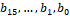 where $b_{0}$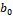 is the LSB and $b_{15}$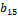 is the MSB. The bit $b_{i}$ is associated with precoders corresponding to codebook index $i_{2}=i$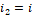. When $b_{i}$ is zero, the randomly selected precoder for CQI calculation is not allowed to correspond to any precoder associated with the bit $b_{i}$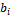.
Table 5.2.2.2.1-2: Supported configurations of and 
| Number of CSI-RS antenna ports,  |  |  |
| --- | --- | --- |
|  |  |  |
| 4 | (2,1) | (4,1) |
| 8 | (2,2) | (4,4) |
|  | (4,1) | (4,1) |
| 12 | (3,2) | (4,4) |
|  | (6,1) | (4,1) |
| 16 | (4,2) | (4,4) |
|  | (8,1) | (4,1) |
| 24 | (4,3) | (4,4) |
|  | (6,2) | (4,4) |
|  | (12,1) | (4,1) |
| 32 | (4,4) | (4,4) |
|  | (8,2) | (4,4) |
|  | (16,1) | (4,1) |

Table 5.2.2.2.1-3: Mapping of  to  and  for 2-layer CSI reporting
|  |  |  |  |  |  |  |  |  |
| --- | --- | --- | --- | --- | --- | --- | --- | --- |
|  |  |  |  |  |  |  |  |  |
| 0 | 0 | 0 | 0 | 0 | 0 | 0 | 0 | 0 |
| 1 |  | 0 |  | 0 |  | 0 |  | 0 |
| 2 | 0 |  | 0 |  |  |  |  | 0 |
| 3 |  | 0 |  |  |  |  |  | 0 |

Table 5.2.2.2.1-4: Mapping of  to  and  for 3-layer and 4-layer CSI reporting when 
|  |  |  |  |  |  |  |  |  |  |  |
| --- | --- | --- | --- | --- | --- | --- | --- | --- | --- | --- |
|  |  |  |  |  |  |  |  |  |  |  |
| 0 |  | 0 |  | 0 |  | 0 |  | 0 |  | 0 |
| 1 |  |  |  | 0 |  | 0 | 0 |  | 0 |  |
| 2 |  |  |  | 0 |  | 0 |  |  |  |  |
| 3 |  |  |  |  |  | 0 |  |  |  | 0 |

Table 5.2.2.2.1-5: Codebook for 1-layer CSI reporting using antenna ports 3000 to 2999+PCSI-RS
| codebookMode = 1 |  |  |  |
| --- | --- | --- | --- |
|  |  |  |  |
|  |  |  |  |
| where . |  |  |  |

| codebookMode = 2,  |  |  |  |  |  |
| --- | --- | --- | --- | --- | --- |
|  |  |  |  |  |  |
|  |  | 0 | 1 | 2 | 3 |
|  |  |  |  |  |  |
|  |  |  |  |  |  |
|  |  | 4 | 5 | 6 | 7 |
|  |  |  |  |  |  |
|  |  |  |  |  |  |
|  |  | 8 | 9 | 10 | 11 |
|  |  |  |  |  |  |
|  |  |  |  |  |  |
|  |  | 12 | 13 | 14 | 15 |
|  |  |  |  |  |  |
| where . |  |  |  |  |  |

| codebookMode = 2,  |  |  |  |  |  |
| --- | --- | --- | --- | --- | --- |
|  |  |  |  |  |  |
|  |  | 0 | 1 | 2 | 3 |
|  |  |  |  |  |  |
|  |  |  |  |  |  |
|  |  | 4 | 5 | 6 | 7 |
|  |  |  |  |  |  |
|  |  |  |  |  |  |
|  |  | 8 | 9 | 10 | 11 |
|  |  |  |  |  |  |
|  |  |  |  |  |  |
|  |  | 12 | 13 | 14 | 15 |
|  |  |  |  |  |  |
| where . |  |  |  |  |  |

Table 5.2.2.2.1-6: Codebook for 2-layer CSI reporting using antenna ports 3000 to 2999+PCSI-RS
| codebookMode = 1 |  |  |  |
| --- | --- | --- | --- |
|  |  |  |  |
|  |  |  |  |
| where . and the mapping from  to  and  is given in Table 5.2.2.2.1-3. |  |  |  |

| codebookMode = 2,  |  |  |  |
| --- | --- | --- | --- |
|  |  |  |  |
|  |  | 0 | 1 |
|  |  |  |  |
|  |  |  |  |
|  |  | 2 | 3 |
|  |  |  |  |
|  |  |  |  |
|  |  | 4 | 5 |
|  |  |  |  |
|  |  |  |  |
|  |  | 6 | 7 |
|  |  |  |  |
| where . and the mapping from  to  and  is given in Table 5.2.2.2.1-3. |  |  |  |

| codebookMode = 2,  |  |  |  |  |  |
| --- | --- | --- | --- | --- | --- |
|  |  |  |  |  |  |
|  |  | 0 | 1 | 2 | 3 |
|  |  |  |  |  |  |
|  |  |  |  |  |  |
|  |  | 4 | 5 | 6 | 7 |
|  |  |  |  |  |  |
| where . and the mapping from  to  is given in Table 5.2.2.2.1-3. |  |  |  |  |  |

Table 5.2.2.2.1-7: Codebook for 3-layer CSI reporting using antenna ports 3000 to 2999+PCSI-RS
| codebookMode = 1-2,  |  |  |  |
| --- | --- | --- | --- |
|  |  |  |  |
|  |  |  |  |
| where . and the mapping from  to  and  is given in Table 5.2.2.2.1-4. |  |  |  |

| codebookMode = 1-2,  |  |  |  |  |
| --- | --- | --- | --- | --- |
|  |  |  |  |  |
|  |  |  |  |  |
| where . |  |  |  |  |

Table 5.2.2.2.1-8: Codebook for 4-layer CSI reporting using antenna ports 3000 to 2999+PCSI-RS
| codebookMode = 1-2,  |  |  |  |
| --- | --- | --- | --- |
|  |  |  |  |
|  |  |  |  |
| where . and the mapping from  to  and  is given in Table 5.2.2.2.1-4. |  |  |  |

| codebookMode = 1-2,  |  |  |  |  |
| --- | --- | --- | --- | --- |
|  |  |  |  |  |
|  |  |  |  |  |
| where . |  |  |  |  |

Table 5.2.2.2.1-9: Codebook for 5-layer CSI reporting using antenna ports 3000 to 2999+PCSI-RS
| codebookMode = 1-2 |  |  |  |  |
| --- | --- | --- | --- | --- |
|  |  |  |  |  |
|  |  |  |  |  |
|  |  |  |  |  |
| where . |  |  |  |  |

Table 5.2.2.2.1-10: Codebook for 6-layer CSI reporting using antenna ports 3000 to 2999+PCSI-RS
| codebookMode = 1-2 |  |  |  |  |
| --- | --- | --- | --- | --- |
|  |  |  |  |  |
|  |  |  |  |  |
|  |  |  |  |  |
| where . |  |  |  |  |

Table 5.2.2.2.1-11: Codebook for 7-layer CSI reporting using antenna ports 3000 to 2999+PCSI-RS
| codebookMode = 1-2 |  |  |  |  |
| --- | --- | --- | --- | --- |
|  |  |  |  |  |
|  |  |  |  |  |
|  |  |  |  |  |
|  |  |  |  |  |
|  |  |  |  |  |
|  |  |  |  |  |
| where . |  |  |  |  |

Table 5.2.2.2.1-12: Codebook for 8-layer CSI reporting using antenna ports 3000 to 2999+PCSI-RS
| codebookMode = 1-2 |  |  |  |  |
| --- | --- | --- | --- | --- |
|  |  |  |  |  |
|  |  |  |  |  |
|  |  |  |  |  |
|  |  |  |  |  |
|  |  |  |  |  |
|  |  |  |  |  |
| where . |  |  |  |  |

##### 5.2.2.2.1a Refined Type I Single-Panel Codebook
For 48, 64 and 128 antenna ports, obtained by aggregating $K$ CSI-RS resources for channel measurement, and the UE configured with higher layer parameter codebookType set to 'typeI-SinglePanel-r19'
- The values of $N_{1}$ and $N_{2}$ are configured with the higher layer parameter n1-n2-r19. The supported configurations of $\left( N_{1},N_{2} \right)$, for a given number of CSI-RS ports, are given in Table 5.2.2.2.1a-1, for which $O_{1}=O_{2}=4$. The number of CSI-RS ports, $P_{CSI-RS}$, is $2N_{1}N_{2}$.
Table 5.2.2.2.1a-1: Supported configurations of $(N_{1},N_{2})$
| Number of CSI-RS antenna ports, $P_{CSI-RS}$ | $$(N_{1},N_{2})$$ |
| --- | --- |
|  |  |
| 48 | (8,3) |
|  | (6,4) |
| 64 | (16,2) |
|  | (8,4) |
| 128 | (16,4) |
|  | (8,8) |

- The port index, $p^{'}=0,1,…,P_{CSI-RS}-1$, is described in Clause 7.4.1.5.3 of [4, TS 38.211].
For the UE configured with higher layer parameter codebookMode-r19 set to 'modeA', each PMI value corresponds to the codebook indices $i_{1},i_{2}$, where the composite codebook index $i_{1}$, for reported rank $\upsilon$, is defined by
$$i_{1}=\left\{ \begin{matrix}\begin{matrix}\left[ \begin{matrix}i_{1,1} & i_{1,2}\end{matrix} \right] & \upsilon =1 \\ \left[ \begin{matrix}i_{1,1} & i_{1,2} & i_{1,3}\end{matrix} \right] & \upsilon =2,3,4\end{matrix} \\ \begin{matrix}\left[ \begin{matrix}\begin{matrix}i_{1,1} & i_{1,2} & i_{1,3}\end{matrix} & \begin{matrix}i_{1,1,2} & i_{1,2,2}\end{matrix} & \begin{matrix}i_{1,1,3} & i_{1,2,3}\end{matrix}\end{matrix} \right] & \upsilon =5,6 \\ \left[ \begin{matrix}\begin{matrix}\begin{matrix}i_{1,1} & i_{1,2} & i_{1,3}\end{matrix} & \begin{matrix}i_{1,1,2} & i_{1,2,2}\end{matrix}\end{matrix} & \begin{matrix}\begin{matrix}i_{1,1,3} & i_{1,2,3}\end{matrix} & \begin{matrix}i_{1,1,4} & i_{1,2,4}\end{matrix}\end{matrix}\end{matrix} \right] & \upsilon =7,8\end{matrix}\end{matrix} \right.$$
The codebook for 1-8 layers is given in Table 5.2.2.2.1a-4 with the value range of $i_{1}$ and $i_{2}$ given in Table 5.2.2.2.1a-2. The mapping from $i_{1,3}$ to $k_{1}$ and $k_{2}$ for 2-layer, 3-layer and 4-layer reporting, and to $(o_{1},k_{1})$ and $(o_{2},k_{2})$ for 5-layer, 6-layer, 7-layer and 8-layer reporting is given in Table 5.2.2.2.1a-3. The quantities $\phi _{n}$, $u_{m}$, $t_{l}$ and $v_{l,m}$ are given by
$$\phi _{n}=e^{j\frac{\pi n}{2}}$$
$$u_{m}=\left[ \begin{matrix}1 & e^{j\frac{2\pi m}{O_{2}N_{2}}} & ⋯ & e^{j\frac{2\pi m(N_{2}-1)}{O_{2}N_{2}}}\end{matrix} \right], t_{l}=\left[ \begin{matrix}1 & e^{j\frac{2\pi l}{O_{1}N_{1}}} & ⋯ & e^{j\frac{2\pi l\left( N_{1}-1 \right)}{O_{1}N_{1}}}\end{matrix} \right]$$
$$v_{l,m}=\left[ \begin{matrix}u_{m} & e^{j\frac{2\pi l}{O_{1}N_{1}}}u_{m} & ⋯ & e^{j\frac{2\pi l\left( N_{1}-1 \right)}{O_{1}N_{1}}}u_{m}\end{matrix} \right]^{T}$$
The reported values of $(i_{1,1}, i_{1,2})$, $(i_{1,1,2},i_{1,2,2})$, $(i_{1,1,3},i_{1,2,3})$, $(i_{1,1,4}, i_{1,2,4})$ correspond to vectors $v_{l,m},v_{l^{'},m^{'}},v_{l^{''},m^{''}}, v_{l^{'''},m^{'''}}$ that are orthogonal in at least one dimension such that for any pair of vectors, $v_{l_{1},m_{1}}$ and $v_{l_{2},m_{2}}$, with $l_{1},l_{2}\in \left\{ l,l^{'},l^{''},l^{'''} \right\}$, $l_{1}\neq l_{2}$, and $m_{1},m_{2}\in \left\{ m,m^{'},m^{''},m^{'''} \right\}$, $m_{1}\neq m_{2}$, $u_{m_{1}}$ and $u_{m_{2}}$ are orthogonal and/or $t_{l_{1}}$ and $t_{l_{2}}$ are orthogonal.

Table 5.2.2.2.1a-2: Value range of $i_{1}$ and $i_{2}$ for 1-8 layers and codebookMode-r19 = 'modeA'
| Layers | codebookMode-r19 = 'modeA' |  |  |  |  |  |
| --- | --- | --- | --- | --- | --- | --- |
| $$\upsilon =1$$ | $$i_{1,1}$$ | $$i_{1,2}$$ |  | $$i_{2}$$ |  |  |
|  | $$0,…,N_{1}O_{1}-1$$ | $$0,…,N_{2}O_{2}-1$$ |  | 0,1,2,3 |  |  |
| $$\upsilon =2,3,4$$ | $$i_{1,1}$$ | $$i_{1,2}$$ | $$i_{1,3}$$ |  | $$i_{2}$$ |  |
|  | $$0,…,N_{1}O_{1}-1$$ | $$0,…,N_{2}O_{2}-1$$ | 0,1,2,3 |  | 0,1 |  |
| $$\upsilon =5,6,7,8$$ | $$i_{1,1}$$ | $$i_{1,2}$$ | $$i_{1,3}$$ | $$i_{1,1,2}$$ $$i_{1,1,3}$$ $$i_{1,1,4}$$ | $$i_{1,2,2}$$ $$i_{1,2,3}$$ $$i_{1,2,4}$$ | $$i_{2}$$ |
|  | $$0,…,N_{1}O_{1}-1$$ | $$0,…,N_{2}O_{2}-1$$ | 0 | $$0,…,N_{1}-1$$ | $$0,…,N_{2}O_{2}-1$$ | 0,1 |
|  |  |  | 1 | $$0,…,N_{1}O_{1}-1$$ | $$0,…,N_{2}-1$$ |  |

Table 5.2.2.2.1a-3: Mapping of $i_{1,3}$ to $k_{1}$ and $k_{2}$ for 2-4 layers, and to $(o_{1},k_{1})$ and $(o_{2},k_{2})$ for 5-8 layers and codebookMode-r19 = 'modeA'
| $$i_{1,3}$$ | $$\upsilon =2$$ | $$\upsilon =3,4$$ | $$\upsilon =5,6,7,8$$ |  |  |  |
| --- | --- | --- | --- | --- | --- | --- |
|  | $$k_{1}$$ | $$k_{2}$$ | $$k_{1}$$ | $$k_{2}$$ | $$(o_{1},k_{1})$$ | $$(o_{2},k_{2})$$ |
| 0 | 0 | 0 | $$O_{1}$$ | 0 | $$(O_{1},mod(i_{1,1},O_{1}))$$ | $$(1,0)$$ |
| 1 | $$O_{1}$$ | 0 | 0 | $$O_{2}$$ | $$(1,0)$$ | $$(O_{2},mod(i_{1,2},O_{2}))$$ |
| 2 | 0 | $$O_{2}$$ | $$O_{1}$$ | $$O_{2}$$ |  |  |
| 3 | $$2O_{1}$$ | 0 | $$2O_{1}$$ | 0 |  |  |

Table 5.2.2.2.1a-4: Codebook for 1-8 layers and codebookMode-r19 = 'modeA'
| Layers | codebookMode-r19 = 'modeA' |
| --- | --- |
| $$\upsilon =1$$ | $$W_{i_{1,1},i_{1,2},i_{2}}^{(1)}$$ |
|  | where $W_{l,m,n}^{(1)}=\frac{1}{\sqrt{P_{CSI-RS}}}\left[ \begin{matrix}v_{l,m} \\ \phi _{n}v_{l,m}\end{matrix} \right]$ |
| $$\upsilon =2$$ | $$W_{i_{1,1},i_{1,1}+k_{1},i_{1,2},i_{1,2}+k_{2},i_{2}}^{(2)}$$ |
|  | where $W_{l,l^{'},m,m^{'},n}^{(2)}=\frac{1}{\sqrt{2P_{CSI-RS}}}\left[ \begin{matrix}v_{l,m} & v_{l^{'},m^{'}} \\ \phi _{n}v_{l,m} & -\phi _{n}v_{l^{'},m^{'}}\end{matrix} \right]$ and the mapping from $i_{1,3}$ to $k_{1}$ and $k_{2}$ is given in Table 5.2.2.2.1a-3 |
| $$\upsilon =3$$ | $$W_{i_{1,1},i_{1,1}+k_{1},i_{1,2},i_{1,2}+k_{2},i_{2}}^{(3)}$$ |
|  | where $W_{l,l^{'},m,m^{'},n}^{(3)}=\frac{1}{\sqrt{3P_{CSI-RS}}}\left[ \begin{matrix}v_{l,m} & v_{l^{'},m^{'}} & v_{l,m} \\ \phi _{n}v_{l,m} & \phi _{n}v_{l^{'},m^{'}} & -\phi _{n}v_{l,m}\end{matrix} \right]$ and the mapping from $i_{1,3}$ to $k_{1}$ and $k_{2}$ is given in Table 5.2.2.2.1a-3 |
| $$\upsilon =4$$ | $$W_{i_{1,1},i_{1,1}+k_{1},i_{1,2},i_{1,2}+k_{2},i_{2}}^{(4)}$$ |
|  | where $W_{l,l^{'},m,m^{'},n}^{(4)}=\frac{1}{\sqrt{4P_{CSI-RS}}}\left[ \begin{matrix}v_{l,m} & v_{l^{'},m^{'}} & v_{l,m} & v_{l^{'},m^{'}} \\ \phi _{n}v_{l,m} & \phi _{n}v_{l^{'},m^{'}} & -\phi _{n}v_{l,m} & -\phi _{n}v_{l^{'},m^{'}}\end{matrix} \right]$ and the mapping from $i_{1,3}$ to $k_{1}$ and $k_{2}$ is given in Table 5.2.2.2.1a-3 |
| $$\upsilon =5$$ | $$W_{i_{1,1},o_{1}i_{1,1,2}+k_{1},o_{1}i_{1,1,3}+k_{1},i_{1,2},o_{2}i_{1,2,2}+k_{2},o_{2}i_{1,2,3}+k_{2},i_{2}}^{(5)}$$ |
|  | where $W_{l,l^{'},l^{''},m,m^{'},m^{''},n}^{(5)}=\frac{1}{\sqrt{5P_{CSI-RS}}}\left[ \begin{matrix}v_{l,m} & v_{l,m} & v_{l^{'},m^{'}} & v_{l^{'},m^{'}} & v_{l^{''},m^{''}} \\ \phi _{n}v_{l,m} & -\phi _{n}v_{l,m} & v_{l^{'},m^{'}} & -v_{l^{'},m^{'}} & v_{l^{''},m^{''}}\end{matrix} \right]$ and the mapping from $i_{1,3}$ to $(o_{1},k_{1})$ and $(o_{2},k_{2})$ is given in Table 5.2.2.2.1a-3 |
| $$\upsilon =6$$ | $$W_{i_{1,1},o_{1}i_{1,1,2}+k_{1},o_{1}i_{1,1,3}+k_{1},i_{1,2},o_{2}i_{1,2,2}+k_{2},o_{2}i_{1,2,3}+k_{2},i_{2}}^{(6)}$$ |
|  | where $W_{l,l^{'},l^{''},m,m^{'},m^{''},n}^{(6)}=\frac{1}{\sqrt{6P_{CSI-RS}}}\left[ \begin{matrix}v_{l,m} & v_{l,m} & v_{l^{'},m^{'}} & v_{l^{'},m^{'}} & v_{l^{''},m^{''}} & v_{l^{''},m^{''}} \\ \phi _{n}v_{l,m} & -\phi _{n}v_{l,m} & \phi _{n}v_{l^{'},m^{'}} & -\phi _{n}v_{l^{'},m^{'}} & v_{l^{''},m^{''}} & -v_{l^{''},m^{''}}\end{matrix} \right]$ and the mapping from $i_{1,3}$ to $(o_{1},k_{1})$ and $(o_{2},k_{2})$ is given in Table 5.2.2.2.1a-3 |
| $$\upsilon =7$$ | $$W_{i_{1,1},o_{1}i_{1,1,2}+k_{1},o_{1}i_{1,1,3}+k_{1},o_{1}i_{1,1,4}+k_{1},i_{1,2},o_{2}i_{1,2,2}+k_{2},o_{2}i_{1,2,3}+k_{2},o_{2}i_{1,2,4}+k_{2},i_{2}}^{(7)}$$ |
|  | where $W_{l,l^{'},l^{''},l^{'''},m,m^{'},m^{''},m^{'''},n}^{(7)}=\frac{1}{\sqrt{7P_{CSI-RS}}}\left[ \begin{matrix}v_{l,m} & v_{l,m} & v_{l^{'},m^{'}} & v_{l^{''},m^{''}} & v_{l^{''},m^{''}} & v_{l^{'''},m^{'''}} & v_{l^{'''},m^{'''}} \\ \phi _{n}v_{l,m} & -\phi _{n}v_{l,m} & \phi _{n}v_{l^{'},m^{'}} & v_{l^{''},m^{''}} & -v_{l^{''},m^{''}} & v_{l^{'''},m^{'''}} & -v_{l^{'''},m^{'''}}\end{matrix} \right]$ and the mapping from $i_{1,3}$ to $(o_{1},k_{1})$ and $(o_{2},k_{2})$ is given in Table 5.2.2.2.1a-3 |
| $$\upsilon =8$$ | $$W_{i_{1,1},o_{1}i_{1,1,2}+k_{1},o_{1}i_{1,1,3}+k_{1},o_{1}i_{1,1,4}+k_{1},i_{1,2},o_{2}i_{1,2,2}+k_{2},o_{2}i_{1,2,3}+k_{2},o_{2}i_{1,2,4}+k_{2},i_{2}}^{(8)}$$ |
|  | where $W_{l,l^{'},l^{''},l^{'''},m,m^{'},m^{''},m^{'''},n}^{(8)}=\frac{1}{\sqrt{8P_{CSI-RS}}}\left[ \begin{matrix}v_{l,m} & v_{l,m} & v_{l^{'},m^{'}} & v_{l^{'},m^{'}} & v_{l^{''},m^{''}} & v_{l^{''},m^{''}} & v_{l^{'''},m^{'''}} & v_{l^{'''},m^{'''}} \\ \phi _{n}v_{l,m} & -\phi _{n}v_{l,m} & \phi _{n}v_{l^{'},m^{'}} & -\phi _{n}v_{l^{'},m^{'}} & v_{l^{''},m^{''}} & -v_{l^{''},m^{''}} & v_{l^{'''},m^{'''}} & -v_{l^{'''},m^{'''}}\end{matrix} \right]$ and the mapping from $i_{1,3}$ to $(o_{1},k_{1})$ and $(o_{2},k_{2})$ is given in Table 5.2.2.2.1a-3 |

For a UE configured with higher layer parameter codebookMode-r19 set to 'modeB', each PMI value corresponds to the codebook indices $i_{1}$, $i_{2}$, where the composite codebook index $i_{1}$ is defined by
$$i_{1}=\left\{ \begin{matrix}\begin{matrix}\left[ \begin{matrix}i_{1,1} & i_{1,2,1}\end{matrix} \right] & \upsilon =1 \\ \left[ \begin{matrix}i_{1,1} & i_{1,2,1} & i_{1,2,2}\end{matrix} \right] & \upsilon =2\end{matrix} \\ \begin{matrix}\left[ \begin{matrix}i_{1,1} & i_{1,2,1} & i_{1,2,2} & i_{1,2,3}\end{matrix} \right] & \upsilon =3 \\ \left[ \begin{matrix}i_{1,1} & i_{1,2,1} & i_{1,2,2} & i_{1,2,3} & i_{1,2,4}\end{matrix} \right] & \upsilon =4\end{matrix} \\ \begin{matrix}\left[ \begin{matrix}i_{1,1} & i_{1,2}\end{matrix} \right] & \upsilon =5,6,7,8\end{matrix}\end{matrix} \right.$$
and the composite codebook index $i_{2}$ is defined by
$$i_{2}=\left\{ \begin{matrix}\begin{matrix}i_{2,1} & \upsilon =1 \\ \left[ \begin{matrix}i_{2,1} & i_{2,2}\end{matrix} \right] & \upsilon =2\end{matrix} \\ \begin{matrix}\left[ \begin{matrix}i_{2,1} & i_{2,2} & i_{2,3}\end{matrix} \right] & \upsilon =3 \\ \left[ \begin{matrix}i_{2,1} & i_{2,2} & i_{2,3} & i_{2,4}\end{matrix} \right] & \upsilon =4\end{matrix} \\ \begin{matrix}\left[ \begin{matrix}i_{2,1} & i_{2,2} & i_{2,3}\end{matrix} \right] & \upsilon =5,6 \\ \left[ \begin{matrix}i_{2,1} & i_{2,2} & i_{2,3} & i_{2,4}\end{matrix} \right] & \upsilon =7,8\end{matrix}\end{matrix} \right.$$
The codebook for 1-8 layers is given in Table 5.2.2.2.1a-7. The index $i_{1,1}$ is given by
$$i_{1,1}=\left[ \begin{matrix}q_{1} & q_{2}\end{matrix} \right]$$
$$q_{1}\in {0,1,…,O_{1}-1}$$
$$q_{2}\in {0,1,…,O_{2}-1}$$
The index $i_{1,2,l}$, for $l=1,…,\upsilon$, is given by
$$i_{1,2,l}\in {0,1,…,N_{1}N_{2}-1}$$
and the mapping of $i_{1,1}$ and $i_{1,2,l}$ to $m_{1}^{(l)}$ and $m_{2}^{(l)}$ is given by
$$m_{1}^{(l)}=O_{1}n_{1}^{(l)}+q_{1}$$
$$m_{2}^{(l)}=O_{2}n_{2}^{(l)}+q_{2}$$
where
$$n_{1}^{(l)}=n^{(l)}mod N_{1}$$
$$n_{2}^{(l)}=\frac{n^{\left( l \right)}-n_{1}^{\left( l \right)}}{N_{1}}$$
$$n^{(l)}=N_{1}N_{2}-1-i_{1,2,l}$$
The index $i_{1,2}$ is given by
$$i_{1,2}\in \left\{ 0,1,…,\left( \begin{matrix}N_{1}N_{2} \\ L_{G}\end{matrix} \right)-1 \right\}$$
where $L_{G}=3$ for $\upsilon =5,6$ and $L_{G}=4$ for $\upsilon =7,8$. The mapping of $i_{1,1}$ and $i_{1,2}$ to $m_{1}^{(g)}$ and $m_{2}^{(g)}$ for $g=1,…,L_{G}$ is obtained as in Clause 5.2.2.2.3, where the values of $C(x,y)$ are given in Table 5.2.2.2.5-4 and Table 5.2.2.2.1a-5.
The index $i_{2,l}$, for $l=1,…,\upsilon$ and $\upsilon =1,2,3,4$ is given by
$$i_{2,l}\in {0,1,2,3}$$
and is mapped to $c_{l}=i_{2,l}$. The mapping of index $i_{2,g}$, for $g=1,…,L_{G}$ and $\upsilon =5,6,7,8$, to $c_{l}$, with $l=1,…,\upsilon$, is given in Table 5.2.2.2.1a-6. The quantities $\phi _{c_{l}}$ and $v_{m_{1}^{\left( l \right)},m_{2}^{(l)}}$ for codebookMode-r19 = 'modeB' are the same as defined above for 'modeA'.
Table 5.2.2.2.1a-5: Combinatorial coefficients $C\left( x,y \right)$
|  |  |
| --- | --- |

Table 5.2.2.2.1a-6: Mapping of $i_{2,1}$, $i_{2,2}$, $i_{2,3}$, $i_{2,4}$ to ${c_{l}}$ for 5-8 layers and codebookMode-r19 = 'modeB'
|  |  |  |  |
| --- | --- | --- | --- |

Table 5.2.2.2.1a-7: Codebook for 1-8 layers and codebookMode-r19 = 'modeB'
| Layers | codebookMode-r19 = 'modeB' |
| --- | --- |
| $$\upsilon =1$$ | $$W_{m_{1}^{\left( 1 \right)},m_{2}^{\left( 1 \right)},c_{1}}^{(1)}=\frac{1}{\sqrt{P_{CSI-RS}}}\left[ \begin{matrix}v_{m_{1}^{\left( 1 \right)},m_{2}^{\left( 1 \right)}} \\ \phi _{c_{1}}v_{m_{1}^{\left( 1 \right)},m_{2}^{\left( 1 \right)}}\end{matrix} \right]$$ |
| $$\upsilon =2$$ | $$W_{m_{1}^{\left( 1 \right)},m_{1}^{\left( 2 \right)},m_{2}^{\left( 1 \right)},m_{2}^{\left( 2 \right)},c_{1},c_{2}}^{(2)}=\frac{1}{\sqrt{2P_{CSI-RS}}}\left[ \begin{matrix}v_{m_{1}^{\left( 1 \right)},m_{2}^{\left( 1 \right)}} & v_{m_{1}^{\left( 2 \right)},m_{2}^{\left( 2 \right)}} \\ \phi _{c_{1}}v_{m_{1}^{\left( 1 \right)},m_{2}^{\left( 1 \right)}} & \phi _{c_{2}}v_{m_{1}^{\left( 2 \right)},m_{2}^{\left( 2 \right)}}\end{matrix} \right]$$ |
| $$\upsilon =3$$ | $$W_{m_{1}^{\left( 1 \right)},m_{1}^{\left( 2 \right)},m_{1}^{\left( 3 \right)},m_{2}^{\left( 1 \right)},m_{2}^{\left( 2 \right)},m_{2}^{\left( 3 \right)},c_{1},c_{2},c_{3}}^{(3)}=\frac{1}{\sqrt{3P_{CSI-RS}}}\left[ \begin{matrix}v_{m_{1}^{\left( 1 \right)},m_{2}^{\left( 1 \right)}} & v_{m_{1}^{\left( 2 \right)},m_{2}^{\left( 2 \right)}} & v_{m_{1}^{\left( 3 \right)},m_{2}^{\left( 3 \right)}} \\ \phi _{c_{1}}v_{m_{1}^{\left( 1 \right)},m_{2}^{\left( 1 \right)}} & \phi _{c_{2}}v_{m_{1}^{\left( 2 \right)},m_{2}^{\left( 2 \right)}} & \phi _{c_{3}}v_{m_{1}^{\left( 3 \right)},m_{2}^{\left( 3 \right)}}\end{matrix} \right]$$ |
| $$\upsilon =4$$ | $$W_{m_{1}^{\left( 1 \right)},m_{1}^{\left( 2 \right)},m_{1}^{\left( 3 \right)},m_{1}^{\left( 4 \right)},m_{2}^{\left( 1 \right)},m_{2}^{\left( 2 \right)},m_{2}^{\left( 3 \right)},m_{2}^{\left( 4 \right)},c_{1},c_{2},c_{3},c_{4}}^{(4)}=\frac{1}{\sqrt{4P_{CSI-RS}}}\left[ \begin{matrix}v_{m_{1}^{\left( 1 \right)},m_{2}^{\left( 1 \right)}} & v_{m_{1}^{\left( 2 \right)},m_{2}^{\left( 2 \right)}} & v_{m_{1}^{\left( 3 \right)},m_{2}^{\left( 3 \right)}} & v_{m_{1}^{\left( 4 \right)},m_{2}^{\left( 4 \right)}} \\ \phi _{c_{1}}v_{m_{1}^{\left( 1 \right)},m_{2}^{\left( 1 \right)}} & \phi _{c_{2}}v_{m_{1}^{\left( 2 \right)},m_{2}^{\left( 2 \right)}} & \phi _{c_{3}}v_{m_{1}^{\left( 3 \right)},m_{2}^{\left( 3 \right)}} & \phi _{c_{4}}v_{m_{1}^{\left( 4 \right)},m_{2}^{\left( 4 \right)}}\end{matrix} \right]$$ |
| $$\upsilon =5$$ | $$W_{m_{1}^{\left( 1 \right)},m_{1}^{\left( 2 \right)},m_{1}^{\left( 3 \right)},m_{2}^{\left( 1 \right)},m_{2}^{\left( 2 \right)},m_{2}^{\left( 3 \right)},c_{1},c_{2},c_{3},c_{4},c_{5}}^{(5)}=\frac{1}{\sqrt{5P_{CSI-RS}}}\left[ \begin{matrix}v_{m_{1}^{\left( 1 \right)},m_{2}^{\left( 1 \right)}} & v_{m_{1}^{\left( 1 \right)},m_{2}^{\left( 1 \right)}} & v_{m_{1}^{\left( 2 \right)},m_{2}^{\left( 2 \right)}} & v_{m_{1}^{\left( 2 \right)},m_{2}^{\left( 2 \right)}} & v_{m_{1}^{\left( 3 \right)},m_{2}^{\left( 3 \right)}} \\ \phi _{c_{1}}v_{m_{1}^{\left( 1 \right)},m_{2}^{\left( 1 \right)}} & \phi _{c_{2}}v_{m_{1}^{\left( 1 \right)},m_{2}^{\left( 1 \right)}} & \phi _{c_{3}}v_{m_{1}^{\left( 2 \right)},m_{2}^{\left( 2 \right)}} & \phi _{c_{4}}v_{m_{1}^{\left( 2 \right)},m_{2}^{\left( 2 \right)}} & \phi _{c_{5}}v_{m_{1}^{\left( 3 \right)},m_{2}^{\left( 3 \right)}}\end{matrix} \right]$$ |
| $$\upsilon =6$$ | $$W_{m_{1}^{\left( 1 \right)},m_{1}^{\left( 2 \right)},m_{1}^{\left( 3 \right)},m_{2}^{\left( 1 \right)},m_{2}^{\left( 2 \right)},m_{2}^{\left( 3 \right)},c_{1},c_{2},c_{3},c_{4},c_{5},c_{6}}^{(6)}=\frac{1}{\sqrt{6P_{CSI-RS}}}\left[ \begin{matrix}v_{m_{1}^{\left( 1 \right)},m_{2}^{\left( 1 \right)}} & v_{m_{1}^{\left( 1 \right)},m_{2}^{\left( 1 \right)}} & v_{m_{1}^{\left( 2 \right)},m_{2}^{\left( 2 \right)}} & v_{m_{1}^{\left( 2 \right)},m_{2}^{\left( 2 \right)}} & v_{m_{1}^{\left( 3 \right)},m_{2}^{\left( 3 \right)}} & v_{m_{1}^{\left( 3 \right)},m_{2}^{\left( 3 \right)}} \\ \phi _{c_{1}}v_{m_{1}^{\left( 1 \right)},m_{2}^{\left( 1 \right)}} & \phi _{c_{2}}v_{m_{1}^{\left( 1 \right)},m_{2}^{\left( 1 \right)}} & \phi _{c_{3}}v_{m_{1}^{\left( 2 \right)},m_{2}^{\left( 2 \right)}} & \phi _{c_{4}}v_{m_{1}^{\left( 2 \right)},m_{2}^{\left( 2 \right)}} & \phi _{c_{5}}v_{m_{1}^{\left( 3 \right)},m_{2}^{\left( 3 \right)}} & \phi _{c_{6}}v_{m_{1}^{\left( 3 \right)},m_{2}^{\left( 3 \right)}}\end{matrix} \right]$$ |
| $$\upsilon =7$$ | $$W_{m_{1}^{\left( 1 \right)},m_{1}^{\left( 2 \right)},m_{1}^{\left( 3 \right)},m_{1}^{\left( 4 \right)},m_{2}^{\left( 1 \right)},m_{2}^{\left( 2 \right)},m_{2}^{\left( 3 \right)},m_{2}^{\left( 4 \right)},c_{1},c_{2},c_{3},c_{4},c_{5},c_{6},c_{7}}^{\left( 7 \right)}=\frac{1}{\sqrt{7P_{CSI-RS}}}\left[ \begin{matrix}v_{m_{1}^{\left( 1 \right)},m_{2}^{\left( 1 \right)}} & v_{m_{1}^{\left( 1 \right)},m_{2}^{\left( 1 \right)}} & v_{m_{1}^{\left( 2 \right)},m_{2}^{\left( 2 \right)}} & v_{m_{1}^{\left( 3 \right)},m_{2}^{\left( 3 \right)}} & v_{m_{1}^{\left( 3 \right)},m_{2}^{\left( 3 \right)}} & v_{m_{1}^{\left( 4 \right)},m_{2}^{\left( 4 \right)}} \\ \phi _{c_{1}}v_{m_{1}^{\left( 1 \right)},m_{2}^{\left( 1 \right)}} & \phi _{c_{2}}v_{m_{1}^{\left( 1 \right)},m_{2}^{\left( 1 \right)}} & \phi _{c_{3}}v_{m_{1}^{\left( 2 \right)},m_{2}^{\left( 2 \right)}} & \phi _{c_{4}}v_{m_{1}^{\left( 3 \right)},m_{2}^{\left( 3 \right)}} & \phi _{c_{5}}v_{m_{1}^{\left( 3 \right)},m_{2}^{\left( 3 \right)}} & \phi _{c_{6}}v_{m_{1}^{\left( 4 \right)},m_{2}^{\left( 4 \right)}}\end{matrix} \right.$$ $$\left. \begin{matrix}v_{m_{1}^{\left( 4 \right)},m_{2}^{\left( 4 \right)}} \\ \phi _{c_{7}}v_{m_{1}^{\left( 4 \right)},m_{2}^{\left( 4 \right)}}\end{matrix} \right]$$ |
| $$\upsilon =8$$ | $$W_{m_{1}^{\left( 1 \right)},m_{1}^{\left( 2 \right)},m_{1}^{\left( 3 \right)},m_{1}^{\left( 4 \right)},m_{2}^{\left( 1 \right)},m_{2}^{\left( 2 \right)},m_{2}^{\left( 3 \right)},m_{2}^{\left( 4 \right)},c_{1},c_{2},c_{3},c_{4},c_{5},c_{6},c_{7},c_{8}}^{\left( 8 \right)}=\frac{1}{\sqrt{8P_{CSI-RS}}}\left[ \begin{matrix}v_{m_{1}^{\left( 1 \right)},m_{2}^{\left( 1 \right)}} & v_{m_{1}^{\left( 1 \right)},m_{2}^{\left( 1 \right)}} & v_{m_{1}^{\left( 2 \right)},m_{2}^{\left( 2 \right)}} & v_{m_{1}^{\left( 2 \right)},m_{2}^{\left( 2 \right)}} & v_{m_{1}^{\left( 3 \right)},m_{2}^{\left( 3 \right)}} & v_{m_{1}^{\left( 3 \right)},m_{2}^{\left( 3 \right)}} \\ \phi _{c_{1}}v_{m_{1}^{\left( 1 \right)},m_{2}^{\left( 1 \right)}} & \phi _{c_{2}}v_{m_{1}^{\left( 1 \right)},m_{2}^{\left( 1 \right)}} & \phi _{c_{3}}v_{m_{1}^{\left( 2 \right)},m_{2}^{\left( 2 \right)}} & \phi _{c_{4}}v_{m_{1}^{\left( 2 \right)},m_{2}^{\left( 2 \right)}} & \phi _{c_{5}}v_{m_{1}^{\left( 3 \right)},m_{2}^{\left( 3 \right)}} & \phi _{c_{6}}v_{m_{1}^{\left( 3 \right)},m_{2}^{\left( 3 \right)}}\end{matrix} \right.$$ $$\left. \begin{matrix}v_{m_{1}^{\left( 4 \right)},m_{2}^{\left( 4 \right)}} & v_{m_{1}^{\left( 4 \right)},m_{2}^{\left( 4 \right)}} \\ \phi _{c_{7}}v_{m_{1}^{\left( 4 \right)},m_{2}^{\left( 4 \right)}} & \phi _{c_{8}}v_{m_{1}^{\left( 4 \right)},m_{2}^{\left( 4 \right)}}\end{matrix} \right]$$ |

For a UE configured with higher layer parameter codebookType set to 'typeI-SinglePanel-r19', the bitmap parameter typeI-SinglePanelRI-Restriction-r19 forms the bit sequence $r_{7},…,r_{1},r_{0}$, where $r_{0}$ is the LSB and $r_{7}$ is the MSB. When $r_{i}$ is zero, $i\in {0,1,…,7}$, PMI and RI reporting are not allowed to correspond to any precoder associated with $\upsilon =i+1$ layers. The bitmap parameter typeI-CodebookSubsetRestriction-r19 forms the bit sequence $a_{A_{c}-1},…,a_{1},a_{0}$, where $a_{0}$ is the LSB and $a_{A_{c}-1}$ is the MSB and the number of bits is given by $A_{c}=N_{1}O_{1}N_{2}O_{2}/\left( X_{1}^{(c)}X_{2}^{(c)} \right)$, where the values $\left( X_{1}^{(c)},X_{2}^{(c)} \right)\in {(1,1), (2,1), (2,2), (4,1), (4,2), (4,4)}$ are configured by the higher layer parameters TypeI-X1-X2-CBSR-r19 and TypeI-X1-X2-CBSR-r19, respectively. A bit value of zero for bit $a_{\frac{N_{2}O_{2}}{X_{2}^{(c)}}x_{1}+x_{2}}$ indicates that PMI reporting is not allowed to correspond to any precoder associated with vector group $G_{a}(x_{1},x_{2})$, $x_{1}=0,…,\frac{N_{1}O_{1}}{X_{1}^{(c)}}-1$, $x_{2}=0,…,\frac{N_{2}O_{2}}{X_{2}^{(c)}}-1$, given by
$$G_{a}\left( x_{1},x_{2} \right)=\left\{ v_{X_{1}^{(c)}O_{1}x_{1}+l,X_{2}^{(c)}O_{2}x_{2}+m}:l=0,1,…,X_{1}^{\left( c \right)}O_{1}-1;m=0,1,…,X_{2}^{\left( c \right)}O_{2}-1 \right\}.$$
The bitmap parameter typeI-softScalingRanks1-2-r19 forms the bit sequence $b_{3A_{s}-1},…,b_{1},b_{0}$, where $b_{0}$ is the LSB and $b_{3A_{s}-1}$ is the MSB and the number of bits is given by $B_{s}=3N_{1}O_{1}N_{2}O_{2}/\left( X_{1}^{(s)}X_{2}^{(s)} \right)$, where the values $\left( X_{1}^{(s)},X_{2}^{(s)} \right)\in {\left( 2,1 \right), \left( 2,2 \right), \left( 4,1 \right), \left( 4,2 \right), \left( 4,4 \right), (8,1)}$ are configured by the higher layer parameters TypeI-X1-X2-SoftScalingRank-r19 and TypeI-X1-X2-SoftScalingRank-r19, respectively. Bits $b_{3\left( \frac{N_{2}O_{2}}{X_{2}^{(s)}}x_{1}+x_{2} \right)+2}b_{3\left( \frac{N_{2}O_{2}}{X_{2}^{(s)}}x_{1}+x_{2} \right)+1}b_{3\left( \frac{N_{2}O_{2}}{X_{2}^{(s)}}x_{1}+x_{2} \right)}$ indicate a scaling factor, $s_{x_{1},x_{2}}$, for vector group $G_{s}(x_{1},x_{2})$, $x_{1}=0,…,\frac{N_{1}O_{1}}{X_{1}^{(s)}}-1$, $x_{2}=0,…,\frac{N_{2}O_{2}}{X_{2}^{(s)}}-1$, given by
$$G_{s}\left( x_{1},x_{2} \right)=\left\{ v_{X_{1}^{\left( s \right)}x_{1}+l_{s},X_{2}^{\left( s \right)}x_{2}+m_{s}}:l_{s}=0,1,…,X_{1}^{\left( s \right)}-1;m_{s}=0,1,…,X_{2}^{\left( s \right)}-1 \right\}$$
The mapping from bits $b_{3\left( \frac{N_{2}O_{2}}{X_{2}^{(s)}}x_{1}+x_{2} \right)+2}b_{3\left( \frac{N_{2}O_{2}}{X_{2}^{(s)}}x_{1}+x_{2} \right)+1}b_{3\left( \frac{N_{2}O_{2}}{X_{2}^{(s)}}x_{1}+x_{2} \right)}$ to $s_{x_{1},x_{2}}$ is given in Table 5.2.2.2.1a-8.
Table 5.2.2.2.1a-8: Configurable scaling factor $s_{x_{1},x_{2}}$ for restricted vector group $G_{s}(x_{1},x_{2})$
| Bits $$b_{3\left( \frac{N_{2}O_{2}}{X_{2}^{(s)}}x_{1}+x_{2} \right)+2}b_{3\left( \frac{N_{2}O_{2}}{X_{2}^{(s)}}x_{1}+x_{2} \right)+1}b_{3\left( \frac{N_{2}O_{2}}{X_{2}^{(s)}}x_{1}+x_{2} \right)}$$ | Scaling factor $$s_{x_{1},x_{2}}$$ |
| --- | --- |
| 000 | $$\frac{1}{4}$$ |
| 001 | $$\frac{1}{2\sqrt{3}}$$ |
| 010 | $$\frac{1}{2\sqrt{2}}$$ |
| 011 | $$\frac{1}{\sqrt{6}}$$ |
| 100 | $$\frac{1}{2}$$ |
| 101 | $$\frac{1}{\sqrt{3}}$$ |
| 110 | $$\frac{1}{\sqrt{2}}$$ |
| 111 | 1 |

##### 5.2.2.2.2 Type I Multi-Panel Codebook
For 8 antenna ports {3000, 3001, …, 3007}, 16 antenna ports {3000, 3001, …, 3015}, and 32 antenna ports {3000, 3001, …, 3031}, and the UE configured with higher layer parameter codebookType set to 'typeI-MultiPanel',
- The values of , and  are configured with the higher layer parameters ng-n1-n2. The supported configurations of  for a given number of CSI-RS ports and the corresponding values of  are given in Table 5.2.2.2.2-1. The number of CSI-RS ports, , is .
- When , codebookMode shall be set to either '1' or '2'. When , codebookMode shall be set to '1'.
The bitmap parameter ng-n1-n2 forms the bit sequence  where  is the LSB and  is the MSB and where a bit value of zero indicates that PMI reporting is not allowed to correspond to any precoder associated with the bit. The number of bits is given by . Bit  is associated with all precoders based on the quantity , , , as defined below. The bitmap parameter ri‑Restriction forms the bit sequence  where  is the LSB and  is the MSB. When  is zero, , PMI and RI reporting are not allowed to correspond to any precoder associated with  layers.
Table 5.2.2.2.2-1: Supported configurations of  and 
| Number of CSI-RS antenna ports,  |  |  |
| --- | --- | --- |
|  |  |  |
| 8 | (2,2,1) | (4,1) |
| 16 | (2,4,1) | (4,1) |
|  | (4,2,1) | (4,1) |
|  | (2,2,2) | (4,4) |
| 32 | (2,8,1) | (4,1) |
|  | (4,4,1) | (4,1) |
|  | (2,4,2) | (4,4) |
|  | (4,2,2) | (4,4) |

Each PMI value corresponds to the codebook indices  and , where  is the vector

and  is the associated RI value. When codebookMode is set to '1',  is
.
When codebookMode is set to '2',  and  are
.
The mapping from  to  and  for 2-layer reporting is given in Table 5.2.2.2.1-3. The mapping from  to  and  for 3-layer and 4-layer reporting is given in Table 5.2.2.2.2-2.
- UE shall only use  and shall not report  if the value of N2 is 1.
Table 5.2.2.2.2-2: Mapping of  to  and  for 3-layer and 4-layer CSI reporting
|  |  |  |  |  |  |  |  |  |  |  |
| --- | --- | --- | --- | --- | --- | --- | --- | --- | --- | --- |
|  |  |  |  |  |  |  |  |  |  |  |
| 0 |  | 0 |  | 0 |  | 0 |  | 0 |  | 0 |
| 1 |  |  |  | 0 |  | 0 | 0 |  | 0 |  |
| 2 |  |  |  | 0 |  | 0 |  |  |  |  |
| 3 |  |  |  |  |  | 0 |  |  |  | 0 |

Several quantities are used to define the codebook elements. The quantities , , , , and  are given by

Furthermore, the quantities  and  () are given by

where
,
and the quantities  and  () are given by

where
.
The codebooks for 1-4 layers are given respectively in Tables 5.2.2.2.2-3, 5.2.2.2.2-4, 5.2.2.2.2-5, and 5.2.2.2.2-6.
Table 5.2.2.2.2-3: Codebook for 1-layer CSI reporting using antenna ports 3000 to 2999+PCSI-RS
| codebookMode = 1,  |  |  |  |  |
| --- | --- | --- | --- | --- |
|  |  | ,  |  |  |
|  |  |  |  |  |
| where . |  |  |  |  |

| codebookMode = 2,  |  |  |  |  |  |
| --- | --- | --- | --- | --- | --- |
|  |  |  |  |  |  |
|  |  |  |  |  |  |
| where . |  |  |  |  |  |

Table 5.2.2.2.2-4: Codebook for 2-layer CSI reporting using antenna ports 3000 to 2999+PCSI-RS
| codebookMode = 1,  |  |  |  |  |
| --- | --- | --- | --- | --- |
|  |  | ,  |  |  |
|  |  |  |  |  |
| where  and the mapping from  to  and  is given in Table 5.2.2.2.1-3. |  |  |  |  |

| codebookMode = 2,  |  |  |  |  |
| --- | --- | --- | --- | --- |
|  |  |  |  |  |
|  |  |  |  |  |
| where  and the mapping from  to  and  is given in Table 5.2.2.2.1-3. |  |  |  |  |

Table 5.2.2.2.2-5: Codebook for 3-layer CSI reporting using antenna ports 3000 to 2999+PCSI-RS
| codebookMode = 1,  |  |  |  |  |
| --- | --- | --- | --- | --- |
|  |  | ,  |  |  |
|  |  |  |  |  |
| where  and the mapping from  to  and  is given in Table 5.2.2.2.2-2. |  |  |  |  |

| codebookMode = 2,  |  |  |  |  |
| --- | --- | --- | --- | --- |
|  |  |  |  |  |
|  |  |  |  |  |
| where  and the mapping from  to  and  is given in Table 5.2.2.2.2-2. |  |  |  |  |

Table 5.2.2.2.2-6: Codebook for 4-layer CSI reporting using antenna ports 3000 to 2999+PCSI-RS
| codebookMode = 1,  |  |  |  |  |
| --- | --- | --- | --- | --- |
|  |  | ,  |  |  |
|  |  |  |  |  |
| where  and the mapping from  to  and  is given in Table 5.2.2.2.2-2. |  |  |  |  |

| codebookMode = 2,  |  |  |  |  |
| --- | --- | --- | --- | --- |
|  |  |  |  |  |
|  |  |  |  |  |
| where  and the mapping from  to  and  is given in Table 5.2.2.2.2-2. |  |  |  |  |

##### 5.2.2.2.2a Refined Type I Multi-Panel Codebook
For 48, 64 and 128 antenna ports, obtained by aggregating $K$ CSI-RS resources for channel measurement, and the UE configured with higher layer parameter codebookType set to 'typeI-MultiPanel-r19'
- The values of $N_{g}$, $N_{1}$ and $N_{2}$ are configured with the higher layer parameter ng-n1-n2-cbsr-r19, where $N_{g}=K$ is the number of  CSI-RS resources configured in the resource set for channel measurement. The supported configurations of $(N_{g},N_{1},N_{2})$, for a given number of CSI-RS ports, and the corresponding values of $(O_{1},O_{2})$ are given in Table 5.2.2.2.2a-1. The number of CSI-RS ports, $P_{CSI-RS}$, is $2N_{g}N_{1}N_{2}$.
The bitmap parameter ng-n1-n2-cbsr-r19 forms the bit sequence $a_{A_{c}-1},…,a_{1},a_{0}$, where $a_{0}$ is the LSB and $a_{A_{c}-1}$ is the MSB and where a bit value of zero indicates that PMI reporting is not allowed to correspond to any precoder associated with the bit. The number of bits is given by $A_{c}=N_{1}O_{1}N_{2}O_{2}$. Bit $a_{N_{2}O_{2}l+m}$ is associated with all precoders based on the quantity $v_{l,m}$, $l=0,…,N_{1}O_{1}-1$, $m=0,…,N_{2}O_{2}-1$, as defined below. The bitmap parameter ri-Restriction-r19 forms the bit sequence $r_{3},…,r_{1},r_{0}$, where $r_{0}$ is the LSB and $r_{3}$ is the MSB. When $r_{i}$ is zero, $i\in {0,1,…,3}$, PMI and RI reporting are not allowed to correspond to any precoder associated with $\upsilon =i+1$ layers.
Table 5.2.2.2.2a-1: Supported configurations of $(N_{g},N_{1},N_{2})$ and $(O_{1},O_{2})$
| Number of CSI-RS antenna ports, $P_{CSI-RS}$ | $$(N_{g},N_{1},N_{2})$$ | $$(O_{1},O_{2})$$ |
| --- | --- | --- |
| 48 | (2,4,3) | (4,4) |
|  | (2,6,2) | (4,4) |
| 64 | (2,4,4) | (4,4) |
|  | (2,8,2) | (4,4) |
|  | (4,4,2) | (4,4) |
| 128 | (4,4,4) | (4,4) |
|  | (4,8,2) | (4,4) |

Each PMI value corresponds to the codebook indices $i_{1}$ and $i_{2}$, where the composite index $i_{1}$, for reported rank $\upsilon$, is given by
$$i_{1}=\left\{ \begin{matrix}\left[ \begin{matrix}i_{1,1} & i_{1,2} & i_{1,4}\end{matrix} \right] & \upsilon =1 \\ \left[ \begin{matrix}i_{1,1} & i_{1,2} & i_{1,3} & i_{1,4}\end{matrix} \right] & \upsilon \in {2,3,4}\end{matrix} \right.$$
where $i_{1,1}$, $i_{1,2}$, $i_{1,3}$, $i_{1,4}$, for $N_{g}\in {2,4}$, are given by
$$i_{1,1}=\left[ \begin{matrix}i_{1,1,1} & ⋯ & i_{1,1,N_{g}}\end{matrix} \right]$$
$$i_{1,2}=\left[ \begin{matrix}i_{1,2,1} & ⋯ & i_{1,2,N_{g}}\end{matrix} \right]$$
$$i_{1,3}=\left[ \begin{matrix}i_{1,3,1} & ⋯ & i_{1,3,N_{g}}\end{matrix} \right]$$
$$i_{1,4}=\left\{ \begin{matrix}i_{1,4,1} & N_{g}=2 \\ \left[ \begin{matrix}i_{1,4,1} & i_{1,4,2} & i_{1,4,3}\end{matrix} \right] & N_{g}=4\end{matrix} \right.$$
The index $i_{2}$ is given by
$i_{2}=\left[ \begin{matrix}i_{2,1} & ⋯ & i_{2,N_{g}}\end{matrix} \right]$.
The mapping from $i_{1,3,j}$ to $k_{1,j}$ and $k_{2,j}$, for $j=1,…,N_{g}$ for 2-layer, 3-layer and 4-layer reporting is given in Table 5.2.2.2.2a-2
Table 5.2.2.2.2a-2: Mapping of $i_{1,3,j}$ to $k_{1,j}$ and $k_{2,j}$ for $j=1,…,N_{g}$, for 2-4 layers
| $$i_{1,3,j}$$ | $$\upsilon =2$$ | $$\upsilon =3,4$$ |  |  |
| --- | --- | --- | --- | --- |
|  | $$k_{1,j}$$ | $$k_{2,j}$$ | $$k_{1,j}$$ | $$k_{2,j}$$ |
| 0 | 0 | 0 | $$O_{1}$$ | 0 |
| 1 | $$O_{1}$$ | 0 | 0 | $$O_{2}$$ |
| 2 | 0 | $$O_{2}$$ | $$O_{1}$$ | $$O_{2}$$ |
| 3 | $$2O_{1}$$ | 0 | $$2O_{1}$$ | 0 |

Several quantities are used to define the codebook elements. The quantities $\phi _{n}$ and $v_{l,m}$ are given by
$$\phi _{n}=e^{j\frac{\pi n}{2}}$$
$$u_{m}=\left\{ \begin{matrix}\left[ \begin{matrix}1 & e^{j\frac{2\pi m}{O_{2}N_{2}}} & ⋯ & e^{j\frac{2\pi m\left( N_{2}-1 \right)}{O_{2}N_{2}}}\end{matrix} \right] & N_{2}>1 \\ 1 & N_{2}=1\end{matrix} \right.$$
$$v_{l,m}=\left[ \begin{matrix}u_{m} & e^{j\frac{2\pi l}{O_{1}N_{1}}}u_{m} & ⋯ & e^{j\frac{2\pi l\left( N_{1}-1 \right)}{O_{1}N_{1}}}u_{m}\end{matrix} \right]^{T}$$
Furthermore, the quantities $W_{l,m,p,n}^{1,N_{g}}$ and $W_{l,m,p,n}^{2,N_{g}}$, for $N_{g}\in {2,4}$, are given by
$$\begin{matrix}W_{l,m,p,n}^{1,2}=\frac{1}{\sqrt{P_{CSI-RS}}}\left[ \begin{matrix}v_{l_{1},m_{1}} \\ \phi _{n_{1}}v_{l_{1},m_{1}} \\ \phi _{p_{1}}v_{l_{2},m_{2}} \\ \phi _{n_{2}}\phi _{p_{1}}v_{l_{2},m_{2}}\end{matrix} \right] & W_{l,m,p,n}^{2,2}=\frac{1}{\sqrt{P_{CSI-RS}}}\left[ \begin{matrix}v_{l_{1},m_{1}} \\ -\phi _{n_{1}}v_{l_{1},m_{1}} \\ \phi _{p_{1}}v_{l_{2},m_{2}} \\ -\phi _{n_{2}}\phi _{p_{1}}v_{l_{2},m_{2}}\end{matrix} \right] \\ W_{l,m,p,n}^{1,4}=\frac{1}{\sqrt{P_{CSI-RS}}}\left[ \begin{matrix}v_{l_{1},m_{1}} \\ \phi _{n_{1}}v_{l_{1},m_{1}} \\ \phi _{p_{1}}v_{l_{2},m_{2}} \\ \phi _{n_{2}}\phi _{p_{1}}v_{l_{2},m_{2}} \\ \phi _{p_{2}}v_{l_{3},m_{3}} \\ \phi _{n_{3}}\phi _{p_{2}}v_{l_{3},m_{3}} \\ \phi _{p_{3}}v_{l_{4},m_{4}} \\ \phi _{n_{4}}\phi _{p_{3}}v_{l_{4},m_{4}}\end{matrix} \right] & W_{l,m,p,n}^{2,4}=\frac{1}{\sqrt{P_{CSI-RS}}}\left[ \begin{matrix}v_{l_{1},m_{1}} \\ -\phi _{n_{1}}v_{l_{1},m_{1}} \\ \phi _{p_{1}}v_{l_{2},m_{2}} \\ -\phi _{n_{2}}\phi _{p_{1}}v_{l_{2},m_{2}} \\ \phi _{p_{2}}v_{l_{3},m_{3}} \\ -\phi _{n_{3}}\phi _{p_{2}}v_{l_{3},m_{3}} \\ \phi _{p_{3}}v_{l_{4},m_{4}} \\ -\phi _{n_{4}}\phi _{p_{3}}v_{l_{4},m_{4}}\end{matrix} \right]\end{matrix}$$
where
$$l=\left[ \begin{matrix}l_{1} & ⋯ & l_{N_{g}}\end{matrix} \right]$$
$$m=\left[ \begin{matrix}m_{1} & ⋯ & m_{N_{g}}\end{matrix} \right]$$
$$p=\left\{ \begin{matrix}p_{1} & N_{g}=2 \\ \left[ \begin{matrix}p_{1} & p_{2} & p_{3}\end{matrix} \right] & N_{g}=4\end{matrix} \right.$$
$n=$ $\left[ \begin{matrix}n_{1} & ⋯ & n_{N_{g}}\end{matrix} \right]$.
The codebook for 1-4 layers is given in Table 5.2.2.2.2a-3, where the following notation is used
$$k_{1}=\left[ \begin{matrix}k_{1,1} & ⋯ & k_{1,N_{g}}\end{matrix} \right]$$
$$k_{2}=\left[ \begin{matrix}k_{2,1} & ⋯ & k_{2,N_{g}}\end{matrix} \right]$$
$$i_{1,1}+k_{1}=\left[ \begin{matrix}i_{1,1,1}+k_{1,1} & ⋯ & i_{1,1,N_{g}}+k_{1,N_{g}}\end{matrix} \right]$$
$$i_{1,2}+k_{2}=\left[ \begin{matrix}i_{1,2,1}+k_{2,1} & ⋯ & i_{1,2,N_{g}}+k_{2,N_{g}}\end{matrix} \right]$$

Table 5.2.2.2.2a-3: Codebook for 1-4 layers
| Layers | $$N_{g}\in {2,4}$$ |  |  |  |  |
| --- | --- | --- | --- | --- | --- |
| $$\upsilon =1$$ | $$i_{1,1,j}$$ $$j=1,…,N_{g}$$ | $$i_{1,2,j}$$ $$j=1,…,N_{g}$$ | $$i_{1,4,q}$$ $$q=1,…,N_{g}-1$$ | $$i_{2,j}$$ $$j=1,…,N_{g}$$ |  |
|  | $$0,…,N_{1}O_{1}-1$$ | $$0,…,N_{2}O_{2}-1$$ | 0,1,2,3 | 0,1,2,3 | $$W_{i_{1,1},i_{1,2},i_{1,4},i_{2}}^{(1)}$$ |
|  | where $W_{l,m,p,n}^{(1)}=W_{l,m,p,n}^{1,N_{g}}$ |  |  |  |  |
| $$\upsilon =2$$ | $$i_{1,1,j}$$ $$j=1,…,N_{g}$$ | $$i_{1,2,j}$$ $$j=1,…,N_{g}$$ | $$i_{1,4,q}$$ $$q=1,…,N_{g}-1$$ | $$i_{2,j}$$ $$j=1,…,N_{g}$$ |  |
|  | $$0,…,N_{1}O_{1}-1$$ | $$0,…,N_{2}O_{2}-1$$ | 0,1,2,3 | 0,1 | $$W_{i_{1,1},i_{1,1}+k_{1},i_{1,2},i_{1,2}+k_{2},i_{1,4},i_{2}}^{(2)}$$ |
|  | where $W_{l,l^{'},m,m^{'},p,n}^{(2)}=\frac{1}{\sqrt{2}}\left[ \begin{matrix}W_{l,m,p,n}^{1,N_{g}} & W_{l^{'},m^{'},p,n}^{2,N_{g}}\end{matrix} \right]$ and the mapping from $i_{1,3,j}$ to $k_{1,j}$ and $k_{2,j}$, for $j=1,…,N_{g}$ is given in Table 5.2.2.2.2a-2 |  |  |  |  |
| $$\upsilon =3$$ | $$i_{1,1,j}$$ $$j=1,…,N_{g}$$ | $$i_{1,2,j}$$ $$j=1,…,N_{g}$$ | $$i_{1,4,q}$$ $$q=1,…,N_{g}-1$$ | $$i_{2,j}$$ $$j=1,…,N_{g}$$ |  |
|  | $$0,…,N_{1}O_{1}-1$$ | $$0,…,N_{2}O_{2}-1$$ | 0,1,2,3 | 0,1 | $$W_{i_{1,1},i_{1,1}+k_{1},i_{1,2},i_{1,2}+k_{2},i_{1,4},i_{2}}^{(3)}$$ |
|  | where $W_{l,l^{'},m,m^{'},p,n}^{(3)}=\frac{1}{\sqrt{3}}\left[ \begin{matrix}W_{l,m,p,n}^{1,N_{g}} & W_{l^{'},m^{'},p,n}^{1,N_{g}} & W_{l,m,p,n}^{2,N_{g}}\end{matrix} \right]$ and the mapping from $i_{1,3,j}$ to $k_{1,j}$ and $k_{2,j}$, for $j=1,…,N_{g}$ is given in Table 5.2.2.2.2a-2 |  |  |  |  |
| $$\upsilon =4$$ | $$i_{1,1,j}$$ $$j=1,…,N_{g}$$ | $$i_{1,2,j}$$ $$j=1,…,N_{g}$$ | $$i_{1,4,q}$$ $$q=1,…,N_{g}-1$$ | $$i_{2,j}$$ $$j=1,…,N_{g}$$ |  |
|  | $$0,…,N_{1}O_{1}-1$$ | $$0,…,N_{2}O_{2}-1$$ | 0,1,2,3 | 0,1 | $$W_{i_{1,1},i_{1,1}+k_{1},i_{1,2},i_{1,2}+k_{2},i_{1,4},i_{2}}^{(4)}$$ |
|  | where $W_{l,l^{'},m,m^{'},p,n}^{(4)}=\frac{1}{\sqrt{4}}\left[ \begin{matrix}W_{l,m,p,n}^{1,N_{g}} & W_{l^{'},m^{'},p,n}^{1,N_{g}} & W_{l,m,p,n}^{2,N_{g}} & W_{l^{'},m^{'},p,n}^{2,N_{g}}\end{matrix} \right]$ and the mapping from $i_{1,3,j}$ to $k_{1,j}$ and $k_{2,j}$, for $j=1,…,N_{g}$ is given in Table 5.2.2.2.2a-2 |  |  |  |  |

##### 5.2.2.2.3 Type II Codebook
For 4 antenna ports {3000, 3001, …, 3003}, 8 antenna ports {3000, 3001, …, 3007}, 12 antenna ports {3000, 3001, …, 3011}, 16 antenna ports {3000, 3001, …, 3015}, 24 antenna ports {3000, 3001, …, 3023}, and 32 antenna ports {3000, 3001, …, 3031}, and the UE configured with higher layer parameter codebookType set to 'typeII'
- The values of and  are configured with the higher layer parameter n1-n2-codebookSubsetRestriction. The supported configurations of  for a given number of CSI-RS ports and the corresponding values of  are given in Table 5.2.2.2.1-2. The number of CSI-RS ports, , is .
- The value of  is configured with the higher layer parameter numberOfBeams, where  when  and  when .
- The value of  is configured with the higher layer parameter phaseAlphabetSize, where .
- The UE is configured with the higher layer parameter subbandAmplitude set to 'true' or 'false'.
- The UE shall not report RI > 2.
When , where  is the associated RI value, each PMI value corresponds to the codebook indices  and  where
..
The  vectors combined by the codebook are identified by the indices  and , where

.
Let

and
 .
where the values of  are given in Table 5.2.2.2.3-1.
Then the elements of  and  are found from using the algorithm:

for 
Find the largest  in Table 5.2.2.2.3-1 such that 

When  and  are known,  is found using:
 where the indices  are assigned such that  increases as  increases
, where  is given in Table 5.2.2.2.3-1.
- If ,  and  for , and  is not reported.
- When ,  and , and  is not reported.
- When  and ,  and , and  is not reported.
- When  and ,  and, and  is not reported.
Table 5.2.2.2.3-1: Combinatorial coefficients 
|   | 1 | 2 | 3 | 4 |
| --- | --- | --- | --- | --- |
| 0 | 0 | 0 | 0 | 0 |
| 1 | 1 | 0 | 0 | 0 |
| 2 | 2 | 1 | 0 | 0 |
| 3 | 3 | 3 | 1 | 0 |
| 4 | 4 | 6 | 4 | 1 |
| 5 | 5 | 10 | 10 | 5 |
| 6 | 6 | 15 | 20 | 15 |
| 7 | 7 | 21 | 35 | 35 |
| 8 | 8 | 28 | 56 | 70 |
| 9 | 9 | 36 | 84 | 126 |
| 10 | 10 | 45 | 120 | 210 |
| 11 | 11 | 55 | 165 | 330 |
| 12 | 12 | 66 | 220 | 495 |
| 13 | 13 | 78 | 286 | 715 |
| 14 | 14 | 91 | 364 | 1001 |
| 15 | 15 | 105 | 455 | 1365 |

The strongest coefficient on layer  is identified by .
The amplitude coefficient indicators  and  are

for . The mapping from  to the amplitude coefficient  is given in Table 5.2.2.2.3-2 and the mapping from  to the amplitude coefficient  is given in Table 5.2.2.2.3-3. The amplitude coefficients are represented by

for .
Table 5.2.2.2.3-2: Mapping of elements of :  to 
|  |  |
| --- | --- |
|  |  |
| 0 |  |
| 1 |  |
| 2 |  |
| 3 |  |
| 4 |  |
| 5 |  |
| 6 |  |
| 7 |  |

Table 5.2.2.2.3-3: Mapping of elements of :  to 
|  |  |
| --- | --- |
|  |  |
| 0 |  |
| 1 |  |

The phase coefficient indicators are

for .
The amplitude and phase coefficient indicators are reported as follows:
- The indicators , , and  (). , , and  are not reported for .
- The remaining  elements of  () are reported, where . Let  () be the number of elements of  that satisfy .
- The remaining  elements of  and  () are reported as follows:
- When subbandAmplitude is set to 'false',
-  for , and .  is not reported for .
- For , the elements of  corresponding to the coefficients that satisfy , , as determined by the reported elements of , are reported, where  and the remaining  elements of  are not reported and are set to .
- When subbandAmplitude is set to 'true',
- For , the elements of  and  corresponding to the  strongest coefficients (excluding the strongest coefficient indicated by), as determined by the corresponding reported elements of , are reported, where and . The values of  are given in Table 5.2.2.2.3-4. The remaining  elements of  are not reported and are set to . The elements of  corresponding to the  weakest non-zero coefficients are reported, where . The remaining  elements of  are not reported and are set to .
- When two elements,  and , of the reported elements of  are identical (), then element  is prioritized to be included in the set of the  strongest coefficients for  and  () reporting.
Table 5.2.2.2.3-4: Full resolution subband coefficients when subbandAmplitude is set to 'true'
|  |  |
| --- | --- |
|  |  |
| 2 | 4 |
| 3 | 4 |
| 4 | 6 |

The codebooks for 1-2 layers are given in Table 5.2.2.2.3-5, where the indices  and  are given by

for , and the quantities , , and  are given by
.

Table 5.2.2.2.3-5: Codebook for 1-layer and 2-layer CSI reporting using antenna ports 3000 to 2999+PCSI‑RS
| Layers |  |
| --- | --- |
|  |  |
|  |  |
|  |  |
| where , and the mappings from  to , , , , , and  , and from to , ,  and  are as described above, including the ranges of the constituent indices of  and . |  |

When the UE is configured with higher layer parameter codebookType set to 'typeII', thebitmap parameter typeII-RI‑Restriction forms the bit sequence  where  is the LSB and  is the MSB. When  is zero, , PMI and RI reporting are not allowed to correspond to any precoder associated with  layers. The bitmap parameter n1-n2‑codebookSubsetRestriction forms the bit sequence where bit sequences , and are concatenated to form . To define  and , first define the  vector groups  as

for
.
The UE shall be configured with restrictions for 4 vector groups indicated by  for  and identified by the group indices

for , where the indices are assigned such that  increases as  increases. The remaining vector groups are not restricted.
- If ,  for , and  is empty.
- If ,  is the binary representation of the integer  where  is the MSB and  is the LSB. is found using:
,
where  is defined in Table 5.2.2.2.3-1. The group indices  and indicators  for  may be found from  using the algorithm:

for 
Find the largest  such that 

The bit sequence  is the concatenation of the bit sequences  for , corresponding to the group indices . The bit sequence  is defined as

Bits  indicate the maximum allowed amplitude coefficient  for the vector in group  indexed by , where the maximum amplitude coefficients are given in Table 5.2.2.2.3-6. A UE that does not report parameter amplitudeSubsetRestriction = 'supported' in its capability signaling is not expected to be configured with  = 01 or 10.
Table 5.2.2.2.3-6: Maximum allowed amplitude coefficients for restricted vectors
| Bits  | Maximum Amplitude Coefficient  |
| --- | --- |
|  |  |
| 00 |  |
| 01 |  |
| 10 |  |
| 11 |  |

##### 5.2.2.2.4 Type II Port Selection Codebook
For 4 antenna ports {3000, 3001, …, 3003}, 8 antenna ports {3000, 3001, …, 3007}, 12 antenna ports {3000, 3001, …, 3011}, 16 antenna ports {3000, 3001, …, 3015}, 24 antenna ports {3000, 3001, …, 3023}, and 32 antenna ports {3000, 3001, …, 3031}, and the UE configured with higher layer parameter codebookType set to 'typeII-PortSelection'
- The number of CSI-RS ports is given by as configured by higher layer parameter nrofPorts.
- The value of  is configured with the higher layer parameter numberOfBeams , where  when  and  when .
- The value of  is configured with the higher layer parameter portSelectionSamplingSize, where  and .
- The value of  is configured with the higher layer parameter phaseAlphabetSize, where .
- The UE is configured with the higher layer parameter subbandAmplitude set to 'true' or 'false'.
- The UE shall not report RI > 2.
The UE is also configured with the higher layer parameter typeII-PortSelectionRI‑Restriction. The bitmap parameter typeII-PortSelectionRI‑Restriction forms the bit sequence  where  is the LSB and  is the MSB. When  is zero, , PMI and RI reporting are not allowed to correspond to any precoder associated with  layers.
When , where  is the associated RI value, each PMI value corresponds to the codebook indices  and  where
.
The  antenna ports per polarization are selected by the index , where
.
The strongest coefficient on layer  is identified by .
The amplitude coefficient indicators  and  are

for . The mapping from  to the amplitude coefficient  is given in Table 5.2.2.2.3-2 and the mapping from  to the amplitude coefficient  is given in Table 5.2.2.2.3-3. The amplitude coefficients are represented by

for .
The phase coefficient indicators are

for .
The amplitude and phase coefficient indicators are reported as follows:
- The indicators , , and  (). , , and  are not reported for .
- The remaining  elements of  () are reported, where . Let  () be the number of elements of that satisfy .
- The remaining  elements of  and  () are reported as follows:
- When subbandAmplitude is set to 'false',
-  for , and .  is not reported for .
- For , the  elements of  corresponding to the coefficients that satisfy , , as determined by the reported elements of , are reported, where  and the remaining  elements of  are not reported and are set to .
- When subbandAmplitude is set to 'true',
- For , the elements of  and  corresponding to the  strongest coefficients (excluding the strongest coefficient indicated by), as determined by the corresponding reported elements of , are reported, where and . The values of  are given in Table 5.2.2.2.3-4. The remaining  elements of  are not reported and are set to . The elements of  corresponding to the  weakest non-zero coefficients are reported, where . The remaining  elements of  are not reported and are set to .
- When two elements,  and , of the reported elements of  are identical (), then element  is prioritized to be included in the set of the  strongest coefficients for  and  () reporting.
The codebooks for 1-2 layers are given in Table 5.2.2.2.4-1, where the quantity  is given by

and  is a -element column vector containing a value of 1 in element  and zeros elsewhere (where the first element is element 0).
Table 5.2.2.2.4-1: Codebook for 1-layer and 2-layer CSI reporting using antenna ports 3000 to 2999+PCSI‑RS
| Layers |  |
| --- | --- |
|  |  |
|  |  |
|  |  |
| where , and the mappings from  to , , and  and from to , , , and  are as described above, including the ranges of the constituent indices of  and . |  |

##### 5.2.2.2.5 Enhanced Type II Codebook
For 4 antenna ports {3000, 3001, …, 3003}, 8 antenna ports {3000, 3001, …, 3007}, 12 antenna ports {3000, 3001, …, 3011}, 16 antenna ports {3000, 3001, …, 3015}, 24 antenna ports {3000, 3001, …, 3023}, and 32 antenna ports {3000, 3001, …, 3031}, and UE configured with higher layer parameter codebookType set to ' typeII-r16'
- The values of $N_{1}$ and $N_{2}$ are configured with the higher layer parameter n1-n2-codebookSubsetRestriction-r16. The supported configurations of $\left( N_{1},N_{2} \right)$ for a given number of CSI-RS ports and the corresponding values of $\left( O_{1},O_{2} \right)$  are given in Table 5.2.2.2.1-2. The number of CSI-RS ports, $P_{CSI-RS}$, is $2N_{1}N_{2}$.
- The values of $L$, $\beta$ and $p_{\upsilon }$ are determined by the higher layer parameter paramCombination-r16, where the mapping is given in Table 5.2.2.2.5-1.
- The UE is not expected to be configured with paramCombination-r16 equal to
- 3, 4, 5, 6, 7, or 8 when $P_{CSI-RS}=4$,
- 7 or 8 when $P_{CSI-RS}<32$
- 7 or 8 when higher layer parameter typeII-RI-Restriction-r16 is configured with $r_{i}=1$ for any $i>1$.
- 7 or 8 when $R=2$.
- The parameter $R$ is configured with the higher-layer parameter numberOfPMI-SubbandsPerCQI-Subband. This parameter controls the total number of precoding matrices $N_{3}$ indicated by the PMI as a function of the number of configured subbands in csi-ReportingBand, the subband size configured by the higher-level parameter subbandSizeCJTC and of the total number of PRBs in the bandwidth part according to Table 5.2.1.4-2, as follows:
- When $R=1$:
- One precoding matrix is indicated by the PMI for each subband in csi-ReportingBand.
- When $R=2$:
- For each subband in csi-ReportingBand that is not the first or last subband of a BWP, two precoding matrices are indicated by the PMI: the first precoding matrix corresponds to the first $N_{PRB}^{SB}/2$ PRBs of the subband and the second precoding matrix corresponds to the last $N_{PRB}^{SB}/2$ PRBs of the subband.
- For each subband in csi-ReportingBand that is the first or last subband of a BWP
- If $\left( N_{BWP,i}^{start} mod N_{PRB}^{SB} \right)\geq \frac{N_{PRB}^{SB}}{2}$, one precoding matrix is indicated by the PMI corresponding to the first subband. If $\left( N_{BWP,i}^{start} mod N_{PRB}^{SB} \right)<\frac{N_{PRB}^{SB}}{2}$, two precoding matrices are indicated by the PMI corresponding to the first subband: the first precoding matrix corresponds to the first $\frac{N_{PRB}^{SB}}{2}-\left( N_{BWP,i}^{start} mod N_{PRB}^{SB} \right)$ PRBs of the first subband and the second precoding matrix corresponds to the last $\frac{N_{PRB}^{SB}}{2}$ PRBs of the first subband.
- If $1+\left( N_{BWP,i}^{start}+N_{BWP,i}^{size}-1 \right)mod N_{PRB}^{SB}\leq \frac{N_{PRB}^{SB}}{2}$, one precoding matrix is indicated by the PMI corresponding to the last subband. If $1+\left( N_{BWP,i}^{start}+N_{BWP,i}^{size}-1 \right)mod N_{PRB}^{SB}>\frac{N_{PRB}^{SB}}{2}$, two precoding matrices are indicated by the PMI corresponding to the last subband: the first precoding matrix corresponds to the first $\frac{N_{PRB}^{SB}}{2}$ PRBs of the last subband and the second precoding matrix corresponds to the last  $1+\left( N_{BWP,i}^{start}+N_{BWP,i}^{size}-1 \right)mod N_{PRB}^{SB}-\frac{N_{PRB}^{SB}}{2}$  PRBs of the last subband.
Table 5.2.2.2.5-1: Codebook parameter configurations for $L,$ $\beta$ and $p_{\upsilon }$
| paramCombination-r16 | $$L$$ | $$p_{\upsilon }$$ | $$\beta$$ |  |
| --- | --- | --- | --- | --- |
|  |  | $$\upsilon \in \left\{ 1,2 \right\}$$ | $$\upsilon \in \left\{ 3,4 \right\}$$ |  |
| 1 | 2 | ¼ | 1/8 | ¼ |
| 2 | 2 | ¼ | 1/8 | ½ |
| 3 | 4 | ¼ | 1/8 | ¼ |
| 4 | 4 | ¼ | 1/8 | ½ |
| 5 | 4 | ¼ | ¼ | ¾ |
| 6 | 4 | ½ | ¼ | ½ |
| 7 | 6 | ¼ | - | ½ |
| 8 | 6 | ¼ | - | ¾ |

- The UE shall report the RI value $\upsilon$ according to the configured higher layer parameter typeII-RI-Restriction-r16. The UE shall not report $\upsilon >4$.
The PMI value corresponds to the codebook indices of  and  where
$$\begin{matrix}i_{1}=\left\{ \begin{matrix}\begin{matrix}\left[ \begin{matrix}\begin{matrix}i_{1,1} & i_{1,2} & i_{1,5}\end{matrix} & \begin{matrix}i_{1,6,1} & i_{1,7,1} & i_{1,8,1}\end{matrix}\end{matrix} \right] & \upsilon =1 \\ \left[ \begin{matrix}i_{1,1} & i_{1,2}\end{matrix} \begin{matrix}i_{1,5} & i_{1,6,1} & i_{1,7,1}\end{matrix} \begin{matrix}i_{1,8,1} & i_{1,6,2} i_{1,7,2} i_{1,8,2}\end{matrix} \right] & \upsilon =2\end{matrix} \\ \begin{matrix}\left[ \begin{matrix}i_{1,1} & i_{1,2}\end{matrix} \begin{matrix}i_{1,5} & i_{1,6,1} & i_{1,7,1}\end{matrix} \begin{matrix}i_{1,8,1} & i_{1,6,2} i_{1,7,2} i_{1,8,2} i_{1,6,3}\end{matrix} i_{1,7,3} i_{1,8,3} \right] & \upsilon =3 \\ \left[ \begin{matrix}i_{1,1} & i_{1,2}\end{matrix} \begin{matrix}i_{1,5} & i_{1,6,1} & i_{1,7,1}\end{matrix} \begin{matrix}i_{1,8,1} & i_{1,6,2} & i_{1,7,2}\end{matrix} i_{1,8,2} \begin{matrix}i_{1,6,3} & i_{1,7,3} & i_{1,8,3} \begin{matrix}i_{1,6,4} & i_{1,7,4} i_{1,8,4}\end{matrix}\end{matrix} \right] & \upsilon =4\end{matrix}\end{matrix} \right. \\ i_{2}=\left\{ \begin{matrix}\begin{matrix}\left[ \begin{matrix}i_{2,3,1} & i_{2,4,1} & i_{2,5,1}\end{matrix} \right] & \upsilon =1 \\ \left[ \begin{matrix}i_{2,3,1} & i_{2,4,1} & i_{2,5,1}\end{matrix} \begin{matrix}i_{2,3,2} & i_{2,4,2} & i_{2,5,2}\end{matrix} \right] & \upsilon =2\end{matrix} \\ \begin{matrix}\left[ \begin{matrix}i_{2,3,1} & i_{2,4,1} & i_{2,5,1}\end{matrix} \begin{matrix}i_{2,3,2} & i_{2,4,2} & i_{2,5,2}\end{matrix} \begin{matrix}i_{2,3,3} & i_{2,4,3} & i_{2,5,3}\end{matrix} \right] & \upsilon =3 \\ \left[ \begin{matrix}i_{2,3,1} & i_{2,4,1} & i_{2,5,1}\end{matrix} \begin{matrix}i_{2,3,2} & i_{2,4,2} & i_{2,5,2}\end{matrix} \begin{matrix}i_{2,3,3} & i_{2,4,3} & i_{2,5,3}\end{matrix} \begin{matrix}i_{2,3,4} & i_{2,4,4} & i_{2,5,4}\end{matrix} \right] & \upsilon =4\end{matrix}\end{matrix} \right.\end{matrix}$$
The precoding matrices indicated by the PMI are determined from $L+M_{\upsilon }$ vectors.
$L$ vectors, $v_{m_{1}^{\left( i \right)},m_{2}^{(i)}},i=0,1,…,L-1$, are identified by the indices $q_{1},q_{2}, n_{1}$, $n_{2}$, indicated by $i_{1,1}$, $i_{1,2}$, obtained as in 5.2.2.2.3, where the values of $C\left( x,y \right)$ are given in Table 5.2.2.2.5-4.
$M_{\upsilon }=\left⌈ p_{\upsilon }\frac{N_{3}}{R} \right⌉$ vectors, $\left[ y_{0,l}^{\left( f \right)},y_{1,l}^{\left( f \right)},…,y_{N_{3}-1,l}^{\left( f \right)} \right]^{T}$, $f=0,1,…,M_{\upsilon }-1$, are identified by $M_{initial}$ (for $N_{3}>19$) and $n_{3,l} \left( l=1,…, \upsilon \right)$where
$$M_{initial}\in \left\{ -2M_{\upsilon }+1,-2M_{\upsilon }+2,…,0 \right\}$$
$$n_{3,l}=\left[ n_{3,l}^{(0)},…,n_{3,l}^{(M_{\upsilon }-1)} \right]$$
$$n_{3,l}^{\left( f \right)}\in \left\{ 0,1,…,N_{3}-1 \right\}$$
which are indicated by means of the indices $i_{1,5}$ (for $N_{3}>19$) and $i_{1,6,l}$ $\left( for M_{\upsilon }>1 and l=1,…, \upsilon \right)$, where
$$i_{1,5}\in \left\{ 0,1,…,2M_{\upsilon }-1 \right\}$$
$$i_{1,6,l}\in \left\{ \begin{matrix}\left\{ 0,1,…,\left( \begin{matrix}N_{3}-1 \\ M_{\upsilon }-1\end{matrix} \right)-1 \right\} & N_{3}\leq 19 \\ \left\{ 0,1,…,\left( \begin{matrix}2M_{\upsilon }-1 \\ M_{\upsilon }-1\end{matrix} \right)-1 \right\} & N_{3}>19\end{matrix} \right.$$
The amplitude coefficient indicators $i_{2,3,l}$ and $i_{2,4,l}$ are
$$i_{2,3,l}=\left[ \begin{matrix}k_{l,0}^{\left( 1 \right)} & k_{l,1}^{\left( 1 \right)}\end{matrix} \right]$$
$$i_{2,4,l}=\left[ k_{l,0}^{(2)}…k_{l,M_{\upsilon }-1}^{(2)} \right]$$
$$k_{l,f}^{(2)}=\left[ k_{l,0,f}^{(2)}…k_{l,2L-1,f}^{(2)} \right]$$
$$k_{l,p}^{(1)}\in \left\{ 1,…,15 \right\}$$
$$k_{l,i,f}^{(2)}\in \left\{ 0,…,7 \right\}$$
for $l=1,…,\upsilon$.
The phase coefficient indicator $i_{2,5,l}$is
$$i_{2,5,l}=\left[ c_{l,0}…c_{l,M_{\upsilon }-1} \right]$$
$$c_{l,f}=\left[ c_{l,0,f}…c_{l,2L-1,f} \right]$$
$$c_{l,i,f}\in \left\{ 0,…,15 \right\}$$
for $l=1,…,\upsilon .$
Let $K_{0}=\left⌈ \beta 2LM_{1} \right⌉$. The bitmap whose nonzero bits identify which coefficients in $i_{2,4,l}$ and $i_{2,5,l}$are reported, is indicated by $i_{1,7,l}$
$$i_{1,7,l}=\left[ k_{l,0}^{\left( 3 \right)}…k_{l,M_{\upsilon }-1}^{\left( 3 \right)} \right]$$
$$k_{l,f}^{\left( 3 \right)}=\left[ k_{l,0,f}^{\left( 3 \right)}…k_{l,2L-1,f}^{\left( 3 \right)} \right]$$
$$k_{l,i,f}^{(3)}\in \left\{ 0,1 \right\}$$
for $l=1,…,\upsilon$, such that $K_{l}^{NZ}=\sum_{i=0}^{2L-1} \sum_{f=0}^{M_{\upsilon }-1} k_{l,i,f}^{(3)}\leq K_{0}$ is the number of nonzero coefficients for layer $l=1,…,\upsilon$ and $K^{NZ}=\sum_{l=1}^{\upsilon } K_{l}^{NZ}\leq 2K_{0}$ is the total number of nonzero coefficients.
The indices of $i_{2,4,l}$, $i_{2,5,l}$ and $i_{1,7,l}$ are associated to the $M_{\upsilon }$ codebook indices in $n_{3,l}$.
The mapping from $k_{l,p}^{(1)}$ to the amplitude coefficient $p_{l,p}^{(1)}$ is given in Table 5.2.2.2.5-2 and the mapping from $k_{l,i,f}^{(2)}$ to the amplitude coefficient $p_{l,i,f}^{(2)}$ is given in Table 5.2.2.2.5-3. The amplitude coefficients are represented by
$$p_{l}^{\left( 1 \right)}=\left[ \begin{matrix}p_{l,0}^{\left( 1 \right)} & p_{l,1}^{\left( 1 \right)}\end{matrix} \right]$$
$$p_{l}^{(2)}=\left[ p_{l,0}^{(2)}…p_{l,M_{\upsilon }-1}^{(2)} \right]$$
$$p_{l,f}^{(2)}=\left[ p_{l,0,f}^{(2)}…p_{l,2L-1,f}^{(2)} \right]$$
for$l=1,…,\upsilon$.
Let $f_{l}^{*}\in \left\{ 0,1,…,M_{\upsilon }-1 \right\}$ be the index of $i_{2,4,l}$ and $i_{l}^{*}\in \left\{ 0,1,…,2L-1 \right\}$ be the index of $k_{l,f_{l}^{*}}^{(2)}$ which identify the strongest coefficient of layer $l$, i.e., the element $k_{l,i_{l}^{*},f_{l}^{*}}^{(2)}$ of $i_{2,4,l}$, for $l=1,…,\upsilon$. The codebook indices of $n_{3,l}$$k_{m_{i}}$ are remapped with respect to $n_{3,l}^{(f_{l}^{*})}$ as $n_{3,l}^{(f)}=\left( n_{3,l}^{(f)}-n_{3,l}^{(f_{l}^{*})} \right)mod N_{3}$$\tilde{k}_{m_{i}^{*}}=0$, such that $n_{3,l}^{(f_{l}^{*})}=0$, after remapping. The index $f$ is remapped with respect to $f_{l}^{*}$ as $f=\left( f-f_{l}^{*} \right)mod M_{\upsilon }$, such that the index of the strongest coefficient is $f_{l}^{*}=0$ ($l=1,…,\upsilon$), after remapping. The indices of $i_{2,4,l}$, $i_{2,5,l}$ and $i_{1,7,l}$ indicate amplitude coefficients, phase coefficients and bitmap after remapping.
The strongest coefficient of layer $l$ is identified by $i_{1,8,l}\in \left\{ 0,1,…,2L-1 \right\}$, which is obtained as follows
$$i_{1,8,l}=\left\{ \begin{matrix}\sum_{i=0}^{i_{1}^{*}} k_{1,i,0}^{(3)}-1 & \upsilon =1 \\ i_{l}^{*} & 1<\upsilon \leq 4\end{matrix} \right.$$
for $l=1,…, \upsilon$.
Table 5.2.2.2.5-2: Mapping of elements of $i_{2,3,l}$: $k_{l,p}^{(1)}$ to $p_{l,p}^{(1)}$
|  |  |  |  |
| --- | --- | --- | --- |

The amplitude and phase coefficient indicators are reported as follows:
- $k_{l,\left⌊ \frac{i_{l}^{*}}{L} \right⌋}^{(1)}=15$, $k_{l,i_{l}^{*},0}^{(2)}=7$, $k_{l,i_{l}^{*},0}^{(3)}=1$ and $c_{l,i_{l}^{*},0}=0$  $\left( l=1,…,\upsilon \right)$. The indicators $k_{l,\left⌊ \frac{i_{l}^{*}}{L} \right⌋}^{(1)}$, $k_{l,i_{l}^{*},0}^{(2)}$ and $c_{l,i_{l}^{*},0}$ are not reported for $l=1,…,\upsilon$.
- The indicator $k_{l,\left( \left⌊ \frac{i_{l}^{*}}{L} \right⌋+1 \right) mod 2}^{(1)}$ is reported for $l=1,…,\upsilon$.
- The $K^{NZ}-\upsilon$ indicators $k_{l,i,f}^{(2)}$ for which $k_{l,i,f}^{(3)}=1$, $i\neq i_{l}^{*}, f\neq 0$ are reported.
- The $K^{NZ}-\upsilon$ indicators $c_{l,i,f}$ for which $k_{l,i,f}^{(3)}=1$, $i\neq i_{l}^{*}, f\neq 0$ are reported.
- The remaining $2L\cdot M_{\nu }\cdot \nu -K^{NZ}$ indicators $k_{l,i,f}^{(2)}$ are not reported.
- The remaining $2L\cdot M_{\nu }\cdot \nu -K^{NZ}$ indicators $c_{l,i,f}$ are not reported.
Table 5.2.2.2.5-3: Mapping of elements of $i_{2,4,l}$: $k_{l,i,f}^{(2)}$ to $p_{l,i,f}^{(2)}$
| $$k_{l,i,f}^{(2)}$$ | $$p_{l,i,f}^{(2)}$$ |
| --- | --- |
|  |  |
| 0 | $$\frac{1}{8\sqrt{2}}$$ |
| 1 | $$\frac{1}{8}$$ |
| 2 | $$\frac{1}{4\sqrt{2}}$$ |
| 3 | $$\frac{1}{4}$$ |
| 4 | $$\frac{1}{2\sqrt{2}}$$ |
| 5 | $$\frac{1}{2}$$ |
| 6 | $$\frac{1}{\sqrt{2}}$$ |
| 7 | 1 |

The elements of $n_{1}$ and $n_{2}$ are found from $i_{1,2}$using the algorithm described in 5.2.2.2.3, where the values of $C\left( x,y \right)$ are given in Table 5.2.2.2.5-4.
For $N_{3}>19$, $M_{initial}$ is identified by $i_{1,5}$.
For all values of $N_{3}$, $n_{3,l}^{(0)}=0$ for $l=1,…,\upsilon$. If $M_{\upsilon }>1$, the nonzero elements of $n_{3,l}$, identified by $n_{3,l}^{(1)}, …, n_{3,l}^{\left( M_{\upsilon }-1 \right)},$are found from $i_{1,6,l}$ $(l=1,…,\upsilon )$, for $N_{3}\leq 19$, and from $i_{1,6,l}$ $(l=1,…,\upsilon )$ and $M_{initial}$, for $N_{3}>19$, using  $C\left( x,y \right)$ as defined in Table 5.2.2.2.5-4 and the algorithm:
$$s_{0}=0$$
for $f=1,…,M_{\upsilon }-1$
Find the largest $x^{*}\in \left\{ M_{\upsilon }-1-f,…,N_{3}-1-f \right\}$ in Table 5.2.2.2.5-4 such that
$$i_{1,6,l} -s_{f-1}\geq C\left( x^{*},M_{\upsilon }-f \right)$$
$$e_{f}=C\left( x^{*},M_{\upsilon }-f \right)$$
$$s_{f}=s_{f-1}+e_{f}$$
if $N_{3}\leq 19$
$$n_{3,l}^{(f)}=N_{3}-1-x^{*}$$
else
$$n_{l}^{(f)}=2M_{\upsilon }-1-x^{*}$$
if $n_{l}^{(f)}\leq M_{initial}+2M_{\upsilon }-1$
$$n_{3,l}^{(f)}=n_{l}^{(f)}$$
else
$$n_{3,l}^{(f)}=n_{l}^{(f)}+(N_{3}-2M_{\upsilon })$$
end if
end if

Table 5.2.2.2.5-4: Combinatorial coefficients $C\left( x,y \right)$
|   | 1 | 2 | 3 | 4 | 5 | 6 | 7 | 8 | 9 |
| --- | --- | --- | --- | --- | --- | --- | --- | --- | --- |
| 0 | 0 | 0 | 0 | 0 | 0 | 0 | 0 | 0 | 0 |
| 1 | 1 | 0 | 0 | 0 | 0 | 0 | 0 | 0 | 0 |
| 2 | 2 | 1 | 0 | 0 | 0 | 0 | 0 | 0 | 0 |
| 3 | 3 | 3 | 1 | 0 | 0 | 0 | 0 | 0 | 0 |
| 4 | 4 | 6 | 4 | 1 | 0 | 0 | 0 | 0 | 0 |
| 5 | 5 | 10 | 10 | 5 | 1 | 0 | 0 | 0 | 0 |
| 6 | 6 | 15 | 20 | 15 | 6 | 1 | 0 | 0 | 0 |
| 7 | 7 | 21 | 35 | 35 | 21 | 7 | 1 | 0 | 0 |
| 8 | 8 | 28 | 56 | 70 | 56 | 28 | 8 | 1 | 0 |
| 9 | 9 | 36 | 84 | 126 | 126 | 84 | 36 | 9 | 1 |
| 10 | 10 | 45 | 120 | 210 | 252 | 210 | 120 | 45 | 10 |
| 11 | 11 | 55 | 165 | 330 | 462 | 462 | 330 | 165 | 55 |
| 12 | 12 | 66 | 220 | 495 | 792 | 924 | 792 | 495 | 220 |
| 13 | 13 | 78 | 286 | 715 | 1287 | 1716 | 1716 | 1287 | 715 |
| 14 | 14 | 91 | 364 | 1001 | 2002 | 3003 | 3432 | 3003 | 2002 |
| 15 | 15 | 105 | 455 | 1365 | 3003 | 5005 | 6435 | 6435 | 5005 |
| 16 | 16 | 120 | 560 | 1820 | 4368 | 8008 | 11440 | 12870 | 11440 |
| 17 | 17 | 136 | 680 | 2380 | 6188 | 12376 | 19448 | 24310 | 24310 |
| 18 | 18 | 153 | 816 | 3060 | 8568 | 18564 | 31824 | 43758 | 48620 |

When $n_{3,l}$ and $M_{initial}$ are known, $i_{1,5}$and $i_{1,6,l} (l=1,…,\upsilon )$ are found as follows:
- If  $N_{3}\leq 19$, $i_{1,5}=0$ and is not reported. If $M_{\nu }=1$, $i_{1,6,l}=0$, for $l=1,…,\nu$, and is not reported. If $M_{\nu }>1$, $i_{1,6,l}=\sum_{f=1}^{M_{\upsilon }-1} C\left( N_{3}-1-n_{3,l}^{\left( f \right)},M_{\upsilon }-f \right)$, where $C\left( x,y \right)$ is given in Table 5.2.2.2.5-4 and where the indices $f=1,…,M_{\upsilon }-1$ are assigned such that $n_{3,l}^{(f)}$ increases as $f$ increases.
- If  $N_{3}>19$, $M_{initial}$ is indicated by $i_{1,5}$, which is reported and given by
$$i_{1,5}=\left\{ \begin{matrix}M_{initial} & M_{initial}=0 \\ M_{initial}+2M_{\upsilon } & M_{initial}<0\end{matrix} \right.$$
Only the nonzero indices $n_{3,l}^{(f)}\in IntS$, where$IntS={\left( M_{initial}+i \right) mod N_{3}, i=0,1,…,2M_{\upsilon }-1}$, are reported, where the indices $f=1,…,M_{\upsilon }-1$ are assigned such that $n_{3,l}^{(f)}$ increases as $f$ increases. Let
$$n_{l}^{(f)}=\left\{ \begin{matrix}n_{3,l}^{\left( f \right)} & n_{3,l}^{\left( f \right)}\leq M_{initial}+2M_{\upsilon }-1 \\ n_{3,l}^{\left( f \right)}-(N_{3}-2M_{\upsilon }) & n_{3,l}^{\left( f \right)}>M_{initial}+N_{3}- 1\end{matrix} \right.,$$
then $i_{1,6,l}=\sum_{f=1}^{M_{\upsilon }-1} C\left( 2M_{\upsilon }-1-n_{l}^{\left( f \right)},M_{\upsilon }-f \right)$, where $C\left( x,y \right)$ is given in Table 5.2.2.2.5-4.
The codebooks for 1-4 layers are given in Table 5.2.2.2.5-5, where $m_{1}^{(i)}$, $m_{2}^{(i)}$, for $i=0,1,…,L-1,$ $v_{m_{1}^{\left( i \right)},m_{2}^{(i)}}$ are obtained as in clause 5.2.2.2.3, and the quantities $\phi _{l,i,f}$ and $y_{t,l}$are given by
$$\phi _{l,i,f}= e^{j\frac{2\pi c_{l,i,f}}{16}}$$
$$y_{t,l}=\left[ y_{t,l}^{(0)} y_{t,l}^{(1)} … y_{t,l}^{(M_{\upsilon }-1)} \right]$$
where $t=\left\{ 0,1,…,N_{3}-1 \right\}$, is the index associated with the precoding matrix, $l=\left\{ 1,…, \upsilon \right\}$, and with
$$y_{t,l}^{(f)}=e^{j\frac{2\pi tn_{3,l}^{(f)}}{N_{3}}}$$
for$f=0,1,…,M_{\upsilon }-1$.
Table 5.2.2.2.5-5: Codebook for 1-layer. 2-layer, 3-layer and 4-layer CSI reporting using antenna ports 3000 to 2999+PCSIRS
| Layers |  |
| --- | --- |
|  |  |
| $$\upsilon =1$$ | $$W_{q_{1},q_{2}, n_{1}, n_{2},n_{3,1},p_{1}^{(1)},p_{1}^{\left( 2 \right)},i_{2,5,1},t}^{(1)}=W_{q_{1},q_{2}, n_{1}, n_{2},n_{3,1},p_{1}^{(1)},p_{1}^{\left( 2 \right)},i_{2,5,1},t}^{1}$$ |
| $$\upsilon =2$$ | $$W_{q_{1},q_{2}, n_{1}, n_{2},n_{3,1},p_{1}^{(1)},p_{1}^{\left( 2 \right)},i_{2,5,1}, n_{3,2},p_{2}^{(1)},p_{2}^{\left( 2 \right)},i_{2,5,2},t}^{(2)}=\frac{1}{\sqrt{2}}\left[ W_{q_{1},q_{2}, n_{1}, n_{2},n_{3,1},p_{1}^{(1)},p_{1}^{\left( 2 \right)},i_{2,5,1},t}^{1} W_{q_{1},q_{2}, n_{1}, n_{2},n_{3,2},p_{2}^{(1)},p_{2}^{\left( 2 \right)},i_{2,5,2},t}^{2} \right]$$ |
| $$\upsilon =3$$ | $$W_{q_{1},q_{2}, n_{1}, n_{2},n_{3,1},p_{1}^{(1)},p_{1}^{\left( 2 \right)},i_{2,5,1},n_{3,2},p_{2}^{(1)},p_{2}^{\left( 2 \right)},i_{2,5,2},n_{3,3},p_{3}^{(1)},p_{3}^{\left( 2 \right)},i_{2,5,3},t}^{(3)}=\frac{1}{\sqrt{3}}\left[ W_{q_{1},q_{2}, n_{1}, n_{2},n_{3,1},p_{1}^{(1)},p_{1}^{\left( 2 \right)},i_{2,5,1},t}^{1} W_{q_{1},q_{2}, n_{1}, n_{2},n_{3,2},p_{2}^{(1)},p_{2}^{\left( 2 \right)},i_{2,5,2},t}^{2} W_{q_{1},q_{2}, n_{1}, n_{2},n_{3,3},p_{3}^{(1)},p_{3}^{\left( 2 \right)},i_{2,5,3},t}^{3} \right]$$ |
| $$\upsilon =4$$ | $$W_{q_{1},q_{2}, n_{1}, n_{2},n_{3,1},p_{1}^{(1)},p_{1}^{\left( 2 \right)},i_{2,5,1},n_{3,2},p_{2}^{(1)},p_{2}^{\left( 2 \right)},i_{2,5,2},n_{3,3},p_{3}^{(1)},p_{3}^{\left( 2 \right)},i_{2,5,3},n_{3,4},p_{4}^{(1)},p_{4}^{\left( 2 \right)},i_{2,5,4},t}^{(4)}=\frac{1}{2}\left[ W_{q_{1},q_{2}, n_{1}, n_{2},n_{3,1},p_{1}^{(1)},p_{1}^{\left( 2 \right)},i_{2,5,1},t}^{1} W_{q_{1},q_{2}, n_{1}, n_{2},n_{3,2},p_{2}^{(1)},p_{2}^{\left( 2 \right)},i_{2,5,2},t}^{2} W_{q_{1},q_{2}, n_{1}, n_{2},n_{3,3},p_{3}^{(1)},p_{3}^{\left( 2 \right)},i_{2,5,3},t}^{3} W_{q_{1},q_{2}, n_{1}, n_{2},n_{3,4},p_{4}^{(1)},p_{4}^{\left( 2 \right)},i_{2,5,4},t}^{4} \right]$$ |
| Where $W_{q_{1},q_{2}, n_{1}, n_{2},n_{3,l},p_{l}^{(1)},p_{l}^{\left( 2 \right)},i_{2,5,l},t}^{l}=\frac{1}{\sqrt{N_{1}N_{2}\gamma _{t,l}}}\left[ \begin{matrix}\sum_{i=0}^{L-1} v_{m_{1}^{\left( i \right)},m_{2}^{(i)}}p_{l,0}^{(1)}\sum_{f=0}^{M_{\upsilon }-1} y_{t,l}^{(f)}p_{l,i,f}^{(2)}\phi _{l,i,f} \\ \sum_{i=0}^{L-1} v_{m_{1}^{\left( i \right)},m_{2}^{(i)}}p_{l,1}^{(1)}\sum_{f=0}^{M_{\upsilon }-1} y_{t,l}^{(f)}p_{l,i+L,f}^{(2)}\phi _{l,i+L,f}\end{matrix} \right], l=1,2,3,4,$ $$\gamma _{t,l}=\sum_{i=0}^{2L-1} \left( p_{l,\left⌊ \frac{i}{L} \right⌋}^{\left( 1 \right)} \right)^{2}\left\| \sum_{f=0}^{M_{\upsilon }-1} y_{t,l}^{(f)}p_{l,i,f}^{(2)}\phi _{l,i,f} \right\|^{2}$$ and the mappings from $i_{1}$ to $q_{1}$, $q_{2}$, $n_{1}$, $n_{2}$, $n_{3,1}$, $n_{3,2}$, $n_{3,3}$, $n_{3,4}$, and from $i_{2}$ to $i_{2,5,1}$, $i_{2,5,2}$, $i_{2,5,3}$,$i_{2,5,4},$ $p_{1}^{(1)}$, $p_{2}^{(1)}$, $p_{3}^{(1)}$and $p_{4}^{(1)}, p_{1}^{(2)}$, $p_{2}^{(2)}$, $p_{3}^{(2)}$ and $p_{4}^{(2)}$ are as described above, including the ranges of the constituent indices of $i_{1}$ and $i_{2}$. |  |

For coefficients with $k_{l,i,f}^{(3)}=0$, amplitude and phase are set to zero, i.e., $p_{l,i,f}^{(2)}=0$ and $\phi _{l,i,f}=0$.
The bitmap parameter typeII-RIRestriction-r16 forms the bit sequence $r_{3},r_{2},r_{1},r_{0}$ where $r_{0}$ is the LSB and $r_{3}$ is the MSB. When $r_{i}$ is zero, $i\in \left\{ 0,1,…,3 \right\}$, PMI and RI reporting are not allowed to correspond to any precoder associated with $\upsilon =i+1$ layers.
The bitmap parameter n1-n2codebookSubsetRestriction-r16 forms the bit sequence $B=B_{1}B_{2}$ and configures the vector group indices $g^{(k)}$ as in clause 5.2.2.2.3. Bits $b_{2}^{\left( k,2(N_{1}x_{2}+x_{1} \right)+1)}b_{2}^{\left( k,2(N_{1}x_{2}+x_{1} \right))}$ indicate the maximum allowed average amplitude, $\gamma _{i+pL}$ ($p=0,1$), with $i\in {0,1,…,L-1}$, of the coefficients associated with the vector in group $g^{(k)}$ indexed by $x_{1},x_{2}$, where the maximum amplitudes are given in Table 5.2.2.2.5-6 and the average coefficient amplitude is restricted as follows
$$\sqrt{\frac{1}{\sum_{f=0}^{M_{\upsilon }-1} k_{l,i+pL,f}^{(3)}}\sum_{f=0}^{M_{\upsilon }-1} k_{l,i+pL,f}^{(3)}\left( p_{l,p}^{\left( 1 \right)}p_{l,i+pL,f}^{\left( 2 \right)} \right)^{2}}\leq \gamma _{i+pL}$$
for $l=1,…,\upsilon$, and $p=0,1$. A UE that does not report the parameter amplitudeSubsetRestriction-r16 = 'supported' in its capability signaling is not expected to be configured with $b_{2}^{\left( k,2(N_{1}x_{2}+x_{1} \right)+1)}b_{2}^{\left( k,2(N_{1}x_{2}+x_{1} \right))}=01$ or $10$.
Table 5.2.2.2.5-6: Maximum allowed average coefficient amplitudes for restricted vectors
| Bit $$b_{2}^{\left( k,2(N_{1}x_{2}+x_{1} \right)+1)}b_{2}^{\left( k,2(N_{1}x_{2}+x_{1} \right))}$$ | Maximum Average Coefficient Amplitude $\gamma _{i+pL}$ |
| --- | --- |
|  |  |
| 00 | 0 |
| 01 | $$\sqrt{1/4}$$ |
| 10 | $$\sqrt{1/2}$$ |
| 11 | 1 |

##### 5.2.2.2.5a Refined eType II Codebook
For 48, 64 and 128 antenna ports, obtained by aggregating $K$ CSI-RS resources for channel measurement, and the UE configured with higher layer parameter codebookType set to 'eTypeII-r19'
- The values of $N_{1}$ and $N_{2}$ are configured with the higher layer parameter n1-n2-r19. The supported configurations of $\left( N_{1},N_{2} \right)$, for a given number of CSI-RS ports, are given in Table 5.2.2.2.1a-1, for which $O_{1}=O_{2}=4$. The number of CSI-RS ports, $P_{CSI-RS}$, is $2N_{1}N_{2}$.
- The port index, $p^{'}=0,1,…,P_{CSI-RS}-1$, is defined in Clause 7.4.1.5.3 of [4, TS 38.211].
- The values of $L$, $\beta$ and $p_{\upsilon }$ are determined by the higher layer parameter paramCombination-r19, where the same mapping is used as in Table 5.2.2.2.5-1.
- The UE is not expected to be configured with paramCombination-r19 equal to
- 7 or 8 when higher layer parameter typeII-RI-Restriction-r19 is configured with $r_{i}=1$ for any $i>1$.
- 7 or 8 when $R=2$.
- The parameter $R$ is configured with the higher layer parameter numberOfPMI-SubbandsPerCQI-subband-r19 and defined as in Clause 5.2.2.2.5.
- The UE shall report the RI value $\upsilon$ according to the configured higher layer parameter typeII-RI-Restriction-r19, as described in Clause 5.2.2.2.5. The UE shall not report $\upsilon >4$.
The codebook is defined as in Clause 5.2.2.2.5. $L$ vectors, $v_{m_{1}^{\left( i \right)},m_{2}^{(i)}},i=0,1,…,L-1$, are identified by the indices $q_{1},q_{2}, n_{1}$, $n_{2}$, indicated by $i_{1,1}$, $i_{1,2}$, obtained as in 5.2.2.2.3, where the values of $C\left( x,y \right)$ are given in Table 5.2.2.2.5-4 and 5.2.2.2.1a-5.
The bitmap parameter typeII-CodebookSubsetRestriction-r19 forms the bit sequence $a_{A_{c}-1},…,a_{1},a_{0}$, where $a_{0}$ is the LSB and $a_{A_{c}-1}$ is the MSB and the number of bits is given by $A_{c}=N_{1}N_{2}/\left( X_{1}^{(c)}X_{2}^{(c)} \right)$, where the values $\left( X_{1}^{(c)},X_{2}^{(c)} \right)$ are configured by the higher layer parameters TypeII-X1-X2-CBSR-r19 and TypeII-X1-X2-CBSR-r19, respectively. The supported combinations of $\left( X_{1}^{(c)},X_{2}^{(c)} \right)$ for a given combination of $(N_{1},N_{2})$ are given in Table 5.2.2.2.5a-1. A bit value of zero for bit $a_{\frac{N_{2}}{X_{2}^{(c)}}x_{1}+x_{2}}$ indicates that PMI reporting is not allowed to correspond to any precoder associated with vector group $G_{a}(x_{1},x_{2})$, $x_{1}=0,…,\frac{N_{1}}{X_{1}^{(c)}}-1$, $x_{2}=0,…,\frac{N_{2}}{X_{2}^{(c)}}-1$, given by
$$G_{a}\left( x_{1},x_{2} \right)=\left\{ v_{X_{1}^{(c)}O_{1}x_{1}+l,X_{2}^{(c)}O_{2}x_{2}+m}:l=0,1,…,X_{1}^{\left( c \right)}O_{1}-1;m=0,1,…,X_{2}^{\left( c \right)}O_{2}-1 \right\}.$$

Table 5.2.2.2.5a-1: Supported combinations of $(X_{1}^{(c)},X_{2}^{(c)})$ for codebook subset restriction
| Number of CSI-RS antenna ports, $P_{CSI-RS}$ | $$(N_{1},N_{2})$$ | $$(X_{1}^{(c)},X_{2}^{(c)})$$ |
| --- | --- | --- |
| 48 | (8,3) | (1,1), (2,1), (4,1) |
|  | (6,4) | (1,1), (2,1), (2,2) |
| 64 | (16,2) | (1,1), (2,1), (2,2), (4,1), (4,2) |
|  | (8,4) | (1,1), (2,1), (2,2), (4,1), (4,2) |
| 128 | (16,4) | (1,1), (2,1), (2,2), (4,1), (4,2) |
|  | (8,8) | (1,1), (2,1), (2,2), (4,1), (4,2) |

##### 5.2.2.2.6 Enhanced Type II Port Selection Codebook
For 4 antenna ports {3000, 3001, …, 3003}, 8 antenna ports {3000, 3001, …, 3007}, 12 antenna ports {3000, 3001, …, 3011}, 16 antenna ports {3000, 3001, …, 3015}, 24 antenna ports {3000, 3001, …, 3023}, and 32 antenna ports {3000, 3001, …, 3031}, and the UE configured with higher layer parameter codebookType set to ' typeII-PortSelection-r16 '
- The number of CSI-RS ports is configured as in Clause 5.2.2.2.4
- The value of $d$ is configured with the higher layer parameter portSelectionSamplingSize-r16, where $d\in \left\{ 1,2,3,4 \right\}$ and $d\leq L$.
- The values $L$, $\beta$ and $p_{\upsilon }$ are configured as in Clause 5.2.2.2.5, where the supported configurations are given in Table 5.2.2.2.6-1.
Table 5.2.2.2.6-1: Codebook parameter configurations for $L$, $\beta$ and$p_{\upsilon }$
| paramCombination-r16 | $$L$$ | $$p_{\upsilon }$$ | $$\beta$$ |  |
| --- | --- | --- | --- | --- |
|  |  | $$\upsilon \in \left\{ 1,2 \right\}$$ | $$\upsilon \in \left\{ 3,4 \right\}$$ |  |
| 1 | 2 | ¼ | 1/8 | ¼ |
| 2 | 2 | ¼ | 1/8 | ½ |
| 3 | 4 | ¼ | 1/8 | ¼ |
| 4 | 4 | ¼ | 1/8 | ½ |
| 5 | 4 | ¼ | ¼ | ¾ |
| 6 | 4 | ½ | ¼ | ½ |

- The UE shall report the RI value $\upsilon$ according to the configured higher layer parameter typeII-PortSelectionRI-Restriction-r16. The UE shall not report $\upsilon >4$.
- The value of $R$ is configured as in Clause 5.2.2.2.5.
The UE is also configured with the higher layer bitmap parameter typeII-PortSelectionRI-Restriction-r16, which forms the bit sequence $r_{3},r_{2},r_{1},r_{0}$, where $r_{0}$is the LSB and $r_{3}$ is the MSB. When $r_{i}$ is zero, $i\in \left\{ 0,1,…, 3 \right\}$, PMI and RI reporting are not allowed to correspond to any precoder associated with $\upsilon =i+1$ layers.
The PMI value corresponds to the codebook indices $i_{1}$ and $i_{2}$ where
$$\begin{matrix}i_{1}=\left\{ \begin{matrix}\begin{matrix}\left[ \begin{matrix}i_{1,1} i_{1,5} & \begin{matrix}i_{1,6,1} & i_{1,7,1} & i_{1,8,1}\end{matrix}\end{matrix} \right] & \upsilon =1 \\ \left[ \begin{matrix}i_{1,1} & i_{1,5}\end{matrix} \begin{matrix}i_{1,6,1} & i_{1,7,1} & i_{1,8,1}\end{matrix} \begin{matrix}i_{1,6,2} & i_{1,7,2} i_{1,8,2}\end{matrix} \right] & \upsilon =2\end{matrix} \\ \begin{matrix}\left[ \begin{matrix}i_{1,1} & i_{1,5}\end{matrix} \begin{matrix}i_{1,6,1} & i_{1,7,1} & i_{1,8,1}\end{matrix} \begin{matrix}i_{1,6,2} & i_{1,7,2} i_{1,8,2} i_{1,6,3}\end{matrix} i_{1,7,3} i_{1,8,3} \right] & \upsilon =3 \\ \left[ \begin{matrix}i_{1,1} & i_{1,5}\end{matrix} \begin{matrix}i_{1,6,1} & i_{1,7,1} & i_{1,8,1}\end{matrix} \begin{matrix}i_{1,6,2} & i_{1,7,2} & i_{1,8,2}\end{matrix} \begin{matrix}i_{1,6,3} & i_{1,7,3} & i_{1,8,3} \begin{matrix}i_{1,6,4} & i_{1,7,4} i_{1,8,4}\end{matrix}\end{matrix} \right] & \upsilon =4\end{matrix}\end{matrix} \right. \\ i_{2}=\left\{ \begin{matrix}\begin{matrix}\left[ \begin{matrix}i_{2,3,1} & i_{2,4,1} & i_{2,5,1}\end{matrix} \right] & \upsilon =1 \\ \left[ \begin{matrix}i_{2,3,1} & i_{2,4,1} & i_{2,5,1}\end{matrix} \begin{matrix}i_{2,3,2} & i_{2,4,2} & i_{2,5,2}\end{matrix} \right] & \upsilon =2\end{matrix} \\ \begin{matrix}\left[ \begin{matrix}i_{2,3,1} & i_{2,4,1} & i_{2,5,1}\end{matrix} \begin{matrix}i_{2,3,2} & i_{2,4,2} & i_{2,5,2}\end{matrix} \begin{matrix}i_{2,3,3} & i_{2,4,3} & i_{2,5,3}\end{matrix} \right] & \upsilon =3 \\ \left[ \begin{matrix}i_{2,3,1} & i_{2,4,1} & i_{2,5,1}\end{matrix} \begin{matrix}i_{2,3,2} & i_{2,4,2} & i_{2,5,2}\end{matrix} \begin{matrix}i_{2,3,3} & i_{2,4,3} & i_{2,5,3}\end{matrix} \begin{matrix}i_{2,3,4} & i_{2,4,4} & i_{2,5,4}\end{matrix} \right] & \upsilon =4\end{matrix}\end{matrix} \right.\end{matrix}$$
The $2L$ antenna ports are selected by the index $i_{1,1}$ as in clause 5.2.2.2.4.
Parameters $N_{3}, M_{\upsilon }$, $M_{initial}$ (for $N_{3}>19$) and $K_{0}$ are defined as in clause 5.2.2.2.5.
For layer $l$, $l=1,…,\upsilon$, the strongest coefficient $i_{1,8,l},$ the amplitude coefficient indicators $i_{2,3,l}$ and $i_{2,4,l}$, the phase coefficient indicator $i_{2,5,l}$ and the bitmap indicator $i_{1,7,l}$ are defined and indicated as in clause 5.2.2.2.5, where the mapping from $k_{l,p}^{(1)}$ to the amplitude coefficient $p_{l,p}^{(1)}$ is given in Table 5.2.2.2.5-2 and the mapping from $k_{l,i,f}^{(2)}$ to the amplitude coefficient $p_{l,i,f}^{(2)}$ is given in Table 5.2.2.2.5-3.
The number of nonzero coefficients for layer $l$, $K_{l}^{NZ}$, and the total number of nonzero coefficients $K^{NZ}$ are defined as in Clause 5.2.2.2.5.
The amplitude coefficients $p_{l}^{(1)}$ and $p_{l}^{(2)}$ $\left( l=1,…,\upsilon \right)$ are represented as in clause 5.2.2.2.5.
The amplitude and phase coefficient indicators are reported as in clause 5.2.2.2.5.
Codebook indicators $i_{1,5}$and $i_{1,6,l} (l=1,…,\upsilon )$ are found as in clause 5.2.2.2.5.
The codebooks for 1-4 layers are given in Table 5.2.2.2.6-2, where $v_{m}$ is a $P_{CSI-RS}/2$-element column vector containing a value of 1 in element $\left( m mod P_{CSI-RS}/2 \right)$ and zeros elsewhere (where the first element is element 0), and the quantities $\phi _{l,i,f}$ and $y_{t,l}$are defined as in clause 5.2.2.2.5.

Table 5.2.2.2.6-2: Codebook for 1-layer. 2-layer, 3-layer and 4-layer CSI reporting using antenna ports 3000 to 2999+PCSIRS
| Layers |  |
| --- | --- |
|  |  |
| $$\upsilon =1$$ | $$W_{i_{1,1},n_{3,1},p_{1}^{(1)},p_{1}^{\left( 2 \right)},i_{2,5,1},t}^{(1)}=W_{i_{1,1},n_{3,1},p_{1}^{(1)},p_{1}^{\left( 2 \right)},i_{2,5,1},t}^{1}$$ |
| $$\upsilon =2$$ | $$W_{i_{1,1},n_{3,1},p_{1}^{(1)},p_{1}^{\left( 2 \right)},i_{2,5,1}, n_{3,2},p_{2}^{(1)},p_{2}^{\left( 2 \right)},i_{2,5,2},t}^{(2)}=\frac{1}{\sqrt{2}}\left[ W_{i_{1,1},n_{3,1},p_{1}^{(1)},p_{1}^{\left( 2 \right)},i_{2,5,1},t}^{1} W_{i_{1,1},n_{3,2},p_{2}^{(1)},p_{2}^{\left( 2 \right)},i_{2,5,2},t}^{2} \right]$$ |
| $$\upsilon =3$$ | $$W_{i_{1,1},n_{3,1},p_{1}^{(1)},p_{1}^{\left( 2 \right)},i_{2,5,1},n_{3,2},p_{2}^{(1)},p_{2}^{\left( 2 \right)},i_{2,5,2},n_{3,3},p_{3}^{(1)},p_{3}^{\left( 2 \right)},i_{2,5,3},t}^{(3)}=\frac{1}{\sqrt{3}}\left[ W_{i_{1,1},n_{3,1},p_{1}^{(1)},p_{1}^{\left( 2 \right)},i_{2,5,1},t}^{1} W_{i_{1,1},n_{3,2},p_{2}^{(1)},p_{2}^{\left( 2 \right)},i_{2,5,2},t}^{2} W_{i_{1,1},n_{3,3},p_{3}^{(1)},p_{3}^{\left( 2 \right)},i_{2,5,3},t}^{3} \right]$$ |
| $$\upsilon =4$$ | $$W_{i_{1,1},n_{3,1},p_{1}^{(1)},p_{1}^{\left( 2 \right)},i_{2,5,1},n_{3,2},p_{2}^{(1)},p_{2}^{\left( 2 \right)},i_{2,5,2},n_{3,3},p_{3}^{(1)},p_{3}^{\left( 2 \right)},i_{2,5,3},n_{3,4},p_{4}^{(1)},p_{4}^{\left( 2 \right)},i_{2,5,4},t}^{(4)}=\frac{1}{2}\left[ W_{i_{1,1},n_{3,1},p_{1}^{(1)},p_{1}^{\left( 2 \right)},i_{2,5,1},t}^{1} W_{i_{1,1},n_{3,2},p_{2}^{(1)},p_{2}^{\left( 2 \right)},i_{2,5,2},t}^{2} W_{i_{1,1},n_{3,3},p_{3}^{(1)},p_{3}^{\left( 2 \right)},i_{2,5,3},t}^{3} W_{i_{1,1},n_{3,4},p_{4}^{(1)},p_{4}^{\left( 2 \right)},i_{2,5,4},t}^{4} \right]$$ |
| Where $W_{i_{1,1},n_{3,l},p_{l}^{(1)},p_{l}^{\left( 2 \right)},i_{2,5,l},t}^{l}=\frac{1}{\sqrt{\gamma _{t,l}}}\left[ \begin{matrix}\sum_{i=0}^{L-1} v_{i_{1,1}d+i}p_{l,0}^{(1)}\sum_{f=0}^{M_{\upsilon }-1} y_{t,l}^{(f)}p_{l,i,f}^{(2)}\phi _{l,i,f} \\ \sum_{i=0}^{L-1} v_{i_{1,1}d+i}p_{l,1}^{(1)}\sum_{f=0}^{M_{\upsilon }-1} y_{t,l}^{(f)}p_{l,i+L,f}^{(2)}\phi _{l,i+L,f}\end{matrix} \right], l=1,2,3,4$, $$\gamma _{t,l}=\sum_{i=0}^{2L-1} \left( p_{l,\left⌊ \frac{i}{L} \right⌋}^{\left( 1 \right)} \right)^{2}\left\| \sum_{f=0}^{M_{\upsilon }-1} y_{t,l}^{(f)}p_{l,i,f}^{(2)}\phi _{l,i,f} \right\|^{2}$$ and the mappings from $i_{1}$ to$i_{1,1}$, $n_{3,1}$, $n_{3,2}$, $n_{3,3}$, $n_{3,4}$, and from $i_{2}$ to $i_{2,5,1}$, $i_{2,5,2}$, $i_{2,5,3}$,$i_{2,5,4},$ $p_{1}^{(1)}$, $p_{2}^{(1)}$, $p_{3}^{(1)}$and $p_{4}^{(1)}$, $p_{1}^{(2)}$, $p_{2}^{(2)}$, $p_{3}^{(2)}$ and $p_{4}^{(2)}$ are as described above, including the ranges of the constituent indices of $i_{1}$ and $i_{2}$. |  |

For coefficients with $k_{l,i,f}^{(3)}=0$, amplitude and phase are set to zero, i.e., $p_{l,i,f}^{(2)}=0$ and $\phi _{l,i,f}=0$.
##### 5.2.2.2.7 Further enhanced Type II port selection codebook
For 4 antenna ports {3000, 3001, …, 3003}, 8 antenna ports {3000, 3001, …, 3007}, 12 antenna ports {3000, 3001, …, 3011}, 16 antenna ports {3000, 3001, …, 3015}, 24 antenna ports {3000, 3001, …, 3023}, and 32 antenna ports {3000, 3001, …, 3031}, and the UE configured with higher layer parameter codebookType set to ' typeII-PortSelection-r17 '
- The number of CSI-RS ports, $P_{CSI-RS}$, is configured as in clause 5.2.2.2.4.
- The values $\alpha$, $M$ and $\beta$ are determined by the higher layer parameter paramCombination-r17, where the mapping is given in Table 5.2.2.2.7-1.
- The UE is not expected to be configured with paramCombination-r17 equal to
- 1 or 6 when $P_{CSI-RS}\in {4,12}$,
- 7 or 8 when $P_{CSI-RS}=32$,
- 5 when $P_{CSI-RS}=4$ and higher layer parameter typeII-PortSelectionRI-Restriction-r17 is configured with $r_{i}=1$ for any $i>1$.
Table 5.2.2.2.7-1: Codebook parameter configurations for $\alpha$, $M$ and $\beta$
| paramCombination-r17 | $$M$$ | $$\alpha$$ | $$\beta$$ |
| --- | --- | --- | --- |
| 1 | 1 | ¾ | ½ |
| 2 | 1 | 1 | ½ |
| 3 | 1 | 1 | ¾ |
| 4 | 1 | 1 | 1 |
| 5 | 2 | ½ | ½ |
| 6 | 2 | ¾ | ½ |
| 7 | 2 | 1 | ½ |
| 8 | 2 | 1 | ¾ |

- The parameter $N\in {2,4}$ is configured with the higher-layer parameter valueOfN, when $M=2$.
- The parameter $R\in {1,2}$ is configured with the higher-layer parameter numberOfPMI-SubbandsPerCQI-Subband-r17, when $M=2$, and $R=1$ when $M=1$, where $R$ is defined as in clause 5.2.2.2.5.
- The UE shall report the RI value $\upsilon$ according to the configured higher layer parameter typeII-PortSelectionRI-Restriction-r17. The UE shall not report $\upsilon >4$. The bitmap parameter typeII-PortSelectionRI-Restriction-r17 forms the bit sequence $r_{3},r_{2},r_{1},r_{0}$, where $r_{0}$is the LSB and $r_{3}$ is the MSB. When $r_{i}$ is zero, $i\in \left\{ 0,1,…, 3 \right\}$, PMI and RI reporting are not allowed to correspond to any precoder associated with $\upsilon =i+1$ layers.
The PMI value corresponds to the codebook indices $i_{1}$ and $i_{2}$ where
$$\begin{matrix}i_{1}=\left\{ \begin{matrix}\begin{matrix}\left[ \begin{matrix}i_{1,2} & \begin{matrix}i_{1,6} & i_{1,7,1} & i_{1,8,1}\end{matrix}\end{matrix} \right] & \upsilon =1 \\ \left[ \begin{matrix}i_{1,2} & i_{1,6} & i_{1,7,1} & i_{1,8,1} & i_{1,7,2} & i_{1,8,2}\end{matrix} \right] & \upsilon =2\end{matrix} \\ \begin{matrix}\left[ \begin{matrix}i_{1,2} & i_{1,6} & i_{1,7,1} & i_{1,8,1} & i_{1,7,2} & i_{1,8,2} & i_{1,7,3} & i_{1,8,3}\end{matrix} \right] & \upsilon =3 \\ \left[ \begin{matrix}i_{1,2} & i_{1,6} & i_{1,7,1} & i_{1,8,1} & i_{1,7,2} & i_{1,8,2} & i_{1,7,3} & i_{1,8,3} & i_{1,7,4} & i_{1,8,4}\end{matrix} \right] & \upsilon =4\end{matrix}\end{matrix} \right. \\ i_{2}=\left\{ \begin{matrix}\begin{matrix}\left[ \begin{matrix}i_{2,3,1} & i_{2,4,1} & i_{2,5,1}\end{matrix} \right] & \upsilon =1 \\ \left[ \begin{matrix}i_{2,3,1} & i_{2,4,1} & i_{2,5,1}\end{matrix} \begin{matrix}i_{2,3,2} & i_{2,4,2} & i_{2,5,2}\end{matrix} \right] & \upsilon =2\end{matrix} \\ \begin{matrix}\left[ \begin{matrix}i_{2,3,1} & i_{2,4,1} & i_{2,5,1}\end{matrix} \begin{matrix}i_{2,3,2} & i_{2,4,2} & i_{2,5,2}\end{matrix} \begin{matrix}i_{2,3,3} & i_{2,4,3} & i_{2,5,3}\end{matrix} \right] & \upsilon =3 \\ \left[ \begin{matrix}i_{2,3,1} & i_{2,4,1} & i_{2,5,1}\end{matrix} \begin{matrix}i_{2,3,2} & i_{2,4,2} & i_{2,5,2}\end{matrix} \begin{matrix}i_{2,3,3} & i_{2,4,3} & i_{2,5,3}\end{matrix} \begin{matrix}i_{2,3,4} & i_{2,4,4} & i_{2,5,4}\end{matrix} \right] & \upsilon =4\end{matrix}\end{matrix} \right.\end{matrix}$$
The precoding matrices indicated by the PMI are determined from $L+M$ vectors, where $L=K_{1}/2$ and $K_{1}=\alpha P_{CSI-RS}$.
$K_{1}$ ports are selected from $P_{CSI-RS}$ ports based on $L$ vectors, $v_{m^{(i)}},i=0,1,…,L-1$, which are identified by
$$m=[m^{\left( 0 \right)}…m^{(L-1)}]$$
$$m^{(i)}\in \left\{ 0,1,…,\frac{P_{CSI-RS}}{2}-1 \right\}$$
which are indicated by the index $i_{1,2}$, where
$$i_{1,2}\in \left\{ 0,1,…,\left( \begin{matrix}P_{CSI-RS}/2 \\ L\end{matrix} \right)-1 \right\}.$$
The elements of $m$ are found from $i_{1,2}$ using $C\left( x,y \right)$ as defined in Tables 5.2.2.2.5-4 and 5.2.2.2.7-2 and the algorithm:
$$s_{-1}=0$$
for $i=0,…,L-1$
Find the largest $x^{*}\in \left\{ L-1-i,…,\frac{P_{CSI-RS}}{2}-1-i \right\}$ in Table 5.2.2.2.5-4, if $L-i\leq 9$, or in Table 5.2.2.2.7-2, if $L-i>9$, such that $i_{1,2} -s_{i-1}\geq C\left( x^{*},L-i \right)$
$$e_{i}=C\left( x^{*},L-i \right)$$
$$s_{i}=s_{i-1}+e_{i}$$
$$m^{(i)}=\frac{P_{CSI-RS}}{2}-1-x^{*}.$$
When $m^{(i)}$ are known, $i_{1,2}$ is found using $i_{1,2}=\sum_{i=0}^{L-1} C\left( \frac{P_{CSI-RS}}{2}-1-m^{(i)},L-i \right)$, where $C\left( x,y \right)$ is given in Tables 5.2.2.2.5-4 and 5.2.2.2.7-2, and where the indices $i=0,…,L-1$ are assigned such that $m^{(i)}$ increases as $i$ increases.
- If $\alpha =1$, $m^{(i)}=i$, $i=0,1,…,\frac{P_{CSI-RS}}{2}-1$, and $i_{1,2}$ is not reported.
Table 5.2.2.2.7-2: Combinatorial coefficients $C\left( x,y \right)$
| $$y$$ $$x$$ | 10 | 11 | 12 |
| --- | --- | --- | --- |
| 0 | 0 | 0 | 0 |
| 1 | 0 | 0 | 0 |
| 2 | 0 | 0 | 0 |
| 3 | 0 | 0 | 0 |
| 4 | 0 | 0 | 0 |
| 5 | 0 | 0 | 0 |
| 6 | 0 | 0 | 0 |
| 7 | 0 | 0 | 0 |
| 8 | 0 | 0 | 0 |
| 9 | 0 | 0 | 0 |
| 10 | 1 | 0 | 0 |
| 11 | 11 | 1 | 0 |
| 12 | 66 | 12 | 1 |
| 13 | 286 | 78 | 13 |
| 14 | 1001 | 364 | 91 |
| 15 | 3003 | 1365 | 455 |

$M$ vectors, $\left[ y_{0}^{\left( f \right)},y_{1}^{\left( f \right)},…,y_{N_{3}-1}^{\left( f \right)} \right]^{T}$, $f\in {0,…,M-1}$, are identified by $n_{3}$, where $N_{3}$ is defined as in clause 5.2.2.2.5, and where
$$n_{3}=\left[ n_{3}^{\left( 0 \right)}… n_{3}^{\left( M-1 \right)} \right]$$
$$n_{3}^{(f)}\in \left\{ \begin{matrix}{0} & M=1 \\ \left\{ 0,1,…,min⁡(N,N_{3})-1 \right\} & M=2\end{matrix} \right..$$
with the indices $f\in {0,…,M-1}$ assigned such that $n_{3}^{(f)}$ increases with $f$. $n_{3}$ is indicated by the index $i_{1,6}$, when $M=2$ and $N=4$, where
$$i_{1,6}\in \left\{ 0,1,2 \right\}.$$
- If $M=1$, or $M=2$ and $N=2$, $i_{1,6}$ is not reported.
- If $M=2$ and $N=4$, the nonzero offset between $n_{3}^{(0)}$ and $n_{3}^{(1)}$ is reported with $i_{1,6}$ assuming that $n_{3}^{(0)}$ (reference for the offset) is 0. The nonzero offset values are mapped to the index values of $i_{1,6}$ in increasing order with offset value 1 mapped to index value '0'.
The amplitude coefficient indicators $i_{2,3,l}$ and $i_{2,4,l}$, for $l=1,…,\upsilon$, are
$$i_{2,3,l}=\left[ \begin{matrix}k_{l,0}^{\left( 1 \right)} & k_{l,1}^{\left( 1 \right)}\end{matrix} \right]$$
$$i_{2,4,l}=\left[ k_{l,0}^{(2)}…k_{l,M-1}^{(2)} \right]$$
$$k_{l,f}^{(2)}=\left[ k_{l,0,f}^{(2)}…k_{l,K_{1}-1,f}^{(2)} \right]$$
$$k_{l,p}^{(1)}\in \left\{ 1,…,15 \right\}$$
$$k_{l,i,f}^{(2)}\in \left\{ 0,…,7 \right\}.$$
The phase coefficient indicator $i_{2,5,l}$, for $l=1,…,\nu$, is
$$i_{2,5,l}=\left[ c_{l,0}…c_{l,M-1} \right]$$
$$c_{l,f}=\left[ c_{l,0,f}…c_{l,K_{1}-1,f} \right]$$
$$c_{l,i,f}\in \left\{ 0,…,15 \right\}.$$
Let $K_{0}=\left⌈ \beta K_{1}M \right⌉$. The bitmap whose nonzero bits identify which coefficients in $i_{2,4,l}$ and $i_{2,5,l}$are reported, is indicated by $i_{1,7,l}$, for $l=1,…,\nu$
$$i_{1,7,l}=\left[ k_{l,0}^{\left( 3 \right)}…k_{l,M-1}^{\left( 3 \right)} \right]$$
$$k_{l,f}^{\left( 3 \right)}=\left[ k_{l,0,f}^{\left( 3 \right)}…k_{l,K_{1}-1,f}^{\left( 3 \right)} \right]$$
$$k_{l,i,f}^{(3)}\in \left\{ 0,1 \right\}$$
such that $K_{l}^{NZ}=\sum_{i=0}^{K_{1}-1} \sum_{f=0}^{M-1} k_{l,i,f}^{(3)}\leq K_{0}$ is the number of nonzero coefficients for layer $l=1,…,\upsilon$ and $K^{NZ}=\sum_{l=1}^{\upsilon } K_{l}^{NZ}\leq 2K_{0}$ is the total number of nonzero coefficients.
- If $\nu \leq 2$ and $K^{NZ}=K_{1}M\nu$, $i_{1,7,l}$ is not reported, for $l=1,…,\nu$.
The indices of $i_{2,4,l}$, $i_{2,5,l}$ and $i_{1,7,l}$ are associated to the $M$ codebook indices in $n_{3}$.
The mapping from $k_{l,p}^{(1)}$ to the amplitude coefficient $p_{l,p}^{(1)}$ is given in Table 5.2.2.2.5-2 and the mapping from $k_{l,i,f}^{(2)}$ to the amplitude coefficient $p_{l,i,f}^{(2)}$ is given in Table 5.2.2.2.5-3. The amplitude coefficients are represented by
$$p_{l}^{\left( 1 \right)}=\left[ \begin{matrix}p_{l,0}^{\left( 1 \right)} & p_{l,1}^{\left( 1 \right)}\end{matrix} \right]$$
$$p_{l}^{(2)}=\left[ p_{l,0}^{(2)}…p_{l,M-1}^{(2)} \right]$$
$$p_{l,f}^{(2)}=\left[ p_{l,0,f}^{(2)}…p_{l,K_{1}-1,f}^{(2)} \right].$$
Let $f_{l}^{*}\in \left\{ 0,…,M-1 \right\}$ be the index of $i_{2,4,l}$ and $i_{l}^{*}\in \left\{ 0,1,…,K_{1}-1 \right\}$ be the index of $k_{l,f_{l}^{*}}^{(2)}$ which identify the strongest coefficient of layer $l$, i.e., the element $k_{l,i_{l}^{*},f_{l}^{*}}^{(2)}$ of $i_{2,4,l}$, for $l=1,…,\upsilon$. The strongest coefficient of layer $l=1,…,\nu$ is identified by the index
$$i_{1,8,l}\in \left\{ 0,1,…,K_{1}M-1 \right\}$$
which is found from
$$i_{1,8,l}=K_{1}f_{l}^{*}+i_{l}^{*}.$$
The amplitude and phase coefficient indicators are reported as follows:
- $k_{l,\left⌊ \frac{i_{l}^{*}}{L} \right⌋}^{(1)}=15$, $k_{l,i_{l}^{*},f_{l}^{*}}^{(2)}=7$, $k_{l,i_{l}^{*},f_{l}^{*}}^{(3)}=1$ and $c_{l,i_{l}^{*},f_{l}^{*}}=0$  $\left( l=1,…,\upsilon \right)$. The elements $k_{l,\left⌊ \frac{i_{l}^{*}}{L} \right⌋}^{(1)}$, $k_{l,i_{l}^{*},f_{l}^{*}}^{(2)}$ and $c_{l,i_{l}^{*},f_{l}^{*}}$ are not reported for $l=1,…,\upsilon$.
- The element $k_{l,\left( \left⌊ \frac{i_{l}^{*}}{L} \right⌋+1 \right) mod 2}^{(1)}$ is reported for $l=1,…,\upsilon$.
- The $K^{NZ}-\upsilon$ elements $k_{l,i,f}^{(2)}$ for which $k_{l,i,f}^{(3)}=1$, $i\neq i_{l}^{*}, f\neq f_{l}^{*}$ are reported.
- The $K^{NZ}-\upsilon$ elements $c_{l,i,f}$ for which $k_{l,i,f}^{(3)}=1$, $i\neq i_{l}^{*}, f\neq f_{l}^{*}$ are reported.
- The remaining $K_{1}M\nu -K^{NZ}$ elements $k_{l,i,f}^{(2)}$ are not reported.
- The remaining $K_{1}M\nu -K^{NZ}$ elements $c_{l,i,f}$ are not reported.
The codebooks for 1-4 layers are given in Table 5.2.2.2.7-3, where $v_{m^{(i)}}$ is a $P_{CSI-RS}/2$-element column vector containing a value of 1 in the element of index $m^{(i)}$ and zeros elsewhere (where the first element is the element of index 0), the quantities $y_{t}$are given by
$$y_{t}=\left[ y_{t}^{(0)}… y_{t}^{(M-1)} \right]$$
where $t=\left\{ 0,1,…,N_{3}-1 \right\}$, is the index associated with the precoding matrix and where
$$y_{t}^{(f)}=e^{j\frac{2\pi tn_{3}^{(f)}}{N_{3}}}$$
for $f=0,…,M-1$, and the quantities $\phi _{l,i,f}$ are given by
$$\phi _{l,i,f}= e^{j\frac{2\pi c_{l,i,f}}{16}}.$$
Table 5.2.2.2.7-3: Codebook for 1-layer. 2-layer, 3-layer and 4-layer CSI reporting using antenna ports 3000 to 2999+PCSIRS
| Layers |  |
| --- | --- |
|  |  |
| $$\upsilon =1$$ | $$W_{m,n_{3},p_{1}^{(1)},p_{1}^{\left( 2 \right)},i_{2,5,1},t}^{(1)}=W_{m,n_{3},p_{1}^{(1)},p_{1}^{\left( 2 \right)},i_{2,5,1},t}^{1}$$ |
| $$\upsilon =2$$ | $$W_{m,n_{3},p_{1}^{(1)},p_{1}^{\left( 2 \right)},i_{2,5,1},p_{2}^{(1)},p_{2}^{\left( 2 \right)},i_{2,5,2},t}^{(2)}=\frac{1}{\sqrt{2}}\left[ W_{m,n_{3},p_{1}^{(1)},p_{1}^{\left( 2 \right)},i_{2,5,1},t}^{1} W_{m,n_{3},p_{2}^{(1)},p_{2}^{\left( 2 \right)},i_{2,5,2},t}^{2} \right]$$ |
| $$\upsilon =3$$ | $$W_{m,n_{3},p_{1}^{(1)},p_{1}^{\left( 2 \right)},i_{2,5,1},p_{2}^{(1)},p_{2}^{\left( 2 \right)},i_{2,5,2},p_{3}^{(1)},p_{3}^{\left( 2 \right)},i_{2,5,3},t}^{(3)}=\frac{1}{\sqrt{3}}\left[ W_{m,n_{3},p_{1}^{(1)},p_{1}^{\left( 2 \right)},i_{2,5,1},t}^{1} W_{m,n_{3},p_{2}^{(1)},p_{2}^{\left( 2 \right)},i_{2,5,2},t}^{2} W_{m,n_{3},p_{3}^{(1)},p_{3}^{\left( 2 \right)},i_{2,5,3},t}^{3} \right]$$ |
| $$\upsilon =4$$ | $$W_{m,n_{3},p_{1}^{(1)},p_{1}^{\left( 2 \right)},i_{2,5,1},p_{2}^{(1)},p_{2}^{\left( 2 \right)},i_{2,5,2},p_{3}^{(1)},p_{3}^{\left( 2 \right)},i_{2,5,3},p_{4}^{(1)},p_{4}^{\left( 2 \right)},i_{2,5,4},t}^{(4)}=\frac{1}{2}\left[ W_{m,n_{3},p_{1}^{(1)},p_{1}^{\left( 2 \right)},i_{2,5,1},t}^{1} W_{m,n_{3},p_{2}^{(1)},p_{2}^{\left( 2 \right)},i_{2,5,2},t}^{2} W_{m,n_{3},p_{3}^{(1)},p_{3}^{\left( 2 \right)},i_{2,5,3},t}^{3} W_{m,n_{3},p_{4}^{(1)},p_{4}^{\left( 2 \right)},i_{2,5,4},t}^{4} \right]$$ |
| Where $W_{m,n_{3},p_{l}^{(1)},p_{l}^{\left( 2 \right)},i_{2,5,l},t}^{l}=\frac{1}{\sqrt{\gamma _{t,l}}}\left[ \begin{matrix}\sum_{i=0}^{L-1} v_{m^{(i)}}p_{l,0}^{(1)}\sum_{f=0}^{M-1} y_{t}^{(f)}p_{l,i,f}^{(2)}\phi _{l,i,f} \\ \sum_{i=0}^{L-1} v_{m^{(i)}}p_{l,1}^{(1)}\sum_{f=0}^{M-1} y_{t}^{(f)}p_{l,i+L,f}^{(2)}\phi _{l,i+L,f}\end{matrix} \right], l=1,2,3,4$, $$\gamma _{t,l}=\sum_{i=0}^{2L-1} \left( p_{l,\left⌊ \frac{i}{L} \right⌋}^{\left( 1 \right)} \right)^{2}\left\| \sum_{f=0}^{M-1} y_{t}^{(f)}p_{l,i,f}^{(2)}\phi _{l,i,f} \right\|^{2}$$ and the mappings from $i_{1}$ to$m$, $n_{3}$, and from $i_{2}$ to $i_{2,5,1}$, $i_{2,5,2}$, $i_{2,5,3}$,$i_{2,5,4},$ $p_{1}^{(1)}$, $p_{2}^{(1)}$, $p_{3}^{(1)}$, $p_{4}^{(1)}$, $p_{1}^{(2)}$, $p_{2}^{(2)}$, $p_{3}^{(2)}$, $p_{4}^{(2)}$ are as described above, including the ranges of the constituent indices of $i_{1}$ and $i_{2}$. |  |

For coefficients with $k_{l,i,f}^{(3)}=0$, amplitude and phase are set to zero, i.e., $p_{l,i,f}^{(2)}=0$ and $\phi _{l,i,f}=0$.
##### 5.2.2.2.8 Enhanced Type II codebook for CJT
For 4 antenna ports {3000, 3001, …, 3003}, 8 antenna ports {3000, 3001, …, 3007}, 12 antenna ports {3000, 3001, …, 3011}, 16 antenna ports {3000, 3001, …, 3015}, 24 antenna ports {3000, 3001, …, 3023}, and 32 antenna ports {3000, 3001, …, 3031} per CSI-RS resource, and the UE configured with $N_{TRP}\in {1,2,3,4}$ CSI-RS resources in a resource set for channel measurement and with higher layer parameter codebookType set to 'typeII-CJT-r18'
- the values of $N_{1}$, $N_{2}$  and $O_{1}$, $O_{2}$ are the same for all $N_{TRP}$ CSI-RS resources and are configured by n1-n2-codebookSubsetRestrictionList-r18. The supported configurations of $\left( N_{1},N_{2} \right)$ for a given number of CSI-RS ports and the corresponding values of $\left( O_{1},O_{2} \right)$ are given in Table 5.2.2.2.1-2. The number of CSI-RS ports, $P_{CSI-RS}$, is $2N_{1}N_{2}$ for each of the $N_{TRP}$ CSI-RS resources.
A set of $N_{L}\in {1,2,4}$ combinations of values of ${L_{1},…,L_{N_{TRP}}}$ is configured by the higher layer parameter paramCombination-CJT-L-r18, where the value of $N_{L}$ is based on the number of elements configured by the higher layer parameter paramCombination-CJT-L-r18 and the mapping is given in Table 5.2.2.2.8-1, with the value of $L_{n}$ corresponding to CSI-RS resource $n$, for $n=1,…,N_{TRP}$. A single value of $p_{\nu }$ and $\beta$ is configured by the higher layer parameter paramCombination-CJT-r18, where the mapping is given in Table 5.2.2.2.8-2. The configurable combinations of ${L_{1},…,L_{N_{TRP}}}$ and ${p_{\upsilon },\beta }$ are marked with 'x' in Table 5.2.2.2.8-3.
- The UE is not expected to be configured with paramCombination-CJT-L-r18 equal to
- 2, 3 for $N_{TRP}=1;$ 2, 3, 4 for $N_{TRP}=2$; 2, 3, 4, 5 for $N_{TRP}=3$; 2, 3 or 4 for $N_{TRP}=4$; when $P_{CSI-RS}=4$,
- 3 for $N_{TRP}=1,$when $P_{CSI-RS}<32$,
- 3 for $N_{TRP}=1,$when higher layer parameter typeII-RI-Restriction-r18 is configured with $r_{i}=1$ for any $i>1$.
- 3 for $N_{TRP}=1,$when $R=2$.
- If $N_{L}>1$, the UE is expected to select one of the $N_{L}$ configured combinations of ${L_{1},…,L_{N_{TRP}}}$ and report the index of the selected combination, where the index value 0 corresponds to the first configured combination and the index value $N_{L}-1$ corresponds to the $N_{L}$-th configured combination. If $N_{L}=1$, a single combination of ${L_{1},…,L_{N_{TRP}}}$ is configured and the selection is not reported.
Table 5.2.2.2.8-1: Codebook parameter configurations for ${L_{1},…, L_{N_{TRP}}}$
| $$N_{TRP}$$ | paramCombination-CJT-L-r18 | $${L_{1},…, L_{N_{TRP}}}$$ |
| --- | --- | --- |
| 1 | 1 | {2} |
|  | 2 | {4} |
|  | 3 | {6} |
| 2 | 1 | {2,2} |
|  | 2 | {2,4} |
|  | 3 | {4,2} |
|  | 4 | {4,4} |
| 3 | 1 | {2,2,2} |
|  | 2 | {2,2,4} |
|  | 3 | {2,4,2} |
|  | 4 | {4,2,2} |
|  | 5 | {4,4,4} |
| 4 | 1 | {2,2,2,2} |
|  | 2 | {2,2,2,4} |
|  | 3 | {2,2,4,4} |
|  | 4 | {4,4,4,4} |

Table 5.2.2.2.8-2: Codebook parameter configurations for ${p_{\upsilon },\beta }$
| paramCombination-CJT-r18 | $$p_{\upsilon }$$ | $$\beta$$ |  |
| --- | --- | --- | --- |
|  | $$\upsilon \in \left\{ 1,2 \right\}$$ | $$\upsilon \in \left\{ 3,4 \right\}$$ |  |
| 1 | 1/8 | 1/16 | ¼ |
| 2 | 1/8 | 1/16 | ½ |
| 3 | ¼ | 1/8 | ¼ |
| 4 | ¼ | 1/8 | ½ |
| 5 | ¼ | ¼ | ¾ |
| 6 | ½ | ¼ | ½ |
| 7 | ½ | ½ | ½ |

Table 5.2.2.2.8-3: Configurable combinations of ${L_{1},…, L_{N_{TRP}}}$ and ${p_{\upsilon },\beta }$
| $$N_{TRP}$$ | paramCombination-CJT-L-r18 | paramCombination-CJT-r18 |  |  |  |  |  |  |
| --- | --- | --- | --- | --- | --- | --- | --- | --- |
|  |  | 1 | 2 | 3 | 4 | 5 | 6 | 7 |
| 1 | 1 |  |  | x | x |  |  |  |
|  | 2 |  |  | x | x | x | x |  |
|  | 3 |  |  |  | x | x |  |  |
| 2 | 1 | x |  |  |  |  |  |  |
|  | 2 | x |  |  |  |  |  |  |
|  | 3 | x |  |  |  |  |  |  |
|  | 4 |  | x |  | x |  |  | x |
| 3 | 1 | x | x |  |  |  |  |  |
|  | 2 | x | x |  |  |  |  |  |
|  | 3 | x | x |  |  |  |  |  |
|  | 4 | x | x |  |  |  |  |  |
|  | 5 | x | x | x | x | x |  | x |
| 4 | 1 | x |  |  |  |  |  |  |
|  | 2 | x |  |  |  |  |  |  |
|  | 3 |  |  |  | x | x |  |  |
|  | 4 |  | x |  | x | x |  |  |

- The value of $R\in {1,2}$ is configured with the higher-layer parameter numberOfPMI-SubbandsPerCQI-Subband-r18, where $R$ and the corresponding value of $N_{3}$ are defined as in clause 5.2.2.2.5.
- The UE shall report the RI value $\upsilon$ according to the configured higher layer parameter typeII-RI-Restriction-r18. The UE shall not report $\upsilon >4$. The bitmap parameter typeII-RI-Restriction-r18 forms the bit sequence $r_{3},r_{2},r_{1},r_{0}$ where $r_{0}$ is the LSB and $r_{3}$ is the MSB. When $r_{i}$ is zero, $i\in \left\{ 0,1,…,3 \right\}$, PMI and RI reporting are not allowed to correspond to any precoder associated with $\upsilon =i+1$ layers.
- The UE may be configured with higher layer parameter restrictedCMR-Selection. If restrictedCMR-Selection is configured, the number of selected CSI-RS resources is $N_{0}=N_{TRP}$. Otherwise, the UE is expected to select $N_{0}$ CSI-RS resources, with $1\leq N_{0}\leq N_{TRP}$, and the selection is reported with an $N_{TRP}$-bit bitmap, $b_{N_{TRP}}, …,b_{1}$, where the CSI-RS resources are mapped from bit $b_{1}$ to bit $b_{N_{TRP}}$ by their ordering in the resource set and the first of the $N_{0}$ selected CSI-RS resources corresponds to the nonzero bit with lowest index.
The PMI value for the $N_{0}$ selected CSI-RS resources corresponds to the codebook indices of $i_{1}$ and $i_{2}$ where
$$\begin{matrix}i_{1}=\left\{ \begin{matrix}\begin{matrix}\left[ \begin{matrix}\begin{matrix}i_{1,1} & i_{1,2} & i_{1,5}\end{matrix} & \begin{matrix}i_{1,6,1} & i_{1,7,1} & i_{1,8,1} & i_{1,9}\end{matrix}\end{matrix} \right] & \upsilon =1 \\ \left[ \begin{matrix}i_{1,1} & i_{1,2}\end{matrix} \begin{matrix}i_{1,5} & i_{1,6,1} & i_{1,7,1}\end{matrix} \begin{matrix}i_{1,8,1} & i_{1,6,2} i_{1,7,2} i_{1,8,2} i_{1,9}\end{matrix} \right] & \upsilon =2\end{matrix} \\ \begin{matrix}\left[ \begin{matrix}i_{1,1} & i_{1,2}\end{matrix} \begin{matrix}i_{1,5} & i_{1,6,1} & i_{1,7,1}\end{matrix} \begin{matrix}i_{1,8,1} & i_{1,6,2} i_{1,7,2} i_{1,8,2} i_{1,6,3}\end{matrix} i_{1,7,3} i_{1,8,3} i_{1,9} \right] & \upsilon =3 \\ \left[ \begin{matrix}i_{1,1} & i_{1,2}\end{matrix} \begin{matrix}i_{1,5} & i_{1,6,1} & i_{1,7,1}\end{matrix} \begin{matrix}i_{1,8,1} & i_{1,6,2} & i_{1,7,2}\end{matrix} i_{1,8,2} \begin{matrix}i_{1,6,3} & i_{1,7,3} & i_{1,8,3} \begin{matrix}i_{1,6,4} & i_{1,7,4} i_{1,8,4} & i_{1,9}\end{matrix}\end{matrix} \right] & \upsilon =4\end{matrix}\end{matrix} \right. \\ i_{2}=\left\{ \begin{matrix}\begin{matrix}\left[ \begin{matrix}i_{2,3,1} & i_{2,4,1} & i_{2,5,1}\end{matrix} \right] & \upsilon =1 \\ \left[ \begin{matrix}i_{2,3,1} & i_{2,4,1} & i_{2,5,1}\end{matrix} \begin{matrix}i_{2,3,2} & i_{2,4,2} & i_{2,5,2}\end{matrix} \right] & \upsilon =2\end{matrix} \\ \begin{matrix}\left[ \begin{matrix}i_{2,3,1} & i_{2,4,1} & i_{2,5,1}\end{matrix} \begin{matrix}i_{2,3,2} & i_{2,4,2} & i_{2,5,2}\end{matrix} \begin{matrix}i_{2,3,3} & i_{2,4,3} & i_{2,5,3}\end{matrix} \right] & \upsilon =3 \\ \left[ \begin{matrix}i_{2,3,1} & i_{2,4,1} & i_{2,5,1}\end{matrix} \begin{matrix}i_{2,3,2} & i_{2,4,2} & i_{2,5,2}\end{matrix} \begin{matrix}i_{2,3,3} & i_{2,4,3} & i_{2,5,3}\end{matrix} \begin{matrix}i_{2,3,4} & i_{2,4,4} & i_{2,5,4}\end{matrix} \right] & \upsilon =4\end{matrix}\end{matrix} \right.\end{matrix}$$

The precoding matrices indicated by the PMI are determined from $\sum_{j=1}^{N_{0}} L_{\sigma _{j}}+M_{\upsilon }$ vectors, where ${\sigma _{1},…,\sigma _{N_{0}}}$ are the indices of the $N_{0}$ selected CSI-RS resources in increasing order, such that $1\leq \sigma _{1}<…<\sigma _{N_{0}}\leq N_{TRP}$, and ${L_{\sigma _{1}}, …, L_{\sigma _{N_{0}}}}$ are the corresponding values from the selected combination of ${L_{1}, …, L_{N_{TRP}}}$.
The $L_{\sigma _{j}}$ vectors, $v_{m_{1,j}^{\left( i \right)},m_{2,j}^{(i)}}$, $i=0,1,…,L_{\sigma _{j}}-1$, corresponding to the $j$-th selected CSI-RS resource, for $j=1,…,N_{0}$, are indicated by $i_{1,1}$, $i_{1,2}$, where
$$i_{1,1}=[i_{1,1,1} … i_{1,1,N_{0}}]$$
$$i_{1,1,j}=[q_{1,j} q_{2,j}]$$
$$q_{1,j}\in {0,1,…,O_{1}-1}$$
$$q_{2,j}\in {0,1,…,O_{2}-1}$$
and
$$i_{1,2}=[i_{1,2,1} …i_{1,2,N_{0}}]$$
$$i_{1,2,j}\in \left\{ 0,1,…, \left( \begin{matrix}N_{1}N_{2} \\ L_{\sigma _{j}}\end{matrix} \right)-1 \right\}$$
Let
$$n_{1}=[n_{1,1}… n_{1,N_{0}}]$$
$$n_{1,j}=\left[ n_{1,j}^{\left( 0 \right)}…n_{1,j}^{\left( L_{\sigma _{j}}-1 \right)} \right]$$
$$n_{1,j}^{(i)}\in {0,1,…,N_{1}-1}$$
and
$$n_{2}=[n_{2,1}… n_{2,N_{0}}]$$
$$n_{2,j}=\left[ n_{2,j}^{\left( 0 \right)}…n_{2,j}^{\left( L_{\sigma _{j}}-1 \right)} \right]$$
$$n_{2,j}^{(i)}\in {0,1,…,N_{2}-1}$$
the index $i_{1,2,j}$, for the $j$-th selected CSI-RS resource, $j=1,…,N_{0}$, is obtained from the $L_{\sigma _{j}}$ indices $n_{j}^{(i)}=N_{1}n_{2,j}^{(i)}$+ $n_{1,j}^{(i)}$, $i=0,…,L_{\sigma _{j}}-1$, as described in Clause 5.2.2.2.3 for the indicator $i_{1,2}$, obtained from the $L$ indices $n^{(i)}=N_{1}n_{2}^{(i)}$+ $n_{1}^{(i)}$, $i=0,…,L-1$. Vector $v_{m_{1,j}^{\left( i \right)},m_{2,j}^{(i)}}$ is then derived from the indices $m_{1,j}^{(i)}=O_{1}n_{1,j}^{(i)}+q_{1,j}$ and $m_{2,j}^{(i)}=O_{2}n_{2,j}^{(i)}+q_{2,j}$, as described in Clause 5.2.2.2.3 for vector $v_{m_{1}^{\left( i \right)},m_{2}^{(i)}}$, derived from indices $m_{1}^{(i)}$, $m_{2}^{(i)}$.
The $M_{\upsilon }=\left⌈ p_{\upsilon }\frac{N_{3}}{R} \right⌉$ vectors, $\left[ y_{0,l}^{\left( f \right)},y_{1,l}^{\left( f \right)},…,y_{N_{3}-1,l}^{\left( f \right)} \right]^{T}$, $f=0,1,…,M_{\upsilon }-1$, for layer $l=1,…,\upsilon$are common for all the $N_{0}$ selected CSI-RS resources and are indicated by $i_{1,5}$ (for $N_{3}>19$) and $i_{1,6,l}$ $\left( for M_{\upsilon }>1 and l=1,…, \upsilon \right)$, which are obtained as described in Clause 5.2.2.2.5, where $i_{1,6,l}$ is derived from the selected vectors identified by the indices $n_{3,l}^{(f)}$, $f=0,1,…,M_{\upsilon }-1$. The $M_{\upsilon }$ vectors' elements are given by
$$y_{t,l}^{(f)}=e^{j\frac{2\pi tn_{3,l}^{(f)}}{N_{3}}}$$
for $t=0,1,…N_{3}-1$, and $f=0,1,…,M_{\upsilon }-1$.
If the higher layer parameter codebookMode is set to 'mode1', an offset $d_{j}$ is reported for the $j$-th selected CSI-RS resource, with $j=2,…,N_{0}$, relative to the first of the $N_{0}$ selected CSI-RS resources. The $N_{0}-1$ reported offsets are common for all $\nu$ layers and are indicated by $i_{1,9}$, given by
$$i_{1,9}=[d_{2}… d_{N_{0}}]d_{j}\in {0, 1,…,N_{3}O_{3}-1}$$
where the value of $O_{3}\in {1,4}$ is configured by higher layer parameter numberOfO3. The offsets are represented by
$$\psi =[\psi _{2}… \psi _{N_{0}}]$$
$$\psi _{j}=\frac{d_{j}}{O_{3}}$$
If codebookMode is set to 'mode2', the offset indicator, $i_{1,9}$, is not reported and $\psi _{j}=0$ for $j=2,…,N_{0}$.
The reference amplitude coefficient indicator $i_{2,3,l}$, for layer $l=1,…\upsilon$, is given by
$$i_{2,3,l}=\left[ \begin{matrix}k_{l,0}^{\left( 1 \right)} & k_{l,1}^{\left( 1 \right)}\end{matrix} \right]$$
$$k_{l,p}^{(1)}\in \left\{ 1,…,15 \right\}$$
The reference amplitude coefficients for layer $l=1,…,\upsilon$ are represented by
$$p_{l}^{(1)}=[p_{l,0}^{\left( 1 \right)} p_{l,1}^{(1)}]$$
and the mapping from $k_{l,p}^{(1)}$, to $p_{l,p}^{(1)}$ is given in Table 5.2.2.2.5-2.
The amplitude coefficient indicator $i_{2,4,l}$, for layer $l=1,…,\upsilon$, is given by
$$i_{2,4,l}=[i_{2,4,l,1}…i_{2,4,l,N_{0}}]$$
$$i_{2,4,l,j}=\left[ k_{l,0,j}^{(2)}…k_{l,M_{\upsilon }-1,j}^{(2)} \right]$$
$$k_{l,f,j}^{(2)}=\left[ k_{l,0,f,j}^{(2)}…k_{l,2L_{\sigma _{j}}-1,f,j}^{(2)} \right]$$
$$k_{l,i,f,j}^{(2)}\in \left\{ 0,…,7 \right\}$$
The amplitude coefficients for layer $l=1,…,\upsilon$ are represented by
$$p_{l}^{(2)}=[p_{l,1}^{\left( 2 \right)} … p_{l,N_{0}}^{(2)}]$$
$$p_{l,j}^{(2)}=[p_{l,0,j}^{\left( 2 \right)}…p_{l,M_{\nu }-1,j}^{(2)}]$$
$$p_{l,f,j}^{(2)}=[p_{l,0,f,j}^{\left( 2 \right)}…p_{l,2L_{\sigma _{j}}-1,f,j}^{(2)}]$$
and the mapping from $k_{l,i,f,j}^{(2)}$ to $p_{l,i,f,j}^{(2)}$ is given in Table 5.2.2.2.5-3.
The phase coefficient indicator $i_{2,5,l}$, for $l=1,…,\upsilon$, is given by
$$i_{2,5,l}=[i_{2,5,l,1}…i_{2,5,l,N_{0}}]$$
$$i_{2,5,l,j}=\left[ c_{l,0,j}…c_{l,M_{\upsilon }-1,j} \right]$$
$$c_{l,f,j}=\left[ c_{l,0,f,j}…c_{l,2L_{\sigma _{j}}-1,f,j} \right]$$
$$c_{l,i,f,j}\in \left\{ 0,…,15 \right\}$$
The phase coefficients for layer $l=1,…,\upsilon$ are represented by
$$\phi _{l}=[\phi _{l,1}…\phi _{l,N_{0}}]$$
$$\phi _{l,j}=\left[ \phi _{l,0,j}…\phi _{l,M_{\upsilon }-1,j} \right]$$
$$\phi _{l,f,j}=\left[ \phi _{l,0,f,j}…\phi _{l,2L_{\sigma _{j}}-1,f,j} \right]$$
and the mapping from $c_{l,i,f,j}$ to $\phi _{l,i,f,j}$ is given by
$$\phi _{l,i,f,j}=e^{j2\pi \frac{c_{l,i,f,j}}{16}}$$
Let $K_{0}=\left⌈ 2\beta M_{1}\sum_{j=1}^{N_{0}} L_{\sigma _{j}} \right⌉$. The bitmap whose nonzero bits identify which coefficients in $i_{2,4,l}$ and $i_{2,5,l}$are reported for layer $l=1,…,\upsilon$, is indicated by $i_{1,7,l}$
$$i_{1,7,l}=[i_{1,7,l,1}…i_{1,7,l,N_{0}}]$$
$$i_{1,7,l,j}=\left[ k_{l,0,j}^{\left( 3 \right)}…k_{l,M_{\upsilon }-1,j}^{\left( 3 \right)} \right]$$
$$k_{l,f,j}^{\left( 3 \right)}=\left[ k_{l,0,f,j}^{\left( 3 \right)}…k_{l,2L_{\sigma _{j}}-1,f,j}^{\left( 3 \right)} \right]$$
$$k_{l,i,f,j}^{(3)}\in \left\{ 0,1 \right\}$$
Let $K_{l}^{NZ}=\sum_{j=1}^{N_{0}} \sum_{i=0}^{2L_{\sigma _{j}}-1} \sum_{f=0}^{M_{\upsilon }-1} k_{l,i,f,j}^{(3)}\leq K_{0}$ be the number of nonzero coefficients for layer $l=1,…,\upsilon$, the total number of nonzero coefficients is reported and given by $K^{NZ}=\sum_{l=1}^{\upsilon } K_{l}^{NZ}\leq 2K_{0}$.
The indices of $i_{2,4,l}$, $i_{2,5,l}$ and $i_{1,7,l}$ are associated to the $N_{0}$ selected CSI-RS resources.
Let $f_{l}^{*}\in \left\{ 0,1,…,M_{\upsilon }-1 \right\}$ and $i_{l}^{*}\in \left\{ 0,1,…,2\sum_{j=1}^{N_{0}} L_{\sigma _{j}}-1 \right\}$ be the indices which identify the strongest coefficient of layer $l$, for $l=1,…,\upsilon$, i.e., the element $k_{l,y_{l}^{*},f_{l}^{*},j_{l}^{*}}^{(2)}$ of $i_{2,4,l}$, where the indices $j_{l}^{*}\in {1,…,N_{0}}$, $y_{l}^{*}\in \left\{ 0,…,2L_{\sigma _{j_{l}^{*}}}-1 \right\}$ are such that $i_{l}^{*}=2\sum_{k=1}^{j_{l}^{*}-1} L_{\sigma _{k}}+y_{l}^{*}$. The codebook indices of $n_{3,l}$$k_{m_{i}}$ are remapped with respect to $n_{3,l}^{(f_{l}^{*})}$ as $n_{3,l}^{(f)}=\left( n_{3,l}^{(f)}-n_{3,l}^{(f_{l}^{*})} \right)mod N_{3}$$\tilde{k}_{m_{i}^{*}}=0$, such that $n_{3,l}^{(f_{l}^{*})}=0$, after remapping. The index $f$ is remapped with respect to $f_{l}^{*}$ as $f=\left( f-f_{l}^{*} \right)mod M_{\upsilon }$, such that the index of the strongest coefficient is $f_{l}^{*}=0$, for each layer $l=1,…,\upsilon$, after remapping. The indices of $i_{2,4,l}$, $i_{2,5,l}$ and $i_{1,7,l}$ indicate amplitude coefficients, phase coefficients and bitmap after remapping.
The strongest coefficient of layer $l=1,…, \upsilon$ is identified by
$i_{1,8,l}\in \left\{ 0,1,…,2\sum_{j=1}^{N_{0}} L_{\sigma _{j}}-1 \right\}$and is obtained as follows, where, for $\upsilon =1$, $\kappa _{1,I,0}^{(3)}=k_{1,i,0,j}^{(3)}$ and index $I$ is such that $I=2\sum_{k=1}^{j-1} L_{\sigma _{k}}+i$
$$i_{1,8,l}=\left\{ \begin{matrix}\sum_{I=0}^{i_{1}^{*}} \kappa _{1,I,0}^{(3)}-1 & \upsilon =1 \\ i_{l}^{*} & 1<\upsilon \leq 4\end{matrix} \right.$$
The amplitude and phase coefficient indicators are reported as follows:
- $k_{l,\left⌊ \frac{y_{l}^{*}}{L_{\sigma _{j_{l}^{*}}}} \right⌋}^{(1)}=15$, $k_{l,y_{l}^{*},0,j_{l}^{*}}^{(2)}=7$, $k_{l,y_{l}^{*},0,j_{l}^{*}}^{(3)}=1$ and $c_{l,y_{l}^{*},0,j_{l}^{*}}=0$, for $l=1,…,\upsilon$. The reference amplitude, $k_{l,\left⌊ \frac{y_{l}^{*}}{L_{\sigma _{j_{l}^{*}}}} \right⌋}^{(1)}$, amplitude coefficient, $k_{l,y_{l}^{*},0,j_{l}^{*}}^{(2)}$ and phase coefficient, $c_{l,y_{l}^{*},0,j_{l}^{*}}$, are not reported for $l=1,…,\upsilon$.
- The reference amplitude, $k_{l,\left( \left⌊ \frac{y_{l}^{*}}{L_{\sigma _{j_{l}^{*}}}} \right⌋+1 \right) mod 2}^{(1)}$, is reported for $l=1,…,\upsilon$.
- The $K^{NZ}-\upsilon$ amplitude coefficients, $k_{l,i,f,j}^{(2)}$, for which $k_{l,i,f,j}^{(3)}=1$, $i\neq y_{l}^{*}, f\neq 0$, $j\neq j_{l}^{*}$ are reported.
- The $K^{NZ}-\upsilon$ phase coefficients, $c_{l,i,f,j}$, for which $k_{l,i,f,j}^{(3)}=1$, $i\neq y_{l}^{*}, f\neq 0$, $j\neq j_{l}^{*}$ are reported.
- The remaining $2\left( \sum_{j=1}^{N_{0}} L_{\sigma _{j}} \right)\cdot M_{\upsilon }\cdot \nu -K^{NZ}$ amplitude coefficients, $k_{l,i,f,j}^{(2)}$, are not reported.
- The remaining $2\left( \sum_{j=1}^{N_{0}} L_{\sigma _{j}} \right)\cdot M_{\upsilon }\cdot \nu -K^{NZ}$ phase coefficients, $c_{l,i,f,j}$, are not reported.
The codebooks for 1-4 layers are given in Table 5.2.2.2.8-4, where $t=0,1,…,N_{3}-1$, is the index associated with the precoding matrix, $l=1,…, \upsilon$ is the layer index, and where, for coefficients with $k_{l,i,f,j}^{(3)}=0$, amplitude and phase are set to zero, i.e., $p_{l,i,f,j}^{(2)}=0$ and $\phi _{l,i,f,j}=0$.
Table 5.2.2.2.8-4: Codebook for 1-layer. 2-layer, 3-layer and 4-layer CSI reporting using antenna ports 3000 to 2999+PCSIRS of N0 selected CSI-RS resources
| Layers |  |
| --- | --- |
|  |  |
| $$\upsilon =1$$ | $$W_{q_{1},q_{2}, n_{1}, n_{2},n_{3,1},p_{1}^{(1)},p_{1}^{\left( 2 \right)},\phi _{1},\psi ,t}^{(1)}=W_{q_{1},q_{2}, n_{1}, n_{2},n_{3,1},p_{1}^{(1)},p_{1}^{\left( 2 \right)},\phi _{1},\psi ,t}^{1}$$ |
| $$\upsilon =2$$ | $$W_{q_{1},q_{2}, n_{1}, n_{2},n_{3,1},p_{1}^{(1)},p_{1}^{\left( 2 \right)},\phi _{1}, n_{3,2},p_{2}^{(1)},p_{2}^{\left( 2 \right)},\phi _{2},\psi ,t}^{(2)}=\frac{1}{\sqrt{2}}\left[ W_{q_{1},q_{2}, n_{1}, n_{2},n_{3,1},p_{1}^{(1)},p_{1}^{\left( 2 \right)},\phi _{1},\psi ,t}^{1} W_{q_{1},q_{2}, n_{1}, n_{2},n_{3,2},p_{2}^{(1)},p_{2}^{\left( 2 \right)},\phi _{2},\psi ,t}^{2} \right]$$ |
| $$\upsilon =3$$ | $$W_{q_{1},q_{2}, n_{1}, n_{2},n_{3,1},p_{1}^{(1)},p_{1}^{\left( 2 \right)},\phi _{1},n_{3,2},p_{2}^{(1)},p_{2}^{\left( 2 \right)},\phi _{2},n_{3,3},p_{3}^{(1)},p_{3}^{\left( 2 \right)},\phi _{3},\psi ,t}^{(3)}=\frac{1}{\sqrt{3}}\left[ W_{q_{1},q_{2}, n_{1}, n_{2},n_{3,1},p_{1}^{(1)},p_{1}^{\left( 2 \right)},\phi _{1},\psi ,t}^{1} W_{q_{1},q_{2}, n_{1}, n_{2},n_{3,2},p_{2}^{(1)},p_{2}^{\left( 2 \right)},\phi _{2},\psi ,t}^{2} W_{q_{1},q_{2}, n_{1}, n_{2},n_{3,3},p_{3}^{(1)},p_{3}^{\left( 2 \right)},\phi _{3},\psi ,t}^{3} \right]$$ |
| $$\upsilon =4$$ | $$W_{q_{1},q_{2}, n_{1}, n_{2},n_{3,1},p_{1}^{(1)},p_{1}^{\left( 2 \right)},\phi _{1},n_{3,2},p_{2}^{(1)},p_{2}^{\left( 2 \right)},\phi _{2},n_{3,3},p_{3}^{(1)},p_{3}^{\left( 2 \right)},\phi _{3},n_{3,4},p_{4}^{(1)},p_{4}^{\left( 2 \right)},\phi _{4},\psi ,t}^{(4)}=\frac{1}{2}\left[ W_{q_{1},q_{2}, n_{1}, n_{2},n_{3,1},p_{1}^{(1)},p_{1}^{\left( 2 \right)},\phi _{1},\psi ,t}^{1} W_{q_{1},q_{2}, n_{1}, n_{2},n_{3,2},p_{2}^{(1)},p_{2}^{\left( 2 \right)},\phi _{2},\psi ,t}^{2} W_{q_{1},q_{2}, n_{1}, n_{2},n_{3,3},p_{3}^{(1)},p_{3}^{\left( 2 \right)},\phi _{3},\psi ,t}^{3} W_{q_{1},q_{2}, n_{1}, n_{2},n_{3,4},p_{4}^{(1)},p_{4}^{\left( 2 \right)},\phi _{4},\psi ,t}^{4} \right]$$ |
| Where $W_{q_{1},q_{2}, n_{1}, n_{2},n_{3,l},p_{l}^{(1)},p_{l}^{\left( 2 \right)},\phi _{l},\psi ,t}^{l}=\frac{1}{\sqrt{N_{1}N_{2}\gamma _{t,l}}}\left[ \begin{matrix}\begin{matrix}\sum_{i=0}^{L_{\sigma _{1}}-1} v_{m_{1,1}^{(i)},m_{2,1}^{(i)}}p_{l,0}^{(1)}\sum_{f=0}^{M_{\upsilon }-1} y_{t,l}^{(f)}p_{l,i,f,1}^{(2)}\phi _{l,i,f,1} \\ \sum_{i=0}^{L_{\sigma _{1}}-1} v_{m_{1,1}^{(i)},m_{2,1}^{(i)}}p_{l,1}^{(1)}\sum_{f=0}^{M_{\upsilon }-1} y_{t,l}^{(f)}p_{l,i+L_{\sigma _{1}},f,1}^{(2)}\phi _{l,i+L_{\sigma _{1}},f,1}\end{matrix} \\ \begin{matrix}e^{j\frac{2\pi t\psi _{2}}{N_{3}}}\sum_{i=0}^{L_{\sigma _{2}}-1} v_{m_{1,2}^{(i)},m_{2,2}^{(i)}}p_{l,0}^{(1)}\sum_{f=0}^{M_{\upsilon }-1} y_{t,l}^{(f)}p_{l,i,f,2}^{(2)}\phi _{l,i,f,2} \\ e^{j\frac{2\pi t\psi _{2}}{N_{3}}}\sum_{i=0}^{L_{\sigma _{2}}-1} v_{m_{1,2}^{(i)},m_{2,2}^{(i)}}p_{l,1}^{(1)}\sum_{f=0}^{M_{\upsilon }-1} y_{t,l}^{(f)}p_{l,i+L_{\sigma _{2}},f,2}^{(2)}\phi _{l,i+L_{\sigma _{2}},f,2}\end{matrix} \\ ⋮ \\ \begin{matrix}e^{j\frac{2\pi t\psi _{N_{0}}}{N_{3}}}\sum_{i=0}^{L_{\sigma _{N_{0}}}-1} v_{m_{1,N_{0}}^{(i)},m_{2,N_{0}}^{(i)}}p_{l,0}^{(1)}\sum_{f=0}^{M_{\upsilon }-1} y_{t,l}^{(f)}p_{l,i,f,N_{0}}^{(2)}\phi _{l,i,f,N_{0}} \\ e^{j\frac{2\pi t\psi _{N_{0}}}{N_{3}}}\sum_{i=0}^{L_{\sigma _{N_{0}}}-1} v_{m_{1,N_{0}}^{(i)},m_{2,N_{0}}^{(i)}}p_{l,1}^{(1)}\sum_{f=0}^{M_{\upsilon }-1} y_{t,l}^{(f)}p_{l,i+L_{\sigma _{N_{0}}},f,N_{0}}^{(2)}\phi _{l,i+L_{\sigma _{N_{0}}},f,N_{0}}\end{matrix}\end{matrix} \right]$ $\gamma _{t,l}=\sum_{j=1}^{N_{0}} \sum_{i=0}^{2L_{\sigma _{j}}-1} \left( p_{l,\left⌊ \frac{i}{L_{\sigma _{j}}} \right⌋}^{\left( 1 \right)} \right)^{2}\left\| \sum_{f=0}^{M_{\upsilon }-1} y_{t,l}^{\left( f \right)}p_{l,i,f,j}^{\left( 2 \right)}\phi _{l,i,f,j} \right\|^{2}$, $l=1,2,3,4$, and the mappings from $i_{1}$ to $q_{1}$, $q_{2}$, $n_{1}$, $n_{2}$, $n_{3,1}$, $n_{3,2}$, $n_{3,3}$, $n_{3,4}$, $\psi$, and from $i_{2}$ to $p_{1}^{(1)}$, $p_{2}^{(1)}$, $p_{3}^{(1)}$, $p_{4}^{(1)}$, $p_{1}^{(2)}$, $p_{2}^{(2)}$, $p_{3}^{(2)}$, $p_{4}^{(2)}$, $\phi _{1}$, $\phi _{2}$, $\phi _{3}$, $\phi _{4}$ are as described above, including the ranges of the constituent indices of $i_{1}$ and $i_{2}$. |  |

The bitmap parameter n1-n2-codebookSubsetRestrictionList-r18 is configured for the $N_{TRP}$ CSI-RS resources, and it is configured as described in Clause 5.2.2.2.5, where only the bit values '00' or '11' of Table 5.2.2.2.5-6 are configurable. If parameter cbsr-list-r18 does not include an element associated with a CSI-RS resource, no restriction is applied to the selection of vectors $v_{m_{1,j}^{\left( i \right)},m_{2,j}^{(i)}}$ corresponding to that resource. If parameter no-cbsr-r18 is configured, no restriction is applied to the selection of vectors $v_{m_{1,j}^{\left( i \right)},m_{2,j}^{(i)}}$ corresponding to any of the $N_{TRP}$ CSI-RS resources.
##### 5.2.2.2.9 Further enhanced Type II port selection codebook for CJT
For 4 antenna ports {3000, 3001, …, 3003}, 8 antenna ports {3000, 3001, …, 3007}, 12 antenna ports {3000, 3001, …, 3011}, 16 antenna ports {3000, 3001, …, 3015}, 24 antenna ports {3000, 3001, …, 3023}, and 32 antenna ports {3000, 3001, …, 3031} per CSI-RS resource, the UE configured with $N_{TRP}\in {1,2,3,4}$ CSI-RS resources in a resource set for channel measurement and with higher layer parameter codebookType set to 'typeII-CJT-PortSelection-r18'
- the number of CSI-RS ports for each CSI-RS resource, $P_{CSI-RS}$, is configured as in clause 5.2.2.2.4.
A set of $N_{L}\in {1,2,4}$ combinations of values of ${\alpha _{1},…,\alpha _{N_{TRP}}}$ is configured by the higher layer parameter paramCombination-CJT-PS-alpha-r18, where the value of $N_{L}$ is based on the number of elements configured by the higher layer parameter paramCombination-CJT-PS-alpha-r18 and the mapping is given in Table 5.2.2.2.9-1, with the value of $\alpha _{n}$ corresponding to CSI-RS resource $n$, for $n=1,…,N_{TRP}$. A single value of $M$ and $\beta$ is configured by the higher layer parameter paramCombination-CJT-PS-r18, where the mapping is given in Table 5.2.2.2.9-2. The configurable combinations of ${\alpha _{1},…,\alpha _{N_{TRP}}}$ and ${M,\beta }$ are marked with 'x' in Table 5.2.2.2.9-3.
- The UE is not expected to be configured with paramCombination-CJT-PS-alpha-r18 equal to
- 2 for $N_{TRP}=1;$ 4 for $N_{TRP}=2;$ 2, 3 or 4 for $N_{TRP}=3;$ when $P_{CSI-RS}\in {4,12}$,
- 3 for $N_{TRP}=1;$ 5 for $N_{TRP}=2;$ 8 for $N_{TRP}=3;$ 4 for $N_{TRP}=4;$when paramCombination-CJT-PS-r18 is configured to 4 or 5 and $P_{CSI-RS}=32$,
- 1 for $N_{TRP}=1;$ 1, 2, 3 for $N_{TRP}=2;$ 1, 2, 3, 4, 5, 6,7 for $N_{TRP}=3;$ 1, 2, 3 for $N_{TRP}=4,$ when $P_{CSI-RS}=4$ and higher layer parameter typeII-PortSelectionRI-Restriction-r18 is configured with $r_{i}=1$ for any $i>1$.
- If $N_{L}>1$, the UE is expected to select one of the $N_{L}$ configured combinations of ${\alpha _{1},…,\alpha _{N_{TRP}}}$ and report the index of the selected combination, where the index value 0 corresponds to the first configured combination and the index value $N_{L}-1$ corresponds to the $N_{L}$-th configured combination. If $N_{L}=1$, a single combination of ${\alpha _{1},…,\alpha _{N_{TRP}}}$ is configured and the selection is not reported.
Table 5.2.2.2.9-1: Codebook parameter configurations for ${\alpha _{1},…, \alpha _{N_{TRP}}}$
| $$N_{TRP}$$ | paramCombination-CJT-PS-alpha-r18 | $${\alpha _{1},…, \alpha _{N_{TRP}}}$$ |
| --- | --- | --- |
| 1 | 1 | {1/2} |
|  | 2 | {3/4} |
|  | 3 | {1} |
| 2 | 1 | {1/2,1/2} |
|  | 2 | {1/2,1} |
|  | 3 | {1,1/2} |
|  | 4 | {3/4,3/4} |
|  | 5 | {1,1} |
| 3 | 1 | {1/2,1/2,1/2} |
|  | 2 | {1/2,1/2,3/4} |
|  | 3 | {1/2,3/4,1/2} |
|  | 4 | {3/4,1/2,1/2} |
|  | 5 | {1/2,1/2,1} |
|  | 6 | {1/2,1,1/2} |
|  | 7 | {1,1/2,1/2} |
|  | 8 | {1,1,1} |
| 4 | 1 | {1/2,1/2,1/2,1/2} |
|  | 2 | {1/2,1/2,1/2,1} |
|  | 3 | {1/2,1/2,1,1} |
|  | 4 | {1,1,1,1} |

Table 5.2.2.2.9-2: Codebook parameter configurations for ${M,\beta }$
| paramCombination-CJT-PS-r18 | $$M$$ | $$\beta$$ |
| --- | --- | --- |
| 1 | 1 | ½ |
| 2 | 1 | ¾ |
| 3 | 1 | 1 |
| 4 | 2 | ½ |
| 5 | 2 | ¾ |

Table 5.2.2.2.9-3: Configurable combinations of ${\alpha _{1},…, \alpha _{N_{TRP}}}$ and ${M,\beta }$
| $$N_{TRP}$$ | paramCombination-CJT-PS-alpha-r18 | paramCombination-CJT-PS-r18 |  |  |  |  |
| --- | --- | --- | --- | --- | --- | --- |
|  |  | 1 | 2 | 3 | 4 | 5 |
| 1 | 1 |  |  |  | x |  |
|  | 2 | x |  |  | x |  |
|  | 3 | x | x | x | x | x |
| 2 | 1 | x |  |  | x |  |
|  | 2 | x |  |  |  |  |
|  | 3 | x |  |  |  |  |
|  | 4 |  | x |  |  |  |
|  | 5 |  | x |  | x |  |
| 3 | 1 | x |  |  | x |  |
|  | 2 | x |  |  |  |  |
|  | 3 | x |  |  |  |  |
|  | 4 | x |  |  |  |  |
|  | 5 |  | x |  | x |  |
|  | 6 |  | x |  | x |  |
|  | 7 |  | x |  | x |  |
|  | 8 |  | x |  |  | x |
| 4 | 1 | x |  |  |  |  |
|  | 2 | x |  |  |  |  |
|  | 3 |  | x | x | x |  |
|  | 4 |  |  | x |  |  |

- The value of $N\in {2,4}$ is configured with the higher-layer parameter valueOfN-CJT-r18, when $M=2$.
- The value of $R\in {1,2}$ is configured with the higher-layer parameter numberOfPMI-SubbandsPerCQI-Subband-r18, when $M=2$, and $R=1$ when $M=1$, where $R$ and the corresponding value of $N_{3}$ are defined as in clause 5.2.2.2.5.
- The UE shall report the RI value $\upsilon$ according to the configured higher layer parameter typeII-PortSelectionRI-Restriction-r18. The UE shall not report $\upsilon >4$. The bitmap parameter typeII-PortSelectionRI-Restriction-r18 forms the bit sequence $r_{3},r_{2},r_{1},r_{0}$, where $r_{0}$is the LSB and $r_{3}$ is the MSB. When $r_{i}$ is zero, $i\in \left\{ 0,1,…, 3 \right\}$, PMI and RI reporting are not allowed to correspond to any precoder associated with $\upsilon =i+1$ layers.
- The UE may be configured with higher layer parameter restrictedCMR-Selection. If restrictedCMR-Selection is configured, the number of selected CSI-RS resources is $N_{0}=N_{TRP}$. Otherwise, the UE is expected to select $N_{0}$ CSI-RS resources, with $1\leq N_{0}\leq N_{TRP}$, and the selection is reported with an $N_{TRP}$-bit bitmap, $b_{N_{TRP}}, …,b_{1}$, where the CSI-RS resources are mapped from bit $b_{1}$ to bit $b_{N_{TRP}}$ by their ordering in the resource set and the first of the $N_{0}$ selected CSI-RS resources corresponds to the nonzero bit with lowest index.
The PMI value for the $N_{0}$ selected CSI-RS resources corresponds to the codebook indices of $i_{1}$ and $i_{2}$ where
$$\begin{matrix}i_{1}=\left\{ \begin{matrix}\begin{matrix}\left[ \begin{matrix}i_{1,2} & \begin{matrix}i_{1,6} & i_{1,7,1} & i_{1,8,1} & i_{1,9}\end{matrix}\end{matrix} \right] & \upsilon =1 \\ \left[ \begin{matrix}i_{1,2} & i_{1,6} & i_{1,7,1} & i_{1,8,1} & i_{1,7,2} & i_{1,8,2} & i_{1,9}\end{matrix} \right] & \upsilon =2\end{matrix} \\ \begin{matrix}\left[ \begin{matrix}i_{1,2} & i_{1,6} & i_{1,7,1} & i_{1,8,1} & i_{1,7,2} & i_{1,8,2} & i_{1,7,3} & i_{1,8,3} & i_{1,9}\end{matrix} \right] & \upsilon =3 \\ \left[ \begin{matrix}i_{1,2} & i_{1,6} & i_{1,7,1} & i_{1,8,1} & i_{1,7,2} & i_{1,8,2} & i_{1,7,3} & i_{1,8,3} & i_{1,7,4} & i_{1,8,4} & i_{1,9}\end{matrix} \right] & \upsilon =4\end{matrix}\end{matrix} \right. \\ i_{2}=\left\{ \begin{matrix}\begin{matrix}\left[ \begin{matrix}i_{2,3,1} & i_{2,4,1} & i_{2,5,1}\end{matrix} \right] & \upsilon =1 \\ \left[ \begin{matrix}i_{2,3,1} & i_{2,4,1} & i_{2,5,1}\end{matrix} \begin{matrix}i_{2,3,2} & i_{2,4,2} & i_{2,5,2}\end{matrix} \right] & \upsilon =2\end{matrix} \\ \begin{matrix}\left[ \begin{matrix}i_{2,3,1} & i_{2,4,1} & i_{2,5,1}\end{matrix} \begin{matrix}i_{2,3,2} & i_{2,4,2} & i_{2,5,2}\end{matrix} \begin{matrix}i_{2,3,3} & i_{2,4,3} & i_{2,5,3}\end{matrix} \right] & \upsilon =3 \\ \left[ \begin{matrix}i_{2,3,1} & i_{2,4,1} & i_{2,5,1}\end{matrix} \begin{matrix}i_{2,3,2} & i_{2,4,2} & i_{2,5,2}\end{matrix} \begin{matrix}i_{2,3,3} & i_{2,4,3} & i_{2,5,3}\end{matrix} \begin{matrix}i_{2,3,4} & i_{2,4,4} & i_{2,5,4}\end{matrix} \right] & \upsilon =4\end{matrix}\end{matrix} \right.\end{matrix}$$
The precoding matrices indicated by the PMI are determined from $\sum_{j=1}^{N_{0}} L_{\sigma _{j}}+M$ vectors, where ${\sigma _{1},…,\sigma _{N_{0}}}$ are the indices of the $N_{0}$ selected CSI-RS resources in increasing order, such that $1\leq \sigma _{1}<…<\sigma _{N_{0}}\leq N_{TRP}$, and $L_{\sigma _{j}}=K_{1,\sigma _{j}}/2$, $K_{1,\sigma _{j}}=\alpha _{\sigma _{j}}P_{CSI-RS}$, where ${\alpha _{\sigma _{1}}, …, \alpha _{\sigma _{N_{0}}}}$ are the corresponding values from the selected combination of ${\alpha _{1}, …, \alpha _{N_{TRP}}}$.
$K_{1,\sigma _{j}}$ ports are selected from the $P_{CSI-RS}$ ports of the $j$-th selected CSI-RS resource, for $j=1,…,N_{0}$, based on $L_{\sigma _{j}}$ vectors, $v_{m_{j}^{\left( i \right)}}$, $i=0,1,…,L_{\sigma _{j}}-1$, which are indicated by $i_{1,2}$, where
$$i_{1,2}=[i_{1,2,1} …i_{1,2,N_{0}}]$$
$$i_{1,2,j}\in \left\{ 0,1,…, \left( \begin{matrix}P_{CSI-RS}/2 \\ L_{\sigma _{j}}\end{matrix} \right)-1 \right\}$$
Let
$$m=[m_{1}… m_{N_{0}}]$$
$$m_{j}=[m_{j}^{\left( 0 \right)}…m_{j}^{(L_{\sigma _{j}}-1)}]$$
$$m_{j}^{(i)}\in \left\{ 0,1,…,\frac{P_{CSI-RS}}{2}-1 \right\}$$
the index $i_{1,2,j}$, for the $j$-th selected CSI-RS resource, $j=1,…,N_{0}$, is obtained from the $L_{\sigma _{j}}$ elements of $m_{j}$, as described in Clause 5.2.2.2.7 for the indicator $i_{1,2}$, obtained from the $L$ elements of $m$. Vector $v_{m_{j}^{(i)}}$ is a $P_{CSI-RS}/2$-element column vector containing a value of 1 in the element of index $m_{j}^{(i)}$ and zeros elsewhere, and where the first element is the element of index 0.
- If $\alpha _{\sigma _{j}}=1$ for the $j$-th selected CSI-RS resource, $m_{j}^{(i)}=i$, for $i=0,1,…,\frac{P_{CSI-RS}}{2}-1$, and $i_{1,2,j}$ is not reported.
The $M$ vectors, $\left[ y_{0}^{\left( f \right)},y_{1}^{\left( f \right)},…,y_{N_{3}-1}^{\left( f \right)} \right]^{T}$, $f=0,1,…,M-1$, are common for all the $N_{0}$ selected CSI-RS resources and are identified by $n_{3}$, where
$$n_{3}=\left[ n_{3}^{\left( 0 \right)}… n_{3}^{\left( M-1 \right)} \right]$$
$$n_{3}^{(f)}\in \left\{ \begin{matrix}{0} & M=1 \\ \left\{ 0,1,…,min⁡(N,N_{3})-1 \right\} & M=2\end{matrix} \right..$$
with the indices $f\in {0,…,M-1}$ assigned such that $n_{3}^{(f)}$ increases with $f$. $n_{3}$ is indicated by the index $i_{1,6}$, when $M=2$ and $N=4$, where
$$i_{1,6}\in \left\{ 0,1,2 \right\}.$$
- If $M=1$, or $M=2$ and $N=2$, $i_{1,6}$ is not reported.
- If $M=2$ and $N=4$, the nonzero offset between $n_{3}^{(0)}$ and $n_{3}^{(1)}$ is reported with $i_{1,6}$ assuming that $n_{3}^{(0)}$ (reference for the offset) is 0. The nonzero offset values are mapped to the index values of $i_{1,6}$ in increasing order with offset value 1 mapped to index value '0'.
The $M$ vectors' elements are given by
$$y_{t}^{(f)}=e^{j\frac{2\pi tn_{3}^{(f)}}{N_{3}}}$$
for $t=0,1,…N_{3}-1$, and $f=0,…,M-1$.
If the higher layer parameter codebookMode is set to 'mode1', an offset $d_{j}$ is reported for the $j$-th selected CSI-RS resource, with $j=2,…,N_{0}$, relative to the first of the $N_{0}$ selected CSI-RS resources. The $N_{0}-1$ reported offsets are common for all $\nu$ layers and are indicated by $i_{1,9}$, given by
$$i_{1,9}=[d_{2}… d_{N_{0}}]$$
$$d_{j}\in {0, 1,…,N_{3}O_{3}-1}$$
where the value of $O_{3}\in {1,4}$ is configured by higher layer parameter numberOfO3. The offsets are represented by
$$\psi =[\psi _{2}… \psi _{N_{0}}]$$
$$\psi _{j}=\frac{d_{j}}{O_{3}}$$
If codebookMode is set to 'mode2', the offset indicator, $i_{1,9}$, is not reported and $\psi _{j}=0$ for $j=1,…,N_{0}$.
The reference amplitude coefficient indicator $i_{2,3,l}$, for layer $l=1,…\upsilon$, is given by
$$i_{2,3,l}=\left[ \begin{matrix}k_{l,0}^{\left( 1 \right)} & k_{l,1}^{\left( 1 \right)}\end{matrix} \right]$$
$$k_{l,p}^{(1)}\in \left\{ 1,…,15 \right\}$$
The reference amplitude coefficients for layer $l=1,…,\upsilon$ are represented by
$$p_{l}^{(1)}=[p_{l,0}^{\left( 1 \right)} p_{l,1}^{(1)}]$$
and the mapping from $k_{l,p}^{(1)}$ to $p_{l,p}^{(1)}$ is given in Table 5.2.2.2.5-2.
The amplitude coefficient indicator $i_{2,4,l}$, for layer $l=1,…,\upsilon$, is given by
$$i_{2,4,l}=[i_{2,4,l,1}…i_{2,4,l,N_{0}}]$$
$$i_{2,4,l,j}=\left[ k_{l,0,j}^{(2)}…k_{l,M-1,j}^{(2)} \right]$$
$$k_{l,f,j}^{(2)}=\left[ k_{l,0,f,j}^{(2)}…k_{l,K_{1,\sigma _{j}}-1,f,j}^{(2)} \right]$$
$$k_{l,i,f,j}^{(2)}\in \left\{ 0,…,7 \right\}$$
The amplitude coefficients for layer $l=1,…,\upsilon$ are represented by
$$p_{l}^{(2)}=[p_{l,1}^{\left( 2 \right)} … p_{l,N_{0}}^{(2)}]$$
$$p_{l,j}^{(2)}=[p_{l,0,j}^{\left( 2 \right)}…p_{l,M-1,j}^{(2)}]$$
$$p_{l,f,j}^{(2)}=[p_{l,0,f,j}^{\left( 2 \right)}…p_{l,K_{1,\sigma _{j}}-1,f,j}^{(2)}]$$
and the mapping from $k_{l,i,f,j}^{(2)}$ to $p_{l,i,f,j}^{(2)}$ is given in Table 5.2.2.2.5-3.
The phase coefficient indicator $i_{2,5,l}$, for $l=1,…,\upsilon$, is given by
$$i_{2,5,l}=[i_{2,5,l,1}…i_{2,5,l,N_{0}}]$$
$$i_{2,5,l,j}=\left[ c_{l,0,j}…c_{l,M-1,j} \right]$$
$$c_{l,f,j}=\left[ c_{l,0,f,j}…c_{l,K_{1,\sigma _{j}}-1,f,j} \right]$$
$$c_{l,i,f,j}\in \left\{ 0,…,15 \right\}$$
The phase coefficients for layer $l=1,…,\upsilon$ are represented by
$$\phi _{l}=[\phi _{l,1}…\phi _{l,N_{0}}]$$
$$\phi _{l,j}=\left[ \phi _{l,0,j}…\phi _{l,M-1,j} \right]$$
$$\phi _{l,f,j}=\left[ \phi _{l,0,f,j}…\phi _{l,K_{1,\sigma _{j}}-1,f,j} \right]$$
and the mapping from $c_{l,i,f,j}$ to $\phi _{l,i,f,j}$ is given by
$$\phi _{l,i,f,j}=e^{j2\pi \frac{c_{l,i,f,j}}{16}}$$
Let $K_{0}=\left⌈ \beta M\sum_{j=1}^{N_{0}} K_{1,\sigma _{j}} \right⌉$. The bitmap whose nonzero bits identify which coefficients in $i_{2,4,l}$ and $i_{2,5,l}$are reported for layer $l=1,…,\upsilon$, is indicated by $i_{1,7,l}$
$$i_{1,7,l}=[i_{1,7,l,1}…i_{1,7,l,N_{0}}]$$
$$i_{1,7,l,j}=\left[ k_{l,0,j}^{\left( 3 \right)}…k_{l,M-1,j}^{\left( 3 \right)} \right]$$
$$k_{l,f,j}^{\left( 3 \right)}=\left[ k_{l,0,f,j}^{\left( 3 \right)}…k_{l,K_{1,\sigma _{j}}-1,f,j}^{\left( 3 \right)} \right]$$
$$k_{l,i,f,j}^{(3)}\in \left\{ 0,1 \right\}$$
Let $K_{l}^{NZ}=\sum_{j=1}^{N_{0}} \sum_{i=0}^{K_{1,\sigma _{j}}-1} \sum_{f=0}^{M-1} k_{l,i,f,j}^{(3)}\leq K_{0}$ be the number of nonzero coefficients for layer $l=1,…,\upsilon$, the total number of nonzero coefficients is reported and given by $K^{NZ}=\sum_{l=1}^{\upsilon } K_{l}^{NZ}\leq 2K_{0}$.
- If $\upsilon \leq 2$ and $K^{NZ}=M\upsilon \sum_{j=1}^{N_{0}} K_{1,\sigma _{j}}$, $i_{1,7,l}$ is not reported, for $l=1,…,\upsilon$.
The indices of $i_{2,4,l}$, $i_{2,5,l}$ and $i_{1,7,l}$ are associated to the $N_{0}$ selected CSI-RS resources.
Let $f_{l}^{*}\in \left\{ 0,…,M-1 \right\}$ and $i_{l}^{*}\in \left\{ 0,1,…,\sum_{j=1}^{N_{0}} K_{1,\sigma _{j}}-1 \right\}$ be the indices which identify the strongest coefficient of layer $l$, for $l=1,…,\upsilon$, i.e., the element $k_{l,y_{l}^{*},f_{l}^{*},j_{l}^{*}}^{(2)}$ of $i_{2,4,l}$, where the indices $j_{l}^{*}\in {1,…,N_{0}}$, $y_{l}^{*}\in \left\{ 0,…,K_{1,\sigma _{j_{l}^{*}}}-1 \right\}$ are such that $i_{l}^{*}=\sum_{k=1}^{j_{l}^{*}-1} K_{1,\sigma _{k}}+y_{l}^{*}$. The strongest coefficient of layer $l=1,…,\upsilon$ is identified by the index
$$i_{1,8,l}\in \left\{ 0,1,…,M\sum_{j=1}^{N_{0}} K_{1,\sigma _{j}}-1 \right\}$$
which is found from
$$i_{1,8,l}=f_{l}^{*}\sum_{j=1}^{N_{0}} K_{1,\sigma _{j}}+i_{l}^{*}.$$
The amplitude and phase coefficient indicators are reported as follows:
- $k_{l,\left⌊ \frac{y_{l}^{*}}{L_{\sigma _{j_{l}^{*}}}} \right⌋}^{(1)}=15$, $k_{l,y_{l}^{*},f_{l}^{*},j_{l}^{*}}^{(2)}=7$, $k_{l,y_{l}^{*},f_{l}^{*},j_{l}^{*}}^{(3)}=1$ and $c_{l,y_{l}^{*},f_{l}^{*},j_{l}^{*}}=0$, for $l=1,…,\upsilon$. The reference amplitude, $k_{l,\left⌊ \frac{y_{l}^{*}}{L_{\sigma _{j_{l}^{*}}}} \right⌋}^{(1)}$, amplitude coefficient, $k_{l,y_{l}^{*},f_{l}^{*},j_{l}^{*}}^{(2)}$ and phase coefficient, $c_{l,y_{l}^{*},f_{l}^{*},j_{l}^{*}}$, are not reported for $l=1,…,\upsilon$.
- The reference amplitude, $k_{l,\left( \left⌊ \frac{y_{l}^{*}}{L_{\sigma _{j_{l}^{*}}}} \right⌋+1 \right) mod 2}^{(1)}$, is reported for $l=1,…,\upsilon$.
- The $K^{NZ}-\upsilon$ amplitude coefficients, $k_{l,i,f,j}^{(2)}$, for which $k_{l,i,f,j}^{(3)}=1$, $i\neq y_{l}^{*}, f\neq f_{l}^{*}$, $j\neq j_{l}^{*}$ are reported.
- The $K^{NZ}-\upsilon$ phase coefficients, $c_{l,i,f,j}$, for which $k_{l,i,f,j}^{(3)}=1$, $i\neq y_{l}^{*}, f\neq f_{l}^{*}$, $j\neq j_{l}^{*}$ are reported.
- The remaining $\left( \sum_{j=1}^{N_{0}} K_{1,\sigma _{j}} \right)\cdot M\cdot \upsilon -K^{NZ}$ amplitude coefficients, $k_{l,i,f,j}^{(2)}$, are not reported.
- The remaining $\left( \sum_{j=1}^{N_{0}} K_{1,\sigma _{j}} \right)\cdot M\cdot \upsilon -K^{NZ}$ phase coefficients, $c_{l,i,f,j}$, are not reported.
The codebooks for 1-4 layers are given in Table 5.2.2.2.9-4, where $t=0,1,…,N_{3}-1$, is the index associated with the precoding matrix, $l=1,…, \upsilon$ is the layer index, and where, for coefficients with $k_{l,i,f,j}^{(3)}=0$, amplitude and phase are set to zero, i.e., $p_{l,i,f,j}^{(2)}=0$ and $\phi _{l,i,f,j}=0$.
Table 5.2.2.2.9-4: Codebook for 1-layer. 2-layer, 3-layer and 4-layer CSI reporting using antenna ports 3000 to 2999+PCSIRS of N0 selected CSI-RS resources
| Layers |  |
| --- | --- |
|  |  |
| $$\upsilon =1$$ | $$W_{m,n_{3},p_{1}^{(1)},p_{1}^{\left( 2 \right)},\phi _{1},\psi ,t}^{(1)}=W_{m,n_{3},p_{1}^{(1)},p_{1}^{\left( 2 \right)},\phi _{1},\psi ,t}^{1}$$ |
| $$\upsilon =2$$ | $$W_{m,n_{3},p_{1}^{(1)},p_{1}^{\left( 2 \right)},\phi _{1},p_{2}^{(1)},p_{2}^{\left( 2 \right)},\phi _{2},\psi ,t}^{(2)}=\frac{1}{\sqrt{2}}\left[ W_{m,n_{3},p_{1}^{(1)},p_{1}^{\left( 2 \right)},\phi _{1},\psi ,t}^{1} W_{m,n_{3},p_{2}^{(1)},p_{2}^{\left( 2 \right)},\phi _{2},\psi ,t}^{2} \right]$$ |
| $$\upsilon =3$$ | $$W_{m,n_{3},p_{1}^{(1)},p_{1}^{\left( 2 \right)},\phi _{1},p_{2}^{(1)},p_{2}^{\left( 2 \right)},\phi _{2},p_{3}^{(1)},p_{3}^{\left( 2 \right)},\phi _{3},\psi ,t}^{(3)}=\frac{1}{\sqrt{3}}\left[ W_{m,n_{3},p_{1}^{(1)},p_{1}^{\left( 2 \right)},\phi _{1},\psi ,t}^{1} W_{m,n_{3},p_{2}^{(1)},p_{2}^{\left( 2 \right)},\phi _{2},\psi ,t}^{2} W_{m,n_{3},p_{3}^{(1)},p_{3}^{\left( 2 \right)},\phi _{3},\psi ,t}^{3} \right]$$ |
| $$\upsilon =4$$ | $$W_{m,n_{3},p_{1}^{(1)},p_{1}^{\left( 2 \right)},\phi _{1},p_{2}^{(1)},p_{2}^{\left( 2 \right)},\phi _{2},p_{3}^{(1)},p_{3}^{\left( 2 \right)},\phi _{3},p_{4}^{(1)},p_{4}^{\left( 2 \right)},\phi _{4},\psi ,t}^{(4)}=\frac{1}{2}\left[ W_{m,n_{3},p_{1}^{(1)},p_{1}^{\left( 2 \right)},\phi _{1},\psi ,t}^{1} W_{m,n_{3},p_{2}^{(1)},p_{2}^{\left( 2 \right)},\phi _{2},\psi ,t}^{2} W_{m,n_{3},p_{3}^{(1)},p_{3}^{\left( 2 \right)},\phi _{3},\psi ,t}^{3} W_{m,n_{3},p_{4}^{(1)},p_{4}^{\left( 2 \right)},\phi _{4},\psi ,t}^{4} \right]$$ |
| Where $W_{m,n_{3},p_{l}^{(1)},p_{l}^{\left( 2 \right)},\phi _{l},\psi ,t}^{l}=\frac{1}{\sqrt{\gamma _{t,l}}}\left[ \begin{matrix}\begin{matrix}\sum_{i=0}^{L_{\sigma _{1}}-1} v_{m_{1}^{(i)}}p_{l,0}^{(1)}\sum_{f=0}^{M-1} y_{t}^{(f)}p_{l,i,f,1}^{(2)}\phi _{l,i,f,1} \\ \sum_{i=0}^{L_{\sigma _{1}}-1} v_{m_{1}^{(i)}}p_{l,1}^{(1)}\sum_{f=0}^{M-1} y_{t}^{(f)}p_{l,i+L_{\sigma _{1}},f,1}^{(2)}\phi _{l,i+L_{\sigma _{1}},f,1}\end{matrix} \\ \begin{matrix}e^{j\frac{2\pi t\psi _{2}}{N_{3}}}\sum_{i=0}^{L_{\sigma _{2}}-1} v_{m_{2}^{(i)}}p_{l,0}^{(1)}\sum_{f=0}^{M-1} y_{t}^{(f)}p_{l,i,f,2}^{(2)}\phi _{l,i,f,2} \\ e^{j\frac{2\pi t\psi _{2}}{N_{3}}}\sum_{i=0}^{L_{\sigma _{2}}-1} v_{m_{2}^{(i)}}p_{l,1}^{(1)}\sum_{f=0}^{M-1} y_{t}^{(f)}p_{l,i+L_{\sigma _{2}},f,2}^{(2)}\phi _{l,i+L_{\sigma _{2}},f,2}\end{matrix} \\ ⋮ \\ \begin{matrix}e^{j\frac{2\pi t\psi _{N_{0}}}{N_{3}}}\sum_{i=0}^{L_{\sigma _{N_{0}}}-1} v_{m_{N_{0}}^{(i)}}p_{l,0}^{(1)}\sum_{f=0}^{M-1} y_{t}^{(f)}p_{l,i,f,N_{0}}^{(2)}\phi _{l,i,f,N_{0}} \\ e^{j\frac{2\pi t\psi _{N_{0}}}{N_{3}}}\sum_{i=0}^{L_{\sigma _{N_{0}}}-1} v_{m_{N_{0}}^{(i)}}p_{l,1}^{(1)}\sum_{f=0}^{M-1} y_{t}^{(f)}p_{l,i+L_{\sigma _{N_{0}}},f,N_{0}}^{(2)}\phi _{l,i+L_{\sigma _{N_{0}}},f,N_{0}}\end{matrix}\end{matrix} \right],$ $$\gamma _{t,l}=\sum_{j=1}^{N_{0}} \sum_{i=0}^{2L_{\sigma _{j}}-1} \left( p_{l,\left⌊ \frac{i}{L_{\sigma _{j}}} \right⌋}^{\left( 1 \right)} \right)^{2}\left\| \sum_{f=0}^{M_{\upsilon }-1} y_{t}^{\left( f \right)}p_{l,i,f,j}^{\left( 2 \right)}\phi _{l,i,f,j} \right\|^{2}, l=1,2,3,4$$ and the mappings from $i_{1}$ to$m$, $n_{3}$, $\psi$ and from $i_{2}$ to $p_{1}^{(1)}$, $p_{2}^{(1)}$, $p_{3}^{(1)}$, $p_{4}^{(1)}$, $p_{1}^{(2)}$, $p_{2}^{(2)}$, $p_{3}^{(2)}$, $p_{4}^{(2)}$, $\phi _{1}$, $\phi _{2}$, $\phi _{3}$, $\phi _{4}$ are as described above, including the ranges of the constituent indices of $i_{1}$ and $i_{2}$. |  |

##### 5.2.2.2.9a Refined FeType II Port Selection Codebook
For 48 and 64 antenna ports, obtained by aggregating $K$ CSI-RS resources for channel measurement, and the UE configured with higher layer parameter codebookType set to 'valueOfN-r19'
- The number of CSI-RS ports is $P_{CSI-RS}=K\cdot P$, where $K$ is the number of CSI-RS resources in the CSI-RS resource set for channel measurement and the value of $P$ is configured by higher layer parameter nrofPorts.
- The port index, $p^{'}=0,1,…,P_{CSI-RS}-1$, is defined in Clause 7.4.1.5.3 of [4, TS 38.211].
- The values $\alpha$, $M$ and $\beta$ are determined by the higher layer parameter paramCombination-r19, where the same mapping is used as in Table 5.2.2.2.7-1.
- The UE is not expected to be configured with paramCombination-r19 equal to 8.
- The parameter $N\in {2,4}$ is configured with the higher-layer parameter valueOfN, when $M=2$.
- The parameter $R\in {1,2}$ is configured with the higher-layer parameter numberOfPMI-SubbandsPerCQI-Subband-r19, when $M=2$, and $R=1$ when $M=1$, where $R$ is defined as in clause 5.2.2.2.5.
- The UE shall report the RI value $\upsilon$ according to the configured higher layer parameter typeII-PortSelectionRI-Restriction-r19, as described in Clause 5.2.2.2.7. The UE shall not report $\upsilon >4$.
The codebook is defined as in Clause 5.2.2.2.7.
##### 5.2.2.2.10 Enhanced Type II codebook for predicted PMI
For 4 antenna ports {3000, 3001, …, 3003}, 8 antenna ports {3000, 3001, …, 3007}, 12 antenna ports {3000, 3001, …, 3011}, 16 antenna ports {3000, 3001, …, 3015}, 24 antenna ports {3000, 3001, …, 3023}, and 32 antenna ports {3000, 3001, …, 3031} per CSI-RS resource, the UE configured with $K\in {4,8,12}$ aperiodic CSI-RS resources or with a single periodic or semi-persistent CSI-RS resource in the resource set for channel measurement and with codebookType set to 'typeII-Doppler-r18'
- The values of $N_{1}$ and $N_{2}$ are configured with the higher layer parameter n1-n2‑codebookSubsetRestriction-r18. The supported configurations of $\left( N_{1},N_{2} \right)$ for a given number of CSI-RS ports and the corresponding values of $\left( O_{1},O_{2} \right)$  are given in Table 5.2.2.2.1-2. The number of CSI-RS ports, $P_{CSI-RS}$, is $2N_{1}N_{2}$.
- The values of $L$, $\beta$ and $p_{\upsilon }$ are determined by the higher layer parameter paramCombination-Doppler-r18, where the mapping is given in Table 5.2.2.2.10-1.
- The UE is not expected to be configured with paramCombination-Doppler-r18 equal to
- 4, 5, 6, 7, 8, or 9 when $P_{CSI-RS}=4$,
- 8 or 9 when $P_{CSI-RS}<32$
- 8 or 9 when higher layer parameter typeII- RI-Restriction-r18 is configured with $r_{i}=1$ for any $i>1$.
- 8 or 9 when $R=2$.
Table 5.2.2.2.10-1: Codebook parameter configurations for $L,$ $\beta$ and $p_{\upsilon }$
| paramCombination-Doppler-r18 | $$L$$ | $$p_{\upsilon }$$ | $$\beta$$ |  |
| --- | --- | --- | --- | --- |
|  |  | $$\upsilon \in \left\{ 1,2 \right\}$$ | $$\upsilon \in \left\{ 3,4 \right\}$$ |  |
| 1 | 2 | 1/8 | 1/16 | ¼ |
| 2 | 2 | ¼ | 1/8 | ½ |
| 3 | 4 | ¼ | 1/8 | ¼ |
| 4 | 4 | ¼ | ¼ | ¼ |
| 5 | 4 | ¼ | ¼ | ½ |
| 6 | 4 | ¼ | ¼ | ¾ |
| 7 | 4 | ½ | ¼ | ½ |
| 8 | 6 | ¼ | - | ½ |
| 9 | 6 | ¼ | - | ¾ |

- The value of $R\in {1,2}$ is configured with the higher-layer parameter numberOfPMI-SubbandsPerCQI-Subband-r18, where $R$ and the corresponding value of $N_{3}$ are defined as in clause 5.2.2.2.5.
- The UE shall report the RI value $\upsilon$ according to the configured higher layer parameter typeII-RI-Restriction-r18. The UE shall not report $\upsilon >4$. The bitmap parameter typeII-RI-Restriction-r18 forms the bit sequence $r_{3},r_{2},r_{1},r_{0}$ where $r_{0}$ is the LSB and $r_{3}$ is the MSB. When $r_{i}$ is zero, $i\in \left\{ 0,1,…,3 \right\}$, PMI and RI reporting are not allowed to correspond to any precoder associated with $\upsilon =i+1$ layers.
- The value of $N_{4}\in {1,2,4,8}$ is configured by the higher layer parameter vectorLengthDD, such that the PMI indicates $N_{3}$ precoder matrices for each of the $N_{4}$ consecutive slot intervals of duration $d$ slots, as defined in Clause 5.2.1.4.2.
If $N_{4}=1$, the PMI value corresponds to the codebook indices of $i_{1}$ and $i_{2}$ as described in Clause 5.2.2.2.5 and the precoder matrices for 1-4 layers are obtained from the PMI codebook as in Table 5.2.2.2.5-5.
If $N_{4}\in {2,4,8}$, the PMI value corresponds to the codebook indices of $i_{1}$ and $i_{2}$, where
$$\begin{matrix}i_{1}=\left\{ \begin{matrix}\begin{matrix}\left[ \begin{matrix}\begin{matrix}i_{1,1} & i_{1,2} & i_{1,5}\end{matrix} & \begin{matrix}i_{1,6,1} & i_{1,7,1} & i_{1,8,1} & i_{1,10,1}\end{matrix}\end{matrix} \right] & \upsilon =1 \\ \left[ \begin{matrix}i_{1,1} & i_{1,2}\end{matrix} \begin{matrix}i_{1,5} & i_{1,6,1} & i_{1,7,1}\end{matrix} \begin{matrix}i_{1,8,1} & i_{1,10,1} & i_{1,6,2} i_{1,7,2} i_{1,8,2} i_{1,10,2}\end{matrix} \right] & \upsilon =2\end{matrix} \\ \begin{matrix}\left[ \begin{matrix}i_{1,1} & i_{1,2}\end{matrix} \begin{matrix}i_{1,5} & i_{1,6,1} & i_{1,7,1}\end{matrix} \begin{matrix}i_{1,8,1} & i_{1,10,1} & i_{1,6,2} i_{1,7,2} i_{1,8,2} i_{1,10,2} & i_{1,6,3}\end{matrix} i_{1,7,3} i_{1,8,3} i_{1,10,3} \right] & \upsilon =3 \\ \left[ \begin{matrix}i_{1,1} & i_{1,2}\end{matrix} \begin{matrix}i_{1,5} & i_{1,6,1} & i_{1,7,1}\end{matrix} \begin{matrix}i_{1,8,1} & i_{1,10,1} & i_{1,6,2} & i_{1,7,2}\end{matrix} i_{1,8,2} i_{1,10,2} \right. i_{1,6,3} i_{1,7,3} i_{1,8,3} i_{1,10,3} & \upsilon =4\end{matrix}\end{matrix} \right. \\ i_{2}=\left\{ \begin{matrix}\begin{matrix}\left[ \begin{matrix}i_{2,3,1} & i_{2,4,1} & i_{2,5,1}\end{matrix} \right] & \upsilon =1 \\ \left[ \begin{matrix}i_{2,3,1} & i_{2,4,1} & i_{2,5,1}\end{matrix} \begin{matrix}i_{2,3,2} & i_{2,4,2} & i_{2,5,2}\end{matrix} \right] & \upsilon =2\end{matrix} \\ \begin{matrix}\left[ \begin{matrix}i_{2,3,1} & i_{2,4,1} & i_{2,5,1}\end{matrix} \begin{matrix}i_{2,3,2} & i_{2,4,2} & i_{2,5,2}\end{matrix} \begin{matrix}i_{2,3,3} & i_{2,4,3} & i_{2,5,3}\end{matrix} \right] & \upsilon =3 \\ \left[ \begin{matrix}i_{2,3,1} & i_{2,4,1} & i_{2,5,1}\end{matrix} \begin{matrix}i_{2,3,2} & i_{2,4,2} & i_{2,5,2}\end{matrix} \begin{matrix}i_{2,3,3} & i_{2,4,3} & i_{2,5,3}\end{matrix} \begin{matrix}i_{2,3,4} & i_{2,4,4} & i_{2,5,4}\end{matrix} \right] & \upsilon =4\end{matrix}\end{matrix} \right.\end{matrix}$$
The precoding matrices indicated by the PMI are determined from $L+M_{\upsilon }+Q$ vectors, where $Q=2$.
The $L$ vectors, $v_{m_{1}^{\left( i \right)},m_{2}^{(i)}},i=0,1,…,L-1$, indicated by $i_{1,1}$, $i_{1,2}$ and the $M_{\upsilon }$ vectors, $\left[ y_{0,l}^{\left( f \right)},y_{1,l}^{\left( f \right)},…,y_{N_{3}-1,l}^{\left( f \right)} \right]^{T}$, $f=0,1,…,M_{\upsilon }-1$, for layer $l=1,…,\nu$, indicated by $i_{1,5}$ (for $N_{3}>19$) and $i_{1,6,l}$ $\left( for M_{\upsilon }>1 and l=1,…, \upsilon \right)$, are obtained as in Clause 5.2.2.2.5.
The $Q=2$ vectors, $\left[ z_{0,l}^{\left( \tau \right)},z_{1,l}^{\left( \tau \right)},…,z_{N_{4}-1,l}^{\left( \tau \right)} \right]^{T}$, $\tau =0,1$, for layer $l=1,…,\nu$  are identified by $n_{4,l}$, where
$$n_{4,l}=\left[ n_{4,l}^{\left( 0 \right)} n_{4,l}^{\left( 1 \right)} \right]$$
$$n_{4,l}^{(\tau )}\in {0,1,…,N_{4}-1}$$
with the indices $\tau \in {0,1}$ assigned such that $n_{4,l}^{(\tau )}$ increases with $\tau$. $n_{4,l}$ is indicated by the index $i_{1,10,l}$, for layer $l=1,…,\upsilon$, where
$$i_{1,10,l}\in \left\{ 0,1,…,N_{4}-2 \right\}$$
- If $N_{4}=2$, $i_{1,10,l}$, for layer $l=1,…,\upsilon$ are not reported.
- If$N_{4}\in {4,8}$, the nonzero offset between $n_{4,l}^{(0)}$ and $n_{4,l}^{(1)}$ is reported with $i_{1,10,l}$ assuming that $n_{4,l}^{(0)}$ (reference for the offset) is 0. The nonzero offset values are mapped to the index values of $i_{1,10,l}$ in increasing order with offset value 1 mapped to index value '0'.
The $Q=2$ vectors' elements are given by
$$z_{\iota ,l}^{(\tau )}=e^{j\frac{2\pi \cdot \iota \cdot n_{4,l}^{(\tau )}}{N_{4}}}$$
for $\iota =0,1,…N_{4}-1$, and $\tau =0,1$.
The reference amplitude coefficient indicator $i_{2,3,l}$, for layer $l=1,…\upsilon$, is given by
$$i_{2,3,l}=\left[ \begin{matrix}k_{l,0}^{\left( 1 \right)} & k_{l,1}^{\left( 1 \right)}\end{matrix} \right]$$
$$k_{l,p}^{(1)}\in \left\{ 1,…,15 \right\}$$
The reference amplitude coefficients for layer $l=1,…,\upsilon$ are represented by
$$p_{l}^{(1)}=[p_{l,0}^{\left( 1 \right)} p_{l,1}^{(1)}]$$
and the mapping from $k_{l,p}^{(1)}$ to $p_{l,p}^{(1)}$ is given in Table 5.2.2.2.5-2.
The amplitude coefficient indicator $i_{2,4,l}$, for layer $l=1,…,\upsilon$, is given by
$$i_{2,4,l}=[i_{2,4,l,0} i_{2,4,l,1}]$$
$$i_{2,4,l,\tau }=\left[ k_{l,0,\tau }^{(2)}…k_{l,M_{\upsilon }-1,\tau }^{(2)} \right]$$
$$k_{l,f,\tau }^{(2)}=\left[ k_{l,0,f,\tau }^{(2)}…k_{l,2L-1,f,\tau }^{(2)} \right]$$
$$k_{l,i,f,\tau }^{(2)}\in \left\{ 0,…,7 \right\}$$
The amplitude coefficients for layer $l=1,…,\upsilon$ are represented by
$$p_{l}^{(2)}=[p_{l,0}^{\left( 2 \right)} p_{l,1}^{(2)}]$$
$$p_{l,\tau }^{(2)}=[p_{l,0,\tau }^{\left( 2 \right)}…p_{l,M_{\nu }-1,\tau }^{(2)}]$$
$$p_{l,f,\tau }^{(2)}=[p_{l,0,f,j}^{\left( 2 \right)}…p_{l,2L-1,f,\tau }^{(2)}]$$
and the mapping from $k_{l,i,f,\tau }^{(2)}$ to $p_{l,i,f,\tau }^{(2)}$ is given in Table 5.2.2.2.5-3.
The phase coefficient indicator $i_{2,5,l}$, for $l=1,…,\upsilon$, is given by
$$i_{2,5,l}=[i_{2,5,l,0} i_{2,5,l,1}]$$
$$i_{2,5,l,\tau }=\left[ c_{l,0,\tau }…c_{l,M_{\upsilon }-1,\tau } \right]$$
$$c_{l,f,\tau }=\left[ c_{l,0,f,\tau }…c_{l,2L-1,f,\tau } \right]$$
$$c_{l,i,f,\tau }\in \left\{ 0,…,15 \right\}$$
The phase coefficients for layer $l=1,…,\upsilon$ are represented by
$$\phi _{l}=[\phi _{l,0} \phi _{l,1}]$$
$$\phi _{l,\tau }=\left[ \phi _{l,0,\tau }…\phi _{l,M_{\upsilon }-1,\tau } \right]$$
$$\phi _{l,f,\tau }=\left[ \phi _{l,0,f,\tau }…\phi _{l,2L-1,f,\tau } \right]$$
and the mapping from $c_{l,i,f,\tau }$ to $\phi _{l,i,f,\tau }$ is given by
$$\phi _{l,i,f,\tau }=e^{j2\pi \frac{c_{l,i,f,\tau }}{16}}$$
Let $K_{0}=\left⌈ 2\beta LM_{1}Q \right⌉$. The bitmap whose nonzero bits identify which coefficients in $i_{2,4,l}$ and $i_{2,5,l}$are reported for layer $l=1,…,\upsilon$, is indicated by $i_{1,7,l}$
$$i_{1,7,l}=[i_{1,7,l,0} i_{1,7,l,1}]$$
$$i_{1,7,l,\tau }=\left[ k_{l,0,\tau }^{\left( 3 \right)}…k_{l,M_{\upsilon }-1,\tau }^{\left( 3 \right)} \right]$$
$$k_{l,f,\tau }^{\left( 3 \right)}=\left[ k_{l,0,f,\tau }^{\left( 3 \right)}…k_{l,2L-1,f,\tau }^{\left( 3 \right)} \right]$$
$$k_{l,i,f,\tau }^{(3)}\in \left\{ 0,1 \right\}$$
Let $K_{l}^{NZ}=\sum_{\tau =0}^{Q-1} \sum_{i=0}^{2L-1} \sum_{f=0}^{M_{\upsilon }-1} k_{l,i,f,\tau }^{(3)}\leq K_{0}$ be the number of nonzero coefficients for layer $l=1,…,\upsilon$, the total number of nonzero coefficients is reported and given by $K^{NZ}=\sum_{l=1}^{\upsilon } K_{l}^{NZ}\leq 2K_{0}$.
The indices of $i_{2,4,l}$, $i_{2,5,l}$ and $i_{1,7,l}$ are associated to the $Q$ codebook indices in $n_{4,l}$.
Let $\tau _{l}^{*}\in {0,1}$, $f_{l}^{*}\in \left\{ 0,1,…,M_{\upsilon }-1 \right\}$ and $i_{l}^{*}\in \left\{ 0,1,…,2L-1 \right\}$ be the indices which identify the strongest coefficient of layer $l$, for $l=1,…,\upsilon$, i.e., the element $k_{l,i_{l}^{*},f_{l}^{*},\tau _{l}^{*}}^{(2)}$ of $i_{2,4,l}$. The codebook indices of $n_{3,l}$$k_{m_{i}}$ are remapped with respect to $n_{3,l}^{(f_{l}^{*})}$ as $n_{3,l}^{(f)}=\left( n_{3,l}^{(f)}-n_{3,l}^{(f_{l}^{*})} \right)mod N_{3}$$\tilde{k}_{m_{i}^{*}}=0$, such that $n_{3,l}^{(f_{l}^{*})}=0$, after remapping. The index $f$ is remapped with respect to $f_{l}^{*}$ as $f=\left( f-f_{l}^{*} \right)mod M_{\upsilon }$, such that the index of the strongest coefficient is $f_{l}^{*}=0$ ($l=1,…,\upsilon$), after remapping. The indices of $i_{2,4,l}$, $i_{2,5,l}$ and $i_{1,7,l}$ indicate amplitude coefficients, phase coefficients and bitmap after remapping.
The strongest coefficient of layer $l=1,…,\upsilon$ is identified by $i_{1,8,l}\in \left\{ 0,1,…,2LQ-1 \right\}$, which is obtained as follows, where, for $\upsilon =1$, $\kappa _{1,I,0}^{(3)}=k_{1,i,0,\tau }^{(3)}$ and index $I$ is such that $I=2L\tau +i$
$$i_{1,8,l}=\left\{ \begin{matrix}\sum_{I=0}^{2L\tau _{1}^{*}+i_{1}^{*}} \kappa _{1,I,0}^{(3)}-1 & \upsilon =1 \\ 2L\tau _{l}^{*}+i_{l}^{*} & 1<\upsilon \leq 4\end{matrix} \right.$$
The amplitude and phase coefficient indicators are reported as follows:
- $k_{l,\left⌊ \frac{i_{l}^{*}}{L} \right⌋}^{(1)}=15$, $k_{l,i_{l}^{*},0,\tau _{l}^{*}}^{(2)}=7$, $k_{l,i_{l}^{*},0,\tau _{l}^{*}}^{(3)}=1$ and $c_{l,i_{l}^{*},0,\tau _{l}^{*}}=0$, for $l=1,…,\upsilon$. The reference amplitude, $k_{l,\left⌊ \frac{i_{l}^{*}}{L} \right⌋}^{(1)}$, amplitude coefficient, $k_{l,i_{l}^{*},0,\tau _{l}^{*}}^{(2)}$ and phase coefficient, $c_{l,i_{l}^{*},0,\tau _{l}^{*}}$, are not reported for $l=1,…,\upsilon$.
- The reference amplitude, $k_{l,\left( \left⌊ \frac{i_{l}^{*}}{L} \right⌋+1 \right) mod 2}^{(1)}$, is reported for $l=1,…,\upsilon$.
- The $K^{NZ}-\upsilon$ amplitude coefficients, $k_{l,i,f,\tau }^{(2)}$, for which $k_{l,i,f,\tau }^{(3)}=1$, $\tau \neq \tau _{l}^{*}$, $i\neq i_{l}^{*}, f\neq 0$ are reported.
- The $K^{NZ}-\upsilon$ phase coefficients, $c_{l,i,f,\tau }$, for which $k_{l,i,f,\tau }^{(3)}=1$, $\tau \neq \tau _{l}^{*}$ $i\neq i_{l}^{*}, f\neq 0$ are reported.
- The remaining $2L\cdot M_{\upsilon }\cdot Q\cdot \upsilon -K^{NZ}$ amplitude coefficients, $k_{l,i,f,\tau }^{(2)}$, are not reported.
- The remaining $2L\cdot M_{\upsilon }\cdot Q\cdot \upsilon -K^{NZ}$ phase coefficients, $c_{l,i,f,\tau }$, are not reported.
The codebooks for 1-4 layers are given in Table 5.2.2.2.10-2, where $t=0,1,…,N_{3}-1$, $\iota =0,1,…,N_{4}-1$ are the indices associated with the precoding matrix, $l=1,…, \upsilon$ is the layer index, and where, for coefficients with $k_{l,i,f,\tau }^{(3)}=0$, amplitude and phase are set to zero, i.e., $p_{l,i,f,\tau }^{(2)}=0$ and $\phi _{l,i,f,\tau }=0$.
Table 5.2.2.2.10-2: Codebook for 1-layer. 2-layer, 3-layer and 4-layer CSI reporting using antenna ports 3000 to 2999+PCSIRS
| Layers |  |
| --- | --- |
|  |  |
| $$\upsilon =1$$ | $$W_{q_{1},q_{2}, n_{1}, n_{2},n_{3,1},n_{4,1},p_{1}^{(1)},p_{1}^{\left( 2 \right)},\phi _{1},t,\iota }^{(1)}=W_{q_{1},q_{2}, n_{1}, n_{2},n_{3,1},n_{4,1},p_{1}^{(1)},p_{1}^{\left( 2 \right)},\phi _{1},t,\iota }^{1}$$ |
| $$\upsilon =2$$ | $$W_{q_{1},q_{2}, n_{1}, n_{2},n_{3,1},n_{4,1},p_{1}^{(1)},p_{1}^{\left( 2 \right)},\phi _{1}, n_{3,2},n_{4,2},p_{2}^{(1)},p_{2}^{\left( 2 \right)},\phi _{2},t,\iota }^{(2)}=\frac{1}{\sqrt{2}}\left[ W_{q_{1},q_{2}, n_{1}, n_{2},n_{3,1},n_{4,1},p_{1}^{(1)},p_{1}^{\left( 2 \right)},\phi _{1},t,\iota }^{1} W_{q_{1},q_{2}, n_{1}, n_{2},n_{3,2},n_{4,2},p_{2}^{(1)},p_{2}^{\left( 2 \right)},\phi _{2},t,\iota }^{2} \right]$$ |
| $$\upsilon =3$$ | $$W_{q_{1},q_{2}, n_{1}, n_{2},n_{3,1},n_{4,1},p_{1}^{(1)},p_{1}^{\left( 2 \right)},\phi _{1},n_{3,2},n_{4,2},p_{2}^{(1)},p_{2}^{\left( 2 \right)},\phi _{2},n_{3,3},n_{4,3},p_{3}^{(1)},p_{3}^{\left( 2 \right)},\phi _{3},t,\iota }^{(3)}=\frac{1}{\sqrt{3}}\left[ W_{q_{1},q_{2}, n_{1}, n_{2},n_{3,1},n_{4,1},p_{1}^{(1)},p_{1}^{\left( 2 \right)},\phi _{1},t,\iota }^{1} W_{q_{1},q_{2}, n_{1}, n_{2},n_{3,2},n_{4,2},p_{2}^{(1)},p_{2}^{\left( 2 \right)},\phi _{2},t,\iota }^{2} W_{q_{1},q_{2}, n_{1}, n_{2},n_{3,3},n_{4,3},p_{3}^{(1)},p_{3}^{\left( 2 \right)},\phi _{3},t,\iota }^{3} \right]$$ |
| $$\upsilon =4$$ | $$W_{q_{1},q_{2}, n_{1}, n_{2},n_{3,1},n_{4,1},p_{1}^{(1)},p_{1}^{\left( 2 \right)},\phi _{1},n_{3,2},n_{4,2},p_{2}^{(1)},p_{2}^{\left( 2 \right)},\phi _{2},n_{3,3},n_{4,3},p_{3}^{(1)},p_{3}^{\left( 2 \right)},\phi _{3},n_{3,4},n_{4,4},p_{4}^{(1)},p_{4}^{\left( 2 \right)},\phi _{4},t,\iota }^{(4)}=\frac{1}{2}\left[ W_{q_{1},q_{2}, n_{1}, n_{2},n_{3,1},n_{4,1},p_{1}^{\left( 1 \right)},p_{1}^{\left( 2 \right)},\phi _{1},t,\iota }^{1} W_{q_{1},q_{2}, n_{1}, n_{2},n_{3,2},n_{4,2},p_{2}^{\left( 1 \right)},p_{2}^{\left( 2 \right)},\phi _{2},t,\iota }^{2} W_{q_{1},q_{2}, n_{1}, n_{2},n_{3,3},n_{4,3},p_{3}^{\left( 1 \right)},p_{3}^{\left( 2 \right)},\phi _{3},t,\iota }^{3} \right.$$ |
| Where $W_{q_{1},q_{2}, n_{1}, n_{2},n_{3,l},n_{4,l},p_{l}^{(1)},p_{l}^{\left( 2 \right)},\phi _{l},t,\iota }^{l}=\frac{1}{\sqrt{N_{1}N_{2}\gamma _{t,\iota ,l}}}\left[ \begin{matrix}\sum_{i=0}^{L-1} v_{m_{1}^{\left( i \right)},m_{2}^{(i)}}p_{l,0}^{(1)}\sum_{f=0}^{M_{\upsilon }-1} y_{t,l}^{(f)}\sum_{\tau =0}^{Q-1} z_{\iota ,l}^{(\tau )}p_{l,i,f,\tau }^{(2)}\phi _{l,i,f,\tau } \\ \sum_{i=0}^{L-1} v_{m_{1}^{\left( i \right)},m_{2}^{(i)}}p_{l,1}^{(1)}\sum_{f=0}^{M_{\upsilon }-1} y_{t,l}^{(f)}\sum_{\tau =0 }^{Q-1} z_{\iota ,l}^{(\tau )}p_{l,i+L,f,\tau }^{(2)}\phi _{l,i+L,f,\tau }\end{matrix} \right],$ $$\gamma _{t,\iota ,l}=\sum_{i=0}^{2L-1} \left( p_{l,\left⌊ \frac{i}{L} \right⌋}^{\left( 1 \right)} \right)^{2}\left\| \sum_{f=0}^{M_{\upsilon }-1} y_{t,l}^{(f)}\sum_{\tau =0}^{Q-1} z_{\iota ,l}^{(\tau )}p_{l,i,f,\tau }^{(2)}\phi _{l,i,f,\tau } \right\|^{2}, l=1,2,3,4$$ and the mappings from $i_{1}$ to $q_{1}$, $q_{2}$, $n_{1}$, $n_{2}$, $n_{3,1}$, $n_{3,2}$, $n_{3,3}$, $n_{3,4}$, $n_{4,1}$, $n_{4,2}$, $n_{4,3}$, $n_{4,4}$ and from $i_{2}$ to $p_{1}^{(1)}$, $p_{2}^{(1)}$, $p_{3}^{(1)}$, $p_{4}^{(1)}$, $p_{1}^{(2)}$, $p_{2}^{(2)}$, $p_{3}^{(2)}$, $p_{4}^{(2)}$, $\phi _{1}$, $\phi _{2}$, $\phi _{3}$, $\phi _{4}$ are as described above, including the ranges of the constituent indices of $i_{1}$ and $i_{2}$. |  |

The bitmap parameter n1-n2‑codebookSubsetRestriction-r18 is configured as described in Clause 5.2.2.2.5, where only the bit values '00' or '11' of Table 5.2.2.2.5-6 are configurable.
##### 5.2.2.2.11 Further enhanced Type II port selection codebook for predicted PMI
For 4 antenna ports {3000, 3001, …, 3003}, 8 antenna ports {3000, 3001, …, 3007}, 12 antenna ports {3000, 3001, …, 3011}, 16 antenna ports {3000, 3001, …, 3015}, 24 antenna ports {3000, 3001, …, 3023}, and 32 antenna ports {3000, 3001, …, 3031} per CSI-RS resource, the UE configured with $K\in {4,8,12}$ aperiodic CSI-RS resources or with a single periodic or semi-persistent CSI-RS resource in the resource set for channel measurement and with codebookType set to 'typeII-Doppler-PortSelection-r18'
- the number of CSI-RS ports, $P_{CSI-RS}$, is configured as in clause 5.2.2.2.4.
- The values $\alpha$, $M$ and $\beta$ are determined by the higher layer parameter paramCombinationDoppler-PS-r18, where the mapping is given in Table 5.2.2.2.7-1 and the applicable configuration restrictions are described in Clause 5.2.2.2.7.
- The parameter $N\in {2,4}$ is configured with the higher-layer parameter valueOfN-Doppler-r18, when $M=2$.
- The parameter $R\in {1,2}$ is configured with the higher-layer parameter numberOfPMI-SubbandsPerCQI-Subband-r18, when $M=2$, and $R=1$ when $M=1$, where $R$ and the corresponding value of parameter $N_{3}$ are defined as in clause 5.2.2.2.5.
- The UE shall report the RI value $\upsilon$ according to the configured higher layer parameter typeII-PortSelectionRI-Restriction-r18. The UE shall not report $\upsilon >4$. The bitmap parameter typeII-PortSelectionRI-Restriction-r18 forms the bit sequence $r_{3},r_{2},r_{1},r_{0}$ where $r_{0}$ is the LSB and $r_{3}$ is the MSB. When $r_{i}$ is zero, $i\in \left\{ 0,1,…,3 \right\}$, PMI and RI reporting are not allowed to correspond to any precoder associated with $\upsilon =i+1$ layers.
- The value of $N_{4}=1$ is configured by the higher layer parameter vectorLengthDD, such that the PMI indicates $N_{3}$ precoder matrices for one slot interval of duration $d$ slots, as defined in Clause 5.2.1.4.2.
The PMI value corresponds to the codebook indices of $i_{1}$ and $i_{2}$ as described in Clause 5.2.2.2.7 and the precoder matrices for 1-4 layers are obtained from the PMI codebook as in Table 5.2.2.2.7-3.
##### 5.2.2.2.11a Refined eType II Codebook for predicted PMI
For 48, 64 and 128 antenna ports, obtained by aggregating $K$ CSI-RS resources for channel measurement, and the UE configured with higher layer parameter codebookType set to 'typeII-Doppler-r19'
- The values of $N_{1}$ and $N_{2}$ are configured with the higher layer parameter n1-n2-r19. The supported configurations of $\left( N_{1},N_{2} \right)$, for a given number of CSI-RS ports, are given in Table 5.2.2.2.1a-1, for which $O_{1}=O_{2}=4$. The number of CSI-RS ports, $P_{CSI-RS}$, is $2N_{1}N_{2}$.
- The port index, $p^{'}=0,1,…,P_{CSI-RS}-1$, is defined in Clause 7.4.1.5.3 of [4, TS 38.211].
- The values of $L$, $\beta$ and $p_{\upsilon }$ are determined by the higher layer parameter paramCombination-Doppler-r19, where the same mapping is used as in Table 5.2.2.2.10-1.
- The UE is not expected to be configured with paramCombination-Doppler-r19 equal to
- 8 or 9 when higher layer parameter typeII-Doppler-RI-Restriction-r19 is configured with $r_{i}=1$ for any $i>1$.
- 8 or 9 when $R=2$.
- The value of $R\in {1,2}$ is configured with the higher-layer parameter numberOfPMI-SubbandsPerCQI-Subband-Doppler-r19, where $R$ and the corresponding value of $N_{3}$ are defined as in clause 5.2.2.2.5.
- The UE shall report the RI value $\upsilon$ according to the configured higher layer parameter typeII-Doppler-RI-Restriction-r19, as described in Clause 5.2.2.2.10. The UE shall not report $\upsilon >4$.
- The value of $N_{4}\in {1,2,4,8}$ is configured by the higher layer parameter N4, such that the PMI indicates $N_{3}$ precoder matrices for each of the $N_{4}$ consecutive slot intervals of duration $d$ slots, as defined in Clause 5.2.1.4.2.
The codebook is defined as in Clause 5.2.2.2.10.
#### 5.2.2.3 Reference signal (CSI-RS)
##### 5.2.2.3.1 NZP CSI-RS
The UE can be configured with one or more NZP CSI-RS resource set configuration(s) as indicated by the higher layer parameters CSI-ResourceConfig, and NZP-CSI-RS-ResourceSet. Each NZP CSI-RS resource set consists of K≥1 NZP CSI-RS resource(s).
The following parameters for which the UE shall assume non-zero transmission power for CSI-RS resource are configured via the higher layer parameter NZP-CSI-RS-Resource, CSI-ResourceConfig and NZP-CSI-RS-ResourceSet for each CSI-RS resource configuration:
- nzp-CSI-RS-ResourceId determines CSI-RS resource configuration identity.
- periodicityAndOffset defines the CSI-RS periodicity and slot offset for periodic/semi-persistent CSI-RS. All the CSI-RS resources within one set are configured with the same periodicity, while the slot offset can be same or different for different CSI-RS resources.
- resourceMapping defines the number of ports, CDM-type, and OFDM symbol and subcarrier occupancy of the CSI-RS resource within a slot that are given in Clause 7.4.1.5 of [4, TS 38.211].
- nrofPorts in resourceMapping defines the number of CSI-RS ports, where the allowable values are given in Clause 7.4.1.5 of [4, TS 38.211].
- density in resourceMapping defines CSI-RS frequency density of each CSI-RS port per PRB, and CSI-RS PRB offset in case of the density value of 1/2, where the allowable values are given in Clause 7.4.1.5 of [4, TS 38.211]. For density 1/2, the odd/even PRB allocation indicated in density is with respect to the common resource block grid.
- cdm-Type in resourceMapping defines CDM values and pattern, where the allowable values are given in Clause 7.4.1.5 of [4, TS 38.211].
- powerControlOffset: which is the assumed ratio of PDSCH EPRE to NZP CSI-RS EPRE when UE derives CSI feedback and takes values in the range of [-8, 15] dB with 1 dB step size. For CQI calculation based on a pair of NZP CSI-RS resources, powerControlOffset of each NZP CSI-RS resource in the pair of NZP CSI-RS resources for channel measurement is the assumed ratio of EPRE when UE derives CSI feedback and takes values in the range of [-8, 15] dB with 1 dB step size.
- powerControlOffsetSS: which is the assumed ratio of NZP CSI-RS EPRE to SS/PBCH block EPRE.
- scramblingID defines scrambling ID of CSI-RS with length of 10 bits.
- BWP-Id in CSI-ResourceConfig defines which bandwidth part the configured CSI-RS is located in.
- repetition in NZP-CSI-RS-ResourceSet is associated with a CSI-RS resource set and defines whether UE can assume the CSI-RS resources within the NZP CSI-RS Resource Set are transmitted with the same downlink spatial domain transmission filter or not as described in Clause 5.1.6.1.2. and can be configured only when the higher layer parameter reportQuantity associated with all the reporting settings linked with the CSI-RS resource set is set to 'cri-RSRP', 'cri-SINR', 'cri-RSRP- Index', 'cri-SINR- Index' or 'none'.
- qcl-InfoPeriodicCSI-RS contains a reference to a TCI-State indicating QCL source RS(s) and QCL type(s). If the TCI-State is configured with a reference to an RS configured with qcl-Type set to 'typeD' association, that RS may be an SS/PBCH block located in the same or different CC/DL BWP or a CSI-RS resource configured as periodic located in the same or different CC/DL BWP. The reference RS may additionally be an SS/PBCH block associated with a PCI different from the PCI of the serving cell.
- trs-Info in NZP-CSI-RS-ResourceSet is associated with a CSI-RS resource set and for which the UE can assume that the antenna port with the same port index of the configured NZP CSI-RS resources in the NZP-CSI-RS-ResourceSet is the same as described in Clause 5.1.6.1.1 and can be configured when reporting setting is not configured or when the higher layer parameter reportQuantity associated with all the reporting settings linked with the CSI-RS resource set is set to 'tdcp', 'cjtc-Dd', 'cjtc-F', 'cjtc-Dd-F' or 'none'.
All CSI-RS resources within one set are configured with same density and same nrofPorts, except for the NZP CSI-RS resources used for interference measurement and for density value of 1/2 for a NZP-CSI-RS-ResourceSet for channel measurement with $2\leq K\leq 4$ resources, linked to a CSI-ReportConfig configured with codebookType set to 'typeI-SinglePanel-r19', 'typeI-MultiPanel-r19', 'eTypeII-r19', 'valueOfN-r19' or 'eTypeII-Doppler-r19', where the the odd/even PRB allocation indicated in density can be different for the $K$ CSI-RS resources.
The UE expects that all the CSI-RS resources of a resource set are configured with the same starting RB and number of RBs and the same cdm-type.
The UE expects that all the CSI-RS resources of a resource set for channel measurement, linked to a CSI-ReportConfig configured with codebookType set to 'typeI-SinglePanel-r19', 'typeI-MultiPanel-r19', 'eTypeII-r19', 'valueOfN-r19' or 'eTypeII-Doppler-r19', are configured with the same qcl-info, powerControlOffset and powerControlOffsetSS.
For a CSI-RS Resource Set for channel measurement configured with two Resource Groups and $N$ Resource Pairs, the slot offsets of the two resources in a Resource Pair are configured within $X\in {1,2}$ slots, without DL/UL switching in between the two resources, where $X=1$ implies that the two resources are configured in the same slot, and $X=2$ implies that the two resources are configured within two adjacent slots.
For a NZP-CSI-RS-ResourceSet for channel measurement with $1<K\leq 4$ resources and linked to a CSI-ReportConfig configured with codebookType set to 'typeII-CJT-r18' or 'typeII-CJT-PortSelection-r18', the slot offsets of the $K$ CSI-RS resources are configured within $X\in {1,2}$ slots, without DL/UL switching in between the two resources, where $X=1$ implies that the $K$ resources are configured in the same slot, and $X=2$ implies that the $K$ resources are configured within two adjacent slots.
For a NZP-CSI-RS-ResourceSet for channel measurement with $2\leq K\leq 4$ resources, linked to a CSI-ReportConfig configured with codebookType set to 'typeI-SinglePanel-r19', 'typeI-MultiPanel-r19', 'eTypeII-r19', 'valueOfN-r19' or 'eTypeII-Doppler-r19', the slot offsets of the $K$ CSI-RS resources are configured within $X\in {1,2}$ slots, without DL/UL switching in between the $K$ resources, where $X=1$ implies that the $K$ resources are configured in the same slot, and $X=2$ implies that the $K$ resources are configured within two adjacent slots. If the NZP-CSI-RS-ResourceSet for channel measurement is aperiodic and the linked CSI-ReportConfig is configured with codebookType set to 'typeI-SinglePanel-r19', 'typeI-MultiPanel-r19', 'eTypeII-r19', 'valueOfN-r19', each of the $K$ CSI-RS resources can be configured by higher layer parameter additionalOneSlotOffset with one additional slot offset relative to the slot offset configured by the higher layer parameter aperiodicTriggeringOffset in the resource set. For an aperiodic NZP-CSI-RS-ResourceSet for channel measurement with $K_{DOPP}\in {4,8,12}$ CSI-RS resource groups of $2\leq K\leq 4$ resources each, linked to a CSI-ReportConfig configured with codebookType set to 'eTypeII-Doppler-r19', the $k$-th resource in all the $K_{DOPP}$ resource groups, with $k=0,…,K-1$, can be configured by higher layer parameter additionalOneSlotOffsetDopp with one additional slot offset relative to their respective CSI-RS resource group slot offset configured by the higher layer parameters aperiodicTriggeringOffset in the resource set and aperiodicResourceOffset in the codebook configuration.
For an aperiodic NZP-CSI-RS-ResourceSet for channel measurement with $K_{s}>1$ resources, linked to a CSI-ReportConfig configured with higher layer parameter valueOfM, with reportQuantity set to 'cri-RI-PMI-CQI' or 'cri-RI-LI-PMI-CQI' and codebookType set to 'typeI-SinglePanel' or reportQuantity set to 'cri-RI-PMI-CQI' and codebookType set to 'typeII-r16', each of the $K_{s}$ CSI-RS resources can be configured by higher layer parameter additionalOneSlotOffset-r19 with 0, 1, 2, 3, 4, 5, 6 or 7 additional slot offsets relative to the slot offset configured by the higher layer parameter aperiodicTriggeringOffset in the resource set.
For a NZP-CSI-RS-ResourceSet for channel measurement with $N_{TRP}$ resources, linked to a CSI-ReportConfig configured with reportQuantity set to 'cjtc-P', the UE can assume that there is no DL/UL switching in between the transmission of the $N_{TRP}$ CSI-RS resources.
The bandwidth and initial common resource block (CRB) index of a CSI-RS resource within a BWP, as defined in Clause 7.4.1.5 of [4, TS 38.211], are determined based on the higher layer parameters nrofRBs and startingRB, respectively, within the CSI-FrequencyOccupation IE configured by the higher layer parameter freqBand within the CSI-RS-ResourceMapping IE. Both nrofRBs and startingRB are configured as integer multiples of 4 RBs, and the reference point for startingRB is CRB 0 on the common resource block grid. If $startingRB<N_{BWP}^{start},$ the UE shall assume that the initial CRB index of the CSI-RS resource is $N_{initial RB}=N_{BWP}^{start}$, otherwise $N_{initial RB}=startingRB$. If $nrofRBs>N_{BWP}^{size}+N_{BWP}^{start}-N_{initial RB}$, the UE shall assume that the bandwidth of the CSI-RS resource is $N_{CSI-RS}^{BW}=N_{BWP}^{size}+N_{BWP}^{start}-N_{initial RB}$, otherwise $N_{CSI-RS}^{BW}=nrofRBs$. In all cases, the UE shall expect that $N_{CSI-RS}^{BW}\geq min⁡(24, N_{BWP}^{size})$.
#### 5.2.2.4 Channel State Information – Interference Measurement (CSI-IM)
The UE can be configured with one or more CSI-IM resource set configuration(s) as indicated by the higher layer parameter CSI-IM-ResourceSet. Each CSI-IM resource set consists of K≥1 CSI-IM resource(s).
The following parameters are configured via higher layer parameter CSI-IM-Resource for each CSI-IM resource configuration:
- csi-IM-ResourceId determines CSI-IM resource configuration identity
- subcarrierLocation-p0 or subcarrierLocation-p1 defines subcarrier occupancy of the CSI-IM resource within a slot for csi-IM-ResourceElementPattern set to 'pattern0' or 'pattern1', respectively.
- symbolLocation-p0 or symbolLocation-p1 defines OFDM symbol location of the CSI-IM resource within a slot for csi-IM-ResourceElementPattern set to 'pattern0' or 'pattern1', respectively.
- periodicityAndOffset defines the CSI-IM periodicity and slot offset for periodic/semi-persistent CSI-IM.
- freqBand includes parameters to enable configuration of frequency-occupancy of CSI-IM
In each of the PRBs configured by freqBand, the UE shall assume each CSI-IM resource is located in,
- resource elements , ,  and , if csi-IM-ResourceElementPattern is set to 'pattern0',
- resource elements , ,  and  if csi-IM-ResourceElementPattern is set to 'pattern1',
where and  are the configured frequency-domain location and time-domain location, respectively, given by the higher layer parameters in the above list.
#### 5.2.2.5 CSI reference resource definition
The CSI reference resource for a serving cell is defined as follows:
- In the frequency domain, the CSI reference resource is defined by the group of downlink physical resource blocks corresponding to the band to which the derived CSI relates.
- In the time domain, the CSI reference resource for a CSI reporting in uplink slot n', or a CSI reporting in an OCC group starting in uplink slot n' if OCC is enabled, is defined by a single downlink slot $n-n_{CSI_ref}-K_{offset}\cdot \frac{2^{\mu _{DL}}}{2^{\mu _{K_{offset}}}}$, where $K_{offset}$ is a parameter configured by higher layer as specified in clause 4.2 of [6, TS 38.213], and where $\mu _{K_{offset}}$is the subcarrier spacing configuration for $K_{offset}$ with a value of 0 for frequency range 1 and for FR2-NTN,
- where  $+\left⌊ \left( \frac{N_{slot,offset,UL}^{CA}}{2^{\mu _{offset,UL}}}-\frac{N_{slot,offset,DL}^{CA}}{2^{\mu _{offset,DL}}} \right)\cdot 2^{\mu _{DL}} \right⌋$ and  and  are the subcarrier spacing configurations for DL and UL, respectively, and $N_{slot, offset}^{CA}$ and  are determined by higher-layer configured ca-SlotOffset for the cells transmitting the uplink and downlink, as defined in clause 4.5 of [4, TS 38.211]
- where for periodic and semi-persistent CSI reporting
- if a single CSI-RS/SSB resource is configured for channel measurement nCSI_ref is the smallest value greater than or equal to $4\cdot 2^{µ_{DL}}$, such that it corresponds to a valid downlink slot, or
- if multiple CSI-RS/SSB resources are configured for channel measurement nCSI_ref is the smallest value greater than or equal to , such that it corresponds to a valid downlink slot. If a CSI-ReportConfig is configured with the higher layer parameter codebookType set to 'typeI-SinglePanel-r19', with total number of CSI-RS ports $P=128$, for capability 2, as reported by UE capability indication, nCSI_ref is the smallest value greater than or equal to $10\cdot 2^{\mu _{DL}}$, such that it corresponds to a valid downlink slot.
- where for aperiodic CSI reporting and for CSI reporting with CSI-ReportConfig with eventTypeUE-Initiated and with reportTransmissionMode set to ‘ModeA’, if the UE is indicated by the DCI to report CSI in the same slot as the CSI request, nCSI_ref is such that the reference resource is in the same valid downlink slot as the corresponding CSI request, otherwise nCSI_ref is the smallest value greater than or equal to , such that slot n- nCSI_ref corresponds to a valid downlink slot, where Z' corresponds to the delay requirement as defined in Clause 5.4.
- where for CSI reporting with CSI-ReportConfig with eventTypeUE-Initiated and with reportTransmissionMode set to ‘ModeB’, nCSI_ref is the smallest value greater than or equal to , such that slot n- nCSI_ref corresponds to a valid downlink slot, where Z' corresponds to the delay requirement as defined in Clause 5.4.
- when periodic or semi-persistent CSI-RS/CSI-IM or SSB is used for channel/interference measurements, the UE is not expected to measure channel/interference on the CSI-RS/CSI-IM/SSB whose last OFDM symbol is received up to Z' symbols before transmission time of the first OFDM symbol of the aperiodic CSI reporting.
A slot in a serving cell shall be considered to be a valid downlink slot if:
- it comprises at least one higher layer configured downlink or flexible symbol, and
- it does not fall within a configured measurement gap for that UE
If there is no valid downlink slot for the CSI reference resource corresponding to a CSI Report Setting in a serving cell, CSI reporting is omitted for the serving cell in uplink slot n'.
For a CSI report with reportQuantity not set to ‘ssb-Index-RSRP’, ‘ssb-Index-SINR’, ‘ssb-Index-RSRP-Index’ or ‘ssb-Index-SINR-Index’, after the CSI report (re)configuration, serving cell activation, BWP change, or activation of SP-CSI, the UE reports a CSI report only after receiving at least one CSI-RS transmission occasion for channel measurement and CSI-RS and/or CSI-IM occasion for interference measurement no later than CSI reference resource and drops the report otherwise. For a CSI report configuration containing a list of sub-configurations provided by csi-ReportSubConfigToAddModList, after the CSI report (re)configuration, serving cell activation, BWP change, or activation of SP-CSI, the UE reports a CSI report including one or more sub-reports only after receiving at least one CSI-RS transmission occasion for channel measurement and CSI-RS and/or CSI-IM occasion for interference measurement, per sub-configuration, no later than CSI reference resource and drops the report otherwise, where the sub-configuration is the activated/triggered one for AP/SP-CSI reporting, or the configured one for P-CSI reporting.
For a CSI-ReportConfig configured with two Resource Groups and $N$ Resource Pairs for channel measurement in the corresponding CSI-RS Resource Set, as described in clause 5.2.1.4.1, after the CSI report (re)configuration, serving cell activation, BWP change, or activation of SP-CSI, the UE reports a CSI report only after receiving at least one CSI-RS transmission occasion for each of the CSI-RS resources in the corresponding CSI-RS Resource Set for channel measurement and one CSI-IM occasion for each of the CSI-IM resources in the corresponding Resource Set for interference measurement no later than the CSI reference resource and within the same DRX Active Time when DRX is configured, and drops the report otherwise.
For a CSI-ReportConfig configured with codebookType set to 'typeII-CJT-r18' or 'typeII-CJT-PortSelection-r18', after the CSI report (re)configuration, serving cell activation, BWP change, or activation of SP-CSI, the UE reports a CSI report only after receiving at least one CSI-RS transmission occasion for each of the CSI-RS resources in the corresponding CSI-RS Resource Set for channel measurement and one CSI-RS and/or CSI-IM resource transmission occasion for the CSI-RS and/or CSI-IM resource in the corresponding Resource Set for interference measurement no later than the CSI reference resource and within the same DRX Active Time, when DRX is configured, and drops the report otherwise.
For a CSI-ReportConfig configured with codebookType set to 'typeII-Doppler-r18' or 'typeII-Doppler-PortSelection-r18', after the CSI report (re)configuration, serving cell activation, BWP change, or activation of SP-CSI, the UE reports a CSI report only if receiving at least one aperiodic or $K_{p}$ periodic or semipersistent consecutive CSI-RS transmission occasions for each CSI-RS resource in the corresponding CSI-RS Resource Set for channel measurement and one CSI-RS and/or CSI-IM resource transmission occasion for the CSI-RS and/or CSI-IM resource in the corresponding Resource Set for interference measurement no later than the CSI reference resource and within the same DRX Active Time, when DRX is configured, and drops the report otherwise. The value of $K_{p}\in {1,2,4}$ is indicated by UE capability, as defined in clause 5.2.1.6.
For a CSI-ReportConfig configured with the higher layer parameter reportQuantity set to 'tdcp', after the CSI report (re)configuration, serving cell activation, BWP change, the UE reports a CSI report only after receiving at least one CSI-RS transmission occasion for each CSI-RS resource in the $K_{TRS}$ CSI-RS Resource Sets of the CSI-RS Resource Setting for channel measurement no later than the CSI reference resource within the same DRX active time, when DRX is configured, and drop the report otherwise.
For a CSI-ReportConfig configured with the higher layer parameter codebookType set to 'typeI-SinglePanel-r19', 'typeI-MultiPanel-r19', 'eTypeII-r19' or 'valueOfN-r19', after the CSI report (re)configuration, serving cell activation, BWP change, or activation of SP-CSI, the UE reports a CSI report only after receiving at least one CSI-RS transmission occasion for each of the CSI-RS resources in the corresponding CSI-RS resource set for channel measurement and at least one CSI-RS and/or CSI-IM resource transmission occasion for each of the CSI-RS and/or CSI-IM resources in the corresponding resource set for interference measurement no later than the CSI reference resource and within the same DRX active time, when DRX is configured, and drops the report otherwise.
For a CSI-ReportConfig configured with the higher layer parameter codebookType set to 'etypeII-Doppler-r19', after the CSI report (re)configuration, serving cell activation, BWP change, or activation of SP-CSI, the UE reports a CSI report only after receiving at least one aperiodic or $K_{p}$ consecutive periodic/semi-persistent CSI-RS transmission occasion(s) for each of the CSI-RS resources in each CSI-RS resource group in the corresponding CSI-RS resource set for channel measurement and at least one CSI-RS and/or CSI-IM resource transmission occasion for each of the CSI-RS and/or CSI-IM resources in the corresponding resource set for interference measurement no later than the CSI reference resource and within the same DRX active time, when DRX is configured, and drops the report otherwise. The value of $K_{p}\in {1,2,4}$ is indicated by UE capability, as defined in clause 5.2.1.6.
For a CSI-ReportConfig configured with the higher layer parameter reportQuantity-r19 set to 'p-CRI-r19', 'p-CRI-RSRP-r19', 'p-SSB-Index-r19' or 'p-SSB-Index-r19' and with nrofTimeInstance is configured, after the CSI report (re)configuration, serving cell activation, BWP change, or activation of SP-CSI, the UE reports a CSI report only if receiving at least 𝐾BM latest consecutive transmission occasion(s) for each of the CSI-RS resources or SS/PBCH Block resources in the corresponding resource set for channel measurement no later than the CSI reference resource, and drops the report otherwise. The value of 𝐾BM is indicated by UE capability.
For a CSI-ReportConfig configured with the higher layer parameter reportQuantity-r19 set to 'rs-PAI-r19', after the CSI report (re)configuration, serving cell activation, BWP change, or activation of SP-CSI, the UE reports a CSI report only if receiving at least nroftransmissionOccasion latest transmission occasion(s) for each of the CSI-RS resources or SS/PBCH Block resources in the corresponding resource set for channel measurement no later than the CSI reference resource, and drops the report otherwise.
For a CSI-ReportConfig configured with higher layer parameter valueOfM, with reportQuantity set to 'cri-RI-PMI-CQI' or 'cri-RI-LI-PMI-CQI' and codebookType set to 'typeI-SinglePanel' or reportQuantity set to 'cri-RI-PMI-CQI' and codebookType set to 'typeII-r16', and $K_{s}>1$ CSI-RS resources are configured in the corresponding NZP-CSI-RS-ResourceSet for channel measurement, after the CSI report (re)configuration, serving cell activation, BWP change, or activation of SP-CSI, the UE reports a CSI report only after receiving at least one CSI-RS transmission occasion for each of the CSI-RS resources in the corresponding CSI-RS resource set for channel measurement and at least one CSI-RS and/or CSI-IM resource transmission occasion for each of the CSI-RS and/or CSI-IM resources in the corresponding resource set for interference measurement no later than the CSI reference resource and within the same DRX active time, when DRX is configured, and drops the report otherwise.
For a CSI-ReportConfig configured with the higher layer parameter reportQuantity set to 'cjtc-Dd', 'cjtc-F' or 'cjtc-Dd-F', after the CSI report (re)configuration, serving cell activation, BWP change, the UE reports a CSI report only after receiving at least one CSI-RS transmission occasion for each CSI-RS resource in the $N_{TRP}$ CSI-RS resource sets of the CSI-RS Resource Setting for channel measurement no later than the CSI reference resource within the same DRX active time, when DRX is configured, and drop the report otherwise.
For a CSI-ReportConfig configured with the higher layer parameter reportQuantity set to 'cjtc-P', after the CSI report (re)configuration, serving cell activation, BWP change, the UE reports a CSI report only after receiving at least one CSI-RS transmission occasion for each of the $N_{TRP}$ CSI-RS resources in the corresponding CSI-RS Resource Set for channel measurement no later than the CSI reference resource within the same DRX active time, when DRX is configured, and drop the report otherwise.
When DRX is configured, the UE reports a CSI report with the reportQuantity not set to ‘ssb-Index-RSRP’, ‘ssb-Index-SINR’, ‘ssb-Index-RSRP-Index’ or ‘ssb-Index-SINR-Index’ only if receiving at least one CSI-RS transmission occasion for channel measurement and CSI-RS and/or CSI-IM occasion for interference measurement in DRX Active Time no later than CSI reference resource and drops the report otherwise. When DRX is configured, for a CSI report configuration containing a list of sub-configurations provided by csi-ReportSubConfigToAddModList, the UE reports a CSI report including one or more sub-reports only if receiving at least one CSI-RS transmission occasion for channel measurement and CSI-RS and/or CSI-IM occasion for interference measurement in DRX Active Time, per sub-configuration, no later than CSI reference resource and drops the report otherwise, where the sub-configuration is the activated/triggered one for AP/SP-CSI reporting, or the configured one for P-CSI reporting.
When the UE is configured to monitor DCI format 2_6 or WUS,
- if the UE configured by higher layer parameter ps-TransmitOtherPeriodicCSI or lpwus-TransmitOtherPeriodicCSI to report CSI with the higher layer parameter reportConfigType set to 'periodic' and reportQuantity set to quantities other than 'cri-RSRP', 'ssb-Index-RSRP', 'cri-RSRP- Index', and 'ssb-Index-RSRP- Index ' when drx-onDurationTimer  is not started, the UE shall report CSI with the reportQuantity not set to ‘ssb-Index-SINR’ or ‘ssb-Index-SINR-Index’ during the time duration indicated by drx-onDurationTimer in DRX-Config also outside active time according to the procedure described in Clause 5.2.1.4 if receiving at least one CSI-RS transmission occasion for channel measurement and CSI-RS and/or CSI-IM occasion for interference measurement during the time duration indicated by drx-onDurationTimer in DRX-Config outside DRX active time or in DRX Active Time no later than CSI reference resource and drops the report otherwise;
- if the UE is configured with a CSI report configuration containing a list of sub-configurations provided by csi-ReportSubConfigToAddModList, and if the UE configured by higher layer parameter ps-TransmitOtherPeriodicCSI or lpwus-TransmitOtherPeriodicCSI to report CSI with the higher layer parameter reportConfigType set to 'periodic' and reportQuantity set to quantities other than 'cri-RSRP', 'ssb-Index-RSRP', 'cri-RSRP- Index', and 'ssb-Index-RSRP- Index' when drx-onDurationTimer  is not started, UE shall report a CSI report including one or more sub-reports only during the time duration indicated by drx-onDurationTimer in DRX-Config also outside active time according to the procedure described in Clause 5.2.1.4 if receiving at least one CSI-RS transmission occasion for channel measurement and CSI-RS and/or CSI-IM occasion for interference measurement during the time duration indicated by drx-onDurationTimer in DRX-Config outside DRX active time or in DRX Active Time, per sub-configuration, no later than CSI reference resource and drops the report otherwise, where the sub-configuration is the configured one for P-CSI reporting;
- if the UE configured by higher layer parameter ps-TransmitPeriodicL1-RSRP or lpwus-TransmitOtherPeriodicL1-RSRP to report L1-RSRP with the higher layer parameter reportConfigType set to 'periodic' and reportQuantity set to 'cri-RSRP', 'ssb-Index-RSRP', 'cri-RSRP- Index', or 'ssb-Index-RSRP- Index' when drx-onDurationTimer  is not started, the UE shall report L1-RSRP during the time duration indicated by drx-onDurationTimer in DRX-Config also outside active time according to the procedure described in clause 5.2.1.4 and when reportQuantity set to 'cri-RSRP' or 'cri-RSRP- Index' if receiving at least one CSI-RS transmission occasion for channel measurement during the time duration indicated by drx-onDurationTimer in DRX-Config outside DRX active time or in DRX Active Time no later than CSI reference resource and drops the report otherwise.
For the CSI report configuration in CSI-ReportConfig associated with the higher layer parameter reportQuantity comprising at least 'RI', the UE reports a CSI report only if receiving at least one CSI-RS transmission occasion of each periodic CSI-RS resource or semi-persistent CSI-RS resource on a serving cell with cell DTX activated [10, TS 38.321] for channel measurement and/or interference measurement in active periods of cell DTX of the serving cell no later than CSI reference resource, and the UE drops the CSI report otherwise.
When deriving CSI feedback, the UE is not expected that a NZP CSI -RS resource for channel measurement overlaps with CSI-IM resource for interference measurement or NZP CSI -RS resource for interference measurement.
##### 5.2.2.5.1 UE assumptions for CQI/PMI/RI calculation
If configured to report CQI index, in the CSI reference resource, or in each of the slot(s) associated with a CQI in the predicted CSI, as defined in Clause 5.2.1.4.2, the UE shall assume the following for the purpose of deriving the CQI index, and if also configured, for deriving PMI and RI:
- The first 2 OFDM symbols are occupied by control signaling.
- The number of PDSCH and DM-RS symbols is equal to 12.
- The same bandwidth part subcarrier spacing configured as for the PDSCH reception.
- For the LTM-CSI-ReportConfig, for a candidate cell given under LTM-Candidate, the PDSCH configuration corresponds to the initial BWP configuration of the candidate cell.
- The bandwidth as configured for the corresponding CQI report.
- If a UE is configured with SBFD symbols and a CSI-ReportConfig with the higher layer parameter symbolType indicating SBFD symbols, CQI is generated based on the PRBs in the configured CSI report bandwidth that are both in the active DL BWP and in the DL sub-band(s).
- The IAB-MT shall only assume the frequency resources as indicated by the DL TX power adjustment MAC CE, if indicated for the slot of the CSI reference resource by DL Tx Power Adjustment MAC CE as described in [10, TS 38.321].
- The reference resource uses the CP length and subcarrier spacing configured for PDSCH reception.
- For the LTM-CSI-ReportConfig, for a candidate cell given under LTM-Candidate, the PDSCH configuration corresponds to the initial BWP configuration of the candidate cell.
- No resource elements used by primary or secondary synchronization signals or PBCH.
- Redundancy Version 0.
- The ratio of PDSCH EPRE to CSI-RS EPRE is as given in Clause 5.2.2.3.1.
- In addition, the IAB-MT shall apply the provided DL TX power adjustment, if indicated for the slot of the CSI reference resource by DL Tx Power Adjustment MAC CE as described in [10, TS 38.321].
- Assume no REs allocated for NZP CSI-RS and ZP CSI-RS.
- Assume the same number of front-loaded DM-RS symbols as the maximum front-loaded symbols configured by the higher layer parameter maxLength in DMRS-DownlinkConfig.
- For the LTM-CSI-ReportConfig, for a candidate cell given under LTM-Candidate, the DMRS-DownlinkConfig is provided in the PDSCH configuration corresponds to the initial BWP configuration of the candidate cell.
- Assume the same number of additional DM-RS symbols as the additional symbols configured by the higher layer parameter dmrs-AdditionalPosition.
- For the LTM-CSI-ReportConfig, for a candidate cell given under LTM-Candidate, the dmrs-AdditionalPosition is provided in the DMRS-DownlinkConfig in the PDSCH configuration corresponds to the initial BWP configuration of the candidate cell.
- Assume the PDSCH symbols are not containing DM-RS.
- Assume PRB bundling size of 2 PRBs.
- The PDSCH transmission scheme where the UE may assume that PDSCH transmission would be performed with up to 8 transmission layers as defined in Clause 7.3.1.4 of [4, TS 38.211]. For CQI calculation, the UE should assume that PDSCH signals on antenna ports in the set [1000,…, 1000+ν-1] for ν layers would result in signals equivalent to corresponding symbols transmitted on antenna ports [3000,…, 3000+PCSI-RS-1], as given by
$$\left[ \begin{aligned}y^{\left( 3000 \right)}(i) \\ ⋯ \\ y^{\left( 3000+P_{CSI-RS}-1 \right)}(i)\end{aligned} \right]=W(i)\left[ \begin{aligned}x^{\left( 0 \right)}(i) \\ ⋯ \\ x^{\left( \nu -1 \right)}(i)\end{aligned} \right]$$
Where $x(i)=\left[ x^{(0)}(i)...x^{(\nu -1)}(i) \right]^{T}$ is a vector of PDSCH symbols from the layer mapping defined in Clause 7.3.1.4 of [4, TS 38.211], $P_{CSI-RS}\in \left[ 1,2,4,8,12,16,24,32,48,64,128 \right]$ is the number of CSI-RS ports. If only one CSI-RS port is configured, W(i) is 1. If the higher layer parameter reportQuantity in CSI-ReportConfig or in LTM-CSI-ReportConfig for which the CQI is reported is set to either 'cri-RI-PMI-CQI' or 'cri-RI-LI-PMI-CQI', W(i) is the precoding matrix corresponding to the reported PMI applicable to x(i). If the higher layer parameter reportQuantity in CSI-ReportConfig for which the CQI is reported is set to 'cri-RI-CQI', W(i) is the precoding matrix corresponding to the procedure described in Clause 5.2.1.4.2. If the higher layer parameter reportQuantity in CSI-ReportConfig for which the CQI is reported is set to 'cri-RI-i1-CQI', W(i) is the precoding matrix corresponding to the reported i1 according to the procedure described in Clause 5.2.1.4.2. The corresponding PDSCH signals transmitted on antenna ports [3000,…,3000 + PCSI-RS - 1] would have a ratio of EPRE to CSI-RS EPRE equal to the ratio given in Clause 5.2.2.3.1.
- For a CSI-ReportConfig, if a UE is configured with codebookType set to 'typeI-SinglePanel-r19' and with the higher layer parameter typeI-softScalingRank1-2-r19, for $\upsilon =1$, and $\upsilon =2$, if supported by UE capability, the UE can assume that the PDSCH signal for each layer mapped to a vector of group $G_{s}(x_{1},x_{2})$ would have the same ratio of EPRE to CSI-RS EPRE for all $K$ CSI-RS resources, equal to $s_{x_{1},x_{2}}^{2}/\upsilon$ times the powerControlOffset (in linear scale) of the respective CSI-RS resource, where $G_{s}(x_{1},x_{2})$ and $s_{x_{1},x_{2}}^{2}$ are described in Clause 5.2.2.2.1a; otherwise, the UE can assume that the PDSCH signals for $\upsilon$ layers would have the same ratio of EPRE to CSI-RS EPRE for all $K$ CSI-RS resources, equal to the powerControlOffset of the respective CSI-RS resource.
- For a CSI-ReportConfig, if a UE is configured with 48, 64 and 128 antenna ports, obtained by aggregating $K$ CSI-RS resources for channel measurement, and codebookType set to 'typeI-MultiPanel-r19', for CQI calculation, the UE should assume that PDSCH signals on antenna ports in the set $[1000,…,1000+\upsilon -1]$, for $\upsilon$ layers, would result in signals equivalent to corresponding symbols transmitted on antenna ports $[3000,…,3000+P-1]$ of each of the $K$ CSI-RS resources, as given by
$$\left[ \begin{matrix}\begin{aligned}y_{0}^{\left( 3000 \right)}(i) \\ ⋮ \\ y_{0}^{\left( 3000+P-1 \right)}(i)\end{aligned} \\ \begin{matrix}y_{1}^{\left( 3000 \right)}(i) \\ ⋮ \\ y_{1}^{\left( 3000+P-1 \right)}(i) \\ ⋮ \\ \begin{aligned}y_{K-1}^{\left( 3000 \right)}(i) \\ ⋮ \\ y_{K-1}^{\left( 3000+P-1 \right)}(i)\end{aligned}\end{matrix}\end{matrix} \right]=W\left( i \right)\left[ \begin{aligned}x^{\left( 0 \right)}\left( i \right) \\ ⋮ \\ x^{\left( \upsilon -1 \right)}\left( i \right)\end{aligned} \right]$$
where $W(i)$ is the precoding matrix corresponding to the procedure described in Clause 5.2.2.2.2a. A UE can assume that the PDSCH signals for $\upsilon$ layers would have the same ratio of EPRE to CSI-RS EPRE for all CSI-RS resources $k=0,…,K-1$, equal to the powerControlOffset of the respective CSI-RS resource.
- For a CSI-ReportConfig, if a UE is configured with one or more SRS resource sets with higher layer parameter usage set to 'antennaSwitching', with a total of $P_{SRS}=6$ or 8 ports across the resources intended for xT6R or xT8R, respectively, if the higher layer parameter reportQuantity in CSI-ReportConfig for which the CQI is reported is set to 'cri-RI-CQI' and the UE is configured with the higher layer parameter srs-PortGrouping-r19, the UE can assume that SRS port group 0 corresponds to codeword 0 and comprises the even $P_{SRS}/2$ ports, and that SRS port group 1 corresponds to codeword 1 and comprises the odd $P_{SRS}/2$ ports out of the total $P_{SRS}$ ports. The SRS ports are indexed in an ascending order according to SRS resource ID and port number within each SRS resource, for one SRS resource set, or according to SRS resource set ID, SRS resource ID in a set and port number within each SRS resource, for multiple aperiodic SRS resource sets.
- For a CSI-ReportConfig that contains a list of sub-configurations provided by csi-ReportSubConfigToAddModList,
- If a sub-configuration indicates a CSI-RS antenna port subset using the higher layer bitmap parameter portSubsetIndicator or portSubsetIndicator-r19, as described in clause 5.2.1.4.2, for CQI calculation, antenna ports corresponding to all bits with value of 1 in portSubsetIndicator are mapped to consecutive antenna ports starting at CSI-RS antenna port 3000 in increasing order of the bit position in portSubsetIndicator. The UE should assume that PDSCH signals on antenna ports in the set [1000,…, 1000+ν-1] for ν layers would result in signals equivalent to corresponding symbols transmitted on antenna ports [3000, …, 3000+P-1] T, as given by
$$\left[ \begin{aligned}y^{\left( 3000 \right)}\left( i \right) \\ ⋯ \\ y^{\left( 3000+P-1 \right)}\left( i \right)\end{aligned} \right]=W\left( i \right)\left[ \begin{aligned}x^{\left( 0 \right)}\left( i \right) \\ ⋯ \\ x^{\left( \nu -1 \right)}\left( i \right)\end{aligned} \right]$$
where P corresponds to the number of bits with value 1 in the bitmap portSubsetIndicator and $x\left( i \right)=[x^{\left( 0 \right)}\left( i \right)…x^{\left( \nu -1 \right)}\left( i \right)]$T , and $W\left( i \right)$ are as previously described in this Clause, and the corresponding PDSCH EPRE to CSI-RS EPRE is as previously defined in this Clause if the sub-configuration does not indicate a power offset powerOffset.
- If a sub-configuration indicates a list of NZP CSI-RS resources, provided by nzp-CSI-RS-ResourceList and does not indicate a power offset powerOffset, for CQI calculation for the sub-configuration the UE follows the procedure previously described in this Clause.
- If a sub-configuration indicates a power offset powerOffset, for CQI calculation, the UE shall assume the corresponding PDSCH signals transmitted on the antenna ports of a CSI-RS resource would have a ratio of EPRE to CSI-RS EPRE equal to the difference between powerControlOffset of the CSI-RS resource, given in Clause 5.2.2.3.1, and powerOffset, where the difference is expected to take one of the values that can be configured for powerControlOffset of the CSI-RS resource, given in Clause 5.2.2.3.1, and is also expected to take a value that is no larger than the value of powerControlOffset.
##### 5.2.2.5.1a UE assumptions for CQI/PMI/RI calculation for NCJT
If the higher layer parameter reportQuantity in CSI-ReportConfig for which the CQI is reported is set to either 'cri-RI-PMI-CQI' or 'cri-RI-LI-PMI-CQI', the corresponding CSI-RS Resource Set for channel measurement is configured with two Resource Groups and $N$ Resource Pairs, as described in clause 5.2.1.4.1, the reported CRI corresponds to an entry of the $N$ Resource Pairs, and the reported rank combination is ${\nu _{1},\nu _{2}}$, as described in clause 5.2.1.4.2, for CQI calculation, the UE should assume that
- PDSCH signals on antenna ports in the set $[1000,…,1000+\nu _{1}-1]$ for $\nu _{1}$ layers would result in signals equivalent to corresponding symbols transmitted on antenna ports $[3000,…,3000+P-1]$ of the Group 1 CSI-RS resource in the Resource Pair indicated by the CRI, and PDSCH signals on antenna ports in the set $[1000+\nu _{1},…,1000+\nu _{1}+\nu _{2}-1]$ for $\nu _{2}$ layers would result in signals equivalent to corresponding symbols transmitted on antenna ports $[3000,…,3000+P-1]$ of the Group 2 CSI-RS resource in the Resource Pair indicated by the CRI, as given by
$$\left[ \begin{aligned}y_{j}^{\left( 3000 \right)}(i) \\ ⋯ \\ y_{j}^{\left( 3000+P-1 \right)}(i)\end{aligned} \right]=W_{j}\left( i \right)\left[ \begin{aligned}x^{\left( (j-1)\cdot \nu _{1} \right)}\left( i \right) \\ ⋯ \\ x^{\left( \nu _{1}+(j-1)\cdot \nu _{2}-1 \right)}\left( i \right)\end{aligned} \right]$$
where $W_{j}(i)$, $j=1,2$ are the two precoding matrices corresponding to the two reported PMIs applicable to $x(i)$, as described in clause 5.2.1.4.2; and the indices $j=1,2$ are associated to the two Resource Groups configured in the corresponding CSI-RS Resource Set for channel measurement; that the signals $y_{j}$, $j=1,2$, fully overlap in time and frequency, and that, for the calculation of RI, PMI and LI (if configured) of $\nu _{j}$ layers, $j=1,2$, the interference from the other $\nu _{\left( j mod 2 \right)+1}$ layers is derived from channel measurement and precoding matrix corresponding to the other $\nu _{\left( j mod 2 \right)+1}$ layers.
- The UE shall assume that the corresponding PDSCH signals for $\nu _{j}$ layers transmitted on the $P$ antenna ports of the CSI-RS resource in Group $j$ would have a ratio of EPRE to CSI-RS EPRE equal to the powerControlOffset of the respective CSI-RS resource, for $j=1,2$.
##### 5.2.2.5.1b UE assumptions for CQI/PMI/RI calculation for CJT
If the higher layer parameter reportQuantity in CSI-ReportConfig for which the CQI is reported is set to 'cri-RI-PMI-CQI', the higher layer parameter codebookType is set to 'typeII-CJT-r18' or ' typeII-CJT-PortSelection-r18', and the corresponding CSI-RS Resource Set for channel measurement is configured with $1\leq N_{TRP}\leq 4$ CSI-RS resources, for CQI calculation
- a UE should assume PDSCH signals on antenna ports in the set $[1000,…,1000+\upsilon -1]$ for $\upsilon$ layers would result in signals equivalent to corresponding symbols transmitted on antenna ports $[3000,…,3000+P-1]$ of each of the N0 selected CSI-RS resources, as given by
$$\left[ \begin{matrix}\begin{aligned}y_{\sigma _{1}}^{\left( 3000 \right)}(i) \\ ⋮ \\ y_{\sigma _{1}}^{\left( 3000+P-1 \right)}(i)\end{aligned} \\ \begin{matrix}y_{\sigma _{2}}^{\left( 3000 \right)}(i) \\ ⋮ \\ y_{\sigma _{2}}^{\left( 3000+P-1 \right)}(i) \\ ⋮ \\ \begin{aligned}y_{\sigma _{N_{0}}}^{\left( 3000 \right)}(i) \\ ⋮ \\ y_{\sigma _{N_{0}}}^{\left( 3000+P-1 \right)}(i)\end{aligned}\end{matrix}\end{matrix} \right]=W\left( i \right)\left[ \begin{aligned}x^{\left( 0 \right)}\left( i \right) \\ ⋮ \\ x^{\left( \upsilon -1 \right)}\left( i \right)\end{aligned} \right]$$
where $W(i)$ is the precoding matrix corresponding to the procedure described in Clause 5.2.2.2.8 and 5.2.2.2.9 for codebookType set to 'typeII-CJT-r18' and ' typeII-CJT-PortSelection-r18', respectively, and ${\sigma _{1},…,\sigma _{N_{0}}}$ are the indices of the N0 selected CSI-RS resources in increasing order, such that $1\leq \sigma _{1}<…<\sigma _{N_{0}}\leq N_{TRP}$. A UE should assume that the signals $y_{\sigma _{j}}$, $j=1,…,N_{0}$, fully overlap in time and frequency.
- a UE can assume that the PDSCH signals for $\upsilon$ layers would have the same ratio of EPRE to CSI-RS EPRE for all CSI-RS resources $\sigma _{j}$, with $j=1,…,N_{0}$, equal to  $\frac{N_{0}}{N_{TRP}}$ times the powerControlOffset (in linear scale) of the respective CSI-RS resource.
##### 5.2.2.5.1c UE assumptions for CQI/PMI/RI calculation for predicted CSI
If the higher layer parameter reportQuantity in CSI-ReportConfig for which the CQI is reported is set to 'cri-RI-PMI-CQI', the higher layer parameter codebookType is set to 'typeII-Doppler-r18' or ' typeII-Doppler-PortSelection-r18', and the corresponding CSI-RS Resource Set for channel measurement is aperiodic with $K$ CSI-RS resources, for CQI calculation, a UE can assume the same ratio of EPRE to CSI-RS EPRE for all $K$ configured CSI-RS resources.
#### 5.2.2.6 SRS-RSRP measurement resource
The UE can be configured with one or more SRS-RSRP measurement resource set configuration(s) as indicated by the higher layer parameters CSI-ResourceConfig, and SRS-RSRP-MeasurementResourceSet. Each SRS-RSRP measurement resource set consists of K SRS-RSRP measurement resource(s), with 1 ≤ K ≤ 32 SRS-RSRP measurement resource(s).
The following parameters for which the UE shall assume SRS-RSRP measurement resource are configured via the higher layer parameter SRS-RSRP-MeasurementResource, CSI-ResourceConfig and SRS-RSRP-MeasurementResourceSet for each SRS-RSRP measurement resource configuration:
- srs-Resource-r19 defines the configuration SRS-RSRP measurement resources based on existing higher layer parameter SRS-Resource
- qcl-InfoPeriodicSRS-RSRP-MeasurementResource provides a reference to a TCI-State in TCI-States indicating QCL source RS(s) and QCL ‘typeD’ for periodic SRS-RSRP measurement resources. [If the TCI-State is configured with a reference to an RS configured with qcl-Type set to 'typeD' association, that RS may be an SS/PBCH block located in the same or different CC/DL BWP or a CSI-RS resource configured as periodic located in the same or different CC/DL BWP.]
- aperiodicTriggeringOffset in SRS-RSRP-MeasurementResourceSet, defines a slot offset between the slot containing the DCI that triggers a set of aperiodic SRS-RSRP measurement resources and the slot in which the SRS-RSRP measurement resource set is measured. The slot offset shall not be smaller than 1.
A UE configured with SBFD symbols does not expect to be configured with SRS-RSRP measurement resources and with CLI-RSSI measurement resources within an UL subband on the same symbol.
For all K periodic SRS-RSRP resources within an SRS-RSRP resource set:
- If qcl-InfoPeriodicSRS-RSRP-MeasurementResource is configured, the UE shall also be configured with unifiedTCI-StateType and shall assume the configured TCI state indicated by qcl-InfoPeriodicSRS-RSRP-MeasurementResource.
- If qcl-InfoPeriodicSRS-RSRP-MeasurementResource is not configured and unifiedTCI-StateType is not configured, the UE shall perform the SRS-RSRP measurement assuming that the resources are QCL ‘typeD’ to one of the latest received PDSCH and the latest monitored CORESET.
- If qcl-InfoPeriodicSRS-RSRP-MeasurementResource is not configured and unifiedTCI-StateType is configured, the UE shall perform the SRS-RSRP measurement assuming the indicated DL TCI state or joint TCI state.
For SRS-RSRP measurement resource configuration, the number of SRS antenna ports is 1.
In any slot, the UE is not expected to have more active L1 SRS-RSRP measurement resources in active BWPs per CC than reported as capability. L1 SRS-RSRP measurement resource is active in a duration of time defined as follows. For aperiodic L1 SRS-RSRP, starting from the end of the PDCCH containing the request and ending at the end of the scheduled PUSCH containing the report associated with this aperiodic L1 SRS-RSRP. When the PDCCH candidates are associated with a search space set configured with searchSpaceLinkingId, for the purpose of determining the L1 SRS-RSRP resource active duration, the PDCCH candidate that ends later in time among the two linked PDCCH candidates is used. For semipersistent L1 SRS-RSRP, starting from the end of when the activation command is applied, and ending at the end of when the deactivation command is applied. For periodic L1 SRS-RSRP, starting when the periodic L1 SRS-RSRP is configured by higher layer signalling, and ending when the periodic L1 SRS-RSRP configuration is released.
#### 5.2.2.7 CLI-RSSI measurement resource
The UE can be configured with one or more CLI-RSSI measurement resource set configuration(s) as indicated by the higher layer parameters CSI-ResourceConfig, and CLI-RSSI-MeasurementResourceSet. Each CLI-RSSI measurement resource set consists of K CLI-RSSI measurement resource(s) with 1 ≤ K ≤ 64 CLI-RSSI measurement resource(s).
The following parameters for which the UE shall assume CLI-RSSI measurement resource are configured via the higher layer parameter CLI-RSSI-MeasurementResource, CSI-ResourceConfig and CLI-RSSI-MeasurementResourceSet for each CLI-RSSI measurement resource configuration:
- cli-RSSI-MeasurementResourceId determines CLI-RSSI measurement resource configuration identity.
- startSymbol determines the starting symbol of the CLI-RSSI measurement resource within a slot.
- nrofSymbols determines the number of symbols of the CLI-RSSI measurement resource within a slot.
- startPRB determines the starting PRB index of the measurement bandwidth of the CLI-RSSI measurement resource.
- nrofPRBs determines the size of the measurement bandwidth of the CLI-RSSI measurement resource.
- cli-RSSI-PeriodicityAndOffset defines the CLI-RSSI measurement resource periodicity and slot offset for periodic/semi-persistent CLI-RSSI measurement resources.
- qcl-InfoPeriodicCLI-RSSI-MeasurementResource provides a reference to a TCI-State in TCI-States indicating QCL source RS(s) and QCL ‘typeD’ for periodic CLI-RSSI measurement resources. [If the TCI-State is configured with a reference to an RS configured with qcl-Type set to 'typeD' association, that RS may be an SS/PBCH block located in the same or different CC/DL BWP or a CSI-RS resource configured as periodic located in the same or different CC/DL BWP.]
- aperiodicTriggeringOffset in CLI-RSSI-MeasurementResourceSet, defines a slot offset between the slot containing the DCI that triggers a set of aperiodic CLI-RSSI measurement resources and the slot in which the CLI-RSSI measurement resource set is measured.
The bandwidth and initial common resource block (CRB) index of a CLI-RSSI resource within a BWP, as defined in Clause 7.4.1.5 of [4, TS 38.211], are determined based on the higher layer parameters nrofRBs and startingRB, respectively. nrofRBs is configured as integer multiples of 4.
A UE configured with SBFD symbols expects the frequency resource allocation of a CLI-RSSI measurement resource to be configured within a DL subband, within an UL subband, or across two DL subbands.
A UE configured with SBFD symbols does not expect to be configured with CLI-RSSI measurement resources and with SRS-RSRP measurement resources on the same symbol.
A UE expects all K periodic CLI-RSSI resources within a CLI-RSSI resource set to be configured or not with qcl-InfoPeriodicCLI-RSSI-MeasurementResource. If qcl-InfoPeriodicCLI-RSSI-MeasurementResource is configured, the UE shall also be configured with unifiedTCI-StateType and shall assume the configured TCI state indicated by qcl-InfoPeriodicCLI-RSSI-MeasurementResource. If qcl-InfoPeriodicCLI-RSSI-MeasurementResource is not configured and unifiedTCI-StateType is not configured, the UE shall perform the CLI-RSSI measurement assuming that the resources are QCL ‘typeD’ to one of the latest received PDSCH and the latest monitored CORESET. If qcl-InfoPeriodicCLI-RSSI-MeasurementResource is not configured and unifiedTCI-StateType is configured, the UE shall perform the CLI-RSSI measurement assuming the indicated DL TCI state or joint TCI state.
In any slot, the UE is not expected to have more active L1 CLI-RSSI measurement resources in active BWPs per CC than reported as capability. L1 CLI-RSSI measurement resource is active in a duration of time defined as follows. For aperiodic L1 CLI-RSSI, starting from the end of the PDCCH containing the request and ending at the end of the scheduled PUSCH containing the report associated with this aperiodic L1 CLI-RSSI. When the PDCCH candidates are associated with a search space set configured with searchSpaceLinkingId, for the purpose of determining the L1 CLI-RSSI resource active duration, the PDCCH candidate that ends later in time among the two linked PDCCH candidates is used. For semipersistent L1 CLI-RSSI, starting from the end of when the activation command is applied, and ending at the end of when the deactivation command is applied. For periodic L1 CLI-RSSI, starting when the periodic L1 CLI-RSSI is configured by higher layer signalling, and ending when the periodic L1 CLI-RSSI configuration is released.
### 5.2.3 CSI reporting using PUSCH
A UE shall perform aperiodic CSI reporting using PUSCH on serving cell c upon successful decoding of a DCI format 0_1 or DCI format 0_2 which triggers an aperiodic CSI trigger state. A UE shall perform aperiodic CSI reporting using PUSCH on the serving cell with the smallest serving cell index scheduled by DCI format 0_3 which triggers an aperiodic CSI trigger state.
When a DCI format 0_1 or DCI format 0_3 schedules two PUSCH allocations on the serving cell, the aperiodic CSI report is carried on the second scheduled PUSCH. When a DCI format 0_1 or DCI format 0_3 schedules more than two PUSCH allocations on the serving cell, the aperiodic CSI report is carried on the penultimate scheduled PUSCH.
An aperiodic CSI report carried on the PUSCH supports wideband, and sub-band frequency granularities. An aperiodic CSI report carried on the PUSCH supports Type I, Type II, Enhanced Type II, Further Enhanced Type II Port Selection CSI, Enhanced Type II for CJT, Further Enhanced Type II Port Selection for CJT, Enhanced Type II for predicted PMI, Further Enhanced Type II Port Selection for predicted PMI, TDCP reporting, refined Type I, refined eType II, refined FeType II Port Selection and refined eType II for predicted PMI, CJTC-Dd, CJTC-F, CJTC-Dd-F and CJTC-P.
A UE shall perform semi-persistent CSI reporting on the PUSCH upon successful decoding of a DCI format 0_1 or DCI format 0_2 which activates a semi-persistent CSI trigger state. DCI format 0_1 and DCI format 0_2 contains a CSI request field which indicates the semi-persistent CSI trigger state to activate or deactivate. Semi-persistent CSI reporting on the PUSCH supports Type I, Type II with wideband, and sub-band frequency granularities, Enhanced Type II, Further Enhanced Type II Port Selection CSI, Enhanced Type II for CJT, Further Enhanced Type II Port Selection for CJT, Enhanced Type II for predicted PMI, Further Enhanced Type II Port Selection for predicted PMI, refined Type I, refined eType II, refined FeType II Port Selection and refined eType II for predicted PMI. The PUSCH resources and MCS shall be allocated semi-persistently by an uplink DCI.
CSI reporting on PUSCH can be multiplexed with uplink data on PUSCH except that semi-persistent CSI reporting on PUSCH activated by a DCI format is not expected to be multiplexed with uplink data on the PUSCH. CSI reporting on PUSCH can also be performed without any multiplexing with uplink data from the UE.
Type I CSI feedback is supported for CSI Reporting on PUSCH. Type I wideband and sub-band CSI is supported for CSI Reporting on the PUSCH. Type II CSI is supported for CSI Reporting on the PUSCH.
For Type I, Type II, Enhanced Type II, Further Enhanced Type II Port Selection CSI, Enhanced Type II for CJT, Further Enhanced Type II Port Selection for CJT, Enhanced Type II for predicted PMI, Further Enhanced Type II Port Selection for predicted PMI, refined Type I, refined eType II, refined FeType II Port Selection and refined eType II for predicted PMI feedback on PUSCH, a CSI report comprises of two parts. Part 1 has a fixed payload size and is used to identify the number of information bits in Part 2. Part 1 shall be transmitted in its entirety before Part 2.
- For Type I and refined Type I CSI feedback, Part 1 contains RI (if reported), CRI (if reported), CQI for the first codeword (if reported). Part 2 contains PMI (if reported), LI (if reported) and contains the CQI for the second codeword (if reported) when RI is larger than 4. For a CSI-ReportConfig configured with codebookType set to 'typeI-SinglePanel' and the corresponding CSI-RS Resource Set for channel measurement configured with two Resource Groups and $N$ Resource Pairs, Part 1 contains RI(s), CRI(s), CQI(s) for the first codeword and is zero padded to a fixed payload size (if needed). Part 2 contains the CQI(s) for the second codeword (if reported) when RI is larger than 4, LIs (if reported) and PMI(s). For a CSI-ReportConfig that contains a list of sub-configurations provided by csi-ReportSubConfigToAddModList, for Type I and refined Type I single panel CSI feedback for one or more of the sub-configurations, Part 1 for a sub-configuration contains corresponding RI (if reported), CRI (if reported) and CQI for the first codeword (if reported). Part 2 for a sub-configuration contains the corresponding CQI for the second codeword (if reported) when RI is larger than 4, LI (if reported) and PMI (if reported). For a CSI-ReportConfig configured with higher layer parameter valueOfM, with reportQuantity set to 'cri-RI-PMI-CQI' or 'cri-RI-LI-PMI-CQI' and codebookType set to 'typeI-SinglePanel', Part 1 contains $M$ CRI(s), or $M-M_{R}$ CRI(s) if the higher layer parameter mr-SelectedResources is configured, $M$ RI(s), $M$ CQI(s) for the first codeword and is zero padded to a fixed payload size (if needed). Part 2 contains $M$ sets of: the CQI for the second codeword (if reported) when RI is larger than 4, LI (if reported) and PMI.
- For Type II CSI feedback, Part 1 contains RI (if reported), CQI, and an indication of the number of non-zero wideband amplitude coefficients per layer for the Type II CSI (see Clause 5.2.2.2.3). The fields of Part 1 – RI (if reported), CQI, and the indication of the number of non-zero wideband amplitude coefficients for each layer – are separately encoded. Part 2 contains the PMI and LI (if reported) of the Type II CSI. The elements of $i_{1,1}$ are reported in the increasing order of their indices, where the element of the lowest index is mapped to the most significant bits and the element of the highest index is mapped to the least significant bits. The elements of $i_{1,4,l}$, $i_{2,1,l}$ (if reported) and $i_{2,2,l}$ (if reported) are reported in the increasing order of their indices, $i=0,1,…, 2L-1$, where the element of the lowest index is mapped to the most significant bits and the element of the highest index is mapped to the least significant bits. Part 1 and 2 are separately encoded.
- For Enhanced Type II CSI feedback (see Clause 5.2.2.2.5), Further Enhanced Type II Port Selection CSI feedback (see Clause 5.2.2.2.7), Enhanced Type II for predicted PMI with $N_{4}=1$ (see Clause 5.2.2.2.10), Further Enhanced Type II Port Selection for predicted PMI (see Clause 5.2.2.2.11), refined eType II (see Clause 5.2.2.2.5a), refined FeType II Port Selection (see Clause 5.2.2.2.9a) and refined eType II for predicted PMI with $N_{4}=1$ (see Clause 5.2.2.2.11a), Part 1 contains RI (if reported), CQI, and the total number of reported non-zero amplitude coefficients across layers. The fields of Part 1 – RI (if reported), CQI, and the total number of reported non-zero amplitude coefficients across layers – are separately encoded. Part 2 contains the PMI of the Enhanced Type II, Further Enhanced Type II Port Selection CSI, Enhanced Type II for predicted PMI with $N_{4}=1$, Further Enhanced Type II Port Selection for predicted PMI, refined eType II, refined FeType II Port Selection or refined eType II for predicted PMI with $N_{4}=1$. For a CSI-ReportConfig with higher layer parameter valueOfM, and codebookType set to 'typeII-r16', Part 1 contains $M$ CRI(s), or $M-M_{R}$ CRI(s) if the higher layer parameter mr-SelectedResources is configured, $M$ RI(s), $M$ sets of CQI and is zero padded to a fixed payload size (if needed). Part 2 contains $M$ PMI(s). Part 1 and 2 are separately encoded.
- For Enhanced Type II for CJT (see Clause 5.2.2.2.8) and Further Enhanced Type II Port Selection for CJT (see Clause 5.2.2.2.9), Part 1 contains RI (if reported), CQI, the total number of reported non-zero amplitude coefficients across layers, the bitmap selecting $N$ CSI-RS resources (if reported) and the selected combination of ${L_{1},…,L_{N_{TRP}}}$ or ${\alpha _{1},…,\alpha _{N_{TRP}}}$ (if reported). The fields of Part 1 – RI (if reported), CQI, the total number of reported non-zero amplitude coefficients across layers, the bitmap selecting $N$ CSI-RS resources (if reported) and the selected combination of ${L_{1},…,L_{N_{TRP}}}$ or ${\alpha _{1},…,\alpha _{N_{TRP}}}$ (if reported) – are separately encoded. Part 2 contains the PMI of the Enhanced Type II for CJT or Further Enhanced Type II Port Selection for CJT. Part 1 and 2 are separately encoded.
- For Enhanced Type II for predicted PMI and refined eType II for predicted PMI with $N_{4}>1$ (see Clauses 5.2.2.2.10 and 5.2.2.2.11a), Part 1 contains RI (if reported), the CQI (if the higher layer parameter tdCQI is set to '1-1' or '1-2') or the first CQI (if the higher layer parameter tdCQI is set to '2') and the total number of reported non-zero amplitude coefficients across layers. The fields of Part 1 – RI (if reported), CQI, and the total number of reported non-zero amplitude coefficients across layers – are separately encoded. Part 2 contains the second CQI (if the higher layer parameter tdCQI is set to '2') and the PMI of the Enhanced Type II for predicted PMI or refined eType II for predicted PMI with $N_{4}>1$. Part 1 and 2 are separately encoded.
A Type II CSI report that is carried on the PUSCH shall be computed independently from any Type II CSI report that is carried on the PUCCH formats 3 or 4 (see Clause 5.2.4 and 5.2.2).
When the higher layer parameter reportQuantity is configured with one of the values 'cri-RSRP', 'ssb-Index-RSRP', 'cri-SINR' or 'ssb-Index-SINR', or 'cri-RSRP-Index', 'ssb-Index-RSRP-Index', 'cri-SINR-Index', 'ssb-Index-SINR-Index', 'tdcp', 'cli-RSSI', 'cli-SRS-RSRP', 'cjtc-Dd', 'cjtc-F', 'cjtc-Dd-F', 'cjtc-P', the CSI feedback consists of a single part.
For both Type I and Type II reports configured for PUCCH but transmitted on PUSCH, the determination of the payload for CSI part 1 and CSI part 2 follows that of PUCCH as described in Clause 5.2.4.
When CSI reporting on PUSCH comprises two parts, the UE may omit a portion of the Part 2 CSI. Omission of Part 2 CSI is according to the priority order shown in Table 5.2.3-1, where  is the number of CSI reports configured to be carried on the PUSCH. Priority 0 is the highest priority and priority  is the lowest priority and the CSI report n corresponds to the CSI report with the nth smallest Prii,CSI(y,k,c,s) value among the  CSI reports as defined in Clause 5.2.5. If a CSI report $n$ is configured with higher layer parameter valueOfM, and codebookType set to 'typeI-SinglePanel' or 'typeII-r16', other than Priority 0, the report has $2M$ consecutive priority levels defined as followed:
- Part 2 subband CSI of even subbands, if configured as 'typeI-SinglePanel', or Group 1 CSI, if configured as 'typeII-r16', of the first configured CSI-RS resource for channel measurement among the non-reported $M_{R}$ CRIs.
- Part 2 subband CSI of odd subbands, if configured as 'typeI-SinglePanel', or Group 2 CSI, if configured as 'typeII-r16', of the first configured CSI-RS resource for channel measurement among the non-reported $M_{R}$ CRIs.
- …
- Part 2 subband CSI of even subbands, if configured as 'typeI-SinglePanel', or Group 1 CSI, if configured as 'typeII-r16', of the last configured CSI-RS resource for channel measurement among the non-reported $M_{R}$ CRIs.
- Part 2 subband CSI of odd subbands, if configured as 'typeI-SinglePanel', or Group 2 CSI, if configured as  'typeII-r16', of the last configured CSI-RS resource for channel measurement among the non-reported $M_{R}$ CRIs.
- Part 2 subband CSI of even subbands, if configured as 'typeI-SinglePanel', or Group 1 CSI, if configured as 'typeII-r16', of the first reported CRI.
- Part 2 subband CSI of odd subbands, if configured as 'typeI-SinglePanel', or Group 2 CSI, if configured as 'typeII-r16', of the first reported CRI.
- …
- Part 2 subband CSI of even subbands, if configured as 'typeI-SinglePanel', or Group 1 CSI, if configured as 'typeII-r16', of the $(M-M_{R})$-th reported CRI.
- Part 2 subband CSI of odd subbands, if configured as 'typeI-SinglePanel', or Group 2 CSI, if configured as 'typeII-r16', of the $(M-M_{R})$-th reported CRI.
The subbands for a given CSI report n indicated by the higher layer parameter csi-ReportingBand with value '1' are numbered continuously in increasing order with the lowest subband of csi-ReportingBand with value set to '1' as subband 0. When omitting Part 2 CSI information for a particular priority level, the UE shall omit all of the information at that priority level, except for Part 2 subband CSI when the corresponding CSI report contains one or more CSI sub-reports with Part 2 each corresponding to a sub-configuration from a list of sub-configurations provided by csi-ReportSubConfigToAddModList contained in the CSI-ReportConfig as described in Clause 5.2.1.1.
- For Enhanced Type II reports, Enhanced Type II for predicted PMI configured with higher layer parameter $N_{4}=1$, refined eType II and refined eType II for predicted PMI with $N_{4}=1$, for a given CSI report $n$, each reported element of indices  $i_{2,4,l}$ $i_{2,5,l}$and $i_{1,7,l}$, indexed by $l,i$ and $f$, is associated with a priority value $Pri\left( l,i,f \right)=2\cdot L\cdot \upsilon \cdot \pi \left( f \right)+\upsilon \cdot i+l$, with $\pi (f)=min⁡(2\cdot n_{3,l}^{\left( f \right)},2\cdot \left( N_{3}-n_{3,l}^{(f)} \right)-1)$ with $l=1,2,…,\upsilon$, $i=0,1,…,2L-1$, and $f=0,1,…,M_{\upsilon }-1$, and where $n_{3,l}^{(f)}$ is defined in Clause 5.2.2.2.5. The element with the highest priority has the lowest associated value $Pri\left( l,i,f \right)$. Omission of Part 2 CSI is according to the priority order shown in Table 5.2.3-1, where
- Group 0 includes indices $i_{1,1}$ (if reported), $i_{1,2}$ (if reported) and $i_{1,8,l}$ ($l=1,…,\upsilon$).
- Group 1 includes indices $i_{1,5}$ (if reported), $i_{1,6,l}$ (if reported), the $\upsilon 2LM_{\upsilon }-\left⌊ K^{NZ}/2 \right⌋$ highest priority elements of $i_{1,7,l}$,  $i_{2,3,l}$, the $\max {\left( 0,\left⌈ \frac{K^{NZ}}{2} \right⌉-\upsilon \right)}$ highest priority elements of $i_{2,4,l}$ and the $\max {\left( 0,\left⌈ \frac{K^{NZ}}{2} \right⌉-\upsilon \right)}$ highest priority elements of $i_{2,5,l}$ ($l=1,…,\upsilon$).
- Group 2 includes the $\left⌊ K^{NZ}/2 \right⌋$ lowest priority elements of $i_{1,7,l}$, the $\min {\left( K^{NZ}-\upsilon ,\left⌊ \frac{K^{NZ}}{2} \right⌋ \right)}$ lowest priority elements of $i_{2,4,l}$ and the $\min {\left( K^{NZ}-\upsilon ,\left⌊ \frac{K^{NZ}}{2} \right⌋ \right)}$ lowest priority elements of $i_{2,5,l}$ ($l=1,…,\upsilon$).
- For Further Enhanced Type II Port Selection reports, Further Enhanced Type II Port Selection for predicted PMI and refined FeType II Port Selection, for a given CSI report $n$, each reported element of $i_{2,4,l}$ $i_{2,5,l}$and $i_{1,7,l}$, indexed by $l$, $i$ and $f$, is associated with a priority value $Pri\left( l,i,f \right)=K_{1}\cdot \upsilon \cdot f+\upsilon \cdot i+l$, with $l=1,2,…,\upsilon$, $i=0,1,…,K_{1}-1$ and $f=0,…,M-1$. The element with the highest priority has the lowest associated value $Pri\left( l,i,f \right)$. Omission of Part 2 CSI is according to the priority order shown in Table 5.2.3-1, where:
- Group 0 includes $i_{1,2}$ (if reported), $i_{1,8,l}$ ($l=1,…,\upsilon$) and $i_{1,6}$ (if reported).
- Group 1 includes the $\upsilon K_{1}M-\left⌊ K^{NZ}/2 \right⌋$ highest priority elements of $i_{1,7,l}$ (if reported), $i_{2,3,l}$, the $\max {\left( 0,\left⌈ \frac{K^{NZ}}{2} \right⌉-\upsilon \right)}$ highest priority elements of $i_{2,4,l}$ and the  $\max {\left( 0,\left⌈ \frac{K^{NZ}}{2} \right⌉-\upsilon \right)}$ highest priority elements of $i_{2,5,l}$ ($l=1,…,\upsilon$).
- Group 2 includes the $\left⌊ K^{NZ}/2 \right⌋$ lowest priority elements of $i_{1,7,l}$ (if reported), the $\min {\left( K^{NZ}-\upsilon ,\left⌊ \frac{K^{NZ}}{2} \right⌋ \right)}$ lowest priority elements of $i_{2,4,l}$ and the $\min {\left( K^{NZ}-\upsilon ,\left⌊ \frac{K^{NZ}}{2} \right⌋ \right)}$ lowest priority elements of $i_{2,5,l}$ ($l=1,…,\upsilon$).
- For Enhanced Type II for CJT reports, for a given CSI report $n$, each reported element of $i_{2,4,l}$ $i_{2,5,l}$and $i_{1,7,l}$, indexed by $l,i_{j}$, $f$ and $j$, is associated with a priority value $Pri\left( l,i_{j},f,j \right)=2\cdot \sum_{k=1}^{N_{0}} L_{\sigma _{k}}\cdot \upsilon \cdot \pi \left( f \right)+\upsilon \cdot \left( 2\sum_{k=1}^{j-1} L_{\sigma _{k}}+i_{j} \right)+l$, with $\pi (f)=min⁡(2\cdot n_{3,l}^{\left( f \right)},2\cdot \left( N_{3}-n_{3,l}^{(f)} \right)-1)$, for $l=1,…,\upsilon$, $i_{j}=0,1,…,2L_{\sigma _{j}}-1$, $f=0,1,…,M_{\upsilon }-1$ and $j=1,…,N_{0}$, and where $n_{3,l}^{(f)}$ and $L_{\sigma _{j}}$ are defined in Clause 5.2.2.2.8. The element with the highest priority has the lowest associated value $Pri\left( l,i_{j},f,j \right)$. Omission of Part 2 CSI is according to the priority order shown in Table 5.2.3-1, where
- Group 0 includes indices $i_{1,1}$ (if reported), $i_{1,2}$ (if reported) and $i_{1,8,l}$ ($l=1,…,\upsilon$).
- Group 1 includes indices $i_{1,5}$ (if reported), $i_{1,6,l}$ (if reported), the $\upsilon 2M_{\upsilon }\sum_{k=1}^{N_{0}} L_{\sigma _{k}}-\left⌊ K^{NZ}/2 \right⌋$ highest priority elements of $i_{1,7,l}$,  $i_{2,3,l}$, the $\max {\left( 0,\left⌈ \frac{K^{NZ}}{2} \right⌉-\upsilon \right)}$ highest priority elements of $i_{2,4,l}$, the $\max {\left( 0,\left⌈ \frac{K^{NZ}}{2} \right⌉-\upsilon \right)}$ highest priority elements of $i_{2,5,l}$ ($l=1,…,\upsilon$) and $i_{1,9}$ (if reported).
- Group 2 includes the $\left⌊ K^{NZ}/2 \right⌋$ lowest priority elements of $i_{1,7,l}$, the $\min {\left( K^{NZ}-\upsilon ,\left⌊ \frac{K^{NZ}}{2} \right⌋ \right)}$ lowest priority elements of $i_{2,4,l}$ and the $\min {\left( K^{NZ}-\upsilon ,\left⌊ \frac{K^{NZ}}{2} \right⌋ \right)}$ lowest priority elements of $i_{2,5,l}$ ($l=1,…,\upsilon$).
- For Further Enhanced Type II Port Selection for CJT reports, for a given CSI report $n$, each reported element of $i_{2,4,l}$ $i_{2,5,l}$and $i_{1,7,l}$, indexed by $l$, $i_{j}$, $f$ and $j$, is associated with a priority value $Pri\left( l,i_{j},f,j \right)=\sum_{k=1}^{N_{0}} K_{1,\sigma _{k}}\cdot \upsilon \cdot f+\upsilon \cdot \left( \sum_{k=1}^{j-1} K_{1,\sigma _{k}}+i_{j} \right)+l$, for $l=1,…,\upsilon$, $i_{j}=0,1,…,K_{1,\sigma _{j}}-1$, $f=0,…,M-1$ and $j=1,…,N_{0}$,  and where $K_{1,\sigma _{j}}$ is defined in Clause 5.2.2.2.8. The element with the highest priority has the lowest associated value $Pri\left( l,i_{j},f,j \right)$. Omission of Part 2 CSI is according to the priority order shown in Table 5.2.3-1, where:
- Group 0 includes $i_{1,2}$ (if reported), $i_{1,8,l}$ ($l=1,…,\upsilon$) and $i_{1,6}$ (if reported).
- Group 1 includes the $\upsilon M\sum_{k=1}^{N_{0}} K_{1,\sigma _{k}}-\left⌊ K^{NZ}/2 \right⌋$ highest priority elements of $i_{1,7,l}$ (if reported), $i_{2,3,l}$, the $\max {\left( 0,\left⌈ \frac{K^{NZ}}{2} \right⌉-\upsilon \right)}$ highest priority elements of $i_{2,4,l}$, the  $\max {\left( 0,\left⌈ \frac{K^{NZ}}{2} \right⌉-\upsilon \right)}$ highest priority elements of $i_{2,5,l}$ ($l=1,…,\upsilon$) and $i_{1,9}$ (if reported).
- Group 2 includes the $\left⌊ K^{NZ}/2 \right⌋$ lowest priority elements of $i_{1,7,l}$ (if reported), the $\min {\left( K^{NZ}-\nu ,\left⌊ \frac{K^{NZ}}{2} \right⌋ \right)}$ lowest priority elements of $i_{2,4,l}$ and the $\min {\left( K^{NZ}-\upsilon ,\left⌊ \frac{K^{NZ}}{2} \right⌋ \right)}$ lowest priority elements of $i_{2,5,l}$ ($l=1,…,\upsilon$).
- For Enhanced Type II for predicted PMI configured with $N_{4}>1$ and refined eType II for predicted PMI with $N_{4}>1$, for a given CSI report $n$, each reported element of  $i_{2,4,l}$ $i_{2,5,l}$and $i_{1,7,l}$, indexed by $l,i$, $f$ and $\tau$, is associated with a priority value $Pri\left( l,i,f,\tau \right)=2L\cdot \upsilon \cdot M_{\nu }\cdot \tau +2L\cdot \upsilon \cdot f+\upsilon \cdot i+l$, for $l=1,…,\upsilon$, $i=0,1,…,2L-1$, $f=0,1,…,M_{\upsilon }-1$ and $\tau =0,1$. The element with the highest priority has the lowest associated value $Pri\left( l,i,f,\tau \right)$. Omission of Part 2 CSI is according to the priority order shown in Table 5.2.3-1, where
- Group 0 includes indices $i_{1,1}$ (if reported), $i_{1,2}$ (if reported), $i_{1,8,l}$ ($l=1,…,\upsilon$) and the second wideband CQI (if reported).
- Group 1 includes indices $i_{1,5}$ (if reported), $i_{1,6,l}$ (if reported), the $\upsilon 2LM_{\upsilon }Q-\left⌊ K^{NZ}/2 \right⌋$ highest priority elements of $i_{1,7,l}$,  $i_{2,3,l}$, the $\max {\left( 0,\left⌈ \frac{K^{NZ}}{2} \right⌉-\upsilon \right)}$ highest priority elements of $i_{2,4,l}$, the $\max {\left( 0,\left⌈ \frac{K^{NZ}}{2} \right⌉-\upsilon \right)}$ highest priority elements of $i_{2,5,l}$ ($l=1,…,\upsilon$), $i_{1,10,l}$ (if reported) and the second subband CQI of even subbands (if reported).
- Group 2 includes the $\left⌊ K^{NZ}/2 \right⌋$ lowest priority elements of $i_{1,7,l}$, the $\min {\left( K^{NZ}-\upsilon ,\left⌊ \frac{K^{NZ}}{2} \right⌋ \right)}$ lowest priority elements of $i_{2,4,l}$, the $\min {\left( K^{NZ}-\upsilon ,\left⌊ \frac{K^{NZ}}{2} \right⌋ \right)}$ lowest priority elements of $i_{2,5,l}$ ($l=1,…,\upsilon$) and the second subband CQI of odd subbands (if reported).
- For a Reporting Setting for which the CSI-ReportConfig contains a list of sub-configurations provided by csi-ReportSubConfigToAddModList, for a corresponding CSI report $n$ which contains one or more CSI sub-reports, omission of Part 2 subband CSI is done at a sub-configuration level within the same priority level defined by Table 5.2.3-1 where a sub-configuration with an index, provided by reportSubConfigId, with lower value has higher priority.

Table 5.2.3-1: Priority reporting levels for Part 2 CSI
| Priority 0: For CSI reports 1 to $N_{Rep}$, Group 0 CSI for CSI reports configured as 'typeII-r16', 'typeII-PortSelection-r16', 'typeII-PortSelection-r17', 'typeII-CJT-r18', 'typeII-CJT-PortSelection-r18', 'typeII-Doppler-r18', 'typeII-Doppler-PortSelection-r18' , 'eTypeII-r19', 'valueOfN-r19' or 'typeII-Doppler-r19'; Part 2 wideband CSI for CSI reports configured otherwise |
| --- |
| Priority 1: Group 1 CSI for CSI report 1, if configured as 'typeII-r16', 'typeII-PortSelection-r16', 'typeII-PortSelection-r17', 'typeII-CJT-r18', 'typeII-CJT-PortSelection-r18', 'typeII-Doppler-r18', 'typeII-Doppler-PortSelection-r18', 'eTypeII-r19', 'valueOfN-r19' or 'typeII-Doppler-r19'; Part 2 subband CSI of even subbands for CSI report 1, if configured otherwise |
| Priority 2: Group 2 CSI for CSI report 1, if configured as 'typeII-r16', 'typeII-PortSelection-r16', 'typeII-PortSelection-r17', 'typeII-CJT-r18', 'typeII-CJT-PortSelection-r18', 'typeII-Doppler-r18', 'typeII-Doppler-PortSelection-r18', 'eTypeII-r19', 'valueOfN-r19' or 'typeII-Doppler-r19'; Part 2 subband CSI of odd subbands for CSI report 1, if configured otherwise |
| Priority 3: Group 1 CSI for CSI report 2, if configured as 'typeII-r16', 'typeII-PortSelection-r16', 'typeII-PortSelection-r17', 'typeII-CJT-r18', 'typeII-CJT-PortSelection-r18', 'typeII-Doppler-r18', 'typeII-Doppler-PortSelection-r18', 'eTypeII-r19', 'valueOfN-r19' or 'typeII-Doppler-r19'; Part 2 subband CSI of even subbands for CSI report 2, if configured otherwise |
| Priority 4: Group 2 CSI for CSI report 2, if configured as 'typeII-r16', 'typeII-PortSelection-r16', 'typeII-PortSelection-r17', 'typeII-CJT-r18', 'typeII-CJT-PortSelection-r18', 'typeII-Doppler-r18', 'typeII-Doppler-PortSelection-r18', 'eTypeII-r19', 'valueOfN-r19' or 'typeII-Doppler-r19'; Part 2 subband CSI of odd subbands for CSI report 2, if configured otherwise |
| ⁞ |
| Priority $2N_{Rep}-1$: Group 1 CSI for CSI report $N_{Rep}$, if configured as 'typeII-r16', 'typeII-PortSelection-r16', 'typeII-PortSelection-r17', 'typeII-CJT-r18', 'typeII-CJT-PortSelection-r18', 'typeII-Doppler-r18', 'typeII-Doppler-PortSelection-r18', 'eTypeII-r19', 'valueOfN-r19' or 'typeII-Doppler-r19'; Part 2 subband CSI of even subbands for CSI report $N_{Rep}$, if configured otherwise |
| Priority $2N_{Rep}$: Group 2 CSI for CSI report $N_{Rep}$, if configured as 'typeII-r16', 'typeII-PortSelection-r16', 'typeII-PortSelection-r17', 'typeII-CJT-r18', 'typeII-CJT-PortSelection-r18', 'typeII-Doppler-r18', 'typeII-Doppler-PortSelection-r18', 'eTypeII-r19', 'valueOfN-r19' or 'typeII-Doppler-r19'; Part 2 subband CSI of odd subbands for CSI report $N_{Rep}$, if configured otherwise |

When the UE is scheduled to transmit a transport block on PUSCH not using repetition type B multiplexed with a CSI report(s) and if numberOfSlotsTBoMS is not present in the resource allocation table, or if numberOfSlotsTBoMS is present in the resource allocation table and the value of numberOfSlotsTBoMS in the row indicated by the Time domain resource assignment field in DCI is equal to 1, Part 2 CSI is omitted only when  is larger than $\left⌈ \alpha \cdot \sum_{l=0}^{N_{symb,all}^{PUSCH}-1} M_{sc}^{UCI}\left( l \right) \right⌉-Q_{ACK/CG-UCI}^{'}-Q_{CSI-1}^{'}$ or $\left⌈ \alpha \cdot \sum_{l=0}^{N_{symb,all}^{PUSCH}-1} M_{sc}^{UCI}\left( l \right) \right⌉-Q_{ACK/UTO-UCI}^{'}-Q_{CSI-1}^{'}$when the higher layer parameter nrofBitsInUTO-UCI is configured, where parameters , , , , , , , , $Q_{ACK/CG-UCI}^{'}$, $Q_{ACK/UTO-UCI}^{'}$and are defined in Clause 6.3.2.4 of [5, TS 38.212].
Part 2 CSI is omitted level by level, beginning with the lowest priority level until the lowest priority level is reached which causes the  to be less than or equal to $\left⌈ \alpha \cdot \sum_{l=0}^{N_{symb,all}^{PUSCH}-1} M_{sc}^{UCI}\left( l \right) \right⌉-Q_{ACK/CG-UCI}^{'}-Q_{CSI-1}^{'}$ or $\left⌈ \alpha \cdot \sum_{l=0}^{N_{symb,all}^{PUSCH}-1} M_{sc}^{UCI}\left( l \right) \right⌉-Q_{ACK/UTO-UCI}^{'}-Q_{CSI-1}^{'}$ when the higher layer parameter nrofBitsInUTO-UCI is configured.
When the UE is scheduled to transmit a transport block on PUSCH not using repetition type B multiplexed with a CSI report(s) and if numberOfSlotsTBoMS is present in the resource allocation table and the value of numberOfSlotsTBoMS in the row indicated by the Time domain resource assignment field in DCI is larger than 1, Part 2 CSI is omitted only when $\left⌈ \left( O_{CSI-2}+L_{CSI-2} \right)\cdot \beta _{offset}^{PUSCH}\cdot \sum_{l=0}^{N_{symb,all}^{PUSCH}-1} M_{sc}^{UCI}\left( l \right)/\frac{1}{N_{s}}\sum_{r=0}^{C_{UL-SCH}-1} K_{r} \right⌉$  is larger than $\left⌈ \alpha \cdot \sum_{l=0}^{N_{symb,all}^{PUSCH}-1} M_{sc}^{UCI}\left( l \right) \right⌉-Q_{\frac{ACK}{CG}-UCI}^{'}-Q_{CSI-1}^{'} or \left⌈ \alpha \cdot \sum_{l=0}^{N_{symb,all}^{PUSCH}-1} M_{sc}^{UCI}\left( l \right) \right⌉-Q_{ACK/UTO-UCI}^{'}-Q_{CSI-1}^{'}$ when the higher layer parameter nrofBitsInUTO-UCI is configured, where parameters , , , , , , , $N_{s}$,, $Q_{ACK/CG-UCI}^{'}$, $Q_{ACK/UTO-UCI}^{'}$ and are defined in Clause 6.3.2.4 of [5, TS 38.212].
Part 2 CSI is omitted level by level, beginning with the lowest priority level until the lowest priority level is reached which causes the  $\left⌈ \left( O_{CSI-2}+L_{CSI-2} \right)\cdot \beta _{offset}^{PUSCH}\cdot \sum_{l=0}^{N_{symb,all}^{PUSCH}-1} M_{sc}^{UCI}\left( l \right)/\frac{1}{N_{s}}\sum_{r=0}^{C_{UL-SCH}-1} K_{r} \right⌉$to be less than or equal to $\left⌈ \alpha \cdot \sum_{l=0}^{N_{symb,all}^{PUSCH}-1} M_{sc}^{UCI}\left( l \right) \right⌉-Q_{ACK/CG-UCI}^{'}-Q_{CSI-1}^{'}$ or $\left⌈ \alpha \cdot \sum_{l=0}^{N_{symb,all}^{PUSCH}-1} M_{sc}^{UCI}\left( l \right) \right⌉-Q_{ACK/UTO-UCI}^{'}-Q_{CSI-1}^{'}$ when the higher layer parameter nrofBitsInUTO-UCI is configured.
When the UE is scheduled to transmit a transport block on PUSCH using repetition type B multiplexed with a CSI report(s), Part 2 CSI is omitted only when
$$\left⌈ \left( O_{CSI-2}+L_{CSI-2} \right)\cdot \beta _{offset}^{PUSCH}\cdot \sum_{l=0}^{N_{symb,nominal}^{PUSCH}-1} M_{sc,nominal}^{UCI}\left( l \right)/\sum_{r=0}^{C_{UL-SCH}-1} K_{r} \right⌉$$
is larger than
$\min {\left\{ \begin{aligned}\left⌈ \alpha \cdot \sum_{l=0}^{N_{symb,nominal}^{PUSCH}-1} M_{sc,nominal}^{UCI}\left( l \right) \right⌉-Q_{ACK/CG-UCI}^{'}-Q_{CSI-1}^{'} , \\ \sum_{l=0}^{N_{symb,actual}^{PUSCH}-1} M_{sc,actual}^{UCI}\left( l \right)-Q_{ACK/CG-UCI}^{'}-Q_{CSI-1}^{'}\end{aligned} \right\}}$,
or
$\min {\left\{ \begin{aligned}\left⌈ \alpha \cdot \sum_{l=0}^{N_{symb,nominal}^{PUSCH}-1} M_{sc,nominal}^{UCI}\left( l \right) \right⌉-Q_{ACK/UTO-UCI}^{'}-Q_{CSI-1}^{'} , \\ \sum_{l=0}^{N_{symb,actual}^{PUSCH}-1} M_{sc,actual}^{UCI}\left( l \right)-Q_{ACK/UTO-UCI}^{'}-Q_{CSI-1}^{'}\end{aligned} \right\}}$,
when the higher layer parameter nrofBitsInUTO-UCI is configured, where parameters , , , $N_{symb,nominal}^{PUSCH}$, $N_{symb,actual}^{PUSCH}$, $M_{sc,nominal}^{UCI}\left( l \right)$, $M_{sc,actual}^{UCI}\left( l \right)$, , , $Q_{ACK/CG-UCI}^{'}$, $Q_{ACK/UTO-UCI}^{'},$, and are defined in Clause 6.3.2.4 of [5, TS 38.212].
Part 2 CSI is omitted level by level, beginning with the lowest priority level until the lowest priority level is reached which causes
$$\left⌈ \left( O_{CSI-2}+L_{CSI-2} \right)\cdot \beta _{offset}^{PUSCH}\cdot \sum_{l=0}^{N_{symb,nominal}^{PUSCH}-1} M_{sc,nominal}^{UCI}\left( l \right)/\sum_{r=0}^{C_{UL-SCH}-1} K_{r} \right⌉$$
to be less than or equal to
$\min {\left\{ \begin{aligned}\left⌈ \alpha \cdot \sum_{l=0}^{N_{symb,nominal}^{PUSCH}-1} M_{sc,nominal}^{UCI}\left( l \right) \right⌉-Q_{ACK/CG-UCI}^{'}-Q_{CSI-1}^{'} , \\ \sum_{l=0}^{N_{symb,actual}^{PUSCH}-1} M_{sc,actual}^{UCI}\left( l \right)-Q_{ACK/CG-UCI}^{'}-Q_{CSI-1}^{'}\end{aligned} \right\}}$,
or
$\min {\left\{ \begin{aligned}\left⌈ \alpha \cdot \sum_{l=0}^{N_{symb,nominal}^{PUSCH}-1} M_{sc,nominal}^{UCI}\left( l \right) \right⌉-Q_{ACK/UTO-UCI}^{'}-Q_{CSI-1}^{'} , \\ \sum_{l=0}^{N_{symb,actual}^{PUSCH}-1} M_{sc,actual}^{UCI}\left( l \right)-Q_{ACK/UTO-UCI}^{'}-Q_{CSI-1}^{'}\end{aligned} \right\}}$,
when the higher layer parameter nrofBitsInUTO-UCI is configured.
When part 2 CSI is transmitted on PUSCH with no transport block, lower priority bits are omitted until Part 2 CSI code rate, which is given by $\left( O_{CSI-2}+L_{CSI-2} \right)/(N_{L}\cdot Q'_{CSI,2}\cdot Q_{m})$ where $O_{CSI-2}$, $L_{CSI-2}$, $N_{L},Q'_{CSI,2},Q_{m}$ are given in clause 6.3.2.4 of [5, 38.212] before HARQ-ACK puncturing part 2 CSI if any, is below a threshold code rate lower than one, where

- is the CSI offset value from Table 9.3-2 of [6, TS 38.213]
- R is signaled code rate in DCI
If the UE is in an active semi-persistent CSI reporting configuration on PUSCH, the CSI reporting is deactivated when either the downlink BWP or the uplink BWP is changed. Another activation command is required to enable the semi-persistent CSI reporting.
### 5.2.4 CSI reporting using PUCCH
A UE is semi-statically configured by higher layers to perform periodic CSI Reporting on the PUCCH. A UE can be configured by higher layers for multiple periodic CSI Reports corresponding to multiple higher layer configured CSI Reporting Settings, where the associated CSI Resource Settings are higher layer configured. For a Reporting Setting for which the CSI-ReportConfig contains a list of sub-configurations provided by csi-ReportSubConfigToAddModList, CSI reporting is provided for all the sub-configurations in each corresponding reporting instance. Periodic CSI reporting on PUCCH formats 2, 3, 4 supports Type I and refined Type I CSI with wideband granularity.
A UE shall perform semi-persistent CSI reporting on the PUCCH applied starting from the first slot that is after slot $n+3N_{slot}^{subframe,µ}$ when the UE would transmit a PUCCH with HARQ-ACK information in slot n corresponding to the PDSCH carrying the activation command described in clause 6.1.3.16 of [10, TS 38.321] where  is the SCS configuration for the PUCCH. The activation command will contain one or more Reporting Settings, with or without containing one or more sub-configurations for each Reporting Setting for which the CSI-ReportConfig contains a list of sub-configurations provided by csi-ReportSubConfigToAddModList, where the associated CSI Resource Settings are configured. Semi-persistent CSI reporting on the PUCCH supports Type I CSI. Semi-persistent CSI reporting on the PUCCH format 2 supports Type I and refined Type I CSI with wideband frequency granularity. Semi-persistent CSI reporting on PUCCH formats 3 or 4 supports Type I and refined Type I CSI with wideband and sub-band frequency granularities and Type II CSI Part 1.
When the PUCCH carry Type I or refined Type I CSI with wideband frequency granularity, the CSI payload carried by the PUCCH format 2 and PUCCH formats 3, or 4 are identical and the same irrespective of RI(s) (if reported), CRI(s) (if reported). A CSI-ReportConfig with codebookType set to 'typeI-SinglePanel' and the corresponding CSI-RS Resource Set for channel measurement configured with two Resource Groups and $N$ Resource Pairs can be configured with wideband frequency granularity only with csi-ReportMode set to 'Mode1' and numberOfSingleTRP-CSI-Mode1 set to $X=0$. For Type I and refined Type I CSI sub-band reporting on PUCCH formats 3, or 4, the payload is split into two parts. The first part contains RI (if reported), CRI (if reported), CQI for the first codeword. The second part contains PMI (if reported), LI (if reported) and contains the CQI for the second codeword (if reported) when RI > 4. For a CSI-ReportConfig configured with subband reporting, codebookType set to 'typeI-SinglePanel' and the corresponding CSI-RS Resource Set for channel measurement configured with two Resource Groups and $N$ Resource Pairs, Part 1 contains RI(s), CRI(s), CQI(s) for the first codeword and is zero padded to a fixed payload size (if needed). Part 2 contains the CQI(s) for the second codeword (if reported) when RI is larger than 4, LIs (if reported) and PMI(s). For a CSI-ReportConfig containing a list of sub-configurations provided by csi-ReportSubConfigToAddModList, and configured with subband reporting, for Type I or refined Type I single panel CSI for one or more of the sub-configurations, Part 1 for a sub-configuration contains corresponding RI (if reported), CRI (if reported) and CQI for the first codeword (if reported). Part 2 for a sub-configuration contains the corresponding CQI for the second codeword (if reported) when RI is larger than 4, LI (if reported) and PMI (if reported). For a CSI-ReportConfig configured with higher layer parameter valueOfM, with reportQuantity set to 'cri-RI-PMI-CQI' or 'cri-RI-LI-PMI-CQI', codebookType set to 'typeI-SinglePanel', and configured with subband reporting, Part 1 contains $M$ CRI(s) or $M-M_{R}$ CRI(s), if the higher layer parameter mr-SelectedResources is configured, $M$ RI(s), $M$ CQI(s) for the first codeword and is zero padded to a fixed payload size (if needed). Part 2 contains $M$ sets of: the CQI for the second codeword (if reported), LI (if reported) and PMI.
A semi-persistent report carried on the PUCCH formats 3 or 4 supports Type II CSI feedback, but only Part 1 of Type II CSI feedback (See Clause 5.2.2 and 5.2.3). Supporting Type II CSI reporting on the PUCCH formats 3 or 4 is a UE capability type2-SP-CSI-Feedback-LongPUCCH. A Type II CSI report (Part 1 only) carried on PUCCH formats 3 or 4 shall be calculated independently of any Type II CSI reports carried on the PUSCH (see Clause 5.2.3).
When the UE is configured with CSI Reporting on PUCCH formats 2, 3 or 4, each PUCCH resource is configured for each candidate UL BWP.
If the UE is in an active semi-persistent CSI reporting configuration on PUCCH and has not received a deactivation command, the CSI reporting takes place when the BWP in which the reporting is configured to take place is the active BWP, otherwise the CSI reporting is suspended.
A UE is not expected to report CSI with a total number of UCI bits and CRC bits larger than 115 bits when configured with PUCCH format 4. For CSI reports transmitted on a PUCCH, if all CSI reports consist of one part, the UE may omit a portion of CSI reports. Omission of CSI is according to the priority order determined from the Prii,CSI(y,k,c,s) value as defined in Clause 5.2.5. CSI report is omitted beginning with the lowest priority level until the CSI report code rate is less or equal to the one configured by the higher layer parameter maxCodeRate.
If any of the CSI reports consist of two parts, the UE may omit a portion of Part 2 CSI. Omission of Part 2 CSI is according to the priority order shown in Table 5.2.3-1. For a Reporting Setting for which the CSI-ReportConfig contains a list of sub-configurations provided by csi-ReportSubConfigToAddModList, for a given CSI report which contains one or more CSI sub-reports, omission of Part 2 CSI is defined in Clause 5.2.3. Part 2 CSI is omitted beginning with the lowest priority level until the Part 2 CSI code rate is less or equal to the one configured by higher layer parameter maxCodeRate.
### 5.2.4a CSI Reporting for LTM and handover
A UE configured with LTM-Config can be provided configurations for CSI acquisition, by up to one Reporting Setting, ltm-CSI-ReportConfig, for a candidate cell. A UE can be provided configuration for CSI acquisition, by one Reporting Setting, earlyCSI-Acquisition in ReconfigurationWithSync, for a target cell. Each Reporting Setting ltm-CSI-ReportConfig or earlyCSI-Acquisition is associated with either one or two Resource Settings
- When one Resource Setting (given by higher layer parameter ltm-ResourcesForChannelMeasurement or early-NZP-CSI-RS-ResourceSet) is configured, it provides a list of NZP CSI-RS resources for both channel and interference measurements. The UE is not expected to be configured with more than 128 NZP CSI-RS ports in the CSI-RS resource set contained within the Resource Setting.
- When two Resource Settings are configured, the first Resource Setting (given by higher layer parameter ltm-ResourcesForChannelMeasurement or early-NZP-CSI-RS-ResourceSet) provides a list of NZP CSI-RS resources for channel measurement, and the second Resource Setting (given by higher layer parameter ltm-ResourceForInterferenceMeasurements or early-CSI-IM-ResourceSet), provides a list of CSI-IM resources for interference measurement. The UE is not expected to be configured with more than 128 NZP CSI-RS ports in the CSI-RS resource set contained within the Resource Setting.
The Resource Setting given by higher layer parameter ltm-ResourcesForChannelMeasurement, LTM-CSI-ResourceConfig, contains configuration of a LTM-NZP-CSI-RS-ResourceSet which comprises of a list of Z ≥ 1 NZP CSI-RS resource indices (given by ltm-CSI-RS-ResourceList) and a list of Z LTM-CandidateIds (given by ltm-CandidateIdList) referring to candidate cells associated with the NZP CSI-RS resource indices. For CSI acquisition associated with a Reporting Setting, ltm-CSI-ReportConfig, the UE is expected to measure the NZP-CSI-RS resources in ltm-CSI-RS-ResourceList associated with the LTM-CandidateId that is equal to the LTM-CandidateId of the LTM-Candidate under which the Reporting Setting is configured. If interference measurement is performed on CSI-IM, each NZP-CSI-RS resource the UE is expected to measure for channel measurement for a candidate cell is resource-wise associated with a CSI-IM resource for the same candidate cell by the ordering of the NZP-CSI-RS resources and CSI-IM resources in the corresponding resource sets. The number of NZP-CSI-RS resources the UE is expected to measure for channel measurement for a candidate cell equals to the number of CSI-IM resources for interference measurement.
The UE shall expect the following configuration provided by ltm-CSI-ReportConfig or earlyCSI-Acquisition:
- For the frequency granularity of the CSI report, the CQI format indicator is Wideband CQI.
- For the frequency granularity of the CSI report, the PMI format indicator is Wideband PMI.
- The codebook type is typeI-SinglePanel.
- The reportQuantity is set to ‘cri-RI-PMI-CQI’.
After a UE receives an LTM Cell Switch Command MAC CE [10, TS 38.321] providing a candidate cell (given by Target Configuration ID field), and a ltm-CSI-ReportConfig is configured for the candidate cell, the UE can measure corresponding NZP CSI-RS resources and CSI-IM resources if configured/activated, and shall transmit a CSI report to the candidate cell.
After a UE receives a ReconfigurationWithSync configured with earlyCSI-Acquisition, the UE can measure corresponding NZP CSI-RS resources and CSI-IM resources if configured/activated, and shall transmit a CSI report to the target cell.
For RACH-less LTM cell switch or RACH-less handover [23, TS 38.300], the UE shall transmit the CSI report to the candidate cell using the first PUSCH corresponding to a dynamic grant or a configured grant [6, TS 38.213].
For RACH-based LTM cell switch or RACH-based handover using a contention-free random access procedure [23, TS 38.300], the UE shall transmit the CSI report to the candidate cell using the PUSCH scheduled by the RAR UL grant or MsgA PUSCH.
For RACH-based LTM cell switch or RACH-based handover using a contention-based random access procedure [23, TS 38.300], the UE shall transmit the CSI report to the candidate cell using the first PUSCH corresponding to a dynamic grant or a configured grant after the HARQ-ACK transmission having ACK value corresponding to PDSCH scheduled by a PDCCH transmission addressed to the C-RNTI that is received in response to MSG A, or the first PUSCH scheduled by a PDCCH transmission addressed to the C-RNTI, received in response to Msg3 or MsgA.
For the PUSCH determined for CSI reporting, when the UE applies PUSCH repetition Type A or Type B, the CSI report is transmitted only on the first repetition for PUSCH repetition Type A, or on the first actual repetition for PUSCH repetition Type B.
If a valid CSI is not available, the UE shall transmit a CSI report which contains a CQI corresponding to the lowest CQI index. Depending on the UE capability, the UE may measure NZP CSI-RS resources and CSI-IM resources if configured/activated corresponding to a ltm-CSI-ReportConfig before receiving the LTM Cell Switch Command MAC CE [10, TS 38.321].
### 5.2.5 Priority rules for CSI reports
For two overlapping PUSCHs, the priority rules in this clause are applied for physical channels with same priority index according to clause 9 in [6, TS 38.213] if a UE is not configured with sTx-2Panel or a UE is configured by higher layer parameter PDCCH-Config that contains two different values of coresetPoolIndex in different ControlResourceSet in the active DL BWP and the UE is configured with sTx-2Panel and the two overlapping PUSCHs are associated with same value of coresetPoolIndex.
CSI reports are associated with a priority value $Pri_{iCSI}\left( y,k,c,s \right)=2\cdot N_{cells}\cdot M_{s}\cdot y+N_{cells}\cdot M_{s}\cdot k+M_{s}\cdot c+s$ where
-  for CSI reporting with CSI-ReportConfig with eventTypeUE-Initiated and with reportTransmissionMode set to ‘ModeA’, y =1 for aperiodic CSI reports to be carried on PUSCH, y = 2 for CSI reporting with CSI-ReportConfig with eventTypeUE-Initiated and with reportTransmissionMode set to ‘ModeB’,y = 3 for semi-persistent CSI reports to be carried on PUSCH, y = 4 for semi-persistent CSI reports to be carried on PUCCH and y = 5 for periodic CSI reports to be carried on PUCCH;
-  for CSI reports carrying L1-RSRP, P-CRI, P-SSBRI, P-L1-RSRP, RS-PAI or L1-SINR and  for CSI reports not carrying L1-RSRP, P-CRI, P-SSBRI, P-L1-RSRP, RS-PAI or L1-SINR;
- c is the serving cell index and $N_{cells}$ is the value of the higher layer parameter maxNrofServingCells;
- for a CSI report configured with ltm-CSI-ReportConfig, c is the serving cell index value where the report configuration is configured.
- s is the reportConfigID and is the value of the higher layer parameter maxNrofCSI-ReportConfigurations.
- for a CSI report configured with ltm-CSI-ReportConfig, s is the ltm-CSI-ReportConfigId and Ms is the value of the higher layer parameter maxNrofLTM-CSI-ReportConfigurations
A first CSI report is said to have priority over second CSI report if the associated  value is lower for the first report than for the second report.
Two CSI reports are said to collide if the time occupancy of the physical channels scheduled to carry the CSI reports overlap in at least one OFDM symbol and are transmitted on the same carrier. When a UE is configured to transmit two colliding CSI reports,
- if y values are different between the two CSI reports, the following rules apply except for the case when one of the y value is 4 and the other y value is 5 (for CSI reports transmitted on PUSCH, as described in Clause 5.2.3; for CSI reports transmitted on PUCCH, as described in Clause 5.2.4):
- The CSI report with higher $Pri_{iCSI}^{}\left( y,k,c,s \right)$ value shall not be sent by the UE.
- otherwise, the two CSI reports are multiplexed or either is dropped based on the priority values, as described in Clause 9.2.5.2 in [6, TS 38.213].
A CSI report configured with ltm-CSI-ReportConfig has a higher priority over all CSI report(s) configured with CSI-ReportConfig irrespective of $Pri_{iCSI}^{}\left( y,k,c,s \right)$ value in case of collision with CSI report(s) configured with CSI-ReportConfig.
If a semi-persistent CSI report to be carried on PUSCH overlaps in time with PUSCH data transmission in one or more symbols on the same carrier, and if the earliest symbol of these PUSCH channels starts no earlier than N2+d2,1 symbols after the last symbol of the DCI scheduling the PUSCH where d2,1 is the maximum of the d2,1 associated with the PUSCH carrying semi-persistent CSI report and the PUSCH with data transmission, the CSI report shall not be transmitted by the UE. Otherwise, if the timeline requirement is not satisfied this is an error case.
If a UE would transmit a first PUSCH that includes semi-persistent CSI reports or a CSI report for a CSI report configuration configured with eventTypeUE-Initiated and with reportTransmissionMode set to 'ModeB' and a second PUSCH that includes an UL-SCH on the same carrier, and the first PUSCH transmission would overlap in time with the second PUSCH transmission, the UE does not transmit the first PUSCH and transmits the second PUSCH. The UE expects that the first and second PUSCH transmissions satisfy the above timing conditions for PUSCH transmissions that overlap in time when at least one of the first or second PUSCH transmissions is in response to a DCI format detection by the UE.
## 5.3 UE PDSCH processing procedure time
If the first uplink symbol of the PUCCH which carries the HARQ-ACK information, as defined by the assigned HARQ-ACK timing K1 and Koffset, if configured, and the PUCCH resource to be used and including the effect of the timing advance, starts no earlier than at symbol L1, where L1 is defined as the next uplink symbol with its CP starting after $T_{proc,1}=(N_{1}+d_{1,1}+d_{2}+d_{3})(2048+144)\cdot \kappa 2^{-\mu }\cdot T_{C}+T_{ext}$ after the end of the last symbol of the PDSCH carrying the TB being acknowledged, then the UE shall provide a valid HARQ-ACK message. For a PDSCH with disabled HARQ-ACK feedback,$T_{proc,1}=(N_{1}+d_{1,1}+d_{2})(2048+144)\cdot \kappa 2^{-\mu }\cdot T_{C}+T_{ext}$.
- N1 is based on µ of table 5.3-1 and table 5.3-2 for UE processing capability 1 and 2 respectively, where µ corresponds to the one of (µPDCCH, µPDSCH, µUL) resulting with the largest Tproc,1, where the µPDCCH corresponds to the subcarrier spacing of the PDCCH scheduling the PDSCH, the µPDSCH corresponds to the subcarrier spacing of the scheduled PDSCH, and µUL corresponds to the subcarrier spacing of the uplink channel with which the HARQ-ACK is assumed to be transmitted for PDSCH with or without disabled HARQ-ACK feedback, and κ is defined in clause 4.1 of [4, TS 38.211].
- For UE processing capability 2,
- if the UE is not indicating simulDMRS-PDSCH, the UE is not expected to be simultaneously configured with higher layer parameter processingType2Enabled set to 'enable' and higher layer parameter dmrs-TypeEnh, and the additional processing delay d3 is 0.
- if the UE is indicating simulDMRS-PDSCH,
- if the UE is configured with higher layer parameter dmrs-TypeEnh, the additional processing delay d3 is indicated by simulDMRS-PDSCH,
- otherwise d3 =0.
- For operation with shared spectrum channel access in FR1, is calculated according to [4, TS 38.211], otherwise =0.
- If the PDSCH DM-RS position $l_{1}$ for the additional DM-RS in Table 7.4.1.1.2-3 in clause 7.4.1.1.2 of [4, TS 38.211] is $l_{1}=12$ then N1,0=14 in Table 5.3-1, otherwise N1,0=13.
- If the UE is configured with multiple active component carriers, the first uplink symbol which carries the HARQ-ACK information further includes the effect of timing difference between the component carriers as given in [11, TS 38.133].
- For the PDSCH mapping type A as given in clause 7.4.1.1 of [4, TS 38.211]: if the last symbol of PDSCH is on the i-th symbol of the slot where i < 7, then d1,1 = 7 - i, otherwise d1,1 = 0
- If a PUCCH of a larger priority index would overlap with a PUCCH of a smaller priority index, or with a PUSCH of a smaller priority index and the PUCCH of a larger priority index and the PUSCH of a smaller priority index are not simultaneously transmitted and the UE is not provided uci-MuxWithDiffPrio for the primary PUCCH group or uci-MuxWithDiffPrioSecondaryPUCCHgroup for the secondary PUCCH group, d2 for the PUCCH of a larger priority is set as reported by the UE; otherwise d2 = 0.
- For UE processing capability 1: If the PDSCH is mapping type B as given in clause 7.4.1.1 of [4, TS 38.211], and
- if the number of PDSCH symbols allocated is L ≥ 7, then d1,1 = 0,
- if the number of PDSCH symbols allocated is L ≥ 4 and L ≤ 6, then d1,1 = 7- L.
- if the number of PDSCH symbols allocated is L = 3 then d1,1 = 3 + min (d,1), where d is the number of overlapping symbols of the scheduling PDCCH and the scheduled PDSCH.
- if the number of PDSCH symbols allocated is 2, then d1,1 = 3+d, where d is the number of overlapping symbols of the scheduling PDCCH and the scheduled PDSCH.
- For UE processing capability 2: If the PDSCH is mapping type B as given in clause 7.4.1.1 of [4, TS 38.211],
- if the number of PDSCH symbols allocated is L ≥ 7, then d1,1 = 0,
- if the number of PDSCH symbols allocated is L ≥ 3 and L ≤ 6, then d1,1 is the number of overlapping symbols of the scheduling PDCCH and the scheduled PDSCH,
- if the number of PDSCH symbols allocated is 2,
- if the scheduling PDCCH was in a 3-symbol CORESET and the CORESET and the PDSCH had the same starting symbol, then d1,1 = 3,
- otherwise d1,1 is the number of overlapping symbols of the scheduling PDCCH and the scheduled PDSCH.
- For UE processing capability 2 with scheduling limitation when µPDSCH = 1, if the scheduled RB allocation exceeds 136 RBs, the UE defaults to capability 1 processing time. The UE may skip decoding a number of PDSCHs with last symbol within 10 symbols before the start of a PDSCH that is scheduled to follow Capability 2, if any of those PDSCHs are scheduled with more than 136 RBs with 30kHz SCS and following Capability 1 processing time.
- For a UE that supports capability 2 on a given cell, the processing time according to UE processing capability 2 is applied if the high layer parameter processingType2Enabled in PDSCH-ServingCellConfig is configured for the cell and set to 'enable'.
- PDSCH processing capability 2 is not applied to PDSCH scheduled by PDCCH with DCI format 4_0, 4_1, or  4_2.
- If this PUCCH resource is overlapping with another PUCCH or PUSCH resource, then HARQ-ACK is multiplexed following the procedure in clause 9.2.5 of [6, TS 38.213], otherwise the HARQ-ACK message is transmitted on PUCCH.
- UE is not expected to be scheduled to transmit PUCCH carrying the HARQ-ACK information for PDSCH scheduled by a PDCCH if uplink switching gap is triggered for the PUCCH as defined in clause 6.1.6 and the first uplink symbol of the PUCCH starts earlier than the duration of {$T_{switch}$ + $T_{proc,1}$} from the last symbol of the PDCCH, where $T_{switch}$ equals to the switching gap duration.
Otherwise the UE may not provide a valid HARQ-ACK corresponding to the scheduled PDSCH. The value of Tproc,1 is used both in the case of normal and extended cyclic prefix.
For a PDSCH that consists of two PDSCH transmission occasions in time domain in one slot, d1,1 is calculated based on the first PDSCH transmission occasion in the slot, and as described above.
For PDSCH with mapping Type B, if PDSCH is scheduled by a PDCCH reception that includes two PDCCH candidates from two respective search space sets, as described in clause 10.1 of [6, TS 38.213], d1,1 for PDSCH processing time is determined by considering the PDCCH candidate that results in larger d1,1 value.
Table 5.3-1: PDSCH processing time for PDSCH processing capability 1
|  | PDSCH decoding time N1 [symbols] |  |
| --- | --- | --- |
|  | dmrs-AdditionalPosition = 'pos0' in DMRS-DownlinkConfig in dmrs-DownlinkForPDSCH-MappingTypeA and dmrs-DownlinkForPDSCH-MappingTypeB if either higher layer parameter is configured, and in dmrs-DownlinkForPDSCH-MappingTypeA-DCI-1-2 and dmrs-DownlinkForPDSCH-MappingTypeB-DCI-1-2 if either higher layer parameter is configured | dmrs-AdditionalPosition ≠ 'pos0' in DMRS-DownlinkConfig in any of dmrs-DownlinkForPDSCH-MappingTypeA, dmrs-DownlinkForPDSCH-MappingTypeB, dmrs-DownlinkForPDSCH-MappingTypeA-DCI-1-2, dmrs-DownlinkForPDSCH-MappingTypeB-DCI-1-2, or if none of the higher layer parameters is configured |
| 0 | 8 | N1,0 |
| 1 | 10 | 13 |
| 2 | 17 | 20 |
| 3 | 20 | 24 |
| 5 | 80 | 96 |
| 6 | 160 | 192 |

Table 5.3-2: PDSCH processing time for PDSCH processing capability 2
|  | PDSCH decoding time N1 [symbols] |
| --- | --- |
|  | dmrs-AdditionalPosition = 'pos0' in DMRS-DownlinkConfig in dmrs-DownlinkForPDSCH-MappingTypeA and dmrs-DownlinkForPDSCH-MappingTypeB if either higher layer parameter is configured, and in dmrs-DownlinkForPDSCH-MappingTypeA-DCI-1-2 and dmrs-DownlinkForPDSCH-MappingTypeB-DCI-1-2 if either higher layer parameter is configured |
| 0 | 3 |
| 1 | 4.5 |
| 2 | 9 for frequency range 1 |

### 5.3.1 Application delay of the minimum scheduling offset restriction
When the UE is scheduled with DCI format 0_1, 0_3, 1_1 or 1_3 with a 'Minimum applicable scheduling offset indicator' field in slot n, it shall determine the K0min and K2min values, if configured respectively, to be applied, while the previously applied K0min and/or K2min values are applied until the new values take effect. If the DCI in slot n also indicates an active DL (UL) BWP change for a serving cell, the indicated K0min (K2min) value in the new active DL (UL) BWP, if configured, is applied from the slot indicated by the slot offset value of the time domain resource assignment field in the DCI. Otherwise, change of applied minimum scheduling offset restriction indication carried by DCI in slot n, shall be applied in slot n+X of the scheduling cell. The UE does not expect to be scheduled with DCI format 0_1, 0_3, 1_1 or 1_3 with 'Minimum applicable scheduling offset indicator' field indicating another change to K0min or K2min for the same active BWP of the scheduled cell before slot n+X of the scheduling cell.
When the DCI format 0_1, 0_3, 1_1 or 1_3 with 'Minimum applicable scheduling offset indicator' field indicating a change to the applied K0min or K2min is contained within the first three symbols of slot n, the value of application delay X is determined by, $X=\max {\left( \left⌈ K_{0minOld}\cdot \frac{2^{\mu _{PDCCH}}}{2^{\mu _{PDSCH}}} \right⌉,Z_{\mu } \right)}$where  K0minOld is the currently applied K0min value of the active DL BWP in the scheduled cell and is zero, if minimumSchedulingOffsetK0 is not configured for the active DL BWP in the scheduled cell, Zµ is determined by the subcarrier spacing of the active DL BWP in the scheduling cell in slot n, and given in Table 5.3.1-1, and µPDCCH and µPDSCH are the sub-carrier spacing configurations for PDCCH of the active DL BWP in the scheduling cell and PDSCH of the active DL BWP in the scheduled cell, respectively, in slot n. After indication of a change to the applied K0min or K2min of the scheduled cell in slot n of the scheduling cell, if there is an active DL BWP change in the scheduling cell before slot n+X, the new K0min and/or K2min values are applied from the first slot no earlier than the start of slot n+X based on the sub-carrier spacing configuration of the active DL BWP in the scheduling cell in slot n.
When the DCI format 0_1, 0_3, 1_1 or 1_3 with 'Minimum applicable scheduling offset indicator' field is received outside the first three symbols of the slot, value of Zµ from Table 5.3.1-1 is incremented by one before determining the application delay X. When the PDCCH reception includes two PDCCH candidates from two respective search space sets, as described in clause 10.1 of [6, TS 38.213], for the purpose of determining 'Minimum applicable scheduling offset indicator' field is received outside the first three symbols of the slot, the PDCCH candidate that ends later in time is used.
Table 5.3.1-1: Definition of Zµ
| µ | Zµ |
| --- | --- |
| 0 | 1 |
| 1 | 1 |
| 2 | 2 |
| 3 | 2 |
| 5 | 8 |
| 6 | 16 |

## 5.4 UE CSI computation time
When the CSI request field on a DCI triggers a CSI report(s) on PUSCH, the UE shall provide a valid CSI report for the n-th triggered report,
- if the first uplink symbol to carry the corresponding CSI report(s) including the effect of the timing advance, starts no earlier than at symbol Zref, and
- if the first uplink symbol to carry the n-th CSI report including the effect of the timing advance, starts no earlier than at symbol Z'ref(n),
where Zref is defined as the next uplink symbol with its CP starting  after the end of the last symbol of the PDCCH triggering the CSI report(s), and where Z'ref(n), is defined as the next uplink symbol with its CP starting after the end of the last symbol in time of the latest of: aperiodic CSI-RS resource for channel measurements, aperiodic CSI-IM used for interference measurements, and aperiodic NZP CSI-RS for interference measurement for a CSI-ReportConfig, or for all triggered sub-configurations if CSI-ReportConfig contains multiple sub-configurations, when aperiodic CSI-RS is used for channel measurement for the n-th triggered CSI report, and where Tswitch is defined in clause 6.4 and is applied only if $Z_{1}$ of table 5.4-1 is applied.
If the PUSCH indicated by the DCI is overlapping with another PUCCH or PUSCH, then the CSI report(s) are multiplexed following the procedure in clause 9.2.5 of [6, TS 38.213] and clause 5.2.5 when applicable, otherwise the CSI report(s) are transmitted on the PUSCH indicated by the DCI.
When the CSI request field on a DCI triggers a CSI report(s) on PUSCH, if the first uplink symbol to carry the corresponding CSI report(s) including the effect of the timing advance, starts earlier than at symbol Zref,
- the UE may ignore the scheduling DCI if no HARQ-ACK or transport block is multiplexed on the PUSCH.
When the CSI request field on a DCI triggers a CSI report(s) on PUSCH, if the first uplink symbol to carry the n-th CSI report including the effect of the timing advance, starts earlier than at symbol Z'ref(n),
- the UE may ignore the scheduling DCI if the number of triggered reports is one and no HARQ-ACK or transport block is multiplexed on the PUSCH
- Otherwise, the UE is not required to update the CSI for the n-th triggered CSI report.
When the PDCCH reception includes two PDCCH candidates from two respective search space sets, as described in clause 10.1 of [6, TS 38.213], for the purpose of determining the last symbol of the PDCCH triggering the CSI report(s), the PDCCH candidate that ends later in time is used.
Z, Z' and µ are defined as:
$Z=\underset{m=0,…,M-1}{max}((Z(m)))⁡$ and $Z'=\underset{m=0,…,M-1}{max}((Z'(m)))$, where M is the number of updated CSI report(s) according to Clause 5.2.1.6, $(Z(m),Z'(m))$ corresponds to the m-th updated CSI report and is defined as
- $(Z_{1},Z_{1}^{'})$ of the table 5.4-1 if max{ µPDCCH, µCSI-RS, µUL} ≤ 3 and if the CSI is triggered without a PUSCH with either transport block or HARQ-ACK or both when L = 0 CPUs are occupied (according to Clause 5.2.1.6) and the CSI to be transmitted is a single CSI and corresponds to wideband frequency-granularity where the CSI corresponds to at most 4 CSI-RS ports in a single resource without CRI report and where CodebookType is set to 'typeI-SinglePanel' or where reportQuantity is set to 'cri-RI-CQI', or
- $(Z_{1},Z_{1}^{'})$ of the table 5.4-2 if the CSI to be transmitted corresponds to wideband frequency-granularity where the CSI corresponds to at most 4 CSI-RS ports in a single resource without CRI report and where CodebookType is set to 'typeI-SinglePanel' or where reportQuantity is set to 'cri-RI-CQI', or
- $(Z_{1},Z_{1}^{'})$ of the table 5.4-2 if the CSI to be transmitted corresponds to wideband frequency-granularity where the reportQuantity is set to 'ssb-Index-SINR', 'cri-SINR', 'ssb-Index-SINR- Index ', or 'cri-SINR- Index ', or
- $(Z_{3},Z_{3}^{'})$ of the table 5.4-2 if reportQuantity is set to 'cri-RSRP', 'ssb-Index-RSRP', 'cri-RSRP- Index', 'L1-SRS-RSRP', 'L1-CLI-RSSI', 'ssb-Index-RSRP- Index ', or 'rs-pai-r19'$, where Xµ$is according to UE reported capability beamReportTiming and KBl is according to UE reported capability beamSwitchTiming as defined in [13, TS 38.306], or if the CSI report is configured with ltm-CSI-ReportConfig for L1-RSRP measurement, or if the CSI report is configured with eventTypeUE-Initiated, or
- $(Z_{3}+d,Z_{3}^{'}+d')$, with $(Z_{3},Z_{3}^{'})$ of the table 5.4-2 if reportQuantity-r19 is set to 'p-CRI-r19', 'p-CRI-RSRP-r19', 'p-SSB-Index-r19' or 'p-SSB-Index-r19', where $d$and $d'$ are according to UE reported capability as defined in [13, TS 38.306] and different values for $d$and$d'$ may be reported by UE capability based on whether nrofTimeInstance is configured or not within the CSI report, or
- $(Z_{2},Z_{2}^{'})$ or $(Z_{2}+Z_{2}^{'},2Z_{2}^{'})$, according to UE reported capability, with $(Z_{2},Z_{2}^{'})$ of table 5.4-2, if codebookType is set to 'typeII-CJT-r18' or 'typeII-CJT-PortSelection-r18' and the corresponding NZP-CSI-RS-ResourceSet for channel measurement is configured with $1<N_{TRP}\leq 4$ resources, or
- $(Z_{2}+14\left( K-1 \right)m+t,Z_{2}^{'}+t)$, with $(Z_{2},Z_{2}^{'})$ of table 5.4-2, if the CSI report is configured with $N_{4}=1$, codebookType is set to 'typeII-Doppler-r18' or 'typeII-Doppler-PortSelection-r18' and the corresponding NZP-CSI-RS-ResourceSet for channel measurement is aperiodic with $K$ CSI-RS resources, and $t$ is according to UE reported capability as defined in [13, TS 38.306] when higher layer parameter csi-InferencePrediction-r19 is configured in CSI-ReportConfig, otherwise $t=0$, or
- $(Z_{2}+w+t,Z_{2}^{'}+t)$, with $(Z_{2},Z_{2}^{'})$ of table 5.4-2, where $w=56\cdot (K_{P} -1)$ or $56\cdot K_{P}$ symbols, according to the reported UE capability, where the value of $K_{P}$ ∈{1,2,4} is indicated by UE capability, if the CSI report is configured with $N_{4}=1$, codebookType is set to 'typeII-Doppler-r18' or 'typeII-Doppler-PortSelection-r18' and the corresponding NZP-CSI-RS-ResourceSet for channel measurement is periodic or semi-persistent with a single CSI-RS resource, and $t$ is according to UE reported capability as defined in [13, TS 38.306] when higher layer parameter csi-InferencePrediction-r19 is configured in CSI-ReportConfig, otherwise $t=0$, or
- $(Z_{2}+14\left( K-1 \right)m+t,Z_{2}^{'}+t)$ or $(Z_{2}+14\left( K-1 \right)m+Z_{2}^{'}+t,2Z_{2}^{'}+t)$, according to UE reported capability, with $(Z_{2},Z_{2}^{'})$ of table 5.4-2, if the CSI report is configured with $N_{4}>1$, codebookType is set to 'typeII-Doppler-r18' and the corresponding NZP-CSI-RS-ResourceSet for channel measurement is aperiodic with $K$ CSI-RS resources, and $t$ is according to UE reported capability as defined in [13, TS 38.306] when higher layer parameter csi-InferencePrediction-r19 is configured in CSI-ReportConfig, otherwise $t=0$, or
- $(Z_{2}+w+t,Z_{2}^{'}+t)$ or $(Z_{2}+w+Z_{2}^{'}+t,2Z_{2}^{'}+t)$, according to UE reported capability, with $(Z_{2},Z_{2}^{'})$ of table 5.4-2, if the CSI report is configured with $N_{4}>1$, codebookType is set to 'typeII-Doppler-r18' and the corresponding NZP-CSI-RS-ResourceSet for channel measurement is periodic or semi-persistent with a single CSI-RS resource, and $t$ is according to UE reported capability as defined in [13, TS 38.306] when higher layer parameter csi-InferencePrediction-r19 is configured in CSI-ReportConfig, otherwise $t=0$, or
- $(Z_{2},Z_{2}^{'})$ or $\left( Z_{2}\cdot \left⌈ \frac{P}{32} \right⌉,Z_{2}^{'}\cdot \left⌈ \frac{P}{32} \right⌉ \right)$, according to UE reported capability 1 or 2, respectively, with $(Z_{2},Z_{2}^{'})$ of table 5.4-2, if codebookType is set to 'typeI-SinglePanel-r19', 'typeI-MultiPanel-r19', 'eTypeII-r19' or 'valueOfN-r19', where $P$ is the total number of CSI-RS ports across the $K$ configured CSI-RS resources for channel measurement, or
- $(Z_{2}+14\left( K_{DOPP}-1 \right)m,Z_{2}^{'})$, with $(Z_{2},Z_{2}^{'})$ of table 5.4-2, if the CSI report is configured with $N_{4}=1$, codebookType is set to 'typeII-Doppler-r19' and the corresponding NZP-CSI-RS-ResourceSet for channel measurement is aperiodic with $K_{DOPP}$ CSI-RS resource groups, or
- $(Z_{2}+w,Z_{2}^{'})$, with $(Z_{2},Z_{2}^{'})$ of table 5.4-2, where $w=56\cdot (K_{P} -1)$ or $56\cdot K_{P}$ symbols, according to the reported UE capability, where the value of $K_{P}$ ∈{1,2,4} is indicated by UE capability, if the CSI report is configured with $N_{4}=1$, codebookType is set to 'typeII-Doppler-r19' and the corresponding NZP-CSI-RS-ResourceSet for channel measurement is periodic or semi-persistent, or
- $(Z_{2}+14\left( K_{DOPP}-1 \right)m,Z_{2}^{'})$ or $(Z_{2}+14\left( K_{DOPP}-1 \right)m+Z_{2}^{'},2Z_{2}^{'})$, according to the reported UE capability, with $(Z_{2},Z_{2}^{'})$ of table 5.4-2, if the CSI report is configured with $N_{4}>1$, codebookType is set to 'typeII-Doppler-r19' and the corresponding NZP-CSI-RS-ResourceSet for channel measurement is aperiodic with $K_{DOPP}$ CSI-RS resource groups, or
- $(Z_{2}+w,Z_{2}^{'})$ or $(Z_{2}+w+Z_{2}^{'},2Z_{2}^{'})$, according to the reported UE capability, with $(Z_{2},Z_{2}^{'})$ of table 5.4-2, if the CSI report is configured with $N_{4}>1$, codebookType is set to 'typeII-Doppler-r19' and the corresponding NZP-CSI-RS-ResourceSet for channel measurement is periodic or semi-persistent, or
- $(2Z_{2},2Z_{2}^{'})$, with $(Z_{2},Z_{2}^{'})$ of table 5.4-2, if a CSI-ReportConfig is configured with higher layer parameter valueOfM, and codebookType set to 'typeI-SinglePanel' or 'typeII-r16', or
- $(Z_{2}+D_{relax},Z_{2}^{'}+D_{relax})$ or $(Z_{2}+Z_{2}^{'}+D_{relax},2Z_{2}^{'}+D_{relax})$, according to UE reported capability, with $(Z_{2},Z_{2}^{'})$ of table 5.4-2, if a CSI report with reportQuantity set to 'cjtc-Dd' and a CSI report with reportQuantity set to 'cri-RI-PMI-CQI' and codebookType set to 'typeII-CJT-r18' are jointly triggered, where the value of $D_{relax}\in {0,d_{relax}}$ is indicated by UE capability, or
- $(Z_{2},Z_{2}^{'})$ of table 5.4-2 otherwise.
- µ of table 5.4-1 and table 5.4-2 corresponds to the min (µPDCCH, µCSI-RS, µUL) where the µPDCCH corresponds to the subcarrier spacing of the PDCCH with which the DCI was transmitted and µUL corresponds to the subcarrier spacing of the PUSCH with which the CSI report is to be transmitted and µCSI-RS corresponds to the minimum subcarrier spacing of the aperiodic CSI-RS triggered by the DCI
Table 5.4-1: CSI computation delay requirement 1
|  | Z1 [symbols] |  |
| --- | --- | --- |
|  | Z1 | Z'1 |
| 0 | 10 | 8 |
| 1 | 13 | 11 |
| 2 | 25 | 21 |
| 3 | 43 | 36 |

Table 5.4-2: CSI computation delay requirement 2
|  | Z1 [symbols] | Z2 [symbols] | Z3 [symbols] |  |  |  |
| --- | --- | --- | --- | --- | --- | --- |
|  | Z1 | Z'1 | Z2 | Z'2 | Z3 | Z'3 |
| 0 | 22 | 16 | 40 | 37 | 22 | X0 |
| 1 | 33 | 30 | 72 | 69 | 33 | X1 |
| 2 | 44 | 42 | 141 | 140 | min(44,$X_{3}$X2+ KB1) | X2 |
| 3 | 97 | 85 | 152 | 140 | min(97, X3+ KB2) | X3 |
| 5 | 388 | 340 | 608 | 560 | min(388, X5+ KB3) | X5 |
| 6 | 776 | 680 | 1216 | 1120 | min(776, X6+ KB4) | X6 |

For a CSI report corresponding to a CSI-ReportConfig that contains a list of sub-configurations, provided by csi-ReportSubConfigToAddModList, only $(Z_{2},Z_{2}^{'})$ of table 5.4-2 is applicable. If codebookType is set to 'typeI-SinglePanel-r19', $Z$ and $Z'$ are defined as $(Z_{2},Z_{2}^{'})$ or $(Z_{2}\cdot s,Z_{2}^{'}\cdot s)$, according to UE reported capability 1 or 2, respectively, with $(Z_{2},Z_{2}^{'})$ of table 5.4-2, where $s=\left⌈ max\left( \sum_{i=1}^{M} P_{i},P \right))/32 \right⌉$, $M$ is the number of sub-configurations that refer to the any of the $K$ aggregated CSI-RS resources in the resource set for channel measurement, $P$ is the total number of CSI-RS ports across the $K$ resources and $P_{i}$ is the number of CSI-RS ports in the $i$-th sub-configuration derived from the corresponding antenna port subset indicator, portSubsetIndicator-r19.
If a UE is configured with SBFD symbols, the UE may expect Z and Z' to be scaled by factor of 2 if CSI-RS overlaps with two DL subbands in SBFD symbol(s), subject to UE capability.
## 5.5 UE PDSCH reception preparation time with different subcarrier spacings for PDCCH and PDSCH in different cells
This clause applies only if the PDCCH carrying the scheduling DCI is received on one carrier with one OFDM subcarrier spacing (µPDCCH), and the PDSCH scheduled to be received by the DCI is on another carrier with another OFDM subcarrier spacing (µPDSCH).
If the µPDCCH < µPDSCH, the UE is expected to receive the scheduled PDSCH, if the first symbol in the PDSCH allocation, including the DM-RS, as defined by the slot offset K0 and the start and length indicator SLIV of the scheduling DCI starts no earlier than the first symbol of the slot of the PDSCH reception starting at least Npdsch PDCCH symbols after the end of the PDCCH scheduling the PDSCH, not taking into account the effect of receive timing difference between the scheduling cell and the scheduled cell.
If the µPDCCH > µPDSCH, the UE is expected to receive the scheduled PDSCH, if the first symbol in the PDSCH allocation, including the DM-RS, as defined by the slot offset K0 and the start and length indicator SLIV of the scheduling DCI starts no earlier than Npdsch PDCCH symbols after the end of the PDCCH scheduling the PDSCH, not taking into account the effect of receive timing difference between the scheduling cell and the scheduled cell.
When the PDCCH reception includes two PDCCH candidates from two respective search space sets, as described in clause 10.1 of [6, TS 38.213], for the purpose of determining Npdsch, the PDCCH candidate that ends later in time is used.
Table 5.5-1: Npdsch as a function of the subcarrier spacing of the scheduling PDCCH
| µPDCCH | Npdsch [symbols] |
| --- | --- |
| 0 | 4 |
| 1 | 5 |
| 2 | 10 |
| 3 | 14 |
| 5 | 56 |
| 6 | 112 |

# 6 Physical uplink shared channel related procedure
For the remaining of this clause, unless otherwise stated, reference to PUSCH with aperiodic CSI reports includes a PUSCH with UE initiated report when reportTransmissionMode is configured as ‘ModeA’ in the CSI report configuration (as defined in Section 5.2.1.5.4.1).
## 6.1 UE procedure for transmitting the physical uplink shared channel
PUSCH transmission(s) can be dynamically scheduled by an UL grant in a DCI, or the transmission can correspond to a configured grant Type 1 or Type 2. The configured grant Type 1 PUSCH transmission is semi-statically configured to operate upon the reception of higher layer parameter of configuredGrantConfig including rrc-ConfiguredUplinkGrant without the detection of an UL grant in a DCI. The configured grant Type 2 PUSCH transmission is semi-persistently scheduled by an UL grant in a valid activation DCI according to clause 10.2 of [6, TS 38.213] after the reception of higher layer parameter configuredGrantConfig not including rrc-ConfiguredUplinkGrant. If configuredGrantConfigToAddModList is configured, more than one configured grant configuration of configured grant Type 1 and/or configured grant Type 2 may be active at the same time on an active BWP of a serving cell.
The UE can be configured with a list of up to 64 TCI-UL-State configurations within the higher layer parameter BWP-UplinkDedicated. Each TCI-UL-State configuration contains a parameter for configuring one reference signal, if applicable, for determining UL TX spatial filter for dynamic-grant and configured-grant based PUSCH and PUCCH resource in a CC, and SRS.
If a UE is configured by higher layer parameter PDCCH-Config that contains ControlResourceSets with two different values of coresetPoolIndex for the active BWP of a serving cell, or if a UE is configured with SSB-MTC-AddtionalPCI and with PDCCH-Config that contains two different values of coresetPoolIndex in ControlResourceSet, and if the UE is configured with tag2-Id and is configured with dl-OrJointTCI-StateList or TCI-UL-State for a serving cell, each TCI-State or TCI-UL-State is associated with a tag-Id-ptr for determining timing adjustment for a corresponding UL transmission as described in Clause 4.2 of [6, TS 38.213]. The UE does not expect that TCI-states or TCI-UL-States associated with one coresetPoolIndex to correspond to two TAGs.
If a UE is not configured with coresetPoolIndex or the value of coresetPoolIndex is the same for all CORESETs if coresetPoolIndex is provided for the active BWP of a serving cell, and if the UE is configured with tag2-Id and is configured with dl-OrJointTCI-StateList or TCI-UL-State for a serving cell, each TCI-State or TCI-UL-State is associated with a tag-Id-ptr for determining timing adjustment for a corresponding UL transmission as described in Clause 4.2 of [6, TS 38.213].
For the PUSCH transmission corresponding to a Type 1 configured grant or a Type 2 configured grant activated by DCI format 0_0 or 0_1, the parameters applied for the transmission are provided by configuredGrantConfig except for dataScramblingIdentityPUSCH, txConfig, codebookSubset, maxRank, scaling of UCI-OnPUSCH, which are provided by pusch-Config. A configured grant PUSCH can be transmitted with at most 4 layers. For the PUSCH transmission corresponding to a Type 2 configured grant activated by DCI format 0_2, the parameters applied for the transmission are provided by configuredGrantConfig except for dataScramblingIdentityPUSCH, txConfig, codebookSubsetDCI-0-2, maxRankDCI-0-2, scaling of UCI-OnPUSCH, resourceAllocationType1GranularityDCI-0-2 provided by pusch-Config. If the UE is provided with transformPrecoder in configuredGrantConfig, the UE applies the higher layer parameter tp-pi2BPSK, if provided in pusch-Config, according to the procedure described in clause 6.1.4 for the PUSCH transmission corresponding to a configured grant.
For PUSCH transmissions corresponding to a Type 1 configured grant based on eight antenna ports, when the higher layer parameter txConfig is set to ‘codebook’ and when maxRank is greater than 4, the determination of the precodingAndNumberOfLayers is based on the configuration of maxRank equal to 4; when the higher layer parameter txConfig is set to ‘nonCodebook’ and when Lmax [5, TS38.212] is greater than 4, the determination of the srs-ResourceIndicator is based on the configuration of Lmax equal to 4.
When the UE is configured dl-OrJointTCI-StateList or ul-TCI-StateList, the UE shall perform PUSCH transmission corresponding to a Type 1 configured grant or a Type 2 configured grant or a dynamic grant according to the spatial relation, if applicable, with a reference to the RS for determining UL Tx spatial filter. The RS is determined based on an RS configured with qcl-Type set to 'typeD' of the indicated TCI-State or an RS in the indicated TCI-UL-State. The reference RS in the indicated TCI-State can be a CSI-RS resource in a NZP-CSI-RS-ResourceSet configured with higher layer parameter repetition, or a CSI-RS resource in an NZP-CSI-RS-ResourceSet configured with higher layer parameter trs-Info. The reference RS in the indicated TCI-UL-State can be a CSI-RS resource in a NZP-CSI-RS-ResourceSet configured with higher layer parameter repetition, a CSI-RS resource in an NZP-CSI-RS-ResourceSet configured with higher layer parameter trs-Info, an SRS resource in an SRS resource set with the higher layer parameter usage set to 'beamManagement', or SS/PBCH block associated with the same or different PCI from the PCI of the serving cell. When nrofSlotsInCG-Period is configured for Type 1 configured grant or Type 2 configured grant, HARQ process ID for the first configured PUSCH grant and each subsequent valid configured PUSCH grant within a periodicity of the configuration is determined as in clause 5.4.1 of [10, TS 38.321], where a valid configured PUSCH grant is the one not colliding  with the DL symbol(s) indicated by tdd-UL-DL-ConfigurationCommon or tdd-UL-DL-ConfigurationDedicated if provided, and, when applicable, not indicated as SBFD by tdd-UL-DL-ConfigurationCommon, and not colliding with a symbol(s) of an SS/PBCH block with index provided by ssb-PositionsInBurst as described in clause 11.1 of [6, TS 38.213] and, if applicable, not colliding with a symbol that is not the valid symbol type and not across SBFD symbols and non-SBFD symbols according to clause 6.1.2.1a.
When a UE is configured with dl-OrJointTCI-StateList or TCI-UL-State and is having two indicated TCI-States or TCI-UL-States,
- a UE having a PUSCH transmission scheduled or activated by DCI format 0_0 should apply the first indicated TCI state to the PUSCH transmission,
- a UE configured with a PUSCH transmission corresponding to a Type 1 configured grant is expected to be configured with the higher layer parameter applyIndicatedTCI-State indicating the first, the second or both of the indicated TCI states to be applied for the PUSCH transmission. If 'both' TCI states are indicated, the UE should apply the first indicated TCI state to the PUSCH transmission occasion(s) or the PUSCH antenna port(s) associated with the first SRS resource set for CB/NCB transmission, and the second indicated TCI state to the PUSCH transmission occasion(s) or the PUSCH antenna port(s) associated with the second SRS resource set for CB/NCB transmission; otherwise the UE should apply either the 'first' or 'second' indicated TCI state to all PUSCH transmission occasions.
- If the UE is configured by higher layer parameter PDCCH-Config that contains two different values of coresetPoolIndex in different ControlResourceSets in the active DL BWP, the first and the second indicated TCI states correspond to the indicated TCI-States or TCI-UL-States specific to coresetPoolIndex value 0 and value 1, respectively, and applyIndicatedTCI-State does not indicate both of the indicated TCI states to be applied for the PUSCH transmission.
For the PUSCH retransmission scheduled by a PDCCH with CRC scrambled by CS-RNTI with NDI=1, the parameters in pusch-Config are applied for the PUSCH transmission except for p0-NominalWithoutGrant, p0-PUSCH-Alpha, powerControlLoopToUse, pathlossReferenceIndex described in clause 7.1 of [6, TS 38.213], mcs-Table, mcs-TableTransformPrecoder described in clause 6.1.4.1 and transformPrecoder described in clause 6.1.3.
For a UE configured with two uplinks in a serving cell, PUSCH retransmission for a TB on the serving cell is not expected to be on a different uplink than the uplink used for the PUSCH initial transmission of that TB.
A UE shall upon detection of a PDCCH with a configured DCI format 0_0, 0_1, 0_2 or 0_3 transmit the corresponding PUSCH as indicated by that DCI unless the UE does not generate a transport block as described in [10, TS 38.321]. Upon detection of a DCI format 0_1 or 0_2  with 'UL-SCH indicator' set to '0' and with a non-zero 'CSI request' where the associated reportQuantity in CSI-ReportConfig set to 'none' for all CSI report(s) triggered by 'CSI request' in this DCI format 0_1 or 0_2, the UE ignores all fields in this DCI except the 'CSI request' and the UE shall not transmit the corresponding PUSCH as indicated by this DCI format 0_1 or 0_2. Upon detection of a DCI format 0_3 with 'UL-SCH indicator' set to '0' and with a non-zero 'CSI request' where the associated reportQuantity in CSI-ReportConfig set to 'none' for all CSI report(s) triggered by 'CSI request' in this DCI format 0_3, the UE ignores all fields for the PUSCH that would carry an aperiodic CSI report according to clause 5.2.3 on the scheduled cell with the smallest serving cell index in this DCI except the 'CSI request' and the UE shall not transmit the corresponding PUSCH on the serving cell with the smallest serving cell index as indicated by this DCI format 0_3.
When the UE is scheduled with multiple PUSCHs on a serving cell by a DCI, HARQ process ID indicated by this DCI applies to the first PUSCH not overlapping with a DL symbol indicated by tdd-UL-DL-ConfigurationCommon or tdd-UL-DL-ConfigurationDedicated if provided, and, when applicable, not indicated as SBFD by tdd-UL-DL-ConfigurationCommon, or a symbol of an SS/PBCH block with index provided by ssb-PositionsInBurst, or, if applicable, a symbol that is not the valid symbol type and not across SBFD symbols and non-SBFD symbols according to clause 6.1.2.1a. HARQ process ID is then incremented by 1 for each subsequent PUSCH(s) in the scheduled order, with modulo operation of nrofHARQ-ProcessesForPUSCH applied if nrofHARQ-ProcessesForPUSCH is provided, or with modulo operation of 16 applied, otherwise. HARQ process ID is not incremented for PUSCH(s) not transmitted if at least one of the symbols indicated by the indexed row of the used resource allocation table in the slot overlaps with a DL symbol indicated by tdd-UL-DL-ConfigurationCommon or tdd-UL-DL-ConfigurationDedicated if provided, and, when applicable, not indicated as SBFD by tdd-UL-DL-ConfigurationCommon, or a symbol of an SS/PBCH block with index provided by ssb-PositionsInBurst, or, if applicable, the symbols indicated by the indexed row of the used resource allocation table in the slot overlap with a symbol that is not the valid symbol type or include SBFD symbols and non-SBFD symbols according to clause 6.1.2.1a. For any HARQ process ID(s) in a given scheduled cell, the UE is not expected to transmit a PUSCH that overlaps in time with another PUSCH. Except for the case when a UE is configured by higher layer parameter PDCCH-Config that contains two different values of coresetPoolIndex in ControlResourceSet for the active BWP of a serving cell and PDCCHs that schedule two PUSCHs are associated to different ControlResourceSets having different values of coresetPoolIndex and the UE reports its capability of outOfOrderOperationUL-r16 or outOfOrderOperationUL-r18, for any two HARQ process IDs in a given scheduled cell, if the UE is scheduled to start a first PUSCH transmission starting in symbol j by a PDCCH ending in symbol i on a scheduling cell,, the UE is not expected to be scheduled to transmit a PUSCH starting earlier than the end of the first PUSCH by a PDCCH that ends later than symbol i of the scheduling cell. When the PDCCH reception includes two PDCCH candidates from two respective search space sets, as described in clause 10.1 of [6, TS 38.213], for the purpose of determining the PDCCH ending in symbol i, the PDCCH candidate that ends later in time is used. The UE is not expected to be scheduled to transmit another PUSCH by a DCI format 0_0 with CRC scrambled by TC-RNTI, for a given HARQ process with the DCI received before the end of the expected transmission of the last PUSCH for that HARQ process if the latter is scheduled by a DCI format 0_0 with CRC scrambled by TC-RNTI or by an UL grant in RA Response. The UE is not expected to be scheduled to transmit another PUSCH by DCI format 0_0, 0_1, 0_2 or 0_3 scrambled by C-RNTI, CS-RNTI or MCS-C-RNTI for a given HARQ process with the DCI received before the end of the expected transmission of the last PUSCH for that HARQ process if the latter is scheduled by a DCI with CRC scrambled by C-RNTI, CS-RNTI or MCS-C-RNTI.
If a UE is configured by higher layer parameter PDCCH-Config that contains two different values of coresetPoolIndex in ControlResourceSet for the active BWP of a serving cell and PDCCHs that schedule two PUSCHs are associated to different ControlResourceSets having different values of coresetPoolIndex and the UE reports its capability of outOfOrderOperationUL-r16 or outOfOrderOperationUL-r18, for any two HARQ process IDs  in a given scheduled cell, if the UE is scheduled to start a first PUSCH transmission starting in symbol j by a PDCCH associated with a value of coresetPoolIndex ending in symbol i, the UE can be scheduled to transmit a PUSCH starting earlier than the end of the first PUSCH by a PDCCH associated with a different value of coresetPoolIndex that ends later than symbol i.
When two SRS resource sets are configured in srs-ResourceSetToAddModList or srs-ResourceSetToAddModListDCI-0-2 with higher layer parameter usage in SRS-ResourceSet set to 'codebook' or 'nonCodebook' and higher layer parameter sTx-2Panel is configured and PDCCH-Config  contains two different values of coresetPoolIndex in ControlResourceSet for the active DL BWP of a serving cell,
- two PUSCHs that are fully/partially overlapping in time domain and are fully/partially/non-overlapping in frequency domain can be dynamically scheduled by UL grant(s) in DCI(s) and/or scheduled by configured grant(s) Type 1 or Type 2,
- if dynamically scheduled by UL grant(s) in DCI(s) or activated by DCI(s) for configured grant Type 2, the DCI field SRS Resource Set Indicator is not present in each of PDCCH
- two PUSCHs are associated to different values of coresetPoolIndex where for configured grant Type 1, the association is based on higher layer parameter srs-ResourceSetId in rrc-ConfiguredUplinkGrant that indicates either the first or the second SRS resource set with usage 'codebook' or 'nonCodeBook' in srs-ResourceSetToAddModList
- the UE is not expected to be configured with different number of SRS resources in the two SRS resource sets
- the UE expects maxNrofPorts in PTRS-UplinkConfig to be configured as one if UL PT-RS is configured.
When a UE is configured with dl-OrJointTCI-StateList or TCI-UL-State and two SRS resource sets are configured in srs-ResourceSetToAddModList or srs-ResourceSetToAddModListDCI-0-2 with higher layer parameter usage in SRS-ResourceSet set to 'codebook' or 'noncodebook', and the higher layer parameter multiPanelSchemeSDM or multiPanelSchemeSFN is configured, and the higher layer parameter rrc-ConfiguredUplinkGrant does not contain srs-ResourceIndicator2 or precodingAndNumberOfLayers2, the PUSCH transmission occasion(s) is associated with the first SRS resource set if the first indicated TCI-States or TCI-UL-States applies and is associated with the second SRS resource set if the second indicated TCI-States or TCI-UL-States applies.
When a UE is configured with dl-OrJointTCI-StateList or TCI-UL-State and is having two indicated TCI states, and only one SRS resource set is configured in srs-ResourceSetToAddModList or srs-ResourceSetToAddModListDCI-0-2 with higher layer parameter usage in SRS-ResourceSet set to 'codebook' or 'noncodebook', the PUSCH transmission occasion(s) scheduled or activated by DCI format 0_1 or 0_2 is associated with the first indicated TCI-States or TCI-UL-States if applies or is associated with the second indicated TCI-States or TCI-UL-States if applies, as indicated by the higher layer parameter applyIndicatedTCI-State configured by PUSCH-Config.
When a UE is configured with higher layer parameter sTx-2Panel  and PDCCH-Config contains two different values of coresetPoolIndex in ControlResourceSet for the active DL BWP of a serving cell,
- the UE is expected to be configured with two SRS resource sets with usage 'codebook' or 'nonCodeBook' in srs-ResourceSetToAddModList
- if the UE is configured to monitor DCI format 0_2 and there is only one SRS resource sets configured by srs-ResourceSetToAddModListDCI-0-2 and associated with usage 'codebook' or 'nonCodeBook', the UE monitors only CORESETs associated with coresetPoolIndex value 0.
A UE is not expected to be scheduled by a PDCCH ending in symbol $i$ to transmit a PUSCH on a given serving cell overlapping in time with a transmission occasion, where the UE is allowed to transmit a PUSCH with configured grant according to [10, TS 38.321], starting in a symbol $j$ on the same serving cell if the end of symbol $i$ is not at least $N_{2}$ symbols and an additional time duration Tswitch before the beginning of symbol $j$, if
- the UE is not provided prioLowDG-HighCG or prioHighDG-LowCG, or the UE is provided prioLowDG-HighCG or prioHighDG-LowCG and the two PUSCHs have the same priority index as described in Clause 9 of [6, TS 38.213] and
- the UE is not provided sTx-2Panel, or is provided sTx-2Panel and the two PUSCHs are associated with the same coresetPoolIndex value.
The value $N_{2}$ in symbols is determined according to the UE processing capability defined in Clause 6.4, and $N_{2}$and the symbol duration are based on the minimum of the subcarrier spacing corresponding to the PUSCH with configured grant and the subcarrier spacing of the PDCCH scheduling the PUSCH. The value Tswitch is defined in Clause 6.4.
If a UE receives an ACK for a given HARQ process in CG-DFI in a PDCCH ending in symbol i to terminate a transport block repetition in a PUSCH transmission with a configured grant on a given serving cell with the same HARQ process after symbol i, the UE is expected to terminate the repetition of the transport block in a PUSCH transmission starting from a symbol j if the gap between the end of PDCCH of symbol i and the start of the PUSCH transmission in symbol j is equal to or more than N2 symbols. The value N2 in symbols is determined according to the UE processing capability defined in Clause 6.4, and N2 and the symbol duration are based on the minimum of the subcarrier spacing corresponding to the PUSCH and the subcarrier spacing of the PDCCH indicating CG-DFI. A UE is not expected to be scheduled by a PDCCH ending in symbol $i$ to transmit a PUSCH on a given serving cell for a given HARQ process, if there is a transmission occasion where the UE is allowed to transmit a PUSCH with configured grant according to [10, TS 38.321] with the same HARQ process on the same serving cell starting in a symbol $j$ after symbol $i$, and if the gap between the end of PDCCH and the beginning of symbol $j$ is less than $N_{2}$ symbols and an additional time duration Tswitch. The value $N_{2}$ in symbols is determined according to the UE processing capability defined in clause 6.4, and $N_{2}$and the symbol duration are based on the minimum of the subcarrier spacing corresponding to the PUSCH with configured grant and the subcarrier spacing of the PDCCH scheduling the PUSCH. The value Tswitch is defined in Clause 6.4.
For PUSCH scheduled by DCI format 0_0 on a cell, the UE shall transmit PUSCH according to the spatial relation, if applicable, corresponding to the dedicated PUCCH resource with the lowest ID within the active UL BWP of the cell, as described in Clause 9.2.1 of [6, TS 38.213]. If the dedicated PUCCH resource with the lowest ID within the active UL BWP of the cell corresponds to two spatial relations, the UE shall transmit the PUSCH according to the spatial relation with the lower ID.
For PUSCH scheduled by DCI format 0_0 on a cell and if the higher layer parameter enableDefaultBeamPL-ForPUSCH0-0 is set 'enabled', the UE is not configured with PUCCH resources on the active UL BWP and the UE is in RRC connected mode, the UE shall transmit PUSCH according to the spatial relation, if applicable, with a reference to the RS configured with qcl-Type set to 'typeD' corresponding to the QCL assumption of the CORESET with the lowest ID on the active DL BWP of the cell. If the CORESET is indicated with two TCI states, sfnSchemePdcch is configured and the UE supports sfn-DefaultUL-BeamSetup-r17, the UE shall use the first TCI state as the QCL assumption.
For PUSCH scheduled by DCI format 0_0 on a cell and if the higher layer parameter enableDefaultBeamPL-ForPUSCH0-0 is set 'enabled', the UE is configured with PUCCH resources on the active UL BWP where all the PUCCH resource(s) are not configured with any spatial relation and the UE is in RRC connected mode, the UE shall transmit PUSCH according to the spatial relation, if applicable, with a reference to the RS configured with qcl-Type set to 'typeD' corresponding to the QCL assumption of the CORESET with the lowest ID on the active DL BWP of the cell in case CORESET(s) are configured on the cell. If the CORESET is indicated with two TCI states, sfnSchemePdcch is configured and the UE supports sfn-DefaultUL-BeamSetup-r17, the UE shall use the first TCI state as the QCL assumption.
For uplink, 16 HARQ processes per cell are supported by the UE, or subject to UE capability, a maximum of 32 HARQ processes per cell as defined in [13, TS 38.306]. The number of processes the UE may assume will at most be used for the uplink is configured to the UE for each cell separately by higher layer parameter nrofHARQ-ProcessesForPUSCH, and when no configuration is provided the UE may assume a default number of 16 processes.
### 6.1.1 Transmission schemes
Two transmission schemes are supported for PUSCH: codebook based transmission and non-codebook based transmission. The UE is configured with codebook based transmission when the higher layer parameter txConfig in pusch-Config is set to 'codebook', the UE is configured non-codebook based transmission when the higher layer parameter txConfig is set to 'nonCodebook'. If the higher layer parameter txConfig is not configured, the UE is not expected to be scheduled by DCI format 0_1, 0_2 or 0_3. If PUSCH is scheduled by DCI format 0_0, the PUSCH transmission is based on a single antenna port. Except if the higher layer parameter enableDefaultBeamPL-ForPUSCH0-0 is set 'enabled', the UE shall not expect PUSCH scheduled by DCI format 0_0 in a BWP without configured PUCCH resource with PUCCH-SpatialRelationInfo in frequency range 2 in RRC connected mode.
#### 6.1.1.1 Codebook based UL transmission
For codebook based transmission, PUSCH can be scheduled by DCI format 0_0, DCI format 0_1, DCI format 0_2, DCI format 0_3 or semi-statically configured to operate according to Clause 6.1.2.3. If this PUSCH is scheduled by DCI format 0_1, DCI format 0_2, or semi-statically configured to operate according to Clause 6.1.2.3, the UE determines its PUSCH transmission precoder(s) based on SRI(s), TPMI(s) and the transmission rank, where the SRI(s), TPMI(s) and the transmission rank are given by DCI fields of one or two SRS resource indicators and one or two Precoding information and number of layers in clause 7.3.1.1.2 and 7.3.1.1.3 of [5, TS 38.212] for DCI format 0_1 and 0_2 or given by srs-ResourceIndicator and precodingAndNumberOfLayers according to clause 6.1.2.3 or given by srs-ResourceIndicator, srs-ResourceIndicator2, precodingAndNumberOfLayers, and precodingAndNumberOfLayers2 according to clause 6.1.2.3. If this PUSCH is scheduled by DCI format 0_3, the UE determines its PUSCH transmission precoder based on SRI, TPMI and the transmission rank, where the SRI, TPMI and the transmission rank are given by DCI fields of one SRS resource indicator and one Precoding information and number of layers in clause 7.3.1.1.4 of [5, TS 38.212] for DCI format 0_3. The SRS-ResourceSet(s) applicable for PUSCH scheduled by DCI format 0_1 and DCI format 0_2 are defined by the entries of the higher layer parameter srs-ResourceSetToAddModList and srs-ResourceSetToAddModListDCI-0-2 in SRS-config, respectively. Only one or two SRS resource sets can be configured in srs-ResourceSetToAddModList with higher layer parameter usage in SRS-ResourceSet set to 'codebook', and only one or two SRS resource sets can be configured in srs-ResourceSetToAddModListDCI-0-2 with higher layer parameter usage in SRS-ResourceSet set to 'codebook'.
When only one SRS resource set is configured in srs-ResourceSetToAddModList or srs-ResourceSetToAddModListDCI-0-2 with higher layer parameter usage in SRS-ResourceSet set to 'codebook', SRI and TPMI are given by the DCI fields of one SRS resource indicator and one Precoding information and number of layers in clauses 7.3.1.1.2, 7.3.1.1.3 and 7.3.1.1.4 of [5, TS 38.212] for DCI format 0_1, 0_2 and 0_3 or given by srs-ResourceIndicator and precodingAndNumberOfLayers according to clause 6.1.2.3. A UE does not expect two SRS resource sets are configured in srs-ResourceSetToAddModList with higher layer parameter usage in SRS-ResourceSet set to 'codebook' for a serving cell, when the serving cell is included in schedulingCellListDCI-0-3-r18 for a set of serving cells provided by mc-DCI-SetOfCellsToAddModList-r18. The TPMI is used to indicate the precoder to be applied over the layers {0…ν-1} and that corresponds to the SRS resource selected by the SRI when multiple SRS resources are configured, or if a single SRS resource is configured TPMI is used to indicate the precoder to be applied over the layers {0…ν-1} and that corresponds to the SRS resource. If a UE is configured with higher layer parameter fourPortSRS-3Tx in the SRS-ResourceSet, the transmission precoder is selected from the uplink codebook that has the number of antenna ports equal to 3, otherwise the transmission precoder is selected from the uplink codebook that has a number of antenna ports equal to higher layer parameter nrofSRS-Ports or nrofSRS-Ports-n8 in SRS-Config, as defined in Clause 6.3.1.5 of [4, TS 38.211]. When the UE is configured with the higher layer parameter txConfig set to 'codebook', the UE is configured with at least one SRS resource. The indicated SRI in slot n is associated with the most recent transmission of SRS resource identified by the SRI, where the SRS resource is prior to the PDCCH carrying the SRI.
When neither multipanelSchemeSDM nor multipanelSchemeSFN is configured and two SRS resource sets are configured in srs-ResourceSetToAddModList or srs-ResourceSetToAddModListDCI-0-2 with higher layer parameter usage in SRS-ResourceSet set to 'codebook', one or two SRI(s), and one or two TPMI(s) are given by the DCI fields of two SRS resource indicator and two Precoding information and number of layers in clause 7.3.1.1.2 and 7.3.1.1.3 of [5, TS 38.212] for DCI format 0_1 and 0_2.  The UE applies the indicated SRI(s) and TPMI(s) to one or more PUSCH repetitions according to the associated SRS resource set of a PUSCH repetition according to clause 6.1.2.1. Each TPMI, based on indicated codepoint of SRS Resource Set indicator, is used to indicate the precoder to be applied over the layers {0…ν-1} and that corresponds to the SRS resource selected by the corresponding SRI when multiple SRS resources are configured for the applicable SRS resource set, or if a single SRS resource is configured for the applicable SRS resource set TPMI is used to indicate the precoder to be applied over the layers {0…ν-1} and that corresponds to the SRS resource. For one or two TPMI(s), if a UE is configured with higher layer parameter fourPortSRS-3Tx in the SRS-ResourceSet, the transmission precoder is selected from the uplink codebook that has the number of antenna ports equal to 3, otherwise the transmission precoder is selected from the uplink codebook that has a number of antenna ports equal to the higher layer parameter nrofSRS-Ports in SRS-Config for the indicated SRI(s), as defined in Clause 6.3.1.5 of [4, TS 38.211]. When two SRIs are indicated, the UE shall expect the nrofSRS-Ports for the two indicated SRS resources to be the same. When the UE is configured with the higher layer parameter txConfig set to 'codebook', the UE is configured with at least one SRS resource. Each of the indicated one or two SRI(s) in slot n is associated with the most recent transmission of SRS resource of associated SRS resource set identified by the SRI, where the SRS resource is prior to the PDCCH carrying the SRI. When two SRS resource sets are configured in srs-ResourceSetToAddModList or srs-ResourceSetToAddModListDCI-0-2 with higher layer parameter usage in SRS-ResourceSet set to 'codebook', the UE is not expected to be configured with different number of SRS resources in the two SRS resource sets.
When multipanelSchemeSDM is configured and two SRS resource sets are configured in srs-ResourceSetToAddModList or srs-ResourceSetToAddModListDCI-0-2 with higher layer parameter usage in SRS-ResourceSet set to 'codebook', two SRI(s), and two TPMI(s) are given by the DCI fields of two SRS resource indicator and two Precoding information and number of layers in clause 7.3.1.1.2 and 7.3.1.1.3 of [5, TS 38.212] for DCI format 0_1 and 0_2 or given by srs-ResourceIndicator, srs-ResourceIndicator2, precodingAndNumberOfLayers, and precodingAndNumberOfLayers2 in configuredGrantConfig:
- When codepoint "10"  of SRS Resource Set indicator is indicated or when srs-ResourceIndicator2 and precodingAndNumberOfLayers2 are provided, the first TPMI is used to indicate the precoder to be applied over layers {0…v1-1}, where v1 is the number of layers indicated by the first TPMI, that corresponds to the SRS resource selected by the corresponding SRI when multiple SRS resources are configured for the applicable SRS resource set or if single SRS resource is configured for the applicable SRS resource set, and the second TPMI is used to indicate the precoder to be applied over layers {v1…. v2+v1-1}, where v2 is the number of layers indicated by the second TPMI, that corresponds to the SRS resource selected by the corresponding SRI when multiple SRS resources are configured for the applicable SRS resource set or if single SRS resource is configured for the applicable SRS resource set, v1 ≤ maxRankSDM or maxRankSDM-DCI-0-2 and v2 ≤ maxRankSDM or maxRankSDM-DCI-0-2 and maxRankSDM or maxRankSDM-DCI-0-2 is defining the maximum number of layers applied over the first and the second SRS resource sets, separately.
- When codepoint "00" or "01" of SRS Resource Set indicator is indicated, the second SRI and second TPMI are reserved, the first TPMI is used to indicate the precoder to be applied over layers {0…v-1}, where v ≤ maxRank or maxRankDCI-0-2, where maxRank or maxRankDCI-0-2 is defining the maximum number of layers applied over the first SRS resource set or the second SRS resource set.
- Codepoint "11" of SRS Resource Set indicator is reserved.
- For one or two TPMI(s), the transmission precoder is selected from the uplink codebook that has a number of antenna ports equal to the higher layer parameter nrofSRS-Ports in SRS-Config for the indicated SRI(s), as defined in Clause 6.3.1.5 of [4, TS 38.211]. When two TPMIs are indicated, the UE shall expect that the precoder indicated by the first TPMI and the precoder indicated by the second TPMI are mapped to different PUSCH antenna ports.
- When two SRIs are indicated, the UE shall expect that the number of SRS antenna ports associated with two indicated SRIs would be the same. When the UE is configured with the higher layer parameter txConfig set to 'codebook', the UE is configured with at least one SRS resource. Each of the indicated one or two SRI(s) in slot n is associated with the most recent transmission of SRS resource of associated SRS resource set identified by the SRI, where the SRS resource is prior to the PDCCH carrying the SRI. When two SRS resource sets are configured in srs-ResourceSetToAddModList or srs-ResourceSetToAddModListDCI-0-2 with higher layer parameter usage in SRS-ResourceSet set to 'codebook', the UE is not expected to be configured with different number of SRS resources in the two SRS resource sets.
When multipanelSchemeSFN is configured and two SRS resource sets are configured in srs-ResourceSetToAddModList or srs-ResourceSetToAddModListDCI-0-2 with higher layer parameter usage in SRS-ResourceSet set to 'codebook', two SRI(s), and two TPMI(s) are given by the DCI fields of two SRS resource indicator and two Precoding information and number of layers in clause 7.3.1.1.2 and 7.3.1.1.3 of [5, TS 38.212] for DCI format 0_1 and 0_2 or given by srs-ResourceIndicator, srs-ResourceIndicator2, precodingAndNumberOfLayers, and precodingAndNumberOfLayers2 in configuredGrantConfig:
- When  codepoint "10" of SRS Resource Set indicator is indicated or when srs-ResourceIndicator2 and precodingAndNumberOfLayers2 are provided, the first TPMI is used to indicate precoder to be applied over layers {0…v-1} and the second TPMI is used to indicate the precoder to be applied over layers {0…v-1}, where  v ≤ maxRankSFN or maxRankSFN-DCI-0-2 and maxRankSFN or maxRankSFN-DCI-0-2 is defining the maximum number of layers applied over the first SRS resource set and over the second SRS resource set separately.
- When codepoint "00" or "01" of SRS Resource Set indicator is indicated, the second SRI and second TPMI are reserved, the first TPMI is used to indicate precoder to be applied over layers {0…v-1}, where v ≤ maxRank or maxRankDCI-0-2, where maxRank or maxRankDCI-0-2 is defining the maximum number of layers applied over the first SRS resource set or the second SRS resource set..
- Codepoint "11" of SRS Resource Set indicator is reserved.
- For one or two TPMI(s), the transmission precoder is selected from the uplink codebook that has a number of antenna ports equal to nrofSRS-Ports in SRS-Config for the indicated SRI(s), as defined in Clause 6.3.1.5 of [4, TS 38.211]. When two TPMIs are indicated, the UE shall expect that the precoder indicated by the first TPMI and the precoder indicated by the second TPMI are mapped to different PUSCH antenna ports.
- When two TPMIs are indicated, the UE shall expect that the number of SRS antenna ports associated with two indicated SRIs to be the same. When the UE is configured with the higher layer parameter txConfig set to 'codebook', the UE is configured with at least one SRS resource. Each of the indicated one or two SRI(s) in slot n is associated with the most recent transmission of SRS resource of associated SRS resource set identified by the SRI, where the SRS resource is prior to the PDCCH carrying the SRI. When two SRS resource sets are configured in srs-ResourceSetToAddModList or srs-ResourceSetToAddModListDCI-0-2 with higher layer parameter usage in SRS-ResourceSet set to 'codebook', the UE is not expected to be configured with different number of SRS resources in the two SRS resource sets.
When the PDCCH reception includes two PDCCH candidates from two respective search space sets, as described in clause 10.1 of [6, TS 38.213], for the purpose of determining the most recent transmission of SRS resource identified by the SRI, the PDCCH candidate that starts earlier in time is used.
For codebook based transmission with two or four antenna ports, the UE determines its codebook subsets based on TPMI(s) and upon the reception of higher layer parameter codebookSubset in pusch-Config for PUSCH associated with DCI format 0_1 or 0_3 and codebookSubsetDCI-0-2 in pusch-Config for PUSCH associated with DCI format 0_2 which may be configured with 'fullyAndPartialAndNonCoherent', or 'partialAndNonCoherent', or 'nonCoherent' depending on the UE capability for two or four antenna ports.
For codebook based transmission with three antenna ports, the UE determines its codebook subsets based on TPMI(s) and upon the reception of higher layer parameter codebookSubset in pusch-Config for PUSCH associated with DCI format 0_1 and codebookSubsetDCI-0-2in pusch-Config for PUSCH associated with DCI format 0_2 which may be configured with 'nonCoherent'.
For codebook based transmission with eight antenna ports, the UE determines its codebook based upon the reception of higher layer parameter[s] CodebookTypeUL in pusch-Config for PUSCH associated with DCI format 0_1 and 0_2, depending on the UE capability. According to the configured CodebookTypeUL, coherent UL MIMO operation applies within antenna port groups as defined in Table 6.3.1.5-8 of [4, TS 38.211]. According to the configured CodebookType, requirements for coherent UL MIMO in clause 6.4D.4 of [8, TS 38.101-1] and [21, TS 38.101-2] apply within an antenna port group.
When higher layer parameter ul-FullPowerTransmission is set to 'fullpowerMode2' and the higher layer parameter codebookSubset or the higher layer parameter codebookSubsetDCI-0-2 is set to 'partialAndNonCoherent', and when the SRS-resourceSet with usage set to "codebook" includes at least one SRS resource with 4 ports and one SRS resource with 2 ports, the codebookSubset associated with the 2-port SRS resource is 'nonCoherent'.
When higher layer parameter ul-FullPowerTransmission is set to 'fullpowerMode2' and the higher layer parameter CodebookTypeUL is set to 'codebook2' or 'codebook3', and the SRS-resourceSet with usage set to 'codebook' includes one SRS resource with 8 ports, and at least one SRS resource with 2 ports or 4 ports, subject to UE capability,
- when CodebookTypeUL is set to 'codebook2', the codebookSubset associated with the 2-port SRS resource is 'nonCoherent'.
- when CodebookTypeUL is set to 'codebook2', the codebookSubset associated with the 4-port SRS resource can be configured as 'partialAndNonCoherent' or 'nonCoherent', subject to UE capability.
- when CodebookTypeUL is set to 'codebook3', the codebookSubset associated with the 4-port SRS resources is 'nonCoherent'.
The maximum transmission rank may be configured by the higher layer parameter maxRank in pusch-Config for PUSCH scheduled with DCI format 0_1 or 0_3 and maxRankDCI-0-2 for PUSCH scheduled with DCI format 0_2.
A UE reporting its UE capability of 'partialAndNonCoherent' transmission shall not expect to be configured by either codebookSubset or codebookSubsetDCI-0-2 with 'fullyAndPartialAndNonCoherent' for two or four antenna ports.
A UE reporting its UE capability of 'nonCoherent' transmission shall not expect to be configured by either codebookSubset or codebookSubsetDCI-0-2 with 'fullyAndPartialAndNonCoherent' or with 'partialAndNonCoherent' for two or four antenna ports.
A UE does not expect to be configured with a value of CodebookTypeUL that does not correspond to one of the values reported in its capability for codebook based transmission with eight antenna ports.
A UE shall not expect to be configured with the higher layer parameter codebookSubset or the higher layer parameter codebookSubsetDCI-0-2 set to 'partialAndNonCoherent' when higher layer parameter nrofSRS-Ports in an SRS-ResourceSet with usage set to 'codebook' indicates that the maximum number of the configured SRS antenna ports in the SRS-ResourceSet is two.
A UE shall not expect to be configured with the higher layer parameter codebookSubset or the higher layer parameter codebookSubsetDCI-0-2 set to 'fullyAndPartialAndNonCoherent' or 'partialAndNonCoherent' when higher layer parameter nrofSRS-Ports is set to ‘ports4’ and fourPortSRS-3Tx is configured in an SRS-ResourceSet with usage set to 'codebook'.
For codebook based transmission, only one SRS resource can be indicated based on the SRI from within the SRS resource set. Except when higher layer parameter ul-FullPowerTransmission is set to 'fullpowerMode2', the maximum number of configured SRS resources for codebook based transmission is 2. If aperiodic SRS is configured for a UE, the SRS request field in DCI triggers the transmission of aperiodic SRS resources.
A UE shall not expect to be configured with higher layer parameter ul-FullPowerTransmission set to 'fullpowerMode1' and codebookSubset or codebookSubsetDCI-0-2 set to 'fullAndPartialAndNonCoherent' simultaneously.
A UE shall not expect to be configured with higher layer parameter ul-FullPowerTransmission set to 'fullpowerMode1' and CodebookTypeUL set to 'codebook1' simultaneously.
A UE shall not expect to be configured with higher layer parameter ul-FullPowerTransmission set to 'fullpowerMode1' or ‘fullpowerMode2’ and fourPortSRS-3Tx in an SRS-ResourceSet with usage set to ‘codebook’.
The UE shall transmit PUSCH using the same antenna port(s) as the SRS port(s) in the SRS resource(s) indicated by the DCI format 0_1, 0_2 or 0_3 or by configuredGrantConfig according to clause 6.1.2.3.
The DM-RS antenna ports  in Clause 6.4.1.1.3 of [4, TS 38.211] are determined according to the ordering of DM-RS port(s) given by Tables 7.3.1.1.2-6 to 7.3.1.1.2-23 in Clause 7.3.1.1.2 of [5, TS 38.212].
Except when higher layer parameter ul-FullPowerTransmission is set to 'fullpowerMode2', when multiple SRS resources are configured by SRS-ResourceSet with usage set to 'codebook', the UE shall expect that a same higher layer parameter nrofSRS-Ports or nrofSRS-Ports-n8 is configured in SRS-Resource in SRS-ResourceSet, and the higher layer parameter nrofSRS-Ports or nrofSRS-Ports-n8 shall be configured with the same value for all these SRS resources.
When higher layer parameter ul-FullPowerTransmission is set to 'fullpowerMode2',
- the UE can be configured with one SRS resource or multiple SRS resources with same or different number of SRS ports within an SRS resource set with usage set to 'codebook'.
- up to 2 different spatial relations can be configured for all SRS resources in the SRS resource set with usage set to 'codebook' when multiple SRS resources are configured in the SRS resource set.
- subject to UE capability, a maximum of 2 or 4 SRS resources are supported in an SRS resource set with usage set to 'codebook'.
#### 6.1.1.2 Non-Codebook based UL transmission
For non-codebook based transmission, PUSCH can be scheduled by DCI format 0_0, DCI format 0_1, DCI format 0_2, DCI format 0_3 or semi-statically configured to operate according to Clause 6.1.2.3. If this PUSCH is scheduled by DCI format 0_1, DCI format 0_2, DCI format 0_3 or semi-statically configured to operate according to Clause 6.1.2.3, the UE can determine its PUSCH precoder(s) and transmission rank based on the SRI(s) when multiple SRS resources are configured, where the SRI(s) is given by one or two SRS resource indicator(s) in DCI according to clause 7.3.1.1.2 and 7.3.1.1.3 of [5, 38.212] for DCI format 0_1 and DCI format 0_2, or the SRI is given by one SRS resource indicator in DCI according to clause 7.3.1.1.4 of [5, 38.212] for DCI format 0_3, or the SRI is given by srs-ResourceIndicator according to clause 6.1.2.3, or SRIs given by srs-ResourceIndicator and srs-ResourceIndicator2 according to clause 6.1.2.3.. The SRS-ResourceSet(s) applicable for PUSCH scheduled by DCI format 0_1 and DCI format 0_2 are defined by the entries of the higher layer parameter srs-ResourceSetToAddModList and srs-ResourceSetToAddModListDCI-0-2 in SRS-config, respectively. The UE shall use one or multiple SRS resources for SRS transmission, where, in one or two SRS resource set(s), the maximum number of SRS resources which can be configured to the UE for simultaneous transmission in the same symbol and the maximum number of SRS resources are UE capabilities. The SRS resources transmitted simultaneously occupy the same RBs. For a given CC, multiple SRS resources in a set with usage “nonCodebook” are not expected to be partially overlapped in time. Only one SRS port for each SRS resource is configured. Only one or two SRS resource sets can be configured in srs-ResourceSetToAddModList with higher layer parameter usage in SRS-ResourceSet set to 'nonCodebook', and only one or two SRS resource sets can be configured in srs-ResourceSetToAddModListDCI-0-2 with higher layer parameter usage in SRS-ResourceSet set to 'nonCodebook'. When neither multipanelSchemeSDM nor multipanelSchemeSFN is configured and two SRS resource sets are configured in srs-ResourceSetToAddModList or srs-ResourceSetToAddModListDCI-0-2 with higher layer parameter usage in SRS-ResourceSet set to 'nonCodebook', SRIs are given by the DCI fields of two SRS resource indicators in clauses 7.3.1.1.2 and 7.3.1.1.3 of [5, TS 38.212] for DCI format 0_1 and 0_2 and the UE applies the indicated SRI(s) to one or more PUSCH repetitions according to the associated SRS resource set of a PUSCH repetition according to clause 6.1.2.1. A UE does not expect two SRS resource sets are configured in srs-ResourceSetToAddModList with higher layer parameter usage in SRS-ResourceSet set to 'nonCodebook' for a serving cell, when the serving cell is included in schedulingCellListDCI-0-3-r18 for a set of serving cells provided by mc-DCI-SetOfCellsToAddModList-r18. The maximum number of SRS resources per SRS resource set that can be configured for non-codebook based uplink transmission is 1, 2, 3, 4 or 8 depending on UE capability. Each of the indicated SRIs in slot n is associated with the most recent transmission of SRS resource(s) of associated SRS resource set identified by the SRI, where the SRS transmission is prior to the PDCCH carrying the SRI. When two SRS resource sets are configured in srs-ResourceSetToAddModList or srs-ResourceSetToAddModListDCI-0-2 with higher layer parameter usage in SRS-ResourceSet set to 'nonCodebook', the UE is not expected to be configured with different number of SRS resources in the two SRS resource sets.
When multipanelSchemeSDM is configured and two SRS resource sets are configured in srs-ResourceSetToAddModList or srs-ResourceSetToAddModListDCI-0-2 with higher layer parameter usage in SRS-ResourceSet set to 'nonCodebook', SRIs are given by the DCI fields of two SRS resource indicators in clause 7.3.1.1.2 and 7.3.1.1.3 of [5, TS 38.212] for DCI format 0_1 and 0_2 or given by srs-ResourceIndicator, srs-ResourceIndicator2 in configuredGrantConfig:
- When codepoint "10" of SRS Resource Set indicator is indicated, or when srs-ResourceIndicator2 is provided, the first SRI is used to indicate resource(s) to be associated with layer(s) {0…v1-1}, where v1 being the number of layers indicated by the first SRI, and the second SRI is used to indicate resource(s) to be associated with layer(s) {v1…. v2+v1-1}, where v2 being the number of layers indicated by the second SRI, v1 ≤ Lmax and v2 ≤ Lmax where Lmax is defined in clauses 7.3.1.1.2 and 7.3.1.1.3 of [5, TS 38.212]. The UE shall expect that SRS resource(s) indicated by the first SRI and SRS resource(s) indicated by the second SRI are corresponding to different PUSCH antenna ports.
- When codepoint "00" or "01" of SRS Resource Set indicator is indicated, the second SRI is reserved, the first SRI is used to indicate resource(s) to be associated with layers {0…v-1}, v ≤ Lmax.
- Codepoint "11" of SRS Resource Set indicator is reserved.
When multipanelSchemeSFN is configured and two SRS resource sets are configured in srs-ResourceSetToAddModList or srs-ResourceSetToAddModListDCI-0-2 with higher layer parameter usage in SRS-ResourceSet set to 'nonCodebook', two SRI(s) are given by the DCI fields of two SRS resource indicators in clause 7.3.1.1.2 and 7.3.1.1.3 of [5, TS 38.212] for DCI format 0_1 and 0_2 or given by srs-ResourceIndicator and srs-ResourceIndicator2 in configuredGrantConfig:
- When codepoint "10" of SRS Resource Set indicator is indicated, or when srs-ResourceIndicator2 is provided, the first SRI is used to indicate resource(s) to be associated with layer(s) {0…v-1} and the second SRI is used to indicate resource(s) to be associated with  layer(s) {0…v-1}, where  v ≤ Lmax and where Lmax is defined in clauses 7.3.1.1.2 and 7.3.1.1.3 of [5, TS 38.212]. The UE shall expect that SRS resource(s) indicated by the first SRI and SRS resource(s) indicated by the second SRI are corresponding to different PUSCH antenna ports. The UE shall expect that the number of SRS resources associated with two indicated SRIs to be the same.
- When codepoint "00" or "01" of SRS Resource Set indicator is indicated, the second SRI is reserved, the first SRI is used to indicate resources(s) to be associated with layers {0…v-1}, where v ≤ Lmax.
- Codepoint "11" of SRS Resource Set indicator is reserved.
When the UE is configured with the higher layer parameter txConfig set to 'nonCodebook', the UE is configured with at least one SRS resource. Each of the indicated one or two SRI(s) in slot n is associated with the most recent transmission of SRS resource of associated SRS resource set identified by the SRI, where the SRS resource is prior to the PDCCH carrying the SRI. When two SRS resource sets are configured in srs-ResourceSetToAddModList or srs-ResourceSetToAddModListDCI-0-2 with higher layer parameter usage in SRS-ResourceSet set to 'nonCodebook', the UE is not expected to be configured with different number of SRS resources in the two SRS resource sets.
When the PDCCH reception includes two PDCCH candidates from two respective search space sets, as described in clause 10.1 of [6, TS 38.213], for the purpose of determining the most recent transmission of SRS resource(s) identified by the SRI, the PDCCH candidate that starts earlier in time is used.
For non-codebook based transmission, the UE can calculate the precoder used for the transmission of SRS based on measurement of an associated NZP CSI-RS resource or an NZP CSI-RS resource set with $K\in {2,3,4}$ resources used to configure a total of 48, 64 or 128 ports, as described in Clause 5.2.1.4.1. A UE can be configured with only one NZP CSI-RS resource or one NZP CSI-RS resource set for each of the SRS resource set(s) with higher layer parameter usage in SRS-ResourceSet set to 'nonCodebook' if configured.
- If aperiodic SRS resource set is configured, the associated NZP-CSI-RS resource or resource set is indicated via SRS request field in DCI format 0_1 and 1_1, DCI format 0_2 (if SRS request field is present) and DCI format 1_2 (if SRS request field is present), as well as DCI format 0_3 and 1_3, where AperiodicSRS-ResourceTrigger and AperiodicSRS-ResourceTriggerList (indicating the association between aperiodic SRS triggering state(s) and SRS resource sets), triggered SRS resource(s) srs-ResourceSetId, csi-RS (indicating the associated NZP-CSI-RS-ResourceId) or associatedCSI-RS-Set (indicating the associated NZP-CSI-RS-ResourceSetId) are higher layer configured in SRS-ResourceSet. The SRS-ResourceSet(s) associated with the SRS request by DCI format 0_1, 0_3, 1_1 and 1_3 are defined by the entries of the higher layer parameter srs-ResourceSetToAddModList and the SRS-ResourceSet(s) associated with the SRS request by DCI format 0_2 and 1_2 are defined by the entries of the higher layer parameter srs-ResourceSetToAddModListDCI-0-2. A UE is not expected to update the SRS precoding information if the gap from the last symbol of the reception of the aperiodic NZP-CSI-RS resource or aperiodic NZP resource set and the first symbol of the aperiodic SRS transmission is less than 42$\cdot 2^{max⁡(0,\mu -3)}$ OFDM symbols, where the SCS configuration μ is the smallest SCS configuration between the NZP-CSI-RS resource and the SRS transmission.
- If the UE configured with aperiodic SRS associated with aperiodic NZP CSI-RS resource or resource set, the presence of the associated CSI-RS resource or resource set is indicated by the SRS request field if the value of the SRS request field is not '00' as in Table 7.3.1.1.2-24 of [5, TS 38.212] and if the scheduling DCI is not used for cross carrier or cross bandwidth part scheduling. If UE is configured with minimumSchedulingOffsetK0 in the active DL BWP and the currently applicable minimum scheduling offset restriction K0,min is larger than 0, the UE does not expected to receive the scheduling DCI with the SRS request field value other than '00'. The CSI-RS is located in the same slot as the SRS request field. If the UE configured with aperiodic SRS associated with aperiodic NZP CSI-RS resource or resource set, any of the TCI states configured in the scheduled CC shall not be configured with qcl-Type set to 'typeD'.
- If periodic or semi-persistent SRS resource set is configured, the NZP-CSI-RS-ResourceId or NZP-CSI-RS-ResourceSetId for measurement is indicated via higher layer parameter associatedCSI-RS or associatedCSI-RS-Set, respectively, in SRS-ResourceSet.
The UE shall perform one-to-one mapping from the indicated SRI(s) to the indicated DM-RS ports(s) and their corresponding PUSCH layers {0 … ν-1} given by DCI format 0_1, 0_2 or 0_3, or by configuredGrantConfig according to clause 6.1.2.3 in increasing order.
The UE shall transmit PUSCH using the same antenna ports as the SRS port(s) in the SRS resource(s) indicated by SRI(s) given by DCI format 0_1, 0_2 or 0_3, or by configuredGrantConfig according to clause 6.1.2.3, where the SRS port in (i+1)-th SRS resource in the SRS resource set is indexed as .
The DM-RS antenna ports  in Clause 6.4.1.1.3 of [4, TS 38.211] are determined according to the ordering of DM-RS port(s) given by Tables 7.3.1.1.2-6 to 7.3.1.1.2-23 in Clause 7.3.1.1.2 of [5, TS 38.212].
For non-codebook based transmission, the UE does not expect to be configured with both spatialRelationInfo for SRS resource and associatedCSI-RS in SRS-ResourceSet for SRS resource set.
For non-codebook based transmission, the UE can be scheduled with DCI format 0_1, 0_2 or 0_3 when at least one SRS resource is configured in SRS-ResourceSet with usage set to 'nonCodebook'.
#### 6.1.1.3 UL transmission for SBFD
The UE does not expect to be configured with srs-ResourceSetId and srs-ResourceIndicator2 in rrc-ConfiguredUplinkGrant. If txConfig is set to 'codebook', the UE does not expect to be configured with precodingAndNumberOfLayers2 in rrc-ConfiguredUplinkGrant. If txConfig is set to 'nonCodebook', each SRS resource set is associated with an associated CSI-RS. In case the resourceType of the associated CSI-RS resource is set to periodic or semi-persistent, only CSI-RS in the same symbol type as configured in symbolType for the SRS resource set is used to calculate the precoder used for the transmission of SRS.
For Type 1 PUSCH transmissions with a configured grant,
- if the UE is not configured with sbfd-Config2-Transmission, srs-ResourceIndicator is associated with the most recent transmission of SRS resource identified by the SRI in the SRS-ResourceSet where symbolType corresponds the same symbol type as the valid symbol type of PUSCH transmission. If txConfig is set to 'codebook', precodingAndNumberOfLayers corresponds to the SRS resource identified by the SRI in the SRS-ResourceSet where symbolType corresponds the same symbol type as the valid symbol type of PUSCH transmission.
- if the UE is configured with sbfd-Config2-Transmission, srs-ResourceIndicator is applicable to both SRS resource sets where symbolType is set to ‘non-sbfd’ and SRS resource sets where symbolType is set to ‘sbfd’. For PUSCH transmissions in SBFD symbols, the srs-ResourceIndicator is associated with the most recent transmission of SRS resource identified by the SRI in SBFD symbols. For PUSCH transmissions in non-SBFD symbols, the srs-ResourceIndicator is associated with the most recent transmission of SRS resource identified by the SRI in non-SBFD symbols. If txConfig is set to 'codebook', for PUSCH transmission in SBFD symbols, precodingAndNumberOfLayers corresponds to the SRS resource identified by the SRI in the SRS-ResourceSet where symbolType is set to ‘sbfd’. For PUSCH transmission in non-SBFD symbols, precodingAndNumberOfLayers corresponds to the SRS resource identified by the SRI in the SRS-ResourceSet where symbolType is set to ‘non-sbfd’.
For Type 2 PUSCH transmissions with a configured grant, or for PUSCH transmission occasions across SBFD symbols and non-SBFD symbols scheduled by DCI format 0_1, 0_2, or 0_3,
- if the UE is not configured with sbfd-Config2-Transmission, the indicated SRI in slot n is associated with the most recent transmission of SRS resource identified by the SRI in the SRS-ResourceSet where symbolType corresponds the same symbol type as the valid symbol type of PUSCH transmission, where the SRS resource is prior to the PDCCH carrying the SRI. If txConfig is set to 'codebook', the precoding information and number of layers (TPMI) field in DCI corresponds to the SRS resource identified by the SRI in the SRS-ResourceSet where symbolType corresponds to the same symbol type as the valid symbol type of PUSCH transmission.
- if the UE is configured with sbfd-Config2-Transmission, the SRS resource indicator is applicable to both SRS resource sets where symbolType is set to ‘non-sbfd’ and SRS resource sets where symbolType is set to ‘sbfd’. For PUSCH transmissions in SBFD symbols, the indicated SRI in a slot is associated with the most recent transmission of SRS resource identified by the SRI in SBFD symbols, where the SRS resource is prior to the PDCCH carrying the SRI. For PUSCH transmissions in non-SBFD symbols, the indicated SRI in a slot is associated with the most recent transmission of SRS resource identified by the SRI in non-SBFD symbols, where the SRS resource is prior to the PDCCH carrying the SRI. If txConfig is set to 'codebook', for PUSCH transmission in SBFD symbols, the precoding information and number of layers (TPMI) field in DCI corresponds to the SRS resource identified by the SRI in the SRS-ResourceSet SRS resource sets where symbolType is set to ‘sbfd’. For PUSCH transmission in non-SBFD symbols, the precoding information and number of layers (TPMI) field in DCI corresponds to the SRS resource identified by the SRI in the SRS-ResourceSet where symbolType is set to ‘non-sbfd’. If only a single SRS resource is configured in both SRS resource sets where symbolType is set to ‘non-sbfd’ and SRS resource sets where symbolType is set to ‘sbfd’, the SRI field is absent from DCI.
For a PUSCH transmission without repetition scheduled by DCI format 0_1, 0_2, or 0_3, the indicated SRI in a slot is associated with the most recent transmission of SRS resource identified by the SRI in the SRS-ResourceSet where symbolType corresponds the same symbol type as that of PUSCH transmission, where the SRS resource is prior to the PDCCH carrying the SRI. If txConfig is set to 'codebook', the precoding information and number of layers (TPMI) field in DCI corresponds to the SRS resource identified by the SRI in the SRS-ResourceSet where symbolType corresponds to the same symbol type as that of PUSCH transmission.
### 6.1.2 Resource allocation
#### 6.1.2.1 Resource allocation in time domain
When the UE is scheduled to transmit a transport block and no CSI report by a DCI or by a RAR UL grant or fallbackRAR UL grant, or the UE is scheduled to transmit a transport block and a CSI report(s) on PUSCH by a DCI, the 'Time domain resource assignment' field value m for the scheduled PUSCH on the serving cell of the DCI or the PUSCH time resource allocation field value m of the RAR UL grant or of the fallbackRAR UL grant provides a row index m + 1 to a resource allocation table. The determination of the used resource allocation table is defined in Clause 6.1.2.1.1. The indexed row defines the slot offset K2, the start and length indicator SLIV, or directly the start symbol S and the allocation length L, the PUSCH mapping type, the number of slots used for TBS determination (if numberOfSlotsTBoMS is present in the resource allocation table), and the number of repetitions (if numberOfRepetitions is present in the resource allocation table) to be applied in the PUSCH transmission, and the OCC length Locc (if configured) to apply in case OCC is used on top of PUSCH repetitions.
When the UE is scheduled to transmit a PUSCH with no transport block and with a CSI report(s) by a 'CSI request' field on a DCI, the 'Time domain resource assignment' field value m of the DCI provides a row index m + 1 to the allocated table as defined in Clause 6.1.2.1.1. The indexed row defines the start and length indicator SLIV, or directly the start symbol S and the allocation length L, and the PUSCH mapping type to be applied in the PUSCH transmission and the K2 value is determined as , where  are the corresponding list entries of the higher layer parameter
- reportSlotOffsetListDCI-0-2 or reportSlotOffsetListDCI-0-2-r17, if PUSCH is scheduled by DCI format 0_2 and reportSlotOffsetListDCI-0-2 or reportSlotOffsetListDCI-0-2-r17 is configured;
- reportSlotOffsetListDCI-0-1 or reportSlotOffsetListDCI-0-1-r17, if PUSCH is scheduled by DCI format 0_1 or 0_3 and reportSlotOffsetListDCI-0-1 or reportSlotOffsetListDCI-0-1-r17 is configured;
- reportSlotOffsetList, reportSlotOffsetList-r17 or reportSlotOffsetList-r19, otherwise;
in CSI-ReportConfig for the  triggered CSI Reporting Settings and  is the (m+1)th entry of  including the omitted CSI Reporting Settings triggered for non-active DL BWPs, where the UE does not expect that (m+1) is larger than 16.
- The slot Ks where the UE shall transmit the PUSCH is determined by K2 as Ks =, if UE is configured with ca-SlotOffset for at least one of the scheduled and scheduling cell, $K_{s}=\left⌊ n\cdot \frac{2^{\mu _{PUSCH}}}{2^{\mu _{PDCCH}}} \right⌋+K_{2}+K_{offset}\cdot \frac{2^{\mu _{PUSCH}}}{2^{\mu _{K_{offset}}}}$, otherwise, where $\mu _{K_{offset}}$is the subcarrier spacing configuration for $K_{offset}$ with a value of 0 for frequency range 1 and for FR2-NTN, n is the slot with the scheduling DCI, K2 is based on the numerology of PUSCH,  and  are the subcarrier spacing configurations for PUSCH and PDCCH, respectively, and where
- if the scheduling DCI is DCI format 0_0 with CRC scrambled by TC-RNTI, $K_{offset}$ is provided by cellSpecificKoffset if configured and otherwise $K_{offset}=0$;
- otherwise, $K_{offset}$ is a parameter configured by higher layer as specified in clause 4.2 of [6 TS 38.213].
- $N_{slot, offset, PDCCH}^{CA}$ and $\mu _{offset,PDCCH}$are the$N_{slot, offset}^{CA}$ and the, respectively, which are determined by higher-layer configured ca-SlotOffset for the cell receiving the PDCCH,$N_{slot, offset, PUSCH}^{CA}$ and$\mu _{offset,PUSCH}$ are the $N_{slot, offset}^{CA}$ and the,respectively, which are determined by higher-layer configured ca-SlotOffset for the cell transmitting the PUSCH, as defined in clause 4.5 of [4, TS 38.211], and
- for PUSCH scheduled by DCI format 0_1, if pusch-RepTypeIndicatorDCI-0-1  is set to 'pusch-RepTypeB', the UE applies PUSCH repetition Type B procedure when determining the time domain resource allocation. For PUSCH scheduled by DCI format 0_2, if pusch-RepTypeIndicatorDCI-0-2 is set to 'pusch-RepTypeB', the UE applies PUSCH repetition Type B procedure when determining the time domain resource allocation. Otherwise, the UE applies PUSCH repetition Type A procedure when determining the time domain resource allocation for PUSCH scheduled by PDCCH, by RAR UL grant, or by fallbackRAR UL grant.
- for PUSCH scheduled by DCI format 0_1, 0_2 or 0_3, if numberOfSlotsTBoMS is present and larger than 1, the UE applies TB processing over multiple slots procedure when determining the time domain resource allocation.
- For PUSCH repetition Type A and TB processing over multiple slots, the starting symbol S relative to the start of the slot, and the number of consecutive symbols L counting from the symbol S allocated for the PUSCH are determined from the start and length indicator SLIV of the indexed row:
if  then

else

where, and
- For PUSCH repetition Type B, the starting symbol S relative to the start of the slot, and the number of consecutive symbols L counting from the symbol S allocated for the PUSCH are provided by startSymbol and length of the indexed row of the resource allocation table, respectively.
- For PUSCH repetition Type A and TB processing over multiple slots, the PUSCH mapping type is set to Type A or Type B as defined in Clause 6.4.1.1.3 of [4, TS 38.211] as given by the indexed row.
- For PUSCH repetition Type B, the PUSCH mapping type is set to Type B.
The UE shall consider the S and L combinations defined in table 6.1.2.1-1 as valid PUSCH allocations
Table 6.1.2.1-1: Valid S and L combinations
| PUSCH mapping type | Normal cyclic prefix | Extended cyclic prefix |  |  |  |  |
| --- | --- | --- | --- | --- | --- | --- |
|  | S | L | S+L | S | L | S+L |
| Type A (repetition Type A only) | 0 | {4,…,14} | {4,…,14} | 0 | {4,…,12} | {4,…,12} |
| Type B | {0,…,13} | {1,…,14} | {1,…,14} for repetition Type A, {1,…,27} for repetition Type B | {0,…, 11} | {1,…,12} | {1,…,12} for repetition Type A, {1,…,23} for repetition Type B |

For TB processing over multiple slots, when transmitting PUSCH scheduled by DCI format 0_1, 0_2 or 0_3 in PDCCH with CRC scrambled with C-RNTI, MCS-C-RNTI, or CS-RNTI with NDI=1,
- the number of slots used for TBS determination N is indicated by numberOfSlotsTBoMS.
- the number of repetitions K of the number of slots N used for TBS determination is determined as
- if numberOfRepetitions is present in the resource allocation table, the number of repetitions K is equal to numberOfRepetitions;
- otherwise, K=1.
- when the UE supports repetition of TB processing over multiple slots, the UE does not expect that $N\cdot K$ is larger than 32.
When configured with m= 5 or 6 the UE does not expect to be scheduled with more than one PUSCH in a slot, by a single DCI or multiple DCIs, where multiple DCIs are not associated with CORESETs having different coresetpoolIndex.
For PUSCH repetition Type A, when transmitting PUSCH scheduled by DCI format 0_1, 0_2 or 0_3 in PDCCH with CRC scrambled with C-RNTI, MCS-C-RNTI, or scheduled by DCI format 0_1 or 0_2 in PDCCH with CRC scrambled CS-RNTI with NDI=1, the number of repetitions K is determined as
- if numberOfRepetitions is present in the resource allocation table, the number of repetitions K is equal to numberOfRepetitions;
- elseif the UE is configured with pusch-AggregationFactor, the number of repetitions K is equal to pusch-AggregationFactor;
- otherwise K=1.
- the number of slots used for TBS determination N is equal to 1.
For PUSCH repetition type A, when transmitting PUSCH scheduled by RAR UL grant, the 2 MSBs of the MCS information field of the RAR UL grant provide a codepoint to determine the number of repetitions K according to Table 6.1.2.1-1A, based on whether or not the higher layer parameter numberOfMsg3-RepetitionsList is configured. The number of slots used for TBS determination N is equal to 1.
For PUSCH repetition type A, when transmitting PUSCH scheduled by DCI format 0_0 with CRC scrambled by TC-RNTI, the 2 MSBs of the MCS information field of the DCI format 0_0 with CRC scrambled by TC-RNTI provide a codepoint to determine the number of repetitions K according to Table 6.1.2.1-1A, based on whether or not the higher layer parameter numberOfMsg3-RepetitionsList is configured. The number of slots used for TBS determination N is equal to 1.
Table 6.1.2.1-1A: Number of repetition K as a function of 2 MSBs of MCS information field
| numberOfMsg3-RepetitionsList is configured |  | numberOfMsg3-RepetitionsList is not configured |  |  |
| --- | --- | --- | --- | --- |
| Codepoint | K |  | Codepoint | K |
| 00 | First value of numberOfMsg3-RepetitionsList |  | 00 | 1 |
| 01 | Second value of numberOfMsg3-RepetitionsList |  | 01 | 2 |
| 10 | Third value of numberOfMsg3-RepetitionsList |  | 10 | 3 |
| 11 | Fourth value of numberOfMsg3-RepetitionsList |  | 11 | 4 |

If a UE is configured with higher layer parameter pusch-TimeDomainAllocationListForMultiPUSCH but not configured with extendedK2 in pusch-TimeDomainAllocationListForMultiPUSCH or configured with higher layer parameter pusch-TimeDomainAllocationListForMultiPUSCH-DCI-0-3 but not configured with extendedK2 in pusch-TimeDomainAllocationListForMultiPUSCH-DCI-0-3, the UE does not expect to be configured with pusch-AggregationFactor.
If a UE is configured with extendedK2 in pusch-TimeDomainAllocationListForMultiPUSCH in which one or more rows contain multiple SLIVs for PUSCH on a UL BWP of a serving cell, the UE does not apply pusch-AggregationFactor, if configured, to DCI format 0_1 on the UL BWP of the serving cell and the UE does not expect to be configured with numberOfRepetitions in pusch-TimeDomainAllocationListForMultiPUSCH. If a UE is configured with extendedK2 in pusch-TimeDomainAllocationListForMultiPUSCH-DCI-0-3 in which one or more rows contain multiple SLIVs for PUSCH on a UL BWP of a serving cell, the UE does not apply pusch-AggregationFactor, if configured, to DCI format 0_3 on the UL BWP of the serving cell and the UE does not expect to be configured with numberOfRepetitions in pusch-TimeDomainAllocationListForMultiPUSCH-DCI-0-3.
If a UE is configured with extendedK2 in pusch-TimeDomainAllocationListForMultiPUSCH or pusch-TimeDomainAllocationListForMultiPUSCH-DCI-0-3 in which one or more rows contain multiple SLIVs for PUSCH on a UL BWP of a serving cell, when any two UL DCIs end in the same symbol and at least one of the DCIs scheduling multiple PUSCHs, the UE does not expect that the any scheduled multiple PUSCHs have overlapping spans, where the span associated with a DCI is defined from the beginning of the first scheduled PUSCH till the end of the last scheduled PUSCH.
For unpaired spectrum:
- When AvailableSlotCounting is enabled, and in case K>1, the UE determines $N\cdot K$ slots for a PUSCH transmission of a PUSCH repetition type A scheduled by DCI format 0_1, 0_2 or 0_3, based on tdd-UL-DL-ConfigurationCommon, tdd-UL-DL-ConfigurationDedicated and ssb-PositionsInBurst, and the TDRA information field value in the DCI format 0_1, 0_2 or 0_3.
- A slot is not counted in the number of $N\cdot K$ slots for PUSCH transmission of a PUSCH repetition Type A scheduled by DCI format 0_1, 0_2 or 0_3 if at least one of the symbols indicated by the indexed row of the used resource allocation table in the slot overlaps with a DL symbol indicated by tdd-UL-DL-ConfigurationCommon or tdd-UL-DL-ConfigurationDedicated if provided, or a symbol of an SS/PBCH block with index provided by ssb-PositionsInBurst.
- Otherwise, the UE determines $N\cdot K$ consecutive slots for a PUSCH transmission of a PUSCH repetition type A scheduled by DCI format 0_1, 0_2 or 0_3, based on the TDRA information field value in the DCI format 0_1, 0_2 or 0_3.
- The UE determines $N\cdot K$ slots for a PUSCH transmission of TB processing over multiple slots scheduled by DCI format 0_1, 0_2 or 0_3, based on tdd-UL-DL-ConfigurationCommon, tdd-UL-DL-ConfigurationDedicated and ssb-PositionsInBurst, and the TDRA information field value in the DCI format 0_1, 0_2 or 0_3.
- A slot is not counted in the number of $N\cdot K$ slots for a PUSCH transmission of TB processing over multiple slots if at least one of the symbols indicated by the indexed row of the used resource allocation table in the slot overlaps with a DL symbol indicated by tdd-UL-DL-ConfigurationCommon or tdd-UL-DL-ConfigurationDedicated if provided, or a symbol of an SS/PBCH block with index provided by ssb-PositionsInBurst.
- The UE determines $N\cdot K$ slots for a PUSCH transmission of a PUSCH repetition Type A scheduled by RAR UL grant, based on tdd-UL-DL-ConfigurationCommon and ssb-PositionsInBurst, and the TDRA information field value in the RAR UL grant.
- A slot is not counted in the number of $N\cdot K$ slots for a PUSCH transmission of a PUSCH repetition Type A scheduled by RAR UL grant, if at least one of the symbols indicated by the indexed row of the used resource allocation table in the slot overlaps with a DL symbol indicated by tdd-UL-DL-ConfigurationCommon if provided, or a symbol of an SS/PBCH block with index provided by ssb-PositionsInBurst.
- The UE determines $N\cdot K$ slots for a PUSCH transmission of a PUSCH repetition Type A scheduled by DCI format 0_0 with CRC scrambled by TC-RNTI, based on tdd-UL-DL-ConfigurationCommon and ssb-PositionsInBurst and the TDRA information field value in the DCI scheduling the PUSCH.
- A slot is not counted in the number of $N\cdot K$ slots for a PUSCH transmission of a PUSCH repetition Type A scheduled by DCI format 0_0 scrambled by TC-RNTI, if at least one of the symbols indicated by the indexed row of the used resource allocation table in the slot overlaps with a DL symbol indicated by tdd-UL-DL-ConfigurationCommon if provided, or a symbol of an SS/PBCH block with index provided by ssb-PositionsInBurst.
For paired spectrum and SUL band:
- The UE determines $N\cdot K$ consecutive slots for a PUSCH transmission of a PUSCH repetition type A scheduled by DCI format 0_1 or 0_2, or 0_3 for paired spectrum only, or for a PUSCH transmission of TB processing over multiple slots scheduled by DCI format 0_1 or 0_2, or 0_3 for paired spectrum only, based on the TDRA information field value in the DCI format 0_1, 0_2 or 0_3.
- For the case of a reduced capability half-duplex UE, the UE determines $N\cdot K$ slots for a PUSCH transmission of a PUSCH repetition type A scheduled by DCI format 0_1, 0_2 or 0_3 when AvailableSlotCounting is enabled and K>1, or for a PUSCH transmission of TB processing over multiple slots scheduled by DCI format 0_1,  0_2 or 0_3, based on the TDRA information field value in the DCI format 0_1, 0_2 or 0_3. A slot is not counted in the number of $N\cdot K$ slots if at least one of the symbols indicated by the indexed row of the used resource allocation table in the slot does not start or end at least $N_{Rx-Tx}\cdot T_{c}$ or $N_{Tx-Rx}\cdot T_{c}$, respectively, from the last or first symbol of an SS/PBCH block with index provided by ssb-PositionsInBurst.
- The UE determines $N\cdot K$ consecutive slots for a PUSCH transmission of a PUSCH repetition Type A scheduled by RAR UL grant, based on the TDRA information field value in the RAR UL grant.
- The UE determines $N\cdot K$ consecutive slots for a PUSCH transmission of a PUSCH repetition Type A scheduled by DCI format 0_0 with CRC scrambled by TC-RNTI, based on the TDRA information field value in the DCI scheduling the PUSCH.
If a UE would transmit a PUSCH of PUSCH repetition Type A when AvailableSlotCounting is enabled and K>1 or a TB processing over multiple slots over $N\cdot K$ slots, and the UE does not transmit the PUSCH of a TB processing over multiple slots or the PUSCH repetition Type A in a slot from the $N\cdot K$ slots, according to Clause 9, Clause 11.1, Clause 11.2A, Clause 15 and Clause 17.2 of [6, TS 38.213], and Clause 5.34.3 of [10, TS 38.321], the UE counts the slots in the number of $N\cdot K$ slots.
For PUSCH repetition Type A, in case K>1,
- If the PUSCH is scheduled by DCI format 0_1, 0_2 or 0_3
- if AvailableSlotCounting is enabled, the same symbol allocation is applied across the $N\cdot K$ slots determined for the PUSCH transmission and the PUSCH is limited to a single transmission layer. The UE shall repeat the TB across the $N\cdot K$ slots determined for the PUSCH transmission, applying the same symbol allocation in each slot.
- Otherwise, the same symbol allocation is applied across the $N\cdot K$ consecutive slots and the PUSCH is limited to a single transmission layer. The UE shall repeat the TB across the $N\cdot K$ consecutive slots applying the same symbol allocation in each slot.
- Else if the PUSCH is scheduled by RAR UL grant or by DCI format 0_0 with CRC scrambled by TC-RNTI, the same symbol allocation is applied across the $N\cdot K$ slots determined for the PUSCH transmission and the PUSCH is limited to a single transmission layer. The UE shall repeat the TB across the $N\cdot K$ slots determined for the PUSCH transmission, applying the same symbol allocation in each slot.
For PUSCH repetition Type B:
- If pusch-DMRS-Bundling is enabled, the PUSCH is limited to a single transmission layer.
For TB processing over multiple slots:
- For unpaired spectrum, the same symbol allocation is applied across the $N\cdot K$ slots determined for the PUSCH transmission and the PUSCH is limited to a single transmission layer. The UE shall transmit the TB across the $N\cdot K$ slots determined for the PUSCH transmission, applying the same symbol allocation in each slot.
- For paired spectrum or supplementary uplink band, the same symbol allocation is applied across the $N\cdot K$ consecutive slots and the PUSCH is limited to a single transmission layer. The UE shall transmit the TB across the $N\cdot K$ consecutive slots applying the same symbol allocation in each slot.
- For the case of reduced capability half-duplex UE, the same symbol allocation is applied across the $N\cdot K$ slots determined for the PUSCH transmission and the PUSCH is limited to a single transmission layer. The UE shall transmit the TB across the $N\cdot K$ slots determined for the PUSCH transmission, applying the same symbol allocation in each slot.
For a PUSCH transmission with repetition Type A, a UE considers OCC operation enabled if it is configured with or indicated an OCC length, LOCC > 1.
For a PUSCH transmission with repetition Type A and with OCC operation enabled, an OCC group is defined by Locc consecutive PUSCH repetitions and the integer number of OCC groups M is determined as M=K/Locc OCC group m includes PUSCH repetition m x Locc, m x Locc+1, .., (m+1) x Locc-1, where m=0,1, .., M-1, where repetition i within the OCC group will be multiplied with the OCC factor wi, where i is the repetition index within the OCC group. The OCC factor is for each repetition index i, based on the orthogonal sequence $w_{n}\left( i \right)$ defined in Table 6.3.2.5A-1 and Table 6.3.2.5A-2 of [4, TS 38.211], where the sequence index n is derived from the ‘Antenna Port(s)’ field in the DCI format scheduling the transmission for PUSCH or activating configured grant Type 2 PUSCH according to [5, TS 38.212], or provided by OCCsequenceIndexCGType1-r19 for configured grant Type 1 PUSCH, and provided for actual transmission according to clause 6.3.1.2a in [4, TS 38.211], where i=0,1 for OCC length 2 and i=0,1,2,3 for OCC length 4.
If a UE would not transmit a PUSCH repetition of an OCC group of a PUSCH transmission with repetition Type A and with OCC operation enabled due to cell DRX operation, or due to overlapping with another PUSCH in the same serving cell, or according to Clause 17.2 of [6, TS 38.213], the UE does not transmit any repetition of the OCC group. The corresponding timeline conditions for determining the OCC group dropping are applicable with respect to the first repetition of the PUSCH transmission in the OCC group.
For a PUSCH transmission scheduled by DCI format 0_1, 0_2 or 0_3 when OCC operation is not enabled, or 0_0 with CRC scrambled by TC-RNTI, the redundancy version to be applied on the nth transmission occasion of the TB, where n = 0, 1, … $N\cdot K$ -1, is determined according to table 6.1.2.1-2. For a PUSCH transmission scheduled by DCI format 0_1 or 0_2 when OCC operation is enabled, the redundancy version to be applied on the mth OCC group of the TB, where m = 0, 1, … $\frac{N\cdot K}{L_{OCC}}$ -1, is determined according to table 6.1.2.1-2A.
The UE shall maintain power consistency and phase continuity within an OCC group of PUSCH transmissions of PUSCH repetition Type A scheduled by DCI format 0_1, or 0_2, or PUSCH repetition Type A with a configured grant.
For a PUSCH transmission of a PUSCH repetition Type A scheduled by RAR UL grant, the redundancy version to be applied on the nth transmission occasion of the TB, where n = 0, 1, … $N\cdot K$ -1, is determined according to the first row of Table 6.1.2.1-2.
Table 6.1.2.1-2: Redundancy version for PUSCH transmission
| rvid indicated by the DCI scheduling the PUSCH | rvid to be applied to nth transmission occasion (repetition Type A) or TB processing over multiple slots) or nth actual repetition (repetition Type B) |  |  |  |
| --- | --- | --- | --- | --- |
|  | ((n-(n mod N))/N) mod 4 = 0 | ((n-(n mod N))/N) mod 4 = 1 | ((n-(n mod N))/N) mod 4 = 2 | ((n-(n mod N))/N) mod 4 = 3 |
| 0 | 0 | 2 | 3 | 1 |
| 2 | 2 | 3 | 1 | 0 |
| 3 | 3 | 1 | 0 | 2 |
| 1 | 1 | 0 | 2 | 3 |

Table 6.1.2.1-2A: Redundancy version for PUSCH transmission with OCC multiplexing
| rvid indicated by the DCI scheduling the PUSCH | rvid to be applied on the transmission occasions in the mh OCC group |  |  |  |
| --- | --- | --- | --- | --- |
|  | m mod 4 = 0 | m mod 4 = 1 | m mod 4 = 2 | m mod 4 = 3 |
| 0 | 0 | 2 | 3 | 1 |
| 2 | 2 | 3 | 1 | 0 |
| 3 | 3 | 1 | 0 | 2 |
| 1 | 1 | 0 | 2 | 3 |

When transmitting MsgA PUSCH on a non-initial UL BWP, if the UE is configured with startSymbolAndLengthMsgA-PO, the UE shall determine the S and L from startSymbolAndLengthMsgA-PO.
When transmitting MsgA PUSCH, if the UE is not configured with startSymbolAndLengthMsgA-PO, and if the TDRA list PUSCH-TimeDomainResourceAllocationList is provided in PUSCH-ConfigCommon, the UE shall use msgA-PUSCH-TimeDomainAllocation to indicate which values are used in the list. If PUSCH-TimeDomainResourceAllocationList is not provided in PUSCH-ConfigCommon, the UE shall use parameters S and L from table 6.1.2.1.1-2 or table 6.1.2.1.1-3 where msgA-PUSCH-TimeDomainAllocation indicates which values are used in the list. The time offset for PUSCH transmission is described in [6, TS 38.213].
For PUSCH repetition Type A and TB processing over multiple slots, a PUSCH transmission in a slot of a multi-slot PUSCH transmission is omitted according to the conditions in Clause 9, Clause 11.1, Clause 11.2A, Clause 15 and Clause 17.2 of [6, TS 38.213], and Clause 5.34.3 of [10, TS 38.321].
For PUSCH repetition Type B, except for PUSCH transmitting CSI report(s) with no transport block, the number of nominal repetitions is given by numberOfRepetitions. For the n-th nominal repetition, n = 0, …, numberOfRepetitions - 1,
- The slot where the nominal repetition starts is given by , and the starting symbol relative to the start of the slot is given by .
- The slot where the nominal repetition ends is given by , and the ending symbol relative to the start of the slot is given by .
Here is the slot where the PUSCH transmission starts, and is the number of symbols per slot as defined in Clause 4.3.2 of [4, TS 38.211].
For PUSCH repetition Type B, the UE determines invalid symbol(s) for PUSCH repetition Type B transmission as follows:
- A symbol that is indicated as downlink by tdd-UL-DL-ConfigurationCommon or tdd-UL-DL-ConfigurationDedicated and, when applicable, not indicated as SBFD symbols by tdd-UL-DL-ConfigurationCommon is considered as an invalid symbol for PUSCH repetition Type B transmission.
- For operation in unpaired spectrum, symbols indicated by ssb-PositionsInBurst in SIB1 or ssb-PositionsInBurst in ServingCellConfigCommon for reception of SS/PBCH blocks are considered as invalid symbols for PUSCH repetition Type B transmission.
- For a reduced capability half-duplex UE in paired spectrum, symbols that do not start or end at least $N_{Rx-Tx}\cdot T_{c}$ or $N_{Tx-Rx}\cdot T_{c}$, respectively, from the last or first symbol of an SS/PBCH block with index indicated by ssb-PositionsInBurst in SIB1 or by ssb-PositionsInBurst in ServingCellConfigCommon or by NonCellDefiningSSB, or by ssb-PositionsInBurst in SSB-MTC-AdditionalPCI associated to physical cell ID with active TCI states for PDCCH or PDSCH, or for a set of symbols of a slot corresponding to SS/PBCH blocks configured for L1 beam measurement/reporting for reception of SS/PBCH blocks are considered as invalid symbols for PUSCH repetition Type B transmission.
- For operation in unpaired spectrum, symbol(s) indicated by pdcch-ConfigSIB1 in MIB for a CORESET for Type0-PDCCH CSS set are considered as invalid symbol(s) for PUSCH repetition Type B transmission.
- For operation in unpaired spectrum, if numberOfInvalidSymbolsForDL-UL-Switching is configured, numberOfInvalidSymbolsForDL-UL-Switching symbol(s) after the last symbol that is indicated as downlink in each consecutive set of all symbols that are indicated as downlink by tdd-UL-DL-ConfigurationCommon or tdd-UL-DL-ConfigurationDedicated are considered as invalid symbol(s) for PUSCH repetition Type B transmission. The symbol(s) given by numberOfInvalidSymbolsForDL-UL-Switching are defined using the reference SCS configuration referenceSubcarrierSpacing provided in tdd-UL-DL-ConfigurationCommon.
- For operation with shared spectrum channel access with semi-static channel occupancy, symbols in an idle duration associated with a periodic channel occupancy as described in Clause 4.3.1.1 of [16, TS 37.213], or in an idle duration in a period associated with an initiated channel occupancy as described in Clause 4.3.2. of [16, TS 37.213] are considered as invalid symbol(s) for PUSCH repetition Type B transmission.
- The UE may be configured with the higher layer parameter invalidSymbolPattern, which provides a symbol level bitmap spanning one or two slots (higher layer parameter symbols given by invalidSymbolPattern). A bit value equal to 1 in the symbol level bitmap symbols indicates that the corresponding symbol is an invalid symbol for PUSCH repetition Type B transmission. The UE may be additionally configured with a time-domain pattern (higher layer parameter periodicityAndPattern given by invalidSymbolPattern), where each bit of periodicityAndPattern corresponds to a unit equal to a duration of the symbol level bitmap symbols, and a bit value equal to 1 indicates that the symbol level bitmap symbols is present in the unit. The periodicityAndPattern can be {1, 2, 4, 5, 8, 10, 20 or 40} units long, but maximum of 40 msec. The first symbol of periodicityAndPattern every 40 msec/P periods is a first symbol in frame 𝑛𝑓 mod 4 = 0, where P is the duration of periodicityAndPattern-r16 in units of msec. When periodicityAndPattern is not configured, for a symbol level bitmap spanning two slots, the bits of the first and second slots correspond respectively to even and odd slots of a radio frame, and for a symbol level bitmap spanning one slot, the bits of the slot correspond to every slot of a radio frame. If invalidSymbolPattern is configured, when the UE applies the invalid symbol pattern is determined as follows:
- if the PUSCH is scheduled by DCI format 0_1, or corresponds to a Type 2 configured grant activated by DCI format 0_1, and if invalidSymbolPatternIndicatorDCI-0-1  is configured,
- if invalid symbol pattern indicator field is set 1, the UE applies the invalid symbol pattern;
- otherwise, the UE does not apply the invalid symbol pattern;
- if the PUSCH is scheduled by DCI format 0_2, or corresponds to a Type 2 configured grant activated by DCI format 0_2, and if invalidSymbolPatternIndicatorDCI-0-2  is configured,
- if invalid symbol pattern indicator field is set 1, the UE applies the invalid symbol pattern;
- otherwise, the UE does not apply the invalid symbol pattern;
- otherwise, the UE applies the invalid symbol pattern.
- If the UE
- is configured with multiple serving cells within a cell group and is provided with directionalCollisionHandling-r16 = 'enabled' for a set of serving cell(s) among the multiple serving cells, and
- indicates support of half-DuplexTDD-CA-SameSCS-r16 capability, and
- is not configured to monitor PDCCH for detection of DCI format 2-0 on any of the multiple serving cells,
- a symbol indicated to the UE for reception of SS/PBCH blocks in a first cell of the multiple serving cells by ssb-PositionsInBurst in SIB1, or by ssb-PositionsInBurst in ServingCellConfigCommon, or by NonCellDefiningSSB, or by ssb-PositionsInBurst in SSB-MTC-AdditionalPCI associated to physical cell ID with active TCI states for PDCCH or PDSCH, or for a set of symbols of a slot corresponding to SS/PBCH blocks configured for L1 beam measurement/reporting is considered as an invalid symbol for PUSCH repetition Type B transmission in
- any of the multiple serving cells if the UE is not capable of simultaneous transmission and reception as indicated by simultaneousRxTxInterBandCA among the multiple serving cells, and
- any one of the cells corresponding to the same band as the first cell, irrespective of any capability indicated by simultaneousRxTxInterBandCA
and
- a symbol is considered as an invalid symbol in another cell among the set of serving  cell(s) provided with directionalCollisionHandling-r16 for PUSCH repetition Type B transmission with Type 1 or Type 2 configured grant except for the first Type 2 PUSCH transmission (including all repetitions) after activation if the symbol is indicated as downlink by tdd-UL-DL-ConfigurationCommon or tdd-UL-DL-ConfigurationDedicated on the reference cell as defined in Clause 11.1 of [6, TS 38.213], or the UE is configured by higher layers to receive PDCCH, PDSCH, or CSI-RS on the reference cell in the symbol.
For PUSCH repetition Type B, after determining the invalid symbol(s) for PUSCH repetition type B transmission for each of the K nominal repetitions, the remaining symbols are considered as potentially valid symbols for PUSCH repetition Type B transmission. If the number of potentially valid symbols for PUSCH repetition type B transmission is greater than zero for a nominal repetition, the nominal repetition consists of one or more actual repetitions, where each actual repetition consists of a consecutive set of all potentially valid symbols that can be used for PUSCH repetition Type B transmission within a slot. An actual repetition with a single symbol is omitted except for the case of L=1. An actual repetition is omitted according to the conditions in Clause 9, Clause 11.1, Clause 11.2A, Clause 15 and Clause 17.2 of [6, TS 38.213], and Clause 5.34.3 of [10, TS 38.321]. The UE shall repeat the TB across actual repetitions. The redundancy version to be applied on the nth actual repetition (with the counting including the actual repetitions that are omitted) is determined according to table 6.1.2.1-2, where N=1.
For PUSCH repetition Type B, when a UE receives a DCI that schedules aperiodic CSI report(s) or activates semi-persistent CSI report(s) on PUSCH with no transport block by a 'CSI request' field on a DCI, the number of nominal repetitions is always assumed to be 1, regardless of the value of numberOfRepetitions. When the UE is scheduled to transmit a PUSCH repetition Type B with no transport block and with aperiodic or semi-persistent CSI report(s) by a 'CSI request' field on a DCI, the first nominal repetition is expected to be the same as the first actual repetition. For PUSCH repetition Type B carrying semi-persistent CSI report(s) without a corresponding PDCCH after being activated on PUSCH by a 'CSI request' field on a DCI, if the first nominal repetition is not the same as the first actual repetition, the first nominal repetition is omitted; otherwise, the first nominal repetition is omitted according to the conditions in Clause 9, Clause 11.1, Clause 11.2A, Clause 15 and Clause 17.2 of [6, TS 38.213], and Clause 5.34.3 of [10, TS 38.321].
For PUSCH repetition Type B, when a UE is scheduled to transmit a transport block and aperiodic CSI report(s) on PUSCH by a 'CSI request' field on a DCI, the CSI report(s) is multiplexed only on the first actual repetition. The UE does not expect that the first actual repetition has a single symbol duration.
For pusch-TimeDomainAllocationListForMultiPUSCH and pusch-TimeDomainAllocationListForMultiPUSCH-DCI-0-3 in pusch-Config, if a row indicates resource allocation for two to eight contiguous PUSCHs and extendedK2 is not configured, K2 given by k2-r16 indicates the slot where UE shall transmit the first PUSCH of the multiple PUSCHs. Each PUSCH has a separate SLIV and mapping type. The number of scheduled PUSCHs is signalled by the number of indicated valid SLIVs in the row of the pusch-TimeDomainAllocationListForMultiPUSCH signalled in DCI format 0_1 or in the row of the pusch-TimeDomainAllocationListForMultiPUSCH-DCI-0-3 signalled in DCI format 0_3.
For pusch-TimeDomainAllocationListForMultiPUSCH and pusch-TimeDomainAllocationListForMultiPUSCH-DCI-0-3 in pusch-Config, if a row indicates resource allocation of more than one PUSCH and extendedK2 is configured, each PUSCH has a separate SLIV, mapping type and K2 given by extendedK2. If a row indicates resource allocation of a single PUSCH, the PUSCH has a single SLIV, mapping type, and K2, where K2 is given by extendedK2, if configured, otherwise K2 is given by k2-r16. The number of scheduled PUSCHs is signalled by the number of indicated SLIVs in the row of the pusch-TimeDomainAllocationListForMultiPUSCH signalled in DCI format 0_1 or in the row of the pusch-TimeDomainAllocationListForMultiPUSCH-DCI-0-3 signalled in DCI format 0_3.
If a UE is configured with extendedK2 in pusch-TimeDomainAllocationListForMultiPUSCH in which one or more rows contain multiple SLIVs for PUSCH on a UL BWP of a serving cell, and the UE is indicated re-transmission of PUSCH by DCI format 0_1, where the PUSCH is correspond to a configured grant Type 1 or Type 2, the UE does not expect that the number of indicated SLIVs in the row of the pusch-TimeDomainAllocationListForMultiPUSCH by the DCI is more than one.
If a UE is configured with pusch-TimeDomainAllocationListForMultiPUSCH or pusch-TimeDomainAllocationListForMultiPUSCH-DCI-0-3 in which one or more rows contain multiple SLIVs for PUSCH on a UL BWP of a serving cell, the UE does not expect to be scheduled with one or multiple PUSCH transmissions by a single DCI format 0_1 or 0_3, where each PUSCH transmission overlaps with a DL symbol indicated by tdd-UL-DL-ConfigurationCommon or tdd-UL-DL-ConfigurationDedicated if provided, or a symbol of an SS/PBCH block with index provided by ssb-PositionsInBurst.
If a UE is configured with pusch-TimeDomainAllocationListForMultiPUSCH in which one or more rows contain multiple SLIVs for PUSCH on a UL BWP of a serving cell within a PUCCH group, the UE does not expect to be configured with higher layer parameter pusch-TimeDomainAllocationListForMultiPUSCH-DCI-0-3 on any serving cell within the PUCCH group.
When the UE is configured with minimumSchedulingOffsetK2 in an active UL BWP it applies a minimum scheduling offset restriction indicated by the 'Minimum applicable scheduling offset indicator' field in DCI format 0_1, 0_3, 1_1 or 1_3 if the same field is available. When the UE is configured with minimumSchedulingOffsetK2 in an active UL BWP and it has not received 'Minimum applicable scheduling offset indicator' field in DCI format 0_1, 0_3, 1_1 or 1_3, the UE shall apply a minimum scheduling offset restriction indicated based on 'Minimum applicable scheduling offset indicator' value '0'. When the minimum scheduling offset restriction is applied the UE is not expected to be scheduled with a DCI in slot n to transmit a PUSCH scheduled with C-RNTI, CS-RNTI, MCS-C-RNTI or SP-CSI-RNTI with K2 smaller than $\left⌈ K_{2min}\cdot \frac{2^{\mu ^{'}}}{2^{\mu }} \right⌉$, where K2min and $\mu$ are the applied minimum scheduling offset restriction and the numerology of the active UL BWP of the scheduled cell when receiving the DCI in slot n, respectively, and $\mu ^{'}$ is the numerology of the new active UL BWP in case of active UL BWP change in the scheduled cell and is equal to $\mu$, otherwise. The minimum scheduling offset restriction is not applied when PUSCH transmission is scheduled by RAR UL grant or fallbackRAR UL grant for RACH procedure, or when PUSCH is scheduled with TC-RNTI. The application delay of the change of the minimum scheduling offset restriction is determined in Clause 5.3.1.
When neither multipanelSchemeSDM nor multipanelSchemeSFN is configured and two SRS resource sets are configured in srs-ResourceSetToAddModList or srs-ResourceSetToAddModListDCI-0-2 with higher layer parameter usage in SRS-ResourceSet set to 'codebook' or 'nonCodebook', for PUSCH repetition Type A, in case K>1, the same symbol allocation is applied across the K consecutive slots and the PUSCH is limited to a single transmission layer. The UE shall repeat the TB across the K consecutive slots applying the same symbol allocation in each slot, and the association of the first and second SRS resource set in srs-ResourceSetToAddModList or srs-ResourceSetToAddModListDCI-0-2 to each slot is determined as follows:
- if a DCI format 0_1 or DCI format 0_2 indicates codepoint "00" for the SRS resource set indicator, the first SRS resource set is associated with all K consecutive slots,
- if a DCI format 0_1 or DCI format 0_2 indicates codepoint "01" for the SRS resource set indicator, the second SRS resource set is associated with all K consecutive slots,
- if a DCI format 0_1 or DCI format 0_2 indicates codepoint "10" for the SRS resource set indicator, the first and second SRS resource set association to K consecutive slots is determined as follows:
- When K = 2, the first and second SRS resource sets are applied to the first and second slot of 2 consecutive slots, respectively.
- When K > 2 and cyclicMapping in PUSCH-Config is enabled, the first and second SRS resource sets are applied to the first and second slot of K consecutive slots, respectively, and the same SRS resource set mapping pattern continues to the remaining slots of K consecutive slots.
- When K > 2 and sequentialMapping in PUSCH-Config is enabled, first SRS resource set is applied to the first and second slots of K consecutive slots, and the second SRS resource set is applied to the third and fourth slot of K consecutive slots, and the same SRS resource set mapping pattern continues to the remaining slots of K consecutive slots.
- Otherwise, a DCI format 0_1 or DCI format 0_2 indicates codepoint "11" for the SRS resource set indicator, and the first and second SRS resource set association to K consecutive slots is determined as follows,
- When K = 2, the second and first SRS resource set are applied to the first and second slot of 2 consecutive slots, respectively.
- When K > 2 and cyclicMapping in PUSCH-Config is enabled, the second and first SRS resource sets are applied to the first and second slot of K consecutive slots, respectively, and the same SRS resource set mapping pattern continues to the remaining slots of the K consecutive slots.
- When K > 2 and sequentialMapping in PUSCH-Config is enabled, the second SRS resource set is applied to the first and second slot of K consecutive slots, and the first SRS resource set is applied to the third and fourth slot of K consecutive slots, and the same SRS resource set mapping pattern continues to the remaining slots of the K consecutive slots.
For PUSCH repetition Type B, when neither multipanelSchemeSDM nor multipanelSchemeSFN is configured and two SRS resource sets are configured in srs-ResourceSetToAddModList or srs-ResourceSetToAddModListDCI-0-2 with higher layer parameter usage in SRS-ResourceSet set to 'codebook' or 'nonCodebook', the SRS resource set association to nominal PUSCH repetitions follows the same method as SRS resource set association to slots in PUSCH Type A repetition by considering nominal repetitions instead of slots.
When a UE is configured with dl-OrJointTCI-StateList or TCI-UL-State and is having two indicated TCI-States or TCI-UL-States, and two SRS resource sets are configured in srs-ResourceSetToAddModList or srs-ResourceSetToAddModListDCI-0-2 with higher layer parameter usage in SRS-ResourceSet set to 'codebook' or 'nonCodebook', for PUSCH repetition Type A or Type B as described above, or for PUSCH transmission when multipanelSchemeSDM or multipanelSchemeSFN is configured, the association of the first and second indicated joint/UL TCI states to PUSCH transmission occasions or to corresponding PUSCH antenna ports is determined as follows:
- if a DCI format 0_1 or DCI format 0_2 indicates codepoint “00” or “01” for the SRS resource set indicator, the first or second indicated joint/UL TCI state is applied to all PUSCH transmission occasions, respectively.
- if a DCI format 0_1 or DCI format 0_2 indicates codepoint “10” or “11” for the SRS resource set indicator, and the multipanelSchemeSDM or multipanelSchemeSFN is not configured,
- the first indicated joint/UL TCI state is applied to the PUSCH transmission occasion(s) associated with the first SRS resource set and the second indicated joint/UL TCI state is applied to the PUSCH transmission occasion(s) associated with the second SRS resource set, where the association of PUSCH transmission occasions to SRS resource sets is determined for K = 2 and K > 2, and depending on whether cyclicMapping or sequentialMapping in PUSCH-Config is enabled, based on the above description in this Clause.
- if a DCI format 0_1 or DCI format 0_2 indicates codepoint “10” for the SRS resource set indicator and multipanelSchemeSDM or multipanelSchemeSFN is configured,
- the first indicated TCI state is applied to the PUSCH antenna port(s), of corresponding PUSCH transmission occasion, associated with the first SRS resource set, and the second indicated TCI state is applied to the PUSCH antenna port(s), of corresponding PUSCH transmission occasion, associated with the second SRS resource set, where the association of PUSCH antenna ports to SRS resource sets is determined according to Clauses 6.1.1.1 and 6.1.1.2.
For both PUSCH repetition Type A and PUSCH repetition Type B, when a DCI format 0_1 or DCI format 0_2 indicates codepoint "10" or "11" for the SRS resource set indicator, the redundancy version to be applied on the nth transmission occasion (for PUSCH repetition Type A) of the TB, where n = 0, 1, … K-1, or nth actual repetition (for PUSCH repetition Type B, with the counting including the actual repetitions that are omitted) is determined according to Table 6.1.2.1-2 and Table 6.1.2.1-3. For all PUSCH repetitions associated with the SRS resource set of the first transmission occasion or actual repetition, the redundancy version to be applied is derived according to Table 6.1.2.1-2, where n is counted only considering PUSCH transmission occasions or actual repetitions associated with the same SRS resource set as the first transmission occasion or actual repetition. The redundancy version for PUSCH transmission occasions or actual repetitions that are associated with an SRS resource set other than the SRS resource set of the first transmission occasion or actual repetition is derived according to Table 6.1.2.1-3, where additional shifting operation for each redundancy version $rv_{s}$is configured by higher layer parameter sequenceOffsetforRV in PUSCH-Config and $n$ is counted only considering PUSCH transmission occasions or actual repetitions that are not associated with the SRS resource set of the first transmission occasion or actual repetition.
Table 6.1.2.1-3: Applied redundancy version for the other SRS resource set (SRS resource set not associated with the first transmission occasion or actual repetition) when sequenceOffsetforRV is present
| rvid indicated by the DCI scheduling the PUSCH | rvid to be applied to nth transmission occasion (repetition Type A) or nth actual repetition (repetition Type B) |  |  |  |
| --- | --- | --- | --- | --- |
|  | n mod 4 = 0 | n mod 4 = 1 | n mod 4 = 2 | n mod 4 = 3 |
| $$0$$ | $$(0+ rv_{s}) mod 4$$ | $$(2+ rv_{s}) mod 4$$ | $$(3+ rv_{s}) mod 4$$ | $$(1+ rv_{s}) mod 4$$ |
| $$2$$ | $$(2+ rv_{s}) mod 4$$ | $$(3+ rv_{s}) mod 4$$ | $$(1+ rv_{s}) mod 4$$ | $$(0+ rv_{s}) mod 4$$ |
| $$3$$ | $$(3+ rv_{s}) mod 4$$ | $$(1+ rv_{s}) mod 4$$ | $$(0+ rv_{s}) mod 4$$ | $$(2+ rv_{s}) mod 4$$ |
| $$1$$ | $$(1+ rv_{s}) mod 4$$ | $$(0+ rv_{s}) mod 4$$ | $$(2+ rv_{s}) mod 4$$ | $$(3+ rv_{s}) mod 4$$ |

For PUSCH repetition Type A, when higher layer parameter multipanelSchemeSDM or multipanelSchemeSFN is not provided and a DCI format 0_1 and DCI format 0_2 indicate codepoint "10" or "11" for the SRS resource set indicator and schedule aperiodic CSI report(s) on PUSCH with transport block by a 'CSI request' field on a DCI, the CSI report(s) multiplexing is determined as follows
- if higher layer parameter ap-CSI-MultiplexingMode in CSI-AperiodicTriggerState is enabled and UCI other than CSI report(s) are not multiplexed on PUSCH, the CSI report(s) is transmitted separately only on the first transmission occasion associated with the first SRS resource set and the first transmission occasion associated with the second SRS resource set.
- elseif OCC operation is enabled the CSI report(s) is transmitted on all repetitions of the first OCC group.
- otherwise, the CSI report(s) is transmitted only on the first transmission occasion.
For PUSCH transmissions of TB processing over multiple slots, when a DCI format 0_1, 0_2 or 0_3 schedule aperiodic CSI report(s) on PUSCH with transport block by a 'CSI request' field on a DCI, the CSI report(s) is transmitted only on the first slot of the 𝑁 ∙ 𝐾 slots determined for the PUSCH transmission.
For PUSCH repetition Type B, when higher layer parameter multipanelSchemeSDM or multipanelSchemeSFN is not provided and a DCI format 0_1 and DCI format 0_2 indicate codepoint "10" or "11" for the SRS resource set indicator and schedule aperiodic CSI report(s) on PUSCH with transport block by a 'CSI request' field on a DCI, CSI report(s) multiplexing is determined as follows
- if higher layer parameter ap-CSI-MultiplexingMode in CSI-AperiodicTriggerState is enabled and the first actual repetition associated with the first SRS resource set and the first actual repetition associated with the second SRS resource set have the same number of symbols and UCI other than CSI report(s) are not multiplexed on PUSCH, the CSI report(s) is multiplexed separately only on the first actual repetition associated with the first SRS resource set and first actual repetition associated with the second SRS resource set.
- otherwise, the CSI report(s) is multiplexed only on the first actual repetition.
The UE does not expect a different number of actual PT-RS ports for the two actual repetitions when the CSI report(s) is transmitted separately on two actual repetitions.
For PUSCH repetition Type A, when higher layer parameter multipanelSchemeSDM or multipanelSchemeSFN is not provided and a DCI format 0_1 and DCI format 0_2 indicate codepoint "10" or "11" for the SRS resource set indicator and schedule aperiodic CSI report(s) on PUSCH with no transport block by a 'CSI request' field on a DCI, the number of repetitions is assumed to be 2 regardless of the value of numberOfRepetitions or pusch-AggregationFactor (if numberOfRepetitions is not present in the time domain resource allocation table), and transmission of CSI report(s) is determined as follows
- if higher layer parameter ap-CSI-MultiplexingMode in CSI-AperiodicTriggerState is enabled and UCI other than CSI report(s) are not multiplexed on PUSCH, the CSI report(s) is transmitted separately on the first transmission occasion and the second transmission occasion
- otherwise, the CSI report(s) is transmitted only on the first transmission occasion.
For PUSCH repetition Type B, when higher layer parameter multipanelSchemeSDM or multipanelSchemeSFN is not provided and a DCI format 0_1 and DCI format 0_2 indicate codepoint "10" or "11" for the SRS resource set indicator and schedule aperiodic CSI report(s) or activates semi-persistent CSI report(s) on PUSCH with no transport block by a 'CSI request' field on a DCI, the number of nominal repetitions is always assumed to be 2 regardless of the value of numberOfRepetitions, and the first and second nominal repetitions are expected to be the same as the first and second actual repetitions, and transmission of CSI report(s) is determined as follows:
- if higher layer parameter ap-CSI-MultiplexingMode in CSI-AperiodicTriggerState is enabled for aperiodic CSI report(s) or higher layer paremeter SP-CSI-MultiplexingMode in CSI-SemiPersistentOnPUSCH-TriggerState is enabled for semi-persistent CSI report(s) and UCI other than CSI report(s) are not multiplexed on PUSCH, the CSI report(s) is transmitted separately on the first actual repetition and the second actual repetition
- otherwise, the CSI report(s) is transmitted only on the first actual repetition.
The UE does not expect a different number of actual PT-RS ports for the two actual repetitions when the CSI report(s) is transmitted separately on two actual repetitions.
For PUSCH repetition Type A, when higher layer parameter multipanelSchemeSDM or multipanelSchemeSFN is not provided and a DCI format 0_1 and DCI format 0_2 indicate codepoint "10" or "11" for the SRS resource set indicator and activate semi-persistent CSI report(s) on PUSCH with no transport block by a 'CSI request' field on a DCI, or indicate the PUSCH repetition Type A carrying semi-persistent CSI report(s) without a corresponding PDCCH after being activated on PUSCH by a 'CSI request' field on a DCI, the number of repetitions is always assumed to be 2 regardless of the value of numberOfRepetitions or pusch-AggregationFactor (if numberOfRepetitions is not present in the time domain resource allocation table), and transmission of CSI report(s) is determined as follows
- if higher layer parameter SP-CSI-MultiplexingMode in CSI-SemiPersistentOnPUSCH-TriggerState is enabled and UCI other than CSI report(s) are not multiplexed on PUSCH, the CSI report(s) is transmitted separately on the first transmission occasion and the second transmission occasion
- otherwise, the CSI report(s) is transmitted only on the first transmission occasion.
For PUSCH repetition Type B, when higher layer parameter multipanelSchemeSDM or multipanelSchemeSFN is not provided and a DCI format 0_1 and DCI format 0_2 indicate codepoint "10" or "11" for the SRS resource set indicator and the PUSCH repetition Type B carrying semi-persistent CSI report(s) without a corresponding PDCCH after being activated on PUSCH by a 'CSI request' field on a DCI, the number of nominal repetitions is always assumed to be 2 regardless of the value of numberOfRepetitions, and transmission of CSI report(s) is determined as follows
- if higher layer parameter SP-CSI-MultiplexingMode in CSI-SemiPersistentOnPUSCH-TriggerState is enabled and one of the first or second nominal repetition is the same as corresponding first or second actual repetition, the nominal repetition that is not having same actual repetition is omitted and the CSI report(s) is transmitted on the actual repetition that is not omitted.
- if higher layer parameter SP-CSI-MultiplexingMode in CSI-SemiPersistentOnPUSCH-TriggerState is enabled and the first and second nominal repetitions are the same as the first and second actual repetitions and the UCI other than CSI report(s) are not multiplexed on PUSCH, the CSI report(s) is transmitted separately on the first actual repetition and the second actual repetition
- otherwise, the CSI report(s) is transmitted only on the first actual repetition.
##### 6.1.2.1.1 Determination of the resource allocation table to be used for PUSCH
Table 6.1.2.1.1-1, Table 6.1.2.1.1-1A, Table 6.1.2.1.1-1B and Table 6.1.2.1.1-1C define which PUSCH time domain resource allocation configuration to apply.
Table 6.1.2.1.1-4 defines the subcarrier spacing specific values j. j is used in determination of K2 in conjunction to table 6.1.2.1.1-2, for normal CP or table 6.1.2.1.1.-3 for extended CP, where $µ_{PUSCH}$ is the subcarrier spacing configurations for PUSCH.
Table 6.1.2.1.1-5 defines the additional subcarrier spacing specific slot delay value for the first transmission of PUSCH scheduled by the RAR or by the fallbackRAR. When the UE transmits a PUSCH scheduled by RAR or by the fallbackRAR, the Δ value specific to the PUSCH subcarrier spacing µPUSCH is applied in addition to the K2 value.
Table 6.1.2.1.1-1: Applicable PUSCH time domain resource allocation for common search space and DCI format 0_0 in UE specific search space
| RNTI | PDCCH search space | pusch-ConfigCommon includes pusch-TimeDomainAllocationList | pusch-Config includes pusch-TimeDomainAllocationList | PUSCH time domain resource allocation to apply |
| --- | --- | --- | --- | --- |
| PUSCH scheduled by MAC RAR as described in clause 8.2 of [6, TS 38.213] or MAC fallbackRAR as described in clause 8.2A of [6, 38.213] or for MsgA PUSCH transmission | No | - | Default A |  |
|  | Yes |  | pusch-TimeDomainAllocationList provided in pusch-ConfigCommon |  |
| C-RNTI, MCS-C-RNTI, TC-RNTI, CS-RNTI | Any common search space associated with CORESET 0 | No | - | Default A |
|  |  | Yes |  | pusch-TimeDomainAllocationList provided in pusch-ConfigCommon |
| C-RNTI, MCS-C-RNTI, TC-RNTI, CS-RNTI | Any common search space not associated with CORESET 0, DCI format 0_0 in UE specific search space | No | No | Default A |
|  |  | Yes | No | pusch-TimeDomainAllocationList provided in pusch-ConfigCommon |
|  |  | No/Yes | Yes | pusch-TimeDomainAllocationList provided in pusch-Config |

Table 6.1.2.1.1-1A: Applicable PUSCH time domain resource allocation for DCI format 0_1 in UE specific search space scrambled with C-RNTI, MCS-C-RNTI, CS-RNTI or SP-CSI-RNTI
| pusch-ConfigCommon includes pusch-TimeDomainAllocationList | pusch-Config includes pusch-TimeDomainAllocationList | pusch-Config includes pusch-TimeDomainAllocationListDCI-0-1 | pusch-Config includes pusch-TimeDomainAllocationListForMultiPUSCH | PUSCH time domain resource allocation to apply |
| --- | --- | --- | --- | --- |
| No | No | No | No | Default A |
| Yes | No | No | No | pusch-TimeDomainAllocationList provided in pusch-ConfigCommon |
| No/Yes | Yes | No | No | pusch-TimeDomainAllocationList provided in pusch-Config |
| No/Yes | No | Yes | - | pusch-TimeDomainAllocationListDCI-0-1 provided in pusch-Config |
| No/Yes | No | - | Yes | pusch-TimeDomainAllocationListForMultiPUSCH provided in pusch-Config |

Table 6.1.2.1.1-1B: Applicable PUSCH time domain resource allocation for DCI format 0_2 in UE specific search space scrambled with C-RNTI, MCS-C-RNTI, CS-RNTI or SP-CSI-RNTI
| pusch-ConfigCommon includes pusch-TimeDomainAllocationList | pusch-Config includes pusch-TimeDomainAllocationList | pusch-Config includes pusch-TimeDomainAllocationListDCI-0-2 | PUSCH time domain resource allocation to apply |
| --- | --- | --- | --- |
| No | No | No | Default A |
| Yes | No | No | pusch-TimeDomainAllocationList provided in pusch-ConfigCommon |
| No/Yes | Yes | No | pusch-TimeDomainAllocationList provided in pusch-Config |
| No/Yes | No | Yes | pusch-TimeDomainAllocationListDCI-0-2 provided in pusch-Config |

Table 6.1.2.1.1-1C: Applicable PUSCH time domain resource allocation for DCI format 0_3 in UE specific search space scrambled with C-RNTI or MCS-C-RNTI
| pusch-ConfigCommon includes pusch-TimeDomainAllocationList | pusch-Config includes pusch-TimeDomainAllocationList | pusch-Config includes pusch-TimeDomainAllocationListDCI-0-1 | pusch-Config includes pusch-TimeDomainAllocationListForMultiPUSCH-DCI-0-3 | PUSCH time domain resource allocation to apply |
| --- | --- | --- | --- | --- |
| No | No | No | No | Default A |
| Yes | No | No | No | pusch-TimeDomainAllocationList provided in pusch-ConfigCommon |
| No/Yes | Yes | No | No | pusch-TimeDomainAllocationList provided in pusch-Config |
| No/Yes | No | Yes | No | pusch-TimeDomainAllocationListDCI-0-1 provided in pusch-Config |
| No/Yes | No/Yes | No/Yes | Yes | pusch-TimeDomainAllocationListForMultiPUSCH-DCI-0-3 provided in pusch-Config |

Table 6.1.2.1.1-2: Default PUSCH time domain resource allocation A for normal CP
| Row index | PUSCH mapping type | K2 | S | L |
| --- | --- | --- | --- | --- |
| 1 | Type A | j | 0 | 14 |
| 2 | Type A | j | 0 | 12 |
| 3 | Type A | j | 0 | 10 |
| 4 | Type B | j | 2 | 10 |
| 5 | Type B | j | 4 | 10 |
| 6 | Type B | j | 4 | 8 |
| 7 | Type B | j | 4 | 6 |
| 8 | Type A | j+1 | 0 | 14 |
| 9 | Type A | j+1 | 0 | 12 |
| 10 | Type A | j+1 | 0 | 10 |
| 11 | Type A | j+2 | 0 | 14 |
| 12 | Type A | j+2 | 0 | 12 |
| 13 | Type A | j+2 | 0 | 10 |
| 14 | Type B | j | 8 | 6 |
| 15 | Type A | j+3 | 0 | 14 |
| 16 | Type A | j+3 | 0 | 10 |

Table 6.1.2.1.1-3: Default PUSCH time domain resource allocation A for extended CP
| Row index | PUSCH mapping type | K2 | S | L |
| --- | --- | --- | --- | --- |
| 1 | Type A | j | 0 | 8 |
| 2 | Type A | j | 0 | 12 |
| 3 | Type A | j | 0 | 10 |
| 4 | Type B | j | 2 | 10 |
| 5 | Type B | j | 4 | 4 |
| 6 | Type B | j | 4 | 8 |
| 7 | Type B | j | 4 | 6 |
| 8 | Type A | j+1 | 0 | 8 |
| 9 | Type A | j+1 | 0 | 12 |
| 10 | Type A | j+1 | 0 | 10 |
| 11 | Type A | j+2 | 0 | 6 |
| 12 | Type A | j+2 | 0 | 12 |
| 13 | Type A | j+2 | 0 | 10 |
| 14 | Type B | j | 8 | 4 |
| 15 | Type A | j+3 | 0 | 8 |
| 16 | Type A | j+3 | 0 | 10 |

Table 6.1.2.1.1-4: Definition of value j
| µPUSCH | j |
| --- | --- |
| 0 | 1 |
| 1 | 1 |
| 2 | 2 |
| 3 | 3 |
| 5 | 11 |
| 6 | 21 |

Table 6.1.2.1.1-5: Definition of value Δ
| µPUSCH | Δ |
| --- | --- |
| 0 | 2 |
| 1 | 3 |
| 2 | 4 |
| 3 | 6 |
| 5 | 24 |
| 6 | 48 |

#### 6.1.2.1a Resource allocation in time domain for SBFD
For a UE scheduled with PUSCH transmission occasions across SBFD symbols and non-SBFD symbols in different slots,
- if the UE is not configured with sbfd-Config2-Transmission, or if the UE is configured with sbfd-Config2-Transmission and for PUSCH transmissions scheduled by DCI format 0_0 with CRC scrambled by TC-RNTI or RAR UL grant and associated with a PRACH transmission in second PRACH occasions,
- the UE transmits only the PUSCH in a valid symbol type;
- For Type 1 PUSCH transmissions with a configured grant, the valid symbol type is provided by symbolType in rrc-ConfiguredUplinkGrant in ConfiguredGrantConfig.
- For Type 2 PUSCH transmissions with a configured grant or PUSCH transmissions scheduled by DCI scrambled with SP-CSI-RNTI, the valid symbol type is the symbol type of the first PUSCH transmission occasion associated with activation DCI. For Type 2 PUSCH transmissions with a configured grant of PUSCH repetition type B, the valid symbol type is the symbol type of the first actual repetition associated with activation DCI.
- For PUSCH transmissions scheduled by DCI format 0_1, 0_2, 0_3, or PUSCH transmissions scheduled by DCI format 0_0 with CRC scrambled by TC-RNTI, RAR UL grant and associated with a PRACH transmission in second PRACH occasions, the valid symbol type is the symbol type of the first PUSCH transmission occasion indicated by the scheduling DCI or the RAR UL grant. For PUSCH repetition type B scheduled by DCI format 0_1 or 0_2, the valid symbol type is the symbol type of the first actual repetition occasion indicated by scheduling DCI. The UE does not expect that the first PUSCH transmission occasion indicated by scheduling DCI or the RAR UL grant is mapped to both SBFD symbols and non-SBFD symbols, except for PUSCH repetition type B.
- For PUSCH repetition type A scheduled by DCI format 0_1, 0_2 or 0_3 when AvailableSlotCounting is enabled and K>1 or TB processing over multiple slots or PUSCH repetition type A scheduled by DCI format 0_0 with CRC scrambled by TC-RNTI or RAR UL grant and associated with a PRACH transmission in second PRACH occasions,
- a slot containing the transmission occasion that is not in the valid symbol type is not counted in the number of $N\cdot K$ slots.
- In case the valid symbol type is SBFD symbol, a slot is counted in the number of $N\cdot K$ slots if the symbols allocated for the transmission occasion in the slot are all SBFD symbols and not include a symbol of an SS/PBCH block with index provided by ssb-PositionsInBurst.
- In case the valid symbol type is non-SBFD symbol, if the PUSCH repetition type A is scheduled by DCI format 0_0 with CRC scrambled by TC-RNTI or RAR UL grant and associated with a PRACH transmission in second PRACH occasions, a slot is counted in the number of $N\cdot K$ slots if the symbols allocated for the transmission occasion in the slot are all non-SBFD symbols and not include a DL symbol indicated by tdd-UL-DL-ConfigurationCommon, if provided, or a symbol of an SS/PBCH block with index provided by ssb-PositionsInBurst. Otherwise, a slot is counted in the number of $N\cdot K$ slots if the symbols allocated for the transmission occasion in the slot are all non-SBFD symbols and not include a DL symbol indicated by tdd-UL-DL-ConfigurationCommon or tdd-UL-DL-ConfigurationDedicated, if provided, or a symbol of an SS/PBCH block with index provided by ssb-PositionsInBurst.
- For PUSCH repetition type B, UE drops an actual repetition if the actual repetition is not in the valid symbol type.
- otherwise, the UE transmits the PUSCH occasions in SBFD symbols and non-SBFD symbols after applying collision handling in clause 11.1 of [6, TS 38.213], if any. For PUSCH repetition type A scheduled by DCI format 0_1, 0_2 or 0_3 when AvailableSlotCounting is enabled and K>1 or TB processing over multiple slots, a slot is counted in the number of $N\cdot K$ slots if the symbols allocated for the transmission occasion in the slot are all SBFD symbols and not include a symbol of an SS/PBCH block with index provided by ssb-PositionsInBurst, or the symbols allocated for the transmission occasion in the slot are all non-SBFD symbols and not include a DL symbol indicated by tdd-UL-DL-ConfigurationCommon or tdd-UL-DL-ConfigurationDedicated, if provided, or a symbol of an SS/PBCH block with index provided by ssb-PositionsInBurst.
For a UE configured with SBFD symbols and scheduled with a PUSCH transmission occasion that is mapped to SBFD symbols and non-SBFD symbols within a slot,
- If the PUSCH transmission occasion is scheduled for PUSCH repetition type A with AvailableSlotCounting is enabled and K>1 or TB processing over multiple slots, or the PUSCH transmission is scheduled by DCI format 0_0 with CRC scrambled by TC-RNTI or RAR UL grant and associated with a PRACH transmission in a second PRACH occasion, the slot is not counted in the number of $N\cdot K$ slots.
- If the PUSCH transmission occasion is a nominal repetition for PUSCH repetition type B, the nominal repetition is segmented into actual repetitions around boundary of SBFD symbols and non-SBFD symbols. If the UE is not configured with sbfd-Config2-Transmission, UE drops an actual repetition if the actual repetition is not in the valid symbol type.
- Otherwise, the UE does not transmit the PUSCH transmission occasion.
#### 6.1.2.2 Resource allocation in frequency domain
The UE shall determine the resource block assignment in frequency domain using the resource allocation field in the detected PDCCH DCI except for a PUSCH transmission scheduled by a RAR UL grant or fallbackRAR UL grant, in which case the frequency domain resource allocation is determined according to clause 8.3 of [6, 38.213] or a MsgA PUSCH transmission with frequency domain resource allocation determined according to clause 8.1A of [6, 38.213]. Three uplink resource allocation schemes type 0, type 1 and type 2 are supported. Uplink resource allocation scheme type 0 is supported for PUSCH only when transform precoding is disabled. Uplink resource allocation scheme type 1 and type 2 are supported for PUSCH for both cases when transform precoding is enabled or disabled.
If the scheduling DCI is configured to indicate the uplink resource allocation type as part of the 'Frequency domain resource' assignment field by setting a higher layer parameter resourceAllocation in pusch-Config to 'dynamicSwitch', for DCI format 0_1 or setting a higher layer parameter resourceAllocationDCI-0-2 in pusch-Config to 'dynamicSwitch' for DCI format 0_2 or setting a higher layer parameter resourceAllocationDCI-0-3 in pusch-ConfigDCI-0-3 to 'dynamicSwitch' for DCI format 0_3, the UE shall use uplink resource allocation type 0 or type 1 as defined by this DCI field. Otherwise the UE shall use the uplink frequency resource allocation type as defined by the higher layer parameter resourceAllocation for DCI format 0_1 or the higher layer parameter resourceAllocationDCI-0-2 for DCI format 0_2 or by the higher layer parameter resourceAllocationDCI-0-3 for DCI format 0_3. The UE shall assume that when the scheduling PDCCH is received with DCI format 0_1/0_3 and useInterlacePUCCH-PUSCH in BWP-UplinkDedicated is configured, uplink type 2 resource allocation is used.
The UE shall assume that when the scheduling PDCCH is received with DCI format 0_0, then uplink resource allocation type 1 is used, except when any of the higher layer parameters useInterlacePUCCH-PUSCH in BWP-UplinkCommon and useInterlacePUCCH-PUSCH in BWP-UplinkDedicated is configured in which case uplink resource allocation type 2 is used.
The UE expects that either none or both of useInterlacePUCCH-PUSCH in BWP-UplinkCommon and useInterlacePUCCH-PUSCH in BWP-UplinkDedicated is configured.
If a bandwidth part indicator field is not configured in the scheduling DCI or the UE does not support active bandwidth part change via DCI, the RB indexing for uplink type 0, type 1 and type 2 resource allocation is determined within the UE's active bandwidth part. If a bandwidth part indicator field is configured in the scheduling DCI and the UE supports active bandwidh part change via DCI, the RB indexing for uplink type 0, type 1, type 2 resource allocation is determined within the UE's bandwidth part indicated by bandwidth part indicator field value in the DCI. The UE shall upon detection of PDCCH intended for the UE determine first the uplink bandwidth part and then the resource allocation within the bandwidth part. RB numbering starts from the lowest RB in the determined uplink bandwidth part.
##### 6.1.2.2.1 Uplink resource allocation type 0
In uplink resource allocation of type 0, the resource block assignment information includes a bitmap indicating the Resource Block Groups (RBGs) that are allocated to the scheduled UE where a RBG is a set of consecutive virtual resource blocks defined by higher layer parameter rbg-Size for DCI format 0_1/0_2 configured in pusch-Config or rbg-SizeDCI-0-3 for DCI format 0_3 configured in pusch-ConfigDCI-0-3 and the size of the bandwidth part as defined in Table 6.1.2.2.1-1.
Table 6.1.2.2.1-1: Nominal RBG size P
| Bandwidth Part Size | Configuration 1 | Configuration 2 | Configuration 3 |
| --- | --- | --- | --- |
| 1 – 36 | 2 | 4 | 8 |
| 37 – 72 | 4 | 8 | 16 |
| 73 – 144 | 8 | 16 | 32 |
| 145 – 275 | 16 | 16 | 32 |

The total number of RBGs () for a uplink bandwidth part i of sizePRBs is given by  where
- the size of the first RBG is ,
- the size of the last RBG is if and P otherwise.
- the size of all other RBG is P.
The bitmap is of size bits with one bitmap bit per RBG such that each RBG is addressable. The RBGs shall be indexed in the order of increasing frequency of the bandwidth part and starting at the lowest frequency. The order of RBG bitmap is such that RBG 0 to RBG are mapped from MSB to LSB of the bitmap. The RBG is allocated to the UE if the corresponding bit value in the bitmap is 1, the RBG is not allocated to the UE otherwise.
In frequency range 1, only 'almost contiguous allocation' defined in [8, TS 38.101-1] is allowed as non-contiguous allocation per component carrier for UL RB allocation for CP-OFDM.
In frequency range 2, non-contiguous allocation per component carrier for UL RB allocation for CP-OFDM is not supported.
If a UE is configured with SBFD symbols,
- only the resource blocks that are both in the active UL BWP and in the UL sub-band are used for PUSCH transmission in SBFD symbol(s). For a single PUSCH transmission in SBFD symbol(s) within a slot or for PUSCH transmission across different slots where the valid symbol type is SBFD symbol (Clause 6.1.2.1a), the UE does not expect to be assigned with a RBG for PUSCH in SBFD symbol(s) which is fully outside the PRBs that are both in the active UL BWP and in the UL sub-band.
- If the UE is configured with sbfd-Config2-Transmission, if the UE is scheduled with PUSCH transmission occasions across SBFD and non-SBFD symbols in different slots or if the UE is scheduled with PUSCH transmission occasions across SBFD and non-SBFD symbols within a slot for PUSCH repetition type B, the resource allocation of type 0 for PUSCH transmission occasions in non-SBFD symbols is provided by the bitmap, while for PUSCH transmission occasions in SBFD symbols,
- RBG size is the same as RBG size for PUSCH transmission occasions in non-SBFD symbols.
- The starting resource block $RB_{start}^{SBFD}$for each RBG is defined by:
$$RB_{start}^{SBFD}=RB_{start}^{UL SB}+\left( RB_{start} +RB_{offset}^{SBFD} \right)modN_{UL SB}^{size}$$
where
- $RB_{start}^{UL SB}$ is the starting PRB index of the PRBs that are both in the active UL BWP and in the UL sub-band with reference to the start of UL active BWP,
- $RB_{start}$ is the starting PRB index of the RBG.
- $N_{UL SB}^{size}$ is the number of PRBs that are both in the active UL BWP and in the UL sub-band,
- For Type 1 PUSCH transmissions with a configured grant, $RB_{offset}^{SBFD}$is provided by sbfd-Config2-PUSCH-RBOffset in rrc-ConfiguredUplinkGrant in ConfiguredGrantConfig. For Type 2 PUSCH transmissions with a configured grant and PUSCH transmissions scheduled by DCI format 0_1, 0_2 or 0_3, $RB_{offset}^{SBFD}$ is provided by sbfd-Config2-PUSCH-RBOffset per UL BWP in PUSCH-Config. If not provided, $RB_{offset}^{SBFD}=0$.
- The UE does not expect that the PRBs for PUSCH transmissions in SBFD symbols with $RB_{start}^{SBFD}$ to be overlapped with PRBs outside the PRBs that are both in the active UL BWP and in the UL sub-band.
##### 6.1.2.2.2 Uplink resource allocation type 1
In uplink resource allocation of type 1, the resource block assignment information indicates to a scheduled UE a set of contiguously allocated non-interleaved virtual resource blocks within the active bandwidth part of size  PRBs except for the case when DCI format 0_0 is decoded in any common search space in which case the size of the initial UL bandwidth part  shall be used.
An uplink type 1 resource allocation field consists of a resource indication value (RIV) corresponding to a starting virtual resource block () and a length in terms of contiguously allocated resource blocks. The resource indication value is defined by
if  then

else

where 1 and shall not exceed.
When the DCI size for DCI format 0_0 in USS is derived from the initial UL BWP with size  but applied to another active BWP with size of , an uplink type 1 resource block assignment field consists of a resource indication value (RIV) corresponding to a starting resource block and a length in terms of virtually contiguously allocated resource blocks .
The resource indication value is defined by
if  then

else

where, and where shall not exceed .
If , K is the maximum value from set {1, 2, 4, 8} which satisfies ; otherwise K = 1.
When the scheduling grant is received with DCI format 0_2 or 0_3, an uplink type 1 resource allocation field consists of a resource indication value (RIV) corresponding to a starting resource block group RBGstart=0, 1, …, NRBG-1 and a length in terms of virtually contiguously allocated resource block groups LRBGs=1, …, NRBG, where the resource block groups are defined as in 6.1.2.2.1 with P defined by resourceAllocationType1GranularityDCI-0-2 for DCI format 0_2 and by resourceAllocationType1GranularityDCI-0-3 for DCI format 0_3 if the UE is configured with higher layer parameter resourceAllocationType1GranularityDCI-0-2 or resourceAllocationType1GranularityDCI-0-3, and P=1 otherwise. The resource indication value is defined by
if  then

else

where 1 and shall not exceed .
For a UE configured with sbfd-Config2-Transmission, if the UE is scheduled with PUSCH transmission occasions across SBFD and non-SBFD symbols in different slots or if the UE is scheduled with PUSCH transmission occasions across SBFD and non-SBFD symbols within a slot for PUSCH repetition type B, the resource allocation of type 1 for PUSCH transmission occasions in non-SBFD symbols is provided by the RIV, while for PUSCH transmission occasions in SBFD symbols,
- $L_{RBs}$ is the same as $L_{RBs}$ for PUSCH transmission occasions in non-SBFD symbols.
- The starting resource block $RB_{start}^{SBFD}$ is defined by:
$$RB_{start}^{SBFD}=RB_{start}^{UL SB}+\left( RB_{start} +RB_{offset}^{SBFD} \right)modN_{UL SB}^{size}$$
where
- $RB_{start}^{UL SB}$ is the starting PRB index of the PRBs that are both in the active UL BWP and in the UL sub-band with reference to the start of UL active BWP,
- $N_{UL SB}^{size}$ is the number of PRBs that are both in the active UL BWP and in the UL sub-band,
- For Type 1 PUSCH transmissions with a configured grant, $RB_{offset}^{SBFD}$is provided by sbfd-Config2-PUSCH-RB-Offset in rrc-ConfiguredUplinkGrant in ConfiguredGrantConfig. For Type 2 PUSCH transmissions with a configured grant and PUSCH transmissions scheduled by DCI format 0_1, 0_2 or 0_3, $RB_{offset}^{SBFD}$ is provided by sbfd-Config2-PUSCH-RB-Offset per UL BWP in PUSCH-Config. If not provided, $RB_{offset}^{SBFD}=0$.
The UE does not expect that the PRBs for PUSCH transmissions in SBFD symbols $with RB_{start}^{SBFD}$ to be overlapped with PRBs outside the PRBs that are both in the active UL BWP and in the UL sub-band.
##### 6.1.2.2.3 Uplink resource allocation type 2
In uplink resource allocation of type 2, the resource block assignment information defined in [5, TS 38.212] indicates to a UE a set of up to M interlace indices, and for DCI format 0_0 monitored in a UE-specific search space and DCI formats 0_1 and 0_3 a set of up to $N_{RB-set,UL}^{BWP}$ contiguous RB sets, where M and interlace indexing are defined in Clause 4.4.4.6 in [4, TS 38.211]. Within the active UL BWP, the assigned physical resource block $n$ is mapped to virtual resource block $n.$ For DCI format 0_0 monitored in a UE-specific search space and DCI formats 0_1 and 0_3, the UE shall determine the resource allocation in frequency domain as an intersection of the resource blocks of the indicated interlaces and the union of the indicated set of RB sets and intra-cell guard bands defined in Clause 7 between the indicated RB sets, if any. For DCI format 0_0 monitored in a common search space, the UE shall determine the resource allocation in frequency domain as an intersection of the resource blocks of the indicated interlaces and a single uplink RB set of the active UL BWP. For DCI format 0_0 monitored in a CSS with CRC scrambled by an RNTI other than TC-RNTI, the uplink RB set is the lowest indexed one amongst uplink RB set(s) that intersects the lowest-indexed CCE of the PDCCH in which the UE detects the DCI format 0_0 in the active downlink BWP. When the PDCCH reception includes two PDCCH candidates from two respective search space sets, as described in clause 10.1 of [6, TS 38.213], for the purpose of determining the uplink RB set of a PUSCH when scheduled by DCI format 0_0 monitored in a CSS with CRC scrambled by an RNTI other than TC-RNTI, the CORESET with lower ID among two CORESETs associated with two PDCCH candidates is used. If there is no intersection, the uplink RB set is RB set 0 in the active uplink BWP. For DCI format 0_0 with CRC scrambled by TC-RNTI, the uplink RB set is the same one in which the UE transmits the PRACH associated with the RAR UL grant, in which case the UE assumes that the uplink RB set is defined as when the UE is not configured with intraCellGuardBandsUL-List (see Clause 7).
For µ=0, the X=6 MSBs of the resource block assignment information indicates to a UE a set of allocated interlace indices  $m_{0}+l$, where the indication consists of a resource indication value (RIV). For $0\leq RIV<M(M+1)/2$ , $l=0,1,⋯L-1$ the resource indication value corresponds to the starting interlace index m0 and the number of contiguous interlace indices (). The resource indication value is defined by:
if $(L-1)\leq \left⌊ M/2 \right⌋$ then
$$RIV=M(L-1)+m_{0}$$
else
$$RIV=M(M-L+1)+(M-1-m_{0})$$
For $RIV\geq M(M+1)/2$ , the resource indication value corresponds to the starting interlace index m0 and the set of values  according to Table 6.1.2.2.3-1.
Table 6.1.2.2.3-1: m0  and  for $RIV\geq M(M+1)/2$.
| $$RIV-M(M+1)/2$$ | m0 |  |
| --- | --- | --- |
| 0 | 0 | {0, 5} |
| 1 | 0 | {0, 1, 5, 6} |
| 2 | 1 | {0, 5} |
| 3 | 1 | {0, 1, 2, 3, 5, 6, 7, 8} |
| 4 | 2 | {0, 5} |
| 5 | 2 | {0, 1, 2, 5, 6, 7} |
| 6 | 3 | {0, 5} |
| 7 | 4 | {0, 5} |

For µ=1, the X=5 MSBs of the resource block assignment information comprise a bitmap indicating the interlaces that are allocated to the scheduled UE. The bitmap is of size M bits with one bitmap bit per interlace such that each interlace is addressable, where M and interlace indexing is defined in Clause 4.4.4.6 in [4, TS 38.211]. The order of interlace bitmap is such that interlace 0 to interlace $M-1$ are mapped from MSB to LSB of the bitmap. An interlace is allocated to the UE if the corresponding bit value in the bitmap is 1; otherwise the interlace is not allocated to the UE.
For DCI format 0_0 monitored in a UE-specific search space and DCI formats 0_1 and 0_3 for both µ=0 and µ=1, the $Y=\left⌈ log_{2}\frac{N_{RB-set,UL}^{BWP}\left( N_{RB-set,UL}^{BWP}+1 \right)}{2} \right⌉LSBs of$ the resource block assignment information indicate to a UE a set of contiguously allocated RB sets for PUSCH scheduled by DCI format 0_0 monitored in a UE-specific search space, DCI formats 0_1 and 0_3 and Type 1 and Type 2 configured grant. The resource allocation field consists of a resource indication value ($RIV_{RB-set}$). For $0\leq RIV_{RB-set}<N_{RB-set,UL}^{BWP}(N_{RB-set,UL}^{BWP}+1)/2$ , $l=0,1,⋯L_{RBset}-1$ the resource indication value corresponds to the starting RB set index $N_{RB-set,UL}^{start}$ and the number of contiguous RB sets $L_{RB-set}$. The resource indication value is defined by;
if $(L_{RB-set}-1)\leq \left⌊ N_{RB-set,UL}^{BWP}/2 \right⌋$ then
$$RIV_{RB-set}=N_{RB-set,UL}^{BWP}(L_{RB-set}-1)+N_{RB-set,UL}^{start}$$
else
$$RIV_{RB-set}=N_{RB-set,UL}^{BWP}(N_{RB-set,UL}^{BWP}-L_{RB-set}+1)+(N_{RB-set,UL}^{BWP}-1-N_{RB-set,UL}^{start})$$
where $N_{RB-set,UL}^{start}=0,1,⋯N_{RB-set,UL}^{BWP}-1$, $L_{RB-set}\geq 1$ and shall not exceed $N_{RB-set,UL}^{BWP}-N_{RB-set,UL}^{start}$
If transform precoding is enabled according to the procedure in Clause 6.1.3, then the UE transmits PUSCH on the lowest-indexed $M_{RB}^{PUSCH}$ PRBs amongst the PRBs indicated by the frequency domain resource assignment information. $M_{RB}^{PUSCH}$ is the largest integer not greater than the number of RBs indicated by the frequency domain resource assignment information that fulfils the conditions in Clause 6.3.1.4 of [4, TS 38.211].
#### 6.1.2.3 Resource allocation for uplink transmission with configured grant
When PUSCH resource allocation is semi-statically configured by higher layer parameter configuredGrantConfig in BWP-UplinkDedicated information element, and the PUSCH transmission corresponding to a configured grant, the following higher layer parameters are applied in the transmission:
- For Type 1 PUSCH transmissions with a configured grant, the following parameters are given in configuredGrantConfig unless mentioned otherwise:
- For the determination of the PUSCH repetition type, if the higher layer parameter pusch-RepTypeIndicator in rrc-ConfiguredUplinkGrant is configured and set to 'pusch-RepTypeB', PUSCH repetition type B is applied; otherwise, PUSCH repetition type A is applied;
- For PUSCH repetition type A, the selection of the time domain resource allocation table follows the rules for DCI format 0_0 on UE specific search space, as defined in Clause 6.1.2.1.1.
- For PUSCH repetition type B, the selection of the time domain resource allocation table is as follows:
- If pusch-RepTypeIndicatorDCI-0-1 in pusch-Config is configured and set to 'pusch-RepTypeB', pusch-TimeDomainAllocationListDCI-0-1 in pusch-Config is used;
- Otherwise, pusch-TimeDomainAllocationListDCI-0-2 in pusch-Config is used.
- It is not expected that pusch-RepTypeIndicator in rrc-ConfiguredUplinkGrant is configured with 'pusch-RepTypeB' when none of pusch-RepTypeIndicatorDCI-0-1 and pusch-RepTypeIndicatorDCI-0-2 in pusch-Config is set to 'pusch-RepTypeB'.
- The higher layer parameter timeDomainAllocation value m provides a row index m+1 pointing to the determined time domain resource allocation table, where the start symbol and length are determined following the procedure defined in Clause 6.1.2.1;
- Frequency domain resource allocation is determined by the N LSB bits in the higher layer parameter frequencyDomainAllocation, forming a bit sequence $f_{17}, …, f_{1}, f_{0}$, where $f_{0}$ is the LSB, according to the procedure in Clause 6.1.2.2 and N is determined as the size of frequency domain resource assignment field in DCI format 0_1 for a given resource allocation type indicated by resourceAllocation, except if useInterlacePUCCH-PUSCH in BWP-UplinkDedicated is configured, in which case uplink type 2 resource allocation is used wherein the UE interprets the LSB bits in the higher layer parameter frequencyDomainAllocation as for the frequency domain resource assignment field of DCI 0_1 according to the procedure in Clause 6.1.2.2.3;
- The IMCS is provided by higher layer parameter mcsAndTBS;
- Number of DM-RS CDM groups, DM-RS ports, SRS resource indication and DM-RS sequence initialization are determined as in Clause 7.3.1.1.2 of [5, TS 38.212], and the antenna port value, the bit value for DM-RS sequence initialization, precoding information and number of layers, SRS resource indicator are provided by antennaPort, dmrs-SeqInitialization, precodingAndNumberOfLayers, and srs-ResourceIndicator respectively; When two SRS resource sets are configured in srs-ResourceSetToAddModList or srs-ResourceSetToAddModListDCI-0-2, precoding information and number of layers (applicable when higher layer parameter usage in SRS-ResourceSet set to 'codebook') associated with the first and second SRS resource set is provided by precodingAndNumberOfLayers and precodingAndNumberOfLayers2, respectively, and SRS resource indicators associated with the first and second SRS resource sets are provided by srs-ResourceIndicator and srs-ResourceIndicator2, respectively. When both srs-ResourceSetToAddModList and srs-ResourceSetToAddModListDCI-0-2 are configured with two SRS resource sets, the two SRS resource sets configured by srs-ResourceSetToAddModList is used to determine the SRS resource indications by srs-ResourceIndicator and srs-ResourceIndicator2.
- If two SRS resource sets with usage set to 'codebook' or 'nonCodebook' are configured in srs-ResourceSetToAddModList, the two SRS resource sets are used to determine the SRS resource indications by srs-ResourceIndicator and srs-ResourceIndicator2.
- otherwise, the two SRS resource sets with usage set to 'codebook' or 'nonCodebook' configured in srs-ResourceSetToAddModListDCI-0-2 are used to determine the SRS resource indications by srs-ResourceIndicator and srs-ResourceIndicator2.
- When frequency hopping is enabled, the frequency offset between two frequency hops can be configured by higher layer parameter frequencyHoppingOffset.
- For Type 2 PUSCH transmissions with a configured grant: the resource allocation follows the higher layer configuration according to [10, TS 38.321], and UL grant received on the DCI.
- The PUSCH repetition type and the time domain resource allocation table are determined by the PUSCH repetition type and the time domain resource allocation table associated with the UL grant received on the DCI, respectively, as defined in Clause 6.1.2.1. The value of Koffset, if configured, is applied when determining the first transmission opportunity.
For PUSCH transmissions with a Type 1 or Type 2 configured grant, the number of (nominal) repetitions K to be applied to the transmitted transport block is provided by the indexed row in the time domain resource allocation table if numberOfRepetitions is present in the table; otherwise K is provided by the higher layer configured parameters repK. For a configuredGrantConfig, if a UE is configured with higher layer parameter nrofSlotsInCG-Period, the UE does not support repetition nor the TB processing over multiple slots for the configuredGrantConfig.
For PUSCH transmissions with a Type 2 configured grant, when neither multipanelSchemeSDM nor multipanelSchemeSFN is configured and two SRS resource sets are configured in srs-ResourceSetToAddModList or srs-ResourceSetToAddModListDCI-0-2, the SRS resource set association to (nominal) repetitions follows MappingPattern in ConfiguredGrantConfig as defined in Clause 6.1.2.1 for PUSCH scheduled by DCI format 0_1 and 0_2. For PUSCH transmissions with a Type 1 configured grant, when neither multipanelSchemeSDM nor multipanelSchemeSFN is configured and two SRS resource sets with usage set to 'codebook' or 'nonCodebook' are configured in srs-ResourceSetToAddModList or srs-ResourceSetToAddModListDCI-0-2, if p0-PUSCH-Alpha2 is provided, the SRS resource set association to (nominal) repetitions is determined as follows. When K = 2, the first and second SRS resource sets are applied to the first and second (nominal) repetitions, respectively.
- When K > 2 and cyclicMapping in ConfiguredGrantConfig is enabled, the first and second SRS resource sets are applied to the first and second (nominal) repetitions, respectively, and the same SRS resource set mapping pattern continues to the remaining (nominal) repetitions.
- When K > 2 and sequentialMapping in ConfiguredGrantConfig is enabled, first SRS resource set is applied to the first and second (nominal) repetitions, and the second SRS resource set is applied to the third and fourth (nominal) repetitions, and the same SRS resource set mapping pattern continues to the remaining (nominal) repetitions.
For PUSCH transmissions with a Type 1 configured grant, when neither multipanelSchemeSDM nor multipanelSchemeSFN is configured and two SRS resource sets are configured in srs-ResourceSetToAddModList or srs-ResourceSetToAddModListDCI-0-2, if configuredGrantConfig contains only one pathlossReferenceIndex, p0-PUSCH-Alpha, powerControlLoopToUse, srs-ResourceIndicator and precodingAndNumberOfLayers (applicable when higher layer parameter usage in SRS-ResourceSet set to 'codebook'), PUSCH repetitions are associated only with the first SRS resource set.
If neither multipanelSchemeSDM nor multipanelSchemeSFN is configured and the UE is provided two SRS resource sets in srs-ResourceSetToAddModList or srs-ResourceSetToAddModListDCI-0-2 with usage set to 'codebook' or 'nonCodebook', and the UE is not provided p0-PUSCH-Alpha2 and powerControlLoopToUse2, for a retransmission of a configured grant Type 1 PUSCH, or for activation or retransmission of a configured grant Type 2 PUSCH, scheduled by a DCI format that includes an SRS resource set indicator field, the UE expects the value of the SRS resource set indicator field to be set to '00', and PUSCH repetitions are associated only with the first SRS resource set.
The UE shall not transmit anything on the resources configured by configuredGrantConfig if the higher layers did not deliver a transport block to transmit on the resources allocated for uplink transmission without grant.
A set of allowed periodicities P are defined in [12, TS 38.331]. The higher layer parameter cg-nrofSlots, provides the number of consecutive slots allocated within a configured grant period. The higher layer parameter cg-nrofPUSCH-InSlot provides the number of consecutive PUSCH allocations within a slot, where the first PUSCH allocation follows the higher layer parameter timeDomainAllocation for Type 1 PUSCH transmission or the higher layer configuration according to [10, TS 38.321], and UL grant received on the DCI for Type 2 PUSCH transmissions, and the remaining PUSCH allocations have the same length and PUSCH mapping type, and are appended following the previous allocations without any gaps. The higher layer parameter nrofSlotsInCG-Period provides the number of consecutive slots allocated within a configured grant period. The same combination of start symbol and length and PUSCH mapping type repeats over the consecutively allocated slots if cg-nrofSlots or nrofSlotsInCG-Period is configured. If nrofSlotsInCG-Period is configured, the PUSCH allocation in each consecutive slot follows the higher layer parameter timeDomainAllocation for Type 1 PUSCH transmission or the higher layer configuration according to [10, TS 38.321], and UL grant received in the DCI for Type 2 PUSCH transmissions. If a UE is configured with higher layer parameter nrofSlotsInCG-Period in a configuredGrantConfig, the UE does not expect to be configured with cg-nrofSlots and cg-nrofPUSCH-InSlot in the configuredGrantConfig.
For operation with shared spectrum channel access, and when the higher layer parameter semiStaticChannelAccessConfigUE is not configured, where a UE is performing uplink transmission with configured grants in contiguous OFDM symbols on all resource blocks of an RB set, for the first such UL transmission the UE determines a duration of a cyclic prefix extension Text to be applied for transmission according to [4, TS 38.211] where the index for $\Delta _{i}$ [4, TS 38.211] is chosen randomly from a set of values configured by higher layers according to the following rule:
- If the first such UL transmission is within a channel occupancy initiated by the gNB (defined in Clause 4 of [16, TS 37.213]), the set of values is determined by cg-StartingFullBW-InsideCOT;
- otherwise, the set of values is determined by cg-StartingFullBW-OutsideCOT.
For operation with shared spectrum channel access, and when the higher layer parameter semiStaticChannelAccessConfigUE is not configured, where a UE is performing uplink transmission with configured grants in contiguous OFDM symbols on fewer than all resource blocks of an RB set, for the first such UL transmission the UE determines a duration of a cyclic prefix extension Text to be applied for transmission according to [4, TS 38.211] according to the following rule:
- If the first such UL transmission is within a channel occupancy initiated by the gNB (defined in Clause 4 of [16, TS 37.213]), the index for $\Delta _{i}$ [4, TS 38.211]  is equal to cg-StartingPartialBW-InsideCOT;
- otherwise, the index for $\Delta _{i}$ [4, TS 38.211]  is equal to cg-StartingPartialBW-OutsideCOT.
##### 6.1.2.3.1 Transport Block repetition for uplink transmissions of PUSCH repetition Type A with a configured grant
The procedures described in this clause apply to PUSCH transmissions of PUSCH repetition Type A with a Type 1 or Type 2 configured grant.
For a UE with OCC operation enabled, the same redundancy version is applied for each repetition within an OCC group, and the configured RV sequence is applied to each OCC group.
The higher layer parameter repK-RV defines the redundancy version pattern to be applied to the repetitions. If cg-RetransmissionTimer is provided, the redundancy version for uplink transmission with a configured grant is determined by the UE. If the parameter repK-RV is not provided in the configuredGrantConfig and cg-RetransmissionTimer is not provided, the redundancy version for uplink transmissions with a configured grant shall be set to 0. If the parameter repK-RV is provided in the configuredGrantConfig and cg-RetransmissionTimer is not provided and OCC operation is not enabled, for the nth transmission occasion among K repetitions, n=1, 2, …, K, it is associated with (mod(((n-mod(n, N))/N)-1,4)+1)th value in the configured RV sequence, where N=1. When OCC operation is enabled, if the parameter repK-RV is provided in the configuredGrantConfig and cg-RetransmissionTimer is not provided, for the transmission occasions in the mth OCC group, m=1,….$\frac{K}{L_{OCC}}$, these are associated with ((m-1)mod4+1)th value in the configured RV sequence. If a configured grant configuration is configured with startingFromRV0 set to 'off', the initial transmission of a transport block may only start at the first transmission occasion of the K repetitions. Otherwise, the initial transmission of a transport block may start at
- the first transmission occasion of the K repetitions if the configured RV sequence is {0,2,3,1},
- any of the transmission occasions of the K repetitions that are associated with RV=0 when OCC operation is not enabled, or any of the transmission occasions of the K repetitions that are associated with RV=0 and satisfy n mod LOCC=1 when OCC operation is enabled, if the configured RV sequence is {0,3,0,3},
- any of the transmission occasions of the K repetitions when OCC operation is not enabled, or any of the transmission occasions of the K repetitions that satisfy n mod LOCC=1 when OCC operation is enabled, if the configured RV sequence is {0,0,0,0}, except the last transmission occasion when K≥8.
When the transmission occasions are associated with the first and second SRS resource sets, if the parameter repK-RV is provided in the configuredGrantConfig, for the nth transmission occasion among all transmission occasions that are associated with the SRS resource set of the first transmission occasion, it is associated with (mod(n-1,4)+1)th value in the configured RV sequence, and for the nth transmission occasion among all transmission occasions that are not associated with the SRS resource set of the first transmission occasion, it is associated with (mod(n-1,4)+1)th value in the adjusted RV sequence and the adjustment is based on additional shifting operation on the configured RV sequence, where the shifting operation is defined as $\left( rv_{i}+ rv_{s} \right)mod 4$ where $rv_{i}$is the ith RV value (i=1, 2, 3, 4) in the configured RV sequence and $rv_{s}$ is configured by the higher layer parameter sequenceOffsetforRV in configuredGrantConfig. When the transmission occasions are associated with the first and second SRS resource sets, if a configured grant configuration is configured with startingFromRV0 set to 'off', the initial transmission of a transport block may only start at the first transmission occasion of the K repetitions. Otherwise, the initial transmission of a transport block may start at
- the first transmission occasion associated with RV = 0 corresponding to the first or second SRS resource set of the K repetitions if the configured RV sequence is {0,2,3,1},
- any of the transmission occasions of the K repetitions that are associated with RV=0 if the configured RV sequence is {0,3,0,3},
- any of the transmission occasions of the K repetitions if the configured RV sequence is {0,0,0,0}, except the last transmission occasion when K≥8.
After the initial transmission of a transport block, later transmission occasions among the K repetitions associated with any RV value and associated to any of the first or second SRS resource set can be used for transmitting the transport block.
For any RV sequence, the repetitions shall be terminated after transmitting K repetitions, or at the last transmission occasion among the K repetitions within the period P, or from the starting symbol of the repetition that overlaps with a PUSCH with the same HARQ process scheduled by DCI format 0_0, 0_1, 0_2 or 0_3, whichever is reached first. In addition, the UE shall terminate the repetition of a transport block in a PUSCH transmission if the UE receives a DCI format 0_1 with DFI flag provided and set to '1', and if in this DCI the UE detects ACK for the HARQ process corresponding to that transport block.
The UE is not expected to be configured with the time duration for the transmission of K repetitions larger than the time duration derived by the periodicity P. If the UE determines that, for a transmission occasion, the number of symbols available for the PUSCH transmission in a slot is smaller than transmission duration L, the UE does not transmit the PUSCH in the transmission occasion.
For both Type 1 and Type 2 PUSCH transmissions with a configured grant, when K > 1,
- For unpaired spectrum:
- If AvailableSlotCounting is enabled, the UE shall repeat the TB across the $N\cdot K$ slots determined for the PUSCH transmission applying the same symbol allocation in each slot.
- A slot is not counted in the number of $N\cdot K$ slots if at least one of the symbols indicated by the indexed row of the used resource allocation table in the slot overlaps with a DL symbol indicated by tdd-UL-DL-ConfigurationCommon or tdd-UL-DL-ConfigurationDedicated if provided, or a symbol of an SS/PBCH block with index provided by ssb-PositionsInBurst.
- Otherwise, the UE shall repeat the TB across the $N\cdot K$ consecutive slots applying the same symbol allocation in each slot, except if the UE is provided with higher layer parameters cg-nrofSlots and cg-nrofPUSCH-InSlot, in which case the UE repeats the TB in the repK earliest consecutive transmission occasion candidates within the same configuration.
- For paired spectrum and SUL band:
- The UE shall repeat the TB across the $N\cdot K$ consecutive slots applying the same symbol allocation in each slot, except if the UE is provided with higher layer parameters cg-nrofSlots and cg-nrofPUSCH-InSlot, in which case the UE repeats the TB in the repK earliest consecutive transmission occasion candidates within the same configuration.
- If AvailableSlotCounting is enabled, and in case of reduced capability half-duplex UE, the UE shall repeat the TB across the $N\cdot K$ slots applying the same symbol allocation in each slot. A slot is not counted in the number of $N\cdot K$ slots if at least one of the symbols indicated by the indexed row of the used resource allocation table in the slot does not start or end at least $N_{Rx-Tx}\cdot T_{c}$ or $N_{Tx-Rx}\cdot T_{c}$, respectively, from the last or first symbol of an SS/PBCH block with index provided by ssb-PositionsInBurst.
A Type 1 or Type 2 PUSCH transmission with a configured grant in a slot is omitted according to the conditions in Clause 9, Clause 11.1, Clause 11.2A, Clause 15 and Clause 17.2 of [6, TS 38.213], and Clause 5.34.3 of [10, TS 38.321].
##### 6.1.2.3.2 Transport Block repetition for uplink transmissions of PUSCH repetition Type B with a configured grant
The procedures described in this Clause apply to PUSCH transmissions of PUSCH repetition type B with a Type 1 or Type 2 configured grant.
For PUSCH transmissions with a Type 1 or Type 2 configured grant, the nominal repetitions and the actual repetitions are determined according to the procedures for PUSCH repetition Type B defined in Clause 6.1.2.1. The higher layer configured parameters repK-RV defines the redundancy version pattern to be applied to the repetitions. If the parameter repK-RV is not provided in the configuredGrantConfig, the redundancy version for each actual repetition with a configured grant shall be set to 0. Otherwise, for the nth transmission occasion among all the actual repetitions (including the actual repetitions that are omitted) of the K nominal repetitions, it is associated with (mod(((n-mod(n, N))/N)-1,4)+1)th value in the configured RV sequence, where N = 1. If a configured grant configuration is configured with startingFromRV0 set to 'off', the initial transmission of a transport block may only start at the first transmission occasion of the actual repetitions. Otherwise, the initial transmission of a transport block may start at
- the first transmission occasion of the actual repetitions if the configured RV sequence is {0,2,3,1},
- any of the transmission occasions of the actual repetitions that are associated with RV=0 if the configured RV sequence is {0,3,0,3},
- any of the transmission occasions of the actual repetitions if the configured RV sequence is {0,0,0,0}, except the actual repetitions within the last nominal repetition when K≥8.
When the transmission occasions are associated with the first and second SRS resource sets, if the parameter repK-RV is provided in the configuredGrantConfig, for the nth transmission occasion among all actual repetitions (including the actual repetitions that are omitted) that are associated with the SRS resource set of the first transmission occasion, it is associated with (mod(n-1,4)+1)th value in the configured RV sequence, and for the nth transmission occasion among all actual repetitions that are not associated with the SRS resource set of the first transmission occasion, it is associated with (mod(n-1,4)+1)th value in the adjusted RV sequence and the adjustment is based on additional shifting operation on the configured RV sequence, where the shifting operation is defined as $\left( rv_{i}+ rv_{s} \right)mod 4$ where $rv_{i}$is the ith RV value (i=1, 2, 3, 4) in the configured RV sequence and $rv_{s}$ is configured by the higher layer parameter sequenceOffsetforRV in configuredGrantConfig. When the transmission occasions are associated with the first and second SRS resource sets, if a configured grant configuration is configured with startingFromRV0 set to 'off', the initial transmission of a transport block may only start at the first transmission occasion of the K repetitions. Otherwise, the initial transmission of a transport block may start at
- the first transmission occasion associated with RV = 0 corresponding to the first or second SRS resource set of the K repetitions if the configured RV sequence is {0,2,3,1},
- any of the transmission occasions of the K repetitions that are associated with RV=0 if the configured RV sequence is {0,3,0,3},
- any of the transmission occasions of the K repetitions if the configured RV sequence is {0,0,0,0}, except the last transmission occasion when K≥8.
After the initial transmission of a transport block, later transmission occasions among the K repetitions associated with any RV value and associated to any of the first or second SRS resource set can be used for transmitting the transport block.
For any RV sequence, the repetitions shall be terminated after transmitting K nominal repetitions, or at the last transmission occasion among the K nominal repetitions within the period P, or from the starting symbol of an actual repetition that overlaps with a PUSCH with the same HARQ process scheduled by DCI format 0_0, 0_1, 0_2 or 0_3, whichever is reached first. The UE is not expected to be configured with the time duration for the transmission of K nominal repetitions larger than the time duration derived by the periodicity P.
##### 6.1.2.3.3 Transport Block repetition for uplink transmissions of TB processing over multiple slots with a configured grant
The procedures described in this clause apply to PUSCH transmissions of TB processing over multiple slots with a Type 2 configured grant.
The higher layer parameter repK-RV defines the redundancy version pattern to be applied to the repetitions. If the parameter repK-RV is not provided in the configuredGrantConfig, the redundancy version for uplink transmissions with a configured grant shall be set to 0. If the parameter repK-RV is provided in the configuredGrantConfig, the nth transmission occasion among $N\cdot K$ transmissions occasions, n=0,1, …, $N\cdot K$ -1, is associated with (mod((n-mod(n, N))/N,4)+1)th value in the configured RV sequence. When K=1, or when K>1 and the configured grant configuration is configured with startingFromRV0 set to 'off', the initial transmission of the transport block may only start at the first transmission occasion of the $N\cdot K$ transmission occasions. Otherwise, the initial transmission of the transport block may start at
- The first transmission occasion of the $N\cdot K$ transmission occasions if the configured RV sequence is {0,2,3,1}.
- Any transmission occasion n associated with RV=0, and for which n mod N =0, if the configured RV sequence is {0,3,0,3} or {0,0,0,0}.
The UE is not expected to be configured with the time duration for $N\cdot K$ transmissions larger than the time duration derived by the periodicity P. If the UE determines that, for a transmission occasion, the number of symbols available in a slot for the PUSCH transmission of TB processing over multiple slots is smaller than transmission duration L, the UE does not transmit the PUSCH in the transmission occasion.
For unpaired spectrum:
- The UE determines $N\cdot K$ slots for a PUSCH transmission of TB processing over multiple slots with a Type 2 configured grant activated by DCI format 0_1 or 0_2, based on tdd-UL-DL-ConfigurationCommon, tdd-UL-DL-ConfigurationDedicated and ssb-PositionsInBurst, and the TDRA information field value in the DCI format 0_1 or 0_2.
- A slot is not counted in the number of $N\cdot K$ slots for a PUSCH transmission of TB processing over multiple slots with a Type 2 configured grant activated by DCI format 0_1 or 0_2 if at least one of the symbols indicated by the indexed row of the used resource allocation table in the slot overlaps with a DL symbol indicated by tdd-UL-DL-ConfigurationCommon or tdd-UL-DL-ConfigurationDedicated if provided, or a symbol of an SS/PBCH block with index provided by ssb-PositionsInBurst.
For paired spectrum and SUL band:
- The UE determines $N\cdot K$ consecutive slots for a PUSCH transmission of TB processing over multiple slots with a Type 2 configured grant activated by DCI format 0_1 or 0_2, based on the TDRA information field value in the DCI format 0_1 or 0_2.
- For the case of a reduced capability half-duplex UE, the UE determines $N\cdot K$ slots for a PUSCH transmission of TB processing over multiple slots with a Type 2 configured grant activated by DCI format 0_1 or 0_2, based on the TDRA information field value in the DCI format 0_1 or 0_2. A slot is not counted in the number of $N\cdot K$ slots if at least one of the symbols indicated by the indexed row of the used resource allocation table in the slot does not start or end at least $N_{Rx-Tx}\cdot T_{c}$ or $N_{Tx-Rx}\cdot T_{c}$, respectively, from the last or first symbol of an SS/PBCH block with index provided by ssb-PositionsInBurst.
For Type 2 PUSCH transmission with a configured grant of TB processing over multiple slots, the UE shall transmit the TB across the $N\cdot K$ slots determined for the PUSCH transmission applying the same symbol allocation in each slot. A Type 2 PUSCH transmission with a configured grant of TB processing over multiple slots is omitted in a slot according to the conditions in Clause 9, Clause 11.1, Clause 11.2A, Clause 15 and Clause 17.2 of [6, TS 38.213], and Clause 5.34.3 of [10, TS 38.321].
#### 6.1.2.4 Resource allocation with muting
For UL resource muting, a UE can be configured with the pusch-MutingResources in PUSCH-Config for dynamic grant PUSCH and Type 2 configured grant PUSCH or in configuredGrantConfig for Type 1 configured grant PUSCH, where the muting resource is configured with up to two symbol positions in a slot and a comb-offset value as described in clause 6.2.1 of [4, TS 38.211]. When resource muting is applied in a symbol, either even or odd sub-carriers of the frequency resource of the PUSCH are available, and the other sub-carriers are not used for the PUSCH transmission.
For a PUSCH scheduled by DCI format 0_1 or 0_2 or 0_3 or PUSCH transmission with a Type-2 configured grant, ul-MutingIndicator in pusch-Allocation-r16 indicates that muting is applied to the corresponding PUSCH transmission in the one or two symbol(s) configured in the muting resource. If ul-MutingIndicator is absent from pusch-Allocation-r16 UL resource muting is not applied for the corresponding PUSCH transmission.
A UE configured with SBFD symbols can be further configured with ul-Muting-NonSBFD-Symbol. If ul-Muting-NonSBFD-Symbol is configured as 'enabled', the UE is expected to apply the resource muting in SBFD symbols and non-SBFD symbols. Otherwise, the UE only applies resource muting in SBFD symbols.
If a UE is not configured with SBFD symbols, the UE shall apply the resource muting in flexible and UL symbols and higher-layer parameter ul-Muting-NonSBFD-Symbol is not applicable.
For PUSCH scheduled or triggered by DCI format 0_0, the UE is not expected to apply resource muting.
If a symbol of a muting resource overlaps with a symbol containing UL DM-RS for a PUSCH, the UE is not expected to apply resource muting in that symbol.
When transform precoding is disabled and if a symbol of a muting resource overlaps with a symbol containing PT-RS for a PUSCH, the UE is not expected to be configured with muted REs that overlap with any REs occupied by the PT-RS.
When transform precoding is enabled and if a symbol of a muting resource overlaps with a symbol containing PT-RS for a PUSCH, the UE does not apply resource muting in the PUSCH symbol containing PT-RS.
### 6.1.3 UE procedure for applying transform precoding on PUSCH
For a PUSCH scheduled by RAR UL grant, or for a PUSCH scheduled by fallbackRAR UL grant, or for a PUSCH scheduled by DCI format 0_0 with CRC scrambled by TC-RNTI, the UE shall consider the transform precoding either 'enabled' or 'disabled' according to the higher layer configured parameter msg3-transformPrecoder.
For a MsgA PUSCH, the UE shall consider the transform precoding either 'enabled' or 'disabled' according to the higher layer configured parameter msgA-TransformPrecoder. If higher layer parameter msgA-TransformPrecoder is not configured, the UE shall consider the transform precoding either 'enabled' or 'disabled' according to the higher layer configured parameter msg3-transformPrecoder.
For PUSCH transmission scheduled by a PDCCH with CRC scrambled by CS-RNTI with NDI=1, C-RNTI, or MCS-C-RNTI or SP-CSI-RNTI:
- If the DCI with the scheduling grant was received with DCI format 0_0, the UE shall, for this PUSCH transmission, consider the transform precoding either enabled or disabled according to the higher layer configured parameter msg3-transformPrecoder from rach-ConfigCommon included directly within BWP configuration.
- If the DCI with the scheduling grant was not received with DCI format 0_0
- If the DCI with the scheduling grant was received with DCI format 0_1 or 0_2 with CRC scrambled by C-RNTI, MCS-RNTI, or CS-RNTI with NDI=1 and if the UE is configured with a higher layer parameter dynamicTransformPrecoderFieldPresenceDCI-0-1 in pusch-Config for DCI format 0_1 or dynamicTransformPrecoderFieldPresenceDCI-0-2 in pusch-Config for DCI format 0_2 and the higher layer parameter is set to 'enabled',
- the UE shall, for this PUSCH transmission, consider the transform precoding either enabled or disabled according to the Transform precoder indicator field in the DCI with the scheduling grant.
- For pusch-TimeDomainAllocationListForMultiPUSCH in pusch-Config, the UE shall, for all PUSCH transmissions, consider the transform precoding either enabled or disabled according to Transform precoder indicator field in the DCI format 0_1 with the scheduling grant.
- If resourceAllocation in pusch-Config for DCI format 0_1 or resourceAllocationDCI-0-2 in pusch-Config for DCI format 0_2 is set to resourceAllocationType0, or if the resource allocation is set to resource allocation type 0 according to the DCI configuration as described in clauses 7.3.1.1.2 and 7.3.1.1.3 of [6, TS 38.212], or if dmrs-Type in DMRS-UplinkConfig is set to ‘type 2’ for this PUSCH transmission, the UE does not expect that the Transform precoder indicator field in the DCI with the scheduling grant indicates that transform precoding is enabled.
- If the UE is configured with the higher layer parameter dmrs-TypeEnh in DMRS-UplinkConfig, and if the scheduling grant indicates that transform precoding is enabled for the scheduled PUSCH transmission, the UE ignores the higher layer parameters dmrs-TypeEnh in DMRS-UplinkConfig, if configured, for the DM-RS transmission of the scheduled PUSCH transmission.
- Otherwise,
- If the UE is configured with the higher layer parameter transformPrecoder in pusch-Config, the UE shall, for this PUSCH transmission, consider the transform precoding either enabled or disabled according to this parameter.
- If the UE is not configured with the higher layer parameter transformPrecoder in pusch-Config, the UE shall, for this PUSCH transmission, consider the transform precoding either enabled or disabled according to the higher layer configured parameter msg3-transformPrecoder.
For PUSCH transmission with a configured grant
- If the UE is configured with the higher layer parameter transformPrecoder in configuredGrantConfig, the UE shall, for this PUSCH transmission, consider the transform precoding either enabled or disabled according to this parameter.
- If the UE is not configured with the higher layer parameter transformPrecoder in configuredGrantConfig, the UE shall, for this PUSCH transmission, consider the transform precoding either enabled or disabled according to the higher layer configured parameter msg3-transformPrecoder.
### 6.1.4 Modulation order, redundancy version and transport block size determination
To determine the modulation order, target code rate, redundancy version and transport block size for the physical uplink shared channel, the UE shall first
- read the 5-bit modulation and coding scheme field in the DCI scheduling PUSCH or provided in a DCI activating a configured grant Type 2 PUSCH, or as provided by mcsAndTBS as described in Clause 6.1.2.3 for a configured grant Type 1 PUSCH to determine the modulation order  and target code rate (R) based on the procedure defined in Clause 6.1.4.1
- read redundancy version field (rv) in the DCI to determine the redundancy version for PUSCH scheduled by DCI, or determine the redundancy version according to Clause 6.1.2.3.1 for configured grant Type 1 and Type 2 PUSCH,
and second
- use the number of layers , the total number of allocated PRBs  to determine the transport block size based on the procedure defined in Clause 6.1.4.2.
When the UE is scheduled with multiple PUSCHs on a serving cell by a DCI, as described in clause 6.1.2.1, the bits of rv field and NDI field, respectively, in the DCI are one to one mapped to the scheduled PUSCH(s) indicated by the TDRA information field with the corresponding transport block(s) in the scheduled order where the LSB bits of the rv field and NDI field, respectively, correspond to the last scheduled PUSCH indicated by the TDRA information field.
Within a cell group, a UE is not required to handle PUSCH(s) transmissions in slot sj in serving cell-j, and for j = 0,1,2.. J-1, slot sj overlapping with any given point in time, if the following condition is not satisfied at that point in time:
$\sum_{j=0}^{J-1} \frac{\sum_{m=0}^{M-1} V_{j,m}}{T_{slot}^{\mu (j)}}\leq DataRate$,
where
- J is the number of configured serving cells belong to a frequency range
- for the j-th serving cell,
- M is the number of TB(s) transmitted in slot-sj. For PUSCH repetition Type B, each actual repetition is counted separately.
- Tslot(j) =10-3/2(j), where (j) is the numerology for PUSCH(s) in slot sj of the j-th serving cell.
- for the m-th TB, $V_{j,m}=C'\cdot \left⌊ \frac{A}{C} \right⌋$
- A is the number of bits in the transport block as defined in Clause 6.2.1 [5, TS 38.212]
- C is the total number of code blocks for the transport block defined in Clause 5.2.2 [5, TS 38.212].
- $C'$is the number of scheduled code blocks for the transport block as defined in Clause 5.4.2.1 [5, TS 38.212]
- $DataRate$ [Mbps] is computed as the maximum data rate summed over all the carriers in the frequency range for any signaled band combination and feature set consistent with the configured servings cells, where the data rate value is given by the formula in Clause 4.1.2 in [13, TS 38.306], including the scaling factor f(i).
For a j-th serving cell, if higher layer parameter processingType2Enabled of PUSCH-ServingCellConfig is configured for the serving cell and set to 'enable', or if at least one IMCS > W for a PUSCH, where W = 28 for MCS tables 5.1.3.1-1 and 5.1.3.1-3, and W = 27 for MCS tables 5.1.3.1-2, 6.1.4.1-1, and 6.1.4.1-2, or if it is an actual repetition for PUSCH repetition Type B, the UE is not required to handle PUSCH transmissions, if the following condition is not satisfied:
$$\frac{\sum_{m=0}^{M-1} V_{j,m}}{L\times T_{s}^{\mu }}\leq DataRateCC$$
where
- $L$is the number of symbols assigned to the PUSCH
- M is the number of TB in the PUSCH
- $T_{s}^{\mu }=\frac{10^{-3}}{2^{\mu }\cdot N_{symb}^{slot}}$ where  is the numerology of the PUSCH
- for the m-th TB, $V_{j,m}=C'\cdot \left⌊ \frac{A}{C} \right⌋$
- A is the number of bits in the transport block as defined in Clause 6.2.1 [5, TS 38.212]
- C is the total number of code blocks for the transport block defined in Clause 5.2.2 [5, TS 38.212]
- $C'$ is the number of scheduled code blocks for the transport block as defined in Clause 5.4.2.1 [5, TS 38.212]
- $DataRateCC$ [Mbps] is computed as the maximum data rate for a carrier in the frequency band of the serving cell for any signaled band combination and feature set consistent with the serving cell, where the data rate value is given by the formula in Clause 4.1.2 in [13, TS 38.306], including the scaling factor f(i)
- each actual repetition for PUSCH repetition type B is treated as one PUSCH.
#### 6.1.4.1 Modulation order and target code rate determination
For a PUSCH scheduled by RAR UL grant or
for a PUSCH scheduled by a fallbackRAR UL grant or
for a MsgA PUSCH transmission, or
for a PUSCH scheduled by a DCI format 0_0 with CRC scrambled by C-RNTI, MCS-C-RNTI, TC-RNTI, CS-RNTI, or
for a PUSCH scheduled by a DCI format 0_1 or DCI format 0_2 with CRC scrambled by C-RNTI, MCS-C-RNTI, CS-RNTI, SP-CSI-RNTI, or
for a PUSCH scheduled by a DCI format 0_3 with CRC scrambled by C-RNTI, MCS-C-RNTI, or
for a PUSCH with configured grant using CS-RNTI, and
if transform precoding is disabled for this PUSCH transmission according to Clause 6.1.3
- if mcs-TableDCI-0-2 in pusch-Config is set to 'qam256', and PUSCH is scheduled by a PDCCH with DCI format 0_2 with CRC scrambled by C-RNTI or SP-CSI-RNTI,
- the UE shall use IMCS and Table 5.1.3.1-2 to determine the modulation order (Qm) and Target code rate (R) used in the physical uplink shared channel;
- elseif the UE is not configured with MCS-C-RNTI, mcs-TableDCI-0-2  in pusch-Config is set to 'qam64LowSE', and the PUSCH is scheduled by a PDCCH by a PDCCH with DCI format 0_2 with CRC scrambled by C-RNTI or SP-CSI-RNTI,
- the UE shall use IMCS and Table 5.1.3.1-3 to determine the modulation order (Qm) and Target code rate (R) used in the physical uplink shared channel.
- elseif mcs-Table in pusch-Config is set to 'qam256', and PUSCH is scheduled by a PDCCH with DCI format 0_1 or 0_3with CRC scrambled by C-RNTI or SP-CSI-RNTI,
- the UE shall use IMCS and Table 5.1.3.1-2 to determine the modulation order (Qm) and Target code rate (R) used in the physical uplink shared channel.
- elseif the UE is not configured with MCS-C-RNTI, mcs-Table in pusch-Config is set to 'qam64LowSE', and the PUSCH is scheduled by a PDCCH with a DCI format other than DCI format 0_2 in a UE-specific search space with CRC scrambled by C-RNTI or SP-CSI-RNTI,
- the UE shall use IMCS and Table 5.1.3.1-3 to determine the modulation order (Qm) and Target code rate (R) used in the physical uplink shared channel.
- elseif the UE is configured with MCS-C-RNTI, and the PUSCH is scheduled by a PDCCH with CRC scrambled by MCS-C-RNTI,
- the UE shall use IMCS and Table 5.1.3.1-3 to determine the modulation order (Qm) and Target code rate (R) used in the physical uplink shared channel.
- elseif mcs-Table in configuredGrantConfig is set to 'qam256',
- if PUSCH is scheduled by a PDCCH with CRC scrambled by CS-RNTI or
- if PUSCH is transmitted with configured grant
- the UE shall use IMCS and Table 5.1.3.1-2 to determine the modulation order (Qm) and Target code rate (R) used in the physical uplink shared channel.
- elseif mcs-Table in configuredGrantConfig is set to 'qam64LowSE',
- if PUSCH is scheduled by a PDCCH with CRC scrambled by CS-RNTI or
- if PUSCH is transmitted with configured grant,
- the UE shall use IMCS and Table 5.1.3.1-3 to determine the modulation order (Qm) and Target code rate (R) used in the physical uplink shared channel.
- elseif for a MsgA PUSCH transmission,
- the UE shall use higher layer parameter msgA-MCS for IMCS and Table 5.1.3.1-1 to determine the Target code rate (R) used in the physical uplink shared channel.
- elseif the UE requests repetition of PUSCH scheduled by RAR UL grant [10, TS 38.321], when transmitting PUSCH scheduled by RAR UL grant,
- the 2 LSBs of the MCS information field of the RAR UL grant provide a codepoint to determine the MCS index IMCS according to Table 6.1.4.1-3, based on whether or not the higher layer parameter mcs-Msg3-Repetitions is configured. The UE shall use the determined IMCS and Table 5.1.3.1-1 to determine the modulation order (Qm) and Target code rate (R) used in the physical uplink shared channel.
- elseif the UE requests repetition of PUSCH scheduled by RAR UL grant [10, TS 38.321], when transmitting PUSCH scheduled by DCI format 0_0 with CRC scrambled by the TC-RNTI,
- the 3 LSBs of the MCS information field of the DCI format 0_0 with CRC scrambled by the TC-RNTI provide a codepoint to determine the MCS index IMCS according to Table 6.1.4.1-4, based on whether or not the higher layer parameter mcs-Msg3-Repetitions is configured. The UE shall use the determined IMCS and Table 5.1.3.1-1 to determine the modulation order (Qm) and Target code rate (R) used in the physical uplink shared channel.
- else
- the UE shall use IMCS and Table 5.1.3.1-1 to determine the modulation order (Qm) and Target code rate (R) used in the physical uplink shared channel.
else
- if mcs-TableTransformPrecoderDCI-0-2 in pusch-Config is set to 'qam256', and PUSCH is scheduled by a PDCCH with DCI format 0_2 with CRC scrambled by C-RNTI or SP-CSI-RNTI,
- the UE shall use IMCS and Table 5.1.3.1.-2 to determine the modulation order (Qm) and Target code rate (R) used in the physical uplink shared channel.
- elseif the UE is not configured with MCS-C-RNTI, mcs-TableTransformPrecoderDCI-0-2 in pusch-Config is set to 'qam64LowSE', and the PUSCH is scheduled by a PDCCH with DCI format 0_2 with CRC scrambled by C-RNTI or SP-CSI-RNTI,
- the UE shall use IMCS and Table 6.1.4.1-2 to determine the modulation order (Qm) and Target code rate (R) used in the physical uplink shared channel.
- elseif mcs-TableTransformPrecoder in pusch-Config is set to 'qam256', and PUSCH is scheduled by a PDCCH with DCI format 0_1 or 0_3 with CRC scrambled by C-RNTI or SP-CSI-RNTI,
- the UE shall use IMCS and Table 5.1.3.1.-2 to determine the modulation order (Qm) and Target code rate (R) used in the physical uplink shared channel.
- elseif the UE is not configured with MCS-C-RNTI, mcs-TableTransformPrecoder in pusch-Config is set to 'qam64LowSE', and the PUSCH is scheduled by a PDCCH with a DCI format other than DCI format 0_2 in a UE-specific search space with CRC scrambled by C-RNTI or SP-CSI-RNTI,
- the UE shall use IMCS and Table 6.1.4.1-2 to determine the modulation order (Qm) and Target code rate (R) used in the physical uplink shared channel.
- elseif the UE is configured with MCS-C-RNTI, and the PUSCH is scheduled by a PDCCH with CRC scrambled by MCS-C-RNTI,
- the UE shall use IMCS and Table 6.1.4.1-2 to determine the modulation order (Qm) and Target code rate (R) used in the physical uplink shared channel.
- elseif mcs-TableTransformPrecoder in configuredGrantConfig is set to 'qam256',
- if PUSCH is scheduled by a PDCCH with CRC scrambled by CS-RNTI or
- if PUSCH is transmitted with configured grant,
- the UE shall use IMCS and Table 5.1.3.1-2 to determine the modulation order (Qm) and Target code rate (R) used in the physical uplink shared channel.
- elseif mcs-TableTransformPrecoder in configuredGrantConfig is set to 'qam64LowSE',
- if PUSCH is scheduled by a PDCCH with CRC scrambled by CS-RNTI or
- if PUSCH is transmitted with configured grant,
- the UE shall use IMCS and Table 6.1.4.1-2 to determine the modulation order (Qm) and Target code rate (R) used in the physical uplink shared channel.
- elseif for a MsgA PUSCH transmission,
- the UE shall use higher layer parameter MsgA-MCS for IMCS and Table 6.1.4.1-1 to determine the Target code rate (R) used in the physical uplink shared channel.
- the UE shall use q=2 for determining modulation order Qm in Table 6.1.4.1-1.
- elseif the UE requests repetition of PUSCH scheduled by RAR UL grant [10, TS 38.321], when transmitting PUSCH scheduled by RAR UL grant,
- the 2 LSBs of the MCS information field of the RAR UL grant provide a codepoint to determine the MCS index IMCS according to Table 6.1.4.1-3, based on whether or not the higher layer parameter mcs-Msg3-Repetitions is configured. The UE shall use the determined IMCS and Table 6.1.4.1-1 to determine the modulation order (Qm) and Target code rate (R) used in the physical uplink shared channel.
- elseif the UE requests repetition of PUSCH scheduled by RAR UL grant [10, TS 38.321], when transmitting PUSCH scheduled by DCI format 0_0 with CRC scrambled by the TC-RNTI,
- the 3 LSBs of the MCS information field of the DCI format 0_0 with CRC scrambled by the TC-RNTI provide a codepoint to determine the MCS index IMCS according to Table 6.1.4.1-4, based on whether or not the higher layer parameter mcs-Msg3-Repetitions is configured. The UE shall use the determined IMCS and Table 6.1.4.1-1 to determine the modulation order (Qm) and Target code rate (R) used in the physical uplink shared channel.
- else
- the UE shall use IMCS and Table 6.1.4.1-1 to determine the modulation order (Qm) and Target code rate (R) used in the physical uplink shared channel. For a Msg3 PUSCH (re)transmission, the UE shall use q=2 for determining modulation order (Qm) in Table 6.1.4.1-1.
end
For Table 6.1.4.1-1 and Table 6.1.4.1-2, if higher layer parameter tp-pi2BPSK is configured, q = 1 otherwise q=2.
Table 6.1.4.1-1: MCS index table for PUSCH with transform precoding and 64QAM
| MCS Index IMCS | Modulation Order Qm | Target code Rate R x 1024 | Spectral efficiency |
| --- | --- | --- | --- |
| 0 | q | 240/ q | 0.2344 |
| 1 | q | 314/ q | 0.3066 |
| 2 | 2 | 193 | 0.3770 |
| 3 | 2 | 251 | 0.4902 |
| 4 | 2 | 308 | 0.6016 |
| 5 | 2 | 379 | 0.7402 |
| 6 | 2 | 449 | 0.8770 |
| 7 | 2 | 526 | 1.0273 |
| 8 | 2 | 602 | 1.1758 |
| 9 | 2 | 679 | 1.3262 |
| 10 | 4 | 340 | 1.3281 |
| 11 | 4 | 378 | 1.4766 |
| 12 | 4 | 434 | 1.6953 |
| 13 | 4 | 490 | 1.9141 |
| 14 | 4 | 553 | 2.1602 |
| 15 | 4 | 616 | 2.4063 |
| 16 | 4 | 658 | 2.5703 |
| 17 | 6 | 466 | 2.7305 |
| 18 | 6 | 517 | 3.0293 |
| 19 | 6 | 567 | 3.3223 |
| 20 | 6 | 616 | 3.6094 |
| 21 | 6 | 666 | 3.9023 |
| 22 | 6 | 719 | 4.2129 |
| 23 | 6 | 772 | 4.5234 |
| 24 | 6 | 822 | 4.8164 |
| 25 | 6 | 873 | 5.1152 |
| 26 | 6 | 910 | 5.3320 |
| 27 | 6 | 948 | 5.5547 |
| 28 | q | reserved |  |
| 29 | 2 | reserved |  |
| 30 | 4 | reserved |  |
| 31 | 6 | reserved |  |

Table 6.1.4.1-2: MCS index table 2 for PUSCH with transform precoding and 64QAM
| MCS Index IMCS | Modulation Order Qm | Target code Rate R x 1024 | Spectral efficiency |
| --- | --- | --- | --- |
| 0 | q | 60/q | 0.0586 |
| 1 | q | 80/q | 0.0781 |
| 2 | q | 100/q | 0.0977 |
| 3 | q | 128/q | 0.1250 |
| 4 | q | 156/q | 0.1523 |
| 5 | q | 198/q | 0.1934 |
| 6 | 2 | 120 | 0.2344 |
| 7 | 2 | 157 | 0.3066 |
| 8 | 2 | 193 | 0.3770 |
| 9 | 2 | 251 | 0.4902 |
| 10 | 2 | 308 | 0.6016 |
| 11 | 2 | 379 | 0.7402 |
| 12 | 2 | 449 | 0.8770 |
| 13 | 2 | 526 | 1.0273 |
| 14 | 2 | 602 | 1.1758 |
| 15 | 2 | 679 | 1.3262 |
| 16 | 4 | 378 | 1.4766 |
| 17 | 4 | 434 | 1.6953 |
| 18 | 4 | 490 | 1.9141 |
| 19 | 4 | 553 | 2.1602 |
| 20 | 4 | 616 | 2.4063 |
| 21 | 4 | 658 | 2.5703 |
| 22 | 4 | 699 | 2.7305 |
| 23 | 4 | 772 | 3.0156 |
| 24 | 6 | 567 | 3.3223 |
| 25 | 6 | 616 | 3.6094 |
| 26 | 6 | 666 | 3.9023 |
| 27 | 6 | 772 | 4.5234 |
| 28 | q | reserved |  |
| 29 | 2 | reserved |  |
| 30 | 4 | reserved |  |
| 31 | 6 | reserved |  |

Table 6.1.4.1-3: MCS index IMCS as a function of 2 LSBs of MCS information field in RAR UL grant
| mcs-Msg3-Repetitions is configured |  | mcs-Msg3-Repetitions is not configured |  |  |
| --- | --- | --- | --- | --- |
| Codepoint | IMCS |  | Codepoint | IMCS |
| 00 | First value of mcs-Msg3-Repetitions |  | 00 | 0 |
| 01 | Second value of mcs-Msg3-Repetitions |  | 01 | 1 |
| 10 | Third value of mcs-Msg3-Repetitions |  | 10 | 2 |
| 11 | Fourth value of mcs-Msg3-Repetitions |  | 11 | 3 |

Table 6.1.4.1-4: MCS index IMCS as a function of 3 LSBs of MCS information field in DCI format 0_0 with CRC scrambled by the TC-RNTI
| mcs-Msg3-Repetitions is configured |  | mcs-Msg3-Repetitions is not configured |  |  |
| --- | --- | --- | --- | --- |
| Codepoint | IMCS |  | Codepoint | IMCS |
| 000 | First value of mcs-Msg3-Repetitions |  | 000 | 0 |
| 001 | Second value of mcs-Msg3-Repetitions |  | 001 | 1 |
| 010 | Third value of mcs-Msg3-Repetitions |  | 010 | 2 |
| 011 | Fourth value of mcs-Msg3-Repetitions |  | 011 | 3 |
| 100 | Fifth value of mcs-Msg3-Repetitions |  | 100 | 4 |
| 101 | Sixth value of mcs-Msg3-Repetitions |  | 101 | 5 |
| 110 | Seventh value of mcs-Msg3-Repetitions |  | 110 | 6 |
| 111 | Eighth value of mcs-Msg3-Repetitions |  | 111 | 7 |

#### 6.1.4.2 Transport block size determination
For eight antenna ports PUSCH transmission, when the number of PUSCH transmission layers is greater than 4, two codewords are transmitted.
If the higher layer parameter maxRank or maxMIMO-Layers in PUSCH-config is greater than 4, then one of the two transport blocks is disabled by DCI format 0_1 if IMCS = 26 and if rvid = 1 for the corresponding transport block. If both transport blocks are enabled, transport block 1 and 2 are mapped to codeword 0 and 1 respectively. If only one transport block is enabled, then the enabled transport block is always mapped to the first codeword.
For a PUSCH scheduled by RAR UL grant or
for a PUSCH scheduled by fallbackRAR UL grant or
for a PUSCH scheduled by a DCI format 0_0 with CRC scrambled by C-RNTI, MCS-C-RNTI, TC-RNTI, CS-RNTI, or
for a PUSCH scheduled by a DCI format 0_1 or DCI format 0_2 with CRC scrambled by C-RNTI, MCS-C-RNTI, CS-RNTI, or
for a PUSCH scheduled by a DCI format 0_3 with CRC scrambled by C-RNTI, MCS-C-RNTI, or
for a PUSCH transmission with configured grant, or
for a MsgA PUSCH transmission,
if
- and transform precoding is disabled and Table 5.1.3.1-2 is used, or
-  and transform precoding is disabled and a table other than Table 5.1.3.1-2 is used, or
-  and transform precoding is enabled, the UE shall first determine the TBS as specified below:
The UE shall first determine the number of REs (NRE) within the slot:
- A UE first determines the number of REs allocated for PUSCH within a PRB  by
- , where is the number of subcarriers in the frequency domain in a physical resource block,  $N_{symb}^{slot}$is the number of symbols L of the PUSCH allocation according to Clause 6.1.2.1 for scheduled PUSCH or Clause 6.1.2.3 for configured PUSCH,  is the number of REs for DM-RS per PRB in the allocated duration including the overhead of the DM-RS CDM groups without data, as described for PUSCH with a configured grant in Clause 6.1.2.3 or as indicated by DCI format 0_1, 0_2 or 0_3 or as described for DCI format 0_0 in Clause 6.2.2, and  is the overhead configured by higher layer parameter xOverhead in PUSCH-ServingCellConfig. If the  is not configured (a value from 6, 12, or 18), the  is assumed to be 0. For Msg3 or MsgA PUSCH transmission the  is always set to 0. In case of PUSCH repetition Type B,  is determined assuming a nominal repetition with the duration of L symbols without segmentation.
- A UE determines the total number of REs allocated for PUSCH  as follows
- For TB processing over multiple slots,
- if the UE is configured with SBFD symbols and the valid symbol type is SBFD and for resource allocation type 0, $N_{RE}=N*\min {\left( 156,N_{RE}^{'} \right)}\cdot (n_{PRB}-n_{PRB}^{'})$ where  is the total number of allocated PRBs for the UE within the assigned RBG(s), $n_{PRB}^{'}$ is the number of allocated PRBs that are outside the UL subband within the assigned RBG(s), if any, and N is the number of slots used for TBS determination indicated by numberOfSlotsTBoMS.
- otherwise, $N_{RE}=N*\min {\left( 156,N_{RE}^{'} \right)}\cdot n_{PRB}$.
- For a single PUSCH transmission in SBFD symbol(s) within a slot scheduled by a DCI format, or for a PUSCH transmission occasion in SBFD symbol(s) where the PUSCH is scheduled by a DCI using pusch-TimeDomainAllocationListForMultiPUSCH in which one or more rows contain multiple SLIVs for PUSCH on a UL BWP of a serving cell, or for a PUSCH transmission occasion with PUSCH repetition type A or B where valid symbol type is SBFD, or for a PUSCH transmission with configured grant where valid symbol type is SBFD, $N_{RE}=\min {\left( 156,N_{RE}^{'} \right)}\cdot (n_{PRB}-n_{PRB}^{'}$) for resource allocation type 0,  where $n_{PRB}$ is the total number of allocated PRBs for the UE within the assigned RBGs, $n_{PRB}^{'}$ is the number of allocated PRBs that are outside the UL subband within the assigned RBG(s), if any.
- Otherwise, $N_{RE}=\min {\left( 156,N_{RE}^{'} \right)}\cdot n_{PRB}$.
- Next, proceed with steps 2-4 as defined in Clause 5.1.3.2
- For a PUSCH scheduled by fallbackRAR UL grant, UE assumes the TB size determined by the UL grant in the fallbackRAR shall be the same as the TB size used in the corresponding MsgA PUSCH transmission.
else if
-  and transform precoding is disabled and Table 5.1.3.1-2 is used, or
-  and transform precoding is enabled,
- the TBS is assumed to be as determined from the DCI transported in the latest PDCCH for the same transport block using . If there is no PDCCH for the same transport block using , and if the initial PUSCH for the same transport block is scheduled by a RAR UL grant, the TBS shall be determined from the RAR UL grant. If there is no PDCCH for the same transport block using , and if the initial PUSCH for the same transport block is transmitted with configured grant,
- the TBS shall be determined from configuredGrantConfig for a configured grant Type 1 PUSCH.
- the TBS shall be determined from the most recent PDCCH scheduling a configured grant Type 2 PUSCH.
else
- the TBS is assumed to be as determined from the DCI transported in the latest PDCCH for the same transport block using . If there is no PDCCH for the same transport block using , and if the initial PUSCH for the same transport block is scheduled by a RAR UL grant, the TBS shall be determined from the RAR UL grant. If there is no PDCCH for the same transport block using , and if the initial PUSCH for the same transport block is transmitted with configured grant,
- the TBS shall be determined from configuredGrantConfig for a configured grant Type 1 PUSCH.
- the TBS shall be determined from the most recent PDCCH scheduling a configured grant Type 2 PUSCH.
### 6.1.5 Code block group based PUSCH transmission
If a UE is configured to transmit code block group (CBG) based transmissions by receiving the higher layer parameter codeBlockGroupTransmission in PUSCH-ServingCellConfig on a serving cell in a PUCCH group, the UE does not expect to be configured with higher layer parameter ScheduledCell-ListDCI-0-3 on any serving cell within the PUCCH group.
#### 6.1.5.1 UE procedure for grouping of code blocks to code block groups
If a UE is configured to transmit code block group (CBG) based transmissions by receiving the higher layer parameter codeBlockGroupTransmission in PUSCH-ServingCellConfig, the UE shall determine the number of CBGs for a transport block transmission as
,
where N is the maximum number of CBGs per transport block as configured by maxCodeBlockGroupsPerTransportBlock in PUSCH-ServingCellConfig, and C is the number of code blocks in the transport block according to the procedure defined in Clause 6.2.3 of [5, TS 38.212].
Define , , and .
If , CBG m, , consists of code blocks with indices . CBG m, , consists of code blocks with indices .
#### 6.1.5.2 UE procedure for transmitting code block group based transmissions
If a UE is configured to transmit code block group-based transmissions by receiving the higher layer parameter codeBlockGroupTransmission in PUSCH-ServingCellConfig,
- The 'CBG transmission information' (CBGTI) field of DCI format 0_1 is of length $2\cdot N$ bits if maxRank or maxMIMO-Layers is larger than 4, and $N$ bits otherwise.  If maxRank or maxMIMO-Layers is larger than 4, the CBGTI field bits are mapped such that the first set of $N$bits starting from the MSB corresponds to the first TB while the second set of $N$ bits corresponds to a second TB, if scheduled. The first M bits of each set of $N$ bits in the CBGTI field have an in-order one-to-one mapping with the M CBGs of the TB, with the MSB mapped to CBG#0.
- For an initial transmission of a TB as indicated by the 'New Data Indicator' field of the scheduling DCI, the UE may expect that the CBGTI field indicates all the CBGs of the TB are to be transmitted, and the UE shall include all the code block groups of the TB.
- For a retransmission of a TB as indicated by the 'New Data Indicator' field of the scheduling DCI, the UE shall include only the CBGs indicated by the CBGTI field of the scheduling DCI.
A bit value of '0' in the CBGTI field indicates that the corresponding CBG is not to be transmitted and '1' indicates that it is to be transmitted. The order of CBGTI field bits is such that the CBGs are mapped in order from CBG#0 onwards starting from the MSB.
### 6.1.6 Uplink switching
The UE may omit uplink transmission during the uplink switching gap $N_{Tx1-Tx2}$ if the conditions defined in this clause are met and the UE is configured with uplinkTxSwitching or uplinkTxSwitchingMoreBands. The switching gap $N_{Tx1-Tx2}$ is indicated by UE capability uplinkTxSwitchingPeriod2T2T if uplinkTxSwitching-2T-Mode is configured uplink3TxSwitchingPeriodUpTo2TPerBandDualUL if uplinkTxSwitching3Tx is configured, and uplinkTxSwitchingPeriod otherwise in clauses 6.1.6.1, 6.1.6.2.0, 6.1.6.3, and is determined based on higher layer parameter switchingPeriodConfigForBandPair in clause 6.1.6.2.2 for uplink switching configured with 2, 3 or 4 uplink bands if uplinkTxSwitchingMoreBands is configured:
- If a UE indicated a capability for uplink switching with BandCombination-UplinkTxSwitch for a band combination, and if it is for that band combination
- Configured with a MCG using E-UTRA radio access and with a SCG using NR radio access (EN-DC), or
- Configured with uplink carrier aggregation, or
- Configured in a serving cell with two uplink carriers with higher layer parameter supplementaryUplink.
The conditions under which the switching gap may be present are defined for each of the cases in clauses 6.1.6.1, 6.1.6.2, and 6.1.6.3 respectively.
If an uplink switching is triggered for an uplink transmission starting at T0, after T0-Toffset, the UE is not expected to cancel the uplink switching, or to trigger any other new uplink switching occurring before T0 for any other uplink transmission that is scheduled after T0-Toffset, where Toffset is the UE processing procedure time defined for the uplink transmission(s) triggering the switch given in clause 5.3, clause 5.4, clause 6.1, clause 6.2.1, clause 6.4 and in clause 9 of [6, TS 38.213].
For the UE configured with uplinkTxSwitchingOption set to ‘dualUL’, if a first uplink transmission with starting symbol at T1 is scheduled to a UE, the UE is not expected to be scheduled with another uplink transmission with starting symbol at $T_{2}\geq T_{1}$overlapping in time with the first UL transmission and resulting in interruption on the first uplink transmission by a DCI arriving later than T1-Toffset, where Toffset is the UE processing procedure time defined for the first uplink transmission given in clause 5.3, clause 5.4, clause 6.1, clause 6.2.1, clause 6.4 and in clause 9 of [6, TS 38.213].
The UE does not expect to perform more than one uplink switching in a slot with µUL = max(µUL, 1, µUL, 2), where the µUL, 1 corresponds to the subcarrier spacing of the active UL BWP of one uplink carrier before the switching gap and the µUL, 2 corresponds to the subcarrier spacing of the active UL BWP of the other uplink carrier after the switching gap.
For uplink switching configured with 3 or 4 uplink bands
- If two contiguous intra-band uplink carriers are configured to a UE, the UE may assume that the active UL BWPs of the two carriers are configured with the same subcarrier spacing.
- The UE does not expect to perform more than one uplink switching in a reference slot with µUL, where the µUL corresponds to the maximum subcarrier spacing of the active UL BWPs of all the configured uplink carriers.
- If 500 µs is determined by the UE capability uplinkTxSwitchingMinimumSeparationTime, when within any two consecutive reference slots corresponding to numerology µUL,
- the UE first performs one uplink switch and later performs another uplink switch and
- at least three bands are involved in the transmissions before the first switch, between the first switch and the second switch, and after the second switch,
the separation time between the start of all transmission(s) after the first switch and the start of all transmission(s) after the second switch is not expected to be less than 500 µs. If other than 500 µs is determined by the UE capability uplinkTxSwitchingMinimumSeparationTime, no additional restrictions apply.
- If an uplink switching is triggered for uplink transmission(s) with a gap between the start of the first uplink transmission(s) and the end of the last preceding uplink transmission(s) that is smaller than the determined switching gap $N_{Tx1-Tx2}$, the UE determines the band of the switching period location, defined in [8, TS 38.101-1] based on the priority of the bands configured by uplinkTxSwitchingBandList. Among the bands either in switch-from or switch-to bands but not both, the switch is located on either,
- the switch-from band(s) if the highest priority band is a switch-to band, or
- the switch-to band(s) if the highest priority band is a switch-from band.
If an uplink carrier is configured as a switch-from carrier for a UE with higher layer parameter srs-SwitchFromServCellIndex and srs-SwitchFromCarrier as defined in clause 6.2.1.3 and the uplink carrier is also configured with uplinkTxSwitching or uplinkTxSwitchingMoreBands, then
- if an uplink switching is triggered by an uplink transmission on a band other than the band where the switch-from carrier is configured and the preceding uplink transmission is an SRS transmission as defined in clause 6.2.1.3,
- if the uplink transmission is not associated with a DCI, or it is based on a DCI ending at least N2  symbols before the end of the SRS transmission, then the uplink switching gap $N_{Tx1-Tx2}$  in this clause is determined as $\max {\left\{ switchingTimeUL,switchingTimeDL \right\}}+ \tilde{N}_{Tx1-Tx2}$ if the UE indicates SRSCS_ULTxSwitch set to ‘sum’ for the band combination and $\max {\left\{ switchingTimeUL,switchingTimeDL,\tilde{N}_{Tx1-Tx2} \right\}}$otherwise,
- Otherwise, if the DCI triggering the uplink Tx switching does not end in the time interval $T-N_{2}, T+\max {\left\{ switchingTimeUL,switchingTimeDL,\tilde{N}_{Tx1-Tx2} \right\}-N_{2}}$, where T is the end of the SRS transmission, the uplink switching gap $N_{Tx1-Tx2}$  in this clause is determined as
- $\tilde{N}_{Tx1-Tx2}$ if the UE indicates SRSCS_ULTxSwitch set to ‘sum’ for the band combination,
- $\max {\left\{ switchingTimeUL,switchingTimeDL,\tilde{N}_{Tx1-Tx2} \right\}}$ if the UE indicates SRSCS_ULTxSwitch set to ‘max’ for the band combination;
- UE does not expect to receive the DCI triggering uplink Tx switching ending in the time interval $T-N_{2}, T+\max {\left\{ switchingTimeUL,switchingTimeDL,\tilde{N}_{Tx1-Tx2} \right\}-N_{2}}$, where T is the end of the SRS transmission,
- where $\tilde{N}_{Tx1-Tx2}$ is the switching gap determined in this clause assuming that one uplink channel or signal were transmitted on the switch-from carrier and uplink switching would be triggered.
- the UE does not expect to perform both uplink switching and the switching defined in clause 6.2.1.3 in a reference slot with µUL, where the µUL corresponds to the maximum subcarrier spacing of the active UL BWPs of all the configured uplink carriers.
- if an uplink transmission is triggered on the band where the switch-from carrier is configured and the preceding uplink transmission is an SRS transmission as defined in clause 6.2.1.3, no uplink switching is triggered by this clause.
#### 6.1.6.1 Uplink switching for EN-DC
For a UE indicating a capability for uplink switching with BandCombination-UplinkTxSwitch for a band combination, and if it is for that band combination configured with a MCG using E-UTRA radio access and with a SCG using NR radio access (EN-DC), if the UE is configured with uplink switching with parameter uplinkTxSwitching,
- for the UE configured with switchedUL by the parameter uplinkTxSwitchingOption, when the UE is to transmit in the uplink based on DCI(s) received before $T_{0}-T_{offset}$ or based on a higher layer configuration(s):
- when the UE is to transmit an NR uplink that takes place after an E-UTRA uplink on another uplink carrier then the UE is not expected to transmit for the duration of $N_{Tx1-Tx2}$ on any of the two carriers.
- when the UE is to transmit an E-UTRA uplink that takes place after an NR uplink on another uplink carrier then the UE is not expected to transmit for the duration of $N_{Tx1-Tx2}$ on any of the two carriers.
- the UE is not expected to transmit simultaneously on the NR uplink and the E-UTRA uplink. If the UE is scheduled or configured to transmit any NR uplink transmission overlapping with an E-UTRA uplink transmission, the NR uplink transmission is dropped,
- for the UE configured with uplinkTxSwitchingOption set to 'dualUL', when the UE is to transmit in the uplink based on DCI(s) received before $T_{0}-T_{offset}$ or based on a higher layer configuration(s):
- when the UE is to transmit an NR two-port uplink that takes place after an E-UTRA uplink on another uplink carrier then the UE is not expected to transmit for the duration of $N_{Tx1-Tx2}$ on any of the two carriers.
- when the UE is to transmit an E-UTRA uplink that takes place after an NR two-port uplink on another uplink carrier then the UE is not expected to transmit for the duration of $N_{Tx1-Tx2}$ on any of the two carriers.
- the UE is not expected to transmit simultaneously a two- port transmission on the NR uplink and the E-UTRA uplink.
- in all other cases the UE is expected to transmit normally all uplink transmissions without interruptions.
- when the UE is configured with tdm-PatternConfig or by tdm-PatternConfig2
- for the E-UTRA subframes designated as uplink by the configuration, the UE assumes the operation state in which one-port E-UTRA uplink can be transmitted.
- for the E-UTRA subframes other than the ones designated as uplink by the configuration, the UE assumes the operation state in which two-port NR uplink can be transmitted.
#### 6.1.6.2 Uplink switching for carrier aggregation
##### 6.1.6.2.0 Uplink switching with two uplink bands
For a UE indicating a capability for uplink switching with BandCombination-UplinkTxSwitch, uplinkTxSwitchingPeriod2T2T, or uplink3TxSwitchingPeriodUpTo2TPerBandDualUL for a band combination, and if it is for that band combination configured with uplink carrier aggregation:
- If the UE is configured with uplink switching with parameter uplinkTxSwitching, when the UE is to transmit in the uplink based on DCI(s) received before $T_{0}-T_{offset}$ or based on a higher layer configuration(s):
- If uplinkTxSwitching3Tx is not configured, when the UE is to transmit a 2-port transmission on one uplink carrier on one band and if the preceding uplink transmission is a 1-port transmission on another uplink carrier on another band, then the UE is not expected to transmit for the duration of $N_{Tx1-Tx2}$ on any of the carriers.
- If uplinkTxSwitching3Tx is not configured, when the UE is to transmit a 1-port transmission on one uplink carrier on one band and if the preceding uplink transmission is a 2-port transmission on another uplink carrier on another band, then the UE is not expected to transmit for the duration of $N_{Tx1-Tx2}$ on any of the carriers.
- For the UE configured with uplinkTxSwitchingOption set to 'switchedUL', when the UE is to transmit a 1-port transmission on one uplink carrier on one band and if the preceding uplink transmission was a 1-port transmission on another uplink carrier on another band, then the UE is not expected to transmit for the duration of $N_{Tx1-Tx2}$ on any of the carriers.
- For the UE configured with uplinkTxSwitchingOption set to 'dualUL', or with uplinkTxSwitching3Tx, when the UE is to transmit a 2-port transmission on one uplink carrier on one band and if the preceding uplink transmission was a 1-port transmission on a carrier on the same band and the UE is under the operation state in which 2-port transmission cannot be supported in the same band, then the UE is not expected to transmit for the duration of $N_{Tx1-Tx2}$ on any of the carriers.
- For the UE configured with uplinkTxSwitchingOption set to 'dualUL', when the UE is to transmit a 1-port transmission on one uplink carrier on one band and if the preceding uplink transmission was a 1-port transmission on another uplink carrier on another band and the UE is under the operation state in which 2-port transmission can be supported in the same band, then the UE is not expected to transmit for the duration of $N_{Tx1-Tx2}$ on any of the carriers.
- For the UE configured with uplinkTxSwitchingOption set to 'dualUL', if the UE is configured with uplinkTxSwitching-DualUL-TxState set to 'oneT', when the UE is under the operation state in which 2-port transmission can be supported on one carrier on one band followed by no transmission on any carrier on the same band and 1-port transmission on the other carrier on another band the UE shall consider this as if 1-port transmission was transmitted on both uplinks, otherwise the UE shall consider this as if 2-port transmission took place on the transmitting carrier.
- If uplinkTxSwitching-2T-Mode or uplinkTxSwitching3Tx is configured, when the UE is to transmit a 2-port transmission on one uplink carrier on one band and if the preceding uplink transmission is a 2-port transmission on another uplink carrier on another band, then the UE is not expected to transmit for the duration of $N_{Tx1-Tx2}$ on any of the carriers.
- If uplinkTxSwitching3Tx is configured, when the UE is to transmit a 2-port transmission on one uplink carrier on one band and if the preceding uplink transmission was a 1-port transmission on another uplink carrier on another band and the UE is under the operation state in which 2-port transmission can be supported on the same band, then the UE is not expected to transmit for the duration of $N_{Tx1-Tx2}$ on any of the carriers.
- If uplinkTxSwitching3Tx is not configured, the UE is not expected to be scheduled or configured with uplink transmissions that result in simultaneous transmission on two antenna ports on one uplink carrier on one band, and any transmission on another uplink carrier on another band.
- In all other cases the UE is expected to transmit normally all uplink transmissions without interruptions.
##### 6.1.6.2.1 void
##### 6.1.6.2.2 Uplink switching with 3 or 4 uplink bands
For a UE indicating a capability for uplink switching with BandCombination-UplinkTxSwitch for a band combination, and if it is for that band combination configured with uplink carrier aggregation with 2, 3 or 4 bands, the behaviour in subclause 6.1.6.2.0 applies when the two bands involved in the uplink switching belong to different uplink serving cells with the parameters uplinkTxSwitching, uplinkTxSwitchingOption and uplinkTxSwitching-2T-Mode being replaced by UplinkTxSwitchingMoreBands, switchingOptionConfigForBandPair and switching2T-Mode, respectively, and the behaviour in subclause 6.1.6.3 with the parameter uplinkTxSwitching being replaced by UplinkTxSwitchingMoreBands applies when the two bands involved in the uplink switching belong to one uplink serving cell, with the following exceptions:
- If more than two bands are involved in the determination of one uplink switching and if on any two of the bands the UE is configured with switchingOptionConfigForBandPair set to 'dualUL',
- A single Tx switching in [8, TS 38.101-1] is assumed when the Tx switching involves more than two bands, and there are at least two UL transmissions after switching on two switch-to bands that trigger the uplink switching, which are at least partially overlapped in time domain.
- When the UE is to transmit a 2-port transmission on one uplink carrier on the 1st band and if the preceding uplink transmission was a 1-port transmission on a carrier on the 2nd and/or 3rd band and the UE is under the operation state in which 1-port transmission can be supported in the 2nd and 3rd band, then the UE is not expected to transmit for the duration of NTx1-Tx2 on any of the carriers, where NTx1-Tx2 is the switching gap defined in [8, TS 38.101-1].
- When the UE is to transmit a 1-port transmission on one uplink carrier on the 1st band and the 2nd band, and if the preceding uplink transmission was a 1-port or 2-port transmission on a carrier on the 3rd band and the UE is under the operation state in which 2-port transmission can be supported on the 3rd band, then the UE is not expected to transmit for the duration of NTx1-Tx2 on any of the carriers, where NTx1-Tx2 is the switching gap defined in [8, TS 38.101-1].
- When the UE is to transmit a 1-port transmission on one uplink carrier on the 1st band and the 2nd band, and if the preceding uplink transmission was a 1-port transmission on a carrier on the 1st band and/or the 3rd band and the UE is under the operation state in which 1-port transmission can be supported in the 1st and 3rd band, if UE indicates maintainedUL-Trans for the 1st band for band pair{the 2nd band, the 3rd band} then the UE is not expected to transmit for the duration of NTx1-Tx2 on any of the carriers on the 2nd band and the 3rd band, otherwise then the UE is not expected to transmit for the duration of NTx1-Tx2 on any of the carriers , where NTx1-Tx2 is the switching gap defined in [8, TS 38.101-1].
- When the UE is to transmit a 1-port transmission on one uplink carrier on the 1st band and the 2nd band, and if the preceding uplink transmission was a 1-port transmission on a carrier on the 3rd band and/or the 4th band and the UE is under the operation state in which 1-port transmission can be supported in the 3rd and 4th band, then the UE is not expected to transmit for the duration of NTx1-Tx2 on any of the carriers, where NTx1-Tx2 is theswitching gap defined in [8, TS 38.101-1].
- The UE is not expected to be scheduled or configured to transmit on more than two uplink bands at any given time.
- If the UE indicated a uplinkTxSwitchingOptionForBandPair set to ‘DualUL’, or ‘Both’ for a band pair in the band combination, the UE can be configured with switchingOptionConfigForBandPair set to 'dualUL' for that band pair.
- If the UE indicated a uplinkTxSwitchingOptionForBandPair set to ‘SwitchedUL’, or ‘Both’ for a band pair in the band combination, the UE can be configured with switchingOptionConfigForBandPair set to 'switchedUL' for that band pair.
- If the UE is configured with uplinkTxSwitching-DualUL-TxState set to 'oneT', when the UE is under the operation state in which 1-port transmission can be supported on one carrier on the 1st band and the 2nd band followed by no transmission on any carrier on these two bands and 1-port transmission on the other carrier on the 3rd band the UE shall consider this as if 1-port transmission was transmitted on the 3rd band and the band associated with the 3rd band as configured by associatedBand, otherwise the UE shall consider this as if 2-port transmission took place on the transmitting carrier. Even if all cells in a band are deactivated, that does not invalidate the associated band configuration that is indicating the band as associated band for the other band(s) for the definition in clause 6.1.6.
- If the UE is configured with uplinkTxSwitching-DualUL-TxState set to 'oneT', if a band in the band combination is not configured as dualUL for any band pair it belongs to, when the UE is to transmit a 1-port transmission on a carrier on the band the UE shall consider this as if 2-port transmission took place on the transmitting carrier.
#### 6.1.6.3 Uplink switching with two uplink bands for supplementary uplink
For a UE indicating a capability for uplink switching with BandCombination-UplinkTxSwitch for a band combination, and if it is for that band combination configured in a serving cell with two uplink carriers with higher layer parameter supplementaryUplink:
- If the UE is configured with uplink switching with parameter uplinkTxSwitching,
- If the UE is to transmit any uplink channel or signal on a different uplink on a different band from the preceding transmission occasion based on DCI(s) received before $T_{0}-T_{offset}$ or based on a higher layer configuration(s), then the UE assumes that an uplink switching is triggered in a duration of switching gap $N_{Tx1-Tx2}$, where $T_{0}$ is the start time of the first symbol of the transmission occasion of the uplink channel or signal and $T_{offset}$ is the preparation procedure time of the transmission occasion of the uplink channel or signal given in clause 5.3, clause 5.4, clause 6.2.1, clause 6.4 and in clause 9 of [6, TS 38.213], respectively. During the switching gap $N_{Tx1-Tx2}$, the UE is not expected to transmit on any of the two uplinks.
- In all other cases the UE is expected to transmit normally all uplink transmissions without interruptions.
### 6.1.7 UE procedure for determining time domain windows for bundling DM-RS
For PUSCH transmissions of PUSCH repetition Type A scheduled by DCI format 0_1, 0_2 or 0_3, PUSCH repetition Type A with a configured grant, PUSCH repetition Type B and TB processing over multiple slots, when pusch-DMRS-Bundling is enabled, and for PUCCH transmissions of PUCCH repetition, when PUCCH-DMRS-Bundling is enabled, the UE determines one or multiple nominal TDWs, as follows:
- For PUSCH transmissions of repetition Type A, PUSCH repetition Type B and TB processing over multiple slots, the duration of each nominal TDW except the last nominal TDW, in number of consecutive slots, is:
- Given by pusch-TimeDomainWindowLength, if configured.
- Computed as min (maxDurationDMRS-Bundling, M), or as min (ntn-DMRS-BundlingNGSO, M), if pusch-TimeDomainWindowLength is not configured, where maxDurationDMRS-Bundling or ntn-DMRS-BundlingNGSO is maximum duration for a nominal TDW subject to UE capability [13, TS 38.306], M is the time duration in consecutive slots of $N\cdot K$ PUSCH transmissions, and where:
- For PUSCH transmissions of PUSCH repetition Type A, N=1 and K is the number of repetitions, as defined in Clause 6.1.2.1 or in Clause 6.1.2.3.
- For PUSCH transmissions of PUSCH repetition Type B, N=1 and K is the number of nominal repetitions, as defined in Clause 6.1.2.1 or in Clause 6.1.2.3.
- For PUSCH transmissions of TB processing over multiple slots, N is the number of slots used for TBS determination and K is the number of repetitions of the number of slots N used for TBS determination, as defined in Clause 6.1.2.1 or in Clause 6.1.2.3.
- For PUCCH transmissions of PUCCH repetition, the duration of each nominal TDW except the last nominal TDW, in number of consecutive slots, is:
- Given by pucch-TimeDomainWindowLength, if configured.
- Computed as min (maxDurationDMRS-Bundling, M), if pucch-TimeDomainWindowLength is not configured, where maxDurationDMRS-Bundling is maximum duration for a nominal TDW subject to UE capability [13, TS 38.306], M is the time duration in consecutive slots from the first slot determined for PUCCH transmissions of PUCCH repetition to the last slot determined for PUCCH transmissions of PUCCH repetition according to clause 9.2.6 of [6, TS 38.213].
- For PUSCH transmission of a PUSCH repetition Type A scheduled by DCI format 0_1, 0_2 or 0_3 and PUSCH repetition Type A with a configured grant, when AvailableSlotCounting is enabled, and for TB processing over multiple slots:
- The start of the first nominal TDW is the first slot determined for the first PUSCH transmission.
- The end of the last nominal TDW is the last slot determined for the last PUSCH transmission.
- The start of any other nominal TDWs is the first slot determined for PUSCH transmission after the last slot determined for PUSCH transmission of a previous nominal TDW.
- For PUSCH transmissions of a PUSCH repetition type A scheduled by DCI format 0_1, 0_2 or 0_3 and PUSCH repetition Type A with a configured grant, when the UE is not configured with AvailableSlotCounting and for PUSCH repetition type B:
- The start of the first nominal TDW is the first slot for the first PUSCH transmission.
- The end of the last nominal TDW is the last slot for the last PUSCH transmission.
- The start of any other nominal TDWs is the first slot after the last slot of a previous nominal TDW.
- For PUCCH transmissions of a PUCCH repetition:
- The start of the first nominal TDW is the first slot determined for the first PUCCH transmission.
- The end of the last nominal TDW is the last slot determined for the last PUCCH transmission.
- The start of any other nominal TDWs is the first slot determined for PUCCH transmission after the last slot determined for PUCCH transmission of a previous nominal TDW.
For PUSCH transmissions of a PUSCH repetition Type A scheduled by DCI format 0_1, 0_2 or 0_3, PUSCH repetition Type A with a configured grant, PUSCH repetition Type B and TB processing over multiple slots, a nominal TDW consists of one or multiple actual TDWs. The UE determines the actual TDWs as follows:
- The start of the first actual TDW is the first symbol of the first PUSCH transmission in a slot for PUSCH transmission of PUSCH repetition type A scheduled by DCI format 0_1, 0_2 or 0_3, or PUSCH repetition Type A with a configured grant, or PUSCH repetition type B or TB processing over multiple slots within the nominal TDW.
- The end of an actual TDW is
- The last symbol of the last PUSCH transmission in a slot for PUSCH transmission of PUSCH repetition type A scheduled by DCI format 0_1, 0_2 or 0_3, or PUSCH repetition Type A with a configured grant, or PUSCH repetition type B or TB processing over multiple slots within the nominal TDW, if the actual TDW reaches the end of the last PUSCH transmission within the nominal TDW.
- The last symbol of a PUSCH transmission before the event, if an event occurs which causes power consistency and phase continuity not to be maintained across PUSCH transmissions of PUSCH repetition type A scheduled by DCI format 0_1, 0_2 or 0_3, or PUSCH repetition Type A with a configured grant, or PUSCH repetition type B or TB processing over multiple slots within the nominal TDW, and the PUSCH transmission is in a slot for PUSCH transmission of PUSCH repetition type A scheduled by DCI format 0_1, 0_2 or 0_3, or PUSCH repetition Type A with a configured grant, or PUSCH repetition type B or TB processing over multiple slots.
- When pusch-WindowRestart is enabled, the start of a new actual TDW is the first symbol of the PUSCH transmission after the event which causes power consistency and phase continuity not to be maintained across PUSCH transmissions of PUSCH repetition type A scheduled by DCI format 0_1, 0_2 or 0_3, or PUSCH repetition Type A with a configured grant, or PUSCH repetition type B or TB processing over multiple slots within the nominal TDW, and the PUSCH transmission is in a slot for PUSCH transmission of PUSCH repetition type A scheduled by DCI format 0_1, 0_2 or 0_3, or PUSCH repetition Type A with a configured grant, or PUSCH repetition type B or TB processing over multiple slots.
For PUCCH transmissions of PUCCH repetition, a nominal TDW consists of one or multiple actual TDWs. The UE determines the actual TDWs as follows:
- The start of the first actual TDW is the first symbol of the first PUCCH transmission in a slot determined for PUCCH transmission within the nominal TDW.
- The end of an actual TDW is
- The last symbol of the last PUCCH transmission in a slot determined for transmission of the PUCCH within the nominal TDW, if the actual TDW reaches the end of the last PUCCH transmission within the nominal TDW.
- The last symbol of a PUCCH transmission before the event, if an event occurs which causes power consistency and phase continuity not be maintained across PUCCH transmissions of PUCCH repetition within the nominal TDW, and the PUCCH transmission is in a slot determined for transmission of the PUCCH.
- When pucch-WindowRestart is enabled, the start of a new actual TDW is the first symbol of the PUCCH transmission after the event which causes power consistency and phase continuity not to be maintained across PUCCH transmissions of PUCCH repetition within the nominal TDW, and the PUCCH transmission is in a slot determined for transmission of the PUCCH.
Events which cause power consistency and phase continuity not to be maintained across PUSCH transmissions of PUSCH repetition type A scheduled by DCI format 0_1, 0_2 or 0_3, or PUSCH repetition Type A with a configured grant, or PUSCH repetition type B or TB processing over multiple slots, or PUCCH transmissions of PUCCH repetition, within the nominal TDW, are:
- A downlink slot or downlink reception or downlink monitoring based on tdd-UL-DL-ConfigurationCommon and tdd-UL-DL-ConfigurationDedicated for unpaired spectrum.
- A transition from SBFD to non-SBFD, or transition from non-SBFD to SBFD symbols.
- For the UE indicating the capability dmrs-BundlingNonBackToBackTX or dmrs-BundlingNonBackToBackTX-PerBC in [13, TS 38.306], the gap between any two consecutive PUSCH transmissions, or the gap between any two consecutive PUCCH transmissions, exceeds 13 symbols for normal cyclic prefix or exceeds 11 symbols for extended cyclic prefix.
- For the UE not indicating either of the capabilities dmrs-BundlingNonBackToBackTX or dmrs-BundlingNonBackToBackTX-PerBC in [13, TS 38.306], a non-zero symbol gap is scheduled between any two consecutive PUSCH transmissions or between any two consecutive PUCCH transmissions.
- The gap between any two consecutive PUSCH transmissions, or the gap between any two consecutive PUCCH transmissions, does not exceed 13 symbols but other uplink transmissions are scheduled between the two consecutive PUSCH transmissions or the two consecutive PUCCH transmissions.
- For PUSCH transmissions of PUSCH repetition type A, or PUSCH repetition type B or TB processing over multiple slots, a dropping or cancellation of a PUSCH transmission according to clause 9, clause 11.1 and clause 11.2A of [6, TS 38.213] or due to cell DRX operation.
- For PUCCH transmissions of PUCCH repetition, a dropping or cancellation of a PUCCH transmission according to clause 9, clause 9.2.6 and clause 11.1 of [6, TS 38.213] or due to cell DRX operation.
- For any two consecutive PUSCH transmissions of PUSCH repetition type A, or PUSCH repetition type B, and when neither multipanelSchemeSDM nor multipanelSchemeSFN is configured and two SRS resource sets are configured in srs-ResourceSetToAddModList or srs-ResourceSetToAddModListDCI-0-2 with higher layer parameter usage in SRS-ResourceSet set to 'codebook' or 'nonCodebook', a different SRS resource set association is used for the two PUSCH transmissions of PUSCH repetition type A, or PUSCH repetition type B, according to Clause 6.1.2.1.
- For any two consecutive PUCCH transmissions of PUCCH repetition, and when a PUCCH resource used for repetitions of a PUCCH transmission by a UE includes first and second spatial relations or first and second sets of power control parameters, as described in [10, TS 38.321] and in clause 7.2.1 of [6, TS 38.213], different spatial relations or different power control parameters are used for the two PUCCH transmissions of PUCCH repetition, according to Clause 9.2.6 of [6, TS 38.213].
- Uplink timing adjustment in response to a timing advance command according to clause 4.2 of [6, TS 38.213].
- Frequency hopping.
- For reduced capability half-duplex UEs,
- a dropping or cancellation of a PUSCH or PUCCH transmission according to clause 17.2 of [6, TS 38.213] or
- an overlapping of the gap between two consecutive PUSCH or two consecutive PUCCH transmissions and any symbol of downlink reception or downlink monitoring
The UE shall maintain power consistency and phase continuity within an actual TDW, across PUSCH transmissions of PUSCH repetition Type A scheduled by DCI format 0_1, 0_2 or 0_3, or PUSCH repetition Type A with a configured grant, or PUSCH repetition type B or TB processing over multiple slots, or across PUCCH transmissions of PUCCH repetition, in case the actual TDW is created in response to frequency hopping, or in response to the use of a different SRS resource set association for the two PUSCH transmissions of PUSCH repetition type A, or PUSCH repetition type B, or in response to the use of different spatial relations or different power control parameters for the two PUCCH transmissions of PUCCH repetition, or in response to any event not triggered by DCI or MAC-CE. The UE maintains power consistency and phase continuity within an actual TDW, across PUSCH transmissions of PUSCH repetition Type A scheduled by DCI format 0_1, 0_2 or 0_3, or PUSCH repetition Type A with a configured grant, or PUSCH repetition type B or TB processing over multiple slots, or across PUCCH transmissions of PUCCH repetition, in case the actual TDW is created in response to an event triggered by DCI other than frequency hopping or the use of a different SRS resource set association for the two PUSCH transmissions of PUSCH repetition type A, or PUSCH repetition type B, or the use of different spatial relations or different power control parameters for the two PUCCH transmissions of PUCCH repetition, or in response to an event triggered by MAC-CE, subject to UE capability. of dmrs-BundlingRestart [13, TS 38.306] and when pusch-WindowRestart or pucch-WindowRestart is enabled.
## 6.2 UE reference signal (RS) procedure
### 6.2.1 UE sounding procedure
The UE may be configured with one or more Sounding Reference Signal (SRS) resource sets as configured by the higher layer parameter SRS-ResourceSet or SRS-PosResourceSet. For each SRS resource set configured by SRS-ResourceSet, a UE may be configured with SRS resources (higher layer parameter SRS-Resource), where the maximum value of K is indicated by UE capability [13, 38.306]. When SRS resource set is configured with the higher layer parameter SRS-PosResourceSet, a UE may be configured with K ≥1 SRS resources (higher layer parameter SRS-PosResource), where the maximum value of K is 16. The SRS resource set applicability is configured by the higher layer parameter usage in SRS-ResourceSet. When the higher layer parameter usage is set to 'beamManagement', only one SRS resource in each of multiple SRS resource sets may be transmitted at a given time instant, but the SRS resources in different SRS resource sets with the same time domain behaviour in the same BWP may be transmitted simultaneously. For a given CC, multiple SRS resources across multiple sets with usage “beamManagement” are not expected to be partially overlapped in time.
During non-active periods of cell DRX if cell DRX is activated for the serving cell, the UE is not expected to transmit the periodic SRS, or semi-persistent SRS for channel acquisition that overlap in time with any non-active periods of cell DRX on the serving cell. SRS for positioning is not impacted by cell DRX operation.
During non-active periods of cell DRX if cell DRX is activated for a serving cell, the UE applies the procedures described in this clause after it determines PUSCH, SRS, and PUCCH transmission on the serving cell due to cell DRX operations according to clause 5.34.3 of [11, TS 38.321].
For the SRS resource set(s) configured in srs-ResourceSetToAddModListDCI-0-2 with higher layer parameter usage set to 'antennaSwitching' or 'beamManagement', the UE expects the same SRS resource set(s) with the same usage being configured in srs-ResourceSetToAddModList.
When the UE is configured dl-OrJointTCI-StateList or ul-TCI-StateList, the UE can assume that SRS resource(s) in any SRS resource set, except SRS resource set for positioning and an SRS resource set configured with followUnifiedTCI-StateSRS, can be configured with TCI-State or TCI-UL-State or updated as described in clause 6.1.3.59 or 6.1.3.60 of [10, TS 38.321]. The reference RS in the TCI-State can be a CSI-RS resource in a NZP-CSI-RS-ResourceSet configured with higher layer parameter repetition, a CSI-RS resource in an NZP-CSI-RS-ResourceSet configured with higher layer parameter trs-Info, or SS/PBCH block associated with the same or different PCI from the PCI of the serving cell. The reference RS in the TCI-UL-State(s) can be a CSI-RS resource in a NZP-CSI-RS-ResourceSet configured with higher layer parameter repetition, a CSI-RS resource in an NZP-CSI-RS-ResourceSet configured with higher layer parameter trs-Info, an SRS resource with the higher layer parameter usage set to 'beamManagement', or SS/PBCH block associated with the same or different PCI from the PCI of the serving cell.
If an SRS resource set, except an SRS resource set for positioning, is configured with followUnifiedTCI-StateSRS, the UE shall transmit the target SRS resource(s) within the SRS resource set according to the spatial relation, if applicable, with a reference to the RS used for determining UL TX spatial filter. The RS is determined based on an RS configured with qcl-Type set to 'typeD' in QCL-Info of the indicated TCI-State or an RS in the indicated TCI-UL-State. The reference RS in the indicated TCI-State can be a CSI-RS resource in a NZP-CSI-RS-ResourceSet configured with higher layer parameter repetition, or a CSI-RS resource in an NZP-CSI-RS-ResourceSet configured with higher layer parameter trs-Info. The reference RS in the indicated TCI-UL-State can be a CSI-RS resource in a NZP-CSI-RS-ResourceSet configured with higher layer parameter repetition, a CSI-RS resource in an NZP-CSI-RS-ResourceSet configured with higher layer parameter trs-Info, an SRS resource with the higher layer parameter usage set to 'beamManagement', or SS/PBCH block associated with the same or different PCI from the PCI of the serving cell.
When the UE is configured dl-OrJointTCI-StateList or TCI-UL-State and is having two indicated TCI-States or TCI-UL-States, and if the UE is configured with followUnifiedTCI-StateSRS to, a periodic, semi-persistent or aperiodic SRS resource set with higher layer parameter usage in SRS-ResourceSet set to 'codebook', 'nonCodebook' or 'antennaSwitching' or to an aperiodic SRS resource set with higher layer parameter usage in SRS-ResourceSet set to 'beamManagement'
- The UE may be configured by higher layer parameter applyIndicatedTCI-State to the SRS resource set to indicate whether the UE shall apply the first or the second indicated TCI-State or TCI-UL-State to the SRS resource set.
- When a UE is configured by higher layer parameter PDCCH-Config that contains two different values of coresetPoolIndex in ControlResourceSet, the first and second indicated TCI-States or TCI-UL-States correspond to the indicated TCI-States or TCI-UL-States specific to coresetPoolIndex value 0 and value 1, respectively.
- When a UE is configured by higher layer parameter PDCCH-Config that contains two different values of coresetPoolIndex in ControlResourceSet, and the aperiodic SRS resource set which is not configured with higher layer parameter applyIndicatedTCI-State and the aperiodic SRS resource set is triggered by PDCCH on a CORESET associated with a coresetPoolIndex value, the UE shall apply the indicated TCI-State or TCI-UL-State specific to the coresetPoolIndex value to the aperiodic SRS resource set.
- When two SRS resource sets are configured in srs-ResourceSetToAddModList or srs-ResourceSetToAddModListDCI-0-2 with higher layer parameter usage in SRS-ResourceSet set to 'codebook' or 'nonCodebook', the UE does not expect that the first indicated TCI-State or TCI-UL-State is applied to the second SRS resource set and that the second indicated TCI-State or TCI-UL-State is applied to the first SRS resource set.
For aperiodic SRS at least one state of the DCI field is used to select at least one out of the configured SRS resource set(s).
The following SRS parameters are semi-statically configurable by higher layer parameter SRS-Resource or SRS-PosResource.
- srs-ResourceId or SRS-PosResourceId determines SRS resource configuration identity.
- Number of SRS ports, as defined by the higher layer parameter nrofSRS-Ports or nrofSRS-Ports-n8 and described in clause 6.4.1.4 of [4, TS 38.211]. If not configured, nrofSRS-Ports is 1.
- Time domain behaviour of SRS resource configuration as indicated by the higher layer parameter resourceType, which may be periodic, semi-persistent, aperiodic SRS transmission as defined in clause 6.4.1.4 of [4, TS 38.211].
- Slot level periodicity and slot level offset as defined by the higher layer parameters periodicityAndOffset-p or periodicityAndOffset-sp for an SRS resource of type periodic or semi-persistent. The UE is not expected to be configured with SRS resources in the same SRS resource set SRS-ResourceSet or SRS-PosResourceSet with different slot level periodicities. For an SRS-ResourceSet configured with higher layer parameter resourceType set to 'aperiodic', a slot level offset is defined by the higher layer parameter slotOffset. For an SRS-ResourceSet configured with higher layer parameter resourceType set to 'aperiodic', a list of up to four different available slot offset values from the reference slot n + k to the slot where the aperiodic SRS resource set is transmitted where n is the slot with triggering DCI and k is slotOffset, can be configured by the higher layer parameter availableSlotOffsetList. The parameter availableSlotOffsetList can be configured up to 4 different values. For an SRS-PosResourceSet configured with higher layer parameter resourceType set to 'aperiodic', the slot level offset is defined by the higher layer parameter slotOffset for each SRS resource.
- srs-PosHyperSFN-Index indicates whether the current hyper-frame number is even or odd for SRS for positioning transmission, if configured.
- Support of time division mapping subsets of ports of the SRS resource into S symbols (S=2), as defined by the higher layer parameter nrofSRS-Ports-n8 set to ports8tdm, where the SRS ports are evenly distributed in two consecutive symbols over the symbols in a slot for the SRS resource according to clause 6.4.1.4.2 in [4, TS 38.211]. This applies when the SRS resource set is configured with higher layer parameter usage in SRS-ResourceSet set to 'codebook', or 'antennaSwitching', and nrofSRS-Ports-n8 is set to 'ports8tdm'.
- Comb offset hopping pattern with repetition, as defined by the higher layer parameter hoppingWithRepetition, where the parameter can be set to either 'symbol' or 'repetition' subject to UE capability. When the parameter is set to 'symbol', the comb offset hopping pattern is determined by the symbol index, and the comb offset hopping pattern is determined by the symbol index of the first symbol of the repetition when the parameter is set to 'repetition' according to clause 6.4.1.4.3 in [4, TS 38.211].
- Number of OFDM symbols in the SRS resource, starting OFDM symbol of the SRS resource within a slot including repetition factor R as defined by the higher layer parameter resourceMapping and described in clause 6.4.1.4 of [4, TS 38.211]. If R is not configured for positioning SRS, then R is equal to the number of OFDM symbols in the SRS resource.
- SRS bandwidth and , as defined by the higher layer parameter freqHopping and described in clause 6.4.1.4 of [4, TS 38.211]. If not configured, then= 0.
- Frequency hopping bandwidth , as defined by the higher layer parameter freqHopping and described in clause 6.4.1.4 of [4, TS 38.211]. If not configured, then = 0.
- Defining partial frequency sounding factor and start RB index for partial frequency sounding as defined by the higher layer parameters FreqScalingFactor PF and StartRBIndex kF, respectively, and described in Clause 6.4.1.4 of [4, TS 38.211]. If not configured, then PF = 1 and kF,= 0.
- Defining start RB index hopping for partial frequency sounding in different SRS frequency hopping periods for aperiodic/periodic/semi-persistent SRS based on the hopping pattern khop as described in clause 6.4.1.4.3 in [4, TS 38.211]. If not configured, then start RB hopping is not enabled and khop is fixed to be 0 for all SRS symbols.
- Defining frequency domain position and configurable shift, as defined by the higher layer parameters freqDomainPosition and freqDomainShift, respectively, and described in clause 6.4.1.4 of [4, TS 38.211]. If freqDomainPosition is not configured, freqDomainPosition is zero.
- Cyclic shift, as defined by the higher layer parameter cyclicShift-n2, cyclicShift-n4, or cyclicShift-n8 for transmission comb value 2, 4 or 8, and described in clause 6.4.1.4 of [4, TS 38.211]. When cyclic shift hopping is configured by the higher layer parameter cyclicShiftHopping for an SRS resource in an SRS resource set with the usage configured as 'antennaSwitching' or 'codebook', subject to UE capabilities, cyclic shift is updated at every symbol as described in clause 6.4.1.4 of [4, TS 38.211]. For the cyclic shift hopping, a UE can be configured with a subset of cyclic shifts by the higher layer parameter hoppingSubset, where the cyclic shift hopping is performed only across the cyclic shifts configured in the subset. For the cyclic shift hopping, a UE can be configured with finer hopping granularity by the higher layer parameter hoppingFinerGranularity. The UE is not expecting that hoppingFinerGranularity and hoppingSubset are configured simultaneously in cyclicShiftHopping for an SRS resource. The UE is not expecting that the cyclic shift hopping and the higher layer parameter nrofSRS-Ports-n8 set to ports8tdm are configured simultaneously for an SRS resource.
- Transmission comb value, as defined by the higher layer parameter transmissionComb described in clause 6.4.1.4 of [4, TS 38.211].
- Transmission comb offset, as defined by the higher layer parameter combOffset-n2, combOffset-n4, and combOffset-n8 for transmission comb value 2, 4, or 8, and described in clause 6.4.1.4 of [4, TS 38.211]. When comb offset hopping is configured by the higher layer parameter combOffsetHopping for an SRS resource in an SRS resource set with the usage configured as 'antennaSwitching' or 'codebook', subject to UE capabilities, transmission comb offset(s) are updated as described in clause 6.4.1.4 of [4, TS 38.211]. For the comb offset hopping, a UE can be configured with a subset of comb offsets by the higher layer parameter hoppingSubset, where the comb offset hopping is performed only across the comb offsets configured in the subset. The UE is not expecting that the comb offset hopping and the higher layer parameter nrofSRS-Ports-n8 set to ports8tdm are configured simultaneously.
- SRS sequence ID, as defined by the higher layer parameter sequenceId in clause 6.4.1.4 of [4, TS 38.211].
- SRS cyclic shift and/or comb offset hopping ID, as defined by the higher layer parameter hoppingId in cyclicShiftHopping and/or combOffsetHopping, respectively.
- The configuration of the spatial relation between a reference RS and the target SRS, where the higher layer parameter spatialRelationInfo or spatialRelationInfoPos, if configured, contains the ID of the reference RS. The reference RS may be an SS/PBCH block, CSI-RS configured on serving cell indicated by higher layer parameter servingCellId if present, same serving cell as the target SRS otherwise, or an SRS configured on uplink BWP indicated by the higher layer parameter uplinkBWP, and serving cell indicated by the higher layer parameter servingCellId if present, same serving cell as the target SRS otherwise. When the target SRS is configured by the higher layer parameter SRS-PosResourceSet, the reference RS may also be a DL PRS configured on a serving cell or a non-serving cell indicated by the higher layer parameter dl-PRS, or an SS/PBCH block of a non-serving cell indicated by the higher layer parameter ssb-Ncell. If the UE is configured with dl-OrJointTCI-StateList or ul-TCI-StateList, the reference RS may additionally be an SS/PBCH block associated with a PCI different from the PCI of the serving cell.
The UE does not transmit SRS on antenna port 1003 if fourPortSRS-3Tx is configured., where fourPortSRS-3Tx is only applicable to 4-port SRS resource(s) in an SRS resource set with usage set to ‘codebook’ or ‘antennaSwitching’.
The UE may be configured by the higher layer parameter resourceMapping in SRS-Resource with an SRS resource occupying  adjacent OFDM symbols within the last 6 symbols of the slot, or at any symbol location within the slot if resourceMapping-r16 is provided subject to UE capability, where all antenna ports of the SRS resources are mapped to every $S$ symbol(s) of the resource according to clause 6.4.1.4 of [4, TS 38.211]. When the SRS is configured with the higher layer parameter SRS-PosResourceSet the higher layer parameter resourceMapping-r16 in SRS-PosResource indicates an SRS resource occupying $N_{S}\in \left\{ 1,2,4,8,12 \right\}$ adjacent symbols anywhere within the slot. When the SRS is configured with the higher layer parameter SRS-ResourceSet, the higher layer parameter resourceMapping-r17 in SRS-Resource indicates an SRS resource occupying $N_{S}\in \left\{ 1,2,4,8,10,12,14 \right\}$ adjacent symbols anywhere within the slot. $N_{S}$ is divisible by$S*R$, where S = 2 when nrofSRS-Ports-n8 is set to ports8tdm is configured and S = 1 otherwise, and R is the repetition factor.
If a PUSCH with a priority index 0 and SRS configured by SRS-Resource are transmitted in the same slot on a serving cell, the UE may only be configured to transmit SRS after the transmission of the PUSCH and the corresponding DM-RS.
If a PUSCH transmission with a priority index 1 or a PUCCH transmission with a priority index 1 would overlap in time with an SRS transmission on a serving cell, the UE does not transmit the SRS in the overlapping symbol(s).
For a UE configured with one or more SRS resource configuration(s), and when the higher layer parameter resourceType in SRS-Resource or SRS-PosResource is set to 'periodic':
- if the UE is configured with the higher layer parameter spatialRelationInfo, spatialRelationInfo-PDC or spatialRelationInfoPos containing the ID of a reference 'ssb-Index', 'ssb-IndexServing', or 'ssb-IndexNcell', the UE shall transmit the target SRS resource with the same spatial domain transmission filter used for the reception of the reference SS/PBCH block, if the higher layer parameter spatialRelationInfo, spatialRelationInfo-PDC or spatialRelationInfoPos contains the ID of a reference 'csi-RS-Index' or 'csi-RS-IndexServing', the UE shall transmit the target SRS resource with the same spatial domain transmission filter used for the reception of the reference periodic CSI-RS or of the reference semi-persistent CSI-RS, if the higher layer parameter spatialRelationInfo, spatialRelationInfo-PDC or spatialRelationInfoPos containing the ID of a reference 'srs' or 'srs-spatialRelation', the UE shall transmit the target SRS resource with the same spatial domain transmission filter used for the transmission of the reference periodic SRS. When the SRS is configured by the higher layer parameter SRS-PosResource and if the higher layer parameter spatialRelationInfoPos contains the ID of a reference 'dl-PRS', the UE shall transmit the target SRS resource with the same spatial domain transmission filter used for the reception of the reference DL PRS. When the SRS is configured by the higher layer parameter SRS-Resource and if the higher layer parameter spatialRelationInfo-PDC contains the ID of a reference 'dl-PRS-PDC', the UE shall transmit the target SRS resource with the same spatial domain transmission filter used for the reception of the reference DL PRS for RTT-based propagation delay compensation according to clause 9.
For a UE configured with one or more SRS resource configuration(s), and when the higher layer parameter resourceType in SRS-Resource or SRS-PosResource is set to 'semi-persistent':
- when a UE receives an activation command, as described in clause 6.1.3.17 or 6.1.3.36 of [10, TS 38.321], for an SRS resource, and when the UE would transmit a PUCCH with HARQ-ACK information in slot n corresponding to the PDSCH carrying the activation command, the corresponding actions in [10, TS 38.321] and the UE assumptions on SRS transmission corresponding to the configured SRS resource set shall be applied starting from the first slot that is after slot $n+3N_{slot}^{subframe,µ}$ where  is the SCS configuration for the PUCCH. The activation command also contains spatial relation assumptions provided by a list of references to reference signal IDs, one per element of the activated SRS resource set. When the SRS is configured with the higher layer parameter SRS-ResourceSet, each ID in the list refers to a reference SS/PBCH block, NZP CSI-RS resource configured on serving cell indicated by Resource Serving Cell ID field in the activation command if present, same serving cell as the SRS resource set otherwise, or SRS resource configured on serving cell and uplink bandwidth part indicated by Resource Serving Cell ID field and Resource BWP ID field in the activation command if present, same serving cell and bandwidth part as the SRS resource set otherwise. When the SRS is configured with the higher layer parameter SRS-PosResourceSet, each ID in the list of reference signal IDs may refer to a reference SS/PBCH block on a serving or non-serving cell indicated by PCI field in the activation command, NZP CSI-RS resource configured on serving cell indicated by Resource Serving Cell ID field in the activation command if present, same serving cell as the SRS resource set otherwise, SRS resource configured on serving cell and uplink bandwidth part indicated by Resource Serving Cell ID field and Resource BWP ID field in the activation command if present, same serving cell and bandwidth part as the SRS resource set otherwise, or DL PRS resource of a serving or non-serving cell associated with a dl-PRS-ID indicated by DL-PRS ID field in the activation command.
- if an SRS resource in the activated resource set is configured with the higher layer parameter spatialRelationInfo or spatialRelationInfoPos, the UE shall assume that the ID of the reference signal in the activation command overrides the one configured in spatialRelationInfo or spatialRelationInfoPos.
- when a UE receives a deactivation command [10, TS 38.321] for an activated SRS resource set, and when the UE would transmit a PUCCH with HARQ-ACK information in slot n corresponding to the PDSCH carrying the deactivation command, the corresponding actions in [10, TS 38.321] and UE assumption on cessation of SRS transmission corresponding to the deactivated SRS resource set shall apply starting from the first slot that is after slot $n+3N_{slot}^{subframe,µ}$ where  is the SCS configuration for the PUCCH.
- if the UE is configured with the higher layer parameter spatialRelationInfo or spatialRelationInfoPos containing the ID of a reference 'ssb-Index', 'ssb-IndexServing', or 'ssb-IndexNcell' the UE shall transmit the target SRS resource with the same spatial domain transmission filter used for the reception of the reference SS/PBCH block, if the higher layer parameter spatialRelationInfo or spatialRelationInfoPos contains the ID of a reference 'csi-RS-Index' or 'csi-RS-IndexServing', the UE shall transmit the target SRS resource with the same spatial domain transmission filter used for the reception of the reference periodic CSI-RS or of the reference semi-persistent CSI-RS, if the higher layer parameter spatialRelationInfo or spatialRelationInfoPos contains the ID of a reference 'srs' or 'srs-SpatialRelation', the UE shall transmit the target SRS resource with the same spatial domain transmission filter used for the transmission of the reference periodic SRS or of the reference semi-persistent SRS. When the SRS is configured by the higher layer parameter SRS-PosResourceSet and if the higher layer parameter spatialRelationInfoPos contains the ID of a reference 'dl-PRS', the UE shall transmit the target SRS resource with the same spatial domain transmission filter used for the reception of the reference DL PRS.
If the UE has an active semi-persistent SRS resource configuration and has not received a deactivation command, the semi-persistent SRS configuration is considered to be active, when applicable, in the UL BWP which is active, otherwise it is considered suspended.
For a UE configured with one or more SRS resource configuration(s), and when the higher layer parameter resourceType in SRS-Resource or SRS-PosResource is set to 'aperiodic':
- the UE receives a configuration of SRS resource sets,
- the UE receives a downlink DCI, a group common DCI, or an uplink DCI based command where a codepoint of the DCI may trigger one or more SRS resource set(s). For SRS in a resource set with usage set to 'codebook' or 'antennaSwitching', the minimal time interval between the last symbol of the PDCCH triggering the aperiodic SRS transmission and the first symbol of SRS resource is N2  symbols and an additional time duration  Tswitch. Otherwise, the minimal time interval between the last symbol of the PDCCH triggering the aperiodic SRS transmission and the first symbol of SRS resource is N2 +14 symbols and an additional time duration Tswitch. The minimal time interval unit of OFDM symbol is counted based on the minimum subcarrier spacing given by min(µPDCCH, µUL) where µUL is given by min(µUL,carrier1, µUL,carrier2, µSRS) when the UE is configured with the higher layer parameter uplinkTxSwitchingOption set to 'dualUL' or configured with uplinkTxSwitching3Tx for uplink carrier aggregation, and by µSRS otherwise. µSRS and µPDCCH are the subcarrier spacing configurations for triggered SRS and PDCCH carrying the triggering command respectively.
- Tswitch, µUL,carrier1 and µUL,carrier2 are defined in clause 6.4.
- A UE reporting its UE capability 'srs-TriggeringDCI' can be indicated with DCI 0_1 and 0_2 to trigger aperiodic SRS without data and without CSI as described in clause 7.3.1.1 of [5, TS 38.212]. Otherwise, except for DCI format 0_1/0_2 with CRC scrambled by SP-CSI-RNTI, a UE is not expected to receive a DCI format 0_1/0_2 with UL-SCH indicator of "0" and CSI request of all zero(s) as described in clause 7.3.1.1 of [5, TS 38.212].
- If the UE receives the DCI triggering aperiodic SRS in slot n and at least one resource set is configured with parameter availableSlotOffset across all configured BWPs in a component carrier except when SRS is configured with the higher layer parameter SRS-PosResource,
- If ca-SlotOffset is configured, the UE transmits aperiodic SRS in each of the triggered SRS resource set(s) in the (t + 1)-th available slot counting from slot ,
- otherwise the UE transmits aperiodic SRS in each of the triggered SRS resource set(s) in the (t + 1)-th available slot counting from slot $\left⌊ n\cdot \frac{2^{\mu _{SRS}}}{2^{\mu _{PDCCH}}} \right⌋+k+K_{offset}\cdot \frac{2^{\mu _{SRS}}}{2^{\mu _{K_{offset}}}}$, where  $K_{offset}$ is a parameter configured by higher layer as specified in clause 4.2 of [6 TS 38.213], and where
- k is configured via higher layer parameter slotOffset for each triggered SRS resources set and is based on the subcarrier spacing of the triggered SRS transmission, µSRS and µPDCCH are the subcarrier spacing configurations for triggered SRS and PDCCH carrying the triggering command, respectively.
- $\mu _{K_{offset}}$is the subcarrier spacing configuration for $K_{offset}$ with a value of 0 for frequency range 1 and for FR2-NTN.
- $N_{slot, offset, PDCCH}^{CA}$ and $\mu _{offset,PDCCH}$ are the $N_{slot, offset}^{CA}$ and the, respectively, which are determined by higher-layer configured ca-SlotOffset for the cell receiving the PDCCH, $N_{slot, offset, SRS}^{CA}$ and $\mu _{offset,SRS}$ are the $N_{slot, offset}^{CA}$ and the, respectively, which are determined by higher-layer configured ca-SlotOffset for the cell transmitting the SRS, as defined in [4, TS 38.211] clause 4.5.
- An available slot is a slot satisfying there are UL or flexible symbol(s) for the time-domain location(s) for all the SRS resources in the resource set and it satisfies UE capability on the minimum timing requirement between triggering PDCCH and all the SRS resources in the resource set. From the first symbol carrying the SRS request DCI to the last symbol of the triggered SRS resource set, UE does not expect to receive SFI indication, UL cancellation indication or dynamic scheduling of DL channel/signal(s) on flexible symbol(s) that may change the determination of available slot.
- t is configured via higher layer parameter availableSlotOffsetList with up to four different values of AvailableSlotOffset for each triggered SRS resources set and it is based on the subcarrier spacing of the triggered SRS transmission. When one or more SRS resource sets across all configured BWPs in a component carrier are configured, and at least one resource set is configured with availableSlotOffsetList parameter of more than one values, the indicated value of t is indicated by SOI field in DCI scheduling PUSCH/PDSCH and DCI 0_1/0_2 without data and without CSI request described in [5, TS 38.212]. The UE shall apply indicated value t specifically for those sets with configured availableSlotOffsetList parameter. When one or more SRS resource sets across all configured BWPs in a component carrier are configured and at least one resource set is configured with availableSlotOffsetList parameter, and the availableSlotOffsetList parameter for each SRS resource set has only one value, the UE shall apply the configured value specifically for those sets with configured availableSlotOffsetList parameter. For SRS resource set configured with availableSlotOffsetList parameter, each of resource set is configured with K values of AvailableSlotOffset. For SRS resource set configured without availableSlotOffsetList parameter, t = 0 is applied for the resource set.
- If the UE receives the DCI triggering aperiodic SRS in slot n and none of the resource sets is configured with parameter availableSlotOffsetList across all configured BWPs in a component carrier except when SRS is configured with the higher layer parameter SRS-PosResource
- if the UE is configured with ca-SlotOffset for at least one of the triggered and triggering cell, the UE transmits aperiodic SRS in each of the triggered SRS resource set(s) in slot ,
- otherwise, the UE transmits aperiodic SRS in each of the triggered resource set(s) in slot $K_{s}=\left⌊ n\cdot \frac{2^{\mu _{SRS}}}{2^{\mu _{PDCCH}}} \right⌋+k+K_{offset}\cdot \frac{2^{\mu _{SRS}}}{2^{\mu _{K_{offset}}}}$, where $K_{offset}$ is a parameter configured by higher layer as specified in clause 4.2 of [6 TS 38.213], and where
- k is configured via higher layer parameter slotOffset for each triggered SRS resources set and is based on the subcarrier spacing of the triggered SRS transmission, µSRS and µPDCCH are the subcarrier spacing configurations for triggered SRS and PDCCH carrying the triggering command respectively;
- $\mu _{K_{offset}}$is the subcarrier spacing configuration for $K_{offset}$ with a value of 0 for frequency range 1 and for FR2-NTN.
- $N_{slot, offset, PDCCH}^{CA}$ and $\mu _{offset,PDCCH}$are the $N_{slot, offset}^{CA}$ and the, respectively, which are determined by higher-layer configured ca-SlotOffset for the cell receiving the PDCCH, $N_{slot,offset,SRS}^{CA}$ and $\mu _{offset,SRS}$ are the  and the , respectively, which are determined by higher-layer configured ca-SlotOffset for the cell transmitting the SRS, as defined in [4, TS 38.211] clause 4.5.
- If the UE receives the DCI triggering aperiodic SRS in slot n and when SRS is configured with the higher layer parameter SRS-PosResource, the UE transmits every aperiodic SRS resource in each of the triggered SRS resource set(s) in slot , if UE is configured with ca-SlotOffset for at least one of the triggered and triggering cell, $K_{s}=\left⌊ n\cdot \frac{2^{\mu _{SRS}}}{2^{\mu _{PDCCH}}} \right⌋+k+K_{offset}\cdot \frac{2^{\mu _{SRS}}}{2^{\mu _{K_{offset}}}}$, otherwise, where $K_{offset}$ is a parameter configured by higher layer as specified in clause 4.2 of [6 TS 38.213], and where
- k is configured via higher layer parameter slotOffset for each aperiodic SRS resource in each triggered SRS resources set and is based on the subcarrier spacing of the triggered SRS transmission, µSRS and µPDCCH are the subcarrier spacing configurations for triggered SRS and PDCCH carrying the triggering command respectively;
- $\mu _{K_{offset}}$ is the subcarrier spacing configuration for $K_{offset}$ with a value of 0 for frequency range 1 and for FR2-NTN.
- $N_{slot, offset, PDCCH}^{CA}$ and $\mu _{offset,PDCCH}$are the $N_{slot, offset}^{CA}$ and the, respectively, which are determined by higher-layer configured ca-SlotOffset for the cell receiving the PDCCH, $N_{slot,offset,SRS}^{CA}$ and $\mu _{offset,SRS}$ are the  and the , respectively, which are determined by higher-layer configured ca-SlotOffset for the cell transmitting the SRS, as defined in [4, TS 38.211] clause 4.5.
- if the UE is configured with the higher layer parameter spatialRelationInfo or spatialRelationInfoPos containing the ID of a reference 'ssb-Index', 'ssb-IndexServing' or 'ssb-IndexNcell', the UE shall transmit the target SRS resource with the same spatial domain transmission filter used for the reception of the reference SS/PBCH block, if the higher layer parameter spatialRelationInfo or spatialRelationInfoPos contains the ID of a reference 'csi-RS-Index' or 'csi-RS-IndexServing', the UE shall transmit the target SRS resource with the same spatial domain transmission filter used for the reception of the reference periodic CSI-RS or of the reference semi-persistent CSI-RS, or of the latest reference aperiodic CSI-RS. If the higher layer parameter spatialRelationInfo or spatialRelationInfoPos contains the ID of a reference 'srs' or 'srs-SpatialRelation', the UE shall transmit the target SRS resource with the same spatial domain transmission filter used for the transmission of the reference periodic SRS or of the reference semi-persistent SRS or of the reference aperiodic SRS. When the SRS is configured by the higher layer parameter SRS-PosResourceSet and if the higher layer parameter spatialRelationInfoPos contains the ID of a reference 'dl-PRS', the UE shall transmit the target SRS resource with the same spatial domain transmission filter used for the reception of the reference DL PRS.
- when a UE receives an spatial relation update command, as described in clause 6.1.3.26 of [10, TS 38.321], for an SRS resource configured with the higher layer parameter SRS-Resource, and when the HARQ-ACK corresponding to the PDSCH carrying the update command is transmitted in slot n, the corresponding actions in [10, TS 38.321] and the UE assumptions on updating spatial relation for the SRS resource shall be applied for SRS transmission starting from the first slot that is after slot $n+3N_{slot}^{subframe,µ}$where  is the SCS configuration for the PUCCH. The update command contains spatial relation assumptions provided by a list of references to reference signal IDs, one per element of the updated SRS resource set. Each ID in the list refers to a reference SS/PBCH block, NZP CSI-RS resource configured on serving cell indicated by Resource Serving Cell ID field in the update command if present, same serving cell as the SRS resource set otherwise, or SRS resource configured on serving cell and uplink bandwidth part indicated by Resource Serving Cell ID field and Resource BWP ID field in the update command if present, same serving cell and bandwidth part as the SRS resource set otherwise. When the UE is configured with the higher layer parameter usage in SRS-ResourceSet set to 'antennaSwitching', the UE shall not expect to be configured with different spatial relations for SRS resources in the same SRS resource set.
The UE is not expected to be configured with different time domain behavior for SRS resources in the same SRS resource set. The UE is also not expected to be configured with different time domain behavior between SRS resource and associated SRS resources set.
The UE is not expected to be configured with an SRS resource in more than one SRS-ResourceSet(s) with usage ‘codebook’ or ‘antennaSwitching’ and these SRS-ResourceSet(s) have different configuration for higher layer parameter fourPortSRS-3Tx.
For operation in the same carrier, the UE is not expected to be configured on overlapping symbols with a SRS resource configured by the higher layer parameter SRS-PosResource and a SRS resource configured by the higher layer parameter SRS-Resource with resourceType of both SRS resources as 'periodic'.
For operation in the same carrier, the UE is not expected to be activated or triggered to transmit SRS on overlapping symbols with a SRS resource configured by the higher layer parameter SRS-PosResource and a SRS resource configured by the higher layer parameter SRS-Resource with resourceType of both SRS resources as 'semi-persistent' or 'aperiodic'.
For operations in the same carrier, the UE is not expected to be configured on overlapping symbols with more than one SRS resources configured by the higher layer parameter SRS-PosResource with resourceType of the SRS resources as 'periodic'.
For operations in the same carrier, the UE is not expected to be activated or triggered to transmit SRS on overlapping symbols with more than one SRS resources configured by the higher layer parameter SRS-PosResource with resourceType of the SRS resources as 'semi-persistent' or 'aperiodic'.
For intra-band and inter-band CA operations, a UE can simultaneously transmit more than one SRS resource configured by SRS-PosResource on different CCs, subject to UE's capability
For intra-band and inter-band CA operations, a UE can simultaneously transmit more than one SRS resource configured by SRS-PosResource and SRS-Resource on different CCs, subject to UE's capability.
The SRS request field [5, TS 38.212] in DCI format 0_1, 1_1, 0_2 (if SRS request field is present), 1_2 (if SRS request field is present), 0_3, 1_3 indicates the triggered SRS resource set given in Table 7.3.1.1.2-24 of [5, TS 38.212]. The 2-bit SRS request field in DCI format 2_3 indicates the triggered SRS resource set given in clause 7.3 of [5, TS 38.212] and defined by the entries of the higher layer parameter srs-ResourceSetToAddModList if the UE is configured with higher layer parameter srs-TPC-PDCCH-Group set to 'typeB', or indicates the SRS transmission on a set of serving cells configured by higher layers if the UE is configured with higher layer parameter srs-TPC-PDCCH-Group set to 'typeA'.
For PUCCH and SRS on the same carrier, a UE shall not transmit SRS when semi-persistent or periodic SRS is configured in the same symbol(s) with PUCCH carrying only CSI report(s), or only L1-RSRP report(s), or only L1-SINR report(s) , or only P-CRI/P-SSBRI/P-L1-RSRP report(s), or only RS-PAI report(s). A UE shall not transmit SRS when semi-persistent or periodic SRS is configured or aperiodic SRS is triggered to be transmitted in the same symbol(s) with PUCCH carrying HARQ-ACK, link recovery request (as defined in clause 9.2.4 of [6, 38.213]), SR, and/or UEIRI. In the case that SRS is not transmitted due to overlap with PUCCH, only the SRS symbol(s) that overlap with PUCCH symbol(s) are dropped. PUCCH shall not be transmitted when aperiodic SRS is triggered to be transmitted to overlap in the same symbol with PUCCH carrying semi-persistent/periodic CSI report(s) or semi-persistent/periodic L1-RSRP report(s) only, or only L1-SINR report(s), or only P-CRI/P-SSBRI/P-L1-RSRP report(s), or only RS-PAI report(s), and the PUCCH starts no earlier than $T_{proc,2 }$ after the last symbol of the PDCCH carrying the triggering command for the aperiodic SRS, where $T_{proc,2}$ is the PUSCH preparation time for the corresponding UE processing capability assuming $d_{2,1}=1$ and $\mu$ corresponds to the smallest SCS configuration between the SCS configuration of the PDCCH carrying the triggering command and the SCS configuration of the PUCCH.
In case of intra-band contiguous carrier aggregation, or in inter-band or intra-band non-contiguous CA band combination if simultaneous SRS and PUCCH/PUSCH transmissions are not supported by UE, the UE is not expected to be indicated with a SRS transmission from a carrier and to be configured or scheduled with a PUSCH/UL DM-RS/UL PT-RS/PUCCH transmission from a different carrier in the same symbol.
In case of intra-band contiguous carrier aggregation, or in inter-band CA band combination if simultaneous SRS and PRACH transmissions are not supported by UE, or in case of intra-band non-contiguous CA band combination if the UE is not configured with higher layer parameter intraBandNC-PRACH-simulTx-r17, the UE shall not transmit simultaneously SRS resource(s) from a carrier and PRACH from a different carrier.
In case of intra-band contiguous carrier aggregation, or in inter-band CA band combination if simultaneous SRS and MsgA transmissions are not supported by UE, the UE shall not transmit simultaneously SRS resource(s) from a carrier and MsgA from a different carrier.
In case a SRS resource with resourceType set as 'aperiodic' is triggered on the OFDM symbol(s) configured with periodic/semi-persistent SRS transmission, the UE shall transmit the aperiodic SRS resource and only the periodic/semi-persistent SRS symbol(s) overlapping within the symbol(s) are dropped, while the periodic/semi-persistent SRS symbol(s) that are not overlapped with the aperiodic SRS resource are transmitted. In case a SRS resource with resourceType set as 'semi-persistent' is triggered on the OFDM symbol(s) configured with periodic SRS transmission, the UE shall transmit the semi-persistent SRS resource and only the periodic SRS symbol(s) overlapping within the symbol(s) are dropped, while the periodic SRS symbol(s) that are not overlapped with the semi-persistent SRS resource are transmitted.
When the UE is configured with the higher layer parameter usage in SRS-ResourceSet set to 'antennaSwitching', and a guard period of Y symbols is configured according to Clause 6.2.1.2, the UE shall use the same priority rules as defined above during the guard period as if SRS was configured.
When a spatialRelationInfo is activated/updated for a semi-persistent or aperiodic SRS resource configured by the higher layer parameter SRS-Resource by a MAC CE for a set of CCs/BWPs, where the applicable list of CCs provided by higher layer parameter simultaneousSpatial-UpdatedList1 or simultaneousSpatial-UpdatedList2 is determined by the indicated CC in the MAC CE, the spatialRelationInfo is applied for the semi-persistent or aperiodic SRS resource(s) with the same SRS resource ID for all the BWPs in the determined CCs.
When the higher layer parameter enableDefaultBeamPL-ForSRS is set 'enabled', and if the higher layer parameter spatialRelationInfo for the SRS resource, except for the SRS resource with the higher layer parameter usage in SRS-ResourceSet set to 'beamManagement' or for the SRS resource with the higher layer parameter usage in SRS-ResourceSet set to 'nonCodebook' with configuration of associatedCSI-RS or for the SRS resource configured by the higher layer parameter SRS-PosResourceSet, or dl-OrJointTCI-StateList or ul-TCI-StateList is not configured in frequency range 2 and if the UE is not configured with higher layer parameter(s) pathlossReferenceRS, and if the UE is not configured with different values of coresetPoolIndex in ControlResourceSets, and is not provided at least one TCI codepoint mapped with two TCI states, the UE shall transmit the target SRS resource in an active UL BWP of a CC,
- according to the spatial relation, if applicable, with a reference to the RS configured with qcl-Type set to 'typeD' corresponding to the QCL assumption of the CORESET with the lowest controlResourceSetId in the active DL BWP in the CC. If the CORESET is activated with two TCI states, sfnSchemePdcch is configured and the UE supports sfn-DefaultUL-BeamSetup-r17, UE shall use the first TCI state as the QCL assumption.
- according to the spatial relation, if applicable, with a reference to the RS configured with qcl-Type set to 'typeD' in the activated TCI state with the lowest ID applicable to PDSCH in the active DL BWP of the CC if the UE is not configured with any CORESET in the active DL BWP of the CC.
For a SRS resource, if nrofSRS-Ports-n8 is set to ports8tdm or combOffsetHopping is configured, the corresponding UE SRS frequency hopping procedure is specified in clause 6.4.1.4.3 of [4, TS 38.211]. If for a SRS resource nrofSRS-Ports-n8 is not configured or it is not set to ports8tdm and combOffsetHopping is not configured, the UE SRS frequency hopping procedure is specified in clause 6.4.1.4.3 of [4, TS 38.211] and in clause 6.2.1.1.
#### 6.2.1.1 UE SRS frequency hopping procedure
For a given SRS resource, the UE is configured with repetition factor R∈{1,2,4} or R∈{1,2,3,4,5,6,7,8,10,12,14} by higher layer parameter resourceMapping in SRS-Resource where R≤Ns. When frequency hopping within an SRS resource in each slot is not configured (R=Ns), each of the antenna ports of the SRS resource in each slot is mapped in all the  symbols to the same set of subcarriers in the same set of PRBs. When frequency hopping within an SRS resource in each slot is configured without repetition (R=1), according to the SRS hopping parameters , and defined in clause 6.4.1.4 of [4, TS 38.211], each of the antenna ports of the SRS resource in each slot is mapped to different sets of subcarriers in each OFDM symbol, where the same transmission comb value is assumed for different sets of subcarriers. When both frequency hopping and repetition within an SRS resource in each slot are configured (Ns ≥ 4, R ≥ 2), each of the antenna ports of the SRS resource in each slot is mapped to the same set of subcarriers within each set of R adjacent OFDM symbols, and frequency hopping across the $\frac{N_{s}}{R}$ sets is according to the SRS hopping parameters , and , where $N_{s}$ should be divisible by $R$.
For operation with shared spectrum channel access in FR1, the UE does not expect that multiple hops of an SRS resource transmission are in different RB sets.
A UE may be configured $N_{s}=2,4,8,10,12 or 14$ adjacent symbol aperiodic SRS resource with intra-slot frequency hopping within a bandwidth part, where the full hopping bandwidth is sounded with an equal-size subband across  symbols when frequency hopping is configured with R=1. A UE may be configured Ns ≥ 4 adjacent symbols aperiodic SRS resource with intra-slot frequency hopping within a bandwidth part, where the full hopping bandwidth is sounded with an equal-size subband across $\frac{N_{s}}{R}$ sets of R adjacent OFDM symbols, when frequency hopping is configured with R ≥ 2, Ns ≥ R and Ns  should be divisible by R. Each of the antenna ports of the SRS resource is mapped to the same set of subcarriers within each set of R adjacent OFDM symbols of the resource.
A UE may be configured symbol periodic or semi-persistent SRS resource with inter-slot hopping within a bandwidth part, where the SRS resource occupies the same symbol location in each slot. A UE may be configured $N_{s}=2,4,8,10,12 or 14$ symbol periodic or semi-persistent SRS resource with intra-slot and inter-slot hopping within a bandwidth part, where the SRS resource occupies the same symbol location(s) in each slot. For Ns ≥ 4, when frequency hopping is configured with R ≥ 2, intra-slot and inter-slot hopping is supported with each of the antenna ports of the SRS resource mapped to different sets of subcarriers across $\frac{N_{s}}{R}$ sets of R adjacent OFDM symbol(s) of the resource in each slot, where $N_{s}$ should be divisible by R. Each of the antenna ports of the SRS resource is mapped to the same set of subcarriers within each set of R adjacent OFDM symbols of the resource in each slot. For Ns= R, when frequency hopping is configured, inter-slot frequency hopping is supported with each of the antenna ports of the SRS resource mapped to the same set of subcarriers in R adjacent OFDM symbol(s) of the resource in each slot.
#### 6.2.1.2 UE sounding procedure for DL CSI acquisition
When the UE is configured with the higher layer parameter usage in SRS-ResourceSet set as 'antennaSwitching', the UE may be configured with only one of the following configurations depending on the indicated UE capability supportedSRS-TxPortSwitch ('t1r2' for 1T2R, 't1r1-t1r2' for 1T=1R/1T2R, 't2r4' for 2T4R, 't1r4' for 1T4R, 't1r1-t1r2-t1r4' for 1T=1R/1T2R/1T4R, 't1r4-t2r4' for 1T4R/2T4R, 't1r1-t1r2-t2r2-t2r4' for 1T=1R/1T2R/2T=2R/2T4R, 't1r1-t1r2-t2r2-t1r4-t2r4' for 1T=1R/1T2R/2T=2R/1T4R/2T4R, 't1r1' for 1T=1R, 't2r2' for 2T=2R, 't1r1-t2r2' for 1T=1R/2T=2R, 't4r4' for 4T=4R, or 't1r1-t2r2-t4r4' for 1T=1R/2T=2R/4T=4R) or the UE may be configured with only one of the following configurations depending on the indicated UE capability supportedSRS-TxPortSwitchBeyond4Rx ('t1r1' for 1T=1R, 't2r2' for 2T=2R, 't1r2' for 1T2R, 't4r4' for 4T=4R, 't2r4' for 2T4R, 't1r4' for 1T4R, 't2r6' for 2T6R, 't1r6' for 1T6R, 't4r8' for 4T8R, 't2r8' for 2T8R, 't1r8' for 1T8R) or the UE may be configured with the following configurations depending on the indicated UE capability srs-AntennaSwitching8T8R ('t1r1' for 1T=1R, 't2r2' for 2T=2R, 't1r2' for 1T2R, 't4r4' for 4T=4R, 't2r4' for 2T4R, 't1r4' for 1T4R, 't2r6' for 2T6R, 't1r6' for 1T6R, 't4r8' for 4T8R, 't2r8' for 2T8R, 't1r8' for 1T8R, 'noTdm' or 'tdmAndNoTdm' for 8T8R) or the UE may be configured with ‘t3r3’ for 3T=3R depending on the indicated UE capability [FG 59-3-3a: srs-AntennaSwitching3T3R] or the UE may be configured with ‘t3r6’ for 3T6R depending on the indicated UE capability [FG 59-3-3: srs-AntennaSwitching3T6R]:
- For 1T2R, if the UE is indicating srs-AntennaSwitching2SP-1Periodic and/or srs-ExtensionAperiodicSRS:
- when the UE is indicating srs-AntennaSwitching2SP-1Periodic only, then up to two SRS resource sets with resourceType in SRS-ResourceSet set to 'semi-persistent' and up to one SRS resource set with resourceType in SRS-ResourceSet set to 'periodic' can be configured, or up to two SRS resource sets configured with a different value for the higher layer parameter resourceType in SRS-ResourceSet can be configured, where the two SRS resource sets configured with 'semi-persistent' are not activated at the same time, each SRS resource set has two SRS resources transmitted in different symbols, each SRS resource in a given set consisting of a single SRS port, and the SRS port of the second resource in the set is associated with a different UE antenna port than the SRS port of the first resource in the same set.
- when the UE is indicating srs-ExtensionAperiodicSRS only, then up to two SRS resource sets with resourceType in SRS-ResourceSet set to 'aperiodic' and up to one SRS resource set with resourceType in SRS-ResourceSet set to 'periodic' or 'semi-persistent' can be configured, or up to two SRS resource sets configured with a different value for the higher layer parameter resourceType in SRS-ResourceSet can be configured. In the case of two resource sets with resourceType in SRS-ResourceSet set to 'aperiodic', a total of two SRS resources are transmitted in different symbols of two different slots, the SRS port of each SRS resource in the given two sets is associated with a different UE antenna port and the two sets are each configured with one SRS resource. In the case of the one resource set with resourceType in SRS-ResourceSet set to 'aperiodic' is configured, a total of two SRS resources transmitted in different symbols of one slot and where the SRS port of the second resource in the given set is associated with a different UE antenna port than the SRS port of the first resource in the same set. Each SRS resource set with 'resourceType' in SRS-ResourceSet set to 'periodic' or 'semi-persistent' has two SRS resources transmitted in different symbols, each SRS resource in a given set consisting of a single SRS port, and the SRS port of the second resource in the set is associated with a different UE antenna port than the SRS port of the first resource in the same set.
- zero or one or two SRS resource sets configured with different value of resourceType in SRS-ResourceSet set to 'periodic' or 'semi-persistent' if the UE is not indicating srs-AntennaSwitching2SP-1Periodic, or up to two SRS resource sets configured with resourceType in SRS-ResourceSet set to 'semi-persistent' and up to one SRS resource set configured with resourceType in SRS-ResourceSet set to 'periodic' if the UE is indicating srs-AntennaSwitching2SP-1Periodic, where the two SRS resource sets configured with 'semi-persistent' are not activated at the same time. An SRS resource set has two SRS resources transmitted in different symbols, each SRS resource in a given set consisting of a single SRS port, and the SRS port of the second resource in the set is associated with a different UE antenna port than the SRS port of the first resource in the same set, and
- zero or one SRS resource set with resourceType in SRS-ResourceSet set to 'aperiodic' if the UE is not indicating srs-ExtensionAperiodicSRS, or up to two SRS resource sets configured with resourceType in SRS-ResourceSet set to 'aperiodic' if the UE is indicating srs-ExtensionAperiodicSRS, where in the case of one resource set, a total of two SRS resources transmitted in different symbols of one slot and where the SRS port of the second resource in the given set is associated with a different UE antenna port than the SRS port of the first resource in the same set. In the case of two resource sets, a total of two SRS resources are transmitted in different symbols of two different slots, the SRS port of each SRS resource in the given two sets is associated with a different UE antenna port. The two sets are each configured with one SRS resource, or
- otherwise, for 1T2R, up to two SRS resource sets configured with a different value for the higher layer parameter resourceType in SRS-ResourceSet set, where each set has two SRS resources transmitted in different symbols, each SRS resource in a given set consisting of a single SRS port, and the SRS port of the second resource in the set is associated with a different UE antenna port than the SRS port of the first resource in the same set, or
- For 2T4R, if the UE is indicating srs-AntennaSwitching2SP-1Periodic and/or srs-ExtensionAperiodicSRS:
- when the UE is indicating srs-AntennaSwitching2SP-1Periodic only, then up to two SRS resource sets with resourceType in SRS-ResourceSet set to 'semi-persistent' and up to one SRS resource set with resourceType in SRS-ResourceSet set to 'periodic' can be configured, or up to two SRS resource sets configured with a different value for the higher layer parameter resourceType in SRS-ResourceSet can be configured, where the two SRS resource sets configured with 'semi-persistent' are not activated at the same time, each SRS resource set has two SRS resources transmitted in different symbols, each SRS resource in a given set consisting of two SRS ports, and the SRS port pair of the second resource is associated with a different UE antenna port pair than the SRS port pair of the first resource.
- when the UE is indicating srs-ExtensionAperiodicSRS only, then up to two SRS resource sets with resourceType in SRS-ResourceSet set to 'aperiodic' and up to one SRS resource set with resourceType in SRS-ResourceSet set to 'periodic' or 'semi-persistent' can be configured, or up to two SRS resource sets configured with a different value for the higher layer parameter resourceType in SRS-ResourceSet can be configured. In the case of two resource sets with resourceType in SRS-ResourceSet set to 'aperiodic', a total of two SRS resources are transmitted in different symbols of two different slots, the SRS port pair of each SRS resource in the given two sets is associated with a different UE antenna port pair and the two sets are each configured with one SRS resource. In the case of one resource set with resourceType in SRS-ResourceSet set to 'aperiodic' is configured, a total of two SRS resources transmitted in different symbols in the same slot, each SRS resource in a given set consisting of two SRS ports, and the SRS port pair of the second resource is associated with a different UE antenna port pair than the SRS port pair of the first resource. Each SRS resource set with 'resourceType' in SRS-ResourceSet set to 'periodic' or 'semi-persistent' has two SRS resources transmitted in different symbols, each SRS resource in a given set consisting of two SRS ports, and the SRS port pair of the second resource is associated with a different UE antenna port pair than the SRS port pair of the first resource.
- zero or one or two SRS resource sets configured with a different value for the higher layer parameter resourceType in SRS-ResourceSet set to 'periodic' or 'semi-persistent' if the UE is not indicating srs-AntennaSwitching2SP-1Periodic, or up to two SRS resource sets configured with resourceType in SRS-ResourceSet set to 'semi-persistent' and up to one SRS resource set configured with resourceType in SRS-ResourceSet set to 'periodic' if the UE is indicating srs-AntennaSwitching2SP-1Periodic, where the two SRS resource sets configured with 'semi-persistent' are not activated at the same time. Each SRS resource set has two SRS resources transmitted in different symbols, each SRS resource in a given set consisting of two SRS ports, and the SRS port pair of the second resource is associated with a different UE antenna port pair than the SRS port pair of the first resource, and,
- zero or one SRS resource set configured with resourceType in SRS-ResourceSet set to 'aperiodic' if the UE is not indicating srs-ExtensionAperiodicSRS, or up to two SRS resource sets configured with resourceType in SRS-ResourceSet set to 'aperiodic' if the UE is indicating srs-ExtensionAperiodicSRS, where in the case of one resource set, a total of two SRS resources transmitted in different symbols in the same slot, each SRS resource in a given set consisting of two SRS ports, and the SRS port pair of the second resource is associated with a different UE antenna port pair than the SRS port pair of the first resource. In the case of two resource sets, a total of two SRS resources are transmitted in different symbols of two different slots, the SRS port pair of each SRS resource in the given two sets is associated with a different UE antenna port pair. The two sets are each configured with one SRS resource, or
- otherwise, for 2T4R, up to two SRS resource sets configured with a different value for the higher layer parameter  resourceType in SRS-ResourceSet, where each SRS resource set has two SRS resources transmitted in different symbols, each SRS resource in a given set consisting of two SRS ports, and the SRS port pair of the second resource is associated with a different UE antenna port pair than the SRS port pair of the first resource, or
- For 1T4R, if the UE is indicating srs-AntennaSwitching2SP-1Periodic and/or srs-ExtensionAperiodicSRS and/or srs-OneAP-SRS,
- zero or one SRS resource set configured with resourceType in SRS-ResourceSet set to 'periodic' or 'semi-persistent' if the UE is not indicating srs-AntennaSwitching2SP-1Periodic, or up to two SRS resource sets configured with resourceType in SRS-ResourceSet set to 'semi-persistent' and up to one SRS resource set configured with resourceType in SRS-ResourceSet set to 'periodic' if the UE is indicating srs-AntennaSwitching2SP-1Periodic, where the two SRS resource sets configured with 'semi-persistent' are not activated at the same time. Each SRS resource set has four SRS resources transmitted in different symbols, each SRS resource in a given set consisting of a single SRS port, and the SRS port of each resource is associated with a different UE antenna port, and
- zero or two SRS resource sets each configured with resourceType in SRS-ResourceSet set to 'aperiodic', if the UE is not indicating srs-ExtensionAperiodicSRS or srs-OneAP-SRS, or zero or one or two or four SRS resource sets each configured with resourceType in SRS-ResourceSet set to 'aperiodic' if the UE is indicating srs-ExtensionAperiodicSRS and srs-OneAP-SRS, or zero or two or four SRS resource sets each configured with resourceType in SRS-ResourceSet set to 'aperiodic' if the UE is indicating srs-ExtensionAperiodicSRS only, or zero or one or two SRS resource sets each configured with resourceType in SRS-ResourceSet set to 'aperiodic' if the UE is indicating srs-OneAP-SRS only. In the case of one resource set, a total of four SRS resources are transmitted in different symbols in the same slot, and the SRS port of each resource in the given set is associated with a different UE antenna port. In the case of two resource sets, a total of four SRS resources are transmitted in different symbols of two different slots, and the SRS port of each SRS resource in the given two sets is associated with a different UE antenna port. The two sets are each configured with two SRS resources, or one set is configured with one SRS resource and the other set is configured with three SRS resources. In the case of four resource sets, a total of four SRS resources are transmitted in different symbols of four different slots, and the SRS port of each SRS resource in the given four sets is associated with a different UE antenna port. The four sets are each configured with one SRS resource. The UE shall expect that the value of the higher layer parameter aperiodicSRS-ResourceTrigger or the value of an entry in AperiodicSRS-ResourceTriggerList in each SRS-ResourceSet is the same, and the value of the higher layer parameter slotOffset in each SRS-ResourceSet is different when none of the SRS resource sets is configured with parameter availableSlotOffsetList across all configured BWPs in a component carrier. Or,
- otherwise, for 1T4R,
- zero or one SRS resource set configured with higher layer parameter resourceType in SRS-ResourceSet set to 'periodic' or 'semi-persistent' with four SRS resources transmitted in different symbols, each SRS resource in a given set consisting of a single SRS port, and the SRS port of each resource is associated with a different UE antenna port, and
- zero or two SRS resource sets each configured with higher layer parameter resourceType in SRS-ResourceSet set to 'aperiodic' and with a total of four SRS resources transmitted in different symbols of two different slots, and where the SRS port of each SRS resource in the given two sets is associated with a different UE antenna port. The two sets are each configured with two SRS resources, or one set is configured with one SRS resource and the other set is configured with three SRS resources. The UE shall expect that the value of the higher layer parameter aperiodicSRS-ResourceTrigger or the value of an entry in AperiodicSRS-ResourceTriggerList in each SRS-ResourceSet is the same, and the value of the higher layer parameter slotOffset in each SRS-ResourceSet is different when none of the SRS resource sets is configured with parameter availableSlotOffsetList across all configured BWPs in a component carrier. Or,
- For 1T=1R, 2T=2R, 3T=3R, 4T=4R or 8T=8R, up to two SRS resource sets each with one SRS resource can be configured, where the number of SRS ports for each resource is equal to 1, 2, 4 with port 1003 disabled by configured higher layer parameter fourPortSRS-3Tx, 4 or 8 if the UE is not indicating srs-AntennaSwitching2SP-1Periodic or srs-AntennaSwitching3T3R2SP-1Periodic or srs-AntennaSwitching8T8R2SP-1Periodic. Up to two SRS resource sets configured with resourceType in SRS-ResourceSet set to 'semi-persistent' and one SRS resource set configured with resourceType in SRS-ResourceSet set to 'periodic' can be configured and the two SRS resource sets configured with 'semi-persistent' are not activated at the same time, or up to two SRS resource sets can be configured, if the UE is indicating srs-AntennaSwitching2SP-1Periodic, srs-AntennaSwitching8T8R2SP-1Periodic, or srs-AntennaSwitching3T3R2SP-1Periodic, where each SRS resource set has one SRS resource, the number of SRS ports for each resource is equal to 1, 2, 4 with port 1003 disabled by configured higher layer parameter fourPortSRS-3Tx, 4, or 8 or
- For 1T6R, zero or one SRS resource sets configured with resourceType in SRS-ResourceSet set to 'periodic',  where in the case of one resource set has six SRS resources transmitted in different symbols, each SRS resource in a given set consisting of a single SRS port, and the SRS port of the resource in the set is associated with a different UE antenna port, and
- For 1T6R, zero or one SRS resource sets configured with resourceType in SRS-ResourceSet set to 'semi-persistent' if the UE is not indicating srs-AntennaSwitching2SP-1Periodic, or up to two SRS resource sets configured with resourceType in SRS-ResourceSet set to 'semi-persistent' if the UE is indicating srs-AntennaSwitching2SP-1Periodic, where the two SRS resource sets configured with 'semi-persistent' are not activated at the same time. Each SRS resource set has six SRS resources transmitted in different symbols, each SRS resource in a given set consisting of a single SRS port, and the SRS port of the resource in the set is associated with a different UE antenna port, and
- For 1T6R, zero or one or two or three SRS resource sets configured with resourceType in SRS-ResourceSet set to 'aperiodic', where in the case of one resource set a total of six SRS resources transmitted in different symbols, each SRS resource in a given set consisting of a single SRS port, and the SRS port of each resource in the set is associated with a different UE antenna port. In the case of two resource sets a total of six SRS resources are transmitted in different symbols of two different slots, and the SRS port of each SRS resource in the given two sets is associated with a different UE antenna port. In the case of three resource sets, a total of six SRS resources are transmitted in different symbols of three different slots, and the SRS port of each SRS resource in the given three sets is associated with a different UE antenna port, or
- For 1T8R, zero or one SRS resource sets configured with resourceType in SRS-ResourceSet set to 'periodic', where in the case of one resource set has eight SRS resources transmitted in different symbols, each SRS resource in a given set consisting of a single SRS port, and the SRS port of the resource in the set is associated with a different UE antenna port, and
- For 1T8R, zero or one SRS resource sets configured with resourceType in SRS-ResourceSet set to 'semi-persistent' if the UE is not indicating srs-AntennaSwitching2SP-1Periodic, or up to two SRS resource sets configured with resourceType in SRS-ResourceSet set to 'semi-persistent' if the UE is indicating srs-AntennaSwitching2SP-1Periodic, where the two SRS resource sets configured with 'semi-persistent' are not activated at the same time. Each SRS resource set has eight SRS resources transmitted in different symbols, each SRS resource in a given set consisting of a single SRS port, and the SRS port of the resource in the set is associated with a different UE antenna port, and
- For 1T8R, zero or two or three or four SRS resource sets configured with resourceType in SRS-ResourceSet set to 'aperiodic', where in the case of two resource sets a total of eight SRS resources transmitted in different symbols of two different slots, and where the SRS port of each SRS resource in the given two sets is associated with a different UE antenna port. In the case of three resource sets a total of eight SRS resources are transmitted in different symbols of three different slots, and the SRS port of each SRS resource in the given three sets is associated with a different UE antenna port. In the case of four resource sets a total of eight SRS resources are transmitted in different symbols of four different slots, and the SRS port of each SRS resource in the given four sets is associated with a different UE antenna port, or
- For 2T6R, zero or one SRS resource sets configured with resourceType in SRS-ResourceSet set to 'periodic', where in the case of one resource set has three SRS resources transmitted in different symbols, each SRS resource in a given set consisting of a two SRS ports, and the SRS port pair of the resource in the set is associated with a different UE antenna port pair, and
- For 2T6R, zero or one SRS resource sets configured resourceType in SRS-ResourceSet set to 'semi-persistent' if the UE is not indicating srs-AntennaSwitching2SP-1Periodic, or up to two SRS resource sets configured with 'semi-persistent' and up to one SRS resource set configured with 'periodic' if the UE is indicating srs-AntennaSwitching2SP-1Periodic, where the two SRS resource sets configured with 'semi-persistent' are not activated at the same time.  Each SRS resource set has three SRS resources transmitted in different symbols, each SRS resource in a given set consisting of a two SRS ports, and the SRS port pair of the resource in the set is associated with a different UE antenna port pair, and
- For 2T6R, zero or one or two or three SRS resource sets configured with resourceType in SRS-ResourceSet set to 'aperiodic, where in the case of one resource set has three SRS resources transmitted in different symbols, each SRS resource in a given set consisting of a two SRS ports, and the SRS port pair of the resource in the set is associated with a different UE antenna port pair. In the case of two resource sets a total of three SRS resources are transmitted in different symbols of two different slots, and the SRS port pair of each SRS resource in the given two sets is associated with a different UE antenna port pair. One set is configured with two SRS resources and another set with one resource. In the case of three resource sets a total of three SRS resources are transmitted in different symbols of three different slots, and the SRS port pair of each SRS resource in the given three sets is associated with a different UE antenna port pair, or
- For 2T8R, zero or one SRS resource sets configured with resourceType in SRS-ResourceSet set to 'periodic', where in the case of one resource set has four SRS resources transmitted in different symbols, each SRS resource in a given set consisting of a two SRS ports, and the SRS port pair of the resource in the set is associated with a different UE antenna port pair, and
- For 2T8R, zero or one SRS resource sets configured with resourceType in SRS-ResourceSet set to 'semi-persistent' if the UE is not indicating srs-AntennaSwitching2SP-1Periodic, or up to two SRS resource sets configured with 'semi-persistent' and up to one SRS resource set configured with 'periodic' if the UE is indicating srs-AntennaSwitching2SP-1Periodic, where the two SRS resource sets configured with 'semi-persistent' are not activated at the same time. Each SRS resource set has four SRS resources transmitted in different symbols, each SRS resource in a given set consisting of a two SRS ports, and the SRS port pair of the resource in the set is associated with a different UE antenna port pair, and
- For 2T8R, zero or one or two or three or four SRS resource sets configured with resourceType in SRS-ResourceSet set to 'aperiodic', where in the case of one resource set has four SRS resources transmitted in different symbols, each SRS resource in a given set consisting of a two SRS ports, and the SRS port pair of the  resource in the set is associated with a different UE antenna port pair. In the case of two resource sets a total of four SRS resources transmitted in different symbols of two different slots, and where the SRS port pair of each SRS resource in the given two sets is associated with a different UE antenna port pair. In the case of three resource sets a total of four SRS resources transmitted in different symbols of three different slots, and where the SRS port pair of each SRS resource in the given three sets is associated with a different UE antenna port pair. Two sets are configured with one SRS resource in each set and one resource set is configured with two resources. In the case of four resource sets a total of four SRS resources transmitted in different symbols of four different slots, and where the SRS port pair of each SRS resource in the given four sets is associated with a different UE antenna port pair. Four sets are configured with one SRS resource in each set, or
- For 3T6R, zero or one or two SRS resource sets configured with a different value of resourceType in SRS-ResourceSet set to 'periodic' or 'semi-persistent' and with higher layer parameter fourPortSRS-3Tx if the UE is not indicating [srs-AntennaSwitching3T6R2SP-1Periodic], or up to two SRS resource sets configured with 'semi-persistent' and up to one SRS resource set configured with 'periodic' if the UE is indicating [srs-AntennaSwitching3T6R2SP-1Periodic], where the two SRS resource sets configured with 'semi-persistent' are not activated at the same time. Each SRS resource set has two SRS resources transmitted in different symbols, each SRS resource in a given set consisting of a four SRS ports with port 1003 disabled, and the SRS ports of the resource in the set are associated with a different UE antenna ports, or
- For 3T6R, zero or one or two SRS resource sets configured with resourceType in SRS-ResourceSet set to 'aperiodic' and with higher layer parameter fourPortSRS-3Tx, where in the case of one resource set has two SRS resources transmitted in different symbols, each SRS resource in a given set consisting of a four SRS ports with port 1003 disabled, and the SRS ports of the resource in the set are associated with a different UE antenna ports. In the case of two resource sets a total of two SRS resources are transmitted in different symbols of two different slots, and where the SRS ports of each SRS resource in the given two sets are associated with a different UE antenna ports.
- For 4T8R, zero or one or two SRS resource sets configured with a different value of resourceType in SRS-ResourceSet set to 'periodic' or 'semi-persistent' if the UE is not indicating srs-AntennaSwitching2SP-1Periodic, or up to two SRS resource sets configured with 'semi-persistent' and up to one SRS resource set configured with 'periodic' if the UE is indicating srs-AntennaSwitching2SP-1Periodic, where the two SRS resource sets configured with 'semi-persistent' are not activated at the same time. Each SRS resource set has two SRS resources transmitted in different symbols, each SRS resource in a given set consisting of a four SRS ports, and the SRS ports of the resource in the set are associated with a different UE antenna ports, or
- For 4T8R, zero or one or two SRS resource sets configured with resourceType in SRS-ResourceSet set to 'aperiodic', where in the case of one resource set has two SRS resources transmitted in different symbols, each SRS resource in a given set consisting of a four SRS ports, and the SRS ports of the resource in the set are associated with a different UE antenna ports. In the case of two resource sets a total of two SRS resources are transmitted in different symbols of two different slots, and where the SRS ports of each SRS resource in the given two sets are associated with a different UE antenna ports.
The UE is configured with a guard period of Y symbols, in which the UE does not transmit any other signal, in the case the SRS resources of a set are transmitted in the same slot. The guard period is in-between the SRS resources of the set. For two SRS resource sets of an antenna switching located in two consecutive slots, if UE is capable of transmitting SRS in all symbols in one slot, a guard period of Y symbols exists between the last OFDM symbol occupied by the SRS resource set in the first slot and the first OFDM symbol occupied by the SRS resource set in the second slot.
For the inter-set guard period, the UE does not transmit any other signal on any symbols of the interval if the interval between SRS resource sets is Y symbols.
- When both the SRS resource on all of the corresponding symbols prior to the gap and the SRS resource on all of the corresponding symbols after the gap are dropped due to collision handling, the gap period is also dropped with same priority and can be used for UL transmission.
The UE shall expect to be configured with the same number of SRS ports for all SRS resources in the SRS resource set(s) with higher layer parameter usage set as 'antennaSwitching'.
In the case that more than one SRS resource set configured with resourceType in SRS-ResourceSet set to 'aperiodic', if a UE is provided TCI-State in dl-OrJointTCI-StateList or TCI-UL-State, the UE shall expect that the more than one set is associated with the same values of the higher layer parameters p0AlphaSetforSRS and pathlossReferenceRS-Id [6, TS 38.213]; otherwise, the UE shall expect that the more than one set is configured with the same values of the higher layer parameters alpha, p0, pathlossReferenceRS, and srs-PowerControlAdjustmentStates in SRS-ResourceSet.
For 1T2R, 1T4R, 2T4R, 1T6R, 1T8R, 2T6R, 2T8R, 3T6R, or 4T8R, the UE shall not expect to be configured or triggered with more than one SRS resource set with higher layer parameter usage set as 'antennaSwitching' in the same slot. For 1T=1R, 2T=2R, 3T=3R, 4T=4R, or 8T=8R, the UE shall not expect to be configured or triggered with more than one SRS resource set with higher layer parameter usage set as 'antennaSwitching' in the same symbol.
The value of Y is defined by Table 6.2.1.2-1.
Table 6.2.1.2-1: The minimum guard period between two SRS resources of an SRS resource set for antenna switching
|  |  | Y [symbol] |
| --- | --- | --- |
| 0 | 15 | 1 |
| 1 | 30 | 1 |
| 2 | 60 | 1 |
| 3 | 120 | 2 |
| 5 | 480 | 7 |
| 6 | 960 | 14 |

#### 6.2.1.3 UE sounding procedure between component carriers
For a carrier of a serving cell c1 with slot formats comprised of DL and UL symbols, not configured for PUSCH/PUCCH transmission, denote $c_{2}$ as the corresponding carrier of a serving cell whose UL transmissions are temporarily suspended as signalled by higher layer parameter srs-SwitchFromServCellIndex and srs-SwitchFromCarrier. Define the set $S\left( c_{2} \right)={c_{2}, s_{1}(c_{2})…s_{N-1}(c_{2})}$ as the set of carriers of serving cells that each carrier meets one of the following conditions:
- $s_{i}(c_{2})$ is in the same band and same TAG as $c_{2}$;
- $s_{i}(c_{2})$ is a carrier of inter-band CA with $c_{2}$ and $s_{i}(c_{2})$ is indicated through the capability signalling srs-SwitchingAffectedBandsListNR-r17 to be affected by the SRS switch from $c_{2}$ to $c_{1}$;
where $1\leq i\leq N-1$.
A UE can be configured with SRS resource(s) on a carrier c1 with slot formats comprised of DL and UL symbols and not configured for PUSCH/PUCCH transmission. For carrier c1, the UE is configured with higher layer parameter srs-SwitchFromServCellIndex and srs-SwitchFromCarrier the switching from carrier c2 which is configured for PUSCH/PUCCH transmission. During SRS transmission on carrier c1 (including any interruption due to uplink or downlink RF retuning time [11, TS 38.133] as defined by higher layer parameters switchingTimeUL and switchingTimeDL of SRS-SwitchingTimeNR or as defined by $T_{SRS_{CS}}$ below), the UE temporarily suspends the uplink transmission on carriers in the set S(c2).
In case the UE indicates a capability for simultaneous SRS carrier switching to carriers ci and cj the two SRS carrier switches are considered simultaneous if SRS transmissions on the two carriers (including any interruption due to uplink or downlink RF retuning time [11, TS 38.133] as defined by switchingTimeUL and switchingTimeDL of SRS-SwitchingTimeNR) overlap. In case the UE does not indicate a capability for simultaneous SRS carrier switching to carriers ci and cj, the UE is not expected to be indicated to simultaneously perform SRS carrier switching to carriers ci and cj.
For an SRS transmission starting in symbol $N_{c_{1}}$ of carrier $c_{1}$ and a conflicting transmission in any carrier $within the set S\left( c_{2} \right)$ starting in symbol$N_{S}$, the UE shall apply the prioritization / dropping rules in the remainder of this clause taking into account:
- DCI(s) for which the time interval between the last symbol of PDCCH and $N_{c_{1}}$ is at least$N_{2}$symbols and an additional time duration $T_{SRS_{CS}}$,  and the time interval between the last symbol of PDCCH and $N_{S}$ is at least $N_{2}$ symbols; and
- semi-persistent CSI reports or SRS considered active at least $N_{2}$ symbols and an additional time duration $T_{SRS_{CS}}$ before $N_{c_{1}}$, and considered active at least $N_{2}$ symbols before $N_{S}$.
where
- if the switch-from carrier is not configured with Uplink switching as defined in clause 6.1.6,   $T_{SRS_{CS}}=max⁡{switchingTimeUL,switchingTimeDL}$,
- if the switch-from carrier is configured with Uplink switching as defined in clause 6.1.6
- if the UE indicates SRSCS_ULTxSwitch set to ‘max’ for the band combination, $T_{SRS_{CS}}=max⁡{switchingTimeUL,switchingTimeDL, N_{Tx1-Tx2} }$,
- if the UE indicates SRSCS_ULTxSwitch set to ‘sum’ for the band combination, $T_{SRS_{CS}}=\max {\left\{ switchingTimeUL,switchingTimeDL, \right\}}+ N_{Tx1-Tx2}$,
where $N_{Tx1-Tx2}$is determined in clause 6.1.6 assuming that one uplink channel or signal were transmitted on the switch-from carrier and uplink switching would be triggered. $N_{Tx1-Tx2}=0$, if no uplink switching were triggered.
and the time interval unit of OFDM symbol is counted based on the smaller subcarrier spacing across any carrier within the set $S\left( c_{2} \right)$, $c_{1}$ and their corresponding scheduling cells.
The following prioritization rules shall be applied in case of collision between a transmission of SRS over carrier $c_{1}$ and transmission of a physical signal/channel over a carrier of a serving cell in set $S\left( c_{2} \right)$
- the UE shall not transmit SRS whenever SRS transmission (including any interruption due to uplink or downlink RF retuning time [11, TS 38.133] as defined by higher layer parameters switchingTimeUL and switchingTimeDL of SRS-SwitchingTimeNR) on the carrier of the serving cell $c_{1}$ and PUSCH/PUCCH transmission carrying HARQ-ACK/positive SR/RI/CRI/SSBRI/UEIRI/P-CRI/P-SSBRI/RS-PAI and/or PRACH on a carrier of a serving cell in set $S\left( c_{2} \right)$happen to overlap in the same symbol
- the UE shall not transmit a periodic/semi-persistent SRS whenever periodic/semi-persistent SRS transmission (including any interruption due to uplink or downlink RF retuning time [11, TS 38.133] as defined by higher layer parameters switchingTimeUL and switchingTimeDL of SRS-SwitchingTimeNR) on the carrier of the serving cell $c_{1}$ and PUSCH transmission carrying aperiodic CSI on a carrier of a serving cell in set $S\left( c_{2} \right)$ happen to overlap in the same symbol
- the UE shall drop PUCCH/PUSCH transmission carrying periodic/semi-persistent CSI comprising only CQI/PMI/L1-RSRP/L1-SINR/P-L1-RSRP and/or Type 1 configured grant PUSCH transmission carrying UE initiated CSI report, and/or SRS transmission on a carrier of a serving cell in set $S\left( c_{2} \right)$ configured for PUSCH/PUCCH transmission whenever the transmission and SRS transmission (including any interruption due to uplink or downlink RF retuning time [11, TS 38.133] as defined by higher layer parameters switchingTimeUL and switchingTimeDL of SRS-SwitchingTimeNR) on the carrier of the serving cell $c_{1}$ happen to overlap in the same symbol
- the UE shall drop PUSCH transmission carrying aperiodic CSI comprising only CQI/PMI/L1-RSRP/L1-SINR/TDCP/cjtc-Dd/cjtc-F/cjtc-Dd-F/cjtc-P/P-L1-RSRP on a carrier of a serving cell in set $S\left( c_{2} \right)$whenever the transmission and aperiodic SRS transmission (including any interruption due to uplink or downlink RF retuning time [11, TS 38.133]) as defined by higher layer parameters switchingTimeUL and switchingTimeDL of SRS-SwitchingTimeNR) on the carrier of the serving cell $c_{1}$ happen to overlap in the same symbol.
For an aperiodic SRS triggered in DCI format 2_3 and if the UE is configured with higher layer parameter srs-TPC-PDCCH-Group set to 'typeA', and given by SRS-CarrierSwitching, without PUSCH/PUCCH transmission, the UE in each serving cell transmits the configured one or two SRS resource set(s) from srs-ResourceSetToAddModList with higher layer parameter usage set to 'antennaSwitching' and higher layer parameter resourceType in SRS-ResourceSet set to 'aperiodic'.
For an aperiodic SRS triggered in DCI format 2_3 and if the UE is configured with higher layer parameter srs-TPC-PDCCH-Group set to 'typeB' without PUSCH/PUCCH transmission, the UE in each serving cell transmits the configured one or two SRS resource set(s) from srs-ResourceSetToAddModList with higher layer parameter usage set to 'antennaSwitching' and higher layer parameter resourceType in SRS-ResourceSet set to 'aperiodic'.
For an aperiodic SRS triggered in DCI format 1_1 or 1_2, if the UE is configured by SRS-CarrierSwitching, it transmits SRS on one serving cell not configured for PUSCH/PUCCH transmission scheduled by the DCI and the UE in the serving cell transmits the configured one or two SRS resource set(s) with higher layer parameter usage set to 'antennaSwitching' and higher layer parameter resourceType in SRS-ResourceSet set to 'aperiodic'.
For an aperiodic SRS triggered in DCI format 1_3, if the UE is configured by SRS-CarrierSwitching, for an SRS transmission in a scheduled cell not configured for PUSCH/PUCCH transmission, the UE transmits the configured one or two SRS resource set(s) with higher layer parameter usage set to 'antennaSwitching' and higher layer parameter resourceType in SRS-ResourceSet set to 'aperiodic'.
If the UE is not configured for PUSCH/PUCCH transmission on carrier c1 with slot formats comprised of DL and UL symbols, and if the UE is not capable of simultaneous reception and transmission on carrier c1 and serving cell c2, the UE is not expected to be configured or indicated with SRS resource(s) such that SRS transmission on carrier c1 (including any interruption due to uplink or downlink RF retuning time [11, TS 38.133] as defined by higher layer parameters switchingTimeUL and switchingTimeDL of SRS-SwitchingTimeNR) would collide with the REs corresponding to the SS/PBCH blocks configured for the UE or the slots belonging to a control resource set indicated by MIB or SIB1 on serving cell c2.
For n-th (n ≥ 1) aperiodic SRS transmission on a cell c, upon detection of a positive SRS request on a grant, the UE shall commence this SRS transmission on the configured symbol and slot provided
- it is no earlier than the summation of
- the maximum time duration between the two durations spanned by N OFDM symbols of the numerology of cell c and the cell carrying the grant respectively, and
- the UL or DL RF retuning time [11, TS 38.133] as defined by higher layer parameters switchingTimeUL and switchingTimeDL of SRS-SwitchingTimeNR,
- it does not collide with any previous SRS transmissions, or interruption due to UL or DL RF retuning time, except if the previous SRS transmission is in the same cell c and the UE reports stayOnTargetCC-SRS-CarrierSwitch for the corresponding band combination.
otherwise, n-th SRS transmission is dropped, where N is the reported capability as the minimum time interval in unit of symbols, between the DCI triggering and aperiodic SRS transmission.
In case of inter-band carrier aggregation, a UE can simultaneously transmit SRS and PUCCH/PUSCH across component carriers in different bands subject to the UE's capability.
In case of inter-band carrier aggregation, a UE can simultaneously transmit PRACH and SRS across component carriers in different bands subject to UE's capability.
If the UE is not configured for PUSCH/PUCCH transmission for at least one serving cell configured with slot formats comprised of DL and UL symbols, and if the UE is not capable of simultaneous reception and transmission on serving cell c1 and serving cell s(c2), and if a UE
- is configured with multiple serving cells and is provided with directionalCollisionHandling-r16 = 'enabled' for a set of serving cell(s) among the configured multiple serving cells including serving cell c1 and s(c2), and
- indicates support of half-DuplexTDD-CA-SameSCS-r16 capability, and
- is not configured to monitor PDCCH for detection of DCI format 2_0 on any of the multiple serving cells,
the UE shall apply first the prioritization/dropping rules described above for sounding procedure between component carriers and then apply the procedures for directional collision handling in clause 11.1 of [6, TS 38.213].
#### 6.2.1.4 UE sounding procedure for positioning purposes
When the SRS is configured by the higher layer parameter SRS-PosResource and if the higher layer parameter spatialRelationInfoPos is configured, it contains the ID of the configuration fields of a reference RS according to Clause 6.3.2 of [12, TS 38.331]. The reference RS can be an SRS configured by the higher layer parameter SRS-Resource or SRS-PosResource, CSI-RS, SS/PBCH block, or a DL PRS configured on a serving cell or a SS/PBCH block or a DL PRS configured on a non-serving cell.
If the UE is configured for transmission of SRS-PosResource in RRC_INACTIVE mode, the configured spatialRelationInfoPos is also applicable except when the reference RS is an SRS configured by the higher layer parameter SRS-Resource or a CSI-RS.
The UE is not expected to transmit multiple SRS resources with different spatial relations in the same OFDM symbol.
If the UE is not configured with the higher layer parameter spatialRelationInfoPos the UE may use a fixed spatial domain transmission filter for transmissions of the SRS configured by the higher layer parameter SRS-PosResource across multiple SRS resources or it may use a different spatial domain transmission filter across multiple SRS resources.
Unless specified otherwise, in RRC_CONNECTED mode, the UE is only expected to transmit an SRS configured by the higher layer parameter SRS-PosResource within the active UL BWP of the UE.
When the configuration of SRS is done by the higher layer parameter SRS-PosResource, the UE can only be provided with a single RS source in spatialRelationInfoPos per SRS resource for positioning.
For operation on the same carrier, if an SRS configured by the higher parameter SRS-PosResource collides with a scheduled PUSCH, the SRS is dropped in the symbols where the collision occurs.
Unless specified otherwise, the UE does not expect to be configured with SRS-PosResource on a carrier of a serving cell with slot formats comprised of DL and UL symbols, not configured for PUSCH/PUCCH transmission.
Timing Error Group (TEG) at UE side is defined:
- UE Tx TEG is associated with the transmissions of one or more UL SRS resources for the positioning purpose, which have the Tx timing error difference within a certain margin.
The UE may be configured to report, via high layer parameter nr-UE-RxTxTEG-Request or ue-TxTEG-RequestUL-TDOA-Config, subject to UE capability, association information of the already transmitted SRS resource(s) configured by the higher layer parameter SRS-PosResource with UE Tx TEG(s) via higher layer parameter nr-SRS-TxTEG-Set or ue-TxTEG-AssociationList.
The UE may report, via high layer parameter ue-TxTEG-TimingErrorMarginValue, the UE Tx TEG timing error margin value of all the UE Tx TEGs within one UEPositioningAssistanceInfo.
If the UE reports a UE Tx TEG ID with a UE Rx-Tx time difference measurement, as defined in clause 5.1.6.5, the UE shall report the association information of the already transmitted SRS resources configured by the higher layer parameter SRS-PosResource with the UE Tx TEG ID.
If the UE is configured with SRS resources configured by the higher layer parameter SRS-PosResource in multiple CCs, the UE should report the carrierFreq or servCellId of the SRS resources when it reports the UE Tx TEG associations.
If the UE reports a UE RxTx TEG ID with a UE Rx-Tx time difference measurement, the UE may report a UE Tx TEG ID.
If the UE reports a UE Tx TEG ID with a UE Rx-Tx time difference measurement, the UE may report a UE Tx TEG timing error margin value, via high layer parameter nr-UE-TxTEG-TimingErrorMargin, for all the UE Tx TEGs within one NR-Multi-RTT-SignalMeasurementInformation.
Subject to UE capability, the UE may be configured with an SRS resource for positioning associated with the initial UL BWP, and the SRS resource is transmitted inside the initial UL BWP during RRC_INACTIVE mode with the same CP and subcarrier spacing as configured for the initial UL BWP. Subject to UE capability, the UE may be configured with an SRS resource for positioning outside the initial BWP including frequency location and bandwidth, subcarrier spacing, and CP length for transmission of the SRS in RRC_INACTIVE mode. If an SRS symbol for positioning outside the initial BWP in RRC_INACTIVE mode including the switching time, indicated in higher layer parameter switchingTimeSRS-TX-OtherTX, in unpaired spectrum, subject to UE capability, collides in time domain with other DL signals or channels or UL signals or channels, the colliding SRS symbol for positioning is dropped. If an SRS symbol for positioning outside the initial BWP in RRC_INACTIVE mode including the switching time, indicated in higher layer parameter switchingTimeSRS-TX-OtherTX, in paired spectrum or SUL band, subject to UE capability, collides in time domain with UL signals or channels on the same carrier, the colliding SRS symbol for positioning is dropped. The SRS resource for positioning outside the initial BWP in RRC_INACTIVE mode is configured in the same band and CC as the initial UL BWP.
If the UE in RRC_INACTIVE mode is not provided SRS-PosRRC-InactiveValidityAreaConfig and determines that the UE is not able to accurately measure the configured DL RS in SRS-SpatialRelationInfoPos for a SRS resource for positioning where the DL RS is semi-persistent or periodic, the UE stops transmission of the SRS resource for positioning.
The UE is not expected to simultaneously transmit SRS resources configured by the higher layer parameter SRS-PosResource on NUL and SUL band in RRC_INACTIVE mode.
The UE may be configured with SRS, via SRS-PosRRC-InactiveValidityAreaConfig, subject to UE capability, valid in multiple cells within a validity area for RRC_INACTIVE mode. For the configured SRS via SRS-PosRRC-InactiveValidityAreaConfig, if the UE in RRC_INACTIVE mode determines that the UE is not able to accurately measure the configured DL RS in SRS-SpatialRelationInfoPos for a SRS resource for positioning where the DL RS is semi-persistent or periodic, the UE would not perform SRS transmission of the SRS resource for positioning. If the UE determines that the configured DL RS in SRS-SpatialRelationInfoPos for a SRS resource for positioning is being accurately measured, the UE is expected to perform the SRS transmission.
##### 6.2.1.4.1 SRS frequency hopping for positioning
The reduced capability UE may be configured via SRS-PosTx-Hopping, subject to UE capability, to perform transmit frequency hopping separate from the UL BWP configuration via bwp and outside of the UL BWP, where the UE may be configured with subcarrier spacing, CP and bandwidth that are different from the UL active BWP. The reduced capability UE transmit frequency hopping is configured within one SRS resource for positioning in higher layer parameter srs-PosConfig, that may be configured with a bandwidth larger than the maximum bandwidth of the reduced capability UE, in RRC_CONNECTED or RRC_INACTIVE mode. The reduced capability UE transmit frequency hopping, may be configured with overlapping or non-overlapping frequency hops in the frequency domain.  When the reduced capability UE is configured to perform transmit frequency hopping:
- it expects to be configured with the following parameters:
- starting PRB of the first hop in time domain in freqDomainShift
- starting slot offset for the first hop in periodicityAndOffset for periodic and semi-persistent SRS and slotOffset for aperiodic SRS, starting slot offset for each hop following the first hop in periodicityAndOffset for periodic and semi-persistent SRS and slotOffset for aperiodic SRS in SlotOffsetForRemainingHops, and starting symbol for each hop in startPosition
- number of symbols in each hop in nrofSymbols
- hop bandwidth in c-SRS
- number of overlapping resource block(s) between hops, if present, in overlapValue
- number of hops in numberOfHops.
- it does not expect to be configured with the sum of startPosition and nrofSymbols for a hop that exceeds a slot duration.
- it expects to be configured with the same periodicity of each hop of an SRS resource with the transmit frequency hopping.
The reduced capability UE may be configured, via srs-PosUplinkTransmissionWindowConfig, subject to UE capability, with an UL time window where the UE is not expected to transmit other signals/channels and is only expected to transmit the SRS for positioning using frequency hopping. The UE is not expected to be configured with a SRS resource for positioning with transmit frequency hopping for which the transmission, which includes all the hops once and the switching time from/to active BWP required ahead of the first hop and after the last hop, is partially overlapped with an UL time window.
For aperiodic positioning SRS with Tx frequency hopping, the minimal time interval between the last symbol of the PDCCH triggering the aperiodic SRS transmission and the first symbol of SRS resource is N2 symbols and an additional time duration corresponding to the switching time from the active uplink BWP.
If the UE is configured by srs-PosTx-Hopping with an SRS resource set with resourceType as ‘aperiodic’, in an uplink carrier, the UE is not expected to be configured with other positioning SRS resources, for any uplink BWP of the uplink carrier, with resourceType as ‘aperiodic’. For triggering the transmission of aperiodic positioning SRS with Tx frequency hopping, the UE shall ignore the Bandwidth part indicator, if present, in the corresponding DCI.
The reduced capability UE is expected to switch back to the active BWP if the time between two consecutive hops exceeds twice the switching time from/to the active BWP.
In RRC_CONNECTED mode, for a transmission of a hop for an SRS resource for positioning with frequency hopping starting in symbol $N_{c_{1}}$ and a colliding PUSCH or PUCCH transmissionstarting in symbol $N_{S}$, the UE shall apply the dropping rules taking into account:
- DCI(s) for which the time interval between the last symbol of PDCCH and the SRS symbol $N_{c_{1}}$is at least $N_{2}$ symbols and additional time duration $T_{SRS_{h}}$, where $T_{SRS_{h}}$ is the switching time to/from the active BWP.
- DCI(s) for which the time interval between the last symbol of PDCCH and the colliding PUSCH/PUCCH symbol $N_{S}$is at least $N_{2}$ symbols, where calculation of $N_{2}$ is based on the smallest SCS between the SCS configured for positioning SRS with the frequency hopping, the SCS of the PUSCH/PUCCH, and the SCS of the PDCCH.
- semi-persistent CSI reports or SRS considered active at least $N_{2}$ symbols and an additional time duration $T_{SRS_{h}}$ before $N_{c_{1}}$, and considered active at least $N_{2}$ symbols before $N_{S}$.
When the reduced capability UE is configured by the higher layer parameter SRS-PosTx-Hopping, if the SRS symbol(s), including a switching time to and from the active bandwidth part, of the transmit frequency hopping collides with downlink physical channels/signals on flexible symbols configured by tdd-UL-DL-ConfigurationCommon or tdd-UL-DL-ConfigurationDedicated, or with PUSCH or PUCCH, the UE shall use the same priority rules as defined in Clause 6.2.1 in this specification and Clauses 11.1, and 17.2 in [6, TS38.213].
For operation in the same carrier, the reduced capability UE is not expected to be configured on overlapping symbols with an SRS resource of the transmit frequency hopping configured by the higher layer parameter SRS-PosTx-Hopping including the switching time to or from the active bandwidth part and an SRS resource with resourceType of both SRS resources as 'periodic'.
For operation in the same carrier, the reduced capability UE is not expected to be activated or triggered to transmit SRS on overlapping symbols with a SRS resource of the transmit frequency hopping configured by the higher layer parameter SRS-PosTx-Hopping including the switching time to or from the active bandwidth part and a SRS resource with resourceType of both SRS resources as 'semi-persistent' or 'aperiodic'.
A UE shall perform SRS frequency hopping for positioning according to clause 6.2.1.4.1, subject to UE capability, with the following modifications:
- “reduced capability UE” is replaced by “UE”
- “The reduced capability UE transmit frequency hopping is configured within one SRS resource for positioning in higher layer parameter srs-PosConfig, that may be configured with a bandwidth larger than the maximum bandwidth of the reduced capability UE” is replaced by “The UE transmit frequency hopping is configured within one SRS resource for positioning in higher layer parameter srs-PosConfig”.
##### 6.2.1.4.2 SRS bandwidth aggregation for positioning measurements
The UE is expected to be configured with linkage information SRS-PosResourceSetLinkedForAggBWList on SRS resource sets for positioning across two or three CCs which are linked for bandwidth aggregation. For the linked SRS resource sets, the UE is expected to be configured with the same values of startPosition, nrofSymbols, periodicityAndOffset, slotOffset, alpha, p0, spatialRelationInfoPos, resourceType, subcarrierSpacing, cyclicPrefix, and transmissionComb, and the UE is expected to maintain phase continuity for the SRS transmission on the same symbol(s). The UE assumes that SRS resources across the linked SRS resource sets which satisfy the above conditions are linked for bandwidth aggregation, otherwise, the UE does not assume that SRS resources of the linked SRS resource sets are linked for bandwidth aggregation.
If the UE is configured with dci-TriggeringPosResourceSetLink, and if the UE receives a DCI 0_1, 0_2, 1_1, or 1_2 triggering an aperiodic SRS resource set for positioning linked for bandwidth aggregation in a CC, subject to UE capability, UE transmits SRS of the linked SRS resource sets across all CCs.
A UE in RRC_INACTIVE mode is expected to be configured with frequency information via freqInfo in SRS-PosResourceSetLinkedForAggBW for additional component carrier(s) with respective SRS configuration(s) for bandwidth aggregation.
When an SRS resource configured in a CC without PUSCH or PUCCH is linked for bandwidth aggregation with an SRS resource configured in an active UL BWP of another CC in the same band, there is a guard period during which the UE is not expected to transmit or receive other signals or channels in this band, or any other affected band(s), subject to UE capability.
For the linked SRS resource sets for bandwidth aggregation across CCs in RRC_CONNECTED state, if an SRS configured by the higher layer parameter SRS-PosResource, along with the guard period when applicable, collides with other signals or channels on a symbol and if the SRS in that symbol is dropped, SRS transmission of the linked SRS resource sets across all CCs is dropped on that symbol.
For the linked SRS resource sets for bandwidth aggregation in RRC_INACTIVE state, if an SRS configured by the higher layer parameter SRS-PosResource, along with the guard period when applicable, collides with other signals or channels on a symbol, SRS transmission of all linked SRS resource sets is dropped on that symbol.
If the UE receives an activation or deactivation command of semi-persistent SRS resource set(s) for positioning in up to  three aggregated carriers or SRS resource set(s) for positioning in up to two aggregated carriers as specified in [10, TS 38.321] and when the UE would transmit a PUCCH with HARQ-ACK information in slot n corresponding to the PDSCH carrying the activation or deactivation command, the corresponding actions in [10, TS 38.321] and the UE assumptions on SRS transmission or cessation corresponding to the SRS resource set(s) shall be applied starting from the first slot that is after slot $n+3N_{slot}^{subframe,µ}$ where µ is the SCS configuration for the PUCCH.
For positioning SRS resources on multiple carriers linked for aggregation, the channel over which a symbol on one carrier for SRS transmission is conveyed can be inferred from the channel over which the same symbol of another carrier or the aggregated carrier is conveyed.
For an SRS transmission for bandwidth aggregation starting in symbol 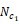 of carrier  and a conflicting transmission in any aggregated carrier starting in symbol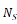, the UE shall apply the prioritization / dropping rules in this clause taking into account:
- DCI(s) for which the time interval between the last symbol of PDCCH and 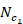 is at least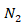symbols and an additional guard period when applicable, and the time interval between the last symbol of PDCCH and 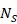 is at least 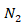 symbols;
- semi-persistent CSI reports or SRS configured by the higher layer parameter SRS-Resource considered active at least $N_{2}$ symbols and an additional guard period before $N_{c_{1}}$, and considered active at least $N_{2}$ symbols before $N_{S}$,
where the time interval unit of OFDM symbol is counted based on the subcarrier spacing of the aggregated SRS transmission.
#### 6.2.1.5 UE sounding procedure for SBFD
For SRS resources in SRS resource set(s) provided in srs-ResourceSetToAddModList and srs-ResourceSetToAddModListDCI-0-2 where symbolType is set to ‘sbfd’,
- for a periodic or semi-persistent SRS resource, the UE is expected to transmit the SRS only in SBFD symbols,
- for an aperiodic SRS resource and when availableSlotOffsetList is not provided, the UE does not expect to be indicated to transmit SRS in the non-SBFD symbols,
- for an aperiodic SRS resource and when availableSlotOffsetList is provided, an available slot is a slot configured with SBFD symbol(s) for the time-domain location(s) for all the SRS resources in the resource set(s) and satisfies the minimum timing requirement between triggering PDCCH and all the SRS resources in the resource set(s).
For SRS resources in SRS resource set(s) provided in srs-ResourceSetToAddModList and srs-ResourceSetToAddModListDCI-0-2 where symbolType is set to ‘non-sbfd’,
- for a periodic or semi-persistent SRS resource, the UE is expected to transmit only the SRS that are in non-SBFD symbols,
- for an aperiodic SRS resource and when availableSlotOffsetList is not provided, the UE does not expect to be indicated to transmit SRS in the SBFD symbols,
- for an aperiodic SRS resource and when availableSlotOffsetList is provided, an available slot is a slot satisfying there are UL or flexible symbol(s) not configured as SBFD symbols for the time-domain location(s) for all the SRS resources in the resource set(s) and the minimum timing requirement between triggering PDCCH and all the SRS resources in the resource set(s).
For a periodic or semi-persistent SRS resource, UE doesn’t transmit an SRS transmission occasion that is mapped to SBFD symbols and non-SBFD symbols.
For a same usage of 'codebook', 'noncodebook', or ‘beamManagement’, for the SRS resource sets provided in srs-ResourceSetToAddModList or srs-ResourceSetToAddModListDCI-0-2, the number of SRS resources in a SRS resource set where symbolType is set to ‘sbfd’ is the same as the number of SRS resources in a SRS resource set where symbolType is set to ‘non-sbfd’.
For SRS resource set(s) configured in srs-ResourceSetToAddModList and srs-ResourceSetToAddModListDCI-0-2 with a symbolType being configured,
- if the higher layer parameter usage in SRS-ResourceSet is set to 'noncodebook', the UE expects a single SRS port for each SRS resource being configured.
- If the higher layer parameter usage in SRS-ResourceSet is set to 'codebook', except when higher layer parameter ul-FullPowerTransmission is set to 'fullpowerMode2', the numbers of SRS ports are the same for all the SRS resources in the SRS-ResourceSet(s) where symbolType is set to 'non-sbfd' and the SRS-ResourceSet(s) where symbolType is set to 'sbfd'. When higher layer parameter ul-FullPowerTransmission is set to 'fullpowerMode2', the numbers of SRS ports are the same for SRS resources with the same corresponding SRI values in the SRS-ResourceSet(s) where symbolType is set to 'non-sbfd' and the SRS-ResourceSet(s) where symbolType is set to 'sbfd'.
### 6.2.2 UE DM-RS transmission procedure
The DM-RS transmission procedures for PUSCH scheduled by PDCCH with DCI format 0_1 described in this clause equally apply to PUSCH scheduled by PDCCH with DCI format 0_2, by applying the parameters of dmrs-UplinkForPUSCH-MappingTypeA-DCI-0-2 and dmrs-UplinkForPUSCH-MappingTypeB-DCI-0-2 instead of dmrs-UplinkForPUSCH-MappingTypeA and dmrs-UplinkForPUSCH-MappingTypeB. The DM-RS transmission procedures for PUSCH scheduled by PDCCH with DCI format 0_1 described in this clause equally apply to PUSCH scheduled by PDCCH with DCI format 0_3.
When transmitted PUSCH is neither scheduled by DCI format 0_1/0_2 with CRC scrambled by C-RNTI, CS-RNTI, SP-CSI-RNTI or MCS-C-RNTI, nor corresponding to a configured grant, nor being a PUSCH for Type-2 random access procedure, the UE shall use single symbol front-loaded DM-RS of configuration type 1 on DM-RS port 0 and the remaining REs not used for DM-RS in the symbols are not used for any PUSCH transmission except for PUSCH with allocation duration of 2 or less OFDM symbols with transform precoding disabled, additional DM-RS can be transmitted according to the scheduling type and the PUSCH duration as specified in Table 6.4.1.1.3-3 of [4, TS 38.211] for frequency hopping disabled and as specified in Table 6.4.1.1.3-6 of [4, TS 38.211] for frequency hopping enabled, and
If frequency hopping is disabled:
- The UE shall assume dmrs-AdditionalPosition equals to 'pos2' and up to two additional DM-RS can be transmitted according to PUSCH duration, or
If frequency hopping is enabled:
- The UE shall assume dmrs-AdditionalPosition equals to 'pos1' and up to one additional DM-RS can be transmitted according to PUSCH duration.
When transmitted PUSCH is scheduled by activation DCI format 0_0 with CRC scrambled by CS-RNTI, the UE shall use single symbol front-loaded DM-RS of configuration type provided by higher layer parameter dmrs-Type in DMRS-UplinkConfig on DM-RS port 0 and the remaining REs not used for DM-RS in the symbols are not used for any PUSCH transmission except for PUSCH with allocation duration of 2 or less OFDM symbols with transform precoding disabled, and additional DM-RS with dmrs-AdditionalPosition from ConfiguredGrantConfig can be transmitted according to the scheduling type and the PUSCH duration as specified  in Table 6.4.1.1.3-3 of [4, TS 38.211] for frequency hopping disabled and as specified in Table 6.4.1.1.3-6 of [4, TS 38.211] for frequency hopping enabled.
For the UE-specific reference signals generation as defined in Clause 6.4.1.1 of [4, TS 38.211], a UE can be configured by higher layers with one or two scrambling identity(s), $n_{ID}^{DMRS,i}$i = 0,1 which are the same for both PUSCH mapping Type A and Type B.
When transmitted PUSCH is scheduled by DCI format 0_1 with CRC scrambled by C-RNTI, CS-RNTI, SP-CSI-RNTI or MCS-C-RNTI, or corresponding to a configured grant, or being a PUSCH for Type-2 random access procedure,
- for a configured-grant based PUSCH transmission in RRC_INACTIVE state, the UE is provided with a set of DM-RS port(s) by sdt-DMRS-Ports. The DM-RS port for the PUSCH is determined by the mapping between SS/PBCH block(s) and a PUSCH occasion and the associated DM-RS resource as described in Clause 19.1 of [6, TS 38.213].
- for a configured-grant based PUSCH transmission in RACH-less handover or in RACH-less LTM cell switch, the UE is provided with a set of DM-RS port(s) by rrc-DMRS-Ports. The DM-RS port for the PUSCH is determined by the mapping between SS/PBCH block(s) and a PUSCH occasion and the associated DM-RS resource as described in Clause 22.1 or clause 21.1 of [6, TS 38.213], respectively.
- the UE may be configured with higher layer parameter dmrs-Type in DMRS-UplinkConfig, and the configured DM-RS configuration type is used for transmitting PUSCH in as defined in Clause 6.4.1.1 of [4, TS 38.211].
- the UE may be configured with the maximum number of front-loaded DM-RS symbols for PUSCH by higher layer parameter maxLength in DMRS-UplinkConfig, or by higher layer parameter msgA-MaxLength in msgA-DMRS-Config,
- if maxLength is not configured, single-symbol DM-RS can be scheduled for the UE by DCI or configured by the configured grant configuration, and the UE can be configured with a number of additional DM-RS for PUSCH by higher layer parameter dmrs-AdditionalPosition, which can be 'pos0', 'pos1', 'pos2', 'pos3'.
- if maxLength is configured, either single-symbol DM-RS or double symbol DM-RS can be scheduled for the UE by DCI or configured by the configured grant configuration, and the UE can be configured with a number of additional DM-RS for PUSCH by higher layer parameter dmrs-AdditionalPosition, which can be 'pos0' or 'pos1'.
- for MsgA PUSCH for Type-2 random access procedure the UE can be configured with a number of additional DM-RS for PUSCH by higher layer parameter msgA-DMRS-AdditionalPosition, which can be 'pos0', 'pos1', 'pos2', 'pos3' for single-symbol DM-RS or 'pos0', 'pos1' for double-symbol DM-RS.
- and, the UE shall transmit a number of additional DM-RS as specified in Table 6.4.1.1.3-3 and Table 6.4.1.1.3-4 in -Clause 6.4.1.1.3 of [4, TS 38.211].
If a UE transmitting PUSCH scheduled by DCI format 0_2 is configured with the higher layer parameter phaseTrackingRS in dmrs-UplinkForPUSCH-MappingTypeA-DCI-0-2 or dmrs-UplinkForPUSCH-MappingTypeB-DCI-0-2, or a UE transmitting PUSCH scheduled by DCI format 0_0, 0_1 or 0_3 is configured with the higher layer parameter phaseTrackingRS in dmrs-UplinkForPUSCH-MappingTypeA or dmrs-UplinkForPUSCH-MappingTypeB, the UE may assume that the following configurations are not occurring simultaneously for the transmitted PUSCH
- any DM-RS ports among
4-7 or 6-11 for DM-RS configurations type 1 and type 2, respectively, or
4-7 or 12-15 for DM-RS configuration enhanced type 1, or
6-11 or 18-23 for DM-RS configuration enhanced type 2,
are scheduled for the UE and PT-RS is transmitted from the UE.
For PUSCH scheduled by DCI format 0_1, by activation DCI format 0_1 with CRC scrambled by CS-RNTI, or configured by configured grant Type 1 configuration, the UE shall assume the DM-RS CDM groups indicated in Tables 7.3.1.1.2-6 to 7.3.1.1.2-23D and Tables 7.3.1.1.2-38 to 7.3.1.1.2-69 of Clause 7.3.1.1 of [5, TS 38.212] are not used for data transmission, where "1", "2" and "3" for the number of DM-RS CDM group(s) correspond to CDM group 0, {0,1}, {0,1,2}, respectively.
For PUSCH scheduled by DCI format 0_0 or by activation DCI format 0_0 with CRC scrambled by CS-RNTI, the UE shall assume the number of DM-RS CDM groups without data is 1 which corresponds to CDM group 0 for the case of PUSCH with allocation duration of 2 or less OFDM symbols with transform precoding disabled, the UE shall assume that the number of DM-RS CDM groups without data is 3 which corresponds to CDM group {0,1,2} for the case of PUSCH scheduled by activation DCI format 0_0 and the dmrs-Type in DMRS-UplinkConfig equal to 'type2' and the PUSCH allocation duration being more than 2 OFDM symbols, and the UE shall assume that the number of DM-RS CDM groups without data is 2 which corresponds to CDM group {0,1} for all other cases.
For MsgA PUSCH transmission, if the UE is not configured with msgA-PUSCH-DMRS-CDM-group, the UE shall assume that 2 DM-RS CDM groups are configured. Otherwise, msgA-PUSCH-DMRS-CDM-group indicates which DM-RS CDM group to use from the set of {0,1}.
For MsgA PUSCH transmission, if the UE is not configured with msgA-PUSCH-NrofPorts, the UE shall assume that 4 ports are configured per DM-RS CDM group for double-symbol DM-RS. Otherwise, msgA-PUSCH-NrofPorts with value of 0 indicates the first port per DM-RS CDM group, while a value of 1 indicates the first two ports per DM-RS CDM group.
For uplink DM-RS with PUSCH, the UE may assume the ratio of PUSCH EPRE to DM-RS EPRE ( [dB]) is given by Table 6.2.2-1 according to the number of DM-RS CDM groups without data. The DM-RS scaling factor  specified in clause 6.4.1.1.3 of [4, TS 38.211] is given by .
Table 6.2.2-1: The ratio of PUSCH EPRE to DM-RS EPRE
| Number of DM-RS CDM groups without data | DM-RS configuration type 1 and enhanced type 1 | DM-RS configuration type 2 and enhanced type 2 |
| --- | --- | --- |
| 1 | 0 dB | 0 dB |
| 2 | -3 dB | -3 dB |
| 3 | - | -4.77 dB |

For PUSCH repetition Type B, the DM-RS transmission procedure is applied for each actual repetition separately based on the allocation duration of the actual repetition. A UE is not expected to be indicated with an antenna port configuration that is invalid for the allocated duration of any actual repetition.
For PUSCH transmission in SBFD symbols, DM-RS sequence mapping is only applied to the assigned PRBs that are both in the active UL BWP and in the UL sub-band.
### 6.2.3 UE PT-RS transmission procedure
The procedures on PT-RS transmission described in this clause as well as clauses 6.2.3.1 and 6.2.3.2 apply to a UE PUSCH transmission scheduled by DCI format 0_2 if the higher layer parameter phaseTrackingRS in dmrs-UplinkForPUSCH-MappingTypeA-DCI-0-2 or dmrs-UplinkForPUSCH-MappingTypeB-DCI-0-2 is configured, to PUSCH transmissions scheduled by DCI format 0_0, 0_1 or 0_3 if the higher layer parameter phaseTrackingRS in dmrs-UplinkForPUSCH-MappingTypeA or dmrs-UplinkForPUSCH-MappingTypeB is configured and PUSCH transmissions corresponding to a configured grant if the higher layer parameter phaseTrackingRS in cg-DMRS-Configuration is configured. If a UE is not configured with the higher layer parameter phaseTrackingRS in the respective DMRS-UplinkConfig, the UE shall not transmit PT-RS. A UE is not expected to be simultaneously configured with higher layer parameters phaseTrackingRS and occ-LengthAndSequenceIndex-r19 or occ-length-r19. The PT-RS is only present on PUSCH scheduled by PDCCH with CRC scrambled by MCS-C-RNTI, C-RNTI, CS-RNTI, SP-CSI-RNTI and on PUSCH corresponding to a configured grant. For PUSCH repetition Type B, the PT-RS transmission procedure is applied for each actual repetition separately based on the allocation duration of the actual repetition.
#### 6.2.3.1 UE PT-RS transmission procedure when transform precoding is not enabled
When transform precoding is not enabled and if a UE is configured with the higher layer parameter phaseTrackingRS in DMRS-UplinkConfig,
- the higher layer parameters timeDensity and frequencyDensity in PTRS-UplinkConfig indicate the threshold values ptrs-MCSi, i=1,2,3 and NRB,i , i=0,1, as shown in Table 6.2.3.1-1 and Table 6.2.3.1-2, respectively.
- if either or both higher layer parameters timeDensity and/or frequencyDensity in PTRS-UplinkConfig are configured, the UE shall assume the PT-RS antenna ports' presence and pattern are a function of the corresponding scheduled MCS of the codeword associated with the PT-RS and scheduled bandwidth in a corresponding bandwidth part as shown in Table 6.2.3.1-1 and Table 6.2.3.1-2, respectively,
- if the higher layer parameter timeDensity is not configured, the UE shall assume LPT-RS = 1.
- if the higher layer parameter frequencyDensity is not configured, the UE shall assume KPT-RS = 2.
- if a UE is configured with the higher layer parameter maxNrofPorts in PTRS-UplinkConfig set to 'n2' and scheduled with two codewords, the PT-RS time-density for both PT-RS ports is determined based on the higher MCSs of two codewords associated with the initial transmission.
- if none of the higher layer parameters timeDensity and frequencyDensity in PTRS-UplinkConfig are configured, the UE shall assume LPT-RS = 1 and KPT-RS = 2.
Table 6.2.3.1-1: Time density of PT-RS as a function of scheduled MCS
| Scheduled MCS | Time density() |
| --- | --- |
| IMCS < ptrs-MCS1 | PT-RS is not present |
| ptrs-MCS1  IMCS < ptrs-MCS2 | 4 |
| ptrs-MCS2  IMCS < ptrs-MCS3 | 2 |
| ptrs-MCS3  IMCS < ptrs-MCS4 | 1 |

Table 6.2.3.1-2: Frequency density of PT-RS as a function of scheduled bandwidth
| Scheduled bandwidth | Frequency density () |
| --- | --- |
| NRB < NRB0 | PT-RS is not present |
| NRB0  NRB < NRB1 | 2 |
| NRB1  NRB | 4 |

The higher layer parameter PTRS-UplinkConfig provides the parameters ptrs-MCSi, i=1,2,3 and with values in 0-29 when MCS Table 5.1.3.1-1 or Table 5.1.3.1-3 is used and 0-28 when MCS Table 5.1.3.1-2 is used, respectively. ptrs-MCS4 is not explicitly configured by higher layers but assumed 29 when MCS Table 5.1.3.1-1 or Table 5.1.3.1-3 is used and 28 when MCS Table 5.1.3.1-2 is used. The higher layer parameter PTRS-UplinkConfig provides the parameters NRBi i=0,1 with values in range 1-276.
If the higher layer parameter PTRS-UplinkConfig indicates that the time density thresholds ptrs-MCSi = ptrs-MCSi+1, then the time density LPTRS of the associated row where both these thresholds appear in Table 6.2.3.1-1 is disabled. If the higher layer parameter frequencyDensity in PTRS-UplinkConfig indicates that the frequency density thresholds NRB,i = NRB,i+1, then the frequency density KPTRS of the associated row where both these thresholds appear in Table 6.2.3.1-2 is disabled.
If either or both of the parameters PT-RS time density (LPT-RS) and PT-RS frequency density (KPT-RS), shown in Table 6.2.3.1-1 and Table 6.2.3.1-2, indicates that are configured as 'PT-RS not present', the UE shall assume that PT-RS is not present.
When a UE is scheduled to transmit PUSCH with allocation duration of 2 symbols or less, and if LPT-RS is set to 2 or 4, the UE shall not transmit PT-RS. When a UE is scheduled to transmit PUSCH with allocation duration of 4 symbols or less, and if LPT-RS is set to 4, the UE shall not transmit PT-RS.
When a UE is scheduled to transmit PUSCH for retransmission, if the UE is scheduled with IMCS > V, where V = 28 for MCS Table 5.1.3.1-1 and MCS Table 5.1.3.1-3 and V = 27 for MCS Table 5.1.3.1-2, respectively, the MCS for PT-RS time-density determination is obtained from the DCI for the same transport block in the initial transmission, which is smaller than or equal to V.
The maximum number of configured PT-RS ports is given by the higher layer parameter maxNrofPorts in PTRS-UplinkConfig. The UE is not expected to be configured with a larger number of UL PT-RS ports than it has reported need for.
If a UE has reported the capability of supporting full-coherent UL transmission with 2 or 4 antenna ports and is not configured with the higher layer parameter multipanelSchemeSDM, or has reported the capability of codebook1-8TxPUSCH-r18 with 8 antenna ports, the UE shall expect maxNrofPorts in PTRS-UplinkConfig to be configured as one if UL PT-RS is configured. If a UE has reported the capability of supporting full-coherent UL transmission and when the higher layer parameter multipanelSchemeSDM is configured, subject to UE capability, the UE can be configured with maxNrofPorts-SDM in PTRS-UplinkConfig set to n1 or n2, where at most one PT-RS port is associated with each SRS resource set with higher layer parameter usage set to 'codebook'/'nonCodebook'.
For codebook or non-codebook based UL transmission, the association between UL PT-RS port(s) and DM-RS port(s) is signalled by PTRS-DMRS association field(s) in DCI format 0_1, 0_2 and 0_3. For a PUSCH corresponding to a configured grant Type 1 transmission, the UE may assume the association between UL PT-RS port(s) and DM-RS port(s) defined by value 0 in Table 7.3.1.1.2-25, or value "00" in Table 7.3.1.1.1.2-26 or value "00" in Table 7.3.1.1.1.2-25a described in Clause 7.3.1 of [5, TS 38.212].
For PUSCH scheduled by DCI format 0_0 or by activation DCI format 0_0, the UL PT-RS port is associated to DM-RS port 0.
For non-codebook based UL transmission, the actual number of UL PT-RS port(s) to transmit is determined based on SRI(s) in DCI format 0_1, 0_2 or 0_3 or higher layer parameter sri-ResourceIndicator in rrc-ConfiguredUplinkGrant. When two SRS resource sets are configured in srs-ResourceSetToAddModList or srs-ResourceSetToAddModListDCI-0-2 with higher layer parameter usage in SRS-ResourceSet set to 'noncodebook', the actual number of UL PT-RS port(s) to transmit corresponding to each SRS resource set is determined based on SRI(s) corresponding to the associated SRS resource set or higher layer parameter sri-ResourceIndicator or sri-ResourceIndicator2 corresponding to the associated SRS resource set in rrc-ConfiguredUplinkGrant. A UE is configured with the PT-RS port index for each configured SRS resource by the higher layer parameter ptrs-PortIndex configured by SRS-Config if the UE is configured with the higher layer parameter phaseTrackingRS in DMRS-UplinkConfig. If the PT-RS port index associated with different SRIs are the same, the corresponding UL DM-RS ports are associated to the one UL PT-RS port. For non-codebook UL transmission with 3 antenna ports and one PT-RS port, if fourPortSRS-3Tx is in the SRS-ResourceSet with usage 'nonCodebook', the association between the PT-RS port and DM-RS port(s) is given by Table 7.3.1.1.2-25 in Clause 7.3.1 of [5, TS 38.212]. For non-codebook UL transmission with 3 antenna ports and two PT-RS ports, if fourPortSRS-3Tx is configured in the SRS-ResourceSet with usage 'nonCodebook', the association between the PT-RS port and DM-RS port(s) is given by Table 7.3.1.1.2-26B in Clause 7.3.1 of [5, TS 38.212].
When the higher layer parameter multipanelSchemeSDM is configured and two SRS resource sets are configured in srs-ResourceSetToAddModList or srs-ResourceSetToAddModListDCI-0-2 with higher layer parameter usage in SRS-ResourceSet set to 'codebook'/'nonCodebook' and higher layer parameter maxNrofPorts-SDM in PTRS-UplinkConfig set to n2, the actual number of UL PT-RS port(s) to transmit corresponding to SRS resource sets is 2.
When the higher layer parameter multipanelSchemeSFN is configured and two SRS resource sets are configured in srs-ResourceSetToAddModList or srs-ResourceSetToAddModListDCI-0-2 with higher layer parameter usage in SRS-ResourceSet set to 'codebook'/'nonCodebook' and the higher layer parameter maxNrofPorts in PTRS-UplinkConfig is set to n2, the actual number of UL PT-RS port(s) to transmit corresponding to each SRS resource set is determined based on 1st TPMI codepoint field for 'codebook' or 1st SRI(s) codepoint field for 'nonCodebook'.
For partial-coherent and non-coherent codebook-based UL transmission with 2 or 4 antenna ports, or non-coherent codebook-based UL Transmission with 3 antenna ports, or when the higher layer parameter CodebookTypeUL is set to ‘codebook2’, ‘codebook3’, or ‘codebook4’ with 8 antenna ports, the actual number of UL PT-RS port(s) is determined based on TPMI(s) and/or number of layers which are indicated by 'Precoding information and number of layers' field(s) in DCI format 0_1, 0_2 or 0_3 or configured by higher layer parameter precodingAndNumberOfLayers:
- if the UE is configured with the higher layer parameter maxNrofPorts in PTRS-UplinkConfig set to 'n2', the actual UL PT-RS port(s) and the associated transmission layer(s) are derived from indicated TPMI(s) as:
- for PUSCH transmission with 2, 3 or 4 ports, PUSCH antenna port 1000 and 1002 in indicated TPMI(s) share PT-RS port 0, and PUSCH antenna port 1001 and 1003 in indicated TPMI(s) share PT-RS port 1.
- UL PT-RS port 0 is associated with the UL layer 'x' of layers which are transmitted with PUSCH antenna port 1000 and PUSCH antenna port 1002 in indicated TPMI(s), and UL PT-RS port 1 is associated with the UL layer 'y' of layers which are transmitted with PUSCH antenna port 1001 and PUSCH antenna port 1003 in indicated TPMI(s), where 'x' and/or 'y' are given by DCI parameter 'PTRS-DMRS association' as shown in DCI format 0_1, 0_2 or 0_3 described in Clause 7.3.1 of [5, TS 38.212].
- for PUSCH transmission with 8 ports, PUSCH antenna port 1000, 1001, 1004 and 1005 in indicated TPMI(s) share PT-RS port 0, and PUSCH antenna port 1002, 1003, 1006 and 1007 in indicated TPMI(s) share PT-RS port 1.
- UL PT-RS port 0 is associated with the UL layer 'x' of layers which are transmitted with one or more of PUSCH antenna port 1000, 1001, 1004 and 1005 in indicated TPMI(s), and UL PT-RS port 1 is associated with the UL layer 'y' of layers which are transmitted with one or more of PUSCH antenna port 1002, 1003, 1006 and 1007 in indicated TPMI(s), where 'x' and/or 'y' are given by DCI parameter 'PTRS-DMRS association' as shown in DCI format 0_1 and DCI format 0_2 described in Clause 7.3.1 of [5, TS 38.212].
If a UE is scheduled with two codewords,
- if the UE is configured with the higher layer parameter maxNrofPorts in PTRS-UplinkConfig set to 'n1', the PT-RS port is associated with the one of DM-RS ports indicated by DCI field PTRS-DMRS association for the codeword with the higher MCS. If the MCS indices of the two codewords are the same, the PT-RS antenna port is associated with codeword 0. When a codeword is scheduled to transmit PUSCH for retransmission, the MCS for determining PT-RS association to codeword is obtained from the DCI for the same transport block in the initial transmission.
When the UE is scheduled with Qp={1,2} PT-RS port(s) in uplink and the number of scheduled layers is ,
- If the UE is configured with higher layer parameter ptrs-Power, the PUSCH to PT-RS power ratio per layer per RE  is given by , where  is shown in the Table 6.2.3.1-3, Table 6.2.3.1-3A and Table 6.2.3.1-3B according to the higher layer parameter ptrs-Power, the PT-RS scaling factor  specified in clause 6.4.1.2.2.1 of [4, TS 38.211] is given by and also on the 'Precoding Information and Number of Layers' field in DCI.
- The UE shall assume ptrs-Power in PTRS-UplinkConfig is set to state "00" in Table 6.2.3.1-3, Table 6.2.3.1-3A, and Table 6.2.3.1-3B  if not configured or in case of non-codebook based PUSCH.
- When the higher layer parameter CodebookTypeUL is set to ‘codebook2’or ‘codebook3’ for 8 antenna  port transmission, Lx is the number of PUSCH layers in the antenna port group which are precoded coherently with the PUSCH layer/DM-RS port that PT-RS port x is associated with, and Qp is the number of PT-RS ports scheduled to the UE.
- When the higher layer parameter multipanelSchemeSDM is configured and two SRS resource sets are configured in srs-ResourceSetToAddModList or srs-ResourceSetToAddModListDCI-0-2 with higher layer parameter usage in SRS-ResourceSet set to 'codebook'/’nonCodebook’, and codepoint "10" of SRS Resource Set indicator is indicated, for each PT-RS port is based on Table 6.2.3.1-3B, where Qp is the total number of PT-RS ports for the PUSCH.
Table 6.2.3.1-3: Factor related to PUSCH to PT-RS power ratio per layer per RE  other than 8TX PUSCH transmission and other than SDM PUSCH
| UL-PTRS-power /  |  | The number of PUSCH layers ( ) |  |  |  |  |  |  |
| --- | --- | --- | --- | --- | --- | --- | --- | --- |
|  | 1 | 2 | 3 | 4 |  |  |  |  |
|  | All cases | Full coherent | Partial and non- coherent and non-codebook based | Full coherent | Partial and non- coherent and non-codebook based | Full coherent | Partial coherent | Non-coherent and non-codebook based |
| 00 | 0 | 3 | 3Qp-3 | 4.77 | 3Qp-3 | 6 | 3Qp | 3Qp-3 |
| 01 | 0 | 3 | 3 | 4.77 | 4.77 | 6 | 6 | 6 |
| 10 | Reserved |  |  |  |  |  |  |  |
| 11 | Reserved |  |  |  |  |  |  |  |

Table 6.2.3.1-3A: Factor related to PUSCH to PT-RS power ratio per layer per RE  for 8TX PUSCH transmission
| UL-PTRS-power /  | The number of PUSCH layers ($n_{layer}^{PUSCH}$) |  |  |
| --- | --- | --- | --- |
|  | 1-8 |  |  |
|  | CodebookTypeUL =‘codebook1’ | CodebookTypeUL =‘codebook2’ or ‘codebook3’ | CodebookTypeUL =‘codebook4’ and non-codebook based |
| 00 | $$10log_{10}\left( n_{layer}^{PUSCH} \right)$$ | $$10log_{10}\left( L_{x}Q_{p} \right)$$ | $$10log_{10}\left( Q_{p} \right)$$ |
| 01 | $$10log_{10}\left( n_{layer}^{PUSCH} \right)$$ | $$10log_{10}\left( n_{layer}^{PUSCH} \right)$$ | $$10log_{10}\left( n_{layer}^{PUSCH} \right)$$ |
| 10 | Reserved |  |  |
| 11 | Reserved |  |  |

Table 6.2.3.1-3B: Factor related to PUSCH to PT-RS power ratio per layer per RE for SDM PUSCH
| UL-PTRS-power /  | The number of PUSCH layers associated with the same SRS resource set as the PT-RS port |  |  |
| --- | --- | --- | --- |
|  | 1 | 2 |  |
|  | All cases | Full coherent | Partial and non- coherent and non-codebook based |
| 00 | 3Qp-3 | 3Qp | 3Qp-3 |
| 01 | 3Qp-3 | 3Qp | 3Qp |
| 10 | Reserved |  |  |
| 11 | Reserved |  |  |

#### 6.2.3.2 UE PT-RS transmission procedure when transform precoding is enabled
When transform precoding is enabled and if a UE is configured with the higher layer parameter transformPrecoderEnabled in PTRS-UplinkConfig,
- the UE shall be configured with the higher layer parameters sampleDensity and the UE shall assume the PT-RS antenna ports' presence and PT-RS group pattern are a function of the corresponding scheduled bandwidth in a corresponding bandwidth part, as shown in Table 6.2.3.2-1. The UE shall assume no PT-RS is present when the number of scheduled RBs is less than NRB0 if NRB0 > 1 or if the RNTI equals TC-RNTI.
- and the UE may be configured PT-RS time density LPT-RS = 2 with the higher layer parameter timeDensityTransformPrecoding. Otherwise, the UE shall assume LPT-RS = 1.
- if the higher layer parameter sampleDensity indicates that the sample density thresholds NRB,i = NRB,i+1, then the associated row where both these thresholds appear in Table 6.2.3.2-1 is disabled.
Table 6.2.3.2-1: PT-RS group pattern as a function of scheduled bandwidth
| Scheduled bandwidth | Number of PT-RS groups | Number of samples per PT-RS group |
| --- | --- | --- |
| NRB0 NRB < NRB1 | 2 | 2 |
| NRB1  NRB < NRB2 | 2 | 4 |
| NRB2  NRB < NRB3 | 4 | 2 |
| NRB3  NRB < NRB4 | 4 | 4 |
| NRB4  NRB | 8 | 4 |

When transform precoding is enabled and if a UE is configured with the higher layer parameter transformPrecoderEnabled in PTRS-UplinkConfig, the PT-RS scaling factor β' specified in Clause 6.4.1.2.2.2 of [4, TS 38.211] is determined by the scheduled modulation order as shown in table 6.2.3.2-2.
Table 6.2.3.2-2: PT-RS scaling factor (β') when transform precoding enabled.
| Scheduled modulation | PT-RS scaling factor (β') |
| --- | --- |
| π/2-BPSK | 1 |
| QPSK | 1 |
| 16QAM |  |
| 64QAM |  |
| 256QAM |  |

## 6.3 UE PUSCH frequency hopping procedure
### 6.3.1 Frequency hopping for PUSCH repetition Type A and for TB processing over multiple slots
For PUSCH repetition Type A other than the PUSCH scheduled by RAR UL grant or fallbackRAR UL grant or by DCI format 0_0 with CRC scrambled by TC-RNTI and for TB processing over multiple slots (as determined according to procedures defined in Clause 6.1.2.1 for scheduled PUSCH, or Clause 6.1.2.3 for configured PUSCH), a UE is configured for frequency hopping by the higher layer parameter frequencyHoppingDCI-0-2 in pusch-Config for PUSCH transmission scheduled by DCI format 0_2, and by frequencyHopping provided in pusch-Config for PUSCH transmission scheduled by a DCI format other than 0_2, and by frequencyHopping provided in configuredGrantConfig for configured PUSCH transmission. For PUSCH repetition Type A scheduled by RAR UL grant or by DCI format 0_0 with CRC scrambled by TC-RNTI, a UE is configured for frequency hopping by the frequency hopping flag information field of the RAR UL grant, and by the frequency hopping flag information field of DCI format 0_0 with CRC scrambled by TC-RNTI, respectively. One of two frequency hopping modes can be configured:
- Intra-slot frequency hopping, applicable to single slot and multi-slot configured PUSCH transmission, multi-slot PUSCH transmission scheduled by DCI format 0_1, 0_2 or 0_3, each of multiple PUSCH transmissions on a serving cell scheduled by a DCI if the higher layer parameter pusch-TimeDomainAllocationListForMultiPUSCH or pusch-TimeDomainAllocationListForMultiPUSCH-DCI-0-3 is configured and each of multiple configured grant PUSCH transmissions in a configuration where the higher layer parameters cg-nrofSlots and cg-nrofPUSCH-InSlot are provided.
- Inter-slot frequency hopping, applicable to multi-slot PUSCH transmission.
For operation with shared spectrum channel access in FR1, the UE does not expect that two hops of a PUSCH transmission are in different RB sets.
A UE is not expected to be configured with frequency hopping for PUSCH repetitions when inter-slot OCC operation is enabled.
In case of resource allocation type 2, the UE transmits PUSCH without frequency hopping.
In case of resource allocation type 1, whether or not transform precoding is enabled for PUSCH transmission, the UE may perform PUSCH frequency hopping, if the frequency hopping field in a corresponding detected DCI format or in a random access response UL grant is set to 1, or if for a Type 1 PUSCH transmission with a configured grant the higher layer parameter frequencyHoppingOffset is provided, otherwise no PUSCH frequency hopping is performed. When frequency hopping is enabled for PUSCH, the RE mapping is defined in clause 6.3.1.6 of [4, TS 38.211].
For a PUSCH scheduled by RAR UL grant, fallbackRAR UL grant, or by DCI format 0_0 with CRC scrambled by TC-RNTI, frequency offsets are obtained as described in clause 8.3 of [6, TS 38.213]. Otherwise, for a PUSCH scheduled by DCI format 0_0/0_1/0_3 or a PUSCH based on a Type2 configured UL grant activated by DCI format 0_0/0_1 and for resource allocation type 1, frequency offsets are configured by higher layer parameter frequencyHoppingOffsetLists in pusch-Config. For a PUSCH scheduled by DCI format 0_2 or a PUSCH based on a Type2 configured UL grant activated by DCI format 0_2 and for resource allocation type 1, frequency offsets are configured by higher layer parameter frequencyHoppingOffsetListsDCI-0-2 in pusch-Config.
- When the size of the active BWP is less than 50 PRBs, one of two higher layer configured offsets is indicated in the UL grant.
- When the size of the active BWP is equal to or greater than 50 PRBs, one of four higher layer configured offsets is indicated in the UL grant.
For PUSCH based on a Type1 configured UL grant the frequency offset is provided by the higher layer parameter frequencyHoppingOffset in rrc-ConfiguredUplinkGrant.
For a MsgA PUSCH the frequency offset is provided by the higher layer parameter as described in [6, TS 38.213].
In case of intra-slot frequency hopping, the starting RB in each hop is given by:
,
where i=0 and i=1 are the first hop and the second hop respectively, and  is the starting RB within the UL BWP, as calculated from the resource block assignment information of resource allocation type 1 (described in Clause 6.1.2.2.2) or as calculated from the resource assignment for MsgA PUSCH (described in [6, TS 38.213]) and is the frequency offset in RBs between the two frequency hops. The number of symbols in the first hop is given by , the number of symbols in the second hop is given by , where $N_{symb}^{PUSCH,s}$ is the length of the PUSCH transmission in OFDM symbols in one slot.
In case of inter-slot frequency hopping and when pusch-DMRS-Bundling is not enabled, or for inter-slot frequency hopping for a PUSCH scheduled by RAR UL grant or DCI format 0_0 with CRC scrambled by TC-RNTI, the starting RB during slot  is given by:
,
where  is the current slot number within a system radio frame, where a multi-slot PUSCH transmission can take place,  is the starting RB within the UL BWP, as calculated from the resource block assignment information of resource allocation type 1 (described in Clause 6.1.2.2.2) and is the frequency offset in RBs between the two frequency hops.
In case of inter-slot frequency hopping and when pusch-DMRS-Bundling is enabled, and when a PUSCH is not scheduled by RAR UL grant or DCI format 0_0 with CRC scrambled by TC-RNTI, the starting RB during slot  is given by:
$$RB_{start}\left( n_{s}^{\mu } \right)=\left\{ \begin{aligned}RB_{start} \\ \left( RB_{start}+RB_{offset} \right)modN_{BWP}^{size}\end{aligned}\left⌊ \frac{n_{s}^{\mu }}{N_{FH}} \right⌋ mod 2=0 \right.$$
where $n_{s}^{\mu }$ is the current slot number within a system radio frame, $N_{FH}$ is the value of the higher layer parameter pusch-FrequencyHoppingInterval,  is the starting RB within the UL BWP, as calculated from the resource block assignment information of resource allocation type 1 (described in Clause 6.1.2.2.2) andis the frequency offset in RBs between the two frequency hops.
### 6.3.2 Frequency hopping for PUSCH repetition Type B
For PUSCH repetition Type B (as determined according to procedures defined in Clause 6.1.2.1 for scheduled PUSCH, or Clause 6.1.2.3 for configured PUSCH), a UE is configured for frequency hopping by the higher layer parameter frequencyHoppingDCI-0-2 in pusch-Config for PUSCH transmission scheduled by DCI format 0_2, by frequencyHoppingDCI-0-1 provided in pusch-Config for PUSCH transmission scheduled by DCI format 0_1, and by frequencyHoppingPUSCH-RepTypeB provided in rrc-ConfiguredUplinkGrant for Type 1 configured PUSCH transmission. The frequency hopping mode for Type 2 configured PUSCH transmission follows the configuration of the activating DCI format. One of two frequency hopping modes can be configured:
- Inter-repetition frequency hopping
- Inter-slot frequency hopping
For operation with shared spectrum channel access in FR1, the UE does not expect that two hops of a PUSCH transmission are in different RB sets.
In case of resource allocation type 1, whether or not transform precoding is enabled for PUSCH transmission, the UE may perform PUSCH frequency hopping, if the frequency hopping field in a corresponding detected DCI format is set to 1, or if for a Type 1 PUSCH transmission with a configured grant the higher layer parameter frequencyHoppingPUSCH-RepTypeB is provided, otherwise no PUSCH frequency hopping is performed. When frequency hopping is enabled for PUSCH, the RE mapping is defined in clause 6.3.1.6 of [4, TS 38.211].
For a PUSCH scheduled by DCI format 0_1 or a PUSCH based on a Type 2 configured UL grant activated by DCI format 0_1 and for resource allocation type 1, frequency offsets are configured by higher layer parameter frequencyHoppingOffsetLists in pusch-Config. For a PUSCH scheduled by DCI format 0_2 or a PUSCH based on a Type 2 configured UL grant activated by DCI format 0_2 and for resource allocation type 1, frequency offsets are configured by higher layer parameter frequencyHoppingOffsetListsDCI-0-2 in pusch-Config.
- When the size of the active BWP is less than 50 PRBs, one of two higher layer configured offsets is indicated in the UL grant.
- When the size of the active BWP is equal to or greater than 50 PRBs, one of four higher layer configured offsets is indicated in the UL grant.
For PUSCH based on a Type1 configured UL grant the frequency offset is provided by the higher layer parameter frequencyHoppingOffset in rrc-ConfiguredUplinkGrant.
In case of inter-repetition frequency hopping, the starting RB for an actual repetition within the n-th nominal repetition (as defined in Clause 6.1.2.1) is given by:
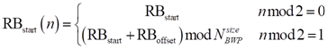,
where RBstart is the starting RB within the UL BWP, as calculated from the resource block assignment information of resource allocation type 1 (described in Clause 6.1.2.2.2) and RBoffset is the frequency offset in RBs between the two frequency hops.
In case of inter-slot frequency hopping, the starting RB during slot  follows that of inter-slot frequency hopping for PUSCH Repetition Type A in Clause 6.3.1.
### 6.3.3 Frequency hopping for SBFD
In case of intra-slot frequency hopping for a transmission occasion in SBFD symbols, the starting RB in each hop is given by:
$$RB_{start}=\left\{ \begin{aligned}RB_{start}, i=0 \\ RB_{UL SB start}+(RB_{start}-RB_{UL SB start}+RB_{offset})modN_{UL SB}^{size}, i=1\end{aligned} \right.$$
In case of inter-slot frequency hopping for a transmission occasion in SBFD symbols and when pusch-DMRS-Bundling is not enabled, or for inter-slot frequency hopping for a transmission occasion in SBFD symbols scheduled by RAR UL grant or DCI format 0_0 with CRC scrambled by TC-RNTI, the starting RB during slot $n_{s}^{\mu }$ is given by:
$$RB_{start}(n_{s}^{\mu })=\left\{ \begin{aligned}RB_{start}, n_{s}^{\mu }mod2=0 \\ RB_{UL SB start}+(RB_{start}-RB_{UL SB start}+RB_{offset})modN_{UL SB}^{size}, n_{s}^{\mu }mod2=1\end{aligned} \right.$$
In case of inter-slot frequency hopping in SBFD symbols and inter-slot frequency hopping across SBFD symbols and non-SBFD symbols in different slots and when pusch-DMRS-Bundling is enabled,
- if the transmission occasion in slot $n_{s}^{\mu }$  is in SBFD symbols, the starting RB during slot $n_{s}^{\mu }$ is given by:
$RB_{start}\left( n_{s}^{\mu } \right)=\left\{ \begin{aligned}RB_{start}, \left⌊ \frac{n_{s}^{\mu }}{N_{FH}} \right⌋ mod2=0 \\ RB_{UL SB start}+(RB_{start}-RB_{UL SB start}+RB_{offset})modN_{UL SB}^{size}, \left⌊ \frac{n_{s}^{\mu }}{N_{FH}} \right⌋mod2=1\end{aligned} \right.$.
- Otherwise, the starting RB during slot $n_{s}^{\mu }$ is defined as per Section 6.3.1.
In case of inter-repetition frequency hopping for PUSCH repetition Type B, for an actual repetition within the n-th nominal repetition (as defined in Section 6.1.2.1),
- if the actual repetition is in SBFD symbol(s), the starting RB of the actual repetition is given by:
$RB_{start}(n)=\left\{ \begin{aligned}RB_{start}, n mod 2=0 \\ RB_{UL SB start}+(RB_{start}-RB_{UL SB start}+RB_{offset})modN_{UL SB}^{size}, n mod 2=1\end{aligned} \right.$.
- Otherwise, the starting RB of the actual repetition is defined as per Section 6.3.2.
Where, $RB_{UL SB start}$ is the starting PRB index of the PRBs that are both in the active UL BWP and in the UL sub-band with reference to the start of UL active BWP, $N_{UL SB}^{size}$ is the number of  PRBs that are both in the active UL BWP and in the UL sub-band, $RB_{start}$ is the starting PRB index of the first PUSCH hop with reference to the start of UL active BWP, $RB_{offset}$ is the frequency hopping offset for PUSCH transmission occasions in SBFD symbols. If the UE is configured with sbfd-Config2-Transmission, $RB_{start}$ is the starting PRB index with reference to the start of UL active BWP after applying sbfd-Config2-PUSCH-RB-Offset as per Section 6.1.2.2.2, $N_{FH}$is defined as per Section 6.3.1.
In case of intra-slot frequency hopping or inter-slot frequency hopping for a transmission occasion or an actual repetition in non-SBFD symbols, the starting RB is given as per Sections 6.3.1 and 6.3.2, where $RB_{offset}$ is the frequency hopping offset for PUSCH transmission occasions in non-SBFD symbols.
For a PUSCH scheduled by DCI format 0_0/0_1/0_3 or a PUSCH based on a Type2 configured UL grant activated by DCI format 0_0/0_1 and for resource allocation type 1, frequency offsets for the transmission occasions in SBFD symbols are configured by higher layer parameter frequencyHoppingOffsetLists-SBFD in pusch-Config, while frequency offsets for the transmission occasions in non-SBFD symbols are configured by higher layer parameter frequencyHoppingOffsetLists in pusch-Config. The UE does not expect the number of frequency offsets in frequencyHoppingOffsetLists-SBFD and in frequencyHoppingOffsetLists to be different. If the higher layer parameter frequencyHoppingOffsetLists-SBFD is not configured, no PUSCH frequency hopping is performed for the transmission occasions in SBFD symbols.
For a PUSCH scheduled by DCI format 0_2 or a PUSCH based on a Type2 configured UL grant activated by DCI format 0_2 and for resource allocation type 1, frequency offsets for the transmission occasions in SBFD symbols are configured by higher layer parameter frequencyHoppingOffsetListsDCI-0-2-SBFD in pusch-Config, while frequency offsets for the transmission occasions in non-SBFD symbols are configured by higher layer parameter frequencyHoppingOffsetListsDCI-0-2 in pusch-Config. The UE does not expect the number of frequency offsets in frequencyHoppingOffsetListsDCI-0-2-SBFD and in frequencyHoppingOffsetListsDCI-0-2 to be different. If the higher layer parameter frequencyHoppingOffsetListsDCI-0-2-SBFD is not configured, no PUSCH frequency hopping is performed for the transmission occasions in SBFD symbols.
For Type 1 PUSCH transmission with a configured grant and if the UE is configured with sbfd-Config2-Transmission, the frequency offset for the transmission occasions in SBFD symbols is configured by the higher layer parameter [frequencyHoppingOffset-SBFD] in rrc-ConfiguredUplinkGrant, while the frequency offset for the transmission occasions in non-SBFD symbols is configured by the higher layer parameter frequencyHoppingOffset in rrc-ConfiguredUplinkGrant. If the higher layer parameter frequencyHoppingOffset-SBFD is not configured, no PUSCH frequency hopping is performed for the transmission occasions in SBFD symbols.
## 6.4 UE PUSCH preparation procedure time
If the first uplink symbol in the PUSCH allocation for up to two transport blocks, including the DM-RS, as defined by the slot offset K2 and Koffset, if configured, and the start S and length L of the PUSCH allocation indicated by 'Time domain resource assignment' of the scheduling DCI and including the effect of the timing advance, is no earlier than at symbol L2, where L2 is defined as the next uplink symbol with its CP starting $T_{proc,2}=\max {\left( (N_{2}+d_{2,1}+d_{2}+d_{3}+d_{4})(2048+144)\cdot \kappa 2^{-\mu }\cdot T_{C}+T_{ext}+T_{switch},d_{2,2} \right)}$ after the end of the reception of the last symbol of the PDCCH carrying the DCI scheduling the PUSCH, then the UE shall transmit the PUSCH. When the PDCCH reception includes two PDCCH candidates from two respective search space sets, as described in clause 10.1 of [6, TS 38.213], for the purpose of determining the last symbol of the PDCCH carrying the DCI scheduling the PUSCH, the PDCCH candidate that ends later in time is used.
- N2 is based on µ of Table 6.4-1 and Table 6.4-2 for UE processing capability 1 and 2 respectively, where µ corresponds to the one of (µDL, µUL) resulting with the largest Tproc,2, where the µDL corresponds to the subcarrier spacing of the downlink with which the PDCCH carrying the DCI scheduling the PUSCH was transmitted and µUL corresponds to the subcarrier spacing of the uplink channel with which the PUSCH is to be transmitted, and κ is defined in clause 4.1 of [4, TS 38.211].
- For operation with shared spectrum channel access in FR1, is calculated according to [4, TS 38.211], otherwise =0.
- If the first symbol of the PUSCH allocation consists of DM-RS only, then d2,1 = 0, otherwise d2,1 = 1.
- If the UE is configured with multiple active component carriers, the first uplink symbol in the PUSCH allocation further includes the effect of timing difference between component carriers as given in [11, TS 38.133].
- If the scheduling DCI triggered a switch of BWP, d2,2 equals to the switching time as defined in [11, TS 38.133], otherwise d2,2=0.
- If a PUSCH of a larger priority index would overlap with a PUCCH of a smaller priority index and the PUCCH and PUSCH are not simultaneously transmitted, and the UE is not provided uci-MuxWithDiffPrio for the primary PUCCH group or uci-MuxWithDiffPrioSecondaryPUCCHgroup for the secondary PUCCH group, d2 for the PUSCH of a larger priority is set as reported by the UE; otherwise d2 = 0.
- For a UE that supports capability 2 on a given cell, the processing time according to UE processing capability 2 is applied if the high layer parameter processingType2Enabled in PUSCH-ServingCellConfig is configured for the cell and set to 'enable'.
- If the PUSCH indicated by the DCI is overlapping with one or more PUCCH channels, then the transport block(s) is(are) multiplexed following the procedure in clause 9.2.5 of [6, TS 38.213], otherwise the transport block(s) is(are) transmitted on the PUSCH indicated by the DCI.
- If uplink switching gap is triggered as defined in clause 6.1.6,  equals to the switching gap duration and for the UE configured with higher layer parameter uplinkTxSwitchingOption set to 'dualUL' or configured with uplinkTxSwitching3Tx for uplink carrier aggregation µUL=min(µUL,carrier1, µUL,carrier2), otherwise .
- d3 is set as reported by UE if the UE is configured with sTx-2Panel and the PUSCH associated with a value of coresetPoolIndex is fully/partially overlapping in time domain and is fully/partially/non-overlapping in frequency domain with another PUSCH that is associated with a different value of coresetPoolIndex on a same serving cell; otherwise d3 = 0.
- d4 is set as reported by UE if the number of transport blocks in the PUSCH is 2; otherwise d4 = 0.
Otherwise the UE may ignore the scheduling DCI.
The value of  is used both in the case of normal and extended cyclic prefix.
Table 6.4-1: PUSCH preparation time for PUSCH timing capability 1
|  | PUSCH preparation time N2 [symbols] |
| --- | --- |
| 0 | 10 |
| 1 | 12 |
| 2 | 23 |
| 3 | 36 |
| 5 | 144 |
| 6 | 288 |

Table 6.4-2: PUSCH preparation time for PUSCH timing capability 2
|  | PUSCH preparation time N2 [symbols] |
| --- | --- |
| 0 | 5 |
| 1 | 5.5 |
| 2 | 11 for frequency range 1 |

# 7 UE procedures for transmitting and receiving on a carrier with intra-cell guard bands
For operation with shared spectrum channel access for FR1, when the UE is configured with any of IntraCellGuardBandsPerSCS for UL carrier and for DL carrier and sl-IntraCellGuardBandsSL-List for SL carrier with SCS configuration $\mu$, the UE is provided with $N_{RB-set,x}-1$ intra-cell guard bands on a carrier with $\mu$, each defined by start CRB and size in number of CRBs, $GB_{ s,x}^{start,\mu }$ and $GB_{ s,x}^{size,\mu }$, provided by higher layer parameters startCRB and nrofCRBs, respectively, where $s\in \left\{ 0,1,…,N_{RB-set,x}-2 \right\}$. The subscript x is set to DL, UL, or SL for the downlink, uplink, or sidelink, respectively. Where there is no risk of confusion, the subscript x can be dropped. The intra-cell guard bands separate $N_{RB-set,x}$RB sets, each defined by start and end CRB, $RB_{ s,x}^{start,\mu }$and $RB_{ s,x}^{end,\mu }$, respectively. The UE does not expect that nrofCRBs is configured with non-zero value smaller than the applicable intra-cell guard bands as specified in [8, TS 38.101-1] corresponding to $\mu$ and carrier size $N_{grid,x}^{size,\mu }$. The UE determines the start and end CRB indices for $s\in \left\{ 0,1,…,N_{RB-set,x}-1 \right\}$ as
$$RB_{ s,x}^{start,\mu }=N_{grid,x}^{start,\mu }+\left\{ \begin{matrix}0 & s=0 \\ GB_{ s-1,x}^{start,\mu }+GB_{ s-1,x}^{size,\mu } & otherwise\end{matrix} \right.$$
and
$$RB_{ s,x}^{end,\mu }=N_{grid,x}^{start,\mu }+\left\{ \begin{matrix}N_{grid,x}^{size,\mu }-1 & s=N_{RB-set,x}-1 \\ GB_{ s,x}^{start,\mu }-1 & otherwise\end{matrix} \right.$$
The RB set with index $s$ consists of $RB_{s,x}^{size,\mu }$ resource blocks where $RB_{s,x}^{size,\mu }=RB_{ s,x}^{end,\mu }-RB_{ s,x}^{start,\mu }+1$. When the UE is not configured with IntraCellGuardBandsPerSCS for UL carrier and for DL carrier with SCS configuration $\mu$, or is not configured with sl-IntraCellGuardBandsSL-List for SL carrier with SCS configuration $\mu$, the UE determines the CRB indices for the intra-cell guard band(s), if any, and corresponding RB set(s) according to the nominal intra-cell guard band and RB set pattern as specified in [8, TS 38.101-1] corresponding to $\mu$ and carrier size $N_{grid,x}^{size,\mu }$. For any one or more of DL, UL, SL, if the nominal intra-cell guard band and RB set pattern as specified in [8, TS 38.101-1] contains no intra-cell guard bands, the number of RB sets for the carrier is $N_{RB-set,x}=1$.
For a carrier with $\mu$, the UE expects $N_{ BWP,i}^{start,\mu }=RB_{ s0,x}^{start,\mu }$ and $N_{ BWP,i}^{size,\mu }=RB_{ s1,x}^{end,\mu }-RB_{ s0,x}^{start,\mu }+1$ where $0\leq s0\leq s1\leq N_{RB-set,x}-1$ for a BWP i configured by initialDownlinkBWP or BWP-Downlink for the DL BWP, or initialUplinkBWP or BWP-Uplink for the UL BWP, or configured by SL-BWP-Config for the SL BWP. Within the BWP i, RB sets are numbered in increasing order from 0 to $N_{RB-set,x}^{BWP}-1$ where $N_{RB-set,x}^{BWP}$ is the number of RB sets contained in the BWP i and RB set 0 within the BWP i corresponds to RB set $s0$ in the carrier and RB set $N_{RB-set,x}^{BWP}-1$ within the BWP i corresponds to RB set $s1$ in the carrier.
When a UE is provided with nrofCRBs = 0 for all intra-cell guard band(s) on a carrier with $\mu$, the UE is indicated that no intra-cell guard-bands are configured for the carrier and expects $N_{RB-set,x}>1$. For $\mu =0$, the UE expects the number of RBs within a RB set is between 100 and 110. For $\mu =1$, the UE expects the number of RBs within a RB set is between 50 and 55 except for at most one RB set which may contain 56 RBs.

# 8 Physical sidelink shared channel related procedures
A UE can be configured by higher layers with one or more sidelink resource pools. A sidelink resource pool can be for transmission of PSSCH, as described in Clause 8.1, and/or SL PRS, as described in Clause 8.2.4, or for reception of PSSCH, as described in Clause 8.3, and/or SL PRS, as described in Clause 8.4.4, and can be associated with either sidelink resource allocation mode 1 or sidelink resource allocation mode 2.
A sidelink resource pool which can be used for transmission of both SL PRS and PSSCH will be referred to as shared SL PRS resource pool.
A sidelink resource pool which can be used for transmission of SL PRS and cannot be used for transmission of PSSCH will be referred to as dedicated SL PRS resource pool.
In the frequency domain,
- If the higher layer parameter sl-TransmissionStructureForPSCCHandPSSCH is not provided, or it is set to 'contiguousRB', a sidelink resource pool consists of sl-NumSubchannel contiguous sub-channels. A sub-channel consists of sl-SubchannelSize contiguous PRBs, where sl-NumSubchannel and sl-SubchannelSize are higher layer parameters.
- If the higher layer parameter sl-TransmissionStructureForPSCCHandPSSCH is set to 'interlaceRB', in the frequency domain, each RB set of a sidelink resource pool consists of integer number of sub-channels, where each sub-channel consists of sl-NumInterlacePerSubchannel interlaces having contiguous interlace indices.
For operation with shared spectrum channel access for frequency range 1, a sidelink resource pool can be (pre-)configured to include integer number of RB sets, and the lowest RB of the sidelink resource pool is aligned with the lowest RB of lowest RB set in the resource pool, and the highest RB of the sidelink resource pool is aligned with the highest RB of highest RB set in the resource pool. A UE can be provided with intra-cell guard bands according to the higher layer parameter sl-IntraCellGuardBandsSL-List or according to the nominal intra-cell guard band and RB set pattern as specified in [8, TS 38.101-1] when the higher layer parameter sl-intraCellGuardBandsSL-List is not configured. The intra-cell guard band PRBs between any two adjacent RB sets can be used only for PSSCH transmission, if and only if, the UE has successfully performed channel access procedure in both adjacent RB sets, and the UE uses both of these RB sets for PSSCH transmission. If the higher layer parameter sl-TransmissionStructureForPSCCHandPSSCH is set to ‘contiguousRB', and if more than 1 sub-channel is used for PSSCH transmission, when the highest sub-channel of PSSCH overlaps with a single RB set and the highest PRB in the highest sub-channel overlaps with intra-cell guard band PRBs, the UE can transmit PSSCH on the PRBs belonging to the allocated sub-channel(s) except for the intra-cell guard band PRBs within the highest sub-channel. If the higher layer parameter sl-TransmissionStructureForPSCCHandPSSCH is set to ‘contiguousRB', and if more than 1 sub-channel is used for PSSCH transmission, when the highest sub-channel(s) of PSSCH overlaps with intra-cell guard band PRBs only, the UE can transmit PSSCH on the PRBs belonging to the allocated sub-channel(s) except for the intra-cell guard band PRBs overlapping with the highest sub-channel(s).
The set of slots that may belong to a sidelink resource pool is denoted by $(t_{0}^{SL},t_{1}^{SL},⋯,t_{T_{max}-1}^{SL})$ where
- $0\leq t_{i}^{SL}<10240\times 2^{\mu }, 0\leq i<T_{max},$
- the slot index is relative to slot#0 of the radio frame corresponding to SFN 0 of the serving cell or DFN 0,
- the set includes all the slots except the following slots,
- $N_{S-SSB}$ slots in which S-SS/PSBCH block (S-SSB) or additional transmission occasion for S-SSB is configured,
- $N_{nonSL}$ slots in each of which at least one of Y-th, (Y+1)-th, …, (Y+X-1)-th OFDM symbols are not semi-statically configured as UL as per the higher layer parameter tdd-UL-DL-ConfigurationCommon of the serving cell if provided or sl-TDD-Configuration if provided or sl-TDD-Config of the received PSBCH if provided, where X is set by the higher layer parameters sl-LengthSymbols; and Y is set by the higher layer parameter sl-StartingSymbolFirst when sl-StartingSymbolFirst and sl-StartingSymbolSecond are provided for a SL-BWP, or Y is set by the higher layer parameter sl-StartSymbol otherwise.
- The reserved slots which are determined by the following steps.
1) the remaining slots excluding $N_{S-SSB}$ slots and $N_{nonSL}$ slots from the set of all the slots are denoted by $(l_{0},l_{1},⋯,l_{(10240\times 2^{\mu }-N_{S-SSB}-N_{nonSL}-1)})$ arranged in increasing order of slot index.
2) a slot $l_{r} (0\leq r<10240\times 2^{\mu }-N_{S-SSB}-N_{nonSL})$ belongs to the reserved slots if $r=\left⌊ \frac{m\cdot (10240\times 2^{\mu }-N_{S-SSB}-N_{nonSL})}{N_{reserved}} \right⌋$, here $m=0,1,⋯,N_{reserved}-1$ and $N_{reserved}=\left( 10240\times 2^{\mu }-N_{S-SSB}-N_{nonSL} \right) mod L_{bitmap}$ where $L_{bitmap}$ denotes the length of bitmap configured by higher layers.
- The slots in the set are arranged in increasing order of slot index.
The UE determines the set of logical slots assigned to a sidelink resource pool as follows:
- a bitmap $\left( b_{0},b_{1},…,b_{L_{bitmap}-1} \right)$ associated with the resource pool is used where $L_{bitmap}$ the length of the bitmap is configured by higher layers.
- a slot $t_{k}^{SL} (0\leq k<10240\times 2^{\mu }-N_{S-SSB}-N_{nonSL}-N_{reserved})$ belongs to the set if $b_{k^{'}}=1$ where $k^{'}=k mod L_{bitmap}$.
- The slots in the set are re-indexed such that the subscripts i of the remaining slots  $t'_{i}^{SL}$ are successive {0, 1, …, $T'_{max}-1}$ where $T'_{max}$ is the number of the slots remaining in the set.
The UE determines the set of resource blocks assigned to a sidelink resource pool as follows:
- The resource block pool consists of $N_{PRB}$ PRBs.
- If the higher layer parameter sl-TransmissionStructureForPSCCHandPSSCH is not provided, or is set to 'contiguousRB', the sub-channel m for $m=0,1,⋯,numSubchannel-1$ consists of a set of $n_{subCHsize}$ contiguous resource blocks with the physical resource block number $n_{PRB}=n_{subCHRBstart}+m\cdot n_{subCHsize}+j$ for $j=0,1,⋯,n_{subCHsize}-1$, where $n_{subCHRBstart}$, $n_{subCHsize}$ and numSubchannel are given by higher layer parameters sl-StartRB-Subchannel, sl-SubchannelSize and sl-NumSubchannel, respectively.
- If the higher layer parameter sl-TransmissionStructureForPSCCHandPSSCH is set to 'interlaceRB', the sub-channel m for $m=0,1,⋯,numSubchannel-1$ consists of a set of sl-NumInterlacePerSubchannel contiguous interlaces, where each interlace consists of at least 10 resource blocks as defined in clause 4.4.4.6 of [4, TS 38.211], numSubchannel is equal to the number of interlaces within one RB set divided by sl-NumInterlacePerSubchannel, and sl-NumInterlacePerSubchannel is given by higher layer parameter sl-NumInterlacePerSubchannel. The sub-channel m is indexed per RB set and is periodically indexed across multiple RB sets within the resource pool. The sub-channel with the same index is mapped to the set of sl-NumInterlacePerSubchannel interlace(s) with the same index(s) in different RB sets. The sub-channel#0 is mapped to interlaces 0 to sl-NumInterlacePerSubchannel-1, the subchannel #1 is mapped to interlaces sl-NumInterlacePerSubchannel to sl-NumInterlacePerSubchannel*2-1, and so on.
If the higher layer parameter sl-TransmissionStructureForPSCCHandPSSCH is not provided, or is set to ‘contiguousRB’, a UE is not expected to use the last $N_{PRB} mod n_{subCHsize}$ PRBs in the resource pool, except when the resource pool is a dedicated SL PRS resource pool.
In case of dynamic co-channel coexistence of LTE sidelink and NR sidelink, the UE expects to be (pre-)configured with 15 kHz SCS or 30 kHz SCS for a SL BWP, for NR sidelink transmissions in 30kHz SCS, the UE expects that the start of the first symbol of the earlier overlapping NR SL slot is aligned with the start of the first symbol of the overlapping LTE SL subframe.
## 8.1 UE procedure for transmitting the physical sidelink shared channel
Each PSSCH transmission is associated with an PSCCH transmission.
That PSCCH transmission carries the 1st stage of the SCI associated with the PSSCH transmission; the 2nd stage of the associated SCI is carried within the resource of the PSSCH.
If the UE transmits SCI format 1-A on PSCCH according to a PSCCH resource configuration in slot n and PSCCH resource m, then for the associated PSSCH transmission in the same slot
- one transport block is transmitted with up to two layers;
- The number of layers (ʋ) is determined according to the 'Number of DMRS port' field in the SCI;
- The set of consecutive symbols within the slot for transmission of the PSSCH is determined according to clause 8.1.2.1;
- The set of contiguous or interlaced resource blocks for transmission of the PSSCH is determined according to clause 8.1.2.2;
Transform precoding is not supported for PSSCH transmission.
Only wideband precoding is supported for PSSCH transmission.
The DM-RS antenna ports 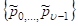 in Clause 8.4.1.1.2 of [4, TS 38.211] are determined according to the ordering of DM-RS port(s) given by Tables 8.3.1.1-3 in Clause 8.3.1.1 of [5, TS 38.212].
The UE shall set the contents of the SCI format 2-A as follows:
- the UE shall set value of the 'HARQ process number' field as indicated by higher layers.
- the UE shall set value of the 'NDI' field as indicated by higher layers.
- the UE shall set value of the 'Redundancy version' field as indicated by higher layers.
- the UE shall set value of the 'Source ID' field as indicated by higher layers.
- the UE shall set value of the 'Destination ID' field as indicated by higher layers.
- the UE shall set value of the 'HARQ feedback enabled/disabled indicator' field as indicated by higher layers.
- the UE shall set value of the 'Cast type indicator' field as indicated by higher layers.
- the UE shall set value of the 'CSI request' field as indicated by higher layers.
- the UE shall set value of the 'CAPC' field, if present, as indicated by higher layers.
- the UE shall set value of the 'COT sharing cast type' field, if present, as indicated by higher layers.
- the UE shall set value of the 'COT sharing Additional ID' field, if present, as indicated by higher layers.
- the UE shall set value of the 'Remaining COT duration' field, if present, as indicated by higher layers.
The UE shall set the contents of the SCI formats 2-B as follows:
- the UE shall set value of the 'HARQ process number' field as indicated by higher layers.
- the UE shall set value of the 'NDI' field as indicated by higher layers.
- the UE shall set value of the 'Redundancy version' field as indicated by higher layers.
- the UE shall set value of the 'Source ID' field as indicated by higher layers.
- the UE shall set value of the 'Destination ID' field as indicated by higher layers.
- the UE shall set value of the 'HARQ feedback enabled/disabled indicator' field as indicated by higher layers.
- the UE shall set value of the 'Zone ID' field as indicated by higher layers.
- the UE shall set the 'Communication range requirement' field as indicated by higher layers.
The UE shall set the contents of the SCI format 2-C as follows:
- the UE shall set value of the 'HARQ process number' field as indicated by higher layers.
- the UE shall set value of the 'NDI' field as indicated by higher layers.
- the UE shall set value of the 'Redundancy version' field as indicated by higher layers.
- the UE shall set value of the 'Source ID' field as indicated by higher layers.
- the UE shall set value of the 'Destination ID' field as indicated by higher layers.
- the UE shall set value of the 'HARQ feedback enabled/disabled indicator' field as indicated by higher layers.
- the UE shall set value of the 'CSI request' field as indicated by higher layers.
- the UE shall set value of 'Providing/Requesting indicator' field as indicated by higher layers.
- if 'Providing/Requesting indicator' indicates SCI format 2-C is used to convey an explicit request for inter-UE coordination information:
- the UE shall set value of the 'Priority' field as indicated by higher layers.
- the UE shall set value of the 'Number of subchannels' field as indicated by higher layers.
- the UE shall set value of the 'Number of RB sets' field as indicated by higher layers if the higher layer parameter sl-TransmissionStructureForPSCCHandPSSCH in SL-BWP-Config is configured to 'interlaceRB'.
- the UE shall set value of the 'Resource reservation period' field as indicated by higher layers.
- the UE shall set value of the 'Resource selection window location' field as indicated by higher layers.
- the UE shall set value of the 'Resource set type' field as indicated by higher layers if higher layer parameter sl-DetermineResourceType is configured to 'UE-B's request'; otherwise this field is omitted.
- if 'Providing/Requesting indicator' indicates SCI format 2-C is used to convey inter-UE coordination information:
- the UE shall set value of the 'Resource set type' field as indicated by higher layers.
- the UE shall set value of the 'Resource combination(s)' field (clause 8.1.5A) as indicated by higher layers.
- the UE shall set value of the 'Lowest subchannel indices' as indicated by higher layers
- the UE shall set value of the 'Lowest RB set indices' as indicated by higher layers if the higher layer parameter sl-TransmissionStructureForPSCCHandPSSCH in SL-BWP-Config is configured to 'interlaceRB'.
- the UE shall set value of the 'First resource location' as indicated by higher layers
- the UE shall set value of the 'Reference slot location' as indicated by higher layers
The UE shall set the contents of the SCI format 2-D as follows:
- the UE shall set value of the 'SL PRS resource ID' field as indicated by higher layers.
- the UE shall set value of the 'SL PRS request' field as indicated by higher layers.
- the UE shall set value of the 'Embedded SCI format' field as indicated by higher layers.
- if 'Embedded SCI format' indicates that SCI format 2-A is embedded within this SCI format 2-D then the UE shall include in the 'Embedded SCI format payload' field the fields of SCI format 2-A, set as specified above.
- if 'Embedded SCI format' indicates that SCI format 2-B is embedded within this SCI format 2-D then the UE shall include in the 'Embedded SCI format payload' field the fields of SCI format 2-B, set as specified above.
### 8.1.1 Transmission schemes
Only one transmission scheme is defined for the PSSCH and is used for all PSSCH transmissions.
PSSCH transmission is performed with up to two antenna ports, with antenna ports 1000-1001 as defined in clause 8.2.4 of [4, TS 38.211].
### 8.1.2 Resource allocation
In sidelink resource allocation mode 1:
- for PSSCH and PSCCH transmission, dynamic grant, configured grant type 1 and configured grant type 2 are supported. The configured grant Type 2 sidelink transmission is semi-persistently scheduled by a SL grant in a valid activation DCI according to Clause 10.2A of [6, TS 38.213].
#### 8.1.2.1 Resource allocation in time domain
The UE shall transmit the PSSCH in the same slot as the associated PSCCH.
The minimum resource allocation unit in the time domain is a slot.
The UE shall transmit the PSSCH in consecutive symbols within the slot, subject to the following restrictions:
- The UE shall not transmit PSSCH in symbols which are not configured for sidelink. A symbol is configured for sidelink, according to higher layer parameters sl-StartSymbol and sl-LengthSymbols, where sl-StartSymbol is the symbol index of the first symbol of sl-LengthSymbols consecutive symbols configured for sidelink, except when sl-StartingSymbolFirst and sl-StartingSymbolSecond are provided for a SL-BWP. If sl-StartingSymbolFirst and sl-StartingSymbolSecond are provided for the SL-BWP, a symbol is configured for sidelink, according to higher layer parameters sl-StartingSymbolFirst and sl-LengthSymbols, where sl-StartingSymbolFirst is the symbol index of the first symbol of sl-LengthSymbols consecutive symbols configured for sidelink.
- Within the slot, PSSCH resource allocation starts at symbol sl-StartSymbol+1, except when sl-StartingSymbolFirst and sl-StartingSymbolSecond are provided for a SL-BWP. If sl-StartingSymbolFirst and sl-StartingSymbolSecond are provided for the SL-BWP, there are 2 candidate starting symbols, given by sl-StartingSymbolFirst and sl-StartingSymbolSecond respectively, for PSSCH transmission for slots without PSFCH symbols; and there is one starting symbol, given by sl-StartingSymbolFirst, for PSSCH transmission for slots with PSFCH symbols. PSSCH resource allocation starts at the next symbol after each candidate starting symbol. In a slot, the UE may use the second candidate starting symbol, provided by sl-StartingSymbolSecond, only if it fails to access the channel prior to the first candidate starting symbol provided by sl-StartingSymbolFirst.
- The UE shall not transmit PSSCH in symbols which are configured for use by PSFCH, if PSFCH is configured in this slot.
- The UE shall not transmit PSSCH in the last symbol configured for sidelink.
- The UE shall not transmit PSSCH in the symbol immediately preceding the symbols which are configured for use by PSFCH, if PSFCH is configured in this slot.
- For operation with shared spectrum channel access in frequency range 1, for the first SL transmission with PSSCH/PSCCH by a UE to initiate a channel occupancy for a slot, if no resource reservation is transmitted or detected for the slot and any one of the RB set(s) of the intended PSCCH/PSSCH transmission, and if UE is configured with multiple CPE starting positions provided by sl-CPE-StartingPositions in sl-CPE-StartingPositionsPSCCH-PSSCH-InitiateCOT-List, the UE determines a duration of a cyclic prefix extension Text to be applied within the first one or two symbols before the first symbol of the PSSCH/PSCCH transmission according to [4, TS 38.211] where the index i for 𝐶𝑖 and $\Delta _{i}$ [4, TS 38.211] is chosen randomly from a set of values configured per priority of the PSCCH/PSSCH transmission by the higher layer parameter sl-CPE-StartingPositions in sl-CPE-StartingPositionsPSCCH-PSSCH-InitiateCOT-List. Otherwise, the UE uses a configured default cyclic prefix extension Text within the first one or two symbols before the first symbol of the PSSCH/PSCCH transmission indicated by sl-CPE-StartingPositionsPSCCH-PSSCH-InitiateCOT-Default.
- For operation with shared spectrum channel access in frequency range 1, for an intended SL transmission with PSSCH/PSCCH by a UE within a channel occupancy, other than the first SL transmission initiating the channel occupancy, the UE transmitting in the channel occupancy determines the duration of a cyclic prefix extension Text to be applied within the first one or two symbols before the first symbol of the PSSCH/PSCCH transmission only according to higher layer parameter sl-CPE-StartingPositionsPSCCH-PSSCH-WithinCOT-Default, unless the UE is configured with multiple CPE starting positions for transmitting within the channel occupancy by sl-CPE-StartingPositions in sl-CPE-StartingPositionsPSCCH-PSSCH-WithinCOT-List, in which case the UE determines the duration of a cyclic prefix extension Text to be applied within the first one or two symbols before the first symbol of the PSSCH/PSCCH transmission according to [4, TS 38.211] where the index i for 𝐶𝑖 and $\Delta _{i}$ [4, TS 38.211] is chosen randomly from a set of values configured per priority of the PSCCH/PSSCH by the higher layer parameter sl-CPE-StartingPositions in sl-CPE-StartingPositionsPSCCH-PSSCH-WithinCOT-List, if no resource reservation is transmitted or detected for the slot and any one of the RB set(s) of the intended PSCCH/PSSCH transmission, otherwise, the UE uses the configured default cyclic prefix extension Text to be applied within the first one or two symbols before the first symbol of the PSSCH/PSCCH transmission indicated by sl-CPE-StartingPositionsPSCCH-PSSCH-WithinCOT-Default.
- For operation with shared spectrum channel access in frequency range 1, for an intended PSSCH/PSCCH transmission by a UE that follows another SL transmission by the same UE in a channel occupancy, the UE determines the duration of a cyclic prefix extension Text to be applied within the first one or two symbols before the first symbol of the PSSCH/PSCCH transmission as follows, regardless of the duration of the cyclic prefix extension determined based on sl-CPE-StartingPositionsPSCCH-PSSCH-WithinCOT-Default or sl-CPE-StartingPositions in sl-CPE-StartingPositionsPSCCH-PSSCH-WithinCOT-List, if applicable:
- When gap between the PSSCH/PSCCH transmission and the previous SL transmission is 1 symbol, the index i for 𝐶𝑖 and $\Delta _{i}$is set to '1'.
- When gap between the PSSCH/PSCCH transmission and the previous SL transmission is 2 symbols, the index i for 𝐶𝑖 and $\Delta _{i}$is set to '3' for µ=1 and to '2' for µ=2.
In sidelink resource allocation mode 1:
- For sidelink dynamic grant, the PSSCH transmission is scheduled by a DCI format 3_0.
- For sidelink configured grant type 2, the configured grant is activated by a DCI format 3_0.
- For sidelink dynamic grant and sidelink configured grant type 2:
- The "Time gap" field value m of the DCI format 3_0 provides an index m + 1 into a slot offset table. That table is given by higher layer parameter sl-DCI-ToSL-Trans and the table value at index m + 1 will be referred to as slot offset $K_{SL}$.
- The slot of the first sidelink transmission scheduled by the DCI is the first SL slot of the corresponding resource pool that starts not earlier than $T_{DL}-\frac{T_{TA}}{2}+K_{SL}\times T_{slot}$, where $T_{DL}$ is the starting time of the downlink slot carrying the corresponding DCI, $T_{TA}$ is the timing advance value corresponding to the TAG of the serving cell on which the DCI is received and $K_{SL}$is the slot offset between the slot of the DCI and the first sidelink transmission scheduled by DCI and $T_{slot}$ is the SL slot duration.
- The "Configuration index" field of the DCI format 3_0, if provided and not reserved, indicates the index of the sidelink configured type 2.
- For sidelink configured grant type 1:
- The slot of the first sidelink transmissions follows the higher layer configuration according to [10, TS 38.321].
#### 8.1.2.2 Resource allocation in frequency domain
The resource allocation unit in the frequency domain is the sub-channel.
The sub-channel assignment for sidelink transmission is determined using the "Frequency resource assignment" field in the associated SCI.
The lowest sub-channel for sidelink transmission is the sub-channel on which the lowest PRB of the associated PSCCH is transmitted.
For operation with shared spectrum channel access for frequency range 1, the lowest RB set for sidelink transmission is the RB set on which the lowest PRB of the associated PSCCH is transmitted.
If a PSSCH scheduled by a PSCCH would overlap with resources containing the PSCCH, the resources corresponding to a union of the PSCCH that scheduled the PSSCH and associated PSCCH DM-RS are not available for the PSSCH.
If the highest sub-channel(s) of a PSSCH would overlap with a single RB set and the highest PRB in the highest sub-channel overlaps with intra-cell guardband PRBs, or if the highest sub-channel(s) of a PSSCH would overlap with intra-cell guardband PRBs only, the RBs corresponding to the intra-cell guard band PRBs in the highest sub-channel(s) are not available for the PSSCH.
When PSSCH is transmitted on multiple RB sets, the corresponding PSCCH is located on the sub-channel with the lowest index of the RB set with the lowest index within the multiple RB sets.
For operation with shared spectrum channel access for frequency range 1, if the higher layer parameter sl-TransmissionStructureForPSCCHandPSSCH is set to 'interlaceRB',
- the lowest index of the RB set allocation to the initial PSSCH transmission is indicated via the field "Lowest index of the RB set allocation to the initial transmission" of the DCI format 3_0.
- the starting RB set index of the initial PSSCH transmission of the sidelink configured grant Type 1 is indicated via the higher layer parameter sl-StartRBsetCG-Type1.
### 8.1.3 Modulation order, target code rate, redundancy version and transport block size determination
The redundancy version is given by the "Redundancy version" field in SCI format 2-A, 2-B, 2-C or 2-D.
#### 8.1.3.1 Modulation order and target code rate determination
IMCS is given by the 'Modulation and coding scheme' field in SCI format 1-A.
The MCS table is determined as follows: Table 5.1.3.1-1 is used if no additional MCS table is configured by higher layer parameter sl-Additional-MCS-Table; otherwise an MCS table is determined according to Table 8.1.3.1-1 or Table 8.1.3.1-2 and 'Additional MCS table indicator' field in SCI format 1-A.
Table 8.1.3.1-1: Mapping of one bit of MCS table indicator to MCS table
| MCS table indicator | MCS table |
| --- | --- |
| '0' | Table 5.1.3.1-1 |
| '1' | 1st table provided by higher layer parameter sl-Additional-MCS-Table |

Table 8.1.3.1-2: Mapping of two bits of MCS table indicator to MCS table
| MCS table indicator | MCS table |
| --- | --- |
| '00' | Table 5.1.3.1-1 |
| '01' | 1st table provided by higher layer parameter sl-Additional-MCS-Table |
| '10' | 2nd table provided by higher layer parameter sl-Additional-MCS-Table |
| '11' | reserved |

The UE shall use IMCS and the MCS table determined according to the previous step to determine the modulation order (Qm) and Target code rate (R) used in the physical sidelink shared channel.
#### 8.1.3.2 Transport block size determination
For the PSSCH assigned by SCI, if Table 5.1.3.1-2 is used and $0 \leq I_{MCS }\leq 27$, or a table other than Table 5.1.3.1-2 is used and $0 \leq I_{MCS }\leq 28$, the UE shall first determine the TBS as specified below:
The UE shall first determine the number of REs (NRE) within the slot.
- A UE first determines the number of REs allocated for PSSCH within a PRB ($N_{RE}^{'}$) by $N_{RE}^{'}=N_{sc}^{RB}\left( N_{symb}^{sh}-N_{symb}^{PSFCH}-N_{symb}^{SL-PRS} \right)-N_{oh}^{PRB}-N_{RE}^{DMRS}$, where
- $N_{sc}^{RB}=12$ is the number of subcarriers in a physical resource block,
- $N_{symb}^{sh}$$N_{symb}^{slot}$ = sl-LengthSymbols -2, where sl-LengthSymbols is the number of sidelink symbols within the slot provided by higher layers. If sl-StartingSymbolFirst and sl-StartingSymbolSecond are provided for the SL-BWP, the number of sidelink symbols assumed in transport block size determination is determined by a reference number of symbols, sl-NumRefSymbolLength, provided by higher layers, such that sl-NumRefSymbolLength replaces sl-LengthSymbols in calculation of $N_{symb}^{sh}$.
- $N_{symb}^{PSFCH}$ = 3 if 'PSFCH overhead indication' field of SCI format 1-A indicates "1", and $N_{symb}^{PSFCH}$ = 0 otherwise, if higher layer parameter sl-PSFCH-Period is 2 or 4. If higher layer parameter sl-PSFCH-Period is 0, $N_{symb}^{PSFCH}=0$. If higher layer parameter sl-PSFCH-Period is 1, $N_{symb}^{PSFCH}=3$.
- $N_{symb}^{SL-PRS}$ is the number of OFDM symbols used for SL PRS in the slot as indicated by the ‘SL PRS resource ID’ in SCI format 2-D if the 2nd-stage SCI is SCI format 2-D, and $N_{symb}^{SL-PRS}=0$, otherwise.,
- $N_{oh}^{PRB}$ is the overhead given by higher layer parameter sl-X-Overhead,
- $N_{RE}^{DMRS}$ is given by Table 8.1.3.2-1 according to higher layer parameter sl-PSSCH-DMRS-TimePatternList.
Table 8.1.3.2-1: $N_{RE}^{DMRS}$ according to higher layer parameter sl-PSSCH-DMRS-TimePatternList
| sl-PSSCH-DMRS-TimePatternList | $$N_{RE}^{DMRS}$$ |
| --- | --- |
| {2} | 12 |
| {3} | 18 |
| {4} | 24 |
| {2,3} | 15 |
| {2,4} | 18 |
| {3,4} | 21 |
| {2,3,4} | 18 |

- A UE determines the total number of REs allocated for PSSCH ()$N_{RE})$ by $N_{RE}=N_{RE}^{'}\cdot n_{PRB}-N_{RE}^{SCI,1}-N_{RE}^{SCI,2}$$N_{RE}= \hat{N}_{RE}^{'}* n_{PRB}$, where
- nPRB is the total number of allocated PRBs for the PSSCH. If the higher layer parameter sl-TransmissionStructureForPSCCHandPSSCH is set to 'interlaceRB', a reference number of PRBs (nref) per interlace within 1 RB set, sl-NumReferencePRBs-OfInterlace, is provided by higher layers for determination of total number of PRBs for PSSCH, that is nPRB = nref * ninter,subCH * nsubCH * nRB-set, where ninter,subCH is given by the higher layer parameter sl-NumInterlacePerSubchannel, nsubCH is the number of occupied sub-channels within one RB set  for the PSSCH, and  nRB-set is the number of occupied RB sets  for the PSSCH. If the higher layer parameter sl-TransmissionStructureForPSCCHandPSSCH is set to ‘contiguousRB’, nPRB = $n_{subCHsize}$ * nsubCH , where $n_{subCHsize}$ is provided by higher layer parameter sl-SubchannelSize, and nsubCH is the number of occupied sub-channels for the PSSCH.
- $N_{RE}^{SCI,1}$ is the total number of REs occupied by the PSCCH and PSCCH DM-RS.
- $N_{RE}^{SCI,2}$ is the number of coded modulation symbols generated for 2nd-stage SCI transmission (prior to duplication for the 2nd layer, if present) according to Clause 8.4.4 of [5, TS 38.212], with the assumption of $\gamma =0$.
The UE determines TBS according to Steps 2), 3), and 4) in clause 5.1.3.2.
A UE is not expected to receive an SCI indicating $28\leq I_{MCS}\leq 31$ if Table 5.1.3.1-2 is used, or $29\leq I_{MCS}\leq 31$ otherwise.
### 8.1.4 UE procedure for determining the subset of resources to be reported to higher layers in PSSCH resource selection in sidelink resource allocation mode 2
In resource allocation mode 2, the higher layer can request the UE to determine a subset of resources from which the higher layer will select resources for PSSCH/PSCCH transmission for a carrier. To trigger this procedure, in slot n for this carrier, the higher layer provides the following parameters for this PSSCH/PSCCH transmission:
- the resource pool from which the resources are to be reported;
- L1 priority, $prio_{TX}$;
- the remaining packet delay budget;
- number of sub-channels, $L_{subCH}$: If the higher layer parameter sl-TransmissionStructureForPSCCHandPSSCH is not provided, the number of sub-channels to be used for the PSSCH/PSCCH transmission in a slot is $L_{subCH}$. If the higher layer parameter sl-TransmissionStructureForPSCCHandPSSCH is set to 'contiguousRB', $L_{subCH}$ corresponds to the number of sub-channels within all used RB sets to be used for the PSCCH/PSSCH transmission in a slot. If the higher layer parameter sl-TransmissionStructureForPSCCHandPSSCH is set to 'interlaceRB', $L_{subCH}$ corresponds to the number of sub-channels to be used for the PSSCH/PSCCH transmission in a slot in each RB set,
- If the higher layer parameter sl-TransmissionStructureForPSCCHandPSSCH is set to 'interlaceRB', the number of used RB sets for one PSCCH/PSSCH transmission, LRBset.
- optionally, the number of consecutive slots for multi-consecutive slots transmission, $N_{slot,MCSt}$.
- optionally, the resource reservation interval, $P_{rsvp_TX}$, in units of msec.
- if the higher layer requests the UE to determine a subset of resources from which the higher layer will select resources for PSSCH/PSCCH transmission as part of re-evaluation or pre-emption procedure, the higher layer provides a set of resources $(r_{0},r_{1},r_{2},…)$which may be subject to re-evaluation and a set of resources $(r_{0}^{'},r_{1}^{'},r_{2}^{'},…)$which may be subject to pre-emption.
- it is up to UE implementation to determine the subset of resources as requested by higher layers before or after the slot $r_{i}^{''}$ - $T_{3}$, where $r_{i}^{''}$ is the slot with the smallest slot index among $(r_{0},r_{1},r_{2},…)$and $(r_{0}^{'},r_{1}^{'},r_{2}^{'},…)$, and $T_{3}$ is equal to $T_{proc,1}^{SL}$, where $T_{proc,1}^{SL}$ is defined in slots in Table 8.1.4-2 where $\mu _{SL}$ is the SCS configuration of the SL BWP.
- Each of the resource(s) in $\left( r_{0},r_{1},r_{2},… \right)$ and/or $\left( r_{0}^{'},r_{1}^{'},r_{2}^{'},… \right)$ corresponds to $N_{slot,MCSt}$ consecutive slots if $N_{slot,MCSt}$is provided with a value larger than 1.
- Optionally, the indication of resource selection mechanism.
- Optionally, rbSetsWithConsecutiveLBTFailure, which indicates the RB sets where consistent LBT failure has been indicated.
The following higher layer parameters affect this procedure:
- sl-SelectionWindowList: internal parameter $T_{2min}$ is set to the corresponding value from higher layer parameter sl-SelectionWindowList for the given value of $prio_{TX}$.
- sl-Thres-RSRP-List: this higher layer parameter provides an RSRP threshold for each combination $\left( p_{i}, p_{j} \right)$, where $p_{i}$ is the value of the priority field in a received SCI format 1-A and $p_{j}$ is the priority of the transmission of the UE selecting resources; for a given invocation of this procedure, $p_{j} = prio_{TX}$.
- sl-RS-ForSensing selects if the UE uses the PSSCH-RSRP or PSCCH-RSRP measurement, as defined in clause 8.4.2.1.
- sl-ResourceReservePeriodList
- sl-SensingWindow: internal parameter $T_{0}$ is defined as the number of slots corresponding to sl-SensingWindow msec
- sl-TxPercentageList: internal parameter $X$ for a given $prio_{TX}$ is defined as sl-TxPercentageList ($prio_{TX}$) converted from percentage to ratio
- sl-PreemptionEnable: if sl-PreemptionEnable is provided, and if it is not equal to 'enabled', internal parameter $prio_{pre}$ is set to the higher layer provided parameter sl-PreemptionEnable.
- Optionally, minimum number of Y slots as $Y_{min}$ (sl-MinNumCandidateSlotsPeriodic), which indicates the minimum number of Y slots that are included in the candidate resources corresponding to periodic-based partial sensing and contiguous partial sensing for resource (re)selection triggered by periodic transmission ($P_{rsvp_TX}\neq 0$).
- Optionally, minimum number of $Y'$ slots as $Y'_{\min {}}$ (sl-MinNumCandidateSlotsAperiodic), which indicates the minimum number of $Y'$ slots that are included in the candidate resources corresponding to periodic-based partial sensing and/or contiguous partial sensing results (if available) for resource (re)selection triggered by aperiodic transmission ($P_{rsvp_TX}=0$).
- Optionally, sensing occasion as sl-PBPS-OccasionReservePeriodList, which indicates the subset of periodicity values from sl-ResourceReservePeriodList used to determine periodic sensing occasions in periodic-based partial sensing. If not configured, all periodicity values from sl-ResourceReservePeriodList are used to determine periodic sensing occasions in periodic-based partial sensing.
- Optionally, additional sensing occasions as sl-Additional-PBPS-Occasion, which indicates that UE additionally monitors periodic sensing occasions that correspond to a set of values. The possible values of the set at least includes the most recent sensing occasion before the first slot of the candidate slots subject to processing time restriction as specified below for a given reservation periodicity and the last periodic sensing occasion prior to the most recent one for the given reservation periodicity. If not (pre-)configured, the UE monitors the most recent sensing occasion before the first slot of the candidate slots subject to processing time restriction as specified below for the given periodicity used to determine periodic sensing occasions in periodic-based partial sensing.
- Optionally, indication of the size in logical slots of contiguous partial sensing window for periodic transmissions as defined by the parameter sl-CPS-WindowPeriodic.
Optionally, indication of the size in logical slots of contiguous partial sensing window for aperiodic transmissions as defined by the parameter sl-CPS-WindowAperiodic.
- Optionally, indication of whether UE is required to perform SL reception of PSCCH and RSRP measurement for partial sensing on slots in SL DRX inactive time as sl-PartialSensingInactiveTime.
In case of dynamic co-channel coexistence of LTE sidelink and NR sidelink, that is coexistence over time and frequency resources that are shared between NR sidelink and LTE sidelink:
- sl-NRPSSCH-EUTRA-ThresRSRP-List: this higher layer parameter provides an RSRP threshold for each combination $\left( p_{i}, p_{j} \right)$, where $p_{i}$ is the value of the priority field in a received LTE SCI format 1, and $p_{j}$ is the priority of the transmission of the UE selecting resources; for a given invocation of this procedure, $p_{j} = prio_{TX}$.
- sl-NRPSFCH-EUTRA-ThresRSRP-List: this higher layer parameter, if provided, provides an RSRP threshold for each combination $\left( p_{i}, p_{j} \right)$, where $p_{i}$ is the value of the priority field in a received LTE SCI format 1, and $p_{j}$ is the priority of the transmission of the UE selecting resources; for a given invocation of this procedure, $p_{j} = prio_{TX}$.
The resource reservation interval, $P_{rsvp_TX}$, if provided, is converted from units of msec to units of logical slots, resulting in $P_{rsvp_TX}^{'}$ according to clause 8.1.7.
When the resource pool is (pre-)configured with sl-AllowedResourceSelectionConfig including full sensing, and full sensing is configured in the UE by higher layers, the UE performs full sensing.
When periodic reservation for another TB (sl-MultiReserveResource) is enabled for the resource pool, the resource pool is (pre-)configured with sl-AllowedResourceSelectionConfig including partial sensing, and partial sensing is configured by higher layer, the UE performs periodic-based partial sensing, unless other conditions state otherwise in the specification.
When a UE is triggered by higher layer to report resources for resource (re-)selection in a mode 2 Tx pool, the resource pool is (pre-)configured with sl-AllowedResourceSelectionConfig including partial sensing, and partial sensing is configured by higher layer, the UE performs contiguous partial sensing, unless stated otherwise in the specification.
Notation:
$\left( t'_{0}^{SL}, t'_{1}^{SL}, t'_{2}^{SL},… \right)$ denotes the set of slots which belongs to the sidelink resource pool and is defined in Clause 8.
For dynamic co-channel coexistence of LTE sidelink and NR sidelink, $\left( t_{0}^{LTESL},t_{1}^{LTESL},…,t_{T_{max}-1}^{LTESL} \right)$ denotes the set of subframes that may belong to an LTE sidelink resource pool as defined in clause 14.1.5 of [19, TS 36.213].
The following steps are used:
1) If a number of consecutive slots $N_{slot,MCSt}$is provided with a value larger than 1, the candidate multi-slot resource definition is applied. Otherwise, the candidate single-slot resource definition is applied.
If the higher layer parameter sl-TransmissionStructureForPSCCHandPSSCH is set to 'contiguousRB', a candidate multi-slot resource $R_{x,y}$  is defined as a set of $L_{subCH}$ contiguous sub-channels starting from sub-channel $x$ in $N_{slot,MCSt}$ consecutive slots starting from slot $t'_{y}^{SL}$, when the set of $N_{slot,MCSt}$ slots that are consecutive in physical slots.
If the higher layer parameter sl-TransmissionStructureForPSCCHandPSSCH is set to 'interlaceRB', a candidate multi-slot resource $R_{x,y,z}$ is defined as a set of $L_{subCH}$ contiguous sub-channels starting from sub-channel $x$ in $N_{slot,MCSt}$ consecutive slots starting from slot $t'_{y}^{SL}$ in $L_{RBset}$ contiguous RB sets starting from RB set z, when the set of $N_{slot,MCSt}$ slots that are consecutive in physical slots. A candidate single-slot resource $R_{x,y,z}$ is defined as a set of $L_{subCH}$ contiguous sub-channels starting from sub-channel $x$ in slot $t'_{y}^{SL}$ in $L_{RBset}$ contiguous RB sets starting from RB set z.
If the higher layer parameter sl-TransmissionStructureForPSCCHandPSSCH is not provided or if the higher layer parameter sl-TransmissionStructureForPSCCHandPSSCH is set to ‘contiguousRB’, a candidate single-slot resource for transmission $R_{x,y}$ is defined as a set of $L_{subCH}$ contiguous sub-channels with sub-channel x+j in slot $t'_{y}^{SL}$ where $j=0,...,L_{subCH}-1$.
The UE shall assume that any set of $L_{subCH}$ contiguous sub-channels or $L_{subCH}$ contiguous sub-channels in $L_{RBset}$ contiguous RB sets included in the corresponding resource pool within the time interval $[n+T_{1},n+T_{2}]$ correspond to one candidate single-slot resource or the UE shall assume that any set of $L_{subCH}$ contiguous sub-channels or $L_{subCH}$ contiguous sub-channels in $L_{RBset}$ contiguous RB sets in $N_{slot,MCSt}$ consecutive slots included in the corresponding resource pool within the time interval $\left[ n+T_{1},n+T_{2} \right]$ correspond to one candidate multi-slot resource for UE performing full sensing. The UE shall assume that any set of $L_{subCH}$ contiguous sub-channels or $L_{subCH}$ contiguous sub-channels in $L_{RBset}$ contiguous RB sets included in the corresponding resource pool in a set of Y candidate slots within the time interval $\left[ n+T_{1},n+T_{2} \right]$ correspond to one candidate single-slot resource or the UE shall assume that any set of $L_{subCH}$ contiguous sub-channels or $L_{subCH}$ contiguous sub-channels in $L_{RBset}$ contiguous RB sets in $N_{slot,MCSt}$ consecutive slots included in the corresponding resource pool in a set of Y candidate slots within the time interval $\left[ n+T_{1},n+T_{2} \right]$ correspond to one candidate multi-slot resource for UE performing periodic-based partial sensing together with contiguous partial sensing and resource (re)selection triggered by periodic transmission ($P_{rsvp_TX}\neq 0$), or the UE shall assume that any set of $L_{subCH}$ contiguous sub-channels or $L_{subCH}$ contiguous sub-channels in $L_{RBset}$ contiguous RB sets included in the corresponding resource pool in a set of Y' candidate slots within the time interval $[n+T_{1},n+T_{2}]$ correspond to one candidate single-slot resource or the UE shall assume that any set of $L_{subCH}$ contiguous sub-channels or $L_{subCH}$ contiguous sub-channels in $L_{RBset}$ contiguous RB sets in $N_{slot,MCSt}$ consecutive slots included in the corresponding resource pool in a set of Y' candidate slots within the time interval $[n+T_{1},n+T_{2}]$ correspond to one candidate multi-slot resource for UE performing at least contiguous partial sensing and resource (re)selection triggered by aperiodic transmission ($P_{rsvp_TX}=0$), where
- selection of $T_{1}$ is up to UE implementation under $0 \leq T_{1}\leq$ $T_{proc,1}^{SL}$ , where $T_{proc,1}^{SL}$ is defined in slots in Table 8.1.4-2 where $\mu _{SL}$ is the SCS configuration of the SL BWP;
- if $T_{2min}$ is shorter than the remaining packet delay budget (in slots) then $T_{2}$is up to UE implementation subject to  $T_{2min} \leq T_{2}$ $\leq$ remaining packet delay budget (in slots); otherwise $T_{2}$is set to the remaining packet delay budget (in slots).
- $Y$ is selected by UE where $Y\geq Y_{min}$.
- $Y'$ is selected by UE where $Y'\geq Y_{min}^{'}$. When the UE performs at least contiguous partial sensing and if $P_{rsvp_TX}=0$, the UE selects a set of $Y'$ candidate slots with corresponding PBPS and/or CPS results (if available). If the number of candidate slots $Y'$ is smaller than $Y_{min}^{'}$, it is up to UE implementation to include other candidate slots.
If the higher layer parameter sl-TransmissionStructureForPSCCHandPSSCH is set to 'contiguousRB', the UE shall exclude candidate single-slot or candidate multi-slot resources with the sub-channel with the smallest index including resource blocks of the intra-cell guardband PRBs, configured by higher layer parameter, sl-IntraCellGuardBandsSL-List, or determined according to the nominal intra-cell guard band and RB set pattern as specified in [8, TS 38.101-1] when higher layer parameter, sl-IntraCellGuardBandsSL-List, is not configured.
If rbSetsWithConsecutiveLBTFailure is provided, the UE shall exclude candidate single-slot resources or candidate multi-slot resources, whose associated one or more RB set(s) is included in the rbSetsWithConsecutiveLBTFailure parameter.
The total number of remaining candidate single-slot resources or candidate multi-slot resources is denoted by $M_{total}$.
2) The sensing window is defined by the range of slots [$n -T_{0},n-T_{proc,0}^{SL}$), when the UE performs full sensing, where $T_{0}$ is defined above and $T_{proc,0}^{SL}$ is defined in slots in Table 8.1.4-1 where $\mu _{SL}$ is the SCS configuration of the SL BWP. The UE shall monitor slots which belongs to a sidelink resource pool within the sensing window except for those in which its own transmissions occur. The UE shall perform the behaviour in the following steps based on PSCCH decoded and RSRP measured in these slots.
When the UE performs periodic-based partial sensing, the UE shall monitor slots at $t_{y-k\times P_{reserve}^{'}}^{'SL}$, where $t'_{y}^{SL}$ is a slot of the selected candidate slots and $P_{reserve}^{'}$ is $P_{reserve}$ converted to units of logical slot according to clause 8.1.7. The UE shall perform the behaviour in the following steps based on PSCCH decoded and RSRP measured in these slots.
The value of $P_{reserve}$ corresponds to sl-PBPS-OccasionReservePeriodList if (pre-)configured, otherwise, the values correspond to all periodicity from sl-ResourceReservePeriodList.
The UE monitors sensing occasion(s) determined by sl-Additional-PBPS-Occasion, as previously described, and not earlier than $n -T_{0}$. For a given periodicity $P_{reserve}$, the values of k correspond to the most recent sensing occasion earlier than $t'_{y0}^{SL}-(T_{proc,0}^{SL}+T_{proc,1}^{SL} )$if sl-Additional-PBPS-Occasion is not (pre-)configured, and additionally includes the value of k corresponding to the last periodic sensing occasion prior to the most recent one if sl-Additional-PBPS-Occasion is (pre-)configured. $t'_{y0}^{SL}$ is the first slot of the selected Y candidate slots of PBPS.
When the UE performs periodic-based partial sensing and contiguous partial sensing with periodic reservation for another TB (sl-MultiReserveResource) enabled and $P_{rsvp_TX}\neq 0$, the contiguous partial sensing window is defined by the range of slots $[n+T_{A}, n+T_{B}]$. n+TA is M consecutive logical slots earlier than slot $t'_{y0}^{SL}$, and n+TB is $T_{proc,0}^{SL}+T_{proc,1}^{SL}$ slots earlier than $t'_{y0}^{SL}$, where $t'_{y0}^{SL}$ is the first slot of the selected Y candidate slots of PBPS, and $T_{proc,0}^{SL}$, $T_{proc,1}^{SL}$ are in units of physical time/slots. The value of M is (pre-)configured with the sl-CPS-WindowPeriodic. The UE shall perform the behaviour in the following steps based on PSCCH decoded and RSRP measured in these slots. If sl-CPS-WindowPeriodic is not (pre-)configured, M equals to 31.
When the UE performs at least contiguous partial sensing and if $P_{rsvp_TX}=0$, the contiguous partial sensing window is defined by the range of slots $[n+T_{A}, n+T_{B}]$. $T_{A}$ and $T_{B}$ are both selected such that the UE has sensing results starting at least M consecutive logical slots before $t'_{y0}^{SL}$ and ending at $T_{proc,0}^{SL}+T_{proc,1}^{SL}$ slots earlier than $t'_{y0}^{SL}$, where $t'_{y0}^{SL}$ is the first slot of the selected $Y'$candidate slots. The value of M is (pre-)configured with the sl-CPS-WindowAperiodic. The UE shall perform the behaviour in the following steps based on PSCCH decoded and RSRP measured in these slots. If sl-CPS-WindowAperiodic is not (pre-)configured, M equals to 31. When the minimum M slots for CPS cannot be guaranteed and when $P_{rsvp_{TX}}=0$, it is up to UE implementation to either continue with step 3) or perform random selection.
Whether the UE is required to performs SL reception of PSCCH and RSRP measurement for partial sensing on slots in SL DRX inactive time is enabled/disabled by higher layer parameter sl-PartialSensingInactiveTime. When it is enabled, if UE performs periodic-based partial sensing on the slots in SL DRX inactive time for a given periodicity corresponding to $P_{reserve}$, UE monitors only the default periodic sensing occasions (most recent sensing occasion) from the slots; if UE performs contiguous partial sensing on the slots in SL DRX inactive time, UE monitors a minimum of M slots from the slots.
2LTE1) In case of dynamic co-channel coexistence of LTE sidelink and NR sidelink: The UE uses information determined by the E-UTRA radio access within the range of LTE subframes [$n_{LTE,start},n_{LTE,end}$], where $n_{LTE,start}$is an LTE subframe no later than LTE subframe $n_{LTE} -T_{start},n_{LTE,end}$ is the LTE subframe $n_{LTE}-T_{end}$, $n_{LTE}$ is the LTE subframe which overlaps slot n,  $T_{start}$ is 1100 msec and $T_{end}$  is up to UE implementation under $T_{end}\leq T_{proc,2}^{SL}$; $T_{proc,2}^{SL}$is 4+T msec, where T ≤ 4 msec. The UE shall perform the procedures in 5LTE1, 5LTE3 and 6LTE based on the information for these LTE subframes which is known to the NR radio access at the latest T msec prior to slot n.
2LTE2) In case of dynamic co-channel coexistence of LTE sidelink and NR sidelink: The UE shall perform the procedures in 5LTE2 based on the information determined by the E-UTRA radio access, which is known by the NR radio access at the latest T msec prior to slot n.
3) The internal parameter $Th(p_{i},p_{j})$ is set to the corresponding value of RSRP threshold indicated by the i-th field in sl-Thres-RSRP-List, where $i=p_{i}+\left( p_{j}-1 \right)*8$.
3LTE) In case of dynamic co-channel coexistence of LTE sidelink and NR sidelink:
- The internal parameter $ThLTE\left( p_{i},p_{j} \right)$ is set to the corresponding value of RSRP threshold indicated by the i-th field in sl-NRPSSCH-EUTRA-ThresRSRP-List, where $i=p_{i}+\left( p_{j}-1 \right)*8$.
- The internal parameter $ThLTEPSFCH\left( p_{i},p_{j} \right)$ is set to the corresponding value of RSRP threshold indicated by the i-th field in sl-NRPSFCH-EUTRA-ThresRSRP-List, if provided, where $i=p_{i}+\left( p_{j}-1 \right)*8$. If sl-NRPSFCH-EUTRA-ThresRSRP-List is not provided then each element of $ThLTEPSFCH\left( p_{i},p_{j} \right)$ is set to minus Infinity dBm.
4) The set $S_{A}$ is initialized to the set of all the remaining candidate single-slot resources or candidate multi-slot resources identified in step 1.
5) The UE shall exclude any candidate single-slot resource $R_{x,y}$ or  $R_{x,y,z}$, or candidate multi-slot resource $R_{x,y}$ or $R_{x,y,z}$ from the set $S_{A}$ if it meets all the following conditions:
- the UE has not monitored slot $t^{'}_{m}^{SL}$ in Step 2.
- for any periodicity value allowed by the higher layer parameter sl-ResourceReservePeriodList and a hypothetical SCI format 1-A received in slot $t^{'}_{m}^{SL}$ with 'Resource reservation period' field set to that periodicity value and indicating all subchannels of the resource pool in this slot, condition c in step 6 would be met.
5LTE1) In case of dynamic co-channel coexistence of LTE sidelink and NR sidelink: The UE shall exclude any candidate single-slot resource $R_{x,y}$ from the set $S_{A}$ if all the following conditions are met:
- the resource pool overlaps with an LTE sidelink resource pool;
- the UE has not monitored LTE subframe $t_{m}^{LTESL}$ .
- for any periodicity value allowed by the LTE higher layer parameter restrictResourceReservationPeriod and a hypothetical LTE SCI format 1 received in LTE subframe  $t_{m}^{LTESL}$ with 'Resource reservation' field set to that periodicity value and indicating all subchannels of the LTE sidelink resource pool in this LTE subframe, condition c in step 6LTE would be met.
5LTE2) In case of dynamic co-channel coexistence of LTE sidelink and NR sidelink: The UE shall exclude any candidate single-slot resource $R_{x,y}$ from the set $S_{A}$ if all the following conditions are met:
- the UE has a selected sidelink grant for LTE V2X sidelink according to [19, TS 36.321]  .
- the selected sidelink grant for LTE V2X sidelink determines the set of LTE resource blocks and LTE subframes which overlaps in time with $R_{x,y+j\times P_{rsvp_{TX}}^{'}}$ for j=0, 1, …, $C_{resel}-1$;
- the priority value associated with the selected sidelink grant for LTE V2X sidelink is lower than $prio_{TX}$; It is up to UE implementation whether or not to apply this exclusion step if the priority value associated with selected sidelink grant for LTE V2X sidelink is higher than or equal to $prio_{TX}$.
5LTE3) In case of dynamic co-channel coexistence of LTE sidelink and NR sidelink: The UE shall exclude any candidate single-slot resource $R_{x,y}$ from the set $S_{A}$ if all the following conditions are met:
a) the resource pool is configured with PSFCH resources;
b) an LTE SCI format 1 is received in LTE subframe $t_{m}^{LTESL}$, and the 'Resource reservation' field and 'Priority' field in the received LTE SCI format 1 indicate the values $P_{rsvp_{RX}}$ and $prio_{RX}$, respectively according to Clause 14.2.1 in [19, TS 36.213], where LTE subframes are indexed according to Clause 14.1.5 in [19, TS 36.213];
c) the LTE PSSCH-RSRP measurement according to the received LTE SCI format 1 is higher than $ThLTEPSFCH\left( prio_{RX},prio_{TX} \right);$
d) the SCI format received in LTE subframe  $t_{m}^{LTESL}$or the same SCI format which is assumed to be received in LTE subframe(s) $t_{m+q\times P_{rsvp_{RX}}^{'}}^{LTESL}$ determines according to clause 14.1.1.4C or clause 14.2.4 in [19, TS 36.213] the set of LTE subframes which overlaps with PSFCH slots associated with $R_{x,y+j\times P_{rsvp_{TX}}^{'}}$ for q=1, 2, …, Q and j=0, 1, …, $C_{resel}-1 ,$where the PSFCH association is according to [6, TS 38.213]. $P_{rsvp_{RX}}^{'}$and Q are determined as in condition c) of step 6LTE.
5a) If the number of candidate single-slot resources $R_{x,y}$ or $R_{x,y,z}$, or the number of candidate multi-slot resource $R_{x,y}$ or $R_{x,y,z}$ remaining in the set $S_{A}$ is smaller than $X\cdot M_{total}$, the set $S_{A}$ is initialized to the set of all the candidate single-slot resources or candidate multi-slot resources as in step 4.
6) The UE shall exclude any candidate single-slot resource $R_{x,y}$ or $R_{x,y,z}$, or candidate multi-slot resource $R_{x,y}$ or $R_{x,y,z}$ from the set $S_{A}$ if it meets all the following conditions:
a) the UE receives an SCI format 1-A in slot $t'_{m}^{SL}$, and 'Resource reservation period' field, if present, and 'Priority' field in the received SCI format 1-A indicate the values $P_{rsvp_{RX}}$ and $prio_{RX}$, respectively according to Clause 16.4 in [6, TS 38.213];
b) the RSRP measurement performed, according to clause 8.4.2.1 for the received SCI format 1-A, is higher than $Th\left( prio_{RX},prio_{TX} \right);$
c) the SCI format received in slot $t'_{m}^{SL}$or the same SCI format which, if and only if the 'Resource reservation period' field is present in the received SCI format 1-A, is assumed to be received in slot(s) $t'_{m+q\times P_{rsvp_{RX}}^{'}}^{SL}$ determines according to clause 8.1.5 the set of resource blocks and slots which overlaps with $R_{x,y+j\times P_{rsvp_{TX}}^{'}}$ or $R_{x,y+j\times P_{rsvp_{TX}}^{'},z}$ for q=1, 2, …, Q and j=0, 1, …, $C_{resel}-1$. Here, $P_{rsvp_RX}^{'}$ is $P_{rsvp_RX}$ converted to units of logical slots according to clause 8.1.7, $Q=\left⌈ \frac{T_{scal}}{P_{rsvp_{RX}}} \right⌉$ if $P_{rsvp_{RX}}< T_{scal}$ and $n^{'}-m\leq P_{rsvp_{RX}}^{'}$, where if the UE is configured with full sensing by its higher layer, $t'_{n^{'}}^{SL} = n$ if slot n belongs to the set $\left( t'_{0}^{SL},t'_{1}^{SL},...,t'_{T'_{max}-1}^{SL} \right)$, otherwise slot $t'_{n^{'}}^{SL}$ is the first slot after slot n belonging to the set $\left( t'_{0}^{SL},t'_{1}^{SL},...,t'_{T'_{max}-1}^{SL} \right)$; If UE is configured with partial sensing by its higher layer, $t'_{n^{'}}^{SL}=t'_{y_{i}}^{SL}-T_{proc,1}^{SL}$ if slot $t'_{y_{i}}^{SL}-T_{proc,1}^{SL}$ belongs to the set $\left( t'_{0}^{SL},t'_{1}^{SL},...,t'_{T'_{max}-1}^{SL} \right)$, otherwise, slot $t'_{n^{'}}^{SL}$ is the first slot after slot $t'_{y_{i}}^{SL}-T_{proc,1}^{SL}$ belonging to the set $\left( t'_{0}^{SL},t'_{1}^{SL},...,t'_{T'_{max}-1}^{SL} \right)$. Otherwise $Q=1$. If the UE is configured with full sensing by its higher layer, $T_{scal}$ is set to selection window size T2 converted to units of msec. If UE is configured with partial sensing by its higher layer, $T_{scal}=t'_{y_{L}}^{SL}-(t'_{y_{i}}^{SL}-T_{proc,1}^{SL})$ shall be converted to milliseconds, where slot $t'_{y_{L}}^{SL}$ is the last slot of the $Y$ or $Y'$ candidate slots. The slot $t'_{y_{i}}^{SL}$ is the first slot of the selected/remaining set of $Y$ or $Y'$ candidate slots.
6LTE) In case of dynamic co-channel coexistence of LTE sidelink and NR sidelink: The UE shall exclude any candidate single-slot resource $R_{x,y}$ from the set $S_{A}$ if all the following conditions are met:
a) an LTE SCI format 1 is received in LTE subframe $t_{m}^{LTESL}$, and the 'Resource reservation' field and 'Priority' field in the received LTE SCI format 1 indicate the values $P_{rsvp_{RX}}$ and $prio_{RX}$, respectively according to Clause 14.2.1 in [19, TS 36.213], where LTE subframes are indexed according to Clause 14.1.5 in [19, TS 36.213];
b) the LTE PSSCH-RSRP measurement according to the received LTE SCI format 1 is higher than $ThLTE\left( prio_{RX},prio_{TX} \right);$
c) the SCI format received in LTE subframe  $t_{m}^{LTESL}$or the same SCI format which is assumed to be received in LTE subframe(s) $t_{m+q\times P_{rsvp_{RX}}^{'}}^{LTESL}$ determines according to clause 14.1.1.4C or clause 14.2.4 in [19, TS 36.213] the set of LTE resource blocks and LTE subframes which overlaps with $R_{x,y+j\times P_{rsvp_{TX}}^{'}}$ for q=1, 2, …, Q and j=0, 1, …, $C_{resel}-1$. Here, $P_{rsvp_RX}^{'}$ is $P_{step}\times P_{rsvp_RX}$with $P_{step}$ determined according to  Table 14.1.1-1 in [19, TS 36.213], $Q=\left⌈ \frac{T_{scal}}{100\times P_{rsvp_{RX}}} \right⌉$ if $100\times P_{rsvp_{RX}}< T_{scal}$ and $n^{'}-m\leq P_{rsvp_{RX}}^{'}$, where $t_{n^{'}}^{LTESL} = n_{LTE}$if subframe $n_{LTE}$ belongs to the set $\left( t_{0}^{LTESL},t_{1}^{LTESL},…,t_{T_{max}-1}^{LTESL} \right)$, otherwise subframe $t_{n^{'}}^{LTESL}$ is the first subframe after subframe $n_{LTE}$belonging to the set $\left( t_{0}^{LTESL},t_{1}^{LTESL},…,t_{T_{max}-1}^{LTESL} \right)$; Otherwise $Q=1$. $T_{scal}$ is set to selection window size T2 converted to units of msec.
6a) This step is executed only if the procedure in clause 8.1.4A is triggered.
6b) This step is executed only if the procedure in clause 8.1.4C is triggered.
7) If the number of candidate single-slot resources or candidate multi-slot resources remaining in the set $S_{A}$ is smaller than $X\cdot M_{total}$, then $Th\left( p_{i},p_{j} \right)$ and $ThLTE\left( p_{i},p_{j} \right)$, if set, is increased by 3 dB for each combination $\left( p_{i},p_{j} \right)$ and the procedure continues with step 4.
7a) If sidelink DRX active time of RX UE is provided by the higher layer and there is no candidate single-slot or multi-slot resource remained within the sidelink DRX active time in the set $S_{A}$, the UE based on its implementation additionally selects and includes at least one candidate single-slot resource or at least one candidate multi-slot resource within the sidelink DRX active time in the set $S_{A}$.
The UE shall report set $S_{A}$ to higher layers.
If a resource $r_{i}$ from the set $(r_{0},r_{1},r_{2},…)$ is not a member of $S_{A}$, then the UE shall report re-evaluation of the resource $r_{i}$ to higher layers.
If a resource $r_{i}^{'}$ from the set $(r_{0}^{'},r_{1}^{'},r_{2}^{'},…)$ meets the conditions below then the UE shall report pre-emption of the resource $r_{i}^{'}$ to higher layers.
- $r_{i}^{'}$ is not a member of $S_{A}$, and
- $r_{i}^{'}$ meets the conditions for exclusion in step 6, with $Th\left( prio_{RX},prio_{TX} \right)$ set to the final threshold after executing steps 1)-7), i.e. including all necessary increments for reaching $X\cdot M_{total}$, or for exclusion in step 6LTE, with $ThLTE\left( prio_{RX},prio_{TX} \right)$ set to the final threshold after executing steps 1-7, i.e. including all necessary increments for reaching $X\cdot M_{total}$, or for exclusion in step 5LTE3, and
- the associated priority $prio_{RX},$ satisfies one of the following conditions:
- sl-PreemptionEnable is provided and is equal to 'enabled' and $prio_{TX}>prio_{RX}$
- sl-PreemptionEnable is provided and is not equal to 'enabled', and $prio_{RX}<prio_{pre}$ and $prio_{TX}>prio_{RX}$

Table 8.1.4-1: $T_{proc,0}^{SL}$ depending on sub-carrier spacing
| $$\mu _{SL}$$ | $T_{proc,0}^{SL}$ [slots] |
| --- | --- |
| 0 | 1 |
| 1 | 1 |
| 2 | 2 |
| 3 | 4 |

Table 8.1.4-2: $T_{proc,1}^{SL}$ depending on sub-carrier spacing
| $$\mu _{SL}$$ | $T_{proc,1}^{SL}$ [slots] |
| --- | --- |
| 0 | 3 |
| 1 | 5 |
| 2 | 9 |
| 3 | 17 |

When the UE performs periodic-based partial sensing and contiguous partial sensing, and when the UE is triggered to perform re-evaluation and/or pre-emption checking, and if $P_{rsvp_TX}\neq 0$,
- During the qth reservation period (q=0,1,2,…, Cresel-1), candidate resource set (SA) is initialized to the remaining Y candidate slots starting from slot $t'_{yi}^{SL}$ and ending at the last slot of the Y candidate slots, where the slot indices of the remaining Y candidate slots are equal to $t'_{y+q\times P_{rsvp_TX}^{'}}^{SL}$, where $t'_{y}^{SL}$ is a slot index of Y candidate slots used in the initial resource (re)selection.
- $t'_{yi}^{SL}$ is the first candidate slot starting from slot n+T3.
- The UE performs PBPS for the remaining Y candidate slots according to $t_{y'-k\times P_{reserve}^{'}}^{'SL}$ except for those in which its own transmissions occur, where$t'_{y'}^{SL}$ is a slot belonging to the remaining Y candidate slots, and k and Preserve are the same as resource (re)selection, where the values of k correspond to the most recent sensing occasion earlier than $t'_{yi}^{SL}-(T_{proc,0}^{SL}+T_{proc,1}^{SL} )$if sl-Additional-PBPS-Occasion is not (pre-)configured, and additionally includes the value of k corresponding to the last periodic sensing occasion prior to the most recent one if sl-Additional-PBPS-Occasion is (pre-)configured.
- The UE performs CPS starting from M logical slots earlier than $t'_{yi}^{SL}$ to $T_{proc,0}^{SL}+T_{proc,1}^{SL}$ slots earlier than $t'_{yi}^{SL}$ except for those in which its own transmissions occur.
- By default, M is 31 unless (pre-)configured with another value by sl-CPS-WindowPeriodic.
When the UE is triggered to perform re-evaluation and/or pre-emption checking, performs at least contiguous partial sensing, and if $P_{rsvp_TX}=0$,
- Candidate resource set (SA) is initialized to the remaining Y' candidate slots starting from slot $t'_{yi}^{SL}$ and ending at the last slot of the Y' candidate slots, where $t'_{yi}^{SL}$ is the first candidate slot starting from slot n+T3.
- It is up to UE implementation that UE may perform PBPS for periodic sensing occasions after the resource (re)selection when higher layer parameter sl-MultiReserveResource is enabled.
- UE performs CPS starting from at least M consecutive logical slots earlier than $t'_{yi}^{SL}$ to $T_{proc,0}^{SL}+T_{proc,1}^{SL}$ slots earlier than $t'_{yi}^{SL}$ except for those in which its own transmissions occur.
- For minimum size M of the contiguous partial sensing window $[n+T_{A}, n+T_{B}]$, by default, M is 31 unless (pre-)configured with another value, by sl-CPS-WindowAperiodic.
When the minimum M slots for CPS cannot be guaranteed, UE senses in all available slots starting from the resource (re)selection trigger slot of the same TB to $T_{proc,0}^{SL}+T_{proc,1}^{SL}$ slots earlier than $t'_{yi}^{SL}$. The UE re-evaluation and pre-emption checking is based on all available sensing results after $n -T_{0}$.
### 8.1.4A UE procedure for determining a set of preferred or non-preferred resources for another UE's transmission
When this procedure is triggered, the following parameters are provided by the higher layer:
- the resource pool from which the preferred or non-preferred resources are to be determined;
- the resource selection window $[n+T_{1},n+T_{2}]$ within which the preferred or non-preferred resources are to be determined;
- the resource set type (either preferred or non-preferred resource set);
- if the resource set type indicates preferred set, then the higher layer additionally provides the following parameters:
- L1 priority, $prio_{TX}$;
- the number of sub-channels to be used for the PSSCH/PSCCH transmission in a slot, $L_{subCH}$;
- If the higher layer parameter sl-TransmissionStructureForPSCCHandPSSCH is set to 'interlaceRB', the number of used RB sets for one PSCCH/PSSCH transmission, LRBset;
- the resource reservation period, $P_{rsvp_TX}$, if present.
The value of $C_{resel}$ is determined by the UE according to clause 8.1.5.

When this procedure is triggered by another UE's explicit request, the fields in the request are interpreted as follows:
- The field 'Resource selection window location' is the concatenation of the starting time location and the ending time location of the resource selection window. The starting and ending time locations of the resource selection window are each encoded in the same way as the reference slot as described in clause 8.1.5A.
- The field 'Resource reservation period' is encoded in the same way as the field of the same name in SCI format 1-A.
When determining a preferred resource set, the UE applies the procedure described in clause 8.1.4, it is up to UE implementation whether to use information determined by the E-UTRA radio access in case of dynamic co-channel coexistence of LTE sidelink and NR sidelink, with the above parameters and the following modifications:
- Step 6a) The UE excludes candidate single-slot resource(s) belonging to slot(s) where the UE does not expect to perform SL reception of a TB due to half-duplex operation, if all the following conditions are met:
- the UE is a destination UE of the TB for whose transmission the preferred resource set is being determined;
- the higher layer parameter sl-Condition1-A-2 is not set to 'Disabled'.
When determining a non-preferred resource set, the UE considers any resource(s) within the resource selection window, if indicated by a received explicit request, and satisfying at least one of the following conditions as non-preferred resource(s):
- resource(s) indicated by a received SCI format 1-A, satisfying at least one of the following criteria:
- the RSRP measurement performed, according to clause 8.4.2.1, for the received SCI format 1-A, is higher than $Th\left( prio_{RX} \right)$ where $prio_{RX}$ is the value of the priority field in the received SCI format 1-A. The internal parameter $Th(p_{i})$ is set to the corresponding value of RSRP threshold indicated by the k-th field in sl-ThresholdRSRP-Condition1-B-1-Option1List, where $k=p_{i}$.
- the UE is a destination UE of a TB associated with the received SCI format 1-A and the RSRP measurement performed, according to clause 8.4.2.1 for the received SCI format 1-A, is lower than $Th'\left( prio_{RX} \right)$ where $prio_{RX}$ is the value of the priority field in the received SCI format 1-A. The internal parameter $Th'(p_{i})$ is set to the corresponding value of RSRP threshold indicated by the k-th field in sl-ThresholdRSRP-Condition1-B-1-Option2List, where $k=p_{i}$.
- resources(s) in slot(s) in which the UE does not expect to perform SL reception due to half duplex operation, if the UE is a destination UE of a TB for whose transmission the non-preferred resource set is being determined.
### 8.1.4B Void
### 8.1.4C UE procedure for using a received non-preferred resource set
A UE configured with the higher layer parameter sl-InterUE-CoordinationScheme1 uses a received non-preferred resource set as follows when performing resource (re-)selection:
- the UE excludes in Step 6b) of clause 8.1.4 resource(s) overlapping with the non-preferred resource set.
If it is not possible to meet the requirement that the number of candidate single-slot resources remaining in the set $S_{A}$ be at least $X\cdot M_{total}$ after excluding resource(s) overlapping with the received non-preferred resource set, it is up to UE implementation whether or not to take into account the received non-preferred resource set to meet such requirement.
The UE is not required to use any resource from the non-preferred resource set in its resource (re-)selection if that resource is earlier than ($T_{proc,0}^{SL}$+ $T_{proc,1}^{SL}$+ $T_{proc,2}^{SL}$) after the resource of inter-UE coordination information transmission, where $T_{proc,2}^{SL}$ is equal to ($T_{proc,0}^{SL}$+ $T_{proc,1}^{SL}$) when only MAC CE is used for inter-UE coordination information transmission, or $T_{proc,2}^{SL}$ is equal to $T_{proc,0}^{SL}$ when MAC CE and SCI format 2-C are both used for inter-UE coordination information transmission.
The case when $T_{proc,2}^{SL}$ is equal to $T_{proc,0}^{SL}$ is assuming that SCI format 2-C is received.
### 8.1.5 UE procedure for determining slots and resource blocks for PSSCH transmission associated with an SCI format 1-A
The set of slots and resource blocks for PSSCH transmission is determined by the resource used for the PSCCH transmission containing the associated SCI format 1-A, and fields 'Frequency resource assignment', 'Time resource assignment' of the associated SCI format 1-A as described below.
'Time resource assignment' carries logical slot offset indication of N = 1 or 2 actual resources when sl-MaxNumPerReserve is 2, and N = 1 or 2 or 3 actual resources when sl-MaxNumPerReserve is 3, in a form of time RIV (TRIV) field which is determined as follows:
if $N=1$
$$TRIV=0$$
elseif $N=2$
$$TRIV=t_{1}$$
else
if $\left( t_{2}-t_{1}-1 \right)\leq 15$
$$TRIV=30\left( t_{2}-t_{1}-1 \right)+t_{1}+31$$
else
$$TRIV=30\left( 31-t_{2}+t_{1} \right)+62-t_{1}$$
end if
end if
where the first resource is in the slot where SCI format 1-A was received, and $t_{i}$ denotes i-th resource time offset in logical slots of a resource pool with respect to the first resource where for N = 2, $1\leq t_{1}\leq 31$; and for N = 3, $1\leq t_{1}\leq 30$, $t_{1}<t_{2}\leq 31$.
The starting sub-channel $n_{subCH,0}^{start}$ of the first resource is determined according to clause 8.1.2.2. The number of contiguously allocated sub-channels for each of the N resources $L_{subCH}\geq 1$ and the starting sub-channel indexes of resources indicated by the received SCI format 1-A, except the resource in the slot where SCI format 1-A was received, are determined from "Frequency resource assignment" which is equal to a frequency RIV (FRIV) where.
If sl-MaxNumPerReserve is 2 then
$$FRIV=n_{subCH,1}^{start}+\sum_{i=1}^{L_{subCH}-1} \left( N_{ subchannel}^{ SL}+1-i \right)$$
If sl-MaxNumPerReserve is 3 then
$$FRIV=n_{subCH,1}^{start}+n_{subCH,2}^{start}\cdot \left( N_{ subchannel}^{ SL}+1-L_{subCH} \right)+\sum_{i=1}^{L_{subCH}-1} \left( N_{ subchannel}^{ SL}+1-i \right)^{2}$$
where
- $n_{subCH,1}^{start}$ denotes the starting sub-channel index for the second resource
- $n_{subCH,2}^{start}$ denotes the starting sub-channel index for the third resource
- $N_{ subchannel}^{ SL}$ is the number of sub-channels in a resource pool provided according to the higher layer parameter sl-NumSubchannel, or if the higher layer parameter sl-TransmissionStructureForPSCCHandPSSCH is set to 'interlaceRB', the number of sub-channels in each RB set which is equal to the number of interlaces in each RB set divided by the number of interlace(s) per sub-channel provided according to the higher layer parameter sl-NumInterlacePerSubchannel
If the higher layer parameter sl-TransmissionStructureForPSCCHandPSSCH is set to 'interlaceRB', the applied interlace index(s) in different RB sets are the same.
If the higher layer parameter sl-TransmissionStructureForPSCCHandPSSCH is set to 'interlaceRB', the starting RB set $n_{RBset,0}^{start}$ of the first resource is determined according to the clause 8.1.2.2. The number of contiguously allocated RB sets for each of the N resources LRBset≥1 and the starting RB set indexes of resources indicated by the received SCI format 1-A, except the resource in the slot where SCI format 1-A was received, are determined from "Frequency resource assignment" which is equal to a frequency RIV (FRIV), where
If sl-MaxNumPerReserve is 2 then
$$FRIV_{RBset}=n_{RBset,1}^{start}+\sum_{i=1}^{L_{RBset}-1} \left( N_{RBset}+1-i \right)$$
If sl-MaxNumPerReserve is 3 then
$$FRIV_{RBset}=n_{RBset,1}^{start}+n_{RBset,2}^{start}\cdot \left( N_{RBset}+1-L_{RBset} \right)+\sum_{i=1}^{L_{RBset}-1} \left( N_{RBset}+1-i \right)^{2}$$
where
- $n_{RBset,1}^{start}$ denotes the starting RB set index for the second resource,
- $n_{RBset,2}^{start}$ denotes the starting RB set index for the third resource,
- $N_{RBset}$ is the number of RB sets in a resource pool,
- $L_{RBset}$ is the number of RB sets for each of the indicated resources,
- for FRIV indication, within the resource pool, RB sets are numbered in increasing order from 0 to $N_{RBset}-1$ from lowest frequency location to highest frequency location.
If the higher layer parameter sl-TransmissionStructureForPSCCHandPSSCH is set to 'interlaceRB', the resource is determined by an intersection of the interlaces corresponding to the indicated sub-channel(s) and the union of the indicated set of RB sets and intra-cell guard bands between the indicated RB sets, if any.
If TRIV indicates N < sl-MaxNumPerReserve,
- if the higher layer parameter sl-TransmissionStructureForPSCCHandPSSCH is set to 'interlaceRB', the starting sub-channel indexes and the starting RB set indexes corresponding to sl-MaxNumPerReserve minus N last resources are not used.
- otherwise, the starting sub-channel indexes corresponding to sl-MaxNumPerReserve minus N last resources are not used.
The number of slots in one set of the time and frequency resources for transmission opportunities of PSSCH is given by $C_{resel}$ where $C_{resel}$= 10*SL_RESOURCE_RESELECTION_COUNTER [10, TS 38.321] if configured else $C_{resel}$ is set to 1.
If a set of sub-channels in slot $t'_{m}^{SL}$ is determined as the time and frequency resource for PSSCH transmission corresponding to the selected sidelink grant (described in [10, TS 38.321]), the same set of sub-channels in slots $t'_{m+j(\times )P_{rsvp_TX}^{'}}^{SL}$ are also determined for PSSCH transmissions corresponding to the same sidelink grant where j=1, 2,…, $C_{resel}-1$, $P_{rsvp_TX}$, if provided, is converted from units of msec to units of logical slots, resulting in $P_{rsvp_TX}^{'}$ according to clause 8.1.7, and $\left( t'_{0}^{SL}, t'_{1}^{SL}, t'_{2}^{SL},… \right)$ is determined by Clause 8. Here, $P_{rsvp_TX}$ is the resource reservation interval indicated by higher layers.
### 8.1.5A UE procedure for determining slots and resource blocks indicated by a preferred or non-preferred resource set
The set of slots and resource blocks indicated by a set of preferred or non-preferred resource(s) is determined as described below.
If the higher layer parameter sl-TransmissionStructureForPSCCHandPSSCH is not provided, or it is set to ‘contiguousRB', the set of preferred or non-preferred resources $\left\{ r_{0},r_{1},r_{2},… \right\}$, is indicated by a reference slot $t_{ref}$ and $M$ tuples $(TRIV_{m},FRIV_{m},P_{rsvp,m})$, $1\leq m\leq M$ indicated by the 'resource combination' field, where for each tuple $TRIV_{m}$ is indicated by the 9 MSBs, followed by $FRIV_{m}$ and $P_{rsvp,m}$ (if present).
If the higher layer parameter sl-TransmissionStructureForPSCCHandPSSCH is set to ‘interlaceRB', the set of preferred or non-preferred resources $\left\{ r_{0},r_{1},r_{2},… \right\}$, is indicated by a reference slot $t_{ref}$ and $M$ tuples $(TRIV_{m},FRIV_{m},FRIV_{RBset,m},P_{rsvp,m})$, $1\leq m\leq M$ indicated by the 'resource combination' field, where for each tuple $TRIV_{m}$ is indicated by the 9 MSBs, followed by  $FRIV_{m}$, $FRIV_{RBset,m}$ and $P_{rsvp,m}$ (if present).
The reference slot $t_{ref}$ is indicated by the 'Reference slot location' field as a combination of DFN index and slot index [5, TS 38.212], with the 10 MSBs indicating the DFN index. $TRIV_{m}$, $FRIV_{m}$ and $FRIV_{RBset,m}$ if any are interpreted according to clause 8.1.5, with the following modifications:
- the value of sl-MaxNumPerReserve is fixed to 3.
- "slot where SCI format 1-A was received" is replaced by slot indicated as the first resource location of a $TRIV_{m}$.
- the first resource location of each $TRIV_{m}$ for $m>1$ is indicated by a slot offset $t_{m}$ in logical slots with respect to the reference slot $t_{ref}$; the slot offset $t_{m}$ is indicated by the 'first resource location' field; the first resource location of $TRIV_{1}$ is at slot offset 0 with respect to the reference slot.
- "the received SCI format 1-A, except the resource in the slot where SCI format 1-A was received" is replaced by "each tuple".
- the starting sub-channel $n_{subCH,0}^{start}$ of the first resource of each tuple is separately indicated.
- if the higher layer parameter sl-TransmissionStructureForPSCCHandPSSCH is set to ‘interlaceRB', the starting RB set $n_{RBset,0}^{start}$ of the first resource of each tuple is separately indicated.
The starting sub-channel $n_{subCH,0}^{start}$ of the first resource of each tuple is indicated by the 'Lowest subChannel indices' field. The starting RB set $n_{RBset,0}^{start}$ of the first resource of each tuple, if any, is indicated by the 'Lowest RB set indices' field. The resource reservation period $P_{rsvp,m}$  is encoded as in SCI format 1-A.
If the set is indicated by an SCI format 2-C, the number of tuples is $M=2$.
If the higher layer parameter sl-TransmissionStructureForPSCCHandPSSCH is not provided, or it is set to ‘contiguousRB', a UE forms the union of the subsets indicated by each tuple $(TRIV_{m},FRIV_{m},P_{rsvp,m})$ to obtain the set $\left\{ r_{0},r_{1},r_{2},… \right\}$.
If the higher layer parameter sl-TransmissionStructureForPSCCHandPSSCH is set to ‘interlaceRB', a UE forms the union of the subsets indicated by each tuple  $\left( TRIV_{m},FRIV_{m},FRIV_{RBset,m},P_{rsvp,m} \right)$ to obtain the set $\left\{ r_{0},r_{1},r_{2},… \right\}$.
### 8.1.6 Sidelink congestion control in sidelink resource allocation mode 2
If a UE is configured with higher layer parameter sl-CR-Limit and transmits PSSCH in slot n, the UE shall ensure the following limits for any priority value k;
$$\sum_{i\geq k} CR\left( i \right)\leq CR_{Limit}\left( k \right)$$
where $CR\left( i \right)$ is the CR evaluated in slot n-N for the PSSCH transmissions with 'Priority' field in the SCI set to i, and $CR_{Limit}\left( k \right)$ corresponds to the high layer parameter sl-CR-Limit that is associated with the priority value k and the CBR range which includes the CBR measured in slot n-N, where N is the congestion control processing time.
The congestion control processing time N is based on µ of Table 8.1.6-1 and Table 8.1.6-2 for UE processing capability 1 and 2 respectively, where µ corresponds to the subcarrier spacing of the sidelink channel with which the PSSCH is to be transmitted. A UE shall only apply a single processing time capability in sidelink congestion control.
Table 8.1.6-1: Congestion control processing time for processing timing capability 1
| µ | Congestion control processing time N [slots] |
| --- | --- |
| 0 | 2 |
| 1 | 2 |
| 2 | 4 |
| 3 | 8 |

Table 8.1.6-2: Congestion control processing time for processing timing capability 2
| µ | Congestion control processing time N [slots] |
| --- | --- |
| 0 | 2 |
| 1 | 4 |
| 2 | 8 |
| 3 | 16 |

It is up to UE implementation how to meet the above limits, including dropping the transmissions in slot n.
### 8.1.7 UE procedure for determining the number of logical slots for a reservation period
A given resource reservation period $P_{rsvp}$ in milliseconds is converted to a period $P_{rsvp}^{'}$ in logical slots as:
$$P_{rsvp}^{'}=\left⌈ \frac{T'_{max}}{10240 ms}\times P_{rsvp} \right⌉$$
where $T'_{max}$ is the number of slots that belong to a resource pool as defined in Clause 8.
## 8.2 UE procedure for transmitting sidelink reference signals
### 8.2.1 CSI-RS transmission procedure
A UE transmits sidelink CSI-RS within a unicast PSSCH transmission if the following conditions hold:
- CSI reporting is enabled by higher layer parameter sl-CSI-Acquisition; and
- the 'CSI request' field in the corresponding SCI format 2-A, 2-C or 2-D is set to 1.
The following parameters for CSI-RS transmission are configured for each CSI-RS configuration:
- sl-CSI-RS-FirstSymbol indicates the first OFDM symbol in a PRB used for SL CSI-RS
- sl-CSI-RS-FreqAllocation indicates the number of antenna ports and the frequency domain allocation for SL CSI-RS.
When the UE is configured with Qp={1,2} CSI-RS port(s) in sidelink and the number of scheduled layers is $n_{layer}^{PSSCH}$,
- The CSI-RS scaling factor $\beta _{CSIRS}$ specified in clause 8.4.1.5.3 of [4, TS 38.211] is given by $\beta _{CSIRS}=\beta _{DMRS}^{PSSCH}\cdot \sqrt{\frac{n_{layer}^{PSSCH}}{Q_{p}}}$ where $\beta _{DMRS}^{PSSCH}$ is the scaling factor for the corresponding PSSCH specified in clause 8.3.1.5 of [4, TS 38.211].
### 8.2.2 PSSCH DM-RS transmission procedure
The UE selects the DM-RS time domain pattern out of the patterns configured using the higher layer parameter sl-PSSCH-DMRS-TimePatternList for the resource pool on which the PSSCH is to be transmitted. If more than one DM-RS time domain pattern is configured, the selected pattern is indicated by the 'DMRS pattern' field in the SCI format 1-A associated with the PSSCH transmission.
If PSSCH DM-RS and PSCCH are mapped to the same OFDM symbol, then this mapping within a single sub-channel is only supported if higher layer parameter sl-SubchannelSize >= 20, i.e. the sub-channel size is at least 20 PRBs.
When a sub-channel size is less than 20 PRBs and the size of PSCCH is less than the sub-channel size, a UE is not expected to choose a PSSCH DM-RS pattern to be transmitted in the same OFDM symbol with PSCCH.
### 8.2.3 PT-RS transmission procedure
Transmission of PT-RS is only supported in frequency range 2.
The UE PT-RS transmission procedure specified in clause 6.2.3.1 applies for derivation of the PT-RS parameters LPT-RS and, KPT-RS  and for determination of PT-RS presence, with the following changes:
- timeDensity and frequencyDensity in PTRS-UplinkConfig are replaced by sl-PTRS-TimeDensity and sl-PTRS-FreqDensity in SL-PTRS-Config respectively, and SL-PTRS-Config is (pre)configured per resource pool;
- the number of antenna ports is the same as the number of PSSCH DM-RS antenna ports and the association between a PT-RS antenna port and a PSSCH DM-RS antenna port is fixed.
- In a shared SL PRS resource pool, transmission of PT-RS is cancelled in OFDM symbols with SL PRS.
### 8.2.4 SL PRS transmission procedure
The following parameters for SL PRS transmission are associated with each SL PRS resource:
- SL PRS resource ID provided by sl-PRS-ResourceID indicates an identity of a SL PRS resource. The SL PRS resource is identified by the SL PRS resource ID that is unique within a slot of a dedicated SL PRS resource pool. For a shared SL PRS resource pool, a SL PRS resource is uniquely identified by a combination of the SL PRS resource ID, SL PRS frequency domain allocation within a slot indicated by “frequency resource assignment” field in the associated SCI format 1-A, and a starting symbol within the slot as determined by clause 8.2.4.1.1.
- sl-CombSize and sl-PRS-comb-offset indicates a comb offset and a comb size of the SL PRS resource in a dedicated SL PRS resource pool. sl-PRS-CombSizeN-AndReOffset indicates a comb offset and a comb size of the SL PRS resource in a shared SL PRS resource pool.
- sl-PRS-starting-symbol and sl-NumberOfSymbols indicates the starting symbol index and the number of symbols of the SL PRS resource within a slot in a dedicated SL PRS resource pool. mNumberOfSymbols indicates the number of symbols of the SL PRS resource within a slot in a shared SL PRS resource pool.
For a dedicated SL PRS resource pool, SL PRS resources for a same $\left\{ L_{SL-PRS},K_{comb}^{SL-PRS} \right\}$ combination of number of SL PRS symbols $L_{SL-PRS}$ and comb size $K_{comb}^{SL-PRS}$can be mapped to a set of consecutive symbols in a slot. SL PRS resources for different $\left\{ L_{SL-PRS},K_{comb}^{SL-PRS} \right\}$ combinations shall be mapped to non-overlapping sets of consecutive symbols in a slot. Up to four non-overlapping sets of consecutive symbols within a slot can be used to map SL PRS resources for same or different $\left\{ L_{SL-PRS},K_{comb}^{SL-PRS} \right\}$ combinations, where the case of four non-overlapping sets of consecutive symbols only applies when $K_{comb}^{SL-PRS}=2$ for all the $\left\{ L_{SL-PRS},K_{comb}^{SL-PRS} \right\}$ combinations.
In the case of dedicated SL PRS resource pool, that PSCCH carries the SCI format 1-B associated with the SL PRS transmission.
The UE may report the association information between the already transmitted SL PRSs of SL PRS resources and UE Tx ARP ID. The association information includes ARP ID(s) indicated by sl-POS-ARP-ID-Tx, SL PRS transmission timestamp(s) indicated by sl-TimeStamp, and optional SL PRS resource ID(s) indicated by sl-PRS-ResourceID.
#### 8.2.4.1 Resource allocation
In sidelink resource allocation mode 1:
- for SL PRS transmission, dynamic grant, configured grant type 1, and configured grant type 2 are supported.
- for a dedicated SL PRS resource pool, the UE shall perform the procedure described in clause 8.6 (excluding the case of PSSCH for retransmission of a transport block), with the following modifications:
- "PSSCH for a transport block" is replaced by "SL PRS"
- "PSSCH" is replaced by "SL PRS".
The total number of SL configured grants including type 1 and type 2 across all resource pools is not greater than 8.
##### 8.2.4.1.1 Resource allocation in time domain
The UE shall transmit the SL PRS in the same slot as the associated PSCCH.
For a dedicated SL PRS resource pool, the minimum resource allocation unit in the time domain is a SL PRS resource in a slot.
The UE shall transmit the SL PRS in consecutive symbols within the slot.
A UE does not transmit multiple SL PRS resources in the same slot.
For a shared SL PRS resource pool, the UE transmits the SL PRS in PSSCH symbols according to clause 8.1.2.1, with the following restrictions:
- the number of contiguous symbols for SL PRS transmission, $L_{SL-PRS}$, shall correspond to one of the SL PRS resources in parameter SL-PRS-ResourceSharedSL-PRS-RP.
- the UE shall not transmit SL PRS in symbols where associated PSCCH is transmitted.
- the UE shall not transmit SL PRS and PSSCH DMRS in the same symbol.
- the UE shall not transmit SL PRS and SL CSI-RS in the same symbol.
- the UE shall transmit SL PRS on contiguous symbols either in between or after symbols where PSSCH DMRS is transmitted.
- the UE shall transmit SL PRS only after the last symbol with second stage SCI.
- For a given value of $L_{SL-PRS}$, SL PRS resource is mapped to the last consecutive $L_{SL-PRS}$ SL symbols in the slot that meet all the other restrictions
For a dedicated SL PRS resource pool, the UE transmits SL PRS subject to the following restrictions:
- the UE shall not transmit SL PRS and associated PSCCH in the same symbol;
- the number of contiguous symbols and the starting symbol for SL PRS transmission shall correspond to one of the SL PRS resources in parameter SL-PRS-ResourceDedicatedSL-PRS-RP.
In sidelink resource allocation mode 1 for a shared SL PRS resource pool, the time domain behaviour for sidelink dynamic grants and sidelink configured grants for SL PRS follows the behaviour in clause 8.1.2.1.
In sidelink resource allocation mode 1 for a dedicated SL PRS resource pool, the time domain behaviour for sidelink dynamic grants and sidelink configured grants for SL PRS follows the behaviour in clause 8.1.2.1, with the following modifications:
- "DCI format 3_0" is replaced by "DCI format 3_2".
- "PSSCH" is replaced by "SL PRS".
##### 8.2.4.1.2 Resource allocation in frequency domain
For a shared SL PRS resource pool, the frequency domain resource assignment of a SL PRS resource is the same as PSSCH in the same slot.
For a dedicated SL PRS resource pool, the frequency domain resource assignment of a SL PRS resource is same as frequency resources of the resource pool provided by the higher layer parameter sl-RB-Number.
#### 8.2.4.2 UE procedure for determining the subset of resources to be reported to higher layers in SL PRS resource selection in a dedicated SL PRS resource pool in sidelink resource allocation mode 2
In resource allocation mode 2 in a dedicated SL PRS resource pool, the higher layer can request the UE to determine a subset of resources from which the higher layer will select resources for SL PRS/PSCCH transmission. To trigger this procedure, in slot n, the higher layer provides the following parameters for this SL PRS/PSCCH transmission:
- the resource pool from which the resources are to be reported;
- L1 priority, $prio_{TX}$;
- the remaining SL PRS delay budget;
- Set of SL-PRS resource ID(s);
- optionally, the resource reservation interval, $P_{rsvp_TX}$, in units of msec.
- if the higher layer requests the UE to determine a subset of resources from which the higher layer will select resources for SL PRS/PSCCH transmission as part of re-evaluation or pre-emption procedure, the higher layer provides a set of resources $(r_{0},r_{1},r_{2},…)$which may be subject to re-evaluation and a set of resources $(r_{0}^{'},r_{1}^{'},r_{2}^{'},…)$which may be subject to pre-emption.
- it is up to UE implementation to determine the subset of resources as requested by higher layers before or after the slot $r_{i}^{''}$ - $T_{3}$, where $r_{i}^{''}$ is the slot with the smallest slot index among $(r_{0},r_{1},r_{2},…)$and $(r_{0}^{'},r_{1}^{'},r_{2}^{'},…)$, and $T_{3}$ is equal to $T_{proc,1}^{SL}$, where $T_{proc,1}^{SL}$ is defined in slots in Table 8.1.4-2 where $\mu _{SL}$ is the SCS configuration of the SL BWP.
The following higher layer parameters affect this procedure:
- sl-SelectionWindowListDedicatedSL-PRS-RP: internal parameter $T_{2min}$ is set to the corresponding value from higher layer parameter sl-SelectionWindowListDedicatedSL-PRS-RP for the given value of $prio_{TX}$.
- sl-Thres-RSRP-ListDedicatedSL-PRS-RP: this higher layer parameter provides an RSRP threshold for each combination $\left( p_{i}, p_{j} \right)$, where $p_{i}$ is the value of the priority field in a received SCI format 1-B and $p_{j}$ is the priority of the transmission of the UE selecting resources; for a given invocation of this procedure, $p_{j} = prio_{TX}$.
- sl-PRS-ResourceReservePeriodList: the resource reservation interval, $P_{rsvp_TX}$, is set to the corresponding value from higher layer parameter in units of msec
- sl-SensingWindowDedicatedSL-PRS-RP: internal parameter $T_{0}$ is defined as the number of slots corresponding to sl-SensingWindowDedicatedSL-PRS-RP msec
- sl-TxPercentageDedicatedSL-PRS-RP-List: internal parameter $X$ for a given $prio_{TX}$ is defined as sl-TxPercentageDedicatedSL-PRS-RP-List ($prio_{TX}$) converted from percentage to ratio
- sl-PreemptionEnableDedicatedSL-PRS-RP: if sl-PreemptionEnableDedicatedSL-PRS-RP is provided, and if it is not equal to 'enabled', internal parameter $prio_{pre}$ is set to the higher layer provided parameter sl-PreemptionEnableDedicatedSL-PRS-RP.
The UE shall perform this procedure according to clause 8.1.4, with the following modifications:
- "packet delay budget" is replaced by "SL PRS delay budget",
- partial sensing is not applicable in a dedicated SL PRS resource pool,
- "sl-AllowedResourceSelectionConfig" is replaced by "sl-PosAllowedResourceSelectionConfig",
- "candidate single-slot resource" is replaced by "candidate SL PRS resource",
- a candidate SL PRS resource for transmission $R_{x,y}$ is defined as the SL PRS resource with index $x$ within the Set of SL-PRS resource ID(s) provided by the higher layer and in slot $t'_{y}^{SL}$,
- "SCI format 1-A" is replaced by "SCI format 1-B",
- in step 5, the second condition is modified as follows: for any periodicity value allowed by the higher layer parameter sl-PRS-ResourceReservePeriodList and any SL PRS resource ID in the set of SL PRS resource ID(s) provided by the higher layer, and a hypothetical SCI format 1-B received in slot $t'_{m}^{SL}$ with 'Resource reservation period' field set to that periodicity value and indicating that SL-PRS resource ID, condition c in step 6 would be met,
- In condition b of step 6, the RSRP measurement is the PSCCH-RSRP over the DM-RS resource elements of the PSCCH;
- In condition c of step 6 "determines according to clause 8.1.5 the set of resource blocks and slots" is replaced by "determines according to clause 8.2.4.2A the set of SL PRS resources and slots ".
#### 8.2.4.2A UE procedure for determining slots and SL PRS resource(s) associated with an SCI format 1-B in a dedicated SL PRS resource pool
The set of slots and SL PRS resources for SL PRS transmission is determined by the PSCCH containing the associated SCI format 1-B, and fields 'Resource ID indication', 'Time resource assignment' of the associated SCI format 1-B as described below.
The set of slots is determined as in clause 8.1.5, with the following modifications:
- "SCI format 1-A" is replaced by "SCI format 1-B",
- "sl-MaxNumPerReserve" is replaced by "sl-MaxNumPerReserveDedicatedSL-PRS-RP".
The first SL PRS resource is determined according to the sub-channel used for the PSCCH transmission containing the associated SCI format 1-B, where the index of the sub-channel in the resource pool is identical to the index of the SL PRS resource provided by sl-PRS-ResourceID.
The second SL-PRS and third SL PRS resource, if reserved by SCI format 1-B, are determined from " Resource ID indication" which is equal to a PRS Resource ID value (PRIV) where,
If sl-MaxNumPerReserveDedicatedSL-PRS-RP is 2 then
$$PRIV=r_{1}$$
If sl-MaxNumPerReserveDedicatedSL-PRS-RP is 3 then
$$PRIV=r_{2}*N_{SL-PRS}+r_{1}$$
Where
-  $r_{1}$ denotes the SL PRS resource ID for the second resource
-  $r_{2}$ denotes the SL PRS resource ID for the third resource
-  $N_{SL-PRS}$ is the number of SL-PRS resources (pre-)configured in a slot of a resource pool.
If TRIV determined according to clause 8.1.5 indicates N < sl-MaxNumPerReserveDedicatedSL-PRS-RP, the SL PRS resource indices corresponding to sl-MaxNumPerReserveDedicatedSL-PRS-RP minus N last resources are not used.
The number of slots in one set of the time and frequency resources for transmission opportunities of SL PRS is given by $C_{resel}$ where $C_{resel}$= 10*SL_RESOURCE_RESELECTION_COUNTER [10, TS 38.321] if configured else $C_{resel}$ is set to 1.
If a SL PRS resource in slot $t'_{m}^{SL}$ is determined as the time and frequency resource for SL PRS transmission corresponding to the selected sidelink grant (described in [10, TS 38.321]), the same SL PRS resource in slots $t'_{m+j(\times )P_{rsvp_TX}^{'}}^{SL}$ is also determined for SL PRS transmissions corresponding to the same sidelink grant where j=1, 2,…, $C_{resel}-1$, $P_{rsvp_TX}$, if provided, is converted from units of msec to units of logical slots, resulting in $P_{rsvp_TX}^{'}$ according to clause 8.1.7, and $\left( t'_{0}^{SL}, t'_{1}^{SL}, t'_{2}^{SL},… \right)$ is determined by Clause 8. Here, $P_{rsvp_TX}$ is the resource reservation interval indicated by higher layers.
#### 8.2.4.3 Sidelink congestion control in a dedicated SL PRS resource pool in sidelink resource allocation mode 2
When transmitting SL-PRS in a dedicated SL PRS resource pool the UE shall perform sidelink congestion control as specified in clause 8.1.6, with the following modification(s):
- "PSSCH" is replaced by "SL PRS"
- "sl-CR-Limit" is replaced by "sl-PRS-CR-Limit"
- the congestion control processing time N is based on µ of Table 8.1.6-1, Table 8.1.6-2 and Table 8.2.4.3-1 for UE processing capability 1, 2 and 3 respectively, where µ corresponds to the subcarrier spacing with which the SL PRS is to be transmitted. A UE shall only apply a single processing time capability in SL-PRS congestion control in dedicated SL PRS resource pool.
Table 8.2.4.3-1: Congestion control processing time for processing timing capability 3
| µ | Congestion control processing time N [slots] |
| --- | --- |
| 0 | 3 |
| 1 | 6 |
| 2 | 12 |
| 3 | 24 |

## 8.3 UE procedure for receiving the physical sidelink shared channel
For sidelink resource allocation mode 1, a UE upon detection of SCI format 1-A on PSCCH can decode PSSCH according to the detected SCI formats 2-A, 2-B, 2-C and 2-D, and associated PSSCH resource configuration configured by higher layers. The UE is not required to decode more than one PSCCH at each PSCCH resource candidate.
For sidelink resource allocation mode 2, a UE upon detection of SCI format 1-A on PSCCH can decode PSSCH according to the detected SCI formats 2-A, 2-B, 2-C and 2-D, and associated PSSCH resource configuration configured by higher layers. The UE is not required to decode more than one PSCCH at each PSCCH resource candidate.
A UE is required to decode neither the corresponding SCI formats 2-A, 2-B, 2-C, 2-D nor the PSSCH associated with an SCI format 1-A if the SCI format 1-A indicates an MCS table that the UE does not support.
In any slot without PSFCH symbols within a resource pool, the UE can decode PSSCH transmission starting from the first candidate starting symbol provided by sl-startingSymbolFirst, and can decode, subject to UE capability, PSSCH transmission starting from the second candidate starting symbol provided by sl-StartingSymbolSecond, if sl-StartingSymbolFirst and sl-StartingSymbolSecond are provided.
## 8.4 UE procedure for receiving reference signals
### 8.4.1 CSI-RS reception procedure
The CSI-RS defined in Clause 8.4.1.5 of [4, TS 38.211] may be used for CSI computation.
### 8.4.2 DM-RS reception procedure for RSRP computation
8.4.2.1 RSRP for resource selection in sidelink resource allocation mode 2
In sidelink resource allocation mode 2, the UE measures RSRP for resource selection as follows:
- PSSCH-RSRP over the DM-RS resource elements for the PSSCH according to the received SCI format 1-A if higher layer parameter sl-RS-ForSensing is set to 'pssch', and
- PSCCH-RSRP over the DM-RS resource elements for the PSCCH carrying the received SCI format 1-A if higher layer parameter sl-RS-ForSensing is set to 'pscch'.
### 8.4.3 PT-RS reception procedure
Reception of PT-RS is only supported in frequency range 2.
The UE PT-RS reception procedure specified in clause 5.1.6.3 applies for derivation of the PT-RS parameters LPT-RS and KPT-RS and for determination of PT-RS presence, with the following changes:
- timeDensity and frequencyDensity in PTRS-DownlinkConfig are replaced by sl-PTRS-TimeDensity and sl-PTRS-FreqDensity in SL-PTRS-Config respectively, and SL-PTRS-Config is (pre)configured per resource pool;
- the number of antenna ports is the same as the number of PSSCH DM-RS antenna ports and the association between a PT-RS antenna port and a PSSCH DM-RS antenna port is fixed.
### 8.4.4 SL PRS reception procedure
The UE may be configured to measure and report one or more of the SL RSTD, SL Rx-Tx time difference, SL RTOA, SL PRS-RSRPP, for the first detected path and up to 8 additional detected paths, and SL PRS-RSRP measurements. The UE may be configured to measure and report one or more of the SL AoA, SL PRS-RSRPP for the first path and up to 2 additional detected paths, and SL PRS-RSRP measurement.
The UE may report an ARP ID associated with the reported measurements. The UE may provide the ARP location information via ARP-LocationInfo.
The UE uses the same ARP for both the transmission and reception of sidelink positioning reference signals while performing an SL Rx-Tx time difference measurement.
The UE may include SL PRS resource ID(s) when it reports one or more of the SL RSTD, SL Rx-Tx time difference, SL RTOA, SL AoA, SL PRS-RSRP, and SL PRS-RSRPP measurements.
For the SL RSTD, SL Rx-Tx time difference, SL RTOA, SL AoA, SL PRS-RSRP, and SL PRS-RSRPP measurements, the UE reports an associated SL PRS reception timestamp via higher layer parameter sl-TimeStamp. For SL Rx-Tx time difference, the UE may report an associated SL PRS transmission timestamp via higher layer parameter tx-TimeInfo and the UE may be configured to report a SL PRS transmission timestamp via associatedSL-PRS-TxTimeStampRequest. The timestamp includes the SFN, slot number, and optionally nr-PhysCellID, nr-ARFCN, nr-CellGlobalID, or the timestamp includes DFN, slot number, and optionally syncSourceType.
The UE may be configured to report up to N Rx-Tx time difference measurements for the same SL PRS transmission associated with N different SL PRS receptions for the same pair of UE(s). The UE may be configured to report up to N Rx-Tx time difference measurements for the same SL PRS reception associated with N different SL PRS transmissions for the same pair of UE(s).
The UE may report, LoS/NLoS indicator(s) via los-NLOS-Indicator associated with each SL RSTD, SL Rx-Tx time difference, SL RTOA, SL AoA, SL PRS-RSRP, and SL PRS-RSRPP measurements.
The UE may report synchronization source type via syncSourceType and/or relative time difference with the associated quality metric, via sl-RTD-Info. If reported syncSourceType is gNB-eNB, the UE may report cell identity information.
The UE may be provided with synchronization source type of a UE and/or the relative time difference with the associated quality metric, via syncSourceType and sl-RTD-Info, respectively.
For the SL RSTD measurement, the UE may report a reference UE information.
For SL RTOA measurement, SFN or DFN initialization time may be provided to the UE by a UE or the network.
The UE may be provided with the location information of other UEs via anchorUE-LocationInformation. The UE may report the location information of the UE to the network.
The UE may be provided with expected SL AoA and uncertainty range of the expected SL AoA via expectedSL-AzimuthAoA, expectedSL-ElevationAoA, expectedSL-AzimuthAoA-Uncertainty, and expectedSL-ElevationAoA-Uncertainty.
The UE may report quality metric sl-TimingQuality corresponding to the SL RSTD, SL RTOA or SL Rx-Tx time difference measurements. The UE may report quality metric sl-AngleQuality corresponding to the SL AoA measurement.
If the 'SL PRS request' field in the SCI associated with the received SL PRS is set to 1 then this request for SL PRS transmission is reported to higher layers.
## 8.5 UE procedure for reporting channel state information (CSI)
### 8.5.1 Channel state information framework
CSI consists of Channel Quality Indicator (CQI) and Rank Indicator (RI). The CQI and RI are always reported together.
#### 8.5.1.1 Reporting configurations
The UE shall calculate CSI parameters (if reported) assuming the following dependencies between CSI parameters (if reported)
- CQI shall be calculated conditioned on the reported RI
The CSI reporting can be aperiodic (using [10, TS 38.321]). Table 8.5.1.1-1 shows the supported combinations of CSI reporting configurations and CSI-RS configurations and how the CSI reporting is triggered for CSI-RS configuration. Aperiodic CSI-RS is configured and triggered/activated as described in Clause 8.5.1.2.
Table 8.5.1.1-1 Triggering/Activation of CSI reporting for the possible CSI-RS Configurations.
| CSI-RS Configuration | Aperiodic CSI Reporting |
| --- | --- |
| Aperiodic CSI-RS | Triggered by SCI. |

For CSI reporting, wideband CQI reporting is supported. A wideband CQI is reported for a single codeword for the entire CSI reporting band.
#### 8.5.1.2 Triggering of sidelink CSI reports
For a carrier, the CSI-triggering UE is not allowed to trigger another aperiodic CSI report on the same carrier for the same UE before the last slot of the expected reception or completion of the ongoing aperiodic CSI report associated with the SCI format 2-A, 2-C or 2-D with the 'CSI request' field set to 1, where the last slot of the expected reception of the ongoing aperiodic CSI report is given by [10, TS 38.321].
An aperiodic CSI report is triggered by an SCI format 2-A, 2-C or 2-D with the 'CSI request' field set to 1.
A UE is not expected to transmit a sidelink CSI-RS and a sidelink PT-RS which overlap.
### 8.5.2 Channel state information
#### 8.5.2.1 CSI reporting quantities
##### 8.5.2.1.1 Channel quality indicator (CQI)
The UE shall derive CQI as specified in clause 5.2.2.1, with the following changes
- PDSCH replaced by PSSCH
- uplink slot replaced by sidelink slot
- downlink physical resource blocks replaced by sidelink physical resource blocks
- Transport Block Size determination according to Clause 8.1.3.2
- CSI reference resource according to the Clause 8.5.2.3
- interference measurements are not supported
- sub-band CQI is not supported
- cqi-Table is determined as follows
- cqi-Table = 'table1' if Table 5.1.3.1-1 is determined as the MCS table according to Clause 8.1.3.1 of [6, 38.214],
- cqi-Table = 'table2' if Table 5.1.3.1-2 is determined as the MCS table according to Clause 8.1.3.1 of [6, 38.214],
- cqi-Table = 'table3' if Table 5.1.3.1-3 is determined as the MCS table according to Clause 8.1.3.1 of [6, 38.214]
#### 8.5.2.2 Reference signal (CSI-RS)
The UE can be configured with one CSI-RS pattern as indicated by the higher layer parameters sl-CSI-RS-FreqAllocation, sl-CSI-RS-FirstSymbol in SL-CSI-RS-Config.
Parameters for which the UE shall assume non-zero transmission power for CSI-RS are configured according to clause 8.2.1.
A UE is not expected to be configured such that a CSI-RS and the corresponding PSCCH can be mapped to the same resource element. A UE is not expected to receive sidelink CSI-RS and PSSCH DM-RS, nor CSI-RS and 2nd-stage SCI, on the same symbol.
Sidelink CSI-RS shall be transmitted according to [4, TS 38.211] in the resource blocks used for the PSSCH associated with the SCI format 2-A, 2-C or 2-D triggering a report.
#### 8.5.2.3 CSI reference resource definition
The CSI reference resource in sidelink is defined as follows:
- In the frequency domain, the CSI reference resource is defined by the group of sidelink physical resource blocks containing the sidelink CSI-RS to which the derived CSI relates.
- In the time domain, the CSI reference resource for a CSI reporting in sidelink slot n is defined by a single sidelink slot nCSI_ref where nCSI_ref is the same sidelink slot as the corresponding CSI request.
If configured to report CQI index and RI index, in the CSI reference resource, the UE shall assume the following for the purpose of deriving the CQI index and RI index:
- The reference resource uses the CP length and subcarrier spacing configured for the SL BWP.
- Redundancy Version 0.
- PSCCH occupies 2 OFDM symbols.
- The number of PSSCH and DM-RS symbols is equal to sl-LengthSymbols‒2.
- Assume no REs allocated for sidelink CSI-RS.
- Assume no REs allocated for SCI format 2-A, SCI format 2-B, SCI format 2-C or SCI format 2-D.
- Assume the same number of DM-RS symbols as the smallest one configured by the higher layer parameter sl-PSSCH-DMRS-TimePatternList.
- Assume no REs allocated for sidelink PT-RS.
- Assume sidelink CSI-RS RE power is the same as PSSCH RE power.
- The PSSCH transmission scheme where the UE may assume that PSSCH transmission would be performed with up to 2 transmission layers as defined in Clause 8.3.1.4 of [4, TS 38.211]. For CQI calculation, the UE should assume that PSSCH signals on antenna ports in the set [1000,…, 1000+ν-1] for ν layers would result in signals equivalent to corresponding symbols transmitted on antenna ports [3000,…, 3000+P-1], as given by
$$\left[ \begin{aligned}y^{\left( 3000 \right)}(i) \\ ⋯ \\ y^{\left( 3000+P-1 \right)}(i)\end{aligned} \right]=W(i)\left[ \begin{aligned}x^{\left( 0 \right)}(i) \\ ⋯ \\ x^{\left( \nu -1 \right)}(i)\end{aligned} \right]$$
where  is a vector of PSSCH symbols from the layer mapping defined in Clause 8.3.1.4 of [4, TS 38.211], $P\in \left[ 1,2 \right]$ is the number of CSI-RS ports. If only one CSI-RS port is configured, W(i) is 1. Otherwise, W(i) is the identity matrix.
### 8.5.3 CSI reporting
The UE can be configured with one CSI reporting latency bound as indicated by the higher layer parameter sl-LatencyBoundCSI-Report. CSI reporting is aperiodic and is described in [10, TS 38.321].
## 8.6 UE PSSCH preparation procedure time
For sidelink dynamic grant and for SL configured grant type 2 activation, if the first sidelink symbol in the sidelink allocation for a PSSCH for a transport block and the associated PSCCH, including the DM-RS and the duplicated symbol, as defined by the slot offset $K_{SL}$ of the scheduling DCI for dynamic grant or the activating DCI for SL configured grant type 2, is no earlier than at symbol L, where L is defined as the next sidelink symbol with its CP starting $T_{proc}=(N_{2}+d_{2,1})(2048+144)\cdot \kappa 2^{-\mu }\cdot T_{C}+T_{ext}$ after the end of the reception of the last symbol of the PDCCH carrying the DCI scheduling the sidelink transmissions for dynamic grant or activating the SL configured grant type 2, then the UE shall transmit the PSSCH and the associated PSCCH.
- N2 is based on µ of Table 8.6-1, where µ corresponds to the one of (µDL, µSL) resulting with the largest Tproc, where the µDL corresponds to the subcarrier spacing of the downlink with which the PDCCH carrying the DCI scheduling the PSSCH for dynamic grant or activating the SL configured grant type 2 was transmitted and µSL corresponds to the subcarrier spacing of the sidelink channel with which the PSSCH and the associated PSCCH are to be transmitted, and κ is defined in Clause 4.1 of [4, TS 38.211].
- For operation with shared spectrum channel access in FR1, Text is calculated according to [4, TS 38.211] with the index i for Ci and Δi set to‘1’ for µSL = 0, to ‘3’ for µSL = 1, and to ‘2’ for µSL = 2. Otherwise, Text = 0.
- d2,1 = 1.
Otherwise the UE may ignore the scheduling DCI for dynamic grant or the activating DCI for SL configured grant type 2.
The value of $T_{proc}$ is used both in the case of normal and extended cyclic prefix.
Table 8.6-1: PSSCH preparation time
|  | PSSCH preparation time N2 [symbols] |
| --- | --- |
| 0 | 10 |
| 1 | 12 |
| 2 | 23 |
| 3 | 36 |

For sidelink resource allocation mode 1, the UE does not expect that the first sidelink symbol in the sidelink allocation for a PSSCH for retransmission of a transport block and the associated PSCCH, including the DM-RS and the duplicated symbol as defined by the "Time resource assignment" field of the corresponding DCI for dynamic grant or for SL configured grant type 2, or by sl-TimeResourceCG-Type1 for configured grant type 1 starts earlier than at symbol $L$ where $L$ is defined as the next sidelink symbol with its CP starting $T_{prep}+\delta$ after the end of the last symbol of the PSFCH occasion corresponding to the most recent transmission of PSSCH for the same transport block if sl-NumPSFCH-Occasions is not (pre-)configured, or after the end of the last symbol of the last candidate PSFCH occasion corresponding to the most recent transmission of PSSCH for the same transport block if sl-NumPSFCH-Occasions is (pre-)configured, where $T_{prep}$ is defined in Clause 16.5 of [6, TS 38.213] and $\delta =5\cdot 10^{-4} s$. Otherwise the UE may skip the retransmission of the PSSCH and the transmission of the corresponding PSCCH.
# 9 UE procedures for transmitting and receiving for RTT-based propagation delay compensation
For operation with RTT-based propagation delay compensation, the UE may be configured with either:
- one CSI-RS for tracking with higher layer parameter pdc-Info for Rx – Tx time difference estimation at UE side and one SRS resource set with usage-PDC, or
- one PRS configuration of higher layer parameter nr-DL-PRS-PDC-ResourceSet [12, TS 38.331] for Rx – Tx time difference estimation at UE side and one SRS resource set with usage-PDC.
The related UE procedures for transmitting uplink reference signals and receiving downlink reference signals for RTT-based propagation delay compensation are defined as follows:
- for reception of CSI-RS for tracking with higher layer parameter pdc-Info, the UE follows the procedures for reception of CSI-RS for tracking defined in Clause 5.1.6.1.1.
- for reception of the one PRS configuration provided by RRC [12, TS 38.331] for RTT-based propagation delay compensation, the UE follows the procedure for PRS reception for RTT-based propagation delay compensation defined in Clause 9.1.
- for transmission of an SRS resource set configured with usage-PDC, the UE follows the procedures for SRS transmission defined in Clause 6.2.1.
## 9.1 PRS reception procedure for RTT-based propagation delay compensation
The DL PRS resource set for RTT-based propagation delay compensation consists of K≥1 DL PRS resource(s) where each has an associated spatial transmission filter. Each DL PRS resource is configured via higher layer parameters NR-DL-PRS-Resource and is uniquely defined by nr-DL-PRS-ResourceID. The subcarrier spacing and the cyclic prefix of the DL PRS resources are defined by the subcarrier spacing and the cyclic prefix of the DL active bandwidth part of the serving cell.
The DL PRS resource set for RTT-based propagation delay compensation is configured by nr-DL-PRS-PDC-ResourceSet, consists of one or more DL PRS resource(s) and it is defined by:
- periodicityAndOffset defines the DL PRS resource periodicity and takes values $T_{per}^{PRS}\in 2^{\mu }\left\{ 4, 5, 8, 10, 16, 20, 32, 40, 64, 80, 160, 320, 640, 1280, 2560, 5120, 10240 \right\}$slots, where $\mu =0, 1, 2, 3$for 15, 30, 60 and 120 kHz subcarrier spacing respectively and the slot offset for DL PRS resource set with respect to SFN0 slot 0. All the DL PRS resources are configured with the same DL PRS resource periodicity.
- repetitionFactor defines how many times each DL-PRS resource is repeated for a single instance of the DL-PRS resource set and takes values $T_{rep}^{PRS}\in \left\{ 1, 2, 4, 6, 8, 16, 32 \right\}$. All the DL PRS resources within the resource set have the same resource repetition factor.
- timeGap defines the offset in number of slots between two repeated instances of a DL PRS resource with the same nr-DL-PRS-ResourceID within a single instance of the DL PRS resource set. The UE only expects to be configured with timeGap if repetitionFactor is configured with value greater than 1. The time duration spanned by one instance of a nr-DL-PRS-ResourceSet is not expected to exceed the configured value of DL PRS periodicity. All the DL PRS resources within the resource set have the same value of timeGap.
- resourceList determines the DL PRS resources that are contained within the DL PRS resource set.
- dl-PRS-ResourceBandwidth defines the number of resource blocks configured for DL PRS transmission. The parameter has a granularity of 4 PRBs with a minimum of 24 PRBs and a maximum of 272 PRBs. All the DL PRS resources within the resource set have the same value of dl-PRS-ResourceBandwidth.
- dl-PRS-StartPRB defines the starting PRB index of the DL PRS resource with respect to subcarrier 0 in common resource block 0. The starting PRB index has a granularity of one PRB with a minimum value of 0 and a maximum value of 2176 PRBs. All the DL PRS resources within the resource set have the same value of dl-PRS-StartPRB.
- numSymbols defines the number of symbols of the DL PRS resource within a slot where the allowable values are given in Clause 7.4.1.7.3 of [4, TS 38.211]. All the DL PRS resources within the resource set have the same value of numSymbols.
A DL PRS resource is defined by:
- nr-DL-PRS-ResourceID determines the DL PRS resource configuration identity. All DL PRS resource IDs are locally defined within the DL PRS resource set.
- dl-PRS-SequenceID is used to initialize cinit value used in pseudo random generator as described in Clause 7.4.1.7.2 of [4, TS 38.211] for generation of DL PRS sequence for a given DL PRS resource.
- dl-PRS-CombSizeN-AndReOffset defines the comb size of a DL PRS resource, where the allowable values are given in Clause 7.4.1.7.3 of [4, TS 38.211], and the starting RE offset of the first symbol within a DL PRS resource in frequency. The UE may expect the same comb size to be configured for all DL PRS resources of the PRS resource set. The relative RE offsets of the remaining symbols within a DL PRS resource are defined based on the initial offset and the rule described in Clause 7.4.1.7.3 of [4, TS 38.211].
- dl-PRS-ResourceSlotOffset determines the starting slot of the DL PRS resource with respect to corresponding DL PRS resource set slot offset.
- dl-PRS-ResourceSymbolOffset determines the starting symbol of a slot configured with the DL PRS resource.
- dl-PRS-QCL-Info defines any quasi co-location information of the DL PRS resource with other reference signals. The DL PRS may be configured with QCL 'typeD' with a DL PRS in the same PRS resource set, or with rs-Type set to 'typeC', 'typeD', or 'typeC-plus-typeD' with a SS/PBCH Block from the serving cell.
The UE assumes constant EPRE is used for all REs of a given DL PRS resource.
The UE assumes that the DL PRS from the serving cell is not mapped to any symbol that contains SS/PBCH block from the serving cell.
The UE does not expect to be scheduled or configured for reception of any downlink channel or any other downlink signal(s) in the OFDM symbol(s) and PRBs of the DL PRS resource for RTT-based propagation delay compensation to be received.
The UE is expected to receive the DL PRS for RTT-based propagation delay compensation only in RRC_CONNECTED state and within the DL active bandwidth part of the serving cell.

###### Annex A (informative): Change history

| Change history |  |  |  |  |  |  |  |
| --- | --- | --- | --- | --- | --- | --- | --- |
| Date | Meeting | TDoc | CR | Rev | Cat | Subject/Comment | New version |
| 2017-05 | RAN1#89 | R1-1708892 | - | - | - | Draft skeleton | 0.0.0 |
| 2017-07 | AH_1706 | R1-1712016 |  |  |  | Inclusion of agreements up to and including RAN1#AH2 | 0.0.1 |
| 2017-08 | AH_1706 | R1-1714234 |  |  |  | Inclusion of agreements up to and including RAN1#AH2 | 0.0.2 |
| 2017-08 | RAN1#90 | R1-1714596 |  |  |  | Updated editor's version | 0.0.3 |
| 2017-08 | RAN1#90 | R1-1714626 |  |  |  | Updated editor's version | 0.0.4 |
| 2017-08 | RAN1#90 | R1-1715077 |  |  |  | Endorsed version by RAN1#90 | 0.1.0 |
| 2017-08 | RAN1#90 | R1-1715324 |  |  |  | Inclusion of agreements up to and including RAN1#90 | 0.1.1 |
| 2017-08 | RAN1#90 | R1-1715331 |  |  |  | Updated editor's version | 0.1.2 |
| 2017-09 | RAN#77 | RP-172001 |  |  |  | For information to plenary | 1.0.0 |
| 2017-09 | AH_1709 | R1-1716930 |  |  |  | Inclusion of agreements up to and including RAN1#AH3 | 1.0.1 |
| 2017-10 | RAN1#90bis | R1-1718808 |  |  |  | Updated editor's version | 1.0.2 |
| 2017-10 | RAN1#90bis | R1-1718819 |  |  |  | Endorsed version by RAN1#90bis | 1.1.0 |
| 2017-10 | RAN1#90bis | R1-1719227 |  |  |  | Inclusion of agreements up to and including RAN1#90bis | 1.1.1 |
| 2017-11 | RAN1#90bis | R1-1720113 |  |  |  | Inclusion of agreements up to and including RAN1#90bis | 1.1.2 |
| 2017-11 | RAN1#90bis | R1-1720114 |  |  |  | Inclusion of agreements up to and including RAN1#90bis | 1.1.3 |
| 2017-11 | RAN1#90bis | R1-1721051 |  |  |  | Endorsed version | 1.2.0 |
| 2017-12 | RAN1#91 | R1-1721344 |  |  |  | Inclusion of agreements up to and including RAN1#91 | 1.3.0 |
| 2017-12 | RAN#78 | RP-172416 |  |  |  | Endorsed version for approval by plenary | 2.0.0 |
| 2017-12 | RAN#78 |  |  |  |  | Approved by plenary – Rel-15 spec under change control | 15.0.0 |
| 2018-03 | RAN#79 | RP-180200 | 0001 |  | F | CR capturing the Jan18 ad-hoc and RAN1#92 meeting agreements | 15.1.0 |
| 2018-06 | RAN#80 | RP-181172 | 0002 | 1 | F | CR to 38.214 capturing the RAN1#92bis and RAN1#93 meeting agreements | 15.2.0 |
| 2018-06 | RAN#80 | RP-181257 | 0003 | - | B | CR to 38.214 capturing the RAN1#92bis and RAN1#93 meeting agreements related to URLLC | 15.2.0 |
| 2018-06 | RAN#80 | RP-181172 | 0004 | - | F | CR to 38.214: maintenance according to agreed Rel 15 features | 15.2.0 |
| 2018-09 | RAN#81 | RP-181789 | 0005 | - | F | CR to 38.214 capturing the RAN1#94 meeting agreements | 15.3.0 |
| 2018-12 | RAN#82 | RP-182523 | 0006 | 2 | F | Combined CR of all essential corrections to 38.214 from RAN1#94bis and RAN1#95 | 15.4.0 |
| 2019-03 | RAN#83 | RP-190632 | 0007 | 3 | F | Correction to aperiodic CSI-RS triggering with different numerology between PDCCH and CSI-RS | 15.5.0 |
| 2019-03 | RAN#83 | RP-190450 | 0009 | - | F | Correction on CSI-RS configuration in 38.214 | 15.5.0 |
| 2019-03 | RAN#83 | RP-190450 | 0010 | - | F | Correction on uplink resource allocation type 1 | 15.5.0 |
| 2019-03 | RAN#83 | RP-190450 | 0011 | - | F | Correction on determination of the resource allocation table for PUSCH with SP CSI | 15.5.0 |
| 2019-03 | RAN#83 | RP-190450 | 0012 | - | F | Correction on PUSCH resource allocation | 15.5.0 |
| 2019-03 | RAN#83 | RP-190450 | 0013 | - | F | Change Request for alignment of frequency domain resource allocation with 38.213 for a PUSCH transmission scheduled by a RAR UL grant | 15.5.0 |
| 2019-03 | RAN#83 | RP-190450 | 0014 | - | F | CR on sequential PDSCH and PUSCH scheduling | 15.5.0 |
| 2019-03 | RAN#83 | RP-190450 | 0015 | - | F | CR on out of HARQ order with multiple PDSCHs within one slot | 15.5.0 |
| 2019-03 | RAN#83 | RP-190450 | 0016 | - | F | Correction to LBRM restriction | 15.5.0 |
| 2019-03 | RAN#83 | RP-190450 | 0017 | - | F | CR on PDSCH beam indication | 15.5.0 |
| 2019-03 | RAN#83 | RP-190450 | 0018 | - | F | Correction on TCI indication for multi-slot PDSCH | 15.5.0 |
| 2019-03 | RAN#83 | RP-190450 | 0019 | - | F | Clarifications on CSI reporting on PUSCH | 15.5.0 |
| 2019-03 | RAN#83 | RP-190450 | 0020 | - | F | QCL properties of Msg4 in CONNECTED Mode | 15.5.0 |
| 2019-03 | RAN#83 | RP-190450 | 0022 | 1 | F | CR on dynamic grant overriding configured grant | 15.5.0 |
| 2019-03 | RAN#83 | RP-190450 | 0023 | - | F | Correction on PUSCH with configured grant | 15.5.0 |
| 2019-03 | RAN#83 | RP-190450 | 0024 | - | F | Corrections to 38.214 | 15.5.0 |
| 2019-03 | RAN#83 | RP-190425 | 0025 | 1 | F | CR on QCL assumption for receiving PDSCH for RAR | 15.5.0 |
| 2019-06 | RAN#84 | RP-191552 | 0035 | - | F | Removal of "Correction to aperiodic CSI-RS triggering with different numerology between PDCCH and CSI-RS" | 15.6.0 |
| 2019-06 | RAN#84 | RP-191284 | 0026 | - | F | Corrections on non-codebook based UL transmission to TS 38.214 | 15.6.0 |
| 2019-06 | RAN#84 | RP-191284 | 0027 | - | F | CR on UE procedure for PDSCH and PUSCH | 15.6.0 |
| 2019-06 | RAN#84 | RP-191284 | 0028 | - | F | Correction on configured scheduling PUSCH repetition with dynamic SFI | 15.6.0 |
| 2019-06 | RAN#84 | RP-191284 | 0029 | - | F | CR on rate matching for PDSCH scheduled by DCI format 1_0 | 15.6.0 |
| 2019-06 | RAN#84 | RP-191284 | 0030 | - | F | Clarification on CG transmission opportunities | 15.6.0 |
| 2019-06 | RAN#84 | RP-191284 | 0031 | 5 | F | Corrections to 38.214 including alignment of terminology across specifications | 15.6.0 |
| 2019-06 | RAN#84 | RP-191284 | 0032 | - | F | CR to 38.214 clarifying calculation of DataRate and DataRateCC | 15.6.0 |
| 2019-06 | RAN#84 | RP-191284 | 0033 | - | F | Correction on PUSCH retransmission for a serving cell configured with two uplinks | 15.6.0 |
| 2019-06 | RAN#84 | RP-191284 | 0034 | - | F | Corrections to 38.214 regarding the MAC CE activation/deactivation timing in mixed numerology scenario | 15.6.0 |
| 2019-09 | RAN#85 | RP-191943 | 0037 | - | F | Correction on UE receiving PDSCH procedure in FR2 | 15.7.0 |
| 2019-09 | RAN#85 | RP-191943 | 0038 | - | F | Correction on slot aggregation | 15.7.0 |
| 2019-09 | RAN#85 | RP-191943 | 0039 | - | F | CR on grant-based PDSCH overlapping with SPS PDSCH | 15.7.0 |
| 2019-09 | RAN#85 | RP-191943 | 0040 | - | F | Correction on the resource mapping of PDSCH in TS 38.214 | 15.7.0 |
| 2019-09 | RAN#85 | RP-191943 | 0041 | 1 | F | Corrections to 38.214 including alignment of terminology across specifications in RAN1#98 | 15.7.0 |
| 2019-09 | RAN#85 | RP-191943 | 0042 | - | F | Clarification of PUSCH with SP-CSI overlapping with PUSCH with data | 15.7.0 |
| 2019-12 | RAN#86 | RP-192627 | 0045 | - | F | Correction on resource allocation for uplink transmission with configured grant Type 1 | 15.8.0 |
| 2019-12 | RAN#86 | RP-192627 | 0046 | - | F | Clarification to the dynamically scheduled PDSCH collision with SPS-PDSCH | 15.8.0 |
| 2019-12 | RAN#86 | RP-192627 | 0047 | - | F | Correction on rate-matching for LTE-CRS-toMatchAround | 15.8.0 |
| 2019-12 | RAN#86 | RP-192627 | 0048 | - | F | Correction on timing for MAC CE applicability in 38.214 | 15.8.0 |
| 2019-12 | RAN#86 | RP-192627 | 0049 | - | F | Corrections to 38.214 including alignment of terminology across specifications in RAN1#98bis and RAN1#99 | 15.8.0 |
| 2019-12 | RAN#86 | RP-192634 | 0043 | 1 | B | Introduction of UE behaviour for SRS measurements for CLI | 16.0.0 |
| 2019-12 | RAN#86 | RP-192635 | 0050 | - | B | Introduction of two-step RACH | 16.0.0 |
| 2019-12 | RAN#86 | RP-192636 | 0051 | - | B | Introduction of NR - U | 16.0.0 |
| 2019-12 | RAN#86 | RP-192637 | 0052 | - | B | Introduction of integrated access and backhaul for NR | 16.0.0 |
| 2019-12 | RAN#86 | RP-192638 | 0053 | - | B | Introduction of NR V2X | 16.0.0 |
| 2019-12 | RAN#86 | RP-192639 | 0054 | - | B | Introduction of NR URLLC support | 16.0.0 |
| 2019-12 | RAN#86 | RP-192641 | 0055 | - | B | Introduction of NR enhanced MIMO | 16.0.0 |
| 2019-12 | RAN#86 | RP-192642 | 0056 | - | B | Introduction of cross-slot scheduling restriction | 16.0.0 |
| 2019-12 | RAN#86 | RP-192643 | 0057 | - | B | Introduction of NR positioning support | 16.0.0 |
| 2019-12 | RAN#86 | RP-192645 | 0058 | - | B | Introduction of Cross-carrier Scheduling with Different Numerologies | 16.0.0 |
| 2019-12 | RAN#86 | RP-192646 | 0059 | - | B | Introduction of multiple LTE CRS rate matching patterns | 16.0.0 |
| 2019-12 | RAN#86 | RP-192646 | 0060 | - | B | Aperiodic CSI-RS Triggering for UE reporting beamSwitchTiming values of 224 and 336 | 16.0.0 |
| 2019-12 | RAN#86 | RP-192646 | 0061 | - | B | Behaviour for triggered with a CSI report for non-active BWP | 16.0.0 |
| 2019-12 | RAN#86 | RP-192646 | 0062 | - | B | Introduction of downgraded configurations for SRS antenna switching | 16.0.0 |
| 2019-12 | RAN#86 | RP-192646 | 0063 | - | B | Introduction of one-slot periodic TRS configuration for FR1 under a certain condition | 16.0.0 |
| 2019-12 | RAN#86 | RP-192640 | 0064 | - | B | Introduction of Industrial IoT | 16.0.0 |
| 2020-03 | RAN#87-e | RP-200185 | 0068 | - | F | Corrections on NR - U | 16.1.0 |
| 2020-03 | RAN#87-e | RP-200187 | 0069 | - | F | Corrections on NR V2X | 16.1.0 |
| 2020-03 | RAN#87-e | RP-200483 | 0070 | 1 | F | Corrections on Cross-carrier Scheduling with Different Numerologies | 16.1.0 |
| 2020-03 | RAN#87-e | RP-200188 | 0071 | - | F | Corrections on NR URLLC support | 16.1.0 |
| 2020-03 | RAN#87-e | RP-200190 | 0072 | - | F | Corrections on NR enhanced MIMO | 16.1.0 |
| 2020-03 | RAN#87-e | RP-200189 | 0073 | - | F | Corrections on Industrial IoT | 16.1.0 |
| 2020-03 | RAN#87-e | RP-200191 | 0074 | - | F | Corrections of cross-slot scheduling restriction and CSI/L1-RSRP measurement outside active time | 16.1.0 |
| 2020-03 | RAN#87-e | RP-200184 | 0075 | - | F | Corrections on two-step RACH after RAN1#100-e | 16.1.0 |
| 2020-03 | RAN#87-e | RP-200192 | 0076 | - | F | Corrections of NR positioning support | 16.1.0 |
| 2020-03 | RAN#87-e | RP-200448 | 0078 | - | A | CR on UL PTRS density selection | 16.1.0 |
| 2020-06 | RAN#88-e | RP-200683 | 0080 | - | A | CR on CSI reporting for BWP size < 24 PRBs | 16.2.0 |
| 2020-06 | RAN#88-e | RP-200683 | 0082 | - | A | CR on 38.214 PDSCH resource mapping | 16.2.0 |
| 2020-06 | RAN#88-e | RP-200683 | 0084 | - | A | CR to 38.214 clarification on resource and port occupation of duplicate CSI-RS resources | 16.2.0 |
| 2020-06 | RAN#88-e | RP-200693 | 0085 | 1 | F | Corrections of cross-slot scheduling restriction | 16.2.0 |
| 2020-06 | RAN#88-e | RP-200686 | 0086 | 1 | F | Correction of two-step RACH | 16.2.0 |
| 2020-06 | RAN#88-e | RP-200690 | 0087 | 1 | F | Corrections on NR URLLC support | 16.2.0 |
| 2020-06 | RAN#88-e | RP-200691 | 0088 | 1 | F | Corrections on Industrial IoT | 16.2.0 |
| 2020-06 | RAN#88-e | RP-200694 | 0089 | 1 | F | Corrections of NR positioning support | 16.2.0 |
| 2020-06 | RAN#88-e | RP-200687 | 0090 | 1 | F | Corrections on NR - U | 16.2.0 |
| 2020-06 | RAN#88-e | RP-200689 | 0091 | 1 | F | Corrections on NR V2X | 16.2.0 |
| 2020-06 | RAN#88-e | RP-200696 | 0092 | 1 | F | Corrections on Cross-carrier Scheduling with Different Numerologies | 16.2.0 |
| 2020-06 | RAN#88-e | RP-200692 | 0093 | 1 | F | Corrections on NR enhanced MIMO | 16.2.0 |
| 2020-06 | RAN#88-e | RP-200685 | 0094 | - | F | Correction on SRS-RSRP reception procedure for CLI | 16.2.0 |
| 2020-06 | RAN#88-e | RP-200683 | 0097 | - | A | CR on SRS for 38.214 | 16.2.0 |
| 2020-06 | RAN#88-e | RP-200683 | 0099 | - | A | CR on 38.214 rate-matching for PDSCH with SPS | 16.2.0 |
| 2020-06 | RAN#88-e | RP-200683 | 0101 | - | A | Correction for SP-CSI reporting on PUSCH | 16.2.0 |
| 2020-06 | RAN#88-e | RP-200683 | 0103 | - | A | CR on port and CSI-RS resource counting | 16.2.0 |
| 2020-06 | RAN#88-e | RP-200705 | 0106 | - | B | Introduction of switched uplink operation | 16.2.0 |
| 2020-06 | RAN#88-e | RP-200697 | 0107 | - | F | Correction on aperiodic CSI-RS triggering with beam switching timing of 224 and 336 and on CSI reporting | 16.2.0 |
| 2020-06 | RAN#88-e | RP-200697 | 0108 | - | F | Correction to TBS determination when 3824<Ninfo<3825 | 16.2.0 |
| 2020-06 | RAN#88-e | RP-200697 | 0109 | - | D | Editorial corrections | 16.2.0 |
| 2020-09 | RAN#89-e | RP-201803 | 0111 | - | A | CR on Measurement Restriction for L1-RSRP | 16.3.0 |
| 2020-09 | RAN#89-e | RP-201803 | 0113 | - | A | Correction on sounding procedure between component carriers | 16.3.0 |
| 2020-09 | RAN#89-e | RP-201803 | 0115 | - | A | Clarification on which UE capability component indicates the number of supported simultaneous CSI calculations $N_{CPU}$ | 16.3.0 |
| 2020-09 | RAN#89-e | RP-201814 | 0116 | - | F | Corrections to PDSCH PRB bundling notation (Rel-15 origin) | 16.3.0 |
| 2020-09 | RAN#89-e | RP-201804 | 0117 | - | F | CR on 2-step RACH for 38.214 | 16.3.0 |
| 2020-09 | RAN#89-e | RP-201813 | 0118 | - | F | Corrections on Cross-carrier Scheduling with Different Numerologies | 16.3.0 |
| 2020-09 | RAN#89-e | RP-201809 | 0120 | - | F | Correction on SRS carrier switching | 16.3.0 |
| 2020-09 | RAN#89-e | RP-201814 | 0121 | - | F | Correction on aperiodic CSI-RS triggering with beam switching timing of 224 and 336 | 16.3.0 |
| 2020-09 | RAN#89-e | RP-201814 | 0122 | - | B | Introduction of flexible TRS bandwidth for BWP of 52 RBs | 16.3.0 |
| 2020-09 | RAN#89-e | RP-201814 | 0123 | - | F | Correction on 38.214 for PUSCH with UL skipping (Note: CR was not implementable because "not based on the latest version of the specification") | 16.3.0 |
| 2020-09 | RAN#89-e | RP-201810 | 0124 | - | F | RRM measurements when drx-onDurationTimer does not start | 16.3.0 |
| 2020-09 | RAN#89-e | RP-201820 | 0125 | - | F | Correction on uplink Tx switching | 16.3.0 |
| 2020-09 | RAN#89-e | RP-201807 | 0126 | 1 | F | Corrections on 5G V2X sidelink features | 16.3.0 |
| 2020-09 | RAN#89-e | RP-201809 | 0127 | - | F | Corrections to MIMO enhancements | 16.3.0 |
| 2020-09 | RAN#89-e | RP-201811 | 0128 | - | F | Corrections to NR positioning support | 16.3.0 |
| 2020-09 | RAN#89-e | RP-201805 | 0129 | - | F | Corrections to NR-based access to unlicensed spectrum | 16.3.0 |
| 2020-09 | RAN#89-e | RP-201808 | 0130 | - | F | Corrections on NR URLLC support | 16.3.0 |
| 2020-12 | RAN#90-e | RP-202385 | 0131 | - | F | Corrections for default TCI state of AP CSI-RS in multi-TRP | 16.4.0 |
| 2020-12 | RAN#90-e | RP-202390 | 0132 | - | F | Correction on beam switch timing for aperiodic TRS | 16.4.0 |
| 2020-12 | RAN#90-e | RP-202401 | 0133 | - | F | Correction on increased number of CSI-RS for mobility per MO | 16.4.0 |
| 2020-12 | RAN#90-e | RP-202390 | 0134 | - | F | 38.214 CR (Rel-16, F, Rel-15 originating) to fix configurable xOverhead values for TBS determination | 16.4.0 |
| 2020-12 | RAN#90-e | RP-202385 | 0135 | - | F | Corrections for the issue of PDCCH and PDSCH colliding in multi-TRP | 16.4.0 |
| 2020-12 | RAN#90-e | RP-202385 | 0136 | - | F | Correction on TCI state codepoint mapping for DCI format 1_2 | 16.4.0 |
| 2020-12 | RAN#90-e | RP-202384 | 0137 | - | F | Correction on data rate restriction in a slot for PUSCH repetition Type B | 16.4.0 |
| 2020-12 | RAN#90-e | RP-202390 | 0138 | - | F | Correction to beam switch timing | 16.4.0 |
| 2020-12 | RAN#90-e | RP-202385 | 0139 | - | F | CR on Interference Measurement Resource for L1-SINR | 16.4.0 |
| 2020-12 | RAN#90-e | RP-202383 | 0140 | - | F | Corrections related to the sidelink slot index | 16.4.0 |
| 2020-12 | RAN#90-e | RP-202383 | 0141 | - | F | Correction on sidelink resource pool determination based on PSBCH | 16.4.0 |
| 2020-12 | RAN#90-e | RP-202383 | 0142 | - | F | Introduction of the preparation time for SL retransmissions in Mode 1 | 16.4.0 |
| 2020-12 | RAN#90-e | RP-202386 | 0143 | - | F | Correction on L1-RSRP and Minimum scheduling offset | 16.4.0 |
| 2020-12 | RAN#90-e | RP-202383 | 0145 | - | F | Correction on redundancy version for PSSCH | 16.4.0 |
| 2020-12 | RAN#90-e | RP-202385 | 0146 | - | F | CR on Measurement Restriction for L1-SINR | 16.4.0 |
| 2020-12 | RAN#90-e | RP-202387 | 0147 | - | F | Correction to DL PRS duration calculation for DL PRS processing | 16.4.0 |
| 2020-12 | RAN#90-e | RP-202387 | 0148 | - | F | CR on DL PRS resource prioritization for UE measurements | 16.4.0 |
| 2020-12 | RAN#90-e | RP-202387 | 0149 | - | F | CR on the configuration of spatial relation for the SRS for positioning | 16.4.0 |
| 2020-12 | RAN#90-e | RP-202387 | 0150 | - | F | CR for replacement of cell terminology in PRS reception procedure | 16.4.0 |
| 2020-12 | RAN#90-e | RP-202387 | 0152 | - | F | CR for parameter name alignment and reference corrections in PRS reception procedure | 16.4.0 |
| 2020-12 | RAN#90-e | RP-202389 | 0153 | - | F | Corrections for A-CSI triggering with unaligned CA | 16.4.0 |
| 2020-12 | RAN#90-e | RP-202398 | 0154 | - | F | Alignment of RRC parameter names for 38.214 | 16.4.0 |
| 2021-03 | RAN#91-e | RP-210047 | 0156 | - | A | Correction on MCS values for PT-RS time density determination in TS 38.214 | 16.5.0 |
| 2021-03 | RAN#91-e | RP-210048 | 0157 | - | F | CR on DMRS configuration for MsgA in 38.214 | 16.5.0 |
| 2021-03 | RAN#91-e | RP-210049 | 0158 | - | F | Correction on joint configuration of semi-static repetitions and multi-pusch scheduling | 16.5.0 |
| 2021-03 | RAN#91-e | RP-210055 | 0159 | - | F | Correction on UE sounding procedure | 16.5.0 |
| 2021-03 | RAN#91-e | RP-210052 | 0160 | - | F | CR on Default TCI state of Scheme 3 and Scheme 4 | 16.5.0 |
| 2021-03 | RAN#91-e | RP-210052 | 0161 | - | F | CR on multi-TRP | 16.5.0 |
| 2021-03 | RAN#91-e | RP-210052 | 0162 | - | F | CR on PDSCH QCL | 16.5.0 |
| 2021-03 | RAN#91-e | RP-210052 | 0163 | - | F | CR on L1-SINR based beam measurement | 16.5.0 |
| 2021-03 | RAN#91-e | RP-210050 | 0164 | - | F | Corrections related to the sidelink resource reservation period | 16.5.0 |
| 2021-03 | RAN#91-e | RP-210050 | 0165 | - | F | Correction to pre-emption condition for Mode-2 resource allocation | 16.5.0 |
| 2021-03 | RAN#91-e | RP-210051 | 0166 | - | F | Correction on Part 2 CSI dropping for UCI multiplexing on PUSCH repetition Type B | 16.5.0 |
| 2021-03 | RAN#91-e | RP-210058 | 0167 | - | F | Correction on uplink Tx switching | 16.5.0 |
| 2021-03 | RAN#91-e | RP-210053 | 0168 | 1 | F | CR for the configuration of semi-persistent SRS | 16.5.0 |
| 2021-03 | RAN#91-e | RP-210053 | 0169 | 1 | F | CR for the configuration of DL-PRS as the spatial relation of periodic and semi-persistent positioning SRS | 16.5.0 |
| 2021-03 | RAN#91-e | RP-210053 | 0170 | 1 | F | CR for the configuration of SRS for positioning in SRS carrier switching | 16.5.0 |
| 2021-03 | RAN#91-e | RP-210053 | 0171 | 1 | F | CR on DL PRS resource indication in activation command for semi-persistent SRS for positioning and amount of DL PRS resource sets per TRP | 16.5.0 |
| 2021-03 | RAN#91-e | RP-210053 | 0172 | 1 | F | CR on timestamp reference in NR positioning measurement report | 16.5.0 |
| 2021-03 | RAN#91-e | RP-210053 | 0173 | 1 | F | CR on measurement gap configuration for NR positioning | 16.5.0 |
| 2021-03 | RAN#91-e | RP-210054 | 0175 | - | F | Additional timing delay for applying QCL relation on the PDSCH with cross-carrier scheduling with different SCS. | 16.5.0 |
| 2021-03 | RAN#91-e | RP-210051 | 0176 | - | F | Correction on PDSCH resource mapping with RE symbol level granularity | 16.5.0 |
| 2021-03 | RAN#91-e | RP-210051 | 0177 | - | F | Active time duration of NZP CSI-RS resource | 16.5.0 |
| 2021-03 | RAN#91-e | RP-210059 | 0178 | - | F | Editorial corrections for 38.214 | 16.5.0 |
| 2021-03 | RAN#91-e | RP-210309 | 0123 | 2 | F | Correction on 38.214 for PUSCH with UL skipping in Rel-16 | 16.5.0 |
| 2021-06 | RAN#92-e | RP-211237 | 0179 | - | F | Correction on out-of-order HARQ operation in 38.214 | 16.6.0 |
| 2021-06 | RAN#92-e | RP-211239 | 0180 | - | F | 38.214 CR on CSI request constraint per slot | 16.6.0 |
| 2021-06 | RAN#92-e | RP-211240 | 0181 | - | F | Timelines for SRS carrier switching | 16.6.0 |
| 2021-06 | RAN#92-e | RP-211238 | 0182 | 1 | F | Correction to the DL PRS reception procedure for PRS cell determination | 16.6.0 |
| 2021-06 | RAN#92-e | RP-211235 | 0183 | 1 | F | Correction to sidelink resource identification procedure avoiding infinite loop issue | 16.6.0 |
| 2021-06 | RAN#92-e | RP-211234 | 0184 | - | F | Correction on averaging CSI-RS for measuring CSI across DL bursts | 16.6.0 |
| 2021-06 | RAN#92-e | RP-211233 | 0186 | 1 | A | Rel-15 editorial corrections for TS 38.214 (mirrored to Rel-16) | 16.6.0 |
| 2021-06 | RAN#92-e | RP-211243 | 0187 | 1 | F | Rel-16 editorial corrections for TS 38.214 | 16.6.0 |
| 2021-06 | RAN#92-e | RP-211236 | 0188 | - | F | Correction on DMRS reception and transmission procedure in TS 38.214 | 16.6.0 |
| 2021-06 | RAN#92-e | RP-211237 | 0189 | - | F | Correction on simultaneous multi-CC spatial relation update for SRS | 16.6.0 |
| 2021-06 | RAN#92-e | RP-211237 | 0190 | - | F | Correction on enabling configuration of time restriction over L1-SINR measurement | 16.6.0 |
| 2021-06 | RAN#92-e | RP-211237 | 0191 | - | F | Corrections on RRC names and interpretation for Multi-TRP | 16.6.0 |
| 2021-06 | RAN#92-e | RP-211251 | 0192 | - | F | Correction of UE Power Saving | 16.6.0 |
| 2021-06 | RAN#92-e | RP-211233 | 0194 | - | A | Correction on enabling configuration of time restriction over L1-RSRP and CSI measurement | 16.6.0 |
| 2021-06 | RAN#92-e | RP-211233 | 0196 | - | A | Clarification on back-to-back PUSCHs scheduling restriction | 16.6.0 |
| 2021-06 | RAN#92-e | RP-211235 | 0197 | - | F | Corrections for transmitting sidelink reference signals in TS 38.214 | 16.6.0 |
| 2021-06 | RAN#92-e | RP-211238 | 0198 | - | F | CR on DL PRS periodicity and muting repetition factor | 16.6.0 |
| 2021-06 | RAN#92-e | RP-211238 | 0199 | - | F | CR on measurement gap request inside of the active DL BWP for DL PRS measurements | 16.6.0 |
| 2021-06 | RAN#92-e | RP-211239 | 0200 | - | F | 38.214 CR on unaligned frame boundary CA with A-CSI-RS transmission and CSI reference resource definition | 16.6.0 |
| 2021-06 | RAN#92-e | RP-211238 | 0201 | 1 | F | CR on SCS values for DL PRS | 16.6.0 |
| 2021-06 | RAN#92-e | RP-211238 | 0202 | 1 | F | CR on correction to DL PRS processing priority order | 16.6.0 |
| 2021-06 | RAN#92-e | RP-211236 | 0203 | - | F | Correction on SRS resource set configuration in TS 38.214 | 16.6.0 |
| 2021-09 | RAN#93-e | RP-211847 | 0204 | - | F | Correction to PDSCH rate matching for SPS | 16.7.0 |
| 2021-09 | RAN#93-e | RP-211844 | 0205 | - | F | CR on sum data rate for tdmSchemeA and fdmSchemeB | 16.7.0 |
| 2021-09 | RAN#93-e | RP-211842 | 0206 | 1 | F | Correction on procedure for transmitting the physical sidelink shared channel | 16.7.0 |
| 2021-09 | RAN#93-e | RP-211843 | 0207 | - | F | Correction on invalid symbol determination for PUSCH repetition Type B | 16.7.0 |
| 2021-09 | RAN#93-e | RP-211846 | 0208 | - | F | Correction on cross-carrier scheduling and cross-carrier CSI-RS triggering | 16.7.0 |
| 2021-09 | RAN#93-e | RP-211845 | 0209 | - | F | CR on terminology correction to cell for positioning | 16.7.0 |
| 2021-09 | RAN#93-e | RP-211845 | 0210 | - | F | CR on alignment with RAN4 on DL PRS processing | 16.7.0 |
| 2021-09 | RAN#93-e | RP-211841 | 0212 | - | A | CR to 38.214 clarification on coefficients packing order for Type II CSI | 16.7.0 |
| 2021-09 | RAN#93-e | RP-211841 | 0214 | - | A | Clarification on back-to-back PUSCHs scheduling restriction | 16.7.0 |
| 2021-09 | RAN#93-e | RP-211850 | 0215 | - | F | Rel-16 editorial corrections for TS 38.214 | 16.7.0 |
| 2021-12 | RAN#94-e | RP-212958 | 0218 | - | A | Correction on semi-persistent CSI reporting on PUSCH | 16.8.0 |
| 2021-12 | RAN#94-e | RP-212960 | 0219 | - | F | Corrections on UE PDSCH processing time for DCI format 1_2 | 16.8.0 |
| 2021-12 | RAN#94-e | RP-212961 | 0220 | - | F | Correction on frequency hopping for PUSCH and SRS | 16.8.0 |
| 2021-12 | RAN#94-e | RP-212958 | 0222 | - | A | Rel-15 editorial corrections for TS 38.214 | 16.8.0 |
| 2021-12 | RAN#94-e | RP-212964 | 0223 | - | F | Rel-16 editorial corrections for TS 38.214 | 16.8.0 |
| 2021-12 | RAN#94-e | RP-212981 | 0224 | - | B | Introduction of NR further Multi-RAT Dual-Connectivity enhancements | 17.0.0 |
| 2021-12 | RAN#94-e | RP-212973 | 0225 | - | B | Introduction of NR coverage enhancements | 17.0.0 |
| 2021-12 | RAN#94-e | RP-212982 | 0226 | - | B | Introduction of DL 1024QAM for NR FR1 | 17.0.0 |
| 2021-12 | RAN#94-e | RP-212967 | 0227 | - | B | Introduction of NR Extending current NR operation to 71GHz | 17.0.0 |
| 2021-12 | RAN#94-e | RP-212966 | 0228 | - | B | Introduction of further enhancements on MIMO for NR | 17.0.0 |
| 2021-12 | RAN#94-e | RP-212968 | 0229 | - | B | Introduction of enhanced Industrial Internet of Things (IoT) and ultra-reliable and low latency communication (URLLC) support for NR | 17.0.0 |
| 2021-12 | RAN#94-e | RP-212979 | 0230 | - | B | Introduction of NR Multicast and Broadcast Services | 17.0.0 |
| 2021-12 | RAN#94-e | RP-212969 | 0231 | - | B | Introduction of solutions for NR to support non-terrestrial networks (NTN) | 17.0.0 |
| 2021-12 | RAN#94-e | RP-212970 | 0232 | - | B | Introduction of NR Positioning Enhancements | 17.0.0 |
| 2021-12 | RAN#94-e | RP-212971 | 0233 | - | B | Introduction of NR reduced capability NR devices | 17.0.0 |
| 2021-12 | RAN#94-e | RP-212983 | 0234 | - | B | Introduction of UL Tx Switching enhancements | 17.0.0 |
| 2021-12 | RAN#94-e | RP-212978 | 0235 | - | B | Introduction of NR Sidelink enhancements | 17.0.0 |
| 2021-12 | RAN#94-e | RP-212972 | 0236 | - | B | Introduction of NR UE Power Saving Enhancements | 17.0.0 |
| 2021-12 | RAN#94-e | RP-213524 | 0237 | - | B | Introduction of NR small data transmissions in INACTIVE state | 17.0.0 |
| 2022-03 | RAN#95-e | RP-220246 | 0239 | - | A | Correction on determination of SRS resource set triggered by DCI format 2_3 | 17.1.0 |
| 2022-03 | RAN#95-e | RP-220244 | 0242 | - | A | Corrections on mapping between the Time domain resource allocation field value of the RAR UL grant and a row index of an allocated table | 17.1.0 |
| 2022-03 | RAN#95-e | RP-220246 | 0244 | - | A | Corrections on time domain resource allocation procedure for a PUSCH scheduled by RAR UL grant or by fallbackRAR UL grant | 17.1.0 |
| 2022-03 | RAN#95-e | RP-220247 | 0246 | - | A | Correction on frequency hopping for PUSCH with a configured grant | 17.1.0 |
| 2022-03 | RAN#95-e | RP-220269 | 0248 | - | A | CR on correction of indicated TCI states for single-DCI based MTRP schemes | 17.1.0 |
| 2022-03 | RAN#95-e | RP-220269 | 0250 | - | A | CR on PMI indexing correction in Type II and eType II CSI | 17.1.0 |
| 2022-03 | RAN#95-e | RP-220269 | 0252 | - | A | Correction of NZC partitioning in eType II CSI | 17.1.0 |
| 2022-03 | RAN#95-e | RP-220257 | 0253 | - | F | Corrections on NR coverage enhancements | 17.1.0 |
| 2022-03 | RAN#95-e | RP-220251 | 0254 | - | F | Corrections on NR extensions of current NR operation to 71GHz | 17.1.0 |
| 2022-03 | RAN#95-e | RP-220252 | 0255 | - | F | Corrections on enhanced Industrial Internet of Things (IoT) and ultra-reliable and low latency communication (URLLC) support for NR | 17.1.0 |
| 2022-03 | RAN#95-e | RP-220263 | 0256 | - | F | Corrections on NR Multicast and Broadcast Services | 17.1.0 |
| 2022-03 | RAN#95-e | RP-220949 | 0257 | 1 | B | Corrections on NR Sidelink enhancements | 17.1.0 |
| 2022-03 | RAN#95-e | RP-220256 | 0258 | - | F | Corrections on NR UE Power Saving Enhancements | 17.1.0 |
| 2022-03 | RAN#95-e | RP-220265 | 0259 | - | F | Corrections on further Multi-RAT Dual-Connectivity enhancements | 17.1.0 |
| 2022-03 | RAN#95-e | RP-220266 | 0260 | - | F | Corrections on DL 1024QAM for NR FR1 | 17.1.0 |
| 2022-03 | RAN#95-e | RP-220264 | 0261 | - | F | Corrections on NR Dynamic Spectrum Sharing enhancements | 17.1.0 |
| 2022-03 | RAN#95-e | RP-220250 | 0262 | - | F | Correction on further enhancements on MIMO for NR | 17.1.0 |
| 2022-03 | RAN#95-e | RP-220253 | 0263 | - | F | Corrections on solutions for NR to support non-terrestrial networks (NTN) | 17.1.0 |
| 2022-03 | RAN#95-e | RP-220254 | 0264 | - | F | Correction on NR Positioning Enhancements | 17.1.0 |
| 2022-03 | RAN#95-e | RP-220255 | 0265 | - | F | Corrections on NR reduced capability NR devices | 17.1.0 |
| 2022-03 | RAN#95-e | RP-220267 | 0266 | - | F | Corrections on UL Tx Switching enhancements | 17.1.0 |
| 2022-03 | RAN#95-e | RP-220270 | 0267 | - | F | Corrections on UL Tx Switching enhancements | 17.1.0 |
| 2022-03 | RAN#95-e | RP-220249 | 0269 | - | A | Rel-16 editorial corrections for TS 38.214 (mirrored to Rel-17) | 17.1.0 |
| 2022-06 | RAN#96 | RP-221620 | 0273 | - | A | Clarification of PUSCH with SP-CSI overlapping with PUSCH with data | 17.2.0 |
| 2022-06 | RAN#96 | RP-221598 | 0275 | - | A | Correction on SRS resource set with 'antennaSwitching' and 'beamManagement' | 17.2.0 |
| 2022-06 | RAN#96 | RP-221620 | 0277 | - | A | Correction for parallel transmission of SRS and PUSCH/PUCCH | 17.2.0 |
| 2022-06 | RAN#96 | RP-221616 | 0278 | - | F | Corrections on SRS carrier switching | 17.2.0 |
| 2022-06 | RAN#96 | RP-221616 | 0279 | - | F | Simultaneous transmission of SRS and other channels for intra-band non-contiguous carrier aggregation | 17.2.0 |
| 2022-06 | RAN#96 | RP-221607 | 0280 | - | F | Corrections on NR coverage enhancements | 17.2.0 |
| 2022-06 | RAN#96 | RP-221601 | 0281 | - | F | Corrections on NR extensions of current NR operation to 71GHz | 17.2.0 |
| 2022-06 | RAN#96 | RP-221602 | 0282 | - | F | Corrections on enhanced Industrial Internet of Things (IoT) and ultra-reliable and low latency communication (URLLC) support for NR | 17.2.0 |
| 2022-06 | RAN#96 | RP-221612 | 0283 | - | F | Corrections on NR Multicast and Broadcast Services | 17.2.0 |
| 2022-06 | RAN#96 | RP-221611 | 0284 | - | F | Corrections on NR Sidelink enhancements | 17.2.0 |
| 2022-06 | RAN#96 | RP-221614 | 0285 | - | F | Corrections on further Multi-RAT Dual-Connectivity enhancements | 17.2.0 |
| 2022-06 | RAN#96 | RP-221610 | 0286 | - | F | Corrections on eIAB | 17.2.0 |
| 2022-06 | RAN#96 | RP-221600 | 0287 | - | F | Correction on further enhancements on MIMO for NR | 17.2.0 |
| 2022-06 | RAN#96 | RP-221604 | 0288 | - | F | Correction on NR Positioning Enhancements | 17.2.0 |
| 2022-06 | RAN#96 | RP-221615 | 0289 | - | F | Corrections on UL Tx Switching enhancements | 17.2.0 |
| 2022-06 | RAN#96 | RP-221599 | 0291 | - | A | Rel-16 editorial corrections for TS 38.214 (mirrored to Rel-17) | 17.2.0 |
| 2022-09 | RAN#97-e | RP-222404 | 0292 | 1 | F | Correction on PRS reception procedure | 17.3.0 |
| 2022-09 | RAN#97-e | RP-222404 | 0293 | 1 | F | Correction on UE sounding procedure for positioning purpose | 17.3.0 |
| 2022-09 | RAN#97-e | RP-222404 | 0294 | - | F | CR on DL-AOD positioning measurement for 38.214 | 17.3.0 |
| 2022-09 | RAN#97-e | RP-222404 | 0295 | - | F | CR on PRS RSRPP reporting for 38.214 | 17.3.0 |
| 2022-09 | RAN#97-e | RP-222398 | 0297 | - | A | Correction for PUSCH TDRA Tables | 17.3.0 |
| 2022-09 | RAN#97-e | RP-222401 | 0298 | - | F | Corrections on timeline of CSI request for 480kHz and 960kHz SCS in TS38.214 | 17.3.0 |
| 2022-09 | RAN#97-e | RP-222401 | 0299 | - | F | Correction on UE PDSCH processing procedure time for operation with shared spectrum channel access in FR2-2 in TS 38.214 | 17.3.0 |
| 2022-09 | RAN#97-e | RP-222401 | 0300 | - | F | Correction for aperiodic CSI triggering offset for FR2-2 in TS 38.214 | 17.3.0 |
| 2022-09 | RAN#97-e | RP-222404 | 0301 | - | F | CR on priority states within the PRS processing window | 17.3.0 |
| 2022-09 | RAN#97-e | RP-222404 | 0302 | - | F | CR on PRS processing sample for 38.214 | 17.3.0 |
| 2022-09 | RAN#97-e | RP-222404 | 0303 | - | F | Corrections on M-sample measurement | 17.3.0 |
| 2022-09 | RAN#97-e | RP-222404 | 0304 | - | F | CR on the positioning frequency layer within a PPW and UE capability for the PPW | 17.3.0 |
| 2022-09 | RAN#97-e | RP-222404 | 0305 | - | F | CR on PRS reception and SRS transmission outside initial BWP | 17.3.0 |
| 2022-09 | RAN#97-e | RP-222403 | 0307 | 1 | F | Corrections on HARQ for NR-NTN for 38.214 | 17.3.0 |
| 2022-09 | RAN#97-e | RP-222410 | 0308 | - | F | Correction on CQI derivation accounting for provided DL Tx power adjustment for IAB-MT | 17.3.0 |
| 2022-09 | RAN#97-e | RP-222410 | 0309 | - | F | CR on eIAB CSI | 17.3.0 |
| 2022-09 | RAN#97-e | RP-222400 | 0310 | 1 | F | CR on inter-cell multi-TRP operation | 17.3.0 |
| 2022-09 | RAN#97-e | RP-222400 | 0311 | 1 | F | CR on inter-cell mTRP with PUSCH repetition TypeB | 17.3.0 |
| 2022-09 | RAN#97-e | RP-222415 | 0312 | - | F | Correction on uplink suspension for CA-based SRS carrier switching | 17.3.0 |
| 2022-09 | RAN#97-e | RP-222400 | 0313 | - | F | CR for CSI-RS power for inter-cell mTRP | 17.3.0 |
| 2022-09 | RAN#97-e | RP-222400 | 0314 | - | F | CR on default QCL for unified TCI state for PDSCH and A-CSI-RS | 17.3.0 |
| 2022-09 | RAN#97-e | RP-222400 | 0315 | - | F | CR on unified TCI in TS38.214 | 17.3.0 |
| 2022-09 | RAN#97-e | RP-222400 | 0316 | - | F | CR on BAT for CA case | 17.3.0 |
| 2022-09 | RAN#97-e | RP-222419 | 0317 | - | A | Correction on parallel transmission of MsgA and other channels in TS 38.214 | 17.3.0 |
| 2022-09 | RAN#97-e | RP-222400 | 0318 | - | F | Correction on the number of CPUs for Multi-TRP CSI | 17.3.0 |
| 2022-09 | RAN#97-e | RP-222400 | 0319 | - | F | Correction on CSI-RS port restriction for mTRP CSI | 17.3.0 |
| 2022-09 | RAN#97-e | RP-222400 | 0320 | - | F | Correction on slot offsets of CSI-RS resource pairs for MTRP | 17.3.0 |
| 2022-09 | RAN#97-e | RP-222414 | 0321 | - | F | Correction on aperiodic CSI-RS for tracking for fast SCell activation | 17.3.0 |
| 2022-09 | RAN#97-e | RP-222402 | 0322 | - | F | CR on UE procedure for overlapping CG PUSCH and DG PUSCH | 17.3.0 |
| 2022-09 | RAN#97-e | RP-222400 | 0323 | - | F | CR on the application of the configuration of group-based beam reporting | 17.3.0 |
| 2022-09 | RAN#97-e | RP-222404 | 0324 | - | F | CR on completing the PPW processing timeline | 17.3.0 |
| 2022-09 | RAN#97-e | RP-222404 | 0326 | - | F | Correction on PRS reception procedure | 17.3.0 |
| 2022-09 | RAN#97-e | RP-222415 | 0327 | - | F | CR on SRS carrier switching | 17.3.0 |
| 2022-09 | RAN#97-e | RP-222400 | 0328 | - | F | Correction on Rel-17 aperiodic SRS configuration for 1T4R | 17.3.0 |
| 2022-09 | RAN#97-e | RP-222398 | 0330 | - | A | Corrections on presence of redundancy version field and HARQ process number field of DCI format 0_2 for semi-persistent CSI activation or deactivation PDCCH validation | 17.3.0 |
| 2022-09 | RAN#97-e | RP-222417 | 0332 | - | A | Clarification of LI reporting for Enhanced Type II CSI feedback | 17.3.0 |
| 2022-09 | RAN#97-e | RP-222412 | 0337 | - | F | Corrections on NR Multicast and Broadcast Services | 17.3.0 |
| 2022-09 | RAN#97-e | RP-222411 | 0340 | - | F | Corrections on NR Sidelink enhancements | 17.3.0 |
| 2022-09 | RAN#97-e | RP-222422 | 0341 | - | F | Rel-17 editorial corrections for TS 38.214 | 17.3.0 |
| 2022-09 | RAN#97-e | RP-222399 | 0343 | - | A | Rel-16 editorial corrections for TS 38.214 (mirrored to Rel-17) | 17.3.0 |
| 2022-09 | RAN#97-e | RP-222407 | 0344 | - | F | A-CSI multiplexing on TBoMS | 17.3.0 |
| 2022-09 | RAN#97-e | RP-222609 | 0345 | 1 | F | CR on PUSCH frequency hopping with DMRS bundling | 17.3.0 |
| 2022-12 | RAN#98-e | RP-222852 | 0346 | - | F | Correction on LI reporting for Further Enhanced Type II Port Selection CSI feedback | 17.4.0 |
| 2022-12 | RAN#98-e | RP-222853 | 0347 | - | F | Correction on spatial domain filter for sensing for SRS transmission in FR2-2 | 17.4.0 |
| 2022-12 | RAN#98-e | RP-222863 | 0348 | - | F | Correction on the description for the minimum number of Y and Y' candidate slots in sidelink partial sensing | 17.4.0 |
| 2022-12 | RAN#98-e | RP-222863 | 0349 | - | F | Correction on the selection of Y and Y' candidate slots in sidelink partial sensing | 17.4.0 |
| 2022-12 | RAN#98-e | RP-222856 | 0350 | - | F | Correction on SRS for positioning switching time | 17.4.0 |
| 2022-12 | RAN#98-e | RP-222853 | 0351 | - | F | Correction on frequency resource for CSI-RS for tracking in TS 38.214 | 17.4.0 |
| 2022-12 | RAN#98-e | RP-222853 | 0352 | - | F | Correction on UE PUSCH preparation procedure time for operation with shared spectrum channel access in FR2-2 in TS 38.214 | 17.4.0 |
| 2022-12 | RAN#98-e | RP-222856 | 0353 | - | F | Correction on DL PRS subcarrier spacings for FR2-2 | 17.4.0 |
| 2022-12 | RAN#98-e | RP-222853 | 0354 | - | F | Correction on ZP CSI-RS rate-matching for multi-PDSCH scheduling | 17.4.0 |
| 2022-12 | RAN#98-e | RP-222853 | 0355 | - | F | Correction on TDRA for multiple PUSCH scheduling in TS 38.214 | 17.4.0 |
| 2022-12 | RAN#98-e | RP-222857 | 0356 | - | F | Correction on invalid symbol determination for PUSCH repetition type B for HD-FDD | 17.4.0 |
| 2022-12 | RAN#98-e | RP-222857 | 0357 | - | F | Corrections on available slot determination for PUSCH repetition type A and TBoMS for HD-UE | 17.4.0 |
| 2022-12 | RAN#98-e | RP-222856 | 0358 | - | F | Correction adding DL PRS-RSRPP to the applicable measurements | 17.4.0 |
| 2022-12 | RAN#98-e | RP-222856 | 0359 | - | F | Correction to the Rx beam reporting condition for DL-AoD | 17.4.0 |
| 2022-12 | RAN#98-e | RP-222864 | 0360 | - | F | CR on the max data rate for FDMed MBS and unicast to TS 38.214 | 17.4.0 |
| 2022-12 | RAN#98-e | RP-222867 | 0362 | - | A | CR on aperiodic CSI report with dormant BWP | 17.4.0 |
| 2022-12 | RAN#98-e | RP-222853 | 0363 | - | F | Correction on a minimum guard period between two SRS resources for antenna switching | 17.4.0 |
| 2022-12 | RAN#98-e | RP-222863 | 0364 | - | F | Corrections on CPS operation in sidelink partial sensing | 17.4.0 |
| 2022-12 | RAN#98-e | RP-222852 | 0365 | - | F | Correction on Type 1 configured grant PUSCH transmission associated with two SRS resource sets | 17.4.0 |
| 2022-12 | RAN#98-e | RP-222856 | 0366 | - | F | CR on collision in Type 1B and Type 2 PPW for FR2 inter-band case | 17.4.0 |
| 2022-12 | RAN#98-e | RP-222853 | 0367 | - | F | Correction on DL PDSCH validity for multi-PDSCH scheduling via single DCI mTRP in FR2-2 | 17.4.0 |
| 2022-12 | RAN#98-e | RP-222864 | 0368 | - | F | CR on the MBS reception type combinations to TS 38.214 | 17.4.0 |
| 2022-12 | RAN#98-e | RP-222851 | 0371 | - | A | Rel-16 editorial corrections for TS 38.214 (mirrored to Rel-17) | 17.4.0 |
| 2022-12 | RAN#98-e | RP-222868 | 0372 | 1 | F | Rel-17 editorial corrections for TS 38.214 | 17.4.0 |
| 2022-12 | RAN#98-e | RP-222856 | 0373 | - | F | CR on UE TEG margin value report | 17.4.0 |
| 2022-12 | RAN#98-e | RP-222856 | 0374 | - | F | Correction on configuration of UE Tx TEG association information reporting | 17.4.0 |
| 2022-12 | RAN#98-e | RP-222853 | 0375 | - | F | CR on frequency hopping for PUSCH and SRS in FR2-2 | 17.4.0 |
| 2022-12 | RAN#98-e | RP-222852 | 0376 | - | F | CR on beam application time for unified TCI in TS 38.214 | 17.4.0 |
| 2022-12 | RAN#98-e | RP-222852 | 0377 | - | F | Correction on SRI for mTRP PUSCH repetition | 17.4.0 |
| 2022-12 | RAN#98-e | RP-222859 | 0378 | - | F | Correction of RV of CG PUSCH repetitions | 17.4.0 |
| 2022-12 | RAN#98-e | RP-222856 | 0379 | - | F | Correction on DL PRS priority states in PPW | 17.4.0 |
| 2022-12 | RAN#98-e | RP-222870 | 0383 | - | F | CR on UL Tx switching for PUCCH with HARQ-ACK | 17.4.0 |
| 2022-12 | RAN#98-e | RP-222850 | 0385 | - | A | Correction on Priority rules for CSI reports in TS 38.214 | 17.4.0 |
| 2022-12 | RAN#98-e | RP-222859 | 0386 | - | F | Correction on events for restarting of DMRS bundling | 17.4.0 |
| 2022-12 | RAN#98-e | RP-222859 | 0387 | - | F | Correction on DMRS bundling for reduced capability HD-UE | 17.4.0 |
| 2022-12 | RAN#98-e | RP-222859 | 0388 | - | F | Correction on determination N∙K for DMRS bundling of CG-PUSCH | 17.4.0 |
| 2022-12 | RAN#98-e | RP-222864 | 0389 | - | F | CR on rate-matching pattern for MBS broadcast reception | 17.4.0 |
| 2022-12 | RAN#98-e | RP-222863 | 0390 | - | F | Correction on duplicated part on UE procedure for determining a resource conflict between TS 38.213 and TS 38.214 | 17.4.0 |
| 2022-12 | RAN#98-e | RP-222863 | 0391 | - | F | Correction on the re-evaluation and pre-emption checking for periodic and aperiodic transmissions | 17.4.0 |
| 2022-12 | RAN#98-e | RP-222870 | 0392 | - | F | CR on CSI reporting | 17.4.0 |
| 2023-03 | RAN#99 | RP-230443 | 0394 | - | F | Correction on timeline requirements when configured with uci-MuxWithDiffPrio | 17.5.0 |
| 2023-03 | RAN#99 | RP-230441 | 0395 | - | F | CR on power control parameters for multiple aperiodic SRS resource sets | 17.5.0 |
| 2023-03 | RAN#99 | RP-230442 | 0396 | - | F | Corrections to aperiodic CSI-RS timing for mixed numerologies configuration in TS38.214 | 17.5.0 |
| 2023-03 | RAN#99 | RP-230441 | 0397 | - | F | CR on slot offset parameters for multiple aperiodic SRS resource sets | 17.5.0 |
| 2023-03 | RAN#99 | RP-230451 | 0398 | - | F | CR on SPS and dynamic scheduling PDSCH(s) collision for MBS | 17.5.0 |
| 2023-03 | RAN#99 | RP-230442 | 0399 | - | F | CR on K2 indication for multi-PUSCH scheduling DCI | 17.5.0 |
| 2023-03 | RAN#99 | RP-230442 | 0400 | - | F | Correction on channel measurement and interference measurement in FR2-2 in TS 38.214 | 17.5.0 |
| 2023-03 | RAN#99 | RP-230450 | 0401 | - | F | Clarification of a field in SCI format 2-C indicating the time offset of the first resource of each tuple with respect to the reference slot | 17.5.0 |
| 2023-03 | RAN#99 | RP-230450 | 0402 | - | F | Correction on the resource selection mechanism indicated by higher layer | 17.5.0 |
| 2023-03 | RAN#99 | RP-230454 | 0404 | - | A | Correction on PUSCH TDRA Tables in Rel-17 | 17.5.0 |
| 2023-03 | RAN#99 | RP-230450 | 0405 | - | F | Correction on reservation periodicity for re-evaluation and pre-emption checking | 17.5.0 |
| 2023-03 | RAN#99 | RP-230450 | 0406 | - | F | Correction on periodic-based partial sensing occasion index | 17.5.0 |
| 2023-03 | RAN#99 | RP-230450 | 0407 | - | F | Correction on resource selection based on decoded PSCCH and measured RSRP | 17.5.0 |
| 2023-03 | RAN#99 | RP-230450 | 0408 | - | F | Correction on the parameter description for Y' candidate slots | 17.5.0 |
| 2023-03 | RAN#99 | RP-230441 | 0409 | - | F | CR on HARQ-ACK for beam indication in unified TCI | 17.5.0 |
| 2023-03 | RAN#99 | RP-230451 | 0410 | - | F | CR on FDMed unicast PDSCH and group-common PDSCH | 17.5.0 |
| 2023-03 | RAN#99 | RP-230451 | 0411 | - | F | CR on rate matching pattern number for MBS broadcast reception | 17.5.0 |
| 2023-03 | RAN#99 | RP-230446 | 0412 | - | F | Corrections on invalid symbol determination for PUSCH repetition Type B transmission for RedCap UE | 17.5.0 |
| 2023-03 | RAN#99 | RP-230440 | 0414 | - | A | Rel-16 editorial corrections for TS 38.214 (mirrored to Rel-17) | 17.5.0 |
| 2023-03 | RAN#99 | RP-230453 | 0415 | - | F | Rel-17 editorial corrections for TS 38.214 | 17.5.0 |
| 2023-06 | RAN#100 | RP-231220 | 0416 | - | F | Corrections to timeline for CSI feedback in TS38.214 | 17.6.0 |
| 2023-06 | RAN#100 | RP-231219 | 0417 | - | F | CR on the antenna switching capability indication for more than 4 Rx antenna | 17.6.0 |
| 2023-06 | RAN#100 | RP-231229 | 0419 | - | A | Clarification to the switching gap location of the UL Tx Switching | 17.6.0 |
| 2023-06 | RAN#100 | RP-231220 | 0420 | - | F | Corrections to spatial domain filter determination for directional LBT in TS38.214 | 17.6.0 |
| 2023-06 | RAN#100 | RP-231231 | 0422 | - | A | CR on TBS determination of a PUSCH retransmission with initial PUSCH scheduled by RAR UL grant | 17.6.0 |
| 2023-06 | RAN#100 | RP-231223 | 0423 | - | F | Clarification for half-duplex consideration in partial sensing based re-evaluation/pre-emption checking | 17.6.0 |
| 2023-06 | RAN#100 | RP-231219 | 0424 | - | F | Correction on default beam and configuration for HST-SFN | 17.6.0 |
| 2023-06 | RAN#100 | RP-231219 | 0426 | - | F | Correction on SFN configuration for HST-SFN | 17.6.0 |
| 2023-06 | RAN#100 | RP-231226 | 0427 | - | F | Rel-17 editorial corrections for TS 38.214 | 17.6.0 |
| 2023-09 | RAN#101 | RP-232445 | 0428 | - | F | CR on RI restriction description for NCJT in TS38.214 | 17.7.0 |
| 2023-09 | RAN#101 | RP-232447 | 0429 | - | F | Correction on timeline requirements for simultaneous PUCCH and PUSCH transmission of different priorities | 17.7.0 |
| 2023-09 | RAN#101 | RP-232445 | 0430 | - | F | Correction on SP CSI multiplexing on PUSCH after DCI activation | 17.7.0 |
| 2023-09 | RAN#101 | RP-232445 | 0431 | - | F | Correction on SFN configuration for CSI-RS reception using default beam | 17.7.0 |
| 2023-09 | RAN#101 | RP-232456 | 0432 | - | F | Correction on PUSCH repetition type B with DMRS bundling | 17.7.0 |
| 2023-09 | RAN#101 | RP-232456 | 0433 | - | F | Correction on the calculation of the number of coded modulation symbols for UCI multiplexing on TBoMS | 17.7.0 |
| 2023-09 | RAN#101 | RP-232531 | 0436 | - | F | Rel-17 editorial corrections for TS 38.214 | 17.7.0 |
| 2023-09 | RAN#101 | RP-232458 | 0437 | - | B | Introduction of specification support for MIMO enhancements on CSI | 18.0.0 |
| 2023-09 | RAN#101 | RP-232458 | 0438 | - | B | Introduction of specification support for MIMO enhancements on uTCI_STxMP_DMRS_SRS_8Tx_2TA | 18.0.0 |
| 2023-09 | RAN#101 | RP-232473 | 0439 | - | B | Introduction of specification support for mobility enhancements | 18.0.0 |
| 2023-09 | RAN#101 | RP-232480 | 0440 | - | B | Introduction of specification support for Expanded and Improved NR Positioning | 18.0.0 |
| 2023-09 | RAN#101 | RP-232469 | 0441 | - | B | Introduction of specification enhancements for NR sidelink evolution | 18.0.0 |
| 2023-09 | RAN#101 | RP-232471 | 0442 | - | B | Introduction of multi-cell PDSCH / PUSCH scheduling | 18.0.0 |
| 2023-09 | RAN#101 | RP-232470 | 0443 | - | B | Introduction of dynamic spectrum sharing enhancements | 18.0.0 |
| 2023-09 | RAN#101 | RP-232483 | 0444 | - | B | Introduction of specification support for BandWidth Part operation without restriction in NR | 18.0.0 |
| 2023-09 | RAN#101 | RP-232472 | 0445 | - | B | Introduction of further NR coverage enhancements | 18.0.0 |
| 2023-09 | RAN#101 | RP-232474 | 0446 | - | B | Introduction of specification support for NR NTN enhancements | 18.0.0 |
| 2023-09 | RAN#101 | RP-232481 | 0447 | - | B | Introduction of specification support for network energy saving | 18.0.0 |
| 2023-09 | RAN#101 | RP-232482 | 0448 | - | B | Introduction of specification for XR Enhancements for NR | 18.0.0 |
| 2023-09 | RAN#101 | RP-232478 | 0449 | - | B | Introduction of enhanced reduced capability NR devices | 18.0.0 |
| 2023-12 | RAN#102 | RP-233700 | 0455 | - | A | Corrections on Partial Sensing Occasion | 18.1.0 |
| 2023-12 | RAN#102 | RP-233697 | 0457 | - | A | CR on one from more than one indicated TCI state applied for unified TCI framework in TS38.214 | 18.1.0 |
| 2023-12 | RAN#102 | RP-233727 | 0459 | - | A | Correction on the order of SRS transmissions on multiple uplinks triggered by DCI 2_3 for SRS carrier switching | 18.1.0 |
| 2023-12 | RAN#102 | RP-233698 | 0461 | - | A | CR on resource allocation in time domain for multi-PXSCH scheduling | 18.1.0 |
| 2023-12 | RAN#102 | RP-233726 | 0464 | - | A | CR on slot offset calculation for PUSCH carrying aperiodic CSI with no transport block | 18.1.0 |
| 2023-12 | RAN#102 | RP-233697 | 0466 | - | A | CR on UL beam after 2-step RACH | 18.1.0 |
| 2023-12 | RAN#102 | RP-233697 | 0468 | - | A | CR on default beam based on unified TCI framework | 18.1.0 |
| 2023-12 | RAN#102 | RP-233735 | 0470 | - | A | Correction to the SRS transmission collision | 18.1.0 |
| 2023-12 | RAN#102 | RP-233732 | 0473 | - | A | CR on Memory issue associated to slot offset determination for A-CSI without data | 18.1.0 |
| 2023-12 | RAN#102 | RP-233697 | 0475 | - | A | CR on clarification of CSI-RS transmission occasion for NCJT CSI | 18.1.0 |
| 2023-12 | RAN#102 | RP-233727 | 0477 | - | A | Correction for SRS carrier switching for DCI formats 1_1 and 1_2 | 18.1.0 |
| 2023-12 | RAN#102 | RP-233736 | 0479 | 1 | A | Correction of PUSCH repetition for RedCap UE with NCD-SSB in TDD | 18.1.0 |
| 2023-12 | RAN#102 | RP-233728 | 0481 | - | A | Rel-17 editorial corrections for TS 38.214 (mirrored to Rel-18) | 18.1.0 |
| 2023-12 | RAN#102 | RP-233720 | 0482 | - | F | Correction of specification support for network energy saving | 18.1.0 |
| 2023-12 | RAN#102 | RP-233705 | 0483 | - | F | Correction of specification support for MIMO enhancements on CSI | 18.1.0 |
| 2023-12 | RAN#102 | RP-233705 | 0484 | - | F | Correction of specification support for MIMO enhancements on uTCI_STxMP_DMRS_SRS_8Tx_2TA | 18.1.0 |
| 2023-12 | RAN#102 | RP-233710 | 0485 | - | F | Corrections of specification support for mobility enhancements | 18.1.0 |
| 2023-12 | RAN#102 | RP-233714 | 0486 | - | F | Correction of specification support for NR NTN enhancements | 18.1.0 |
| 2023-12 | RAN#102 | RP-233719 | 0487 | - | F | Corrections on the support for Expanded and Improved NR Positioning | 18.1.0 |
| 2023-12 | RAN#102 | RP-233706 | 0488 | - | F | Correction of enhancements for NR sidelink evolution | 18.1.0 |
| 2023-12 | RAN#102 | RP-233717 | 0489 | - | F | Correction of enhanced reduced capability NR devices | 18.1.0 |
| 2023-12 | RAN#102 | RP-233721 | 0490 | - | F | Corrections of XR Enhancements for NR | 18.1.0 |
| 2023-12 | RAN#102 | RP-233708 | 0491 | - | B | Introduction of UL Tx switching across up to 4 bands | 18.1.0 |
| 2023-12 | RAN#102 | RP-233709 | 0492 | - | F | Corrections on further NR coverage enhancements | 18.1.0 |
| 2023-12 | RAN#102 | RP-233708 | 0493 | - | F | Corrections on multi-cell PDSCH / PUSCH scheduling | 18.1.0 |
| 2023-12 | RAN#102 | RP-233716 | 0494 | - | B | Introduction of NR support for dedicated spectrum less than 5MHz for FR1 | 18.1.0 |
| 2023-12 | RAN#102 | RP-233733 | 0495 | - | B | Introduction of Rel-18 enhancements of NR Multicast and Broadcast Services | 18.1.0 |
| 2023-12 | RAN#102 | RP-233718 | 0496 | - | B | Introduction of Network Controlled Repeaters | 18.1.0 |
| 2024-03 | RAN#103 | RP-240538 | 0498 | 1 | A | CR on Timing correction for aperiodic SRS transmission | 18.2.0 |
| 2024-03 | RAN#103 | RP-240534 | 0500 | - | A | Correction on SRS carrier switching prioritization rules | 18.2.0 |
| 2024-03 | RAN#103 | RP-240515 | 0502 | - | A | Clarification on NCJT CSI-IM restriction | 18.2.0 |
| 2024-03 | RAN#103 | RP-240516 | 0504 | - | A | Correction on the support of SCI format 1-A in IUC scheme 1 | 18.2.0 |
| 2024-03 | RAN#103 | RP-240515 | 0506 | - | A | CR on sub-set of {DL TCI, UL TCI} indication for Rel-17 TCI framework | 18.2.0 |
| 2024-03 | RAN#103 | RP-240515 | 0508 | - | A | CR on TCI state indication for Rel-15/16 TCI framework | 18.2.0 |
| 2024-03 | RAN#103 | RP-240539 | 0510 | - | A | Correction for SRS transmission collision rule in RRC_INACTIVE | 18.2.0 |
| 2024-03 | RAN#103 | RP-240515 | 0512 | - | A | CR on clarifying condition for applying unified TCI | 18.2.0 |
| 2024-03 | RAN#103 | RP-240530 | 0513 | - | F | Correction of RRC parameter names and Multi-PUSCH- CG grant validation | 18.2.0 |
| 2024-03 | RAN#103 | RP-240517 | 0516 | - | A | CR on PDSCH processing timeline | 18.2.0 |
| 2024-03 | RAN#103 | RP-240537 | 0517 | - | F | CR on FDM reception of unicast and multicast PDSCH in RRC_INACTIVE state | 18.2.0 |
| 2024-03 | RAN#103 | RP-240525 | 0518 | - | F | CR on PDSCH resource mapping for dedicated spectrum less than 5 MHz | 18.2.0 |
| 2024-03 | RAN#103 | RP-240533 | 0521 | - | A | ssb-index-RSRP/SINR CSI report dropping due to absence of CSI-RS | 18.2.0 |
| 2024-03 | RAN#103 | RP-240534 | 0523 | - | A | CR on overlapping SRS resources | 18.2.0 |
| 2024-03 | RAN#103 | RP-240533 | 0526 | - | A | Correction on mapping order of CSI report | 18.2.0 |
| 2024-03 | RAN#103 | RP-240529 | 0527 | - | F | Correction of specification support for network energy saving | 18.2.0 |
| 2024-03 | RAN#103 | RP-240515 | 0528 | - | A | Rel-17 editorial corrections for TS 38.214 – mirror to Rel-18 | 18.2.0 |
| 2024-03 | RAN#103 | RP-240520 | 0532 | - | F | Corrections on Multi-Carrier Enhancements for NR | 18.2.0 |
| 2024-03 | RAN#103 | RP-240518 | 0533 | - | F | Correction of specification support for MIMO enhancements | 18.2.0 |
| 2024-03 | RAN#103 | RP-240522 | 0535 | - | F | Corrections of specification support for mobility enhancements | 18.2.0 |
| 2024-03 | RAN#103 | RP-240528 | 0538 | - | F | Corrections on the support for Expanded and Improved NR Positioning | 18.2.0 |
| 2024-03 | RAN#103 | RP-240519 | 0539 | - | F | Correction of enhancements for NR sidelink evolution | 18.2.0 |
| 2024-06 | RAN#104 | RP-241072 | 0543 | - | F | Correction on PSSCH preparation time for multiple PSFCH occasions | 18.3.0 |
| 2024-06 | RAN#104 | RP-241062 | 0544 | - | F | Corrections on RRC parameters for R18 NES spatial/power domain adaptation | 18.3.0 |
| 2024-06 | RAN#104 | RP-241072 | 0547 | - | F | Correction on description of NnonSL slots in SL-U | 18.3.0 |
| 2024-06 | RAN#104 | RP-241072 | 0548 | - | F | Correction on TRIV/FRIV resource indication of SL-U | 18.3.0 |
| 2024-06 | RAN#104 | RP-241072 | 0549 | - | F | Correction on determination of starting RB set for PSSCH | 18.3.0 |
| 2024-06 | RAN#104 | RP-241072 | 0550 | - | F | Correction on contiguous RB based resource allocation | 18.3.0 |
| 2024-06 | RAN#104 | RP-241075 | 0551 | 1 | F | Correction on modulation order of Msg3 when higher layer parameter tp-pi2BPSK is configured | 18.3.0 |
| 2024-06 | RAN#104 | RP-241068 | 0552 | - | F | Correction on QCL assumption after LTM cell switch command | 18.3.0 |
| 2024-06 | RAN#104 | RP-241062 | 0554 | - | F | Correction of power consistency and phase continuity during cell DRX operation | 18.3.0 |
| 2024-06 | RAN#104 | RP-241063 | 0556 | - | A | CR on DMRS bundling for non-back-to-back transmission | 18.3.0 |
| 2024-06 | RAN#104 | RP-241065 | 0558 | - | A | CR on joint TCI configuration for SRS not sharing indicated TCI | 18.3.0 |
| 2024-06 | RAN#104 | RP-241072 | 0559 | - | F | Correction on SL partial sensing for interlaced RB allocation and MCSt | 18.3.0 |
| 2024-06 | RAN#104 | RP-241072 | 0560 | - | F | Correction on guardband PRB handling | 18.3.0 |
| 2024-06 | RAN#104 | RP-241072 | 0561 | - | F | Correction on the determination of intra-cell guard band for SL-U | 18.3.0 |
| 2024-06 | RAN#104 | RP-241072 | 0562 | - | F | Correction on the highest sub-channel of PSSCH | 18.3.0 |
| 2024-06 | RAN#104 | RP-241072 | 0563 | - | F | Correction on CPE starting position determination and transmission for PSSCH/PSCCH | 18.3.0 |
| 2024-06 | RAN#104 | RP-241065 | 0565 | - | A | CR for 38.214 on unified TCI state | 18.3.0 |
| 2024-06 | RAN#104 | RP-241062 | 0566 | - | F | Correction of physical channels and signals during cell DTX/DRX operation | 18.3.0 |
| 2024-06 | RAN#104 | RP-241067 | 0567 | 1 | F | Correction on Rel-18 Type II Doppler codebook based CSI enhancement | 18.3.0 |
| 2024-06 | RAN#104 | RP-241072 | 0568 | - | F | Correction to Sidelink resource allocation mode 2 | 18.3.0 |
| 2024-06 | RAN#104 | RP-241061 | 0569 | - | F | CR for dropping rule on SRS bandwidth aggregation | 18.3.0 |
| 2024-06 | RAN#104 | RP-241066 | 0570 | - | F | Correction on T_offset for UL Tx switching | 18.3.0 |
| 2024-06 | RAN#104 | RP-241064 | 0573 | 1 | A | Correction on mDCI based mTRP out-of-order operation (mirror on Rel-18) | 18.3.0 |
| 2024-06 | RAN#104 | RP-241067 | 0574 | - | F | Corrections for Referencing UE Capabilities for 8TX UE | 18.3.0 |
| 2024-06 | RAN#104 | RP-241067 | 0575 | - | F | Corrections for Configured Grant Operation for 8TX UE | 18.3.0 |
| 2024-06 | RAN#104 | RP-241067 | 0576 | - | F | Correction on beam application timing for mDCI mTRP for Rel-18 unified TCI framework | 18.3.0 |
| 2024-06 | RAN#104 | RP-241067 | 0577 | - | F | Alignments on RRC parameters for NR Rel-18 MIMO in TS 38.214 | 18.3.0 |
| 2024-06 | RAN#104 | RP-241067 | 0578 | - | F | Correction on configuration of TCI states for SRS | 18.3.0 |
| 2024-06 | RAN#104 | RP-241065 | 0580 | - | A | CR on UL TX spatial filter determination | 18.3.0 |
| 2024-06 | RAN#104 | RP-241068 | 0581 | - | F | Correction on spCellInclusion for LTM | 18.3.0 |
| 2024-06 | RAN#104 | RP-241068 | 0582 | - | F | Corrections to the default beam determination after LTM cell switch | 18.3.0 |
| 2024-06 | RAN#104 | RP-241075 | 0583 | - | F | CR for 38.214 on TRS occasions for idle/inactive UEs | 18.3.0 |
| 2024-06 | RAN#104 | RP-241062 | 0584 | - | F | Correction on CSI processing criteria for new NES capability signaling | 18.3.0 |
| 2024-06 | RAN#104 | RP-241061 | 0585 | - | F | Correction to the provision of RTD in SL positioning | 18.3.0 |
| 2024-06 | RAN#104 | RP-241068 | 0586 | - | F | Correction on QCL assumption after LTM cell switch command | 18.3.0 |
| 2024-06 | RAN#104 | RP-241067 | 0587 | - | F | Corrections for 8-port SRS (TDM or non-TDM, without mixture) | 18.3.0 |
| 2024-06 | RAN#104 | RP-241072 | 0588 | - | F | Clarification on SL CSI request in TS 38.214 | 18.3.0 |
| 2024-06 | RAN#104 | RP-241066 | 0589 | - | F | Correction on indicated unified TCI states for multi-cell scheduling | 18.3.0 |
| 2024-06 | RAN#104 | RP-241076 | 0590 | - | B | CR for TS 38.214 for introduction of FR2-NTN | 18.3.0 |
| 2024-06 | RAN#104 | RP-241067 | 0591 | - | F | Correction on PT-RS Coherence Conditions for 8 Tx | 18.3.0 |
| 2024-06 | RAN#104 | RP-241060 | 0592 | - | F | Rel-18 editorial corrections for TS 38.214 | 18.3.0 |
| 2024-06 | RAN#104 | RP-241059 | 0594 | - | A | Rel-17 editorial corrections for TS 38.214 – mirror to Rel-18 | 18.3.0 |
| 2024-09 | RAN#105 | RP-242209 | 0597 | - | F | CR on SRS transmission for NCB PUSCH in STxMP SDM/SFN scheme | 18.4.0 |
| 2024-09 | RAN#105 | RP-242209 | 0598 | - | F | CR on mDCI based STx2P out-of-order operation | 18.4.0 |
| 2024-09 | RAN#105 | RP-242209 | 0599 | - | F | CR on Multi-TRP PUSCH Repetition | 18.4.0 |
| 2024-09 | RAN#105 | RP-242209 | 0600 | - | F | CR on CBGTI Field Size Determination for 2CW Transmission by 8TX UL MIMO | 18.4.0 |
| 2024-09 | RAN#105 | RP-242209 | 0601 | - | F | CR on CBSR configuration for CJT in TS38.214 | 18.4.0 |
| 2024-09 | RAN#105 | RP-242213 | 0602 | - | F | Correction on the determination of sidelink symbol for SL-U | 18.4.0 |
| 2024-09 | RAN#105 | RP-242213 | 0603 | - | F | Correction on PSSCH transmission decoding behaviour | 18.4.0 |
| 2024-09 | RAN#105 | RP-242205 | 0604 | - | F | CR on DL PRS measurement in RRC_IDLE mode | 18.4.0 |
| 2024-09 | RAN#105 | RP-242205 | 0605 | - | F | CR for measurement window in TS 38.214 | 18.4.0 |
| 2024-09 | RAN#105 | RP-242213 | 0606 | - | F | Correction on IUC in co-channel coexistence case in TS 38.214 | 18.4.0 |
| 2024-09 | RAN#105 | RP-242207 | 0608 | - | A | CR on RRC parameter correction for SRS power control | 18.4.0 |
| 2024-09 | RAN#105 | RP-242207 | 0610 | - | A | CR on CapabilityIndex Report in TS38.214 (mirror on Rel-18) | 18.4.0 |
| 2024-09 | RAN#105 | RP-242205 | 0611 | - | F | Correction on definition of “Cycle” for SRS with tx hopping | 18.4.0 |
| 2024-09 | RAN#105 | RP-242210 | 0612 | - | F | Correction on CSI processing criteria and CSI computation time for LTM CSI report. | 18.4.0 |
| 2024-09 | RAN#105 | RP-242209 | 0613 | - | F | Correction on threshold for A-CSI-RS reception for Rel-18 TCI framework | 18.4.0 |
| 2024-09 | RAN#105 | RP-242213 | 0614 | - | F | Correction on interlace RB-based transmission in partial sensing | 18.4.0 |
| 2024-09 | RAN#105 | RP-242208 | 0615 | - | F | Corrections on Rel-18 UL Tx switching with two configured bands | 18.4.0 |
| 2024-09 | RAN#105 | RP-242217 | 0617 | - | A | CR on Remaining issues for uplink Tx switching | 18.4.0 |
| 2024-09 | RAN#105 | RP-242216 | 0619 | - | A | Correction on timing of Msg3 retransmission in NTN | 18.4.0 |
| 2024-09 | RAN#105 | RP-242209 | 0620 | - | F | CR on Beam collision between PDSCH with offset less than a threshold and PDCCH in M-DCI based MTRP | 18.4.0 |
| 2024-09 | RAN#105 | RP-242209 | 0621 | - | F | CR on Beam collision between PDSCH with offset less than a threshold and PDCCH in S-DCI based MTRP | 18.4.0 |
| 2024-09 | RAN#105 | RP-242209 | 0622 | - | F | CR on unified TCI state activation for sDCI-based mTRP | 18.4.0 |
| 2024-09 | RAN#105 | RP-242215 | 0624 | - | A | CR on PDSCH reception for MBS | 18.4.0 |
| 2024-09 | RAN#105 | RP-242204 | 0625 | - | F | Rel-18 editorial corrections for TS 38.214 | 18.4.0 |
| 2024-09 | RAN#105 | RP-242203 | 0627 | - | A | Rel-17 editorial corrections for TS 38.214 mirrored to Rel-18 | 18.4.0 |
| 2024-12 | RAN#106 | RP-242927 | 0629 | - | A | Correction on TCI activation for mDCI based mTRP in 38.214 | 18.5.0 |
| 2024-12 | RAN#106 | RP-242928 | 0630 | - | F | CR on capturing intra-band CA for beam collision in both S-DCI and M-DCI based MTRP | 18.5.0 |
| 2024-12 | RAN#106 | RP-242936 | 0632 | - | F | CR on CSI processing criteria of CSI-ReportConfig containing a list of L sub-configurations | 18.5.0 |
| 2024-12 | RAN#106 | RP-242927 | 0634 | 1 | F | CR on timeline for determining activated TCI state(s) in unified TCI framework in TS 38.214 | 18.5.0 |
| 2024-12 | RAN#106 | RP-242926 | 0635 | - | F | Corrections to TS 38.214 on SRS for positioning with frequency hopping | 18.5.0 |
| 2024-12 | RAN#106 | RP-242926 | 0636 | - | F | CR on positioning SRS BW aggregation | 18.5.0 |
| 2024-12 | RAN#106 | RP-242926 | 0637 | - | F | CR on spatial relation of SRS for positioning in RRC_INACTIVE Mode | 18.5.0 |
| 2024-12 | RAN#106 | RP-242932 | 0639 | - | A | PUCCH transmission cancellation due to aperiodic SRS | 18.5.0 |
| 2024-12 | RAN#106 | RP-242927 | 0641 | - | A | Correction on the determination of multi DCI multi TRP | 18.5.0 |
| 2024-12 | RAN#106 | RP-242927 | 0643 | - | A | CR on default TCI state for PDSCH without TCI field in DCI in HST-SFN scheme | 18.5.0 |
| 2024-12 | RAN#106 | RP-242924 | 0645 | - | A | Rel-17 editorial corrections for TS 38.214 mirrored to Rel-18 | 18.5.0 |
| 2024-12 | RAN#106 | RP-242925 | 0646 | 1 | F | Rel-18 higher-layers parameter name corrections for TS 38.214 | 18.5.0 |
| 2024-12 | RAN#106 | RP-242927 | 0648 | - | A | CR on PDSCH reception scheduled by CORESET not following the unified TCI state | 18.5.0 |
| 2024-12 | RAN#106 | RP-242928 | 0649 | - | F | Correction on TPMI determination for UL transmissions in 38.214 | 18.5.0 |
| 2024-12 | RAN#106 | RP-242926 | 0650 | - | F | CR on active semi-persistent SRS resource configuration and transmission of SRS | 18.5.0 |
| 2024-12 | RAN#106 | RP-242926 | 0652 | - | F | CR on timeline of BW aggregation SRS for positioning | 18.5.0 |
| 2024-12 | RAN#106 | RP-242928 | 0653 | - | F | CR on Precoder Indication for 8 port CG-PUSCH | 18.5.0 |
| 2025-03 | RAN#107 | RP-250230 | 0654 | - | F | Correction on the zero padding for CSI part 1 on NES | 18.6.0 |
| 2025-03 | RAN#107 | RP-250226 | 0655 | - | F | CR on timeline for STxMP | 18.6.0 |
| 2025-03 | RAN#107 | RP-250232 | 0657 | - | A | Slot aggregation configuration with multi-PUSCH | 18.6.0 |
| 2025-03 | RAN#107 | RP-250224 | 0658 | - | F | Rel-18 editorial corrections for TS 38.214 | 18.6.0 |
| 2025-03 | RAN#107 | RP-250223 | 0660 | - | A | Rel-17 editorial corrections for TS 38.214 (mirrored to Rel-18) | 18.6.0 |
| 2025-06 | RAN#108 | RP-251579 | 0661 | - | F | CR on Collision Handling between TDCP report and SRS | 18.7.0 |
| 2025-06 | RAN#108 | RP-251579 | 0662 | - | F | CR on UE capability for SRS antenna switching | 18.7.0 |
| 2025-06 | RAN#108 | RP-251579 | 0663 | - | F | CR on timeline for 8TX PUSCH | 18.7.0 |
| 2025-06 | RAN#108 | RP-251579 | 0664 | - | F | CR on Rel-18 group based beam reporting in TS 38.214 | 18.7.0 |
| 2025-06 | RAN#108 | RP-251574 | 0666 | - | A | Correction on beam determination in FR1 | 18.7.0 |
| 2025-06 | RAN#108 | RP-251579 | 0669 | - | F | CR on starting slot for typeII Doppler CSI | 18.7.0 |
| 2025-06 | RAN#108 | RP-251581 | 0670 | - | F | CR for UE DM-RS transmission in NTN RACH-less HO or RACH-less LTM in TS 38.214 | 18.7.0 |
| 2025-06 | RAN#108 | RP-251579 | 0671 | - | F | Correction on aperiodic triggering offset of CSI-IM for Rel-18 Type-II Doppler codebook | 18.7.0 |
| 2025-06 | RAN#108 | RP-251574 | 0686 | - | A | Rel-17 editorial corrections for TS 38.214 (mirrored to Rel-18) | 18.7.0 |
| 2025-06 | RAN#108 | RP-251563 | 0687 | - | F | Rel-18 editorial corrections for TS 38.214 | 18.7.0 |
| 2025-06 | RAN#108 | RP-251572 | 0672 | - | B | Introduction of AI/ML beam prediction | 19.0.0 |
| 2025-06 | RAN#108 | RP-251836 | 0673 | - | B | Introduction of evolution of NR duplex operation: Sub-band full duplex (SBFD) | 19.0.0 |
| 2025-06 | RAN#108 | RP-251577 | 0674 | - | B | Introduction of specification support for WUS functionality | 19.0.0 |
| 2025-06 | RAN#108 | RP-251578 | 0675 | - | B | Introduction of Multi-carrier enhancements for NR Phase 3 | 19.0.0 |
| 2025-06 | RAN#108 | RP-251580 | 0676 | - | B | Introduction of 3Tx UL enhancements and asymmetric UL mTRP operation for NR MIMO Phase 5 | 19.0.0 |
| 2025-06 | RAN#108 | RP-251580 | 0677 | - | B | Introduction of CSI enhancements for NR MIMO Phase 5 | 19.0.0 |
| 2025-06 | RAN#108 | RP-251580 | 0678 | - | B | Introduction of UE-initiated/event-driven beam management | 19.0.0 |
| 2025-06 | RAN#108 | RP-251582 | 0679 | - | B | Introduction of specification support for NR mobility enhancements phase 4 | 19.0.0 |
| 2025-06 | RAN#108 | RP-251583 | 0680 | - | B | Introduction of specification support for NR_NTN_Ph3 functionality | 19.0.0 |
| 2025-06 | RAN#108 | RP-251571 | 0688 | - | B | Introduction of enhancements of network energy savings | 19.0.0 |
| 2025-09 | RAN#109 | RP-252634 | 0681 | 1 | B | TEI19 Counting of CSI-RS resource referred by N CSI reporting settings [SimCSI_count] | 19.1.0 |
| 2025-09 | RAN#109 | RP-252634 | 0682 | 1 | B | TEI19 Combination of carrier-switching SRS and UL carrier aggregation [Simul_SRSCS] | 19.1.0 |
| 2025-09 | RAN#109 | RP-252634 | 0683 | 1 | B | TEI19 Extension of SRS frequency hopping for positioning to non-RedCap UEs [Pos_SRSHop] | 19.1.0 |
| 2025-09 | RAN#109 | RP-252634 | 0684 | 1 | B | TEI19 Carrier-Switching SRS with UL Tx Switching [SRSCS_ULTxSwitch] | 19.1.0 |
| 2025-09 | RAN#109 | RP-252634 | 0689 | 1 | B | TEI19 Simultaneous NZP-CSI-RS resource counting with NES [SimCSI_countNES] | 19.1.0 |
| 2025-09 | RAN#109 | RP-252627 | 0690 |  | F | Corrections on AI/ML beam prediction | 19.1.0 |
| 2025-09 | RAN#109 | RP-252636 | 0691 |  | B | Introduction of Low NR band carrier aggregation via switching | 19.1.0 |
| 2025-09 | RAN#109 | RP-252628 | 0692 |  | F | Corrections on NR duplex operation: Sub-band full duplex (SBFD) | 19.1.0 |
| 2025-09 | RAN#109 | RP-252631 | 0693 |  | F | Corrections on MIMO Phase 5 | 19.1.0 |
| 2025-09 | RAN#109 | RP-252632 | 0694 |  | F | Corrections on NR mobility enhancements phase 4 | 19.1.0 |
| 2025-09 | RAN#109 | RP-252633 | 0695 |  | F | Correction on specification support for NR_NTN_Ph3 functionality | 19.1.0 |
| 2025-09 | RAN#109 | RP-252626 | 0696 |  | F | Corrections on enhancements of network energy savings | 19.1.0 |
| 2025-09 | RAN#109 | RP-252634 | 0697 |  | B | TEI19 UL Tx switching for 3Tx UEs [TxSwitch_R19] | 19.1.0 |
| 2025-12 | RAN#110 | RP-253014 | 0699 | - | A | Correction to aperiodic SRS with frequency hopping | 19.2.0 |
| 2025-12 | RAN#110 | RP-253013 | 0701 | - | A | CR on SFN-scheme dynamic switching for Rel-19 in TS 38.214 | 19.2.0 |
| 2025-12 | RAN#110 | RP-253013 | 0703 | - | A | CR on TDCP Report Configuration – Rel-19 | 19.2.0 |
| 2025-12 | RAN#110 | RP-253013 | 0705 | - | A | Correction on the condition for the number of UL PTRS ports in 38.214 | 19.2.0 |
| 2025-12 | RAN#110 | RP-253013 | 0709 | - | A | CR on SRS port(s) mapping on OFDM symbol(s) | 19.2.0 |
| 2025-12 | RAN#110 | RP-253013 | 0710 | - | A | CR on SRI in STxMP SFN non-codebook PUSCH | 19.2.0 |
| 2025-12 | RAN#110 | RP-253018 | 0712 | - | A | CR for TS 38.214 on DMRS for RACH-less handover | 19.2.0 |
| 2025-12 | RAN#110 | RP-253774 | 0715 | - | A | Rel-17 editorial corrections for TS 38.214 mirrored to Rel-19 | 19.2.0 |
| 2025-12 | RAN#110 | RP-253013 | 0717 | - | A | Rel-18 editorial corrections for TS 38.214 mirrored to Rel-19 | 19.2.0 |
| 2025-12 | RAN#110 | RP-253020 | 0718 | - | F | Corrections on NR duplex operation: Sub-band full duplex (SBFD) | 19.2.0 |
| 2025-12 | RAN#110 | RP-253026 | 0719 | - | F | Correction on specification support for NR_NTN_Ph3 functionality | 19.2.0 |
| 2025-12 | RAN#110 | RP-253027 | 0720 | - | B | Specification for NTN support of 3MHz CBW | 19.2.0 |
| 2025-12 | RAN#110 | RP-253019 | 0721 | - | F | Corrections on MIMO Phase 5 | 19.2.0 |
| 2025-12 | RAN#110 | RP-253863 | 0722 | 1 | B | Introduction of Rel-19 early CSI acquisition for L3 handover to TS 38.214 [EarlyCSI_L3HO] | 19.2.0 |
| 2025-12 | RAN#110 | RP-253035 | 0723 | - | F | Corrections on Rel-19 AI/ML procedures | 19.2.0 |
| 2025-12 | RAN#110 | RP-253023 | 0724 | - | F | Corrections on Multi-carrier enhancements for NR Phase 3 | 19.2.0 |
| 2025-12 | RAN#110 | RP-253021 | 0725 | - | F | Corrections on the support for WUS functionality | 19.2.0 |
| 2025-12 | RAN#110 | RP-253016 | 0727 | - | F | Corrections on UL Tx switching for TEI19 [TxSwitch_R19] | 19.2.0 |
| 2025-12 | RAN#110 | RP-253016 | 0728 | - | F | Correction on combination of carrier-switching SRS and UL carrier aggregation [Simul_SRSCS] | 19.2.0 |
| 2025-12 | RAN#110 | RP-253022 | 0729 | - | F | Corrections on enhancements of network energy savings | 19.2.0 |
| 2025-12 | RAN#110 | RP-253862 | 0730 | - | F | Corrections on NR mobility enhancements phase 4 | 19.2.0 |
| 2026-03 | RAN#111 | RP-260171 | 0731 | - | F | Correction on WUS TCI state | 19.3.0 |
| 2026-03 | RAN#111 | RP-260168 | 0732 | - | F | Correction on RRC parameter names for on-demand SSB in TS 38.214 | 19.3.0 |
| 2026-03 | RAN#111 | RP-260173 | 0733 | - | F | Correction on Semi-persistent CSI/Semi-persistent CSI-RS for LTM | 19.3.0 |
| 2026-03 | RAN#111 | RP-260173 | 0734 | - | F | Correction on QCL assumption for CLTM | 19.3.0 |
| 2026-03 | RAN#111 | RP-260169 | 0735 | - | F | Correction on Rel-19 AI/ML based CSI prediction | 19.3.0 |
| 2026-03 | RAN#111 | RP-260169 | 0736 | - | F | Correction on AI/ML for beam management | 19.3.0 |
| 2026-03 | RAN#111 | RP-260180 | 0738 | - | A | CR on Tx utilization with dualUL | 19.3.0 |
| 2026-03 | RAN#111 | RP-260172 | 0739 | - | F | CR on time restriction for channel measurement of UEIBM in TS 38.214 | 19.3.0 |
| 2026-03 | RAN#111 | RP-260172 | 0740 | - | F | CR on Rel-19 CSI maintenance in 38.214 | 19.3.0 |
| 2026-03 | RAN#111 | RP-260178 | 0743 | - | A | Correction on QCL properties from default beam | 19.3.0 |
| 2026-03 | RAN#111 | RP-260173 | 0744 | - | F | Correction on association between NZP CSI-RS and CSI-IM | 19.3.0 |
| 2026-03 | RAN#111 | RP-260170 | 0745 | - | F | Clarification on the number of simultaneous L1 CLI-RSSI and simultaneous L1 SRS-RSRP measurement resources | 19.3.0 |
| 2026-03 | RAN#111 | RP-260170 | 0746 | - | F | Correction on the maximum number of SRS-RSRP measurement resource sets and CLI-RSSI measurement resource sets | 19.3.0 |
| 2026-03 | RAN#111 | RP-260170 | 0747 | - | F | Correction on HPN determination for multi-PDSCH and multi-PUSCH scheduling | 19.3.0 |
| 2026-03 | RAN#111 | RP-260170 | 0748 | - | F | Correction on TBS determination for SPS PDSCH | 19.3.0 |
| 2026-03 | RAN#111 | RP-260174 | 0749 | - | F | Msg4 PDSCH repetition and retransmission | 19.3.0 |
| 2026-06 | RAN#112 | RP-261340 | 0751 | - | F | Correction on AI/ML for beam management in TS38214 | 19.4.0 |
| 2026-06 | RAN#112 | RP-261349 | 0753 | - | A | CR on DMRS Bundling in NTN NGSO scenarios | 19.4.0 |
| 2026-06 | RAN#112 | RP-261344 | 0754 | - | F | Correction on CSI-RS/CSI-IM for CSI acquisition on a candidate cell | 19.4.0 |
| 2026-06 | RAN#112 | RP-261344 | 0755 | - | F | Correction on serving cell’s RS determination for LTM event | 19.4.0 |
| 2026-06 | RAN#112 | RP-261344 | 0756 | - | F | Corrections on CSI reporting for handover | 19.4.0 |
| 2026-06 | RAN#112 | RP-261344 | 0757 | - | F | Correction on early CSI acquisition for 2-step RA HO | 19.4.0 |
| 2026-06 | RAN#112 | RP-261344 | 0758 | - | F | Correction on UL resource determination for early CSI report | 19.4.0 |
| 2026-06 | RAN#112 | RP-261341 | 0760 | - | F | TBS determination for PUSCH repetition Type-B and PDSCH repetition with repetitionNumber in SBFD symbols | 19.4.0 |
| 2026-06 | RAN#112 | RP-261341 | 0761 | - | F | Clarifications on transmission and reception occasion across SBFD and non-SBFD symbols | 19.4.0 |
| 2026-06 | RAN#112 | RP-261341 | 0762 | - | F | Clarification on PDSCH scheduled by a DCI format in USS | 19.4.0 |
| 2026-06 | RAN#112 | RP-261341 | 0763 | - | F | CSI reference resource for SBFD symbols | 19.4.0 |
| 2026-06 | RAN#112 | RP-261345 | 0764 | - | F | CR PT-RS with OCC in NR NTN | 19.4.0 |
| 2026-06 | RAN#112 | RP-261343 | 0765 | - | F | CR on the determination of Type-1 CG PUSCH for ModeB in TS 38.214 | 19.4.0 |
| 2026-06 | RAN#112 | RP-261344 | 0766 | - | F | Correction on early CSI report for CBRA based LTM or handover | 19.4.0 |
| 2026-06 | RAN#112 | RP-261340 | 0767 | - | F | Correction on AI/ML for beam management in TS38214 | 19.4.0 |
| 2026-06 | RAN#112 | RP-261350 | 0768 | - | F | Corrections on 38.214 higher layer parameters | 19.4.0 |

