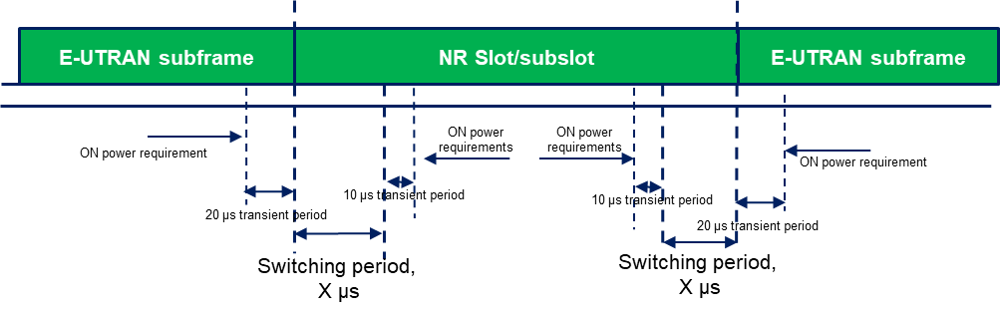

| 3GPP TS 38.101-3 V19.6.0 (2026-06) |  |
| --- | --- |
| Technical Specification |  |
| 3rd Generation Partnership Project; Technical Specification Group Radio Access Network; NR; User Equipment (UE) radio transmission and reception; Part 3: Range 1 and Range 2 Interworking operation with other radios (Release 19) |  |
|  |  |
|  |  |
|  |  |
| The present document has been developed within the 3rd Generation Partnership Project (3GPP TM) and may be further elaborated for the purposes of 3GPP. The present document has not been subject to any approval process by the 3GPP Organizational Partners and shall not be implemented. This Specification is provided for future development work within 3GPP only. The Organizational Partners accept no liability for any use of this Specification. Specifications and Reports for implementation of the 3GPP TM system should be obtained via the 3GPP Organizational Partners' Publications Offices. |  |

|  |
| --- |
| 3GPP Postal address 3GPP support office address 650 Route des Lucioles - Sophia Antipolis Valbonne - FRANCE Tel.: +33 4 92 94 42 00 Fax: +33 4 93 65 47 16 Internet http://www.3gpp.org |
| Copyright Notification No part may be reproduced except as authorized by written permission. The copyright and the foregoing restriction extend to reproduction in all media. © 2026, 3GPP Organizational Partners (ARIB, ATIS, CCSA, ETSI, TSDSI, TTA, TTC). All rights reserved. UMTS™ is a Trade Mark of ETSI registered for the benefit of its members 3GPP™ is a Trade Mark of ETSI registered for the benefit of its Members and of the 3GPP Organizational Partners LTE™ is a Trade Mark of ETSI registered for the benefit of its Members and of the 3GPP Organizational Partners GSM® and the GSM logo are registered and owned by the GSM Association |

Contents
Foreword 15
1 Scope 17
2 References 17
3 Definitions, symbols and abbreviations 18
3.1 Definitions 18
3.2 Symbols 18
3.3 Abbreviations 18
4 General 19
4.1 Relationship between minimum requirements and test requirements 19
4.2 Applicability of minimum requirements 20
4.3 Specification suffix information 21
5 Operating bands and channel arrangement 21
5.1 General 21
5.2 Operating bands 21
5.2A Operating bands for CA 22
5.2A.1 Inter-band CA between FR1 and FR2 22
5.2B Operating bands for DC 27
5.2B.1 General 27
5.2B.2 Void 27
5.2B.3 Void 27
5.2B.4 Void 27
5.2B.5 Void 27
5.2B.6 Void 27
5.2B.7 Void 27
5.2E Operating bands for V2X 27
5.2E.1 Intra-band V2X bands 27
5.2E.2 Inter-band V2X bands 27
5.3 UE Channel bandwidth 28
5.3A UE Channel bandwidth for CA 28
5.3A.1 Inter-band CA between FR1 and FR2 28
5.3B UE Channel bandwidth for DC 28
5.3B.0 General 28
5.3B.1 Intra-band EN-DC in FR1 29
5.3B.1.1 General 29
5.3B.1.2 BCS for Intra-band contiguous EN-DC 29
5.3B.1.3 BCS for Intra-band non-contiguous EN-DC 33
5.3B.1a Intra-band NE-DC in FR1 38
5.3B.1a.1 General 38
5.3B.1a.2 BCS for Intra-band contiguous NE-DC 38
5.3C Void 39
5.3D Void 39
5.3E UE Channel bandwidth for V2X 39
5.3E.0 General 39
5.3E.1 Intra-band contiguous V2X in FR1 40
5.3E.2 Intra-band non-contiguous V2X in FR1 40
5.3E.3 Inter-band V2X in FR1 40
5.4 Void 40
5.4A Channel arrangement for CA 40
5.4B Channel arrangement for DC 41
5.4B.0 General 41
5.4B.1 Channel spacing for intra-band EN-DC carriers 41
5.5 Configuration 41
5.5A Configuration for CA 41
5.5A.1 Inter-band CA configurations between FR1 and FR2 41
5.5A.1.0 General 42
5.5A.1.1 Inter-band CA configurations between FR1 and FR2 (two bands) 43
Table 5.5A.1.1-1a ~ Table 5.5A.1.1-1g 43
Table 5.5A.1.1-1h ~ Table 5.5A.1.1-1k 76
Table 5.5A.1.1-1l ~ Table 5.5A.1.1-1p 111
5.5A.1.2 Inter-band CA configurations between FR1 and FR2 (three bands) 149
Table 5.5A.1.2-1a 149
Table 5.5A.1.2-1b 209
Table 5.5A.1.2-1c 293
5.5A.1.3 Inter-band CA configurations between FR1 and FR2 (four bands) 368
5.5A.1.4 Inter-band CA configurations between FR1 and FR2 (five bands) 474
5.5B Configuration for DC 500
5.5B.1 General 500
5.5B.2 Intra-band contiguous EN-DC 500
5.5B.2a Intra-band contiguous NE-DC 501
5.5B.3 Intra-band non-contiguous EN-DC 501
5.5B.4 Inter-band EN-DC within FR1 502
5.5B.4.1 Inter-band EN-DC configurations within FR1 (two bands) 503
5.5B.4.2 Inter-band EN-DC configurations within FR1 (three bands) 513
5.5B.4.3 Inter-band EN-DC configurations within FR1 (four bands) 564
5.5B.4.4 Inter-band EN-DC configurations within FR1 (five bands) 643
5.5B.4.5 Inter-band EN-DC configurations within FR1 (six bands) 688
5.5B.4a Inter-band NE-DC within FR1 698
5.5B.4a.1 Inter-band NE-DC configurations within FR1 (two bands) 698
5.5B.4a.2 Inter-band NE-DC configurations within FR1 (three bands) 699
5.5B.4a.3 Inter-band NE-DC configurations within FR1 (four bands) 700
5.5B.4a.4 Inter-band NE-DC configurations within FR1 (five bands) 702
5.5B.5 Inter-band EN-DC including FR2 702
5.5B.5.1 Inter-band EN-DC configurations including FR2 (two bands) 702
5.5B.5.2 Inter-band EN-DC configurations including FR2 (three bands) 731
5.5B.5.3 Inter-band EN-DC configurations including FR2 (four bands) 773
5.5B.5.4 Inter-band EN-DC configurations including FR2 (five bands) 800
5.5B.5.5 Void 810
5.5B.5a Inter-band NE-DC including FR2 810
5.5B.5a.1 Inter-band NE-DC configurations including FR2 (two bands) 810
5.5B.5a.2 Inter-band NE-DC configurations including FR2 (three bands) 811
5.5B.5a.3 Inter-band NE-DC configurations including FR2 (four bands) 813
5.5B.5a.4 Inter-band NE-DC configurations including FR2 (five bands) 814
5.5B.6 Inter-band EN-DC including FR1 and FR2 814
5.5B.6.1 Void 814
5.5B.6.2 Inter-band EN-DC configurations including FR1 and FR2 (three bands) 814
5.5B.6.3 Inter-band EN-DC configurations including FR1 and FR2 (four bands) 829
5.5B.6.4 Inter-band EN-DC configurations including FR1 and FR2 (five bands) 857
5.5B.6.5 Inter-band EN-DC configurations including FR1 and FR2 (six bands) 879
5.5B.6a Inter-band NE-DC including FR1 and FR2 884
5.5B.6a.1 Void 884
5.5B.6a.2 Inter-band NE-DC configurations including FR1 and FR2 (three bands) 884
5.5B.6a.3 Inter-band NE-DC configurations including FR1 and FR2 (four bands) 886
5.5B.6a.4 Inter-band NE-DC configurations including FR1 and FR2 (five bands) 890
5.5B.6a.5 Inter-band NE-DC configurations including FR1 and FR2 (six bands) 892
5.5B.7 Inter-band NR-DC between FR1 and FR2 892
5.5B.7.0 General 892
5.5B.7.1 Inter-band NR-DC configurations between FR1 and FR2 (two bands) 893
5.5B.7.2 Inter-band NR-DC configurations between FR1 and FR2 (three bands) 914
5.5B.7.3 Inter-band NR-DC configurations between FR1 and FR2 (four bands) 944
5.5B.7.4 Inter-band NR-DC configurations between FR1 and FR2 (five bands) 950
5.5C Void 950
5.5D Void 950
5.5E Configuration for V2X operation 951
5.5E.1 General 951
5.5E.2 Intra-band contiguous V2X operation in FR1 951
5.5E.3 Intra-band non-contiguous V2X operation in FR1 951
5.5E.4 Inter-band V2X operation in FR1 951
5.5E.4.1 Inter-band V2X configurations within FR1 (two bands) 951
6 Transmitter characteristics 952
6.1 General 952
6.2 Void 952
6.2A Transmitter power for CA 952
6.2A.1 UE maximum output power for CA 952
6.2A.1.1 Inter-band CA between FR1 and FR2 952
6.2A.2 UE maximum output power reduction for CA 952
6.2A.2.1 Inter-band CA between FR1 and FR2 952
6.2A.3 UE additional maximum output power reduction for CA 952
6.2A.4 Configured output power for CA 952
6.2A.4.1 Configured output power level 952
6.2A.4.2 ΔTIB,c for CA 953
6.2A.4.2.1 ΔTIB,c for Inter-band CA between FR1 and FR2 953
6.2B Transmitter power for DC 953
6.2B.1 UE maximum output power for DC 953
6.2B.1.1 Intra-band contiguous EN-DC 953
6.2B.1.1a Intra-band contiguous NE-DC 955
6.2B.1.2 Intra-band non-contiguous EN-DC 956
6.2B.1.3 Inter-band EN-DC within FR1 957
6.2B.1.3a Inter-band NE-DC within FR1 964
6.2B.1.4 Inter-band EN-DC including FR2 965
6.2B.1.4a (Void) 965
6.2B.1.5 Inter-band EN-DC including both FR1 and FR2 965
6.2B.2 UE maximum output power reduction for DC 965
6.2B.2.0 General 965
6.2B.2.1 Intra-band contiguous EN-DC 965
6.2B.2.1.1 General 965
6.2B.2.1a (Void) 966
6.2B.2.1.2 MPR for power class 3 and power class 2 966
6.2B.2.2 Intra-band non-contiguous EN-DC 967
6.2B.2.2.1 General 967
6.2B.2.2.2 MPR for power class 3 and power class 2 967
6.2B.2.3 Inter-band EN-DC within FR1 968
6.2B.2.3a Inter-band NE-DC within FR1 968
6.2B.2.4 Inter-band EN-DC including FR2 968
6.2B.2.4a (Void) 968
6.2B.2.5 Inter-band EN-DC including both FR1 and FR2 968
6.2B.3 UE additional maximum output power reduction for EN-DC 968
6.2B.3.1 Intra-band contiguous EN-DC 968
6.2B.3.1.0 General 968
6.2B.3.1.1 A-MPR for DC_(n)71AA 969
6.2B.3.1.2 A-MPR for NS_04 970
6.2B.3.2 Intra-band non-contiguous EN-DC 973
6.2B.3.2.0 General 973
6.2B.3.2.1 A-MPR for NS_04 973
6.2B.3.3 Inter-band EN-DC within FR1 974
6.2B.3.3A Inter-band NE-DC within FR1 979
6.2B.3.4 Inter-band EN-DC including FR2 979
6.2B.3.4A (Void) 979
6.2B.3.5 Inter-band EN-DC including both FR1 and FR2 979
6.2B.4 Configured output power for DC 979
6.2B.4.1 Configured output power level 979
6.2B.4.1.1 Intra-band contiguous EN-DC 979
6.2B.4.1.1a Intra-band contiguous NE-DC 984
6.2B.4.1.2 Intra-band non-contiguous EN-DC 985
6.2B.4.1.3a Inter-band NE-DC within FR1 991
6.2B.4.1.4 Inter-band EN-DC including FR2 994
6.2B.4.1.4a (Void) 994
6.2B.4.1.5 Inter-band EN-DC including both FR1 and FR2 994
6.2B.4.2 ΔTIB,c for DC 994
6.2B.4.2.0 General 994
6.2B.4.2.1 Intra-band contiguous EN-DC 994
6.2B.4.2.1a (Void) 994
6.2B.4.2.2 Intra-band non-contiguous EN-DC 995
6.2B.4.2.3 Inter-band EN-DC within FR1 995
6.2B.4.2.3.1 ΔTIB,c for EN-DC two bands 995
6.2B.4.2.3.2 ΔTIB,c for EN-DC three bands 1000
6.2B.4.2.3.3 ΔTIB,c for EN-DC four bands 1018
6.2B.4.2.3.4 ΔTIB,c for EN-DC five bands 1036
6.2B.4.2.3.5 ΔTIB,c for EN-DC six bands 1044
6.2B.4.2.3a Inter-band NE-DC within FR1 1045
6.2B.4.2.4 Inter-band EN-DC including FR2 1045
6.2B.4.2.4.1 ΔTIB,c for EN-DC two bands 1045
6.2B.4.2.4.2 ΔTIB,c for EN-DC three bands 1045
6.2B.4.2.4.3 ΔTIB,c for EN-DC four bands 1045
6.2B.4.2.4.4 ΔTIB,c for EN-DC five bands 1046
6.2B.4.2.4.5 Void 1046
6.2B.4.2.4a (Void) 1046
6.2B.4.2.5 Inter-band EN-DC including both FR1 and FR2 1046
6.2B.4.2.5.1 ΔTIB,c for EN-DC three bands 1046
6.2B.4.2.5.2 ΔTIB,c for EN-DC four bands 1046
6.2B.4.2.5.3 ΔTIB,c for EN-DC five bands 1046
6.2B.4.2.5.4 ΔTIB,c for EN-DC six bands 1046
6.2B.5 Configured output power for NR-DC 1046
6.2B.5.1 Configured output power level 1046
6.2B.5.1.1 Inter-band NR-DC between FR1 and FR2 1046
6.2E Transmitter power for V2X in FR1 1047
6.2E.1 UE maximum output power for V2X 1047
6.2E.1.1 UE maximum output power for Intra-band contiguous V2X 1047
6.2E.1.2 UE maximum output power for Intra-band non-contiguous V2X 1047
6.2E.1.3 UE maximum output power for Inter-band V2X 1047
6.2E.2 UE maximum output power reduction for V2X 1048
6.2E.2.1 UE maximum output power reduction for Intra-band V2X 1048
6.2E.2.2 UE maximum output power reduction for Inter-band V2X 1048
6.2E.3 UE additional maximum output power reduction for V2X 1048
6.2E.3.1 UE additional maximum output power reduction for Intra-band V2X 1048
6.2E.3.2 UE additional maximum output power reduction for Inter-band V2X 1048
6.2E.4 Configured output power for V2X 1048
6.2E.4.1 UE configured output power for Intra-band V2X 1048
6.2E.4.2 UE configured output power for Inter-band V2X 1048
6.2H Transmitter power for DC with UL MIMO 1049
6.2H.1 UE maximum output power for DC with UL MIMO 1049
6.2H.1.1 void 1049
6.2H.1.2 void 1050
6.2H.1.3 Inter-band EN-DC with UL MIMO within FR1 1050
6.2H.2 UE maximum output power reduction for DC with UL MIMO 1053
6.2H.2.1 void 1053
6.2H.2.2 void 1053
6.2H.2.3 Inter-band EN-DC with UL MIMO within FR1 1053
6.2H.3 UE additional maximum output power reduction for EN-DC with UL MIMO 1053
6.2H.3.1 void 1053
6.2H.3.2 void 1053
6.2H.3.3 Inter-band EN-DC with UL MIMO within FR1 1053
6.2H.4 Configured output power for DC with UL MIMO 1053
6.2H.4.1 Configured output power level 1053
6.2H.4.1.1 void 1053
6.2H.4.1.2 void 1054
6.2L Transmitter power for DC with Tx Diversity 1054
6.2L.1 UE maximum output power for DC with Tx Diversity 1054
6.2L.1.1 void 1054
6.2L.1.2 void 1054
6.2L.1.3 Inter-band EN-DC with Tx Diversity within FR1 1054
6.2L.2 UE maximum output power reduction for DC with Tx Diversity 1057
6.2L.2.1 void 1057
6.2L.2.2 void 1057
6.2L.2.3 Inter-band EN-DC with Tx Diversity within FR1 1057
6.2L.3 UE additional maximum output power reduction for EN-DC with Tx Diversity 1057
6.2L.3.1 void 1057
6.2L.3.2 void 1057
6.2L.3.3 Inter-band EN-DC with Tx Diversity within FR1 1057
6.2L.4 Configured output power for DC with Tx Diversity 1057
6.2L.4.1 Configured output power level 1057
6.2L.4.1.1 void 1057
6.2L.4.1.2 void 1057
6.3 Output power dynamics 1058
6.3A Output power dynamics for CA 1058
6.3B Output power dynamics for DC 1058
6.3B.0 General 1058
6.3B.1 Output power dynamics for EN-DC with UL sharing from UE perspective 1058
6.3B.1.1 E-UTRA and NR switching time mask for TDM based UL sharing from UE perspective 1058
6.3B.1a (Void) 1059
6.3B.2 Output power dynamics for intra-band EN-DC without dual PA capability 1060
6.3B.2a (Void) 1060
6.3B.3 Output power dynamics for intra-band EN-DC with dual PA capability 1060
6.3B.3a (Void) 1061
6.3B.4 Output power dynamics for switching between two uplink carriers 1061
6.3B.4.1 E-UTRA and NR switching time mask between two uplink carriers 1061
6.3B.5 Output power dynamics for inter-band EN-DC 1062
6.3E Output power dynamics for V2X 1062
6.3E.1 General 1062
6.3E.2 Output power dynamics for intra-band V2X operation 1062
6.3E.3 Output power dynamics for inter-band V2X con-current operation 1063
6.3H Output power dynamics for DC with UL MIMO 1063
6.3H.0 General 1063
6.3H.1 void 1063
6.3H.2 void 1063
6.3H.3 Output power dynamics for inter-band EN-DC with UL MIMO 1063
6.3L Output power dynamics for DC with Tx Diversity 1063
6.3L.0 General 1063
6.3L.1 void 1064
6.3L.2 void 1064
6.3L.3 Output power dynamics for inter-band EN-DC with Tx Diversity 1064
6.4 Void 1064
6.4A Transmit signal quality for CA 1064
6.4A.1 Frequency error for CA 1064
6.4A.2 Transmit modulation quality for CA 1064
6.4B Transmit signal quality for DC 1064
6.4B.1 Frequency error for DC 1064
6.4B.1.1 Frequency error for Intra-band contiguous EN-DC 1064
6.4B.1.1a Frequency error for Intra-band contiguous NE-DC 1064
6.4B.1.2 Frequency error for Intra-band non-contiguous EN-DC 1064
6.4B.1.3 Frequency error for inter-band EN-DC within FR1 1065
6.4B.1.3a Frequency error for inter-band NE-DC within FR1 1065
6.4B.1.4 Frequency error for inter-band EN-DC including FR2 1065
6.4B.1.4a (Void) 1065
6.4B.1.5 Frequency error for inter-band EN-DC including both FR1 and FR2 1065
6.4B.2 Transmit modulation quality for DC 1065
6.4B.2.1 Transmit modulation quality for Intra-band contiguous EN-DC 1065
6.4B.2.1.1 Error Vector Magnitude 1065
6.4B.2.1.2 Carrier leakage 1065
6.4B.2.1.3 In-band emissions 1065
6.4B.2.1a Transmit modulation quality for Intra-band contiguous NE-DC 1066
6.4B.2.1a.1 Error Vector Magnitude 1066
6.4B.2.1a.2 Carrier leakage 1066
6.4B.2.1a.3 In-band emissions 1066
6.4B.2.2 Transmit modulation quality for Intra-band non-contiguous EN-DC 1066
6.4B.2.2.1 Error Vector Magnitude 1066
6.4B.2.2.2 Carrier leakage 1066
6.4B.2.2.3 In-band emissions 1066
6.4B.2.3a Transmit modulation quality for Inter-band NE-DC within FR1 1067
6.4B.2.4 Transmit modulation quality for Inter-band EN-DC including FR2 1067
6.4B.2.4a (Void) 1067
6.4B.2.5 Transmit modulation quality for inter-band EN-DC including both FR1 and FR2 1067
6.4E Transmit signal quality for V2X operation in FR1 1067
6.4E.1 Frequency error for V2X 1067
6.4E.2 Transmit modulation quality for V2X 1067
6.4E.2.1 Transmit modulation quality for Intra-band V2X 1067
6.4E.2.2.1 Error Vector Magnitude 1067
6.4E.2.2.2 Carrier leakage 1067
6.4E.2.2.3 In-band emissions 1068
6.4E.2.2 Transmit modulation quality for Inter-band V2X 1068
6.4H Transmit signal quality for DC with UL MIMO 1068
6.4H.1 Frequency error for DC with UL MIMO 1068
6.4H.1.1 void 1068
6.4H.1.2 void 1068
6.4H.1.3 Frequency error for inter-band EN-DC with UL MIMO within FR1 1068
6.4H.2 Transmit modulation quality for DC with UL MIMO 1068
6.4H.2.1 void 1068
6.4H.2.2 void 1068
6.4H.2.3 Transmit modulation quality for inter-band EN-DC with UL MIMO within FR1 1068
6.4L Transmit signal quality for DC with Tx Diversity 1068
6.4L.1 Frequency error for DC with Tx Diversity 1068
6.4L.1.1 void 1068
6.4L.1.2 void 1068
6.4L.1.3 Frequency error for inter-band EN-DC with Tx Diversity within FR1 1068
6.4L.2 Transmit modulation quality for DC with Tx Diversity 1069
6.4L.2.1 void 1069
6.4L.2.2 void 1069
6.4L.2.3 Transmit modulation quality for inter-band EN-DC with Tx Diversity within FR1 1069
6.5 Void 1069
6.5A Output RF spectrum emissions for CA 1069
6.5A.1 Occupied bandwidth for CA 1069
6.5A.2 Out-of-band emissions for CA 1069
6.5A.3 Spurious emissions for CA 1069
6.5A.3.1 Inter-band CA between FR1 and FR2 1069
6.5A.4 Transmit intermodulation for CA 1069
6.5B Output RF spectrum emissions for DC 1069
6.5B.1 Occupied bandwidth for EN-DC 1069
6.5B.1.1 Intra-band contiguous EN-DC 1069
6.5B.1.2 Intra-band non-contiguous EN-DC 1069
6.5B.1.3 Inter-band EN-DC within FR1 1070
6.5B.1.3a (Void) 1070
6.5B.1.4 Inter-band EN-DC including FR2 1070
6.5B.1.4a (Void) 1070
6.5B.1.5 Inter-band EN-DC including both FR1 and FR2 1070
6.5B.2 Out-of-band emissions for DC 1070
6.5B.2.1 Intra-band contiguous EN-DC 1070
6.5B.2.1.1 Spectrum emissions mask 1070
6.5B.2.1.2 Additional spectrum emissions mask 1071
6.5B.2.1.2.1 Requirements for network signalled value "NS_35" 1071
6.5B.2.1.2.2 Requirements for network signalled value "NS_04" 1071
6.5B.2.1.3 Adjacent channel leakage ratio 1071
6.5B.2.2 Intra-band non-contiguous EN-DC 1072
6.5B.2.2.1 Spectrum emissions mask 1072
6.5B.2.2.2 Additional spectrum emissions mask 1072
6.5B.2.2.3 Adjacent channel leakage ratio 1072
6.5B.2.3 Inter-band EN-DC within FR1 1072
6.5B.2.3a (Void) 1072
6.5B.2.4 Inter-band EN-DC including FR2 1072
6.5B.2.4a Inter-band NE-DC including FR2 1072
6.5B.2.5 Inter-band EN-DC including both FR1 and FR2 1073
6.5B.3 Spurious emissions for DC 1073
6.5B.3.1 Intra-band contiguous EN-DC 1073
6.5B.3.1.1 General spurious emissions 1073
6.5B.3.1.2 Spurious emission band UE co-existence 1073
6.5B.3.2 Intra-band non-contiguous EN-DC 1073
6.5B.3.2.1 General spurious emissions 1074
6.5B.3.2.2 Spurious emission band UE co-existence 1074
6.5B.3.3 Inter-band EN-DC within FR1 1074
6.5B.3.3.2 Spurious emission band UE co-existence 1075
6.5B.3.3a Inter-band NE-DC within FR1 1081
6.5B.3.3a.1 Void 1081
6.5B.3.3a.2 Spurious emission band UE co-existence 1082
6.5B.3.4 Inter-band EN-DC including FR2 1083
6.5B.3.4.0 General spurious emission 1083
6.5B.3.4.1 Spurious emission band UE co-existence 1083
6.5B.3.4a (Void) 1083
6.5B.3.4a.1 (Void) 1083
6.5B.3.5 Inter-band EN-DC including both FR1 and FR2 1083
6.5B.3.5.0 General spurious emission 1083
6.5B.3.5.1 Spurious emission band UE co-existence 1083
6.5B.4 Additional spurious emissions 1084
6.5B.4.1 General 1084
6.5B.4.1.1 Void 1084
6.5B.4.2 Intra-band contiguous EN-DC 1084
6.5B.4.2.1 Minimum requirement (network signalled value "NS_04") 1084
6.5B.4.3 Intra-band non-contiguous EN-DC 1084
6.5B.4.3.1 Minimum requirement (network signalled value "NS_04") 1084
6.5B.4.4 Inter-band EN-DC within FR1 1084
6.5B.4.4a (Void) 1084
6.5B.4.5 Inter-band EN-DC including FR2 1085
6.5B.4.6 Inter-band EN-DC including both FR1 and FR2 1085
6.5B.5 Transmit intermodulation for DC 1085
6.5B.5.1 Intra-band contiguous EN-DC 1085
6.5B.5.1a (Void) 1085
6.5B.5.2 Intra-band non-contiguous EN-DC 1085
6.5B.5.3 Inter-band EN-DC within FR1 1085
6.5B.5.3a (Void) 1085
6.5B.5.4 Inter-band EN-DC including FR2 1085
6.5B.5.4a (Void) 1085
6.5B.5.5 Inter-band EN-DC including both FR1 and FR2 1085
6.5E Output RF spectrum emissions for V2X operation in FR1 1085
6.5E.1 Occupied bandwidth 1085
6.5E.1.1 Intra-band V2X 1085
6.5E.1.2 inter-band V2X con-current operation 1085
6.5E.2 Out-of-band emissions 1086
6.5E.2.1 Intra-band V2X 1086
6.5E.2.2 Inter-band V2X con-current operation 1086
6.5E.3 Spurious emissions 1086
6.5E.3.1 Intra-band V2X 1086
6.5E.3.1.1 General spurious emissions 1086
6.5E.3.1.2 Spurious emission band UE co-existence 1086
6.5E.3.2  Inter-band V2X con-current operation 1086
6.5E.3.2.1 General spurious emissions 1086
6.5E.3.2.2 Spurious emission band UE co-existence 1086
6.5E.4 Transmit intermodulation 1088
6.5E.4.1 Intra-band V2X 1088
6.5E.4.2 Inter-band V2X con-current operation 1088
6.5H Output RF spectrum emissions for DC with UL MIMO 1088
6.5H.1 Occupied bandwidth for EN-DC with UL MIMO 1088
6.5H.1.1 void 1088
6.5H.1.2 void 1088
6.5H.1.3 Inter-band EN-DC with UL MIMO within FR1 1088
6.5H.2 Out-of-band emissions for DC with UL MIMO 1088
6.5H.2.1 void 1088
6.5H.2.2 void 1088
6.5H.2.3 Inter-band EN-DC with UL MIMO within FR1 1089
6.5H.3 Spurious emissions for DC with UL MIMO 1089
6.5H.3.1 void 1089
6.5H.3.2 void 1089
6.5H.4 Additional spurious emissions for DC with UL MIMO 1089
6.5H.4.1 void 1089
6.5H.4.2 void 1089
6.5H.4.3 Inter-band EN-DC with UL MIMO within FR1 1089
6.5H.5 Transmit intermodulation for DC with UL MIMO 1089
6.5H.5.1 void 1089
6.5H.5.2 void 1089
6.5H.5.3 Inter-band EN-DC with UL MIMO within FR1 1089
6.5L Output RF spectrum emissions for DC with Tx Diversity 1089
6.5L.1 Occupied bandwidth for EN-DC with Tx Diversity 1089
6.5L.1.1 void 1089
6.5L.1.2 void 1089
6.5L.1.3 Inter-band EN-DC with Tx Diversity within FR1 1089
6.5L.2 Out-of-band emissions for DC with Tx Diversity 1089
6.5L.2.1 void 1090
6.5L.2.2 void 1090
6.5L.2.3 Inter-band EN-DC with Tx Diversity within FR1 1090
6.5L.3 Spurious emissions for DC with Tx Diversity 1090
6.5L.3.1 void 1090
6.5L.3.2 void 1090
6.5L.3.3 Inter-band EN-DC with Tx Diversity within FR1 1090
6.5L.4 Additional spurious emissions for DC with Tx Diversity 1090
6.5L.4.1 void 1090
6.5L.4.2 void 1090
6.5L.4.3 Inter-band EN-DC with Tx Diversity within FR1 1090
6.5L.5 Transmit intermodulation for DC with Tx Diversity 1090
6.5L.5.1 void 1090
6.5L.5.2 void 1090
6.5L.5.3 Inter-band EN-DC with Tx Diversity within FR1 1090
6.6B Beam correspondence for DC 1090
6.6B.1 Void 1090
6.6B.2 Void 1090
6.6B.3 Void 1090
6.6B.4 Inter-band EN-DC including FR2 1091
6.6B.4a (Void) 1091
6.6B.5 Inter-band EN-DC including both FR1 and FR2 1091
7 Receiver characteristics 1091
7.1 General 1091
7.2 Void 1092
7.3 Void 1092
7.3A Reference sensitivity for CA 1092
7.3A.1 General 1092
7.3A.2 Reference sensitivity power level for CA 1092
7.3A.3 ΔRIB,c for CA 1092
7.3A.3.1 ΔRIB,c for Inter-band CA between FR1 and FR2 1093
7.3A.4 Void 1093
7.3B Reference sensitivity level for DC 1093
7.3B.1 General 1093
7.3B.2 Reference sensitivity for DC 1094
7.3B.2.1 Intra-band contiguous EN-DC 1094
7.3B.2.1a (Void) 1095
7.3B.2.2 Intra-band non-contiguous EN-DC 1095
7.3B.2.3 Inter-band EN-DC within FR1 1096
7.3B.2.3.0 General 1096
7.3B.2.3.1 Reference sensitivity exceptions due to UL harmonic interference for EN-DC in NR FR1 1099
7.3B.2.3.2 Reference sensitivity exceptions due to receiver harmonic mixing for EN-DC in NR FR1 1105
7.3B.2.3.3 Void 1109
7.3B.2.3.4 Reference sensitivity exceptions due to cross band isolation for EN-DC in NR FR1 1109
7.3B.2.3.5 MSD for intermodulation interference due to dual uplink operation for EN-DC in NR FR1 1111
7.3B.2.3.5.1 MSD test points for intermodulation interference due to dual uplink operation for PC3 EN-DC in NR FR1 involving two bands 1111
7.3B.2.3.5.2 MSD test points for intermodulation interference due to dual uplink operation for EN-DC in NR FR1 involving three bands 1120
7.3B.2.3.5.3 Void 1187
7.3B.2.3.5.4 MSD test points for intermodulation interference due to dual uplink operation for EN-DC in NR FR1 involving four bands 1187
7.3B.2.3a Inter-band NE-DC within FR1 1188
7.3B.2.3a.0 General 1188
7.3B.2.3a.1 Reference sensitivity exceptions due to UL harmonic interference for NE-DC in NR FR1 1188
7.3B.2.3a.2 Reference sensitivity exceptions due to receiver harmonic mixing for NE-DC in NR FR1 1188
7.3B.2.3a.3 Reference sensitivity exceptions due to cross band isolation for NE-DC in NR FR1 1189
7.3B.2.3a.4 MSD for intermodulation interference due to dual uplink operation for NE-DC in NR FR1 1189
7.3B.2.3a.4.1 (Reserved) 1189
7.3B.2.3a.4.2 MSD test points for intermodulation interference due to dual uplink operation for NE-DC in NR FR1 involving three bands 1189
7.3B.2.4 Inter-band EN-DC including FR2 1190
7.3B.2.4.1 Void 1190
7.3B.2.5 Inter-band EN-DC including both FR1 and FR2 1190
7.3B.2.5.1 Reference sensitivity exceptions due to UL harmonic interference for EN-DC including both FR1 and FR2 1190
7.3B.2.3.6 Void 1190
7.3B.2.3.7 Lower-MSD requirements for inter-band EN-DC within FR1 1190
7.3B.3 ΔRIB,c, ΔRIBNC for DC 1191
7.3B.3.0 General 1191
7.3B.3.1 Intra-band contiguous EN-DC 1191
7.3B.3.2 Intra-band non-contiguous EN-DC 1191
7.3B.3.3 Inter-band EN-DC within FR1 1195
7.3B.3.3.1 ΔRIB,c for EN-DC in two bands 1195
7.3B.3.3.2 ΔRIB,c for EN-DC three bands 1197
7.3B.3.3.3 ΔRIB,c for EN-DC four bands 1211
7.3B.3.3.4 ΔRIB,c for EN-DC five bands 1228
7.3B.3.3.5 ΔRIB,c for EN-DC six bands 1235
7.3B.3.3a Inter-band NE-DC within FR1 1236
7.3B.3.4 Inter-band EN-DC including FR2 1236
7.3B.3.4.1 ΔRIB,c for EN-DC in two bands 1236
7.3B.3.4.2 ΔRIB,c for EN-DC three bands 1237
7.3B.3.4.3 ΔRIB,c for EN-DC four bands 1237
7.3B.3.4.4 ΔRIB,c for EN-DC five bands 1237
7.3B.3.4.5 Void 1237
7.3B.3.4a (Void) 1237
7.3B.3.5 Inter-band EN-DC including both FR1 and FR2 1237
7.3B.3.5.2 ΔRIB,c for EN-DC three bands 1237
7.3B.3.5.3 ΔRIB,c for EN-DC four bands 1237
7.3B.3.5.4 ΔRIB,c for EN-DC five bands 1237
7.3B.3.5.5 ΔRIB,c for EN-DC six bands 1237
7.3E Reference sensitivity for V2X operation in FR1 1238
7.3E.1 General 1238
7.3E.2 Reference sensitivity for V2X 1238
7.3E.2.1 Intra-band contiguous V2X 1238
7.3E.2.2 Intra-band non-contiguous V2X 1238
7.3E.2.3 Inter-band V2X con-current operation 1238
7.3E.2.3.0 General 1238
7.3E.2.3.1 Reference sensitivity exception due to UL harmonic problem 1239
7.4 Void 1239
7.4A Maximum input level for CA 1239
7.4B Maximum input level for DC in FR1 1239
7.4B.1 Intra-band contiguous EN-DC in FR1 1239
7.4B.1a (Void) 1240
7.4B.2 Intra-band non-contiguous EN-DC in FR1 1240
7.4B.3 Inter-band EN-DC within FR1 1240
7.4B.3a (Void) 1240
7.4B.4 Inter-band EN-DC including FR2 1240
7.4B.4a (Void) 1240
7.4B.5 Inter-band EN-DC including both FR1 and FR2 1240
7.4E Maximum input level for V2X operation in FR1 1240
7.5 Void 1240
7.5A Adjacent channel selectivity for CA 1240
7.5B Adjacent channel selectivity for DC in FR1 1241
7.5B.1 Intra-band contiguous EN-DC in FR1 1241
7.5B.1a (Void) 1241
7.5B.2 Intra-band non-contiguous EN-DC in FR1 1241
7.5B.3 Inter-band EN-DC within FR1 1241
7.5B.3a (Void) 1241
7.5B.4 Inter-band EN-DC including FR2 1242
7.5B.4a (Void) 1242
7.5E Adjacent channel selectivity for V2X operation in FR1 1242
7.6 Void 1242
7.6A Blocking characteristics for CA 1242
7.6B Blocking characteristics for DC in FR1 1242
7.6B.1 General 1242
7.6B.2 In-band blocking for DC in FR1 1242
7.6B.2.1 Intra-band contiguous EN-DC in FR1 1242
7.6B.2.1a (Void) 1243
7.6B.2.2 Intra-band non-contiguous EN-DC in FR1 1243
7.6B.2.3 Inter-band EN-DC within FR1 1243
7.6B.2.3a (Void) 1243
7.6B.2.4 Inter-band EN-DC including FR2 1243
7.6B.2.4a (Void) 1243
7.6B.2.5 Inter-band EN-DC including both FR1 and FR2 1243
7.6B.2.6 Void 1243
7.6B.3 Out-of-band blocking for DC in FR1 1243
7.6B.3.1 Intra-band contiguous EN-DC in FR1 1243
7.6B.3.1a (Void) 1244
7.6B.3.2 Intra-band non-contiguous EN-DC in FR1 1244
7.6B.3.3 Inter-band EN-DC within FR1 1244
7.6B.3.3a (Void) 1245
7.6B.3.4 Inter-band EN-DC including FR2 1245
7.6B.3.4a (Void) 1245
7.6B.3.5 Inter-band EN-DC including both FR1 and FR2 1245
7.6B.4 Narrow band blocking for DC in FR1 1245
7.6B.4.1 Intra-band contiguous EN-DC in FR1 1245
7.6B.4.1a (Void) 1246
7.6B.4.2 Intra-band non-contiguous EN-DC in FR1 1246
7.6B.4.3 Inter-band EN-DC within FR1 1246
7.6B.4.3a (Void) 1246
7.6B.4.4 Inter-band EN-DC including FR2 1246
7.6B.4.4a (Void) 1246
7.6B.4.5 Inter-band EN-DC including both FR1 and FR2 1246
7.6E Blocking characteristics for V2X in FR1 1246
7.7 Void 1246
7.7A Spurious response for CA 1246
7.7B Spurious response for DC in FR1 1246
7.7B.1 Intra-band contiguous EN-DC in FR1 1246
7.7B.1a (Void) 1247
7.7B.2 Intra-band non-contiguous EN-DC in FR1 1247
7.7B.3 Inter-band EN-DC within FR1 1247
7.7B.4a (Void) 1247
7.7B.5 Inter-band EN-DC including both FR1 and FR2 1247
7.7E Spurious response for V2X in FR1 1247
7.8 Void 1248
7.8A Intermodulation characteristics for CA 1248
7.8B Intermodulation characteristics for DC in FR1 1248
7.8B.1 General 1248
7.8B.2 Wide band Intermodulation 1248
7.8B.2.1 Intra-band contiguous EN-DC in FR1 1248
7.8B.2.1a (Void) 1248
7.8B.2.2 Intra-band non-contiguous EN-DC in FR1 1248
7.8B.2.3 Inter-band EN-DC within FR1 1248
7.8B.2.3a (Void) 1248
7.8B.2.4 Inter-band EN-DC including FR2 1248
7.8B.2.4a (Void) 1249
7.8B.2.5 Inter-band EN-DC including both FR1 and FR2 1249
7.8E Intermodulation characteristics for V2X operation in FR1 1249
7.9 Void 1249
7.9A Spurious emissions for CA 1249
7.9B Spurious emissions for DC in FR1 1249
7.9B.1 Intra-band contiguous EN-DC in FR1 1249
7.9B.1a (Void) 1249
7.9B.2 Intra-band non-contiguous EN-DC in FR1 1249
7.9B.3 Inter-band EN-DC within FR1 1249
7.9B.3a (Void) 1249
7.9B.4 Inter-band EN-DC including FR2 1249
7.9B.4a (Void) 1249
7.10 Void 1250
7.10A Void 1250
7.10B Power imbalance for DC in FR1 1250
7.10B.1 General 1250
7.10B.3 Inter-band EN-DC within FR1 1250
Annex A (normative): Measurement channels 1252
A.1 General 1252
A.2 UL reference measurement channels for E-UTRA TDD Config 2 1252
A.2.1 General 1252
A.2.2 Reference measurement channels for E-UTRA 1253
A.2.2.1 Full RB allocation 1253
A.2.2.1.1 QPSK 1253
A.2.2.1.2 16-QAM 1253
A.2.2.1.3 64-QAM 1254
A.2.2.1.4 256 QAM 1255
A.2.2.2 Partial RB allocation 1256
A.2.2.2.1 QPSK 1256
A.2.2.2.3 64-QAM 1259
A.2.2.2.4 256 QAM 1261
A.3 DL reference measurement channels for E-UTRA 1263
A.3.1 General 1263
A.3.1.1 QPSK 1263
A.3.1.2 64-QAM 1264
A.3.1.3 256-QAM 1265
Annex B: Void 1266
Annex C: Void 1267
Annex D: Void 1268
Annex E: Void 1269
Annex F: Void 1270
Annex G: Void 1271
Annex H (normative): Modified MPR behavior 1272
Annex I (normative): Dual uplink interferer 1273
Annex J: Void 1274
Annex K: Void 1275
Annex L (informative): Change history 1276

---

# Foreword
This Technical Specification has been produced by the 3rd Generation Partnership Project (3GPP).
The contents of the present document are subject to continuing work within the TSG and may change following formal TSG approval. Should the TSG modify the contents of the present document, it will be re-released by the TSG with an identifying change of release date and an increase in version number as follows:
Version x.y.z
where:
x the first digit:
1 presented to TSG for information;
2 presented to TSG for approval;
3 or greater indicates TSG approved document under change control.
y the second digit is incremented for all changes of substance, i.e. technical enhancements, corrections, updates, etc.
z the third digit is incremented when editorial only changes have been incorporated in the document.
In the present document, modal verbs have the following meanings:
shall  indicates a mandatory requirement to do something
shall not indicates an interdiction (prohibition) to do something
The constructions "shall" and "shall not" are confined to the context of normative provisions, and do not appear in Technical Reports.
The constructions "must" and "must not" are not used as substitutes for "shall" and "shall not". Their use is avoided insofar as possible, and they are not used in a normative context except in a direct citation from an external, referenced, non-3GPP document, or so as to maintain continuity of style when extending or modifying the provisions of such a referenced document.
should  indicates a recommendation to do something
should not indicates a recommendation not to do something
may  indicates permission to do something
need not indicates permission not to do something
The construction "may not" is ambiguous and is not used in normative elements. The unambiguous constructions "might not" or "shall not" are used instead, depending upon the meaning intended.
can  indicates that something is possible
cannot  indicates that something is impossible
The constructions "can" and "cannot" are not substitutes for "may" and "need not".
will  indicates that something is certain or expected to happen as a result of action taken by an agency the behaviour of which is outside the scope of the present document
will not  indicates that something is certain or expected not to happen as a result of action taken by an agency the behaviour of which is outside the scope of the present document
might indicates a likelihood that something will happen as a result of action taken by some agency the behaviour of which is outside the scope of the present document
might not indicates a likelihood that something will not happen as a result of action taken by some agency the behaviour of which is outside the scope of the present document
In addition:
is (or any other verb in the indicative mood) indicates a statement of fact
is not (or any other negative verb in the indicative mood) indicates a statement of fact
The constructions "is" and "is not" do not indicate requirements.
# 1 Scope
The present document establishes the minimum RF requirements for NR User Equipment (UE) Interworking operation with other radios. This includes but is not limited to additional requirements for carrier aggregation or NR dual connectivity between Range 1 and Range 2 and additional requirements due to NR non-standalone (NSA) operation mode with E-UTRA.
# 2 References
The following documents contain provisions which, through reference in this text, constitute provisions of the present document.
- References are either specific (identified by date of publication, edition number, version number, etc.) or nonspecific.
- For a specific reference, subsequent revisions do not apply.
- For a non-specific reference, the latest version applies. In the case of a reference to a 3GPP document (including a GSM document), a non-specific reference implicitly refers to the latest version of that document in the same Release as the present document.
[1] 3GPP TR 21.905: "Vocabulary for 3GPP Specifications".
[2] 3GPP TS 38.101-1: "NR; User Equipment (UE) radio transmission and reception; Part 1: Range 1 Standalone"
[3] 3GPP TS 38.101-2: "NR; User Equipment (UE) radio transmission and reception; Part 2: Range 2 Standalone"
[4] 3GPP TS 36.101: "Evolved Universal Terrestrial Radio Access (E-UTRA); User Equipment (UE) radio transmission and reception"
[5] 3GPP TS 38.521-3: "NR; User Equipment (UE) conformance specification; Radio transmission and reception; Part 3: Range 1 and Range 2 Interworking operation with other radios"
[6] Recommendation ITU-R M.1545: "Measurement uncertainty as it applies to test limits for the terrestrial component of International Mobile Telecommunications-2000"
[7] 3GPP TS 36.211: "E-UTRA; Physical channels and modulation"
[8] 3GPP TS 36.331: " Evolved Universal Terrestrial Radio Access (E-UTRA); Radio Resource Control (RRC); Protocol specification"
[9] 3GPP TS 38.331: "NR; Radio Resource Control (RRC) protocol specification"
[10] 3GPP TS 38.213: "NR; Physical layer procedures for control"
[11] 3GPP TS 38.306: "NR; User Equipment (UE) radio access capabilities"
[12] 3GPP TS 38.133: "NR; Requirements for support of radio resource management"
[13] 3GPP TS 38.211: "NR; Physical channels and modulation".
[14] 3GPP TS 38.214: "NR; Physical layer procedures for data"
[15] 3GPP TS 38.133: "NR; Requirements for support of radio resource management"
[16] 3GPP TS 36.133: "Evolved Universal Terrestrial Radio Access (E-UTRA); Requirements for support of radio resource management"
# 3 Definitions, symbols and abbreviations
## 3.1 Definitions
For the purposes of the present document, the terms and definitions given in 3GPP TR 21.905 [1] and the following apply. A term defined in the present document takes precedence over the definition of the same term, if any, in 3GPP TR 21.905 [1].
Con-current operation: The simultaneous transmission and reception of sidelink and Uu interfaces while operation is agnostic of the service used on each interface.
## 3.2 Symbols
For the purposes of the present document, the following symbols apply:
ΔRIB,c Allowed reference sensitivity relaxation due to support for CA or DC operation, for serving cell c.
ΔTIB,c Allowed maximum configured output power relaxation due to support for CA or DC operation, for serving cell c
BWE-UTRA_Channel Channel bandwidth of E-UTRA carrier
BWE-UTRA_Channel_CA Channel bandwidth of E-UTRA sub-block which is composed of intra-band contiguous CA E-UTRA carriers
BWNR_Channel Channel bandwidth of NR carrier
BWNR_Channel_CA Channel bandwidth of NR sub-block which is composed of intra-band contiguous CA NR carriers
Ceil(x) Rounding upwards; ceil(x) is the smallest integer such that ceil(x) ≥ x
EN-DCACLR The ratio of the filtered mean power centred on the aggregated sub-block bandwidth ENBW to the filtered mean power centred on an adjacent bandwidth of the same size ENBW
E-UTRAACLR E-UTRA ACLR
FC RF reference frequency for the carrier center on the channel raster
FDL_low The lowest frequency of the downlink operating band
FDL_high The highest frequency of the downlink operating band
FUL_low The lowest frequency of the uplink operating band
FUL_high The highest frequency of the uplink operating band
FOOB The boundary between the NR out of band emission and spurious emission domains
LCRB Transmission bandwidth which represents the length of a contiguous resource block allocation expressed in units of resource blocks
Max() The largest of given numbers
Min() The smallest of given numbers
NRACLR NR ACLR
NRB Transmission bandwidth configuration, expressed in units of resource blocks
NRB_agg The number of the aggregated RBs within the fully allocated aggregated channel bandwidth
$N_{RB__{agg}}=\sum_{1}^{j} N_{RB_{j}}*2^{\mu _{j}}$  for carrier 1 to j, where μ is defined in TS 38.211 [13]
NRB,c The transmission bandwidth configuration of component carrier c, expressed in units of resource blocks
$N_{RB,cj}=N_{RB_{j}}*2^{\mu _{j}}$  for carrier j, where μ is defined in TS 38.211 [13]
PCMAX The configured maximum UE output power
RBstart Indicates the lowest RB index of transmitted resource blocks
Wgap The sub-block gap between the two sub-blocks
## 3.3 Abbreviations
For the purposes of the present document, the abbreviations given in 3GPP TR 21.905 [1] and the following apply. An abbreviation defined in the present document takes precedence over the definition of the same abbreviation, if any, in 3GPP TR 21.905 [1].
ACLR Adjacent Channel Leakage Ratio
ACS Adjacent Channel Selectivity
A-MPR Additional Maximum Power Reduction
BCS Bandwidth Combination Set
CA Carrier Aggregation
CC Component Carrier
DC Dual Connectivity
EIRP Equivalent Isotropically Radiated Power
EN-DC E-UTRA/NR DC
EVM Error Vector Magnitude
FDM Frequency Division Multiplexing
FR Frequency Range
ENBW The aggregated bandwidth of an E-UTRA sub-block and an adjacent NR sub-block
ITS Intelligent Transportation System
ITU-R Radiocommunication Sector of the International Telecommunication Union
MBW Measurement bandwidth defined for the protected band
MPR Allowed maximum power reduction
MSD Maximum Sensitivity Degradation
MCG Master Cell Group
NR New Radio
NS Network Signalling
NSA Non-Standalone, a mode of operation where operation of an other radio is assisted with an other radio
OOB Out-of-band
OOBE Out-of-band emission
OTA Over The Air
PRB Physical Resource Block
PSCCH Physical Sidelink Control CHannel
PSSCH Physical Sidelink Shared CHannel
RE Resource Element
REFSENS Reference Sensitivity
RF Radio Frequency
Rx Receiver
SCG Secondary Cell Group
SCS Subcarrier spacing
SEM Spectrum Emission Mask
SL Sidelink
SUL Supplementary uplink
TDM Time Division Multiplex
Tx Transmitter
UE User Equipment
UL MIMO Up Link Multiple Antenna transmission
ULSUP Uplink sharing from UE perspective
# 4 General
## 4.1 Relationship between minimum requirements and test requirements
The present document is interwork specification for NR UE, covering RF characteristics and minimum performance requirements. Conformance to the present specification is demonstrated by fulfilling the test requirements specified in the conformance specification 3GPP TS 38.521-3 [5].
The Minimum Requirements given in this specification make no allowance for measurement uncertainty. The test specification TS 38.521-3 [5] defines test tolerances. These test tolerances are individually calculated for each test. The test tolerances are used to relax the minimum requirements in this specification to create test requirements. For some requirements, including regulatory requirements, the test tolerance is set to zero.
The measurement results returned by the test system are compared - without any modification - against the test requirements as defined by the shared risk principle.
The shared risk principle is defined in Recommendation ITUR M.1545 [6].
## 4.2 Applicability of minimum requirements
a) In this specification the Minimum Requirements are specified as general requirements and additional requirements. Where the Requirement is specified as a general requirement, the requirement is mandated to be met in all scenarios
b) For specific scenarios for which an additional requirement is specified, in addition to meeting the general requirement, the UE is mandated to meet the additional requirements.
c) The spurious emissions power requirements are for the long-term average of the power. For the purpose of reducing measurement uncertainty it is acceptable to average the measured power over a period of time sufficient to reduce the uncertainty due to the statistical nature of the signal
d) Terminal that supports EN-DC or NE-DC configuration shall meet E-UTRA requirements as specified in TS 36.101 [4] and NR requirements as in TS 38.101-1 [2] and TS 38.101-2 [3] unless otherwise specified in this specification
e) All the requirements for intra-band contiguous and non-contiguous EN-DC or NE-DC apply under the assumption of the same uplink-downlink and special subframe configurations in the E-UTRA and slot format indicated by UL-DL-configurationCommon and UL-DL-configurationDedicated in the NR for the EN-DC or NE-DC, a time offset between the two RATs configurations may be required.
f) For EN-DC or NE-DC combinations with CA configurations for E-UTRA and/or NR, all the requirements for E-UTRA and/or NR all the requirements for E-UTRA and/or NR intra-band contiguous and non-contiguous CA apply under the assumption of the same slot format indicated by UL-DL-configurationCommon and UL-DL-configurationDedicated in the PSCell and SCells for NR and the same uplink-downlink and special subframe configurations in Pcell and SCells for E-UTRA.
A terminal which supports an EN-DC or NE-DC configuration shall support:
If any subsets of the EN-DC or NE-DC configuration do not specify its own bandwidth combination sets in 5.3B, then the terminal shall support the same E-UTRA bandwidth combination sets it signals the support for in E-UTRA CA configuration part of E-UTRA – NR DC and shall support the same NR bandwidth combination sets it signals the support for in NR CA configuration part of E-UTRA – NR DC.
Else if one of the subsets of the EN-DC or NE-DC configuration specify its own bandwidth combination sets in 5.3B, then the terminal shall support a product set of channel bandwidth for each band specified by E-UTRA bandwidth combination sets, NR bandwidth combination sets, and EN-DC or NE-DC bandwidth combination sets it singnals the support.A terminal which supports an inter-band EN-DC or NE-DC configuration with a certain UL configuration shall support the all lower order DL configurations of the lower order EN-DC or NE-DC combinations, which have this certain UL configuration and the fallbacks of this UL configuration.
A terminal which supports NE-DC configurations shall meet the minimum requirements for corresponding EN-DC configuration, unless otherwise specified.
For CA or DC configurations, which include FR2 intra-band CA combinations with multiple FR2 sub-blocks, where at least one of the sub-blocks is a contiguous CA combination :
- if the field partialFR2-FallbackRX-Req is not present, the UE shall meet all applicable UE RF requirements for the highest order CA configuration and all associated fallback CA configurations;
- if the field partialFR2-FallbackRX-Req is present, for each FR2 intra-band CA configuration with multiple sub-blocks that the UE indicates support for explicitly in UE capability signalling: the in-gap UE RF requirements in clauses 7.5A, 7.5B, 7.6A, 7.6B apply as the equivalent requirements for the associated fallback FR2 intra-band CA configurations with the same number of sub-blocks, where at least one of the sub-blocks consists of a contiguous CA configuration. The UE shall meet all applicable UE RF requirements for fallback CA configurations with a lesser number of sub-blocks;
- regardless of the field partialFR2-FallbackRX-Req, the UE shall meet all DL out-of-gap requirements for all lower order fallback CA configurations.
Terminal that supports inter-band NR-DC between FR1 and FR2 configuration shall meet the requirements for corresponding CA configuration (suffix A), unless otherwise specified.
## 4.3 Specification suffix information
Unless stated otherwise the following suffixes are used for indicating at 2nd level clause, shown in Table 4.3-1.
Table 4.3-1: Definition of suffixes
| Clause suffix | Variant |
| --- | --- |
| None | Single Carrier |
| A | Carrier Aggregation (CA) between FR1 and FR2 |
| B | Dual-Connectivity (DC) with and without SUL including UL sharing from UE perspective, inter-band NR DC between FR1 and FR2 |
| D | UL MIMO |
| E | V2X |
| F | Shared spectrum channel access |
| H | Dual-Connectivity (DC) with UL MIMO |
| L | Dual-Connectivity (DC) with Tx Diversity |

# 5 Operating bands and channel arrangement
## 5.1 General
The channel arrangements presented in this clause are based on the operating bands and channel bandwidths defined in the present release of specifications.
NOTE: Other operating bands and channel bandwidths may be considered in future releases.
Requirements throughout the RF specifications are in many cases defined separately for different frequency ranges (FR). The frequency ranges in which NR can operate according to this version of the specifications are identified as described in Table 5.1-1. Whenever the FR2 is referred, both FR2-1 and FR2-2 frequency sub-ranges shall be considered, unless otherwise stated.
Table 5.1-1: Definition of frequency ranges
| Frequency range designation | Corresponding frequency range |  |
| --- | --- | --- |
| FR1 | 410 MHz – 7125 MHz |  |
| FR2 | FR2-1 | 24250 MHz – 52600 MHz |
|  | FR2-2 | 52600 MHz – 71000 MHz |

The present specification covers band combinations including
- at least one FR1 operating band and one FR2 operating band for carrier aggregation and dual connectivity operations;
- at least one E-UTRA operating band for dual connectivity operations.
## 5.2 Operating bands
NR is designed to operate in FR1 operating bands defined in TS 38.101-1 [2] and FR2 operating bands defined in TS 38.101-2 [3]. E-UTRA is designed to operate in operating bands defined in TS 36.101 [4].
## 5.2A Operating bands for CA
### 5.2A.1 Inter-band CA between FR1 and FR2
NR carrier aggregation is designed to operate in the operating bands defined in Table 5.2A.11 and Table 5.2A.1-2. The band combinations include at least one FR1 operating band and one FR2 operating band.
Operating bands for CA including Band n90 are defined by the corresponding operating bands for CA including Band n41 with Band n90 replacing Band n41. For brevity the said operating bands for CA including Band n90 are not listed in the tables below but are covered by this specification.
If the mandatory simultaneous Rx/Tx capability applies for a lower order band combination, when the applicable lower order band combination is a band pair in a higher order band combination, the mandatory simultaneous Rx/Tx capability also applies for the band pairin the higher order band combination.
Table 5.2A.1-1: Band combinations for inter-band CA between FR1 and FR2 (two bands)
| NR CA Band | NR Band |
| --- | --- |
| CA_n1-n2571 | n1, n257 |
| CA_n1-n2581 | n1, n258 |
| CA_n2-n2571 | n2, n257 |
| CA_n2-n2581 | n2, n258 |
| CA_n2-n2601 | n2, n260 |
| CA_n2-n2611 | n2, n261 |
| CA_n3-n2571 | n3, n257 |
| CA_n3-n2581 | n3, n258 |
| CA_n5-n2571 | n5, n257 |
| CA_n5-n2581 | n5, n258 |
| CA_n5-n2601 | n5, n260 |
| CA_n5-n2611 | n5, n261 |
| CA_n7-n2571 | n7, n257 |
| CA_n7-n2581 | n7, n258 |
| CA_n7-n2601 | n7, n260 |
| CA_n7-n2611 | n7, n261 |
| CA_n8-n2571 | n8, n257 |
| CA_n8-n2581 | n8, n258 |
| CA_n12-n2571 | n12, n257 |
| CA_n12-n2581 | n12, n258 |
| CA_n12-n2601 | n12, n260 |
| CA_n12-n2611 | n12, n261 |
| CA_n14-n2601 | n14, n260 |
| CA_n18-n2571 | n18, n257 |
| CA_n25-n2571 | n25, n257 |
| CA_n25-n2581 | n25, n258 |
| CA_n25-n2601 | n25, n260 |
| CA_n25-n2611 | n25, n261 |
| CA_n26-n2581 | n26, n258 |
| CA_n28-n2571 | n28, n257 |
| CA_n28-n2581 | n28, n258 |
| CA_n30-n2571 | n30, n257 |
| CA_n30-n2581 | n30, n258 |
| CA_n30-n2601 | n30, n260 |
| CA_n30-n2611 | n30, n261 |
| CA_n34-n2581 | n34, n258 |
| CA_n38-n2571 | n38, n257 |
| CA_n38-n2581 | n38, n258 |
| CA_n39-n2581 | n39, n258 |
| CA_n40-n2571 | n40, n257 |
| CA_n40-n2581 | n40, n258 |
| CA_n41-n2571 | n41, n257 |
| CA_n41-n2581 | n41, n258 |
| CA_n41-n2601 | n41, n260 |
| CA_n41-n2611 | n41, n261 |
| CA_n48-n2581 | n48, n258 |
| CA_n48-n2601 | n48, n260 |
| CA_n48-n2611 | n48, n261 |
| CA_n48-n2631 | n48, n263 |
| CA_n66-n2571 | n66, n257 |
| CA_n66-n2581 | n66, n258 |
| CA_n66-n260 | n66, n260 |
| CA_n66-n261 | n66, n261 |
| CA_n71-n2571 | n71, n257 |
| CA_n71-n2581 | n71, n258 |
| CA_n71-n2601 | n71, n260 |
| CA_n71-n2611 | n71, n261 |
| CA_n77-n2571 | n77, n257 |
| CA_n77-n2581 | n77, n258 |
| CA_n77-n2591 | n77, n259 |
| CA_n77-n2601 | n77, n260 |
| CA_n77-n2611 | n77, n261 |
| CA_n78-n2571 | n78, n257 |
| CA_n78-n2581 | n78, n258 |
| CA_n78-n2591 | n78, n259 |
| CA_n79-n2571 | n79, n257 |
| CA_n79-n2581 | n79, n258 |
| CA_n79-n2591 | n79, n259 |
| CA_n104-n2581 | n104, n258 |
| CA_n105-n2571 | n105, n257 |
| CA_n105-n2581 | n105, n258 |
| NOTE 1: Applicable for UE supporting inter-band carrier aggregation with mandatory simultaneous Rx/Tx capability. |  |

Table 5.2A.1-2: Band combinations for inter-band CA between FR1 and FR2 (three bands)
| NR CA Band | NR Band |
| --- | --- |
| CA_n1-n3-n257 | n1, n3, n257 |
| CA_n1-n3-n258 | n1, n3, n258 |
| CA_n1-n8-n257 | n1, n8, n257 |
| CA_n1-n18-n257 | n1, n18, n257 |
| CA_n1-n28-n2571 | n1, n28, n257 |
| CA_n1-n28-n258 | n1, n28, n258 |
| CA_n1-n40-n258 | n1, n40, n258 |
| CA_n1-n41-n2571 | n1, n41, n257 |
| CA_n1-n77-n2571 | n1, n77, n257 |
| CA_n1-n78-n2571 | n1, n78, n257 |
| CA_n1-n78-n258 | n1, n78, n258 |
| CA_n1-n79-n2571 | n1, n79, n257 |
| CA_n1-n105-n257 | n1, n105, n257 |
| CA_n1-n105-n258 | n1, n105, n258 |
| CA_n2-n5-n260 | n2, n5, n260 |
| CA_n2-n5-n261 | n2, n5, n261 |
| CA_n2-n12-n260 | n2, n12, n260 |
| CA_n2-n14-n260 | n2, n14, n260 |
| CA_n2-n30-n260 | n2, n30, n260 |
| CA_n2-n48-n260 | n2, n48, n260 |
| CA_n2-n48-n261 | n2, n48, n261 |
| CA_n2-n66-n260 | n2, n66, n260 |
| CA_n2-n66-n261 | n2, n66, n261 |
| CA_n2-n77-n260 | n2, n77, n260 |
| CA_n2-n77-n261 | n2, n77, n261 |
| CA_n3-n7-n257 | n3, n7, n257 |
| CA_n3-n7-n258 | n3, n7, n258 |
| CA_n3-n8-n257 | n3, n8, n257 |
| CA_n3-n18-n257 | n3, n18, n257 |
| CA_n3-n28-n2571 | n3, n28, n257 |
| CA_n3-n28-n258 | n3, n28, n258 |
| CA_n3-n41-n257 | n3, n41, n257 |
| CA_n3-n77-n2571 | n3, n77, n257 |
| CA_n3-n78-n2571 | n3, n78, n257 |
| CA_n3-n78-n258 | n3, n78, n258 |
| CA_n3-n79-n2571 | n3, n79, n257 |
| CA_n3-n79-n258 | n3, n79, n258 |
| CA_n3-n105-n257 | n3, n105, n257 |
| CA_n3-n105-n258 | n3, n105, n258 |
| CA_n5-n30-n260 | n5, n30, n260 |
| CA_n5-n48-n260 | n5, n48, n260 |
| CA_n5-n48-n261 | n5, n48, n261 |
| CA_n5-n66-n260 | n5, n66, n260 |
| CA_n5-n66-n261 | n5, n66, n261 |
| CA_n5-n77-n260 | n5, n77, n260 |
| CA_n5-n77-n261 | n5, n77, n261 |
| CA_n7-n25-n257 | n7, n25, n257 |
| CA_n7-n25-n260 | n7, n25, n260 |
| CA_n7-n26-n258 | n7, n26, n258 |
| CA_n7-n66-n257 | n7, n66, n257 |
| CA_n7-n66-n260 | n7, n66, n260 |
| CA_n7-n71-n257 | n7, n71, n257 |
| CA_n7-n71-n260 | n7, n71, n260 |
| CA_n7-n78-n258 | n7, n78, n258 |
| CA_n7-n105-n257 | n7, n105, n257 |
| CA_n7-n105-n258 | n7, n105, n258 |
| CA_n8-n41-n258 | n8, n41, n258 |
| CA_n8-n77-n257 | n8, n77, n257 |
| CA_n8-n78-n2571 | n8, n78, n257 |
| CA_n8-n79-n2581 | n8, n79, n258 |
| CA_n12-n30-n260 | n12, n30, n260 |
| CA_n12-n66-n260 | n12, n66, n260 |
| CA_n12-n77-n260 | n12, n77, n260 |
| CA_n14-n30-n260 | n14, n30, n260 |
| CA_n14-n66-n260 | n14, n66, n260 |
| CA_n14-n77-n260 | n14, n77, n260 |
| CA_n18-n28-n257 | n18, n28, n257 |
| CA_n18-n41-n257 | n18, n41, n257 |
| CA_n18-n77-n257 | n18, n77, n257 |
| CA_n18-n78-n257 | n18, n78, n257 |
| CA_n25-n41-n257 | n25, n41, n257 |
| CA_n25-n41-n258 | n25, n41, n258 |
| CA_n25-n41-n260 | n25, n41, n260 |
| CA_n25-n41-n261 | n25, n41, n261 |
| CA_n25-n66-n257 | n25, n66, n257 |
| CA_n25-n66-n260 | n25, n66, n260 |
| CA_n25-n66-n261 | n25, n66, n261 |
| CA_n25-n71-n257 | n25, n71, n257 |
| CA_n25-n71-n260 | n25, n71, n260 |
| CA_n25-n71-n261 | n25, n71, n261 |
| CA_n25-n77-n257 | n25, n77, n257 |
| CA_n25-n77-n260 | n25, n77, n260 |
| CA_n25-n77-n261 | n25, n77, n261 |
| CA_n26-n78-n258 | n26, n78, n258 |
| CA_n28-n39-n258 | n28, n39, n258 |
| CA_n28-n40-n258 | n28, n40, n258 |
| CA_n28-n41-n257 | n28, n41, n257 |
| CA_n28-n41-n258 | n28, n41, n258 |
| CA_n28-n77-n2571 | n28, n77, n257 |
| CA_n28-n78-n2571 | n28, n78, n257 |
| CA_n28-n78-n258 | n28, n78, n258 |
| CA_n28-n79-n2571 | n28, n79, n257 |
| CA_n30-n66-n260 | n30, n66, n260 |
| CA_n30-n77-n260 | n30, n77, n260 |
| CA_n39-n40-n258 | n39, n40, n258 |
| CA_n39-n41-n258 | n39, n41, n258 |
| CA_n40-n41-n258 | n40, n41, n258 |
| CA_n40-n77-n257 | n40, n77, n257 |
| CA_n40-n78-n257 | n40, n78, n257 |
| CA_n40-n78-n258 | n40, n78, n258 |
| CA_n40-n79-n258 | n40, n79, n258 |
| CA_n41-n66-n257 | n41, n66, n257 |
| CA_n41-n66-n260 | n41, n66, n260 |
| CA_n41-n71-n257 | n41, n71, n257 |
| CA_n41-n71-n260 | n41, n71, n260 |
| CA_n41-n77-n257 | n41, n77, n257 |
| CA_n41-n78-n257 | n41, n78, n257 |
| CA_n41-n79-n257 | n41, n79, n257 |
| CA_n41-n79-n258 | n41, n79, n258 |
| CA_n48-n66-n260 | n48, n66, n260 |
| CA_n48-n66-n261 | n48, n66, n261 |
| CA_n48-n77-n258 | n48, n77, n258 |
| CA_n48-n77-n260 | n48, n77, n260 |
| CA_n48-n77-n261 | n48, n77, n261 |
| CA_n66-n71-n257 | n66, n71, n257 |
| CA_n66-n71-n260 | n66, n71, n260 |
| CA_n66-n77-n257 | n66, n77, n257 |
| CA_n66-n77-n260 | n66, n77, n260 |
| CA_n66-n77-n261 | n66, n77, n261 |
| CA_n71-n77-n257 | n71, n77, n257 |
| CA_n71-n77-n260 | n71, n77, n260 |
| CA_n77-n79-n257 | n77, n79, n257 |
| CA_n77-n79-n258 | n77, n79, n258 |
| CA_n77-n79-n259 | n77, n79, n259 |
| CA_n77-n257-n2591 | n77, n257, n259 |
| CA_n78-n79-n257 | n78, n79, n257 |
| CA_n78-n79-n259 | n78, n79, n259 |
| CA_n78-n105-n257 | n78, n105, n257 |
| CA_n78-n105-n258 | n78, n105, n258 |
| CA_n78-n257-n2591 | n78, n257, n259 |
| CA_n79-n257-n2591 | n79, n257, n259 |
| NOTE 1: Applicable for UE supporting inter-band carrier aggregation with mandatory simultaneous Rx/Tx capability. |  |

Table 5.2A.1-3: Band combinations for inter-band CA between FR1 and FR2 (four bands)
| NR CA Band | NR Band |
| --- | --- |
| CA_n1-n3-n8-n257 | n1, n3, n8, n257 |
| CA_n1-n3-n28-n257 | n1, n3, n28, n257 |
| CA_n1-n3-n41-n257 | n1, n3, n41, n257 |
| CA_n1-n3-n77-n257 | n1, n3, n77, n257 |
| CA_n1-n3-n79-n257 | n1, n3, n79, n257 |
| CA_n1-n5-n78-n258 | n1, n5, n78, n258 |
| CA_n1-n8-n77-n257 | n1, n8, n77, n257 |
| CA_n1-n8-n78-n2571 | n1, n8, n78, n257 |
| CA_n1-n28-n41-n257 | n1, n28, n41, n257 |
| CA_n1-n28-n77-n257 | n1, n28, n77, n257 |
| CA_n1-n28-n79-n257 | n1, n28, n79, n257 |
| CA_n1-n41-n77-n257 | n1, n41, n77, n257 |
| CA_n1-n41-n79-n257 | n1, n41, n79, n257 |
| CA_n1-n77-n79-n257 | n1, n77, n79, n257 |
| CA_n1-n78-n79-n257 | n1, n78, n79, n257 |
| CA_n2-n5-n48-n260 | n2, n5, n48, n260 |
| CA_n2-n5-n48-n261 | n2, n5, n48, n261 |
| CA_n2-n5-n66-n260 | n2, n5, n66, n260 |
| CA_n2-n5-n66-n261 | n2, n5, n66, n261 |
| CA_n2-n5-n77-n260 | n2, n5, n77, n260 |
| CA_n2-n5-n77-n261 | n2, n5, n77, n261 |
| CA_n2-n48-n66-n260 | n2, n48, n66, n260 |
| CA_n2-n48-n66-n261 | n2, n48, n66, n261 |
| CA_n2-n66-n77-n260 | n2, n66, n77, n260 |
| CA_n2-n66-n77-n261 | n2, n66, n77, n261 |
| CA_n3-n7-n78-n258 | n3, n7, n78, n258 |
| CA_n3-n8-n77-n257 | n3, n8, n77, n257 |
| CA_n3-n28-n41-n257 | n3, n28, n41, n257 |
| CA_n3-n28-n77-n2571 | n3, n28, n77, n257 |
| CA_n3-n28-n78-n2571 | n3, n28, n78, n257 |
| CA_n3-n41-n77-n257 | n3, n41, n77, n257 |
| CA_n3-n41-n79-n257 | n3, n41, n79, n257 |
| CA_n3-n77-n79-n257 | n3, n77, n79, n257 |
| CA_n3-n28-n79-n257 | n3, n28, n79, n257 |
| CA_n7-n26-n78-n258 | n7, n26, n78, n258 |
| CA_n28-n41-n77-n257 | n28, n41, n77, n257 |
| CA_n28-n41-n79-n257 | n28, n41, n79, n257 |
| CA_n5-n48-n66-n260 | n5, n48, n66, n260 |
| CA_n5-n48-n66-n261 | n5, n48, n66, n261 |
| CA_n5-n66-n77-n260 | n5, n66, n77, n260 |
| CA_n5-n66-n77-n261 | n5, n66, n77, n261 |
| CA_n28-n77-n79-n257 | n28, n77, n79, n257 |
| CA_n28-n78-n79-n257 | n28, n78, n79, n257 |
| CA_n41-n77-n79-n257 | n41, n77, n79, n257 |
| CA_n77-n79-n257-n259 | n77, n79, n257, n259 |
| CA_n78-n79-n257-n259 | n78, n79, n257, n259 |
| NOTE 1: Applicable for UE supporting inter-band carrier aggregation with mandatory simultaneous Rx/Tx capability. |  |

Table 5.2A.1-4: Band combinations for inter-band CA between FR1 and FR2 (five bands)
| NR CA Band | NR Band |
| --- | --- |
| CA_n1-n3-n8-n77-n257 | n1, n3, n8, n77, n257 |
| CA_n1-n3-n28-n41-n257 | n1, n3, n28, n41, n257 |
| CA_n1-n3-n28-n77-n257 | n1, n3, n28, n77, n257 |
| CA_n1-n3-n28-n79-n257 | n1, n3, n28, n79, n257 |
| CA_n1-n3-n41-n77-n257 | n1, n3, n41, n77, n257 |
| CA_n1-n3-n41-n79-n257 | n1, n3, n41, n79, n257 |
| CA_n1-n3-n77-n79-n257 | n1, n3, n77, n79, n257 |
| CA_n1-n28-n41-n77-n257 | n1, n28, n41, n77, n257 |
| CA_n1-n28-n41-n79-n257 | n1, n28, n41, n79, n257 |
| CA_n1-n28-n77-n79-n257 | n1, n28, n77, n79, n257 |
| CA_n1-n41-n77-n79-n257 | n1, n41, n77, n79, n257 |
| CA_n3-n28-n41-n77-n257 | n3, n28, n41, n77, n257 |
| CA_n3-n28-n41-n79-n257 | n3, n28, n41, n79, n257 |
| CA_n3-n41-n77-n79-n257 | n3, n41, n77, n79, n257 |
| CA_n28-n41-n77-n79-n257 | n28, n41, n77, n79, n257 |

## 5.2B Operating bands for DC
### 5.2B.1 General
The operating bands are specified in clause 5.5B for operation with EN-DC, NGEN-DC, NE-DC or NR-DC configured.
### 5.2B.2 Void
### 5.2B.3 Void
### 5.2B.4 Void
### 5.2B.5 Void
### 5.2B.6 Void
### 5.2B.7 Void
## 5.2E Operating bands for V2X
### 5.2E.1 Intra-band V2X bands
NR V2X operation is designed to operate with E-UTRA sidelink in TDM mode on the operating bands combinations listed in Table 5.2E.1-1.
Table 5.2E.1-1: Intra-band V2X operating bands
| E-UTRA V2X-NR V2X Band Combination | E-UTRA or NR Band | Interface |
| --- | --- | --- |
| V2X_47_n471 | 47 | PC5 |
|  | n47 | PC5 |
| NOTE 1: Only single switched SL is supported. |  |  |

### 5.2E.2 Inter-band V2X bands
NR V2X operation is designed to operate concurrent with E-UTRA uplink/downlink on the operating bands combinations listed in Table 5.2E.2-1.
Table 5.2E.2-1: Inter-band con-current V2X operating bands
| E-UTRA-NR V2X Band Combination | E-UTRA or NR Band | Interface |
| --- | --- | --- |
| V2X_1_n47 | 1 | Uu |
|  | n47 | PC5 |
| V2X_n1_47 | n1 | Uu |
|  | 47 | PC5 |
| V2X_8_n47 | 8 | Uu |
|  | n47 | PC5 |
| V2X_5_n47 | 5 | Uu |
|  | n47 | PC5 |
| V2X_n5_47 | n5 | Uu |
|  | 47 | PC5 |
| V2X_n8_47 | n8 | Uu |
|  | 47 | PC5 |
| V2X_3_n47 | 3 | Uu |
|  | n47 | PC5 |
| V2X_20_n38 | 20 | Uu |
| V2X_n3_47 | n3 | Uu |
|  | 47 | PC5 |
| V2X_n34_47 | n34 | Uu |
|  | 47 | PC5 |
| V2X_34_n47 | 34 | Uu |
|  | n47 | PC5 |
|  | n38 | PC5 |
| V2X_n39_47 | 47 | PC5 |
|  | n39 | Uu |
| V2X_39_n47 | 39 | Uu |
|  | n47 | PC5 |
| V2X_n40_47 | 47 | PC5 |
|  | n40 | Uu |
| V2X_40_n47 | 40 | Uu |
|  | n47 | PC5 |
| V2X_n71_47 | 47 | PC5 |
|  | n71 | Uu |
| V2X_41_n47 | 41 | Uu |
|  | n47 | PC5 |
| V2X_n71_47 | 47 | PC5 |
|  | n71 | Uu |
| V2X_n71-(n)471 | 47 | PC5 |
|  | n47 | PC5 |
|  | n71 | Uu |
| V2X_n78_47 | 47 | PC5 |
|  | n78 | Uu |
| V2X_n79_47 | 47 | PC5 |
|  | n79 | Uu |
| NOTE 1: Only single switched SL in ITS band is supported. |  |  |

## 5.3 UE Channel bandwidth
## 5.3A UE Channel bandwidth for CA
### 5.3A.1 Inter-band CA between FR1 and FR2
For inter-band NR CA between FR1 and FR2, a carrier aggregation configuration is a combination of operating bands, each supporting a carrier aggregation bandwidth class as specified in clause 5.3A.5 of TS 38.101-1 [2] and clause 5.3A.4 of TS 38.101-2 [3] independently.
## 5.3B UE Channel bandwidth for DC
### 5.3B.0 General
For intra-band contiguous EN-DC, the aggregated channel bandwidth is sum of the individual NR and E-UTRA channel bandwidths assuming nominal EN-DC channel with 0 kHz offset spacing as specified in clause 5.4.
ENBW = BWNR_Channel + BWE-UTRA_Channel
In the case where the NR sub-block and/or the E-UTRA sub-block itself is composed of intra-band contiguous CA carriers, the EN-DC aggregated channel bandwidth is the sum of the aggregated channel bandwidths of the NR and E-UTRA sub-blocks assuming nominal EN-DC channel spacing between the NR sub-block and E-UTRA sub-block.
ENBW = BWNR_Channel_CA + BWE-UTRA_Channel_CA
Intra-band contiguous EN-DC configurations are defined using intra-band contiguous EN-DC bandwidth class notation DC_(n)Xyz where the first EN-DC bandwidth class letter y indicates the number of contiguous E-UTRA carriers and the second EN-DC bandwidth class letter z indicates the number of contiguous NR carriers for the EN-DC combination of E-UTRA Band X and NR Band nX. Applicable contiguous intra-band EN-DC bandwidth classes are listed in Table 5.3B.0-1.
Table 5.3B.0-1: Intra-band contiguous EN-DC bandwidth classes
| Intra-band contiguous EN-DC bandwidth class | Number of contiguous CC |  |
| --- | --- | --- |
|  | E-UTRA | NR |
| AA | 1 | 1 |
| AB | 1 | 2 |
| CA | 2 | 1 |
| DA | 3 | 1 |

Unless otherwise specified, the aggregated channel bandwidth for the intra-band contiguous NE-DC follows the same definition of EN-DC.
Intra-band contiguous NE-DC configurations are defined using intra-band contiguous NE-DC bandwidth class notation DC_X(n)yz where the first NE-DC bandwidth class letter y indicates the number of contiguous NR carriers and the second NE-DC bandwidth class letter z indicates the number of contiguous E-UTRA carriers for the NE-DC combination of NR Band nX and E-UTRA Band X. Applicable contiguous intra-band NE-DC bandwidth classes are listed in Table 5.3B.0-1a.
Table 5.3B.0-1a: Intra-band contiguous NE-DC bandwidth classes
| Intra-band contiguous NE-DC bandwidth class | Number of contiguous CC |  |
| --- | --- | --- |
|  | NR | E-UTRA |
| AA | 1 | 1 |

The UE channel bandwidths for band combinations including Band n41 also apply for the corresponding band combinations with Band n90 replacing Band n41 but with otherwise identical parameters. For brevity the said UE channel bandwidths for band combinations with Band n90 are not listed in the tables below but are covered by this specification.
### 5.3B.1 Intra-band EN-DC in FR1
#### 5.3B.1.1 General
The requirements for intra-band EN-DC in this specification are defined for EN-DC configurations with associated bandwidth combination sets.
For each EN-DC configuration, requirements are specified for all bandwidth combinations contained in a bandwidth combination set, which is indicated per supported band combination in the UE radio access capability. A UE can indicate support of several bandwidth combination sets per band combination.
#### 5.3B.1.2 BCS for Intra-band contiguous EN-DC
For intra-band contiguous EN-DC, an EN-DC configuration is consisting of an E-UTRA band and a corresponding NR band having the same frequency range which supports an intra-band contiguous EN-DC bandwidth class. For both the downlink and uplink, these EN-DC configurations comprise contigous EN-DC sub-blocks as specified in Table 5.3B.0-1 with possible additional E-UTRA sub-blocks in the downlink.
Bandwidth combination sets for intra-band contiguous EN-DC are specified in Table 5.3B.1.2-1. The EN-DC configurations and bandwidth combination sets in Table 5.3B.1.2-1 also apply to higher order EN-DC combinations that include inter-band and intra-band EN-DC on the downlink and inter-band EN-DC on the uplink. If no BCS is reported in the UE capabilities for an intra-band combination the default is that the UE supports BCS0.
Table 5.3B.1.2-1: EN-DC configurations and bandwidth combination sets defined for intra-band contiguous EN-DC
| E-UTRA – NR configuration /Bandwidth combination set |  |  |  |  |  |  |
| --- | --- | --- | --- | --- | --- | --- |
| Downlink EN-DC configuration | Uplink EN-DC configurations | Component carriers in order of increasing carrier frequency | Maximum aggregated bandwidth (MHz) | Bandwidth combination set |  |  |
|  |  | Channel bandwidths for E-UTRA carrier (MHz) | Channel bandwidths for NR carrier (MHz) | Channel bandwidths for E-UTRA carrier (MHz) |  |  |
| DC_(n)3AA | DC_(n)3AA4 | 5, 10, 15, 20 | 5,10,15,20, 25, 30 |  | 50 | 0 |
|  |  |  | 5,10,15,20, 25, 30 | 5, 10, 15, 20 |  |  |
| DC_(n)3CA | DC_(n)3AA4 | See CA_3C Bandwidth Combination Set 0 in TS 36.101 Table 5.6A.1-1 | 10, 20, 25 |  | 50 | 0 |
|  |  |  | 10, 20, 25 | See CA_3C Bandwidth Combination Set 0 in TS 36.101 Table 5.6A.1-1 |  |  |
| DC_(n)5AA | DC_(n)5AA4 | 5, 10 | 5, 10, 15, 20 |  | 25 | 0 |
|  |  |  | 5, 10, 15, 20 | 5, 10 |  |  |
| DC_(n)7AA | DC_(n)7AA4 | 5, 10, 15, 20 | 5, 10, 15, 20 |  | 40 | 0 |
|  |  |  | 5, 10, 15, 20 | 5, 10, 15, 20 |  |  |
| DC_(n)8AA | DC_(n)8AA4 | 5, 10 | 5, 10, 15, 20 |  | 30 | 0 |
|  |  |  | 5, 10, 15, 20 | 5, 10 |  |  |
| DC_(n)12AA | DC_(n)12AA4 | 5, 10 | 5, 10 |  | 15 | 0 |
|  |  |  | 5, 10 | 5, 10 |  |  |
| DC_(n)38AA | DC_(n)38AA4 | 5, 10, 15, 20 | 5, 10, 15, 20, 40 |  | 50 | 0 |
|  |  |  | 5, 10, 15, 20, 40 | 5, 10, 15, 20 |  |  |
| DC_(n)40AA | DC_(n)40AA | 5, 10, 15, 20 | 10, 20, 25, 30, 40, 50, 60, 70, 80, 90 |  | 95 | 0 |
|  |  |  | 10, 20, 25, 30, 40, 50, 60, 70, 80, 90 | 5, 10, 15, 20 |  |  |
| DC_(n)40CA | DC_(n)40AA | See CA_40C Bandwidth Combination Set 1 in TS 36.101 Table 5.6A.1-1 | 10, 20, 25, 30, 40, 50, 60, 70 |  | 100 | 0 |
|  |  |  | 10, 20, 25, 30, 40, 50, 60, 70 | See CA_40C Bandwidth Combination Set 1 in TS 36.101 Table 5.6A.1-1 |  |  |
| DC_(n)40DA | DC_(n)40AA | See CA_40D Bandwidth Combination Set 0 in TS 36.101 Table 5.6A.1-1 | 10, 20, 25, 30, 40, 50 |  | 100 | 0 |
|  |  |  | 10, 20, 25, 30, 40, 50 | See CA_40D Bandwidth Combination Set 0 in TS 36.101 Table 5.6A.1-1 |  |  |
| DC_(n)41AA | DC_(n)41AA | 20 | 40, 60, 80,100 |  | 120 | 0 |
|  |  |  | 40, 60, 80,100 | 20 |  |  |
|  |  | 20 | 40, 50, 60, 80,100 |  | 120 | 1 |
|  |  |  | 40, 50, 60, 80,100 | 20 |  |  |
|  |  | 20 | 10, 20, 30, 40, 50, 60, 80,100 |  | 120 | 2 |
|  |  |  | 10, 20, 30, 40, 50, 60, 80,100 | 20 |  |  |
|  |  | 10 | 20, 30, 40, 50, 60, 80,100 |  |  |  |
|  |  |  | 20, 30, 40, 50, 60, 80,100 | 10 |  |  |
| DC_(n)41AB | DC_(n)41AA | 10 | 20+208 |  | 70 | 0 |
|  |  |  | 20+208 | 10 |  |  |
|  |  | 20 | 10+208 |  |  |  |
|  |  |  | 10+208 | 20 |  |  |
|  |  | 20 | 20+308 |  |  |  |
|  |  |  | 20+308 | 20 |  |  |
| DC_(n)41CA | DC_(n)41AA | 20+208 | 40, 60, 80,100 |  | 140 | 0 |
|  |  |  | 40, 60, 80,100 | 20+208 |  |  |
|  |  | 20+208 | 40, 50, 60, 80,100 |  | 140 | 1 |
|  |  |  | 40, 50, 60, 80,100 | 20+208 |  |  |
|  |  | 20+208 | 10, 20, 30, 40, 50, 60, 80,100 |  | 140 | 2 |
|  |  |  | 10, 20, 30, 40, 50, 60, 80,100 | 20+208 |  |  |
|  |  | 10+208 | 10, 20, 30, 40, 50, 60, 80,100 |  |  |  |
|  |  |  | 10, 20, 30, 40, 50, 60, 80,100 | 10+208 |  |  |
| DC_(n)41DA | DC_(n)41AA | 20+20+208 | 40, 60, 80,100 |  | 160 | 0 |
|  |  |  | 40, 60, 80,100 | 20+20+208 |  |  |
|  |  | 20+20+208 | 40, 50, 60, 80,100 |  | 160 | 1 |
|  |  |  | 40, 50, 60, 80,100 | 20+20+208 |  |  |
|  |  | 20+20+208 | 30, 40, 50, 60, 80,100 |  | 160 | 2 |
|  |  |  | 30, 40, 50, 60, 80,100 | 20+20+208 |  |  |
|  |  | 20+20+158 | 30, 40, 50, 60, 80,100 |  |  |  |
|  |  |  | 30, 40, 50, 60, 80,100 | 20+20+158 |  |  |
| DC_(n)48AA | DC_(n)48AA4 | 5, 10, 15, 20 | 5, 10, 15, 20, 40 |  | 60 | 0 |
|  |  |  | 5, 10, 15, 20, 40 | 5, 10, 15, 20 |  |  |
| DC_48A-(n)48AA | DC_(n)48AA4 | See CA_48A-48A Bandwidth Combination Set 0 in TS 36.101 Table 5.6A.1-3 | 5, 10, 15, 20, 40 |  | 80 | 0 |
|  |  |  | 5, 10, 15, 20, 40 | See CA_48A-48A Bandwidth Combination Set 0 in TS 36.101 Table 5.6A.1-3 |  |  |
| DC_(n)48CA | DC_(n)48AA4 | See CA_48C Bandwidth Combination Set 0 in TS 36.101 Table 5.6A.1-1 | 5, 10, 15, 20, 40 |  | 80 | 0 |
|  |  |  | 5, 10, 15, 20, 40 | See CA_48C Bandwidth Combination Set 0 in TS 36.101 Table 5.6A.1-1 |  |  |
| DC_(n)48DA | DC_(n)48AA4 | See CA_48D Bandwidth Combination Set 0 in TS 36.101 Table 5.6A.1-1 | 5, 10, 15, 20, 40 |  | 100 | 0 |
|  |  |  | 5, 10, 15, 20, 40 | See CA_48D Bandwidth Combination Set 0 in TS 36.101 Table 5.6A.1-1 |  |  |
| DC_(n)66AA | DC_(n)66AA4 | 5, 10, 15, 20 | 5,10,15,20, 25, 30, 40 |  | 60 | 0 |
|  |  |  | 5,10,15,20, 25, 30, 40 | 5, 10, 15, 20 |  |  |
| DC_66A-(n)66AA | DC_(n)66AA4 | See CA_66A-66A Bandwidth Combination Set 0 in TS 36.101 Table 5.6A.1-3 | 5,10,15,20, 25, 30, 40 |  | 80 | 0 |
|  |  |  | 5,10,15,20, 25, 30, 40 | See CA_66A-66A Bandwidth Combination Set 0 in TS 36.101 Table 5.6A.1-3 |  |  |
| DC_(n)71AA | DC_(n)71AA3 | 15 | 5 |  | 20 | 0 |
|  |  | 10 | 5, 10 |  |  |  |
|  |  | 5 | 5, 10, 15 |  |  |  |
|  |  |  | 5 | 15 |  |  |
|  |  |  | 5, 10 | 10 |  |  |
|  |  |  | 5, 10, 15 | 5 |  |  |
|  |  | 5 | 5,10,15,20 |  | 253 | 1 |
|  |  | 10 | 5,10,15 |  |  |  |
|  |  | 15 | 5,10 |  |  |  |
|  |  |  | 5,10,15,20 | 5 |  |  |
|  |  |  | 5,10,15 | 10 |  |  |
|  |  |  | 5,10 | 15 |  |  |
|  | - | 5 | 5, 10, 15, 20 |  | 356 | 2 |
|  |  | 10 | 10, 15, 20 |  |  |  |
|  |  | 15 | 15, 20 |  |  |  |
|  |  |  | 5, 10, 15, 20 | 5 |  |  |
|  |  |  | 10, 15, 20 | 10 |  |  |
|  |  |  | 15, 20 | 15 |  |  |
| NOTE 1: Void NOTE 2: Void NOTE 3: For maximum DL aggregated bandwidth of 25 MHz the asymmetric UL and DL channel bandwidth combination of Table 5.3.6-1 in TS 38.101-1 [2] is used with a maximum UL contiguous aggregated bandwidth of 20 MHz. Furthermore, a restriction is imposed on bandwidth combinations so that only a subset of BCS1 is allowed to be used on the uplink, and this subset is equivalent to BCS0. NOTE4: Only single switched UL is supported. NOTE5: For TDD bands, the minimum requirements only apply for non-simultaneous Rx/Tx between all carriers. NOTE 6: Bandwidth Combination Set 2 only applies to intra-band EN-DC with uplink in n71 but not in Band 71, and paired with another E-UTRA band. NOTE7: The UE does not include the intraBandENDC-Support and intraBandENDC-Support-UL (absent) for these configurations if supported. NOTE 8: X+X or X+X+X presents contiguous intra-band CA configurations with component carriers in order of increasing carrier frequency as listed. |  |  |  |  |  |  |

#### 5.3B.1.3 BCS for Intra-band non-contiguous EN-DC
For intra-band non-contiguous EN-DC, an EN-DC configuration is consisting of an E-UTRA band and a corresponding NR band having the same frequency range which supports E-UTRA and NR carriers, where E-UTRA configuration is indicated by using E-UTRA CA bandwidth class as defined in TS 36.101 [4] and NR configuration is indicated by using NR CA bandwidth class as defined in TS 38.101-1 [2].
Requirements for intra-band non-contiguous EN-DC are defined for the EN-DC configurations and bandwidth combination sets specified in Table 5.3B.1.3-1. The EN-DC configurations and bandwidth combination sets in Table 5.3B.1.3-1 also apply to higher order EN-DC combinations that include inter-band and intra-band EN-DC on the downlink and inter-band EN-DC on the uplink.  If no BCS is reported in the UE capabilities for an intra-band combination the default is that the UE supports BCS0.
Table 5.3B.1.3-1: EN-DC configurations and bandwidth combination sets defined for intra-band non-contiguous EN-DC
| E-UTRA – NR configuration /Bandwidth combination set |  |  |  |  |  |  |
| --- | --- | --- | --- | --- | --- | --- |
| Downlink EN-DC configuration | Uplink EN-DC configurations | Component carriers in order of increasing carrier frequency | Maximum aggregated bandwidth (MHz) | Bandwidth combination set |  |  |
|  |  | Channel bandwidths for E-UTRA carrier (MHz) | Channel bandwidths for NR carrier (MHz) | Channel bandwidths for E-UTRA carrier (MHz) |  |  |
| DC_1A_n1A | DC_1A_n1A2 | 5, 10, 15, 20 | 5, 10, 15, 20 |  | 40 | 0 |
| DC_2A_n2A | DC_2A_n2A2 | 5, 10, 15, 20 | 5, 10, 15, 20 |  | 40 | 0 |
| DC_3A_n3A | DC_3A_n3A |  | 5, 10, 15, 20, 25, 30 | 5, 10, 15, 20 | 50 | 0 |
|  |  |  | 5, 10, 15, 20, 25, 30 | 5, 10, 15, 20 | 50 | 1 |
|  |  | 5, 10, 15, 20 | 5, 10, 15, 20, 25, 30 |  |  |  |
| DC_5A_n5A | DC_5A_n5A2 | 5, 10 | 5, 10, 15 |  | 20 | 0 |
| DC_7A_n7A3 | DC_7A_n7A2 | 5, 10, 15, 20 | 5, 10, 15, 20 |  | 40 | 0 |
|  |  | 5, 10, 15, 20 | 5, 10, 15, 20 |  | 40 | 1 |
|  |  |  | 5, 10, 15, 20 | 5, 10, 15, 20 |  |  |
| DC_40A_n40A | DC_40A_n40A2 | 5, 10, 15, 20 | 5, 10, 15, 20, 25, 30, 40 |  | 60 | 0 |
|  |  |  | 5, 10, 15, 20, 25, 30, 40 | 5, 10, 15, 20 |  |  |
|  |  | 5, 10, 15, 20 | 10, 20, 25, 30, 40, 50, 60, 70, 80 |  | 95 | 1 |
|  |  |  | 10, 20, 25, 30, 40, 50, 60, 70, 80 | 5, 10, 15, 20 |  |  |
| DC_40C_n40A | DC_40A_n40A2 | See CA_40C Bandwidth Combination Set 1 in TS 36.101 Table 5.6A.1-1 | 10, 20, 25, 30, 40, 50, 60 |  | 95 | 0 |
|  |  |  | 10, 20, 25, 30, 40, 50, 60 | See CA_40C Bandwidth Combination Set 1 in TS 36.101 Table 5.6A.1-1 |  |  |
| DC_40D_n40A | DC_40A_n40A2 | See CA_40D Bandwidth Combination Set 1 in TS 36.101 Table 5.6A.1-1 | 10, 20, 25, 30, 40 |  | 95 | 0 |
|  |  |  | 10, 20, 25, 30, 40 | See CA_40D Bandwidth Combination Set 1 in TS 36.101 Table 5.6A.1-1 |  |  |
| DC_41A_n41A | DC_41A_n41A | 20 | 40, 60, 80,100 |  | 120 | 0 |
|  |  |  | 40, 60, 80,100 | 20 |  |  |
|  |  | 20 | 40, 50, 60, 80,100 |  | 120 | 1 |
|  |  |  | 40, 50, 60, 80,100 | 20 |  |  |
|  |  | 20 | 10, 20, 30, 40, 50, 60, 80,100 |  | 120 | 2 |
|  |  |  | 10, 20, 30, 40, 50, 60, 80,100 | 20 |  |  |
|  |  | 10 | 20, 30, 40, 50, 60, 80,100 |  |  |  |
|  |  |  | 20, 30, 40, 50, 60, 80,100 | 10 |  |  |
| DC_41C_n41A | DC_41A_n41A | 20+206 | 40, 60, 80,100 |  | 140 | 0 |
|  |  |  | 40, 60, 80,100 | 20+206 |  |  |
|  |  | 20+206 | 40, 50, 60, 80,100 |  | 140 | 1 |
|  |  |  | 40, 50, 60, 80,100 | 20+206 |  |  |
| DC_41D_n41A | DC_41A_n41A | 20+20+206 | 40, 60, 80,100 |  | 160 | 0 |
|  |  |  | 40, 60, 80,100 | 20+20+206 |  |  |
|  |  | 20+20+206 | 40, 50, 60, 80,100 |  | 160 | 1 |
|  |  |  | 40, 50, 60, 80,100 | 20+20+206 |  |  |
| DC_48A_n48A | DC_48A_n48A2 | 5, 10, 15, 20 | 5, 10, 15, 20, 40 |  | 60 | 0 |
|  |  |  | 5, 10, 15, 20, 40 | 5, 10, 15, 20 |  |  |
| DC_48A-48A_n48A | DC_48A_n48A2 | CA_48A-48A_BCS _BCS0 | 5, 10, 15, 20, 40 |  | 80 | 0 |
|  |  |  | 5, 10, 15, 20, 40 | CA_48A-48A_BCS0 |  |  |
| DC_48C_n48A | DC_48A_n48A2 | CA_48C_BCS0 | 5, 10, 15, 20, 40 |  | 80 | 0 |
|  |  |  | 5, 10, 15, 20, 40 | CA_48C_BCS0 |  |  |
| DC_48D_n48A | DC_48A_n48A2 | CA_48D_BCS0 | 5, 10, 15, 20, 40 |  | 100 | 0 |
|  |  |  | 5, 10, 15, 20, 40 | CA_48D_BCS0 |  |  |
| DC_66A_n66A | DC_66A_n66A2 | 5, 10, 15, 20 | 5, 10, 15, 20, 40 |  | 50 | 0 |
|  |  | 5, 10, 15, 20 | 5, 10, 15, 20, 25, 30, 40 |  | 60 | 1 |
|  |  |  | 5, 10, 15, 20, 25, 30, 40 | 5, 10, 15, 20 |  |  |
| DC_66B_n66A | DC_66A_n66A2 | CA_66B_BCS0 | 5, 10, 15, 20, 40 |  | 50 | 0 |
|  |  | CA_66B_BCS0 | 5, 10, 15, 20, 25, 30, 40 |  | 60 | 1 |
| DC_66A-66A_n66A | DC_66A_n66A2 | CA_66A-66A_BCS0 | 5, 10, 15, 20, 40 |  | 70 | 0 |
|  |  | CA_66A-66A_BCS0 | 5, 10, 15, 20, 25, 30, 40 |  | 80 | 1 |
|  |  |  | 5, 10, 15, 20, 25, 30, 40 | CA_66A-66A_BCS0 |  |  |
| DC_71A_n71A | DC_71A_n71A2 | 15 | 5 |  | 20 | 0 |
|  |  | 10 | 5, 10 |  |  |  |
|  |  | 5 | 5, 10, 15 |  |  |  |
|  |  |  | 5 | 15 |  |  |
|  |  |  | 5, 10 | 10 |  |  |
|  |  |  | 5, 10, 15 | 5 |  |  |
|  |  | 5, 10, 15, 20 | 5, 10, 15, 20 |  | 30 | 1 |
|  |  |  | 5, 10, 15, 20 | 5, 10, 15, 20 |  |  |
| NOTE 1: Void. NOTE 2: Only single switched UL is supported. NOTE 3: Requirements in this specification apply for NR SCS of 15 kHz only. NOTE 4: For TDD bands, the minimum requirements only apply for non-simultaneous Rx/Tx between all carriers. NOTE 5: The UE supporting the configurations indicates intraBandENDC-Support = ‘non-contiguous’ with intraBandENDC-Support-UL absent. NOTE 6: X+X or X+X+X presents contiguous intra-band CA configurations with component carriers in order of increasing carrier frequency as listed. |  |  |  |  |  |  |

Table 5.3B.1.3-2: EN-DC configurations and bandwidth combination sets defined for mixed intra-band contiguous and non-contiguous EN-DC
| E-UTRA – NR configuration /Bandwidth combination set |  |  |  |  |  |  |
| --- | --- | --- | --- | --- | --- | --- |
| Downlink EN-DC configuration | Uplink EN-DC configurations | Component carriers in order of increasing carrier frequency | Maximum aggregated bandwidth (MHz) | Bandwidth combination set |  |  |
|  |  | Channel bandwidths for E-UTRA carrier (MHz) | Channel bandwidths for NR carrier (MHz) | Channel bandwidths for E-UTRA carrier (MHz) |  |  |
| DC_(n)3CA5,6 | DC_3A_n3A2 | See CA_3C Bandwidth Combination Set 0 in TS 36.101 Table 5.6A.1-1 | 10, 20, 25 |  | 50 | 0 |
|  |  |  | 10, 20, 25 | See CA_3C Bandwidth Combination Set 0 in TS 36.101 Table 5.6A.1-1 |  |  |
| DC_(n)3CA7 | DC_(n)3AA2 DC_3A_n3A2 | See CA_3C Bandwidth Combination Set 0 in TS 36.101 Table 5.6A.1-1 | 10, 20, 25 |  | 50 | 0 |
|  |  |  | 10, 20, 25 | See CA_3C Bandwidth Combination Set 0 in TS 36.101 Table 5.6A.1-1 |  |  |
| DC_(n)48CA5,6 | DC_48A_n48A2 | See CA_48C Bandwidth Combination Set 0 in TS 36.101 Table 5.6A.1-1 | 5, 10, 15, 20, 40 |  | 80 | 0 |
|  |  |  | 5, 10, 15, 20, 40 | See CA_48C Bandwidth Combination Set 0 in TS 36.101 Table 5.6A.1-1 |  |  |
| DC_(n)48DA5,6 | DC_48A_n48A2 | See CA_48D Bandwidth Combination Set 0 in TS 36.101 Table 5.6A.1-1 | 5, 10, 15, 20, 40 |  | 100 | 0 |
|  |  |  | 5, 10, 15, 20, 40 | See CA_48D Bandwidth Combination Set 0 in TS 36.101 Table 5.6A.1-1 |  |  |
| DC_48A-(n)48AA5 | DC_48A_n48A2 | See CA_48A-48A Bandwidth Combination Set 0 in TS 36.101 Table 5.6A.1-3 | 5, 10, 15, 20, 40 |  | 80 | 0 |
|  |  |  | 5, 10, 15, 20, 40 | See CA_48A-48A Bandwidth Combination Set 0 in TS 36.101 Table 5.6A.1-3 |  |  |
| DC_66A-(n)66AA4,5 | DC_66A_n66A2 | See CA_66A-66A Bandwidth Combination Set 0 in TS 36.101 Table 5.6A.1-3 | 5,10,15,20, 25, 30, 40 |  | 80 | 0 |
|  |  |  | 5,10,15,20, 25, 30, 40 | See CA_66A-66A Bandwidth Combination Set 0 in TS 36.101 Table 5.6A.1-3 |  |  |
| DC_66A-(n)66AA4,7 | DC_(n)66AA2 DC_66A_n66A2 | See CA_66A-66A Bandwidth Combination Set 0 in TS 36.101 Table 5.6A.1-3 | 5,10,15,20, 25, 30, 40 |  | 80 | 0 |
|  |  |  | 5,10,15,20, 25, 30, 40 | See CA_66A-66A Bandwidth Combination Set 0 in TS 36.101 Table 5.6A.1-3 |  |  |
| NOTE 1: Void. NOTE 2: Only single switched UL is supported. NOTE 3: Requirements in this specification apply for NR SCS of 15 kHz only. NOTE 4: For TDD bands, the minimum requirements only apply for non-simultaneous Rx/Tx between all carriers. NOTE 5: The UE supporting these configurations indicates intraBandENDC-Support-UL = ‘non-contiguous’ with intraBandENDC-Support absent. NOTE 6: The minimum requirements also apply for the intra-band non-contiguous fallback resulting from releasing an Scell within the sub-block bandwidth of the downlink configuration. NOTE 7: The UE supporting these configurations indicates intraBandENDC-Support-UL = ‘both’ with intraBandENDC-Support absent. |  |  |  |  |  |  |

### 5.3B.1a Intra-band NE-DC in FR1
#### 5.3B.1a.1 General
The requirements for intra-band NE-DC in this specification are defined for NE-DC configurations with associated bandwidth combination sets.
For each NE-DC configuration, requirements are specified for all bandwidth combinations contained in a bandwidth combination set, which is indicated per supported band combination in the UE radio access capability. A UE can indicate support of several bandwidth combination sets per band combination.
#### 5.3B.1a.2 BCS for Intra-band contiguous NE-DC
For intra-band contiguous NE-DC, an NE-DC configuration is a single operating band supporting an intra-band contiguous NE-DC bandwidth class.
Bandwidth combination sets for intra-band contiguous NE-DC are specified in Table 5.3B.1a.2-1. The NE-DC configurations and bandwidth combination sets in Table 5.3B.1a.2-1 also apply to higher order NE-DC combinations that include inter-band and intra-band EN-DC on the downlink and inter-band NE-DC on the uplink. If no BCS is reported in the UE capabilities for an intra-band combination the default is that the UE supports BCS0.
Table 5.3B.1a.2-1: NE-DC configurations and bandwidth combination sets defined for intra-band contiguous NE-DC
| NR – E-UTRA configuration /Bandwidth combination set |  |  |  |  |  |  |
| --- | --- | --- | --- | --- | --- | --- |
| Downlink NE-DC configuration | Uplink NE-DC configurations | Component carriers in order of increasing carrier frequency | Maximum aggregated bandwidth (MHz) | Bandwidth combination set |  |  |
|  |  | Channel bandwidths for E-UTRA carrier (MHz) | Channel bandwidths for NR carrier (MHz) | Channel bandwidths for E-UTRA carrier (MHz) |  |  |
| DC_3(n)AA | DC_3(n)AA1 | 5, 10, 15, 20 | 5,10,15, 20, 25, 30 |  | 50 | 0 |
|  |  |  | 5,10,15, 20, 25, 30 | 5, 10, 15, 20 |  |  |
| DC_40(n)AA | DC_40(n)AA1 | 5,10,15,20 | 10, 20, 25, 30, 40, 50, 60, 70, 80, 90 |  | 95 | 0 |
|  |  |  | 10, 20, 25, 30, 40, 50, 60, 70, 80, 90 | 5,10,15,20 |  |  |
| DC_40(n)AC | DC_40(n)AA1 | See CA_40C Bandwidth Combination Set 1 in TS 36.101 Table 5.6A.1-1 | 10, 20, 25, 30, 40, 50, 60, 70 |  | 95 | 0 |
|  |  |  | 10, 20, 25, 30, 40, 50, 60, 70 | See CA_40C Bandwidth Combination Set 1 in TS 36.101 Table 5.6A.1-1 |  |  |
| DC_40(n)AD | DC_40(n)AA1 | See CA_40D Bandwidth Combination Set 1 in TS 36.101 Table 5.6A.1-1 | 10, 20, 25, 30, 40, 50 |  | 100 | 0 |
|  |  |  | 10, 20, 25, 30, 40, 50 | See CA_40D Bandwidth Combination Set 1 in TS 36.101 Table 5.6A.1-1 |  |  |
| NOTE 1: Only single switched UL is supported. |  |  |  |  |  |  |

## 5.3C Void
## 5.3D Void
## 5.3E UE Channel bandwidth for V2X
### 5.3E.0 General
The requirements specified in clause 5.3B are applicable to NR V2X UE.
### 5.3E.1 Intra-band contiguous V2X in FR1
For intra-band contiguous E-UTRA NR V2X UE, an EN-DC bandwidth class in Table 5.3B.0-1 are considered to specify the V2X transmission/reception configurations.
Bandwidth combination sets and V2X transmission/reception configurations for intra-band contiguous V2X UE are specified in Table 5.3E.1-1.
Table 5.3E.1-1: E-UTRA-NR V2X configurations and bandwidth combination sets for intra-band contiguous V2X UE
| V2X configuration | SL transmisison band | Channel bandwidths for E-UTRA carrier (MHz) | Channel bandwidths for NR carrier (MHz) | Maximum aggregated bandwidth (MHz) | Bandwidth combination set |
| --- | --- | --- | --- | --- | --- |
| V2X_(n)47AA | E-UTRA Band 47 or NR band n47 | 10 | 10,20,30,40 | 60 | 0 |
|  |  | 20 | 10,20,30,40 |  |  |

### 5.3E.2 Intra-band non-contiguous V2X in FR1
For intra-band non-contiguous E-UTRA NR V2X UE, an EN-DC bandwidth class in Table 5.3B.0-1 are considered to specify the V2X transmission/reception configurations.
Bandwidth combination sets and SL transmission/reception configurations for intra-band non-contiguous V2X are specified in Table 5.3E.2-1.
Table 5.3E.2-1: E-UTRA-NR V2X configurations and bandwidth combination sets for intra-band non-contiguous V2X UE
| V2X configuration | SL transmisison band | Channel bandwidths for E-UTRA carrier (MHz) | Channel bandwidths for NR carrier (MHz) | Maximum aggregated bandwidth (MHz) | Bandwidth combination set |
| --- | --- | --- | --- | --- | --- |
| V2X_47A_n47A | E-UTRA Band 47 or NR band n47 | 10 | 10,20,30,40 | 60 | 0 |
|  |  | 20 | 10,20,30,40 |  |  |

### 5.3E.3 Inter-band V2X in FR1
For inter-band E-UTRA NR V2X UE, the each channel bandwidth for inter-band V2X operations in FR1 is specified in TS 36.101 [4] and TS 38.101-1 [2], respectively.
## 5.4 Void
## 5.4A Channel arrangement for CA
The channel arrangement for CA operations in FR1 and FR2 as specified in TS 38.101-1 [2] and TS 38.101-2 [3], respectively.
## 5.4B Channel arrangement for DC
### 5.4B.0 General
The channel arrangement for intra-band EN-DC operations in FR1 is specified in TS 36.101 [4] and TS 38.101-1 [2] , respectively.
### 5.4B.1 Channel spacing for intra-band EN-DC carriers
The spacing between carriers will depend on the deployment scenario, the size of the frequency block available and the channel bandwidths. The nominal channel spacing between E-UTRA carrier and an adjacent NR carrier for intra-band contiguous EN-DC is defined as following:
- For NR operating bands with 100 kHz channel raster,
Nominal Channel spacing = (BWE-UTRA_Channel + BWNR_Channel)/2
- For NR operating bands with 15 kHz channel raster,
- Nominal Channel spacing = (BWE-UTRA_Channel + BWNR_Channel)/2+{-5kHz, 0kHz, 5kHz} for ∆FRaster equals to 15 kHz
- Nominal Channel spacing = (BWE-UTRA_Channel + BWNR_Channel)/2+{-10 kHz, 0 kHz, 10 kHz} for ∆FRaster equals to 30 kHz
where BWE-UTRA_Channel and BWNR_Channel are the channel bandwidths of the E-UTRA and NR carriers, ∆FRaster is the  band dependent channel raster granularity defined in TS38.101-1[2]. The channel spacing can be adjusted depending on the channel raster to optimize performance in a particular deployment scenario.
For intra-band non-contiguous EN-DC the channel spacing between E-UTRA and NR carriers shall be larger than the nominal channel spacing defined in this clause.
UE indicating [intraBandENDC-NominalSpacing] for a non-contiguous intra-band EN-DC configuration shall meet requirements for intra-band non-contiguous EN-DC with equal to or greater than nominal channel spacing
## 5.5 Configuration
## 5.5A Configuration for CA
### 5.5A.1 Inter-band CA configurations between FR1 and FR2
Table 5.5A.1-1a: Void
Table 5.5A.1-1b: Void
Table 5.5A.1-1c: Void
Table 5.5A.1-1d: Void
Table 5.5A.1-1e: Void
Table 5.5A.1-1f: Void
Table 5.5A.1-1g: Void
Table 5.5A.1-1h: Void
Table 5.5A.1-1i: Void
Table 5.5A.1-1j: Void
Table 5.5A.1-1k: Void
Table 5.5A.1-1l: Void
Table 5.5A.1-1m: Void
Table 5.5A.1-1n: Void
Table 5.5A.1-1o: Void
Table 5.5A.1-1p: Void
Table 5.5A.1-2: Void
Table 5.5A.1-3: Void
Table 5.5A.1-4: Void
#### 5.5A.1.0 General
The configurations for operating bands for CA including Band n41 also apply for the corresponding operating bands for CA with Band n90 replacing Band n41 but with otherwise identical parameters. For brevity the said configuration for operating bands for CA with Band n90 are not listed in the tables below but are covered by this specification.
The configuration tables for CA describe Bandwidth Combination Sets. Bandwidth Combination Set 4 and 5 contains all possible defined channel bandwidths for each FR1 band in the combination. The fact that BCS4 and BCS5 contains all channel bandwidths for each FR1 band does not alter if a bandwidth is mandatory or optional for a given band. Bandwidths that are identified as optional in Table 5.3.5-1 of TS 38.101-1 [2] for a given release are still optional for UEs that support BCS4 or BCS5, where the bandwidths the UE supports for each band, the maximum bandwidth and/or minimum bandwidth for the band in the band combination are indicated in the UE capabilities. The minimum bandwidth per CC and maximum aggregated FDD, TDD and total bandwidth per band combination may be indicated only for BCS5 and BCS5 as described in 38.306 [11] shall not be indicated together with BCS4 for a CA configuration. For inter-band CA combinations including intra-band CA and with BCS4 or BCS5 in the following configuration tables, the Bandwidth Combination Sets for the FR1 intra-band CA are BCS4 or BCS5, respectively, and the Bandwidth Combination Sets for the FR2 intra-band CA are BCS0.
In the CA configuration tables of clause 5.5A.1:
- Uplink CA configuration entries with "-" mean that any valid constituent band of the downlink inter-band CA combination can be configured as a single uplink carrier,
- Unless otherwise noted, all of the valid downlink constituent bands can be configured as a single uplink carrier,
- If an uplink CA configuration is supported, its fallback single uplink is also supported.
Unless stated otherwise, simultaneous Rx/Tx capability is mandatory for
- FR1+FR2 FDD-TDD CA combinations if FR1 FDD band (<4GHz) is aggregated with FR2 TDD bands.
- FR1+FR2 TDD-TDD CA combinations with FR1 bands up to 5GHz and FR2 bands above 24GHz.

#### 5.5A.1.1 Inter-band CA configurations between FR1 and FR2 (two bands)
##### Table 5.5A.1.1-1a ~ Table 5.5A.1.1-1g
Table 5.5A.1.1-1a: Inter-band CA configurations and bandwidth combinations sets between FR1 and FR2 (two bands)
| NR CA configuration | Uplink CA configuration | NR Band | Channel bandwidth (MHz) (note 3) | Bandwidth combination set |
| --- | --- | --- | --- | --- |
| CA_n1A-n257A | CA_n1A-n257A | n1 | 5, 10, 15, 20 | 0 |
|  |  | n257 | 50, 100, 200, 400 |  |
| CA_n1A-n257D | CA_n257D CA_n1A-n257A/D | n1 | 5, 10, 15, 20 | 0 |
|  |  | n257 | CA_n257D |  |
| CA_n1A-n257E | - | n1 | 5, 10, 15, 20 | 0 |
|  |  | n257 | CA_n257E |  |
| CA_n1A-n257F | - | n1 | 5, 10, 15, 20 | 0 |
|  |  | n257 | CA_n257F |  |
| CA_n1A-n257G | CA_n257G CA_n1A-n257A/G | n1 | 5, 10, 15, 20 | 0 |
|  |  | n257 | CA_n257G |  |
| CA_n1A-n257H | CA_n257G/H CA_n1A-n257A/G/H | n1 | 5, 10, 15, 20 | 0 |
|  |  | n257 | CA_n257H |  |
| CA_n1A-n257I | CA_n257G/H/I CA_n1A-n257A/G/H/I | n1 | 5, 10, 15, 20 | 0 |
|  |  | n257 | CA_n257I |  |
| CA_n1A-n257J | CA_n257G/H/I/J CA_n1A-n257A/G/H/I/J | n1 | 5, 10, 15, 20 | 0 |
|  |  | n257 | CA_n257J |  |
| CA_n1A-n257K | CA_n257G/H/I/J/K CA_n1A-n257A/G/H/I/J/K | n1 | 5, 10, 15, 20 | 0 |
|  |  | n257 | CA_n257K |  |
| CA_n1A-n257L | CA_n257G/H/I/J/K CA_n1A-n257A/G/H/I/J/K | n1 | 5, 10, 15, 20 | 0 |
|  |  | n257 | CA_n257L |  |
| CA_n1A-n257M | CA_n257G/H/I/J/K CA_n1A-n257A/G/H/I/J/K | n1 | 5, 10, 15, 20 | 0 |
|  |  | n257 | CA_n257M |  |
| CA_n1A-n257(2A) | CA_n1A-n257A | n1 | 5, 10, 15, 20, 25, 30, 40, 50 | 0 |
|  |  | n257 | CA_n257(2A) |  |
| CA_n1A-n257(2G) | CA_n1A-n257A/G | n1 | 5, 10, 15, 20, 25, 30, 40, 50 | 0 |
|  |  | n257 | CA_n257(2G) |  |
| CA_n1A-n257(A-G) | CA_n1A-n257A/G | n1 | 5, 10, 15, 20, 25, 30, 40, 50 | 0 |
|  |  | n257 | CA_n257(A-G) |  |
| CA_n1A-n258A | CA_n1A-n258A | n1 | 5, 10, 15, 20 | 0 |
|  |  | n258 | 50, 100, 200, 400 |  |
|  |  | n1 | 5, 10, 15, 20, 25, 30, 40, 50 | 1 |
|  |  | n258 | 50, 100, 200, 400 |  |
| CA_n1A-n258B | CA_n1A-n258A | n1 | 5, 10, 15, 20, 25, 30, 40, 50 | 0 |
|  |  | n258 | CA_n258B |  |
| CA_n1A-n258C | CA_n1A-n258A | n1 | 5, 10, 15, 20, 25, 30, 40, 50 | 0 |
|  |  | n258 | CA_n258C |  |
| CA_n1A-n258D | CA_n1A-n258A | n1 | 5, 10, 15, 20 | 0 |
|  |  | n258 | CA_n258D |  |
|  |  | n1 | 5, 10, 15, 20, 25, 30, 40, 50 | 1 |
|  |  | n258 | CA_n258D |  |
| CA_n1A-n258E | CA_n1A-n258A | n1 | 5, 10, 15, 20 | 0 |
|  |  | n258 | CA_n258E |  |
|  |  | n1 | 5, 10, 15, 20, 25, 30, 40, 50 | 1 |
|  |  | n258 | CA_n258E |  |
| CA_n1A-n258F | CA_n1A-n258A | n1 | 5, 10, 15, 20 | 0 |
|  |  | n258 | CA_n258F |  |
|  |  | n1 | 5, 10, 15, 20, 25, 30, 40, 50 | 1 |
|  |  | n258 | CA_n258F |  |
| CA_n1A-n258G | CA_n1A-n258A/G | n1 | 5, 10, 15, 20 | 0 |
|  |  | n258 | CA_n258G |  |
|  |  | n1 | 5, 10, 15, 20, 25, 30, 40, 50 | 1 |
|  |  | n258 | CA_n258G |  |
| CA_n1A-n258H | CA_n1A-n258A/G/H | n1 | 5, 10, 15, 20 | 0 |
|  |  | n258 | CA_n258H |  |
|  |  | n1 | 5, 10, 15, 20, 25, 30, 40, 50 | 1 |
|  |  | n258 | CA_n258H |  |
| CA_n1A-n258I | CA_n1A-n258A/G/H/I | n1 | 5, 10, 15, 20 | 0 |
|  |  | n258 | CA_n258I |  |
|  |  | n1 | 5, 10, 15, 20, 25, 30, 40, 50 | 1 |
|  |  | n258 | CA_n258I |  |
| CA_n1A-n258J | CA_n1A-n258A/G/H/I | n1 | 5, 10, 15, 20 | 0 |
|  |  | n258 | CA_n258J |  |
|  |  | n1 | 5, 10, 15, 20, 25, 30, 40, 50 | 1 |
|  |  | n258 | CA_n258J |  |
| CA_n1A-n258K | CA_n1A-n258A/G/H/I | n1 | 5, 10, 15, 20 | 0 |
|  |  | n258 | CA_n258K |  |
|  |  | n1 | 5, 10, 15, 20, 25, 30, 40, 50 | 1 |
|  |  | n258 | CA_n258K |  |
| CA_n1A-n258L | CA_n1A-n258A/G/H/I | n1 | 5, 10, 15, 20 | 0 |
|  |  | n258 | CA_n258L |  |
|  |  | n1 | 5, 10, 15, 20, 25, 30, 40, 50 | 1 |
|  |  | n258 | CA_n258L |  |
| CA_n1A-n258M | CA_n1A-n258A/G/H/I | n1 | 5, 10, 15, 20 | 0 |
|  |  | n258 | CA_n258M |  |
|  |  | n1 | 5, 10, 15, 20, 25, 30, 40, 50 | 1 |
|  |  | n258 | CA_n258M |  |
| CA_n1A-n258R2 | CA_n1A-n258A/R2 | n1 | 5, 10, 15, 20, 25, 30, 40, 45, 50 | 0 |
|  |  | n258 | CA_n258R2 |  |
| CA_n1A-n258R3 | CA_n1A-n258A/R2/R3 | n1 | 5, 10, 15, 20, 25, 30, 40, 45, 50 | 0 |
|  |  | n258 | CA_n258R3 |  |
| CA_n1A-n258R4 | CA_n1A-n258A/R2/R3/R4 | n1 | 5, 10, 15, 20, 25, 30, 40, 45, 50 | 0 |
|  |  | n258 | CA_n258R4 |  |
| CA_n1A-n258R5 | CA_n1A-n258A/R2/R3/R4 | n1 | 5, 10, 15, 20, 25, 30, 40, 45, 50 | 0 |
|  |  | n258 | CA_n258R5 |  |
| CA_n1A-n258R6 | CA_n1A-n258A/R2/R3/R4 | n1 | 5, 10, 15, 20, 25, 30, 40, 45, 50 | 0 |
|  |  | n258 | CA_n258R6 |  |
| CA_n1A-n258R7 | CA_n1A-n258A/R2/R3/R4 | n1 | 5, 10, 15, 20, 25, 30, 40, 45, 50 | 0 |
|  |  | n258 | CA_n258R7 |  |
| CA_n1A-n258R8 | CA_n1A-n258A/R2/R3/R4 | n1 | 5, 10, 15, 20, 25, 30, 40, 45, 50 | 0 |
|  |  | n258 | CA_n258R8 |  |
| CA_n1A-n258R9 | CA_n1A-n258A/R2/R3/R4 | n1 | 5, 10, 15, 20, 25, 30, 40, 45, 50 | 0 |
|  |  | n258 | CA_n258R9 |  |
| CA_n1A-n258R10 | CA_n1A-n258A/R2/R3/R4 | n1 | 5, 10, 15, 20, 25, 30, 40, 45, 50 | 0 |
|  |  | n258 | CA_n258R10 |  |
| CA_n1A-n258(2A) | CA_n1A-n258A | n1 | 5, 10, 15, 20, 25, 30, 40, 50 | 0 |
|  |  | n258 | CA_n258(2A) |  |
| CA_n1A-n258(2G) | CA_n1A-n258A/G | n1 | 5, 10, 15, 20, 25, 30, 40, 50 | 0 |
|  |  | n258 | CA_n258(2G) |  |
| CA_n1A-n258(A-G) | CA_n1A-n258A/G | n1 | 5, 10, 15, 20, 25, 30, 40, 50 | 0 |
|  |  | n258 | CA_n258(A-G) |  |

Table 5.5A.1.1-1b: Inter-band CA configurations and bandwidth combinations sets between FR1 and FR2 (two bands)
| NR CA configuration | Uplink CA configuration | NR Band | Channel bandwidth (MHz) (note 3) | Bandwidth combination set |
| --- | --- | --- | --- | --- |
| CA_n2A-n257A | CA_n2A-n257A | n2 | 5, 10, 15, 20, 25, 30, 35, 40 | 0 |
|  |  | n257 | 50, 100, 200, 400 |  |
| CA_n2A-n257G | CA_n2A-n257A/G | n2 | 5, 10, 15, 20, 25, 30, 35, 40 | 0 |
|  |  | n257 | CA_n257G |  |
| CA_n2A-n257H | CA_n2A-n257A/G/H | n2 | 5, 10, 15, 20, 25, 30, 35, 40 | 0 |
|  |  | n257 | CA_n257H |  |
| CA_n2A-n257I | CA_n2A-n257A/G/H/I | n2 | 5, 10, 15, 20, 25, 30, 35, 40 | 0 |
|  |  | n257 | CA_n257I |  |
| CA_n2A-n257J | CA_n2A-n257A/G/H/I/J | n2 | 5, 10, 15, 20, 25, 30, 35, 40 | 0 |
|  |  | n257 | CA_n257J |  |
| CA_n2A-n257K | CA_n2A-n257A/G/H/I/J/K | n2 | 5, 10, 15, 20, 25, 30, 35, 40 | 0 |
|  |  | n257 | CA_n257K |  |
| CA_n2A-n257L | CA_n2A-n257A/G/H/I/J/K/L | n2 | 5, 10, 15, 20, 25, 30, 35, 40 | 0 |
|  |  | n257 | CA_n257L |  |
| CA_n2A-n257M | CA_n2A-n257A/G/H/I/J/K/L/M | n2 | 5, 10, 15, 20, 25, 30, 35, 40 | 0 |
|  |  | n257 | CA_n257M |  |
| CA_n2A-n257O | CA_n2A-n257A/O | n2 | 5, 10, 15, 20, 25, 30, 35, 40 | 0 |
|  |  | n257 | CA_n257O |  |
| CA_n2A-n257P | CA_n2A-n257A/O/P | n2 | 5, 10, 15, 20, 25, 30, 35, 40 | 0 |
|  |  | n257 | CA_n257P |  |
| CA_n2A-n257Q | CA_n2A-n257A/O/P/Q | n2 | 5, 10, 15, 20, 25, 30, 35, 40 | 0 |
|  |  | n257 | CA_n257Q |  |
| CA_n2A-n258A | CA_n2A-n258A | n2 | 5, 10, 15, 20, 25, 30, 35, 40 | 0 |
|  |  | n258 | 50, 100, 200, 400 |  |
| CA_n2A-n258G | CA_n2A-n258A/G | n2 | 5, 10, 15, 20, 25, 30, 35, 40 | 0 |
|  |  | n258 | CA_n258G |  |
| CA_n2A-n258H | CA_n2A-n258A/G/H | n2 | 5, 10, 15, 20, 25, 30, 35, 40 | 0 |
|  |  | n258 | CA_n258H |  |
| CA_n2A-n258I | CA_n2A-n258A/G/H/I | n2 | 5, 10, 15, 20, 25, 30, 35, 40 | 0 |
|  |  | n258 | CA_n258I |  |
| CA_n2A-n258J | CA_n2A-n258A/G/H/I/J | n2 | 5, 10, 15, 20, 25, 30, 35, 40 | 0 |
|  |  | n258 | CA_n258J |  |
| CA_n2A-n258K | CA_n2A-n258A/G/H/I/J/K | n2 | 5, 10, 15, 20, 25, 30, 35, 40 | 0 |
|  |  | n258 | CA_n258K |  |
| CA_n2A-n258L | CA_n2A-n258A/G/H/I/J/K/L | n2 | 5, 10, 15, 20, 25, 30, 35, 40 | 0 |
|  |  | n258 | CA_n258L |  |
| CA_n2A-n258M | CA_n2A-n258A/G/H/I/J/K/L/M | n2 | 5, 10, 15, 20, 25, 30, 35, 40 | 0 |
|  |  | n258 | CA_n258M |  |
| CA_n2A-n258O | CA_n2A-n258A/O | n2 | 5, 10, 15, 20, 25, 30, 35, 40 | 0 |
|  |  | n258 | CA_n258O |  |
| CA_n2A-n258P | CA_n2A-n258A/O/P | n2 | 5, 10, 15, 20, 25, 30, 35, 40 | 0 |
|  |  | n258 | CA_n258P |  |
| CA_n2A-n258Q | CA_n2A-n258A/O/P/Q | n2 | 5, 10, 15, 20, 25, 30, 35, 40 | 0 |
|  |  | n258 | CA_n258Q |  |
| CA_n2A-n260A | CA_n2A-n260A | n2 | 5, 10, 15, 20 | 0 |
|  |  | n260 | 50, 100, 200, 400 |  |
| CA_n2A-n260G | CA_n2A-n260A/G | n2 | 5, 10, 15, 20 | 0 |
|  |  | n260 | CA_n260G |  |
| CA_n2A-n260H | CA_n2A-n260A/G/H | n2 | 5, 10, 15, 20 | 0 |
|  |  | n260 | CA_n260H |  |
| CA_n2A-n260I | CA_n2A-n260A/G/H/I | n2 | 5, 10, 15, 20 | 0 |
|  |  | n260 | CA_n260I |  |
| CA_n2A-n260J | CA_n2A-n260A/G/H/I/J | n2 | 5, 10, 15, 20 | 0 |
|  |  | n260 | CA_n260J |  |
| CA_n2A-n260K | CA_n2A-n260A/G/H/I/J/K | n2 | 5, 10, 15, 20 | 0 |
|  |  | n260 | CA_n260K |  |
| CA_n2A-n260L | CA_n2A-n260A/G/H/I/J/K/L | n2 | 5, 10, 15, 20 | 0 |
|  |  | n260 | CA_n260L |  |
| CA_n2A-n260M | CA_n2A-n260A/G/H/I/J/K/L/M | n2 | 5, 10, 15, 20 | 0 |
|  |  | n260 | CA_n260M |  |
| CA_n2A-n260O | CA_n2A-n260A/O | n2 | 5, 10, 15, 20, 25, 30, 35, 40 | 0 |
|  |  | n260 | CA_n260O |  |
| CA_n2A-n260P | CA_n2A-n260A/O/P | n2 | 5, 10, 15, 20, 25, 30, 35, 40 | 0 |
|  |  | n260 | CA_n260P |  |
| CA_n2A-n260Q | CA_n2A-n260A/O/P/Q | n2 | 5, 10, 15, 20, 25, 30, 35, 40 | 0 |
|  |  | n260 | CA_n260Q |  |
| CA_n2A-n260R2 | CA_n2A-n260A/R2 | n2 | 5, 10, 15, 20 | 0 |
|  |  | n260 | CA_n260R2 |  |
| CA_n2A-n260R3 | CA_n2A-n260A/R2/R3 | n2 | 5, 10, 15, 20 | 0 |
|  |  | n260 | CA_n260R3 |  |
| CA_n2A-n260R4 | CA_n2A-n260A/R2/R3/R4 | n2 | 5, 10, 15, 20 | 0 |
|  |  | n260 | CA_n260R4 |  |
| CA_n2A-n260R5 | CA_n2A-n260A/R2/R3/R4 | n2 | 5, 10, 15, 20 | 0 |
|  |  | n260 | CA_n260R5 |  |
| CA_n2A-n260R6 | CA_n2A-n260A/R2/R3/R4 | n2 | 5, 10, 15, 20 | 0 |
|  |  | n260 | CA_n260R6 |  |
| CA_n2A-n260R7 | CA_n2A-n260A/R2/R3/R4 | n2 | 5, 10, 15, 20 | 0 |
|  |  | n260 | CA_n260R7 |  |
| CA_n2A-n260R8 | CA_n2A-n260A/R2/R3/R4 | n2 | 5, 10, 15, 20 | 0 |
|  |  | n260 | CA_n260R8 |  |
| CA_n2A-n260R9 | CA_n2A-n260A/R2/R3/R4 | n2 | 5, 10, 15, 20 | 0 |
|  |  | n260 | CA_n260R9 |  |
| CA_n2A-n260R10 | CA_n2A-n260A/R2/R3/R4 | n2 | 5, 10, 15, 20 | 0 |
|  |  | n260 | CA_n260R10 |  |
| CA_n2(2A)-n260A | CA_n2A-n260A | n2 | CA_n2(2A) | 0 |
|  |  | n260 | 50, 100, 200, 400 |  |
| CA_n2(2A)-n260G | CA_n2A-n260A/G | n2 | CA_n2(2A) | 0 |
|  |  | n260 | CA_n260G |  |
| CA_n2(2A)-n260H | CA_n2A-n260A/G/H | n2 | CA_n2(2A) | 0 |
|  |  | n260 | CA_n260H |  |
| CA_n2(2A)-n260I | CA_n2A-n260A/G/H/I | n2 | CA_n2(2A) | 0 |
|  |  | n260 | CA_n260I |  |
| CA_n2(2A)-n260J | CA_n2A-n260A/G/H/I/J | n2 | CA_n2(2A) | 0 |
|  |  | n260 | CA_n260J |  |
| CA_n2(2A)-n260K | CA_n2A-n260A/G/H/I/J/K | n2 | CA_n2(2A) | 0 |
|  |  | n260 | CA_n260K |  |
| CA_n2(2A)-n260L | CA_n2A-n260A/G/H/I/J/K/L | n2 | CA_n2(2A) | 0 |
|  |  | n260 | CA_n260L |  |
| CA_n2(2A)-n260M | CA_n2A-n260A/G/H/I/J/K/L/M | n2 | CA_n2(2A) | 0 |
|  |  | n260 | CA_n260M |  |
| CA_n2A-n261A | CA_n2A-n261A | n2 | 5, 10, 15, 20 | 0 |
|  |  | n261 | 50, 100, 200, 400 |  |
| CA_n2A-n261G | CA_n2A-n261A/G | n2 | 5, 10, 15, 20 | 0 |
|  |  | n261 | CA_n261G |  |
| CA_n2A-n261H | CA_n2A-n261A/G/H | n2 | 5, 10, 15, 20 | 0 |
|  |  | n261 | CA_n261H |  |
| CA_n2A-n261I | CA_n2A-n261A/G/H/I | n2 | 5, 10, 15, 20 | 0 |
|  |  | n261 | CA_n261I |  |
| CA_n2A-n261J | CA_n2A-n261A/G/H/I | n2 | 5, 10, 15, 20 | 0 |
|  |  | n261 | CA_n261J |  |
| CA_n2A-n261K | CA_n2A-n261A/G/H/I | n2 | 5, 10, 15, 20 | 0 |
|  |  | n261 | CA_n261K |  |
| CA_n2A-n261L | CA_n2A-n261A/G/H/I | n2 | 5, 10, 15, 20 | 0 |
|  |  | n261 | CA_n261L |  |
| CA_n2A-n261M | CA_n2A-n261A/G/H/I | n2 | 5, 10, 15, 20 | 0 |
|  |  | n261 | CA_n261M |  |
| CA_n2A-n261O | CA_n2A-n261A/O | n2 | 5, 10, 15, 20, 25, 30, 35, 40 | 0 |
|  |  | n261 | CA_n261O |  |
| CA_n2A-n261P | CA_n2A-n261A/O/P | n2 | 5, 10, 15, 20, 25, 30, 35, 40 | 0 |
|  |  | n261 | CA_n261P |  |
| CA_n2A-n261Q | CA_n2A-n261A/O/P/Q | n2 | 5, 10, 15, 20, 25, 30, 35, 40 | 0 |
|  |  | n261 | CA_n261Q |  |
| CA_n2A-n261(2A) | CA_n2A-n261A | n2 | 5, 10, 15, 20 | 0 |
|  |  | n261 | CA_n261(2A) |  |
| CA_n2A-n261(2G) | CA_n2A-n261A/G | n2 | 5, 10, 15, 20 | 0 |
|  |  | n261 | CA_n261(2G) |  |
| CA_n2A-n261(2H) | CA_n2A-n261A/G/H | n2 | 5, 10, 15, 20 | 0 |
|  |  | n261 | CA_n261(2H) |  |
| CA_n2A-n261(2I) | CA_n2A-n261A/G/H/I | n2 | 5, 10, 15, 20 | 0 |
|  |  | n261 | CA_n261(2I) |  |
| CA_n2A-n261(3A) | CA_n2A-n261A | n2 | 5, 10, 15, 20 | 0 |
|  |  | n261 | CA_n261(3A) |  |
| CA_n2A-n261(4A) | CA_n2A-n261A | n2 | 5, 10, 15, 20 | 0 |
|  |  | n261 | CA_n261(4A) |  |
| CA_n2A-n261(A-G) | CA_n2A-n261A/G | n2 | 5, 10, 15, 20 | 0 |
|  |  | n261 | CA_n261(A-G) |  |
| CA_n2A-n261(A-H) | CA_n2A-n261A/G/H | n2 | 5, 10, 15, 20 | 0 |
|  |  | n261 | CA_n261(A-H) |  |
| CA_n2A-n261(A-I) | CA_n2A-n261A/G/H/I | n2 | 5, 10, 15, 20 | 0 |
|  |  | n261 | CA_n261(A-I) |  |
| CA_n2A-n261(A-J) | CA_n2A-n261A/G/H/I | n2 | 5, 10, 15, 20 | 0 |
|  |  | n261 | CA_n261(A-J) |  |
| CA_n2A-n261(A-K) | CA_n2A-n261A/G/H/I | n2 | 5, 10, 15, 20 | 0 |
|  |  | n261 | CA_n261(A-K) |  |
| CA_n2A-n261(A-L) | CA_n2A-n261A/G/H/I | n2 | 5, 10, 15, 20 | 0 |
|  |  | n261 | CA_n261(A-L) |  |
| CA_n2A-n261(G-H) | CA_n2A-n261A/G/H | n2 | 5, 10, 15, 20 | 0 |
|  |  | n261 | CA_n261(G-H) |  |
| CA_n2A-n261(H-I) | CA_n2A-n261A/G/H/I | n2 | 5, 10, 15, 20 | 0 |
|  |  | n261 | CA_n261(H-I) |  |
| CA_n2A-n261(G-I) | CA_n2A-n261A/G/H/I | n2 | 5, 10, 15, 20 | 0 |
|  |  | n261 | CA_n261(G-I) |  |
| CA_n2A-n261(A-G-H) | CA_n2A-n261A/G/H | n2 | 5, 10, 15, 20 | 0 |
|  |  | n261 | CA_n261(A-G-H) |  |
| CA_n2A-n261(A-G-I) | CA_n2A-n261A/G/H/I | n2 | 5, 10, 15, 20 | 0 |
|  |  | n261 | CA_n261(A-G-I) |  |
| CA_n2A-n261(2A-H) | CA_n2A-n261A/G/H | n2 | 5, 10, 15, 20 | 0 |
|  |  | n261 | CA_n261(2A-H) |  |
| CA_n2A-n261(2A-G) | CA_n2A-n261A/G | n2 | 5, 10, 15, 20 | 0 |
|  |  | n261 | CA_n261(2A-G) |  |
| CA_n2A-n261(2A-I) | CA_n2A-n261A/G/H/I | n2 | 5, 10, 15, 20 | 0 |
|  |  | n261 | CA_n261(2A-I) |  |
| CA_n2A-n261(A-2G) | CA_n2A-n261A/G | n2 | 5, 10, 15, 20 | 0 |
|  |  | n261 | CA_n261(A-2G) |  |

Table 5.5A.1.1-1c: Inter-band CA configurations and bandwidth combinations sets between FR1 and FR2 (two bands)
| NR CA configuration | Uplink CA configuration | NR Band | Channel bandwidth (MHz) (note 3) | Bandwidth combination set |
| --- | --- | --- | --- | --- |
| CA_n3A-n257A | CA_n3A-n257A | n3 | 5, 10, 15, 20, 25, 30 | 0 |
|  |  | n257 | 50, 100, 200, 400 |  |
| CA_n3A-n257D | CA_n3A-n257A/D | n3 | 5, 10, 15, 20, 25, 30 | 0 |
|  |  | n257 | CA_n257D |  |
| CA_n3A-n257G | CA_n3A-n257A/G | n3 | 5, 10, 15, 20, 25, 30 | 0 |
|  |  | n257 | CA_n257G |  |
| CA_n3A-n257H | CA_n3A-n257A/G/H | n3 | 5, 10, 15, 20, 25, 30 | 0 |
|  |  | n257 | CA_n257H |  |
| CA_n3A-n257I | CA_n3A-n257A/G/H/I | n3 | 5, 10, 15, 20, 25, 30 | 0 |
|  |  | n257 | CA_n257I |  |
| CA_n3A-n257J | CA_n3A-n257A/G/H/I/J | n3 | 5, 10, 15, 20, 25, 30 | 0 |
|  |  | n257 | CA_n257J |  |
| CA_n3A-n257K | CA_n3A-n257A/G/H/I/J/K | n3 | 5, 10, 15, 20, 25, 30 | 0 |
|  |  | n257 | CA_n257K |  |
| CA_n3A-n257L | CA_n3A-n257A/G/H/I/J/K/L | n3 | 5, 10, 15, 20, 25, 30 | 0 |
|  |  | n257 | CA_n257L |  |
| CA_n3A-n257M | CA_n3A-n257A/G/H/I/J/K/L | n3 | 5, 10, 15, 20, 25, 30 | 0 |
|  |  | n257 | CA_n257M |  |
| CA_n3A-n257(2A) | CA_n3A-n257A/(2A) | n3 | 5, 10, 15, 20, 25, 30 | 0 |
|  |  | n257 | CA_n257(2A) |  |
| CA_n3A-n257(2G) | CA_n3A-n257A/G | n3 | 5, 10, 15, 20, 25, 30, 40 | 0 |
|  |  | n257 | CA_n257(2G) |  |
|  | CA_n3A-n257A/G/(2G)/(A-G) | n3 | 5, 10, 15, 20, 25, 30 | 1 |
|  |  | n257 | CA_n257(2G) |  |
| CA_n3A-n257(A-G) | CA_n3A-n257A/G | n3 | 5, 10, 15, 20, 25, 30, 40 | 0 |
|  |  | n257 | CA_n257(A-G) |  |
|  | CA_n3A-n257A/G/(A-G) | n3 | 5, 10, 15, 20, 25, 30 | 1 |
|  |  | n257 | CA_n257(A-G) |  |
| CA_n3(2A)-n257A | CA_n3A-n257A | n3 | CA_n3(2A)_BCS1 | 0 |
|  |  | n257 | 50, 100, 200, 400 |  |
| CA_n3(2A)-n257G | CA_n3A-n257A/G | n3 | CA_n3(2A)_BCS1 | 0 |
|  |  | n257 | CA_n257G |  |
| CA_n3(2A)-n257H | CA_n3A-n257A/G/H | n3 | CA_n3(2A)_BCS1 | 0 |
|  |  | n257 | CA_n257H |  |
| CA_n3(2A)-n257I | CA_n3A-n257A/G/H/I | n3 | CA_n3(2A)_BCS1 | 0 |
|  |  | n257 | CA_n257I |  |
| CA_n3(2A)-n257J | CA_n3A-n257A | n3 | CA_n3(2A)_BCS1 | 0 |
|  |  | n257 | CA_n257J |  |
| CA_n3(2A)-n257K | CA_n3A-n257A | n3 | CA_n3(2A)_BCS1 | 0 |
|  |  | n257 | CA_n257K |  |
| CA_n3(2A)-n257L | CA_n3A-n257A | n3 | CA_n3(2A)_BCS1 | 0 |
|  |  | n257 | CA_n257L |  |
| CA_n3(2A)-n257M | CA_n3A-n257A | n3 | CA_n3(2A)_BCS1 | 0 |
|  |  | n257 | CA_n257M |  |
| CA_n3B-n257A | CA_n3A-n257A | n3 | CA_n3B_BCS0 | 0 |
|  |  | n257 | 50, 100, 200, 400 |  |
| CA_n3B-n257G | CA_n3A-n257A | n3 | CA_n3B_BCS0 | 0 |
|  |  | n257 | CA_n257G |  |
| CA_n3B-n257H | CA_n3A-n257A | n3 | CA_n3B_BCS0 | 0 |
|  |  | n257 | CA_n257H |  |
| CA_n3B-n257I | CA_n3A-n257A | n3 | CA_n3B_BCS0 | 0 |
|  |  | n257 | CA_n257I |  |
| CA_n3B-n257J | CA_n3A-n257A | n3 | CA_n3B_BCS0 | 0 |
|  |  | n257 | CA_n257J |  |
| CA_n3B-n257K | CA_n3A-n257A | n3 | CA_n3B_BCS0 | 0 |
|  |  | n257 | CA_n257K |  |
| CA_n3B-n257L | CA_n3A-n257A | n3 | CA_n3B_BCS0 | 0 |
|  |  | n257 | CA_n257L |  |
| CA_n3B-n257M | CA_n3A-n257A | n3 | CA_n3B_BCS0 | 0 |
|  |  | n257 | CA_n257M |  |
| CA_n3A-n258A | CA_n3A-n258A | n3 | 5, 10, 15, 20, 25, 30, 40 | 0 |
|  |  | n258 | 50, 100, 200, 400 |  |
| CA_n3A-n258B | CA_n3A-n258A/B | n3 | 5, 10, 15, 20, 25, 30, 40 | 0 |
|  |  | n258 | CA_n258B |  |
| CA_n3A-n258C | CA_n3A-n258A/B/C | n3 | 5, 10, 15, 20, 25, 30, 40 | 0 |
|  |  | n258 | CA_n258C |  |
| CA_n3A-n258D | CA_n3A-n258A/D | n3 | 5, 10, 15, 20, 25, 30, 40 | 0 |
|  |  | n258 | CA_n258D |  |
| CA_n3A-n258E | CA_n3A-n258A/D/E | n3 | 5, 10, 15, 20, 25, 30, 40 | 0 |
|  |  | n258 | CA_n258E |  |
| CA_n3A-n258F | CA_n3A-n258A/D/E/F | n3 | 5, 10, 15, 20, 25, 30, 40 | 0 |
|  |  | n258 | CA_n258F |  |
| CA_n3A-n258G | CA_n3A-n258A/G | n3 | 5, 10, 15, 20, 25, 30, 40 | 0 |
|  |  | n258 | CA_n258G |  |
| CA_n3A-n258H | CA_n3A-n258A/G/H | n3 | 5, 10, 15, 20, 25, 30, 40 | 0 |
|  |  | n258 | CA_n258H |  |
| CA_n3A-n258I | CA_n3A-n258A/G/H/I | n3 | 5, 10, 15, 20, 25, 30, 40 | 0 |
|  |  | n258 | CA_n258I |  |
| CA_n3A-n258J | CA_n3A-n258A/G/H/I | n3 | 5, 10, 15, 20, 25, 30, 40 | 0 |
|  |  | n258 | CA_n258J |  |
| CA_n3A-n258K | CA_n3A-n258A/G/H/I | n3 | 5, 10, 15, 20, 25, 30, 40 | 0 |
|  |  | n258 | CA_n258K |  |
| CA_n3A-n258L | CA_n3A-n258A/G/H/I | n3 | 5, 10, 15, 20, 25, 30, 40 | 0 |
|  |  | n258 | CA_n258L |  |
| CA_n3A-n258M | CA_n3A-n258A/G/H/I | n3 | 5, 10, 15, 20, 25, 30, 40 | 0 |
|  |  | n258 | CA_n258M |  |
| CA_n3A-n258R2 | CA_n3A-n258A/R2 | n3 | 5, 10, 15, 20, 25, 30, 35, 40, 45, 50 | 0 |
|  |  | n258 | CA_n258R2 |  |
| CA_n3A-n258R3 | CA_n3A-n258A/R2/R3 | n3 | 5, 10, 15, 20, 25, 30, 35, 40, 45, 50 | 0 |
|  |  | n258 | CA_n258R3 |  |
| CA_n3A-n258R4 | CA_n3A-n258A/R2/R3/R4 | n3 | 5, 10, 15, 20, 25, 30, 35, 40, 45, 50 | 0 |
|  |  | n258 | CA_n258R4 |  |
| CA_n3A-n258R5 | CA_n3A-n258A/R2/R3/R4 | n3 | 5, 10, 15, 20, 25, 30, 35, 40, 45, 50 | 0 |
|  |  | n258 | CA_n258R5 |  |
| CA_n3A-n258R6 | CA_n3A-n258A/R2/R3/R4 | n3 | 5, 10, 15, 20, 25, 30, 35, 40, 45, 50 | 0 |
|  |  | n258 | CA_n258R6 |  |
| CA_n3A-n258R7 | CA_n3A-n258A/R2/R3/R4 | n3 | 5, 10, 15, 20, 25, 30, 35, 40, 45, 50 | 0 |
|  |  | n258 | CA_n258R7 |  |
| CA_n3A-n258R8 | CA_n3A-n258A/R2/R3/R4 | n3 | 5, 10, 15, 20, 25, 30, 35, 40, 45, 50 | 0 |
|  |  | n258 | CA_n258R8 |  |
| CA_n3A-n258R9 | CA_n3A-n258A/R2/R3/R4 | n3 | 5, 10, 15, 20, 25, 30, 35, 40, 45, 50 | 0 |
|  |  | n258 | CA_n258R9 |  |
| CA_n3A-n258R10 | CA_n3A-n258A/R2/R3/R4 | n3 | 5, 10, 15, 20, 25, 30, 35, 40, 45, 50 | 0 |
|  |  | n258 | CA_n258R10 |  |
| CA_n3A-n258(2A) | CA_n3A-n258A/(2A) | n3 | 5, 10, 15, 20, 25, 30, 40 | 0 |
|  |  | n258 | CA_n258(2A) |  |
| CA_n3A-n258(2G) | CA_n3A-n258A/G | n3 | 5, 10, 15, 20, 25, 30, 40 | 0 |
|  |  | n258 | CA_n258(2G) |  |
|  | CA_n3A-n258A/G/(2G)/(A-G) | n3 | 5, 10, 15, 20, 25, 30 | 1 |
|  |  | n258 | CA_n258(2G) |  |
| CA_n3A-n258(A-G) | CA_n3A-n258A/G | n3 | 5, 10, 15, 20, 25, 30, 40 | 0 |
|  |  | n258 | CA_n258(A-G) |  |
|  | CA_n3A-n258A/G/(A-G) | n3 | 5, 10, 15, 20, 25, 30 | 1 |
|  |  | n258 | CA_n258(A-G) |  |
| CA_n3(2A)-n258A | CA_n3A-n258A | n3 | CA_n3(2A)_BCS1 | 0 |
|  |  | n258 | 50, 100, 200, 400 |  |
| CA_n3(2A)-n258G | CA_n3A-n258A | n3 | CA_n3(2A)_BCS1 | 0 |
|  |  | n258 | CA_n258G |  |
| CA_n3(2A)-n258H | CA_n3A-n258A | n3 | CA_n3(2A)_BCS1 | 0 |
|  |  | n258 | CA_n258H |  |
| CA_n3(2A)-n258I | CA_n3A-n258A | n3 | CA_n3(2A)_BCS1 | 0 |
|  |  | n258 | CA_n258I |  |
| CA_n3(2A)-n258J | CA_n3A-n258A | n3 | CA_n3(2A)_BCS1 | 0 |
|  |  | n258 | CA_n258J |  |
| CA_n3(2A)-n258K | CA_n3A-n258A | n3 | CA_n3(2A)_BCS1 | 0 |
|  |  | n258 | CA_n258K |  |
| CA_n3(2A)-n258L | CA_n3A-n258A | n3 | CA_n3(2A)_BCS1 | 0 |
|  |  | n258 | CA_n258L |  |
| CA_n3(2A)-n258M | CA_n3A-n258A | n3 | CA_n3(2A)_BCS1 | 0 |
|  |  | n258 | CA_n258M |  |
| CA_n3B-n258A | CA_n3A-n258A | n3 | CA_n3B_BCS0 | 0 |
|  |  | n258 | 50, 100, 200, 400 |  |
| CA_n3B-n258B | CA_n3A-n258A/B | n3 | CA_n3B_BCS0 | 0 |
|  |  | n258 | CA_n258B |  |
| CA_n3B-n258C | CA_n3A-n258A/B/C | n3 | CA_n3B_BCS0 | 0 |
|  |  | n258 | CA_n258C |  |
| CA_n3B-n258D | CA_n3A-n258A/D | n3 | CA_n3B_BCS0 | 0 |
|  |  | n258 | CA_n258D |  |
| CA_n3B-n258E | CA_n3A-n258A/D/E | n3 | CA_n3B_BCS0 | 0 |
|  |  | n258 | CA_n258E |  |
| CA_n3B-n258F | CA_n3A-n258A/D/E/F | n3 | CA_n3B_BCS0 | 0 |
|  |  | n258 | CA_n258F |  |
| CA_n3B-n258G | CA_n3A-n258A/G | n3 | CA_n3B_BCS0 | 0 |
|  |  | n258 | CA_n258G |  |
| CA_n3B-n258H | CA_n3A-n258A/G/H | n3 | CA_n3B_BCS0 | 0 |
|  |  | n258 | CA_n258H |  |
| CA_n3B-n258I | CA_n3A-n258A/G/H/I | n3 | CA_n3B_BCS0 | 0 |
|  |  | n258 | CA_n258I |  |
| CA_n3B-n258J | CA_n3A-n258A/G/H/I | n3 | CA_n3B_BCS0 | 0 |
|  |  | n258 | CA_n258J |  |
| CA_n3B-n258K | CA_n3A-n258A/G/H/I | n3 | CA_n3B_BCS0 | 0 |
|  |  | n258 | CA_n258K |  |
| CA_n3B-n258L | CA_n3A-n258A/G/H/I | n3 | CA_n3B_BCS0 | 0 |
|  |  | n258 | CA_n258L |  |
| CA_n3B-n258M | CA_n3A-n258A/G/H/I | n3 | CA_n3B_BCS0 | 0 |
|  |  | n258 | CA_n258M |  |
| CA_n3B-n258R2 | CA_n3A-n258A/R2 | n3 | CA_n3B | 0 |
|  |  | n258 | CA_n258R2 |  |
| CA_n3B-n258R3 | CA_n3A-n258A/R2/R3 | n3 | CA_n3B | 0 |
|  |  | n258 | CA_n258R3 |  |
| CA_n3B-n258R4 | CA_n3A-n258A/R2/R3/R4 | n3 | CA_n3B | 0 |
|  |  | n258 | CA_n258R4 |  |
| CA_n3B-n258R5 | CA_n3A-n258A/R2/R3/R4 | n3 | CA_n3B | 0 |
|  |  | n258 | CA_n258R5 |  |
| CA_n3B-n258R6 | CA_n3A-n258A/R2/R3/R4 | n3 | CA_n3B | 0 |
|  |  | n258 | CA_n258R6 |  |
| CA_n3B-n258R7 | CA_n3A-n258A/R2/R3/R4 | n3 | CA_n3B | 0 |
|  |  | n258 | CA_n258R7 |  |
| CA_n3B-n258R8 | CA_n3A-n258A/R2/R3/R4 | n3 | CA_n3B | 0 |
|  |  | n258 | CA_n258R8 |  |
| CA_n3B-n258R9 | CA_n3A-n258A/R2/R3/R4 | n3 | CA_n3B | 0 |
|  |  | n258 | CA_n258R9 |  |
| CA_n3B-n258R10 | CA_n3A-n258A/R2/R3/R4 | n3 | CA_n3B | 0 |
|  | CA_n3A-n258A/R2 | n258 | CA_n258R10 |  |

Table 5.5A.1.1-1d: Inter-band CA configurations and bandwidth combinations sets between FR1 and FR2 (two bands)
| NR CA configuration | Uplink CA configuration | NR Band | Channel bandwidth (MHz) (note 3) | Bandwidth combination set |
| --- | --- | --- | --- | --- |
| CA_n5A-n257A | CA_n5A-n257A | n5 | 5, 10, 15, 20, 25 | 0 |
|  |  | n257 | 50, 100, 200, 400 |  |
|  |  | n5 | See n5 channel bandwidths in Table 5.3.5-1 | 4 and 5 |
|  |  | n257 | See n257 channel bandwidths in Table 5.3.5-1 |  |
| CA_n5A-n257G | CA_n5A-n257A/G | n5 | 5, 10, 15, 20, 25 | 0 |
|  |  | n257 | CA_n257G |  |
|  |  | n5 | See n5 channel bandwidths in Table 5.3.5-1 | 4 and 5 |
|  |  | n257 | CA_n257G |  |
| CA_n5A-n257H | CA_n5A-n257A/G/H | n5 | 5, 10, 15, 20, 25 | 0 |
|  |  | n257 | CA_n257H |  |
|  |  | n5 | See n5 channel bandwidths in Table 5.3.5-1 | 4 and 5 |
|  |  | n257 | CA_n257H |  |
| CA_n5A-n257I | CA_n5A-n257A/G/H/I | n5 | 5, 10, 15, 20, 25 | 0 |
|  |  | n257 | CA_n257I |  |
|  |  | n5 | See n5 channel bandwidths in Table 5.3.5-1 | 4 and 5 |
|  |  | n257 | CA_n257I |  |
| CA_n5A-n257J | CA_n5A-n257A/G/H/I/J | n5 | 5, 10, 15, 20, 25 | 0 |
|  |  | n257 | CA_n257J |  |
|  |  | n5 | See n5 channel bandwidths in Table 5.3.5-1 | 4 and 5 |
|  |  | n257 | CA_n257J |  |
| CA_n5A-n257K | CA_n5A-n257A/G/H/I/J/K | n5 | 5, 10, 15, 20, 25 | 0 |
|  |  | n257 | CA_n257K |  |
|  |  | n5 | See n5 channel bandwidths in Table 5.3.5-1 | 4 and 5 |
|  |  | n257 | CA_n257K |  |
| CA_n5A-n257L | CA_n5A-n257A/G/H/I/J/K/L | n5 | 5, 10, 15, 20, 25 | 0 |
|  |  | n257 | CA_n257L |  |
|  |  | n5 | See n5 channel bandwidths in Table 5.3.5-1 | 4 and 5 |
|  |  | n257 | CA_n257L |  |
| CA_n5A-n257M | CA_n5A-n257A/G/H/I/J/K/L/M | n5 | 5, 10, 15, 20, 25 | 0 |
|  |  | n257 | CA_n257M |  |
|  |  | n5 | See n5 channel bandwidths in Table 5.3.5-1 | 4 and 5 |
|  |  | n257 | CA_n257M |  |
| CA_n5A-n257O | CA_n5A-n257A/O | n5 | 5, 10, 15, 20, 25 | 0 |
|  |  | n257 | CA_n257O |  |
|  |  | n5 | See n5 channel bandwidths in Table 5.3.5-1 | 4 and 5 |
|  |  | n257 | CA_n257O |  |
| CA_n5A-n257P | CA_n5A-n257A/O/P | n5 | 5, 10, 15, 20, 25 | 0 |
|  |  | n257 | CA_n257P |  |
|  |  | n5 | See n5 channel bandwidths in Table 5.3.5-1 | 4 and 5 |
|  |  | n257 | CA_n257P |  |
| CA_n5A-n257Q | CA_n5A-n257A/O/P/Q | n5 | 5, 10, 15, 20, 25 | 0 |
|  |  | n257 | CA_n257Q |  |
|  |  | n5 | See n5 channel bandwidths in Table 5.3.5-1 | 4 and 5 |
|  |  | n257 | CA_n257Q |  |
| CA_n5A-n258A | CA_n5A-n258A | n5 | 5, 10, 15, 20 | 0 |
|  |  | n258 | 50, 100, 200, 400 |  |
|  |  | n5 | See n5 channel bandwidths in Table 5.3.5-1 | 4 and 5 |
|  |  | n258 | See n258 channel bandwidths in Table 5.3.5-1 |  |
| CA_n5A-n258B | CA_n5A-n258A | n5 | 5, 10, 15, 20 | 0 |
|  |  | n258 | CA_n258B |  |
| CA_n5A-n258C | CA_n5A-n258A | n5 | 5, 10, 15, 20 | 0 |
|  |  | n258 | CA_n258C |  |
| CA_n5A-n258D | CA_n5A-n258A | n5 | 5, 10, 15, 20 | 0 |
|  |  | n258 | CA_n258D |  |
| CA_n5A-n258E | CA_n5A-n258A | n5 | 5, 10, 15, 20 | 0 |
|  |  | n258 | CA_n258E |  |
| CA_n5A-n258F | CA_n5A-n258A | n5 | 5, 10, 15, 20 | 0 |
|  |  | n258 | CA_n258F |  |
| CA_n5A-n258G | CA_n5A-n258A/G | n5 | 5, 10, 15, 20 | 0 |
|  |  | n258 | CA_n258G |  |
| CA_n5A-n258H | CA_n5A-n258A/G/H | n5 | 5, 10, 15, 20 | 0 |
|  |  | n258 | CA_n258H |  |
| CA_n5A-n258I | CA_n5A-n258A/G/H/I | n5 | 5, 10, 15, 20 | 0 |
|  |  | n258 | CA_n258I |  |
| CA_n5A-n258J | CA_n5A-n258A/G/H/I | n5 | 5, 10, 15, 20 | 0 |
|  |  | n258 | CA_n258J |  |
| CA_n5A-n258K | CA_n5A-n258A/G/H/I | n5 | 5, 10, 15, 20 | 0 |
|  |  | n258 | CA_n258K |  |
| CA_n5A-n258L | CA_n5A-n258A/G/H/I | n5 | 5, 10, 15, 20 | 0 |
|  |  | n258 | CA_n258L |  |
| CA_n5A-n258M | CA_n5A-n258A/G/H/I | n5 | 5, 10, 15, 20 | 0 |
|  |  | n258 | CA_n258M |  |
| CA_n5A-n258O | CA_n5A-n258A/O | n5 | 5, 10, 15, 20, 25 | 0 |
|  |  | n258 | CA_n258O |  |
|  |  | n5 | See n5 channel bandwidths in Table 5.3.5-1 | 4 and 5 |
|  |  | n258 | CA_n258O |  |
| CA_n5A-n258P | CA_n5A-n258A/O/P | n5 | 5, 10, 15, 20, 25 | 0 |
|  |  | n258 | CA_n258P |  |
|  |  | n5 | See n5 channel bandwidths in Table 5.3.5-1 | 4 and 5 |
|  |  | n258 | CA_n258P |  |
| CA_n5A-n258Q | CA_n5A-n258A/O/P/Q | n5 | 5, 10, 15, 20, 25 | 0 |
|  |  | n258 | CA_n258Q |  |
|  |  | n5 | See n5 channel bandwidths in Table 5.3.5-1 | 4 and 5 |
|  |  | n258 | CA_n258Q |  |
| CA_n5A-n260A | CA_n5A-n260A | n5 | 5, 10, 15, 20 | 0 |
|  |  | n260 | 50, 100, 200, 400 |  |
|  |  | n5 | See n5 channel bandwidths in Table 5.3.5-1 | 4 and 5 |
|  |  | n260 | See n260 channel bandwidths in Table 5.3.5-1 |  |
| CA_n5A-n260G | CA_n5A-n260A/G | n5 | 5, 10, 15, 20 | 0 |
|  |  | n260 | CA_n260G |  |
| CA_n5A-n260H | CA_n5A-n260A/G/H | n5 | 5, 10, 15, 20 | 0 |
|  |  | n260 | CA_n260H |  |
| CA_n5A-n260I | CA_n5A-n260A/G/H/I | n5 | 5, 10, 15, 20 | 0 |
|  |  | n260 | CA_n260I |  |
| CA_n5A-n260J | CA_n5A-n260A/G/H/I/J | n5 | 5, 10, 15, 20 | 0 |
|  |  | n260 | CA_n260J |  |
| CA_n5A-n260K | CA_n5A-n260A/G/H/I/J/K | n5 | 5, 10, 15, 20 | 0 |
|  |  | n260 | CA_n260K |  |
| CA_n5A-n260L | CA_n5A-n260A/G/H/I/J/K/L | n5 | 5, 10, 15, 20 | 0 |
|  |  | n260 | CA_n260L |  |
| CA_n5A-n260M | CA_n5A-n260A/G/H/I/J/K/L/M | n5 | 5, 10, 15, 20 | 0 |
|  |  | n260 | CA_n260M |  |
| CA_n5A-n260O | CA_n5A-n260A/O | n5 | 5, 10, 15, 20, 25 | 0 |
|  |  | n260 | CA_n260O |  |
|  |  | n5 | See n5 channel bandwidths in Table 5.3.5-1 | 4 and 5 |
|  |  | n260 | CA_n260O |  |
| CA_n5A-n260P | CA_n5A-n260A/O/P | n5 | 5, 10, 15, 20, 25 | 0 |
|  |  | n260 | CA_n260P |  |
|  |  | n5 | See n5 channel bandwidths in Table 5.3.5-1 | 4 and 5 |
|  |  | n260 | CA_n260P |  |
| CA_n5A-n260Q | CA_n5A-n260A/O/P/Q | n5 | 5, 10, 15, 20, 25 | 0 |
|  |  | n260 | CA_n260Q |  |
|  |  | n5 | See n5 channel bandwidths in Table 5.3.5-1 | 4 and 5 |
|  |  | n260 | CA_n260Q |  |
| CA_n5A-n260R2 | CA_n5A-n260A/R2 | n5 | 5, 10, 15, 20 | 0 |
|  |  | n260 | CA_n260R2 |  |
| CA_n5A-n260R3 | CA_n5A-n260A/R2/R3 | n5 | 5, 10, 15, 20 | 0 |
|  |  | n260 | CA_n260R3 |  |
| CA_n5A-n260R4 | CA_n5A-n260A/R2/R3/R4 | n5 | 5, 10, 15, 20 | 0 |
|  |  | n260 | CA_n260R4 |  |
| CA_n5A-n260R5 | CA_n5A-n260A/R2/R3/R4 | n5 | 5, 10, 15, 20 | 0 |
|  |  | n260 | CA_n260R5 |  |
| CA_n5A-n260R6 | CA_n5A-n260A/R2/R3/R4 | n5 | 5, 10, 15, 20 | 0 |
|  |  | n260 | CA_n260R6 |  |
| CA_n5A-n260R7 | CA_n5A-n260A/R2/R3/R4 | n5 | 5, 10, 15, 20 | 0 |
|  |  | n260 | CA_n260R7 |  |
| CA_n5A-n260R8 | CA_n5A-n260A/R2/R3/R4 | n5 | 5, 10, 15, 20 | 0 |
|  |  | n260 | CA_n260R8 |  |
| CA_n5A-n260R9 | CA_n5A-n260A/R2/R3/R4 | n5 | 5, 10, 15, 20 | 0 |
|  |  | n260 | CA_n260R9 |  |
| CA_n5A-n260R10 | CA_n5A-n260A/R2/R3/R4 | n5 | 5, 10, 15, 20 | 0 |
|  |  | n260 | CA_n260R10 |  |
| CA_n5A-n260(2A) | CA_n5A-n260A | n5 | 5, 10, 15, 20 | 0 |
|  |  | n260 | CA_n260(2A) |  |
| CA_n5A-n260(3A) | CA_n5A-n260A | n5 | 5, 10, 15, 20 | 0 |
|  |  | n260 | CA_n260(3A) |  |
| CA_n5A-n260(4A) | CA_n5A-n260A | n5 | 5, 10, 15, 20 | 0 |
|  |  | n260 | CA_n260(4A) |  |
| CA_n5A-n260(5A) | CA_n5A-n260A | n5 | 5, 10, 15, 20 | 0 |
|  |  | n260 | CA_n260(5A) |  |
| CA_n5A-n260(6A) | CA_n5A-n260A | n5 | 5, 10, 15, 20 | 0 |
|  |  | n260 | CA_n260(6A) |  |
| CA_n5A-n260(7A) | CA_n5A-n260A | n5 | 5, 10, 15, 20 | 0 |
|  |  | n260 | CA_n260(7A) |  |
| CA_n5A-n260(8A) | CA_n5A-n260A | n5 | 5, 10, 15, 20 | 0 |
|  |  | n260 | CA_n260(8A) |  |
| CA_n5A-n260(2G) | CA_n5A-n260A | n5 | 5, 10, 15, 20 | 0 |
|  |  | n260 | CA_n260(2G) |  |
| CA_n5A-n260(2H) | CA_n5A-n260A | n5 | 5, 10, 15, 20 | 0 |
|  |  | n260 | CA_n260(2H) |  |
| CA_n5A-n260(A-G) | CA_n5A-n260A | n5 | 5, 10, 15, 20 | 0 |
|  |  | n260 | CA_n260(A-G) |  |
| CA_n5A-n260(2A-G) | CA_n5A-n260A | n5 | 5, 10, 15, 20 | 0 |
|  |  | n260 | CA_n260(2A-G) |  |
| CA_n5A-n260(A-H) | CA_n5A-n260A | n5 | 5, 10, 15, 20 | 0 |
|  |  | n260 | CA_n260(A-H) |  |
| CA_n5A-n260(2A-2G) | CA_n5A-n260A | n5 | 5, 10, 15, 20 | 0 |
|  |  | n260 | CA_n260(2A-2G) |  |
| CA_n5A-n260(3A-G) | CA_n5A-n260A | n5 | 5, 10, 15, 20 | 0 |
|  |  | n260 | CA_n260(3A-G) |  |
| CA_n5A-n260(A-2G) | CA_n5A-n260A | n5 | 5, 10, 15, 20 | 0 |
|  |  | n260 | CA_n260(A-2G) |  |
| CA_n5A-n260(G-H) | CA_n5A-n260A | n5 | 5, 10, 15, 20 | 0 |
|  |  | n260 | CA_n260(G-H) |  |
| CA_n5A-n261A | CA_n5A-n261A | n5 | 5, 10, 15, 20 | 0 |
|  |  | n261 | 50, 100, 200, 400 |  |
| CA_n5A-n261(2A) | CA_n5A-n261A | n5 | 5, 10, 15, 20 | 0 |
|  |  | n261 | CA_n261(2A) |  |
| CA_n5A-n261(3A) | CA_n5A-n261A | n5 | 5, 10, 15, 20 | 0 |
|  |  | n261 | CA_n261(3A) |  |
| CA_n5A-n261(4A) | CA_n5A-n261A | n5 | 5, 10, 15, 20 | 0 |
|  |  | n261 | CA_n261(4A) |  |
| CA_n5A-n261G | CA_n5A-n261A/G | n5 | 5, 10, 15, 20 | 0 |
|  |  | n261 | CA_n261G |  |
| CA_n5A-n261H | CA_n5A-n261A/G/H | n5 | 5, 10, 15, 20 | 0 |
|  |  | n261 | CA_n261H |  |
| CA_n5A-n261I | CA_n5A-n261A/G/H/I | n5 | 5, 10, 15, 20 | 0 |
|  |  | n261 | CA_n261I |  |
| CA_n5A-n261J | CA_n5A-n261A/G/H/I | n5 | 5, 10, 15, 20 | 0 |
|  |  | n261 | CA_n261J |  |
| CA_n5A-n261K | CA_n5A-n261A/G/H/I | n5 | 5, 10, 15, 20 | 0 |
|  |  | n261 | CA_n261K |  |
| CA_n5A-n261L | CA_n5A-n261A/G/H/I | n5 | 5, 10, 15, 20 | 0 |
|  |  | n261 | CA_n261L |  |
| CA_n5A-n261M | CA_n5A-n261A/G/H/I | n5 | 5, 10, 15, 20 | 0 |
|  |  | n261 | CA_n261M |  |
| CA_n5A-n261O | CA_n5A-n261A | n5 | 5, 10, 15, 20 | 0 |
|  |  | n261 | CA_n261O |  |
| CA_n5A-n261P | CA_n5A-n261A | n5 | 5, 10, 15, 20 | 0 |
|  |  | n261 | CA_n261P |  |
| CA_n5A-n261Q | CA_n5A-n261A | n5 | 5, 10, 15, 20 | 0 |
|  |  | n261 | CA_n261Q |  |
| CA_n5A-n261(2G) | CA_n5A-n261A/G | n5 | 5, 10, 15, 20 | 0 |
|  |  | n261 | CA_n261(2G) |  |
| CA_n5A-n261(2H) | CA_n5A-n261A/G/H | n5 | 5, 10, 15, 20 | 0 |
|  |  | n261 | CA_n261(2H) |  |
| CA_n5A-n261(2I) | CA_n5A-n261A/G/H/I | n5 | 5, 10, 15, 20 | 0 |
|  |  | n261 | CA_n261(2I) |  |
| CA_n5A-n261(A-G) | CA_n5A-n261A/G | n5 | 5, 10, 15, 20 | 0 |
|  |  | n261 | CA_n261(A-G) |  |
| CA_n5A-n261(A-H) | CA_n5A-n261A/G/H | n5 | 5, 10, 15, 20 | 0 |
|  |  | n261 | CA_n261(A-H) |  |
| CA_n5A-n261(A-I) | CA_n5A-n261A/G/H/I | n5 | 5, 10, 15, 20 | 0 |
|  |  | n261 | CA_n261(A-I) |  |
| CA_n5A-n261(A-J) | CA_n5A-n261A/G/H/I | n5 | 5, 10, 15, 20 | 0 |
|  |  | n261 | CA_n261(A-J) |  |
| CA_n5A-n261(A-K) | CA_n5A-n261A/G/H/I | n5 | 5, 10, 15, 20 | 0 |
|  |  | n261 | CA_n261(A-K) |  |
| CA_n5A-n261(A-L) | CA_n5A-n261A/G/H/I | n5 | 5, 10, 15, 20 | 0 |
|  |  | n261 | CA_n261(A-L) |  |
| CA_n5A-n261(G-H) | CA_n5A-n261A/G/H | n5 | 5, 10, 15, 20 | 0 |
|  |  | n261 | CA_n261(G-H) |  |
| CA_n5A-n261(G-J) | CA_n5A-n261A/G/H/I | n5 | 5, 10, 15, 20 | 0 |
|  |  | n261 | CA_n261(G-J) |  |
| CA_n5A-n261(H-I) | CA_n5A-n261A/G/H/I | n5 | 5, 10, 15, 20 | 0 |
|  |  | n261 | CA_n261(H-I) |  |
| CA_n5A-n261(G-I) | CA_n5A-n261A/G/H/I | n5 | 5, 10, 15, 20 | 0 |
|  |  | n261 | CA_n261(G-I) |  |
| CA_n5A-n261(A-G-H) | CA_n5A-n261A/G/H | n5 | 5, 10, 15, 20 | 0 |
|  |  | n261 | CA_n261(A-G-H) |  |
| CA_n5A-n261(A-G-I) | CA_n5A-n261A/G/H/I | n5 | 5, 10, 15, 20 | 0 |
|  |  | n261 | CA_n261(A-G-I) |  |
| CA_n5A-n261(2A-H) | CA_n5A-n261A/G/H | n5 | 5, 10, 15, 20 | 0 |
|  |  | n261 | CA_n261(2A-H) |  |
| CA_n5A-n261(2A-G) | CA_n5A-n261A/G | n5 | 5, 10, 15, 20 | 0 |
|  |  | n261 | CA_n261(2A-G) |  |
| CA_n5A-n261(3A-G) | CA_n5A-n261A/G | n5 | 5, 10, 15, 20 | 0 |
|  |  | n261 | CA_n261(3A-G) |  |
| CA_n5A-n261(2A-I) | CA_n5A-n261A/G/H/I | n5 | 5, 10, 15, 20 | 0 |
|  |  | n261 | CA_n261(2A-I) |  |
| CA_n5A-n261(A-2G) | CA_n5A-n261A/G | n5 | 5, 10, 15, 20 | 0 |
|  |  | n261 | CA_n261(A-2G) |  |

Table 5.5A.1.1-1e: Inter-band CA configurations and bandwidth combinations sets between FR1 and FR2 (two bands)
| NR CA configuration | Uplink CA configuration | NR Band | Channel bandwidth (MHz) (note 3) | Bandwidth combination set |
| --- | --- | --- | --- | --- |
| CA_n7A-n257A | CA_n7A-n257A | n7 | 5, 10, 15, 20, 25, 30, 40, 50 | 0 |
|  |  | n257 | 50, 100, 200, 400 |  |
|  |  | n7 | See n7 channel bandwidths in Table 5.3.5-1 | 4 and 5 |
|  |  | n257 | See n257 channel bandwidths in Table 5.3.5-1 |  |
| CA_n7A-n257G | CA_n7A-n257A | n7 | 5, 10, 15, 20, 25, 30, 40, 50 | 0 |
|  |  | n257 | CA_n257G |  |
|  | CA_n7A-n257A/G | n7 | See n7 channel bandwidths in Table 5.3.5-1 | 4 and 5 |
|  |  | n257 | CA_n257G |  |
| CA_n7A-n257H | CA_n7A-n257A | n7 | 5, 10, 15, 20, 25, 30, 40, 50 | 0 |
|  |  | n257 | CA_n257H |  |
|  | CA_n7A-n257A/G/H | n7 | See n7 channel bandwidths in Table 5.3.5-1 | 4 and 5 |
|  |  | n257 | CA_n257H |  |
| CA_n7A-n257I | CA_n7A-n257A | n7 | 5, 10, 15, 20, 25, 30, 40, 50 | 0 |
|  |  | n257 | CA_n257I |  |
|  | CA_n7A-n257A/G/H/I | n7 | See n7 channel bandwidths in Table 5.3.5-1 | 4 and 5 |
|  |  | n257 | CA_n257I |  |
| CA_n7A-n257J | CA_n7A-n257A | n7 | 5, 10, 15, 20, 25, 30, 40, 50 | 0 |
|  |  | n257 | CA_n257J |  |
|  | CA_n7A-n257A/G/H/I/J | n7 | See n7 channel bandwidths in Table 5.3.5-1 | 4 and 5 |
|  |  | n257 | CA_n257J |  |
| CA_n7A-n257K | CA_n7A-n257A | n7 | 5, 10, 15, 20, 25, 30, 40, 50 | 0 |
|  |  | n257 | CA_n257K |  |
|  | CA_n7A-n257A/G/H/I/J/K | n7 | See n7 channel bandwidths in Table 5.3.5-1 | 4 and 5 |
|  |  | n257 | CA_n257K |  |
| CA_n7A-n257L | CA_n7A-n257A | n7 | 5, 10, 15, 20, 25, 30, 40, 50 | 0 |
|  |  | n257 | CA_n257L |  |
|  | CA_n7A-n257A/G/H/I/J/K/L | n7 | See n7 channel bandwidths in Table 5.3.5-1 | 4 and 5 |
|  |  | n257 | CA_n257L |  |
| CA_n7A-n257M | CA_n7A-n257A | n7 | 5, 10, 15, 20, 25, 30, 40, 50 | 0 |
|  |  | n257 | CA_n257M |  |
|  | CA_n7A-n257A/G/H/I/J/K/L/M | n7 | See n7 channel bandwidths in Table 5.3.5-1 | 4 and 5 |
|  |  | n257 | CA_n257M |  |
| CA_n7A-n257O | CA_n7A-n257A/O | n7 | 5, 10, 15, 20, 25, 30, 35, 40, 50 | 0 |
|  |  | n257 | CA_n257O |  |
|  |  | n7 | See n7 channel bandwidths in Table 5.3.5-1 | 4 and 5 |
|  |  | n257 | CA_n257O |  |
| CA_n7A-n257P | CA_n7A-n257A/O/P | n7 | 5, 10, 15, 20, 25, 30, 35, 40, 50 | 0 |
|  |  | n257 | CA_n257P |  |
|  |  | n7 | See n7 channel bandwidths in Table 5.3.5-1 | 4 and 5 |
|  |  | n257 | CA_n257P |  |
| CA_n7A-n257Q | CA_n7A-n257A/O/P/Q | n7 | 5, 10, 15, 20, 25, 30, 35, 40, 50 | 0 |
|  |  | n257 | CA_n257Q |  |
|  |  | n7 | See n7 channel bandwidths in Table 5.3.5-1 | 4 and 5 |
|  |  | n257 | CA_n257Q |  |
| CA_n7A-n258A | CA_n7A-n258A | n7 | 5, 10, 15, 20, 25, 30, 40, 50 | 0 |
|  |  | n258 | 50, 100, 200, 400 |  |
|  |  | n7 | See n7 channel bandwidths in Table 5.3.5-1 | 4 and 5 |
|  |  | n258 | See n258 channel bandwidths in Table 5.3.5-1 |  |
| CA_n7A-n258B | CA_n7A-n258A/B | n7 | 5, 10, 15, 20, 25, 30, 40, 50 | 0 |
|  |  | n258 | CA_n258B |  |
| CA_n7A-n258C | CA_n7A-n258A/B/C | n7 | 5, 10, 15, 20, 25, 30, 40, 50 | 0 |
|  |  | n258 | CA_n258C |  |
| CA_n7A-n258D | CA_n7A-n258A/D | n7 | 5, 10, 15, 20, 25, 30, 40, 50 | 0 |
|  |  | n258 | CA_n258D |  |
| CA_n7A-n258E | CA_n7A-n258A/D/E | n7 | 5, 10, 15, 20, 25, 30, 40, 50 | 0 |
|  |  | n258 | CA_n258E |  |
| CA_n7A-n258F | CA_n7A-n258A/D/E/F | n7 | 5, 10, 15, 20, 25, 30, 40, 50 | 0 |
|  |  | n258 | CA_n258F |  |
| CA_n7A-n258G | CA_n7A-n258A/G | n7 | 5, 10, 15, 20, 25, 30, 40, 50 | 0 |
|  |  | n258 | CA_n258G |  |
| CA_n7A-n258H | CA_n7A-n258A/G/H | n7 | 5, 10, 15, 20, 25, 30, 40, 50 | 0 |
|  |  | n258 | CA_n258H |  |
| CA_n7A-n258I | CA_n7A-n258A/G/H/I | n7 | 5, 10, 15, 20, 25, 30, 40, 50 | 0 |
|  |  | n258 | CA_n258I |  |
| CA_n7A-n258J | CA_n7A-n258A/G/H/I | n7 | 5, 10, 15, 20, 25, 30, 40, 50 | 0 |
|  |  | n258 | CA_n258J |  |
| CA_n7A-n258K | CA_n7A-n258A/G/H/I | n7 | 5, 10, 15, 20, 25, 30, 40, 50 | 0 |
|  |  | n258 | CA_n258K |  |
| CA_n7A-n258L | CA_n7A-n258A/G/H/I | n7 | 5, 10, 15, 20, 25, 30, 40, 50 | 0 |
|  |  | n258 | CA_n258L |  |
| CA_n7A-n258M | CA_n7A-n258A/G/H/I | n7 | 5, 10, 15, 20, 25, 30, 40, 50 | 0 |
|  |  | n258 | CA_n258M |  |
| CA_n7A-n258O | CA_n7A-n258A/O | n7 | 5, 10, 15, 20, 25, 30, 35, 40, 50 | 0 |
|  |  | n258 | CA_n258O |  |
|  |  | n7 | See n7 channel bandwidths in Table 5.3.5-1 | 4 and 5 |
|  |  | n258 | CA_n258O |  |
| CA_n7A-n258P | CA_n7A-n258A/O/P | n7 | 5, 10, 15, 20, 25, 30, 35, 40, 50 | 0 |
|  |  | n258 | CA_n258P |  |
|  |  | n7 | See n7 channel bandwidths in Table 5.3.5-1 | 4 and 5 |
|  |  | n258 | CA_n258P |  |
| CA_n7A-n258Q | CA_n7A-n258A/O/P/Q | n7 | 5, 10, 15, 20, 25, 30, 35, 40, 50 | 0 |
|  |  | n258 | CA_n258Q |  |
|  |  | n7 | See n7 channel bandwidths in Table 5.3.5-1 | 4 and 5 |
|  |  | n258 | CA_n258Q |  |
| CA_n7A-n258R2 | CA_n7A-n258A/R2 | n7 | 5, 10, 15, 20, 25, 30, 35, 40, 50 | 0 |
|  |  | n258 | CA_n258R2 |  |
| CA_n7A-n258R3 | CA_n7A-n258A/R2/R3 | n7 | 5, 10, 15, 20, 25, 30, 35, 40, 50 | 0 |
|  |  | n258 | CA_n258R3 |  |
| CA_n7A-n258R4 | CA_n7A-n258A/R2/R3/R4 | n7 | 5, 10, 15, 20, 25, 30, 35, 40, 50 | 0 |
|  |  | n258 | CA_n258R4 |  |
| CA_n7A-n258R5 | CA_n7A-n258A/R2/R3/R4 | n7 | 5, 10, 15, 20, 25, 30, 35, 40, 50 | 0 |
|  |  | n258 | CA_n258R5 |  |
| CA_n7A-n258R6 | CA_n7A-n258A/R2/R3/R4 | n7 | 5, 10, 15, 20, 25, 30, 35, 40, 50 | 0 |
|  |  | n258 | CA_n258R6 |  |
| CA_n7A-n258R7 | CA_n7A-n258A/R2/R3/R4 | n7 | 5, 10, 15, 20, 25, 30, 35, 40, 50 | 0 |
|  |  | n258 | CA_n258R7 |  |
| CA_n7A-n258R8 | CA_n7A-n258A/R2/R3/R4 | n7 | 5, 10, 15, 20, 25, 30, 35, 40, 50 | 0 |
|  |  | n258 | CA_n258R8 |  |
| CA_n7A-n258R9 | CA_n7A-n258A/R2/R3/R4 | n7 | 5, 10, 15, 20, 25, 30, 35, 40, 50 | 0 |
|  |  | n258 | CA_n258R9 |  |
| CA_n7A-n258R10 | CA_n7A-n258A/R2/R3/R4 | n7 | 5, 10, 15, 20, 25, 30, 35, 40, 50 | 0 |
|  |  | n258 | CA_n258R10 |  |
| CA_n7B-n258A | CA_n7A-n258A | n7 | CA_n7B | 0 |
|  |  | n258 | 50, 100, 200, 400 |  |
| CA_n7B-n258B | CA_n7A-n258A/B | n7 | CA_n7B | 0 |
|  |  | n258 | CA_n258B |  |
| CA_n7B-n258C | CA_n7A-n258A/B/C | n7 | CA_n7B | 0 |
|  |  | n258 | CA_n258C |  |
| CA_n7B-n258D | CA_n7A-n258A/D | n7 | CA_n7B | 0 |
|  |  | n258 | CA_n258D |  |
| CA_n7B-n258E | CA_n7A-n258A/D/E | n7 | CA_n7B | 0 |
|  |  | n258 | CA_n258E |  |
| CA_n7B-n258F | CA_n7A-n258A/D/E/F | n7 | CA_n7B | 0 |
|  |  | n258 | CA_n258F |  |
| CA_n7B-n258G | CA_n7A-n258A/G | n7 | CA_n7B | 0 |
|  |  | n258 | CA_n258G |  |
| CA_n7B-n258H | CA_n7A-n258A/G/H | n7 | CA_n7B | 0 |
|  |  | n258 | CA_n258H |  |
| CA_n7B-n258I | CA_n7A-n258A/G/H/I | n7 | CA_n7B | 0 |
|  |  | n258 | CA_n258I |  |
| CA_n7B-n258J | CA_n7A-n258A/G/H/I | n7 | CA_n7B | 0 |
|  |  | n258 | CA_n258J |  |
| CA_n7B-n258K | CA_n7A-n258A/G/H/I | n7 | CA_n7B | 0 |
|  |  | n258 | CA_n258K |  |
| CA_n7B-n258L | CA_n7A-n258A/G/H/I | n7 | CA_n7B | 0 |
|  |  | n258 | CA_n258L |  |
| CA_n7B-n258M | CA_n7A-n258A/G/H/I | n7 | CA_n7B | 0 |
|  |  | n258 | CA_n258M |  |
| CA_n7B-n258R2 | CA_n7A-n258A/R2 | n7 | CA_n7B | 0 |
|  |  | n258 | CA_n258R2 |  |
| CA_n7B-n258R3 | CA_n7A-n258A/R2/R3 | n7 | CA_n7B | 0 |
|  |  | n258 | CA_n258R3 |  |
| CA_n7B-n258R4 | CA_n7A-n258A/R2/R3/R4 | n7 | CA_n7B | 0 |
|  |  | n258 | CA_n258R4 |  |
| CA_n7B-n258R5 | CA_n7A-n258A/R2/R3/R4 | n7 | CA_n7B | 0 |
|  |  | n258 | CA_n258R5 |  |
| CA_n7B-n258R6 | CA_n7A-n258A/R2/R3/R4 | n7 | CA_n7B | 0 |
|  |  | n258 | CA_n258R6 |  |
| CA_n7B-n258R7 | CA_n7A-n258A/R2/R3/R4 | n7 | CA_n7B | 0 |
|  |  | n258 | CA_n258R7 |  |
| CA_n7B-n258R8 | CA_n7A-n258A/R2/R3/R4 | n7 | CA_n7B | 0 |
|  |  | n258 | CA_n258R8 |  |
| CA_n7B-n258R9 | CA_n7A-n258A/R2/R3/R4 | n7 | CA_n7B | 0 |
|  |  | n258 | CA_n258R9 |  |
| CA_n7B-n258R10 | CA_n7A-n258A/R2/R3/R4 | n7 | CA_n7B | 0 |
|  |  | n258 | CA_n258R10 |  |
| CA_n7A-n260A | CA_n7A-n260A | n7 | See n7 channel bandwidths in Table 5.3.5-1 | 4 and 5 |
|  |  | n260 | See n260 channel bandwidths in Table 5.3.5-1 |  |
| CA_n7A-n260G | CA_n7A-n260A/G | n7 | See n7 channel bandwidths in Table 5.3.5-1 | 4 and 5 |
|  |  | n260 | CA_n260G |  |
| CA_n7A-n260H | CA_n7A-n260A/G/H | n7 | See n7 channel bandwidths in Table 5.3.5-1 | 4 and 5 |
|  |  | n260 | CA_n260H |  |
| CA_n7A-n260I | CA_n7A-n260A/G/H/I | n7 | See n7 channel bandwidths in Table 5.3.5-1 | 4 and 5 |
|  |  | n260 | CA_n260I |  |
| CA_n7A-n260J | CA_n7A-n260A/G/H/I/J | n7 | See n7 channel bandwidths in Table 5.3.5-1 | 4 and 5 |
|  |  | n260 | CA_n260J |  |
| CA_n7A-n260K | CA_n7A-n260A/G/H/I/J/K | n7 | See n7 channel bandwidths in Table 5.3.5-1 | 4 and 5 |
|  |  | n260 | CA_n260K |  |
| CA_n7A-n260L | CA_n7A-n260A/G/H/I/J/K/L | n7 | See n7 channel bandwidths in Table 5.3.5-1 | 4 and 5 |
|  |  | n260 | CA_n260L |  |
| CA_n7A-n260M | CA_n7A-n260A/G/H/I/J/K/L/M | n7 | See n7 channel bandwidths in Table 5.3.5-1 | 4 and 5 |
|  |  | n260 | CA_n260M |  |
| CA_n7A-n260O | CA_n7A-n260A/O | n7 | 5, 10, 15, 20, 25, 30, 35, 40, 50 | 0 |
|  |  | n260 | CA_n260O |  |
|  |  | n7 | See n7 channel bandwidths in Table 5.3.5-1 | 4 and 5 |
|  |  | n260 | CA_n260O |  |
| CA_n7A-n260P | CA_n7A-n260A/O/P | n7 | 5, 10, 15, 20, 25, 30, 35, 40, 50 | 0 |
|  |  | n260 | CA_n260P |  |
|  |  | n7 | See n7 channel bandwidths in Table 5.3.5-1 | 4 and 5 |
|  |  | n260 | CA_n260P |  |
| CA_n7A-n260Q | CA_n7A-n260A/O/P/Q | n7 | 5, 10, 15, 20, 25, 30, 35, 40, 50 | 0 |
|  |  | n260 | CA_n260Q |  |
|  |  | n7 | See n7 channel bandwidths in Table 5.3.5-1 | 4 and 5 |
|  |  | n260 | CA_n260Q |  |
| CA_n7A-n261A | CA_n7A-n261A | n7 | 5, 10, 15, 20, 25, 30, 35, 40, 50 | 0 |
|  |  | n261 | 50, 100, 200, 400 |  |
|  |  | n7 | See n7 channel bandwidths in Table 5.3.5-1 | 4 and 5 |
|  |  | n261 | 50, 100, 200, 400 |  |
| CA_n7A-n261G | CA_n7A-n261A/G | n7 | 5, 10, 15, 20, 25, 30, 35, 40, 50 | 0 |
|  |  | n261 | CA_n261G |  |
|  |  | n7 | See n7 channel bandwidths in Table 5.3.5-1 | 4 and 5 |
|  |  | n261 | CA_n261G |  |
| CA_n7A-n261H | CA_n7A-n261A/G/H | n7 | 5, 10, 15, 20, 25, 30, 35, 40, 50 | 0 |
|  |  | n261 | CA_n261H |  |
|  |  | n7 | See n7 channel bandwidths in Table 5.3.5-1 | 4 and 5 |
|  |  | n261 | CA_n261H |  |
| CA_n7A-n261I | CA_n7A-n261A/G/H/I | n7 | 5, 10, 15, 20, 25, 30, 35, 40, 50 | 0 |
|  |  | n261 | CA_n261I |  |
|  |  | n7 | See n7 channel bandwidths in Table 5.3.5-1 | 4 and 5 |
|  |  | n261 | CA_n261I |  |
| CA_n7A-n261J | CA_n7A-n261A/G/H/I/J | n7 | 5, 10, 15, 20, 25, 30, 35, 40, 50 | 0 |
|  |  | n261 | CA_n261J |  |
|  |  | n7 | See n7 channel bandwidths in Table 5.3.5-1 | 4 and 5 |
|  |  | n261 | CA_n261J |  |
| CA_n7A-n261K | CA_n7A-n261A/G/H/I/J/K | n7 | 5, 10, 15, 20, 25, 30, 35, 40, 50 | 0 |
|  |  | n261 | CA_n261K |  |
|  |  | n7 | See n7 channel bandwidths in Table 5.3.5-1 | 4 and 5 |
|  |  | n261 | CA_n261K |  |
| CA_n7A-n261L | CA_n7A-n261A/G/H/I/J/K/L | n7 | 5, 10, 15, 20, 25, 30, 35, 40, 50 | 0 |
|  |  | n261 | CA_n261L |  |
|  |  | n7 | See n7 channel bandwidths in Table 5.3.5-1 | 4 and 5 |
|  |  | n261 | CA_n261L |  |
| CA_n7A-n261M | CA_n7A-n261A/G/H/I/J/K/L/M | n7 | 5, 10, 15, 20, 25, 30, 35, 40, 50 | 0 |
|  |  | n261 | CA_n261M |  |
|  |  | n7 | See n7 channel bandwidths in Table 5.3.5-1 | 4 and 5 |
|  |  | n261 | CA_n261M |  |
| CA_n7A-n261O | CA_n7A-n261A/O | n7 | 5, 10, 15, 20, 25, 30, 35, 40, 50 | 0 |
|  |  | n261 | CA_n261O |  |
|  |  | n7 | See n7 channel bandwidths in Table 5.3.5-1 | 4 and 5 |
|  |  | n261 | CA_n261O |  |
| CA_n7A-n261P | CA_n7A-n261A/O/P | n7 | 5, 10, 15, 20, 25, 30, 35, 40, 50 | 0 |
|  |  | n261 | CA_n261P |  |
|  |  | n7 | See n7 channel bandwidths in Table 5.3.5-1 | 4 and 5 |
|  |  | n261 | CA_n261P |  |
| CA_n7A-n261Q | CA_n7A-n261A/O/P/Q | n7 | 5, 10, 15, 20, 25, 30, 35, 40, 50 | 0 |
|  |  | n261 | CA_n261Q |  |
|  |  | n7 | See n7 channel bandwidths in Table 5.3.5-1 | 4 and 5 |
|  |  | n261 | CA_n261Q |  |
| CA_n8A-n257A | CA_n8A-n257A | n8 | 5, 10, 15, 20 | 0 |
|  |  | n257 | 50, 100, 200, 400 |  |
| CA_n8A-n257D | - | n8 | 5, 10, 15, 20 | 0 |
|  |  | n257 | CA_n257D |  |
| CA_n8A-n257E | - | n8 | 5, 10, 15, 20 | 0 |
|  |  | n257 | CA_n257E |  |
| CA_n8A-n257F | - | n8 | 5, 10, 15, 20 | 0 |
|  |  | n257 | CA_n257F |  |
| CA_n8A-n257G | CA_n257G CA_n8A-n257A/G | n8 | 5, 10, 15, 20 | 0 |
|  |  | n257 | CA_n257G |  |
| CA_n8A-n257H | CA_n257G/H CA_n8A-n257A/G/H | n8 | 5, 10, 15, 20 | 0 |
|  |  | n257 | CA_n257H |  |
| CA_n8A-n257I | CA_n257G/H/I CA_n8A-n257A/G/H/I | n8 | 5, 10, 15, 20 | 0 |
|  |  | n257 | CA_n257I |  |
| CA_n8A-n257J | CA_n257G/H/I/J CA_n8A-n257A/G/H/I/J | n8 | 5, 10, 15, 20 | 0 |
|  |  | n257 | CA_n257J |  |
| CA_n8A-n257K | CA_n257G/H/I/J/K CA_n8A-n257A/G/H/I/J/K | n8 | 5, 10, 15, 20 | 0 |
|  |  | n257 | CA_n257K |  |
| CA_n8A-n257L | CA_n8A-n257A/G/H/I/J/K | n8 | 5, 10, 15, 20 | 0 |
|  |  | n257 | CA_n257L |  |
| CA_n8A-n257M | CA_n8A-n257A/G/H/I/J/K | n8 | 5, 10, 15, 20 | 0 |
|  |  | n257 | CA_n257M |  |
| CA_n8A-n258A | CA_n8A-n258A | n8 | 5, 10, 15, 20 | 0 |
|  |  | n258 | 50, 100, 200, 400 |  |
| CA_n8A-n258B | CA_n8A-n258A | n8 | 5, 10, 15, 20 | 0 |
|  |  | n258 | CA_n258B |  |
| CA_n8A-n258C | CA_n8A-n258A | n8 | 5, 10, 15, 20 | 0 |
|  |  | n258 | CA_n258C |  |
| CA_n8A-n258D | CA_n8A-n258A | n8 | 5, 10, 15, 20 | 0 |
|  |  | n258 | CA_n258D |  |
| CA_n8A-n258E | CA_n8A-n258A | n8 | 5, 10, 15, 20 | 0 |
|  |  | n258 | CA_n258E |  |
| CA_n8A-n258F | CA_n8A-n258A | n8 | 5, 10, 15, 20 | 0 |
|  |  | n258 | CA_n258F |  |
| CA_n8A-n258G | CA_n8A-n258A | n8 | 5, 10, 15, 20 | 0 |
|  |  | n258 | CA_n258G |  |
| CA_n8A-n258H | CA_n8A-n258A | n8 | 5, 10, 15, 20 | 0 |
|  |  | n258 | CA_n258H |  |
| CA_n8A-n258I | CA_n8A-n258A | n8 | 5, 10, 15, 20 | 0 |
|  |  | n258 | CA_n258I |  |
| CA_n8A-n258J | CA_n8A-n258A | n8 | 5, 10, 15, 20 | 0 |
|  |  | n258 | CA_n258J |  |
| CA_n8A-n258K | CA_n8A-n258A | n8 | 5, 10, 15, 20 | 0 |
|  |  | n258 | CA_n258K |  |
| CA_n8A-n258L | CA_n8A-n258A | n8 | 5, 10, 15, 20 | 0 |
|  |  | n258 | CA_n258L |  |
| CA_n8A-n258M | CA_n8A-n258A | n8 | 5, 10, 15, 20 | 0 |
|  |  | n258 | CA_n258M |  |

Table 5.5A.1.1-1f: Inter-band CA configurations and bandwidth combinations sets between FR1 and FR2 (two bands)
| NR CA configuration | Uplink CA configuration | NR Band | Channel bandwidth (MHz) (note 3) | Bandwidth combination set |
| --- | --- | --- | --- | --- |
| CA_n12A-n257A | CA_n12A-n257A | n12 | 5, 10, 15 | 0 |
|  |  | n257 | 50, 100, 200, 400 |  |
|  |  | n12 | See n12 channel bandwidths in Table 5.3.5-1 | 4 and 5 |
|  |  | n257 | See n257 channel bandwidths in Table 5.3.5-1 |  |
| CA_n12A-n257G | CA_n12A-n257A/G | n12 | 5, 10, 15 | 0 |
|  |  | n257 | CA_n257G |  |
|  |  | n12 | See n12 channel bandwidths in Table 5.3.5-1 | 4 and 5 |
|  |  | n257 | CA_n257G |  |
| CA_n12A-n257H | CA_n12A-n257A/G/H | n12 | 5, 10, 15 | 0 |
|  |  | n257 | CA_n257H |  |
|  |  | n12 | See n12 channel bandwidths in Table 5.3.5-1 | 4 and 5 |
|  |  | n257 | CA_n257H |  |
| CA_n12A-n257I | CA_n12A-n257A/G/H/I | n12 | 5, 10, 15 | 0 |
|  |  | n257 | CA_n257I |  |
|  |  | n12 | See n12 channel bandwidths in Table 5.3.5-1 | 4 and 5 |
|  |  | n257 | CA_n257I |  |
| CA_n12A-n257J | CA_n12A-n257A/G/H/I/J | n12 | 5, 10, 15 | 0 |
|  |  | n257 | CA_n257J |  |
|  |  | n12 | See n12 channel bandwidths in Table 5.3.5-1 | 4 and 5 |
|  |  | n257 | CA_n257J |  |
| CA_n12A-n257K | CA_n12A-n257A/G/H/I/J/K | n12 | 5, 10, 15 | 0 |
|  |  | n257 | CA_n257K |  |
|  |  | n12 | See n12 channel bandwidths in Table 5.3.5-1 | 4 and 5 |
|  |  | n257 | CA_n257K |  |
| CA_n12A-n257L | CA_n12A-n257A/G/H/I/J/K/L | n12 | 5, 10, 15 | 0 |
|  |  | n257 | CA_n257L |  |
|  |  | n12 | See n12 channel bandwidths in Table 5.3.5-1 | 4 and 5 |
|  |  | n257 | CA_n257L |  |
| CA_n12A-n257M | CA_n12A-n257A/G/H/I/J/K/L/M | n12 | 5, 10, 15 | 0 |
|  |  | n257 | CA_n257M |  |
|  |  | n12 | See n12 channel bandwidths in Table 5.3.5-1 | 4 and 5 |
|  |  | n257 | CA_n257M |  |
| CA_n12A-n257O | CA_n12A-n257A/O | n12 | 5, 10, 15 | 0 |
|  |  | n257 | CA_n257O |  |
|  |  | n12 | See n12 channel bandwidths in Table 5.3.5-1 | 4 and 5 |
|  |  | n257 | CA_n257O |  |
| CA_n12A-n257P | CA_n12A-n257A/O/P | n12 | 5, 10, 15 | 0 |
|  |  | n257 | CA_n257P |  |
|  |  | n12 | See n12 channel bandwidths in Table 5.3.5-1 | 4 and 5 |
|  |  | n257 | CA_n257P |  |
| CA_n12A-n257Q | CA_n12A-n257A/O/P/Q | n12 | 5, 10, 15 | 0 |
|  |  | n257 | CA_n257Q |  |
|  |  | n12 | See n12 channel bandwidths in Table 5.3.5-1 | 4 and 5 |
|  |  | n257 | CA_n257Q |  |
| CA_n12A-n258A | CA_n12A-n258A | n12 | 5, 10, 15 | 0 |
|  |  | n258 | 50, 100, 200, 400 |  |
|  |  | n12 | See n12 channel bandwidths in Table 5.3.5-1 | 4 and 5 |
|  |  | n258 | See n258 channel bandwidths in Table 5.3.5-1 |  |
| CA_n12A-n258G | CA_n12A-n258A/G | n12 | 5, 10, 15 | 0 |
|  |  | n258 | CA_n258G |  |
|  |  | n12 | See n12 channel bandwidths in Table 5.3.5-1 | 4 and 5 |
|  |  | n258 | CA_n258G |  |
| CA_n12A-n258H | CA_n12A-n258A/G/H | n12 | 5, 10, 15 | 0 |
|  |  | n258 | CA_n258H |  |
|  |  | n12 | See n12 channel bandwidths in Table 5.3.5-1 | 4 and 5 |
|  |  | n258 | CA_n258H |  |
| CA_n12A-n258I | CA_n12A-n258A/G/H/I | n12 | 5, 10, 15 | 0 |
|  |  | n258 | CA_n258I |  |
|  |  | n12 | See n12 channel bandwidths in Table 5.3.5-1 | 4 and 5 |
|  |  | n258 | CA_n258I |  |
| CA_n12A-n258J | CA_n12A-n258A/G/H/I/J | n12 | 5, 10, 15 | 0 |
|  |  | n258 | CA_n258J |  |
|  |  | n12 | See n12 channel bandwidths in Table 5.3.5-1 | 4 and 5 |
|  |  | n258 | CA_n258J |  |
| CA_n12A-n258K | CA_n12A-n258A/G/H/I/J/K | n12 | 5, 10, 15 | 0 |
|  |  | n258 | CA_n258K |  |
|  |  | n12 | See n12 channel bandwidths in Table 5.3.5-1 | 4 and 5 |
|  |  | n258 | CA_n258K |  |
| CA_n12A-n258L | CA_n12A-n258A/G/H/I/J/K/L | n12 | 5, 10, 15 | 0 |
|  |  | n258 | CA_n258L |  |
|  |  | n12 | See n12 channel bandwidths in Table 5.3.5-1 | 4 and 5 |
|  |  | n258 | CA_n258L |  |
| CA_n12A-n258M | CA_n12A-n258A/G/H/I/J/K/L/M | n12 | 5, 10, 15 | 0 |
|  |  | n258 | CA_n258M |  |
|  |  | n12 | See n12 channel bandwidths in Table 5.3.5-1 | 4 and 5 |
|  |  | n258 | CA_n258M |  |
| CA_n12A-n258O | CA_n12A-n258A/O | n12 | 5, 10, 15 | 0 |
|  |  | n258 | CA_n258O |  |
|  |  | n12 | See n12 channel bandwidths in Table 5.3.5-1 | 4 and 5 |
|  |  | n258 | CA_n258O |  |
| CA_n12A-n258P | CA_n12A-n258A/O/P | n12 | 5, 10, 15 | 0 |
|  |  | n258 | CA_n258P |  |
|  |  | n12 | See n12 channel bandwidths in Table 5.3.5-1 | 4 and 5 |
|  |  | n258 | CA_n258P |  |
| CA_n12A-n258Q | CA_n12A-n258A/O/P/Q | n12 | 5, 10, 15 | 0 |
|  |  | n258 | CA_n258Q |  |
|  |  | n12 | See n12 channel bandwidths in Table 5.3.5-1 | 4 and 5 |
|  |  | n258 | CA_n258Q |  |
| CA_n12A-n260A | CA_n12A-n260A | n12 | 5, 10, 15 | 0 |
|  |  | n260 | 50, 100, 200, 400 |  |
| CA_n12A-n260G | CA_n12A-n260A/G | n12 | 5, 10, 15 | 0 |
|  |  | n260 | CA_n260G |  |
| CA_n12A-n260H | CA_n12A-n260A/G/H | n12 | 5, 10, 15 | 0 |
|  |  | n260 | CA_n260H |  |
| CA_n12A-n260I | CA_n12A-n260A/G/H/I | n12 | 5, 10, 15 | 0 |
|  |  | n260 | CA_n260I |  |
| CA_n12A-n260J | CA_n12A-n260A/G/H/I/J | n12 | 5, 10, 15 | 0 |
|  |  | n260 | CA_n260J |  |
| CA_n12A-n260K | CA_n12A-n260A/G/H/I/J/K | n12 | 5, 10, 15 | 0 |
|  |  | n260 | CA_n260K |  |
| CA_n12A-n260L | CA_n12A-n260A/G/H/I/J/K/L | n12 | 5, 10, 15 | 0 |
|  |  | n260 | CA_n260L |  |
| CA_n12A-n260M | CA_n12A-n260A/G/H/I/J/K/L/M | n12 | 5, 10, 15 | 0 |
|  |  | n260 | CA_n260M |  |
| CA_n12A-n260O | CA_n12A-n260A/O | n12 | 5, 10, 15 | 0 |
|  |  | n260 | CA_n260O |  |
|  |  | n12 | See n12 channel bandwidths in Table 5.3.5-1 | 4 and 5 |
|  |  | n260 | CA_n260O |  |
| CA_n12A-n260P | CA_n12A-n260A/O/P | n12 | 5, 10, 15 | 0 |
|  |  | n260 | CA_n260P |  |
|  |  | n12 | See n12 channel bandwidths in Table 5.3.5-1 | 4 and 5 |
|  |  | n260 | CA_n260P |  |
| CA_n12A-n260Q | CA_n12A-n260A/O/P/Q | n12 | 5, 10, 15 | 0 |
|  |  | n260 | CA_n260Q |  |
|  |  | n12 | See n12 channel bandwidths in Table 5.3.5-1 | 4 and 5 |
|  |  | n260 | CA_n260Q |  |
| CA_n12A-n261A | CA_n12A-n261A | n12 | 5, 10, 15 | 0 |
|  |  | n261 | 50, 100, 200, 400 |  |
|  |  | n12 | See n12 channel bandwidths in Table 5.3.5-1 | 4 and 5 |
|  |  | n261 | See n261 channel bandwidths in Table 5.3.5-1 |  |
| CA_n12A-n261G | CA_n12A-n261A/G | n12 | 5, 10, 15 | 0 |
|  |  | n261 | CA_n261G |  |
|  |  | n12 | See n12 channel bandwidths in Table 5.3.5-1 | 4 and 5 |
|  |  | n261 | CA_n261G |  |
| CA_n12A-n261H | CA_n12A-n261A/G/H | n12 | 5, 10, 15 | 0 |
|  |  | n261 | CA_n261H |  |
|  |  | n12 | See n12 channel bandwidths in Table 5.3.5-1 | 4 and 5 |
|  |  | n261 | CA_n261H |  |
| CA_n12A-n261I | CA_n12A-n261A/G/H/I | n12 | 5, 10, 15 | 0 |
|  |  | n261 | CA_n261I |  |
|  |  | n12 | See n12 channel bandwidths in Table 5.3.5-1 | 4 and 5 |
|  |  | n261 | CA_n261I |  |
| CA_n12A-n261J | CA_n12A-n261A/G/H/I/J | n12 | 5, 10, 15 | 0 |
|  |  | n261 | CA_n261J |  |
|  |  | n12 | See n12 channel bandwidths in Table 5.3.5-1 | 4 and 5 |
|  |  | n261 | CA_n261J |  |
| CA_n12A-n261K | CA_n12A-n261A/G/H/I/J/K | n12 | 5, 10, 15 | 0 |
|  |  | n261 | CA_n261K |  |
|  |  | n12 | See n12 channel bandwidths in Table 5.3.5-1 | 4 and 5 |
|  |  | n261 | CA_n261K |  |
| CA_n12A-n261L | CA_n12A-n261A/G/H/I/J/K/L | n12 | 5, 10, 15 | 0 |
|  |  | n261 | CA_n261L |  |
|  |  | n12 | See n12 channel bandwidths in Table 5.3.5-1 | 4 and 5 |
|  |  | n261 | CA_n261L |  |
| CA_n12A-n261M | CA_n12A-n261A/G/H/I/J/K/L/M | n12 | 5, 10, 15 | 0 |
|  |  | n261 | CA_n261M |  |
|  |  | n12 | See n12 channel bandwidths in Table 5.3.5-1 | 4 and 5 |
|  |  | n261 | CA_n261M |  |
| CA_n12A-n261O | CA_n12A-n261A/O | n12 | 5, 10, 15 | 0 |
|  |  | n261 | CA_n261O |  |
|  |  | n12 | See n12 channel bandwidths in Table 5.3.5-1 | 4 and 5 |
|  |  | n261 | CA_n261O |  |
| CA_n12A-n261P | CA_n12A-n261A/O/P | n12 | 5, 10, 15 | 0 |
|  |  | n261 | CA_n261P |  |
|  |  | n12 | See n12 channel bandwidths in Table 5.3.5-1 | 4 and 5 |
|  |  | n261 | CA_n261P |  |
| CA_n12A-n261Q | CA_n12A-n261A/O/P/Q | n12 | 5, 10, 15 | 0 |
|  |  | n261 | CA_n261Q |  |
|  |  | n12 | See n12 channel bandwidths in Table 5.3.5-1 | 4 and 5 |
|  |  | n261 | CA_n261Q |  |
| CA_n14A-n260A | CA_n14A-n260A | n14 | 5, 10 | 0 |
|  |  | n260 | 50, 100, 200, 400 |  |
| CA_n14A-n260G | CA_n14A-n260A/G | n14 | 5, 10 | 0 |
|  |  | n260 | CA_n260G |  |
| CA_n14A-n260H | CA_n14A-n260A/G/H | n14 | 5, 10 | 0 |
|  |  | n260 | CA_n260H |  |
| CA_n14A-n260I | CA_n14A-n260A/G/H/I | n14 | 5, 10 | 0 |
|  |  | n260 | CA_n260I |  |
| CA_n14A-n260J | CA_n14A-n260A/G/H/I/J | n14 | 5, 10 | 0 |
|  |  | n260 | CA_n260J |  |
| CA_n14A-n260K | CA_n14A-n260A/G/H/I/J/K | n14 | 5, 10 | 0 |
|  |  | n260 | CA_n260K |  |
| CA_n14A-n260L | CA_n14A-n260A/G/H/I/J/K/L | n14 | 5, 10 | 0 |
|  |  | n260 | CA_n260L |  |
| CA_n14A-n260M | CA_n14A-n260A/G/H/I/J/K/L/M | n14 | 5, 10 | 0 |
|  |  | n260 | CA_n260M |  |
| CA_n18A-n257A | CA_n18A-n257A | n18 | 5, 10, 15 | 0 |
|  |  | n257 | 50, 100, 200, 400 |  |
| CA_n18A-n257G | CA_n18A-n257A/G | n18 | 5, 10, 15 | 0 |
|  |  | n257 | CA_n257G |  |
| CA_n18A-n257H | CA_n18A-n257A/G/H | n18 | 5, 10, 15 | 0 |
|  |  | n257 | CA_n257H |  |
| CA_n18A-n257I | CA_n18A-n257A/G/H/I | n18 | 5, 10, 15 | 0 |
|  |  | n257 | CA_n257I |  |

Table 5.5A.1.1-1g: Inter-band CA configurations and bandwidth combinations sets between FR1 and FR2 (two bands)
| NR CA configuration | Uplink CA configuration | NR Band | Channel bandwidth (MHz) (note 3) | Bandwidth combination set |
| --- | --- | --- | --- | --- |
| CA_n25A-n257A | CA_n25A-n257A | n25 | See n25 channel bandwidths in Table 5.3.5-1 | 4 and 5 |
|  |  | n257 | See n257 channel bandwidths in Table 5.3.5-1 |  |
| CA_n25A-n257G | CA_n25A-n257A/G | n25 | See n25 channel bandwidths in Table 5.3.5-1 | 4 and 5 |
|  |  | n257 | CA_n257G |  |
| CA_n25A-n257H | CA_n25A-n257A/G/H | n25 | See n25 channel bandwidths in Table 5.3.5-1 | 4 and 5 |
|  |  | n257 | CA_n257H |  |
| CA_n25A-n257I | CA_n25A-n257A/G/H/I | n25 | See n25 channel bandwidths in Table 5.3.5-1 | 4 and 5 |
|  |  | n257 | CA_n257I |  |
| CA_n25A-n257J | CA_n25A-n257A/G/H/I/J | n25 | See n25 channel bandwidths in Table 5.3.5-1 | 4 and 5 |
|  |  | n257 | CA_n257J |  |
| CA_n25A-n257K | CA_n25A-n257A/G/H/I/J/K | n25 | See n25 channel bandwidths in Table 5.3.5-1 | 4 and 5 |
|  |  | n257 | CA_n257K |  |
| CA_n25A-n257L | CA_n25A-n257A/G/H/I/J/K/L | n25 | See n25 channel bandwidths in Table 5.3.5-1 | 4 and 5 |
|  |  | n257 | CA_n257L |  |
| CA_n25A-n257M | CA_n25A-n257A/G/H/I/J/K/L/M | n25 | See n25 channel bandwidths in Table 5.3.5-1 | 4 and 5 |
|  |  | n257 | CA_n257M |  |
| CA_n25A-n257O | CA_n25A-n257A/O | n25 | 5, 10, 15, 20, 25, 30, 35, 40, 45 | 0 |
|  |  | n257 | CA_n257O |  |
| CA_n25A-n257P | CA_n25A-n257A/O/P | n25 | 5, 10, 15, 20, 25, 30, 35, 40, 45 | 0 |
|  |  | n257 | CA_n257P |  |
| CA_n25A-n257Q | CA_n25A-n257A/O/P/Q | n25 | 5, 10, 15, 20, 25, 30, 35, 40, 45 | 0 |
|  |  | n257 | CA_n257Q |  |
| CA_n25A-n258A | CA_n25A-n258A | n25 | 5, 10, 15, 20 | 0 |
|  |  | n258 | 50, 100, 200, 400 |  |
|  |  | n25 | See n25 channel bandwidths in Table 5.3.5-1 | 4 and 5 |
|  |  | n258 | See n258 channel bandwidths in Table 5.3.5-1 |  |
| CA_n25A-n258(2A) | CA_n25A-n258A | n25 | 5, 10, 15, 20 | 0 |
|  |  | n258 | CA_n258(2A) |  |
|  |  | n25 | See n25 channel bandwidths in Table 5.3.5-1 | 4 and 5 |
|  |  | n258 | CA_n258(2A) |  |
| CA_n25A-n258(3A) | CA_n25A-n258A | n25 | 5, 10, 15, 20 | 0 |
|  |  | n258 | CA_n258(3A) |  |
| CA_n25A-n258(4A) | CA_n25A-n258A | n25 | 5, 10, 15, 20 | 0 |
|  |  | n258 | CA_n258(4A) |  |
| CA_n25A-n258(5A) | CA_n25A-n258A | n25 | 5, 10, 15, 20 | 0 |
|  |  | n258 | CA_n258(5A) |  |
| CA_n25A-n258G | CA_n25A-n258A/G | n25 | 5, 10, 15, 20, 25, 30, 40 | 0 |
|  |  | n258 | CA_n258G |  |
|  |  | n25 | See n25 channel bandwidths in Table 5.3.5-1 | 4 and 5 |
|  |  | n258 | CA_n258G |  |
| CA_n25A-n258(2G) | CA_n25A-n258A/G | n25 | 5, 10, 15, 20, 25, 30, 40 | 0 |
|  |  | n258 | CA_n258(2G) |  |
|  |  | n25 | See n25 channel bandwidths in Table 5.3.5-1 | 4 and 5 |
|  |  | n258 | CA_n258(2G) |  |
| CA_n25A-n258H | CA_n25A-n258A/G/H | n25 | 5, 10, 15, 20, 25, 30, 40 | 0 |
|  |  | n258 | CA_n258H |  |
|  |  | n25 | See n25 channel bandwidths in Table 5.3.5-1 | 4 and 5 |
|  |  | n258 | CA_n258H |  |
| CA_n25A-n258I | CA_n25A-n258A/G/H/I | n25 | See n25 channel bandwidths in Table 5.3.5-1 | 4 and 5 |
|  |  | n258 | CA_n258I |  |
| CA_n25A-n258J | CA_n25A-n258A/G/H/I/J | n25 | See n25 channel bandwidths in Table 5.3.5-1 | 4 and 5 |
|  |  | n258 | CA_n258J |  |
| CA_n25A-n258(A-G) | CA_n25A-n258A/G | n25 | 5, 10, 15, 20, 25, 30, 40 | 0 |
|  |  | n258 | CA_n258(A-G) |  |
|  |  | n25 | See n25 channel bandwidths in Table 5.3.5-1 | 4 and 5 |
|  |  | n258 | CA_n258(A-G) |  |
| CA_n25A-n258(A-H) | CA_n25A-n258A/G/H | n25 | 5, 10, 15, 20, 25, 30, 40 | 0 |
|  |  | n258 | CA_n258(A-H) |  |
|  |  | n25 | See n25 channel bandwidths in Table 5.3.5-1 | 4 and 5 |
|  |  | n258 | CA_n258(A-H) |  |
| CA_n25A-n258(A-I) | CA_n25A-n258A/G/H/I | n25 | See n25 channel bandwidths in Table 5.3.5-1 | 4 and 5 |
|  |  | n258 | CA_n258(A-I) |  |
| CA_n25A-n258(A-J) | CA_n25A-n258A/G/H/I/J | n25 | See n25 channel bandwidths in Table 5.3.5-1 | 4 and 5 |
|  |  | n258 | CA_n258(A-J) |  |
| CA_n25A-n258(G-H) | CA_n25A-n258A/G/H | n25 | 5, 10, 15, 20, 25, 30, 40 | 0 |
|  |  | n258 | CA_n258(G-H) |  |
|  |  | n25 | See n25 channel bandwidths in Table 5.3.5-1 | 4 and 5 |
|  |  | n258 | CA_n258(G-H) |  |
| CA_n25A-n258(G-I) | CA_n25A-n258A/G/H/I | n25 | See n25 channel bandwidths in Table 5.3.5-1 | 4 and 5 |
|  |  | n258 | CA_n258(G-I) |  |
| CA_n25A-n258(G-J) | CA_n25A-n258A/G/H/I/J | n25 | See n25 channel bandwidths in Table 5.3.5-1 | 4 and 5 |
|  |  | n258 | CA_n258(G-J) |  |
| CA_n25A-n260A | CA_n25A-n260A | n25 | 5, 10, 15, 20 | 0 |
|  |  | n260 | 50, 100, 200, 400 |  |
|  |  | n25 | See n25 channel bandwidths in Table 5.3.5-1 | 4 and 5 |
|  |  | n260 | See n260 channel bandwidths in Table 5.3.5-1 |  |
| CA_n25A-n260(2A) | CA_n25A-n260A | n25 | 5, 10, 15, 20 | 0 |
|  |  | n260 | CA_n260(2A) |  |
| CA_n25A-n260(3A) | CA_n25A-n260A | n25 | 5, 10, 15, 20 | 0 |
|  |  | n260 | CA_n260(3A) |  |
| CA_n25A-n260(4A) | CA_n25A-n260A | n25 | 5, 10, 15, 20 | 0 |
|  |  | n260 | CA_n260(4A) |  |
| CA_n25A-n260(5A) | CA_n25A-n260A | n25 | 5, 10, 15, 20 | 0 |
|  |  | n260 | CA_n260(5A) |  |
| CA_n25A-n260(6A) | CA_n25A-n260A | n25 | 5, 10, 15, 20 | 0 |
|  |  | n260 | CA_n260(6A) |  |
| CA_n25A-n260(7A) | CA_n25A-n260A | n25 | 5, 10, 15, 20 | 0 |
|  |  | n260 | CA_n260(7A) |  |
| CA_n25A-n260(8A) | CA_n25A-n260A | n25 | 5, 10, 15, 20 | 0 |
|  |  | n260 | CA_n260(8A) |  |
| CA_n25A-n260G | CA_n25A-n260A | n25 | 5, 10, 15, 20 | 0 |
|  |  | n260 | CA_n260G |  |
|  | CA_n25A-n260A/G | n25 | See n25 channel bandwidths in Table 5.3.5-1 | 4 and 5 |
|  |  | n260 | CA_n260G |  |
| CA_n25A-n260H | CA_n25A-n260A | n25 | 5, 10, 15, 20 | 0 |
|  |  | n260 | CA_n260H |  |
|  | CA_n25A-n260A/G/H | n25 | See n25 channel bandwidths in Table 5.3.5-1 | 4 and 5 |
|  |  | n260 | CA_n260H |  |
| CA_n25A-n260I | CA_n25A-n260A | n25 | 5, 10, 15, 20 | 0 |
|  |  | n260 | CA_n260I |  |
|  | CA_n25A-n260A/G/H/I | n25 | See n25 channel bandwidths in Table 5.3.5-1 | 4 and 5 |
|  |  | n260 | CA_n260I |  |
| CA_n25A-n260J | CA_n25A-n260A | n25 | 5, 10, 15, 20 | 0 |
|  |  | n260 | CA_n260J |  |
|  | CA_n25A-n260A/G/H/I/J | n25 | See n25 channel bandwidths in Table 5.3.5-1 | 4 and 5 |
|  |  | n260 | CA_n260J |  |
| CA_n25A-n260K | CA_n25A-n260A | n25 | 5, 10, 15, 20 | 0 |
|  |  | n260 | CA_n260K |  |
|  | CA_n25A-n260A/G/H/I/J/K | n25 | See n25 channel bandwidths in Table 5.3.5-1 | 4 and 5 |
|  |  | n260 | CA_n260K |  |
| CA_n25A-n260L | CA_n25A-n260A | n25 | 5, 10, 15, 20 | 0 |
|  |  | n260 | CA_n260L |  |
|  | CA_n25A-n260A/G/H/I/J/K/L | n25 | See n25 channel bandwidths in Table 5.3.5-1 | 4 and 5 |
|  |  | n260 | CA_n260L |  |
| CA_n25A-n260M | CA_n25A-n260A | n25 | 5, 10, 15, 20 | 0 |
|  |  | n260 | CA_n260M |  |
|  | CA_n25A-n260A/G/H/I/J/K/L/M | n25 | See n25 channel bandwidths in Table 5.3.5-1 | 4 and 5 |
|  |  | n260 | CA_n260M |  |
| CA_n25A-n260O | CA_n25A-n260A/O | n25 | 5, 10, 15, 20, 25, 30, 35, 40, 45 | 0 |
|  |  | n260 | CA_n260O |  |
| CA_n25A-n260P | CA_n25A-n260A/O/P | n25 | 5, 10, 15, 20, 25, 30, 35, 40, 45 | 0 |
|  |  | n260 | CA_n260P |  |
| CA_n25A-n260Q | CA_n25A-n260A/O/P/Q | n25 | 5, 10, 15, 20, 25, 30, 35, 40, 45 | 0 |
|  |  | n260 | CA_n260Q |  |
| CA_n25A-n261A | CA_n25A-n261A | n25 | 5, 10, 15, 20 | 0 |
|  |  | n261 | 50, 100, 200, 400 |  |
|  |  | n25 | See n25 channel bandwidths in Table 5.3.5-1 | 4 and 5 |
|  |  | n261 | See n261 channel bandwidths in Table 5.3.5-1 |  |
| CA_n25A-n261G | CA_n25A-n261A/G | n25 | See n25 channel bandwidths in Table 5.3.5-1 | 4 and 5 |
|  |  | n261 | CA_n261G |  |
| CA_n25A-n261H | CA_n25A-n261A/G/H | n25 | See n25 channel bandwidths in Table 5.3.5-1 | 4 and 5 |
|  |  | n261 | CA_n261H |  |
| CA_n25A-n261I | CA_n25A-n261A/G/H/I | n25 | See n25 channel bandwidths in Table 5.3.5-1 | 4 and 5 |
|  |  | n257 | CA_n261I |  |
| CA_n25A-n261(2A) | CA_n25A-n261A | n25 | 5, 10, 15, 20 | 0 |
|  |  | n261 | CA_n261(2A) |  |
|  |  | n25 | See n25 channel bandwidths in Table 5.3.5-1 | 4 and 5 |
|  |  | n261 | CA_n261(2A) |  |
| CA_n26A-n258A | CA_n26A-n258A | n26 | 5, 10, 15, 20, 25, 30 | 0 |
|  |  | n258 | 50, 100, 200, 400 |  |
| CA_n26A-n258B | CA_n26A-n258A | n26 | 5, 10, 15, 20, 25, 30 | 0 |
|  |  | n258 | CA_n258B |  |
| CA_n26A-n258C | CA_n26A-n258A | n26 | 5, 10, 15, 20, 25, 30 | 0 |
|  |  | n258 | CA_n258C |  |
| CA_n26A-n258D | CA_n26A-n258A | n26 | 5, 10, 15, 20, 25, 30 | 0 |
|  |  | n258 | CA_n258D |  |
| CA_n26A-n258E | CA_n26A-n258A | n26 | 5, 10, 15, 20, 25, 30 | 0 |
|  |  | n258 | CA_n258E |  |
| CA_n26A-n258F | CA_n26A-n258A | n26 | 5, 10, 15, 20, 25, 30 | 0 |
|  |  | n258 | CA_n258F |  |
| CA_n26A-n258G | CA_n26A-n258A/G | n26 | 5, 10, 15, 20, 25, 30 | 0 |
|  |  | n258 | CA_n258G |  |
| CA_n26A-n258H | CA_n26A-n258A/G/H | n26 | 5, 10, 15, 20, 25, 30 | 0 |
|  |  | n258 | CA_n258H |  |
| CA_n26A-n258I | CA_n26A-n258A/G/H/I | n26 | 5, 10, 15, 20, 25, 30 | 0 |
|  |  | n258 | CA_n258I |  |
| CA_n26A-n258J | CA_n26A-n258A/G/H/I | n26 | 5, 10, 15, 20, 25, 30 | 0 |
|  |  | n258 | CA_n258J |  |
| CA_n26A-n258K | CA_n26A-n258A/G/H/I | n26 | 5, 10, 15, 20, 25, 30 | 0 |
|  |  | n258 | CA_n258K |  |
| CA_n26A-n258L | CA_n26A-n258A/G/H/I | n26 | 5, 10, 15, 20, 25, 30 | 0 |
|  |  | n258 | CA_n258L |  |
| CA_n26A-n258M | CA_n26A-n258A/G/H/I | n26 | 5, 10, 15, 20, 25, 30 | 0 |
|  |  | n258 | CA_n258M |  |
| CA_n26(2A)-n258A | CA_n26A-n258A | n26 | CA_n26(2A) | 0 |
|  |  | n258 | 50, 100, 200, 400 |  |
| CA_n26(2A)-n258B | CA_n26A-n258A | n26 | CA_n26(2A) | 0 |
|  |  | n258 | CA_n258B |  |
| CA_n26(2A)-n258C | CA_n26A-n258A | n26 | CA_n26(2A) | 0 |
|  |  | n258 | CA_n258C |  |
| CA_n26(2A)-n258D | CA_n26A-n258A | n26 | CA_n26(2A) | 0 |
|  |  | n258 | CA_n258D |  |
| CA_n26(2A)-n258E | CA_n26A-n258A | n26 | CA_n26(2A) | 0 |
|  |  | n258 | CA_n258E |  |
| CA_n26(2A)-n258F | CA_n26A-n258A | n26 | CA_n26(2A) | 0 |
|  |  | n258 | CA_n258F |  |
| CA_n26(2A)-n258G | CA_n26A-n258A/G | n26 | CA_n26(2A) | 0 |
|  |  | n258 | CA_n258G |  |
| CA_n26(2A)-n258H | CA_n26A-n258A/G/H | n26 | CA_n26(2A) | 0 |
|  |  | n258 | CA_n258H |  |
| CA_n26(2A)-n258I | CA_n26A-n258A/G/H/I | n26 | CA_n26(2A) | 0 |
|  |  | n258 | CA_n258I |  |
| CA_n26(2A)-n258J | CA_n26A-n258A/G/H/I | n26 | CA_n26(2A) | 0 |
|  |  | n258 | CA_n258J |  |
| CA_n26(2A)-n258K | CA_n26A-n258A/G/H/I | n26 | CA_n26(2A) | 0 |
|  |  | n258 | CA_n258K |  |
| CA_n26(2A)-n258L | CA_n26A-n258A/G/H/I | n26 | CA_n26(2A) | 0 |
|  |  | n258 | CA_n258L |  |
| CA_n26(2A)-n258M | CA_n26A-n258A/G/H/I | n26 | CA_n26(2A) | 0 |
|  |  | n258 | CA_n258M |  |
| CA_n26A-n258R2 | CA_n26A-n258A/R2 | n26 | 5, 10, 15, 20, 25, 30 | 0 |
|  |  | n258 | CA_n258R2 |  |
| CA_n26A-n258R3 | CA_n26A-n258A/R2/R3 | n26 | 5, 10, 15, 20, 25, 30 | 0 |
|  |  | n258 | CA_n258R3 |  |
| CA_n26A-n258R4 | CA_n26A-n258A/R2/R3/R4 | n26 | 5, 10, 15, 20, 25, 30 | 0 |
|  |  | n258 | CA_n258R4 |  |
| CA_n26A-n258R5 | CA_n26A-n258A/R2/R3/R4 | n26 | 5, 10, 15, 20, 25, 30 | 0 |
|  |  | n258 | CA_n258R5 |  |
| CA_n26A-n258R6 | CA_n26A-n258A/R2/R3/R4 | n26 | 5, 10, 15, 20, 25, 30 | 0 |
|  |  | n258 | CA_n258R6 |  |
| CA_n26A-n258R7 | CA_n26A-n258A/R2/R3/R4 | n26 | 5, 10, 15, 20, 25, 30 | 0 |
|  |  | n258 | CA_n258R7 |  |
| CA_n26A-n258R8 | CA_n26A-n258A/R2/R3/R4 | n26 | 5, 10, 15, 20, 25, 30 | 0 |
|  |  | n258 | CA_n258R8 |  |
| CA_n26A-n258R9 | CA_n26A-n258A/R2/R3/R4 | n26 | 5, 10, 15, 20, 25, 30 | 0 |
|  |  | n258 | CA_n258R9 |  |
| CA_n26A-n258R10 | CA_n26A-n258A/R2/R3/R4 | n26 | 5, 10, 15, 20, 25, 30 | 0 |
|  |  | n258 | CA_n258R10 |  |

##### Table 5.5A.1.1-1h ~ Table 5.5A.1.1-1k
Table 5.5A.1.1-1h: Inter-band CA configurations and bandwidth combinations sets between FR1 and FR2 (two bands)
| NR CA configuration | Uplink CA configuration | NR Band | Channel bandwidth (MHz) (note 3) | Bandwidth combination set |
| --- | --- | --- | --- | --- |
| CA_n28A-n257A | CA_n28A-n257A | n28 | 5, 10, 15, 20 | 0 |
|  |  | n257 | 50, 100, 200, 400 |  |
| CA_n28A-n257D | CA_n28A-n257A/D | n28 | 5, 10, 15, 20 | 0 |
|  |  | n257 | CA_n257D |  |
| CA_n28A-n257G | CA_n257G CA_n28A-n257A/G | n28 | 5, 10, 15, 20 | 0 |
|  |  | n257 | CA_n257G |  |
| CA_n28A-n257H | CA_n257G/H CA_n28A-n257A/G/H | n28 | 5, 10, 15, 20 | 0 |
|  |  | n257 | CA_n257H |  |
| CA_n28A-n257I | CA_n257G/H/I CA_n28A-n257A/G/H/I | n28 | 5, 10, 15, 20 | 0 |
|  |  | n257 | CA_n257I |  |
| CA_n28A-n258A | CA_n28A-n258A | n28 | 5, 10, 15, 20 | 0 |
|  |  | n258 | 50, 100, 200, 400 |  |
| CA_n28A-n258B | CA_n28A-n258A | n28 | 5, 10, 15, 20 | 0 |
|  |  | n258 | CA_n258B |  |
| CA_n28A-n258C | CA_n28A-n258A | n28 | 5, 10, 15, 20 | 0 |
|  |  | n258 | CA_n258C |  |
| CA_n28A-n258D | CA_n28A-n258A | n28 | 5, 10, 15, 20 | 0 |
|  |  | n258 | CA_n258D |  |
| CA_n28A-n258E | CA_n28A-n258A | n28 | 5, 10, 15, 20 | 0 |
|  |  | n258 | CA_n258E |  |
| CA_n28A-n258F | CA_n28A-n258A | n28 | 5, 10, 15, 20 | 0 |
|  |  | n258 | CA_n258F |  |
| CA_n28A-n258G | CA_n28A-n258A/G | n28 | 5, 10, 15, 20 | 0 |
|  |  | n258 | CA_n258G |  |
| CA_n28A-n258H | CA_n28A-n258A/G/H | n28 | 5, 10, 15, 20 | 0 |
|  |  | n258 | CA_n258H |  |
| CA_n28A-n258I | CA_n28A-n258A/G/H/I | n28 | 5, 10, 15, 20 | 0 |
|  |  | n258 | CA_n258I |  |
| CA_n28A-n258J | CA_n28A-n258A/G/H/I | n28 | 5, 10, 15, 20 | 0 |
|  |  | n258 | CA_n258J |  |
| CA_n28A-n258K | CA_n28A-n258A/G/H/I | n28 | 5, 10, 15, 20 | 0 |
|  |  | n258 | CA_n258K |  |
| CA_n28A-n258L | CA_n28A-n258A/G/H/I | n28 | 5, 10, 15, 20 | 0 |
|  |  | n258 | CA_n258L |  |
| CA_n28A-n258M | CA_n28A-n258A/G/H/I | n28 | 5, 10, 15, 20 | 0 |
|  |  | n258 | CA_n258M |  |
| CA_n28A-n258R2 | CA_n28A-n258A/R2 | n28 | 5, 10, 15, 20, 25, 30 | 0 |
|  |  | n258 | CA_n258R2 |  |
| CA_n28A-n258R3 | CA_n28A-n258A/R2/R3 | n28 | 5, 10, 15, 20, 25, 30 | 0 |
|  |  | n258 | CA_n258R3 |  |
| CA_n28A-n258R4 | CA_n28A-n258A/R2/R3/R4 | n28 | 5, 10, 15, 20, 25, 30 | 0 |
|  |  | n258 | CA_n258R4 |  |
| CA_n28A-n258R5 | CA_n28A-n258A/R2/R3/R4 | n28 | 5, 10, 15, 20, 25, 30 | 0 |
|  |  | n258 | CA_n258R5 |  |
| CA_n28A-n258R6 | CA_n28A-n258A/R2/R3/R4 | n28 | 5, 10, 15, 20, 25, 30 | 0 |
|  |  | n258 | CA_n258R6 |  |
| CA_n28A-n258R7 | CA_n28A-n258A/R2/R3/R4 | n28 | 5, 10, 15, 20, 25, 30 | 0 |
|  |  | n258 | CA_n258R7 |  |
| CA_n28A-n258R8 | CA_n28A-n258A/R2/R3/R4 | n28 | 5, 10, 15, 20, 25, 30 | 0 |
|  |  | n258 | CA_n258R8 |  |
| CA_n28A-n258R9 | CA_n28A-n258A/R2/R3/R4 | n28 | 5, 10, 15, 20, 25, 30 | 0 |
|  |  | n258 | CA_n258R9 |  |
| CA_n28A-n258R10 | CA_n28A-n258A/R2/R3/R4 | n28 | 5, 10, 15, 20, 25, 30 | 0 |
|  |  | n258 | CA_n258R10 |  |
| CA_n30A-n257A | CA_n30A-n257A | n30 | 5, 10 | 0 |
|  |  | n257 | 50, 100, 200, 400 |  |
|  |  | n30 | See n30 channel bandwidths in Table 5.3.5-1 | 4 and 5 |
|  |  | n257 | See n257 channel bandwidths in Table 5.3.5-1 |  |
| CA_n30A-n257G | CA_n30A-n257A/G | n30 | 5, 10 | 0 |
|  |  | n257 | CA_n257G |  |
|  |  | n30 | See n30 channel bandwidths in Table 5.3.5-1 | 4 and 5 |
|  |  | n257 | CA_n257G |  |
| CA_n30A-n257H | CA_n30A-n257A/G/H | n30 | 5, 10 | 0 |
|  |  | n257 | CA_n257H |  |
|  |  | n30 | See n30 channel bandwidths in Table 5.3.5-1 | 4 and 5 |
|  |  | n257 | CA_n257H |  |
| CA_n30A-n257I | CA_n30A-n257A/G/H/I | n30 | 5, 10 | 0 |
|  |  | n257 | CA_n257I |  |
|  |  | n30 | See n30 channel bandwidths in Table 5.3.5-1 | 4 and 5 |
|  |  | n257 | CA_n257I |  |
| CA_n30A-n257J | CA_n30A-n257A/G/H/I/J | n30 | 5, 10 | 0 |
|  |  | n257 | CA_n257J |  |
|  |  | n30 | See n30 channel bandwidths in Table 5.3.5-1 | 4 and 5 |
|  |  | n257 | CA_n257J |  |
| CA_n30A-n257K | CA_n30A-n257A/G/H/I/J/K | n30 | 5, 10 | 0 |
|  |  | n257 | CA_n257K |  |
|  |  | n30 | See n30 channel bandwidths in Table 5.3.5-1 | 4 and 5 |
|  |  | n257 | CA_n257K |  |
| CA_n30A-n257L | CA_n30A-n257A/G/H/I/J/K/L | n30 | 5, 10 | 0 |
|  |  | n257 | CA_n257L |  |
|  |  | n30 | See n30 channel bandwidths in Table 5.3.5-1 | 4 and 5 |
|  |  | n257 | CA_n257L |  |
| CA_n30A-n257M | CA_n30A-n257A/G/H/I/J/K/L/M | n30 | 5, 10 | 0 |
|  |  | n257 | CA_n257M |  |
|  |  | n30 | See n30 channel bandwidths in Table 5.3.5-1 | 4 and 5 |
|  |  | n257 | CA_n257M |  |
| CA_n30A-n257O | CA_n30A-n257A/O | n30 | 5, 10 | 0 |
|  |  | n257 | CA_n257O |  |
|  |  | n30 | See n30 channel bandwidths in Table 5.3.5-1 | 4 and 5 |
|  |  | n257 | CA_n257O |  |
| CA_n30A-n257P | CA_n30A-n257A/O/P | n30 | 5, 10 | 0 |
|  |  | n257 | CA_n257P |  |
|  |  | n30 | See n30 channel bandwidths in Table 5.3.5-1 | 4 and 5 |
|  |  | n257 | CA_n257P |  |
| CA_n30A-n257Q | CA_n30A-n257A/O/P/Q | n30 | 5, 10 | 0 |
|  |  | n257 | CA_n257Q |  |
|  |  | n30 | See n30 channel bandwidths in Table 5.3.5-1 | 4 and 5 |
|  |  | n257 | CA_n257Q |  |
| CA_n30A-n258A | CA_n30A-n258A | n30 | 5, 10 | 0 |
|  |  | n258 | 50, 100, 200, 400 |  |
|  |  | n30 | See n30 channel bandwidths in Table 5.3.5-1 | 4 and 5 |
|  |  | n258 | See n258 channel bandwidths in Table 5.3.5-1 |  |
| CA_n30A-n258G | CA_n30A-n258A/G | n30 | 5, 10 | 0 |
|  |  | n258 | CA_n258G |  |
|  |  | n30 | See n30 channel bandwidths in Table 5.3.5-1 | 4 and 5 |
|  |  | n258 | CA_n258G |  |
| CA_n30A-n258H | CA_n30A-n258A/G/H | n30 | 5, 10 | 0 |
|  |  | n258 | CA_n258H |  |
|  |  | n30 | See n30 channel bandwidths in Table 5.3.5-1 | 4 and 5 |
|  |  | n258 | CA_n258H |  |
| CA_n30A-n258I | CA_n30A-n258A/G/H/I | n30 | 5, 10 | 0 |
|  |  | n258 | CA_n258I |  |
|  |  | n30 | See n30 channel bandwidths in Table 5.3.5-1 | 4 and 5 |
|  |  | n258 | CA_n258I |  |
| CA_n30A-n258J | CA_n30A-n258A/G/H/I/J | n30 | 5, 10 | 0 |
|  |  | n258 | CA_n258J |  |
|  |  | n30 | See n30 channel bandwidths in Table 5.3.5-1 | 4 and 5 |
|  |  | n258 | CA_n258J |  |
| CA_n30A-n258K | CA_n30A-n258A/G/H/I/J/K | n30 | 5, 10 | 0 |
|  |  | n258 | CA_n258K |  |
|  |  | n30 | 5, 10 | 4 and 5 |
|  |  | n258 | CA_n258K |  |
| CA_n30A-n258L | CA_n30A-n258A/G/H/I/J/K/L | n30 | 5, 10 | 0 |
|  |  | n258 | CA_n258L |  |
|  |  | n30 | See n30 channel bandwidths in Table 5.3.5-1 | 4 and 5 |
|  |  | n258 | CA_n258L |  |
| CA_n30A-n258M | CA_n30A-n258A/G/H/I/J/K/L/M | n30 | 5, 10 | 0 |
|  |  | n258 | CA_n258M |  |
|  |  | n30 | See n30 channel bandwidths in Table 5.3.5-1 | 4 and 5 |
|  |  | n258 | CA_n258M |  |
| CA_n30A-n258O | CA_n30A-n258A/O | n30 | 5, 10 | 0 |
|  |  | n258 | CA_n258O |  |
|  |  | n30 | 5, 10 | 4 and 5 |
|  |  | n258 | CA_n258O |  |
| CA_n30A-n258P | CA_n30A-n258A/O/P | n30 | 5, 10 | 0 |
|  |  | n258 | CA_n258P |  |
|  |  | n30 | See n30 channel bandwidths in Table 5.3.5-1 | 4 and 5 |
|  |  | n258 | CA_n258P |  |
| CA_n30A-n258Q | CA_n30A-n258A/O/P/Q | n30 | 5, 10 | 0 |
|  |  | n258 | CA_n258Q |  |
|  |  | n30 | See n30 channel bandwidths in Table 5.3.5-1 | 4 and 5 |
|  |  | n258 | CA_n258Q |  |
| CA_n30A-n260A | CA_n30A-n260A | n30 | 5, 10 | 0 |
|  |  | n260 | 50, 100, 200, 400 |  |
|  |  | n30 | See n30 channel bandwidths in Table 5.3.5-1 | 4 and 5 |
|  |  | n260 | See n260 channel bandwidths in Table 5.3.5-1 |  |
| CA_n30A-n260G | CA_n30A-n260A/G | n30 | 5, 10 | 0 |
|  |  | n260 | CA_n260G |  |
| CA_n30A-n260H | CA_n30A-n260A/G/H | n30 | 5, 10 | 0 |
|  |  | n260 | CA_n260H |  |
| CA_n30A-n260I | CA_n30A-n260A/G/H/I | n30 | 5, 10 | 0 |
|  |  | n260 | CA_n260I |  |
| CA_n30A-n260J | CA_n30A-n260A/G/H/I/J | n30 | 5, 10 | 0 |
|  |  | n260 | CA_n260J |  |
| CA_n30A-n260K | CA_n30A-n260A/G/H/I/J/K | n30 | 5, 10 | 0 |
|  |  | n260 | CA_n260K |  |
| CA_n30A-n260L | CA_n30A-n260A/G/H/I/J/K/L | n30 | 5, 10 | 0 |
|  |  | n260 | CA_n260L |  |
| CA_n30A-n260M | CA_n30A-n260A/G/H/I/J/K/L/M | n30 | 5, 10 | 0 |
|  |  | n260 | CA_n260M |  |
| CA_n30A-n260O | CA_n30A-n260A/O | n30 | 5, 10 | 0 |
|  |  | n260 | CA_n260O |  |
|  |  | n30 | See n30 channel bandwidths in Table 5.3.5-1 | 4 and 5 |
|  |  | n260 | CA_n260O |  |
| CA_n30A-n260P | CA_n30A-n260A/O/P | n30 | 5, 10 | 0 |
|  |  | n260 | CA_n260P |  |
|  |  | n30 | See n30 channel bandwidths in Table 5.3.5-1 | 4 and 5 |
|  |  | n260 | CA_n260P |  |
| CA_n30A-n260Q | CA_n30A-n260A/O/P/Q | n30 | 5, 10 | 0 |
|  |  | n260 | CA_n260Q |  |
|  |  | n30 | See n30 channel bandwidths in Table 5.3.5-1 | 4 and 5 |
|  |  | n260 | CA_n260Q |  |
| CA_n30A-n261A | CA_n30A-n261A | n30 | 5, 10 | 0 |
|  |  | n261 | 50, 100, 200, 400 |  |
|  |  | n30 | See n30 channel bandwidths in Table 5.3.5-1 | 4 and 5 |
|  |  | n261 | See n261 channel bandwidths in Table 5.3.5-1 |  |
| CA_n30A-n261G | CA_n30A-n261A/G | n30 | 5, 10 | 0 |
|  |  | n261 | CA_n261G |  |
|  |  | n30 | See n30 channel bandwidths in Table 5.3.5-1 | 4 and 5 |
|  |  | n261 | CA_n261G |  |
| CA_n30A-n261H | CA_n30A-n261A/G/H | n30 | 5, 10 | 0 |
|  |  | n261 | CA_n261H |  |
|  |  | n30 | See n30 channel bandwidths in Table 5.3.5-1 | 4 and 5 |
|  |  | n261 | CA_n261H |  |
| CA_n30A-n261I | CA_n30A-n261A/G/H/I | n30 | 5, 10 | 0 |
|  |  | n261 | CA_n261I |  |
|  |  | n30 | See n30 channel bandwidths in Table 5.3.5-1 | 4 and 5 |
|  |  | n261 | CA_n261I |  |
| CA_n30A-n261J | CA_n30A-n261A/G/H/I/J | n30 | 5, 10 | 0 |
|  |  | n261 | CA_n261J |  |
|  |  | n30 | See n30 channel bandwidths in Table 5.3.5-1 | 4 and 5 |
|  |  | n261 | CA_n261J |  |
| CA_n30A-n261K | CA_n30A-n261A/G/H/I/J/K | n30 | 5, 10 | 0 |
|  |  | n261 | CA_n261K |  |
|  |  | n30 | See n30 channel bandwidths in Table 5.3.5-1 | 4 and 5 |
|  |  | n261 | CA_n261K |  |
| CA_n30A-n261L | CA_n30A-n261A/G/H/I/J/K/L | n30 | 5, 10 | 0 |
|  |  | n261 | CA_n261L |  |
|  |  | n30 | See n30 channel bandwidths in Table 5.3.5-1 | 4 and 5 |
|  |  | n261 | CA_n261L |  |
| CA_n30A-n261M | CA_n30A-n261A/G/H/I/J/K/L/M | n30 | 5, 10 | 0 |
|  |  | n261 | CA_n261M |  |
|  |  | n30 | See n30 channel bandwidths in Table 5.3.5-1 | 4 and 5 |
|  |  | n261 | CA_n261M |  |
| CA_n30A-n261O | CA_n30A-n261A/O | n30 | 5, 10 | 0 |
|  |  | n261 | CA_n261O |  |
|  |  | n30 | See n30 channel bandwidths in Table 5.3.5-1 | 4 and 5 |
|  |  | n261 | CA_n261O |  |
| CA_n30A-n261P | CA_n30A-n261A/O/P | n30 | 5, 10 | 0 |
|  |  | n261 | CA_n261P |  |
|  |  | n30 | See n30 channel bandwidths in Table 5.3.5-1 | 4 and 5 |
|  |  | n261 | CA_n261P |  |
| CA_n30A-n261Q | CA_n30A-n261A/O/P/Q | n30 | 5, 10 | 0 |
|  |  | n261 | CA_n261Q |  |
|  |  | n30 | See n30 channel bandwidths in Table 5.3.5-1 | 4 and 5 |
|  |  | n261 | CA_n261Q |  |
| CA_n34A-n258A | CA_n34A-n258A | n34 | 5, 10, 15 | 0 |
|  |  | n258 | 50, 100, 200, 400 |  |
| CA_n34A-n258B | CA_n34A-n258A | n34 | 5, 10, 15 | 0 |
|  |  | n258 | CA_n258B |  |
| CA_n34A-n258C | CA_n34A-n258A | n34 | 5, 10, 15 | 0 |
|  |  | n258 | CA_n258C |  |
| CA_n34A-n258D | CA_n34A-n258A | n34 | 5, 10, 15 | 0 |
|  |  | n258 | CA_n258D |  |
| CA_n34A-n258E | CA_n34A-n258A | n34 | 5, 10, 15 | 0 |
|  |  | n258 | CA_n258E |  |
| CA_n34A-n258F | CA_n34A-n258A | n34 | 5, 10, 15 | 0 |
|  |  | n258 | CA_n258F |  |
| CA_n34A-n258G | CA_n34A-n258A | n34 | 5, 10, 15 | 0 |
|  |  | n258 | CA_n258G |  |
| CA_n34A-n258H | CA_n34A-n258A | n34 | 5, 10, 15 | 0 |
|  |  | n258 | CA_n258H |  |
| CA_n34A-n258I | CA_n34A-n258A | n34 | 5, 10, 15 | 0 |
|  |  | n258 | CA_n258I |  |
| CA_n34A-n258J | CA_n34A-n258A | n34 | 5, 10, 15 | 0 |
|  |  | n258 | CA_n258J |  |
| CA_n34A-n258K | CA_n34A-n258A | n34 | 5, 10, 15 | 0 |
|  |  | n258 | CA_n258K |  |
| CA_n34A-n258L | CA_n34A-n258A | n34 | 5, 10, 15 | 0 |
|  |  | n258 | CA_n258L |  |
| CA_n34A-n258M | CA_n34A-n258A | n34 | 5, 10, 15 | 0 |
|  |  | n258 | CA_n258M |  |
| CA_n38A-n257A | CA_n38A-n257A | n38 | 5, 10, 15, 20, 25, 30, 40 | 0 |
|  |  | n257 | 50, 100, 200, 400 |  |
| CA_n38A-n257G | CA_n38A-n257A | n38 | 5, 10, 15, 20, 25, 30, 40 | 0 |
|  |  | n257 | CA_n257G |  |
| CA_n38A-n257H | CA_n38A-n257A | n38 | 5, 10, 15, 20, 25, 30, 40 | 0 |
|  |  | n257 | CA_n257H |  |
| CA_n38A-n257I | CA_n38A-n257A | n38 | 5, 10, 15, 20, 25, 30, 40 | 0 |
|  |  | n257 | CA_n257I |  |
| CA_n38A-n257J | CA_n38A-n257A | n38 | 5, 10, 15, 20, 25, 30, 40 | 0 |
|  |  | n257 | CA_n257J |  |
| CA_n38A-n257K | CA_n38A-n257A | n38 | 5, 10, 15, 20, 25, 30, 40 | 0 |
|  |  | n257 | CA_n257K |  |
| CA_n38A-n257L | CA_n38A-n257A | n38 | 5, 10, 15, 20, 25, 30, 40 | 0 |
|  |  | n257 | CA_n257L |  |
| CA_n38A-n257M | CA_n38A-n257A | n38 | 5, 10, 15, 20, 25, 30, 40 | 0 |
|  |  | n257 | CA_n257M |  |
| CA_n38A-n258A | CA_n38A-n258A | n38 | 5, 10, 15, 20, 25, 30, 40 | 0 |
|  |  | n258 | 50, 100, 200, 400 |  |
| CA_n38A-n258G | CA_n38A-n258A | n38 | 5, 10, 15, 20, 25, 30, 40 | 0 |
|  |  | n258 | CA_n258G |  |
| CA_n38A-n258H | CA_n38A-n258A | n38 | 5, 10, 15, 20, 25, 30, 40 | 0 |
|  |  | n258 | CA_n258H |  |
| CA_n38A-n258I | CA_n38A-n258A | n38 | 5, 10, 15, 20, 25, 30, 40 | 0 |
|  |  | n258 | CA_n258I |  |
| CA_n38A-n258J | CA_n38A-n258A | n38 | 5, 10, 15, 20, 25, 30, 40 | 0 |
|  |  | n258 | CA_n258J |  |
| CA_n38A-n258K | CA_n38A-n258A | n38 | 5, 10, 15, 20, 25, 30, 40 | 0 |
|  |  | n258 | CA_n258K |  |
| CA_n38A-n258L | CA_n38A-n258A | n38 | 5, 10, 15, 20, 25, 30, 40 | 0 |
|  |  | n258 | CA_n258L |  |
| CA_n38A-n258M | CA_n38A-n258A | n38 | 5, 10, 15, 20, 25, 30, 40 | 0 |
|  |  | n258 | CA_n258M |  |
| CA_n39A-n258A | CA_n39A-n258A | n39 | 5, 10, 15, 20, 25, 30, 40 | 0 |
|  |  | n258 | 50, 100, 200, 400 |  |
| CA_n39A-n258B | CA_n39A-n258A | n39 | 5, 10, 15, 20, 25, 30, 40 | 0 |
|  |  | n258 | CA_n258B |  |
| CA_n39A-n258C | CA_n39A-n258A | n39 | 5, 10, 15, 20, 25, 30, 40 | 0 |
|  |  | n258 | CA_n258C |  |
| CA_n39A-n258D | CA_n39A-n258A | n39 | 5, 10, 15, 20, 25, 30, 40 | 0 |
|  |  | n258 | CA_n258D |  |
| CA_n39A-n258E | CA_n39A-n258A | n39 | 5, 10, 15, 20, 25, 30, 40 | 0 |
|  |  | n258 | CA_n258E |  |
| CA_n39A-n258F | CA_n39A-n258A | n39 | 5, 10, 15, 20, 25, 30, 40 | 0 |
|  |  | n258 | CA_n258F |  |
| CA_n39A-n258G | CA_n39A-n258A | n39 | 5, 10, 15, 20, 25, 30, 40 | 0 |
|  |  | n258 | CA_n258G |  |
| CA_n39A-n258H | CA_n39A-n258A | n39 | 5, 10, 15, 20, 25, 30, 40 | 0 |
|  |  | n258 | CA_n258H |  |
| CA_n39A-n258I | CA_n39A-n258A | n39 | 5, 10, 15, 20, 25, 30, 40 | 0 |
|  |  | n258 | CA_n258I |  |
| CA_n39A-n258J | CA_n39A-n258A | n39 | 5, 10, 15, 20, 25, 30, 40 | 0 |
|  |  | n258 | CA_n258J |  |
| CA_n39A-n258K | CA_n39A-n258A | n39 | 5, 10, 15, 20, 25, 30, 40 | 0 |
|  |  | n258 | CA_n258K |  |
| CA_n39A-n258L | CA_n39A-n258A | n39 | 5, 10, 15, 20, 25, 30, 40 | 0 |
|  |  | n258 | CA_n258L |  |
| CA_n39A-n258M | CA_n39A-n258A | n39 | 5, 10, 15, 20, 25, 30, 40 | 0 |
|  |  | n258 | CA_n258M |  |

Table 5.5A.1.1-1i: Inter-band CA configurations and bandwidth combinations sets between FR1 and FR2 (two bands)
| NR CA configuration | Uplink CA configuration | NR Band | Channel bandwidth (MHz) (note 3) | Bandwidth combination set |
| --- | --- | --- | --- | --- |
| CA_n40A-n257A | CA_n40A-n257A | n40 | 10, 15, 20, 25, 30, 40, 50, 60, 80, 90, 100 | 0 |
|  |  | n257 | 50, 100, 200, 400 |  |
| CA_n40A-n257D | CA_n40A-n257A | n40 | 10, 15, 20, 25, 30, 40, 50, 60, 80, 90, 100 | 0 |
|  |  | n257 | CA_n257D |  |
| CA_n40A-n257E | CA_n40A-n257A | n40 | 10, 15, 20, 25, 30, 40, 50, 60, 80, 90, 100 | 0 |
|  |  | n257 | CA_n257E |  |
| CA_n40A-n257F | CA_n40A-n257A | n40 | 10, 15, 20, 25, 30, 40, 50, 60, 80, 90, 100 | 0 |
|  |  | n257 | CA_n257F |  |
| CA_n40A-n257G | CA_n40A-n257A | n40 | 10, 15, 20, 25, 30, 40, 50, 60, 80, 90, 100 | 0 |
|  |  | n257 | CA_n257G |  |
| CA_n40A-n257H | CA_n40A-n257A | n40 | 10, 15, 20, 25, 30, 40, 50, 60, 80, 90, 100 | 0 |
|  |  | n257 | CA_n257H |  |
| CA_n40A-n257I | CA_n40A-n257A | n40 | 10, 15, 20, 25, 30, 40, 50, 60, 80, 90, 100 | 0 |
|  |  | n257 | CA_n257I |  |
| CA_n40A-n257J | CA_n40A-n257A | n40 | 10, 15, 20, 25, 30, 40, 50, 60, 80, 90, 100 | 0 |
|  |  | n257 | CA_n257J |  |
| CA_n40A-n257K | CA_n40A-n257A | n40 | 10, 15, 20, 25, 30, 40, 50, 60, 80, 90, 100 | 0 |
|  |  | n257 | CA_n257K |  |
| CA_n40A-n257L | CA_n40A-n257A | n40 | 10, 15, 20, 25, 30, 40, 50, 60, 80, 90, 100 | 0 |
|  |  | n257 | CA_n257L |  |
| CA_n40A-n257M | CA_n40A-n257A | n40 | 10, 15, 20, 25, 30, 40, 50, 60, 80, 90, 100 | 0 |
|  |  | n257 | CA_n257M |  |
| CA_n40B-n257A | CA_n40B CA_n40A-n257A | n40 | CA_n40B | 0 |
|  |  | n257 | 50, 100, 200, 400 |  |
| CA_n40B-n257D | CA_n40B CA_n40A-n257A | n40 | CA_n40B | 0 |
|  |  | n257 | CA_n257D |  |
| CA_n40B-n257E | CA_n40B CA_n40A-n257A | n40 | CA_n40B | 0 |
|  |  | n257 | CA_n257E |  |
| CA_n40B-n257F | CA_n40B CA_n40A-n257A | n40 | CA_n40B | 0 |
|  |  | n257 | CA_n257F |  |
| CA_n40B-n257G | CA_n40B CA_n40A-n257A | n40 | CA_n40B | 0 |
|  |  | n257 | CA_n257G |  |
| CA_n40B-n257H | CA_n40B CA_n40A-n257A | n40 | CA_n40B | 0 |
|  |  | n257 | CA_n257H |  |
| CA_n40B-n257I | CA_n40B CA_n40A-n257A | n40 | CA_n40B | 0 |
|  |  | n257 | CA_n257I |  |
| CA_n40B-n257J | CA_n40B CA_n40A-n257A | n40 | CA_n40B | 0 |
|  |  | n257 | CA_n257J |  |
| CA_n40B-n257K | CA_n40B CA_n40A-n257A | n40 | CA_n40B | 0 |
|  |  | n257 | CA_n257K |  |
| CA_n40B-n257L | CA_n40B CA_n40A-n257A | n40 | CA_n40B | 0 |
|  |  | n257 | CA_n257L |  |
| CA_n40B-n257M | CA_n40B CA_n40A-n257A | n40 | CA_n40B | 0 |
|  |  | n257 | CA_n257M |  |
| CA_n40A-n258A | CA_n40A-n258A | n40 | 5, 10, 15, 20, 25, 30, 40, 50, 60, 80 | 0 |
|  |  | n258 | 50, 100, 200, 400 |  |
| CA_n40A-n258B | CA_n40A-n258A | n40 | 5, 10, 15, 20 | 0 |
|  |  | n258 | CA_n258B |  |
| CA_n40A-n258C | CA_n40A-n258A | n40 | 5, 10, 15, 20 | 0 |
|  |  | n258 | CA_n258C |  |
| CA_n40A-n258D | CA_n40A-n258A | n40 | 5, 10, 15, 20 | 0 |
|  |  | n258 | CA_n258D |  |
| CA_n40A-n258E | CA_n40A-n258A | n40 | 5, 10, 15, 20 | 0 |
|  |  | n258 | CA_n258E |  |
| CA_n40A-n258F | CA_n40A-n258A | n40 | 5, 10, 15, 20, 25, 30, 40, 50, 60, 80 | 0 |
|  |  | n258 | CA_n258F |  |
| CA_n40A-n258G | CA_n40A-n258A | n40 | 5, 10, 15, 20, 25, 30, 40, 50, 60, 80 | 0 |
|  |  | n258 | CA_n258G |  |
| CA_n40A-n258H | CA_n40A-n258A | n40 | 5, 10, 15, 20, 25, 30, 40, 50, 60, 80 | 0 |
|  |  | n258 | CA_n258H |  |
| CA_n40A-n258I | CA_n40A-n258A | n40 | 5, 10, 15, 20, 25, 30, 40, 50, 60, 80 | 0 |
|  |  | n258 | CA_n258I |  |
| CA_n40A-n258J | CA_n40A-n258A | n40 | 5, 10, 15, 20, 25, 30, 40, 50, 60, 80 | 0 |
|  |  | n258 | CA_n258J |  |
| CA_n40A-n258K | CA_n40A-n258A | n40 | 5, 10, 15, 20, 25, 30, 40, 50, 60, 80 | 0 |
|  |  | n258 | CA_n258K |  |
| CA_n40A-n258L | CA_n40A-n258A | n40 | 5, 10, 15, 20, 25, 30, 40, 50, 60, 80 | 0 |
|  |  | n258 | CA_n258L |  |
| CA_n40A-n258M | CA_n40A-n258A | n40 | 5, 10, 15, 20, 25, 30, 40, 50, 60, 80 | 0 |
|  |  | n258 | CA_n258M |  |

Table 5.5A.1.1-1j: Inter-band CA configurations and bandwidth combinations sets between FR1 and FR2 (two bands)
| NR CA configuration | Uplink CA configuration | NR Band | Channel bandwidth (MHz) (note 3) | Bandwidth combination set |
| --- | --- | --- | --- | --- |
| CA_n41A-n257A | CA_n41A-n257A | n41 | 10, 15, 20, 30, 40, 50, 60, 80, 90, 100 | 0 |
|  |  | n257 | 50, 100, 200, 400 |  |
|  |  | n41 | See n41 channel bandwidths in Table 5.3.5-1 | 4 and 5 |
|  |  | n257 | 50, 100, 200, 400 |  |
| CA_n41A-n257G | CA_n257G CA_n41A-n257A/G | n41 | 10, 15, 20, 30, 40, 50, 60, 80, 90, 100 | 0 |
|  |  | n257 | CA_n257G |  |
|  | CA_n41A-n257A/G | n41 | See n41 channel bandwidths in Table 5.3.5-1 | 4 and 5 |
|  |  | n257 | CA_n257G |  |
| CA_n41A-n257H | CA_n257G/H CA_n41A-n257A/G/H | n41 | 10, 15, 20, 30, 40, 50, 60, 80, 90, 100 | 0 |
|  |  | n257 | CA_n257H |  |
|  | CA_n41A-n257A/G/H | n41 | See n41 channel bandwidths in Table 5.3.5-1 | 4 and 5 |
|  |  | n257 | CA_n257H |  |
| CA_n41A-n257I | CA_n257G/H/I CA_n41A-n257A/G/H/I | n41 | 10, 15, 20, 30, 40, 50, 60, 80, 90, 100 | 0 |
|  |  | n257 | CA_n257I |  |
|  | CA_n41A-n257A/G/H/I | n41 | See n41 channel bandwidths in Table 5.3.5-1 | 4 and 5 |
|  |  | n257 | CA_n257I |  |
| CA_n41A-n257J | CA_n41A-n257A/G/H/I/J | n41 | 5, 10, 15, 20, 25, 30, 35, 40, 45, 50 | 0 |
|  |  | n257 | CA_n257J |  |
|  |  | n41 | See n41 channel bandwidths in Table 5.3.5-1 | 4 and 5 |
|  |  | n257 | CA_n257J |  |
| CA_n41A-n257K | CA_n41A-n257A/G/H/I/J/K | n41 | 5, 10, 15, 20, 25, 30, 35, 40, 45, 50 | 0 |
|  |  | n257 | CA_n257K |  |
|  |  | n41 | See n41 channel bandwidths in Table 5.3.5-1 | 4 and 5 |
|  |  | n257 | CA_n257K |  |
| CA_n41A-n257L | CA_n41A-n257A/G/H/I/J/K/L | n41 | 5, 10, 15, 20, 25, 30, 35, 40, 45, 50 | 0 |
|  |  | n257 | CA_n257L |  |
|  |  | n41 | See n41 channel bandwidths in Table 5.3.5-1 | 4 and 5 |
|  |  | n257 | CA_n257L |  |
| CA_n41A-n257M | CA_n41A-n257A/G/H/I/J/K/L/M | n41 | 5, 10, 15, 20, 25, 30, 35, 40, 45, 50 | 0 |
|  |  | n257 | CA_n257M |  |
|  |  | n41 | See n41 channel bandwidths in Table 5.3.5-1 | 4 and 5 |
|  |  | n257 | CA_n257M |  |
| CA_n41A-n257O | CA_n41A-n257A/O | n41 | 5, 10, 15, 20, 25, 30, 35, 40, 45, 50 | 0 |
|  |  | n257 | CA_n257O |  |
|  |  | n41 | See n41 channel bandwidths in Table 5.3.5-1 | 4 and 5 |
|  |  | n257 | CA_n257O |  |
| CA_n41A-n257P | CA_n41A-n257A/O/P | n41 | 5, 10, 15, 20, 25, 30, 35, 40, 45, 50 | 0 |
|  |  | n257 | CA_n257P |  |
|  |  | n41 | See n41 channel bandwidths in Table 5.3.5-1 | 4 and 5 |
|  |  | n257 | CA_n257P |  |
| CA_n41A-n257Q | CA_n41A-n257A/O/P/Q | n41 | 5, 10, 15, 20, 25, 30, 35, 40, 45, 50 | 0 |
|  |  | n257 | CA_n257Q |  |
|  |  | n41 | See n41 channel bandwidths in Table 5.3.5-1 | 4 and 5 |
|  |  | n257 | CA_n257Q |  |
| CA_n41B-n257A | CA_n41B CA_n41A-n257A | n41 | CA_n41B BCS4 and 5 | 4 and 5 |
|  |  | n257 | 50, 100, 200, 400 |  |
| CA_n41B-n257G | CA_n41B CA_n257G CA_n41A-n257A/G | n41 | CA_n41B BCS4 and 5 | 4 and 5 |
|  |  | n257 | CA_n257G |  |
| CA_n41B-n257H | CA_n41B CA_n257H CA_n41A-n257A/G/H | n41 | CA_n41B BCS4 and 5 | 4 and 5 |
|  |  | n257 | CA_n257H |  |
| CA_n41B-n257I | CA_n41B CA_n257I CA_n41A-n257A/G/H/I | n41 | CA_n41B BCS4 and 5 | 4 and 5 |
|  |  | n257 | CA_n257I |  |
| CA_n41(2A)-n257A | CA_n41A-n257A | n41 | CA_n41(2A) BCS1 | 0 |
|  |  | n257 | 50, 100, 200, 400 |  |
| CA_n41(2A)-n257G | CA_n41A-n257A/G | n41 | CA_n41(2A) BCS1 | 0 |
|  |  | n257 | CA_n257G |  |
| CA_n41(2A)-n257H | CA_n41A-n257A/G/H | n41 | CA_n41(2A) BCS1 | 0 |
|  |  | n257 | CA_n257H |  |
| CA_n41(2A)-n257I | CA_n41A-n257A/G/H/I | n41 | CA_n41(2A) BCS1 | 0 |
|  |  | n257 | CA_n257I |  |
| CA_n41A-n258A | CA_n41A-n258A | n41 | 10, 15, 20, 40, 50, 60, 80, 90, 100 | 0 |
|  |  | n258 | 50, 100, 200, 400 |  |
|  |  | n41 | See n41 channel bandwidths in Table 5.3.5-1 | 4 and 5 |
|  |  | n258 | See n258 channel bandwidths in Table 5.3.5-1 |  |
| CA_n41A-n258B | CA_n41A-n258A | n41 | 10, 15, 20, 40, 50, 60, 80, 90, 100 | 0 |
|  |  | n258 | CA_n258B |  |
| CA_n41A-n258C | CA_n41A-n258A | n41 | 10, 15, 20, 40, 50, 60, 80, 90, 100 | 0 |
|  |  | n258 | CA_n258C |  |
| CA_n41A-n258D | CA_n41A-n258A | n41 | 10, 15, 20, 40, 50, 60, 80, 90, 100 | 0 |
|  |  | n258 | CA_n258D |  |
| CA_n41A-n258E | CA_n41A-n258A | n41 | 10, 15, 20, 40, 50, 60, 80, 90, 100 | 0 |
|  |  | n258 | CA_n258E |  |
| CA_n41A-n258F | CA_n41A-n258A | n41 | 10, 15, 20, 40, 50, 60, 80, 90, 100 | 0 |
|  |  | n258 | CA_n258F |  |
| CA_n41A-n258G | CA_n41A-n258A/G | n41 | 10, 15, 20, 30, 40, 50, 60, 70, 80, 90, 100 | 0 |
|  |  | n258 | CA_n258G |  |
|  |  | n41 | 10, 15, 20, 40, 50, 60, 80, 90, 100 | 1 |
|  |  | n258 | CA_n258G |  |
|  |  | n41 | See n41 channel bandwidths in Table 5.3.5-1 | 4 and 5 |
|  |  | n258 | CA_n258G |  |
| CA_n41A-n258H | CA_n41A-n258A/G/H | n41 | 10, 15, 20, 30, 40, 50, 60, 70, 80, 90, 100 | 0 |
|  |  | n258 | CA_n258H |  |
|  |  | n41 | 10, 15, 20, 40, 50, 60, 80, 90, 100 | 1 |
|  |  | n258 | CA_n258H |  |
|  |  | n41 | See n41 channel bandwidths in Table 5.3.5-1 | 4 and 5 |
|  |  | n258 | CA_n258H |  |
| CA_n41A-n258I | CA_n41A-n258A | n41 | 10, 15, 20, 40, 50, 60, 80, 90, 100 | 0 |
|  |  | n258 | CA_n258I |  |
|  | CA_n41A-n258A/G/H/I | n41 | See n41 channel bandwidths in Table 5.3.5-1 | 4 and 5 |
|  |  | n258 | CA_n258I |  |
| CA_n41A-n258J | CA_n41A-n258A | n41 | 10, 15, 20, 40, 50, 60, 80, 90, 100 | 0 |
|  |  | n258 | CA_n258J |  |
|  | CA_n41A-n258A/G/H/I/J | n41 | See n41 channel bandwidths in Table 5.3.5-1 | 4 and 5 |
|  |  | n258 | CA_n258J |  |
| CA_n41A-n258K | CA_n41A-n258A | n41 | 10, 15, 20, 40, 50, 60, 80, 90, 100 | 0 |
|  |  | n258 | CA_n258K |  |
| CA_n41A-n258L | CA_n41A-n258A | n41 | 10, 15, 20, 40, 50, 60, 80, 90, 100 | 0 |
|  |  | n258 | CA_n258L |  |
| CA_n41A-n258M | CA_n41A-n258A | n41 | 10, 15, 20, 40, 50, 60, 80, 90, 100 | 0 |
|  |  | n258 | CA_n258M |  |
| CA_n41A-n258O | CA_n41A-n258A/O | n41 | 5, 10, 15, 20, 25, 30, 35, 40, 45, 50 | 0 |
|  |  | n258 | CA_n258O |  |
|  |  | n41 | See n41 channel bandwidths in Table 5.3.5-1 | 4 and 5 |
|  |  | n258 | CA_n258O |  |
| CA_n41A-n258P | CA_n41A-n258A/O/P | n41 | 5, 10, 15, 20, 25, 30, 35, 40, 45, 50 | 0 |
|  |  | n258 | CA_n258P |  |
|  |  | n41 | See n41 channel bandwidths in Table 5.3.5-1 | 4 and 5 |
|  |  | n258 | CA_n258P |  |
| CA_n41A-n258Q | CA_n41A-n258A/O/P/Q | n41 | 5, 10, 15, 20, 25, 30, 35, 40, 45, 50 | 0 |
|  |  | n258 | CA_n258Q |  |
|  |  | n41 | See n41 channel bandwidths in Table 5.3.5-1 | 4 and 5 |
|  |  | n258 | CA_n258Q |  |
| CA_n41A-n258(2A) | CA_n41A-n258A | n41 | 10, 15, 20, 40, 50, 60, 80, 90, 100 | 0 |
|  |  | n258 | CA_n258(2A) |  |
|  |  | n41 | See n41 channel bandwidths in Table 5.3.5-1 | 4 and 5 |
|  |  | n258 | CA_n258(2A) |  |
| CA_n41A-n258(3A) | CA_n41A-n258A | n41 | 10, 15, 20, 40, 50, 60, 80, 90, 100 | 0 |
|  |  | n258 | CA_n258(3A) |  |
| CA_n41A-n258(4A) | CA_n41A-n258A | n41 | 10, 15, 20, 40, 50, 60, 80, 90, 100 | 0 |
|  |  | n258 | CA_n258(4A) |  |
| CA_n41A-n258(5A) | CA_n41A-n258A | n41 | 10, 15, 20, 40, 50, 60, 80, 90, 100 | 0 |
|  |  | n258 | CA_n258(5A) |  |
| CA_n41A-n258(2G) | CA_n41A-n258A/G | n41 | 10, 15, 20, 30, 40, 50, 60, 70, 80, 90, 100 | 0 |
|  |  | n258 | CA_n258(2G) |  |
|  |  | n41 | See n41 channel bandwidths in Table 5.3.5-1 | 4 and 5 |
|  |  | n258 | CA_n258(2G) |  |
| CA_n41A-n258(A-G) | CA_n41A-n258A/G | n41 | 10, 15, 20, 30, 40, 50, 60, 70, 80, 90, 100 | 0 |
|  |  | n258 | CA_n258(A-G) |  |
|  |  | n41 | See n41 channel bandwidths in Table 5.3.5-1 | 4 and 5 |
|  |  | n258 | CA_n258(A-G) |  |
| CA_n41A-n258(A-H) | CA_n41A-n258A/G/H | n41 | 10, 15, 20, 30, 40, 50, 60, 70, 80, 90, 100 | 0 |
|  |  | n258 | CA_n258(A-H) |  |
|  |  | n41 | See n41 channel bandwidths in Table 5.3.5-1 | 4 and 5 |
|  |  | n258 | CA_n258(A-H) |  |
| CA_n41A-n258(A-I) | CA_n41A-n258A/G/H/I | n41 | See n41 channel bandwidths in Table 5.3.5-1 | 4 and 5 |
|  |  | n258 | CA_n258(A-I) |  |
| CA_n41A-n258(A-J) | CA_n41A-n258A/G/H/I/J | n41 | See n41 channel bandwidths in Table 5.3.5-1 | 4 and 5 |
|  |  | n258 | CA_n258(A-J) |  |
| CA_n41A-n258(G-H) | CA_n41A-n258A/G/H | n41 | 10, 15, 20, 30, 40, 50, 60, 70, 80, 90, 100 | 0 |
|  |  | n258 | CA_n258(G-H) |  |
|  |  | n41 | See n41 channel bandwidths in Table 5.3.5-1 | 4 and 5 |
|  |  | n258 | CA_n258(G-H) |  |
| CA_n41A-n258(G-I) | CA_n41A-n258A/G/H/I | n41 | See n41 channel bandwidths in Table 5.3.5-1 | 4 and 5 |
|  |  | n258 | CA_n258(G-I) |  |
| CA_n41A-n258(G-J) | CA_n41A-n258A/G/H/I/J | n41 | See n41 channel bandwidths in Table 5.3.5-1 | 4 and 5 |
|  |  | n258 | CA_n258(G-J) |  |
| CA_n41C-n258A | CA_n41A-n258A | n41 | CA_n41C | 0 |
|  |  | n258 | 50, 100, 200, 400 |  |
|  |  | n41 | CA_n41C_BCS4 and 5 | 4 and 5 |
|  |  | n258 | See n258 channel bandwidths in Table 5.3.5-1 |  |
| CA_n41C-n258B | CA_n41A-n258A | n41 | CA_n41C | 0 |
|  |  | n258 | CA_n258B |  |
| CA_n41C-n258C | CA_n41A-n258A | n41 | CA_n41C | 0 |
|  |  | n258 | CA_n258C |  |
| CA_n41C-n258D | CA_n41A-n258A | n41 | CA_n41C | 0 |
|  |  | n258 | CA_n258D |  |
| CA_n41C-n258E | CA_n41A-n258A | n41 | CA_n41C | 0 |
|  |  | n258 | CA_n258E |  |
| CA_n41C-n258F | CA_n41A-n258A | n41 | CA_n41C | 0 |
|  |  | n258 | CA_n258F |  |
| CA_n41C-n258(2A) | CA_n41A-n258A | n41 | CA_n41C | 0 |
|  |  | n258 | CA_n258(2A) |  |
|  |  | n41 | CA_n41C_BCS4 and 5 | 4 and 5 |
|  |  | n258 | CA_n258(2A) |  |
| CA_n41C-n258(3A) | CA_n41A-n258A | n41 | CA_n41C | 0 |
|  |  | n258 | CA_n258(3A) |  |
| CA_n41C-n258(4A) | CA_n41A-n258A | n41 | CA_n41C | 0 |
|  |  | n258 | CA_n258(4A) |  |
| CA_n41C-n258(5A) | CA_n41A-n258A | n41 | CA_n41C | 0 |
|  |  | n258 | CA_n258(5A) |  |
| CA_n41C-n258G | CA_n41A-n258A/G | n41 | CA_n41C_BCS1 | 0 |
|  |  | n258 | CA_n258G |  |
|  |  | n41 | CA_n41C_BCS4 and 5 | 4 and 5 |
|  |  | n258 | CA_n258G |  |
| CA_n41C-n258(2G) | CA_n41A-n258A/G | n41 | CA_n41C_BCS1 | 0 |
|  |  | n258 | CA_n258(2G) |  |
|  |  | n41 | CA_n41C_BCS4 and 5 | 4 and 5 |
|  |  | n258 | CA_n258(2G) |  |
| CA_n41C-n258H | CA_n41A-n258A/G/H | n41 | CA_n41C_BCS1 | 0 |
|  |  | n258 | CA_n258H |  |
|  |  | n41 | CA_n41C_BCS4 and 5 | 4 and 5 |
|  |  | n258 | CA_n258H |  |
| CA_n41C-n258I | CA_n41A-n258A/G/H/I | n41 | CA_n41C_BCS4 and 5 | 4 and 5 |
|  |  | n258 | CA_n258I |  |
| CA_n41C-n258J | CA_n41A-n258A/G/H/I/J | n41 | CA_n41C_BCS4 and 5 | 4 and 5 |
|  |  | n258 | CA_n258J |  |
| CA_n41C-n258K | CA_n41A-n258A | n41 | CA_n41C | 0 |
|  |  | n258 | CA_n258K |  |
| CA_n41C-n258L | CA_n41A-n258A | n41 | CA_n41C | 0 |
|  |  | n258 | CA_n258L |  |
| CA_n41C-n258M | CA_n41A-n258A | n41 | CA_n41C | 0 |
|  |  | n258 | CA_n258M |  |
| CA_n41C-n258(A-G) | CA_n41A-n258A/G | n41 | CA_n41C_BCS1 | 0 |
|  |  | n258 | CA_n258(A-G) |  |
|  |  | n41 | CA_n41C_BCS4 and 5 | 4 and 5 |
|  |  | n258 | CA_n258(A-G) |  |
| CA_n41C-n258(A-H) | CA_n41A-n258A/G/H | n41 | CA_n41C_BCS1 | 0 |
|  |  | n258 | CA_n258(A-H) |  |
|  |  | n41 | CA_n41C_BCS4 and 5 | 4 and 5 |
|  |  | n258 | CA_n258(A-H) |  |
| CA_n41C-n258(A-I) | CA_n41A-n258A/G/H/I | n41 | CA_n41C_BCS4 and 5 | 4 and 5 |
|  |  | n258 | CA_n258(A-I) |  |
| CA_n41C-n258(A-J) | CA_n41A-n258A/G/H/I/J | n41 | CA_n41C_BCS4 and 5 | 4 and 5 |
|  |  | n258 | CA_n258(A-J) |  |
| CA_n41C-n258(G-H) | CA_n41A-n258A/G/H | n41 | CA_n41C_BCS1 | 0 |
|  |  | n258 | CA_n258(G-H) |  |
|  |  | n41 | CA_n41C_BCS4 and 5 | 4 and 5 |
|  |  | n258 | CA_n258(G-H) |  |
| CA_n41C-n258(G-I) | CA_n41A-n258A/G/H/I | n41 | CA_n41C_BCS4 and 5 | 4 and 5 |
|  |  | n258 | CA_n258(G-I) |  |
| CA_n41C-n258(G-J) | CA_n41A-n258A/G/H/I/J | n41 | CA_n41C_BCS4 and 5 | 4 and 5 |
|  |  | n258 | CA_n258(G-J) |  |
| CA_n41(2A)-n258A | CA_n41A-n258A | n41 | CA_n41(2A)_BCS1 | 0 |
|  |  | n258 | 50, 100, 200, 400 |  |
|  |  | n41 | CA_n41(2A)_BCS4 and 5 | 4 and 5 |
|  |  | n258 | 50, 100, 200, 400 |  |
| CA_n41(2A)-n258(2A) | CA_n41A-n258A | n41 | CA_n41(2A)_BCS1 | 0 |
|  |  | n258 | CA_n258(2A) |  |
|  |  | n41 | CA_n41(2A)_BCS4 and 5 | 4 and 5 |
|  |  | n258 | CA_n258(2A) |  |
| CA_n41(2A)-n258(3A) | CA_n41A-n258A | n41 | CA_n41(2A)_BCS1 | 0 |
|  |  | n258 | CA_n258(3A) |  |
| CA_n41(2A)-n258(4A) | CA_n41A-n258A | n41 | CA_n41(2A)_BCS1 | 0 |
|  |  | n258 | CA_n258(4A) |  |
| CA_n41(2A)-n258(5A) | CA_n41A-n258A | n41 | CA_n41(2A)_BCS1 | 0 |
|  |  | n258 | CA_n258(5A) |  |
| CA_n41(2A)-n258G | CA_n41A-n258A/G | n41 | CA_n41(2A)_BCS1 | 0 |
|  |  | n258 | CA_n258G |  |
|  |  | n41 | CA_n41(2A)_BCS4 and 5 | 4 and 5 |
|  |  | n258 | CA_n258G |  |
| CA_n41(2A)-n258(2G) | CA_n41A-n258A/G | n41 | CA_n41(2A)_BCS1 | 0 |
|  |  | n258 | CA_n258(2G) |  |
|  |  | n41 | CA_n41(2A)_BCS4 and 5 | 4 and 5 |
|  |  | n258 | CA_n258(2G) |  |
| CA_n41(2A)-n258H | CA_n41A-n258A/G/H | n41 | CA_n41(2A)_BCS1 | 0 |
|  |  | n258 | CA_n258H |  |
|  |  | n41 | CA_n41(2A)_BCS4 and 5 | 4 and 5 |
|  |  | n258 | CA_n258H |  |
| CA_n41(2A)-n258I | CA_n41A-n258A/G/H/I | n41 | CA_n41(2A)_BCS4 and 5 | 4 and 5 |
|  |  | n258 | CA_n258I |  |
| CA_n41(2A)-n258J | CA_n41A-n258A/G/H/I/J | n41 | CA_n41(2A)_BCS4 and 5 | 4 and 5 |
|  |  | n258 | CA_n258J |  |
| CA_n41(2A)-n258(A-G) | CA_n41A-n258A/G | n41 | CA_n41(2A)_BCS1 | 0 |
|  |  | n258 | CA_n258(A-G) |  |
|  |  | n41 | CA_n41(2A)_BCS4 and 5 | 4 and 5 |
|  |  | n258 | CA_n258(A-G) |  |
| CA_n41(2A)-n258(A-H) | CA_n41A-n258A/G/H | n41 | CA_n41(2A)_BCS1 | 0 |
|  |  | n258 | CA_n258(A-H) |  |
|  |  | n41 | CA_n41(2A)_BCS4 and 5 | 4 and 5 |
|  |  | n258 | CA_n258(A-H) |  |
| CA_n41(2A)-n258(A-I) | CA_n41A-n258A/G/H/I | n41 | CA_n41(2A)_BCS4 and 5 | 4 and 5 |
|  |  | n258 | CA_n258(A-I) |  |
| CA_n41(2A)-n258(A-J) | CA_n41A-n258A/G/H/I/J | n41 | CA_n41(2A)_BCS4 and 5 | 4 and 5 |
|  |  | n258 | CA_n258(A-J) |  |
| CA_n41(2A)-n258(G-H) | CA_n41A-n258A/G/H | n41 | CA_n41(2A)_BCS1 | 0 |
|  |  | n258 | CA_n258(G-H) |  |
|  |  | n41 | CA_n41(2A)_BCS4 and 5 | 4 and 5 |
|  |  | n258 | CA_n258(G-H) |  |
| CA_n41(2A)-n258(G-I) | CA_n41A-n258A/G/H/I | n41 | CA_n41(2A)_BCS4 and 5 | 4 and 5 |
|  |  | n258 | CA_n258(G-I) |  |
| CA_n41(2A)-n258(G-J) | CA_n41A-n258A/G/H/I/J | n41 | CA_n41(2A)_BCS4 and 5 | 4 and 5 |
|  |  | n258 | CA_n258(G-J) |  |
| CA_n41A-n260A | CA_n41A-n260A | n41 | 10, 15, 20, 40, 50, 60, 80, 90, 100 | 0 |
|  |  | n260 | 50, 100, 200, 400 |  |
|  |  | n41 | See n41 channel bandwidths in Table 5.3.5-1 | 4 and 5 |
|  |  | n260 | See n260 channel bandwidths in Table 5.3.5-1 |  |
| CA_n41A-n260G | CA_n41A-n260A/G | n41 | 10, 15, 20, 40, 50, 60, 80, 90, 100 | 0 |
|  |  | n260 | CA_n260G |  |
|  |  | n41 | See n41 channel bandwidths in Table 5.3.5-1 | 4 and 5 |
|  |  | n260 | CA_n260G |  |
| CA_n41A-n260H | CA_n41A-n260A | n41 | 10, 15, 20, 40, 50, 60, 80, 90, 100 | 0 |
|  |  | n260 | CA_n260H |  |
|  | CA_n41A-n260A/G/H | n41 | See n41 channel bandwidths in Table 5.3.5-1 | 4 and 5 |
|  |  | n260 | CA_n260H |  |
| CA_n41A-n260I | CA_n41A-n260A | n41 | 10, 15, 20, 40, 50, 60, 80, 90, 100 | 0 |
|  |  | n260 | CA_n260I |  |
|  | CA_n41A-n260A/G/H/I | n41 | See n41 channel bandwidths in Table 5.3.5-1 | 4 and 5 |
|  |  | n260 | CA_n260I |  |
| CA_n41A-n260J | CA_n41A-n260A | n41 | 10, 15, 20, 40, 50, 60, 80, 90, 100 | 0 |
|  |  | n260 | CA_n260J |  |
|  | CA_n41A-n260A/G/H/I/J | n41 | See n41 channel bandwidths in Table 5.3.5-1 | 4 and 5 |
|  |  | n260 | CA_n260J |  |
| CA_n41A-n260K | CA_n41A-n260A | n41 | 10, 15, 20, 40, 50, 60, 80, 90, 100 | 0 |
|  |  | n260 | CA_n260K |  |
|  | CA_n41A-n260A/G/H/I/J/K | n41 | See n41 channel bandwidths in Table 5.3.5-1 | 4 and 5 |
|  |  | n260 | CA_n260K |  |
| CA_n41A-n260L | CA_n41A-n260A | n41 | 10, 15, 20, 40, 50, 60, 80, 90, 100 | 0 |
|  |  | n260 | CA_n260L |  |
|  | CA_n41A-n260A/G/H/I/J/K/L | n41 | See n41 channel bandwidths in Table 5.3.5-1 | 4 and 5 |
|  |  | n260 | CA_n260L |  |
| CA_n41A-n260M | CA_n41A-n260A | n41 | 10, 15, 20, 40, 50, 60, 80, 90, 100 | 0 |
|  |  | n260 | CA_n260M |  |
|  | CA_n41A-n260A/G/H/I/J/K/L/M | n41 | See n41 channel bandwidths in Table 5.3.5-1 | 4 and 5 |
|  |  | n260 | CA_n260M |  |
| CA_n41A-n260O | CA_n41A-n260A/O | n41 | 5, 10, 15, 20, 25, 30, 35, 40, 45, 50 | 0 |
|  |  | n260 | CA_n260O |  |
|  |  | n41 | See n41 channel bandwidths in Table 5.3.5-1 | 4 and 5 |
|  |  | n260 | CA_n260O |  |
| CA_n41A-n260P | CA_n41A-n260A/O/P | n41 | 5, 10, 15, 20, 25, 30, 35, 40, 45, 50 | 0 |
|  |  | n260 | CA_n260P |  |
|  |  | n41 | See n41 channel bandwidths in Table 5.3.5-1 | 4 and 5 |
|  |  | n260 | CA_n260P |  |
| CA_n41A-n260Q | CA_n41A-n260A/O/P/Q | n41 | 5, 10, 15, 20, 25, 30, 35, 40, 45, 50 | 0 |
|  |  | n260 | CA_n260Q |  |
|  |  | n41 | See n41 channel bandwidths in Table 5.3.5-1 | 4 and 5 |
|  |  | n260 | CA_n260Q |  |
| CA_n41A-n260(2A) | CA_n41A-n260A | n41 | 10, 15, 20, 40, 50, 60, 80, 90, 100 | 0 |
|  |  | n260 | CA_n260(2A) |  |
| CA_n41A-n260(3A) | CA_n41A-n260A | n41 | 10, 15, 20, 40, 50, 60, 80, 90, 100 | 0 |
|  |  | n260 | CA_n260(3A) |  |
| CA_n41A-n260(4A) | CA_n41A-n260A | n41 | 10, 15, 20, 40, 50, 60, 80, 90, 100 | 0 |
|  |  | n260 | CA_n260(4A) |  |
| CA_n41A-n260(5A) | CA_n41A-n260A | n41 | 10, 15, 20, 40, 50, 60, 80, 90, 100 | 0 |
|  |  | n260 | CA_n260(5A) |  |
| CA_n41A-n260(6A) | CA_n41A-n260A | n41 | 10, 15, 20, 40, 50, 60, 80, 90, 100 | 0 |
|  |  | n260 | CA_n260(6A) |  |
| CA_n41A-n260(7A) | CA_n41A-n260A | n41 | 10, 15, 20, 40, 50, 60, 80, 90, 100 | 0 |
|  |  | n260 | CA_n260(7A) |  |
| CA_n41A-n260(8A) | CA_n41A-n260A | n41 | 10, 15, 20, 40, 50, 60, 80, 90, 100 | 0 |
|  |  | n260 | CA_n260(8A) |  |
| CA_n41(2A)-n260A | CA_n41A-n260A | n41 | CA_n41(2A)_BCS1 | 0 |
|  |  | n260 | 50, 100, 200, 400 |  |
|  |  | n41 | CA_n41(2A)_BCS4 and 5 | 4 and 5 |
|  |  | n260 | See n260 channel bandwidths in Table 5.3.5-1 |  |
| CA_n41(2A)-n260(2A) | CA_n41A-n260A | n41 | CA_n41(2A)_BCS1 | 0 |
|  |  | n260 | CA_n260(2A) |  |
| CA_n41(2A)-n260(3A) | CA_n41A-n260A | n41 | CA_n41(2A) | 0 |
|  |  | n260 | CA_n260(3A) |  |
| CA_n41(2A)-n260(4A) | CA_n41A-n260A | n41 | CA_n41(2A) | 0 |
|  |  | n260 | CA_n260(4A) |  |
| CA_n41(2A)-n260(5A) | CA_n41A-n260A | n41 | CA_n41(2A) | 0 |
|  |  | n260 | CA_n260(5A) |  |
| CA_n41(2A)-n260(6A) | CA_n41A-n260A | n41 | CA_n41(2A) | 0 |
|  |  | n260 | CA_n260(6A) |  |
| CA_n41(2A)-n260(7A) | CA_n41A-n260A | n41 | CA_n41(2A) | 0 |
|  |  | n260 | CA_n260(7A) |  |
| CA_n41(2A)-n260(8A) | CA_n41A-n260A | n41 | CA_n41(2A) | 0 |
|  |  | n260 | CA_n260(8A) |  |
| CA_n41(2A)-n260G | CA_n41A-n260A/G | n41 | CA_n41(2A) | 0 |
|  |  | n260 | CA_n260G |  |
|  |  | n41 | CA_n41(2A)_BCS4 and 5 | 4 and 5 |
|  |  | n260 | CA_n260G |  |
| CA_n41(2A)-n260H | CA_n41A-n260A/G/H | n41 | CA_n41(2A) | 0 |
|  |  | n260 | CA_n260H |  |
|  |  | n41 | CA_n41(2A)_BCS4 and 5 | 4 and 5 |
|  |  | n260 | CA_n260H |  |
| CA_n41(2A)-n260I | CA_n41A-n260A/G/H/I | n41 | CA_n41(2A) | 0 |
|  |  | n260 | CA_n260I |  |
|  |  | n41 | CA_n41(2A)_BCS4 and 5 | 4 and 5 |
|  |  | n260 | CA_n260I |  |
| CA_n41(2A)-n260J | CA_n41A-n260A/G/H/I/J | n41 | CA_n41(2A) | 0 |
|  |  | n260 | CA_n260J |  |
|  |  | n41 | CA_n41(2A)_BCS4 and 5 | 4 and 5 |
|  |  | n260 | CA_n260J |  |
| CA_n41(2A)-n260K | CA_n41A-n260A/G/H/I/J/K | n41 | CA_n41(2A) | 0 |
|  |  | n260 | CA_n260K |  |
|  |  | n41 | CA_n41(2A)_BCS4 and 5 | 4 and 5 |
|  |  | n260 | CA_n260K |  |
| CA_n41(2A)-n260L | CA_n41A-n260A/G/H/I/J/K/L | n41 | CA_n41(2A) | 0 |
|  |  | n260 | CA_n260L |  |
|  |  | n41 | CA_n41(2A)_BCS4 and 5 | 4 and 5 |
|  |  | n260 | CA_n260L |  |
| CA_n41(2A)-n260M | CA_n41A-n260A/G/H/I/J/K/L/M | n41 | CA_n41(2A) | 0 |
|  |  | n260 | CA_n260M |  |
|  |  | n41 | CA_n41(2A)_BCS4 and 5 | 4 and 5 |
|  |  | n260 | CA_n260M |  |
| CA_n41C-n260A | CA_n41A-n260A | n41 | CA_n41C | 0 |
|  |  | n260 | 50, 100, 200, 400 |  |
|  |  | n41 | CA_n41C_BCS 4 and 5 | 4 and 5 |
|  |  | n260 | See n260 channel bandwidths in Table 5.3.5-1 |  |
| CA_n41C-n260(2A) | CA_n41A-n260A | n41 | CA_n41C | 0 |
|  |  | n260 | CA_n260(2A) |  |
| CA_n41C-n260(3A) | CA_n41A-n260A | n41 | CA_n41C | 0 |
|  |  | n260 | CA_n260(3A) |  |
| CA_n41C-n260(4A) | CA_n41A-n260A | n41 | CA_n41C | 0 |
|  |  | n260 | CA_n260(4A) |  |
| CA_n41C-n260(5A) | CA_n41A-n260A | n41 | CA_n41C | 0 |
|  |  | n260 | CA_n260(5A) |  |
| CA_n41C-n260(6A) | CA_n41A-n260A | n41 | CA_n41C | 0 |
|  |  | n260 | CA_n260(6A) |  |
| CA_n41C-n260(7A) | CA_n41A-n260A | n41 | CA_n41C | 0 |
|  |  | n260 | CA_n260(7A) |  |
| CA_n41C-n260(8A) | CA_n41A-n260A | n41 | CA_n41C | 0 |
|  |  | n260 | CA_n260(8A) |  |
| CA_n41C-n260G | CA_n41A-n260A | n41 | CA_n41C | 0 |
|  |  | n260 | CA_n260G |  |
|  | CA_n41A-n260A/G | n41 | CA_n41C_BCS 4 and 5 | 4 and 5 |
|  |  | n260 | CA_n260G |  |
| CA_n41C-n260H | CA_n41A-n260A | n41 | CA_n41C | 0 |
|  |  | n260 | CA_n260H |  |
|  | CA_n41A-n260A/G/H | n41 | CA_n41C_BCS 4 and 5 | 4 and 5 |
|  |  | n260 | CA_n260H |  |
| CA_n41C-n260I | CA_n41A-n260A | n41 | CA_n41C | 0 |
|  |  | n260 | CA_n260I |  |
|  | CA_n41A-n260A/G/H/I | n41 | CA_n41C_BCS 4 and 5 | 4 and 5 |
|  |  | n260 | CA_n260I |  |
| CA_n41C-n260J | CA_n41A-n260A | n41 | CA_n41C | 0 |
|  |  | n260 | CA_n260J |  |
|  | CA_n41A-n260A/G/H/I/J | n41 | CA_n41C_BCS 4 and 5 | 4 and 5 |
|  |  | n260 | CA_n260J |  |
| CA_n41C-n260K | CA_n41A-n260A | n41 | CA_n41C | 0 |
|  |  | n260 | CA_n260K |  |
|  | CA_n41A-n260A/G/H/I/J/K | n41 | CA_n41C_BCS 4 and 5 | 4 and 5 |
|  |  | n260 | CA_n260K |  |
| CA_n41C-n260L | CA_n41A-n260A | n41 | CA_n41C | 0 |
|  |  | n260 | CA_n260L |  |
|  | CA_n41A-n260A/G/H/I/J/K/L | n41 | CA_n41C_BCS 4 and 5 | 4 and 5 |
|  |  | n260 | CA_n260L |  |
| CA_n41C-n260M | CA_n41A-n260A | n41 | CA_n41C | 0 |
|  |  | n260 | CA_n260M |  |
|  | CA_n41A-n260A/G/H/I/J/K/L/M | n41 | CA_n41C_BCS 4 and 5 | 4 and 5 |
|  |  | n260 | CA_n260M |  |
| CA_n41A-n261A | CA_n41A-n261A | n41 | 10, 15, 20, 40, 50, 60, 80, 90, 100 | 0 |
|  |  | n261 | 50, 100, 200, 400 |  |
|  |  | n41 | See n41 channel bandwidths in Table 5.3.5-1 | 4 and 5 |
|  |  | n261 | See n261 channel bandwidths in Table 5.3.5-1 |  |
| CA_n41A-n261G | CA_n41A-n261A/G | n41 | 5, 10, 15, 20, 25, 30, 35, 40, 45, 50 | 0 |
|  |  | n261 | CA_n261G |  |
|  |  | n41 | See n41 channel bandwidths in Table 5.3.5-1 | 4 and 5 |
|  |  | n261 | CA_n261G |  |
| CA_n41A-n261H | CA_n41A-n261A/G/H | n41 | 5, 10, 15, 20, 25, 30, 35, 40, 45, 50 | 0 |
|  |  | n261 | CA_n261H |  |
|  |  | n41 | See n41 channel bandwidths in Table 5.3.5-1 | 4 and 5 |
|  |  | n261 | CA_n261H |  |
| CA_n41A-n261I | CA_n41A-n261A/G/H/I | n41 | 5, 10, 15, 20, 25, 30, 35, 40, 45, 50 | 0 |
|  |  | n261 | CA_n261I |  |
|  |  | n41 | See n41 channel bandwidths in Table 5.3.5-1 | 4 and 5 |
|  |  | n261 | CA_n261I |  |
| CA_n41A-n261J | CA_n41A-n261A/G/H/I/J | n41 | 5, 10, 15, 20, 25, 30, 35, 40, 45, 50 | 0 |
|  |  | n261 | CA_n261J |  |
|  |  | n41 | See n41 channel bandwidths in Table 5.3.5-1 | 4 and 5 |
|  |  | n261 | CA_n261J |  |
| CA_n41A-n261K | CA_n41A-n261A/G/H/I/J/K | n41 | 5, 10, 15, 20, 25, 30, 35, 40, 45, 50 | 0 |
|  |  | n261 | CA_n261K |  |
|  |  | n41 | See n41 channel bandwidths in Table 5.3.5-1 | 4 and 5 |
|  |  | n261 | CA_n261K |  |
| CA_n41A-n261L | CA_n41A-n261A/G/H/I/J/K/L | n41 | 5, 10, 15, 20, 25, 30, 35, 40, 45, 50 | 0 |
|  |  | n261 | CA_n261L |  |
|  |  | n41 | See n41 channel bandwidths in Table 5.3.5-1 | 4 and 5 |
|  |  | n261 | CA_n261L |  |
| CA_n41A-n261M | CA_n41A-n261A/G/H/I/J/K/L/M | n41 | 5, 10, 15, 20, 25, 30, 35, 40, 45, 50 | 0 |
|  |  | n261 | CA_n261M |  |
|  |  | n41 | See n41 channel bandwidths in Table 5.3.5-1 | 4 and 5 |
|  |  | n261 | CA_n261M |  |
| CA_n41A-n261O | CA_n41A-n261A/O | n41 | 5, 10, 15, 20, 25, 30, 35, 40, 45, 50 | 0 |
|  |  | n261 | CA_n261O |  |
|  |  | n41 | See n41 channel bandwidths in Table 5.3.5-1 | 4 and 5 |
|  |  | n261 | CA_n261O |  |
| CA_n41A-n261P | CA_n41A-n261A/O/P | n41 | 5, 10, 15, 20, 25, 30, 35, 40, 45, 50 | 0 |
|  |  | n261 | CA_n261P |  |
|  |  | n41 | See n41 channel bandwidths in Table 5.3.5-1 | 4 and 5 |
|  |  | n261 | CA_n261P |  |
| CA_n41A-n261Q | CA_n41A-n261A/O/P/Q | n41 | 5, 10, 15, 20, 25, 30, 35, 40, 45, 50 | 0 |
|  |  | n261 | CA_n261Q |  |
|  |  | n41 | See n41 channel bandwidths in Table 5.3.5-1 | 4 and 5 |
|  |  | n261 | CA_n261Q |  |
| CA_n41A-n261(2A) | CA_n41A-n261A | n41 | 10, 15, 20, 40, 50, 60, 80, 90, 100 | 0 |
|  |  | n261 | CA_n261(2A) |  |
|  |  | n41 | See n41 channel bandwidths in Table 5.3.5-1 | 4 and 5 |
|  |  | n261 | CA_n261(2A) |  |
| CA_n41C-n261A | CA_n41A-n261A | n41 | CA_n41C | 0 |
|  |  | n261 | 50, 100, 200, 400 |  |
|  |  | n41 | CA_n41C_BCS 4 and 5 | 4 and 5 |
|  |  | n261 | See n261 channel bandwidths in Table 5.3.5-1 |  |
| CA_n41(2A)-n261A | CA_n41A-n261A | n41 | CA_n41(2A) BCS1 | 0 |
|  |  | n261 | 50, 100, 200, 400 |  |
|  |  | n41 | CA_n41(2A)_BCS 4 and 5 | 4 and 5 |
|  |  | n261 | See n261 channel bandwidths in Table 5.3.5-1 |  |
| CA_n41C-n261(2A) | CA_n41A-n261A | n41 | CA_n41C | 0 |
|  |  | n261 | CA_n261(2A) |  |
|  |  | n41 | CA_n41C_BCS 4 and 5 | 4 and 5 |
|  |  | n261 | CA_n261(2A) |  |
| CA_n41(2A)-n261(2A) | CA_n41A-n261A | n41 | CA_n41(2A) BCS1 | 0 |
|  |  | n261 | CA_n261(2A) |  |
|  |  | n41 | CA_n41(2A)_BCS 4 and 5 | 4 and 5 |
|  |  | n261 | CA_n261(2A) |  |

Table 5.5A.1.1-1k: Inter-band CA configurations and bandwidth combinations sets between FR1 and FR2 (two bands)
| NR CA configuration | Uplink CA configuration | NR Band | Channel bandwidth (MHz) (note 3) | Bandwidth combination set |
| --- | --- | --- | --- | --- |
| CA_n48A-n258A | CA_n48A-n258A | n48 | 5, 10, 15, 20, 40, 50, 60, 80, 90, 100 | 0 |
|  |  | n258 | 50, 100, 200, 400 |  |
|  |  | n48 | n48 channel bandwidths in Table 5.3.5-1 | 4 and 5 |
|  |  | n258 | n258 channel bandwidths in Table 5.3.5-1 |  |
| CA_n48A-n258G | CA_n48A-n258A/G | n48 | n48 channel bandwidths in Table 5.3.5-1 | 4 and 5 |
|  |  | n258 | CA_n258G BCS0 |  |
| CA_n48A-n258H | CA_n48A-n258A/G/H | n48 | n48 channel bandwidths in Table 5.3.5-1 | 4 and 5 |
|  |  | n258 | CA_n258H BCS0 |  |
| CA_n48A-n258I | CA_n48A-n258A/G/H/I | n48 | n48 channel bandwidths in Table 5.3.5-1 | 4 and 5 |
|  |  | n258 | CA_n258I BCS0 |  |
| CA_n48A-n258J | CA_n48A-n258A/G/H/I/J | n48 | n48 channel bandwidths in Table 5.3.5-1 | 4 and 5 |
|  |  | n258 | CA_n258J BCS0 |  |
| CA_n48A-n258(2A) | CA_n48A-n258A | n48 | n48 channel bandwidths in Table 5.3.5-1 | 4 and 5 |
|  |  | n258 | CA_n258(2A) BCS0 |  |
| CA_n48A-n258(A-G) | CA_n48A-n258A/G | n48 | n48 channel bandwidths in Table 5.3.5-1 | 4 and 5 |
|  |  | n258 | CA_n258(A-G) BCS0 |  |
| CA_n48A-n258(2G) | CA_n48A-n258A/G | n48 | n48 channel bandwidths in Table 5.3.5-1 | 4 and 5 |
|  |  | n258 | CA_n258(2G) BCS0 |  |
| CA_n48A-n258(A-H) | CA_n48A-n258A/G/H | n48 | n48 channel bandwidths in Table 5.3.5-1 | 4 and 5 |
|  |  | n258 | CA_n258(A-H) BCS0 |  |
| CA_n48A-n258(G-H) | CA_n48A-n258A/G/H | n48 | n48 channel bandwidths in Table 5.3.5-1 | 4 and 5 |
|  |  | n258 | CA_n258(G-H) BCS0 |  |
| CA_n48A-n258(A-I) | CA_n48A-n258A/G/H/I | n48 | n48 channel bandwidths in Table 5.3.5-1 | 4 and 5 |
|  |  | n258 | CA_n258(A-I) BCS0 |  |
| CA_n48A-n258(G-I) | CA_n48A-n258A/G/H/I | n48 | n48 channel bandwidths in Table 5.3.5-1 | 4 and 5 |
|  |  | n258 | CA_n258(G-I) BCS0 |  |
| CA_n48A-n258(A-J) | CA_n48A-n258A/G/H/I/J | n48 | n48 channel bandwidths in Table 5.3.5-1 | 4 and 5 |
|  |  | n258 | CA_n258(A-J) BCS0 |  |
| CA_n48A-n258(G-J) | CA_n48A-n258A/G/H/I/J | n48 | n48 channel bandwidths in Table 5.3.5-1 | 4 and 5 |
|  |  | n258 | CA_n258(G-J) BCS0 |  |
| CA_n48A-n260A | CA_n48A-n260A | n48 | 5, 10, 15, 20, 40, 50, 60, 80, 90, 100 | 0 |
|  |  | n260 | 50, 100, 200, 400 |  |
| CA_n48A-n260G | CA_n48A-n260A/G | n48 | 5, 10, 15, 20, 40, 50, 60, 80, 90, 100 | 0 |
|  |  | n260 | CA_n260G |  |
| CA_n48A-n260H | CA_n48A-n260A/G/H | n48 | 5, 10, 15, 20, 40, 50, 60, 80, 90, 100 | 0 |
|  |  | n260 | CA_n260H |  |
| CA_n48A-n260I | CA_n48A-n260A/G/H/I | n48 | 5, 10, 15, 20, 40, 50, 60, 80, 90, 100 | 0 |
|  |  | n260 | CA_n260I |  |
| CA_n48A-n260J | CA_n48A-n260A/G/H/I | n48 | 5, 10, 15, 20, 40, 50, 60, 80, 90, 100 | 0 |
|  |  | n260 | CA_n260J |  |
| CA_n48A-n260K | CA_n48A-n260A/G/H/I | n48 | 5, 10, 15, 20, 40, 50, 60, 80, 90, 100 | 0 |
|  |  | n260 | CA_n260K |  |
| CA_n48A-n260L | CA_n48A-n260A/G/H/I | n48 | 5, 10, 15, 20, 40, 50, 60, 80, 90, 100 | 0 |
|  |  | n260 | CA_n260L |  |
| CA_n48A-n260M | CA_n48A-n260A/G/H/I | n48 | 5, 10, 15, 20, 40, 50, 60, 80, 90, 100 | 0 |
|  |  | n260 | CA_n260M |  |
| CA_n48A-n260R2 | CA_n48A-n260A/R2 | n48 | 5, 10, 15, 20, 40, 50, 60, 80, 90, 100 | 0 |
|  |  | n260 | CA_n260R2 |  |
| CA_n48A-n260R3 | CA_n48A-n260A/R2/R3 | n48 | 5, 10, 15, 20, 40, 50, 60, 80, 90, 100 | 0 |
|  |  | n260 | CA_n260R3 |  |
| CA_n48A-n260R4 | CA_n48A-n260A/R2/R3/R4 | n48 | 5, 10, 15, 20, 40, 50, 60, 80, 90, 100 | 0 |
|  |  | n260 | CA_n260R4 |  |
| CA_n48A-n260R5 | CA_n48A-n260A/R2/R3/R4 | n48 | 5, 10, 15, 20, 40, 50, 60, 80, 90, 100 | 0 |
|  |  | n260 | CA_n260R5 |  |
| CA_n48A-n260R6 | CA_n48A-n260A/R2/R3/R4 | n48 | 5, 10, 15, 20, 40, 50, 60, 80, 90, 100 | 0 |
|  |  | n260 | CA_n260R6 |  |
| CA_n48A-n260R7 | CA_n48A-n260A/R2/R3/R4 | n48 | 5, 10, 15, 20, 40, 50, 60, 80, 90, 100 | 0 |
|  |  | n260 | CA_n260R7 |  |
| CA_n48A-n260R8 | CA_n48A-n260A/R2/R3/R4 | n48 | 5, 10, 15, 20, 40, 50, 60, 80, 90, 100 | 0 |
|  |  | n260 | CA_n260R8 |  |
| CA_n48A-n260R9 | CA_n48A-n260A/R2/R3/R4 | n48 | 5, 10, 15, 20, 40, 50, 60, 80, 90, 100 | 0 |
|  |  | n260 | CA_n260R9 |  |
| CA_n48A-n260R10 | CA_n48A-n260A/R2/R3/R4 | n48 | 5, 10, 15, 20, 40, 50, 60, 80, 90, 100 | 0 |
|  |  | n260 | CA_n260R10 |  |
| CA_n48(2A)-n260A | CA_n48A-n260A | n48 | CA_n48(2A) | 0 |
|  |  | n260 | 50, 100, 200, 400 |  |
| CA_n48(2A)-n260G | CA_n48A-n260A/G | n48 | CA_n48(2A) | 0 |
|  |  | n260 | CA_n260G |  |
| CA_n48(2A)-n260H | CA_n48A-n260A/G/H | n48 | CA_n48(2A) | 0 |
|  |  | n260 | CA_n260H |  |
| CA_n48(2A)-n260I | CA_n48A-n260A/G/H/I | n48 | CA_n48(2A) | 0 |
|  |  | n260 | CA_n260I |  |
| CA_n48(2A)-n260J | CA_n48A-n260A/G/H/I | n48 | CA_n48(2A) | 0 |
|  |  | n260 | CA_n260J |  |
| CA_n48(2A)-n260K | CA_n48A-n260A/G/H/I | n48 | CA_n48(2A) | 0 |
|  |  | n260 | CA_n260K |  |
| CA_n48(2A)-n260L | CA_n48A-n260A/G/H/I | n48 | CA_n48(2A) | 0 |
|  |  | n260 | CA_n260L |  |
| CA_n48(2A)-n260M | CA_n48A-n260A/G/H/I | n48 | CA_n48(2A) | 0 |
|  |  | n260 | CA_n260M |  |
| CA_n48B-n260A | CA_n48A-n260A | n48 | CA_n48B | 0 |
|  |  | n260 | 50, 100, 200, 400 |  |
| CA_n48B-n260G | CA_n48A-n260A/G | n48 | CA_n48B | 0 |
|  |  | n260 | CA_n260G |  |
| CA_n48B-n260H | CA_n48A-n260A/G/H | n48 | CA_n48B | 0 |
|  |  | n260 | CA_n260H |  |
| CA_n48B-n260I | CA_n48A-n260A/G/H/I | n48 | CA_n48B | 0 |
|  |  | n260 | CA_n260I |  |
| CA_n48B-n260J | CA_n48A-n260A/G/H/I | n48 | CA_n48B | 0 |
|  |  | n260 | CA_n260J |  |
| CA_n48B-n260K | CA_n48A-n260A/G/H/I | n48 | CA_n48B | 0 |
|  |  | n260 | CA_n260K |  |
| CA_n48B-n260L | CA_n48A-n260A/G/H/I | n48 | CA_n48B | 0 |
|  |  | n260 | CA_n260L |  |
| CA_n48B-n260M | CA_n48A-n260A/G/H/I | n48 | CA_n48B | 0 |
|  |  | n260 | CA_n260M |  |
| CA_n48(A-B)-n260A | CA_n48A-n260A | n48 | CA_n48(A-B) | 0 |
|  |  | n260 | 50, 100, 200, 400 |  |
| CA_n48(A-B)-n260G | CA_n48A-n260A/G | n48 | CA_n48(A-B) | 0 |
|  |  | n260 | CA_n260G |  |
| CA_n48(A-B)-n260H | CA_n48A-n260A/G/H | n48 | CA_n48(A-B) | 0 |
|  |  | n260 | CA_n260H |  |
| CA_n48(A-B)-n260I | CA_n48A-n260A/G/H/I | n48 | CA_n48(A-B) | 0 |
|  |  | n260 | CA_n260I |  |
| CA_n48(A-B)-n260J | CA_n48A-n260A/G/H/I | n48 | CA_n48(A-B) | 0 |
|  |  | n260 | CA_n260J |  |
| CA_n48(A-B)-n260K | CA_n48A-n260A/G/H/I | n48 | CA_n48(A-B) | 0 |
|  |  | n260 | CA_n260K |  |
| CA_n48(A-B)-n260L | CA_n48A-n260A/G/H/I | n48 | CA_n48(A-B) | 0 |
|  |  | n260 | CA_n260L |  |
| CA_n48(A-B)-n260M | CA_n48A-n260A/G/H/I | n48 | CA_n48(A-B) | 0 |
|  |  | n260 | CA_n260M |  |
| CA_n48A-n261A | CA_n48A-n261A | n48 | 5, 10, 15, 20, 40, 50, 60, 80, 90, 100 | 0 |
|  |  | n261 | 50, 100, 200, 400 |  |
| CA_n48A-n261G | CA_n48A-n261A/G | n48 | 5, 10, 15, 20, 40, 50, 60, 80, 90, 100 | 0 |
|  |  | n261 | CA_n261G |  |
| CA_n48A-n261H | CA_n48A-n261A/G/H | n48 | 5, 10, 15, 20, 40, 50, 60, 80, 90, 100 | 0 |
|  |  | n261 | CA_n261H |  |
| CA_n48A-n261I | CA_n48A-n261A/G/H/I | n48 | 5, 10, 15, 20, 40, 50, 60, 80, 90, 100 | 0 |
|  |  | n261 | CA_n261I |  |
| CA_n48A-n261J | CA_n48A-n261A/G/H/I | n48 | 5, 10, 15, 20, 40, 50, 60, 80, 90, 100 | 0 |
|  |  | n261 | CA_n261J |  |
| CA_n48A-n261K | CA_n48A-n261A/G/H/I | n48 | 5, 10, 15, 20, 40, 50, 60, 80, 90, 100 | 0 |
|  |  | n261 | CA_n261K |  |
| CA_n48A-n261L | CA_n48A-n261A/G/H/I | n48 | 5, 10, 15, 20, 40, 50, 60, 80, 90, 100 | 0 |
|  |  | n261 | CA_n261L |  |
| CA_n48A-n261M | CA_n48A-n261A/G/H/I | n48 | 5, 10, 15, 20, 40, 50, 60, 80, 90, 100 | 0 |
|  |  | n261 | CA_n261M |  |
| CA_n48A-n261(2A) | CA_n48A-n261A | n48 | 5, 10, 15, 20, 40, 50, 60, 80, 90, 100 | 0 |
|  |  | n261 | CA_n261(2A) |  |
| CA_n48A-n261(2G) | CA_n48A-n261A/G | n48 | 5, 10, 15, 20, 40, 50, 60, 80, 90, 100 | 0 |
|  |  | n261 | CA_n261(2G) |  |
| CA_n48A-n261(2I) | CA_n48A-n261A | n48 | 5, 10, 15, 20, 40, 50, 60, 80, 90, 100 | 0 |
|  |  | n261 | CA_n261(2I) |  |
| CA_n48A-n261(2H) | CA_n48A-n261A/G/H | n48 | 5, 10, 15, 20, 40, 50, 60, 80, 90, 100 | 0 |
|  |  | n261 | CA_n261(2H) |  |
| CA_n48A-n261(3A) | CA_n48A-n261A | n48 | 5, 10, 15, 20, 40, 50, 60, 80, 90, 100 | 0 |
|  |  | n261 | CA_n261(3A) |  |
| CA_n48A-n261(4A) | CA_n48A-n261A | n48 | 5, 10, 15, 20, 40, 50, 60, 80, 90, 100 | 0 |
|  |  | n261 | CA_n261(4A) |  |
| CA_n48A-n261(A-G) | CA_n48A-n261A/G | n48 | 5, 10, 15, 20, 40, 50, 60, 80, 90, 100 | 0 |
|  |  | n261 | CA_n261(A-G) |  |
| CA_n48A-n261(A-G-H) | CA_n48A-n261A/G/H | n48 | 5, 10, 15, 20, 40, 50, 60, 80, 90, 100 | 0 |
|  |  | n261 | CA_n261(A-G-H) |  |
| CA_n48A-n261(A-G-I) | CA_n48A-n261A/G/H/I | n48 | 5, 10, 15, 20, 40, 50, 60, 80, 90, 100 | 0 |
|  |  | n261 | CA_n261(A-G-I) |  |
| CA_n48A-n261(A-H) | CA_n48A-n261A/G/H | n48 | 5, 10, 15, 20, 40, 50, 60, 80, 90, 100 | 0 |
|  |  | n261 | CA_n261(A-H) |  |
| CA_n48A-n261(A-I) | CA_n48A-n261A/G/H/I | n48 | 5, 10, 15, 20, 40, 50, 60, 80, 90, 100 | 0 |
|  |  | n261 | CA_n261(A-I) |  |
| CA_n48A-n261(G-H) | CA_n48A-n261A/G/H | n48 | 5, 10, 15, 20, 40, 50, 60, 80, 90, 100 | 0 |
|  |  | n261 | CA_n261(G-H) |  |
| CA_n48A-n261(H-I) | CA_n48A-n261A/G/H/I | n48 | 5, 10, 15, 20, 40, 50, 60, 80, 90, 100 | 0 |
|  |  | n261 | CA_n261(H-I) |  |
| CA_n48A-n261(G-I) | CA_n48A-n261A/G/H/I | n48 | 5, 10, 15, 20, 40, 50, 60, 80, 90, 100 | 0 |
|  |  | n261 | CA_n261(G-I) |  |
| CA_n48A-n261(2A-G) | CA_n48A-n261A/G | n48 | 5, 10, 15, 20, 40, 50, 60, 80, 90, 100 | 0 |
|  |  | n261 | CA_n261(2A-G) |  |
| CA_n48A-n261(2A-H) | CA_n48A-n261A/G/H | n48 | 5, 10, 15, 20, 40, 50, 60, 80, 90, 100 | 0 |
|  |  | n261 | CA_n261(2A-H) |  |
| CA_n48A-n261(2A-I) | CA_n48A-n261A/G/H/I | n48 | 5, 10, 15, 20, 40, 50, 60, 80, 90, 100 | 0 |
|  |  | n261 | CA_n261(2A-I) |  |
| CA_n48A-n261(A-2G) | CA_n48A-n261A/G | n48 | 5, 10, 15, 20, 40, 50, 60, 80, 90, 100 | 0 |
|  |  | n261 | CA_n261(A-2G) |  |
| CA_n48(2A)-n261A | CA_n48A-n261A | n48 | CA_n48(2A) | 0 |
|  |  | n261 | 50, 100, 200, 400 |  |
| CA_n48(2A)-n261G | CA_n48A-n261A/G | n48 | CA_n48(2A) | 0 |
|  |  | n261 | CA_n261G |  |
| CA_n48(2A)-n261H | CA_n48A-n261A/G/H | n48 | CA_n48(2A) | 0 |
|  |  | n261 | CA_n261H |  |
| CA_n48(2A)-n261I | CA_n48A-n261A/G/H/I | n48 | CA_n48(2A) | 0 |
|  |  | n261 | CA_n261I |  |
| CA_n48(2A)-n261J | CA_n48A-n261A/G/H/I | n48 | CA_n48(2A) | 0 |
|  |  | n261 | CA_n261J |  |
| CA_n48(2A)-n261K | CA_n48A-n261A/G/H/I | n48 | CA_n48(2A) | 0 |
|  |  | n261 | CA_n261K |  |
| CA_n48(2A)-n261L | CA_n48A-n261A/G/H/I | n48 | CA_n48(2A) | 0 |
|  |  | n261 | CA_n261L |  |
| CA_n48(2A)-n261M | CA_n48A-n261A/G/H/I | n48 | CA_n48(2A) | 0 |
|  |  | n261 | CA_n261M |  |
| CA_n48(2A)-n261(G-H) | CA_n48A-n261A/G/H | n48 | CA_n48(2A) | 0 |
|  |  | n261 | CA_n261(G-H) |  |
|  |  | n48 | CA_n48(2A)_BCS1 | 1 |
|  |  | n261 | CA_n261(G-H) |  |
| CA_n48(2A)-n261(2H) | CA_n48A-n261A/G/H | n48 | CA_n48(2A) | 0 |
|  |  | n261 | CA_n261(2H) |  |
|  |  | n48 | CA_n48(2A)_BCS1 | 1 |
|  |  | n261 | CA_n261(2H) |  |
| CA_n48(2A)-n261(G-I) | CA_n48A-n261A/G/H/I | n48 | CA_n48(2A) | 0 |
|  |  | n261 | CA_n261(G-I) |  |
|  |  | n48 | CA_n48(2A)_BCS1 | 1 |
|  |  | n261 | CA_n261(G-I) |  |
| CA_n48(2A)-n261(A-G-H) | CA_n48A-n261A/G/H | n48 | CA_n48(2A) | 0 |
|  |  | n261 | CA_n261(A-G-H) |  |
|  |  | n48 | CA_n48(2A)_BCS1 | 1 |
|  |  | n261 | CA_n261(A-G-H) |  |
| CA_n48(2A)-n261(H-I) | CA_n48A-n261A/G/H/I | n48 | CA_n48(2A) | 0 |
|  |  | n261 | CA_n261(H-I) |  |
|  |  | n48 | CA_n48(2A)_BCS1 | 1 |
|  |  | n261 | CA_n261(H-I) |  |
| CA_n48(2A)-n261(2A-G) | CA_n48A-n261A/G | n48 | CA_n48(2A)_BCS1 | 0 |
|  |  | n261 | CA_n261(2A-G) |  |
| CA_n48(2A)-n261(2A-H) | CA_n48A-n261A/G/H | n48 | CA_n48(2A)_BCS1 | 0 |
|  |  | n261 | CA_n261(2A-H) |  |
| CA_n48(2A)-n261(2A-I) | CA_n48A-n261A/G/H/I | n48 | CA_n48(2A)_BCS1 | 0 |
|  |  | n261 | CA_n261(2A-I) |  |
| CA_n48(2A)-n261(2A) | CA_n48A-n261A | n48 | CA_n48(2A) BCS1 | 0 |
|  |  | n261 | CA_n261(2A) |  |
| CA_n48(2A)-n261(3A) | CA_n48A-n261A | n48 | CA_n48(2A)_BCS1 | 0 |
|  |  | n261 | CA_n261(3A) |  |
| CA_n48(2A)-n261(2G) | CA_n48A-n261A/G | n48 | CA_n48(2A)_BCS1 | 0 |
|  |  | n261 | CA_n261(2G) |  |
| CA_n48(2A)-n261(A-2G) | CA_n48A-n261A/G | n48 | CA_n48(2A)_BCS1 | 0 |
|  |  | n261 | CA_n261(A-2G) |  |
| CA_n48(2A)-n261(A-G) | CA_n48A-n261A/G | n48 | CA_n48(2A)_BCS1 | 0 |
|  |  | n261 | CA_n261(A-G) |  |
| CA_n48(2A)-n261(A-H) | CA_n48A-n261A/G/H | n48 | CA_n48(2A)_BCS1 | 0 |
|  |  | n261 | CA_n261(A-H) |  |
| CA_n48(2A)-n261(A-I) | CA_n48A-n261A/G/H/I | n48 | CA_n48(2A)_BCS1 | 0 |
|  |  | n261 | CA_n261(A-I) |  |
| CA_n48(2A)-n261(A-G-I) | CA_n48A-n261A/G/H/I | n48 | CA_n48(2A) | 0 |
|  |  | n261 | CA_n261(A-G-I) |  |
|  |  | n48 | CA_n48(2A)_BCS1 | 1 |
|  |  | n261 | CA_n261(A-G-I) |  |
| CA_n48B-n261A | CA_n48A-n261A | n48 | CA_n48B | 0 |
|  |  | n261 | 50, 100, 200, 400 |  |
| CA_n48B-n261G | CA_n48A-n261A/G | n48 | CA_n48B | 0 |
|  |  | n261 | CA_n261G |  |
| CA_n48B-n261H | CA_n48A-n261A/G/H | n48 | CA_n48B | 0 |
|  |  | n261 | CA_n261H |  |
| CA_n48B-n261I | CA_n48A-n261A/G/H/I | n48 | CA_n48B | 0 |
|  |  | n261 | CA_n261I |  |
| CA_n48B-n261J | CA_n48A-n261A/G/H/I | n48 | CA_n48B | 0 |
|  |  | n261 | CA_n261J |  |
| CA_n48B-n261K | CA_n48A-n261A/G/H/I | n48 | CA_n48B | 0 |
|  |  | n261 | CA_n261K |  |
| CA_n48B-n261L | CA_n48A-n261A/G/H/I | n48 | CA_n48B | 0 |
|  |  | n261 | CA_n261L |  |
| CA_n48B-n261M | CA_n48A-n261A/G/H/I | n48 | CA_n48B | 0 |
|  |  | n261 | CA_n261M |  |
| CA_n48B-n261(G-H) | CA_n48A-n261A/G/H | n48 | CA_n48B | 0 |
|  |  | n261 | CA_n261(G-H) |  |
|  |  | n48 | CA_n48B_BCS1 | 1 |
|  |  | n261 | CA_n261(G-H) |  |
|  |  | n48 | CA_n48B_BCS2 | 2 |
|  |  | n261 | CA_n261(G-H) |  |
| CA_n48B-n261(2H) | CA_n48A-n261A/G/H | n48 | CA_n48B | 0 |
|  |  | n261 | CA_n261(2H) |  |
|  |  | n48 | CA_n48B_BCS1 | 1 |
|  |  | n261 | CA_n261(2H) |  |
|  |  | n48 | CA_n48B_BCS2 | 2 |
|  |  | n261 | CA_n261(2H) |  |
| CA_n48B-n261(G-I) | CA_n48A-n261A/G/H/I | n48 | CA_n48B | 0 |
|  |  | n261 | CA_n261(G-I) |  |
|  |  | n48 | CA_n48B_BCS1 | 1 |
|  |  | n261 | CA_n261(G-I) |  |
|  |  | n48 | CA_n48B_BCS2 | 2 |
|  |  | n261 | CA_n261(G-I) |  |
| CA_n48B-n261(A-G-H) | CA_n48A-n261A/G/H | n48 | CA_n48B | 0 |
|  |  | n261 | CA_n261(A-G-H) |  |
|  |  | n48 | CA_n48B_BCS1 | 1 |
|  |  | n261 | CA_n261(A-G-H) |  |
|  |  | n48 | CA_n48B_BCS2 | 2 |
|  |  | n261 | CA_n261(A-G-H) |  |
| CA_n48B-n261(H-I) | CA_n48A-n261A/G/H/I | n48 | CA_n48B | 0 |
|  |  | n261 | CA_n261(H-I) |  |
|  |  | n48 | CA_n48B_BCS1 | 1 |
|  |  | n261 | CA_n261(H-I) |  |
|  |  | n48 | CA_n48B_BCS2 | 2 |
|  |  | n261 | CA_n261(H-I) |  |
| CA_n48B-n261(2A-G) | CA_n48A-n261A/G | n48 | CA_n48B | 0 |
|  |  | n261 | CA_n261(2A-G) |  |
|  |  | n48 | CA_n48B_BCS1 | 1 |
|  |  | n261 | CA_n261(2A-G) |  |
|  |  | n48 | CA_n48B_BCS2 | 2 |
|  |  | n261 | CA_n261(2A-G) |  |
| CA_n48B-n261(2A-H) | CA_n48A-n261A/G/H | n48 | CA_n48B | 0 |
|  |  | n261 | CA_n261(2A-H) |  |
|  |  | n48 | CA_n48B_BCS1 | 1 |
|  |  | n261 | CA_n261(2A-H) |  |
|  |  | n48 | CA_n48B_BCS2 | 2 |
|  |  | n261 | CA_n261(2A-H) |  |
| CA_n48B-n261(2A-I) | CA_n48A-n261A/G/H/I | n48 | CA_n48B | 0 |
|  |  | n261 | CA_n261(2A-I) |  |
|  |  | n48 | CA_n48B_BCS1 | 1 |
|  |  | n261 | CA_n261(2A-I) |  |
|  |  | n48 | CA_n48B_BCS2 | 2 |
|  |  | n261 | CA_n261(2A-I) |  |
| CA_n48B-n261(2A) | CA_n48A-n261A | n48 | CA_n48B | 0 |
|  |  | n261 | CA_n261(2A) |  |
|  |  | n48 | CA_n48B_BCS1 | 1 |
|  |  | n261 | CA_n261(2A) |  |
|  |  | n48 | CA_n48B_BCS2 | 2 |
|  |  | n261 | CA_n261(2A) |  |
| CA_n48B-n261(3A) | CA_n48A-n261A | n48 | CA_n48B | 0 |
|  |  | n261 | CA_n261(3A) |  |
|  |  | n48 | CA_n48B_BCS1 | 1 |
|  |  | n261 | CA_n261(3A) |  |
|  |  | n48 | CA_n48B_BCS2 | 2 |
|  |  | n261 | CA_n261(3A) |  |
| CA_n48B-n261(2G) | CA_n48A-n261A/G | n48 | CA_n48B | 0 |
|  |  | n261 | CA_n261(2G) |  |
|  |  | n48 | CA_n48B_BCS1 | 1 |
|  |  | n261 | CA_n261(2G) |  |
|  |  | n48 | CA_n48B_BCS2 | 2 |
|  |  | n261 | CA_n261(2G) |  |
| CA_n48B-n261(A-2G) | CA_n48A-n261A/G | n48 | CA_n48B | 0 |
|  |  | n261 | CA_n261(A-2G) |  |
|  |  | n48 | CA_n48B_BCS1 | 1 |
|  |  | n261 | CA_n261(A-2G) |  |
|  |  | n48 | CA_n48B_BCS2 | 2 |
|  |  | n261 | CA_n261(A-2G) |  |
| CA_n48B-n261(A-G) | CA_n48A-n261A/G | n48 | CA_n48B | 0 |
|  |  | n261 | CA_n261(A-G) |  |
|  |  | n48 | CA_n48B_BCS1 | 1 |
|  |  | n261 | CA_n261(A-G) |  |
|  |  | n48 | CA_n48B_BCS2 | 2 |
|  |  | n261 | CA_n261(A-G) |  |
| CA_n48B-n261(A-H) | CA_n48A-n261A/G/H | n48 | CA_n48B | 0 |
|  |  | n261 | CA_n261(A-H) |  |
|  |  | n48 | CA_n48B_BCS1 | 1 |
|  |  | n261 | CA_n261(A-H) |  |
|  |  | n48 | CA_n48B_BCS2 | 2 |
|  |  | n261 | CA_n261(A-H) |  |
| CA_n48B-n261(A-I) | CA_n48A-n261A/G/H/I | n48 | CA_n48B | 0 |
|  |  | n261 | CA_n261(A-I) |  |
|  |  | n48 | CA_n48B_BCS1 | 1 |
|  |  | n261 | CA_n261(A-I) |  |
|  |  | n48 | CA_n48B_BCS2 | 2 |
|  |  | n261 | CA_n261(A-I) |  |
| CA_n48B-n261(A-G-I) | CA_n48A-n261A/G/H/I | n48 | CA_n48B | 0 |
|  |  | n261 | CA_n261(A-G-I) |  |
|  |  | n48 | CA_n48B_BCS1 | 1 |
|  |  | n261 | CA_n261(A-G-I) |  |
|  |  | n48 | CA_n48B_BCS2 | 2 |
|  |  | n261 | CA_n261(A-G-I) |  |
| CA_n48(A-B)-n261A | CA_n48A-n261A | n48 | CA_n48(A-B) | 0 |
|  |  | n261 | 50, 100, 200, 400 |  |
| CA_n48(A-B)-n261G | CA_n48A-n261A/G | n48 | CA_n48(A-B) | 0 |
|  |  | n261 | CA_n261G |  |
| CA_n48(A-B)-n261H | CA_n48A-n261A/G/H | n48 | CA_n48(A-B) | 0 |
|  |  | n261 | CA_n261H |  |
| CA_n48(A-B)-n261I | CA_n48A-n261A/G/H/I | n48 | CA_n48(A-B) | 0 |
|  |  | n261 | CA_n261I |  |
| CA_n48(A-B)-n261J | CA_n48A-n261A/G/H/I | n48 | CA_n48(A-B) | 0 |
|  |  | n261 | CA_n261J |  |
| CA_n48(A-B)-n261K | CA_n48A-n261A/G/H/I | n48 | CA_n48(A-B) | 0 |
|  |  | n261 | CA_n261K |  |
| CA_n48(A-B)-n261L | CA_n48A-n261A/G/H/I | n48 | CA_n48(A-B) | 0 |
|  |  | n261 | CA_n261L |  |
| CA_n48(A-B)-n261M | CA_n48A-n261A/G/H/I | n48 | CA_n48(A-B) | 0 |
|  |  | n261 | CA_n261M |  |
| CA_n48(A-B)-n261(A-G) | CA_n48A-n261A/G | n48 | CA_n48(A-B) | 0 |
|  |  | n261 | CA_n261(A-G) |  |
| CA_n48(A-B)-n261(A-H) | CA_n48A-n261A/G/H | n48 | CA_n48(A-B) | 0 |
|  |  | n261 | CA_n261(A-H) |  |
| CA_n48(A-B)-n261(G-H) | CA_n48A-n261A/G/H | n48 | CA_n48(A-B) | 0 |
|  |  | n261 | CA_n261(G-H) |  |
| CA_n48(A-B)-n261(2A) | CA_n48A-n261A | n48 | CA_n48(A-B) | 0 |
|  |  | n261 | CA_n261(2A) |  |
| CA_n48(A-B)-n261(3A) | CA_n48A-n261A | n48 | CA_n48(A-B) | 0 |
|  |  | n261 | CA_n261(3A) |  |
| CA_n48(A-B)-n261(2G) | CA_n48A-n261A/G | n48 | CA_n48(A-B) | 0 |
|  |  | n261 | CA_n261(2G) |  |
| CA_n48(A-B)-n261(2H) | CA_n48A-n261A/G/H | n48 | CA_n48(A-B) | 0 |
|  |  | n261 | CA_n261(2H) |  |
| CA_n48(A-B)-n261(A-I) | CA_n48A-n261A/G/H/I | n48 | CA_n48(A-B) | 0 |
|  |  | n261 | CA_n261(A-I) |  |
| CA_n48(A-B)-n261(G-I) | CA_n48A-n261A/G/H/I | n48 | CA_n48(A-B) | 0 |
|  |  | n261 | CA_n261(G-I) |  |
| CA_n48(A-B)-n261(2A-G) | CA_n48A-n261A/G | n48 | CA_n48(A-B) | 0 |
|  |  | n261 | CA_n261(2A-G) |  |
| CA_n48(A-B)-n261(2A-H) | CA_n48A-n261A/G/H | n48 | CA_n48(A-B) | 0 |
|  |  | n261 | CA_n261(2A-H) |  |
| CA_n48(A-B)-n261(A-2G) | CA_n48A-n261A/G | n48 | CA_n48(A-B) | 0 |
|  |  | n261 | CA_n261(A-2G) |  |
| CA_n48(A-B)-n261(A-G-H) | CA_n48A-n261A/G/H | n48 | CA_n48(A-B) | 0 |
|  |  | n261 | CA_n261(A-G-H) |  |
| CA_n48(A-B)-n261(H-I) | CA_n48A-n261A/G/H/I | n48 | CA_n48(A-B) | 0 |
|  |  | n261 | CA_n261(H-I) |  |
| CA_n48(A-B)-n261(2A-I) | CA_n48A-n261A/G/H/I | n48 | CA_n48(A-B) | 0 |
|  |  | n261 | CA_n261(2A-I) |  |
| CA_n48(A-B)-n261(A-G-I) | CA_n48A-n261A/G/H/I | n48 | CA_n48(A-B) | 0 |
|  |  | n261 | CA_n261(A-G-I) |  |
| CA_n48(3A)-n260A | CA_n48A-n260A | n48 | CA_n48(3A) | 0 |
|  |  | n260 | 50, 100, 200, 400 |  |
| CA_n48(3A)-n260G | CA_n48A-n260A/G | n48 | CA_n48(3A) | 0 |
|  |  | n260 | CA_n260G |  |
| CA_n48(3A)-n260H | CA_n48A-n260A/G/H | n48 | CA_n48(3A) | 0 |
|  |  | n260 | CA_n260H |  |
| CA_n48(3A)-n260I | CA_n48A-n260A/G/H/I | n48 | CA_n48(3A) | 0 |
|  |  | n260 | CA_n260I |  |
| CA_n48(3A)-n260J | CA_n48A-n260A/G/H/I | n48 | CA_n48(3A) | 0 |
|  |  | n260 | CA_n260J |  |
| CA_n48(3A)-n260K | CA_n48A-n260A/G/H/I | n48 | CA_n48(3A) | 0 |
|  |  | n260 | CA_n260K |  |
| CA_n48(3A)-n260L | CA_n48A-n260A/G/H/I | n48 | CA_n48(3A) | 0 |
|  |  | n260 | CA_n260L |  |
| CA_n48(3A)-n260M | CA_n48A-n260A/G/H/I | n48 | CA_n48(3A) | 0 |
|  |  | n260 | CA_n260M |  |
| CA_n48(4A)-n260A | CA_n48A-n260A | n48 | CA_n48(4A) | 0 |
|  |  | n260 | 50, 100, 200, 400 |  |
| CA_n48(4A)-n260G | CA_n48A-n260A/G | n48 | CA_n48(4A) | 0 |
|  |  | n260 | CA_n260G |  |
| CA_n48(4A)-n260H | CA_n48A-n260A/G/H | n48 | CA_n48(4A) | 0 |
|  |  | n260 | CA_n260H |  |
| CA_n48(4A)-n260I | CA_n48A-n260A/G/H/I | n48 | CA_n48(4A) | 0 |
|  |  | n260 | CA_n260I |  |
| CA_n48(4A)-n260J | CA_n48A-n260A/G/H/I | n48 | CA_n48(4A) | 0 |
|  |  | n260 | CA_n260J |  |
| CA_n48(4A)-n260K | CA_n48A-n260A/G/H/I | n48 | CA_n48(4A) | 0 |
|  |  | n260 | CA_n260K |  |
| CA_n48(4A)-n260L | CA_n48A-n260A/G/H/I | n48 | CA_n48(4A) | 0 |
|  |  | n260 | CA_n260L |  |
| CA_n48(4A)-n260M | CA_n48A-n260A/G/H/I | n48 | CA_n48(4A) | 0 |
|  |  | n260 | CA_n260M |  |
| CA_n48C-n260A | CA_n48A-n260A | n48 | CA_n48C | 0 |
|  |  | n260 | 50, 100, 200, 400 |  |
| CA_n48C-n260G | CA_n48A-n260A/G | n48 | CA_n48C | 0 |
|  |  | n260 | CA_n260G |  |
| CA_n48C-n260H | CA_n48A-n260A/G/H | n48 | CA_n48C | 0 |
|  |  | n260 | CA_n260H |  |
| CA_n48C-n260I | CA_n48A-n260A/G/H/I | n48 | CA_n48C | 0 |
|  |  | n260 | CA_n260I |  |
| CA_n48C-n260J | CA_n48A-n260A/G/H/I | n48 | CA_n48C | 0 |
|  |  | n260 | CA_n260J |  |
| CA_n48C-n260K | CA_n48A-n260A/G/H/I | n48 | CA_n48C | 0 |
|  |  | n260 | CA_n260K |  |
| CA_n48C-n260L | CA_n48A-n260A/G/H/I | n48 | CA_n48C | 0 |
|  |  | n260 | CA_n260L |  |
| CA_n48C-n260M | CA_n48A-n260A/G/H/I | n48 | CA_n48C | 0 |
|  |  | n260 | CA_n260M |  |
| CA_n48A-n263A | CA_n48A-n263A | n48 | 5, 10, 15, 20, 30, 40, 50, 60, 70, 80, 90, 100 | 0 |
|  |  | n263 | 400, 800, 1600, 2000 |  |
| CA_n48A-n263G | CA_n48A-n263A | n48 | 5, 10, 15, 20, 30, 40, 50, 60, 70, 80, 90, 100 | 0 |
|  |  | n263 | CA_n263G |  |
| CA_n48A-n263H | CA_n48A-n263A | n48 | 5, 10, 15, 20, 30, 40, 50, 60, 70, 80, 90, 100 | 0 |
|  |  | n263 | CA_n263H |  |
| CA_n48A-n263I | CA_n48A-n263A | n48 | 5, 10, 15, 20, 30, 40, 50, 60, 70, 80, 90, 100 | 0 |
|  |  | n263 | CA_n263I |  |
| CA_n48A-n263J | CA_n48A-n263A | n48 | 5, 10, 15, 20, 30, 40, 50, 60, 70, 80, 90, 100 | 0 |
|  |  | n263 | CA_n263J |  |
| CA_n48A-n263K | CA_n48A-n263A | n48 | 5, 10, 15, 20, 30, 40, 50, 60, 70, 80, 90, 100 | 0 |
|  |  | n263 | CA_n263K |  |
| CA_n48A-n263L | CA_n48A-n263A | n48 | 5, 10, 15, 20, 30, 40, 50, 60, 70, 80, 90, 100 | 0 |
|  |  | n263 | CA_n263L |  |
| CA_n48A-n263M | CA_n48A-n263A | n48 | 5, 10, 15, 20, 30, 40, 50, 60, 70, 80, 90, 100 | 0 |
|  |  | n263 | CA_n263M |  |
| CA_n48(2A)-n263A | CA_n48A-n263A | n48 | CA_n48(2A) | 0 |
|  |  | n263 | 400, 800, 1600, 2000 |  |
| CA_n48(2A)-n263G | CA_n48A-n263A | n48 | CA_n48(2A) | 0 |
|  |  | n263 | CA_n263G |  |
| CA_n48(2A)-n263H | CA_n48A-n263A | n48 | CA_n48(2A) | 0 |
|  |  | n263 | CA_n263H |  |
| CA_n48(2A)-n263I | CA_n48A-n263A | n48 | CA_n48(2A) | 0 |
|  |  | n263 | CA_n263I |  |
| CA_n48(2A)-n263J | CA_n48A-n263A | n48 | CA_n48(2A) | 0 |
|  |  | n263 | CA_n263J |  |
| CA_n48(2A)-n263K | CA_n48A-n263A | n48 | CA_n48(2A) | 0 |
|  |  | n263 | CA_n263K |  |
| CA_n48(2A)-n263L | CA_n48A-n263A | n48 | CA_n48(2A) | 0 |
|  |  | n263 | CA_n263L |  |
| CA_n48(2A)-n263M | CA_n48A-n263A | n48 | CA_n48(2A) | 0 |
|  |  | n263 | CA_n263M |  |
| CA_n48B-n263A | CA_n48A-n263A | n48 | CA_n48B | 0 |
|  |  | n263 | 400, 800, 1600, 2000 |  |
| CA_n48B-n263G | CA_n48A-n263A | n48 | CA_n48B | 0 |
|  |  | n263 | CA_n263G |  |
| CA_n48B-n263H | CA_n48A-n263A | n48 | CA_n48B | 0 |
|  |  | n263 | CA_n263H |  |
| CA_n48B-n263I | CA_n48A-n263A | n48 | CA_n48B | 0 |
|  |  | n263 | CA_n263I |  |
| CA_n48B-n263J | CA_n48A-n263A | n48 | CA_n48B | 0 |
|  |  | n263 | CA_n263J |  |
| CA_n48B-n263K | CA_n48A-n263A | n48 | CA_n48B | 0 |
|  |  | n263 | CA_n263K |  |
| CA_n48B-n263L | CA_n48A-n263A | n48 | CA_n48B | 0 |
|  |  | n263 | CA_n263L |  |
| CA_n48B-n263M | CA_n48A-n263A | n48 | CA_n48B | 0 |
|  |  | n263 | CA_n263M |  |
| CA_n48(A-B)-n263A | CA_n48A-n263A | n48 | CA_n48(A-B) | 0 |
|  |  | n263 | 400, 800, 1600, 2000 |  |
| CA_n48(A-B)-n263G | CA_n48A-n263A | n48 | CA_n48(A-B) | 0 |
|  |  | n263 | CA_n263G |  |
| CA_n48(A-B)-n263H | CA_n48A-n263A | n48 | CA_n48(A-B) | 0 |
|  |  | n263 | CA_n263H |  |
| CA_n48(A-B)-n263I | CA_n48A-n263A | n48 | CA_n48(A-B) | 0 |
|  |  | n263 | CA_n263I |  |
| CA_n48(A-B)-n263J | CA_n48A-n263A | n48 | CA_n48(A-B) | 0 |
|  |  | n263 | CA_n263J |  |
| CA_n48(A-B)-n263K | CA_n48A-n263A | n48 | CA_n48(A-B) | 0 |
|  |  | n263 | CA_n263K |  |
| CA_n48(A-B)-n263L | CA_n48A-n263A | n48 | CA_n48(A-B) | 0 |
|  |  | n263 | CA_n263L |  |
| CA_n48(A-B)-n263M | CA_n48A-n263A | n48 | CA_n48(A-B) | 0 |
|  |  | n263 | CA_n263M |  |
| CA_n48C-n263A | CA_n48A-n263A | n48 | CA_n48C | 0 |
|  |  | n263 | 400, 800, 1600, 2000 |  |
| CA_n48C-n263G | CA_n48A-n263A | n48 | CA_n48C | 0 |
|  |  | n263 | CA_n263G |  |
| CA_n48C-n263H | CA_n48A-n263A | n48 | CA_n48C | 0 |
|  |  | n263 | CA_n263H |  |
| CA_n48C-n263I | CA_n48A-n263A | n48 | CA_n48C | 0 |
|  |  | n263 | CA_n263I |  |
| CA_n48C-n263J | CA_n48A-n263A | n48 | CA_n48C | 0 |
|  |  | n263 | CA_n263J |  |
| CA_n48C-n263K | CA_n48A-n263A | n48 | CA_n48C | 0 |
|  |  | n263 | CA_n263K |  |
| CA_n48C-n263L | CA_n48A-n263A | n48 | CA_n48C | 0 |
|  |  | n263 | CA_n263L |  |
| CA_n48C-n263M | CA_n48A-n263A | n48 | CA_n48C | 0 |
|  |  | n263 | CA_n263M |  |
| CA_n48(3A)-n263A | CA_n48A-n263A | n48 | CA_n48(3A) | 0 |
|  |  | n263 | 400, 800, 1600, 2000 |  |
| CA_n48(3A)-n263G | CA_n48A-n263A | n48 | CA_n48(3A) | 0 |
|  |  | n263 | CA_n263G |  |
| CA_n48(3A)-n263H | CA_n48A-n263A | n48 | CA_n48(3A) | 0 |
|  |  | n263 | CA_n263H |  |
| CA_n48(3A)-n263I | CA_n48A-n263A | n48 | CA_n48(3A) | 0 |
|  |  | n263 | CA_n263I |  |
| CA_n48(3A)-n263J | CA_n48A-n263A | n48 | CA_n48(3A) | 0 |
|  |  | n263 | CA_n263J |  |
| CA_n48(3A)-n263K | CA_n48A-n263A | n48 | CA_n48(3A) | 0 |
|  |  | n263 | CA_n263K |  |
| CA_n48(3A)-n263L | CA_n48A-n263A | n48 | CA_n48(3A) | 0 |
|  |  | n263 | CA_n263L |  |
| CA_n48(3A)-n263M | CA_n48A-n263A | n48 | CA_n48(3A) | 0 |
|  |  | n263 | CA_n263M |  |
| CA_n48(4A)-n263A | CA_n48A-n263A | n48 | CA_n48(4A) | 0 |
|  |  | n263 | 400, 800, 1600, 2000 |  |
| CA_n48(4A)-n263G | CA_n48A-n263A | n48 | CA_n48(4A) | 0 |
|  |  | n263 | CA_n263G |  |
| CA_n48(4A)-n263H | CA_n48A-n263A | n48 | CA_n48(4A) | 0 |
|  |  | n263 | CA_n263H |  |
| CA_n48(4A)-n263I | CA_n48A-n263A | n48 | CA_n48(4A) | 0 |
|  |  | n263 | CA_n263I |  |
| CA_n48(4A)-n263J | CA_n48A-n263A | n48 | CA_n48(4A) | 0 |
|  |  | n263 | CA_n263J |  |
| CA_n48(4A)-n263K | CA_n48A-n263A | n48 | CA_n48(4A) | 0 |
|  |  | n263 | CA_n263K |  |
| CA_n48(4A)-n263L | CA_n48A-n263A | n48 | CA_n48(4A) | 0 |
|  |  | n263 | CA_n263L |  |
| CA_n48(4A)-n263M | CA_n48A-n263A | n48 | CA_n48(4A) | 0 |
|  |  | n263 | CA_n263M |  |

##### Table 5.5A.1.1-1l ~ Table 5.5A.1.1-1p
Table 5.5A.1.1-1l: Inter-band CA configurations and bandwidth combinations sets between FR1 and FR2 (two bands)
| NR CA configuration | Uplink CA configuration | NR Band | Channel bandwidth (MHz) (note 3) | Bandwidth combination set |
| --- | --- | --- | --- | --- |
| CA_n66A-n257A | CA_n66A-n257A | n66 | 5, 10, 15, 20, 40 | 4 and 5 |
|  |  | n257 | 50, 100, 200, 400 |  |
| CA_n66A-n257G | CA_n66A-n257A/G | n66 | 5, 10, 15, 20, 40 | 4 and 5 |
|  |  | n257 | CA_n257G |  |
| CA_n66A-n257H | CA_n66A-n257A/G/H | n66 | 5, 10, 15, 20, 40 | 4 and 5 |
|  |  | n257 | CA_n257H |  |
| CA_n66A-n257I | CA_n66A-n257A/G/H/I | n66 | 5, 10, 15, 20, 40 | 4 and 5 |
|  |  | n257 | CA_n257I |  |
| CA_n66A-n257J | CA_n66A-n257A/G/H/I/J | n66 | See n66 channel bandwidths in Table 5.3.5-1 | 4 and 5 |
|  |  | n257 | CA_n257J |  |
| CA_n66A-n257K | CA_n66A-n257A/G/H/I/J/K | n66 | See n66 channel bandwidths in Table 5.3.5-1 | 4 and 5 |
|  |  | n257 | CA_n257K |  |
| CA_n66A-n257L | CA_n66A-n257A/G/H/I/J/K/L | n66 | See n66 channel bandwidths in Table 5.3.5-1 | 4 and 5 |
|  |  | n257 | CA_n257L |  |
| CA_n66A-n257M | CA_n66A-n257A/G/H/I/J/K/L/M | n66 | See n66 channel bandwidths in Table 5.3.5-1 | 4 and 5 |
|  |  | n257 | CA_n257M |  |
| CA_n66A-n257O | CA_n66A-n257A/O | n66 | 5, 10, 15, 20, 25, 30, 35, 40, 45 | 0 |
|  |  | n257 | CA_n257O |  |
|  |  | n66 | See n66 channel bandwidths in Table 5.3.5-1 | 4 and 5 |
|  |  | n257 | CA_n257O |  |
| CA_n66A-n257P | CA_n66A-n257A/O/P | n66 | 5, 10, 15, 20, 25, 30, 35, 40, 45 | 0 |
|  |  | n257 | CA_n257P |  |
|  |  | n66 | See n66 channel bandwidths in Table 5.3.5-1 | 4 and 5 |
|  |  | n257 | CA_n257P |  |
| CA_n66A-n257Q | CA_n66A-n257A/O/P/Q | n66 | 5, 10, 15, 20, 25, 30, 35, 40, 45 | 0 |
|  |  | n257 | CA_n257Q |  |
|  |  | n66 | See n66 channel bandwidths in Table 5.3.5-1 | 4 and 5 |
|  |  | n257 | CA_n257Q |  |
| CA_n66A-n258A | CA_n66A-n258A | n66 | 5, 10, 15, 20, 40 | 0 |
|  |  | n258 | 50, 100, 200, 400 |  |
|  |  | n66 | See n66 channel bandwidths in Table 5.3.5-1 | 4 and 5 |
|  |  | n258 | See n258 channel bandwidths in Table 5.3.5-1 |  |
| CA_n66A-n258G | CA_n66A-n258A/G | n66 | 5, 10, 15, 20, 25, 30, 40 | 0 |
|  |  | n258 | CA_n258G |  |
|  |  | n66 | See n66 channel bandwidths in Table 5.3.5-1 | 4 and 5 |
|  |  | n258 | CA_n258G |  |
| CA_n66A-n258H | CA_n66A-n258A/G/H | n66 | 5, 10, 15, 20, 25, 30, 40 | 0 |
|  |  | n258 | CA_n258H |  |
|  |  | n66 | See n66 channel bandwidths in Table 5.3.5-1 | 4 and 5 |
|  |  | n258 | CA_n258H |  |
| CA_n66A-n258I | CA_n66A-n258A/G/H/I | n66 | 5, 10, 15, 20, 25, 30, 35, 40, 45 | 0 |
|  |  | n258 | CA_n258I |  |
|  |  | n66 | See n66 channel bandwidths in Table 5.3.5-1 | 4 and 5 |
|  |  | n258 | CA_n258I |  |
| CA_n66A-n258J | CA_n66A-n258A/G/H/I/J | n66 | 5, 10, 15, 20, 25, 30, 35, 40, 45 | 0 |
|  |  | n258 | CA_n258J |  |
|  |  | n66 | See n66 channel bandwidths in Table 5.3.5-1 | 4 and 5 |
|  |  | n258 | CA_n258J |  |
| CA_n66A-n258K | CA_n66A-n258A/G/H/I/J/K | n66 | 5, 10, 15, 20, 25, 30, 35, 40, 45 | 0 |
|  |  | n258 | CA_n258K |  |
|  |  | n66 | See n66 channel bandwidths in Table 5.3.5-1 | 4 and 5 |
|  |  | n258 | CA_n258K |  |
| CA_n66A-n258L | CA_n66A-n258A/G/H/I/J/K/L | n66 | 5, 10, 15, 20, 25, 30, 35, 40, 45 | 0 |
|  |  | n258 | CA_n258L |  |
|  |  | n66 | See n66 channel bandwidths in Table 5.3.5-1 | 4 and 5 |
|  |  | n258 | CA_n258L |  |
| CA_n66A-n258M | CA_n66A-n258A/G/H/I/J/K/L/M | n66 | 5, 10, 15, 20, 25, 30, 35, 40, 45 | 0 |
|  |  | n258 | CA_n258M |  |
|  |  | n66 | See n66 channel bandwidths in Table 5.3.5-1 | 4 and 5 |
|  |  | n258 | CA_n258M |  |
| CA_n66A-n258O | CA_n66A-n258A/O | n66 | 5, 10, 15, 20, 25, 30, 35, 40, 45 | 0 |
|  |  | n258 | CA_n258O |  |
|  |  | n66 | See n66 channel bandwidths in Table 5.3.5-1 | 4 and 5 |
|  |  | n258 | CA_n258O |  |
| CA_n66A-n258P | CA_n66A-n258A/O/P | n66 | 5, 10, 15, 20, 25, 30, 35, 40, 45 | 0 |
|  |  | n258 | CA_n258P |  |
|  |  | n66 | See n66 channel bandwidths in Table 5.3.5-1 | 4 and 5 |
|  |  | n258 | CA_n258P |  |
| CA_n66A-n258Q | CA_n66A-n258A/O/P/Q | n66 | 5, 10, 15, 20, 25, 30, 35, 40, 45 | 0 |
|  |  | n258 | CA_n258Q |  |
|  |  | n66 | See n66 channel bandwidths in Table 5.3.5-1 | 4 and 5 |
|  |  | n258 | CA_n258Q |  |
| CA_n66A-n258(2A) | CA_n66A-n258A | n66 | 5, 10, 15, 20, 40 | 0 |
|  |  | n258 | CA_n258(2A) |  |
|  |  | n66 | See n66 channel bandwidths in Table 5.3.5-1 | 4 and 5 |
|  |  | n258 | CA_n258(2A) |  |
| CA_n66A-n258(3A) | CA_n66A-n258A | n66 | 5, 10, 15, 20, 40 | 0 |
|  |  | n258 | CA_n258(3A) |  |
| CA_n66A-n258(4A) | CA_n66A-n258A | n66 | 5, 10, 15, 20, 40 | 0 |
|  |  | n258 | CA_n258(4A) |  |
| CA_n66A-n258(5A) | CA_n66A-n258A | n66 | 5, 10, 15, 20, 40 | 0 |
|  |  | n258 | CA_n258(5A) |  |
| CA_n66A-n258(2G) | CA_n66A-n258A/G | n66 | 5, 10, 15, 20, 25, 30, 40 | 0 |
|  |  | n258 | CA_n258(2G) |  |
|  |  | n66 | See n66 channel bandwidths in Table 5.3.5-1 | 4 and 5 |
|  |  | n258 | CA_n258(2G) |  |
| CA_n66A-n258(A-G) | CA_n66A-n258A/G | n66 | 5, 10, 15, 20, 25, 30, 40 | 0 |
|  |  | n258 | CA_n258(A-G) |  |
|  |  | n66 | See n66 channel bandwidths in Table 5.3.5-1 | 4 and 5 |
|  |  | n258 | CA_n258(A-G) |  |
| CA_n66A-n258(A-H) | CA_n66A-n258A/G/H | n66 | 5, 10, 15, 20, 25, 30, 40 | 0 |
|  |  | n258 | CA_n258(A-H) |  |
|  |  | n66 | See n66 channel bandwidths in Table 5.3.5-1 | 4 and 5 |
|  |  | n258 | CA_n258(A-H) |  |
| CA_n66A-n258(A-I) | CA_n66A-n258A/G/H/I | n66 | See n66 channel bandwidths in Table 5.3.5-1 | 4 and 5 |
|  |  | n258 | CA_n258(A-I) |  |
| CA_n66A-n258(A-J) | CA_n66A-n258A/G/H/I/J | n66 | See n66 channel bandwidths in Table 5.3.5-1 | 4 and 5 |
|  |  | n258 | CA_n258(A-J) |  |
| CA_n66A-n258(G-H) | CA_n66A-n258A/G/H | n66 | 5, 10, 15, 20, 25, 30, 40 | 0 |
|  |  | n258 | CA_n258(G-H) |  |
|  |  | n66 | See n66 channel bandwidths in Table 5.3.5-1 | 4 and 5 |
|  |  | n258 | CA_n258(G-H) |  |
| CA_n66A-n258(G-I) | CA_n66A-n258A/G/H/I | n66 | See n66 channel bandwidths in Table 5.3.5-1 | 4 and 5 |
|  |  | n258 | CA_n258(G-I) |  |
| CA_n66A-n258(G-J) | CA_n66A-n258A/G/H/I/J | n66 | See n66 channel bandwidths in Table 5.3.5-1 | 4 and 5 |
|  |  | n258 | CA_n258(G-J) |  |
| CA_n66A-n260A | CA_n66A-n260A | n66 | 5, 10, 15, 20, 40 | 0 |
|  |  | n260 | 50, 100, 200, 400 |  |
|  |  | n66 | See n66 channel bandwidths in Table 5.3.5-1 | 4 and 5 |
|  |  | n260 | See n260 channel bandwidths in Table 5.3.5-1 |  |
| CA_n66A-n260(2A) | CA_n66A-n260A | n66 | 5, 10, 15, 20, 40 | 0 |
|  |  | n260 | CA_n260(2A) |  |
| CA_n66A-n260(3A) | CA_n66A-n260A | n66 | 5, 10, 15, 20, 40 | 0 |
|  |  | n260 | CA_n260(3A) |  |
| CA_n66A-n260(4A) | CA_n66A-n260A | n66 | 5, 10, 15, 20, 40 | 0 |
|  |  | n260 | CA_n260(4A) |  |
| CA_n66A-n260(5A) | CA_n66A-n260A | n66 | 5, 10, 15, 20, 40 | 0 |
|  |  | n260 | CA_n260(5A) |  |
| CA_n66A-n260(6A) | CA_n66A-n260A | n66 | 5, 10, 15, 20, 40 | 0 |
|  |  | n260 | CA_n260(6A) |  |
| CA_n66A-n260(7A) | CA_n66A-n260A | n66 | 5, 10, 15, 20, 40 | 0 |
|  |  | n260 | CA_n260(7A) |  |
| CA_n66A-n260(8A) | CA_n66A-n260A | n66 | 5, 10, 15, 20, 40 | 0 |
|  |  | n260 | CA_n260(8A) |  |
| CA_n66A-n260G | CA_n66A-n260A/G | n66 | 5, 10, 15, 20, 40 | 0 |
|  |  | n260 | CA_n260G |  |
|  |  | n66 | 5, 10, 15, 20, 25, 30, 40 | 1 |
|  |  | n260 | CA_n260G |  |
|  |  | n66 | See n66 channel bandwidths in Table 5.3.5-1 | 4 and 5 |
|  |  | n260 | CA_n260G |  |
| CA_n66A-n260H | CA_n66A-n260A/G/H | n66 | 5, 10, 15, 20, 40 | 0 |
|  |  | n260 | CA_n260H |  |
|  |  | n66 | 5, 10, 15, 20, 25, 30, 40 | 1 |
|  |  | n260 | CA_n260H |  |
|  |  | n66 | See n66 channel bandwidths in Table 5.3.5-1 | 4 and 5 |
|  |  | n260 | CA_n260H |  |
| CA_n66A-n260I | CA_n66A-n260A/G/H/I | n66 | 5, 10, 15, 20, 40 | 0 |
|  |  | n260 | CA_n260I |  |
|  |  | n66 | 5, 10, 15, 20, 25, 30, 40 | 1 |
|  |  | n260 | CA_n260I |  |
|  |  | n66 | See n66 channel bandwidths in Table 5.3.5-1 | 4 and 5 |
|  |  | n260 | CA_n260I |  |
| CA_n66A-n260J | CA_n66A-n260A/G/H/I/J | n66 | 5, 10, 15, 20, 40 | 0 |
|  |  | n260 | CA_n260J |  |
|  |  | n66 | 5, 10, 15, 20, 25, 30, 40 | 1 |
|  |  | n260 | CA_n260J |  |
|  |  | n66 | See n66 channel bandwidths in Table 5.3.5-1 | 4 and 5 |
|  |  | n260 | CA_n260J |  |
| CA_n66A-n260K | CA_n66A-n260A/G/H/I/J/K | n66 | 5, 10, 15, 20, 40 | 0 |
|  |  | n260 | CA_n260K |  |
|  |  | n66 | 5, 10, 15, 20, 25, 30, 40 | 1 |
|  |  | n260 | CA_n260K |  |
|  |  | n66 | See n66 channel bandwidths in Table 5.3.5-1 | 4 and 5 |
|  |  | n260 | CA_n260K |  |
| CA_n66A-n260L | CA_n66A-n260A/G/H/I/J/K/L | n66 | 5, 10, 15, 20, 40 | 0 |
|  |  | n260 | CA_n260L |  |
|  |  | n66 | 5, 10, 15, 20, 25, 30, 40 | 1 |
|  |  | n260 | CA_n260L |  |
|  |  | n66 | See n66 channel bandwidths in Table 5.3.5-1 | 4 and 5 |
|  |  | n260 | CA_n260L |  |
| CA_n66A-n260M | CA_n66A-n260A/G/H/I/J/K/L/M | n66 | 5, 10, 15, 20, 40 | 0 |
|  |  | n260 | CA_n260M |  |
|  |  | n66 | 5, 10, 15, 20, 25, 30, 40 | 1 |
|  |  | n260 | CA_n260M |  |
|  |  | n66 | See n66 channel bandwidths in Table 5.3.5-1 | 4 and 5 |
|  |  | n260 | CA_n260M |  |
| CA_n66A-n260O | CA_n66A-n260A/O | n66 | 5, 10, 15, 20, 25, 30, 35, 40, 45 | 0 |
|  |  | n260 | CA_n260O |  |
|  |  | n66 | See n66 channel bandwidths in Table 5.3.5-1 | 4 and 5 |
|  |  | n260 | CA_n260O |  |
| CA_n66A-n260P | CA_n66A-n260A/O/P | n66 | 5, 10, 15, 20, 25, 30, 35, 40, 45 | 0 |
|  |  | n260 | CA_n260P |  |
|  |  | n66 | See n66 channel bandwidths in Table 5.3.5-1 | 4 and 5 |
|  |  | n260 | CA_n260P |  |
| CA_n66A-n260Q | CA_n66A-n260A/O/P/Q | n66 | 5, 10, 15, 20, 25, 30, 35, 40, 45 | 0 |
|  |  | n260 | CA_n260Q |  |
|  |  | n66 | See n66 channel bandwidths in Table 5.3.5-1 | 4 and 5 |
|  |  | n260 | CA_n260Q |  |
| CA_n66A-n260R2 | CA_n66A-n260A/R2 | n66 | 5, 10, 15, 20, 40 | 0 |
|  |  | n260 | CA_n260R2 |  |
|  |  | n66 | 5, 10, 15, 20, 25, 30, 40 | 1 |
|  |  | n260 | CA_n260R2 |  |
| CA_n66A-n260R3 | CA_n66A-n260A/R2/R3 | n66 | 5, 10, 15, 20, 40 | 0 |
|  |  | n260 | CA_n260R3 |  |
|  |  | n66 | 5, 10, 15, 20, 25, 30, 40 | 1 |
|  |  | n260 | CA_n260R3 |  |
| CA_n66A-n260R4 | CA_n66A-n260A/R2/R3/R4 | n66 | 5, 10, 15, 20, 40 | 0 |
|  |  | n260 | CA_n260R4 |  |
|  |  | n66 | 5, 10, 15, 20, 25, 30, 40 | 1 |
|  |  | n260 | CA_n260R4 |  |
| CA_n66A-n260R5 | CA_n66A-n260A/R2/R3/R4 | n66 | 5, 10, 15, 20, 40 | 0 |
|  |  | n260 | CA_n260R5 |  |
|  |  | n66 | 5, 10, 15, 20, 25, 30, 40 | 1 |
|  |  | n260 | CA_n260R5 |  |
| CA_n66A-n260R6 | CA_n66A-n260A/R2/R3/R4 | n66 | 5, 10, 15, 20, 40 | 0 |
|  |  | n260 | CA_n260R6 |  |
|  |  | n66 | 5, 10, 15, 20, 25, 30, 40 | 1 |
|  |  | n260 | CA_n260R6 |  |
| CA_n66A-n260R7 | CA_n66A-n260A/R2/R3/R4 | n66 | 5, 10, 15, 20, 40 | 0 |
|  |  | n260 | CA_n260R7 |  |
|  |  | n66 | 5, 10, 15, 20, 25, 30, 40 | 1 |
|  |  | n260 | CA_n260R7 |  |
| CA_n66A-n260R8 | CA_n66A-n260A/R2/R3/R4 | n66 | 5, 10, 15, 20, 40 | 0 |
|  |  | n260 | CA_n260R8 |  |
|  |  | n66 | 5, 10, 15, 20, 25, 30, 40 | 1 |
|  |  | n260 | CA_n260R8 |  |
| CA_n66A-n260R9 | CA_n66A-n260A/R2/R3/R4 | n66 | 5, 10, 15, 20, 40 | 0 |
|  |  | n260 | CA_n260R9 |  |
|  |  | n66 | 5, 10, 15, 20, 25, 30, 40 | 1 |
|  |  | n260 | CA_n260R9 |  |
| CA_n66A-n260R10 | CA_n66A-n260A/R2/R3/R4 | n66 | 5, 10, 15, 20, 40 | 0 |
|  |  | n260 | CA_n260R10 |  |
|  |  | n66 | 5, 10, 15, 20, 25, 30, 40 | 1 |
|  |  | n260 | CA_n260R10 |  |
| CA_n66(2A)-n260A | CA_n66A-n260A | n66 | CA_n66(2A)_BCS1 | 0 |
|  |  | n260 | 50, 100, 200, 400 |  |
| CA_n66(2A)-n260G | CA_n66A-n260A/G | n66 | CA_n66(2A)_BCS1 | 0 |
|  |  | n260 | CA_n260G |  |
| CA_n66(2A)-n260H | CA_n66A-n260A/G/H | n66 | CA_n66(2A)_BCS1 | 0 |
|  |  | n260 | CA_n260H |  |
| CA_n66(2A)-n260I | CA_n66A-n260A/G/H/I | n66 | CA_n66(2A)_BCS1 | 0 |
|  |  | n260 | CA_n260I |  |
| CA_n66(2A)-n260J | CA_n66A-n260A/G/H/I/J | n66 | CA_n66(2A)_BCS1 | 0 |
|  |  | n260 | CA_n260J |  |
| CA_n66(2A)-n260K | CA_n66A-n260A/G/H/I/J/K | n66 | CA_n66(2A)_BCS1 | 0 |
|  |  | n260 | CA_n260K |  |
| CA_n66(2A)-n260L | CA_n66A-n260A/G/H/I/J/K/L | n66 | CA_n66(2A)_BCS1 | 0 |
|  |  | n260 | CA_n260L |  |
| CA_n66(2A)-n260M | CA_n66A-n260A/G/H/I/J/K/L/M | n66 | CA_n66(2A)_BCS1 | 0 |
|  |  | n260 | CA_n260M |  |
| CA_n66A-n261A | CA_n66A-n261A | n66 | 5, 10, 15, 20, 40 | 0 |
|  |  | n261 | 50, 100, 200, 400 |  |
|  |  | n66 | See n66 channel bandwidths in Table 5.3.5-1 | 4 and 5 |
|  |  | n261 | See n261 channel bandwidths in Table 5.3.5-1 |  |
| CA_n66A-n261(2A) | CA_n66A-n261A | n66 | 5, 10, 15, 20, 40 | 0 |
|  |  | n261 | CA_n261(2A) |  |
|  |  | n66 | See n66 channel bandwidths in Table 5.3.5-1 | 4 and 5 |
|  |  | n261 | CA_n261(2A) |  |
| CA_n66A-n261(3A) | CA_n66A-n261A | n66 | 5, 10, 15, 20, 40 | 0 |
|  |  | n261 | CA_n261(3A) |  |
| CA_n66A-n261(4A) | CA_n66A-n261A | n66 | 5, 10, 15, 20, 40 | 0 |
|  |  | n261 | CA_n261(4A) |  |
| CA_n66A-n261G | CA_n66A-n261A/G | n66 | 5, 10, 15, 20, 40 | 0 |
|  |  | n261 | CA_n261G |  |
|  |  | n66 | See n66 channel bandwidths in Table 5.3.5-1 | 4 and 5 |
|  |  | n261 | CA_n261G |  |
| CA_n66A-n261H | CA_n66A-n261A/G/H | n66 | 5, 10, 15, 20, 40 | 0 |
|  |  | n261 | CA_n261H |  |
|  |  | n66 | See n66 channel bandwidths in Table 5.3.5-1 | 4 and 5 |
|  |  | n261 | CA_n261H |  |
| CA_n66A-n261I | CA_n66A-n261A/G/H/I | n66 | 5, 10, 15, 20, 40 | 0 |
|  |  | n261 | CA_n261I |  |
|  |  | n66 | See n66 channel bandwidths in Table 5.3.5-1 | 4 and 5 |
|  |  | n261 | CA_n261I |  |
| CA_n66A-n261J | CA_n66A-n261A/G/H/I | n66 | 5, 10, 15, 20, 40 | 0 |
|  |  | n261 | CA_n261J |  |
|  | CA_n66A-n261A/G/H/I/J | n66 | See n66 channel bandwidths in Table 5.3.5-1 | 4 and 5 |
|  |  | n261 | CA_n261J |  |
| CA_n66A-n261K | CA_n66A-n261A/G/H/I | n66 | 5, 10, 15, 20, 40 | 0 |
|  |  | n261 | CA_n261K |  |
|  | CA_n66A-n261A/G/H/I/J/K | n66 | See n66 channel bandwidths in Table 5.3.5-1 | 4 and 5 |
|  |  | n261 | CA_n261K |  |
| CA_n66A-n261L | CA_n66A-n261A/G/H/I | n66 | 5, 10, 15, 20, 40 | 0 |
|  |  | n261 | CA_n261L |  |
|  | CA_n66A-n261A/G/H/I/J/K/L | n66 | See n66 channel bandwidths in Table 5.3.5-1 | 4 and 5 |
|  |  | n261 | CA_n261L |  |
| CA_n66A-n261M | CA_n66A-n261A/G/H/I | n66 | 5, 10, 15, 20, 40 | 0 |
|  |  | n261 | CA_n261M |  |
|  | CA_n66A-n261A/G/H/I/J/K/L/M | n66 | See n66 channel bandwidths in Table 5.3.5-1 | 4 and 5 |
|  |  | n261 | CA_n261M |  |
| CA_n66A-n261O | CA_n66A-n261A | n66 | 5, 10, 15, 20, 40 | 0 |
|  |  | n261 | CA_n261O |  |
| CA_n66A-n261P | CA_n66A-n261A | n66 | 5, 10, 15, 20, 40 | 0 |
|  |  | n261 | CA_n261P |  |
| CA_n66A-n261Q | CA_n66A-n261A | n66 | 5, 10, 15, 20, 40 | 0 |
|  |  | n261 | CA_n261Q |  |
| CA_n66A-n261(2G) | CA_n66A-n261A/G | n66 | 5, 10, 15, 20, 40 | 0 |
|  |  | n261 | CA_n261(2G) |  |
| CA_n66A-n261(2H) | CA_n66A-n261A/G/H | n66 | 5, 10, 15, 20, 40 | 0 |
|  |  | n261 | CA_n261(2H) |  |
| CA_n66A-n261(2I) | CA_n66A-n261A/G/H/I | n66 | 5, 10, 15, 20, 40 | 0 |
|  |  | n261 | CA_n261(2I) |  |
| CA_n66A-n261(A-G) | CA_n66A-n261A/G | n66 | 5, 10, 15, 20, 40 | 0 |
|  |  | n261 | CA_n261(A-G) |  |
| CA_n66A-n261(A-H) | CA_n66A-n261A/G/H | n66 | 5, 10, 15, 20, 40 | 0 |
|  |  | n261 | CA_n261(A-H) |  |
| CA_n66A-n261(A-I) | CA_n66A-n261A/G/H/I | n66 | 5, 10, 15, 20, 40 | 0 |
|  |  | n261 | CA_n261(A-I) |  |
| CA_n66A-n261(A-J) | CA_n66A-n261A/G/H/I | n66 | 5, 10, 15, 20, 40 | 0 |
|  |  | n261 | CA_n261(A-J) |  |
| CA_n66A-n261(A-K) | CA_n66A-n261A/G/H/I | n66 | 5, 10, 15, 20, 40 | 0 |
|  |  | n261 | CA_n261(A-K) |  |
| CA_n66A-n261(A-L) | CA_n66A-n261A/G/H/I | n66 | 5, 10, 15, 20, 40 | 0 |
|  |  | n261 | CA_n261(A-L) |  |
| CA_n66A-n261(G-H) | CA_n66A-n261A/G/H | n66 | 5, 10, 15, 20, 40 | 0 |
|  |  | n261 | CA_n261(G-H) |  |
| CA_n66A-n261(H-I) | CA_n66A-n261A/G/H/I | n66 | 5, 10, 15, 20, 40 | 0 |
|  |  | n261 | CA_n261(H-I) |  |
| CA_n66A-n261(G-I) | CA_n66A-n261A/G/H/I | n66 | 5, 10, 15, 20, 40 | 0 |
|  |  | n261 | CA_n261(G-I) |  |
| CA_n66A-n261(A-G-H) | CA_n66A-n261A/G/H | n66 | 5, 10, 15, 20, 40 | 0 |
|  |  | n261 | CA_n261(A-G-H) |  |
| CA_n66A-n261(A-G-I) | CA_n66A-n261A/G/H/I | n66 | 5, 10, 15, 20, 40 | 0 |
|  |  | n261 | CA_n261(A-G-I) |  |
| CA_n66A-n261(2A-H) | CA_n66A-n261A/G/H | n66 | 5, 10, 15, 20, 40 | 0 |
|  |  | n261 | CA_n261(2A-H) |  |
| CA_n66A-n261(2A-G) | CA_n66A-n261A/G | n66 | 5, 10, 15, 20, 40 | 0 |
|  |  | n261 | CA_n261(2A-G) |  |
| CA_n66A-n261(2A-I) | CA_n66A-n261A/G/H/I | n66 | 5, 10, 15, 20, 40 | 0 |
|  |  | n261 | CA_n261(2A-I) |  |
| CA_n66A-n261(A-2G) | CA_n66A-n261A/G | n66 | 5, 10, 15, 20, 40 | 0 |
|  |  | n261 | CA_n261(A-2G) |  |
| CA_n71A-n257A | CA_n71A-n257A | n71 | 5, 10, 15, 20 | 0 |
|  |  | n257 | 50, 100, 200, 400 |  |
|  |  | n71 | See n71 channel bandwidths in Table 5.3.5-1 | 4 and 5 |
|  |  | n257 | See n257 channel bandwidths in Table 5.3.5-1 |  |
| CA_n71A-n257G | CA_n71A-n257A/G | n71 | See n71 channel bandwidths in Table 5.3.5-1 | 4 and 5 |
|  |  | n257 | CA_n257G |  |
| CA_n71A-n257H | CA_n71A-n257A/G/H | n71 | See n71 channel bandwidths in Table 5.3.5-1 | 4 and 5 |
|  |  | n257 | CA_n257H |  |
| CA_n71A-n257I | CA_n71A-n257A/G/H/I | n71 | See n71 channel bandwidths in Table 5.3.5-1 | 4 and 5 |
|  |  | n257 | CA_n257I |  |
| CA_n71A-n257J | CA_n71A-n257A/G/H/I/J | n71 | See n71 channel bandwidths in Table 5.3.5-1 | 4 and 5 |
|  |  | n257 | CA_n257J |  |
| CA_n71A-n257K | CA_n71A-n257A/G/H/I/J/K | n71 | See n71 channel bandwidths in Table 5.3.5-1 | 4 and 5 |
|  |  | n257 | CA_n257K |  |
| CA_n71A-n257L | CA_n71A-n257A/G/H/I/J/K/L | n71 | See n71 channel bandwidths in Table 5.3.5-1 | 4 and 5 |
|  |  | n257 | CA_n257L |  |
| CA_n71A-n257M | CA_n71A-n257A/G/H/I/J/K/L/M | n71 | See n71 channel bandwidths in Table 5.3.5-1 | 4 and 5 |
|  |  | n257 | CA_n257M |  |
| CA_n71A-n257O | CA_n71A-n257A/O | n71 | 5, 10, 15, 20, 25, 30, 35 | 0 |
|  |  | n257 | CA_n257O |  |
|  |  | n71 | See n71 channel bandwidths in Table 5.3.5-1 | 4 and 5 |
|  |  | n257 | CA_n257O |  |
| CA_n71A-n257P | CA_n71A-n257A/O/P | n71 | 5, 10, 15, 20, 25, 30, 35 | 0 |
|  |  | n257 | CA_n257P |  |
|  |  | n71 | See n71 channel bandwidths in Table 5.3.5-1 | 4 and 5 |
|  |  | n257 | CA_n257P |  |
| CA_n71A-n257Q | CA_n71A-n257A/O/P/Q | n71 | 5, 10, 15, 20, 25, 30, 35 | 0 |
|  |  | n257 | CA_n257Q |  |
|  |  | n71 | See n71 channel bandwidths in Table 5.3.5-1 | 4 and 5 |
|  |  | n257 | CA_n257Q |  |
| CA_n71A-n258A | CA_n71A-n258A | n71 | 5, 10, 15, 20, 25, 30, 35 | 0 |
|  |  | n258 | 50, 100, 200, 400 |  |
|  |  | n71 | See n71 channel bandwidths in Table 5.3.5-1 | 4 and 5 |
|  |  | n258 | See n258 channel bandwidths in Table 5.3.5-1 |  |
| CA_n71A-n258G | CA_n71A-n258A/G | n71 | 5, 10, 15, 20, 25, 30, 35 | 0 |
|  |  | n258 | CA_n258G |  |
|  |  | n71 | See n71 channel bandwidths in Table 5.3.5-1 | 4 and 5 |
|  |  | n258 | CA_n258G |  |
| CA_n71A-n258H | CA_n71A-n258A/G/H | n71 | 5, 10, 15, 20, 25, 30, 35 | 0 |
|  |  | n258 | CA_n258H |  |
|  |  | n71 | See n71 channel bandwidths in Table 5.3.5-1 | 4 and 5 |
|  |  | n258 | CA_n258H |  |
| CA_n71A-n258I | CA_n71A-n258A/G/H/I | n71 | 5, 10, 15, 20, 25, 30, 35 | 0 |
|  |  | n258 | CA_n258I |  |
|  |  | n71 | See n71 channel bandwidths in Table 5.3.5-1 | 4 and 5 |
|  |  | n258 | CA_n258I |  |
| CA_n71A-n258J | CA_n71A-n258A/G/H/I/J | n71 | 5, 10, 15, 20, 25, 30, 35 | 0 |
|  |  | n258 | CA_n258J |  |
|  |  | n71 | See n71 channel bandwidths in Table 5.3.5-1 | 4 and 5 |
|  |  | n258 | CA_n258J |  |
| CA_n71A-n258K | CA_n71A-n258A/G/H/I/J/K | n71 | 5, 10, 15, 20, 25, 30, 35 | 0 |
|  |  | n258 | CA_n258K |  |
|  |  | n71 | See n71 channel bandwidths in Table 5.3.5-1 | 4 and 5 |
|  |  | n258 | CA_n258K |  |
| CA_n71A-n258L | CA_n71A-n258A/G/H/I/J/K/L | n71 | 5, 10, 15, 20, 25, 30, 35 | 0 |
|  |  | n258 | CA_n258L |  |
|  |  | n71 | See n71 channel bandwidths in Table 5.3.5-1 | 4 and 5 |
|  |  | n258 | CA_n258L |  |
| CA_n71A-n258M | CA_n71A-n258A/G/H/I/J/K/L/M | n71 | 5, 10, 15, 20, 25, 30, 35 | 0 |
|  |  | n258 | CA_n258M |  |
|  |  | n71 | See n71 channel bandwidths in Table 5.3.5-1 | 4 and 5 |
|  |  | n258 | CA_n258M |  |
| CA_n71A-n258O | CA_n71A-n258A/O | n71 | 5, 10, 15, 20, 25, 30, 35 | 0 |
|  |  | n258 | CA_n258O |  |
|  |  | n71 | See n71 channel bandwidths in Table 5.3.5-1 | 4 and 5 |
|  |  | n258 | CA_n258O |  |
| CA_n71A-n258P | CA_n71A-n258A/O/P | n71 | 5, 10, 15, 20, 25, 30, 35 | 0 |
|  |  | n258 | CA_n258P |  |
|  |  | n71 | See n71 channel bandwidths in Table 5.3.5-1 | 4 and 5 |
|  |  | n258 | CA_n258P |  |
| CA_n71A-n258Q | CA_n71A-n258A/O/P/Q | n71 | 5, 10, 15, 20, 25, 30, 35 | 0 |
|  |  | n258 | CA_n258Q |  |
|  |  | n71 | See n71 channel bandwidths in Table 5.3.5-1 | 4 and 5 |
|  |  | n258 | CA_n258Q |  |
| CA_n71A-n260A | CA_n71A-n260A | n71 | 5, 10, 15, 20 | 0 |
|  |  | n260 | 50, 100, 200, 400 |  |
|  |  | n71 | See n71 channel bandwidths in Table 5.3.5-1 | 4 and 5 |
|  |  | n260 | See n260 channel bandwidths in Table 5.3.5-1 |  |
| CA_n71A-n260G | CA_n71A-n260A/G | n71 | See n71 channel bandwidths in Table 5.3.5-1 | 4 and 5 |
|  |  | n260 | CA_n260G |  |
| CA_n71A-n260H | CA_n71A-n260A/G/H | n71 | See n71 channel bandwidths in Table 5.3.5-1 | 4 and 5 |
|  |  | n260 | CA_n260H |  |
| CA_n71A-n260I | CA_n71A-n260A/G/H/I | n71 | See n71 channel bandwidths in Table 5.3.5-1 | 4 and 5 |
|  |  | n260 | CA_n260I |  |
| CA_n71A-n260J | CA_n71A-n260A/G/H/I/J | n71 | See n71 channel bandwidths in Table 5.3.5-1 | 4 and 5 |
|  |  | n260 | CA_n260J |  |
| CA_n71A-n260K | CA_n71A-n260A/G/H/I/J/K | n71 | See n71 channel bandwidths in Table 5.3.5-1 | 4 and 5 |
|  |  | n260 | CA_n260K |  |
| CA_n71A-n260L | CA_n71A-n260A/G/H/I/J/K/L | n71 | See n71 channel bandwidths in Table 5.3.5-1 | 4 and 5 |
|  |  | n260 | CA_n260L |  |
| CA_n71A-n260M | CA_n71A-n260A/G/H/I/J/K/L/M | n71 | See n71 channel bandwidths in Table 5.3.5-1 | 4 and 5 |
|  |  | n260 | CA_n260M |  |
| CA_n71A-n260O | CA_n71A-n260A/O | n71 | 5, 10, 15, 20, 25, 30, 35 | 0 |
|  |  | n260 | CA_n260O |  |
|  |  | n71 | See n71 channel bandwidths in Table 5.3.5-1 | 4 and 5 |
|  |  | n260 | CA_n260O |  |
| CA_n71A-n260P | CA_n71A-n260A/O/P | n71 | 5, 10, 15, 20, 25, 30, 35 | 0 |
|  |  | n260 | CA_n260P |  |
|  |  | n71 | See n71 channel bandwidths in Table 5.3.5-1 | 4 and 5 |
|  |  | n260 | CA_n260P |  |
| CA_n71A-n260Q | CA_n71A-n260A/O/P/Q | n71 | 5, 10, 15, 20, 25, 30, 35 | 0 |
|  |  | n260 | CA_n260Q |  |
|  |  | n71 | See n71 channel bandwidths in Table 5.3.5-1 | 4 and 5 |
|  |  | n260 | CA_n260Q |  |
| CA_n71A-n260(2A) | - | n71 | 5, 10, 15, 20 | 0 |
|  |  | n260 | CA_n260(2A) |  |
| CA_n71A-n260(3A) | - | n71 | 5, 10, 15, 20 | 0 |
|  |  | n260 | CA_n260(3A) |  |
| CA_n71A-n260(4A) | - | n71 | 5, 10, 15, 20 | 0 |
|  |  | n260 | CA_n260(4A) |  |
| CA_n71A-n261A | CA_n71A-n261A | n71 | 5, 10, 15, 20 | 0 |
|  |  | n261 | 50, 100, 200, 400 |  |
|  |  | n71 | See n71 channel bandwidths in Table 5.3.5-1 | 4 and 5 |
|  |  | n261 | See n261 channel bandwidths in Table 5.3.5-1 |  |
| CA_n71A-n261G | CA_n71A-n261A/G | n71 | 5, 10, 15, 20, 25, 30, 35 | 0 |
|  |  | n261 | CA_n261G |  |
|  |  | n71 | See n71 channel bandwidths in Table 5.3.5-1 | 4 and 5 |
|  |  | n261 | CA_n261G |  |
| CA_n71A-n261H | CA_n71A-n261A/G/H | n71 | 5, 10, 15, 20, 25, 30, 35 | 0 |
|  |  | n261 | CA_n261H |  |
|  |  | n71 | See n71 channel bandwidths in Table 5.3.5-1 | 4 and 5 |
|  |  | n261 | CA_n261H |  |
| CA_n71A-n261I | CA_n71A-n261A/G/H/I | n71 | 5, 10, 15, 20, 25, 30, 35 | 0 |
|  |  | n261 | CA_n261I |  |
|  |  | n71 | See n71 channel bandwidths in Table 5.3.5-1 | 4 and 5 |
|  |  | n261 | CA_n261I |  |
| CA_n71A-n261J | CA_n71A-n261A/G/H/I/J | n71 | 5, 10, 15, 20, 25, 30, 35 | 0 |
|  |  | n261 | CA_n261J |  |
|  |  | n71 | See n71 channel bandwidths in Table 5.3.5-1 | 4 and 5 |
|  |  | n261 | CA_n261J |  |
| CA_n71A-n261K | CA_n71A-n261A/G/H/I/J/K | n71 | 5, 10, 15, 20, 25, 30, 35 | 0 |
|  |  | n261 | CA_n261K |  |
|  |  | n71 | See n71 channel bandwidths in Table 5.3.5-1 | 4 and 5 |
|  |  | n261 | CA_n261K |  |
| CA_n71A-n261L | CA_n71A-n261A/G/H/I/J/K/L | n71 | 5, 10, 15, 20, 25, 30, 35 | 0 |
|  |  | n261 | CA_n261L |  |
|  |  | n71 | See n71 channel bandwidths in Table 5.3.5-1 | 4 and 5 |
|  |  | n261 | CA_n261L |  |
| CA_n71A-n261M | CA_n71A-n261A/G/H/I/J/K/L/M | n71 | 5, 10, 15, 20, 25, 30, 35 | 0 |
|  |  | n261 | CA_n261M |  |
|  |  | n71 | See n71 channel bandwidths in Table 5.3.5-1 | 4 and 5 |
|  |  | n261 | CA_n261M |  |
| CA_n71A-n261O | CA_n71A-n261A/O | n71 | 5, 10, 15, 20, 25, 30, 35 | 0 |
|  |  | n261 | CA_n261O |  |
|  |  | n71 | See n71 channel bandwidths in Table 5.3.5-1 | 4 and 5 |
|  |  | n261 | CA_n261O |  |
| CA_n71A-n261P | CA_n71A-n261A/O/P | n71 | 5, 10, 15, 20, 25, 30, 35 | 0 |
|  |  | n261 | CA_n261P |  |
|  |  | n71 | See n71 channel bandwidths in Table 5.3.5-1 | 4 and 5 |
|  |  | n261 | CA_n261P |  |
| CA_n71A-n261Q | CA_n71A-n261A/O/P/Q | n71 | 5, 10, 15, 20, 25, 30, 35 | 0 |
|  |  | n261 | CA_n261Q |  |
|  |  | n71 | See n71 channel bandwidths in Table 5.3.5-1 | 4 and 5 |
|  |  | n261 | CA_n261Q |  |
| CA_n71A-n261(2A) | - | n71 | 5, 10, 15, 20 | 0 |
|  |  | n261 | CA_n261(2A) |  |

Table 5.5A.1.1-1m: Inter-band CA configurations and bandwidth combinations sets between FR1 and FR2 (two bands)
| NR CA configuration | Uplink CA configuration | NR Band | Channel bandwidth (MHz) (note 3) | Bandwidth combination set |
| --- | --- | --- | --- | --- |
| CA_n77A-n257A | CA_n77A-n257A | n77 | 10, 15, 20, 40, 50, 60, 80, 90, 100 | 0 |
|  |  | n257 | 50, 100, 200, 400 |  |
|  |  | n77 | See n77 channel bandwidths in Table 5.3.5-1 | 4 and 5 |
|  |  | n257 | See n257 channel bandwidths in Table 5.3.5-1 |  |
| CA_n77A-n257D | CA_n77A-n257A/D | n77 | 10, 15, 20, 40, 50, 60, 80, 90, 100 | 0 |
|  |  | n257 | CA_n257D |  |
| CA_n77A-n257E | CA_n77A-n257A | n77 | 10, 15, 20, 40, 50, 60, 80, 90, 100 | 0 |
|  |  | n257 | CA_n257E |  |
| CA_n77A-n257F | CA_n77A-n257A | n77 | 10, 15, 20, 40, 50, 60, 80, 90, 100 | 0 |
|  |  | n257 | CA_n257F |  |
| CA_n77A-n257G | CA_n257G CA_n77A-n257A/G | n77 | 10, 15, 20, 40, 50, 60, 80, 100 | 0 |
|  |  | n257 | CA_n257G |  |
|  | CA_n77A-n257A/G | n77 | See n77 channel bandwidths in Table 5.3.5-1 | 4 and 5 |
|  |  | n257 | CA_n257G |  |
| CA_n77A-n257H | CA_n257G/H CA_n77A-n257A/G/H | n77 | 10, 15, 20, 40, 50, 60, 80, 100 | 0 |
|  |  | n257 | CA_n257H |  |
| CA_n77A-n257I | CA_n257G/H/I CA_n77A-n257A/G/H/I | n77 | 10, 15, 20, 40, 50, 60, 80, 100 | 0 |
|  |  | n257 | CA_n257I |  |
| CA_n77A-n257J | CA_n257G/H/I/J CA_n77A-n257A/G/H/I/J | n77 | 10, 15, 20, 40, 50, 60, 80, 100 | 0 |
|  |  | n257 | CA_n257J |  |
| CA_n77A-n257K | CA_n257G/H/I/J/K CA_n77A-n257A/G/H/I/J/K | n77 | 10, 15, 20, 40, 50, 60, 80, 100 | 0 |
|  |  | n257 | CA_n257K |  |
| CA_n77A-n257L | CA_n257G/H/I/J/K/L CA_n77A-n257A/G/H/I/J/K/L | n77 | 10, 15, 20, 40, 50, 60, 80, 100 | 0 |
|  |  | n257 | CA_n257L |  |
| CA_n77A-n257M | CA_n257G/H/I/J/K/L/M CA_n77A-n257A/G/H/I/J/K/L/M | n77 | 10, 15, 20, 40, 50, 60, 80, 100 | 0 |
|  |  | n257 | CA_n257M |  |
| CA_n77A-n257O | CA_n77A-n257A/O | n77 | 10, 15, 20, 25, 30, 40, 50, 60, 70, 80, 90, 100 | 0 |
|  |  | n257 | CA_n257O |  |
|  |  | n77 | See n77 channel bandwidths in Table 5.3.5-1 | 4 and 5 |
|  |  | n257 | CA_n257O |  |
| CA_n77A-n257P | CA_n77A-n257A/O/P | n77 | 10, 15, 20, 25, 30, 40, 50, 60, 70, 80, 90, 100 | 0 |
|  |  | n257 | CA_n257P |  |
|  |  | n77 | See n77 channel bandwidths in Table 5.3.5-1 | 4 and 5 |
|  |  | n257 | CA_n257P |  |
| CA_n77A-n257Q | CA_n77A-n257A/O/P/Q | n77 | 10, 15, 20, 25, 30, 40, 50, 60, 70, 80, 90, 100 | 0 |
|  |  | n257 | CA_n257Q |  |
|  |  | n77 | See n77 channel bandwidths in Table 5.3.5-1 | 4 and 5 |
|  |  | n257 | CA_n257Q |  |
| CA_n77A-n257(2A) | CA_n77A-n257A | n77 | 10, 15, 20, 40, 50, 60, 80, 90, 100 | 0 |
|  |  | n257 | CA_n257(2A) |  |
| CA_n77A-n257(2G) | CA_n77A-n257A/G | n77 | 10, 15, 20, 40, 50, 60, 80, 90, 100 | 0 |
|  |  | n257 | CA_n257(2G) |  |
| CA_n77A-n257(A-G) | CA_n77A-n257A/G | n77 | 10, 15, 20, 40, 50, 60, 80, 90, 100 | 0 |
|  |  | n257 | CA_n257(A-G) |  |
| CA_n77C-n257A | CA_n77A-n257A | n77 | CA_n77C | 0 |
|  |  | n257 | 50, 100, 200, 400 |  |
| CA_n77C-n257D | CA_n77A-n257A | n77 | CA_n77C | 0 |
|  |  | n257 | CA_n257D |  |
| CA_n77C-n257E | CA_n77A-n257A | n77 | CA_n77C | 0 |
|  |  | n257 | CA_n257E |  |
| CA_n77C-n257F | CA_n77A-n257A | n77 | CA_n77C | 0 |
|  |  | n257 | CA_n257F |  |
| CA_n77C-n257G | CA_n77A-n257A | n77 | CA_n77C | 0 |
|  |  | n257 | CA_n257G |  |
| CA_n77C-n257H | CA_n77A-n257A | n77 | CA_n77C | 0 |
|  |  | n257 | CA_n257H |  |
| CA_n77C-n257I | CA_n77A-n257A | n77 | CA_n77C | 0 |
|  |  | n257 | CA_n257I |  |
| CA_n77C-n257J | CA_n77A-n257A | n77 | CA_n77C | 0 |
|  |  | n257 | CA_n257J |  |
| CA_n77C-n257K | CA_n77A-n257A | n77 | CA_n77C | 0 |
|  |  | n257 | CA_n257K |  |
| CA_n77C-n257L | CA_n77A-n257A | n77 | CA_n77C | 0 |
|  |  | n257 | CA_n257L |  |
| CA_n77C-n257M | CA_n77A-n257A | n77 | CA_n77C | 0 |
|  |  | n257 | CA_n257M |  |
| CA_n77(2A)-n257A | CA_n77(2A) CA_n77A-n257A | n77 | CA_n77(2A) | 0 |
|  |  | n257 | 50, 100, 200, 400 |  |
| CA_n77(2A)-n257D | CA_n77A-n257A/D | n77 | CA_n77(2A) | 0 |
|  |  | n257 | CA_n257D |  |
| CA_n77(2A)-n257G | CA_n77(2A) CA_n77A-n257A/G | n77 | CA_n77(2A) | 0 |
|  |  | n257 | CA_n257G |  |
| CA_n77(2A)-n257H | CA_n77A-n257A/G/H | n77 | CA_n77(2A) | 0 |
|  |  | n257 | CA_n257H |  |
| CA_n77(2A)-n257I | CA_n77A-n257A/G/H/I | n77 | CA_n77(2A) | 0 |
|  |  | n257 | CA_n257I |  |
| CA_n77(2A)-n257J | CA_n77A-n257A/G/H/I/J | n77 | CA_n77(2A) | 0 |
|  |  | n257 | CA_n257J |  |
| CA_n77(2A)-n257K | CA_n77A-n257A/G/H/I/J/K | n77 | CA_n77(2A) | 0 |
|  |  | n257 | CA_n257K |  |
| CA_n77(2A)-n257L | CA_n77A-n257A/G/H/I/J/K/L | n77 | CA_n77(2A) | 0 |
|  |  | n257 | CA_n257L |  |
| CA_n77(2A)-n257M | CA_n77A-n257A/G/H/I/J/K/L/M | n77 | CA_n77(2A) | 0 |
|  |  | n257 | CA_n257M |  |
| CA_n77(3A)-n257A | CA_n77A-n257A | n77 | CA_n77(3A) | 0 |
|  |  | n257 | 50, 100, 200, 400 |  |
| CA_n77(3A)-n257D | CA_n77A-n257A/D | n77 | CA_n77(3A) | 0 |
|  |  | n257 | CA_n257D |  |
| CA_n77(3A)-n257G | CA_n77A-n257A/G | n77 | CA_n77(3A) | 0 |
|  |  | n257 | CA_n257G |  |
| CA_n77(3A)-n257H | CA_n77A-n257A/G/H | n77 | CA_n77(3A) | 0 |
|  |  | n257 | CA_n257H |  |
| CA_n77(3A)-n257I | CA_n77A-n257A/G/H/I | n77 | CA_n77(3A) | 0 |
|  |  | n257 | CA_n257I |  |
| CA_n77A-n258A | CA_n77A-n258A | n77 | 10, 15, 20, 40, 50, 60, 80, 100 | 0 |
|  |  | n258 | 50, 100, 200, 400 |  |
|  |  | n77 | See n77 channel bandwidths in Table 5.3.5-1 | 4 and 5 |
|  |  | n258 | See n258 channel bandwidths in Table 5.3.5-1 |  |
| CA_n77A-n258D | CA_n77A-n258A/D | n77 | 10, 15, 20, 40, 50, 60, 80, 100 | 0 |
|  |  | n258 | CA_n258D |  |
| CA_n77A-n258G | CA_n77A-n258A/G | n77 | 10, 15, 20, 40, 50, 60, 80, 100 | 0 |
|  |  | n258 | CA_n258G |  |
|  |  | n77 | See n77 channel bandwidths in Table 5.3.5-1 | 4 and 5 |
|  |  | n258 | CA_n258G |  |
| CA_n77A-n258H | CA_n77A-n258A/G/H | n77 | 10, 15, 20, 40, 50, 60, 80, 100 | 0 |
|  |  | n258 | CA_n258H |  |
|  |  | n77 | See n77 channel bandwidths in Table 5.3.5-1 | 4 and 5 |
|  |  | n258 | CA_n258H |  |
| CA_n77A-n258I | CA_n77A-n258A/G/H/I | n77 | 10, 15, 20, 40, 50, 60, 80, 100 | 0 |
|  |  | n258 | CA_n258I |  |
|  |  | n77 | See n77 channel bandwidths in Table 5.3.5-1 | 4 and 5 |
|  |  | n258 | CA_n258I |  |
| CA_n77A-n258J | CA_n77A-n258A/G/H/I/J | n77 | 10, 15, 20, 40, 50, 60, 80, 100 | 0 |
|  |  | n258 | CA_n258J |  |
|  |  | n77 | See n77 channel bandwidths in Table 5.3.5-1 | 4 and 5 |
|  |  | n258 | CA_n258J |  |
| CA_n77(2A)-n258A | CA_n77A-n258A | n77 | CA_n77(2A) | 0 |
|  |  | n258 | 50, 100, 200, 400 |  |
| CA_n77A-n258K | CA_n77A-n258A/G/H/I/J/K | n77 | 10, 15, 20, 25, 30, 40, 50, 60, 70, 80, 90, 100 | 0 |
|  |  | n258 | CA_n258K |  |
|  |  | n77 | See n77 channel bandwidths in Table 5.3.5-1 | 4 and 5 |
|  |  | n258 | CA_n258K |  |
| CA_n77A-n258L | CA_n77A-n258A/G/H/I/J/K/L | n77 | 10, 15, 20, 25, 30, 40, 50, 60, 70, 80, 90, 100 | 0 |
|  |  | n258 | CA_n258L |  |
|  |  | n77 | See n77 channel bandwidths in Table 5.3.5-1 | 4 and 5 |
|  |  | n258 | CA_n258L |  |
| CA_n77A-n258M | CA_n77A-n258A/G/H/I/J/K/L/M | n77 | 10, 15, 20, 25, 30, 40, 50, 60, 70, 80, 90, 100 | 0 |
|  |  | n258 | CA_n258M |  |
|  |  | n77 | See n77 channel bandwidths in Table 5.3.5-1 | 4 and 5 |
|  |  | n258 | CA_n258M |  |
| CA_n77A-n258O | CA_n77A-n258A/O | n77 | 10, 15, 20, 25, 30, 40, 50, 60, 70, 80, 90, 100 | 0 |
|  |  | n258 | CA_n258O |  |
|  |  | n77 | See n77 channel bandwidths in Table 5.3.5-1 | 4 and 5 |
|  |  | n258 | CA_n258O |  |
| CA_n77A-n258P | CA_n77A-n258A/O/P | n77 | 10, 15, 20, 25, 30, 40, 50, 60, 70, 80, 90, 100 | 0 |
|  |  | n258 | CA_n258P |  |
|  |  | n77 | See n77 channel bandwidths in Table 5.3.5-1 | 4 and 5 |
|  |  | n258 | CA_n258P |  |
| CA_n77A-n258Q | CA_n77A-n258A/O/P/Q | n77 | 10, 15, 20, 25, 30, 40, 50, 60, 70, 80, 90, 100 | 0 |
|  |  | n258 | CA_n258Q |  |
|  |  | n77 | See n77 channel bandwidths in Table 5.3.5-1 | 4 and 5 |
|  |  | n258 | CA_n258Q |  |
| CA_n77(2A)-n258D | CA_n77A-n258A/D | n77 | CA_n77(2A) | 0 |
|  |  | n258 | CA_n258D |  |
| CA_n77(2A)-n258G | CA_n77A-n258A/G | n77 | CA_n77(2A) | 0 |
|  |  | n258 | CA_n258G |  |
| CA_n77(2A)-n258H | CA_n77A-n258A/G/H | n77 | CA_n77(2A) | 0 |
|  |  | n258 | CA_n258H |  |
| CA_n77(2A)-n258I | CA_n77A-n258A/G/H/I | n77 | CA_n77(2A) | 0 |
|  |  | n258 | CA_n258I |  |
| CA_n77(2A)-n258J | CA_n77A-n258A/G/H/I/J | n77 | CA_n77(2A) | 0 |
|  |  | n258 | CA_n258J |  |
| CA_n77(3A)-n258A | CA_n77A-n258A | n77 | CA_n77(3A) | 0 |
|  |  | n258 | 50, 100, 200, 400 |  |
| CA_n77(3A)-n258D | CA_n77A-n258A/D | n77 | CA_n77(3A) | 0 |
|  |  | n258 | CA_n258D |  |
| CA_n77(3A)-n258G | CA_n77A-n258A/G | n77 | CA_n77(3A) | 0 |
|  |  | n258 | CA_n258G |  |
| CA_n77(3A)-n258H | CA_n77A-n258A/G/H | n77 | CA_n77(3A) | 0 |
|  |  | n258 | CA_n258H |  |
| CA_n77(3A)-n258I | CA_n77A-n258A/G/H/I | n77 | CA_n77(3A) | 0 |
|  |  | n258 | CA_n258I |  |
| CA_n77(3A)-n258J | CA_n77A-n258A/G/H/I/J | n77 | CA_n77(3A) | 0 |
|  |  | n258 | CA_n258J |  |
| CA_n77A-n258(2A) | CA_n77A-n258A | n77 | 10, 15, 20, 40, 50, 60, 80, 100 | 0 |
|  |  | n258 | CA_n258(2A) |  |
|  |  | n77 | See n77 channel bandwidths in Table 5.3.5-1 | 4 and 5 |
|  |  | n258 | CA_n258(2A) |  |
| CA_n77A-n258(2G) | CA_n77A-n258A/G | n77 | 10, 15, 20, 40, 50, 60, 80, 90, 100 | 0 |
|  |  | n258 | CA_n258(2G) |  |
|  |  | n77 | See n77 channel bandwidths in Table 5.3.5-1 | 4 and 5 |
|  |  | n258 | CA_n258(2G) |  |
| CA_n77A-n258(3A) | CA_n77A-n258A | n77 | 10, 15, 20, 40, 50, 60, 80, 100 | 0 |
|  |  | n258 | CA_n258(3A) |  |
| CA_n77A-n258(4A) | CA_n77A-n258A | n77 | 10, 15, 20, 40, 50, 60, 80, 100 | 0 |
|  |  | n258 | CA_n258(4A) |  |
| CA_n77A-n258(5A) | CA_n77A-n258A | n77 | 10, 15, 20, 40, 50, 60, 80, 100 | 0 |
|  |  | n258 | CA_n258(5A) |  |
| CA_n77A-n258(A-D) | CA_n77A-n258A/D | n77 | 10, 15, 20, 25, 30, 40, 50, 60, 70, 80, 90, 100 | 0 |
|  |  | n258 | CA_n258(A-D) |  |
| CA_n77A-n258(A-G) | CA_n77A-n258A/G | n77 | 10, 15, 20, 40, 50, 60, 80, 90, 100 | 0 |
|  |  | n258 | CA_n258(A-G) |  |
|  |  | n77 | See n77 channel bandwidths in Table 5.3.5-1 | 4 and 5 |
|  |  | n258 | CA_n258(A-G) |  |
| CA_n77A-n258(A-H) | CA_n77A-n258A/G/H | n77 | 10, 15, 20, 25, 30, 40, 50, 60, 70, 80, 90, 100 | 0 |
|  |  | n258 | CA_n258(A-H) |  |
|  |  | n77 | See n77 channel bandwidths in Table 5.3.5-1 | 4 and 5 |
|  |  | n258 | CA_n258(A-H) |  |
| CA_n77A-n258(A-I) | CA_n77A-n258A/G/H/I | n77 | See n77 channel bandwidths in Table 5.3.5-1 | 4 and 5 |
|  |  | n258 | CA_n258(A-I) |  |
| CA_n77A-n258(A-J) | CA_n77A-n258A/G/H/I/J | n77 | See n77 channel bandwidths in Table 5.3.5-1 | 4 and 5 |
|  |  | n258 | CA_n258(A-J) |  |
| CA_n77A-n258(D-G) | CA_n77A-n258A/D/G | n77 | 10, 15, 20, 25, 30, 40, 50, 60, 70, 80, 90, 100 | 0 |
|  |  | n258 | CA_n258(D-G) |  |
| CA_n77A-n258(G-H) | CA_n77A-n258A/G/H | n77 | 10, 15, 20, 25, 30, 40, 50, 60, 70, 80, 90, 100 | 0 |
|  |  | n258 | CA_n258(G-H) |  |
|  |  | n77 | See n77 channel bandwidths in Table 5.3.5-1 | 4 and 5 |
|  |  | n258 | CA_n258(G-H) |  |
| CA_n77A-n258(G-I) | CA_n77A-n258A/G/H/I | n77 | See n77 channel bandwidths in Table 5.3.5-1 | 4 and 5 |
|  |  | n258 | CA_n258(G-I) |  |
| CA_n77A-n258(G-J) | CA_n77A-n258A/G/H/I/J | n77 | See n77 channel bandwidths in Table 5.3.5-1 | 4 and 5 |
|  |  | n258 | CA_n258(G-J) |  |
| CA_n77(2A)-n258(2A) | CA_n77A-n258A | n77 | CA_n77(2A) | 0 |
|  |  | n258 | CA_n258(2A) |  |
| CA_n77(2A)-n258(2G) | CA_n77A-n258A/G | n77 | CA_n77(2A) | 0 |
|  |  | n258 | CA_n258(2G) |  |
| CA_n77(2A)-n258(A-D) | CA_n77A-n258A/D | n77 | CA_n77(2A) | 0 |
|  |  | n258 | CA_n258(A-D) |  |
| CA_n77(2A)-n258(A-G) | CA_n77A-n258A/G | n77 | CA_n77(2A) | 0 |
|  |  | n258 | CA_n258(A-G) |  |
| CA_n77(2A)-n258(A-H) | CA_n77A-n258A/G/H | n77 | CA_n77(2A) | 0 |
|  |  | n258 | CA_n258(A-H) |  |
| CA_n77(2A)-n258(D-G) | CA_n77A-n258A/D/G | n77 | CA_n77(2A) | 0 |
|  |  | n258 | CA_n258(D-G) |  |
| CA_n77(2A)-n258(G-H) | CA_n77A-n258A/G/H | n77 | CA_n77(2A) | 0 |
|  |  | n258 | CA_n258(G-H) |  |
| CA_n77A-n259A | CA_n77A-n259A | n77 | 10, 15, 20, 40, 50, 60, 80, 90, 100 | 0 |
|  |  | n259 | 50, 100, 200, 400 |  |
| CA_n77A-n259G | CA_n259G CA_n77A-n259A/G | n77 | 10, 15, 20, 40, 50, 60, 80, 100 | 0 |
|  |  | n259 | CA_n259G |  |
| CA_n77A-n259H | CA_n259G/H CA_n77A-n259A/G/H | n77 | 10, 15, 20, 40, 50, 60, 80, 100 | 0 |
|  |  | n259 | CA_n259H |  |
| CA_n77A-n259I | CA_n259G/H/I CA_n77A-n259A/G/H/I | n77 | 10, 15, 20, 40, 50, 60, 80, 100 | 0 |
|  |  | n259 | CA_n259I |  |
| CA_n77A-n259J | CA_n259G/H/I/J CA_n77A-n259A/G/H/I/J | n77 | 10, 15, 20, 40, 50, 60, 80, 100 | 0 |
|  |  | n259 | CA_n259J |  |
| CA_n77A-n259K | CA_n259G/H/I/J/K CA_n77A-n259A/G/H/I/J/K | n77 | 10, 15, 20, 40, 50, 60, 80, 100 | 0 |
|  |  | n259 | CA_n259K |  |
| CA_n77A-n259L | CA_n259G/H/I/J/K/L CA_n77A-n259A/G/H/I/J/K/L | n77 | 10, 15, 20, 40, 50, 60, 80, 100 | 0 |
|  |  | n259 | CA_n259L |  |
| CA_n77A-n259M | CA_n259G/H/I/J/K/L/M CA_n77A-n259A/G/H/I/J/K/L/M | n77 | 10, 15, 20, 40, 50, 60, 80, 100 | 0 |
|  |  | n259 | CA_n259M |  |
| CA_n77A-n260A | CA_n77A-n260A | n77 | 10, 15, 20, 25, 30, 40, 50, 60, 70, 80, 90, 100 | 0 |
|  |  | n260 | 50, 100, 200, 400 |  |
|  |  | n77 | See n77 channel bandwidths in Table 5.3.5-1 | 4 and 5 |
|  |  | n260 | See n260 channel bandwidths in Table 5.3.5-1 |  |
| CA_n77A-n260G | CA_n77A-n260A/G | n77 | 10, 15, 20, 25, 30, 40, 50, 60, 70, 80, 90, 100 | 0 |
|  |  | n260 | CA_n260G |  |
|  |  | n77 | See n77 channel bandwidths in Table 5.3.5-1 | 4 and 5 |
|  |  | n260 | CA_n260G |  |
| CA_n77A-n260H | CA_n77A-n260A/G/H | n77 | 10, 15, 20, 25, 30, 40, 50, 60, 70, 80, 90, 100 | 0 |
|  |  | n260 | CA_n260H |  |
|  |  | n77 | See n77 channel bandwidths in Table 5.3.5-1 | 4 and 5 |
|  |  | n260 | CA_n260H |  |
| CA_n77A-n260I | CA_n77A-n260A/G/H/I | n77 | 10, 15, 20, 25, 30, 40, 50, 60, 70, 80, 90, 100 | 0 |
|  |  | n260 | CA_n260I |  |
|  |  | n77 | See n77 channel bandwidths in Table 5.3.5-1 | 4 and 5 |
|  |  | n260 | CA_n260I |  |
| CA_n77A-n260J | CA_n77A-n260A/G/H/I/J | n77 | 10, 15, 20, 25, 30, 40, 50, 60, 70, 80, 90, 100 | 0 |
|  |  | n260 | CA_n260J |  |
|  |  | n77 | See n77 channel bandwidths in Table 5.3.5-1 | 4 and 5 |
|  |  | n260 | CA_n260J |  |
| CA_n77A-n260K | CA_n77A-n260A/G/H/I/J/K | n77 | 10, 15, 20, 25, 30, 40, 50, 60, 70, 80, 90, 100 | 0 |
|  |  | n260 | CA_n260K |  |
|  |  | n77 | See n77 channel bandwidths in Table 5.3.5-1 | 4 and 5 |
|  |  | n260 | CA_n260K |  |
| CA_n77A-n260L | CA_n77A-n260A/G/H/I/J/K/L | n77 | 10, 15, 20, 25, 30, 40, 50, 60, 70, 80, 90, 100 | 0 |
|  |  | n260 | CA_n260L |  |
|  |  | n77 | See n77 channel bandwidths in Table 5.3.5-1 | 4 and 5 |
|  |  | n260 | CA_n260L |  |
| CA_n77A-n260M | CA_n77A-n260A/G/H/I/J/K/L/M | n77 | 10, 15, 20, 25, 30, 40, 50, 60, 70, 80, 90, 100 | 0 |
|  |  | n260 | CA_n260M |  |
|  |  | n77 | See n77 channel bandwidths in Table 5.3.5-1 | 4 and 5 |
|  |  | n260 | CA_n260M |  |
| CA_n77A-n260O | CA_n77A-n260A/O | n77 | 10, 15, 20, 25, 30, 40, 50, 60, 70, 80, 90, 100 | 0 |
|  |  | n260 | CA_n260O |  |
|  |  | n77 | See n77 channel bandwidths in Table 5.3.5-1 | 4 and 5 |
|  |  | n260 | CA_n260O |  |
| CA_n77A-n260P | CA_n77A-n260A/O/P | n77 | 10, 15, 20, 25, 30, 40, 50, 60, 70, 80, 90, 100 | 0 |
|  |  | n260 | CA_n260P |  |
|  |  | n77 | See n77 channel bandwidths in Table 5.3.5-1 | 4 and 5 |
|  |  | n260 | CA_n260P |  |
| CA_n77A-n260Q | CA_n77A-n260A/O/P/Q | n77 | 10, 15, 20, 25, 30, 40, 50, 60, 70, 80, 90, 100 | 0 |
|  |  | n260 | CA_n260Q |  |
|  |  | n77 | See n77 channel bandwidths in Table 5.3.5-1 | 4 and 5 |
|  |  | n260 | CA_n260Q |  |
| CA_n77A-n260R2 | CA_n77A-n260A/R2 | n77 | 10, 15, 20, 25, 30, 40, 50, 60, 70, 80, 90, 100 | 0 |
|  |  | n260 | CA_n260R2 |  |
| CA_n77A-n260R3 | CA_n77A-n260A/R2/R3 | n77 | 10, 15, 20, 25, 30, 40, 50, 60, 70, 80, 90, 100 | 0 |
|  |  | n260 | CA_n260R3 |  |
| CA_n77A-n260R4 | CA_n77A-n260A/R2/R3/R4 | n77 | 10, 15, 20, 25, 30, 40, 50, 60, 70, 80, 90, 100 | 0 |
|  |  | n260 | CA_n260R4 |  |
| CA_n77A-n260R5 | CA_n77A-n260A/R2/R3/R4 | n77 | 10, 15, 20, 25, 30, 40, 50, 60, 70, 80, 90, 100 | 0 |
|  |  | n260 | CA_n260R5 |  |
| CA_n77A-n260R6 | CA_n77A-n260A/R2/R3/R4 | n77 | 10, 15, 20, 25, 30, 40, 50, 60, 70, 80, 90, 100 | 0 |
|  |  | n260 | CA_n260R6 |  |
| CA_n77A-n260R7 | CA_n77A-n260A/R2/R3/R4 | n77 | 10, 15, 20, 25, 30, 40, 50, 60, 70, 80, 90, 100 | 0 |
|  |  | n260 | CA_n260R7 |  |
| CA_n77A-n260R8 | CA_n77A-n260A/R2/R3/R4 | n77 | 10, 15, 20, 25, 30, 40, 50, 60, 70, 80, 90, 100 | 0 |
|  |  | n260 | CA_n260R8 |  |
| CA_n77A-n260R9 | CA_n77A-n260A/R2/R3/R4 | n77 | 10, 15, 20, 25, 30, 40, 50, 60, 70, 80, 90, 100 | 0 |
|  |  | n260 | CA_n260R9 |  |
| CA_n77A-n260R10 | CA_n77A-n260A/R2/R3/R4 | n77 | 10, 15, 20, 25, 30, 40, 50, 60, 70, 80, 90, 100 | 0 |
|  |  | n260 | CA_n260R10 |  |
| CA_n77C-n260A | CA_n77A-n260A | n77 | CA_n77C | 0 |
|  |  | n260 | 50, 100, 200, 400 |  |
| CA_n77C-n260G | CA_n77A-n260A/G | n77 | CA_n77C | 0 |
|  |  | n260 | CA_n260G |  |
| CA_n77C-n260H | CA_n77A-n260A/G/H | n77 | CA_n77C | 0 |
|  |  | n260 | CA_n260H |  |
| CA_n77C-n260I | CA_n77A-n260A/G/H/I | n77 | CA_n77C | 0 |
|  |  | n260 | CA_n260I |  |
| CA_n77C-n260J | CA_n77A-n260A/G/H/I | n77 | CA_n77C | 0 |
|  |  | n260 | CA_n260J |  |
| CA_n77C-n260K | CA_n77A-n260A/G/H/I | n77 | CA_n77C | 0 |
|  |  | n260 | CA_n260K |  |
| CA_n77C-n260L | CA_n77A-n260A/G/H/I | n77 | CA_n77C | 0 |
|  |  | n260 | CA_n260L |  |
| CA_n77C-n260M | CA_n77A-n260A/G/H/I | n77 | CA_n77C | 0 |
|  |  | n260 | CA_n260M |  |
| CA_n77(2A)-n260A | CA_n77(2A) CA_n77A-n260A | n77 | CA_n77(2A)_BCS1 | 0 |
|  |  | n260 | 50, 100, 200, 400 |  |
| CA_n77(2A)-n260G | CA_n77(2A) CA_n77A-n260A/G | n77 | CA_n77(2A)_BCS1 | 0 |
|  |  | n260 | CA_n260G |  |
| CA_n77(2A)-n260H | CA_n77(2A) CA_n77A-n260A/G/H | n77 | CA_n77(2A)_BCS1 | 0 |
|  |  | n260 | CA_n260H |  |
| CA_n77(2A)-n260I | CA_n77(2A) CA_n77A-n260A/G/H/I | n77 | CA_n77(2A)_BCS1 | 0 |
|  |  | n260 | CA_n260I |  |
| CA_n77(2A)-n260J | CA_n77(2A) CA_n77A-n260A/G/H/I/J | n77 | CA_n77(2A)_BCS1 | 0 |
|  |  | n260 | CA_n260J |  |
| CA_n77(2A)-n260K | CA_n77(2A) CA_n77A-n260A/G/H/I/J/K | n77 | CA_n77(2A)_BCS1 | 0 |
|  |  | n260 | CA_n260K |  |
| CA_n77(2A)-n260L | CA_n77(2A) CA_n77A-n260A/G/H/I/J/K/L | n77 | CA_n77(2A)_BCS1 | 0 |
|  |  | n260 | CA_n260L |  |
| CA_n77(2A)-n260M | CA_n77(2A) CA_n77A-n260A/G/H/I/J/K/L/M | n77 | CA_n77(2A)_BCS1 | 0 |
|  |  | n260 | CA_n260M |  |
| CA_n77(3A)-n260A | CA_n77A-n260A | n77 | CA_n77(3A)_BCS 4 and 5 | 4 and 5 |
|  |  | n260 | 50, 100, 200, 400 |  |
| CA_n77(3A)-n260G | CA_n77A-n260A/G | n77 | CA_n77(3A)_BCS 4 and 5 | 4 and 5 |
|  |  | n260 | CA_n260G |  |
| CA_n77(3A)-n260H | CA_n77A-n260A/G/H | n77 | CA_n77(3A)_BCS 4 and 5 | 4 and 5 |
|  |  | n260 | CA_n260H |  |
| CA_n77(3A)-n260I | CA_n77A-n260A/G/H/I | n77 | CA_n77(3A)_BCS 4 and 5 | 4 and 5 |
|  |  | n260 | CA_n260I |  |
| CA_n77(3A)-n260J | CA_n77A-n260A/G/H/I/J | n77 | CA_n77(3A)_BCS 4 and 5 | 4 and 5 |
|  |  | n260 | CA_n260J |  |
| CA_n77(3A)-n260K | CA_n77A-n260A/G/H/I/J/K | n77 | CA_n77(3A)_BCS 4 and 5 | 4 and 5 |
|  |  | n260 | CA_n260K |  |
| CA_n77(3A)-n260L | CA_n77A-n260A/G/H/I/J/K/L | n77 | CA_n77(3A)_BCS 4 and 5 | 4 and 5 |
|  |  | n260 | CA_n260L |  |
| CA_n77(3A)-n260M | CA_n77A-n260A/G/H/I/J/K/L/M | n77 | CA_n77(3A)_BCS 4 and 5 | 4 and 5 |
|  |  | n260 | CA_n260M |  |
| CA_n77A-n261A | CA_n77A-n261A | n77 | 10, 15, 20, 40, 50, 60, 701, 80, 90, 100 | 0 |
|  |  | n261 | 50, 100, 200, 400 |  |
|  |  | n77 | See n77 channel bandwidths in Table 5.3.5-1 | 4 and 5 |
|  |  | n261 | See n261 channel bandwidths in Table 5.3.5-1 |  |
| CA_n77A-n261D | CA_n77A-n261A/D | n77 | 10, 15, 20, 40, 50, 60, 701, 80, 90, 100 | 0 |
|  |  | n261 | CA_n261D |  |
| CA_n77A-n261G | CA_n77A-n261A/G | n77 | 10, 15, 20, 40, 50, 60, 701, 80, 90, 100 | 0 |
|  |  | n261 | CA_n261G |  |
|  |  | n77 | See n77 channel bandwidths in Table 5.3.5-1 | 4 and 5 |
|  |  | n261 | CA_n261G |  |
| CA_n77A-n261H | CA_n77A-n261A/G/H | n77 | 10, 15, 20, 40, 50, 60, 701, 80, 90, 100 | 0 |
|  |  | n261 | CA_n261H |  |
|  |  | n77 | See n77 channel bandwidths in Table 5.3.5-1 | 4 and 5 |
|  |  | n261 | CA_n261H |  |
| CA_n77A-n261I | CA_n77A-n261A/G/H/I | n77 | 10, 15, 20, 40, 50, 60, 701, 80, 90, 100 | 0 |
|  |  | n261 | CA_n261I |  |
|  |  | n77 | See n77 channel bandwidths in Table 5.3.5-1 | 4 and 5 |
|  |  | n261 | CA_n261I |  |
| CA_n77A-n261J | CA_n77A-n261A/G/H/I/J | n77 | 10, 15, 20, 25, 30, 40, 50, 60, 701, 80, 90, 100 | 0 |
|  |  | n261 | CA_n261J |  |
| CA_n77A-n261K | CA_n77A-n261A/G/H/I/J/K | n77 | 10, 15, 20, 25, 30, 40, 50, 60, 701, 80, 90, 100 | 0 |
|  |  | n261 | CA_n261K |  |
| CA_n77A-n261L | CA_n77A-n261A/G/H/I/J/K/L | n77 | 10, 15, 20, 25, 30, 40, 50, 60, 701, 80, 90, 100 | 0 |
|  |  | n261 | CA_n261L |  |
| CA_n77A-n261M | CA_n77A-n261A/G/H/I/J/K/L/M | n77 | 10, 15, 20, 25, 30, 40, 50, 60, 701, 80, 90, 100 | 0 |
|  |  | n261 | CA_n261M |  |
| CA_n77A-n261O | CA_n77A-n261A/O | n77 | 10, 15, 20, 25, 30, 40, 50, 60, 70, 80, 90, 100 | 0 |
|  |  | n261 | CA_n261O |  |
|  |  | n77 | See n77 channel bandwidths in Table 5.3.5-1 | 4 and 5 |
|  |  | n261 | CA_n261O |  |
| CA_n77A-n261P | CA_n77A-n261A/O/P | n77 | 10, 15, 20, 25, 30, 40, 50, 60, 70, 80, 90, 100 | 0 |
|  |  | n261 | CA_n261P |  |
|  |  | n77 | See n77 channel bandwidths in Table 5.3.5-1 | 4 and 5 |
|  |  | n261 | CA_n261P |  |
| CA_n77A-n261Q | CA_n77A-n261A/O/P/Q | n77 | 10, 15, 20, 25, 30, 40, 50, 60, 70, 80, 90, 100 | 0 |
|  |  | n261 | CA_n261Q |  |
|  |  | n77 | See n77 channel bandwidths in Table 5.3.5-1 | 4 and 5 |
|  |  | n261 | CA_n261Q |  |
| CA_n77A-n261(2A) | CA_n77A-n261A | n77 | 10, 15, 20, 25, 30, 40, 50, 60, 701, 80, 90, 100 | 0 |
|  |  | n261 | CA_n261(2A) |  |
|  |  | n77 | See n77 channel bandwidths in Table 5.3.5-1 | 4 and 5 |
|  |  | n261 | CA_n261(2A) |  |
| CA_n77A-n261(2G) | CA_n77A-n261A/G | n77 | 10, 15, 20, 25, 30, 40, 50, 60, 701, 80, 90, 100 | 0 |
|  |  | n261 | CA_n261(2G) |  |
| CA_n77A-n261(2H) | CA_n77A-n261A/G/H | n77 | 10, 15, 20, 25, 30, 40, 50, 60, 701, 80, 90, 100 | 0 |
|  |  | n261 | CA_n261(2H) |  |
| CA_n77A-n261(2I) | CA_n77A-n261A/G/H/I | n77 | 10, 15, 20, 25, 30, 40, 50, 60, 701, 80, 90, 100 | 0 |
|  |  | n261 | CA_n261(2I) |  |
| CA_n77A-n261(3A) | CA_n77A-n261A | n77 | 10, 15, 20, 25, 30, 40, 50, 60, 701, 80, 90, 100 | 0 |
|  |  | n261 | CA_n261(3A) |  |
| CA_n77A-n261(4A) | CA_n77A-n261A | n77 | 10, 15, 20, 25, 30, 40, 50, 60, 701, 80, 90, 100 | 0 |
|  |  | n261 | CA_n261(4A) |  |
| CA_n77A-n261(A-G) | CA_n77A-n261A/G | n77 | 10, 15, 20, 25, 30, 40, 50, 60, 701, 80, 90, 100 | 0 |
|  |  | n261 | CA_n261(A-G) |  |
| CA_n77A-n261(A-H) | CA_n77A-n261A/G/H | n77 | 10, 15, 20, 25, 30, 40, 50, 60, 701, 80, 90, 100 | 0 |
|  |  | n261 | CA_n261(A-H) |  |
| CA_n77A-n261(A-I) | CA_n77A-n261A/G/H/I | n77 | 10, 15, 20, 25, 30, 40, 50, 60, 701, 80, 90, 100 | 0 |
|  |  | n261 | CA_n261(A-I) |  |
| CA_n77A-n261(G-H) | CA_n77A-n261A/G/H | n77 | 10, 15, 20, 25, 30, 40, 50, 60, 701, 80, 90, 100 | 0 |
|  |  | n261 | CA_n261(G-H) |  |
| CA_n77A-n261(G-I) | CA_n77A-n261A/G/H/I | n77 | 10, 15, 20, 25, 30, 40, 50, 60, 701, 80, 90, 100 | 0 |
|  |  | n261 | CA_n261(G-I) |  |
| CA_n77A-n261(H-I) | CA_n77A-n261A/G/H/I | n77 | 10, 15, 20, 25, 30, 40, 50, 60, 701, 80, 90, 100 | 0 |
|  |  | n261 | CA_n261(H-I) |  |
| CA_n77A-n261(A-J) | CA_n77A-n261A/G/H/I | n77 | 10, 15, 20, 25, 30, 40, 50, 60, 70, 80, 90, 100 | 0 |
|  |  | n261 | CA_n261(A-J) |  |
| CA_n77A-n261(A-K) | CA_n77A-n261A/G/H/I | n77 | 10, 15, 20, 25, 30, 40, 50, 60, 70, 80, 90, 100 | 0 |
|  |  | n261 | CA_n261(A-K) |  |
| CA_n77A-n261(A-L) | CA_n77A-n261A/G/H/I | n77 | 10, 15, 20, 25, 30, 40, 50, 60, 70, 80, 90, 100 | 0 |
|  |  | n261 | CA_n261(A-L) |  |
| CA_n77A-n261(A-G-H) | CA_n77A-n261A/G/H | n77 | 10, 15, 20, 25, 30, 40, 50, 60, 70, 80, 90, 100 | 0 |
|  |  | n261 | CA_n261(A-G-H) |  |
| CA_n77A-n261(A-G-I) | CA_n77A-n261A/G/H/I | n77 | 10, 15, 20, 25, 30, 40, 50, 60, 70, 80, 90, 100 | 0 |
|  |  | n261 | CA_n261(A-G-I) |  |
| CA_n77A-n261(2A-H) | CA_n77A-n261A/G/H | n77 | 10, 15, 20, 25, 30, 40, 50, 60, 70, 80, 90, 100 | 0 |
|  |  | n261 | CA_n261(2A-H) |  |
| CA_n77A-n261(2A-G) | CA_n77A-n261A/G | n77 | 10, 15, 20, 25, 30, 40, 50, 60, 70, 80, 90, 100 | 0 |
|  |  | n261 | CA_n261(2A-G) |  |
| CA_n77A-n261(2A-I) | CA_n77A-n261A/G/H/I | n77 | 10, 15, 20, 25, 30, 40, 50, 60, 70, 80, 90, 100 | 0 |
|  |  | n261 | CA_n261(2A-I) |  |
| CA_n77A-n261(A-2G) | CA_n77A-n261A/G | n77 | 10, 15, 20, 25, 30, 40, 50, 60, 70, 80, 90, 100 | 0 |
|  |  | n261 | CA_n261(A-2G) |  |
| CA_n77C-n261A | CA_n77A-n261A | n77 | CA_n77C | 0 |
|  |  | n261 | 50, 100, 200, 400 |  |
| CA_n77C-n261G | CA_n77A-n261A/G | n77 | CA_n77C | 0 |
|  |  | n261 | CA_n261G |  |
| CA_n77C-n261H | CA_n77A-n261A/G/H | n77 | CA_n77C | 0 |
|  |  | n261 | CA_n261H |  |
| CA_n77C-n261I | CA_n77A-n261A/G/H/I | n77 | CA_n77C | 0 |
|  |  | n261 | CA_n261I |  |
| CA_n77C-n261J | CA_n77A-n261A/G/H/I/J | n77 | CA_n77C | 0 |
|  |  | n261 | CA_n261J |  |
| CA_n77C-n261K | CA_n77A-n261A/G/H/I/J/K | n77 | CA_n77C | 0 |
|  |  | n261 | CA_n261K |  |
| CA_n77C-n261L | CA_n77A-n261A/G/H/I/J/K/L | n77 | CA_n77C | 0 |
|  |  | n261 | CA_n261L |  |
| CA_n77C-n261M | CA_n77A-n261A/G/H/I/J/K/L/M | n77 | CA_n77C | 0 |
|  |  | n261 | CA_n261M |  |
| CA_n77C-n261(G-H) | CA_n77A-n261A/G/H | n77 | CA_n77C | 0 |
|  |  | n261 | CA_n261(G-H) |  |
|  |  | n77 | CA_n77C_BCS1 | 1 |
|  |  | n261 | CA_n261(G-H) |  |
| CA_n77C-n261(2H) | CA_n77A-n261A/G/H | n77 | CA_n77C | 0 |
|  |  | n261 | CA_n261(2H) |  |
|  |  | n77 | CA_n77C_BCS1 | 1 |
|  |  | n261 | CA_n261(2H) |  |
| CA_n77C-n261(G-I) | CA_n77A-n261A/G/H/I | n77 | CA_n77C | 0 |
|  |  | n261 | CA_n261(G-I) |  |
|  |  | n77 | CA_n77C_BCS1 | 1 |
|  |  | n261 | CA_n261(G-I) |  |
| CA_n77C-n261(A-G-H) | CA_n77A-n261A/G/H | n77 | CA_n77C | 0 |
|  |  | n261 | CA_n261(A-G-H) |  |
|  |  | n77 | CA_n77C_BCS1 | 1 |
|  |  | n261 | CA_n261(A-G-H) |  |
| CA_n77C-n261(H-I) | CA_n77A-n261A/G/H/I | n77 | CA_n77C | 0 |
|  |  | n261 | CA_n261(H-I) |  |
|  |  | n77 | CA_n77C_BCS1 | 1 |
|  |  | n261 | CA_n261(H-I) |  |
| CA_n77C-n261(2A-G) | CA_n77A-n261A/G | n77 | CA_n77C | 0 |
|  |  | n261 | CA_n261(2A-G) |  |
|  |  | n77 | CA_n77C_BCS1 | 1 |
|  |  | n261 | CA_n261(2A-G) |  |
| CA_n77C-n261(2A-H) | CA_n77A-n261A/G/H | n77 | CA_n77C | 0 |
|  |  | n261 | CA_n261(2A-H) |  |
|  |  | n77 | CA_n77C_BCS1 | 1 |
|  |  | n261 | CA_n261(2A-H) |  |
| CA_n77C-n261(2A-I) | CA_n77A-n261A/G/H/I | n77 | CA_n77C | 0 |
|  |  | n261 | CA_n261(2A-I) |  |
|  |  | n77 | CA_n77C_BCS1 | 1 |
|  |  | n261 | CA_n261(2A-I) |  |
| CA_n77C-n261(2A) | CA_n77A-n261A | n77 | CA_n77C | 0 |
|  |  | n261 | CA_n261(2A) |  |
|  |  | n77 | CA_n77C_BCS1 | 1 |
|  |  | n261 | CA_n261(2A) |  |
| CA_n77C-n261(3A) | CA_n77A-n261A | n77 | CA_n77C | 0 |
|  |  | n261 | CA_n261(3A) |  |
|  |  | n77 | CA_n77C_BCS1 | 1 |
|  |  | n261 | CA_n261(3A) |  |
| CA_n77C-n261(2G) | CA_n77A-n261A/G | n77 | CA_n77C | 0 |
|  |  | n261 | CA_n261(2G) |  |
|  |  | n77 | CA_n77C_BCS1 | 1 |
|  |  | n261 | CA_n261(2G) |  |
| CA_n77C-n261(A-2G) | CA_n77A-n261A/G | n77 | CA_n77C | 0 |
|  |  | n261 | CA_n261(A-2G) |  |
|  |  | n48 | CA_n77C_BCS1 | 1 |
|  |  | n261 | CA_n261(A-2G) |  |
| CA_n77C-n261(A-G) | CA_n77A-n261A/G | n48 | CA_n77C | 0 |
|  |  | n261 | CA_n261(A-G) |  |
|  |  | n48 | CA_n77C_BCS1 | 1 |
|  |  | n261 | CA_n261(A-G) |  |
| CA_n77C-n261(A-H) | CA_n77A-n261A/G/H | n77 | CA_n77C | 0 |
|  |  | n261 | CA_n261(A-H) |  |
|  |  | n48 | CA_n77C_BCS1 | 1 |
|  |  | n261 | CA_n261(A-H) |  |
| CA_n77C-n261(A-I) | CA_n77A-n261A/G/H/I | n77 | CA_n77C | 0 |
|  |  | n261 | CA_n261(A-I) |  |
|  |  | n48 | CA_n77C_BCS1 | 1 |
|  |  | n261 | CA_n261(A-I) |  |
| CA_n77C-n261(A-G-I) | CA_n77A-n261A/G/H/I | n77 | CA_n77C | 0 |
|  |  | n261 | CA_n261(A-G-I) |  |
|  |  | n77 | CA_n77C_BCS1 | 1 |
|  |  | n261 | CA_n261(A-G-I) |  |
| CA_n77(2A)-n257E | CA_n77A-n257A | n77 | CA_n77(2A) | 0 |
|  |  | n257 | CA_n257E |  |
| CA_n77(2A)-n257F | CA_n77A-n257A | n77 | CA_n77(2A) | 0 |
|  |  | n257 | CA_n257F |  |
| CA_n77(2A)-n261A | CA_n77A-n261A | n77 | CA_n77(2A)_BCS4 and 5 | 4 and 5 |
|  |  | n261 | See n261 channel bandwidths in Table 5.3.5-1 |  |
| CA_n77(2A)-n261G | CA_n77A-n261A/G | n77 | CA_n77(2A)_BCS4 and 5 | 4 and 5 |
|  |  | n261 | CA_n261G |  |
| CA_n77(2A)-n261H | CA_n77A-n261A/G/H | n77 | CA_n77(2A)_BCS4 and 5 | 4 and 5 |
|  |  | n261 | CA_n261H |  |
| CA_n77(2A)-n261I | CA_n77A-n261A/G/H/I | n77 | CA_n77(2A)_BCS4 and 5 | 4 and 5 |
|  |  | n261 | CA_n261I |  |

Table 5.5A.1.1-1n: Inter-band CA configurations and bandwidth combinations sets between FR1 and FR2 (two bands)
| NR CA configuration | Uplink CA configuration | NR Band | Channel bandwidth (MHz) (note 3) | Bandwidth combination set |
| --- | --- | --- | --- | --- |
| CA_n78A-n257A | CA_n78A-n257A | n78 | 10, 15, 20, 40, 50, 60, 80, 90, 100 | 0 |
|  |  | n257 | 50, 100, 200, 400 |  |
| CA_n78A-n257D | CA_n78A-n257A/D | n78 | 10, 15, 20, 40, 50, 60, 80, 90, 100 | 0 |
|  |  | n257 | CA_n257D |  |
| CA_n78A-n257E | CA_n78A-n257A | n78 | 10, 15, 20, 40, 50, 60, 80, 90, 100 | 0 |
|  |  | n257 | CA_n257E |  |
| CA_n78A-n257F | CA_n78A-n257A | n78 | 10, 15, 20, 40, 50, 60, 80, 90, 100 | 0 |
|  |  | n257 | CA_n257F |  |
| CA_n78C-n257A | CA_n78A-n257A | n78 | CA_n78C | 0 |
|  |  | n257 | 50, 100, 200, 400 |  |
| CA_n78C-n257D | CA_n78A-n257A | n78 | CA_n78C | 0 |
|  |  | n257 | CA_n257D |  |
| CA_n78C-n257E | CA_n78A-n257A | n78 | CA_n78C | 0 |
|  |  | n257 | CA_n257E |  |
| CA_n78C-n257F | CA_n78A-n257A | n78 | CA_n78C | 0 |
|  |  | n257 | CA_n257F |  |
| CA_n78C-n257G | CA_n78A-n257A/G | n78 | CA_n78C | 0 |
|  |  | n257 | CA_n257G |  |
| CA_n78C-n257H | CA_n78A-n257A/G/H | n78 | CA_n78C | 0 |
|  |  | n257 | CA_n257H |  |
| CA_n78C-n257I | CA_n78A-n257A/G/H/I | n78 | CA_n78C | 0 |
|  |  | n257 | CA_n257I |  |
| CA_n78C-n257J | CA_n78A-n257A/G/H/I | n78 | CA_n78C | 0 |
|  |  | n257 | CA_n257J |  |
| CA_n78C-n257K | CA_n78A-n257A/G/H/I | n78 | CA_n78C | 0 |
|  |  | n257 | CA_n257K |  |
| CA_n78C-n257L | CA_n78A-n257A/G/H/I | n78 | CA_n78C | 0 |
|  |  | n257 | CA_n257L |  |
| CA_n78C-n257M | CA_n78A-n257A/G/H/I | n78 | CA_n78C | 0 |
|  |  | n257 | CA_n257M |  |
| CA_n78A-n257G | CA_n257G CA_n78A-n257A/G | n78 | 10, 15, 20, 40, 50, 60, 80, 90, 100 | 0 |
|  |  | n257 | CA_n257G |  |
| CA_n78A-n257H | CA_n257G/H CA_n78A-n257A/G/H | n78 | 10, 15, 20, 40, 50, 60, 80, 90, 100 | 0 |
|  |  | n257 | CA_n257H |  |
| CA_n78A-n257I | CA_n257G/H/I CA_n78A-n257A/G/H/I | n78 | 10, 15, 20, 40, 50, 60, 80, 90, 100 | 0 |
|  |  | n257 | CA_n257I |  |
| CA_n78A-n257J | CA_n257G/H/I/J CA_n78A-n257A/G/H/I/J | n78 | 10, 15, 20, 40, 50, 60, 80, 90, 100 | 0 |
|  |  | n257 | CA_n257J |  |
| CA_n78A-n257K | CA_n257G/H/I/J/K CA_n78A-n257A/G/H/I/J/K | n78 | 10, 15, 20, 40, 50, 60, 80, 90, 100 | 0 |
|  |  | n257 | CA_n257K |  |
| CA_n78A-n257L | CA_n257G/H/I CA_n78A-n257A/G/H/I | n78 | 10, 15, 20, 40, 50, 60, 80, 90, 100 | 0 |
|  |  | n257 | CA_n257L |  |
| CA_n78A-n257M | CA_n257G/H/I CA_n78A-n257A/G/H/I | n78 | 10, 15, 20, 25, 30, 40, 50, 60, 80, 90, 100 | 0 |
|  |  | n257 | CA_n257M |  |
| CA_n78A-n257(2A) | CA_n78A-n257A/(2A) | n78 | 10, 15, 20, 40, 50, 60, 80, 90, 100 | 0 |
|  |  | n257 | CA_n257(2A) |  |
| CA_n78A-n257(A-G) | CA_n78A-n257A/G/(A-G) | n78 | 10, 15, 20, 40, 50, 60, 80, 90, 100 | 0 |
|  |  | n257 | CA_n257(A-G) |  |
| CA_n78A-n257(2G) | CA_n78A-n257A/G/(2G)/(A-G) | n78 | 10, 15, 20, 40, 50, 60, 80, 90, 100 | 0 |
|  |  | n257 | CA_n257(2G) |  |
| CA_n78(2A)-n257A | CA_n78A-n257A | n78 | CA_n78(2A) | 0 |
|  |  | n257 | 50, 100, 200, 400 |  |
| CA_n78(2A)-n257D | CA_n78A-n257A | n78 | CA_n78(2A) | 0 |
|  |  | n257 | CA_n257D |  |
| CA_n78(2A)-n257E | CA_n78A-n257A | n78 | CA_n78(2A) | 0 |
|  |  | n257 | CA_n257E |  |
| CA_n78(2A)-n257F | CA_n78A-n257A | n78 | CA_n78(2A) | 0 |
|  |  | n257 | CA_n257F |  |
| CA_n78(2A)-n257G | CA_n78A-n257A/G | n78 | CA_n78(2A) | 0 |
|  |  | n257 | CA_n257G |  |
| CA_n78(2A)-n257H | CA_n78A-n257A/G/H | n78 | CA_n78(2A) | 0 |
|  |  | n257 | CA_n257H |  |
| CA_n78(2A)-n257I | CA_n78A-n257A/G/H/I | n78 | CA_n78(2A) | 0 |
|  |  | n257 | CA_n257I |  |
| CA_n78(2A)-n257J | CA_n78A-n257A | n78 | CA_n78(2A) | 0 |
|  |  | n257 | CA_n257J |  |
| CA_n78(2A)-n257K | CA_n78A-n257A | n78 | CA_n78(2A) | 0 |
|  |  | n257 | CA_n257K |  |
| CA_n78(2A)-n257L | CA_n78A-n257A | n78 | CA_n78(2A) | 0 |
|  |  | n257 | CA_n257L |  |
| CA_n78(2A)-n257M | CA_n78A-n257A | n78 | CA_n78(2A) | 0 |
|  |  | n257 | CA_n257M |  |
| CA_n78A-n258A | CA_n78A-n258A | n78 | 10, 15, 20, 25, 30, 40, 50, 60, 80, 100 | 0 |
|  |  | n258 | 50, 100, 200, 400 |  |
| CA_n78A-n258B | CA_n258B CA_n78A-n258A/B | n78 | 10, 15, 20, 25, 30, 40, 50, 60, 70, 80, 90, 100 | 0 |
|  |  | n258 | CA_n258B |  |
| CA_n78A-n258C | CA_n258B/C CA_n78A-n258A/B/C | n78 | 10, 15, 20, 25, 30, 40, 50, 60, 70, 80, 90, 100 | 0 |
|  |  | n258 | CA_n258C |  |
| CA_n78A-n258D | CA_n258D CA_n78A-n258A/D | n78 | 10, 15, 20, 40, 50, 60, 80, 90, 100 | 0 |
|  |  | n258 | CA_n258D |  |
|  |  | n78 | 10, 15, 20, 25, 30, 40, 50, 60, 70, 80, 90, 100 | 1 |
|  |  | n258 | CA_n258D |  |
| CA_n78A-n258E | CA_n258D/E CA_n78A-n258A/D/E | n78 | 10, 15, 20, 40, 50, 60, 80, 90, 100 | 0 |
|  |  | n258 | CA_n258E |  |
|  |  | n78 | 10, 15, 20, 25, 30, 40, 50, 60, 70, 80, 90, 100 | 1 |
|  |  | n258 | CA_n258E |  |
| CA_n78A-n258F | CA_n258D/E/F CA_n78A-n258A/D/E/F | n78 | 10, 15, 20, 40, 50, 60, 80, 90, 100 | 0 |
|  |  | n258 | CA_n258F |  |
|  |  | n78 | 10, 15, 20, 25, 30, 40, 50, 60, 70, 80, 90, 100 | 1 |
|  |  | n258 | CA_n258F |  |
| CA_n78A-n258R | CA_n78A-n258D/E/F | n78 | 10, 15, 20, 30, 40, 50, 60, 70, 80, 90, 100 | 0 |
|  |  | n258 | CA_n258R |  |
| CA_n78A-n258S | CA_n78A-n258D/E/F | n78 | 10, 15, 20, 30, 40, 50, 60, 70, 80, 90, 100 | 0 |
|  |  | n258 | CA_n258S |  |
| CA_n78A-n258G | CA_n258G CA_n78A-n258A/G | n78 | 10, 15, 20, 40, 50, 60, 80, 90, 100 | 0 |
|  |  | n258 | CA_n258G |  |
|  |  | n78 | 10, 15, 20, 25, 30, 40, 50, 60, 70, 80, 90, 100 | 1 |
|  |  | n258 | CA_n258G |  |
| CA_n78A-n258H | CA_n258G/H CA_n78A-n258A/G/H | n78 | 10, 15, 20, 40, 50, 60, 80, 100 | 0 |
|  |  | n258 | CA_n258H |  |
|  |  | n78 | 10, 15, 20, 25, 30, 40, 50, 60, 70, 80, 90, 100 | 1 |
|  |  | n258 | CA_n258H |  |
| CA_n78A-n258I | CA_n258G/H/I CA_n78A-n258A/G/H/I | n78 | 10, 15, 20, 40, 50, 60, 80, 90, 100 | 0 |
|  |  | n258 | CA_n258I |  |
|  |  | n78 | 10, 15, 20, 25, 30, 40, 50, 60, 70, 80, 90, 100 | 1 |
|  |  | n258 | CA_n258I |  |
| CA_n78A-n258J | CA_n258G/H/I CA_n78A-n258A/G/H/I/J | n78 | 10, 15, 20, 40, 50, 60, 80, 90, 100 | 0 |
|  |  | n258 | CA_n258J |  |
|  |  | n78 | 10, 15, 20, 25, 30, 40, 50, 60, 70, 80, 90, 100 | 1 |
|  |  | n258 | CA_n258J |  |
| CA_n78A-n258K | CA_n258G/H/I CA_n78A-n258A/G/H/I/J/K | n78 | 10, 15, 20, 40, 50, 60, 80, 90, 100 | 0 |
|  |  | n258 | CA_n258K |  |
|  |  | n78 | 10, 15, 20, 25, 30, 40, 50, 60, 70, 80, 90, 100 | 1 |
|  |  | n258 | CA_n258K |  |
| CA_n78A-n258L | CA_n258G/H/I CA_n78A-n258A/G/H/I/J/K/L | n78 | 10, 15, 20, 40, 50, 60, 80, 90, 100 | 0 |
|  |  | n258 | CA_n258L |  |
|  |  | n78 | 10, 15, 20, 25, 30, 40, 50, 60, 70, 80, 90, 100 | 1 |
|  |  | n258 | CA_n258L |  |
| CA_n78A-n258M | CA_n258G/H/I CA_n78A-n258A/G/H/I/J/K/L/M | n78 | 10, 15, 20, 40, 50, 60, 80, 90, 100 | 0 |
|  |  | n258 | CA_n258M |  |
|  |  | n78 | 10, 15, 20, 25, 30, 40, 50, 60, 70, 80, 90, 100 | 1 |
|  |  | n258 | CA_n258M |  |
| CA_n78A-n258R2 | CA_n258R2 CA_n78A-n258A/R2 | n78 | 10, 15, 20, 25, 30, 40, 50, 60, 70, 80, 90, 100 | 0 |
|  |  | n258 | CA_n258R2 |  |
| CA_n78A-n258R3 | CA_n258R2/R3 CA_n78A-n258A/R2/R3 | n78 | 10, 15, 20, 25, 30, 40, 50, 60, 70, 80, 90, 100 | 0 |
|  |  | n258 | CA_n258R3 |  |
| CA_n78A-n258R4 | CA_n258R2/R3/R4 CA_n78A-n258A/R2/R3/R4 | n78 | 10, 15, 20, 25, 30, 40, 50, 60, 70, 80, 90, 100 | 0 |
|  |  | n258 | CA_n258R4 |  |
| CA_n78A-n258R5 | CA_n258R2/R3/R4 CA_n78A-n258A/R2/R3/R4 | n78 | 10, 15, 20, 25, 30, 40, 50, 60, 70, 80, 90, 100 | 0 |
|  |  | n258 | CA_n258R5 |  |
| CA_n78A-n258R6 | CA_n258R2/R3/R4 CA_n78A-n258A/R2/R3/R4 | n78 | 10, 15, 20, 25, 30, 40, 50, 60, 70, 80, 90, 100 | 0 |
|  |  | n258 | CA_n258R6 |  |
| CA_n78A-n258R7 | CA_n258R2/R3/R4 CA_n78A-n258A/R2/R3/R4 | n78 | 10, 15, 20, 25, 30, 40, 50, 60, 70, 80, 90, 100 | 0 |
|  |  | n258 | CA_n258R7 |  |
| CA_n78A-n258R8 | CA_n258R2/R3/R4 CA_n78A-n258A/R2/R3/R4 | n78 | 10, 15, 20, 25, 30, 40, 50, 60, 70, 80, 90, 100 | 0 |
|  |  | n258 | CA_n258R8 |  |
| CA_n78A-n258R9 | CA_n258R2/R3/R4 CA_n78A-n258A/R2/R3/R4 | n78 | 10, 15, 20, 25, 30, 40, 50, 60, 70, 80, 90, 100 | 0 |
|  |  | n258 | CA_n258R9 |  |
| CA_n78A-n258R10 | CA_n258R2/R3/R4 CA_n78A-n258A/R2/R3/R4 | n78 | 10, 15, 20, 25, 30, 40, 50, 60, 70, 80, 90, 100 | 0 |
|  |  | n258 | CA_n258R10 |  |
| CA_n78A-n258(2A) | CA_n78A-n258A/(2A) | n78 | 10, 15, 20, 40, 50, 60, 80, 90, 100 | 0 |
|  |  | n258 | CA_n258(2A) |  |
| CA_n78A-n258(2G) | CA_n78A-n258A/G/(2G)/(A-G) | n78 | 10, 15, 20, 40, 50, 60, 80, 90, 100 | 0 |
|  |  | n258 | CA_n258(2G) |  |
| CA_n78A-n258(A-G) | CA_n78A-n258A/G/(A-G) | n78 | 10, 15, 20, 40, 50, 60, 80, 90, 100 | 0 |
|  |  | n258 | CA_n258(A-G) |  |
| CA_n78B-n258A | CA_n78A-n258A | n78 | CA_n78B | 0 |
|  |  | n258 | 50, 100, 200, 400 |  |
| CA_n78B-n258B | CA_n78A-n258A | n78 | CA_n78B | 0 |
|  |  | n258 | CA_n258B |  |
| CA_n78C-n258A | CA_n78C CA_n78A-n258A | n78 | CA_n78C | 0 |
|  |  | n258 | 50, 100, 200, 400 |  |
| CA_n78C-n258B | CA_n78C CA_n258B CA_n78A-n258A/B | n78 | CA_n78C | 0 |
|  |  | n258 | CA_n258B |  |
| CA_n78C-n258C | CA_n78C CA_n258B CA_n78A-n258A/B | n78 | CA_n78C | 0 |
|  |  | n258 | CA_n258C |  |
| CA_n78C-n258D | CA_n78C CA_n258D CA_n78A-n258A/D | n78 | CA_n78C | 0 |
|  |  | n258 | CA_n258D |  |
| CA_n78C-n258E | CA_n78C CA_n258D/E CA_n78A-n258A/D/E | n78 | CA_n78C | 0 |
|  |  | n258 | CA_n258E |  |
| CA_n78C-n258F | CA_n78C CA_n258D/E/F CA_n78A-n258A/D/E/F | n78 | CA_n78C | 0 |
|  |  | n258 | CA_n258F |  |
| CA_n78C-n258R | CA_n78A-n258D/E/F | n78 | CA_n78C | 0 |
|  |  | n258 | CA_n258R |  |
| CA_n78C-n258S | CA_n78A-n258D/E/F | n78 | CA_n78C | 0 |
|  |  | n258 | CA_n258S |  |
| CA_n78C-n258G | CA_n78C CA_n258G CA_n78A-n258A/G | n78 | CA_n78C | 0 |
|  |  | n258 | CA_n258G |  |
| CA_n78C-n258H | CA_n78C CA_n258G/H CA_n78A-n258A/G/H | n78 | CA_n78C | 0 |
|  |  | n258 | CA_n258H |  |
| CA_n78C-n258I | CA_n78C CA_n258G/H/I CA_n78A-n258A/G/H/I | n78 | CA_n78C | 0 |
|  |  | n258 | CA_n258I |  |
| CA_n78C-n258J | CA_n78C CA_n258G/H/I CA_n78A-n258A/G/H/I | n78 | CA_n78C | 0 |
|  |  | n258 | CA_n258J |  |
| CA_n78C-n258K | CA_n78C CA_n258G/H/I CA_n78A-n258A/G/H/I | n78 | CA_n78C | 0 |
|  |  | n258 | CA_n258K |  |
| CA_n78C-n258L | CA_n78C CA_n258G/H/I CA_n78A-n258A/G/H/I | n78 | CA_n78C | 0 |
|  |  | n258 | CA_n258L |  |
| CA_n78C-n258M | CA_n78C CA_n258G/H/I CA_n78A-n258A/G/H/I | n78 | CA_n78C | 0 |
|  |  | n258 | CA_n258M |  |
| CA_n78(2A)-n258A | CA_n78(2A) CA_n78A-n258A CA_n78(2A)-n258A | n78 | CA_n78(2A) | 0 |
|  |  | n258 | 50, 100, 200, 400 |  |
| CA_n78C-n258R2 | CA_n78C CA_n258R2 CA_n78A-n258A/R2 | n78 | CA_n78C | 0 |
|  |  | n258 | CA_n258R2 |  |
| CA_n78C-n258R3 | CA_n78C CA_n258R2/R3 CA_n78A-n258A/R2/R3 | n78 | CA_n78C | 0 |
|  |  | n258 | CA_n258R3 |  |
| CA_n78C-n258R4 | CA_n78C CA_n258R2/R3/R4 CA_n78A-n258A/R2/R3/R4 | n78 | CA_n78C | 0 |
|  |  | n258 | CA_n258R4 |  |
| CA_n78C-n258R5 | CA_n78C CA_n258R2/R3/R4 CA_n78A-n258A/R2/R3/R4 | n78 | CA_n78C | 0 |
|  |  | n258 | CA_n258R5 |  |
| CA_n78C-n258R6 | CA_n78C CA_n258R2/R3/R4 CA_n78A-n258A/R2/R3/R4 | n78 | CA_n78C | 0 |
|  |  | n258 | CA_n258R6 |  |
| CA_n78C-n258R7 | CA_n78C CA_n258R2/R3/R4 CA_n78A-n258A/R2/R3/R4 | n78 | CA_n78C | 0 |
|  |  | n258 | CA_n258R7 |  |
| CA_n78C-n258R8 | CA_n78C CA_n258R2/R3/R4 CA_n78A-n258A/R2/R3/R4 | n78 | CA_n78C | 0 |
|  |  | n258 | CA_n258R8 |  |
| CA_n78C-n258R9 | CA_n78C CA_n258R2/R3/R4 CA_n78A-n258A/R2/R3/R4 | n78 | CA_n78C | 0 |
|  |  | n258 | CA_n258R9 |  |
| CA_n78C-n258R10 | CA_n78C CA_n258R2/R3/R4 CA_n78A-n258A/R2/R3/R4 | n78 | CA_n78C | 0 |
|  |  | n258 | CA_n258R10 |  |
| CA_n78(2A)-n258B | CA_n78(2A) CA_n258B CA_n78A-n258A/B CA_n78(2A)-n258A/B | n78 | CA_n78(2A) | 0 |
|  |  | n258 | CA_n258B |  |
| CA_n78(2A)-n258C | CA_n78(2A) CA_n258B/C CA_n78A-n258A/B/C CA_n78(2A)-n258A/B/C | n78 | CA_n78(2A) | 0 |
|  |  | n258 | CA_n258C |  |
| CA_n78(2A)-n258D | CA_n78(2A) CA_n258D CA_n78A-n258A/D CA_n78(2A)-n258A/D | n78 | CA_n78(2A) | 0 |
|  |  | n258 | CA_n258D |  |
| CA_n78(2A)-n258E | CA_n78(2A) CA_n258D/E CA_n78A-n258A/D/E CA_n78(2A)-n258A/D/E | n78 | CA_n78(2A) | 0 |
|  |  | n258 | CA_n258E |  |
| CA_n78(2A)-n258F | CA_n78(2A) CA_n258D/E/F CA_n78A-n258A/D/E/F CA_n78(2A)-n258A/D/E/F | n78 | CA_n78(2A) | 0 |
|  |  | n258 | CA_n258F |  |
| CA_n78(2A)-n258G | CA_n78(2A) CA_n258G CA_n78A-n258A/G CA_n78(2A)-n258A/G | n78 | CA_n78(2A) | 0 |
|  |  | n258 | CA_n258G |  |
| CA_n78(2A)-n258H | CA_n78(2A) CA_n258G/H CA_n78A-n258A/G/H CA_n78(2A)-n258A/G/H | n78 | CA_n78(2A) | 0 |
|  |  | n258 | CA_n258H |  |
| CA_n78(2A)-n258I | CA_n78(2A) CA_n258G/H/I CA_n78A-n258A/G/H/I CA_n78(2A)-n258A/G/H/I | n78 | CA_n78(2A) | 0 |
|  |  | n258 | CA_n258I |  |
| CA_n78(2A)-n258J | CA_n78(2A) CA_n258G/H/I CA_n78A-n258A/G/H/I CA_n78(2A)-n258A/G/H/I | n78 | CA_n78(2A) | 0 |
|  |  | n258 | CA_n258J |  |
| CA_n78(2A)-n258K | CA_n78(2A) CA_n258G/H/I CA_n78A-n258A/G/H/I CA_n78(2A)-n258A/G/H/I | n78 | CA_n78(2A) | 0 |
|  |  | n258 | CA_n258K |  |
| CA_n78(2A)-n258L | CA_n78(2A) CA_n258G/H/I CA_n78A-n258A/G/H/I CA_n78(2A)-n258A/G/H/I | n78 | CA_n78(2A) | 0 |
|  |  | n258 | CA_n258L |  |
| CA_n78(2A)-n258M | CA_n78(2A) CA_n258G/H/I CA_n78A-n258A/G/H/I CA_n78(2A)-n258A/G/H/I | n78 | CA_n78(2A) | 0 |
|  |  | n258 | CA_n258M |  |
| CA_n78(2A)-n258R2 | CA_n78(2A) CA_n258R2 CA_n78A-n258A/R2 CA_n78(2A)-n258A/R2 | n78 | CA_n78(2A) | 0 |
|  |  | n258 | CA_n258R2 |  |
| CA_n78(2A)-n258R3 | CA_n78(2A) CA_n258R2/R3 CA_n78A-n258A/R2/R3 CA_n78(2A)-n258A/R2/R3 | n78 | CA_n78(2A) | 0 |
|  |  | n258 | CA_n258R3 |  |
| CA_n78(2A)-n258R4 | CA_n78(2A) CA_n258R2/R3/R4 CA_n78A-n258A/R2/R3/R4 CA_n78(2A)-n258A/R2/R3/R4 | n78 | CA_n78(2A) | 0 |
|  |  | n258 | CA_n258R4 |  |
| CA_n78(2A)-n258R5 | CA_n78(2A) CA_n258R2/R3/R4 CA_n78A-n258A/R2/R3/R4 CA_n78(2A)-n258A/R2/R3/R4 | n78 | CA_n78(2A) | 0 |
|  |  | n258 | CA_n258R5 |  |
| CA_n78(2A)-n258R6 | CA_n78(2A) CA_n258R2/R3/R4 CA_n78A-n258A/R2/R3/R4 CA_n78(2A)-n258A/R2/R3/R4 | n78 | CA_n78(2A) | 0 |
|  |  | n258 | CA_n258R6 |  |
| CA_n78(2A)-n258R7 | CA_n78(2A) CA_n258R2/R3/R4 CA_n78A-n258A/R2/R3/R4 CA_n78(2A)-n258A/R2/R3/R4 | n78 | CA_n78(2A) | 0 |
|  |  | n258 | CA_n258R7 |  |
| CA_n78(2A)-n258R8 | CA_n78(2A) CA_n258R2/R3/R4 CA_n78A-n258A/R2/R3/R4 CA_n78(2A)-n258A/R2/R3/R4 | n78 | CA_n78(2A) | 0 |
|  |  | n258 | CA_n258R8 |  |
| CA_n78(2A)-n258R9 | CA_n78(2A) CA_n258R2/R3/R4 CA_n78A-n258A/R2/R3/R4 CA_n78(2A)-n258A/R2/R3/R4 | n78 | CA_n78(2A) | 0 |
|  |  | n258 | CA_n258R9 |  |
| CA_n78(2A)-n258R10 | CA_n78(2A) CA_n258R2/R3/R4 CA_n78A-n258A/R2/R3/R4 CA_n78(2A)-n258A/R2/R3/R4 | n78 | CA_n78(2A) | 0 |
|  |  | n258 | CA_n258R10 |  |
| CA_n78A-n259A | CA_n78A-n259A | n78 | 10, 15, 20, 40, 50, 60, 80, 90, 100 | 0 |
|  |  | n259 | 50, 100, 200, 400 |  |
| CA_n78A-n259G | CA_n259G CA_n78A-n259A/G | n78 | 10, 15, 20, 40, 50, 60, 80, 100 | 0 |
|  |  | n259 | CA_n259G |  |
| CA_n78A-n259H | CA_n259G/H CA_n78A-n259A/G/H | n78 | 10, 15, 20, 40, 50, 60, 80, 100 | 0 |
|  |  | n259 | CA_n259H |  |
| CA_n78A-n259I | CA_n259G/H/I CA_n78A-n259A/G/H/I | n78 | 10, 15, 20, 40, 50, 60, 80, 100 | 0 |
|  |  | n259 | CA_n259I |  |
| CA_n78A-n259J | CA_n259G/H/I/J CA_n78A-n259A/G/H/I/J | n78 | 10, 15, 20, 40, 50, 60, 80, 100 | 0 |
|  |  | n259 | CA_n259J |  |
| CA_n78A-n259K | CA_n259G/H/I/J/K CA_n78A-n259A/G/H/I/J/K | n78 | 10, 15, 20, 40, 50, 60, 80, 100 | 0 |
|  |  | n259 | CA_n259K |  |
| CA_n78A-n259L | CA_n259G/H/I/J/K/L CA_n78A-n259A/G/H/I/J/K/L | n78 | 10, 15, 20, 40, 50, 60, 80, 100 | 0 |
|  |  | n259 | CA_n259L |  |
| CA_n78A-n259M | CA_n259G/H/I/J/K/L/M CA_n78A-n259A/G/H/I/J/K/L/M | n78 | 10, 15, 20, 40, 50, 60, 80, 100 | 0 |
|  |  | n259 | CA_n259M |  |

Table 5.5A.1.1-1o: Inter-band CA configurations and bandwidth combinations sets between FR1 and FR2 (two bands)
| NR CA configuration | Uplink CA configuration | NR Band | Channel bandwidth (MHz) (note 3) | Bandwidth combination set |
| --- | --- | --- | --- | --- |
| CA_n79A-n257A | CA_n79A-n257A | n79 | 40, 50, 60, 80, 100 | 0 |
|  |  | n257 | 50, 100, 200, 400 |  |
| CA_n79A-n257D | CA_n79A-n257A | n79 | 40, 50, 60, 80, 100 | 0 |
|  |  | n257 | CA_n257D |  |
| CA_n79A-n257E | CA_n79A-n257A | n79 | 40, 50, 60, 80, 100 | 0 |
|  |  | n257 | CA_n257E |  |
| CA_n79A-n257F | CA_n79A-n257A | n79 | 40, 50, 60, 80, 100 | 0 |
|  |  | n257 | CA_n257F |  |
| CA_n79A-n257G | CA_n257G CA_n79A-n257A/G | n79 | 40, 50, 60, 80, 100 | 0 |
|  |  | n257 | CA_n257G |  |
| CA_n79A-n257H | CA_n257G/H CA_n79A-n257A/G/H | n79 | 40, 50, 60, 80, 100 | 0 |
|  |  | n257 | CA_n257H |  |
| CA_n79A-n257I | CA_n257G/H/I CA_n79A-n257A/G/H/I | n79 | 40, 50, 60, 80, 100 | 0 |
|  |  | n257 | CA_n257I |  |
| CA_n79A-n257J | CA_n79A-n257A/G/H/I | n79 | 40, 50, 60, 80, 100 | 0 |
|  |  | n257 | CA_n257J |  |
| CA_n79A-n257K | CA_n79A-n257A/G/H/I | n79 | 40, 50, 60, 80, 100 | 0 |
|  |  | n257 | CA_n257K |  |
| CA_n79A-n257L | CA_n79A-n257A/G/H/I | n79 | 40, 50, 60, 80, 100 | 0 |
|  |  | n257 | CA_n257L |  |
| CA_n79A-n257M | CA_n79A-n257A/G/H/I | n79 | 40, 50, 60, 80, 100 | 0 |
|  |  | n257 | CA_n257M |  |
| CA_n79C-n257A | CA_n79A-n257A | n79 | CA_n79C | 0 |
|  |  | n257 | 50, 100, 200, 400 |  |
| CA_n79C-n257D | CA_n79A-n257A | n79 | CA_n79C | 0 |
|  |  | n257 | CA_n257D |  |
| CA_n79C-n257E | CA_n79A-n257A | n79 | CA_n79C | 0 |
|  |  | n257 | CA_n257E |  |
| CA_n79C-n257F | CA_n79A-n257A | n79 | CA_n79C | 0 |
|  |  | n257 | CA_n257F |  |
| CA_n79C-n257G | CA_n79A-n257A | n79 | CA_n79C | 0 |
|  |  | n257 | CA_n257G |  |
| CA_n79C-n257H | CA_n79A-n257A | n79 | CA_n79C | 0 |
|  |  | n257 | CA_n257H |  |
| CA_n79C-n257I | CA_n79A-n257A | n79 | CA_n79C | 0 |
|  |  | n257 | CA_n257I |  |
| CA_n79C-n257J | CA_n79A-n257A | n79 | CA_n79C | 0 |
|  |  | n257 | CA_n257J |  |
| CA_n79C-n257K | CA_n79A-n257A | n79 | CA_n79C | 0 |
|  |  | n257 | CA_n257K |  |
| CA_n79C-n257L | CA_n79A-n257A | n79 | CA_n79C | 0 |
|  |  | n257 | CA_n257L |  |
| CA_n79C-n257M | CA_n79A-n257A | n79 | CA_n79C | 0 |
|  |  | n257 | CA_n257M |  |
| CA_n79A-n258A | CA_n79A-n258A | n79 | 40, 50, 60, 80, 100 | 0 |
|  |  | n258 | 50, 100, 200, 400 |  |
| CA_n79A-n258B | CA_n79A-n258A | n79 | 40, 50, 60, 80, 100 | 0 |
|  |  | n258 | CA_n258B |  |
| CA_n79A-n258C | CA_n79A-n258A | n79 | 40, 50, 60, 80, 100 | 0 |
|  |  | n258 | CA_n258C |  |
| CA_n79A-n258D | CA_n79A-n258A/D | n79 | 40, 50, 60, 80, 100 | 0 |
|  |  | n258 | CA_n258D |  |
| CA_n79A-n258E | CA_n79A-n258A | n79 | 40, 50, 60, 80, 100 | 0 |
|  |  | n258 | CA_n258E |  |
| CA_n79A-n258F | CA_n79A-n258A | n79 | 40, 50, 60, 80, 100 | 0 |
|  |  | n258 | CA_n258F |  |
| CA_n79A-n258G | CA_n79A-n258A/G | n79 | 40, 50, 60, 80, 100 | 0 |
|  |  | n258 | CA_n258G |  |
| CA_n79A-n258H | CA_n79A-n258A/G/H | n79 | 40, 50, 60, 80, 100 | 0 |
|  |  | n258 | CA_n258H |  |
| CA_n79A-n258I | CA_n79A-n258A/G/H/I | n79 | 40, 50, 60, 80, 100 | 0 |
|  |  | n258 | CA_n258I |  |
| CA_n79A-n258J | CA_n79A-n258A/G/H/I/J | n79 | 40, 50, 60, 80, 100 | 0 |
|  |  | n258 | CA_n258J |  |
| CA_n79A-n258K | CA_n79A-n258A | n79 | 40, 50, 60, 80, 100 | 0 |
|  |  | n258 | CA_n258K |  |
| CA_n79A-n258L | CA_n79A-n258A | n79 | 40, 50, 60, 80, 100 | 0 |
|  |  | n258 | CA_n258L |  |
| CA_n79A-n258M | CA_n79A-n258A | n79 | 40, 50, 60, 80, 100 | 0 |
|  |  | n258 | CA_n258M |  |
| CA_n79C-n258A | CA_n79A-n258A | n79 | CA_n79C | 0 |
|  |  | n258 | 50, 100, 200, 400 |  |
| CA_n79C-n258G | CA_n79A-n258A | n79 | CA_n79C | 0 |
|  |  | n258 | CA_n258G |  |
| CA_n79C-n258H | CA_n79A-n258A | n79 | CA_n79C | 0 |
|  |  | n258 | CA_n258H |  |
| CA_n79C-n258I | CA_n79A-n258A | n79 | CA_n79C | 0 |
|  |  | n258 | CA_n258I |  |
| CA_n79C-n258J | CA_n79A-n258A | n79 | CA_n79C | 0 |
|  |  | n258 | CA_n258J |  |
| CA_n79C-n258K | CA_n79A-n258A | n79 | CA_n79C | 0 |
|  |  | n258 | CA_n258K |  |
| CA_n79C-n258L | CA_n79A-n258A | n79 | CA_n79C | 0 |
|  |  | n258 | CA_n258L |  |
| CA_n79C-n258M | CA_n79A-n258A | n79 | CA_n79C | 0 |
|  |  | n258 | CA_n258M |  |
| CA_n79A-n259A | CA_n79A-n259A | n79 | 40, 50, 60, 80, 100 | 0 |
|  |  | n259 | 50, 100, 200, 400 |  |
| CA_n79A-n259G | CA_n259G CA_n79A-n259A/G | n79 | 40, 50, 60, 80, 100 | 0 |
|  |  | n259 | CA_n259G |  |
| CA_n79A-n259H | CA_n259G/H CA_n79A-n259A/G/H | n79 | 40, 50, 60, 80, 100 | 0 |
|  |  | n259 | CA_n259H |  |
| CA_n79A-n259I | CA_n259G/H/I CA_n79A-n259A/G/H/I | n79 | 40, 50, 60, 80, 100 | 0 |
|  |  | n259 | CA_n259I |  |
| CA_n79A-n259J | CA_n259G/H/I/J CA_n79A-n259A/G/H/I/J | n79 | 40, 50, 60, 80, 100 | 0 |
|  |  | n259 | CA_n259J |  |
| CA_n79A-n259K | CA_n259G/H/I/J/K CA_n79A-n259A/G/H/I/J/K | n79 | 40, 50, 60, 80, 100 | 0 |
|  |  | n259 | CA_n259K |  |
| CA_n79A-n259L | CA_n259G/H/I/J/K/L CA_n79A-n259A/G/H/I/J/K/L | n79 | 40, 50, 60, 80, 100 | 0 |
|  |  | n259 | CA_n259L |  |
| CA_n79A-n259M | CA_n259G/H/I/J/K/L/M CA_n79A-n259A/G/H/I/J/K/L/M | n79 | 40, 50, 60, 80, 100 | 0 |
|  |  | n259 | CA_n259M |  |

Table 5.5A.1.1-1p: Inter-band CA configurations and bandwidth combinations sets between FR1 and FR2 (two bands)
| NR CA configuration | Uplink CA configuration | NR Band | Channel bandwidth (MHz) (note 3) | Bandwidth combination set |
| --- | --- | --- | --- | --- |
| CA_n104A-n258A | CA_n104A-n258A | n104 | 20, 30, 40, 50, 60, 70, 80, 90, 100 | 0 |
|  |  | n258 | 50, 100, 200, 400 |  |
| CA_n104A-n258B | CA_n104A-n258A | n104 | 20, 30, 40, 50, 60, 70, 80, 90, 100 | 0 |
|  |  | n258 | CA_n258B |  |
| CA_n104A-n258C | CA_n104A-n258A | n104 | 20, 30, 40, 50, 60, 70, 80, 90, 100 | 0 |
|  |  | n258 | CA_n258C |  |
| CA_n104A-n258D | CA_n104A-n258A | n104 | 20, 30, 40, 50, 60, 70, 80, 90, 100 | 0 |
|  |  | n258 | CA_n258D |  |
| CA_n104A-n258E | CA_n104A-n258A | n104 | 20, 30, 40, 50, 60, 70, 80, 90, 100 | 0 |
|  |  | n258 | CA_n258E |  |
| CA_n104A-n258F | CA_n104A-n258A | n104 | 20, 30, 40, 50, 60, 70, 80, 90, 100 | 0 |
|  |  | n258 | CA_n258F |  |
| CA_n104A-n258G | CA_n104A-n258A | n104 | 20, 30, 40, 50, 60, 70, 80, 90, 100 | 0 |
|  |  | n258 | CA_n258G |  |
| CA_n104A-n258H | CA_n104A-n258A | n104 | 20, 30, 40, 50, 60, 70, 80, 90, 100 | 0 |
|  |  | n258 | CA_n258H |  |
| CA_n104A-n258I | CA_n104A-n258A | n104 | 20, 30, 40, 50, 60, 70, 80, 90, 100 | 0 |
|  |  | n258 | CA_n258I |  |
| CA_n104A-n258J | CA_n104A-n258A | n104 | 20, 30, 40, 50, 60, 70, 80, 90, 100 | 0 |
|  |  | n258 | CA_n258J |  |
| CA_n104A-n258K | CA_n104A-n258A | n104 | 20, 30, 40, 50, 60, 70, 80, 90, 100 | 0 |
|  |  | n258 | CA_n258K |  |
| CA_n104A-n258L | CA_n104A-n258A | n104 | 20, 30, 40, 50, 60, 70, 80, 90, 100 | 0 |
|  |  | n258 | CA_n258L |  |
| CA_n104A-n258M | CA_n104A-n258A | n104 | 20, 30, 40, 50, 60, 70, 80, 90, 100 | 0 |
|  |  | n258 | CA_n258M |  |
| CA_n105A-n257A | CA_n105A-n257A | n105 | 5, 10,15, 20, 25, 30, 35 | 0 |
|  |  | n257 | 50, 100, 200, 400 |  |
| CA_n105A-n258A | CA_n105A-n258A | n105 | 5, 10,15, 20, 25, 30, 35 | 0 |
|  |  | n258 | 50, 100, 200, 400 |  |

The following notes are applied to the above tables:
NOTE 1: This UE channel bandwidth is optional in this release of the specification. (From Table 5.3.5-1 of 38.101-1)
NOTE 2: The CA configurations are given in Table 5.5A.1-1 of either TS 38.101-1 or TS 38.101-2 where unless otherwise stated BCS0 is referred to.
NOTE 3:  The SCS of each channel bandwidth for NR FR1 and NR FR2 band refers to Table 5.3.5-1 of TS 38.101-1 and TS 38.101-2 respectively.
NOTE 4: This UE channel bandwidth is optional in this release of the specification.
NOTE 5: For this bandwidth, the minimum requirements are restricted to operation when carrier is configured as a SCell part of DC or CA configuration (In Table 5.3.5-1 in 38.101-1).
NOTE 6:  The delimiter “/” is only used in the uplink configurations for the sake of simplicity. For example, CA_nxA-nyA/B/C denotes CA_nxA-nyA, CA_nxA-nyB and CA_nxA-nyC, where nx and ny are two NR bands, ny is a FR2 band and A, B and C are the corresponding bandwidth classes respectively.
#### 5.5A.1.2 Inter-band CA configurations between FR1 and FR2 (three bands)
##### Table 5.5A.1.2-1a
Table 5.5A.1.2-1a: Inter-band CA configurations and bandwidth combination sets between FR1 and FR2 (three bands)
| NR CA configuration | Uplink configuration | NR Band | Channel bandwidth (MHz) (note 1) | Bandwidth combination set |
| --- | --- | --- | --- | --- |
| CA_n1A-n3A-n257A | CA_n1A-n3A CA_n1A-n257A CA_n3A-n257A | n1 | 5, 10, 15, 20 | 0 |
|  |  | n3 | 5, 10, 15, 20, 25, 30 |  |
|  |  | n257 | 50, 100, 200, 400 |  |
| CA_n1A-n3A-n257G | CA_n1A-n3A CA_n1A-n257A/G CA_n3A-n257A | n1 | 5, 10, 15, 20 | 0 |
|  |  | n3 | 5, 10, 15, 20, 25, 30 |  |
|  |  | n257 | CA_n257G |  |
| CA_n1A-n3A-n257H | CA_n1A-n3A CA_n1A-n257A/G/H CA_n3A-n257A/G/H | n1 | 5, 10, 15, 20 | 0 |
|  |  | n3 | 5, 10, 15, 20, 25, 30 |  |
|  |  | n257 | CA_n257H |  |
| CA_n1A-n3A-n257I | CA_n1A-n3A CA_n1A-n257A/G/H/I CA_n3A-n257A/G/H/I | n1 | 5, 10, 15, 20 | 0 |
|  |  | n3 | 5, 10, 15, 20, 25, 30 |  |
|  |  | n257 | CA_n257I |  |
| CA_n1A-n3A-n257J | - | n1 | 5, 10, 15, 20 | 0 |
|  |  | n3 | 5, 10, 15, 20, 25, 30 |  |
|  |  | n257 | CA_n257J |  |
| CA_n1A-n3A-n257K | - | n1 | 5, 10, 15, 20 | 0 |
|  |  | n3 | 5, 10, 15, 20, 25, 30 |  |
|  |  | n257 | CA_n257K |  |
| CA_n1A-n3A-n257L | - | n1 | 5, 10, 15, 20 | 0 |
|  |  | n3 | 5, 10, 15, 20, 25, 30 |  |
|  |  | n257 | CA_n257L |  |
| CA_n1A-n3A-n257M | - | n1 | 5, 10, 15, 20 | 0 |
|  |  | n3 | 5, 10, 15, 20, 25, 30 |  |
|  |  | n257 | CA_n257M |  |
| CA_n1A-n3A-n258A | CA_n1A-n3A CA_n1A-n258A CA_n3A-n258A | n1 | 5, 10, 15, 20 | 0 |
|  |  | n3 | 5, 10, 15, 20, 25, 30 |  |
|  |  | n258 | 50, 100, 200, 400 |  |
| CA_n1A-n3A-n258D | CA_n1A-n3A CA_n1A-n258A CA_n3A-n258A | n1 | 5, 10, 15, 20 | 0 |
|  |  | n3 | 5, 10, 15, 20, 25, 30 |  |
|  |  | n258 | CA_n258D |  |
| CA_n1A-n3A-n258G | CA_n1A-n3A CA_n1A-n258A/G CA_n3A-n258A/G | n1 | 5, 10, 15, 20 | 0 |
|  |  | n3 | 5, 10, 15, 20, 25, 30 |  |
|  |  | n258 | CA_n258G |  |
| CA_n1A-n3A-n258H | CA_n1A-n3A CA_n1A-n258A/G/H CA_n3A-n258A/G/H | n1 | 5, 10, 15, 20 | 0 |
|  |  | n3 | 5, 10, 15, 20, 25, 30 |  |
|  |  | n258 | CA_n258H |  |
| CA_n1A-n3A-n258I | CA_n1A-n3A CA_n1A-n258A/G/H/I CA_n3A-n258A/G/H/I | n1 | 5, 10, 15, 20 | 0 |
|  |  | n3 | 5, 10, 15, 20, 25, 30 |  |
|  |  | n258 | CA_n258I |  |
| CA_n1A-n3A-n258J | CA_n1A-n3A CA_n1A-n258A/G/H/I CA_n3A-n258A/G/H/I | n1 | 5, 10, 15, 20 | 0 |
|  |  | n3 | 5, 10, 15, 20, 25, 30 |  |
|  |  | n258 | CA_n258J |  |
| CA_n1A-n5A-n258A | CA_n1A-n5A CA_n1A-n258A CA_n5A-n258A | n1 | 5, 10, 15, 20 | 0 |
|  |  | n5 | 5, 10, 15, 20, 25 |  |
|  |  | n258 | 50, 100, 200, 400 |  |
| CA_n1A-n8A-n257A | - | n1 | 5, 10, 15, 20 | 0 |
|  |  | n8 | 5, 10, 15, 20 |  |
|  |  | n257 | 50, 100, 200, 400 |  |
| CA_n1A-n8A-n257D | - | n1 | 5, 10, 15, 20 | 0 |
|  |  | n8 | 5, 10, 15, 20 |  |
|  |  | n257 | CA_n257D |  |
| CA_n1A-n8A-n257E | - | n1 | 5, 10, 15, 20 | 0 |
|  |  | n8 | 5, 10, 15, 20 |  |
|  |  | n257 | CA_n257E |  |
| CA_n1A-n8A-n257F | - | n1 | 5, 10, 15, 20 | 0 |
|  |  | n8 | 5, 10, 15, 20 |  |
|  |  | n257 | CA_n257F |  |
| CA_n1A-n8A-n257G | - | n1 | 5, 10, 15, 20 | 0 |
|  |  | n8 | 5, 10, 15, 20 |  |
|  |  | n257 | CA_n257G |  |
| CA_n1A-n8A-n257H | - | n1 | 5, 10, 15, 20 | 0 |
|  |  | n8 | 5, 10, 15, 20 |  |
|  |  | n257 | CA_n257H |  |
| CA_n1A-n8A-n257I | - | n1 | 5, 10, 15, 20 | 0 |
|  |  | n8 | 5, 10, 15, 20 |  |
|  |  | n257 | CA_n257I |  |
| CA_n1A-n8A-n257J | - | n1 | 5, 10, 15, 20 | 0 |
|  |  | n8 | 5, 10, 15, 20 |  |
|  |  | n257 | CA_n257J |  |
| CA_n1A-n8A-n257K | - | n1 | 5, 10, 15, 20 | 0 |
|  |  | n8 | 5, 10, 15, 20 |  |
|  |  | n257 | CA_n257K |  |
| CA_n1A-n8A-n257L | - | n1 | 5, 10, 15, 20 | 0 |
|  |  | n8 | 5, 10, 15, 20 |  |
|  |  | n257 | CA_n257L |  |
| CA_n1A-n8A-n257M | - | n1 | 5, 10, 15, 20 | 0 |
|  |  | n8 | 5, 10, 15, 20 |  |
|  |  | n257 | CA_n257M |  |
| CA_n1A-n18A-n257A | CA_n1A-n18A CA_n1A-n257A CA_n18A-n257A | n1 | 5, 10, 15, 20, 25, 30, 40, 50 | 0 |
|  |  | n18 | 5, 10, 15 |  |
|  |  | n257 | 50, 100, 200, 400 |  |
| CA_n1A-n18A-n257G | CA_n1A-n18A CA_n1A-n257A/G CA_n18A-n257A/G | n1 | 5, 10, 15, 20, 25, 30, 40, 50 | 0 |
|  |  | n18 | 5, 10, 15 |  |
|  |  | n257 | CA_n257G |  |
| CA_n1A-n18A-n257H | CA_n1A-n18A CA_n1A-n257A/G/H CA_n18A-n257A/G/H | n1 | 5, 10, 15, 20, 25, 30, 40, 50 | 0 |
|  |  | n18 | 5, 10, 15 |  |
|  |  | n257 | CA_n257H |  |
| CA_n1A-n18A-n257I | CA_n1A-n18A CA_n1A-n257A/G/H/I CA_n1A-n257I CA_n18A-n257A/G/H/I | n1 | 5, 10, 15, 20, 25, 30, 40, 50 | 0 |
|  |  | n18 | 5, 10, 15 |  |
|  |  | n257 | CA_n257I |  |
| CA_n1A-n28A-n257A | CA_n1A-n28A CA_n1A-n257A CA_n28A-n257A | n1 | 5, 10, 15, 20 | 0 |
|  |  | n28 | 5, 10, 15, 20 |  |
|  |  | n257 | 50, 100, 200, 400 |  |
| CA_n1A-n28A-n257G | CA_n257G CA_n1A-n28A CA_n1A-n257A/G CA_n28A-n257A/G | n1 | 5, 10, 15, 20 | 0 |
|  |  | n28 | 5, 10, 15, 20 |  |
|  |  | n257 | CA_n257G |  |
| CA_n1A-n28A-n257H | CA_n257G/H CA_n1A-n28A CA_n1A-n257A/G/H CA_n28A-n257A/G/H | n1 | 5, 10, 15, 20 | 0 |
|  |  | n28 | 5, 10, 15, 20 |  |
|  |  | n257 | CA_n257H |  |
| CA_n1A-n28A-n257I | CA_n257G/H/I CA_n1A-n28A CA_n1A-n257A/G/H/I CA_n28A-n257A/G/H/I | n1 | 5, 10, 15, 20 | 0 |
|  |  | n28 | 5, 10, 15, 20 |  |
|  |  | n257 | CA_n257I |  |
| CA_n1A-n28A-n258A | CA_n1A-n28A CA_n1A-n258A CA_n28A-n258A | n1 | 5, 10, 15, 20 | 0 |
|  |  | n28 | 5, 10, 15, 20 |  |
|  |  | n258 | 50, 100, 200, 400 |  |
| CA_n1A-n28A-n258D | CA_n1A-n28A CA_n1A-n258A CA_n28A-n258A | n1 | 5, 10, 15, 20 | 0 |
|  |  | n28 | 5, 10, 15, 20 |  |
|  |  | n258 | CA_n258D |  |
| CA_n1A-n28A-n258G | CA_n1A-n28A CA_n1A-n258A/G CA_n28A-n258A/G | n1 | 5, 10, 15, 20 | 0 |
|  |  | n28 | 5, 10, 15, 20 |  |
|  |  | n258 | CA_n258G |  |
| CA_n1A-n28A-n258H | CA_n1A-n28A CA_n1A-n258A/G/H CA_n28A-n258A/G/H | n1 | 5, 10, 15, 20 | 0 |
|  |  | n28 | 5, 10, 15, 20 |  |
|  |  | n258 | CA_n258H |  |
| CA_n1A-n28A-n258I | CA_n1A-n28A CA_n1A-n258A/G/H/I CA_n28A-n258A/G/H/I | n1 | 5, 10, 15, 20 | 0 |
|  |  | n28 | 5, 10, 15, 20 |  |
|  |  | n258 | CA_n258I |  |
| CA_n1A-n28A-n258J | CA_n1A-n28A CA_n1A-n258A/G/H/I CA_n28A-n258A/G/H/I | n1 | 5, 10, 15, 20 | 0 |
|  |  | n28 | 5, 10, 15, 20 |  |
|  |  | n258 | CA_n258J |  |
| CA_n1A-n40A-n258A | - | n1 | 5, 10, 15, 20 | 0 |
|  |  | n40 | 5, 10, 15, 20, 25, 30, 40, 50, 60 |  |
|  |  | n258 | 50, 100, 200, 400 |  |
| CA_n1A-n40A-n258D | - | n1 | 5, 10, 15, 20 | 0 |
|  |  | n40 | 5, 10, 15, 20, 25, 30, 40, 50, 60 |  |
|  |  | n258 | CA_n258D |  |
| CA_n1A-n40A-n258E | - | n1 | 5, 10, 15, 20 | 0 |
|  |  | n40 | 5, 10, 15, 20, 25, 30, 40, 50,60 |  |
|  |  | n258 | CA_n258E |  |
| CA_n1A-n40A-n258F | - | n1 | 5, 10, 15, 20 | 0 |
|  |  | n40 | 5, 10, 15, 20, 25, 30, 40, 50, 60 |  |
|  |  | n258 | CA_n258F |  |
| CA_n1A-n40A-n258G | - | n1 | 5, 10, 15, 20 | 0 |
|  |  | n40 | 5, 10, 15, 20, 25, 30, 40, 50, 60 |  |
|  |  | n258 | CA_n258G |  |
| CA_n1A-n40A-n258H | - | n1 | 5, 10, 15, 20 | 0 |
|  |  | n40 | 5, 10, 15, 20, 25, 30, 40, 50, 60 |  |
|  |  | n258 | CA_n258H |  |
| CA_n1A-n40A-n258I | - | n1 | 5, 10, 15, 20 | 0 |
|  |  | n40 | 5, 10, 15, 20, 25, 30, 40, 50, 60 |  |
|  |  | n258 | CA_n258I |  |
| CA_n1A-n40A-n258J | - | n1 | 5, 10, 15, 20 | 0 |
|  |  | n40 | 5, 10, 15, 20, 25, 30, 40, 50, 60 |  |
|  |  | n258 | CA_n258J |  |
| CA_n1A-n40A-n258K | - | n1 | 5, 10, 15, 20 | 0 |
|  |  | n40 | 5, 10, 15, 20, 25, 30, 40, 50, 60 |  |
|  |  | n258 | CA_n258K |  |
| CA_n1A-n40A-n258L | - | n1 | 5, 10, 15, 20 | 0 |
|  |  | n40 | 5, 10, 15, 20, 25, 30, 40, 50, 60 |  |
|  |  | n258 | CA_n258L |  |
| CA_n1A-n40A-n258M | - | n1 | 5, 10, 15, 20 | 0 |
|  |  | n40 | 5, 10, 15, 20, 25, 30, 40, 50, 60 |  |
|  |  | n258 | CA_n258M |  |
| CA_n1A-n41A-n257A | CA_n1A-n41A CA_n1A-n257A CA_n41A-n257A | n1 | 5, 10, 15, 20 | 0 |
|  |  | n41 | 10, 15, 20, 30, 40, 50, 60, 80, 90, 100 |  |
|  |  | n257 | 50, 100, 200, 400 |  |
| CA_n1A-n41A-n257G | CA_n257G CA_n1A-n41A CA_n1A-n257A/G CA_n41A-n257A/G | n1 | 5, 10, 15, 20 | 0 |
|  |  | n41 | 10, 15, 20, 30, 40, 50, 60, 80, 90, 100 |  |
|  |  | n257 | CA_n257G |  |
| CA_n1A-n41A-n257H | CA_n257G/H CA_n1A-n41A CA_n1A-n257A/G/H CA_n41A-n257A/G/H | n1 | 5, 10, 15, 20 | 0 |
|  |  | n41 | 10, 15, 20, 30, 40, 50, 60, 80, 90, 100 |  |
|  |  | n257 | CA_n257H |  |
| CA_n1A-n41A-n257I | CA_n257G/H/I CA_n1A-n41A CA_n1A-n257A/G/H/I CA_n41A-n257A/G/H/I | n1 | 5, 10, 15, 20 | 0 |
|  |  | n41 | 10, 15, 20, 30, 40, 50, 60, 80, 90, 100 |  |
|  |  | n257 | CA_n257I |  |
| CA_n1A-n77A-n257A | CA_n1A-n77A CA_n1A-n257A CA_n77A-n257A | n1 | 5, 10, 15, 20 | 0 |
|  |  | n77 | 10, 15, 20, 40, 50, 60, 80, 90, 100 |  |
|  |  | n257 | 50, 100, 200, 400 |  |
| CA_n1A-n77A-n257G | CA_n257G CA_n1A-n77A CA_n1A-n257A/G CA_n77A-n257A/G | n1 | 5, 10, 15, 20 | 0 |
|  |  | n77 | 10, 15, 20, 40, 50, 60, 80, 90, 100 |  |
|  |  | n257 | CA_n257G |  |
| CA_n1A-n77A-n257H | CA_n257G/H CA_n1A-n77A CA_n1A-n257A/G/H CA_n77A-n257A/G/H | n1 | 5, 10, 15, 20 | 0 |
|  |  | n77 | 10, 15, 20, 40, 50, 60, 80, 90, 100 |  |
|  |  | n257 | CA_n257H |  |
| CA_n1A-n77A-n257I | CA_n257G/H/I CA_n1A-n77A CA_n1A-n257A/G/H/I CA_n77A-n257A/G/H/I | n1 | 5, 10, 15, 20 | 0 |
|  |  | n77 | 10, 15, 20, 40, 50, 60, 80, 90, 100 |  |
|  |  | n257 | CA_n257I |  |
| CA_n1A-n77A-n257J | - | n1 | 5, 10, 15, 20 | 0 |
|  |  | n77 | 10, 15, 20, 40, 50, 60, 80, 90, 100 |  |
|  |  | n257 | CA_n257J |  |
| CA_n1A-n77A-n257K | - | n1 | 5, 10, 15, 20 | 0 |
|  |  | n77 | 10, 15, 20, 40, 50, 60, 80, 90, 100 |  |
|  |  | n257 | CA_n257K |  |
| CA_n1A-n77A-n257L | - | n1 | 5, 10, 15, 20 | 0 |
|  |  | n77 | 10, 15, 20, 40, 50, 60, 80, 90, 100 |  |
|  |  | n257 | CA_n257L |  |
| CA_n1A-n77A-n257M | - | n1 | 5, 10, 15, 20 | 0 |
|  |  | n77 | 10, 15, 20, 40, 50, 60, 80, 90, 100 |  |
|  |  | n257 | CA_n257M |  |
| CA_n1A-n77(2A)-n257A | CA_n1A-n77A CA_n1A-n257A CA_n77A-n257A | n1 | 5, 10, 15, 20 | 0 |
|  |  | n77 | CA_n77(2A) |  |
|  |  | n257 | 50, 100, 200, 400 |  |
| CA_n1A-n77(2A)-n257G | CA_n1A-n77A | n1 | 5, 10, 15, 20 | 0 |
|  | CA_n1A-n257A/G | n77 | CA_n77(2A) |  |
|  | CA_n1A-n257G | n257 | CA_n257G |  |
| CA_n1A-n77(2A)-n257H | CA_n77A-n257A/G | n1 | 5, 10, 15, 20 | 0 |
|  |  | n77 | CA_n77(2A) |  |
|  |  | n257 | CA_n257H |  |
| CA_n1A-n77(2A)-n257I | CA_n1A-n77A CA_n1A-n257A/G/H/I CA_n77A-n257A/G/H/I | n1 | 5, 10, 15, 20 | 0 |
|  |  | n77 | CA_n77(2A) |  |
|  |  | n257 | CA_n257I |  |
| CA_n1A-n77(2A)-n257J | - | n1 | 5, 10, 15, 20 | 0 |
|  |  | n77 | CA_n77(2A) |  |
|  |  | n257 | CA_n257J |  |
| CA_n1A-n77(2A)-n257K | - | n1 | 5, 10, 15, 20 | 0 |
|  |  | n77 | CA_n77(2A) |  |
|  |  | n257 | CA_n257K |  |
| CA_n1A-n77(2A)-n257L | - | n1 | 5, 10, 15, 20 | 0 |
|  |  | n77 | CA_n77(2A) |  |
|  |  | n257 | CA_n257L |  |
| CA_n1A-n77(2A)-n257M | - | n1 | 5, 10, 15, 20 | 0 |
|  |  | n77 | CA_n77(2A) |  |
|  |  | n257 | CA_n257M |  |
| CA_n1A-n77(3A)-n257A | CA_n1A-n77A CA_n1A-n257A CA_n77A-n257A | n1 | 5, 10, 15, 20 | 0 |
|  |  | n77 | CA_n77(3A) |  |
|  |  | n257 | 50, 100, 200, 400 |  |
| CA_n1A-n77(3A)-n257G | CA_n1A-n77A | n1 | 5, 10, 15, 20 | 0 |
|  | CA_n1A-n257A/G | n77 | CA_n77(3A) |  |
|  |  | n257 | CA_n257G |  |
| CA_n1A-n77(3A)-n257H | CA_n77A-n257A/G/H | n1 | 5, 10, 15, 20 | 0 |
|  |  | n77 | CA_n77(3A) |  |
|  |  | n257 | CA_n257H |  |
| CA_n1A-n77(3A)-n257I |  | n1 | 5, 10, 15, 20 | 0 |
|  | CA_n1A-n77A | n77 | CA_n77(3A) |  |
|  | CA_n1A-n257A/G/H | n257 | CA_n257I |  |
| CA_n1A-n78A-n257A | CA_n1A-n78A CA_n1A-n257A CA_n78A-n257A | n1 | 5, 10, 15, 20 | 0 |
|  |  | n78 | 10, 15, 20, 40, 50, 60, 80, 90, 100 |  |
|  |  | n257 | 50, 100, 200, 400 |  |
| CA_n1A-n78A-n257D | - | n1 | 5, 10, 15, 20 | 0 |
|  |  | n78 | 10, 15, 20, 40, 50, 60, 80, 90, 100 |  |
|  |  | n257 | CA_n257D |  |
| CA_n1A-n78A-n257E | - | n1 | 5, 10, 15, 20 | 0 |
|  |  | n78 | 10, 15, 20, 40, 50, 60, 80, 90, 100 |  |
|  |  | n257 | CA_n257E |  |
| CA_n1A-n78A-n257F | - | n1 | 5, 10, 15, 20 | 0 |
|  |  | n78 | 10, 15, 20, 40, 50, 60, 80, 90, 100 |  |
|  |  | n257 | CA_n257F |  |
| CA_n1A-n78A-n257G | CA_n257G CA_n1A-n78A CA_n1A-n257A/G CA_n78A-n257A/G | n1 | 5, 10, 15, 20 | 0 |
|  |  | n78 | 10, 15, 20, 40, 50, 60, 80, 90, 100 |  |
|  |  | n257 | CA_n257G |  |
| CA_n1A-n78A-n257H | CA_n1A-n78A CA_n257G/H CA_n1A-n257A/G/H CA_n78A-n257A/G/H | n1 | 5, 10, 15, 20 | 0 |
|  |  | n78 | 10, 15, 20, 40, 50, 60, 80, 90, 100 |  |
|  |  | n257 | CA_n257H |  |
| CA_n1A-n78A-n257I | CA_n257G/H/I CA_n1A-n78A CA_n1A-n257A/G/H/I CA_n78A-n257A/G/H/I | n1 | 5, 10, 15, 20 | 0 |
|  |  | n78 | 10, 15, 20, 40, 50, 60, 80, 90, 100 |  |
|  |  | n257 | CA_n257I |  |
| CA_n1A-n78A-n257J | CA_n257G/H/I/J CA_n1A-n78A CA_n1A-n257A/G/H/I/J CA_n78A-n257A/G/H/I/J | n1 | 5, 10, 15, 20 | 0 |
|  |  | n78 | 10, 15, 20, 40, 50, 60, 80, 90, 100 |  |
|  |  | n257 | CA_n257J |  |
| CA_n1A-n78A-n257K | CA_n257G/H/I/J/K CA_n1A-n78A CA_n1A-n257A/G/H/I/J/K CA_n78A-n257A/G/H/I/J/K | n1 | 5, 10, 15, 20 | 0 |
|  |  | n78 | 10, 15, 20, 40, 50, 60, 80, 90, 100 |  |
|  |  | n257 | CA_n257K |  |
| CA_n1A-n78A-n257L | - | n1 | 5, 10, 15, 20 | 0 |
|  |  | n78 | 10, 15, 20, 40, 50, 60, 80, 90, 100 |  |
|  |  | n257 | CA_n257L |  |
| CA_n1A-n78A-n257M | - | n1 | 5, 10, 15, 20 | 0 |
|  |  | n78 | 10, 15, 20, 40, 50, 60, 80, 90, 100 |  |
|  |  | n257 | CA_n257M |  |
| CA_n1A-n78A-n258A | CA_n1A-n78A CA_n1A-n258A CA_n78A-n258A | n1 | 5, 10, 15, 20 | 0 |
|  |  | n78 | 10, 15, 20, 40, 50, 60, 90, 100 |  |
|  |  | n258 | 50, 100, 200, 400 |  |
| CA_n1A-n78A-n258D | - | n1 | 5, 10, 15, 20 | 0 |
|  |  | n78 | 10, 15, 20, 40, 50, 60, 90, 100 |  |
|  |  | n258 | CA_n258D |  |
| CA_n1A-n78A-n258E | - | n1 | 5, 10, 15, 20 | 0 |
|  |  | n78 | 10, 15, 20, 40, 50, 60, 90, 100 |  |
|  |  | n258 | CA_n258E |  |
| CA_n1A-n78A-n258F | - | n1 | 5, 10, 15, 20 | 0 |
|  |  | n78 | 10, 15, 20, 40, 50, 60, 90, 100 |  |
|  |  | n258 | CA_n258F |  |
| CA_n1A-n78A-n258G | - | n1 | 5, 10, 15, 20 | 0 |
|  |  | n78 | 10, 15, 20, 40, 50, 60, 90, 100 |  |
|  |  | n258 | CA_n258G |  |
| CA_n1A-n78A-n258H | - | n1 | 5, 10, 15, 20 | 0 |
|  |  | n78 | 10, 15, 20, 40, 50, 60, 90, 100 |  |
|  |  | n258 | CA_n258H |  |
| CA_n1A-n78A-n258I | - | n1 | 5, 10, 15, 20 | 0 |
|  |  | n78 | 10, 15, 20, 40, 50, 60, 90, 100 |  |
|  |  | n258 | CA_n258I |  |
| CA_n1A-n78A-n258J | - | n1 | 5, 10, 15, 20 | 0 |
|  |  | n78 | 10, 15, 20, 40, 50, 60, 90, 100 |  |
|  |  | n258 | CA_n258J |  |
| CA_n1A-n78A-n258K | - | n1 | 5, 10, 15, 20 | 0 |
|  |  | n78 | 10, 15, 20, 40, 50, 60, 90, 100 |  |
|  |  | n258 | CA_n258K |  |
| CA_n1A-n78A-n258L | - | n1 | 5, 10, 15, 20 | 0 |
|  |  | n78 | 10, 15, 20, 40, 50, 60, 90, 100 |  |
|  |  | n258 | CA_n258L |  |
| CA_n1A-n78A-n258M | - | n1 | 5, 10, 15, 20 | 0 |
|  |  | n78 | 10, 15, 20, 40, 50, 60, 90, 100 |  |
|  |  | n258 | CA_n258M |  |
| CA_n1A-n79A-n257A | CA_n1A-n79A CA_n1A-n257A CA_n79A-n257A | n1 | 5, 10, 15, 20 | 0 |
|  |  | n79 | 40, 50, 60, 80, 100 |  |
|  |  | n257 | 50, 100, 200, 400 |  |
| CA_n1A-n79A-n257G | CA_n257G CA_n1A-n79A CA_n1A-n257A/G CA_n79A-n257A/G | n1 | 5, 10, 15, 20 | 0 |
|  |  | n79 | 40, 50, 60, 80, 100 |  |
|  |  | n257 | CA_n257G |  |
| CA_n1A-n79A-n257H | CA_n257G/H CA_n1A-n79A CA_n1A-n257A/G/H CA_n79A-n257A/G/H | n1 | 5, 10, 15, 20 | 0 |
|  |  | n79 | 40, 50, 60, 80, 100 |  |
|  |  | n257 | CA_n257H |  |
| CA_n1A-n79A-n257I | CA_n257G/H/I CA_n1A-n79A CA_n1A-n257A/G/H/I CA_n79A-n257A/G/H/I | n1 | 5, 10, 15, 20 | 0 |
|  |  | n79 | 40, 50, 60, 80, 100 |  |
|  |  | n257 | CA_n257I |  |
| CA_n1A-n105A-n257A | CA_n1A-n105A CA_n1A-n257A CA_n105A-n257A | n1 | 5, 10, 15, 20 | 0 |
|  |  | n105 | 5, 10, 15, 20, 25, 30, 35 |  |
|  |  | n257 | 50, 100, 200, 400 |  |
| CA_n1A-n105A-n258A | CA_n1A-n105A CA_n1A-n258A CA_n105A-n258A | n1 | 5, 10, 15, 20 | 0 |
|  |  | n105 | 5, 10, 15, 20, 25, 30, 35 |  |
|  |  | n258 | 50, 100, 200, 400 |  |
| CA_n2A-n5A-n260A | CA_n2A-n5A CA_n2A-n260A CA_n5A-n260A | n2 | 5, 10, 15, 20 | 0 |
|  |  | n5 | 5, 10, 15, 20 |  |
|  |  | n260 | 50, 100, 200, 400 |  |
| CA_n2A-n5A-n260G | CA_n2A-n5A CA_n2A-n260A/G CA_n5A-n260A/G | n2 | 5, 10, 15, 20 | 0 |
|  |  | n5 | 5, 10, 15, 20 |  |
|  |  | n260 | CA_n260G |  |
| CA_n2A-n5A-n260H | CA_n2A-n5A CA_n2A-n260A/G/H CA_n5A-n260A/G/H | n2 | 5, 10, 15, 20 | 0 |
|  |  | n5 | 5, 10, 15, 20 |  |
|  |  | n260 | CA_n260H |  |
| CA_n2A-n5A-n260I | CA_n2A-n5A CA_n2A-n260A/G/H/I CA_n5A-n260A/G/H/I | n2 | 5, 10, 15, 20 | 0 |
|  |  | n5 | 5, 10, 15, 20 |  |
|  |  | n260 | CA_n260I |  |
| CA_n2A-n5A-n260J | CA_n2A-n5A CA_n2A-n260A/G/H/I/J CA_n5A-n260A/G/H/I/J | n2 | 5, 10, 15, 20 | 0 |
|  |  | n5 | 5, 10, 15, 20 |  |
|  |  | n260 | CA_n260J |  |
| CA_n2A-n5A-n260K | CA_n2A-n5A CA_n2A-n260A/G/H/I/J/K CA_n5A-n260A/G/H/I/J/K | n2 | 5, 10, 15, 20 | 0 |
|  |  | n5 | 5, 10, 15, 20 |  |
|  |  | n260 | CA_n260K |  |
| CA_n2A-n5A-n260L | CA_n2A-n5A CA_n2A-n260A/G/H/I/J/K/L CA_n5A-n260A/G/H/I/J/K/L | n2 | 5, 10, 15, 20 | 0 |
|  |  | n5 | 5, 10, 15, 20 |  |
|  |  | n260 | CA_n260L |  |
| CA_n2A-n5A-n260M | CA_n2A-n5A CA_n2A-n260A/G/H/I/J/K/L/M CA_n5A-n260A/G/H/I/J/K/L/M | n2 | 5, 10, 15, 20 | 0 |
|  |  | n5 | 5, 10, 15, 20 |  |
|  |  | n260 | CA_n260M |  |
| CA_n2A-n5A-n261A | CA_n2A-n5A CA_n2A-n261A CA_n5A-n261A | n2 | 5, 10, 15, 20 | 0 |
|  |  | n5 | 5, 10, 15, 20 |  |
|  |  | n261 | 50, 100, 200, 400 |  |
| CA_n2A-n5A-n261G | CA_n2A-n5A CA_n2A-n261A/G CA_n5A-n261A/G | n2 | 5, 10, 15, 20 | 0 |
|  |  | n5 | 5, 10, 15, 20 |  |
|  |  | n261 | CA_n261G |  |
| CA_n2A-n5A-n261H | CA_n2A-n5A CA_n2A-n261A/G/H CA_n5A-n261A/G/H | n2 | 5, 10, 15, 20 | 0 |
|  |  | n5 | 5, 10, 15, 20 |  |
|  |  | n261 | CA_n261H |  |
| CA_n2A-n5A-n261I | CA_n2A-n5A CA_n2A-n261A/G/H/I CA_n5A-n261A/G/H/I | n2 | 5, 10, 15, 20 | 0 |
|  |  | n5 | 5, 10, 15, 20 |  |
|  |  | n261 | CA_n261I |  |
| CA_n2A-n5A-n261J | CA_n2A-n5A CA_n2A-n261A/G/H/I CA_n5A-n261A/G/H/I | n2 | 5, 10, 15, 20 | 0 |
|  |  | n5 | 5, 10, 15, 20 |  |
|  |  | n261 | CA_n261J |  |
| CA_n2A-n5A-n261K | CA_n2A-n5A CA_n2A-n261A/G/H/I CA_n5A-n261A/G/H/I | n2 | 5, 10, 15, 20 | 0 |
|  |  | n5 | 5, 10, 15, 20 |  |
|  |  | n261 | CA_n261K |  |
| CA_n2A-n5A-n261L | CA_n2A-n5A CA_n2A-n261A/G/H/I CA_n5A-n261A/G/H/I | n2 | 5, 10, 15, 20 | 0 |
|  |  | n5 | 5, 10, 15, 20 |  |
|  |  | n261 | CA_n261L |  |
| CA_n2A-n5A-n261M | CA_n2A-n5A CA_n2A-n261A/G/H/I CA_n5A-n261A/G/H/I | n2 | 5, 10, 15, 20 | 0 |
|  |  | n5 | 5, 10, 15, 20 |  |
|  |  | n261 | CA_n261M |  |
| CA_n2A-n5A-n261(2G) | CA_n2A-n5A CA_n2A-n261A/G CA_n5A-n261A/G | n2 | 5, 10, 15, 20 | 0 |
|  |  | n5 | 5, 10, 15, 20 |  |
|  |  | n261 | CA_n261(2G) |  |
| CA_n2A-n5A-n261(G-H) | CA_n2A-n5A CA_n2A-n261A/G/H CA_n5A-n261A/G/H | n2 | 5, 10, 15, 20 | 0 |
|  |  | n5 | 5, 10, 15, 20 |  |
|  |  | n261 | CA_n261(G-H) |  |
| CA_n2A-n5A-n261(A-G-H) | CA_n2A-n5A CA_n2A-n261A/G/H CA_n5A-n261A/G/H | n2 | 5, 10, 15, 20 | 0 |
|  |  | n5 | 5, 10, 15, 20 |  |
|  |  | n261 | CA_n261(A-G-H) |  |
| CA_n2A-n5A-n261(G-I) | CA_n2A-n5A CA_n2A-n261A/G/H CA_n5A-n261A/G/H | n2 | 5, 10, 15, 20 | 0 |
|  |  | n5 | 5, 10, 15, 20 |  |
|  |  | n261 | CA_n261(G-I) |  |
| CA_n2A-n5A-n261(2H) | CA_n2A-n5A CA_n2A-n261A/G/H CA_n5A-n261A/G/H | n2 | 5, 10, 15, 20 | 0 |
|  |  | n5 | 5, 10, 15, 20 |  |
|  |  | n261 | CA_n261(2H) |  |
| CA_n2A-n5A-n261(A-G-I) | CA_n2A-n5A CA_n2A-n261A/G/H/I CA_n5A-n261A/G/H/I | n2 | 5, 10, 15, 20 | 0 |
|  |  | n5 | 5, 10, 15, 20 |  |
|  |  | n261 | CA_n261(A-G-I) |  |
| CA_n2A-n5A-n261(H-I) | CA_n2A-n5A CA_n2A-n261A/G/H/I CA_n5A-n261A/G/H/I | n2 | 5, 10, 15, 20 | 0 |
|  |  | n5 | 5, 10, 15, 20 |  |
|  |  | n261 | CA_n261(H-I) |  |
| CA_n2A-n5A-n261(2A-G) | CA_n2A-n5A CA_n2A-n261A/G CA_n5A-n261A/G | n2 | 5, 10, 15, 20 | 0 |
|  |  | n5 | 5, 10, 15, 20 |  |
|  |  | n261 | CA_n261(2A-G) |  |
| CA_n2A-n5A-n261(2A-H) | CA_n2A-n5A CA_n2A-n261A/G/H CA_n5A-n261A/G/H | n2 | 5, 10, 15, 20 | 0 |
|  |  | n5 | 5, 10, 15, 20 |  |
|  |  | n261 | CA_n261(2A-H) |  |
| CA_n2A-n5A-n261(2A-I) | CA_n2A-n5A CA_n2A-n261A/G/H/I CA_n5A-n261A/G/H/I | n2 | 5, 10, 15, 20 | 0 |
|  |  | n5 | 5, 10, 15, 20 |  |
|  |  | n261 | CA_n261(2A-I) |  |
| CA_n2A-n5A-n261(2A) | CA_n2A-n5A CA_n2A-n261A CA_n5A-n261A | n2 | 5, 10, 15, 20 | 0 |
|  |  | n5 | 5, 10, 15, 20 |  |
|  |  | n261 | CA_n261(2A) |  |
| CA_n2A-n5A-n261(3A) | CA_n2A-n5A CA_n2A-n261A CA_n5A-n261A | n2 | 5, 10, 15, 20 | 0 |
|  |  | n5 | 5, 10, 15, 20 |  |
|  |  | n261 | CA_n261(3A) |  |
| CA_n2A-n5A-n261(A-G) | CA_n2A-n5A CA_n2A-n261A/G CA_n5A-n261A/G | n2 | 5, 10, 15, 20 | 0 |
|  |  | n5 | 5, 10, 15, 20 |  |
|  |  | n261 | CA_n261(A-G) |  |
| CA_n2A-n5A-n261(A-2G) | CA_n2A-n5A CA_n2A-n261A/G CA_n5A-n261A/G | n2 | 5, 10, 15, 20 | 0 |
|  |  | n5 | 5, 10, 15, 20 |  |
|  |  | n261 | CA_n261(A-2G) |  |
| CA_n2A-n5A-n261(A-H) | CA_n2A-n5A CA_n2A-n261A/G/H CA_n5A-n261A/G/H | n2 | 5, 10, 15, 20 | 0 |
|  |  | n5 | 5, 10, 15, 20 |  |
|  |  | n261 | CA_n261(A-H) |  |
| CA_n2A-n5A-n261(A-I) | CA_n2A-n5A CA_n2A-n261A/G/H/I CA_n5A-n261A/G/H/I | n2 | 5, 10, 15, 20 | 0 |
|  |  | n5 | 5, 10, 15, 20 |  |
|  |  | n261 | CA_n261(A-I) |  |
| CA_n2A-n12A-n260A | CA_n2A-n12A CA_n2A-n260A CA_n12A-n260A | n2 | 5, 10, 15, 20 | 0 |
|  |  | n12 | 5, 10, 15 |  |
|  |  | n260 | 50, 100, 200, 400 |  |
| CA_n2A-n12A-n260G | CA_n2A-n12A CA_n2A-n260A/G CA_n12A-n260A/G | n2 | 5, 10, 15, 20 | 0 |
|  |  | n12 | 5, 10, 15 |  |
|  |  | n260 | CA_n260G |  |
| CA_n2A-n12A-n260H | CA_n2A-n12A CA_n2A-n260A/G/H CA_n12A-n260A/G/H | n2 | 5, 10, 15, 20 | 0 |
|  |  | n12 | 5, 10, 15 |  |
|  |  | n260 | CA_n260H |  |
| CA_n2A-n12A-n260I | CA_n2A-n12A CA_n2A-n260A/G/H/I CA_n12A-n260A/G/H/I | n2 | 5, 10, 15, 20 | 0 |
|  |  | n12 | 5, 10, 15 |  |
|  |  | n260 | CA_n260I |  |
| CA_n2A-n12A-n260J | CA_n2A-n12A CA_n2A-n260A/G/H/I/J CA_n12A-n260A/G/H/I/J | n2 | 5, 10, 15, 20 | 0 |
|  |  | n12 | 5, 10, 15 |  |
|  |  | n260 | CA_n260J |  |
| CA_n2A-n12A-n260K | CA_n2A-n12A CA_n2A-n260A/G/H/I/J/K CA_n12A-n260A/G/H/I/J/K | n2 | 5, 10, 15, 20 | 0 |
|  |  | n12 | 5, 10, 15 |  |
|  |  | n260 | CA_n260K |  |
| CA_n2A-n12A-n260L | CA_n2A-n12A CA_n2A-n260A/G/H/I/J/K/L CA_n12A-n260A/G/H/I/J/K/L | n2 | 5, 10, 15, 20 | 0 |
|  |  | n12 | 5, 10, 15 |  |
|  |  | n260 | CA_n260L |  |
| CA_n2A-n12A-n260M | CA_n2A-n12A CA_n2A-n260A/G/H/I/J/K/L/M CA_n12A-n260A/G/H/I/J/K/L/M | n2 | 5, 10, 15, 20 | 0 |
|  |  | n12 | 5, 10, 15 |  |
|  |  | n260 | CA_n260M |  |
| CA_n2A-n14A-n260A | CA_n2A-n14A CA_n2A-n260A CA_n14A-n260A | n2 | 5, 10, 15, 20 | 0 |
|  |  | n14 | 5, 10 |  |
|  |  | n260 | 50, 100, 200, 400 |  |
| CA_n2A-n14A-n260G | CA_n2A-n14A CA_n2A-n260A/G CA_n14A-n260A/G | n2 | 5, 10, 15, 20 | 0 |
|  |  | n14 | 5, 10 |  |
|  |  | n260 | CA_n260G |  |
| CA_n2A-n14A-n260H | CA_n2A-n14A CA_n2A-n260A/G/H CA_n14A-n260A/G/H | n2 | 5, 10, 15, 20 | 0 |
|  |  | n14 | 5, 10 |  |
|  |  | n260 | CA_n260H |  |
| CA_n2A-n14A-n260I | CA_n2A-n14A CA_n2A-n260A/G/H/I CA_n14A-n260A/G/H/I | n2 | 5, 10, 15, 20 | 0 |
|  |  | n14 | 5, 10 |  |
|  |  | n260 | CA_n260I |  |
| CA_n2A-n14A-n260J | CA_n2A-n14A CA_n2A-n260A/G/H/I/J CA_n14A-n260A/G/H/I/J | n2 | 5, 10, 15, 20 | 0 |
|  |  | n14 | 5, 10 |  |
|  |  | n260 | CA_n260J |  |
| CA_n2A-n14A-n260K | CA_n2A-n14A CA_n2A-n260A/G/H/I/J/K CA_n14A-n260A/G/H/I/J/K | n2 | 5, 10, 15, 20 | 0 |
|  |  | n14 | 5, 10 |  |
|  |  | n260 | CA_n260K |  |
| CA_n2A-n14A-n260L | CA_n2A-n14A CA_n2A-n260A/G/H/I/J/K/L CA_n14A-n260A/G/H/I/J/K/L | n2 | 5, 10, 15, 20 | 0 |
|  |  | n14 | 5, 10 |  |
|  |  | n260 | CA_n260L |  |
| CA_n2A-n14A-n260M | CA_n2A-n14A CA_n2A-n260A/G/H/I/J/K/L/M CA_n14A-n260A/G/H/I/J/K/L/M | n2 | 5, 10, 15, 20 | 0 |
|  |  | n14 | 5, 10 |  |
|  |  | n260 | CA_n260M |  |
| CA_n2A-n30A-n260A | CA_n2A-n30A CA_n2A-n260A CA_n30A-n260A | n2 | 5, 10, 15, 20 | 0 |
|  |  | n30 | 5, 10 |  |
|  |  | n260 | 50, 100, 200, 400 |  |
| CA_n2A-n30A-n260G | CA_n2A-n30A CA_n2A-n260A/G CA_n30A-n260A/G | n2 | 5, 10, 15, 20 | 0 |
|  |  | n30 | 5, 10 |  |
|  |  | n260 | CA_n260G |  |
| CA_n2A-n30A-n260H | CA_n2A-n30A CA_n2A-n260A/G/H CA_n30A-n260A/G/H | n2 | 5, 10, 15, 20 | 0 |
|  |  | n30 | 5, 10 |  |
|  |  | n260 | CA_n260H |  |
| CA_n2A-n30A-n260I | CA_n2A-n30A CA_n2A-n260A/G/H/I CA_n30A-n260A/G/H/I | n2 | 5, 10, 15, 20 | 0 |
|  |  | n30 | 5, 10 |  |
|  |  | n260 | CA_n260I |  |
| CA_n2A-n30A-n260J | CA_n2A-n30A CA_n2A-n260A/G/H/I/J CA_n30A-n260A/G/H/I/J | n2 | 5, 10, 15, 20 | 0 |
|  |  | n30 | 5, 10 |  |
|  |  | n260 | CA_n260J |  |
| CA_n2A-n30A-n260K | CA_n2A-n30A CA_n2A-n260A/G/H/I/J/K CA_n30A-n260A/G/H/I/J/K | n2 | 5, 10, 15, 20 | 0 |
|  |  | n30 | 5, 10 |  |
|  |  | n260 | CA_n260K |  |
| CA_n2A-n30A-n260L | CA_n2A-n30A CA_n2A-n260A/G/H/I/J/K/L CA_n30A-n260A/G/H/I/J/K/L | n2 | 5, 10, 15, 20 | 0 |
|  |  | n30 | 5, 10 |  |
|  |  | n260 | CA_n260L |  |
| CA_n2A-n30A-n260M | CA_n2A-n30A CA_n2A-n260A/G/H/I/J/K/L/M CA_n30A-n260A/G/H/I/J/K/L/M | n2 | 5, 10, 15, 20 | 0 |
|  |  | n30 | 5, 10 |  |
|  |  | n260 | CA_n260M |  |
| CA_n2A-n48A-n260A | CA_n2A-n260A CA_n48A-n260A | n2 | 5, 10, 15, 20 | 0 |
|  |  | n48 | 5, 10, 15, 20, 40, 50, 60, 80, 90, 100 |  |
|  |  | n260 | 50, 100, 200, 400 |  |
| CA_n2A-n48A-n260G | CA_n2A-n260A/G CA_n48A-n260A/G | n2 | 5, 10, 15, 20 | 0 |
|  |  | n48 | 5, 10, 15, 20, 40, 50, 60, 80, 90, 100 |  |
|  |  | n260 | CA_n260G |  |
| CA_n2A-n48A-n260H | CA_n2A-n260A/G/H CA_n48A-n260A/G/H | n2 | 5, 10, 15, 20 | 0 |
|  |  | n48 | 5, 10, 15, 20, 40, 50, 60, 80, 90, 100 |  |
|  |  | n260 | CA_n260H |  |
| CA_n2A-n48A-n260I | CA_n2A-n260A/G/H/I CA_n48A-n260A/G/H/I | n2 | 5, 10, 15, 20 | 0 |
|  |  | n48 | 5, 10, 15, 20, 40, 50, 60, 80, 90, 100 |  |
|  |  | n260 | CA_n260I |  |
| CA_n2A-n48A-n260J | CA_n2A-n260A/G/H/I CA_n48A-n260A/G/H/I | n2 | 5, 10, 15, 20 | 0 |
|  |  | n48 | 5, 10, 15, 20, 40, 50, 60, 80, 90, 100 |  |
|  |  | n260 | CA_n260J |  |
| CA_n2A-n48A-n260K | CA_n2A-n260A/G/H/I CA_n48A-n260A/G/H/I | n2 | 5, 10, 15, 20 | 0 |
|  |  | n48 | 5, 10, 15, 20, 40, 50, 60, 80, 90, 100 |  |
|  |  | n260 | CA_n260K |  |
| CA_n2A-n48A-n260L | CA_n2A-n260A/G/H/I CA_n48A-n260A/G/H/I | n2 | 5, 10, 15, 20 | 0 |
|  |  | n48 | 5, 10, 15, 20, 40, 50, 60, 80, 90, 100 |  |
|  |  | n260 | CA_n260L |  |
| CA_n2A-n48A-n260M | CA_n2A-n260A/G/H/I CA_n48A-n260A/G/H/I | n2 | 5, 10, 15, 20 | 0 |
|  |  | n48 | 5, 10, 15, 20, 40, 50, 60, 80, 90, 100 |  |
|  |  | n260 | CA_n260M |  |
| CA_n2A-n48(2A)-n260A | CA_n2A-n260A CA_n48A-n260A | n2 | 5, 10, 15, 20 | 0 |
|  |  | n48 | CA_n48(2A)_BCS1 |  |
|  |  | n260 | 50, 100, 200, 400 |  |
| CA_n2A-n48(2A)-n260G | CA_n2A-n260A/G CA_n48A-n260A/G | n2 | 5, 10, 15, 20 | 0 |
|  |  | n48 | CA_n48(2A)_BCS1 |  |
|  |  | n260 | CA_n260G |  |
| CA_n2A-n48(2A)-n260H | CA_n2A-n260A/G/H CA_n48A-n260A/G/H | n2 | 5, 10, 15, 20 | 0 |
|  |  | n48 | CA_n48(2A)_BCS1 |  |
|  |  | n260 | CA_n260H |  |
| CA_n2A-n48(2A)-n260I | CA_n2A-n260A/G/H/I CA_n48A-n260A/G/H/I | n2 | 5, 10, 15, 20 | 0 |
|  |  | n48 | CA_n48(2A)_BCS1 |  |
|  |  | n260 | CA_n260I |  |
| CA_n2A-n48(2A)-n260J | CA_n2A-n260A/G/H/I CA_n48A-n260A/G/H/I | n2 | 5, 10, 15, 20 | 0 |
|  |  | n48 | CA_n48(2A)_BCS1 |  |
|  |  | n260 | CA_n260J |  |
| CA_n2A-n48(2A)-n260K | CA_n2A-n260A/G/H/I CA_n48A-n260A/G/H/I | n2 | 5, 10, 15, 20 | 0 |
|  |  | n48 | CA_n48(2A)_BCS1 |  |
|  |  | n260 | CA_n260K |  |
| CA_n2A-n48(2A)-n260L | CA_n2A-n260A/G/H/I CA_n48A-n260A/G/H/I | n2 | 5, 10, 15, 20 | 0 |
|  |  | n48 | CA_n48(2A)_BCS1 |  |
|  |  | n260 | CA_n260L |  |
| CA_n2A-n48(2A)-n260M | CA_n2A-n260A/G/H/I CA_n48A-n260A/G/H/I | n2 | 5, 10, 15, 20 | 0 |
|  |  | n48 | CA_n48(2A)_BCS1 |  |
|  |  | n260 | CA_n260M |  |
| CA_n2A-n48B-n260A | CA_n2A-n260A CA_n48A-n260A | n2 | 5, 10, 15, 20 | 0 |
|  |  | n48 | CA_n48B |  |
|  |  | n260 | 50, 100, 200, 400 |  |
| CA_n2A-n48B-n260G | CA_n2A-n260A/G CA_n48A-n260A/G | n2 | 5, 10, 15, 20 | 0 |
|  |  | n48 | CA_n48B |  |
|  |  | n260 | CA_n260G |  |
| CA_n2A-n48B-n260H | CA_n2A-n260A/G/H CA_n48A-n260A/G/H | n2 | 5, 10, 15, 20 | 0 |
|  |  | n48 | CA_n48B |  |
|  |  | n260 | CA_n260H |  |
| CA_n2A-n48B-n260I | CA_n2A-n260A/G/H/I CA_n48A-n260A/G/H/I | n2 | 5, 10, 15, 20 | 0 |
|  |  | n48 | CA_n48B |  |
|  |  | n260 | CA_n260I |  |
| CA_n2A-n48B-n260J | CA_n2A-n260A/G/H/I CA_n48A-n260A/G/H/I | n2 | 5, 10, 15, 20 | 0 |
|  |  | n48 | CA_n48B |  |
|  |  | n260 | CA_n260J |  |
| CA_n2A-n48B-n260K | CA_n2A-n260A/G/H/I CA_n48A-n260A/G/H/I | n2 | 5, 10, 15, 20 | 0 |
|  |  | n48 | CA_n48B |  |
|  |  | n260 | CA_n260K |  |
| CA_n2A-n48B-n260L | CA_n2A-n260A/G/H/I CA_n48A-n260A/G/H/I | n2 | 5, 10, 15, 20 | 0 |
|  |  | n48 | CA_n48B |  |
|  |  | n260 | CA_n260L |  |
| CA_n2A-n48B-n260M | CA_n2A-n260A/G/H/I CA_n48A-n260A/G/H/I | n2 | 5, 10, 15, 20 | 0 |
|  |  | n48 | CA_n48B |  |
|  |  | n260 | CA_n260M |  |
| CA_n2A-n48A-n261A | CA_n2A-n261A CA_n48A-n261A | n2 | 5, 10, 15, 20 | 0 |
|  |  | n48 | 5, 10, 15, 20, 40, 50, 60, 80, 90, 100 |  |
|  |  | n261 | 50, 100, 200, 400 |  |
| CA_n2A-n48A-n261G | CA_n2A-n261A/G CA_n48A-n261A/G | n2 | 5, 10, 15, 20 | 0 |
|  |  | n48 | 5, 10, 15, 20, 40, 50, 60, 80, 90, 100 |  |
|  |  | n261 | CA_n261G |  |
| CA_n2A-n48A-n261H | CA_n2A-n261A/G/H CA_n48A-n261A/G/H | n2 | 5, 10, 15, 20 | 0 |
|  |  | n48 | 5, 10, 15, 20, 40, 50, 60, 80, 90, 100 |  |
|  |  | n261 | CA_n261H |  |
| CA_n2A-n48A-n261I | CA_n2A-n261A/G/H/I CA_n48A-n261A/G/H/I | n2 | 5, 10, 15, 20 | 0 |
|  |  | n48 | 5, 10, 15, 20, 40, 50, 60, 80, 90, 100 |  |
|  |  | n261 | CA_n261I |  |
| CA_n2A-n48A-n261J | CA_n2A-n261A/G/H/I CA_n48A-n261A/G/H/I | n2 | 5, 10, 15, 20 | 0 |
|  |  | n48 | 5, 10, 15, 20, 40, 50, 60, 80, 90, 100 |  |
|  |  | n261 | CA_n261J |  |
| CA_n2A-n48A-n261K | CA_n2A-n261A/G/H/I CA_n48A-n261A/G/H/I | n2 | 5, 10, 15, 20 | 0 |
|  |  | n48 | 5, 10, 15, 20, 40, 50, 60, 80, 90, 100 |  |
|  |  | n261 | CA_n261K |  |
| CA_n2A-n48A-n261L | CA_n2A-n261A/G/H/I CA_n48A-n261A/G/H/I | n2 | 5, 10, 15, 20 | 0 |
|  |  | n48 | 5, 10, 15, 20, 40, 50, 60, 80, 90, 100 |  |
|  |  | n261 | CA_n261L |  |
| CA_n2A-n48A-n261M | CA_n2A-n261A/G/H/I CA_n48A-n261A/G/H/I | n2 | 5, 10, 15, 20 | 0 |
|  |  | n48 | 5, 10, 15, 20, 40, 50, 60, 80, 90, 100 |  |
|  |  | n261 | CA_n261M |  |
| CA_n2A-n48A-n261(A-G) | CA_n2A-n261A/G CA_n48A-n261A/G | n2 | 5, 10, 15, 20 | 0 |
|  |  | n48 | 5, 10, 15, 20, 40, 50, 60, 80, 90, 100 |  |
|  |  | n261 | CA_n261(A-G) |  |
| CA_n2A-n48A-n261(A-H) | CA_n2A-n261A/G/H CA_n48A-n261A/G/H | n2 | 5, 10, 15, 20 | 0 |
|  |  | n48 | 5, 10, 15, 20, 40, 50, 60, 80, 90, 100 |  |
|  |  | n261 | CA_n261(A-H) |  |
| CA_n2A-n48A-n261(A-I) | CA_n2A-n261A/G/H/I CA_n48A-n261A/G/H/I | n2 | 5, 10, 15, 20 | 0 |
|  |  | n48 | 5, 10, 15, 20, 40, 50, 60, 80, 90, 100 |  |
|  |  | n261 | CA_n261(A-I) |  |
| CA_n2A-n48A-n261(G-H) | CA_n2A-n261A/G/H CA_n48A-n261A/G/H | n2 | 5, 10, 15, 20 | 0 |
|  |  | n48 | 5, 10, 15, 20, 40, 50, 60, 80, 90, 100 |  |
|  |  | n261 | CA_n261(G-H) |  |
| CA_n2A-n48A-n261(2A-G) | CA_n2A-n261A/G CA_n48A-n261A/G | n2 | 5, 10, 15, 20 | 0 |
|  |  | n48 | 5, 10, 15, 20, 40, 50, 60, 80, 90, 100 |  |
|  |  | n261 | CA_n261(2A-G) |  |
| CA_n2A-n48A-n261(2A-H) | CA_n2A-n261A/G/H CA_n48A-n261A/G/H | n2 | 5, 10, 15, 20 | 0 |
|  |  | n48 | 5, 10, 15, 20, 40, 50, 60, 80, 90, 100 |  |
|  |  | n261 | CA_n261(2A-H) |  |
| CA_n2A-n48A-n261(A-2G) | CA_n2A-n261A/G CA_n48A-n261A/G | n2 | 5, 10, 15, 20 | 0 |
|  |  | n48 | 5, 10, 15, 20, 40, 50, 60, 80, 90, 100 |  |
|  |  | n261 | CA_n261(A-2G) |  |
| CA_n2A-n48A-n261(A-G-H) | CA_n2A-n261A/G/H CA_n48A-n261A/G/H | n2 | 5, 10, 15, 20 | 0 |
|  |  | n48 | 5, 10, 15, 20, 40, 50, 60, 80, 90, 100 |  |
|  |  | n261 | CA_n261(A-G-H) |  |
| CA_n2A-n48A-n261(2A) | CA_n2A-n261A CA_n48A-n261A | n2 | 5, 10, 15, 20 | 0 |
|  |  | n48 | 5, 10, 15, 20, 40, 50, 60, 80, 90, 100 |  |
|  |  | n261 | CA_n261(2A) |  |
| CA_n2A-n48A-n261(3A) | CA_n2A-n261A CA_n48A-n261A | n2 | 5, 10, 15, 20 | 0 |
|  |  | n48 | 5, 10, 15, 20, 40, 50, 60, 80, 90, 100 |  |
|  |  | n261 | CA_n261(3A) |  |
| CA_n2A-n48A-n261(2G) | CA_n2A-n261A/G CA_n48A-n261A/G | n2 | 5, 10, 15, 20 | 0 |
|  |  | n48 | 5, 10, 15, 20, 40, 50, 60, 80, 90, 100 |  |
|  |  | n261 | CA_n261(2G) |  |
| CA_n2A-n48A-n261(2H) | CA_n2A-n261A/G/H CA_n48A-n261A/G/H | n2 | 5, 10, 15, 20 | 0 |
|  |  | n48 | 5, 10, 15, 20, 40, 50, 60, 80, 90, 100 |  |
|  |  | n261 | CA_n261(2H) |  |
| CA_n2A-n48A-n261(G-I) | CA_n2A-n261A/G/H/I CA_n48A-n261A/G/H/I | n2 | 5, 10, 15, 20 | 0 |
|  |  | n48 | 5, 10, 15, 20, 40, 50, 60, 80, 90, 100 |  |
|  |  | n261 | CA_n261(G-I) |  |
| CA_n2A-n48A-n261(H-I) | CA_n2A-n261A/G/H/I CA_n48A-n261A/G/H/I | n2 | 5, 10, 15, 20 | 0 |
|  |  | n48 | 5, 10, 15, 20, 40, 50, 60, 80, 90, 100 |  |
|  |  | n261 | CA_n261(H-I) |  |
| CA_n2A-n48A-n261(2A-I) | CA_n2A-n261A/G/H/I CA_n48A-n261A/G/H/I | n2 | 5, 10, 15, 20 | 0 |
|  |  | n48 | 5, 10, 15, 20, 40, 50, 60, 80, 90, 100 |  |
|  |  | n261 | CA_n261(2A-I) |  |
| CA_n2A-n48A-n261(A-G-I) | CA_n2A-n261A/G/H/I CA_n48A-n261A/G/H/I | n2 | 5, 10, 15, 20 | 0 |
|  |  | n48 | 5, 10, 15, 20, 40, 50, 60, 80, 90, 100 |  |
|  |  | n261 | CA_n261(A-G-I) |  |
| CA_n2A-n48(2A)-n261A | CA_n2A-n261A CA_n48A-n261A | n2 | 5, 10, 15, 20 | 0 |
|  |  | n48 | CA_n48(2A)_BCS1 |  |
|  |  | n261 | 50, 100, 200, 400 |  |
| CA_n2A-n48(2A)-n261G | CA_n2A-n261A/G CA_n48A-n261A/G | n2 | 5, 10, 15, 20 | 0 |
|  |  | n48 | CA_n48(2A)_BCS1 |  |
|  |  | n261 | CA_n261G |  |
| CA_n2A-n48(2A)-n261H | CA_n2A-n261A/G/H CA_n48A-n261A/G/H | n2 | 5, 10, 15, 20 | 0 |
|  |  | n48 | CA_n48(2A)_BCS1 |  |
|  |  | n261 | CA_n261H |  |
| CA_n2A-n48(2A)-n261I | CA_n2A-n261A/G/H/I CA_n48A-n261A/G/H/I | n2 | 5, 10, 15, 20 | 0 |
|  |  | n48 | CA_n48(2A)_BCS1 |  |
|  |  | n261 | CA_n261I |  |
| CA_n2A-n48(2A)-n261J | CA_n2A-n261A/G/H/I CA_n48A-n261A/G/H/I | n2 | 5, 10, 15, 20 | 0 |
|  |  | n48 | CA_n48(2A)_BCS1 |  |
|  |  | n261 | CA_n261J |  |
| CA_n2A-n48(2A)-n261K | CA_n2A-n261A/G/H/I CA_n48A-n261A/G/H/I | n2 | 5, 10, 15, 20 | 0 |
|  |  | n48 | CA_n48(2A)_BCS1 |  |
|  |  | n261 | CA_n261K |  |
| CA_n2A-n48(2A)-n261L | CA_n2A-n261A/G/H/I CA_n48A-n261A/G/H/I | n2 | 5, 10, 15, 20 | 0 |
|  |  | n48 | CA_n48(2A)_BCS1 |  |
|  |  | n261 | CA_n261L |  |
| CA_n2A-n48(2A)-n261M | CA_n2A-n261A/G/H/I CA_n48A-n261A/G/H/I | n2 | 5, 10, 15, 20 | 0 |
|  |  | n48 | CA_n48(2A)_BCS1 |  |
|  |  | n261 | CA_n261M |  |
| CA_n2A-n48(2A)-n261(A-G) | CA_n2A-n261A/G CA_n48A-n261A/G | n2 | 5, 10, 15, 20 | 0 |
|  |  | n48 | CA_n48(2A)_BCS1 |  |
|  |  | n261 | CA_n261(A-G) |  |
| CA_n2A-n48(2A)-n261(A-H) | CA_n2A-n261A/G/H CA_n48A-n261A/G/H | n2 | 5, 10, 15, 20 | 0 |
|  |  | n48 | CA_n48(2A)_BCS1 |  |
|  |  | n261 | CA_n261(A-H) |  |
| CA_n2A-n48(2A)-n261(A-I) | CA_n2A-n261A/G/H/I CA_n48A-n261A/G/H/I | n2 | 5, 10, 15, 20 | 0 |
|  |  | n48 | CA_n48(2A)_BCS1 |  |
|  |  | n261 | CA_n261(A-I) |  |
| CA_n2A-n48(2A)-n261(G-H) | CA_n2A-n261A/G/H CA_n48A-n261A/G/H | n2 | 5, 10, 15, 20 | 0 |
|  |  | n48 | CA_n48(2A)_BCS1 |  |
|  |  | n261 | CA_n261(G-H) |  |
| CA_n2A-n48(2A)-n261(2A-G) | CA_n2A-n261A/G CA_n48A-n261A/G | n2 | 5, 10, 15, 20 | 0 |
|  |  | n48 | CA_n48(2A)_BCS1 |  |
|  |  | n261 | CA_n261(2A-G) |  |
| CA_n2A-n48(2A)-n261(2A-H) | CA_n2A-n261A/G/H CA_n48A-n261A/G/H | n2 | 5, 10, 15, 20 | 0 |
|  |  | n48 | CA_n48(2A)_BCS1 |  |
|  |  | n261 | CA_n261(2A-H) |  |
| CA_n2A-n48(2A)-n261(A-2G) | CA_n2A-n261A/G CA_n48A-n261A/G | n2 | 5, 10, 15, 20 | 0 |
|  |  | n48 | CA_n48(2A)_BCS1 |  |
|  |  | n261 | CA_n261(A-2G) |  |
| CA_n2A-n48(2A)-n261(A-G-H) | CA_n2A-n261A/G/H CA_n48A-n261A/G/H | n2 | 5, 10, 15, 20 | 0 |
|  |  | n48 | CA_n48(2A)_BCS1 |  |
|  |  | n261 | CA_n261(A-G-H) |  |
| CA_n2A-n48(2A)-n261(2A) | CA_n2A-n261A CA_n48A-n261A | n2 | 5, 10, 15, 20 | 0 |
|  |  | n48 | CA_n48(2A)_BCS1 |  |
|  |  | n261 | CA_n261(2A) |  |
| CA_n2A-n48(2A)-n261(3A) | CA_n2A-n261A CA_n48A-n261A | n2 | 5, 10, 15, 20 | 0 |
|  |  | n48 | CA_n48(2A)_BCS1 |  |
|  |  | n261 | CA_n261(3A) |  |
| CA_n2A-n48(2A)-n261(2G) | CA_n2A-n261A/G CA_n48A-n261A/G | n2 | 5, 10, 15, 20 | 0 |
|  |  | n48 | CA_n48(2A)_BCS1 |  |
|  |  | n261 | CA_n261(2G) |  |
| CA_n2A-n48(2A)-n261(2H) | CA_n2A-n261A/G/H CA_n48A-n261A/G/H | n2 | 5, 10, 15, 20 | 0 |
|  |  | n48 | CA_n48(2A)_BCS1 |  |
|  |  | n261 | CA_n261(2H) |  |
| CA_n2A-n48(2A)-n261(G-I) | CA_n2A-n261A/G/H/I CA_n48A-n261A/G/H/I | n2 | 5, 10, 15, 20 | 0 |
|  |  | n48 | CA_n48(2A)_BCS1 |  |
|  |  | n261 | CA_n261(G-I) |  |
| CA_n2A-n48(2A)-n261(H-I) | CA_n2A-n261A/G/H/I CA_n48A-n261A/G/H/I | n2 | 5, 10, 15, 20 | 0 |
|  |  | n48 | CA_n48(2A)_BCS1 |  |
|  |  | n261 | CA_n261(H-I) |  |
| CA_n2A-n48(2A)-n261(2A-I) | CA_n2A-n261A/G/H/I CA_n48A-n261A/G/H/I | n2 | 5, 10, 15, 20 | 0 |
|  |  | n48 | CA_n48(2A)_BCS1 |  |
|  |  | n261 | CA_n261(2A-I) |  |
| CA_n2A-n48(2A)-n261(A-G-I) | CA_n2A-n261A/G/H/I CA_n48A-n261A/G/H/I | n2 | 5, 10, 15, 20 | 0 |
|  |  | n48 | CA_n48(2A)_BCS1 |  |
|  |  | n261 | CA_n261(A-G-I) |  |
| CA_n2A-n48B-n261A | CA_n2A-n261A CA_n48A-n261A | n2 | 5, 10, 15, 20 | 0 |
|  |  | n48 | CA_n48B |  |
|  |  | n261 | 50, 100, 200, 400 |  |
| CA_n2A-n48B-n261G | CA_n2A-n261A/G CA_n48A-n261A/G | n2 | 5, 10, 15, 20 | 0 |
|  |  | n48 | CA_n48B |  |
|  |  | n261 | CA_n261G |  |
| CA_n2A-n48B-n261H | CA_n2A-n261A/G/H CA_n48A-n261A/G/H | n2 | 5, 10, 15, 20 | 0 |
|  |  | n48 | CA_n48B |  |
|  |  | n261 | CA_n261H |  |
| CA_n2A-n48B-n261I | CA_n2A-n261A/G/H/I CA_n48A-n261A/G/H/I | n2 | 5, 10, 15, 20 | 0 |
|  |  | n48 | CA_n48B |  |
|  |  | n261 | CA_n261I |  |
| CA_n2A-n48B-n261J | CA_n2A-n261A/G/H/I CA_n48A-n261A/G/H/I | n2 | 5, 10, 15, 20 | 0 |
|  |  | n48 | CA_n48B |  |
|  |  | n261 | CA_n261J |  |
| CA_n2A-n48B-n261K | CA_n2A-n261A/G/H/I CA_n48A-n261A/G/H/I | n2 | 5, 10, 15, 20 | 0 |
|  |  | n48 | CA_n48B |  |
|  |  | n261 | CA_n261K |  |
| CA_n2A-n48B-n261L | CA_n2A-n261A/G/H/I CA_n48A-n261A/G/H/I | n2 | 5, 10, 15, 20 | 0 |
|  |  | n48 | CA_n48B |  |
|  |  | n261 | CA_n261L |  |
| CA_n2A-n48B-n261M | CA_n2A-n261A/G/H/I CA_n48A-n261A/G/H/I | n2 | 5, 10, 15, 20 | 0 |
|  |  | n48 | CA_n48B |  |
|  |  | n261 | CA_n261M |  |
| CA_n2A-n48B-n261(A-G) | CA_n2A-n261A/G CA_n48A-n261A/G | n2 | 5, 10, 15, 20 | 0 |
|  |  | n48 | CA_n48B |  |
|  |  | n261 | CA_n261(A-G) |  |
| CA_n2A-n48B-n261(A-H) | CA_n2A-n261A/G/H CA_n48A-n261A/G/H | n2 | 5, 10, 15, 20 | 0 |
|  |  | n48 | CA_n48B |  |
|  |  | n261 | CA_n261(A-H) |  |
| CA_n2A-n48B-n261(A-I) | CA_n2A-n261A/G/H/I CA_n48A-n261A/G/H/I | n2 | 5, 10, 15, 20 | 0 |
|  |  | n48 | CA_n48B |  |
|  |  | n261 | CA_n261(A-I) |  |
| CA_n2A-n48B-n261(G-H) | CA_n2A-n261A/G/H CA_n48A-n261A/G/H | n2 | 5, 10, 15, 20 | 0 |
|  |  | n48 | CA_n48B |  |
|  |  | n261 | CA_n261(G-H) |  |
| CA_n2A-n48B-n261(2A-G) | CA_n2A-n261A/G CA_n48A-n261A/G | n2 | 5, 10, 15, 20 | 0 |
|  |  | n48 | CA_n48B |  |
|  |  | n261 | CA_n261(2A-G) |  |
| CA_n2A-n48B-n261(2A-H) | CA_n2A-n261A/G/H CA_n48A-n261A/G/H | n2 | 5, 10, 15, 20 | 0 |
|  |  | n48 | CA_n48B |  |
|  |  | n261 | CA_n261(2A-H) |  |
| CA_n2A-n48B-n261(A-2G) | CA_n2A-n261A/G CA_n48A-n261A/G | n2 | 5, 10, 15, 20 | 0 |
|  |  | n48 | CA_n48B |  |
|  |  | n261 | CA_n261(A-2G) |  |
| CA_n2A-n48B-n261(A-G-H) | CA_n2A-n261A/G/H CA_n48A-n261A/G/H | n2 | 5, 10, 15, 20 | 0 |
|  |  | n48 | CA_n48B |  |
|  |  | n261 | CA_n261(A-G-H) |  |
| CA_n2A-n48B-n261(2A) | CA_n2A-n261A CA_n48A-n261A | n2 | 5, 10, 15, 20 | 0 |
|  |  | n48 | CA_n48B |  |
|  |  | n261 | CA_n261(2A) |  |
| CA_n2A-n48B-n261(3A) | CA_n2A-n261A CA_n48A-n261A | n2 | 5, 10, 15, 20 | 0 |
|  |  | n48 | CA_n48B |  |
|  |  | n261 | CA_n261(3A) |  |
| CA_n2A-n48B-n261(2G) | CA_n2A-n261A/G CA_n48A-n261A/G | n2 | 5, 10, 15, 20 | 0 |
|  |  | n48 | CA_n48B |  |
|  |  | n261 | CA_n261(2G) |  |
| CA_n2A-n48B-n261(2H) | CA_n2A-n261A/G/H CA_n48A-n261A/G/H | n2 | 5, 10, 15, 20 | 0 |
|  |  | n48 | CA_n48B |  |
|  |  | n261 | CA_n261(2H) |  |
| CA_n2A-n48B-n261(G-I) | CA_n2A-n261A/G/H/I CA_n48A-n261A/G/H/I | n2 | 5, 10, 15, 20 | 0 |
|  |  | n48 | CA_n48B |  |
|  |  | n261 | CA_n261(G-I) |  |
| CA_n2A-n48B-n261(H-I) | CA_n2A-n261A/G/H/I CA_n48A-n261A/G/H/I | n2 | 5, 10, 15, 20 | 0 |
|  |  | n48 | CA_n48B |  |
|  |  | n261 | CA_n261(H-I) |  |
| CA_n2A-n48B-n261(2A-I) | CA_n2A-n261A/G/H/I CA_n48A-n261A/G/H/I | n2 | 5, 10, 15, 20 | 0 |
|  |  | n48 | CA_n48B |  |
|  |  | n261 | CA_n261(2A-I) |  |
| CA_n2A-n48B-n261(A-G-I) | CA_n2A-n261A/G/H/I CA_n48A-n261A/G/H/I | n2 | 5, 10, 15, 20 | 0 |
|  |  | n48 | CA_n48B |  |
|  |  | n261 | CA_n261(A-G-I) |  |
| CA_n2A-n66A-n260A | CA_n2A-n66A CA_n2A-n260A CA_n66A-n260A | n2 | 5, 10, 15, 20 | 0 |
|  |  | n66 | 5, 10, 15, 20, 25, 30, 40 |  |
|  |  | n260 | 50, 100, 200, 400 |  |
| CA_n2A-n66A-n260G | CA_n2A-n66A CA_n2A-n260A/G CA_n66A-n260A/G | n2 | 5, 10, 15, 20 | 0 |
|  |  | n66 | 5, 10, 15, 20, 25, 30, 40 |  |
|  |  | n260 | CA_n260G |  |
| CA_n2A-n66A-n260H | CA_n2A-n66A CA_n2A-n260A/G/H CA_n66A-n260A/G/H | n2 | 5, 10, 15, 20 | 0 |
|  |  | n66 | 5, 10, 15, 20, 25, 30, 40 |  |
|  |  | n260 | CA_n260H |  |
| CA_n2A-n66A-n260I | CA_n2A-n66A CA_n2A-n260A/G/H/I CA_n66A-n260A/G/H/I | n2 | 5, 10, 15, 20 | 0 |
|  |  | n66 | 5, 10, 15, 20, 25, 30, 40 |  |
|  |  | n260 | CA_n260I |  |
| CA_n2A-n66A-n260J | CA_n2A-n66A CA_n2A-n260A/G/H/I/J CA_n66A-n260A/G/H/I/J | n2 | 5, 10, 15, 20 | 0 |
|  |  | n66 | 5, 10, 15, 20, 25, 30, 40 |  |
|  |  | n260 | CA_n260J |  |
| CA_n2A-n66A-n260K | CA_n2A-n66A CA_n2A-n260A/G/H/I/J/K CA_n66A-n260A/G/H/I/J/K | n2 | 5, 10, 15, 20 | 0 |
|  |  | n66 | 5, 10, 15, 20, 25, 30, 40 |  |
|  |  | n260 | CA_n260K |  |
| CA_n2A-n66A-n260L | CA_n2A-n66A CA_n2A-n260A/G/H/I/J/K/L CA_n66A-n260A/G/H/I/J/K/L | n2 | 5, 10, 15, 20 | 0 |
|  |  | n66 | 5, 10, 15, 20, 25, 30, 40 |  |
|  |  | n260 | CA_n260L |  |
| CA_n2A-n66A-n260M | CA_n2A-n66A CA_n2A-n260A/G/H/I/J/K/L/M CA_n66A-n260A/G/H/I/J/K/L/M | n2 | 5, 10, 15, 20 | 0 |
|  |  | n66 | 5, 10, 15, 20, 25, 30, 40 |  |
|  |  | n260 | CA_n260M |  |
| CA_n2A-n66A-n261A | CA_n2A-n66A CA_n2A-n261A CA_n66A-n261A | n2 | 5, 10, 15, 20 | 0 |
|  |  | n66 | 5, 10, 15, 20, 25, 30, 40 |  |
|  |  | n261 | 50, 100, 200, 400 |  |
| CA_n2A-n66A-n261G | CA_n2A-n66A CA_n2A-n261A/G CA_n66A-n261A/G | n2 | 5, 10, 15, 20 | 0 |
|  |  | n66 | 5, 10, 15, 20, 25, 30, 40 |  |
|  |  | n261 | CA_n261G |  |
| CA_n2A-n66A-n261H | CA_n2A-n66A CA_n2A-n261A/G/H CA_n66A-n261A/G/H | n2 | 5, 10, 15, 20 | 0 |
|  |  | n66 | 5, 10, 15, 20, 25, 30, 40 |  |
|  |  | n261 | CA_n261H |  |
| CA_n2A-n66A-n261I | CA_n2A-n66A CA_n2A-n261A/G/H/I CA_n66A-n261A/G/H/I | n2 | 5, 10, 15, 20 | 0 |
|  |  | n66 | 5, 10, 15, 20, 25, 30, 40 |  |
|  |  | n261 | CA_n261I |  |
| CA_n2A-n66A-n261J | CA_n2A-n66A CA_n2A-n261A/G/H/I CA_n66A-n261A/G/H/I | n2 | 5, 10, 15, 20 | 0 |
|  |  | n66 | 5, 10, 15, 20, 25, 30, 40 |  |
|  |  | n261 | CA_n261J |  |
| CA_n2A-n66A-n261K | CA_n2A-n66A CA_n2A-n261A/G/H/I CA_n66A-n261A/G/H/I | n2 | 5, 10, 15, 20 | 0 |
|  |  | n66 | 5, 10, 15, 20, 25, 30, 40 |  |
|  |  | n261 | CA_n261K |  |
| CA_n2A-n66A-n261L | CA_n2A-n66A CA_n2A-n261A/G/H/I CA_n66A-n261A/G/H/I | n2 | 5, 10, 15, 20 | 0 |
|  |  | n66 | 5, 10, 15, 20, 25, 30, 40 |  |
|  |  | n261 | CA_n261L |  |
| CA_n2A-n66A-n261M | CA_n2A-n66A CA_n2A-n261A/G/H/I CA_n66A-n261A/G/H/I | n2 | 5, 10, 15, 20 | 0 |
|  |  | n66 | 5, 10, 15, 20, 25, 30, 40 |  |
|  |  | n261 | CA_n261M |  |
| CA_n2A-n66A-n261(2G) | CA_n2A-n66A CA_n2A-n261A/G CA_n66A-n261A/G | n2 | 5, 10, 15, 20 | 0 |
|  |  | n66 | 5, 10, 15, 20, 25, 30, 40 |  |
|  |  | n261 | CA_n261(2G) |  |
| CA_n2A-n66A-n261(G-H) | CA_n2A-n66A CA_n2A-n261A/G/H CA_n66A-n261A/G/H | n2 | 5, 10, 15, 20 | 0 |
|  |  | n66 | 5, 10, 15, 20, 25, 30, 40 |  |
|  |  | n261 | CA_n261(G-H) |  |
| CA_n2A-n66A-n261(A-G-H) | CA_n2A-n66A CA_n2A-n261A/G/H CA_n66A-n261A/G/H | n2 | 5, 10, 15, 20 | 0 |
|  |  | n66 | 5, 10, 15, 20, 25, 30, 40 |  |
|  |  | n261 | CA_n261(A-G-H) |  |
| CA_n2A-n66A-n261(G-I) | CA_n2A-n66A CA_n2A-n261A/G/H/I CA_n66A-n261A/G/H/I | n2 | 5, 10, 15, 20 | 0 |
|  |  | n66 | 5, 10, 15, 20, 25, 30, 40 |  |
|  |  | n261 | CA_n261(G-I) |  |
| CA_n2A-n66A-n261(2H) | CA_n2A-n66A CA_n2A-n261A/G/H CA_n66A-n261A/G/H | n2 | 5, 10, 15, 20 | 0 |
|  |  | n66 | 5, 10, 15, 20, 25, 30, 40 |  |
|  |  | n261 | CA_n261(2H) |  |
| CA_n2A-n66A-n261(A-G-I) | CA_n2A-n66A CA_n2A-n261A/G/H/I CA_n66A-n261A/G/H/I | n2 | 5, 10, 15, 20 | 0 |
|  |  | n66 | 5, 10, 15, 20, 25, 30, 40 |  |
|  |  | n261 | CA_n261(A-G-I) |  |
| CA_n2A-n66A-n261(H-I) | CA_n2A-n66A CA_n2A-n261A/G/H/I CA_n66A-n261A/G/H/I | n2 | 5, 10, 15, 20 | 0 |
|  |  | n66 | 5, 10, 15, 20, 25, 30, 40 |  |
|  |  | n261 | CA_n261(H-I) |  |
| CA_n2A-n66A-n261(2A-G) | CA_n2A-n66A CA_n2A-n261A/G CA_n66A-n261A/G | n2 | 5, 10, 15, 20 | 0 |
|  |  | n66 | 5, 10, 15, 20, 25, 30, 40 |  |
|  |  | n261 | CA_n261(2A-G) |  |
| CA_n2A-n66A-n261(2A-H) | CA_n2A-n66A CA_n2A-n261A/G/H CA_n66A-n261A/G/H | n2 | 5, 10, 15, 20 | 0 |
|  |  | n66 | 5, 10, 15, 20, 25, 30, 40 |  |
|  |  | n261 | CA_n261(2A-H) |  |
| CA_n2A-n66A-n261(2A-I) | CA_n2A-n66A CA_n2A-n261A/G/H/I CA_n66A-n261A/G/H/I | n2 | 5, 10, 15, 20 | 0 |
|  |  | n66 | 5, 10, 15, 20, 25, 30, 40 |  |
|  |  | n261 | CA_n261(2A-I) |  |
| CA_n2A-n66A-n261(2A) | CA_n2A-n66A CA_n2A-n261A CA_n66A-n261A | n2 | 5, 10, 15, 20 | 0 |
|  |  | n66 | 5, 10, 15, 20, 25, 30, 40 |  |
|  |  | n261 | CA_n261(2A) |  |
| CA_n2A-n66A-n261(3A) | CA_n2A-n66A CA_n2A-n261A CA_n66A-n261A | n2 | 5, 10, 15, 20 | 0 |
|  |  | n66 | 5, 10, 15, 20, 25, 30, 40 |  |
|  |  | n261 | CA_n261(3A) |  |
| CA_n2A-n66A-n261(A-2G) | CA_n2A-n66A CA_n2A-n261A/G CA_n66A-n261A/G | n2 | 5, 10, 15, 20 | 0 |
|  |  | n66 | 5, 10, 15, 20, 25, 30, 40 |  |
|  |  | n261 | CA_n261(A-2G) |  |
| CA_n2A-n66A-n261(A-G) | CA_n2A-n66A CA_n2A-n261A/G CA_n66A-n261A/G | n2 | 5, 10, 15, 20 | 0 |
|  |  | n66 | 5, 10, 15, 20, 25, 30, 40 |  |
|  |  | n261 | CA_n261(A-G) |  |
| CA_n2A-n66A-n261(A-H) | CA_n2A-n66A CA_n2A-n261A/G/H CA_n66A-n261A/G/H | n2 | 5, 10, 15, 20 | 0 |
|  |  | n66 | 5, 10, 15, 20, 25, 30, 40 |  |
|  |  | n261 | CA_n261(A-H) |  |
| CA_n2A-n66A-n261(A-I) | CA_n2A-n66A CA_n2A-n261A/G/H/I CA_n66A-n261A/G/H/I | n2 | 5, 10, 15, 20 | 0 |
|  |  | n66 | 5, 10, 15, 20, 25, 30, 40 |  |
|  |  | n261 | CA_n261(A-I) |  |
| CA_n2A-n77A-n260A | CA_n2A-n77A CA_n77A-n260A CA_n2A-n260A | n2 | 5, 10, 15, 20 | 0 |
|  |  | n77 | 10, 15, 20, 25, 30, 40, 50, 60, 70, 80, 90, 100 |  |
|  |  | n260 | 50, 100, 200, 400 |  |
| CA_n2A-n77A-n260G | CA_n2A-n77A CA_n2A-n260A/G CA_n77A-n260A/G | n2 | 5, 10, 15, 20 | 0 |
|  |  | n77 | 10, 15, 20, 25, 30, 40, 50, 60, 70, 80, 90, 100 |  |
|  |  | n260 | CA_n260G |  |
| CA_n2A-n77A-n260H | CA_n2A-n77A CA_n2A-n260A/G/H CA_n77A-n260A/G/H | n2 | 5, 10, 15, 20 | 0 |
|  |  | n77 | 10, 15, 20, 25, 30, 40, 50, 60, 70, 80, 90, 100 |  |
|  |  | n260 | CA_n260H |  |
| CA_n2A-n77A-n260I | CA_n2A-n77A CA_n2A-n260A/G/H/I CA_n77A-n260A/G/H/I | n2 | 5, 10, 15, 20 | 0 |
|  |  | n77 | 10, 15, 20, 25, 30, 40, 50, 60, 70, 80, 90, 100 |  |
|  |  | n260 | CA_n260I |  |
| CA_n2A-n77A-n260J | CA_n2A-n77A CA_n2A-n260A/G/H/I/J CA_n77A-n260A/G/H/I/J | n2 | 5, 10, 15, 20 | 0 |
|  |  | n77 | 10, 15, 20, 25, 30, 40, 50, 60, 70, 80, 90, 100 |  |
|  |  | n260 | CA_n260J |  |
| CA_n2A-n77A-n260K | CA_n2A-n77A CA_n2A-n260A/G/H/I/J/K CA_n77A-n260A/G/H/I/J/K | n2 | 5, 10, 15, 20 | 0 |
|  |  | n77 | 10, 15, 20, 25, 30, 40, 50, 60, 70, 80, 90, 100 |  |
|  |  | n260 | CA_n260K |  |
| CA_n2A-n77A-n260L | CA_n2A-n77A CA_n2A-n260A/G/H/I/J/K/L CA_n77A-n260A/G/H/I/J/K/L | n2 | 5, 10, 15, 20 | 0 |
|  |  | n77 | 10, 15, 20, 25, 30, 40, 50, 60, 70, 80, 90, 100 |  |
|  |  | n260 | CA_n260L |  |
| CA_n2A-n77A-n260M | CA_n2A-n77A CA_n2A-n260A/G/H/I/J/K/L/M CA_n77A-n260A/G/H/I/J/K/L/M | n2 | 5, 10, 15, 20 | 0 |
|  |  | n77 | 10, 15, 20, 25, 30, 40, 50, 60, 70, 80, 90, 100 |  |
|  |  | n260 | CA_n260M |  |
| CA_n2A-n77C-n260A | CA_n2A-n260A CA_n77A-n260A | n2 | 5, 10, 15, 20 | 0 |
|  |  | n77 | CA_n77C_BCS1 |  |
|  |  | n260 | CA_n260A |  |
| CA_n2A-n77C-n260G | CA_n2A-n260A/G CA_n77A-n260A/G | n2 | 5, 10, 15, 20 | 0 |
|  |  | n77 | CA_n77C_BCS1 |  |
|  |  | n260 | CA_n260G |  |
| CA_n2A-n77C-n260H | CA_n2A-n260A/G/H CA_n77A-n260A/G/H | n2 | 5, 10, 15, 20 | 0 |
|  |  | n77 | CA_n77C_BCS1 |  |
|  |  | n260 | CA_n260H |  |
| CA_n2A-n77C-n260I | CA_n2A-n260A/G/H/I CA_n77A-n260A/G/H/I | n2 | 5, 10, 15, 20 | 0 |
|  |  | n77 | CA_n77C_BCS1 |  |
|  |  | n260 | CA_n260I |  |
| CA_n2A-n77C-n260J | CA_n2A-n260A/G/H/I CA_n77A-n260A/G/H/I | n2 | 5, 10, 15, 20 | 0 |
|  |  | n77 | CA_n77C_BCS1 |  |
|  |  | n260 | CA_n260J |  |
| CA_n2A-n77C-n260K | CA_n2A-n260A/G/H/I CA_n77A-n260A/G/H/I | n2 | 5, 10, 15, 20 | 0 |
|  |  | n77 | CA_n77C_BCS1 |  |
|  |  | n260 | CA_n260K |  |
| CA_n2A-n77C-n260L | CA_n2A-n260A/G/H/I CA_n77A-n260A/G/H/I | n2 | 5, 10, 15, 20 | 0 |
|  |  | n77 | CA_n77C_BCS1 |  |
|  |  | n260 | CA_n260L |  |
| CA_n2A-n77C-n260M | CA_n2A-n260A/G/H/I CA_n77A-n260A/G/H/I | n2 | 5, 10, 15, 20 | 0 |
|  |  | n77 | CA_n77C_BCS1 |  |
|  |  | n260 | CA_n260M |  |
| CA_n2A-n77A-n261A | CA_n77A-n261A CA_n2A-n261A | n2 | 5, 10, 15, 20 | 0 |
|  |  | n77 | 10, 15, 20, 25, 30, 40, 50, 60, 70, 80, 90, 100 |  |
|  |  | n261 | 50, 100, 200, 400 |  |
| CA_n2A-n77A-n261G | CA_n2A-n261A/G CA_n77A-n261A/G | n2 | 5, 10, 15, 20 | 0 |
|  |  | n77 | 10, 15, 20, 25, 30, 40, 50, 60, 70, 80, 90, 100 |  |
|  |  | n261 | CA_n261G |  |
| CA_n2A-n77A-n261H | CA_n2A-n261A/G/H CA_n77A-n261A/G/H | n2 | 5, 10, 15, 20 | 0 |
|  |  | n77 | 10, 15, 20, 25, 30, 40, 50, 60, 70, 80, 90, 100 |  |
|  |  | n261 | CA_n261H |  |
| CA_n2A-n77A-n261I | CA_n2A-n261A/G/H/I CA_n77A-n261A/G/H/I | n2 | 5, 10, 15, 20 | 0 |
|  |  | n77 | 10, 15, 20, 25, 30, 40, 50, 60, 70, 80, 90, 100 |  |
|  |  | n261 | CA_n261I |  |
| CA_n2A-n77A-n261J | CA_n2A-n261A/G/H/I CA_n77A-n261A/G/H/I | n2 | 5, 10, 15, 20 | 0 |
|  |  | n77 | 10, 15, 20, 25, 30, 40, 50, 60, 70, 80, 90, 100 |  |
|  |  | n261 | CA_n261J |  |
| CA_n2A-n77A-n261K | CA_n2A-n261A/G/H/I CA_n77A-n261A/G/H/I | n2 | 5, 10, 15, 20 | 0 |
|  |  | n77 | 10, 15, 20, 25, 30, 40, 50, 60, 70, 80, 90, 100 |  |
|  |  | n261 | CA_n261K |  |
| CA_n2A-n77A-n261L | CA_n2A-n261A/G/H/I CA_n77A-n261A/G/H/I | n2 | 5, 10, 15, 20 | 0 |
|  |  | n77 | 10, 15, 20, 25, 30, 40, 50, 60, 70, 80, 90, 100 |  |
|  |  | n261 | CA_n261L |  |
| CA_n2A-n77A-n261M | CA_n2A-n261A/G/H/I CA_n77A-n261A/G/H/I | n2 | 5, 10, 15, 20 | 0 |
|  |  | n77 | 10, 15, 20, 25, 30, 40, 50, 60, 70, 80, 90, 100 |  |
|  |  | n261 | CA_n261M |  |
| CA_n2A-n77A-n261(A-G) | CA_n2A-n261A/G CA_n77A-n261A/G | n2 | 5, 10, 15, 20 | 0 |
|  |  | n77 | 10, 15, 20, 25, 30, 40, 50, 60, 70, 80, 90, 100 |  |
|  |  | n261 | CA_n261(A-G) |  |
| CA_n2A-n77A-n261(A-H) | CA_n2A-n261A/G/H CA_n77A-n261A/G/H | n2 | 5, 10, 15, 20 | 0 |
|  |  | n77 | 10, 15, 20, 25, 30, 40, 50, 60, 70, 80, 90, 100 |  |
|  |  | n261 | CA_n261(A-H) |  |
| CA_n2A-n77A-n261(G-H) | CA_n2A-n261A/G/H CA_n77A-n261A/G/H | n2 | 5, 10, 15, 20 | 0 |
|  |  | n77 | 10, 15, 20, 25, 30, 40, 50, 60, 70, 80, 90, 100 |  |
|  |  | n261 | CA_n261(G-H) |  |
| CA_n2A-n77A-n261(2A-G) | CA_n2A-n261A/G CA_n77A-n261A/G | n2 | 5, 10, 15, 20 | 0 |
|  |  | n77 | 10, 15, 20, 25, 30, 40, 50, 60, 70, 80, 90, 100 |  |
|  |  | n261 | CA_n261(2A-G) |  |
| CA_n2A-n77A-n261(2A-H) | CA_n2A-n261A/G/H CA_n77A-n261A/G/H | n2 | 5, 10, 15, 20 | 0 |
|  |  | n77 | 10, 15, 20, 25, 30, 40, 50, 60, 70, 80, 90, 100 |  |
|  |  | n261 | CA_n261(2A-H) |  |
| CA_n2A-n77A-n261(A-2G) | CA_n2A-n261A/G CA_n77A-n261A/G | n2 | 5, 10, 15, 20 | 0 |
|  |  | n77 | 10, 15, 20, 25, 30, 40, 50, 60, 70, 80, 90, 100 |  |
|  |  | n261 | CA_n261(A-2G) |  |
| CA_n2A-n77A-n261(A-G-H) | CA_n2A-n261A/G/H CA_n77A-n261A/G/H | n2 | 5, 10, 15, 20 | 0 |
|  |  | n77 | 10, 15, 20, 25, 30, 40, 50, 60, 70, 80, 90, 100 |  |
|  |  | n261 | CA_n261(A-G-H) |  |
| CA_n2A-n77A-n261(A-I) | CA_n2A-n261A/G/H/I CA_n77A-n261A/G/H/I | n2 | 5, 10, 15, 20 | 0 |
|  |  | n77 | 10, 15, 20, 25, 30, 40, 50, 60, 70, 80, 90, 100 |  |
|  |  | n261 | CA_n261(A-I) |  |
| CA_n2A-n77A-n261(G-I) | CA_n2A-n261A/G/H/I CA_n77A-n261A/G/H/I | n2 | 5, 10, 15, 20 | 0 |
|  |  | n77 | 10, 15, 20, 25, 30, 40, 50, 60, 70, 80, 90, 100 |  |
|  |  | n261 | CA_n261(G-I) |  |
| CA_n2A-n77A-n261(2A) | CA_n2A-n261A CA_n77A-n261A | n2 | 5, 10, 15, 20 | 0 |
|  |  | n77 | 10, 15, 20, 25, 30, 40, 50, 60, 70, 80, 90, 100 |  |
|  |  | n261 | CA_n261(2A) |  |
| CA_n2A-n77A-n261(3A) | CA_n2A-n261A CA_n77A-n261A | n2 | 5, 10, 15, 20 | 0 |
|  |  | n77 | 10, 15, 20, 25, 30, 40, 50, 60, 70, 80, 90, 100 |  |
|  |  | n261 | CA_n261(3A) |  |
| CA_n2A-n77A-n261(2G) | CA_n2A-n261A/G CA_n77A-n261A/G | n2 | 5, 10, 15, 20 | 0 |
|  |  | n77 | 10, 15, 20, 25, 30, 40, 50, 60, 70, 80, 90, 100 |  |
|  |  | n261 | CA_n261(2G) |  |
| CA_n2A-n77A-n261(2H) | CA_n2A-n261A/G/H CA_n77A-n261A/G/H | n2 | 5, 10, 15, 20 | 0 |
|  |  | n77 | 10, 15, 20, 25, 30, 40, 50, 60, 70, 80, 90, 100 |  |
|  |  | n261 | CA_n261(2H) |  |
| CA_n2A-n77A-n261(2A-I) | CA_n2A-n261A/G/H/I CA_n77A-n261A/G/H/I | n2 | 5, 10, 15, 20 | 0 |
|  |  | n77 | 10, 15, 20, 25, 30, 40, 50, 60, 70, 80, 90, 100 |  |
|  |  | n261 | CA_n261(2A-I) |  |
| CA_n2A-n77A-n261(A-G-I) | CA_n2A-n261A/G/H/I CA_n77A-n261A/G/H/I | n2 | 5, 10, 15, 20 | 0 |
|  |  | n77 | 10, 15, 20, 25, 30, 40, 50, 60, 70, 80, 90, 100 |  |
|  |  | n261 | CA_n261(A-G-I) |  |
| CA_n2A-n77A-n261(H-I) | CA_n2A-n261A/G/H/I CA_n77A-n261A/G/H/I | n2 | 5, 10, 15, 20 | 0 |
|  |  | n77 | 10, 15, 20, 25, 30, 40, 50, 60, 70, 80, 90, 100 |  |
|  |  | n261 | CA_n261(H-I) |  |
| CA_n2A-n77C-n261A | CA_n2A-n261A CA_n77A-n261A | n2 | 5, 10, 15, 20 | 0 |
|  |  | n77 | CA_n77C_BCS1 |  |
|  |  | n261 | CA_n261A |  |
| CA_n2A-n77C-n261G | CA_n2A-n261A/G CA_n77A-n261A/G | n2 | 5, 10, 15, 20 | 0 |
|  |  | n77 | CA_n77C_BCS1 |  |
|  |  | n261 | CA_n261G |  |
| CA_n2A-n77C-n261H | CA_n2A-n261A/G/H CA_n77A-n261A/G/H | n2 | 5, 10, 15, 20 | 0 |
|  |  | n77 | CA_n77C_BCS1 |  |
|  |  | n261 | CA_n261H |  |
| CA_n2A-n77C-n261I | CA_n2A-n261A/G/H/I CA_n77A-n261A/G/H/I | n2 | 5, 10, 15, 20 | 0 |
|  |  | n77 | CA_n77C_BCS1 |  |
|  |  | n261 | CA_n261I |  |
| CA_n2A-n77C-n261J | CA_n2A-n261A/G/H/I CA_n77A-n261A/G/H/I | n2 | 5, 10, 15, 20 | 0 |
|  |  | n77 | CA_n77C_BCS1 |  |
|  |  | n261 | CA_n261J |  |
| CA_n2A-n77C-n261K | CA_n2A-n261A/G/H/I CA_n77A-n261A/G/H/I | n2 | 5, 10, 15, 20 | 0 |
|  |  | n77 | CA_n77C_BCS1 |  |
|  |  | n261 | CA_n261K |  |
| CA_n2A-n77C-n261L | CA_n2A-n261A/G/H/I CA_n77A-n261A/G/H/I | n2 | 5, 10, 15, 20 | 0 |
|  |  | n77 | CA_n77C_BCS1 |  |
|  |  | n261 | CA_n261L |  |
| CA_n2A-n77C-n261M | CA_n2A-n261A/G/H/I CA_n77A-n261A/G/H/I | n2 | 5, 10, 15, 20 | 0 |
|  |  | n77 | CA_n77C_BCS1 |  |
|  |  | n261 | CA_n261M |  |
| CA_n2A-n77C-n261(A-G) | CA_n2A-n261A/G CA_n77A-n261A/G | n2 | 5, 10, 15, 20 | 0 |
|  |  | n77 | CA_n77C_BCS1 |  |
|  |  | n261 | CA_n261(A-G) |  |
| CA_n2A-n77C-n261(A-H) | CA_n2A-n261A/G/H CA_n77A-n261A/G/H | n2 | 5, 10, 15, 20 | 0 |
|  |  | n77 | CA_n77C_BCS1 |  |
|  |  | n261 | CA_n261(A-H) |  |
| CA_n2A-n77C-n261(G-H) | CA_n2A-n261A/G/H CA_n77A-n261A/G/H | n2 | 5, 10, 15, 20 | 0 |
|  |  | n77 | CA_n77C_BCS1 |  |
|  |  | n261 | CA_n261(G-H) |  |
| CA_n2A-n77C-n261(2A-G) | CA_n2A-n261A/G CA_n77A-n261A/G | n2 | 5, 10, 15, 20 | 0 |
|  |  | n77 | CA_n77C_BCS1 |  |
|  |  | n261 | CA_n261(2A-G) |  |
| CA_n2A-n77C-n261(2A-H) | CA_n2A-n261A/G/H CA_n77A-n261A/G/H | n2 | 5, 10, 15, 20 | 0 |
|  |  | n77 | CA_n77C_BCS1 |  |
|  |  | n261 | CA_n261(2A-H) |  |
| CA_n2A-n77C-n261(A-2G) | CA_n2A-n261A/G CA_n77A-n261A/G | n2 | 5, 10, 15, 20 | 0 |
|  |  | n77 | CA_n77C_BCS1 |  |
|  |  | n261 | CA_n261(A-2G) |  |
| CA_n2A-n77C-n261(A-G-H) | CA_n2A-n261A/G/H CA_n77A-n261A/G/H | n2 | 5, 10, 15, 20 | 0 |
|  |  | n77 | CA_n77C_BCS1 |  |
|  |  | n261 | CA_n261(A-G-H) |  |
| CA_n2A-n77C-n261(A-I) | CA_n2A-n261A/G/H/I CA_n77A-n261A/G/H/I | n2 | 5, 10, 15, 20 | 0 |
|  |  | n77 | CA_n77C_BCS1 |  |
|  |  | n261 | CA_n261(A-I) |  |
| CA_n2A-n77C-n261(G-I) | CA_n2A-n261A/G/H/I CA_n77A-n261A/G/H/I | n2 | 5, 10, 15, 20 | 0 |
|  |  | n77 | CA_n77C_BCS1 |  |
|  |  | n261 | CA_n261(G-I) |  |
| CA_n2A-n77C-n261(2A) | CA_n2A-n261A CA_n77A-n261A | n2 | 5, 10, 15, 20 | 0 |
|  |  | n77 | CA_n77C_BCS1 |  |
|  |  | n261 | CA_n261(2A) |  |
| CA_n2A-n77C-n261(3A) | CA_n2A-n261A CA_n77A-n261A | n2 | 5, 10, 15, 20 | 0 |
|  |  | n77 | CA_n77C_BCS1 |  |
|  |  | n261 | CA_n261(3A) |  |
| CA_n2A-n77C-n261(2G) | CA_n2A-n261A/G CA_n77A-n261A/G | n2 | 5, 10, 15, 20 | 0 |
|  |  | n77 | CA_n77C_BCS1 |  |
|  |  | n261 | CA_n261(2G) |  |
| CA_n2A-n77C-n261(2H) | CA_n2A-n261A/G/H CA_n77A-n261A/G/H | n2 | 5, 10, 15, 20 | 0 |
|  |  | n77 | CA_n77C_BCS1 |  |
|  |  | n261 | CA_n261(2H) |  |
| CA_n2A-n77C-n261(H-I) | CA_n2A-n261A/G/H/I CA_n77A-n261A/G/H/I | n2 | 5, 10, 15, 20 | 0 |
|  |  | n77 | CA_n77C_BCS1 |  |
|  |  | n261 | CA_n261(H-I) |  |
| CA_n2A-n77C-n261(2A-I) | CA_n2A-n261A/G/H/I CA_n77A-n261A/G/H/I | n2 | 5, 10, 15, 20 | 0 |
|  |  | n77 | CA_n77C_BCS1 |  |
|  |  | n261 | CA_n261(2A-I) |  |
| CA_n2A-n77C-n261(A-G-I) | CA_n2A-n261A/G/H/I CA_n77A-n261A/G/H/I | n2 | 5, 10, 15, 20 | 0 |
|  |  | n77 | CA_n77C_BCS1 |  |
|  |  | n261 | CA_n261(A-G-I) |  |
| CA_n3A-n7A-n257A | - | n3 | 5, 10, 15, 20, 25, 30, 35, 40, 45, 50 | 0 |
|  |  | n7 | 5, 10, 15, 20, 25, 30, 35, 40, 50 |  |
|  |  | n257 | 50, 100, 200, 400 |  |
| CA_n3A-n7A-n257G | - | n3 | 5, 10, 15, 20, 25, 30, 35, 40, 45, 50 | 0 |
|  |  | n7 | 5, 10, 15, 20, 25, 30, 35, 40, 50 |  |
|  |  | n257 | CA_n257G |  |
| CA_n3A-n7A-n257H | - | n3 | 5, 10, 15, 20, 25, 30, 35, 40, 45, 50 | 0 |
|  |  | n7 | 5, 10, 15, 20, 25, 30, 35, 40, 50 |  |
|  |  | n257 | CA_n257H |  |
| CA_n3A-n7A-n257I | - | n3 | 5, 10, 15, 20, 25, 30, 35, 40, 45, 50 | 0 |
|  |  | n7 | 5, 10, 15, 20, 25, 30, 35, 40, 50 |  |
|  |  | n257 | CA_n257I |  |
| CA_n3A-n7A-n257J | - | n3 | 5, 10, 15, 20, 25, 30, 35, 40, 45, 50 | 0 |
|  |  | n7 | 5, 10, 15, 20, 25, 30, 35, 40, 50 |  |
|  |  | n257 | CA_n257J |  |
| CA_n3A-n7A-n257K | - | n3 | 5, 10, 15, 20, 25, 30, 35, 40, 45, 50 | 0 |
|  |  | n7 | 5, 10, 15, 20, 25, 30, 35, 40, 50 |  |
|  |  | n257 | CA_n257K |  |
| CA_n3A-n7A-n257L | - | n3 | 5, 10, 15, 20, 25, 30, 35, 40, 45, 50 | 0 |
|  |  | n7 | 5, 10, 15, 20, 25, 30, 35, 40, 50 |  |
|  |  | n257 | CA_n257L |  |
| CA_n3A-n7A-n257M | - | n3 | 5, 10, 15, 20, 25, 30, 35, 40, 45, 50 | 0 |
|  |  | n7 | 5, 10, 15, 20, 25, 30, 35, 40, 50 |  |
|  |  | n257 | CA_n257M |  |
| CA_n3B-n7A-n257A | - | n3 | CA_n3B_BCS0 | 0 |
|  |  | n7 | 5, 10, 15, 20, 25, 30, 35, 40, 50 |  |
|  |  | n257 | 50, 100, 200, 400 |  |
| CA_n3B-n7A-n257G | - | n3 | CA_n3B_BCS0 | 0 |
|  |  | n7 | 5, 10, 15, 20, 25, 30, 35, 40, 50 |  |
|  |  | n257 | CA_n257G |  |
| CA_n3B-n7A-n257H | - | n3 | CA_n3B_BCS0 | 0 |
|  |  | n7 | 5, 10, 15, 20, 25, 30, 35, 40, 50 |  |
|  |  | n257 | CA_n257H |  |
| CA_n3B-n7A-n257I | - | n3 | CA_n3B_BCS0 | 0 |
|  |  | n7 | 5, 10, 15, 20, 25, 30, 35, 40, 50 |  |
|  |  | n257 | CA_n257I |  |
| CA_n3B-n7A-n257J | - | n3 | CA_n3B_BCS0 | 0 |
|  |  | n7 | 5, 10, 15, 20, 25, 30, 35, 40, 50 |  |
|  |  | n257 | CA_n257J |  |
| CA_n3B-n7A-n257K | - | n3 | CA_n3B_BCS0 | 0 |
|  |  | n7 | 5, 10, 15, 20, 25, 30, 35, 40, 50 |  |
|  |  | n257 | CA_n257K |  |
| CA_n3B-n7A-n257L | - | n3 | CA_n3B_BCS0 | 0 |
|  |  | n7 | 5, 10, 15, 20, 25, 30, 35, 40, 50 |  |
|  |  | n257 | CA_n257L |  |
| CA_n3B-n7A-n257M | - | n3 | CA_n3B_BCS0 | 0 |
|  |  | n7 | 5, 10, 15, 20, 25, 30, 35, 40, 50 |  |
|  |  | n257 | CA_n257M |  |
| CA_n3(2A)-n7A-n257A | - | n3 | CA_n3(2A)_BCS1 | 0 |
|  |  | n7 | 5, 10, 15, 20, 25, 30, 35, 40, 50 |  |
|  |  | n257 | 50, 100, 200, 400 |  |
| CA_n3(2A)-n7A-n257G | - | n3 | CA_n3(2A)_BCS1 | 0 |
|  |  | n7 | 5, 10, 15, 20, 25, 30, 35, 40, 50 |  |
|  |  | n257 | CA_n257G |  |
| CA_n3(2A)-n7A-n257H | - | n3 | CA_n3(2A)_BCS1 | 0 |
|  |  | n7 | 5, 10, 15, 20, 25, 30, 35, 40, 50 |  |
|  |  | n257 | CA_n257H |  |
| CA_n3(2A)-n7A-n257I | - | n3 | CA_n3(2A)_BCS1 | 0 |
|  |  | n7 | 5, 10, 15, 20, 25, 30, 35, 40, 50 |  |
|  |  | n257 | CA_n257I |  |
| CA_n3(2A)-n7A-n257J | - | n3 | CA_n3(2A)_BCS1 | 0 |
|  |  | n7 | 5, 10, 15, 20, 25, 30, 35, 40, 50 |  |
|  |  | n257 | CA_n257J |  |
| CA_n3(2A)-n7A-n257K | - | n3 | CA_n3(2A)_BCS1 | 0 |
|  |  | n7 | 5, 10, 15, 20, 25, 30, 35, 40, 50 |  |
|  |  | n257 | CA_n257K |  |
| CA_n3(2A)-n7A-n257L | - | n3 | CA_n3(2A)_BCS1 | 0 |
|  |  | n7 | 5, 10, 15, 20, 25, 30, 35, 40, 50 |  |
|  |  | n257 | CA_n257L |  |
| CA_n3(2A)-n7A-n257M | - | n3 | CA_n3(2A)_BCS1 | 0 |
|  |  | n7 | 5, 10, 15, 20, 25, 30, 35, 40, 50 |  |
|  |  | n257 | CA_n257M |  |
| CA_n3A-n7A-n258A | CA_n3A-n258A CA_n7A-n258A CA_n3A-n7A | n3 | 5, 10, 15, 20, 25, 30, 40, 50 | 0 |
|  |  | n7 | 5, 10, 15, 20, 25, 30, 40, 50 |  |
|  |  | n258 | 50, 100, 200, 400 |  |
| CA_n3A-n7A-n258B | CA_n3A-n258A CA_n7A-n258A CA_n3A-n7A | n3 | 5, 10, 15, 20, 25, 30, 40, 50 | 0 |
|  |  | n7 | 5, 10, 15, 20, 25, 30, 40, 50 |  |
|  |  | n258 | CA_n258B |  |
| CA_n3A-n7A-n258C | CA_n3A-n258A CA_n7A-n258A CA_n3A-n7A | n3 | 5, 10, 15, 20, 25, 30, 40, 50 | 0 |
|  |  | n7 | 5, 10, 15, 20, 25, 30, 40, 50 |  |
|  |  | n258 | CA_n258C |  |
| CA_n3A-n7A-n258D | CA_n3A-n258A CA_n7A-n258A CA_n3A-n7A | n3 | 5, 10, 15, 20, 25, 30, 40, 50 | 0 |
|  |  | n7 | 5, 10, 15, 20, 25, 30, 40, 50 |  |
|  |  | n258 | CA_n258D |  |
| CA_n3A-n7A-n258E | CA_n3A-n258A CA_n7A-n258A CA_n3A-n7A | n3 | 5, 10, 15, 20, 25, 30, 40, 50 | 0 |
|  |  | n7 | 5, 10, 15, 20, 25, 30, 40, 50 |  |
|  |  | n258 | CA_n258E |  |
| CA_n3A-n7A-n258F | CA_n3A-n258A CA_n7A-n258A CA_n3A-n7A | n3 | 5, 10, 15, 20, 25, 30, 40, 50 | 0 |
|  |  | n7 | 5, 10, 15, 20, 25, 30, 40, 50 |  |
|  |  | n258 | CA_n258F |  |
| CA_n3A-n7A-n258G | CA_n3A-n258A/G CA_n7A-n258A/G CA_n3A-n7A | n3 | 5, 10, 15, 20, 25, 30, 40, 50 | 0 |
|  |  | n7 | 5, 10, 15, 20, 25, 30, 40, 50 |  |
|  |  | n258 | CA_n258G |  |
| CA_n3A-n7A-n258H | CA_n3A-n258A/G/H CA_n7A-n258A/G/H CA_n3A-n7A | n3 | 5, 10, 15, 20, 25, 30, 40, 50 | 0 |
|  |  | n7 | 5, 10, 15, 20, 25, 30, 40, 50 |  |
|  |  | n258 | CA_n258H |  |
| CA_n3A-n7A-n258I | CA_n3A-n258A/G/H/I CA_n7A-n258A/G/H/I CA_n3A-n7A | n3 | 5, 10, 15, 20, 25, 30, 40, 50 | 0 |
|  |  | n7 | 5, 10, 15, 20, 25, 30, 40, 50 |  |
|  |  | n258 | CA_n258I |  |
| CA_n3A-n7A-n258J | CA_n3A-n258A/G/H/I CA_n7A-n258A/G/H/I CA_n3A-n7A | n3 | 5, 10, 15, 20, 25, 30, 40, 50 | 0 |
|  |  | n7 | 5, 10, 15, 20, 25, 30, 40, 50 |  |
|  |  | n258 | CA_n258J |  |
| CA_n3A-n7A-n258K | CA_n3A-n258A/G/H/I CA_n7A-n258A/G/H/I CA_n3A-n7A | n3 | 5, 10, 15, 20, 25, 30, 40, 50 | 0 |
|  |  | n7 | 5, 10, 15, 20, 25, 30, 40, 50 |  |
|  |  | n258 | CA_n258K |  |
| CA_n3A-n7A-n258L | CA_n3A-n258A/G/H/I CA_n7A-n258A/G/H/I CA_n3A-n7A | n3 | 5, 10, 15, 20, 25, 30, 40, 50 | 0 |
|  |  | n7 | 5, 10, 15, 20, 25, 30, 40, 50 |  |
|  |  | n258 | CA_n258L |  |
| CA_n3A-n7A-n258M | CA_n3A-n258A/G/H/I CA_n7A-n258A/G/H/I CA_n3A-n7A | n3 | 5, 10, 15, 20, 25, 30, 40, 50 | 0 |
|  |  | n7 | 5, 10, 15, 20, 25, 30, 40, 50 |  |
|  |  | n258 | CA_n258M |  |
| CA_n3A-n7B-n258A | CA_n3A-n258A CA_n7A-n258A CA_n3A-n7A CA_n7B | n3 | 5, 10, 15, 20, 25, 30, 40, 50 | 0 |
|  |  | n7 | CA_n7B |  |
|  |  | n258 | 50, 100, 200, 400 |  |
| CA_n3A-n7B-n258B | CA_n3A-n258A CA_n7A-n258A CA_n3A-n7A CA_n7B | n3 | 5, 10, 15, 20, 25, 30, 40, 50 | 0 |
|  |  | n7 | CA_n7B |  |
|  |  | n258 | CA_n258B |  |
| CA_n3A-n7B-n258C | CA_n3A-n258A CA_n7A-n258A CA_n3A-n7A CA_n7B | n3 | 5, 10, 15, 20, 25, 30, 40, 50 | 0 |
|  |  | n7 | CA_n7B |  |
|  |  | n258 | CA_n258C |  |
| CA_n3A-n7B-n258D | CA_n3A-n258A CA_n7A-n258A CA_n3A-n7A CA_n7B | n3 | 5, 10, 15, 20, 25, 30, 40, 50 | 0 |
|  |  | n7 | CA_n7B |  |
|  |  | n258 | CA_n258D |  |
| CA_n3A-n7B-n258E | CA_n3A-n258A CA_n7A-n258A CA_n3A-n7A CA_n7B | n3 | 5, 10, 15, 20, 25, 30, 40, 50 | 0 |
|  |  | n7 | CA_n7B |  |
|  |  | n258 | CA_n258E |  |
| CA_n3A-n7B-n258F | CA_n3A-n258A CA_n7A-n258A CA_n3A-n7A CA_n7B | n3 | 5, 10, 15, 20, 25, 30, 40, 50 | 0 |
|  |  | n7 | CA_n7B |  |
|  |  | n258 | CA_n258F |  |
| CA_n3A-n7B-n258G | CA_n3A-n258A/G CA_n7A-n258A/G CA_n3A-n7A CA_n7B | n3 | 5, 10, 15, 20, 25, 30, 40, 50 | 0 |
|  |  | n7 | CA_n7B |  |
|  |  | n258 | CA_n258G |  |
| CA_n3A-n7B-n258H | CA_n3A-n258A/G/H CA_n7A-n258A/G/H CA_n3A-n7A CA_n7B | n3 | 5, 10, 15, 20, 25, 30, 40, 50 | 0 |
|  |  | n7 | CA_n7B |  |
|  |  | n258 | CA_n258H |  |
| CA_n3A-n7B-n258I | CA_n3A-n258A/G/H/I CA_n7A-n258A/G/H/I CA_n3A-n7A CA_n7B | n3 | 5, 10, 15, 20, 25, 30, 40, 50 | 0 |
|  |  | n7 | CA_n7B |  |
|  |  | n258 | CA_n258I |  |
| CA_n3A-n7B-n258J | CA_n3A-n258A/G/H/I CA_n7A-n258A/G/H/I CA_n3A-n7A CA_n7B | n3 | 5, 10, 15, 20, 25, 30, 40, 50 | 0 |
|  |  | n7 | CA_n7B |  |
|  |  | n258 | CA_n258J |  |
| CA_n3A-n7B-n258K | CA_n3A-n258A/G/H/I CA_n7A-n258A/G/H/I CA_n3A-n7A CA_n7B | n3 | 5, 10, 15, 20, 25, 30, 40, 50 | 0 |
|  |  | n7 | CA_n7B |  |
|  |  | n258 | CA_n258K |  |
| CA_n3A-n7B-n258L | CA_n3A-n258A/G/H/I CA_n7A-n258A/G/H/I CA_n3A-n7A CA_n7B | n3 | 5, 10, 15, 20, 25, 30, 40, 50 | 0 |
|  |  | n7 | CA_n7B |  |
|  |  | n258 | CA_n258L |  |
| CA_n3A-n7B-n258M | CA_n3A-n258A/G/H/I CA_n7A-n258A/G/H/I CA_n3A-n7A CA_n7B | n3 | 5, 10, 15, 20, 25, 30, 40, 50 | 0 |
|  |  | n7 | CA_n7B |  |
|  |  | n258 | CA_n258M |  |
| CA_n3B-n7A-n258A | - | n3 | CA_n3B_BCS0 | 0 |
|  |  | n7 | 5, 10, 15, 20, 25, 30, 35, 40, 50 |  |
|  |  | n258 | 50, 100, 200, 400 |  |
| CA_n3B-n7A-n258G | - | n3 | CA_n3B_BCS0 | 0 |
|  |  | n7 | 5, 10, 15, 20, 25, 30, 35, 40, 50 |  |
|  |  | n258 | CA_n258G |  |
| CA_n3B-n7A-n258H | - | n3 | CA_n3B_BCS0 | 0 |
|  |  | n7 | 5, 10, 15, 20, 25, 30, 35, 40, 50 |  |
|  |  | n258 | CA_n258H |  |
| CA_n3B-n7A-n258I | - | n3 | CA_n3B_BCS0 | 0 |
|  |  | n7 | 5, 10, 15, 20, 25, 30, 35, 40, 50 |  |
|  |  | n258 | CA_n258I |  |
| CA_n3B-n7A-n258J | - | n3 | CA_n3B_BCS0 | 0 |
|  |  | n7 | 5, 10, 15, 20, 25, 30, 35, 40, 50 |  |
|  |  | n258 | CA_n258J |  |
| CA_n3B-n7A-n258K | - | n3 | CA_n3B_BCS0 | 0 |
|  |  | n7 | 5, 10, 15, 20, 25, 30, 35, 40, 50 |  |
|  |  | n258 | CA_n258K |  |
| CA_n3B-n7A-n258L | - | n3 | CA_n3B_BCS0 | 0 |
|  |  | n7 | 5, 10, 15, 20, 25, 30, 35, 40, 50 |  |
|  |  | n258 | CA_n258L |  |
| CA_n3B-n7A-n258M | - | n3 | CA_n3B_BCS0 | 0 |
|  |  | n7 | 5, 10, 15, 20, 25, 30, 35, 40, 50 |  |
|  |  | n258 | CA_n258M |  |
| CA_n3(2A)-n7A-n258A | - | n3 | CA_n3(2A)_BCS1 | 0 |
|  |  | n7 | 5, 10, 15, 20, 25, 30, 35, 40, 50 |  |
|  |  | n258 | 50, 100, 200, 400 |  |
| CA_n3(2A)-n7A-n258G | - | n3 | CA_n3(2A)_BCS1 | 0 |
|  |  | n7 | 5, 10, 15, 20, 25, 30, 35, 40, 50 |  |
|  |  | n258 | CA_n258G |  |
| CA_n3(2A)-n7A-n258H | - | n3 | CA_n3(2A)_BCS1 | 0 |
|  |  | n7 | 5, 10, 15, 20, 25, 30, 35, 40, 50 |  |
|  |  | n258 | CA_n258H |  |
| CA_n3(2A)-n7A-n258I | - | n3 | CA_n3(2A)_BCS1 | 0 |
|  |  | n7 | 5, 10, 15, 20, 25, 30, 35, 40, 50 |  |
|  |  | n258 | CA_n258I |  |
| CA_n3(2A)-n7A-n258J | - | n3 | CA_n3(2A)_BCS1 | 0 |
|  |  | n7 | 5, 10, 15, 20, 25, 30, 35, 40, 50 |  |
|  |  | n258 | CA_n258J |  |
| CA_n3(2A)-n7A-n258K | - | n3 | CA_n3(2A)_BCS1 | 0 |
|  |  | n7 | 5, 10, 15, 20, 25, 30, 35, 40, 50 |  |
|  |  | n258 | CA_n258K |  |
| CA_n3(2A)-n7A-n258L | - | n3 | CA_n3(2A)_BCS1 | 0 |
|  |  | n7 | 5, 10, 15, 20, 25, 30, 35, 40, 50 |  |
|  |  | n258 | CA_n258L |  |
| CA_n3(2A)-n7A-n258M | - | n3 | CA_n3(2A)_BCS1 | 0 |
|  |  | n7 | 5, 10, 15, 20, 25, 30, 35, 40, 50 |  |
|  |  | n258 | CA_n258M |  |
| CA_n3A-n8A-n257A | - | n3 | 5, 10, 15, 20, 25, 30 | 0 |
|  |  | n8 | 5, 10, 15, 20 |  |
|  |  | n257 | 50, 100, 200, 400 |  |
| CA_n3A-n8A-n257G | - | n3 | 5, 10, 15, 20, 25, 30 | 0 |
|  |  | n8 | 5, 10, 15, 20 |  |
|  |  | n257 | CA_n257G |  |
| CA_n3A-n8A-n257H | - | n3 | 5, 10, 15, 20, 25, 30 | 0 |
|  |  | n8 | 5, 10, 15, 20 |  |
|  |  | n257 | CA_n257H |  |
| CA_n3A-n8A-n257I | - | n3 | 5, 10, 15, 20, 25, 30 | 0 |
|  |  | n8 | 5, 10, 15, 20 |  |
|  |  | n257 | CA_n257I |  |
| CA_n3A-n8A-n257J | - | n3 | 5, 10, 15, 20, 25, 30 | 0 |
|  |  | n8 | 5, 10, 15, 20 |  |
|  |  | n257 | CA_n257J |  |
| CA_n3A-n8A-n257K | - | n3 | 5, 10, 15, 20, 25, 30 | 0 |
|  |  | n8 | 5, 10, 15, 20 |  |
|  |  | n257 | CA_n257K |  |
| CA_n3A-n8A-n257L | - | n3 | 5, 10, 15, 20, 25, 30 | 0 |
|  |  | n8 | 5, 10, 15, 20 |  |
|  |  | n257 | CA_n257L |  |
| CA_n3A-n8A-n257M | - | n3 | 5, 10, 15, 20, 25, 30 | 0 |
|  |  | n8 | 5, 10, 15, 20 |  |
|  |  | n257 | CA_n257M |  |
| CA_n3A-n18A-n257A | CA_n3A-n18A CA_n3A-n257A CA_n18A-n257A | n3 | 5, 10, 15, 20, 25, 30, 40 | 0 |
|  |  | n18 | 5, 10, 15 |  |
|  |  | n257 | 50, 100, 200, 400 |  |
| CA_n3A-n18A-n257G | CA_n3A-n18A CA_n3A-n257A/G CA_n18A-n257A/G | n3 | 5, 10, 15, 20, 25, 30, 40 | 0 |
|  |  | n18 | 5, 10, 15 |  |
|  |  | n257 | CA_n257G |  |
| CA_n3A-n18A-n257H | CA_n3A-n18A CA_n3A-n257A/G/H CA_n18A-n257A/G/H | n3 | 5, 10, 15, 20, 25, 30, 40 | 0 |
|  |  | n18 | 5, 10, 15 |  |
|  |  | n257 | CA_n257H |  |
| CA_n3A-n18A-n257I | CA_n3A-n18A CA_n3A-n257A/G/H/I CA_n18A-n257A/G/H/I | n3 | 5, 10, 15, 20, 25, 30, 40 | 0 |
|  |  | n18 | 5, 10, 15 |  |
|  |  | n257 | CA_n257I |  |
| CA_n3A-n28A-n257A | CA_n3A-n28A CA_n3A-n77A CA_n28A-n77A CA_n3A-n28A CA_n3A-n257A CA_n28A-n257A | n3 | 5, 10, 15, 20, 25, 30 | 0 |
|  |  | n28 | 5, 10, 15, 20 |  |
|  |  | n257 | 50, 100, 200, 400 |  |
| CA_n3A-n28A-n257D | CA_n3A-n28A CA_n3A-n257A/D CA_n28A-n257A/D | n3 | 5, 10, 15, 20, 25, 30 | 0 |
|  |  | n28 | 5, 10, 15, 20 |  |
|  |  | n257 | CA_n257D |  |
| CA_n3A-n28A-n257G | CA_n3A-n28A CA_n3A-n77A CA_n28A-n77A CA_n3A-n28A CA_n3A-n257A/G CA_n28A-n257A/G | n3 | 5, 10, 15, 20, 25, 30 | 0 |
|  |  | n28 | 5, 10, 15, 20 |  |
|  |  | n257 | CA_n257G |  |
| CA_n3A-n28A-n257H | CA_n3A-n28A CA_n3A-n77A CA_n28A-n77A CA_n3A-n28A CA_n3A-n257A/G/H CA_n28A-n257A/G/H | n3 | 5, 10, 15, 20, 25, 30 | 0 |
|  |  | n28 | 5, 10, 15, 20 |  |
|  |  | n257 | CA_n257H |  |
| CA_n3A-n28A-n257I | CA_n3A-n28A CA_n3A-n257A/G/H/I CA_n28A-n257A/G/H/I | n3 | 5, 10, 15, 20, 25, 30 | 0 |
|  |  | n28 | 5, 10, 15, 20 |  |
|  |  | n257 | CA_n257I |  |
| CA_n3A-n28A-n258A | CA_n3A-n28A CA_n3A-n258A CA_n28A-n258A | n3 | 5, 10, 15, 20, 25, 30 | 0 |
|  |  | n28 | 5, 10, 15, 20 |  |
|  |  | n258 | 50, 100, 200, 400 |  |
| CA_n3A-n28A-n258D | CA_n3A-n28A CA_n3A-n258A CA_n28A-n258A | n3 | 5, 10, 15, 20, 25, 30 | 0 |
|  |  | n28 | 5, 10, 15, 20 |  |
|  |  | n258 | CA_n258D |  |
| CA_n3A-n28A-n258G | CA_n3A-n28A CA_n3A-n258A/G CA_n28A-n258A/G | n3 | 5, 10, 15, 20, 25, 30 | 0 |
|  |  | n28 | 5, 10, 15, 20 |  |
|  |  | n258 | CA_n258G |  |
| CA_n3A-n28A-n258H | CA_n3A-n28A CA_n3A-n258A/G/H CA_n28A-n258A/G/H | n3 | 5, 10, 15, 20, 25, 30 | 0 |
|  |  | n28 | 5, 10, 15, 20 |  |
|  |  | n258 | CA_n258H |  |
| CA_n3A-n28A-n258I | CA_n3A-n28A CA_n3A-n258A/G/H/I CA_n28A-n258A/G/H/I | n3 | 5, 10, 15, 20, 25, 30 | 0 |
|  |  | n28 | 5, 10, 15, 20 |  |
|  |  | n258 | CA_n258I |  |
| CA_n3A-n28A-n258J | CA_n3A-n28A CA_n3A-n258A/G/H/I CA_n28A-n258A/G/H/I | n3 | 5, 10, 15, 20, 25, 30 | 0 |
|  |  | n28 | 5, 10, 15, 20 |  |
|  |  | n258 | CA_n258J |  |
| CA_n3A-n41A-n257A | CA_n3A-n41A CA_n3A-n257A CA_n41A-n257A | n3 | 5, 10, 15, 20, 25, 30, 40 | 0 |
|  |  | n41 | 10, 15, 20, 30, 40, 50, 60, 80, 90, 100 |  |
|  |  | n257 | 50, 100, 200, 400 |  |
| CA_n3A-n41A-n257G | CA_n3A-n41A CA_n3A-n257A/G CA_n41A-n257A/G | n3 | 5, 10, 15, 20, 25, 30, 40 | 0 |
|  |  | n41 | 10, 15, 20, 30, 40, 50, 60, 80, 90, 100 |  |
|  |  | n257 | CA_n257G |  |
| CA_n3A-n41A-n257H | CA_n3A-n41A CA_n3A-n257A/G/H CA_n41A-n257A/G/H | n3 | 5, 10, 15, 20, 25, 30, 40 | 0 |
|  |  | n41 | 10, 15, 20, 30, 40, 50, 60, 80, 90, 100 |  |
|  |  | n257 | CA_n257H |  |
| CA_n3A-n41A-n257I | CA_n3A-n41A CA_n3A-n257A/G/H/I CA_n41A-n257A/G/H/I | n3 | 5, 10, 15, 20, 25, 30, 40 | 0 |
|  |  | n41 | 10, 15, 20, 30, 40, 50, 60, 80, 90, 100 |  |
|  |  | n257 | CA_n257I |  |
| CA_n3A-n77A-n257A | CA_n3A-n77A CA_n3A-n257A CA_n77A-n257A | n3 | 5, 10, 15, 20, 25, 30 | 0 |
|  |  | n77 | 10, 15, 20, 40, 50, 60, 80, 90, 100 |  |
|  |  | n257 | 50, 100, 200, 400 |  |
| CA_n3A-n77A-n257D | CA_n3A-n77A CA_n3A-n257A/D CA_n77A-n257A/D | n3 | 5, 10, 15, 20, 25, 30 | 0 |
|  |  | n77 | 10, 15, 20, 40, 50, 60, 80, 90, 100 |  |
|  |  | n257 | CA_n257D |  |
| CA_n3A-n77A-n257G | CA_n3A-n77A CA_n3A-n257A/G CA_n77A-n257A/G | n3 | 5, 10, 15, 20, 25, 30 | 0 |
|  |  | n77 | 10, 15, 20, 40, 50, 60, 80, 90, 100 |  |
|  |  | n257 | CA_n257G |  |
| CA_n3A-n77A-n257H | CA_n3A-n77A CA_n3A-n257A/G/H CA_n77A-n257A/G/H | n3 | 5, 10, 15, 20, 25, 30 | 0 |
|  |  | n77 | 10, 15, 20, 40, 50, 60, 80, 90, 100 |  |
|  |  | n257 | CA_n257H |  |
| CA_n3A-n77A-n257I | CA_n3A-n77A CA_n3A-n257A/G/H/I CA_n77A-n257A/G/H/I | n3 | 5, 10, 15, 20, 25, 30 | 0 |
|  |  | n77 | 10, 15, 20, 40, 50, 60, 80, 90, 100 |  |
|  |  | n257 | CA_n257I |  |
| CA_n3A-n77A-n257J | - | n3 | 5, 10, 15, 20, 25, 30 | 0 |
|  |  | n77 | 10, 15, 20, 40, 50, 60, 80, 90, 100 |  |
|  |  | n257 | CA_n257J |  |
| CA_n3A-n77A-n257K | - | n3 | 5, 10, 15, 20, 25, 30 | 0 |
|  |  | n77 | 10, 15, 20, 40, 50, 60, 80, 90, 100 |  |
|  |  | n257 | CA_n257K |  |
| CA_n3A-n77A-n257L | - | n3 | 5, 10, 15, 20, 25, 30 | 0 |
|  |  | n77 | 10, 15, 20, 40, 50, 60, 80, 90, 100 |  |
|  |  | n257 | CA_n257L |  |
| CA_n3A-n77A-n257M | - | n3 | 5, 10, 15, 20, 25, 30 | 0 |
|  |  | n77 | 10, 15, 20, 40, 50, 60, 80, 90, 100 |  |
|  |  | n257 | CA_n257M |  |
| CA_n3A-n77(2A)-n257A | CA_n3A-n77A CA_n3A-n257A CA_n77A-n257A | n3 | 5, 10, 15, 20, 25, 30 | 0 |
|  |  | n77 | CA_n77(2A) |  |
|  |  | n257 | 50, 100, 200, 400 |  |
| CA_n3A-n77(2A)-n257D | CA_n3A-n77A CA_n3A-n257A/D CA_n77A-n257A/D | n3 | 5, 10, 15, 20, 25, 30 | 0 |
|  |  | n77 | CA_n77(2A) |  |
|  |  | n257 | CA_n257D |  |
| CA_n3A-n77(2A)-n257G | CA_n3A-n77A CA_n3A-n257A/G CA_n77A-n257A/G | n3 | 5, 10, 15, 20, 25, 30 | 0 |
|  |  | n77 | CA_n77(2A) |  |
|  |  | n257 | CA_n257G |  |
| CA_n3A-n77(2A)-n257H | CA_n3A-n77A CA_n3A-n257A/G/H CA_n77A-n257A/G/H | n3 | 5, 10, 15, 20, 25, 30 | 0 |
|  |  | n77 | CA_n77(2A) |  |
|  |  | n257 | CA_n257H |  |
| CA_n3A-n77(2A)-n257I | CA_n3A-n77A CA_n3A-n257A/G/H/I CA_n77A-n257A/G/H/I | n3 | 5, 10, 15, 20, 25, 30 | 0 |
|  |  | n77 | CA_n77(2A) |  |
|  |  | n257 | CA_n257I |  |
| CA_n3A-n77(2A)-n257J | - | n3 | 5, 10, 15, 20, 25, 30 | 0 |
|  |  | n77 | CA_n77(2A) |  |
|  |  | n257 | CA_n257J |  |
| CA_n3A-n77(2A)-n257K | - | n3 | 5, 10, 15, 20, 25, 30 | 0 |
|  |  | n77 | CA_n77(2A) |  |
|  |  | n257 | CA_n257K |  |
| CA_n3A-n77(2A)-n257L | - | n3 | 5, 10, 15, 20, 25, 30 | 0 |
|  |  | n77 | CA_n77(2A) |  |
|  |  | n257 | CA_n257L |  |
| CA_n3A-n77(2A)-n257M | - | n3 | 5, 10, 15, 20, 25, 30 | 0 |
|  |  | n77 | CA_n77(2A) |  |
|  |  | n257 | CA_n257M |  |
| CA_n3A-n77(3A)-n257A | CA_n3A-n77A CA_n3A-n257A CA_n77A-n257A | n3 | 5, 10, 15, 20, 25, 30 | 0 |
|  |  | n77 | CA_n77(3A) |  |
|  |  | n257 | 50, 100, 200, 400 |  |
| CA_n3A-n77(3A)-n257D | CA_n3A-n77A CA_n3A-n257A/D CA_n77A-n257A/D | n3 | 5, 10, 15, 20, 25, 30 | 0 |
|  |  | n77 | CA_n77(3A) |  |
|  |  | n257 | CA_n257D |  |
| CA_n3A-n77(3A)-n257G | CA_n3A-n77A CA_n3A-n257A/G CA_n77A-n257A/G | n3 | 5, 10, 15, 20, 25, 30 | 0 |
|  |  | n77 | CA_n77(3A) |  |
|  |  | n257 | CA_n257G |  |
| CA_n3A-n77(3A)-n257H | CA_n3A-n77A CA_n3A-n257A/G/H CA_n77A-n257A/G/H | n3 | 5, 10, 15, 20, 25, 30 | 0 |
|  |  | n77 | CA_n77(3A) |  |
|  |  | n257 | CA_n257H |  |
| CA_n3A-n77(3A)-n257I | CA_n3A-n77A CA_n3A-n257A/G/H/I CA_n77A-n257A/G/H/I | n3 | 5, 10, 15, 20, 25, 30 | 0 |
|  |  | n77 | CA_n77(3A) |  |
|  |  | n257 | CA_n257I |  |
| CA_n3A-n78A-n257A | CA_n3A-n78A CA_n3A-n257A CA_n78A-n257A | n3 | 5, 10, 15, 20, 25, 30 | 0 |
|  |  | n78 | 10, 15, 20, 40, 50, 60, 80, 90, 100 |  |
|  |  | n257 | 50, 100, 200, 400 |  |
| CA_n3A-n78A-n257D | CA_n3A-n78A CA_n3A-n257A/D CA_n78A-n257A/D | n3 | 5, 10, 15, 20, 25, 30 | 0 |
|  |  | n78 | 10, 15, 20, 40, 50, 60, 80, 90, 100 |  |
|  |  | n257 | CA_n257D |  |
| CA_n3A-n78A-n257G | CA_n3A-n78A CA_n3A-n257A/G CA_n78A-n257A/G | n3 | 5, 10, 15, 20, 25, 30 | 0 |
|  |  | n78 | 10, 15, 20, 40, 50, 60, 80, 90, 100 |  |
|  |  | n257 | CA_n257G |  |
| CA_n3A-n78A-n257H | CA_n3A-n78A CA_n3A-n257A/G/H CA_n78A-n257A/G/H | n3 | 5, 10, 15, 20, 25, 30 | 0 |
|  |  | n78 | 10, 15, 20, 40, 50, 60, 80, 90, 100 |  |
|  |  | n257 | CA_n257H |  |
| CA_n3A-n78A-n257I | CA_n3A-n78A CA_n3A-n257A/G/H/I CA_n78A-n257A/G/H/I | n3 | 5, 10, 15, 20, 25, 30 | 0 |
|  |  | n78 | 10, 15, 20, 40, 50, 60, 80, 90, 100 |  |
|  |  | n257 | CA_n257I |  |
| CA_n3A-n78A-n258A | CA_n3A-n258A CA_n78A-n258A CA_n3A-n78A | n3 | 5, 10, 15, 20, 25, 30, 40, 50 | 0 |
|  |  | n78 | 10, 15, 20, 25, 30, 40, 50, 60, 70, 80, 90, 100 |  |
|  |  | n258 | 50, 100, 200, 400 |  |
| CA_n3A-n78A-n258B | CA_n3A-n258A CA_n78A-n258A CA_n3A-n78A | n3 | 5, 10, 15, 20, 25, 30, 40, 50 | 0 |
|  |  | n78 | 10, 15, 20, 25, 30, 40, 50, 60, 70, 80, 90, 100 |  |
|  |  | n258 | CA_n258B |  |
| CA_n3A-n78A-n258C | CA_n3A-n258A CA_n78A-n258A CA_n3A-n78A | n3 | 5, 10, 15, 20, 25, 30, 40, 50 | 0 |
|  |  | n78 | 10, 15, 20, 25, 30, 40, 50, 60, 70, 80, 90, 100 |  |
|  |  | n258 | CA_n258C |  |
| CA_n3A-n78A-n258D | CA_n3A-n258A CA_n78A-n258A CA_n3A-n78A | n3 | 5, 10, 15, 20, 25, 30, 40, 50 | 0 |
|  |  | n78 | 10, 15, 20, 25, 30, 40, 50, 60, 70, 80, 90, 100 |  |
|  |  | n258 | CA_n258D |  |
| CA_n3A-n78A-n258E | CA_n3A-n258A CA_n78A-n258A CA_n3A-n78A | n3 | 5, 10, 15, 20, 25, 30, 40, 50 | 0 |
|  |  | n78 | 10, 15, 20, 25, 30, 40, 50, 60, 70, 80, 90, 100 |  |
|  |  | n258 | CA_n258E |  |
| CA_n3A-n78A-n258F | CA_n3A-n258A CA_n78A-n258A CA_n3A-n78A | n3 | 5, 10, 15, 20, 25, 30, 40, 50 | 0 |
|  |  | n78 | 10, 15, 20, 25, 30, 40, 50, 60, 70, 80, 90, 100 |  |
|  |  | n258 | CA_n258F |  |
| CA_n3A-n78A-n258G | CA_n3A-n258A/G CA_n78A-n258A/G CA_n3A-n78A | n3 | 5, 10, 15, 20, 25, 30, 40, 50 | 0 |
|  |  | n78 | 10, 15, 20, 25, 30, 40, 50, 60, 70, 80, 90, 100 |  |
|  |  | n258 | CA_n258G |  |
| CA_n3A-n78A-n258H | CA_n3A-n258A/G/H CA_n78A-n258A/G/H CA_n3A-n78A | n3 | 5, 10, 15, 20, 25, 30, 40, 50 | 0 |
|  |  | n78 | 10, 15, 20, 25, 30, 40, 50, 60, 70, 80, 90, 100 |  |
|  |  | n258 | CA_n258H |  |
| CA_n3A-n78A-n258I | CA_n3A-n258A/G/H/I CA_n78A-n258A/G/H/I CA_n3A-n78A | n3 | 5, 10, 15, 20, 25, 30, 40, 50 | 0 |
|  |  | n78 | 10, 15, 20, 25, 30, 40, 50, 60, 70, 80, 90, 100 |  |
|  |  | n258 | CA_n258I |  |
| CA_n3A-n78A-n258J | CA_n3A-n258A/G/H/I CA_n78A-n258A/G/H/I CA_n3A-n78A | n3 | 5, 10, 15, 20, 25, 30, 40, 50 | 0 |
|  |  | n78 | 10, 15, 20, 25, 30, 40, 50, 60, 70, 80, 90, 100 |  |
|  |  | n258 | CA_n258J |  |
| CA_n3A-n78A-n258K | CA_n3A-n258A/G/H/I CA_n78A-n258A/G/H/I CA_n3A-n78A | n3 | 5, 10, 15, 20, 25, 30, 40, 50 | 0 |
|  |  | n78 | 10, 15, 20, 25, 30, 40, 50, 60, 70, 80, 90, 100 |  |
|  |  | n258 | CA_n258K |  |
| CA_n3A-n78A-n258L | CA_n3A-n258A/G/H/I CA_n78A-n258A/G/H/I CA_n3A-n78A | n3 | 5, 10, 15, 20, 25, 30, 40, 50 | 0 |
|  |  | n78 | 10, 15, 20, 25, 30, 40, 50, 60, 70, 80, 90, 100 |  |
|  |  | n258 | CA_n258L |  |
| CA_n3A-n78A-n258M | CA_n3A-n258A/G/H/I CA_n78A-n258A/G/H/I CA_n3A-n78A | n3 | 5, 10, 15, 20, 25, 30, 40, 50 | 0 |
|  |  | n78 | 10, 15, 20, 25, 30, 40, 50, 60, 70, 80, 90, 100 |  |
|  |  | n258 | CA_n258M |  |
| CA_n3A-n79A-n257A | CA_n3A-n79A CA_n3A-n257A CA_n79A-n257A | n3 | 5, 10, 15, 20, 25, 30 | 0 |
|  |  | n79 | 40, 50, 60, 80, 100 |  |
|  |  | n257 | 50, 100, 200, 400 |  |
| CA_n3A-n79A-n257G | CA_n257G CA_n3A-n79A CA_n3A-n257A/G CA_n79A-n257A/G | n3 | 5, 10, 15, 20, 25, 30 | 0 |
|  |  | n79 | 40, 50, 60, 80, 100 |  |
|  |  | n257 | CA_n257G |  |
| CA_n3A-n79A-n257H | CA_n257G/H CA_n3A-n79A CA_n3A-n257A/G/H CA_n79A-n257A/G/H | n3 | 5, 10, 15, 20, 25, 30 | 0 |
|  |  | n79 | 40, 50, 60, 80, 100 |  |
|  |  | n257 | CA_n257H |  |
| CA_n3A-n79A-n257I | CA_n257G/H/I CA_n3A-n79A CA_n3A-n257A/G/H/I CA_n79A-n257A/G/H/I | n3 | 5, 10, 15, 20, 25, 30 | 0 |
|  |  | n79 | 40, 50, 60, 80, 100 |  |
|  |  | n257 | CA_n257I |  |
| CA_n3A-n79A-n257J | - | n3 | 5, 10, 15, 20, 25, 30, 35, 40, 45, 50 | 0 |
|  |  | n79 | 10, 20, 30, 40, 50, 60, 70, 80, 90, 100 |  |
|  |  | n257 | CA_n257J |  |
| CA_n3A-n79A-n257K | - | n3 | 5, 10, 15, 20, 25, 30, 35, 40, 45, 50 | 0 |
|  |  | n79 | 10, 20, 30, 40, 50, 60, 70, 80, 90, 100 |  |
|  |  | n257 | CA_n257K |  |
| CA_n3A-n79A-n257L | - | n3 | 5, 10, 15, 20, 25, 30, 35, 40, 45, 50 | 0 |
|  |  | n79 | 10, 20, 30, 40, 50, 60, 70, 80, 90, 100 |  |
|  |  | n257 | CA_n257L |  |
| CA_n3A-n79A-n257M | - | n3 | 5, 10, 15, 20, 25, 30, 35, 40, 45, 50 | 0 |
|  |  | n79 | 10, 20, 30, 40, 50, 60, 70, 80, 90, 100 |  |
|  |  | n257 | CA_n257M |  |
| CA_n3A-n79A-n258A | - | n3 | 5, 10, 15, 20, 25, 30, 35, 40, 45, 50 | 0 |
|  |  | n79 | 10, 20, 30, 40, 50, 60, 70, 80, 90, 100 |  |
|  |  | n258 | 50, 100, 200, 400 |  |
| CA_n3A-n79A-n258G | - | n3 | 5, 10, 15, 20, 25, 30, 35, 40, 45, 50 | 0 |
|  |  | n79 | 10, 20, 30, 40, 50, 60, 70, 80, 90, 100 |  |
|  |  | n258 | CA_n258G |  |
| CA_n3A-n79A-n258H | - | n3 | 5, 10, 15, 20, 25, 30, 35, 40, 45, 50 | 0 |
|  |  | n79 | 10, 20, 30, 40, 50, 60, 70, 80, 90, 100 |  |
|  |  | n258 | CA_n258H |  |
| CA_n3A-n79A-n258I | - | n3 | 5, 10, 15, 20, 25, 30, 35, 40, 45, 50 | 0 |
|  |  | n79 | 10, 20, 30, 40, 50, 60, 70, 80, 90, 100 |  |
|  |  | n258 | CA_n258I |  |
| CA_n3A-n79A-n258J | - | n3 | 5, 10, 15, 20, 25, 30, 35, 40, 45, 50 | 0 |
|  |  | n79 | 10, 20, 30, 40, 50, 60, 70, 80, 90, 100 |  |
|  |  | n258 | CA_n258J |  |
| CA_n3A-n79A-n258K | - | n3 | 5, 10, 15, 20, 25, 30, 35, 40, 45, 50 | 0 |
|  |  | n79 | 10, 20, 30, 40, 50, 60, 70, 80, 90, 100 |  |
|  |  | n258 | CA_n258K |  |
| CA_n3A-n79A-n258L | - | n3 | 5, 10, 15, 20, 25, 30, 35, 40, 45, 50 | 0 |
|  |  | n79 | 10, 20, 30, 40, 50, 60, 70, 80, 90, 100 |  |
|  |  | n258 | CA_n258L |  |
| CA_n3A-n79A-n258M | - | n3 | 5, 10, 15, 20, 25, 30, 35, 40, 45, 50 | 0 |
|  |  | n79 | 10, 20, 30, 40, 50, 60, 70, 80, 90, 100 |  |
|  |  | n258 | CA_n258M |  |
| CA_n3A-n79C-n257A | - | n3 | 5, 10, 15, 20, 25, 30, 35, 40, 45, 50 | 0 |
|  |  | n79 | CA_n79C_BCS0 |  |
|  |  | n257 | 50, 100, 200, 400 |  |
| CA_n3A-n79C-n257G | - | n3 | 5, 10, 15, 20, 25, 30, 35, 40, 45, 50 | 0 |
|  |  | n79 | CA_n79C_BCS0 |  |
|  |  | n257 | CA_n257G |  |
| CA_n3A-n79C-n257H | - | n3 | 5, 10, 15, 20, 25, 30, 35, 40, 45, 50 | 0 |
|  |  | n79 | CA_n79C_BCS0 |  |
|  |  | n257 | CA_n257H |  |
| CA_n3A-n79C-n257I | - | n3 | 5, 10, 15, 20, 25, 30, 35, 40, 45, 50 | 0 |
|  |  | n79 | CA_n79C_BCS0 |  |
|  |  | n257 | CA_n257I |  |
| CA_n3A-n79C-n257J | - | n3 | 5, 10, 15, 20, 25, 30, 35, 40, 45, 50 | 0 |
|  |  | n79 | CA_n79C_BCS0 |  |
|  |  | n257 | CA_n257J |  |
| CA_n3A-n79C-n257K | - | n3 | 5, 10, 15, 20, 25, 30, 35, 40, 45, 50 | 0 |
|  |  | n79 | CA_n79C_BCS0 |  |
|  |  | n257 | CA_n257K |  |
| CA_n3A-n79C-n257L | - | n3 | 5, 10, 15, 20, 25, 30, 35, 40, 45, 50 | 0 |
|  |  | n79 | CA_n79C_BCS0 |  |
|  |  | n257 | CA_n257L |  |
| CA_n3A-n79C-n257M | - | n3 | 5, 10, 15, 20, 25, 30, 35, 40, 45, 50 | 0 |
|  |  | n79 | CA_n79C_BCS0 |  |
|  |  | n257 | CA_n257M |  |
| CA_n3A-n79C-n258A | - | n3 | 5, 10, 15, 20, 25, 30, 35, 40, 45, 50 | 0 |
|  |  | n79 | CA_n79C_BCS0 |  |
|  |  | n258 | 50, 100, 200, 400 |  |
| CA_n3A-n79C-n258G | - | n3 | 5, 10, 15, 20, 25, 30, 35, 40, 45, 50 | 0 |
|  |  | n79 | CA_n79C_BCS0 |  |
|  |  | n258 | CA_n258G |  |
| CA_n3A-n79C-n258H | - | n3 | 5, 10, 15, 20, 25, 30, 35, 40, 45, 50 | 0 |
|  |  | n79 | CA_n79C_BCS0 |  |
|  |  | n258 | CA_n258H |  |
| CA_n3A-n79C-n258I | - | n3 | 5, 10, 15, 20, 25, 30, 35, 40, 45, 50 | 0 |
|  |  | n79 | CA_n79C_BCS0 |  |
|  |  | n258 | CA_n258I |  |
| CA_n3A-n79C-n258J | - | n3 | 5, 10, 15, 20, 25, 30, 35, 40, 45, 50 | 0 |
|  |  | n79 | CA_n79C_BCS0 |  |
|  |  | n258 | CA_n258J |  |
| CA_n3A-n79C-n258K | - | n3 | 5, 10, 15, 20, 25, 30, 35, 40, 45, 50 | 0 |
|  |  | n79 | CA_n79C_BCS0 |  |
|  |  | n258 | CA_n258K |  |
| CA_n3A-n79C-n258L | - | n3 | 5, 10, 15, 20, 25, 30, 35, 40, 45, 50 | 0 |
|  |  | n79 | CA_n79C_BCS0 |  |
|  |  | n258 | CA_n258L |  |
| CA_n3A-n79C-n258M | - | n3 | 5, 10, 15, 20, 25, 30, 35, 40, 45, 50 | 0 |
|  |  | n79 | CA_n79C_BCS0 |  |
|  |  | n258 | CA_n258M |  |
| CA_n3(2A)-n79A-n257A | - | n3 | CA_n3(2A)_BCS0 | 0 |
|  |  | n79 | 10, 20, 30, 40, 50, 60, 70, 80, 90, 100 |  |
|  |  | n257 | 50, 100, 200, 400 |  |
| CA_n3(2A)-n79A-n257G | - | n3 | CA_n3(2A)_BCS0 | 0 |
|  |  | n79 | 10, 20, 30, 40, 50, 60, 70, 80, 90, 100 |  |
|  |  | n257 | CA_n257G |  |
| CA_n3(2A)-n79A-n257H | - | n3 | CA_n3(2A)_BCS0 | 0 |
|  |  | n79 | 10, 20, 30, 40, 50, 60, 70, 80, 90, 100 |  |
|  |  | n257 | CA_n257H |  |
| CA_n3(2A)-n79A-n257I | - | n3 | CA_n3(2A)_BCS0 | 0 |
|  |  | n79 | 10, 20, 30, 40, 50, 60, 70, 80, 90, 100 |  |
|  |  | n257 | CA_n257I |  |
| CA_n3(2A)-n79A-n257J | - | n3 | CA_n3(2A)_BCS0 | 0 |
|  |  | n79 | 10, 20, 30, 40, 50, 60, 70, 80, 90, 100 |  |
|  |  | n257 | CA_n257J |  |
| CA_n3(2A)-n79A-n257K | - | n3 | CA_n3(2A)_BCS0 | 0 |
|  |  | n79 | 10, 20, 30, 40, 50, 60, 70, 80, 90, 100 |  |
|  |  | n257 | CA_n257K |  |
| CA_n3(2A)-n79A-n257L | - | n3 | CA_n3(2A)_BCS0 | 0 |
|  |  | n79 | 10, 20, 30, 40, 50, 60, 70, 80, 90, 100 |  |
|  |  | n257 | CA_n257L |  |
| CA_n3(2A)-n79A-n257M | - | n3 | CA_n3(2A)_BCS0 | 0 |
|  |  | n79 | 10, 20, 30, 40, 50, 60, 70, 80, 90, 100 |  |
|  |  | n257 | CA_n257M |  |
| CA_n3(2A)-n79A-n258A | - | n3 | CA_n3(2A)_BCS0 | 0 |
|  |  | n79 | 10, 20, 30, 40, 50, 60, 70, 80, 90, 100 |  |
|  |  | n258 | 50, 100, 200, 400 |  |
| CA_n3(2A)-n79A-n258G | - | n3 | CA_n3(2A)_BCS0 | 0 |
|  |  | n79 | 10, 20, 30, 40, 50, 60, 70, 80, 90, 100 |  |
|  |  | n258 | CA_n258G |  |
| CA_n3(2A)-n79A-n258H | - | n3 | CA_n3(2A)_BCS0 | 0 |
|  |  | n79 | 10, 20, 30, 40, 50, 60, 70, 80, 90, 100 |  |
|  |  | n258 | CA_n258H |  |
| CA_n3(2A)-n79A-n258I | - | n3 | CA_n3(2A)_BCS0 | 0 |
|  |  | n79 | 10, 20, 30, 40, 50, 60, 70, 80, 90, 100 |  |
|  |  | n258 | CA_n258I |  |
| CA_n3(2A)-n79A-n258J | - | n3 | CA_n3(2A)_BCS0 | 0 |
|  |  | n79 | 10, 20, 30, 40, 50, 60, 70, 80, 90, 100 |  |
|  |  | n258 | CA_n258J |  |
| CA_n3(2A)-n79A-n258K | - | n3 | CA_n3(2A)_BCS0 | 0 |
|  |  | n79 | 10, 20, 30, 40, 50, 60, 70, 80, 90, 100 |  |
|  |  | n258 | CA_n258K |  |
| CA_n3(2A)-n79A-n258L | - | n3 | CA_n3(2A)_BCS0 | 0 |
|  |  | n79 | 10, 20, 30, 40, 50, 60, 70, 80, 90, 100 |  |
|  |  | n258 | CA_n258L |  |
| CA_n3(2A)-n79A-n258M | - | n3 | CA_n3(2A)_BCS0 | 0 |
|  |  | n79 | 10, 20, 30, 40, 50, 60, 70, 80, 90, 100 |  |
|  |  | n258 | CA_n258M |  |
| CA_n3(2A)-n79C-n257A | - | n3 | CA_n3(2A)_BCS0 | 0 |
|  |  | n79 | CA_n79C_BCS0 |  |
|  |  | n257 | 50, 100, 200, 400 |  |
| CA_n3(2A)-n79C-n257G | - | n3 | CA_n3(2A)_BCS0 | 0 |
|  |  | n79 | CA_n79C_BCS0 |  |
|  |  | n257 | CA_n257G |  |
| CA_n3(2A)-n79C-n257H | - | n3 | CA_n3(2A)_BCS0 | 0 |
|  |  | n79 | CA_n79C_BCS0 |  |
|  |  | n257 | CA_n257H |  |
| CA_n3(2A)-n79C-n257I | - | n3 | CA_n3(2A)_BCS0 | 0 |
|  |  | n79 | CA_n79C_BCS0 |  |
|  |  | n257 | CA_n257I |  |
| CA_n3(2A)-n79C-n257J | - | n3 | CA_n3(2A)_BCS0 | 0 |
|  |  | n79 | CA_n79C_BCS0 |  |
|  |  | n257 | CA_n257J |  |
| CA_n3(2A)-n79C-n257K | - | n3 | CA_n3(2A)_BCS0 | 0 |
|  |  | n79 | CA_n79C_BCS0 |  |
|  |  | n257 | CA_n257K |  |
| CA_n3(2A)-n79C-n257L | - | n3 | CA_n3(2A)_BCS0 | 0 |
|  |  | n79 | CA_n79C_BCS0 |  |
|  |  | n257 | CA_n257L |  |
| CA_n3(2A)-n79C-n257M | - | n3 | CA_n3(2A)_BCS0 | 0 |
|  |  | n79 | CA_n79C_BCS0 |  |
|  |  | n257 | CA_n257M |  |
| CA_n3(2A)-n79C-n258A | - | n3 | CA_n3(2A)_BCS0 | 0 |
|  |  | n79 | CA_n79C_BCS0 |  |
|  |  | n258 | 50, 100, 200, 400 |  |
| CA_n3(2A)-n79C-n258G | - | n3 | CA_n3(2A)_BCS0 | 0 |
|  |  | n79 | CA_n79C_BCS0 |  |
|  |  | n258 | CA_n258G |  |
| CA_n3(2A)-n79C-n258H | - | n3 | CA_n3(2A)_BCS0 | 0 |
|  |  | n79 | CA_n79C_BCS0 |  |
|  |  | n258 | CA_n258H |  |
| CA_n3(2A)-n79C-n258I | - | n3 | CA_n3(2A)_BCS0 | 0 |
|  |  | n79 | CA_n79C_BCS0 |  |
|  |  | n258 | CA_n258I |  |
| CA_n3(2A)-n79C-n258J | - | n3 | CA_n3(2A)_BCS0 | 0 |
|  |  | n79 | CA_n79C_BCS0 |  |
|  |  | n258 | CA_n258J |  |
| CA_n3(2A)-n79C-n258K | - | n3 | CA_n3(2A)_BCS0 | 0 |
|  |  | n79 | CA_n79C_BCS0 |  |
|  |  | n258 | CA_n258K |  |
| CA_n3(2A)-n79C-n258L | - | n3 | CA_n3(2A)_BCS0 | 0 |
|  |  | n79 | CA_n79C_BCS0 |  |
|  |  | n258 | CA_n258L |  |
| CA_n3(2A)-n79C-n258M | - | n3 | CA_n3(2A)_BCS0 | 0 |
|  |  | n79 | CA_n79C_BCS0 |  |
|  |  | n258 | CA_n258M |  |
| CA_n3B-n79A-n257A | - | n3 | CA_n3B_BCS0 | 0 |
|  |  | n79 | 10, 20, 30, 40, 50, 60, 70, 80, 90, 100 |  |
|  |  | n257 | 50, 100, 200, 400 |  |
| CA_n3B-n79A-n257G | - | n3 | CA_n3B_BCS0 | 0 |
|  |  | n79 | 10, 20, 30, 40, 50, 60, 70, 80, 90, 100 |  |
|  |  | n257 | CA_n257G |  |
| CA_n3B-n79A-n257H | - | n3 | CA_n3B_BCS0 | 0 |
|  |  | n79 | 10, 20, 30, 40, 50, 60, 70, 80, 90, 100 |  |
|  |  | n257 | CA_n257H |  |
| CA_n3B-n79A-n257I | - | n3 | CA_n3B_BCS0 | 0 |
|  |  | n79 | 10, 20, 30, 40, 50, 60, 70, 80, 90, 100 |  |
|  |  | n257 | CA_n257I |  |
| CA_n3B-n79A-n257J | - | n3 | CA_n3B_BCS0 | 0 |
|  |  | n79 | 10, 20, 30, 40, 50, 60, 70, 80, 90, 100 |  |
|  |  | n257 | CA_n257J |  |
| CA_n3B-n79A-n257K | - | n3 | CA_n3B_BCS0 | 0 |
|  |  | n79 | 10, 20, 30, 40, 50, 60, 70, 80, 90, 100 |  |
|  |  | n257 | CA_n257K |  |
| CA_n3B-n79A-n257L | - | n3 | CA_n3B_BCS0 | 0 |
|  |  | n79 | 10, 20, 30, 40, 50, 60, 70, 80, 90, 100 |  |
|  |  | n257 | CA_n257L |  |
| CA_n3B-n79A-n257M | - | n3 | CA_n3B_BCS0 | 0 |
|  |  | n79 | 10, 20, 30, 40, 50, 60, 70, 80, 90, 100 |  |
|  |  | n257 | CA_n257M |  |
| CA_n3B-n79A-n258A | - | n3 | CA_n3B_BCS0 | 0 |
|  |  | n79 | 10, 20, 30, 40, 50, 60, 70, 80, 90, 100 |  |
|  |  | n258 | 50, 100, 200, 400 |  |
| CA_n3B-n79A-n258G | - | n3 | CA_n3B_BCS0 | 0 |
|  |  | n79 | 10, 20, 30, 40, 50, 60, 70, 80, 90, 100 |  |
|  |  | n258 | CA_n258G |  |
| CA_n3B-n79A-n258H | - | n3 | CA_n3B_BCS0 | 0 |
|  |  | n79 | 10, 20, 30, 40, 50, 60, 70, 80, 90, 100 |  |
|  |  | n258 | CA_n258H |  |
| CA_n3B-n79A-n258I | - | n3 | CA_n3B_BCS0 | 0 |
|  |  | n79 | 10, 20, 30, 40, 50, 60, 70, 80, 90, 100 |  |
|  |  | n258 | CA_n258I |  |
| CA_n3B-n79A-n258J | - | n3 | CA_n3B_BCS0 | 0 |
|  |  | n79 | 10, 20, 30, 40, 50, 60, 70, 80, 90, 100 |  |
|  |  | n258 | CA_n258J |  |
| CA_n3B-n79A-n258K | - | n3 | CA_n3B_BCS0 | 0 |
|  |  | n79 | 10, 20, 30, 40, 50, 60, 70, 80, 90, 100 |  |
|  |  | n258 | CA_n258K |  |
| CA_n3B-n79A-n258L | - | n3 | CA_n3B_BCS0 | 0 |
|  |  | n79 | 10, 20, 30, 40, 50, 60, 70, 80, 90, 100 |  |
|  |  | n258 | CA_n258L |  |
| CA_n3B-n79A-n258M | - | n3 | CA_n3B_BCS0 | 0 |
|  |  | n79 | 10, 20, 30, 40, 50, 60, 70, 80, 90, 100 |  |
|  |  | n258 | CA_n258M |  |
| CA_n3B-n79C-n257A | - | n3 | CA_n3B_BCS0 | 0 |
|  |  | n79 | CA_n79C_BCS0 |  |
|  |  | n257 | 50, 100, 200, 400 |  |
| CA_n3B-n79C-n257G | - | n3 | CA_n3B_BCS0 | 0 |
|  |  | n79 | CA_n79C_BCS0 |  |
|  |  | n257 | CA_n257G |  |
| CA_n3B-n79C-n257H | - | n3 | CA_n3B_BCS0 | 0 |
|  |  | n79 | CA_n79C_BCS0 |  |
|  |  | n257 | CA_n257H |  |
| CA_n3B-n79C-n257I | - | n3 | CA_n3B_BCS0 | 0 |
|  |  | n79 | CA_n79C_BCS0 |  |
|  |  | n257 | CA_n257I |  |
| CA_n3B-n79C-n257J | - | n3 | CA_n3B_BCS0 | 0 |
|  |  | n79 | CA_n79C_BCS0 |  |
|  |  | n257 | CA_n257J |  |
| CA_n3B-n79C-n257K | - | n3 | CA_n3B_BCS0 | 0 |
|  |  | n79 | CA_n79C_BCS0 |  |
|  |  | n257 | CA_n257K |  |
| CA_n3B-n79C-n257L | - | n3 | CA_n3B_BCS0 | 0 |
|  |  | n79 | CA_n79C_BCS0 |  |
|  |  | n257 | CA_n257L |  |
| CA_n3B-n79C-n257M | - | n3 | CA_n3B_BCS0 | 0 |
|  |  | n79 | CA_n79C_BCS0 |  |
|  |  | n257 | CA_n257M |  |
| CA_n3B-n79C-n258A | - | n3 | CA_n3B_BCS0 | 0 |
|  |  | n79 | CA_n79C_BCS0 |  |
|  |  | n258 | 50, 100, 200, 400 |  |
| CA_n3B-n79C-n258G | - | n3 | CA_n3B_BCS0 | 0 |
|  |  | n79 | CA_n79C_BCS0 |  |
|  |  | n258 | CA_n258G |  |
| CA_n3B-n79C-n258H | - | n3 | CA_n3B_BCS0 | 0 |
|  |  | n79 | CA_n79C_BCS0 |  |
|  |  | n258 | CA_n258H |  |
| CA_n3B-n79C-n258I | - | n3 | CA_n3B_BCS0 | 0 |
|  |  | n79 | CA_n79C_BCS0 |  |
|  |  | n258 | CA_n258I |  |
| CA_n3B-n79C-n258J | - | n3 | CA_n3B_BCS0 | 0 |
|  |  | n79 | CA_n79C_BCS0 |  |
|  |  | n258 | CA_n258J |  |
| CA_n3B-n79C-n258K | - | n3 | CA_n3B_BCS0 | 0 |
|  |  | n79 | CA_n79C_BCS0 |  |
|  |  | n258 | CA_n258K |  |
| CA_n3B-n79C-n258L | - | n3 | CA_n3B_BCS0 | 0 |
|  |  | n79 | CA_n79C_BCS0 |  |
|  |  | n258 | CA_n258L |  |
| CA_n3B-n79C-n258M | - | n3 | CA_n3B_BCS0 | 0 |
|  |  | n79 | CA_n79C_BCS0 |  |
|  |  | n258 | CA_n258M |  |
| CA_n3A-n105A-n257A | CA_n3A-n105A CA_n3A-n257A CA_n105A-n257A | n3 | 5, 10, 15, 20, 25, 30 | 0 |
|  |  | n105 | 5, 10, 15, 20, 25, 30, 35 |  |
|  |  | n257 | 50, 100, 200, 400 |  |
| CA_n3A-n105A-n258A | CA_n3A-n105A CA_n3A-n258A CA_n105A-n258A | n3 | 5, 10, 15, 20, 25, 30 | 0 |
|  |  | n105 | 5, 10, 15, 20, 25, 30, 35 |  |
|  |  | n258 | 50, 100, 200, 400 |  |

##### Table 5.5A.1.2-1b
Table 5.5A.1.2-1b: Inter-band CA configurations and bandwidth combination sets between FR1 and FR2 (three bands)
| NR CA configuration | Uplink configuration | NR Band | Channel bandwidth (MHz) (note 1) | Bandwidth combination set |
| --- | --- | --- | --- | --- |
| CA_n5A-n30A-n260A | CA_n5A-n30A CA_n5A-n260A CA_n30A-n260A | n5 | 5, 10, 15, 20 | 0 |
|  |  | n30 | 5, 10 |  |
|  |  | n260 | 50, 100, 200, 400 |  |
| CA_n5A-n30A-n260G | CA_n5A-n30A CA_n5A-n260A/G CA_n30A-n260A/G | n5 | 5, 10, 15, 20 | 0 |
|  |  | n30 | 5, 10 |  |
|  |  | n260 | CA_n260G |  |
| CA_n5A-n30A-n260H | CA_n5A-n30A CA_n5A-n260A/G/H CA_n30A-n260A/G/H | n5 | 5, 10, 15, 20 | 0 |
|  |  | n30 | 5, 10 |  |
|  |  | n260 | CA_n260H |  |
| CA_n5A-n30A-n260I | CA_n5A-n30A CA_n5A-n260A/G/H/I CA_n30A-n260A/G/H/I | n5 | 5, 10, 15, 20 | 0 |
|  |  | n30 | 5, 10 |  |
|  |  | n260 | CA_n260I |  |
| CA_n5A-n30A-n260J | CA_n5A-n30A CA_n5A-n260A/G/H/I/J CA_n30A-n260A/G/H/I/J | n5 | 5, 10, 15, 20 | 0 |
|  |  | n30 | 5, 10 |  |
|  |  | n260 | CA_n260J |  |
| CA_n5A-n30A-n260K | CA_n5A-n30A CA_n5A-n260A/G/H/I/J/K CA_n30A-n260A/G/H/I/J/K | n5 | 5, 10, 15, 20 | 0 |
|  |  | n30 | 5, 10 |  |
|  |  | n260 | CA_n260K |  |
| CA_n5A-n30A-n260L | CA_n5A-n30A CA_n5A-n260A/G/H/I/J/K/L CA_n30A-n260A/G/H/I/J/K/L | n5 | 5, 10, 15, 20 | 0 |
|  |  | n30 | 5, 10 |  |
|  |  | n260 | CA_n260L |  |
| CA_n5A-n30A-n260M | CA_n5A-n30A CA_n5A-n260A/G/H/I/J/K/L/M CA_n30A-n260A/G/H/I/J/K/L/M | n5 | 5, 10, 15, 20 | 0 |
|  |  | n30 | 5, 10 |  |
|  |  | n260 | CA_n260M |  |
| CA_n5A-n48A-n260A | CA_n5A-n260A CA_n48A-n260A | n5 | 5, 10, 15, 20 | 0 |
|  |  | n48 | 5, 10, 15, 20, 40, 50, 60, 80, 90, 100 |  |
|  |  | n260 | 50, 100, 200, 400 |  |
| CA_n5A-n48A-n260G | CA_n5A-n260A/G CA_n48A-n260A/G | n5 | 5, 10, 15, 20 | 0 |
|  |  | n48 | 5, 10, 15, 20, 40, 50, 60, 80, 90, 100 |  |
|  |  | n260 | CA_n260G |  |
| CA_n5A-n48A-n260H | CA_n5A-n260A/G/H CA_n48A-n260A/G/H | n5 | 5, 10, 15, 20 | 0 |
|  |  | n48 | 5, 10, 15, 20, 40, 50, 60, 80, 90, 100 |  |
|  |  | n260 | CA_n260H |  |
| CA_n5A-n48A-n260I | CA_n5A-n260A/G/H/I CA_n48A-n260A/G/H/I | n5 | 5, 10, 15, 20 | 0 |
|  |  | n48 | 5, 10, 15, 20, 40, 50, 60, 80, 90, 100 |  |
|  |  | n260 | CA_n260I |  |
| CA_n5A-n48A-n260J | CA_n5A-n260A/G/H/I CA_n48A-n260A/G/H/I | n5 | 5, 10, 15, 20 | 0 |
|  |  | n48 | 5, 10, 15, 20, 40, 50, 60, 80, 90, 100 |  |
|  |  | n260 | CA_n260J |  |
| CA_n5A-n48A-n260K | CA_n5A-n260A/G/H/I CA_n48A-n260A/G/H/I | n5 | 5, 10, 15, 20 | 0 |
|  |  | n48 | 5, 10, 15, 20, 40, 50, 60, 80, 90, 100 |  |
|  |  | n260 | CA_n260K |  |
| CA_n5A-n48A-n260L | CA_n5A-n260A/G/H/I CA_n48A-n260A/G/H/I | n5 | 5, 10, 15, 20 | 0 |
|  |  | n48 | 5, 10, 15, 20, 40, 50, 60, 80, 90, 100 |  |
|  |  | n260 | CA_n260L |  |
| CA_n5A-n48A-n260M | CA_n5A-n260A/G/H/I CA_n48A-n260A/G/H/I | n5 | 5, 10, 15, 20 | 0 |
|  |  | n48 | 5, 10, 15, 20, 40, 50, 60, 80, 90, 100 |  |
|  |  | n260 | CA_n260M |  |
| CA_n5A-n48(2A)-n260A | CA_n5A-n260A CA_n48A-n260A | n5 | 5, 10, 15, 20 | 0 |
|  |  | n48 | CA_n48(2A)_BCS1 |  |
|  |  | n260 | 50, 100, 200, 400 |  |
| CA_n5A-n48(2A)-n260G | CA_n5A-n260A/G CA_n48A-n260A/G | n5 | 5, 10, 15, 20 | 0 |
|  |  | n48 | CA_n48(2A)_BCS1 |  |
|  |  | n260 | CA_n260G |  |
| CA_n5A-n48(2A)-n260H | CA_n5A-n260A/G/H CA_n48A-n260A/G/H | n5 | 5, 10, 15, 20 | 0 |
|  |  | n48 | CA_n48(2A)_BCS1 |  |
|  |  | n260 | CA_n260H |  |
| CA_n5A-n48(2A)-n260I | CA_n5A-n260A/G/H/I CA_n48A-n260A/G/H/I | n5 | 5, 10, 15, 20 | 0 |
|  |  | n48 | CA_n48(2A)_BCS1 |  |
|  |  | n260 | CA_n260I |  |
| CA_n5A-n48(2A)-n260J | CA_n5A-n260A/G/H/I CA_n48A-n260A/G/H/I | n5 | 5, 10, 15, 20 | 0 |
|  |  | n48 | CA_n48(2A)_BCS1 |  |
|  |  | n260 | CA_n260J |  |
| CA_n5A-n48(2A)-n260K | CA_n5A-n260A/G/H/I CA_n48A-n260A/G/H/I | n5 | 5, 10, 15, 20 | 0 |
|  |  | n48 | CA_n48(2A)_BCS1 |  |
|  |  | n260 | CA_n260K |  |
| CA_n5A-n48(2A)-n260L | CA_n5A-n260A/G/H/I CA_n48A-n260A/G/H/I | n5 | 5, 10, 15, 20 | 0 |
|  |  | n48 | CA_n48(2A)_BCS1 |  |
|  |  | n260 | CA_n260L |  |
| CA_n5A-n48(2A)-n260M | CA_n5A-n260A/G/H/I CA_n48A-n260A/G/H/I | n5 | 5, 10, 15, 20 | 0 |
|  |  | n48 | CA_n48(2A)_BCS1 |  |
|  |  | n260 | CA_n260M |  |
| CA_n5A-n48B-n260A | CA_n5A-n260A CA_n48A-n260A | n5 | 5, 10, 15, 20 | 0 |
|  |  | n48 | CA_n48B |  |
|  |  | n260 | 50, 100, 200, 400 |  |
| CA_n5A-n48B-n260G | CA_n5A-n260A/G CA_n48A-n260A/G | n5 | 5, 10, 15, 20 | 0 |
|  |  | n48 | CA_n48B |  |
|  |  | n260 | CA_n260G |  |
| CA_n5A-n48B-n260H | CA_n5A-n260A/G/H CA_n48A-n260A/G/H | n5 | 5, 10, 15, 20 | 0 |
|  |  | n48 | CA_n48B |  |
|  |  | n260 | CA_n260H |  |
| CA_n5A-n48B-n260I | CA_n5A-n260A/G/H/I CA_n48A-n260A/G/H/I | n5 | 5, 10, 15, 20 | 0 |
|  |  | n48 | CA_n48B |  |
|  |  | n260 | CA_n260I |  |
| CA_n5A-n48B-n260J | CA_n5A-n260A/G/H/I CA_n48A-n260A/G/H/I | n5 | 5, 10, 15, 20 | 0 |
|  |  | n48 | CA_n48B |  |
|  |  | n260 | CA_n260J |  |
| CA_n5A-n48B-n260K | CA_n5A-n260A/G/H/I CA_n48A-n260A/G/H/I | n5 | 5, 10, 15, 20 | 0 |
|  |  | n48 | CA_n48B |  |
|  |  | n260 | CA_n260K |  |
| CA_n5A-n48B-n260L | CA_n5A-n260A/G/H/I CA_n48A-n260A/G/H/I | n5 | 5, 10, 15, 20 | 0 |
|  |  | n48 | CA_n48B |  |
|  |  | n260 | CA_n260L |  |
| CA_n5A-n48B-n260M | CA_n5A-n260A/G/H/I CA_n48A-n260A/G/H/I | n5 | 5, 10, 15, 20 | 0 |
|  |  | n48 | CA_n48B |  |
|  |  | n260 | CA_n260M |  |
| CA_n5A-n48A-n261A | CA_n5A-n261A CA_n48A-n261A | n5 | 5, 10, 15, 20 | 0 |
|  |  | n48 | 5, 10, 15, 20, 40, 50, 60, 80, 90, 100 |  |
|  |  | n261 | 50, 100, 200, 400 |  |
| CA_n5A-n48A-n261G | CA_n5A-n261A/G CA_n48A-n261A/G | n5 | 5, 10, 15, 20 | 0 |
|  |  | n48 | 5, 10, 15, 20, 40, 50, 60, 80, 90, 100 |  |
|  |  | n261 | CA_n261G |  |
| CA_n5A-n48A-n261H | CA_n5A-n261A/G/H CA_n48A-n261A/G/H | n5 | 5, 10, 15, 20 | 0 |
|  |  | n48 | 5, 10, 15, 20, 40, 50, 60, 80, 90, 100 |  |
|  |  | n261 | CA_n261H |  |
| CA_n5A-n48A-n261I | CA_n5A-n261A/G/H/I CA_n48A-n261A/G/H/I | n5 | 5, 10, 15, 20 | 0 |
|  |  | n48 | 5, 10, 15, 20, 40, 50, 60, 80, 90, 100 |  |
|  |  | n261 | CA_n261I |  |
| CA_n5A-n48A-n261J | CA_n5A-n261A/G/H/I CA_n48A-n261A/G/H/I | n5 | 5, 10, 15, 20 | 0 |
|  |  | n48 | 5, 10, 15, 20, 40, 50, 60, 80, 90, 100 |  |
|  |  | n261 | CA_n261J |  |
| CA_n5A-n48A-n261K | CA_n5A-n261A/G/H/I CA_n48A-n261A/G/H/I | n5 | 5, 10, 15, 20 | 0 |
|  |  | n48 | 5, 10, 15, 20, 40, 50, 60, 80, 90, 100 |  |
|  |  | n261 | CA_n261K |  |
| CA_n5A-n48A-n261L | CA_n5A-n261A/G/H/I CA_n48A-n261A/G/H/I | n5 | 5, 10, 15, 20 | 0 |
|  |  | n48 | 5, 10, 15, 20, 40, 50, 60, 80, 90, 100 |  |
|  |  | n261 | CA_n261L |  |
| CA_n5A-n48A-n261M | CA_n5A-n261A/G/H/I CA_n48A-n261A/G/H/I | n5 | 5, 10, 15, 20 | 0 |
|  |  | n48 | 5, 10, 15, 20, 40, 50, 60, 80, 90, 100 |  |
|  |  | n261 | CA_n261M |  |
| CA_n5A-n48A-n261(A-G) | CA_n5A-n261A/G CA_n48A-n261A/G | n5 | 5, 10, 15, 20 | 0 |
|  |  | n48 | 5, 10, 15, 20, 40, 50, 60, 80, 90, 100 |  |
|  |  | n261 | CA_n261(A-G) |  |
| CA_n5A-n48A-n261(A-H) | CA_n5A-n261A/G/H CA_n48A-n261A/G/H | n5 | 5, 10, 15, 20 | 0 |
|  |  | n48 | 5, 10, 15, 20, 40, 50, 60, 80, 90, 100 |  |
|  |  | n261 | CA_n261(A-H) |  |
| CA_n5A-n48A-n261(A-I) | CA_n5A-n261A/G/H/I CA_n48A-n261A/G/H/I | n5 | 5, 10, 15, 20 | 0 |
|  |  | n48 | 5, 10, 15, 20, 40, 50, 60, 80, 90, 100 |  |
|  |  | n261 | CA_n261(A-I) |  |
| CA_n5A-n48A-n261(G-H) | CA_n5A-n261A/G/H CA_n48A-n261A/G/H | n5 | 5, 10, 15, 20 | 0 |
|  |  | n48 | 5, 10, 15, 20, 40, 50, 60, 80, 90, 100 |  |
|  |  | n261 | CA_n261(G-H) |  |
| CA_n5A-n48A-n261(2A-G) | CA_n5A-n261A/G CA_n48A-n261A/G | n5 | 5, 10, 15, 20 | 0 |
|  |  | n48 | 5, 10, 15, 20, 40, 50, 60, 80, 90, 100 |  |
|  |  | n261 | CA_n261(2A-G) |  |
| CA_n5A-n48A-n261(2A-H) | CA_n5A-n261A/G/H CA_n48A-n261A/G/H | n5 | 5, 10, 15, 20 | 0 |
|  |  | n48 | 5, 10, 15, 20, 40, 50, 60, 80, 90, 100 |  |
|  |  | n261 | CA_n261(2A-H) |  |
| CA_n5A-n48A-n261(A-2G) | CA_n5A-n261A/G/H CA_n48A-n261A/G/H | n5 | 5, 10, 15, 20 | 0 |
|  |  | n48 | 5, 10, 15, 20, 40, 50, 60, 80, 90, 100 |  |
|  |  | n261 | CA_n261(A-2G) |  |
| CA_n5A-n48A-n261(A-G-H) | CA_n5A-n261A/G/H CA_n48A-n261A/G/H | n5 | 5, 10, 15, 20 | 0 |
|  |  | n48 | 5, 10, 15, 20, 40, 50, 60, 80, 90, 100 |  |
|  |  | n261 | CA_n261(A-G-H) |  |
| CA_n5A-n48A-n261(2A) | CA_n5A-n261A CA_n48A-n261A | n5 | 5, 10, 15, 20 | 0 |
|  |  | n48 | 5, 10, 15, 20, 40, 50, 60, 80, 90, 100 |  |
|  |  | n261 | CA_n261(2A) |  |
| CA_n5A-n48A-n261(3A) | CA_n5A-n261A CA_n48A-n261A | n5 | 5, 10, 15, 20 | 0 |
|  |  | n48 | 5, 10, 15, 20, 40, 50, 60, 80, 90, 100 |  |
|  |  | n261 | CA_n261(3A) |  |
| CA_n5A-n48A-n261(2G) | CA_n5A-n261A/G CA_n48A-n261A/G | n5 | 5, 10, 15, 20 | 0 |
|  |  | n48 | 5, 10, 15, 20, 40, 50, 60, 80, 90, 100 |  |
|  |  | n261 | CA_n261(2G) |  |
| CA_n5A-n48A-n261(2H) | CA_n5A-n261A/G/H CA_n48A-n261A/G/H | n5 | 5, 10, 15, 20 | 0 |
|  |  | n48 | 5, 10, 15, 20, 40, 50, 60, 80, 90, 100 |  |
|  |  | n261 | CA_n261(2H) |  |
| CA_n5A-n48A-n261(G-I) | CA_n5A-n261A/G/H/I CA_n48A-n261A/G/H/I | n5 | 5, 10, 15, 20 | 0 |
|  |  | n48 | 5, 10, 15, 20, 40, 50, 60, 80, 90, 100 |  |
|  |  | n261 | CA_n261(G-I) |  |
| CA_n5A-n48A-n261(H-I) | CA_n5A-n261A/G/H/I CA_n48A-n261A/G/H/I | n5 | 5, 10, 15, 20 | 0 |
|  |  | n48 | 5, 10, 15, 20, 40, 50, 60, 80, 90, 100 |  |
|  |  | n261 | CA_n261(H-I) |  |
| CA_n5A-n48A-n261(2A-I) | CA_n5A-n261A/G/H/I CA_n48A-n261A/G/H/I | n5 | 5, 10, 15, 20 | 0 |
|  |  | n48 | 5, 10, 15, 20, 40, 50, 60, 80, 90, 100 |  |
|  |  | n261 | CA_n261(2A-I) |  |
| CA_n5A-n48A-n261(A-G-I) | CA_n5A-n261A/G/H/I CA_n48A-n261A/G/H/I | n5 | 5, 10, 15, 20 | 0 |
|  |  | n48 | 5, 10, 15, 20, 40, 50, 60, 80, 90, 100 |  |
|  |  | n261 | CA_n261(A-G-I) |  |
| CA_n5A-n48(2A)-n261A | CA_n5A-n261A CA_n48A-n261A | n5 | 5, 10, 15, 20 | 0 |
|  |  | n48 | CA_n48(2A)_BCS1 |  |
|  |  | n261 | 50, 100, 200, 400 |  |
| CA_n5A-n48(2A)-n261G | CA_n5A-n261A/G CA_n48A-n261A/G | n5 | 5, 10, 15, 20 | 0 |
|  |  | n48 | CA_n48(2A)_BCS1 |  |
|  |  | n261 | CA_n261G |  |
| CA_n5A-n48(2A)-n261H | CA_n5A-n261A/G/H CA_n48A-n261A/G/H | n5 | 5, 10, 15, 20 | 0 |
|  |  | n48 | CA_n48(2A)_BCS1 |  |
|  |  | n261 | CA_n261H |  |
| CA_n5A-n48(2A)-n261I | CA_n5A-n261A/G/H/I CA_n48A-n261A/G/H/I | n5 | 5, 10, 15, 20 | 0 |
|  |  | n48 | CA_n48(2A)_BCS1 |  |
|  |  | n261 | CA_n261I |  |
| CA_n5A-n48(2A)-n261J | CA_n5A-n261A/G/H/I CA_n48A-n261A/G/H/I | n5 | 5, 10, 15, 20 | 0 |
|  |  | n48 | CA_n48(2A)_BCS1 |  |
|  |  | n261 | CA_n261J |  |
| CA_n5A-n48(2A)-n261K | CA_n5A-n261A/G/H/I CA_n48A-n261A/G/H/I | n5 | 5, 10, 15, 20 | 0 |
|  |  | n48 | CA_n48(2A)_BCS1 |  |
|  |  | n261 | CA_n261K |  |
| CA_n5A-n48(2A)-n261L | CA_n5A-n261A/G/H/I CA_n48A-n261A/G/H/I | n5 | 5, 10, 15, 20 | 0 |
|  |  | n48 | CA_n48(2A)_BCS1 |  |
|  |  | n261 | CA_n261L |  |
| CA_n5A-n48(2A)-n261M | CA_n5A-n261A/G/H/I CA_n48A-n261A/G/H/I | n5 | 5, 10, 15, 20 | 0 |
|  |  | n48 | CA_n48(2A)_BCS1 |  |
|  |  | n261 | CA_n261M |  |
| CA_n5A-n48(2A)-n261(A-G) | CA_n5A-n261A/G CA_n48A-n261A/G | n5 | 5, 10, 15, 20 | 0 |
|  |  | n48 | CA_n48(2A)_BCS1 |  |
|  |  | n261 | CA_n261(A-G) |  |
| CA_n5A-n48(2A)-n261(A-H) | CA_n5A-n261A/G/H CA_n48A-n261A/G/H | n5 | 5, 10, 15, 20 | 0 |
|  |  | n48 | CA_n48(2A)_BCS1 |  |
|  |  | n261 | CA_n261(A-H) |  |
| CA_n5A-n48(2A)-n261(A-I) | CA_n5A-n261A/G/H/I CA_n48A-n261A/G/H/I | n5 | 5, 10, 15, 20 | 0 |
|  |  | n48 | CA_n48(2A)_BCS1 |  |
|  |  | n261 | CA_n261(A-I) |  |
| CA_n5A-n48(2A)-n261(G-H) | CA_n5A-n261A/G/H CA_n48A-n261A/G/H | n5 | 5, 10, 15, 20 | 0 |
|  |  | n48 | CA_n48(2A)_BCS1 |  |
|  |  | n261 | CA_n261(G-H) |  |
| CA_n5A-n48(2A)-n261(2A-G) | CA_n5A-n261A/G CA_n48A-n261A/G | n5 | 5, 10, 15, 20 | 0 |
|  |  | n48 | CA_n48(2A)_BCS1 |  |
|  |  | n261 | CA_n261(2A-G) |  |
| CA_n5A-n48(2A)-n261(2A-H) | CA_n5A-n261A/G/H CA_n48A-n261A/G/H | n5 | 5, 10, 15, 20 | 0 |
|  |  | n48 | CA_n48(2A)_BCS1 |  |
|  |  | n261 | CA_n261(2A-H) |  |
| CA_n5A-n48(2A)-n261(A-2G) | CA_n5A-n261A/G/H CA_n48A-n261A/G/H | n5 | 5, 10, 15, 20 | 0 |
|  |  | n48 | CA_n48(2A)_BCS1 |  |
|  |  | n261 | CA_n261(A-2G) |  |
| CA_n5A-n48(2A)-n261(A-G-H) | CA_n5A-n261A/G/H CA_n48A-n261A/G/H | n5 | 5, 10, 15, 20 | 0 |
|  |  | n48 | CA_n48(2A)_BCS1 |  |
|  |  | n261 | CA_n261(A-G-H) |  |
| CA_n5A-n48(2A)-n261(2A) | CA_n5A-n261A CA_n48A-n261A | n5 | 5, 10, 15, 20 | 0 |
|  |  | n48 | CA_n48(2A)_BCS1 |  |
|  |  | n261 | CA_n261(2A) |  |
| CA_n5A-n48(2A)-n261(3A) | CA_n5A-n261A CA_n48A-n261A | n5 | 5, 10, 15, 20 | 0 |
|  |  | n48 | CA_n48(2A)_BCS1 |  |
|  |  | n261 | CA_n261(3A) |  |
| CA_n5A-n48(2A)-n261(2G) | CA_n5A-n261A/G CA_n48A-n261A/G | n5 | 5, 10, 15, 20 | 0 |
|  |  | n48 | CA_n48(2A)_BCS1 |  |
|  |  | n261 | CA_n261(2G) |  |
| CA_n5A-n48(2A)-n261(2H) | CA_n5A-n261A/G/H CA_n48A-n261A/G/H | n5 | 5, 10, 15, 20 | 0 |
|  |  | n48 | CA_n48(2A)_BCS1 |  |
|  |  | n261 | CA_n261(2H) |  |
| CA_n5A-n48(2A)-n261(G-I) | CA_n5A-n261A/G/H/I CA_n48A-n261A/G/H/I | n5 | 5, 10, 15, 20 | 0 |
|  |  | n48 | CA_n48(2A)_BCS1 |  |
|  |  | n261 | CA_n261(G-I) |  |
| CA_n5A-n48(2A)-n261(H-I) | CA_n5A-n261A/G/H/I CA_n48A-n261A/G/H/I | n5 | 5, 10, 15, 20 | 0 |
|  |  | n48 | CA_n48(2A)_BCS1 |  |
|  |  | n261 | CA_n261(H-I) |  |
| CA_n5A-n48(2A)-n261(2A-I) | CA_n5A-n261A/G/H/I CA_n48A-n261A/G/H/I | n5 | 5, 10, 15, 20 | 0 |
|  |  | n48 | CA_n48(2A)_BCS1 |  |
|  |  | n261 | CA_n261(2A-I) |  |
| CA_n5A-n48(2A)-n261(A-G-I) | CA_n5A-n261A/G/H/I CA_n48A-n261A/G/H/I | n5 | 5, 10, 15, 20 | 0 |
|  |  | n48 | CA_n48(2A)_BCS1 |  |
|  |  | n261 | CA_n261(A-G-I) |  |
| CA_n5A-n48B-n261A | CA_n5A-n261A CA_n48A-n261A | n5 | 5, 10, 15, 20 | 0 |
|  |  | n48 | CA_n48B |  |
|  |  | n261 | 50, 100, 200, 400 |  |
| CA_n5A-n48B-n261G | CA_n5A-n261A/G CA_n48A-n261A/G | n5 | 5, 10, 15, 20 | 0 |
|  |  | n48 | CA_n48B |  |
|  |  | n261 | CA_n261G |  |
| CA_n5A-n48B-n261H | CA_n5A-n261A/G/H CA_n48A-n261A/G/H | n5 | 5, 10, 15, 20 | 0 |
|  |  | n48 | CA_n48B |  |
|  |  | n261 | CA_n261H |  |
| CA_n5A-n48B-n261I | CA_n5A-n261A/G/H/I CA_n48A-n261A/G/H/I | n5 | 5, 10, 15, 20 | 0 |
|  |  | n48 | CA_n48B |  |
|  |  | n261 | CA_n261I |  |
| CA_n5A-n48B-n261J | CA_n5A-n261A/G/H/I CA_n48A-n261A/G/H/I | n5 | 5, 10, 15, 20 | 0 |
|  |  | n48 | CA_n48B |  |
|  |  | n261 | CA_n261J |  |
| CA_n5A-n48B-n261K | CA_n5A-n261A/G/H/I CA_n48A-n261A/G/H/I | n5 | 5, 10, 15, 20 | 0 |
|  |  | n48 | CA_n48B |  |
|  |  | n261 | CA_n261K |  |
| CA_n5A-n48B-n261L | CA_n5A-n261A/G/H/I CA_n48A-n261A/G/H/I | n5 | 5, 10, 15, 20 | 0 |
|  |  | n48 | CA_n48B |  |
|  |  | n261 | CA_n261L |  |
| CA_n5A-n48B-n261M | CA_n5A-n261A/G/H/I CA_n48A-n261A/G/H/I | n5 | 5, 10, 15, 20 | 0 |
|  |  | n48 | CA_n48B |  |
|  |  | n261 | CA_n261M |  |
| CA_n5A-n48B-n261(A-G) | CA_n5A-n261A/G CA_n48A-n261A/G | n5 | 5, 10, 15, 20 | 0 |
|  |  | n48 | CA_n48B |  |
|  |  | n261 | CA_n261(A-G) |  |
| CA_n5A-n48B-n261(A-H) | CA_n5A-n261A/G/H CA_n48A-n261A/G/H | n5 | 5, 10, 15, 20 | 0 |
|  |  | n48 | CA_n48B |  |
|  |  | n261 | CA_n261(A-H) |  |
| CA_n5A-n48B-n261(A-I) | CA_n5A-n261A/G/H/I CA_n48A-n261A/G/H/I | n5 | 5, 10, 15, 20 | 0 |
|  |  | n48 | CA_n48B |  |
|  |  | n261 | CA_n261(A-I) |  |
| CA_n5A-n48B-n261(G-H) | CA_n5A-n261A/G/H CA_n48A-n261A/G/H | n5 | 5, 10, 15, 20 | 0 |
|  |  | n48 | CA_n48B |  |
|  |  | n261 | CA_n261(G-H) |  |
| CA_n5A-n48B-n261(2A-G) | CA_n5A-n261A/G CA_n48A-n261A/G | n5 | 5, 10, 15, 20 | 0 |
|  |  | n48 | CA_n48B |  |
|  |  | n261 | CA_n261(2A-G) |  |
| CA_n5A-n48B-n261(2A-H) | CA_n5A-n261A/G/H CA_n48A-n261A/G/H | n5 | 5, 10, 15, 20 | 0 |
|  |  | n48 | CA_n48B |  |
|  |  | n261 | CA_n261(2A-H) |  |
| CA_n5A-n48B-n261(A-2G) | CA_n5A-n261A/G CA_n48A-n261A/G | n5 | 5, 10, 15, 20 | 0 |
|  |  | n48 | CA_n48B |  |
|  |  | n261 | CA_n261(A-2G) |  |
| CA_n5A-n48B-n261(A-G-H) | CA_n5A-n261A/G/H CA_n48A-n261A/G/H | n5 | 5, 10, 15, 20 | 0 |
|  |  | n48 | CA_n48B |  |
|  |  | n261 | CA_n261(A-G-H) |  |
| CA_n5A-n48B-n261(2A) | CA_n5A-n261A CA_n48A-n261A | n5 | 5, 10, 15, 20 | 0 |
|  |  | n48 | CA_n48B |  |
|  |  | n261 | CA_n261(2A) |  |
| CA_n5A-n48B-n261(3A) | CA_n5A-n261A CA_n48A-n261A | n5 | 5, 10, 15, 20 | 0 |
|  |  | n48 | CA_n48B |  |
|  |  | n261 | CA_n261(3A) |  |
| CA_n5A-n48B-n261(2G) | CA_n5A-n261A/G CA_n48A-n261A/G | n5 | 5, 10, 15, 20 | 0 |
|  |  | n48 | CA_n48B |  |
|  |  | n261 | CA_n261(2G) |  |
| CA_n5A-n48B-n261(2H) | CA_n5A-n261A/G/H CA_n48A-n261A/G/H | n5 | 5, 10, 15, 20 | 0 |
|  |  | n48 | CA_n48B |  |
|  |  | n261 | CA_n261(2H) |  |
| CA_n5A-n48B-n261(G-I) | CA_n5A-n261A/G/H/I CA_n48A-n261A/G/H/I | n5 | 5, 10, 15, 20 | 0 |
|  |  | n48 | CA_n48B |  |
|  |  | n261 | CA_n261(G-I) |  |
| CA_n5A-n48B-n261(H-I) | CA_n5A-n261A/G/H/I CA_n48A-n261A/G/H/I | n5 | 5, 10, 15, 20 | 0 |
|  |  | n48 | CA_n48B |  |
|  |  | n261 | CA_n261(H-I) |  |
| CA_n5A-n48B-n261(2A-I) | CA_n5A-n261A/G/H/I CA_n48A-n261A/G/H/I | n5 | 5, 10, 15, 20 | 0 |
|  |  | n48 | CA_n48B |  |
|  |  | n261 | CA_n261(2A-I) |  |
| CA_n5A-n48B-n261(A-G-I) | CA_n5A-n261A/G/H/I CA_n48A-n261A/G/H/I | n5 | 5, 10, 15, 20 | 0 |
|  |  | n48 | CA_n48B |  |
|  |  | n261 | CA_n261(A-G-I) |  |
| CA_n5A-n66A-n260A | CA_n5A-n66A CA_n5A-n260A CA_n66A-n260A | n5 | 5, 10, 15, 20 | 0 |
|  |  | n66 | 5, 10, 15, 20, 25, 30, 40 |  |
|  |  | n260 | 50, 100, 200, 400 |  |
| CA_n5A-n66A-n260G | CA_n5A-n66A CA_n5A-n260A/G CA_n66A-n260A/G | n5 | 5, 10, 15, 20 | 0 |
|  |  | n66 | 5, 10, 15, 20, 25, 30, 40 |  |
|  |  | n260 | CA_n260G |  |
| CA_n5A-n66A-n260H | CA_n5A-n66A CA_n5A-n260A/G/H CA_n66A-n260A/G/H | n5 | 5, 10, 15, 20 | 0 |
|  |  | n66 | 5, 10, 15, 20, 25, 30, 40 |  |
|  |  | n260 | CA_n260H |  |
| CA_n5A-n66A-n260I | CA_n5A-n66A CA_n5A-n260A/G/H/I CA_n66A-n260A/G/H/I | n5 | 5, 10, 15, 20 | 0 |
|  |  | n66 | 5, 10, 15, 20, 25, 30, 40 |  |
|  |  | n260 | CA_n260I |  |
| CA_n5A-n66A-n260J | CA_n5A-n66A CA_n5A-n260A/G/H/I/J CA_n66A-n260A/G/H/I/J | n5 | 5, 10, 15, 20 | 0 |
|  |  | n66 | 5, 10, 15, 20, 25, 30, 40 |  |
|  |  | n260 | CA_n260J |  |
| CA_n5A-n66A-n260K | CA_n5A-n66A CA_n5A-n260A/G/H/I/J/K CA_n66A-n260A/G/H/I/J/K | n5 | 5, 10, 15, 20 | 0 |
|  |  | n66 | 5, 10, 15, 20, 25, 30, 40 |  |
|  |  | n260 | CA_n260K |  |
| CA_n5A-n66A-n260L | CA_n5A-n66A CA_n5A-n260A/G/H/I/J/K/L CA_n66A-n260A/G/H/I/J/K/L | n5 | 5, 10, 15, 20 | 0 |
|  |  | n66 | 5, 10, 15, 20, 25, 30, 40 |  |
|  |  | n260 | CA_n260L |  |
| CA_n5A-n66A-n260M | CA_n5A-n66A CA_n5A-n260A/G/H/I/J/K/L/M CA_n66A-n260A/G/H/I/J/K/L/M | n5 | 5, 10, 15, 20 | 0 |
|  |  | n66 | 5, 10, 15, 20, 25, 30, 40 |  |
|  |  | n260 | CA_n260M |  |
| CA_n5A-n66A-n261A | CA_n5A-n66A CA_n5A-n261A CA_n66A-n261A | n5 | 5, 10, 15, 20 | 0 |
|  |  | n66 | 5, 10, 15, 20, 25, 30, 40 |  |
|  |  | n261 | 50, 100, 200, 400 |  |
| CA_n5A-n66A-n261G | CA_n5A-n66A CA_n5A-n261A/G CA_n66A-n261A/G | n5 | 5, 10, 15, 20 | 0 |
|  |  | n66 | 5, 10, 15, 20, 25, 30, 40 |  |
|  |  | n261 | CA_n261G |  |
| CA_n5A-n66A-n261H | CA_n5A-n66A CA_n5A-n261A/G/H CA_n66A-n261A/G/H | n5 | 5, 10, 15, 20 | 0 |
|  |  | n66 | 5, 10, 15, 20, 25, 30, 40 |  |
|  |  | n261 | CA_n261H |  |
| CA_n5A-n66A-n261I | CA_n5A-n66A CA_n5A-n261A/G/H/I CA_n66A-n261A/G/H/I | n5 | 5, 10, 15, 20 | 0 |
|  |  | n66 | 5, 10, 15, 20, 25, 30, 40 |  |
|  |  | n261 | CA_n261I |  |
| CA_n5A-n66A-n261J | CA_n5A-n66A CA_n5A-n261A/G/H/I CA_n66A-n261A/G/H/I | n5 | 5, 10, 15, 20 | 0 |
|  |  | n66 | 5, 10, 15, 20, 25, 30, 40 |  |
|  |  | n261 | CA_n261J |  |
| CA_n5A-n66A-n261K | CA_n5A-n66A CA_n5A-n261A/G/H/I CA_n66A-n261A/G/H/I | n5 | 5, 10, 15, 20 | 0 |
|  |  | n66 | 5, 10, 15, 20, 25, 30, 40 |  |
|  |  | n261 | CA_n261K |  |
| CA_n5A-n66A-n261L | CA_n5A-n66A CA_n5A-n261A/G/H/I CA_n66A-n261A/G/H/I | n5 | 5, 10, 15, 20 | 0 |
|  |  | n66 | 5, 10, 15, 20, 25, 30, 40 |  |
|  |  | n261 | CA_n261L |  |
| CA_n5A-n66A-n261M | CA_n5A-n66A CA_n5A-n261A/G/H/I CA_n66A-n261A/G/H/I | n5 | 5, 10, 15, 20 | 0 |
|  |  | n66 | 5, 10, 15, 20, 25, 30, 40 |  |
|  |  | n261 | CA_n261M |  |
| CA_n5A-n66A-n261(2G) | CA_n5A-n66A CA_n5A-n261A/G CA_n66A-n261A/G | n5 | 5, 10, 15, 20 | 0 |
|  |  | n66 | 5, 10, 15, 20, 25, 30, 40 |  |
|  |  | n261 | CA_n261(2G) |  |
| CA_n5A-n66A-n261(G-H) | CA_n5A-n66A CA_n5A-n261A/G/H CA_n66A-n261A/G/H | n5 | 5, 10, 15, 20 | 0 |
|  |  | n66 | 5, 10, 15, 20, 25, 30, 40 |  |
|  |  | n261 | CA_n261(G-H) |  |
| CA_n5A-n66A-n261(A-G-H) | CA_n5A-n66A CA_n5A-n261A/G/H CA_n66A-n261A/G/H | n5 | 5, 10, 15, 20 | 0 |
|  |  | n66 | 5, 10, 15, 20, 25, 30, 40 |  |
|  |  | n261 | CA_n261(A-G-H) |  |
| CA_n5A-n66A-n261(G-I) | CA_n5A-n66A CA_n5A-n261A/G/H/I CA_n66A-n261A/G/H/I | n5 | 5, 10, 15, 20 | 0 |
|  |  | n66 | 5, 10, 15, 20, 25, 30, 40 |  |
|  |  | n261 | CA_n261(G-I) |  |
| CA_n5A-n66A-n261(2H) | CA_n5A-n66A CA_n5A-n261A/G/H CA_n66A-n261A/G/H | n5 | 5, 10, 15, 20 | 0 |
|  |  | n66 | 5, 10, 15, 20, 25, 30, 40 |  |
|  |  | n261 | CA_n261(2H) |  |
| CA_n5A-n66A-n261(A-G-I) | CA_n5A-n66A CA_n5A-n261A/G/H/I CA_n66A-n261A/G/H/I | n5 | 5, 10, 15, 20 | 0 |
|  |  | n66 | 5, 10, 15, 20, 25, 30, 40 |  |
|  |  | n261 | CA_n261(A-G-I) |  |
| CA_n5A-n66A-n261(H-I) | CA_n5A-n66A CA_n5A-n261A/G/H/I CA_n66A-n261A/G/H/I | n5 | 5, 10, 15, 20 | 0 |
|  |  | n66 | 5, 10, 15, 20, 25, 30, 40 |  |
|  |  | n261 | CA_n261(H-I) |  |
| CA_n5A-n66A-n261(2A-G) | CA_n5A-n66A CA_n5A-n261A/G CA_n66A-n261A/G | n5 | 5, 10, 15, 20 | 0 |
|  |  | n66 | 5, 10, 15, 20, 25, 30, 40 |  |
|  |  | n261 | CA_n261(2A-G) |  |
| CA_n5A-n66A-n261(2A-H) | CA_n5A-n66A CA_n5A-n261A/G/H CA_n66A-n261A/G/H | n5 | 5, 10, 15, 20 | 0 |
|  |  | n66 | 5, 10, 15, 20, 25, 30, 40 |  |
|  |  | n261 | CA_n261(2A-H) |  |
| CA_n5A-n66A-n261(2A-I) | CA_n5A-n66A CA_n5A-n261A/G/H/I CA_n66A-n261A/G/H/I | n5 | 5, 10, 15, 20 | 0 |
|  |  | n66 | 5, 10, 15, 20, 25, 30, 40 |  |
|  |  | n261 | CA_n261(2A-I) |  |
| CA_n5A-n66A-n261(2A) | CA_n5A-n66A CA_n5A-n261A CA_n66A-n261A | n5 | 5, 10, 15, 20 | 0 |
|  |  | n66 | 5, 10, 15, 20, 25, 30, 40 |  |
|  |  | n261 | CA_n261(2A) |  |
| CA_n5A-n66A-n261(3A) | CA_n5A-n66A CA_n5A-n261A CA_n66A-n261A | n5 | 5, 10, 15, 20 | 0 |
|  |  | n66 | 5, 10, 15, 20, 25, 30, 40 |  |
|  |  | n261 | CA_n261(3A) |  |
| CA_n5A-n66A-n261(A-G) | CA_n5A-n66A CA_n5A-n261A/G CA_n66A-n261A/G | n5 | 5, 10, 15, 20 | 0 |
|  |  | n66 | 5, 10, 15, 20, 25, 30, 40 |  |
|  |  | n261 | CA_n261(A-G) |  |
| CA_n5A-n66A-n261(A-2G) | CA_n5A-n66A CA_n5A-n261A/G CA_n66A-n261A/G | n5 | 5, 10, 15, 20 | 0 |
|  |  | n66 | 5, 10, 15, 20, 25, 30, 40 |  |
|  |  | n261 | CA_n261(A-2G) |  |
| CA_n5A-n66A-n261(A-H) | CA_n5A-n66A CA_n5A-n261A/G/H CA_n66A-n261A/G/H | n5 | 5, 10, 15, 20 | 0 |
|  |  | n66 | 5, 10, 15, 20, 25, 30, 40 |  |
|  |  | n261 | CA_n261(A-H) |  |
| CA_n5A-n66A-n261(A-I) | CA_n5A-n66A CA_n5A-n261A/G/H/I CA_n66A-n261A/G/H/I | n5 | 5, 10, 15, 20 | 0 |
|  |  | n66 | 5, 10, 15, 20, 25, 30, 40 |  |
|  |  | n261 | CA_n261(A-I) |  |
| CA_n5A-n77A-n260A | CA_n5A-n77A CA_n77A-n260A CA_n5A-n260A | n5 | 5, 10, 15, 20 | 0 |
|  |  | n77 | 10, 15, 20, 25, 30, 40, 50, 60, 70, 80, 90, 100 |  |
|  |  | n260 | 50, 100, 200, 400 |  |
| CA_n5A-n77A-n260G | CA_n5A-n77A CA_n5A-n260A/G CA_n77A-n260A/G | n5 | 5, 10, 15, 20 | 0 |
|  |  | n77 | 10, 15, 20, 25, 30, 40, 50, 60, 70, 80, 90, 100 |  |
|  |  | n260 | CA_n260G |  |
| CA_n5A-n77A-n260H | CA_n5A-n77A CA_n5A-n260A/G/H CA_n77A-n260A/G/H | n5 | 5, 10, 15, 20 | 0 |
|  |  | n77 | 10, 15, 20, 25, 30, 40, 50, 60, 70, 80, 90, 100 |  |
|  |  | n260 | CA_n260H |  |
| CA_n5A-n77A-n260I | CA_n5A-n77A CA_n5A-n260A/G/H/I CA_n77A-n260A/G/H/I | n5 | 5, 10, 15, 20 | 0 |
|  |  | n77 | 10, 15, 20, 25, 30, 40, 50, 60, 70, 80, 90, 100 |  |
|  |  | n260 | CA_n260I |  |
| CA_n5A-n77A-n260J | CA_n5A-n77A CA_n5A-n260A/G/H/I/J CA_n77A-n260A/G/H/I/J | n5 | 5, 10, 15, 20 | 0 |
|  |  | n77 | 10, 15, 20, 25, 30, 40, 50, 60, 70, 80, 90, 100 |  |
|  |  | n260 | CA_n260J |  |
| CA_n5A-n77A-n260K | CA_n5A-n77A CA_n5A-n260A/G/H/I/J/K CA_n77A-n260A/G/H/I/J/K | n5 | 5, 10, 15, 20 | 0 |
|  |  | n77 | 10, 15, 20, 25, 30, 40, 50, 60, 70, 80, 90, 100 |  |
|  |  | n260 | CA_n260K |  |
| CA_n5A-n77A-n260L | CA_n5A-n77A CA_n5A-n260A/G/H/I/J/K/L CA_n77A-n260A/G/H/I/J/K/L | n5 | 5, 10, 15, 20 | 0 |
|  |  | n77 | 10, 15, 20, 25, 30, 40, 50, 60, 70, 80, 90, 100 |  |
|  |  | n260 | CA_n260L |  |
| CA_n5A-n77A-n260M | CA_n5A-n77A CA_n5A-n260A/G/H/I/J/K/L/M CA_n77A-n260A/G/H/I/J/K/L/M | n5 | 5, 10, 15, 20 | 0 |
|  |  | n77 | 10, 15, 20, 25, 30, 40, 50, 60, 70, 80, 90, 100 |  |
|  |  | n260 | CA_n260M |  |
| CA_n5A-n77C-n260A | CA_n5A-n77A CA_n5A-n260A CA_n77A-n260A | n5 | 5, 10, 15, 20, 25 | 0 |
|  |  | n77 | CA_n77C |  |
|  |  | n260 | 50, 100, 200, 400 |  |
|  |  | n5 | 5 | 1 |
|  |  | n77 | CA_n77C |  |
|  |  | n260 | 50, 100, 200, 400 |  |
| CA_n5A-n77C-n260G | CA_n5A-n260A/G CA_n77A-n260A/G | n5 | 5, 10, 15, 20 | 0 |
|  |  | n77 | CA_n77C_BCS1 |  |
|  |  | n260 | CA_n260G |  |
| CA_n5A-n77C-n260H | CA_n5A-n260A/G/H CA_n77A-n260A/G/H | n5 | 5, 10, 15, 20 | 0 |
|  |  | n77 | CA_n77C_BCS1 |  |
|  |  | n260 | CA_n260H |  |
| CA_n5A-n77C-n260I | CA_n5A-n260A/G/H/I CA_n77A-n260A/G/H/I | n5 | 5, 10, 15, 20 | 0 |
|  |  | n77 | CA_n77C_BCS1 |  |
|  |  | n260 | CA_n260I |  |
| CA_n5A-n77C-n260J | CA_n5A-n260A/G/H/I CA_n77A-n260A/G/H/I | n5 | 5, 10, 15, 20 | 0 |
|  |  | n77 | CA_n77C_BCS1 |  |
|  |  | n260 | CA_n260J |  |
| CA_n5A-n77C-n260K | CA_n5A-n260A/G/H/I CA_n77A-n260A/G/H/I | n5 | 5, 10, 15, 20 | 0 |
|  |  | n77 | CA_n77C_BCS1 |  |
|  |  | n260 | CA_n260K |  |
| CA_n5A-n77C-n260L | CA_n5A-n260A/G/H/I CA_n77A-n260A/G/H/I | n5 | 5, 10, 15, 20 | 0 |
|  |  | n77 | CA_n77C_BCS1 |  |
|  |  | n260 | CA_n260L |  |
| CA_n5A-n77C-n260M | CA_n5A-n260A/G/H/I CA_n77A-n260A/G/H/I | n5 | 5, 10, 15, 20 | 0 |
|  |  | n77 | CA_n77C_BCS1 |  |
|  |  | n260 | CA_n260M |  |
| CA_n5A-n77A-n261A | CA_n77A-n261A CA_n5A-n261A | n5 | 5, 10, 15, 20 | 0 |
|  |  | n77 | 10, 15, 20, 25, 30, 40, 50, 60, 70, 80, 90, 100 |  |
|  |  | n261 | 50, 100, 200, 400 |  |
| CA_n5A-n77A-n261G | CA_n5A-n261A/G CA_n77A-n261A/G | n5 | 5, 10, 15, 20 | 0 |
|  |  | n77 | 10, 15, 20, 25, 30, 40, 50, 60, 70, 80, 90, 100 |  |
|  |  | n261 | CA_n261G |  |
| CA_n5A-n77A-n261H | CA_n5A-n261A/G/H CA_n77A-n261A/G/H | n5 | 5, 10, 15, 20 | 0 |
|  |  | n77 | 10, 15, 20, 25, 30, 40, 50, 60, 70, 80, 90, 100 |  |
|  |  | n261 | CA_n261H |  |
| CA_n5A-n77A-n261I | CA_n5A-n261A/G/H/I CA_n77A-n261A/G/H/I | n5 | 5, 10, 15, 20 | 0 |
|  |  | n77 | 10, 15, 20, 25, 30, 40, 50, 60, 70, 80, 90, 100 |  |
|  |  | n261 | CA_n261I |  |
| CA_n5A-n77A-n261J | CA_n5A-n261A/G/H/I CA_n77A-n261A/G/H/I | n5 | 5, 10, 15, 20 | 0 |
|  |  | n77 | 10, 15, 20, 25, 30, 40, 50, 60, 70, 80, 90, 100 |  |
|  |  | n261 | CA_n261J |  |
| CA_n5A-n77A-n261K | CA_n5A-n261A/G/H/I CA_n77A-n261A/G/H/I | n5 | 5, 10, 15, 20 | 0 |
|  |  | n77 | 10, 15, 20, 25, 30, 40, 50, 60, 70, 80, 90, 100 |  |
|  |  | n261 | CA_n261K |  |
| CA_n5A-n77A-n261L | CA_n5A-n261A/G/H/I CA_n77A-n261A/G/H/I | n5 | 5, 10, 15, 20 | 0 |
|  |  | n77 | 10, 15, 20, 25, 30, 40, 50, 60, 70, 80, 90, 100 |  |
|  |  | n261 | CA_n261L |  |
| CA_n5A-n77A-n261M | CA_n5A-n261A/G/H/I CA_n77A-n261A/G/H/I | n5 | 5, 10, 15, 20 | 0 |
|  |  | n77 | 10, 15, 20, 25, 30, 40, 50, 60, 70, 80, 90, 100 |  |
|  |  | n261 | CA_n261M |  |
| CA_n5A-n77A-n261(A-G) | CA_n5A-n261A/G CA_n77A-n261A/G | n5 | 5, 10, 15, 20 | 0 |
|  |  | n77 | 10, 15, 20, 25, 30, 40, 50, 60, 70, 80, 90, 100 |  |
|  |  | n261 | CA_n261(A-G) |  |
| CA_n5A-n77A-n261(A-H) | CA_n5A-n261A/G/H CA_n77A-n261A/G/H | n5 | 5, 10, 15, 20 | 0 |
|  |  | n77 | 10, 15, 20, 25, 30, 40, 50, 60, 70, 80, 90, 100 |  |
|  |  | n261 | CA_n261(A-H) |  |
| CA_n5A-n77A-n261(G-H) | CA_n5A-n261A/G/H CA_n77A-n261A/G/H | n5 | 5, 10, 15, 20 | 0 |
|  |  | n77 | 10, 15, 20, 25, 30, 40, 50, 60, 70, 80, 90, 100 |  |
|  |  | n261 | CA_n261(G-H) |  |
| CA_n5A-n77A-n261(2A-G) | CA_n5A-n261A/G CA_n77A-n261A/G | n5 | 5, 10, 15, 20 | 0 |
|  |  | n77 | 10, 15, 20, 25, 30, 40, 50, 60, 70, 80, 90, 100 |  |
|  |  | n261 | CA_n261(2A-G) |  |
| CA_n5A-n77A-n261(2A-H) | CA_n5A-n261A/G/H CA_n77A-n261A/G/H | n5 | 5, 10, 15, 20 | 0 |
|  |  | n77 | 10, 15, 20, 25, 30, 40, 50, 60, 70, 80, 90, 100 |  |
|  |  | n261 | CA_n261(2A-H) |  |
| CA_n5A-n77A-n261(A-2G) | CA_n5A-n261A/G CA_n77A-n261A/G | n5 | 5, 10, 15, 20 | 0 |
|  |  | n77 | 10, 15, 20, 25, 30, 40, 50, 60, 70, 80, 90, 100 |  |
|  |  | n261 | CA_n261(A-2G) |  |
| CA_n5A-n77A-n261(A-G-H) | CA_n5A-n261A/G/H CA_n77A-n261A/G/H | n5 | 5, 10, 15, 20 | 0 |
|  |  | n77 | 10, 15, 20, 25, 30, 40, 50, 60, 70, 80, 90, 100 |  |
|  |  | n261 | CA_n261(A-G-H) |  |
| CA_n5A-n77A-n261(A-I) | CA_n5A-n261A/G/H/I CA_n77A-n261A/G/H/I | n5 | 5, 10, 15, 20 | 0 |
|  |  | n77 | 10, 15, 20, 25, 30, 40, 50, 60, 70, 80, 90, 100 |  |
|  |  | n261 | CA_n261(A-I) |  |
| CA_n5A-n77A-n261(G-I) | CA_n5A-n261A/G/H/I CA_n77A-n261A/G/H/I | n5 | 5, 10, 15, 20 | 0 |
|  |  | n77 | 10, 15, 20, 25, 30, 40, 50, 60, 70, 80, 90, 100 |  |
|  |  | n261 | CA_n261(G-I) |  |
| CA_n5A-n77A-n261(2A) | CA_n5A-n261A CA_n77A-n261A | n5 | 5, 10, 15, 20 | 0 |
|  |  | n77 | 10, 15, 20, 25, 30, 40, 50, 60, 70, 80, 90, 100 |  |
|  |  | n261 | CA_n261(2A) |  |
| CA_n5A-n77A-n261(3A) | CA_n5A-n261A CA_n77A-n261A | n5 | 5, 10, 15, 20 | 0 |
|  |  | n77 | 10, 15, 20, 25, 30, 40, 50, 60, 70, 80, 90, 100 |  |
|  |  | n261 | CA_n261(3A) |  |
| CA_n5A-n77A-n261(2G) | CA_n5A-n261A/G CA_n77A-n261A/G | n5 | 5, 10, 15, 20 | 0 |
|  |  | n77 | 10, 15, 20, 25, 30, 40, 50, 60, 70, 80, 90, 100 |  |
|  |  | n261 | CA_n261(2G) |  |
| CA_n5A-n77A-n261(2H) | CA_n5A-n261A/G/H CA_n77A-n261A/G/H | n5 | 5, 10, 15, 20 | 0 |
|  |  | n77 | 10, 15, 20, 25, 30, 40, 50, 60, 70, 80, 90, 100 |  |
|  |  | n261 | CA_n261(2H) |  |
| CA_n5A-n77A-n261(2A-I) | CA_n5A-n261A/G/H/I CA_n77A-n261A/G/H/I | n5 | 5, 10, 15, 20 | 0 |
|  |  | n77 | 10, 15, 20, 25, 30, 40, 50, 60, 70, 80, 90, 100 |  |
|  |  | n261 | CA_n261(2A-I) |  |
| CA_n5A-n77A-n261(A-G-I) | CA_n5A-n261A/G/H/I CA_n77A-n261A/G/H/I | n5 | 5, 10, 15, 20 | 0 |
|  |  | n77 | 10, 15, 20, 25, 30, 40, 50, 60, 70, 80, 90, 100 |  |
|  |  | n261 | CA_n261(A-G-I) |  |
| CA_n5A-n77A-n261(H-I) | CA_n5A-n261A/G/H/I CA_n77A-n261A/G/H/I | n5 | 5, 10, 15, 20 | 0 |
|  |  | n77 | 10, 15, 20, 25, 30, 40, 50, 60, 70, 80, 90, 100 |  |
|  |  | n261 | CA_n261(H-I) |  |
| CA_n5A-n77C-n261A | CA_n5A-n261A CA_n77A-n261A | n5 | 5, 10, 15, 20 | 0 |
|  |  | n77 | CA_n77C_BCS1 |  |
|  |  | n261 | CA_n261A |  |
| CA_n5A-n77C-n261G | CA_n5A-n261A/G CA_n77A-n261A/G | n5 | 5, 10, 15, 20 | 0 |
|  |  | n77 | CA_n77C_BCS1 |  |
|  |  | n261 | CA_n261G |  |
| CA_n5A-n77C-n261H | CA_n5A-n261A/G/H CA_n77A-n261A/G/H | n5 | 5, 10, 15, 20 | 0 |
|  |  | n77 | CA_n77C_BCS1 |  |
|  |  | n261 | CA_n261H |  |
| CA_n5A-n77C-n261I | CA_n5A-n261A/G/H/I CA_n77A-n261A/G/H/I | n5 | 5, 10, 15, 20 | 0 |
|  |  | n77 | CA_n77C_BCS1 |  |
|  |  | n261 | CA_n261I |  |
| CA_n5A-n77C-n261J | CA_n5A-n261A/G/H/I CA_n77A-n261A/G/H/I | n5 | 5, 10, 15, 20 | 0 |
|  |  | n77 | CA_n77C_BCS1 |  |
|  |  | n261 | CA_n261J |  |
| CA_n5A-n77C-n261K | CA_n5A-n261A/G/H/I CA_n77A-n261A/G/H/I | n5 | 5, 10, 15, 20 | 0 |
|  |  | n77 | CA_n77C_BCS1 |  |
|  |  | n261 | CA_n261K |  |
| CA_n5A-n77C-n261L | CA_n5A-n261A/G/H/I CA_n77A-n261A/G/H/I | n5 | 5, 10, 15, 20 | 0 |
|  |  | n77 | CA_n77C_BCS1 |  |
|  |  | n261 | CA_n261L |  |
| CA_n5A-n77C-n261M | CA_n5A-n261A/G/H/I CA_n77A-n261A/G/H/I | n5 | 5, 10, 15, 20 | 0 |
|  |  | n77 | CA_n77C_BCS1 |  |
|  |  | n261 | CA_n261M |  |
| CA_n5A-n77C-n261(A-G) | CA_n5A-n261A/G CA_n77A-n261A/G | n5 | 5, 10, 15, 20 | 0 |
|  |  | n77 | CA_n77C_BCS1 |  |
|  |  | n261 | CA_n261(A-G) |  |
| CA_n5A-n77C-n261(A-H) | CA_n5A-n261A/G/H/I CA_n77A-n261A/G/H/I | n5 | 5, 10, 15, 20 | 0 |
|  |  | n77 | CA_n77C_BCS1 |  |
|  |  | n261 | CA_n261(A-H) |  |
| CA_n5A-n77C-n261(G-H) | CA_n5A-n261A/G/H/I CA_n77A-n261A/G/H/I | n5 | 5, 10, 15, 20 | 0 |
|  |  | n77 | CA_n77C_BCS1 |  |
|  |  | n261 | CA_n261(G-H) |  |
| CA_n5A-n77C-n261(2A-G) | CA_n5A-n261A/G CA_n77A-n261A/G | n5 | 5, 10, 15, 20 | 0 |
|  |  | n77 | CA_n77C_BCS1 |  |
|  |  | n261 | CA_n261(2A-G) |  |
| CA_n5A-n77C-n261(2A-H) | CA_n5A-n261A/G/H CA_n77A-n261A/G/H | n5 | 5, 10, 15, 20 | 0 |
|  |  | n77 | CA_n77C_BCS1 |  |
|  |  | n261 | CA_n261(2A-H) |  |
| CA_n5A-n77C-n261(A-2G) | CA_n5A-n261A/G/H CA_n77A-n261A/G/H | n5 | 5, 10, 15, 20 | 0 |
|  |  | n77 | CA_n77C_BCS1 |  |
|  |  | n261 | CA_n261(A-2G) |  |
| CA_n5A-n77C-n261(A-G-H) | CA_n5A-n261A/G/H CA_n77A-n261A/G/H | n5 | 5, 10, 15, 20 | 0 |
|  |  | n77 | CA_n77C_BCS1 |  |
|  |  | n261 | CA_n261(A-G-H) |  |
| CA_n5A-n77C-n261(A-I) | CA_n5A-n261A/G/H/I CA_n77A-n261A/G/H/I | n5 | 5, 10, 15, 20 | 0 |
|  |  | n77 | CA_n77C_BCS1 |  |
|  |  | n261 | CA_n261(A-I) |  |
| CA_n5A-n77C-n261(G-I) | CA_n5A-n261A/G/H/I CA_n77A-n261A/G/H/I | n5 | 5, 10, 15, 20 | 0 |
|  |  | n77 | CA_n77C_BCS1 |  |
|  |  | n261 | CA_n261(G-I) |  |
| CA_n5A-n77C-n261(2A) | CA_n5A-n261A CA_n77A-n261A | n5 | 5, 10, 15, 20 | 0 |
|  |  | n77 | CA_n77C_BCS1 |  |
|  |  | n261 | CA_n261(2A) |  |
| CA_n5A-n77C-n261(3A) | CA_n5A-n261A CA_n77A-n261A | n5 | 5, 10, 15, 20 | 0 |
|  |  | n77 | CA_n77C_BCS1 |  |
|  |  | n261 | CA_n261(3A) |  |
| CA_n5A-n77C-n261(2G) | CA_n5A-n261A/G CA_n77A-n261A/G | n5 | 5, 10, 15, 20 | 0 |
|  |  | n77 | CA_n77C_BCS1 |  |
|  |  | n261 | CA_n261(2G) |  |
| CA_n5A-n77C-n261(2H) | CA_n5A-n261A/G/H CA_n77A-n261A/G/H | n5 | 5, 10, 15, 20 | 0 |
|  |  | n77 | CA_n77C_BCS1 |  |
|  |  | n261 | CA_n261(2H) |  |
| CA_n5A-n77C-n261(H-I) | CA_n5A-n261A/G/H/I CA_n77A-n261A/G/H/I | n5 | 5, 10, 15, 20 | 0 |
|  |  | n77 | CA_n77C_BCS1 |  |
|  |  | n261 | CA_n261(H-I) |  |
| CA_n5A-n77C-n261(2A-I) | CA_n5A-n261A/G/H/I CA_n77A-n261A/G/H/I | n5 | 5, 10, 15, 20 | 0 |
|  |  | n77 | CA_n77C_BCS1 |  |
|  |  | n261 | CA_n261(2A-I) |  |
| CA_n5A-n77C-n261(A-G-I) | CA_n5A-n261A/G/H/I CA_n77A-n261A/G/H/I | n5 | 5, 10, 15, 20 | 0 |
|  |  | n77 | CA_n77C_BCS1 |  |
|  |  | n261 | CA_n261(A-G-I) |  |
| CA_n5A-n78A-n258A | CA_n5A-n78A CA_n78A-n258A CA_n5A-n258A | n5 | 5, 10, 15, 20, 25 | 0 |
|  |  | n78 | 10, 15, 20, 25, 30, 40, 50, 60, 70, 80, 90, 100 |  |
|  |  | n258 | 50, 100, 200, 400 |  |
| CA_n7A-n25A-n257A | CA_n7A-n257A CA_n25A-n257A | n7 | See n7 channel bandwidths in 38.101-1 Table 5.3.5-1 | 4 and 5 |
|  |  | n25 | See n25 channel bandwidths in 38.101-1 Table 5.3.5-1 |  |
|  |  | n257 | See n257 channel bandwidths in 38.101-2 Table 5.3.5-1 |  |
| CA_n7A-n25A-n257G | CA_n7A-n257A/G CA_n25A-n257A/G | n7 | See n7 channel bandwidths in 38.101-1 Table 5.3.5-1 | 4 and 5 |
|  |  | n25 | See n25 channel bandwidths in 38.101-1 Table 5.3.5-1 |  |
|  |  | n257 | CA_n257G |  |
| CA_n7A-n25A-n257H | CA_n7A-n257A/G/H CA_n25A-n257A/G/H | n7 | See n7 channel bandwidths in 38.101-1 Table 5.3.5-1 | 4 and 5 |
|  |  | n25 | See n25 channel bandwidths in 38.101-1 Table 5.3.5-1 |  |
|  |  | n257 | CA_n257H |  |
| CA_n7A-n25A-n257I | CA_n7A-n257A/G/H/I CA_n25A-n257A/G/H/I | n7 | See n7 channel bandwidths in 38.101-1 Table 5.3.5-1 | 4 and 5 |
|  |  | n25 | See n25 channel bandwidths in 38.101-1 Table 5.3.5-1 |  |
|  |  | n257 | CA_n257I |  |
| CA_n7A-n25A-n257J | CA_n7A-n257A/G/H/I/J CA_n25A-n257A/G/H/I/J | n7 | See n7 channel bandwidths in Table 5.3.5-1 | 4 and 5 |
|  |  | n25 | See n25 channel bandwidths in Table 5.3.5-1 |  |
|  |  | n257 | CA_n257J |  |
| CA_n7A-n25A-n257K | CA_n7A-n257A/G/H/I/J/K CA_n25A-n257A/G/H/I/J/K | n7 | See n7 channel bandwidths in Table 5.3.5-1 | 4 and 5 |
|  |  | n25 | See n25 channel bandwidths in Table 5.3.5-1 |  |
|  |  | n257 | CA_n257K |  |
| CA_n7A-n25A-n257L | CA_n7A-n257A/G/H/I/J/K/L CA_n25A-n257A/G/H/I/J/K/L | n7 | See n7 channel bandwidths in Table 5.3.5-1 | 4 and 5 |
|  |  | n25 | See n25 channel bandwidths in Table 5.3.5-1 |  |
|  |  | n257 | CA_n257L |  |
| CA_n7A-n25A-n257M | CA_n7A-n257A/G/H/I/J/K/L/M CA_n25A-n257A/G/H/I/J/K/L/M | n7 | See n7 channel bandwidths in Table 5.3.5-1 | 4 and 5 |
|  |  | n25 | See n25 channel bandwidths in Table 5.3.5-1 |  |
|  |  | n257 | CA_n257M |  |
| CA_n7A-n25A-n260A | CA_n7A-n260A CA_n25A-n260A | n7 | See n7 channel bandwidths in Table 5.3.5-1 | 4 and 5 |
|  |  | n25 | See n25 channel bandwidths in Table 5.3.5-1 |  |
|  |  | n260 | See n260 channel bandwidths in Table 5.3.5-1 |  |
| CA_n7A-n25A-n260G | CA_n7A-n260A/G CA_n25A-n260A/G | n7 | See n7 channel bandwidths in Table 5.3.5-1 | 4 and 5 |
|  |  | n25 | See n25 channel bandwidths in Table 5.3.5-1 |  |
|  |  | n260 | CA_n260G |  |
| CA_n7A-n25A-n260H | CA_n7A-n260A/G/H CA_n25A-n260A/G/H | n7 | See n7 channel bandwidths in Table 5.3.5-1 | 4 and 5 |
|  |  | n25 | See n25 channel bandwidths in Table 5.3.5-1 |  |
|  |  | n260 | CA_n260H |  |
| CA_n7A-n25A-n260I | CA_n7A-n260A/G/H/I CA_n25A-n260A/G/H/I | n7 | See n7 channel bandwidths in Table 5.3.5-1 | 4 and 5 |
|  |  | n25 | See n25 channel bandwidths in Table 5.3.5-1 |  |
|  |  | n260 | CA_n260I |  |
| CA_n7A-n25A-n260J | CA_n7A-n260A/G/H/I/J CA_n25A-n260A/G/H/I/J | n7 | See n7 channel bandwidths in Table 5.3.5-1 | 4 and 5 |
|  |  | n25 | See n25 channel bandwidths in Table 5.3.5-1 |  |
|  |  | n260 | CA_n260J |  |
| CA_n7A-n25A-n260K | CA_n7A-n260A/G/H/I/J/K CA_n25A-n260A/G/H/I/J/K | n7 | See n7 channel bandwidths in Table 5.3.5-1 | 4 and 5 |
|  |  | n25 | See n25 channel bandwidths in Table 5.3.5-1 |  |
|  |  | n260 | CA_n260K |  |
| CA_n7A-n25A-n260L | CA_n7A-n260A/G/H/I/J/K/L CA_n25A-n260A/G/H/I/J/K/L | n7 | See n7 channel bandwidths in Table 5.3.5-1 | 4 and 5 |
|  |  | n25 | See n25 channel bandwidths in Table 5.3.5-1 |  |
|  |  | n260 | CA_n260L |  |
| CA_n7A-n25A-n260M | CA_n7A-n260A/G/H/I/J/K/L/M CA_n25A-n260A/G/H/I/J/K/L/M | n7 | See n7 channel bandwidths in Table 5.3.5-1 | 4 and 5 |
|  |  | n25 | See n25 channel bandwidths in Table 5.3.5-1 |  |
|  |  | n260 | CA_n260M |  |
| CA_n7A-n26A-n258A | CA_n7A-n26A CA_n7A-n258A CA_n26A-n258A | n7 | 5, 10, 15, 20, 25, 30, 40, 50 | 0 |
|  |  | n26 | 5, 10, 15, 20 |  |
|  |  | n258 | 50, 100, 200, 400 |  |
| CA_n7A-n26A-n258B | CA_n7A-n26A CA_n7A-n258A CA_n26A-n258A | n7 | 5, 10, 15, 20, 25, 30, 40, 50 | 0 |
|  |  | n26 | 5, 10, 15, 20 |  |
|  |  | n258 | CA_n258B |  |
| CA_n7A-n26A-n258C | CA_n7A-n26A CA_n7A-n258A CA_n26A-n258A | n7 | 5, 10, 15, 20, 25, 30, 40, 50 | 0 |
|  |  | n26 | 5, 10, 15, 20 |  |
|  |  | n258 | CA_n258C |  |
| CA_n7A-n26A-n258D | CA_n7A-n26A CA_n7A-n258A CA_n26A-n258A | n7 | 5, 10, 15, 20, 25, 30, 40, 50 | 0 |
|  |  | n26 | 5, 10, 15, 20 |  |
|  |  | n258 | CA_n258D |  |
| CA_n7A-n26A-n258E | CA_n7A-n26A CA_n7A-n258A CA_n26A-n258A | n7 | 5, 10, 15, 20, 25, 30, 40, 50 | 0 |
|  |  | n26 | 5, 10, 15, 20 |  |
|  |  | n258 | CA_n258E |  |
| CA_n7A-n26A-n258F | CA_n7A-n26A CA_n7A-n258A CA_n26A-n258A | n7 | 5, 10, 15, 20, 25, 30, 40, 50 | 0 |
|  |  | n26 | 5, 10, 15, 20 |  |
|  |  | n258 | CA_n258F |  |
| CA_n7A-n26A-n258G | CA_n7A-n26A CA_n7A-n258A CA_n26A-n258A | n7 | 5, 10, 15, 20, 25, 30, 40, 50 | 0 |
|  |  | n26 | 5, 10, 15, 20 |  |
|  |  | n258 | CA_n258G |  |
| CA_n7A-n26A-n258H | CA_n7A-n26A CA_n7A-n258A CA_n26A-n258A | n7 | 5, 10, 15, 20, 25, 30, 40, 50 | 0 |
|  |  | n26 | 5, 10, 15, 20 |  |
|  |  | n258 | CA_n258H |  |
| CA_n7A-n26A-n258I | CA_n7A-n26A CA_n7A-n258A CA_n26A-n258A | n7 | 5, 10, 15, 20, 25, 30, 40, 50 | 0 |
|  |  | n26 | 5, 10, 15, 20 |  |
|  |  | n258 | CA_n258I |  |
| CA_n7A-n26A-n258J | CA_n7A-n26A CA_n7A-n258A CA_n26A-n258A | n7 | 5, 10, 15, 20, 25, 30, 40, 50 | 0 |
|  |  | n26 | 5, 10, 15, 20 |  |
|  |  | n258 | CA_n258J |  |
| CA_n7A-n26A-n258K | CA_n7A-n26A CA_n7A-n258A CA_n26A-n258A | n7 | 5, 10, 15, 20, 25, 30, 40, 50 | 0 |
|  |  | n26 | 5, 10, 15, 20 |  |
|  |  | n258 | CA_n258K |  |
| CA_n7A-n26A-n258L | CA_n7A-n26A CA_n7A-n258A CA_n26A-n258A | n7 | 5, 10, 15, 20, 25, 30, 40, 50 | 0 |
|  |  | n26 | 5, 10, 15, 20 |  |
|  |  | n258 | CA_n258L |  |
| CA_n7A-n26A-n258M | CA_n7A-n26A CA_n7A-n258A CA_n26A-n258A | n7 | 5, 10, 15, 20, 25, 30, 40, 50 | 0 |
|  |  | n26 | 5, 10, 15, 20 |  |
|  |  | n258 | CA_n258M |  |
| CA_n7A-n26A-n258R2 | CA_n7A-n26A CA_n7A-n258A CA_n26A-n258A | n7 | 5, 10, 15, 20, 25, 30, 40, 50 | 0 |
|  |  | n26 | 5, 10, 15, 20 |  |
|  |  | n258 | CA_n258R2 |  |
| CA_n7A-n26A-n258R3 | CA_n7A-n26A CA_n7A-n258A CA_n26A-n258A | n7 | 5, 10, 15, 20, 25, 30, 40, 50 | 0 |
|  |  | n26 | 5, 10, 15, 20 |  |
|  |  | n258 | CA_n258R3 |  |
| CA_n7A-n26A-n258R4 | CA_n7A-n26A CA_n7A-n258A CA_n26A-n258A | n7 | 5, 10, 15, 20, 25, 30, 40, 50 | 0 |
|  |  | n26 | 5, 10, 15, 20 |  |
|  |  | n258 | CA_n258R4 |  |
| CA_n7A-n26A-n258R5 | CA_n7A-n26A CA_n7A-n258A CA_n26A-n258A | n7 | 5, 10, 15, 20, 25, 30, 40, 50 | 0 |
|  |  | n26 | 5, 10, 15, 20 |  |
|  |  | n258 | CA_n258R5 |  |
| CA_n7A-n26A-n258R6 | CA_n7A-n26A CA_n7A-n258A CA_n26A-n258A | n7 | 5, 10, 15, 20, 25, 30, 40, 50 | 0 |
|  |  | n26 | 5, 10, 15, 20 |  |
|  |  | n258 | CA_n258R6 |  |
| CA_n7A-n26A-n258R7 | CA_n7A-n26A CA_n7A-n258A CA_n26A-n258A | n7 | 5, 10, 15, 20, 25, 30, 40, 50 | 0 |
|  |  | n26 | 5, 10, 15, 20 |  |
|  |  | n258 | CA_n258R7 |  |
| CA_n7A-n26A-n258R8 | CA_n7A-n26A CA_n7A-n258A CA_n26A-n258A | n7 | 5, 10, 15, 20, 25, 30, 40, 50 | 0 |
|  |  | n26 | 5, 10, 15, 20 |  |
|  |  | n258 | CA_n258R8 |  |
| CA_n7A-n26A-n258R9 | CA_n7A-n26A CA_n7A-n258A CA_n26A-n258A | n7 | 5, 10, 15, 20, 25, 30, 40, 50 | 0 |
|  |  | n26 | 5, 10, 15, 20 |  |
|  |  | n258 | CA_n258R9 |  |
| CA_n7A-n26A-n258R10 | CA_n7A-n26A CA_n7A-n258A CA_n26A-n258A | n7 | 5, 10, 15, 20, 25, 30, 40, 50 | 0 |
|  |  | n26 | 5, 10, 15, 20 |  |
|  |  | n258 | CA_n258R10 |  |
| CA_n7B-n26A-n258A | CA_n7A-n26A CA_n7A-n258A CA_n26A-n258A | n7 | CA_n7B | 0 |
|  |  | n26 | 5, 10, 15, 20 |  |
|  |  | n258 | 50, 100, 200, 400 |  |
| CA_n7B-n26A-n258B | CA_n7A-n26A CA_n7A-n258A CA_n26A-n258A | n7 | CA_n7B | 0 |
|  |  | n26 | 5, 10, 15, 20 |  |
|  |  | n258 | CA_n258B |  |
| CA_n7B-n26A-n258C | CA_n7A-n26A CA_n7A-n258A CA_n26A-n258A | n7 | CA_n7B | 0 |
|  |  | n26 | 5, 10, 15, 20 |  |
|  |  | n258 | CA_n258C |  |
| CA_n7B-n26A-n258D | CA_n7A-n26A CA_n7A-n258A CA_n26A-n258A | n7 | CA_n7B | 0 |
|  |  | n26 | 5, 10, 15, 20 |  |
|  |  | n258 | CA_n258D |  |
| CA_n7B-n26A-n258E | CA_n7A-n26A CA_n7A-n258A CA_n26A-n258A | n7 | CA_n7B | 0 |
|  |  | n26 | 5, 10, 15, 20 |  |
|  |  | n258 | CA_n258E |  |
| CA_n7B-n26A-n258F | CA_n7A-n26A CA_n7A-n258A CA_n26A-n258A | n7 | CA_n7B | 0 |
|  |  | n26 | 5, 10, 15, 20 |  |
|  |  | n258 | CA_n258F |  |
| CA_n7B-n26A-n258G | CA_n7A-n26A CA_n7A-n258A CA_n26A-n258A | n7 | CA_n7B | 0 |
|  |  | n26 | 5, 10, 15, 20 |  |
|  |  | n258 | CA_n258G |  |
| CA_n7B-n26A-n258H | CA_n7A-n26A CA_n7A-n258A CA_n26A-n258A | n7 | CA_n7B | 0 |
|  |  | n26 | 5, 10, 15, 20 |  |
|  |  | n258 | CA_n258H |  |
| CA_n7B-n26A-n258I | CA_n7A-n26A CA_n7A-n258A CA_n26A-n258A | n7 | CA_n7B | 0 |
|  |  | n26 | 5, 10, 15, 20 |  |
|  |  | n258 | CA_n258I |  |
| CA_n7B-n26A-n258J | CA_n7A-n26A CA_n7A-n258A CA_n26A-n258A | n7 | CA_n7B | 0 |
|  |  | n26 | 5, 10, 15, 20 |  |
|  |  | n258 | CA_n258J |  |
| CA_n7B-n26A-n258K | CA_n7A-n26A CA_n7A-n258A CA_n26A-n258A | n7 | CA_n7B | 0 |
|  |  | n26 | 5, 10, 15, 20 |  |
|  |  | n258 | CA_n258K |  |
| CA_n7B-n26A-n258L | CA_n7A-n26A CA_n7A-n258A CA_n26A-n258A | n7 | CA_n7B | 0 |
|  |  | n26 | 5, 10, 15, 20 |  |
|  |  | n258 | CA_n258L |  |
| CA_n7B-n26A-n258M | CA_n7A-n26A CA_n7A-n258A CA_n26A-n258A | n7 | CA_n7B | 0 |
|  |  | n26 | 5, 10, 15, 20 |  |
|  |  | n258 | CA_n258M |  |
| CA_n7B-n26A-n258R2 | CA_n7A-n26A CA_n7A-n258A CA_n26A-n258A | n7 | CA_n7B | 0 |
|  |  | n26 | 5, 10, 15, 20 |  |
|  |  | n258 | CA_n258R2 |  |
| CA_n7B-n26A-n258R3 | CA_n7A-n26A CA_n7A-n258A CA_n26A-n258A | n7 | CA_n7B | 0 |
|  |  | n26 | 5, 10, 15, 20 |  |
|  |  | n258 | CA_n258R3 |  |
| CA_n7B-n26A-n258R4 | CA_n7A-n26A CA_n7A-n258A CA_n26A-n258A | n7 | CA_n7B | 0 |
|  |  | n26 | 5, 10, 15, 20 |  |
|  |  | n258 | CA_n258R4 |  |
| CA_n7B-n26A-n258R5 | CA_n7A-n26A CA_n7A-n258A CA_n26A-n258A | n7 | CA_n7B | 0 |
|  |  | n26 | 5, 10, 15, 20 |  |
|  |  | n258 | CA_n258R5 |  |
| CA_n7B-n26A-n258R6 | CA_n7A-n26A CA_n7A-n258A CA_n26A-n258A | n7 | CA_n7B | 0 |
|  |  | n26 | 5, 10, 15, 20 |  |
|  |  | n258 | CA_n258R6 |  |
| CA_n7B-n26A-n258R7 | CA_n7A-n26A CA_n7A-n258A CA_n26A-n258A | n7 | CA_n7B | 0 |
|  |  | n26 | 5, 10, 15, 20 |  |
|  |  | n258 | CA_n258R7 |  |
| CA_n7B-n26A-n258R8 | CA_n7A-n26A CA_n7A-n258A CA_n26A-n258A | n7 | CA_n7B | 0 |
|  |  | n26 | 5, 10, 15, 20 |  |
|  |  | n258 | CA_n258R8 |  |
| CA_n7B-n26A-n258R9 | CA_n7A-n26A CA_n7A-n258A CA_n26A-n258A | n7 | CA_n7B | 0 |
|  |  | n26 | 5, 10, 15, 20 |  |
|  |  | n258 | CA_n258R9 |  |
| CA_n7B-n26A-n258R10 | CA_n7A-n26A CA_n7A-n258A CA_n26A-n258A | n7 | CA_n7B | 0 |
|  |  | n26 | 5, 10, 15, 20 |  |
|  |  | n258 | CA_n258R10 |  |
| CA_n7A-n66A-n257A | CA_n7A-n257A CA_n66A-n257A | n7 | 5, 10, 15, 20, 25, 30, 40, 50 | 4 and 5 |
|  |  | n66 | 10, 15, 20, 25, 30, 40 |  |
|  |  | n257 | 50, 100, 200, 400 |  |
| CA_n7A-n66A-n257G | CA_n7A-n257A/G CA_n66A-n257A/G | n7 | 5, 10, 15, 20, 25, 30, 40, 50 | 4 and 5 |
|  |  | n66 | 10, 15, 20, 25, 30, 40 |  |
|  |  | n257 | CA_n257G |  |
| CA_n7A-n66A-n257H | CA_n7A-n257A/G/H CA_n66A-n257A/G/H | n7 | 5, 10, 15, 20, 25, 30, 40, 50 | 4 and 5 |
|  |  | n66 | 10, 15, 20, 25, 30, 40 |  |
|  |  | n257 | CA_n257H |  |
| CA_n7A-n66A-n257I | CA_n7A-n257A/G/H/I CA_n66A-n257A/G/H/I | n7 | 5, 10, 15, 20, 25, 30, 40, 50 | 4 and 5 |
|  |  | n66 | 10, 15, 20, 25, 30, 40 |  |
|  |  | n257 | CA_n257I |  |
| CA_n7A-n66A-n257J | CA_n7A-n257A/G/H/I/J CA_n66A-n257A/G/H/I/J | n7 | See n7 channel bandwidths in Table 5.3.5-1 | 4 and 5 |
|  |  | n66 | See n66 channel bandwidths in Table 5.3.5-1 |  |
|  |  | n257 | CA_n257J |  |
| CA_n7A-n66A-n257K | CA_n7A-n257A/G/H/I/J/K CA_n66A-n257A/G/H/I/J/K | n7 | See n7 channel bandwidths in Table 5.3.5-1 | 4 and 5 |
|  |  | n66 | See n66 channel bandwidths in Table 5.3.5-1 |  |
|  |  | n257 | CA_n257K |  |
| CA_n7A-n66A-n257L | CA_n7A-n257A/G/H/I/J/K/L CA_n66A-n257A/G/H/I/J/K/L | n7 | See n7 channel bandwidths in Table 5.3.5-1 | 4 and 5 |
|  |  | n66 | See n66 channel bandwidths in Table 5.3.5-1 |  |
|  |  | n257 | CA_n257L |  |
| CA_n7A-n66A-n257M | CA_n7A-n257A/G/H/I/J/K/L/M CA_n66A-n257A/G/H/I/J/K/L/M | n7 | See n7 channel bandwidths in Table 5.3.5-1 | 4 and 5 |
|  |  | n66 | See n66 channel bandwidths in Table 5.3.5-1 |  |
|  |  | n257 | CA_n257M |  |
| CA_n7A-n66A-n260A | CA_n7A-n260A CA_n66A-n260A | n7 | See n7 channel bandwidths in Table 5.3.5-1 | 4 and 5 |
|  |  | n66 | See n66 channel bandwidths in Table 5.3.5-1 |  |
|  |  | n260 | See n260 channel bandwidths in Table 5.3.5-1 |  |
| CA_n7A-n66A-n260G | CA_n7A-n260A/G CA_n66A-n260A/G | n7 | See n7 channel bandwidths in Table 5.3.5-1 | 4 and 5 |
|  |  | n66 | See n66 channel bandwidths in Table 5.3.5-1 |  |
|  |  | n260 | CA_n260G |  |
| CA_n7A-n66A-n260H | CA_n7A-n260A/G/H CA_n66A-n260A/G/H | n7 | See n7 channel bandwidths in Table 5.3.5-1 | 4 and 5 |
|  |  | n66 | See n66 channel bandwidths in Table 5.3.5-1 |  |
|  |  | n260 | CA_n260H |  |
| CA_n7A-n66A-n260I | CA_n7A-n260A/G/H/I CA_n66A-n260A/G/H/I | n7 | See n7 channel bandwidths in Table 5.3.5-1 | 4 and 5 |
|  |  | n66 | See n66 channel bandwidths in Table 5.3.5-1 |  |
|  |  | n260 | CA_n260I |  |
| CA_n7A-n66A-n260J | CA_n7A-n260A/G/H/I/J CA_n66A-n260A/G/H/I/J | n7 | See n7 channel bandwidths in Table 5.3.5-1 | 4 and 5 |
|  |  | n66 | See n66 channel bandwidths in Table 5.3.5-1 |  |
|  |  | n260 | CA_n260J |  |
| CA_n7A-n66A-n260K | CA_n7A-n260A/G/H/I/J/K CA_n66A-n260A/G/H/I/J/K | n7 | See n7 channel bandwidths in Table 5.3.5-1 | 4 and 5 |
|  |  | n66 | See n66 channel bandwidths in Table 5.3.5-1 |  |
|  |  | n260 | CA_n260K |  |
| CA_n7A-n66A-n260L | CA_n7A-n260A/G/H/I/J/K/L CA_n66A-n260A/G/H/I/J/K/L | n7 | See n7 channel bandwidths in Table 5.3.5-1 | 4 and 5 |
|  |  | n66 | See n66 channel bandwidths in Table 5.3.5-1 |  |
|  |  | n260 | CA_n260L |  |
| CA_n7A-n66A-n260M | CA_n7A-n260A/G/H/I/J/K/L/M CA_n66A-n260A/G/H/I/J/K/L/M | n7 | See n7 channel bandwidths in Table 5.3.5-1 | 4 and 5 |
|  |  | n66 | See n66 channel bandwidths in Table 5.3.5-1 |  |
|  |  | n260 | CA_n260M |  |
| CA_n7A-n71A-n257A | CA_n7A-n257A CA_n71A-n257A | n7 | 5, 10, 15, 20, 25, 30, 40, 50 | 4 and 5 |
|  |  | n71 | 5, 10, 15, 20 |  |
|  |  | n257 | 50, 100, 200, 400 |  |
| CA_n7A-n71A-n257G | CA_n7A-n257A/G CA_n71A-n257A/G | n7 | 5, 10, 15, 20, 25, 30, 40, 50 | 4 and 5 |
|  |  | n71 | 5, 10, 15, 20 |  |
|  |  | n257 | CA_n257G |  |
| CA_n7A-n71A-n257H | CA_n7A-n257A/G/H CA_n71A-n257A/G/H | n7 | 5, 10, 15, 20, 25, 30, 40, 50 | 4 and 5 |
|  |  | n71 | 5, 10, 15, 20 |  |
|  |  | n257 | CA_n257H |  |
| CA_n7A-n71A-n257I | CA_n7A-n257A/G/H/I CA_n71A-n257G/H/I | n7 | 5, 10, 15, 20, 25, 30, 40, 50 | 4 and 5 |
|  |  | n71 | 5, 10, 15, 20 |  |
|  |  | n257 | CA_n257I |  |
| CA_n7A-n71A-n257J | CA_n7A-n257A/G/H/I/J CA_n71A-n257A/G/H/I/J | n7 | See n7 channel bandwidths in Table 5.3.5-1 | 4 and 5 |
|  |  | n71 | See n71 channel bandwidths in Table 5.3.5-1 |  |
|  |  | n257 | CA_n257J |  |
| CA_n7A-n71A-n257K | CA_n7A-n257A/G/H/I/J/K CA_n71A-n257A/G/H/I/J/K | n7 | See n7 channel bandwidths in Table 5.3.5-1 | 4 and 5 |
|  |  | n71 | See n71 channel bandwidths in Table 5.3.5-1 |  |
|  |  | n257 | CA_n257K |  |
| CA_n7A-n71A-n257L | CA_n7A-n257A/G/H/I/J/K/L CA_n71A-n257A/G/H/I/J/K/L | n7 | See n7 channel bandwidths in Table 5.3.5-1 | 4 and 5 |
|  |  | n71 | See n71 channel bandwidths in Table 5.3.5-1 |  |
|  |  | n257 | CA_n257L |  |
| CA_n7A-n71A-n257M | CA_n7A-n257A/G/H/I/J/K/L/M CA_n71A-n257A/G/H/I/J/K/L/M | n7 | See n7 channel bandwidths in Table 5.3.5-1 | 4 and 5 |
|  |  | n71 | See n71 channel bandwidths in Table 5.3.5-1 |  |
|  |  | n257 | CA_n257M |  |
| CA_n7A-n71A-n260A | CA_n7A-n260A CA_n71A-n260A | n7 | See n7 channel bandwidths in Table 5.3.5-1 | 4 and 5 |
|  |  | n71 | See n71 channel bandwidths in Table 5.3.5-1 |  |
|  |  | n260 | See n260 channel bandwidths in Table 5.3.5-1 |  |
| CA_n7A-n71A-n260G | CA_n7A-n260A/G CA_n71A-n260A/G | n7 | See n7 channel bandwidths in Table 5.3.5-1 | 4 and 5 |
|  |  | n71 | See n71 channel bandwidths in Table 5.3.5-1 |  |
|  |  | n260 | CA_n260G |  |
| CA_n7A-n71A-n260H | CA_n7A-n260A/G/H CA_n71A-n260A/G/H | n7 | See n7 channel bandwidths in Table 5.3.5-1 | 4 and 5 |
|  |  | n71 | See n71 channel bandwidths in Table 5.3.5-1 |  |
|  |  | n260 | CA_n260H |  |
| CA_n7A-n71A-n260I | CA_n7A-n260A/G/H/I CA_n71A-n260A/G/H/I | n7 | See n7 channel bandwidths in Table 5.3.5-1 | 4 and 5 |
|  |  | n71 | See n71 channel bandwidths in Table 5.3.5-1 |  |
|  |  | n260 | CA_n260I |  |
| CA_n7A-n71A-n260J | CA_n7A-n260A/G/H/I/J CA_n71A-n260A/G/H/I/J | n7 | See n7 channel bandwidths in Table 5.3.5-1 | 4 and 5 |
|  |  | n71 | See n71 channel bandwidths in Table 5.3.5-1 |  |
|  |  | n260 | CA_n260J |  |
| CA_n7A-n71A-n260K | CA_n7A-n260A/G/H/I/J/K CA_n71A-n260A/G/H/I/J/K | n7 | See n7 channel bandwidths in Table 5.3.5-1 | 4 and 5 |
|  |  | n71 | See n71 channel bandwidths in Table 5.3.5-1 |  |
|  |  | n260 | CA_n260K |  |
| CA_n7A-n71A-n260L | CA_n7A-n260A/G/H/I/J/K/L CA_n71A-n260A/G/H/I/J/K/L | n7 | See n7 channel bandwidths in Table 5.3.5-1 | 4 and 5 |
|  |  | n71 | See n71 channel bandwidths in Table 5.3.5-1 |  |
|  |  | n260 | CA_n260L |  |
| CA_n7A-n71A-n260M | CA_n7A-n260A/G/H/I/J/K/L/M CA_n71A-n260A/G/H/I/J/K/L/M | n7 | See n7 channel bandwidths in Table 5.3.5-1 | 4 and 5 |
|  |  | n71 | See n71 channel bandwidths in Table 5.3.5-1 |  |
|  |  | n260 | CA_n260M |  |
| CA_n7A-n78A-n258A | CA_n7A-n78A CA_n7A-n258A CA_n78A-n258A | n7 | 5, 10, 15, 20, 25, 30, 40, 50 | 0 |
|  |  | n78 | 10, 15, 20, 25, 30, 40, 50, 60, 70, 80, 90, 100 |  |
|  |  | n258 | 50, 100, 200, 400 |  |
| CA_n7A-n78A-n258B | CA_n7A-n78A CA_n7A-n258A/B CA_n78A-n258A/B | n7 | 5, 10, 15, 20, 25, 30, 40, 50 | 0 |
|  |  | n78 | 10, 15, 20, 25, 30, 40, 50, 60, 70, 80, 90, 100 |  |
|  |  | n258 | CA_n258B |  |
| CA_n7A-n78A-n258C | CA_n7A-n78A CA_n7A-n258A/B/C CA_n78A-n258A/B/C | n7 | 5, 10, 15, 20, 25, 30, 40, 50 | 0 |
|  |  | n78 | 10, 15, 20, 25, 30, 40, 50, 60, 70, 80, 90, 100 |  |
|  |  | n258 | CA_n258C |  |
| CA_n7A-n78A-n258D | CA_n7A-n78A CA_n7A-n258A/D CA_n78A-n258A/D | n7 | 5, 10, 15, 20, 25, 30, 40, 50 | 0 |
|  |  | n78 | 10, 15, 20, 25, 30, 40, 50, 60, 70, 80, 90, 100 |  |
|  |  | n258 | CA_n258D |  |
| CA_n7A-n78A-n258E | CA_n7A-n78A CA_n7A-n258A/D/E CA_n78A-n258A/D/E | n7 | 5, 10, 15, 20, 25, 30, 40, 50 | 0 |
|  |  | n78 | 10, 15, 20, 25, 30, 40, 50, 60, 70, 80, 90, 100 |  |
|  |  | n258 | CA_n258E |  |
| CA_n7A-n78A-n258F | CA_n7A-n78A CA_n7A-n258A/D/E/F CA_n78A-n258A/D/E/F | n7 | 5, 10, 15, 20, 25, 30, 40, 50 | 0 |
|  |  | n78 | 10, 15, 20, 25, 30, 40, 50, 60, 70, 80, 90, 100 |  |
|  |  | n258 | CA_n258F |  |
| CA_n7A-n78A-n258G | CA_n7A-n78A CA_n7A-n258A/G CA_n78A-n258A/G | n7 | 5, 10, 15, 20, 25, 30, 40, 50 | 0 |
|  |  | n78 | 10, 15, 20, 25, 30, 40, 50, 60, 70, 80, 90, 100 |  |
|  |  | n258 | CA_n258G |  |
| CA_n7A-n78A-n258H | CA_n7A-n78A CA_n7A-n258A/G/H CA_n78A-n258G/H | n7 | 5, 10, 15, 20, 25, 30, 40, 50 | 0 |
|  |  | n78 | 10, 15, 20, 25, 30, 40, 50, 60, 70, 80, 90, 100 |  |
|  |  | n258 | CA_n258H |  |
| CA_n7A-n78A-n258I | CA_n7A-n78A CA_n7A-n258A/G/H/I CA_n78A-n258A/G/H/I | n7 | 5, 10, 15, 20, 25, 30, 40, 50 | 0 |
|  |  | n78 | 10, 15, 20, 25, 30, 40, 50, 60, 70, 80, 90, 100 |  |
|  |  | n258 | CA_n258I |  |
| CA_n7A-n78A-n258J | CA_n7A-n78A CA_n7A-n258A/G/H/I/J CA_n78A-n258A/G/H/I/J | n7 | 5, 10, 15, 20, 25, 30, 40, 50 | 0 |
|  |  | n78 | 10, 15, 20, 25, 30, 40, 50, 60, 70, 80, 90, 100 |  |
|  |  | n258 | CA_n258J |  |
| CA_n7A-n78A-n258K | CA_n7A-n78A CA_n7A-n258A/G/H/I/J/K CA_n78A-n258A/G/H/I/J/K | n7 | 5, 10, 15, 20, 25, 30, 40, 50 | 0 |
|  |  | n78 | 10, 15, 20, 25, 30, 40, 50, 60, 70, 80, 90, 100 |  |
|  |  | n258 | CA_n258K |  |
| CA_n7A-n78A-n258L | CA_n7A-n78A CA_n7A-n258A/G/H/I/J/K/L CA_n78A-n258A/G/H/I/J/K/L | n7 | 5, 10, 15, 20, 25, 30, 40, 50 | 0 |
|  |  | n78 | 10, 15, 20, 25, 30, 40, 50, 60, 70, 80, 90, 100 |  |
|  |  | n258 | CA_n258L |  |
| CA_n7A-n78A-n258M | CA_n7A-n78A CA_n7A-n258A/G/H/I/J/K/L/M CA_n78A-n258A/G/H/I/J/K/L/M | n7 | 5, 10, 15, 20, 25, 30, 40, 50 | 0 |
|  |  | n78 | 10, 15, 20, 25, 30, 40, 50, 60, 70, 80, 90, 100 |  |
|  |  | n258 | CA_n258M |  |
| CA_n7A-n78A-n258R2 | CA_n258R2 CA_n7A-n78A CA_n7A-n258A/R2 CA_n78A-n258A/R2 | n7 | 5, 10, 15, 20, 25, 30, 40, 50 | 0 |
|  |  | n78 | 10, 15, 20, 25, 30, 40, 50, 60, 70, 80, 90, 100 |  |
|  |  | n258 | CA_n258R2 |  |
| CA_n7A-n78A-n258R3 | CA_n258R2/R3 CA_n7A-n78A CA_n7A-n258A/R2/R3 CA_n78A-n258A/R2/R3 | n7 | 5, 10, 15, 20, 25, 30, 40, 50 | 0 |
|  |  | n78 | 10, 15, 20, 25, 30, 40, 50, 60, 70, 80, 90, 100 |  |
|  |  | n258 | CA_n258R3 |  |
| CA_n7A-n78A-n258R4 | CA_n258R2/R3/R4 CA_n7A-n78A CA_n7A-n258A/R2/R3/R4 CA_n78A-n258A/R2/R3/R4 | n7 | 5, 10, 15, 20, 25, 30, 40, 50 | 0 |
|  |  | n78 | 10, 15, 20, 25, 30, 40, 50, 60, 70, 80, 90, 100 |  |
|  |  | n258 | CA_n258R4 |  |
| CA_n7A-n78A-n258R5 | CA_n258R2/R3/R4 CA_n7A-n78A CA_n7A-n258A/R2/R3/R4 CA_n78A-n258A/R2/R3/R4 | n7 | 5, 10, 15, 20, 25, 30, 40, 50 | 0 |
|  |  | n78 | 10, 15, 20, 25, 30, 40, 50, 60, 70, 80, 90, 100 |  |
|  |  | n258 | CA_n258R5 |  |
| CA_n7A-n78A-n258R6 | CA_n258R2/R3/R4 CA_n7A-n78A CA_n7A-n258A/R2/R3/R4 CA_n78A-n258A/R2/R3/R4 | n7 | 5, 10, 15, 20, 25, 30, 40, 50 | 0 |
|  |  | n78 | 10, 15, 20, 25, 30, 40, 50, 60, 70, 80, 90, 100 |  |
|  |  | n258 | CA_n258R6 |  |
| CA_n7A-n78A-n258R7 | CA_n258R2/R3/R4 CA_n7A-n78A CA_n7A-n258A/R2/R3/R4 CA_n78A-n258A/R2/R3/R4 | n7 | 5, 10, 15, 20, 25, 30, 40, 50 | 0 |
|  |  | n78 | 10, 15, 20, 25, 30, 40, 50, 60, 70, 80, 90, 100 |  |
|  |  | n258 | CA_n258R7 |  |
| CA_n7A-n78A-n258R8 | CA_n258R2/R3/R4 CA_n7A-n78A CA_n7A-n258A/R2/R3/R4 CA_n78A-n258A/R2/R3/R4 | n7 | 5, 10, 15, 20, 25, 30, 40, 50 | 0 |
|  |  | n78 | 10, 15, 20, 25, 30, 40, 50, 60, 70, 80, 90, 100 |  |
|  |  | n258 | CA_n258R8 |  |
| CA_n7A-n78A-n258R9 | CA_n258R2/R3/R4 CA_n7A-n78A CA_n7A-n258A/R2/R3/R4 CA_n78A-n258A/R2/R3/R4 | n7 | 5, 10, 15, 20, 25, 30, 40, 50 | 0 |
|  |  | n78 | 10, 15, 20, 25, 30, 40, 50, 60, 70, 80, 90, 100 |  |
|  |  | n258 | CA_n258R9 |  |
| CA_n7A-n78A-n258R10 | CA_n258R2/R3/R4 CA_n7A-n78A CA_n7A-n258A/R2/R3/R4 CA_n78A-n258A/R2/R3/R4 | n7 | 5, 10, 15, 20, 25, 30, 40, 50 | 0 |
|  |  | n78 | 10, 15, 20, 25, 30, 40, 50, 60, 70, 80, 90, 100 |  |
|  |  | n258 | CA_n258R10 |  |
| CA_n7A-n78(2A)-n258A | CA_n78(2A) CA_n7A-n78A CA_n7A-n258A CA_n78A-n258A | n7 | 5, 10, 15, 20, 25, 30, 40, 50 | 0 |
|  |  | n78 | CA_n78(2A) |  |
|  |  | n258 | 50, 100, 200, 400 |  |
| CA_n7A-n78(2A)-n258B | CA_n78(2A) CA_n258B CA_n7A-n78A CA_n7A-n258A/B CA_n78A-n258A/B | n7 | 5, 10, 15, 20, 25, 30, 40, 50 | 0 |
|  |  | n78 | CA_n78(2A) |  |
|  |  | n258 | CA_n258B |  |
| CA_n7A-n78(2A)-n258C | CA_n78(2A) CA_n258B/C CA_n7A-n78A CA_n7A-n258A/B/C CA_n78A-n258A/B/C | n7 | 5, 10, 15, 20, 25, 30, 40, 50 | 0 |
|  |  | n78 | CA_n78(2A) |  |
|  |  | n258 | CA_n258C |  |
| CA_n7A-n78(2A)-n258D | CA_n78(2A) CA_n258D CA_n7A-n78A CA_n7A-n258A/D CA_n78A-n258A/D | n7 | 5, 10, 15, 20, 25, 30, 40, 50 | 0 |
|  |  | n78 | CA_n78(2A) |  |
|  |  | n258 | CA_n258D |  |
| CA_n7A-n78(2A)-n258E | CA_n78(2A) CA_n258D/E CA_n7A-n78A CA_n7A-n258A/D/E CA_n78A-n258A/D/E | n7 | 5, 10, 15, 20, 25, 30, 40, 50 | 0 |
|  |  | n78 | CA_n78(2A) |  |
|  |  | n258 | CA_n258E |  |
| CA_n7A-n78(2A)-n258F | CA_n78(2A) CA_n258D/E/F CA_n7A-n78A CA_n7A-n258A/D/E/F CA_n78A-n258A/D/E/F | n7 | 5, 10, 15, 20, 25, 30, 40, 50 | 0 |
|  |  | n78 | CA_n78(2A) |  |
|  |  | n258 | CA_n258F |  |
| CA_n7A-n78(2A)-n258G | CA_n78(2A) CA_n258G CA_n7A-n78A CA_n7A-n258A/G CA_n78A-n258A/G | n7 | 5, 10, 15, 20, 25, 30, 40, 50 | 0 |
|  |  | n78 | CA_n78(2A) |  |
|  |  | n258 | CA_n258G |  |
| CA_n7A-n78(2A)-n258H | CA_n78(2A) CA_n258G/H CA_n7A-n78A CA_n7A-n258A/G/H CA_n78A-n258G/H | n7 | 5, 10, 15, 20, 25, 30, 40, 50 | 0 |
|  |  | n78 | CA_n78(2A) |  |
|  |  | n258 | CA_n258H |  |
| CA_n7A-n78(2A)-n258I | CA_n78(2A) CA_n258G/H/I CA_n7A-n78A CA_n7A-n258A/G/H/I CA_n78A-n258A/G/H/I | n7 | 5, 10, 15, 20, 25, 30, 40, 50 | 0 |
|  |  | n78 | CA_n78(2A) |  |
|  |  | n258 | CA_n258I |  |
| CA_n7A-n78(2A)-n258J | CA_n78(2A) CA_n258G/H/I CA_n7A-n78A CA_n7A-n258A/G/H/I CA_n78A-n258A/G/H/I | n7 | 5, 10, 15, 20, 25, 30, 40, 50 | 0 |
|  |  | n78 | CA_n78(2A) |  |
|  |  | n258 | CA_n258J |  |
| CA_n7A-n78(2A)-n258K | CA_n78(2A) CA_n258G/H/I CA_n7A-n78A CA_n7A-n258A/G/H/I CA_n78A-n258A/G/H/I | n7 | 5, 10, 15, 20, 25, 30, 40, 50 | 0 |
|  |  | n78 | CA_n78(2A) |  |
|  |  | n258 | CA_n258K |  |
| CA_n7A-n78(2A)-n258L | CA_n78(2A) CA_n258G/H/I CA_n7A-n78A CA_n7A-n258A/G/H/I CA_n78A-n258A/G/H/I | n7 | 5, 10, 15, 20, 25, 30, 40, 50 | 0 |
|  |  | n78 | CA_n78(2A) |  |
|  |  | n258 | CA_n258L |  |
| CA_n7A-n78(2A)-n258M | CA_n78(2A) CA_n258G/H/I CA_n7A-n78A CA_n7A-n258A/G/H/I CA_n78A-n258A/G/H/I | n7 | 5, 10, 15, 20, 25, 30, 40, 50 | 0 |
|  |  | n78 | CA_n78(2A) |  |
|  |  | n258 | CA_n258M |  |
| CA_n7A-n78(2A)-n258R2 | CA_n78(2A) CA_n7A-n78A CA_n258R2 CA_n7A-n258A/R2 CA_n78A-n258A/R2 | n7 | 5, 10, 15, 20, 25, 30, 40, 50 | 0 |
|  |  | n78 | CA_n78(2A) |  |
|  |  | n258 | CA_n258R2 |  |
| CA_n7A-n78(2A)-n258R3 | CA_n78(2A) CA_n7A-n78A CA_n258R2/R3 CA_n7A-n258A/R2/R3 CA_n78A-n258A/R2/R3 | n7 | 5, 10, 15, 20, 25, 30, 40, 50 | 0 |
|  |  | n78 | CA_n78(2A) |  |
|  |  | n258 | CA_n258R3 |  |
| CA_n7A-n78(2A)-n258R4 | CA_n78(2A) CA_n7A-n78A CA_n258R2/R3/R4 CA_n7A-n258A/R2/R3/R4 CA_n78A-n258A/R2/R3/R4 | n7 | 5, 10, 15, 20, 25, 30, 40, 50 | 0 |
|  |  | n78 | CA_n78(2A) |  |
|  |  | n258 | CA_n258R4 |  |
| CA_n7A-n78(2A)-n258R5 | CA_n78(2A) CA_n7A-n78A CA_n258R2/R3/R4 CA_n7A-n258A/R2/R3/R4 CA_n78A-n258A/R2/R3/R4 | n7 | 5, 10, 15, 20, 25, 30, 40, 50 | 0 |
|  |  | n78 | CA_n78(2A) |  |
|  |  | n258 | CA_n258R5 |  |
| CA_n7A-n78(2A)-n258R6 | CA_n78(2A) CA_n7A-n78A CA_n258R2/R3/R4 CA_n7A-n258A/R2/R3/R4 CA_n78A-n258A/R2/R3/R4 | n7 | 5, 10, 15, 20, 25, 30, 40, 50 | 0 |
|  |  | n78 | CA_n78(2A) |  |
|  |  | n258 | CA_n258R6 |  |
| CA_n7A-n78(2A)-n258R7 | CA_n78(2A) CA_n7A-n78A CA_n258R2/R3/R4 CA_n7A-n258A/R2/R3/R4 CA_n78A-n258A/R2/R3/R4 | n7 | 5, 10, 15, 20, 25, 30, 40, 50 | 0 |
|  |  | n78 | CA_n78(2A) |  |
|  |  | n258 | CA_n258R7 |  |
| CA_n7A-n78(2A)-n258R8 | CA_n78(2A) CA_n7A-n78A CA_n258R2/R3/R4 CA_n7A-n258A/R2/R3/R4 CA_n78A-n258A/R2/R3/R4 | n7 | 5, 10, 15, 20, 25, 30, 40, 50 | 0 |
|  |  | n78 | CA_n78(2A) |  |
|  |  | n258 | CA_n258R8 |  |
| CA_n7A-n78(2A)-n258R9 | CA_n78(2A) CA_n7A-n78A CA_n258R2/R3/R4 CA_n7A-n258A/R2/R3/R4 CA_n78A-n258A/R2/R3/R4 | n7 | 5, 10, 15, 20, 25, 30, 40, 50 | 0 |
|  |  | n78 | CA_n78(2A) |  |
|  |  | n258 | CA_n258R9 |  |
| CA_n7A-n78(2A)-n258R10 | CA_n78(2A) CA_n7A-n78A CA_n258R2/R3/R4 CA_n7A-n258A/R2/R3/R4 CA_n78A-n258A/R2/R3/R4 | n7 | 5, 10, 15, 20, 25, 30, 40, 50 | 0 |
|  |  | n78 | CA_n78(2A) |  |
|  |  | n258 | CA_n258R10 |  |
| CA_n7B-n78A-n258A | CA_n7B CA_n7A-n78A CA_n7A-n258A CA_n78A-n258A | n7 | CA_n7B | 0 |
|  |  | n78 | 10, 15, 20, 25, 30, 40, 50, 60, 70, 80, 90, 100 |  |
|  |  | n258 | 50, 100, 200, 400 |  |
| CA_n7B-n78A-n258B | CA_n7B CA_n7A-n78A CA_n7A-n258A/B CA_n78A-n258A/B | n7 | CA_n7B | 0 |
|  |  | n78 | 10, 15, 20, 25, 30, 40, 50, 60, 70, 80, 90, 100 |  |
|  |  | n258 | CA_n258B |  |
| CA_n7B-n78A-n258C | CA_n7B CA_n7B-n78A CA_n7B-n258A/B/C CA_n78A-n258A/B/C | n7 | CA_n7B | 0 |
|  |  | n78 | 10, 15, 20, 25, 30, 40, 50, 60, 70, 80, 90, 100 |  |
|  |  | n258 | CA_n258C |  |
| CA_n7B-n78A-n258D | CA_n7B CA_n7A-n78A CA_n7A-n258A/D CA_n78A-n258A/D | n7 | CA_n7B | 0 |
|  |  | n78 | 10, 15, 20, 25, 30, 40, 50, 60, 70, 80, 90, 100 |  |
|  |  | n258 | CA_n258D |  |
| CA_n7B-n78A-n258E | CA_n7B CA_n7A-n78A CA_n7A-n258A/D/E CA_n78A-n258A/D/E | n7 | CA_n7B | 0 |
|  |  | n78 | 10, 15, 20, 25, 30, 40, 50, 60, 70, 80, 90, 100 |  |
|  |  | n258 | CA_n258E |  |
| CA_n7B-n78A-n258F | CA_n7B CA_n7A-n78A CA_n7A-n258A/D/E/F CA_n78A-n258A/D/E/F | n7 | CA_n7B | 0 |
|  |  | n78 | 10, 15, 20, 25, 30, 40, 50, 60, 70, 80, 90, 100 |  |
|  |  | n258 | CA_n258F |  |
| CA_n7B-n78A-n258G | CA_n7B CA_n7A-n78A CA_n7A-n258A/G CA_n78A-n258A/G | n7 | CA_n7B | 0 |
|  |  | n78 | 10, 15, 20, 25, 30, 40, 50, 60, 70, 80, 90, 100 |  |
|  |  | n258 | CA_n258G |  |
| CA_n7B-n78A-n258H | CA_n7B CA_n7A-n78A CA_n7A-n258A/G/H CA_n78A-n258G/H | n7 | CA_n7B | 0 |
|  |  | n78 | 10, 15, 20, 25, 30, 40, 50, 60, 70, 80, 90, 100 |  |
|  |  | n258 | CA_n258H |  |
| CA_n7B-n78A-n258I | CA_n7B CA_n7A-n78A CA_n7A-n258A/G/H/I CA_n78A-n258A/G/H/I | n7 | CA_n7B | 0 |
|  |  | n78 | 10, 15, 20, 25, 30, 40, 50, 60, 70, 80, 90, 100 |  |
|  |  | n258 | CA_n258I |  |
| CA_n7B-n78A-n258J | CA_n7B CA_n7A-n78A CA_n7A-n258A/G/H/I/J CA_n78A-n258A/G/H/I/J | n7 | CA_n7B | 0 |
|  |  | n78 | 10, 15, 20, 25, 30, 40, 50, 60, 70, 80, 90, 100 |  |
|  |  | n258 | CA_n258J |  |
| CA_n7B-n78A-n258K | CA_n7B CA_n7A-n78A CA_n7A-n258A/G/H/I/J/K CA_n78A-n258A/G/H/I/J/K | n7 | CA_n7B | 0 |
|  |  | n78 | 10, 15, 20, 25, 30, 40, 50, 60, 70, 80, 90, 100 |  |
|  |  | n258 | CA_n258K |  |
| CA_n7B-n78A-n258L | CA_n7B CA_n7A-n78A CA_n7A-n258A/G/H/I/J/K/L CA_n78A-n258A/G/H/I/J/K/L | n7 | CA_n7B | 0 |
|  |  | n78 | 10, 15, 20, 25, 30, 40, 50, 60, 70, 80, 90, 100 |  |
|  |  | n258 | CA_n258L |  |
| CA_n7B-n78A-n258M | CA_n7B CA_n7A-n78A CA_n7A-n258A/G/H/I/J/K/L/M CA_n78A-n258A/G/H/I/J/K/L/M | n7 | CA_n7B | 0 |
|  |  | n78 | 10, 15, 20, 25, 30, 40, 50, 60, 70, 80, 90, 100 |  |
|  |  | n258 | CA_n258M |  |
| CA_n7B-n78A-n258R2 | CA_n7B CA_n7A-n78A CA_n258R2 CA_n7A-n258A/R2 CA_n78A-n258A/R2 | n7 | CA_n7B | 0 |
|  |  | n78 | 10, 15, 20, 25, 30, 40, 50, 60, 70, 80, 90, 100 |  |
|  |  | n258 | CA_n258R2 |  |
| CA_n7B-n78A-n258R3 | CA_n7B CA_n7A-n78A CA_n258R2/R3 CA_n7A-n258A/R2/R3 CA_n78A-n258A/R2/R3 | n7 | CA_n7B | 0 |
|  |  | n78 | 10, 15, 20, 25, 30, 40, 50, 60, 70, 80, 90, 100 |  |
|  |  | n258 | CA_n258R3 |  |
| CA_n7B-n78A-n258R4 | CA_n7B CA_n7A-n78A CA_n258R2/R3/R4 CA_n7A-n258A/R2/R3/R4 CA_n78A-n258A/R2/R3/R4 | n7 | CA_n7B | 0 |
|  |  | n78 | 10, 15, 20, 25, 30, 40, 50, 60, 70, 80, 90, 100 |  |
|  |  | n258 | CA_n258R4 |  |
| CA_n7B-n78A-n258R5 | CA_n7B CA_n7A-n78A CA_n258R2/R3/R4 CA_n7A-n258A/R2/R3/R4 CA_n78A-n258A/R2/R3/R4 | n7 | CA_n7B | 0 |
|  |  | n78 | 10, 15, 20, 25, 30, 40, 50, 60, 70, 80, 90, 100 |  |
|  |  | n258 | CA_n258R5 |  |
| CA_n7B-n78A-n258R6 | CA_n7B CA_n7A-n78A CA_n258R2/R3/R4 CA_n7A-n258A/R2/R3/R4 CA_n78A-n258A/R2/R3/R4 | n7 | CA_n7B | 0 |
|  |  | n78 | 10, 15, 20, 25, 30, 40, 50, 60, 70, 80, 90, 100 |  |
|  |  | n258 | CA_n258R6 |  |
| CA_n7B-n78A-n258R7 | CA_n7B CA_n7A-n78A CA_n258R2/R3/R4 CA_n7A-n258A/R2/R3/R4 CA_n78A-n258A/R2/R3/R4 | n7 | CA_n7B | 0 |
|  |  | n78 | 10, 15, 20, 25, 30, 40, 50, 60, 70, 80, 90, 100 |  |
|  |  | n258 | CA_n258R7 |  |
| CA_n7B-n78A-n258R8 | CA_n7B CA_n7A-n78A CA_n258R2/R3/R4 CA_n7A-n258A/R2/R3/R4 CA_n78A-n258A/R2/R3/R4 | n7 | CA_n7B | 0 |
|  |  | n78 | 10, 15, 20, 25, 30, 40, 50, 60, 70, 80, 90, 100 |  |
|  |  | n258 | CA_n258R8 |  |
| CA_n7B-n78A-n258R9 | CA_n7B CA_n7A-n78A CA_n258R2/R3/R4 CA_n7A-n258A/R2/R3/R4 CA_n78A-n258A/R2/R3/R4 | n7 | CA_n7B | 0 |
|  |  | n78 | 10, 15, 20, 25, 30, 40, 50, 60, 70, 80, 90, 100 |  |
|  |  | n258 | CA_n258R9 |  |
| CA_n7B-n78A-n258R10 | CA_n7B CA_n7A-n78A CA_n258R2/R3/R4 CA_n7A-n258A/R2/R3/R4 CA_n78A-n258A/R2/R3/R4 | n7 | CA_n7B | 0 |
|  |  | n78 | 10, 15, 20, 25, 30, 40, 50, 60, 70, 80, 90, 100 |  |
|  |  | n258 | CA_n258R10 |  |
| CA_n7B-n78(2A)-n258A | CA_n7B CA_n78(2A) CA_n7A-n78A CA_n7A-n258A CA_n78A-n258A | n7 | CA_n7B | 0 |
|  |  | n78 | CA_n78(2A) |  |
|  |  | n258 | 50, 100, 200, 400 |  |
| CA_n7B-n78(2A)-n258B | CA_n7B CA_n78(2A) CA_n258B CA_n7A-n78A CA_n7A-n258A/B CA_n78A-n258A/B | n7 | CA_n7B | 0 |
|  |  | n78 | CA_n78(2A) |  |
|  |  | n258 | CA_n258B |  |
| CA_n7B-n78(2A)-n258C | CA_n7B CA_n78(2A) CA_n258B/C CA_n7A-n78A CA_n7A-n258A/B/C CA_n78A-n258A/B/C | n7 | CA_n7B | 0 |
|  |  | n78 | CA_n78(2A) |  |
|  |  | n258 | CA_n258C |  |
| CA_n7B-n78(2A)-n258D | CA_n7B CA_n78(2A) CA_n258D CA_n7A-n78A CA_n7A-n258A/D CA_n78A-n258A/D | n7 | CA_n7B | 0 |
|  |  | n78 | CA_n78(2A) |  |
|  |  | n258 | CA_n258D |  |
| CA_n7B-n78(2A)-n258E | CA_n7B CA_n78(2A) CA_n258D/E CA_n7A-n78A CA_n7A-n258A/D/E CA_n78A-n258A/D/E | n7 | CA_n7B | 0 |
|  |  | n78 | CA_n78(2A) |  |
|  |  | n258 | CA_n258E |  |
| CA_n7B-n78(2A)-n258F | CA_n7B CA_n78(2A) CA_n258D/E/F CA_n7A-n78A CA_n7A-n258A/D/E/F CA_n78A-n258A/D/E/F | n7 | CA_n7B | 0 |
|  |  | n78 | CA_n78(2A) |  |
|  |  | n258 | CA_n258F |  |
| CA_n7B-n78(2A)-n258G | CA_n7B CA_n78(2A) CA_n258G CA_n7A-n78A CA_n7A-n258A/G CA_n78A-n258A/G | n7 | CA_n7B | 0 |
|  |  | n78 | CA_n78(2A) |  |
|  |  | n258 | CA_n258G |  |
| CA_n7B-n78(2A)-n258H | CA_n7B CA_n78(2A) CA_n258G/H CA_n7A-n78A CA_n7A-n258A/G/H CA_n78A-n258G/H | n7 | CA_n7B | 0 |
|  |  | n78 | CA_n78(2A) |  |
|  |  | n258 | CA_n258H |  |
| CA_n7B-n78(2A)-n258I | CA_n7B CA_n78(2A) CA_n258G/H/I CA_n7A-n78A CA_n7A-n258A/G/H/I CA_n78A-n258A/G/H/I | n7 | CA_n7B | 0 |
|  |  | n78 | CA_n78(2A) |  |
|  |  | n258 | CA_n258I |  |
| CA_n7B-n78(2A)-n258J | CA_n7B CA_n78(2A) CA_n258G/H/I CA_n7A-n78A CA_n7A-n258A/G/H/I CA_n78A-n258A/G/H/I | n7 | CA_n7B | 0 |
|  |  | n78 | CA_n78(2A) |  |
|  |  | n258 | CA_n258J |  |
| CA_n7B-n78(2A)-n258K | CA_n7B CA_n78(2A) CA_n258G/H/I CA_n7A-n78A CA_n7A-n258A/G/H/I CA_n78A-n258A/G/H/I | n7 | CA_n7B | 0 |
|  |  | n78 | CA_n78(2A) |  |
|  |  | n258 | CA_n258K |  |
| CA_n7B-n78(2A)-n258L | CA_n7B CA_n78(2A) CA_n258G/H/I CA_n7A-n78A CA_n7A-n258A/G/H/I CA_n78A-n258A/G/H/I | n7 | CA_n7B | 0 |
|  |  | n78 | CA_n78(2A) |  |
|  |  | n258 | CA_n258L |  |
| CA_n7B-n78(2A)-n258M | CA_n7B CA_n78(2A) CA_n258G/H/I CA_n7A-n78A CA_n7A-n258A/G/H/I CA_n78A-n258A/G/H/I | n7 | CA_n7B | 0 |
|  |  | n78 | CA_n78(2A) |  |
|  |  | n258 | CA_n258M |  |
| CA_n7B-n78(2A)-n258R2 | CA_n7B CA_n78(2A) CA_n7A-n78A CA_n258R2 CA_n7A-n258A/R2 CA_n78A-n258A/R2 | n7 | CA_n7B | 0 |
|  |  | n78 | CA_n78(2A) |  |
|  |  | n258 | CA_n258R2 |  |
| CA_n7B-n78(2A)-n258R3 | CA_n7B CA_n78(2A) CA_n7A-n78A CA_n258R2/R3 CA_n7A-n258A/R2/R3 CA_n78A-n258A/R2/R3 | n7 | CA_n7B | 0 |
|  |  | n78 | CA_n78(2A) |  |
|  |  | n258 | CA_n258R3 |  |
| CA_n7B-n78(2A)-n258R4 | CA_n7B CA_n78(2A) CA_n7A-n78A CA_n258R2/R3/R4 CA_n7A-n258A/R2/R3/R4 CA_n78A-n258A/R2/R3/R4 | n7 | CA_n7B | 0 |
|  |  | n78 | CA_n78(2A) |  |
|  |  | n258 | CA_n258R4 |  |
| CA_n7B-n78(2A)-n258R5 | CA_n7B CA_n78(2A) CA_n7A-n78A CA_n258R2/R3/R4 CA_n7A-n258A/R2/R3/R4 CA_n78A-n258A/R2/R3/R4 | n7 | CA_n7B | 0 |
|  |  | n78 | CA_n78(2A) |  |
|  |  | n258 | CA_n258R5 |  |
| CA_n7B-n78(2A)-n258R6 | CA_n7B CA_n78(2A) CA_n7A-n78A CA_n258R2/R3/R4 CA_n7A-n258A/R2/R3/R4 CA_n78A-n258A/R2/R3/R4 | n7 | CA_n7B | 0 |
|  |  | n78 | CA_n78(2A) |  |
|  |  | n258 | CA_n258R6 |  |
| CA_n7B-n78(2A)-n258R7 | CA_n7B CA_n78(2A) CA_n7A-n78A CA_n258R2/R3/R4 CA_n7A-n258A/R2/R3/R4 CA_n78A-n258A/R2/R3/R4 | n7 | CA_n7B | 0 |
|  |  | n78 | CA_n78(2A) |  |
|  |  | n258 | CA_n258R7 |  |
| CA_n7B-n78(2A)-n258R8 | CA_n7B CA_n78(2A) CA_n7A-n78A CA_n258R2/R3/R4 CA_n7A-n258A/R2/R3/R4 CA_n78A-n258A/R2/R3/R4 | n7 | CA_n7B | 0 |
|  |  | n78 | CA_n78(2A) |  |
|  |  | n258 | CA_n258R8 |  |
| CA_n7B-n78(2A)-n258R9 | CA_n7B CA_n78(2A) CA_n7A-n78A CA_n258R2/R3/R4 CA_n7A-n258A/R2/R3/R4 CA_n78A-n258A/R2/R3/R4 | n7 | CA_n7B | 0 |
|  |  | n78 | CA_n78(2A) |  |
|  |  | n258 | CA_n258R9 |  |
| CA_n7B-n78(2A)-n258R10 | CA_n7B CA_n78(2A) CA_n7A-n78A CA_n258R2/R3/R4 CA_n7A-n258A/R2/R3/R4 CA_n78A-n258A/R2/R3/R4 | n7 | CA_n7B | 0 |
|  |  | n78 | CA_n78(2A) |  |
|  |  | n258 | CA_n258R10 |  |
| CA_n7A-n105A-n257A | CA_n7A-n105A CA_n7A-n257A CA_n105A-n257A | n7 | 5, 10, 15, 20, 25, 30, 40, 50 | 0 |
|  |  | n105 | 5, 10, 15, 20, 25, 30, 35 |  |
|  |  | n257 | 50, 100, 200, 400 |  |
| CA_n7A-n105A-n258A | CA_n7A-n105A CA_n7A-n258A CA_n105A-n258A | n7 | 5, 10, 15, 20, 25, 30, 40, 50 | 0 |
|  |  | n105 | 5, 10, 15, 20, 25, 30, 35 |  |
|  |  | n258 | 50, 100, 200, 400 |  |
| CA_n8A-n41A-n258A | CA_n8A-n41A CA_n8A-n258A CA_n41A-n258A | n8 | 5, 10, 15, 20 | 0 |
|  |  | n41 | 10, 15, 20, 40, 50, 60, 80, 90, 100 |  |
|  |  | n258 | 50, 100, 200, 400 |  |
| CA_n8A-n41A-n258B | CA_n8A-n41A CA_n8A-n258A CA_n41A-n258A | n8 | 5, 10, 15, 20 | 0 |
|  |  | n41 | 10, 15, 20, 40, 50, 60, 80, 90, 100 |  |
|  |  | n258 | CA_n258B |  |
| CA_n8A-n41A-n258C | CA_n8A-n41A CA_n8A-n258A CA_n41A-n258A | n8 | 5, 10, 15, 20 | 0 |
|  |  | n41 | 10, 15, 20, 40, 50, 60, 80, 90, 100 |  |
|  |  | n258 | CA_n258C |  |
| CA_n8A-n41A-n258D | CA_n8A-n41A CA_n8A-n258A CA_n41A-n258A | n8 | 5, 10, 15, 20 | 0 |
|  |  | n41 | 10, 15, 20, 40, 50, 60, 80, 90, 100 |  |
|  |  | n258 | CA_n258D |  |
| CA_n8A-n41A-n258E | CA_n8A-n41A CA_n8A-n258A CA_n41A-n258A | n8 | 5, 10, 15, 20 | 0 |
|  |  | n41 | 10, 15, 20, 40, 50, 60, 80, 90, 100 |  |
|  |  | n258 | CA_n258E |  |
| CA_n8A-n41A-n258F | CA_n8A-n41A CA_n8A-n258A CA_n41A-n258A | n8 | 5, 10, 15, 20 | 0 |
|  |  | n41 | 10, 15, 20, 40, 50, 60, 80, 90, 100 |  |
|  |  | n258 | CA_n258F |  |
| CA_n8A-n41A-n258G | CA_n8A-n41A CA_n8A-n258A CA_n41A-n258A | n8 | 5, 10, 15, 20 | 0 |
|  |  | n41 | 10, 15, 20, 40, 50, 60, 80, 90, 100 |  |
|  |  | n258 | CA_n258G |  |
| CA_n8A-n41A-n258H | CA_n8A-n41A CA_n8A-n258A CA_n41A-n258A | n8 | 5, 10, 15, 20 | 0 |
|  |  | n41 | 10, 15, 20, 40, 50, 60, 80, 90, 100 |  |
|  |  | n258 | CA_n258H |  |
| CA_n8A-n41A-n258I | CA_n8A-n41A CA_n8A-n258A CA_n41A-n258A | n8 | 5, 10, 15, 20 | 0 |
|  |  | n41 | 10, 15, 20, 40, 50, 60, 80, 90, 100 |  |
|  |  | n258 | CA_n258I |  |
| CA_n8A-n41A-n258J | CA_n8A-n41A CA_n8A-n258A CA_n41A-n258A | n8 | 5, 10, 15, 20 | 0 |
|  |  | n41 | 10, 15, 20, 40, 50, 60, 80, 90, 100 |  |
|  |  | n258 | CA_n258J |  |
| CA_n8A-n41A-n258K | CA_n8A-n41A CA_n8A-n258A CA_n41A-n258A | n8 | 5, 10, 15, 20 | 0 |
|  |  | n41 | 10, 15, 20, 40, 50, 60, 80, 90, 100 |  |
|  |  | n258 | CA_n258K |  |
| CA_n8A-n41A-n258L | CA_n8A-n41A CA_n8A-n258A CA_n41A-n258A | n8 | 5, 10, 15, 20 | 0 |
|  |  | n41 | 10, 15, 20, 40, 50, 60, 80, 90, 100 |  |
|  |  | n258 | CA_n258L |  |
| CA_n8A-n41A-n258M | CA_n8A-n41A CA_n8A-n258A CA_n41A-n258A | n8 | 5, 10, 15, 20 | 0 |
|  |  | n41 | 10, 15, 20, 40, 50, 60, 80, 90, 100 |  |
|  |  | n258 | CA_n258M |  |
| CA_n8A-n41C-n258A | CA_n8A-n41A CA_n8A-n258A CA_n41A-n258A | n8 | 5, 10, 15, 20 | 0 |
|  |  | n41 | CA_n41C_BCS2 |  |
|  |  | n258 | 50, 100, 200, 400 |  |
| CA_n8A-n41C-n258B | CA_n8A-n41A CA_n8A-n258A CA_n41A-n258A | n8 | 5, 10, 15, 20 | 0 |
|  |  | n41 | CA_n41C_BCS2 |  |
|  |  | n258 | CA_n258B |  |
| CA_n8A-n41C-n258C | CA_n8A-n41A CA_n8A-n258A CA_n41A-n258A | n8 | 5, 10, 15, 20 | 0 |
|  |  | n41 | CA_n41C_BCS2 |  |
|  |  | n258 | CA_n258C |  |
| CA_n8A-n41C-n258D | CA_n8A-n41A CA_n8A-n258A CA_n41A-n258A | n8 | 5, 10, 15, 20 | 0 |
|  |  | n41 | CA_n41C_BCS2 |  |
|  |  | n258 | CA_n258D |  |
| CA_n8A-n41C-n258E | CA_n8A-n41A CA_n8A-n258A CA_n41A-n258A | n8 | 5, 10, 15, 20 | 0 |
|  |  | n41 | CA_n41C_BCS2 |  |
|  |  | n258 | CA_n258E |  |
| CA_n8A-n41C-n258F | CA_n8A-n41A CA_n8A-n258A CA_n41A-n258A | n8 | 5, 10, 15, 20 | 0 |
|  |  | n41 | CA_n41C_BCS2 |  |
|  |  | n258 | CA_n258F |  |
| CA_n8A-n41C-n258G | CA_n8A-n41A CA_n8A-n258A CA_n41A-n258A | n8 | 5, 10, 15, 20 | 0 |
|  |  | n41 | CA_n41C_BCS2 |  |
|  |  | n258 | CA_n258G |  |
| CA_n8A-n41C-n258H | CA_n8A-n41A CA_n8A-n258A CA_n41A-n258A | n8 | 5, 10, 15, 20 | 0 |
|  |  | n41 | CA_n41C_BCS2 |  |
|  |  | n258 | CA_n258H |  |
| CA_n8A-n41C-n258I | CA_n8A-n41A CA_n8A-n258A CA_n41A-n258A | n8 | 5, 10, 15, 20 | 0 |
|  |  | n41 | CA_n41C_BCS2 |  |
|  |  | n258 | CA_n258I |  |
| CA_n8A-n41C-n258J | CA_n8A-n41A CA_n8A-n258A CA_n41A-n258A | n8 | 5, 10, 15, 20 | 0 |
|  |  | n41 | CA_n41C_BCS2 |  |
|  |  | n258 | CA_n258J |  |
| CA_n8A-n41C-n258K | CA_n8A-n41A CA_n8A-n258A CA_n41A-n258A | n8 | 5, 10, 15, 20 | 0 |
|  |  | n41 | CA_n41C_BCS2 |  |
|  |  | n258 | CA_n258K |  |
| CA_n8A-n41C-n258L | CA_n8A-n41A CA_n8A-n258A CA_n41A-n258A | n8 | 5, 10, 15, 20 | 0 |
|  |  | n41 | CA_n41C_BCS2 |  |
|  |  | n258 | CA_n258L |  |
| CA_n8A-n41C-n258M | CA_n8A-n41A CA_n8A-n258A CA_n41A-n258A | n8 | 5, 10, 15, 20 | 0 |
|  |  | n41 | CA_n41C_BCS2 |  |
|  |  | n258 | CA_n258M |  |
| CA_n8A-n77A-n257A | - | n8 | 5, 10, 15, 20 | 0 |
|  |  | n77 | 10, 15, 20, 40, 50, 60, 80, 90, 100 |  |
|  |  | n257 | 50, 100, 200, 400 |  |
| CA_n8A-n77A-n257G | - | n8 | 5, 10, 15, 20 | 0 |
|  |  | n77 | 10, 15, 20, 40, 50, 60, 80, 90, 100 |  |
|  |  | n257 | CA_n257G |  |
| CA_n8A-n77A-n257H | - | n8 | 5, 10, 15, 20 | 0 |
|  |  | n77 | 10, 15, 20, 40, 50, 60, 80, 90, 100 |  |
|  |  | n257 | CA_n257H |  |
| CA_n8A-n77A-n257I | - | n8 | 5, 10, 15, 20 | 0 |
|  |  | n77 | 10, 15, 20, 40, 50, 60, 80, 90, 100 |  |
|  |  | n257 | CA_n257I |  |
| CA_n8A-n77A-n257J | - | n8 | 5, 10, 15, 20 | 0 |
|  |  | n77 | 10, 15, 20, 40, 50, 60, 80, 90, 100 |  |
|  |  | n257 | CA_n257J |  |
| CA_n8A-n77A-n257K | - | n8 | 5, 10, 15, 20 | 0 |
|  |  | n77 | 10, 15, 20, 40, 50, 60, 80, 90, 100 |  |
|  |  | n257 | CA_n257K |  |
| CA_n8A-n77A-n257L | - | n8 | 5, 10, 15, 20 | 0 |
|  |  | n77 | 10, 15, 20, 40, 50, 60, 80, 90, 100 |  |
|  |  | n257 | CA_n257L |  |
| CA_n8A-n77A-n257M | - | n8 | 5, 10, 15, 20 | 0 |
|  |  | n77 | 10, 15, 20, 40, 50, 60, 80, 90, 100 |  |
|  |  | n257 | CA_n257M |  |
| CA_n8A-n77(2A)-n257A | - | n8 | 5, 10, 15, 20 | 0 |
|  |  | n77 | CA_n77(2A) |  |
|  |  | n257 | 50, 100, 200, 400 |  |
| CA_n8A-n77(2A)-n257G | - | n8 | 5, 10, 15, 20 | 0 |
|  |  | n77 | CA_n77(2A) |  |
|  |  | n257 | CA_n257G |  |
| CA_n8A-n77(2A)-n257H | - | n8 | 5, 10, 15, 20 | 0 |
|  |  | n77 | CA_n77(2A) |  |
|  |  | n257 | CA_n257H |  |
| CA_n8A-n77(2A)-n257I | - | n8 | 5, 10, 15, 20 | 0 |
|  |  | n77 | CA_n77(2A) |  |
|  |  | n257 | CA_n257I |  |
| CA_n8A-n77(2A)-n257J | - | n8 | 5, 10, 15, 20 | 0 |
|  |  | n77 | CA_n77(2A) |  |
|  |  | n257 | CA_n257J |  |
| CA_n8A-n77(2A)-n257K | - | n8 | 5, 10, 15, 20 | 0 |
|  |  | n77 | CA_n77(2A) |  |
|  |  | n257 | CA_n257K |  |
| CA_n8A-n77(2A)-n257L | - | n8 | 5, 10, 15, 20 | 0 |
|  |  | n77 | CA_n77(2A) |  |
|  |  | n257 | CA_n257L |  |
| CA_n8A-n77(2A)-n257M | - | n8 | 5, 10, 15, 20 | 0 |
|  |  | n77 | CA_n77(2A) |  |
|  |  | n257 | CA_n257M |  |
| CA_n8A-n78A-n257A | CA_n8A-n78A CA_n8A-n257A CA_n78A-n257A | n8 | 5, 10, 15, 20 | 0 |
|  |  | n78 | 10, 15, 20, 40, 50, 60, 80, 90, 100 |  |
|  |  | n257 | 50, 100, 200, 400 |  |
| CA_n8A-n78A-n257D | - | n8 | 5, 10, 15, 20 | 0 |
|  |  | n78 | 10, 15, 20, 40, 50, 60, 80, 90, 100 |  |
|  |  | n257 | CA_n257D |  |
| CA_n8A-n78A-n257E | - | n8 | 5, 10, 15, 20 | 0 |
|  |  | n78 | 10, 15, 20, 40, 50, 60, 80, 90, 100 |  |
|  |  | n257 | CA_n257E |  |
| CA_n8A-n78A-n257F | - | n8 | 5, 10, 15, 20 | 0 |
|  |  | n78 | 10, 15, 20, 40, 50, 60, 80, 90, 100 |  |
|  |  | n257 | CA_n257F |  |
| CA_n8A-n78A-n257G | CA_n257G CA_n8A-n78A CA_n8A-n257A/G CA_n78A-n257A/G | n8 | 5, 10, 15, 20 | 0 |
|  |  | n78 | 10, 15, 20, 40, 50, 60, 80, 90, 100 |  |
|  |  | n257 | CA_n257G |  |
| CA_n8A-n78A-n257H | CA_n257G/H CA_n8A-n78A CA_n8A-n257A/G/H CA_n78A-n257A/G/H | n8 | 5, 10, 15, 20 | 0 |
|  |  | n78 | 10, 15, 20, 40, 50, 60, 80, 90, 100 |  |
|  |  | n257 | CA_n257H |  |
| CA_n8A-n78A-n257I | CA_n257G/H/I CA_n8A-n78A CA_n8A-n257A/G/H/I CA_n78A-n257A/G/H/I | n8 | 5, 10, 15, 20 | 0 |
|  |  | n78 | 10, 15, 20, 40, 50, 60, 80, 90, 100 |  |
|  |  | n257 | CA_n257I |  |
| CA_n8A-n78A-n257J | CA_n257G/H/I/J CA_n8A-n78A CA_n8A-n257A/G/H/I/J CA_n78A-n257A/G/H/I/J | n8 | 5, 10, 15, 20 | 0 |
|  |  | n78 | 10, 15, 20, 40, 50, 60, 80, 90, 100 |  |
|  |  | n257 | CA_n257J |  |
| CA_n8A-n78A-n257K | CA_n257G/H/I/J/K CA_n8A-n78A CA_n8A-n257A/G/H/I/J/K CA_n78A-n257A/G/H/I/J/K | n8 | 5, 10, 15, 20 | 0 |
|  |  | n78 | 10, 15, 20, 40, 50, 60, 80, 90, 100 |  |
|  |  | n257 | CA_n257K |  |
| CA_n8A-n78A-n257L | - | n8 | 5, 10, 15, 20 | 0 |
|  |  | n78 | 10, 15, 20, 40, 50, 60, 80, 90, 100 |  |
|  |  | n257 | CA_n257L |  |
| CA_n8A-n78A-n257M | - | n8 | 5, 10, 15, 20 | 0 |
|  |  | n78 | 10, 15, 20, 40, 50, 60, 80, 90, 100 |  |
|  |  | n257 | CA_n257M |  |
| CA_n8A-n79A-n258A | CA_n8A-n79A CA_n8A-n258A CA_n79A-n258A | n8 | 5, 10, 15, 20 | 0 |
|  |  | n79 | 40, 50, 60, 80, 100 |  |
|  |  | n258 | 50, 100, 200, 400 |  |
| CA_n8A-n79A-n258B | CA_n8A-n79A CA_n8A-n258A CA_n79A-n258A | n8 | 5, 10, 15, 20 | 0 |
|  |  | n79 | 40, 50, 60, 80, 100 |  |
|  |  | n258 | CA_n258B |  |
| CA_n8A-n79A-n258C | CA_n8A-n79A CA_n8A-n258A CA_n79A-n258A | n8 | 5, 10, 15, 20 | 0 |
|  |  | n79 | 40, 50, 60, 80, 100 |  |
|  |  | n258 | CA_n258C |  |
| CA_n8A-n79A-n258D | CA_n8A-n79A CA_n8A-n258A CA_n79A-n258A | n8 | 5, 10, 15, 20 | 0 |
|  |  | n79 | 40, 50, 60, 80, 100 |  |
|  |  | n258 | CA_n258D |  |
| CA_n8A-n79A-n258E | CA_n8A-n79A CA_n8A-n258A CA_n79A-n258A | n8 | 5, 10, 15, 20 | 0 |
|  |  | n79 | 40, 50, 60, 80, 100 |  |
|  |  | n258 | CA_n258E |  |
| CA_n8A-n79A-n258F | CA_n8A-n79A CA_n8A-n258A CA_n79A-n258A | n8 | 5, 10, 15, 20 | 0 |
|  |  | n79 | 40, 50, 60, 80, 100 |  |
|  |  | n258 | CA_n258F |  |
| CA_n8A-n79A-n258G | CA_n8A-n79A CA_n8A-n258A CA_n79A-n258A | n8 | 5, 10, 15, 20 | 0 |
|  |  | n79 | 40, 50, 60, 80, 100 |  |
|  |  | n258 | CA_n258G |  |
| CA_n8A-n79A-n258H | CA_n8A-n79A CA_n8A-n258A CA_n79A-n258A | n8 | 5, 10, 15, 20 | 0 |
|  |  | n79 | 40, 50, 60, 80, 100 |  |
|  |  | n258 | CA_n258H |  |
| CA_n8A-n79A-n258I | CA_n8A-n79A CA_n8A-n258A CA_n79A-n258A | n8 | 5, 10, 15, 20 | 0 |
|  |  | n79 | 40, 50, 60, 80, 100 |  |
|  |  | n258 | CA_n258I |  |
| CA_n8A-n79A-n258J | CA_n8A-n79A CA_n8A-n258A CA_n79A-n258A | n8 | 5, 10, 15, 20 | 0 |
|  |  | n79 | 40, 50, 60, 80, 100 |  |
|  |  | n258 | CA_n258J |  |
| CA_n8A-n79A-n258K | CA_n8A-n79A CA_n8A-n258A CA_n79A-n258A | n8 | 5, 10, 15, 20 | 0 |
|  |  | n79 | 40, 50, 60, 80, 100 |  |
|  |  | n258 | CA_n258K |  |
| CA_n8A-n79A-n258L | CA_n8A-n79A CA_n8A-n258A CA_n79A-n258A | n8 | 5, 10, 15, 20 | 0 |
|  |  | n79 | 40, 50, 60, 80, 100 |  |
|  |  | n258 | CA_n258L |  |
| CA_n8A-n79A-n258M | CA_n8A-n79A CA_n8A-n258A CA_n79A-n258A | n8 | 5, 10, 15, 20 | 0 |
|  |  | n79 | 40, 50, 60, 80, 100 |  |
|  |  | n258 | CA_n258M |  |
| CA_n12A-n30A-n260A | CA_n12A-n30A CA_n12A-n260A CA_n30A-n260A | n12 | 5, 10, 15 | 0 |
|  |  | n30 | 5, 10 |  |
|  |  | n260 | 50, 100, 200, 400 |  |
| CA_n12A-n30A-n260G | CA_n12A-n30A CA_n12A-n260A/G CA_n30A-n260A/G | n12 | 5, 10, 15 | 0 |
|  |  | n30 | 5, 10 |  |
|  |  | n260 | CA_n260G |  |
| CA_n12A-n30A-n260H | CA_n12A-n30A CA_n12A-n260A/G/H CA_n30A-n260A/G/H | n12 | 5, 10, 15 | 0 |
|  |  | n30 | 5, 10 |  |
|  |  | n260 | CA_n260H |  |
| CA_n12A-n30A-n260I | CA_n12A-n30A CA_n12A-n260A/G/H/I CA_n30A-n260A/G/H/I | n12 | 5, 10, 15 | 0 |
|  |  | n30 | 5, 10 |  |
|  |  | n260 | CA_n260I |  |
| CA_n12A-n30A-n260J | CA_n12A-n30A CA_n12A-n260A/G/H/I/J CA_n30A-n260A/G/H/I/J | n12 | 5, 10, 15 | 0 |
|  |  | n30 | 5, 10 |  |
|  |  | n260 | CA_n260J |  |
| CA_n12A-n30A-n260K | CA_n12A-n30A CA_n12A-n260A/G/H/I/J/K CA_n30A-n260A/G/H/I/J/K | n12 | 5, 10, 15 | 0 |
|  |  | n30 | 5, 10 |  |
|  |  | n260 | CA_n260K |  |
| CA_n12A-n30A-n260L | CA_n12A-n30A CA_n12A-n260A/G/H/I/J/K/L CA_n30A-n260A/G/H/I/J/K/L | n12 | 5, 10, 15 | 0 |
|  |  | n30 | 5, 10 |  |
|  |  | n260 | CA_n260L |  |
| CA_n12A-n30A-n260M | CA_n12A-n30A CA_n12A-n260A/G/H/I/J/K/L/M CA_n30A-n260A/G/H/I/J/K/L/M | n12 | 5, 10, 15 | 0 |
|  |  | n30 | 5, 10 |  |
|  |  | n260 | CA_n260M |  |
| CA_n12A-n66A-n260A | CA_n12A-n66A CA_n12A-n260A CA_n66A-n260A | n12 | 5, 10, 15 | 0 |
|  |  | n66 | 5, 10, 15, 20, 25, 30, 40 |  |
|  |  | n260 | 50, 100, 200, 400 |  |
| CA_n12A-n66A-n260G | CA_n12A-n66A CA_n12A-n260A/G CA_n66A-n260A/G | n12 | 5, 10, 15 | 0 |
|  |  | n66 | 5, 10, 15, 20, 25, 30, 40 |  |
|  |  | n260 | CA_n260G |  |
| CA_n12A-n66A-n260H | CA_n12A-n66A CA_n12A-n260A/G/H CA_n66A-n260A/G/H | n12 | 5, 10, 15 | 0 |
|  |  | n66 | 5, 10, 15, 20, 25, 30, 40 |  |
|  |  | n260 | CA_n260H |  |
| CA_n12A-n66A-n260I | CA_n12A-n66A CA_n12A-n260A/G/H/I CA_n66A-n260A/G/H/I | n12 | 5, 10, 15 | 0 |
|  |  | n66 | 5, 10, 15, 20, 25, 30, 40 |  |
|  |  | n260 | CA_n260I |  |
| CA_n12A-n66A-n260J | CA_n12A-n66A CA_n12A-n260A/G/H/I/J CA_n66A-n260A/G/H/I/J | n12 | 5, 10, 15 | 0 |
|  |  | n66 | 5, 10, 15, 20, 25, 30, 40 |  |
|  |  | n260 | CA_n260J |  |
| CA_n12A-n66A-n260K | CA_n12A-n66A CA_n12A-n260A/G/H/I/J/K CA_n66A-n260A/G/H/I/J/K | n12 | 5, 10, 15 | 0 |
|  |  | n66 | 5, 10, 15, 20, 25, 30, 40 |  |
|  |  | n260 | CA_n260K |  |
| CA_n12A-n66A-n260L | CA_n12A-n66A CA_n12A-n260A/G/H/I/J/K/L CA_n66A-n260A/G/H/I/J/K/L | n12 | 5, 10, 15 | 0 |
|  |  | n66 | 5, 10, 15, 20, 25, 30, 40 |  |
|  |  | n260 | CA_n260L |  |
| CA_n12A-n66A-n260M | CA_n12A-n66A CA_n12A-n260A/G/H/I/J/K/L/M CA_n66A-n260A/G/H/I/J/K/L/M | n12 | 5, 10, 15 | 0 |
|  |  | n66 | 5, 10, 15, 20, 25, 30, 40 |  |
|  |  | n260 | CA_n260M |  |
| CA_n12A-n77A-n260A | CA_n12A-n77A CA_n12A-n260A CA_n77A-n260A | n12 | 5, 10, 15 | 0 |
|  |  | n77 | 10, 15, 20, 25, 30, 40, 50, 60, 70, 80, 90, 100 |  |
|  |  | n260 | 50, 100, 200, 400 |  |
| CA_n12A-n77A-n260G | CA_n12A-n77A CA_n12A-n260A/G CA_n77A-n260A/G | n12 | 5, 10, 15 | 0 |
|  |  | n77 | 10, 15, 20, 25, 30, 40, 50, 60, 70, 80, 90, 100 |  |
|  |  | n260 | CA_n260G |  |
| CA_n12A-n77A-n260H | CA_n12A-n77A CA_n12A-n260A/G/H CA_n77A-n260A/G/H | n12 | 5, 10, 15 | 0 |
|  |  | n77 | 10, 15, 20, 25, 30, 40, 50, 60, 70, 80, 90, 100 |  |
|  |  | n260 | CA_n260H |  |
| CA_n12A-n77A-n260I | CA_n12A-n77A CA_n12A-n260A/G/H/I CA_n77A-n260A/G/H/I | n12 | 5, 10, 15 | 0 |
|  |  | n77 | 10, 15, 20, 25, 30, 40, 50, 60, 70, 80, 90, 100 |  |
|  |  | n260 | CA_n260I |  |
| CA_n12A-n77A-n260J | CA_n12A-n77A CA_n12A-n260A/G/H/I/J CA_n77A-n260A/G/H/I/J | n12 | 5, 10, 15 | 0 |
|  |  | n77 | 10, 15, 20, 25, 30, 40, 50, 60, 70, 80, 90, 100 |  |
|  |  | n260 | CA_n260J |  |
| CA_n12A-n77A-n260K | CA_n12A-n77A CA_n12A-n260A/G/H/I/J/K CA_n77A-n260A/G/H/I/J/K | n12 | 5, 10, 15 | 0 |
|  |  | n77 | 10, 15, 20, 25, 30, 40, 50, 60, 70, 80, 90, 100 |  |
|  |  | n260 | CA_n260K |  |
| CA_n12A-n77A-n260L | CA_n12A-n77A CA_n12A-n260A/G/H/I/J/K/L CA_n77A-n260A/G/H/I/J/K/L | n12 | 5, 10, 15 | 0 |
|  |  | n77 | 10, 15, 20, 25, 30, 40, 50, 60, 70, 80, 90, 100 |  |
|  |  | n260 | CA_n260L |  |
| CA_n12A-n77A-n260M | CA_n12A-n77A CA_n12A-n260A/G/H/I/J/K/L/M CA_n77A-n260A/G/H/I/J/K/L/M | n12 | 5, 10, 15 | 0 |
|  |  | n77 | 10, 15, 20, 25, 30, 40, 50, 60, 70, 80, 90, 100 |  |
|  |  | n260 | CA_n260M |  |
| CA_n14A-n30A-n260A | CA_n14A-n30A CA_n14A-n260A CA_n30A-n260A | n14 | 5, 10 | 0 |
|  |  | n30 | 5, 10 |  |
|  |  | n260 | 50, 100, 200, 400 |  |
| CA_n14A-n30A-n260G | CA_n14A-n30A CA_n14A-n260A/G CA_n30A-n260A/G | n14 | 5, 10 | 0 |
|  |  | n30 | 5, 10 |  |
|  |  | n260 | CA_n260G |  |
| CA_n14A-n30A-n260H | CA_n14A-n30A CA_n14A-n260A/G/H CA_n30A-n260A/G/H | n14 | 5, 10 | 0 |
|  |  | n30 | 5, 10 |  |
|  |  | n260 | CA_n260H |  |
| CA_n14A-n30A-n260I | CA_n14A-n30A CA_n14A-n260A/G/H/I CA_n30A-n260A/G/H/I | n14 | 5, 10 | 0 |
|  |  | n30 | 5, 10 |  |
|  |  | n260 | CA_n260I |  |
| CA_n14A-n30A-n260J | CA_n14A-n30A CA_n14A-n260A/G/H/I/J CA_n30A-n260A/G/H/I/J | n14 | 5, 10 | 0 |
|  |  | n30 | 5, 10 |  |
|  |  | n260 | CA_n260J |  |
| CA_n14A-n30A-n260K | CA_n14A-n30A CA_n14A-n260A/G/H/I/J/K CA_n30A-n260A/G/H/I/J/K | n14 | 5, 10 | 0 |
|  |  | n30 | 5, 10 |  |
|  |  | n260 | CA_n260K |  |
| CA_n14A-n30A-n260L | CA_n14A-n30A CA_n14A-n260A/G/H/I/J/K/L CA_n30A-n260A/G/H/I/J/K/L | n14 | 5, 10 | 0 |
|  |  | n30 | 5, 10 |  |
|  |  | n260 | CA_n260L |  |
| CA_n14A-n30A-n260M | CA_n14A-n30A CA_n14A-n260A/G/H/I/J/K/L/M CA_n30A-n260A/G/H/I/J/K/L/M | n14 | 5, 10 | 0 |
|  |  | n30 | 5, 10 |  |
|  |  | n260 | CA_n260M |  |
| CA_n14A-n66A-n260A | CA_n14A-n66A CA_n14A-n260A CA_n66A-n260A | n14 | 5, 10 | 0 |
|  |  | n66 | 5, 10, 15, 20, 25, 30, 40 |  |
|  |  | n260 | 50, 100, 200, 400 |  |
| CA_n14A-n66A-n260G | CA_n14A-n66A CA_n14A-n260A/G CA_n66A-n260A/G | n14 | 5, 10 | 0 |
|  |  | n66 | 5, 10, 15, 20, 25, 30, 40 |  |
|  |  | n260 | CA_n260G |  |
| CA_n14A-n66A-n260H | CA_n14A-n66A CA_n14A-n260A/G/H CA_n66A-n260A/G/H | n14 | 5, 10 | 0 |
|  |  | n66 | 5, 10, 15, 20, 25, 30, 40 |  |
|  |  | n260 | CA_n260H |  |
| CA_n14A-n66A-n260I | CA_n14A-n66A CA_n14A-n260A/G/H/I CA_n66A-n260A/G/H/I | n14 | 5, 10 | 0 |
|  |  | n66 | 5, 10, 15, 20, 25, 30, 40 |  |
|  |  | n260 | CA_n260I |  |
| CA_n14A-n66A-n260J | CA_n14A-n66A CA_n14A-n260A/G/H/I/J CA_n66A-n260A/G/H/I/J | n14 | 5, 10 | 0 |
|  |  | n66 | 5, 10, 15, 20, 25, 30, 40 |  |
|  |  | n260 | CA_n260J |  |
| CA_n14A-n66A-n260K | CA_n14A-n66A CA_n14A-n260A/G/H/I/J/K CA_n66A-n260A/G/H/I/J/K | n14 | 5, 10 | 0 |
|  |  | n66 | 5, 10, 15, 20, 25, 30, 40 |  |
|  |  | n260 | CA_n260K |  |
| CA_n14A-n66A-n260L | CA_n14A-n66A CA_n14A-n260A/G/H/I/J/K/L CA_n66A-n260A/G/H/I/J/K/L | n14 | 5, 10 | 0 |
|  |  | n66 | 5, 10, 15, 20, 25, 30, 40 |  |
|  |  | n260 | CA_n260L |  |
| CA_n14A-n66A-n260M | CA_n14A-n66A CA_n14A-n260A/G/H/I/J/K/L/M CA_n66A-n260A/G/H/I/J/K/L/M | n14 | 5, 10 | 0 |
|  |  | n66 | 5, 10, 15, 20, 25, 30, 40 |  |
|  |  | n260 | CA_n260M |  |
| CA_n14A-n77A-n260A | CA_n14A-n77A CA_n14A-n260A CA_n77A-n260A | n14 | 5, 10 | 0 |
|  |  | n77 | 10, 15, 20, 25, 30, 40, 50, 60, 70, 80, 90, 100 |  |
|  |  | n260 | 50, 100, 200, 400 |  |
| CA_n14A-n77A-n260G | CA_n14A-n77A CA_n14A-n260A/G CA_n77A-n260A/G | n14 | 5, 10 | 0 |
|  |  | n77 | 10, 15, 20, 25, 30, 40, 50, 60, 70, 80, 90, 100 |  |
|  |  | n260 | CA_n260G |  |
| CA_n14A-n77A-n260H | CA_n14A-n77A CA_n14A-n260A/G/H CA_n77A-n260A/G/H | n14 | 5, 10 | 0 |
|  |  | n77 | 10, 15, 20, 25, 30, 40, 50, 60, 70, 80, 90, 100 |  |
|  |  | n260 | CA_n260H |  |
| CA_n14A-n77A-n260I | CA_n14A-n77A CA_n14A-n260A/G/H/I CA_n77A-n260A/G/H/I | n14 | 5, 10 | 0 |
|  |  | n77 | 10, 15, 20, 25, 30, 40, 50, 60, 70, 80, 90, 100 |  |
|  |  | n260 | CA_n260I |  |
| CA_n14A-n77A-n260J | CA_n14A-n77A CA_n14A-n260A/G/H/I/J CA_n77A-n260A/G/H/I/J | n14 | 5, 10 | 0 |
|  |  | n77 | 10, 15, 20, 25, 30, 40, 50, 60, 70, 80, 90, 100 |  |
|  |  | n260 | CA_n260J |  |
| CA_n14A-n77A-n260K | CA_n14A-n77A CA_n14A-n260A/G/H/I/J/K CA_n77A-n260A/G/H/I/J/K | n14 | 5, 10 | 0 |
|  |  | n77 | 10, 15, 20, 25, 30, 40, 50, 60, 70, 80, 90, 100 |  |
|  |  | n260 | CA_n260K |  |
| CA_n14A-n77A-n260L | CA_n14A-n77A CA_n14A-n260A/G/H/I/J/K/L CA_n77A-n260A/G/H/I/J/K/L | n14 | 5, 10 | 0 |
|  |  | n77 | 10, 15, 20, 25, 30, 40, 50, 60, 70, 80, 90, 100 |  |
|  |  | n260 | CA_n260L |  |
| CA_n14A-n77A-n260M | CA_n14A-n77A CA_n14A-n260A/G/H/I/J/K/L/M CA_n77A-n260A/G/H/I/J/K/L/M | n14 | 5, 10 | 0 |
|  |  | n77 | 10, 15, 20, 25, 30, 40, 50, 60, 70, 80, 90, 100 |  |
|  |  | n260 | CA_n260M |  |
| CA_n18A-n28A-n257A | CA_n18A-n28A CA_n18A-n257A CA_n28A-n257A | n18 | 5, 10, 15 | 0 |
|  |  | n28 | 5, 10 |  |
|  |  | n257 | 50, 100, 200, 400 |  |
| CA_n18A-n28A-n257G | CA_n18A-n28A CA_n18A-n257A/G | n18 | 5, 10, 15 | 0 |
|  |  | n28 | 5, 10 |  |
|  |  | n257 | CA_n257G |  |
| CA_n18A-n28A-n257H | CA_n18A-n28A CA_n18A-n257A/G/H CA_n28A-n257A/G/H | n18 | 5, 10, 15 | 0 |
|  |  | n28 | 5, 10 |  |
|  |  | n257 | CA_n257H |  |
| CA_n18A-n28A-n257I | CA_n18A-n28A CA_n18A-n257A/G/H/I CA_n28A-n257A/G/H/I | n18 | 5, 10, 15 | 0 |
|  |  | n28 | 5, 10 |  |
|  |  | n257 | CA_n257I |  |
| CA_n18A-n41A-n257A | CA_n18A-n41A CA_n18A-n257A CA_n41A-n257A | n18 | 5, 10, 15 | 0 |
|  |  | n41 | 10, 15, 20, 30, 40, 50, 60, 80, 90, 100 |  |
|  |  | n257 | 50, 100, 200, 400 |  |
| CA_n18A-n41A-n257G | CA_n18A-n41A CA_n18A-n257A/G CA_n41A-n257A/G | n18 | 5, 10, 15 | 0 |
|  |  | n41 | 10, 15, 20, 30, 40, 50, 60, 80, 90, 100 |  |
|  |  | n257 | CA_n257G |  |
| CA_n18A-n41A-n257H | CA_n18A-n41A CA_n18A-n257A/G/H CA_n41A-n257A/G/H | n18 | 5, 10, 15 | 0 |
|  |  | n41 | 10, 15, 20, 30, 40, 50, 60, 80, 90, 100 |  |
|  |  | n257 | CA_n257H |  |
| CA_n18A-n41A-n257I | CA_n18A-n41A CA_n18A-n257A/G/H/I CA_n41A-n257A/G/H/I | n18 | 5, 10, 15 | 0 |
|  |  | n41 | 10, 15, 20, 30, 40, 50, 60, 80, 90, 100 |  |
|  |  | n257 | CA_n257I |  |
| CA_n18A-n77A-n257A | CA_n18A-n77A CA_n18A-n257A CA_n77A-n257A | n18 | 5, 10, 15 | 0 |
|  |  | n77 | 10, 15, 20, 40, 50, 60, 80, 90, 100 |  |
|  |  | n257 | 50, 100, 200, 400 |  |
| CA_n18A-n77A-n257G | CA_n18A-n77A CA_n18A-n257A/G CA_n77A-n257A/G | n18 | 5, 10, 15 | 0 |
|  |  | n77 | 10, 15, 20, 40, 50, 60, 80, 90, 100 |  |
|  |  | n257 | CA_n257G |  |
| CA_n18A-n77A-n257H | CA_n18A-n77A CA_n18A-n257A/G/H CA_n77A-n257A/G/H | n18 | 5, 10, 15 | 0 |
|  |  | n77 | 10, 15, 20, 40, 50, 60, 80, 90, 100 |  |
|  |  | n257 | CA_n257H |  |
| CA_n18A-n77A-n257I | CA_n18A-n77A CA_n18A-n257A/G/H/I CA_n77A-n257A/G/H/I | n18 | 5, 10, 15 | 0 |
|  |  | n77 | 10, 15, 20, 40, 50, 60, 80, 90, 100 |  |
|  |  | n257 | CA_n257I |  |
| CA_n18A-n77(2A)-n257A | CA_n18A-n77A CA_n18A-n257A CA_n77A-n257A | n18 | 5, 10, 15 | 0 |
|  |  | n77 | CA_n77(2A) |  |
|  |  | n257 | 50, 100, 200, 400 |  |
| CA_n18A-n77(2A)-n257G | CA_n18A-n77A CA_n18A-n257A/G CA_n77A-n257A/G | n18 | 5, 10, 15 | 0 |
|  |  | n77 | CA_n77(2A) |  |
|  |  | n257 | CA_n257G |  |
| CA_n18A-n77(2A)-n257H | CA_n18A-n77A CA_n18A-n257A/G/H CA_n77A-n257A/G/H | n18 | 5, 10, 15 | 0 |
|  |  | n77 | CA_n77(2A) |  |
|  |  | n257 | CA_n257H |  |
| CA_n18A-n77(2A)-n257I | CA_n18A-n77A CA_n18A-n257A/G/H/I CA_n77A-n257A/G/H/I | n18 | 5, 10, 15 | 0 |
|  |  | n77 | CA_n77(2A) |  |
|  |  | n257 | CA_n257I |  |
| CA_n18A-n78A-n257A | CA_n18A-n78A CA_n18A-n257A CA_n78A-n257A | n18 | 5, 10, 15 | 0 |
|  |  | n78 | 10, 15, 20, 40, 50, 60, 80, 90, 100 |  |
|  |  | n257 | 50, 100, 200, 400 |  |
| CA_n18A-n78A-n257G | CA_n18A-n78A CA_n18A-n257A/G CA_n78A-n257A/G | n18 | 5, 10, 15 | 0 |
|  |  | n78 | 10, 15, 20, 40, 50, 60, 80, 90, 100 |  |
|  |  | n257 | CA_n257G |  |
| CA_n18A-n78A-n257H | CA_n18A-n78A CA_n18A-n257A/G/H CA_n78A-n257A/G/H | n18 | 5, 10, 15 | 0 |
|  |  | n78 | 10, 15, 20, 40, 50, 60, 80, 90, 100 |  |
|  |  | n257 | CA_n257H |  |
| CA_n18A-n78A-n257I | CA_n18A-n78A CA_n18A-n257A/G/H/I CA_n78A-n257A/G/H/I | n18 | 5, 10, 15 | 0 |
|  |  | n78 | 10, 15, 20, 40, 50, 60, 80, 90, 100 |  |
|  |  | n257 | CA_n257I |  |
| CA_n25A-n41A-n257A | CA_n25A-n41A CA_n25A-n257A CA_n41A-n257A | n25 | 5, 10, 15, 20, 25, 30, 35, 40, 45 | 0 |
|  |  | n41 | 5, 10, 15, 20, 25, 30, 35, 40, 45, 50 |  |
|  |  | n257 | 50, 100, 200, 400 |  |
|  |  | n25 | See n25 channel bandwidths in 38.101-1 Table 5.3.5-1 | 4 and 5 |
|  |  | n41 | See n41 channel bandwidths in 38.101-1 Table 5.3.5-1 |  |
|  |  | n257 | See n257 channel bandwidths in 38.101-2 Table 5.3.5-1 |  |
| CA_n25A-n41A-n257G | CA_n25A-n41A CA_n25A-n257A/G CA_n41A-n257A/G | n25 | 5, 10, 15, 20, 25, 30, 35, 40, 45 | 0 |
|  |  | n41 | 5, 10, 15, 20, 25, 30, 35, 40, 45, 50 |  |
|  |  | n257 | CA_n257G |  |
|  |  | n25 | See n25 channel bandwidths in 38.101-1 Table 5.3.5-1 | 4 and 5 |
|  |  | n41 | See n41 channel bandwidths in 38.101-1 Table 5.3.5-1 |  |
|  |  | n257 | CA_n257G |  |
| CA_n25A-n41A-n258A | CA_n25A-n258A CA_n41A-n258A | n25 | See n25 channel bandwidths in 38.101-1 Table 5.3.5-1 | 4 and 5 |
|  |  | n41 | See n41 channel bandwidths in 38.101-1 Table 5.3.5-1 |  |
|  |  | n258 | See n258 channel bandwidths in 38.101-2 Table 5.3.5-1 |  |
| CA_n25A-n41A-n258G | CA_n25A-n258A/G CA_n41A-n258A/G | n25 | See n25 channel bandwidths in 38.101-1 Table 5.3.5-1 | 4 and 5 |
|  |  | n41 | See n41 channel bandwidths in 38.101-1 Table 5.3.5-1 |  |
|  |  | n258 | CA_n258G |  |
| CA_n25A-n41A-n258H | CA_n25A-n258A/G/H CA_n41A-n258A/G/H | n25 | See n25 channel bandwidths in 38.101-1 Table 5.3.5-1 | 4 and 5 |
|  |  | n41 | See n41 channel bandwidths in 38.101-1 Table 5.3.5-1 |  |
|  |  | n258 | CA_n258H |  |
| CA_n25A-n41A-n258I | CA_n25A-n258A/G/H/I CA_n41A-n258A/G/H/I | n25 | See n25 channel bandwidths in 38.101-1 Table 5.3.5-1 | 4 and 5 |
|  |  | n41 | See n41 channel bandwidths in 38.101-1 Table 5.3.5-1 |  |
|  |  | n258 | CA_n258I |  |
| CA_n25A-n41A-n258J | CA_n25A-n258A/G/H/I/J CA_n41A-n258A/G/H/I/J | n25 | See n25 channel bandwidths in 38.101-1 Table 5.3.5-1 | 4 and 5 |
|  |  | n41 | See n41 channel bandwidths in 38.101-1 Table 5.3.5-1 |  |
|  |  | n258 | CA_n258J |  |
| CA_n25A-n41A-n258(2A) | CA_n25A-n258A CA_n41A-n258A | n25 | See n25 channel bandwidths in 38.101-1 Table 5.3.5-1 | 4 and 5 |
|  |  | n41 | See n41 channel bandwidths in 38.101-1 Table 5.3.5-1 |  |
|  |  | n258 | CA_n258(2A) |  |
| CA_n25A-n41A-n258(2G) | CA_n25A-n258A/G CA_n41A-n258A/G | n25 | See n25 channel bandwidths in 38.101-1 Table 5.3.5-1 | 4 and 5 |
|  |  | n41 | See n41 channel bandwidths in 38.101-1 Table 5.3.5-1 |  |
|  |  | n258 | CA_n258(2G) |  |
| CA_n25A-n41A-n258(A-G) | CA_n25A-n258A/G CA_n41A-n258A/G | n25 | See n25 channel bandwidths in 38.101-1 Table 5.3.5-1 | 4 and 5 |
|  |  | n41 | See n41 channel bandwidths in 38.101-1 Table 5.3.5-1 |  |
|  |  | n258 | CA_n258(A-G) |  |
| CA_n25A-n41A-n258(A-H) | CA_n25A-n258A/G/H CA_n41A-n258A/G/H | n25 | See n25 channel bandwidths in 38.101-1 Table 5.3.5-1 | 4 and 5 |
|  |  | n41 | See n41 channel bandwidths in 38.101-1 Table 5.3.5-1 |  |
|  |  | n258 | CA_n258(A-H) |  |
| CA_n25A-n41A-n258(A-I) | CA_n25A-n258A/G/H/I CA_n41A-n258A/G/H/I | n25 | See n25 channel bandwidths in 38.101-1 Table 5.3.5-1 | 4 and 5 |
|  |  | n41 | See n41 channel bandwidths in 38.101-1 Table 5.3.5-1 |  |
|  |  | n258 | CA_n258(A-I) |  |
| CA_n25A-n41A-n258(A-J) | CA_n25A-n258A/G/H/I/J CA_n41A-n258A/G/H/I/J | n25 | See n25 channel bandwidths in 38.101-1 Table 5.3.5-1 | 4 and 5 |
|  |  | n41 | See n41 channel bandwidths in 38.101-1 Table 5.3.5-1 |  |
|  |  | n258 | CA_n258(A-J) |  |
| CA_n25A-n41A-n258(G-H) | CA_n25A-n258A/G/H CA_n41A-n258A/G/H | n25 | See n25 channel bandwidths in 38.101-1 Table 5.3.5-1 | 4 and 5 |
|  |  | n41 | See n41 channel bandwidths in 38.101-1 Table 5.3.5-1 |  |
|  |  | n258 | CA_n258(G-H) |  |
| CA_n25A-n41A-n258(G-I) | CA_n25A-n258A/G/H/I CA_n41A-n258A/G/H/I | n25 | See n25 channel bandwidths in 38.101-1 Table 5.3.5-1 | 4 and 5 |
|  |  | n41 | See n41 channel bandwidths in 38.101-1 Table 5.3.5-1 |  |
|  |  | n258 | CA_n258(G-I) |  |
| CA_n25A-n41A-n258(G-J) | CA_n25A-n258A/G/H/I/J CA_n41A-n258A/G/H/I/J | n25 | See n25 channel bandwidths in 38.101-1 Table 5.3.5-1 | 4 and 5 |
|  |  | n41 | See n41 channel bandwidths in 38.101-1 Table 5.3.5-1 |  |
|  |  | n258 | CA_n258(G-J) |  |
| CA_n25A-n41A-n260A | CA_n25A-n260A CA_n41A-n260A | n25 | 5, 10, 15, 20, 25, 30, 40 | 0 |
|  |  | n41 | 10, 15, 20, 30, 40, 50, 60, 70, 80, 90, 100 |  |
|  |  | n260 | 50, 100, 200, 400 |  |
| CA_n25A-n41A-n260G | CA_n25A-n260A CA_n41A-n260A | n25 | 5, 10, 15, 20, 25, 30, 40 | 0 |
|  |  | n41 | 10, 15, 20, 30, 40, 50, 60, 70, 80, 90, 100 |  |
|  |  | n260 | CA_n260G |  |
| CA_n25A-n41A-n260H | CA_n25A-n260A CA_n41A-n260A | n25 | 5, 10, 15, 20, 25, 30, 40 | 0 |
|  |  | n41 | 10, 15, 20, 30, 40, 50, 60, 70, 80, 90, 100 |  |
|  |  | n260 | CA_n260H |  |
| CA_n25A-n41A-n260I | CA_n25A-n260A CA_n41A-n260A | n25 | 5, 10, 15, 20, 25, 30, 40 | 0 |
|  |  | n41 | 10, 15, 20, 30, 40, 50, 60, 70, 80, 90, 100 |  |
|  |  | n260 | CA_n260I |  |
| CA_n25A-n41A-n260(2A) | CA_n25A-n260A CA_n41A-n260A | n25 | 5, 10, 15, 20, 25, 30, 40 | 0 |
|  |  | n41 | 10, 15, 20, 30, 40, 50, 60, 70, 80, 90, 100 |  |
|  |  | n260 | CA_n260(2A) |  |
| CA_n25A-n41A-n261A | CA_n25A-n41A CA_n25A-n261A CA_n41A-n261A | n25 | See n25 channel bandwidths in 38.101-1 Table 5.3.5-1 | 4 and 5 |
|  |  | n41 | See n41 channel bandwidths in 38.101-1 Table 5.3.5-1 |  |
|  |  | n261 | See n261 channel bandwidths in 38.101-2 Table 5.3.5-1 |  |
| CA_n25A-n41A-n261G | CA_n25A-n41A CA_n25A-n261A/G CA_n41A-n261A/G | n25 | See n25 channel bandwidths in 38.101-1 Table 5.3.5-1 | 4 and 5 |
|  |  | n41 | See n41 channel bandwidths in 38.101-1 Table 5.3.5-1 |  |
|  |  | n261 | CA_n261G |  |
| CA_n25A-n41A-n261H | CA_n25A-n41A CA_n25A-n261A/G/H CA_n41A-n261A/G/H | n25 | See n25 channel bandwidths in 38.101-1 Table 5.3.5-1 | 4 and 5 |
|  |  | n41 | See n41 channel bandwidths in 38.101-1 Table 5.3.5-1 |  |
|  |  | n261 | CA_n261H |  |
| CA_n25A-n66A-n257A | CA_n25A-n66A CA_n25A-n257A CA_n66A-n257A | n25 | 5, 10, 15, 20, 25, 30, 35, 40, 45 | 0 |
|  |  | n66 | 5, 10, 15, 20, 25, 30, 35, 40, 45 |  |
|  |  | n257 | 50, 100, 200, 400 |  |
|  |  | n25 | See n25 channel bandwidths in 38.101-1 Table 5.3.5-1 | 4 and 5 |
|  |  | n66 | See n66 channel bandwidths in 38.101-1 Table 5.3.5-1 |  |
|  |  | n257 | See n257 channel bandwidths in 38.101-2 Table 5.3.5-1 |  |
| CA_n25A-n66A-n257G | CA_n25A-n66A CA_n25A-n257A/G CA_n66A-n257A/G | n25 | 5, 10, 15, 20, 25, 30, 35, 40, 45 | 0 |
|  |  | n66 | 5, 10, 15, 20, 25, 30, 35, 40, 45 |  |
|  |  | n257 | CA_n257G |  |
|  |  | n25 | See n25 channel bandwidths in 38.101-1 Table 5.3.5-1 | 4 and 5 |
|  |  | n66 | See n66 channel bandwidths in 38.101-1 Table 5.3.5-1 |  |
|  |  | n257 | CA_n257G |  |
| CA_n25A-n66A-n260A | CA_n25A-n66A CA_n25A-n260A CA_n66A-n260A | n25 | 5, 10, 15, 20, 25, 30, 35, 40, 45 | 0 |
|  |  | n66 | 5, 10, 15, 20, 25, 30, 35, 40, 45 |  |
|  |  | n260 | 50, 100, 200, 400 |  |
|  |  | n25 | See n25 channel bandwidths in 38.101-1 Table 5.3.5-1 | 4 and 5 |
|  |  | n66 | See n66 channel bandwidths in 38.101-1 Table 5.3.5-1 |  |
|  |  | n260 | See n260 channel bandwidths in 38.101-2 Table 5.3.5-1 |  |
| CA_n25A-n66A-n260G | CA_n25A-n66A CA_n25A-n260A/G CA_n66A-n260A/G | n25 | 5, 10, 15, 20, 25, 30, 35, 40, 45 | 0 |
|  |  | n66 | 5, 10, 15, 20, 25, 30, 35, 40, 45 |  |
|  |  | n260 | CA_n260G |  |
|  |  | n25 | See n25 channel bandwidths in 38.101-1 Table 5.3.5-1 | 4 and 5 |
|  |  | n66 | See n66 channel bandwidths in 38.101-1 Table 5.3.5-1 |  |
|  |  | n260 | CA_n260G |  |
| CA_n25A-n66A-n261A | CA_n25A-n66A CA_n25A-n261A CA_n66A-n261A | n25 | See n25 channel bandwidths in 38.101-1 Table 5.3.5-1 | 4 and 5 |
|  |  | n66 | See n66 channel bandwidths in 38.101-1 Table 5.3.5-1 |  |
|  |  | n261 | See n261 channel bandwidths in 38.101-2 Table 5.3.5-1 |  |
| CA_n25A-n66A-n261G | CA_n25A-n66A CA_n25A-n261A/G CA_n66A-n261A/G | n25 | See n25 channel bandwidths in 38.101-1 Table 5.3.5-1 | 4 and 5 |
|  |  | n66 | See n66 channel bandwidths in 38.101-1 Table 5.3.5-1 |  |
|  |  | n261 | CA_n261G |  |
| CA_n25A-n66A-n261H | CA_n25A-n66A CA_n25A-n261A/G/H CA_n66A-n261A/G/H | n25 | See n25 channel bandwidths in 38.101-1 Table 5.3.5-1 | 4 and 5 |
|  |  | n66 | See n66 channel bandwidths in 38.101-1 Table 5.3.5-1 |  |
|  |  | n261 | CA_n261H |  |
| CA_n25A-n71A-n257A | CA_n25A-n71A CA_n25A-n257A CA_n71A-n257A | n25 | 5, 10, 15, 20, 25, 30, 35, 40, 45 | 0 |
|  |  | n71 | 5, 10, 15, 20, 25, 30, 35 |  |
|  |  | n257 | 50, 100, 200, 400 |  |
|  |  | n25 | See n25 channel bandwidths in 38.101-1 Table 5.3.5-1 | 4 and 5 |
|  |  | n71 | See n71 channel bandwidths in 38.101-1 Table 5.3.5-1 |  |
|  |  | n257 | See n257 channel bandwidths in 38.101-2 Table 5.3.5-1 |  |
| CA_n25A-n71A-n257G | CA_n25A-n71A CA_n25A-n257A/G CA_n71A-n257A/G | n25 | 5, 10, 15, 20, 25, 30, 35, 40, 45 | 0 |
|  |  | n71 | 5, 10, 15, 20, 25, 30, 35 |  |
|  |  | n257 | CA_n257G |  |
|  |  | n25 | See n25 channel bandwidths in 38.101-1 Table 5.3.5-1 | 4 and 5 |
|  |  | n71 | See n71 channel bandwidths in 38.101-1 Table 5.3.5-1 |  |
|  |  | n257 | CA_n257G |  |
| CA_n25A-n71A-n260A | CA_n25A-n71A CA_n25A-n260A CA_n71A-n260A | n25 | 5, 10, 15, 20, 25, 30, 35, 40, 45 | 0 |
|  |  | n71 | 5, 10, 15, 20, 25, 30, 35 |  |
|  |  | n260 | 50, 100, 200, 400 |  |
|  |  | n25 | See n25 channel bandwidths in 38.101-1 Table 5.3.5-1 | 4 and 5 |
|  |  | n71 | See n71 channel bandwidths in 38.101-1 Table 5.3.5-1 |  |
|  |  | n260 | See n260 channel bandwidths in 38.101-2 Table 5.3.5-1 |  |
| CA_n25A-n71A-n260G | CA_n25A-n71A CA_n25A-n260A/G CA_n71A-n260A/G | n25 | 5, 10, 15, 20, 25, 30, 35, 40, 45 | 0 |
|  |  | n71 | 5, 10, 15, 20, 25, 30, 35 |  |
|  |  | n260 | CA_n260G |  |
|  |  | n25 | See n25 channel bandwidths in 38.101-1 Table 5.3.5-1 | 4 and 5 |
|  |  | n71 | See n71 channel bandwidths in 38.101-1 Table 5.3.5-1 |  |
|  |  | n260 | CA_n260G |  |
| CA_n25A-n71A-n261A | CA_n25A-n71A CA_n25A-n261A CA_n71A-n261A | n25 | See n25 channel bandwidths in 38.101-1 Table 5.3.5-1 | 4 and 5 |
|  |  | n71 | See n71 channel bandwidths in 38.101-1 Table 5.3.5-1 |  |
|  |  | n261 | See n261 channel bandwidths in 38.101-2 Table 5.3.5-1 |  |
| CA_n25A-n71A-n261G | CA_n25A-n71A CA_n25A-n261A/G CA_n71A-n261A/G | n25 | See n25 channel bandwidths in 38.101-1 Table 5.3.5-1 | 4 and 5 |
|  |  | n71 | See n71 channel bandwidths in 38.101-1 Table 5.3.5-1 |  |
|  |  | n261 | CA_n261G |  |
| CA_n25A-n71A-n261H | CA_n25A-n71A CA_n25A-n261A/G/H CA_n71A-n261A/G/H | n25 | See n25 channel bandwidths in 38.101-1 Table 5.3.5-1 | 4 and 5 |
|  |  | n71 | See n71 channel bandwidths in 38.101-1 Table 5.3.5-1 |  |
|  |  | n261 | CA_n261H |  |
| CA_n25A-n77A-n257A | CA_n25A-n77A CA_n25A-n257A CA_n77A-n257A | n25 | 5, 10, 15, 20, 25, 30, 35, 40, 45 | 0 |
|  |  | n77 | 10, 15, 20, 25, 30, 40, 50, 60, 70, 80, 90, 100 |  |
|  |  | n257 | 50, 100, 200, 400 |  |
|  |  | n25 | See n25 channel bandwidths in 38.101-1 Table 5.3.5-1 | 4 and 5 |
|  |  | n77 | See n77 channel bandwidths in 38.101-1 Table 5.3.5-1 |  |
|  |  | n257 | See n257 channel bandwidths in 38.101-2 Table 5.3.5-1 |  |
| CA_n25A-n77A-n257G | CA_n25A-n77A CA_n25A-n257A/G CA_n77A-n257A/G | n25 | 5, 10, 15, 20, 25, 30, 35, 40, 45 | 0 |
|  |  | n77 | 10, 15, 20, 25, 30, 40, 50, 60, 70, 80, 90, 100 |  |
|  |  | n257 | CA_n257G |  |
|  |  | n25 | See n25 channel bandwidths in 38.101-1 Table 5.3.5-1 | 4 and 5 |
|  |  | n77 | See n77 channel bandwidths in 38.101-1 Table 5.3.5-1 |  |
|  |  | n257 | CA_n257G |  |
| CA_n25A-n77(2A)-n257A | CA_n25A-n77A CA_n25A-n257A CA_n77(2A) CA_n77A-n257A | n25 | 5, 10, 15, 20, 25, 30, 35, 40, 45 | 0 |
|  |  | n77 | CA_n77(2A) |  |
|  |  | n257 | 50, 100, 200, 400 |  |
| CA_n25A-n77(2A)-n257G | CA_n25A-n77A CA_n25A-n257A/G CA_n77(2A) CA_n77A-n257A/G | n25 | 5, 10, 15, 20, 25, 30, 35, 40, 45 | 0 |
|  |  | n77 | CA_n77(2A) |  |
|  |  | n257 | CA_n257G |  |
| CA_n25A-n77A-n260A | CA_n25A-n77A CA_n25A-n260A CA_n77A-n260A | n25 | 5, 10, 15, 20, 25, 30, 35, 40, 45 | 0 |
|  |  | n77 | 10, 15, 20, 25, 30, 40, 50, 60, 70, 80, 90, 100 |  |
|  |  | n260 | 50, 100, 200, 400 |  |
|  |  | n25 | See n25 channel bandwidths in 38.101-1 Table 5.3.5-1 | 4 and 5 |
|  |  | n77 | See n77 channel bandwidths in 38.101-1 Table 5.3.5-1 |  |
|  |  | n260 | See n260 channel bandwidths in 38.101-2 Table 5.3.5-1 |  |
| CA_n25A-n77A-n260G | CA_n25A-n77A CA_n25A-n260A/G CA_n77A-n260A/G | n25 | 5, 10, 15, 20, 25, 30, 35, 40, 45 | 0 |
|  |  | n77 | 10, 15, 20, 25, 30, 40, 50, 60, 70, 80, 90, 100 |  |
|  |  | n260 | CA_n260G |  |
|  |  | n25 | See n25 channel bandwidths in 38.101-1 Table 5.3.5-1 | 4 and 5 |
|  |  | n77 | See n77 channel bandwidths in 38.101-1 Table 5.3.5-1 |  |
|  |  | n260 | CA_n260G |  |
| CA_n25A-n77(2A)-n260A | CA_n25A-n77A CA_n25A-n260A CA_n77(2A) CA_n77A-n260A | n25 | 5, 10, 15, 20, 25, 30, 35, 40, 45 | 0 |
|  |  | n77 | CA_n77(2A) |  |
|  |  | n260 | 50, 100, 200, 400 |  |
| CA_n25A-n77(2A)-n260G | CA_n25A-n77A CA_n25A-n260A/G CA_n77(2A) CA_n77A-n260A/G | n25 | 5, 10, 15, 20, 25, 30, 35, 40, 45 | 0 |
|  |  | n77 | CA_n77(2A) |  |
|  |  | n260 | CA_n260G |  |
| CA_n25A-n77A-n261A | CA_n25A-n77A CA_n25A-n261A CA_n77A-n261A | n25 | See n25 channel bandwidths in 38.101-1 Table 5.3.5-1 | 4 and 5 |
|  |  | n77 | See n77 channel bandwidths in 38.101-1 Table 5.3.5-1 |  |
|  |  | n261 | See n261 channel bandwidths in 38.101-2 Table 5.3.5-1 |  |
| CA_n25A-n77A-n261G | CA_n25A-n77A CA_n25A-n261A/G CA_n77A-n261A/G | n25 | See n25 channel bandwidths in 38.101-1 Table 5.3.5-1 | 4 and 5 |
|  |  | n77 | See n77 channel bandwidths in 38.101-1 Table 5.3.5-1 |  |
|  |  | n261 | CA_n261G |  |
| CA_n25A-n77A-n261H | CA_n25A-n77A CA_n25A-n261A/G/H CA_n77A-n261A/G/H | n25 | See n25 channel bandwidths in 38.101-1 Table 5.3.5-1 | 4 and 5 |
|  |  | n77 | See n77 channel bandwidths in 38.101-1 Table 5.3.5-1 |  |
|  |  | n261 | CA_n261H |  |
| CA_n25A-n77(2A)-n261A | CA_n25A-n77A CA_n25A-n261A CA_n77(2A)-n261A | n25 | See n25 channel bandwidths in 38.101-1 Table 5.3.5-1 | 4 and 5 |
|  |  | n77 | CA_n77(2A)_BCS4 and 5 |  |
|  |  | n261 | See n261 channel bandwidths in 38.101-2 Table 5.3.5-1 |  |
| CA_n25A-n77(2A)-n261G | CA_n25A-n77A CA_n25A-n261A/G CA_n77(2A)-n261A/G | n25 | See n25 channel bandwidths in 38.101-1 Table 5.3.5-1 | 4 and 5 |
|  |  | n77 | CA_n77(2A)_BCS4 and 5 |  |
|  |  | n261 | CA_n261G |  |
| CA_n25A-n77(2A)-n261H | CA_n25A-n77A CA_n25A-n261A/G/H CA_n77(2A)-n261A/G/H | n25 | See n25 channel bandwidths in 38.101-1 Table 5.3.5-1 | 4 and 5 |
|  |  | n77 | CA_n77(2A)_BCS4 and 5 |  |
|  |  | n261 | CA_n261H |  |
| CA_n26A-n78A-n258A | CA_n26A-n258A CA_n78A-n258A CA_n26A-n78A | n26 | 5, 10, 15, 20, 25, 30 | 0 |
|  |  | n78 | 10, 15, 20, 30, 40, 50, 60, 70, 80, 90, 100 |  |
|  |  | n258 | 50, 100, 200, 400 |  |
| CA_n26A-n78A-n258B | CA_n26A-n258A CA_n78A-n258A CA_n26A-n78A | n26 | 5, 10, 15, 20, 25, 30 | 0 |
|  |  | n78 | 10, 15, 20, 30, 40, 50, 60, 70, 80, 90, 100 |  |
|  |  | n258 | CA_n258B |  |
| CA_n26A-n78A-n258C | CA_n26A-n258A CA_n78A-n258A CA_n26A-n78A | n26 | 5, 10, 15, 20, 25, 30 | 0 |
|  |  | n78 | 10, 15, 20, 30, 40, 50, 60, 70, 80, 90, 100 |  |
|  |  | n258 | CA_n258C |  |
| CA_n26A-n78A-n258D | CA_n26A-n258A CA_n78A-n258A CA_n26A-n78A | n26 | 5, 10, 15, 20, 25, 30 | 0 |
|  |  | n78 | 10, 15, 20, 30, 40, 50, 60, 70, 80, 90, 100 |  |
|  |  | n258 | CA_n258D |  |
| CA_n26A-n78A-n258E | CA_n26A-n258A CA_n78A-n258A CA_n26A-n78A | n26 | 5, 10, 15, 20, 25, 30 | 0 |
|  |  | n78 | 10, 15, 20, 30, 40, 50, 60, 70, 80, 90, 100 |  |
|  |  | n258 | CA_n258E |  |
| CA_n26A-n78A-n258F | CA_n26A-n258A CA_n78A-n258A CA_n26A-n78A | n26 | 5, 10, 15, 20, 25, 30 | 0 |
|  |  | n78 | 10, 15, 20, 30, 40, 50, 60, 70, 80, 90, 100 |  |
|  |  | n258 | CA_n258F |  |
| CA_n26A-n78A-n258G | CA_n26A-n258A/G CA_n78A-n258A/G CA_n26A-n78A | n26 | 5, 10, 15, 20, 25, 30 | 0 |
|  |  | n78 | 10, 15, 20, 30, 40, 50, 60, 70, 80, 90, 100 |  |
|  |  | n258 | CA_n258G |  |
| CA_n26A-n78A-n258H | CA_n26A-n258A/G/H CA_n78A-n258A/G/H CA_n26A-n78A | n26 | 5, 10, 15, 20, 25, 30 | 0 |
|  |  | n78 | 10, 15, 20, 30, 40, 50, 60, 70, 80, 90, 100 |  |
|  |  | n258 | CA_n258H |  |
| CA_n26A-n78A-n258I | CA_n26A-n258A/G/H/I CA_n78A-n258A/G/H/I CA_n26A-n78A | n26 | 5, 10, 15, 20, 25, 30 | 0 |
|  |  | n78 | 10, 15, 20, 30, 40, 50, 60, 70, 80, 90, 100 |  |
|  |  | n258 | CA_n258I |  |
| CA_n26A-n78A-n258J | CA_n26A-n258A/G/H/I CA_n78A-n258A/G/H/I CA_n26A-n78A | n26 | 5, 10, 15, 20, 25, 30 | 0 |
|  |  | n78 | 10, 15, 20, 30, 40, 50, 60, 70, 80, 90, 100 |  |
|  |  | n258 | CA_n258J |  |
| CA_n26A-n78A-n258K | CA_n26A-n258A/G/H/I CA_n78A-n258A/G/H/I CA_n26A-n78A | n26 | 5, 10, 15, 20, 25, 30 | 0 |
|  |  | n78 | 10, 15, 20, 30, 40, 50, 60, 70, 80, 90, 100 |  |
|  |  | n258 | CA_n258K |  |
| CA_n26A-n78A-n258L | CA_n26A-n258A/G/H/I CA_n78A-n258A/G/H/I CA_n26A-n78A | n26 | 5, 10, 15, 20, 25, 30 | 0 |
|  |  | n78 | 10, 15, 20, 30, 40, 50, 60, 70, 80, 90, 100 |  |
|  |  | n258 | CA_n258L |  |
| CA_n26A-n78A-n258M | CA_n26A-n258A/G/H/I CA_n78A-n258A/G/H/I CA_n26A-n78A | n26 | 5, 10, 15, 20, 25, 30 | 0 |
|  |  | n78 | 10, 15, 20, 30, 40, 50, 60, 70, 80, 90, 100 |  |
|  |  | n258 | CA_n258M |  |
| CA_n26A-n78A-n258R2 | CA_n26A-n78A CA_n26A-n258A/R2 CA_n78A-n258A/R2 CA_n258R2 | n26 | 5, 10, 15, 20 | 0 |
|  |  | n78 | 10, 15, 20, 25, 30, 40, 50, 60, 70, 80, 90, 100 |  |
|  |  | n258 | CA_n258R2 |  |
| CA_n26A-n78A-n258R3 | CA_n26A-n78A CA_n26A-n258A/R2/R3 CA_n78A-n258A/R2/R3 CA_n258R2/R3 | n26 | 5, 10, 15, 20 | 0 |
|  |  | n78 | 10, 15, 20, 25, 30, 40, 50, 60, 70, 80, 90, 100 |  |
|  |  | n258 | CA_n258R3 |  |
| CA_n26A-n78A-n258R4 | CA_n26A-n78A CA_n26A-n258A/R2/R3/R4 CA_n78A-n258A/R2/R3/R4 CA_n258R2/R3/R4 | n26 | 5, 10, 15, 20 | 0 |
|  |  | n78 | 10, 15, 20, 25, 30, 40, 50, 60, 70, 80, 90, 100 |  |
|  |  | n258 | CA_n258R4 |  |
| CA_n26A-n78A-n258R5 | CA_n26A-n78A CA_n26A-n258A/R2/R3/R4 CA_n78A-n258A/R2/R3/R4 CA_n258R2/R3/R4 | n26 | 5, 10, 15, 20 | 0 |
|  |  | n78 | 10, 15, 20, 25, 30, 40, 50, 60, 70, 80, 90, 100 |  |
|  |  | n258 | CA_n258R5 |  |
| CA_n26A-n78A-n258R6 | CA_n26A-n78A CA_n26A-n258A/R2/R3/R4 CA_n78A-n258A/R2/R3/R4 CA_n258R2/R3/R4 | n26 | 5, 10, 15, 20 | 0 |
|  |  | n78 | 10, 15, 20, 25, 30, 40, 50, 60, 70, 80, 90, 100 |  |
|  |  | n258 | CA_n258R6 |  |
| CA_n26A-n78A-n258R7 | CA_n26A-n78A CA_n26A-n258A/R2/R3/R4 CA_n78A-n258A/R2/R3/R4 CA_n258R2/R3/R4 | n26 | 5, 10, 15, 20 | 0 |
|  |  | n78 | 10, 15, 20, 25, 30, 40, 50, 60, 70, 80, 90, 100 |  |
|  |  | n258 | CA_n258R7 |  |
| CA_n26A-n78A-n258R8 | CA_n26A-n78A CA_n26A-n258A/R2/R3/R4 CA_n78A-n258A/R2/R3/R4 CA_n258R2/R3/R4 | n26 | 5, 10, 15, 20 | 0 |
|  |  | n78 | 10, 15, 20, 25, 30, 40, 50, 60, 70, 80, 90, 100 |  |
|  |  | n258 | CA_n258R8 |  |
| CA_n26A-n78A-n258R9 | CA_n26A-n78A CA_n26A-n258A/R2/R3/R4 CA_n78A-n258A/R2/R3/R4 CA_n258R2/R3/R4 | n26 | 5, 10, 15, 20 | 0 |
|  |  | n78 | 10, 15, 20, 25, 30, 40, 50, 60, 70, 80, 90, 100 |  |
|  |  | n258 | CA_n258R9 |  |
| CA_n26A-n78A-n258R10 | CA_n26A-n78A CA_n26A-n258A/R2/R3/R4 CA_n78A-n258A/R2/R3/R4 CA_n258R2/R3/R4 | n26 | 5, 10, 15, 20 | 0 |
|  |  | n78 | 10, 15, 20, 25, 30, 40, 50, 60, 70, 80, 90, 100 |  |
|  |  | n258 | CA_n258R10 |  |
| CA_n28A-n39A-n258A | CA_n28A-n39A CA_n28A-n258A CA_n39A-n258A | n28 | 5, 10, 15, 20 | 0 |
|  |  | n39 | 5, 10, 15, 20, 25, 30, 40 |  |
|  |  | n258 | 50, 100, 200, 400 |  |
| CA_n28A-n39A-n258B | CA_n28A-n39A CA_n28A-n258A CA_n39A-n258A | n28 | 5, 10, 15, 20 | 0 |
|  |  | n39 | 5, 10, 15, 20, 25, 30, 40 |  |
|  |  | n258 | CA_n258B |  |
| CA_n28A-n39A-n258C | CA_n28A-n39A CA_n28A-n258A CA_n39A-n258A | n28 | 5, 10, 15, 20 | 0 |
|  |  | n39 | 5, 10, 15, 20, 25, 30, 40 |  |
|  |  | n258 | CA_n258C |  |
| CA_n28A-n39A-n258D | CA_n28A-n39A CA_n28A-n258A CA_n39A-n258A | n28 | 5, 10, 15, 20 | 0 |
|  |  | n39 | 5, 10, 15, 20, 25, 30, 40 |  |
|  |  | n258 | CA_n258D |  |
| CA_n28A-n39A-n258E | CA_n28A-n39A CA_n28A-n258A CA_n39A-n258A | n28 | 5, 10, 15, 20 | 0 |
|  |  | n39 | 5, 10, 15, 20, 25, 30, 40 |  |
|  |  | n258 | CA_n258E |  |
| CA_n28A-n39A-n258F | CA_n28A-n39A CA_n28A-n258A CA_n39A-n258A | n28 | 5, 10, 15, 20 | 0 |
|  |  | n39 | 5, 10, 15, 20, 25, 30, 40 |  |
|  |  | n258 | CA_n258F |  |
| CA_n28A-n39A-n258G | CA_n28A-n39A CA_n28A-n258A CA_n39A-n258A | n28 | 5, 10, 15, 20 | 0 |
|  |  | n39 | 5, 10, 15, 20, 25, 30, 40 |  |
|  |  | n258 | CA_n258G |  |
| CA_n28A-n39A-n258H | CA_n28A-n39A CA_n28A-n258A CA_n39A-n258A | n28 | 5, 10, 15, 20 | 0 |
|  |  | n39 | 5, 10, 15, 20, 25, 30, 40 |  |
|  |  | n258 | CA_n258H |  |
| CA_n28A-n39A-n258I | CA_n28A-n39A CA_n28A-n258A CA_n39A-n258A | n28 | 5, 10, 15, 20 | 0 |
|  |  | n39 | 5, 10, 15, 20, 25, 30, 40 |  |
|  |  | n258 | CA_n258I |  |
| CA_n28A-n39A-n258J | CA_n28A-n39A CA_n28A-n258A CA_n39A-n258A | n28 | 5, 10, 15, 20 | 0 |
|  |  | n39 | 5, 10, 15, 20, 25, 30, 40 |  |
|  |  | n258 | CA_n258J |  |
| CA_n28A-n39A-n258K | CA_n28A-n39A CA_n28A-n258A CA_n39A-n258A | n28 | 5, 10, 15, 20 | 0 |
|  |  | n39 | 5, 10, 15, 20, 25, 30, 40 |  |
|  |  | n258 | CA_n258K |  |
| CA_n28A-n39A-n258L | CA_n28A-n39A CA_n28A-n258A CA_n39A-n258A | n28 | 5, 10, 15, 20 | 0 |
|  |  | n39 | 5, 10, 15, 20, 25, 30, 40 |  |
|  |  | n258 | CA_n258L |  |
| CA_n28A-n39A-n258M | CA_n28A-n39A CA_n28A-n258A CA_n39A-n258A | n28 | 5, 10, 15, 20 | 0 |
|  |  | n39 | 5, 10, 15, 20, 25, 30, 40 |  |
|  |  | n258 | CA_n258M |  |
| CA_n28A-n40A-n258A | CA_n28A-n40A CA_n28A-n258A CA_n40A-n258A | n28 | 5, 10, 15, 20 | 0 |
|  |  | n40 | 5, 10, 15, 20, 25, 30, 40, 50, 60, 80 |  |
|  |  | n258 | 50, 100, 200, 400 |  |
| CA_n28A-n40A-n258B | CA_n28A-n40A CA_n28A-n258A CA_n40A-n258A | n28 | 5, 10, 15, 20 | 0 |
|  |  | n40 | 5, 10, 15, 20 |  |
|  |  | n258 | CA_n258B |  |
| CA_n28A-n40A-n258C | CA_n28A-n40A CA_n28A-n258A CA_n40A-n258A | n28 | 5, 10, 15, 20 | 0 |
|  |  | n40 | 5, 10, 15, 20 |  |
|  |  | n258 | CA_n258C |  |
| CA_n28A-n40A-n258D | CA_n28A-n40A CA_n28A-n258A CA_n40A-n258A | n28 | 5, 10, 15, 20 | 0 |
|  |  | n40 | 5, 10, 15, 20 |  |
|  |  | n258 | CA_n258D |  |
| CA_n28A-n40A-n258E | CA_n28A-n40A CA_n28A-n258A CA_n40A-n258A | n28 | 5, 10, 15, 20 | 0 |
|  |  | n40 | 5, 10, 15, 20 |  |
|  |  | n258 | CA_n258E |  |
| CA_n28A-n40A-n258F | CA_n28A-n40A CA_n28A-n258A CA_n40A-n258A | n28 | 5, 10, 15, 20 | 0 |
|  |  | n40 | 5, 10, 15, 20, 25, 30, 40, 50, 60, 80 |  |
|  |  | n258 | CA_n258F |  |
| CA_n28A-n40A-n258G | CA_n28A-n40A CA_n28A-n258A CA_n40A-n258A | n28 | 5, 10, 15, 20 | 0 |
|  |  | n40 | 5, 10, 15, 20, 25, 30, 40, 50, 60, 80 |  |
|  |  | n258 | CA_n258G |  |
| CA_n28A-n40A-n258H | CA_n28A-n40A CA_n28A-n258A CA_n40A-n258A | n28 | 5, 10, 15, 20 | 0 |
|  |  | n40 | 5, 10, 15, 20, 25, 30, 40, 50, 60, 80 |  |
|  |  | n258 | CA_n258H |  |
| CA_n28A-n40A-n258I | CA_n28A-n40A CA_n28A-n258A CA_n40A-n258A | n28 | 5, 10, 15, 20 | 0 |
|  |  | n40 | 5, 10, 15, 20, 25, 30, 40, 50, 60, 80 |  |
|  |  | n258 | CA_n258I |  |
| CA_n28A-n40A-n258J | CA_n28A-n40A CA_n28A-n258A CA_n40A-n258A | n28 | 5, 10, 15, 20 | 0 |
|  |  | n40 | 5, 10, 15, 20, 25, 30, 40, 50, 60, 80 |  |
|  |  | n258 | CA_n258J |  |
| CA_n28A-n40A-n258K | CA_n28A-n40A CA_n28A-n258A CA_n40A-n258A | n28 | 5, 10, 15, 20 | 0 |
|  |  | n40 | 5, 10, 15, 20, 25, 30, 40, 50, 60, 80 |  |
|  |  | n258 | CA_n258K |  |
| CA_n28A-n40A-n258L | CA_n28A-n40A CA_n28A-n258A CA_n40A-n258A | n28 | 5, 10, 15, 20 | 0 |
|  |  | n40 | 5, 10, 15, 20, 25, 30, 40, 50, 60, 80 |  |
|  |  | n258 | CA_n258L |  |
| CA_n28A-n40A-n258M | CA_n28A-n40A CA_n28A-n258A CA_n40A-n258A | n28 | 5, 10, 15, 20 | 0 |
|  |  | n40 | 5, 10, 15, 20, 25, 30, 40, 50, 60, 80 |  |
|  |  | n258 | CA_n258M |  |
| CA_n28A-n41A-n257A | CA_n28A-n41A CA_n28A-n257A CA_n41A-n257A | n28 | 5, 10 | 0 |
|  |  | n41 | 10, 15, 20, 30, 40, 50, 60, 80, 90, 100 |  |
|  |  | n257 | 50, 100, 200, 400 |  |
| CA_n28A-n41A-n257G | CA_n28A-n41A CA_n28A-n257A/G CA_n41A-n257A/G | n28 | 5, 10 | 0 |
|  |  | n41 | 10, 15, 20, 30, 40, 50, 60, 80, 90, 100 |  |
|  |  | n257 | CA_n257G |  |
| CA_n28A-n41A-n257H | CA_n28A-n41A CA_n28A-n257A/G/H CA_n41A-n257A/G/H | n28 | 5, 10 | 0 |
|  |  | n41 | 10, 15, 20, 30, 40, 50, 60, 80, 90, 100 |  |
|  |  | n257 | CA_n257H |  |
| CA_n28A-n41A-n257I | CA_n28A-n41A CA_n28A-n257A/G/H/I CA_n41A-n257A/G/H/I | n28 | 5, 10 | 0 |
|  |  | n41 | 10, 15, 20, 30, 40, 50, 60, 80, 90, 100 |  |
|  |  | n257 | CA_n257I |  |
| CA_n28A-n41A-n258A | CA_n28A-n41A CA_n28A-n258A CA_n41A-n258A | n28 | 5, 10, 15, 20 | 0 |
|  |  | n41 | 10, 15, 20, 40, 50, 60, 80, 90, 100 |  |
|  |  | n258 | 50, 100, 200, 400 |  |
| CA_n28A-n41A-n258B | CA_n28A-n41A CA_n28A-n258A CA_n41A-n258A | n28 | 5, 10, 15, 20 | 0 |
|  |  | n41 | 10, 15, 20, 40, 50, 60, 80, 90, 100 |  |
|  |  | n258 | CA_n258B |  |
| CA_n28A-n41A-n258C | CA_n28A-n41A CA_n28A-n258A CA_n41A-n258A | n28 | 5, 10, 15, 20 | 0 |
|  |  | n41 | 10, 15, 20, 40, 50, 60, 80, 90, 100 |  |
|  |  | n258 | CA_n258C |  |
| CA_n28A-n41A-n258D | CA_n28A-n41A CA_n28A-n258A CA_n41A-n258A | n28 | 5, 10, 15, 20 | 0 |
|  |  | n41 | 10, 15, 20, 40, 50, 60, 80, 90, 100 |  |
|  |  | n258 | CA_n258D |  |
| CA_n28A-n41A-n258E | CA_n28A-n41A CA_n28A-n258A CA_n41A-n258A | n28 | 5, 10, 15, 20 | 0 |
|  |  | n41 | 10, 15, 20, 40, 50, 60, 80, 90, 100 |  |
|  |  | n258 | CA_n258E |  |
| CA_n28A-n41A-n258F | CA_n28A-n41A CA_n28A-n258A CA_n41A-n258A | n28 | 5, 10, 15, 20 | 0 |
|  |  | n41 | 10, 15, 20, 40, 50, 60, 80, 90, 100 |  |
|  |  | n258 | CA_n258F |  |
| CA_n28A-n41A-n258G | CA_n28A-n41A CA_n28A-n258A CA_n41A-n258A | n28 | 5, 10, 15, 20 | 0 |
|  |  | n41 | 10, 15, 20, 40, 50, 60, 80, 90, 100 |  |
|  |  | n258 | CA_n258G |  |
| CA_n28A-n41A-n258H | CA_n28A-n41A CA_n28A-n258A CA_n41A-n258A | n28 | 5, 10, 15, 20 | 0 |
|  |  | n41 | 10, 15, 20, 40, 50, 60, 80, 90, 100 |  |
|  |  | n258 | CA_n258H |  |
| CA_n28A-n41A-n258I | CA_n28A-n41A CA_n28A-n258A CA_n41A-n258A | n28 | 5, 10, 15, 20 | 0 |
|  |  | n41 | 10, 15, 20, 40, 50, 60, 80, 90, 100 |  |
|  |  | n258 | CA_n258I |  |
| CA_n28A-n41A-n258J | CA_n28A-n41A CA_n28A-n258A CA_n41A-n258A | n28 | 5, 10, 15, 20 | 0 |
|  |  | n41 | 10, 15, 20, 40, 50, 60, 80, 90, 100 |  |
|  |  | n258 | CA_n258J |  |
| CA_n28A-n41A-n258K | CA_n28A-n41A CA_n28A-n258A CA_n41A-n258A | n28 | 5, 10, 15, 20 | 0 |
|  |  | n41 | 10, 15, 20, 40, 50, 60, 80, 90, 100 |  |
|  |  | n258 | CA_n258K |  |
| CA_n28A-n41A-n258L | CA_n28A-n41A CA_n28A-n258A CA_n41A-n258A | n28 | 5, 10, 15, 20 | 0 |
|  |  | n41 | 10, 15, 20, 40, 50, 60, 80, 90, 100 |  |
|  |  | n258 | CA_n258L |  |
| CA_n28A-n41A-n258M | CA_n28A-n41A CA_n28A-n258A CA_n41A-n258A | n28 | 5, 10, 15, 20 | 0 |
|  |  | n41 | 10, 15, 20, 40, 50, 60, 80, 90, 100 |  |
|  |  | n258 | CA_n258M |  |
| CA_n28A-n77A-n257A | CA_n28A-n77A CA_n28A-n257A CA_n77A-n257A | n28 | 5, 10, 15, 20 | 0 |
|  |  | n77 | 10, 15, 20, 40, 50, 60, 80, 90, 100 |  |
|  |  | n257 | 50, 100, 200, 400 |  |
| CA_n28A-n77A-n257D | CA_n28A-n77A CA_n28A-n257A/D CA_n77A-n257A/D | n28 | 5, 10, 15, 20 | 0 |
|  |  | n77 | 10, 15, 20, 40, 50, 60, 80, 90, 100 |  |
|  |  | n257 | CA_n257D |  |
| CA_n28A-n77A-n257G | CA_n28A-n77A CA_n28A-n257A/G CA_n77A-n257A/G | n28 | 5, 10, 15, 20 | 0 |
|  |  | n77 | 10, 15, 20, 40, 50, 60, 80, 90, 100 |  |
|  |  | n257 | CA_n257G |  |
| CA_n28A-n77A-n257H | CA_n28A-n77A CA_n28A-n257A/G/H CA_n77A-n257A/G/H | n28 | 5, 10, 15, 20 | 0 |
|  |  | n77 | 10, 15, 20, 40, 50, 60, 80, 90, 100 |  |
|  |  | n257 | CA_n257H |  |
| CA_n28A-n77A-n257I | CA_n28A-n77A CA_n28A-n257A/G/H/I CA_n77A-n257A/G/H/I | n28 | 5, 10, 15, 20 | 0 |
|  |  | n77 | 10, 15, 20, 40, 50, 60, 80, 90, 100 |  |
|  |  | n257 | CA_n257I |  |
| CA_n28A-n77(2A)-n257A | CA_n28A-n77A CA_n28A-n257A CA_n77A-n257A | n28 | 5, 10, 15, 20 | 0 |
|  |  | n77 | CA_n77(2A) |  |
|  |  | n257 | 50, 100, 200, 400 |  |
| CA_n28A-n77(2A)-n257D | CA_n28A-n77A CA_n28A-n257A/D CA_n77A-n257A/D | n28 | 5, 10, 15, 20 | 0 |
|  |  | n77 | CA_n77(2A) |  |
|  |  | n257 | CA_n257D |  |
| CA_n28A-n77(2A)-n257G | CA_n28A-n77A CA_n28A-n257A/G CA_n77A-n257A/G | n28 | 5, 10, 15, 20 | 0 |
|  |  | n77 | CA_n77(2A) |  |
|  |  | n257 | CA_n257G |  |
| CA_n28A-n77(2A)-n257H | CA_n28A-n77A CA_n28A-n257A/G/H CA_n77A-n257A/G/H | n28 | 5, 10, 15, 20 | 0 |
|  |  | n77 | CA_n77(2A) |  |
|  |  | n257 | CA_n257H |  |
| CA_n28A-n77(2A)-n257I | CA_n28A-n77A CA_n28A-n257A/G/H/I CA_n77A-n257A/G/H/I | n28 | 5, 10, 15, 20 | 0 |
|  |  | n77 | CA_n77(2A) |  |
|  |  | n257 | CA_n257I |  |
| CA_n28A-n77(3A)-n257A | CA_n28A-n77A CA_n28A-n257A CA_n77A-n257A | n28 | 5, 10, 15, 20 | 0 |
|  |  | n77 | CA_n77(3A) |  |
|  |  | n257 | 50, 100, 200, 400 |  |
| CA_n28A-n77(3A)-n257D | CA_n28A-n77A CA_n28A-n257A/D CA_n77A-n257A/D | n28 | 5, 10, 15, 20 | 0 |
|  |  | n77 | CA_n77(3A) |  |
|  |  | n257 | CA_n257D |  |
| CA_n28A-n77(3A)-n257G | CA_n28A-n77A CA_n28A-n257A/G CA_n77A-n257A/G | n28 | 5, 10, 15, 20 | 0 |
|  |  | n77 | CA_n77(3A) |  |
|  |  | n257 | CA_n257G |  |
| CA_n28A-n77(3A)-n257H | CA_n28A-n77A CA_n28A-n257A/G/H CA_n77A-n257A/G/H | n28 | 5, 10, 15, 20 | 0 |
|  |  | n77 | CA_n77(3A) |  |
|  |  | n257 | CA_n257H |  |
| CA_n28A-n77(3A)-n257I | CA_n28A-n77A CA_n28A-n257A/G/H/I CA_n77A-n257A/G/H/I | n28 | 5, 10, 15, 20 | 0 |
|  |  | n77 | CA_n77(3A) |  |
|  |  | n257 | CA_n257I |  |
| CA_n28A-n78A-n257A | CA_n28A-n78A CA_n28A-n257A CA_n78A-n257A | n28 | 5, 10, 15, 20 | 0 |
|  |  | n78 | 10, 15, 20, 40, 50, 60, 80, 90, 100 |  |
|  |  | n257 | 50, 100, 200, 400 |  |
| CA_n28A-n78A-n257D | CA_n28A-n78A CA_n28A-n257A/D CA_n78A-n257A/D | n28 | 5, 10, 15, 20 | 0 |
|  |  | n78 | 10, 15, 20, 40, 50, 60, 80, 90, 100 |  |
|  |  | n257 | CA_n257D |  |
| CA_n28A-n78A-n257G | CA_n28A-n78A CA_n28A-n257A/G CA_n78A-n257A/G | n28 | 5, 10, 15, 20 | 0 |
|  |  | n78 | 10, 15, 20, 40, 50, 60, 80, 90, 100 |  |
|  |  | n257 | CA_n257G |  |
| CA_n28A-n78A-n257H | CA_n28A-n78A CA_n28A-n257A/G/H CA_n78A-n257A/G/H | n28 | 5, 10, 15, 20 | 0 |
|  |  | n78 | 10, 15, 20, 40, 50, 60, 80, 90, 100 |  |
|  |  | n257 | CA_n257H |  |
| CA_n28A-n78A-n257I | CA_n28A-n78A CA_n28A-n257A/G/H/I CA_n78A-n257A/G/H/I | n28 | 5, 10, 15, 20 | 0 |
|  |  | n78 | 10, 15, 20, 40, 50, 60, 80, 90, 100 |  |
|  |  | n257 | CA_n257I |  |
| CA_n28A-n78A-n258A | CA_n28A-n258A CA_n78A-n258A CA_n28A-n78A | n28 | 5, 10, 15, 20, 25, 30 | 0 |
|  |  | n78 | 10, 15, 20, 30, 40, 50, 60, 70, 80, 90, 100 |  |
|  |  | n258 | 50, 100, 200, 400 |  |
| CA_n28A-n78A-n258B | CA_n28A-n258A CA_n78A-n258A CA_n28A-n78A | n28 | 5, 10, 15, 20, 25, 30 | 0 |
|  |  | n78 | 10, 15, 20, 30, 40, 50, 60, 70, 80, 90, 100 |  |
|  |  | n258 | CA_n258B |  |
| CA_n28A-n78A-n258C | CA_n28A-n258A CA_n78A-n258A CA_n28A-n78A | n28 | 5, 10, 15, 20, 25, 30 | 0 |
|  |  | n78 | 10, 15, 20, 30, 40, 50, 60, 70, 80, 90, 100 |  |
|  |  | n258 | CA_n258C |  |
| CA_n28A-n78A-n258D | CA_n28A-n258A CA_n78A-n258A CA_n28A-n78A | n28 | 5, 10, 15, 20, 25, 30 | 0 |
|  |  | n78 | 10, 15, 20, 30, 40, 50, 60, 70, 80, 90, 100 |  |
|  |  | n258 | CA_n258D |  |
| CA_n28A-n78A-n258E | CA_n28A-n258A CA_n78A-n258A CA_n28A-n78A | n28 | 5, 10, 15, 20, 25, 30 | 0 |
|  |  | n78 | 10, 15, 20, 30, 40, 50, 60, 70, 80, 90, 100 |  |
|  |  | n258 | CA_n258E |  |
| CA_n28A-n78A-n258F | CA_n28A-n258A CA_n78A-n258A CA_n28A-n78A | n28 | 5, 10, 15, 20, 25, 30 | 0 |
|  |  | n78 | 10, 15, 20, 30, 40, 50, 60, 70, 80, 90, 100 |  |
|  |  | n258 | CA_n258F |  |
| CA_n28A-n78A-n258G | CA_n28A-n258A/G CA_n78A-n258A/G CA_n28A-n78A | n28 | 5, 10, 15, 20, 25, 30 | 0 |
|  |  | n78 | 10, 15, 20, 30, 40, 50, 60, 70, 80, 90, 100 |  |
|  |  | n258 | CA_n258G |  |
| CA_n28A-n78A-n258H | CA_n28A-n258A/G/H CA_n78A-n258A/G/H CA_n28A-n78A | n28 | 5, 10, 15, 20, 25, 30 | 0 |
|  |  | n78 | 10, 15, 20, 30, 40, 50, 60, 70, 80, 90, 100 |  |
|  |  | n258 | CA_n258H |  |
| CA_n28A-n78A-n258I | CA_n28A-n258A/G/H/I CA_n78A-n258A/G/H/I CA_n28A-n78A | n28 | 5, 10, 15, 20, 25, 30 | 0 |
|  |  | n78 | 10, 15, 20, 30, 40, 50, 60, 70, 80, 90, 100 |  |
|  |  | n258 | CA_n258I |  |
| CA_n28A-n78A-n258J | CA_n28A-n258A/G/H/I CA_n78A-n258A/G/H/I CA_n28A-n78A | n28 | 5, 10, 15, 20, 25, 30 | 0 |
|  |  | n78 | 10, 15, 20, 30, 40, 50, 60, 70, 80, 90, 100 |  |
|  |  | n258 | CA_n258J |  |
| CA_n28A-n78A-n258K | CA_n28A-n258A/G/H/I CA_n78A-n258A/G/H/I CA_n28A-n78A | n28 | 5, 10, 15, 20, 25, 30 | 0 |
|  |  | n78 | 10, 15, 20, 30, 40, 50, 60, 70, 80, 90, 100 |  |
|  |  | n258 | CA_n258K |  |
| CA_n28A-n78A-n258L | CA_n28A-n258A/G/H/I CA_n78A-n258A/G/H/I CA_n28A-n78A | n28 | 5, 10, 15, 20, 25, 30 | 0 |
|  |  | n78 | 10, 15, 20, 30, 40, 50, 60, 70, 80, 90, 100 |  |
|  |  | n258 | CA_n258L |  |
| CA_n28A-n78A-n258M | CA_n28A-n258A/G/H/I CA_n78A-n258A/G/H/I CA_n28A-n78A | n28 | 5, 10, 15, 20, 25, 30 | 0 |
|  |  | n78 | 10, 15, 20, 30, 40, 50, 60, 70, 80, 90, 100 |  |
|  |  | n258 | CA_n258M |  |
| CA_n28A-n79A-n257A | CA_n28A-n79A CA_n28A-n257A CA_n79A-n257A | n28 | 5, 10, 15, 20, 30 | 0 |
|  |  | n79 | 40, 50, 60, 80, 100 |  |
|  |  | n257 | 50, 100, 200, 400 |  |
| CA_n28A-n79A-n257G | CA_n257G CA_n28A-n79A CA_n28A-n257A/G CA_n79A-n257A/G | n28 | 5, 10, 15, 20, 30 | 0 |
|  |  | n79 | 40, 50, 60, 80, 100 |  |
|  |  | n257 | CA_n257G |  |
| CA_n28A-n79A-n257H | CA_n257G/H CA_n28A-n79A CA_n28A-n257A/G/H CA_n79A-n257A/G/H | n28 | 5, 10, 15, 20, 30 | 0 |
|  |  | n79 | 40, 50, 60, 80, 100 |  |
|  |  | n257 | CA_n257H |  |
| CA_n28A-n79A-n257I | CA_n257G/H/I CA_n28A-n79A CA_n28A-n257A/G/H/I CA_n79A-n257A/G/H/I | n28 | 5, 10, 15, 20, 30 | 0 |
|  |  | n79 | 40, 50, 60, 80, 100 |  |
|  |  | n257 | CA_n257I |  |
| CA_n30A-n66A-n260A | CA_n30A-n66A CA_n30A-n260A CA_n66A-n260A | n30 | 5, 10 | 0 |
|  |  | n66 | 5, 10, 15, 20, 25, 30, 40 |  |
|  |  | n260 | 50, 100, 200, 400 |  |
| CA_n30A-n66A-n260G | CA_n30A-n66A CA_n30A-n260A/G CA_n66A-n260A/G | n30 | 5, 10 | 0 |
|  |  | n66 | 5, 10, 15, 20, 25, 30, 40 |  |
|  |  | n260 | CA_n260G |  |
| CA_n30A-n66A-n260H | CA_n30A-n66A CA_n30A-n260A/G/H CA_n66A-n260A/G/H | n30 | 5, 10 | 0 |
|  |  | n66 | 5, 10, 15, 20, 25, 30, 40 |  |
|  |  | n260 | CA_n260H |  |
| CA_n30A-n66A-n260I | CA_n30A-n66A CA_n30A-n260A/G/H/I CA_n66A-n260A/G/H/I | n30 | 5, 10 | 0 |
|  |  | n66 | 5, 10, 15, 20, 25, 30, 40 |  |
|  |  | n260 | CA_n260I |  |
| CA_n30A-n66A-n260J | CA_n30A-n66A CA_n30A-n260A/G/H/I/J CA_n66A-n260A/G/H/I/J | n30 | 5, 10 | 0 |
|  |  | n66 | 5, 10, 15, 20, 25, 30, 40 |  |
|  |  | n260 | CA_n260J |  |
| CA_n30A-n66A-n260K | CA_n30A-n66A CA_n30A-n260A/G/H/I/J/K CA_n66A-n260A/G/H/I/J/K | n30 | 5, 10 | 0 |
|  |  | n66 | 5, 10, 15, 20, 25, 30, 40 |  |
|  |  | n260 | CA_n260K |  |
| CA_n30A-n66A-n260L | CA_n30A-n66A CA_n30A-n260A/G/H/I/J/K/L CA_n66A-n260A/G/H/I/J/K/L | n30 | 5, 10 | 0 |
|  |  | n66 | 5, 10, 15, 20, 25, 30, 40 |  |
|  |  | n260 | CA_n260L |  |
| CA_n30A-n66A-n260M | CA_n30A-n66A CA_n30A-n260A/G/H/I/J/K/L/M CA_n66A-n260A/G/H/I/J/K/L/M | n30 | 5, 10 | 0 |
|  |  | n66 | 5, 10, 15, 20, 25, 30, 40 |  |
|  |  | n260 | CA_n260M |  |
| CA_n30A-n77A-n260A | CA_n30A-n77A CA_n30A-n260A CA_n77A-n260A | n30 | 5, 10 | 0 |
|  |  | n77 | 10, 15, 20, 25, 30, 40, 50, 60, 70, 80, 90, 100 |  |
|  |  | n260 | 50, 100, 200, 400 |  |
| CA_n30A-n77A-n260G | CA_n30A-n77A CA_n30A-n260A/G CA_n77A-n260A/G | n30 | 5, 10 | 0 |
|  |  | n77 | 10, 15, 20, 25, 30, 40, 50, 60, 70, 80, 90, 100 |  |
|  |  | n260 | CA_n260G |  |
| CA_n30A-n77A-n260H | CA_n30A-n77A CA_n30A-n260A/G/H CA_n77A-n260A/G/H | n30 | 5, 10 | 0 |
|  |  | n77 | 10, 15, 20, 25, 30, 40, 50, 60, 70, 80, 90, 100 |  |
|  |  | n260 | CA_n260H |  |
| CA_n30A-n77A-n260I | CA_n30A-n77A CA_n30A-n260A/G/H/I CA_n77A-n260A/G/H/I | n30 | 5, 10 | 0 |
|  |  | n77 | 10, 15, 20, 25, 30, 40, 50, 60, 70, 80, 90, 100 |  |
|  |  | n260 | CA_n260I |  |
| CA_n30A-n77A-n260J | CA_n30A-n77A CA_n30A-n260A/G/H/I/J CA_n77A-n260A/G/H/I/J | n30 | 5, 10 | 0 |
|  |  | n77 | 10, 15, 20, 25, 30, 40, 50, 60, 70, 80, 90, 100 |  |
|  |  | n260 | CA_n260J |  |
| CA_n30A-n77A-n260K | CA_n30A-n77A CA_n30A-n260A/G/H/I/J/K CA_n77A-n260A/G/H/I/J/K | n30 | 5, 10 | 0 |
|  |  | n77 | 10, 15, 20, 25, 30, 40, 50, 60, 70, 80, 90, 100 |  |
|  |  | n260 | CA_n260K |  |
| CA_n30A-n77A-n260L | CA_n30A-n77A CA_n30A-n260A/G/H/I/J/K/L CA_n77A-n260A/G/H/I/J/K/L | n30 | 5, 10 | 0 |
|  |  | n77 | 10, 15, 20, 25, 30, 40, 50, 60, 70, 80, 90, 100 |  |
|  |  | n260 | CA_n260L |  |
| CA_n30A-n77A-n260M | CA_n30A-n77A CA_n30A-n260A/G/H/I/J/K/L/M CA_n77A-n260A/G/H/I/J/K/L/M | n30 | 5, 10 | 0 |
|  |  | n77 | 10, 15, 20, 25, 30, 40, 50, 60, 70, 80, 90, 100 |  |
|  |  | n260 | CA_n260M |  |
| CA_n39A-n40A-n258A | CA_n39A-n40A CA_n39A-n258A CA_n40A-n258A | n39 | 5, 10, 15, 20, 25, 30, 40 | 0 |
|  |  | n40 | 5, 10, 15, 20, 25, 30, 40, 50, 60, 80, 100 |  |
|  |  | n258 | 50, 100, 200, 400 |  |
| CA_n39A-n41A-n258A | CA_n39A-n41A CA_n39A-n258A CA_n41A-n258A | n39 | 5, 10, 15, 20, 25, 30, 40 | 0 |
|  |  | n41 | 10, 15, 20, 30, 40, 50, 60, 80, 90, 100 |  |
|  |  | n258 | 50, 100, 200, 400 |  |

##### Table 5.5A.1.2-1c
Table 5.5A.1.2-1c: Inter-band CA configurations and bandwidth combination sets between FR1 and FR2 (three bands)
| NR CA configuration | Uplink configuration | NR Band | Channel bandwidth (MHz) (note 1) | Bandwidth combination set |
| --- | --- | --- | --- | --- |
| CA_n40A-n41A-n258A | CA_n40A-n41A CA_n40A-n258A CA_n41A-n258A | n40 | 5, 10, 15, 20, 25, 30, 40, 50, 60, 80 | 0 |
|  |  | n41 | 10, 15, 20, 30, 40, 50, 60, 80, 90, 100 |  |
|  |  | n258 | 50, 100, 200, 400 |  |
| CA_n40A-n77A-n257A | CA_n40A-n77A CA_n77A-n257A CA_n40A-n257A | n40 | 5, 10, 15, 20, 25, 30, 40, 50, 60, 80 | 0 |
|  |  | n77 | 10, 15, 20, 40, 50, 60, 80, 90, 100 |  |
|  |  | n257 | 50, 100, 200, 400 |  |
| CA_n40A-n77A-n257D | CA_n40A-n77A CA_n77A-n257A CA_n40A-n257A | n40 | 5, 10, 15, 20, 25, 30, 40, 50, 60, 80 | 0 |
|  |  | n77 | 10, 15, 20, 40, 50, 60, 80, 90, 100 |  |
|  |  | n257 | CA_n257D |  |
| CA_n40A-n77A-n257E | CA_n40A-n77A CA_n77A-n257A CA_n40A-n257A | n40 | 5, 10, 15, 20, 25, 30, 40, 50, 60, 80 | 0 |
|  |  | n77 | 10, 15, 20, 40, 50, 60, 80, 90, 100 |  |
|  |  | n257 | CA_n257E |  |
| CA_n40A-n77A-n257F | CA_n40A-n77A CA_n77A-n257A CA_n40A-n257A | n40 | 5, 10, 15, 20, 25, 30, 40, 50, 60, 80 | 0 |
|  |  | n77 | 10, 15, 20, 40, 50, 60, 80, 90, 100 |  |
|  |  | n257 | CA_n257F |  |
| CA_n40A-n77A-n257G | CA_n40A-n77A CA_n77A-n257A CA_n40A-n257A | n40 | 5, 10, 15, 20, 25, 30, 40, 50, 60, 80 | 0 |
|  |  | n77 | 10, 15, 20, 40, 50, 60, 80, 90, 100 |  |
|  |  | n257 | CA_n257G |  |
| CA_n40A-n77A-n257H | CA_n40A-n77A CA_n77A-n257A CA_n40A-n257A | n40 | 5, 10, 15, 20, 25, 30, 40, 50, 60, 80 | 0 |
|  |  | n77 | 10, 15, 20, 40, 50, 60, 80, 90, 100 |  |
|  |  | n257 | CA_n257H |  |
| CA_n40A-n77A-n257I | CA_n40A-n77A CA_n77A-n257A CA_n40A-n257A | n40 | 5, 10, 15, 20, 25, 30, 40, 50, 60, 80 | 0 |
|  |  | n77 | 10, 15, 20, 40, 50, 60, 80, 90, 100 |  |
|  |  | n257 | CA_n257I |  |
| CA_n40A-n77A-n257J | CA_n40A-n77A CA_n77A-n257A CA_n40A-n257A | n40 | 5, 10, 15, 20, 25, 30, 40, 50, 60, 80 | 0 |
|  |  | n77 | 10, 15, 20, 40, 50, 60, 80, 90, 100 |  |
|  |  | n257 | CA_n257J |  |
| CA_n40A-n77A-n257K | CA_n40A-n77A CA_n77A-n257A CA_n40A-n257A | n40 | 5, 10, 15, 20, 25, 30, 40, 50, 60, 80 | 0 |
|  |  | n77 | 10, 15, 20, 40, 50, 60, 80, 90, 100 |  |
|  |  | n257 | CA_n257K |  |
| CA_n40A-n77A-n257L | CA_n40A-n77A CA_n77A-n257A CA_n40A-n257A | n40 | 5, 10, 15, 20, 25, 30, 40, 50, 60, 80 | 0 |
|  |  | n77 | 10, 15, 20, 40, 50, 60, 80, 90, 100 |  |
|  |  | n257 | CA_n257L |  |
| CA_n40A-n77A-n257M | CA_n40A-n77A CA_n77A-n257A CA_n40A-n257A | n40 | 5, 10, 15, 20, 25, 30, 40, 50, 60, 80 | 0 |
|  |  | n77 | 10, 15, 20, 40, 50, 60, 80, 90, 100 |  |
|  |  | n257 | CA_n257M |  |
| CA_n40A-n77C-n257A | CA_n40A-n77A CA_n77A-n257A CA_n40A-n257A | n40 | 5, 10, 15, 20, 25, 30, 40, 50, 60, 80 | 0 |
|  |  | n77 | CA_n77C |  |
|  |  | n257 | 50, 100, 200, 400 |  |
| CA_n40A-n77C-n257D | CA_n40A-n77A CA_n77A-n257A CA_n40A-n257A | n40 | 5, 10, 15, 20, 25, 30, 40, 50, 60, 80 | 0 |
|  |  | n77 | CA_n77C |  |
|  |  | n257 | CA_n257D |  |
| CA_n40A-n77C-n257E | CA_n40A-n77A CA_n77A-n257A CA_n40A-n257A | n40 | 5, 10, 15, 20, 25, 30, 40, 50, 60, 80 | 0 |
|  |  | n77 | CA_n77C |  |
|  |  | n257 | CA_n257E |  |
| CA_n40A-n77C-n257F | CA_n40A-n77A CA_n77A-n257A CA_n40A-n257A | n40 | 5, 10, 15, 20, 25, 30, 40, 50, 60, 80 | 0 |
|  |  | n77 | CA_n77C |  |
|  |  | n257 | CA_n257F |  |
| CA_n40A-n77C-n257G | CA_n40A-n77A CA_n77A-n257A CA_n40A-n257A | n40 | 5, 10, 15, 20, 25, 30, 40, 50, 60, 80 | 0 |
|  |  | n77 | CA_n77C |  |
|  |  | n257 | CA_n257G |  |
| CA_n40A-n77C-n257H | CA_n40A-n77A CA_n77A-n257A CA_n40A-n257A | n40 | 5, 10, 15, 20, 25, 30, 40, 50, 60, 80 | 0 |
|  |  | n77 | CA_n77C |  |
|  |  | n257 | CA_n257H |  |
| CA_n40A-n77C-n257I | CA_n40A-n77A CA_n77A-n257A CA_n40A-n257A | n40 | 5, 10, 15, 20, 25, 30, 40, 50, 60, 80 | 0 |
|  |  | n77 | CA_n77C |  |
|  |  | n257 | CA_n257I |  |
| CA_n40A-n77C-n257J | CA_n40A-n77A CA_n77A-n257A CA_n40A-n257A | n40 | 5, 10, 15, 20, 25, 30, 40, 50, 60, 80 | 0 |
|  |  | n77 | CA_n77C |  |
|  |  | n257 | CA_n257J |  |
| CA_n40A-n77C-n257K | CA_n40A-n77A CA_n77A-n257A CA_n40A-n257A | n40 | 5, 10, 15, 20, 25, 30, 40, 50, 60, 80 | 0 |
|  |  | n77 | CA_n77C |  |
|  |  | n257 | CA_n257K |  |
| CA_n40A-n77C-n257L | CA_n40A-n77A CA_n77A-n257A CA_n40A-n257A | n40 | 5, 10, 15, 20, 25, 30, 40, 50, 60, 80 | 0 |
|  |  | n77 | CA_n77C |  |
|  |  | n257 | CA_n257L |  |
| CA_n40A-n77C-n257M | CA_n40A-n77A CA_n77A-n257A CA_n40A-n257A | n40 | 5, 10, 15, 20, 25, 30, 40, 50, 60, 80 | 0 |
|  |  | n77 | CA_n77C |  |
|  |  | n257 | CA_n257M |  |
| CA_n40B-n77A-n257A | CA_n40A-n77A CA_n77A-n257A CA_n40A-n257A | n40 | CA_n40B | 0 |
|  |  | n77 | 10, 15, 20, 40, 50, 60, 80, 90, 100 |  |
|  |  | n257 | 50, 100, 200, 400 |  |
| CA_n40B-n77A-n257D | CA_n40A-n77A CA_n77A-n257A CA_n40A-n257A | n40 | CA_n40B | 0 |
|  |  | n77 | 10, 15, 20, 40, 50, 60, 80, 90, 100 |  |
|  |  | n257 | CA_n257D |  |
| CA_n40B-n77A-n257E | CA_n40A-n77A CA_n77A-n257A CA_n40A-n257A | n40 | CA_n40B | 0 |
|  |  | n77 | 10, 15, 20, 40, 50, 60, 80, 90, 100 |  |
|  |  | n257 | CA_n257E |  |
| CA_n40B-n77A-n257F | CA_n40A-n77A CA_n77A-n257A CA_n40A-n257A | n40 | CA_n40B | 0 |
|  |  | n77 | 10, 15, 20, 40, 50, 60, 80, 90, 100 |  |
|  |  | n257 | CA_n257F |  |
| CA_n40B-n77A-n257G | CA_n40A-n77A CA_n77A-n257A CA_n40A-n257A | n40 | CA_n40B | 0 |
|  |  | n77 | 10, 15, 20, 40, 50, 60, 80, 90, 100 |  |
|  |  | n257 | CA_n257G |  |
| CA_n40B-n77A-n257H | CA_n40A-n77A CA_n77A-n257A CA_n40A-n257A | n40 | CA_n40B | 0 |
|  |  | n77 | 10, 15, 20, 40, 50, 60, 80, 90, 100 |  |
|  |  | n257 | CA_n257H |  |
| CA_n40B-n77A-n257I | CA_n40A-n77A CA_n77A-n257A CA_n40A-n257A | n40 | CA_n40B | 0 |
|  |  | n77 | 10, 15, 20, 40, 50, 60, 80, 90, 100 |  |
|  |  | n257 | CA_n257I |  |
| CA_n40B-n77A-n257J | CA_n40A-n77A CA_n77A-n257A CA_n40A-n257A | n40 | CA_n40B | 0 |
|  |  | n77 | 10, 15, 20, 40, 50, 60, 80, 90, 100 |  |
|  |  | n257 | CA_n257J |  |
| CA_n40B-n77A-n257K | CA_n40A-n77A CA_n77A-n257A CA_n40A-n257A | n40 | CA_n40B | 0 |
|  |  | n77 | 10, 15, 20, 40, 50, 60, 80, 90, 100 |  |
|  |  | n257 | CA_n257K |  |
| CA_n40B-n77A-n257L | CA_n40A-n77A CA_n77A-n257A CA_n40A-n257A | n40 | CA_n40B | 0 |
|  |  | n77 | 10, 15, 20, 40, 50, 60, 80, 90, 100 |  |
|  |  | n257 | CA_n257L |  |
| CA_n40B-n77A-n257M | CA_n40A-n77A CA_n77A-n257A CA_n40A-n257A | n40 | CA_n40B | 0 |
|  |  | n77 | 10, 15, 20, 40, 50, 60, 80, 90, 100 |  |
|  |  | n257 | CA_n257M |  |
| CA_n40B-n77C-n257A | CA_n40A-n77A CA_n77A-n257A CA_n40A-n257A | n40 | CA_n40B | 0 |
|  |  | n77 | CA_n77C |  |
|  |  | n257 | 50, 100, 200, 400 |  |
| CA_n40B-n77C-n257D | CA_n40A-n77A CA_n77A-n257A CA_n40A-n257A | n40 | CA_n40B | 0 |
|  |  | n77 | CA_n77C |  |
|  |  | n257 | CA_n257D |  |
| CA_n40B-n77C-n257E | CA_n40A-n77A CA_n77A-n257A CA_n40A-n257A | n40 | CA_n40B | 0 |
|  |  | n77 | CA_n77C |  |
|  |  | n257 | CA_n257E |  |
| CA_n40B-n77C-n257F | CA_n40A-n77A CA_n77A-n257A CA_n40A-n257A | n40 | CA_n40B | 0 |
|  |  | n77 | CA_n77C |  |
|  |  | n257 | CA_n257F |  |
| CA_n40B-n77C-n257G | CA_n40A-n77A CA_n77A-n257A CA_n40A-n257A | n40 | CA_n40B | 0 |
|  |  | n77 | CA_n77C |  |
|  |  | n257 | CA_n257G |  |
| CA_n40B-n77C-n257H | CA_n40A-n77A CA_n77A-n257A CA_n40A-n257A | n40 | CA_n40B | 0 |
|  |  | n77 | CA_n77C |  |
|  |  | n257 | CA_n257H |  |
| CA_n40B-n77C-n257I | CA_n40A-n77A CA_n77A-n257A CA_n40A-n257A | n40 | CA_n40B | 0 |
|  |  | n77 | CA_n77C |  |
|  |  | n257 | CA_n257I |  |
| CA_n40B-n77C-n257J | CA_n40A-n77A CA_n77A-n257A CA_n40A-n257A | n40 | CA_n40B | 0 |
|  |  | n77 | CA_n77C |  |
|  |  | n257 | CA_n257J |  |
| CA_n40B-n77C-n257K | CA_n40A-n77A CA_n77A-n257A CA_n40A-n257A | n40 | CA_n40B | 0 |
|  |  | n77 | CA_n77C |  |
|  |  | n257 | CA_n257K |  |
| CA_n40B-n77C-n257L | CA_n40A-n77A CA_n77A-n257A CA_n40A-n257A | n40 | CA_n40B | 0 |
|  |  | n77 | CA_n77C |  |
|  |  | n257 | CA_n257L |  |
| CA_n40B-n77C-n257M | CA_n40A-n77A CA_n77A-n257A CA_n40A-n257A | n40 | CA_n40B | 0 |
|  |  | n77 | CA_n77C |  |
|  |  | n257 | CA_n257M |  |
| CA_n40A-n78A-n257A | CA_n40A-n78A CA_n40A-n257A CA_n78A-n257A | n40 | 10, 15, 20, 25, 30, 40, 50, 60, 80, 90, 100 | 0 |
|  |  | n78 | 10, 15, 20, 25, 30, 40, 50, 60, 80, 90, 100 |  |
|  |  | n257 | CA_n257A |  |
| CA_n40A-n78A-n257D | CA_n40A-n257A/D CA_n78A-n257A/D | n40 | 10, 15, 20, 25, 30, 40, 50, 60, 80, 90, 100 | 0 |
|  |  | n78 | 10, 15, 20, 25, 30, 40, 50, 60, 80, 90, 100 |  |
|  |  | n257 | CA_n257D |  |
| CA_n40A-n78A-n257E | CA_n78A-n257A/D/E CA_n40A-n257A/D/E | n40 | 10, 15, 20, 25, 30, 40, 50, 60, 80, 90, 100 | 0 |
|  |  | n78 | 10, 15, 20, 25, 30, 40, 50, 60, 80, 90, 100 |  |
|  |  | n257 | CA_n257E |  |
| CA_n40A-n78A-n257F | CA_n78A-n257A/D/E/F CA_n40A-n257A/D/E/F | n40 | 10, 15, 20, 25, 30, 40, 50, 60, 80, 90, 100 | 0 |
|  |  | n78 | 10, 15, 20, 25, 30, 40, 50, 60, 80, 90, 100 |  |
|  |  | n257 | CA_n257F |  |
| CA_n40A-n78A-n257G | CA_n78A-n257A/G CA_n40A-n257A/G | n40 | 10, 15, 20, 25, 30, 40, 50, 60, 80, 90, 100 | 0 |
|  |  | n78 | 10, 15, 20, 25, 30, 40, 50, 60, 80, 90, 100 |  |
|  |  | n257 | CA_n257G |  |
| CA_n40A-n78A-n257H | CA_n78A-n257A/G/H CA_n40A-n257A/G/H | n40 | 10, 15, 20, 25, 30, 40, 50, 60, 80, 90, 100 | 0 |
|  |  | n78 | 10, 15, 20, 25, 30, 40, 50, 60, 80, 90, 100 |  |
|  |  | n257 | CA_n257H |  |
| CA_n40A-n78A-n257I | CA_n78A-n257A/G/H/I CA_n40A-n257A/G/H/I | n40 | 10, 15, 20, 25, 30, 40, 50, 60, 80, 90, 100 | 0 |
|  |  | n78 | 10, 15, 20, 25, 30, 40, 50, 60, 80, 90, 100 |  |
|  |  | n257 | CA_n257I |  |
| CA_n40A-n78A-n257J | CA_n78A-n257A/G/H/I/J CA_n40A-n257A/G/H/I/J | n40 | 10, 15, 20, 25, 30, 40, 50, 60, 80, 90, 100 | 0 |
|  |  | n78 | 10, 15, 20, 25, 30, 40, 50, 60, 80, 90, 100 |  |
|  |  | n257 | CA_n257J |  |
| CA_n40A-n78A-n257K | CA_n78A-n257A/G/H/I/J/K CA_n40A-n257A/G/H/I/J/K | n40 | 10, 15, 20, 25, 30, 40, 50, 60, 80, 90, 100 | 0 |
|  |  | n78 | 10, 15, 20, 25, 30, 40, 50, 60, 80, 90, 100 |  |
|  |  | n257 | CA_n257K |  |
| CA_n40A-n78A-n257L | CA_n78A-n257A/G/H/I/J/K/L CA_n40A-n257A/G/H/I/J/K/L | n40 | 10, 15, 20, 25, 30, 40, 50, 60, 80, 90, 100 | 0 |
|  |  | n78 | 10, 15, 20, 25, 30, 40, 50, 60, 80, 90, 100 |  |
|  |  | n257 | CA_n257L |  |
| CA_n40A-n78A-n257M | CA_n78A-n257A/G/H/I/J/K/L/M CA_n40A-n257A/G/H/I/J/K/L/M | n40 | 10, 15, 20, 25, 30, 40, 50, 60, 80, 90, 100 | 0 |
|  |  | n78 | 10, 15, 20, 25, 30, 40, 50, 60, 80, 90, 100 |  |
|  |  | n257 | CA_n257M |  |
| CA_n40A-n78C-n257A | CA_n40A-n257A CA_n78A-n257A | n40 | 10, 15, 20, 25, 30, 40, 50, 60, 80, 90, 100 | 0 |
|  |  | n78 | CA_n78C |  |
|  |  | n257 | CA_n257A |  |
| CA_n40A-n78C-n257D | CA_n40A-n257A/D CA_n78A-n257A/D | n40 | 10, 15, 20, 25, 30, 40, 50, 60, 80, 90, 100 | 0 |
|  |  | n78 | CA_n78C |  |
|  |  | n257 | CA_n257D |  |
| CA_n40A-n78C-n257E | CA_n78A-n257A/D/E CA_n40A-n257A/D/E | n40 | 10, 15, 20, 25, 30, 40, 50, 60, 80, 90, 100 | 0 |
|  |  | n78 | CA_n78C |  |
|  |  | n257 | CA_n257E |  |
| CA_n40A-n78C-n257F | CA_n78A-n257A/D/E/F CA_n40A-n257A/D/E/F | n40 | 10, 15, 20, 25, 30, 40, 50, 60, 80, 90, 100 | 0 |
|  |  | n78 | CA_n78C |  |
|  |  | n257 | CA_n257F |  |
| CA_n40A-n78C-n257G | CA_n78A-n257A/G CA_n40A-n257A/G | n40 | 10, 15, 20, 25, 30, 40, 50, 60, 80, 90, 100 | 0 |
|  |  | n78 | CA_n78C |  |
|  |  | n257 | CA_n257G |  |
| CA_n40A-n78C-n257H | CA_n78A-n257A/G/H CA_n40A-n257A/G/H | n40 | 10, 15, 20, 25, 30, 40, 50, 60, 80, 90, 100 | 0 |
|  |  | n78 | CA_n78C |  |
|  |  | n257 | CA_n257H |  |
| CA_n40A-n78C-n257I | CA_n78A-n257A/G/H/I CA_n40A-n257A/G/H/I | n40 | 10, 15, 20, 25, 30, 40, 50, 60, 80, 90, 100 | 0 |
|  |  | n78 | CA_n78C |  |
|  |  | n257 | CA_n257I |  |
| CA_n40A-n78C-n257J | CA_n78A-n257A/G/H/I/J CA_n40A-n257A/G/H/I/J | n40 | 10, 15, 20, 25, 30, 40, 50, 60, 80, 90, 100 | 0 |
|  |  | n78 | CA_n78C |  |
|  |  | n257 | CA_n257J |  |
| CA_n40A-n78C-n257K | CA_n78A-n257A/G/H/I/J/K CA_n40A-n257A/G/H/I/J/K | n40 | 10, 15, 20, 25, 30, 40, 50, 60, 80, 90, 100 | 0 |
|  |  | n78 | CA_n78C |  |
|  |  | n257 | CA_n257K |  |
| CA_n40A-n78C-n257L | CA_n78A-n257A/G/H/I/J/K/L CA_n40A-n257A/G/H/I/J/K/L | n40 | 10, 15, 20, 25, 30, 40, 50, 60, 80, 90, 100 | 0 |
|  |  | n78 | CA_n78C |  |
|  |  | n257 | CA_n257L |  |
| CA_n40A-n78C-n257M | CA_n78A-n257A/G/H/I/J/K/L/M CA_n40A-n257A/G/H/I/J/K/L/M | n40 | 10, 15, 20, 25, 30, 40, 50, 60, 80, 90, 100 | 0 |
|  |  | n78 | CA_n78C |  |
|  |  | n257 | CA_n257M |  |
| CA_n40A-n78(2A)-n257A | CA_n40A-n257A CA_n78A-n257A | n40 | 10, 15, 20, 25, 30, 40, 50, 60, 80, 90, 100 | 0 |
|  |  | n78 | CA_n78(2A)_BCS2 |  |
|  |  | n257 | 50, 100, 200, 400 |  |
| CA_n40A-n78(2A)-n257D | CA_n40A-n257A/D CA_n78A-n257A/D | n40 | 10, 15, 20, 25, 30, 40, 50, 60, 80, 90, 100 | 0 |
|  |  | n78 | CA_n78(2A)_BCS2 |  |
|  |  | n257 | CA_n257D |  |
| CA_n40A-n78(2A)-n257E | CA_n78A-n257A/D/E CA_n40A-n257A/D/E | n40 | 10, 15, 20, 25, 30, 40, 50, 60, 80, 90, 100 | 0 |
|  |  | n78 | CA_n78(2A)_BCS2 |  |
|  |  | n257 | CA_n257E |  |
| CA_n40A-n78(2A)-n257F | CA_n78A-n257A/D/E/F CA_n40A-n257A/D/E/F | n40 | 10, 15, 20, 25, 30, 40, 50, 60, 80, 90, 100 | 0 |
|  |  | n78 | CA_n78(2A)_BCS2 |  |
|  |  | n257 | CA_n257F |  |
| CA_n40A-n78(2A)-n257G | CA_n78A-n257A/G CA_n40A-n257A/G | n40 | 10, 15, 20, 25, 30, 40, 50, 60, 80, 90, 100 | 0 |
|  |  | n78 | CA_n78(2A)_BCS2 |  |
|  |  | n257 | CA_n257G |  |
| CA_n40A-n78(2A)-n257H | CA_n78A-n257A/G/H CA_n40A-n257A/G/H | n40 | 10, 15, 20, 25, 30, 40, 50, 60, 80, 90, 100 | 0 |
|  |  | n78 | CA_n78(2A)_BCS2 |  |
|  |  | n257 | CA_n257H |  |
| CA_n40A-n78(2A)-n257I | CA_n78A-n257A/G/H/I CA_n40A-n257A/G/H/I | n40 | 10, 15, 20, 25, 30, 40, 50, 60, 80, 90, 100 | 0 |
|  |  | n78 | CA_n78(2A)_BCS2 |  |
|  |  | n257 | CA_n257I |  |
| CA_n40A-n78(2A)-n257J | CA_n78A-n257A/G/H/I/J CA_n40A-n257A/G/H/I/J | n40 | 10, 15, 20, 25, 30, 40, 50, 60, 80, 90, 100 | 0 |
|  |  | n78 | CA_n78(2A)_BCS2 |  |
|  |  | n257 | CA_n257J |  |
| CA_n40A-n78(2A)-n257K | CA_n78A-n257A/G/H/I/J/K CA_n40A-n257A/G/H/I/J/K | n40 | 10, 15, 20, 25, 30, 40, 50, 60, 80, 90, 100 | 0 |
|  |  | n78 | CA_n78(2A)_BCS2 |  |
|  |  | n257 | CA_n257K |  |
| CA_n40A-n78(2A)-n257L | CA_n78A-n257A/G/H/I/J/K/L CA_n40A-n257A/G/H/I/J/K/L | n40 | 10, 15, 20, 25, 30, 40, 50, 60, 80, 90, 100 | 0 |
|  |  | n78 | CA_n78(2A)_BCS2 |  |
|  |  | n257 | CA_n257L |  |
| CA_n40A-n78(2A)-n257M | CA_n78A-n257A/G/H/I/J/K/L/M CA_n40A-n257A/G/H/I/J/K/L/M | n40 | 10, 15, 20, 25, 30, 40, 50, 60, 80, 90, 100 | 0 |
|  |  | n78 | CA_n78(2A)_BCS2 |  |
|  |  | n257 | CA_n257M |  |
| CA_n40B-n78A-n257A | CA_n40B CA_n40B-n257A CA_n78A-n257A | n40 | CA_n40B_BCS1 | 0 |
|  |  | n78 | 10, 15, 20, 25, 30, 40, 50, 60, 80, 90, 100 |  |
|  |  | n257 | 50, 100, 200, 400 |  |
| CA_n40B-n78A-n257D | CA_n40B CA_n40B-n257A/D CA_n78A-n257A/D | n40 | CA_n40B_BCS1 | 0 |
|  |  | n78 | 10, 15, 20, 25, 30, 40, 50, 60, 80, 90, 100 |  |
|  |  | n257 | CA_n257D |  |
| CA_n40B-n78A-n257E | CA_n40B CA_n78A-n257A/D/E CA_n40B-n257A/D/E | n40 | CA_n40B_BCS1 | 0 |
|  |  | n78 | 10, 15, 20, 25, 30, 40, 50, 60, 80, 90, 100 |  |
|  |  | n257 | CA_n257E |  |
| CA_n40B-n78A-n257F | CA_n40B CA_n78A-n257A/D/E/F CA_n40B-n257A/D/E/F | n40 | CA_n40B_BCS1 | 0 |
|  |  | n78 | 10, 15, 20, 25, 30, 40, 50, 60, 80, 90, 100 |  |
|  |  | n257 | CA_n257F |  |
| CA_n40B-n78A-n257G | CA_n78A-n257A/G CA_n40B-n257A/G | n40 | CA_n40B_BCS1 | 0 |
|  |  | n78 | 10, 15, 20, 25, 30, 40, 50, 60, 80, 90, 100 |  |
|  |  | n257 | CA_n257G |  |
| CA_n40B-n78A-n257H | CA_n40B CA_n78A-n257A/G/H CA_n40B-n257A/G/H | n40 | CA_n40B_BCS1 | 0 |
|  |  | n78 | 10, 15, 20, 25, 30, 40, 50, 60, 80, 90, 100 |  |
|  |  | n257 | CA_n257H |  |
| CA_n40B-n78A-n257I | CA_n40B CA_n78A-n257A/G/H/I CA_n40B-n257A/G/H/I | n40 | CA_n40B_BCS1 | 0 |
|  |  | n78 | 10, 15, 20, 25, 30, 40, 50, 60, 80, 90, 100 |  |
|  |  | n257 | CA_n257I |  |
| CA_n40B-n78A-n257J | CA_n40B CA_n78A-n257A/G/H/I/J CA_n40B-n257A/G/H/I/J | n40 | CA_n40B_BCS1 | 0 |
|  |  | n78 | 10, 15, 20, 25, 30, 40, 50, 60, 80, 90, 100 |  |
|  |  | n257 | CA_n257J |  |
| CA_n40B-n78A-n257K | CA_n40B CA_n78A-n257A/G/H/I/J/K CA_n40B-n257A/G/H/I/J/K | n40 | CA_n40B_BCS1 | 0 |
|  |  | n78 | 10, 15, 20, 25, 30, 40, 50, 60, 80, 90, 100 |  |
|  |  | n257 | CA_n257K |  |
| CA_n40B-n78A-n257L | CA_n40B CA_n78A-n257A/D/E/F/G/H/I/J/K/L CA_n40B-n257A/D/E/F/G/H/I/J/K/L | n40 | CA_n40B_BCS1 | 0 |
|  |  | n78 | 10, 15, 20, 25, 30, 40, 50, 60, 80, 90, 100 |  |
|  |  | n257 | CA_n257L |  |
| CA_n40B-n78A-n257M | CA_n40B CA_n78A-n257A/D/E/F/G/H/I/J/K/L/M CA_n40B-n257A/D/E/F/G/H/I/J/K/L/M | n40 | CA_n40B_BCS1 | 0 |
|  |  | n78 | 10, 15, 20, 25, 30, 40, 50, 60, 80, 90, 100 |  |
|  |  | n257 | CA_n257M |  |
| CA_n40B-n78(2A)-n257A | CA_n40B CA_n78A CA_n40B-n257A CA_n78A-n257A | n40 | CA_n40B_BCS1 | 0 |
|  |  | n78 | CA_n78(2A)_BCS2 |  |
|  |  | n257 | 50, 100, 200, 400 |  |
| CA_n40B-n78(2A)-n257D | CA_n40B CA_n78A CA_n40B-n257A/D CA_n78A-n257A/D | n40 | CA_n40B_BCS1 | 0 |
|  |  | n78 | CA_n78(2A)_BCS2 |  |
|  |  | n257 | CA_n257D |  |
| CA_n40B-n78(2A)-n257E | CA_n40B CA_n78A CA_n78A-n257A/D/E CA_n40B-n257A/D/E | n40 | CA_n40B_BCS1 | 0 |
|  |  | n78 | CA_n78(2A)_BCS2 |  |
|  |  | n257 | CA_n257E |  |
| CA_n40B-n78(2A)-n257F | CA_n40B CA_n78A CA_n78A-n257A/D/E/F CA_n40B-n257A/D/E/F | n40 | CA_n40B_BCS1 | 0 |
|  |  | n78 | CA_n78(2A)_BCS2 |  |
|  |  | n257 | CA_n257F |  |
| CA_n40B-n78(2A)-n257G | CA_n40B CA_n78A CA_n78A-n257A/G CA_n40B-n257A/G | n40 | CA_n40B_BCS1 | 0 |
|  |  | n78 | CA_n78(2A)_BCS2 |  |
|  |  | n257 | CA_n257G |  |
| CA_n40B-n78(2A)-n257H | CA_n40B CA_n78A CA_n78A-n257A/G/H CA_n40B-n257A/G/H | n40 | CA_n40B_BCS1 | 0 |
|  |  | n78 | CA_n78(2A)_BCS2 |  |
|  |  | n257 | CA_n257H |  |
| CA_n40B-n78(2A)-n257I | CA_n40B CA_n78A CA_n78A-n257A/G/H/I CA_n40B-n257A/G/H/I | n40 | CA_n40B_BCS1 | 0 |
|  |  | n78 | CA_n78(2A)_BCS2 |  |
|  |  | n257 | CA_n257I |  |
| CA_n40B-n78(2A)-n257J | CA_n40B CA_n78A CA_n78A-n257A/G/H/I/J CA_n40B-n257A/G/H/I/J | n40 | CA_n40B_BCS1 | 0 |
|  |  | n78 | CA_n78(2A)_BCS2 |  |
|  |  | n257 | CA_n257J |  |
| CA_n40B-n78(2A)-n257K | CA_n40B CA_n78A CA_n78A-n257A/G/H/I/J/K CA_n40B-n257A/G/H/I/J/K | n40 | CA_n40B_BCS1 | 0 |
|  |  | n78 | CA_n78(2A)_BCS2 |  |
|  |  | n257 | CA_n257K |  |
| CA_n40B-n78(2A)-n257L | CA_n40B CA_n78A CA_n78A-n257A/G/H/I/J/K/L CA_n40B-n257A/G/H/I/J/K/L | n40 | CA_n40B_BCS1 | 0 |
|  |  | n78 | CA_n78(2A)_BCS2 |  |
|  |  | n257 | CA_n257L |  |
| CA_n40B-n78(2A)-n257M | CA_n40B CA_n78A CA_n78A-n257A/G/H/I/J/K/L/M CA_n40B-n257A/G/H/I/J/K/L/M | n40 | CA_n40B_BCS1 | 0 |
|  |  | n78 | CA_n78(2A)_BCS2 |  |
|  |  | n257 | CA_n257M |  |
| CA_n40B-n78C-n257A | CA_n40B CA_n78C CA_n40B-n257A CA_n78C-n257A | n40 | CA_n40B_BCS1 | 0 |
|  |  | n78 | CA_n78C_BCS1 |  |
|  |  | n257 | 50, 100, 200, 400 |  |
| CA_n40B-n78C-n257D | CA_n40B CA_n78C CA_n40B-n257A/D CA_n78C-n257A/D | n40 | CA_n40B_BCS1 | 0 |
|  |  | n78 | CA_n78C_BCS1 |  |
|  |  | n257 | CA_n257D |  |
| CA_n40B-n78C-n257E | CA_n40B CA_n78C CA_n78C-n257A/D/E CA_n40B-n257A/D/E | n40 | CA_n40B_BCS1 | 0 |
|  |  | n78 | CA_n78C_BCS1 |  |
|  |  | n257 | CA_n257E |  |
| CA_n40B-n78C-n257F | CA_n40B CA_n78C CA_n78C-n257A/D/E/F CA_n40B-n257A/D/E/F | n40 | CA_n40B_BCS1 | 0 |
|  |  | n78 | CA_n78C_BCS1 |  |
|  |  | n257 | CA_n257F |  |
| CA_n40B-n78C-n257G | CA_n40B CA_n78C CA_n78C-n257A/G CA_n40B-n257A/G | n40 | CA_n40B_BCS1 | 0 |
|  |  | n78 | CA_n78C_BCS1 |  |
|  |  | n257 | CA_n257G |  |
| CA_n40B-n78C-n257H | CA_n40B CA_n78C CA_n78C-n257A/G/H CA_n40B-n257A/G/H | n40 | CA_n40B_BCS1 | 0 |
|  |  | n78 | CA_n78C_BCS1 |  |
|  |  | n257 | CA_n257H |  |
| CA_n40B-n78C-n257I | CA_n40B CA_n78C CA_n78C-n257A/G/H/I CA_n40B-n257A/G/H/I | n40 | CA_n40B_BCS1 | 0 |
|  |  | n78 | CA_n78C_BCS1 |  |
|  |  | n257 | CA_n257I |  |
| CA_n40B-n78C-n257J | CA_n40B CA_n78C CA_n78C-n257A/G/H/I/J CA_n40B-n257A/G/H/I/J | n40 | CA_n40B_BCS1 | 0 |
|  |  | n78 | CA_n78C_BCS1 |  |
|  |  | n257 | CA_n257J |  |
| CA_n40B-n78C-n257K | CA_n40B CA_n78C CA_n78C-n257A/G/H/I/J/K CA_n40B-n257A/G/H/I/J/K | n40 | CA_n40B_BCS1 | 0 |
|  |  | n78 | CA_n78C_BCS1 |  |
|  |  | n257 | CA_n257K |  |
| CA_n40B-n78C-n257L | CA_n40B CA_n78C CA_n78C-n257A/G/H/I/J/K/L CA_n40B-n257A/G/H/I/J/K/L | n40 | CA_n40B_BCS1 | 0 |
|  |  | n78 | CA_n78C_BCS1 |  |
|  |  | n257 | CA_n257L |  |
| CA_n40B-n78C-n257M | CA_n40B CA_n78C CA_n78C-n257A/G/H/I/J/K/L/M CA_n40B-n257A/G/H/I/J/K/L/M | n40 | CA_n40B_BCS1 | 0 |
|  |  | n78 | CA_n78C_BCS1 |  |
|  |  | n257 | CA_n257M |  |
| CA_n40A-n78A-n258A | - | n40 | 5, 10, 15, 20, 25, 30, 40, 50, 60, 100 | 0 |
|  |  | n78 | 10, 15, 20, 25, 30, 40, 50, 60, 90, 100 |  |
|  |  | n258 | 50, 100, 200, 400 |  |
| CA_n40A-n78A-n258D | - | n40 | 5, 10, 15, 20, 25, 30, 40, 50, 60 | 0 |
|  |  | n78 | 10, 15, 20, 40, 50, 60, 90, 100 |  |
|  |  | n258 | CA_n258D |  |
| CA_n40A-n78A-n258E | - | n40 | 5, 10, 15, 20, 25, 30, 40, 50, 60 | 0 |
|  |  | n78 | 10, 15, 20, 40, 50, 60, 90, 100 |  |
|  |  | n258 | CA_n258E |  |
| CA_n40A-n78A-n258F | - | n40 | 5, 10, 15, 20, 25, 30, 40, 50, 60 | 0 |
|  |  | n78 | 10, 15, 20, 40, 50, 60, 90, 100 |  |
|  |  | n258 | CA_n258F |  |
| CA_n40A-n78A-n258G | - | n40 | 5, 10, 15, 20, 25, 30, 40, 50, 60 | 0 |
|  |  | n78 | 10, 15, 20, 40, 50, 60, 90, 100 |  |
|  |  | n258 | CA_n258G |  |
| CA_n40A-n78A-n258H | - | n40 | 5, 10, 15, 20, 25, 30, 40, 50, 60 | 0 |
|  |  | n78 | 10, 15, 20, 40, 50, 60, 90, 100 |  |
|  |  | n258 | CA_n258H |  |
| CA_n40A-n78A-n258I | - | n40 | 5, 10, 15, 20, 25, 30, 40, 50, 60 | 0 |
|  |  | n78 | 10, 15, 20, 40, 50, 60, 90, 100 |  |
|  |  | n258 | CA_n258I |  |
| CA_n40A-n78A-n258J | - | n40 | 5, 10, 15, 20, 25, 30, 40, 50, 60 | 0 |
|  |  | n78 | 10, 15, 20, 40, 50, 60, 90, 100 |  |
|  |  | n258 | CA_n258J |  |
| CA_n40A-n78A-n258K | - | n40 | 5, 10, 15, 20, 25, 30, 40, 50, 60 | 0 |
|  |  | n78 | 10, 15, 20, 40, 50, 60, 90, 100 |  |
|  |  | n258 | CA_n258K |  |
| CA_n40A-n78A-n258L | - | n40 | 5, 10, 15, 20, 25, 30, 40, 50, 60 | 0 |
|  |  | n78 | 10, 15, 20, 40, 50, 60, 90, 100 |  |
|  |  | n258 | CA_n258L |  |
| CA_n40A-n78A-n258M | - | n40 | 5, 10, 15, 20, 25, 30, 40, 50, 60 | 0 |
|  |  | n78 | 10, 15, 20, 40, 50, 60, 90, 100 |  |
|  |  | n258 | CA_n258M |  |
| CA_n40A-n79A-n258A | CA_n40A-n79A CA_n79A-n258A CA_n40A-n258A | n40 | 5, 10, 15, 20, 25, 30, 40, 50, 60, 80 | 0 |
|  |  | n79 | 40, 50, 60, 80, 100 |  |
|  |  | n258 | 50, 100, 200, 400 |  |
| CA_n40A-n79A-n258B | CA_n40A-n79A CA_n79A-n258A CA_n40A-n258A | n40 | 5, 10, 15, 20, 25, 30, 40, 50, 60, 80 | 0 |
|  |  | n79 | 40, 50, 60, 80, 100 |  |
|  |  | n258 | CA_n258B |  |
| CA_n40A-n79A-n258C | CA_n40A-n79A CA_n79A-n258A CA_n40A-n258A | n40 | 5, 10, 15, 20, 25, 30, 40, 50, 60, 80 | 0 |
|  |  | n79 | 40, 50, 60, 80, 100 |  |
|  |  | n258 | CA_n258C |  |
| CA_n40A-n79A-n258D | CA_n40A-n79A CA_n79A-n258A CA_n40A-n258A | n40 | 5, 10, 15, 20, 25, 30, 40, 50, 60, 80 | 0 |
|  |  | n79 | 40, 50, 60, 80, 100 |  |
|  |  | n258 | CA_n258D |  |
| CA_n40A-n79A-n258E | CA_n40A-n79A CA_n79A-n258A CA_n40A-n258A | n40 | 5, 10, 15, 20, 25, 30, 40, 50, 60, 80 | 0 |
|  |  | n79 | 40, 50, 60, 80, 100 |  |
|  |  | n258 | CA_n258E |  |
| CA_n40A-n79A-n258F | CA_n40A-n79A CA_n79A-n258A CA_n40A-n258A | n40 | 5, 10, 15, 20, 25, 30, 40, 50, 60, 80 | 0 |
|  |  | n79 | 40, 50, 60, 80, 100 |  |
|  |  | n258 | CA_n258F |  |
| CA_n40A-n79A-n258G | CA_n40A-n79A CA_n79A-n258A CA_n40A-n258A | n40 | 5, 10, 15, 20, 25, 30, 40, 50, 60, 80 | 0 |
|  |  | n79 | 40, 50, 60, 80, 100 |  |
|  |  | n258 | CA_n258G |  |
| CA_n40A-n79A-n258H | CA_n40A-n79A CA_n79A-n258A CA_n40A-n258A | n40 | 5, 10, 15, 20, 25, 30, 40, 50, 60, 80 | 0 |
|  |  | n79 | 40, 50, 60, 80, 100 |  |
|  |  | n258 | CA_n258H |  |
| CA_n40A-n79A-n258I | CA_n40A-n79A CA_n79A-n258A CA_n40A-n258A | n40 | 5, 10, 15, 20, 25, 30, 40, 50, 60, 80 | 0 |
|  |  | n79 | 40, 50, 60, 80, 100 |  |
|  |  | n258 | CA_n258I |  |
| CA_n40A-n79A-n258J | CA_n40A-n79A CA_n79A-n258A CA_n40A-n258A | n40 | 5, 10, 15, 20, 25, 30, 40, 50, 60, 80 | 0 |
|  |  | n79 | 40, 50, 60, 80, 100 |  |
|  |  | n258 | CA_n258J |  |
| CA_n40A-n79A-n258K | CA_n40A-n79A CA_n79A-n258A CA_n40A-n258A | n40 | 5, 10, 15, 20, 25, 30, 40, 50, 60, 80 | 0 |
|  |  | n79 | 40, 50, 60, 80, 100 |  |
|  |  | n258 | CA_n258K |  |
| CA_n40A-n79A-n258L | CA_n40A-n79A CA_n79A-n258A CA_n40A-n258A | n40 | 5, 10, 15, 20, 25, 30, 40, 50, 60, 80 | 0 |
|  |  | n79 | 40, 50, 60, 80, 100 |  |
|  |  | n258 | CA_n258L |  |
| CA_n40A-n79A-n258M | CA_n40A-n79A CA_n79A-n258A CA_n40A-n258A | n40 | 5, 10, 15, 20, 25, 30, 40, 50, 60, 80 | 0 |
|  |  | n79 | 40, 50, 60, 80, 100 |  |
|  |  | n258 | CA_n258M |  |
| CA_n41A-n66A-n257A | CA_n41A-n66A CA_n41A-n257A CA_n66A-n257A/G | n41 | 5, 10, 15, 20, 25, 30, 35, 40, 45, 50 | 0 |
|  |  | n66 | 5, 10, 15, 20, 25, 30, 35, 40, 45 |  |
|  |  | n257 | 50, 100, 200, 400 |  |
|  |  | n41 | See n41 channel bandwidths in 38.101-1 Table 5.3.5-1 | 4 and 5 |
|  |  | n66 | See n66 channel bandwidths in 38.101-1 Table 5.3.5-1 |  |
|  |  | n257 | See n257 channel bandwidths in 38.101-1 Table 5.3.5-1 |  |
| CA_n41A-n66A-n257G | CA_n41A-n66A CA_n41A-n257A/G CA_n66A-n257A/G | n41 | 5, 10, 15, 20, 25, 30, 35, 40, 45, 50 | 0 |
|  |  | n66 | 5, 10, 15, 20, 25, 30, 35, 40, 45 |  |
|  |  | n257 | CA_n257G |  |
|  |  | n41 | See n41 channel bandwidths in 38.101-1 Table 5.3.5-1 | 4 and 5 |
|  |  | n66 | See n66 channel bandwidths in 38.101-1 Table 5.3.5-1 |  |
|  |  | n257 | CA_n257G |  |
| CA_n41A-n66A-n260A | CA_n41A-n260A CA_n66A-n260A | n41 | 10, 15, 20, 30, 40, 50, 60, 70, 80, 90, 100 | 0 |
|  |  | n66 | 5, 10, 15, 20, 25, 30, 40 |  |
|  |  | n260 | 50, 100, 200, 400 |  |
| CA_n41A-n66A-n260(2A) | CA_n41A-n260A CA_n66A-n260A | n41 | 10, 15, 20, 30, 40, 50, 60, 70, 80, 90, 100 | 0 |
|  |  | n66 | 5, 10, 15, 20, 25, 30, 40 |  |
|  |  | n260 | CA_n260(2A) |  |
| CA_n41A-n66A-n260G | CA_n41A-n260A/G CA_n66A-n260A/G | n41 | 10, 15, 20, 30, 40, 50, 60, 70, 80, 90, 100 | 0 |
|  |  | n66 | 5, 10, 15, 20, 25, 30, 40 |  |
|  |  | n260 | CA_n260G |  |
| CA_n41A-n66A-n260H | CA_n41A-n260A/G/H CA_n66A-n260A/G/H | n41 | 10, 15, 20, 30, 40, 50, 60, 70, 80, 90, 100 | 0 |
|  |  | n66 | 5, 10, 15, 20, 25, 30, 40 |  |
|  |  | n260 | CA_n260H |  |
| CA_n41A-n66A-n260I | CA_n41A-n260A/G/H/I CA_n66A-n260A/G/H/I | n41 | 10, 15, 20, 30, 40, 50, 60, 70, 80, 90, 100 | 0 |
|  |  | n66 | 5, 10, 15, 20, 25, 30, 40 |  |
|  |  | n260 | CA_n260I |  |
| CA_n41A-n66A-n261A | CA_n41A-n66A CA_n41A-n261A CA_n66A-n261A | n41 | See n41 channel bandwidths in 38.101-1 Table 5.3.5-1 | 4 and 5 |
|  |  | n66 | See n66 channel bandwidths in 38.101-1 Table 5.3.5-1 |  |
|  |  | n261 | See n261 channel bandwidths in 38.101-2 Table 5.3.5-1 |  |
| CA_n41A-n66A-n261G | CA_n41A-n66A CA_n41A-n261A/G CA_n66A-n261A/G | n41 | See n41 channel bandwidths in 38.101-1 Table 5.3.5-1 | 4 and 5 |
|  |  | n66 | See n66 channel bandwidths in 38.101-1 Table 5.3.5-1 |  |
|  |  | n261 | CA_n261G |  |
| CA_n41A-n66A-n261H | CA_n41A-n66A CA_n41A-n261A/G/H CA_n66A-n261A/G/H | n41 | See n41 channel bandwidths in 38.101-1 Table 5.3.5-1 | 4 and 5 |
|  |  | n66 | See n66 channel bandwidths in 38.101-1 Table 5.3.5-1 |  |
|  |  | n261 | CA_n261H |  |
| CA_n41A-n71A-n257A | CA_n41A-n71A CA_n41A-n257A CA_n71A-n257A | n41 | 5, 10, 15, 20, 25, 30, 35, 40, 45, 50 | 0 |
|  |  | n71 | 5, 10, 15, 20, 25, 30, 35 |  |
|  |  | n257 | 50, 100, 200, 400 |  |
|  |  | n41 | See n41 channel bandwidths in 38.101-1 Table 5.3.5-1 | 4 and 5 |
|  |  | n71 | See n71 channel bandwidths in 38.101-1 Table 5.3.5-1 |  |
|  |  | n257 | See n257 channel bandwidths in 38.101-1 Table 5.3.5-1 |  |
| CA_n41A-n71A-n257G | CA_n41A-n71A CA_n41A-n257A/G CA_n71A-n257A/G | n41 | 5, 10, 15, 20, 25, 30, 35, 40, 45, 50 | 0 |
|  |  | n71 | 5, 10, 15, 20, 25, 30, 35 |  |
|  |  | n257 | CA_n257G |  |
|  |  | n41 | See n41 channel bandwidths in 38.101-1 Table 5.3.5-1 | 4 and 5 |
|  |  | n71 | See n71 channel bandwidths in 38.101-1 Table 5.3.5-1 |  |
|  |  | n257 | CA_n257G |  |
| CA_n41A-n71A-n260A | CA_n41A-n71A CA_n41A-n260A CA_n71A-n260A | n41 | 5, 10, 15, 20, 25, 30, 35, 40, 45, 50 | 0 |
|  |  | n71 | 5, 10, 15, 20, 25, 30, 35 |  |
|  |  | n260 | 50, 100, 200, 400 |  |
|  |  | n41 | See n41 channel bandwidths in 38.101-1 Table 5.3.5-1 | 4 and 5 |
|  |  | n71 | See n71 channel bandwidths in 38.101-1 Table 5.3.5-1 |  |
|  |  | n260 | See n260 channel bandwidths in 38.101-1 Table 5.3.5-1 |  |
| CA_n41A-n71A-n260G | CA_n41A-n71A CA_n41A-n260A/G CA_n71A-n260A/G | n41 | 5, 10, 15, 20, 25, 30, 35, 40, 45, 50 | 0 |
|  |  | n71 | 5, 10, 15, 20, 25, 30, 35 |  |
|  |  | n260 | CA_n260G |  |
|  |  | n41 | See n41 channel bandwidths in 38.101-1 Table 5.3.5-1 | 4 and 5 |
|  |  | n71 | See n71 channel bandwidths in 38.101-1 Table 5.3.5-1 |  |
|  |  | n260 | CA_n260G |  |
| CA_n41A-n71A-n261A | CA_n41A-n71A CA_n41A-n261A CA_n71A-n261A | n41 | See n41 channel bandwidths in 38.101-1 Table 5.3.5-1 | 4 and 5 |
|  |  | n71 | See n71 channel bandwidths in 38.101-1 Table 5.3.5-1 |  |
|  |  | n261 | See n261 channel bandwidths in 38.101-2 Table 5.3.5-1 |  |
| CA_n41A-n71A-n261G | CA_n41A-n71A CA_n41A-n261A/G CA_n71A-n261A/G | n41 | See n41 channel bandwidths in 38.101-1 Table 5.3.5-1 | 4 and 5 |
|  |  | n71 | See n71 channel bandwidths in 38.101-1 Table 5.3.5-1 |  |
|  |  | n261 | CA_n261G |  |
| CA_n41A-n71A-n261H | CA_n41A-n71A CA_n41A-n261A/G/H CA_n71A-n261A/G/H | n41 | See n41 channel bandwidths in 38.101-1 Table 5.3.5-1 | 4 and 5 |
|  |  | n71 | See n71 channel bandwidths in 38.101-1 Table 5.3.5-1 |  |
|  |  | n261 | CA_n261H |  |
| CA_n41A-n77A-n257A | CA_n41A-n77A CA_n41A-n257A CA_n77A-n257A | n41 | 10, 15, 20, 30, 40, 50, 60, 80, 90, 100 | 0 |
|  |  | n77 | 10, 15, 20, 40, 50, 60, 80, 90, 100 |  |
|  |  | n257 | 50, 100, 200, 400 |  |
| CA_n41A-n77A-n257G | CA_n257G CA_n41A-n77A CA_n41A-n257A/G CA_n77A-n257A/G | n41 | 10, 15, 20, 30, 40, 50, 60, 80, 90, 100 | 0 |
|  |  | n77 | 10, 15, 20, 40, 50, 60, 80, 90, 100 |  |
|  |  | n257 | CA_n257G |  |
| CA_n41A-n77A-n257H | CA_n257G/H CA_n41A-n77A CA_n41A-n257A/G/H CA_n77A-n257A/G/H | n41 | 10, 15, 20, 30, 40, 50, 60, 80, 90, 100 | 0 |
|  |  | n77 | 10, 15, 20, 40, 50, 60, 80, 90, 100 |  |
|  |  | n257 | CA_n257H |  |
| CA_n41A-n77A-n257I | CA_n257G/H/I CA_n41A-n77A CA_n77A-n257A/G/H/I | n41 | 10, 15, 20, 30, 40, 50, 60, 80, 90, 100 | 0 |
|  |  | n77 | 10, 15, 20, 40, 50, 60, 80, 90, 100 |  |
|  |  | n257 | CA_n257I |  |
| CA_n41A-n77(2A)-n257A | CA_n41A-n77A CA_n41A-n257A CA_n77A-n257A | n41 | 10, 15, 20, 30, 40, 50, 60, 80, 90, 100 | 0 |
|  |  | n77 | CA_n77(2A) |  |
|  |  | n257 | 50, 100, 200, 400 |  |
| CA_n41A-n77(2A)-n257G | CA_n41A-n77A CA_n41A-n257A/G CA_n77A-n257A/G | n41 | 10, 15, 20, 30, 40, 50, 60, 80, 90, 100 | 0 |
|  |  | n77 | CA_n77(2A) |  |
|  |  | n257 | CA_n257G |  |
| CA_n41A-n77(2A)-n257H | CA_n41A-n77A CA_n41A-n257A/G/H CA_n77A-n257A/G/H | n41 | 10, 15, 20, 30, 40, 50, 60, 80, 90, 100 | 0 |
|  |  | n77 | CA_n77(2A) |  |
|  |  | n257 | CA_n257H |  |
| CA_n41A-n77(2A)-n257I | CA_n41A-n77A CA_n41A-n257A/G/H/I CA_n77A-n257A/G/H/I | n41 | 10, 15, 20, 30, 40, 50, 60, 80, 90, 100 | 0 |
|  |  | n77 | CA_n77(2A) |  |
|  |  | n257 | CA_n257I |  |
| CA_n41A-n77(3A)-n257A | CA_n41A-n77A CA_n41A-n257A CA_n77A-n257A | n41 | 10, 15, 20, 30, 40, 50, 60, 80, 90, 100 | 0 |
|  |  | n77 | CA_n77(3A) |  |
|  |  | n257 | 50, 100, 200, 400 |  |
| CA_n41A-n77(3A)-n257G | CA_n41A-n77A CA_n41A-n257A/G CA_n77A-n257A/G | n41 | 10, 15, 20, 30, 40, 50, 60, 80, 90, 100 | 0 |
|  |  | n77 | CA_n77(3A) |  |
|  |  | n257 | CA_n257G |  |
| CA_n41A-n77(3A)-n257H | CA_n41A-n77A CA_n41A-n257A/G/H CA_n77A-n257A/G/H | n41 | 10, 15, 20, 30, 40, 50, 60, 80, 90, 100 | 0 |
|  |  | n77 | CA_n77(3A) |  |
|  |  | n257 | CA_n257H |  |
| CA_n41A-n77(3A)-n257I | CA_n41A-n77A CA_n41A-n257A/G/H/I CA_n77A-n257A/G/H/I | n41 | 10, 15, 20, 30, 40, 50, 60, 80, 90, 100 | 0 |
|  |  | n77 | CA_n77(3A) |  |
|  |  | n257 | CA_n257I |  |
| CA_n41A-n78A-n257A | - | n41 | 10, 15, 20, 30, 40, 50, 60, 80, 90, 100 | 0 |
|  |  | n78 | 10, 15, 20, 40, 50, 60, 80, 90, 100 |  |
|  |  | n257 | 50, 100, 200, 400 |  |
| CA_n41A-n78A-n257G | - | n41 | 10, 15, 20, 30, 40, 50, 60, 80, 90, 100 | 0 |
|  |  | n78 | 10, 15, 20, 40, 50, 60, 80, 90, 100 |  |
|  |  | n257 | CA_n257G |  |
| CA_n41A-n78A-n257H | - | n41 | 10, 15, 20, 30, 40, 50, 60, 80, 90, 100 | 0 |
|  |  | n78 | 10, 15, 20, 40, 50, 60, 80, 90, 100 |  |
|  |  | n257 | CA_n257H |  |
| CA_n41A-n78A-n257I | - | n41 | 10, 15, 20, 30, 40, 50, 60, 80, 90, 100 | 0 |
|  |  | n78 | 10, 15, 20, 40, 50, 60, 80, 90, 100 |  |
|  |  | n257 | CA_n257I |  |
| CA_n41A-n79A-n257A | CA_n41A-n79A CA_n41A-n257A CA_n79A-n257A | n41 | 10, 15, 20, 30, 40, 50, 60, 80, 90, 100 | 0 |
|  |  | n79 | 40, 50, 60, 80, 100 |  |
|  |  | n257 | 50, 100, 200, 400 |  |
| CA_n41A-n79A-n257G | CA_n41A-n79A CA_n41A-n257A/G CA_n79A-n257A/G | n41 | 10, 15, 20, 30, 40, 50, 60, 80, 90, 100 | 0 |
|  |  | n79 | 40, 50, 60, 80, 100 |  |
|  |  | n257 | CA_n257G |  |
| CA_n41A-n79A-n257H | CA_n41A-n79A CA_n41A-n257A/G/H CA_n79A-n257A/G/H | n41 | 10, 15, 20, 30, 40, 50, 60, 80, 90, 100 | 0 |
|  |  | n79 | 40, 50, 60, 80, 100 |  |
|  |  | n257 | CA_n257H |  |
| CA_n41A-n79A-n257I | CA_n41A-n79A CA_n41A-n257A/G/H/I CA_n79A-n257A/G/H/I | n41 | 10, 15, 20, 30, 40, 50, 60, 80, 90, 100 | 0 |
|  |  | n79 | 40, 50, 60, 80, 100 |  |
|  |  | n257 | CA_n257I |  |
| CA_n41A-n79A-n258A | CA_n41A-n79A CA_n41A-n258A CA_n79A-n258A | n41 | 10, 15, 20, 40, 50, 60, 80, 90, 100 | 0 |
|  |  | n79 | 40, 50, 60, 80, 100 |  |
|  |  | n258 | 50, 100, 200, 400 |  |
| CA_n41A-n79A-n258B | CA_n41A-n79A CA_n41A-n258A CA_n79A-n258A | n41 | 10, 15, 20, 40, 50, 60, 80, 90, 100 | 0 |
|  |  | n79 | 40, 50, 60, 80, 100 |  |
|  |  | n258 | CA_n258B |  |
| CA_n41A-n79A-n258C | CA_n41A-n79A CA_n41A-n258A CA_n79A-n258A | n41 | 10, 15, 20, 40, 50, 60, 80, 90, 100 | 0 |
|  |  | n79 | 40, 50, 60, 80, 100 |  |
|  |  | n258 | CA_n258C |  |
| CA_n41A-n79A-n258D | CA_n41A-n79A CA_n41A-n258A CA_n79A-n258A | n41 | 10, 15, 20, 40, 50, 60, 80, 90, 100 | 0 |
|  |  | n79 | 40, 50, 60, 80, 100 |  |
|  |  | n258 | CA_n258D |  |
| CA_n41A-n79A-n258E | CA_n41A-n79A CA_n41A-n258A CA_n79A-n258A | n41 | 10, 15, 20, 40, 50, 60, 80, 90, 100 | 0 |
|  |  | n79 | 40, 50, 60, 80, 100 |  |
|  |  | n258 | CA_n258E |  |
| CA_n41A-n79A-n258F | CA_n41A-n79A CA_n41A-n258A CA_n79A-n258A | n41 | 10, 15, 20, 40, 50, 60, 80, 90, 100 | 0 |
|  |  | n79 | 40, 50, 60, 80, 100 |  |
|  |  | n258 | CA_n258F |  |
| CA_n41A-n79A-n258G | CA_n41A-n79A CA_n41A-n258A CA_n79A-n258A | n41 | 10, 15, 20, 40, 50, 60, 80, 90, 100 | 0 |
|  |  | n79 | 40, 50, 60, 80, 100 |  |
|  |  | n258 | CA_n258G |  |
| CA_n41A-n79A-n258H | CA_n41A-n79A CA_n41A-n258A CA_n79A-n258A | n41 | 10, 15, 20, 40, 50, 60, 80, 90, 100 | 0 |
|  |  | n79 | 40, 50, 60, 80, 100 |  |
|  |  | n258 | CA_n258H |  |
| CA_n41A-n79A-n258I | CA_n41A-n79A CA_n41A-n258A CA_n79A-n258A | n41 | 10, 15, 20, 40, 50, 60, 80, 90, 100 | 0 |
|  |  | n79 | 40, 50, 60, 80, 100 |  |
|  |  | n258 | CA_n258I |  |
| CA_n41A-n79A-n258J | CA_n41A-n79A CA_n41A-n258A CA_n79A-n258A | n41 | 10, 15, 20, 40, 50, 60, 80, 90, 100 | 0 |
|  |  | n79 | 40, 50, 60, 80, 100 |  |
|  |  | n258 | CA_n258J |  |
| CA_n41A-n79A-n258K | CA_n41A-n79A CA_n41A-n258A CA_n79A-n258A | n41 | 10, 15, 20, 40, 50, 60, 80, 90, 100 | 0 |
|  |  | n79 | 40, 50, 60, 80, 100 |  |
|  |  | n258 | CA_n258K |  |
| CA_n41A-n79A-n258L | CA_n41A-n79A CA_n41A-n258A CA_n79A-n258A | n41 | 10, 15, 20, 40, 50, 60, 80, 90, 100 | 0 |
|  |  | n79 | 40, 50, 60, 80, 100 |  |
|  |  | n258 | CA_n258L |  |
| CA_n41A-n79A-n258M | CA_n41A-n79A CA_n41A-n258A CA_n79A-n258A | n41 | 10, 15, 20, 40, 50, 60, 80, 90, 100 | 0 |
|  |  | n79 | 40, 50, 60, 80, 100 |  |
|  |  | n258 | CA_n258M |  |
| CA_n41C-n79A-n258A | CA_n41A-n79A CA_n41A-n258A CA_n79A-n258A | n41 | CA_n41C | 0 |
|  |  | n79 | 40, 50, 60, 80, 100 |  |
|  |  | n258 | 50, 100, 200, 400 |  |
| CA_n41C-n79A-n258B | CA_n41A-n79A CA_n41A-n258A CA_n79A-n258A | n41 | CA_n41C | 0 |
|  |  | n79 | 40, 50, 60, 80, 100 |  |
|  |  | n258 | CA_n258B |  |
| CA_n41C-n79A-n258C | CA_n41A-n79A CA_n41A-n258A CA_n79A-n258A | n41 | CA_n41C | 0 |
|  |  | n79 | 40, 50, 60, 80, 100 |  |
|  |  | n258 | CA_n258C |  |
| CA_n41C-n79A-n258D | CA_n41A-n79A CA_n41A-n258A CA_n79A-n258A | n41 | CA_n41C | 0 |
|  |  | n79 | 40, 50, 60, 80, 100 |  |
|  |  | n258 | CA_n258D |  |
| CA_n41C-n79A-n258E | CA_n41A-n79A CA_n41A-n258A CA_n79A-n258A | n41 | CA_n41C | 0 |
|  |  | n79 | 40, 50, 60, 80, 100 |  |
|  |  | n258 | CA_n258E |  |
| CA_n41C-n79A-n258F | CA_n41A-n79A CA_n41A-n258A CA_n79A-n258A | n41 | CA_n41C | 0 |
|  |  | n79 | 40, 50, 60, 80, 100 |  |
|  |  | n258 | CA_n258F |  |
| CA_n41C-n79A-n258G | CA_n41A-n79A CA_n41A-n258A CA_n79A-n258A | n41 | CA_n41C | 0 |
|  |  | n79 | 40, 50, 60, 80, 100 |  |
|  |  | n258 | CA_n258G |  |
| CA_n41C-n79A-n258H | CA_n41A-n79A CA_n41A-n258A CA_n79A-n258A | n41 | CA_n41C | 0 |
|  |  | n79 | 40, 50, 60, 80, 100 |  |
|  |  | n258 | CA_n258H |  |
| CA_n41C-n79A-n258I | CA_n41A-n79A CA_n41A-n258A CA_n79A-n258A | n41 | CA_n41C | 0 |
|  |  | n79 | 40, 50, 60, 80, 100 |  |
|  |  | n258 | CA_n258I |  |
| CA_n41C-n79A-n258J | CA_n41A-n79A CA_n41A-n258A CA_n79A-n258A | n41 | CA_n41C | 0 |
|  |  | n79 | 40, 50, 60, 80, 100 |  |
|  |  | n258 | CA_n258J |  |
| CA_n41C-n79A-n258K | CA_n41A-n79A CA_n41A-n258A CA_n79A-n258A | n41 | CA_n41C | 0 |
|  |  | n79 | 40, 50, 60, 80, 100 |  |
|  |  | n258 | CA_n258K |  |
| CA_n41C-n79A-n258L | CA_n41A-n79A CA_n41A-n258A CA_n79A-n258A | n41 | CA_n41C | 0 |
|  |  | n79 | 40, 50, 60, 80, 100 |  |
|  |  | n258 | CA_n258L |  |
| CA_n41C-n79A-n258M | CA_n41A-n79A CA_n41A-n258A CA_n79A-n258A | n41 | CA_n41C | 0 |
|  |  | n79 | 40, 50, 60, 80, 100 |  |
|  |  | n258 | CA_n258M |  |
| CA_n48A-n66A-n260A | CA_n48A-n260A CA_n66A-n260A | n48 | 5, 10, 15, 20, 40, 50, 60, 80, 90, 100 | 0 |
|  |  | n66 | 5, 10, 15, 20, 40 |  |
|  |  | n260 | 50, 100, 200, 400 |  |
| CA_n48A-n66A-n260G | CA_n48A-n260A/G CA_n66A-n260A/G | n48 | 5, 10, 15, 20, 40, 50, 60, 80, 90, 100 | 0 |
|  |  | n66 | 5, 10, 15, 20, 40 |  |
|  |  | n260 | CA_n260G |  |
| CA_n48A-n66A-n260H | CA_n48A-n260A/G/H CA_n66A-n260A/G/H | n48 | 5, 10, 15, 20, 40, 50, 60, 80, 90, 100 | 0 |
|  |  | n66 | 5, 10, 15, 20, 40 |  |
|  |  | n260 | CA_n260H |  |
| CA_n48A-n66A-n260I | CA_n48A-n260A/G/H/I CA_n66A-n260A/G/H/I | n48 | 5, 10, 15, 20, 40, 50, 60, 80, 90, 100 | 0 |
|  |  | n66 | 5, 10, 15, 20, 40 |  |
|  |  | n260 | CA_n260I |  |
| CA_n48A-n66A-n260J | CA_n48A-n260A/G/H/I CA_n66A-n260A/G/H/I | n48 | 5, 10, 15, 20, 40, 50, 60, 80, 90, 100 | 0 |
|  |  | n66 | 5, 10, 15, 20, 40 |  |
|  |  | n260 | CA_n260J |  |
| CA_n48A-n66A-n260K | CA_n48A-n260A/G/H/I CA_n66A-n260A/G/H/I | n48 | 5, 10, 15, 20, 40, 50, 60, 80, 90, 100 | 0 |
|  |  | n66 | 5, 10, 15, 20, 40 |  |
|  |  | n260 | CA_n260K |  |
| CA_n48A-n66A-n260L | CA_n48A-n260A/G/H/I CA_n66A-n260A/G/H/I | n48 | 5, 10, 15, 20, 40, 50, 60, 80, 90, 100 | 0 |
|  |  | n66 | 5, 10, 15, 20, 40 |  |
|  |  | n260 | CA_n260L |  |
| CA_n48A-n66A-n260M | CA_n48A-n260A/G/H/I CA_n66A-n260A/G/H/I | n48 | 5, 10, 15, 20, 40, 50, 60, 80, 90, 100 | 0 |
|  |  | n66 | 5, 10, 15, 20, 40 |  |
|  |  | n260 | CA_n260M |  |
| CA_n48B-n66A-n260A | CA_n48A-n260A CA_n66A-n260A | n48 | CA_n48B_BCS1 | 0 |
|  |  | n66 | 5, 10, 15, 20, 40 |  |
|  |  | n260 | 50, 100, 200, 400 |  |
| CA_n48B-n66A-n260G | CA_n48A-n260A/G CA_n66A-n260A/G | n48 | CA_n48B_BCS1 | 0 |
|  |  | n66 | 5, 10, 15, 20, 40 |  |
|  |  | n260 | CA_n260G |  |
| CA_n48B-n66A-n260H | CA_n48A-n260A/G/H CA_n66A-n260A/G/H | n48 | CA_n48B_BCS1 | 0 |
|  |  | n66 | 5, 10, 15, 20, 40 |  |
|  |  | n260 | CA_n260H |  |
| CA_n48B-n66A-n260I | CA_n48A-n260A/G/H/I CA_n66A-n260A/G/H/I | n48 | CA_n48B_BCS1 | 0 |
|  |  | n66 | 5, 10, 15, 20, 40 |  |
|  |  | n260 | CA_n260I |  |
| CA_n48B-n66A-n260J | CA_n48A-n260A/G/H/I CA_n66A-n260A/G/H/I | n48 | CA_n48B_BCS1 | 0 |
|  |  | n66 | 5, 10, 15, 20, 40 |  |
|  |  | n260 | CA_n260J |  |
| CA_n48B-n66A-n260K | CA_n48A-n260A/G/H/I CA_n66A-n260A/G/H/I | n48 | CA_n48B_BCS1 | 0 |
|  |  | n66 | 5, 10, 15, 20, 40 |  |
|  |  | n260 | CA_n260K |  |
| CA_n48B-n66A-n260L | CA_n48A-n260A/G/H/I CA_n66A-n260A/G/H/I | n48 | CA_n48B_BCS1 | 0 |
|  |  | n66 | 5, 10, 15, 20, 40 |  |
|  |  | n260 | CA_n260L |  |
| CA_n48B-n66A-n260M | CA_n48A-n260A/G/H/I CA_n66A-n260A/G/H/I | n48 | CA_n48B_BCS1 | 0 |
|  |  | n66 | 5, 10, 15, 20, 40 |  |
|  |  | n260 | CA_n260M |  |
| CA_n48(2A)-n66A-n260A | CA_n48A-n260A CA_n66A-n260A | n48 | CA_n48(2A)_BCS1 | 0 |
|  |  | n66 | 5, 10, 15, 20, 40 |  |
|  |  | n260 | 50, 100, 200, 400 |  |
| CA_n48(2A)-n66A-n260G | CA_n48A-n260A/G CA_n66A-n260A/G | n48 | CA_n48(2A)_BCS1 | 0 |
|  |  | n66 | 5, 10, 15, 20, 40 |  |
|  |  | n260 | CA_n260G |  |
| CA_n48(2A)-n66A-n260H | CA_n48A-n260A/G/H CA_n66A-n260A/G/H | n48 | CA_n48(2A)_BCS1 | 0 |
|  |  | n66 | 5, 10, 15, 20, 40 |  |
|  |  | n260 | CA_n260H |  |
| CA_n48(2A)-n66A-n260I | CA_n48A-n260A/G/H/I CA_n66A-n260A/G/H/I | n48 | CA_n48(2A)_BCS1 | 0 |
|  |  | n66 | 5, 10, 15, 20, 40 |  |
|  |  | n260 | CA_n260I |  |
| CA_n48(2A)-n66A-n260J | CA_n48A-n260A/G/H/I CA_n66A-n260A/G/H/I | n48 | CA_n48(2A)_BCS1 | 0 |
|  |  | n66 | 5, 10, 15, 20, 40 |  |
|  |  | n260 | CA_n260J |  |
| CA_n48(2A)-n66A-n260K | CA_n48A-n260A/G/H/I CA_n66A-n260A/G/H/I | n48 | CA_n48(2A)_BCS1 | 0 |
|  |  | n66 | 5, 10, 15, 20, 40 |  |
|  |  | n260 | CA_n260K |  |
| CA_n48(2A)-n66A-n260L | CA_n48A-n260A/G/H/I CA_n66A-n260A/G/H/I | n48 | CA_n48(2A)_BCS1 | 0 |
|  |  | n66 | 5, 10, 15, 20, 40 |  |
|  |  | n260 | CA_n260L |  |
| CA_n48(2A)-n66A-n260M | CA_n48A-n260A/G/H/I CA_n66A-n260A/G/H/I | n48 | CA_n48(2A)_BCS1 | 0 |
|  |  | n66 | 5, 10, 15, 20, 40 |  |
|  |  | n260 | CA_n260M |  |
| CA_n48A-n66A-n261A | CA_n48A-n261A CA_n66A-n261A | n48 | 5, 10, 15, 20, 40, 50, 60, 80, 90, 100 | 0 |
|  |  | n66 | 5, 10, 15, 20, 40 |  |
|  |  | n261 | 50, 100, 200, 400 |  |
| CA_n48A-n66A-n261G | CA_n48A-n261A/G CA_n66A-n261A/G | n48 | 5, 10, 15, 20, 40, 50, 60, 80, 90, 100 | 0 |
|  |  | n66 | 5, 10, 15, 20, 40 |  |
|  |  | n261 | CA_n261G |  |
| CA_n48A-n66A-n261H | CA_n48A-n261A/G/H CA_n66A-n261A/G/H | n48 | 5, 10, 15, 20, 40, 50, 60, 80, 90, 100 | 0 |
|  |  | n66 | 5, 10, 15, 20, 40 |  |
|  |  | n261 | CA_n261H |  |
| CA_n48A-n66A-n261I | CA_n48A-n261A/G/H/I CA_n66A-n261A/G/H/I | n48 | 5, 10, 15, 20, 40, 50, 60, 80, 90, 100 | 0 |
|  |  | n66 | 5, 10, 15, 20, 40 |  |
|  |  | n261 | CA_n261I |  |
| CA_n48A-n66A-n261J | CA_n48A-n261A/G/H/I CA_n66A-n261A/G/H/I | n48 | 5, 10, 15, 20, 40, 50, 60, 80, 90, 100 | 0 |
|  |  | n66 | 5, 10, 15, 20, 40 |  |
|  |  | n261 | CA_n261J |  |
| CA_n48A-n66A-n261K | CA_n48A-n261A/G/H/I CA_n66A-n261A/G/H/I | n48 | 5, 10, 15, 20, 40, 50, 60, 80, 90, 100 | 0 |
|  |  | n66 | 5, 10, 15, 20, 40 |  |
|  |  | n261 | CA_n261K |  |
| CA_n48A-n66A-n261L | CA_n48A-n261A/G/H/I CA_n66A-n261A/G/H/I | n48 | 5, 10, 15, 20, 40, 50, 60, 80, 90, 100 | 0 |
|  |  | n66 | 5, 10, 15, 20, 40 |  |
|  |  | n261 | CA_n261L |  |
| CA_n48A-n66A-n261M | CA_n48A-n261A/G/H/I CA_n66A-n261A/G/H/I | n48 | 5, 10, 15, 20, 40, 50, 60, 80, 90, 100 | 0 |
|  |  | n66 | 5, 10, 15, 20, 40 |  |
|  |  | n261 | CA_n261M |  |
| CA_n48A-n66A-n261(2A) | CA_n48A-n261A CA_n66A-n261A | n48 | 5, 10, 15, 20, 40, 50, 60, 80, 90, 100 | 0 |
|  |  | n66 | 5, 10, 15, 20, 40 |  |
|  |  | n261 | CA_n261(2A) |  |
| CA_n48A-n66A-n261(3A) | CA_n48A-n261A CA_n66A-n261A | n48 | 5, 10, 15, 20, 40, 50, 60, 80, 90, 100 | 0 |
|  |  | n66 | 5, 10, 15, 20, 40 |  |
|  |  | n261 | CA_n261(3A) |  |
| CA_n48A-n66A-n261(A-G) | CA_n48A-n261A/G CA_n66A-n261A/G | n48 | 5, 10, 15, 20, 40, 50, 60, 80, 90, 100 | 0 |
|  |  | n66 | 5, 10, 15, 20, 40 |  |
|  |  | n261 | CA_n261(A-G) |  |
| CA_n48A-n66A-n261(A-H) | CA_n48A-n261A/G/H CA_n66A-n261A/G/H | n48 | 5, 10, 15, 20, 40, 50, 60, 80, 90, 100 | 0 |
|  |  | n66 | 5, 10, 15, 20, 40 |  |
|  |  | n261 | CA_n261(A-H) |  |
| CA_n48A-n66A-n261(A-I) | CA_n48A-n261A/G/H/I CA_n66A-n261A/G/H/I | n48 | 5, 10, 15, 20, 40, 50, 60, 80, 90, 100 | 0 |
|  |  | n66 | 5, 10, 15, 20, 40 |  |
|  |  | n261 | CA_n261(A-I) |  |
| CA_n48A-n66A-n261(G-H) | CA_n48A-n261A/G/H CA_n66A-n261A/G/H | n48 | 5, 10, 15, 20, 40, 50, 60, 80, 90, 100 | 0 |
|  |  | n66 | 5, 10, 15, 20, 40 |  |
|  |  | n261 | CA_n261(G-H) |  |
| CA_n48A-n66A-n261(2A-G) | CA_n48A-n261A/G CA_n66A-n261A/G | n48 | 5, 10, 15, 20, 40, 50, 60, 80, 90, 100 | 0 |
|  |  | n66 | 5, 10, 15, 20, 40 |  |
|  |  | n261 | CA_n261(2A-G) |  |
| CA_n48A-n66A-n261(2A-H) | CA_n48A-n261A/G/H CA_n66A-n261A/G/H | n48 | 5, 10, 15, 20, 40, 50, 60, 80, 90, 100 | 0 |
|  |  | n66 | 5, 10, 15, 20, 40 |  |
|  |  | n261 | CA_n261(2A-H) |  |
| CA_n48A-n66A-n261(A-2G) | CA_n48A-n261A/G CA_n66A-n261A/G | n48 | 5, 10, 15, 20, 40, 50, 60, 80, 90, 100 | 0 |
|  |  | n66 | 5, 10, 15, 20, 40 |  |
|  |  | n261 | CA_n261(A-2G) |  |
| CA_n48A-n66A-n261(A-G-H) | CA_n48A-n261A/G/H CA_n66A-n261A/G/H | n48 | 5, 10, 15, 20, 40, 50, 60, 80, 90, 100 | 0 |
|  |  | n66 | 5, 10, 15, 20, 40 |  |
|  |  | n261 | CA_n261(A-G-H) |  |
| CA_n48A-n66A-n261(2G) | CA_n48A-n261A/G CA_n66A-n261A/G | n48 | 5, 10, 15, 20, 40, 50, 60, 80, 90, 100 | 0 |
|  |  | n66 | 5, 10, 15, 20, 40 |  |
|  |  | n261 | CA_n261(2G) |  |
| CA_n48A-n66A-n261(2H) | CA_n48A-n261A/G/H CA_n66A-n261A/G/H | n48 | 5, 10, 15, 20, 40, 50, 60, 80, 90, 100 | 0 |
|  |  | n66 | 5, 10, 15, 20, 40 |  |
|  |  | n261 | CA_n261(2H) |  |
| CA_n48A-n66A-n261(2A-I) | CA_n48A-n261A/G/H/I CA_n66A-n261A/G/H/I | n48 | 5, 10, 15, 20, 40, 50, 60, 80, 90, 100 | 0 |
|  |  | n66 | 5, 10, 15, 20, 40 |  |
|  |  | n261 | CA_n261(2A-I) |  |
| CA_n48A-n66A-n261(A-G-I) | CA_n48A-n261A/G/H/I CA_n66A-n261A/G/H/I | n48 | 5, 10, 15, 20, 40, 50, 60, 80, 90, 100 | 0 |
|  |  | n66 | 5, 10, 15, 20, 40 |  |
|  |  | n261 | CA_n261(A-G-I) |  |
| CA_n48A-n66A-n261(G-I) | CA_n48A-n261A/G/H/I CA_n66A-n261A/G/H/I | n48 | 5, 10, 15, 20, 40, 50, 60, 80, 90, 100 | 0 |
|  |  | n66 | 5, 10, 15, 20, 40 |  |
|  |  | n261 | CA_n261(G-I) |  |
| CA_n48A-n66A-n261(H-I) | CA_n48A-n261A/G/H/I CA_n66A-n261A/G/H/I | n48 | 5, 10, 15, 20, 40, 50, 60, 80, 90, 100 | 0 |
|  |  | n66 | 5, 10, 15, 20, 40 |  |
|  |  | n261 | CA_n261(H-I) |  |
| CA_n48B-n66A-n261A | CA_n48A-n261A CA_n66A-n261A | n48 | CA_n48B_BCS1 | 0 |
|  |  | n66 | 5, 10, 15, 20, 40 |  |
|  |  | n261 | 50, 100, 200, 400 |  |
| CA_n48B-n66A-n261G | CA_n48A-n261A/G CA_n66A-n261A/G | n48 | CA_n48B_BCS1 | 0 |
|  |  | n66 | 5, 10, 15, 20, 40 |  |
|  |  | n261 | CA_n261G |  |
| CA_n48B-n66A-n261H | CA_n48A-n261A/G/H CA_n66A-n261A/G/H | n48 | CA_n48B_BCS1 | 0 |
|  |  | n66 | 5, 10, 15, 20, 40 |  |
|  |  | n261 | CA_n261H |  |
| CA_n48B-n66A-n261I | CA_n48A-n261A/G/H/I CA_n66A-n261A/G/H/I | n48 | CA_n48B_BCS1 | 0 |
|  |  | n66 | 5, 10, 15, 20, 40 |  |
|  |  | n261 | CA_n261I |  |
| CA_n48B-n66A-n261J | CA_n48A-n261A/G/H/I CA_n66A-n261A/G/H/I | n48 | CA_n48B_BCS1 | 0 |
|  |  | n66 | 5, 10, 15, 20, 40 |  |
|  |  | n261 | CA_n261J |  |
| CA_n48B-n66A-n261K | CA_n48A-n261A/G/H/I CA_n66A-n261A/G/H/I | n48 | CA_n48B_BCS1 | 0 |
|  |  | n66 | 5, 10, 15, 20, 40 |  |
|  |  | n261 | CA_n261K |  |
| CA_n48B-n66A-n261L | CA_n48A-n261A/G/H/I CA_n66A-n261A/G/H/I | n48 | CA_n48B_BCS1 | 0 |
|  |  | n66 | 5, 10, 15, 20, 40 |  |
|  |  | n261 | CA_n261L |  |
| CA_n48B-n66A-n261M | CA_n48A-n261A/G/H/I CA_n66A-n261A/G/H/I | n48 | CA_n48B_BCS1 | 0 |
|  |  | n66 | 5, 10, 15, 20, 40 |  |
|  |  | n261 | CA_n261M |  |
| CA_n48B-n66A-n261(A-G) | CA_n48A-n261A/G CA_n66A-n261A/G | n48 | CA_n48B_BCS1 | 0 |
|  |  | n66 | 5, 10, 15, 20, 40 |  |
|  |  | n261 | CA_n261(A-G) |  |
| CA_n48B-n66A-n261(A-H) | CA_n48A-n261A/G/H CA_n66A-n261A/G/H | n48 | CA_n48B_BCS1 | 0 |
|  |  | n66 | 5, 10, 15, 20, 40 |  |
|  |  | n261 | CA_n261(A-H) |  |
| CA_n48B-n66A-n261(A-I) | CA_n48A-n261A/G/H/I CA_n66A-n261A/G/H/I | n48 | CA_n48B_BCS1 | 0 |
|  |  | n66 | 5, 10, 15, 20, 40 |  |
|  |  | n261 | CA_n261(A-I) |  |
| CA_n48B-n66A-n261(G-H) | CA_n48A-n261A/G/H CA_n66A-n261A/G/H | n48 | CA_n48B_BCS1 | 0 |
|  |  | n66 | 5, 10, 15, 20, 40 |  |
|  |  | n261 | CA_n261(G-H) |  |
| CA_n48B-n66A-n261(2A-G) | CA_n48A-n261A/G CA_n66A-n261A/G | n48 | CA_n48B_BCS1 | 0 |
|  |  | n66 | 5, 10, 15, 20, 40 |  |
|  |  | n261 | CA_n261(2A-G) |  |
| CA_n48B-n66A-n261(2A-H) | CA_n48A-n261A/G/H CA_n66A-n261A/G/H | n48 | CA_n48B_BCS1 | 0 |
|  |  | n66 | 5, 10, 15, 20, 40 |  |
|  |  | n261 | CA_n261(2A-H) |  |
| CA_n48B-n66A-n261(A-2G) | CA_n48A-n261A/G CA_n66A-n261A/G | n48 | CA_n48B_BCS1 | 0 |
|  |  | n66 | 5, 10, 15, 20, 40 |  |
|  |  | n261 | CA_n261(A-2G) |  |
| CA_n48B-n66A-n261(A-G-H) | CA_n48A-n261A/G/H CA_n66A-n261A/G/H | n48 | CA_n48B_BCS1 | 0 |
|  |  | n66 | 5, 10, 15, 20, 40 |  |
|  |  | n261 | CA_n261(A-G-H) |  |
| CA_n48B-n66A-n261(2A) | CA_n48A-n261A CA_n66A-n261A | n48 | CA_n48B_BCS1 | 0 |
|  |  | n66 | 5, 10, 15, 20, 40 |  |
|  |  | n261 | CA_n261(2A) |  |
| CA_n48B-n66A-n261(3A) | CA_n48A-n261A CA_n66A-n261A | n48 | CA_n48B_BCS1 | 0 |
|  |  | n66 | 5, 10, 15, 20, 40 |  |
|  |  | n261 | CA_n261(3A) |  |
| CA_n48B-n66A-n261(2G) | CA_n48A-n261A/G CA_n66A-n261A/G | n48 | CA_n48B_BCS1 | 0 |
|  |  | n66 | 5, 10, 15, 20, 40 |  |
|  |  | n261 | CA_n261(2G) |  |
| CA_n48B-n66A-n261(2H) | CA_n48A-n261A/G/H CA_n66A-n261A/G/H | n48 | CA_n48B_BCS1 | 0 |
|  |  | n66 | 5, 10, 15, 20, 40 |  |
|  |  | n261 | CA_n261(2H) |  |
| CA_n48B-n66A-n261(G-I) | CA_n48A-n261A/G/H/I CA_n66A-n261A/G/H/I | n48 | CA_n48B_BCS1 | 0 |
|  |  | n66 | 5, 10, 15, 20, 40 |  |
|  |  | n261 | CA_n261(G-I) |  |
| CA_n48B-n66A-n261(H-I) | CA_n48A-n261A/G/H/I CA_n66A-n261A/G/H/I | n48 | CA_n48B_BCS1 | 0 |
|  |  | n66 | 5, 10, 15, 20, 40 |  |
|  |  | n261 | CA_n261(H-I) |  |
| CA_n48B-n66A-n261(2A-I) | CA_n48A-n261A/G/H/I CA_n66A-n261A/G/H/I | n48 | CA_n48B_BCS1 | 0 |
|  |  | n66 | 5, 10, 15, 20, 40 |  |
|  |  | n261 | CA_n261(2A-I) |  |
| CA_n48B-n66A-n261(A-G-I) | CA_n48A-n261A/G/H/I CA_n66A-n261A/G/H/I | n48 | CA_n48B_BCS1 | 0 |
|  |  | n66 | 5, 10, 15, 20, 40 |  |
|  |  | n261 | CA_n261(A-G-I) |  |
| CA_n48(2A)-n66A-n261A | CA_n48A-n261A CA_n66A-n261A | n48 | CA_n48(2A)_BCS1 | 0 |
|  |  | n66 | 5, 10, 15, 20, 40 |  |
|  |  | n261 | 50, 100, 200, 400 |  |
| CA_n48(2A)-n66A-n261G | CA_n48A-n261A/G CA_n66A-n261A/G | n48 | CA_n48(2A)_BCS1 | 0 |
|  |  | n66 | 5, 10, 15, 20, 40 |  |
|  |  | n261 | CA_n261G |  |
| CA_n48(2A)-n66A-n261H | CA_n48A-n261A/G/H CA_n66A-n261A/G/H | n48 | CA_n48(2A)_BCS1 | 0 |
|  |  | n66 | 5, 10, 15, 20, 40 |  |
|  |  | n261 | CA_n261H |  |
| CA_n48(2A)-n66A-n261I | CA_n48A-n261A/G/H/I CA_n66A-n261A/G/H/I | n48 | CA_n48(2A)_BCS1 | 0 |
|  |  | n66 | 5, 10, 15, 20, 40 |  |
|  |  | n261 | CA_n261I |  |
| CA_n48(2A)-n66A-n261J | CA_n48A-n261A/G/H/I CA_n66A-n261A/G/H/I | n48 | CA_n48(2A)_BCS1 | 0 |
|  |  | n66 | 5, 10, 15, 20, 40 |  |
|  |  | n261 | CA_n261J |  |
| CA_n48(2A)-n66A-n261K | CA_n48A-n261A/G/H/I CA_n66A-n261A/G/H/I | n48 | CA_n48(2A)_BCS1 | 0 |
|  |  | n66 | 5, 10, 15, 20, 40 |  |
|  |  | n261 | CA_n261K |  |
| CA_n48(2A)-n66A-n261L | CA_n48A-n261A/G/H/I CA_n66A-n261A/G/H/I | n48 | CA_n48(2A)_BCS1 | 0 |
|  |  | n66 | 5, 10, 15, 20, 40 |  |
|  |  | n261 | CA_n261L |  |
| CA_n48(2A)-n66A-n261M | CA_n48A-n261A/G/H/I CA_n66A-n261A/G/H/I | n48 | CA_n48(2A)_BCS1 | 0 |
|  |  | n66 | 5, 10, 15, 20, 40 |  |
|  |  | n261 | CA_n261M |  |
| CA_n48(2A)-n66A-n261(A-G) | CA_n48A-n261A/G CA_n66A-n261A/G | n48 | CA_n48(2A)_BCS1 | 0 |
|  |  | n66 | 5, 10, 15, 20, 40 |  |
|  |  | n261 | CA_n261(A-G) |  |
| CA_n48(2A)-n66A-n261(A-H) | CA_n48A-n261A/G/H CA_n66A-n261A/G/H | n48 | CA_n48(2A)_BCS1 | 0 |
|  |  | n66 | 5, 10, 15, 20, 40 |  |
|  |  | n261 | CA_n261(A-H) |  |
| CA_n48(2A)-n66A-n261(A-I) | CA_n48A-n261A/G/H/I CA_n66A-n261A/G/H/I | n48 | CA_n48(2A)_BCS1 | 0 |
|  |  | n66 | 5, 10, 15, 20, 40 |  |
|  |  | n261 | CA_n261(A-I) |  |
| CA_n48(2A)-n66A-n261(G-H) | CA_n48A-n261A/G/H CA_n66A-n261A/G/H | n48 | CA_n48(2A)_BCS1 | 0 |
|  |  | n66 | 5, 10, 15, 20, 40 |  |
|  |  | n261 | CA_n261(G-H) |  |
| CA_n48(2A)-n66A-n261(2A-G) | CA_n48A-n261A/G CA_n66A-n261A/G | n48 | CA_n48(2A)_BCS1 | 0 |
|  |  | n66 | 5, 10, 15, 20, 40 |  |
|  |  | n261 | CA_n261(2A-G) |  |
| CA_n48(2A)-n66A-n261(2A-H) | CA_n48A-n261A/G/H CA_n66A-n261A/G/H | n48 | CA_n48(2A)_BCS1 | 0 |
|  |  | n66 | 5, 10, 15, 20, 40 |  |
|  |  | n261 | CA_n261(2A-H) |  |
| CA_n48(2A)-n66A-n261(A-2G) | CA_n48A-n261A/G/H CA_n66A-n261A/G/H | n48 | CA_n48(2A)_BCS1 | 0 |
|  |  | n66 | 5, 10, 15, 20, 40 |  |
|  |  | n261 | CA_n261(A-2G) |  |
| CA_n48(2A)-n66A-n261(A-G-H) | CA_n48A-n261A/G/H CA_n66A-n261A/G/H | n48 | CA_n48(2A)_BCS1 | 0 |
|  |  | n66 | 5, 10, 15, 20, 40 |  |
|  |  | n261 | CA_n261(A-G-H) |  |
| CA_n48(2A)-n66A-n261(2A) | CA_n48A-n261A CA_n66A-n261A | n48 | CA_n48(2A)_BCS1 | 0 |
|  |  | n66 | 5, 10, 15, 20, 40 |  |
|  |  | n261 | CA_n261(2A) |  |
| CA_n48(2A)-n66A-n261(3A) | CA_n48A-n261A CA_n66A-n261A | n48 | CA_n48(2A) | 0 |
|  |  | n66 | 5, 10, 15, 20, 40 |  |
|  |  | n261 | CA_n261(3A) |  |
| CA_n48(2A)-n66A-n261(2G) | CA_n48A-n261A/G CA_n66A-n261A/G | n48 | CA_n48(2A)_BCS1 | 0 |
|  |  | n66 | 5, 10, 15, 20, 40 |  |
|  |  | n261 | CA_n261(2G) |  |
| CA_n48(2A)-n66A-n261(2H) | CA_n48A-n261A/G/H CA_n66A-n261A/G/H | n48 | CA_n48(2A)_BCS1 | 0 |
|  |  | n66 | 5, 10, 15, 20, 40 |  |
|  |  | n261 | CA_n261(2H) |  |
| CA_n48(2A)-n66A-n261(G-I) | CA_n48A-n261A/G/H/I CA_n66A-n261A/G/H/I | n48 | CA_n48(2A)_BCS1 | 0 |
|  |  | n66 | 5, 10, 15, 20, 40 |  |
|  |  | n261 | CA_n261(G-I) |  |
| CA_n48(2A)-n66A-n261(H-I) | CA_n48A-n261A/G/H/I CA_n66A-n261A/G/H/I | n48 | CA_n48(2A)_BCS1 | 0 |
|  |  | n66 | 5, 10, 15, 20, 40 |  |
|  |  | n261 | CA_n261(H-I) |  |
| CA_n48(2A)-n66A-n261(2A-I) | CA_n48A-n261A/G/H/I CA_n66A-n261A/G/H/I | n48 | CA_n48(2A)_BCS1 | 0 |
|  |  | n66 | 5, 10, 15, 20, 40 |  |
|  |  | n261 | CA_n261(2A-I) |  |
| CA_n48(2A)-n66A-n261(A-G-I) | CA_n48A-n261A/G/H/I CA_n66A-n261A/G/H/I | n48 | CA_n48(2A)_BCS1 | 0 |
|  |  | n66 | 5, 10, 15, 20, 40 |  |
|  |  | n261 | CA_n261(A-G-I) |  |
| CA_n48A-n77A-n258A | CA_n48A-n258A CA_n77A-n258A | n48 | n48 channel bandwidths in Table 5.3.5-1 | 4 and 5 |
|  |  | n77 | n77 channel bandwidths in Table 5.3.5-1 |  |
|  |  | n258 | 50, 100, 200, 400 |  |
| CA_n48A-n77A-n258G | CA_n48A-n258A/G CA_n77A-n258A/G | n48 | n48 channel bandwidths in Table 5.3.5-1 | 4 and 5 |
|  |  | n77 | n77 channel bandwidths in Table 5.3.5-1 |  |
|  |  | n258 | CA_n258G |  |
| CA_n48A-n77A-n258H | CA_n48A-n258A/G/H CA_n77A-n258A/G/H | n48 | n48 channel bandwidths in Table 5.3.5-1 | 4 and 5 |
|  |  | n77 | n77 channel bandwidths in Table 5.3.5-1 |  |
|  |  | n258 | CA_n258H |  |
| CA_n48A-n77A-n258I | CA_n48A-n258A/G/H/I CA_n77A-n258A/G/H/I | n48 | n48 channel bandwidths in Table 5.3.5-1 | 4 and 5 |
|  |  | n77 | n77 channel bandwidths in Table 5.3.5-1 |  |
|  |  | n258 | CA_n258I |  |
| CA_n48A-n77A-n258J | CA_n48A-n258A/G/H/I/J CA_n77A-n258A/G/H/I/J | n48 | n48 channel bandwidths in Table 5.3.5-1 | 4 and 5 |
|  |  | n77 | n77 channel bandwidths in Table 5.3.5-1 |  |
|  |  | n258 | CA_n258J |  |
| CA_n48A-n77A-n258(2A) | CA_n48A-n258A CA_n77A-n258A | n48 | n48 channel bandwidths in Table 5.3.5-1 | 4 and 5 |
|  |  | n77 | n77 channel bandwidths in Table 5.3.5-1 |  |
|  |  | n258 | CA_n258(2A) |  |
| CA_n48A-n77A-n258(2G) | CA_n48A-n258A/G CA_n77A-n258A/G | n48 | n48 channel bandwidths in Table 5.3.5-1 | 4 and 5 |
|  |  | n77 | n77 channel bandwidths in Table 5.3.5-1 |  |
|  |  | n258 | CA_n258(2G) |  |
| CA_n48A-n77A-n258(A-G) | CA_n48A-n258A/G CA_n77A-n258A/G | n48 | n48 channel bandwidths in Table 5.3.5-1 | 4 and 5 |
|  |  | n77 | n77 channel bandwidths in Table 5.3.5-1 |  |
|  |  | n258 | CA_n258(A-G) |  |
| CA_n48A-n77A-n258(A-H) | CA_n48A-n258A/G/H CA_n77A-n258A/G/H | n48 | n48 channel bandwidths in Table 5.3.5-1 | 4 and 5 |
|  |  | n77 | n77 channel bandwidths in Table 5.3.5-1 |  |
|  |  | n258 | CA_n258(A-H) |  |
| CA_n48A-n77A-n258(A-I) | CA_n48A-n258A/G/H/I CA_n77A-n258A/G/H/I | n48 | n48 channel bandwidths in Table 5.3.5-1 | 4 and 5 |
|  |  | n77 | n77 channel bandwidths in Table 5.3.5-1 |  |
|  |  | n258 | CA_n258(A-I) |  |
| CA_n48A-n77A-n258(A-J) | CA_n48A-n258A/G/H/I/J CA_n77A-n258A/G/H/I/J | n48 | n48 channel bandwidths in Table 5.3.5-1 | 4 and 5 |
|  |  | n77 | n77 channel bandwidths in Table 5.3.5-1 |  |
|  |  | n258 | CA_n258(A-J) |  |
| CA_n48A-n77A-n258(G-H) | CA_n48A-n258A/G/H CA_n77A-n258A/G/H | n48 | n48 channel bandwidths in Table 5.3.5-1 | 4 and 5 |
|  |  | n77 | n77 channel bandwidths in Table 5.3.5-1 |  |
|  |  | n258 | CA_n258(G-H) |  |
| CA_n48A-n77A-n258(G-I) | CA_n48A-n258A/G/H/I CA_n77A-n258A/G/H/I | n48 | n48 channel bandwidths in Table 5.3.5-1 | 4 and 5 |
|  |  | n77 | n77 channel bandwidths in Table 5.3.5-1 |  |
|  |  | n258 | CA_n258(G-I) |  |
| CA_n48A-n77A-n258(G-J) | CA_n48A-n258A/G/H/I/J CA_n77A-n258A/G/H/I/J | n48 | n48 channel bandwidths in Table 5.3.5-1 | 4 and 5 |
|  |  | n77 | n77 channel bandwidths in Table 5.3.5-1 |  |
|  |  | n258 | CA_n258(G-J) |  |
| CA_n48A-n77A-n260A | CA_n48A-n260A CA_n77A-n260A | n48 | 5, 10, 15, 20, 40, 50, 60, 80, 90, 100 | 0 |
|  |  | n77 | 10, 15, 20, 40, 50, 60, 80, 90, 100 |  |
|  |  | n260 | 50, 100, 200, 400 |  |
| CA_n48A-n77A-n260G | CA_n48A-n260A/G CA_n77A-n260A/G | n48 | 5, 10, 15, 20, 40, 50, 60, 80, 90, 100 | 0 |
|  |  | n77 | 10, 15, 20, 40, 50, 60, 80, 90, 100 |  |
|  |  | n260 | CA_n260G |  |
| CA_n48A-n77A-n260H | CA_n48A-n260A/G/H CA_n77A-n260A/G/H | n48 | 5, 10, 15, 20, 40, 50, 60, 80, 90, 100 | 0 |
|  |  | n77 | 10, 15, 20, 40, 50, 60, 80, 90, 100 |  |
|  |  | n260 | CA_n260H |  |
| CA_n48A-n77A-n260I | CA_n48A-n260A/G/H/I CA_n77A-n260A/G/H/I | n48 | 5, 10, 15, 20, 40, 50, 60, 80, 90, 100 | 0 |
|  |  | n77 | 10, 15, 20, 40, 50, 60, 80, 90, 100 |  |
|  |  | n260 | CA_n260I |  |
| CA_n48A-n77A-n260J | CA_n48A-n260A/G/H/I CA_n77A-n260A/G/H/I | n48 | 5, 10, 15, 20, 40, 50, 60, 80, 90, 100 | 0 |
|  |  | n77 | 10, 15, 20, 40, 50, 60, 80, 90, 100 |  |
|  |  | n260 | CA_n260J |  |
| CA_n48A-n77A-n260K | CA_n48A-n260A/G/H/I CA_n77A-n260A/G/H/I | n48 | 5, 10, 15, 20, 40, 50, 60, 80, 90, 100 | 0 |
|  |  | n77 | 10, 15, 20, 40, 50, 60, 80, 90, 100 |  |
|  |  | n260 | CA_n260K |  |
| CA_n48A-n77A-n260L | CA_n48A-n260A/G/H/I CA_n77A-n260A/G/H/I | n48 | 5, 10, 15, 20, 40, 50, 60, 80, 90, 100 | 0 |
|  |  | n77 | 10, 15, 20, 40, 50, 60, 80, 90, 100 |  |
|  |  | n260 | CA_n260L |  |
| CA_n48A-n77A-n260M | CA_n48A-n260A/G/H/I CA_n77A-n260A/G/H/I | n48 | 5, 10, 15, 20, 40, 50, 60, 80, 90, 100 | 0 |
|  |  | n77 | 10, 15, 20, 40, 50, 60, 80, 90, 100 |  |
|  |  | n260 | CA_n260M |  |
| CA_n48A-n77C-n260A | CA_n48A-n260A CA_n77A-n260A | n48 | 5, 10, 15, 20, 40, 50, 60, 80, 90, 100 | 0 |
|  |  | n77 | CA_n77C_BCS1 |  |
|  |  | n260 | 50, 100, 200, 400 |  |
| CA_n48A-n77C-n260G | CA_n48A-n260A/G CA_n77A-n260A/G | n48 | 5, 10, 15, 20, 40, 50, 60, 80, 90, 100 | 0 |
|  |  | n77 | CA_n77C_BCS1 |  |
|  |  | n260 | CA_n260G |  |
| CA_n48A-n77C-n260H | CA_n48A-n260A/G/H CA_n77A-n260A/G/H | n48 | 5, 10, 15, 20, 40, 50, 60, 80, 90, 100 | 0 |
|  |  | n77 | CA_n77C_BCS1 |  |
|  |  | n260 | CA_n260H |  |
| CA_n48A-n77C-n260I | CA_n48A-n260A/G/H/I CA_n77A-n260A/G/H/I | n48 | 5, 10, 15, 20, 40, 50, 60, 80, 90, 100 | 0 |
|  |  | n77 | CA_n77C_BCS1 |  |
|  |  | n260 | CA_n260I |  |
| CA_n48A-n77C-n260J | CA_n48A-n260A/G/H/I CA_n77A-n260A/G/H/I | n48 | 5, 10, 15, 20, 40, 50, 60, 80, 90, 100 | 0 |
|  |  | n77 | CA_n77C_BCS1 |  |
|  |  | n260 | CA_n260J |  |
| CA_n48A-n77C-n260K | CA_n48A-n260A/G/H/I CA_n77A-n260A/G/H/I | n48 | 5, 10, 15, 20, 40, 50, 60, 80, 90, 100 | 0 |
|  |  | n77 | CA_n77C_BCS1 |  |
|  |  | n260 | CA_n260K |  |
| CA_n48A-n77C-n260L | CA_n48A-n260A/G/H/I CA_n77A-n260A/G/H/I | n48 | 5, 10, 15, 20, 40, 50, 60, 80, 90, 100 | 0 |
|  |  | n77 | CA_n77C_BCS1 |  |
|  |  | n260 | CA_n260L |  |
| CA_n48A-n77C-n260M | CA_n48A-n260A/G/H/I CA_n77A-n260A/G/H/I | n48 | 5, 10, 15, 20, 40, 50, 60, 80, 90, 100 | 0 |
|  |  | n77 | CA_n77C_BCS1 |  |
|  |  | n260 | CA_n260M |  |
| CA_n48A-n77A-n261A | CA_n48A-n261A CA_n77A-n261A | n48 | 5, 10, 15, 20, 40, 50, 60, 80, 90, 100 | 0 |
|  |  | n77 | 10, 15, 20, 25, 30, 40, 50, 60, 70, 80, 90, 100 |  |
|  |  | n261 | 50, 100, 200, 400 |  |
| CA_n48A-n77A-n261G | CA_n48A-n261A/G CA_n77A-n261A/G | n48 | 5, 10, 15, 20, 40, 50, 60, 80, 90, 100 | 0 |
|  |  | n77 | 10, 15, 20, 25, 30, 40, 50, 60, 70, 80, 90, 100 |  |
|  |  | n261 | CA_n261G |  |
| CA_n48A-n77A-n261H | CA_n48A-n261A/G/H CA_n77A-n261A/G/H | n48 | 5, 10, 15, 20, 40, 50, 60, 80, 90, 100 | 0 |
|  |  | n77 | 10, 15, 20, 25, 30, 40, 50, 60, 70, 80, 90, 100 |  |
|  |  | n261 | CA_n261H |  |
| CA_n48A-n77A-n261I | CA_n48A-n261A/G/H/I CA_n77A-n261A/G/H/I | n48 | 5, 10, 15, 20, 40, 50, 60, 80, 90, 100 | 0 |
|  |  | n77 | 10, 15, 20, 25, 30, 40, 50, 60, 70, 80, 90, 100 |  |
|  |  | n261 | CA_n261I |  |
| CA_n48A-n77A-n261J | CA_n48A-n261A/G/H/I CA_n77A-n261A/G/H/I | n48 | 5, 10, 15, 20, 40, 50, 60, 80, 90, 100 | 0 |
|  |  | n77 | 10, 15, 20, 25, 30, 40, 50, 60, 70, 80, 90, 100 |  |
|  |  | n261 | CA_n261J |  |
| CA_n48A-n77A-n261K | CA_n48A-n261A/G/H/I CA_n77A-n261A/G/H/I | n48 | 5, 10, 15, 20, 40, 50, 60, 80, 90, 100 | 0 |
|  |  | n77 | 10, 15, 20, 25, 30, 40, 50, 60, 70, 80, 90, 100 |  |
|  |  | n261 | CA_n261K |  |
| CA_n48A-n77A-n261L | CA_n48A-n261A/G/H/I CA_n77A-n261A/G/H/I | n48 | 5, 10, 15, 20, 40, 50, 60, 80, 90, 100 | 0 |
|  |  | n77 | 10, 15, 20, 25, 30, 40, 50, 60, 70, 80, 90, 100 |  |
|  |  | n261 | CA_n261L |  |
| CA_n48A-n77A-n261M | CA_n48A-n261A/G/H/I CA_n77A-n261A/G/H/I | n48 | 5, 10, 15, 20, 40, 50, 60, 80, 90, 100 | 0 |
|  |  | n77 | 10, 15, 20, 25, 30, 40, 50, 60, 70, 80, 90, 100 |  |
|  |  | n261 | CA_n261M |  |
| CA_n48A-n77A-n261(A-G) | CA_n48A-n261A/G CA_n77A-n261A/G | n48 | 5, 10, 15, 20, 40, 50, 60, 80, 90, 100 | 0 |
|  |  | n77 | 10, 15, 20, 25, 30, 40, 50, 60, 70, 80, 90, 100 |  |
|  |  | n261 | CA_n261(A-G) |  |
| CA_n48A-n77A-n261(A-H) | CA_n48A-n261A/G/H CA_n77A-n261A/G/H | n48 | 5, 10, 15, 20, 40, 50, 60, 80, 90, 100 | 0 |
|  |  | n77 | 10, 15, 20, 25, 30, 40, 50, 60, 70, 80, 90, 100 |  |
|  |  | n261 | CA_n261(A-H) |  |
| CA_n48A-n77A-n261(A-I) | CA_n48A-n261A/G/H/I CA_n77A-n261A/G/H/I | n48 | 5, 10, 15, 20, 40, 50, 60, 80, 90, 100 | 0 |
|  |  | n77 | 10, 15, 20, 25, 30, 40, 50, 60, 70, 80, 90, 100 |  |
|  |  | n261 | CA_n261(A-I) |  |
| CA_n48A-n77A-n261(G-H) | CA_n48A-n261A/G/H CA_n77A-n261A/G/H | n48 | 5, 10, 15, 20, 40, 50, 60, 80, 90, 100 | 0 |
|  |  | n77 | 10, 15, 20, 25, 30, 40, 50, 60, 70, 80, 90, 100 |  |
|  |  | n261 | CA_n261(G-H) |  |
| CA_n48A-n77A-n261(2A) | CA_n48A-n261A CA_n77A-n261A | n48 | 5, 10, 15, 20, 40, 50, 60, 80, 90, 100 | 0 |
|  |  | n77 | 10, 15, 20, 25, 30, 40, 50, 60, 70, 80, 90, 100 |  |
|  |  | n261 | CA_n261(2A) |  |
| CA_n48A-n77A-n261(3A) | CA_n48A-n261A CA_n77A-n261A | n48 | 5, 10, 15, 20, 40, 50, 60, 80, 90, 100 | 0 |
|  |  | n77 | 10, 15, 20, 25, 30, 40, 50, 60, 70, 80, 90, 100 |  |
|  |  | n261 | CA_n261(3A) |  |
| CA_n48A-n77A-n261(2G) | CA_n48A-n261A/G/H CA_n77A-n261A/G/H | n48 | 5, 10, 15, 20, 40, 50, 60, 80, 90, 100 | 0 |
|  |  | n77 | 10, 15, 20, 25, 30, 40, 50, 60, 70, 80, 90, 100 |  |
|  |  | n261 | CA_n261(2G) |  |
| CA_n48A-n77A-n261(2H) | CA_n48A-n261A/G/H CA_n77A-n261A/G/H | n48 | 5, 10, 15, 20, 40, 50, 60, 80, 90, 100 | 0 |
|  |  | n77 | 10, 15, 20, 25, 30, 40, 50, 60, 70, 80, 90, 100 |  |
|  |  | n261 | CA_n261(2H) |  |
| CA_n48A-n77A-n261(2A-G) | CA_n48A-n261A/G/H CA_n77A-n261A/G/H | n48 | 5, 10, 15, 20, 40, 50, 60, 80, 90, 100 | 0 |
|  |  | n77 | 10, 15, 20, 25, 30, 40, 50, 60, 70, 80, 90, 100 |  |
|  |  | n261 | CA_n261(2A-G) |  |
| CA_n48A-n77A-n261(2A-H) | CA_n48A-n261A/G/H CA_n77A-n261A/G/H | n48 | 5, 10, 15, 20, 40, 50, 60, 80, 90, 100 | 0 |
|  |  | n77 | 10, 15, 20, 25, 30, 40, 50, 60, 70, 80, 90, 100 |  |
|  |  | n261 | CA_n261(2A-H) |  |
| CA_n48A-n77A-n261(A-2G) | CA_n48A-n261A/G/H CA_n77A-n261A/G/H | n48 | 5, 10, 15, 20, 40, 50, 60, 80, 90, 100 | 0 |
|  |  | n77 | 10, 15, 20, 25, 30, 40, 50, 60, 70, 80, 90, 100 |  |
|  |  | n261 | CA_n261(A-2G) |  |
| CA_n48A-n77A-n261(A-G-H) | CA_n48A-n261A/G/H CA_n77A-n261A/G/H | n48 | 5, 10, 15, 20, 40, 50, 60, 80, 90, 100 | 0 |
|  |  | n77 | 10, 15, 20, 25, 30, 40, 50, 60, 70, 80, 90, 100 |  |
|  |  | n261 | CA_n261(A-G-H) |  |
| CA_n48A-n77A-n261(G-I) | CA_n48A-n261A/G/H/I CA_n77A-n261A/G/H/I | n48 | 5, 10, 15, 20, 40, 50, 60, 80, 90, 100 | 0 |
|  |  | n77 | 10, 15, 20, 25, 30, 40, 50, 60, 70, 80, 90, 100 |  |
|  |  | n261 | CA_n261(G-I) |  |
| CA_n48A-n77A-n261(H-I) | CA_n48A-n261A/G/H/I CA_n77A-n261A/G/H/I | n48 | 5, 10, 15, 20, 40, 50, 60, 80, 90, 100 | 0 |
|  |  | n77 | 10, 15, 20, 25, 30, 40, 50, 60, 70, 80, 90, 100 |  |
|  |  | n261 | CA_n261(H-I) |  |
| CA_n48A-n77A-n261(2A-I) | CA_n48A-n261A/G/H/I CA_n77A-n261A/G/H/I | n48 | 5, 10, 15, 20, 40, 50, 60, 80, 90, 100 | 0 |
|  |  | n77 | 10, 15, 20, 25, 30, 40, 50, 60, 70, 80, 90, 100 |  |
|  |  | n261 | CA_n261(2A-I) |  |
| CA_n48A-n77A-n261(A-G-I) | CA_n48A-n261A/G/H/I CA_n77A-n261A/G/H/I | n48 | 5, 10, 15, 20, 40, 50, 60, 80, 90, 100 | 0 |
|  |  | n77 | 10, 15, 20, 25, 30, 40, 50, 60, 70, 80, 90, 100 |  |
|  |  | n261 | CA_n261(A-G-I) |  |
| CA_n48A-n77C-n261A | CA_n48A-n261A CA_n77A-n261A | n48 | 5, 10, 15, 20, 40, 50, 60, 80, 90, 100 | 0 |
|  |  | n77 | CA_n77C_BCS1 |  |
|  |  | n261 | 50, 100, 200, 400 |  |
| CA_n48A-n77C-n261G | CA_n48A-n261A/G CA_n77A-n261A/G | n48 | 5, 10, 15, 20, 40, 50, 60, 80, 90, 100 | 0 |
|  |  | n77 | CA_n77C_BCS1 |  |
|  |  | n261 | CA_n261G |  |
| CA_n48A-n77C-n261H | CA_n48A-n261A/G/H CA_n77A-n261A/G/H | n48 | 5, 10, 15, 20, 40, 50, 60, 80, 90, 100 | 0 |
|  |  | n77 | CA_n77C_BCS1 |  |
|  |  | n261 | CA_n261H |  |
| CA_n48A-n77C-n261I | CA_n48A-n261A/G/H/I CA_n77A-n261A/G/H/I | n48 | 5, 10, 15, 20, 40, 50, 60, 80, 90, 100 | 0 |
|  |  | n77 | CA_n77C_BCS1 |  |
|  |  | n261 | CA_n261I |  |
| CA_n48A-n77C-n261J | CA_n48A-n261A/G/H/I CA_n77A-n261A/G/H/I | n48 | 5, 10, 15, 20, 40, 50, 60, 80, 90, 100 | 0 |
|  |  | n77 | CA_n77C_BCS1 |  |
|  |  | n261 | CA_n261J |  |
| CA_n48A-n77C-n261K | CA_n48A-n261A/G/H/I CA_n77A-n261A/G/H/I | n48 | 5, 10, 15, 20, 40, 50, 60, 80, 90, 100 | 0 |
|  |  | n77 | CA_n77C_BCS1 |  |
|  |  | n261 | CA_n261K |  |
| CA_n48A-n77C-n261L | CA_n48A-n261A/G/H/I CA_n77A-n261A/G/H/I | n48 | 5, 10, 15, 20, 40, 50, 60, 80, 90, 100 | 0 |
|  |  | n77 | CA_n77C_BCS1 |  |
|  |  | n261 | CA_n261L |  |
| CA_n48A-n77C-n261M | CA_n48A-n261A/G/H/I CA_n77A-n261A/G/H/I | n48 | 5, 10, 15, 20, 40, 50, 60, 80, 90, 100 | 0 |
|  |  | n77 | CA_n77C_BCS1 |  |
|  |  | n261 | CA_n261M |  |
| CA_n48A-n77C-n261(A-G) | CA_n48A-n261A/G CA_n77A-n261A/G | n48 | 5, 10, 15, 20, 40, 50, 60, 80, 90, 100 | 0 |
|  |  | n77 | CA_n77C_BCS1 |  |
|  |  | n261 | CA_n261(A-G) |  |
| CA_n48A-n77C-n261(A-H) | CA_n48A-n261A/G/H CA_n77A-n261A/G/H | n48 | 5, 10, 15, 20, 40, 50, 60, 80, 90, 100 | 0 |
|  |  | n77 | CA_n77C_BCS1 |  |
|  |  | n261 | CA_n261(A-H) |  |
| CA_n48A-n77C-n261(A-I) | CA_n48A-n261A/G/H/I CA_n77A-n261A/G/H/I | n48 | 5, 10, 15, 20, 40, 50, 60, 80, 90, 100 | 0 |
|  |  | n77 | CA_n77C_BCS1 |  |
|  |  | n261 | CA_n261(A-I) |  |
| CA_n48A-n77C-n261(G-H) | CA_n48A-n261A/G/H CA_n77A-n261A/G/H | n48 | 5, 10, 15, 20, 40, 50, 60, 80, 90, 100 | 0 |
|  |  | n77 | CA_n77C_BCS1 |  |
|  |  | n261 | CA_n261(G-H) |  |
| CA_n48A-n77C-n261(2A) | CA_n48A-n261A CA_n77A-n261A | n48 | 5, 10, 15, 20, 40, 50, 60, 80, 90, 100 | 0 |
|  |  | n77 | CA_n77C_BCS1 |  |
|  |  | n261 | CA_n261(2A) |  |
| CA_n48A-n77C-n261(3A) | CA_n48A-n261A CA_n77A-n261A | n48 | 5, 10, 15, 20, 40, 50, 60, 80, 90, 100 | 0 |
|  |  | n77 | CA_n77C_BCS1 |  |
|  |  | n261 | CA_n261(3A) |  |
| CA_n48A-n77C-n261(2G) | CA_n48A-n261A/G CA_n77A-n261A/G | n48 | 5, 10, 15, 20, 40, 50, 60, 80, 90, 100 | 0 |
|  |  | n77 | CA_n77C_BCS1 |  |
|  |  | n261 | CA_n261(2G) |  |
| CA_n48A-n77C-n261(2H) | CA_n48A-n261A/G/H CA_n77A-n261A/G/H | n48 | 5, 10, 15, 20, 40, 50, 60, 80, 90, 100 | 0 |
|  |  | n77 | CA_n77C_BCS1 |  |
|  |  | n261 | CA_n261(2H) |  |
| CA_n48A-n77C-n261(2A-G) | CA_n48A-n261A/G CA_n77A-n261A/G | n48 | 5, 10, 15, 20, 40, 50, 60, 80, 90, 100 | 0 |
|  |  | n77 | CA_n77C_BCS1 |  |
|  |  | n261 | CA_n261(2A-G) |  |
| CA_n48A-n77C-n261(2A-H) | CA_n48A-n261A/G/H CA_n77A-n261A/G/H | n48 | 5, 10, 15, 20, 40, 50, 60, 80, 90, 100 | 0 |
|  |  | n77 | CA_n77C_BCS1 |  |
|  |  | n261 | CA_n261(2A-H) |  |
| CA_n48A-n77C-n261(A-2G) | CA_n48A-n261A/G CA_n77A-n261A/G | n48 | 5, 10, 15, 20, 40, 50, 60, 80, 90, 100 | 0 |
|  |  | n77 | CA_n77C_BCS1 |  |
|  |  | n261 | CA_n261(A-2G) |  |
| CA_n48A-n77C-n261(A-G-H) | CA_n48A-n261A/G/H CA_n77A-n261A/G/H | n48 | 5, 10, 15, 20, 40, 50, 60, 80, 90, 100 | 0 |
|  |  | n77 | CA_n77C_BCS1 |  |
|  |  | n261 | CA_n261(A-G-H) |  |
| CA_n48A-n77C-n261(G-I) | CA_n48A-n261A/G/H/I CA_n77A-n261A/G/H/I | n48 | 5, 10, 15, 20, 40, 50, 60, 80, 90, 100 | 0 |
|  |  | n77 | CA_n77C_BCS1 |  |
|  |  | n261 | CA_n261(G-I) |  |
| CA_n48A-n77C-n261(H-I) | CA_n48A-n261A/G/H/I CA_n77A-n261A/G/H/I | n48 | 5, 10, 15, 20, 40, 50, 60, 80, 90, 100 | 0 |
|  |  | n77 | CA_n77C_BCS1 |  |
|  |  | n261 | CA_n261(H-I) |  |
| CA_n48A-n77C-n261(2A-I) | CA_n48A-n261A/G/H/I CA_n77A-n261A/G/H/I | n48 | 5, 10, 15, 20, 40, 50, 60, 80, 90, 100 | 0 |
|  |  | n77 | CA_n77C_BCS1 |  |
|  |  | n261 | CA_n261(2A-I) |  |
| CA_n48A-n77C-n261(A-G-I) | CA_n48A-n261A/G/H/I CA_n77A-n261A/G/H/I | n48 | 5, 10, 15, 20, 40, 50, 60, 80, 90, 100 | 0 |
|  |  | n77 | CA_n77C_BCS1 |  |
|  |  | n261 | CA_n261(A-G-I) |  |
| CA_n66A-n71A-n257A | CA_n66A-n71A CA_n66A-n257A CA_n71A-n257A | n66 | 5, 10, 15, 20, 25, 30, 35, 40, 45 | 0 |
|  |  | n71 | 5, 10, 15, 20, 25, 30, 35 |  |
|  |  | n257 | 50, 100, 200, 400 |  |
|  |  | n66 | See n66 channel bandwidths in 38.101-1 Table 5.3.5-1 | 4 and 5 |
|  |  | n71 | See n71 channel bandwidths in 38.101-1 Table 5.3.5-1 |  |
|  |  | n257 | See n257 channel bandwidths in 38.101-1 Table 5.3.5-1 |  |
| CA_n66A-n71A-n257G | CA_n66A-n71A CA_n66A-n257A/G CA_n71A-n257A/G | n66 | 5, 10, 15, 20, 25, 30, 35, 40, 45 | 0 |
|  |  | n71 | 5, 10, 15, 20, 25, 30, 35 |  |
|  |  | n257 | CA_n257G |  |
|  |  | n66 | See n66 channel bandwidths in 38.101-1 Table 5.3.5-1 | 4 and 5 |
|  |  | n71 | See n71 channel bandwidths in 38.101-1 Table 5.3.5-1 |  |
|  |  | n257 | CA_n257G |  |
| CA_n66A-n71A-n260A | CA_n66A-n71A CA_n66A-n260A CA_n71A-n260A | n66 | 5, 10, 15, 20, 25, 30, 35, 40, 45 | 0 |
|  |  | n71 | 5, 10, 15, 20, 25, 30, 35 |  |
|  |  | n260 | 50, 100, 200, 400 |  |
|  |  | n66 | See n66 channel bandwidths in 38.101-1 Table 5.3.5-1 | 4 and 5 |
|  |  | n71 | See n71 channel bandwidths in 38.101-1 Table 5.3.5-1 |  |
|  |  | n260 | See n260 channel bandwidths in 38.101-1 Table 5.3.5-1 |  |
| CA_n66A-n71A-n260G | CA_n66A-n71A CA_n66A-n260A/G CA_n71A-n260A/G | n66 | 5, 10, 15, 20, 25, 30, 35, 40, 45 | 0 |
|  |  | n71 | 5, 10, 15, 20, 25, 30, 35 |  |
|  |  | n260 | CA_n260G |  |
|  |  | n66 | See n66 channel bandwidths in 38.101-1 Table 5.3.5-1 | 4 and 5 |
|  |  | n71 | See n71 channel bandwidths in 38.101-1 Table 5.3.5-1 |  |
|  |  | n260 | CA_n260G |  |
| CA_n66A-n71A-n261A | CA_n66A-n71A CA_n66A-n261A CA_n71A-n261A | n66 | See n66 channel bandwidths in 38.101-1 Table 5.3.5-1 | 4 and 5 |
|  |  | n71 | See n71 channel bandwidths in 38.101-1 Table 5.3.5-1 |  |
|  |  | n261 | See n261 channel bandwidths in 38.101-2 Table 5.3.5-1 |  |
| CA_n66A-n71A-n261G | CA_n66A-n71A CA_n66A-n261A/G CA_n71A-n261A/G | n66 | See n66 channel bandwidths in 38.101-1 Table 5.3.5-1 | 4 and 5 |
|  |  | n71 | See n71 channel bandwidths in 38.101-1 Table 5.3.5-1 |  |
|  |  | n261 | CA_n261G |  |
| CA_n66A-n71A-n261H | CA_n66A-n71A CA_n66A-n261A/G/H CA_n71A-n261A/G/H | n66 | See n66 channel bandwidths in 38.101-1 Table 5.3.5-1 | 4 and 5 |
|  |  | n71 | See n71 channel bandwidths in 38.101-1 Table 5.3.5-1 |  |
|  |  | n261 | CA_n261H |  |
| CA_n66A-n77A-n257A | CA_n66A-n77A CA_n66A-n257A CA_n77A-n257A | n66 | 5, 10, 15, 20, 25, 30, 35, 40, 45 | 0 |
|  |  | n77 | 10, 15, 20, 25, 30, 40, 50, 60, 70, 80, 90, 100 |  |
|  |  | n257 | 50, 100, 200, 400 |  |
|  |  | n66 | See n66 channel bandwidths in 38.101-1 Table 5.3.5-1 | 4 and 5 |
|  |  | n77 | See n77 channel bandwidths in 38.101-1 Table 5.3.5-1 |  |
|  |  | n257 | See n257 channel bandwidths in 38.101-1 Table 5.3.5-1 |  |
| CA_n66A-n77A-n257G | CA_n66A-n77A CA_n66A-n257A/G CA_n77A-n257A/G | n66 | 5, 10, 15, 20, 25, 30, 35, 40, 45 | 0 |
|  |  | n77 | 10, 15, 20, 25, 30, 40, 50, 60, 70, 80, 90, 100 |  |
|  |  | n257 | CA_n257G |  |
|  |  | n66 | See n66 channel bandwidths in 38.101-1 Table 5.3.5-1 | 4 and 5 |
|  |  | n77 | See n77 channel bandwidths in 38.101-1 Table 5.3.5-1 |  |
|  |  | n257 | CA_n257G |  |
| CA_n66A-n77(2A)-n257A | CA_n66A-n77A CA_n66A-n257A CA_n77(2A) CA_n77A-n257A | n66 | 5, 10, 15, 20, 25, 30, 35, 40, 45 | 0 |
|  |  | n77 | CA_n77(2A) |  |
|  |  | n257 | 50, 100, 200, 400 |  |
| CA_n66A-n77(2A)-n257G | CA_n66A-n77A CA_n66A-n257A/G CA_n77(2A) CA_n77A-n257A/G | n66 | 5, 10, 15, 20, 25, 30, 35, 40, 45 | 0 |
|  |  | n77 | CA_n77(2A) |  |
|  |  | n257 | CA_n257G |  |
| CA_n66A-n77A-n260A | CA_n66A-n77A CA_n77A-n260A CA_n66A-n260A | n66 | 5, 10, 15, 20, 40 | 0 |
|  |  | n77 | 10, 15, 20, 25, 30, 40, 50, 60, 70, 80, 90, 100 |  |
|  |  | n260 | 50, 100, 200, 400 |  |
|  |  | n66 | 5, 10, 15, 20, 25, 30, 40 | 1 |
|  |  | n77 | 10, 15, 20, 25, 30, 40, 50, 60, 70, 80, 90, 100 |  |
|  |  | n260 | 50, 100, 200, 400 |  |
| CA_n66A-n77A-n260G | CA_n66A-n77A CA_n66A-n260A/G CA_n77A-n260A/G | n66 | 5, 10, 15, 20, 40 | 0 |
|  |  | n77 | 10, 15, 20, 25, 30, 40, 50, 60, 70, 80, 90, 100 |  |
|  |  | n260 | CA_n260G |  |
|  |  | n66 | 5, 10, 15, 20, 25, 30, 40 | 1 |
|  |  | n77 | 10, 15, 20, 25, 30, 40, 50, 60, 70, 80, 90, 100 |  |
|  |  | n260 | CA_n260G |  |
| CA_n66A-n77A-n260H | CA_n66A-n77A CA_n66A-n260A/G/H CA_n77A-n260A/G/H | n66 | 5, 10, 15, 20, 40 | 0 |
|  |  | n77 | 10, 15, 20, 25, 30, 40, 50, 60, 70, 80, 90, 100 |  |
|  |  | n260 | CA_n260H |  |
|  |  | n66 | 5, 10, 15, 20, 25, 30, 40 | 1 |
|  |  | n77 | 10, 15, 20, 25, 30, 40, 50, 60, 70, 80, 90, 100 |  |
|  |  | n260 | CA_n260H |  |
| CA_n66A-n77A-n260I | CA_n66A-n77A CA_n66A-n260A/G/H/I CA_n77A-n260A/G/H/I | n66 | 5, 10, 15, 20, 40 | 0 |
|  |  | n77 | 10, 15, 20, 25, 30, 40, 50, 60, 70, 80, 90, 100 |  |
|  |  | n260 | CA_n260I |  |
|  |  | n66 | 5, 10, 15, 20, 25, 30, 40 | 1 |
|  |  | n77 | 10, 15, 20, 25, 30, 40, 50, 60, 70, 80, 90, 100 |  |
|  |  | n260 | CA_n260I |  |
| CA_n66A-n77A-n260J | CA_n66A-n77A CA_n66A-n260A/G/H/I/J CA_n77A-n260A/G/H/I/J | n66 | 5, 10, 15, 20, 40 | 0 |
|  |  | n77 | 10, 15, 20, 25, 30, 40, 50, 60, 70, 80, 90, 100 |  |
|  |  | n260 | CA_n260J |  |
|  |  | n66 | 5, 10, 15, 20, 25, 30, 40 | 1 |
|  |  | n77 | 10, 15, 20, 25, 30, 40, 50, 60, 70, 80, 90, 100 |  |
|  |  | n260 | CA_n260J |  |
| CA_n66A-n77A-n260K | CA_n66A-n77A CA_n66A-n260A/G/H/I/J/K CA_n77A-n260A/G/H/I/J/K | n66 | 5, 10, 15, 20, 40 | 0 |
|  |  | n77 | 10, 15, 20, 25, 30, 40, 50, 60, 70, 80, 90, 100 |  |
|  |  | n260 | CA_n260K |  |
|  |  | n66 | 5, 10, 15, 20, 25, 30, 40 | 1 |
|  |  | n77 | 10, 15, 20, 25, 30, 40, 50, 60, 70, 80, 90, 100 |  |
|  |  | n260 | CA_n260K |  |
| CA_n66A-n77A-n260L | CA_n66A-n77A CA_n66A-n260A/G/H/I/J/K/L CA_n77A-n260A/G/H/I/J/K/L | n66 | 5, 10, 15, 20, 40 | 0 |
|  |  | n77 | 10, 15, 20, 25, 30, 40, 50, 60, 70, 80, 90, 100 |  |
|  |  | n260 | CA_n260L |  |
|  |  | n66 | 5, 10, 15, 20, 25, 30, 40 | 1 |
|  |  | n77 | 10, 15, 20, 25, 30, 40, 50, 60, 70, 80, 90, 100 |  |
|  |  | n260 | CA_n260L |  |
| CA_n66A-n77A-n260M | CA_n66A-n77A CA_n66A-n260A/G/H/I/J/K/L/M CA_n77A-n260A/G/H/I/J/K/L/M | n66 | 5, 10, 15, 20, 40 | 0 |
|  |  | n77 | 10, 15, 20, 25, 30, 40, 50, 60, 70, 80, 90, 100 |  |
|  |  | n260 | CA_n260M |  |
|  |  | n66 | 5, 10, 15, 20, 25, 30, 40 | 1 |
|  |  | n77 | 10, 15, 20, 25, 30, 40, 50, 60, 70, 80, 90, 100 |  |
|  |  | n260 | CA_n260M |  |
| CA_n66A-n77(2A)-n260A | CA_n66A-n77A CA_n66A-n260A CA_n77(2A) CA_n77A-n260A | n66 | 5, 10, 15, 20, 25, 30, 40 | 0 |
|  |  | n77 | CA_n77(2A) |  |
|  |  | n260 | 50, 100, 200, 400 |  |
|  |  | n66 | 5, 10, 15, 20, 25, 30, 40 | 1 |
|  |  | n77 | CA_n77(2A)_BCS1 |  |
|  |  | n260 | 50, 100, 200, 400 |  |
| CA_n66A-n77(2A)-n260G | CA_n66A-n77A CA_n66A-n260A/G CA_n77(2A) CA_n77A-n260A/G | n66 | 5, 10, 15, 20, 25, 30, 40 | 0 |
|  |  | n77 | CA_n77(2A) |  |
|  |  | n260 | CA_n260G |  |
|  |  | n66 | 5, 10, 15, 20, 25, 30, 40 | 1 |
|  |  | n77 | CA_n77(2A)_BCS1 |  |
|  |  | n260 | CA_n260G |  |
| CA_n66A-n77(2A)-n260H | CA_n66A-n77A CA_n66A-n260A/G/H CA_n77(2A) CA_n77A-n260A/G/H | n66 | 5, 10, 15, 20, 25, 30, 40 | 0 |
|  |  | n77 | CA_n77(2A) |  |
|  |  | n260 | CA_n260H |  |
|  |  | n66 | 5, 10, 15, 20, 25, 30, 40 | 1 |
|  |  | n77 | CA_n77(2A)_BCS1 |  |
|  |  | n260 | CA_n260H |  |
| CA_n66A-n77(2A)-n260I | CA_n66A-n77A CA_n66A-n260A/G/H/I CA_n77(2A) CA_n77A-n260A/G/H/I | n66 | 5, 10, 15, 20, 25, 30, 40 | 0 |
|  |  | n77 | CA_n77(2A) |  |
|  |  | n260 | CA_n260I |  |
|  |  | n66 | 5, 10, 15, 20, 25, 30, 40 | 1 |
|  |  | n77 | CA_n77(2A)_BCS1 |  |
|  |  | n260 | CA_n260I |  |
| CA_n66A-n77(2A)-n260J | CA_n66A-n77A CA_n66A-n260A/G/H/I/J CA_n77(2A) CA_n77A-n260A/G/H/I/J | n66 | 5, 10, 15, 20, 25, 30, 40 | 0 |
|  |  | n77 | CA_n77(2A) |  |
|  |  | n260 | CA_n260J |  |
|  |  | n66 | 5, 10, 15, 20, 25, 30, 40 | 1 |
|  |  | n77 | CA_n77(2A)_BCS1 |  |
|  |  | n260 | CA_n260J |  |
| CA_n66A-n77(2A)-n260K | CA_n66A-n77A CA_n66A-n260A/G/H/I/J/K CA_n77(2A) CA_n77A-n260A/G/H/I/J/K | n66 | 5, 10, 15, 20, 25, 30, 40 | 0 |
|  |  | n77 | CA_n77(2A) |  |
|  |  | n260 | CA_n260K |  |
|  |  | n66 | 5, 10, 15, 20, 25, 30, 40 | 1 |
|  |  | n77 | CA_n77(2A)_BCS1 |  |
|  |  | n260 | CA_n260K |  |
| CA_n66A-n77(2A)-n260L | CA_n66A-n77A CA_n66A-n260A/G/H/I/J/K/L CA_n77(2A) CA_n77A-n260A/G/H/I/J/K/L | n66 | 5, 10, 15, 20, 25, 30, 40 | 0 |
|  |  | n77 | CA_n77(2A) |  |
|  |  | n260 | CA_n260L |  |
|  |  | n66 | 5, 10, 15, 20, 25, 30, 40 | 1 |
|  |  | n77 | CA_n77(2A)_BCS1 |  |
|  |  | n260 | CA_n260L |  |
| CA_n66A-n77(2A)-n260M | CA_n66A-n77A CA_n66A-n260A/G/H/I/J/K/L/M CA_n77(2A) CA_n77A-n260A/G/H/I/J/K/L/M | n66 | 5, 10, 15, 20, 25, 30, 40 | 0 |
|  |  | n77 | CA_n77(2A) |  |
|  |  | n260 | CA_n260M |  |
|  |  | n66 | 5, 10, 15, 20, 25, 30, 40 | 1 |
|  |  | n77 | CA_n77(2A)_BCS1 |  |
|  |  | n260 | CA_n260M |  |
| CA_n66A-n77C-n260A | CA_n66A-n260A CA_n77A-n260A | n66 | 5, 10, 15, 20, 25, 30, 40 | 0 |
|  |  | n77 | CA_n77C_BCS1 |  |
|  |  | n260 | CA_n260A |  |
| CA_n66A-n77C-n260G | CA_n66A-n260A/G CA_n77A-n260A/G | n66 | 5, 10, 15, 20, 25, 30, 40 | 0 |
|  |  | n77 | CA_n77C_BCS1 |  |
|  |  | n260 | CA_n260G |  |
| CA_n66A-n77C-n260H | CA_n66A-n260A/G/H CA_n77A-n260A/G/H | n66 | 5, 10, 15, 20, 25, 30, 40 | 0 |
|  |  | n77 | CA_n77C_BCS1 |  |
|  |  | n260 | CA_n260H |  |
| CA_n66A-n77C-n260I | CA_n66A-n260A/G/H/I CA_n77A-n260A/G/H/I | n66 | 5, 10, 15, 20, 25, 30, 40 | 0 |
|  |  | n77 | CA_n77C_BCS1 |  |
|  |  | n260 | CA_n260I |  |
| CA_n66A-n77C-n260J | CA_n66A-n260A/G/H/I CA_n77A-n260A/G/H/I | n66 | 5, 10, 15, 20, 25, 30, 40 | 0 |
|  |  | n77 | CA_n77C_BCS1 |  |
|  |  | n260 | CA_n260J |  |
| CA_n66A-n77C-n260K | CA_n66A-n260A/G/H/I CA_n77A-n260A/G/H/I | n66 | 5, 10, 15, 20, 25, 30, 40 | 0 |
|  |  | n77 | CA_n77C_BCS1 |  |
|  |  | n260 | CA_n260K |  |
| CA_n66A-n77C-n260L | CA_n66A-n260A/G/H/I CA_n77A-n260A/G/H/I | n66 | 5, 10, 15, 20, 25, 30, 40 | 0 |
|  |  | n77 | CA_n77C_BCS1 |  |
|  |  | n260 | CA_n260L |  |
| CA_n66A-n77C-n260M | CA_n66A-n260A/G/H/I CA_n77A-n260A/G/H/I | n66 | 5, 10, 15, 20, 25, 30, 40 | 0 |
|  |  | n77 | CA_n77C_BCS1 |  |
|  |  | n260 | CA_n260M |  |
| CA_n66A-n77A-n261A | CA_n77A-n261A CA_n66A-n261A | n66 | 5, 10, 15, 20, 40 | 0 |
|  |  | n77 | 10, 15, 20, 25, 30, 40, 50, 60, 70, 80, 90, 100 |  |
|  |  | n261 | 50, 100, 200, 400 |  |
|  |  | n66 | 5, 10, 15, 20, 25, 30, 40 | 1 |
|  |  | n77 | 10, 15, 20, 25, 30, 40, 50, 60, 70, 80, 90, 100 |  |
|  |  | n261 | 50, 100, 200, 400 |  |
|  | CA_n66A-n77A CA_n77A-n261A CA_n66A-n261A | n66 | See n66 channel bandwidths in 38.101-1 Table 5.3.5-1 | 4 and 5 |
|  |  | n77 | See n77 channel bandwidths in 38.101-1 Table 5.3.5-1 |  |
|  |  | n261 | See n261 channel bandwidths in 38.101-2 Table 5.3.5-1 |  |
| CA_n66A-n77A-n261G | CA_n66A-n261A/G CA_n77A-n261A/G | n66 | 5, 10, 15, 20, 40 | 0 |
|  |  | n77 | 10, 15, 20, 25, 30, 40, 50, 60, 70, 80, 90, 100 |  |
|  |  | n261 | CA_n261G |  |
|  |  | n66 | 5, 10, 15, 20, 25, 30, 40 | 1 |
|  |  | n77 | 10, 15, 20, 25, 30, 40, 50, 60, 70, 80, 90, 100 |  |
|  |  | n261 | CA_n261G |  |
|  | CA_n66A-n77A CA_n66A-n261A/G CA_n77A-n261A/G | n66 | See n66 channel bandwidths in 38.101-1 Table 5.3.5-1 | 4 and 5 |
|  |  | n77 | See n77 channel bandwidths in 38.101-1 Table 5.3.5-1 |  |
|  |  | n261 | CA_n261G |  |
| CA_n66A-n77A-n261H | CA_n66A-n261A/G/H CA_n77A-n261A/G/H | n66 | 5, 10, 15, 20, 40 | 0 |
|  |  | n77 | 10, 15, 20, 25, 30, 40, 50, 60, 70, 80, 90, 100 |  |
|  |  | n261 | CA_n261H |  |
|  |  | n66 | 5, 10, 15, 20, 25, 30, 40 | 1 |
|  |  | n77 | 10, 15, 20, 25, 30, 40, 50, 60, 70, 80, 90, 100 |  |
|  |  | n261 | CA_n261H |  |
|  | CA_n66A-n77A CA_n66A-n261A/G/H CA_n77A-n261A/G/H | n66 | See n66 channel bandwidths in 38.101-1 Table 5.3.5-1 | 4 and 5 |
|  |  | n77 | See n77 channel bandwidths in 38.101-1 Table 5.3.5-1 |  |
|  |  | n261 | CA_n261H |  |
| CA_n66A-n77A-n261I | CA_n66A-n261A/G/H/I CA_n77A-n261A/G/H/I | n66 | 5, 10, 15, 20, 40 | 0 |
|  |  | n77 | 10, 15, 20, 25, 30, 40, 50, 60, 70, 80, 90, 100 |  |
|  |  | n261 | CA_n261I |  |
|  |  | n66 | 5, 10, 15, 20, 25, 30, 40 | 1 |
|  |  | n77 | 10, 15, 20, 25, 30, 40, 50, 60, 70, 80, 90, 100 |  |
|  |  | n261 | CA_n261I |  |
| CA_n66A-n77A-n261J | CA_n66A-n261A/G/H/I CA_n77A-n261A/G/H/I | n66 | 5, 10, 15, 20, 40 | 0 |
|  |  | n77 | 10, 15, 20, 25, 30, 40, 50, 60, 70, 80, 90, 100 |  |
|  |  | n261 | CA_n261J |  |
|  |  | n66 | 5, 10, 15, 20, 25, 30, 40 | 1 |
|  |  | n77 | 10, 15, 20, 25, 30, 40, 50, 60, 70, 80, 90, 100 |  |
|  |  | n261 | CA_n261J |  |
| CA_n66A-n77A-n261K | CA_n66A-n261A/G/H/I CA_n77A-n261A/G/H/I | n66 | 5, 10, 15, 20, 40 | 0 |
|  |  | n77 | 10, 15, 20, 25, 30, 40, 50, 60, 70, 80, 90, 100 |  |
|  |  | n261 | CA_n261K |  |
|  |  | n66 | 5, 10, 15, 20, 25, 30, 40 | 1 |
|  |  | n77 | 10, 15, 20, 25, 30, 40, 50, 60, 70, 80, 90, 100 |  |
|  |  | n261 | CA_n261K |  |
| CA_n66A-n77A-n261L | CA_n66A-n261A/G/H/I CA_n77A-n261A/G/H/I | n66 | 5, 10, 15, 20, 40 | 0 |
|  |  | n77 | 10, 15, 20, 25, 30, 40, 50, 60, 70, 80, 90, 100 |  |
|  |  | n261 | CA_n261L |  |
|  |  | n66 | 5, 10, 15, 20, 25, 30, 40 | 1 |
|  |  | n77 | 10, 15, 20, 25, 30, 40, 50, 60, 70, 80, 90, 100 |  |
|  |  | n261 | CA_n261L |  |
| CA_n66A-n77A-n261M | CA_n66A-n261A/G/H/I CA_n77A-n261A/G/H/I | n66 | 5, 10, 15, 20, 40 | 0 |
|  |  | n77 | 10, 15, 20, 25, 30, 40, 50, 60, 70, 80, 90, 100 |  |
|  |  | n261 | CA_n261M |  |
|  |  | n66 | 5, 10, 15, 20, 25, 30, 40 | 1 |
|  |  | n77 | 10, 15, 20, 25, 30, 40, 50, 60, 70, 80, 90, 100 |  |
|  |  | n261 | CA_n261M |  |
| CA_n66A-n77A-n261(2A) | CA_n66A-n261A CA_n77A-n261A | n66 | 5, 10, 15, 20, 25, 30, 40 | 0 |
|  |  | n77 | 10, 15, 20, 25, 30, 40, 50, 60, 70, 80, 90, 100 |  |
|  |  | n261 | CA_n261(2A) |  |
| CA_n66A-n77A-n261(3A) | CA_n66A-n261A CA_n77A-n261A | n66 | 5, 10, 15, 20, 25, 30, 40 | 0 |
|  |  | n77 | 10, 15, 20, 25, 30, 40, 50, 60, 70, 80, 90, 100 |  |
|  |  | n261 | CA_n261(3A) |  |
| CA_n66A-n77A-n261(A-G) | CA_n66A-n261A/G CA_n77A-n261A/G | n66 | 5, 10, 15, 20, 25, 30, 40 | 0 |
|  |  | n77 | 10, 15, 20, 25, 30, 40, 50, 60, 70, 80, 90, 100 |  |
|  |  | n261 | CA_n261(A-G) |  |
| CA_n66A-n77A-n261(A-H) | CA_n66A-n261A/G/H CA_n77A-n261A/G/H | n66 | 5, 10, 15, 20, 25, 30, 40 | 0 |
|  |  | n77 | 10, 15, 20, 25, 30, 40, 50, 60, 70, 80, 90, 100 |  |
|  |  | n261 | CA_n261(A-H) |  |
| CA_n66A-n77A-n261(G-H) | CA_n66A-n261A/G/H CA_n77A-n261A/G/H | n66 | 5, 10, 15, 20, 25, 30, 40 | 0 |
|  |  | n77 | 10, 15, 20, 25, 30, 40, 50, 60, 70, 80, 90, 100 |  |
|  |  | n261 | CA_n261(G-H) |  |
| CA_n66A-n77A-n261(2A-G) | CA_n66A-n261A/G CA_n77A-n261A/G | n66 | 5, 10, 15, 20, 25, 30, 40 | 0 |
|  |  | n77 | 10, 15, 20, 25, 30, 40, 50, 60, 70, 80, 90, 100 |  |
|  |  | n261 | CA_n261(2A-G) |  |
| CA_n66A-n77A-n261(2A-H) | CA_n66A-n261A/G/H CA_n77A-n261A/G/H | n66 | 5, 10, 15, 20, 25, 30, 40 | 0 |
|  |  | n77 | 10, 15, 20, 25, 30, 40, 50, 60, 70, 80, 90, 100 |  |
|  |  | n261 | CA_n261(2A-H) |  |
| CA_n66A-n77A-n261(A-2G) | CA_n66A-n261A/G CA_n77A-n261A/G | n66 | 5, 10, 15, 20, 25, 30, 40 | 0 |
|  |  | n77 | 10, 15, 20, 25, 30, 40, 50, 60, 70, 80, 90, 100 |  |
|  |  | n261 | CA_n261(A-2G) |  |
| CA_n66A-n77A-n261(A-G-H) | CA_n66A-n261A/G/H CA_n77A-n261A/G/H | n66 | 5, 10, 15, 20, 25, 30, 40 | 0 |
|  |  | n77 | 10, 15, 20, 25, 30, 40, 50, 60, 70, 80, 90, 100 |  |
|  |  | n261 | CA_n261(A-G-H) |  |
| CA_n66A-n77A-n261(A-I) | CA_n66A-n261A/G/H/I CA_n77A-n261A/G/H/I | n66 | 5, 10, 15, 20, 25, 30, 40 | 0 |
|  |  | n77 | 10, 15, 20, 25, 30, 40, 50, 60, 70, 80, 90, 100 |  |
|  |  | n261 | CA_n261(A-I) |  |
| CA_n66A-n77A-n261(G-I) | CA_n66A-n261A/G/H/I CA_n77A-n261A/G/H/I | n66 | 5, 10, 15, 20, 25, 30, 40 | 0 |
|  |  | n77 | 10, 15, 20, 25, 30, 40, 50, 60, 70, 80, 90, 100 |  |
|  |  | n261 | CA_n261(G-I) |  |
| CA_n66A-n77A-n261(2G) | CA_n66A-n261A/G CA_n77A-n261A/G | n66 | 5, 10, 15, 20, 25, 30, 40 | 0 |
|  |  | n77 | 10, 15, 20, 25, 30, 40, 50, 60, 70, 80, 90, 100 |  |
|  |  | n261 | CA_n261(2G) |  |
| CA_n66A-n77A-n261(2H) | CA_n66A-n261A/G/H CA_n77A-n261A/G/H | n66 | 5, 10, 15, 20, 25, 30, 40 | 0 |
|  |  | n77 | 10, 15, 20, 25, 30, 40, 50, 60, 70, 80, 90, 100 |  |
|  |  | n261 | CA_n261(2H) |  |
| CA_n66A-n77A-n261(2A-I) | CA_n66A-n261A/G/H/I CA_n77A-n261A/G/H/I | n66 | 5, 10, 15, 20, 25, 30, 40 | 0 |
|  |  | n77 | 10, 15, 20, 25, 30, 40, 50, 60, 70, 80, 90, 100 |  |
|  |  | n261 | CA_n261(2A-I) |  |
| CA_n66A-n77A-n261(A-G-I) | CA_n66A-n261A/G/H/I CA_n77A-n261A/G/H/I | n66 | 5, 10, 15, 20, 25, 30, 40 | 0 |
|  |  | n77 | 10, 15, 20, 25, 30, 40, 50, 60, 70, 80, 90, 100 |  |
|  |  | n261 | CA_n261(A-G-I) |  |
| CA_n66A-n77A-n261(H-I) | CA_n66A-n261A/G/H/I CA_n77A-n261A/G/H/I | n66 | 5, 10, 15, 20, 25, 30, 40 | 0 |
|  |  | n77 | 10, 15, 20, 25, 30, 40, 50, 60, 70, 80, 90, 100 |  |
|  |  | n261 | CA_n261(H-I) |  |
| CA_n66A-n77C-n261A | CA_n66A-n261A CA_n77A-n261A | n66 | 5, 10, 15, 20, 25, 30, 40 | 0 |
|  |  | n77 | CA_n77C_BCS1 |  |
|  |  | n261 | CA_n261A |  |
| CA_n66A-n77C-n261G | CA_n66A-n261A/G CA_n77A-n261A/G | n66 | 5, 10, 15, 20, 25, 30, 40 | 0 |
|  |  | n77 | CA_n77C_BCS1 |  |
|  |  | n261 | CA_n261G |  |
| CA_n66A-n77C-n261H | CA_n66A-n261A/G/H CA_n77A-n261A/G/H | n66 | 5, 10, 15, 20, 25, 30, 40 | 0 |
|  |  | n77 | CA_n77C_BCS1 |  |
|  |  | n261 | CA_n261H |  |
| CA_n66A-n77C-n261I | CA_n66A-n261A/G/H/I CA_n77A-n261A/G/H/I | n66 | 5, 10, 15, 20, 25, 30, 40 | 0 |
|  |  | n77 | CA_n77C_BCS1 |  |
|  |  | n261 | CA_n261I |  |
| CA_n66A-n77C-n261J | CA_n66A-n261A/G/H/I CA_n77A-n261A/G/H/I | n66 | 5, 10, 15, 20, 25, 30, 40 | 0 |
|  |  | n77 | CA_n77C_BCS1 |  |
|  |  | n261 | CA_n261J |  |
| CA_n66A-n77C-n261K | CA_n66A-n261A/G/H/I CA_n77A-n261A/G/H/I | n66 | 5, 10, 15, 20, 25, 30, 40 | 0 |
|  |  | n77 | CA_n77C_BCS1 |  |
|  |  | n261 | CA_n261K |  |
| CA_n66A-n77C-n261L | CA_n66A-n261A/G/H/I CA_n77A-n261A/G/H/I | n66 | 5, 10, 15, 20, 25, 30, 40 | 0 |
|  |  | n77 | CA_n77C_BCS1 |  |
|  |  | n261 | CA_n261L |  |
| CA_n66A-n77C-n261M | CA_n66A-n261A/G/H/I CA_n77A-n261A/G/H/I | n66 | 5, 10, 15, 20, 25, 30, 40 | 0 |
|  |  | n77 | CA_n77C_BCS1 |  |
|  |  | n261 | CA_n261M |  |
| CA_n66A-n77C-n261(A-G) | CA_n66A-n261A/G CA_n77A-n261A/G | n66 | 5, 10, 15, 20, 25, 30, 40 | 0 |
|  |  | n77 | CA_n77C_BCS1 |  |
|  |  | n261 | CA_n261(A-G) |  |
| CA_n66A-n77C-n261(A-H) | CA_n66A-n261A/G/H CA_n77A-n261A/G/H | n66 | 5, 10, 15, 20, 25, 30, 40 | 0 |
|  |  | n77 | CA_n77C_BCS1 |  |
|  |  | n261 | CA_n261(A-H) |  |
| CA_n66A-n77C-n261(G-H) | CA_n66A-n261A/G/H CA_n77A-n261A/G/H | n66 | 5, 10, 15, 20, 25, 30, 40 | 0 |
|  |  | n77 | CA_n77C_BCS1 |  |
|  |  | n261 | CA_n261(G-H) |  |
| CA_n66A-n77C-n261(2A-G) | CA_n66A-n261A/G CA_n77A-n261A/G | n66 | 5, 10, 15, 20, 25, 30, 40 | 0 |
|  |  | n77 | CA_n77C_BCS1 |  |
|  |  | n261 | CA_n261(2A-G) |  |
| CA_n66A-n77C-n261(2A-H) | CA_n66A-n261A/G/H CA_n77A-n261A/G/H | n66 | 5, 10, 15, 20, 25, 30, 40 | 0 |
|  |  | n77 | CA_n77C_BCS1 |  |
|  |  | n261 | CA_n261(2A-H) |  |
| CA_n66A-n77C-n261(A-2G) | CA_n66A-n261A/G/H CA_n77A-n261A/G/H | n66 | 5, 10, 15, 20, 25, 30, 40 | 0 |
|  |  | n77 | CA_n77C_BCS1 |  |
|  |  | n261 | CA_n261(A-2G) |  |
| CA_n66A-n77C-n261(A-G-H) | CA_n66A-n261A/G/H CA_n77A-n261A/G/H | n66 | 5, 10, 15, 20, 25, 30, 40 | 0 |
|  |  | n77 | CA_n77C_BCS1 |  |
|  |  | n261 | CA_n261(A-G-H) |  |
| CA_n66A-n77C-n261(A-I) | CA_n66A-n261A/G/H/I CA_n77A-n261A/G/H/I | n66 | 5, 10, 15, 20, 25, 30, 40 | 0 |
|  |  | n77 | CA_n77C_BCS1 |  |
|  |  | n261 | CA_n261(A-I) |  |
| CA_n66A-n77C-n261(G-I) | CA_n66A-n261A/G/H/I CA_n77A-n261A/G/H/I | n66 | 5, 10, 15, 20, 25, 30, 40 | 0 |
|  |  | n77 | CA_n77C_BCS1 |  |
|  |  | n261 | CA_n261(G-I) |  |
| CA_n66A-n77C-n261(2A) | CA_n66A-n261A CA_n77A-n261A | n66 | 5, 10, 15, 20, 25, 30, 40 | 0 |
|  |  | n77 | CA_n77C_BCS1 |  |
|  |  | n261 | CA_n261(2A) |  |
| CA_n66A-n77C-n261(3A) | CA_n66A-n261A CA_n77A-n261A | n66 | 5, 10, 15, 20, 25, 30, 40 | 0 |
|  |  | n77 | CA_n77C_BCS1 |  |
|  |  | n261 | CA_n261(3A) |  |
| CA_n66A-n77C-n261(2G) | CA_n66A-n261A/G CA_n77A-n261A/G | n66 | 5, 10, 15, 20, 25, 30, 40 | 0 |
|  |  | n77 | CA_n77C_BCS1 |  |
|  |  | n261 | CA_n261(2G) |  |
| CA_n66A-n77C-n261(2H) | CA_n66A-n261A/G/H CA_n77A-n261A/G/H | n66 | 5, 10, 15, 20, 25, 30, 40 | 0 |
|  |  | n77 | CA_n77C_BCS1 |  |
|  |  | n261 | CA_n261(2H) |  |
| CA_n66A-n77C-n261(H-I) | CA_n66A-n261A/G/H/I CA_n77A-n261A/G/H/I | n66 | 5, 10, 15, 20, 25, 30, 40 | 0 |
|  |  | n77 | CA_n77C_BCS1 |  |
|  |  | n261 | CA_n261(H-I) |  |
| CA_n66A-n77C-n261(2A-I) | CA_n66A-n261A/G/H/I CA_n77A-n261A/G/H/I | n66 | 5, 10, 15, 20, 25, 30, 40 | 0 |
|  |  | n77 | CA_n77C_BCS1 |  |
|  |  | n261 | CA_n261(2A-I) |  |
| CA_n66A-n77C-n261(A-G-I) | CA_n66A-n261A/G/H/I CA_n77A-n261A/G/H/I | n66 | 5, 10, 15, 20, 25, 30, 40 | 0 |
|  |  | n77 | CA_n77C_BCS1 |  |
|  |  | n261 | CA_n261(A-G-I) |  |
| CA_n66A-n77(2A)-n261A | CA_n66A-n77A CA_n66A-n261A CA_n77A-n261A | n66 | See n66 channel bandwidths in 38.101-1 Table 5.3.5-1 | 4 and 5 |
|  |  | n77 | CA_n77(2A)_BCS4 and 5 |  |
|  |  | n261 | See n261 channel bandwidths in 38.101-2 Table 5.3.5-1 |  |
| CA_n66A-n77(2A)-n261G | CA_n66A-n77A CA_n66A-n261A/G CA_n77A-n261A/G | n66 | See n66 channel bandwidths in 38.101-1 Table 5.3.5-1 | 4 and 5 |
|  |  | n77 | CA_n77(2A)_BCS4 and 5 |  |
|  |  | n261 | CA_n261G |  |
| CA_n66A-n77(2A)-n261H | CA_n66A-n77A CA_n66A-n261A/G/H CA_n77A-n261A/G/H | n66 | See n66 channel bandwidths in 38.101-1 Table 5.3.5-1 | 4 and 5 |
|  |  | n77 | CA_n77(2A)_BCS4 and 5 |  |
|  |  | n261 | CA_n261H |  |
| CA_n71A-n77A-n257A | CA_n71A-n77A CA_n71A-n257A CA_n77A-n257A | n71 | 5, 10, 15, 20, 25, 30, 35 | 0 |
|  |  | n77 | 10, 15, 20, 25, 30, 40, 50, 60, 70, 80, 90, 100 |  |
|  |  | n257 | 50, 100, 200, 400 |  |
|  |  | n71 | See n71 channel bandwidths in 38.101-1 Table 5.3.5-1 | 4 and 5 |
|  |  | n77 | See n77 channel bandwidths in 38.101-1 Table 5.3.5-1 |  |
|  |  | n257 | See n257 channel bandwidths in 38.101-1 Table 5.3.5-1 |  |
| CA_n71A-n77A-n257G | CA_n71A-n77A CA_n71A-n257A/G CA_n77A-n257A/G | n71 | 5, 10, 15, 20, 25, 30, 35 | 0 |
|  |  | n77 | 10, 15, 20, 25, 30, 40, 50, 60, 70, 80, 90, 100 |  |
|  |  | n257 | CA_n257G |  |
|  |  | n71 | See n71 channel bandwidths in 38.101-1 Table 5.3.5-1 | 4 and 5 |
|  |  | n77 | See n77 channel bandwidths in 38.101-1 Table 5.3.5-1 |  |
|  |  | n257 | CA_n257G |  |
| CA_n71A-n77(2A)-n257A | CA_n71A-n77A CA_n71A-n257A CA_n77(2A) CA_n77A-n257A | n71 | 5, 10, 15, 20, 25, 30, 35 | 0 |
|  |  | n77 | CA_n77(2A) |  |
|  |  | n257 | 50, 100, 200, 400 |  |
| CA_n71A-n77(2A)-n257G | CA_n71A-n77A CA_n71A-n257A/G CA_n77(2A) CA_n77A-n257A/G | n71 | 5, 10, 15, 20, 25, 30, 35 | 0 |
|  |  | n77 | CA_n77(2A) |  |
|  |  | n257 | CA_n257G |  |
| CA_n71A-n77A-n260A | CA_n71A-n77A CA_n71A-n260A CA_n77A-n260A | n71 | 5, 10, 15, 20, 25, 30, 35 | 0 |
|  |  | n77 | 10, 15, 20, 25, 30, 40, 50, 60, 70, 80, 90, 100 |  |
|  |  | n260 | 50, 100, 200, 400 |  |
|  |  | n71 | See n71 channel bandwidths in 38.101-1 Table 5.3.5-1 | 4 and 5 |
|  |  | n77 | See n77 channel bandwidths in 38.101-1 Table 5.3.5-1 |  |
|  |  | n260 | See n260 channel bandwidths in 38.101-1 Table 5.3.5-1 |  |
| CA_n71A-n77A-n260G | CA_n71A-n77A CA_n71A-n260A/G CA_n77A-n260A/G | n71 | 5, 10, 15, 20, 25, 30, 35 | 0 |
|  |  | n77 | 10, 15, 20, 25, 30, 40, 50, 60, 70, 80, 90, 100 |  |
|  |  | n260 | CA_n260G |  |
|  |  | n71 | See n71 channel bandwidths in 38.101-1 Table 5.3.5-1 | 4 and 5 |
|  |  | n77 | See n77 channel bandwidths in 38.101-1 Table 5.3.5-1 |  |
|  |  | n260 | CA_n260G |  |
| CA_n71A-n77(2A)-n260A | CA_n71A-n77A CA_n71A-n260A CA_n77(2A) CA_n77A-n260A | n71 | 5, 10, 15, 20, 25, 30, 35 | 0 |
|  |  | n77 | CA_n77(2A) |  |
|  |  | n260 | 50, 100, 200, 400 |  |
| CA_n71A-n77(2A)-n260G | CA_n71A-n77A CA_n71A-n260A/G CA_n77(2A) CA_n77A-n260A/G | n71 | 5, 10, 15, 20, 25, 30, 35 | 0 |
|  |  | n77 | CA_n77(2A) |  |
|  |  | n260 | CA_n260G |  |
| CA_n71A-n77A-n261A | CA_n71A-n77A CA_n71A-n261A CA_n77A-n261A | n71 | See n71 channel bandwidths in 38.101-1 Table 5.3.5-1 | 4 and 5 |
|  |  | n77 | See n77 channel bandwidths in 38.101-1 Table 5.3.5-1 |  |
|  |  | n261 | See n261 channel bandwidths in 38.101-2 Table 5.3.5-1 |  |
| CA_n71A-n77A-n261G | CA_n71A-n77A CA_n71A-n261A/G CA_n77A-n261A/G | n71 | See n71 channel bandwidths in 38.101-1 Table 5.3.5-1 | 4 and 5 |
|  |  | n77 | See n77 channel bandwidths in 38.101-1 Table 5.3.5-1 |  |
|  |  | n261 | CA_n261G |  |
| CA_n71A-n77A-n261H | CA_n71A-n77A CA_n71A-n261A/G/H CA_n77A-n261A/G/H | n71 | See n71 channel bandwidths in 38.101-1 Table 5.3.5-1 | 4 and 5 |
|  |  | n77 | See n77 channel bandwidths in 38.101-1 Table 5.3.5-1 |  |
|  |  | n261 | CA_n261H |  |
| CA_n71A-n77(2A)-n261A | CA_n71A-n77A CA_n71A-n261A CA_n77A-n261A | n71 | See n71 channel bandwidths in 38.101-1 Table 5.3.5-1 | 4 and 5 |
|  |  | n77 | CA_n77(2A)_BCS4 and 5 |  |
|  |  | n261 | See n261 channel bandwidths in 38.101-2 Table 5.3.5-1 |  |
| CA_n71A-n77(2A)-n261G | CA_n71A-n77A CA_n71A-n261A/G CA_n77A-n261A/G | n71 | See n71 channel bandwidths in 38.101-1 Table 5.3.5-1 | 4 and 5 |
|  |  | n77 | CA_n77(2A)_BCS4 and 5 |  |
|  |  | n261 | CA_n261G |  |
| CA_n71A-n77(2A)-n261H | CA_n71A-n77A CA_n71A-n261A/G/H CA_n77A-n261A/G/H | n71 | See n71 channel bandwidths in 38.101-1 Table 5.3.5-1 | 4 and 5 |
|  |  | n77 | CA_n77(2A)_BCS4 and 5 |  |
|  |  | n261 | CA_n261H |  |
| CA_n77A-n79A-n257A | CA_n77A-n79A CA_n77A-n257A CA_n79A-n257A | n77 | 10, 15, 20, 40, 50, 60, 80, 90, 100 | 0 |
|  |  | n79 | 40, 50, 60, 80, 100 |  |
|  |  | n257 | 50, 100, 200, 400 |  |
| CA_n77A-n79A-n257G | CA_n257G CA_n77A-n79A CA_n77A-n257A/G CA_n79A-n257A/G | n77 | 10, 15, 20, 40, 50, 60, 80, 90, 100 | 0 |
|  |  | n79 | 40, 50, 60, 80, 100 |  |
|  |  | n257 | CA_n257G |  |
| CA_n77A-n79A-n257H | CA_n257G/H CA_n77A-n79A CA_n77A-n257A/G/H CA_n79A-n257A/G/H | n77 | 10, 15, 20, 40, 50, 60, 80, 90, 100 | 0 |
|  |  | n79 | 40, 50, 60, 80, 100 |  |
|  |  | n257 | CA_n257H |  |
| CA_n77A-n79A-n257I | CA_n257G/H/I CA_n77A-n79A CA_n77A-n257A/G/H/I CA_n79A-n257A/G/H/I | n77 | 10, 15, 20, 40, 50, 60, 80, 90, 100 | 0 |
|  |  | n79 | 40, 50, 60, 80, 100 |  |
|  |  | n257 | CA_n257I |  |
| CA_n77(2A)-n79A-n257A | CA_n77A-n79A CA_n77A-n257A CA_n79A-n257A | n77 | CA_n77(2A) | 0 |
|  |  | n79 | 40, 50, 60, 80, 100 |  |
|  |  | n257 | 50, 100, 200, 400 |  |
| CA_n77(2A)-n79A-n257G | CA_n257G CA_n77A-n79A CA_n77A-n257A/G CA_n79A-n257A/G | n77 | CA_n77(2A) | 0 |
|  |  | n79 | 40, 50, 60, 80, 100 |  |
|  |  | n257 | CA_n257G |  |
| CA_n77(2A)-n79A-n257H | CA_n257G/H CA_n77A-n79A CA_n77A-n257A/G/H CA_n79A-n257A/G/H | n77 | CA_n77(2A) | 0 |
|  |  | n79 | 40, 50, 60, 80, 100 |  |
|  |  | n257 | CA_n257H |  |
| CA_n77(2A)-n79A-n257I | CA_n257G/H/I CA_n77A-n79A CA_n77A-n257A/G/H/I CA_n79A-n257A/G/H/I | n77 | CA_n77(2A) | 0 |
|  |  | n79 | 40, 50, 60, 80, 100 |  |
|  |  | n257 | CA_n257I |  |
| CA_n77(3A)-n79A-n257A | CA_n77A-n79A CA_n77A-n257A CA_n79A-n257A | n77 | CA_n77(3A) | 0 |
|  |  | n79 | 40, 50, 60, 80, 100 |  |
|  |  | n257 | 50, 100, 200, 400 |  |
| CA_n77(3A)-n79A-n257G | CA_n77A-n79A CA_n77A-n257A/G CA_n79A-n257A/G | n77 | CA_n77(3A) | 0 |
|  |  | n79 | 40, 50, 60, 80, 100 |  |
|  |  | n257 | CA_n257G |  |
| CA_n77(3A)-n79A-n257H | CA_n77A-n79A CA_n77A-n257A/G/H CA_n79A-n257A/G/H | n77 | CA_n77(3A) | 0 |
|  |  | n79 | 40, 50, 60, 80, 100 |  |
|  |  | n257 | CA_n257H |  |
| CA_n77(3A)-n79A-n257I | CA_n77A-n79A CA_n77A-n257A/G/H/I CA_n79A-n257A/G/H/I | n77 | CA_n77(3A) | 0 |
|  |  | n79 | 40, 50, 60, 80, 100 |  |
|  |  | n257 | CA_n257I |  |
| CA_n77A-n79A-n258A | CA_n77A-n79A CA_n77A-n258A CA_n79A-n258A | n77 | 10, 15, 20, 40, 50, 60, 80, 100 | 0 |
|  |  | n79 | 40, 50, 60, 80, 100 |  |
|  |  | n258 | 50, 100, 200, 400 |  |
| CA_n77A-n79A-n258D | CA_n77A-n79A CA_n77A-n258A/D CA_n79A-n258A/D | n77 | 10, 15, 20, 40, 50, 60, 80, 100 | 0 |
|  |  | n79 | 40, 50, 60, 80, 100 |  |
|  |  | n258 | CA_n258D |  |
| CA_n77A-n79A-n258G | CA_n77A-n79A CA_n77A-n258A/G CA_n79A-n258A/G | n77 | 10, 15, 20, 40, 50, 60, 80, 100 | 0 |
|  |  | n79 | 40, 50, 60, 80, 100 |  |
|  |  | n258 | CA_n258G |  |
| CA_n77A-n79A-n258H | CA_n77A-n79A CA_n77A-n258A/G/H CA_n79A-n258A/G/H | n77 | 10, 15, 20, 40, 50, 60, 80, 100 | 0 |
|  |  | n79 | 40, 50, 60, 80, 100 |  |
|  |  | n258 | CA_n258H |  |
| CA_n77A-n79A-n258I | CA_n77A-n79A CA_n77A-n258A/G/H/I CA_n79A-n258A/G/H/I | n77 | 10, 15, 20, 40, 50, 60, 80, 100 | 0 |
|  |  | n79 | 40, 50, 60, 80, 100 |  |
|  |  | n258 | CA_n258I |  |
| CA_n77A-n79A-n258J | CA_n77A-n79A CA_n77A-n258A/G/H/I/J CA_n79A-n258A/G/H/I/J | n77 | 10, 15, 20, 40, 50, 60, 80, 100 | 0 |
|  |  | n79 | 40, 50, 60, 80, 100 |  |
|  |  | n258 | CA_n258J |  |
| CA_n77(2A)-n79A-n258A | CA_n77A-n79A CA_n77A-n258A CA_n79A-n258A | n77 | CA_n77(2A) | 0 |
|  |  | n79 | 40, 50, 60, 80, 100 |  |
|  |  | n258 | 50, 100, 200, 400 |  |
| CA_n77(2A)-n79A-n258D | CA_n77A-n79A CA_n77A-n258A/D CA_n79A-n258A/D | n77 | CA_n77(2A) | 0 |
|  |  | n79 | 40, 50, 60, 80, 100 |  |
|  |  | n258 | CA_n258D |  |
| CA_n77(2A)-n79A-n258G | CA_n77A-n79A CA_n77A-n258A/G CA_n79A-n258A/G | n77 | CA_n77(2A) | 0 |
|  |  | n79 | 40, 50, 60, 80, 100 |  |
|  |  | n258 | CA_n258G |  |
| CA_n77(2A)-n79A-n258H | CA_n77A-n79A CA_n77A-n258A/G/H CA_n79A-n258A/G/H | n77 | CA_n77(2A) | 0 |
|  |  | n79 | 40, 50, 60, 80, 100 |  |
|  |  | n258 | CA_n258H |  |
| CA_n77(2A)-n79A-n258I | CA_n77A-n79A CA_n77A-n258A/G/H/I CA_n79A-n258A/G/H/I | n77 | CA_n77(2A) | 0 |
|  |  | n79 | 40, 50, 60, 80, 100 |  |
|  |  | n258 | CA_n258I |  |
| CA_n77(2A)-n79A-n258J | CA_n77A-n79A CA_n77A-n258A/G/H/I/J CA_n79A-n258A/G/H/I/J | n77 | CA_n77(2A) | 0 |
|  |  | n79 | 40, 50, 60, 80, 100 |  |
|  |  | n258 | CA_n258J |  |
| CA_n77A-n79A-n259A | CA_n77A-n79A CA_n77A-n259A CA_n79A-n259A | n77 | 10, 15, 20, 40, 50, 60, 80, 90, 100 | 0 |
|  |  | n79 | 40, 50, 60, 80, 100 |  |
|  |  | n259 | 50, 100, 200, 400 |  |
| CA_n77A-n79A-n259G | CA_n259G CA_n77A-n79A CA_n77A-n259A/G CA_n79A-n259A/G | n77 | 10, 15, 20, 40, 50, 60, 80, 90, 100 | 0 |
|  |  | n79 | 40, 50, 60, 80, 100 |  |
|  |  | n259 | CA_n259G |  |
| CA_n77A-n79A-n259H | CA_n259G/H CA_n77A-n79A CA_n77A-n259A/G/H CA_n79A-n259A/G/H | n77 | 10, 15, 20, 40, 50, 60, 80, 90, 100 | 0 |
|  |  | n79 | 40, 50, 60, 80, 100 |  |
|  |  | n259 | CA_n259H |  |
| CA_n77A-n79A-n259I | CA_n259G/H/I CA_n77A-n79A CA_n77A-n259A/G/H/I CA_n79A-n259A/G/H/I | n77 | 10, 15, 20, 40, 50, 60, 80, 90, 100 | 0 |
|  |  | n79 | 40, 50, 60, 80, 100 |  |
|  |  | n259 | CA_n259I |  |
| CA_n77A-n79A-n259J | CA_n259G/H/I/J CA_n77A-n79A CA_n77A-n259A/G/H/I/J CA_n79A-n259A/G/H/I/J | n77 | 10, 15, 20, 40, 50, 60, 80, 90, 100 | 0 |
|  |  | n79 | 40, 50, 60, 80, 100 |  |
|  |  | n259 | CA_n259J |  |
| CA_n77A-n79A-n259K | CA_n259G/H/I/J/K CA_n77A-n79A CA_n77A-n259A/G/H/I/J/K CA_n79A-n259A/G/H/I/J/K | n77 | 10, 15, 20, 40, 50, 60, 80, 90, 100 | 0 |
|  |  | n79 | 40, 50, 60, 80, 100 |  |
|  |  | n259 | CA_n259K |  |
| CA_n77A-n79A-n259L | CA_n259G/H/I/J/K/L CA_n77A-n79A CA_n77A-n259A/G/H/I/J/K/L CA_n79A-n259A/G/H/I/J/K/L | n77 | 10, 15, 20, 40, 50, 60, 80, 90, 100 | 0 |
|  |  | n79 | 40, 50, 60, 80, 100 |  |
|  |  | n259 | CA_n259L |  |
| CA_n77A-n79A-n259M | CA_n259G/H/I/J/K/L/M CA_n77A-n79A CA_n77A-n259A/G/H/I/J/K/L/M CA_n79A-n259A/G/H/I/J/K/L/M | n77 | 10, 15, 20, 40, 50, 60, 80, 90, 100 | 0 |
|  |  | n79 | 40, 50, 60, 80, 100 |  |
|  |  | n259 | CA_n259M |  |
| CA_n77A-n257A-n259A | CA_n77A-n257A CA_n77A-n259A | n77 | 10, 15, 20, 40, 50, 60, 80, 90, 100 | 0 |
|  |  | n257 | 50, 100, 200, 400 |  |
|  |  | n259 | 50, 100, 200, 400 |  |
| CA_n77A-n257A-n259G | CA_n259G CA_n77A-n257A CA_n77A-n259A/G | n77 | 10, 15, 20, 40, 50, 60, 80, 90, 100 | 0 |
|  |  | n257 | 50, 100, 200, 400 |  |
|  |  | n259 | CA_n259G |  |
| CA_n77A-n257A-n259H | CA_n259G/H CA_n77A-n257A CA_n77A-n259A/G/H | n77 | 10, 15, 20, 40, 50, 60, 80, 90, 100 | 0 |
|  |  | n257 | 50, 100, 200, 400 |  |
|  |  | n259 | CA_n259H |  |
| CA_n77A-n257A-n259I | CA_n259G/H/I CA_n77A-n257A CA_n77A-n259A/G/H/I | n77 | 10, 15, 20, 40, 50, 60, 80, 90, 100 | 0 |
|  |  | n257 | 50, 100, 200, 400 |  |
|  |  | n259 | CA_n259I |  |
| CA_n77A-n257A-n259J | CA_n259G/H/I/J CA_n77A-n257A CA_n77A-n259A/G/H/I/J | n77 | 10, 15, 20, 40, 50, 60, 80, 90, 100 | 0 |
|  |  | n257 | 50, 100, 200, 400 |  |
|  |  | n259 | CA_n259J |  |
| CA_n77A-n257A-n259K | CA_n259G/H/I/J/K CA_n77A-n257A CA_n77A-n259A/G/H/I/J/K | n77 | 10, 15, 20, 40, 50, 60, 80, 90, 100 | 0 |
|  |  | n257 | 50, 100, 200, 400 |  |
|  |  | n259 | CA_n259K |  |
| CA_n77A-n257A-n259L | CA_n259G/H/I/J/K/L CA_n77A-n257A CA_n77A-n259A/G/H/I/J/K/L | n77 | 10, 15, 20, 40, 50, 60, 80, 90, 100 | 0 |
|  |  | n257 | 50, 100, 200, 400 |  |
|  |  | n259 | CA_n259L |  |
| CA_n77A-n257A-n259M | CA_n259G/H/I/J/K/L/M CA_n77A-n257A CA_n77A-n259A/G/H/I/J/K/L/M | n77 | 10, 15, 20, 40, 50, 60, 80, 90, 100 | 0 |
|  |  | n257 | 50, 100, 200, 400 |  |
|  |  | n259 | CA_n259M |  |
| CA_n77A-n257G-n259A | CA_n257G CA_n77A-n257A/G CA_n77A-n259A | n77 | 10, 15, 20, 40, 50, 60, 80, 90, 100 | 0 |
|  |  | n257 | CA_n257G |  |
|  |  | n259 | 50, 100, 200, 400 |  |
| CA_n77A-n257G-n259G | CA_n257G CA_n259G CA_n77A-n257A/G CA_n77A-n259A/G | n77 | 10, 15, 20, 40, 50, 60, 80, 90, 100 | 0 |
|  |  | n257 | CA_n257G |  |
|  |  | n259 | CA_n259G |  |
| CA_n77A-n257G-n259H | CA_n257G CA_n259G/H CA_n77A-n257A/G CA_n77A-n259A/G/H | n77 | 10, 15, 20, 40, 50, 60, 80, 90, 100 | 0 |
|  |  | n257 | CA_n257G |  |
|  |  | n259 | CA_n259H |  |
| CA_n77A-n257G-n259I | CA_n257G CA_n259G/H/I CA_n77A-n257A/G CA_n77A-n259A/G/H/I | n77 | 10, 15, 20, 40, 50, 60, 80, 90, 100 | 0 |
|  |  | n257 | CA_n257G |  |
|  |  | n259 | CA_n259I |  |
| CA_n77A-n257G-n259J | CA_n257G CA_n259G/H/I/J CA_n77A-n257A/G CA_n77A-n259A/G/H/I/J | n77 | 10, 15, 20, 40, 50, 60, 80, 90, 100 | 0 |
|  |  | n257 | CA_n257G |  |
|  |  | n259 | CA_n259J |  |
| CA_n77A-n257G-n259K | CA_n257G CA_n259G/H/I/J/K CA_n77A-n257A/G CA_n77A-n259A/G/H/I/J/K | n77 | 10, 15, 20, 40, 50, 60, 80, 90, 100 | 0 |
|  |  | n257 | CA_n257G |  |
|  |  | n259 | CA_n259K |  |
| CA_n77A-n257G-n259L | CA_n257G CA_n259G/H/I/J/K/L CA_n77A-n257A/G CA_n77A-n259A/G/H/I/J/K/L | n77 | 10, 15, 20, 40, 50, 60, 80, 90, 100 | 0 |
|  |  | n257 | CA_n257G |  |
|  |  | n259 | CA_n259L |  |
| CA_n77A-n257G-n259M | CA_n257G CA_n259G/H/I/J/K/L/M CA_n77A-n257A/G CA_n77A-n259A/G/H/I/J/K/L/M | n77 | 10, 15, 20, 40, 50, 60, 80, 90, 100 | 0 |
|  |  | n257 | CA_n257G |  |
|  |  | n259 | CA_n259M |  |
| CA_n77A-n257H-n259A | CA_n257G/H CA_n77A-n257A/G/H CA_n77A-n259A | n77 | 10, 15, 20, 40, 50, 60, 80, 90, 100 | 0 |
|  |  | n257 | CA_n257H |  |
|  |  | n259 | 50, 100, 200, 400 |  |
| CA_n77A-n257H-n259G | CA_n257G/H CA_n259G CA_n77A-n257A/G/H CA_n77A-n259A/G | n77 | 10, 15, 20, 40, 50, 60, 80, 90, 100 | 0 |
|  |  | n257 | CA_n257H |  |
|  |  | n259 | CA_n259G |  |
| CA_n77A-n257H-n259H | CA_n257G/H CA_n259G/H CA_n77A-n257A/G/H CA_n77A-n259A/G/H | n77 | 10, 15, 20, 40, 50, 60, 80, 90, 100 | 0 |
|  |  | n257 | CA_n257H |  |
|  |  | n259 | CA_n259H |  |
| CA_n77A-n257H-n259I | CA_n257G/H CA_n259G/H/I CA_n77A-n257A/G/H CA_n77A-n259A/G/H/I | n77 | 10, 15, 20, 40, 50, 60, 80, 90, 100 | 0 |
|  |  | n257 | CA_n257H |  |
|  |  | n259 | CA_n259I |  |
| CA_n77A-n257H-n259J | CA_n257G/H CA_n259G/H/I/J CA_n77A-n257A/G/H CA_n77A-n259A/G/H/I/J | n77 | 10, 15, 20, 40, 50, 60, 80, 90, 100 | 0 |
|  |  | n257 | CA_n257H |  |
|  |  | n259 | CA_n259J |  |
| CA_n77A-n257H-n259K | CA_n257G/H CA_n259G/H/I/J/K CA_n77A-n257A/G/H CA_n77A-n259A/G/H/I/J/K | n77 | 10, 15, 20, 40, 50, 60, 80, 90, 100 | 0 |
|  |  | n257 | CA_n257H |  |
|  |  | n259 | CA_n259K |  |
| CA_n77A-n257H-n259L | CA_n257G/H CA_n259G/H/I/J/K/L CA_n77A-n257A/G/H CA_n77A-n259A/G/H/I/J/K/L | n77 | 10, 15, 20, 40, 50, 60, 80, 90, 100 | 0 |
|  |  | n257 | CA_n257H |  |
|  |  | n259 | CA_n259L |  |
| CA_n77A-n257H-n259M | CA_n257G/H CA_n259G/H/I/J/K/L/M CA_n77A-n257A/G/H CA_n77A-n259A/G/H/I/J/K/L/M | n77 | 10, 15, 20, 40, 50, 60, 80, 90, 100 | 0 |
|  |  | n257 | CA_n257H |  |
|  |  | n259 | CA_n259M |  |
| CA_n77A-n257I-n259A | CA_n257G/H/I CA_n77A-n257A/G/H/I CA_n77A-n259A | n77 | 10, 15, 20, 40, 50, 60, 80, 90, 100 | 0 |
|  |  | n257 | CA_n257I |  |
|  |  | n259 | 50, 100, 200, 400 |  |
| CA_n77A-n257I-n259G | CA_n257G/H/I CA_n259G CA_n77A-n257A/G/H/I CA_n77A-n259A/G | n77 | 10, 15, 20, 40, 50, 60, 80, 90, 100 | 0 |
|  |  | n257 | CA_n257I |  |
|  |  | n259 | CA_n259G |  |
| CA_n77A-n257I-n259H | CA_n257G/H/I CA_n259G/H CA_n77A-n257A/G/H/I CA_n77A-n259A/G/H | n77 | 10, 15, 20, 40, 50, 60, 80, 90, 100 | 0 |
|  |  | n257 | CA_n257I |  |
|  |  | n259 | CA_n259H |  |
| CA_n77A-n257I-n259I | CA_n257G/H/I CA_n259G/H/I CA_n77A-n257A/G/H/I CA_n77A-n259A/G/H/I | n77 | 10, 15, 20, 40, 50, 60, 80, 90, 100 | 0 |
|  |  | n257 | CA_n257I |  |
|  |  | n259 | CA_n259I |  |
| CA_n77A-n257I-n259J | CA_n257G/H/I CA_n259G/H/I/J CA_n77A-n257A/G/H/I CA_n77A-n259A/G/H/I/J | n77 | 10, 15, 20, 40, 50, 60, 80, 90, 100 | 0 |
|  |  | n257 | CA_n257I |  |
|  |  | n259 | CA_n259J |  |
| CA_n77A-n257I-n259K | CA_n257G/H/I CA_n259G/H/I/J/K CA_n77A-n257A/G/H/I CA_n77A-n259A/G/H/I/J/K | n77 | 10, 15, 20, 40, 50, 60, 80, 90, 100 | 0 |
|  |  | n257 | CA_n257I |  |
|  |  | n259 | CA_n259K |  |
| CA_n77A-n257I-n259L | CA_n257G/H/I CA_n259G/H/I/J/K/L CA_n77A-n257A/G/H/I CA_n77A-n259A/G/H/I/J/K/L | n77 | 10, 15, 20, 40, 50, 60, 80, 90, 100 | 0 |
|  |  | n257 | CA_n257I |  |
|  |  | n259 | CA_n259L |  |
| CA_n77A-n257I-n259M | CA_n257G/H/I CA_n259G/H/I/J/K/L/M CA_n77A-n257A/G/H/I CA_n77A-n259A/G/H/I/J/K/L/M | n77 | 10, 15, 20, 40, 50, 60, 80, 90, 100 | 0 |
|  |  | n257 | CA_n257I |  |
|  |  | n259 | CA_n259M |  |
| CA_n78A-n79A-n257A | CA_n78A-n79A CA_n78A-n257A CA_n79A-n257A | n78 | 10, 15, 20, 40, 50, 60, 80, 90, 100 | 0 |
|  |  | n79 | 40, 50, 60, 80, 100 |  |
|  |  | n257 | 50, 100, 200, 400 |  |
| CA_n78A-n79A-n257G | CA_n257G CA_n78A-n79A CA_n78A-n257A/G CA_n79A-n257A/G | n78 | 10, 15, 20, 40, 50, 60, 80, 90, 100 | 0 |
|  |  | n79 | 40, 50, 60, 80, 100 |  |
|  |  | n257 | CA_n257G |  |
| CA_n78A-n79A-n257H | CA_n257G/H CA_n78A-n79A CA_n78A-n257A/G/H CA_n79A-n257A/G/H | n78 | 10, 15, 20, 40, 50, 60, 80, 90, 100 | 0 |
|  |  | n79 | 40, 50, 60, 80, 100 |  |
|  |  | n257 | CA_n257H |  |
| CA_n78A-n79A-n257I | CA_n257G/H/I CA_n78A-n79A CA_n78A-n257A/G/H/I CA_n79A-n257A/G/H/I | n78 | 10, 15, 20, 40, 50, 60, 80, 90, 100 | 0 |
|  |  | n79 | 40, 50, 60, 80, 100 |  |
|  |  | n257 | CA_n257I |  |
| CA_n78(2A)-n79A-n257A | CA_n78A-n79A CA_n78A-n257A CA_n79A-n257A | n78 | CA_n78(2A) | 0 |
|  |  | n79 | 40, 50, 60, 80, 100 |  |
|  |  | n257 | 50, 100, 200, 400 |  |
| CA_n78(2A)-n79A-n257G | CA_n257G CA_n78A-n79A CA_n78A-n257A/G CA_n79A-n257A/G | n78 | CA_n78(2A) | 0 |
|  |  | n79 | 40, 50, 60, 80, 100 |  |
|  |  | n257 | CA_n257G |  |
| CA_n78(2A)-n79A-n257H | CA_n257G/H CA_n78A-n79A CA_n78A-n257A/G/H CA_n79A-n257A/G/H | n78 | CA_n78(2A) | 0 |
|  |  | n79 | 40, 50, 60, 80, 100 |  |
|  |  | n257 | CA_n257H |  |
| CA_n78(2A)-n79A-n257I | CA_n257G/H/I CA_n78A-n79A CA_n78A-n257A/G/H/I CA_n79A-n257A/G/H/I | n78 | CA_n78(2A) | 0 |
|  |  | n79 | 40, 50, 60, 80, 100 |  |
|  |  | n257 | CA_n257I |  |
| CA_n78A-n79A-n259A | CA_n78A-n79A CA_n78A-n259A CA_n79A-n259A | n78 | 10, 15, 20, 40, 50, 60, 80, 90, 100 | 0 |
|  |  | n79 | 40, 50, 60, 80, 100 |  |
|  |  | n259 | 50, 100, 200, 400 |  |
| CA_n78A-n79A-n259G | CA_n259G CA_n78A-n79A CA_n78A-n259A/G CA_n79A-n259A/G | n78 | 10, 15, 20, 40, 50, 60, 80, 90, 100 | 0 |
|  |  | n79 | 40, 50, 60, 80, 100 |  |
|  |  | n259 | CA_n259G |  |
| CA_n78A-n79A-n259H | CA_n259G/H CA_n78A-n79A CA_n78A-n259A/G/H CA_n79A-n259A/G/H | n78 | 10, 15, 20, 40, 50, 60, 80, 90, 100 | 0 |
|  |  | n79 | 40, 50, 60, 80, 100 |  |
|  |  | n259 | CA_n259H |  |
| CA_n78A-n79A-n259I | CA_n259G/H/I CA_n78A-n79A CA_n78A-n259A/G/H/I CA_n79A-n259A/G/H/I | n78 | 10, 15, 20, 40, 50, 60, 80, 90, 100 | 0 |
|  |  | n79 | 40, 50, 60, 80, 100 |  |
|  |  | n259 | CA_n259I |  |
| CA_n78A-n79A-n259J | CA_n259G/H/I/J CA_n78A-n79A CA_n78A-n259A/G/H/I/J CA_n79A-n259A/G/H/I/J | n78 | 10, 15, 20, 40, 50, 60, 80, 90, 100 | 0 |
|  |  | n79 | 40, 50, 60, 80, 100 |  |
|  |  | n259 | CA_n259J |  |
| CA_n78A-n79A-n259K | CA_n259G/H/I/J/K CA_n78A-n79A CA_n78A-n259A/G/H/I/J/K CA_n79A-n259A/G/H/I/J/K | n78 | 10, 15, 20, 40, 50, 60, 80, 90, 100 | 0 |
|  |  | n79 | 40, 50, 60, 80, 100 |  |
|  |  | n259 | CA_n259K |  |
| CA_n78A-n79A-n259L | CA_n259G/H/I/J/K/L CA_n78A-n79A CA_n78A-n259A/G/H/I/J/K/L CA_n79A-n259A/G/H/I/J/K/L | n78 | 10, 15, 20, 40, 50, 60, 80, 90, 100 | 0 |
|  |  | n79 | 40, 50, 60, 80, 100 |  |
|  |  | n259 | CA_n259L |  |
| CA_n78A-n79A-n259M | CA_n259G/H/I/J/K/L/M CA_n78A-n79A CA_n78A-n259A/G/H/I/J/K/L/M CA_n79A-n259A/G/H/I/J/K/L/M | n78 | 10, 15, 20, 40, 50, 60, 80, 90, 100 | 0 |
|  |  | n79 | 40, 50, 60, 80, 100 |  |
|  |  | n259 | CA_n259M |  |
| CA_n78A-n105A-n257A | CA_n78A-n105A CA_n78A-n257A CA_n105A-n257A | n78 | 10, 15, 20, 40, 50, 60, 80, 90, 100 | 0 |
|  |  | n105 | 5, 10, 15, 20, 25, 30, 35 |  |
|  |  | n257 | 50, 100, 200, 400 |  |
| CA_n78A-n105A-n258A | CA_n78A-n105A CA_n78A-n258A CA_n105A-n258A | n78 | 10, 15, 20, 40, 50, 60, 80, 90, 100 | 0 |
|  |  | n105 | 5, 10, 15, 20, 25, 30, 35 |  |
|  |  | n258 | 50, 100, 200, 400 |  |
| CA_n78A-n257A-n259A | CA_n78A-n257A CA_n78A-n259A | n78 | 10, 15, 20, 40, 50, 60, 80, 90, 100 | 0 |
|  |  | n257 | 50, 100, 200, 400 |  |
|  |  | n259 | 50, 100, 200, 400 |  |
| CA_n78A-n257A-n259G | CA_n259G CA_n78A-n257A CA_n78A-n259A/G | n78 | 10, 15, 20, 40, 50, 60, 80, 90, 100 | 0 |
|  |  | n257 | 50, 100, 200, 400 |  |
|  |  | n259 | CA_n259G |  |
| CA_n78A-n257A-n259H | CA_n259G/H CA_n78A-n257A CA_n78A-n259A/G/H | n78 | 10, 15, 20, 40, 50, 60, 80, 90, 100 | 0 |
|  |  | n257 | 50, 100, 200, 400 |  |
|  |  | n259 | CA_n259H |  |
| CA_n78A-n257A-n259I | CA_n259G/H/I CA_n78A-n257A CA_n78A-n259A/G/H/I | n78 | 10, 15, 20, 40, 50, 60, 80, 90, 100 | 0 |
|  |  | n257 | 50, 100, 200, 400 |  |
|  |  | n259 | CA_n259I |  |
| CA_n78A-n257A-n259J | CA_n259G/H/I/J CA_n78A-n257A CA_n78A-n259A/G/H/I/J | n78 | 10, 15, 20, 40, 50, 60, 80, 90, 100 | 0 |
|  |  | n257 | 50, 100, 200, 400 |  |
|  |  | n259 | CA_n259J |  |
| CA_n78A-n257A-n259K | CA_n259G/H/I/J/K CA_n78A-n257A CA_n78A-n259A/G/H/I/J/K | n78 | 10, 15, 20, 40, 50, 60, 80, 90, 100 | 0 |
|  |  | n257 | 50, 100, 200, 400 |  |
|  |  | n259 | CA_n259K |  |
| CA_n78A-n257A-n259L | CA_n259G/H/I/J/K/L CA_n78A-n257A CA_n78A-n259A/G/H/I/J/K/L | n78 | 10, 15, 20, 40, 50, 60, 80, 90, 100 | 0 |
|  |  | n257 | 50, 100, 200, 400 |  |
|  |  | n259 | CA_n259L |  |
| CA_n78A-n257A-n259M | CA_n259G/H/I/J/K/L/M CA_n78A-n257A CA_n78A-n259A/G/H/I/J/K/L/M | n78 | 10, 15, 20, 40, 50, 60, 80, 90, 100 | 0 |
|  |  | n257 | 50, 100, 200, 400 |  |
|  |  | n259 | CA_n259M |  |
| CA_n78A-n257G-n259A | CA_n257G CA_n78A-n257A/G CA_n78A-n259A | n78 | 10, 15, 20, 40, 50, 60, 80, 90, 100 | 0 |
|  |  | n257 | CA_n257G |  |
|  |  | n259 | 50, 100, 200, 400 |  |
| CA_n78A-n257G-n259G | CA_n257G CA_n259G CA_n78A-n257A/G CA_n78A-n259A/G | n78 | 10, 15, 20, 40, 50, 60, 80, 90, 100 | 0 |
|  |  | n257 | CA_n257G |  |
|  |  | n259 | CA_n259G |  |
| CA_n78A-n257G-n259H | CA_n257G CA_n259G/H CA_n78A-n257A/G CA_n78A-n259A/G/H | n78 | 10, 15, 20, 40, 50, 60, 80, 90, 100 | 0 |
|  |  | n257 | CA_n257G |  |
|  |  | n259 | CA_n259H |  |
| CA_n78A-n257G-n259I | CA_n257G CA_n259G/H/I CA_n78A-n257A/G CA_n78A-n259A/G/H/I | n78 | 10, 15, 20, 40, 50, 60, 80, 90, 100 | 0 |
|  |  | n257 | CA_n257G |  |
|  |  | n259 | CA_n259I |  |
| CA_n78A-n257G-n259J | CA_n257G CA_n259G/H/I/J CA_n78A-n257A/G CA_n78A-n259A/G/H/I/J | n78 | 10, 15, 20, 40, 50, 60, 80, 90, 100 | 0 |
|  |  | n257 | CA_n257G |  |
|  |  | n259 | CA_n259J |  |
| CA_n78A-n257G-n259K | CA_n257G CA_n259G/H/I/J/K CA_n78A-n257A/G CA_n78A-n259A/G/H/I/J/K | n78 | 10, 15, 20, 40, 50, 60, 80, 90, 100 | 0 |
|  |  | n257 | CA_n257G |  |
|  |  | n259 | CA_n259K |  |
| CA_n78A-n257G-n259L | CA_n257G CA_n259G/H/I/J/K/L CA_n78A-n257A/G CA_n78A-n259A/G/H/I/J/K/L | n78 | 10, 15, 20, 40, 50, 60, 80, 90, 100 | 0 |
|  |  | n257 | CA_n257G |  |
|  |  | n259 | CA_n259L |  |
| CA_n78A-n257G-n259M | CA_n257G CA_n259G/H/I/J/K/L/M CA_n78A-n257A/G CA_n78A-n259A/G/H/I/J/K/L/M | n78 | 10, 15, 20, 40, 50, 60, 80, 90, 100 | 0 |
|  |  | n257 | CA_n257G |  |
|  |  | n259 | CA_n259M |  |
| CA_n78A-n257H-n259A | CA_n257G/H CA_n78A-n257A/G/H CA_n78A-n259A | n78 | 10, 15, 20, 40, 50, 60, 80, 90, 100 | 0 |
|  |  | n257 | CA_n257H |  |
|  |  | n259 | 50, 100, 200, 400 |  |
| CA_n78A-n257H-n259G | CA_n257G/H CA_n259G CA_n78A-n257A/G/H CA_n78A-n259A/G | n78 | 10, 15, 20, 40, 50, 60, 80, 90, 100 | 0 |
|  |  | n257 | CA_n257H |  |
|  |  | n259 | CA_n259G |  |
| CA_n78A-n257H-n259H | CA_n257G/H CA_n259G/H CA_n78A-n257A/G/H CA_n78A-n259A/G/H | n78 | 10, 15, 20, 40, 50, 60, 80, 90, 100 | 0 |
|  |  | n257 | CA_n257H |  |
|  |  | n259 | CA_n259H |  |
| CA_n78A-n257H-n259I | CA_n257G/H CA_n259G/H/I CA_n78A-n257A/G/H CA_n78A-n259A/G/H/I | n78 | 10, 15, 20, 40, 50, 60, 80, 90, 100 | 0 |
|  |  | n257 | CA_n257H |  |
|  |  | n259 | CA_n259I |  |
| CA_n78A-n257H-n259J | CA_n257G/H CA_n259G/H/I/J CA_n78A-n257A/G/H CA_n78A-n259A/G/H/I/J | n78 | 10, 15, 20, 40, 50, 60, 80, 90, 100 | 0 |
|  |  | n257 | CA_n257H |  |
|  |  | n259 | CA_n259J |  |
| CA_n78A-n257H-n259K | CA_n257G/H CA_n259G/H/I/J/K CA_n78A-n257A/G/H CA_n78A-n259A/G/H/I/J/K | n78 | 10, 15, 20, 40, 50, 60, 80, 90, 100 | 0 |
|  |  | n257 | CA_n257H |  |
|  |  | n259 | CA_n259K |  |
| CA_n78A-n257H-n259L | CA_n257G/H CA_n259G/H/I/J/K/L CA_n78A-n257A/G/H CA_n78A-n259A/G/H/I/J/K/L | n78 | 10, 15, 20, 40, 50, 60, 80, 90, 100 | 0 |
|  |  | n257 | CA_n257H |  |
|  |  | n259 | CA_n259L |  |
| CA_n78A-n257H-n259M | CA_n257G/H CA_n259G/H/I/J/K/L/M CA_n78A-n257A/G/H CA_n78A-n259A/G/H/I/J/K/L/M | n78 | 10, 15, 20, 40, 50, 60, 80, 90, 100 | 0 |
|  |  | n257 | CA_n257H |  |
|  |  | n259 | CA_n259M |  |
| CA_n78A-n257I-n259A | CA_n257G/H/I CA_n78A-n257A/G/H/I CA_n78A-n259A | n78 | 10, 15, 20, 40, 50, 60, 80, 90, 100 | 0 |
|  |  | n257 | CA_n257I |  |
|  |  | n259 | 50, 100, 200, 400 |  |
| CA_n78A-n257I-n259G | CA_n257G/H/I CA_n259G CA_n78A-n257A/G/H/I CA_n78A-n259A/G | n78 | 10, 15, 20, 40, 50, 60, 80, 90, 100 | 0 |
|  |  | n257 | CA_n257I |  |
|  |  | n259 | CA_n259G |  |
| CA_n78A-n257I-n259H | CA_n257G/H/I CA_n259G/H CA_n78A-n257A/G/H/I CA_n78A-n259A/G/H | n78 | 10, 15, 20, 40, 50, 60, 80, 90, 100 | 0 |
|  |  | n257 | CA_n257I |  |
|  |  | n259 | CA_n259H |  |
| CA_n78A-n257I-n259I | CA_n257G/H/I CA_n259G/H/I CA_n78A-n257A/G/H/I CA_n78A-n259A/G/H/I | n78 | 10, 15, 20, 40, 50, 60, 80, 90, 100 | 0 |
|  |  | n257 | CA_n257I |  |
|  |  | n259 | CA_n259I |  |
| CA_n78A-n257I-n259J | CA_n257G/H/I CA_n259G/H/I/J CA_n78A-n257A/G/H/I CA_n78A-n259A/G/H/I/J | n78 | 10, 15, 20, 40, 50, 60, 80, 90, 100 | 0 |
|  |  | n257 | CA_n257I |  |
|  |  | n259 | CA_n259J |  |
| CA_n78A-n257I-n259K | CA_n257G/H/I CA_n259G/H/I/J/K CA_n78A-n257A/G/H/I CA_n78A-n259A/G/H/I/J/K | n78 | 10, 15, 20, 40, 50, 60, 80, 90, 100 | 0 |
|  |  | n257 | CA_n257I |  |
|  |  | n259 | CA_n259K |  |
| CA_n78A-n257I-n259L | CA_n257G/H/I CA_n259G/H/I/J/K/L CA_n78A-n257A/G/H/I CA_n78A-n259A/G/H/I/J/K/L | n78 | 10, 15, 20, 40, 50, 60, 80, 90, 100 | 0 |
|  |  | n257 | CA_n257I |  |
|  |  | n259 | CA_n259L |  |
| CA_n78A-n257I-n259M | CA_n257G/H/I CA_n259G/H/I/J/K/L/M CA_n78A-n257A/G/H/I CA_n78A-n259A/G/H/I/J/K/L/M | n78 | 10, 15, 20, 40, 50, 60, 80, 90, 100 | 0 |
|  |  | n257 | CA_n257I |  |
|  |  | n259 | CA_n259M |  |
| CA_n79A-n257A-n259A | CA_n79A-n257A CA_n79A-n259A | n79 | 40, 50, 60, 80, 100 | 0 |
|  |  | n257 | 50, 100, 200, 400 |  |
|  |  | n259 | 50, 100, 200, 400 |  |
| CA_n79A-n257A-n259G | CA_n259G CA_n79A-n257A CA_n79A-n259A/G | n79 | 40, 50, 60, 80, 100 | 0 |
|  |  | n257 | 50, 100, 200, 400 |  |
|  |  | n259 | CA_n259G |  |
| CA_n79A-n257A-n259H | CA_n259G/H CA_n79A-n257A CA_n79A-n259A/G/H | n79 | 40, 50, 60, 80, 100 | 0 |
|  |  | n257 | 50, 100, 200, 400 |  |
|  |  | n259 | CA_n259H |  |
| CA_n79A-n257A-n259I | CA_n259G/H/I CA_n79A-n257A CA_n79A-n259A/G/H/I | n79 | 40, 50, 60, 80, 100 | 0 |
|  |  | n257 | 50, 100, 200, 400 |  |
|  |  | n259 | CA_n259I |  |
| CA_n79A-n257A-n259J | CA_n259G/H/I/J CA_n79A-n257A CA_n79A-n259A/G/H/I/J | n79 | 40, 50, 60, 80, 100 | 0 |
|  |  | n257 | 50, 100, 200, 400 |  |
|  |  | n259 | CA_n259J |  |
| CA_n79A-n257A-n259K | CA_n259G/H/I/J/K CA_n79A-n257A CA_n79A-n259A/G/H/I/J/K | n79 | 40, 50, 60, 80, 100 | 0 |
|  |  | n257 | 50, 100, 200, 400 |  |
|  |  | n259 | CA_n259K |  |
| CA_n79A-n257A-n259L | CA_n259G/H/I/J/K/L CA_n79A-n257A CA_n79A-n259A/G/H/I/J/K/L | n79 | 40, 50, 60, 80, 100 | 0 |
|  |  | n257 | 50, 100, 200, 400 |  |
|  |  | n259 | CA_n259L |  |
| CA_n79A-n257A-n259M | CA_n259G/H/I/J/K/L/M CA_n79A-n257A CA_n79A-n259A/G/H/I/J/K/L/M | n79 | 40, 50, 60, 80, 100 | 0 |
|  |  | n257 | 50, 100, 200, 400 |  |
|  |  | n259 | CA_n259M |  |
| CA_n79A-n257G-n259A | CA_n257G CA_n79A-n257A/G CA_n79A-n259A | n79 | 40, 50, 60, 80, 100 | 0 |
|  |  | n257 | CA_n257G |  |
|  |  | n259 | 50, 100, 200, 400 |  |
| CA_n79A-n257G-n259G | CA_n257G CA_n259G CA_n79A-n257A/G CA_n79A-n259A/G | n79 | 40, 50, 60, 80, 100 | 0 |
|  |  | n257 | CA_n257G |  |
|  |  | n259 | CA_n259G |  |
| CA_n79A-n257G-n259H | CA_n257G CA_n259G/H CA_n79A-n257A/G CA_n79A-n259A/G/H | n79 | 40, 50, 60, 80, 100 | 0 |
|  |  | n257 | CA_n257G |  |
|  |  | n259 | CA_n259H |  |
| CA_n79A-n257G-n259I | CA_n257G CA_n259G/H/I CA_n79A-n257A/G CA_n79A-n259A/G/H/I | n79 | 40, 50, 60, 80, 100 | 0 |
|  |  | n257 | CA_n257G |  |
|  |  | n259 | CA_n259I |  |
| CA_n79A-n257G-n259J | CA_n257G CA_n259G/H/I/J CA_n79A-n257A/G CA_n79A-n259A/G/H/I/J | n79 | 40, 50, 60, 80, 100 | 0 |
|  |  | n257 | CA_n257G |  |
|  |  | n259 | CA_n259J |  |
| CA_n79A-n257G-n259K | CA_n257G CA_n259G/H/I/J/K CA_n79A-n257A/G CA_n79A-n259A/G/H/I/J/K | n79 | 40, 50, 60, 80, 100 | 0 |
|  |  | n257 | CA_n257G |  |
|  |  | n259 | CA_n259K |  |
| CA_n79A-n257G-n259L | CA_n257G CA_n259G/H/I/J/K/L CA_n79A-n257A/G CA_n79A-n259A/G/H/I/J/K/L | n79 | 40, 50, 60, 80, 100 | 0 |
|  |  | n257 | CA_n257G |  |
|  |  | n259 | CA_n259L |  |
| CA_n79A-n257G-n259M | CA_n257G CA_n259G/H/I/J/K/L/M CA_n79A-n257A/G CA_n79A-n259A/G/H/I/J/K/L/M | n79 | 40, 50, 60, 80, 100 | 0 |
|  |  | n257 | CA_n257G |  |
|  |  | n259 | CA_n259M |  |
| CA_n79A-n257H-n259A | CA_n257G/H CA_n79A-n257A/G/H CA_n79A-n259A | n79 | 40, 50, 60, 80, 100 | 0 |
|  |  | n257 | CA_n257H |  |
|  |  | n259 | 50, 100, 200, 400 |  |
| CA_n79A-n257H-n259G | CA_n257G/H CA_n259G CA_n79A-n257A/G/H CA_n79A-n259A/G | n79 | 40, 50, 60, 80, 100 | 0 |
|  |  | n257 | CA_n257H |  |
|  |  | n259 | CA_n259G |  |
| CA_n79A-n257H-n259H | CA_n257G/H CA_n259G/H CA_n79A-n257A/G/H CA_n79A-n259A/G/H | n79 | 40, 50, 60, 80, 100 | 0 |
|  |  | n257 | CA_n257H |  |
|  |  | n259 | CA_n259H |  |
| CA_n79A-n257H-n259I | CA_n257G/H CA_n259G/H/I CA_n79A-n257A/G/H CA_n79A-n259A/G/H/I | n79 | 40, 50, 60, 80, 100 | 0 |
|  |  | n257 | CA_n257H |  |
|  |  | n259 | CA_n259I |  |
| CA_n79A-n257H-n259J | CA_n257G/H CA_n259G/H/I/J CA_n79A-n257A/G/H CA_n79A-n259A/G/H/I/J | n79 | 40, 50, 60, 80, 100 | 0 |
|  |  | n257 | CA_n257H |  |
|  |  | n259 | CA_n259J |  |
| CA_n79A-n257H-n259K | CA_n257G/H CA_n259G/H/I/J/K CA_n79A-n257A/G/H CA_n79A-n259A/G/H/I/J/K | n79 | 40, 50, 60, 80, 100 | 0 |
|  |  | n257 | CA_n257H |  |
|  |  | n259 | CA_n259K |  |
| CA_n79A-n257H-n259L | CA_n257G/H CA_n259G/H/I/J/K/L CA_n79A-n257A/G/H CA_n79A-n259A/G/H/I/J/K/L | n79 | 40, 50, 60, 80, 100 | 0 |
|  |  | n257 | CA_n257H |  |
|  |  | n259 | CA_n259L |  |
| CA_n79A-n257H-n259M | CA_n257G/H CA_n259G/H/I/J/K/L/M CA_n79A-n257A/G/H CA_n79A-n259A/G/H/I/J/K/L/M | n79 | 40, 50, 60, 80, 100 | 0 |
|  |  | n257 | CA_n257H |  |
|  |  | n259 | CA_n259M |  |
| CA_n79A-n257I-n259A | CA_n257G/H/I CA_n79A-n257A/G/H/I CA_n79A-n259A | n79 | 40, 50, 60, 80, 100 | 0 |
|  |  | n257 | CA_n257I |  |
|  |  | n259 | 50, 100, 200, 400 |  |
| CA_n79A-n257I-n259G | CA_n257G/H/I CA_n259G CA_n79A-n257A/G/H/I CA_n79A-n259A/G | n79 | 40, 50, 60, 80, 100 | 0 |
|  |  | n257 | CA_n257I |  |
|  |  | n259 | CA_n259G |  |
| CA_n79A-n257I-n259H | CA_n257G/H/I CA_n259G/H CA_n79A-n257A/G/H/I CA_n79A-n259A/G/H | n79 | 40, 50, 60, 80, 100 | 0 |
|  |  | n257 | CA_n257I |  |
|  |  | n259 | CA_n259H |  |
| CA_n79A-n257I-n259I | CA_n257G/H/I CA_n259G/H/I CA_n79A-n257A/G/H/I CA_n79A-n259A/G/H/I | n79 | 40, 50, 60, 80, 100 | 0 |
|  |  | n257 | CA_n257I |  |
|  |  | n259 | CA_n259I |  |
| CA_n79A-n257I-n259J | CA_n257G/H/I CA_n259G/H/I/J CA_n79A-n257A/G/H/I CA_n79A-n259A/G/H/I/J | n79 | 40, 50, 60, 80, 100 | 0 |
|  |  | n257 | CA_n257I |  |
|  |  | n259 | CA_n259J |  |
| CA_n79A-n257I-n259K | CA_n257G/H/I CA_n259G/H/I/J/K CA_n79A-n257A/G/H/I CA_n79A-n259A/G/H/I/J/K | n79 | 40, 50, 60, 80, 100 | 0 |
|  |  | n257 | CA_n257I |  |
|  |  | n259 | CA_n259K |  |
| CA_n79A-n257I-n259L | CA_n257G/H/I CA_n259G/H/I/J/K/L CA_n79A-n257A/G/H/I CA_n79A-n259A/G/H/I/J/K/L | n79 | 40, 50, 60, 80, 100 | 0 |
|  |  | n257 | CA_n257I |  |
|  |  | n259 | CA_n259L |  |
| CA_n79A-n257I-n259M | CA_n257G/H/I CA_n259G/H/I/J/K/L/M CA_n79A-n257A/G/H/I CA_n79A-n259A/G/H/I/J/K/L/M | n79 | 40, 50, 60, 80, 100 | 0 |
|  |  | n257 | CA_n257I |  |
|  |  | n259 | CA_n259M |  |

The following notes are applied to the above tables.
NOTE 1: The SCS of each channel bandwidth for NR FR1 and NR FR2 band refers to Table 5.3.5-1 of TS 38.101-1 and TS 38.101-2 respectively.
NOTE 2: The CA configurations are given in Table 5.5A.1-1 of either TS 38.101-1 or TS 38.101-2 where unless otherwise stated BCS0 is referred to.
NOTE 3:  The delimiter “/” is only used in the uplink configurations for the sake of simplicity. For example, CA_nxA-nyA/B/C denotes CA_nxA-nyA, CA_nxA-nyB and CA_nxA-nyC, where nx and ny are two NR bands, ny is a FR2 band and A, B and C are the corresponding bandwidth classes respectively.

#### 5.5A.1.3 Inter-band CA configurations between FR1 and FR2 (four bands)
Table 5.5A.1.3-1a
Table 5.5A.1.3-1a: Inter-band CA configurations and bandwidth combination sets between FR1 and FR2 (four bands)
| NR CA configuration | Uplink configuration | NR Band | Channel bandwidth (MHz) (note 1) | Bandwidth combination set |
| --- | --- | --- | --- | --- |
| CA_n1A-n3A-n8A-n257A | - | n1 | 5, 10, 15, 20 | 0 |
|  |  | n3 | 5, 10, 15, 20, 25, 30 |  |
|  |  | n8 | 5, 10, 15, 20 |  |
|  |  | n257 | 50, 100, 200, 400 |  |
| CA_n1A-n3A-n8A-n257G | - | n1 | 5, 10, 15, 20 | 0 |
|  |  | n3 | 5, 10, 15, 20, 25, 30 |  |
|  |  | n8 | 5, 10, 15, 20 |  |
|  |  | n257 | CA_n257G |  |
| CA_n1A-n3A-n8A-n257H | - | n1 | 5, 10, 15, 20 | 0 |
|  |  | n3 | 5, 10, 15, 20, 25, 30 |  |
|  |  | n8 | 5, 10, 15, 20 |  |
|  |  | n257 | CA_n257H |  |
| CA_n1A-n3A-n8A-n257I | - | n1 | 5, 10, 15, 20 | 0 |
|  |  | n3 | 5, 10, 15, 20, 25, 30 |  |
|  |  | n8 | 5, 10, 15, 20 |  |
|  |  | n257 | CA_n257I |  |
| CA_n1A-n3A-n8A-n257J | - | n1 | 5, 10, 15, 20 | 0 |
|  |  | n3 | 5, 10, 15, 20, 25, 30 |  |
|  |  | n8 | 5, 10, 15, 20 |  |
|  |  | n257 | CA_n257J |  |
| CA_n1A-n3A-n8A-n257K | - | n1 | 5, 10, 15, 20 | 0 |
|  |  | n3 | 5, 10, 15, 20, 25, 30 |  |
|  |  | n8 | 5, 10, 15, 20 |  |
|  |  | n257 | CA_n257K |  |
| CA_n1A-n3A-n8A-n257L | - | n1 | 5, 10, 15, 20 | 0 |
|  |  | n3 | 5, 10, 15, 20, 25, 30 |  |
|  |  | n8 | 5, 10, 15, 20 |  |
|  |  | n257 | CA_n257L |  |
| CA_n1A-n3A-n8A-n257M | - | n1 | 5, 10, 15, 20 | 0 |
|  |  | n3 | 5, 10, 15, 20, 25, 30 |  |
|  |  | n8 | 5, 10, 15, 20 |  |
|  |  | n257 | CA_n257M |  |
| CA_n1A-n3A-n28A-n257A | CA_n1A-n3A CA_n1A-n28A CA_n1A-n257A CA_n3A-n28A CA_n3A-n257A CA_n28A-n257A | n1 | 5, 10, 15, 20 | 0 |
|  |  | n3 | 5, 10, 15, 20, 25, 30 |  |
|  |  | n28 | 5, 10, 15, 20 |  |
|  |  | n257 | 50, 100, 200, 400 |  |
| CA_n1A-n3A-n28A-n257G | CA_n1A-n3A CA_n1A-n28A CA_n1A-n257A/G CA_n3A-n28A CA_n3A-n257A/G CA_n28A-n257A/G | n1 | 5, 10, 15, 20 | 0 |
|  |  | n3 | 5, 10, 15, 20, 25, 30 |  |
|  |  | n28 | 5, 10, 15, 20 |  |
|  |  | n257 | CA_n257G |  |
| CA_n1A-n3A-n28A-n257H | CA_n1A-n3A CA_n1A-n28A CA_n1A-n257A/G/H CA_n3A-n28A CA_n3A-n257A/G/H CA_n28A-n257A/G/H | n1 | 5, 10, 15, 20 | 0 |
|  |  | n3 | 5, 10, 15, 20, 25, 30 |  |
|  |  | n28 | 5, 10, 15, 20 |  |
|  |  | n257 | CA_n257H |  |
| CA_n1A-n3A-n28A-n257I | CA_n1A-n3A CA_n1A-n28A CA_n1A-n257A/G/H/I CA_n3A-n28A CA_n3A-n257A/G/H/I CA_n28A-n257A/G/H/I | n1 | 5, 10,15, 20 | 0 |
|  |  | n3 | 5, 10, 15, 20, 25, 30 |  |
|  |  | n28 | 5, 10, 15, 20 |  |
|  |  | n257 | CA_n257I |  |
| CA_n1A-n3A-n41A-n257A | CA_n1A-n3A CA_n1A-n41A CA_n1A-n257A CA_n3A-n41A CA_n3A-n257A CA_n41A-n257A | n1 | 5, 10, 15, 20 | 0 |
|  |  | n3 | 5, 10, 15, 20, 25, 30 |  |
|  |  | n41 | 10, 15, 20, 30, 40, 50, 60, 80, 90, 100 |  |
|  |  | n257 | 50, 100, 200, 400 |  |
| CA_n1A-n3A-n41A-n257G | CA_n1A-n3A CA_n1A-n41A CA_n1A-n257A/G CA_n3A-n41A CA_n3A-n257A/G CA_n41A-n257A/G | n1 | 5, 10, 15, 20 | 0 |
|  |  | n3 | 5, 10, 15, 20, 25, 30 |  |
|  |  | n41 | 10, 15, 20, 30, 40, 50, 60, 80, 90, 100 |  |
|  |  | n257 | CA_n257G |  |
| CA_n1A-n3A-n41A-n257H | CA_n1A-n3A CA_n1A-n41A CA_n1A-n257A/G/H CA_n3A-n41A CA_n3A-n257A/G/H CA_n41A-n257A/G/H | n1 | 5, 10, 15, 20 | 0 |
|  |  | n3 | 5, 10, 15, 20, 25, 30 |  |
|  |  | n41 | 10, 15, 20, 30, 40, 50, 60, 80, 90, 100 |  |
|  |  | n257 | CA_n257H |  |
| CA_n1A-n3A-n41A-n257I | CA_n1A-n3A CA_n1A-n41A CA_n1A-n257A/G/H/I CA_n3A-n41A CA_n3A-n257A/G/H/I CA_n41A-n257A/G/H/I | n1 | 5, 10, 15, 20 | 0 |
|  |  | n3 | 5, 10, 15, 20, 25, 30 |  |
|  |  | n41 | 10, 15, 20, 30, 40, 50, 60, 80, 90, 100 |  |
|  |  | n257 | CA_n257I |  |
| CA_n1A-n3A-n77A-n257A | CA_n1A-n3A CA_n1A-n77A CA_n1A-n257A CA_n3A-n77A CA_n3A-n257A CA_n77A-n257A | n1 | 5, 10, 15, 20 | 0 |
|  |  | n3 | 5, 10, 15, 20, 25, 30 |  |
|  |  | n77 | 10, 15, 20, 40, 50, 60, 80, 90, 100 |  |
|  |  | n257 | 50, 100, 200, 400 |  |
| CA_n1A-n3A-n77A-n257G | CA_n1A-n3A CA_n1A-n77A CA_n1A-n257A/G CA_n3A-n77A CA_n3A-n257A/G CA_n77A-n257A/G | n1 | 5, 10, 15, 20 | 0 |
|  |  | n3 | 5, 10, 15, 20, 25, 30 |  |
|  |  | n77 | 10, 15, 20, 40, 50, 60, 80, 90, 100 |  |
|  |  | n257 | CA_n257G |  |
| CA_n1A-n3A-n77A-n257H | CA_n1A-n3A CA_n1A-n77A CA_n1A-n257A/G/H CA_n3A-n77A CA_n3A-n257A/G/H CA_n77A-n257A/G/H | n1 | 5, 10, 15, 20 | 0 |
|  |  | n3 | 5, 10, 15, 20, 25, 30 |  |
|  |  | n77 | 10, 15, 20, 40, 50, 60, 80, 90, 100 |  |
|  |  | n257 | CA_n257H |  |
| CA_n1A-n3A-n77A-n257I | CA_n1A-n3A CA_n1A-n77A CA_n3A-n77A CA_n1A-n257A/G/H/I CA_n3A-n257A/G/H/I CA_n77A-n257A/G/H/I | n1 | 5, 10, 15, 20 | 0 |
|  |  | n3 | 5, 10, 15, 20, 25, 30 |  |
|  |  | n77 | 10, 15, 20, 40, 50, 60, 80, 90, 100 |  |
|  |  | n257 | CA_n257I |  |
| CA_n1A-n3A-n77A-n257J | - | n1 | 5, 10, 15, 20 | 0 |
|  |  | n3 | 5, 10, 15, 20, 25, 30 |  |
|  |  | n77 | 10, 15, 20, 40, 50, 60, 80, 90, 100 |  |
|  |  | n257 | CA_n257J |  |
| CA_n1A-n3A-n77A-n257K | - | n1 | 5, 10, 15, 20 | 0 |
|  |  | n3 | 5, 10, 15, 20, 25, 30 |  |
|  |  | n77 | 10, 15, 20, 40, 50, 60, 80, 90, 100 |  |
|  |  | n257 | CA_n257K |  |
| CA_n1A-n3A-n77A-n257L | - | n1 | 5, 10, 15, 20 | 0 |
|  |  | n3 | 5, 10, 15, 20, 25, 30 |  |
|  |  | n77 | 10, 15, 20, 40, 50, 60, 80, 90, 100 |  |
|  |  | n257 | CA_n257L |  |
| CA_n1A-n3A-n77A-n257M | - | n1 | 5, 10, 15, 20 | 0 |
|  |  | n3 | 5, 10, 15, 20, 25, 30 |  |
|  |  | n77 | 10, 15, 20, 40, 50, 60, 80, 90, 100 |  |
|  |  | n257 | CA_n257M |  |
| CA_n1A-n3A-n77(2A)-n257A | - | n1 | 5, 10, 15, 20 | 0 |
|  |  | n3 | 5, 10, 15, 20, 25, 30 |  |
|  |  | n77 | CA_n77(2A) |  |
|  |  | n257 | 50, 100, 200, 400 |  |
| CA_n1A-n3A-n77(2A)-n257G | - | n1 | 5, 10, 15, 20 | 0 |
|  |  | n3 | 5, 10, 15, 20, 25, 30 |  |
|  |  | n77 | CA_n77(2A) |  |
|  |  | n257 | CA_n257G |  |
| CA_n1A-n3A-n77(2A)-n257H | - | n1 | 5, 10, 15, 20 | 0 |
|  |  | n3 | 5, 10, 15, 20, 25, 30 |  |
|  |  | n77 | CA_n77(2A) |  |
|  |  | n257 | CA_n257H |  |
| CA_n1A-n3A-n77(2A)-n257I | - | n1 | 5, 10, 15, 20 | 0 |
|  |  | n3 | 5, 10, 15, 20, 25, 30 |  |
|  |  | n77 | CA_n77(2A) |  |
|  |  | n257 | CA_n257I |  |
| CA_n1A-n3A-n77(2A)-n257J | - | n1 | 5, 10, 15, 20 | 0 |
|  |  | n3 | 5, 10, 15, 20, 25, 30 |  |
|  |  | n77 | CA_n77(2A) |  |
|  |  | n257 | CA_n257J |  |
| CA_n1A-n3A-n77(2A)-n257K | - | n1 | 5, 10, 15, 20 | 0 |
|  |  | n3 | 5, 10, 15, 20, 25, 30 |  |
|  |  | n77 | CA_n77(2A) |  |
|  |  | n257 | CA_n257K |  |
| CA_n1A-n3A-n77(2A)-n257L | - | n1 | 5, 10, 15, 20 | 0 |
|  |  | n3 | 5, 10, 15, 20, 25, 30 |  |
|  |  | n77 | CA_n77(2A) |  |
|  |  | n257 | CA_n257L |  |
| CA_n1A-n3A-n77(2A)-n257M | - | n1 | 5, 10, 15, 20 | 0 |
|  |  | n3 | 5, 10, 15, 20, 25, 30 |  |
|  |  | n77 | CA_n77(2A) |  |
|  |  | n257 | CA_n257M |  |
| CA_n1A-n3A-n79A-n257A | CA_n1A-n3A CA_n1A-n79A CA_n1A-n257A CA_n3A-n79A CA_n3A-n257A CA_n79A-n257A | n1 | 5, 10, 15, 20 | 0 |
|  |  | n3 | 5, 10, 15, 20, 25, 30 |  |
|  |  | n79 | 40, 50, 60, 80, 100 |  |
|  |  | n257 | 50, 100, 200, 400 |  |
| CA_n1A-n3A-n79A-n257G | CA_n1A-n3A CA_n1A-n79A CA_n1A-n257A/G CA_n3A-n79A CA_n3A-n257A/G CA_n79A-n257A/G | n1 | 5, 10, 15, 20 | 0 |
|  |  | n3 | 5, 10, 15, 20, 25, 30 |  |
|  |  | n79 | 40, 50, 60, 80, 100 |  |
|  |  | n257 | CA_n257G |  |
| CA_n1A-n3A-n79A-n257H | CA_n1A-n3A CA_n1A-n79A CA_n1A-n257A/G/H CA_n3A-n79A CA_n3A-n257A/G/H CA_n79A-n257A/G/H | n1 | 5, 10, 15, 20 | 0 |
|  |  | n3 | 5, 10, 15, 20, 25 ,30 |  |
|  |  | n79 | 40, 50, 60, 80, 100 |  |
|  |  | n257 | CA_n257H |  |
| CA_n1A-n3A-n79A-n257I | CA_n1A-n3A CA_n1A-n79A CA_n1A-n257A/G/H/I CA_n3A-n79A CA_n3A-n257A/G/H/I CA_n79A-n257A/G/H/I | n1 | 5, 10, 15, 20 | 0 |
|  |  | n3 | 5, 10, 15, 20, 25, 30 |  |
|  |  | n79 | 40, 50, 60, 80, 100 |  |
|  |  | n257 | CA_n257I |  |
| CA_n1A-n5A-n78A-n258A | CA_n1A-n5A CA_n1A-n78A CA_n1A-n258A CA_n5A-n78A CA_n5A-n258A CA_n78A-n258A | n1 | 5, 10, 15, 20 | 0 |
|  |  | n5 | 5, 10, 15, 20, 25 |  |
|  |  | n78 | 10, 15, 20, 25, 30, 40, 50, 60, 70, 80, 90, 100 |  |
|  |  | n258 | 50, 100, 200, 400 |  |
| CA_n1A-n8A-n77A-n257A | - | n1 | 5, 10, 15, 20 | 0 |
|  |  | n8 | 5, 10, 15, 20 |  |
|  |  | n77 | 10, 15, 20, 40, 50, 60, 80, 90, 100 |  |
|  |  | n257 | 50, 100, 200, 400 |  |
| CA_n1A-n8A-n77A-n257G | - | n1 | 5, 10, 15, 20 | 0 |
|  |  | n8 | 5, 10, 15, 20 |  |
|  |  | n77 | 10, 15, 20, 40, 50, 60, 80, 90, 100 |  |
|  |  | n257 | CA_n257G |  |
| CA_n1A-n8A-n77A-n257H | - | n1 | 5, 10, 15, 20 | 0 |
|  |  | n8 | 5, 10, 15, 20 |  |
|  |  | n77 | 10, 15, 20, 40, 50, 60, 80, 90,100 |  |
|  |  | n257 | CA_n257H |  |
| CA_n1A-n8A-n77A-n257I | - | n1 | 5, 10, 15, 20 | 0 |
|  |  | n8 | 5, 10, 15, 20 |  |
|  |  | n77 | 10, 15, 20, 40, 50, 60, 80, 90,100 |  |
|  |  | n257 | CA_n257I |  |
| CA_n1A-n8A-n77A-n257J | - | n1 | 5, 10, 15, 20 | 0 |
|  |  | n8 | 5, 10, 15, 20 |  |
|  |  | n77 | 10, 15, 20, 40, 50, 60, 80, 90, 100 |  |
|  |  | n257 | CA_n257J |  |
| CA_n1A-n8A-n77A-n257K | - | n1 | 5, 10, 15, 20 | 0 |
|  |  | n8 | 5, 10, 15, 20 |  |
|  |  | n77 | 10, 15, 20, 40, 50, 60, 80, 90, 100 |  |
|  |  | n257 | CA_n257K |  |
| CA_n1A-n8A-n77A-n257L | - | n1 | 5, 10, 15, 20 | 0 |
|  |  | n8 | 5, 10, 15, 20 |  |
|  |  | n77 | 10, 15, 20, 40, 50, 60, 80, 90, 100 |  |
|  |  | n257 | CA_n257L |  |
| CA_n1A-n8A-n77A-n257M | - | n1 | 5, 10, 15, 20 | 0 |
|  |  | n8 | 5, 10, 15, 20 |  |
|  |  | n77 | 10, 15, 20, 40, 50, 60, 80, 90, 100 |  |
|  |  | n257 | CA_n257M |  |
| CA_n1A-n8A-n77(2A)-n257A | - | n1 | 5, 10, 15, 20 | 0 |
|  |  | n8 | 5, 10, 15, 20 |  |
|  |  | n77 | CA_n77(2A) |  |
|  |  | n257 | 50, 100, 200, 400 |  |
| CA_n1A-n8A-n77(2A)-n257G | - | n1 | 5, 10, 15, 20 | 0 |
|  |  | n8 | 5, 10, 15, 20 |  |
|  |  | n77 | CA_n77(2A) |  |
|  |  | n257 | CA_n257G |  |
| CA_n1A-n8A-n77(2A)-n257H | - | n1 | 5, 10, 15, 20 | 0 |
|  |  | n8 | 5, 10, 15, 20 |  |
|  |  | n77 | CA_n77(2A) |  |
|  |  | n257 | CA_n257H |  |
| CA_n1A-n8A-n77(2A)-n257I | - | n1 | 5, 10, 15, 20 | 0 |
|  |  | n8 | 5, 10, 15, 20 |  |
|  |  | n77 | CA_n77(2A) |  |
|  |  | n257 | CA_n257I |  |
| CA_n1A-n8A-n77(2A)-n257J | - | n1 | 5, 10, 15, 20 | 0 |
|  |  | n8 | 5, 10, 15, 20 |  |
|  |  | n77 | CA_n77(2A) |  |
|  |  | n257 | CA_n257J |  |
| CA_n1A-n8A-n77(2A)-n257K | - | n1 | 5, 10, 15, 20 | 0 |
|  |  | n8 | 5, 10, 15, 20 |  |
|  |  | n77 | CA_n77(2A) |  |
|  |  | n257 | CA_n257K |  |
| CA_n1A-n8A-n77(2A)-n257L | - | n1 | 5, 10, 15, 20 | 0 |
|  |  | n8 | 5, 10, 15, 20 |  |
|  |  | n77 | CA_n77(2A) |  |
|  |  | n257 | CA_n257L |  |
| CA_n1A-n8A-n77(2A)-n257M | - | n1 | 5, 10, 15, 20 | 0 |
|  |  | n8 | 5, 10, 15, 20 |  |
|  |  | n77 | CA_n77(2A) |  |
|  |  | n257 | CA_n257M |  |
| CA_n1A-n8A-n78A-n257A | - | n1 | 5, 10, 15, 20 | 0 |
|  |  | n8 | 5, 10, 15, 20 |  |
|  |  | n78 | 10, 15, 20, 40, 50, 60, 80, 90, 100 |  |
|  |  | n257 | 50, 100, 200, 400 |  |
| CA_n1A-n8A-n78A-n257D | - | n1 | 5, 10, 15, 20 | 0 |
|  |  | n8 | 5, 10, 15, 20 |  |
|  |  | n78 | 10, 15, 20, 40, 50, 60, 80, 90, 100 |  |
|  |  | n257 | CA_n257D |  |
| CA_n1A-n8A-n78A-n257E | - | n1 | 5, 10, 15, 20 | 0 |
|  |  | n8 | 5, 10, 15, 20 |  |
|  |  | n78 | 10, 15, 20, 40, 50, 60, 80, 90, 100 |  |
|  |  | n257 | CA_n257E |  |
| CA_n1A-n8A-n78A-n257F | - | n1 | 5, 10, 15, 20 | 0 |
|  |  | n8 | 5, 10, 15, 20 |  |
|  |  | n78 | 10, 15, 20, 40, 50, 60, 80, 90, 100 |  |
|  |  | n257 | CA_n257F |  |
| CA_n1A-n8A-n78A-n257G | - | n1 | 5, 10, 15, 20 | 0 |
|  |  | n8 | 5, 10, 15, 20 |  |
|  |  | n78 | 10, 15, 20, 40, 50, 60, 80, 90, 100 |  |
|  |  | n257 | CA_n257G |  |
| CA_n1A-n8A-n78A-n257H | - | n1 | 5, 10, 15, 20 | 0 |
|  |  | n8 | 5, 10, 15, 20 |  |
|  |  | n78 | 10, 15, 20, 40, 50, 60, 80, 90, 100 |  |
|  |  | n257 | CA_n257H |  |
| CA_n1A-n8A-n78A-n257I | - | n1 | 5, 10, 15, 20 | 0 |
|  |  | n8 | 5, 10, 15, 20 |  |
|  |  | n78 | 10, 15, 20, 40, 50, 60, 80, 90, 100 |  |
|  |  | n257 | CA_n257I |  |
| CA_n1A-n8A-n78A-n257J | - | n1 | 5, 10, 15, 20 | 0 |
|  |  | n8 | 5, 10, 15, 20 |  |
|  |  | n78 | 10, 15, 20, 40, 50, 60, 80, 90, 100 |  |
|  |  | n257 | CA_n257J |  |
| CA_n1A-n8A-n78A-n257K | - | n1 | 5, 10, 15, 20 | 0 |
|  |  | n8 | 5, 10, 15, 20 |  |
|  |  | n78 | 10, 15, 20, 40, 50, 60, 80, 90, 100 |  |
|  |  | n257 | CA_n257K |  |
| CA_n1A-n8A-n78A-n257L | - | n1 | 5, 10, 15, 20 | 0 |
|  |  | n8 | 5, 10, 15, 20 |  |
|  |  | n78 | 10, 15, 20, 40, 50, 60, 80, 90, 100 |  |
|  |  | n257 | CA_n257L |  |
| CA_n1A-n8A-n78A-n257M | - | n1 | 5, 10, 15, 20 | 0 |
|  |  | n8 | 5, 10, 15, 20 |  |
|  |  | n78 | 10, 15, 20, 40, 50, 60, 80, 90, 100 |  |
|  |  | n257 | CA_n257M |  |
| CA_n1A-n28A-n41A-n257A | CA_n1A-n28A CA_n1A-n41A CA_n1A-n257A CA_n28A-n41A CA_n28A-n257A CA_n41A-n257A | n1 | 5, 10, 15, 20 | 0 |
|  |  | n28 | 5, 10 |  |
|  |  | n41 | 10, 15, 20, 30, 40, 50, 60, 80, 90, 100 |  |
|  |  | n257 | 50, 100, 200, 400 |  |
| CA_n1A-n28A-n41A-n257G | CA_n1A-n28A CA_n1A-n41A CA_n1A-n257A/G CA_n28A-n41A CA_n28A-n257A/G CA_n41A-n257A/G | n1 | 5, 10, 15, 20 | 0 |
|  |  | n28 | 5, 10 |  |
|  |  | n41 | 10, 15, 20, 30, 40, 50, 60, 80, 90, 100 |  |
|  |  | n257 | CA_n257G |  |
| CA_n1A-n28A-n41A-n257H | CA_n1A-n28A CA_n1A-n41A CA_n1A-n257A/G/H CA_n28A-n41A CA_n28A-n257A/G/H CA_n41A-n257A/G/H | n1 | 5, 10, 15, 20 | 0 |
|  |  | n28 | 5, 10 |  |
|  |  | n41 | 10, 15, 20, 30, 40, 50, 60, 80, 90, 100 |  |
|  |  | n257 | CA_n257H |  |
| CA_n1A-n28A-n41A-n257I | CA_n1A-n28A CA_n1A-n41A CA_n1A-n257A/G/H/I CA_n28A-n41A CA_n28A-n257A/G/H/I CA_n41A-n257A/G/H/I | n1 | 5, 10, 15, 20 | 0 |
|  |  | n28 | 5, 10 |  |
|  |  | n41 | 10, 15, 20, 30, 40, 50, 60, 80, 90, 100 |  |
|  |  | n257 | CA_n257I |  |
| CA_n1A-n28A-n77A-n257A | CA_n1A-n28A CA_n1A-n77A CA_n1A-n257A CA_n28A-n77A CA_n28A-n257A CA_n77A-n257A | n1 | 5, 10, 15, 20 | 0 |
|  |  | n28 | 5, 10, 15, 20 |  |
|  |  | n77 | 10, 15, 20, 40, 50, 60, 80, 90, 100 |  |
|  |  | n257 | 50, 100, 200, 400 |  |
| CA_n1A-n28A-n77A-n257G | CA_n1A-n28A CA_n1A-n77A CA_n1A-n257A/G CA_n28A-n77A CA_n28A-n257A/G CA_n77A-n257A/G | n1 | 5, 10, 15, 20 | 0 |
|  |  | n28 | 5, 10, 15, 20 |  |
|  |  | n77 | 10, 15, 20, 40, 50, 60, 80, 90, 100 |  |
|  |  | n257 | CA_n257G |  |
| CA_n1A-n28A-n77A-n257H | CA_n1A-n28A CA_n1A-n77A CA_n1A-n257A/G/H CA_n28A-n77A CA_n28A-n257A/G/H CA_n77A-n257A/G/H | n1 | 5, 10, 15, 20 | 0 |
|  |  | n28 | 5, 10, 15, 20 |  |
|  |  | n77 | 10, 15, 20, 40, 50, 60, 80, 90, 100 |  |
|  |  | n257 | CA_n257H |  |
| CA_n1A-n28A-n77A-n257I | CA_n1A-n28A CA_n1A-n77A CA_n1A-n257A/G/H/I CA_n28A-n77A CA_n28A-n257A/G/H/I CA_n77A-n257A/G/H/I | n1 | 5, 10, 15, 20 | 0 |
|  |  | n28 | 5, 10, 15, 20 |  |
|  |  | n77 | 10, 15, 20, 40, 50, 60, 80, 90, 100 |  |
|  |  | n257 | CA_n257I |  |
| CA_n1A-n28A-n77(2A)-n257A | CA_n1A-n28A CA_n1A-n77A CA_n1A-n257A CA_n28A-n77A CA_n28A-n257A CA_n77A-n257A | n1 | 5, 10, 15, 20 | 0 |
|  |  | n28 | 5, 10, 15, 20 |  |
|  |  | n77 | CA_n77(2A) |  |
|  |  | n257 | 50, 100, 200, 400 |  |
| CA_n1A-n28A-n77(2A)-n257G | CA_n1A-n28A CA_n1A-n77A CA_n1A-n257A/G CA_n28A-n77A CA_n28A-n257A/G CA_n77A-n257A/G | n1 | 5, 10, 15, 20 | 0 |
|  |  | n28 | 5, 10, 15, 20 |  |
|  |  | n77 | CA_n77(2A) |  |
|  |  | n257 | CA_n257G |  |
| CA_n1A-n28A-n77(2A)-n257H | CA_n1A-n28A CA_n1A-n77A CA_n1A-n257A/G/H CA_n28A-n77A CA_n28A-n257A/G/H CA_n77A-n257A/G/H | n1 | 5, 10, 15, 20 | 0 |
|  |  | n28 | 5, 10, 15, 20 |  |
|  |  | n77 | CA_n77(2A) |  |
|  |  | n257 | CA_n257H |  |
| CA_n1A-n28A-n77(2A)-n257I | CA_n1A-n28A CA_n1A-n77A CA_n1A-n257A/G/H/I CA_n28A-n77A CA_n28A-n257A/G/H/I CA_n77A-n257A/G/H/I | n1 | 5, 10, 15, 20 | 0 |
|  |  | n28 | 5, 10, 15, 20 |  |
|  |  | n77 | CA_n77(2A) |  |
|  |  | n257 | CA_n257I |  |
| CA_n1A-n28A-n79A-n257A | CA_n1A-n28A CA_n1A-n79A CA_n1A-n257A CA_n28A-n79A CA_n28A-n257A CA_n79A-n257A | n1 | 5, 10, 15, 20 | 0 |
|  |  | n28 | 5, 10, 15, 20 |  |
|  |  | n79 | 40, 50, 60, 80, 100 |  |
|  |  | n257 | 50, 100, 200, 400 |  |
| CA_n1A-n28A-n79A-n257G | CA_n1A-n28A CA_n1A-n79A CA_n1A-n257A/G CA_n28A-n79A CA_n28A-n257A/G CA_n79A-n257A/G | n1 | 5, 10, 15, 20 | 0 |
|  |  | n28 | 5, 10, 15, 20 |  |
|  |  | n79 | 40, 50, 60, 80, 100 |  |
|  |  | n257 | CA_n257G |  |
| CA_n1A-n28A-n79A-n257H | CA_n1A-n28A CA_n1A-n79A CA_n1A-n257A/G/H CA_n28A-n79A CA_n28A-n257A/G/H CA_n79A-n257A/G/H | n1 | 5, 10, 15, 20 | 0 |
|  |  | n28 | 5, 10, 15, 20 |  |
|  |  | n79 | 40, 50, 60, 80, 100 |  |
|  |  | n257 | CA_n257H |  |
| CA_n1A-n28A-n79A-n257I | CA_n1A-n28A CA_n1A-n79A CA_n1A-n257A/G/H/I CA_n28A-n79A CA_n28A-n257A/G/H/I CA_n79A-n257A/G/H/I | n1 | 5, 10, 15, 20 | 0 |
|  |  | n28 | 5, 10, 15, 20 |  |
|  |  | n79 | 40, 50, 60, 80, 100 |  |
|  |  | n257 | CA_n257I |  |
| CA_n1A-n41A-n77A-n257A | CA_n1A-n41A CA_n1A-n77A CA_n1A-n257A CA_n41A-n77A CA_n41A-n257A CA_n77A-n257A | n1 | 5, 10, 15, 20 | 0 |
|  |  | n41 | 10, 15, 20, 30, 40, 50, 60, 80, 90, 100 |  |
|  |  | n77 | 10, 15, 20, 40, 50, 60, 80, 90, 100 |  |
|  |  | n257 | 50, 100, 200, 400 |  |
| CA_n1A-n41A-n77A-n257G | CA_n1A-n41A CA_n1A-n77A CA_n1A-n257A/G CA_n41A-n77A CA_n41A-n257A/G CA_n77A-n257A/G | n1 | 5, 10, 15, 20 | 0 |
|  |  | n41 | 10, 15, 20, 30, 40, 50, 60, 80, 90, 100 |  |
|  |  | n77 | 10, 15, 20, 40, 50, 60, 80, 90, 100 |  |
|  |  | n257 | CA_n257G |  |
| CA_n1A-n41A-n77A-n257H | CA_n1A-n41A CA_n1A-n77A CA_n1A-n257A/G/H CA_n41A-n77A CA_n41A-n257A/G/H CA_n77A-n257A/G/H | n1 | 5, 10, 15, 20 | 0 |
|  |  | n41 | 10, 15, 20, 30, 40, 50, 60, 80, 90, 100 |  |
|  |  | n77 | 10, 15, 20, 40, 50, 60, 80, 90, 100 |  |
|  |  | n257 | CA_n257H |  |
| CA_n1A-n41A-n77A-n257I | CA_n1A-n41A CA_n1A-n77A CA_n1A-n257A/G/H/I CA_n41A-n77A CA_n41A-n257A/G/H/I CA_n77A-n257A/G/H/I | n1 | 5, 10, 15, 20 | 0 |
|  |  | n41 | 10, 15, 20, 30, 40, 50, 60, 80, 90, 100 |  |
|  |  | n77 | 10, 15, 20, 40, 50, 60, 80, 90, 100 |  |
|  |  | n257 | CA_n257I |  |
| CA_n1A-n41A-n77(2A)-n257A | CA_n1A-n41A CA_n1A-n77A CA_n1A-n257A CA_n41A-n77A CA_n41A-n257A CA_n77A-n257A | n1 | 5, 10, 15, 20 | 0 |
|  |  | n41 | 10, 15, 20, 30, 40, 50, 60, 80, 90, 100 |  |
|  |  | n77 | CA_n77(2A) |  |
|  |  | n257 | 50, 100, 200, 400 |  |
| CA_n1A-n41A-n77(2A)-n257G | CA_n1A-n41A CA_n1A-n77A CA_n1A-n257A/G CA_n41A-n77A CA_n41A-n257A/G CA_n77A-n257A/G | n1 | 5, 10, 15, 20 | 0 |
|  |  | n41 | 10, 15, 20, 30, 40, 50, 60, 80, 90, 100 |  |
|  |  | n77 | CA_n77(2A) |  |
|  |  | n257 | CA_n257G |  |
| CA_n1A-n41A-n77(2A)-n257H | CA_n1A-n41A CA_n1A-n77A CA_n1A-n257A/G/H CA_n41A-n77A CA_n41A-n257A/G/H CA_n77A-n257A/G/H | n1 | 5, 10, 15, 20 | 0 |
|  |  | n41 | 10, 15, 20, 30, 40, 50, 60, 80, 90, 100 |  |
|  |  | n77 | CA_n77(2A) |  |
|  |  | n257 | CA_n257H |  |
| CA_n1A-n41A-n77(2A)-n257I | CA_n1A-n41A CA_n1A-n77A CA_n1A-n257A/G/H/I CA_n41A-n77A CA_n41A-n257A/G/H/I CA_n77A-n257A/G/H/I | n1 | 5, 10, 15, 20 | 0 |
|  |  | n41 | 10, 15, 20, 30, 40, 50, 60, 80, 90, 100 |  |
|  |  | n77 | CA_n77(2A) |  |
|  |  | n257 | CA_n257I |  |
| CA_n1A-n41A-n79A-n257A | CA_n1A-n41A CA_n1A-n79A CA_n1A-n257A CA_n41A-n79A CA_n41A-n257A CA_n79A-n257A | n1 | 5, 10, 15, 20 | 0 |
|  |  | n41 | 10, 15, 20, 30, 40, 50, 60, 80, 90, 100 |  |
|  |  | n79 | 40, 50, 60, 80, 100 |  |
|  |  | n257 | 50, 100, 200, 400 |  |
| CA_n1A-n41A-n79A-n257G | CA_n1A-n41A CA_n1A-n79A CA_n1A-n257A/G CA_n41A-n79A CA_n41A-n257A/G CA_n79A-n257A/G | n1 | 5, 10, 15, 20 | 0 |
|  |  | n41 | 10, 15, 20, 30, 40, 50, 60, 80, 90, 100 |  |
|  |  | n79 | 40, 50, 60, 80, 100 |  |
|  |  | n257 | CA_n257G |  |
| CA_n1A-n41A-n79A-n257H | CA_n1A-n41A CA_n1A-n79A CA_n1A-n257A/G/H CA_n41A-n79A CA_n41A-n257A/G/H CA_n79A-n257A/G/H | n1 | 5, 10, 15, 20 | 0 |
|  |  | n41 | 10, 15, 20, 30, 40, 50, 60, 80, 90, 100 |  |
|  |  | n79 | 40, 50, 60, 80, 100 |  |
|  |  | n257 | CA_n257H |  |
| CA_n1A-n41A-n79A-n257I | CA_n1A-n41A CA_n1A-n79A CA_n1A-n257A/G/H/I CA_n41A-n79A CA_n41A-n257A/G/H/I CA_n79A-n257A/G/H/I | n1 | 5, 10, 15, 20 | 0 |
|  |  | n41 | 10, 15, 20, 30, 40, 50, 60, 80, 90, 100 |  |
|  |  | n79 | 40, 50, 60, 80, 100 |  |
|  |  | n257 | CA_n257I |  |
| CA_n1A-n77A-n79A-n257A | CA_n1A-n77A CA_n1A-n79A CA_n1A-n257A CA_n77A-n79A CA_n77A-n257A CA_n79A-n257A | n1 | 5, 10, 15, 20 | 0 |
|  |  | n77 | 10, 15, 20, 25, 30, 40, 50, 60, 70, 80, 90, 100 |  |
|  |  | n79 | 40, 50, 60, 80, 100 |  |
|  |  | n257 | 50, 100, 200, 400 |  |
| CA_n1A-n77A-n79A-n257G | CA_n1A-n77A CA_n1A-n79A CA_n1A-n257A/G CA_n77A-n79A CA_n77A-n257A/G CA_n79A-n257A/G CA_n257G | n1 | 5, 10, 15, 20 | 0 |
|  |  | n77 | 10, 15, 20, 25, 30, 40, 50, 60, 70, 80, 90, 100 |  |
|  |  | n79 | 40, 50, 60, 80, 100 |  |
|  |  | n257 | CA_n257G |  |
| CA_n1A-n77A-n79A-n257H | CA_n1A-n77A CA_n1A-n79A CA_n1A-n257A/G/H CA_n77A-n79A CA_n77A-n257A/G/H CA_n79A-n257A/G/H CA_n257G/H | n1 | 5, 10, 15, 20 | 0 |
|  |  | n77 | 10, 15, 20, 25, 30, 40, 50, 60, 70, 80, 90, 100 |  |
|  |  | n79 | 40, 50, 60, 80, 100 |  |
|  |  | n257 | CA_n257H |  |
| CA_n1A-n77A-n79A-n257I | CA_n1A-n77A CA_n1A-n79A CA_n1A-n257A/G/H/I CA_n77A-n79A CA_n77A-n257A/G/H/I CA_n79A-n257A/G/H/I CA_n257G/H/I | n1 | 5, 10, 15, 20 | 0 |
|  |  | n77 | 10, 15, 20, 25, 30, 40, 50, 60, 70, 80, 90, 100 |  |
|  |  | n79 | 40, 50, 60, 80, 100 |  |
|  |  | n257 | CA_n257I |  |
| CA_n1A-n77(2A)-n79A-n257A | CA_n1A-n77A CA_n1A-n79A CA_n1A-n257A CA_n77A-n79A CA_n77A-n257A CA_n79A-n257A | n1 | 5, 10, 15, 20 | 0 |
|  |  | n77 | CA_n77(2A) |  |
|  |  | n79 | 40, 50, 60, 80, 100 |  |
|  |  | n257 | 50, 100, 200, 400 |  |
| CA_n1A-n77(2A)-n79A-n257G | CA_n1A-n77A CA_n1A-n79A CA_n1A-n257A/G CA_n77A-n79A CA_n77A-n257A/G CA_n79A-n257A/G | n1 | 5, 10, 15, 20 | 0 |
|  |  | n77 | CA_n77(2A) |  |
|  |  | n79 | 40, 50, 60, 80, 100 |  |
|  |  | n257 | CA_n257G |  |
| CA_n1A-n77(2A)-n79A-n257H | CA_n1A-n77A CA_n1A-n79A CA_n1A-n257A/G/H CA_n77A-n79A CA_n77A-n257A/G/H CA_n79A-n257A/G/H | n1 | 5, 10, 15, 20 | 0 |
|  |  | n77 | CA_n77(2A) |  |
|  |  | n79 | 40, 50, 60, 80, 100 |  |
|  |  | n257 | CA_n257H |  |
| CA_n1A-n77(2A)-n79A-n257I | CA_n1A-n77A CA_n1A-n79A CA_n1A-n257A/G/H/I CA_n77A-n79A CA_n77A-n257A/G/H/I CA_n79A-n257A/G/H/I | n1 | 5, 10, 15, 20 | 0 |
|  |  | n77 | CA_n77(2A) |  |
|  |  | n79 | 40, 50, 60, 80, 100 |  |
|  |  | n257 | CA_n257I |  |
| CA_n1A-n78A-n79A-n257A | CA_n1A-n78A CA_n1A-n79A CA_n1A-n257A CA_n78A-n79A CA_n78A-n257A CA_n79A-n257A | n1 | 5, 10, 15, 20 | 0 |
|  |  | n78 | 10, 15, 20, 25, 30, 40, 50, 60, 70, 80, 90, 100 |  |
|  |  | n79 | 40, 50, 60, 80, 100 |  |
|  |  | n257 | 50, 100, 200, 400 |  |
| CA_n1A-n78A-n79A-n257G | CA_n1A-n78A CA_n1A-n79A CA_n1A-n257A/G CA_n78A-n79A CA_n78A-n257A/G CA_n79A-n257A/G CA_n257G | n1 | 5, 10, 15, 20 | 0 |
|  |  | n78 | 10, 15, 20, 25, 30, 40, 50, 60, 70, 80, 90, 100 |  |
|  |  | n79 | 40, 50, 60, 80, 100 |  |
|  |  | n257 | CA_n257G |  |
| CA_n1A-n78A-n79A-n257H | CA_n1A-n78A CA_n1A-n79A CA_n1A-n257A/G/H CA_n78A-n79A CA_n78A-n257A/G/H CA_n79A-n257A/G/H CA_n257G/H | n1 | 5, 10, 15, 20 | 0 |
|  |  | n78 | 10, 15, 20, 25, 30, 40, 50, 60, 70, 80, 90, 100 |  |
|  |  | n79 | 40, 50, 60, 80, 100 |  |
|  |  | n257 | CA_n257H |  |
| CA_n1A-n78A-n79A-n257I | CA_n1A-n78A CA_n1A-n79A CA_n1A-n257A/G/H/I CA_n78A-n79A CA_n78A-n257A/G/H/I CA_n79A-n257A/G/H/I CA_n257G/H/I | n1 | 5, 10, 15, 20 | 0 |
|  |  | n78 | 10, 15, 20, 25, 30, 40, 50, 60, 70, 80, 90, 100 |  |
|  |  | n79 | 40, 50, 60, 80, 100 |  |
|  |  | n257 | CA_n257I |  |
| CA_n2A-n5A-n48A-n260A | CA_n2A-n260A CA_n5A-n260A CA_n48A-n260A | n2 | 5, 10, 15, 20, 25, 30, 35 ,40 | 0 |
|  |  | n5 | 5, 10, 15, 20, 25 |  |
|  |  | n48 | 5, 10, 15, 20, 30, 40, 50, 60, 70, 80, 90, 100 |  |
|  |  | n260 | 50, 100, 200, 400 |  |
| CA_n2A-n5A-n48A-n260G | CA_n2A-n260A/G CA_n5A-n260A/G CA_n48A-n260A/G | n2 | 5, 10, 15, 20, 25, 30, 35 ,40 | 0 |
|  |  | n5 | 5, 10, 15, 20, 25 |  |
|  |  | n48 | 5, 10, 15, 20, 30, 40, 50, 60, 70, 80, 90, 100 |  |
|  |  | n260 | CA_n260G |  |
| CA_n2A-n5A-n48A-n260H | CA_n2A-n260A/G/H CA_n5A-n260A/G/H CA_n48A-n260A/G/H | n2 | 5, 10, 15, 20, 25, 30, 35 ,40 | 0 |
|  |  | n5 | 5, 10, 15, 20, 25 |  |
|  |  | n48 | 5, 10, 15, 20, 30, 40, 50, 60, 70, 80, 90, 100 |  |
|  |  | n260 | CA_n260H |  |
| CA_n2A-n5A-n48A-n260I | CA_n2A-n260A/G/H/I CA_n5A-n260A/G/H/I CA_n48A-n260A/G/H/I | n2 | 5, 10, 15, 20, 25, 30, 35 ,40 | 0 |
|  |  | n5 | 5, 10, 15, 20, 25 |  |
|  |  | n48 | 5, 10, 15, 20, 30, 40, 50, 60, 70, 80, 90, 100 |  |
|  |  | n260 | CA_n260I |  |
| CA_n2A-n5A-n48A-n260J | CA_n2A-n260A/G/H/I CA_n5A-n260A/G/H/I CA_n48A-n260A/G/H/I | n2 | 5, 10, 15, 20, 25, 30, 35 ,40 | 0 |
|  |  | n5 | 5, 10, 15, 20, 25 |  |
|  |  | n48 | 5, 10, 15, 20, 30, 40, 50, 60, 70, 80, 90, 100 |  |
|  |  | n260 | CA_n260J |  |
| CA_n2A-n5A-n48A-n260K | CA_n2A-n260A/G/H/I CA_n5A-n260A/G/H/I CA_n48A-n260A/G/H/I | n2 | 5, 10, 15, 20, 25, 30, 35 ,40 | 0 |
|  |  | n5 | 5, 10, 15, 20, 25 |  |
|  |  | n48 | 5, 10, 15, 20, 30, 40, 50, 60, 70, 80, 90, 100 |  |
|  |  | n260 | CA_n260K |  |
| CA_n2A-n5A-n48A-n260L | CA_n2A-n260A/G/H/I CA_n5A-n260A/G/H/I CA_n48A-n260A/G/H/I | n2 | 5, 10, 15, 20, 25, 30, 35 ,40 | 0 |
|  |  | n5 | 5, 10, 15, 20, 25 |  |
|  |  | n48 | 5, 10, 15, 20, 30, 40, 50, 60, 70, 80, 90, 100 |  |
|  |  | n260 | CA_n260L |  |
| CA_n2A-n5A-n48A-n260M | CA_n2A-n260A/G/H/I CA_n5A-n260A/G/H/I CA_n48A-n260A/G/H/I | n2 | 5, 10, 15, 20, 25, 30, 35 ,40 | 0 |
|  |  | n5 | 5, 10, 15, 20, 25 |  |
|  |  | n48 | 5, 10, 15, 20, 30, 40, 50, 60, 70, 80, 90, 100 |  |
|  |  | n260 | CA_n260M |  |
| CA_n2A-n5A-n48A-n261A | CA_n2A-n261A CA_n5A-n261A CA_n48A-n261A | n2 | 5, 10, 15, 20, 25, 30, 35 ,40 | 0 |
|  |  | n5 | 5, 10, 15, 20, 25 |  |
|  |  | n48 | 5, 10, 15, 20, 30, 40, 50, 60, 70, 80, 90, 100 |  |
|  |  | n261 | 50, 100, 200, 400 |  |
| CA_n2A-n5A-n48A-n261G | CA_n2A-n261A/G CA_n5A-n261A/G CA_n48A-n261A/G | n2 | 5, 10, 15, 20, 25, 30, 35 ,40 | 0 |
|  |  | n5 | 5, 10, 15, 20, 25 |  |
|  |  | n48 | 5, 10, 15, 20, 30, 40, 50, 60, 70, 80, 90, 100 |  |
|  |  | n261 | CA_n261G |  |
| CA_n2A-n5A-n48A-n261H | CA_n2A-n261A/G/H CA_n5A-n261A/G/H CA_n48A-n261A/G/H | n2 | 5, 10, 15, 20, 25, 30, 35 ,40 | 0 |
|  |  | n5 | 5, 10, 15, 20, 25 |  |
|  |  | n48 | 5, 10, 15, 20, 30, 40, 50, 60, 70, 80, 90, 100 |  |
|  |  | n261 | CA_n261H |  |
| CA_n2A-n5A-n48A-n261I | CA_n2A-n261A/G/H/I CA_n5A-n261A/G/H/I CA_n48A-n261A/G/H/I | n2 | 5, 10, 15, 20, 25, 30, 35 ,40 | 0 |
|  |  | n5 | 5, 10, 15, 20, 25 |  |
|  |  | n48 | 5, 10, 15, 20, 30, 40, 50, 60, 70, 80, 90, 100 |  |
|  |  | n261 | CA_n261I |  |
| CA_n2A-n5A-n48A-n261J | CA_n2A-n261A/G/H/I CA_n5A-n261A/G/H/I CA_n48A-n261A/G/H/I | n2 | 5, 10, 15, 20, 25, 30, 35 ,40 | 0 |
|  |  | n5 | 5, 10, 15, 20, 25 |  |
|  |  | n48 | 5, 10, 15, 20, 30, 40, 50, 60, 70, 80, 90, 100 |  |
|  |  | n261 | CA_n261J |  |
| CA_n2A-n5A-n48A-n261K | CA_n2A-n261A/G/H/I CA_n5A-n261A/G/H/I CA_n48A-n261A/G/H/I | n2 | 5, 10, 15, 20, 25, 30, 35 ,40 | 0 |
|  |  | n5 | 5, 10, 15, 20, 25 |  |
|  |  | n48 | 5, 10, 15, 20, 30, 40, 50, 60, 70, 80, 90, 100 |  |
|  |  | n261 | CA_n261K |  |
| CA_n2A-n5A-n48A-n261L | CA_n2A-n261A/G/H/I CA_n5A-n261A/G/H/I CA_n48A-n261A/G/H/I | n2 | 5, 10, 15, 20, 25, 30, 35 ,40 | 0 |
|  |  | n5 | 5, 10, 15, 20, 25 |  |
|  |  | n48 | 5, 10, 15, 20, 30, 40, 50, 60, 70, 80, 90, 100 |  |
|  |  | n261 | CA_n261L |  |
| CA_n2A-n5A-n48A-n261M | CA_n2A-n261A/G/H/I CA_n5A-n261A/G/H/I CA_n48A-n261A/G/H/I | n2 | 5, 10, 15, 20, 25, 30, 35 ,40 | 0 |
|  |  | n5 | 5, 10, 15, 20, 25 |  |
|  |  | n48 | 5, 10, 15, 20, 30, 40, 50, 60, 70, 80, 90, 100 |  |
|  |  | n261 | CA_n261M |  |
| CA_n2A-n5A-n48A-n261(G-H) | CA_n2A-n261A/G/H CA_n5A-n261A/G/H CA_n48A-n261A/G/H | n2 | 5, 10, 15, 20, 25, 30, 35 ,40 | 0 |
|  |  | n5 | 5, 10, 15, 20, 25 |  |
|  |  | n48 | 5, 10, 15, 20, 30, 40, 50, 60, 70, 80, 90, 100 |  |
|  |  | n261 | CA_n261(G-H) |  |
| CA_n2A-n5A-n48A-n261(2H) | CA_n2A-n261A/G/H CA_n5A-n261A/G/H CA_n48A-n261A/G/H | n2 | 5, 10, 15, 20, 25, 30, 35 ,40 | 0 |
|  |  | n5 | 5, 10, 15, 20, 25 |  |
|  |  | n48 | 5, 10, 15, 20, 30, 40, 50, 60, 70, 80, 90, 100 |  |
|  |  | n261 | CA_n261(2H) |  |
| CA_n2A-n5A-n48A-n261(A-G-H) | CA_n2A-n261A/G/H CA_n5A-n261A/G/H CA_n48A-n261A/G/H | n2 | 5, 10, 15, 20, 25, 30, 35 ,40 | 0 |
|  |  | n5 | 5, 10, 15, 20, 25 |  |
|  |  | n48 | 5, 10, 15, 20, 30, 40, 50, 60, 70, 80, 90, 100 |  |
|  |  | n261 | CA_n261(A-G-H) |  |
| CA_n2A-n5A-n48A-n261(H-I) | CA_n2A-n261A/G/H/I CA_n5A-n261A/G/H/I CA_n48A-n261A/G/H/I | n2 | 5, 10, 15, 20, 25, 30, 35 ,40 | 0 |
|  |  | n5 | 5, 10, 15, 20, 25 |  |
|  |  | n48 | 5, 10, 15, 20, 30, 40, 50, 60, 70, 80, 90, 100 |  |
|  |  | n261 | CA_n261(H-I) |  |
| CA_n2A-n5A-n48A-n261(A-G-I) | CA_n2A-n261A/G/H/I CA_n5A-n261A/G/H/I CA_n48A-n261A/G/H/I | n2 | 5, 10, 15, 20, 25, 30, 35 ,40 | 0 |
|  |  | n5 | 5, 10, 15, 20, 25 |  |
|  |  | n48 | 5, 10, 15, 20, 30, 40, 50, 60, 70, 80, 90, 100 |  |
|  |  | n261 | CA_n261(A-G-I) |  |
| CA_n2A-n5A-n48A-n261(A-G) | CA_n2A-n261A/G CA_n5A-n261A/G CA_n48A-n261A/G | n2 | 5, 10, 15, 20, 25, 30, 35 ,40 | 0 |
|  |  | n5 | 5, 10, 15, 20, 25 |  |
|  |  | n48 | 5, 10, 15, 20, 30, 40, 50, 60, 70, 80, 90, 100 |  |
|  |  | n261 | CA_n261(A-G) |  |
| CA_n2A-n5A-n48A-n261(A-H) | CA_n2A-n261A/G/H CA_n5A-n261A/G/H CA_n48A-n261A/G/H | n2 | 5, 10, 15, 20, 25, 30, 35 ,40 | 0 |
|  |  | n5 | 5, 10, 15, 20, 25 |  |
|  |  | n48 | 5, 10, 15, 20, 30, 40, 50, 60, 70, 80, 90, 100 |  |
|  |  | n261 | CA_n261(A-H) |  |
| CA_n2A-n5A-n48A-n261(A-I) | CA_n2A-n261A/G/H/I CA_n5A-n261A/G/H/I CA_n48A-n261A/G/H/I | n2 | 5, 10, 15, 20, 25, 30, 35 ,40 | 0 |
|  |  | n5 | 5, 10, 15, 20, 25 |  |
|  |  | n48 | 5, 10, 15, 20, 30, 40, 50, 60, 70, 80, 90, 100 |  |
|  |  | n261 | CA_n261(A-I) |  |
| CA_n2A-n5A-n48A-n261(2A-G) | CA_n2A-n261A/G CA_n5A-n261A/G CA_n48A-n261A/G | n2 | 5, 10, 15, 20, 25, 30, 35 ,40 | 0 |
|  |  | n5 | 5, 10, 15, 20, 25 |  |
|  |  | n48 | 5, 10, 15, 20, 30, 40, 50, 60, 70, 80, 90, 100 |  |
|  |  | n261 | CA_n261(2A-G) |  |
| CA_n2A-n5A-n48A-n261(2A-H) | CA_n2A-n261A/G/H CA_n5A-n261A/G/H CA_n48A-n261A/G/H | n2 | 5, 10, 15, 20, 25, 30, 35 ,40 | 0 |
|  |  | n5 | 5, 10, 15, 20, 25 |  |
|  |  | n48 | 5, 10, 15, 20, 30, 40, 50, 60, 70, 80, 90, 100 |  |
|  |  | n261 | CA_n261(2A-H) |  |
| CA_n2A-n5A-n48A-n261(2A-I) | CA_n2A-n261A/G/H/I CA_n5A-n261A/G/H/I CA_n48A-n261A/G/H/I | n2 | 5, 10, 15, 20, 25, 30, 35 ,40 | 0 |
|  |  | n5 | 5, 10, 15, 20, 25 |  |
|  |  | n48 | 5, 10, 15, 20, 30, 40, 50, 60, 70, 80, 90, 100 |  |
|  |  | n261 | CA_n261(2A-I) |  |
| CA_n2A-n5A-n48A-n261(A-2G) | CA_n2A-n261A/G CA_n5A-n261A/G CA_n48A-n261A/G | n2 | 5, 10, 15, 20, 25, 30, 35 ,40 | 0 |
|  |  | n5 | 5, 10, 15, 20, 25 |  |
|  |  | n48 | 5, 10, 15, 20, 30, 40, 50, 60, 70, 80, 90, 100 |  |
|  |  | n261 | CA_n261(A-2G) |  |
| CA_n2A-n5A-n48A-n261(G-I) | CA_n2A-n261A/G/H/I CA_n5A-n261A/G/H/I CA_n48A-n261A/G/H/I | n2 | 5, 10, 15, 20, 25, 30, 35 ,40 | 0 |
|  |  | n5 | 5, 10, 15, 20, 25 |  |
|  |  | n48 | 5, 10, 15, 20, 30, 40, 50, 60, 70, 80, 90, 100 |  |
|  |  | n261 | CA_n261(G-I) |  |
| CA_n2A-n5A-n48A-n261(2A) | CA_n2A-n261A CA_n5A-n261A CA_n48A-n261A | n2 | 5, 10, 15, 20, 25, 30, 35 ,40 | 0 |
|  |  | n5 | 5, 10, 15, 20, 25 |  |
|  |  | n48 | 5, 10, 15, 20, 30, 40, 50, 60, 70, 80, 90, 100 |  |
|  |  | n261 | CA_n261(2A) |  |
| CA_n2A-n5A-n48A-n261(3A) | CA_n2A-n261A CA_n5A-n261A CA_n48A-n261A | n2 | 5, 10, 15, 20, 25, 30, 35 ,40 | 0 |
|  |  | n5 | 5, 10, 15, 20, 25 |  |
|  |  | n48 | 5, 10, 15, 20, 30, 40, 50, 60, 70, 80, 90, 100 |  |
|  |  | n261 | CA_n261(3A) |  |
| CA_n2A-n5A-n48A-n261(2G) | CA_n2A-n261A/G CA_n5A-n261A/G CA_n48A-n261A/G | n2 | 5, 10, 15, 20, 25, 30, 35 ,40 | 0 |
|  |  | n5 | 5, 10, 15, 20, 25 |  |
|  |  | n48 | 5, 10, 15, 20, 30, 40, 50, 60, 70, 80, 90, 100 |  |
|  |  | n261 | CA_n261(2G) |  |
| CA_n2A-n5A-n66A-n260A | CA_n2A-n260A CA_n5A-n260A CA_n66A-n260A | n2 | 5, 10, 15, 20 | 0 |
|  |  | n5 | 5, 10, 15, 20 |  |
|  |  | n66 | 5, 10, 15, 20, 25, 30, 40 |  |
|  |  | n260 | 50, 100, 200, 400 |  |
| CA_n2A-n5A-n66A-n260G | CA_n2A-n260A/G CA_n5A-n260A/G CA_n66A-n260A/G | n2 | 5, 10, 15, 20 | 0 |
|  |  | n5 | 5, 10, 15, 20 |  |
|  |  | n66 | 5, 10, 15, 20, 25, 30, 40 |  |
|  |  | n260 | CA_n260G |  |
| CA_n2A-n5A-n66A-n260H | CA_n2A-n260A/G/H CA_n5A-n260A/G/H CA_n66A-n260A/G/H | n2 | 5, 10, 15, 20 | 0 |
|  |  | n5 | 5, 10, 15, 20 |  |
|  |  | n66 | 5, 10, 15, 20, 25, 30, 40 |  |
|  |  | n260 | CA_n260H |  |
| CA_n2A-n5A-n66A-n260I | CA_n2A-n260A/G/H/I CA_n5A-n260A/G/H/I CA_n66A-n260A/G/H/I | n2 | 5, 10, 15, 20 | 0 |
|  |  | n5 | 5, 10, 15, 20 |  |
|  |  | n66 | 5, 10, 15, 20, 25, 30, 40 |  |
|  |  | n260 | CA_n260I |  |
| CA_n2A-n5A-n66A-n260J | CA_n2A-n260A/G/H/I CA_n5A-n260A/G/H/I CA_n66A-n260A/G/H/I | n2 | 5, 10, 15, 20 | 0 |
|  |  | n5 | 5, 10, 15, 20 |  |
|  |  | n66 | 5, 10, 15, 20, 25, 30, 40 |  |
|  |  | n260 | CA_n260J |  |
| CA_n2A-n5A-n66A-n260K | CA_n2A-n260A/G/H/I CA_n5A-n260A/G/H/I CA_n66A-n260A/G/H/I | n2 | 5, 10, 15, 20 | 0 |
|  |  | n5 | 5, 10, 15, 20 |  |
|  |  | n66 | 5, 10, 15, 20, 25, 30, 40 |  |
|  |  | n260 | CA_n260K |  |
| CA_n2A-n5A-n66A-n260L | CA_n2A-n260A/G/H/I CA_n5A-n260A/G/H/I CA_n66A-n260A/G/H/I | n2 | 5, 10, 15, 20 | 0 |
|  |  | n5 | 5, 10, 15, 20 |  |
|  |  | n66 | 5, 10, 15, 20, 25, 30, 40 |  |
|  |  | n260 | CA_n260L |  |
| CA_n2A-n5A-n66A-n260M | CA_n2A-n260A/G/H/I CA_n5A-n260A/G/H/I CA_n66A-n260A/G/H/I | n2 | 5, 10, 15, 20 | 0 |
|  |  | n5 | 5, 10, 15, 20 |  |
|  |  | n66 | 5, 10, 15, 20, 25, 30, 40 |  |
|  |  | n260 | CA_n260M |  |
| CA_n2A-n5A-n66A-n261A | CA_n2A-n261A CA_n5A-n261A CA_n66A-n261A | n2 | 5, 10, 15, 20 | 0 |
|  |  | n5 | 5, 10, 15, 20 |  |
|  |  | n66 | 5, 10, 15, 20, 25, 30, 40 |  |
|  |  | n261 | 50, 100, 200, 400 |  |
| CA_n2A-n5A-n66A-n261G | CA_n2A-n261A/G CA_n5A-n261A/G CA_n66A-n261A/G | n2 | 5, 10, 15, 20 | 0 |
|  |  | n5 | 5, 10, 15, 20 |  |
|  |  | n66 | 5, 10, 15, 20, 25, 30, 40 |  |
|  |  | n261 | CA_n261G |  |
| CA_n2A-n5A-n66A-n261H | CA_n2A-n261A/G/H CA_n5A-n261A/G/H CA_n66A-n261A/G/H | n2 | 5, 10, 15, 20 | 0 |
|  |  | n5 | 5, 10, 15, 20 |  |
|  |  | n66 | 5, 10, 15, 20, 25, 30, 40 |  |
|  |  | n261 | CA_n261H |  |
| CA_n2A-n5A-n66A-n261I | CA_n2A-n261A/G/H/I CA_n5A-n261A/G/H/I CA_n66A-n261A/G/H/I | n2 | 5, 10, 15, 20 | 0 |
|  |  | n5 | 5, 10, 15, 20 |  |
|  |  | n66 | 5, 10, 15, 20, 25, 30, 40 |  |
|  |  | n261 | CA_n261I |  |
| CA_n2A-n5A-n66A-n261J | CA_n2A-n261A/G/H/I CA_n5A-n261A/G/H/I CA_n66A-n261A/G/H/I | n2 | 5, 10, 15, 20 | 0 |
|  |  | n5 | 5, 10, 15, 20 |  |
|  |  | n66 | 5, 10, 15, 20, 25, 30, 40 |  |
|  |  | n261 | CA_n261J |  |
| CA_n2A-n5A-n66A-n261K | CA_n2A-n261A/G/H/I CA_n5A-n261A/G/H/I CA_n66A-n261A/G/H/I | n2 | 5, 10, 15, 20 | 0 |
|  |  | n5 | 5, 10, 15, 20 |  |
|  |  | n66 | 5, 10, 15, 20, 25, 30, 40 |  |
|  |  | n261 | CA_n261K |  |
| CA_n2A-n5A-n66A-n261L | CA_n2A-n261A/G/H/I CA_n5A-n261A/G/H/I CA_n66A-n261A/G/H/I | n2 | 5, 10, 15, 20 | 0 |
|  |  | n5 | 5, 10, 15, 20 |  |
|  |  | n66 | 5, 10, 15, 20, 25, 30, 40 |  |
|  |  | n261 | CA_n261L |  |
| CA_n2A-n5A-n66A-n261M | CA_n2A-n261A/G/H/I CA_n5A-n261A/G/H/I CA_n66A-n261A/G/H/I | n2 | 5, 10, 15, 20 | 0 |
|  |  | n5 | 5, 10, 15, 20 |  |
|  |  | n66 | 5, 10, 15, 20, 25, 30, 40 |  |
|  |  | n261 | CA_n261M |  |
| CA_n2A-n5A-n66A-n261(A-G) | CA_n2A-n261A/G CA_n5A-n261A/G CA_n66A-n261A/G | n2 | 5, 10, 15, 20 | 0 |
|  |  | n5 | 5, 10, 15, 20 |  |
|  |  | n66 | 5, 10, 15, 20, 25, 30, 40 |  |
|  |  | n261 | CA_n261(A-G) |  |
| CA_n2A-n5A-n66A-n261(2A) | CA_n2A-n261A CA_n5A-n261A CA_n66A-n261A | n2 | 5, 10, 15, 20 | 0 |
|  |  | n5 | 5, 10, 15, 20 |  |
|  |  | n66 | 5, 10, 15, 20, 25, 30, 40 |  |
|  |  | n261 | CA_n261(2A) |  |
| CA_n2A-n5A-n66A-n261(3A) | CA_n2A-n261A CA_n5A-n261A CA_n66A-n261A | n2 | 5, 10, 15, 20 | 0 |
|  |  | n5 | 5, 10, 15, 20 |  |
|  |  | n66 | 5, 10, 15, 20, 25, 30, 40 |  |
|  |  | n261 | CA_n261(3A) |  |
| CA_n2A-n5A-n66A-n261(2G) | CA_n2A-n261A/G CA_n5A-n261A/G CA_n66A-n261A/G | n2 | 5, 10, 15, 20 | 0 |
|  |  | n5 | 5, 10, 15, 20 |  |
|  |  | n66 | 5, 10, 15, 20, 25, 30, 40 |  |
|  |  | n261 | CA_n261(2G) |  |
| CA_n2A-n5A-n66A-n261(A-H) | CA_n2A-n261A/G/H CA_n5A-n261A/G/H CA_n66A-n261A/G/H | n2 | 5, 10, 15, 20 | 0 |
|  |  | n5 | 5, 10, 15, 20 |  |
|  |  | n66 | 5, 10, 15, 20, 25, 30, 40 |  |
|  |  | n261 | CA_n261(A-H) |  |
| CA_n2A-n5A-n66A-n261(G-H) | CA_n2A-n261A/G/H CA_n5A-n261A/G/H CA_n66A-n261A/G/H | n2 | 5, 10, 15, 20 | 0 |
|  |  | n5 | 5, 10, 15, 20 |  |
|  |  | n66 | 5, 10, 15, 20, 25, 30, 40 |  |
|  |  | n261 | CA_n261(G-H) |  |
| CA_n2A-n5A-n66A-n261(2A-G) | CA_n2A-n261A/G CA_n5A-n261A/G CA_n66A-n261A/G | n2 | 5, 10, 15, 20 | 0 |
|  |  | n5 | 5, 10, 15, 20 |  |
|  |  | n66 | 5, 10, 15, 20, 25, 30, 40 |  |
|  |  | n261 | CA_n261(2A-G) |  |
| CA_n2A-n5A-n66A-n261(2A-H) | CA_n2A-n261A/G/H CA_n5A-n261A/G/H CA_n66A-n261A/G/H | n2 | 5, 10, 15, 20 | 0 |
|  |  | n5 | 5, 10, 15, 20 |  |
|  |  | n66 | 5, 10, 15, 20, 25, 30, 40 |  |
|  |  | n261 | CA_n261(2A-H) |  |
| CA_n2A-n5A-n66A-n261(A-2G) | CA_n2A-n261A/G CA_n5A-n261A/G CA_n66A-n261A/G | n2 | 5, 10, 15, 20 | 0 |
|  |  | n5 | 5, 10, 15, 20 |  |
|  |  | n66 | 5, 10, 15, 20, 25, 30, 40 |  |
|  |  | n261 | CA_n261(A-2G) |  |
| CA_n2A-n5A-n66A-n261(A-G-H) | CA_n2A-n261A/G/H CA_n5A-n261A/G/H CA_n66A-n261A/G/H | n2 | 5, 10, 15, 20 | 0 |
|  |  | n5 | 5, 10, 15, 20 |  |
|  |  | n66 | 5, 10, 15, 20, 25, 30, 40 |  |
|  |  | n261 | CA_n261(A-G-H) |  |
| CA_n2A-n5A-n66A-n261(A-I) | CA_n2A-n261A/G/H/I CA_n5A-n261A/G/H/I CA_n66A-n261A/G/H/I | n2 | 5, 10, 15, 20 | 0 |
|  |  | n5 | 5, 10, 15, 20 |  |
|  |  | n66 | 5, 10, 15, 20, 25, 30, 40 |  |
|  |  | n261 | CA_n261(A-I) |  |
| CA_n2A-n5A-n66A-n261(G-I) | CA_n2A-n261A/G/H/I CA_n5A-n261A/G/H/I CA_n66A-n261A/G/H/I | n2 | 5, 10, 15, 20 | 0 |
|  |  | n5 | 5, 10, 15, 20 |  |
|  |  | n66 | 5, 10, 15, 20, 25, 30, 40 |  |
|  |  | n261 | CA_n261(G-I) |  |
| CA_n2A-n5A-n66A-n261(2H) | CA_n2A-n261A/G/H CA_n5A-n261A/G/H CA_n66A-n261A/G/H | n2 | 5, 10, 15, 20 | 0 |
|  |  | n5 | 5, 10, 15, 20 |  |
|  |  | n66 | 5, 10, 15, 20, 25, 30, 40 |  |
|  |  | n261 | CA_n261(2H) |  |
| CA_n2A-n5A-n66A-n261(2A-I) | CA_n2A-n261A/G/H/I CA_n5A-n261A/G/H/I CA_n66A-n261A/G/H/I | n2 | 5, 10, 15, 20 | 0 |
|  |  | n5 | 5, 10, 15, 20 |  |
|  |  | n66 | 5, 10, 15, 20, 25, 30, 40 |  |
|  |  | n261 | CA_n261(2A-I) |  |
| CA_n2A-n5A-n66A-n261(A-G-I) | CA_n2A-n261A/G/H/I CA_n5A-n261A/G/H/I CA_n66A-n261A/G/H/I | n2 | 5, 10, 15, 20 | 0 |
|  |  | n5 | 5, 10, 15, 20 |  |
|  |  | n66 | 5, 10, 15, 20, 25, 30, 40 |  |
|  |  | n261 | CA_n261(A-G-I) |  |
| CA_n2A-n5A-n66A-n261(H-I) | CA_n2A-n261A/G/H/I CA_n5A-n261A/G/H/I CA_n66A-n261A/G/H/I | n2 | 5, 10, 15, 20 | 0 |
|  |  | n5 | 5, 10, 15, 20 |  |
|  |  | n66 | 5, 10, 15, 20, 25, 30, 40 |  |
|  |  | n261 | CA_n261(H-I) |  |
| CA_n2A-n5A-n77A-n260A | CA_n2A-n260A CA_n5A-n260A CA_n77A-n260A | n2 | 5, 10, 15, 20, 25, 30, 35 ,40 | 0 |
|  |  | n5 | 5, 10, 15, 20, 25 |  |
|  |  | n77 | 10, 15, 20, 25, 30, 40, 50, 60, 70, 80, 90, 100 |  |
|  |  | n260 | 50, 100, 200, 400 |  |
| CA_n2A-n5A-n77A-n260G | CA_n2A-n260A/G CA_n5A-n260A/G CA_n77A-n260A/G | n2 | 5, 10, 15, 20, 25, 30, 35 ,40 | 0 |
|  |  | n5 | 5, 10, 15, 20, 25 |  |
|  |  | n77 | 10, 15, 20, 25, 30, 40, 50, 60, 70, 80, 90, 100 |  |
|  |  | n260 | CA_n260G |  |
| CA_n2A-n5A-n77A-n260H | CA_n2A-n260A/G/H CA_n5A-n260A/G/H CA_n77A-n260A/G/H | n2 | 5, 10, 15, 20, 25, 30, 35 ,40 | 0 |
|  |  | n5 | 5, 10, 15, 20, 25 |  |
|  |  | n77 | 10, 15, 20, 25, 30, 40, 50, 60, 70, 80, 90, 100 |  |
|  |  | n260 | CA_n260H |  |
| CA_n2A-n5A-n77A-n260I | CA_n2A-n260A/G/H/I CA_n5A-n260A/G/H/I CA_n77A-n260A/G/H/I | n2 | 5, 10, 15, 20, 25, 30, 35 ,40 | 0 |
|  |  | n5 | 5, 10, 15, 20, 25 |  |
|  |  | n77 | 10, 15, 20, 25, 30, 40, 50, 60, 70, 80, 90, 100 |  |
|  |  | n260 | CA_n260I |  |
| CA_n2A-n5A-n77A-n260J | CA_n2A-n260A/G/H/I CA_n5A-n260A/G/H/I CA_n77A-n260A/G/H/I | n2 | 5, 10, 15, 20, 25, 30, 35 ,40 | 0 |
|  |  | n5 | 5, 10, 15, 20, 25 |  |
|  |  | n77 | 10, 15, 20, 25, 30, 40, 50, 60, 70, 80, 90, 100 |  |
|  |  | n260 | CA_n260J |  |
| CA_n2A-n5A-n77A-n260K | CA_n2A-n260A/G/H/I CA_n5A-n260A/G/H/I CA_n77A-n260A/G/H/I | n2 | 5, 10, 15, 20, 25, 30, 35 ,40 | 0 |
|  |  | n5 | 5, 10, 15, 20, 25 |  |
|  |  | n77 | 10, 15, 20, 25, 30, 40, 50, 60, 70, 80, 90, 100 |  |
|  |  | n260 | CA_n260K |  |
| CA_n2A-n5A-n77A-n260L | CA_n2A-n260A/G/H/I CA_n5A-n260A/G/H/I CA_n77A-n260A/G/H/I | n2 | 5, 10, 15, 20, 25, 30, 35 ,40 | 0 |
|  |  | n5 | 5, 10, 15, 20, 25 |  |
|  |  | n77 | 10, 15, 20, 25, 30, 40, 50, 60, 70, 80, 90, 100 |  |
|  |  | n260 | CA_n260L |  |
| CA_n2A-n5A-n77A-n260M | CA_n2A-n260A/G/H/I CA_n5A-n260A/G/H/I CA_n77A-n260A/G/H/I | n2 | 5, 10, 15, 20, 25, 30, 35 ,40 | 0 |
|  |  | n5 | 5, 10, 15, 20, 25 |  |
|  |  | n77 | 10, 15, 20, 25, 30, 40, 50, 60, 70, 80, 90, 100 |  |
|  |  | n260 | CA_n260M |  |
| CA_n2A-n5A-n77A-n261A | CA_n2A-n261A CA_n5A-n261A CA_n77A-n261A | n2 | 5, 10, 15, 20, 25, 30, 35 ,40 | 0 |
|  |  | n5 | 5, 10, 15, 20, 25 |  |
|  |  | n77 | 10, 15, 20, 25, 30, 40, 50, 60, 70, 80, 90, 100 |  |
|  |  | n261 | 50, 100, 200, 400 |  |
| CA_n2A-n5A-n77A-n261G | CA_n2A-n261A/G CA_n5A-n261A/G CA_n77A-n261A/G | n2 | 5, 10, 15, 20, 25, 30, 35 ,40 | 0 |
|  |  | n5 | 5, 10, 15, 20, 25 |  |
|  |  | n77 | 10, 15, 20, 25, 30, 40, 50, 60, 70, 80, 90, 100 |  |
|  |  | n261 | CA_n261G |  |
| CA_n2A-n5A-n77A-n261H | CA_n2A-n261A/G/H CA_n5A-n261A/G/H CA_n77A-n261A/G/H | n2 | 5, 10, 15, 20, 25, 30, 35 ,40 | 0 |
|  |  | n5 | 5, 10, 15, 20, 25 |  |
|  |  | n77 | 10, 15, 20, 25, 30, 40, 50, 60, 70, 80, 90, 100 |  |
|  |  | n261 | CA_n261H |  |
| CA_n2A-n5A-n77A-n261I | CA_n2A-n261A/G/H/I CA_n5A-n261A/G/H/I CA_n77A-n261A/G/H/I | n2 | 5, 10, 15, 20, 25, 30, 35 ,40 | 0 |
|  |  | n5 | 5, 10, 15, 20, 25 |  |
|  |  | n77 | 10, 15, 20, 25, 30, 40, 50, 60, 70, 80, 90, 100 |  |
|  |  | n261 | CA_n261I |  |
| CA_n2A-n5A-n77A-n261J | CA_n2A-n261A/G/H/I CA_n5A-n261A/G/H/I CA_n77A-n261A/G/H/I | n2 | 5, 10, 15, 20, 25, 30, 35 ,40 | 0 |
|  |  | n5 | 5, 10, 15, 20, 25 |  |
|  |  | n77 | 10, 15, 20, 25, 30, 40, 50, 60, 70, 80, 90, 100 |  |
|  |  | n261 | CA_n261J |  |
| CA_n2A-n5A-n77A-n261K | CA_n2A-n261A/G/H/I CA_n5A-n261A/G/H/I CA_n77A-n261A/G/H/I | n2 | 5, 10, 15, 20, 25, 30, 35 ,40 | 0 |
|  |  | n5 | 5, 10, 15, 20, 25 |  |
|  |  | n77 | 10, 15, 20, 25, 30, 40, 50, 60, 70, 80, 90, 100 |  |
|  |  | n261 | CA_n261K |  |
| CA_n2A-n5A-n77A-n261L | CA_n2A-n261A/G/H/I CA_n5A-n261A/G/H/I CA_n77A-n261A/G/H/I | n2 | 5, 10, 15, 20, 25, 30, 35 ,40 | 0 |
|  |  | n5 | 5, 10, 15, 20, 25 |  |
|  |  | n77 | 10, 15, 20, 25, 30, 40, 50, 60, 70, 80, 90, 100 |  |
|  |  | n261 | CA_n261L |  |
| CA_n2A-n5A-n77A-n261M | CA_n2A-n261A/G/H/I CA_n5A-n261A/G/H/I CA_n77A-n261A/G/H/I | n2 | 5, 10, 15, 20, 25, 30, 35 ,40 | 0 |
|  |  | n5 | 5, 10, 15, 20, 25 |  |
|  |  | n77 | 10, 15, 20, 25, 30, 40, 50, 60, 70, 80, 90, 100 |  |
|  |  | n261 | CA_n261M |  |
| CA_n2A-n5A-n77A-n261(G-I) | CA_n2A-n261A/G/H/I CA_n5A-n261A/G/H/I CA_n77A-n261A/G/H/I | n2 | 5, 10, 15, 20, 25, 30, 35 ,40 | 0 |
|  |  | n5 | 5, 10, 15, 20, 25 |  |
|  |  | n77 | 10, 15, 20, 25, 30, 40, 50, 60, 70, 80, 90, 100 |  |
|  |  | n261 | CA_n261(G-I) |  |
| CA_n2A-n5A-n77A-n261(2H) | CA_n2A-n261A/G/H CA_n5A-n261A/G/H CA_n77A-n261A/G/H | n2 | 5, 10, 15, 20, 25, 30, 35 ,40 | 0 |
|  |  | n5 | 5, 10, 15, 20, 25 |  |
|  |  | n77 | 10, 15, 20, 25, 30, 40, 50, 60, 70, 80, 90, 100 |  |
|  |  | n261 | CA_n261(2H) |  |
| CA_n2A-n5A-n77A-n261(A-G-H) | CA_n2A-n261A/G/H CA_n5A-n261A/G/H CA_n77A-n261A/G/H | n2 | 5, 10, 15, 20, 25, 30, 35 ,40 | 0 |
|  |  | n5 | 5, 10, 15, 20, 25 |  |
|  |  | n77 | 10, 15, 20, 25, 30, 40, 50, 60, 70, 80, 90, 100 |  |
|  |  | n261 | CA_n261(A-G-H) |  |
| CA_n2A-n5A-n77A-n261(H-I) | CA_n2A-n261A/G/H/I CA_n5A-n261A/G/H/I CA_n77A-n261A/G/H/I | n2 | 5, 10, 15, 20, 25, 30, 35 ,40 | 0 |
|  |  | n5 | 5, 10, 15, 20, 25 |  |
|  |  | n77 | 10, 15, 20, 25, 30, 40, 50, 60, 70, 80, 90, 100 |  |
|  |  | n261 | CA_n261(H-I) |  |
| CA_n2A-n5A-n77A-n261(A-G-I) | CA_n2A-n261A/G/H/I CA_n5A-n261A/G/H/I CA_n77A-n261A/G/H/I | n2 | 5, 10, 15, 20, 25, 30, 35 ,40 | 0 |
|  |  | n5 | 5, 10, 15, 20, 25 |  |
|  |  | n77 | 10, 15, 20, 25, 30, 40, 50, 60, 70, 80, 90, 100 |  |
|  |  | n261 | CA_n261(A-G-I) |  |
| CA_n2A-n5A-n77A-n261(A-G) | CA_n2A-n261A/G CA_n5A-n261A/G CA_n77A-n261A/G | n2 | 5, 10, 15, 20, 25, 30, 35 ,40 | 0 |
|  |  | n5 | 5, 10, 15, 20, 25 |  |
|  |  | n77 | 10, 15, 20, 25, 30, 40, 50, 60, 70, 80, 90, 100 |  |
|  |  | n261 | CA_n261(A-G) |  |
| CA_n2A-n5A-n77A-n261(A-H) | CA_n2A-n261A/G/H CA_n5A-n261A/G/H CA_n77A-n261A/G/H | n2 | 5, 10, 15, 20, 25, 30, 35 ,40 | 0 |
|  |  | n5 | 5, 10, 15, 20, 25 |  |
|  |  | n77 | 10, 15, 20, 25, 30, 40, 50, 60, 70, 80, 90, 100 |  |
|  |  | n261 | CA_n261(A-H) |  |
| CA_n2A-n5A-n77A-n261(A-I) | CA_n2A-n261A/G/H/I CA_n5A-n261A/G/H/I CA_n77A-n261A/G/H/I | n2 | 5, 10, 15, 20, 25, 30, 35 ,40 | 0 |
|  |  | n5 | 5, 10, 15, 20, 25 |  |
|  |  | n77 | 10, 15, 20, 25, 30, 40, 50, 60, 70, 80, 90, 100 |  |
|  |  | n261 | CA_n261(A-I) |  |
| CA_n2A-n5A-n77A-n261(2A-H) | CA_n2A-n261A/G/H CA_n5A-n261A/G/H CA_n77A-n261A/G/H | n2 | 5, 10, 15, 20, 25, 30, 35 ,40 | 0 |
|  |  | n5 | 5, 10, 15, 20, 25 |  |
|  |  | n77 | 10, 15, 20, 25, 30, 40, 50, 60, 70, 80, 90, 100 |  |
|  |  | n261 | CA_n261(2A-H) |  |
| CA_n2A-n5A-n77A-n261(2A-I) | CA_n2A-n261A/G/H/I CA_n5A-n261A/G/H/I CA_n77A-n261A/G/H/I | n2 | 5, 10, 15, 20, 25, 30, 35 ,40 | 0 |
|  |  | n5 | 5, 10, 15, 20, 25 |  |
|  |  | n77 | 10, 15, 20, 25, 30, 40, 50, 60, 70, 80, 90, 100 |  |
|  |  | n261 | CA_n261(2A-I) |  |
| CA_n2A-n5A-n77A-n261(G-H) | CA_n2A-n261A/G/H CA_n5A-n261A/G/H CA_n77A-n261A/G/H | n2 | 5, 10, 15, 20, 25, 30, 35 ,40 | 0 |
|  |  | n5 | 5, 10, 15, 20, 25 |  |
|  |  | n77 | 10, 15, 20, 25, 30, 40, 50, 60, 70, 80, 90, 100 |  |
|  |  | n261 | CA_n261(G-H) |  |
| CA_n2A-n5A-n77A-n261(2A) | CA_n2A-n261A CA_n5A-n261A CA_n77A-n261A | n2 | 5, 10, 15, 20, 25, 30, 35 ,40 | 0 |
|  |  | n5 | 5, 10, 15, 20, 25 |  |
|  |  | n77 | 10, 15, 20, 25, 30, 40, 50, 60, 70, 80, 90, 100 |  |
|  |  | n261 | CA_n261(2A) |  |
| CA_n2A-n5A-n77A-n261(3A) | CA_n2A-n261A CA_n5A-n261A CA_n77A-n261A | n2 | 5, 10, 15, 20, 25, 30, 35 ,40 | 0 |
|  |  | n5 | 5, 10, 15, 20, 25 |  |
|  |  | n77 | 10, 15, 20, 25, 30, 40, 50, 60, 70, 80, 90, 100 |  |
|  |  | n261 | CA_n261(3A) |  |
| CA_n2A-n5A-n77A-n261(2G) | CA_n2A-n261A/G CA_n5A-n261A/G CA_n77A-n261A/G | n2 | 5, 10, 15, 20, 25, 30, 35 ,40 | 0 |
|  |  | n5 | 5, 10, 15, 20, 25 |  |
|  |  | n77 | 10, 15, 20, 25, 30, 40, 50, 60, 70, 80, 90, 100 |  |
|  |  | n261 | CA_n261(2G) |  |
| CA_n2A-n5A-n77A-n261(A-2G) | CA_n2A-n261A/G CA_n5A-n261A/G CA_n77A-n261A/G | n2 | 5, 10, 15, 20, 25, 30, 35 ,40 | 0 |
|  |  | n5 | 5, 10, 15, 20, 25 |  |
|  |  | n77 | 10, 15, 20, 25, 30, 40, 50, 60, 70, 80, 90, 100 |  |
|  |  | n261 | CA_n261(A-2G) |  |
| CA_n2A-n5A-n77A-n261(2A-G) | CA_n2A-n261A/G CA_n5A-n261A/G CA_n77A-n261A/G | n2 | 5, 10, 15, 20, 25, 30, 35 ,40 | 0 |
|  |  | n5 | 5, 10, 15, 20, 25 |  |
|  |  | n77 | 10, 15, 20, 25, 30, 40, 50, 60, 70, 80, 90, 100 |  |
|  |  | n261 | CA_n261(2A-G) |  |
| CA_n2A-n48A-n66A-n260A | CA_n2A-n260A CA_n48A-n260A CA_n66A-n260A | n2 | 5, 10, 15, 20, 25, 30, 35 ,40 | 0 |
|  |  | n48 | 5, 10, 15, 20, 30, 40, 50, 60, 70, 80, 90, 100 |  |
|  |  | n66 | 5, 10, 15, 20, 25, 30, 35, 40, 45 |  |
|  |  | n260 | 50, 100, 200, 400 |  |
| CA_n2A-n48A-n66A-n260G | CA_n2A-n260A/G CA_n48A-n260A/G CA_n66A-n260A/G | n2 | 5, 10, 15, 20, 25, 30, 35 ,40 | 0 |
|  |  | n48 | 5, 10, 15, 20, 30, 40, 50, 60, 70, 80, 90, 100 |  |
|  |  | n66 | 5, 10, 15, 20, 25, 30, 35, 40, 45 |  |
|  |  | n260 | CA_n260G |  |
| CA_n2A-n48A-n66A-n260H | CA_n2A-n260A/G/H CA_n48A-n260A/G/H CA_n66A-n260A/G/H | n2 | 5, 10, 15, 20, 25, 30, 35 ,40 | 0 |
|  |  | n48 | 5, 10, 15, 20, 30, 40, 50, 60, 70, 80, 90, 100 |  |
|  |  | n66 | 5, 10, 15, 20, 25, 30, 35, 40, 45 |  |
|  |  | n260 | CA_n260H |  |
| CA_n2A-n48A-n66A-n260I | CA_n2A-n260A/G/H/I CA_n48A-n260A/G/H/I CA_n66A-n260A/G/H/I | n2 | 5, 10, 15, 20, 25, 30, 35 ,40 | 0 |
|  |  | n48 | 5, 10, 15, 20, 30, 40, 50, 60, 70, 80, 90, 100 |  |
|  |  | n66 | 5, 10, 15, 20, 25, 30, 35, 40, 45 |  |
|  |  | n260 | CA_n260I |  |
| CA_n2A-n48A-n66A-n260J | CA_n2A-n260A/G/H/I CA_n48A-n260A/G/H/I CA_n66A-n260A/G/H/I | n2 | 5, 10, 15, 20, 25, 30, 35 ,40 | 0 |
|  |  | n48 | 5, 10, 15, 20, 30, 40, 50, 60, 70, 80, 90, 100 |  |
|  |  | n66 | 5, 10, 15, 20, 25, 30, 35, 40, 45 |  |
|  |  | n260 | CA_n260J |  |
| CA_n2A-n48A-n66A-n260K | CA_n2A-n260A/G/H/I CA_n48A-n260A/G/H/I CA_n66A-n260A/G/H/I | n2 | 5, 10, 15, 20, 25, 30, 35 ,40 | 0 |
|  |  | n48 | 5, 10, 15, 20, 30, 40, 50, 60, 70, 80, 90, 100 |  |
|  |  | n66 | 5, 10, 15, 20, 25, 30, 35, 40, 45 |  |
|  |  | n260 | CA_n260K |  |
| CA_n2A-n48A-n66A-n260L | CA_n2A-n260A/G/H/I CA_n48A-n260A/G/H/I CA_n66A-n260A/G/H/I | n2 | 5, 10, 15, 20, 25, 30, 35 ,40 | 0 |
|  |  | n48 | 5, 10, 15, 20, 30, 40, 50, 60, 70, 80, 90, 100 |  |
|  |  | n66 | 5, 10, 15, 20, 25, 30, 35, 40, 45 |  |
|  |  | n260 | CA_n260L |  |
| CA_n2A-n48A-n66A-n260M | CA_n2A-n260A/G/H/I CA_n48A-n260A/G/H/I CA_n66A-n260A/G/H/I | n2 | 5, 10, 15, 20, 25, 30, 35 ,40 | 0 |
|  |  | n48 | 5, 10, 15, 20, 30, 40, 50, 60, 70, 80, 90, 100 |  |
|  |  | n66 | 5, 10, 15, 20, 25, 30, 35, 40, 45 |  |
|  |  | n260 | CA_n260M |  |
| CA_n2A-n48A-n66A-n261A | CA_n2A-n261A CA_n66A-n261A CA_n48A-n261A | n2 | 5, 10, 15, 20, 25, 30, 35 ,40 | 0 |
|  |  | n48 | 5, 10, 15, 20, 30, 40, 50, 60, 70, 80, 90, 100 |  |
|  |  | n66 | 5, 10, 15, 20, 25, 30, 35, 40, 45 |  |
|  |  | n261 | 50, 100, 200, 400 |  |
| CA_n2A-n48A-n66A-n261G | CA_n2A-n261A/G CA_n48A-n261A/G CA_n66A-n261A/G | n2 | 5, 10, 15, 20, 25, 30, 35 ,40 | 0 |
|  |  | n48 | 5, 10, 15, 20, 30, 40, 50, 60, 70, 80, 90, 100 |  |
|  |  | n66 | 5, 10, 15, 20, 25, 30, 35, 40, 45 |  |
|  |  | n260 | CA_n261G |  |
| CA_n2A-n48A-n66A-n261H | CA_n2A-n261A/G/H CA_n48A-n261A/G/H CA_n66A-n261A/G/H | n2 | 5, 10, 15, 20, 25, 30, 35 ,40 | 0 |
|  |  | n48 | 5, 10, 15, 20, 30, 40, 50, 60, 70, 80, 90, 100 |  |
|  |  | n66 | 5, 10, 15, 20, 25, 30, 35, 40, 45 |  |
|  |  | n260 | CA_n261H |  |
| CA_n2A-n48A-n66A-n261I | CA_n2A-n261A/G/H/I CA_n48A-n261A/G/H/I CA_n66A-n261A/G/H/I | n2 | 5, 10, 15, 20, 25, 30, 35 ,40 | 0 |
|  |  | n48 | 5, 10, 15, 20, 30, 40, 50, 60, 70, 80, 90, 100 |  |
|  |  | n66 | 5, 10, 15, 20, 25, 30, 35, 40, 45 |  |
|  |  | n261 | CA_n261I |  |
| CA_n2A-n48A-n66A-n261J | CA_n2A-n261A/G/H/I CA_n48A-n261A/G/H/I CA_n66A-n261A/G/H/I | n2 | 5, 10, 15, 20, 25, 30, 35 ,40 | 0 |
|  |  | n48 | 5, 10, 15, 20, 30, 40, 50, 60, 70, 80, 90, 100 |  |
|  |  | n66 | 5, 10, 15, 20, 25, 30, 35, 40, 45 |  |
|  |  | n261 | CA_n261J |  |
| CA_n2A-n48A-n66A-n261K | CA_n2A-n261A/G/H/I CA_n48A-n261A/G/H/I CA_n66A-n261A/G/H/I | n2 | 5, 10, 15, 20, 25, 30, 35 ,40 | 0 |
|  |  | n48 | 5, 10, 15, 20, 30, 40, 50, 60, 70, 80, 90, 100 |  |
|  |  | n66 | 5, 10, 15, 20, 25, 30, 35, 40, 45 |  |
|  |  | n261 | CA_n261K |  |
| CA_n2A-n48A-n66A-n261L | CA_n2A-n261A/G/H/I CA_n48A-n261A/G/H/I CA_n66A-n261A/G/H/I | n2 | 5, 10, 15, 20, 25, 30, 35 ,40 | 0 |
|  |  | n48 | 5, 10, 15, 20, 30, 40, 50, 60, 70, 80, 90, 100 |  |
|  |  | n66 | 5, 10, 15, 20, 25, 30, 35, 40, 45 |  |
|  |  | n261 | CA_n261L |  |
| CA_n2A-n48A-n66A-n261M | CA_n2A-n261A/G/H/I CA_n48A-n261A/G/H/I CA_n66A-n261A/G/H/I | n2 | 5, 10, 15, 20, 25, 30, 35 ,40 | 0 |
|  |  | n48 | 5, 10, 15, 20, 30, 40, 50, 60, 70, 80, 90, 100 |  |
|  |  | n66 | 5, 10, 15, 20, 25, 30, 35, 40, 45 |  |
|  |  | n261 | CA_n261M |  |
| CA_n2A-n48A-n66A-n261(G-H) | CA_n2A-n261A/G/H CA_n48A-n261A/G/H CA_n66A-n261A/G/H | n2 | 5, 10, 15, 20, 25, 30, 35 ,40 | 0 |
|  |  | n48 | 5, 10, 15, 20, 30, 40, 50, 60, 70, 80, 90, 100 |  |
|  |  | n66 | 5, 10, 15, 20, 25, 30, 35, 40, 45 |  |
|  |  | n261 | CA_n261(G-H) |  |
| CA_n2A-n48A-n66A-n261(2H) | CA_n2A-n261A/G/H CA_n48A-n261A/G/H CA_n66A-n261A/G/H | n2 | 5, 10, 15, 20, 25, 30, 35 ,40 | 0 |
|  |  | n48 | 5, 10, 15, 20, 30, 40, 50, 60, 70, 80, 90, 100 |  |
|  |  | n66 | 5, 10, 15, 20, 25, 30, 35, 40, 45 |  |
|  |  | n261 | CA_n261(2H) |  |
| CA_n2A-n48A-n66A-n261(A-G-H) | CA_n2A-n261A/G/H CA_n48A-n261A/G/H CA_n66A-n261A/G/H | n2 | 5, 10, 15, 20, 25, 30, 35 ,40 | 0 |
|  |  | n48 | 5, 10, 15, 20, 30, 40, 50, 60, 70, 80, 90, 100 |  |
|  |  | n66 | 5, 10, 15, 20, 25, 30, 35, 40, 45 |  |
|  |  | n261 | CA_n261(A-G-H) |  |
| CA_n2A-n48A-n66A-n261(H-I) | CA_n2A-n261A/G/H/I CA_n48A-n261A/G/H/I CA_n66A-n261A/G/H/I | n2 | 5, 10, 15, 20, 25, 30, 35 ,40 | 0 |
|  |  | n48 | 5, 10, 15, 20, 30, 40, 50, 60, 70, 80, 90, 100 |  |
|  |  | n66 | 5, 10, 15, 20, 25, 30, 35, 40, 45 |  |
|  |  | n261 | CA_n261(H-I) |  |
| CA_n2A-n48A-n66A-n261(A-G-I) | CA_n2A-n261A/G/H/I CA_n48A-n261A/G/H/I CA_n66A-n261A/G/H/I | n2 | 5, 10, 15, 20, 25, 30, 35 ,40 | 0 |
|  |  | n48 | 5, 10, 15, 20, 30, 40, 50, 60, 70, 80, 90, 100 |  |
|  |  | n66 | 5, 10, 15, 20, 25, 30, 35, 40, 45 |  |
|  |  | n261 | CA_n261(A-G-I) |  |
| CA_n2A-n48A-n66A-n261(A-G) | CA_n2A-n261A/G CA_n48A-n261A/G CA_n66A-n261A/G | n2 | 5, 10, 15, 20, 25, 30, 35 ,40 | 0 |
|  |  | n48 | 5, 10, 15, 20, 30, 40, 50, 60, 70, 80, 90, 100 |  |
|  |  | n66 | 5, 10, 15, 20, 25, 30, 35, 40, 45 |  |
|  |  | n261 | CA_n261(A-G) |  |
| CA_n2A-n48A-n66A-n261(A-H) | CA_n2A-n261A/G/H CA_n48A-n261A/G/H CA_n66A-n261A/G/H | n2 | 5, 10, 15, 20, 25, 30, 35 ,40 | 0 |
|  |  | n48 | 5, 10, 15, 20, 30, 40, 50, 60, 70, 80, 90, 100 |  |
|  |  | n66 | 5, 10, 15, 20, 25, 30, 35, 40, 45 |  |
|  |  | n261 | CA_n261(A-H) |  |
| CA_n2A-n48A-n66A-n261(A-I) | CA_n2A-n261A/G/H/I CA_n48A-n261A/G/H/I CA_n66A-n261A/G/H/I | n2 | 5, 10, 15, 20, 25, 30, 35 ,40 | 0 |
|  |  | n48 | 5, 10, 15, 20, 30, 40, 50, 60, 70, 80, 90, 100 |  |
|  |  | n66 | 5, 10, 15, 20, 25, 30, 35, 40, 45 |  |
|  |  | n261 | CA_n261(A-I) |  |
| CA_n2A-n48A-n66A-n261(2A-G) | CA_n2A-n261A/G CA_n48A-n261A/G CA_n66A-n261A/G | n2 | 5, 10, 15, 20, 25, 30, 35 ,40 | 0 |
|  |  | n48 | 5, 10, 15, 20, 30, 40, 50, 60, 70, 80, 90, 100 |  |
|  |  | n66 | 5, 10, 15, 20, 25, 30, 35, 40, 45 |  |
|  |  | n261 | CA_n261(2A-G) |  |
| CA_n2A-n48A-n66A-n261(2A-H) | CA_n2A-n261A/G/H CA_n48A-n261A/G/H CA_n66A-n261A/G/H | n2 | 5, 10, 15, 20, 25, 30, 35 ,40 | 0 |
|  |  | n48 | 5, 10, 15, 20, 30, 40, 50, 60, 70, 80, 90, 100 |  |
|  |  | n66 | 5, 10, 15, 20, 25, 30, 35, 40, 45 |  |
|  |  | n261 | CA_n261(2A-H) |  |
| CA_n2A-n48A-n66A-n261(2A-I) | CA_n2A-n261A/G/H/I CA_n48A-n261A/G/H/I CA_n66A-n261A/G/H/I | n2 | 5, 10, 15, 20, 25, 30, 35 ,40 | 0 |
|  |  | n48 | 5, 10, 15, 20, 30, 40, 50, 60, 70, 80, 90, 100 |  |
|  |  | n66 | 5, 10, 15, 20, 25, 30, 35, 40, 45 |  |
|  |  | n261 | CA_n261(2A-I) |  |
| CA_n2A-n48A-n66A-n261(G-I) | CA_n2A-n261A/G/H/I CA_n48A-n261A/G/H/I CA_n66A-n261A/G/H/I | n2 | 5, 10, 15, 20, 25, 30, 35 ,40 | 0 |
|  |  | n48 | 5, 10, 15, 20, 30, 40, 50, 60, 70, 80, 90, 100 |  |
|  |  | n66 | 5, 10, 15, 20, 25, 30, 35, 40, 45 |  |
|  |  | n261 | CA_n261(G-I) |  |
| CA_n2A-n48A-n66A-n261(2A) | CA_n2A-n261A CA_n48A-n261A CA_n66A-n261A | n2 | 5, 10, 15, 20, 25, 30, 35 ,40 | 0 |
|  |  | n48 | 5, 10, 15, 20, 30, 40, 50, 60, 70, 80, 90, 100 |  |
|  |  | n66 | 5, 10, 15, 20, 25, 30, 35, 40, 45 |  |
|  |  | n261 | CA_n261(2A) |  |
| CA_n2A-n48A-n66A-n261(3A) | CA_n2A-n261A CA_n48A-n261A CA_n66A-n261A | n2 | 5, 10, 15, 20, 25, 30, 35 ,40 | 0 |
|  |  | n48 | 5, 10, 15, 20, 30, 40, 50, 60, 70, 80, 90, 100 |  |
|  |  | n66 | 5, 10, 15, 20, 25, 30, 35, 40, 45 |  |
|  |  | n261 | CA_n261(3A) |  |
| CA_n2A-n48A-n66A-n261(2G) | CA_n2A-n261A/G CA_n48A-n261A/G CA_n66A-n261A/G | n2 | 5, 10, 15, 20, 25, 30, 35 ,40 | 0 |
|  |  | n48 | 5, 10, 15, 20, 30, 40, 50, 60, 70, 80, 90, 100 |  |
|  |  | n66 | 5, 10, 15, 20, 25, 30, 35, 40, 45 |  |
|  |  | n261 | CA_n261(2G) |  |
| CA_n2A-n48A-n66A-n261(A-2G) | CA_n2A-n261A/G CA_n48A-n261A/G CA_n66A-n261A/G | n2 | 5, 10, 15, 20, 25, 30, 35 ,40 | 0 |
|  |  | n48 | 5, 10, 15, 20, 30, 40, 50, 60, 70, 80, 90, 100 |  |
|  |  | n66 | 5, 10, 15, 20, 25, 30, 35, 40, 45 |  |
|  |  | n261 | CA_n261(A-2G) |  |
| CA_n2A-n66A-n77A-n260A | CA_n2A-n260A CA_n66A-n260A CA_n77A-n260A | n2 | 5, 10, 15, 20, 25, 30, 35 ,40 | 0 |
|  |  | n66 | 5, 10, 15, 20, 25, 30, 35, 40, 45 |  |
|  |  | n77 | 10, 15, 20, 25, 30, 40, 50, 60, 70, 80, 90, 100 |  |
|  |  | n260 | 50, 100, 200, 400 |  |
| CA_n2A-n66A-n77A-n260G | CA_n2A-n260A/G CA_n66A-n260A/G CA_n77A-n260A/G | n2 | 5, 10, 15, 20, 25, 30, 35 ,40 | 0 |
|  |  | n66 | 5, 10, 15, 20, 25, 30, 35, 40, 45 |  |
|  |  | n77 | 10, 15, 20, 25, 30, 40, 50, 60, 70, 80, 90, 100 |  |
|  |  | n260 | CA_n260G |  |
| CA_n2A-n66A-n77A-n260H | CA_n2A-n260A/G/H CA_n66A-n260A/G/H CA_n77A-n260A/G/H | n2 | 5, 10, 15, 20, 25, 30, 35 ,40 | 0 |
|  |  | n66 | 5, 10, 15, 20, 25, 30, 35, 40, 45 |  |
|  |  | n77 | 10, 15, 20, 25, 30, 40, 50, 60, 70, 80, 90, 100 |  |
|  |  | n260 | CA_n260H |  |
| CA_n2A-n66A-n77A-n260I | CA_n2A-n260A/G/H/I CA_n66A-n260A/G/H/I CA_n77A-n260A/G/H/I | n2 | 5, 10, 15, 20, 25, 30, 35 ,40 | 0 |
|  |  | n66 | 5, 10, 15, 20, 25, 30, 35, 40, 45 |  |
|  |  | n77 | 10, 15, 20, 25, 30, 40, 50, 60, 70, 80, 90, 100 |  |
|  |  | n260 | CA_n260I |  |
| CA_n2A-n66A-n77A-n260J | CA_n2A-n260A/G/H/I CA_n66A-n260A/G/H/I CA_n77A-n260A/G/H/I | n2 | 5, 10, 15, 20, 25, 30, 35 ,40 | 0 |
|  |  | n66 | 5, 10, 15, 20, 25, 30, 35, 40, 45 |  |
|  |  | n77 | 10, 15, 20, 25, 30, 40, 50, 60, 70, 80, 90, 100 |  |
|  |  | n260 | CA_n260J |  |
| CA_n2A-n66A-n77A-n260K | CA_n2A-n260A/G/H/I CA_n66A-n260A/G/H/I CA_n77A-n260A/G/H/I | n2 | 5, 10, 15, 20, 25, 30, 35 ,40 | 0 |
|  |  | n66 | 5, 10, 15, 20, 25, 30, 35, 40, 45 |  |
|  |  | n77 | 10, 15, 20, 25, 30, 40, 50, 60, 70, 80, 90, 100 |  |
|  |  | n260 | CA_n260K |  |
| CA_n2A-n66A-n77A-n260L | CA_n2A-n260A/G/H/I CA_n66A-n260A/G/H/I CA_n77A-n260A/G/H/I | n2 | 5, 10, 15, 20, 25, 30, 35 ,40 | 0 |
|  |  | n66 | 5, 10, 15, 20, 25, 30, 35, 40, 45 |  |
|  |  | n77 | 10, 15, 20, 25, 30, 40, 50, 60, 70, 80, 90, 100 |  |
|  |  | n260 | CA_n260L |  |
| CA_n2A-n66A-n77A-n260M | CA_n2A-n260A/G/H/I CA_n66A-n260A/G/H/I CA_n77A-n260A/G/H/I | n2 | 5, 10, 15, 20, 25, 30, 35 ,40 | 0 |
|  |  | n66 | 5, 10, 15, 20, 25, 30, 35, 40, 45 |  |
|  |  | n77 | 10, 15, 20, 25, 30, 40, 50, 60, 70, 80, 90, 100 |  |
|  |  | n260 | CA_n260M |  |
| CA_n2A-n66A-n77A-n261A | CA_n2A-n261A CA_n66A-n261A CA_n77A-n261A | n2 | 5, 10, 15, 20, 25, 30, 35 ,40 | 0 |
|  |  | n66 | 5, 10, 15, 20, 25, 30, 35, 40, 45 |  |
|  |  | n77 | 10, 15, 20, 25, 30, 40, 50, 60, 70, 80, 90, 100 |  |
|  |  | n261 | 50, 100, 200, 400 |  |
| CA_n2A-n66A-n77A-n261G | CA_n2A-n261A/G CA_n66A-n261A/G CA_n77A-n261A/G | n2 | 5, 10, 15, 20, 25, 30, 35 ,40 | 0 |
|  |  | n66 | 5, 10, 15, 20, 25, 30, 35, 40, 45 |  |
|  |  | n77 | 10, 15, 20, 25, 30, 40, 50, 60, 70, 80, 90, 100 |  |
|  |  | n261 | CA_n261G |  |
| CA_n2A-n66A-n77A-n261H | CA_n2A-n261A/G/H CA_n66A-n261A/G/H CA_n77A-n261A/G/H | n2 | 5, 10, 15, 20, 25, 30, 35 ,40 | 0 |
|  |  | n66 | 5, 10, 15, 20, 25, 30, 35, 40, 45 |  |
|  |  | n77 | 10, 15, 20, 25, 30, 40, 50, 60, 70, 80, 90, 100 |  |
|  |  | n261 | CA_n261H |  |
| CA_n2A-n66A-n77A-n261I | CA_n2A-n261A/G/H/I CA_n66A-n261A/G/H/I CA_n77A-n261A/G/H/I | n2 | 5, 10, 15, 20, 25, 30, 35 ,40 | 0 |
|  |  | n66 | 5, 10, 15, 20, 25, 30, 35, 40, 45 |  |
|  |  | n77 | 10, 15, 20, 25, 30, 40, 50, 60, 70, 80, 90, 100 |  |
|  |  | n261 | CA_n261I |  |
| CA_n2A-n66A-n77A-n261J | CA_n2A-n261A/G/H/I CA_n66A-n261A/G/H/I CA_n77A-n261A/G/H/I | n2 | 5, 10, 15, 20, 25, 30, 35 ,40 | 0 |
|  |  | n66 | 5, 10, 15, 20, 25, 30, 35, 40, 45 |  |
|  |  | n77 | 10, 15, 20, 25, 30, 40, 50, 60, 70, 80, 90, 100 |  |
|  |  | n261 | CA_n261J |  |
| CA_n2A-n66A-n77A-n261K | CA_n2A-n261A/G/H/I CA_n66A-n261A/G/H/I CA_n77A-n261A/G/H/I | n2 | 5, 10, 15, 20, 25, 30, 35 ,40 | 0 |
|  |  | n66 | 5, 10, 15, 20, 25, 30, 35, 40, 45 |  |
|  |  | n77 | 10, 15, 20, 25, 30, 40, 50, 60, 70, 80, 90, 100 |  |
|  |  | n261 | CA_n261K |  |
| CA_n2A-n66A-n77A-n261L | CA_n2A-n261A/G/H/I CA_n66A-n261A/G/H/I CA_n77A-n261A/G/H/I | n2 | 5, 10, 15, 20, 25, 30, 35 ,40 | 0 |
|  |  | n66 | 5, 10, 15, 20, 25, 30, 35, 40, 45 |  |
|  |  | n77 | 10, 15, 20, 25, 30, 40, 50, 60, 70, 80, 90, 100 |  |
|  |  | n261 | CA_n261L |  |
| CA_n2A-n66A-n77A-n261M | CA_n2A-n261A/G/H/I CA_n66A-n261A/G/H/I CA_n77A-n261A/G/H/I | n2 | 5, 10, 15, 20, 25, 30, 35 ,40 | 0 |
|  |  | n66 | 5, 10, 15, 20, 25, 30, 35, 40, 45 |  |
|  |  | n77 | 10, 15, 20, 25, 30, 40, 50, 60, 70, 80, 90, 100 |  |
|  |  | n261 | CA_n261M |  |
| CA_n2A-n66A-n77A-n261(G-I) | CA_n2A-n261A/G/H/I CA_n66A-n261A/G/H/I CA_n77A-n261A/G/H/I | n2 | 5, 10, 15, 20, 25, 30, 35 ,40 | 0 |
|  |  | n66 | 5, 10, 15, 20, 25, 30, 35, 40, 45 |  |
|  |  | n77 | 10, 15, 20, 25, 30, 40, 50, 60, 70, 80, 90, 100 |  |
|  |  | n261 | CA_n261(G-I) |  |
| CA_n2A-n66A-n77A-n261(2H) | CA_n2A-n261A/G/H CA_n66A-n261A/G/H CA_n77A-n261A/G/H | n2 | 5, 10, 15, 20, 25, 30, 35 ,40 | 0 |
|  |  | n66 | 5, 10, 15, 20, 25, 30, 35, 40, 45 |  |
|  |  | n77 | 10, 15, 20, 25, 30, 40, 50, 60, 70, 80, 90, 100 |  |
|  |  | n261 | CA_n261(2H) |  |
| CA_n2A-n66A-n77A-n261(A-G-H) | CA_n2A-n261A/G/H CA_n66A-n261A/G/H CA_n77A-n261A/G/H | n2 | 5, 10, 15, 20, 25, 30, 35 ,40 | 0 |
|  |  | n66 | 5, 10, 15, 20, 25, 30, 35, 40, 45 |  |
|  |  | n77 | 10, 15, 20, 25, 30, 40, 50, 60, 70, 80, 90, 100 |  |
|  |  | n261 | CA_n261(A-G-H) |  |
| CA_n2A-n66A-n77A-n261(H-I) | CA_n2A-n261A/G/H/I CA_n66A-n261A/G/H/I CA_n77A-n261A/G/H/I | n2 | 5, 10, 15, 20, 25, 30, 35 ,40 | 0 |
|  |  | n66 | 5, 10, 15, 20, 25, 30, 35, 40, 45 |  |
|  |  | n77 | 10, 15, 20, 25, 30, 40, 50, 60, 70, 80, 90, 100 |  |
|  |  | n261 | CA_n261(H-I) |  |
| CA_n2A-n66A-n77A-n261(A-G-I) | CA_n2A-n261A/G/H/I CA_n66A-n261A/G/H/I CA_n77A-n261A/G/H/I | n2 | 5, 10, 15, 20, 25, 30, 35 ,40 | 0 |
|  |  | n66 | 5, 10, 15, 20, 25, 30, 35, 40, 45 |  |
|  |  | n77 | 10, 15, 20, 25, 30, 40, 50, 60, 70, 80, 90, 100 |  |
|  |  | n261 | CA_n261(A-G-I) |  |
| CA_n2A-n66A-n77A-n261(A-G) | CA_n2A-n261A/G CA_n66A-n261A/G CA_n77A-n261A/G | n2 | 5, 10, 15, 20, 25, 30, 35 ,40 | 0 |
|  |  | n66 | 5, 10, 15, 20, 25, 30, 35, 40, 45 |  |
|  |  | n77 | 10, 15, 20, 25, 30, 40, 50, 60, 70, 80, 90, 100 |  |
|  |  | n261 | CA_n261(A-G) |  |
| CA_n2A-n66A-n77A-n261(A-H) | CA_n2A-n261A/G/H CA_n66A-n261A/G/H CA_n77A-n261A/G/H | n2 | 5, 10, 15, 20, 25, 30, 35 ,40 | 0 |
|  |  | n66 | 5, 10, 15, 20, 25, 30, 35, 40, 45 |  |
|  |  | n77 | 10, 15, 20, 25, 30, 40, 50, 60, 70, 80, 90, 100 |  |
|  |  | n261 | CA_n261(A-H) |  |
| CA_n2A-n66A-n77A-n261(A-I) | CA_n2A-n261A/G/H/I CA_n66A-n261A/G/H/I CA_n77A-n261A/G/H/I | n2 | 5, 10, 15, 20, 25, 30, 35 ,40 | 0 |
|  |  | n66 | 5, 10, 15, 20, 25, 30, 35, 40, 45 |  |
|  |  | n77 | 10, 15, 20, 25, 30, 40, 50, 60, 70, 80, 90, 100 |  |
|  |  | n261 | CA_n261(A-I) |  |
| CA_n2A-n66A-n77A-n261(2A-G) | CA_n2A-n261A/G CA_n66A-n261A/G CA_n77A-n261A/G | n2 | 5, 10, 15, 20, 25, 30, 35 ,40 | 0 |
|  |  | n66 | 5, 10, 15, 20, 25, 30, 35, 40, 45 |  |
|  |  | n77 | 10, 15, 20, 25, 30, 40, 50, 60, 70, 80, 90, 100 |  |
|  |  | n261 | CA_n261(2A-G) |  |
| CA_n2A-n66A-n77A-n261(2A-H) | CA_n2A-n261A/G/H CA_n66A-n261A/G/H CA_n77A-n261A/G/H | n2 | 5, 10, 15, 20, 25, 30, 35 ,40 | 0 |
|  |  | n66 | 5, 10, 15, 20, 25, 30, 35, 40, 45 |  |
|  |  | n77 | 10, 15, 20, 25, 30, 40, 50, 60, 70, 80, 90, 100 |  |
|  |  | n261 | CA_n261(2A-H) |  |
| CA_n2A-n66A-n77A-n261(2A-I) | CA_n2A-n261A/G/H/I CA_n66A-n261A/G/H/I CA_n77A-n261A/G/H/I | n2 | 5, 10, 15, 20, 25, 30, 35 ,40 | 0 |
|  |  | n66 | 5, 10, 15, 20, 25, 30, 35, 40, 45 |  |
|  |  | n77 | 10, 15, 20, 25, 30, 40, 50, 60, 70, 80, 90, 100 |  |
|  |  | n261 | CA_n261(2A-I) |  |
| CA_n2A-n66A-n77A-n261(G-H) | CA_n2A-n261A/G/H CA_n66A-n261A/G/H CA_n77A-n261A/G/H | n2 | 5, 10, 15, 20, 25, 30, 35 ,40 | 0 |
|  |  | n66 | 5, 10, 15, 20, 25, 30, 35, 40, 45 |  |
|  |  | n77 | 10, 15, 20, 25, 30, 40, 50, 60, 70, 80, 90, 100 |  |
|  |  | n261 | CA_n261(G-H) |  |
| CA_n2A-n66A-n77A-n261(2A) | CA_n2A-n261A CA_n66A-n261A CA_n77A-n261A | n2 | 5, 10, 15, 20, 25, 30, 35 ,40 | 0 |
|  |  | n66 | 5, 10, 15, 20, 25, 30, 35, 40, 45 |  |
|  |  | n77 | 10, 15, 20, 25, 30, 40, 50, 60, 70, 80, 90, 100 |  |
|  |  | n261 | CA_n261(2A) |  |
| CA_n2A-n66A-n77A-n261(3A) | CA_n2A-n261A CA_n66A-n261A CA_n77A-n261A | n2 | 5, 10, 15, 20, 25, 30, 35 ,40 | 0 |
|  |  | n66 | 5, 10, 15, 20, 25, 30, 35, 40, 45 |  |
|  |  | n77 | 10, 15, 20, 25, 30, 40, 50, 60, 70, 80, 90, 100 |  |
|  |  | n261 | CA_n261(3A) |  |
| CA_n2A-n66A-n77A-n261(2G) | CA_n2A-n261A/G CA_n66A-n261A/G CA_n77A-n261A/G | n2 | 5, 10, 15, 20, 25, 30, 35 ,40 | 0 |
|  |  | n66 | 5, 10, 15, 20, 25, 30, 35, 40, 45 |  |
|  |  | n77 | 10, 15, 20, 25, 30, 40, 50, 60, 70, 80, 90, 100 |  |
|  |  | n261 | CA_n261(2G) |  |
| CA_n2A-n66A-n77A-n261(A-2G) | CA_n2A-n261A/G CA_n66A-n261A/G CA_n77A-n261A/G | n2 | 5, 10, 15, 20, 25, 30, 35 ,40 | 0 |
|  |  | n66 | 5, 10, 15, 20, 25, 30, 35, 40, 45 |  |
|  |  | n77 | 10, 15, 20, 25, 30, 40, 50, 60, 70, 80, 90, 100 |  |
|  |  | n261 | CA_n261(A-2G) |  |

Table 5.5A.1.3-1b
Table 5.5A.1.3-1b: Inter-band CA configurations and bandwidth combination sets between FR1 and FR2 (four bands)
| NR CA configuration | Uplink configuration | NR Band | Channel bandwidth (MHz) (note 1) | Bandwidth combination set |
| --- | --- | --- | --- | --- |
| CA_n3A-n7A-n78A-n258A | CA_n3A-n258A CA_n7A-n258A CA_n78A-n258A CA_n3A-n7A CA_n3A-n78A CA_n7A-n78A | n3 | 5, 10, 15, 20, 25, 30, 40, 50 | 0 |
|  |  | n7 | 5, 10, 15, 20, 25, 30, 40, 50 |  |
|  |  | n78 | 10, 15, 20, 25, 30, 40, 50, 60, 70, 80, 90, 100 |  |
|  |  | n258 | 50, 100, 200, 400 |  |
| CA_n3A-n7A-n78A-n258B | CA_n3A-n258A CA_n7A-n258A CA_n78A-n258A CA_n3A-n7A CA_n3A-n78A CA_n7A-n78A | n3 | 5, 10, 15, 20, 25, 30, 40, 50 | 0 |
|  |  | n7 | 5, 10, 15, 20, 25, 30, 40, 50 |  |
|  |  | n78 | 10, 15, 20, 25, 30, 40, 50, 60, 70, 80, 90, 100 |  |
|  |  | n258 | CA_n258B |  |
| CA_n3A-n7A-n78A-n258C | CA_n3A-n258A CA_n7A-n258A CA_n78A-n258A CA_n3A-n7A CA_n3A-n78A CA_n7A-n78A | n3 | 5, 10, 15, 20, 25, 30, 40, 50 | 0 |
|  |  | n7 | 5, 10, 15, 20, 25, 30, 40, 50 |  |
|  |  | n78 | 10, 15, 20, 25, 30, 40, 50, 60, 70, 80, 90, 100 |  |
|  |  | n258 | CA_n258C |  |
| CA_n3A-n7A-n78A-n258D | CA_n3A-n258A CA_n7A-n258A CA_n78A-n258A CA_n3A-n7A CA_n3A-n78A CA_n7A-n78A | n3 | 5, 10, 15, 20, 25, 30, 40, 50 | 0 |
|  |  | n7 | 5, 10, 15, 20, 25, 30, 40, 50 |  |
|  |  | n78 | 10, 15, 20, 25, 30, 40, 50, 60, 70, 80, 90, 100 |  |
|  |  | n258 | CA_n258D |  |
| CA_n3A-n7A-n78A-n258E | CA_n3A-n258A CA_n7A-n258A CA_n78A-n258A CA_n3A-n7A CA_n3A-n78A CA_n7A-n78A | n3 | 5, 10, 15, 20, 25, 30, 40, 50 | 0 |
|  |  | n7 | 5, 10, 15, 20, 25, 30, 40, 50 |  |
|  |  | n78 | 10, 15, 20, 25, 30, 40, 50, 60, 70, 80, 90, 100 |  |
|  |  | n258 | CA_n258E |  |
| CA_n3A-n7A-n78A-n258F | CA_n3A-n258A CA_n7A-n258A CA_n78A-n258A CA_n3A-n7A CA_n3A-n78A CA_n7A-n78A | n3 | 5, 10, 15, 20, 25, 30, 40, 50 | 0 |
|  |  | n7 | 5, 10, 15, 20, 25, 30, 40, 50 |  |
|  |  | n78 | 10, 15, 20, 25, 30, 40, 50, 60, 70, 80, 90, 100 |  |
|  |  | n258 | CA_n258F |  |
| CA_n3A-n7A-n78A-n258G | CA_n3A-n258A/G CA_n7A-n258A/G CA_n78A-n258A/G CA_n3A-n7A CA_n3A-n78A CA_n7A-n78A | n3 | 5, 10, 15, 20, 25, 30, 40, 50 | 0 |
|  |  | n7 | 5, 10, 15, 20, 25, 30, 40, 50 |  |
|  |  | n78 | 10, 15, 20, 25, 30, 40, 50, 60, 70, 80, 90, 100 |  |
|  |  | n258 | CA_n258G |  |
| CA_n3A-n7A-n78A-n258H | CA_n3A-n258A/G/H CA_n7A-n258A/G/H CA_n78A-n258A/G/H CA_n3A-n7A CA_n3A-n78A CA_n7A-n78A | n3 | 5, 10, 15, 20, 25, 30, 40, 50 | 0 |
|  |  | n7 | 5, 10, 15, 20, 25, 30, 40, 50 |  |
|  |  | n78 | 10, 15, 20, 25, 30, 40, 50, 60, 70, 80, 90, 100 |  |
|  |  | n258 | CA_n258H |  |
| CA_n3A-n7A-n78A-n258I | CA_n3A-n258A/G/H/I CA_n7A-n258A/G/H/I CA_n78A-n258A/G/H/I CA_n3A-n7A CA_n3A-n78A CA_n7A-n78A | n3 | 5, 10, 15, 20, 25, 30, 40, 50 | 0 |
|  |  | n7 | 5, 10, 15, 20, 25, 30, 40, 50 |  |
|  |  | n78 | 10, 15, 20, 25, 30, 40, 50, 60, 70, 80, 90, 100 |  |
|  |  | n258 | CA_n258I |  |
| CA_n3A-n7A-n78A-n258J | CA_n3A-n258A/G/H/I CA_n7A-n258A/G/H/I CA_n78A-n258A/G/H/I CA_n3A-n7A CA_n3A-n78A CA_n7A-n78A | n3 | 5, 10, 15, 20, 25, 30, 40, 50 | 0 |
|  |  | n7 | 5, 10, 15, 20, 25, 30, 40, 50 |  |
|  |  | n78 | 10, 15, 20, 25, 30, 40, 50, 60, 70, 80, 90, 100 |  |
|  |  | n258 | CA_n258J |  |
| CA_n3A-n7A-n78A-n258K | CA_n3A-n258A/G/H/I CA_n7A-n258A/G/H/I CA_n78A-n258A/G/H/I CA_n3A-n7A CA_n3A-n78A CA_n7A-n78A | n3 | 5, 10, 15, 20, 25, 30, 40, 50 | 0 |
|  |  | n7 | 5, 10, 15, 20, 25, 30, 40, 50 |  |
|  |  | n78 | 10, 15, 20, 25, 30, 40, 50, 60, 70, 80, 90, 100 |  |
|  |  | n258 | CA_n258K |  |
| CA_n3A-n7A-n78A-n258L | CA_n3A-n258A/G/H/I CA_n7A-n258A/G/H/I CA_n78A-n258A/G/H/I CA_n3A-n7A CA_n3A-n78A CA_n7A-n78A | n3 | 5, 10, 15, 20, 25, 30, 40, 50 | 0 |
|  |  | n7 | 5, 10, 15, 20, 25, 30, 40, 50 |  |
|  |  | n78 | 10, 15, 20, 25, 30, 40, 50, 60, 70, 80, 90, 100 |  |
|  |  | n258 | CA_n258L |  |
| CA_n3A-n7A-n78A-n258M | CA_n3A-n258A/G/H/I CA_n7A-n258A/G/H/I CA_n78A-n258A/G/H/I CA_n3A-n7A CA_n3A-n78A CA_n7A-n78A | n3 | 5, 10, 15, 20, 25, 30, 40, 50 | 0 |
|  |  | n7 | 5, 10, 15, 20, 25, 30, 40, 50 |  |
|  |  | n78 | 10, 15, 20, 25, 30, 40, 50, 60, 70, 80, 90, 100 |  |
|  |  | n258 | CA_n258M |  |
| CA_n3A-n7B-n78A-n258A | CA_n3A-n258A CA_n7A-n258A CA_n78A-n258A CA_n3A-n7A CA_n3A-n78A CA_n7A-n78A | n3 | 5, 10, 15, 20, 25, 30, 40, 50 | 0 |
|  |  | n7 | CA_n7B |  |
|  |  | n78 | 10, 15, 20, 25, 30, 40, 50, 60, 70, 80, 90, 100 |  |
|  |  | n258 | 50, 100, 200, 400 |  |
| CA_n3A-n7B-n78A-n258B | CA_n3A-n258A CA_n7A-n258A CA_n78A-n258A CA_n3A-n7A CA_n3A-n78A CA_n7A-n78A | n3 | 5, 10, 15, 20, 25, 30, 40, 50 | 0 |
|  |  | n7 | CA_n7B |  |
|  |  | n78 | 10, 15, 20, 25, 30, 40, 50, 60, 70, 80, 90, 100 |  |
|  |  | n258 | CA_n258B |  |
| CA_n3A-n7B-n78A-n258C | CA_n3A-n258A CA_n7A-n258A CA_n78A-n258A CA_n3A-n7A CA_n3A-n78A CA_n7A-n78A | n3 | 5, 10, 15, 20, 25, 30, 40, 50 | 0 |
|  |  | n7 | CA_n7B |  |
|  |  | n78 | 10, 15, 20, 25, 30, 40, 50, 60, 70, 80, 90, 100 |  |
|  |  | n258 | CA_n258C |  |
| CA_n3A-n7B-n78A-n258D | CA_n3A-n258A CA_n7A-n258A CA_n78A-n258A CA_n3A-n7A CA_n3A-n78A CA_n7A-n78A | n3 | 5, 10, 15, 20, 25, 30, 40, 50 | 0 |
|  |  | n7 | CA_n7B |  |
|  |  | n78 | 10, 15, 20, 25, 30, 40, 50, 60, 70, 80, 90, 100 |  |
|  |  | n258 | CA_n258D |  |
| CA_n3A-n7B-n78A-n258E | CA_n3A-n258A CA_n7A-n258A CA_n78A-n258A CA_n3A-n7A CA_n3A-n78A CA_n7A-n78A | n3 | 5, 10, 15, 20, 25, 30, 40, 50 | 0 |
|  |  | n7 | CA_n7B |  |
|  |  | n78 | 10, 15, 20, 25, 30, 40, 50, 60, 70, 80, 90, 100 |  |
|  |  | n258 | CA_n258E |  |
| CA_n3A-n7B-n78A-n258F | CA_n3A-n258A CA_n7A-n258A CA_n78A-n258A CA_n3A-n7A CA_n3A-n78A CA_n7A-n78A | n3 | 5, 10, 15, 20, 25, 30, 40, 50 | 0 |
|  |  | n7 | CA_n7B |  |
|  |  | n78 | 10, 15, 20, 25, 30, 40, 50, 60, 70, 80, 90, 100 |  |
|  |  | n258 | CA_n258F |  |
| CA_n3A-n7B-n78A-n258G | CA_n3A-n258A/G CA_n7A-n258A/G CA_n78A-n258A/G CA_n3A-n7A CA_n3A-n78A CA_n7A-n78A | n3 | 5, 10, 15, 20, 25, 30, 40, 50 | 0 |
|  |  | n7 | CA_n7B |  |
|  |  | n78 | 10, 15, 20, 25, 30, 40, 50, 60, 70, 80, 90, 100 |  |
|  |  | n258 | CA_n258G |  |
| CA_n3A-n7B-n78A-n258H | CA_n3A-n258A/G/H CA_n7A-n258A/G/H CA_n78A-n258A/G/H CA_n3A-n7A CA_n3A-n78A CA_n7A-n78A | n3 | 5, 10, 15, 20, 25, 30, 40, 50 | 0 |
|  |  | n7 | CA_n7B |  |
|  |  | n78 | 10, 15, 20, 25, 30, 40, 50, 60, 70, 80, 90, 100 |  |
|  |  | n258 | CA_n258H |  |
| CA_n3A-n7B-n78A-n258I | CA_n3A-n258A/G/H/I CA_n7A-n258A/G/H/I CA_n78A-n258A/G/H/I CA_n3A-n7A CA_n3A-n78A CA_n7A-n78A | n3 | 5, 10, 15, 20, 25, 30, 40, 50 | 0 |
|  |  | n7 | CA_n7B |  |
|  |  | n78 | 10, 15, 20, 25, 30, 40, 50, 60, 70, 80, 90, 100 |  |
|  |  | n258 | CA_n258I |  |
| CA_n3A-n7B-n78A-n258J | CA_n3A-n258A/G/H/I CA_n7A-n258A/G/H/I CA_n78A-n258A/G/H/I CA_n3A-n7A CA_n3A-n78A CA_n7A-n78A | n3 | 5, 10, 15, 20, 25, 30, 40, 50 | 0 |
|  |  | n7 | CA_n7B |  |
|  |  | n78 | 10, 15, 20, 25, 30, 40, 50, 60, 70, 80, 90, 100 |  |
|  |  | n258 | CA_n258J |  |
| CA_n3A-n7B-n78A-n258K | CA_n3A-n258A/G/H/I CA_n7A-n258A/G/H/I CA_n78A-n258A/G/H/I CA_n3A-n7A CA_n3A-n78A CA_n7A-n78A | n3 | 5, 10, 15, 20, 25, 30, 40, 50 | 0 |
|  |  | n7 | CA_n7B |  |
|  |  | n78 | 10, 15, 20, 25, 30, 40, 50, 60, 70, 80, 90, 100 |  |
|  |  | n258 | CA_n258K |  |
| CA_n3A-n7B-n78A-n258L | CA_n3A-n258A/G/H/I CA_n7A-n258A/G/H/I CA_n78A-n258A/G/H/I CA_n3A-n7A CA_n3A-n78A CA_n7A-n78A | n3 | 5, 10, 15, 20, 25, 30, 40, 50 | 0 |
|  |  | n7 | CA_n7B |  |
|  |  | n78 | 10, 15, 20, 25, 30, 40, 50, 60, 70, 80, 90, 100 |  |
|  |  | n258 | CA_n258L |  |
| CA_n3A-n7B-n78A-n258M | CA_n3A-n258A/G/H/I CA_n7A-n258A/G/H/I CA_n78A-n258A/G/H/I CA_n3A-n7A CA_n3A-n78A CA_n7A-n78A | n3 | 5, 10, 15, 20, 25, 30, 40, 50 | 0 |
|  |  | n7 | CA_n7B |  |
|  |  | n78 | 10, 15, 20, 25, 30, 40, 50, 60, 70, 80, 90, 100 |  |
|  |  | n258 | CA_n258M |  |
| CA_n3A-n8A-n77A-n257A | - | n3 | 5, 10, 15, 20, 25, 30 | 0 |
|  |  | n8 | 5, 10, 15, 20 |  |
|  |  | n77 | 10, 15, 20, 40, 50, 60, 80, 90, 100 |  |
|  |  | n257 | 50, 100, 200, 400 |  |
| CA_n3A-n8A-n77A-n257G | - | n3 | 5, 10, 15, 20, 25, 30 | 0 |
|  |  | n8 | 5, 10, 15, 20 |  |
|  |  | n77 | 10, 15, 20, 40, 50, 60, 80, 90, 100 |  |
|  |  | n257 | CA_n257G |  |
| CA_n3A-n8A-n77A-n257H | - | n3 | 5, 10, 15, 20, 25, 30 | 0 |
|  |  | n8 | 5, 10, 15, 20 |  |
|  |  | n77 | 10, 15, 20, 40, 50, 60, 80, 90, 100 |  |
|  |  | n257 | CA_n257H |  |
| CA_n3A-n8A-n77A-n257I | - | n3 | 5, 10, 15, 20, 25, 30 | 0 |
|  |  | n8 | 5, 10, 15, 20 |  |
|  |  | n77 | 10, 15, 20, 40, 50, 60, 80, 90, 100 |  |
|  |  | n257 | CA_n257I |  |
| CA_n3A-n8A-n77A-n257J | - | n3 | 5, 10, 15, 20, 25, 30 | 0 |
|  |  | n8 | 5, 10, 15, 20 |  |
|  |  | n77 | 10, 15, 20, 40, 50, 60, 80, 90, 100 |  |
|  |  | n257 | CA_n257J |  |
| CA_n3A-n8A-n77A-n257K | - | n3 | 5, 10, 15, 20, 25, 30 | 0 |
|  |  | n8 | 5, 10, 15, 20 |  |
|  |  | n77 | 10, 15, 20, 40, 50, 60, 80, 90, 100 |  |
|  |  | n257 | CA_n257K |  |
| CA_n3A-n8A-n77A-n257L | - | n3 | 5, 10, 15, 20, 25, 30 | 0 |
|  |  | n8 | 5, 10, 15, 20 |  |
|  |  | n77 | 10, 15, 20, 40, 50, 60, 80, 90, 100 |  |
|  |  | n257 | CA_n257L |  |
| CA_n3A-n8A-n77A-n257M | - | n3 | 5, 10, 15, 20, 25, 30 | 0 |
|  |  | n8 | 5, 10, 15, 20 |  |
|  |  | n77 | 10, 15, 20, 40, 50, 60, 80, 90, 100 |  |
|  |  | n257 | CA_n257M |  |
| CA_n3A-n8A-n77(2A)-n257A | - | n3 | 5, 10, 15, 20, 25, 30 | 0 |
|  |  | n8 | 5, 10, 15, 20 |  |
|  |  | n77 | CA_n77(2A) |  |
|  |  | n257 | 50, 100, 200, 400 |  |
| CA_n3A-n8A-n77(2A)-n257G | - | n3 | 5, 10, 15, 20, 25, 30 | 0 |
|  |  | n8 | 5, 10, 15, 20 |  |
|  |  | n77 | CA_n77(2A) |  |
|  |  | n257 | CA_n257G |  |
| CA_n3A-n8A-n77(2A)-n257H | - | n3 | 5, 10, 15, 20, 25, 30 | 0 |
|  |  | n8 | 5, 10, 15, 20 |  |
|  |  | n77 | CA_n77(2A) |  |
|  |  | n257 | CA_n257H |  |
| CA_n3A-n8A-n77(2A)-n257I | - | n3 | 5, 10, 15, 20, 25, 30 | 0 |
|  |  | n8 | 5, 10, 15, 20 |  |
|  |  | n77 | CA_n77(2A) |  |
|  |  | n257 | CA_n257I |  |
| CA_n3A-n8A-n77(2A)-n257J | - | n3 | 5, 10, 15, 20, 25, 30 | 0 |
|  |  | n8 | 5, 10, 15, 20 |  |
|  |  | n77 | CA_n77(2A) |  |
|  |  | n257 | CA_n257J |  |
| CA_n3A-n8A-n77(2A)-n257K | - | n3 | 5, 10, 15, 20, 25, 30 | 0 |
|  |  | n8 | 5, 10, 15, 20 |  |
|  |  | n77 | CA_n77(2A) |  |
|  |  | n257 | CA_n257K |  |
| CA_n3A-n8A-n77(2A)-n257L | - | n3 | 5, 10, 15, 20, 25, 30 | 0 |
|  |  | n8 | 5, 10, 15, 20 |  |
|  |  | n77 | CA_n77(2A) |  |
|  |  | n257 | CA_n257L |  |
| CA_n3A-n8A-n77(2A)-n257M | - | n3 | 5, 10, 15, 20, 25, 30 | 0 |
|  |  | n8 | 5, 10, 15, 20 |  |
|  |  | n77 | CA_n77(2A) |  |
|  |  | n257 | CA_n257M |  |
| CA_n3A-n28A-n41A-n257A | CA_n3A-n28A CA_n3A-n41A CA_n3A-n257A CA_n28A-n41A CA_n28A-n257A CA_n41A-n257A | n3 | 5, 10, 15, 20, 25, 30, 40 | 0 |
|  |  | n28 | 5, 10, 15, 20 |  |
|  |  | n41 | 10, 15, 20, 30, 40, 50, 60, 80, 90, 100 |  |
|  |  | n257 | 50, 100, 200, 400 |  |
| CA_n3A-n28A-n41A-n257G | CA_n3A-n28A CA_n3A-n41A CA_n3A-n257A/G CA_n28A-n41A CA_n28A-n257A/G CA_n41A-n257A/G | n3 | 5, 10, 15, 20, 25, 30, 40 | 0 |
|  |  | n28 | 5, 10, 15, 20 |  |
|  |  | n41 | 10, 15, 20, 30, 40, 50, 60, 80, 90, 100 |  |
|  |  | n257 | CA_n257G |  |
| CA_n3A-n28A-n41A-n257H | CA_n3A-n28A CA_n3A-n41A CA_n3A-n257A/G/H CA_n28A-n41A CA_n28A-n257A/G/H CA_n41A-n257A/G/H | n3 | 5, 10, 15, 20, 25, 30, 40 | 0 |
|  |  | n28 | 5, 10, 15, 20 |  |
|  |  | n41 | 10, 15, 20, 30, 40, 50, 60, 80, 90, 100 |  |
|  |  | n257 | CA_n257H |  |
| CA_n3A-n28A-n41A-n257I | CA_n3A-n28A CA_n3A-n41A CA_n3A-n257A/G/H/I CA_n28A-n41A CA_n28A-n257A/G/H/I CA_n41A-n257A/G/H/I | n3 | 5, 10, 15, 20, 25, 30, 40 | 0 |
|  |  | n28 | 5, 10, 15, 20 |  |
|  |  | n41 | 10, 15, 20, 30, 40, 50, 60, 80, 90, 100 |  |
|  |  | n257 | CA_n257I |  |
| CA_n3A-n28A-n77A-n257A | CA_n3A-n28A CA_n3A-n77A CA_n28A-n77A CA_n3A-n257A CA_n28A-n257A CA_n77A-n257A | n3 | 5, 10, 15, 20, 25, 30 | 0 |
|  |  | n28 | 5, 10, 15, 20 |  |
|  |  | n77 | 10, 15, 20, 40, 50, 60, 80, 90, 100 |  |
|  |  | n257 | 50, 100, 200, 400 |  |
| CA_n3A-n28A-n77A-n257D | - | n3 | 5, 10, 15, 20, 25, 30 | 0 |
|  |  | n28 | 5, 10, 15, 20 |  |
|  |  | n77 | 10, 15, 20, 40, 50, 60, 80, 90, 100 |  |
|  |  | n257 | CA_n257D |  |
| CA_n3A-n28A-n77A-n257G | CA_n3A-n28A CA_n3A-n77A CA_n28A-n77A CA_n3A-n257A/G CA_n28A-n257A/G CA_n77A-n257A/G | n3 | 5, 10, 15, 20, 25, 30 | 0 |
|  |  | n28 | 5, 10, 15, 20 |  |
|  |  | n77 | 10, 15, 20, 40, 50, 60, 80, 90, 100 |  |
|  |  | n257 | CA_n257G |  |
| CA_n3A-n28A-n77A-n257H | CA_n3A-n28A CA_n3A-n77A CA_n28A-n77A CA_n3A-n257A/G/H CA_n28A-n257A/G/H CA_n77A-n257A/G/H | n3 | 5, 10, 15, 20, 25, 30 | 0 |
|  |  | n28 | 5, 10, 15, 20 |  |
|  |  | n77 | 10, 15, 20, 40, 50, 60, 80, 90, 100 |  |
|  |  | n257 | CA_n257H |  |
| CA_n3A-n28A-n77A-n257I | CA_n3A-n28A CA_n3A-n77A CA_n28A-n77A CA_n3A-n257A/G/H/I CA_n28A-n257A/G/H/I CA_n77A-n257A/G/H/I | n3 | 5, 10, 15, 20, 25, 30 | 0 |
|  |  | n28 | 5, 10, 15, 20 |  |
|  |  | n77 | 10, 15, 20, 40, 50, 60, 80, 90, 100 |  |
|  |  | n257 | CA_n257I |  |
| CA_n3A-n28A-n77(2A)-n257A | CA_n3A-n28A CA_n3A-n77A CA_n28A-n77A CA_n3A-n257A CA_n28A-n257A CA_n77A-n257A | n3 | 5, 10, 15, 20, 25, 30 | 0 |
|  |  | n28 | 5, 10, 15, 20 |  |
|  |  | n77 | CA_n77(2A) |  |
|  |  | n257 | 50, 100, 200, 400 |  |
| CA_n3A-n28A-n77(2A)-n257D | - | n3 | 5, 10, 15, 20, 25, 30 | 0 |
|  |  | n28 | 5, 10, 15, 20 |  |
|  |  | n77 | CA_n77(2A) |  |
|  |  | n257 | CA_n257D |  |
| CA_n3A-n28A-n77(2A)-n257G | CA_n3A-n28A CA_n3A-n77A CA_n28A-n77A CA_n3A-n257A/G CA_n28A-n257A/G CA_n77A-n257A/G | n3 | 5, 10, 15, 20, 25, 30 | 0 |
|  |  | n28 | 5, 10, 15, 20 |  |
|  |  | n77 | CA_n77(2A) |  |
|  |  | n257 | CA_n257G |  |
| CA_n3A-n28A-n77(2A)-n257H | CA_n3A-n28A CA_n3A-n77A CA_n28A-n77A CA_n3A-n257A/G/H CA_n28A-n257A/G/H CA_n77A-n257A/G/H | n3 | 5, 10, 15, 20, 25, 30 | 0 |
|  |  | n28 | 5, 10, 15, 20 |  |
|  |  | n77 | CA_n77(2A) |  |
|  |  | n257 | CA_n257H |  |
| CA_n3A-n28A-n77(2A)-n257I | CA_n3A-n28A CA_n3A-n77A CA_n28A-n77A CA_n3A-n257A/G/H/I CA_n28A-n257A/G/H/I CA_n77A-n257A/G/H/I | n3 | 5, 10, 15, 20, 25, 30 | 0 |
|  |  | n28 | 5, 10, 15, 20 |  |
|  |  | n77 | CA_n77(2A) |  |
|  |  | n257 | CA_n257I |  |
| CA_n3A-n28A-n77(3A)-n257A | - | n3 | 5, 10, 15, 20, 25, 30 | 0 |
|  |  | n28 | 5, 10, 15, 20 |  |
|  |  | n77 | CA_n77(3A) |  |
|  |  | n257 | 50, 100, 200, 400 |  |
| CA_n3A-n28A-n77(3A)-n257D | - | n3 | 5, 10, 15, 20, 25, 30 | 0 |
|  |  | n28 | 5, 10, 15, 20 |  |
|  |  | n77 | CA_n77(3A) |  |
|  |  | n257 | CA_n257D |  |
| CA_n3A-n28A-n77(3A)-n257G | - | n3 | 5, 10, 15, 20, 25, 30 | 0 |
|  |  | n28 | 5, 10, 15, 20 |  |
|  |  | n77 | CA_n77(3A) |  |
|  |  | n257 | CA_n257G |  |
| CA_n3A-n28A-n77(3A)-n257H | - | n3 | 5, 10, 15, 20, 25, 30 | 0 |
|  |  | n28 | 5, 10, 15, 20 |  |
|  |  | n77 | CA_n77(3A) |  |
|  |  | n257 | CA_n257H |  |
| CA_n3A-n28A-n77(3A)-n257I | - | n3 | 5, 10, 15, 20, 25, 30 | 0 |
|  |  | n28 | 5, 10, 15, 20 |  |
|  |  | n77 | CA_n77(3A) |  |
|  |  | n257 | CA_n257I |  |
| CA_n3A-n28A-n78A-n257A | CA_n3A-n257A CA_n28A-n257A CA_n78A-n257A | n3 | 5, 10, 15, 20, 25, 30 | 0 |
|  |  | n28 | 5, 10, 15, 20 |  |
|  |  | n78 | 10, 15, 20, 40, 50, 60, 80, 90, 100 |  |
|  |  | n257 | 50, 100, 200, 400 |  |
| CA_n3A-n28A-n78A-n257D | - | n3 | 5, 10, 15, 20, 25, 30 | 0 |
|  |  | n28 | 5, 10, 15, 20 |  |
|  |  | n78 | 10, 15, 20, 40, 50, 60, 80, 90, 100 |  |
|  |  | n257 | CA_n257D |  |
| CA_n3A-n28A-n78A-n257G | CA_n3A-n257A/G CA_n28A-n257A/G CA_n78A-n257A/G | n3 | 5, 10, 15, 20, 25, 30 | 0 |
|  |  | n28 | 5, 10, 15, 20 |  |
|  |  | n78 | 10, 15, 20, 40, 50, 60, 80, 90, 100 |  |
|  |  | n257 | CA_n257G |  |
| CA_n3A-n28A-n78A-n257H | CA_n3A-n257A/G/H CA_n28A-n257A/G/H CA_n78A-n257A/G/H | n3 | 5, 10, 15, 20, 25, 30 | 0 |
|  |  | n28 | 5, 10, 15, 20 |  |
|  |  | n78 | 10, 15, 20, 40, 50, 60, 80, 90, 100 |  |
|  |  | n257 | CA_n257H |  |
| CA_n3A-n28A-n78A-n257I | CA_n3A-n257A/G/H/I CA_n28A-n257A/G/H/I CA_n78A-n257A/G/H/I | n3 | 5, 10, 15, 20, 25, 30 | 0 |
|  |  | n28 | 5, 10, 15, 20 |  |
|  |  | n78 | 10, 15, 20, 40, 50, 60, 80, 90, 100 |  |
|  |  | n257 | CA_n257I |  |
| CA_n3A-n28A-n79A-n257A | CA_n3A-n28A CA_n3A-n79A CA_n3A-n257A CA_n28A-n79A CA_n28A-n257A CA_n79A-n257A | n3 | 5, 10, 15, 20, 25, 30 | 0 |
|  |  | n28 | 5, 10, 15, 20 |  |
|  |  | n79 | 40, 50, 80, 100 |  |
|  |  | n257 | 50, 100, 200, 400 |  |
| CA_n3A-n28A-n79A-n257G | CA_n3A-n28A CA_n3A-n79A CA_n3A-n257A/G CA_n28A-n79A CA_n28A-n257A/G CA_n79A-n257A/G | n3 | 5, 10, 15, 20, 25, 30 | 0 |
|  |  | n28 | 5, 10, 15, 20 |  |
|  |  | n79 | 40, 50, 80, 100 |  |
|  |  | n257 | CA_n257G |  |
| CA_n3A-n28A-n79A-n257H | CA_n3A-n28A CA_n3A-n79A CA_n3A-n257A/G/H CA_n28A-n79A CA_n28A-n257A/G/H CA_n79A-n257A/G/H | n3 | 5, 10, 15, 20, 25, 30 | 0 |
|  |  | n28 | 5, 10, 15, 20 |  |
|  |  | n79 | 40, 50, 80, 100 |  |
|  |  | n257 | CA_n257H |  |
| CA_n3A-n28A-n79A-n257I | CA_n3A-n28A CA_n3A-n79A CA_n3A-n257A/G/H/I CA_n28A-n79A CA_n28A-n257A/G/H/I CA_n79A-n257A/G/H/I | n3 | 5, 10, 15, 20, 25, 30 | 0 |
|  |  | n28 | 5, 10, 15, 20 |  |
|  |  | n79 | 40, 50, 80, 100 |  |
|  |  | n257 | CA_n257I |  |
| CA_n3A-n41A-n77A-n257A | CA_n3A-n41A CA_n3A-n77A CA_n3A-n257A CA_n41A-n77A CA_n41A-n257A CA_n77A-n257A | n3 | 5, 10, 15, 20, 25, 30, 40 | 0 |
|  |  | n41 | 10, 15, 20, 30, 40, 50, 60, 80, 90, 100 |  |
|  |  | n77 | 10, 15, 20, 25, 30, 40, 50, 60, 70, 80, 90, 100 |  |
|  |  | n257 | 50, 100, 200, 400 |  |
| CA_n3A-n41A-n77A-n257G | CA_n3A-n41A CA_n3A-n77A CA_n3A-n257A/G CA_n41A-n77A CA_n41A-n257A/G CA_n77A-n257A/G | n3 | 5, 10, 15, 20, 25, 30, 40 | 0 |
|  |  | n41 | 10, 15, 20, 30, 40, 50, 60, 80, 90, 100 |  |
|  |  | n77 | 10, 15, 20, 25, 30, 40, 50, 60, 70, 80, 90, 100 |  |
|  |  | n257 | CA_n257G |  |
| CA_n3A-n41A-n77A-n257H | CA_n3A-n41A CA_n3A-n77A CA_n3A-n257A/G/H CA_n41A-n77A CA_n41A-n257A/G/H CA_n77A-n257A/G/H | n3 | 5, 10, 15, 20, 25, 30, 40 | 0 |
|  |  | n41 | 10, 15, 20, 30, 40, 50, 60, 80, 90, 100 |  |
|  |  | n77 | 10, 15, 20, 25, 30, 40, 50, 60, 70, 80, 90, 100 |  |
|  |  | n257 | CA_n257H |  |
| CA_n3A-n41A-n77A-n257I | CA_n3A-n41A CA_n3A-n77A CA_n3A-n257A/G/H/I CA_n41A-n77A CA_n41A-n257A/G/H/I CA_n77A-n257A/G/H/I | n3 | 5, 10, 15, 20, 25, 30, 40 | 0 |
|  |  | n41 | 10, 15, 20, 30, 40, 50, 60, 80, 90, 100 |  |
|  |  | n77 | 10, 15, 20, 25, 30, 40, 50, 60, 70, 80, 90, 100 |  |
|  |  | n257 | CA_n257I |  |
| CA_n3A-n41A-n77(2A)-n257A | CA_n3A-n41A CA_n3A-n77A CA_n3A-n257A CA_n41A-n77A CA_n41A-n257A CA_n77A-n257A | n3 | 5, 10, 15, 20, 25, 30, 40 | 0 |
|  |  | n41 | 10, 15, 20, 30, 40, 50, 60, 80, 90, 100 |  |
|  |  | n77 | CA_n77(2A) |  |
|  |  | n257 | 50, 100, 200, 400 |  |
| CA_n3A-n41A-n77(2A)-n257G | CA_n3A-n41A CA_n3A-n77A CA_n3A-n257A/G CA_n41A-n77A CA_n41A-n257A/G CA_n77A-n257A/G | n3 | 5, 10, 15, 20, 25, 30, 40 | 0 |
|  |  | n41 | 10, 15, 20, 30, 40, 50, 60, 80, 90, 100 |  |
|  |  | n77 | CA_n77(2A) |  |
|  |  | n257 | CA_n257G |  |
| CA_n3A-n41A-n77(2A)-n257H | CA_n3A-n41A CA_n3A-n77A CA_n3A-n257A/G/H CA_n41A-n77A CA_n41A-n257A/G/H CA_n77A-n257A/G/H | n3 | 5, 10, 15, 20, 25, 30, 40 | 0 |
|  |  | n41 | 10, 15, 20, 30, 40, 50, 60, 80, 90, 100 |  |
|  |  | n77 | CA_n77(2A) |  |
|  |  | n257 | CA_n257H |  |
| CA_n3A-n41A-n77(2A)-n257I | CA_n3A-n41A CA_n3A-n77A CA_n3A-n257A/G/H/I CA_n41A-n77A CA_n41A-n257A/G/H/I CA_n77A-n257A/G/H/I | n3 | 5, 10, 15, 20, 25, 30, 40 | 0 |
|  |  | n41 | 10, 15, 20, 30, 40, 50, 60, 80, 90, 100 |  |
|  |  | n77 | CA_n77(2A) |  |
|  |  | n257 | CA_n257I |  |
| CA_n3A-n41A-n79A-n257A | CA_n3A-n41A CA_n3A-n79A CA_n3A-n257A CA_n41A-n79A CA_n41A-n257A CA_n79A-n257A | n3 | 10, 15, 20, 25, 30 | 0 |
|  |  | n41 | 10, 15, 20, 30, 40, 50, 60, 80, 90, 100 |  |
|  |  | n79 | 40, 50, 60, 80, 100 |  |
|  |  | n257 | 50, 100, 200, 400 |  |
| CA_n3A-n41A-n79A-n257G | CA_n3A-n41A CA_n3A-n79A CA_n3A-n257A/G CA_n41A-n79A CA_n41A-n257A/G CA_n79A-n257A/G | n3 | 10, 15, 20, 25, 30 | 0 |
|  |  | n41 | 10, 15, 20, 30, 40, 50, 60, 80, 90, 100 |  |
|  |  | n79 | 40, 50, 60, 80, 100 |  |
|  |  | n257 | CA_n257G |  |
| CA_n3A-n41A-n79A-n257H | CA_n3A-n41A CA_n3A-n79A CA_n3A-n257A/G/H CA_n41A-n79A CA_n41A-n257A/G/H CA_n79A-n257A/G/H | n3 | 10, 15, 20, 25, 30 | 0 |
|  |  | n41 | 10, 15, 20, 30, 40, 50, 60, 80, 90, 100 |  |
|  |  | n79 | 40, 50, 60, 80, 100 |  |
|  |  | n257 | CA_n257H |  |
| CA_n3A-n41A-n79A-n257I | CA_n3A-n41A CA_n3A-n79A CA_n3A-n257A/G/H/I CA_n41A-n79A CA_n41A-n257A/G/H/I CA_n79A-n257A/G/H/I | n3 | 10, 15, 20, 25, 30 | 0 |
|  |  | n41 | 10, 15, 20, 30, 40, 50, 60, 80, 90, 100 |  |
|  |  | n79 | 40, 50, 60, 80, 100 |  |
|  |  | n257 | CA_n257I |  |
| CA_n3A-n77A-n79A-n257A | CA_n3A-n77A CA_n3A-n79A CA_n3A-n257A CA_n77A-n79A CA_n77A-n257A CA_n79A-n257A | n3 | 5, 10, 15, 20, 25, 30 | 0 |
|  |  | n77 | 10, 15, 20, 40, 50, 60, 80, 90, 100 |  |
|  |  | n79 | 40, 50, 60, 80, 100 |  |
|  |  | n257 | 50, 100, 200, 400 |  |
| CA_n3A-n77A-n79A-n257G | CA_n3A-n77A CA_n3A-n79A CA_n3A-n257A/G CA_n77A-n79A CA_n77A-n257A/G CA_n79A-n257A/G | n3 | 5, 10, 15, 20, 25, 30 | 0 |
|  |  | n77 | 10, 15, 20, 40, 50, 60, 80, 90, 100 |  |
|  |  | n79 | 40, 50, 60, 80, 100 |  |
|  |  | n257 | CA_n257G |  |
| CA_n3A-n77A-n79A-n257H | CA_n3A-n77A CA_n3A-n79A CA_n3A-n257A/G/H CA_n77A-n79A CA_n77A-n257A/G/H CA_n79A-n257A/G/H | n3 | 5, 10, 15, 20, 25, 30 | 0 |
|  |  | n77 | 10, 15, 20, 40, 50, 60, 80, 90, 100 |  |
|  |  | n79 | 40, 50, 60, 80, 100 |  |
|  |  | n257 | CA_n257H |  |
| CA_n3A-n77A-n79A-n257I | CA_n3A-n77A CA_n3A-n79A CA_n3A-n257A/G/H/I CA_n77A-n79A CA_n77A-n257A/G/H/I CA_n79A-n257A/G/H/I | n3 | 5, 10, 15, 20, 25, 30 | 0 |
|  |  | n77 | 10, 15, 20, 40, 50, 60, 80, 90, 100 |  |
|  |  | n79 | 40, 50, 60, 80, 100 |  |
|  |  | n257 | CA_n257I |  |
| CA_n3A-n77(2A)-n79A-n257A | CA_n3A-n77A CA_n3A-n79A CA_n3A-n257A CA_n77A-n79A CA_n77A-n257A CA_n79A-n257A | n3 | 5, 10, 15, 20, 25, 30 | 0 |
|  |  | n77 | CA_n77(2A) |  |
|  |  | n79 | 40, 50, 60, 80, 100 |  |
|  |  | n257 | 50, 100, 200, 400 |  |
| CA_n3A-n77(2A)-n79A-n257G | CA_n3A-n77A CA_n3A-n79A CA_n3A-n257A/G CA_n77A-n79A CA_n77A-n257A/G CA_n79A-n257A/G | n3 | 5, 10, 15, 20, 25, 30 | 0 |
|  |  | n77 | CA_n77(2A) |  |
|  |  | n79 | 40, 50, 60, 80, 100 |  |
|  |  | n257 | CA_n257G |  |
| CA_n3A-n77(2A)-n79A-n257H | CA_n3A-n77A CA_n3A-n79A CA_n3A-n257A/G/H CA_n77A-n79A CA_n77A-n257A/G/H CA_n79A-n257A/G/H | n3 | 5, 10, 15, 20, 25, 30 | 0 |
|  |  | n77 | CA_n77(2A) |  |
|  |  | n79 | 40, 50, 60, 80, 100 |  |
|  |  | n257 | CA_n257H |  |
| CA_n3A-n77(2A)-n79A-n257I | CA_n3A-n77A CA_n3A-n79A CA_n3A-n257A/G/H/I CA_n77A-n79A CA_n77A-n257A/G/H/I CA_n79A-n257A/G/H/I | n3 | 5, 10, 15, 20, 25, 30 | 0 |
|  |  | n77 | CA_n77(2A) |  |
|  |  | n79 | 40, 50, 60, 80, 100 |  |
|  |  | n257 | CA_n257I |  |
| CA_n5A-n48A-n66A-n260A | CA_n5A-n260A CA_n48A-n260A CA_n66A-n260A | n5 | 5, 10, 15, 20, 25 | 0 |
|  |  | n48 | 5, 10, 15, 20, 30, 40, 50, 60, 70, 80, 90, 100 |  |
|  |  | n66 | 5, 10, 15, 20, 25, 30, 35, 40, 45 |  |
|  |  | n260 | 50, 100, 200, 400 |  |
| CA_n5A-n48A-n66A-n260G | CA_n5A-n260A/G CA_n48A-n260A/G CA_n66A-n260A/G | n5 | 5, 10, 15, 20, 25 | 0 |
|  |  | n48 | 5, 10, 15, 20, 30, 40, 50, 60, 70, 80, 90, 100 |  |
|  |  | n66 | 5, 10, 15, 20, 25, 30, 35, 40, 45 |  |
|  |  | n260 | CA_n260G |  |
| CA_n5A-n48A-n66A-n260H | CA_n5A-n260A/G/H CA_n48A-n260A/G/H CA_n66A-n260A/G/H | n5 | 5, 10, 15, 20, 25 | 0 |
|  |  | n48 | 5, 10, 15, 20, 30, 40, 50, 60, 70, 80, 90, 100 |  |
|  |  | n66 | 5, 10, 15, 20, 25, 30, 35, 40, 45 |  |
|  |  | n260 | CA_n260H |  |
| CA_n5A-n48A-n66A-n260I | CA_n5A-n260A/G/H/I CA_n48A-n260A/G/H/I CA_n66A-n260A/G/H/I | n5 | 5, 10, 15, 20, 25 | 0 |
|  |  | n48 | 5, 10, 15, 20, 30, 40, 50, 60, 70, 80, 90, 100 |  |
|  |  | n66 | 5, 10, 15, 20, 25, 30, 35, 40, 45 |  |
|  |  | n260 | CA_n260I |  |
| CA_n5A-n48A-n66A-n260J | CA_n5A-n260A/G/H/I CA_n48A-n260A/G/H/I CA_n66A-n260A/G/H/I | n5 | 5, 10, 15, 20, 25 | 0 |
|  |  | n48 | 5, 10, 15, 20, 30, 40, 50, 60, 70, 80, 90, 100 |  |
|  |  | n66 | 5, 10, 15, 20, 25, 30, 35, 40, 45 |  |
|  |  | n260 | CA_n260J |  |
| CA_n5A-n48A-n66A-n260K | CA_n5A-n260A/G/H/I CA_n48A-n260A/G/H/I CA_n66A-n260A/G/H/I | n5 | 5, 10, 15, 20, 25 | 0 |
|  |  | n48 | 5, 10, 15, 20, 30, 40, 50, 60, 70, 80, 90, 100 |  |
|  |  | n66 | 5, 10, 15, 20, 25, 30, 35, 40, 45 |  |
|  |  | n260 | CA_n260K |  |
| CA_n5A-n48A-n66A-n260L | CA_n5A-n260A/G/H/I CA_n48A-n260A/G/H/I CA_n66A-n260A/G/H/I | n5 | 5, 10, 15, 20, 25 | 0 |
|  |  | n48 | 5, 10, 15, 20, 30, 40, 50, 60, 70, 80, 90, 100 |  |
|  |  | n66 | 5, 10, 15, 20, 25, 30, 35, 40, 45 |  |
|  |  | n260 | CA_n260L |  |
| CA_n5A-n48A-n66A-n260M | CA_n5A-n260A/G/H/I CA_n48A-n260A/G/H/I CA_n66A-n260A/G/H/I | n5 | 5, 10, 15, 20, 25 | 0 |
|  |  | n48 | 5, 10, 15, 20, 30, 40, 50, 60, 70, 80, 90, 100 |  |
|  |  | n66 | 5, 10, 15, 20, 25, 30, 35, 40, 45 |  |
|  |  | n260 | CA_n260M |  |
| CA_n5A-n48A-n66A-n261A | CA_n5A-n261A CA_n48A-n261A CA_n66A-n261A | n5 | 5, 10, 15, 20, 25 | 0 |
|  |  | n48 | 5, 10, 15, 20, 30, 40, 50, 60, 70, 80, 90, 100 |  |
|  |  | n66 | 5, 10, 15, 20, 25, 30, 35, 40, 45 |  |
|  |  | n261 | 50, 100, 200, 400 |  |
| CA_n5A-n48A-n66A-n261G | CA_n5A-n261A/G CA_n48A-n261A/G CA_n66A-n261A/G | n5 | 5, 10, 15, 20, 25 | 0 |
|  |  | n48 | 5, 10, 15, 20, 30, 40, 50, 60, 70, 80, 90, 100 |  |
|  |  | n66 | 5, 10, 15, 20, 25, 30, 35, 40, 45 |  |
|  |  | n261 | CA_n261G |  |
| CA_n5A-n48A-n66A-n261H | CA_n5A-n261A/G/H CA_n48A-n261A/G/H CA_n66A-n261A/G/H | n5 | 5, 10, 15, 20, 25 | 0 |
|  |  | n48 | 5, 10, 15, 20, 30, 40, 50, 60, 70, 80, 90, 100 |  |
|  |  | n66 | 5, 10, 15, 20, 25, 30, 35, 40, 45 |  |
|  |  | n261 | CA_n261H |  |
| CA_n5A-n48A-n66A-n261I | CA_n5A-n261A/G/H/I CA_n48A-n261A/G/H/I CA_n66A-n261A/G/H/I | n5 | 5, 10, 15, 20, 25 | 0 |
|  |  | n48 | 5, 10, 15, 20, 30, 40, 50, 60, 70, 80, 90, 100 |  |
|  |  | n66 | 5, 10, 15, 20, 25, 30, 35, 40, 45 |  |
|  |  | n261 | CA_n261I |  |
| CA_n5A-n48A-n66A-n261J | CA_n5A-n261A/G/H/I CA_n48A-n261A/G/H/I CA_n66A-n261A/G/H/I | n5 | 5, 10, 15, 20, 25 | 0 |
|  |  | n48 | 5, 10, 15, 20, 30, 40, 50, 60, 70, 80, 90, 100 |  |
|  |  | n66 | 5, 10, 15, 20, 25, 30, 35, 40, 45 |  |
|  |  | n261 | CA_n261J |  |
| CA_n5A-n48A-n66A-n261K | CA_n5A-n261A/G/H/I CA_n48A-n261A/G/H/I CA_n66A-n261A/G/H/I | n5 | 5, 10, 15, 20, 25 | 0 |
|  |  | n48 | 5, 10, 15, 20, 30, 40, 50, 60, 70, 80, 90, 100 |  |
|  |  | n66 | 5, 10, 15, 20, 25, 30, 35, 40, 45 |  |
|  |  | n261 | CA_n261K |  |
| CA_n5A-n48A-n66A-n261L | CA_n5A-n261A/G/H/I CA_n48A-n261A/G/H/I CA_n66A-n261A/G/H/I | n5 | 5, 10, 15, 20, 25 | 0 |
|  |  | n48 | 5, 10, 15, 20, 30, 40, 50, 60, 70, 80, 90, 100 |  |
|  |  | n66 | 5, 10, 15, 20, 25, 30, 35, 40, 45 |  |
|  |  | n261 | CA_n261L |  |
| CA_n5A-n48A-n66A-n261M | CA_n5A-n261A/G/H/I CA_n48A-n261A/G/H/I CA_n66A-n261A/G/H/I | n5 | 5, 10, 15, 20, 25 | 0 |
|  |  | n48 | 5, 10, 15, 20, 30, 40, 50, 60, 70, 80, 90, 100 |  |
|  |  | n66 | 5, 10, 15, 20, 25, 30, 35, 40, 45 |  |
|  |  | n261 | CA_n261M |  |
| CA_n5A-n48A-n66A-n261(A-G) | CA_n5A-n261A/G CA_n48A-n261A/G CA_n66A-n261A/G | n5 | 5, 10, 15, 20, 25 | 0 |
|  |  | n48 | 5, 10, 15, 20, 30, 40, 50, 60, 70, 80, 90, 100 |  |
|  |  | n66 | 5, 10, 15, 20, 25, 30, 35, 40, 45 |  |
|  |  | n261 | CA_n261(A-G) |  |
| CA_n5A-n48A-n66A-n261(A-H) | CA_n5A-n261A/G/H CA_n48A-n261A/G/H CA_n66A-n261A/G/H | n5 | 5, 10, 15, 20, 25 | 0 |
|  |  | n48 | 5, 10, 15, 20, 30, 40, 50, 60, 70, 80, 90, 100 |  |
|  |  | n66 | 5, 10, 15, 20, 25, 30, 35, 40, 45 |  |
|  |  | n261 | CA_n261(A-H) |  |
| CA_n5A-n48A-n66A-n261(A-I) | CA_n5A-n261A/G/H/I CA_n48A-n261A/G/H/I CA_n66A-n261A/G/H/I | n5 | 5, 10, 15, 20, 25 | 0 |
|  |  | n48 | 5, 10, 15, 20, 30, 40, 50, 60, 70, 80, 90, 100 |  |
|  |  | n66 | 5, 10, 15, 20, 25, 30, 35, 40, 45 |  |
|  |  | n261 | CA_n261(A-I) |  |
| CA_n5A-n48A-n66A-n261(2A-G) | CA_n5A-n261A/G CA_n48A-n261A/G CA_n66A-n261A/G | n5 | 5, 10, 15, 20, 25 | 0 |
|  |  | n48 | 5, 10, 15, 20, 30, 40, 50, 60, 70, 80, 90, 100 |  |
|  |  | n66 | 5, 10, 15, 20, 25, 30, 35, 40, 45 |  |
|  |  | n261 | CA_n261(2A-G) |  |
| CA_n5A-n48A-n66A-n261(2A-H) | CA_n5A-n261A/G/H CA_n48A-n261A/G/H CA_n66A-n261A/G/H | n5 | 5, 10, 15, 20, 25 | 0 |
|  |  | n48 | 5, 10, 15, 20, 30, 40, 50, 60, 70, 80, 90, 100 |  |
|  |  | n66 | 5, 10, 15, 20, 25, 30, 35, 40, 45 |  |
|  |  | n261 | CA_n261(2A-H) |  |
| CA_n5A-n48A-n66A-n261(2A-I) | CA_n5A-n261A/G/H/I CA_n48A-n261A/G/H/I CA_n66A-n261A/G/H/I | n5 | 5, 10, 15, 20, 25 | 0 |
|  |  | n48 | 5, 10, 15, 20, 30, 40, 50, 60, 70, 80, 90, 100 |  |
|  |  | n66 | 5, 10, 15, 20, 25, 30, 35, 40, 45 |  |
|  |  | n261 | CA_n261(2A-I) |  |
| CA_n5A-n48A-n66A-n261(G-I) | CA_n5A-n261A/G/H/I CA_n48A-n261A/G/H/I CA_n66A-n261A/G/H/I | n5 | 5, 10, 15, 20, 25 | 0 |
|  |  | n48 | 5, 10, 15, 20, 30, 40, 50, 60, 70, 80, 90, 100 |  |
|  |  | n66 | 5, 10, 15, 20, 25, 30, 35, 40, 45 |  |
|  |  | n261 | CA_n261(G-I) |  |
| CA_n5A-n48A-n66A-n261(2A) | CA_n5A-n261A CA_n48A-n261A CA_n66A-n261A | n5 | 5, 10, 15, 20, 25 | 0 |
|  |  | n48 | 5, 10, 15, 20, 30, 40, 50, 60, 70, 80, 90, 100 |  |
|  |  | n66 | 5, 10, 15, 20, 25, 30, 35, 40, 45 |  |
|  |  | n261 | CA_n261(2A) |  |
| CA_n5A-n48A-n66A-n261(3A) | CA_n5A-n261A CA_n48A-n261A CA_n66A-n261A | n5 | 5, 10, 15, 20, 25 | 0 |
|  |  | n48 | 5, 10, 15, 20, 30, 40, 50, 60, 70, 80, 90, 100 |  |
|  |  | n66 | 5, 10, 15, 20, 25, 30, 35, 40, 45 |  |
|  |  | n261 | CA_n261(3A) |  |
| CA_n5A-n48A-n66A-n261(2G) | CA_n5A-n261A/G CA_n48A-n261A/G CA_n66A-n261A/G | n5 | 5, 10, 15, 20, 25 | 0 |
|  |  | n48 | 5, 10, 15, 20, 30, 40, 50, 60, 70, 80, 90, 100 |  |
|  |  | n66 | 5, 10, 15, 20, 25, 30, 35, 40, 45 |  |
|  |  | n261 | CA_n261(2G) |  |
| CA_n5A-n48A-n66A-n261(A-2G) | CA_n5A-n261A/G CA_n48A-n261A/G CA_n66A-n261A/G | n5 | 5, 10, 15, 20, 25 | 0 |
|  |  | n48 | 5, 10, 15, 20, 30, 40, 50, 60, 70, 80, 90, 100 |  |
|  |  | n66 | 5, 10, 15, 20, 25, 30, 35, 40, 45 |  |
|  |  | n261 | CA_n261(A-2G) |  |
| CA_n5A-n48A-n66A-n261(G-H) | CA_n5A-n261A/G/H CA_n48A-n261A/G/H CA_n66A-n261A/G/H | n5 | 5, 10, 15, 20, 25 | 0 |
|  |  | n48 | 5, 10, 15, 20, 30, 40, 50, 60, 70, 80, 90, 100 |  |
|  |  | n66 | 5, 10, 15, 20, 25, 30, 35, 40, 45 |  |
|  |  | n261 | CA_n261(G-H) |  |
| CA_n5A-n48A-n66A-n261(2H) | CA_n5A-n261A/G/H CA_n48A-n261A/G/H CA_n66A-n261A/G/H | n5 | 5, 10, 15, 20, 25 | 0 |
|  |  | n48 | 5, 10, 15, 20, 30, 40, 50, 60, 70, 80, 90, 100 |  |
|  |  | n66 | 5, 10, 15, 20, 25, 30, 35, 40, 45 |  |
|  |  | n261 | CA_n261(2H) |  |
| CA_n5A-n48A-n66A-n261(A-G-H) | CA_n5A-n261A/G/H CA_n48A-n261A/G/H CA_n66A-n261A/G/H | n5 | 5, 10, 15, 20, 25 | 0 |
|  |  | n48 | 5, 10, 15, 20, 30, 40, 50, 60, 70, 80, 90, 100 |  |
|  |  | n66 | 5, 10, 15, 20, 25, 30, 35, 40, 45 |  |
|  |  | n261 | CA_n261(A-G-H) |  |
| CA_n5A-n48A-n66A-n261(H-I) | CA_n5A-n261A/G/H/I CA_n48A-n261A/G/H/I CA_n66A-n261A/G/H/I | n5 | 5, 10, 15, 20, 25 | 0 |
|  |  | n48 | 5, 10, 15, 20, 30, 40, 50, 60, 70, 80, 90, 100 |  |
|  |  | n66 | 5, 10, 15, 20, 25, 30, 35, 40, 45 |  |
|  |  | n261 | CA_n261(H-I) |  |
| CA_n5A-n48A-n66A-n261(A-G-I) | CA_n5A-n261A/G/H/I CA_n48A-n261A/G/H/I CA_n66A-n261A/G/H/I | n5 | 5, 10, 15, 20, 25 | 0 |
|  |  | n48 | 5, 10, 15, 20, 30, 40, 50, 60, 70, 80, 90, 100 |  |
|  |  | n66 | 5, 10, 15, 20, 25, 30, 35, 40, 45 |  |
|  |  | n261 | CA_n261(A-G-I) |  |
| CA_n5A-n66A-n77A-n260A | CA_n5A-n260A CA_n66A-n260A CA_n77A-n260A | n5 | 5, 10, 15, 20, 25 | 0 |
|  |  | n66 | 5, 10, 15, 20, 25, 30, 35, 40, 45 |  |
|  |  | n77 | 10, 15, 20, 25, 30, 40, 50, 60, 70, 80, 90, 100 |  |
|  |  | n260 | 50, 100, 200, 400 |  |
| CA_n5A-n66A-n77A-n260G | CA_n5A-n260A/G CA_n66A-n260A/G CA_n77A-n260A/G | n5 | 5, 10, 15, 20, 25 | 0 |
|  |  | n66 | 5, 10, 15, 20, 25, 30, 35, 40, 45 |  |
|  |  | n77 | 10, 15, 20, 25, 30, 40, 50, 60, 70, 80, 90, 100 |  |
|  |  | n260 | CA_n260G |  |
| CA_n5A-n66A-n77A-n260H | CA_n5A-n260A/G/H CA_n66A-n260A/G/H CA_n77A-n260A/G/H | n5 | 5, 10, 15, 20, 25 | 0 |
|  |  | n66 | 5, 10, 15, 20, 25, 30, 35, 40, 45 |  |
|  |  | n77 | 10, 15, 20, 25, 30, 40, 50, 60, 70, 80, 90, 100 |  |
|  |  | n260 | CA_n260H |  |
| CA_n5A-n66A-n77A-n260I | CA_n5A-n260A/G/H/I CA_n66A-n260A/G/H/I CA_n77A-n260A/G/H/I | n5 | 5, 10, 15, 20, 25 | 0 |
|  |  | n66 | 5, 10, 15, 20, 25, 30, 35, 40, 45 |  |
|  |  | n77 | 10, 15, 20, 25, 30, 40, 50, 60, 70, 80, 90, 100 |  |
|  |  | n260 | CA_n260I |  |
| CA_n5A-n66A-n77A-n260J | CA_n5A-n260A/G/H/I CA_n66A-n260A/G/H/I CA_n77A-n260A/G/H/I | n5 | 5, 10, 15, 20, 25 | 0 |
|  |  | n66 | 5, 10, 15, 20, 25, 30, 35, 40, 45 |  |
|  |  | n77 | 10, 15, 20, 25, 30, 40, 50, 60, 70, 80, 90, 100 |  |
|  |  | n260 | CA_n260J |  |
| CA_n5A-n66A-n77A-n260K | CA_n5A-n260A/G/H/I CA_n66A-n260A/G/H/I CA_n77A-n260A/G/H/I | n5 | 5, 10, 15, 20, 25 | 0 |
|  |  | n66 | 5, 10, 15, 20, 25, 30, 35, 40, 45 |  |
|  |  | n77 | 10, 15, 20, 25, 30, 40, 50, 60, 70, 80, 90, 100 |  |
|  |  | n260 | CA_n260K |  |
| CA_n5A-n66A-n77A-n260L | CA_n5A-n260A/G/H/I CA_n66A-n260A/G/H/I CA_n77A-n260A/G/H/I | n5 | 5, 10, 15, 20, 25 | 0 |
|  |  | n66 | 5, 10, 15, 20, 25, 30, 35, 40, 45 |  |
|  |  | n77 | 10, 15, 20, 25, 30, 40, 50, 60, 70, 80, 90, 100 |  |
|  |  | n260 | CA_n260L |  |
| CA_n5A-n66A-n77A-n260M | CA_n5A-n260A/G/H/I CA_n66A-n260A/G/H/I CA_n77A-n260A/G/H/I | n5 | 5, 10, 15, 20, 25 | 0 |
|  |  | n66 | 5, 10, 15, 20, 25, 30, 35, 40, 45 |  |
|  |  | n77 | 10, 15, 20, 25, 30, 40, 50, 60, 70, 80, 90, 100 |  |
|  |  | n260 | CA_n260M |  |
| CA_n5A-n66A-n77A-n261A | CA_n5A-n261A CA_n66A-n261A CA_n77A-n261A | n5 | 5, 10, 15, 20, 25 | 0 |
|  |  | n66 | 5, 10, 15, 20, 25, 30, 35, 40, 45 |  |
|  |  | n77 | 10, 15, 20, 25, 30, 40, 50, 60, 70, 80, 90, 100 |  |
|  |  | n261 | 50, 100, 200, 400 |  |
| CA_n5A-n66A-n77A-n261G | CA_n5A-n261A/G CA_n66A-n261A/G CA_n77A-n261A/G | n5 | 5, 10, 15, 20, 25 | 0 |
|  |  | n66 | 5, 10, 15, 20, 25, 30, 35, 40, 45 |  |
|  |  | n77 | 10, 15, 20, 30, 40, 50, 60, 70, 80, 90, 100 |  |
|  |  | n261 | CA_n261G |  |
| CA_n5A-n66A-n77A-n261H | CA_n5A-n261A/G/H CA_n66A-n261A/G/H CA_n77A-n261A/G/H | n5 | 5, 10, 15, 20, 25 | 0 |
|  |  | n66 | 5, 10, 15, 20, 25, 30, 35, 40, 45 |  |
|  |  | n77 | 10, 15, 20, 30, 40, 50, 60, 70, 80, 90, 100 |  |
|  |  | n261 | CA_n261H |  |
| CA_n5A-n66A-n77A-n261I | CA_n5A-n261A/G/H/I CA_n66A-n261A/G/H/I CA_n77A-n261A/G/H/I | n5 | 5, 10, 15, 20, 25 | 0 |
|  |  | n66 | 5, 10, 15, 20, 25, 30, 35, 40, 45 |  |
|  |  | n77 | 10, 15, 20, 30, 40, 50, 60, 70, 80, 90, 100 |  |
|  |  | n261 | CA_n261I |  |
| CA_n5A-n66A-n77A-n261J | CA_n5A-n261A/G/H/I CA_n66A-n261A/G/H/I CA_n77A-n261A/G/H/I | n5 | 5, 10, 15, 20, 25 | 0 |
|  |  | n66 | 5, 10, 15, 20, 25, 30, 35, 40, 45 |  |
|  |  | n77 | 10, 15, 20, 25, 30, 40, 50, 60, 70, 80, 90, 100 |  |
|  |  | n261 | CA_n261J |  |
| CA_n5A-n66A-n77A-n261K | CA_n5A-n261A/G/H/I CA_n66A-n261A/G/H/I CA_n77A-n261A/G/H/I | n5 | 5, 10, 15, 20, 25 | 0 |
|  |  | n66 | 5, 10, 15, 20, 25, 30, 35, 40, 45 |  |
|  |  | n77 | 10, 15, 20, 25, 30, 40, 50, 60, 70, 80, 90, 100 |  |
|  |  | n261 | CA_n261K |  |
| CA_n5A-n66A-n77A-n261L | CA_n5A-n261A/G/H/I CA_n66A-n261A/G/H/I CA_n77A-n261A/G/H/I | n5 | 5, 10, 15, 20, 25 | 0 |
|  |  | n66 | 5, 10, 15, 20, 25, 30, 35, 40, 45 |  |
|  |  | n77 | 10, 15, 20, 25, 30, 40, 50, 60, 70, 80, 90, 100 |  |
|  |  | n261 | CA_n261L |  |
| CA_n5A-n66A-n77A-n261M | CA_n5A-n261A/G/H/I CA_n66A-n261A/G/H/I CA_n77A-n261A/G/H/I | n5 | 5, 10, 15, 20, 25 | 0 |
|  |  | n66 | 5, 10, 15, 20, 25, 30, 35, 40, 45 |  |
|  |  | n77 | 10, 15, 20, 25, 30, 40, 50, 60, 70, 80, 90, 100 |  |
|  |  | n261 | CA_n261M |  |
| CA_n5A-n66A-n77A-n261(G-H) | CA_n5A-n261A/G/H CA_n66A-n261A/G/H CA_n77A-n261A/G/H | n5 | 5, 10, 15, 20, 25 | 0 |
|  |  | n66 | 5, 10, 15, 20, 25, 30, 35, 40, 45 |  |
|  |  | n77 | 10, 15, 20, 25, 30, 40, 50, 60, 70, 80, 90, 100 |  |
|  |  | n261 | CA_n261(G-H) |  |
| CA_n5A-n66A-n77A-n261(2H) | CA_n5A-n261A/G/H CA_n66A-n261A/G/H CA_n77A-n261A/G/H | n5 | 5, 10, 15, 20, 25 | 0 |
|  |  | n66 | 5, 10, 15, 20, 25, 30, 35, 40, 45 |  |
|  |  | n77 | 10, 15, 20, 25, 30, 40, 50, 60, 70, 80, 90, 100 |  |
|  |  | n261 | CA_n261(2H) |  |
| CA_n5A-n66A-n77A-n261(A-G-H) | CA_n5A-n261A/G/H CA_n66A-n261A/G/H CA_n77A-n261A/G/H | n5 | 5, 10, 15, 20, 25 | 0 |
|  |  | n66 | 5, 10, 15, 20, 25, 30, 35, 40, 45 |  |
|  |  | n77 | 10, 15, 20, 25, 30, 40, 50, 60, 70, 80, 90, 100 |  |
|  |  | n261 | CA_n261(A-G-H) |  |
| CA_n5A-n66A-n77A-n261(H-I) | CA_n5A-n261A/G/H/I CA_n66A-n261A/G/H/I CA_n77A-n261A/G/H/I | n5 | 5, 10, 15, 20, 25 | 0 |
|  |  | n66 | 5, 10, 15, 20, 25, 30, 35, 40, 45 |  |
|  |  | n77 | 10, 15, 20, 25, 30, 40, 50, 60, 70, 80, 90, 100 |  |
|  |  | n261 | CA_n261(H-I) |  |
| CA_n5A-n66A-n77A-n261(A-G-I) | CA_n5A-n261A/G/H/I CA_n66A-n261A/G/H/I CA_n77A-n261A/G/H/I | n5 | 5, 10, 15, 20, 25 | 0 |
|  |  | n66 | 5, 10, 15, 20, 25, 30, 35, 40, 45 |  |
|  |  | n77 | 10, 15, 20, 25, 30, 40, 50, 60, 70, 80, 90, 100 |  |
|  |  | n261 | CA_n261(A-G-I) |  |
| CA_n5A-n66A-n77A-n261(A-G) | CA_n5A-n261A/G CA_n66A-n261A/G CA_n77A-n261A/G | n5 | 5, 10, 15, 20, 25 | 0 |
|  |  | n66 | 5, 10, 15, 20, 25, 30, 35, 40, 45 |  |
|  |  | n77 | 10, 15, 20, 25, 30, 40, 50, 60, 70, 80, 90, 100 |  |
|  |  | n261 | CA_n261(A-G) |  |
| CA_n5A-n66A-n77A-n261(A-H) | CA_n5A-n261A/G/H CA_n66A-n261A/G/H CA_n77A-n261A/G/H | n5 | 5, 10, 15, 20, 25 | 0 |
|  |  | n66 | 5, 10, 15, 20, 25, 30, 35, 40, 45 |  |
|  |  | n77 | 10, 15, 20, 25, 30, 40, 50, 60, 70, 80, 90, 100 |  |
|  |  | n261 | CA_n261(A-H) |  |
| CA_n5A-n66A-n77A-n261(A-I) | CA_n5A-n261A/G/H/I CA_n66A-n261A/G/H/I CA_n77A-n261A/G/H/I | n5 | 5, 10, 15, 20, 25 | 0 |
|  |  | n66 | 5, 10, 15, 20, 25, 30, 35, 40, 45 |  |
|  |  | n77 | 10, 15, 20, 25, 30, 40, 50, 60, 70, 80, 90, 100 |  |
|  |  | n261 | CA_n261(A-I) |  |
| CA_n5A-n66A-n77A-n261(A-2G) | CA_n5A-n261A/G CA_n66A-n261A/G CA_n77A-n261A/G | n5 | 5, 10, 15, 20, 25 | 0 |
|  |  | n66 | 5, 10, 15, 20, 25, 30, 35, 40, 45 |  |
|  |  | n77 | 10, 15, 20, 25, 30, 40, 50, 60, 70, 80, 90, 100 |  |
|  |  | n261 | CA_n261(A-2G) |  |
| CA_n5A-n66A-n77A-n261(2A-G) | CA_n5A-n261A/G CA_n66A-n261A/G CA_n77A-n261A/G | n5 | 5, 10, 15, 20, 25 | 0 |
|  |  | n66 | 5, 10, 15, 20, 25, 30, 35, 40, 45 |  |
|  |  | n77 | 10, 15, 20, 25, 30, 40, 50, 60, 70, 80, 90, 100 |  |
|  |  | n261 | CA_n261(2A-G) |  |
| CA_n5A-n66A-n77A-n261(2A-H) | CA_n5A-n261A/G/H CA_n66A-n261A/G/H CA_n77A-n261A/G/H | n5 | 5, 10, 15, 20, 25 | 0 |
|  |  | n66 | 5, 10, 15, 20, 25, 30, 35, 40, 45 |  |
|  |  | n77 | 10, 15, 20, 25, 30, 40, 50, 60, 70, 80, 90, 100 |  |
|  |  | n261 | CA_n261(2A-H) |  |
| CA_n5A-n66A-n77A-n261(2A-I) | CA_n5A-n261A/G/H/I CA_n66A-n261A/G/H/I CA_n77A-n261A/G/H/I | n5 | 5, 10, 15, 20, 25 | 0 |
|  |  | n66 | 5, 10, 15, 20, 25, 30, 35, 40, 45 |  |
|  |  | n77 | 10, 15, 20, 25, 30, 40, 50, 60, 70, 80, 90, 100 |  |
|  |  | n261 | CA_n261(2A-I) |  |
| CA_n5A-n66A-n77A-n261(G-I) | CA_n5A-n261A/G/H/I CA_n66A-n261A/G/H/I CA_n77A-n261A/G/H/I | n5 | 5, 10, 15, 20, 25 | 0 |
|  |  | n66 | 5, 10, 15, 20, 25, 30, 35, 40, 45 |  |
|  |  | n77 | 10, 15, 20, 25, 30, 40, 50, 60, 70, 80, 90, 100 |  |
|  |  | n261 | CA_n261(G-I) |  |
| CA_n5A-n66A-n77A-n261(2A) | CA_n5A-n261A CA_n66A-n261A CA_n77A-n261A | n5 | 5, 10, 15, 20, 25 | 0 |
|  |  | n66 | 5, 10, 15, 20, 25, 30, 35, 40, 45 |  |
|  |  | n77 | 10, 15, 20, 25, 30, 40, 50, 60, 70, 80, 90, 100 |  |
|  |  | n261 | CA_n261(2A) |  |
| CA_n5A-n66A-n77A-n261(3A) | CA_n5A-n261A CA_n66A-n261A CA_n77A-n261A | n5 | 5, 10, 15, 20, 25 | 0 |
|  |  | n66 | 5, 10, 15, 20, 25, 30, 35, 40, 45 |  |
|  |  | n77 | 10, 15, 20, 25, 30, 40, 50, 60, 70, 80, 90, 100 |  |
|  |  | n261 | CA_n261(3A) |  |
| CA_n5A-n66A-n77A-n261(2G) | CA_n5A-n261A/G CA_n66A-n261A/G CA_n77A-n261A/G | n5 | 5, 10, 15, 20, 25 | 0 |
|  |  | n66 | 5, 10, 15, 20, 25, 30, 35, 40, 45 |  |
|  |  | n77 | 10, 15, 20, 25, 30, 40, 50, 60, 70, 80, 90, 100 |  |
|  |  | n261 | CA_n261(2G) |  |
| CA_n7A-n26A-n78A-n258A | CA_n7A-n26A CA_n7A-n78A CA_n7A-n258A CA_n26A-n78A CA_n26A-n258A CA_n78A-n258A | n7 | 5, 10, 15, 20, 25, 30, 40, 50 | 0 |
|  |  | n26 | 5, 10, 15, 20 |  |
|  |  | n78 | 10, 15, 20, 25, 30, 40, 50, 60, 70, 80, 90, 100 |  |
|  |  | n258 | 50, 100, 200, 400 |  |
| CA_n7A-n26A-n78A-n258B | CA_n7A-n26A CA_n7A-n78A CA_n7A-n258A/B CA_n26A-n78A CA_n26A-n258A/B CA_n78A-n258A/B CA_n258B | n7 | 5, 10, 15, 20, 25, 30, 40, 50 | 0 |
|  |  | n26 | 5, 10, 15, 20 |  |
|  |  | n78 | 10, 15, 20, 25, 30, 40, 50, 60, 70, 80, 90, 100 |  |
|  |  | n258 | CA_n258B |  |
| CA_n7A-n26A-n78A-n258C | CA_n7A-n26A CA_n7A-n78A CA_n7A-n258A/B/C CA_n26A-n78A CA_n26A-n258A/B/C CA_n78A-n258A/B/C CA_n258B/C | n7 | 5, 10, 15, 20, 25, 30, 40, 50 | 0 |
|  |  | n26 | 5, 10, 15, 20 |  |
|  |  | n78 | 10, 15, 20, 25, 30, 40, 50, 60, 70, 80, 90, 100 |  |
|  |  | n258 | CA_n258C |  |
| CA_n7A-n26A-n78A-n258D | CA_n7A-n26A CA_n7A-n78A CA_n7A-n258A/D CA_n26A-n78A CA_n26A-n258A/D CA_n78A-n258A/D CA_n258D | n7 | 5, 10, 15, 20, 25, 30, 40, 50 | 0 |
|  |  | n26 | 5, 10, 15, 20 |  |
|  |  | n78 | 10, 15, 20, 25, 30, 40, 50, 60, 70, 80, 90, 100 |  |
|  |  | n258 | CA_n258D |  |
| CA_n7A-n26A-n78A-n258E | CA_n7A-n26A CA_n7A-n78A CA_n7A-n258A/D/E CA_n26A-n78A CA_n26A-n258A/D/E CA_n78A-n258A/D/E CA_n258D/E | n7 | 5, 10, 15, 20, 25, 30, 40, 50 | 0 |
|  |  | n26 | 5, 10, 15, 20 |  |
|  |  | n78 | 10, 15, 20, 25, 30, 40, 50, 60, 70, 80, 90, 100 |  |
|  |  | n258 | CA_n258E |  |
| CA_n7A-n26A-n78A-n258F | CA_n7A-n26A CA_n7A-n78A CA_n7A-n258A/D/E/F CA_n26A-n78A CA_n26A-n258A/D/E/F CA_n78A-n258A/D/E/F CA_n258D/E/F | n7 | 5, 10, 15, 20, 25, 30, 40, 50 | 0 |
|  |  | n26 | 5, 10, 15, 20 |  |
|  |  | n78 | 10, 15, 20, 25, 30, 40, 50, 60, 70, 80, 90, 100 |  |
|  |  | n258 | CA_n258F |  |
| CA_n7A-n26A-n78A-n258G | CA_n7A-n26A CA_n7A-n78A CA_n7A-n258A/G CA_n26A-n78A CA_n26A-n258A/G CA_n78A-n258A/G CA_n258G | n7 | 5, 10, 15, 20, 25, 30, 40, 50 | 0 |
|  |  | n26 | 5, 10, 15, 20 |  |
|  |  | n78 | 10, 15, 20, 25, 30, 40, 50, 60, 70, 80, 90, 100 |  |
|  |  | n258 | CA_n258G |  |
| CA_n7A-n26A-n78A-n258H | CA_n7A-n26A CA_n7A-n78A CA_n7A-n258A/G/H CA_n26A-n78A CA_n26A-n258A/G/H CA_n78A-n258A/G/H CA_n258G/H | n7 | 5, 10, 15, 20, 25, 30, 40, 50 | 0 |
|  |  | n26 | 5, 10, 15, 20 |  |
|  |  | n78 | 10, 15, 20, 25, 30, 40, 50, 60, 70, 80, 90, 100 |  |
|  |  | n258 | CA_n258H |  |
| CA_n7A-n26A-n78A-n258I | CA_n7A-n26A CA_n7A-n78A CA_n7A-n258A/G/H/I CA_n26A-n78A CA_n26A-n258A/G/H/I CA_n78A-n258A/G/H/I CA_n258G/H/I | n7 | 5, 10, 15, 20, 25, 30, 40, 50 | 0 |
|  |  | n26 | 5, 10, 15, 20 |  |
|  |  | n78 | 10, 15, 20, 25, 30, 40, 50, 60, 70, 80, 90, 100 |  |
|  |  | n258 | CA_n258I |  |
| CA_n7A-n26A-n78A-n258J | CA_n7A-n26A CA_n7A-n78A CA_n7A-n258A/G/H/I CA_n26A-n78A CA_n26A-n258A/G/H/I CA_n78A-n258A/G/H/I CA_n258G/H/I | n7 | 5, 10, 15, 20, 25, 30, 40, 50 | 0 |
|  |  | n26 | 5, 10, 15, 20 |  |
|  |  | n78 | 10, 15, 20, 25, 30, 40, 50, 60, 70, 80, 90, 100 |  |
|  |  | n258 | CA_n258J |  |
| CA_n7A-n26A-n78A-n258K | CA_n7A-n26A CA_n7A-n78A CA_n7A-n258A/G/H/I CA_n26A-n78A CA_n26A-n258A/G/H/I CA_n78A-n258A/G/H/I CA_n258G/H/I | n7 | 5, 10, 15, 20, 25, 30, 40, 50 | 0 |
|  |  | n26 | 5, 10, 15, 20 |  |
|  |  | n78 | 10, 15, 20, 25, 30, 40, 50, 60, 70, 80, 90, 100 |  |
|  |  | n258 | CA_n258K |  |
| CA_n7A-n26A-n78A-n258L | CA_n7A-n26A CA_n7A-n78A CA_n7A-n258A/G/H/I CA_n26A-n78A CA_n26A-n258A/G/H/I CA_n78A-n258A/G/H/I CA_n258G/H/I | n7 | 5, 10, 15, 20, 25, 30, 40, 50 | 0 |
|  |  | n26 | 5, 10, 15, 20 |  |
|  |  | n78 | 10, 15, 20, 25, 30, 40, 50, 60, 70, 80, 90, 100 |  |
|  |  | n258 | CA_n258L |  |
| CA_n7A-n26A-n78A-n258M | CA_n7A-n26A CA_n7A-n78A CA_n7A-n258A/G/H/I CA_n26A-n78A CA_n26A-n258A/G/H/I CA_n78A-n258A/G/H/I CA_n258G/H/I | n7 | 5, 10, 15, 20, 25, 30, 40, 50 | 0 |
|  |  | n26 | 5, 10, 15, 20 |  |
|  |  | n78 | 10, 15, 20, 25, 30, 40, 50, 60, 70, 80, 90, 100 |  |
|  |  | n258 | CA_n258M |  |
| CA_n7A-n26A-n78A-n258R2 | CA_n7A-n26A CA_n7A-n78A CA_n7A-n258A/R2 CA_n26A-n78A CA_n26A-n258A/R2 CA_n78A-n258A/R2 CA_n258R2 | n7 | 5, 10, 15, 20, 25, 30, 40, 50 | 0 |
|  |  | n26 | 5, 10, 15, 20 |  |
|  |  | n78 | 10, 15, 20, 25, 30, 40, 50, 60, 70, 80, 90, 100 |  |
|  |  | n258 | CA_n258R2 |  |
| CA_n7A-n26A-n78A-n258R3 | CA_n7A-n26A CA_n7A-n78A CA_n7A-n258A/R2/R3 CA_n26A-n78A CA_n26A-n258A/R2/R3 CA_n78A-n258A/R2/R3 CA_n258R2/R3 | n7 | 5, 10, 15, 20, 25, 30, 40, 50 | 0 |
|  |  | n26 | 5, 10, 15, 20 |  |
|  |  | n78 | 10, 15, 20, 25, 30, 40, 50, 60, 70, 80, 90, 100 |  |
|  |  | n258 | CA_n258R3 |  |
| CA_n7A-n26A-n78A-n258R4 | CA_n7A-n26A CA_n7A-n78A CA_n7A-n258A/R2/R3/R4 CA_n26A-n78A CA_n26A-n258A/R2/R3/R4 CA_n78A-n258A/R2/R3/R4 CA_n258R2/R3/R4 | n7 | 5, 10, 15, 20, 25, 30, 40, 50 | 0 |
|  |  | n26 | 5, 10, 15, 20 |  |
|  |  | n78 | 10, 15, 20, 25, 30, 40, 50, 60, 70, 80, 90, 100 |  |
|  |  | n258 | CA_n258R4 |  |
| CA_n7A-n26A-n78A-n258R5 | CA_n7A-n26A CA_n7A-n78A CA_n7A-n258A/R2/R3/R4 CA_n26A-n78A CA_n26A-n258A/R2/R3/R4 CA_n78A-n258A/R2/R3/R4 CA_n258R2/R3/R4 | n7 | 5, 10, 15, 20, 25, 30, 40, 50 | 0 |
|  |  | n26 | 5, 10, 15, 20 |  |
|  |  | n78 | 10, 15, 20, 25, 30, 40, 50, 60, 70, 80, 90, 100 |  |
|  |  | n258 | CA_n258R5 |  |
| CA_n7A-n26A-n78A-n258R6 | CA_n7A-n26A CA_n7A-n78A CA_n7A-n258A/R2/R3/R4 CA_n26A-n78A CA_n26A-n258A/R2/R3/R4 CA_n78A-n258A/R2/R3/R4 CA_n258R2/R3/R4 | n7 | 5, 10, 15, 20, 25, 30, 40, 50 | 0 |
|  |  | n26 | 5, 10, 15, 20 |  |
|  |  | n78 | 10, 15, 20, 25, 30, 40, 50, 60, 70, 80, 90, 100 |  |
|  |  | n258 | CA_n258R6 |  |
| CA_n7A-n26A-n78A-n258R7 | CA_n7A-n26A CA_n7A-n78A CA_n7A-n258A/R2/R3/R4 CA_n26A-n78A CA_n26A-n258A/R2/R3/R4 CA_n78A-n258A/R2/R3/R4 CA_n258R2/R3/R4 | n7 | 5, 10, 15, 20, 25, 30, 40, 50 | 0 |
|  |  | n26 | 5, 10, 15, 20 |  |
|  |  | n78 | 10, 15, 20, 25, 30, 40, 50, 60, 70, 80, 90, 100 |  |
|  |  | n258 | CA_n258R7 |  |
| CA_n7A-n26A-n78A-n258R8 | CA_n7A-n26A CA_n7A-n78A CA_n7A-n258A/R2/R3/R4 CA_n26A-n78A CA_n26A-n258A/R2/R3/R4 CA_n78A-n258A/R2/R3/R4 CA_n258R2/R3/R4 | n7 | 5, 10, 15, 20, 25, 30, 40, 50 | 0 |
|  |  | n26 | 5, 10, 15, 20 |  |
|  |  | n78 | 10, 15, 20, 25, 30, 40, 50, 60, 70, 80, 90, 100 |  |
|  |  | n258 | CA_n258R8 |  |
| CA_n7A-n26A-n78A-n258R9 | CA_n7A-n26A CA_n7A-n78A CA_n7A-n258A/R2/R3/R4 CA_n26A-n78A CA_n26A-n258A/R2/R3/R4 CA_n78A-n258A/R2/R3/R4 CA_n258R2/R3/R4 | n7 | 5, 10, 15, 20, 25, 30, 40, 50 | 0 |
|  |  | n26 | 5, 10, 15, 20 |  |
|  |  | n78 | 10, 15, 20, 25, 30, 40, 50, 60, 70, 80, 90, 100 |  |
|  |  | n258 | CA_n258R9 |  |
| CA_n7A-n26A-n78A-n258R10 | CA_n7A-n26A CA_n7A-n78A CA_n7A-n258A/R2/R3/R4 CA_n26A-n78A CA_n26A-n258A/R2/R3/R4 CA_n78A-n258A/R2/R3/R4 CA_n258R2/R3/R4 | n7 | 5, 10, 15, 20, 25, 30, 40, 50 | 0 |
|  |  | n26 | 5, 10, 15, 20 |  |
|  |  | n78 | 10, 15, 20, 25, 30, 40, 50, 60, 70, 80, 90, 100 |  |
|  |  | n258 | CA_n258R10 |  |
| CA_n7B-n26A-n78A-n258A | CA_n7B CA_n7A-n26A CA_n7A-n78A CA_n7A-n258A CA_n26A-n78A CA_n26A-n258A CA_n78A-n258A | n7 | CA_n7B | 0 |
|  |  | n26 | 5, 10, 15, 20 |  |
|  |  | n78 | 10, 15, 20, 25, 30, 40, 50, 60, 70, 80, 90, 100 |  |
|  |  | n258 | 50, 100, 200, 400 |  |
| CA_n7B-n26A-n78A-n258B | CA_n7B CA_n7A-n26A CA_n7A-n78A CA_n7A-n258A/B CA_n26A-n78A CA_n26A-n258A/B CA_n78A-n258A/B CA_n258B | n7 | CA_n7B | 0 |
|  |  | n26 | 5, 10, 15, 20 |  |
|  |  | n78 | 10, 15, 20, 25, 30, 40, 50, 60, 70, 80, 90, 100 |  |
|  |  | n258 | CA_n258B |  |
| CA_n7B-n26A-n78A-n258C | CA_n7B CA_n7A-n26A CA_n7A-n78A CA_n7A-n258A/B/C CA_n26A-n78A CA_n26A-n258A/B/C CA_n78A-n258A/B/C CA_n258B/C | n7 | CA_n7B | 0 |
|  |  | n26 | 5, 10, 15, 20 |  |
|  |  | n78 | 10, 15, 20, 25, 30, 40, 50, 60, 70, 80, 90, 100 |  |
|  |  | n258 | CA_n258C |  |
| CA_n7B-n26A-n78A-n258D | CA_n7B CA_n7A-n26A CA_n7A-n78A CA_n7A-n258A/D CA_n26A-n78A CA_n26A-n258A/D CA_n78A-n258A/D CA_n258D | n7 | CA_n7B | 0 |
|  |  | n26 | 5, 10, 15, 20 |  |
|  |  | n78 | 10, 15, 20, 25, 30, 40, 50, 60, 70, 80, 90, 100 |  |
|  |  | n258 | CA_n258D |  |
| CA_n7B-n26A-n78A-n258E | CA_n7B CA_n7A-n26A CA_n7A-n78A CA_n7A-n258A/D/E CA_n26A-n78A CA_n26A-n258A/D/E CA_n78A-n258A/D/E CA_n258D/E | n7 | CA_n7B | 0 |
|  |  | n26 | 5, 10, 15, 20 |  |
|  |  | n78 | 10, 15, 20, 25, 30, 40, 50, 60, 70, 80, 90, 100 |  |
|  |  | n258 | CA_n258E |  |
| CA_n7B-n26A-n78A-n258F | CA_n7B CA_n7A-n26A CA_n7A-n78A CA_n7A-n258A/D/E/F CA_n26A-n78A CA_n26A-n258A/D/E/F CA_n78A-n258A/D/E/F CA_n258D/E/F | n7 | CA_n7B | 0 |
|  |  | n26 | 5, 10, 15, 20 |  |
|  |  | n78 | 10, 15, 20, 25, 30, 40, 50, 60, 70, 80, 90, 100 |  |
|  |  | n258 | CA_n258F |  |
| CA_n7B-n26A-n78A-n258G | CA_n7B CA_n7A-n26A CA_n7A-n78A CA_n7A-n258A/G CA_n26A-n78A CA_n26A-n258A/G CA_n78A-n258A/G CA_n258G | n7 | CA_n7B | 0 |
|  |  | n26 | 5, 10, 15, 20 |  |
|  |  | n78 | 10, 15, 20, 25, 30, 40, 50, 60, 70, 80, 90, 100 |  |
|  |  | n258 | CA_n258G |  |
| CA_n7B-n26A-n78A-n258H | CA_n7B CA_n7A-n26A CA_n7A-n78A CA_n7A-n258A/G/H CA_n26A-n78A CA_n26A-n258A/G/H CA_n78A-n258A/G/H CA_n258G/H | n7 | CA_n7B | 0 |
|  |  | n26 | 5, 10, 15, 20 |  |
|  |  | n78 | 10, 15, 20, 25, 30, 40, 50, 60, 70, 80, 90, 100 |  |
|  |  | n258 | CA_n258H |  |
| CA_n7B-n26A-n78A-n258I | CA_n7B CA_n7A-n26A CA_n7A-n78A CA_n7A-n258A/G/H/I CA_n26A-n78A CA_n26A-n258A/G/H/I CA_n78A-n258A/G/H/I CA_n258G/H/I | n7 | CA_n7B | 0 |
|  |  | n26 | 5, 10, 15, 20 |  |
|  |  | n78 | 10, 15, 20, 25, 30, 40, 50, 60, 70, 80, 90, 100 |  |
|  |  | n258 | CA_n258I |  |
| CA_n7B-n26A-n78A-n258J | CA_n7B CA_n7A-n26A CA_n7A-n78A CA_n7A-n258A/G/H/I CA_n26A-n78A CA_n26A-n258A/G/H/I CA_n78A-n258A/G/H/I CA_n258G/H/I | n7 | CA_n7B | 0 |
|  |  | n26 | 5, 10, 15, 20 |  |
|  |  | n78 | 10, 15, 20, 25, 30, 40, 50, 60, 70, 80, 90, 100 |  |
|  |  | n258 | CA_n258J |  |
| CA_n7B-n26A-n78A-n258K | CA_n7B CA_n7A-n26A CA_n7A-n78A CA_n7A-n258A/G/H/I CA_n26A-n78A CA_n26A-n258A/G/H/I CA_n78A-n258A/G/H/I CA_n258G/H/I | n7 | CA_n7B | 0 |
|  |  | n26 | 5, 10, 15, 20 |  |
|  |  | n78 | 10, 15, 20, 25, 30, 40, 50, 60, 70, 80, 90, 100 |  |
|  |  | n258 | CA_n258K |  |
| CA_n7B-n26A-n78A-n258L | CA_n7B CA_n7A-n26A CA_n7A-n78A CA_n7A-n258A/G/H/I CA_n26A-n78A CA_n26A-n258A/G/H/I CA_n78A-n258A/G/H/I CA_n258G/H/I | n7 | CA_n7B | 0 |
|  |  | n26 | 5, 10, 15, 20 |  |
|  |  | n78 | 10, 15, 20, 25, 30, 40, 50, 60, 70, 80, 90, 100 |  |
|  |  | n258 | CA_n258L |  |
| CA_n7B-n26A-n78A-n258M | CA_n7B CA_n7A-n26A CA_n7A-n78A CA_n7A-n258A/G/H/I CA_n26A-n78A CA_n26A-n258A/G/H/I CA_n78A-n258A/G/H/I CA_n258G/H/I | n7 | CA_n7B | 0 |
|  |  | n26 | 5, 10, 15, 20 |  |
|  |  | n78 | 10, 15, 20, 25, 30, 40, 50, 60, 70, 80, 90, 100 |  |
|  |  | n258 | CA_n258M |  |
| CA_n7B-n26A-n78A-n258R2 | CA_n7B CA_n7A-n26A CA_n7A-n78A CA_n7A-n258A/R2 CA_n26A-n78A CA_n26A-n258A/R2 CA_n78A-n258A/R2 CA_n258R2 | n7 | CA_n7B | 0 |
|  |  | n26 | 5, 10, 15, 20 |  |
|  |  | n78 | 10, 15, 20, 25, 30, 40, 50, 60, 70, 80, 90, 100 |  |
|  |  | n258 | CA_n258R2 |  |
| CA_n7B-n26A-n78A-n258R3 | CA_n7B CA_n7A-n26A CA_n7A-n78A CA_n7A-n258A/R2/R3 CA_n26A-n78A CA_n26A-n258A/R2/R3 CA_n78A-n258A/R2/R3 CA_n258R2/R3 | n7 | CA_n7B | 0 |
|  |  | n26 | 5, 10, 15, 20 |  |
|  |  | n78 | 10, 15, 20, 25, 30, 40, 50, 60, 70, 80, 90, 100 |  |
|  |  | n258 | CA_n258R3 |  |
| CA_n7B-n26A-n78A-n258R4 | CA_n7B CA_n7A-n26A CA_n7A-n78A CA_n7A-n258A/R2/R3/R4 CA_n26A-n78A CA_n26A-n258A/R2/R3/R4 CA_n78A-n258A/R2/R3/R4 CA_n258R2/R3/R4 | n7 | CA_n7B | 0 |
|  |  | n26 | 5, 10, 15, 20 |  |
|  |  | n78 | 10, 15, 20, 25, 30, 40, 50, 60, 70, 80, 90, 100 |  |
|  |  | n258 | CA_n258R4 |  |
| CA_n7B-n26A-n78A-n258R5 | CA_n7B CA_n7A-n26A CA_n7A-n78A CA_n7A-n258A/R2/R3/R4 CA_n26A-n78A CA_n26A-n258A/R2/R3/R4 CA_n78A-n258A/R2/R3/R4 CA_n258R2/R3/R4 | n7 | CA_n7B | 0 |
|  |  | n26 | 5, 10, 15, 20 |  |
|  |  | n78 | 10, 15, 20, 25, 30, 40, 50, 60, 70, 80, 90, 100 |  |
|  |  | n258 | CA_n258R5 |  |
| CA_n7B-n26A-n78A-n258R6 | CA_n7B CA_n7A-n26A CA_n7A-n78A CA_n7A-n258A/R2/R3/R4 CA_n26A-n78A CA_n26A-n258A/R2/R3/R4 CA_n78A-n258A/R2/R3/R4 CA_n258R2/R3/R4 | n7 | CA_n7B | 0 |
|  |  | n26 | 5, 10, 15, 20 |  |
|  |  | n78 | 10, 15, 20, 25, 30, 40, 50, 60, 70, 80, 90, 100 |  |
|  |  | n258 | CA_n258R6 |  |
| CA_n7B-n26A-n78A-n258R7 | CA_n7B CA_n7A-n26A CA_n7A-n78A CA_n7A-n258A/R2/R3/R4 CA_n26A-n78A CA_n26A-n258A/R2/R3/R4 CA_n78A-n258A/R2/R3/R4 CA_n258R2/R3/R4 | n7 | CA_n7B | 0 |
|  |  | n26 | 5, 10, 15, 20 |  |
|  |  | n78 | 10, 15, 20, 25, 30, 40, 50, 60, 70, 80, 90, 100 |  |
|  |  | n258 | CA_n258R7 |  |
| CA_n7B-n26A-n78A-n258R8 | CA_n7B CA_n7A-n26A CA_n7A-n78A CA_n7A-n258A/R2/R3/R4 CA_n26A-n78A CA_n26A-n258A/R2/R3/R4 CA_n78A-n258A/R2/R3/R4 CA_n258R2/R3/R4 | n7 | CA_n7B | 0 |
|  |  | n26 | 5, 10, 15, 20 |  |
|  |  | n78 | 10, 15, 20, 25, 30, 40, 50, 60, 70, 80, 90, 100 |  |
|  |  | n258 | CA_n258R8 |  |
| CA_n7B-n26A-n78A-n258R9 | CA_n7B CA_n7A-n26A CA_n7A-n78A CA_n7A-n258A/R2/R3/R4 CA_n26A-n78A CA_n26A-n258A/R2/R3/R4 CA_n78A-n258A/R2/R3/R4 CA_n258R2/R3/R4 | n7 | CA_n7B | 0 |
|  |  | n26 | 5, 10, 15, 20 |  |
|  |  | n78 | 10, 15, 20, 25, 30, 40, 50, 60, 70, 80, 90, 100 |  |
|  |  | n258 | CA_n258R9 |  |
| CA_n7B-n26A-n78A-n258R10 | CA_n7B CA_n7A-n26A CA_n7A-n78A CA_n7A-n258A/R2/R3/R4 CA_n26A-n78A CA_n26A-n258A/R2/R3/R4 CA_n78A-n258A/R2/R3/R4 CA_n258R2/R3/R4 | n7 | CA_n7B | 0 |
|  |  | n26 | 5, 10, 15, 20 |  |
|  |  | n78 | 10, 15, 20, 25, 30, 40, 50, 60, 70, 80, 90, 100 |  |
|  |  | n258 | CA_n258R10 |  |
| CA_n28A-n41A-n77A-n257A | CA_n28A-n41A CA_n28A-n77A CA_n28A-n257A CA_n41A-n77A CA_n41A-n257A CA_n77A-n257A | n28 | 5, 10, 15, 20 | 0 |
|  |  | n41 | 10, 15, 20, 30, 40, 50, 60, 80, 90, 100 |  |
|  |  | n77 | 10, 15, 20, 30, 40, 50, 60, 80, 90, 100 |  |
|  |  | n257 | 50, 100, 200, 400 |  |
| CA_n28A-n41A-n77A-n257G | CA_n28A-n41A CA_n28A-n77A CA_n28A-n257A/G CA_n41A-n77A CA_n41A-n257A/G CA_n77A-n257A/G | n28 | 5, 10, 15, 20 | 0 |
|  |  | n41 | 10, 15, 20, 30, 40, 50, 60, 80, 90, 100 |  |
|  |  | n77 | 10, 15, 20, 30, 40, 50, 60, 80, 90, 100 |  |
|  |  | n257 | CA_n257G |  |
| CA_n28A-n41A-n77A-n257H | CA_n28A-n41A CA_n28A-n77A CA_n28A-n257A/G/H CA_n41A-n77A CA_n41A-n257A/G/H CA_n77A-n257A/G/H | n28 | 5, 10, 15, 20 | 0 |
|  |  | n41 | 10, 15, 20, 30, 40, 50, 60, 80, 90, 100 |  |
|  |  | n77 | 10, 15, 20, 30, 40, 50, 60, 80, 90, 100 |  |
|  |  | n257 | CA_n257H |  |
| CA_n28A-n41A-n77A-n257I | CA_n28A-n41A CA_n28A-n77A CA_n28A-n257A/G/H/I CA_n41A-n77A CA_n41A-n257A/G/H/I CA_n77A-n257A/G/H/I | n28 | 5, 10, 15, 20 | 0 |
|  |  | n41 | 10, 15, 20, 30, 40, 50, 60, 80, 90, 100 |  |
|  |  | n77 | 10, 15, 20, 30, 40, 50, 60, 80, 90, 100 |  |
|  |  | n257 | CA_n257I |  |
| CA_n28A-n41A-n77(2A)-n257A | CA_n28A-n41A CA_n28A-n77A CA_n28A-n257A CA_n41A-n77A CA_n41A-n257A CA_n77A-n257A | n28 | 5, 10, 15, 20 | 0 |
|  |  | n41 | 10, 15, 20, 30, 40, 50, 60, 80, 90, 100 |  |
|  |  | n77 | CA_n77(2A) |  |
|  |  | n257 | 50, 100, 200, 400 |  |
| CA_n28A-n41A-n77(2A)-n257G | CA_n28A-n41A CA_n28A-n77A CA_n28A-n257A/G CA_n41A-n77A CA_n41A-n257A/G CA_n77A-n257A/G | n28 | 5, 10, 15, 20 | 0 |
|  |  | n41 | 10, 15, 20, 30, 40, 50, 60, 80, 90, 100 |  |
|  |  | n77 | CA_n77(2A) |  |
|  |  | n257 | CA_n257G |  |
| CA_n28A-n41A-n77(2A)-n257H | CA_n28A-n41A CA_n28A-n77A CA_n28A-n257A/G/H CA_n41A-n77A CA_n41A-n257A/G/H CA_n77A-n257A/G/H | n28 | 5, 10, 15, 20 | 0 |
|  |  | n41 | 10, 15, 20, 30, 40, 50, 60, 80, 90, 100 |  |
|  |  | n77 | CA_n77(2A) |  |
|  |  | n257 | CA_n257H |  |
| CA_n28A-n41A-n77(2A)-n257I | CA_n28A-n41A CA_n28A-n77A CA_n28A-n257A/G/H/I CA_n41A-n77A CA_n41A-n257A/G/H/I CA_n77A-n257A/G/H/I | n28 | 5, 10, 15, 20 | 0 |
|  |  | n41 | 10, 15, 20, 30, 40, 50, 60, 80, 90, 100 |  |
|  |  | n77 | CA_n77(2A) |  |
|  |  | n257 | CA_n257I |  |
| CA_n28A-n41A-n79A-n257A | CA_n28A-n41A CA_n28A-n79A CA_n28A-n257A CA_n41A-n79A CA_n41A-n257A CA_n79A-n257A | n28 | 5, 10 | 0 |
|  |  | n41 | 10, 15, 20, 30, 40, 50, 60, 80, 90, 100 |  |
|  |  | n79 | 40, 50, 60, 80, 100 |  |
|  |  | n257 | 50, 100, 200, 400 |  |
| CA_n28A-n41A-n79A-n257G | CA_n28A-n41A CA_n28A-n79A CA_n28A-n257A/G CA_n41A-n79A CA_n41A-n257A/G CA_n79A-n257A/G | n28 | 5, 10 | 0 |
|  |  | n41 | 10, 15, 20, 30, 40, 50, 60, 80, 90, 100 |  |
|  |  | n79 | 40, 50, 60, 80, 100 |  |
|  |  | n257 | CA_n257G |  |
| CA_n28A-n41A-n79A-n257H | CA_n28A-n41A CA_n28A-n79A CA_n28A-n257A/G/H CA_n41A-n79A CA_n41A-n257A/G/H CA_n79A-n257A/G/H | n28 | 5, 10 | 0 |
|  |  | n41 | 10, 15, 20, 30, 40, 50, 60, 80, 90, 100 |  |
|  |  | n79 | 40, 50, 60, 80, 100 |  |
|  |  | n257 | CA_n257H |  |
| CA_n28A-n41A-n79A-n257I | CA_n28A-n41A CA_n28A-n79A CA_n28A-n257A/G/H/I CA_n41A-n79A CA_n41A-n257A/G/H/I CA_n79A-n257A/G/H/I | n28 | 5, 10 | 0 |
|  |  | n41 | 10, 15, 20, 30, 40, 50, 60, 80, 90, 100 |  |
|  |  | n79 | 40, 50, 60, 80, 100 |  |
|  |  | n257 | CA_n257I |  |
| CA_n28A-n77A-n79A-n257A | CA_n28A-n77A CA_n28A-n79A CA_n28A-n257A CA_n77A-n79A CA_n77A-n257A CA_n79A-n257A | n28 | 5, 10, 15, 20 | 0 |
|  |  | n77 | 10, 15, 20, 40, 50, 60, 80, 90, 100 |  |
|  |  | n79 | 40, 50, 80, 100 |  |
|  |  | n257 | 50, 100, 200, 400 |  |
| CA_n28A-n77A-n79A-n257G | CA_n257G CA_n28A-n77A CA_n28A-n79A CA_n28A-n257A/G CA_n77A-n79A CA_n77A-n257A/G CA_n79A-n257A/G | n28 | 5, 10, 15, 20 | 0 |
|  |  | n77 | 10, 15, 20, 40, 50, 60, 80, 90, 100 |  |
|  |  | n79 | 40, 50, 80, 100 |  |
|  |  | n257 | CA_n257G |  |
| CA_n28A-n77A-n79A-n257H | CA_n257G/H CA_n28A-n77A CA_n28A-n79A CA_n28A-n257A/G/H CA_n77A-n79A CA_n77A-n257A/G/H CA_n79A-n257A/G/H | n28 | 5, 10, 15, 20 | 0 |
|  |  | n77 | 10, 15, 20, 40, 50, 60, 80, 90, 100 |  |
|  |  | n79 | 40, 50, 80, 100 |  |
|  |  | n257 | CA_n257H |  |
| CA_n28A-n77A-n79A-n257I | CA_n257G/H/I CA_n28A-n77A CA_n28A-n79A CA_n28A-n257A/G/H/I CA_n77A-n79A CA_n77A-n257A/G/H/I CA_n79A-n257A/G/H/I | n28 | 5, 10, 15, 20 | 0 |
|  |  | n77 | 10, 15, 20, 40, 50, 60, 80, 90, 100 |  |
|  |  | n79 | 40, 50, 80, 100 |  |
|  |  | n257 | CA_n257I |  |
| CA_n28A-n77(2A)-n79A-n257A | CA_n28A-n77A CA_n28A-n79A CA_n28A-n257A CA_n77A-n79A CA_n77A-n257A CA_n79A-n257A | n28 | 5, 10, 15, 20 | 0 |
|  |  | n77 | CA_n77(2A) |  |
|  |  | n79 | 40, 50, 80, 100 |  |
|  |  | n257 | 50, 100, 200, 400 |  |
| CA_n28A-n77(2A)-n79A-n257G | CA_n28A-n77A CA_n28A-n79A CA_n28A-n257A/G CA_n77A-n79A CA_n77A-n257A/G CA_n79A-n257A/G | n28 | 5, 10, 15, 20 | 0 |
|  |  | n77 | CA_n77(2A) |  |
|  |  | n79 | 40, 50, 80, 100 |  |
|  |  | n257 | CA_n257G |  |
| CA_n28A-n77(2A)-n79A-n257H | CA_n28A-n77A CA_n28A-n79A CA_n28A-n257A/G/H CA_n77A-n79A CA_n77A-n257A/G/H CA_n79A-n257A/G/H | n28 | 5, 10, 15, 20 | 0 |
|  |  | n77 | CA_n77(2A) |  |
|  |  | n79 | 40, 50, 80, 100 |  |
|  |  | n257 | CA_n257H |  |
| CA_n28A-n77(2A)-n79A-n257I | CA_n28A-n77A CA_n28A-n79A CA_n28A-n257A/G/H/I CA_n77A-n79A CA_n77A-n257A/G/H/I CA_n79A-n257A/G/H/I | n28 | 5, 10, 15, 20 | 0 |
|  |  | n77 | CA_n77(2A) |  |
|  |  | n79 | 40, 50, 80, 100 |  |
|  |  | n257 | CA_n257I |  |
| CA_n28A-n78A-n79A-n257A | CA_n28A-n78A CA_n28A-n79A CA_n28A-n257A CA_n78A-n79A CA_n78A-n257A CA_n79A-n257A | n28 | 5, 10, 15 | 0 |
|  |  | n78 | 10, 15, 20, 25, 30, 40, 50, 60, 80, 100 |  |
|  |  | n79 | 40, 50, 60, 80, 100 |  |
|  |  | n257 | 100, 200, 400 |  |
| CA_n28A-n78A-n79A-n257G | CA_n28A-n78A CA_n28A-n79A CA_n28A-n257A/G CA_n78A-n79A CA_n78A-n257A/G CA_n79A-n257A/G | n28 | 5, 10, 15 | 0 |
|  |  | n78 | 10, 15, 20, 25, 30, 40, 50, 60, 80, 100 |  |
|  |  | n79 | 40, 50, 60, 80, 100 |  |
|  |  | n257 | CA_n257G |  |
| CA_n28A-n78A-n79A-n257H | CA_n28A-n78A CA_n28A-n79A CA_n28A-n257A/G/H CA_n78A-n79A CA_n78A-n257A/G/H CA_n79A-n257A/G/H | n28 | 5, 10, 15 | 0 |
|  |  | n78 | 10, 15, 20, 25, 30, 40, 50, 60, 80, 100 |  |
|  |  | n79 | 40, 50, 60, 80, 100 |  |
|  |  | n257 | CA_n257H |  |
| CA_n28A-n78A-n79A-n257I | CA_n28A-n78A CA_n28A-n79A CA_n28A-n257A/G/H/I CA_n78A-n79A CA_n78A-n257A/G/H/I CA_n79A-n257A/G/H/I | n28 | 5, 10, 15 | 0 |
|  |  | n78 | 10, 15, 20, 25, 30, 40, 50, 60, 80, 100 |  |
|  |  | n79 | 40, 50, 60, 80, 100 |  |
|  |  | n257 | CA_n257I |  |
| CA_n41A-n77A-n79A-n257A | CA_n41A-n77A CA_n41A-n79A CA_n41A-n257A CA_n77A-n79A CA_n77A-n257A CA_n79A-n257A | n41 | 10, 15, 20, 30, 40, 50, 60, 80, 90, 100 | 0 |
|  |  | n77 | 10, 15, 20, 40, 50, 60, 80, 90, 100 |  |
|  |  | n79 | 40, 50, 60, 80, 100 |  |
|  |  | n257 | 50, 100, 200, 400 |  |
| CA_n41A-n77A-n79A-n257G | CA_n41A-n77A CA_n41A-n79A CA_n41A-n257A/G CA_n77A-n79A CA_n77A-n257A/G CA_n79A-n257A/G | n41 | 10, 15, 20, 30, 40, 50, 60, 80, 90, 100 | 0 |
|  |  | n77 | 10, 15, 20, 40, 50, 60, 80, 90, 100 |  |
|  |  | n79 | 40, 50, 60, 80, 100 |  |
|  |  | n257 | CA_n257G |  |
| CA_n41A-n77A-n79A-n257H | CA_n41A-n77A CA_n41A-n79A CA_n41A-n257A/G/H CA_n77A-n79A CA_n77A-n257A/G/H CA_n79A-n257A/G/H | n41 | 10, 15, 20, 30, 40, 50, 60, 80, 90, 100 | 0 |
|  |  | n77 | 10, 15, 20, 40, 50, 60, 80, 90, 100 |  |
|  |  | n79 | 40, 50, 60, 80, 100 |  |
|  |  | n257 | CA_n257H |  |
| CA_n41A-n77A-n79A-n257I | CA_n41A-n77A CA_n41A-n79A CA_n41A-n257A/G/H/I CA_n77A-n79A CA_n77A-n257A/G/H/I CA_n79A-n257A/G/H/I | n41 | 10, 15, 20, 30, 40, 50, 60, 80, 90, 100 | 0 |
|  |  | n77 | 10, 15, 20, 40, 50, 60, 80, 90, 100 |  |
|  |  | n79 | 40, 50, 60, 80, 100 |  |
|  |  | n257 | CA_n257I |  |
| CA_n41A-n77(2A)-n79A-n257A | CA_n41A-n77A CA_n41A-n79A CA_n41A-n257A CA_n77A-n79A CA_n77A-n257A CA_n79A-n257A | n41 | 10, 15, 20, 30, 40, 50, 60, 80, 90, 100 | 0 |
|  |  | n77 | CA_n77(2A) |  |
|  |  | n79 | 40, 50, 60, 80, 100 |  |
|  |  | n257 | 50, 100, 200, 400 |  |
| CA_n41A-n77(2A)-n79A-n257G | CA_n41A-n77A CA_n41A-n79A CA_n41A-n257A/G CA_n77A-n79A CA_n77A-n257A/G CA_n79A-n257A/G | n41 | 10, 15, 20, 30, 40, 50, 60, 80, 90, 100 | 0 |
|  |  | n77 | CA_n77(2A) |  |
|  |  | n79 | 40, 50, 60, 80, 100 |  |
|  |  | n257 | CA_n257G |  |
| CA_n41A-n77(2A)-n79A-n257H | CA_n41A-n77A CA_n41A-n79A CA_n41A-n257A/G/H CA_n77A-n79A CA_n77A-n257A/G/H CA_n79A-n257A/G/H | n41 | 10, 15, 20, 30, 40, 50, 60, 80, 90, 100 | 0 |
|  |  | n77 | CA_n77(2A) |  |
|  |  | n79 | 40, 50, 60, 80, 100 |  |
|  |  | n257 | CA_n257H |  |
| CA_n41A-n77(2A)-n79A-n257I | CA_n41A-n77A CA_n41A-n79A CA_n41A-n257A/G/H/I CA_n77A-n79A CA_n77A-n257A/G/H/I CA_n79A-n257A/G/H/I | n41 | 10, 15, 20, 30, 40, 50, 60, 80, 90, 100 | 0 |
|  |  | n77 | CA_n77(2A) |  |
|  |  | n79 | 40, 50, 60, 80, 100 |  |
|  |  | n257 | CA_n257I |  |
| CA_n77A-n79A-n257A-n259A | CA_n77A-n79A CA_n77A-n257A CA_n77A-n259A CA_n79A-n257A CA_n79A-n259A | n77 | 10, 15, 20, 40, 50, 60, 80, 90, 100 | 0 |
|  |  | n79 | 40, 50, 60, 80, 100 |  |
|  |  | n257 | 50, 100, 200, 400 |  |
|  |  | n259 | 50, 100, 200, 400 |  |
| CA_n77A-n79A-n257A-n259G | CA_n259G CA_n77A-n79A CA_n77A-n257A CA_n77A-n259A/G CA_n79A-n257A CA_n79A-n259A/G | n77 | 10, 15, 20, 40, 50, 60, 80, 90, 100 | 0 |
|  |  | n79 | 40, 50, 60, 80, 100 |  |
|  |  | n257 | 50, 100, 200, 400 |  |
|  |  | n259 | CA_n259G |  |
| CA_n77A-n79A-n257A-n259H | CA_n259G/H CA_n77A-n79A CA_n77A-n257A CA_n77A-n259A/G/H CA_n79A-n257A CA_n79A-n259A/G/H | n77 | 10, 15, 20, 40, 50, 60, 80, 90, 100 | 0 |
|  |  | n79 | 40, 50, 60, 80, 100 |  |
|  |  | n257 | 50, 100, 200, 400 |  |
|  |  | n259 | CA_n259H |  |
| CA_n77A-n79A-n257A-n259I | CA_n259G/H/I CA_n77A-n79A CA_n77A-n257A CA_n77A-n259A/G/H/I CA_n79A-n257A CA_n79A-n259A/G/H/I | n77 | 10, 15, 20, 40, 50, 60, 80, 90, 100 | 0 |
|  |  | n79 | 40, 50, 60, 80, 100 |  |
|  |  | n257 | 50, 100, 200, 400 |  |
|  |  | n259 | CA_n259I |  |
| CA_n77A-n79A-n257A-n259J | CA_n259G/H/I/J CA_n77A-n79A CA_n77A-n257A CA_n77A-n259A/G/H/I/J CA_n79A-n257A CA_n79A-n259A/G/H/I/J | n77 | 10, 15, 20, 40, 50, 60, 80, 90, 100 | 0 |
|  |  | n79 | 40, 50, 60, 80, 100 |  |
|  |  | n257 | 50, 100, 200, 400 |  |
|  |  | n259 | CA_n259J |  |
| CA_n77A-n79A-n257A-n259K | CA_n259G/H/I/J/K CA_n77A-n79A CA_n77A-n257A CA_n77A-n259A/G/H/I/J/K CA_n79A-n257A CA_n79A-n259A/G/H/I/J/K | n77 | 10, 15, 20, 40, 50, 60, 80, 90, 100 | 0 |
|  |  | n79 | 40, 50, 60, 80, 100 |  |
|  |  | n257 | 50, 100, 200, 400 |  |
|  |  | n259 | CA_n259K |  |
| CA_n77A-n79A-n257A-n259L | CA_n259G/H/I/J/K/L CA_n77A-n79A CA_n77A-n257A CA_n77A-n259A/G/H/I/J/K/L CA_n79A-n257A CA_n79A-n259A/G/H/I/J/K/L | n77 | 10, 15, 20, 40, 50, 60, 80, 90, 100 | 0 |
|  |  | n79 | 40, 50, 60, 80, 100 |  |
|  |  | n257 | 50, 100, 200, 400 |  |
|  |  | n259 | CA_n259L |  |
| CA_n77A-n79A-n257A-n259M | CA_n259G/H/I/J/K/L/M CA_n77A-n79A CA_n77A-n257A CA_n77A-n259A/G/H/I/J/K/L/M CA_n79A-n257A CA_n79A-n259A/G/H/I/J/K/L/M | n77 | 10, 15, 20, 40, 50, 60, 80, 90, 100 | 0 |
|  |  | n79 | 40, 50, 60, 80, 100 |  |
|  |  | n257 | 50, 100, 200, 400 |  |
|  |  | n259 | CA_n259M |  |
| CA_n77A-n79A-n257G-n259A | CA_n257G CA_n77A-n79A CA_n77A-n257A/G CA_n77A-n259A CA_n79A-n257A/G CA_n79A-n259A | n77 | 10, 15, 20, 40, 50, 60, 80, 90, 100 | 0 |
|  |  | n79 | 40, 50, 60, 80, 100 |  |
|  |  | n257 | CA_n257G |  |
|  |  | n259 | 50, 100, 200, 400 |  |
| CA_n77A-n79A-n257G-n259G | CA_n257G CA_n259G CA_n77A-n79A CA_n77A-n257A/G CA_n77A-n259A/G CA_n79A-n257A/G CA_n79A-n259A/G | n77 | 10, 15, 20, 40, 50, 60, 80, 90, 100 | 0 |
|  |  | n79 | 40, 50, 60, 80, 100 |  |
|  |  | n257 | CA_n257G |  |
|  |  | n259 | CA_n259G |  |
| CA_n77A-n79A-n257G-n259H | CA_n257G CA_n259G/H CA_n77A-n79A CA_n77A-n257A/G CA_n77A-n259A/G/H CA_n79A-n257A/G CA_n79A-n259A/G/H | n77 | 10, 15, 20, 40, 50, 60, 80, 90, 100 | 0 |
|  |  | n79 | 40, 50, 60, 80, 100 |  |
|  |  | n257 | CA_n257G |  |
|  |  | n259 | CA_n259H |  |
| CA_n77A-n79A-n257G-n259I | CA_n257G CA_n259G/H/I CA_n77A-n79A CA_n77A-n257A/G CA_n77A-n259A/G/H/I CA_n79A-n257A/G CA_n79A-n259A/G/H/I | n77 | 10, 15, 20, 40, 50, 60, 80, 90, 100 | 0 |
|  |  | n79 | 40, 50, 60, 80, 100 |  |
|  |  | n257 | CA_n257G |  |
|  |  | n259 | CA_n259I |  |
| CA_n77A-n79A-n257G-n259J | CA_n257G CA_n259G/H/I/J CA_n77A-n79A CA_n77A-n257A/G CA_n77A-n259A/G/H/I/J CA_n79A-n257A/G CA_n79A-n259A/G/H/I/J | n77 | 10, 15, 20, 40, 50, 60, 80, 90, 100 | 0 |
|  |  | n79 | 40, 50, 60, 80, 100 |  |
|  |  | n257 | CA_n257G |  |
|  |  | n259 | CA_n259J |  |
| CA_n77A-n79A-n257G-n259K | CA_n257G CA_n259G/H/I/J/K CA_n77A-n79A CA_n77A-n257A/G CA_n77A-n259A/G/H/I/J/K CA_n79A-n257A/G CA_n79A-n259A/G/H/I/J/K | n77 | 10, 15, 20, 40, 50, 60, 80, 90, 100 | 0 |
|  |  | n79 | 40, 50, 60, 80, 100 |  |
|  |  | n257 | CA_n257G |  |
|  |  | n259 | CA_n259K |  |
| CA_n77A-n79A-n257G-n259L | CA_n257G CA_n259G/H/I/J/K/L CA_n77A-n79A CA_n77A-n257A/G CA_n77A-n259A/G/H/I/J/K/L CA_n79A-n257A/G CA_n79A-n259A/G/H/I/J/K/L | n77 | 10, 15, 20, 40, 50, 60, 80, 90, 100 | 0 |
|  |  | n79 | 40, 50, 60, 80, 100 |  |
|  |  | n257 | CA_n257G |  |
|  |  | n259 | CA_n259L |  |
| CA_n77A-n79A-n257G-n259M | CA_n257G CA_n259G/H/I/J/K/L/M CA_n77A-n79A CA_n77A-n257A/G CA_n77A-n259A/G/H/I/J/K/L/M CA_n79A-n257A/G CA_n79A-n259A/G/H/I/J/K/L/M | n77 | 10, 15, 20, 40, 50, 60, 80, 90, 100 | 0 |
|  |  | n79 | 40, 50, 60, 80, 100 |  |
|  |  | n257 | CA_n257G |  |
|  |  | n259 | CA_n259M |  |
| CA_n77A-n79A-n257H-n259A | CA_n257G/H CA_n77A-n79A CA_n77A-n257A CA_n77A-n257G/H CA_n77A-n259A CA_n79A-n257A CA_n79A-n257G/H CA_n79A-n259A | n77 | 10, 15, 20, 40, 50, 60, 80, 90, 100 | 0 |
|  |  | n79 | 40, 50, 60, 80, 100 |  |
|  |  | n257 | CA_n257H |  |
|  |  | n259 | 50, 100, 200, 400 |  |
| CA_n77A-n79A-n257H-n259G | CA_n257G/H CA_n259G CA_n77A-n79A CA_n77A-n257A/G/H CA_n77A-n259A/G CA_n79A-n257A/G/H CA_n79A-n259A/G | n77 | 10, 15, 20, 40, 50, 60, 80, 90, 100 | 0 |
|  |  | n79 | 40, 50, 60, 80, 100 |  |
|  |  | n257 | CA_n257H |  |
|  |  | n259 | CA_n259G |  |
| CA_n77A-n79A-n257H-n259H | CA_n257G/H CA_n259G/H CA_n77A-n79A CA_n77A-n257A/G/H CA_n77A-n259A/G/H CA_n79A-n257A/G/H CA_n79A-n259A/G/H | n77 | 10, 15, 20, 40, 50, 60, 80, 90, 100 | 0 |
|  |  | n79 | 40, 50, 60, 80, 100 |  |
|  |  | n257 | CA_n257H |  |
|  |  | n259 | CA_n259H |  |
| CA_n77A-n79A-n257H-n259I | CA_n257G/H CA_n259G/H/I CA_n77A-n79A CA_n77A-n257A/G/H CA_n77A-n259A/G/H/I CA_n79A-n257A/G/H CA_n79A-n259A/G/H/I | n77 | 10, 15, 20, 40, 50, 60, 80, 90, 100 | 0 |
|  |  | n79 | 40, 50, 60, 80, 100 |  |
|  |  | n257 | CA_n257H |  |
|  |  | n259 | CA_n259I |  |
| CA_n77A-n79A-n257H-n259J | CA_n257G/H CA_n259G/H/I/J CA_n77A-n79A CA_n77A-n257A/G/H CA_n77A-n259A/G/H/I/J CA_n79A-n257A/G/H CA_n79A-n259A/G/H/I/J | n77 | 10, 15, 20, 40, 50, 60, 80, 90, 100 | 0 |
|  |  | n79 | 40, 50, 60, 80, 100 |  |
|  |  | n257 | CA_n257H |  |
|  |  | n259 | CA_n259J |  |
| CA_n77A-n79A-n257H-n259K | CA_n257G/H CA_n259G/H/I/J/K CA_n77A-n79A CA_n77A-n257A/G/H CA_n77A-n259A/G/H/I/J/K CA_n79A-n257A/G/H CA_n79A-n259A/G/H/I/J/K | n77 | 10, 15, 20, 40, 50, 60, 80, 90, 100 | 0 |
|  |  | n79 | 40, 50, 60, 80, 100 |  |
|  |  | n257 | CA_n257H |  |
|  |  | n259 | CA_n259K |  |
| CA_n77A-n79A-n257H-n259L | CA_n257G/H CA_n259G/H/I/J/K/L CA_n77A-n79A CA_n77A-n257A/G/H CA_n77A-n259A/G/H/I/J/K/L CA_n79A-n257A/G/H CA_n79A-n259A/G/H/I/J/K/L | n77 | 10, 15, 20, 40, 50, 60, 80, 90, 100 | 0 |
|  |  | n79 | 40, 50, 60, 80, 100 |  |
|  |  | n257 | CA_n257H |  |
|  |  | n259 | CA_n259L |  |
| CA_n77A-n79A-n257H-n259M | CA_n257G/H CA_n259G/H/I/J/K/L/M CA_n77A-n79A CA_n77A-n257A/G/H CA_n77A-n259A/G/H/I/J/K/L/M CA_n79A-n257A/G/H CA_n79A-n259A/G/H/I/J/K/L/M | n77 | 10, 15, 20, 40, 50, 60, 80, 90, 100 | 0 |
|  |  | n79 | 40, 50, 60, 80, 100 |  |
|  |  | n257 | CA_n257H |  |
|  |  | n259 | CA_n259M |  |
| CA_n77A-n79A-n257I-n259A | CA_n257G/H/I CA_n77A-n79A CA_n77A-n257A/G/H/I CA_n77A-n259A CA_n79A-n257A/G/H/I CA_n79A-n259A | n77 | 10, 15, 20, 40, 50, 60, 80, 90, 100 | 0 |
|  |  | n79 | 40, 50, 60, 80, 100 |  |
|  |  | n257 | CA_n257I |  |
|  |  | n259 | 50, 100, 200, 400 |  |
| CA_n77A-n79A-n257I-n259G | CA_n257G/H/I CA_n259G CA_n77A-n79A CA_n77A-n257A/G/H/I CA_n77A-n259A/G CA_n79A-n257A/G/H/I CA_n79A-n259A/G | n77 | 10, 15, 20, 40, 50, 60, 80, 90, 100 | 0 |
|  |  | n79 | 40, 50, 60, 80, 100 |  |
|  |  | n257 | CA_n257I |  |
|  |  | n259 | CA_n259G |  |
| CA_n77A-n79A-n257I-n259H | CA_n257G/H/I CA_n259G/H CA_n77A-n79A CA_n77A-n257A/G/H/I CA_n77A-n259A/G/H CA_n79A-n257A/G/H/I CA_n79A-n259A/G/H | n77 | 10, 15, 20, 40, 50, 60, 80, 90, 100 | 0 |
|  |  | n79 | 40, 50, 60, 80, 100 |  |
|  |  | n257 | CA_n257I |  |
|  |  | n259 | CA_n259H |  |
| CA_n77A-n79A-n257I-n259I | CA_n257G/H/I CA_n259G/H/I CA_n77A-n79A CA_n77A-n257A/G/H/I CA_n77A-n259A/G/H/I CA_n79A-n257A/G/H/I CA_n79A-n259A/G/H/I | n77 | 10, 15, 20, 40, 50, 60, 80, 90, 100 | 0 |
|  |  | n79 | 40, 50, 60, 80, 100 |  |
|  |  | n257 | CA_n257I |  |
|  |  | n259 | CA_n259I |  |
| CA_n77A-n79A-n257I-n259J | CA_n257G/H/I CA_n259G/H/I/J CA_n77A-n79A CA_n77A-n257A/G/H/I CA_n77A-n259A/G/H/I/J CA_n79A-n257A/G/H/I CA_n79A-n259A/G/H/I/J | n77 | 10, 15, 20, 40, 50, 60, 80, 90, 100 | 0 |
|  |  | n79 | 40, 50, 60, 80, 100 |  |
|  |  | n257 | CA_n257I |  |
|  |  | n259 | CA_n259J |  |
| CA_n77A-n79A-n257I-n259K | CA_n257G/H/I CA_n259G/H/I/J/K CA_n77A-n79A CA_n77A-n257A/G/H/I CA_n77A-n259A/G/H/I/J/K CA_n79A-n257A/G/H/I CA_n79A-n259A/G/H/I/J/K | n77 | 10, 15, 20, 40, 50, 60, 80, 90, 100 | 0 |
|  |  | n79 | 40, 50, 60, 80, 100 |  |
|  |  | n257 | CA_n257I |  |
|  |  | n259 | CA_n259K |  |
| CA_n77A-n79A-n257I-n259L | CA_n257G/H/I CA_n259G/H/I/J/K/L CA_n77A-n79A CA_n77A-n257A/G/H/I CA_n77A-n259A/G/H/I/J/K/L CA_n79A-n257A/G/H/I CA_n79A-n259A/G/H/I/J/K/L | n77 | 10, 15, 20, 40, 50, 60, 80, 90, 100 | 0 |
|  |  | n79 | 40, 50, 60, 80, 100 |  |
|  |  | n257 | CA_n257I |  |
|  |  | n259 | CA_n259L |  |
| CA_n77A-n79A-n257I-n259M | CA_n257G/H/I CA_n259G/H/I/J/K/L/M CA_n77A-n79A CA_n77A-n257A/G/H/I CA_n77A-n259A/G/H/I/J/K/L/M CA_n79A-n257A/G/H/I CA_n79A-n259A/G/H/I/J/K/L/M | n77 | 10, 15, 20, 40, 50, 60, 80, 90, 100 | 0 |
|  |  | n79 | 40, 50, 60, 80, 100 |  |
|  |  | n257 | CA_n257I |  |
|  |  | n259 | CA_n259M |  |
| CA_n78A-n79A-n257A-n259A | CA_n78A-n79A CA_n78A-n257A CA_n78A-n259A CA_n79A-n257A CA_n79A-n259A | n78 | 10, 15, 20, 40, 50, 60, 80, 90, 100 | 0 |
|  |  | n79 | 40, 50, 60, 80, 100 |  |
|  |  | n257 | 50, 100, 200, 400 |  |
|  |  | n259 | 50, 100, 200, 400 |  |
| CA_n78A-n79A-n257A-n259G | CA_n259G CA_n78A-n79A CA_n78A-n257A CA_n78A-n259A/G CA_n79A-n257A CA_n79A-n259A/G | n78 | 10, 15, 20, 40, 50, 60, 80, 90, 100 | 0 |
|  |  | n79 | 40, 50, 60, 80, 100 |  |
|  |  | n257 | 50, 100, 200, 400 |  |
|  |  | n259 | CA_n259G |  |
| CA_n78A-n79A-n257A-n259H | CA_n259G/H CA_n78A-n79A CA_n78A-n257A CA_n78A-n259A/G/H CA_n79A-n257A CA_n79A-n259A/G/H | n78 | 10, 15, 20, 40, 50, 60, 80, 90, 100 | 0 |
|  |  | n79 | 40, 50, 60, 80, 100 |  |
|  |  | n257 | 50, 100, 200, 400 |  |
|  |  | n259 | CA_n259H |  |
| CA_n78A-n79A-n257A-n259I | CA_n259G/H/I CA_n78A-n79A CA_n78A-n257A CA_n78A-n259A/G/H/I CA_n79A-n257A CA_n79A-n259A/G/H/I | n78 | 10, 15, 20, 40, 50, 60, 80, 90, 100 | 0 |
|  |  | n79 | 40, 50, 60, 80, 100 |  |
|  |  | n257 | 50, 100, 200, 400 |  |
|  |  | n259 | CA_n259I |  |
| CA_n78A-n79A-n257A-n259J | CA_n259G/H/I/J CA_n78A-n79A CA_n78A-n257A CA_n78A-n259A/G/H/I/J CA_n79A-n257A CA_n79A-n259A/G/H/I/J | n78 | 10, 15, 20, 40, 50, 60, 80, 90, 100 | 0 |
|  |  | n79 | 40, 50, 60, 80, 100 |  |
|  |  | n257 | 50, 100, 200, 400 |  |
|  |  | n259 | CA_n259J |  |
| CA_n78A-n79A-n257A-n259K | CA_n259G/H/I/J/K CA_n78A-n79A CA_n78A-n257A CA_n78A-n259A/G/H/I/J/K CA_n79A-n257A CA_n79A-n259A/G/H/I/J/K | n78 | 10, 15, 20, 40, 50, 60, 80, 90, 100 | 0 |
|  |  | n79 | 40, 50, 60, 80, 100 |  |
|  |  | n257 | 50, 100, 200, 400 |  |
|  |  | n259 | CA_n259K |  |
| CA_n78A-n79A-n257A-n259L | CA_n259G/H/I/J/K/L CA_n78A-n79A CA_n78A-n257A CA_n78A-n259A/G/H/I/J/K/L CA_n79A-n257A CA_n79A-n259A/G/H/I/J/K/L | n78 | 10, 15, 20, 40, 50, 60, 80, 90, 100 | 0 |
|  |  | n79 | 40, 50, 60, 80, 100 |  |
|  |  | n257 | 50, 100, 200, 400 |  |
|  |  | n259 | CA_n259L |  |
| CA_n78A-n79A-n257A-n259M | CA_n259G/H/I/J/K/L/M CA_n78A-n79A CA_n78A-n257A CA_n78A-n259A/G/H/I/J/K/L/M CA_n79A-n257A CA_n79A-n259A/G/H/I/J/K/L/M | n78 | 10, 15, 20, 40, 50, 60, 80, 90, 100 | 0 |
|  |  | n79 | 40, 50, 60, 80, 100 |  |
|  |  | n257 | 50, 100, 200, 400 |  |
|  |  | n259 | CA_n259M |  |
| CA_n78A-n79A-n257G-n259A | CA_n257G CA_n78A-n79A CA_n78A-n257A/G CA_n78A-n259A CA_n79A-n257A/G CA_n79A-n259A | n78 | 10, 15, 20, 40, 50, 60, 80, 90, 100 | 0 |
|  |  | n79 | 40, 50, 60, 80, 100 |  |
|  |  | n257 | CA_n257G |  |
|  |  | n259 | 50, 100, 200, 400 |  |
| CA_n78A-n79A-n257G-n259G | CA_n257G CA_n259G CA_n78A-n79A CA_n78A-n257A/G CA_n78A-n259A/G CA_n79A-n257A/G CA_n79A-n259A/G | n78 | 10, 15, 20, 40, 50, 60, 80, 90, 100 | 0 |
|  |  | n79 | 40, 50, 60, 80, 100 |  |
|  |  | n257 | CA_n257G |  |
|  |  | n259 | CA_n259G |  |
| CA_n78A-n79A-n257G-n259H | CA_n257G CA_n259G/H CA_n78A-n79A CA_n78A-n257A/G CA_n78A-n259A/G/H CA_n79A-n257A/G CA_n79A-n259A/G/H | n78 | 10, 15, 20, 40, 50, 60, 80, 90, 100 | 0 |
|  |  | n79 | 40, 50, 60, 80, 100 |  |
|  |  | n257 | CA_n257G |  |
|  |  | n259 | CA_n259H |  |
| CA_n78A-n79A-n257G-n259I | CA_n257G CA_n259G/H/I CA_n78A-n79A CA_n78A-n257A/G CA_n78A-n259A/G/H/I CA_n79A-n257A/G CA_n79A-n259A/G/H/I | n78 | 10, 15, 20, 40, 50, 60, 80, 90, 100 | 0 |
|  |  | n79 | 40, 50, 60, 80, 100 |  |
|  |  | n257 | CA_n257G |  |
|  |  | n259 | CA_n259I |  |
| CA_n78A-n79A-n257G-n259J | CA_n257G CA_n259G/H/I/J CA_n78A-n79A CA_n78A-n257A/G CA_n78A-n259A/G/H/I/J CA_n79A-n257A/G CA_n79A-n259A/G/H/I/J | n78 | 10, 15, 20, 40, 50, 60, 80, 90, 100 | 0 |
|  |  | n79 | 40, 50, 60, 80, 100 |  |
|  |  | n257 | CA_n257G |  |
|  |  | n259 | CA_n259J |  |
| CA_n78A-n79A-n257G-n259K | CA_n257G CA_n259G/H/I/J/K CA_n78A-n79A CA_n78A-n257A/G CA_n78A-n259A/G/H/I/J/K CA_n79A-n257A/G CA_n79A-n259A/G/H/I/J/K | n78 | 10, 15, 20, 40, 50, 60, 80, 90, 100 | 0 |
|  |  | n79 | 40, 50, 60, 80, 100 |  |
|  |  | n257 | CA_n257G |  |
|  |  | n259 | CA_n259K |  |
| CA_n78A-n79A-n257G-n259L | CA_n257G CA_n259G/H/I/J/K/L CA_n78A-n79A CA_n78A-n257A/G CA_n78A-n259A/G/H/I/J/K/L CA_n79A-n257A/G CA_n79A-n259A/G/H/I/J/K/L | n78 | 10, 15, 20, 40, 50, 60, 80, 90, 100 | 0 |
|  |  | n79 | 40, 50, 60, 80, 100 |  |
|  |  | n257 | CA_n257G |  |
|  |  | n259 | CA_n259L |  |
| CA_n78A-n79A-n257G-n259M | CA_n257G CA_n259G/H/I/J/K/L/M CA_n78A-n79A CA_n78A-n257A/G CA_n78A-n259A/G/H/I/J/K/L/M CA_n79A-n257A/G CA_n79A-n259A/G/H/I/J/K/L/M | n78 | 10, 15, 20, 40, 50, 60, 80, 90, 100 | 0 |
|  |  | n79 | 40, 50, 60, 80, 100 |  |
|  |  | n257 | CA_n257G |  |
|  |  | n259 | CA_n259M |  |
| CA_n78A-n79A-n257H-n259A | CA_n257G/H CA_n78A-n79A CA_n78A-n257A/G/H CA_n78A-n259A CA_n79A-n257A/G/H CA_n79A-n259A | n78 | 10, 15, 20, 40, 50, 60, 80, 90, 100 | 0 |
|  |  | n79 | 40, 50, 60, 80, 100 |  |
|  |  | n257 | CA_n257H |  |
|  |  | n259 | 50, 100, 200, 400 |  |
| CA_n78A-n79A-n257H-n259G | CA_n257G/H CA_n259G CA_n78A-n79A CA_n78A-n257A/G/H CA_n78A-n259A/G CA_n79A-n257A/G/H CA_n79A-n259A/G | n78 | 10, 15, 20, 40, 50, 60, 80, 90, 100 | 0 |
|  |  | n79 | 40, 50, 60, 80, 100 |  |
|  |  | n257 | CA_n257H |  |
|  |  | n259 | CA_n259G |  |
| CA_n78A-n79A-n257H-n259H | CA_n257G/H CA_n259G/H CA_n78A-n79A CA_n78A-n257A/G/H CA_n78A-n259A/G/H CA_n79A-n257A/G/H CA_n79A-n259A/G/H | n78 | 10, 15, 20, 40, 50, 60, 80, 90, 100 | 0 |
|  |  | n79 | 40, 50, 60, 80, 100 |  |
|  |  | n257 | CA_n257H |  |
|  |  | n259 | CA_n259H |  |
| CA_n78A-n79A-n257H-n259I | CA_n257G/H CA_n259G/H/I CA_n78A-n79A CA_n78A-n257A/G/H CA_n78A-n259A/G/H/I CA_n79A-n257A/G/H CA_n79A-n259A/G/H/I | n78 | 10, 15, 20, 40, 50, 60, 80, 90, 100 | 0 |
|  |  | n79 | 40, 50, 60, 80, 100 |  |
|  |  | n257 | CA_n257H |  |
|  |  | n259 | CA_n259I |  |
| CA_n78A-n79A-n257H-n259J | CA_n257G/H CA_n259G/H/I/J CA_n78A-n79A CA_n78A-n257A/G/H CA_n78A-n259A/G/H/I/J CA_n79A-n257A/G/H CA_n79A-n259A/G/H/I/J | n78 | 10, 15, 20, 40, 50, 60, 80, 90, 100 | 0 |
|  |  | n79 | 40, 50, 60, 80, 100 |  |
|  |  | n257 | CA_n257H |  |
|  |  | n259 | CA_n259J |  |
| CA_n78A-n79A-n257H-n259K | CA_n257G/H CA_n259G/H/I/J/K CA_n78A-n79A CA_n78A-n257A/G/H CA_n78A-n259A/G/H/I/J/K CA_n79A-n257A/G/H CA_n79A-n259A/G/H/I/J/K | n78 | 10, 15, 20, 40, 50, 60, 80, 90, 100 | 0 |
|  |  | n79 | 40, 50, 60, 80, 100 |  |
|  |  | n257 | CA_n257H |  |
|  |  | n259 | CA_n259K |  |
| CA_n78A-n79A-n257H-n259L | CA_n257G/H CA_n259G/H/I/J/K/L CA_n78A-n79A CA_n78A-n257A/G/H CA_n78A-n259A/G/H/I/J/K/L CA_n79A-n257A/G/H CA_n79A-n259A/G/H/I/J/K/L | n78 | 10, 15, 20, 40, 50, 60, 80, 90, 100 | 0 |
|  |  | n79 | 40, 50, 60, 80, 100 |  |
|  |  | n257 | CA_n257H |  |
|  |  | n259 | CA_n259L |  |
| CA_n78A-n79A-n257H-n259M | CA_n257G/H CA_n259G/H/I/J/K/L/M CA_n78A-n79A CA_n78A-n257A/G/H CA_n78A-n259A/G/H/I/J/K/L/M CA_n79A-n257A/G/H CA_n79A-n259A/G/H/I/J/K/L/M | n78 | 10, 15, 20, 40, 50, 60, 80, 90, 100 | 0 |
|  |  | n79 | 40, 50, 60, 80, 100 |  |
|  |  | n257 | CA_n257H |  |
|  |  | n259 | CA_n259M |  |
| CA_n78A-n79A-n257I-n259A | CA_n257G/H/I CA_n78A-n79A CA_n78A-n257A/G/H/I CA_n78A-n259A CA_n79A-n257A/G/H/I CA_n79A-n259A | n78 | 10, 15, 20, 40, 50, 60, 80, 90, 100 | 0 |
|  |  | n79 | 40, 50, 60, 80, 100 |  |
|  |  | n257 | CA_n257I |  |
|  |  | n259 | 50, 100, 200, 400 |  |
| CA_n78A-n79A-n257I-n259G | CA_n257G/H/I CA_n259G CA_n78A-n79A CA_n78A-n257A/G/H/I CA_n78A-n259A/G CA_n79A-n257A/G/H/I CA_n79A-n259A/G | n78 | 10, 15, 20, 40, 50, 60, 80, 90, 100 | 0 |
|  |  | n79 | 40, 50, 60, 80, 100 |  |
|  |  | n257 | CA_n257I |  |
|  |  | n259 | CA_n259G |  |
| CA_n78A-n79A-n257I-n259H | CA_n257G/H/I CA_n259G/H CA_n78A-n79A CA_n78A-n257A/G/H/I CA_n78A-n259A/G/H CA_n79A-n257A/G/H/I CA_n79A-n259A/G/H | n78 | 10, 15, 20, 40, 50, 60, 80, 90, 100 | 0 |
|  |  | n79 | 40, 50, 60, 80, 100 |  |
|  |  | n257 | CA_n257I |  |
|  |  | n259 | CA_n259H |  |
| CA_n78A-n79A-n257I-n259I | CA_n257G/H/I CA_n259G/H/I CA_n78A-n79A CA_n78A-n257A/G/H/I CA_n78A-n259A/G/H/I CA_n79A-n257A/G/H/I CA_n79A-n259A/G/H/I | n78 | 10, 15, 20, 40, 50, 60, 80, 90, 100 | 0 |
|  |  | n79 | 40, 50, 60, 80, 100 |  |
|  |  | n257 | CA_n257I |  |
|  |  | n259 | CA_n259I |  |
| CA_n78A-n79A-n257I-n259J | CA_n257G/H/I CA_n259G/H/I/J CA_n78A-n79A CA_n78A-n257A/G/H/I CA_n78A-n259A/G/H/I/J CA_n79A-n257A/G/H/I CA_n79A-n259A/G/H/I/J | n78 | 10, 15, 20, 40, 50, 60, 80, 90, 100 | 0 |
|  |  | n79 | 40, 50, 60, 80, 100 |  |
|  |  | n257 | CA_n257I |  |
|  |  | n259 | CA_n259J |  |
| CA_n78A-n79A-n257I-n259K | CA_n257G/H/I CA_n259G/H/I/J/K CA_n78A-n79A CA_n78A-n257A/G/H/I CA_n78A-n259A/G/H/I/J/K CA_n79A-n257A/G/H/I CA_n79A-n259A/G/H/I/J/K | n78 | 10, 15, 20, 40, 50, 60, 80, 90, 100 | 0 |
|  |  | n79 | 40, 50, 60, 80, 100 |  |
|  |  | n257 | CA_n257I |  |
|  |  | n259 | CA_n259K |  |
| CA_n78A-n79A-n257I-n259L | CA_n257G/H/I CA_n259G/H/I/J/K/L CA_n78A-n79A CA_n78A-n257A/G/H/I CA_n78A-n259A/G/H/I/J/K/L CA_n79A-n257A/G/H/I CA_n79A-n259A/G/H/I/J/K/L | n78 | 10, 15, 20, 40, 50, 60, 80, 90, 100 | 0 |
|  |  | n79 | 40, 50, 60, 80, 100 |  |
|  |  | n257 | CA_n257I |  |
|  |  | n259 | CA_n259L |  |
| CA_n78A-n79A-n257I-n259M | CA_n257G/H/I CA_n259G/H/I/J/K/L/M CA_n78A-n79A CA_n78A-n257A/G/H/I CA_n78A-n259A/G/H/I/J/K/L/M CA_n79A-n257A/G/H/I CA_n79A-n259A/G/H/I/J/K/L/M | n78 | 10, 15, 20, 40, 50, 60, 80, 90, 100 | 0 |
|  |  | n79 | 40, 50, 60, 80, 100 |  |
|  |  | n257 | CA_n257I |  |
|  |  | n259 | CA_n259M |  |

The following notes are applied to the above tables.
NOTE 1:  The SCS of each channel bandwidth for NR FR1 and NR FR2 band refers to Table 5.3.5-1 of TS 38.101-1 and TS 38.101-2 respectively.
NOTE 2: The CA configurations are given in Table 5.5A.1-1 of either TS 38.101-1 or TS 38.101-2 where unless otherwise stated BCS0 is referred to.
NOTE 3:  The delimiter “/” is only used in the uplink configurations for the sake of simplicity. For example, CA_nxA-nyA/B/C denotes CA_nxA-nyA, CA_nxA-nyB and CA_nxA-nyC, where nx and ny are two NR bands, ny is a FR2 band and A, B and C are the corresponding bandwidth classes respectively.

#### 5.5A.1.4 Inter-band CA configurations between FR1 and FR2 (five bands)
Table 5.5A.1.4-1: Inter-band CA configurations and bandwidth combination sets between FR1 and FR2 (five bands)
| NR CA configuration | Uplink configuration | NR Band | Channel bandwidth (MHz) (note 1) | Bandwidth combination set |
| --- | --- | --- | --- | --- |
| CA_n1A-n3A-n8A-n77A-n257A | - | n1 | 5, 10, 15, 20 | 0 |
|  |  | n3 | 5, 10, 15, 20, 25, 30 |  |
|  |  | n8 | 5, 10, 15, 20 |  |
|  |  | n77 | 10, 15, 20, 25, 30, 40, 50, 60, 70, 80, 90, 100 |  |
|  |  | n257 | 50, 100, 200, 400 |  |
| CA_n1A-n3A-n8A-n77A-n257G | - | n1 | 5, 10, 15, 20 | 0 |
|  |  | n3 | 5, 10, 15, 20, 25, 30 |  |
|  |  | n8 | 5, 10, 15, 20 |  |
|  |  | n77 | 10, 15, 20, 25, 30, 40, 50, 60, 70, 80, 90, 100 |  |
|  |  | n257 | CA_n257G |  |
| CA_n1A-n3A-n8A-n77A-n257H | - | n1 | 5, 10, 15, 20 | 0 |
|  |  | n3 | 5, 10, 15, 20, 25, 30 |  |
|  |  | n8 | 5, 10, 15, 20 |  |
|  |  | n77 | 10, 15, 20, 25, 30, 40, 50, 60, 70, 80, 90, 100 |  |
|  |  | n257 | CA_n257H |  |
| CA_n1A-n3A-n8A-n77A-n257I | - | n1 | 5, 10, 15, 20 | 0 |
|  |  | n3 | 5, 10, 15, 20, 25, 30 |  |
|  |  | n8 | 5, 10, 15, 20 |  |
|  |  | n77 | 10, 15, 20, 25, 30, 40, 50, 60, 70, 80, 90, 100 |  |
|  |  | n257 | CA_n257I |  |
| CA_n1A-n3A-n8A-n77A-n257J | - | n1 | 5, 10, 15, 20 | 0 |
|  |  | n3 | 5, 10, 15, 20, 25, 30 |  |
|  |  | n8 | 5, 10, 15, 20 |  |
|  |  | n77 | 10, 15, 20, 25, 30, 40, 50, 60, 70, 80, 90, 100 |  |
|  |  | n257 | CA_n257J |  |
| CA_n1A-n3A-n8A-n77A-n257K | - | n1 | 5, 10, 15, 20 | 0 |
|  |  | n3 | 5, 10, 15, 20, 25, 30 |  |
|  |  | n8 | 5, 10, 15, 20 |  |
|  |  | n77 | 10, 15, 20, 25, 30, 40, 50, 60, 70, 80, 90, 100 |  |
|  |  | n257 | CA_n257K |  |
| CA_n1A-n3A-n8A-n77A-n257L | - | n1 | 5, 10, 15, 20 | 0 |
|  |  | n3 | 5, 10, 15, 20, 25, 30 |  |
|  |  | n8 | 5, 10, 15, 20 |  |
|  |  | n77 | 10, 15, 20, 25, 30, 40, 50, 60, 70, 80, 90, 100 |  |
|  |  | n257 | CA_n257L |  |
| CA_n1A-n3A-n8A-n77A-n257M | - | n1 | 5, 10, 15, 20 | 0 |
|  |  | n3 | 5, 10, 15, 20, 25, 30 |  |
|  |  | n8 | 5, 10, 15, 20 |  |
|  |  | n77 | 10, 15, 20, 25, 30, 40, 50, 60, 70, 80, 90, 100 |  |
|  |  | n257 | CA_n257M |  |
| CA_n1A-n3A-n8A-n77(2A)-n257A | - | n1 | 5, 10, 15, 20 | 0 |
|  |  | n3 | 5, 10, 15, 20, 25, 30 |  |
|  |  | n8 | 5, 10, 15, 20 |  |
|  |  | n77 | CA_n77(2A)_BCS0 |  |
|  |  | n257 | 50, 100, 200, 400 |  |
| CA_n1A-n3A-n8A-n77(2A)-n257G | - | n1 | 5, 10, 15, 20 | 0 |
|  |  | n3 | 5, 10, 15, 20, 25, 30 |  |
|  |  | n8 | 5, 10, 15, 20 |  |
|  |  | n77 | CA_n77(2A)_BCS0 |  |
|  |  | n257 | CA_n257G |  |
| CA_n1A-n3A-n8A-n77(2A)-n257H | - | n1 | 5, 10, 15, 20 | 0 |
|  |  | n3 | 5, 10, 15, 20, 25, 30 |  |
|  |  | n8 | 5, 10, 15, 20 |  |
|  |  | n77 | CA_n77(2A)_BCS0 |  |
|  |  | n257 | CA_n257H |  |
| CA_n1A-n3A-n8A-n77(2A)-n257I | - | n1 | 5, 10, 15, 20 | 0 |
|  |  | n3 | 5, 10, 15, 20, 25, 30 |  |
|  |  | n8 | 5, 10, 15, 20 |  |
|  |  | n77 | CA_n77(2A)_BCS0 |  |
|  |  | n257 | CA_n257I |  |
| CA_n1A-n3A-n8A-n77(2A)-n257J | - | n1 | 5, 10, 15, 20 | 0 |
|  |  | n3 | 5, 10, 15, 20, 25, 30 |  |
|  |  | n8 | 5, 10, 15, 20 |  |
|  |  | n77 | CA_n77(2A)_BCS0 |  |
|  |  | n257 | CA_n257J |  |
| CA_n1A-n3A-n8A-n77(2A)-n257K | - | n1 | 5, 10, 15, 20 | 0 |
|  |  | n3 | 5, 10, 15, 20, 25, 30 |  |
|  |  | n8 | 5, 10, 15, 20 |  |
|  |  | n77 | CA_n77(2A)_BCS0 |  |
|  |  | n257 | CA_n257K |  |
| CA_n1A-n3A-n8A-n77(2A)-n257L | - | n1 | 5, 10, 15, 20 | 0 |
|  |  | n3 | 5, 10, 15, 20, 25, 30 |  |
|  |  | n8 | 5, 10, 15, 20 |  |
|  |  | n77 | CA_n77(2A)_BCS0 |  |
|  |  | n257 | CA_n257L |  |
| CA_n1A-n3A-n8A-n77(2A)-n257M | - | n1 | 5, 10, 15, 20 | 0 |
|  |  | n3 | 5, 10, 15, 20, 25, 30 |  |
|  |  | n8 | 5, 10, 15, 20 |  |
|  |  | n77 | CA_n77(2A)_BCS0 |  |
|  |  | n257 | CA_n257M |  |
| CA_n1A-n3A-n28A-n41A-n257A | CA_n1A-n3A CA_n1A-n28A CA_n1A-n41A CA_n1A-n257A CA_n3A-n28A CA_n3A-n41A CA_n3A-n257A CA_n28A-n41A CA_n28A-n257A CA_n41A-n257A | n1 | 5, 10, 15, 20 | 0 |
|  |  | n3 | 5, 10, 15, 20 |  |
|  |  | n28 | 5, 10 |  |
|  |  | n41 | 10, 15, 20, 30, 40, 50, 60, 80, 90, 100 |  |
|  |  | n257 | 50, 100, 200, 400 |  |
| CA_n1A-n3A-n28A-n41A-n257G | CA_n1A-n3A CA_n1A-n28A CA_n1A-n41A CA_n1A-n257A/G CA_n3A-n28A CA_n3A-n41A CA_n3A-n257A/G CA_n28A-n41A CA_n28A-n257A/G CA_n41A-n257A/G | n1 | 5, 10, 15, 20 | 0 |
|  |  | n3 | 5, 10, 15, 20 |  |
|  |  | n28 | 5, 10 |  |
|  |  | n41 | 10, 15, 20, 30, 40, 50, 60, 80, 90, 100 |  |
|  |  | n257 | CA_n257G |  |
| CA_n1A-n3A-n28A-n41A-n257H | CA_n1A-n3A CA_n1A-n28A CA_n1A-n41A CA_n1A-n257A/G/H CA_n3A-n28A CA_n3A-n41A CA_n3A-n257A/G/H CA_n28A-n41A CA_n28A-n257A/G/H CA_n41A-n257A/G/H | n1 | 5, 10, 15, 20 | 0 |
|  |  | n3 | 5, 10, 15, 20 |  |
|  |  | n28 | 5, 10 |  |
|  |  | n41 | 10, 15, 20, 30, 40, 50, 60, 80, 90, 100 |  |
|  |  | n257 | CA_n257H |  |
| CA_n1A-n3A-n28A-n41A-n257I | CA_n1A-n3A CA_n1A-n28A CA_n1A-n41A CA_n1A-n257A/G/H/I CA_n3A-n28A CA_n3A-n41A CA_n3A-n257A/G/H/I CA_n28A-n41A CA_n28A-n257A/G/H/I CA_n41A-n257A/G/H/I | n1 | 5, 10, 15, 20 | 0 |
|  |  | n3 | 5, 10, 15, 20 |  |
|  |  | n28 | 5, 10 |  |
|  |  | n41 | 10, 15, 20, 30, 40, 50, 60, 80, 90, 100 |  |
|  |  | n257 | CA_n257I |  |
| CA_n1A-n3A-n28A-n77A-n257A | CA_n1A-n3A CA_n1A-n28A CA_n1A-n77A CA_n1A-n257A CA_n3A-n28A CA_n3A-n77A CA_n3A-n257A CA_n28A-n77A CA_n28A-n257A CA_n77A-n257A | n1 | 5, 10, 15, 20 | 0 |
|  |  | n3 | 5, 10, 15, 20 |  |
|  |  | n28 | 5, 10 |  |
|  |  | n77 | 10, 15, 20, 25, 30, 40, 50, 60, 70, 80, 90, 100 |  |
|  |  | n257 | 50, 100, 200, 400 |  |
| CA_n1A-n3A-n28A-n77A-n257G | CA_n1A-n3A CA_n1A-n28A CA_n1A-n77A CA_n1A-n257A/G CA_n3A-n28A CA_n3A-n77A CA_n3A-n257A/G CA_n28A-n77A CA_n28A-n257A/G CA_n77A-n257A/G | n1 | 5, 10, 15, 20 | 0 |
|  |  | n3 | 5, 10, 15, 20 |  |
|  |  | n28 | 5, 10 |  |
|  |  | n77 | 10, 15, 20, 25, 30, 40, 50, 60, 70, 80, 90, 100 |  |
|  |  | n257 | CA_n257G |  |
| CA_n1A-n3A-n28A-n77A-n257H | CA_n1A-n3A CA_n1A-n28A CA_n1A-n77A CA_n1A-n257A/G/H CA_n3A-n28A CA_n3A-n77A CA_n3A-n257A/G/H CA_n28A-n77A CA_n28A-n257A/G/H CA_n77A-n257A/G/H | n1 | 5, 10, 15, 20 | 0 |
|  |  | n3 | 5, 10, 15, 20 |  |
|  |  | n28 | 5, 10 |  |
|  |  | n77 | 10, 15, 20, 25, 30, 40, 50, 60, 70, 80, 90, 100 |  |
|  |  | n257 | CA_n257H |  |
| CA_n1A-n3A-n28A-n77A-n257I | CA_n1A-n3A CA_n1A-n28A CA_n1A-n77A CA_n1A-n257A/G/H/I CA_n3A-n28A CA_n3A-n77A CA_n3A-n257A/G/H/I CA_n28A-n77A CA_n28A-n257A/G/H/I CA_n77A-n257A/G/H/I | n1 | 5, 10, 15, 20 | 0 |
|  |  | n3 | 5, 10, 15, 20 |  |
|  |  | n28 | 5, 10 |  |
|  |  | n77 | 10, 15, 20, 25, 30, 40, 50, 60, 70, 80, 90, 100 |  |
|  |  | n257 | CA_n257I |  |
| CA_n1A-n3A-n28A-n79A-n257A | CA_n1A-n3A CA_n1A-n28A CA_n1A-n79A CA_n1A-n257A CA_n3A-n28A CA_n3A-n79A CA_n3A-n257A CA_n28A-n79A CA_n28A-n257A CA_n79A-n257A | n1 | 5, 10, 15, 20 | 0 |
|  |  | n3 | 5, 10, 15, 20, 25, 30 |  |
|  |  | n28 | 5, 10, 15, 20 |  |
|  |  | n79 | 40, 50, 60, 80, 100 |  |
|  |  | n257 | 50, 100, 200, 400 |  |
| CA_n1A-n3A-n28A-n79A-n257G | CA_n1A-n3A CA_n1A-n28A CA_n1A-n79A CA_n1A-n257A/G CA_n3A-n28A CA_n3A-n79A CA_n3A-n257A/G CA_n28A-n79A CA_n28A-n257A/G CA_n79A-n257A | n1 | 5, 10, 15, 20 | 0 |
|  |  | n3 | 5, 10, 15, 20, 25, 30 |  |
|  |  | n28 | 5, 10, 15, 20 |  |
|  |  | n79 | 40, 50, 60, 80, 100 |  |
|  |  | n257 | CA_n257G |  |
| CA_n1A-n3A-n28A-n79A-n257H | CA_n1A-n3A CA_n1A-n28A CA_n1A-n79A CA_n1A-n257A/G/H CA_n3A-n28A CA_n3A-n79A CA_n3A-n257A/G/H CA_n28A-n79A CA_n28A-n257A CA_n79A-n257A/G/H/I | n1 | 5, 10, 15, 20 | 0 |
|  |  | n3 | 5, 10, 15, 20, 25, 30 |  |
|  |  | n28 | 5, 10, 15, 20 |  |
|  |  | n79 | 40, 50, 60, 80, 100 |  |
|  |  | n257 | CA_n257H |  |
| CA_n1A-n3A-n28A-n79A-n257I | CA_n1A-n3A CA_n1A-n28A CA_n1A-n79A CA_n1A-n257A/G/H/I CA_n3A-n28A CA_n3A-n79A CA_n3A-n257A/G/H/I CA_n28A-n79A CA_n28A-n257A/G/H/I CA_n79A-n257A/G/H/I | n1 | 5, 10, 15, 20 | 0 |
|  |  | n3 | 5, 10, 15, 20, 25, 30 |  |
|  |  | n28 | 5, 10, 15, 20 |  |
|  |  | n79 | 40, 50, 60, 80, 100 |  |
|  |  | n257 | CA_n257I |  |
| CA_n1A-n3A-n41A-n77A-n257A | CA_n1A-n3A CA_n1A-n41A CA_n1A-n77A CA_n1A-n257A CA_n3A-n41A CA_n3A-n77A CA_n3A-n257A CA_n41A-n77A CA_n41A-n257A CA_n77A-n257A | n1 | 5, 10, 15, 20 | 0 |
|  |  | n3 | 5, 10, 15, 20 |  |
|  |  | n41 | 10, 15, 20, 30, 40, 50, 60, 80, 90, 100 |  |
|  |  | n77 | 10, 15, 20, 25, 30, 40, 50, 60, 70, 80, 90, 100 |  |
|  |  | n257 | 50, 100, 200, 400 |  |
| CA_n1A-n3A-n41A-n77A-n257G | CA_n1A-n3A CA_n1A-n41A CA_n1A-n77A CA_n1A-n257A/G CA_n3A-n41A CA_n3A-n77A CA_n3A-n257A/G CA_n41A-n77A CA_n41A-n257A/G CA_n77A-n257A/G | n1 | 5, 10, 15, 20 | 0 |
|  |  | n3 | 5, 10, 15, 20 |  |
|  |  | n41 | 10, 15, 20, 30, 40, 50, 60, 80, 90, 100 |  |
|  |  | n77 | 10, 15, 20, 25, 30, 40, 50, 60, 70, 80, 90, 100 |  |
|  |  | n257 | CA_n257G |  |
| CA_n1A-n3A-n41A-n77A-n257H | CA_n1A-n3A CA_n1A-n41A CA_n1A-n77A CA_n1A-n257A/G/H CA_n3A-n41A CA_n3A-n77A CA_n3A-n257A/G/H CA_n41A-n77A CA_n41A-n257A/G/H CA_n77A-n257A/G/H | n1 | 5, 10, 15, 20 | 0 |
|  |  | n3 | 5, 10, 15, 20 |  |
|  |  | n41 | 10, 15, 20, 30, 40, 50, 60, 80, 90, 100 |  |
|  |  | n77 | 10, 15, 20, 25, 30, 40, 50, 60, 70, 80, 90, 100 |  |
|  |  | n257 | CA_n257H |  |
| CA_n1A-n3A-n41A-n77A-n257I | CA_n1A-n3A CA_n1A-n41A CA_n1A-n77A CA_n1A-n257A/G/H/I CA_n3A-n41A CA_n3A-n77A CA_n3A-n257A/G/H/I CA_n41A-n77A CA_n41A-n257A/G/H/I CA_n77A-n257A/G/H/I | n1 | 5, 10, 15, 20 | 0 |
|  |  | n3 | 5, 10, 15, 20 |  |
|  |  | n41 | 10, 15, 20, 30, 40, 50, 60, 80, 90, 100 |  |
|  |  | n77 | 10, 15, 20, 25, 30, 40, 50, 60, 70, 80, 90, 100 |  |
|  |  | n257 | CA_n257I |  |
| CA_n1A-n3A-n41A-n79A-n257A | CA_n1A-n3A CA_n1A-n41A CA_n1A-n79A CA_n1A-n257A CA_n3A-n41A CA_n3A-n79A CA_n3A-n257A CA_n41A-n79A CA_n41A-n257A CA_n79A-n257A | n1 | 5, 10, 15, 20 | 0 |
|  |  | n3 | 5, 10, 15, 20, 25, 30 |  |
|  |  | n41 | 10, 15, 20, 30, 40, 50, 60, 80, 90, 100 |  |
|  |  | n79 | 40, 50, 60, 80,100 |  |
|  |  | n257 | 50, 100, 200, 400 |  |
| CA_n1A-n3A-n41A-n79A-n257G | CA_n1A-n3A CA_n1A-n41A CA_n1A-n79A CA_n1A-n257A/G CA_n3A-n41A CA_n3A-n79A CA_n3A-n257A/G CA_n41A-n79A CA_n41A-n257A/G CA_n79A-n257A/G | n1 | 5, 10, 15, 20 | 0 |
|  |  | n3 | 5, 10, 15, 20, 25, 30 |  |
|  |  | n41 | 10, 15, 20, 30, 40, 50, 60, 80, 90, 100 |  |
|  |  | n79 | 40, 50, 60, 80,100 |  |
|  |  | n257 | CA_n257G |  |
| CA_n1A-n3A-n41A-n79A-n257H | CA_n1A-n3A CA_n1A-n41A CA_n1A-n79A CA_n1A-n257A/G/H CA_n3A-n41A CA_n3A-n79A CA_n3A-n257A/G/H CA_n41A-n79A CA_n41A-n257A/G/H CA_n79A-n257A/G/H | n1 | 5, 10, 15, 20 | 0 |
|  |  | n3 | 5, 10, 15, 20, 25, 30 |  |
|  |  | n41 | 10, 15, 20, 30, 40, 50, 60, 80, 90, 100 |  |
|  |  | n79 | 40, 50, 60, 80,100 |  |
|  |  | n257 | CA_n257H |  |
| CA_n1A-n3A-n41A-n79A-n257I | CA_n1A-n3A CA_n1A-n41A CA_n1A-n79A CA_n1A-n257A/G/H/I CA_n3A-n41A CA_n3A-n79A CA_n3A-n257A/G/H/I CA_n41A-n79A CA_n41A-n257A/G/H/I CA_n79A-n257A/G/H/I | n1 | 5, 10, 15, 20 | 0 |
|  |  | n3 | 5, 10, 15, 20, 25, 30 |  |
|  |  | n41 | 10, 15, 20, 30, 40, 50, 60, 80, 90, 100 |  |
|  |  | n79 | 40, 50, 60, 80,100 |  |
|  |  | n257 | CA_n257I |  |
| CA_n1A-n3A-n77A-n79A-n257A | CA_n1A-n3A CA_n1A-n77A CA_n1A-n79A CA_n1A-n257A CA_n3A-n77A CA_n3A-n79A CA_n3A-n257A CA_n77A-n79A CA_n77A-n257A CA_n79A-n257A | n1 | 5, 10, 15, 20 | 0 |
|  |  | n3 | 5, 10, 15, 20, 25, 30 |  |
|  |  | n77 | 10, 15, 20, 30, 40, 50, 60, 80, 90, 100 |  |
|  |  | n79 | 40, 50, 60, 80, 100 |  |
|  |  | n257 | 50, 100, 200, 400 |  |
| CA_n1A-n3A-n77A-n79A-n257G | CA_n1A-n3A CA_n1A-n77A CA_n1A-n79A CA_n1A-n257A/G CA_n3A-n77A CA_n3A-n79A CA_n3A-n257A/G CA_n77A-n79A CA_n77A-n257A/G CA_n79A-n257A/G | n1 | 5, 10, 15, 20 | 0 |
|  |  | n3 | 5, 10, 15, 20, 25, 30 |  |
|  |  | n77 | 10, 15, 20, 30, 40, 50, 60, 80, 90, 100 |  |
|  |  | n79 | 40, 50, 60, 80, 100 |  |
|  |  | n257 | CA_n257G |  |
| CA_n1A-n3A-n77A-n79A-n257H | CA_n1A-n3A CA_n1A-n77A CA_n1A-n79A CA_n1A-n257A/G/H CA_n3A-n77A CA_n3A-n79A CA_n3A-n257A/G/H CA_n77A-n79A CA_n77A-n257A/G/H CA_n79A-n257A/G/H | n1 | 5, 10, 15, 20 | 0 |
|  |  | n3 | 5, 10, 15, 20, 25, 30 |  |
|  |  | n77 | 10, 15, 20, 30, 40, 50, 60, 80, 90, 100 |  |
|  |  | n79 | 40, 50, 60, 80, 100 |  |
|  |  | n257 | CA_n257H |  |
| CA_n1A-n3A-n77A-n79A-n257I | CA_n1A-n3A CA_n1A-n77A CA_n1A-n79A CA_n1A-n257A/G/H/I CA_n3A-n77A CA_n3A-n79A CA_n3A-n257A/G/H/I CA_n77A-n79A CA_n77A-n257A/G/H/I CA_n79A-n257A/G/H/I | n1 | 5, 10, 15, 20 | 0 |
|  |  | n3 | 5, 10, 15, 20, 25, 30 |  |
|  |  | n77 | 10, 15, 20, 30, 40, 50, 60, 80, 90, 100 |  |
|  |  | n79 | 40, 50, 60, 80, 100 |  |
|  |  | n257 | CA_n257I |  |
| CA_n1A-n28A-n41A-n77A-n257A | CA_n1A-n28A CA_n1A-n41A CA_n1A-n77A CA_n1A-n257A CA_n28A-n41A CA_n28A-n77A CA_n28A-n257A CA_n41A-n77A CA_n41A-n257A CA_n77A-n257A | n1 | 5, 10, 15, 20 | 0 |
|  |  | n28 | 5, 10 |  |
|  |  | n41 | 10, 15, 20, 30, 40, 50, 60, 80, 90, 100 |  |
|  |  | n77 | 10, 15, 20, 25, 30, 40, 50, 60, 70, 80, 90, 100 |  |
|  |  | n257 | 50, 100, 200, 400 |  |
| CA_n1A-n28A-n41A-n77A-n257G | CA_n1A-n28A CA_n1A-n41A CA_n1A-n77A CA_n1A-n257A/G CA_n28A-n41A CA_n28A-n77A CA_n28A-n257A/G CA_n41A-n77A CA_n41A-n257A/G CA_n77A-n257A/G | n1 | 5, 10, 15, 20 | 0 |
|  |  | n28 | 5, 10 |  |
|  |  | n41 | 10, 15, 20, 30, 40, 50, 60, 80, 90, 100 |  |
|  |  | n77 | 10, 15, 20, 25, 30, 40, 50, 60, 70, 80, 90, 100 |  |
|  |  | n257 | CA_n257G |  |
| CA_n1A-n28A-n41A-n77A-n257H | CA_n1A-n28A CA_n1A-n41A CA_n1A-n77A CA_n1A-n257A/G/H CA_n28A-n41A CA_n28A-n77A CA_n28A-n257A/G/H CA_n41A-n77A CA_n41A-n257A/G/H CA_n77A-n257A/G/H | n1 | 5, 10, 15, 20 | 0 |
|  |  | n28 | 5, 10 |  |
|  |  | n41 | 10, 15, 20, 30, 40, 50, 60, 80, 90, 100 |  |
|  |  | n77 | 10, 15, 20, 25, 30, 40, 50, 60, 70, 80, 90, 100 |  |
|  |  | n257 | CA_n257H |  |
| CA_n1A-n28A-n41A-n77A-n257I | CA_n1A-n28A CA_n1A-n41A CA_n1A-n77A CA_n1A-n257A/G/H/I CA_n28A-n41A CA_n28A-n77A CA_n28A-n257A/G/H/I CA_n41A-n77A CA_n41A-n257A/G/H/I CA_n77A-n257A/G/H/I | n1 | 5, 10, 15, 20 | 0 |
|  |  | n28 | 5, 10 |  |
|  |  | n41 | 10, 15, 20, 30, 40, 50, 60, 80, 90, 100 |  |
|  |  | n77 | 10, 15, 20, 25, 30, 40, 50, 60, 70, 80, 90, 100 |  |
|  |  | n257 | CA_n257I |  |
| CA_n1A-n28A-n41A-n79A-n257A | CA_n1A-n28A CA_n1A-n41A CA_n1A-n79A CA_n1A-n257A CA_n28A-n41A CA_n28A-n79A CA_n28A-n257A CA_n41A-n79A CA_n41A-n257A CA_n79A-n257A | n1 | 5, 10, 15, 20 | 0 |
|  |  | n28 | 5, 10, 15, 20 |  |
|  |  | n41 | 10, 15, 20, 30, 40, 50, 60, 80, 90, 100 |  |
|  |  | n79 | 40, 50, 60, 80, 100 |  |
|  |  | n257 | 50, 100, 200, 400 |  |
| CA_n1A-n28A-n41A-n79A-n257G | CA_n1A-n28A CA_n1A-n41A CA_n1A-n79A CA_n1A-n257A/G CA_n28A-n41A CA_n28A-n79A CA_n28A-n257A/G CA_n41A-n79A CA_n41A-n257A/G CA_n79A-n257A/G | n1 | 5, 10, 15, 20 | 0 |
|  |  | n28 | 5, 10, 15, 20 |  |
|  |  | n41 | 10, 15, 20, 30, 40, 50, 60, 80, 90, 100 |  |
|  |  | n79 | 40, 50, 60, 80, 100 |  |
|  |  | n257 | CA_n257G |  |
| CA_n1A-n28A-n41A-n79A-n257H | CA_n1A-n28A CA_n1A-n41A CA_n1A-n79A CA_n1A-n257A/G/H CA_n28A-n41A CA_n28A-n79A CA_n28A-n257A/G/H CA_n41A-n79A CA_n41A-n257A/G/H CA_n79A-n257A/G/H | n1 | 5, 10, 15, 20 | 0 |
|  |  | n28 | 5, 10, 15, 20 |  |
|  |  | n41 | 10, 15, 20, 30, 40, 50, 60, 80, 90, 100 |  |
|  |  | n79 | 40, 50, 60, 80, 100 |  |
|  |  | n257 | CA_n257H |  |
| CA_n1A-n28A-n41A-n79A-n257I | CA_n1A-n28A CA_n1A-n41A CA_n1A-n79A CA_n1A-n257A/G/H/I CA_n28A-n41A CA_n28A-n79A CA_n28A-n257A/G/H/I CA_n41A-n79A CA_n41A-n257A/G/H/I CA_n79A-n257A/G/H/I | n1 | 5, 10, 15, 20 | 0 |
|  |  | n28 | 5, 10, 15, 20 |  |
|  |  | n41 | 10, 15, 20, 30, 40, 50, 60, 80, 90, 100 |  |
|  |  | n79 | 40, 50, 60, 80, 100 |  |
|  |  | n257 | CA_n257I |  |
| CA_n1A-n28A-n77A-n79A-n257A | CA_n1A-n28A CA_n1A-n77A CA_n1A-n79A CA_n1A-n257A CA_n28A-n77A CA_n28A-n79A CA_n28A-n257A CA_n77A-n79A CA_n77A-n257A CA_n79A-n257A | n1 | 5, 10, 15, 20 | 0 |
|  |  | n28 | 5, 10, 15, 20 |  |
|  |  | n77 | 10, 15, 20, 40, 50, 60, 80, 90, 100 |  |
|  |  | n79 | 40, 50, 60, 80, 100 |  |
|  |  | n257 | 50, 100, 200, 400 |  |
| CA_n1A-n28A-n77A-n79A-n257G | CA_n1A-n28A CA_n1A-n77A CA_n1A-n79A CA_n1A-n257A/G CA_n28A-n77A CA_n28A-n79A CA_n28A-n257A/G CA_n77A-n79A CA_n77A-n257A/G CA_n79A-n257A/G | n1 | 5, 10, 15, 20 | 0 |
|  |  | n28 | 5, 10, 15, 20 |  |
|  |  | n77 | 10, 15, 20, 40, 50, 60, 80, 90, 100 |  |
|  |  | n79 | 40, 50, 60, 80, 100 |  |
|  |  | n257 | CA_n257G |  |
| CA_n1A-n28A-n77A-n79A-n257H | CA_n1A-n28A CA_n1A-n77A CA_n1A-n79A CA_n1A-n257A/G/H CA_n28A-n77A CA_n28A-n79A CA_n28A-n257A/G/H CA_n77A-n79A CA_n77A-n257A/G/H CA_n79A-n257A/G/H | n1 | 5, 10, 15, 20 | 0 |
|  |  | n28 | 5, 10, 15, 20 |  |
|  |  | n77 | 10, 15, 20, 40, 50, 60, 80, 90, 100 |  |
|  |  | n79 | 40, 50, 60, 80, 100 |  |
|  |  | n257 | CA_n257H |  |
| CA_n1A-n28A-n77A-n79A-n257I | CA_n1A-n28A CA_n1A-n77A CA_n1A-n79A CA_n1A-n257A/G/H/I CA_n28A-n77A CA_n28A-n79A CA_n28A-n257A/G/H/I CA_n77A-n79A CA_n77A-n257A/G/H/I CA_n79A-n257A/G/H/I | n1 | 5, 10, 15, 20 | 0 |
|  |  | n28 | 5, 10, 15, 20 |  |
|  |  | n77 | 10, 15, 20, 40, 50, 60, 80, 90, 100 |  |
|  |  | n79 | 40, 50, 60, 80, 100 |  |
|  |  | n257 | CA_n257I |  |
| CA_n1A-n41A-n77A-n79A-n257A | CA_n1A-n41A CA_n1A-n77A CA_n1A-n79A CA_n1A-n257A CA_n41A-n77A CA_n41A-n79A CA_n41A-n257A CA_n77A-n79A CA_n77A-n257A CA_n79A-n257A | n1 | 5, 10, 15, 20 | 0 |
|  |  | n41 | 10, 15, 20, 30, 40, 50, 60, 80, 90, 100 |  |
|  |  | n77 | 10, 15, 20, 40, 50, 60, 80, 90, 100 |  |
|  |  | n79 | 40, 50, 60, 80, 100 |  |
|  |  | n257 | 50, 100, 200, 400 |  |
| CA_n1A-n41A-n77A-n79A-n257G | CA_n1A-n41A CA_n1A-n77A CA_n1A-n79A CA_n1A-n257A/G CA_n41A-n77A CA_n41A-n79A CA_n41A-n257A/G CA_n77A-n79A CA_n77A-n257A/G CA_n79A-n257A/G | n1 | 5, 10, 15, 20 | 0 |
|  |  | n41 | 10, 15, 20, 30, 40, 50, 60, 80, 90, 100 |  |
|  |  | n77 | 10, 15, 20, 40, 50, 60, 80, 90, 100 |  |
|  |  | n79 | 40, 50, 60, 80, 100 |  |
|  |  | n257 | CA_n257G |  |
| CA_n1A-n41A-n77A-n79A-n257H | CA_n1A-n41A CA_n1A-n77A CA_n1A-n79A CA_n1A-n257A/G/H CA_n41A-n77A CA_n41A-n79A CA_n41A-n257A/G/H CA_n77A-n79A CA_n77A-n257A/G/H CA_n79A-n257A/G/H | n1 | 5, 10, 15, 20 | 0 |
|  |  | n41 | 10, 15, 20, 30, 40, 50, 60, 80, 90, 100 |  |
|  |  | n77 | 10, 15, 20, 40, 50, 60, 80, 90, 100 |  |
|  |  | n79 | 40, 50, 60, 80, 100 |  |
|  |  | n257 | CA_n257H |  |
| CA_n1A-n41A-n77A-n79A-n257I | CA_n1A-n41A CA_n1A-n77A CA_n1A-n79A CA_n1A-n257A/G/H/I CA_n41A-n77A CA_n41A-n79A CA_n41A-n257A/G/H/I CA_n77A-n79A CA_n77A-n257A/G/H/I CA_n79A-n257A/G/H/I | n1 | 5, 10, 15, 20 | 0 |
|  |  | n41 | 10, 15, 20, 30, 40, 50, 60, 80, 90, 100 |  |
|  |  | n77 | 10, 15, 20, 40, 50, 60, 80, 90, 100 |  |
|  |  | n79 | 40, 50, 60, 80, 100 |  |
|  |  | n257 | CA_n257I |  |
| CA_n3A-n28A-n41A-n77A-n257A | CA_n3A-n28A CA_n3A-n41A CA_n3A-n77A CA_n3A-n257A CA_n28A-n41A CA_n28A-n77A CA_n28A-n257A CA_n41A-n77A CA_n41A-n257A CA_n77A-n257A | n3 | 5, 10, 15, 20, 25, 30, 40 | 0 |
|  |  | n28 | 5, 10, 15, 20, 30 |  |
|  |  | n41 | 10, 15, 20, 30, 40, 50, 60, 80, 90, 100 |  |
|  |  | n77 | 10, 15, 20, 25, 30, 40, 50, 60, 70, 80, 90, 100 |  |
|  |  | n257 | 50, 100, 200, 400 |  |
| CA_n3A-n28A-n41A-n77A-n257G | CA_n3A-n28A CA_n3A-n41A CA_n3A-n77A CA_n3A-n257A/G CA_n28A-n41A CA_n28A-n77A CA_n28A-n257A/G CA_n41A-n77A CA_n41A-n257A/G CA_n77A-n257A/G | n3 | 5, 10, 15, 20, 25, 30, 40 | 0 |
|  |  | n28 | 5, 10, 15, 20, 30 |  |
|  |  | n41 | 10, 15, 20, 30, 40, 50, 60, 80, 90, 100 |  |
|  |  | n77 | 10, 15, 20, 25, 30, 40, 50, 60, 70, 80, 90, 100 |  |
|  |  | n257 | CA_n257G |  |
| CA_n3A-n28A-n41A-n77A-n257H | CA_n3A-n28A CA_n3A-n41A CA_n3A-n77A CA_n3A-n257A/G/H CA_n28A-n41A CA_n28A-n77A CA_n28A-n257A/G/H CA_n41A-n77A CA_n41A-n257A/G/H CA_n77A-n257A/G/H | n3 | 5, 10, 15, 20, 25, 30, 40 | 0 |
|  |  | n28 | 5, 10, 15, 20, 30 |  |
|  |  | n41 | 10, 15, 20, 30, 40, 50, 60, 80, 90, 100 |  |
|  |  | n77 | 10, 15, 20, 25, 30, 40, 50, 60, 70, 80, 90, 100 |  |
|  |  | n257 | CA_n257H |  |
| CA_n3A-n28A-n41A-n77A-n257I | CA_n3A-n28A CA_n3A-n41A CA_n3A-n77A CA_n3A-n257A/G/H/I CA_n28A-n41A CA_n28A-n77A CA_n28A-n257A/G/H/I CA_n41A-n77A CA_n41A-n257A/G/H/I CA_n77A-n257A/G/H/I | n3 | 5, 10, 15, 20, 25, 30, 40 | 0 |
|  |  | n28 | 5, 10, 15, 20, 30 |  |
|  |  | n41 | 10, 15, 20, 30, 40, 50, 60, 80, 90, 100 |  |
|  |  | n77 | 10, 15, 20, 25, 30, 40, 50, 60, 70, 80, 90, 100 |  |
|  |  | n257 | CA_n257I |  |
| CA_n3A-n28A-n41A-n79A-n257A | CA_n3A-n28A CA_n3A-n41A CA_n3A-n79A CA_n3A-n257A CA_n28A-n41A CA_n28A-n79A CA_n28A-n257A CA_n41A-n79A CA_n41A-n257A CA_n79A-n257A | n3 | 5, 10, 15, 20, 25, 30 | 0 |
|  |  | n28 | 5, 10, 15, 20 |  |
|  |  | n41 | 10, 15, 20, 40, 50, 60, 80, 90, 100 |  |
|  |  | n79 | 40, 50, 60, 80,100 |  |
|  |  | n257 | 50, 100, 200, 400 |  |
| CA_n3A-n28A-n41A-n79A-n257G | CA_n3A-n28A CA_n3A-n41A CA_n3A-n79A CA_n3A-n257A/G CA_n28A-n41A CA_n28A-n79A CA_n28A-n257A/G CA_n41A-n79A CA_n41A-n257A/G CA_n79A-n257A/G | n3 | 5, 10, 15, 20, 25, 30 | 0 |
|  |  | n28 | 5, 10, 15, 20 |  |
|  |  | n41 | 10, 15, 20, 40, 50, 60, 80, 90, 100 |  |
|  |  | n79 | 40, 50, 60, 80,100 |  |
|  |  | n257 | CA_n257G |  |
| CA_n3A-n28A-n41A-n79A-n257H | CA_n3A-n28A CA_n3A-n41A CA_n3A-n79A CA_n3A-n257A/G/H CA_n28A-n41A CA_n28A-n79A CA_n28A-n257A/G/H CA_n41A-n79A CA_n41A-n257A/G/H CA_n79A-n257A/G/H | n3 | 5, 10, 15, 20, 25, 30 | 0 |
|  |  | n28 | 5, 10, 15, 20 |  |
|  |  | n41 | 10, 15, 20, 40, 50, 60, 80, 90, 100 |  |
|  |  | n79 | 40, 50, 60, 80,100 |  |
|  |  | n257 | CA_n257H |  |
| CA_n3A-n28A-n41A-n79A-n257I | CA_n3A-n28A CA_n3A-n41A CA_n3A-n79A CA_n3A-n257A/G/H/I CA_n28A-n41A CA_n28A-n79A CA_n28A-n257A/G/H/I CA_n41A-n79A CA_n41A-n257A/G/H/I CA_n79A-n257A/G/H/I | n3 | 5, 10, 15, 20, 25, 30 | 0 |
|  |  | n28 | 5, 10, 15, 20 |  |
|  |  | n41 | 10, 15, 20, 40, 50, 60, 80, 90, 100 |  |
|  |  | n79 | 40, 50, 60, 80,100 |  |
|  |  | n257 | CA_n257I |  |
| CA_n3A-n28A-n77A-n79A-n257A | CA_n3A-n28A CA_n3A-n77A CA_n3A-n79A CA_n3A-n257A CA_n28A-n77A CA_n28A-n79A CA_n28A-n257A CA_n77A-n79A CA_n77A-n257A CA_n79A-n257A | n3 | 5, 10, 15, 20, 25, 30 | 0 |
|  |  | n28 | 5, 10, 15, 20 |  |
|  |  | n77 | 10, 15, 20, 40, 50, 60, 80, 90, 100 |  |
|  |  | n79 | 40, 50, 80, 100 |  |
|  |  | n257 | 50, 100, 200, 400 |  |
| CA_n3A-n28A-n77A-n79A-n257G | CA_n3A-n28A CA_n3A-n77A CA_n3A-n79A CA_n3A-n257A/G CA_n28A-n77A CA_n28A-n79A CA_n28A-n257A/G CA_n77A-n79A CA_n77A-n257A/G CA_n79A-n257A/G | n3 | 5, 10, 15, 20, 25, 30 | 0 |
|  |  | n28 | 5, 10, 15, 20 |  |
|  |  | n77 | 10, 15, 20, 40, 50, 60, 80, 90, 100 |  |
|  |  | n79 | 40, 50, 80, 100 |  |
|  |  | n257 | CA_n257G |  |
| CA_n3A-n28A-n77A-n79A-n257H | CA_n3A-n28A CA_n3A-n77A CA_n3A-n79A CA_n3A-n257A/G/H CA_n28A-n77A CA_n28A-n79A CA_n28A-n257A/G/H CA_n77A-n79A CA_n77A-n257A/G/H CA_n79A-n257A/G/H | n3 | 5, 10, 15, 20, 25, 30 | 0 |
|  |  | n28 | 5, 10, 15, 20 |  |
|  |  | n77 | 10, 15, 20, 40, 50, 60, 80, 90, 100 |  |
|  |  | n79 | 40, 50, 80, 100 |  |
|  |  | n257 | CA_n257H |  |
| CA_n3A-n28A-n77A-n79A-n257I | CA_n3A-n28A CA_n3A-n77A CA_n3A-n79A CA_n3A-n257A/G/H/I CA_n28A-n77A CA_n28A-n79A CA_n28A-n257A/G/H/I CA_n77A-n79A CA_n77A-n257A/G/H/I CA_n79A-n257A/G/H/I | n3 | 5, 10, 15, 20, 25, 30 | 0 |
|  |  | n28 | 5, 10, 15, 20 |  |
|  |  | n77 | 10, 15, 20, 40, 50, 60, 80, 90, 100 |  |
|  |  | n79 | 40, 50, 80, 100 |  |
|  |  | n257 | CA_n257I |  |
| CA_n3A-n28A-n77(2A)-n79A-n257A | CA_n3A-n28A CA_n3A-n77A CA_n3A-n79A CA_n3A-n257A CA_n28A-n77A CA_n28A-n79A CA_n28A-n257A CA_n77A-n79A CA_n77A-n257A CA_n79A-n257A | n3 | 5, 10, 15, 20, 25, 30 | 0 |
|  |  | n28 | 5, 10, 15, 20 |  |
|  |  | n77 | CA_n77(2A)_BCS0 |  |
|  |  | n79 | 40, 50, 80, 100 |  |
|  |  | n257 | 50, 100, 200, 400 |  |
| CA_n3A-n28A-n77(2A)-n79A-n257G | CA_n3A-n28A CA_n3A-n77A CA_n3A-n79A CA_n3A-n257A/G CA_n28A-n77A CA_n28A-n79A CA_n28A-n257A/G CA_n77A-n79A CA_n77A-n257A/G CA_n79A-n257A/G | n3 | 5, 10, 15, 20, 25, 30 | 0 |
|  |  | n28 | 5, 10, 15, 20 |  |
|  |  | n77 | CA_n77(2A)_BCS0 |  |
|  |  | n79 | 40, 50, 80, 100 |  |
|  |  | n257 | CA_n257G |  |
| CA_n3A-n28A-n77(2A)-n79A-n257H | CA_n3A-n28A CA_n3A-n77A CA_n3A-n79A CA_n3A-n257A/G/H CA_n28A-n77A CA_n28A-n79A CA_n28A-n257A/G/H CA_n77A-n79A CA_n77A-n257A/G/H CA_n79A-n257A/G/H | n3 | 5, 10, 15, 20, 25, 30 | 0 |
|  |  | n28 | 5, 10, 15, 20 |  |
|  |  | n77 | CA_n77(2A)_BCS0 |  |
|  |  | n79 | 40, 50, 80, 100 |  |
|  |  | n257 | CA_n257H |  |
| CA_n3A-n28A-n77(2A)-n79A-n257I | CA_n3A-n28A CA_n3A-n77A CA_n3A-n79A CA_n3A-n257A/G/H/I CA_n28A-n77A CA_n28A-n79A CA_n28A-n257A/G/H/I CA_n77A-n79A CA_n77A-n257A/G/H/I CA_n79A-n257A/G/H/I | n3 | 5, 10, 15, 20, 25, 30 | 0 |
|  |  | n28 | 5, 10, 15, 20 |  |
|  |  | n77 | CA_n77(2A)_BCS0 |  |
|  |  | n79 | 40, 50, 80, 100 |  |
|  |  | n257 | CA_n257I |  |
| CA_n3A-n41A-n77A-n79A-n257A | CA_n3A-n41A CA_n3A-n77A CA_n3A-n79A CA_n3A-n257A CA_n41A-n77A CA_n41A-n79A CA_n41A-n257A CA_n77A-n79A CA_n77A-n257A CA_n79A-n257A | n3 | 5, 10, 15, 20, 25, 30 | 0 |
|  |  | n41 | 10, 15, 20, 30, 40, 50, 60, 80, 90, 100 |  |
|  |  | n77 | 10, 15, 20, 40, 50, 60, 80, 90, 100 |  |
|  |  | n79 | 40, 50, 60, 80, 100 |  |
|  |  | n257 | 50, 100, 200, 400 |  |
| CA_n3A-n41A-n77A-n79A-n257G | CA_n3A-n41A CA_n3A-n77A CA_n3A-n79A CA_n3A-n257A/G CA_n41A-n77A CA_n41A-n79A CA_n41A-n257A/G CA_n77A-n79A CA_n77A-n257A/G CA_n79A-n257A/G | n3 | 5, 10, 15, 20, 25, 30 | 0 |
|  |  | n41 | 10, 15, 20, 30, 40, 50, 60, 80, 90, 100 |  |
|  |  | n77 | 10, 15, 20, 40, 50, 60, 80, 90, 100 |  |
|  |  | n79 | 40, 50, 60, 80, 100 |  |
|  |  | n257 | CA_n257G |  |
| CA_n3A-n41A-n77A-n79A-n257H | CA_n3A-n41A CA_n3A-n77A CA_n3A-n79A CA_n3A-n257A/G/H CA_n41A-n77A CA_n41A-n79A CA_n41A-n257A/G/H CA_n77A-n79A CA_n77A-n257A/G/H CA_n79A-n257A/G/H | n3 | 5, 10, 15, 20, 25, 30 | 0 |
|  |  | n41 | 10, 15, 20, 30, 40, 50, 60, 80, 90, 100 |  |
|  |  | n77 | 10, 15, 20, 40, 50, 60, 80, 90, 100 |  |
|  |  | n79 | 40, 50, 60, 80, 100 |  |
|  |  | n257 | CA_n257H |  |
| CA_n3A-n41A-n77A-n79A-n257I | CA_n3A-n41A CA_n3A-n77A CA_n3A-n79A CA_n3A-n257A/G/H/I CA_n41A-n77A CA_n41A-n79A CA_n41A-n257A/G/H/I CA_n77A-n79A CA_n77A-n257A/G/H/I CA_n79A-n257A/G/H/I | n3 | 5, 10, 15, 20, 25, 30 | 0 |
|  |  | n41 | 10, 15, 20, 30, 40, 50, 60, 80, 90, 100 |  |
|  |  | n77 | 10, 15, 20, 40, 50, 60, 80, 90, 100 |  |
|  |  | n79 | 40, 50, 60, 80, 100 |  |
|  |  | n257 | CA_n257I |  |
| CA_n28A-n41A-n77A-n79A-n257A | CA_n28A-n41A CA_n28A-n77A CA_n28A-n79A CA_n28A-n257A CA_n41A-n77A CA_n41A-n79A CA_n41A-n257A CA_n77A-n79A CA_n77A-n257A CA_n79A-n257A | n28 | 5, 10, 15, 20 | 0 |
|  |  | n41 | 10, 15, 20, 30, 40, 50, 60, 80, 90, 100 |  |
|  |  | n77 | 10, 15, 20, 40, 50, 60, 80, 90, 100 |  |
|  |  | n79 | 40, 50, 60, 80, 100 |  |
|  |  | n257 | 50, 100, 200, 400 |  |
| CA_n28A-n41A-n77A-n79A-n257G | CA_n28A-n41A CA_n28A-n77A CA_n28A-n79A CA_n28A-n257A/G CA_n41A-n77A CA_n41A-n79A CA_n41A-n257A/G CA_n77A-n79A CA_n77A-n257A/G CA_n79A-n257A/G | n28 | 5, 10, 15, 20 | 0 |
|  |  | n41 | 10, 15, 20, 30, 40, 50, 60, 80, 90, 100 |  |
|  |  | n77 | 10, 15, 20, 40, 50, 60, 80, 90, 100 |  |
|  |  | n79 | 40, 50, 60, 80, 100 |  |
|  |  | n257 | CA_n257G |  |
| CA_n28A-n41A-n77A-n79A-n257H | CA_n28A-n41A CA_n28A-n77A CA_n28A-n79A CA_n28A-n257A/G/H CA_n41A-n77A CA_n41A-n79A CA_n41A-n257A/G/H CA_n77A-n79A CA_n77A-n257A/G/H CA_n79A-n257A/G/H | n28 | 5, 10, 15, 20 | 0 |
|  |  | n41 | 10, 15, 20, 30, 40, 50, 60, 80, 90, 100 |  |
|  |  | n77 | 10, 15, 20, 40, 50, 60, 80, 90, 100 |  |
|  |  | n79 | 40, 50, 60, 80, 100 |  |
|  |  | n257 | CA_n257H |  |
| CA_n28A-n41A-n77A-n79A-n257I | CA_n28A-n41A CA_n28A-n77A CA_n28A-n79A CA_n28A-n257A/G/H/I CA_n41A-n77A CA_n41A-n79A CA_n41A-n257A/G/H/I CA_n77A-n79A CA_n77A-n257A/G/H/I CA_n79A-n257A/G/H/I | n28 | 5, 10, 15, 20 | 0 |
|  |  | n41 | 10, 15, 20, 30, 40, 50, 60, 80, 90, 100 |  |
|  |  | n77 | 10, 15, 20, 40, 50, 60, 80, 90, 100 |  |
|  |  | n79 | 40, 50, 60, 80, 100 |  |
|  |  | n257 | CA_n257I |  |
| NOTE 1: The SCS of each channel bandwidth for NR FR1 and NR FR2 band refers to Table 5.3.5-1 of TS 38.101-1 and TS 38.101-2 respectively. NOTE 2: The CA configurations are given in Table 5.5A.1-1 of either TS 38.101-1 or TS 38.101-2 where unless otherwise stated BCS0 is referred to. NOTE 3: The delimiter “/” is only used in the uplink configurations for the sake of simplicity. For example, CA_nxA-nyA/B/C denotes CA_nxA-nyA, CA_nxA-nyB and CA_nxA-nyC, where nx and ny are two NR bands, ny is a FR2 band and A, B and C are the corresponding bandwidth classes respectively. |  |  |  |  |

## 5.5B Configuration for DC
### 5.5B.1 General
The operating bands and bandwidth classes are specified for operation with EN-DC, NGEN-DC, NE-DC or NR-DC configured. The EN-DC, NGEN-DC or NE-DC band combinations include at least one E-UTRA operating band.
For EN-DC or NE-DC configurations indicated by column "Single Uplink allowed" (e.g., problematic band combinations as defined in TS 38.306 [11]) in tables in this clause the UE may indicate capability of not supporting simultaneous dual and triple uplink operation due to possible intermodulation interference to its own primary downlink channel bandwidth of PCell or PSCell if the intermodulation order is 2 or if the intermodulation order is 3 for the combinations when both operating bands are between 450 MHz – 960 MHz or between 1427 MHz – 2690 MHz. When LTE and NR transmissions collide, simultaneous dual transmissions may not be supported by UE for these EN-DC band combinations for which only single switched UL is supported.
In the case for EN-DC or NE-DC configurations listed in tables in this clause for which the intermodulation products caused by the dual and triple uplink operation fall into the receive band but do not interfere with its own primary downlink channel bandwidth of PCell or PSCell as defined in Annex I the UE is mandated to operate in dual and triple uplink mode. Single Uplink is also allowed for certain band combinations where intermodulation or reverse intermodulation products could create difficulty for meeting emission requirementsFor EN-DC combinations of order 3 or higher, "Single Uplink allowed" UL configurations captured in Table 5.5B.2-1, Table 5.5B.3-1, and Table 5.5B.4-1 apply.
If multiple UL DC configurations are listed for multiple DL DC configurations, valid uplink configurations are such that uplink does not have more carriers than downlink.
The configurations for operating bands for DC including Band n41 also apply for the corresponding operating bands for DC with Band n90 replacing Band n41 but with otherwise identical parameters. For brevity the said configuration for operating bands for DC with Band n90 are not listed in the tables below but are covered by this specification.
Non contiguous resource allocation and almost contiguous allocation are not applicable for E UTRA or NR carrier part of intra band EN DC configuration.
If the mandatory simultaneous Rx/Tx capability applies for a lower order DC configuration, when the applicable lower order DC configuration is a band pair in a higher order DC configuration, the mandatory simultaneous Rx/Tx capability also applies for the band pair in the higher order DC configuration.
Unless stated otherwise, simultaneous Rx/Tx capability is mandatory for FDD-TDD EN-DC combinations. Simultaneous Rx/Tx capability is mandatory without signaling for FDD-FDD EN-DC combinations
For a higher order EN-DC band combination of which DC_20_n28/DC_28_n20/CA_20-28/CA_n20-n28 is a subset, the frequency range in band n28/28 is restricted for the higher order band combination to 703-733 MHz for the UL and 758-788 MHz for the DL.
For NR inter-band dual connectivity specified in 5.5B.7, the corresponding NR CA configurations in 5.5A.1, i.e., dual uplink inter-band carrier aggregation between FR1 and FR2 with uplink assigned to two NR bands, are applicable to Dual Connectivity.
NOTE 1: Requirements for the dual connectivity configurations are defined in the clause corresponding NR uplink CA between FR1 and FR2 configurations, unless otherwise specified.
### 5.5B.2 Intra-band contiguous EN-DC
Table 5.5B.2-1: Intra-band contiguous EN-DC configurations
| EN-DC configuration | Uplink EN-DC configuration (note 1) | Single UL allowed |
| --- | --- | --- |
| DC_(n)3AA DC_(n)3CA | DC_(n)3AA6 | Yes6 |
| DC_(n)5AA | DC_(n)5AA6 | Yes6 |
| DC_(n)7AA | DC_(n)7AA6 | Yes6 |
| DC_(n)8AA | DC_(n)8AA6 | Yes6 |
| DC_(n)12AA | DC_(n)12AA6 | Yes6 |
| DC_(n)38AA | DC_(n)38AA6 | Yes6 |
| DC_(n)40AA7 DC_(n)40CA7 DC_(n)40DA7 | DC_(n)40AA6,7 | Yes3,6 |
| DC_(n)41AA DC_(n)41AB DC_(n)41CA DC_(n)41DA | DC_(n)41AA | Yes3 |
| DC_(n)48AA | DC_(n)48AA6 | Yes6 |
| DC_48A-(n)48AA | DC_(n)48AA6 | Yes6 |
| DC_(n)48CA | DC_(n)48AA6 | Yes6 |
| DC_(n)48DA | DC_(n)48AA6 | Yes6 |
| DC_(n)66AA | DC_(n)66AA6 | Yes |
| DC_66A-(n)66AA | DC_(n)66AA6 | Yes6 |
| DC_(n)71AA | DC_(n)71AA10 | No4 |
| NOTE 1: Uplink EN-DC configurations are the configurations supported by the present release of specifications. NOTE 2: Requirements in this specification apply for NR SCS of 15 kHz only. NOTE 3: Single UL allowed due to potential emission issues, not self-interference. NOTE 4: For UE(s) supporting dynamic power sharing it is mandatory to do dual simultaneous UL. For UE(s) not supporting dynamic power sharing single UL is allowed. NOTE 5: For TDD bands, the minimum requirements only apply for non-simultaneous Rx/Tx between all carriers. NOTE 6: Only single switched UL is supported NOTE 7: The PC2 Uplink EN-DC configuration supported in Table 6.2B.1.1-1 is applicable to the same EN-DC configuration. NOTE 8: The PC1.5 Uplink EN-DC configuration supported in Table 6.2B.1.1-1 is applicable to the same EN-DC configuration. NOTE 9: The UE does not include the intraBandENDC-Support and intraBandENDC-Support-UL (absent) for these configurations if supported. NOTE 10: Uplink DC_(n)71AA is not applicable to BCS2. |  |  |

### 5.5B.2a Intra-band contiguous NE-DC
Table 5.5B.2a-1: Intra-band contiguous NE-DC configurations
| NE-DC configuration | Uplink NE-DC configuration (note 1) | Single UL allowed |
| --- | --- | --- |
| DC_3(n)AA | DC_3(n)AA2 | Yes2 |
| DC_40(n)AA DC_40(n)AC DC_40(n)AD | DC_40(n)AA2 | Yes2 |
| NOTE 1: Uplink NE-DC configurations are the configurations supported by the present release of specifications. NOTE 2: Only single switched UL is supported |  |  |

### 5.5B.3 Intra-band non-contiguous EN-DC
Table 5.5B.3-1: Intra-band non-contiguous EN-DC configurations
| EN-DC configuration | Uplink EN-DC configuration (note 1) | Single UL allowed |
| --- | --- | --- |
| DC_1A_n1A | DC_1A_n1A5 | Yes5 |
| DC_2A_n2A | DC_2A_n2A5 | Yes5 |
| DC_3A_n3A | DC_3A_n3A | Yes7 |
| DC_5A_n5A | DC_5A_n5A5 | Yes5 |
| DC_7A_n7A6 | DC_7A_n7A5 | Yes5 |
| DC_40A_n40A DC_40C_n40A DC_40D_n40A | DC_40A_n40A5 | Yes5 |
| DC_41A_n41A DC_41C_n41A DC_41D_n41A | DC_41A_n41A | Yes4 |
| DC_48A_n48A | DC_48A_n48A5 | Yes5 |
| DC_48A-48A_n48A | DC_48A_n48A5 | Yes5 |
| DC_48C_n48A | DC_48A_n48A5 | Yes5 |
| DC_48D_n48A | DC_48A_n48A5 | Yes5 |
| DC_66A_n66A | DC_66A_n66A5 | Yes5 |
| DC_66B_n66A | DC_66A_n66A5 | Yes5 |
| DC_66A-66A_n66A | DC_66A_n66A5 | Yes5 |
| DC_71A_n71A3 | DC_71A_n71A5 | Yes5 |
| NOTE 1: Uplink EN-DC configurations are the configurations supported by the present release of specifications. NOTE 2: Void. NOTE 3: For TDD bands, the minimum requirements only apply for non-simultaneous Rx/Tx between all carriers. NOTE 4: Single UL allowed due to potential emission issues, not self-interference. NOTE 5: Only single switched UL is supported. NOTE 6: Requirements in this specification apply for NR SCS of 15 kHz only. NOTE 7: Single UL allowed due to potential emission issues and self-interference. NOTE 8: The PC2 Uplink EN-DC configuration supported in Table 6.2B.1.2-1 is applicable to the same EN-DC configuration. NOTE 9: The PC1.5 Uplink EN-DC configuration supported in Table 6.2B.1.2-1 is applicable to the same EN-DC configuration. NOTE 10: The UE supporting the configurations indicates intraBandENDC-Support = ‘non-contiguous’ with intraBandENDC-Support-UL absent. |  |  |

Table 5.5B.3-2: Intra-band EN-DC configurations for mixed intra-band contiguous and non-contiguous EN-DC
| EN-DC configuration | Uplink EN-DC configuration (note 1) | Single UL allowed |
| --- | --- | --- |
| DC_(n)3CA6,7 | DC_3A_n3A5 | Yes5 |
| DC_(n)3CA8 | DC_3A_n3A5 DC_(n)3AA5 | Yes5 |
| DC_(n)48CA6,7 | DC_48A_n48A5 | Yes5 |
| DC_(n)48DA6,7 | DC_48A_n48A5 | Yes5 |
| DC_48A-(n)48AA6 | DC_48A_n48A5 | Yes5 |
| DC_66A-(n)66AA6 | DC_66A_n66A5 | Yes5 |
| DC_66A-(n)66AA8 | DC_(n)66AA5 DC_66A_n66A5 | Yes5 |
| NOTE 1: Uplink EN-DC configurations are the configurations supported by the present release of specifications. NOTE 2: Void NOTE 3: For TDD bands, the minimum requirements only apply for non-simultaneous Rx/Tx between all carriers. NOTE 4: Single UL allowed due to potential emission issues, not self-interference. NOTE 5: Only single switched UL is supported. NOTE 6: The UE supporting these configurations indicates ‘non-contiguous’ by IE intraBandENDC-Support-UL with intraBandENDC-Support absent. NOTE 7: The minimum requirements also apply for the intra-band non-contiguous fallback resulting from releasing an Scell within the sub-block bandwidth of the downlink configuration. NOTE 8: The UE supporting these configurations indicates ‘both’ by IE intraBandENDC-Support-UL with intraBandENDC-Support absent. |  |  |

### 5.5B.4 Inter-band EN-DC within FR1
5.5B.4.0 General
By default, power class 3 is applicable for the EN-DC configurations listed in the following sub-clauses. The applicability of higher power class(es) is described in the EN-DC configuration tables. For higher order EN-DC band combinations, the applicability of higher power class(es) is extended based on the following conditions:
For an inter-band EN-DC combination with intra-band CA, UE may support the same higher power class(es) that are defined for the inter-band EN-DC combination composed of the same band without intra-band CA.
For an inter-band EN-DC combination with 4 or more DL bands without intra-band CA, the higher power class(es) may be supported when the same higher power class(es) are specified for all its fallback combinations.
#### 5.5B.4.1 Inter-band EN-DC configurations within FR1 (two bands)
Table 5.5B.4.1-1: Inter-band EN-DC configurations within FR1 (two bands)
| EN-DC configuration | Uplink EN-DC configuration (note 1) | Single UL allowed | DL interruption allowed (Note 14) |
| --- | --- | --- | --- |
| DC_1A_n3A DC_1C_n3A | DC_1A_n3A DC_1C_n3A | DC_1_n3 |  |
| DC_1A_n5A | DC_1A_n5A | No |  |
| DC_1A_n7A DC_1A_n7B | DC_1A_n7A DC_1A_n7B | No |  |
| DC_1A-1A_n7A DC_1A-1A_n7B | DC_1A_n7A | No |  |
| DC_1A_n8A | DC_1A_n8A | No |  |
| DC_1A_n20A | DC_1A_n20A | No |  |
| DC_1A_n28A | DC_1A_n28A | No |  |
| DC_1A_n26A | DC_1A_n26A | No |  |
| DC_1A-1A_n28A | DC_1A_n28A | No |  |
| DC_1A_n38A DC_1C_n38A | DC_1A_n38A | No |  |
| DC_1A_n40A DC_1A_n40B | DC_1A_n40A | No |  |
| DC_1A_n41A | DC_1A_n41A | No |  |
| DC_1A_n50A | DC_1A_n50A | No |  |
| DC_1A_n51A | DC_1A_n51A | No |  |
| DC_1A_n71A DC_1A_n71B | DC_1A_n71A | No |  |
| DC_1A_n77A DC_1A_n77C | DC_1A_n77A | DC_1_n77 | No |
| DC_1A_n77(2A)21 DC_1A_n77(3A)21 | DC_1A_n77A21 | DC_1_n77 | No |
| DC_1A_n78A23 DC_1A_n78C21 | DC_1A_n78A21, 23 | No | No |
| DC_1A_n78(2A)21 DC_1A_n78(A-C) | DC_1A_n78A21 | No | No |
| DC_1A-1A_n78A | DC_1A_n78A | No | No |
| DC_1A_n79A DC_1A_n79C | DC_1A_n79A | No | No |
| DC_1A_n105A | DC_1A_n105A | No |  |
| DC_2A_n5A | DC_2A_n5A | No |  |
| DC_2A-2A_n5A | DC_2A_n5A | No |  |
| DC_2A_n7A DC_2C_n7A | DC_2A_n7A | No |  |
| DC_2A_n7(2A) | DC_2A_n7A | No |  |
| DC_2A-2A_n7A | DC_2A_n7A | No |  |
| DC_2A_n12A | DC_2A_n12A | No |  |
| DC_2A-2A_n12A | DC_2A_n12A | No |  |
| DC_2A_n14A | DC_2A_n14A | No |  |
| DC_2A_n25A11, 13, 20 | N/A | N/A |  |
| DC_2A_n28A DC_2C_n28A | DC_2A_n28A | No |  |
| DC_2A_n30A | DC_2A_n30A | No |  |
| DC_2A-2A_n30A | DC_2A_n30A | No |  |
| DC_2A_n38A | DC_2A_n38A | No |  |
| DC_2A-2A_n38A | DC_2A_n38A | No |  |
| DC_2A_n41A DC_2A_n41C DC_2C_n41A | DC_2A_n41A DC_2C_n41A | No |  |
| DC_2A_n41(2A) | DC_2A_n41A | No |  |
| DC_2A-2A_n41A | DC_2A_n41A | No |  |
| DC_2A_n46A | DC_2A_n46A | No |  |
| DC_2A_n48A DC_2A_n48B | DC_2A_n48A | No |  |
| DC_2A_n66A | DC_2A_n66A | DC_2_n66 |  |
| DC_2A_n66(2A) | DC_2A_n66A | DC_2_n66 |  |
| DC_2A-2A_n66A | DC_2A_n66A | DC_2_n66 |  |
| DC_2A_n71A DC_2A_n71B DC_2C_n71A | DC_2A_n71A | No |  |
| DC_2A-2A_n71A | DC_2A_n71A | No |  |
| DC_2A_n77A DC_2A_n77C21 | DC_2A_n77A21 | DC_2_n77 |  |
| DC_2A_n77(2A)21 | DC_2A_n77A21 | DC_2_n77 |  |
| DC_2A-2A_n77A21 DC_2A-2A_n77C21 | DC_2A_n77A21 | DC_2_n77 |  |
| DC_2A-2A_n77(2A)21 | DC_2A_n77A21 | DC_2_n77 |  |
| DC_2A_n78A | DC_2A_n78A | DC_2_n78 |  |
| DC_2A-2A_n78(2A) | DC_2A_n78A | DC_2_n78 |  |
| DC_2A_n78(2A)21 | DC_2A_n78A21 | DC_2_n78 |  |
| DC_2A-2A_n78A | DC_2A_n78A | DC_2_n78 |  |
| DC_3A_n1A DC_3C_n1A | DC_3A_n1A DC_3C_n1A | DC_3_n1 |  |
| DC_3A-3A_n1A | DC_3A_n1A | DC_3_n1 |  |
| DC_3A_n5A DC_3C_n5A | DC_3A_n5A | DC_3_n5 |  |
| DC_3A_n7A DC_3A_n7B DC_3C_n7A DC_3C_n7B | DC_3A_n7A DC_3A_n7B DC_3C_n7A | No |  |
| DC_3A-3A_n7A DC_3A-3A_n7B | DC_3A_n7A | No |  |
| DC_3A_n8A | DC_3A_n8A | No |  |
| DC_3A-3A_n8A | DC_3A_n8A | No |  |
| DC_3A_n20A DC_3C_n20A | DC_3A_n20A | No |  |
| DC_3A-3A_n20A | DC_3A_n20A | No |  |
| DC_3A_n26A DC_3C_n26A | DC_3A_n26A DC_3C_n26A | DC_3_n26 |  |
| DC_3A_n28A DC_3C_n28A | DC_3A_n28A DC_3C_n28A | No |  |
| DC_3A_n34A | DC_3A_n34A | No |  |
| DC_3A_n38A DC_3C_n38A | DC_3A_n38A | No |  |
| DC_3A_n40A DC_3A_n40B DC_3C_n40A | DC_3A_n40A | No |  |
| DC_3A_n41A DC_3A_n41C DC_3C_n41A | DC_3A_n41A DC_3C_n41A | DC_3_n41 | No |
| DC_3A-3A_n41A | DC_3A_n41A | DC_3_n41 | No |
| DC_3A_n50A | DC_3A_n50A | No |  |
| DC_3A_n51A | DC_3A_n51A | No |  |
| DC_3A_n71A DC_3A_n71B DC_3C_n71A | DC_3A_n71A | No |  |
| DC_3A_n77A DC_3A_n77C DC_3C_n77A21 | DC_3A_n77A21 DC_3C_n77A | DC_3_n77 | No |
| DC_3A_n77(2A)21 DC_3A_n77(3A)21 DC_3C_n77(2A)1 | DC_3A_n77A,21 DC_3C_n77A | DC_3_n77 | No |
| DC_3A-3A_n77A | DC_3A_n77A | DC_3_n77 | No |
| DC_3A_n78A23 DC_3A_n78C DC_3C_n78A21 | DC_3A_n78A,21,23 DC_3C_n78A | DC_3_n78 | No |
| DC_3A_n78(2A)21 DC_3A_n78(A-C) DC_3C_n78(2A)21 | DC_3A_n78A,21 DC_3C_n78A | DC_3_n78 | No |
| DC_3A-3A_n78A 21 | DC_3A_n78A21 | DC_3_n78 | No |
| DC_3A_n79A DC_3A_n79C DC_3C_n79A | DC_3A_n79A DC_3C_n79A | No | No |
| DC_3A-3A_n79A | DC_3A_n79A | No |  |
| DC_3A_n105A | DC_3A_n105A | No |  |
| DC_4A_n2A | DC_4A_n2A | No |  |
| DC_4A_n5A | DC_4A_n5A | DC_4_n5 |  |
| DC_4A_n7A | DC_4A_n7A | No |  |
| DC_4A_n28A | DC_4A_n28A | No |  |
| DC_4A_n38A | DC_4A_n38A | No |  |
| DC_4A_n41A | DC_4A_n41A | No |  |
| DC_4A_n78A | DC_4A_n78A | No |  |
| DC_4A_n78(2A) | DC_4A_n78A | No |  |
| DC_5A_n1A | DC_5A_n1A | No |  |
| DC_5A_n2A DC_5B_n2A | DC_5A_n2A | No |  |
| DC_5A_n2(2A) | DC_5A_n2A | No |  |
| DC_5A-5A_n2A | DC_5A_n2A | No |  |
| DC_5A_n3A | DC_5A_n3A | DC_5_n3 |  |
| DC_5A_n7A | DC_5A_n7A | DC_5_n7 |  |
| DC_5A_n7(2A) | DC_5A_n7A | DC_5_n7 |  |
| DC_5A_n12A | DC_5A_n12A | No |  |
| DC_5A_n25A | DC_5A_n25A | No |  |
| DC_5A_n28A | DC_5A_n28A | No |  |
| DC_5A_n30A | DC_5A_n30A | No |  |
| DC_5A_n38A | DC_5A_n38A | DC_5_n38 |  |
| DC_5A_n40A | DC_5A_n40A | No |  |
| DC_5A_n41A | DC_5A_n41A | No |  |
| DC_5A_n48A DC_5A_n48B | DC_5A_n48A | No |  |
| DC_5A_n66A DC_5B_n66A | DC_5A_n66A | DC_5_n66 |  |
| DC_5A-5A_n66A | DC_5A_n66A | DC_5_n66 |  |
| DC_5A_n77A DC_5A_n77C21 | DC_5A_n77A21 | No |  |
| DC_5A_n77(2A)21 DC_5A_n77(3A) | DC_5A_n77A21 | No |  |
| DC_5A_n71A | DC_5A_n71A | No |  |
| DC_5A_n78A 23 DC_5A_n78C | DC_5A_n78A23 | No | No |
| DC_5A_n78(2A)21 DC_5A_n78(A-C) | DC_5A_n78A21 | No | No |
| DC_5A_n79A | DC_5A_n79A | No | No |
| DC_7A_n1A DC_7C_n1A | DC_7A_n1A DC_7C_n1A | No |  |
| DC_7A-7A_n1A | DC_7A_n1A | No |  |
| DC_7A_n2A DC_7C_n2A | DC_7A_n2A | No |  |
| DC_7A_n2(2A) | DC_7A_n2A | No |  |
| DC_7A_n3A DC_7C_n3A | DC_7A_n3A DC_7C_n3A | No |  |
| DC_7A-7A_n3A | DC_7A_n3A | No |  |
| DC_7A_n5A DC_7C_n5A | DC_7A_n5A DC_7C_n5A | DC_7_n5 |  |
| DC_7A-7A_n5A | DC_7A_n5A | DC_7_n5 |  |
| DC_7A_n8A | DC_7A_n8A | No |  |
| DC_7A-7A_n8A | DC_7A_n8A | No |  |
| DC_7A_n12A | DC_7A_n12A | No |  |
| DC_7A-7A_n78(2A)21 | DC_7A_n78A21 | No |  |
| DC_7A_n20A | DC_7A_n20A | No |  |
| DC_7A_n25A DC_7C_n25A | DC_7A_n25A | No |  |
| DC_7A_n26A DC_7C_n26A | DC_7A_n26A DC_7C_n26A | DC_7_n26 |  |
| DC_7A-7A_n25A | DC_7A_n25A | No |  |
| DC_7A_n28A DC_7C_n28A | DC_7A_n28A DC_7C_n28A | No |  |
| DC_7A_n40A | DC_7A_n40A | DC_7_n40 |  |
| DC_7A-7A_n40A | DC_7A_n40A | DC_7_n40 |  |
| DC_7A-7A_n28A | DC_7A_n28A | No |  |
| DC_7A_n51A | DC_7A_n51A | No |  |
| DC_7A_n66A DC_7C_n66A | DC_7A_n66A | No |  |
| DC_7A-7A_n66A | DC_7A_n66A | No |  |
| DC_7A_n71A | DC_7A_n71A | No |  |
| DC_7A_n77A DC_7C_n77A | DC_7A_n77A | No |  |
| DC_7A_n77(2A) DC_7A_n77(3A) DC_7C_n77(2A) | DC_7A_n77A | No |  |
| DC_7A-7A_n77A7 | DC_7A_n77A | No |  |
| DC_7A-7A_n77(2A) DC_7A-7A_n77(3A) | DC_7A_n77A | No |  |
| DC_7A_n78A23 DC_7C_n78A21 DC_7A_n78C | DC_7A_n78A21,23 DC_7C_n78A | No |  |
| DC_7A_n78(2A)21 DC_7A_n78(A-C) DC_7C_n78(2A) 21 | DC_7A_n78A21 DC_7C_n78A | No |  |
| DC_7A-7A_n78A 21 DC_7A-7A_n78C | DC_7A_n78A21 | No |  |
| DC_7A-7A_n78(A-C) | DC_7A_n78A | No |  |
| DC_7A_n79A DC_7A_n79C | DC_7A_n79A | No |  |
| DC_7A-7A_n79A | DC_7A_n79A | No |  |
| DC_7A_n105A | DC_7A_n105A | No |  |
| DC_8A_n1A DC_8B_n1A | DC_8A_n1A DC_8B_n1A | No |  |
| DC_8A_n2A | DC_8A_n2A | DC_8_n2 |  |
| DC_8A_n3A DC_8B_n3A | DC_8A_n3A | No |  |
| DC_8A_n7A | DC_8A_n7A | No |  |
| DC_8A_n20A | DC_8A_n20A | DC_8_n20 |  |
| DC_8A_n28A | DC_8A_n28A | No |  |
| DC_8A_n34A | DC_8A_n34A | No |  |
| DC_8A_n38A | DC_8A_n38A | No |  |
| DC_8A_n39A | DC_8A_n39A | No |  |
| DC_8A_n40A | DC_8A_n40A | No |  |
| DC_8A_n41A DC_8A_n41C | DC_8A_n41A | No | No |
| DC_8A_n41(2A) | DC_8A_n41A | No | No |
| DC_8A_n71A | DC_8A_n71A | No |  |
| DC_8A_n77A DC_8B_n77A | DC_8A_n77A | No | No |
| DC_8A_n77(2A)21 DC_8B_n77(2A) DC_8A_n77(3A)21 | DC_8A_n77A21 | No | No |
| DC_8A_n78A23 DC_8B_n78A 21 | DC_8A_n78A21,23 DC_8B_n78A | No | No |
| DC_8A_n78(2A) 21 | DC_8A_n78A21 | No | No |
| DC_8A_n79A DC_8A_n79C | DC_8A_n79A DC_8A_n79C | No | No |
| DC_8A_n93A | DC_8A_n93A_ULSUP-TDM | N/A |  |
| DC_8A_n94A | DC_8A_n94A_ULSUP-TDM | N/A |  |
| DC_11A_n1A | DC_11A_n1A | No |  |
| DC_11A_n3A | DC_11A_n3A | No |  |
| DC_11A_n28A | DC_11A_n28A | No |  |
| DC_11A_n41A | DC_11A_n41A | No |  |
| DC_11A_n77A | DC_11A_n77A | No | No |
| DC_11A_n77(2A) DC_11A_n77(3A) | DC_11A_n77A | No | No |
| DC_11A_n78A | DC_11A_n78A | No | No |
| DC_11A_n78(2A) | DC_11A_n78A | No | No |
| DC_11A_n79A | DC_11A_n79A | No |  |
| DC_12A_n2A | DC_12A_n2A | No |  |
| DC_12A_n2(2A) | DC_12A_n2A | No |  |
| DC_12A_n5A | DC_12A_n5A | No |  |
| DC_12A_n7A | DC_12A_n7A | No |  |
| DC_12A_n7(2A) | DC_12A_n7A | No |  |
| DC_12A_n25A | DC_12A_n25A | No |  |
| DC_12A_n30A | DC_12A_n30A | No |  |
| DC_12A_n38A | DC_12A_n38A | No |  |
| DC_12A_n41A | DC_12A_n41A | No |  |
| DC_12A_n66A | DC_12A_n66A | No |  |
| DC_12A_n66(2A) | DC_12A_n66A | No |  |
| DC_12A_n71A | DC_12A_n71A18,19 | DC_12_n71 |  |
| DC_12A_n77A | DC_12A_n77A | DC_12_n77 |  |
| DC_12A_n77(2A)21 | DC_12A_n77A21 | DC_12_n77 |  |
| DC_12A_n78A | DC_12A_n78A | DC_12_n78 |  |
| DC_12A_n78(2A) | DC_12A_n78A | DC_12_n78 |  |
| DC_13A_n2A | DC_13A_n2A | No |  |
| DC_13A_n5A | DC_13A_n5A | DC_13_n5 |  |
| DC_13A_n7A | DC_13A_n7A | No |  |
| DC_13A_n7(2A) | DC_13A_n7A | No |  |
| DC_13A_n25A | DC_13A_n25A | No |  |
| DC_13A_n48A DC_13A_n48B | DC_13A_n48A | No |  |
| DC_13A_n66A | DC_13A_n66A | No |  |
| DC_13A_n71A | DC_13A_n71A | No |  |
| DC_13A_n77A DC_13A_n77C21 | DC_13A_n77A21 | No |  |
| DC_13A_n78A | DC_13A_n78A | No |  |
| DC_13A_n78(2A)21 | DC_13A_n78A21 | No |  |
| DC_14A_n2A | DC_14A_n2A | No |  |
| DC_14A_n5A | DC_14A_n5A | DC_14_n5 |  |
| DC_14A_n30A | DC_14A_n30A | No |  |
| DC_14A_n41A | DC_14A_n41A | No |  |
| DC_14A_n66A | DC_14A_n66A | No |  |
| DC_14A_n77A | DC_14A_n77A | No |  |
| DC_14A_n77(2A)21 | DC_14A_n77A21 | No |  |
| DC_18A_n3A | DC_18A_n3A | No |  |
| DC_18A_n28A | DC_18A_n28A | No |  |
| DC_18A_n41A16 | DC_18A_n41A | No |  |
| DC_18A_n77A DC_18A_n77(2A) | DC_18A_n77A | No | No |
| DC_18A_n78A | DC_18A_n78A | No | No |
| DC_18A_n78(2A) | DC_18A_n78A | No | No |
| DC_20A_n91A | DC_20A_n91A_ULSUP-TDM | N/A |  |
| DC_20A_n92A | DC_20A_n92A_ULSUP-TDM | N/A |  |
| DC_18A_n79A | DC_18A_n79A | No |  |
| DC_19A_n1A | DC_19A_n1A | No |  |
| DC_19A_n77A DC_19A_n77C | DC_19A_n77A | No |  |
| DC_19A_n77(2A)7, 21 | DC_19A_n77A21 | No |  |
| DC_19A_n78A DC_19A_n78C | DC_19A_n78A | No | No |
| DC_19A_n78(2A) 21 | DC_19A_n78A21 | No | No |
| DC_19A_n79A DC_19A_n79C | DC_19A_n79A | No | No |
| DC_20A_n1A | DC_20A_n1A | No |  |
| DC_20A_n3A | DC_20A_n3A | No |  |
| DC_20A_n7A | DC_20A_n7A | DC_20_n7 |  |
| DC_20A_n8A | DC_20A_n8A | DC_20_n8 |  |
| DC_20A_n28A8,11,13 | DC_20A_n28A | No |  |
| DC_20A_n38A | DC_20A_n38A | No |  |
| DC_20A_n40A | DC_20A_n40A | No |  |
| DC_20A_n41A | DC_20A_n41A | DC_20_n41 |  |
| DC_20A_n50A | DC_20A_n50A | No |  |
| DC_20A_n51A | DC_20A_n51A | No |  |
| DC_20A_n77A | DC_20A_n77A | No |  |
| DC_20A_n78A23 DC_20A_n78C | DC_20A_n78A23 | No |  |
| DC_20A_n78(2A) | DC_20A_n78A | No |  |
| DC_21A_n1A | DC_21A_n1A | No |  |
| DC_21A_n28A17 | DC_21A_n28A | DC_21_n28 |  |
| DC_21A_n77A DC_21A_n77C | DC_21A_n77A | No |  |
| DC_21A_n77(2A)21 | DC_21A_n77A21 | No |  |
| DC_21A_n78A DC_21A_n78C | DC_21A_n78A | No | No |
| DC_21A_n78(2A)21 | DC_21A_n78A21 | No | No |
| DC_21A_n79A7 DC_21A_n79C7 | DC_21A_n79A | No | No |
| DC_25A_n41A | DC_25A_n41A | No |  |
| DC_25A-25A_n41A | DC_25A_n41A | No |  |
| DC_25A_n77A | DC_25A_n77A | DC_25_n77 |  |
| DC_25A-25A_n77A | DC_25A_n77A | DC_25_n77 |  |
| DC_25A_n78A | DC_25A_n78A | DC_25_n78 |  |
| DC_25A-25A_n78A | DC_25A_n78A | DC_25_n78 |  |
| DC_26A_n25A | DC_26A_n25A | No |  |
| DC_26A_n41A | DC_26A_n41A | No |  |
| DC_26A_n77A | DC_26A_n77A | No |  |
| DC_26A_n78A | DC_26A_n78A | No |  |
| DC_26A_n78(2A) | DC_26A_n78A | No |  |
| DC_26A_n79A | DC_26A_n79A | No |  |
| DC_28A_n1A | DC_28A_n1A | No |  |
| DC_28A_n2A | DC_28A_n2A | No |  |
| DC_28A_n3A | DC_28A_n3A | No |  |
| DC_28A_n5A | DC_28A_n5A | No |  |
| DC_28A_n7A DC_28A_n7B | DC_28A_n7A DC_28A_n7B | No |  |
| DC_28A_n51A | DC_28A_n51A | No |  |
| DC_28A_n8A | DC_28A_n8A | No |  |
| DC_28A_n20A8,11,13 | DC_28A_n20A | No |  |
| DC_28A_n38A | DC_28A_n38A | No |  |
| DC_28A_n40A DC_28C_n40A | DC_28A_n40A | No |  |
| DC_28A_n41A | DC_28A_n41A | No |  |
| DC_28A_n50A | DC_28A_n50A | No |  |
| DC_28A_n66A | DC_28A_n66A | No |  |
| DC_28A_n71A | DC_28A_n71A18 | DC_28_n71 |  |
| DC_28A_n77A DC_28A_n77C DC_28C_n77A | DC_28A_n77A | No | No |
| DC_28A_n77(2A) DC_28C_n77(2A) | DC_28A_n77A | No | No |
| DC_28A_n78A23 DC_28A_n78C | DC_28A_n78A23 | No | No |
| DC_28A_n78(2A) | DC_28A_n78A | No | No |
| DC_28A_n79A DC_28A_n79C | DC_28A_n79A | No |  |
| DC_28A_n105A | DC_28A_n105A18 | DC_28_n105 |  |
| DC_30A_n2A | DC_30A_n2A | No |  |
| DC_30A_n5A | DC_30A_n5A | No |  |
| DC_30A_n12A | DC_30A_n12A | No |  |
| DC_30A_n14A | DC_30A_n14A | No |  |
| DC_30A_n66A | DC_30A_n66A | No |  |
| DC_30A_n77A | DC_30A_n77A | No |  |
| DC_30A_n77(2A)21 | DC_30A_n77A21 | No |  |
| DC_38A_n1A | DC_38A_n1A | No |  |
| DC_38A_n3A | DC_38A_n3A | No |  |
| DC_38A_n8A | DC_38A_n8A | No |  |
| DC_38A_n28A | DC_38A_n28A | No |  |
| DC_38A_n78A7 | DC_38A_n78A | No |  |
| DC_38A_n78(2A)7 | DC_38A_n78A | No |  |
| DC_38A_n79A DC_38A_n79C | DC_38A_n79A | No |  |
| DC_39A_n40A3 | DC_39A_n40A | No |  |
| DC_39A_n41A DC_39C_n41A DC_39A_n41C | DC_39A_n41A DC_39C_n41A | No | No |
| DC_39A_n78A5,7 | DC_39A_n78A | No |  |
| DC_39A_n79A7 DC_39A_n79C7 | DC_39A_n79A | No | No |
| DC_40A_n1A DC_40C_n1A | DC_40A_n1A | No |  |
| DC_40A_n3A | DC_40A_n3A | No |  |
| DC_40A_n7A | DC_40A_n7A | No |  |
| DC_40A_n28A | DC_40A_n28A | No |  |
| DC_40A_n41A DC_40A_n41C DC_40C_n41A | DC_40A_n41A | No |  |
| DC_40A_n41(2A) | DC_40A_n41A | No |  |
| DC_40A_n77A DC_40A_n77C DC_40C_n77A21 DC_40C_n77C DC_40D_n77A21 | DC_40A_n77A21 | No |  |
| DC_40A_n78A DC_40A_n78C DC_40C_n78A21 DC_40C_n78C DC_40D_n78A21 | DC_40A_n78A21, 23 DC_40C_n78A | No |  |
| DC_40A_n78(2A) DC_40C_n78(2A) | DC_40A_n78A DC_40C_n78A | No |  |
| DC_40A_n79A7,12 DC_40A_n79C7,12 DC_40C_n79A7,12 | DC_40A_n79A | No | No |
| DC_41A_n1A DC_41C_n1A | DC_41A_n1A DC_41C_n1A | No | DC_41A_n1A DC_41C_n1A |
| DC_41A_n3A DC_41C_n3A | DC_41A_n3A DC_41C_n3A | No |  |
| DC_41A_n28A DC_41C_n28A | DC_41A_n28A DC_41C_n28A | No |  |
| DC_41A_n77A DC_41C_n77A21 | DC_41A_n77A21 DC_41C_n77A | No |  |
| DC_41A_n77(2A) DC_41C_n77(2A) | DC_41A_n77A DC_41C_n77A | No |  |
| DC_41A_n78A23 DC_41C_n78A DC_41D_n78A | DC_41A_n78A23 DC_41C_n78A | No |  |
| DC_41A_n78(2A) DC_41C_n78(2A) | DC_41A_n78A DC_41C_n78A | No |  |
| DC_41A_n79A6,7 DC_41A_n79C6,7 DC_41C_n79A6,7 | DC_41A_n79A DC_41A_n79C DC_41C_n79A | No | No |
| DC_42A_n1A DC_42C_n1A | DC_42A_n1A DC_42C_n1A | No |  |
| DC_42A_n3A DC_42C_n3A | DC_42A_n3A DC_42C_n3A | DC_42_n3 |  |
| DC_42A_n28A DC_42C_n28A | DC_42A_n28A DC_42C_n28A | No |  |
| DC_42A_n51A | DC_42A_n51A | No |  |
| DC_42A_n77A3,4,9,11,13 DC_42A_n77C3,4,9 DC_42C_n77A3,4,9,11 DC_42C_n77C3,4,9 DC_42D_n77A3,4,9,11 DC_42D_n77C DC_42E_n77A3,4,9,11 DC_42E_n77C | N/A | N/A |  |
| DC_42A_n77(2A)3,4,9 DC_42C_n77(2A)3,4,9 | N/A | N/A |  |
| DC_42A_n78A3,4,9,11,13 DC_42A_n78C3,9 DC_42C_n78A3,4,9,11 DC_42C_n78C3,9 DC_42D_n78A3,4,9,11 DC_42D_n78C3,9 DC_42E_n78A3,4,9,11 DC_42E_n78C3,4,9 | N/A | N/A |  |
| DC_42A_n79A9,15 DC_42A_n79C9,15 DC_42C_n79A9,15 DC_42C_n79C9,15 DC_42D_n79A9,15 DC_42D_n79C9,15 DC_42E_n79A9,15 DC_42E_n79C9,15 | N/A | N/A |  |
| DC_46A_n77A2 | N/A | N/A |  |
| DC_46A_n78A2 DC_46C_n78A2 DC_46D_n78A2 DC_46E_n78A2 | N/A | N/A |  |
| DC_48A_n2A DC_48C_n2A DC_48D_n2A DC_48E_n2A | DC_48A_n2A | No |  |
| DC_48A_n5A DC_48B_n5A DC_48C_n5A DC_48D_n5A DC_48E_n5A | DC_48A_n5A | No |  |
| DC_48A_n12A | DC_48A_n12A | No |  |
| DC_48A_n25A DC_48C_n25A DC_48D_n25A | DC_48A_n25A | No |  |
| DC_48A_n46A DC_48B_n46A DC_48C_n46A DC_48D_n46A DC_48E_n46A DC_48A_n46B DC_48B_n46B DC_48C_n46B DC_48D_n46B DC_48E_n46B DC_48A_n46C DC_48B_n46C DC_48C_n46C DC_48D_n46C DC_48E_n46C DC_48A_n46D DC_48B_n46D DC_48C_n46D DC_48D_n46D DC_48E_n46D | DC_48A_n46A DC_48B_n46A | No |  |
| DC_48A_n66A DC_48C_n66A DC_48D_n66A DC_48E_n66A | DC_48A_n66A | No |  |
| DC_48A_n71A DC_48B_n71A DC_48C_n71A DC_48D_n71A | DC_48A_n71A | No |  |
| DC_48A-48A_n71A DC_48A-48A-48A_n71A | DC_48A_n71A | No |  |
| DC_48A_n77A3. 4. 9, 11 DC_48C_n77A3. 4. 9, 11 DC_48A_n77C3. 9 DC_48C_n77C3. 9 DC_48D_n77A3. 4. 9, 11 DC_48D_n77C3. 9 DC_48E_n77A3. 4. 9, 11 | N/A | N/A |  |
| DC_48A-48A_n77A | N/A | N/A |  |
| DC_48A-48A-48A_n77A | N/A | N/A |  |
| DC_66A_n2A DC_66B_n2A DC_66C_n2A | DC_66A_n2A | DC_66_n2 |  |
| DC_66A_n2(2A) | DC_66A_n2A | DC_66_n2 |  |
| DC_66A-66A_n2A | DC_66A_n2A | DC_66_n2 |  |
| DC_66A-66A-66A_n2A | DC_66A_n2A | DC_66_n2 |  |
| DC_66A_n5A DC_66B_n5A DC_66C_n5A | DC_66A_n5A | DC_66_n5 |  |
| DC_66A-66A_n5A | DC_66A_n5A | DC_66_n5 |  |
| DC_66A-66A-66A_n5A | DC_66A_n5A | DC_66_n5 |  |
| DC_66A_n7A | DC_66A_n7A | No |  |
| DC_66A_n7(2A) | DC_66A_n7A | No |  |
| DC_66A-66A_n7A | DC_66A_n7A | No |  |
| DC_66A-66A_n7(2A) | DC_66A_n7A | No |  |
| DC_66A_n12A | DC_66A_n12A | No |  |
| DC_66A_n14A | DC_66A_n14A | No |  |
| DC_66A_n25A | DC_66A_n25A | DC_66_n25 |  |
| DC_66A_n28A | DC_66A_n28A | No |  |
| DC_66A_n30A | DC_66A_n30A | No |  |
| DC_66A-66A_n30A | DC_66A_n30A | No |  |
| DC_66A_n38A | DC_66A_n38A | No |  |
| DC_66A-66A_n38A | DC_66A_n38A | No |  |
| DC_66A_n41A DC_66A_n41C | DC_66A_n41A | No |  |
| DC_66A_n41(2A) | DC_66A_n41A | No |  |
| DC_66A_n46A | DC_66A_n46A | No |  |
| DC_66A_n48A DC_66A_n48B | DC_66A_n48A | No |  |
| DC_66A-66A_n48A DC_66A-66A_n48B | DC_66A_n48A | No |  |
| DC_66A_n71A DC_66C_n71A DC_66A_n71B | DC_66A_n71A | No |  |
| DC_66A-66A_n71A | DC_66A_n71A | No |  |
| DC_66A_n77A DC_66A_n77C21 | DC_66A_n77A21 | DC_66_n77 |  |
| DC_66A_n77(2A)21 | DC_66A_n77A21 | DC_66_n77 |  |
| DC_66A-66A_n77A21 DC_66A-66A_n77C21 | DC_66A_n77A21 | DC_66_n77 |  |
| DC_66A-66A_n77(2A)21 | DC_66A_n77A21 | DC_66_n77 |  |
| DC_66A-66A-66A_n77A21 DC_66A-66A-66A_n77C21 | DC_66A_n77A21 | DC_66_n77 |  |
| DC_66A-66A-66A_n77(2A)21 | DC_66A_n77A21 | DC_66_n77 |  |
| DC_66A_n78A | DC_66A_n78A | No |  |
| DC_66A_n78(2A) 21 | DC_66A_n78A21 | No |  |
| DC_66A-66A_n78A21 | DC_66A_n78A21 | No |  |
| DC_66A-66A_n78(2A)21 | DC_66A_n78A21 | No |  |
| DC_68A_n1A | DC_68A_n1A | No |  |
| DC_68A_n3A | DC_68A_n3A | No |  |
| DC_68A_n7A | DC_68A_n7A | No |  |
| DC_68A_n8A | DC_68A_n8A | No |  |
| DC_68A_n20A | DC_68A_n20A | No |  |
| DC_68A_n38A | DC_68A_n38A | No |  |
| DC_68A_n40A | DC_68A_n40A | No |  |
| DC_68A_n41A | DC_68A_n41A | No |  |
| DC_68A_n77A | DC_68A_n77A | No |  |
| DC_68A_n78A | DC_68A_n78A | No |  |
| DC_68A_n79A | DC_68A_n79A | No |  |
| DC_71A_n2A | DC_71A_n2A | No |  |
| DC_71A_n2(2A) | DC_71A_n2A | No |  |
| DC_71A_n5A | DC_71A_n5A | No |  |
| DC_71A_n12A | DC_71A_n12A18,19 | DC_71_n12 |  |
| DC_71A_n38A | DC_71A_n38A | No |  |
| DC_71A_n7A | DC_71A_n7A | No |  |
| DC_71A_n25A | DC_71A_n25A | No |  |
| DC_71A_n41A | DC_71A_n41A | No |  |
| DC_71A_n48A | DC_71A_n48A | No |  |
| DC_71A_n66A | DC_71A_n66A | No |  |
| DC_71A_n77A DC_71A_n77C | DC_71A_n77A | No |  |
| DC_71A_n77(2A) | DC_71A_n77A | No |  |
| DC_71A_n78A | DC_71A_n78A | No |  |
| DC_71A_n78(2A)21 | DC_71A_n78A21 | No |  |
| DC_106A_n41A DC_106A_n41C | DC_106A_n41A | No |  |
| DC_106A_n41(2A) | DC_106A_n41A | No |  |
| DC_106A_n48A DC_106A_n48C | DC_106A_n48A | No |  |
| DC_106A_n48(2A) | DC_106A_n48A | No |  |
| NOTE 1: Uplink EN-DC configurations are the configurations supported by the present release of specifications. NOTE 2: Restricted to E-UTRA operation when inter-band carrier aggregation is configured. The downlink operating band for Band 46 is paired with the uplink operating band (external E-UTRA band) of the carrier aggregation configuration that is supporting the configured Pcell. NOTE 3: The minimum requirements apply only when there is non-simultaneous Rx/Tx operation between E-UTRA and NR carriers. This restriction applies also for these carriers when applicable EN-DC configuration is part of a higher order EN-DC configuration. NOTE 4: If a UE does not indicate interBandMRDC-WithOverlapDL-Bands-r16 or a UE indicates both interBandMRDC-WithOverlapDL-Bands-r16 and requirementTypeIndication-r18 and IE nonCollocatedTypeMRDC is provided, the minimum requirements for intra-band non-contiguous EN-DC apply for the Band 42/48 and Band n77/n78 combination. If a UE does not indicate interBandMRDC-WithOverlapDL-Bands-r16 or a UE indicates both interBandMRDC-WithOverlapDL-Bands-r16 and requirementTypeIndication-r18 and IE nonCollocatedTypeMRDC is provided and UE indicates interBandContiguousMRDC, the minimum requirements for intra-band contiguous EN-DC also apply in addtion to intra-band non-contiguous EN-DC. The intra-band requirements also apply for these carriers when applicable EN-DC configuration is a subset of a higher order EN-DC configuration. NOTE 5: The frequency range above 3600 MHz for Band n78 is not used in this combination. NOTE 6: The frequency range below 2506 MHz for Band 41 is not used in this combination. NOTE 7: Applicable for UE supporting inter-band EN-DC with mandatory simultaneous Rx/Tx capability. NOTE 8: The frequency range in band n28 /28 is restricted for this band combination to 703 - 733 MHz for the UL and 758-788 MHz for the DL. This restriction also applies for any band combinations when DC_20_n28/DC_28_n20/CA_20-28/CA_n20-n28 is a subset of a higher order band combination. NOTE 9: The combination is not used alone as fall-back mode of other band combinations in which UL in Band 42 or Band 48 is not used. NOTE 10: Void. NOTE 11: Maximum 6 dB power spectral density imbalance between downlink carriers is assumed when UE does not indicate interBandMRDC-WithOverlapDL-Bands-r16 or if a UE indicates both interBandMRDC-WithOverlapDL-Bands-r16 and requirementTypeIndication-r18 and IE nonCollocatedTypeMRDC is provided or a UE indicates interBandMRDC-WithOverlapDL-Bands-r19 and the IE nonCollocatedTypeMRDC-v1900 is provided with value type1 or is absent. Clause 7.10B.3 power imbalance requirement for two Rx antenna ports apply if the UE indicates interBandMRDC-WithOverlapDL-Bands-r16 but does not indicate requirementTypeIndication-r18 or a UE indicates both interBandMRDC-WithOverlapDL-Bands-r16 and requirementTypeIndication-r18 and IE nonCollocatedTypeMRDC is not provided when maxMIMO-Layers with value less than or equal to 2. Clause 7.10B.3 power imbalance requirement for four Rx antenna ports apply if the UE indicates interBandMRDC-WithOverlapDL-Bands-r19 and nonCollocatedTypeMRDC-v1900 is provided with value type4, when maxMIMO-Layers equals to 4. For these UEs, the power spectral density imbalance condition also applies for these carriers when applicable EN-DC configuration is a subset of a higher order EN-DC configuration. NOTE 12: Applicable for frequency range above 4800 MHz for Band n79 in this combination. NOTE 13: If a UE does not indicate interBandMRDC-WithOverlapDL-Bands-r16 or a UE indicates both interBandMRDC-WithOverlapDL-Bands-r16 and requirementTypeIndication-r18 and IE nonCollocatedTypeMRDC is provided or a UE indicates interBandMRDC-WithOverlapDL-Bands-r19 and the IE nonCollocatedTypeMRDC-v1900 is provided with value type1 or is absent, the minimum requirements apply for synchronized DL carriers with a maximum receive time difference ≤ 3 usec. The requirements also apply for these carriers when applicable EN-DC configuration is a subset of a higher order EN-DC configuration. NOTE 14: Applicable when dynamic switching between two uplink carriers is conducted. The DL interruption requirements for NR DL carrier(s) and E-UTRA DL carrier(s) are specified in clause 8.2.1.2.14 of 38.133 [15] and clause 7.32.2.12 of 36.133 [16] respectively. NOTE 15: Simultaneous Rx/Tx capability does not apply for UEs supporting band 42 with a n77 implementation only. Same restrictions are applied to related higher order configurations. NOTE 16: The frequency range in band n41 is restricted for this band combination to 2595 – 2645 MHz. NOTE 17: The frequency range in band n28 is restricted for this band combination to 728 - 738 MHz for the UL and 783 - 793 MHz for the DL. This restriction applies also for these band combinations when applicable EN-DC configuration is part of a higher order EN-DC configuration. NOTE 18: Only single switched UL is supported. NOTE 19: The implementation with 4 antennas is targeted for FWA form factor for this band combination. NOTE 20: The combination is not used alone as fallback mode of other band combinations in which UL in Band 2 is not used. NOTE 21: Minimum requirements for PC2 are applicable for this uplink EN-DC configuration in this downlink/uplink EN-DC configuration with 1Tx antenna connector in each band. NOTE 22: The PC2 Uplink EN-DC configuration supported in Table 6.2B.1.3-1 is applicable to the same EN-DC configuration without additional indication of NOTE 21. NOTE 23: Minimum requirements for Power Class 2 are applicable for this EN-DC configuration with 1Tx antenna connector in one band and 2Tx antenna connectors in the other band. |  |  |  |

#### 5.5B.4.2 Inter-band EN-DC configurations within FR1 (three bands)
Table 5.5B.4.2-1: Inter-band EN-DC configurations within FR1 (three bands)
| EN-DC configuration | Uplink EN-DC configuration (note 1) |
| --- | --- |
| DC_1A_n1A-n41A | DC_1A_n1A2 DC_1A_n41A |
| DC_1A_n1A-n78A | DC_1A_n1A2 DC_1A_n78A |
| DC_1A-3A_n1A | DC_1A_n1A2 DC_3A_n1A |
| DC_1A-3A-3A_n1A | DC_1A_n1A2 DC_3A_n1A |
| DC_1A-3A_n3A | DC_1A_n3A DC_3A_n3A2 |
| DC_1A-(n)3AA DC_1A-(n)3CA | DC_1A_n3A DC_3A_n3A2 DC_(n)3AA2 |
| DC_1A-3A_n5A DC_1A-3C_n5A | DC_1A_n5A DC_3A_n5A |
| DC_1A-3A_n7A DC_1A-3A_n7B DC_1A-3C_n7A DC_1A-3C_n7B | DC_1A_n7A DC_3A_n7A DC_3C_n7A |
| DC_1A-1A-3A_n7A DC_1A-1A-3A_n7B DC_1A-1A-3C_n7A DC_1A-1A-3C_n7B | DC_1A_n7A DC_3A_n7A DC_3C_n7A |
| DC_1A-3A-3A_n7A DC_1A-3A-3A_n7B | DC_1A_n7A DC_3A_n7A |
| DC_1A-1A-3A-3A_n7A DC_1A-1A-3A-3A_n7B | DC_1A_n7A DC_3A_n7A |
| DC_1A-3A_n8A | DC_1A_n8A DC_3A_n8A |
| DC_1A-3A-3A_n8A | DC_1A_n8A DC_3A_n8A |
| DC_1A-3A_n26A DC_1A-3C_n26A | DC_1A_n26A DC_3A_n26A |
| DC_1A-3A_n28A DC_1A-3C_n28A | DC_1A_n28A DC_3A_n28A DC_3C_n28A |
| DC_1A-1A-3A_n28A DC_1A-1A-3C_n28A | DC_1A_n28A DC_3A_n28A DC_3C_n28A |
| DC_1A_n3A-n28A | DC_1A_n3A DC_1A_n28A |
| DC_1A-3A_n38A | DC_1A_n38A DC_3A_n38A |
| DC_1A_n3A-n38A | DC_1A_n3A DC_1A_n38A |
| DC_1A-3A_n40A DC_1A-3C_n40A | DC_1A_n40A DC_3A_n40A |
| DC_1A-3A_n41A5, 14 DC_1A-3C_n41A14 | DC_1A_n41A14 DC_3A_n41A14 DC_3C_n41A14 |
| DC_1A-3A-3A_n41A | DC_1A_n41A DC_3A_n41A |
| DC_1A_n3A-n41A5 | DC_1A_n3A DC_1A_n41A |
| DC_1A-3A_n71A DC_1A-3A_n71B DC_1A-3C_n71A | DC_1A_n71A DC_3A_n71A |
| DC_1A-3A_n77A5, 14 DC_1A-3A_n77C5 DC_1A-3C_n77A5,14 | DC_1A_n77A14 DC_3A_n77A14 DC_3C_n77A |
| DC_1A-3A_n77(2A)5,14 DC_1A-3C_n77(2A)5,14 | DC_1A_n77A14 DC_3A_n77A14 DC_3C_n77A |
| DC_1A-3A_n77(3A)5,14 | DC_1A_n77A14 DC_3A_n77A14 |
| DC_1A-3A_n78A5,14 DC_1A-3A_n78C5 DC_1A-3C_n78A5,14 | DC_1A_n78A14 DC_3A_n78A14 DC_3C_n78A |
| DC_1A-3A_n78(2A)5, 14 DC_1A-3C_n78(2A)5, 14 | DC_1A_n78A14 DC_3A_n78A14 DC_3C_n78A |
| DC_1A-3A_n78(A-C)5 | DC_1A_n78A DC_3A_n78A |
| DC_1A-1A-3A_n78A DC_1A-1A-3C_n78A | DC_1A_n78A DC_3A_n78A DC_3C_n78A |
| DC_1A-1A-3A-3A_n78A | DC_1A_n78A DC_3A_n78A |
| DC_1A-3A-3A_n78A14 | DC_1A_n78A14 DC_3A_n78A14 |
| DC_1A_n3A-n8A | DC_1A_n3A DC_1A_n8A |
| DC_1A_n3A-n75A | DC_1A_n3A |
| DC_1A_n3A-n77A5, 14 | DC_1A_n3A DC_1A_n77A14 |
| DC_1A_n3A-n77(2A) 5,14 | DC_1A_n3A DC_1A_n77A14 |
| DC_1A_n3A-n78A5 | DC_1A_n3A DC_1A_n78A |
| DC_1A_n3A-n78(2A)5 | DC_1A_n3A DC_1A_n78A |
| DC_1A_n3A-n79A14 | DC_1A_n3A DC_1A_n79A14 |
| DC_1A-3A_n79A5,14 DC_1A-3A_n79C5 | DC_1A_n79A14 DC_3A_n79A14 |
| DC_1A-3A_n105A | DC_1A_n105A DC_3A_n105A |
| DC_1A-5A_n3A | DC_1A_n3A DC_5A_n3A |
| DC_1A-5A_n28A | DC_1A_n28A DC_5A_n28A |
| DC_1A-5A_n40A | DC_1A_n40A DC_5A_n40A |
| DC_1A_n5A-n40A | DC_1A_n5A DC_1A_n40A |
| DC_1A-5A_n77A | DC_1A_n77A DC_5A_n77A |
| DC_1A-5A_n77(2A) DC_1A-5A_n77(3A) | DC_1A_n77A DC_5A_n77A |
| DC_1A-5A_n78A5 DC_1A-5A_n78C5 | DC_1A_n78A DC_5A_n78A |
| DC_1A-5A_n78(2A)5 DC_1A-5A_n78(A-C)5 | DC_1A_n78A DC_5A_n78A |
| DC_1A-1A-5A_n78A | DC_1A_n78A DC_5A_n78A |
| DC_1A-5A_n79A | DC_1A_n79A DC_5A_n79A |
| DC_1A_n5A-n78A5 | DC_1A_n5A DC_1A_n78A |
| DC_1A-7A_n1A | DC_1A_n1A DC_7A_n1A |
| DC_1A-7A_n3A DC_1A-7C_n3A | DC_1A_n3A DC_7A_n3A DC_7C_n3A |
| DC_1A-7A_n5A DC_1A-7C_n5A | DC_1A_n5A DC_7A_n5A DC_7C_n5A |
| DC_1A-7A_n7A | DC_1A_n7A DC_7A_n7A2 |
| DC_1A-1A-7A_n7A | DC_1A_n7A DC_7A_n7A2 |
| DC_1A-(n)7AA | DC_1A_n7A |
| DC_1A-7A_n8A | DC_1A_n8A DC_7A_n8A |
| DC_1A-7A-7A_n8A | DC_1A_n8A DC_7A_n8A |
| DC_1A-7A_n20A | DC_1A_n20A DC_7A_n20A |
| DC_1A-7A_n26A DC_1A-7C_n26A | DC_1A_n26A DC_7A_n26A DC_7C_n26A |
| DC_1A-7A_n28A5 DC_1A-7C_n28A5 | DC_1A_n28A DC_7A_n28A DC_7C_n28A |
| DC_1A-1A-7A_n28A | DC_1A_n28A DC_7A_n28A |
| DC_1A-7A-7A_n28A | DC_1A_n28A DC_7A_n28A |
| DC_1A-7A_n40A | DC_1A_n40A DC_7A_n40A |
| DC_1A-7A-7A_n40A | DC_1A_n40A DC_7A_n40A |
| DC_1A-7A_n77A | DC_1A_n77A DC_7A_n77A |
| DC_1A-7A_n77(2A) DC_1A-7A_n77(3A) | DC_1A_n77A DC_7A_n77A |
| DC_1A-7A-7A_n77A | DC_1A_n77A DC_7A_n77A |
| DC_1A-7A-7A_n77(2A) DC_1A-7A-7A_n77(3A) | DC_1A_n77A DC_7A_n77A |
| DC_1A-7A_n78A5,14 DC_1A-7C_n78A5 DC_1A-7A_n78C5 | DC_1A_n78A14 DC_7A_n78A14 DC_7C_n78A |
| DC_1A-7A_n78(2A)5 DC_1A-7C_n78(2A)5 DC_1A-7A_n78(A-C)5 | DC_1A_n78A DC_7A_n78A DC_7C_n78A |
| DC_1A-1A-7A_n78A | DC_1A_n78A DC_7A_n78A |
| DC_1A-7A-7A_n78A5,14 DC_1A-7A-7A_n78C5 | DC_1A_n78A14 DC_7A_n78A14 |
| DC_1A-7A-7A_n78(2A)5 DC_1A-7A-7A_n78(A-C)5 | DC_1A_n78A DC_7A_n78A |
| DC_1A_n7A-n78A DC_1A_n7B-n78A | DC_1A_n7A DC_1A_n78A |
| DC_1A_n7A-n78(2A) | DC_1A_n7A DC_1A_n78A |
| DC_1A-7A_n105A | DC_1A_n105A DC_7A_n105A |
| DC_1A-8A_n1A | DC_1A_n1A1 DC_8A_n1A |
| DC_1A-8A_n3A | DC_1A_n3A DC_8A_n3A |
| DC_1A-8B_n3A | DC_1A_n3A DC_8A_n3A |
| DC_1A-8A_n7A | DC_8A_n7A DC_1A_n7A |
| DC_1A-8A_n20A | DC_1A_n20A DC_8A_n20A |
| DC_1A-8A_n28A | DC_1A_n28A DC_8A_n28A |
| DC_1A-8A_n40A | DC_1A_n40A DC_8A_n40A |
| DC_1A_n8A-n40A | DC_1A_n8A DC_1A_n40A |
| DC_1A-8A_n41A | DC_1A_n41A DC_8A_n41A |
| DC_1A-8A_n71A | DC_1A_n71A DC_8A_n71A |
| DC_1A-8A_n77A5,14 | DC_1A_n77A14 DC_8A_n77A14 |
| DC_1A-8B_n77A5 | DC_1A_n77A DC_8A_n77A |
| DC_1A-8A_n77(2A)5,14 | DC_1A_n77A14 DC_8A_n77A14 |
| DC_1A-8B_n77(2A)5 | DC_1A_n77A DC_8A_n77A |
| DC_1A_n8A-n77A | DC_1A_n8A DC_1A_n77A |
| DC_1A_n8A-n77(2A) | DC_1A_n8A DC_1A_n77A |
| DC_1A-8A_n77(3A)5,14 | DC_1A_n77A14 DC_8A_n77A14 |
| DC_1A-8A_n78A5,14 DC_1A-8B_n78A5 | DC_1A_n78A14 DC_8A_n78A14 DC_8B_n78A |
| DC_1A-8A_n78(2A)5,14 | DC_1A_n78A14 DC_8A_n78A14 |
| DC_1A_n8A-n78A5,14 | DC_1A_n8A DC_1A_n78A14 |
| DC_1A-8A_n79A5,14 | DC_1A_n79A14 DC_8A_n79A14 |
| DC_1A-11A_n3A | DC_1A_n3A DC_11A_n3A |
| DC_1A-11A_n28A | DC_1A_n28A DC_11A_n28A |
| DC_1A-11A_n41A5 | DC_1A_n41A DC_11A_n41A |
| DC_1A-11A_n77A5,14 | DC_1A_n77A14 DC_11A_n77A |
| DC_1A-11A_n77(2A)5,14 DC_1A-11A_n77(3A)5 | DC_1A_n77A14 DC_11A_n77A |
| DC_1A-11A_n78A5 | DC_1A_n78A DC_11A_n78A |
| DC_1A-11A_n78(2A)5 | DC_1A_n78A DC_11A_n78A |
| DC_1A-11A_n79A5,14 | DC_1A_n79A14 DC_11A_n79A14 |
| DC_1A-18A_n3A | DC_1A_n3A DC_18A_n3A |
| DC_1A-18A_n28A | DC_1A_n28A DC_18A_n28A |
| DC_1A-18A_n41A | DC_1A_n41A DC_18A_n41A |
| DC_1A-18A_n77A5,14 | DC_1A_n77A14 DC_18A_n77A |
| DC_1A-18A_n77(2A)5 | DC_1A_n77A DC_18A_n77A |
| DC_1A-18A_n78A5 | DC_1A_n78A DC_18A_n78A |
| DC_1A-18A_n78(2A)5 | DC_1A_n78A DC_18A_n78A |
| DC_1A-18A_n79A | DC_1A_n79A DC_18A_n79A |
| DC_1A-19A_n77A5,14 DC_1A-19A_n77C5 | DC_1A_n77A14 DC_19A_n77A14 |
| DC_1A-19A_n77(2A)5,14 | DC_1A_n77A14 DC_19A_n77A14 |
| DC_1A-19A_n78A5,14 DC_1A-19A_n78C5 | DC_1A_n78A14 DC_19A_n78A14 |
| DC_1A-19A_n78(2A)5,14 | DC_1A_n78A14 DC_19A_n78A14 |
| DC_1A-19A_n79A5, 14 DC_1A-19A_n79C5 | DC_1A_n79A14 DC_19A_n79A14 |
| DC_1A-20A_n1A | DC_1A_n1A2 DC_20A_n1A |
| DC_1A-20A_n3A DC_1C-20A_n3A | DC_1A_n3A DC_20A_n3A |
| DC_1A-20A_n7A | DC_1A_n7A DC_20A_n7A |
| DC_1A-20A_n8A | DC_1A_n8A DC_20A_n8A |
| DC_1A-20A_n28A | DC_1A_n28A DC_20A_n28A |
| DC_1A-20A_n38A | DC_1A_n38A DC_20A_n38A |
| DC_1A-20A_n41A | DC_1A_n41A DC_20A_n41A |
| DC_1A-20A_n78A5 DC_1A-20A_n78C5 | DC_1A_n78A DC_20A_n78A |
| DC_1A-1A-20A_n78A5 | DC_1A_n78A DC_20A_n78A |
| DC_1A-20A_n78(2A)5 | DC_1A_n78A DC_20A_n78A |
| DC_1A-21A_n28A13 | DC_1A_n28A DC_21A_n28A |
| DC_1A-21A_n77A5, 14 DC_1A-21A_n77C5, 14 | DC_1A_n77A14 DC_21A_n77A14 |
| DC_1A-21A_n77(2A)5,14 | DC_1A_n77A14 DC_21A_n77A14 |
| DC_1A-21A_n78A5,14 DC_1A-21A_n78C5 | DC_1A_n78A14 DC_21A_n78A14 |
| DC_1A-21A_n78(2A)5,14 | DC_1A_n78A14 DC_21A_n78A14 |
| DC_1A-21A_n79A5,14 DC_1A-21A_n79C5 | DC_1A_n79A14 DC_21A_n79A14 |
| DC_1A-26A_n78A | DC_1A_n78A DC_26A_n78A |
| DC_1A-26A_n78(2A) | DC_1A_n78A DC_26A_n78A |
| DC_1A_n26A-n78A | DC_1A_n26A DC_1A_n78A |
| DC_1A-28A_n3A | DC_1A_n3A DC_28A_n3A |
| DC_1A-28A_n5A6 | DC_1A_n5A DC_28A_n5A |
| DC_1A-28A_n7A DC_1A-28A_n7B | DC_1A_n7A DC_28A_n7A DC_1A_n7B DC_28A_n7B |
| DC_1A-1A-28A_n7A DC_1A-1A-28A_n7B | DC_1A_n7A DC_28A_n7A DC_1A_n7B DC_28A_n7B |
| DC_1A-28A_n20A22 | DC_1A_n20A DC_28A_n20A22 |
| DC_1A-28A_n38A | DC_1A_n38A DC_28A_n38A |
| DC_1A_n28A-n38A | DC_1A_n28A DC_1A_n38A |
| DC_1A_n28A-n40A | DC_1A_n28A DC_1A_n40A |
| DC_1A-28A_n40A DC_1A-28C_n40A | DC_1A_n40A DC_28A_n40A |
| DC_1A_n28A-n41A5 | DC_1A_n28A DC_1A_n41A |
| DC_1A-28A_n41A | DC_1A_n41A DC_28A_n41A |
| DC_1A-28A_n71A | DC_1A_n71A DC_28A_n71A18 |
| DC_1A_n28A-n75A | DC_1A_n28A |
| DC_1A-28A_n77A5 DC_1A-28A_n77C5 DC_1A-28C_n77A | DC_1A_n77A DC_28A_n77A |
| DC_1A-28A_n77(2A)5 DC_1A-28C_n77(2A)5 | DC_1A_n77A DC_28A_n77A |
| DC_1A-28A_n78A5 DC_1A-28A_n78C5 | DC_1A_n78A DC_28A_n78A |
| DC_1A-1A-28A_n78A | DC_1A_n78A DC_28A_n78A |
| DC_1A-28A_n78(2A) | DC_1A_n78A DC_28A_n78A |
| DC_1A_n28A-n77A5, 14 | DC_1A_n28A DC_1A_n77A14 |
| DC_1A_n28A-n77(2A)5,14 | DC_1A_n28A DC_1A_n77A14 |
| DC_1A_n28A-n78A5 | DC_1A_n28A DC_1A_n78A |
| DC_1A_n28A-n78(2A)5 | DC_1A_n28A DC_1A_n78A |
| DC_1A-28A_n79A5 DC_1A-28A_n79C5 | DC_1A_n79A DC_28A_n79A |
| DC_1A_n28A-n79A5, 14 | DC_1A_n28A DC_1A_n79A14 |
| DC_1A-32A_n3A | DC_1A_n3A |
| DC_1A-32A_n8A | DC_1A_n8A |
| DC_1A-32A_n28A | DC_1A_n28A |
| DC_1A-32A_n40A | DC_1A_n40A |
| DC_1A-32A_n41A | DC_1A_n41A |
| DC_1A-32A_n78A DC_1A-32A_n78C | DC_1A_n78A |
| DC_1A-32A_n78(2A) | DC_1A_n78A |
| DC_1A-38A_n3A | DC_1A_n3A DC_38A_n3A |
| DC_1A-38A_n8A | DC_1A_n8A DC_38A_n8A |
| DC_1A-38A_n28A | DC_1A_n28A DC_38A_n28A |
| DC_1A-(n)38AA | DC_1A_n38A |
| DC_1A_n38A-n78A | DC_1A_n38A DC_1A_n78A |
| DC_1A-38A_n78A | DC_1A_n78A DC_38A_n78A |
| DC_1A-38A_n78(2A) | DC_1A_n78A |
| DC_1A-40A_n28A | DC_1A_n28A DC_40A_n28A |
| DC_1A_n40A-n41A | DC_1A_n40A DC_1A_n41A |
| DC_1A_n40A-n71A | DC_1A_n40A DC_1A_n71A |
| DC_1A_n40A-n77A | DC_1A_n40A DC_1A_n77A |
| DC_1A_n40A-n77(2A) | DC_1A_n40A DC_1A_n77A |
| DC_1A-40A_n78A DC_1A-40C_n78A | DC_1A_n78A DC_40A_n78A |
| DC_1A-40A_n78(2A) DC_1A-40C_n78(2A) | DC_1A_n78A DC_40A_n78A |
| DC_1A_n40A-n78A DC_1A_n40A-n78C | DC_1A_n40A DC_1A_n78A |
| DC_1A_n40A-n78(2A) | DC_1A_n40A DC_1A_n78A |
| DC_1A_n40A-n105A | DC_1A_n40A DC_1A_n105A |
| DC_1A-41A_n1A DC_1A-41C_n1A | DC_1A_n1A2 DC_41A_n1A |
| DC_1A-41A_n3A5 DC_1A-41C_n3A5 | DC_1A_n3A DC_41A_n3A DC_41C_n3A |
| DC_1A-41A_n28A5 DC_1A-41C_n28A5 | DC_1A_n28A DC_41A_n28A DC_41C_n28A |
| DC_1A-(n)41AA DC_1A-(n)41CA DC_1A-(n)41DA | DC_1A_n41A |
| DC_1A-41A_n41A DC_1A-41C_n41A | DC_1A_n41A |
| DC_1A-41A_n77A14 DC_1A-41C_n77A14 | DC_1A_n77A14 DC_41A_n77A DC_41C_n77A |
| DC_1A-41A_n77(2A) 14 DC_1A-41C_n77(2A) 14 | DC_1A_n77A14 DC_41A_n77A DC_41C_n77A |
| DC_1A_n41A-n77A14 | DC_1A_n41A14 DC_1A_n77A14 |
| DC_1A_n41A-n77(2A) | DC_1A_n41A DC_1A_n77A |
| DC_1A-41A_n78A DC_1A-41C_n78A | DC_1A_n78A DC_41A_n78A DC_41C_n78A |
| DC_1A_n41A-n78A | DC_1A_n41A DC_1A_n78A |
| DC_1A_n41A-n78(2A) | DC_1A_n41A DC_1A_n78A |
| DC_1A-41A_n78(2A) DC_1A-41C_n78(2A) | DC_1A_n78A DC_41A_n78A DC_41C_n78A |
| DC_1A-41A_n79A5 DC_1A-41C_n79A5 | DC_1A_n79A |
| DC_1A-42A_n3A5 DC_1A-42C_n3A5 | DC_1A_n3A DC_42A_n3A DC_42C_n3A |
| DC_1A-42A_n28A5 DC_1A-42C_n28A5 | DC_1A_n28A DC_42A_n28A DC_42C_n28A |
| DC_1A-42A_n77A14, 15,16 DC_1A-42A_n77C15,16 DC_1A-42C_n77A14, 15,16 DC_1A-42C_n77C15,16 DC_1A-42D_n77A14, 15,16 DC_1A-42D_n77C15,16 DC_1A-42E_n77A14, 15,16 DC_1A-42E_n77C15,16 | DC_1A_n77A14, |
| DC_1A-42A_n77(2A)15,16 DC_1A-42C_n77(2A)15,16 | DC_1A_n77A |
| DC_1A-42A_n78A14,15,16 DC_1A-42A_n78C15,16 DC_1A-42C_n78A14,15,16 DC_1A-42C_n78C15,16 DC_1A-42D_n78A14,15,16 DC_1A-42D_n78C15,16 DC_1A-42E_n78A14,15,16 DC_1A-42E_n78C15,16 | DC_1A_n78A14 |
| DC_1A-42A_n79A14 DC_1A-42A_n79C DC_1A-42C_n79A14 DC_1A-42C_n79C DC_1A-42D_n79A14 DC_1A-42D_n79C DC_1A-42E_n79A14 DC_1A-42E_n79C | DC_1A_n79A14 |
| DC_1A_n71A-n77A | DC_1A_n71A DC_1A_n77A |
| DC_1A_n75A-n78A | DC_1A_n78A |
| DC_1A_n75A-n78(2A) | DC_1A_n78A |
| DC_1A_n77A-n79A14, 23 | DC_1A_n77A14 DC_1A_n79A14 |
| DC_1A_n77(2A)-n79A14,23 | DC_1A_n77A14 DC_1A_n79A14 |
| DC_1A_SUL_n77A-n80A | DC_1A_n77A DC_1A_n80A |
| DC_1A_SUL_n77A-n84A | DC_1A_n77A DC_1A_n84A_ULSUP-TDM_n77A |
| DC_1A_n78A-n79A14, 24 | DC_1A_n78A14 DC_1A_n79A14 |
| DC_1A_SUL_n78A-n80A DC_1A_SUL_n78C-n80A | DC_1A_n78A DC_1A_n80A |
| DC_1A_SUL_n78A-n84A5 DC_1A_SUL_n78C-n84A5 | DC_1A_n78A, DC_1A_n84A_ULSUP-TDM_n78A |
| DC_1A_SUL_n79A-n84A | DC_1A_n79A, DC_1A_n84A_ULSUP-TDM_n79A |
| DC_1A_n78A-n105A | DC_1A_n78A DC_1A_n105A |
| DC_2A_n2A-n7A | DC_2A_n2A2 DC_2A_n7A |
| DC_2A_n2A-n38A | DC_2A_n38A |
| DC_2A_n2A-n41A | DC_2A_n41A |
| DC_2A_n2A-n66A | DC_2A_n66A |
| DC_2A_n2A-n71A | DC_2A_n71A |
| DC_2A_n2A-n77A14 DC_2A_n2A-n77C14 | DC_2A_n77A14 |
| DC_2A_n2A-n78A | DC_2A_n78A |
| DC_2A-4A_n28A | DC_2A_n28A DC_4A_n28A |
| DC_2A-4A_n38A | DC_2A_n38A DC_4A_n38A |
| DC_2A-4A_n41A | DC_2A_n41A DC_4A_n41A |
| DC_2A-4A_n78A | DC_2A_n78A DC_4A_n78A |
| DC_2A-5A_n2A | DC_5A_n2A DC_2A_n2A2 |
| DC_2A-5B_n2A | DC_5A_n2A |
| DC_2A-5A-5A_n2A | DC_5A_n2A |
| DC_2A-5A_n5A | DC_2A_n5A |
| DC_2A-2A-5A_n5A | DC_2A_n5A |
| DC_2A-(n)5AA | DC_2A_n5A DC_(n)5AA2 |
| DC_2A-2A-(n)5AA | DC_2A_n5A DC_(n)5AA2 |
| DC_2A-5A_n7A | DC_2A_n7A DC_5A_n7A |
| DC_2A-2A-5A_n7A | DC_2A_n7A DC_5A_n7A |
| DC_2A_n5A-n7A | DC_2A_n5A DC_2A_n7A |
| DC_2A-5A_n12A | DC_2A_n12A DC_5A_n12A |
| DC_2A-5A_n30A | DC_2A_n30A DC_5A_n30A |
| DC_2A-2A-5A_n30A | DC_2A_n30A DC_5A_n30A |
| DC_2A-5A_n41A | DC_2A_n41A DC_5A_n41A |
| DC_2A-2A-5A_n41A | DC_2A_n41A DC_5A_n41A |
| DC_2A-5A_n48A DC_2A-5A_n48B | DC_2A_n48A DC_5A_n48A |
| DC_2A-5A_n66A DC_2A-5B_n66A | DC_2A_n66A DC_5A_n66A |
| DC_2A-5A-5A_n66A DC_2A-2A-5A_n66A | DC_2A_n66A DC_5A_n66A |
| DC_2A-5A_n71A | DC_2A_n71A DC_5A_n71A |
| DC_2A-5A_n77A14 DC_2A-5A_n77C14 | DC_2A_n77A14 DC_5A_n77A14 |
| DC_2A-5A_n77(2A)14 | DC_2A_n77A14 DC_5A_n77A14 |
| DC_2A-2A-5A_n77A14 DC_2A-2A-5A_n77C14 | DC_2A_n77A14 DC_5A_n77A14 |
| DC_2A-2A-5A_n77(2A)14 | DC_2A_n77A14 DC_5A_n77A14 |
| DC_2A-5A_n78A | DC_2A_n78A DC_5A_n78A |
| DC_2A-2A-5A_n78A | DC_2A_n78A DC_5A_n78A |
| DC_2A-5A_n78(2A) | DC_2A_n78A DC_5A_n78A |
| DC_2A-7A_n2A | DC_7A_n2A |
| DC_2A-7A_n5A DC_2A-7C_n5A | DC_2A_n5A DC_7A_n5A |
| DC_2A-7A-7A_n5A | DC_2A_n5A DC_7A_n5A |
| DC_2A-7A_n7A | DC_2A_n7A DC_7A_n7A2 |
| DC_2A-7A_n12A | DC_2A_n12A DC_7A_n12A |
| DC_2A-2A-7A_n12A | DC_2A_n12A DC_7A_n12A |
| DC_2A_n7A-n12A | DC_2A_n7A DC_2A_n12A |
| DC_2A-7A_n25A15, 16 DC_2A-7C_n25A15, 16 | DC_7A_n25A |
| DC_2A-7A-7A_n25A15, 16 | DC_7A_n25A |
| DC_2A-7A_n28A DC_2C-7A_n28A DC_2A-7C_n28A | DC_2A_n28A DC_7A_n28A DC_7C_n28A |
| DC_2A_n7A-n71A | DC_2A_n7A DC_2A_n71A |
| DC_2A_n5A-n77A14 DC_2A_n5A-n77C14 | DC_2A_n5A DC_2A_n77A14 |
| DC_2A-2A_n5A-n77A14 DC_2A-2A_n5A-n77C14 | DC_2A_n5A DC_2A_n77A14 |
| DC_2A-7A_n66A DC_2A-7C_n66A | DC_2A_n66A DC_7A_n66A |
| DC_2A-2A-7A_n66A DC_2A-2A-7C_n66A | DC_2A_n66A DC_7A_n66A |
| DC_2A-7A-7A_n66A | DC_2A_n66A DC_7A_n66A |
| DC_2A-2A-7A-7A_n66A | DC_2A_n66A DC_7A_n66A |
| DC_2A_n7A-n66A | DC_2A_n7A DC_2A_n66A |
| DC_2A_n7(2A)-n66A | DC_2A_n7A DC_2A_n66A |
| DC_2A-7A_n71A | DC_2A_n71A DC_7A_n71A |
| DC_2A-2A-7A_n71A | DC_2A_n71A DC_7A_n71A |
| DC_2A-7A_n77A DC_2A-7C_n77A | DC_2A_n77A DC_7A_n77A |
| DC_2A_n7A-n77A | DC_2A_n7A DC_2A_n77A |
| DC_2A-2A-7A_n77A | DC_2A_n77A DC_7A_n77A |
| DC_2A-7A-7A_n77A | DC_2A_n77A DC_7A_n77A |
| DC_2A-7A_n77(2A) DC_2A-7C_n77(2A) | DC_2A_n77A DC_7A_n77A |
| DC_2A-7A-7A_n77(2A) | DC_2A_n77A DC_7A_n77A |
| DC_2A-7A_n78A5,14 DC_2A-7C_n78A5,14 | DC_2A_n78A14 DC_7A_n78A14 DC_7C_n78A |
| DC_2A-7A_n78(2A) 5,14 DC_2A-7C_n78(2A) 5,14 | DC_2A_n78A14 DC_7A_n78A14 DC_7C_n78A |
| DC_2A-2A-7A_n78A | DC_2A_n78A DC_7A_n78A |
| DC_2A_n7A-n78A | DC_2A_n7A DC_2A_n78A |
| DC_2A_n7(2A)-n78A DC_2A_n7A-n78(2A) DC_2A_n7(2A)-n78(2A) | DC_2A_n7A DC_2A_n78A |
| DC_2A-7A-7A_n78A5,14 | DC_2A_n78A14 DC_7A_n78A14 |
| DC_2A-7A-7A_n78(2A) 5,14 | DC_2A_n78A14 DC_7A_n78A14 |
| DC_2A-8A_n2A | DC_2A_n2A2 DC_8A_n2A |
| DC_2A-12A_n2A | DC_12A_n2A |
| DC_2A-12A_n5A | DC_2A_n5A DC_12A_n5A |
| DC_2A-2A-12A_n5A | DC_2A_n5A DC_12A_n5A |
| DC_2A-12A_n7A | DC_2A_n7A DC_12A_n7A |
| DC_2A-2A-12A_n7A | DC_2A_n7A DC_12A_n7A |
| DC_2A-12A_n7(2A) | DC_2A_n7A DC_12A_n7A |
| DC_2A-(n)12AA | DC_2A_n12A DC_(n)12AA2 |
| DC_2A-12A_n30A | DC_2A_n30A DC_12A_n30A |
| DC_2A-2A-12A_n30A | DC_2A_n30A DC_12A_n30A |
| DC_2A-12A_n41A | DC_2A_n41A DC_12A_n41A |
| DC_2A-2A-12A_n41A | DC_2A_n41A DC_12A_n41A |
| DC_2A-12A_n66A | DC_2A_n66A DC_12A_n66A |
| DC_2A-2A-12A_n66A | DC_2A_n66A DC_12A_n66A |
| DC_2A-12A_n77A14 | DC_2A_n77A14 DC_12A_n77A14 |
| DC_2A-2A-12A_n77A14 | DC_2A_n77A14 DC_12A_n77A14 |
| DC_2A-12A_n77(2A)14 | DC_2A_n77A14 DC_12A_n77A14 |
| DC_2A-2A-12A_n77(2A)14 | DC_2A_n77A14 DC_12A_n77A14 |
| DC_2A_n12A-n77A | DC_2A_n77A DC_2A_n12A |
| DC_2A-2A_n12A-n77A | DC_2A_n12A DC_2A_n77A |
| DC_2A_n12A-n78A | DC_2A_n12A DC_2A_n78A |
| DC_2A-13A_n2A | DC_13A_n2A |
| DC_2A-12A_n78A | DC_2A_n78A DC_12A_n78A |
| DC_2A-12A_n78(2A) | DC_2A_n78A DC_12A_n78A |
| DC_2A-2A-12A_n78A | DC_2A_n78A DC_12A_n78A |
| DC_2A-13A_n5A | DC_2A_n5A |
| DC_2A-2A-13A_n5A | DC_2A_n5A |
| DC_2A-13A_n25A16,20 | DC_13A_n25A |
| DC_2A-13A_n48A DC_2A-13A_n48B | DC_2A_n48A DC_13A_n48A |
| DC_2A-13A_n66A | DC_2A_n66A DC_13A_n66A |
| DC_2A-2A-13A_n66A | DC_2A_n66A DC_13A_n66A |
| DC_2A-13A_n77A14 DC_2A-13A_n77C14 | DC_2A_n77A14 DC_13A_n77A14 |
| DC_2A-2A-13A_n77A14 DC_2A-2A-13A_n77C14 | DC_2A_n77A14 DC_13A_n77A14 |
| DC_2A-14A_n2A | DC_2A_n2A2 DC_14A_n2A |
| DC_2A-14A_n5A | DC_2A_n5A DC_14A_n5A |
| DC_2A-2A-14A_n5A | DC_2A_n5A DC_14A_n5A |
| DC_2A-14A_n30A | DC_2A_n30A DC_14A_n30A |
| DC_2A-2A-14A_n30A | DC_2A_n30A DC_14A_n30A |
| DC_2A-14A_n66A | DC_2A_n66A DC_14A_n66A |
| DC_2A-2A-14A_n66A | DC_2A_n66A DC_14A_n66A |
| DC_2A-14A_n77A14 | DC_2A_n77A14 DC_14A_n77A14 |
| DC_2A-14A_n77(2A)14 | DC_2A_n77A14 DC_14A_n77A14 |
| DC_2A-2A-14A_n77A14 | DC_2A_n77A14 DC_14A_n77A14 |
| DC_2A-2A-14A_n77(2A)14 | DC_2A_n77A14 DC_14A_n77A14 |
| DC_2A_n25A-n66A | DC_2A_n66A |
| DC_2A-28A_n7A DC_2C-28A_n7A | DC_2A_n7A DC_28A_n7A |
| DC_2A-28A_n66A | DC_2A_n66A DC_28A_n66A |
| DC_2A-28A_n78A | DC_2A_n78A DC_28A_n78A |
| DC_2A-28A_n78(2A) | DC_2A_n78A DC_28A_n78A |
| DC_2A-29A_n30A | DC_2A_n30A |
| DC_2A-2A-29A_n30A | DC_2A_n30A |
| DC_2A-29A_n66A | DC_2A_n66A |
| DC_2A-2A-29A_n66A | DC_2A_n66A |
| DC_2A-29A_n77A14 | DC_2A_n77A14 |
| DC_2A-2A-29A_n77A14 | DC_2A_n77A14 |
| DC_2A-29A_n78A | DC_2A_n78A |
| DC_2A-30A_n5A | DC_2A_n5A DC_30A_n5A |
| DC_2A-30A_n2A | DC_2A_n2A2 DC_30A_n2A |
| DC_2A-2A-30A_n5A | DC_2A_n5A DC_30A_n5A |
| DC_2A-30A_n66A | DC_2A_n66A DC_30A_n66A |
| DC_2A-2A-30A_n66A | DC_2A_n66A DC_30A_n66A |
| DC_2A-30A_n77A14 | DC_2A_n77A14 DC_30A_n77A14 |
| DC_2A-30A_n77(2A) 14 | DC_2A_n77A14 DC_30A_n77A14 |
| DC_2A-2A-30A_n77A14 | DC_2A_n77A14 DC_30A_n77A14 |
| DC_2A-2A-30A_n77(2A)14 | DC_2A_n77A14 DC_30A_n77A14 |
| DC_2A_n38A-n66A | DC_2A_n38A DC_2A_n66A |
| DC_2A_n38A-n71A | DC_2A_n38A DC_2A_n71A |
| DC_2A-38A_n78A | DC_2A_n78A DC_38A_n78A |
| DC_2A_n38A-n78A | DC_2A_n38A DC_2A_n78A |
| DC_2A_n41A-n66A DC_2A_n41C-n66A | DC_2A_n41A DC_2A_n66A |
| DC_2A-2A_n41A-n66A | DC_2A_n41A DC_2A_n66A |
| DC_2A_n41(2A)-n66A | DC_2A_n41A DC_2A_n66A |
| DC_2A_n41A-n71A DC_2A_n41C-n71A | DC_2A_n41A DC_2A_n71A |
| DC_2A-2A_n41A-n71A | DC_2A_n41A DC_2A_n71A |
| DC_2A_n41(2A)-n71A | DC_2A_n41A DC_2A_n71A |
| DC_2A_n41A-n77A | DC_2A_n41A DC_2A_n77A |
| DC_2A_n41A-n78A | DC_2A_n41A DC_2A_n78A |
| DC_2A-46A_n2A3 DC_2A-46C_n2A3 DC_2A-46D_n2A3 DC_2A-46E_n2A3 | DC_2A_n2A2 |
| DC_2A-46A_n5A3 DC_2A-46C_n5A3 DC_2A-46D_n5A3 DC_2A-46E_n5A3 | DC_2A_n5A |
| DC_2A-2A-46A_n5A3 DC_2A-2A-46C_n5A3 DC_2A-2A-46D_n5A3 | DC_2A_n5A |
| DC_2A-46A_n41A DC_2A-46C_n41A DC_2A-46D_n41A | DC_2A_n41A |
| DC_2A-46A_n41(2A) DC_2A-46C_n41(2A) DC_2A-46D_n41(2A) | DC_2A_n41A |
| DC_2A-46A_n66A DC_2A-46C_n66A DC_2A-46D_n66A DC_2A-46E_n66A | DC_2A_n66A |
| DC_2A-46A_n71A DC_2A-46C_n71A DC_2A-46D_n71A | DC_2A_n71A |
| DC_2A-46A_n77A | DC_2A_n77A |
| DC_2A-46A-46A_n77A | DC_2A_n77A |
| DC_2A-48A_n2A DC_2A-48C_n2A DC_2A-48D_n2A DC_2A-48E_n2A | DC_2A_n2A2 DC_48A_n2A21 |
| DC_2A-48A_n5A | DC_2A_n5A DC_48A_n5A |
| DC_2A-48C_n5A DC_2A-48D_n5A DC_2A-48E_n5A | DC_2A_n5A |
| DC_2A_n48A-n66A | DC_2A_n48A DC_2A_n66A |
| DC_2A-48A_n71A | DC_2A_n71A DC_48A_n71A |
| DC_2A-48A_n12A | DC_2A_n12A DC_48A_n12A |
| DC_2A-48A_n48A | DC_2A_n48A |
| DC_2A-48A_n66A DC_2A-48C_n66A DC_2A-48D_n66A DC_2A-48E_n66A | DC_2A_n66A DC_48A_n66A |
| DC_2A-48A_n77A14,15,16 | DC_2A_n77A14 |
| DC_2A-48A-48A_n77A14,15,16 | DC_2A_n77A14 |
| DC_2A-48A-48A-48A_n77A14,15,16 | DC_2A_n77A14 |
| DC_2A-48C_n77A14,15,16 DC_2A-48D_n77A14,15,16 DC_2A-48E_n77A14,15,16 DC_2A-48A_n77C14,15,16 DC_2A-48C_n77C14,15,16 DC_2A-48D_n77C14,15,16 | DC_2A_n77A14 |
| DC_2A-66A_n2A | DC_2A_n2A2 DC_66A_n2A |
| DC_2A-66A-66A_n2A | DC_66A_n2A |
| DC_2A-66A_n5A DC_2A-66B_n5A | DC_2A_n5A DC_66A_n5A |
| DC_2A-2A-66A_n5A | DC_2A_n5A DC_66A_n5A |
| DC_2A-66A-66A_n5A | DC_2A_n5A DC_66A_n5A |
| DC_2A-2A-66A-66A_n5A | DC_2A_n5A DC_66A_n5A |
| DC_2A-66A-66A-66A_n5A | DC_2A_n5A DC_66A_n5A |
| DC_2A-66A_n7A | DC_2A_n7A DC_66A_n7A |
| DC_2A-2A-66A_n7A | DC_2A_n7A DC_66A_n7A |
| DC_2A-66A-66A_n7A | DC_2A_n7A DC_66A_n7A |
| DC_2A-66A_n12A | DC_2A_n12A DC_66A_n12A |
| DC_2A-66A_n25A16,20 | DC_66A_n25A |
| DC_2A-66A_n28A | DC_2A_n28A DC_66A_n28A |
| DC_2A-66A_n30A | DC_2A_n30A DC_66A_n30A |
| DC_2A-2A-66A_n30A | DC_2A_n30A DC_66A_n30A |
| DC_2A-66A-66A_n30A | DC_2A_n30A DC_66A_n30A |
| DC_2A-2A-66A-66A_n30A | DC_2A_n30A DC_66A_n30A |
| DC_2A-66A_n38A | DC_2A_n38A DC_66A_n38A |
| DC_2A-2A-66A_n38A | DC_2A_n38A DC_66A_n38A |
| DC_2A-66A-66A_n38A | DC_2A_n38A DC_66A_n38A |
| DC_2A-66A_n41A14 DC_2A-66A_n41C DC_2C-66A_n41A | DC_2A_n41A DC_66A_n41A14 |
| DC_2A-66A_n41(2A) | DC_2A_n41A DC_66A_n41A |
| DC_2A-2A-66A_n41A | DC_2A_n41A DC_66A_n41A |
| DC_2A-66A_n48A DC_2A-66A_n48B | DC_2A_n48A DC_66A_n48A |
| DC_2A-66A-66A_n48A DC_2A-66A-66A_n48B | DC_2A_n48A DC_66A_n48A |
| DC_2A-66A_n66A DC_2A-66B_n66A | DC_2A_n66A DC_66A_n66A2 |
| DC_2A-(n)66AA | DC_2A_n66A DC_(n)66AA2 |
| DC_2A-2A-(n)66AA | DC_2A_n66A DC_(n)66AA2 |
| DC_2A-66A-66A_n66A | DC_2A_n66A DC_66A_n66A2 |
| DC_2A-66A-(n)66AA | DC_2A_n66A DC_(n)66AA2 DC_66A_n66A2 |
| DC_2A-2A-66A-(n)66AA | DC_2A_n66A DC_(n)66AA2 DC_66A_n66A2 |
| DC_2A-2A-66A_n66A | DC_2A_n66A DC_66A_n66A2 |
| DC_2A-2A-66A-66A_n66A | DC_2A_n66A |
| DC_2A-66A_n71A DC_2A-66A_n71B DC_2A-66C_n71A DC_2C-66A_n71A | DC_2A_n71A DC_66A_n71A |
| DC_2A-2A-66A_n71A | DC_2A_n71A DC_66A_n71A |
| DC_2A-66A-66A_n71A | DC_2A_n71A DC_66A_n71A |
| DC_2A-2A-66A-66A_n71A | DC_2A_n71A DC_66A_n71A |
| DC_2A_n66A-n71A | DC_2A_n66A DC_2A_n71A |
| DC_2A-2A_n66A-n71A | DC_2A_n66A DC_2A_n71A |
| DC_2A-66A_n77A14 DC_2A-66A_n77C14 | DC_2A_n77A14 DC_66A_n77A14 |
| DC_2A-66A_n77(2A)14 | DC_2A_n77A14 DC_66A_n77A14 |
| DC_2A-2A-66A_n77A14 DC_2A-2A-66A_n77C14 | DC_2A_n77A14 DC_66A_n77A14 |
| DC_2A-2A-66A_n77(2A) 14 | DC_2A_n77A14 DC_66A_n77A14 |
| DC_2A-66A-66A_n77A14 DC_2A-66A-66A_n77C14 | DC_2A_n77A14 DC_66A_n77A14 |
| DC_2A-66A-66A_n77(2A)14 | DC_2A_n77A14 DC_66A_n77A14 |
| DC_2A-2A-66A-66A_n77A14 DC_2A-2A-66A-66A_n77C14 | DC_2A_n77A14 DC_66A_n77A14 |
| DC_2A_n66A-n77A14 DC_2A_n66A-n77C14 | DC_2A_n77A14 DC_2A_n66A |
| DC_2A-2A_n66A-n77A14 DC_2A-2A_n66A-n77C14 | DC_2A_n77A14 DC_2A_n66A |
| DC_2A-66A_n78A5,14 | DC_2A_n78A14 DC_66A_n78A14 |
| DC_2A-66A_n78(2A) 5,14 | DC_2A_n78A14 DC_66A_n78A14 |
| DC_2A-2A-66A_n78A | DC_2A_n78A14 DC_66A_n78A14 |
| DC_2A_n66A-n78A | DC_2A_n66A DC_2A_n78A |
| DC_2A_n66A-n78(2A) DC_2A_n66(2A)-n78A DC_2A_n66(2A)-n78(2A) | DC_2A_n66A DC_2A_n78A |
| DC_2A-2A_n66A-n78A | DC_2A_n66A DC_2A_n78A |
| DC_2A-66A-66A_n78A5,14 | DC_2A_n78A14 DC_66A_n78A14 |
| DC_2A-66A-66A_n78(2A) 5,14 | DC_2A_n78A14 DC_66A_n78A14 |
| DC_2A-71A_n2A | DC_71A_n2A |
| DC_2A-71A_n7A | DC_2A_n7A DC_71A_n7A |
| DC_2A-2A-71A_n7A | DC_2A_n7A DC_71A_n7A |
| DC_2A-71A_n38A | DC_71A_n38A DC_2A_n38A |
| DC_2A-2A-71A_n38A | DC_71A_n38A DC_2A_n38A |
| DC_2A-71A_n41A | DC_2A_n41A DC_71A_n41A |
| DC_2A-2A-71A_n41A | DC_2A_n41A DC_71A_n41A |
| DC_2A-71A_n66A | DC_2A_n66A DC_71A_n66A |
| DC_2A-2A-71A_n66A | DC_2A_n66A DC_71A_n66A |
| DC_2A-71A_n71A | DC_2A_n71A |
| DC_2A-71A_n77A | DC_2A_n77A DC_71A_n77A |
| DC_2A-2A-71A_n77A | DC_2A_n77A DC_71A_n77A |
| DC_2A-71A_n77(2A) | DC_2A_n77A DC_71A_n77A |
| DC_2A_n71A-n77A | DC_2A_n71A DC_2A_n77A |
| DC_2A_n71A-n77(2A) | DC_2A_n71A DC_2A_n77A |
| DC_2A-2A_n71A-n77A | DC_2A_n71A DC_2A_n77A |
| DC_2A-71A_n78A | DC_71A_n78A DC_2A_n78A |
| DC_2A-71A_n78(2A) | DC_71A_n78A DC_2A_n78A |
| DC_2A-2A-71A_n78A | DC_71A_n78A DC_2A_n78A |
| DC_2A_n71A-n78A | DC_2A_n71A DC_2A_n78A |
| DC_2A-2A_n71A-n78A | DC_2A_n71A DC_2A_n78A |
| DC_2A-(n)71AA | DC_2A_n71A DC_(n)71AA |
| DC_3A_n1A-n5A | DC_3A_n1A DC_3A_n5A |
| DC_3A_n1A-n7A DC_3C_n1A-n7A | DC_3A_n1A DC_3C_n1A DC_3A_n7A DC_3C_n7A |
| DC_3A_n1A-n8A | DC_3A_n1A DC_3A_n8A |
| DC_3A-3A_n1A-n8A | DC_3A_n1A DC_3A_n8A |
| DC_3A_n1A-n20A | DC_3A_n1A DC_3A_n20A |
| DC_3A-3A_n1A-n20A | DC_3A_n1A DC_3A_n20A |
| DC_3A_n1A-n28A DC_3C_n1A-n28A | DC_3A_n1A DC_3C_n1A DC_3A_n28A DC_3C_n28A |
| DC_3A_n1A-n38A | DC_3A_n1A DC_3A_n38A |
| DC_3A_n1A-n40A | DC_3A_n1A DC_3A_n40A |
| DC_3A_n1A-n41A | DC_3A_n1A DC_3A_n41A |
| DC_3A-3A_n1A-n41A | DC_3A_n1A DC_3A_n41A |
| DC_3A_n1A-n75A DC_3C_n1A-n75A | DC_3A_n1A DC_3C_n1A |
| DC_3A_n1A-n77A5, 14 | DC_3A_n1A DC_3A_n77A14 |
| DC_3A_n1A-n78A5, 14 DC_3C_n1A-n78A5 | DC_3A_n1A DC_3C_n1A DC_3A_n78A14 DC_3C_n78A |
| DC_3A_n1A-n78(2A)5 DC_3C_n1A-n78(2A)5 | DC_3A_n1A DC_3C_n1A DC_3A_n78A DC_3C_n78A |
| DC_3A-3A_n1A-n78A5,14 | DC_3A_n1A DC_3A_n78A14 |
| DC_3A_n1A-n79A5,14 | DC_3A_n1A DC_3A_n79A14 |
| DC_3A_n1A-n105A | DC_3A_n1A DC_3A_n105A |
| DC_(n)3AA-n7A | DC_(n)3AA2 DC_3A_n7A |
| DC_3A_n3A-n7A | DC_3A_n3A2 DC_3A_n7A |
| DC_(n)3AA-n8A | DC_(n)3AA2 DC_3A_n8A |
| DC_(n)3AA-n28A | DC_(n)3AA2 DC_3A_n28A |
| DC_3A_n3A-n28A | DC_3A_n3A2 DC_3A_n28A |
| DC_3A_n3A-n41A | DC_3A_n41A DC_3A_n3A2 |
| DC_(n)3AA-n67A | DC_(n)3AA2 |
| DC_3A_n3A-n67A | DC_3A_n3A2 |
| DC_3A_n3A-n77A5 | DC_3A_n77A14 DC_3A_n3A2 |
| DC_(n)3AA-n77A DC_(n)3CA-n77A | DC_(n)3AA2 DC_3A_n3A2 DC_3A_n77A DC_3C_n77A |
| DC_(n)3AA-n77(2A) DC_(n)3CA-n77(2A) | DC_(n)3AA2 DC_3A_n77A DC_3A_n3A2 |
| DC_(n)3AA-n78A DC_(n)3CA-n78A | DC_(n)3AA1 DC_3A_n78A DC_3A_n3A2 DC_3C_n78A |
| DC_(n)3AA-n78(2A) DC_(n)3CA-n78(2A) | DC_(n)3AA1 DC_3A_n78A DC_3A_n3A2 |
| DC_3A_n3A-n78A5 | DC_3A_n78A DC_3A_n3A2 |
| DC_3A-5A_n1A | DC_3A_n1A DC_5A_n1A |
| DC_3A-5A_n3A | DC_3A_n3A2 DC_5A_n3A |
| DC_3A-5A_n28A | DC_3A_n28A DC_5A_n28A |
| DC_3A-5A_n40A | DC_3A_n40A DC_5A_n40A |
| DC_3A_n5A-n40A | DC_3A_n5A DC_3A_n40A |
| DC_3A-5A_n77A | DC_3A_n77A DC_5A_n77A |
| DC_3A-5A_n77(2A) DC_3A-5A_n77(3A) | DC_3A_n77A DC_5A_n77A |
| DC_3A-5A_n78A5 DC_3C-5A_n78A DC_3A-5A_n78C5 | DC_3A_n78A DC_5A_n78A |
| DC_3A-5A_n78(2A)5 DC_3A-5A_n78(A-C)5 | DC_3A_n78A DC_5A_n78A |
| DC_3A_n5A-n78A5, 14 DC_3C_n5A-n78A5, 14 | DC_3A_n5A DC_3A_n78A14 DC_3C_n78A14 |
| DC_3A-5A_n79A5 | DC_3A_n79A DC_5A_n79A |
| DC_3A_n5A-n105A | DC_3A_n5A DC_3A_n105A |
| DC_3A-7A_n1A DC_3A-7C_n1A DC_3C-7A_n1A DC_3C-7C_n1A | DC_3A_n1A DC_3C_n1A DC_7A_n1A DC_7C_n1A |
| DC_3A-3A-7A_n1A | DC_3A_n1A DC_7A_n1A |
| DC_3A-7A-7A_n1A | DC_3A_n1A DC_7A_n1A |
| DC_3A-3A-7A-7A_n1A | DC_3A_n1A DC_7A_n1A |
| DC_3A-7A_n3A DC_3A-7C_n3A | DC_3A_n3A2 DC_7A_n3A DC_7C_n3A |
| DC_3A-7A_n5A DC_3C-7A_n5A DC_3A-7C_n5A DC_3C-7C_n5A | DC_3A_n5A DC_7A_n5A DC_7C_n5A |
| DC_3A-7A_n7A DC_3C-7A_n7A | DC_3A_n7A DC_3C_n7A DC_7A_n7A2 |
| DC_3A-3A-7A_n7A | DC_3A_n7A DC_7A_n7A2 |
| DC_3A-(n)7AA DC_3C-(n)7AA | DC_3A_n7A |
| DC_3A-7A_n8A | DC_3A_n8A DC_7A_n8A |
| DC_3A-3A-7A_n8A | DC_3A_n8A DC_7A_n8A |
| DC_3A-7A-7A_n8A | DC_3A_n8A DC_7A_n8A |
| DC_3A-3A-7A-7A_n8A | DC_3A_n8A DC_7A_n8A |
| DC_3A-7A_n26A DC_3A-7C_n26A DC_3C-7A_n26A DC_3C-7C_n26A | DC_3A_n26A DC_3C_n26A DC_7A_n26A DC_7C_n26A |
| DC_3A-7A_n28A DC_3A-7C_n28A DC_3C-7A_n28A DC_3C-7C_n28A | DC_3A_n28A DC_3C_n28A DC_7A_n28A DC_7C_n28A |
| DC_3A-7A-7A_n28A | DC_3A_n28A DC_7A_n28A |
| DC_3A-7A_n40A | DC_3A_n40A DC_7A_n40A |
| DC_3A-7A-7A_n40A | DC_3A_n40A DC_7A_n40A |
| DC_3A-7A_n77A5 | DC_3A_n77A DC_7A_n77A |
| DC_3A-3A-7A_n77A5 | DC_3A_n77A DC_7A_n77A |
| DC_3A-7A-7A_n77A5 | DC_3A_n77A DC_7A_n77A |
| DC_3A-3A-7A-7A_n77A5 | DC_3A_n77A DC_7A_n77A |
| DC_3A-7A_n77(2A) DC_3A-7A_n77(3A) | DC_3A_n77A DC_7A_n77A |
| DC_3A-7A-7A_n77(2A) DC_3A-7A-7A_n77(3A) | DC_3A_n77A DC_7A_n77A |
| DC_3A-7A_n78A5,14 DC_3C-7A_n78A5,14 DC_3A-7C_n78A5,14 DC_3C-7C_n78A5,14 DC_3A-7A_n78C5 | DC_3A_n78A14 DC_3C_n78A14 DC_7A_n78A14 DC_7C_n78A14 |
| DC_3A_n7A-n28A DC_3C_n7A-n28A | DC_3A_n7A DC_3A_n28A DC_3C_n28A DC_3C_n7A |
| DC_3A-7A_n78(2A)5 DC_3C-7A_n78(2A)5 DC_3A-7C_n78(2A)5 DC_3C-7C_n78(2A)5 DC_3A-7A_n78(A-C)5 | DC_3A_n78A DC_7A_n78A DC_3C_n78A DC_7C_n78A |
| DC_3A-3A-7A_n78A5, 14 | DC_3A_n78A14 DC_7A_n78A14 |
| DC_3A-7A-7A_n78A5, 14 DC_3A-7A-7A_n78C5 | DC_3A_n78A14 DC_7A_n78A14 |
| DC_3A-7A-7A_n78(2A)5 DC_3A-7A-7A_n78(A-C)5 | DC_3A_n78A DC_7A_n78A |
| DC_3A-3A-7A-7A_n78A5, 14 | DC_3A_n78A14 DC_7A_n78A14 |
| DC_3A_n7A-n78A5 DC_3A_n7B-n78A5 DC_3C_n7A-n78A5 DC_3C_n7B-n78A5 | DC_3A_n7A DC_3C_n7A DC_3A_n78A DC_3C_n78A |
| DC_3A-3A_n7A-n78A5 DC_3A-3A_n7B-n78A5 | DC_3A_n7A DC_3A_n7B DC_3A_n78A |
| DC_3A_n7A-n78(2A)5 DC_3C_n7A-n78(2A)5 | DC_3A_n7A DC_3A_n78A DC_3C_n7A DC_3C_n78A |
| DC_3A-7A_n79A5 | DC_3A_n79A DC_7A_n79A |
| DC_3A-3A-7A_n79A5 | DC_3A_n79A DC_7A_n79A |
| DC_3A-7A-7A_n79A5 | DC_3A_n79A DC_7A_n79A |
| DC_3A-3A-7A-7A_n79A5 | DC_3A_n79A DC_7A_n79A |
| DC_3A-7A_n105A | DC_3A_n105A DC_7A_n105A |
| DC_3A-8A_n1A DC_3A-8B_n1A DC_3C-8A_n1A | DC_3A_n1A DC_3C_n1A DC_8A_n1A DC_8B_n1A |
| DC_3A-3A-8A_n1A DC_3A-3A-8B_n1A | DC_3A_n1A DC_8A_n1A DC_8B_n1A |
| DC_3A-8A_n7A | DC_3A_n7A DC_8A_n7A |
| DC_3A-3A_n8A-n78A5,14 | DC_3A_n8A DC_3A_n78A14 |
| DC_3A_n8A-n40A | DC_3A_n8A DC_3A_n40A |
| DC_3A-8A_n41A | DC_3A_n41A DC_8A_n41A |
| DC_3A-3A-8A_n41A | DC_3A_n41A DC_8A_n41A |
| DC_3A_n8A-n41A | DC_3A_n41A DC_3A_n8A |
| DC_3A-8A_n28A DC_3C-8A_n28A | DC_3A_n28A DC_3C_n28A DC_8A_n28A |
| DC_3A-8A_n40A DC_3C-8A_n40A | DC_3A_n40A DC_8A_n40A |
| DC_3A-8A_n71A DC_3C-8A_n71A | DC_3A_n71A DC_8A_n71A |
| DC_3A-8A_n77A5,14 DC_3C-8A_n77A5,14 | DC_3A_n77A14 DC_3C_n77A DC_8A_n77A14 |
| DC_3A-8B_n77A5 | DC_3A_n77A DC_8A_n77A |
| DC_3A-8A_n77(2A) 5, 14 DC_3C-8A_n77(2A) 5,14 | DC_3A_n77A14 DC_3C_n77A DC_8A_n77A14 |
| DC_3A-8A_n77(3A) 5,14 | DC_3A_n77A14 DC_8A_n77A14 |
| DC_3A-8A_n78A5, 14 DC_3C-8A_n78A5,14 | DC_3A_n78A14 DC_3C_n78A DC_8A_n78A14 |
| DC_3A-8A_n78(2A)5,14 DC_3C-8A_n78(2A)5,14 | DC_3A_n78A14 DC_3C_n78A DC_8A_n78A14 |
| DC_3A-3A-8A_n78A5, 14 | DC_3A_n78A14 DC_8A_n78A14 |
| DC_3A-8B_n78A5,14 | DC_3A_n78A14 DC_8A_n78A14 DC_8B_n78A14 |
| DC_3A-3A-8B_n78A5,14 | DC_3A_n78A14 DC_8A_n78A14 DC_8B_n78A14 |
| DC_3A-8A_n79A5,14 DC_3A-8A_n79C5 | DC_3A_n79A14 DC_8A_n79A14 |
| DC_3A_n8A-n77A5 | DC_3A_n8A DC_3A_n77A |
| DC_3A_n8A-n77(2A)5 | DC_3A_n8A DC_3A_n77A |
| DC_3A_n8A-n78A5,14 | DC_3A_n8A DC_3A_n78A14 |
| DC_3A-11A_n28A | DC_3A_n28A DC_11A_n28A |
| DC_3A-11A_n77A5,14 | DC_3A_n77A14 DC_11A_n77A |
| DC_3A-11A_n77(2A)5,14 DC_3A-11A_n77(3A)5 | DC_3A_n77A14 DC_11A_n77A |
| DC_3A-11A_n79A14 | DC_3A_n79A14 |
| DC_3A-18A_n3A | DC_3A_n3A2 DC_18A_n3A |
| DC_3A-18A_n28A | DC_3A_n28A DC_18A_n28A |
| DC_3A-18A_n41A | DC_3A_n41A DC_18A_n41A |
| DC_3A-18A_n77A14 | DC_3A_n77A DC_18A_n77A |
| DC_3A-18A_n77(2A) | DC_3A_n77A DC_18A_n77A |
| DC_3A-18A_n78A | DC_3A_n78A DC_18A_n78A |
| DC_3A-18A_n78(2A) | DC_3A_n78A DC_18A_n78A |
| DC_3A-18A_n79A | DC_3A_n79A DC_18A_n79A |
| DC_3A-19A_n1A | DC_3A_n1A DC_19A_n1A |
| DC_3A-19A_n77A5,14 DC_3A-19A_n77C5 | DC_3A_n77A14 DC_19A_n77A14 |
| DC_3A-19A_n77(2A)5,14 | DC_3A_n77A14 DC_19A_n77A14 |
| DC_3A-19A_n78A5,14 DC_3A-19A_n78C5 | DC_3A_n78A14 DC_19A_n78A14 |
| DC_3A-19A_n78(2A)5,14 | DC_3A_n78A14 DC_19A_n78A14 |
| DC_3A-19A_n79A5,14 DC_3A-19A_n79C5 | DC_3A_n79A14 DC_19A_n79A14 |
| DC_3A-20A_n1A DC_3C-20A_n1A | DC_3A_n1A DC_3C_n1A DC_20A_n1A |
| DC_3A-3A-20A_n1A | DC_3A_n1A DC_20A_n1A |
| DC_3A-20A_n3A | DC_3A_n3A2 DC_20A_n3A |
| DC_3A-20A_n7A DC_3C-20A_n7A | DC_3A_n7A DC_3C_n7A DC_20A_n7A |
| DC_3A-20A_n8A | DC_3A_n8A DC_20A_n8A |
| DC_3A-20A_n28A5,6,16,20 DC_3C-20A_n28A5,6,16,20 | DC_3A_n28A DC_3C_n28A DC_20A_n28A |
| DC_3A-20A_n41A DC_3C-20A_n41A | DC_3A_n41A DC_3C_n41A DC_20A_n41A |
| DC_3A-3A-20A_n41A | DC_3A_n41A DC_20A_n41A |
| DC_3A-20A_n38A | DC_3A_n38A DC_20A_n38A |
| DC_3A_n20A-n67A DC_3C_n20A-n67A | DC_3A_n20A |
| DC_3A-20A_n78A5 DC_3C-20A_n78A5 DC_3A-20A_n78C5 | DC_3A_n78A DC_3C_n78A DC_20A_n78A |
| DC_3A-3A-20A_n78A | DC_3A_n78A DC_20A_n78A |
| DC_3A-20A_n78(2A)5 | DC_3A_n78A DC_20A_n78A |
| DC_3A_n20A-n78A | DC_3A_n20A DC_3A_n78A |
| DC_3A-3A_n20A-n78A | DC_3A_n20A DC_3A_n78A |
| DC_3A-21A_n1A10,11 | DC_3A_n1A DC_21A_n1A |
| DC_3A-21A_n28A13 | DC_3A_n28A DC_21A_n28A |
| DC_3A-21A_n77A5, 14 DC_3A-21A_n77C5, 14 | DC_3A_n77A14 DC_21A_n77A14 |
| DC_3A-21A_n77(2A)5,14 | DC_3A_n77A14 DC_21A_n77A14 |
| DC_3A-21A_n78A5,14 DC_3A-21A_n78C5 | DC_3A_n78A14 DC_21A_n78A14 |
| DC_3A-21A_n78(2A)5,14 | DC_3A_n78A14 DC_21A_n78A14 |
| DC_3A-21A_n79A5,14 DC_3A-21A_n79C5 | DC_3A_n79A14 DC_21A_n79A14 |
| DC_3A-26A_n78A DC_3C-26A_n78A | DC_3A_n78A DC_26A_n78A |
| DC_3A-26A_n78(2A) DC_3C-26A_n78(2A) | DC_3A_n78A DC_26A_n78A |
| DC_3A_n26A-n78A DC_3C_n26A-n78A | DC_3A_n26A DC_3C_n26A DC_3A_n78A DC_3C_n78A |
| DC_3A-28A_n1A DC_3C-28A_n1A | DC_3A_n1A DC_3C_n1A DC_28A_n1A |
| DC_3A-28A_n3A | DC_3A_n3A2 DC_28A_n3A |
| DC_3A-28A_n5A DC_3C-28A_n5A | DC_3A_n5A DC_28A_n5A |
| DC_3A-28A_n7A DC_3C-28A_n7A DC_3A-28A_n7B DC_3C-28A_n7B | DC_3A_n7A DC_3C_n7A DC_28A_n7A DC_3A_n7B DC_28A_n7B |
| DC_3A-28A_n40A DC_3A-28C_n40A DC_3C-28A_n40A DC_3C-28C_n40A | DC_3A_n40A DC_28A_n40A |
| DC_3A-3A-28A_n7A DC_3A-3A-28A_n7B | DC_3A_n7A DC_28A_n7A DC_3A_n7B DC_28A_n7B |
| DC_3A-28A_n38A | DC_3A_n38A DC_28A_n38A |
| DC_3A_n28A-n38A | DC_3A_n28A DC_3A_n38A |
| DC_3A_n28A-n40A DC_3C_n28A-n40A | DC_3A_n28A DC_3A_n40A |
| DC_3A_n28A-n41A5 | DC_3A_n28A DC_3A_n41A |
| DC_3A-28A_n41A5,14 | DC_3A_n41A14 DC_28A_n41A14 |
| DC_3A-28A_n71A DC_3C-28A_n71A | DC_3A_n71A DC_28A_n71A |
| DC_3A_n28A-n75A DC_3C_n28A-n75A | DC_3A_n28A DC_3C_n28A |
| DC_3A-28A_n77A5, 14 DC_3A-28C_n77A5 DC_3A-28A_n77C5 DC_3C-28A_n77A5 DC_3C-28C_n77A5 | DC_3A_n77A14 DC_28A_n77A14 |
| DC_3A-28A_n77(2A)5 DC_3C-28A_n77(2A)5 DC_3A-28C_n77(2A)5 DC_3C-28C_n77(2A)5 | DC_3A_n77A DC_28A_n77A |
| DC_3A_n28A-n77A5,14 DC_3C_n28A-n77A5 | DC_3A_n28A DC_3A_n77A14 DC_3C_n28A DC_3C_n77A |
| DC_3A_n28A-n77(2A)5,14 DC_3C_n28A-n77(2A)5 | DC_3A_n28A DC_3A_n77A14 DC_3C_n28A DC_3C_n77A |
| DC_3A-28A_n78A5,14 DC_3C-28A_n78A5,14 DC_3A-28A_n78C5 | DC_3A_n78A14 DC_3C_n78A14 DC_28A_n78A14 |
| DC_3A-28A_n78(2A)5,14 | DC_3A_n78A14 DC_28A_n78A14 |
| DC_3A-3A-28A_n78A | DC_3A_n78A DC_28A_n78A |
| DC_3C-28A_n78(2A)5 | DC_3A_n78A DC_3C_n78A DC_28A_n78A |
| DC_3A_n28A-n78A5, 14 DC_3C_n28A-n78A5, 14 | DC_3A_n28A DC_3C_n28A DC_3A_n78A14 DC_3C_n78A14 |
| DC_3A_n28A-n78(2A)5 DC_3C_n28A-n78(2A)5 | DC_3A_n28A DC_3C_n28A DC_3A_n78A DC_3C_n78A |
| DC_3A-28A_n79A5 DC_3A-28A_n79C5 | DC_3A_n79A DC_28A_n79A |
| DC_3A_n28A-n79A5, 14 | DC_3A_n28A DC_3A_n79A14 |
| DC_3A-28A_n105A | DC_3A_n105A |
| DC_3A-32A_n1A DC_3C-32A_n1A | DC_3A_n1A DC_3C_n1A |
| DC_3A-32A_n7A | DC_3A_n7A |
| DC_3A-32A_n28A DC_3C-32A_n28A | DC_3A_n28A DC_3C_n28A |
| DC_3A-32A_n41A | DC_3A_n41A |
| DC_3A-32A_n78A DC_3C-32A_n78A DC_3A-32A_n78C | DC_3A_n78A DC_3C_n78A |
| DC_3A-32A_n78(2A) | DC_3A_n78A |
| DC_3A-38A_n1A | DC_3A_n1A DC_38A_n1A |
| DC_3A-38A_n28A DC_3C-38A_n28A | DC_3A_n28A DC_3C_n28A DC_38A_n28A |
| DC_3A_n38A-n40A25 | DC_3A_n38A DC_3A_n40A |
| DC_3A-38A_n78A | DC_3A_n78A DC_38A_n78A |
| DC_3A-38A_n78(2A) DC_3C-38A_n78(2A) | DC_3A_n78A DC_3C_n78A DC_38A_n78A |
| DC_3A_n38A-n78A | DC_3A_n38A DC_3A_n78A |
| DC_3C-38A_n78A | DC_3A_n78A DC_3C_n78A DC_38A_n78A |
| DC_3A-40A_n1A DC_3A-40C_n1A | DC_3A_n1A DC_40A_n1A |
| DC_3A-40A_n28A | DC_3A_n28A DC_40A_n28A |
| DC_3A_n40A-n41A DC_3A_n40A-n41C | DC_3A_n40A DC_3A_n41A |
| DC_3A_n40A-n71A DC_3C_n40A-n71A | DC_3A_n40A DC_3A_n71A |
| DC_3A-40A_n77A DC_3A-40C_n77A | DC_3A_n77A DC_40A_n77A |
| DC_3A_n40A-n77A DC_3C_n40A-n77A | DC_3A_n40A DC_3A_n77A |
| DC_3A_n40A-n77(2A) | DC_3A_n40A DC_3A_n77A |
| DC_3A-40A_n78A DC_3A-40C_n78A | DC_3A_n78A DC_40A_n78A |
| DC_3A-40A_n78(2A) DC_3A-40C_n78(2A) | DC_3A_n78A DC_40A_n78A |
| DC_3A_n40A-n78A DC_3A_n40A-n78C | DC_3A_n40A DC_3A_n78A |
| DC_3A_n40A-n79A DC_3A_n40A-n79C | DC_3A_n40A DC_3A_n79A |
| DC_3A_n40A-n105A | DC_3A_n40A DC_3A_n105A |
| DC_3A-41A_n1A DC_3A-41C_n1A | DC_3A_n1A DC_41A_n1A DC_41C_n1A |
| DC_3A-3A-41A_n1A DC_3A-3A-41C_n1A | DC_3A_n1A DC_41A_n1A DC_41C_n1A |
| DC_3A-41A_n3A DC_3A-41C_n3A | DC_3A_n3A2 DC_41A_n3A DC_41C_n3A |
| DC_3A-41A_n28A5 DC_3A-41C_n28A5 | DC_3A_n28A DC_41A_n28A DC_41C_n28A |
| DC_3A-41A_n41A DC_3A-41C_n41A DC_3A-41D_n41A | DC_3A_n41A DC_41A_n41A |
| DC_3A-3A-41A_n41A | DC_3A_n41A DC_41A_n41A |
| DC_3A-(n)41AA DC_3A-(n)41CA DC_3A-(n)41DA | DC_3A_n41A DC_(n)41AA |
| DC_3A_n41A-n71A | DC_3A_n41A DC_3A_n71A |
| DC_3A-41A_n77A14 DC_3A-41C_n77A14 | DC_3A_n77A14 DC_41A_n77A DC_41C_n77A |
| DC_3A-41A_n77(2A) 14 DC_3A-41C_n77(2A) 14 | DC_3A_n77A14 DC_41A_n77A DC_41C_n77A |
| DC_3A-41A_n78A DC_3A-41C_n78A | DC_3A_n78A DC_41A_n78A DC_41C_n78A |
| DC_3A-3A-41A_n78A DC_3A-3A-41C_n78A | DC_3A_n78A DC_41A_n78A DC_41C_n78A |
| DC_3A_n41A-n78A | DC_3A_n41A DC_3A_n78A |
| DC_3A_n41A-n78(2A) | DC_3A_n41A DC_3A_n78A |
| DC_3A-41A_n78(2A) DC_3A-41C_n78(2A) | DC_3A_n78A DC_41A_n78A DC_41C_n78A |
| DC_3A-42A_n1A5 DC_3A-42C_n1A5 | DC_3A_n1A DC_42A_n1A |
| DC_3A-42A_n28A5 DC_3A-42C_n28A5 | DC_3A_n28A DC_42A_n28A DC_42C_n28A |
| DC_3A-41A_n79A5 DC_3A-41C_n79A5 | DC_3A_n79A DC_41A_n79A |
| DC_3A_n41A-n77A14 | DC_3A_n41A14 DC_3A_n77A14 |
| DC_3A_n41A-n77(2A) | DC_3A_n41A DC_3A_n77A |
| DC_3A_n41A-n79A5 DC_3A_n41C-n79A5 DC_3A_n41A-n79C5 DC_3A_n41C-n79C5 | DC_3A_n41A DC_3A_n79A |
| DC_3A_SUL_n41A-n80A DC_3C_SUL_n41A-n80A | DC_3A_n41A DC_3C_n41A DC_3A_n80A_ULSUP-TDM_n41A DC_3C_n80A_ULSUP-TDM_n41A |
| DC_3A-42A_n77A14, 15,16 DC_3A-42A_n77C15,16 DC_3A-42C_n77A14, 15,16 DC_3A-42C_n77C15,16 DC_3A-42D_n77A14, 15,16 DC_3A-42D_n77C15,16 DC_3A-42E_n77A14, 15,16 DC_3A-42E_n77C15,16 | DC_3A_n77A14, |
| DC_3A-42A_n77(2A)15,16 DC_3A-42C_n77(2A)15,16 | DC_3A_n77A |
| DC_3A-42A_n78A14,15,16 DC_3A-42A_n78C15,16 DC_3A-42C_n78A14,15,16 DC_3A-42C_n78C15,16 DC_3A-42D_n78A14,15,16 DC_3A-42D_n78C15,16 DC_3A-42E_n78A14,15,16 DC_3A-42E_n78C15,16 | DC_3A_n78A14 |
| DC_3A-42A_n79A14 DC_3A-42A_n79C DC_3A-42C_n79A14 DC_3A-42C_n79C DC_3A-42D_n79A14 DC_3A-42D_n79C DC_3A-42E_n79A14 DC_3A-42E_n79C | DC_3A_n79A14 |
| DC_3A-67A_n3A | DC_3A_n3A2 |
| DC_3A_n71A-n77A DC_3C_n71A-n77A | DC_3A_n71A DC_3A_n77A |
| DC_3A_n71A-n78A | DC_3A_n71A DC_3A_n78A |
| DC_3A_n75A-n78A DC_3C_n75A-n78A | DC_3A_n78A DC_3C_n78A |
| DC_3A_n75A-n78(2A) | DC_3A_n78A |
| DC_3A_n77A-n79A14, 23 | DC_3A_n77A14 DC_3A_n79A14 |
| DC_3A_n78A-n79A14, 24 DC_3A_n78A-n79C24 | DC_3A_n78A14 DC_3A_n79A14 |
| DC_3A-3A_n78A-n79A24 | DC_3A_n78A DC_3A_n79A |
| DC_3A_SUL_n77A-n80A | DC_3A_n77A DC_3A_n80A_ULSUP-TDM_n77A |
| DC_3A_SUL_n77A-n84A | DC_3A_n77A DC_3A_n84A |
| DC_3A_SUL_n78A-n80A5 DC_3A_SUL_n78C-n80A DC_3C_SUL_n78A-n80A | DC_3A_n78A DC_3A_n80A_ULSUP-TDM_n78A |
| DC_3A_SUL_n78A-n82A5 | DC_3A_n78A DC_3A_n82A |
| DC_3A_SUL_n78A-n84A DC_3A_SUL_n78C-n84A | DC_3A_n78A DC_3A_n84A |
| DC_3A_n78A-n105A | DC_3A_n78A DC_3A_n105A |
| DC_3A_SUL_n79A-n80A5 DC_3A_SUL_n79C-n80A5 | DC_3A_n79A DC_3A_n80A_ULSUP-TDM_n79A |
| DC_4A-5A_n78A | DC_4A_n78A DC_5A_n78A |
| DC_4A-7A_n28A | DC_4A_n28A DC_7A_n28A |
| DC_4A-7A_n78A DC_4A-7C_n78A | DC_4A_n78A DC_7A_n78A DC_7C_n78A |
| DC_5A_n1A-n28A | DC_5A_n1A DC_5A_n28A |
| DC_5A_n1A-n78A | DC_5A_n1A DC_5A_n78A |
| DC_5A_n2A-n7A | DC_5A_n2A DC_5A_n7A |
| DC_5A_n2A-n41A | DC_5A_n2A DC_5A_n41A |
| DC_5A_n2A-n66A | DC_5A_n2A DC_5A_n66A |
| DC_5A_n2A-n77A14 DC_5A_n2A-n77C14 | DC_5A_n77A14 DC_5A_n2A |
| DC_5A_n2A-n78A | DC_5A_n2A DC_5A_n78A |
| DC_5A_n3A-n28A | DC_5A_n3A DC_5A_n28A |
| DC_5A_n3A-n78A | DC_5A_n3A DC_5A_n78A |
| DC_5A_n5A-n77A14 DC_5A_n5A-n77C14 | DC_5A_n77A14 |
| DC_5A-7A_n1A | DC_5A_n1A DC_7A_n1A |
| DC_5A-7A-7A_n1A | DC_5A_n1A DC_7A_n1A |
| DC_5A-7A_n2A | DC_7A_n2A |
| DC_5A-7A_n2(2A) | DC_7A_n2A |
| DC_5A-7A_n3A | DC_5A_n3A DC_7A_n3A |
| DC_5A-7A_n7A | DC_5A_n7A DC_7A_n7A2 |
| DC_5A-7A_n25A | DC_5A_n25A DC_7A_n25A |
| DC_5A_n7A-n25A | DC_5A_n7A DC_5A_n25A |
| DC_5A-7A_n28A | DC_5A_n28A DC_7A_n28A |
| DC_5A-7A-7A_n28A | DC_5A_n28A DC_7A_n28A |
| DC_5A-7A_n40A | DC_5A_n40A DC_7A_n40A |
| DC_5A-7A-7A_n40A | DC_5A_n40A DC_7A_n40A |
| DC_5A-7A_n66A DC_5A-7C_n66A | DC_5A_n66A DC_7A_n66A |
| DC_5A-7A-7A_n66A | DC_5A_n66A DC_7A_n66A |
| DC_5A_n7A-n66A | DC_5A_n7A DC_5A_n66A |
| DC_5A-7A_n71A | DC_5A_n71A DC_7A_n71A |
| DC_5A-7A_n77A | DC_5A_n77A DC_7A_n77A |
| DC_5A-7A-7A_n77A | DC_5A_n77A DC_7A_n77A |
| DC_5A-7A_n77(2A) DC_5A-7A_n77(3A) | DC_5A_n77A DC_7A_n77A |
| DC_5A-7A-7A_n77(2A) DC_5A-7A-7A_n77(3A) | DC_5A_n77A DC_7A_n77A |
| DC_5A_n7A-n77A | DC_5A_n7A DC_5A_n77A |
| DC_5A-7A_n78A DC_5A-7A_n78C DC_5A-7C_n78A | DC_5A_n78A DC_7A_n78A DC_7C_n78A |
| DC_5A-7A_n78(2A) DC_5A-7A_n78(A-C) | DC_5A_n78A DC_7A_n78A |
| DC_5A_n7A-n78A | DC_5A_n7A DC_5A_n78A |
| DC_5A_n7(2A)-n78A DC_5A_n7A-n78(2A) DC_5A_n7(2A)-n78(2A) | DC_5A_n7A DC_5A_n78A |
| DC_5A-7A-7A_n78A DC_5A-7A-7A_n78C | DC_5A_n78A DC_7A_n78A |
| DC_5A-7A-7A_n78(2A) | DC_5A_n78A DC_7A_n78A |
| DC_5A-7A-7A_n78(A-C) | DC_5A_n78A DC_7A_n78A |
| DC_5A-(n)12AA | DC_5A_n12A DC_(n)12AA2 |
| DC_5A-13A_n2A | DC_5A_n2A DC_13A_n2A |
| DC_5A-13A_n66A | DC_5A_n66A DC_13A_n66A |
| DC_5A-13A_n77A DC_5A-13A_n77C | DC_5A_n77A DC_13A_n77A |
| DC_5A_n28A-n77A DC_5A_n28A-n77C | DC_5A_n77A |
| DC_5A_n28A-n78A DC_5A_n28A-n78C | DC_5A_n78A DC_5A_n28A |
| DC_5A_n28A-n79A | DC_5A_n28A DC_5A_n79A |
| DC_5A-30A_n2A | DC_5A_n2A DC_30A_n2A |
| DC_5A-30A_n5A | DC_30A_n5A |
| DC_5A-30A_n66A | DC_5A_n66A DC_30A_n66A |
| DC_5A-30A_n77A14 | DC_5A_n77A14 DC_30A_n77A14 |
| DC_5A-30A_n77(2A) 14 | DC_5A_n77A14 DC_30A_n77A14 |
| DC_5A_n38A-n66A | DC_5A_n38A DC_5A_n66A |
| DC_5A-40A_n77A DC_5A-40C_n77A DC_5A-40A_n77C DC_5A-40C_n77C | DC_5A_n77A DC_40A_n77A |
| DC_5A_n40A-n77A | DC_5A_n40A DC_5A_n77A |
| DC_5A_n40A-n77(2A) | DC_5A_n40A DC_5A_n77A |
| DC_5A-40A_n78A DC_5A-40C_n78A DC_5A-40A_n78C DC_5A-40C_n78C | DC_5A_n78A DC_40A_n78A |
| DC_5A_n40A-n78A DC_5A_n40A-n78C | DC_5A_n40A DC_5A_n78A |
| DC_5A_n41A-n66A | DC_5A_n41A DC_5A_n66A |
| DC_5A_n41A-n77A | DC_5A_n41A DC_5A_n77A |
| DC_5A_n41A-n78A | DC_5A_n41A DC_5A_n78A |
| DC_5A-41A_n79A | DC_5A_n79A DC_41A_n79A |
| DC_5A-46A_n66A | DC_5A_n66A DC_46A_n66A |
| DC_5A-48A_n5A | DC_48A_n5A |
| DC_5A-48A_n12A | DC_5A_n12A DC_48A_n12A |
| DC_5A-48A_n71A | DC_5A_n71A DC_48A_n71A |
| DC_5A-48A_n77A14,15,16 DC_5A-48C_n77A14,15,16 DC_5A-48D_n77A14,15,16 DC_5A-48A_n77C14,15,16 DC_5A-48C_n77C14,15,16 DC_5A-48D_n77C14,15,16 | DC_5A_n77A14 |
| DC_5A-66A_n2A DC_5B-66A_n2A DC_5A-66B_n2A | DC_5A_n2A DC_66A_n2A |
| DC_5A-5A-66A_n2A | DC_5A_n2A DC_66A_n2A |
| DC_5A-66A-66A_n2A DC_5B-66A-66A_n2A | DC_5A_n2A DC_66A_n2A |
| DC_5A-5A-66A-66A_n2A | DC_5A_n2A DC_66A_n2A |
| DC_5A-66A_n2(2A) | DC_5A_n2A DC_66A_n2A |
| DC_5A-66A_n5A | DC_66A_n5A |
| DC_5A-66A-66A_n5A | DC_66A_n5A |
| DC_5A-66A_n7A | DC_5A_n7A DC_66A_n7A |
| DC_5A-66A-66A_n7A | DC_5A_n7A DC_66A_n7A |
| DC_5A-66A_n12A | DC_5A_n12A DC_66A_n12A |
| DC_5A-66A_n25A | DC_5A_n25A DC_66A_n25A |
| DC_5A-66A_n30A | DC_5A_n30A DC_66A_n30A |
| DC_5A-66A-66A_n30A | DC_5A_n30A DC_66A_n30A |
| DC_5A-66A_n41A | DC_5A_n41A DC_66A_n41A |
| DC_5A-66A_n48A DC_5A-66A_n48B | DC_5A_n48A DC_66A_n48A |
| DC_5A-66A-66A_n48A DC_5A-66A-66A_n48B | DC_5A_n48A DC_66A_n48A |
| DC_5A-66A_n66A DC_5B-66A_n66A | DC_5A_n66A |
| DC_5A-(n)66AA | DC_5A_n66A DC_(n)66AA2 |
| DC_5A-5A-66A_n66A | DC_5A_n66A |
| DC_5A-66A-66A_n66A DC_5B-66A-66A_n66A | DC_5A_n66A |
| DC_5A-66A-(n)66AA | DC_5A_n66A DC_(n)66AA2 DC_66A_n66A2 |
| DC_5A-5A-66A-66A_n66A | DC_5A_n66A |
| DC_5A-66A_n71A | DC_5A_n71A DC_66A_n71A |
| DC_5A-66A_n77A14 DC_5A-66A_n77C14 | DC_5A_n77A14 DC_66A_n77A14 |
| DC_5A-66A_n77(2A) 14 | DC_5A_n77A14 DC_66A_n77A14 |
| DC_5A-66A-66A_n77A14 DC_5A-66A-66A_n77C14 | DC_5A_n77A14 DC_66A_n77A14 |
| DC_5A-66A-66A_n77(2A) 14 | DC_5A_n77A14 DC_66A_n77A14 |
| DC_5A_n66A-n77A14 DC_5A_n66A-n77C14 | DC_5A_n66A DC_5A_n77A14 |
| DC_5A-66A_n78A | DC_5A_n78A DC_66A_n78A |
| DC_5A-66A_n78(2A) | DC_5A_n78A DC_66A_n78A |
| DC_5A_n66A-n78A | DC_5A_n66A DC_5A_n78A |
| DC_5A-66A-66A_n78A | DC_5A_n78A DC_66A_n78A |
| DC_5A_SUL_n78A-n89A | DC_5A_n78A DC_5A_n89A_ULSUP-TDM_n78A |
| DC_7A_n1A-n8A | DC_7A_n1A DC_7A_n8A |
| DC_7A-7A_n1A-n8A | DC_7A_n1A DC_7A_n8A |
| DC_7A_n1A-n28A | DC_7A_n1A DC_7A_n28A |
| DC_7C_n1A-n28A | DC_7A_n1A DC_7A_n28A DC_7C_n1A DC_7C_n28A |
| DC_7A_n1A-n40A | DC_7A_n1A DC_7A_n40A |
| DC_7A_n1A-n75A | DC_7A_n1A |
| DC_7A_n1A-n78A5, 14 DC_7C_n1A-n78A5 | DC_7A_n1A DC_7A_n78A14 DC_7C_n1A DC_7C_n78A |
| DC_7A_n1A-n78(2A)5 DC_7C_n1A-n78(2A)5 | DC_7A_n1A DC_7A_n78A DC_7C_n1A DC_7C_n78A |
| DC_7A-7A_n1A-n78A5, 14 | DC_7A_n1A DC_7A_n78A14 |
| DC_7A_n2A-n66A | DC_7A_n2A DC_7A_n66A |
| DC_7A_n2A-n71A | DC_7A_n2A DC_7A_n71A |
| DC_7A_n2A-n77A | DC_7A_n2A DC_7A_n77A |
| DC_7A_n2A-n78A | DC_7A_n2A DC_7A_n78A |
| DC_7A_n3A-n78A DC_7C_n3A-n78A | DC_7A_n3A DC_7A_n78A DC_7C_n3A DC_7C_n78A |
| DC_7A_n3A-n78(2A) DC_7C_n3A-n78(2A) | DC_7A_n3A DC_7A_n78A DC_7C_n3A DC_7C_n78A |
| DC_7A_n5A-n40A | DC_7A_n5A DC_7A_n40A |
| DC_7A_n5A-n78A14 DC_7C_n5A-n78A14 | DC_7A_n5A DC_7C_n5A DC_7A_n78A14 DC_7C_n78A14 |
| DC_7A_n7A-n78A5 | DC_7A_n78A DC_7A_n7A2 |
| DC_7A_n7A-n78(2A) | DC_7A_n78A DC_7A_n7A2 |
| DC_7A-8A_n1A DC_7A-8B_n1A | DC_7A_n1A DC_8A_n1A DC_8B_n1A |
| DC_7A-7A-8A_n1A DC_7A-7A-8B_n1A | DC_7A_n1A DC_8A_n1A DC_8B_n1A |
| DC_7A-8A_n3A | DC_7A_n3A DC_8A_n3A |
| DC_7A-8A_n7A | DC_7A_n7A DC_8A_n7A |
| DC_7A-8A_n20A | DC_7A_n20A DC_8A_n20A |
| DC_7A-8A_n28A | DC_7A_n28A DC_8A_n28A |
| DC_7A-7A-8A_n28A | DC_7A_n28A DC_8A_n28A |
| DC_7A-8A_n40A | DC_7A_n40A DC_8A_n40A |
| DC_7A_n8A-n40A | DC_7A_n8A DC_7A_n40A |
| DC_7A-8A_n77A5 | DC_7A_n77A DC_8A_n77A |
| DC_7A-8A_n78A5, 14 DC_7A-8B_n78A5, 14 | DC_7A_n78A14 DC_8A_n78A14 DC_8B_n78A |
| DC_7A-8A_n78(2A) | DC_7A_n78A DC_8A_n78A |
| DC_7A-7A-8A_n78A5, 14 DC_7A-7A-8B_n78A5, 14 | DC_7A_n78A14 DC_8A_n78A14 DC_8B_n78A |
| DC_7A-7A-8A_n78(2A)5 | DC_7A_n78A DC_8A_n78A |
| DC_7A-7A_n8A-n78A5, 14 | DC_7A_n8A DC_7A_n78A14 |
| DC_7A_n8A-n78A5, 14 | DC_7A_n8A DC_7A_n78A14 |
| DC_7A-12A_n2A | DC_7A_n2A DC_12A_n2A |
| DC_7A-12A_n2(2A) | DC_7A_n2A DC_12A_n2A |
| DC_7A-12A_n25A | DC_7A_n25A DC_12A_n25A |
| DC_7A-12A_n66A | DC_7A_n66A DC_12A_n66A |
| DC_7A-12A_n77A | DC_7A_n77A DC_12A_n77A |
| DC_7A-12A_n77(2A) | DC_7A_n77A DC_12A_n77A |
| DC_7A_n12A-n77A | DC_7A_n12A DC_7A_n77A |
| DC_7A-12A_n78A | DC_7A_n78A DC_12A_n78A |
| DC_7A-12A_n78(2A) | DC_7A_n78A DC_12A_n78A |
| DC_7A_n12A-n78A | DC_7A_n12A DC_7A_n78A |
| DC_7A-13A_n25A DC_7C-13A_n25A | DC_7A_n25A DC_13A_n25A |
| DC_7A-7A-13A_n25A | DC_7A_n25A DC_13A_n25A |
| DC_7A-13A_n66A DC_7C-13A_n66A | DC_7A_n66A DC_13A_n66A |
| DC_7A-7A-13A_n66A | DC_7A_n66A DC_13A_n66A |
| DC_7A-20A_n1A DC_7C-20A_n1A | DC_7A_n1A DC_7C_n1A DC_20A_n1A |
| DC_7A-20A_n3A DC_7C-20A_n3A | DC_7A_n3A DC_7C_n3A DC_20A_n3A |
| DC_7A-20A_n7A | DC_7A_n7A2 DC_20A_n7A |
| DC_7A-20A_n8A | DC_7A_n8A DC_20A_n8A |
| DC_7A-20A_n28A16,20 DC_7C-20A_n28A16,20 | DC_7A_n28A DC_20A_n28A |
| DC_7A-20A_n78A5 DC_7A-20A_n78C5 DC_7C-20A_n78A5 | DC_7A_n78A DC_20A_n78A |
| DC_7A-7A-20A_n78A5 | DC_7A_n78A DC_20A_n78A |
| DC_7A-20A_n78(2A)5 | DC_7A_n78A DC_20A_n78A |
| DC_7A_n25A-n66A DC_7C_n25A-n66A | DC_7A_n25A DC_7A_n66A |
| DC_7A-7A_n25A-n66A | DC_7A_n25A DC_7A_n66A |
| DC_7A_n25A-n71A | DC_7A_n25A DC_7A_n71A |
| DC_7A-25A_n77A DC_7C-25A_n77A | DC_7A_n77A DC_25A_n77A |
| DC_7A-7A-25A_n77A | DC_7A_n77A DC_25A_n77A |
| DC_7A-25A-25A_n77A DC_7C-25A-25A_n77A | DC_7A_n77A DC_25A_n77A |
| DC_7A-7A-25A-25A_n77A | DC_7A_n77A DC_25A_n77A |
| DC_7A-25A_n78A DC_7C-25A_n78A | DC_7A_n78A DC_25A_n78A |
| DC_7A-7A-25A_n78A | DC_7A_n78A DC_25A_n78A |
| DC_7A-25A-25A_n78A DC_7C-25A-25A_n78A | DC_7A_n78A DC_25A_n78A |
| DC_7A-7A-25A-25A_n78A | DC_7A_n78A DC_25A_n78A |
| DC_7A-26A_n78A DC_7C-26A_n78A | DC_7A_n78A DC_26A_n78A |
| DC_7A-26A_n78(2A) DC_7C-26A_n78(2A) | DC_7A_n78A DC_26A_n78A |
| DC_7A_n26A-n78A DC_7C_n26A-n78A | DC_7A_n26A DC_7C_n26A DC_7A_n78A DC_7C_n78A |
| DC_7A_n26A-n78(2A) DC_7C_n26A-n78(2A) | DC_7A_n26A DC_7C_n26A DC_7A_n78A DC_7C_n78A |
| DC_7A-28A_n1A | DC_28A_n1A DC_7A_n1A |
| DC_7A-7A-28A_n1A | DC_28A_n1A DC_7A_n1A |
| DC_7A-28A_n2A | DC_7A_n2A DC_28A_n2A |
| DC_7A-28A_n3A DC_7C-28A_n3A | DC_7A_n3A DC_7C_n3A DC_28A_n3A |
| DC_7A-28A_n5A6 DC_7C-28A_n5A6 | DC_7A_n5A DC_7C_n5A DC_28A_n5A |
| DC_7A-28A_n7A | DC_7A_n7A2 DC_28A_n7A |
| DC_7A-28A_n20A | DC_7A_n20A DC_28A_n20A |
| DC_7A_n28A-n40A | DC_7A_n28A DC_7A_n40A |
| DC_7A-28A_n40A | DC_7A_n40A DC_28A_n40A |
| DC_7A-28A_n66A DC_7C-28A_n66A | DC_7A_n66A DC_28A_n66A |
| DC_7A-28A_n78A5,14 DC_7C-28A_n78A5,14 | DC_7A_n78A14 DC_7C_n78A14 DC_28A_n78A14 |
| DC_7A-7A-28A_n78A5 | DC_7A_n78A DC_28A_n78A |
| DC_7A-28A_n78(2A)5,14 DC_7C-28A_n78(2A)5,14 | DC_7A_n78A14 DC_7C_n78A14 DC_28A_n78A14 |
| DC_7A_n28A-n78A5,14 DC_7C_n28A-n78A14 | DC_7A_n28A DC_7A_n78A14 DC_7C_n28A DC_7C_n78A14 |
| DC_7A-7A_n28A-n78A5 | DC_7A_n28A DC_7A_n78A |
| DC_7A-29A_n78A DC_7C-29A_n78A | DC_7A_n78A |
| DC_7A-7A-29A_n78A | DC_7A_n78A |
| DC_7A-32A_n1A | DC_7A_n1A |
| DC_7A-32A_n3A DC_7C-32A_n3A | DC_7A_n3A |
| DC_7A-32A_n8A | DC_7A_n8A |
| DC_7A-32A_n28A | DC_7A_n28A |
| DC_7A-32A_n78A | DC_7A_n78A |
| DC_7A-40A_n1A DC_7A-40C_n1A | DC_7A_n1A DC_40A_n1A |
| DC_7A_n40A-n77A | DC_7A_n40A DC_7A_n77A |
| DC_7A_n40A-n77(2A) | DC_7A_n40A DC_7A_n77A |
| DC_7A-7A_n40A-n77A | DC_7A_n40A DC_7A_n77A |
| DC_7A-7A_n40A-n77(2A) | DC_7A_n40A DC_7A_n77A |
| DC_7A-40A_n78A DC_7A-40C_n78A | DC_7A_n78A DC_40A_n78A |
| DC_7A-40A_n78(2A) DC_7A-40C_n78(2A) | DC_7A_n78A DC_40A_n78A |
| DC_7A_n40A-n78A DC_7A_n40A-n78C | DC_7A_n40A DC_7A_n78A |
| DC_7A-7A_n40A-n78A DC_7A-7A_n40A-n78C | DC_7A_n40A DC_7A_n78A |
| DC_7A_n40A-n105A | DC_7A_n40A DC_7A_n105A |
| DC_7A-46A_n78A3 DC_7A-46C_n78A3 DC_7A-46D_n78A3 DC_7A-46E_n78A3 | DC_7A_n78A |
| DC_7A-66A_n2A | DC_7A_n2A DC_66A_n2A |
| DC_7A-66A_n2(2A) | DC_7A_n2A DC_66A_n2A |
| DC_7A-66A_n5A DC_7C-66A_n5A | DC_7A_n5A DC_66A_n5A |
| DC_7A-66A-66A_n5A DC_7C-66A-66A_n5A | DC_7A_n5A DC_66A_n5A |
| DC_7A-7A-66A_n5A | DC_7A_n5A DC_66A_n5A |
| DC_7A-7A-66A-66A_n5A | DC_7A_n5A DC_66A_n5A |
| DC_7A-66A_n7A | DC_7A_n7A2 DC_66A_n7A |
| DC_7A-66A-66A_n7A | DC_7A_n7A2 DC_66A_n7A |
| DC_7A-66A_n12A | DC_7A_n12A DC_66A_n12A |
| DC_7A-66A_n25A DC_7C-66A_n25A | DC_7A_n25A DC_66A_n25A |
| DC_7A-7A-66A_n25A | DC_7A_n25A DC_66A_n25A |
| DC_7A-66A_n28A | DC_7A_n28A DC_66A_n28A |
| DC_7A-66A_n66A DC_7C-66A_n66A | DC_7A_n66A DC_66A_n66A2 |
| DC_7A-(n)66AA DC_7C-(n)66AA | DC_7A_n66A DC_(n)66AA2 |
| DC_7A-7A-(n)66AA | DC_7A_n66A DC_(n)66AA2 |
| DC_7A-7A-66A_n66A | DC_7A_n66A DC_66A_n66A2 |
| DC_7A-66A-66A_n66A | DC_7A_n66A DC_66A_n66A2 |
| DC_7A-66A-(n)66AA | DC_7A_n66A DC_(n)66AA2 DC_66A_n66A2 |
| DC_7A-7A-66A-(n)66AA | DC_7A_n66A DC_(n)66AA2 DC_66A_n66A2 |
| DC_7A-7A-66A-66A_n66A | DC_7A_n66A DC_66A_n66A2 |
| DC_7A-66A_n71A | DC_7A_n71A DC_66A_n71A |
| DC_7A-66A-66A_n71A | DC_7A_n71A DC_66A_n71A |
| DC_7A_n66A-n71A | DC_7A_n66A DC_7A_n71A |
| DC_7A-66A_n77A DC_7C-66A_n77A | DC_7A_n77A DC_66A_n77A |
| DC_7A-7A-66A_n77A | DC_7A_n77A DC_66A_n77A |
| DC_7A-7A-66A_n77(2A) | DC_7A_n77A DC_66A_n77A |
| DC_7A-66A_n77(2A) DC_7C-66A_n77(2A) | DC_7A_n77A DC_66A_n77A |
| DC_7A_n66A-n77A DC_7C_n66A-n77A | DC_7A_n66A DC_7A_n77A |
| DC_7A-7A_n66A-n77A | DC_7A_n66A DC_7A_n77A |
| DC_7A_n66A-n78A DC_7C_n66A-n78A | DC_7A_n66A DC_7A_n78A |
| DC_7A-7A_n66A-n78A | DC_7A_n66A DC_7A_n78A |
| DC_7A-66A_n78A5,14 DC_7C-66A_n78A5,14 | DC_7A_n78A14 DC_7C_n78A DC_66A_n78A14 |
| DC_7A-66A_n78(2A) 5,14 DC_7C-66A_n78(2A) 5,14 | DC_7A_n78A14 DC_7C_n78A DC_66A_n78A14 |
| DC_7A-7A-66A_n78A5,14 | DC_7A_n78A14 DC_66A_n78A14 |
| DC_7A-7A-66A_n78(2A)5,14 | DC_7A_n78A14 DC_66A_n78A14 |
| DC_7A-7A-66A-66A_n78A | DC_7A_n78A DC_66A_n78A |
| DC_7A-7A-66A-66A_n78(2A) | DC_7A_n78A DC_66A_n78A |
| DC_7A-66A-66A_n78A5,14 DC_7C-66A-66A_n78A5,14 | DC_7A_n78A14 DC_7C_n78A DC_66A_n78A14 |
| DC_7A-66A-66A_n78(2A) 5,14 DC_7C-66A-66A_n78(2A) 5,14 | DC_7A_n78A14 DC_66A_n78A14 |
| DC_7A-71A_n2A | DC_7A_n2A DC_71A_n2A |
| DC_7A-71A_n2(2A) | DC_7A_n2A DC_71A_n2A |
| DC_7A-71A_n12A | DC_7A_n12A |
| DC_7A-71A_n25A | DC_7A_n25A DC_71A_n25A |
| DC_7A-71A_n66A | DC_7A_n66A DC_71A_n66A |
| DC_7A-71A_n77A | DC_7A_n77A DC_71A_n77A |
| DC_7A-71A_n77(2A) | DC_7A_n77A DC_71A_n77A |
| DC_7A_n71A-n77A | DC_7A_n71A DC_7A_n77A |
| DC_7A-71A_n78A | DC_7A_n78A DC_71A_n78A |
| DC_7A-71A_n78(2A) | DC_7A_n78A DC_71A_n78A |
| DC_7A_n71A-n78A | DC_7A_n71A DC_7A_n78A |
| DC_7A_n75A-n78A | DC_7A_n78A |
| DC_7A_n78A-n79A24 DC_7A_n78A-n79C24 | DC_7A_n78A DC_7A_n79A |
| DC_7A-7A_n78A-n79A24 | DC_7A_n78A DC_7A_n79A |
| DC_7A_SUL_n78A-n80A | DC_7A_n78A DC_7A_n80A |
| DC_7A_n78A-n105A | DC_7A_n78A DC_7A_n105A |
| DC_8A_n1A-n3A DC_8B_n1A-n3A | DC_8A_n1A DC_8A_n3A |
| DC_8A_n1A-n28A | DC_8A_n1A DC_8A_n28A |
| DC_8A_n1A-n40A | DC_8A_n1A DC_8A_n40A |
| DC_8A_n1A-n41A | DC_8A_n1A DC_8A_n41A |
| DC_8A_n1A-n77A5,14 DC_8B_n1A-n77A5 | DC_8A_n1A DC_8A_n77A14 |
| DC_8A_n1A-n77(2A)5,14 | DC_8A_n1A DC_8A_n77A14 |
| DC_8A_n1A-n78A5,14 DC_8B_n1A-n78A5,14 | DC_8A_n1A DC_8B_n1A DC_8A_n78A14 DC_8B_n78A14 |
| DC_8A_n1A-n79A5,14 | DC_8A_n79A14 |
| DC_8A-(n)3AA DC_8A-(n)3CA | DC_(n)3AA DC_8A_n3A DC_3A_n3A2 |
| DC_8A_n3A-n28A | DC_8A_n3A DC_8A_n28A |
| DC_8A_n3A-n77A5,14 | DC_8A_n3A DC_8A_n77A14 |
| DC_8B_n3A-n77A5 | DC_8A_n3A DC_8A_n77A |
| DC_8A_n3A-n77(2A) 5,14 | DC_8A_n3A DC_8A_n77A14 |
| DC_8A_n3A-n78A | DC_8A_n3A DC_8A_n78A |
| DC_8A_n3A-n78(2A) | DC_8A_n3A DC_8A_n78A |
| DC_8A_n3A-n79A5,14 | DC_8A_n3A DC_8A_n79A14 |
| DC_8A_n7A-n78A | DC_8A_n7A DC_8A_n78A |
| DC_8A-11A_n1A DC_8B-11A_n1A | DC_8A_n1A DC_11A_n1A |
| DC_8A-11A_n3A DC_8B-11A_n3A | DC_8A_n3A DC_11A_n3A |
| DC_8A-11A_n28A | DC_8A_n28A DC_11A_n28A |
| DC_8A-11A_n77A5,14 DC_8B-11A_n77A5 | DC_8A_n77A14 DC_11A_n77A |
| DC_8A-11A_n77(2A)5,14 DC_8A-11A_n77(3A)5 DC_8B-11A_n77(2A)5 | DC_8A_n77A14 DC_11A_n77A |
| DC_8A-11A_n78A5 | DC_8A_n78A DC_11A_n78A |
| DC_8A-11A_n79A5,14 | DC_8A_n79A14 DC_11A_n79A |
| DC_8A-20A_n1A | DC_8A_n1A DC_20A_n1A |
| DC_8A-20A_n3A | DC_8A_n3A DC_20A_n3A |
| DC_8A-20A_n28A6,16,19,20 | DC_8A_n28A DC_20A_n28A |
| DC_8A-20A_n78A | DC_8A_n78A DC_20A_n78A |
| DC_8A-28A_n1A | DC_8A_n1A DC_28A_n1A |
| DC_8A-28A_n3A | DC_8A_n3A DC_28A_n3A |
| DC_8A-28A_n40A DC_8A-28C_n40A | DC_8A_n40A DC_28A_n40A |
| DC_8A-28A_n71A | DC_8A_n71A DC_28A_n71A |
| DC_8A-28A_n77A DC_8A-28C_n77A DC_8A-28A_n77(2A) DC_8A-28C_n77(2A) | DC_8A_n77A DC_28A_n77A |
| DC_8A-28A_n78A | DC_8A_n78A DC_28A_n78A |
| DC_8A_n28A-n77A5,14 | DC_8A_n28A DC_8A_n77A14 |
| DC_8A_n28A-n77(2A)5,14 | DC_8A_n28A DC_8A_n77A14 |
| DC_8A_n28A-n78A5,14 | DC_8A_n28A DC_8A_n78A14 |
| DC_8A_n28A-n78(2A)5 | DC_8A_n28A DC_8A_n78A |
| DC_8A_n28A-n79A5,14 | DC_8A_n28A DC_8A_n79A14 |
| DC_8A-32A_n1A | DC_8A_n1A |
| DC_8A-32A_n3A | DC_8A_n3A |
| DC_8A-32A_n28A | DC_8A_n28A |
| DC_8A-32A_n78A | DC_8A_n78A |
| DC_8A-38A_n1A | DC_8A_n1A DC_38A_n1A |
| DC_8A-38A_n28A | DC_8A_n28A DC_38A_n28A |
| DC_8A_n38A-n40A | DC_8A_n38A DC_8A_n40A |
| DC_8A-39A_n40A | DC_8A_n40A DC_39A_n40A |
| DC_8A_n39A-n40A | DC_8A_n39A DC_8A_n40A |
| DC_8A-39A_n41A DC_8A-39A_n41C | DC_8A_n41A DC_39A_n41A |
| DC_8A_n39A-n41A | DC_8A_n39A DC_8A_n41A |
| DC_8A-38A_n78A | DC_8A_n78A DC_38A_n78A |
| DC_8A-39A_n79A DC_8A-39A_n79C | DC_8A_n79A DC_39A_n79A |
| DC_8A_n39A-n79A | DC_8A_n39A DC_8A_n79A |
| DC_8A-40A_n1A DC_8A-40C_n1A | DC_8A_n1A DC_40A_n1A |
| DC_8A-40A_n28A | DC_8A_n28A DC_40A_n28A |
| DC_8A_n40A-n41A DC_8A_n40A-n41C | DC_8A_n40A DC_8A_n41A |
| DC_8A_n40A-n71A | DC_8A_n40A DC_8A_n71A |
| DC_8A_n40A-n77A | DC_8A_n40A DC_8A_n77A |
| DC_8A-40A_n78A DC_8A-40C_n78A | DC_8A_n78A DC_40A_n78A |
| DC_8A-40A_n78(2A) DC_8A-40C_n78(2A) | DC_8A_n78A DC_40A_n78A |
| DC_8A_n40A-n78A | DC_8A_n40A DC_8A_n78A |
| DC_8A_n40A-n79A DC_8A_n40A-n79C | DC_8A_n40A DC_8A_n79A |
| DC_8A-41A_n1A DC_8A-41C_n1A | DC_8A_n1A DC_41A_n1A |
| DC_8A-41A_n3A5 DC_8A-41C_n3A5 | DC_8A_n3A DC_41A_n3A DC_41C_n3A |
| DC_8A-41A_n41A | DC_41A_n41A DC_8A_n41A |
| DC_8A-41A_n77A14 DC_8A-41C_n77A14 | DC_8A_n77A14 DC_41A_n77A DC_41C_n77A |
| DC_8A-41A_n78A DC_8A-41C_n78A | DC_8A_n78A DC_41A_n78A DC_41C_n78A |
| DC_8A_n41A-n78A | DC_8A_n41A DC_8A_n78A |
| DC_8A_n41A-n79A5 DC_8A_n41A-n79C5 DC_8A_n41C-n79A5 DC_8A_n41C-n79C5 | DC_8A_n41A DC_8A_n79A |
| DC_8A-42A_n1A5 DC_8A-42C_n1A5 | DC_8A_n1A DC_42A_n1A DC_42C_n1A |
| DC_8A-42A_n3A5 DC_8A-42C_n3A5 | DC_8A_n3A DC_42A_n3A DC_42C_n3A |
| DC_8A-42A_n28A5 DC_8A-42C_n28A5 | DC_8A_n28A DC_42A_n28A DC_42C_n28A |
| DC_8A-42A_n77A14,15,16 DC_8A-42C_n77A15,16 | DC_8A_n77A14 |
| DC_8A-42A_n77(2A) 15,16 DC_8A-42C_n77(2A) 15,16 | DC_8A_n77A |
| DC_8A-42A_n79A14 | DC_8A_n79A14 |
| DC_8A_SUL_n41A-n81A | DC_8A_n41A DC_8A_n81A_ULSUP-TDM_n41A |
| DC_8A_n71A-n77A | DC_8A_n71A DC_8A_n77A |
| DC_8A_n77A-n79A14,23 | DC_8A_n77A14 DC_8A_n79A14 |
| DC_8A_n77(2A)-n79A14,23 | DC_8A_n77A14 DC_8A_n79A14 |
| DC_8A_SUL_n78A-n80A | DC_8A_n78A DC_8A_n80A |
| DC_8A_SUL_n78A-n81A5 | DC_8A_n78A DC_8A_n81A_ULSUP-TDM_n78A |
| DC_8A_SUL_n79A-n81A5 | DC_8A_n79A DC_8A_n81A_ULSUP-TDM_n79A |
| DC_11A_n1A-n3A | DC_11A_n1A DC_11A_n3A |
| DC_11A_n1A-n77A5 | DC_11A_n1A DC_11A_n77A |
| DC_11A_n1A-n77(2A)5 | DC_11A_n1A DC_11A_n77A |
| DC_11A_n3A-n28A | DC_11A_n3A DC_11A_n28A |
| DC_11A_n3A-n77A | DC_11A_n3A DC_11A_n77A |
| DC_11A_n3A-n77(2A) | DC_11A_n3A DC_11A_n77A |
| DC_11A_n3A-n79A5 | DC_11A_n3A DC_11A_n79A |
| DC_11A-18A_n3A | DC_11A_n3A DC_18A_n3A |
| DC_11A-18A_n28A | DC_11A_n28A |
| DC_11A-18A_n41A | DC_11A_n41A DC_18A_n41A |
| DC_11A-18A_n77A | DC_11A_n77A DC_18A_n77A |
| DC_11A-18A_n77(2A) | DC_11A_n77A DC_18A_n77A |
| DC_11A-18A_n78A | DC_11A_n78A DC_18A_n78A |
| DC_11A-18A_n78(2A) | DC_11A_n78A DC_18A_n78A |
| DC_11A_n28A-n77A5 | DC_11A_n28A DC_11A_n77A |
| DC_11A_n28A-n77(2A) 5 | DC_11A_n28A DC_11A_n77A |
| DC_11A_n77A-n79A23 | DC_11A_n77A DC_11A_n79A |
| DC_11A_n77(2A)-n79A23 | DC_11A_n77A DC_11A_n79A |
| DC_12A_n2A-n7A | DC_12A_n2A DC_12A_n7A |
| DC_12A_n2A-n38A | DC_12A_n2A DC_12A_n38A |
| DC_12A_n2A-n41A | DC_12A_n2A DC_12A_n41A |
| DC_12A_n2A-n66A | DC_12A_n2A DC_12A_n66A |
| DC_12A_n2A-n77A | DC_12A_n2A DC_12A_n77A |
| DC_12A_n2A-n78A | DC_12A_n2A DC_12A_n78A |
| DC_12A-(n)5AA | DC_12A_n5A DC_(n)5AA2 |
| DC_12A_n7A-n25A | DC_12A_n7A DC_12A_n25A |
| DC_12A_n7A-n66A | DC_12A_n7A DC_12A_n66A |
| DC_12A_n7(2A)-n66A | DC_12A_n7A DC_12A_n66A |
| DC_12A_n7A-n77A | DC_12A_n7A DC_12A_n77A |
| DC_12A_n7A-n78A | DC_12A_n7A DC_12A_n78A |
| DC_12A_n7(2A)-n78A DC_12A_n7A-n78(2A) DC_12A_n7(2A)-n78(2A) | DC_12A_n7A DC_12A_n78A |
| DC_12A_n25A-n41A | DC_12A_n25A DC_12A_n41A |
| DC_12A_n25A-n66A | DC_12A_n25A DC_12A_n66A |
| DC_12A_n25A-n77A | DC_12A_n25A DC_12A_n77A |
| DC_12A-30A_n2A | DC_12A_n2A DC_30A_n2A |
| DC_12A-30A_n5A | DC_12A_n5A DC_30A_n5A |
| DC_12A-30A_n66A | DC_12A_n66A DC_30A_n66A |
| DC_12A-30A_n77A14 | DC_12A_n77A14 DC_30A_n77A14 |
| DC_12A-30A_n77(2A) 14 | DC_12A_n77A14 DC_30A_n77A14 |
| DC_12A_n41A-n66A | DC_12A_n41A DC_12A_n66A |
| DC_12A-48A_n5A | DC_12A_n5A DC_48A_n5A |
| DC_12A-48A_n12A | DC_48A_n12A |
| DC_12A-66A_n2A | DC_12A_n2A DC_66A_n2A |
| DC_12A-66A_n2(2A) | DC_12A_n2A DC_66A_n2A |
| DC_12A-66A-66A_n2A | DC_12A_n2A DC_66A_n2A |
| DC_12A-66A_n5A | DC_12A_n5A DC_66A_n5A |
| DC_12A-66A_n7A | DC_12A_n7A DC_66A_n7A |
| DC_12A-66A-66A_n5A | DC_12A_n5A DC_66A_n5A |
| DC_12A-66A_n12A | DC_66A_n12A |
| DC_12A-66A_n25A | DC_12A_n25A DC_66A_n25A |
| DC_12A-66A_n30A | DC_12A_n30A DC_66A_n30A |
| DC_12A-66A-66A_n30A | DC_12A_n30A DC_66A_n30A |
| DC_12A-66A_n41A | DC_12A_n41A DC_66A_n41A |
| DC_12A-66A_n66A | DC_12A_n66A DC_66A_n66A2 |
| DC_12A-(n)66AA | DC_12A_n66A DC_(n)66AA2 |
| DC_12A-66A_n77A14 | DC_12A_n77A14 DC_66A_n77A14 |
| DC_12A-66A_n77(2A)14 | DC_12A_n77A14 DC_66A_n77A14 |
| DC_12A-66A-66A_n77A14 | DC_12A_n77A14 DC_66A_n77A14 |
| DC_12A-66A-66A_n77(2A)14 | DC_12A_n77A14 DC_66A_n77A14 |
| DC_12A_n66A-n77A | DC_12A_n66A DC_12A_n77A |
| DC_12A-66A_n78A | DC_12A_n78A DC_66A_n78A |
| DC_12A-66A_n78(2A) | DC_12A_n78A DC_66A_n78A |
| DC_12A_n66A-n78A | DC_12A_n66A DC_12A_n78A |
| DC_12A_n66(2A)-n78A DC_12A_n66A-n78(2A) DC_12A_n66(2A)-n78(2A) | DC_12A_n66A DC_12A_n78A |
| DC_12A-71A_n2A | DC_12A_n2A DC_71A_n2A |
| DC_12A-71A_n77A | DC_12A_n77A DC_71A_n77A |
| DC_13A_n2A-n77A14 DC_13A_n2A-n77C14 | DC_13A_n2A DC_13A_n77A14 |
| DC_13A_n5A-n48A | DC_13A_n48A |
| DC_13A_n5A-n77A14 DC_13A_n5A-n77C14 | DC_13A_n77A14 |
| DC_13A_n7A-n78A | DC_13A_n7A DC_13A_n78A |
| DC_13A_n25A-n66A | DC_13A_n25A DC_13A_n66A |
| DC_13A-46A_n2A3 | DC_13A_n2A |
| DC_13A-46A_n5A | DC_13A_n5A |
| DC_13A-46A_n66A3 | DC_13A_n66A |
| DC_13A-46A_n77A | DC_13A_n77A |
| DC_13A-46A-46A_n77A | DC_13A_n77A |
| DC_13A_n48A-n66A | DC_13A_n48A DC_13A_n66A |
| DC_13A-66A_n2A DC_13A-66B_n2A DC_13A-66C_n2A | DC_13A_n2A DC_66A_n2A |
| DC_13A-66A-66A_n2A | DC_13A_n2A DC_66A_n2A |
| DC_13A-66A_n5A | DC_13A_n5A DC_66A_n5A |
| DC_13A-66A-66A_n5A | DC_13A_n5A DC_66A_n5A |
| DC_13A-66A_n48A DC_13A-66A_n48B | DC_13A_n48A DC_66A_n48A |
| DC_13A-66A-66A_n48A DC_13A-66A-66A_n48B | DC_13A_n48A DC_66A_n48A |
| DC_13A-66A_n66A DC_13A-66B_n66A | DC_13A_n66A |
| DC_13A-(n)66AA | DC_13A_n66A DC_(n)66AA2 |
| DC_13A-66A-66A_n66A | DC_13A_n66A |
| DC_13A-66A-(n)66AA | DC_13A_n66A DC_(n)66AA2 DC_66A_n66A2 |
| DC_13A-66A_n77A14 DC_13A-66A_n77C14 | DC_13A_n77A14 DC_66A_n77A14 |
| DC_13A-66A-66A_n77A DC_13A-66A-66A_n77C14 | DC_13A_n77A14 DC_66A_n77A14 |
| DC_13A_n66A-n77A14 DC_13A_n66A-n77C14 | DC_13A_n66A DC_13A_n77A14 |
| DC_13A-48A_n2A DC_13A-48B_n2A DC_13A-48C_n2A DC_13A-48D_n2A DC_13A-48E_n2A | DC_13A_n2A |
| DC_13A-48A_n66A DC_13A-48B_n66A DC_13A-48C_n66A DC_13A-48D_n66A DC_13A-48E_n66A | DC_13A_n66A |
| DC_13A-48A_n77A14,15,16 DC_13A-48A_n77C14,15,16 DC_13A-48C_n77A14,15,16 DC_13A-48C_n77C14,15,16 DC_13A-48D_n77A14,15,16 DC_13A-48D_n77C14,15,16 | DC_13A_n77A14 |
| DC_13A-48A-48A_n77A14,15,16 | DC_13A_n77A14 |
| DC_14A-30A_n2A | DC_14A_n2A DC_30A_n2A |
| DC_14A-30A_n5A | DC_14A_n5A DC_30A_n5A |
| DC_14A-30A_n66A | DC_14A_n66A DC_30A_n66A |
| DC_14A-30A_n77A14 | DC_14A_n77A14 DC_30A_n77A14 |
| DC_14A-30A_n77(2A) 14 | DC_14A_n77A14 DC_30A_n77A14 |
| DC_14A-66A_n2A | DC_14A_n2A DC_66A_n2A |
| DC_14A-66A-66A_n2A | DC_14A_n2A DC_66A_n2A |
| DC_14A-66A_n5A | DC_14A_n5A DC_66A_n5A |
| DC_14A-66A-66A_n5A | DC_14A_n5A DC_66A_n5A |
| DC_14A-66A_n30A | DC_14A_n30A DC_66A_n30A |
| DC_14A-66A-66A_n30A | DC_14A_n30A DC_66A_n30A |
| DC_14A-66A_n66A | DC_14A_n66A DC_66A_n66A2 |
| DC_14A-66A_n77A14 | DC_14A_n77A14 DC_66A_n77A14 |
| DC_14A-66A-66A_n77A14 | DC_14A_n77A14 DC_66A_n77A14 |
| DC_14A-66A_n77(2A)14 | DC_14A_n77A14 DC_66A_n77A14 |
| DC_14A-66A-66A_n77(2A)14 | DC_14A_n77A14 DC_66A_n77A14 |
| DC_18A_n3A-n41A | DC_18A_n3A DC_18A_n41A |
| DC_18A_n3A-n77A | DC_18A_n3A DC_18A_n77A |
| DC_18A_n3A-n78A | DC_18A_n3A DC_18A_n78A |
| DC_18A_n28A-n41A | DC_18A_n28A DC_18A_n41A |
| DC_18A-28A_n77A5 | DC_18A_n77A DC_28A_n77A |
| DC_18A_n28A-n77A5,14 | DC_18A_n28A DC_18A_n77A14 |
| DC_18A_n28A-n77(2A)5 | DC_18A_n28A DC_18A_n77A |
| DC_18A-28A_n78A5 | DC_18A_n78A DC_28A_n78A |
| DC_18A_n28A-n78A5 | DC_18A_n28A DC_18A_n78A |
| DC_18A_n28A-n78(2A)5 | DC_18A_n28A DC_18A_n78A |
| DC_18A-28A_n79A5 | DC_18A_n79A DC_28A_n79A |
| DC_18A-41A_n3A DC_18A-41C_n3A | DC_18A_n3A DC_41A_n3A DC_41C_n3A |
| DC_18A-41A_n77A DC_18A-41C_n77A | DC_18A_n77A DC_41A_n77A DC_41C_n77A |
| DC_18A-41A_n78A DC_18A-41C_n78A | DC_18A_n78A DC_41A_n78A DC_41C_n78A |
| DC_18A_n41A-n77A | DC_18A_n41A DC_18A_n77A |
| DC_18A_n41A-n77(2A) | DC_18A_n41A DC_18A_n77A |
| DC_18A-42A_n77A14,15,16 DC_18A-42C_n77A14,15,16 | DC_18A_n77A14 |
| DC_18A_n41A-n78A | DC_18A_n41A DC_18A_n78A |
| DC_18A_n41A-n78(2A) | DC_18A_n41A DC_18A_n78A |
| DC_18A-42A_n78A15,16 DC_18A-42C_n78A15,16 | DC_18A_n78A |
| DC_18A-42A_n79A DC_18A-42C_n79A | DC_18A_n79A |
| DC_19A-21A_n1A | DC_19A_n1A DC_21A_n1A |
| DC_19A_n1A-n77A5 | DC_19A_n1A DC_19A_n77A |
| DC_19A_n1A-n78A5 | DC_19A_n1A DC_19A_n78A |
| DC_19A_n1A-n79A5 | DC_19A_n1A DC_19A_n79A |
| DC_19A-21A_n77A5,14 DC_19A-21A_n77C5 | DC_19A_n77A14 DC_21A_n77A14 |
| DC_19A-21A_n77(2A)5,14 | DC_19A_n77A14 DC_21A_n77A14 |
| DC_19A-21A_n78A5, 14 DC_19A-21A_n78C5 | DC_19A_n78A14 DC_21A_n78A14 |
| DC_19A-21A_n78(2A)514 | DC_19A_n78A14 DC_21A_n78A14 |
| DC_19A-21A_n79A5,14 DC_19A-21A_n79C5 | DC_19A_n79A14 DC_21A_n79A14 |
| DC_19A-42A_n1A5,10,12 DC_19A-42C_n1A5,10,12 | DC_19A_n1A DC_42A_n1A |
| DC_19A-42A_n77A14,15,16 DC_19A-42A_n77C15,16 DC_19A-42C_n77A14,15,16 DC_19A-42C_n77C15,16 DC_19A-42D_n77A15,16 DC_19A-42D_n77C15,16 | DC_19A_n77A14 |
| DC_19A-42A_n78A14,15,16 DC_19A-42A_n78C15,16 DC_19A-42C_n78A14,15,16 DC_19A-42C_n78C15,16 DC_19A-42D_n78A15,16 DC_19A-42D_n78C15,16 | DC_19A_n78A14 |
| DC_19A-42A_n79A14 DC_19A-42A_n79C DC_19A-42C_n79A14 DC_19A-42C_n79C DC_19A-42D_n79A DC_19A-42D_n79C | DC_19A_n79A14 |
| DC_19A_n77A-n79A14,23 | DC_19A_n77A14 DC_19A_n79A14 |
| DC_19A_n78A-n79A14,24 | DC_19A_n78A14 DC_19A_n79A14 |
| DC_20A_n1A-n7A | DC_20A_n1A DC_20A_n7A |
| DC_20A_n1A-n28A16,20 | DC_20A_n1A DC_20A_n28A |
| DC_20A_n1A-n41A | DC_20A_n1A DC_20A_n41A |
| DC_20A_n1A-n67A | DC_20A_n1A |
| DC_20A_n1A-n75A | DC_20A_n1A |
| DC_20A_n1A-n78A | DC_20A_n1A DC_20A_n78A |
| DC_20A-(n)3AA | DC_(n)3AA2 DC_20A_n3A |
| DC_20A_n3A-n38A | DC_20A_n3A DC_20A_n38A |
| DC_20A_n3A-n67A | DC_20A_n3A |
| DC_20A_n3A-n78A | DC_20A_n3A DC_20A_n78A |
| DC_20A_n7A-n28A, 16, 20 | DC_20A_n7A DC_20A_n28A |
| DC_20A_n7A-n78A | DC_20A_n7A DC_20A_n78A |
| DC_20A_n8A-n75A6 | DC_20A_n8A |
| DC_20A_n8A-n78A | DC_20A_n78A DC_20A_n8A |
| DC_20A-28A_n1A | DC_20A_n1A DC_28A_n1A |
| DC_20A-28A_n3A | DC_20A_n3A DC_28A_n3A |
| DC_20A-28A_n7A | DC_20A_n7A DC_28A_n7A |
| DC_20A-28A_n78A | DC_20A_n78A DC_28A_n78A |
| DC_20A_n28A-n75A6,16,20 | DC_20A_n28A |
| DC_20A_n28A-n78A5,6,16,20 | DC_20A_n28A DC_20A_n78A |
| DC_20A-32A_n1A | DC_20A_n1A |
| DC_20A-32A_n3A | DC_20A_n3A |
| DC_20A-32A_n8A | DC_20A_n8A |
| DC_20A-32A_n28A16,20 | DC_20A_n28A |
| DC_20A-32A_n7A | DC_20A_n7A |
| DC_20A-32A_n78A DC_20A-32A_n78C | DC_20A_n78A |
| DC_20A-32A_n78(2A) | DC_20A_n78A |
| DC_20A-38A_n1A | DC_20A_n1A DC_38A_n1A |
| DC_20A-38A_n3A | DC_20A_n3A DC_38A_n3A |
| DC_20A-38A_n8A | DC_38A_n8A |
| DC_20A-38A_n28A | DC_20A_n28A DC_38A_n28A |
| DC_20A-(n)38AA | DC_20A_n38A |
| DC_20A-38A_n78A | DC_20A_n78A DC_38A_n78A |
| DC_20A-38A_n78(2A) | DC_20A_n78A |
| DC_20A_n38A-n78A | DC_20A_n38A DC_20A_n78A |
| DC_20A-40A_n1A DC_20A-40C_n1A | DC_20A_n1A DC_40A_n1A |
| DC_20A-40A_n78A DC_20A-40C_n78A | DC_20A_n78A DC_40A_n78A |
| DC_20A-40A_n28A | DC_20A_n28A DC_40A_n28A |
| DC_20A-40A_n78(2A) DC_20A-40C_n78(2A) | DC_20A_n78A DC_40A_n78A |
| DC_20A-41A_n1A DC_20A-41C_n1A | DC_20A_n1A DC_41A_n1A DC_41C_n1A |
| DC_20A-41A_n41A DC_20A-41C_n41A | DC_41A_n41A |
| DC_20A-41A_n78A DC_20A-41C_n78A | DC_20A_n78A DC_41A_n78A DC_41C_n78A |
| DC_20A_n41A-n78A | DC_20A_n41A DC_20A_n78A |
| DC_20A-(n)41AA DC_20A-(n)41CA DC_20A-(n)41DA | DC_20A_n41A |
| DC_20A-67A_n3A | DC_20A_n3A |
| DC_20A_n75A-n78A5 | DC_20A_n78A |
| DC_20A_n76A-n78A5 | DC_20A_n78A |
| DC_20A_SUL_n78A-n80A | DC_20A_n78A DC_20A_n80A |
| DC_20A_SUL_n78A-n82A5 | DC_20A_n78A DC_20A_n82A_ULSUP-TDM_n78A |
| DC_20A_SUL_n78A-n83A5 | DC_20A_n78A DC_20A_n83A |
| DC_20A_n78A-n92A | DC_20A_n78A DC_20A_n92A_ULSUP-TDM_n78A |
| DC_20A_n78(2A)-n92A | DC_20A_n78A DC_20A_n92A_ULSUP-TDM_n78A |
| DC_21A_n1A-n77A5 | DC_21A_n1A DC_21A_n77A |
| DC_21A_n1A-n78A5 | DC_21A_n1A DC_21A_n78A |
| DC_21A_n1A-n79A5 | DC_21A_n1A DC_21A_n79A |
| DC_21A-28A_n77A5 DC_21A-28A_n77C | DC_21A_n77A DC_28A_n77A |
| DC_21A_n28A-n77A5,13 | DC_21A_n28A DC_21A_n77A |
| DC_21A-28A_n78A5 DC_21A-28A_n78C | DC_21A_n78A DC_28A_n78A |
| DC_21A_n28A-n78A5,13 | DC_21A_n28A DC_21A_n78A |
| DC_21A-28A_n79A5 DC_21A-28A_n79C | DC_21A_n79A DC_28A_n79A |
| DC_21A_n28A-n79A5,13 | DC_21A_n28A DC_21A_n79A |
| DC_21A-42A_n1A510,12 DC_21A-42C_n1A510,12 | DC_21A_n1A DC_42A_n1A |
| DC_21A-42A_n77A14, 15,16 DC_21A-42A_n77C15,16 DC_21A-42C_n77A14, 15,16 DC_21A-42C_n77C15,16 DC_21A-42D_n77A15,16 DC_21A-42D_n77C15,16 DC_21A-42E_n77A15,16 DC_21A-42E_n77C15,16 | DC_21A_n77A14, |
| DC_21A-42A_n78A14,15,16 DC_21A-42A_n78C15,16 DC_21A-42C_n78A14,15,16 DC_21A-42C_n78C15,16 DC_21A-42D_n78A14,15,16 DC_21A-42D_n78C15,16 DC_21A-42E_n78A14,15,16 DC_21A-42E_n78C15,16 | DC_21A_n78A14 |
| DC_21A-42A_n79A14 DC_21A-42A_n79C DC_21A-42C_n79A14 DC_21A-42C_n79C DC_21A-42D_n79A DC_21A-42D_n79C DC_21A-42E_n79A DC_21A-42E_n79C | DC_21A_n79A14 |
| DC_28A-(n)7AA | DC_28A_n7A |
| DC_28A-32A_n1A | DC_28A_n1A |
| DC_28A-32A_n3A | DC_28A_n3A |
| DC_28A-38A_n1A | DC_28A_n1A DC_38A_n1A |
| DC_28A-38A_n78A | DC_28A_n78A DC_38A_n78A |
| DC_28A-66A_n7A | DC_28A_n7A DC_66A_n7A |
| DC_28A-66A_n66A | DC_28A_n66A DC_66A_n66A2 |
| DC_21A_n77A-n79A14, 23 | DC_21A_n77A14 DC_21A_n79A14 |
| DC_21A_n78A-n79A14, 24 | DC_21A_n78A14 DC_21A_n79A14 |
| DC_25A-41A_n41A DC_25A-41C_n41A DC_25A-41D_n41A | DC_25A_n41A DC_41A_n41A |
| DC_25A-25A-41A_n41A DC_25A-25A-41C_n41A DC_25A-25A-41D_n41A | DC_25A_n41A DC_41A_n41A |
| DC_25A-(n)41AA | DC_25A_n41A DC_(n)41AA |
| DC_25A-25A-(n)41AA | DC_25A_n41A DC_(n)41AA |
| DC_25A-(n)41CA DC_25A-(n)41DA | DC_25A_n41A DC_(n)41AA DC_41A_n41A |
| DC_25A-25A-(n)41CA DC_25A-25A-(n)41DA | DC_25A_n41A DC_(n)41AA DC_41A_n41A |
| DC_25A-66A_n77A | DC_25A_n77A DC_66A_n77A |
| DC_25A-25A-66A_n77A | DC_25A_n77A DC_66A_n77A |
| DC_25A-66A_n78A | DC_25A_n78A DC_66A_n78A |
| DC_25A-25A-66A_n78A | DC_25A_n78A DC_66A_n78A |
| DC_28A_n1A-n105A | DC_28A_n1A |
| DC_28A_n5A-n40A | DC_28A_n5A DC_28A_n40A |
| DC_28A_n5A-n105A | DC_28A_n5A |
| DC_28A-40A_n1A | DC_28A_n1A DC_40A_n1A |
| DC_28A_n40A-n71A | DC_28A_n40A DC_28A_n71A |
| DC_28A-40A_n78A DC_28A-40C_n78A | DC_28A_n78A DC_40A_n78A |
| DC_28A-41A_n77A DC_28A-41C_n77A | DC_28A_n77A DC_41A_n77A |
| DC_28A-41A_n78A DC_28A-41C_n78A | DC_28A_n78A DC_41A_n78A |
| DC_28A-41A_n79A5 DC_28A-41C_n79A5 | DC_28A_n79A DC_41A_n79A |
| DC_28A_n1A-n5A | DC_28A_n1A DC_28A_n5A |
| DC_28A_n1A-n40A | DC_28A_n1A DC_28A_n40A |
| DC_28A_n1A-n78A5 | DC_28A_n1A DC_28A_n78A |
| DC_28A_n3A-n77A5 | DC_28A_n3A DC_28A_n77A |
| DC_28A_n3A-n78A5 | DC_28A_n3A DC_28A_n78A |
| DC_28A_n5A-n78A5 | DC_28A_n5A DC_28A_n78A |
| DC_28A_n7A-n78A DC_28A_n7B-n78A | DC_28A_n7A DC_28A_n7B DC_28A_n78A |
| DC_28A_n8A-n78A5 | DC_28A_n8A DC_28A_n78A |
| DC_28A_n78A-n105A | DC_28A_n78A |
| DC_28A-32A_n40A | DC_28A_n40A |
| DC_28A-32A_n41A | DC_28A_n41A |
| DC_28A_n38A-n78A | DC_28A_n38A DC_28A_n78A |
| DC_28A_n40A-n41A | DC_28A_n40A DC_28A_n41A |
| DC_28A_n40A-n77A DC_28C_n40A-n77A | DC_28A_n40A DC_28A_n77A |
| DC_28A_n40A-n78A | DC_28A_n40A DC_28A_n78A |
| DC_28A_n41A-n77A | DC_28A_n41A DC_28A_n77A |
| DC_28A_SUL_n41A-n83A5 | DC_28A_n41A DC_28A_n83A_ULSUP-TDM_n41A |
| DC_28A-42A_n77A15,16 DC_28A-42A_n77C15,16 DC_28A-42C_n77A15,16 DC_28A-42C_n77C15,16 | DC_28A_n77A |
| DC_28A-42A_n78A15,16 DC_28A-42A_n78C15,16 DC_28A-42C_n78A15,16 DC_28A-42C_n78C15,16 | DC_28A_n78A |
| DC_28A-42A_n79A DC_28A-42A_n79C DC_28A-42C_n79A DC_28A-42C_n79C | DC_28A_n79A |
| DC_28A_n71A-n77A | DC_28A_n71A2 DC_28A_n77A |
| DC_28A_SUL_n78A-n83A5 | DC_28A_n78A DC_28A_n83A_ULSUP-TDM_n78A |
| DC_29A-30A_n2A | DC_30A_n2A |
| DC_29A-30A_n66A | DC_30A_n66A |
| DC_29A-30A_n77A14 | DC_30A_n77A14 |
| DC_29A-66A_n2A | DC_66A_n2A |
| DC_29A-66A-66A_n2A | DC_66A_n2A |
| DC_29A-66A_n30A | DC_66A_n30A |
| DC_29A-(n)66AA | DC_(n)66AA2 |
| DC_29A-66A-66A_n30A | DC_66A_n30A |
| DC_29A-66A_n77A14 | DC_66A_n77A14 |
| DC_29A-66A-66A_n77A14 | DC_66A_n77A14 |
| DC_29A-66A_n78A | DC_66A_n78A |
| DC_30A-(n)5AA | DC_30A_n5A DC_(n)5AA2 |
| DC_30A-66A_n2A | DC_30A_n2A DC_66A_n2A |
| DC_30A-66A-66A_n2A | DC_30A_n2A DC_66A_n2A |
| DC_30A-66A_n5A | DC_30A_n5A DC_66A_n5A |
| DC_30A-66A-66A_n5A | DC_30A_n5A DC_66A_n5A |
| DC_30A-66A-66A-66A_n5A | DC_30A_n5A DC_66A_n5A |
| DC_30A-66A_n66A | DC_30A_n66A DC_66A_n66A2 |
| DC_30A-66A_n77A14 | DC_30A_n77A14 DC_66A_n77A14 |
| DC_30A-66A-66A_n77A14 | DC_30A_n77A14 DC_66A_n77A14 |
| DC_30A-66A_n77(2A)14 | DC_30A_n77A14 DC_66A_n77A14 |
| DC_30A-66A-66A_n77(2A)14 | DC_30A_n77A14 DC_66A_n77A14 |
| DC_32A-38A_n1A | DC_38A_n1A |
| DC_32A-38A_n28A | DC_38A_n28A |
| DC_38A_n1A-n28A | DC_38A_n1A DC_38A_n28A |
| DC_38A_n3A-n78A | DC_38A_n3A DC_38A_n78A |
| DC_38A_n28A-n78A | DC_38A_n28A DC_38A_n78A |
| DC_38A-40A_n1A | DC_38A_n1A DC_40A_n1A |
| DC_38A-40A_n28A | DC_38A_n28A DC_40A_n28A |
| DC_39A_n40A-n41A DC_39A_n40A-n41C | DC_39A_n40A DC_39A_n41A |
| DC_39A_n40A-n79A DC_39A_n40A-n79C | DC_39A_n40A DC_39A_n79A |
| DC_39A_n41A-n79A DC_39A_n41A-n79C DC_39A_n41C-n79A DC_39A_n41C-n79C | DC_39A_n41A DC_39A_n79A |
| DC_40A_n1A-n28A | DC_40A_n1A DC_40A_n28A |
| DC_40A_n1A-n78A DC_40C_n1A-n78A | DC_40A_n1A DC_40A_n78A |
| DC_40A_n28A-n78A | DC_40A_n28A DC_40A_n78A |
| DC_40A_n41A-n79A | DC_40A_n41A DC_40A_n79A |
| DC_40A-42A_n77A DC_40A-42A_n77C | DC_40A_n77A |
| DC_40A-42A_n78A | DC_40A_n78A |
| DC_41A_n1A-n3A DC_41C_n1A-n3A | DC_41A_n1A DC_41A_n3A |
| DC_41A_n1A-n41A | DC_41A_n1A DC_41A_n41A |
| DC_41A_n1A-n77A DC_41C_n1A-n77A | DC_41A_n1A DC_41A_n77A DC_41C_n77A |
| DC_41A_n1A-n78A DC_41C_n1A-n78A | DC_41A_n1A DC_41A_n78A |
| DC_41A_n3A-n41A | DC_41A_n3A DC_41A_n41A |
| DC_41A_n3A-n77A DC_41C_n3A-n77A | DC_41A_n3A DC_41A_n77A DC_41C_n3A DC_41C_n77A |
| DC_41A_n3A-n78A DC_41C_n3A-n78A | DC_41A_n3A DC_41A_n78A DC_41C_n3A DC_41C_n78A |
| DC_41A_n28A-n41A | DC_41A_n28A |
| DC_41A_n28A-n77A14 | DC_41A_n28A DC_41A_n77A14 |
| DC_41C_n28A-n77A | DC_41A_n28A DC_41A_n77A DC_41C_n28A DC_41C_n77A |
| DC_41A_n28A-n78A DC_41C_n28A-n78A | DC_41A_n28A DC_41A_n78A DC_41C_n28A DC_41C_n78A |
| DC_(n)41AA-n78A DC_(n)41CA-n78A DC_(n)41DA-n78A | DC_41A_n78A |
| DC_41A_n41A-n77A | DC_41A_n77A |
| DC_41A_n41A-n78A DC_41C_n41A-n78A | DC_41A_n78A |
| DC_41A-42A_n77A15,16 DC_41A-42C_n77A15,16 DC_41C-42A_n77A15,16 DC_41C-42C_n77A15,16 | DC_41A_n77A |
| DC_41A-42A_n77(2A)15,16 DC_41A-42C_n77(2A)15,16 | DC_41A_n77A |
| DC_41A-42A_n78A15,16 DC_41A-42C_n78A15,16 DC_41C-42A_n78A15,16 DC_41C-42C_n78A15,16 | DC_41A_n78A |
| DC_41A-42A_n79A DC_41A-42C_n79A DC_41C-42A_n79A DC_41C-42C_n79A | DC_41A_n79A |
| DC_42A_n1A-n3A5 DC_42C_n1A-n3A5, | DC_42A_n1A DC_42A_n3A DC_42C_n1A DC_42C_n3A |
| DC_42A_n1A-n77A15,16 DC_42C_n1A-n77A15,16 | DC_42A_n1A DC_42C_n1A |
| DC_42A_n1A-n78A15,16 DC_42C_n1A-n78A15,16 | N/A |
| DC_42A_n1A-n79A DC_42C_n1A-n79A | N/A |
| DC_42A_n3A-n28A DC_42C_n3A-n28A | DC_42A_n3A DC_42A_n28A DC_42C_n28A |
| DC_42A_n3A-n77A15,16 DC_42C_n3A-n77A15,16 | DC_42A_n3A DC_42C_n3A |
| DC_42A_n3A-n77(2A)15,16 DC_42C_n3A-n77(2A)15,16 | DC_42A_n3A DC_42C_n3A |
| DC_42A_n28A-n77A15,16 DC_42C_n28A-n77A15,16 | DC_42A_n28A DC_42C_n28A |
| DC_42A_n28A-n77(2A)15,16 DC_42C_n28A-n77(2A)15,16 | DC_42A_n28A DC_42C_n28A |
| DC_46A-48A_n2A3 DC_46C-48A_n2A3 DC_46D-48A_n2A3 DC_46E-48A_n2A3 | DC_48A_n2A |
| DC_46A-48A_n5A3 DC_46C-48A_n5A3 DC_46D-48A_n5A3 DC_46E-48A_n5A3 | DC_48A_n5A |
| DC_46A-48A_n66A3 DC_46C-48A_n66A3 DC_46D-48A_n66A3 DC_46E-48A_n66A3 | DC_48A_n66A |
| DC_46A-66A_n5A DC_46C-66A_n5A DC_46D-66A_n5A DC_46E-66A_n5A | DC_66A_n5A |
| DC_46A-66A-66A_n5A DC_46C-66A-66A_n5A DC_46D-66A-66A_n5A | DC_66A_n5A |
| DC_46A-66A_n25A DC_46C-66A_n25A DC_46D-66A_n25A | DC_66A_n25A |
| DC_46A-66A_n41A DC_46C-66A_n41A DC_46D-66A_n41A | DC_66A_n41A |
| DC_46A-66A_n41(2A) DC_46C-66A_n41(2A) DC_46D-66A_n41(2A) | DC_66A_n41A |
| DC_46A-66A_n71A DC_46C-66A_n71A DC_46D-66A_n71A | DC_66A_n71A |
| DC_46A-66A_n77A | DC_66A_n77A |
| DC_46A-46A-66A_n77A | DC_66A_n77A |
| DC_48A-(n)5AA | DC_48A_n5A DC_(n)5AA2 |
| DC_48A-(n)12AA | DC_48A_n12A DC_(n)12AA2 |
| DC_48A_n25A-n48A | DC_48A_n25A |
| DC_48A_n48A-n66A | DC_48A_n66A |
| DC_48A-66A_n2A DC_48C-66A_n2A DC_48D-66A_n2A DC_48E-66A_n2A | DC_66A_n2A DC_48A_n2A |
| DC_48A-66A_n5A DC_48B-66A_n5A DC_48C-66A_n5A DC_48D-66A_n5A DC_48E-66A_n5A | DC_66A_n5A DC_48A_n5A |
| DC_48A-66A_n12A | DC_48A_n12A DC_66A_n12A |
| DC_48A-66A_n25A DC_48C-66A_n25A DC_48D-66A_n25A | DC_48A_n25A DC_66A_n25A |
| DC_48A-66A_n48A | DC_66A_n48A |
| DC_48A-66A_n66A DC_48C-66A_n66A DC_48D-66A_n66A DC_48E-66A_n66A | DC_66A_n66A2 DC_48A_n66A |
| DC_48A-66A_n71A | DC_48A_n71A DC_66A_n71A |
| DC_48A-66A_n77A14,15,16 DC_48A-66A_n77C14,15,16 DC_48C-66A_n77A14,15,16 DC_48C-66A_n77C14,15,16 DC_48D-66A_n77A14,15,16 DC_48D-66A_n77C14,15,16 DC_48E-66A_n77A14,15,16 | DC_66A_n77A14 |
| DC_48A-48A-66A_n77A14,15,16 | DC_66A_n77A14 |
| DC_67A-(n)3AA | DC_(n)3AA2 |
| DC_66A-(n)5AA | DC_66A_n5A DC_(n)5AA2 |
| DC_66A-66A-(n)5AA | DC_66A_n5A DC_(n)5AA2 |
| DC_66A_n2A-n7A | DC_66A_n2A DC_66A_n7A |
| DC_66A_n2A-n38A | DC_66A_n2A DC_66A_n38A |
| DC_66A_n2A-n41A | DC_66A_n2A DC_66A_n41A |
| DC_66A_n2A-n66A | DC_66A_n2A |
| DC_66A_n2A-n71A | DC_66A_n2A DC_66A_n71A |
| DC_66A_n2A-n77A14 DC_66A_n2A-n77C14 | DC_66A_n2A DC_66A_n77A14 |
| DC_66A-66A_n2A-n77A14 DC_66A-66A_n2A-n77C14 | DC_66A_n2A DC_66A_n77A14 |
| DC_66A_n2A-n78A | DC_66A_n2A DC_66A_n78A |
| DC_66A_n5A-n48A | DC_66A_n5A DC_66A_n48A |
| DC_66A_n5A-n77A14 DC_66A_n5A-n77C14 | DC_66A_n5A DC_66A_n77A14 |
| DC_66A-66A_n5A-n77A14 DC_66A-66A_n5A-n77C14 | DC_66A_n5A DC_66A_n77A14 |
| DC_66A_n7A-n12A | DC_66A_n7A DC_66A_n12A |
| DC_66A_n7A-n25A | DC_66A_n7A DC_66A_n25A |
| DC_66A_n7A-n66A | DC_66A_n7A DC_66A_n66A2 |
| DC_66A_n7A-n71A | DC_66A_n7A DC_66A_n71A |
| DC_66A_n7A-n77A | DC_66A_n7A DC_66A_n77A |
| DC_66A_n7A-n78A | DC_66A_n7A DC_66A_n78A |
| DC_66A_n7(2A)-n78A DC_66A_n7A-n78(2A) DC_66A_n7(2A)-n78(2A) | DC_66A_n7A DC_66A_n78A |
| DC_66A-66A_n7A-n78A | DC_66A_n7A DC_66A_n78A |
| DC_66A-66A_n7A-n78(2A) DC_66A-66A_n7(2A)-n78A DC_66A-66A_n7(2A)-n78(2A) | DC_66A_n7A DC_66A_n78A |
| DC_66A_n12A-n77A | DC_66A_n77A DC_66A_n12A |
| DC_66A_n12A-n78A | DC_66A_n12A DC_66A_n78A |
| DC_66A_n25A-n71A | DC_66A_n25A DC_66A_n71A |
| DC_66A_n38A-n66A | DC_66A_n38A DC_66A_n66A2 |
| DC_66A_n38A-n78A | DC_66A_n38A DC_66A_n78A |
| DC_66A_n66A-n77A14 DC_66A_n66A-n77C14 | DC_66A_n77A14 |
| DC_66A_n66A-n78A | DC_66A_n66A2 DC_66A_n78A |
| DC_66A-(n)12AA | DC_66A_n12A DC_(n)12AA2 |
| DC_66A-(n)71AA DC_66C-(n)71AA | DC_66A_n71A DC_(n)71AA |
| DC_66A_n25A-n41A DC_66A_n25A-n41C | DC_66A_n25A DC_66A_n41A |
| DC_66A_n25A-n41(2A) | DC_66A_n25A DC_66A_n41A |
| DC_66A_n25A-n48A | DC_66A_n25A DC_66A_n48A |
| DC_66A_n25A-n66A | DC_66A_n25A DC_66A_n66A2 |
| DC_66A_n38A-n71A | DC_66A_n38A DC_66A_n71A |
| DC_66A_n41A-n66A | DC_66A_n41A DC_66A_n66A2 |
| DC_66A_n41A-n71A DC_66A_n41C-n71A | DC_66A_n41A DC_66A_n71A |
| DC_66A_n41(2A)-n71A | DC_66A_n41A DC_66A_n71A |
| DC_66A_n41A-n77A | DC_66A_n41A DC_66A_n77A |
| DC_66A_n41A-n78A | DC_66A_n41A DC_66A_n78A |
| DC_66A_n66A-n71A | DC_66A_n66A DC_66A_n71A |
| DC_(n)66AA-n71A | DC_66A_n71A DC_(n)66AA2 |
| DC_(n)66AA-n78A | DC_66A_n78A DC_(n)66AA2 |
| DC_66A-71A_n2A | DC_71A_n2A DC_66A_n2A |
| DC_66A-71A_n2(2A) | DC_66A_n2A DC_71A_n2A |
| DC_66A-71A_n7A | DC_66A_n7A DC_71A_n7A |
| DC_66A-71A_n12A | DC_66A_n12A |
| DC_66A-71A_n25A | DC_66A_n25A DC_71A_n25A |
| DC_66A-71A_n38A | DC_71A_n38A DC_66A_n38A |
| DC_66A-71A_n41A | DC_66A_n41A DC_71A_n41A |
| DC_66A-71A_n66A | DC_71A_n66A DC_66A_n66A2 |
| DC_66A-71A_n71A | DC_66A_n71A |
| DC_66A-71A_n77A | DC_66A_n77A DC_71A_n77A |
| DC_66A-71A_n77(2A) | DC_66A_n77A DC_71A_n77A |
| DC_66A_n71A-n77A | DC_66A_n71A DC_66A_n77A |
| DC_66A-71A_n78A | DC_71A_n78A DC_66A_n78A |
| DC_66A-71A_n78(2A) | DC_71A_n78A DC_66A_n78A |
| DC_66A_n71A-n78A | DC_66A_n71A DC_66A_n78A |
| DC_66A_SUL_n78A-n86A5 | DC_66A_n78A DC_66A_n86A_ULSUP-TDM_n78A |
| DC_66A_SUL_n78(2A)-n86A5 | DC_66A_n78A DC_66A_n86A_ULSUP-TDM_n78A |
| DC_71A_n2A-n41A | DC_71A_n2A DC_71A_n41A |
| DC_71A_n2A-n66A | DC_71A_n2A DC_71A_n66A |
| DC_71A_n2A-n7A | DC_71A_n2A DC_71A_n7A |
| DC_71A_n2A-n77A | DC_71A_n77A DC_71A_n2A |
| DC_71A_n2A-n78A | DC_71A_n2A DC_71A_n78A |
| DC_71A_n7A-n25A | DC_71A_n7A DC_71A_n25A |
| DC_71A_n7A-n66A | DC_71A_n7A DC_71A_n66A |
| DC_71A_n7A-n77A | DC_71A_n7A DC_71A_n77A |
| DC_71A_n25A-n41A | DC_71A_n25A DC_71A_n41A |
| DC_71A_n25A-n66A | DC_71A_n25A DC_71A_n66A |
| DC_71A_n25A-n77A | DC_71A_n25A DC_71A_n77A |
| DC_71A_n38A-n66A | DC_71A_n38A DC_71A_n66A |
| DC_71A_n38A-n78A | DC_71A_n38A DC_71A_n78A |
| DC_71A_n41A-n66A | DC_71A_n41A DC_71A_n66A |
| DC_71A_n66A-n77A | DC_71A_n66A DC_71A_n77A |
| DC_71A_n66A-n78A | DC_71A_n66A DC_71A_n78A |
| NOTE 1: Uplink EN-DC configurations are the configurations supported by the present release of specifications. NOTE 2: Only single switched UL is supported NOTE 3: Restricted to E-UTRA operation when inter-band carrier aggregation is configured. The downlink operating band for Band 46 is paired with the uplink operating band (external E-UTRA band) of the carrier aggregation configuration that is supporting the configured Pcell. NOTE 4: If a UE is configured with both NR UL and NR SUL carriers in a cell, the switching time between NR UL carrier and NR SUL carrier can be up to 140us and placed in SUL resources. NOTE 5: Applicable for UE supporting inter-band EN-DC with mandatory simultaneous Rx/Tx capability NOTE 6: N/A NOTE 7: Void. NOTE 8: Void NOTE 9: Void NOTE 10: The frequency range in band n1 is restricted for this band combination to 1940 - 1960 MHz for the UL and 2130-2150 MHz for the DL. NOTE 11: The frequency range in band 3 is restricted for this band combination to 1765 - 1785 MHz for the UL and 1860-1880 MHz for the DL. NOTE 12: The frequency range in band 42 is restricted for this band combination to 3440 - 3520 MHz. NOTE 13: The frequency range in band n28 is restricted for this band combination to 728 - 738 MHz for the UL and 783 - 793 MHz for the DL. NOTE 14: Minimum requirements for PC2 are applicable for this uplink EN-DC configuration in this downlink/uplink EN-DC configuration. NOTE 15: For UEs not indicating interBandMRDC-WithOverlapDL-Bands-r16, the minimum requirements for intra-band non-contiguous EN-DC apply for the Band 42/48 and Band n77/n78 combination and for the Band 2 and Band n25 combinations. For UEs not indicating interBandMRDC-WithOverlapDL-Bands-r16, when UE capability interBandContiguousMRDC is indicated, the minimum requirements for intra-band-contiguous EN-DC also should be met in addtion to intra-band non-contiguous EN-DC. NOTE 16: For UEs not indicating interBandMRDC-WithOverlapDL-Bands-r16, the minimum requirements for inter-band EN-DC apply when the maximum power spectral density imbalance between downlink carriers contained in overlapping or partially overlapping DL bands is within 6 dB. NOTE 17: Void. NOTE 18: Void. NOTE 19: The implementation with 3 low-band antennas is targeted for FWA form factor for this band combination in Release 17. NOTE 20: For UEs not indicating interBandMRDC-WithOverlapDL-Bands-r16, the minimum requirements apply for synchronized DL carriers with a maximum receive time difference ≤ 3 usec between overlapping or partially overlapping DL bands contained in different cell groups. NOTE 21: The downlink DC_2_n2 RESSENS requirements only apply when the band n2 downlink carrier is configured closer to the uplink operating band than the E-UTRA Band 2 downlink carrier. NOTE 22: The frequency range in band 28 is restricted for this band combination to 703 - 733 MHz for the UL and 758 - 788 MHz for the DL. NOTE 23: The minimum requirements apply only when there is non-simultaneous Rx/Tx operation between n77-n79 NR carriers. This restriction applies also for these carriers when applicable EN-DC configuration is part of a higher order configuration. NOTE 24: For UEs supporting band n77, the minimum requirements apply only when there is non-simultaneous Rx/Tx operation between n78-n79 NR carriers. This restriction applies also for these carriers when applicable EN-DC configuration is part of a higher order configuration. NOTE 25: Only applicable for UE supporting inter-band carrier aggregation without simultaneous Rx/Tx. |  |

#### 5.5B.4.3 Inter-band EN-DC configurations within FR1 (four bands)
Table 5.5B.4.3-1: Inter-band EN-DC configurations within FR1 (four bands)
| EN-DC configuration | Uplink EN-DC configuration (note 1) |
| --- | --- |
| DC_1A-3A_n1A-n41A | DC_1A_n1A4 DC_1A_n41A DC_3A_n1A DC_3A_n41A |
| DC_1A-3A-3A_n1A-n41A | DC_1A_n1A4 DC_1A_n41A DC_3A_n1A DC_3A_n41A |
| DC_1A-(n)3AA-n8A | DC_1A_n3A DC_1A_n8A DC_(n)3AA1 DC_3A_n8A |
| DC_1A-3A_n3A-n41A | DC_1A_n3A DC_1A_n41A DC_3A_n3A4 DC_3A_n41A |
| DC_1A-3A_n1A-n78A | DC_1A_n1A4 DC_1A_n78A DC_3A_n1A DC_3A_n78A |
| DC_1A-3A-3A_n1A-n78A | DC_1A_n1A4 DC_1A_n78A DC_3A_n1A DC_3A_n78A |
| DC_1A-3A_n3A-n77A2, 9 | DC_1A_n3A DC_1A_n77A9 DC_3A_n3A4 DC_3A_n77A9 |
| DC_1A-(n)3AA-n78A DC_1A-(n)3CA-n78A | DC_1A_n3A DC_1A_n78A DC_3A_n3A4 DC_(n)3AA4 DC_3A_n78A DC_3C_n78A |
| DC_1A-3A_n3A-n78A2 | DC_1A_n3A DC_1A_n78A DC_3A_n3A4 DC_3A_n78A |
| DC_1A-3A-5A_n28A | DC_1A_n28A DC_3A_n28A DC_5A_n28A |
| DC_1A-3A-5A_n40A | DC_1A_n40A DC_3A_n40A DC_5A_n40A |
| DC_1A-3A_n5A-n40A | DC_1A_n5A DC_1A_n40A DC_3A_n5A DC_3A_n40A |
| DC_1A-3A-5A_n77A | DC_1A_n77A DC_3A_n77A DC_5A_n77A |
| DC_1A-3A-5A_n77(2A) DC_1A-3A-5A_n77(3A) | DC_1A_n77A DC_3A_n77A DC_5A_n77A |
| DC_1A-3A-5A_n78A2 DC_1A-3A-5A_n78C2 DC_1A-3C-5A_n78A | DC_1A_n78A DC_3A_n78A DC_5A_n78A |
| DC_1A-1A-3A-5A_n78A DC_1A-1A-3C-5A_n78A | DC_1A_n78A DC_3A_n78A DC_5A_n78A |
| DC_1A-3A-5A_n78(2A) DC_1A-3A-5A_n78(A-C) | DC_1A_n78A DC_3A_n78A DC_5A_n78A |
| DC_1A-3A_n5A-n78A2 DC_1A-3C_n5A-n78A2 | DC_1A_n5A DC_1A_n78A DC_3A_n5A DC_3A_n78A DC_3C_n78A |
| DC_1A-3A-5A_n79A2 | DC_1A_n79A DC_3A_n79A DC_5A_n79A |
| DC_1A-3A-7A_n1A | DC_1A_n1A DC_3A_n1A DC_7A_n1A |
| DC_1A-3A-7A_n3A DC_1A-3A-7C_n3A | DC_1A_n3A DC_3A_n3A4 DC_7A_n3A |
| DC_1A-3A-7A_n5A DC_1A-3A-7C_n5A DC_1A-3C-7A_n5A DC_1A-3C-7C_n5A | DC_1A_n5A DC_3A_n5A DC_7A_n5A DC_7C_n5A |
| DC_1A-3A-7A_n7A DC_1A-3C-7A_n7A | DC_1A_n7A DC_3A_n7A DC_3C_n7A DC_7A_n7A4 |
| DC_1A-1A-3A-7A_n7A DC_1A-1A-3C-7A_n7A | DC_1A_n7A DC_3A_n7A DC_3C_n7A DC_7A_n7A4 |
| DC_1A-3A-3A-7A_n7A | DC_1A_n7A DC_3A_n7A DC_7A_n7A4 |
| DC_1A-1A-3A-3A-7A_n7A | DC_1A_n7A DC_3A_n7A DC_7A_n7A4 |
| DC_1A-3A-(n)7AA DC_1A-3C-(n)7AA | DC_1A_n7A DC_3A_n7A |
| DC_1A-3A-7A_n8A | DC_1A_n8A DC_3A_n8A DC_7A_n8A |
| DC_1A-3A-3A-7A_n8A | DC_1A_n8A DC_3A_n8A DC_7A_n8A |
| DC_1A-3A-7A-7A_n8A | DC_1A_n8A DC_3A_n8A DC_7A_n8A |
| DC_1A-3A-3A-7A-7A_n8A | DC_1A_n8A DC_3A_n8A DC_7A_n8A |
| DC_1A-3A-7A_n26A DC_1A-3A-7C_n26A DC_1A-3C-7A_n26A DC_1A-3C-7C_n26A | DC_1A_n26A DC_3A_n26A DC_3C_n26A DC_7A_n26A DC_7C_n26A |
| DC_1A-3A-7A_n28A DC_1A-3A-7C_n28A DC_1A-3C-7A_n28A DC_1A-3C-7C_n28A | DC_1A_n28A DC_3A_n28A DC_3C_n28A DC_7A_n28A DC_7C_n28A |
| DC_1A-3A-7A-7A_n28A | DC_1A_n28A DC_3A_n28A DC_7A_n28A |
| DC_1A-1A-3A-7A_n28A DC_1A-1A-3C-7A_n28A | DC_1A_n28A DC_3A_n28A DC_3C_n28A DC_7A_n28A |
| DC_1A-3A-7A_n38A12,13 | CA_1A-3A |
| DC_1A-3A-7A_n40A | DC_1A_n40A DC_3A_n40A DC_7A_n40A |
| DC_1A-3A-7A-7A_n40A | DC_1A_n40A DC_3A_n40A DC_7A_n40A |
| DC_1A-3A-7A_n77A | DC_1A_n77A DC_3A_n77A DC_7A_n77A |
| DC_1A-3A-7A_n77(2A) DC_1A-3A-7A_n77(3A) | DC_1A_n77A DC_3A_n77A DC_7A_n77A |
| DC_1A-3A-7A-7A_n77A | DC_1A_n77A DC_3A_n77A DC_7A_n77A |
| DC_1A-3A-7A-7A_n77(2A) DC_1A-3A-7A-7A_n77(3A) | DC_1A_n77A DC_3A_n77A DC_7A_n77A |
| DC_1A-3A-7A_n78A2,14 DC_1A-3A-7C_n78A DC_1A-3C-7A_n78A2 DC_1A-3C-7C_n78A DC_1A-3A-7A_n78C2 | DC_1A_n78A14 DC_3A_n78A14 DC_3C_n78A DC_7A_n78A14 DC_7C_n78A |
| DC_1A-3A-3A-7A_n78A2,14 | DC_1A_n78A14 DC_3A_n78A14 DC_7A_n78A14 |
| DC_1A-3A-7A_n78(2A) DC_1A-3C-7A_n78(2A) DC_1A-3A-7C_n78(2A) DC_1A-3C-7C_n78(2A) DC_1A-3A-7A_n78(A-C) | DC_1A_n78A DC_3A_n78A DC_3C_n78A DC_7A_n78A DC_7C_n78A |
| DC_1A-1A-3A-7A_n78A | DC_1A_n78A DC_3A_n78A DC_7A_n78A |
| DC_1A-1A-3A-3A-7A_n78A | DC_1A_n78A DC_3A_n78A DC_7A_n78A |
| DC_1A-3A_n7A-n78A DC_1A-3A_n7B-n78A | DC_1A_n7A DC_1A_n78A DC_3A_n7A DC_3A_n78A |
| DC_1A-3A_n7A-n78(2A) DC_1A-3C_n7A-n78(2A) | DC_1A_n7A DC_1A_n78A DC_3A_n7A DC_3A_n78A DC_3C_n7A DC_3C_n78A |
| DC_1A-3C_n7A-n78A DC_1A-3C_n7B-n78A | DC_1A_n7A DC_1A_n78A DC_3A_n7A DC_3A_n78A DC_3C_n7A DC_3C_n78A |
| DC_1A-3A-7A-7A_n78A2,14 DC_1A-3A-7A-7A_n78C2 | DC_1A_n78A14 DC_3A_n78A14 DC_7A_n78A14 |
| DC_1A-1A-3C-7A_n78A | DC_1A_n78A DC_3A_n78A DC_7A_n78A |
| DC_1A-3A-7A-7A_n78(2A) DC_1A-3A-7A-7A_n78(A-C) | DC_1A_n78A DC_3A_n78A DC_7A_n78A |
| DC_1A-3A-3A-7A-7A_n78A2,14 | DC_1A_n78A14 DC_3A_n78A14 DC_7A_n78A14 |
| DC_1A-3A-7A_n105A | DC_1A_n105A DC_3A_n105A DC_7A_n105A |
| DC_1A-3A-8A_n1A | DC_1A_n1A4 DC_3A_n1A DC_8A_n1A |
| DC_1A-3A-3A-8A_n1A | DC_1A_n1A4 DC_3A_n1A DC_8A_n1A |
| DC_1A-3A-8A_n7A | DC_1A_n7A DC_3A_n7A DC_8A_n7A |
| DC_1A-3A-8A_n28A DC_1A-3C-8A_n28A | DC_1A_n28A DC_3A_n28A DC_3C_n28A DC_8A_n28A |
| DC_1A-3A-8A_n40A DC_1A-3C-8A_n40A | DC_1A_n40A DC_3A_n40A DC_8A_n40A |
| DC_1A-3A-8A_n41A | DC_1A_n41A DC_3A_n41A DC_8A_n41A |
| DC_1A-3A-3A-8A_n41A | DC_1A_n41A DC_3A_n41A DC_8A_n41A |
| DC_1A-3A-8A_n71A DC_1A-3C-8A_n71A | DC_1A_n71A DC_3A_n71A DC_8A_n71A |
| DC_1A-3A-8A_n77A2,9 DC_1A-3C-8A_n77A2,9 | DC_1A_n77A9 DC_3A_n77A9 DC_3C_n77A DC_8A_n77A9 |
| DC_1A-3A-8A_n77(2A)2 DC_1A-3C-8A_n77(2A) | DC_1A_n77A9 DC_3A_n77A9 DC_3C_n77A DC_8A_n77A9 |
| DC_1A_n3A-n8A-n77A | DC_1A_n3A DC_1A_n8A DC_1A_n77A |
| DC_1A_n3A-n8A-n77(2A) | DC_1A_n3A DC_1A_n8A DC_1A_n77A |
| DC_1A-3A-8A_n77(3A)2 | DC_1A_n77A DC_3A_n77A DC_8A_n77A |
| DC_1A-3A_n8A-n77A | DC_1A_n8A DC_1A_n77A DC_3A_n8A DC_3A_n77A |
| DC_1A-3A_n8A-n77(2A) | DC_1A_n8A DC_1A_n77A DC_3A_n8A DC_3A_n77A |
| DC_1A-3A-8A_n78A2,9 DC_1A-3A-8B_n78A2 DC_1A-3C-8A_n78A2,9 | DC_1A_n78A9 DC_3A_n78A9 DC_3C_n78A DC_8A_n78A9 DC_8B_n78A |
| DC_1A-3A-8A_n78(2A)2 DC_1A-3C-8A_n78(2A)2 | DC_1A_n78A9 DC_3A_n78A9 DC_3C_n78A DC_8A_n78A9 |
| DC_1A-3A-3A-8A_n78A2 DC_1A-3A-3A-8B_n78A2 | DC_1A_n78A DC_3A_n78A DC_8A_n78A DC_8B_n78A |
| DC_1A-3A_n8A-n78A14 | DC_1A_n8A DC_1A_n78A14 DC_3A_n8A DC_3A_n78A14 |
| DC_1A-3A-3A_n8A-n78A2,14 | DC_1A_n8A DC_1A_n78A14 DC_3A_n8A DC_3A_n78A14 |
| DC_1A-3A-8A_n79A2, 9 | DC_1A_n79A9 DC_3A_n79A9 DC_8A_n79A9 |
| DC_1A-3A-11A_n28A | DC_1A_n28A DC_3A_n28A DC_11A_n28A |
| DC_1A-3A-11A_n77A2,9 | DC_1A_n77A9 DC_3A_n77A9 DC_11A_n77A |
| DC_1A-3A-11A_n77(2A)2, 9 DC_1A-3A-11A_n77(3A)2 | DC_1A_n77A9 DC_3A_n77A9 DC_11A_n77A |
| DC_1A-3A-18A_n3A | DC_1A_n3A DC_3A_n3A4 DC_18A_n3A |
| DC_1A-3A-18A_n28A | DC_1A_n28A DC_3A_n28A DC_18A_n28A |
| DC_1A-3A-18A_n41A | DC_1A_n41A DC_3A_n41A DC_18A_n41A |
| DC_1A-3A-18A_n77A9 | DC_1A_n77A9 DC_3A_n77A9 DC_18A_n77A9 |
| DC_1A-3A-18A_n77(2A) | DC_1A_n77A DC_3A_n77A DC_18A_n77A |
| DC_1A-3A-18A_n78A | DC_1A_n78A DC_3A_n78A DC_18A_n78A |
| DC_1A-3A-18A_n78(2A) | DC_1A_n78A DC_3A_n78A DC_18A_n78A |
| DC_1A-3A-18A_n79A | DC_1A_n79A DC_3A_n79A DC_18A_n79A |
| DC_1A-3A-19A_n77A2,9 DC_1A-3A-19A_n77C2 | DC_1A_n77A9 DC_3A_n77A9 DC_19A_n77A9 |
| DC_1A-3A-19A_n77(2A)2 | DC_1A_n77A DC_3A_n77A DC_19A_n77A |
| DC_1A-3A-19A_n78A2, 9 DC_1A-3A-19A_n78C2 | DC_1A_n78A9 DC_3A_n78A9 DC_19A_n78A9 |
| DC_1A-3A-19A_n78(2A)2 | DC_1A_n78A DC_3A_n78A DC_19A_n78A |
| DC_1A-3A-19A_n79A2,9 DC_1A-3A-19A_n79C2 | DC_1A_n79A9 DC_3A_n79A9 DC_19A_n79A9 |
| DC_1A-3A-20A_n1A | DC_1A_n1A DC_3A_n1A DC_20A_n1A |
| DC_1A-3A-3A-20A_n1A | DC_1A_n1A4 DC_3A_n1A DC_20A_n1A |
| DC_1A-3A-20A_n3A | DC_1A_n3A DC_3A_n3A DC_20A_n3A |
| DC_1A-3A-20A_n7A | DC_1A_n7A DC_3A_n7A DC_20A_n7A |
| DC_1A-3A-20A_n8A | DC_1A_n8A DC_3A_n8A DC_20A_n8A |
| DC_1A-3A-20A_n28A3,8,14 DC_1A-3C-20A_n28A3,8,14 | DC_1A_n28A DC_3A_n28A DC_3C_n28A DC_20A_n28A |
| DC_1A-3A-20A_n38A | DC_3A_n38A DC_20A_n38A |
| DC_1A-3A-20A_n41A DC_1A-3C-20A_n41A | DC_1A_n41A DC_3A_n41A DC_3C_n41A DC_20A_n41A |
| DC_1A-3A-3A-20A_n41A | DC_1A_n41A DC_3A_n41A DC_20A_n41A |
| DC_1A-3A-20A_n78A2 DC_1A-3A-20A_n78C2 | DC_1A_n78A DC_3A_n78A DC_20A_n78A |
| DC_1A-1A-3A-20A_n78A2 | DC_1A_n78A DC_3A_n78A DC_20A_n78A |
| DC_1A-3A-3A-20A_n78A2 | DC_1A_n78A DC_3A_n78A DC_20A_n78A |
| DC_1A-3A-20A_n78(2A) | DC_1A_n78A DC_3A_n78A DC_20A_n78A |
| DC_1A-3A-21A_n77A2,9 DC_1A-3A-21A_n77C2 | DC_1A_n77A9 DC_3A_n77A9 DC_21A_n77A9 |
| DC_1A-3A-21A_n77(2A)2,9 | DC_1A_n77A9 DC_3A_n77A9 DC_21A_n77A9 |
| DC_1A-3A-21A_n78A2,9 DC_1A-3A-21A_n78C2 | DC_1A_n78A9 DC_3A_n78A9 DC_21A_n78A9 |
| DC_1A-3A-21A_n78(2A)2,9 | DC_1A_n78A9 DC_3A_n78A9 DC_21A_n78A9 |
| DC_1A-3A-21A_n79A2,9 DC_1A-3A-21A_n79C2 | DC_1A_n79A9 DC_3A_n79A9 DC_21A_n79A9 |
| DC_1A-3A-26A_n78A DC_1A-3C-26A_n78A | DC_1A_n78A DC_3A_n78A DC_26A_n78A |
| DC_1A-3A-26A_n78(2A) DC_1A-3C-26A_n78(2A) | DC_1A_n78A DC_3A_n78A DC_26A_n78A |
| DC_1A-3A_n26A-n78A DC_1A-3C_n26A-n78A | DC_1A_n26A DC_1A_n78A DC_3A_n26A DC_3C_n26A DC_3A_n78A DC_3C_n78A |
| DC_1A-3A-28A_n3A | DC_1A_n3A DC_3A_n3A4 DC_28A_n3A |
| DC_1A-3A-28A_n5A DC_1A-3C-28A_n5A | DC_1A_n5A DC_3A_n5A DC_28A_n5A |
| DC_1A-3A-28A_n7A DC_1A-3C-28A_n7A DC_1A-3A-28A_n7B DC_1A-3C-28A_n7B | DC_1A_n7A DC_3A_n7A DC_3C_n7A DC_28A_n7A |
| DC_1A-3A-3A-28A_n7A DC_1A-3A-3A-28A_n7B | DC_1A_n7A DC_3A_n7A DC_28A_n7A |
| DC_1A-1A-3A-28A_n7A DC_1A-1A-3C-28A_n7A DC_1A-1A-3A-28A_n7B DC_1A-1A-3C-28A_n7B | DC_1A_n7A DC_3A_n7A DC_3C_n7A DC_28A_n7A |
| DC_1A-1A-3A-3A-28A_n7A DC_1A-1A-3A-3A-28A_n7B | DC_1A_n7A DC_3A_n7A DC_3C_n7A DC_28A_n7A |
| DC_1A-3A-28A_n38A | DC_1A_n38A DC_3A_n38A DC_28A_n38A |
| DC_1A-3A_n28A-n38A | DC_1A_n28A DC_3A_n28A DC_1A_n38A DC_3A_n38A |
| DC_1A-3A-28A_n40A DC_1A-3C-28A_n40A DC_1A-3A-28C_n40A DC_1A-3C-28C_n40A | DC_1A_n40A DC_3A_n40A DC_28A_n40A |
| DC_1A-3A_n28A-n41A2 | DC_1A_n28A DC_1A_n41A DC_3A_n28A DC_3A_n41A |
| DC_1A-3A-28A_n71A DC_1A-3C-28A_n71A | DC_1A_n71A DC_3A_n71A DC_28A_n71A4 |
| DC_1A-3A_n28A-n75A | DC_1A_n28A DC_3A_n28A |
| DC_1A-3C_n28A-n75A | DC_1A_n28A DC_3A_n28A DC_3C_n28A |
| DC_1A-3A-28A_n77A2 DC_1A-3C-28A_n77A2 DC_1A-3A-28C_n77A2 DC_1A-3C-28C_n77A2 DC_1A-3A-28A_n77C2 | DC_1A_n77A DC_3A_n77A DC_28A_n77A |
| DC_1A-3A-28A_n77(2A)2 DC_1A-3A-28C_n77(2A)2 DC_1A-3C-28A_n77(2A)2 DC_1A-3C-28C_n77(2A)2 | DC_1A_n77A DC_3A_n77A DC_28A_n77A |
| DC_1A-3A_n28A-n77A2, 9 DC_1A-3C_n28A-n77A2 | DC_1A_n28A DC_1A_n77A9 DC_3A_n28A DC_3C_n28A DC_3A_n77A9 DC_3C_n77A |
| DC_1A-3A_n28A-n77(2A) 2, 9 DC_1A-3C_n28A-n77(2A) 2 | DC_1A_n28A DC_1A_n77A9 DC_3A_n28A DC_3C_n28A DC_3A_n77A DC_3C_n77A |
| DC_1A_n3A-n28A-n77A2,9 | DC_1A_n3A DC_1A_n28A DC_1A_n77A9 |
| DC_1A_n3A-n28A-n77(2A) 2, 9 | DC_1A_n3A DC_1A_n28A DC_1A_n77A9 |
| DC_1A-3A-28A_n78A2 DC_1A-3C-28A_n78A2 DC_1A-3A-28A_n78C2 | DC_1A_n78A DC_3A_n78A DC_3C_n78A DC_28A_n78A |
| DC_1A-1A-3A-28A_n78A DC_1A-1A-3C-28A_n78A | DC_1A_n78A DC_3A_n78A DC_3C_n78A DC_28A_n78A |
| DC_1A-3A-28A_n78(2A) 2 DC_1A-3C-28A_n78(2A)2 | DC_1A_n78A DC_3A_n78A DC_3C_n78A DC_28A_n78A |
| DC_1A-3A-3A-28A_n78A2 | DC_1A_n78A DC_3A_n78A DC_28A_n78A |
| DC_1A-3A-28A_n79A2 DC_1A-3A-28A_n79C2 | DC_1A_n79A DC_3A_n79A DC_28A_n79A |
| DC_1A-3A_n28A-n79A2, 9 | DC_1A_n28A DC_1A_n79A9 DC_3A_n28A DC_3A_n79A9 |
| DC_1A_n3A-n28A-n79A9 | DC_1A_n3A DC_1A_n28A DC_1A_n79A9 |
| DC_1A-3A_n28A-n78A2 DC_1A-3C_n28A-n78A2 | DC_1A_n28A DC_1A_n78A DC_3A_n28A DC_3C_n28A DC_3A_n78A DC_3C_n78A |
| DC_1A-3A_n28A-n78(2A)2 DC_1A-3C_n28A-n78(2A)2 | DC_1A_n28A DC_1A_n78A DC_3A_n28A DC_3C_n28A DC_3A_n78A DC_3C_n78A |
| DC_1A-3A-32A_n28A DC_1A-3C-32A_n28A | DC_1A_n28A DC_3A_n28A DC_3C_n28A |
| DC_1A-3A-32A_n78A DC_1A-3A-32A_n78C | DC_1A_n78A DC_3A_n78A |
| DC_1A-3A-32A_n78(2A) | DC_1A_n78A DC_3A_n78A |
| DC_1A-3C-32A_n78A | DC_1A_n78A DC_3A_n78A DC_3C_n78A |
| DC_1A-3A-38A_n28A DC_1A-3C-38A_n28A | DC_1A_n28A DC_3A_n28A DC_3C_n28A DC_38A_n28A |
| DC_1A-3A-38A_n78A | DC_1A_n78A DC_3A_n78A |
| DC_1A-3A-38A_n78(2A) DC_1A-3C-38A_n78(2A) | DC_1A_n78A DC_3A_n78A |
| DC_1A-3A_n38A-n78A | DC_1A_n38A DC_1A_n78A DC_3A_n38A DC_3A_n78A |
| DC_1A-3C-38A_n78A | DC_1A_n78A DC_3A_n78A DC_3C_n78A DC_38A_n78A |
| DC_1A-3A-40A_n28A | DC_1A_n28A DC_3A_n28A DC_40A_n28A |
| DC_1A-3A_n40A-n71A DC_1A-3C_n40A-n71A | DC_1A_n40A DC_1A_n71A DC_3A_n40A DC_3A_n71A |
| DC_1A-3A_n40A-n77A DC_1A-3C_n40A-n77A | DC_1A_n40A DC_1A_n77A DC_3A_n40A DC_3A_n77A |
| DC_1A-3A_n40A-n77(2A) | DC_1A_n40A DC_1A_n77A DC_3A_n40A DC_3A_n77A |
| DC_1A-3A_n40A-n78A DC_1A-3A_n40A-n78C | DC_1A_n40A DC_1A_n78A DC_3A_n40A DC_3A_n78A |
| DC_1A-3A-40A_n78A DC_1A-3A-40C_n78A | DC_1A_n78A DC_3A_n78A DC_40A_n78A |
| DC_1A-3A_n40A-n105A | DC_1A_n40A DC_1A_n105A DC_3A_n40A DC_3A_n105A |
| DC_1A-3A-40A_n78(2A) DC_1A-3A-40C_n78(2A) | DC_1A_n78A DC_3A_n78A DC_40A_n78A |
| DC_1A-3A-41A_n1A DC_1A-3A-41C_n1A | DC_1A_n1A4 DC_3A_n1A DC_41A_n1A |
| DC_1A-3A-3A-41A_n1A DC_1A-3A-3A-41C_n1A | DC_1A_n1A4 DC_3A_n1A DC_41A_n1A |
| DC_1A-3A-41A_n3A DC_1A-3A-41C_n3A | DC_1A_n3A DC_3A_n3A4 DC_41A_n3A DC_41C_n3A |
| DC_1A-3A-41A_n28A2 DC_1A-3A-41C_n28A2 | DC_1A_n28A DC_3A_n28A DC_41A_n28A DC_41C_n28A |
| DC_1A-3A-41A_n41A | DC_1A_n41A DC_3A_n41A |
| DC_1A-3A-3A-41A_n41A | DC_1A_n41A DC_3A_n41A DC_41A_n41A4 |
| DC_1A-3A-(n)41AA | DC_1A_n41A DC_3A_n41A |
| DC_1A-3A-41A_n77A9 DC_1A-3A-41C_n77A9 | DC_1A_n77A9 DC_3A_n77A9 DC_41A_n77A DC_41C_n77A |
| DC_1A-3A-41A_n77(2A) 9 DC_1A-3A-41C_n77(2A) 9 | DC_1A_n77A9 DC_3A_n77A9 DC_41A_n77A DC_41C_n77A |
| DC_1A-3A_n41A-n77A | DC_1A_n41A DC_1A_n77A DC_3A_n41A DC_3A_n77A |
| DC_1A-3A_n41A-n77(2A) | DC_1A_n41A DC_1A_n77A DC_3A_n41A DC_3A_n77A |
| DC_1A-3A-41A_n78A DC_1A-3A-41C_n78A | DC_1A_n78A DC_3A_n78A DC_41A_n78A DC_41C_n78A |
| DC_1A-3A-3A-41A_n78A DC_1A-3A-3A-41C_n78A | DC_1A_n78A DC_3A_n78A DC_41A_n78A |
| DC_1A-3A_n41A-n78A | DC_1A_n41A DC_1A_n78A DC_3A_n41A DC_3A_n78A |
| DC_1A-3A_n41A-n78(2A) | DC_1A_n41A DC_1A_n78A DC_3A_n41A DC_3A_n78A |
| DC_1A-3A-41A_n78(2A) DC_1A-3A-41C_n78(2A) | DC_1A_n78A DC_3A_n78A DC_41A_n78A DC_41C_n78A |
| DC_1A-3A-41A_n79A2 DC_1A-3A-41C_n79A2 | DC_1A_n79A DC_3A_n79A DC_41A_n79A |
| DC_1A-3A-42A_n28A2 DC_1A-3A-42C_n28A2 | DC_1A_n28A DC_3A_n28A DC_42A_n28A DC_42C_n28A |
| DC_1A-3A-42A_n77A7,8,9 DC_1A-3A-42A_n77C7,8 DC_1A-3A-42C_n77A7,8,9 DC_1A-3A-42C_n77C7,8 DC_1A-3A-42D_n77A7,8,9 | DC_1A_n77A9 DC_3A_n77A9 |
| DC_1A-3A-42A_n77(2A) 7,8 DC_1A-3A-42C_n77(2A) 7,8 | DC_1A_n77A DC_3A_n77A |
| DC_1A-3A-42A_n78A7,8,9 DC_1A-3A-42A_n78C7,8 DC_1A-3A-42C_n78A7,8,9 DC_1A-3A-42C_n78C7,8 DC_1A-3A-42D_n78A7,8,9 | DC_1A_n78A9 DC_3A_n78A9 |
| DC_1A-3A-42A_n79A9 DC_1A-3A-42A_n79C DC_1A-3A-42C_n79A9 DC_1A-3A-42C_n79C DC_1A-3A-42D_n79A9 | DC_1A_n79A9 DC_3A_n79A9 |
| DC_1A-3A_n71A-n77A DC_1A-3C_n71A-n77A | DC_1A_n71A DC_1A_n77A DC_3A_n71A DC_3A_n77A |
| DC_1A-3A_n75A-n78A DC_1A-3C_n75A-n78A | DC_1A_n78A DC_3A_n78A DC_3C_n78A |
| DC_1A-3A_n77A-n79A9 | DC_1A_n77A9 DC_1A_n79A9 DC_3A_n77A9 DC_3A_n79A9 |
| DC_1A-(n)3AA-n77A DC_1A-(n)3CA-n77A | DC_1A_n3A DC_1A_n77A DC_3A_n3A4 DC_(n)3AA4 DC_3A_n77A DC_3C_n77A |
| DC_1A-(n)3AA-n77(2A) DC_1A-(n)3CA-n77(2A) | DC_1A_n3A DC_1A_n77A DC_3A_n3A4 DC_(n)3AA4 DC_3A_n77A |
| DC_1A_n3A-n77A-n79A9 | DC_1A_n3A DC_1A_n77A9 DC_1A_n79A9 |
| DC_1A_n3A-n77(2A)-n79A9 | DC_1A_n3A DC_1A_n77A9 DC_1A_n79A9 |
| DC_1A-3A_n78A-n79A9 | DC_1A_n78A9 DC_1A_n79A9 DC_3A_n78A9 DC_3A_n79A9 |
| DC_1A-3A_n78A-n105A | DC_1A_n78A DC_1A_n105A DC_3A_n78A DC_3A_n105A |
| DC_1A-3A_SUL_n78A-n80A | DC_1A_n78A DC_1A_n80A DC_3A_n78A DC_3A_n80A_ULSUP-TDM_n78A |
| DC_1A-5A-7A_n28A | DC_1A_n28A DC_5A_n28A DC_7A_n28A |
| DC_1A-5A-7A-7A_n28A | DC_1A_n28A DC_5A_n28A DC_7A_n28A |
| DC_1A-5A-7A_n40A | DC_1A_n40A DC_5A_n40A DC_7A_n40A |
| DC_1A-5A-7A-7A_n40A | DC_1A_n40A DC_5A_n40A DC_7A_n40A |
| DC_1A-5A-7A_n77A | DC_1A_n77A DC_5A_n77A DC_7A_n77A |
| DC_1A-5A-7A_n77(2A) DC_1A-5A-7A_n77(3A) | DC_1A_n77A DC_5A_n77A DC_7A_n77A |
| DC_1A-5A-7A-7A_n77A | DC_1A_n77A DC_5A_n77A DC_7A_n77A |
| DC_1A-5A-7A-7A_n77(2A) DC_1A-5A-7A-7A_n77(3A) | DC_1A_n77A DC_5A_n77A DC_7A_n77A |
| DC_1A-5A-7A_n78A DC_1A-5A-7A_n78C DC_1A-1A-5A-7A_n78A | DC_1A_n78A DC_5A_n78A DC_7A_n78A |
| DC_1A-5A-7A_n78(2A) | DC_1A_n78A DC_5A_n78A DC_7A_n78A |
| DC_1A-5A-7A_n78(A-C) | DC_1A_n78A DC_5A_n78A DC_7A_n78A |
| DC_1A-5A-7A-7A_n78A DC_1A-5A-7A-7A_n78C | DC_1A_n78A DC_5A_n78A DC_7A_n78A |
| DC_1A-5A-7A-7A_n78(2A) | DC_1A_n78A DC_5A_n78A DC_7A_n78A |
| DC_1A-5A-7A-7A_n78(A-C) | DC_1A_n78A DC_5A_n78A DC_7A_n78A |
| DC_1A-5A_n28A-n78A | DC_1A_n28A DC_1A_n78A DC_5A_n28A DC_5A_n78A |
| DC_1A-5A_n40A-n77A | DC_1A_n40A DC_1A_n77A DC_5A_n40A DC_5A_n77A |
| DC_1A-5A_n40A-n77(2A) | DC_1A_n40A DC_1A_n77A DC_5A_n40A DC_5A_n77A |
| DC_1A-5A_n40A-n78A DC_1A-5A_n40A-n78C | DC_1A_n40A DC_1A_n78A DC_5A_n40A DC_5A_n78A |
| DC_1A-5A-41A_n79A | DC_1A_n79A DC_5A_n79A DC_41A_n79A |
| DC_1A-7A_n3A-n38A | DC_1A_n3A |
| DC_1A-7A_n3A-n78A DC_1A-7C_n3A-n78A | DC_1A_n3A DC_1A_n78A DC_7A_n3A DC_7C_n3A DC_7A_n78A DC_7C_n78A |
| DC_1A-7A_n3A-n78(2A) DC_1A-7C_n3A-n78(2A) | DC_1A_n3A DC_1A_n78A DC_7A_n3A DC_7C_n3A DC_7A_n78A DC_7C_n78A |
| DC_1A-7A_n5A-n40A | DC_1A_n5A DC_1A_n40A DC_7A_n5A DC_7A_n40A |
| DC_1A-7A_n5A-n78A DC_1A-7C_n5A-n78A | DC_1A_n5A DC_1A_n78A DC_7A_n5A DC_7A_n78A DC_7C_n5A DC_7C_n78A |
| DC_1A-7A_n38A-n78A | DC_1A_n78A |
| DC_1A-7A-8A_n3A | DC_1A_n3A DC_7A_n3A DC_8A_n3A |
| DC_1A-7A-8A_n7A | DC_1A_n7A DC_7A_n7A DC_8A_n7A |
| DC_1A-7A-8A_n20A | DC_1A_n20A DC_7A_n20A DC_8A_n20A |
| DC_1A-7A-8A_n28A | DC_1A_n28A DC_7A_n28A DC_8A_n28A |
| DC_1A-7A-7A-8A_n28A | DC_1A_n28A DC_7A_n28A DC_8A_n28A |
| DC_1A-7A_n7A-n78A | DC_1A_n7A DC_7A_n7A4 DC_1A_n78A DC_7A_n78A |
| DC_1A-7A-8A_n78A2 DC_1A-7A-8B_n78A2 | DC_1A_n78A DC_7A_n78A DC_8A_n78A DC_8B_n78A |
| DC_1A-7A-7A-8A_n78A2 DC_1A-7A-7A-8B_n78A2 | DC_1A_n78A DC_7A_n78A DC_8A_n78A DC_8B_n78A |
| DC_1A-7A-7A-8A_n78(2A) | DC_1A_n78A DC_7A_n78A DC_8A_n78A |
| DC_1A-7A-8A_n78(2A) | DC_1A_n78A DC_7A_n78A DC_8A_n78A |
| DC_1A-7A_n8A-n78A14 | DC_1A_n8A DC_1A_n78A14 DC_7A_n8A DC_7A_n78A14 |
| DC_1A-7A-7A_n8A-n78A2,14 | DC_1A_n8A DC_1A_n78A14 DC_7A_n8A DC_7A_n78A14 |
| DC_1A-7A-20A_n3A DC_1A-7C-20A_n3A | DC_1A_n3A DC_7A_n3A DC_7C_n3A DC_20A_n3A |
| DC_1A-7A-20A_n8A | DC_1A_n8A DC_7A_n8A DC_20A_n8A |
| DC_1A-7A-20A_n28A3,8,14 | DC_1A_n28A DC_7A_n28A DC_20A_n28A |
| DC_1A-7A-20A_n38A12,13 | CA_1A-20A |
| DC_1A-7A-20A_n78A2 DC_1A-7A-20A_n78C2 | DC_1A_n78A DC_7A_n78A DC_20A_n78A |
| DC_1A-1A-7A-20A_n78A2 | DC_1A_n78A DC_7A_n78A DC_20A_n78A |
| DC_1A-7A-7A-20A_n78A2 | DC_1A_n78A DC_7A_n78A DC_20A_n78A |
| DC_1A-7A-20A_n78(2A) | DC_1A_n78A DC_7A_n78A DC_20A_n78A |
| DC_1A-7A-26A_n78A DC_1A-7C-26A_n78A | DC_1A_n78A DC_7A_n78A DC_26A_n78A |
| DC_1A-7A-26A_n78(2A) DC_1A-7C-26A_n78(2A) | DC_1A_n78A DC_7A_n78A DC_26A_n78A |
| DC_1A-7A_n26A-n78A | DC_1A_n26A DC_1A_n78A DC_7A_n26A DC_7A_n78A |
| DC_1A-7C_n26A-n78A | DC_1A_n26A DC_1A_n78A DC_7A_n26A DC_7C_n26A DC_7A_n78A DC_7C_n78A |
| DC_1A-7A-28A_n3A DC_1A-7C-28A_n3A | DC_1A_n3A DC_7A_n3A DC_7C_n3A DC_28A_n3A |
| DC_1A-7A-28A_n5A DC_1A-7C-28A_n5A | DC_1A_n5A DC_7A_n5A DC_7C_n5A DC_28A_n5A |
| DC_1A-7A-28A_n7A | DC_1A_n7A DC_7A_n7A4 DC_28A_n7A |
| DC_1A-1A-7A-28A_n7A | DC_1A_n7A DC_7A_n7A4 DC_28A_n7A |
| DC_1A-7A-28A_n20A | DC_1A_n20A DC_7A_n20A DC_28A_n20A |
| DC_1A-7A-28A_n38A | 1A16 28A16 |
| DC_1A-7A_n28A-n38A | DC_1A_n28A16 |
| DC_1A-7A-28A_n40A | DC_1A_n40A DC_7A_n40A DC_28A_n40A |
| DC_1A-7A-28A_n78A DC_1A-7C-28A_n78A | DC_1A_n78A DC_7A_n78A DC_7C_n78A DC_28A_n78A |
| DC_1A-7A-7A-28A_n78A | DC_1A_n78A DC_7A_n78A DC_28A_n78A |
| DC_1A-7A-28A_n78(2A) DC_1A-7C-28A_n78(2A) | DC_1A_n78A DC_7A_n78A DC_28A_n78A |
| DC_1A-1A-7A-28A_n78A | DC_1A_n78A DC_7A_n78A DC_28A_n78A |
| DC_1A-7A_n28A-n78A2 DC_1A-7C_n28A-n78A | DC_1A_n28A DC_1A_n78A DC_7A_n28A DC_7A_n78A DC_7C_n28A DC_7C_n78A |
| DC_1A-7A-32A_n3A DC_1A-7C-32A_n3A | DC_1A_n3A DC_7A_n3A |
| DC_1A-7A-32A_n8A | DC_1A_n8A DC_7A_n8A |
| DC_1A-7A-32A_n28A | DC_1A_n28A DC_7A_n28A |
| DC_1A-7A-32A_n78A | DC_1A_n78A DC_7A_n78A |
| DC_1A-7A-38A_n3A | DC_1A_n3A |
| DC_1A-7A-38A_n8A | DC_1A_n8A |
| DC_1A-7A-38A_n28A10 | DC_1A_n28A |
| DC_1A-7A-38A_n78A10 | DC_1A_n78A |
| DC_1A-7A_n40A-n77A | DC_1A_n40A DC_1A_n77A DC_7A_n40A DC_7A_n77A |
| DC_1A-7A_n40A-n77(2A) | DC_1A_n40A DC_1A_n77A DC_7A_n40A DC_7A_n77A |
| DC_1A-7A-7A_n40A-n77A | DC_1A_n40A DC_1A_n77A DC_7A_n40A DC_7A_n77A |
| DC_1A-7A-7A_n40A-n77(2A) | DC_1A_n40A DC_1A_n77A DC_7A_n40A DC_7A_n77A |
| DC_1A-7A-40A_n78A DC_1A-7A-40C_n78A | DC_1A_n78A DC_7A_n78A DC_40A_n78A |
| DC_1A-7A-40A_n78(2A) DC_1A-7A-40C_n78(2A) | DC_1A_n78A DC_7A_n78A DC_40A_n78A |
| DC_1A-7A_n40A-n78A DC_1A-7A_n40A-n78C | DC_1A_n40A DC_1A_n78A DC_7A_n40A DC_7A_n78A |
| DC_1A-7A-7A_n40A-n78A DC_1A-7A-7A_n40A-n78C | DC_1A_n40A DC_1A_n78A DC_7A_n40A DC_7A_n78A |
| DC_1A-7A_n40A-n105A | DC_1A_n40A DC_1A_n105A DC_7A_n40A DC_7A_n105A |
| DC_1A-7A_n75A-n78A | DC_1A_n78A DC_7A_n78A |
| DC_1A-7A_n78A-n105A | DC_1A_n78A DC_1A_n105A DC_7A_n78A DC_7A_n105A |
| DC_1A-8A_n1A-n41A | DC_1A_n1A4 DC_1A_n41A DC_8A_n1A DC_8A_n41A |
| DC_1A-8A_n1A-n78A | DC_1A_n1A DC_1A_n78A DC_8A_n1A DC_8A_n78A |
| DC_1A-8A-(n)3AA DC_1A-8A-(n)3CA | DC_1A_n3A DC_3A_n3A4 DC_(n)3AA4 DC_8A_n3A |
| DC_1A-8A_n3A-n28A | DC_1A_n3A DC_1A_n28A DC_8A_n3A DC_8A_n28A |
| DC_1A-8A_n3A-n77A2,9 DC_1A-8B_n3A-n77A2 | DC_1A_n3A DC_1A_n77A9 DC_8A_n3A DC_8A_n77A9 |
| DC_1A-8A_n3A-n77(2A)2, 9 | DC_1A_n3A DC_1A_n77A9 DC_8A_n3A DC_8A_n77A9 |
| DC_1A-8A_n3A-n78A | DC_1A_n3A DC_1A_n78A DC_8A_n3A DC_8A_n78A |
| DC_1A-8A_n3A-n78(2A) | DC_1A_n3A DC_1A_n78A DC_8A_n3A DC_8A_n78A |
| DC_1A-8A_n3A-n79A9 | DC_1A_n3A DC_1A_n79A9 DC_8A_n3A DC_8A_n79A9 |
| DC_1A-8A_n7A-n78A | DC_1A_n7A DC_1A_n78A DC_8A_n7A DC_8A_n78A |
| DC_1A-8A-11A_n3A | DC_1A_n3A DC_8A_n3A DC_11A_n3A |
| DC_1A-8A-11A_n28A | DC_1A_n28A DC_8A_n28A DC_11A_n28A |
| DC_1A-8A-11A_n77A2,9 | DC_1A_n77A9 DC_8A_n77A9 DC_11A_n77A |
| DC_1A-8A-11A_n77(2A)2,9 DC_1A-8A-11A_n77(3A)2 | DC_1A_n77A9 DC_8A_n77A9 DC_11A_n77A |
| DC_1A-8A-11A_n78A2 | DC_1A_n78A DC_8A_n78A DC_11A_n78A |
| DC_1A-8A-11A_n79A2 | DC_1A_n79A DC_8A_n79A DC_11A_n79A |
| DC_1A-8A-20A_n3A | DC_1A_n3A DC_8A_n3A DC_20A_n3A |
| DC_1A-8A-20A_n28A3,8,11,14 | DC_1A_n28A DC_8A_n28A DC_20A_n28A |
| DC_1A-8A-20A_n78A | DC_1A_n78A DC_8A_n78A DC_20A_n78A |
| DC_1A-8A-28A_n3A | DC_1A_n3A DC_8A_n3A DC_28A_n3A |
| DC_1A-8A-28A_n71A | DC_1A_n71A DC_8A_n71A DC_28A_n71A4 |
| DC_1A-8A-28A_n40A DC_1A-8A-28C_n40A | DC_1A_n40A DC_8A_n40A DC_28A_n40A |
| DC_1A-8A-28A_n77A DC_1A-8A-28C_n77A | DC_1A_n77A DC_8A_n77A DC_28A_n77A |
| DC_1A-8A-28A_n77(2A) DC_1A-8A-28C_n77(2A) | DC_1A_n77A DC_8A_n77A DC_28A_n77A |
| DC_1A-8A_n28A-n77A2,9 | DC_1A_n28A DC_1A_n77A9 DC_8A_n28A DC_8A_n77A9 |
| DC_1A-8A_n28A-n77(2A)2, 9 | DC_1A_n28A DC_1A_n77A9 DC_8A_n28A DC_8A_n77A9 |
| DC_1A-8A-28A_n78A | DC_1A_n78A DC_8A_n78A DC_28A_n78A |
| DC_1A-8A_n28A-n78A2 | DC_1A_n28A DC_1A_n78A DC_8A_n28A DC_8A_n78A |
| DC_1A-8A_n28A-n78(2A)2 | DC_1A_n28A DC_1A_n78A DC_8A_n28A DC_8A_n78A |
| DC_1A-8A_n28A-n79A2,9 | DC_1A_n28A DC_1A_n79A9 DC_8A_n28A DC_8A_n79A9 |
| DC_1A-8A-32A_n3A | DC_1A_n3A DC_8A_n3A |
| DC_1A-8A-32A_n78A | DC_1A_n78A DC_8A_n78A |
| DC_1A-8A_n40A-n77A | DC_1A_n40A DC_1A_n77A DC_8A_n40A DC_8A_n77A |
| DC_1A-8A-38A_n28A | DC_1A_n28A DC_8A_n28A DC_38A_n28A |
| DC_1A-8A-38A_n78A | DC_1A_n78A DC_8A_n78A DC_38A_n78A |
| DC_1A-8A-40A_n28A | DC_1A_n28A DC_8A_n28A DC_40A_n28A |
| DC_1A-8A_n40A-n71A | DC_1A_n40A DC_1A_n71A DC_8A_n40A DC_8A_n71A |
| DC_1A-8A_n40A-n78A | DC_1A_n40A DC_1A_n78A DC_8A_n40A DC_8A_n78A |
| DC_1A-8A-40A_n78A DC_1A-8A-40C_n78A | DC_1A_n78A DC_8A_n78A DC_40A_n78A |
| DC_1A-8A-40A_n78(2A) DC_1A-8A-40C_n78(2A) | DC_1A_n78A DC_8A_n78A DC_40A_n78A |
| DC_1A-8A-41A_n1A DC_1A-8A-41C_n1A | DC_1A_n1A4 DC_8A_n1A DC_41A_n1A |
| DC_1A-8A-41A_n41A | DC_1A_n41A DC_8A_n41A DC_41A_n41A |
| DC_1A-8A-41A_n78A DC_1A-8A-41C_n78A | DC_1A_n78A DC_8A_n78A DC_41A_n78A |
| DC_1A-8A_n41A-n78A | DC_1A_n41A DC_8A_n41A DC_1A_n78A DC_8A_n78A |
| DC_1A-8A-42A_n3A2 DC_1A-8A-42C_n3A2 | DC_1A_n3A DC_8A_n3A DC_42A_n3A DC_42C_n3A |
| DC_1A-8A-42A_n28A2 DC_1A-8A-42C_n28A2 | DC_1A_n28A DC_8A_n28A DC_42A_n28A DC_42C_n28A |
| DC_1A-8A-42A_n77A7,8 DC_1A-8A-42C_n77A7,8 | DC_1A_n77A DC_8A_n77A |
| DC_1A-8A-42A_n77(2A) 7,8 DC_1A-8A-42C_n77(2A) 7,8 | DC_1A_n77A DC_8A_n77A |
| DC_1A-8A_n71A-n77A | DC_1A_n71A DC_1A_n77A DC_8A_n71A DC_8A_n77A |
| DC_1A-8A_n77A-n79A9 | DC_1A_n77A9 DC_1A_n79A9 DC_8A_n77A9 DC_8A_n79A9 |
| DC_1A-8A_n77(2A)-n79A9 | DC_1A_n77A9 DC_1A_n79A9 DC_8A_n77A9 DC_8A_n79A9 |
| DC_1A-11A_n3A-n28A | DC_1A_n3A DC_1A_n28A DC_11A_n3A DC_11A_n28A |
| DC_1A-11A_n3A-n77A2 | DC_1A_n3A DC_1A_n77A DC_11A_n3A DC_11A_n77A |
| DC_1A-11A_n3A-n77(2A) 2 | DC_1A_n3A DC_1A_n77A DC_11A_n3A DC_11A_n77A |
| DC_1A-11A_n3A-n79A | DC_1A_n3A DC_1A_n79A DC_11A_n3A DC_11A_n79A |
| DC_1A-11A-18A_n3A | DC_1A_n3A DC_11A_n3A DC_18A_n3A |
| DC_1A-11A-18A_n28A | DC_1A_n28A DC_11A_n28A DC_18A_n28A |
| DC_1A-11A-18A_n41A | DC_1A_n41A DC_11A_n41A DC_18A_n41A |
| DC_1A-11A-18A_n77A | DC_1A_n77A DC_11A_n77A DC_18A_n77A |
| DC_1A-11A-18A_n77(2A) | DC_1A_n77A DC_11A_n77A DC_18A_n77A |
| DC_1A-11A-18A_n78A | DC_1A_n78A DC_11A_n78A DC_18A_n78A |
| DC_1A-11A-18A_n78(2A) | DC_1A_n78A DC_11A_n78A DC_18A_n78A |
| DC_1A-11A_n28A-n77A2,9 | DC_1A_n28A DC_1A_n77A9 DC_11A_n28A DC_11A_n77A |
| DC_1A-11A_n28A-n77(2A)2 | DC_1A_n28A DC_1A_n77A DC_11A_n28A DC_11A_n77A |
| DC_1A-11A_n77A-n79A9 | DC_1A_n77A9 DC_1A_n79A9 DC_11A_n77A DC_11A_n79A |
| DC_1A-11A_n77(2A)-n79A | DC_1A_n77A DC_1A_n79A DC_11A_n77A DC_11A_n79A |
| DC_1A-18A_n3A-n41A | DC_1A_n3A DC_1A_n41A DC_18A_n3A DC_18A_n41A |
| DC_1A-18A_n3A-n77A | DC_1A_n3A DC_1A_n77A DC_18A_n3A DC_18A_n77A |
| DC_1A-18A_n3A-n78A | DC_1A_n3A DC_1A_n78A DC_18A_n3A DC_18A_n78A |
| DC_1A-18A_n28A-n41A | DC_1A_n28A DC_1A_n41A DC_18A_n28A DC_18A_n41A |
| DC_1A-18A-28A_n77A | DC_1A_n77A DC_18A_n77A DC_28A_n77A |
| DC_1A-18A_n28A-n77A | DC_1A_n28A DC_1A_n77A DC_18A_n28A DC_18A_n77A |
| DC_1A-18A_n28A-n77(2A) | DC_1A_n28A DC_1A_n77A DC_18A_n28A DC_18A_n77A |
| DC_1A-18A-28A_n78A | DC_1A_n78A DC_18A_n78A DC_28A_n78A |
| DC_1A-18A_n28A-n78A | DC_1A_n28A DC_1A_n78A DC_18A_n28A DC_18A_n78A |
| DC_1A-18A_n28A-n78(2A) | DC_1A_n28A DC_1A_n78A DC_18A_n28A DC_18A_n78A |
| DC_1A-18A-28A_n79A2 | DC_1A_n79A DC_18A_n79A DC_28A_n79A |
| DC_1A-18A-41A_n3A DC_1A-18A-41C_n3A | DC_1A_n3A DC_18A_n3A DC_41A_n3A DC_41C_n3A |
| DC_1A-18A-41A_n77A DC_1A-18A-41C_n77A | DC_1A_n77A DC_18A_n77A DC_41A_n77A DC_41C_n77A |
| DC_1A-18A_n41A-n77A | DC_1A_n41A DC_1A_n77A DC_18A_n41A DC_18A_n77A |
| DC_1A-18A_n41A-n77(2A) | DC_1A_n41A DC_1A_n77A DC_18A_n41A DC_18A_n77A |
| DC_1A-18A-41A_n78A DC_1A-18A-41C_n78A | DC_1A_n78A DC_18A_n78A DC_41A_n78A DC_41C_n78A |
| DC_1A-18A_n41A-n78A | DC_1A_n41A DC_18A_n41A DC_1A_n78A DC_18A_n78A |
| DC_1A-18A_n41A-n78(2A) | DC_1A_n41A DC_18A_n41A DC_1A_n78A DC_18A_n78A |
| DC_1A-18A-42A_n77A7,8, 9 DC_1A-18A-42C_n77A7,8 | DC_1A_n77A9 DC_18A_n77A9 |
| DC_1A-18A-42A_n78A7,8 DC_1A-18A-42C_n78A7,8 | DC_1A_n78A DC_18A_n78A |
| DC_1A-18A-42A_n79A DC_1A-18A-42C_n79A | DC_1A_n79A DC_18A_n79A |
| DC_1A-19A-21A_n77A2,9 DC_1A-19A-21A_n77C2 | DC_1A_n77A9 DC_19A_n77A9 DC_21A_n77A9 |
| DC_1A-19A-21A_n77(2A) 2 | DC_1A_n77A DC_19A_n77A DC_21A_n77A |
| DC_1A-19A-21A_n78A2, 9 DC_1A-19A-21A_n78C2 | DC_1A_n78A9 DC_19A_n78A9 DC_21A_n78A9 |
| DC_1A-19A-21A_n78(2A) 2 | DC_1A_n78A DC_19A_n78A DC_21A_n78A |
| DC_1A-19A-21A_n79A2,9 DC_1A-19A-21A_n79C2 | DC_1A_n79A9 DC_19A_n79A9 DC_21A_n79A9 |
| DC_1A-19A-42A_n77A7,8,9 DC_1A-19A-42A_n77C7,8 DC_1A-19A-42C_n77A7,8,9 DC_1A-19A-42C_n77C7,8 | DC_1A_n77A9 DC_19A_n77A9 |
| DC_1A-19A-42A_n78A7,8,9 DC_1A-19A-42A_n78C7,8 DC_1A-19A-42C_n78A7,8,9 DC_1A-19A-42C_n78C7,8 | DC_1A_n78A9 DC_19A_n78A9 |
| DC_1A-19A-42A_n79A9 DC_1A-19A-42A_n79C DC_1A-19A-42C_n79A9 DC_1A-19A-42C_n79C | DC_1A_n79A9 DC_19A_n79A9 |
| DC_1A-19A_n77A-n79A9 | DC_19A_n77A9 DC_19A_n79A9 |
| DC_1A-19A_n78A-n79A9 | DC_1A_n78A DC_1A_n79A DC_19A_n78A9 DC_19A_n79A9 |
| DC_1A-20A_n1A-n41A | DC_1A_n1A4 DC_20A_n1A DC_1A_n41A DC_20A_n41A |
| DC_1A-20A_n1A-n78A | DC_1A_n1A4 DC_1A_n78A DC_20A_n1A DC_20A_n78A |
| DC_1A-20A_n3A-n38A | DC_1A_n3A DC_20A_n3A DC_1A_n38A DC_20A_n38A |
| DC_1A-20A_n3A-n78A | DC_1A_n3A DC_20A_n3A DC_1A_n78A DC_20A_n78A |
| DC_1A-20A_n7A-n78A | DC_1A_n7A DC_20A_n7A DC_1A_n78A DC_20A_n78A |
| DC_1A-20A_n8A-n78A | DC_1A_n8A DC_1A_n78A DC_20A_n8A DC_20A_n78A |
| DC_1A-20A-28A_n3A | DC_1A_n3A DC_20A_n3A DC_28A_n3A |
| DC_1A-20A_n28A-n75A | DC_1A_n28A DC_20A_n28A |
| DC_1A-20A-28A_n78A | DC_1A_n78A DC_20A_n78A DC_28A_n78A |
| DC_1A-20A_n28A-n78A2,3,8,14 | DC_1A_n28A DC_1A_n78A DC_20A_n28A DC_20A_n78A |
| DC_1A-20A-32A_n3A | DC_1A_n3A DC_20A_n3A |
| DC_1A-20A-32A_n8A | DC_1A_n8A DC_20A_n8A |
| DC_1A-20A-32A_n28A8,14 | DC_1A_n28A DC_20A_n28A |
| DC_1A-20A-32A_n78A | DC_1A_n78A DC_20A_n78A |
| DC_1A-20A-38A_n3A | DC_1A_n3A DC_20A_n3A DC_38A_n3A |
| DC_1A-20A-38A_n28A | DC_1A_n28A DC_20A_n28A DC_38A_n28A |
| DC_1A-20A-40A_n28A | DC_1A_n28A DC_20A_n28A DC_40A_n28A |
| DC_1A-20A-(n)38AA | DC_1A_n38A DC_20A_n38A |
| DC_1A-20A-38A_n8A | DC_1A_n8A DC_20A_n8A DC_38A_n8A |
| DC_1A-20A-38A_n78A | DC_1A_n78A DC_20A_n78A DC_38A_n78A |
| DC_1A-20A-38A_n78(2A) | DC_1A_n78A DC_20A_n78A |
| DC_1A-20A_n38A-n78A | DC_1A_n38A DC_20A_n38A DC_1A_n78A DC_20A_n78A |
| DC_1A-20A-40A_n78A DC_1A-20A-40C_n78A | DC_1A_n78A DC_20A_n78A DC_40A_n78A |
| DC_1A-20A-41A_n1A DC_1A-20A-41C_n1A | DC_1A_n1A4 DC_20A_n1A DC_41A_n1A |
| DC_1A-20A-41A_n78A DC_1A-20A-41C_n78A | DC_1A_n78A DC_20A_n78A DC_41A_n78A |
| DC_1A-20A-41A_n41A | DC_1A_n41A DC_41A_n41A DC_20A_n41A |
| DC_1A-20A_n41A-n78A | DC_1A_n41A DC_1A_n78A DC_20A_n41A DC_20A_n78A |
| DC_1A-21A-28A_n77A2 | DC_1A_n77A DC_21A_n77A DC_28A_n77A |
| DC_1A-21A_n28A-n77A2 | DC_1A_n28A DC_1A_n77A DC_21A_n28A DC_21A_n77A |
| DC_1A-21A-28A_n78A2 | DC_1A_n78A DC_21A_n78A DC_28A_n78A |
| DC_1A-21A_n28A-n78A2 | DC_1A_n28A DC_1A_n78A DC_21A_n28A DC_21A_n78A |
| DC_1A-21A-28A_n79A2 | DC_1A_n79A DC_21A_n79A DC_28A_n79A |
| DC_1A-21A_n28A-n79A2 | DC_1A_n28A DC_1A_n79A DC_21A_n28A DC_21A_n79A |
| DC_1A-21A-42A_n77A7,8,9 DC_1A-21A-42A_n77C7,8 DC_1A-21A-42C_n77A7,8,9 DC_1A-21A-42C_n77C7,8 DC_1A-21A-42D_n77A7,8 DC_1A-21A-42D_n77C7,8 | DC_1A_n77A9 DC_21A_n77A9 |
| DC_1A-21A-42A_n78A7,8,9 DC_1A-21A-42A_n78C7,8 DC_1A-21A-42C_n78A7,8,9 DC_1A-21A-42C_n78C7,8 DC_1A-21A-42D_n78A7,8 DC_1A-21A-42D_n78C7,8 | DC_1A_n78A9 DC_21A_n78A9 |
| DC_1A-21A-42A_n79A9 DC_1A-21A-42A_n79C DC_1A-21A-42C_n79A9 DC_1A-21A-42C_n79C DC_1A-21A-42D_n79A DC_1A-21A-42D_n79C | DC_1A_n79A9 DC_21A_n79A9 |
| DC_1A-21A_n77A-n79A9 | DC_1A_n77A9 DC_1A_n79A9 |
| DC_1A-21A_n78A-n79A9 | DC_1A_n78A9 DC_1A_n79A9 DC_21A_n78A9 DC_21A_n79A9 |
| DC_1A-28A_n3A-n77A2 | DC_28A_n3A DC_28A_n77A |
| DC_1A-28A_n3A-n78A2 | DC_1A_n3A DC_1A_n78A DC_28A_n3A DC_28A_n78A |
| DC_1A-28A_n5A-n40A | DC_1A_n5A DC_1A_n40A DC_28A_n5A DC_28A_n40A |
| DC_1A-28A_n5A-n78A2 | DC_1A_n5A DC_1A_n78A DC_28A_n5A DC_28A_n78A |
| DC_1A-28A-(n)7AA | DC_1A_n7A DC_28A_n7A |
| DC_1A-28A_n7A-n78A DC_1A-28A_n7B-n78A | DC_1A_n7A DC_1A_n7B DC_28A_n7A DC_28A_n7B DC_1A_n78A DC_28A_n78A |
| DC_1A-28A-32A_n3A | DC_1A_n3A DC_28A_n3A |
| DC_1A-28A-32A_n40A | DC_1A_n40A DC_28A_n40A |
| DC_1A-28A-32A_n41A | DC_1A_n41A DC_28A_n41A |
| DC_1A-28A_n40A-n41A | DC_1A_n41A DC_28A_n41A DC_1A_n40A DC_28A_n40A |
| DC_1A-28A-40A_n78A DC_1A-28A-40C_n78A | DC_1A_n78A DC_28A_n78A DC_40A_n78A |
| DC_1A-28A_n38A-n78A | DC_1A_n38A DC_1A_n78A DC_28A_n38A DC_28A_n78A |
| DC_1A-28A_n40A-n77A DC_1A-28C_n40A-n77A | DC_1A_n40A DC_1A_n77A DC_28A_n40A DC_28A_n77A |
| DC_1A-28A_n40A-n71A | DC_1A_n40A DC_1A_n71A DC_28A_n40A DC_28A_n71A18 |
| DC_1A-28A_n40A-n78A | DC_1A_n40A DC_1A_n78A DC_28A_n40A DC_28A_n78A |
| DC_1A-28A_n41A-n77A | DC_1A_n41A DC_1A_n77A DC_28A_n41A DC_28A_n77A |
| DC_1A-28A-42A_n77A7,8 DC_1A-28A-42A_n77C7,8 DC_1A-28A-42C_n77A7,8 DC_1A-28A-42C_n77C7,8 | DC_1A_n77A DC_28A_n77A |
| DC_1A-28A-42A_n78A7,8 DC_1A-28A-42A_n78C7,8 DC_1A-28A-42C_n78A7,8 DC_1A-28A-42C_n78C7,8 | DC_1A_n78A DC_28A_n78A |
| DC_1A-28A-42A_n79A DC_1A-28A-42A_n79C DC_1A-28A-42C_n79A DC_1A-28A-42C_n79C | DC_1A_n79A DC_28A_n79A |
| DC_1A-32A_n40A-n41A | DC_1A_n41A DC_1A_n40A |
| DC_1A-28A_n71A-n77A | DC_1A_n71A DC_1A_n77A DC_28A_n71A DC_28A_n77A4 |
| DC_1A-41A_n3A-n41A | DC_1A_n3A DC_1A_n41A DC_41A_n3A |
| DC_1A_n28A-n77A-n79A9 | DC_1A_n28A DC_1A_n77A9 DC_1A_n79A9 |
| DC_1A_n28A-n78A-n79A | DC_1A_n28A DC_1A_n78A DC_1A_n79A |
| DC_1A-32A_n28A-n78A | DC_1A_n28A DC_1A_n78A |
| DC_1A-38A_n3A-n78A | DC_1A_n3A DC_1A_n78A DC_38A_n3A DC_38A_n78A |
| DC_1A-38A_n7A-n78A | DC_1A_n78A |
| DC_1A-38A_n28A-n78A | DC_1A_n28A DC_1A_n78A DC_38A_n28A DC_38A_n78A |
| DC_1A-40A_n28A-n78A | DC_1A_n28A DC_1A_n78A DC_40A_n28A DC_40A_n78A |
| DC_1A_n40A-n78A-n105A | DC_1A_n40A DC_1A_n78A DC_1A_n105A |
| DC_1A-41A_n1A-n41A | DC_1A_n1A4 DC_1A_n41A DC_41A_n1A DC_41A_n41A |
| DC_1A-41A_n1A-n78A DC_1A-41C_n1A-n78A | DC_1A_n1A4 DC_1A_n78A DC_41A_n1A DC_41A_n78A |
| DC_1A-41A_n3A-n77A9 DC_1A-41C_n3A-n77A9 | DC_1A_n3A DC_1A_n77A9 DC_41A_n3A DC_41C_n3A DC_41A_n77A DC_41C_n77A |
| DC_1A-41A_n3A-n78A DC_1A-41C_n3A-n78A | DC_1A_n3A DC_1A_n78A DC_41A_n3A DC_41C_n3A DC_41A_n78A DC_41C_n78A |
| DC_1A-41A_n28A-n41A | DC_1A_n28A DC_1A_n41A DC_41A_n28A |
| DC_1A-41A_n28A-n77A DC_1A-41C_n28A-n77A | DC_1A_n28A DC_1A_n77A DC_41A_n28A DC_41C_n28A DC_41A_n77A DC_41C_n77A |
| DC_1A-41A_n28A-n78A DC_1A-41C_n28A-n78A | DC_1A_n28A DC_1A_n78A DC_41A_n28A DC_41C_n28A DC_41A_n78A DC_41C_n78A |
| DC_1A-41A_n41A-n77A | DC_1A_n41A DC_1A_n77A DC_41A_n77A |
| DC_1A-41A_n41A-n78A | DC_1A_n41A DC_1A_n78A DC_41A_n78A |
| DC_1A-42A_n3A-n28A2 DC_1A-42C_n3A-n28A2 | DC_1A_n3A DC_1A_n28A DC_42A_n3A DC_42C_n3A DC_42A_n28A DC_42C_n28A |
| DC_1A-42A_n3A-n77A7,8 DC_1A-42C_n3A-n77A7,8 | DC_1A_n3A DC_1A_n77A DC_42A_n3A DC_42C_n3A |
| DC_1A-42A_n3A-n77(2A) 7,8 DC_1A-42C_n3A-n77(2A)7,8 | DC_1A_n3A DC_1A_n77A DC_42A_n3A DC_42C_n3A |
| DC_1A-42A_n28A-n77A7,8 DC_1A-42C_n28A-n77A7,8 | DC_1A_n28A DC_1A_n77A DC_42A_n28A DC_42C_n28A |
| DC_1A-42A_n28A-n77(2A)7,8 DC_1A-42C_n28A-n77(2A)7,8 | DC_1A_n28A DC_1A_n77A DC_42A_n28A DC_42C_n28A |
| DC_1A-41A-42A_n77A7,8 DC_1A-41A-42C_n77A7,8 DC_1A-41C-42A_n77A7,8 DC_1A-41C-42C_n77A7,8 | DC_1A_n77A DC_41A_n77A |
| DC_1A-41A-42A_n77(2A)7,8 DC_1A-41A-42C_n77(2A)7,8 | DC_1A_n77A DC_41A_n77A |
| DC_1A-41A-42A_n78A7,8 DC_1A-41A-42C_n78A7,8 DC_1A-41C-42A_n78A7,8 DC_1A-41C-42C_n78A7,8 | DC_1A_n78A DC_41A_n78A |
| DC_1A-41A-42A_n79A DC_1A-41A-42C_n79A DC_1A-41C-42A_n79A DC_1A-41C-42C_n79A | DC_1A_n79A DC_41A_n79A |
| DC_1A-42A_n77A-n79A7,8,9 DC_1A-42C_n77A-n79A7,8,9 | DC_1A_n77A9 DC_1A_n79A9 |
| DC_1A-42A_n78A-n79A7,8,9 DC_1A-42C_n78A-n79A7,8,9 | DC_1A_n78A9 DC_1A_n79A9 |
| DC_2A-4A-7A_n28A | DC_2A_n28A DC_4A_n28A DC_7A_n28A |
| DC_2A-4A-7A_n78A DC_2A-4A-7C_n78A | DC_2A_n78A DC_4A_n78A |
| DC_2A-5A_n2A-n41A | DC_2A_n2A4 DC_2A_n41A DC_5A_n2A DC_5A_n41A |
| DC_2A-5A_n2A-n66A | DC_2A_n2A4 DC_2A_n66A DC_5A_n2A DC_5A_n66A |
| DC_2A-5A_n2A-n77A DC_2A-5A_n2A-n77C | DC_2A_n77A DC_5A_n2A DC_5A_n77A |
| DC_2A-5A_n2A-n78A | DC_5A_n2A DC_2A_n78A DC_5A_n78A |
| DC_2A-5A_n5A-n77A DC_2A-5A_n5A-n77C | DC_2A_n5A DC_2A_n77A DC_5A_n77A |
| DC_2A-5A-7A_n2A | DC_5A_n2A DC_7A_n2A |
| DC_2A-5A-7A_n7A | DC_2A_n7A DC_5A_n7A DC_7A_n7A4 |
| DC_2A-5A-7A_n66A DC_2A-5A-7C_n66A | DC_2A_n66A DC_5A_n66A DC_7A_n66A |
| DC_2A-5A-7A_n77A | DC_2A_n77A DC_5A_n77A DC_7A_n77A |
| DC_2A-5A-7A_n77(2A) | DC_2A_n77A DC_5A_n77A DC_7A_n77A |
| DC_2A-5A-7A_n78A | DC_2A_n78A DC_5A_n78A DC_7A_n78A |
| DC_2A-2A-5A-7A_n66A | DC_2A_n66A DC_5A_n66A DC_7A_n66A |
| DC_2A-5A-7A-7A_n66A | DC_2A_n66A DC_5A_n66A DC_7A_n66A |
| DC_2A-5A-7A_n78(2A) | DC_2A_n78A DC_5A_n78A DC_7A_n78A |
| DC_2A-5A-(n)12AA | DC_5A_n12A DC_2A_n12A DC_(n)12AA4 |
| DC_2A-5A_n41A-n66A | DC_2A_n41A DC_2A_n66A DC_5A_n41A DC_5A_n66A |
| DC_2A-12A-(n)5AA | DC_2A_n5A DC_12A_n5A DC_(n)5AA4 |
| DC_2A-5A-30A_n2A | DC_2A_n2A4 DC_5A_n2A DC_30A_n2A |
| DC_2A-5A-30A_n5A | DC_2A_n5A DC_30A_n5A |
| DC_2A-5A-30A_n66A | DC_2A_n66A DC_5A_n66A DC_30A_n66A |
| DC_2A-2A-5A-30A_n66A | DC_2A_n66A DC_5A_n66A DC_30A_n66A |
| DC_2A-5A-30A_n77A9 DC_2A-2A-5A-30A_n77A9 | DC_2A_n77A9 DC_5A_n77A9 DC_30A_n77A9 |
| DC_2A-5A-30A_n77(2A) 9 | DC_2A_n77A9 DC_5A_n77A9 DC_30A_n77A9 |
| DC_2A-5A_n41A-n77A | DC_2A_n41A DC_2A_n77A DC_5A_n41A DC_5A_n77A |
| DC_2A-5A_n41A-n78A | DC_2A_n41A DC_2A_n78A DC_5A_n41A DC_5A_n78A |
| DC_2A-5A-48A_n12A | DC_2A_n12A DC_5A_n12A DC_48A_n12A |
| DC_2A-5A-48A_n77A7,8,9 DC_2A-5A-48A_n77C7,8,9 DC_2A-5A-48C_n77A7,8,9 DC_2A-5A-48C_n77C7,8,9 | DC_2A_n77A9 DC_5A_n77A9 |
| DC_2A-5A-66A_n2A DC_2A-5B-66A_n2A | DC_2A_n2A4 DC_5A_n2A DC_66A_n2A |
| DC_2A-5A-5A-66A_n2A | DC_2A_n2A4 DC_5A_n2A DC_66A_n2A |
| DC_2A-5A-66A-66A_n2A DC_2A-5B-66A-66A_n2A | DC_2A_n2A4 DC_5A_n2A DC_66A_n2A |
| DC_2A-5A-5A-66A-66A_n2A | DC_2A_n2A4 DC_5A_n2A DC_66A_n2A |
| DC_2A-5A-66A_n5A | DC_2A_n5A DC_66A_n5A |
| DC_2A-2A-5A-66A_n5A | DC_2A_n5A DC_66A_n5A |
| DC_2A-2A-5A-66A-66A_n5A | DC_2A_n5A DC_66A_n5A |
| DC_2A-5A-66A-66A_n5A | DC_2A_n5A DC_66A_n5A |
| DC_2A-5A-66A_n7A | DC_2A_n7A DC_5A_n7A DC_66A_n7A |
| DC_2A-5A-66A-66A_n7A | DC_2A_n7A DC_5A_n7A DC_66A_n7A |
| DC_2A-5A-66A_n12A | DC_2A_n12A DC_5A_n12A DC_66A_n12A |
| DC_2A-5A-66A_n30A | DC_2A_n30A DC_5A_n30A DC_66A_n30A |
| DC_2A-2A-5A-66A_n30A | DC_2A_n30A DC_5A_n30A DC_66A_n30A |
| DC_2A-5A-66A-66A_n30A | DC_2A_n30A DC_5A_n30A DC_66A_n30A |
| DC_2A-5A-66A_n41A | DC_2A_n41A DC_5A_n41A DC_66A_n41A |
| DC_2A-2A-5A-66A_n41A | DC_2A_n41A DC_5A_n41A DC_66A_n41A |
| DC_2A-5A-66A_n48A DC_2A-5A-66A_n48B | DC_2A_n48A DC_5A_n48A DC_66A_n48A |
| DC_2A-5A-66A-66A_n48A DC_2A-5A-66A-66A_n48B | DC_2A_n48A DC_5A_n48A DC_66A_n48A |
| DC_2A-5A-66A_n66A DC_2A-5B-66A_n66A | DC_2A_n66A DC_5A_n66A DC_66A_n66A4 |
| DC_2A-5A-(n)66AA | DC_2A_n66A DC_5A_n66A DC_(n)66AA4 |
| DC_2A-2A-5A-(n)66AA | DC_2A_n66A DC_5A_n66A DC_(n)66AA4 |
| DC_2A-5A-5A-66A_n66A | DC_2A_n66A DC_5A_n66A |
| DC_2A-2A-5A-66A_n66A | DC_2A_n66A DC_5A_n66A |
| DC_2A-5A-66A-66A_n66A DC_2A-5B-66A-66A_n66A | DC_2A_n66A DC_5A_n66A |
| DC_2A-5A-66A-(n)66AA | DC_2A_n66A DC_5A_n66A DC_66A_n66A4 DC_(n)66AA4 |
| DC_2A-2A-5A-66A-(n)66AA | DC_2A_n66A DC_5A_n66A DC_66A_n66A4 DC_(n)66AA4 |
| DC_2A-2A-5A-66A-66A_n66A | DC_2A_n66A DC_5A_n66A |
| DC_2A-5A-5A-66A-66A_n66A | DC_2A_n66A DC_5A_n66A |
| DC_2A-5A-66A_n71A | DC_2A_n71A DC_5A_n71A DC_66A_n71A |
| DC_2A-5A-66A_n77A9 DC_2A-5A-66A_n77C9 DC_2A-2A-5A-66A_n77C9 DC_2A-5A-66A-66A_n77C9 | DC_2A_n77A9 DC_5A_n77A9 DC_66A_n77A9 |
| DC_2A-5A-66A_n77(2A) 9 | DC_2A_n77A9 DC_5A_n77A9 DC_66A_n77A9 |
| DC_2A-2A-5A-66A_n77A9 | DC_2A_n77A9 DC_5A_n77A9 DC_66A_n77A9 |
| DC_2A-5A-66A-66A_n77A9 | DC_2A_n77A9 DC_5A_n77A9 DC_66A_n77A9 |
| DC_2A-5A-66A_n78A | DC_2A_n78A DC_5A_n78A DC_66A_n78A |
| DC_2A-5A-66A_n78(2A) | DC_2A_n78A DC_5A_n78A DC_66A_n78A |
| DC_2A-5A_n66A-n77A DC_2A-5A_n66A-n77C | DC_2A_n66A DC_2A_n77A DC_5A_n66A DC_5A_n77A |
| DC_2A-5A_n66A-n78A | DC_2A_n66A DC_5A_n66A DC_2A_n78A DC_5A_n78A |
| DC_2A-7A_n2A-n66A | DC_2A_n2A4 DC_2A_n66A DC_7A_n2A DC_7A_n66A |
| DC_2A-7A_n2A-n71A | DC_2A_n71A DC_7A_n2A DC_7A_n71A |
| DC_2A-7A_n2A-n77A | DC_2A_n2A4 DC_2A_n77A DC_7A_n2A DC_7A_n77A |
| DC_2A-7A_n2A-n78A | DC_7A_n2A DC_2A_n78A DC_7A_n78A |
| DC_2A-7A-12A_n2A | DC_7A_n2A DC_12A_n2A |
| DC_2A-7A-12A_n66A | DC_2A_n66A DC_7A_n66A DC_12A_n66A |
| DC_2A-2A-7A-12A_n66A | DC_2A_n66A DC_7A_n66A DC_12A_n66A |
| DC_2A-7A-12A_n77A | DC_2A_n77A DC_7A_n77A DC_12A_n77A |
| DC_2A-7A_n12A-n77A | DC_2A_n12A DC_2A_n77A DC_7A_n12A DC_7A_n77A |
| DC_2A-7A-12A_n77(2A) | DC_2A_n77A DC_7A_n77A DC_12A_n77A |
| DC_2A-7A-12A_n78A | DC_2A_n78A DC_7A_n78A DC_12A_n78A |
| DC_2A-2A-7A-12A_n78A | DC_2A_n78A DC_7A_n78A DC_12A_n78A |
| DC_2A-7A-12A_n78(2A) | DC_2A_n78A DC_7A_n78A DC_12A_n78A |
| DC_2A-7A-13A_n25A7,8 DC_2A-7C-13A_n25A7,8 | DC_7A_n25A DC_13A_n25A |
| DC_2A-7A-7A-13A_n25A7,8 | DC_7A_n25A DC_13A_n25A |
| DC_2A-7A-13A_n66A DC_2A-7C-13A_n66A | DC_2A_n66A DC_7A_n66A DC_13A_n66A |
| DC_2A-7A-7A-13A_n66A | DC_2A_n66A DC_7A_n66A DC_13A_n66A |
| DC_2A-2A-7A-13A_n66A DC_2A-2A-7C-13A_n66A | DC_2A_n66A DC_7A_n66A DC_13A_n66A |
| DC_2A-2A-7A-7A-13A_n66A | DC_2A_n66A DC_7A_n66A DC_13A_n66A |
| DC_2A-7A_n25A-n66A8,14 DC_2A-7C_n25A-n66A8,14 | DC_2A_n66A DC_7A_n25A DC_7A_n66A |
| DC_2A-7A-7A_n25A-n66A8,14 | DC_2A_n66A DC_7A_n25A DC_7A_n66A |
| DC_2A-7A-28A_n7A | DC_2A_n7A DC_7A_n7A4 DC_28A_n7A |
| DC_2A-7A-28A_n66A DC_2A-7C-28A_n66A | DC_2A_n66A DC_7A_n66A DC_28A_n66A |
| DC_2A-7A-28A_n78A DC_2A-7C-28A_n78A | DC_2A_n78A DC_7A_n78A DC_7C_n78A DC_28A_n78A |
| DC_2A-7A-28A_n78(2A) DC_2A-7C-28A_n78(2A) | DC_2A_n78A DC_28A_n78A |
| DC_2A-7A_n38A-n66A DC_2A-7C_n38A-n66A | DC_2A_n66A DC_7A_n66A |
| DC_2A-7A-7A_n38A-n66A | DC_2A_n66A DC_7A_n66A |
| DC_2A-7A-29A_n78A DC_2A-7C-29A_n78A | DC_2A_n78A DC_7A_n78A |
| DC_2A-7A-7A-29A_n78A | DC_2A_n78A DC_7A_n78A |
| DC_2A-7A-38A_n78A DC_2A-7C-38A_n78A | DC_2A_n78A |
| DC_2A-7A_n38A-n78A DC_2A-7C_n38A-n78A | DC_2A_n78A |
| DC_2A-7A-7A_n38A-n78A | DC_2A_n78A |
| DC_2A-7A-66A_n2A | DC_7A_n2A DC_66A_n2A |
| DC_2A-7A-66A_n7A | DC_2A_n7A DC_7A_n7A4 DC_66A_n7A |
| DC_2A-7A-66A-66A_n7A | DC_2A_n7A DC_7A_n7A4 DC_66A_n7A |
| DC_2A-7A-66A_n12A | DC_2A_n12A DC_7A_n12A DC_66A_n12A |
| DC_2A-7A-66A_n25A7,8 DC_2A-7C-66A_n25A7,8 | DC_7A_n25A DC_66A_n25A |
| DC_2A-7A-7A-66A_n25A7,8 | DC_7A_n25A DC_66A_n25A |
| DC_2A-7A-66A_n28A | DC_2A_n28A DC_7A_n28A DC_66A_n28A |
| DC_2A-7A-66A_n38A | 2A5 66A5 |
| DC_2A-2A-7A-66A_n38A | 2A5 66A5 |
| DC_2A-7A-66A_n66A DC_2A-7C-66A_n66A | DC_2A_n66A DC_7A_n66A DC_66A_n66A4 |
| DC_2A-7A-(n)66AA DC_2A-7C-(n)66AA | DC_2A_n66A DC_7A_n66A DC_(n)66AA4 |
| DC_2A-7A-7A-(n)66AA | DC_2A_n66A DC_7A_n66A DC_(n)66AA4 |
| DC_2A-7A-7A-66A_n66A | DC_2A_n66A DC_7A_n66A DC_66A_n66A4 |
| DC_2A-7A-66A-66A_n66A | DC_2A_n66A DC_7A_n66A DC_66A_n66A4 |
| DC_2A-7A-66A-(n)66AA | DC_2A_n66A DC_7A_n66A DC_66A_n66A4 DC_(n)66AA4 |
| DC_2A-7A-7A-66A-(n)66AA | DC_2A_n66A DC_7A_n66A DC_66A_n66A4 DC_(n)66AA4 |
| DC_2A-7A-7A-66A-66A_n66A | DC_2A_n66A DC_7A_n66A DC_66A_n66A4 |
| DC_2A-7A-66A_n71A | DC_2A_n71A DC_7A_n71A DC_66A_n71A |
| DC_2A-2A-7A-66A_n71A | DC_2A_n71A DC_7A_n71A DC_66A_n71A |
| DC_2A-7A_n66A-n71A | DC_2A_n66A DC_2A_n71A DC_7A_n66A DC_7A_n71A |
| DC_2A-7A-66A_n77A DC_2A-7C-66A_n77A | DC_2A_n77A DC_7A_n77A DC_66A_n77A |
| DC_2A-7A-66A_n77(2A) DC_2A-7C-66A_n77(2A) | DC_2A_n77A DC_7A_n77A DC_66A_n77A |
| DC_2A-7A-7A-66A_n77A | DC_2A_n77A DC_7A_n77A DC_66A_n77A |
| DC_2A-7A-7A-66A_n77(2A) | DC_2A_n77A DC_7A_n77A DC_66A_n77A |
| DC_2A-7A_n66A-n77A DC_2A-7C_n66A-n77A | DC_2A_n66A DC_7A_n66A DC_2A_n77A DC_7A_n77A |
| DC_2A-7A-7A_n66A-n77A | DC_2A_n66A DC_7A_n66A DC_2A_n77A DC_7A_n77A |
| DC_2A-7A-66A_n78A9 DC_2A-7C-66A_n78A9 | DC_2A_n78A9 DC_7A_n78A9 DC_66A_n78A9 |
| DC_2A-2A-7A-66A_n78A | DC_2A_n78A DC_7A_n78A DC_66A_n78A |
| DC_2A-7A_n66A-n78A DC_2A-7C_n66A-n78A | DC_2A_n66A DC_2A_n78A DC_7A_n66A DC_7A_n78A |
| DC_2A-7A-66A_n78(2A)9 DC_2A-7C-66A_n78(2A)9 | DC_2A_n78A9 DC_7A_n78A9 DC_66A_n78A9 |
| DC_2A-7A-7A_n66A-n78A | DC_2A_n66A DC_2A_n78A DC_7A_n66A DC_7A_n78A |
| DC_2A-7A-7A-66A_n78A9 | DC_2A_n78A9 DC_7A_n78A9 DC_66A_n78A9 |
| DC_2A-7A-66A-66A_n78A9 DC_2A-7C-66A-66A_n78A9 | DC_2A_n78A9 DC_7A_n78A9 DC_66A_n78A9 |
| DC_2A-7A-66A-66A_n78(2A) 9 DC_2A-7C-66A-66A_n78(2A) 9 | DC_2A_n78A9 DC_7A_n78A9 DC_66A_n78A9 |
| DC_2A-7A-7A-66A_n78(2A) 9 | DC_2A_n78A9 DC_7A_n78A9 DC_66A_n78A9 |
| DC_2A-7A-7A-66A-66A_n78A | DC_2A_n78A DC_7A_n78A DC_66A_n78A |
| DC_2A-7A-7A-66A-66A_n78(2A) | DC_2A_n78A DC_7A_n78A DC_66A_n78A |
| DC_2A-7A-71A_n2A | DC_7A_n2A DC_71A_n2A |
| DC_2A-7A-71A_n66A | DC_2A_n66A DC_7A_n66A DC_71A_n66A |
| DC_2A-2A-7A-71A_n66A | DC_2A_n66A DC_7A_n66A DC_71A_n66A |
| DC_2A-7A-71A_n77A | DC_2A_n77A DC_7A_n77A DC_71A_n77A |
| DC_2A-7A-71A_n77(2A) | DC_2A_n77A DC_7A_n77A DC_71A_n77A |
| DC_2A-7A_n71A-n77A | DC_2A_n71A DC_2A_n77A DC_7A_n71A DC_7A_n77A |
| DC_2A-7A-71A_n78A | DC_2A_n78A DC_7A_n78A DC_71A_n78A |
| DC_2A-2A-7A-71A_n78A | DC_2A_n78A DC_7A_n78A DC_71A_n78A |
| DC_2A-7A-71A_n78(2A) | DC_2A_n78A DC_7A_n78A DC_71A_n78A |
| DC_2A-7A_n71A-n78A | DC_2A_n71A DC_7A_n71A DC_2A_n78A DC_7A_n78A |
| DC_2A-12A_n2A-n41A | DC_2A_n41A DC_12A_n2A DC_12A_n41A |
| DC_2A-12A_n2A-n66A | DC_2A_n2A4 DC_2A_n66A DC_12A_n2A DC_12A_n66A |
| DC_2A-12A_n2A-n77A | DC_2A_n2A4 DC_2A_n77A DC_12A_n2A DC_12A_n77A |
| DC_2A-12A_n2A-n78A | DC_12A_n2A DC_2A_n78A DC_7A_n78A |
| DC_2A-12A-30A_n2A | DC_12A_n2A DC_30A_n2A |
| DC_2A-12A_n41A-n66A | DC_2A_n41A DC_2A_n66A DC_12A_n41A DC_12A_n66A |
| DC_2A-12A-48A_n5A | DC_2A_n5A DC_12A_n5A DC_48A_n5A |
| DC_2A-12A-66A_n5A | DC_2A_n5A DC_12A_n5A DC_66A_n5A |
| DC_2A-12A-30A_n66A | DC_2A_n66A DC_12A_n66A DC_30A_n66A |
| DC_2A-2A-12A-30A_n66A | DC_2A_n66A DC_12A_n66A DC_30A_n66A |
| DC_2A-12A-30A_n77A9 | DC_2A_n77A9 DC_12A_n77A9 DC_30A_n77A9 |
| DC_2A-2A-12A-30A_n77A9 | DC_2A_n77A9 DC_12A_n77A9 DC_30A_n77A9 |
| DC_2A-12A-30A_n77(2A)9 | DC_2A_n77A9 DC_12A_n77A9 DC_30A_n77A9 |
| DC_2A-12A-66A_n2A | DC_12A_n2A DC_66A_n2A |
| DC_2A-12A-66A-66A_n2A | DC_12A_n2A DC_66A_n2A |
| DC_2A-12A-66A_n7A | DC_2A_n7A DC_12A_n7A DC_66A_n7A |
| DC_2A-12A-66A_n30A | DC_2A_n30A DC_12A_n30A DC_66A_n30A |
| DC_2A-2A-12A-66A_n30A | DC_2A_n30A DC_12A_n30A DC_66A_n30A |
| DC_2A-12A-66A-66A_n30A | DC_2A_n30A DC_12A_n30A DC_66A_n30A |
| DC_2A-12A-66A_n41A | DC_2A_n41A DC_12A_n41A DC_66A_n41A |
| DC_2A-2A-12A-66A_n41A | DC_2A_n41A DC_12A_n41A DC_66A_n41A |
| DC_2A-12A-66A_n66A | DC_2A_n66A DC_12A_n66A DC_66A_n66A4 |
| DC_2A-12A-(n)66AA | DC_2A_n66A DC_12A_n66A DC_(n)66AA4 |
| DC_2A-2A-12A-(n)66AA | DC_2A_n66A DC_12A_n66A DC_(n)66AA4 |
| DC_2A-2A-12A-66A_n66A | DC_2A_n66A DC_12A_n66A DC_66A_n66A4 |
| DC_2A-12A-66A_n77A9 | DC_2A_n77A9 DC_12A_n77A9 DC_66A_n77A9 |
| DC_2A-2A-12A-66A_n77A9 | DC_2A_n77A9 DC_12A_n77A9 DC_66A_n77A9 |
| DC_2A-12A-66A-66A_n77A9 | DC_2A_n77A9 DC_12A_n77A9 DC_66A_n77A9 |
| DC_2A-12A-66A_n77(2A) 9 | DC_2A_n77A9 DC_12A_n77A9 DC_66A_n77A9 |
| DC_2A-12A_n66A-n77A | DC_2A_n66A DC_2A_n77A DC_12A_n66A DC_12A_n77A |
| DC_2A-12A-66A_n78A | DC_2A_n78A DC_12A_n78A DC_66A_n78A |
| DC_2A-2A-12A-66A_n78A | DC_2A_n78A DC_12A_n78A DC_66A_n78A |
| DC_2A-12A-66A_n78(2A) | DC_2A_n78A DC_12A_n78A DC_66A_n78A |
| DC_2A-12A_n66A-n78A | DC_2A_n66A DC_12A_n66A DC_2A_n78A DC_12A_n78A |
| DC_2A-13A_n2A-n77A DC_2A-13A_n2A-n77C | DC_2A_n77A DC_13A_n2A DC_13A_n77A |
| DC_2A-13A_n5A-n77A9 DC_2A-13A_n5A-n77C9 | DC_2A_n5A DC_2A_n77A9 DC_13A_n77A9 |
| DC_2A-2A-13A_n5A-n77A9 | DC_2A_n5A DC_2A_n77A9 DC_13A_n77A9 |
| DC_2A-13A_n25A-n66A8,14 | DC_2A_n66A DC_13A_n25A DC_13A_n66A |
| DC_2A-13A-48A_n77A7,8,9 DC_2A-13A-48A_n77C7,8,9 DC_2A-13A-48C_n77A7,8,9 DC_2A-13A-48C_n77C7,8,9 | DC_2A_n77A9 DC_13A_n77A |
| DC_2A-13A-66A_n2A | DC_13A_n2A DC_66A_n2A |
| DC_2A-13A-66A-66A_n2A | DC_13A_n2A DC_66A_n2A |
| DC_2A-13A-66A_n5A | DC_2A_n5A DC_66A_n5A |
| DC_2A-2A-13A-66A_n5A | DC_2A_n5A DC_66A_n5A |
| DC_2A-13A-66A-66A_n5A | DC_2A_n5A DC_66A_n5A |
| DC_2A-2A-13A-66A-66A_n5A | DC_2A_n5A DC_66A_n5A |
| DC_2A-13A-66A_n48A DC_2A-13A-66A_n48B | DC_2A_n48A DC_13A_n48A DC_66A_n48A |
| DC_2A-13A-66A-66A_n48A DC_2A-13A-66A-66A_n48B | DC_2A_n48A DC_13A_n48A DC_66A_n48A |
| DC_2A-13A-66A_n66A | DC_2A_n66A DC_13A_n66A DC_66A_n66A4 |
| DC_2A-2A-13A-66A_n66A | DC_2A_n66A DC_13A_n66A DC_66A_n66A4 |
| DC_2A-13A-66A-66A_n66A | DC_2A_n66A DC_13A_n66A DC_66A_n66A4 |
| DC_2A-2A-13A-66A-66A_n66A | DC_2A_n66A DC_13A_n66A DC_66A_n66A4 |
| DC_2A-13A-(n)66AA | DC_2A_n66A DC_13A_n66A DC_(n)66AA4 |
| DC_2A-2A-13A-(n)66AA | DC_2A_n66A DC_13A_n66A DC_(n)66AA4 |
| DC_2A-13A-66A-(n)66AA | DC_2A_n66A DC_13A_n66A DC_66A_n66A4 DC_(n)66AA4 |
| DC_2A-2A-13A-66A-(n)66AA | DC_2A_n66A DC_13A_n66A DC_66A_n66A4 DC_(n)66AA4 |
| DC_2A-13A-66B_n66A | DC_2A_n66A DC_13A_n66A |
| DC_2A-13A-66A_n77A9 DC_2A-13A-66A_n77C9 | DC_2A_n77A9 DC_13A_n77A9 DC_66A_n77A9 |
| DC_2A-2A-13A-66A_n77A9 DC_2A-2A-13A-66A_n77C9 | DC_2A_n77A9 DC_13A_n77A9 DC_66A_n77A9 |
| DC_2A-2A-13A-66A-66A_n77A | DC_2A_n77A9 DC_13A_n77A9 DC_66A_n77A9 |
| DC_2A-13A-66A-66A_n77A9 DC_2A-13A-66A-66A_n77C9 | DC_2A_n77A9 DC_13A_n77A9 DC_66A_n77A9 |
| DC_2A-13A_n66A-n77A9 DC_2A-13A_n66A-n77C9 | DC_2A_n66A DC_2A_n77A9 DC_13A_n66A DC_13A_n77A9 |
| DC_2A-2A-13A_n66A-n77A9 | DC_2A_n66A DC_2A_n77A9 DC_13A_n66A DC_13A_n77A9 |
| DC_2A-14A-30A_n2A | DC_2A_n2A4 DC_14A_n2A DC_30A_n2A |
| DC_2A-14A-30A_n66A | DC_2A_n66A DC_14A_n66A DC_30A_n66A DC_66A_n66A4 |
| DC_2A-2A-14A-30A_n66A | DC_2A_n66A DC_14A_n66A DC_30A_n66A DC_66A_n66A4 |
| DC_2A-14A-30A_n77A9 | DC_2A_n77A9 DC_14A_n77A9 DC_30A_n77A9 |
| DC_2A-2A-14A-30A_n77A9 | DC_2A_n77A9 DC_14A_n77A9 DC_30A_n77A9 |
| DC_2A-14A-30A_n77(2A) 9 | DC_2A_n77A9 DC_14A_n77A9 DC_30A_n77A9 |
| DC_2A-14A-66A_n2A | DC_2A_n2A4 DC_14A_n2A DC_66A_n2A |
| DC_2A-14A-66A-66A_n2A | DC_2A_n2A4 DC_14A_n2A DC_66A_n2A |
| DC_2A-14A-66A_n30A | DC_2A_n30A DC_14A_n30A DC_66A_n30A |
| DC_2A-2A-14A-66A_n30A | DC_2A_n30A DC_14A_n30A DC_66A_n30A |
| DC_2A-14A-66A-66A_n30A | DC_2A_n30A DC_14A_n30A DC_66A_n30A |
| DC_2A-14A-66A_n66A | DC_2A_n66A DC_14A_n66A DC_66A_n66A4 |
| DC_2A-2A-14A-66A_n66A | DC_2A_n66A DC_14A_n66A DC_66A_n66A4 |
| DC_2A-14A-66A_n77A9 | DC_2A_n77A9 DC_14A_n77A9 DC_66A_n77A9 |
| DC_2A-2A-14A-66A_n77A9 | DC_2A_n77A9 DC_14A_n77A9 DC_66A_n77A9 |
| DC_2A-14A-66A-66A_n77A9 | DC_2A_n77A9 DC_14A_n77A9 DC_66A_n77A9 |
| DC_2A-14A-66A_n77(2A) 9 | DC_2A_n77A9 DC_14A_n77A9 DC_66A_n77A9 |
| DC_2A-28A-66A_n7A | DC_2A_n7A DC_28A_n7A DC_66A_n7A |
| DC_2A-28A-66A_n66A | DC_2A_n66A DC_28A_n66A DC_66A_n66A4 |
| DC_2A-29A-30A_n2A | DC_2A_n2A4 DC_30A_n2A |
| DC_2A-29A-30A_n66A | DC_2A_n66A DC_30A_n66A |
| DC_2A-2A-29A-30A_n66A | DC_2A_n66A DC_30A_n66A |
| DC_2A-29A-30A_n77A9 | DC_2A_n77A9 DC_30A_n77A9 |
| DC_2A-2A-29A-30A_n77A9 | DC_2A_n77A9 DC_30A_n77A9 |
| DC_2A-29A-66A_n2A | DC_2A_n2A4 DC_66A_n2A |
| DC_2A-29A-66A-66A_n2A | DC_2A_n2A4 DC_66A_n2A |
| DC_2A-29A-66A_n30A | DC_2A_n30A DC_66A_n30A |
| DC_2A-2A-29A-66A_n30A | DC_2A_n30A DC_66A_n30A |
| DC_2A-29A-66A-66A_n30A | DC_2A_n30A DC_66A_n30A |
| DC_2A-29A-66A_n66A | DC_2A_n66A DC_66A_n66A4 |
| DC_2A-29A-(n)66AA | DC_2A_n66A DC_(n)66AA4 |
| DC_2A-2A-29A-(n)66AA | DC_2A_n66A DC_(n)66AA4 |
| DC_2A-2A-29A-66A_n66A | DC_2A_n66A DC_66A_n66A4 |
| DC_2A-29A-66A_n77A9 | DC_2A_n77A9 DC_66A_n77A9 |
| DC_2A-29A-66A_n78A | DC_2A_n78A DC_66A_n78A |
| DC_2A-30A-(n)5AA | DC_2A_n5A DC_30A_n5A DC_(n)5AA4 |
| DC_2A-2A-30A-(n)5AA | DC_2A_n5A DC_30A_n5A DC_(n)5AA4 |
| DC_2A-30A-66A_n2A | DC_2A_n2A4 DC_30A_n2A DC_66A_n2A |
| DC_2A-30A-66A-66A_n2A | DC_2A_n2A4 DC_30A_n2A DC_66A_n2A |
| DC_2A-30A-66A_n5A | DC_2A_n5A DC_30A_n5A DC_66A_n5A |
| DC_2A-2A-30A-66A_n5A | DC_2A_n5A DC_30A_n5A DC_66A_n5A |
| DC_2A-30A-66A-66A_n5A | DC_2A_n5A DC_30A_n5A DC_66A_n5A |
| DC_2A-30A-66A_n66A | DC_2A_n66A DC_30A_n66A DC_66A_n66A4 |
| DC_2A-2A-30A-66A_n66A | DC_2A_n66A DC_30A_n66A DC_66A_n66A4 |
| DC_2A-30A-66A_n77A9 | DC_2A_n77A9 DC_30A_n77A9 DC_66A_n77A9 |
| DC_2A-2A-30A-66A_n77A9 | DC_2A_n77A9 DC_30A_n77A9 DC_66A_n77A9 |
| DC_2A-30A-66A-66A_n77A9 | DC_2A_n77A9 DC_30A_n77A9 DC_66A_n77A9 |
| DC_2A-30A-66A_n77(2A) 9 | DC_2A_n77A9 DC_30A_n77A9 DC_66A_n77A9 |
| DC_2A-46A_n41A-n66A DC_2A-46C_n41A-n66A DC_2A-46D_n41A-n66A | DC_2A_n41A DC_2A_n66A |
| DC_2A-46A_n41A-n71A DC_2A-46C_n41A-n71A DC_2A-46D_n41A-n71A | DC_2A_n41A DC_2A_n71A |
| DC_2A-46A_n41(2A)-n71A DC_2A-46C_n41(2A)-n71A DC_2A-46D_n41(2A)-n71A | DC_2A_n41A DC_2A_n71A |
| DC_2A-46A-48A_n2A DC_2A-46C-48A_n2A DC_2A-46D-48A_n2A DC_2A-46E-48A_n2A | DC_2A_n2A4 DC_48A_n2A |
| DC_2A-46A-48A_n5A DC_2A-46C-48A_n5A DC_2A-46D-48A_n5A DC_2A-46E-48A_n5A | DC_2A_n5A DC_48A_n5A |
| DC_2A-46A-48A_n66A DC_2A-46C-48A_n66A DC_2A-46D-48A_n66A DC_2A-46E-48A_n66A | DC_2A_n66A DC_48A_n66A |
| DC_2A-46A-66A_n5A DC_2A-46C-66A_n5A DC_2A-46D-66A_n5A | DC_2A_n5A DC_66A_n5A |
| DC_2A-46A-66A_n41A DC_2A-46C-66A_n41A DC_2A-46D-66A_n41A | DC_2A_n41A DC_66A_n41A |
| DC_2A-46A-66A_n41(2A) DC_2A-46C-66A_n41(2A) DC_2A-46D-66A_n41(2A) | DC_2A_n41A DC_66A_n41A |
| DC_2A-46A-66A_n71A DC_2A-46C-66A_n71A DC_2A-46D-66A_n71A | DC_2A_n71A DC_66A_n71A |
| DC_2A-48A-(n)5AA | DC_2A_n5A DC_48A_n5A DC_(n)5AA4 |
| DC_2A-46A_n66A-n71A DC_2A-46C_n66A-n71A DC_2A-46D_n66A-n71A | DC_2A_n66A DC_2A_n71A |
| DC_2A-48A_n48A-n66A | DC_2A_n48A DC_2A_n66A DC_48A_n66A |
| DC_2A-48A-66A_n2A DC_2A-48C-66A_n2A DC_2A-48D-66A_n2A DC_2A-48E-66A_n2A | DC_66A_n2A DC_48A_n2A DC_2A_n2A4 |
| DC_2A-48A-66A_n5A | DC_2A_n5A DC_48A_n5A DC_66A_n5A |
| DC_2A-48C-66A_n5A DC_2A-48D-66A_n5A DC_2A-48E-66A_n5A | DC_2A_n5A DC_66A_n5A |
| DC_2A-48A-66A_n12A | DC_2A_n12A DC_48A_n12A DC_66A_n12A |
| DC_2A-48A-66A_n66A DC_2A-48C-66A_n66A DC_2A-48D-66A_n66A DC_2A-48E-66A_n66A | DC_66A_n66A4 DC_48A_n66A DC_2A_n66A |
| DC_2A-48A-66A_n71A | DC_2A_n71A DC_48A_n71A DC_66A_n71A |
| DC_2A-48A-66A_n77A7,8,9 DC_2A-48C-66A_n77A7,8,9 DC_2A-48A-66A_n77C7,8,9 DC_2A-48C-66A_n77C7,8,9 DC_2A-48D-66A_n77A7,8,9 DC_2A-48E-66A_n77A7,8,9 | DC_2A_n77A9 DC_66A_n77A9 |
| DC_2A-66A_n2A-n41A | DC_2A_n2A4 DC_2A_n41A DC_66A_n2A DC_66A_n41A |
| DC_2A-66A_n2A-n66A | DC_2A_n2A4 DC_2A_n66A DC_66A_n2A DC_66A_n66A4 |
| DC_2A-66A_n2A-n71A | DC_2A_n2A4 DC_2A_n71A DC_66A_n2A DC_66A_n71A |
| DC_2A-66A_n2A-n77A DC_2A-66A_n2A-n77C | DC_2A_n77A DC_66A_n2A DC_66A_n77A |
| DC_2A-66A-66A_n2A-n77A | DC_2A_n77A DC_66A_n2A DC_66A_n77A |
| DC_2A-66A-(n)5AA | DC_2A_n5A DC_66A_n5A DC_(n)5AA4 |
| DC_2A-2A-66A-(n)5AA | DC_2A_n5A DC_66A_n5A DC_(n)5AA4 |
| DC_2A-66A-66A-(n)5AA | DC_2A_n5A DC_66A_n5A DC_(n)5AA4 |
| DC_2A-66A_n2A-n78A | DC_66A_n2A DC_2A_n78A DC_66A_n78A |
| DC_2A-66A_n5A-n77A9 DC_2A-66A_n5A-n77C9 | DC_2A_n5A DC_2A_n77A9 DC_5A_n77A DC_66A_n5A DC_66A_n77A9 |
| DC_2A-2A-66A_n5A-n77A9 | DC_2A_n5A DC_2A_n77A9 DC_5A_n77A DC_66A_n5A DC_66A_n77A9 |
| DC_2A-66A-66A_n5A-n77A9 | DC_2A_n5A DC_2A_n77A9 DC_5A_n77A DC_66A_n5A DC_66A_n77A9 |
| DC_2A-66A_n12A-n77A | DC_2A_n12A DC_2A_n77A DC_66A_n12A DC_66A_n77A |
| DC_2A-66A_n12A-n78A | DC_2A_n12A DC_2A_n78A DC_66A_n12A DC_66A_n78A |
| DC_2A-66A_n25A-n66A7,8 | DC_2A_n66A DC_66A_n25A |
| DC_2A-66A_n38A-n78A | DC_2A_n38A DC_2A_n78A DC_66A_n38A DC_66A_n78A |
| DC_2A-66A_n41A-n66A | DC_2A_n41A DC_2A_n66A DC_66A_n41A |
| DC_2A-66A_n41A-n77A | DC_2A_n41A DC_2A_n77A DC_66A_n41A DC_66A_n77A |
| DC_2A-66A_n41A-n78A | DC_2A_n41A DC_2A_n78A DC_66A_n41A DC_66A_n78A |
| DC_2A-66A_n66A-n71A | DC_2A_n66A DC_2A_n71A DC_66A_n66A4 DC_66A_n71A |
| DC_2A-(n)66AA-n78A | DC_2A_n66A DC_2A_n78A DC_66A_n78A DC_(n)66AA4 |
| DC_2A-66A-71A_n38A | DC_2A_n38A DC_66A_n38A DC_71A_n38A |
| DC_2A-2A-66A-71A_n38A | DC_2A_n38A DC_66A_n38A DC_71A_n38A |
| DC_2A-66A-71A_n41A | DC_2A_n41A DC_66A_n41A DC_71A_n41A |
| DC_2A-2A-66A-71A_n41A | DC_2A_n41A DC_66A_n41A DC_71A_n41A |
| DC_2A-66A-71A_n66A | DC_2A_n66A DC_66A_n66A4 DC_71A_n66A |
| DC_2A-66A-71A_n71A | DC_2A_n71A DC_66A_n71A |
| DC_2A-66A-71A_n77A | DC_2A_n77A DC_66A_n77A DC_71A_n77A |
| DC_2A-66A-71A_n77(2A) | DC_2A_n77A DC_66A_n77A DC_71A_n77A |
| DC_2A-66A_n71A-n77A | DC_2A_n71A DC_2A_n77A DC_66A_n71A DC_66A_n77A |
| DC_2A-66A-71A_n78A | DC_2A_n78A DC_66A_n78A DC_71A_n78A |
| DC_2A-2A-66A-71A_n78A | DC_2A_n78A DC_66A_n78A DC_71A_n78A |
| DC_2A-66A-71A_n78(2A) | DC_2A_n78A DC_66A_n78A DC_71A_n78A |
| DC_2A-66A-(n)71AA DC_2A-66C-(n)71AA | DC_2A_n71A DC_66A_n71A DC_(n)71AA |
| DC_2A-66A_n41A-n71A DC_2A-66A_n41C-n71A | DC_2A_n41A DC_2A_n71A DC_66A_n41A DC_66A_n71A |
| DC_2A-66A_n41(2A)-n71A | DC_2A_n41A DC_2A_n71A DC_66A_n41A DC_66A_n71A |
| DC_2A-66A_n66A-n77A9 DC_2A-66A_n66A-n77C9 | DC_2A_n66A DC_2A_n77A9 DC_66A_n77A9 |
| DC_2A-2A-66A_n66A-n77A9 | DC_2A_n66A DC_2A_n77A9 DC_66A_n77A9 |
| DC_2A-66A_n66A-n78A | DC_2A_n66A DC_2A_n78A DC_66A_n66A4 DC_66A_n78A |
| DC_2A-66A-71A_n2A | DC_66A_n2A DC_71A_n2A |
| DC_2A-66A_n71A-n78A | DC_2A_n71A DC_66A_n71A DC_2A_n78A DC_66A_n78A |
| DC_2A-71A_n2A-n41A | DC_2A_n41A DC_71A_n2A DC_71A_n41A |
| DC_2A-71A_n2A-n66A | DC_2A_n2A4 DC_2A_n66A DC_71A_n2A DC_71A_n66A |
| DC_2A-71A_n2A-n77A | DC_2A_n2A4 DC_2A_n77A DC_71A_n2A DC_71A_n77A |
| DC_2A-71A_n2A-n78A | DC_71A_n2A DC_2A_n78A DC_7A_n78A |
| DC_2A-71A_n41A-n66A | DC_2A_n41A DC_2A_n66A DC_71A_n41A DC_71A_n66A |
| DC_2A-71A_n66A-n77A | DC_2A_n66A DC_2A_n77A DC_71A_n66A DC_71A_n77A |
| DC_2A-71A_n66A-n78A | DC_2A_n66A DC_71A_n66A DC_2A_n78A DC_71A_n78A |
| DC_3A_n1A-n5A-n78A | DC_3A_n1A DC_3A_n5A DC_3A_n78A |
| DC_3A_n1A-n5A-n105A | DC_3A_n1A DC_3A_n5A DC_3A_n105A |
| DC_3A_n1A-n8A-n78A2 | DC_3A_n1A DC_3A_n8A DC_3A_n78A |
| DC_3A-3A_n1A-n8A-n78A2 | DC_3A_n1A DC_3A_n8A DC_3A_n78A |
| DC_3A_n1A-n20A-n78A | DC_3A_n1A DC_3A_n20A DC_3A_n78A |
| DC_3A-3A_n1A-n20A-n78A | DC_3A_n1A DC_3A_n20A DC_3A_n78A |
| DC_3A_n1A-n28A-n75A DC_3C_n1A-n28A-n75A | DC_3A_n1A DC_3C_n1A DC_3A_n28A DC_3C_n28A |
| DC_3A_n1A-n40A-n78A | DC_3A_n1A DC_3A_n40A DC_3A_n78A |
| DC_3A_n1A-n75A-n78A DC_3C_n1A-n75A-n78A | DC_3A_n1A DC_3C_n1A DC_3A_n78A DC_3C_n78A |
| DC_3A_n1A-n77A-n79A9 | DC_3A_n1A DC_3A_n77A9 DC_3A_n79A9 |
| DC_3A_n1A-n78A-n79A | DC_3A_n1A DC_3A_n78A DC_3A_n79A |
| DC_3A_n1A-n78A-n105A | DC_3A_n1A DC_3A_n78A DC_3A_n105A |
| DC_3A-5A_n1A-n78A | DC_3A_n1A DC_3A_n78A DC_5A_n1A DC_5A_n78A |
| DC_3A-5A-7A_n1A | DC_3A_n1A DC_5A_n1A DC_7A_n1A |
| DC_3A-5A-7A-7A_n1A | DC_3A_n1A DC_5A_n1A DC_7A_n1A |
| DC_3A-5A-7A_n28A | DC_3A_n28A DC_5A_n28A DC_7A_n28A |
| DC_3A-5A-7A-7A_n28A | DC_3A_n28A DC_5A_n28A DC_7A_n28A |
| DC_3A-5A-7A_n40A | DC_3A_n40A DC_5A_n40A DC_7A_n40A |
| DC_3A-5A-7A-7A_n40A | DC_3A_n40A DC_5A_n40A DC_7A_n40A |
| DC_3A-5A-7A_n77A | DC_3A_n77A DC_5A_n77A DC_7A_n77A |
| DC_3A-5A-7A_n77(2A) DC_3A-5A-7A_n77(3A) | DC_3A_n77A DC_5A_n77A DC_7A_n77A |
| DC_3A-5A-7A-7A_n77A | DC_3A_n77A DC_5A_n77A DC_7A_n77A |
| DC_3A-5A-7A-7A_n77(2A) DC_3A-5A-7A-7A_n77(3A) | DC_3A_n77A DC_5A_n77A DC_7A_n77A |
| DC_3A-5A-7A_n78A DC_3C-5A-7A_n78A DC_3A-5A-7A_n78C | DC_3A_n78A DC_5A_n78A DC_7A_n78A |
| DC_3A-5A-7A_n78(2A) DC_3A-5A-7A_n78(A-C) | DC_3A_n78A DC_5A_n78A DC_7A_n78A |
| DC_3A-5A-7A-7A_n78A DC_3A-5A-7A-7A_n78C | DC_3A_n78A DC_5A_n78A DC_7A_n78A |
| DC_3A-5A-7A-7A_n78(2A) DC_3A-5A-7A-7A_n78(A-C) | DC_3A_n78A DC_5A_n78A DC_7A_n78A |
| DC_3A-5A_n28A-n78A | DC_3A_n28A DC_3A_n78A DC_5A_n28A DC_5A_n78A |
| DC_3A-5A_n40A-n77A | DC_3A_n40A DC_3A_n77A DC_5A_n40A DC_5A_n77A |
| DC_3A-5A_n40A-n77(2A) | DC_3A_n40A DC_3A_n77A DC_5A_n40A DC_5A_n77A |
| DC_3A-5A_n40A-n78A DC_3A-5A_n40A-n78C | DC_3A_n40A DC_3A_n78A DC_5A_n40A DC_5A_n78A |
| DC_3A_n5A-n40A-n78A | DC_3A_n5A DC_3A_n40A DC_3A_n78A |
| DC_3A_n5A-n78A-n105A | DC_3A_n5A DC_3A_n78A DC_3A_n105A |
| DC_3A-7A_n1A-n8A | DC_3A_n1A DC_3A_n8A DC_7A_n1A DC_7A_n8A |
| DC_3A-3A-7A_n1A-n8A | DC_3A_n1A DC_3A_n8A DC_7A_n1A DC_7A_n8A |
| DC_3A-7A-7A_n1A-n8A | DC_3A_n1A DC_3A_n8A DC_7A_n1A DC_7A_n8A |
| DC_3A-3A-7A-7A_n1A-n8A | DC_3A_n1A DC_3A_n8A DC_7A_n1A DC_7A_n8A |
| DC_3A-7A_n1A-n28A DC_3C-7A_n1A-n28A | DC_3A_n1A DC_3A_n28A DC_3C_n1A DC_3C_n28A DC_7A_n1A DC_7A_n28A |
| DC_3A-7C_n1A-n28A DC_3C-7C_n1A-n28A | DC_3A_n1A DC_3A_n28A DC_3C_n1A DC_3C_n28A DC_7A_n1A DC_7A_n28A DC_7C_n1A DC_7C_n28A |
| DC_3A-7A_n1A-n40A | DC_3A_n1A DC_3A_n40A DC_7A_n1A DC_7A_n40A |
| DC_3A-7A_n1A-n78A2, 9 DC_3C-7A_n1A-n78A2 | DC_3A_n1A DC_3C_n1A DC_3A_n78A9 DC_3C_n78A DC_7A_n1A DC_7A_n78A9 |
| DC_3A-7A_n1A-n78(2A)2 DC_3C-7A_n1A-n78(2A)2 | DC_3A_n1A DC_3C_n1A DC_3A_n78A DC_3C_n78A DC_7A_n1A DC_7A_n78A |
| DC_3A-3A-7A_n1A-n78A2, 9 | DC_3A_n1A DC_3A_n78A9 DC_7A_n1A DC_7A_n78A9 |
| DC_3A-7A-7A_n1A-n78A2, 9 | DC_3A_n1A DC_3A_n78A9 DC_7A_n1A DC_7A_n78A9 |
| DC_3A-3A-7A-7A_n1A-n78A2, 9 | DC_3A_n1A DC_3A_n78A9 DC_7A_n1A DC_7A_n78A9 |
| DC_3A-7C_n1A-n78A DC_3C-7C_n1A-n78A | DC_3A_n1A DC_3A_n78A DC_3C_n1A DC_3C_n78A DC_7A_n1A DC_7A_n78A DC_7C_n1A DC_7C_n78A |
| DC_3A-7C_n1A-n78(2A)2 DC_3C-7C_n1A-n78(2A)2 | DC_3A_n1A DC_3A_n78A DC_3C_n1A DC_3C_n78A DC_7A_n1A DC_7A_n78A DC_7C_n1A DC_7C_n78A |
| DC_3A-5A-41A_n79A | DC_3A_n79A DC_5A_n79A DC_41A_n79A |
| DC_3A-7A_n1A-n75A DC_3C-7A_n1A-n75A | DC_3A_n1A DC_3C_n1A DC_7A_n1A |
| DC_3A-7A_n3A-n78A DC_3A-7C_n3A-n78A | DC_3A_n3A4 DC_7A_n3A DC_7C_n3A DC_3A_n78A DC_7A_n78A DC_7C_n78A |
| DC_3A-7A_n5A-n40A | DC_3A_n5A DC_3A_n40A DC_7A_n5A DC_7A_n40A |
| DC_3A-7A_n5A-n78A9 DC_3A-7C_n5A-n78A9 DC_3C-7A_n5A-n78A9 DC_3C-7C_n5A-n78A9 | DC_3A_n5A DC_3A_n78A9 DC_3C_n78A9 DC_7A_n5A DC_7C_n5A DC_7A_n78A9 DC_7C_n78A9 |
| DC_3A-7A_n7A-n78A2 DC_3C-7A_n7A-n78A | DC_3A_n7A DC_3C_n7A DC_7A_n7A4 DC_3A_n78A DC_3C_n78A DC_7A_n78A |
| DC_3A-3A-7A_n7A-n78A2 | DC_3A_n7A DC_7A_n7A4 DC_3A_n78A DC_7A_n78A |
| DC_3A-7A-8A_n1A DC_3A-7A-8B_n1A DC_3C-7A-8A_n1A | DC_3A_n1A DC_3C_n1A DC_7A_n1A DC_8A_n1A DC_8B_n1A |
| DC_3A-3A-7A-8A_n1A DC_3A-3A-7A-8B_n1A | DC_3A_n1A DC_7A_n1A DC_8A_n1A DC_8B_n1A |
| DC_3A-7A-7A-8A_n1A DC_3A-7A-7A-8B_n1A | DC_3A_n1A DC_7A_n1A DC_8A_n1A DC_8B_n1A |
| DC_3A-3A-7A-7A-8A_n1A DC_3A-3A-7A-7A-8B_n1A | DC_3A_n1A DC_7A_n1A DC_8A_n1A DC_8B_n1A |
| DC_3A-7A-8A_n7A | DC_3A_n7A DC_7A_n7A4 DC_8A_n7A |
| DC_3A-7A-8A_n28A | DC_3A_n28A DC_7A_n28A DC_8A_n28A |
| DC_3A-7A-7A-8A_n28A | DC_3A_n28A DC_7A_n28A DC_8A_n28A |
| DC_3A-7A-8A_n40A | DC_3A_n40A DC_7A_n40A DC_8A_n40A |
| DC_3A-7A-8A_n77A2 | DC_3A_n77A DC_7A_n77A DC_8A_n77A |
| DC_3A-7A-8A_n78A2, 9 DC_3A-7A-8B_n78A2, 9 DC_3C-7A-8A_n78A | DC_3A_n78A9 DC_3C_n78A DC_7A_n78A 9 DC_8A_n78A9 DC_8B_n78A9 |
| DC_3A-7A-8A_n78(2A) | DC_3A_n78A, DC_7A_n78A, DC_8A_n78A |
| DC_3A-3A-7A-8A_n78A2, 9 DC_3A-3A-7A-8B_n78A2, 9 | DC_3A_n78A9 DC_7A_n78A9 DC_8A_n78A9 DC_8B_n78A9 |
| DC_3A-7A-7A-8A_n78A2, 9 DC_3A-7A-7A-8B_n78A2, 9 | DC_3A_n78A9 DC_7A_n78A9 DC_8A_n78A9 DC_8B_n78A9 |
| DC_3A-7A-7A-8A_n78(2A) | DC_3A_n78A DC_7A_n78A DC_8A_n78A |
| DC_3A-3A-7A-7A-8A_n78A2, 9 DC_3A-3A-7A-7A-8B_n78A2, 9 | DC_3A_n78A9 DC_7A_n78A9 DC_8A_n78A9 DC_8B_n78A |
| DC_3A-7A_n8A-n78A2, 9 | DC_3A_n8A DC_3A_n78A9 DC_7A_n8A DC_7A_n78A9 |
| DC_3A-3A-7A_n8A-n78A2, 9 | DC_3A_n8A DC_3A_n78A9 DC_7A_n8A DC_7A_n78A9 |
| DC_3A-7A-7A_n8A-n78A2, 9 | DC_3A_n8A DC_3A_n78A9 DC_7A_n8A DC_7A_n78A9 |
| DC_3A-3A-7A-7A_n8A-n78A2, 9 | DC_3A_n8A DC_3A_n78A9 DC_7A_n8A DC_7A_n78A9 |
| DC_3A-7A-20A_n1A DC_3C-7A-20A_n1A DC_3A-7C-20A_n1A DC_3C-7C-20A_n1A | DC_3A_n1A DC_3C_n1A DC_7A_n1A DC_7C_n1A DC_20A_n1A |
| DC_3A-7A-20A_n3A | DC_3A_n3A DC_7A_n3A DC_20A_n3A |
| DC_3A-7A-20A_n7A | DC_3A_n7A DC_7A_n7A4 DC_20A_n7A |
| DC_3A-7A-20A_n8A | DC_3A_n8A DC_7A_n8A DC_20A_n8A |
| DC_3A-7A-20A_n28A3,8,14 DC_3A-7C-20A_n28A3 DC_3C-7A-20A_n28A3 | DC_3A_n28A DC_7A_n28A DC_3C_n28A DC_20A_n28A |
| DC_3A-7A-20A_n38A12,13 | CA_3A-20A |
| DC_3A-7A-20A_n78A2 DC_3C-7A-20A_n78A2 DC_3A-7C-20A_n78A2 DC_3A-7A-20A_n78C2 | DC_3A_n78A DC_3C_n78A DC_20A_n78A DC_7A_n78A |
| DC_3A-3A-7A-20A_n78A2 | DC_3A_n78A DC_7A_n78A DC_20A_n78A |
| DC_3A-7A-7A-20A_n78A2 | DC_3A_n78A DC_7A_n78A DC_20A_n78A |
| DC_3A-7A-20A_n78(2A) | DC_3A_n78A DC_7A_n78A DC_20A_n78A |
| DC_3A-7A-26A_n78A DC_3C-7A-26A_n78A DC_3A-7C-26A_n78A DC_3C-7C-26A_n78A | DC_3A_n78A DC_7A_n78A DC_26A_n78A |
| DC_3A-7A-26A_n78(2A) DC_3A-7C-26A_n78(2A) | DC_3A_n78A DC_7A_n78A DC_26A_n78A |
| DC_3A-7A_n26A-n78A DC_3A-7C_n26A-n78A DC_3C-7A_n26A-n78A DC_3C-7C_n26A-n78A | DC_3A_n78A DC_3C_n78A DC_7A_n78A DC_7C_n78A DC_3A_n26A DC_3C_n26A DC_7A_n26A DC_7C_n26A |
| DC_3C-7A-26A_n78(2A) DC_3C-7C-26A_n78(2A) | DC_3A_n78A DC_7A_n78A DC_26A_n78A |
| DC_3A-7A-28A_n1A DC_3C-7A-28A_n1A | DC_3A_n1A DC_3C_n1A DC_7A_n1A DC_28A_n1A |
| DC_3A-7A-7A-28A_n1A | DC_3A_n1A DC_7A_n1A DC_28A_n1A |
| DC_3A-7A-28A_n3A DC_3A-7C-28A_n3A | DC_3A_n3A4 DC_7A_n3A DC_7C_n3A DC_28A_n3A |
| DC_3A-7A-28A_n5A DC_3A-7C-28A_n5A DC_3C-7A-28A_n5A DC_3C-7C-28A_n5A | DC_3A_n5A DC_7A_n5A DC_7C_n5A DC_28A_n5A |
| DC_3A-7A-28A_n7A DC_3C-7A-28A_n7A | DC_3A_n7A DC_3C_n7A DC_7A_n7A4 DC_28A_n7A |
| DC_3A-3A-7A-28A_n7A | DC_3A_n7A DC_7A_n7A4 DC_28A_n7A |
| DC_3A-7A-28A_n38A | 3A17 28A17 |
| DC_3A-7A_n28A-n38A | DC_3A_n28A17 |
| DC_3A-7A-28A_n40A | DC_3A_n40A DC_7A_n40A DC_28A_n40A |
| DC_3A-7A-28A_n78A2, 9 DC_3A-7C-28A_n78A2, 9 DC_3C-7A-28A_n78A9 DC_3C-7C-28A_n78A9 | DC_3A_n78A9 DC_3C_n78A9 DC_7A_n78A9 DC_7C_n78A9 DC_28A_n78A9 |
| DC_3A-7A-28A_n78(2A) DC_3A-7C-28A_n78(2A) DC_3C-7A-28A_n78(2A)2 DC_3C-7C-28A_n78(2A)2 | DC_3A_n78A DC_7A_n78A DC_28A_n78A |
| DC_3A-7A_n28A-n78A2, 9 DC_3A-7C_n28A-n78A9 DC_3C-7A_n28A-n78A9 DC_3C-7C_n28A-n78A9 | DC_3A_n28A DC_3C_n28A DC_3A_n78A9 DC_3C_n78A9 DC_7A_n28A DC_7A_n78A9 DC_7C_n28A DC_7C_n78A9 |
| DC_3A-7A-7A-28A_n78A | DC_3A_n78A DC_7A_n78A DC_28A_n78A |
| DC_3A-7A-32A_n1A DC_3C-7A-32A_n1A | DC_3A_n1A DC_3C_n1A DC_7A_n1A |
| DC_3A-7A-32A_n28A DC_3C-7A-32A_n28A | DC_3A_n28A DC_3C_n28A DC_7A_n28A |
| DC_3A-7A-32A_n78A DC_3C-7A-32A_n78A | DC_3A_n78A DC_3C_n78A DC_7A_n78A |
| DC_3A-7A-38A_n28A10 DC_3C-7A-38A_n28A10 | DC_3A_n28A DC_3C_n28A |
| DC_3A-7A-38A_n78A10 DC_3C-7A-38A_n78A10 | DC_3A_n78A DC_3C_n78A |
| DC_3A-7A_n38A-n78A | DC_3A_n78A |
| DC_3A-7A-40A_n1A DC_3A-7A-40C_n1A | DC_3A_n1A DC_7A_n1A DC_40A_n1A |
| DC_3A-7A_n40A-n77A | DC_3A_n40A DC_3A_n77A DC_7A_n40A DC_7A_n77A |
| DC_3A-7A-7A_n40A-n77A | DC_3A_n40A DC_3A_n77A DC_7A_n40A DC_7A_n77A |
| DC_3A-7A-7A_n40A-n77(2A) | DC_3A_n40A DC_3A_n77A DC_7A_n40A DC_7A_n77A |
| DC_3A-7A_n40A-n77(2A) | DC_3A_n40A DC_3A_n77A DC_7A_n40A DC_7A_n77A |
| DC_3A-7A-40A_n78A DC_3A-7A-40C_n78A | DC_3A_n78A DC_7A_n78A DC_40A_n78A |
| DC_3A-7A-40A_n78(2A) DC_3A-7A-40C_n78(2A) | DC_3A_n78A DC_7A_n78A DC_40A_n78A |
| DC_3A-7A_n40A-n78A DC_3A-7A_n40A-n78C | DC_3A_n40A DC_3A_n78A DC_7A_n40A DC_7A_n78A |
| DC_3A-7A-7A_n40A-n78A DC_3A-7A-7A_n40A-n78C | DC_3A_n40A DC_3A_n78A DC_7A_n40A DC_7A_n78A |
| DC_3A-7A_n40A-n105A | DC_3A_n40A DC_3A_n105A DC_7A_n40A DC_7A_n105A |
| DC_3A-7A_n75A-n78A DC_3C-7A_n75A-n78A | DC_3A_n78A DC_3C_n78A DC_7A_n78A |
| DC_3A-7A_n78A-n79A | DC_3A_n78A DC_3A_n79A DC_7A_n78A DC_7A_n79A |
| DC_3A-3A-7A_n78A-n79A | DC_3A_n78A DC_3A_n79A DC_7A_n78A DC_7A_n79A |
| DC_3A-7A-7A_n78A-n79A | DC_3A_n78A DC_3A_n79A DC_7A_n78A DC_7A_n79A |
| DC_3A-3A-7A-7A_n78A-n79A | DC_3A_n78A DC_3A_n79A DC_7A_n78A DC_7A_n79A |
| DC_3A-7A_n78A-n105A | DC_3A_n78A DC_3A_n105A DC_7A_n78A DC_7A_n105A |
| DC_3A-7A_SUL_n78A-n80A DC_3C-7A_SUL_n78A-n80A | DC_3A_n78A DC_3A_n80A_ULSUP-TDM_n78A DC_7A_n78A DC_7A_n80A |
| DC_3A-8A_n1A-n28A | DC_3A_n1A DC_8A_n1A DC_3A_n28A DC_8A_n28A |
| DC_3A-8A_n1A-n40A | DC_3A_n1A DC_8A_n1A DC_3A_n40A DC_8A_n40A |
| DC_3A-8A_n1A-n41A | DC_3A_n1A DC_3A_n41A DC_8A_n1A DC_8A_n41A |
| DC_3A-3A-8A_n1A-n41A | DC_3A_n1A DC_3A_n41A DC_8A_n1A DC_8A_n41A |
| DC_3A-8A_n1A-n77A DC_3A-8B_n1A-n77A | DC_3A_n1A DC_3A_n77A DC_8A_n1A DC_8A_n77A |
| DC_3A-8A_n1A-n78A2,9 DC_3A-8B_n1A-n78A2,9 | DC_3A_n1A DC_3A_n78A9 DC_8A_n1A DC_8B_n1A DC_8A_n78A9 DC_8B_n78A9 |
| DC_3A-3A-8A_n1A-n78A2,9 DC_3A-3A-8B_n1A-n78A2,9 | DC_3A_n1A DC_3A_n78A9 DC_8A_n1A DC_8B_n1A DC_8A_n78A9 DC_8B_n78A9 |
| DC_3A-8A_n7A-n78A | DC_3A_n7A DC_3A_n78A DC_8A_n7A DC_8A_n78A |
| DC_(n)3AA-n8A-n77A | DC_(n)3AA4 DC_3A_n8A DC_3A_n77A |
| DC_(n)3AA-n8A-n77(2A) | DC_(n)3AA4 DC_3A_n8A DC_3A_n77A |
| DC_3A-8A-11A_n28A | DC_3A_n28A DC_8A_n28A DC_11A_n28A |
| DC_3A-8A-11A_n77A2,9 | DC_3A_n77A9 DC_8A_n77A9 DC_11A_n77A |
| DC_3A-8A-11A_n77(2A)2,9 DC_3A-8A-11A_n77(3A)2 | DC_3A_n77A9 DC_8A_n77A9 DC_11A_n77A |
| DC_3A-8A-20A_n1A | DC_3A_n1A DC_8A_n1A DC_20A_n1A |
| DC_3A-8A-20A_n28A DC_3C-8A-20A_n28A | DC_3A_n28A DC_3C_n28A DC_8A_n28A DC_20A_n28A |
| DC_3A-8A-20A_n78A | DC_3A_n78A DC_8A_n78A DC_20A_n78A |
| DC_3A-8A-28A_n40A DC_3A-8A-28C_n40A DC_3C-8A-28A_n40A DC_3C-8A-28C_n40A | DC_3A_n40A DC_8A_n40A DC_28A_n40A |
| DC_3A-8A-28A_n71A DC_3C-8A-28A_n71A | DC_3A_n71A DC_8A_n71A DC_28A_n71A4 |
| DC_3A-8A-28A_n77A DC_3A-8A-28C_n77A DC_3C-8A-28A_n77A DC_3C-8A-28C_n77A | DC_3A_n77A DC_8A_n77A DC_28A_n77A |
| DC_3A-8A-28A_n77(2A) DC_3A-8A-28C_n77(2A) DC_3C-8A-28A_n77(2A) DC_3C-8A-28C_n77(2A) | DC_3A_n77A DC_8A_n77A DC_28A_n77A |
| DC_3A-8A_n28A-n77A2, 9 DC_3C-8A_n28A-n77A2 | DC_3A_n28A DC_3C_n28A DC_3A_n77A9 DC_3C_n28A DC_8A_n28A DC_8A_n77A9 |
| DC_3A-8A_n28A-n77(2A)2, 9 DC_3C-8A_n28A-n77(2A) 2 | DC_3A_n28A DC_3C_n28A DC_3A_n77A9 DC_3C_n77A DC_8A_n28A DC_8A_n77A9 |
| DC_3A-8A-28A_n1A | DC_3A_n1A DC_8A_n1A DC_28A_n1A |
| DC_3A-8A-28A_n78A | DC_3A_n78A DC_8A_n78A DC_28A_n78A |
| DC_3A-8A_n28A-n78A2 DC_3C-8A_n28A-n78A2 | DC_3A_n28A DC_3C_n28A DC_3A_n78A DC_3C_n78A DC_8A_n28A DC_8A_n78A |
| DC_3A-8A_n28A-n78(2A) DC_3C-8A_n28A-n78(2A) | DC_3A_n28A DC_3C_n28A DC_3A_n78A DC_3C_n78A DC_8A_n28A DC_8A_n78A |
| DC_3A-8A-32A_n1A | DC_3A_n1A DC_8A_n1A |
| DC_3A-8A-32A_n28A DC_3C-8A-32A_n28A | DC_3A_n28A DC_8A_n28A |
| DC_3A-8A-32A_n78A | DC_3A_n78A DC_8A_n78A |
| DC_3A-8A-38A_n1A | DC_3A_n1A DC_8A_n1A DC_38A_n1A |
| DC_3A-8A-38A_n28A | DC_3A_n28A DC_8A_n28A DC_38A_n28A |
| DC_3A-8A-38A_n78A | DC_3A_n78A DC_8A_n78A DC_38A_n78A |
| DC_3A-8A-40A_n28A | DC_3A_n28A DC_8A_n28A DC_40A_n28A |
| DC_3A-8A_n40A-n41A | DC_3A_n40A DC_3A_n41A DC_8A_n40A DC_8A_n41A |
| DC_3A-8A_n40A-n77A DC_3C-8A_n40A-n77A | DC_3A_n40A DC_3A_n77A DC_8A_n40A DC_8A_n77A |
| DC_3A-8A_n40A-n71A DC_3C-8A_n40A-n71A | DC_3A_n40A DC_3A_n71A DC_8A_n40A DC_8A_n71A |
| DC_3A-8A_n40A-n78A | DC_3A_n40A DC_3A_n78A DC_8A_n40A DC_8A_n78A |
| DC_3A-8A-40A_n1A DC_3A-8A-40C_n1A | DC_3A_n1A DC_8A_n1A DC_40A_n1A |
| DC_3A-8A-40A_n78A DC_3A-8A-40C_n78A | DC_3A_n78A DC_8A_n78A DC_40A_n78A |
| DC_3A-8A-40A_n78(2A) DC_3A-8A-40C_n78(2A) | DC_3A_n78A DC_8A_n78A DC_40A_n78A |
| DC_3A-8A_n40A-n79A DC_3A-8A_n40A-n79C | DC_3A_n40A DC_3A_n79A DC_8A_n40A DC_8A_n79A |
| DC_3A-8A-41A_n1A DC_3A-8A-41C_n1A | DC_3A_n1A DC_8A_n1A DC_41A_n1A DC_41C_n1A |
| DC_3A-3A-8A-41A_n1A DC_3A-3A-8A-41C_n1A | DC_3A_n1A DC_8A_n1A DC_41A_n1A DC_41C_n1A |
| DC_3A-8A-41A_n41A | DC_3A_n41A DC_8A_n41A DC_41A_n41A |
| DC_3A-3A-8A-41A_n41A | DC_3A_n41A DC_8A_n41A DC_41A_n41A |
| DC_3A-8A-41A_n78A DC_3A-8A-41C_n78A | DC_3A_n78A DC_8A_n78A DC_41A_n78A DC_41C_n78A |
| DC_3A-3A-8A-41A_n78A DC_3A-3A-8A-41C_n78A | DC_3A_n78A DC_8A_n78A DC_41A_n78A DC_41C_n78A |
| DC_3A-8A_n41A-n78A | DC_13A_n41A DC_8A_n41A DC_13A_n78A DC_8A_n78A |
| DC_3A-8A_n41A-n79A DC_3A-8A_n41A-n79C | DC_3A_n41A DC_3A_n79A DC_8A_n41A DC_8A_n79A |
| DC_3A-8A-42A_n77A7,8 DC_3A-8A-42C_n77A7,8 | DC_3A_n77A DC_8A_n77A |
| DC_3A-8A_n71A-n77A DC_3C-8A_n71A-n77A | DC_3A_n71A DC_3A_n77A DC_8A_n71A DC_8A_n77A |
| DC_3A-8A_n77A-n79A9 | DC_3A_n77A9 DC_3A_n79A DC_8A_n77A9 DC_8A_n79A |
| DC_3A-8A_SUL_n78A-n80A | DC_3A_n78A DC_3A_n80A_ULSUP-TDM_n78A DC_8A_n78A DC_8A_n80A |
| DC_3A-11A_n28A-n77A2,9 | DC_3A_n28A DC_3A_n77A9 DC_11A_n28A DC_11A_n77A |
| DC_3A-11A_n28A-n77(2A) 2 | DC_3A_n28A DC_3A_n77A DC_11A_n28A DC_11A_n77A |
| DC_3A-18A_n3A-n41A | DC_3A_n3A4 DC_3A_n41A DC_18A_n3A DC_18A_n41A |
| DC_3A-18A_n3A-n77A | DC_3A_n3A4 DC_3A_n77A DC_18A_n3A DC_18A_n77A |
| DC_3A-18A_n3A-n78A | DC_3A_n3A4 DC_3A_n78A DC_18A_n3A DC_18A_n78A |
| DC_3A-18A_n28A-n41A | DC_3A_n28A DC_3A_n41A DC_18A_n28A DC_18A_n41A |
| DC_3A-18A_n28A-n77A | DC_3A_n28A DC_3A_n77A DC_18A_n28A DC_18A_n77A |
| DC_3A-18A_n28A-n77(2A) | DC_3A_n28A DC_3A_n77A DC_18A_n28A DC_18A_n77A |
| DC_3A-18A_n28A-n78A | DC_3A_n28A DC_3A_n78A DC_18A_n28A DC_18A_n78A |
| DC_3A-18A_n28A-n78(2A) | DC_3A_n28A DC_3A_n78A DC_18A_n28A DC_18A_n78A |
| DC_3A-18A_n41A-n77A | DC_3A_n41A DC_3A_n77A DC_18A_n41A DC_18A_n77A |
| DC_3A-18A_n41A-n77(2A) | DC_3A_n41A DC_3A_n77A DC_18A_n41A DC_18A_n77A |
| DC_3A-18A_n41A-n78A | DC_3A_n41A DC_3A_n78A DC_18A_n41A DC_18A_n78A |
| DC_3A-18A_n41A-n78(2A) | DC_3A_n41A DC_3A_n78A DC_18A_n41A DC_18A_n78A |
| DC_3A-18A-42A_n77A7,8 DC_3A-18A-42C_n77A7,8 | DC_3A_n77A DC_18A_n77A |
| DC_3A-18A-42A_n78A7,8 DC_3A-18A-42C_n78A7,8 | DC_3A_n78A DC_18A_n78A |
| DC_3A-18A-42A_n79A DC_3A-18A-42C_n79A | DC_3A_n79A DC_18A_n79A |
| DC_3A-19A_n1A-n77A2 | DC_3A_n1A DC_3A_n77A DC_19A_n1A DC_19A_n77A |
| DC_3A-19A_n1A-n78A2 | DC_3A_n1A DC_3A_n78A DC_19A_n1A DC_19A_n78A |
| DC_3A-19A_n1A-n79A2 | DC_3A_n1A DC_3A_n79A DC_19A_n1A DC_19A_n79A |
| DC_3A-19A-21A_n77A2 DC_3A-19A-21A_n77C2 | DC_3A_n77A DC_19A_n77A DC_21A_n77A |
| DC_3A-19A-21A_n78A2 DC_3A-19A-21A_n78C2 | DC_3A_n78A DC_19A_n78A DC_21A_n78A |
| DC_3A-19A-21A_n79A2 DC_3A-19A-21A_n79C2 | DC_3A_n79A DC_19A_n79A DC_21A_n79A |
| DC_3A-19A-42A_n1A2 DC_3A-19A-42C_n1A2 | DC_3A_n1A DC_19A_n1A DC_42A_n1A |
| DC_3A-19A-42A_n77A7,8,9 DC_3A-19A-42A_n77C7,8 DC_3A-19A-42C_n77A7,8,9 DC_3A-19A-42C_n77C7,8 DC_3A-19A-42D_n77A7,8 DC_3A-19A-42D_n77C7,8 | DC_3A_n77A9 DC_19A_n77A9 |
| DC_3A-19A-42A_n78A7,8,9 DC_3A-19A-42A_n78C7,8 DC_3A-19A-42C_n78A7,8,9 DC_3A-19A-42C_n78C7,8 DC_3A-19A-42D_n78A7,8 DC_3A-19A-42D_n78C7,8 | DC_3A_n78A9 DC_19A_n78A9 |
| DC_3A-19A-42A_n79A9 DC_3A-19A-42A_n79C2 DC_3A-19A-42C_n79A9 DC_3A-19A-42C_n79C DC_3A-19A-42D_n79A DC_3A-19A-42D_n79C | DC_3A_n79A9 DC_19A_n79A9 |
| DC_3A-19A_n77A-n79A9 | DC_19A_n77A9 DC_19A_n79A9 |
| DC_3A-19A_n78A-n79A9 | DC_19A_n78A9 DC_19A_n79A9 |
| DC_3A-20A_n1A-n7A DC_3C-20A_n1A-n7A | DC_3A_n1A DC_3C_n1A DC_3A_n7A DC_3C_n7A DC_20A_n1A DC_20A_n7A |
| DC_3A-20A_n1A-n28A8,14 DC_3C-20A_n1A-n28A8,14 | DC_3A_n1A DC_3C_n1A DC_3A_n28A DC_3C_n28A DC_20A_n1A DC_20A_n28A |
| DC_3A-20A_n1A-n41A | DC_3A_n1A DC_20A_n1A DC_3A_n41A DC_20A_n41A |
| DC_3A-3A-20A_n1A-n41A | DC_3A_n1A DC_20A_n1A DC_3A_n41A DC_20A_n41A |
| DC_3A-20A_n1A-n75A DC_3C-20A_n1A-n75A | DC_3A_n1A DC_3C_n1A DC_20A_n1A |
| DC_3A-20A_n1A-n78A DC_3C-20A_n1A-n78A | DC_3A_n1A DC_3C_n1A DC_3A_n78A DC_3C_n78A DC_20A_n1A DC_20A_n78A |
| DC_3A-3A-20A_n1A-n78A | DC_3A_n1A DC_3A_n78A DC_20A_n1A DC_20A_n78A |
| DC_3A-20A_n3A-n67A | DC_3A_n3A4 DC_20A_n3A |
| DC_3A-20A_n7A-n28A8,14 DC_3C-20A_n7A-n28A8,14 | DC_3A_n7A DC_3C_n7A DC_3A_n28A DC_20A_n7A DC_20A_n28A |
| DC_3A-20A_n7A-n78A | DC_3A_n7A DC_3A_n78A DC_20A_n7A DC_20A_n78A |
| DC_3A-20A_n8A-n78A | DC_3A_n8A DC_3A_n78A DC_20A_n8A DC_20A_n78A |
| DC_3A-20A-28A_n1A | DC_3A_n1A DC_20A_n1A DC_28A_n1A |
| DC_3A-20A-28A_n7A | DC_3A_n7A DC_20A_n7A DC_28A_n7A |
| DC_3A-20A_n28A-n75A DC_3C-20A_n28A-n75A | DC_3A_n28A DC_3C_n28A DC_20A_n28A |
| DC_3A-20A-28A_n78A | DC_3A_n78A DC_20A_n78A DC_28A_n78A |
| DC_3A-3A-20A-28A_n78A | DC_3A_n78A DC_20A_n78A DC_28A_n78A |
| DC_3A-20A_n28A-n78A2,3,8,14 DC_3C-20A_n28A-n78A2,3,8,14 | DC_3A_n28A DC_3C_n28A DC_3A_n78A DC_3C_n78A DC_20A_n28A DC_20A_n78A |
| DC_3A-20A-32A_n1A DC_3C-20A-32A_n1A | DC_3A_n1A DC_3C_n1A DC_20A_n1A |
| DC_3A-20A-32A_n7A | DC_3A_n7A DC_20A_n7A |
| DC_3A-20A-32A_n28A8,14 DC_3C-20A-32A_n28A8,14 | DC_3A_n28A DC_3C_n28A DC_20A_n28A |
| DC_3A-20A-32A_n78A | DC_3A_n78A DC_20A_n78A |
| DC_3A-20A-38A_n1A | DC_3A_n1A DC_20A_n1A DC_38A_n1A |
| DC_3A-20A-38A_n28A | DC_3A_n28A DC_20A_n28A DC_38A_n28A |
| DC_3A-20A-38A_n78A DC_3C-20A-38A_n78A | DC_3A_n78A DC_3C_n78A DC_20A_n78A DC_38A_n78A |
| DC_3A-20A-38A_n78(2A) | DC_3A_n78A DC_20A_n78A |
| DC_3A-20A_n38A-n78A | DC_3A_n78A DC_20A_n78A DC_3A_n38A DC_20A_n38A |
| DC_3A-20A-40A_n1A | DC_3A_n1A DC_20A_n1A DC_40A_n1A |
| DC_3A-20A-40A_n28A | DC_3A_n28A DC_20A_n28A DC_40A_n28A |
| DC_3A-20A-40A_n78A DC_3A-20A-40C_n78A | DC_3A_n78A DC_20A_n78A DC_40A_n78A |
| DC_3A-20A-40A_n78(2A) DC_3A-20A-40C_n78(2A) | DC_3A_n78A DC_20A_n78A DC_40A_n78A |
| DC_3A-20A-41A_n1A DC_3A-20A-41C_n1A | DC_3A_n1A DC_20A_n1A DC_41A_n1A DC_41C_n1A |
| DC_3A-3A-20A-41A_n1A DC_3A-3A-20A-41C_n1A | DC_3A_n1A DC_20A_n1A DC_41A_n1A DC_41C_n1A |
| DC_3A-20A-41A_n41A | DC_3A_n41A DC_41A_n41A DC_20A_n41A |
| DC_3A-3A-20A-41A_n41A | DC_3A_n41A DC_41A_n41A DC_20A_n41A |
| DC_3A-20A_n41A-n78A | DC_3A_n41A DC_3A_n78A DC_20A_n41A DC_20A_n78A |
| DC_3A-20A-41A_n78A DC_3A-20A-41C_n78A | DC_3A_n78A DC_20A_n78A DC_41A_n78A DC_41C_n78A |
| DC_3A-3A-20A-41A_n78A DC_3A-3A-20A-41C_n78A | DC_3A_n78A DC_20A_n78A DC_41A_n78A DC_41C_n78A |
| DC_3A-20A-67A_n3A | DC_3A_n3A4 DC_20A_n3A |
| DC_3A-20A_SUL_n78A-n80A DC_3C-20A_SUL_n78A-n80A | DC_3A_n78A DC_3A_n80A_ULSUP-TDM_n78A DC_20A_n78A DC_20A_n80A |
| DC_3A-21A_n28A-n77A | DC_3A_n28A DC_3A_n77A DC_21A_n28A DC_21A_n77A |
| DC_3A-21A_n28A-n78A | DC_3A_n28A DC_3A_n78A DC_21A_n28A DC_21A_n78A |
| DC_3A-21A_n28A-n79A2 | DC_3A_n28A DC_3A_n79A DC_21A_n28A DC_21A_n79A |
| DC_3A-21A-42A_n1A2 DC_3A-21A-42C_n1A2 | DC_3A_n1A DC_21A_n1A DC_42A_n1A |
| DC_3A-21A_n1A-n77A2 | DC_3A_n1A DC_3A_n77A DC_21A_n1A DC_21A_n77A |
| DC_3A-21A_n1A-n78A2 | DC_3A_n1A DC_3A_n78A DC_21A_n1A DC_21A_n78A |
| DC_3A-21A_n1A-n79A2 | DC_3A_n1A DC_3A_n79A DC_21A_n1A DC_21A_n79A |
| DC_3A-21A-42A_n77A7,8,9 DC_3A-21A-42A_n77C7,8 DC_3A-21A-42C_n77A7,8,9 DC_3A-21A-42C_n77C7,8 DC_3A-21A-42D_n77A7,8 DC_3A-21A-42D_n77C7,8 | DC_3A_n77A9 DC_21A_n77A9 |
| DC_3A-21A-42A_n78A7,8,9 DC_3A-21A-42A_n78C7,8 DC_3A-21A-42C_n78A7,8,9 DC_3A-21A-42C_n78C7,8 DC_3A-21A-42D_n78A7,8 DC_3A-21A-42D_n78C7,8 | DC_3A_n78A9 DC_21A_n78A9 |
| DC_3A-21A-42A_n79A9 DC_3A-21A-42A_n79C DC_3A-21A-42C_n79A9 DC_3A-21A-42C_n79C DC_3A-21A-42D_n79A DC_3A-21A-42D_n79C | DC_3A_n79A9 DC_21A_n79A9 |
| DC_3A-21A_n77A-n79A9 | DC_3A_n77A9 DC_3A_n79A9 DC_21A_n77A9 DC_21A_n79A9 |
| DC_3A-21A_n78A-n79A9 | DC_3A_n78A9 DC_3A_n79A9 DC_21A_n78A9 DC_21A_n79A9 |
| DC_3A-28A_n1A-n5A | DC_3A_n1A DC_3A_n5A DC_28A_n1A DC_28A_n5A |
| DC_3A-28A_n1A-n40A | DC_3A_n1A DC_3A_n40A DC_28A_n1A DC_28A_n40A |
| DC_3A-28A_n1A-n78A2 | DC_3A_n1A DC_28A_n1A DC_3A_n78A DC_28A_n78A |
| DC_3A-28A_n1A-n105A | DC_3A_n1A DC_3A_n105A DC_28A_n1A |
| DC_3A-28A_n3A-n78A2 | DC_3A_n3A4 DC_28A_n3A DC_3A_n78A DC_28A_n78A |
| DC_3A-28A_n5A-n40A | DC_3A_n5A DC_3A_n40A DC_28A_n5A DC_28A_n40A |
| DC_3A-28A_n5A-n78A2 DC_3C-28A_n5A-n78A2 | DC_3A_n5A DC_3A_n78A DC_3C_n78A DC_28A_n5A DC_28A_n78A |
| DC_3A-28A_n5A-n105A | DC_3A_n5A DC_3A_n105A DC_28A_n5A |
| DC_3A-28A-(n)7AA DC_3C-28A-(n)7AA | DC_3A_n7A DC_28A_n7A |
| DC_3A-28A_n7A-n78A DC_3A-28A_n7B-n78A DC_3C-28A_n7A-n78A DC_3C-28A_n7B-n78A | DC_3A_n7A DC_3A_n7B DC_3C_n7A DC_28A_n7A DC_28A_n7B DC_3A_n78A DC_3C_n78A DC_28A_n78A |
| DC_3A-3A-28A_n7A-n78A DC_3A-3A-28A_n7B-n78A | DC_3A_n7A DC_3A_n7B DC_28A_n7A DC_28A_n7B DC_3A_n78A DC_28A_n78A |
| DC_3A-28A-32A_n1A | DC_3A_n1A DC_28A_n1A |
| DC_3A-28A_n40A-n77A DC_3C-28A_n40A-n77A DC_3A-28C_n40A-n77A DC_3C-28C_n40A-n77A | DC_3A_n40A DC_3A_n77A DC_28A_n40A DC_28A_n77A |
| DC_3A-28A-38A_n1A | DC_3A_n1A DC_28A_n1A DC_38A_n1A |
| DC_3A-28A-40A_n1A | DC_3A_n1A DC_28A_n1A DC_40A_n1A |
| DC_3A-28A_n40A-n71A DC_3C-28A_n40A-n71A | DC_3A_n40A DC_3A_n71A DC_28A_n40A DC_28A_n71A18 |
| DC_3A-28A-40A_n78A DC_3A-28A-40C_n78A | DC_3A_n78A DC_28A_n78A DC_40A_n78A |
| DC_3A-28A_n38A-n78A | DC_3A_n38A DC_3A_n78A DC_28A_n38A DC_28A_n78A |
| DC_3A-28A_n40A-n78A | DC_3A_n40A DC_3A_n78A DC_28A_n40A DC_28A_n78A |
| DC_3A-28A_n41A-n77A | DC_3A_n41A DC_28A_n41A DC_3A_n77A DC_28A_n77A |
| DC_3A-28A-41A_n78A DC_3A-28A-41C_n78A | DC_3A_n78A DC_28A_n78A DC_41A_n78A DC_41C_n78A |
| DC_3A-28A-42A_n77A7,8 DC_3A-28A-42A_n77C7,8 DC_3A-28A-42C_n77A7,8 DC_3A-28A-42C_n77C7,8 | DC_3A_n77A DC_28A_n77A |
| DC_3A-28A-42A_n78A7,8 DC_3A-28A-42A_n78C7,8 DC_3A-28A-42C_n78A7,8 DC_3A-28A-42C_n78C7,8 | DC_3A_n78A DC_28A_n78A |
| DC_3A-28A-42A_n79A DC_3A-28A-42A_n79C DC_3A-28A-42C_n79A DC_3A-28A-42C_n79C | DC_3A_n79A DC_28A_n79A |
| DC_3A-28A_n71A-n77A DC_3C-28A_n71A-n77A | DC_3A_n77A DC_3A_n77A DC_28A_n71A DC_28A_n77A4 |
| DC_3A_n28A-n77A-n79A9 | DC_3A_n28A DC_3A_n77A9 DC_3A_n79A9 |
| DC_3A_n28A-n78A-n79A | DC_3A_n28A DC_3A_n78A DC_3A_n79A |
| DC_3A-28A_n78A-n105A | DC_3A_n78A DC_3A_n105A DC_28A_n78A |
| DC_3A-32A_n1A-n28A DC_3C-32A_n1A-n28A | DC_3A_n1A DC_3C_n1A DC_3A_n28A DC_3C_n28A |
| DC_3A-32A_n1A-n78A DC_3C-32A_n1A-n78A | DC_3A_n1A DC_3A_n78A DC_3C_n1A DC_3C_n78A |
| DC_3A-32A_n28A-n78A | DC_3A_n28A DC_3A_n78A |
| DC_3A-38A_n7A-n78A | DC_3A_n78A |
| DC_3A-32A-38A_n28A DC_3C-32A-38A_n28A | DC_3A_n28A DC_38A_n28A |
| DC_3A-38A_n1A-n28A | DC_3A_n1A DC_3A_n28A DC_38A_n1A DC_38A_n28A |
| DC_3A-38A_n1A-n78A | DC_3A_n1A DC_3A_n78A DC_38A_n1A DC_38A_n78A |
| DC_3A-38A_n28A-n78A DC_3C-38A_n28A-n78A | DC_3A_n28A DC_3C_n78A DC_3A_n78A DC_38A_n28A DC_38A_n78A |
| DC_3A-38A-40A_n1A | DC_3A_n1A DC_38A_n1A DC_40A_n1A |
| DC_3A-38A-40A_n28A | DC_3A_n28A DC_38A_n28A DC_40A_n28A |
| DC_3A-40A_n1A-n28A | DC_3A_n1A DC_3A_n28A DC_40A_n1A DC_40A_n28A |
| DC_3A-40A_n1A-n78A DC_3A-40C_n1A-n78A | DC_3A_n1A DC_3A_n78A DC_40A_n1A DC_40A_n78A |
| DC_3A-40A_n28A-n78A | DC_3A_n28A DC_3A_n78A DC_40A_n28A DC_40A_n78A |
| DC_3A_n40A-n41A-n79A | DC_3A_n40A DC_3A_n41A DC_3A_n79A |
| DC_3A_n40A-n78A-n105A | DC_3A_n40A DC_3A_n78A DC_3A_n105A |
| DC_3A-41A_n1A-n41A | DC_3A_n1A DC_3A_n41A DC_41A_n1A DC_41A_n41A |
| DC_3A-3A-41A_n1A-n41A | DC_3A_n1A DC_3A_n41A DC_41A_n1A DC_41A_n41A |
| DC_3A-41A_n1A-n78A | DC_3A_n1A DC_3A_n78A DC_41A_n1A DC_41A_n78A |
| DC_3A-3A-41A_n1A-n78A | DC_3A_n1A DC_3A_n78A DC_41A_n1A DC_41A_n78A |
| DC_3A-41C_n1A-n78A | DC_3A_n1A DC_3A_n78A DC_41A_n1A DC_41A_n78A |
| DC_3A-3A-41C_n1A-n78A | DC_3A_n1A DC_3A_n78A DC_41A_n1A DC_41A_n78A |
| DC_3A-41A_n3A-n41A | DC_3A_n3A4 DC_3A_n41A DC_41A_n3A |
| DC_3A-41A_n3A-n77A9 DC_3A-41C_n3A-n77A9 | DC_3A_n3A4 DC_3A_n77A9 DC_41A_n3A DC_41C_n3A DC_41A_n77A DC_41C_n77A |
| DC_3A-41A_n3A-n78A DC_3A-41C_n3A-n78A | DC_3A_n3A4 DC_3A_n78A DC_41A_n3A DC_41C_n3A DC_41A_n78A DC_41C_n78A |
| DC_3A-41A_n28A-n41A | DC_3A_n28A DC_3A_n41A DC_41A_n28A |
| DC_3A-41A_n28A-n77A9 DC_3A-41C_n28A-n77A | DC_3A_n28A DC_3A_n77A9 DC_41A_n28A DC_41C_n28A DC_41A_n77A9 DC_41C_n77A |
| DC_3A-41A_n28A-n78A DC_3A-41C_n28A-n78A | DC_3A_n28A DC_3A_n78A DC_41A_n28A DC_41C_n28A DC_41A_n78A DC_41C_n78A |
| DC_3A-41A_n41A-n77A | DC_3A_n41A DC_3A_n77A DC_41A_n77A |
| DC_3A-41A_n41A-n78A | DC_3A_n41A DC_3A_n78A DC_41A_n78A |
| DC_3A-41A-42A_n77A7,8 DC_3A-41A-42C_n77A7,8 DC_3A-41C-42A_n77A7,8 DC_3A-41C-42C_n77A7,8 | DC_3A_n77A DC_41A_n77A |
| DC_3A-41A-42A_n77(2A)7,8 DC_3A-41A-42C_n77(2A)7,8 | DC_3A_n77A DC_41A_n77A |
| DC_3A-41A-42A_n78A7,8 DC_3A-41A-42C_n78A7,8 DC_3A-41C-42A_n78A7,8 DC_3A-41C-42C_n78A7,8 | DC_3A_n78A DC_41A_n78A |
| DC_3A-41A-42A_n79A DC_3A-41A-42C_n79A DC_3A-41C-42A_n79A DC_3A-41C-42C_n79A | DC_3A_n79A DC_41A_n79A |
| DC_3A-42A_n1A-n77A7,8 DC_3A-42C_n1A-n77A7,8 | DC_3A_n1A DC_3A_n77A |
| DC_3A-42A_n1A-n78A7,8 DC_3A-42C_n1A-n78A7,8 | DC_3A_n1A DC_3A_n78A |
| DC_3A-42A_n1A-n79A DC_3A-42C_n1A-n79A | DC_3A_n1A DC_3A_n79A |
| DC_3A-42A_n28A-n77A7,8 DC_3A-42C_n28A-n77A7,8 | DC_3A_n28A DC_3A_n77A DC_42A_n28A DC_42C_n28A |
| DC_3A-42A_n28A-n77(2A)7,8 DC_3A-42C_n28A-n77(2A)7,8 | DC_3A_n28A DC_3A_n77A DC_42A_n28A DC_42C_n28A |
| DC_3A-42A_n77A-n79A7,8,9 DC_3A-42C_n77A-n79A7,8,9 | DC_3A_n77A9 DC_3A_n79A9 |
| DC_3A-42A_n78A-n79A7,8,9 DC_3A-42C_n78A-n79A7,8,9 | DC_3A_n78A9 DC_3A_n79A9 |
| DC_5A-7A_n1A-n78A | DC_5A_n1A DC_5A_n78A DC_7A_n1A DC_7A_n78A |
| DC_5A-7A_n2A-n66A | DC_5A_n2A DC_5A_n66A DC_7A_n2A DC_7A_n66A |
| DC_5A-7A_n2A-n77A | DC_5A_n2A DC_5A_n77A DC_7A_n2A DC_7A_n77A |
| DC_5A-7A_n2A-n78A | DC_5A_n2A DC_7A_n2A DC_5A_n78A DC_7A_n78A |
| DC_5A-7A_n28A-n78A | DC_5A_n28A DC_5A_n78A DC_7A_n28A DC_7A_n78A |
| DC_5A-7A_n40A-n77A | DC_5A_n40A DC_5A_n77A DC_7A_n40A DC_7A_n77A |
| DC_5A-7A_n40A-n77(2A) | DC_5A_n40A DC_5A_n77A DC_7A_n40A DC_7A_n77A |
| DC_5A-7A-7A_n40A-n77A | DC_5A_n40A DC_5A_n77A DC_7A_n40A DC_7A_n77A |
| DC_5A-7A-7A_n40A-n77(2A) | DC_5A_n40A DC_5A_n77A DC_7A_n40A DC_7A_n77A |
| DC_5A-7A_n40A-n78A DC_5A-7A_n40A-n78C | DC_5A_n40A DC_5A_n78A DC_7A_n40A DC_7A_n78A |
| DC_5A-7A-7A_n40A-n78A DC_5A-7A-7A_n40A-n78C | DC_5A_n40A DC_5A_n78A DC_7A_n40A DC_7A_n78A |
| DC_5A-7A-66A_n2A | DC_5A_n2A DC_7A_n2A DC_66A_n2A |
| DC_5A-7A-66A_n7A | DC_5A_n7A DC_7A_n7A4 DC_66A_n7A |
| DC_5A-7A-66A-66A_n7A | DC_5A_n7A DC_7A_n7A4 DC_66A_n7A |
| DC_5A-7A-66A_n66A DC_5A-7C-66A_n66A | DC_5A_n66A DC_7A_n66A DC_66A_n66A4 |
| DC_5A-7A-7A-66A_n66A | DC_5A_n66A DC_7A_n66A DC_66A_n66A4 |
| DC_5A-7A-(n)66AA DC_5A-7C-(n)66AA | DC_5A_n66A DC_7A_n66A DC_(n)66AA4 |
| DC_5A-7A-7A-(n)66AA | DC_5A_n66A DC_7A_n66A DC_(n)66AA4 |
| DC_5A-7A-66A_n77A | DC_5A_n77A DC_7A_n77A DC_66A_n77A |
| DC_5A-7A-66A_n77(2A) | DC_5A_n77A DC_7A_n77A DC_66A_n77A |
| DC_5A-7A_n66A-n77A | DC_5A_n66A DC_5A_n77A DC_7A_n66A DC_7A_n77A |
| DC_5A-7A-66A_n78A DC_5A-7C-66A_n78A | DC_5A_n78A DC_7A_n78A DC_7C_n78A DC_66A_n78A |
| DC_5A-7A-66A-66A_n78A DC_5A-7C-66A-66A_n78A | DC_5A_n78A DC_7A_n78A DC_7C_n78A DC_66A_n78A |
| DC_5A-7A-66A_n78(2A) | DC_5A_n78A DC_7A_n78A DC_66A_n78A |
| DC_5A-7A_n66A-n78A | DC_5A_n66A DC_7A_n66A DC_5A_n78A DC_7A_n78A |
| DC_5A-30A-66A_n2A | DC_5A_n2A DC_30A_n2A DC_66A_n2A |
| DC_5A-30A-66A-66A_n2A | DC_5A_n2A DC_30A_n2A DC_66A_n2A |
| DC_5A-30A-66A_n5A | DC_30A_n5A DC_66A_n5A |
| DC_5A-30A-66A-66A_n5A | DC_30A_n5A DC_66A_n5A |
| DC_5A-30A-66A_n66A | DC_5A_n66A DC_30A_n66A DC_66A_n66A4 |
| DC_5A-30A-66A_n77A9 | DC_5A_n77A9 DC_30A_n77A9 DC_66A_n77A9 |
| DC_5A-30A-66A-66A_n77A9 | DC_5A_n77A9 DC_30A_n77A9 DC_66A_n77A9 |
| DC_5A-30A-66A_n77(2A) 9 | DC_5A_n77A9 DC_30A_n77A9 DC_66A_n77A9 |
| DC_5A-48A-(n)12AA | DC_5A_n12A DC_48A_n12A DC_(n)12AA4 |
| DC_5A-48A-66A_n12A | DC_5A_n12A DC_48A_n12A DC_66A_n12A |
| DC_5A-48A-66A_n71A | DC_5A_n71A DC_48A_n71A DC_66A_n71A |
| DC_5A-66A_n2A-n41A | DC_5A_n2A DC_5A_n41A DC_66A_n2A DC_66A_n41A |
| DC_5A-66A_n2A-n66A | DC_5A_n2A DC_5A_n66A DC_66A_n2A DC_66A_n66A4 |
| DC_5A-66A_n2A-n77A DC_5A-66A_n2A-n77C | DC_5A_n2A DC_5A_n77A DC_66A_n2A DC_66A_n77A |
| DC_5A-66A-66A_n2A-n77A | DC_5A_n2A DC_5A_n77A DC_66A_n2A DC_66A_n77A |
| DC_5A-66A_n5A-n77A DC_5A-66A_n5A-n77C | DC_5A_n77A DC_66A_n5A DC_66A_n77A |
| DC_5A-66A-66A_n5A-n77A | DC_5A_n77A DC_66A_n5A DC_66A_n77A |
| DC_5A-48A-66A_n77A7,8,9 DC_5A-48A-66A_n77C7,8,9 DC_5A-48C-66A_n77A7,8,9 DC_5A-48C-66A_n77C7,8,9 | DC_5A_n77A9 DC_66A_n77A9 |
| DC_5A-66A_n2A-n78A | DC_5A_n2A DC_66A_n2A DC_5A_n78A DC_66A_n78A |
| DC_5A-66A-(n)12AA | DC_5A_n12A DC_66A_n12A DC_(n)12AA4 |
| DC_5A-66A_n41A-n66A | DC_5A_n41A DC_5A_n66A DC_66A_n41A |
| DC_5A-66A_n41A-n77A | DC_5A_n41A DC_5A_n77A DC_66A_n41A DC_66A_n77A |
| DC_5A-66A_n41A-n78A | DC_5A_n41A DC_5A_n78A DC_66A_n41A DC_66A_n78A |
| DC_5A-66A_n66A-n77A9 DC_5A-66A_n66A-n77C9 | DC_5A_n66A DC_5A_n77A9 DC_66A_n77A9 |
| DC_7A_n1A-n8A-n78A2 | DC_7A_n1A DC_7A_n8A DC_7A_n78A |
| DC_7A_n1A-n40A-n78A | DC_7A_n1A DC_7A_n40A DC_7A_n78A |
| DC_7A_n1A-n75A-n78A | DC_7A_n1A DC_7A_n78A |
| DC_7A-7A_n1A-n8A-n78A2 | DC_7A_n1A DC_7A_n8A DC_7A_n78A |
| DC_7A-8A_n1A-n40A | DC_7A_n1A DC_8A_n1A DC_7A_n40A DC_8A_n40A |
| DC_7A-8A_n1A-n78A2,9 DC_7A-8B_n1A-n78A2,9 | DC_7A_n1A DC_7A_n78A9 DC_8A_n1A DC_8B_n1A DC_8A_n78A9 DC_8B_n78A9 |
| DC_7A-7A-8A_n1A-n78A2,9 DC_7A-7A-8B_n1A-n78A2,9 | DC_7A_n1A DC_7A_n78A9 DC_8A_n1A DC_8B_n1A DC_8A_n78A9 DC_8B_n78A9 |
| DC_7A-8A_n7A-n78A | DC_7A_n7A DC_7A_n78A DC_8A_n7A DC_8A_n78A |
| DC_7A-8A-20A_n1A | DC_7A_n1A DC_8A_n1A DC_20A_n1A |
| DC_7A-8A-20A_n3A | DC_7A_n3A DC_8A_n3A DC_20A_n3A |
| DC_7A-8A-20A_n28A | DC_7A_n28A |
| DC_7A-8A-20A_n78A | DC_7A_n78A DC_8A_n78A DC_20A_n78A |
| DC_7A-8A-32A_n1A | DC_7A_n1A DC_8A_n1A |
| DC_7A-8A-32A_n78A | DC_7A_n78A DC_8A_n78A |
| DC_7A-8A-38A_n1A | DC_8A_n1A |
| DC_7A-8A_n28A-n78A | DC_7A_n28A DC_7A_n78A DC_8A_n28A DC_8A_n78A |
| DC_7A-8A-40A_n1A DC_7A-8A-40C_n1A | DC_7A_n1A DC_8A_n1A DC_40A_n1A |
| DC_7A-8A-40A_n78A DC_7A-8A-40C_n78A | DC_7A_n78A DC_8A_n78A DC_40A_n78A |
| DC_7A-8A-40A_n78(2A) DC_7A-8A-40C_n78(2A) | DC_7A_n78A DC_8A_n78A DC_40A_n78A |
| DC_7A-8A_n40A-n78A | DC_7A_n40A DC_7A_n78A DC_8A_n40A DC_8A_n78A |
| DC_7A-12A_n2A-n66A | DC_7A_n2A DC_7A_n66A DC_12A_n2A DC_12A_n66A |
| DC_7A-12A_n2A-n77A | DC_7A_n2A DC_7A_n77A DC_12A_n2A DC_12A_n77A |
| DC_7A-12A_n2A-n78A | DC_7A_n2A DC_12A_n2A DC_7A_n78A DC_12A_n78A |
| DC_7A-12A-66A_n2A | DC_7A_n2A DC_12A_n2A DC_66A_n2A |
| DC_7A-12A-66A_n25A | DC_7A_n25A DC_12A_n25A DC_66A_n25A |
| DC_7A-12A-66A_n66A | DC_7A_n66A DC_12A_n66A DC_66A_n66A |
| DC_7A-12A-66A_n77A | DC_7A_n77A DC_12A_n77A DC_66A_n77A |
| DC_7A-12A-66A_n77(2A) | DC_7A_n77A DC_12A_n77A DC_66A_n77A |
| DC_7A-12A_n66A-n77A | DC_7A_n66A DC_7A_n77A DC_12A_n66A DC_12A_n77A |
| DC_7A-12A-66A_n78A | DC_7A_n78A DC_12A_n78A DC_66A_n78A |
| DC_7A-12A-66A_n78(2A) | DC_7A_n78A DC_12A_n78A DC_66A_n78A |
| DC_7A-12A_n66A-n78A | DC_7A_n66A DC_12A_n66A DC_7A_n78A DC_12A_n78A |
| DC_7A-12A-71A_n77A | DC_7A_n77A DC_12A_n77A DC_71A_n77A |
| DC_7A-13A_n25A-n66A | DC_7A_n25A DC_7A_n66A DC_13A_n25A DC_13A_n66A |
| DC_7A-7A-13A_n25A-n66A | DC_7A_n25A DC_7A_n66A DC_13A_n25A DC_13A_n66A |
| DC_7C-13A_n25A-n66A | DC_7A_n25A DC_7A_n66A DC_13A_n25A DC_13A_n66A |
| DC_7A-13A-66A_n66A DC_7C-13A-66A_n66A | DC_7A_n66A DC_13A_n66A DC_66A_n66A4 |
| DC_7A-13A-(n)66AA DC_7C-13A-(n)66AA | DC_7A_n66A DC_13A_n66A DC_(n)66AA4 |
| DC_7A-7A-13A-(n)66AA | DC_7A_n66A DC_13A_n66A DC_(n)66AA4 |
| DC_7A-7A-13A-66A_n66A | DC_7A_n66A DC_13A_n66A DC_66A_n66A4 |
| DC_7A-20A_n1A-n75A | DC_3A_n1A DC_7A_n1A |
| DC_7A-20A_n1A-n78A | DC_7A_n1A DC_7A_n78A DC_20A_n1A DC_20A_n78A |
| DC_7A-20A_n3A-n38A | DC_20A_n3A |
| DC_7A-20A_n3A-n78A | DC_7A_n3A DC_20A_n3A DC_7A_n78A DC_20A_n78A |
| DC_7A-20A_n8A-n78A | DC_7A_n8A DC_7A_n78A DC_20A_n8A DC_20A_n78A |
| DC_7A-20A-28A_n1A | DC_7A_n1A DC_20A_n1A DC_28A_n1A |
| DC_7A-20A-28A_n3A DC_7C-20A-28A_n3A | DC_7A_n3A DC_20A_n3A DC_28A_n3A |
| DC_7A-20A-28A_n78A2 DC_7C-20A-28A_n78A2 | DC_7A_n78A DC_20A_n78A DC_28A_n78A |
| DC_7A-20A_n28A-n78A2,3 DC_7C-20A_n28A-n78A2,3 | DC_7A_n28A DC_7A_n78A DC_20A_n28A DC_20A_n78A |
| DC_7A-20A-32A_n1A | DC_7A_n1A DC_20A_n1A |
| DC_7A-20A-32A_n3A DC_7C-20A-32A_n3A | DC_7A_n3A DC_20A_n3A |
| DC_7A-20A-32A_n8A | DC_7A_n8A DC_20A_n8A |
| DC_7A-20A-32A_n28A | DC_7A_n28A DC_20A_n28A |
| DC_7A-20A-32A_n78A | DC_7A_n78A DC_20A_n78A |
| DC_7A-20A-38A_n1A | DC_20A_n1A |
| DC_7A-20A-38A_n3A | DC_20A_n3A |
| DC_7A-20A-38A_n8A | DC_20A_n8A |
| DC_7A-20A-38A_n78A10 | DC_20A_n78A |
| DC_7A-20A_n38A-n78A15 | DC_20A_n78A |
| DC_7A-25A-66A_n77A DC_7C-25A-66A_n77A | DC_7A_n77A DC_25A_n77A DC_66A_n77A |
| DC_7A-7A-25A-66A_n77A | DC_7A_n77A DC_25A_n77A DC_66A_n77A |
| DC_7A-25A-25A-66A_n77A DC_7C-25A-25A-66A_n77A | DC_7A_n77A DC_25A_n77A DC_66A_n77A |
| DC_7A-7A-25A-25A-66A_n77A | DC_7A_n77A DC_25A_n77A DC_66A_n77A |
| DC_7A-25A-66A_n78A DC_7C-25A-66A_n78A | DC_7A_n78A DC_25A_n78A DC_66A_n78A |
| DC_7A-7A-25A-66A_n78A | DC_7A_n78A DC_25A_n78A DC_66A_n78A |
| DC_7A-25A-25A-66A_n78A DC_7C-25A-25A-66A_n78A | DC_7A_n78A DC_25A_n78A DC_66A_n78A |
| DC_7A-7A-25A-25A-66A_n78A | DC_7A_n78A DC_25A_n78A DC_66A_n78A |
| DC_7A-28A_n1A-n40A | DC_7A_n1A DC_7A_n40A DC_28A_n1A DC_28A_n40A |
| DC_7A-28A_n1A-n78A | DC_7A_n1A DC_28A_n1A DC_7A_n78A DC_28A_n78A |
| DC_7A-28A_n3A-n78A DC_7C-28A_n3A-n78A | DC_7A_n3A DC_7C_n3A DC_28A_n3A DC_7A_n78A DC_7C_n78A DC_28A_n78A |
| DC_7A-28A_n5A-n40A | DC_7A_n5A DC_7A_n40A DC_28A_n5A DC_28A_n40A |
| DC_7A-28A_n5A-n78A DC_7C-28A_n5A-n78A | DC_7A_n5A DC_7C_n5A DC_7A_n78A DC_7C_n78A DC_28A_n5A DC_28A_n78A |
| DC_7A-28A_n7A-n78A | DC_7A_n7A4 DC_28A_n7A DC_7A_n78A DC_28A_n78A |
| DC_7A-28A-32A_n1A | DC_7A_n1A DC_28A_n1A |
| DC_7A-28A-32A_n3A DC_7C-28A-32A_n3A | DC_7A_n3A DC_28A_n3A |
| DC_7A-28A-38A_n1A | DC_28A_n1A |
| DC_7A-28A-38A_n78A DC_7C-28A-38A_n78A | DC_28A_n78A |
| DC_7A-28A_n38A-n78A15 | DC_28A_n78A |
| DC_7A-28A_n40A-n78A | DC_7A_n40A DC_7A_n78A DC_28A_n40A DC_28A_n78A |
| DC_7A-66A_n38A-n78A DC_7C-66A_n38A-n78A | DC_66A_n78A |
| DC_7A-7A-66A_n38A-n78A | DC_66A_n38A DC_66A_n78A |
| DC_7A-7A-(n)66AA-n78A | DC_7A_n66A DC_7A_n78A DC_66A_n78A DC_(n)66AA2 |
| DC_7A-28A-66A_n7A | DC_7A_n7A4 DC_28A_n7A DC_66A_n7A |
| DC_7A-28A-66A_n66A DC_7C-28A-66A_n66A | DC_7A_n66A DC_28A_n66A DC_66A_n66A4 |
| DC_7A-29A-66A_n78A DC_7C-29A-66A_n78A | DC_7A_n78A DC_66A_n78A |
| DC_7A-7A-29A-66A_n78A | DC_7A_n78A DC_66A_n78A |
| DC_7A-32A_n1A-n28A | DC_7A_n1A DC_7A_n28A |
| DC_7A-32A_n1A-n78A | DC_7A_n1A DC_7A_n78A |
| DC_7A-32A_n28A-n78A | DC_7A_n28A DC_7A_n78A |
| DC_7A-40A_n1A-n78A DC_7A-40C_n1A-n78A | DC_7A_n1A DC_7A_n78A DC_40A_n1A DC_40A_n78A |
| DC_7A_n40A-n78A-n105A | DC_7A_n40A DC_7A_n78A DC_7A_n105A |
| DC_7A-66A_n2A-n66A | DC_7A_n2A DC_7A_n66A DC_66A_n2A DC_66A_n66A4 |
| DC_7A-66A_n2A-n71A | DC_7A_n2A DC_7A_n71A DC_66A_n2A DC_66A_n71A |
| DC_7A-66A_n2A-n77A | DC_7A_n2A DC_7A_n77A DC_66A_n2A DC_66A_n77A |
| DC_7A-66A_n2A-n78A | DC_7A_n2A DC_66A_n2A DC_7A_n78A DC_66A_n78A |
| DC_7A-66A_n12A-n77A | DC_7A_n12A DC_7A_n77A DC_66A_n12A DC_66A_n77A |
| DC_7A-66A_n12A-n78A | DC_7A_n12A DC_7A_n78A DC_66A_n12A DC_66A_n78A |
| DC_7A-66A_n25A-n66A DC_7C-66A_n25A-n66A | DC_7A_n25A DC_7A_n66A DC_66A_n25A |
| DC_7A-7A-66A_n25A-n66A | DC_7A_n25A DC_7A_n66A DC_66A_n25A |
| DC_7A-66A_n66A-n71A | DC_7A_n66A DC_7A_n71A DC_66A_n66A4 DC_66A_n71A |
| DC_7A-66A_n66A-n77A DC_7C-66A_n66A-n77A | DC_7A_n66A DC_7A_n77A DC_66A_n77A |
| DC_7A-7A-66A_n66A-n77A | DC_7A_n66A DC_7A_n77A DC_66A_n77A |
| DC_7A-66A_n66A-n78A DC_7C-66A_n66A-n78A | DC_7A_n66A DC_7A_n78A DC_66A_n66A4 DC_66A_n78A |
| DC_7A-(n)66AA-n78A DC_7C-(n)66AA-n78A | DC_7A_n66A DC_7A_n78A DC_66A_n78A DC_(n)66AA2 |
| DC_7A-7A-66A_n66A-n78A | DC_7A_n66A DC_7A_n78A DC_66A_n66A4 DC_66A_n78A |
| DC_7A-66A-71A_n2A | DC_7A_n2A DC_66A_n2A DC_71A_n2A |
| DC_7A-66A-71A_n25A | DC_7A_n25A DC_66A_n25A DC_71A_n25A |
| DC_7A-66A-71A_n66A | DC_7A_n66A DC_66A_n66A4 DC_71A_n66A |
| DC_7A-66A-71A_n77A | DC_7A_n77A DC_66A_n77A DC_71A_n77A |
| DC_7A-66A-71A_n77(2A) | DC_7A_n77A DC_66A_n77A DC_71A_n77A |
| DC_7A-66A_n71A-n77A | DC_7A_n71A DC_7A_n77A DC_66A_n71A DC_66A_n77A |
| DC_7A-66A-71A_n78A | DC_7A_n78A DC_66A_n78A DC_71A_n78A |
| DC_7A-66A-71A_n78(2A) | DC_7A_n78A DC_66A_n78A DC_71A_n78A |
| DC_7A-66A_n71A-n78A | DC_7A_n71A DC_66A_n71A DC_7A_n78A DC_66A_n78A |
| DC_7A-71A_n2A-n66A | DC_7A_n2A DC_7A_n66A DC_71A_n2A DC_71A_n66A |
| DC_7A-71A_n2A-n77A | DC_7A_n2A DC_7A_n77A DC_71A_n2A DC_71A_n77A |
| DC_7A-71A_n2A-n78A | DC_7A_n2A DC_71A_n2A DC_7A_n78A DC_71A_n78A |
| DC_7A-71A_n66A-n77A | DC_7A_n66A DC_7A_n77A DC_71A_n66A DC_71A_n77A |
| DC_7A-71A_n66A-n78A | DC_7A_n66A DC_71A_n66A DC_7A_n78A DC_71A_n78A |
| DC_8A_n1A-n3A-n77A9 | DC_8A_n1A DC_8A_n3A DC_8A_n77A9 |
| DC_8A-(n)3AA-n77A DC_8A-(n)3CA-n77A | DC_8A_n3A DC_8A_n77A DC_(n)3AA4 DC_3A_n3A4 DC_3A_n77A DC_3C_n77A |
| DC_8A-(n)3AA-n77(2A) DC_8A-(n)3CA-n77(2A) | DC_8A_n3A DC_8A_n77A DC_(n)3AA4 DC_3A_n3A4 DC_3A_n77A |
| DC_8A-(n)3AA-n78A DC_8A-(n)3CA-n78A | DC_3A_n3A4 DC_(n)3AA4 DC_3A_n78A DC_3C_n78A DC_8A_n3A DC_8A_n78A |
| DC_8A-(n)3AA-n78(2A) DC_8A-(n)3CA-n78(2A) | DC_3A_n3A4 DC_(n)3AA4 DC_3A_n78A DC_8A_n3A DC_8A_n78A |
| DC_8A_n3A-n28A-n77A2,9 | DC_8A_n3A DC_8A_n28A DC_8A_n77A9 |
| DC_8A_n3A-n28A-n77(2A)2, 9 | DC_8A_n3A DC_8A_n28A DC_8A_n77A9 |
| DC_8A_n3A-n28A-n79A9 | DC_8A_n3A DC_8A_n28A DC_8A_n79A9 |
| DC_8A_n3A-n77A-n79A9 | DC_8A_n3A DC_8A_n77A9 DC_8A_n79A9 |
| DC_8A_n3A-n77(2A)-n79A | DC_8A_n3A DC_8A_n77A DC_8A_n79A |
| DC_8A-11A_n1A-n3A DC_8B-11A_n1A-n3A | DC_8A_n1A DC_8A_n3A DC_11A_n1A DC_11A_n3A |
| DC_8A-11A_n1A-n77A DC_8B-11A_n1A-n77A | DC_8A_n1A DC_8A_n77A DC_11A_n1A DC_11A_n77A |
| DC_8A-11A_n1A-n77(2A) | DC_8A_n1A DC_8A_n77A DC_11A_n1A DC_11A_n77A |
| DC_8A-11A_n3A-n28A | DC_8A_n3A DC_8A_n28A DC_11A_n3A DC_11A_n28A |
| DC_8A-11A_n3A-n77A2 DC_8B-11A_n3A-n77A2 | DC_8A_n3A DC_8A_n77A DC_11A_n3A DC_11A_n77A |
| DC_8A-11A_n3A-n77(2A) 2 | DC_8A_n3A DC_8A_n77A DC_11A_n3A DC_11A_n77A |
| DC_8A-11A_n3A-n79A | DC_8A_n3A DC_8A_n79A DC_11A_n3A DC_11A_n79A |
| DC_8A-11A_n28A-n77A2, 9 | DC_8A_n28A DC_8A_n77A9 DC_11A_n28A DC_11A_n77A |
| DC_8A-11A_n28A-n77(2A) 2 | DC_8A_n28A DC_8A_n77A DC_11A_n28A DC_11A_n77A |
| DC_8A-11A_n77A-n79A9 | DC_8A_n77A9 DC_8A_n79A9 DC_11A_n77A DC_11A_n79A |
| DC_8A-11A_n77(2A)-n79A | DC_8A_n77A DC_8A_n79A DC_11A_n77A DC_11A_n79A |
| DC_8A-20A_n1A-n28A | DC_8A_n1A DC_8A_n28A DC_20A_n1A DC_20A_n28A |
| DC_8A-20A_n1A-n78A | DC_8A_n1A DC_8A_n78A DC_20A_n1A DC_20A_n78A |
| DC_8A-20A-28A_n1A | DC_8A_n1A DC_20A_n1A DC_28A_n1A |
| DC_8A-20A-28A_n3A | DC_8A_n3A DC_20A_n3A DC_28A_n3A |
| DC_8A-20A_n28A-n78A | DC_8A_n28A DC_8A_n78A DC_20A_n28A DC_20A_n78A |
| DC_8A-20A-28A_n78A | DC_8A_n78A DC_20A_n78A DC_28A_n78A |
| DC_8A-20A-32A_n1A | DC_8A_n1A DC_20A_n1A |
| DC_8A-20A-32A_n3A | DC_8A_n3A DC_20A_n3A |
| DC_8A-28A_n40A-n77A DC_8A-28C_n40A-n77A | DC_8A_n40A DC_8A_n77A DC_28A_n40A DC_28A_n77A |
| DC_8A-20A-38A_n1A | DC_8A_n1A DC_20A_n1A DC_38A_n1A |
| DC_8A-20A-38A_n78A | DC_8A_n78A DC_20A_n78A DC_38A_n78A |
| DC_8A-20A-40A_n1A | DC_8A_n1A DC_20A_n1A DC_40A_n1A |
| DC_8A-20A-40A_n28A | DC_8A_n28A DC_20A_n28A DC_40A_n28A |
| DC_8A-20A-40A_n78A | DC_8A_n78A DC_20A_n78A DC_40A_n78A |
| DC_8A-28A-38A_n1A | DC_8A_n1A DC_28A_n1A DC_38A_n1A |
| DC_8A-20A-38A_n28A | DC_8A_n28A DC_20A_n28A DC_38A_n28A |
| DC_8A-28A-40A_n1A | DC_8A_n1A DC_28A_n1A DC_40A_n1A |
| DC_8A-28A_n1A-n78A | DC_8A_n1A DC_8A_n78A DC_28A_n1A DC_28A_n78A |
| DC_8A-28A_n40A-n71A | DC_8A_n40A DC_8A_n71A DC_28A_n40A DC_28A_n71A18 |
| DC_8A-28A_n71A-n77A | DC_8A_n71A DC_8A_n77A DC_28A_n71A4 DC_28A_n77A |
| DC_8A_n28A-n77A-n79A9 | DC_8A_n28A DC_8A_n77A9 DC_8A_n79A9 |
| DC_8A-38A_n1A-n28A | DC_8A_n1A DC_8A_n28A DC_38A_n1A DC_38A_n28A |
| DC_8A-38A_n1A-n78A | DC_8A_n1A DC_8A_n78A DC_38A_n1A DC_38A_n78A |
| DC_8A-38A_n28A-n78A | DC_8A_n28A DC_8A_n78A DC_38A_n28A DC_38A_n78A |
| DC_8A-38A-40A_n28A | DC_8A_n28A DC_38A_n28A DC_40A_n28A |
| DC_8A-32A_n1A-n78A | DC_8A_n1A DC_8A_n78A |
| DC_8A-32A-38A_n1A | DC_8A_n1A DC_38A_n1A |
| DC_8A_n39A-n40A-n41A | DC_8A_n39A DC_8A_n40A DC_8A_n41A |
| DC_8A_n39A-n40A-n79A | DC_8A_n39A DC_8A_n40A DC_8A_n79A |
| DC_8A_n39A-n41A-n79A | DC_8A_n39A DC_8A_n41A DC_8A_n79A |
| DC_8A_n40A-n41A-n79A | DC_8A_n40A DC_8A_n41A DC_8A_n79A |
| DC_8A-39A_n40A-n41A DC_8A-39A_n40A-n41C | DC_39A_n40A DC_39A_n41A DC_8A_n40A DC_8A_n41A |
| DC_8A-39A_n40A-n79A DC_8A-39A_n40A-n79C | DC_39A_n40A DC_39A_n79A DC_8A_n40A DC_8A_n79A |
| DC_8A-39A_n41A-n79A DC_8A-39A_n41C-n79A DC_8A-39A_n41A-n79C DC_8A-39A_n41C-n79C | DC_39A_n41A DC_39A_n79A DC_8A_n41A DC_8A_n79A |
| DC_8A-40A_n1A-n28A | DC_8A_n1A DC_8A_n28A DC_40A_n1A DC_40A_n28A |
| DC_8A-40A_n1A-n78A DC_8A-40C_n1A-n78A | DC_8A_n1A DC_8A_n78A DC_40A_n1A DC_40A_n78A |
| DC_8A-41A_n1A-n3A DC_8A-41C_n1A-n3A | DC_8A_n1A DC_8A_n3A DC_41A_n1A DC_41A_n3A |
| DC_8A-41A_n1A-n41A | DC_8A_n1A DC_8A_n41A DC_41A_n1A DC_41A_n41A |
| DC_8A-41A_n1A-n77A9 DC_8A-41C_n1A-n77A9 | DC_8A_n1A DC_8A_n77A9 DC_41A_n1A DC_41A_n77A |
| DC_8A-41A_n1A-n78A DC_8A-41C_n1A-n78A | DC_8A_n1A DC_8A_n78A DC_41A_n1A DC_41A_n78A |
| DC_8A-41A_n3A-n77A9 DC_8A-41C_n3A-n77A9 | DC_8A_n3A DC_8A_n77A9 DC_41A_n3A DC_41C_n3A DC_41A_n77A DC_41C_n77A |
| DC_8A-42A_n1A-n3A DC_8A-42C_n1A-n3A | DC_8A_n1A DC_8A_n3A DC_42A_n1A DC_42C_n1A DC_42A_n3A DC_42C_n3A |
| DC_8A-42A_n1A-n77A DC_8A-42C_n1A-n77A | DC_8A_n1A DC_8A_n77A DC_42A_n1A DC_42C_n1A |
| DC_8A-42A_n3A-n28A2 DC_8A-42C_n3A-n28A2 | DC_8A_n3A DC_8A_n28A DC_42A_n3A DC_42C_n3A DC_42A_n28A DC_42C_n28A |
| DC_8A-42A_n3A-n77A DC_8A-42C_n3A-n77A | DC_8A_n3A DC_8A_n77A DC_42A_n3A DC_42C_n3A DC_42A_n77A DC_42C_n77A |
| DC_8A-42A_n3A-n77(2A) DC_8A-42C_n3A-n77(2A) | DC_8A_n3A DC_8A_n77A DC_42A_n3A DC_42C_n3A DC_42A_n77A DC_42C_n77A |
| DC_8A-42A_n28A-n77A DC_8A-42C_n28A-n77A | DC_8A_n28A DC_8A_n77A DC_42A_n28A DC_42C_n28A |
| DC_8A-42A_n28A-n77(2A) DC_8A-42C_n28A-n77(2A) | DC_8A_n28A DC_8A_n77A DC_42A_n28A DC_42C_n28A |
| DC_11A_n3A-n28A-n77A2 | DC_11A_n3A DC_11A_n28A DC_11A_n77A |
| DC_11A_n3A-n28A-n77(2A) 2 | DC_11A_n3A DC_11A_n28A DC_11A_n77A |
| DC_11A_n3A-n77A-n79A | DC_11A_n3A DC_11A_n77A DC_11A_n79A |
| DC_11A_n3A-n77(2A)-n79A | DC_11A_n3A DC_11A_n77A DC_11A_n79A |
| DC_12A-30A-66A_n2A | DC_12A_n2A DC_30A_n2A DC_66A_n2A |
| DC_12A-30A-66A-66A_n2A | DC_12A_n2A DC_30A_n2A DC_66A_n2A |
| DC_12A-30A-66A_n66A | DC_12A_n66A DC_30A_n66A DC_66A_n66A4 |
| DC_12A-30A-66A_n77A9 | DC_12A_n77A9 DC_30A_n77A9 DC_66A_n77A9 |
| DC_12A-30A-66A-66A_n77A9 | DC_12A_n77A9 DC_30A_n77A9 DC_66A_n77A9 |
| DC_12A-30A-66A_n77(2A) 9 | DC_12A_n77A9 DC_30A_n77A9 DC_66A_n77A9 |
| DC_12A-48A-(n)5AA | DC_12A_n5A DC_48A_n5A DC_(n)5AA4 |
| DC_12A-48A-66A_n5A | DC_12A_n5A DC_48A_n5A DC_66A_n5A |
| DC_12A-66A-(n)5AA | DC_12A_n5A DC_66A_n5A DC_(n)5AA4 |
| DC_12A-66A_n2A-n41A | DC_12A_n2A DC_12A_n41A DC_66A_n2A DC_66A_n41A |
| DC_12A-66A_n2A-n66A | DC_12A_n2A DC_12A_n66A DC_66A_n2A DC_66A_n66A4 |
| DC_12A-66A_n2A-n77A | DC_12A_n2A DC_12A_n77A DC_66A_n2A DC_66A_n77A |
| DC_12A-66A_n2A-n78A | DC_12A_n2A DC_66A_n2A DC_12A_n78A DC_66A_n78A |
| DC_12A-66A_n66A-n77A | DC_12A_n66A DC_12A_n77A DC_66A_n66A4 DC_66A_n77A |
| DC_13A-48A-66A_n77A9 DC_13A-48C-66A_n77A9 DC_13A-48A-66A_n77C9 DC_13A-48C-66A_n77C9 | DC_13A_n77A9 DC_66A_n77A9 |
| DC_13A-66A_n2A-n77A9 DC_13A-66A_n2A-n77C9 | DC_13A_n2A DC_13A_n77A9 DC_66A_n2A DC_66A_n77A9 |
| DC_13A-66A-66A_n2A-n77A9 | DC_13A_n2A DC_13A_n77A9 DC_66A_n2A DC_66A_n77A9 |
| DC_13A-66A_n5A-n48A | DC_13A_n48A DC_66A_n5A DC_66A_n48A |
| DC_13A-66A_n5A-n77A9 DC_13A-66A_n5A-n77C9 | DC_13A_n77A9 DC_66A_n5A DC_66A_n77A9 |
| DC_13A-66A-66A_n5A-n77A9 DC_13A-66A-66A_n5A-n77C9 | DC_13A_n77A9 DC_66A_n5A DC_66A_n77A9 |
| DC_13A-66A_n66A-n77A9 DC_13A-66A_n66A-n77C | DC_13A_n66A DC_13A_n77A9 DC_66A_n77A9 |
| DC_14A-30A-66A_n2A | DC_14A_n2A DC_30A_n2A DC_66A_n2A |
| DC_14A-30A-66A-66A_n2A | DC_14A_n2A DC_30A_n2A DC_66A_n2A |
| DC_14A-30A-66A_n66A | DC_14A_n66A DC_30A_n66A DC_66A_n66A4 |
| DC_14A-30A-66A_n77A9 | DC_14A_n77A9 DC_30A_n77A9 DC_66A_n77A9 |
| DC_14A-30A-66A-66A_n77A9 | DC_14A_n77A9 DC_30A_n77A9 DC_66A_n77A9 |
| DC_14A-30A-66A_n77(2A) 9 | DC_14A_n77A9 DC_30A_n77A9 DC_66A_n77A9 |
| DC_18A-41A_n3A-n77A DC_18A-41C_n3A-n77A | DC_18A_n3A DC_18A_n77A DC_41A_n3A DC_41C_n3A DC_41A_n77A DC_41C_n77A |
| DC_18A-41A_n3A-n78A DC_18A-41C_n3A-n78A | DC_18A_n3A DC_18A_n78A DC_41A_n3A DC_41C_n3A DC_41A_n78A DC_41C_n78A |
| DC_19A_n1A-n77A-n79A | DC_19A_n1A DC_19A_n77A DC_19A_n79A |
| DC_19A_n1A-n78A-n79A | DC_19A_n1A DC_19A_n78A DC_19A_n79A |
| DC_19A-21A_n1A-n77A2 | DC_19A_n1A DC_19A_n77A DC_21A_n1A DC_21A_n77A |
| DC_19A-21A_n1A-n78A2 | DC_19A_n1A DC_19A_n78A DC_21A_n1A DC_21A_n78A |
| DC_19A-21A_n1A-n79A2 | DC_19A_n1A DC_19A_n79A DC_21A_n1A DC_21A_n79A |
| DC_19A-21A-42A_n1A2 DC_19A-21A-42C_n1A2 | DC_19A_n1A DC_21A_n1A DC_42A_n1A |
| DC_19A-21A-42A_n77A9 DC_19A-21A-42A_n77C DC_19A-21A-42C_n77A9 DC_19A-21A-42C_n77C | DC_19A_n77A9 DC_21A_n77A9 |
| DC_19A-21A-42A_n78A9 DC_19A-21A-42A_n78C DC_19A-21A-42C_n78A9 DC_19A-21A-42C_n78C | DC_19A_n78A9 DC_21A_n78A9 |
| DC_19A-21A-42A_n79A9 DC_19A-21A-42A_n79C DC_19A-21A-42C_n79A9 DC_19A-21A-42C_n79C | DC_19A_n79A9 DC_21A_n79A9 |
| DC_19A-21A_n77A-n79A9 | DC_19A_n77A9 DC_19A_n79A9 |
| DC_19A-21A_n78A-n79A9 | DC_19A_n78A9 DC_19A_n79A9 |
| DC_19A-42A_n1A-n77A DC_19A-42C_n1A-n77A | DC_19A_n1A DC_19A_n77A |
| DC_19A-42A_n1A-n78A DC_19A-42C_n1A-n78A | DC_19A_n1A DC_19A_n78A |
| DC_19A-42A_n1A-n79A DC_19A-42C_n1A-n79A | DC_19A_n1A DC_19A_n79A |
| DC_19A-42A_n77A-n79A9 DC_19A-42C_n77A-n79A9 | DC_19A_n77A9 DC_19A_n79A9 |
| DC_19A-42A_n78A-n79A9 DC_19A-42C_n78A-n79A9 | DC_19A_n78A9 DC_19A_n79A9 |
| DC_20A_n1A-n28A-n75A | DC_20A_n1A DC_20A_n28A |
| DC_20A-(n)3AA-n67A | DC_(n)3AA4 DC_20A_n3A |
| DC_20A-28A_n1A-n78A | DC_20A_n1A DC_20A_n78A DC_28A_n1A DC_28A_n78A |
| DC_20A-28A-32A_n1A | DC_20A_n1A DC_28A_n1A |
| DC_20A-28A-32A_n3A | DC_20A_n3A DC_28A_n3A |
| DC_20A-28A-38A_n1A | DC_20A_n1A DC_28A_n1A DC_38A_n1A |
| DC_20A-28A-40A_n1A | DC_20A_n1A DC_28A_n1A DC_40A_n1A |
| DC_20A-28A-40A_n78A | DC_20A_n78A DC_28A_n78A DC_40A_n78A |
| DC_20A-32A_n1A-n28A | DC_20A_n1A DC_20A_n28A |
| DC_20A-32A_n1A-n78A | DC_20A_n1A DC_20A_n78A |
| DC_20A-32A-38A_n1A | DC_20A_n1A DC_38A_n1A |
| DC_20A-38A-40A_n1A | DC_20A_n1A DC_38A_n1A DC_40A_n1A |
| DC_20A-38A-40A_n28A | DC_20A_n28A DC_38A_n28A DC_40A_n28A |
| DC_20A-38A_n1A-n28A | DC_20A_n1A DC_20A_n28A DC_38A_n1A DC_38A_n28A |
| DC_20A-38A_n1A-n78A | DC_20A_n1A DC_20A_n78A DC_38A_n1A DC_38A_n78A |
| DC_20A-38A_n3A-n78A | DC_20A_n3A DC_20A_n78A DC_38A_n3A DC_38A_n78A |
| DC_20A-38A_n28A-n78A | DC_20A_n28A DC_20A_n78A DC_38A_n28A DC_38A_n78A |
| DC_20A-40A_n1A-n28A | DC_20A_n1A DC_20A_n28A DC_40A_n1A DC_40A_n28A |
| DC_20A-40A_n1A-n78A | DC_20A_n1A DC_20A_n78A DC_40A_n1A DC_40A_n78A |
| DC_20A-40A_n28A-n78A | DC_20A_n28A DC_20A_n78A DC_40A_n28A DC_40A_n78A |
| DC_20A-41A_n1A-n41A | DC_41A_n1A DC_20A_n1A DC_41A_n41A DC_20A_n41A |
| DC_20A-41A_n1A-n78A DC_20A-41C_n1A-n78A | DC_20A_n1A DC_20A_n78A DC_41A_n1A DC_41A_n78A |
| DC_20A-67A-(n)3AA | DC_(n)3AA4 DC_20A_n3A |
| DC_21A_n1A-n77A-n79A | DC_21A_n1A DC_21A_n77A DC_21A_n79A |
| DC_21A_n1A-n78A-n79A | DC_21A_n1A DC_21A_n78A DC_21A_n79A |
| DC_21A-28A-42A_n77A DC_21A-28A-42C_n77A | DC_21A_n77A DC_28A_n77A |
| DC_21A-28A-42A_n78A DC_21A-28A-42C_n78A | DC_21A_n78A DC_28A_n78A |
| DC_21A-28A-42A_n79A DC_21A-28A-42C_n79A | DC_21A_n79A DC_28A_n79A |
| DC_21A_n28A-n77A-n79A | DC_21A_n28A DC_21A_n77A DC_21A_n79A |
| DC_21A_n28A-n78A-n79A | DC_21A_n28A DC_21A_n78A DC_21A_n79A |
| DC_21A-42A_n1A-n77A DC_21A-42C_n1A-n77A | DC_21A_n1A DC_21A_n77A |
| DC_21A-42A_n1A-n78A DC_21A-42C_n1A-n78A | DC_21A_n1A DC_21A_n78A |
| DC_21A-42A_n1A-n79A DC_21A-42C_n1A-n79A | DC_21A_n1A DC_21A_n79A |
| DC_21A-42A_n77A-n79A9 DC_21A-42C_n77A-n79A9 | DC_21A_n77A9 DC_21A_n79A9 |
| DC_21A-42A_n78A-n79A9 DC_21A-42C_n78A-n79A9 | DC_21A_n78A9 DC_21A_n79A9 |
| DC_28A_n1A-n5A-n78A | DC_28A_n1A DC_28A_n5A DC_28A_n78A |
| DC_28A_n1A-n5A-n105A | DC_28A_n1A DC_28A_n5A |
| DC_28A_n1A-n40A-n78A | DC_28A_n1A DC_28A_n40A DC_28A_n78A |
| DC_28A_n1A-n78A-n105A | DC_28A_n1A DC_28A_n78A |
| DC_28A_n5A-n40A-n78A | DC_28A_n5A DC_28A_n40A DC_28A_n78A |
| DC_28A_n5A-n78A-n105A | DC_28A_n5A DC_28A_n78A |
| DC_28A-32A-38A_n1A | DC_28A_n1A DC_38A_n1A |
| DC_28A-32A_n40A-n41A | DC_28A_n41A DC_28A_n40A |
| DC_28A-40A_n1A-n78A | DC_28A_n1A DC_28A_n78A DC_40A_n1A DC_40A_n78A |
| DC_28A-41A-42A_n78A DC_28A-41C-42A_n78A DC_28A-41A-42C_n78A DC_28A-41C-42C_n78A | DC_28A_n78A DC_41A_n78A DC_41C_n78A |
| DC_29A-30A-66A_n2A | DC_30A_n2A DC_66A_n2A |
| DC_29A-30A-66A-66A_n2A | DC_30A_n2A DC_66A_n2A |
| DC_29A-30A-66A_n66A | DC_30A_n66A DC_66A_n66A4 |
| DC_29A-30A-66A_n77A9 | DC_30A_n77A9 DC_66A_n77A9 |
| DC_30A-66A-(n)5AA | DC_30A_n5A DC_66A_n5A DC_(n)5AA4 |
| DC_38A-40A_n1A-n28A | DC_38A_n1A DC_38A_n28A DC_40A_n1A DC_40A_n28A |
| DC_42A_n1A-n77A-n79A7,8 | N/A |
| DC_42A_n1A-n78A-n79A7,8 | N/A |
| DC_42A_n3A-n28A-n77A7,8 DC_42C_n3A-n28A-n77A7,8 | DC_42A_n3A DC_42C_n3A DC_42A_n28A DC_42C_n28A |
| DC_42A_n3A-n28A-n77(2A)7,8 DC_42C_n3A-n28A-n77(2A)7,8 | DC_42A_n3A DC_42C_n3A DC_42A_n28A DC_42C_n28A |
| DC_46A-66A_n25A-n41A DC_46C-66A_n25A-n41A DC_46D-66A_n25A-n41A | DC_66A_n25A DC_66A_n41A |
| DC_46A-66A_n25A-n71A DC_46C-66A_n25A-n71A DC_46D-66A_n25A-n71A | DC_66A_n25A DC_66A_n71A |
| DC_46A-66A_n41A-n71A DC_46C-66A_n41A-n71A DC_46D-66A_n41A-n71A | DC_66A_n41A DC_66A_n71A |
| DC_46A-66A_n41(2A)-n71A DC_46C-66A_n41(2A)-n71A DC_46D-66A_n41(2A)-n71A | DC_66A_n41A DC_66A_n71A |
| DC_48A-66A_n25A-n48A | DC_48A_n25A DC_66A_n25A DC_66A_n48A |
| DC_66A-71A_n2A-n41A | DC_66A_n2A DC_66A_n41A DC_71A_n2A DC_71A_n41A |
| DC_66A-71A_n2A-n66A | DC_66A_n2A DC_66A_n66A4 DC_71A_n2A DC_71A_n66A |
| DC_66A-71A_n2A-n77A | DC_66A_n2A DC_66A_n77A DC_71A_n2A DC_71A_n77A |
| DC_66A-71A_n2A-n78A | DC_66A_n2A DC_71A_n2A DC_66A_n78A DC_71A_n78A |
| DC_66A-71A_n66A-n77A | DC_66A_n66A4 DC_66A_n77A DC_71A_n66A DC_71A_n77A |
| NOTE 1: Uplink EN-DC configurations are the configurations supported by the present release of specifications. NOTE 2: Applicable for UE supporting inter-band EN-DC with mandatory simultaneous Rx/Tx capability NOTE 3: The frequency range in band n28 is restricted for this band combination to 703-733 MHz for the UL and 758-788 MHz for the DL. NOTE 4: Only single switched UL is supported. NOTE 5: UL carrier shall be supported in Band 2 or band 66 only. Power imbalance between downlink carriers on Band 7 and Band 38 is assumed to be within 6dB. NOTE 6: The combination is not used alone as fall back mode of other band combinations in which UL in Band 42 is not used. NOTE 7: For UEs not indicating interBandMRDC-WithOverlapDL-Bands-r16, the minimum requirements for intra-band non-contiguous EN-DC apply for the Band 42/48 and Band n77/n78 combination. For UEs not indicating interBandMRDC-WithOverlapDL-Bands-r16, when UE capability interBandContiguousMRDC is indicated, the minimum requirements for intra-band-contiguous EN-DC also should be met in addtion to intra-band non-contiguous EN-DC. NOTE 8: For UEs not indicating interBandMRDC-WithOverlapDL-Bands-r16, the minimum requirements for inter-band EN-DC apply when the maximum power spectral density imbalance between downlink carriers contained in overlapping or partially overlapping DL bands is within 6 dB. NOTE 9: Minimum requirements for PC2 are applicable for this uplink EN-DC configuration in this downlink/uplink EN-DC configuration. NOTE 10: Band 7 and Band 38 are restricted as DL Scell. Power imbalance between downlink carriers on Band 7 and Band 38 is assumed to be within 6dB. NOTE 11: The implementation with 3 low-band antennas is targeted for FWA form factor for this band combination in Release 17. NOTE 12: Void. NOTE 13: Power imbalance between downlink carriers on Band 7 and band n38 is assumed to be within 6dB. The power spectral density imbalance condition also applies for these carriers when applicable EN-DC configuration is a subset of a higher order EN-DC configuration. NOTE 14: For UEs not indicating interBandMRDC-WithOverlapDL-Bands-r16, the minimum requirements apply for synchronized DL carriers with a maximum receive time difference ≤ 3 usec between overlapping or partially overlapping DL bands contained in different cell groups. NOTE 15: Band 7 and Band n38 are restricted as DL Scell. Power imbalance between downlink carriers on Band 7 and Band 38 is assumed to be within 6dB. NOTE 16: UL carrier shall be supported in Band 1 or band 28 only. Power imbalance between downlink carriers on Band 7 and Band 38 is assumed to be within 6dB. NOTE 17: UL carrier shall be supported in Band 3 or band 28 only. Power imbalance between downlink carriers on Band 7 and Band 38 is assumed to be within 6dB. NOTE 18: Only single switched UL is supported. |  |

#### 5.5B.4.4 Inter-band EN-DC configurations within FR1 (five bands)
Table 5.5B.4.4-1: Inter-band EN-DC configurations within FR1 (five bands)
| EN-DC configuration | Uplink EN-DC configuration (note 1) |
| --- | --- |
| DC_1A-3A-5A-7A_n28A | DC_1A_n28A DC_3A_n28A DC_5A_n28A DC_7A_n28A |
| DC_1A-3A-5A-7A-7A_n28A | DC_1A_n28A DC_3A_n28A DC_5A_n28A DC_7A_n28A |
| DC_1A-(n)3AA-n8A-n77A | DC_1A_n3A DC_1A_n8A DC_1A_n77A DC_(n)3AA3 DC_3A_n8A DC_3A_n77A |
| DC_1A-3A-5A-7A_n40A | DC_1A_n40A DC_3A_n40A DC_5A_n40A DC_7A_n40A |
| DC_1A-3A-5A-7A-7A_n40A | DC_1A_n40A DC_3A_n40A DC_5A_n40A DC_7A_n40A |
| DC_1A-3A-5A-7A_n77A | DC_1A_n77A DC_3A_n77A DC_5A_n77A DC_7A_n77A |
| DC_1A-3A-5A-7A_n77(2A) DC_1A-3A-5A-7A_n77(3A) | DC_1A_n77A DC_3A_n77A DC_5A_n77A DC_7A_n77A |
| DC_1A-3A-5A-7A-7A_n77A | DC_1A_n77A DC_3A_n77A DC_5A_n77A DC_7A_n77A |
| DC_1A-3A-5A-7A-7A_n77(2A) DC_1A-3A-5A-7A-7A_n77(3A) | DC_1A_n77A DC_3A_n77A DC_5A_n77A DC_7A_n77A |
| DC_1A-3A-5A-7A_n78A DC_1A-3C-5A-7A_n78A DC_1A-3A-5A-7A_n78C | DC_1A_n78A DC_3A_n78A DC_5A_n78A DC_7A_n78A |
| DC_1A-3A-5A-7A_n78(2A) DC_1A-3A-5A-7A_n78(A-C) | DC_1A_n78A DC_3A_n78A DC_5A_n78A DC_7A_n78A |
| DC_1A-3A-5A-7A-7A_n78A DC_1A-3A-5A-7A-7A_n78C | DC_1A_n78A DC_3A_n78A DC_5A_n78A DC_7A_n78A |
| DC_1A-3A-5A-7A-7A_n78(2A) DC_1A-3A-5A-7A-7A_n78(A-C) | DC_1A_n78A DC_3A_n78A DC_5A_n78A DC_7A_n78A |
| DC_1A-1A-3A-5A-7A_n78A | DC_1A_n78A DC_3A_n78A DC_5A_n78A DC_7A_n78A |
| DC_1A-3A-5A_n28A-n78A | DC_1A_n28A DC_1A_n78A DC_3A_n28A DC_3A_n78A DC_5A_n28A DC_5A_n78A |
| DC_1A-3A-5A_n40A-n77A | DC_1A_n40A DC_1A_n77A DC_3A_n40A DC_3A_n77A DC_5A_n40A DC_5A_n77A |
| DC_1A-3A-5A_n40A-n77(2A) | DC_1A_n40A DC_1A_n77A DC_3A_n40A DC_3A_n77A DC_5A_n40A DC_5A_n77A |
| DC_1A-3A-5A_n40A-n78A DC_1A-3A-5A_n40A-n78C | DC_1A_n40A DC_1A_n78A DC_3A_n40A DC_3A_n78A DC_5A_n40A DC_5A_n78A |
| DC_1A-3A-5A-41A_n79A | DC_1A_n79A DC_3A_n79A DC_5A_n79A DC_41A_n79A |
| DC_1A-3A-7A_n3A-n78A DC_1A-3A-7C_n3A-n78A | DC_1A_n3A DC_3A_n3A4 DC_7A_n3A DC_7C_n3A DC_1A_n78A DC_3A_n78A DC_7A_n78A DC_7C_n78A |
| DC_1A-3A-7A_n5A-n40A | DC_1A_n5A DC_1A_n40A DC_3A_n5A DC_3A_n40A DC_7A_n5A DC_7A_n40A |
| DC_1A-3A-7A_n5A-n78A DC_1A-3C-7A_n5A-n78A DC_1A-3A-7C_n5A-n78A DC_1A-3C-7C_n5A-n78A | DC_1A_n5A DC_1A_n78A DC_3A_n5A DC_3A_n78A DC_3C_n78A DC_7A_n5A DC_7C_n5A DC_7A_n78A DC_7C_n78A |
| DC_1A-3A-7A_n7A-n78A DC_1A-3C-7A_n7A-n78A | DC_1A_n7A DC_3A_n7A DC_3C_n7A DC_7A_n7A4 DC_1A_n78A DC_3A_n78A DC_3C_n78A DC_7A_n78A |
| DC_1A-3A-7A-8A_n7A | DC_1A_n7A DC_3A_n7A DC_7A_n7A4 DC_8A_n7A |
| DC_1A-3A-7A-8A_n28A | DC_1A_n28A DC_3A_n28A DC_7A_n28A DC_8A_n28A |
| DC_1A-3A-7A-8A_n78A DC_1A-3A-7A-8B_n78A DC_1A-3C-7A-8A_n78A | DC_1A_n78A DC_3A_n78A DC_3C_n78A DC_7A_n78A DC_8A_n78A DC_8B_n78A |
| DC_1A-3A-3A-7A-8A_n78A2 DC_1A-3A-3A-7A-8B_n78A2 | DC_1A_n78A DC_3A_n78A DC_7A_n78A DC_8A_n78A DC_8B_n78A |
| DC_1A-3A-7A-7A-8A_n78A2 DC_1A-3A-7A-7A-8B_n78A2 | DC_1A_n78A DC_3A_n78A DC_7A_n78A DC_8A_n78A DC_8B_n78A |
| DC_1A-3A-7A-7A-28A_n78A | DC_1A_n78A DC_3A_n78A DC_7A_n78A DC_28A_n78A |
| DC_1A-3A-3A-7A-7A-8A_n78A2 DC_1A-3A-3A-7A-7A-8B_n78A2 | DC_1A_n78A DC_3A_n78A DC_7A_n78A DC_8A_n78A DC_8B_n78A |
| DC_1A-3A-7A-8A_n78(2A) | DC_1A_n78A DC_3A_n78A DC_7A_n78A DC_8A_n78A |
| DC_1A-3A-7A_n8A-n78A14 | DC_1A_n8A DC_1A_n78A14 DC_3A_n8A DC_3A_n78A14 DC_7A_n8A DC_7A_n78A14 |
| DC_1A-3A-3A-7A_n8A-n78A2,14 | DC_1A_n8A DC_1A_n78A14 DC_3A_n8A DC_3A_n78A14 DC_7A_n8A DC_7A_n78A14 |
| DC_1A-3A-7A-7A_n8A-n78A2,14 | DC_1A_n8A DC_1A_n78A14 DC_3A_n8A DC_3A_n78A14 DC_7A_n8A DC_7A_n78A14 |
| DC_1A-3A-3A-7A-7A_n8A-n78A2,14 | DC_1A_n8A DC_1A_n78A14 DC_3A_n8A DC_3A_n78A14 DC_7A_n8A DC_7A_n78A14 |
| DC_1A-3A-7A-20A_n8A | DC_1A_n8A DC_3A_n8A DC_7A_n8A DC_20A_n8A |
| DC_1A-3A-7A-20A_n28A3 | DC_1A_n28A DC_3A_n28A DC_7A_n28A DC_20A_n28A |
| DC_1A-3A-7A-20A_n78A2 DC_1A-3A-7A-20A_n78C2 | DC_1A_n78A DC_3A_n78A DC_7A_n78A DC_20A_n78A |
| DC_1A-1A-3A-7A-20A_n78A2 DC_1A-3A-3A-7A-20A_n78A2 DC_1A-3A-7A-7A-20A_n78A2 | DC_1A_n78A DC_3A_n78A DC_7A_n78A DC_20A_n78A |
| DC_1A-3A-7A-20A_n78(2A)2 | DC_1A_n78A DC_3A_n78A DC_7A_n78A DC_20A_n78A |
| DC_1A-3A-7A-26A_n78A DC_1A-3C-7A-26A_n78A DC_1A-3A-7C-26A_n78A DC_1A-3C-7C-26A_n78A | DC_1A_n78A DC_3A_n78A DC_7A_n78A DC_26A_n78A |
| DC_1A-3A-7A-26A_n78(2A) DC_1A-3A-7C-26A_n78(2A) DC_1A-3C-7A-26A_n78(2A) DC_1A-3C-7C-26A_n78(2A) | DC_1A_n78A DC_3A_n78A DC_7A_n78A DC_26A_n78A |
| DC_1A-3A-7A_n26A-n78A DC_1A-3C-7A_n26A-n78A DC_1A-3A-7C_n26A-n78A DC_1A-3C-7C_n26A-n78A | DC_1A_n26A DC_1A_n78A DC_3A_n26A DC_3C_n26A DC_3A_n78A DC_3C_n78A DC_7A_n26A DC_7C_n26A DC_7A_n78A DC_7C_n78A |
| DC_1A-3A-7A-28A_n3A DC_1A-3A-7C-28A_n3A | DC_1A_n3A DC_3A_n3A4 DC_7A_n3A DC_7C_n3A DC_28A_n3A |
| DC_1A-3A-7A-28A_n5A DC_1A-3C-7A-28A_n5A DC_1A-3A-7C-28A_n5A DC_1A-3C-7C-28A_n5A | DC_1A_n5A DC_3A_n5A DC_7A_n5A DC_7C_n5A DC_28A_n5A |
| DC_1A-3A-7A-28A_n7A DC_1A-3C-7A-28A_n7A | DC_1A_n7A DC_3A_n7A DC_3C_n7A DC_7A_n7A4 DC_28A_n7A |
| DC_1A-3A-3A-7A-28A_n7A | DC_1A_n7A DC_3A_n7A DC_7A_n7A4 DC_28A_n7A |
| DC_1A-1A-3A-7A-28A_n7A DC_1A-1A-3C-7A-28A_n7A | DC_1A_n7A DC_3A_n7A DC_3C_n7A DC_7A_n7A4 DC_28A_n7A |
| DC_1A-1A-3A-3A-7A-28A_n7A | DC_1A_n7A DC_3A_n7A DC_7A_n7A4 DC_28A_n7A |
| DC_1A-3A-7A-28A_n38A | 1A7 3A7 28A7 |
| DC_1A-3A-7A_n28A-n38A | DC_1A_n28A7 DC_3A_n28A7 |
| DC_1A-3A-7A-28A_n40A | DC_1A_n40A DC_3A_n40A DC_7A_n40A DC_28A_n40A |
| DC_1A-3A-7A-28A_n78A DC_1A-3A-7C-28A_n78A DC_1A-3C-7A-28A_n78A DC_1A-3C-7C-28A_n78A | DC_1A_n78A DC_3A_n78A DC_3C_n78A DC_7A_n78A DC_7C_n78A DC_28A_n78A |
| DC_1A-3A-7A-28A_n78(2A) DC_1A-3A-7C-28A_n78(2A) DC_1A-3C-7A-28A_n78(2A) DC_1A-3C-7C-28A_n78(2A) | DC_1A_n78A DC_3A_n78A DC_7A_n78A DC_28A_n78A |
| DC_1A-1A-3A-7A-28A_n78A | DC_1A_n78A DC_3A_n78A DC_7A_n78A DC_28A_n78A |
| DC_1A-3A-7A_n28A-n78A2 DC_1A-3A-7C_n28A-n78A DC_1A-3C-7A_n28A-n78A DC_1A-3C-7C_n28A-n78A | DC_1A_n28A DC_1A_n78A DC_3A_n28A DC_3C_n28A DC_3A_n78A DC_3C_n78A DC_7A_n28A DC_7A_n78A DC_7C_n28A DC_7C_n78A |
| DC_1A-3A-7A-32A_n28A DC_1A-3C-7A-32A_n28A | DC_1A_n28A DC_3A_n28A DC_3C_n28A DC_7A_n28A |
| DC_1A-3A-7A-32A_n78A DC_1A-3C-7A-32A_n78A | DC_1A_n78A DC_3A_n78A DC_3C_n78A DC_7A_n78A |
| DC_1A-3A-7A-38A_n28A7 DC_1A-3C-7A-38A_n28A7 | DC_1A_n28A DC_3A_n28A DC_3C_n28A |
| DC_1A-3A-7A-38A_n78A | DC_1A_n78A DC_3A_n78A |
| DC_1A-3A-7A_n38A-n78A7 | DC_1A_n78A DC_3A_n78A |
| DC_1A-3A-7A-40A_n78A DC_1A-3A-7A-40C_n78A | DC_1A_n78A DC_3A_n78A DC_7A_n78A DC_40A_n78A |
| DC_1A-3A-7A-40A_n78(2A) DC_1A-3A-7A-40C_n78(2A) | DC_1A_n78A DC_3A_n78A DC_7A_n78A DC_40A_n78A |
| DC_1A-3A-7A_n40A-n77A | DC_1A_n40A DC_1A_n77A DC_3A_n40A DC_3A_n77A DC_7A_n40A DC_7A_n77A |
| DC_1A-3A-7A_n40A-n77(2A) | DC_1A_n40A DC_1A_n77A DC_3A_n40A DC_3A_n77A DC_7A_n40A DC_7A_n77A |
| DC_1A-3A-7A-7A_n40A-n77A | DC_1A_n40A DC_1A_n77A DC_3A_n40A DC_3A_n77A DC_7A_n40A DC_7A_n77A |
| DC_1A-3A-7A-7A_n40A-n77(2A) | DC_1A_n40A DC_1A_n77A DC_3A_n40A DC_3A_n77A DC_7A_n40A DC_7A_n77A |
| DC_1A-3A-7A_n40A-n78A DC_1A-3A-7A_n40A-n78C | DC_1A_n40A DC_1A_n78A DC_3A_n40A DC_3A_n78A DC_7A_n40A DC_7A_n78A |
| DC_1A-3A-7A-7A_n40A-n78A DC_1A-3A-7A-7A_n40A-n78C | DC_1A_n40A DC_1A_n78A DC_3A_n40A DC_3A_n78A DC_7A_n40A DC_7A_n78A |
| DC_1A-3A-7A_n40A-n105A | DC_1A_n40A DC_1A_n105A DC_3A_n40A DC_3A_n105A DC_7A_n40A DC_7A_n105A |
| DC_1A-3A-7A_n75A-n78A DC_1A-3C-7A_n75A-n78A | DC_1A_n78A DC_3A_n78A DC_3C_n78A DC_7A_n78A |
| DC_1A-3A-7A_n78A-n105A | DC_1A_n78A DC_1A_n105A DC_3A_n78A DC_3A_n105A DC_7A_n78A DC_7A_n105A |
| DC_1A-3A-8A_n1A-n41A | DC_1A_n1A4 DC_1A_n41A DC_3A_n1A DC_3A_n41A DC_8A_n1A DC_8A_n41A |
| DC_1A-3A-3A-8A_n1A-n41A | DC_1A_n1A4 DC_1A_n41A DC_3A_n1A DC_3A_n41A DC_8A_n1A DC_8A_n41A |
| DC_1A-3A-8A_n1A-n78A | DC_1A_n1A4 DC_1A_n78A DC_3A_n1A DC_3A_n78A DC_8A_n1A DC_8A_n78A |
| DC_1A-3A-3A-8A_n1A-n78A | DC_1A_n1A4 DC_1A_n78A DC_3A_n1A DC_3A_n78A DC_8A_n1A DC_8A_n78A |
| DC_1A-3A-8A_n7A-n78A | DC_1A_n7A DC_1A_n78A DC_3A_n7A DC_3A_n78A DC_8A_n7A DC_8A_n78A |
| DC_1A-3A-8A-11A_n28A | DC_1A_n28A DC_3A_n28A DC_8A_n28A DC_11A_n28A |
| DC_1A-3A-8A-11A_n77A2,8 | DC_1A_n77A8 DC_3A_n77A8 DC_8A_n77A8 DC_11A_n77A |
| DC_1A-3A-8A-11A_n77(2A)2 DC_1A-3A-8A-11A_n77(3A) | DC_1A_n77A DC_3A_n77A DC_8A_n77A DC_11A_n77A |
| DC_1A-3A-8A-20A_n28A | DC_1A_n28A DC_3A_n28A DC_8A_n28A DC_20A_n28A |
| DC_1A-3A-8A-20A_n78A | DC_1A_n78A DC_3A_n78A DC_8A_n78A DC_20A_n78A |
| DC_1A-3A-8A-28A_n40A DC_1A-3A-8A-28C_n40A DC_1A-3C-8A-28A_n40A DC_1A-3C-8A-28C_n40A | DC_1A_n40A DC_3A_n40A DC_8A_n40A DC_28A_n40A |
| DC_1A-3A-8A-28A_n71A DC_1A-3C-8A-28A_n71A | DC_1A_n71A DC_3A_n71A DC_8A_n71A DC_28A_n71A4 |
| DC_1A-3A-8A-28A_n77A DC_1A-3A-8A-28C_n77A DC_1A-3C-8A-28A_n77A DC_1A-3C-8A-28C_n77A | DC_1A_n77A DC_3A_n77A DC_8A_n77A DC_28A_n77A |
| DC_1A-3A-8A-28A_n77(2A) DC_1A-3A-8A-28C_n77(2A) DC_1A-3C-8A-28A_n77(2A) DC_1A-3C-8A-28C_n77(2A) | DC_1A_n77A DC_3A_n77A DC_8A_n77A DC_28A_n77A |
| DC_1A-3A-8A_n28A-n77A2,8 DC_1A-3C-8A_n28A-n77A2 | DC_1A_n28A DC_1A_n77A8 DC_3A_n28A DC_3C_n28A DC_3A_n77A8 DC_3C_n28A DC_8A_n28A DC_8A_n77A8 |
| DC_1A-3A-8A_n28A-n77(2A)2 DC_1A-3C-8A_n28A-n77(2A)2 | DC_1A_n28A DC_1A_n77A DC_3A_n28A DC_3C_n28A DC_3A_n77A DC_3C_n77A DC_8A_n28A DC_8A_n77A |
| DC_1A-3A-8A-28A_n78A | DC_1A_n78A DC_3A_n78A DC_8A_n78A DC_28A_n78A |
| DC_1A-3A-8A_n28A-n78A2 DC_1A-3C-8A_n28A-n78A2 | DC_1A_n28A DC_1A_n78A DC_3A_n28A DC_3C_n28A DC_3A_n78A DC_3C_n78A DC_8A_n28A DC_8A_n78A |
| DC_1A-3A-8A_n28A-n78(2A) DC_1A-3C-8A_n28A-n78(2A) | DC_1A_n28A DC_1A_n78A DC_3A_n28A DC_3C_n28A DC_3A_n78A DC_3C_n78A DC_8A_n28A DC_8A_n78A |
| DC_1A-3A-8A-32A_n78A | DC_1A_n78A DC_3A_n78A DC_8A_n78A |
| DC_1A-3A-8A_n40A-n77A DC_1A-3C-8A_n40A-n77A | DC_1A_n40A DC_1A_n77A DC_3A_n40A DC_3A_n77A DC_8A_n40A DC_8A_n77A |
| DC_1A-3A-8A-38A_n28A | DC_1A_n28A DC_3A_n28A DC_8A_n28A DC_38A_n28A |
| DC_1A-3A-8A-38A_n78A | DC_1A_n78A DC_3A_n78A DC_8A_n78A DC_38A_n78A |
| DC_1A-3A-8A-40A_n28A | DC_1A_n28A DC_3A_n28A DC_8A_n28A DC_40A_n28A |
| DC_1A-3A-8A_n40A-n71A DC_1A-3C-8A_n40A-n71A | DC_1A_n40A DC_1A_n71A DC_3A_n40A DC_3A_n71A DC_8A_n40A DC_8A_n71A |
| DC_1A-3A-8A-40A_n78A DC_1A-3A-8A-40C_n78A | DC_1A_n78A DC_3A_n78A DC_8A_n78A DC_40A_n78A |
| DC_1A-3A-8A-40A_n78(2A) DC_1A-3A-8A-40C_n78(2A) | DC_1A_n78A DC_3A_n78A DC_8A_n78A DC_40A_n78A |
| DC_1A-3A-8A-41A_n1A DC_1A-3A-8A-41C_n1A | DC_1A_n1A4 DC_3A_n1A DC_8A_n1A DC_41A_n1A |
| DC_1A-3A-3A-8A-41A_n1A | DC_1A_n1A4 DC_3A_n1A DC_8A_n1A DC_41A_n1A |
| DC_1A-3A-8A-41A_n41A | DC_1A_n41A DC_3A_n41A DC_8A_n41A DC_41A_n41A |
| DC_1A-3A-3A-8A-41A_n41A | DC_1A_n41A DC_3A_n41A DC_8A_n41A DC_41A_n41A |
| DC_1A-3A-8A-41A_n78A DC_1A-3A-8A-41C_n78A | DC_1A_n78A DC_3A_n78A DC_8A_n78A DC_41A_n78A |
| DC_1A-3A-8A_n41A-n78A | DC_1A_n41A DC_3A_n41A DC_8A_n41A DC_1A_n78A DC_3A_n78A DC_8A_n78A |
| DC_1A-3A-8A-42A_n77A DC_1A-3A-8A-42C_n77A | DC_1A_n77A DC_3A_n77A DC_8A_n77A |
| DC_1A-3A-8A_n71A-n77A DC_1A-3C-8A_n71A-n77A | DC_1A_n71A DC_1A_n77A DC_3A_n71A DC_3A_n77A DC_8A_n71A DC_8A_n77A |
| DC_1A-3A-8A_n77A-n79A8 | DC_1A_n77A8 DC_1A_n79A8 DC_3A_n77A8 DC_3A_n79A8 DC_8A_n77A8 DC_8A_n79A8 |
| DC_1A-3A-11A_n28A-n77A2,8 | DC_1A_n28A DC_1A_n77A8 DC_3A_n28A DC_3A_n77A8 DC_11A_n28A DC_11A_n77A |
| DC_1A-3A-11A_n28A-n77(2A)2 | DC_1A_n28A DC_1A_n77A DC_3A_n28A DC_3A_n77A DC_11A_n28A DC_11A_n77A |
| DC_1A-3A-18A_n3A-n41A | DC_1A_n3A DC_1A_n41A DC_3A_n3A4 DC_3A_n41A DC_18A_n3A DC_18A_n41A |
| DC_1A-3A-18A_n3A-n77A | DC_1A_n3A DC_1A_n77A DC_3A_n3A4 DC_3A_n77A DC_18A_n3A DC_18A_n77A |
| DC_1A-3A-18A_n3A-n78A | DC_1A_n3A DC_1A_n78A DC_3A_n3A4 DC_3A_n78A DC_18A_n3A DC_18A_n78A |
| DC_1A-3A-18A_n28A-n41A | DC_1A_n28A DC_1A_n41A DC_3A_n28A DC_3A_n41A DC_18A_n28A DC_18A_n41A |
| DC_1A-3A-18A_n28A-n77A | DC_1A_n28A DC_1A_n77A DC_3A_n28A1 DC_3A_n77A DC_18A_n28A DC_18A_n77A |
| DC_1A-3A-18A_n28A-n77(2A) | DC_1A_n28A DC_1A_n77A DC_3A_n28A1 DC_3A_n77A DC_18A_n28A DC_18A_n77A |
| DC_1A-3A-18A_n28A-n78A | DC_1A_n28A DC_1A_n78A DC_3A_n28A1 DC_3A_n78A DC_18A_n28A DC_18A_n78A |
| DC_1A-3A-18A_n28A-n78(2A) | DC_1A_n28A DC_1A_n78A DC_3A_n28A1 DC_3A_n78A DC_18A_n28A DC_18A_n78A |
| DC_1A-3A-18A_n41A-n77A | DC_1A_n41A DC_1A_n77A DC_3A_n41A DC_3A_n77A DC_18A_n41A DC_18A_n77A |
| DC_1A-3A-18A_n41A-n77(2A) | DC_1A_n41A DC_1A_n77A DC_3A_n41A DC_3A_n77A DC_18A_n41A DC_18A_n77A |
| DC_1A-3A-18A_n41A-n78A | DC_1A_n41A DC_1A_n78A DC_3A_n41A DC_3A_n78A DC_18A_n41A DC_18A_n78A |
| DC_1A-3A-18A_n41A-n78(2A) | DC_1A_n41A DC_1A_n78A DC_3A_n41A DC_3A_n78A DC_18A_n41A DC_18A_n78A |
| DC_1A-3A-18A-42A_n77A DC_1A-3A-18A-42C_n77A | DC_1A_n77A DC_3A_n77A DC_18A_n77A |
| DC_1A-3A-18A-42A_n78A DC_1A-3A-18A-42C_n78A | DC_1A_n78A DC_3A_n78A DC_18A_n78A |
| DC_1A-3A-18A-42A_n79A DC_1A-3A-18A-42C_n79A | DC_1A_n79A DC_3A_n79A DC_18A_n79A |
| DC_1A-3A-19A-21A_n77A2 DC_1A-3A-19A-21A_n77C2 | DC_1A_n77A DC_3A_n77A DC_19A_n77A DC_21A_n77A |
| DC_1A-3A-19A-21A_n78A2 DC_1A-3A-19A-21A_n78C2 | DC_1A_n78A DC_3A_n78A DC_19A_n78A DC_21A_n78A |
| DC_1A-3A-19A-21A_n79A2 DC_1A-3A-19A-21A_n79C2 | DC_1A_n79A DC_3A_n79A DC_19A_n79A DC_21A_n79A |
| DC_1A-3A-19A-42A_n77A5,6,8 DC_1A-3A-19A-42A_n77C5,6 DC_1A-3A-19A-42C_n77A5,6,8 DC_1A-3A-19A-42C_n77C5,6 | DC_1A_n77A8 DC_3A_n77A8 DC_19A_n77A8 |
| DC_1A-3A-19A-42A_n78A5,6,8 DC_1A-3A-19A-42A_n78C5,6 DC_1A-3A-19A-42C_n78A5,6,8 DC_1A-3A-19A-42C_n78C5,6 | DC_1A_n78A8 DC_3A_n78A8 DC_19A_n78A8 |
| DC_1A-3A-19A-42A_n79A8 DC_1A-3A-19A-42A_n79C DC_1A-3A-19A-42C_n79A8 DC_1A-3A-19A-42C_n79C | DC_1A_n79A8 DC_3A_n79A8 DC_19A_n79A8 |
| DC_1A-3A-20A_n1A-n78A | DC_1A_n1A4 DC_1A_n78A DC_3A_n1A DC_3A_n78A DC_20A_n1A DC_20A_n78A |
| DC_1A-3A-20A_n7A-n78A | DC_1A_n7A DC_3A_n7A DC_20A_n7A DC_1A_n78A DC_3A_n78A DC_20A_n78A |
| DC_1A-3A-20A_n8A-n78A | DC_1A_n8A DC_3A_n8A DC_20A_n8A DC_1A_n78A DC_3A_n78A DC_20A_n78A |
| DC_1A-3A-20A_n28A-n75A DC_1A-3C-20A_n28A-n75A | DC_1A_n28A DC_3A_n28A DC_3C_n28A DC_20A_n28A |
| DC_1A-3A-20A-28A_n78A | DC_1A_n78A DC_3A_n78A DC_20A_n78A DC_28A_n78A |
| DC_1A-3A-3A-20A-28A_n78A | DC_1A_n78A DC_3A_n78A DC_20A_n78A DC_28A_n78A |
| DC_1A-3A-20A_n28A-n78A2,3,6,11 | DC_1A_n28A DC_1A_n78A DC_3A_n28A DC_3A_n78A DC_20A_n28A DC_20A_n78A |
| DC_1A-3A-20A-32A_n28A6,11 DC_1A-3C-20A-32A_n28A,6,11 | DC_1A_n28A DC_3A_n28A DC_3C_n28A DC_20A_n28A |
| DC_1A-3A-20A-32A_n78A | DC_1A_n78A DC_3A_n78A DC_20A_n78A |
| DC_1A-3A-20A-38A_n28A | DC_1A_n28A DC_3A_n28A DC_20A_n28A DC_38A_n28A |
| DC_1A-3A-20A-38A_n78A | DC_1A_n78A DC_3A_n78A DC_20A_n78A |
| DC_1A-3A-20A_n38A-n78A | DC_1A_n78A DC_3A_n78A DC_20A_n78A DC_1A_n38A DC_3A_n38A DC_20A_n38A |
| DC_1A-3A-20A-38A_n78(2A) | DC_1A_n78A DC_3A_n78A DC_20A_n78A |
| DC_1A-3A-20A-40A_n28A | DC_1A_n28A DC_3A_n28A DC_20A_n28A DC_40A_n28A |
| DC_1A-3A-20A-40A_n78A DC_1A-3A-20A-40C_n78A | DC_1A_n78A DC_3A_n78A DC_20A_n78A DC_40A_n78A |
| DC_1A-3A-20A-41A_n1A | DC_1A_n1A4 DC_3A_n1A DC_20A_n1A DC_41A_n1A |
| DC_1A-3A-3A-20A-41A_n1A | DC_1A_n1A4 DC_3A_n1A DC_20A_n1A DC_41A_n1A |
| DC_1A-3A-20A-41A_n78A DC_1A-3A-20A-41C_n78A | DC_1A_n78A DC_3A_n78A DC_20A_n78A DC_41A_n78A |
| DC_1A-3A-20A_n41A-n78A | DC_1A_n41A DC_1A_n78A DC_3A_n41A DC_3A_n78A DC_20A_n41A DC_20A_n78A |
| DC_1A-3A-21A-42A_n77A5,6,8 DC_1A-3A-21A-42A_n77C5,6 DC_1A-3A-21A-42C_n77A5,6,8 DC_1A-3A-21A-42C_n77C5,6 | DC_1A_n77A8 DC_3A_n77A8 DC_21A_n77A8 |
| DC_1A-3A-21A-42A_n78A5,6,8 DC_1A-3A-21A-42A_n78C5,6 DC_1A-3A-21A-42C_n78A5,6,8 DC_1A-3A-21A-42C_n78C5,6 | DC_1A_n78A8 DC_3A_n78A8 DC_21A_n78A8 |
| DC_1A-3A-21A-42A_n79A8 DC_1A-3A-21A-42A_n79C DC_1A-3A-21A-42C_n79A8 DC_1A-3A-21A-42C_n79C | DC_1A_n79A8 DC_3A_n79A8 DC_21A_n79A8 |
| DC_1A-3A-21A_n77A-n79A8 | DC_3A_n77A8 DC_3A_n79A8 |
| DC_1A-3A-21A_n78A-n79A8 | DC_3A_n78A8 DC_3A_n79A8 |
| DC_1A-3A-28A_n3A-n78A2 | DC_1A_n3A DC_3A_n3A4 DC_28A_n3A DC_1A_n78A DC_3A_n78A DC_28A_n78A |
| DC_1A-3A-28A_n5A-n40A | DC_1A_n5A DC_1A_n40A DC_3A_n5A DC_3A_n40A DC_28A_n5A DC_28A_n40A |
| DC_1A-3A-28A_n5A-n78A2 DC_1A-3C-28A_n5A-n78A2 | DC_1A_n5A DC_1A_n78A DC_3A_n5A DC_3A_n78A DC_3C_n78A DC_28A_n5A DC_28A_n78A |
| DC_1A-3A-28A-(n)7AA DC_1A-3C-28A-(n)7AA | DC_1A_n7A DC_3A_n7A DC_28A_n7A |
| DC_1A-3A-28A_n7A-n78A | DC_1A_n7A DC_3A_n7A DC_28A_n7A DC_1A_n78A DC_3A_n78A DC_28A_n78A |
| DC_1A-3A-28A_n7B-n78A DC_1A-3C-28A_n7A-n78A DC_1A-3C-28A_n7B-n78A | DC_1A_n7A DC_1A_n7B DC_3A_n7A DC_3A_n7B DC_3C_n7A DC_28A_n7A DC_28A_n7B DC_1A_n78A DC_3A_n78A DC_3C_n78A DC_28A_n78A |
| DC_1A-3A-28A_n40A-n71A DC_1A-3C-28A_n40A-n71A | DC_1A_n40A DC_1A_n71A DC_3A_n40A DC_3A_n71A DC_28A_n40A DC_28A_n71A12 |
| DC_1A-3A-28A-40A_n78A DC_1A-3A-28A-40C_n78A | DC_1A_n78A DC_3A_n78A DC_28A_n78A DC_40A_n78A |
| DC_1A-3A-28A_n38A-n78A | DC_1A_n38A DC_1A_n78A DC_3A_n38A DC_3A_n78A DC_28A_n38A DC_28A_n78A |
| DC_1A-3A-28A_n40A-n77A DC_1A-3A-28C_n40A-n77A DC_1A-3C-28A_n40A-n77A DC_1A-3C-28C_n40A-n77A | DC_1A_n40A DC_1A_n77A DC_3A_n40A DC_3A_n77A DC_28A_n40A DC_28A_n77A |
| DC_1A-3A-28A_n40A-n78A | DC_1A_n40A DC_1A_n78A DC_3A_n40A DC_3A_n78A DC_28A_n40A DC_28A_n78A |
| DC_1A-3A-28A-42A_n77A DC_1A-3A-28A-42A_n77C DC_1A-3A-28A-42C_n77A DC_1A-3A-28A-42C_n77C | DC_1A_n77A DC_3A_n77A DC_28A_n77A |
| DC_1A-3A-28A-42A_n78A DC_1A-3A-28A-42A_n78C DC_1A-3A-28A-42C_n78A DC_1A-3A-28A-42C_n78C | DC_1A_n78A DC_3A_n78A DC_28A_n78A |
| DC_1A-3A-28A-42A_n79A DC_1A-3A-28A-42A_n79C DC_1A-3A-28A-42C_n79A DC_1A-3A-28A-42C_n79C | DC_1A_n79A DC_3A_n79A DC_28A_n79A |
| DC_1A-3A-28A_n71A-n77A DC_1A-3C-28A_n71A-n77A | DC_1A_n71A DC_1A_n77A DC_3A_n71A DC_3A_n77A DC_28A_n71A4 DC_28A_n77A |
| DC_1A-3A_n28A-n77A-n79A8 | DC_1A_n28A DC_1A_n77A8 DC_1A_n79A8 DC_3A_n28A DC_3A_n77A8 DC_3A_n79A8 |
| DC_1A_n3A-n28A-n77A-n79A8 | DC_1A_n3A DC_1A_n28A DC_1A_n77A8 DC_1A_n79A8 |
| DC_1A-3A_n28A-n78A-n79A | DC_1A_n28A DC_1A_n78A DC_1A_n79A DC_3A_n28A DC_3A_n78A DC_3A_n79A |
| DC_1A-3A-32A_n28A-n78A | DC_1A_n28A DC_1A_n78A DC_3A_n28A DC_3A_n78A |
| DC_1A-3A-38A_n7A-n78A7 | DC_1A_n78A DC_3A_n78A |
| DC_1A-3A-38A_n28A-n78A DC_1A-3C-38A_n28A-n78A | DC_1A_n28A DC_1A_n78A DC_3A_n28A DC_3A_n78A DC_3C_n78A DC_38A_n28A DC_38A_n78A |
| DC_1A-3A_n40A-n78A-n105A | DC_1A_n40A DC_1A_n78A DC_1A_n105A DC_3A_n40A DC_3A_n78A DC_3A_n105A |
| DC_1A-3A-40A_n28A-n78A | DC_1A_n28A DC_1A_n78A DC_3A_n28A DC_3A_n78A DC_40A_n28A DC_40A_n78A |
| DC_1A-3A-41A_n1A-n41A | DC_1A_n1A4 DC_1A_n41A DC_3A_n1A DC_3A_n41A DC_41A_n1A DC_41A_n41A |
| DC_1A-3A-3A-41A_n1A-n41A | DC_1A_n1A4 DC_1A_n41A DC_3A_n1A DC_3A_n41A DC_41A_n1A DC_41A_n41A4 |
| DC_1A-3A-41A_n1A-n78A DC_1A-3A-41C_n1A-n78A | DC_1A_n1A4 DC_1A_n78A DC_3A_n1A DC_3A_n78A DC_41A_n1A DC_41A_n78A |
| DC_1A-3A-3A-41A_n1A-n78A DC_1A-3A-3A-41C_n1A-n78A | DC_1A_n1A4 DC_1A_n78A DC_3A_n1A DC_3A_n78A DC_41A_n1A DC_41A_n78A |
| DC_1A-3A-41A_n3A-n41A | DC_1A_n3A DC_1A_n41A DC_3A_n3A4 DC_3A_n41A DC_41A_n3A |
| DC_1A-3A-41A_n3A-n77A DC_1A-3A-41C_n3A-n77A | DC_1A_n3A DC_1A_n77A DC_3A_n3A4 DC_3A_n77A DC_41A_n3A DC_41C_n3A DC_41A_n77A DC_41C_n77A |
| DC_1A-3A-41A_n3A-n78A DC_1A-3A-41C_n3A-n78A | DC_1A_n3A DC_1A_n78A DC_3A_n3A4 DC_3A_n78A DC_41A_n3A DC_41C_n3A DC_41A_n78A DC_41C_n78A |
| DC_1A-3A-41A_n28A-n41A | DC_1A_n28A DC_1A_n41A DC_3A_n28A DC_3A_n41A DC_41A_n28A |
| DC_1A-3A-41A_n28A-n77A DC_1A-3A-41C_n28A-n77A | DC_1A_n28A DC_1A_n77A DC_3A_n28A DC_3A_n77A DC_41A_n28A DC_41C_n28A DC_41A_n77A DC_41C_n77A |
| DC_1A-3A-41A_n28A-n78A DC_1A-3A-41C_n28A-n78A | DC_1A_n28A DC_1A_n78A DC_3A_n28A DC_3A_n78A DC_41A_n28A DC_41C_n28A DC_41A_n78A DC_41C_n78A |
| DC_1A-3A-41A_n41A-n77A | DC_1A_n41A DC_1A_n77A DC_3A_n41A DC_3A_n77A DC_41A_n77A |
| DC_1A-3A-41A_n41A-n78A | DC_1A_n41A DC_1A_n78A DC_3A_n41A DC_3A_n78A DC_41A_n78A |
| DC_1A-3A-41A-42A_n77A5,6 DC_1A-3A-41A-42C_n77A5,6 DC_1A-3A-41C-42A_n77A5,6 DC_1A-3A-41C-42C_n77A5,6 | DC_1A_n77A DC_3A_n77A DC_41A_n77A |
| DC_1A-3A-41A-42A_n77(2A)5,6 DC_1A-3A-41A-42C_n77(2A)5,6 | DC_1A_n77A DC_3A_n77A DC_41A_n77A |
| DC_1A-3A-41A-42A_n78A5,6 DC_1A-3A-41A-42C_n78A5,6 DC_1A-3A-41C-42A_n78A5,6 DC_1A-3A-41C-42C_n78A5,6 | DC_1A_n78A DC_3A_n78A DC_41A_n78A |
| DC_1A-3A-41A-42A_n79A DC_1A-3A-41A-42C_n79A DC_1A-3A-41C-42A_n79A DC_1A-3A-41C-42C_n79A | DC_1A_n79A DC_3A_n79A DC_41A_n79A |
| DC_1A-3A-42A_n28A-n77A5,6 DC_1A-3A-42C_n28A-n77A5,6 | DC_1A_n28A DC_1A_n77A DC_3A_n28A DC_3A_n77A DC_42A_n28A DC_42C_n28A |
| DC_1A-3A-42A_n28A-n77(2A)5,6 DC_1A-3A-42C_n28A-n77(2A)5,6 | DC_1A_n28A DC_1A_n77A DC_3A_n28A DC_3A_n77A DC_42A_n28A DC_42C_n28A |
| DC_1A-5A-7A_n28A-n78A | DC_1A_n28A DC_1A_n78A DC_5A_n28A DC_5A_n78A DC_7A_n28A DC_7A_n78A |
| DC_1A-5A-7A_n40A-n77A | DC_1A_n40A DC_1A_n77A DC_5A_n40A DC_5A_n77A DC_7A_n40A DC_7A_n77A |
| DC_1A-5A-7A_n40A-n77(2A) | DC_1A_n40A DC_1A_n77A DC_5A_n40A DC_5A_n77A DC_7A_n40A DC_7A_n77A |
| DC_1A-5A-7A-7A_n40A-n77A | DC_1A_n40A DC_1A_n77A DC_5A_n40A DC_5A_n77A DC_7A_n40A DC_7A_n77A |
| DC_1A-5A-7A-7A_n40A-n77(2A) | DC_1A_n40A DC_1A_n77A DC_5A_n40A DC_5A_n77A DC_7A_n40A DC_7A_n77A |
| DC_1A-5A-7A_n40A-n78A DC_1A-5A-7A_n40A-n78C | DC_1A_n40A DC_1A_n78A DC_5A_n40A DC_5A_n78A DC_7A_n40A DC_7A_n78A |
| DC_1A-5A-7A-7A_n40A-n78A DC_1A-5A-7A-7A_n40A-n78C | DC_1A_n40A DC_1A_n78A DC_5A_n40A DC_5A_n78A DC_7A_n40A DC_7A_n78A |
| DC_1A-7A-8A_n7A-n78A | DC_1A_n7A DC_1A_n78A DC_7A_n7A DC_7A_n78A DC_8A_n7A DC_8A_n78A |
| DC_1A-7A-8A-20A_n3A | DC_1A_n3A DC_7A_n3A DC_8A_n3A DC_20A_n3A |
| DC_1A-7A-8A-20A_n28A3,9 | DC_1A_n28A DC_7A_n28A DC_8A_n28A DC_20A_n28A |
| DC_1A-7A-8A-20A_n78A | DC_1A_n78A DC_7A_n78A DC_8A_n78A DC_20A_n78A |
| DC_1A-7A-8A_n28A-n78A | DC_1A_n28A DC_1A_n78A DC_7A_n28A DC_7A_n78A DC_8A_n28A DC_8A_n78A |
| DC_1A-7A-8A-32A_n78A | DC_1A_n78A DC_7A_n78A DC_8A_n78A |
| DC_1A-7A-8A-40A_n78A DC_1A-7A-8A-40C_n78A | DC_1A_n78A DC_7A_n78A DC_8A_n78A DC_40A_n78A |
| DC_1A-7A-8A-40A_n78(2A) DC_1A-7A-8A-40C_n78(2A) | DC_1A_n78A DC_7A_n78A DC_8A_n78A DC_40A_n78A |
| DC_1A-7A-20A_n3A-n78A | DC_1A_n3A DC_1A_n78A DC_20A_n3A DC_20A_n78A |
| DC_1A-7A-20A_n3A-n38A | DC_1A_n3A DC_20A_n3A |
| DC_1A-7A-20A_n8A-n78A | DC_1A_n8A DC_1A_n78A DC_7A_n8A DC_7A_n78A DC_20A_n8A DC_20A_n78A |
| DC_1A-7A-20A-28A_n3A DC_1A-7C-20A-28A_n3A | DC_1A_n3A DC_7A_n3A DC_20A_n3A DC_28A_n3A |
| DC_1A-7A-20A-28A_n78A | DC_1A_n78A DC_7A_n78A DC_20A_n78A DC_28A_n78A |
| DC_1A-7A-20A_n28A-n78A2,3 | DC_1A_n28A DC_1A_n78A DC_7A_n28A DC_7A_n78A DC_20A_n28A DC_20A_n78A |
| DC_1A-7A-20A-32A_n3A DC_1A-7C-20A-32A_n3A | DC_1A_n3A DC_7A_n3A DC_20A_n3A |
| DC_1A-7A-20A-32A_n28A | DC_1A_n28A DC_7A_n28A DC_20A_n28A |
| DC_1A-7A-20A-32A_n78A | DC_1A_n78A DC_7A_n78A DC_20A_n78A |
| DC_1A-7A-20A-32A_n8A | DC_1A_n8A DC_7A_n8A DC_20A_n8A |
| DC_1A-7A-20A-38A_n3A | DC_1A_n3A DC_20A_n3A |
| DC_1A-7A-20A-38A_n8A | DC_1A_n8A DC_20A_n8A |
| DC_1A-7A-20A-38A_n78A | DC_1A_n78A DC_20A_n78A |
| DC_1A-7A-20A_n38A-n78A | DC_1A_n78A DC_20A_n78A |
| DC_1A-7A-28A_n3A-n78A DC_1A-7C-28A_n3A-n78A | DC_1A_n3A DC_7A_n3A DC_7C_n3A DC_28A_n3A DC_1A_n78A DC_7A_n78A DC_7C_n78A DC_28A_n78A |
| DC_1A-7A-28A_n5A-n40A | DC_1A_n5A DC_1A_n40A DC_7A_n5A DC_7A_n40A DC_28A_n5A DC_28A_n40A |
| DC_1A-7A-28A_n5A-n78A DC_1A-7C-28A_n5A-n78A | DC_1A_n5A DC_1A_n78A DC_7A_n5A DC_7C_n5A DC_7A_n78A DC_7C_n78A DC_28A_n5A DC_28A_n78A |
| DC_1A-7A-28A_n7A-n78A | DC_1A_n7A DC_7A_n7A4 DC_28A_n7A DC_1A_n78A DC_7A_n78A DC_28A_n78A |
| DC_1A-7A-28A-32A_n3A DC_1A-7C-28A-32A_n3A | DC_1A_n3A DC_7A_n3A DC_28A_n3A |
| DC_1A-7A-28A_n38A-n78A | DC_1A_n78A DC_28A_n78A |
| DC_1A-7A-28A_n40A-n78A | DC_1A_n40A DC_1A_n78A DC_7A_n40A DC_7A_n78A DC_28A_n40A DC_28A_n78A |
| DC_1A-7A-32A_n28A-n78A | DC_1A_n28A DC_1A_n78A DC_7A_n28A DC_7A_n78A |
| DC_1A-7A-38A_n3A-n78A | DC_1A_n3A DC_1A_n78A |
| DC_1A-7A_n40A-n78A-n105A | DC_1A_n40A DC_1A_n78A DC_1A_n105A DC_7A_n40A DC_7A_n78A DC_7A_n105A |
| DC_1A-8A-(n)3AA-n77A DC_1A-8A-(n)3CA-n77A | DC_1A_n3A DC_1A_n77A DC_(n)3AA4 DC_3A_n3A4 DC_3A_n77A DC_3C_n77A DC_8A_n3A DC_8A_n77A |
| DC_1A-8A-(n)3AA-n77(2A) DC_1A-8A-(n)3CA-n77(2A) | DC_1A_n3A DC_1A_n77A DC_(n)3AA4 DC_3A_n3A4 DC_3A_n77A DC_8A_n3A DC_8A_n77A |
| DC_1A-8A-(n)3AA-n78A DC_1A-8A-(n)3CA-n78A | DC_1A_n3A DC_1A_n78A DC_3A_n3A4 DC_(n)3AA4 DC_3A_n78A DC_3C_n78A DC_8A_n3A DC_8A_n78A |
| DC_1A-8A-(n)3AA-n78(2A) DC_1A-8A-(n)3CA-n78(2A) | DC_1A_n3A DC_1A_n78A DC_3A_n3A4 DC_(n)3AA4 DC_3A_n78A DC_8A_n3A DC_8A_n78A |
| DC_1A-8A_n3A-n28A-n77A2,8 | DC_1A_n3A DC_1A_n28A DC_1A_n77A8 DC_8A_n3A DC_8A_n28A DC_8A_n77A8 |
| DC_1A-8A_n3A-n28A-n77(2A) 2 | DC_1A_n3A DC_1A_n28A DC_1A_n77A DC_8A_n3A DC_8A_n28A DC_8A_n77A |
| DC_1A-8A_n3A-n28A-n79A | DC_1A_n3A DC_1A_n28A DC_1A_n79A DC_8A_n3A DC_8A_n28A DC_8A_n79A |
| DC_1A-8A_n3A-n77A-n79A8 | DC_1A_n3A DC_1A_n77A8 DC_1A_n79A8 DC_8A_n3A DC_8A_n77A8 DC_8A_n79A8 |
| DC_1A-8A_n3A-n77(2A)-n79A | DC_1A_n3A DC_1A_n77A DC_1A_n79A DC_8A_n3A DC_8A_n77A DC_8A_n79A |
| DC_1A-8A-11A_n3A-n28A | DC_1A_n3A DC_1A_n28A DC_8A_n3A DC_8A_n28A DC_11A_n3A DC_11A_n28A |
| DC_1A-8A-11A_n3A-n77A2,8 | DC_1A_n3A DC_1A_n77A8 DC_8A_n3A DC_8A_n77A8 DC_11A_n3A DC_11A_n77A |
| DC_1A-8A-11A_n3A-n77(2A)2 | DC_1A_n3A DC_1A_n77A DC_8A_n3A DC_8A_n77A DC_11A_n3A DC_11A_n77A |
| DC_1A-8A-11A_n3A-n79A | DC_1A_n3A DC_1A_n79A DC_8A_n3A DC_8A_n79A DC_11A_n3A DC_11A_n79A |
| DC_1A-8A-11A_n28A-n77A2,8 | DC_1A_n28A DC_1A_n77A8 DC_8A_n28A DC_8A_n77A8 DC_11A_n28A DC_11A_n77A |
| DC_1A-8A-11A_n28A-n77(2A)2 | DC_1A_n28A DC_1A_n77A DC_8A_n28A DC_8A_n77A DC_11A_n28A DC_11A_n77A |
| DC_1A-8A-11A_n77A-n79A8 | DC_1A_n77A8 DC_1A_n79A8 DC_8A_n77A8 DC_8A_n79A8 DC_11A_n77A DC_11A_n79A |
| DC_1A-8A-11A_n77(2A)-n79A | DC_1A_n77A DC_1A_n79A DC_8A_n77A DC_8A_n79A DC_11A_n77A DC_11A_n79A |
| DC_1A-8A-20A-28A_n78A | DC_1A_n78A DC_8A_n78A DC_20A_n78A DC_28A_n78A |
| DC_1A-8A-20A_n28A-n78A | DC_1A_n28A DC_1A_n78A DC_8A_n28A DC_8A_n78A DC_20A_n28A DC_20A_n78A |
| DC_1A-8A-28A_n40A-n77A DC_1A-8A-28C_n40A-n77A | DC_1A_n40A DC_1A_n77A DC_8A_n40A DC_8A_n77A DC_28A_n40A DC_28A_n77A |
| DC_1A-8A-20A-38A_n28A | DC_1A_n28A DC_8A_n28A DC_20A_n28A DC_38A_n28A |
| DC_1A-8A-20A-38A_n78A | DC_1A_n78A DC_8A_n78A DC_20A_n78A DC_38A_n78A |
| DC_1A-8A-20A-40A_n28A | DC_1A_n28A DC_8A_n28A DC_20A_n28A DC_40A_n28A |
| DC_1A-8A-28A_n40A-n71A | DC_1A_n40A DC_1A_n71A DC_8A_n40A DC_8A_n71A DC_28A_n40A DC_28A_n71A12 |
| DC_1A-8A-28A_n71A-n77A | DC_1A_n71A DC_1A_n77A DC_8A_n71A DC_8A_n77A DC_28A_n71A4 DC_28A_n77A |
| DC_1A-8A_n28A-n77A-n79A8 | DC_1A_n28A DC_1A_n77A8 DC_1A_n79A8 DC_8A_n28A DC_8A_n77A8 DC_8A_n79A8 |
| DC_1A-8A-38A_n28A-n78A | DC_1A_n28A DC_1A_n78A DC_8A_n28A DC_8A_n78A DC_38A_n28A DC_38A_n78A |
| DC_1A-8A-41A_n1A-n41A | DC_1A_n1A4 DC_1A_n41A DC_8A_n1A DC_8A_n41A DC_41A_n1A DC_41A_n41A |
| DC_1A-8A-41A_n1A-n78A DC_1A-8A-41C_n1A-n78A | DC_1A_n1A4 DC_1A_n78A DC_8A_n1A DC_8A_n78A DC_41A_n1A DC_41A_n78A |
| DC_1A-8A-42A_n3A-n28A2 DC_1A-8A-42C_n3A-n28A2 | DC_1A_n3A DC_1A_n28A DC_8A_n3A DC_8A_n28A DC_42A_n3A DC_42C_n3A DC_42A_n28A DC_42C_n28A |
| DC_1A-8A-42A_n3A-n77A DC_1A-8A-42C_n3A-n77A | DC_1A_n3A DC_1A_n77A DC_8A_n3A DC_8A_n77A DC_42A_n3A DC_42C_n3A |
| DC_1A-8A-42A_n3A-n77(2A) DC_1A-8A-42C_n3A-n77(2A) | DC_1A_n3A DC_1A_n77A DC_8A_n3A DC_8A_n77A DC_42A_n3A DC_42C_n3A |
| DC_1A-8A-42A_n28A-n77A DC_1A-8A-42C_n28A-n77A | DC_1A_n28A DC_1A_n77A DC_8A_n28A DC_8A_n77A DC_42A_n28A DC_42C_n28A |
| DC_1A-8A-42A_n28A-n77(2A) DC_1A-8A-42C_n28A-n77(2A) | DC_1A_n28A DC_1A_n77A DC_8A_n28A DC_8A_n77A DC_42A_n28A DC_42C_n28A |
| DC_1A-11A_n3A-n28A-n77A2 | DC_1A_n3A DC_1A_n28A DC_1A_n77A DC_11A_n3A DC_11A_n28A DC_11A_n77A |
| DC_1A-11A_n3A-n28A-n77(2A) 2 | DC_1A_n3A DC_1A_n28A DC_1A_n77A DC_11A_n3A DC_11A_n28A DC_11A_n77A |
| DC_1A-11A_n3A-n77A-n79A | DC_1A_n3A DC_1A_n77A DC_1A_n79A DC_11A_n3A DC_11A_n77A DC_11A_n79A |
| DC_1A-11A_n3A-n77(2A)-n79A | DC_1A_n3A DC_1A_n77A DC_1A_n79A DC_11A_n3A DC_11A_n77A DC_11A_n79A |
| DC_1A-19A-21A-42A_n77A5,6,8 DC_1A-19A-21A-42A_n77C5,6 DC_1A-19A-21A-42C_n77A5,6,8 DC_1A-19A-21A-42C_n77C5,6 | DC_1A_n77A8 DC_19A_n77A8 DC_21A_n77A8 |
| DC_1A-19A-21A-42A_n78A5,6,8 DC_1A-19A-21A-42A_n78C5,6 DC_1A-19A-21A-42C_n78A5,6,8 DC_1A-19A-21A-42C_n78C5,6 | DC_1A_n78A8 DC_19A_n78A8 DC_21A_n78A8 |
| DC_1A-19A-21A-42A_n79A8 DC_1A-19A-21A-42A_n79C DC_1A-19A-21A-42C_n79A8 DC_1A-19A-21A-42C_n79C | DC_1A_n79A8 DC_19A_n79A8 DC_21A_n79A8 |
| DC_1A-19A-42A_n77A-n79A5,6,8 DC_1A-19A-42C_n77A-n79A5,6,8 | DC_19A_n77A8 DC_19A_n79A8 |
| DC_1A-19A-42A_n78A-n79A5,6,8 DC_1A-19A-42C_n78A-n79A5,6,8 | DC_1A_n78A DC_1A_n79A DC_19A_n78A8 DC_19A_n79A8 |
| DC_1A-20A-28A-32A_n3A | DC_1A_n3A DC_20A_n3A DC_28A_n3A |
| DC_1A-20A-38A_n3A-n78A | DC_1A_n3A DC_20A_n3A DC_38A_n3A DC_1A_n78A DC_20A_n78A DC_38A_n78A |
| DC_1A-20A-38A_n28A-n78A | DC_1A_n28A DC_1A_n78A DC_20A_n28A DC_20A_n78A DC_38A_n28A DC_38A_n78A |
| DC_1A-20A-40A_n28A-n78A | DC_1A_n28A DC_1A_n78A DC_20A_n28A DC_20A_n78A DC_40A_n28A DC_40A_n78A |
| DC_1A-20A-41A_n1A-n78A | DC_1A_n1A4 DC_1A_n78A DC_20A_n1A DC_20A_n78A DC_41A_n1A DC_41A_n78A |
| DC_1A-21A-28A-42A_n77A5,6 DC_1A-21A-28A-42C_n77A5,6 | DC_1A_n77A DC_21A_n77A DC_28A_n77A |
| DC_1A-21A-28A-42A_n78A5,6 DC_1A-21A-28A-42C_n78A5,6 | DC_1A_n78A DC_21A_n78A DC_28A_n78A |
| DC_1A-21A-28A-42A_n79A DC_1A-21A-28A-42C_n79A | DC_1A_n79A DC_21A_n79A DC_28A_n79A |
| DC_1A-21A_n28A-n77A-n79A | DC_1A_n28A DC_1A_n77A DC_1A_n79A DC_21A_n28A DC_21A_n77A DC_21A_n79A |
| DC_1A-21A_n28A-n78A-n79A | DC_1A_n28A DC_1A_n78A DC_1A_n79A DC_21A_n28A DC_21A_n78A DC_21A_n79A |
| DC_1A-21A-42A_n77A-n79A5,6,8 DC_1A-21A-42C_n77A-n79A5,6,8 | DC_1A_n77A8 DC_1A_n79A8 |
| DC_1A-21A-42A_n78A-n79A5,6,8 DC_1A-21A-42C_n78A-n79A5,6,8 | DC_1A_n78A8 DC_1A_n79A8 DC_21A_n78A DC_21A_n79A |
| DC_1A-28A-32A_n40A-n41A | DC_1A_n41A DC_28A_n41A DC_1A_n40A DC_28A_n40A |
| DC_1A-42A_n3A-n28A-n77A5,6 DC_1A-42C_n3A-n28A-n77A5,6 | DC_1A_n3A DC_1A_n28A DC_1A_n77A DC_42A_n3A DC_42C_n3A DC_42A_n28A DC_42C_n28A |
| DC_1A-42A_n3A-n28A-n77(2A)5,6 DC_1A-42C_n3A-n28A-n77(2A) | DC_1A_n3A DC_1A_n28A DC_1A_n77A DC_42A_n3A DC_42C_n3A DC_42A_n28A DC_42C_n28A |
| DC_2A-5A-7A_n2A-n66A | DC_2A_n2A4 DC_2A_n66A DC_5A_n2A DC_5A_n66A DC_7A_n2A DC_7A_n66A |
| DC_2A-5A-7A_n2A-n77A | DC_2A_n2A4 DC_2A_n77A DC_5A_n2A DC_5A_n77A DC_7A_n2A DC_7A_n77A |
| DC_2A-5A-7A_n2A-n78A | DC_2A_n2A4 DC_2A_n78A DC_5A_n2A DC_5A_n78A DC_7A_n2A DC_7A_n78A |
| DC_2A-5A-7A-66A_n2A | DC_5A_n2A DC_7A_n2A DC_66A_n2A |
| DC_2A-5A-7A-66A_n7A | DC_2A_n7A DC_5A_n7A DC_7A_n7A4 DC_66A_n7A |
| DC_2A-5A-7A-66A-66A_n7A | DC_2A_n7A DC_5A_n7A DC_7A_n7A4 DC_66A_n7A |
| DC_2A-5A-7A-(n)66AA DC_2A-5A-7C-(n)66AA | DC_2A_n66A DC_5A_n66A DC_7A_n66A DC_(n)66AA4 |
| DC_2A-5A-7A-7A-(n)66AA | DC_2A_n66A DC_5A_n66A DC_7A_n66A DC_(n)66AA4 |
| DC_2A-5A-7A-66A_n66A DC_2A-5A-7C-66A_n66A | DC_2A_n66A DC_5A_n66A DC_7A_n66A DC_66A_n66A4 |
| DC_2A-5A-7A-7A-66A_n66A | DC_2A_n66A DC_5A_n66A DC_7A_n66A DC_66A_n66A4 |
| DC_2A-5A-7A-66A_n77A | DC_2A_n77A DC_5A_n77A DC_7A_n77A DC_66A_n77A |
| DC_2A-5A-7A_n66A-n77A | DC_2A_n66A DC_2A_n77A DC_5A_n66A DC_5A_n77A DC_7A_n66A DC_7A_n77A |
| DC_2A-5A-7A-66A_n77(2A) | DC_2A_n77A DC_5A_n77A DC_7A_n77A DC_66A_n77A |
| DC_2A-5A-7A-66A_n78A | DC_2A_n78A DC_5A_n78A DC_7A_n78A DC_66A_n78A |
| DC_2A-5A-7A_n66A-n78A | DC_2A_n66A DC_2A_n78A DC_5A_n66A DC_5A_n78A DC_7A_n66A DC_7A_n78A |
| DC_2A-5A-30A-66A_n2A | DC_2A_n2A4 DC_5A_n2A DC_30A_n2A DC_66A_n2A |
| DC_2A-5A-30A-66A_n66A | DC_2A_n66A DC_5A_n66A DC_30A_n66A DC_66A_n66A4 |
| DC_2A-5A-30A-66A_n77A8 | DC_2A_n77A8 DC_5A_n77A8 DC_30A_n77A8 DC_66A_n77A8 |
| DC_2A-5A-66A_n2A-n41A | DC_2A_n2A4 DC_2A_n41A DC_5A_n2A DC_5A_n41A DC_66A_n2A DC_66A_n41A |
| DC_2A-5A-66A_n5A-n77A | DC_2A_n5A DC_2A_n77A DC_5A_n77A DC_66A_n5A DC_66A_n77A |
| DC_2A-5A-66A-66A_n5A-n77A | DC_2A_n5A DC_2A_n77A DC_5A_n77A DC_66A_n5A DC_66A_n77A |
| DC_2A-5A-66A_n2A-n66A | DC_2A_n2A4 DC_2A_n66A DC_5A_n2A DC_5A_n66A DC_66A_n2A DC_66A_n66A4 |
| DC_2A-5A-66A_n2A-n77A8 DC_2A-5A-66A-66A_n2A-n77A8 | DC_5A_n2A DC_2A_n77A8 DC_5A_n77A8 DC_66A_n2A DC_66A_n77A8 |
| DC_2A-5A-66A_n2A-n78A | DC_2A_n2A4 DC_2A_n78A DC_5A_n2A DC_5A_n78A DC_66A_n2A DC_66A_n78A |
| DC_2A-5A-66A_n41A-n66A | DC_2A_n41A DC_2A_n66A DC_5A_n41A DC_5A_n66A DC_66A_n41A DC_66A_n66A |
| DC_2A-5A-66A_n41A-n77A | DC_2A_n41A DC_2A_n77A DC_5A_n41A DC_5A_n77A DC_66A_n41A DC_66A_n77A |
| DC_2A-5A-66A_n41A-n78A | DC_2A_n41A DC_2A_n78A DC_5A_n41A DC_5A_n78A DC_66A_n41A DC_66A_n78A |
| DC_2A-5A-66A_n66A-n77A8 | DC_2A_n66A DC_2A_n77A8 DC_5A_n66A DC_5A_n77A8 DC_66A_n77A8 |
| DC_2A-7A-12A_n2A-n66A | DC_2A_n2A4 DC_2A_n66A DC_7A_n2A DC_7A_n66A DC_12A_n2A DC_12A_n66A |
| DC_2A-7A-12A_n2A-n77A | DC_2A_n2A4 DC_2A_n77A DC_7A_n2A DC_7A_n77A DC_12A_n2A DC_12A_n77A |
| DC_2A-7A-12A_n2A-n78A | DC_2A_n2A4 DC_2A_n78A DC_7A_n2A DC_7A_n78A DC_12A_n2A DC_12A_n78A |
| DC_2A-7A-12A-66A_n2A | DC_7A_n2A DC_12A_n2A DC_66A_n2A |
| DC_2A-7A-12A-66A_n66A | DC_2A_n66A DC_7A_n66A DC_12A_n66A DC_66A_n66A4 |
| DC_2A-7A-12A-66A_n77A | DC_2A_n77A DC_7A_n77A DC_12A_n77A DC_66A_n77A |
| DC_2A-7A-12A_n66A-n77A | DC_2A_n66A DC_2A_n77A DC_7A_n66A DC_7A_n77A DC_12A_n66A DC_12A_n77A |
| DC_2A-7A-12A-66A_n77(2A) | DC_2A_n77A DC_7A_n77A DC_12A_n77A DC_66A_n77A |
| DC_2A-7A-12A-66A_n78A | DC_2A_n78A DC_7A_n78A DC_12A_n78A DC_66A_n78A |
| DC_2A-2A-7A-12A-66A_n78A | DC_2A_n78A DC_7A_n78A DC_12A_n78A DC_66A_n78A |
| DC_2A-7A-12A_n66A-n78A | DC_2A_n66A DC_2A_n78A DC_7A_n66A DC_7A_n78A DC_12A_n66A DC_12A_n78A |
| DC_2A-7A-13A_n25A-n66A5,6 DC_2A-7C-13A_n25A-n66A5,6 | DC_2A_n66A DC_7A_n25A DC_7A_n66A DC_13A_n25A DC_13A_n66A |
| DC_2A-7A-7A-13A_n25A-n66A5,6 | DC_2A_n66A DC_7A_n25A DC_7A_n66A DC_13A_n25A DC_13A_n66A |
| DC_2A-7A-13A-66A_n66A DC_2A-7C-13A-66A_n66A | DC_2A_n66A DC_7A_n66A DC_13A_n66A DC_66A_n66A4 |
| DC_2A-7A-13A-(n)66AA DC_2A-7C-13A-(n)66AA | DC_2A_n66A DC_7A_n66A DC_13A_n66A DC_(n)66AA4 |
| DC_2A-7A-7A-13A-(n)66AA | DC_2A_n66A DC_7A_n66A DC_13A_n66A DC_(n)66AA4 |
| DC_2A-7A-7A-13A-66A_n66A | DC_2A_n66A DC_7A_n66A DC_13A_n66A DC_66A_n66A4 |
| DC_2A-7A-28A-66A_n7A | DC_2A_n7A DC_7A_n7A4 DC_28A_n7A DC_66A_n7A |
| DC_2A-7A-28A-66A_n66A DC_2A-7C-28A-66A_n66A | DC_2A_n66A DC_7A_n66A DC_28A_n66A DC_66A_n66A4 |
| DC_2A-7A-29A-66A_n78A DC_2A-7C-29A-66A_n78A | DC_2A_n78A DC_7A_n78A DC_66A_n78A |
| DC_2A-7A-7A-29A-66A_n78A | DC_2A_n78A DC_7A_n78A DC_66A_n78A |
| DC_2A-7A-66A_n2A-n66A | DC_2A_n2A4 DC_2A_n66A DC_7A_n2A DC_7A_n66A DC_66A_n2A DC_66A_n66A4 |
| DC_2A-7A-66A_n2A-n71A | DC_2A_n2A4 DC_2A_n71A DC_7A_n2A DC_7A_n71A DC_66A_n2A DC_66A_n71A |
| DC_2A-7A-66A_n2A-n77A | DC_2A_n2A4 DC_2A_n77A DC_7A_n2A DC_7A_n77A DC_66A_n2A DC_66A_n77A |
| DC_2A-7A-66A_n2A-n78A | DC_2A_n2A4 DC_2A_n78A DC_7A_n2A DC_7A_n78A DC_66A_n2A DC_66A_n78A |
| DC_2A-7A-66A_n25A-n66A6,11 DC_2A-7C-66A_n25A-n66A6,11 | DC_2A_n66A DC_7A_n25A DC_7A_n66A DC_66A_n25A |
| DC_2A-7A-7A-66A_n25A-n66A6,11 | DC_2A_n66A DC_7A_n25A DC_7A_n66A DC_66A_n25A |
| DC_2A-7A-66A_n66A-n71A | DC_2A_n66A DC_2A_n71A DC_7A_n66A DC_7A_n71A DC_66A_n66A4 DC_66A_n71A |
| DC_2A-7A-66A_n66A-n77A DC_2A-7C-66A_n66A-n77A | DC_2A_n66A DC_7A_n66A DC_2A_n77A DC_7A_n77A DC_66A_n77A |
| DC_2A-7A-7A-66A_n66A-n77A | DC_2A_n66A DC_7A_n66A DC_2A_n77A DC_7A_n77A DC_66A_n77A |
| DC_2A-7A-66A_n66A-n78A DC_2A-7C-66A_n66A-n78A | DC_2A_n66A DC_2A_n78A DC_7A_n66A DC_7A_n78A DC_66A_n66A4 DC_66A_n78A |
| DC_2A-7A-(n)66AA-n78A DC_2A-7C-(n)66AA-n78A | DC_2A_n66A DC_2A_n78A DC_7A_n66A DC_7A_n78A DC_66A_n78A DC_(n)66AA4 |
| DC_2A-7A-7A-(n)66AA-n78A | DC_2A_n66A DC_2A_n78A DC_7A_n66A DC_7A_n78A DC_66A_n78A DC_(n)66AA4 |
| DC_2A-7A-7A-66A_n66A-n78A | DC_2A_n66A DC_2A_n78A DC_7A_n66A DC_7A_n78A DC_66A_n66A4 DC_66A_n78A |
| DC_2A-7A-66A-71A_n2A | DC_7A_n2A DC_66A_n2A DC_71A_n2A |
| DC_2A-7A-66A-71A_n66A | DC_2A_n66A DC_7A_n66A DC_66A_n66A4 DC_71A_n66A |
| DC_2A-7A-66A-71A_n77A | DC_2A_n77A DC_7A_n77A DC_66A_n77A DC_71A_n77A |
| DC_2A-7A-66A_n71A-n77A | DC_2A_n71A DC_2A_n77A DC_7A_n71A DC_7A_n77A DC_66A_n71A DC_66A_n77A |
| DC_2A-7A-66A-71A_n77(2A) | DC_2A_n77A DC_7A_n77A DC_66A_n77A DC_71A_n77A |
| DC_2A-7A-66A-71A_n78A | DC_2A_n78A DC_7A_n78A DC_66A_n78A DC_71A_n78A |
| DC_2A-7A-66A-71A_n78(2A) | DC_2A_n78A DC_7A_n78A DC_66A_n78A DC_71A_n78A |
| DC_2A-2A-7A-66A-71A_n78A | DC_2A_n78A DC_7A_n78A DC_66A_n78A DC_71A_n78A |
| DC_2A-7A-66A_n71A-n78A | DC_2A_n71A DC_2A_n78A DC_7A_n71A DC_7A_n78A DC_66A_n71A DC_66A_n78A |
| DC_2A-7A-71A_n2A-n66A | DC_2A_n2A4 DC_2A_n66A DC_7A_n2A DC_7A_n66A DC_71A_n2A DC_71A_n66A |
| DC_2A-7A-71A_n2A-n77A | DC_2A_n2A4 DC_2A_n77A DC_7A_n2A DC_7A_n77A DC_71A_n2A DC_71A_n77A |
| DC_2A-7A-71A_n2A-n78A | DC_2A_n2A4 DC_2A_n78A DC_7A_n2A DC_7A_n78A DC_71A_n2A DC_71A_n78A |
| DC_2A-7A-71A_n66A-n77A | DC_2A_n66A DC_2A_n77A DC_7A_n66A DC_7A_n77A DC_71A_n66A DC_71A_n77A |
| DC_2A-7A-71A_n66A-n78A | DC_2A_n66A DC_2A_n78A DC_7A_n66A DC_7A_n78A DC_71A_n66A DC_71A_n78A |
| DC_2A-12A-30A-66A_n2A | DC_12A_n2A DC_30A_n2A DC_66A_n2A |
| DC_2A-12A-30A-66A_n66A | DC_2A_n66A DC_12A_n66A DC_30A_n66A DC_66A_n66A4 |
| DC_2A-12A-30A-66A_n77A8 | DC_2A_n77A8 DC_12A_n77A8 DC_30A_n77A8 DC_66A_n77A8 |
| DC_2A-12A-66A_n2A-n41A | DC_2A_n2A4 DC_2A_n41A DC_12A_n2A DC_12A_n41A DC_66A_n2A DC_66A_n41A |
| DC_2A-12A-66A_n2A-n66A | DC_2A_n2A4 DC_2A_n66A DC_12A_n2A DC_12A_n66A DC_66A_n2A DC_66A_n66A4 |
| DC_2A-12A-66A_n2A-n77A | DC_2A_n2A4 DC_2A_n77A DC_12A_n2A DC_12A_n77A DC_66A_n2A DC_66A_n77A |
| DC_2A-12A-66A_n2A-n78A | DC_2A_n2A4 DC_2A_n78A DC_12A_n2A DC_12A_n78A DC_66A_n2A DC_66A_n78A |
| DC_2A-13A-66A_n2A-n77A | DC_2A_n77A DC_13A_n2A DC_13A_n77A DC_66A_n2A DC_66A_n77A |
| DC_2A-12A-66A_n66A-n77A | DC_2A_n66A DC_2A_n77A DC_12A_n66A DC_12A_n77A DC_66A_n66A4 DC_66A_n77A |
| DC_2A-13A-66A-66A_n2A-n77A | DC_2A_n77A DC_13A_n2A DC_13A_n77A DC_66A_n2A DC_66A_n77A |
| DC_2A-13A-66A_n5A-n77A | DC_2A_n5A DC_2A_n77A DC_13A_n77A DC_66A_n5A DC_66A_n77A |
| DC_2A-2A-13A-66A_n5A-n77A | DC_2A_n5A DC_2A_n77A DC_13A_n77A DC_66A_n5A DC_66A_n77A |
| DC_2A-13A-66A-66A_n5A-n77A | DC_2A_n5A DC_2A_n77A DC_13A_n77A DC_66A_n5A DC_66A_n77A |
| DC_2A-13A-66A_n66A-n77A8 | DC_2A_n66A DC_2A_n77A8 DC_13A_n66A DC_13A_n77A8 DC_66A_n77A8 |
| DC_2A-2A-13A-66A_n66A-n77A8 | DC_2A_n66A DC_2A_n77A8 DC_13A_n66A DC_13A_n77A8 DC_66A_n77A8 |
| DC_2A-14A-30A-66A_n2A | DC_2A_n2A4 DC_14A_n2A DC_30A_n2A DC_66A_n2A |
| DC_2A-14A-30A-66A_n66A | DC_2A_n66A DC_14A_n66A DC_30A_n66A DC_66A_n66A4 |
| DC_2A-14A-30A-66A_n77A8 | DC_2A_n77A8 DC_14A_n77A8 DC_30A_n77A8 DC_66A_n77A8 |
| DC_2A-29A-30A-66A_n2A | DC_2A_n2A4 DC_30A_n2A DC_66A_n2A |
| DC_2A-29A-30A-66A_n66A | DC_2A_n66A DC_30A_n66A DC_66A_n66A4 |
| DC_2A-29A-30A-66A_n77A8 | DC_2A_n77A8 DC_30A_n77A8 DC_66A_n77A8 |
| DC_2A-30A-66A-(n)5AA | DC_2A_n5A DC_30A_n5A DC_66A_n5A DC_(n)5AA4 |
| DC_2A-46A-66A_n41A-n71A DC_2A-46C-66A_n41A-n71A DC_2A-46D-66A_n41A-n71A | DC_2A_n41A DC_2A_n71A DC_66A_n41A DC_66A_n71A |
| DC_2A-66A-71A_n2A-n41A | DC_2A_n2A4 DC_2A_n41A DC_66A_n2A DC_66A_n41A DC_71A_n2A DC_71A_n41A |
| DC_2A-66A-71A_n2A-n66A | DC_2A_n2A4 DC_2A_n66A DC_66A_n2A DC_66A_n66A4 DC_71A_n2A DC_71A_n66A |
| DC_2A-66A-71A_n2A-n77A | DC_2A_n2A4 DC_2A_n77A DC_66A_n2A DC_66A_n77A DC_71A_n2A DC_71A_n77A |
| DC_2A-66A-71A_n2A-n78A | DC_2A_n2A4 DC_2A_n78A DC_66A_n2A DC_66A_n78A DC_71A_n2A DC_71A_n78A |
| DC_2A-66A-71A_n66A-n77A | DC_2A_n66A DC_2A_n77A DC_66A_n66A4 DC_66A_n77A DC_71A_n66A DC_71A_n77A |
| DC_3A_n1A-n5A-n78A-n105A | DC_3A_n1A DC_3A_n5A DC_3A_n78A DC_3A_n105A |
| DC_3A-5A-7A_n28A-n78A | DC_3A_n28A DC_3A_n78A DC_5A_n28A DC_5A_n78A DC_7A_n28A DC_7A_n78A |
| DC_3A-5A-7A_n40A-n77A | DC_3A_n40A DC_3A_n77A DC_5A_n40A DC_5A_n77A DC_7A_n40A DC_7A_n77A |
| DC_3A-5A-7A_n40A-n77(2A) | DC_3A_n40A DC_3A_n77A DC_5A_n40A DC_5A_n77A DC_7A_n40A DC_7A_n77A |
| DC_3A-5A-7A-7A_n40A-n77A | DC_3A_n40A DC_3A_n77A DC_5A_n40A DC_5A_n77A DC_7A_n40A DC_7A_n77A |
| DC_3A-5A-7A-7A_n40A-n77(2A) | DC_3A_n40A DC_3A_n77A DC_5A_n40A DC_5A_n77A DC_7A_n40A DC_7A_n77A |
| DC_3A-5A-7A_n40A-n78A DC_3A-5A-7A_n40A-n78C | DC_3A_n40A DC_3A_n78A DC_5A_n40A DC_5A_n78A DC_7A_n40A DC_7A_n78A |
| DC_3A-7A_n1A-n75A-n78A DC_3C-7A_n1A-n75A-n78A | DC_3A_n1A DC_3C_n1A DC_7A_n1A DC_3A_n78A DC_3C_n78A DC_7A_n78A |
| DC_3A-5A-7A-7A_n40A-n78A DC_3A-5A-7A-7A_n40A-n78C | DC_3A_n40A DC_3A_n78A DC_5A_n40A DC_5A_n78A DC_7A_n40A DC_7A_n78A |
| DC_3A-7A_n1A-n40A-n78A | DC_3A_n1A DC_3A_n40A DC_3A_n78A DC_7A_n1A DC_7A_n40A DC_7A_n78A |
| DC_3A-7A-8A_n1A-n40A | DC_3A_n1A DC_7A_n1A DC_8A_n1A DC_3A_n40A DC_7A_n40A DC_8A_n40A |
| DC_3A-7A-8A_n1A-n78A2,8 DC_3A-7A-8B_n1A-n78A2,8 | DC_3A_n1A DC_3A_n78A8 DC_7A_n1A DC_7A_n78A8 DC_8A_n1A DC_8B_n1A DC_8A_n78A8 DC_8B_n78A8 |
| DC_3A-3A-7A-8A_n1A-n78A2,8 DC_3A-3A-7A-8B_n1A-n78A2,8 | DC_3A_n1A DC_3A_n78A8 DC_7A_n1A DC_7A_n78A8 DC_8A_n1A DC_8B_n1A DC_8A_n78A8 DC_8B_n78A8 |
| DC_3A-7A-7A-8A_n1A-n78A2,8 DC_3A-7A-7A-8B_n1A-n78A2,8 | DC_3A_n1A DC_3A_n78A8 DC_7A_n1A DC_7A_n78A8 DC_8A_n1A DC_8A_n78A8 DC_8B_n78A8 |
| DC_3A-3A-7A-7A-8A_n1A-n78A2,8 DC_3A-3A-7A-7A-8B_n1A-n78A2,8 | DC_3A_n1A DC_3A_n78A8 DC_7A_n1A DC_7A_n78A8 DC_8A_n1A DC_8B_n1A DC_8A_n78A8 DC_8B_n78A8 |
| DC_3A-7A-8A_n7A-n78A | DC_3A_n7A DC_3A_n78A DC_7A_n7A4 DC_7A_n78A DC_8A_n7A DC_8A_n78A |
| DC_3A-7A-8A-20A_n1A | DC_3A_n1A DC_7A_n1A DC_8A_n1A DC_20A_n1A |
| DC_3A-7A-8A-20A_n78A | DC_3A_n78A DC_7A_n78A DC_8A_n78A DC_20A_n78A |
| DC_3A-7A-8A_n28A-n78A | DC_3A_n28A DC_3A_n78A DC_7A_n28A DC_7A_n78A DC_8A_n28A DC_8A_n78A |
| DC_3A-7A-8A-32A_n1A | DC_3A_n1A DC_7A_n1A DC_8A_n1A |
| DC_3A-7A-8A-32A_n78A | DC_3A_n78A DC_7A_n78A DC_8A_n78A |
| DC_3A-7A-8A-40A_n1A DC_3A-7A-8A-40C_n1A | DC_3A_n1A DC_7A_n1A DC_8A_n1A DC_40A_n1A |
| DC_3A-7A-8A-40A_n78A DC_3A-7A-8A-40C_n78A | DC_3A_n78A DC_7A_n78A DC_8A_n78A DC_40A_n78A |
| DC_3A-7A-8A-40A_n78(2A) DC_3A-7A-8A-40C_n78(2A) | DC_3A_n78A DC_7A_n78A DC_8A_n78A DC_40A_n78A |
| DC_3A-7A-8A_n40A-n78A | DC_3A_n40A DC_3A_n78A DC_7A_n40A DC_7A_n78A DC_8A_n40A DC_8A_n78A |
| DC_3A-7A-20A_n1A-n75A DC_3C-7A-20A_n1A-n75A | DC_3A_n1A DC_3C_n1A DC_7A_n1A DC_20A_n1A |
| DC_3A-7A-20A_n1A-n78A DC_3C-7A-20A_n1A-n78A | DC_3A_n1A DC_3C_n1A DC_3A_n78A DC_3C_n78A DC_7A_n1A DC_7A_n78A DC_20A_n1A DC_20A_n78A |
| DC_3A-7A-20A_n8A-n78A | DC_3A_n8A DC_3A_n78A DC_7A_n8A DC_7A_n78A DC_20A_n8A DC_20A_n78A |
| DC_3A-7A-20A-28A_n1A | DC_3A_n1A DC_7A_n1A DC_20A_n1A DC_28A_n1A |
| DC_3A-7A-20A-28A_n78A | DC_3A_n78A DC_7A_n78A DC_20A_n78A DC_28A_n78A |
| DC_3A-7A-20A_n28A-n78A2,3,6,11 DC_3C-7A-20A_n28A-n78A2,3,6,11 | DC_3A_n28A DC_3C_n28A DC_3A_n78A DC_3C_n78A DC_7A_n28A DC_7A_n78A DC_20A_n28A DC_20A_n78A |
| DC_3A-7A-20A-32A_n1A | DC_3A_n1A DC_7A_n1A DC_20A_n1A |
| DC_3A-7A-20A-32A_n78A | DC_3A_n78A DC_7A_n78A DC_20A_n78A |
| DC_3A-7A-20A-38A_n78A DC_3C-7A-20A-38A_n78A | DC_3A_n78A DC_3C_n78A DC_20A_n78A |
| DC_3A-7A-20A_n38A-n78A | DC_3A_n78A DC_20A_n78A |
| DC_3A-7A-28A_n1A-n40A | DC_3A_n1A DC_3A_n40A DC_7A_n1A DC_7A_n40A DC_28A_n1A DC_28A_n40A |
| DC_3A-7A-28A_n1A-n78A | DC_3A_n1A DC_7A_n1A DC_28A_n1A DC_3A_n78A DC_7A_n78A DC_28A_n78A |
| DC_3A-7A-28A_n3A-n78A DC_3A-7C-28A_n3A-n78A | DC_3A_n3A4 DC_7A_n3A DC_7C_n3A DC_28A_n3A DC_3A_n78A DC_7A_n78A DC_7C_n78A DC_28A_n78A |
| DC_3A-7A-28A_n5A-n40A | DC_3A_n5A DC_3A_n40A DC_7A_n5A DC_7A_n40A DC_28A_n5A DC_28A_n40A |
| DC_3A-7A-28A_n5A-n78A DC_3C-7A-28A_n5A-n78A DC_3A-7C-28A_n5A-n78A DC_3C-7C-28A_n5A-n78A | DC_3A_n5A DC_3A_n78A DC_3C_n78A DC_7A_n5A DC_7C_n5A DC_7A_n78A DC_7C_n78A DC_28A_n5A DC_28A_n78A |
| DC_3A-7A-28A_n7A-n78A DC_3C-7A-28A_n7A-n78A | DC_3A_n7A DC_3C_n7A DC_7A_n7A4 DC_28A_n7A DC_3A_n78A DC_3C_n78A DC_7A_n78A DC_28A_n78A |
| DC_3A-7A-28A_n38A-n78A | DC_3A_n78A DC_28A_n78A |
| DC_3A-7A-28A_n40A-n78A | DC_3A_n40A DC_3A_n78A DC_7A_n40A DC_7A_n78A DC_28A_n40A DC_28A_n78A |
| DC_3A-7A-32A_n1A-n28A | DC_3A_n1A DC_3A_n28A DC_7A_n1A DC_7A_n28A |
| DC_3A-7A-32A_n1A-n78A DC_3C-7A-32A_n1A-n78A | DC_3A_n1A DC_3C_n1A DC_7A_n1A DC_3A_n78A DC_3C_n78A DC_7A_n78A |
| DC_3A-7A-32A_n28A-n78A | DC_3A_n28A DC_3A_n78A DC_7A_n28A DC_7A_n78A |
| DC_3A-7A-40A_n1A-n78A DC_3A-7A-40C_n1A-n78A | DC_3A_n1A DC_3A_n78A DC_7A_n1A DC_7A_n78A DC_40A_n1A DC_40A_n78A |
| DC_3A-7A_n40A-n78A-n105A | DC_3A_n40A DC_3A_n78A DC_3A_n105A DC_7A_n40A DC_7A_n78A DC_7A_n105A |
| DC_3A-8A-11A_n28A-n77A2 | DC_3A_n28A DC_3A_n77A DC_8A_n28A DC_8A_n77A DC_11A_n28A DC_11A_n77A |
| DC_3A-8A-11A_n28A-n77(2A) 2 | DC_3A_n28A DC_3A_n77A DC_8A_n28A DC_8A_n77A DC_11A_n28A DC_11A_n77A |
| DC_3A-8A-20A-28A_n1A | DC_3A_n1A DC_8A_n1A DC_20A_n1A DC_28A_n1A |
| DC_3A-8A-20A-28A_n78A | DC_3A_n78A DC_8A_n78A DC_20A_n78A DC_28A_n78A |
| DC_3A-8A-20A_n1A-n28A | DC_3A_n1A DC_3A_n28A DC_8A_n1A DC_8A_n28A DC_20A_n1A DC_20A_n28A |
| DC_3A-8A-20A_n1A-n78A | DC_3A_n1A DC_3A_n78A DC_8A_n1A DC_8A_n78A DC_20A_n1A DC_20A_n78A |
| DC_3A-8A-20A_n28A-n78A | DC_3A_n28A DC_3A_n78A DC_8A_n28A DC_8A_n78A DC_20A_n28A DC_20A_n78A |
| DC_3A-8A-20A-38A_n1A | DC_3A_n1A DC_8A_n1A DC_20A_n1A DC_38A_n1A |
| DC_3A-8A-20A-38A_n28A | DC_3A_n28A DC_8A_n28A DC_20A_n28A DC_38A_n28A |
| DC_3A-8A-20A-40A_n1A | DC_3A_n1A DC_8A_n1A DC_20A_n1A DC_40A_n1A |
| DC_3A-8A-20A-40A_n28A | DC_3A_n28A DC_8A_n28A DC_20A_n28A DC_40A_n28A |
| DC_3A-8A-20A-40A_n78A | DC_3A_n78A DC_8A_n78A DC_20A_n78A DC_40A_n78A |
| DC_3A-8A-28A_n1A-n78A | DC_3A_n1A DC_3A_n78A DC_8A_n1A DC_8A_n78A DC_28A_n1A DC_28A_n78A |
| DC_3A-8A-28A-38A_n1A | DC_3A_n1A DC_8A_n1A DC_28A_n1A DC_38A_n1A |
| DC_3A-8A-28A-40A_n1A | DC_3A_n1A DC_8A_n1A DC_28A_n1A DC_40A_n1A |
| DC_3A-8A-20A_n1A-n78A | DC_3A_n1A DC_3A_n78A DC_8A_n1A DC_8A_n78A DC_20A_n1A DC_20A_n78A |
| DC_3A-8A-28A_n40A-n77A DC_3A-8A-28C_n40A-n77A DC_3C-8A-28A_n40A-n77A DC_3C-8A-28C_n40A-n77A | DC_3A_n40A DC_3A_n77A DC_8A_n40A DC_8A_n77A DC_28A_n40A DC_28A_n77A |
| DC_3A-8A-28A_n40A-n71A DC_3C-8A-28A_n40A-n71A | DC_3A_n40A DC_3A_n71A DC_8A_n40A DC_8A_n71A DC_28A_n40A DC_28A_n71A12 |
| DC_3A-8A-28A_n71A-n77A DC_3C-8A-28A_n71A-n77A | DC_3A_n71A DC_3A_n77A DC_8A_n71A DC_8A_n77A DC_28A_n71A4 DC_28A_n77A |
| DC_3A-8A-32A_n1A-n78A | DC_3A_n1A DC_3A_n78A DC_8A_n1A DC_8A_n78A |
| DC_3A-8A-38A_n1A-n78A | DC_3A_n1A DC_3A_n78A DC_8A_n1A DC_8A_n78A DC_38A_n1A DC_38A_n78A |
| DC_3A-8A-38A_n28A-n78A | DC_3A_n28A DC_3A_n78A DC_8A_n28A DC_8A_n78A DC_38A_n28A DC_38A_n78A |
| DC_3A-8A-40A_n1A-n28A | DC_3A_n1A DC_3A_n28A DC_8A_n1A DC_8A_n28A DC_40A_n1A DC_40A_n28A |
| DC_3A-8A-40A_n1A-n78A DC_3A-8A-40C_n1A-n78A | DC_3A_n1A DC_3A_n78A DC_8A_n1A DC_8A_n78A DC_40A_n1A DC_40A_n78A |
| DC_3A-8A-41A_n1A-n41A | DC_3A_n1A DC_3A_n41A DC_8A_n1A DC_8A_n41A DC_41A_n1A DC_41A_n41A |
| DC_3A-3A-8A-41A_n1A-n41A | DC_3A_n1A DC_3A_n41A DC_8A_n1A DC_8A_n41A DC_41A_n1A DC_41A_n41A |
| DC_3A-8A-41A_n1A-n78A DC_3A-8A-41C_n1A-n78A | DC_3A_n1A DC_3A_n78A DC_8A_n1A DC_8A_n78A DC_41A_n1A DC_41A_n78A |
| DC_3A-3A-8A-41A_n1A-n78A DC_3A-3A-8A-41C_n1A-n78A | DC_3A_n1A DC_3A_n78A DC_8A_n1A DC_8A_n78A DC_41A_n1A DC_41A_n78A |
| DC_3A-19A-21A-42A_n77A5,6 DC_3A-19A-21A-42A_n77C5,6 DC_3A-19A-21A-42C_n77A5,6 DC_3A-19A-21A-42C_n77C5,6 | DC_3A_n77A DC_19A_n77A DC_21A_n77A |
| DC_3A-19A-21A-42A_n78A5,6 DC_3A-19A-21A-42A_n78C5,6 DC_3A-19A-21A-42C_n78A5,6 DC_3A-19A-21A-42C_n78C5,6 | DC_3A_n78A DC_19A_n78A DC_21A_n78A |
| DC_3A-19A-21A-42A_n79A DC_3A-19A-21A-42A_n79C DC_3A-19A-21A-42C_n79A DC_3A-19A-21A-42C_n79C | DC_3A_n79A DC_19A_n79A DC_21A_n79A |
| DC_3A-19A-42A_n1A-n77A5,6 DC_3A-19A-42C_n1A-n77A5,6 | DC_3A_n1A DC_3A_n77A DC_19A_n1A DC_19A_n77A |
| DC_3A-19A-42A_n1A-n78A5,6 DC_3A-19A-42C_n1A-n78A5,6 | DC_3A_n1A DC_3A_n78A DC_19A_n1A DC_19A_n78A |
| DC_3A-19A-42A_n1A-n79A DC_3A-19A-42C_n1A-n79A | DC_3A_n1A DC_3A_n79A DC_19A_n1A DC_19A_n79A |
| DC_3A-20A_n1A-n28A-n75A DC_3C-20A_n1A-n28A-n75A | DC_3A_n1A DC_3C_n1A DC_20A_n1A DC_3A_n28A DC_3C_n28A DC_20A_n28A |
| DC_3A-20A-28A_n1A-n78A | DC_3A_n1A DC_3A_n78A DC_20A_n1A DC_20A_n78A DC_28A_n1A DC_28A_n78A |
| DC_3A-20A-28A-38A_n1A | DC_3A_n1A DC_20A_n1A DC_28A_n1A DC_38A_n1A |
| DC_3A-20A-28A-40A_n1A | DC_3A_n1A DC_20A_n1A DC_28A_n1A DC_40A_n1A |
| DC_3A-20A-28A-40A_n78A | DC_3A_n78A DC_20A_n78A DC_28A_n78A DC_40A_n78A |
| DC_3A-20A-32A_n1A-n28A | DC_3A_n1A DC_20A_n1A DC_3A_n28A DC_20A_n28A |
| DC_3C-20A-32A_n1A-n28A | DC_3A_n1A DC_3C_n1A DC_20A_n1A DC_3A_n28A DC_3C_n28A DC_20A_n28A |
| DC_3A-20A-32A_n1A-n78A | DC_3A_n1A DC_3A_n78A DC_20A_n1A DC_20A_n78A |
| DC_3A-20A-38A_n1A-n28A | DC_3A_n1A DC_3A_n28A DC_20A_n1A DC_20A_n28A DC_38A_n1A DC_38A_n28A |
| DC_3A-20A-38A_n28A-n78A | DC_3A_n28A DC_3A_n78A DC_20A_n28A DC_20A_n78A DC_38A_n28A DC_38A_n78A |
| DC_3A-20A-38A-40A_n1A | DC_3A_n1A DC_20A_n1A DC_38A_n1A DC_40A_n1A |
| DC_3A-20A-38A-40A_n28A | DC_3A_n28A DC_20A_n28A DC_38A_n28A DC_40A_n28A |
| DC_3A-20A-40A_n1A-n28A | DC_3A_n1A DC_3A_n28A DC_20A_n1A DC_20A_n28A DC_40A_n1A DC_40A_n28A |
| DC_3A-20A-40A_n1A-n78A | DC_3A_n1A DC_3A_n78A DC_20A_n1A DC_20A_n78A DC_40A_n1A DC_40A_n78A |
| DC_3A-20A-40A_n28A-n78A | DC_3A_n28A DC_3A_n78A DC_20A_n28A DC_20A_n78A DC_40A_n28A DC_40A_n78A |
| DC_3A-21A_n1A-n77A-n79A | DC_3A_n1A DC_3A_n77A DC_3A_n79A DC_21A_n1A DC_21A_n77A DC_21A_n79A |
| DC_3A-21A_n1A-n78A-n79A | DC_3A_n1A DC_3A_n78A DC_3A_n79A DC_21A_n1A DC_21A_n78A DC_21A_n79A |
| DC_3A-21A_n28A-n77A-n79A | DC_3A_n28A DC_3A_n77A DC_3A_n79A DC_21A_n28A DC_21A_n77A DC_21A_n79A |
| DC_3A-7A_n1A-n8A-n78A2 | DC_3A_n1A DC_3A_n8A DC_3A_n78A DC_7A_n1A DC_7A_n8A DC_7A_n78A |
| DC_3A-3A-7A_n1A-n8A-n78A2 | DC_3A_n1A DC_3A_n8A DC_3A_n78A DC_7A_n1A DC_7A_n8A DC_7A_n78A |
| DC_3A-7A-7A_n1A-n8A-n78A2 | DC_3A_n1A DC_3A_n8A DC_3A_n78A DC_7A_n1A DC_7A_n8A DC_7A_n78A |
| DC_3A-3A-7A-7A_n1A-n8A-n78A2 | DC_3A_n1A DC_3A_n8A DC_3A_n78A DC_7A_n1A DC_7A_n8A DC_7A_n78A |
| DC_3A-8A-38A_n1A-n28A | DC_3A_n1A DC_3A_n28A DC_8A_n1A DC_8A_n28A DC_38A_n1A DC_38A_n28A |
| DC_3A-20A-41A_n1A-n78A DC_3A-20A-41C_n1A-n78A | DC_3A_n1A DC_3A_n78A DC_20A_n1A DC_20A_n78A DC_41A_n1A DC_41A_n78A |
| DC_3A-3A-20A-41A_n1A-n78A DC_3A-3A-20A-41C_n1A-n78A | DC_3A_n1A DC_3A_n78A DC_20A_n1A DC_20A_n78A DC_41A_n1A DC_41A_n78A |
| DC_3A-21A_n28A-n78A-n79A | DC_3A_n28A DC_3A_n78A DC_3A_n79A DC_21A_n28A DC_21A_n78A DC_21A_n79A |
| DC_3A-21A-42A_n1A-n77A5,6 DC_3A-21A-42C_n1A-n77A5,6 | DC_3A_n1A DC_3A_n77A DC_21A_n1A DC_21A_n77A |
| DC_3A-21A-42A_n1A-n78A5,6 DC_3A-21A-42C_n1A-n78A5,6 | DC_3A_n1A DC_3A_n78A DC_21A_n1A DC_21A_n78A |
| DC_3A-21A-42A_n1A-n79A DC_3A-21A-42C_n1A-n79A | DC_3A_n1A DC_3A_n79A DC_21A_n1A DC_21A_n79A |
| DC_3A-28A_n1A-n5A-n78A | DC_3A_n1A DC_3A_n5A DC_3A_n78A DC_28A_n1A DC_28A_n5A DC_28A_n78A |
| DC_3A-28A_n1A-n5A-n105A | DC_3A_n1A DC_3A_n5A DC_3A_n105A DC_28A_n1A DC_28A_n5A |
| DC_3A-28A_n1A-n40A-n78A | DC_3A_n1A DC_3A_n40A DC_3A_n78A DC_28A_n1A DC_28A_n40A DC_28A_n78A |
| DC_3A-28A_n1A-n78A-n105A | DC_3A_n1A DC_3A_n78A DC_3A_n105A DC_28A_n1A DC_28A_n78A |
| DC_3A-28A_n5A-n78A-n105A | DC_3A_n5A DC_3A_n78A DC_3A_n105A DC_28A_n5A DC_28A_n78A |
| DC_3A-28A-40A_n1A-n78A | DC_3A_n1A DC_3A_n78A DC_28A_n1A DC_28A_n78A DC_40A_n1A DC_40A_n78A |
| DC_3A-28A-41A-42A_n78A5,6 DC_3A-28A-41A-42C_n78A5,6 DC_3A-28A-41C-42A_n78A5,6 DC_3A-28A-41C-42C_n78A5,6 | DC_1A_n78A DC_3A_n78A DC_41A_n78A DC_41C_n78A |
| DC_3A-38A-40A_n1A-n28A | DC_3A_n1A DC_3A_n28A DC_38A_n1A DC_38A_n28A DC_40A_n1A DC_40A_n28A |
| DC_5A-7A-66A_n2A-n66A | DC_5A_n2A DC_5A_n66A DC_7A_n2A DC_7A_n66A DC_66A_n2A DC_66A_n66A4 |
| DC_5A-7A-66A_n2A-n77A | DC_5A_n2A DC_5A_n77A DC_7A_n2A DC_7A_n77A DC_66A_n2A DC_66A_n77A |
| DC_5A-7A-66A_n2A-n78A | DC_5A_n2A DC_5A_n78A DC_7A_n2A DC_7A_n78A DC_66A_n2A DC_66A_n78A |
| DC_5A-7A-66A_n66A-n77A | DC_5A_n66A DC_5A_n77A DC_7A_n66A DC_7A_n77A DC_66A_n66A4 DC_66A_n77A |
| DC_7A-8A-20A_n1A-n78A | DC_7A_n1A DC_7A_n78A DC_8A_n1A DC_8A_n78A DC_20A_n1A DC_20A_n78A |
| DC_7A-8A-20A-32A_n1A | DC_7A_n1A DC_8A_n1A DC_20A_n1A |
| DC_7A-8A-20A-38A_n1A | DC_8A_n1A DC_20A_n1A |
| DC_7A-8A-32A-38A_n1A | DC_8A_n1A |
| DC_7A-8A-32A_n1A-n78A | DC_7A_n1A DC_7A_n78A DC_8A_n1A DC_8A_n78A |
| DC_7A-8A-40A_n1A-n78A DC_7A-8A-40C_n1A-n78A | DC_7A_n1A DC_7A_n78A DC_8A_n1A DC_8A_n78A DC_40A_n1A DC_40A_n78A |
| DC_7A-12A-66A_n2A-n66A | DC_7A_n2A DC_7A_n66A DC_12A_n2A DC_12A_n66A DC_66A_n2A DC_66A_n66A4 |
| DC_7A-12A-66A_n2A-n77A | DC_7A_n2A DC_7A_n77A DC_12A_n2A DC_12A_n77A DC_66A_n2A DC_66A_n77A |
| DC_7A-12A-66A_n2A-n78A | DC_7A_n2A DC_7A_n78A DC_12A_n2A DC_12A_n78A DC_66A_n2A DC_66A_n78A |
| DC_7A-12A-66A_n66A-n77A | DC_7A_n66A DC_7A_n77A DC_12A_n66A DC_12A_n77A DC_66A_n66A4 DC_66A_n77A |
| DC_7A-20A-28A-32A_n1A | DC_7A_n1A DC_20A_n1A DC_28A_n1A |
| DC_7A-20A-28A-32A_n3A DC_7C-20A-28A-32A_n3A | DC_7A_n3A DC_20A_n3A DC_28A_n3A |
| DC_7A-20A-28A-38A_n1A | DC_20A_n1A DC_28A_n1A |
| DC_7A-20A-32A_n1A-n78A | DC_7A_n1A DC_7A_n78A DC_20A_n1A DC_20A_n78A |
| DC_7A-20A-32A-38A_n1A | DC_20A_n1A |
| DC_7A-20A-38A_n3A-n78A | DC_20A_n3A DC_20A_n78A |
| DC_7A-28A_n1A-n40A-n78A | DC_7A_n1A DC_7A_n40A DC_7A_n78A DC_28A_n1A DC_28A_n40A DC_28A_n78A |
| DC_7A-28A-32A-38A_n1A | DC_28A_n1A |
| DC_7A-66A-71A_n2A-n66A | DC_7A_n2A DC_7A_n66A DC_66A_n2A DC_66A_n66A4 DC_71A_n2A DC_71A_n66A |
| DC_7A-66A-71A_n2A-n77A | DC_7A_n2A DC_7A_n77A DC_66A_n2A DC_66A_n77A DC_71A_n2A DC_71A_n77A |
| DC_7A-66A-71A_n2A-n78A | DC_7A_n2A DC_7A_n78A DC_66A_n2A DC_66A_n78A DC_71A_n2A DC_71A_n78A |
| DC_7A-66A-71A_n66A-n77A | DC_7A_n66A DC_7A_n77A DC_66A_n66A4 DC_66A_n77A DC_71A_n66A DC_71A_n77A |
| DC_8A_n3A-n28A-n77A-n79A8 | DC_8A_n3A DC_8A_n28A DC_8A_n77A8 DC_8A_n79A8 |
| DC_8A-11A_n3A-n28A-n77A2 | DC_8A_n3A DC_8A_n28A DC_8A_n77A DC_11A_n3A DC_11A_n28A DC_11A_n77A |
| DC_8A-11A_n3A-n28A-n77(2A) 2 | DC_8A_n3A DC_8A_n28A DC_8A_n77A DC_11A_n3A DC_11A_n28A DC_11A_n77A |
| DC_8A-11A_n3A-n77A-n79A | DC_8A_n3A DC_8A_n77A DC_8A_n79A DC_11A_n3A DC_11A_n77A DC_11A_n79A |
| DC_8A-20A-28A-38A_n1A | DC_8A_n1A DC_20A_n1A DC_28A_n1A DC_38A_n1A |
| DC_8A-20A-28A_n1A-n78A | DC_8A_n1A DC_8A_n78A DC_20A_n1A DC_20A_n78A DC_28A_n1A DC_28A_n78A |
| DC_8A-20A-28A-40A_n1A | DC_8A_n1A DC_20A_n1A DC_28A_n1A DC_40A_n1A |
| DC_8A-20A-32A-38A_n1A | DC_8A_n1A DC_20A_n1A DC_38A_n1A |
| DC_8A-20A-38A_n1A-n28A | DC_8A_n1A DC_8A_n28A DC_20A_n1A DC_20A_n28A DC_38A_n1A DC_38A_n28A |
| DC_8A-20A-38A_n1A-n78A | DC_8A_n1A DC_8A_n78A DC_20A_n1A DC_20A_n78A DC_38A_n1A DC_38A_n78A |
| DC_8A-20A-38A_n28A-n78A | DC_8A_n28A DC_8A_n78A DC_20A_n28A DC_20A_n78A DC_38A_n28A DC_38A_n78A |
| DC_8A-20A-38A-40A_n28A | DC_8A_n28A DC_20A_n28A DC_38A_n28A DC_40A_n28A |
| DC_8A-20A-40A_n1A-n28A | DC_8A_n1A DC_8A_n28A DC_20A_n1A DC_20A_n28A DC_40A_n1A DC_40A_n28A |
| DC_8A-20A-40A_n1A-n78A | DC_8A_n1A DC_8A_n78A DC_20A_n1A DC_20A_n78A DC_40A_n1A DC_40A_n78A |
| DC_8A-42A_n3A-n28A-n77A5,6 DC_8A-42C_n3A-n28A-n77A5,6 | DC_8A_n3A DC_8A_n28A DC_8A_n77A DC_42A_n3A DC_42C_n3A DC_42A_n28A DC_42A_n28A |
| DC_8A-42A_n3A-n28A-n77(2A)5,6 DC_8A-42C_n3A-n28A-n77(2A)5,6 | DC_8A_n3A DC_8A_n28A DC_8A_n77A DC_42A_n3A DC_42C_n3A DC_42A_n28A DC_42C_n28A |
| DC_19A-21A-42A_n1A-n77A5,6 DC_19A-21A-42C_n1A-n77A5,6 | DC_19A_n1A DC_19A_n77A DC_21A_n1A DC_21A_n77A |
| DC_19A-21A-42A_n1A-n78A5,6 DC_19A-21A-42C_n1A-n78A5,6 | DC_19A_n1A DC_19A_n78A DC_21A_n1A DC_21A_n78A |
| DC_19A-21A-42A_n1A-n79A DC_19A-21A-42C_n1A-n79A | DC_19A_n1A DC_19A_n79A DC_21A_n1A DC_21A_n79A |
| DC_19A-21A-42A_n77A-n79A5,6,8 DC_19A-21A-42C_n77A-n79A5,6,8 | DC_19A_n77A8 DC_19A_n79A8 |
| DC_19A-21A-42A_n78A-n79A5,6,8 DC_19A-21A-42C_n78A-n79A5,6,8 | DC_19A_n78A8 DC_19A_n79A8 |
| DC_19A-42A_n1A-n77A-n79A5,6 | DC_19A_n1A DC_19A_n77A DC_19A_n79A |
| DC_19A-42A_n1A-n78A-n79A5,6 | DC_19A_n1A DC_19A_n78A DC_19A_n79A |
| DC_20A-28A-32A-38A_n1A | DC_20A_n1A DC_28A_n1A DC_38A_n1A |
| DC_20A-28A-40A_n1A-n78A | DC_20A_n1A DC_20A_n78A DC_28A_n1A DC_28A_n78A DC_40A_n1A DC_40A_n78A |
| DC_20A-38A-40A_n1A-n28A | DC_20A_n1A DC_20A_n28A DC_38A_n1A DC_38A_n28A DC_40A_n1A DC_40A_n28A |
| DC_28A_n1A-n5A-n78A-n105A | DC_28A_n1A DC_28A_n5A DC_28A_n78A |
| NOTE 1: Uplink EN-DC configurations are the configurations supported by the present release of specifications. NOTE 2: Applicable for UE supporting inter-band EN-DC with mandatory simultaneous Rx/Tx capability NOTE 3: The frequency range in band n28 is restricted for this band combination to 703-733 MHz for the UL and 758-788 MHz for the DL NOTE 4: Only single switched UL is supported NOTE 5: For UEs not indicating interBandMRDC-WithOverlapDL-Bands-r16, the minimum requirements for intra-band non-contiguous EN-DC apply for the Band 42 and Band n77/n78 combination. For UEs not indicating interBandMRDC-WithOverlapDL-Bands-r16, when UE capability interBandContiguousMRDC is indicated, the minimum requirements for intra-band-contiguous EN-DC also should be met in addtion to intra-band non-contiguous EN-DC. NOTE 6: For UEs not indicating interBandMRDC-WithOverlapDL-Bands-r16, the minimum requirements for inter-band EN-DC apply when the maximum power spectral density imbalance between downlink carriers contained in overlapping or partially overlapping DL bands is within 6 dB. NOTE 7: Band 7 and Band 38 are restricted as DL Scell. Power imbalance between downlink carriers on Band 7 and Band 38 is assumed to be within 6dB. NOTE 8: Minimum requirements for PC2 are applicable for this uplink EN-DC configuration in this downlink/uplink EN-DC configurations. NOTE 9: The implementation with 3 low-band antennas is targeted for FWA form factor for this band combination in Release 17. NOTE 10: Void. NOTE 11: For UEs not indicating interBandMRDC-WithOverlapDL-Bands-r16, the minimum requirements apply for synchronized DL carriers with a maximum receive time difference ≤ 3 usec between overlapping or partially overlapping DL bands contained in different cell groups. NOTE 12: Only single switched UL is supported. |  |

#### 5.5B.4.5 Inter-band EN-DC configurations within FR1 (six bands)
Table 5.5B.4.5-1: Inter-band EN-DC configurations within FR1 (six bands)
| EN-DC configuration | Uplink EN-DC configuration (note 1) |
| --- | --- |
| DC_1A-3A-5A-7A_n28A-n78A | DC_1A_n28A DC_1A_n78A DC_3A_n28A DC_3A_n78A DC_5A_n28A DC_5A_n78A DC_7A_n28A DC_7A_n78A |
| DC_1A-3A-5A-7A_n40A-n77A | DC_1A_n40A DC_1A_n77A DC_3A_n40A DC_3A_n77A DC_5A_n40A DC_5A_n77A DC_7A_n40A DC_7A_n77A |
| DC_1A-3A-5A-7A_n40A-n77(2A) | DC_1A_n40A DC_1A_n77A DC_3A_n40A DC_3A_n77A DC_5A_n40A DC_5A_n77A DC_7A_n40A DC_7A_n77A |
| DC_1A-3A-5A-7A-7A_n40A-n77A | DC_1A_n40A DC_1A_n77A DC_3A_n40A DC_3A_n77A DC_5A_n40A DC_5A_n77A DC_7A_n40A DC_7A_n77A |
| DC_1A-3A-5A-7A-7A_n40A-n77(2A) | DC_1A_n40A DC_1A_n77A DC_3A_n40A DC_3A_n77A DC_5A_n40A DC_5A_n77A DC_7A_n40A DC_7A_n77A |
| DC_1A-3A-5A-7A_n40A-n78A DC_1A-3A-5A-7A_n40A-n78C | DC_1A_n40A DC_1A_n78A DC_3A_n40A DC_3A_n78A DC_5A_n40A DC_5A_n78A DC_7A_n40A DC_7A_n78A |
| DC_1A-3A-5A-7A-7A_n40A-n78A DC_1A-3A-5A-7A-7A_n40A-n78C | DC_1A_n40A DC_1A_n78A DC_3A_n40A DC_3A_n78A DC_5A_n40A DC_5A_n78A DC_7A_n40A DC_7A_n78A |
| DC_1A-3A-7A-8A_n7A-n78A | DC_1A_n7A DC_1A_n78A DC_3A_n7A DC_3A_n78A DC_7A_n7A4 DC_7A_n78A DC_8A_n7A DC_8A_n78A |
| DC_1A-3A-7A-8A_n28A-n78A | DC_1A_n28A DC_1A_n78A DC_3A_n28A DC_3A_n78A DC_7A_n28A DC_7A_n78A DC_8A_n28A DC_8A_n78A |
| DC_1A-3A-7A-8A-32A_n78A | DC_1A_n78A DC_3A_n78A DC_7A_n78A DC_8A_n78A |
| DC_1A-3A-7A-8A-40A_n78A DC_1A-3A-7A-8A-40C_n78A | DC_1A_n78A DC_3A_n78A DC_7A_n78A DC_8A_n78A DC_40A_n78A |
| DC_1A-3A-7A-8A-40A_n78(2A) DC_1A-3A-7A-8A-40C_n78(2A) | DC_1A_n78A DC_3A_n78A DC_7A_n78A DC_8A_n78A DC_40A_n78A |
| DC_1A-3A-7A-20A_n8A-n78A | DC_1A_n8A DC_1A_n78A DC_3A_n8A DC_3A_n78A DC_7A_n8A DC_7A_n78A DC_20A_n8A DC_20A_n78A |
| DC_1A-3A-7A-20A-28A_n78A2,3,6,7 | DC_1A_n78A DC_3A_n78A DC_7A_n78A DC_20A_n78A DC_28A_n78A |
| DC_1A-3A-7A-20A_n28A-n78A2,3,6,7 | DC_1A_n28A DC_1A_n78A DC_3A_n28A DC_3A_n78A DC_7A_n28A DC_7A_n78A DC_20A_n28A DC_20A_n78A |
| DC_1A-3A-7A-20A-32A_n78A | DC_1A_n78A DC_3A_n78A DC_7A_n78A DC_20A_n78A |
| DC_1A-3A-7A-20A-38A_n78A | DC_1A_n78A DC_3A_n78A DC_20A_n78A |
| DC_1A-3A-7A-20A_n38A-n78A | DC_1A_n78A DC_3A_n78A DC_20A_n78A |
| DC_1A-3A-7A-28A_n3A-n78A DC_1A-3A-7C-28A_n3A-n78A | DC_1A_n3A DC_3A_n3A4 DC_7A_n3A DC_7C_n3A DC_28A_n3A DC_1A_n78A DC_3A_n78A DC_7A_n78A DC_7C_n78A DC_28A_n78A |
| DC_1A-3A-7A-28A_n5A-n40A | DC_1A_n5A DC_1A_n40A DC_3A_n5A DC_3A_n40A DC_7A_n5A DC_7A_n40A DC_28A_n5A DC_28A_n40A |
| DC_1A-3A-7A-28A_n5A-n78A DC_1A-3A-7C-28A_n5A-n78A DC_1A-3C-7A-28A_n5A-n78A DC_1A-3C-7C-28A_n5A-n78A | DC_1A_n5A DC_1A_n78A DC_3A_n5A DC_3A_n78A DC_3C_n78A DC_7A_n5A DC_7C_n5A DC_7A_n78A DC_7C_n78A DC_28A_n5A DC_28A_n78A |
| DC_1A-3A-7A-28A_n7A-n78A DC_1A-3C-7A-28A_n7A-n78A | DC_1A_n7A DC_3A_n7A DC_3C_n7A DC_7A_n7A4 DC_28A_n7A DC_1A_n78A DC_3A_n78A DC_3C_n78A DC_7A_n78A DC_28A_n78A |
| DC_1A-3A-7A-28A_n38A-n78A | DC_1A_n78A8 DC_3A_n78A8 DC_28A_n78A8 |
| DC_1A-3A-7A-28A_n40A-n78A | DC_1A_n40A DC_1A_n78A DC_3A_n40A DC_3A_n78A DC_7A_n40A DC_7A_n78A DC_28A_n40A DC_28A_n78A |
| DC_1A-3A-7A-32A_n28A-n78A | DC_1A_n28A DC_1A_n78A DC_3A_n28A DC_3A_n78A DC_7A_n28A DC_7A_n78A |
| DC_1A-3A-7A_n40A-n78A-n105A | DC_1A_n40A DC_1A_n78A DC_1A_n105A DC_3A_n40A DC_3A_n78A DC_3A_n105A DC_7A_n40A DC_7A_n78A DC_7A_n105A |
| DC_1A-3A-8A-11A_n28A-n77A2 | DC_1A_n28A DC_1A_n77A DC_3A_n28A DC_3A_n77A DC_8A_n28A DC_8A_n77A DC_11A_n28A DC_11A_n77A |
| DC_1A-3A-8A-11A_n28A-n77(2A) 2 | DC_1A_n28A DC_1A_n77A DC_3A_n28A DC_3A_n77A DC_8A_n28A DC_8A_n77A DC_11A_n28A DC_11A_n77A |
| DC_1A-3A-8A-20A-28A_n78A | DC_1A_n78A DC_3A_n78A DC_8A_n78A DC_20A_n78A DC_28A_n78A |
| DC_1A-3A-8A-20A_n28A-n78A | DC_1A_n28A DC_3A_n28A DC_8A_n28A DC_20A_n28A DC_1A_n78A DC_3A_n78A DC_8A_n78A DC_20A_n78A |
| DC_1A-3A-8A-20A-38A_n28A | DC_1A_n28A DC_3A_n28A DC_8A_n28A DC_20A_n28A DC_38A_n28A |
| DC_1A-3A-8A-20A-40A_n28A | DC_1A_n28A DC_3A_n28A DC_8A_n28A DC_20A_n28A DC_40A_n28A |
| DC_1A-3A-8A-28A_n40A-n77A DC_1A-3A-8A-28C_n40A-n77A DC_1A-3C-8A-28A_n40A-n77A DC_1A-3C-8A-28C_n40A-n77A | DC_1A_n40A DC_1A_n77A DC_3A_n40A DC_3A_n77A DC_8A_n40A DC_8A_n77A DC_28A_n40A DC_28A_n77A |
| DC_1A-3A-8A-38A_n28A-n78A | DC_1A_n28A DC_3A_n28A DC_8A_n28A DC_38A_n28A DC_1A_n78A DC_3A_n78A DC_8A_n78A DC_38A_n78A |
| DC_1A-3A-20A-38A_n28A-n78A | DC_1A_n28A DC_3A_n28A DC_20A_n28A DC_38A_n28A DC_1A_n78A DC_3A_n78A DC_20A_n78A DC_38A_n78A |
| DC_1A-3A-20A-40A_n28A-n78A | DC_1A_n28A DC_3A_n28A DC_20A_n28A DC_40A_n28A DC_1A_n78A DC_3A_n78A DC_20A_n78A DC_40A_n78A |
| DC_1A-3A-8A-28A_n40A-n71A DC_1A-3C-8A-28A_n40A-n71A | DC_1A_n40A DC_1A_n71A DC_3A_n40A DC_3A_n71A DC_8A_n40A DC_8A_n71A DC_28A_n40A DC_28A_n71A9 |
| DC_1A-3A-8A-28A_n71A-n77A DC_1A-3C-8A-28A_n71A-n77A | DC_1A_n71A DC_1A_n77A DC_3A_n71A DC_3A_n77A DC_8A_n71A DC_8A_n77A DC_28A_n71A4 DC_28A_n77A |
| DC_1A-3A-8A-41A_n1A-n41A | DC_1A_n1A4 DC_1A_n41A DC_3A_n1A DC_3A_n41A DC_41A_n1A DC_8A_n1A DC_41A_n41A DC_8A_n41A |
| DC_1A-3A-3A-8A-41A_n1A-n41A | DC_1A_n1A4 DC_1A_n41A DC_3A_n1A DC_3A_n41A DC_41A_n1A DC_8A_n1A DC_41A_n41A DC_8A_n41A |
| DC_1A-3A-8A-41A_n1A-n78A DC_1A-3A-8A-41C_n1A-n78A | DC_1A_n1A4 DC_1A_n78A DC_3A_n1A DC_3A_n78A DC_8A_n1A DC_8A_n78A DC_41A_n1A DC_41A_n78A |
| DC_1A-7A-20A-28A-32A_n3A DC_1A-7C-20A-28A-32A_n3A | DC_1A_n3A DC_7A_n3A DC_20A_n3A DC_28A_n3A |
| DC_1A-7A-20A-38A_n3A-n78A | DC_1A_n3A DC_20A_n3A DC_1A_n78A DC_20A_n78A |
| DC_1A-8A_n3A-n28A-n77A-n79A | DC_1A_n3A DC_1A_n28A DC_1A_n77A DC_1A_n79A DC_8A_n3A DC_8A_n28A DC_8A_n77A DC_8A_n79A |
| DC_1A-8A-11A_n3A-n28A-n77A2 | DC_1A_n3A DC_1A_n28A DC_1A_n77A DC_8A_n3A DC_8A_n28A DC_8A_n77A DC_11A_n3A DC_11A_n28A DC_11A_n77A |
| DC_1A-8A-11A_n3A-n28A-n77(2A) 2 | DC_1A_n3A DC_1A_n28A DC_1A_n77A DC_8A_n3A DC_8A_n28A DC_8A_n77A DC_11A_n3A DC_11A_n28A DC_11A_n77A |
| DC_1A-8A-20A-38A_n28A-n78A | DC_1A_n28A DC_8A_n28A DC_20A_n28A DC_38A_n28A DC_1A_n78A DC_8A_n78A DC_20A_n78A DC_38A_n78A |
| DC_1A-8A-42A_n3A-n28A-n77A5,6 DC_1A-8A-42C_n3A-n28A-n77A5,6 | DC_1A_n3A DC_1A_n28A DC_1A_n77A DC_8A_n3A DC_8A_n28A DC_8A_n77A DC_42A_n3A DC_42C_n3A DC_42A_n28A DC_42C_n28A |
| DC_1A-8A-42A_n3A-n28A-n77(2A)5,6 DC_1A-8A-42C_n3A-n28A-n77(2A)5,6 | DC_1A_n3A DC_1A_n28A DC_1A_n77A DC_8A_n3A DC_8A_n28A DC_8A_n77A DC_42A_n3A DC_42C_n3A DC_42A_n28A DC_42C_n28A |
| DC_2A-5A-7A-66A_n2A-n66A | DC_2A_n2A4 DC_2A_n66A DC_5A_n2A DC_5A_n66A DC_7A_n2A DC_7A_n66A DC_66A_n2A DC_66A_n66A4 |
| DC_2A-5A-7A-66A_n2A-n77A | DC_2A_n2A4 DC_2A_n77A DC_5A_n2A DC_5A_n77A DC_7A_n2A DC_7A_n77A DC_66A_n2A DC_66A_n77A |
| DC_2A-5A-7A-66A_n2A-n78A | DC_2A_n2A4 DC_2A_n78A DC_5A_n2A DC_5A_n78A DC_7A_n2A DC_7A_n78A DC_66A_n2A DC_66A_n78A |
| DC_2A-7A-12A-66A_n2A-n66A | DC_2A_n2A4 DC_2A_n66A DC_7A_n2A DC_7A_n66A DC_12A_n2A DC_12A_n66A DC_66A_n2A DC_66A_n66A4 |
| DC_2A-7A-12A-66A_n2A-n77A | DC_2A_n2A4 DC_2A_n77A DC_7A_n2A DC_7A_n77A DC_12A_n2A DC_12A_n77A DC_66A_n2A DC_66A_n77A |
| DC_2A-5A-7A-66A_n66A-n77A | DC_2A_n66A DC_2A_n77A DC_5A_n66A DC_5A_n77A DC_7A_n66A DC_7A_n77A DC_66A_n66A4 DC_66A_n77A |
| DC_2A-7A-12A-66A_n2A-n78A | DC_2A_n2A4 DC_2A_n78A DC_7A_n2A DC_7A_n78A DC_12A_n2A DC_12A_n78A DC_66A_n2A DC_66A_n78A |
| DC_2A-7A-66A-71A_n2A-n66A | DC_2A_n2A4 DC_2A_n66A DC_7A_n2A DC_7A_n66A DC_66A_n2A DC_66A_n66A4 DC_71A_n2A DC_71A_n66A |
| DC_2A-7A-66A-71A_n2A-n77A | DC_2A_n2A4 DC_2A_n77A DC_7A_n2A DC_7A_n77A DC_66A_n2A DC_66A_n77A DC_71A_n2A DC_71A_n77A |
| DC_2A-7A-12A-66A_n66A-n77A | DC_2A_n66A DC_2A_n77A DC_7A_n66A DC_7A_n77A DC_12A_n66A DC_12A_n77A DC_66A_n66A4 DC_66A_n77A |
| DC_2A-7A-66A-71A_n2A-n78A | DC_2A_n2A4 DC_2A_n78A DC_7A_n2A DC_7A_n78A DC_66A_n2A DC_66A_n78A DC_71A_n2A DC_71A_n78A |
| DC_3A-7A-8A-20A_n1A-n78A | DC_3A_n1A DC_3A_n78A DC_7A_n1A DC_7A_n78A DC_8A_n1A DC_8A_n78A DC_20A_n1A DC_20A_n78A |
| DC_3A-7A-8A-32A_n1A-n78A | DC_3A_n1A DC_3A_n78A DC_7A_n1A DC_7A_n78A DC_8A_n1A DC_8A_n78A |
| DC_3A-7A-8A-40A_n1A-n78A DC_3A-7A-8A-40C_n1A-n78A | DC_3A_n1A DC_3A_n78A DC_7A_n1A DC_7A_n78A DC_8A_n1A DC_8A_n78A DC_40A_n1A DC_40A_n78A |
| DC_3A-7A-20A-32A_n1A-n78A | DC_3A_n1A DC_3A_n78A DC_7A_n1A DC_7A_n78A DC_20A_n1A DC_20A_n78A |
| DC_3A-7A-28A_n1A-n40A-n78A | DC_3A_n1A DC_3A_n40A DC_3A_n78A DC_7A_n1A DC_7A_n40A DC_7A_n78A DC_28A_n1A DC_28A_n40A DC_28A_n78A |
| DC_3A-8A-20A-28A_n1A-n78A | DC_3A_n1A DC_8A_n1A DC_20A_n1A DC_28A_n1A DC_3A_n78A DC_8A_n78A DC_20A_n78A DC_28A_n78A |
| DC_3A-8A-20A-28A-38A_n1A | DC_3A_n1A DC_8A_n1A DC_20A_n1A DC_28A_n1A DC_38A_n1A |
| DC_3A-8A-20A-28A-40A_n1A | DC_3A_n1A DC_8A_n1A DC_20A_n1A DC_28A_n1A DC_40A_n1A |
| DC_3A-8A-20A-38A_n1A-n28A | DC_3A_n1A DC_8A_n1A DC_20A_n1A DC_38A_n1A DC_3A_n28A DC_8A_n28A DC_20A_n28A DC_38A_n28A |
| DC_3A-8A-20A-40A_n1A-n28A | DC_3A_n1A DC_8A_n1A DC_20A_n1A DC_40A_n1A DC_3A_n28A DC_8A_n28A DC_20A_n28A DC_40A_n28A |
| DC_3A-8A-20A-40A_n1A-n78A | DC_3A_n1A DC_8A_n1A DC_20A_n1A DC_40A_n1A DC_3A_n78A DC_8A_n78A DC_20A_n78A DC_40A_n78A |
| DC_3A-20A-28A-40A_n1A-n78A | DC_3A_n1A DC_20A_n1A DC_28A_n1A DC_40A_n1A DC_3A_n78A DC_20A_n78A DC_28A_n78A DC_40A_n78A |
| DC_3A-20A-38A-40A_n1A-n28A | DC_3A_n1A DC_20A_n1A DC_38A_n1A DC_40A_n1A DC_3A_n28A DC_20A_n28A DC_38A_n28A DC_40A_n28A |
| DC_3A-28A_n1A-n5A-n78A-n105A | DC_3A_n1A DC_3A_n5A DC_3A_n78A DC_3A_n105A DC_28A_n1A DC_28A_n5A DC_28A_n78A |
| DC_7A-8A-20A-32A-38A_n1A | DC_8A_n1A DC_20A_n1A |
| DC_7A-20A-28A-32A-38A_n1A | DC_20A_n1A DC_28A_n1A |
| NOTE 1: Uplink EN-DC configurations are the configurations supported by the present release of specifications. NOTE 2: Applicable for UE supporting inter-band EN-DC with mandatory simultaneous Rx/Tx capability. NOTE 3: The frequency range in band 28/n28 is restricted for this band combination to 703-733 MHz for the UL and 758-788 MHz for the DL. NOTE 4: Only single switched UL is supported. NOTE 5: For UEs not indicating interBandMRDC-WithOverlapDL-Bands-r16, the minimum requirements for intra-band non-contiguous EN-DC apply for the Band 42 and Band n77/n78 combination. For UEs not indicating interBandMRDC-WithOverlapDL-Bands-r16, when UE capability interBandContiguousMRDC is indicated, the minimum requirements for intra-band-contiguous EN-DC also should be met in addtion to intra-band non-contiguous EN-DC. NOTE 6: For UEs not indicating interBandMRDC-WithOverlapDL-Bands-r16, the minimum requirements for inter-band EN-DC apply when the maximum power spectral density imbalance between downlink carriers contained in overlapping or partially overlapping DL bands is within 6 dB. NOTE 7: For UEs not indicating interBandMRDC-WithOverlapDL-Bands-r16, the minimum requirements apply for synchronized DL carriers with a maximum receive time difference ≤ 3 usec between overlapping or partially overlapping DL bands contained in different cell groups. NOTE 8: Band 7 and Band 38 are restricted as DL Scell. Power imbalance between downlink carriers on Band 7 and Band 38 is assumed to be within 6dB. NOTE 9: Only single switched UL is supported. |  |

### 5.5B.4a Inter-band NE-DC within FR1
#### 5.5B.4a.1 Inter-band NE-DC configurations within FR1 (two bands)
Table 5.5B.4a.1-1: Inter-band NE-DC configurations within FR1 (two bands)
| NE-DC configuration | Uplink NE-DC configuration (note 1) | Single UL allowed |
| --- | --- | --- |
| DC_n1A_28A | DC_n1A_28A | No |
| DC_n3A_1A | DC_n3A_1A | DC_n3_1 |
| DC_n3A_8A | DC_n3A_8A | No |
| DC_n8A_1A | DC_n8A_1A | No |
| DC_n8A_3A | DC_n8A_3A | No |
| DC_n28A_3A DC_n28A_3C | DC_n28A_3A | No |
| DC_n28A_8A DC_n28A_8B | DC_n28A_8A | No |
| DC_n28A_20A3 | DC_n28A_20A | No |
| DC_n28A_34A | DC_n28A_34A | No |
| DC_n28A_39A DC_n28A_39C | DC_n28A_39A | No |
| DC_n28A_40A DC_n28A_40C | DC_n28A_40A | No |
| DC_n40A_42A DC_n40A_42C DC_n40A_42D | DC_n40A_42A | No |
| DC_n41A_3A DC_n41A_3C DC_n41C_3A | DC_n41A_3A | No |
| DC_n41A_8A DC_n41A_8B DC_n41C_8A | DC_n41A_8A | No |
| DC_n41A_34A2 | DC_n41A_34A | No |
| DC_n41A_39A2 DC_n41A_39C2 DC_n41C_39A2 | DC_n41A_39A | No |
| DC_n41A_40A2 DC_n41A_40C2 DC_n41C_40A2 | DC_n41A_40A | No |
| DC_n77A_1A | DC_n77A_1A | DC_n77_1 |
| DC_n77(2A)_1A | DC_n77A_1A | DC_n77_1 |
| DC_n77A_3A | DC_n77A_3A | DC_n77_3 |
| DC_n77(2A)_3A | DC_n77A_3A | DC_n77_3 |
| DC_n77A_8A | DC_n77A_8A | No |
| DC_n77(2A)_8A | DC_n77A_8A | No |
| DC_n77A_40A DC_n77A_40C DC_n77A_40D | DC_n77A_40A | No |
| DC_n78A_1A | DC_n78A_1A | No |
| DC_n78A_3A DC_n78A_3C | DC_n78A_3A | No |
| DC_n78A_5A | DC_n78A_5A | No |
| DC_n78A_7A | DC_n78A_7A | No |
| DC_n78A_7A-7A | DC_n78A_7A | No |
| DC_n78A_8A | DC_n78A_8A | No |
| DC_n78A_26A | DC_n78A_26A | No |
| DC_n78A_40A DC_n78A_40C DC_n78A_40D | DC_n78A_40A | No |
| NOTE 1: Uplink NE-DC configurations are the configurations supported by the present release of specifications. NOTE 2: The minimum requirements apply only when there is non-simultaneous Rx/Tx operation between E-UTRA and NR carriers. This restriction applies also for these carriers when applicable EN-DC configuration is part of a higher order EN-DC configuration. NOTE 3: The frequency range in band n28 is restricted for this band combination to 703 - 733 MHz for the UL and 758-788 MHz for the DL. |  |  |

#### 5.5B.4a.2 Inter-band NE-DC configurations within FR1 (three bands)
Table 5.5B.4a.2-1: Inter-band NE-DC configurations within FR1 (three bands)
| NE-DC configuration | Uplink NE-DC configuration (note 1) |
| --- | --- |
| DC_n3A_1A-8A | DC_n3A_1A DC_n3A-8A |
| DC_n3A-n8A_1A | DC_n3A_1A DC_n8A_1A |
| DC_n3A-n77A_1A | DC_n3A_1A DC_n77A_1A |
| DC_n3A-n77(2A)_1A | DC_n3A_1A DC_n77A_1A |
| DC_n3A-n77A_8A | DC_n3A_8A DC_n77A_8A |
| DC_n3A-n77(2A)_8A | DC_n3A_8A DC_n77A_8A |
| DC_n8A_1A-3A | DC_n8A_1A DC_n8A_3A |
| DC_n8A-3(n)AA | DC_3(n)AA1 DC_n8A_3A |
| DC_n8A-n77A_1A | DC_n8A_1A DC_n77A_1A |
| DC_n8A-n77(2A)_1A | DC_n8A_1A DC_n77A_1A |
| DC_n8A-n77A_3A | DC_n8A_3A DC_n77A_3A |
| DC_n8A-n77(2A)_3A | DC_n8A_3A DC_n77A_3A |
| DC_n77A_1A-3A | DC_n77A_1A DC_n77A_3A |
| DC_n77(2A)_1A-3A | DC_n77A_1A DC_n77A_3A |
| DC_n77A_1A-8A | DC_n77A_1A DC_n77A_8A |
| DC_n77(2A)_1A-8A | DC_n77A_1A DC_n77A_8A |
| DC_n77A-3(n)AA | DC_3(n)AA2 DC_n77A _3A |
| DC_n77(2A)-3(n)AA | DC_3(n)AA2 DC_n77A _3A |
| DC_n77A_3A-8A | DC_n77A_3A DC_n77A_8A |
| DC_n77(2A)_3A-8A | DC_n77A_3A DC_n77A_8A |
| DC_n77A-3(n)AA | DC_3(n)AA1 DC_n77A_3A |
| DC_n78A_1A-3A DC_n78A_1A-3C | DC_n78A_1A DC_n78A_3A |
| DC_n78A_1A-5A | DC_n78A_1A DC_n78A_5A |
| DC_n78A_1A-7A | DC_n78A_1A DC_n78A_7A |
| DC_n78A_1A-7A-7A | DC_n78A_1A DC_n78A_7A |
| DC_n78A_1A-8A | DC_n78A_1A DC_n78A_8A |
| DC_n78A_3A-5A | DC_n78A_3A DC_n78A_5A |
| DC_n78A_3A-7A | DC_n78A_3A DC_n78A_7A |
| DC_n78A_3A-7A-7A | DC_n78A_3A DC_n78A_7A |
| DC_n78A_3A-8A DC_n78A_3C-8A | DC_n78A_3A DC_n78A_8A |
| DC_n78A_5A-7A | DC_n78A_5A DC_n78A_7A |
| DC_n78A_5A-7A-7A | DC_n78A_5A DC_n78A_7A |
| NOTE 1: Uplink NE-DC configurations are the configurations supported by the present release of specifications. NOTE 2: Only single switched UL is supported. |  |

#### 5.5B.4a.3 Inter-band NE-DC configurations within FR1 (four bands)
Table 5.5B.4a.3-1: Inter-band NE-DC configurations within FR1 (four bands)
| NE-DC configuration | Uplink NE-DC configuration (note 1) |
| --- | --- |
| DC_3(n)AA-1A-8A | DC_n3A_1A DC_3(n)AA2 DC_n3A_8A |
| DC_n3A-n77A_1A-8A | DC_n3A_1A DC_n77A_1A DC_n77A_1A DC_n77A_8A |
| DC_n3A-n8A-n77A_1A | DC_n3A_1A DC_n8A_1A DC_n77A_1A |
| DC_n3A-n8A-n77(2A)_1A | DC_n3A_1A DC_n8A_1A DC_n77A_1A |
| DC_n8A-3(n)AA-1A | DC_n3A_1A DC_3(n)AA2 DC_n8A_1A DC_n8A_3A |
| DC_n8A-n77A_1A-3A | DC_n8A_1A DC_n8A_3A DC_n77A_1A DC_n77A_3A |
| DC_n8A-n77(2A)_1A-3A | DC_n8A_1A DC_n77A_1A DC_n8A_3A DC_n77A_3A |
| DC_n8A-n77A-3(n)AA | DC_3(n)AA2 DC_n8A_3A DC_n77A_3A |
| DC_n8A-n77(2A)-3(n)AA | DC_3(n)AA2 DC_n8A_3A DC_n77A_3A |
| DC_n77A_1A-3A-8A | DC_n77A_1A DC_n77A_3A DC_n77A_8A |
| DC_n77(2A)_1A-3A-8A | DC_n77A_1A DC_n77A_3A DC_n77A_8A |
| DC_n77A-3(n)AA-1A | DC_n3A_1A DC_3(n)AA2 DC_n77A_1A DC_n77A_3A |
| DC_n77(2A)-3(n)AA-1A | DC_n3A_1A DC_3(n)AA2 DC_n77A_1A DC_n77A_3A |
| DC_n77A-3(n)AA-8A | DC_3(n)AA2 DC_n3A_8A DC_n77A_3A DC_n77A_8A |
| DC_n77(2A)-3(n)AA-8A | DC_3(n)AA2 DC_n3A_8A DC_n77A_3A DC_n77A_8A |
| DC_n78A_1A-3A-5A | DC_n78A_1A DC_n78A_3A DC_n78A_5A |
| DC_n78A_1A-3A-7A | DC_n78A_1A DC_n78A_3A DC_n78A_7A |
| DC_n78A_1A-3A-7A-7A | DC_n78A_1A DC_n78A_3A DC_n78A_7A |
| DC_n78A_1A-3A-8A DC_n78A_1A-3C-8A | DC_n78A_1A DC_n78A_3A DC_n78A_8A |
| DC_n78A_1A-5A-7A | DC_n78A_1A DC_n78A_5A DC_n78A_7A |
| DC_n78A_1A-5A-7A-7A | DC_n78A_1A DC_n78A_5A DC_n78A_7A |
| DC_n78A_3A-5A-7A | DC_n78A_3A DC_n78A_5A DC_n78A_7A |
| DC_n78A_3A-5A-7A-7A | DC_n78A_3A DC_n78A_5A DC_n78A_7A |
| NOTE 1: Uplink NE-DC configurations are the configurations supported by the present release of specifications. NOTE 2: Only single switched UL is supported. |  |

#### 5.5B.4a.4 Inter-band NE-DC configurations within FR1 (five bands)
Table 5.5B.4a.4-1: Inter-band NE-DC configurations within FR1 (five bands)
| NE-DC configuration | Uplink NE-DC configuration (note 1) |
| --- | --- |
| DC_n8A-n77A-3(n)AA-1A | DC_n3A_1A DC_3(n)AA2 DC_n8A_1A DC_n8A_3A DC_n77A_1A DC_n77A_3A |
| DC_n8A-n77(2A)-3(n)AA-1A | DC_n3A_1A DC_3(n)AA2 DC_n8A_1A DC_n8A_3A DC_n77A_1A DC_n77A_3A |
| DC_n77A-3(n)AA-1A-8A | DC_n3A_1A DC_3(n)AA2 DC_n3A_8A DC_n77A_1A DC_n77A_3A DC_n77A_8A |
| DC_n77(2A)-3(n)AA-1A-8A | DC_n3A_1A DC_3(n)AA2 DC_n3A_8A DC_n77A_1A DC_n77A_3A DC_n77A_8A |
| DC_n78A_1A-3A-5A-7A | DC_n78A_1A DC_n78A_3A DC_n78A_5A DC_n78A_7A |
| DC_n78A_1A-3A-5A-7A-7A | DC_n78A_1A DC_n78A_3A DC_n78A_5A DC_n78A_7A |
| NOTE 1: Uplink NE-DC configurations are the configurations supported by the present release of specifications. NOTE 2: Only single switched UL is supported |  |

### 5.5B.5 Inter-band EN-DC including FR2
#### 5.5B.5.1 Inter-band EN-DC configurations including FR2 (two bands)
Table 5.5B.5.1-1: Inter-band EN-DC configurations including FR2 (two bands)
| EN-DC configuration | Uplink EN-DC configuration (note 1) |
| --- | --- |
| DC_1A_n257A DC_1A_n257D DC_1A_n257E DC_1A_n257F DC_1A_n257G DC_1A_n257H DC_1A_n257I DC_1A_n257J DC_1A_n257K DC_1A_n257L DC_1A_n257M | DC_1A_n257A DC_1A_n257D DC_1A_n257G DC_1A_n257H DC_1A_n257I DC_1A_n257J DC_1A_n257K DC_1A_n257L DC_1A_n257M |
| DC_1A_n257(2A) DC_1A_n257(A-G) DC_1A_n257(2G) | DC_1A_n257A DC_1A_n257G DC_1A_n257(2A) DC_1A_n257(2G) |
| DC_1A_n258A DC_1A_n258B DC_1A_n258C DC_1A_n258D DC_1A_n258E DC_1A_n258F DC_1A_n258G DC_1A_n258H DC_1A_n258I DC_1A_n258J DC_1A_n258K DC_1A_n258L DC_1A_n258M | DC_1A_n258A DC_1A_n258D DC_1A_n258G DC_1A_n258H DC_1A_n258I |
| DC_1A_n258(2A) DC_1A_n258(A-G) DC_1A_n258(2G) | DC_1A_n258A DC_1A_n258G DC_1A_n258(2A) DC_1A_n258(A-G) DC_1A_n258(2G) |
| DC_2A_n257A DC_2C_n257A DC_2A_n257G DC_2A_n257H DC_2A_n257I DC_2A_n257J DC_2A_n257K DC_2A_n257L DC_2A_n257M | DC_2A_n257A DC_2A_n257G DC_2A_n257H DC_2A_n257I DC_2A_n257J DC_2A_n257K DC_2A_n257L DC_2A_n257M |
| DC_2A_n257(2A) | DC_2A_n257A |
| DC_2A-2A_n257A | DC_2A_n257A |
| DC_2A_n258A DC_2A_n258D DC_2A_n258G DC_2A_n258H DC_2A_n258I DC_2A_n258J DC_2A_n258K DC_2A_n258L DC_2A_n258M DC_2A_n258O DC_2A_n258P DC_2A_n258Q | DC_2A_n258A DC_2A_n258D DC_2A_n258G DC_2A_n258H DC_2A_n258I DC_2A_n258J DC_2A_n258K DC_2A_n258L DC_2A_n258M DC_2A_n258O DC_2A_n258P DC_2A_n258Q |
| DC_2A_n258(2A) DC_2A_n258(3A) DC_2A_n258(4A) DC_2A_n258(5A) | DC_2A_n258A |
| DC_2A_n260A DC_2A_n260D DC_2A_n260E DC_2A_n260G DC_2A_n260H DC_2A_n260I DC_2A_n260J DC_2A_n260K DC_2A_n260L DC_2A_n260M DC_2A_n260O DC_2A_n260P DC_2A_n260Q DC_2C_n260A | DC_2A_n260A DC_2A_n260D DC_2A_n260E DC_2A_n260G DC_2A_n260H DC_2A_n260I DC_2A_n260J DC_2A_n260K DC_2A_n260L DC_2A_n260M DC_2A_n260O DC_2A_n260P DC_2A_n260Q |
| DC_2A_n260(2A) DC_2A_n260(3A) DC_2A_n260(4A) DC_2A_n260(5A) DC_2A_n260(6A) DC_2A_n260(7A) DC_2A_n260(8A) DC_2A_n260(2D) DC_2A_n260(2G) DC_2A_n260(3G) DC_2A_n260(4G) DC_2A_n260(2H) DC_2A_n260(2O) DC_2A_n260(3O) DC_2A_n260(4O) DC_2A_n260(2P) DC_2A_n260(A-D) DC_2A_n260(A-G) DC_2A_n260(A-H) DC_2A_n260(A-O) DC_2A_n260(A-P) DC_2A_n260(A-Q) DC_2A_n260(A-2G) DC_2A_n260(A-2H) DC_2A_n260(A-2O) DC_2A_n260(A-2P) DC_2A_n260(A-3G) DC_2A_n260(A-3O) DC_2A_n260(3A-G) DC_2A_n260(3A-H) DC_2A_n260(3A-O) DC_2A_n260(2A-G) DC_2A_n260(2A-H) DC_2A_n260(2A-O) DC_2A_n260(2A-P) DC_2A_n260(2A-Q) DC_2A_n260(2A-2G) DC_2A_n260(2A-2H) DC_2A_n260(2A-2O) DC_2A_n260(3A-2O) DC_2A_n260(3A-P) DC_2A_n260(4A-O) DC_2A_n260(4A-P) DC_2A_n260(4A-2O) DC_2A_n260(5A-O) DC_2A_n260(G-H) DC_2A_n260(O-P) DC_2A_n260(O-Q) DC_2A_n260(P-Q) DC_2A_n260(A-G-H) DC_2A_n260(A-O-P) DC_2A_n260(A-O-Q) DC_2A_n260(A-P-Q) DC_2A_n260(2A-O-P) DC_2A_n260(2A-G-H) DC_2A_n260(3A-O-P) | DC_2A_n260A DC_2A_n260G DC_2A_n260H DC_2A_n260O DC_2A_n260P DC_2A_n260Q |
| DC_2A-2A_n260A DC_2A-2A_n260G DC_2A-2A_n260H DC_2A-2A_n260I DC_2A-2A_n260J DC_2A-2A_n260K DC_2A-2A_n260L DC_2A-2A_n260M | DC_2A_n260A DC_2A_n260G DC_2A_n260H DC_2A_n260I DC_2A_n260J DC_2A_n260K DC_2A_n260L DC_2A_n260M |
| DC_2A_n261A DC_2A_n261B DC_2A_n261C DC_2A_n261D DC_2A_n261E DC_2A_n261F DC_2A_n261G DC_2A_n261H DC_2A_n261I DC_2A_n261J DC_2A_n261K DC_2A_n261L DC_2A_n261M DC_2A_n261O DC_2A_n261P DC_2A_n261Q | DC_2A_n261A DC_2A_n261B DC_2A_n261C DC_2A_n261D DC_2A_n261E DC_2A_n261F DC_2A_n261G DC_2A_n261H DC_2A_n261I DC_2A_n261J DC_2A_n261K DC_2A_n261L DC_2A_n261M DC_2A_n261O DC_2A_n261P DC_2A_n261Q |
| DC_2A_n261(2A) DC_2A_n261(3A) DC_2A_n261(4A) DC_2A_n261(2I) DC_2A_n261(2H) DC_2A_n261(A-G) DC_2A_n261(A-J) DC_2A_n261(A-K) DC_2A_n261(A-L) DC_2A_n261(A-2G) DC_2A_n261(A-H) DC_2A_n261(A-I) DC_2A_n261(2A-G) DC_2A_n261(2A-I) DC_2A_n261(2A-H) DC_2A_n261(3A-G) DC_2A_n261(G-H) DC_2A_n261(G-I) DC_2A_n261(G-J) DC_2A_n261(2G) DC_2A_n261(H-I) DC_2A_n261(A-G-H) DC_2A_n261(A-G-I) | DC_2A_n261A DC_2A_n261G DC_2A_n261H DC_2A_n261I |
| DC_2A-2A_n261A DC_2A-2A_n261G DC_2A-2A_n261H DC_2A-2A_n261I DC_2A-2A_n261J DC_2A-2A_n261K DC_2A-2A_n261L DC_2A-2A_n261M | DC_2A_n261A DC_2A_n261G DC_2A_n261H DC_2A_n261I DC_2A_n261J DC_2A_n261K DC_2A_n261L DC_2A_n261M |
| DC_3A_n257A DC_3A_n257B DC_3A_n257C DC_3A_n257D DC_3A_n257E DC_3A_n257F DC_3A_n257G DC_3A_n257H DC_3A_n257I DC_3A_n257J DC_3A_n257K DC_3A_n257L DC_3A_n257M DC_3C_n257A DC_3C_n257D DC_3C_n257E DC_3C_n257F DC_3C_n257G DC_3C_n257H DC_3C_n257I DC_3C_n257J DC_3C_n257K DC_3C_n257L DC_3C_n257M | DC_3A_n257A DC_3A_n257B DC_3A_n257D DC_3A_n257G DC_3A_n257H DC_3A_n257I DC_3A_n257J DC_3A_n257K DC_3A_n257L DC_3A_n257M DC_3C_n257A |
| DC_3A-3A_n257A DC_3A-3A_n257D DC_3A-3A_n257E DC_3A-3A_n257F DC_3A-3A_n257G DC_3A-3A_n257H DC_3A-3A_n257I DC_3A-3A_n257J DC_3A-3A_n257K DC_3A-3A_n257L DC_3A-3A_n257M | DC_3A_n257A DC_3A_n257G DC_3A_n257H DC_3A_n257I DC_3A_n257J DC_3A_n257K |
| DC_3A_n258A DC_3A_n258B DC_3A_n258C DC_3A_n258D DC_3A_n258E DC_3A_n258F DC_3A_n258G DC_3A_n258H DC_3A_n258I DC_3A_n258J DC_3A_n258K DC_3A_n258L DC_3A_n258M DC_3C_n258A DC_3C_n258B DC_3C_n258C DC_3C_n258D DC_3C_n258E DC_3C_n258F DC_3C_n258G DC_3C_n258H DC_3C_n258I DC_3C_n258J DC_3C_n258K DC_3C_n258L DC_3C_n258M | DC_3A_n258A DC_3A_n258G DC_3A_n258H DC_3A_n258I DC_3C_n258A DC_3C_n258G DC_3C_n258H DC_3C_n258I |
| DC_4A_n258A DC_4A_n258G DC_4A_n258H DC_4A_n258I | DC_4A_n258A DC_4A_n258G DC_4A_n258H DC_4A_n258I |
| DC_4A_n260A DC_4A_n260D DC_4A_n260G DC_4A_n260H DC_4A_n260O DC_4A_n260P DC_4A_n260Q | DC_4A_n260A DC_4A_n260G DC_4A_n260H DC_4A_n260O DC_4A_n260P DC_4A_n260Q |
| DC_4A_n260(2A) DC_4A_n260(3A) DC_4A_n260(4A) DC_4A_n260(5A) DC_4A_n260(6A) DC_4A_n260(7A) DC_4A_n260(8A) DC_4A_n260(2D) DC_4A_n260(2G) DC_4A_n260(3G) DC_4A_n260(4G) DC_4A_n260(2H) DC_4A_n260(2O) DC_4A_n260(2P) DC_4A_n260(3O) DC_4A_n260(4O) DC_4A_n260(A-D) DC_4A_n260(2A-D) DC_4A_n260(3A-D) DC_4A_n260(4A-D) DC_4A_n260(A-O) DC_4A_n260(2A-O) DC_4A_n260(A-D-O) DC_4A_n260(2A-D-O) DC_4A_n260(A-2O) DC_4A_n260(D-2O) DC_4A_n260(A-D-2O) DC_4A_n260(2A-D-2O) DC_4A_n260(A-2D) DC_4A_n260(2A-2D) DC_4A_n260(A-P) DC_4A_n260(2A-P) DC_4A_n260(A-2P) DC_4A_n260(2A-2P) DC_4A_n260(A-G) DC_4A_n260(2A-G) DC_4A_n260(A-2G) DC_4A_n260(2A-2G) DC_4A_n260(G-O) DC_4A_n260(2G-O) DC_4A_n260(A-G-O) DC_4A_n260(2A-G-O) DC_4A_n260(2A-G-2O) DC_4A_n260(2A-G-3O) DC_4A_n260(A-2G-O) DC_4A_n260(2A-2G-O) DC_4A_n260(2A-2G-2O) DC_4A_n260(A-H) DC_4A_n260(A-2H) DC_4A_n260(2A-H) DC_4A_n260(2A-2H) DC_4A_n260(2A-2O) DC_4A_n260(A-3O) DC_4A_n260(2A-3O) DC_4A_n260(A-4O) DC_4A_n260(2A-4O) DC_4A_n260(3A-O) DC_4A_n260(3A-2O) DC_4A_n260(3A-3O) DC_4A_n260(3A-G) DC_4A_n260(3A-2G) DC_4A_n260(4A-G) DC_4A_n260(4A-2G) DC_4A_n260(4A-O) DC_4A_n260(4A-2O) DC_4A_n260(D-2G) DC_4A_n260(2D-O) DC_4A_n260(G-2O) DC_4A_n260(2G-2O) DC_4A_n260(G-3O) DC_4A_n260(2G-3O) DC_4A_n260(G-4O) DC_4A_n260(2G-4O) DC_4A_n260(3G-O) DC_4A_n260(4G-O) DC_4A_n260(H-O) DC_4A_n260(2H-O) DC_4A_n260(A-P-Q) DC_4A_n260(3A-O-P) DC_4A_n260(A-Q) DC_4A_n260(P-Q) DC_4A_n260(2A-O-P) DC_4A_n260(3A-P) DC_4A_n260(A-O-P) DC_4A_n260(2A-3G) DC_4A_n260(2A-G-H) DC_4A_n260(2A-Q) DC_4A_n260(3A-2G-O) DC_4A_n260(3A-D-O) DC_4A_n260(3A-G-O) DC_4A_n260(3A-G-2O) DC_4A_n260(3A-H) DC_4A_n260(4A-G-O) DC_4A_n260(4A-P) DC_4A_n260(5A-G) DC_4A_n260(5A-O) DC_4A_n260(A-G-2O) DC_4A_n260(A-G-3O) DC_4A_n260(A-G-4O) DC_4A_n260(A-G-H) DC_4A_n260(A-H-O) DC_4A_n260(A-2G-2O) DC_4A_n260(A-2G-3O) DC_4A_n260(A-3G-O) DC_4A_n260(A-3G) DC_4A_n260(A-4G) DC_4A_n260(A-D-G) DC_4A_n260(A-O-Q) DC_4A_n260(D-G) DC_4A_n260(D-O) DC_4A_n260(G-H) DC_4A_n260(G-H-O) DC_4A_n260(O-P) DC_4A_n260(O-Q) | DC_4A_n260A DC_4A_n260G DC_4A_n260H DC_4A_n260O DC_4A_n260P DC_4A_n260Q |
| DC_4A_n261A DC_4A_n261D DC_4A_n261G DC_4A_n261H DC_4A_n261I DC_4A_n261J DC_4A_n261K DC_4A_n261L DC_4A_n261M | DC_4A_n261A DC_4A_n261D DC_4A_n261G DC_4A_n261H DC_4A_n261I |
| DC_4A_n261(2A) DC_4A_n261(3A) DC_4A_n261(4A) DC_4A_n261(2G) DC_4A_n261(2H) DC_4A_n261(2I) DC_4A_n261(A-D) DC_4A_n261(A-H) DC_4A_n261(A-2H) DC_4A_n261(A-D-H) DC_4A_n261(A-G) DC_4A_n261(A-G-H) DC_4A_n261(A-I) DC_4A_n261(A-2I) DC_4A_n261(G-I) DC_4A_n261(A-G-I) DC_4A_n261(A-H-I) DC_4A_n261(G-H) DC_4A_n261(H-I) DC_4A_n261(D-H) DC_4A_n261(2A-D) DC_4A_n261(2A-G) DC_4A_n261(2A-H) DC_4A_n261(2A-I) DC_4A_n261(A-2G) DC_4A_n261(A-D-G) DC_4A_n261(D-G) | DC_4A_n261A DC_4A_n261H DC_4A_n261I DC_4A_n261G |
| DC_5A_n257A DC_5A_n257D DC_5A_n257E DC_5A_n257F DC_5A_n257G DC_5A_n257H DC_5A_n257I DC_5A_n257J DC_5A_n257K DC_5A_n257L DC_5A_n257M DC_5B_n257A | DC_5A_n257A DC_5A_n257D DC_5A_n257G DC_5A_n257H DC_5A_n257I DC_5B_n257A |
| DC_5A-5A_n257A | DC_5A_n257A |
| DC_5A_n258A DC_5A_n258D DC_5A_n258G DC_5A_n258H DC_5A_n258I DC_5A_n258J DC_5A_n258K DC_5A_n258L DC_5A_n258M DC_5A_n258O DC_5A_n258P DC_5A_n258Q | DC_5A_n258A DC_5A_n258D DC_5A_n258G DC_5A_n258H DC_5A_n258I DC_5A_n258J DC_5A_n258K DC_5A_n258L DC_5A_n258M DC_5A_n258O DC_5A_n258P DC_5A_n258Q |
| DC_5A_n260A DC_5A_n260B DC_5A_n260C DC_5A_n260D DC_5A_n260E DC_5A_n260F DC_5A_n260G DC_5A_n260H DC_5A_n260I DC_5A_n260J DC_5A_n260K DC_5A_n260L DC_5A_n260M DC_5A_n260O DC_5A_n260P DC_5A_n260Q DC_5B_n260A | DC_5A_n260A DC_5A_n260G DC_5A_n260H DC_5A_n260I DC_5A_n260J DC_5A_n260K DC_5A_n260L DC_5A_n260M DC_5A_n260O DC_5A_n260P DC_5A_n260Q DC_5B_n260A |
| DC_5A_n260(2A) DC_5A_n260(3A) DC_5A_n260(4A) DC_5A_n260(5A) DC_5A_n260(6A) DC_5A_n260(7A) DC_5A_n260(8A) DC_5A_n260(9A) DC_5A_n260(10A) DC_5A_n260(A-I) DC_5A_n260(A-P-Q) DC_5A_n260(3A-O-P) DC_5A_n260(D-G) DC_5A_n260(D-H) DC_5A_n260(D-I) DC_5A_n260(D-O) DC_5A_n260(D-P) DC_5A_n260(D-Q) DC_5A_n260(E-O) DC_5A_n260(E-P) DC_5A_n260(E-Q) DC_5A_n260(G-I) DC_5A_n260(2G) DC_5A_n260(2H) DC_5A_n260(2O) DC_5A_n260(3O) DC_5A_n260(4O) DC_5A_n260(2P) DC_5A_n260(3P) DC_5A_n260(4P) DC_5A_n260(2A-O) DC_5A_n260(A-2O) DC_5A_n260(2A-G) DC_5A_n260(A-2G) DC_5A_n260(2A-2G) DC_5A_n260(2G-O) DC_5A_n260(2A-2G-O) DC_5A_n260(A-2H) DC_5A_n260(2A-H) DC_5A_n260(2A-2H) DC_5A_n260(2A-2O) DC_5A_n260(2A-3O) DC_5A_n260(A-4O) DC_5A_n260(2A-4O) DC_5A_n260(3A-2O) DC_5A_n260(3A-2G) DC_5A_n260(4A-G) DC_5A_n260(4A-2G) DC_5A_n260(4A-O) DC_5A_n260(4A-2O) DC_5A_n260(A-O) DC_5A_n260(A-G) DC_5A_n260(G-O) DC_5A_n260(A-G-O) DC_5A_n260(2A-G-O) DC_5A_n260(A-2G-O) DC_5A_n260(A-H) DC_5A_n260(A-3O) DC_5A_n260(3A-O) DC_5A_n260(3A-G) DC_5A_n260(2D) DC_5A_n260(3G) DC_5A_n260(4G) DC_5A_n260(A-D) DC_5A_n260(2A-D) DC_5A_n260(A-D-O) DC_5A_n260(2A-D-O) DC_5A_n260(D-2O) DC_5A_n260(A-D-2O) DC_5A_n260(2A-D-2O) DC_5A_n260(A-2D) DC_5A_n260(2A-2D) DC_5A_n260(A-P) DC_5A_n260(2A-P) DC_5A_n260(A-2P) DC_5A_n260(2A-2P) DC_5A_n260(3A-3O) DC_5A_n260(D-2G) DC_5A_n260(2D-O) DC_5A_n260(G-2O) DC_5A_n260(2G-2O) DC_5A_n260(G-3O) DC_5A_n260(2G-3O) DC_5A_n260(G-4O) DC_5A_n260(2G-4O) DC_5A_n260(3G-O) DC_5A_n260(4G-O) DC_5A_n260(H-O) DC_5A_n260(2H-O) DC_5A_n260(A-Q) DC_5A_n260(P-Q) DC_5A_n260(2A-4P) DC_5A_n260(2O-2P) DC_5A_n260(3A-P) DC_5A_n260(4A-4O) DC_5A_n260(4A-2Q) DC_5A_n260(6A-2O) DC_5A_n260(6A-2P) DC_5A_n260(6A-3O) DC_5A_n260(8A-2O) DC_5A_n260(2A-O-P) DC_5A_n260(2A-2G-2O) DC_5A_n260(2A-2O-2P) DC_5A_n260(2A-2O-2Q) DC_5A_n260(O-P) DC_5A_n260(A-O-P) DC_5A_n260(2A-2O-P-Q) DC_5A_n260(2A-2O-P) DC_5A_n260(2A-2O-Q) DC_5A_n260(2A-2Q) DC_5A_n260(2A-3G) DC_5A_n260(2A-3O-P) DC_5A_n260(2A-3O-Q) DC_5A_n260(2A-3P) DC_5A_n260(2A-G-2O) DC_5A_n260(2A-G-3O) DC_5A_n260(2A-G-H) DC_5A_n260(2A-O-2P) DC_5A_n260(2A-O-2Q) DC_5A_n260(2A-O-3P) DC_5A_n260(2A-O-P-Q) DC_5A_n260(2A-O-Q) DC_5A_n260(2A-P-Q) DC_5A_n260(2A-Q) DC_5A_n260(2O-2Q) DC_5A_n260(2O-P-Q) DC_5A_n260(2O-P) DC_5A_n260(2O-Q) DC_5A_n260(2Q) DC_5A_n260(3A-2G-O) DC_5A_n260(3A-2O-P) DC_5A_n260(3A-2O-Q) DC_5A_n260(3A-2P) DC_5A_n260(3A-2Q) DC_5A_n260(3A-3P) DC_5A_n260(3A-4O) DC_5A_n260(3A-D-O) DC_5A_n260(3A-D) DC_5A_n260(3A-G-2O) DC_5A_n260(3A-G-O) DC_5A_n260(3A-H) DC_5A_n260(3A-O-2P) DC_5A_n260(3A-O-2Q) DC_5A_n260(3A-O-P-Q) DC_5A_n260(3A-O-Q) DC_5A_n260(3A-P-Q) DC_5A_n260(3A-Q) DC_5A_n260(3O-P) DC_5A_n260(3O-Q) DC_5A_n260(4A-2P) DC_5A_n260(4A-3O) DC_5A_n260(4A-D) DC_5A_n260(4A-G-O) DC_5A_n260(4A-O-P) DC_5A_n260(4A-O-Q) DC_5A_n260(4A-P-Q) DC_5A_n260(4A-P) DC_5A_n260(4A-Q) DC_5A_n260(5A-2O) DC_5A_n260(5A-2P) DC_5A_n260(5A-3O) DC_5A_n260(5A-G) DC_5A_n260(5A-O-P) DC_5A_n260(5A-O) DC_5A_n260(5A-P) DC_5A_n260(5A-Q) DC_5A_n260(6A-O-P) DC_5A_n260(6A-O) DC_5A_n260(6A-P) DC_5A_n260(7A-2O) DC_5A_n260(7A-O) DC_5A_n260(7A-P) DC_5A_n260(8A-O) DC_5A_n260(9A-O) DC_5A_n260(A-2G-2O) DC_5A_n260(A-2G-3O) DC_5A_n260(A-2O-2P) DC_5A_n260(A-2O-2Q) DC_5A_n260(A-2O-P-Q) DC_5A_n260(A-2O-P) DC_5A_n260(A-2O-Q) DC_5A_n260(A-2Q) DC_5A_n260(A-3G-O) DC_5A_n260(A-3G) DC_5A_n260(A-3O-P) DC_5A_n260(A-3O-Q) DC_5A_n260(A-3P) DC_5A_n260(A-4G) DC_5A_n260(A-4P) DC_5A_n260(A-D-G) DC_5A_n260(A-E) DC_5A_n260(A-G-2O) DC_5A_n260(A-G-3O) DC_5A_n260(A-G-4O) DC_5A_n260(A-G-H) DC_5A_n260(A-H-O) DC_5A_n260(A-O-2P) DC_5A_n260(A-O-2Q) DC_5A_n260(A-O-3P) DC_5A_n260(A-O-P-Q) DC_5A_n260(A-O-Q) DC_5A_n260(G-H-O) DC_5A_n260(G-H) DC_5A_n260(O-2P) DC_5A_n260(O-2Q) DC_5A_n260(O-3P) DC_5A_n260(O-P-Q) DC_5A_n260(O-Q) | DC_5A_n260A DC_5A_n260G DC_5A_n260H DC_5A_n260O DC_5A_n260P DC_5A_n260Q |
| DC_5A-5A_n260A | DC_5A_n260A |
| DC_5A_n261A DC_5A_n261B DC_5A_n261C DC_5A_n261D DC_5A_n261E DC_5A_n261F DC_5A_n261G DC_5A_n261H DC_5A_n261I DC_5A_n261J DC_5A_n261K DC_5A_n261L DC_5A_n261M DC_5A_n261O DC_5A_n261P DC_5A_n261Q | DC_5A_n261A DC_5A_n261G DC_5A_n261H DC_5A_n261I DC_5A_n261J DC_5A_n261K DC_5A_n261L DC_5A_n261M DC_5A_n261O |
| DC_5A_n261(2A) DC_5A_n261(2G) DC_5A_n261(3A) DC_5A_n261(4A) DC_5A_n261(5A) DC_5A_n261(6A) DC_5A_n261(7A) DC_5A_n261(8A) DC_5A_n261(D-G) DC_5A_n261(D-H) DC_5A_n261(D-I) DC_5A_n261(D-O) DC_5A_n261(D-P) DC_5A_n261(D-Q) DC_5A_n261(E-O) DC_5A_n261(E-P) DC_5A_n261(E-Q) DC_5A_n261(2H) DC_5A_n261(2I) DC_5A_n261(A-H) DC_5A_n261(A-I) DC_5A_n261(A-J) DC_5A_n261(A-K) DC_5A_n261(A-L) DC_5A_n261(A-D) DC_5A_n261(A-D-H) DC_5A_n261(A-D-2O) DC_5A_n261(A-G) DC_5A_n261(A-G-H) DC_5A_n261(G-I) DC_5A_n261(A-G-I) DC_5A_n261(A-H-I) DC_5A_n261(G-H) DC_5A_n261(G-J) DC_5A_n261(H-I) DC_5A_n261(A-2D) DC_5A_n261(A-2H) DC_5A_n261(A-2P) DC_5A_n261(A-2Q) DC_5A_n261(A-2I) DC_5A_n261(A-4G) DC_5A_n261(A-4O) DC_5A_n261(A-7O) DC_5A_n261(A-2G-2O) DC_5A_n261(A-3G-O) DC_5A_n261(2A-G) DC_5A_n261(2A-H) DC_5A_n261(2A-I) DC_5A_n261(3A-G) DC_5A_n261(2A-2G-O) DC_5A_n261(2A-2G) DC_5A_n261(2A-2O) DC_5A_n261(2A-3G) DC_5A_n261(2A-3O) DC_5A_n261(2A-4O) DC_5A_n261(2A-5O) DC_5A_n261(2A-6O) DC_5A_n261(2A-D-O) DC_5A_n261(2A-D) DC_5A_n261(2A-G-2O) DC_5A_n261(2A-G-O) DC_5A_n261(2A-O) DC_5A_n261(2A-P) DC_5A_n261(2A-Q) DC_5A_n261(2D) DC_5A_n261(2G-2O) DC_5A_n261(2G-O) DC_5A_n261(2O) DC_5A_n261(2P) DC_5A_n261(2Q) DC_5A_n261(3A-2G) DC_5A_n261(3A-2O) DC_5A_n261(3A-3O) DC_5A_n261(3A-4O) DC_5A_n261(3A-5O) DC_5A_n261(3A-D) DC_5A_n261(3A-G-O) DC_5A_n261(3A-O) DC_5A_n261(3G-O) DC_5A_n261(3G) DC_5A_n261(3O) DC_5A_n261(4A-2O) DC_5A_n261(4A-3O) DC_5A_n261(4A-4O) DC_5A_n261(4A-G) DC_5A_n261(4A-O) DC_5A_n261(4G) DC_5A_n261(4O) DC_5A_n261(5A-2O) DC_5A_n261(5A-3O) DC_5A_n261(5A-O) DC_5A_n261(5O) DC_5A_n261(6A-2O) DC_5A_n261(6A-O) DC_5A_n261(6O) DC_5A_n261(7A-O) DC_5A_n261(7O) DC_5A_n261(A-2G-O) DC_5A_n261(A-2G) DC_5A_n261(A-2O) DC_5A_n261(A-3G) DC_5A_n261(A-3O) DC_5A_n261(A-5O) DC_5A_n261(A-6O) DC_5A_n261(A-D-G) DC_5A_n261(A-D-O) DC_5A_n261(A-E) DC_5A_n261(A-G-2O) DC_5A_n261(A-G-O) DC_5A_n261(A-O-P) DC_5A_n261(A-O-Q) DC_5A_n261(A-O) DC_5A_n261(A-P-Q) DC_5A_n261(A-P) DC_5A_n261(A-Q) DC_5A_n261(D-2O) DC_5A_n261(G-2O) DC_5A_n261(G-O) DC_5A_n261(O-P) DC_5A_n261(O-Q) DC_5A_n261(P-Q) | DC_5A_n261A DC_5A_n261G DC_5A_n261H DC_5A_n261I |
| DC_7A_n257A DC_7A_n257D DC_7A_n257E DC_7A_n257F DC_7A_n257G DC_7A_n257H DC_7A_n257I DC_7A_n257J DC_7A_n257K DC_7A_n257L DC_7A_n257M | DC_7A_n257A DC_7A_n257D DC_7A_n257G DC_7A_n257H DC_7A_n257I DC_7A_n257J DC_7A_n257K |
| DC_7A_n257(2A) DC_7A_n257(A-G) DC_7A_n257(2G) | DC_7A_n257A DC_7A_n257G DC_7A_n257(2A) DC_7A_n257(2G) |
| DC_7A-7A_n257A DC_7A-7A_n257D DC_7A-7A_n257E DC_7A-7A_n257F DC_7A-7A_n257G DC_7A-7A_n257H DC_7A-7A_n257I DC_7A-7A_n257J DC_7A-7A_n257K DC_7A-7A_n257L DC_7A-7A_n257M | DC_7A_n257A DC_7A_n257D DC_7A_n257G DC_7A_n257H DC_7A_n257I DC_7A_n257J DC_7A_n257K |
| DC_7A_n258A DC_7A_n258B DC_7A_n258C DC_7A_n258D DC_7A_n258E DC_7A_n258F DC_7A_n258G DC_7A_n258H DC_7A_n258I DC_7A_n258J DC_7A_n258K DC_7A_n258L DC_7A_n258M DC_7C_n258A DC_7C_n258B DC_7C_n258C DC_7C_n258D DC_7C_n258E DC_7C_n258F DC_7C_n258G DC_7C_n258H DC_7C_n258I DC_7C_n258J DC_7C_n258K DC_7C_n258L DC_7C_n258M | DC_7A_n258A DC_7A_n258B DC_7A_n258C DC_7A_n258D DC_7A_n258E DC_7A_n258F DC_7A_n258G DC_7A_n258H DC_7A_n258I DC_7A_n258J DC_7A_n258K DC_7A_n258L DC_7A_n258M DC_7C_n258A DC_7C_n258B DC_7C_n258C DC_7C_n258D DC_7C_n258E DC_7C_n258F DC_7C_n258G DC_7C_n258H DC_7C_n258I DC_7C_n258J DC_7C_n258K DC_7C_n258L DC_7C_n258M |
| DC_7A_n258(2A) DC_7A_n258(A-G) DC_7A_n258(2G) | DC_7A_n258A DC_7A_n258G DC_7A_n258(2A) DC_7A_n258(A-G) DC_7A_n258(2G) |
| DC_7A_n260A DC_7A_n260G DC_7A_n260H DC_7A_n260I DC_7A_n260J DC_7A_n260K DC_7A_n260L DC_7A_n260M DC_7A_n260O DC_7A_n260P DC_7A_n260Q | DC_7A_n260A DC_7A_n260G DC_7A_n260H DC_7A_n260I DC_7A_n260J DC_7A_n260K DC_7A_n260L DC_7A_n260M DC_7A_n260O DC_7A_n260P DC_7A_n260Q |
| DC_7A_n261A DC_7A_n261G DC_7A_n261H DC_7A_n261I DC_7A_n261J DC_7A_n261K DC_7A_n261L DC_7A_n261M DC_7A_n261O DC_7A_n261P DC_7A_n261Q | DC_7A_n261A DC_7A_n261G DC_7A_n261H DC_7A_n261I DC_7A_n261J DC_7A_n261K DC_7A_n261L DC_7A_n261M DC_7A_n261O DC_7A_n261P DC_7A_n261Q |
| DC_8A_n257A DC_8A_n257D DC_8A_n257E DC_8A_n257F DC_8A_n257G DC_8A_n257H DC_8A_n257I DC_8A_n257J DC_8A_n257K DC_8A_n257L DC_8A_n257M DC_8B_n257A DC_8B_n257D DC_8B_n257G DC_8B_n257H DC_8B_n257I | DC_8A_n257A DC_8A_n257D DC_8A_n257G DC_8A_n257H DC_8A_n257I |
| DC_8A_n258A DC_8A_n258B DC_8A_n258C DC_8A_n258D DC_8A_n258E DC_8A_n258F DC_8A_n258G DC_8A_n258H DC_8A_n258I DC_8A_n258J DC_8A_n258K DC_8A_n258L DC_8A_n258M | DC_8A_n258A |
| DC_11A_n257A DC_11A_n257D DC_11A_n257G DC_11A_n257H DC_11A_n257I | DC_11A_n257A DC_11A_n257D DC_11A_n257G DC_11A_n257H DC_11A_n257I |
| DC_12A_n257A DC_12A_n257G DC_12A_n257H DC_12A_n257I DC_12A_n257J DC_12A_n257K DC_12A_n257L DC_12A_n257M | DC_12A_n257A DC_12A_n257G DC_12A_n257H DC_12A_n257I DC_12A_n257J DC_12A_n257K DC_12A_n257L DC_12A_n257M |
| DC_12A_n258A DC_12A_n258D DC_12A_n258G DC_12A_n258H DC_12A_n258I DC_12A_n258J DC_12A_n258K DC_12A_n258L DC_12A_n258M DC_12A_n258O DC_12A_n258P DC_12A_n258Q | DC_12A_n258A DC_12A_n258D DC_12A_n258G DC_12A_n258H DC_12A_n258I DC_12A_n258J DC_12A_n258K DC_12A_n258L DC_12A_n258M DC_12A_n258O DC_12A_n258P DC_12A_n258Q |
| DC_12A_n260A DC_12A_n260D DC_12A_n260E DC_12A_n260G DC_12A_n260H DC_12A_n260I DC_12A_n260J DC_12A_n260K DC_12A_n260L DC_12A_n260M DC_12A_n260O DC_12A_n260P DC_12A_n260Q | DC_12A_n260A DC_12A_n260D DC_12A_n260E DC_12A_n260G DC_12A_n260H DC_12A_n260I DC_12A_n260J DC_12A_n260K DC_12A_n260L DC_12A_n260M DC_12A_n260O DC_12A_n260P DC_12A_n260Q |
| DC_12A_n260(2A) DC_12A_n260(2G) DC_12A_n260(A-G) DC_12A_n260(A-H) DC_12A_n260(G-H) DC_12A_n260(A-I) DC_12A_n260(G-I) | DC_12A_n260A |
| DC_12A_n261A DC_12A_n261B DC_12A_n261C DC_12A_n261D DC_12A_n261E DC_12A_n261F DC_12A_n261G DC_12A_n261H DC_12A_n261I DC_12A_n261J DC_12A_n261K DC_12A_n261L DC_12A_n261M DC_12A_n261O DC_12A_n261P DC_12A_n261Q | DC_12A_n261A DC_12A_n261B DC_12A_n261C DC_12A_n261D DC_12A_n261E DC_12A_n261F DC_12A_n261G DC_12A_n261H DC_12A_n261I DC_12A_n261J DC_12A_n261K DC_12A_n261L DC_12A_n261M DC_12A_n261O DC_12A_n261P DC_12A_n261Q |
| DC_13A_n257A | DC_13A_n257A |
| DC_13A_n260A DC_13A_n260D DC_13A_n260G DC_13A_n260H DC_13A_n260I DC_13A_n260J DC_13A_n260K DC_13A_n260L DC_13A_n260M DC_13A_n260O DC_13A_n260P DC_13A_n260Q | DC_13A_n260A DC_13A_n260G DC_13A_n260H DC_13A_n260I DC_13A_n260J DC_13A_n260K DC_13A_n260L DC_13A_n260M DC_13A_n260O DC_13A_n260P DC_13A_n260Q |
| DC_13A_n260(2A) DC_13A_n260(3A) DC_13A_n260(4A) DC_13A_n260(5A) DC_13A_n260(6A) DC_13A_n260(7A) DC_13A_n260(8A) DC_13A_n260(2D) DC_13A_n260(2G) DC_13A_n260(3G) DC_13A_n260(4G) DC_13A_n260(2H) DC_13A_n260(2O) DC_13A_n260(3O) DC_13A_n260(4O) DC_13A_n260(A-G) DC_13A_n260(A-2G) DC_13A_n260(A-P) DC_13A_n260(A-Q) DC_13A_n260(2A-G) DC_13A_n260(2A-H) DC_13A_n260(2A-2G) DC_13A_n260(2A-2H) DC_13A_n260(3A-G) DC_13A_n260(3A-O) DC_13A_n260(3A-P) DC_13A_n260(3A-2O) DC_13A_n260(4A-O) DC_13A_n260(4A-2O) DC_13A_n260(P-Q) DC_13A_n260(A-P-Q) DC_13A_n260(2A-O-P) DC_13A_n260(3A-O-P) DC_13A_n260(A-H) DC_13A_n260(A-2H) DC_13A_n260(2A-O) DC_13A_n260(A-O) DC_13A_n260(2A-P) DC_13A_n260(A-O-P) DC_13A_n260(O-P) DC_13A_n260(2A-2O) DC_13A_n260(A-2O) DC_13A_n260(G-H) DC_13A_n260(2A-G-H) DC_13A_n260(2A-Q) DC_13A_n260(2P) DC_13A_n260(3A-H) DC_13A_n260(4A-P) DC_13A_n260(5A-O) DC_13A_n260(A-2P) DC_13A_n260(A-3G) DC_13A_n260(A-3O) DC_13A_n260(A-D) DC_13A_n260(A-G-H) DC_13A_n260(A-O-Q) DC_13A_n260(O-Q) | DC_13A_n260A DC_13A_n260G DC_13A_n260H DC_13A_n260O DC_13A_n260P DC_13A_n260Q |
| DC_13A_n261A DC_13A_n261G DC_13A_n261H DC_13A_n261J DC_13A_n261K DC_13A_n261I DC_13A_n261L DC_13A_n261M | DC_13A_n261A DC_13A_n261G DC_13A_n261H DC_13A_n261I DC_13A_n261J DC_13A_n261K DC_13A_n261L DC_13A_n261M |
| DC_13A_n261(2A) DC_13A_n261(2G) DC_13A_n261(3A) DC_13A_n261(4A) DC_13A_n261(2H) DC_13A_n261(2I) DC_13A_n261(A-G) DC_13A_n261(A-K) DC_13A_n261(A-L) DC_13A_n261(A-2G) DC_13A_n261(A-H) DC_13A_n261(A-I) DC_13A_n261(A-J) DC_13A_n261(2A-G) DC_13A_n261(2A-H) DC_13A_n261(2A-I) DC_13A_n261(3A-G) DC_13A_n261(G-H) DC_13A_n261(G-I) DC_13A_n261(G-J) DC_13A_n261(H-I) DC_13A_n261(A-G-H) DC_13A_n261(A-G-I) | DC_13A_n261A DC_13A_n261G DC_13A_n261H DC_13A_n261I |
| DC_14A_n258A | DC_14A_n258A |
| DC_14A_n260A DC_14A_n260G DC_14A_n260H DC_14A_n260I DC_14A_n260J DC_14A_n260K DC_14A_n260L DC_14A_n260M | DC_14A_n260A DC_14A_n260G DC_14A_n260H DC_14A_n260I DC_14A_n260J DC_14A_n260K DC_14A_n260L DC_14A_n260M |
| DC_18A_n257A DC_18A_n257D DC_18A_n257E DC_18A_n257F DC_18A_n257G DC_18A_n257H DC_18A_n257I DC_18A_n257J DC_18A_n257K DC_18A_n257L DC_18A_n257M | DC_18A_n257A DC_18A_n257G DC_18A_n257H DC_18A_n257I |
| DC_19A_n257A DC_19A_n257D DC_19A_n257E DC_19A_n257F DC_19A_n257G DC_19A_n257H DC_19A_n257I DC_19A_n257J DC_19A_n257K DC_19A_n257L DC_19A_n257M | DC_19A_n257A DC_19A_n257G DC_19A_n257H DC_19A_n257I DC_19A_n257J DC_19A_n257K DC_19A_n257L DC_19A_n257M |
| DC_20A_n257A DC_20A_n257B DC_20A_n257C DC_20A_n257D DC_20A_n257E DC_20A_n257F DC_20A_n257G DC_20A_n257H DC_20A_n257I DC_20A_n257J DC_20A_n257K DC_20A_n257L DC_20A_n257M | DC_20A_n257A |
| DC_20A_n258A DC_20A_n258B DC_20A_n258C DC_20A_n258D DC_20A_n258E DC_20A_n258F DC_20A_n258G DC_20A_n258H DC_20A_n258I DC_20A_n258J DC_20A_n258K DC_20A_n258L DC_20A_n258M | DC_20A_n258A |
| DC_21A_n257A DC_21A_n257D DC_21A_n257E DC_21A_n257F DC_21A_n257G DC_21A_n257H DC_21A_n257I DC_21A_n257J DC_21A_n257K DC_21A_n257L DC_21A_n257M | DC_21A_n257A DC_21A_n257G DC_21A_n257H DC_21A_n257I DC_21A_n257J DC_21A_n257K DC_21A_n257L DC_21A_n257M |
| DC_26A_n257A | DC_26A_n257A |
| DC_26A_n258A DC_26A_n258B DC_26A_n258C DC_26A_n258D DC_26A_n258E DC_26A_n258F DC_26A_n258G DC_26A_n258H DC_26A_n258I DC_26A_n258J DC_26A_n258K DC_26A_n258L DC_26A_n258M | DC_26A_n258A DC_26A_n258G DC_26A_n258H DC_26A_n258I |
| DC_28A_n257A DC_28A_n257D DC_28A_n257E DC_28A_n257F DC_28A_n257G DC_28A_n257H DC_28A_n257I DC_28A_n257J DC_28A_n257K DC_28A_n257L DC_28A_n257M | DC_28A_n257A DC_28A_n257D DC_28A_n257G DC_28A_n257H DC_28A_n257I DC_28A_n257J DC_28A_n257K DC_28A_n257L DC_28A_n257M |
| DC_28A_n258A DC_28A_n258B DC_28A_n258C DC_28A_n258D DC_28A_n258E DC_28A_n258F DC_28A_n258G DC_28A_n258H DC_28A_n258I DC_28A_n258J DC_28A_n258K DC_28A_n258L DC_28A_n258M | DC_28A_n258A DC_28A_n258G DC_28A_n258H DC_28A_n258I |
| DC_30A_n258A | DC_30A_n258A |
| DC_30A_n260A DC_30A_n260G DC_30A_n260H DC_30A_n260I DC_30A_n260J DC_30A_n260K DC_30A_n260L DC_30A_n260M | DC_30A_n260A DC_30A_n260G DC_30A_n260H DC_30A_n260I DC_30A_n260J DC_30A_n260K DC_30A_n260L DC_30A_n260M |
| DC_30A_n260(2A) DC_30A_n260(2G) DC_30A_n260(A-G) DC_30A_n260(A-H) DC_30A_n260(G-H) DC_30A_n260(A-I) DC_30A_n260(G-I) | DC_30A_n260A |
| DC_38A_n257A DC_38A_n257G DC_38A_n257H DC_38A_n257I DC_38A_n257J DC_38A_n257K DC_38A_n257L DC_38A_n257M | DC_38A_n257A DC_38A_n257G DC_38A_n257H DC_38A_n257I DC_38A_n257J DC_38A_n257K DC_38A_n257L DC_38A_n257M |
| DC_38A_n258A DC_38A_n258G DC_38A_n258H DC_38A_n258I DC_38A_n258J DC_38A_n258K DC_38A_n258L DC_38A_n258M | DC_38A_n258A DC_38A_n258G DC_38A_n258H DC_38A_n258I DC_38A_n258J DC_38A_n258K DC_38A_n258L DC_38A_n258M |
| DC_39A_n257A DC_39A_n257D DC_39A_n257E DC_39A_n257F DC_39A_n257G DC_39A_n257H DC_39A_n257I DC_39A_n257J DC_39A_n257K DC_39A_n257L DC_39A_n257M | DC_39A_n257A |
| DC_39A_n258A DC_39A_n258B DC_39A_n258C DC_39A_n258D DC_39A_n258E DC_39A_n258F DC_39A_n258G DC_39A_n258H DC_39A_n258I DC_39A_n258J DC_39A_n258K DC_39A_n258L DC_39A_n258M | DC_39A_n258A DC_39A_n258B DC_39A_n258C DC_39A_n258D DC_39A_n258E DC_39A_n258F DC_39A_n258G DC_39A_n258H DC_39A_n258I DC_39A_n258J DC_39A_n258K DC_39A_n258L DC_39A_n258M |
| DC_40A_n257A DC_40A_n257D DC_40A_n257E DC_40A_n257F DC_40A_n257G DC_40A_n257H DC_40A_n257I DC_40A_n257J DC_40A_n257K DC_40A_n257L DC_40A_n257M DC_40C_n257A DC_40C_n257D DC_40C_n257E DC_40C_n257F DC_40C_n257G DC_40C_n257H DC_40C_n257I DC_40C_n257J DC_40C_n257K DC_40C_n257L DC_40C_n257M | DC_40A_n257A DC_40A_n257D DC_40A_n257E DC_40A_n257F DC_40A_n257G DC_40A_n257H DC_40A_n257I DC_40A_n257J DC_40A_n257K DC_40A_n257L DC_40A_n257M |
| DC_40A-40A_n257A DC_40A-40A_n257D DC_40A-40A_n257E DC_40A-40A_n257F DC_40A-40A_n257G DC_40A-40A_n257H DC_40A-40A_n257I DC_40A-40A_n257J DC_40A-40A_n257K DC_40A-40A_n257L DC_40A-40A_n257M | DC_40A_n257A DC_40A_n257G DC_40A_n257H DC_40A_n257I DC_40A_n257J DC_40A_n257K DC_40A_n257L DC_40A_n257M |
| DC_40A_n258A DC_40A_n258B DC_40A_n258C DC_40A_n258D DC_40A_n258E DC_40A_n258F DC_40A_n258G DC_40A_n258H DC_40A_n258I DC_40A_n258J DC_40A_n258K DC_40A_n258L DC_40A_n258M | DC_40A_n258A DC_40A_n258B DC_40A_n258C DC_40A_n258D DC_40A_n258E DC_40A_n258F DC_40A_n258G DC_40A_n258H DC_40A_n258I DC_40A_n258J DC_40A_n258K DC_40A_n258L DC_40A_n258M |
| DC_41A_n257A DC_41A_n257D DC_41A_n257E DC_41A_n257F DC_41A_n257G DC_41A_n257H DC_41A_n257I DC_41A_n257J DC_41A_n257K DC_41A_n257L DC_41A_n257M DC_41C_n257A DC_41C_n257D DC_41C_n257E DC_41C_n257F DC_41C_n257G DC_41C_n257H DC_41C_n257I DC_41C_n257J DC_41C_n257K DC_41C_n257L DC_41C_n257M | DC_41A_n257A DC_41A_n257D DC_41A_n257G DC_41A_n257H DC_41A_n257I DC_41C_n257A DC_41C_n257D DC_41C_n257G DC_41C_n257H DC_41C_n257I |
| DC_41A_n258A DC_41A_n258B DC_41A_n258C DC_41A_n258D DC_41A_n258E DC_41A_n258F DC_41A_n258G DC_41A_n258H DC_41A_n258I DC_41A_n258J DC_41A_n258K DC_41A_n258L DC_41A_n258M | DC_41A_n258A DC_41A_n258B DC_41A_n258C DC_41A_n258D DC_41A_n258E DC_41A_n258F DC_41A_n258G DC_41A_n258H DC_41A_n258I DC_41A_n258J DC_41A_n258K DC_41A_n258L DC_41A_n258M |
| DC_42A_n257A DC_42A_n257D DC_42A_n257E DC_42A_n257F DC_42A_n257G DC_42A_n257H DC_42A_n257I DC_42A_n257J DC_42A_n257K DC_42A_n257L DC_42A_n257M DC_42C_n257A DC_42C_n257D DC_42C_n257E DC_42C_n257F DC_42C_n257G DC_42C_n257H DC_42C_n257I DC_42C_n257J DC_42C_n257K DC_42C_n257L DC_42C_n257M DC_42D_n257A DC_42D_n257D DC_42D_n257E DC_42D_n257F DC_42D_n257G DC_42D_n257H DC_42D_n257I DC_42D_n257J DC_42D_n257K DC_42D_n257L DC_42D_n257M DC_42E_n257A DC_42E_n257D DC_42E_n257E DC_42E_n257F DC_42E_n257G DC_42E_n257H DC_42E_n257I DC_42E_n257J DC_42E_n257K DC_42E_n257L DC_42E_n257M | DC_42A_n257A DC_42A_n257D DC_42A_n257E DC_42A_n257F DC_42A_n257G DC_42A_n257H DC_42A_n257I DC_42A_n257J DC_42A_n257K DC_42A_n257L DC_42A_n257M DC_42C_n257A DC_42C_n257D DC_42C_n257E DC_42C_n257F DC_42D_n257A DC_42D_n257D DC_42D_n257E DC_42D_n257F DC_42E_n257A DC_42E_n257D DC_42E_n257E DC_42E_n257F |
| DC_42A-42A_n257A DC_42A-42A_n257D DC_42A-42A_n257E DC_42A-42A_n257F DC_42A-42A_n257G DC_42A-42A_n257H DC_42A-42A_n257I DC_42A-42A_n257J DC_42A-42A_n257K DC_42A-42A_n257L DC_42A-42A_n257M | DC_42A_n257A DC_42A_n257G DC_42A_n257H DC_42A_n257I DC_42A_n257J DC_42A_n257K DC_42A_n257L DC_42A_n257M |
| DC_46A_n260A3 | N/A |
| DC_46A_n261A3 | N/A |
| DC_48A_n257A DC_48C_n257A | DC_48A_n257A DC_48C_n257A |
| DC_48A-48A_n257A | DC_48A_n257A |
| DC_48A_n260A DC_48A_n260G DC_48A_n260H DC_48A_n260I DC_48A_n260J DC_48A_n260K DC_48A_n260L DC_48A_n260M DC_48C_n260A DC_48D_n260A | DC_48A_n260A DC_48A_n260G DC_48A_n260H DC_48A_n260I DC_48C_n260A |
| DC_48A_n260(2A) DC_48C_n260(2A) DC_48D_n260(2A) DC_48A_n260(3A) DC_48C_n260(3A) DC_48D_n260(3A) DC_48A_n260(4A) DC_48C_n260(4A) DC_48D_n260(4A) | DC_48A_n260A DC_48A_n260G DC_48A_n260H DC_48A_n260I DC_48C_n260A |
| DC_48A-48A_n260A | DC_48A_n260A |
| DC_48A_n261A DC_48A_n261G DC_48A_n261H DC_48A_n261I DC_48A_n261J DC_48A_n261K DC_48A_n261L DC_48A_n261M DC_48C_n261A DC_48D_n261A | DC_48A_n261A DC_48A_n261G DC_48A_n261H DC_48A_n261I DC_48C_n261A |
| DC_48A_n261(A-G) DC_48A_n261(A-G-H) DC_48A_n261(A-G-I) DC_48A_n261(A-H) DC_48A_n261(A-I) DC_48A_n261(A-J) DC_48A_n261(A-K) DC_48A_n261(A-L) DC_48A_n261(A-2G) DC_48A_n261(G-H) DC_48A_n261(G-I) DC_48A_n261(G-J) DC_48A_n261(H-I) DC_48A_n261(2A) DC_48C_n261(2A) DC_48D_n261(2A) DC_48A_n261(3A) DC_48A_n261(2A-G) DC_48A_n261(2A-H) DC_48A_n261(2A-I) DC_48A_n261(2G) DC_48A_n261(2H) DC_48A_n261(4A) DC_48A_n261(3A-G) | DC_48A_n261A DC_48A_n261G DC_48A_n261H DC_48A_n261I DC_48C_n261A |
| DC_66A_n257A DC_66A_n257G DC_66A_n257H DC_66A_n257I DC_66A_n257J DC_66A_n257K DC_66A_n257L DC_66A_n257M DC_66C_n257A | DC_66A_n257A DC_66A_n257G |
| DC_66A_n257(2A) | DC_66A_n257A |
| DC_66A-66A_n257A | DC_66A_n257A |
| DC_66A_n258A DC_66A_n258D DC_66A_n258G DC_66A_n258H DC_66A_n258I DC_66A_n258J DC_66A_n258K DC_66A_n258L DC_66A_n258M DC_66A_n258O DC_66A_n258P DC_66A_n258Q | DC_66A_n258A DC_66A_n258D DC_66A_n258G DC_66A_n258H DC_66A_n258I DC_66A_n258J DC_66A_n258K DC_66A_n258L DC_66A_n258M DC_66A_n258O DC_66A_n258P DC_66A_n258Q |
| DC_66A_n258(2A) DC_66A_n258(3A) DC_66A_n258(4A) DC_66A_n258(5A) | DC_66A_n258A |
| DC_66A_n260A DC_66A_n260D DC_66A_n260E DC_66A_n260F DC_66A_n260G DC_66A_n260H DC_66A_n260I DC_66A_n260J DC_66A_n260K DC_66A_n260L DC_66A_n260M DC_66A_n260O DC_66A_n260P DC_66A_n260Q | DC_66A_n260A DC_66A_n260G DC_66A_n260H DC_66A_n260I DC_66A_n260J DC_66A_n260K DC_66A_n260L DC_66A_n260M DC_66A_n260O DC_66A_n260P DC_66A_n260Q |
| DC_66A_n260(2A) DC_66A_n260(3A) DC_66A_n260(4A) DC_66A_n260(5A) DC_66A_n260(6A) DC_66A_n260(7A) DC_66A_n260(8A) DC_66A_n260(9A) DC_66A_n260(10A) DC_66A_n260(A-I) DC_66A_n260(D-G) DC_66A_n260(D-H) DC_66A_n260(D-I) DC_66A_n260(D-O) DC_66A_n260(D-P) DC_66A_n260(D-Q) DC_66A_n260(E-O) DC_66A_n260(E-P) DC_66A_n260(E-Q) DC_66A_n260(G-I) DC_66A_n260(2G) DC_66A_n260(2H) DC_66A_n260(2O) DC_66A_n260(3O) DC_66A_n260(4O) DC_66A_n260(2P) DC_66A_n260(3P) DC_66A_n260(4P) DC_66A_n260(2A-O) DC_66A_n260(A-2O) DC_66A_n260(2A-G) DC_66A_n260(A-2G) DC_66A_n260(2A-2G) DC_66A_n260(2G-O) DC_66A_n260(2A-2G-O) DC_66A_n260(A-2H) DC_66A_n260(2A-H) DC_66A_n260(2A-2H) DC_66A_n260(2A-2O) DC_66A_n260(2A-3O) DC_66A_n260(A-4O) DC_66A_n260(2A-4O) DC_66A_n260(3A-2O) DC_66A_n260(3A-2G) DC_66A_n260(4A-G) DC_66A_n260(4A-2G) DC_66A_n260(4A-O) DC_66A_n260(4A-2O) DC_66A_n260(A-O) DC_66A_n260(A-G) DC_66A_n260(G-O) DC_66A_n260(A-G-O) DC_66A_n260(2A-G-O) DC_66A_n260(A-2G-O) DC_66A_n260(A-H) DC_66A_n260(A-3O) DC_66A_n260(3A-O) DC_66A_n260(3A-O-P) DC_66A_n260(3A-P) DC_66A_n260(3A-G) DC_66A_n260(2D) DC_66A_n260(3G) DC_66A_n260(4G) DC_66A_n260(A-D) DC_66A_n260(2A-D) DC_66A_n260(A-D-O) DC_66A_n260(2A-D-O) DC_66A_n260(D-2O) DC_66A_n260(A-D-2O) DC_66A_n260(2A-D-2O) DC_66A_n260(2A-O-P) DC_66A_n260(A-2D) DC_66A_n260(2A-2D) DC_66A_n260(A-P) DC_66A_n260(A-P-Q) DC_66A_n260(2A-P) DC_66A_n260(A-2P) DC_66A_n260(2A-2P) DC_66A_n260(3A-3O) DC_66A_n260(D-2G) DC_66A_n260(2D-O) DC_66A_n260(G-H) DC_66A_n260(G-2O) DC_66A_n260(2G-2O) DC_66A_n260(G-3O) DC_66A_n260(2G-3O) DC_66A_n260(G-4O) DC_66A_n260(2G-4O) DC_66A_n260(3G-O) DC_66A_n260(4G-O) DC_66A_n260(H-O) DC_66A_n260(2H-O) DC_66A_n260(2A-2G-2O) DC_66A_n260(6A-2O) DC_66A_n260(8A-2O) DC_66A_n260(2A-2O-2P) DC_66A_n260(6A-3O) DC_66A_n260(4A-4O) DC_66A_n260(6A-2P) DC_66A_n260(2O-2P) DC_66A_n260(2A-4P) DC_66A_n260(4A-2Q) DC_66A_n260(2A-2O-2Q) DC_66A_n260(A-Q) DC_66A_n260(P-Q) DC_66A_n260(A-O-P) DC_66A_n260(O-P) DC_66A_n260(2A-2O-P-Q) DC_66A_n260(2A-2O-P) DC_66A_n260(2A-2O-Q) DC_66A_n260(2A-2Q) DC_66A_n260(2A-3G) DC_66A_n260(2A-3O-P) DC_66A_n260(2A-3O-Q) DC_66A_n260(2A-3P) DC_66A_n260(2A-G-2O) DC_66A_n260(2A-G-3O) DC_66A_n260(2A-G-H) DC_66A_n260(2A-O-2P) DC_66A_n260(2A-O-2Q) DC_66A_n260(2A-O-3P) DC_66A_n260(2A-O-P-Q) DC_66A_n260(2A-O-Q) DC_66A_n260(2A-P-Q) DC_66A_n260(2A-Q) DC_66A_n260(2O-2Q) DC_66A_n260(2O-P-Q) DC_66A_n260(2O-P) DC_66A_n260(2O-Q) DC_66A_n260(2Q) DC_66A_n260(3A-2G-O) DC_66A_n260(3A-2O-P) DC_66A_n260(3A-2O-Q) DC_66A_n260(3A-2P) DC_66A_n260(3A-2Q) DC_66A_n260(3A-3P) DC_66A_n260(3A-4O) DC_66A_n260(3A-D-O) DC_66A_n260(3A-D) DC_66A_n260(3A-G-2O) DC_66A_n260(3A-G-O) DC_66A_n260(3A-H) DC_66A_n260(3A-O-2P) DC_66A_n260(3A-O-2Q) DC_66A_n260(3A-O-P-Q) DC_66A_n260(3A-O-Q) DC_66A_n260(3A-P-Q) DC_66A_n260(3A-Q) DC_66A_n260(3O-P) DC_66A_n260(3O-Q) DC_66A_n260(4A-2P) DC_66A_n260(4A-3O) DC_66A_n260(4A-D) DC_66A_n260(4A-G-O) DC_66A_n260(4A-O-P) DC_66A_n260(4A-O-Q) DC_66A_n260(4A-P-Q) DC_66A_n260(4A-P) DC_66A_n260(4A-Q) DC_66A_n260(5A-2O) DC_66A_n260(5A-2P) DC_66A_n260(5A-3O) DC_66A_n260(5A-G) DC_66A_n260(5A-O-P) DC_66A_n260(5A-O) DC_66A_n260(5A-P) DC_66A_n260(5A-Q) DC_66A_n260(6A-O-P) DC_66A_n260(6A-O) DC_66A_n260(6A-P) DC_66A_n260(7A-2O) DC_66A_n260(7A-O) DC_66A_n260(7A-P) DC_66A_n260(8A-O) DC_66A_n260(9A-O) DC_66A_n260(A-2G-2O) DC_66A_n260(A-2G-3O) DC_66A_n260(A-2O-2P) DC_66A_n260(A-2O-2Q) DC_66A_n260(A-2O-P-Q) DC_66A_n260(A-2O-P) DC_66A_n260(A-2O-Q) DC_66A_n260(A-2Q) DC_66A_n260(A-3G-O) DC_66A_n260(A-3G) DC_66A_n260(A-3O-P) DC_66A_n260(A-3O-Q) DC_66A_n260(A-3P) DC_66A_n260(A-4G) DC_66A_n260(A-4P) DC_66A_n260(A-D-G) DC_66A_n260(A-E) DC_66A_n260(A-G-2O) DC_66A_n260(A-G-3O) DC_66A_n260(A-G-4O) DC_66A_n260(A-G-H) DC_66A_n260(A-H-O) DC_66A_n260(A-O-2P) DC_66A_n260(A-O-2Q) DC_66A_n260(A-O-3P) DC_66A_n260(A-O-P-Q) DC_66A_n260(A-O-Q) DC_66A_n260(G-H-O) DC_66A_n260(O-2P) DC_66A_n260(O-2Q) DC_66A_n260(O-3P) DC_66A_n260(O-P-Q) DC_66A_n260(O-Q) | DC_66A_n260A DC_66A_n260G DC_66A_n260H DC_66A_n260I DC_66A_n260O DC_66A_n260P DC_66A_n260Q |
| DC_66A-66A_n260A DC_66A-66A_n260G DC_66A-66A_n260H DC_66A-66A_n260I DC_66A-66A_n260J DC_66A-66A_n260K DC_66A-66A_n260L DC_66A-66A_n260M | DC_66A_n260A DC_66A_n260G DC_66A_n260H DC_66A_n260I DC_66A_n260J DC_66A_n260K DC_66A_n260L DC_66A_n260M |
| DC_66A-66A_n260(2A) DC_66A-66A_n260(2G) DC_66A-66A_n260(2H) DC_66A-66A_n260(3A) DC_66A-66A_n260(4A) DC_66A-66A_n260(5A) DC_66A-66A_n260(6A) DC_66A-66A_n260(A-G) DC_66A-66A_n260(A-H) DC_66A-66A_n260(A-2G) DC_66A-66A_n260(G-H) DC_66A-66A_n260(2A-G) DC_66A-66A_n260(2A-2G) DC_66A-66A_n260(3A-G) | DC_66A_n260A DC_66A_n260G DC_66A_n260H |
| DC_66A_n261A DC_66A_n261B DC_66A_n261C DC_66A_n261D DC_66A_n261E DC_66A_n261F DC_66A_n261G DC_66A_n261H DC_66A_n261I DC_66A_n261J DC_66A_n261K DC_66A_n261L DC_66A_n261M DC_66A_n261O DC_66A_n261P DC_66A_n261Q | DC_66A_n261A DC_66A_n261B DC_66A_n261C DC_66A_n261G DC_66A_n261H DC_66A_n261I DC_66A_n261J DC_66A_n261K DC_66A_n261L DC_66A_n261M DC_66A_n261O |
| DC_66A_n261(2A) DC_66A_n261(3A) DC_66A_n261(4A) DC_66A_n261(2G) DC_66A_n261(D-G) DC_66A_n261(D-H) DC_66A_n261(D-I) DC_66A_n261(D-O) DC_66A_n261(D-P) DC_66A_n261(D-Q) DC_66A_n261(E-O) DC_66A_n261(E-P) DC_66A_n261(E-Q) DC_66A_n261(2H) DC_66A_n261(2I) DC_66A_n261(A-H) DC_66A_n261(A-I) DC_66A_n261(A-J) DC_66A_n261(A-K) DC_66A_n261(A-L) DC_66A_n261(A-D) DC_66A_n261(A-D-H) DC_66A_n261(A-G) DC_66A_n261(A-G-H) DC_66A_n261(G-I) DC_66A_n261(G-J) DC_66A_n261(A-G-I) DC_66A_n261(A-H-I) DC_66A_n261(G-H) DC_66A_n261(H-I) DC_66A_n261(A-D-2O) DC_66A_n261(A-2D) DC_66A_n261(A-2G) DC_66A_n261(A-2G-2O) DC_66A_n261(A-3G-O) DC_66A_n261(A-4G) DC_66A_n261(A-2H) DC_66A_n261(A-2I) DC_66A_n261(A-4O) DC_66A_n261(A-7O) DC_66A_n261(A-2P) DC_66A_n261(A-2Q) DC_66A_n261(2A-G) DC_66A_n261(2A-H) DC_66A_n261(2A-I) DC_66A_n261(3A-G) DC_66A_n261(2A-2G-O) DC_66A_n261(2A-2G) DC_66A_n261(2A-2O) DC_66A_n261(2A-3G) DC_66A_n261(2A-3O) DC_66A_n261(2A-4O) DC_66A_n261(2A-5O) DC_66A_n261(2A-6O) DC_66A_n261(2A-D-O) DC_66A_n261(2A-D) DC_66A_n261(2A-G-2O) DC_66A_n261(2A-G-O) DC_66A_n261(2A-O) DC_66A_n261(2A-P) DC_66A_n261(2A-Q) DC_66A_n261(2D) DC_66A_n261(2G-2O) DC_66A_n261(2G-O) DC_66A_n261(2O) DC_66A_n261(2P) DC_66A_n261(2Q) DC_66A_n261(3A-2G) DC_66A_n261(3A-2O) DC_66A_n261(3A-3O) DC_66A_n261(3A-4O) DC_66A_n261(3A-5O) DC_66A_n261(3A-D) DC_66A_n261(3A-G-O) DC_66A_n261(3A-O) DC_66A_n261(3G-O) DC_66A_n261(3G) DC_66A_n261(3O) DC_66A_n261(4A-2O) DC_66A_n261(4A-3O) DC_66A_n261(4A-4O) DC_66A_n261(4A-G) DC_66A_n261(4A-O) DC_66A_n261(4G) DC_66A_n261(4O) DC_66A_n261(5A-2O) DC_66A_n261(5A-3O) DC_66A_n261(5A-O) DC_66A_n261(5A) DC_66A_n261(5O) DC_66A_n261(6A-2O) DC_66A_n261(6A-O) DC_66A_n261(6A) DC_66A_n261(6O) DC_66A_n261(7A-O) DC_66A_n261(7A) DC_66A_n261(7O) DC_66A_n261(8A) DC_66A_n261(A-2G-O) DC_66A_n261(A-2O) DC_66A_n261(A-3G) DC_66A_n261(A-3O) DC_66A_n261(A-5O) DC_66A_n261(A-6O) DC_66A_n261(A-D-G) DC_66A_n261(A-D-O) DC_66A_n261(A-E) DC_66A_n261(A-G-2O) DC_66A_n261(A-G-O) DC_66A_n261(A-O-P) DC_66A_n261(A-O-Q) DC_66A_n261(A-O) DC_66A_n261(A-P-Q) DC_66A_n261(A-P) DC_66A_n261(A-Q) DC_66A_n261(D-2O) DC_66A_n261(G-2O) DC_66A_n261(G-O) DC_66A_n261(O-P) DC_66A_n261(O-Q) DC_66A_n261(P-Q) | DC_66A_n261A DC_66A_n261G DC_66A_n261H DC_66A_n261I |
| DC_66A-66A_n261A DC_66A-66A_n261G DC_66A-66A_n261H DC_66A-66A_n261I DC_66A-66A_n261J DC_66A-66A_n261K DC_66A-66A_n261L DC_66A-66A_n261M | DC_66A_n261A DC_66A_n261G DC_66A_n261H DC_66A_n261I DC_66A_n261J DC_66A_n261K DC_66A_n261L DC_66A_n261M |
| DC_66A-66A_n261(2A) DC_66A-66A_n261(2G) DC_66A-66A_n261(3A) DC_66A-66A_n261(4A) DC_66A-66A_n261(A-G) DC_66A-66A_n261(A-G-H) DC_66A-66A_n261(A-G-I) DC_66A-66A_n261(A-2G) DC_66A-66A_n261(A-H) DC_66A-66A_n261(A-I) DC_66A-66A_n261(A-J) DC_66A-66A_n261(A-K) DC_66A-66A_n261(A-L) DC_66A-66A_n261(G-H) DC_66A-66A_n261(G-I) DC_66A-66A_n261(G-J) DC_66A-66A_n261(H-I) DC_66A-66A_n261(2H) DC_66A-66A_n261(2A-G) DC_66A-66A_n261(2A-H) DC_66A-66A_n261(2A-I) DC_66A-66A_n261(3A-G) | DC_66A_n261A DC_66A_n261G DC_66A_n261H DC_66A_n261I |
| DC_71A_n257A DC_71A_n257G DC_71A_n257H DC_71A_n257I DC_71A_n257J DC_71A_n257K DC_71A_n257L DC_71A_n257M | DC_71A_n257A DC_71A_n257G DC_71A_n257H DC_71A_n257I DC_71A_n257J DC_71A_n257K DC_71A_n257L DC_71A_n257M |
| DC_71A_n258A DC_71A_n258G DC_71A_n258H DC_71A_n258I DC_71A_n258J DC_71A_n258K DC_71A_n258L DC_71A_n258M | DC_71A_n258A DC_71A_n258G DC_71A_n258H DC_71A_n258I DC_71A_n258J DC_71A_n258K DC_71A_n258L DC_71A_n258M |
| DC_71A_n260A DC_71A_n260G DC_71A_n260H DC_71A_n260I DC_71A_n260J DC_71A_n260K DC_71A_n260L DC_71A_n260M DC_71A_n260O DC_71A_n260P DC_71A_n260Q | DC_71A_n260A DC_71A_n260G DC_71A_n260H DC_71A_n260I DC_71A_n260J DC_71A_n260K DC_71A_n260L DC_71A_n260M DC_71A_n260O DC_71A_n260P DC_71A_n260Q |
| DC_71A_n261A DC_71A_n261G DC_71A_n261H DC_71A_n261I DC_71A_n261J DC_71A_n261K DC_71A_n261L DC_71A_n261M DC_71A_n261O DC_71A_n261P DC_71A_n261Q | DC_71A_n261A DC_71A_n261G DC_71A_n261H DC_71A_n261I DC_71A_n261J DC_71A_n261K DC_71A_n261L DC_71A_n261M DC_71A_n261O DC_71A_n261P DC_71A_n261Q |
| NOTE 1: Uplink EN-DC configurations are the configurations supported by the present release of specifications. NOTE 2: Applicable for UE supporting inter-band EN-DC with mandatory simultaneous Rx/Tx capability for all of the above combinations. NOTE 3: Restricted to E-UTRA operation when inter-band carrier aggregation is configured. The downlink operating band for Band 46 is paired with the uplink operating band (external E-UTRA band) of the carrier aggregation configuration that is supporting the configured Pcell. |  |

#### 5.5B.5.2 Inter-band EN-DC configurations including FR2 (three bands)
Table 5.5B.5.2-1: Inter-band EN-DC configurations including FR2 (three bands)
| EN-DC configuration | Uplink EN-DC configuration (note 1) |
| --- | --- |
| DC_1A-3A_n257A2 DC_1A-3A_n257D2 DC_1A-3A_n257E2 DC_1A-3A_n257F2 DC_1A-3A_n257G DC_1A-3A_n257H DC_1A-3A_n257I DC_1A-3A_n257J DC_1A-3A_n257K DC_1A-3A_n257L DC_1A-3A_n257M DC_1A-3C_n257A DC_1A-3C_n257D DC_1A-3C_n257E DC_1A-3C_n257F DC_1A-3C_n257G DC_1A-3C_n257H DC_1A-3C_n257I DC_1A-3C_n257J DC_1A-3C_n257K DC_1A-3C_n257L DC_1A-3C_n257M | DC_1A_n257A DC_1A_n257D DC_1A_n257G DC_1A_n257H DC_1A_n257I DC_3A_n257A DC_3A_n257D DC_3A_n257G DC_3A_n257H DC_3A_n257I DC_3A_n257J DC_3A_n257K DC_3A_n257L DC_3A_n257M |
| DC_1A-3A_n258A DC_1A-3A_n258B DC_1A-3A_n258C DC_1A-3A_n258D DC_1A-3A_n258E DC_1A-3A_n258F DC_1A-3A_n258G DC_1A-3A_n258H DC_1A-3A_n258I DC_1A-3A_n258J DC_1A-3A_n258K DC_1A-3A_n258L DC_1A-3A_n258M DC_1A-3C_n258A DC_1A-3C_n258B DC_1A-3C_n258C DC_1A-3C_n258D DC_1A-3C_n258E DC_1A-3C_n258F DC_1A-3C_n258G DC_1A-3C_n258H DC_1A-3C_n258I DC_1A-3C_n258J DC_1A-3C_n258K DC_1A-3C_n258L DC_1A-3C_n258M | DC_1A_n258A DC_1A_n258D DC_1A_n258E DC_1A_n258F DC_1A_n258G DC_1A_n258H DC_1A_n258I DC_3A_n258A DC_3A_n258D DC_3A_n258E DC_3A_n258F DC_3A_n258G DC_3A_n258H DC_3A_n258I DC_3C_n258A DC_3C_n258D DC_3C_n258E DC_3C_n258F DC_3C_n258G DC_3C_n258H DC_3C_n258I |
| DC_1A-5A_n257A2 DC_1A-5A_n257D DC_1A-5A_n257E DC_1A-5A_n257F DC_1A-5A_n257G DC_1A-5A_n257H DC_1A-5A_n257I DC_1A-5A_n257J DC_1A-5A_n257K DC_1A-5A_n257L DC_1A-5A_n257M | DC_1A_n257A DC_1A_n257D DC_1A_n257G DC_1A_n257H DC_1A_n257I DC_5A_n257A DC_5A_n257D DC_5A_n257G DC_5A_n257H DC_5A_n257I |
| DC_1A-7A_n257A2 DC_1A-7A_n257D DC_1A-7A_n257E DC_1A-7A_n257F DC_1A-7A_n257G DC_1A-7A_n257H DC_1A-7A_n257I DC_1A-7A_n257J DC_1A-7A_n257K DC_1A-7A_n257L DC_1A-7A_n257M | DC_1A_n257A DC_1A_n257D DC_1A_n257G DC_1A_n257H DC_1A_n257I DC_7A_n257A DC_7A_n257D DC_7A_n257G DC_7A_n257H DC_7A_n257I |
| DC_1A-7A-7A_n257A2 DC_1A-7A-7A_n257D DC_1A-7A-7A_n257E DC_1A-7A-7A_n257F DC_1A-7A-7A_n257G DC_1A-7A-7A_n257H DC_1A-7A-7A_n257I DC_1A-7A-7A_n257J DC_1A-7A-7A_n257K DC_1A-7A-7A_n257L DC_1A-7A-7A_n257M | DC_1A_n257A DC_1A_n257D DC_1A_n257G DC_1A_n257H DC_1A_n257I DC_7A_n257A DC_7A_n257D DC_7A_n257G DC_7A_n257H DC_7A_n257I |
| DC_1A-7A_n258A DC_1A-7A_n258B DC_1A-7A_n258C DC_1A-7A_n258D DC_1A-7A_n258E DC_1A-7A_n258F DC_1A-7A_n258G DC_1A-7A_n258H DC_1A-7A_n258I DC_1A-7A_n258J DC_1A-7A_n258K DC_1A-7A_n258L DC_1A-7A_n258M DC_1A-7C_n258A DC_1A-7C_n258B DC_1A-7C_n258C DC_1A-7C_n258D DC_1A-7C_n258E DC_1A-7C_n258F DC_1A-7C_n258G DC_1A-7C_n258H DC_1A-7C_n258I DC_1A-7C_n258J DC_1A-7C_n258K DC_1A-7C_n258L DC_1A-7C_n258M | DC_1A_n258A DC_1A_n258D DC_1A_n258E DC_1A_n258F DC_1A_n258G DC_1A_n258H DC_1A_n258I DC_7A_n258A DC_7A_n258D DC_7A_n258E DC_7A_n258F DC_7A_n258G DC_7A_n258H DC_7A_n258I DC_7C_n258A DC_7C_n258D DC_7C_n258E DC_7C_n258F DC_7C_n258G DC_7C_n258H DC_7C_n258I |
| DC_1A-8A_n257A2 DC_1A-8A_n257D DC_1A-8A_n257E DC_1A-8A_n257F DC_1A-8A_n257G DC_1A-8A_n257H DC_1A-8A_n257I DC_1A-8A_n257J DC_1A-8A_n257K DC_1A-8A_n257L DC_1A-8A_n257M DC_1A-8B_n257A DC_1A-8B_n257D DC_1A-8B_n257G DC_1A-8B_n257H DC_1A-8B_n257I | DC_1A_n257A DC_1A_n257D DC_1A_n257G DC_1A_n257H DC_1A_n257I DC_8A_n257A DC_8A_n257D DC_8A_n257G DC_8A_n257H DC_8A_n257I |
| DC_1A-8A_n258A DC_1A-8A_n258D DC_1A-8A_n258E DC_1A-8A_n258F DC_1A-8A_n258G DC_1A-8A_n258H DC_1A-8A_n258I DC_1A-8A_n258J DC_1A-8A_n258K DC_1A-8A_n258L DC_1A-8A_n258M | DC_1A_n258A DC_1A_n258D DC_1A_n258G DC_1A_n258H DC_1A_n258I DC_8A_n258A DC_8A_n258D DC_8A_n258G DC_8A_n258H DC_8A_n258I |
| DC_1A-11A_n257A DC_1A-11A_n257D DC_1A-11A_n257G DC_1A-11A_n257H DC_1A-11A_n257I | DC_1A_n257A DC_1A_n257D DC_1A_n257G DC_1A_n257H DC_1A_n257I DC_11A_n257A DC_11A_n257D DC_11A_n257G DC_11A_n257H DC_11A_n257I |
| DC_1A-18A_n257A2 DC_1A-18A_n257D DC_1A-18A_n257E DC_1A-18A_n257F DC_1A-18A_n257G DC_1A-18A_n257H DC_1A-18A_n257I DC_1A-18A_n257J DC_1A-18A_n257K DC_1A-18A_n257L DC_1A-18A_n257M | DC_1A_n257A DC_1A_n257G DC_1A_n257H DC_1A_n257I DC_18A_n257A DC_18A_n257G DC_18A_n257H DC_18A_n257I |
| DC_1A-19A_n257A2 DC_1A-19A_n257D2 DC_1A-19A_n257E2 DC_1A-19A_n257F2 DC_1A-19A_n257G DC_1A-19A_n257H DC_1A-19A_n257I DC_1A-19A_n257J DC_1A-19A_n257K DC_1A-19A_n257L DC_1A-19A_n257M | DC_1A_n257A DC_1A_n257D DC_1A_n257G DC_1A_n257H DC_1A_n257I DC_1A_n257J DC_1A_n257K DC_1A_n257L DC_1A_n257M DC_19A_n257A DC_19A_n257D DC_19A_n257G DC_19A_n257H DC_19A_n257I |
| DC_1A-21A_n257A2 DC_1A-21A_n257D2 DC_1A-21A_n257E2 DC_1A-21A_n257F2 DC_1A-21A_n257G DC_1A-21A_n257H DC_1A-21A_n257I DC_1A-21A_n257J DC_1A-21A_n257K DC_1A-21A_n257L DC_1A-21A_n257M | DC_1A_n257A DC_1A_n257G DC_1A_n257H DC_1A_n257I DC_1A_n257J DC_1A_n257K DC_1A_n257L DC_1A_n257M DC_21A_n257A DC_21A_n257G DC_21A_n257H DC_21A_n257I DC_21A_n257J DC_21A_n257K DC_21A_n257L DC_21A_n257M |
| DC_1A-26A_n258A DC_1A-26A_n258B DC_1A-26A_n258C DC_1A-26A_n258D DC_1A-26A_n258E DC_1A-26A_n258F DC_1A-26A_n258G DC_1A-26A_n258H DC_1A-26A_n258I DC_1A-26A_n258J DC_1A-26A_n258K DC_1A-26A_n258L DC_1A-26A_n258M | DC_1A_n258A DC_1A_n258G DC_1A_n258H DC_1A_n258I DC_26A_n258A DC_26A_n258G DC_26A_n258H DC_26A_n258I |
| DC_1A-28A_n257A2 DC_1A-28A_n257D2 DC_1A-28A_n257E2 DC_1A-28A_n257F2 DC_1A-28A_n257G2 DC_1A-28A_n257H2 DC_1A-28A_n257I2 DC_1A-28A_n257J DC_1A-28A_n257K DC_1A-28A_n257L DC_1A-28A_n257M | DC_1A_n257A DC_1A_n257D DC_1A_n257G DC_1A_n257H DC_1A_n257I DC_28A_n257A DC_28A_n257D DC_28A_n257G DC_28A_n257H DC_28A_n257I |
| DC_1A-28A_n258A DC_1A-28A_n258B DC_1A-28A_n258C DC_1A-28A_n258D DC_1A-28A_n258E DC_1A-28A_n258F DC_1A-28A_n258G DC_1A-28A_n258H DC_1A-28A_n258I DC_1A-28A_n258J DC_1A-28A_n258K DC_1A-28A_n258L DC_1A-28A_n258M | DC_1A_n258A DC_1A_n258G DC_1A_n258H DC_1A_n258I DC_28A_n258A DC_28A_n258G DC_28A_n258H DC_28A_n258I |
| DC_1A-41A_n257A DC_1A-41A_n257D DC_1A-41A_n257E DC_1A-41A_n257F DC_1A-41A_n257G DC_1A-41A_n257H DC_1A-41A_n257I DC_1A-41A_n257J DC_1A-41A_n257K DC_1A-41A_n257L DC_1A-41A_n257M DC_1A-41C_n257A DC_1A-41C_n257D DC_1A-41C_n257E DC_1A-41C_n257F DC_1A-41C_n257G DC_1A-41C_n257H DC_1A-41C_n257I DC_1A-41C_n257J DC_1A-41C_n257K DC_1A-41C_n257L DC_1A-41C_n257M | DC_1A_n257A DC_1A_n257G DC_1A_n257H DC_1A_n257I DC_41A_n257A DC_41A_n257G DC_41A_n257H DC_41A_n257I DC_41C_n257A DC_41C_n257G DC_41C_n257H DC_41C_n257I |
| DC_1A-42A_n257A DC_1A-42A_n257D DC_1A-42A_n257E DC_1A-42A_n257F DC_1A-42A_n257G DC_1A-42A_n257H DC_1A-42A_n257I DC_1A-42A_n257J DC_1A-42A_n257K DC_1A-42A_n257L DC_1A-42A_n257M DC_1A-42C_n257A DC_1A-42C_n257D DC_1A-42C_n257E DC_1A-42C_n257F DC_1A-42C_n257G DC_1A-42C_n257H DC_1A-42C_n257I DC_1A-42C_n257J DC_1A-42C_n257K DC_1A-42C_n257L DC_1A-42C_n257M DC_1A-42D_n257A DC_1A-42D_n257D DC_1A-42D_n257E DC_1A-42D_n257F DC_1A-42D_n257G DC_1A-42D_n257H DC_1A-42D_n257I DC_1A-42D_n257J DC_1A-42D_n257K DC_1A-42D_n257L DC_1A-42D_n257M DC_1A-42E_n257A DC_1A-42E_n257D DC_1A-42E_n257E DC_1A-42E_n257F DC_1A-42E_n257G DC_1A-42E_n257H DC_1A-42E_n257I DC_1A-42E_n257J DC_1A-42E_n257K DC_1A-42E_n257L DC_1A-42E_n257M | DC_1A_n257A DC_1A_n257D DC_1A_n257A DC_1A_n257G DC_1A_n257H DC_1A_n257I DC_1A_n257J DC_1A_n257K DC_1A_n257L DC_1A_n257M DC_42A_n257A DC_42A_n257D DC_42A_n257G DC_42A_n257H DC_42A_n257I DC_42C_n257A DC_42C_n257G DC_42C_n257H DC_42C_n257I |
| DC_2A-5A_n257A2 DC_2A-5A_n257G DC_2A-5A_n257H DC_2A-5A_n257I DC_2A-5A_n257J DC_2A-5A_n257K DC_2A-5A_n257L DC_2A-5A_n257M | DC_2A_n257A DC_2A_n257G DC_5A_n257A DC_5A_n257G |
| DC_2A-5A_n260A DC_2A-5A_n260G DC_2A-5A_n260H DC_2A-5A_n260I DC_2A-5A_n260J DC_2A-5A_n260K DC_2A-5A_n260L DC_2A-5A_n260M DC_2A-5A_n260O DC_2A-5A_n260P DC_2A-5A_n260Q | DC_2A_n260A DC_5A_n260A DC_2A_n260G DC_5A_n260G DC_2A_n260H DC_5A_n260H DC_2A_n260I DC_5A_n260I DC_2A_n260J DC_5A_n260J DC_2A_n260K DC_5A_n260K DC_2A_n260L DC_5A_n260L DC_2A_n260M DC_5A_n260M DC_2A_n260O DC_5A_n260O |
| DC_2A-2A-5A_n260A DC_2A-2A-5A_n260G DC_2A-2A-5A_n260H DC_2A-2A-5A_n260I DC_2A-2A-5A_n260J DC_2A-2A-5A_n260K DC_2A-2A-5A_n260L DC_2A-2A-5A_n260M | DC_2A_n260A DC_5A_n260A DC_2A_n260G DC_5A_n260G DC_2A_n260H DC_5A_n260H DC_2A_n260I DC_5A_n260I DC_2A_n260J DC_5A_n260J DC_2A_n260K DC_5A_n260K DC_2A_n260L DC_5A_n260L DC_2A_n260M DC_5A_n260M |
| DC_2A-5A_n261A DC_2A-5A_n261G DC_2A-5A_n261H DC_2A-5A_n261I DC_2A-5A_n261J DC_2A-5A_n261K DC_2A-5A_n261L DC_2A-5A_n261M DC_2A-5A_n261O DC_2A-5A_n261P DC_2A-5A_n261Q | DC_2A_n261A DC_5A_n261A DC_2A_n261G DC_5A_n261G DC_2A_n261H DC_5A_n261H DC_2A_n261I DC_5A_n261I DC_2A_n261O DC_5A_n261O |
| DC_2A-5A_n261(2A) DC_2A-5A_n261(3A) DC_2A-5A_n261(4A) DC_2A-5A_n261(A-G) DC_2A-5A_n261(A-H) DC_2A-5A_n261(A-I) DC_2A-5A_n261(A-J) DC_2A-5A_n261(A-K) DC_2A-5A_n261(2A-G) DC_2A-5A_n261(A-L) DC_2A-5A_n261(A-2G) DC_2A-5A_n261(2A-H) DC_2A-5A_n261(2A-I) DC_2A-5A_n261(A-G-H) DC_2A-5A_n261(A-G-I) DC_2A-5A_n261(3A-G) DC_2A-5A_n261(G-H) DC_2A-5A_n261(G-I) DC_2A-5A_n261(G-J) DC_2A-5A_n261(2G) DC_2A-5A_n261(2H) DC_2A-5A_n261(H-I) | DC_2A_n261A DC_5A_n261A DC_2A_n261G DC_5A_n261G DC_2A_n261H DC_5A_n261H DC_2A_n261I DC_5A_n261I DC_2A_n261J DC_5A_n261J DC_2A_n261K DC_5A_n261K DC_2A_n261L DC_5A_n261L DC_2A_n261M DC_5A_n261M |
| DC_2A-12A_n260A DC_2A-12A_n260G DC_2A-12A_n260H DC_2A-12A_n260I DC_2A-12A_n260J DC_2A-12A_n260K DC_2A-12A_n260L DC_2A-12A_n260M | DC_2A_n260A DC_2A_n260G DC_2A_n260H DC_2A_n260I DC_2A_n260J DC_2A_n260K DC_2A_n260L DC_2A_n260M DC_12A_n260A DC_12A_n260G DC_12A_n260H DC_12A_n260I DC_12A_n260J DC_12A_n260K DC_12A_n260L DC_12A_n260M |
| DC_2A-7A_n257A DC_2A-7A_n257G DC_2A-7A_n257H DC_2A-7A_n257I DC_2A-7A_n257J DC_2A-7A_n257K DC_2A-7A_n257L DC_2A-7A_n257M | DC_2A_n257A DC_2A_n257G DC_7A_n257A DC_7A_n257G |
| DC_2A-7A_n258A DC_2A-7A_n258G DC_2A-7A_n258H DC_2A-7A_n258I DC_2A-7A_n258J DC_2A-7A_n258K DC_2A-7A_n258L DC_2A-7A_n258M | DC_2A_n258A DC_7A_n258A DC_2A_n258G DC_7A_n258G DC_2A_n258H DC_7A_n258H DC_2A_n258I DC_7A_n258I |
| DC_2A-7A_n260A DC_2A-7A_n260G DC_2A-7A_n260H DC_2A-7A_n260I DC_2A-7A_n260J DC_2A-7A_n260K DC_2A-7A_n260L DC_2A-7A_n260M DC_2A-7A_n260O DC_2A-7A_n260P DC_2A-7A_n260Q | DC_2A_n260A DC_2A_n260G DC_2A_n260O DC_7A_n260A DC_7A_n260G DC_7A_n260O |
| DC_2A-7A_n261A DC_2A-7A_n261G DC_2A-7A_n261H DC_2A-7A_n261I DC_2A-7A_n261J DC_2A-7A_n261K DC_2A-7A_n261L DC_2A-7A_n261M DC_2A-7A_n261O DC_2A-7A_n261P DC_2A-7A_n261Q | DC_2A_n261A DC_2A_n261G DC_2A_n261O DC_7A_n261A DC_7A_n261G DC_7A_n261O |
| DC_2A-12A_n257A DC_2A-12A_n257G DC_2A-12A_n257H DC_2A-12A_n257I DC_2A-12A_n257J DC_2A-12A_n257K DC_2A-12A_n257L DC_2A-12A_n257M | DC_2A_n257A DC_2A_n257G DC_12A_n257A DC_12A_n257G |
| DC_2A-12A_n258A DC_2A-12A_n258G DC_2A-12A_n258H DC_2A-12A_n258I DC_2A-12A_n258J DC_2A-12A_n258K DC_2A-12A_n258L DC_2A-12A_n258M | DC_2A_n258A DC_2A_n258G DC_12A_n258A DC_12A_n258G |
| DC_2A-2A-12A_n260A DC_2A-2A-12A_n260G DC_2A-2A-12A_n260H DC_2A-2A-12A_n260I DC_2A-2A-12A_n260J DC_2A-2A-12A_n260K DC_2A-2A-12A_n260L DC_2A-2A-12A_n260M | DC_2A_n260A DC_2A_n260G DC_2A_n260H DC_2A_n260I DC_2A_n260J DC_2A_n260K DC_2A_n260L DC_2A_n260M DC_12A_n260A DC_12A_n260G DC_12A_n260H DC_12A_n260I DC_12A_n260J DC_12A_n260K DC_12A_n260L DC_12A_n260M |
| DC_2A-12A_n260O DC_2A-12A_n260P DC_2A-12A_n260Q | DC_2A_n260A DC_2A_n260O DC_12A_n260A DC_12A_n260O |
| DC_2A-13A_n257A2 | DC_2A_n257A DC_13A_n257A |
| DC_2A-12A_n261A DC_2A-12A_n261G DC_2A-12A_n261H DC_2A-12A_n261I DC_2A-12A_n261J DC_2A-12A_n261K DC_2A-12A_n261L DC_2A-12A_n261M DC_2A-12A_n261O DC_2A-12A_n261P DC_2A-12A_n261Q | DC_2A_n261A DC_2A_n261G DC_2A_n261O DC_12A_n261A DC_12A_n261G DC_12A_n261O |
| DC_2A-13A_n260A2 DC_2A-13A_n260G DC_2A-13A_n260H DC_2A-13A_n260I DC_2A-13A_n260J DC_2A-13A_n260K DC_2A-13A_n260L DC_2A-13A_n260M | DC_2A_n260A DC_13A_n260A DC_2A_n260G DC_13A_n260G DC_2A_n260H DC_13A_n260H DC_2A_n260I DC_13A_n260I DC_2A_n260J DC_13A_n260J DC_2A_n260K DC_13A_n260K DC_2A_n260L DC_13A_n260L DC_2A_n260M DC_13A_n260M |
| DC_2A-13A_n260(2A) DC_2A-13A_n260(3A) DC_2A-13A_n260(4A) DC_2A-13A_n260(5A) DC_2A-13A_n260(6A) DC_2A-13A_n260(2G) DC_2A-13A_n260(2H) DC_2A-13A_n260(A-G) DC_2A-13A_n260(A-H) DC_2A-13A_n260(A-2G) DC_2A-13A_n260(2A-G) DC_2A-13A_n260(2A-2G) DC_2A-13A_n260(3A-G) DC_2A-13A_n260(G-H) | DC_2A_n260A DC_13A_n260A DC_2A_n260G DC_13A_n260G DC_2A_n260H DC_13A_n260H |
| DC_2A-13A_n261A DC_2A-13A_n261G DC_2A-13A_n261H DC_2A-13A_n261I DC_2A-13A_n261J DC_2A-13A_n261K DC_2A-13A_n261L DC_2A-13A_n261M | DC_2A_n261A DC_13A_n261A DC_2A_n261G DC_13A_n261G DC_2A_n261H DC_13A_n261H DC_2A_n261I DC_13A_n261I DC_2A_n261J DC_13A_n261J DC_2A_n261K DC_13A_n261K DC_2A_n261L DC_13A_n261L DC_2A_n261M DC_13A_n261M |
| DC_2A-2A-13A_n261A DC_2A-2A-13A_n261G DC_2A-2A-13A_n261H DC_2A-2A-13A_n261I DC_2A-2A-13A_n261J DC_2A-2A-13A_n261K DC_2A-2A-13A_n261L DC_2A-2A-13A_n261M | DC_2A_n261A DC_13A_n261A DC_2A_n261G DC_13A_n261G DC_2A_n261H DC_13A_n261H DC_2A_n261I DC_13A_n261I DC_2A_n261J DC_13A_n261J DC_2A_n261K DC_13A_n261K DC_2A_n261L DC_13A_n261L DC_2A_n261M DC_13A_n261M |
| DC_2A-13A_n261(2A) DC_2A-13A_n261(3A) DC_2A-13A_n261(4A) DC_2A-13A_n261(2G) DC_2A-13A_n261(2H) DC_2A-13A_n261(A-G) DC_2A-13A_n261(A-H) DC_2A-13A_n261(A-I) DC_2A-13A_n261(A-J) DC_2A-13A_n261(A-K) DC_2A-13A_n261(A-L) DC_2A-13A_n261(A-2G) DC_2A-13A_n261(A-G-H) DC_2A-13A_n261(A-G-I) DC_2A-13A_n261(2A-G) DC_2A-13A_n261(2A-H) DC_2A-13A_n261(2A-I) DC_2A-13A_n261(3A-G) DC_2A-13A_n261(G-H) DC_2A-13A_n261(G-I) DC_2A-13A_n261(G-J) DC_2A-13A_n261(H-I) | DC_2A_n261A DC_13A_n261A DC_2A_n261G DC_13A_n261G DC_2A_n261H DC_13A_n261H DC_2A_n261I DC_13A_n261I |
| DC_2A-14A_n260A DC_2A-14A_n260G DC_2A-14A_n260H DC_2A-14A_n260I DC_2A-14A_n260J DC_2A-14A_n260K DC_2A-14A_n260L DC_2A-14A_n260M | DC_2A_n260A DC_2A_n260G DC_2A_n260H DC_2A_n260I DC_2A_n260J DC_2A_n260K DC_2A_n260L DC_2A_n260M DC_14A_n260A DC_14A_n260G DC_14A_n260H DC_14A_n260I DC_14A_n260J DC_14A_n260K DC_14A_n260L DC_14A_n260M |
| DC_2A-2A-14A_n260A DC_2A-2A-14A_n260G DC_2A-2A-14A_n260H DC_2A-2A-14A_n260I DC_2A-2A-14A_n260J DC_2A-2A-14A_n260K DC_2A-2A-14A_n260L DC_2A-2A-14A_n260M | DC_2A_n260A DC_2A_n260G DC_2A_n260H DC_2A_n260I DC_2A_n260J DC_2A_n260K DC_2A_n260L DC_2A_n260M DC_14A_n260A DC_14A_n260G DC_14A_n260H DC_14A_n260I DC_14A_n260J DC_14A_n260K DC_14A_n260L DC_14A_n260M |
| DC_2A-28A_n258A DC_2A-28A_n258G DC_2A-28A_n258H DC_2A-28A_n258I | DC_2A_n258A DC_28A_n258A DC_2A_n258G DC_28A_n258G DC_2A_n258H DC_28A_n258H DC_2A_n258I DC_28A_n258I |
| DC_2A-29A_n260A DC_2A-29A_n260G DC_2A-29A_n260H DC_2A-29A_n260I DC_2A-29A_n260J DC_2A-29A_n260K DC_2A-29A_n260L DC_2A-29A_n260M | DC_2A_n260A DC_2A_n260G DC_2A_n260H DC_2A_n260I DC_2A_n260J DC_2A_n260K DC_2A_n260L DC_2A_n260M |
| DC_2A-2A-29A_n260A DC_2A-2A-29A_n260G DC_2A-2A-29A_n260H DC_2A-2A-29A_n260I DC_2A-2A-29A_n260J DC_2A-2A-29A_n260K DC_2A-2A-29A_n260L DC_2A-2A-29A_n260M | DC_2A_n260A DC_2A_n260G DC_2A_n260H DC_2A_n260I DC_2A_n260J DC_2A_n260K DC_2A_n260L DC_2A_n260M |
| DC_2A-30A_n260A DC_2A-30A_n260G DC_2A-30A_n260H DC_2A-30A_n260I DC_2A-30A_n260J DC_2A-30A_n260K DC_2A-30A_n260L DC_2A-30A_n260M | DC_2A_n260A DC_2A_n260G DC_2A_n260H DC_2A_n260I DC_2A_n260J DC_2A_n260K DC_2A_n260L DC_2A_n260M DC_30A_n260A DC_30A_n260G DC_30A_n260H DC_30A_n260I DC_30A_n260J DC_30A_n260K DC_30A_n260L DC_30A_n260M |
| DC_2A-2A-30A_n260A DC_2A-2A-30A_n260G DC_2A-2A-30A_n260H DC_2A-2A-30A_n260I DC_2A-2A-30A_n260J DC_2A-2A-30A_n260K DC_2A-2A-30A_n260L DC_2A-2A-30A_n260M | DC_2A_n260A DC_2A_n260G DC_2A_n260H DC_2A_n260I DC_2A_n260J DC_2A_n260K DC_2A_n260L DC_2A_n260M DC_30A_n260A DC_30A_n260G DC_30A_n260H DC_30A_n260I DC_30A_n260J DC_30A_n260K DC_30A_n260L DC_30A_n260M |
| DC_2A-46A_n258A DC_2A-46C_n258A DC_2A-46D_n258A | DC_2A_n258A |
| DC_2A-46A_n258(2A) DC_2A-46A_n258(3A) DC_2A-46A_n258(4A) DC_2A-46A_n258(5A) DC_2A-46C_n258(2A) DC_2A-46C_n258(3A) DC_2A-46C_n258(4A) DC_2A-46C_n258(5A) DC_2A-46D_n258(2A) DC_2A-46D_n258(3A) DC_2A-46D_n258(4A) DC_2A-46D_n258(5A) | DC_2A_n258A |
| DC_2A-46A_n260A DC_2A-46C_n260A DC_2A-46D_n260A DC_2A-46E_n260A DC_2A-46A_n260G DC_2A-46C_n260G DC_2A-46D_n260G DC_2A-46E_n260G DC_2A-46A_n260H DC_2A-46C_n260H DC_2A-46D_n260H DC_2A-46E_n260H DC_2A-46A_n260I DC_2A-46C_n260I DC_2A-46D_n260I DC_2A-46E_n260I DC_2A-46A_n260J DC_2A-46C_n260J DC_2A-46D_n260J DC_2A-46E_n260J DC_2A-46A_n260K DC_2A-46C_n260K DC_2A-46D_n260K DC_2A-46E_n260K DC_2A-46A_n260L DC_2A-46C_n260L DC_2A-46D_n260L DC_2A-46E_n260L DC_2A-46A_n260M DC_2A-46C_n260M DC_2A-46D_n260M DC_2A-46E_n260M | DC_2A_n260A DC_2A_n260G DC_2A_n260H DC_2A_n260I DC_2A_n260J DC_2A_n260K DC_2A_n260L DC_2A_n260M |
| DC_2A-2A-46A_n260A DC_2A-2A-46C_n260A DC_2A-2A-46D_n260A DC_2A-2A-46E_n260A DC_2A-2A-46A_n260G DC_2A-2A-46C_n260G DC_2A-2A-46D_n260G DC_2A-2A-46E_n260G DC_2A-2A-46A_n260H DC_2A-2A-46C_n260H DC_2A-2A-46D_n260H DC_2A-2A-46E_n260H DC_2A-2A-46A_n260I DC_2A-2A-46C_n260I DC_2A-2A-46D_n260I DC_2A-2A-46E_n260I DC_2A-2A-46A_n260J DC_2A-2A-46C_n260J DC_2A-2A-46D_n260J DC_2A-2A-46E_n260J DC_2A-2A-46A_n260K DC_2A-2A-46C_n260K DC_2A-2A-46D_n260K DC_2A-2A-46E_n260K DC_2A-2A-46A_n260L DC_2A-2A-46C_n260L DC_2A-2A-46D_n260L DC_2A-2A-46E_n260L DC_2A-2A-46A_n260M DC_2A-2A-46C_n260M DC_2A-2A-46D_n260M DC_2A-2A-46E_n260M | DC_2A_n260A DC_2A_n260G DC_2A_n260H DC_2A_n260I DC_2A_n260J DC_2A_n260K DC_2A_n260L DC_2A_n260M |
| DC_2A-46A_n261(A-G) DC_2A-46A_n261(A-H) DC_2A-46A_n261(A-I) DC_2A-46A_n261(A-J) DC_2A-46A_n261(A-K) DC_2A-46A_n261(A-L) DC_2A-46A_n261(G-H) DC_2A-46A_n261(2H) DC_2A-46A_n261(2G) DC_2A-46A_n261(2A) DC_2A-46C_n261(2A) DC_2A-46D_n261(2A) | DC_2A_n261A DC_2A_n261G DC_2A_n261H DC_2A_n261I |
| DC_2A-46A-46A_n261(A-G) DC_2A-46A-46A_n261(A-H) DC_2A-46A-46A_n261(A-I) DC_2A-46A-46A_n261(A-J) DC_2A-46A-46A_n261(A-K) DC_2A-46A-46A_n261(A-L) DC_2A-46A-46A_n261(G-H) DC_2A-46A-46A_n261(2A) DC_2A-46A-46A_n261(2G) DC_2A-46A-46A_n261(2H) | DC_2A_n261A DC_2A_n261G DC_2A_n261H DC_2A_n261I |
| DC_2A-46A-46A-46A_n261(A-G) DC_2A-46A-46A-46A_n261(A-H) DC_2A-46A-46A-46A_n261(A-I) DC_2A-46A-46A-46A_n261(A-J) DC_2A-46A-46A-46A_n261(A-K) DC_2A-46A-46A-46A_n261(A-L) DC_2A-46A-46A-46A_n261(G-H) DC_2A-46A-46A-46A_n261(2A) DC_2A-46A-46A-46A_n261(2G) DC_2A-46A-46A-46A_n261(2H) | DC_2A_n261A DC_2A_n261G DC_2A_n261H DC_2A_n261I |
| DC_2A-46A_n261A DC_2A-46A_n261G DC_2A-46A_n261H DC_2A-46A_n261I DC_2A-46A_n261J DC_2A-46A_n261K DC_2A-46A_n261L DC_2A-46A_n261M DC_2A-46C_n261A DC_2A-46D_n261A | DC_2A_n261A DC_2A_n261G DC_2A_n261H DC_2A_n261I DC_2A_n261J DC_2A_n261K DC_2A_n261L DC_2A_n261M |
| DC_2A-46A-46A_n261A DC_2A-46A-46A_n261G DC_2A-46A-46A_n261H DC_2A-46A-46A_n261I DC_2A-46A-46A_n261J DC_2A-46A-46A_n261K DC_2A-46A-46A_n261L DC_2A-46A-46A_n261M | DC_2A_n261A DC_2A_n261G DC_2A_n261H DC_2A_n261I DC_2A_n261J DC_2A_n261K DC_2A_n261L DC_2A_n261M |
| DC_2A-46A-46A-46A_n261A DC_2A-46A-46A-46A_n261G DC_2A-46A-46A-46A_n261H DC_2A-46A-46A-46A_n261I DC_2A-46A-46A-46A_n261J DC_2A-46A-46A-46A_n261K DC_2A-46A-46A-46A_n261L DC_2A-46A-46A-46A_n261M | DC_2A_n261A DC_2A_n261G DC_2A_n261H DC_2A_n261I DC_2A_n261J DC_2A_n261K DC_2A_n261L DC_2A_n261M |
| DC_2A-66A_n257A2 DC_2A-66A_n257G DC_2A-66A_n257H DC_2A-66A_n257I DC_2A-66A_n257J DC_2A-66A_n257K DC_2A-66A_n257L DC_2A-66A_n257M | DC_2A_n257A DC_2A_n257G DC_66A_n257A DC_66A_n257G |
| DC_2A-66A_n257(2A) | DC_2A_n257A DC_2A_n257G DC_66A_n257A DC_66A_n257G |
| DC_2A-66A_n258A DC_2A-66A_n258G DC_2A-66A_n258H DC_2A-66A_n258I DC_2A-66A_n258J DC_2A-66A_n258K DC_2A-66A_n258L DC_2A-66A_n258M | DC_2A_n258A DC_2A_n258G DC_66A_n258A DC_66A_n258G |
| DC_2A-66A_n260A DC_2A-66A_n260G DC_2A-66A_n260H DC_2A-66A_n260I DC_2A-66A_n260J DC_2A-66A_n260K DC_2A-66A_n260L DC_2A-66A_n260M DC_2A-66A_n260O DC_2A-66A_n260P DC_2A-66A_n260Q | DC_2A_n260A DC_66A_n260A DC_2A_n260G DC_66A_n260G DC_2A_n260H DC_66A_n260H DC_2A_n260I DC_66A_n260I DC_2A_n260J DC_66A_n260J DC_2A_n260K DC_66A_n260K DC_2A_n260L DC_66A_n260L DC_2A_n260M DC_66A_n260M DC_2A_n260O DC_66A_n260O |
| DC_2A-66A_n260(2A) DC_2A-66A_n260(3A) DC_2A-66A_n260(4A) DC_2A-66A_n260(5A) DC_2A-66A_n260(6A) DC_2A-66A_n260(2G) DC_2A-66A_n260(2H) DC_2A-66A_n260(A-G) DC_2A-66A_n260(A-H) DC_2A-66A_n260(A-2G) DC_2A-66A_n260(2A-G) DC_2A-66A_n260(2A-2G) DC_2A-66A_n260(3A-G) DC_2A-66A_n260(G-H) | DC_2A_n260A DC_66A_n260A DC_2A_n260G DC_66A_n260G DC_2A_n260H DC_66A_n260H |
| DC_2A-2A-66A_n260A DC_2A-2A-66A_n260G DC_2A-2A-66A_n260H DC_2A-2A-66A_n260I DC_2A-2A-66A_n260J DC_2A-2A-66A_n260K DC_2A-2A-66A_n260L DC_2A-2A-66A_n260M | DC_2A_n260A DC_66A_n260A DC_2A_n260G DC_66A_n260G DC_2A_n260H DC_66A_n260H DC_2A_n260I DC_66A_n260I DC_2A_n260J DC_66A_n260J DC_2A_n260K DC_66A_n260K DC_2A_n260L DC_66A_n260L DC_2A_n260M DC_66A_n260M |
| DC_2A-66A-66A_n260A DC_2A-66A-66A_n260G DC_2A-66A-66A_n260H DC_2A-66A-66A_n260I DC_2A-66A-66A_n260J DC_2A-66A-66A_n260K DC_2A-66A-66A_n260L DC_2A-66A-66A_n260M | DC_2A_n260A DC_66A_n260A DC_2A_n260G DC_66A_n260G DC_2A_n260H DC_66A_n260H DC_2A_n260I DC_66A_n260I DC_2A_n260J DC_66A_n260J DC_2A_n260K DC_66A_n260K DC_2A_n260L DC_66A_n260L DC_2A_n260M DC_66A_n260M |
| DC_2A-2A-66A-66A_n260A DC_2A-2A-66A-66A_n260G DC_2A-2A-66A-66A_n260H DC_2A-2A-66A-66A_n260I DC_2A-2A-66A-66A_n260J DC_2A-2A-66A-66A_n260K DC_2A-2A-66A-66A_n260L DC_2A-2A-66A-66A_n260M | DC_2A_n260A DC_66A_n260A DC_2A_n260G DC_66A_n260G DC_2A_n260H DC_66A_n260H DC_2A_n260I DC_66A_n260I DC_2A_n260J DC_66A_n260J DC_2A_n260K DC_66A_n260K DC_2A_n260L DC_66A_n260L DC_2A_n260M DC_66A_n260M |
| DC_2A-66A_n261A DC_2A-66A_n261G DC_2A-66A_n261H DC_2A-66A_n261I DC_2A-66A_n261J DC_2A-66A_n261K DC_2A-66A_n261L DC_2A-66A_n261M DC_2A-66A_n261O DC_2A-66A_n261P DC_2A-66A_n261Q | DC_2A_n261A DC_66A_n261A DC_2A_n261G DC_66A_n261G DC_2A_n261H DC_66A_n261H DC_2A_n261I DC_66A_n261I DC_2A_n261J DC_66A_n261J DC_2A_n261K DC_66A_n261K DC_2A_n261L DC_66A_n261L DC_2A_n261M DC_66A_n261M DC_2A_n261O DC_66A_n261O |
| DC_2A-2A-66A_n261A DC_2A-2A-66A_n261G DC_2A-2A-66A_n261H DC_2A-2A-66A_n261I DC_2A-2A-66A_n261J DC_2A-2A-66A_n261K DC_2A-2A-66A_n261L DC_2A-2A-66A_n261M | DC_2A_n261A DC_66A_n261A DC_2A_n261G DC_66A_n261G DC_2A_n261H DC_66A_n261H DC_2A_n261I DC_66A_n261I DC_2A_n261J DC_66A_n261J DC_2A_n261K DC_66A_n261K DC_2A_n261L DC_66A_n261L DC_2A_n261M DC_66A_n261M |
| DC_2A-66A-66A_n261A DC_2A-66A-66A_n261G DC_2A-66A-66A_n261H DC_2A-66A-66A_n261I DC_2A-66A-66A_n261J DC_2A-66A-66A_n261K DC_2A-66A-66A_n261L DC_2A-66A-66A_n261M | DC_2A_n261A DC_66A_n261A DC_2A_n261G DC_66A_n261G DC_2A_n261H DC_66A_n261H DC_2A_n261I DC_66A_n261I DC_2A_n261J DC_66A_n261J DC_2A_n261K DC_66A_n261K DC_2A_n261L DC_66A_n261L DC_2A_n261M DC_66A_n261M |
| DC_2A-66A_n261(2A) DC_2A-66A_n261(3A) DC_2A-66A_n261(4A) DC_2A-66A_n261(2G) DC_2A-66A_n261(2H) DC_2A-66A_n261(A-G) DC_2A-66A_n261(A-H) DC_2A-66A_n261(A-I) DC_2A-66A_n261(A-J) DC_2A-66A_n261(A-K) DC_2A-66A_n261(A-L) DC_2A-66A_n261(A-2G) DC_2A-66A_n261(A-G-H) DC_2A-66A_n261(A-G-I) DC_2A-66A_n261(2A-G) DC_2A-66A_n261(2A-H) DC_2A-66A_n261(2A-I) DC_2A-66A_n261(3A-G) DC_2A-66A_n261(G-H) DC_2A-66A_n261(G-I) DC_2A-66A_n261(G-J) DC_2A-66A_n261(H-I) | DC_2A_n261A DC_66A_n261A DC_2A_n261G DC_66A_n261G DC_2A_n261H DC_66A_n261H DC_2A_n261I DC_66A_n261I |
| DC_2A-66A-66A_n261(2A) DC_2A-66A-66A_n261(3A) DC_2A-66A-66A_n261(4A) DC_2A-66A-66A_n261(A-G) DC_2A-66A-66A_n261(A-H) DC_2A-66A-66A_n261(A-I) DC_2A-66A-66A_n261(A-J) DC_2A-66A-66A_n261(A-K) DC_2A-66A-66A_n261(A-L) DC_2A-66A-66A_n261(A-2G) DC_2A-66A-66A_n261(2A-G) DC_2A-66A-66A_n261(2A-H) DC_2A-66A-66A_n261(2A-I) DC_2A-66A-66A_n261(A-G-H) DC_2A-66A-66A_n261(A-G-I) DC_2A-66A-66A_n261(3A-G) DC_2A-66A-66A_n261(2G) DC_2A-66A-66A_n261(G-H) DC_2A-66A-66A_n261(G-I) DC_2A-66A-66A_n261(G-J) DC_2A-66A-66A_n261(2H) DC_2A-66A-66A_n261(H-I) | DC_2A_n261A DC_66A_n261A DC_2A_n261G DC_66A_n261G DC_2A_n261H DC_66A_n261H DC_2A_n261I DC_66A_n261I |
| DC_3A-3A-7A_n257A DC_3A-3A-7A_n257D DC_3A-3A-7A_n257E DC_3A-3A-7A_n257F DC_3A-3A-7A_n257G DC_3A-3A-7A_n257H DC_3A-3A-7A_n257I DC_3A-3A-7A_n257J DC_3A-3A-7A_n257K DC_3A-3A-7A_n257L DC_3A-3A-7A_n257M | DC_3A_n257A DC_3A_n257G DC_3A_n257H DC_3A_n257I DC_3A_n257J DC_3A_n257K DC_7A_n257A DC_7A_n257G DC_7A_n257H DC_7A_n257I DC_7A_n257J DC_7A_n257K |
| DC_2A-71A_n257A DC_2A-71A_n257G DC_2A-71A_n257H DC_2A-71A_n257I DC_2A-71A_n257J DC_2A-71A_n257K DC_2A-71A_n257L DC_2A-71A_n257M | DC_2A_n257A DC_2A_n257G DC_71A_n257A DC_71A_n257G |
| DC_2A-71A_n258A DC_2A-71A_n258G DC_2A-71A_n258H DC_2A-71A_n258I DC_2A-71A_n258J DC_2A-71A_n258K DC_2A-71A_n258L DC_2A-71A_n258M | DC_2A_n258A DC_2A_n258G DC_71A_n258A DC_71A_n258G |
| DC_2A-71A_n260A DC_2A-71A_n260G DC_2A-71A_n260H DC_2A-71A_n260I DC_2A-71A_n260J DC_2A-71A_n260K DC_2A-71A_n260L DC_2A-71A_n260M DC_2A-71A_n260O DC_2A-71A_n260P DC_2A-71A_n260Q | DC_2A_n260A DC_2A_n260G DC_2A_n260O DC_71A_n260A DC_71A_n260G DC_71A_n260O |
| DC_2A-71A_n261A DC_2A-71A_n261G DC_2A-71A_n261H DC_2A-71A_n261I DC_2A-71A_n261J DC_2A-71A_n261K DC_2A-71A_n261L DC_2A-71A_n261M DC_2A-71A_n261O DC_2A-71A_n261P DC_2A-71A_n261Q | DC_2A_n261A DC_2A_n261G DC_2A_n261O DC_71A_n261A DC_71A_n261G DC_71A_n261O |
| DC_3A-3A-7A-7A_n257A DC_3A-3A-7A-7A_n257D DC_3A-3A-7A-7A_n257E DC_3A-3A-7A-7A_n257F DC_3A-3A-7A-7A_n257G DC_3A-3A-7A-7A_n257H DC_3A-3A-7A-7A_n257I DC_3A-3A-7A-7A_n257J DC_3A-3A-7A-7A_n257K DC_3A-3A-7A-7A_n257L DC_3A-3A-7A-7A_n257M | DC_3A_n257A DC_3A_n257G DC_3A_n257H DC_3A_n257I DC_3A_n257J DC_3A_n257K DC_7A_n257A DC_7A_n257G DC_7A_n257H DC_7A_n257I DC_7A_n257J DC_7A_n257K |
| DC_(n)3AA-n257A DC_(n)3AA-n257G DC_(n)3AA-n257H DC_(n)3AA-n257I DC_(n)3AA-n257J DC_(n)3AA-n257K DC_(n)3AA-n257L DC_(n)3AA-n257M | DC_(n)3AA3 DC_3A_n257A |
| DC_3A-5A_n257A2 DC_3A-5A_n257D DC_3A-5A_n257E DC_3A-5A_n257F DC_3A-5A_n257G DC_3A-5A_n257H DC_3A-5A_n257I DC_3A-5A_n257J DC_3A-5A_n257K DC_3A-5A_n257L DC_3A-5A_n257M | DC_3A_n257A DC_3A_n257D DC_3A_n257G DC_3A_n257H DC_3A_n257I DC_5A_n257A DC_5A_n257D DC_5A_n257G DC_5A_n257H DC_5A_n257I |
| DC_3A-7A_n257A2 DC_3A-7A_n257D DC_3A-7A_n257E DC_3A-7A_n257F DC_3A-7A_n257G DC_3A-7A_n257H DC_3A-7A_n257I DC_3A-7A_n257J DC_3A-7A_n257K DC_3A-7A_n257L DC_3A-7A_n257M | DC_3A_n257A DC_3A_n257D DC_3A_n257G DC_3A_n257H DC_3A_n257I DC_3A_n257J DC_3A_n257K DC_7A_n257A DC_7A_n257D DC_7A_n257G DC_7A_n257H DC_7A_n257I DC_7A_n257J DC_7A_n257K |
| DC_3A-7A_n258A DC_3A-7A_n258B DC_3A-7A_n258C DC_3A-7A_n258D DC_3A-7A_n258E DC_3A-7A_n258F DC_3A-7A_n258G DC_3A-7A_n258H DC_3A-7A_n258I DC_3A-7A_n258J DC_3A-7A_n258K DC_3A-7A_n258L DC_3A-7A_n258M DC_3C-7A_n258A DC_3C-7A_n258B DC_3C-7A_n258C DC_3C-7A_n258D DC_3C-7A_n258E DC_3C-7A_n258F DC_3C-7A_n258G DC_3C-7A_n258H DC_3C-7A_n258I DC_3C-7A_n258J DC_3C-7A_n258K DC_3C-7A_n258L DC_3C-7A_n258M DC_3A-7C_n258A DC_3A-7C_n258B DC_3A-7C_n258C DC_3A-7C_n258D DC_3A-7C_n258E DC_3A-7C_n258F DC_3A-7C_n258G DC_3A-7C_n258H DC_3A-7C_n258I DC_3A-7C_n258J DC_3A-7C_n258K DC_3A-7C_n258L DC_3A-7C_n258M DC_3C-7C_n258A DC_3C-7C_n258B DC_3C-7C_n258C DC_3C-7C_n258D DC_3C-7C_n258E DC_3C-7C_n258F DC_3C-7C_n258G DC_3C-7C_n258H DC_3C-7C_n258I DC_3C-7C_n258J DC_3C-7C_n258K DC_3C-7C_n258L DC_3C-7C_n258M | DC_3A_n258A DC_3A_n258D DC_3A_n258E DC_3A_n258F DC_3A_n258G DC_3A_n258H DC_3A_n258I DC_3C_n258A DC_3C_n258D DC_3C_n258E DC_3C_n258F DC_3C_n258G DC_3C_n258H DC_3C_n258I DC_7A_n258A DC_7A_n258D DC_7A_n258E DC_7A_n258F DC_7A_n258G DC_7A_n258H DC_7A_n258I DC_7C_n258A DC_7C_n258D DC_7C_n258E DC_7C_n258F DC_7C_n258G DC_7C_n258H DC_7C_n258I |
| DC_3A-7A-7A_n257A2 DC_3A-7A-7A_n257D DC_3A-7A-7A_n257E DC_3A-7A-7A_n257F DC_3A-7A-7A_n257G DC_3A-7A-7A_n257H DC_3A-7A-7A_n257I DC_3A-7A-7A_n257J DC_3A-7A-7A_n257K DC_3A-7A-7A_n257L DC_3A-7A-7A_n257M | DC_3A_n257A DC_3A_n257D DC_3A_n257G DC_3A_n257H DC_3A_n257I DC_3A_n257J DC_3A_n257K DC_7A_n257A DC_7A_n257D DC_7A_n257G DC_7A_n257H DC_7A_n257I DC_7A_n257J DC_7A_n257K |
| DC_3A-8A_n257A DC_3A-8A_n257D DC_3A-8A_n257E DC_3A-8A_n257F DC_3A-8A_n257G DC_3A-8A_n257H DC_3A-8A_n257I DC_3A-8A_n257J DC_3A-8A_n257K DC_3A-8A_n257L DC_3A-8A_n257M DC_3A-8B_n257A DC_3A-8B_n257D DC_3A-8B_n257G DC_3A-8B_n257H DC_3A-8B_n257I | DC_3A_n257A DC_3A_n257D DC_3A_n257G DC_3A_n257H DC_3A_n257I DC_8A_n257A DC_8A_n257D DC_8A_n257G DC_8A_n257H DC_8A_n257I |
| DC_3C-8A_n257A DC_3C-8A_n257D DC_3C-8A_n257E DC_3C-8A_n257F DC_3C-8A_n257G DC_3C-8A_n257H DC_3C-8A_n257I DC_3C-8A_n257J DC_3C-8A_n257K DC_3C-8A_n257L DC_3C-8A_n257M | DC_3A_n257A DC_3A_n257D DC_3A_n257G DC_3A_n257H DC_3A_n257I DC_8A_n257A DC_8A_n257D DC_8A_n257G DC_8A_n257H DC_8A_n257I |
| DC_3A-3A-8A_n257A DC_3A-3A-8A_n257D DC_3A-3A-8A_n257E DC_3A-3A-8A_n257F DC_3A-3A-8A_n257G DC_3A-3A-8A_n257H DC_3A-3A-8A_n257I DC_3A-3A-8A_n257J DC_3A-3A-8A_n257K DC_3A-3A-8A_n257L DC_3A-3A-8A_n257M | DC_3A_n257A DC_8A_n257A |
| DC_3A-8A_n258A DC_3A-8A_n258D DC_3A-8A_n258E DC_3A-8A_n258F DC_3A-8A_n258G DC_3A-8A_n258H DC_3A-8A_n258I DC_3A-8A_n258J DC_3A-8A_n258K DC_3A-8A_n258L DC_3A-8A_n258M | DC_3A_n258A DC_8A_n258A |
| DC_3A-11A_n257A DC_3A-11A_n257G DC_3A-11A_n257H DC_3A-11A_n257I | DC_3A_n257A DC_3A_n257G DC_3A_n257H DC_3A_n257I DC_11A_n257A DC_11A_n257G DC_11A_n257H DC_11A_n257I |
| DC_3A-18A_n257A DC_3A-18A_n257D DC_3A-18A_n257E DC_3A-18A_n257F DC_3A-18A_n257G DC_3A-18A_n257H DC_3A-18A_n257I DC_3A-18A_n257J DC_3A-18A_n257K DC_3A-18A_n257L DC_3A-18A_n257M | DC_3A_n257A DC_3A_n257G DC_3A_n257H DC_3A_n257I DC_18A_n257A DC_18A_n257G DC_18A_n257H DC_18A_n257I |
| DC_3A-19A_n257A2 DC_3A-19A_n257D2 DC_3A-19A_n257E2 DC_3A-19A_n257F2 DC_3A-19A_n257G DC_3A-19A_n257H DC_3A-19A_n257I DC_3A-19A_n257J DC_3A-19A_n257K DC_3A-19A_n257L DC_3A-19A_n257M | DC_3A_n257A DC_3A_n257D DC_3A_n257G DC_3A_n257H DC_3A_n257I DC_3A_n257J DC_3A_n257K DC_3A_n257L DC_3A_n257M DC_19A_n257A DC_19A_n257D DC_19A_n257G DC_19A_n257H DC_19A_n257I |
| DC_3A-21A_n257A2 DC_3A-21A_n257D2 DC_3A-21A_n257E2 DC_3A-21A_n257F2 DC_3A-21A_n257G DC_3A-21A_n257H DC_3A-21A_n257I DC_3A-21A_n257J DC_3A-21A_n257K DC_3A-21A_n257L DC_3A-21A_n257M | DC_3A_n257A DC_3A_n257D DC_3A_n257G DC_3A_n257H DC_3A_n257I DC_3A_n257J DC_3A_n257K DC_3A_n257L DC_3A_n257M DC_21A_n257A DC_21A_n257D DC_21A_n257G DC_21A_n257H DC_21A_n257I |
| DC_3A-26A_n258A DC_3A-26A_n258B DC_3A-26A_n258C DC_3A-26A_n258D DC_3A-26A_n258E DC_3A-26A_n258F DC_3A-26A_n258G DC_3A-26A_n258H DC_3A-26A_n258I DC_3A-26A_n258J DC_3A-26A_n258K DC_3A-26A_n258L DC_3A-26A_n258M | DC_3A_n258A DC_3A_n258G DC_3A_n258H DC_3A_n258I DC_26A_n258A DC_26A_n258G DC_26A_n258H DC_26A_n258I |
| DC_3A-28A_n257A2 DC_3A-28A_n257D2 DC_3A-28A_n257E2 DC_3A-28A_n257F2 DC_3A-28A_n257G DC_3A-28A_n257H DC_3A-28A_n257I DC_3A-28A_n257J DC_3A-28A_n257K DC_3A-28A_n257L DC_3A-28A_n257M | DC_3A_n257A DC_3A_n257D DC_3A_n257G DC_3A_n257H DC_3A_n257I DC_3A_n257J DC_3A_n257K DC_3A_n257L DC_3A_n257M DC_28A_n257A DC_28A_n257D DC_28A_n257G DC_28A_n257H DC_28A_n257I |
| DC_3A-28A_n258A DC_3A-28A_n258B DC_3A-28A_n258C DC_3A-28A_n258D DC_3A-28A_n258E DC_3A-28A_n258F DC_3A-28A_n258G DC_3A-28A_n258H DC_3A-28A_n258I DC_3A-28A_n258J DC_3A-28A_n258K DC_3A-28A_n258L DC_3A-28A_n258M | DC_3A_n258A DC_3A_n258G DC_3A_n258H DC_3A_n258I DC_3A_n258J DC_3A_n258K DC_3A_n258L DC_3A_n258M DC_28A_n258A DC_28A_n258G DC_28A_n258H DC_28A_n258I DC_28A_n258J DC_28A_n258K DC_28A_n258L DC_28A_n258M |
| DC_3C-28A_n258A DC_3C-28A_n258B DC_3C-28A_n258C DC_3C-28A_n258D DC_3C-28A_n258E DC_3C-28A_n258F DC_3C-28A_n258G DC_3C-28A_n258H DC_3C-28A_n258I DC_3C-28A_n258J DC_3C-28A_n258K DC_3C-28A_n258L DC_3C-28A_n258M | DC_3A_n258A DC_3A_n258G DC_3A_n258H DC_3A_n258I DC_3A_n258J DC_3A_n258K DC_3A_n258L DC_3A_n258M DC_28A_n258A DC_28A_n258G DC_28A_n258H DC_28A_n258I DC_28A_n258J DC_28A_n258K DC_28A_n258L DC_28A_n258M |
| DC_3A-41A_n257A DC_3A-41A_n257D DC_3A-41A_n257E DC_3A-41A_n257F DC_3A-41A_n257G DC_3A-41A_n257H DC_3A-41A_n257I DC_3A-41A_n257J DC_3A-41A_n257K DC_3A-41A_n257L DC_3A-41A_n257M DC_3A-41C_n257A DC_3A-41C_n257D DC_3A-41C_n257E DC_3A-41C_n257F DC_3A-41C_n257G DC_3A-41C_n257H DC_3A-41C_n257I DC_3A-41C_n257J DC_3A-41C_n257K DC_3A-41C_n257L DC_3A-41C_n257M | DC_3A_n257A DC_3A_n257G DC_3A_n257H DC_3A_n257I DC_41A_n257A DC_41A_n257G DC_41A_n257H DC_41A_n257I DC_41C_n257A DC_41C_n257G DC_41C_n257H DC_41C_n257I |
| DC_3A-42A_n257A2 DC_3A-42A_n257D2 DC_3A-42A_n257E2 DC_3A-42A_n257F2 DC_3A-42A_n257G DC_3A-42A_n257H DC_3A-42A_n257I DC_3A-42A_n257J DC_3A-42A_n257K DC_3A-42A_n257L DC_3A-42A_n257M DC_3A-42C_n257A2 DC_3A-42C_n257D2 DC_3A-42C_n257E2 DC_3A-42C_n257F2 DC_3A-42C_n257G DC_3A-42C_n257H DC_3A-42C_n257I DC_3A-42C_n257J DC_3A-42C_n257K DC_3A-42C_n257L DC_3A-42C_n257M DC_3A-42D_n257A2 DC_3A-42D_n257D DC_3A-42D_n257E DC_3A-42D_n257F DC_3A-42D_n257G DC_3A-42D_n257H DC_3A-42D_n257I DC_3A-42D_n257J DC_3A-42D_n257K DC_3A-42D_n257L DC_3A-42D_n257M DC_3A-42E_n257A2 DC_3A-42E_n257D DC_3A-42E_n257E DC_3A-42E_n257F DC_3A-42E_n257G DC_3A-42E_n257H DC_3A-42E_n257I DC_3A-42E_n257J DC_3A-42E_n257K DC_3A-42E_n257L DC_3A-42E_n257M | DC_3A_n257A DC_3A_n257D DC_3A_n257G DC_3A_n257H DC_3A_n257I DC_3A_n257J DC_3A_n257K DC_3A_n257L DC_3A_n257M DC_42A_n257A DC_42A_n257D DC_42A_n257G DC_42A_n257H DC_42A_n257I DC_42C_n257A DC_42C_n257G DC_42C_n257H DC_42C_n257I |
| DC_5A-7A_n257A2 DC_5A-7A_n257D DC_5A-7A_n257E DC_5A-7A_n257F DC_5A-7A_n257G DC_5A-7A_n257H DC_5A-7A_n257I DC_5A-7A_n257J DC_5A-7A_n257K DC_5A-7A_n257L DC_5A-7A_n257M | DC_5A_n257A DC_5A_n257D DC_5A_n257G DC_5A_n257H DC_5A_n257I DC_7A_n257A DC_7A_n257D DC_7A_n257G DC_7A_n257H DC_7A_n257I |
| DC_5A-7A-7A_n257A DC_5A-7A-7A_n257D DC_5A-7A-7A_n257E DC_5A-7A-7A_n257F DC_5A-7A-7A_n257G DC_5A-7A-7A_n257H DC_5A-7A-7A_n257I DC_5A-7A-7A_n257J DC_5A-7A-7A_n257K DC_5A-7A-7A_n257L DC_5A-7A-7A_n257M | DC_5A_n257A DC_5A_n257D DC_5A_n257G DC_5A_n257H DC_5A_n257I DC_7A_n257A DC_7A_n257D DC_7A_n257G DC_7A_n257H DC_7A_n257I |
| DC_5A-7A_n258A DC_5A-7A_n258G DC_5A-7A_n258H DC_5A-7A_n258I DC_5A-7A_n258J DC_5A-7A_n258K DC_5A-7A_n258L DC_5A-7A_n258M | DC_5A_n258A DC_5A_n258G DC_7A_n258A DC_7A_n258G |
| DC_5A-7A_n260A DC_5A-7A_n260G DC_5A-7A_n260H DC_5A-7A_n260I DC_5A-7A_n260J DC_5A-7A_n260K DC_5A-7A_n260L DC_5A-7A_n260M DC_5A-7A_n260O DC_5A-7A_n260P DC_5A-7A_n260Q | DC_5A_n260A DC_5A_n260G DC_5A_n260O DC_7A_n260A DC_7A_n260G DC_7A_n260O |
| DC_5A-7A_n261A DC_5A-7A_n261G DC_5A-7A_n261H DC_5A-7A_n261I DC_5A-7A_n261J DC_5A-7A_n261K DC_5A-7A_n261L DC_5A-7A_n261M DC_5A-7A_n261O DC_5A-7A_n261P DC_5A-7A_n261Q | DC_5A_n261A DC_5A_n261G DC_5A_n261O DC_7A_n261A DC_7A_n261G DC_7A_n261O |
| DC_5A-30A_n260A DC_5A-30A_n260G DC_5A-30A_n260H DC_5A-30A_n260I DC_5A-30A_n260J DC_5A-30A_n260K DC_5A-30A_n260L DC_5A-30A_n260M | DC_5A_n260A DC_5A_n260G DC_5A_n260H DC_5A_n260I DC_5A_n260J DC_5A_n260K DC_5A_n260L DC_5A_n260M DC_30A_n260A DC_30A_n260G DC_30A_n260H DC_30A_n260I DC_30A_n260J DC_30A_n260K DC_30A_n260L DC_30A_n260M |
| DC_5A-66A_n257A DC_5A-66A_n257G DC_5A-66A_n257H DC_5A-66A_n257I DC_5A-66A_n257J DC_5A-66A_n257K DC_5A-66A_n257L DC_5A-66A_n257M | DC_5A_n257A DC_5A_n257G DC_66A_n257A DC_66A_n257G |
| DC_5A-66A_n258A DC_5A-66A_n258G DC_5A-66A_n258H DC_5A-66A_n258I DC_5A-66A_n258J DC_5A-66A_n258K DC_5A-66A_n258L DC_5A-66A_n258M | DC_5A_n258A DC_5A_n258G DC_66A_n258A DC_66A_n258G |
| DC_5A-66A_n260A DC_5A-66A_n260G DC_5A-66A_n260H DC_5A-66A_n260I DC_5A-66A_n260J DC_5A-66A_n260K DC_5A-66A_n260L DC_5A-66A_n260M DC_5A-66A_n260O DC_5A-66A_n260P DC_5A-66A_n260Q | DC_5A_n260A DC_66A_n260A DC_5A_n260G DC_66A_n260G DC_5A_n260H DC_66A_n260H DC_5A_n260I DC_66A_n260I DC_5A_n260J DC_66A_n260J DC_5A_n260K DC_66A_n260K DC_5A_n260L DC_66A_n260L DC_5A_n260M DC_66A_n260M DC_5A_n260O DC_66A_n260O |
| DC_5A-66A-66A_n260A DC_5A-66A-66A_n260G DC_5A-66A-66A_n260H DC_5A-66A-66A_n260I DC_5A-66A-66A_n260J DC_5A-66A-66A_n260K DC_5A-66A-66A_n260L DC_5A-66A-66A_n260M | DC_5A_n260A DC_66A_n260A DC_5A_n260G DC_66A_n260G DC_5A_n260H DC_66A_n260H DC_5A_n260I DC_66A_n260I DC_5A_n260J DC_66A_n260J DC_5A_n260K DC_66A_n260K DC_5A_n260L DC_66A_n260L DC_5A_n260M DC_66A_n260M |
| DC_5A-66A_n261A DC_5A-66A_n261G DC_5A-66A_n261H DC_5A-66A_n261I DC_5A-66A_n261J DC_5A-66A_n261K DC_5A-66A_n261L DC_5A-66A_n261M DC_5A-66A_n261O DC_5A-66A_n261P DC_5A-66A_n261Q | DC_5A_n261A DC_66A_n261A DC_5A_n261G DC_66A_n261G DC_5A_n261H DC_66A_n261H DC_5A_n261I DC_66A_n261I DC_5A_n261J DC_66A_n261J DC_5A_n261K DC_66A_n261K DC_5A_n261L DC_66A_n261L DC_5A_n261M DC_66A_n261M DC_5A_n261O DC_66A_n261O |
| DC_5A-66A-66A_n261A DC_5A-66A-66A_n261G DC_5A-66A-66A_n261H DC_5A-66A-66A_n261I DC_5A-66A-66A_n261J DC_5A-66A-66A_n261K DC_5A-66A-66A_n261L DC_5A-66A-66A_n261M | DC_5A_n261A DC_66A_n261A DC_5A_n261G DC_66A_n261G DC_5A_n261H DC_66A_n261H DC_5A_n261I DC_66A_n261I DC_5A_n261J DC_66A_n26J DC_5A_n261K DC_66A_n261K DC_5A_n261L DC_66A_n261L DC_5A_n261M DC_66A_n261M |
| DC_5A-66A_n261(2A) DC_5A-66A_n261(3A) DC_5A-66A_n261(4A) DC_5A-66A_n261(2G) DC_5A-66A_n261(2H) DC_5A-66A_n261(A-G) DC_5A-66A_n261(A-H) DC_5A-66A_n261(A-I) DC_5A-66A_n261(A-J) DC_5A-66A_n261(A-K) DC_5A-66A_n261(A-L) DC_5A-66A_n261(A-2G) DC_5A-66A_n261(2A-G) DC_5A-66A_n261(2A-H) DC_5A-66A_n261(2A-I) DC_5A-66A_n261(A-G-H) DC_5A-66A_n261(A-G-I) DC_5A-66A_n261(3A-G) DC_5A-66A_n261(G-H) DC_5A-66A_n261(G-I) DC_5A-66A_n261(G-J) DC_5A-66A_n261(H-I) | DC_5A_n261A DC_66A_n261A DC_5A_n261G DC_66A_n261G DC_5A_n261H DC_66A_n261H DC_5A_n261I DC_66A_n261I |
| DC_5A-66A-66A_n261(2A) DC_5A-66A-66A_n261(3A) DC_5A-66A-66A_n261(4A) DC_5A-66A-66A_n261(A-G) DC_5A-66A-66A_n261(A-H) DC_5A-66A-66A_n261(A-I) DC_5A-66A-66A_n261(A-J) DC_5A-66A-66A_n261(A-K) DC_5A-66A-66A_n261(A-L) DC_5A-66A-66A_n261(A-2G) DC_5A-66A-66A_n261(2A-G) DC_5A-66A-66A_n261(2A-H) DC_5A-66A-66A_n261(A-G-H) DC_5A-66A-66A_n261(A-G-I) DC_5A-66A-66A_n261(2A-I) DC_5A-66A-66A_n261(3A-G) DC_5A-66A-66A_n261(2G) DC_5A-66A-66A_n261(G-H) DC_5A-66A-66A_n261(G-I) DC_5A-66A-66A_n261(G-J) DC_5A-66A-66A_n261(2H) DC_5A-66A-66A_n261(H-I) | DC_5A_n261A DC_66A_n261A DC_5A_n261G DC_66A_n261G DC_5A_n261H DC_66A_n261H DC_5A_n261I DC_66A_n261I |
| DC_7A-8A_n257A DC_7A-8A_n257D DC_7A-8A_n257E DC_7A-8A_n257F DC_7A-8A_n257G DC_7A-8A_n257H DC_7A-8A_n257I DC_7A-8A_n257J DC_7A-8A_n257K DC_7A-8A_n257L DC_7A-8A_n257M | DC_7A_n257A DC_8A_n257A |
| DC_7A-7A-8A_n257A DC_7A-7A-8A_n257D DC_7A-7A-8A_n257E DC_7A-7A-8A_n257F DC_7A-7A-8A_n257G DC_7A-7A-8A_n257H DC_7A-7A-8A_n257I DC_7A-7A-8A_n257J DC_7A-7A-8A_n257K DC_7A-7A-8A_n257L DC_7A-7A-8A_n257M | DC_7A_n257A DC_8A_n257A |
| DC_7A-8A_n258A DC_7A-8A_n258D DC_7A-8A_n258E DC_7A-8A_n258F DC_7A-8A_n258G DC_7A-8A_n258H DC_7A-8A_n258I DC_7A-8A_n258J DC_7A-8A_n258K DC_7A-8A_n258L DC_7A-8A_n258M | DC_7A_n258A DC_8A_n258A |
| DC_7A-12A_n257A DC_7A-12A_n257G DC_7A-12A_n257H DC_7A-12A_n257I DC_7A-12A_n257J DC_7A-12A_n257K DC_7A-12A_n257L DC_7A-12A_n257M | DC_7A_n257A DC_7A_n257G DC_12A_n257A DC_12A_n257G |
| DC_7A-12A_n258A DC_7A-12A_n258G DC_7A-12A_n258H DC_7A-12A_n258I DC_7A-12A_n258J DC_7A-12A_n258K DC_7A-12A_n258L DC_7A-12A_n258M | DC_7A_n258A DC_7A_n258G DC_12A_n258A DC_12A_n258G |
| DC_7A-12A_n260A DC_7A-12A_n260G DC_7A-12A_n260H DC_7A-12A_n260I DC_7A-12A_n260J DC_7A-12A_n260K DC_7A-12A_n260L DC_7A-12A_n260M DC_7A-12A_n260O DC_7A-12A_n260P DC_7A-12A_n260Q | DC_7A_n260A DC_7A_n260G DC_7A_n260O DC_12A_n260A DC_12A_n260G DC_12A_n260O |
| DC_7A-12A_n261A DC_7A-12A_n261G DC_7A-12A_n261H DC_7A-12A_n261I DC_7A-12A_n261J DC_7A-12A_n261K DC_7A-12A_n261L DC_7A-12A_n261M DC_7A-12A_n261O DC_7A-12A_n261P DC_7A-12A_n261Q | DC_7A_n261A DC_7A_n261G DC_7A_n261O DC_12A_n261A DC_12A_n261G DC_12A_n261O |
| DC_7A-26A_n258A DC_7A-26A_n258B DC_7A-26A_n258C DC_7A-26A_n258D DC_7A-26A_n258E DC_7A-26A_n258F DC_7A-26A_n258G DC_7A-26A_n258H DC_7A-26A_n258I DC_7A-26A_n258J DC_7A-26A_n258K DC_7A-26A_n258L DC_7A-26A_n258M | DC_7A_n258A DC_7A_n258G DC_7A_n258H DC_7A_n258I DC_26A_n258A DC_26A_n258G DC_26A_n258H DC_26A_n258I |
| DC_7A-28A_n257A DC_7A-28A_n257G DC_7A-28A_n257H DC_7A-28A_n257I | DC_7A_n257A DC_7A_n257G DC_7A_n257H DC_7A_n257I DC_28A_n257A DC_28A_n257G DC_28A_n257H DC_28A_n257I |
| DC_7A-28A_n258A DC_7A-28A_n258B DC_7A-28A_n258C DC_7A-28A_n258D DC_7A-28A_n258E DC_7A-28A_n258F DC_7A-28A_n258G DC_7A-28A_n258H DC_7A-28A_n258I DC_7A-28A_n258J DC_7A-28A_n258K DC_7A-28A_n258L DC_7A-28A_n258M DC_7C-28A_n258A DC_7C-28A_n258B DC_7C-28A_n258C DC_7C-28A_n258D DC_7C-28A_n258E DC_7C-28A_n258F DC_7C-28A_n258G DC_7C-28A_n258H DC_7C-28A_n258I DC_7C-28A_n258J DC_7C-28A_n258K DC_7C-28A_n258L DC_7C-28A_n258M | DC_7A_n258A DC_7A_n258G DC_7A_n258H DC_7A_n258I DC_7C_n258A DC_7C_n258G DC_7C_n258H DC_7C_n258I DC_28A_n258A DC_28A_n258G DC_28A_n258H DC_28A_n258I |
| DC_7A-66A_n257A DC_7A-66A_n257G DC_7A-66A_n257H DC_7A-66A_n257I DC_7A-66A_n257J DC_7A-66A_n257K DC_7A-66A_n257L DC_7A-66A_n257M | DC_7A_n257A DC_7A_n257G DC_66A_n257A DC_66A_n257G |
| DC_7A-66A_n258A DC_7A-66A_n258G DC_7A-66A_n258H DC_7A-66A_n258I DC_7A-66A_n258J DC_7A-66A_n258K DC_7A-66A_n258L DC_7A-66A_n258M | DC_7A_n258A DC_7A_n258G DC_66A_n258A DC_66A_n258G |
| DC_7A-66A_n260A DC_7A-66A_n260G DC_7A-66A_n260H DC_7A-66A_n260I DC_7A-66A_n260J DC_7A-66A_n260K DC_7A-66A_n260L DC_7A-66A_n260M DC_7A-66A_n260O DC_7A-66A_n260P DC_7A-66A_n260Q | DC_7A_n260A DC_7A_n260G DC_7A_n260O DC_66A_n260A DC_66A_n260G DC_66A_n260O |
| DC_7A-66A_n261A DC_7A-66A_n261G DC_7A-66A_n261H DC_7A-66A_n261I DC_7A-66A_n261J DC_7A-66A_n261K DC_7A-66A_n261L DC_7A-66A_n261M DC_7A-66A_n261O DC_7A-66A_n261P DC_7A-66A_n261Q | DC_7A_n261A DC_7A_n261G DC_7A_n261O DC_66A_n261A DC_66A_n261G DC_66A_n261O |
| DC_7A-71A_n257A DC_7A-71A_n257G DC_7A-71A_n257H DC_7A-71A_n257I DC_7A-71A_n257J DC_7A-71A_n257K DC_7A-71A_n257L DC_7A-71A_n257M | DC_7A_n257A DC_7A_n257G DC_71A_n257A DC_71A_n257G |
| DC_7A-71A_n258A DC_7A-71A_n258G DC_7A-71A_n258H DC_7A-71A_n258I DC_7A-71A_n258J DC_7A-71A_n258K DC_7A-71A_n258L DC_7A-71A_n258M | DC_7A_n258A DC_7A_n258G DC_71A_n258A DC_71A_n258G |
| DC_7A-71A_n260A DC_7A-71A_n260G DC_7A-71A_n260H DC_7A-71A_n260I DC_7A-71A_n260J DC_7A-71A_n260K DC_7A-71A_n260L DC_7A-71A_n260M DC_7A-71A_n260O DC_7A-71A_n260P DC_7A-71A_n260Q | DC_7A_n260A DC_7A_n260G DC_7A_n260O DC_71A_n260A DC_71A_n260G DC_71A_n260O |
| DC_7A-71A_n261A DC_7A-71A_n261G DC_7A-71A_n261H DC_7A-71A_n261I DC_7A-71A_n261J DC_7A-71A_n261K DC_7A-71A_n261L DC_7A-71A_n261M DC_7A-71A_n261O DC_7A-71A_n261P DC_7A-71A_n261Q | DC_7A_n261A DC_7A_n261G DC_7A_n261O DC_71A_n261A DC_71A_n261G DC_71A_n261O |
| DC_8A-11A_n257A DC_8A-11A_n257D DC_8A-11A_n257G DC_8A-11A_n257H DC_8A-11A_n257I DC_8B-11A_n257A DC_8B-11A_n257D DC_8B-11A_n257G DC_8B-11A_n257H DC_8B-11A_n257I | DC_8A_n257A DC_8A_n257D DC_8A_n257G DC_8A_n257H DC_8A_n257I DC_11A_n257A DC_11A_n257D DC_11A_n257G DC_11A_n257H DC_11A_n257I |
| DC_11A-18A_n257A DC_11A-18A_n257G DC_11A-18A_n257H DC_11A-18A_n257I | DC_11A_n257A DC_11A_n257G DC_11A_n257H DC_11A_n257I DC_18A_n257A DC_18A_n257G DC_18A_n257H DC_18A_n257I |
| DC_12A-30A_n260A DC_12A-30A_n260G DC_12A-30A_n260H DC_12A-30A_n260I DC_12A-30A_n260J DC_12A-30A_n260K DC_12A-30A_n260L DC_12A-30A_n260M | DC_12A_n260A DC_30A_n260A DC_12A_n260G DC_30A_n260G DC_12A_n260H DC_30A_n260H DC_12A_n260I DC_30A_n260I DC_12A_n260J DC_30A_n260J DC_12A_n260K DC_30A_n260K DC_12A_n260L DC_30A_n260L DC_12A_n260M DC_30A_n260M |
| DC_12A-66A_n257A DC_12A-66A_n257G DC_12A-66A_n257H DC_12A-66A_n257I DC_12A-66A_n257J DC_12A-66A_n257K DC_12A-66A_n257L DC_12A-66A_n257M | DC_12A_n257A DC_12A_n257G DC_66A_n257A DC_66A_n257G |
| DC_12A-66A_n258A DC_12A-66A_n258G DC_12A-66A_n258H DC_12A-66A_n258I DC_12A-66A_n258J DC_12A-66A_n258K DC_12A-66A_n258L DC_12A-66A_n258M | DC_12A_n258A DC_12A_n258G DC_66A_n258A DC_66A_n258G |
| DC_12A-66A_n260A DC_12A-66A_n260G DC_12A-66A_n260H DC_12A-66A_n260I DC_12A-66A_n260J DC_12A-66A_n260K DC_12A-66A_n260L DC_12A-66A_n260M DC_12A-66A_n260O DC_12A-66A_n260P DC_12A-66A_n260Q | DC_12A_n260A DC_12A_n260G DC_12A_n260H DC_12A_n260I DC_12A_n260J DC_12A_n260K DC_12A_n260L DC_12A_n260M DC_12A_n260O DC_66A_n260A DC_66A_n260G DC_66A_n260H DC_66A_n260I DC_66A_n260J DC_66A_n260K DC_66A_n260L DC_66A_n260M DC_66A_n260O |
| DC_12A-66A_n261A DC_12A-66A_n261G DC_12A-66A_n261H DC_12A-66A_n261I DC_12A-66A_n261J DC_12A-66A_n261K DC_12A-66A_n261L DC_12A-66A_n261M DC_12A-66A_n261O DC_12A-66A_n261P DC_12A-66A_n261Q | DC_12A_n261A DC_12A_n261G DC_12A_n261O DC_66A_n261A DC_66A_n261G DC_66A_n261O |
| DC_12A-66A-66A_n260A DC_12A-66A-66A_n260G DC_12A-66A-66A_n260H DC_12A-66A-66A_n260I DC_12A-66A-66A_n260J DC_12A-66A-66A_n260K DC_12A-66A-66A_n260L DC_12A-66A-66A_n260M | DC_12A_n260A DC_12A_n260G DC_12A_n260H DC_12A_n260I DC_12A_n260J DC_12A_n260K DC_12A_n260L DC_12A_n260M DC_66A_n260A DC_66A_n260G DC_66A_n260H DC_66A_n260I DC_66A_n260J DC_66A_n260K DC_66A_n260L DC_66A_n260M |
| DC_13A-66A_n257A2 | DC_13A_n257A DC_66A_n257A |
| DC_13A-66A_n260A DC_13A-66A_n260G DC_13A-66A_n260H DC_13A-66A_n260I DC_13A-66A_n260J DC_13A-66A_n260K DC_13A-66A_n260L DC_13A-66A_n260M | DC_13A_n260A DC_66A_n260A DC_13A_n260G DC_66A_n260G DC_13A_n260H DC_66A_n260H DC_13A_n260I DC_66A_n260I DC_13A_n260J DC_66A_n260J DC_13A_n260K DC_66A_n260K DC_13A_n260L DC_66A_n260L DC_13A_n260M DC_66A_n260M |
| DC_13A-66A-66A_n260A DC_13A-66A-66A_n260G DC_13A-66A-66A_n260H DC_13A-66A-66A_n260I DC_13A-66A-66A_n260J DC_13A-66A-66A_n260K DC_13A-66A-66A_n260L DC_13A-66A-66A_n260M | DC_13A_n260A DC_66A_n260A DC_13A_n260G DC_66A_n260G DC_13A_n260H DC_66A_n260H DC_13A_n260I DC_66A_n260I DC_13A_n260J DC_66A_n260J DC_13A_n260K DC_66A_n260K DC_13A_n260L DC_66A_n260L DC_13A_n260M DC_66A_n260M |
| DC_13A-66A_n260(2A) DC_13A-66A_n260(3A) DC_13A-66A_n260(4A) DC_13A-66A_n260(5A) DC_13A-66A_n260(6A) DC_13A-66A_n260(2G) DC_13A-66A_n260(2H) DC_13A-66A_n260(A-G) DC_13A-66A_n260(A-H) DC_13A-66A_n260(A-2G) DC_13A-66A_n260(2A-G) DC_13A-66A_n260(2A-2G) DC_13A-66A_n260(3A-G) DC_13A-66A_n260(G-H) | DC_13A_n260A DC_66A_n260A DC_13A_n260G DC_66A_n260G DC_13A_n260H DC_66A_n260H |
| DC_13A-66A-66A_n260(2A) DC_13A-66A-66A_n260(3A) DC_13A-66A-66A_n260(4A) DC_13A-66A-66A_n260(5A) DC_13A-66A-66A_n260(6A) DC_13A-66A-66A_n260(2G) DC_13A-66A-66A_n260(2H) DC_13A-66A-66A_n260(A-G) DC_13A-66A-66A_n260(A-H) DC_13A-66A-66A_n260(A-2G) DC_13A-66A-66A_n260(2A-G) DC_13A-66A-66A_n260(2A-2G) DC_13A-66A-66A_n260(3A-G) DC_13A-66A-66A_n260(G-H) | DC_13A_n260A DC_66A_n260A DC_13A_n260G DC_66A_n260G DC_13A_n260H DC_66A_n260H |
| DC_13A-66A_n261A DC_13A-66A_n261G DC_13A-66A_n261H DC_13A-66A_n261I DC_13A-66A_n261J DC_13A-66A_n261K DC_13A-66A_n261L DC_13A-66A_n261M | DC_13A_n261A DC_66A_n261A DC_13A_n261G DC_66A_n261G DC_13A_n261H DC_66A_n261H DC_13A_n261I DC_66A_n261I DC_13A_n261J DC_66A_n261J DC_13A_n261K DC_66A_n261K DC_13A_n261L DC_66A_n261L DC_13A_n261M DC_66A_n261M |
| DC_13A-66A-66A_n261A DC_13A-66A-66A_n261G DC_13A-66A-66A_n261H DC_13A-66A-66A_n261I DC_13A-66A-66A_n261J DC_13A-66A-66A_n261K DC_13A-66A-66A_n261L DC_13A-66A-66A_n261M | DC_13A_n261A DC_66A_n261A DC_13A_n261G DC_66A_n261G DC_13A_n261H DC_66A_n261H DC_13A_n261I DC_66A_n261I DC_13A_n261J DC_66A_n261J DC_13A_n261K DC_66A_n261K DC_13A_n261L DC_66A_n261L DC_13A_n261M DC_66A_n261M |
| DC_13A-66A_n261(2A) DC_13A-66A_n261(3A) DC_13A-66A_n261(4A) DC_13A-66A_n261(2G) DC_13A-66A_n261(2H) DC_13A-66A_n261(A-G) DC_13A-66A_n261(A-H) DC_13A-66A_n261(A-I) DC_13A-66A_n261(A-J) DC_13A-66A_n261(A-K) DC_13A-66A_n261(A-L) DC_13A-66A_n261(A-2G) DC_13A-66A_n261(A-G-H) DC_13A-66A_n261(A-G-I) DC_13A-66A_n261(2A-G) DC_13A-66A_n261(2A-H) DC_13A-66A_n261(2A-I) DC_13A-66A_n261(3A-G) DC_13A-66A_n261(G-H) DC_13A-66A_n261(G-I) DC_13A-66A_n261(G-J) DC_13A-66A_n261(H-I) | DC_13A_n261A DC_66A_n261A DC_13A_n261G DC_66A_n261G DC_13A_n261H DC_66A_n261H DC_13A_n261I DC_66A_n261I |
| DC_13A-66A-66A_n261(2A) DC_13A-66A-66A_n261(3A) DC_13A-66A-66A_n261(4A) DC_13A-66A-66A_n261(2G) DC_13A-66A-66A_n261(2H) DC_13A-66A-66A_n261(A-G) DC_13A-66A-66A_n261(A-H) DC_13A-66A-66A_n261(A-I) DC_13A-66A-66A_n261(A-J) DC_13A-66A-66A_n261(A-K) DC_13A-66A-66A_n261(A-L) DC_13A-66A-66A_n261(A-2G) DC_13A-66A-66A_n261(A-G-H) DC_13A-66A-66A_n261(A-G-I) DC_13A-66A-66A_n261(2A-G) DC_13A-66A-66A_n261(2A-H) DC_13A-66A-66A_n261(2A-I) DC_13A-66A-66A_n261(3A-G) DC_13A-66A-66A_n261(G-H) DC_13A-66A-66A_n261(G-I) DC_13A-66A-66A_n261(G-J) DC_13A-66A-66A_n261(H-I) | DC_13A_n261A DC_66A_n261A DC_13A_n261G DC_66A_n261G DC_13A_n261H DC_66A_n261H DC_13A_n261I DC_66A_n261I |
| DC_13A-46A_n261A DC_13A-46A_n261G DC_13A-46A_n261H DC_13A-46A_n261I DC_13A-46A_n261J DC_13A-46A_n261K DC_13A-46A_n261L DC_13A-46A_n261M | DC_13A_n261A DC_13A_n261G DC_13A_n261H DC_13A_n261I DC_13A_n261J DC_13A_n261K DC_13A_n261L DC_13A_n261M |
| DC_13A-46A-46A_n261A DC_13A-46A-46A_n261G DC_13A-46A-46A_n261H DC_13A-46A-46A_n261I DC_13A-46A-46A_n261J DC_13A-46A-46A_n261K DC_13A-46A-46A_n261L DC_13A-46A-46A_n261M | DC_13A_n261A DC_13A_n261G DC_13A_n261H DC_13A_n261I DC_13A_n261J DC_13A_n261K DC_13A_n261L DC_13A_n261M |
| DC_13A-46A_n261(A-G) DC_13A-46A_n261(A-H) DC_13A-46A_n261(G-H) DC_13A-46A_n261(2A) DC_13A-46A_n261(2G) DC_13A-46A_n261(2H) | DC_13A_n261A DC_13A_n261G DC_13A_n261H DC_13A_n261I |
| DC_13A-46A-46A_n261(A-G) DC_13A-46A-46A_n261(A-H) DC_13A-46A-46A_n261(G-H) DC_13A-46A-46A_n261(2A) DC_13A-46A-46A_n261(2G) DC_13A-46A-46A_n261(2H) | DC_13A_n261A DC_13A_n261G DC_13A_n261H DC_13A_n261I |
| DC_14A-30A_n260A DC_14A-30A_n260G DC_14A-30A_n260H DC_14A-30A_n260I DC_14A-30A_n260J DC_14A-30A_n260K DC_14A-30A_n260L DC_14A-30A_n260M | DC_14A_n260A DC_14A_n260G DC_14A_n260H DC_14A_n260I DC_14A_n260J DC_14A_n260K DC_14A_n260L DC_14A_n260M DC_30A_n260A DC_30A_n260G DC_30A_n260H DC_30A_n260I DC_30A_n260J DC_30A_n260K DC_30A_n260L DC_30A_n260M |
| DC_14A-66A_n260A DC_14A-66A_n260G DC_14A-66A_n260H DC_14A-66A_n260I DC_14A-66A_n260J DC_14A-66A_n260K DC_14A-66A_n260L DC_14A-66A_n260M | DC_14A_n260A DC_14A_n260G DC_14A_n260H DC_14A_n260I DC_14A_n260J DC_14A_n260K DC_14A_n260L DC_14A_n260M DC_66A_n260A DC_66A_n260G DC_66A_n260H DC_66A_n260I DC_66A_n260J DC_66A_n260K DC_66A_n260L DC_66A_n260M |
| DC_14A-66A-66A_n260A DC_14A-66A-66A_n260G DC_14A-66A-66A_n260H DC_14A-66A-66A_n260I DC_14A-66A-66A_n260J DC_14A-66A-66A_n260K DC_14A-66A-66A_n260L DC_14A-66A-66A_n260M | DC_14A_n260A DC_14A_n260G DC_14A_n260H DC_14A_n260I DC_14A_n260J DC_14A_n260K DC_14A_n260L DC_14A_n260M DC_66A_n260A DC_66A_n260G DC_66A_n260H DC_66A_n260I DC_66A_n260J DC_66A_n260K DC_66A_n260L DC_66A_n260M |
| DC_18A-28A_n257A2 | DC_18A_n257A DC_28A_n257A |
| DC_18A-42A_n257A DC_18A-42A_n257D DC_18A-42A_n257E DC_18A-42A_n257F DC_18A-42A_n257G DC_18A-42A_n257H DC_18A-42A_n257I DC_18A-42A_n257J DC_18A-42A_n257K DC_18A-42A_n257L DC_18A-42A_n257M DC_18A-42C_n257A DC_18A-42C_n257D DC_18A-42C_n257E DC_18A-42C_n257F DC_18A-42C_n257G DC_18A-42C_n257H DC_18A-42C_n257I DC_18A-42C_n257J DC_18A-42C_n257K DC_18A-42C_n257L DC_18A-42C_n257M | DC_18A_n257A DC_18A_n257G DC_18A_n257H DC_18A_n257I DC_42A_n257A DC_42A_n257G DC_42A_n257H DC_42A_n257I DC_42C_n257A DC_42C_n257G DC_42C_n257H DC_42C_n257I |
| DC_18A-41A_n257A DC_18A-41A_n257G DC_18A-41A_n257H DC_18A-41A_n257I DC_18A-41C_n257A DC_18A-41C_n257G DC_18A-41C_n257H DC_18A-41C_n257I | DC_18A_n257A DC_18A_n257G DC_18A_n257H DC_18A_n257I DC_41A_n257A DC_41A_n257G DC_41A_n257H DC_41A_n257I DC_41C_n257A DC_41C_n257G DC_41C_n257H DC_41C_n257I |
| DC_19A-21A_n257A2 DC_19A-21A_n257D2 DC_19A-21A_n257E2 DC_19A-21A_n257F2 DC_19A-21A_n257G DC_19A-21A_n257H DC_19A-21A_n257I DC_19A-21A_n257J DC_19A-21A_n257K DC_19A-21A_n257L DC_19A-21A_n257M | DC_19A_n257A DC_19A_n257D DC_19A_n257G DC_19A_n257H DC_19A_n257I DC_21A_n257A DC_21A_n257D DC_21A_n257G DC_21A_n257H DC_21A_n257I DC_21A_n257J DC_21A_n257K DC_21A_n257L DC_21A_n257M |
| DC_19A-28A_n257A | DC_19A_n257A DC_28A_n257A |
| DC_19A-42A_n257A2 DC_19A-42A_n257D2 DC_19A-42A_n257E2 DC_19A-42A_n257F2 DC_19A-42A_n257G2 DC_19A-42A_n257H2 DC_19A-42A_n257I2 DC_19A-42A_n257J DC_19A-42A_n257K DC_19A-42A_n257L DC_19A-42A_n257M DC_19A-42C_n257A2 DC_19A-42C_n257D DC_19A-42C_n257E DC_19A-42C_n257F DC_19A-42C_n257G2 DC_19A-42C_n257H2 DC_19A-42C_n257I2 DC_19A-42C_n257J DC_19A-42C_n257K DC_19A-42C_n257L DC_19A-42C_n257M DC_19A-42D_n257A DC_19A-42D_n257D2 DC_19A-42D_n257E2 DC_19A-42D_n257F2 | DC_19A_n257A DC_19A_n257D DC_19A_n257G DC_19A_n257H DC_19A_n257I DC_42A_n257A DC_42A_n257D DC_42A_n257G DC_42A_n257H DC_42A_n257I |
| DC_21A-28A_n257A2 DC_21A-28A_n257D2 DC_21A-28A_n257E2 DC_21A-28A_n257F2 | DC_21A_n257A DC_21A_n257D DC_28A_n257A DC_28A_n257D |
| DC_21A-42A_n257A2 DC_21A-42A_n257D2 DC_21A-42A_n257E2 DC_21A-42A_n257F2 DC_21A-42A_n257G DC_21A-42A_n257H DC_21A-42A_n257I DC_21A-42A_n257J DC_21A-42A_n257K DC_21A-42A_n257L DC_21A-42A_n257M DC_21A-42C_n257A2 DC_21A-42C_n257D DC_21A-42C_n257E DC_21A-42C_n257F DC_21A-42C_n257G DC_21A-42C_n257H DC_21A-42C_n257I DC_21A-42C_n257J DC_21A-42C_n257K DC_21A-42C_n257L DC_21A-42C_n257M DC_21A-42D_n257A DC_21A-42D_n257D DC_21A-42D_n257E DC_21A-42D_n257F DC_21A-42D_n257G DC_21A-42D_n257H DC_21A-42D_n257I DC_21A-42D_n257J DC_21A-42D_n257K DC_21A-42D_n257L DC_21A-42D_n257M DC_21A-42E_n257A DC_21A-42E_n257D DC_21A-42E_n257E DC_21A-42E_n257F DC_21A-42E_n257G DC_21A-42E_n257H DC_21A-42E_n257I DC_21A-42E_n257J DC_21A-42E_n257K DC_21A-42E_n257L DC_21A-42E_n257M | DC_21A_n257A DC_21A_n257D DC_21A_n257G DC_21A_n257H DC_21A_n257I DC_21A_n257J DC_21A_n257K DC_21A_n257L DC_21A_n257M DC_42A_n257A DC_42A_n257D DC_42A_n257G DC_42A_n257H DC_42A_n257I |
| DC_28A-41A_n257A DC_28A-41A_n257G DC_28A-41A_n257H DC_28A-41A_n257I DC_28A-41C_n257A DC_28A-41C_n257G DC_28A-41C_n257H DC_28A-41C_n257I | DC_28A_n257A DC_28A_n257G DC_28A_n257H DC_28A_n257I DC_41A_n257A DC_41A_n257G DC_41A_n257H DC_41A_n257I DC_41C_n257A DC_41C_n257G DC_41C_n257H DC_41C_n257I |
| DC_28A-42A_n257A2 DC_28A-42A_n257D2 DC_28A-42A_n257G2 DC_28A-42A_n257H2 DC_28A-42A_n257I2 DC_28A-42A_n257J DC_28A-42A_n257K DC_28A-42A_n257L DC_28A-42A_n257M DC_28A-42C_n257A2 DC_28A-42C_n257D2 DC_28A-42C_n257G2 DC_28A-42C_n257H2 DC_28A-42C_n257I2 DC_28A-42C_n257J DC_28A-42C_n257K DC_28A-42C_n257L DC_28A-42C_n257M | DC_28A_n257A DC_28A_n257G DC_28A_n257H DC_28A_n257I DC_42A_n257A DC_42A_n257G DC_42A_n257H DC_42A_n257I DC_42C_n257A DC_42C_n257G DC_42C_n257H DC_42C_n257I |
| DC_29A-30A_n260A DC_29A-30A_n260G DC_29A-30A_n260H DC_29A-30A_n260I DC_29A-30A_n260J DC_29A-30A_n260K DC_29A-30A_n260L DC_29A-30A_n260M | DC_30A_n260A DC_30A_n260G DC_30A_n260H DC_30A_n260I DC_30A_n260J DC_30A_n260K DC_30A_n260L DC_30A_n260M |
| DC_29A-66A_n260A DC_29A-66A_n260G DC_29A-66A_n260H DC_29A-66A_n260I DC_29A-66A_n260J DC_29A-66A_n260K DC_29A-66A_n260L DC_29A-66A_n260M | DC_66A_n260A DC_66A_n260G DC_66A_n260H DC_66A_n260I DC_66A_n260J DC_66A_n260K DC_66A_n260L DC_66A_n260M |
| DC_30A-66A_n260A DC_30A-66A_n260G DC_30A-66A_n260H DC_30A-66A_n260I DC_30A-66A_n260J DC_30A-66A_n260K DC_30A-66A_n260L DC_30A-66A_n260M | DC_30A_n260A DC_30A_n260G DC_30A_n260H DC_30A_n260I DC_30A_n260J DC_30A_n260K DC_30A_n260L DC_30A_n260M DC_66A_n260A DC_66A_n260G DC_66A_n260H DC_66A_n260I DC_66A_n260J DC_66A_n260K DC_66A_n260L DC_66A_n260M |
| DC_30A-66A-66A_n260A DC_30A-66A-66A_n260G DC_30A-66A-66A_n260H DC_30A-66A-66A_n260I DC_30A-66A-66A_n260J DC_30A-66A-66A_n260K DC_30A-66A-66A_n260L DC_30A-66A-66A_n260M | DC_30A_n260A DC_30A_n260G DC_30A_n260H DC_30A_n260I DC_30A_n260J DC_30A_n260K DC_30A_n260L DC_30A_n260M DC_66A_n260A DC_66A_n260G DC_66A_n260H DC_66A_n260I DC_66A_n260J DC_66A_n260K DC_66A_n260L DC_66A_n260M |
| DC_40A-42A_n257A DC_40A-42A_n257D DC_40A-42A_n257E DC_40A-42A_n257F DC_40A-42A_n257G DC_40A-42A_n257H DC_40A-42A_n257I DC_40A-42A_n257J DC_40A-42A_n257K DC_40A-42A_n257L DC_40A-42A_n257M DC_40C-42A_n257A DC_40C-42A_n257D DC_40C-42A_n257E DC_40C-42A_n257F DC_40C-42A_n257G DC_40C-42A_n257H DC_40C-42A_n257I DC_40C-42A_n257J DC_40C-42A_n257K DC_40C-42A_n257L DC_40C-42A_n257M DC_40A-42C_n257A DC_40A-42C_n257D DC_40A-42C_n257E DC_40A-42C_n257F DC_40A-42C_n257G DC_40A-42C_n257H DC_40A-42C_n257I DC_40A-42C_n257J DC_40A-42C_n257K DC_40A-42C_n257L DC_40A-42C_n257M DC_40C-42C_n257A DC_40C-42C_n257D DC_40C-42C_n257E DC_40C-42C_n257F DC_40C-42C_n257G DC_40C-42C_n257H DC_40C-42C_n257I DC_40C-42C_n257J DC_40C-42C_n257K DC_40C-42C_n257L DC_40C-42C_n257M | DC_40A_n257A DC_42A_n257A |
| DC_40A-40A-42A_n257A DC_40A-40A-42A_n257D DC_40A-40A-42A_n257E DC_40A-40A-42A_n257F DC_40A-40A-42A_n257G DC_40A-40A-42A_n257H DC_40A-40A-42A_n257I DC_40A-40A-42A_n257J DC_40A-40A-42A_n257K DC_40A-40A-42A_n257L DC_40A-40A-42A_n257M DC_40A-40A-42C_n257A DC_40A-40A-42C_n257D DC_40A-40A-42C_n257E DC_40A-40A-42C_n257F DC_40A-40A-42C_n257G DC_40A-40A-42C_n257H DC_40A-40A-42C_n257I DC_40A-40A-42C_n257J DC_40A-40A-42C_n257K DC_40A-40A-42C_n257L DC_40A-40A-42C_n257M | DC_40A_n257A DC_42A_n257A |
| DC_40A-42A-42A_n257A DC_40A-42A-42A_n257D DC_40A-42A-42A_n257E DC_40A-42A-42A_n257F DC_40A-42A-42A_n257G DC_40A-42A-42A_n257H DC_40A-42A-42A_n257I DC_40A-42A-42A_n257J DC_40A-42A-42A_n257K DC_40A-42A-42A_n257L DC_40A-42A-42A_n257M DC_40C-42A-42A_n257A DC_40C-42A-42A_n257D DC_40C-42A-42A_n257E DC_40C-42A-42A_n257F DC_40C-42A-42A_n257G DC_40C-42A-42A_n257H DC_40C-42A-42A_n257I DC_40C-42A-42A_n257J DC_40C-42A-42A_n257K DC_40C-42A-42A_n257L DC_40C-42A-42A_n257M | DC_40A_n257A DC_42A_n257A |
| DC_40A-40A-42A-42A_n257A DC_40A-40A-42A-42A_n257D DC_40A-40A-42A-42A_n257E DC_40A-40A-42A-42A_n257F DC_40A-40A-42A-42A_n257G DC_40A-40A-42A-42A_n257H DC_40A-40A-42A-42A_n257I DC_40A-40A-42A-42A_n257J DC_40A-40A-42A-42A_n257K DC_40A-40A-42A-42A_n257L DC_40A-40A-42A-42A_n257M | DC_40A_n257A DC_42A_n257A |
| DC_41A-42A_n257A DC_41A-42A_n257D DC_41A-42A_n257E DC_41A-42A_n257F DC_41A-42A_n257G DC_41A-42A_n257H DC_41A-42A_n257I DC_41A-42A_n257J DC_41A-42A_n257K DC_41A-42A_n257L DC_41A-42A_n257M DC_41A-42C_n257A DC_41A-42C_n257D DC_41A-42C_n257E DC_41A-42C_n257F DC_41A-42C_n257G DC_41A-42C_n257H DC_41A-42C_n257I DC_41A-42C_n257J DC_41A-42C_n257K DC_41A-42C_n257L DC_41A-42C_n257M DC_41C-42A_n257A DC_41C-42A_n257D DC_41C-42A_n257E DC_41C-42A_n257F DC_41C-42A_n257G DC_41C-42A_n257H DC_41C-42A_n257I DC_41C-42A_n257J DC_41C-42A_n257K DC_41C-42A_n257L DC_41C-42A_n257M DC_41C-42C_n257A DC_41C-42C_n257D DC_41C-42C_n257E DC_41C-42C_n257F DC_41C-42C_n257G DC_41C-42C_n257H DC_41C-42C_n257I DC_41C-42C_n257J DC_41C-42C_n257K DC_41C-42C_n257L DC_41C-42C_n257M | DC_41A_n257A DC_41A_n257G DC_41A_n257H DC_41A_n257I DC_41C_n257A DC_41C_n257G DC_41C_n257H DC_41C_n257I DC_42A_n257A DC_42A_n257G DC_42A_n257H DC_42A_n257I DC_42C_n257A DC_42C_n257G DC_42C_n257H DC_42C_n257I |
| DC_46A-48A_n260A DC_46C-48A_n260A DC_46D-48A_n260A DC_46A-48C_n260A DC_46A-48D_n260A DC_46C-48C_n260A DC_46C-48D_n260A DC_46D-48C_n260A DC_46D-48D_n260A | DC_48A_n260A DC_48C_n260A |
| DC_46A-48A_n260(2A) DC_46C-48A_n260(2A) DC_46D-48A_n260(2A) DC_46A-48C_n260(2A) DC_46A-48D_n260(2A) DC_46C-48C_n260(2A) DC_46C-48D_n260(2A) DC_46D-48C_n260(2A) DC_46D-48D_n260(2A) DC_46A-48A_n260(3A) DC_46C-48A_n260(3A) DC_46D-48A_n260(3A) DC_46A-48C_n260(3A) DC_46A-48D_n260(3A) DC_46C-48C_n260(3A) DC_46C-48D_n260(3A) DC_46D-48C_n260(3A) DC_46D-48D_n260(3A) DC_46A-48A_n260(4A) DC_46C-48A_n260(4A) DC_46D-48A_n260(4A) DC_46A-48C_n260(4A) DC_46A-48D_n260(4A) DC_46C-48C_n260(4A) DC_46C-48D_n260(4A) DC_46D-48C_n260(4A) DC_46D-48D_n260(4A) | DC_48A_n260A DC_48C_n260A |
| DC_46A-48A_n261A DC_46C-48A_n261A DC_46D-48A_n261A DC_46A-48C_n261A DC_46A-48D_n261A DC_46C-48C_n261A DC_46C-48D_n261A DC_46D-48C_n261A DC_46D-48D_n261A | DC_48A_n261A DC_48C_n261A |
| DC_46A-48A_n261(2A) DC_46C-48A_n261(2A) DC_46D-48A_n261(2A) DC_46A-48C_n261(2A) DC_46A-48D_n261(2A) DC_46C-48C_n261(2A) DC_46C-48D_n261(2A) DC_46D-48C_n261(2A) DC_46D-48D_n261(2A) | DC_48A_n261A DC_48C_n261A |
| DC_46A-66A_n258A DC_46C-66A_n258A DC_46D-66A_n258A | DC_66A_n258A |
| DC_46A-66A_n258(2A) DC_46A-66A_n258(3A) DC_46A-66A_n258(4A) DC_46A-66A_n258(5A) DC_46C-66A_n258(2A) DC_46C-66A_n258(3A) DC_46C-66A_n258(4A) DC_46C-66A_n258(5A) DC_46D-66A_n258(2A) DC_46D-66A_n258(3A) DC_46D-66A_n258(4A) DC_46D-66A_n258(5A) | DC_66A_n258A |
| DC_46A-66A_n260A DC_46C-66A_n260A DC_46D-66A_n260A DC_46E-66A_n260A DC_46A-66A_n260G DC_46C-66A_n260G DC_46D-66A_n260G DC_46E-66A_n260G DC_46A-66A_n260H DC_46C-66A_n260H DC_46D-66A_n260H DC_46E-66A_n260H DC_46A-66A_n260I DC_46C-66A_n260I DC_46D-66A_n260I DC_46E-66A_n260I DC_46A-66A_n260J DC_46C-66A_n260J DC_46D-66A_n260J DC_46E-66A_n260J DC_46A-66A_n260K DC_46C-66A_n260K DC_46D-66A_n260K DC_46E-66A_n260K DC_46A-66A_n260L DC_46C-66A_n260L DC_46D-66A_n260L DC_46E-66A_n260L DC_46A-66A_n260M DC_46C-66A_n260M DC_46D-66A_n260M DC_46E-66A_n260M | DC_66A_n260A DC_66A_n260G DC_66A_n260H DC_66A_n260I DC_66A_n260J DC_66A_n260K DC_66A_n260L DC_66A_n260M |
| DC_46A-66A-66A_n260A DC_46C-66A-66A_n260A DC_46D-66A-66A_n260A DC_46E-66A-66A_n260A DC_46A-66A-66A_n260G DC_46C-66A-66A_n260G DC_46D-66A-66A_n260G DC_46E-66A-66A_n260G DC_46A-66A-66A_n260H DC_46C-66A-66A_n260H DC_46D-66A-66A_n260H DC_46E-66A-66A_n260H DC_46A-66A-66A_n260I DC_46C-66A-66A_n260I DC_46D-66A-66A_n260I DC_46E-66A-66A_n260I DC_46A-66A-66A_n260J DC_46C-66A-66A_n260J DC_46D-66A-66A_n260J DC_46E-66A-66A_n260J DC_46A-66A-66A_n260K DC_46C-66A-66A_n260K DC_46D-66A-66A_n260K DC_46E-66A-66A_n260K DC_46A-66A-66A_n260L DC_46C-66A-66A_n260L DC_46D-66A-66A_n260L DC_46E-66A-66A_n260L DC_46A-66A-66A_n260M DC_46C-66A-66A_n260M DC_46D-66A-66A_n260M DC_46E-66A-66A_n260M | DC_66A_n260A DC_66A_n260G DC_66A_n260H DC_66A_n260I DC_66A_n260J DC_66A_n260K DC_66A_n260L DC_66A_n260M |
| DC_46A-66A_n260(2A) DC_46C-66A_n260(2A) DC_46D-66A_n260(2A) | DC_66A_n260A |
| DC_46A-66A_n261A DC_46A-66A_n261G DC_46A-66A_n261H DC_46A-66A_n261I DC_46A-66A_n261J DC_46A-66A_n261K DC_46A-66A_n261L DC_46A-66A_n261M DC_46C-66A_n261A DC_46D-66A_n261A | DC_66A_n261A DC_66A_n261G DC_66A_n261H DC_66A_n261I DC_66A_n261J DC_66A_n261K DC_66A_n261L DC_66A_n261M |
| DC_46A-46A-66A_n261A DC_46A-46A-66A_n261G DC_46A-46A-66A_n261H DC_46A-46A-66A_n261I DC_46A-46A-66A_n261J DC_46A-46A-66A_n261K DC_46A-46A-66A_n261L DC_46A-46A-66A_n261M | DC_66A_n261A DC_66A_n261G DC_66A_n261H DC_66A_n261I DC_66A_n261J DC_66A_n261K DC_66A_n261L DC_66A_n261M |
| DC_46A-46A-46A-66A_n261A DC_46A-46A-46A-66A_n261G DC_46A-46A-46A-66A_n261H DC_46A-46A-46A-66A_n261I DC_46A-46A-46A-66A_n261J DC_46A-46A-46A-66A_n261K DC_46A-46A-46A-66A_n261L DC_46A-46A-46A-66A_n261M | DC_66A_n261A DC_66A_n261G DC_66A_n261H DC_66A_n261I DC_66A_n261J DC_66A_n261K DC_66A_n261L DC_66A_n261M |
| DC_46A-66A_n261(2A) DC_46C-66A_n261(2A) DC_46D-66A_n261(2A) DC_46A-66A_n261(2G) DC_46A-66A_n261(3A) DC_46A-66A_n261(A-G) DC_46A-66A_n261(A-H) DC_46A-66A_n261(A-I) DC_46A-66A_n261(A-J) DC_46A-66A_n261(A-K) DC_46A-66A_n261(A-L) DC_46A-66A_n261(G-H) DC_46A-66A_n261(2H) DC_46A-66A_n261(2A-G) DC_46A-66A_n261(2A-H) | DC_66A_n261A DC_66A_n261G DC_66A_n261H DC_66A_n261I |
| DC_46A-46A-66A_n261(A-G) DC_46A-46A-66A_n261(A-H) DC_46A-46A-66A_n261(A-I) DC_46A-46A-66A_n261(A-J) DC_46A-46A-66A_n261(A-K) DC_46A-46A-66A_n261(A-L) DC_46A-46A-66A_n261(G-H) DC_46A-46A-66A_n261(2A) DC_46A-46A-66A_n261(2G) DC_46A-46A-66A_n261(3A) DC_46A-46A-66A_n261(2H) DC_46A-46A-66A_n261(2A-G) DC_46A-46A-66A_n261(2A-H) | DC_66A_n261A DC_66A_n261G DC_66A_n261H DC_66A_n261I |
| DC_46A-46A-46A-66A_n261(2A) DC_46A-46A-46A-66A_n261(2G) DC_46A-46A-46A-66A_n261(3A) DC_46A-46A-46A-66A_n261(A-G) DC_46A-46A-46A-66A_n261(A-H) DC_46A-46A-46A-66A_n261(A-I) DC_46A-46A-46A-66A_n261(A-J) DC_46A-46A-46A-66A_n261(A-K) DC_46A-46A-46A-66A_n261(A-L) DC_46A-46A-46A-66A_n261(G-H) DC_46A-46A-46A-66A_n261(2H) DC_46A-46A-46A-66A_n261(2A-G) DC_46A-46A-46A-66A_n261(2A-H) | DC_66A_n261A DC_66A_n261G DC_66A_n261H DC_66A_n261I |
| DC_n48A-n77A-n258A DC_n48A-n77A-n258G DC_n48A-n77A-n258H DC_n48A-n77A-n258I DC_n48A-n77A-n258J | DC_n48A-n258A DC_n48A-n258G DC_n48A-n258H DC_n48A-n258I DC_n48A-n258J DC_n77A-n258A DC_n77A-n258G DC_n77A-n258H DC_n77A-n258I DC_n77A-n258J |
| DC_n48A-n77A-n258(2A) DC_n48A-n77A-n258(2G) DC_n48A-n77A-n258(A-G) DC_n48A-n77A-n258(A-H) DC_n48A-n77A-n258(A-I) DC_n48A-n77A-n258(A-J) DC_n48A-n77A-n258(G-H) DC_n48A-n77A-n258(G-I) DC_n48A-n77A-n258(G-J) | DC_n48A-n258A DC_n48A-n258G DC_n48A-n258H DC_n48A-n258I DC_n48A-n258J DC_n77A-n258A DC_n77A-n258G DC_n77A-n258H DC_n77A-n258I DC_n77A-n258J |
| DC_66A-71A_n257A DC_66A-71A_n257G DC_66A-71A_n257H DC_66A-71A_n257I DC_66A-71A_n257J DC_66A-71A_n257K DC_66A-71A_n257L DC_66A-71A_n257M | DC_66A_n257A DC_66A_n257G DC_71A_n257A DC_71A_n257G |
| DC_66A-71A_n258A DC_66A-71A_n258G DC_66A-71A_n258H DC_66A-71A_n258I DC_66A-71A_n258J DC_66A-71A_n258K DC_66A-71A_n258L DC_66A-71A_n258M | DC_66A_n258A DC_66A_n258G DC_71A_n258A DC_71A_n258G |
| DC_66A-71A_n260A DC_66A-71A_n260G DC_66A-71A_n260H DC_66A-71A_n260I DC_66A-71A_n260J DC_66A-71A_n260K DC_66A-71A_n260L DC_66A-71A_n260M DC_66A-71A_n260O DC_66A-71A_n260P DC_66A-71A_n260Q | DC_66A_n260A DC_66A_n260G DC_66A_n260O DC_71A_n260A DC_71A_n260G DC_71A_n260O |
| DC_66A-71A_n261A DC_66A-71A_n261G DC_66A-71A_n261H DC_66A-71A_n261I DC_66A-71A_n261J DC_66A-71A_n261K DC_66A-71A_n261L DC_66A-71A_n261M DC_66A-71A_n261O DC_66A-71A_n261P DC_66A-71A_n261Q | DC_66A_n261A DC_66A_n261G DC_66A_n261O DC_71A_n261A DC_71A_n261G DC_71A_n261O |
| NOTE 1: Uplink EN-DC configurations are the configurations supported by the present release of specifications. NOTE 2: Applicable for UE supporting inter-band EN-DC with mandatory simultaneous Rx/Tx capability for all of the above combinations. NOTE 3: Only single switched UL is supported. |  |

#### 5.5B.5.3 Inter-band EN-DC configurations including FR2 (four bands)
Table 5.5B.5.3-1: Inter-band EN-DC configurations including FR2 (four bands)
| EN-DC configuration | Uplink EN-DC configuration (note 1) |
| --- | --- |
| DC_1A-3A-5A_n257A2 DC_1A-3A-5A_n257D DC_1A-3A-5A_n257E DC_1A-3A-5A_n257F DC_1A-3A-5A_n257G DC_1A-3A-5A_n257H DC_1A-3A-5A_n257I DC_1A-3A-5A_n257J DC_1A-3A-5A_n257K DC_1A-3A-5A_n257L DC_1A-3A-5A_n257M | DC_1A_n257A DC_1A_n257D DC_1A_n257G DC_1A_n257H DC_1A_n257I DC_3A_n257A DC_3A_n257D DC_3A_n257G DC_3A_n257H DC_3A_n257I DC_5A_n257A DC_5A_n257D DC_5A_n257G DC_5A_n257H DC_5A_n257I |
| DC_1A-3A-7A_n257A2 DC_1A-3A-7A_n257D DC_1A-3A-7A_n257E DC_1A-3A-7A_n257F DC_1A-3A-7A_n257G DC_1A-3A-7A_n257H DC_1A-3A-7A_n257I DC_1A-3A-7A_n257J DC_1A-3A-7A_n257K DC_1A-3A-7A_n257L DC_1A-3A-7A_n257M | DC_1A_n257A DC_1A_n257D DC_1A_n257G DC_1A_n257H DC_1A_n257I DC_3A_n257A DC_3A_n257D DC_3A_n257G DC_3A_n257H DC_3A_n257I DC_7A_n257A DC_7A_n257D DC_7A_n257G DC_7A_n257H DC_7A_n257I |
| DC_1A-3A-7A-7A_n257A DC_1A-3A-7A-7A_n257D DC_1A-3A-7A-7A_n257E DC_1A-3A-7A-7A_n257F DC_1A-3A-7A-7A_n257G DC_1A-3A-7A-7A_n257H DC_1A-3A-7A-7A_n257I DC_1A-3A-7A-7A_n257J DC_1A-3A-7A-7A_n257K DC_1A-3A-7A-7A_n257L DC_1A-3A-7A-7A_n257M | DC_1A_n257A DC_1A_n257D DC_1A_n257G DC_1A_n257H DC_1A_n257I DC_3A_n257A DC_3A_n257D DC_3A_n257G DC_3A_n257H DC_3A_n257I DC_7A_n257A DC_7A_n257D DC_7A_n257G DC_7A_n257H DC_7A_n257I |
| DC_1A-3A-7A_n258A DC_1A-3A-7A_n258B DC_1A-3A-7A_n258C DC_1A-3A-7A_n258D DC_1A-3A-7A_n258E DC_1A-3A-7A_n258F DC_1A-3A-7A_n258G DC_1A-3A-7A_n258H DC_1A-3A-7A_n258I DC_1A-3A-7A_n258J DC_1A-3A-7A_n258K DC_1A-3A-7A_n258L DC_1A-3A-7A_n258M DC_1A-3C-7A_n258A DC_1A-3C-7A_n258B DC_1A-3C-7A_n258C DC_1A-3C-7A_n258D DC_1A-3C-7A_n258E DC_1A-3C-7A_n258F DC_1A-3C-7A_n258G DC_1A-3C-7A_n258H DC_1A-3C-7A_n258I DC_1A-3C-7A_n258J DC_1A-3C-7A_n258K DC_1A-3C-7A_n258L DC_1A-3C-7A_n258M DC_1A-3A-7C_n258A DC_1A-3A-7C_n258B DC_1A-3A-7C_n258C DC_1A-3A-7C_n258D DC_1A-3A-7C_n258E DC_1A-3A-7C_n258F DC_1A-3A-7C_n258G DC_1A-3A-7C_n258H DC_1A-3A-7C_n258I DC_1A-3A-7C_n258J DC_1A-3A-7C_n258K DC_1A-3A-7C_n258L DC_1A-3A-7C_n258M DC_1A-3C-7C_n258A DC_1A-3C-7C_n258B DC_1A-3C-7C_n258C DC_1A-3C-7C_n258D DC_1A-3C-7C_n258E DC_1A-3C-7C_n258F DC_1A-3C-7C_n258G DC_1A-3C-7C_n258H DC_1A-3C-7C_n258I DC_1A-3C-7C_n258J DC_1A-3C-7C_n258K DC_1A-3C-7C_n258L DC_1A-3C-7C_n258M | DC_1A_n258A DC_1A_n258D DC_1A_n258G DC_1A_n258H DC_1A_n258I DC_3C_n258A DC_3C_n258D DC_3C_n258G DC_3C_n258H DC_3C_n258I DC_3A_n258A DC_3A_n258D DC_3A_n258G DC_3A_n258H DC_3A_n258I DC_7A_n258A DC_7A_n258D DC_7A_n258G DC_7A_n258H DC_7A_n258I DC_7C_n258A DC_7C_n258D DC_7C_n258G DC_7C_n258H DC_7C_n258I |
| DC_1A-3A-8A_n257A DC_1A-3A-8A_n257D DC_1A-3A-8A_n257E DC_1A-3A-8A_n257F DC_1A-3A-8A_n257G DC_1A-3A-8A_n257H DC_1A-3A-8A_n257I DC_1A-3A-8A_n257J DC_1A-3A-8A_n257K DC_1A-3A-8A_n257L DC_1A-3A-8A_n257M DC_1A-3C-8A_n257A DC_1A-3C-8A_n257D DC_1A-3C-8A_n257E DC_1A-3C-8A_n257F DC_1A-3C-8A_n257G DC_1A-3C-8A_n257H DC_1A-3C-8A_n257I DC_1A-3C-8A_n257J DC_1A-3C-8A_n257K DC_1A-3C-8A_n257L DC_1A-3C-8A_n257M | DC_1A_n257A DC_1A_n257D DC_1A_n257G DC_1A_n257H DC_1A_n257I DC_3A_n257A DC_3A_n257D DC_3A_n257G DC_3A_n257H DC_3A_n257I DC_8A_n257A DC_8A_n257D DC_8A_n257G DC_8A_n257H DC_8A_n257I |
| DC_1A-3A-11A_n257A DC_1A-3A-11A_n257G DC_1A-3A-11A_n257H DC_1A-3A-11A_n257I | DC_1A_n257A DC_1A_n257G DC_1A_n257H DC_1A_n257I DC_3A_n257A DC_3A_n257G DC_3A_n257H DC_3A_n257I DC_11A_n257A DC_11A_n257G DC_11A_n257H DC_11A_n257I |
| DC_1A-3A-18A_n257A DC_1A-3A-18A_n257D DC_1A-3A-18A_n257E DC_1A-3A-18A_n257F DC_1A-3A-18A_n257G DC_1A-3A-18A_n257H DC_1A-3A-18A_n257I DC_1A-3A-18A_n257J DC_1A-3A-18A_n257K DC_1A-3A-18A_n257L DC_1A-3A-18A_n257M | DC_1A_n257A DC_1A_n257G DC_1A_n257H DC_1A_n257I DC_3A_n257A DC_3A_n257G DC_3A_n257H DC_3A_n257I DC_18A_n257A DC_18A_n257G DC_18A_n257H DC_18A_n257I |
| DC_1A-3A-19A_n257A2 DC_1A-3A-19A_n257D DC_1A-3A-19A_n257E DC_1A-3A-19A_n257F DC_1A-3A-19A_n257G DC_1A-3A-19A_n257H DC_1A-3A-19A_n257I DC_1A-3A-19A_n257J DC_1A-3A-19A_n257K DC_1A-3A-19A_n257L DC_1A-3A-19A_n257M | DC_1A_n257A DC_1A_n257G DC_1A_n257H DC_1A_n257I DC_3A_n257A DC_3A_n257G DC_3A_n257H DC_3A_n257I DC_3A_n257J DC_3A_n257K DC_3A_n257L DC_3A_n257M DC_19A_n257A DC_19A_n257G DC_19A_n257H DC_19A_n257I |
| DC_1A-3A-21A_n257A2 DC_1A-3A-21A_n257D DC_1A-3A-21A_n257E DC_1A-3A-21A_n257F DC_1A-3A-21A_n257G DC_1A-3A-21A_n257H DC_1A-3A-21A_n257I DC_1A-3A-21A_n257J DC_1A-3A-21A_n257K DC_1A-3A-21A_n257L DC_1A-3A-21A_n257M | DC_1A_n257A DC_1A_n257G DC_1A_n257H DC_1A_n257I DC_3A_n257A DC_3A_n257G DC_3A_n257H DC_3A_n257I DC_3A_n257J DC_3A_n257K DC_3A_n257L DC_3A_n257M DC_21A_n257A DC_21A_n257G DC_21A_n257H DC_21A_n257I |
| DC_1A-3A-28A_n257A2 DC_1A-3A-28A_n257G DC_1A-3A-28A_n257H DC_1A-3A-28A_n257I DC_1A-3A-28A_n257J DC_1A-3A-28A_n257K DC_1A-3A-28A_n257L DC_1A-3A-28A_n257M | DC_1A_n257A DC_1A_n257G DC_1A_n257H DC_1A_n257I DC_3A_n257A DC_3A_n257G DC_3A_n257H DC_3A_n257I DC_3A_n257J DC_3A_n257K DC_3A_n257L DC_3A_n257M DC_28A_n257A DC_28A_n257G DC_28A_n257H DC_28A_n257I |
| DC_1A-3A-28A_n258A DC_1A-3A-28A_n258B DC_1A-3A-28A_n258C DC_1A-3A-28A_n258D DC_1A-3A-28A_n258E DC_1A-3A-28A_n258F DC_1A-3A-28A_n258G DC_1A-3A-28A_n258H DC_1A-3A-28A_n258I DC_1A-3A-28A_n258J DC_1A-3A-28A_n258K DC_1A-3A-28A_n258L DC_1A-3A-28A_n258M DC_1A-3C-28A_n258A DC_1A-3C-28A_n258B DC_1A-3C-28A_n258C DC_1A-3C-28A_n258D DC_1A-3C-28A_n258E DC_1A-3C-28A_n258F DC_1A-3C-28A_n258G DC_1A-3C-28A_n258H DC_1A-3C-28A_n258I DC_1A-3C-28A_n258J DC_1A-3C-28A_n258K DC_1A-3C-28A_n258L DC_1A-3C-28A_n258M | DC_1A_n258A DC_1A_n258G DC_1A_n258H DC_1A_n258I DC_3A_n258A DC_3A_n258G DC_3A_n258H DC_3A_n258I DC_3C_n258A DC_3C_n258G DC_3C_n258H DC_3C_n258I DC_28A_n258A DC_28A_n258G DC_28A_n258H DC_28A_n258I |
| DC_1A-3A-41A_n257A DC_1A-3A-41A_n257D DC_1A-3A-41A_n257E DC_1A-3A-41A_n257F DC_1A-3A-41A_n257G DC_1A-3A-41A_n257H DC_1A-3A-41A_n257I DC_1A-3A-41A_n257J DC_1A-3A-41A_n257K DC_1A-3A-41A_n257L DC_1A-3A-41A_n257M DC_1A-3A-41C_n257A DC_1A-3A-41C_n257D DC_1A-3A-41C_n257E DC_1A-3A-41C_n257F DC_1A-3A-41C_n257G DC_1A-3A-41C_n257H DC_1A-3A-41C_n257I DC_1A-3A-41C_n257J DC_1A-3A-41C_n257K DC_1A-3A-41C_n257L DC_1A-3A-41C_n257M | DC_1A_n257A DC_1A_n257G DC_1A_n257H DC_1A_n257I DC_3A_n257A DC_3A_n257G DC_3A_n257H DC_3A_n257I DC_41A_n257A DC_41A_n257G DC_41A_n257H DC_41A_n257I DC_41C_n257A DC_41C_n257G DC_41C_n257H DC_41C_n257I |
| DC_1A-3A-42A_n257A DC_1A-3A-42A_n257D DC_1A-3A-42A_n257E DC_1A-3A-42A_n257F DC_1A-3A-42A_n257G DC_1A-3A-42A_n257H DC_1A-3A-42A_n257I DC_1A-3A-42A_n257J DC_1A-3A-42A_n257K DC_1A-3A-42A_n257L DC_1A-3A-42A_n257M DC_1A-3A-42C_n257A DC_1A-3A-42C_n257D DC_1A-3A-42C_n257E DC_1A-3A-42C_n257F DC_1A-3A-42C_n257G DC_1A-3A-42C_n257H DC_1A-3A-42C_n257I DC_1A-3A-42C_n257J DC_1A-3A-42C_n257K DC_1A-3A-42C_n257L DC_1A-3A-42C_n257M DC_1A-3A-42D_n257A DC_1A-3A-42D_n257G DC_1A-3A-42D_n257H DC_1A-3A-42D_n257I DC_1A-3A-42D_n257J DC_1A-3A-42D_n257K DC_1A-3A-42D_n257L DC_1A-3A-42D_n257M | DC_1A_n257A DC_1A_n257G DC_1A_n257H DC_1A_n257I DC_1A_n257J DC_1A_n257K DC_1A_n257L DC_1A_n257M DC_3A_n257A DC_3A_n257G DC_3A_n257H DC_3A_n257I DC_3A_n257J DC_3A_n257K DC_3A_n257L DC_3A_n257M DC_42A_n257A DC_42A_n257G DC_42A_n257H DC_42A_n257I DC_42C_n257A DC_42C_n257G DC_42C_n257H DC_42C_n257I |
| DC_1A-5A-7A_n257A2 DC_1A-5A-7A_n257D DC_1A-5A-7A_n257E DC_1A-5A-7A_n257F DC_1A-5A-7A_n257G DC_1A-5A-7A_n257H DC_1A-5A-7A_n257I DC_1A-5A-7A_n257J DC_1A-5A-7A_n257K DC_1A-5A-7A_n257L DC_1A-5A-7A_n257M | DC_1A_n257A DC_1A_n257D DC_1A_n257G DC_1A_n257H DC_1A_n257I DC_5A_n257A DC_5A_n257D DC_5A_n257G DC_5A_n257H DC_5A_n257I DC_7A_n257A DC_7A_n257D DC_7A_n257G DC_7A_n257H DC_7A_n257I |
| DC_1A-5A-7A-7A_n257A DC_1A-5A-7A-7A_n257D DC_1A-5A-7A-7A_n257E DC_1A-5A-7A-7A_n257F DC_1A-5A-7A-7A_n257G DC_1A-5A-7A-7A_n257H DC_1A-5A-7A-7A_n257I DC_1A-5A-7A-7A_n257J DC_1A-5A-7A-7A_n257K DC_1A-5A-7A-7A_n257L DC_1A-5A-7A-7A_n257M | DC_1A_n257A DC_1A_n257D DC_1A_n257G DC_1A_n257H DC_1A_n257I DC_5A_n257A DC_5A_n257D DC_5A_n257G DC_5A_n257H DC_5A_n257I DC_7A_n257A DC_7A_n257D DC_7A_n257G DC_7A_n257H DC_7A_n257I |
| DC_1A-7A-28A_n257A DC_1A-7A-28A_n257G DC_1A-7A-28A_n257H DC_1A-7A-28A_n257I | DC_1A_n257A DC_1A_n257G DC_1A_n257H DC_1A_n257I DC_7A_n257A DC_7A_n257G DC_7A_n257H DC_7A_n257I DC_28A_n257A DC_28A_n257G DC_28A_n257H DC_28A_n257I |
| DC_1A-7A-28A_n258A DC_1A-7A-28A_n258B DC_1A-7A-28A_n258C DC_1A-7A-28A_n258D DC_1A-7A-28A_n258E DC_1A-7A-28A_n258F DC_1A-7A-28A_n258G DC_1A-7A-28A_n258H DC_1A-7A-28A_n258I DC_1A-7A-28A_n258J DC_1A-7A-28A_n258K DC_1A-7A-28A_n258L DC_1A-7A-28A_n258M DC_1A-7C-28A_n258A DC_1A-7C-28A_n258B DC_1A-7C-28A_n258C DC_1A-7C-28A_n258D DC_1A-7C-28A_n258E DC_1A-7C-28A_n258F DC_1A-7C-28A_n258G DC_1A-7C-28A_n258H DC_1A-7C-28A_n258I DC_1A-7C-28A_n258J DC_1A-7C-28A_n258K DC_1A-7C-28A_n258L DC_1A-7C-28A_n258M | DC_1A_n258A DC_1A_n258G DC_1A_n258H DC_1A_n258I DC_7A_n258A DC_7A_n258G DC_7A_n258H DC_7A_n258I DC_7C_n258A DC_7C_n258G DC_7C_n258H DC_7C_n258I DC_28A_n258A DC_28A_n258G DC_28A_n258H DC_28A_n258I |
| DC_1A-8A-11A_n257A DC_1A-8A-11A_n257D DC_1A-8A-11A_n257G DC_1A-8A-11A_n257H DC_1A-8A-11A_n257I | DC_1A_n257A DC_1A_n257D DC_1A_n257G DC_1A_n257H DC_1A_n257I DC_8A_n257A DC_8A_n257D DC_8A_n257G DC_8A_n257H DC_8A_n257I DC_11A_n257A DC_11A_n257D DC_11A_n257G DC_11A_n257H DC_11A_n257I |
| DC_1A-11A-18A_n257A DC_1A-11A-18A_n257G DC_1A-11A-18A_n257H DC_1A-11A-18A_n257I | DC_1A_n257A DC_1A_n257G DC_1A_n257H DC_1A_n257I DC_11A_n257A DC_11A_n257G DC_11A_n257H DC_11A_n257I DC_18A_n257A DC_18A_n257G DC_18A_n257H DC_18A_n257I |
| DC_1A-18A-28A_n257A2 | DC_1A_n257A DC_18A_n257A DC_28A_n257A |
| DC_1A-18A-41A_n257A DC_1A-18A-41A_n257G DC_1A-18A-41A_n257H DC_1A-18A-41A_n257I DC_1A-18A-41C_n257A DC_1A-18A-41C_n257G DC_1A-18A-41C_n257H DC_1A-18A-41C_n257I | DC_1A_n257A DC_1A_n257G DC_1A_n257H DC_1A_n257I DC_18A_n257A DC_18A_n257G DC_18A_n257H DC_18A_n257I DC_41A_n257A DC_41A_n257G DC_41A_n257H DC_41A_n257I DC_41C_n257A DC_41C_n257G DC_41C_n257H DC_41C_n257I |
| DC_1A-18A-42A_n257A DC_1A-18A-42A_n257D DC_1A-18A-42A_n257E DC_1A-18A-42A_n257F DC_1A-18A-42A_n257G DC_1A-18A-42A_n257H DC_1A-18A-42A_n257I DC_1A-18A-42A_n257J DC_1A-18A-42A_n257K DC_1A-18A-42A_n257L DC_1A-18A-42A_n257M DC_1A-18A-42C_n257A DC_1A-18A-42C_n257D DC_1A-18A-42C_n257E DC_1A-18A-42C_n257F DC_1A-18A-42C_n257G DC_1A-18A-42C_n257H DC_1A-18A-42C_n257I DC_1A-18A-42C_n257J DC_1A-18A-42C_n257K DC_1A-18A-42C_n257L DC_1A-18A-42C_n257M | DC_1A_n257A DC_1A_n257G DC_1A_n257H DC_1A_n257I DC_18A_n257A DC_18A_n257G DC_18A_n257H DC_18A_n257I DC_42A_n257A DC_42A_n257G DC_42A_n257H DC_42A_n257I DC_42C_n257A DC_42C_n257G DC_42C_n257H DC_42C_n257I |
| DC_1A-19A-21A_n257A DC_1A-19A-21A_n257D DC_1A-19A-21A_n257E DC_1A-19A-21A_n257F DC_1A-19A-21A_n257G DC_1A-19A-21A_n257H DC_1A-19A-21A_n257I DC_1A-19A-21A_n257J DC_1A-19A-21A_n257K DC_1A-19A-21A_n257L DC_1A-19A-21A_n257M | DC_1A_n257A DC_1A_n257G DC_1A_n257H DC_1A_n257I DC_1A_n257J DC_1A_n257K DC_1A_n257L DC_1A_n257M DC_19A_n257A DC_19A_n257G DC_19A_n257H DC_19A_n257I DC_21A_n257A DC_21A_n257G DC_21A_n257H DC_21A_n257I DC_21A_n257J DC_21A_n257K DC_21A_n257L DC_21A_n257M |
| DC_1A-19A-28A_n257A | DC_1A_n257A DC_19A_n257A DC_28A_n257A |
| DC_1A-19A-42A_n257A DC_1A-19A-42A_n257D DC_1A-19A-42A_n257E DC_1A-19A-42A_n257F DC_1A-19A-42C_n257A DC_1A-19A-42C_n257D DC_1A-19A-42C_n257E DC_1A-19A-42C_n257F DC_1A-19A-42A_n257G DC_1A-19A-42A_n257H DC_1A-19A-42A_n257I DC_1A-19A-42A_n257J DC_1A-19A-42A_n257K DC_1A-19A-42A_n257L DC_1A-19A-42A_n257M DC_1A-19A-42C_n257G DC_1A-19A-42C_n257H DC_1A-19A-42C_n257I DC_1A-19A-42C_n257J DC_1A-19A-42C_n257K DC_1A-19A-42C_n257L DC_1A-19A-42C_n257M | DC_1A_n257A DC_1A_n257G DC_1A_n257H DC_1A_n257I DC_1A_n257J DC_1A_n257K DC_1A_n257L DC_1A_n257M DC_19A_n257A DC_42A_n257A DC_42A_n257G DC_42A_n257H DC_42A_n257I |
| DC_1A-21A-28A_n257A2 | DC_1A_n257A DC_21A_n257A DC_28A_n257A |
| DC_1A-21A-42A_n257A DC_1A-21A-42A_n257D DC_1A-21A-42A_n257E DC_1A-21A-42A_n257F DC_1A-21A-42A_n257G DC_1A-21A-42A_n257H DC_1A-21A-42A_n257I DC_1A-21A-42A_n257J DC_1A-21A-42A_n257K DC_1A-21A-42A_n257L DC_1A-21A-42A_n257M DC_1A-21A-42C_n257A DC_1A-21A-42C_n257D DC_1A-21A-42C_n257E DC_1A-21A-42C_n257F DC_1A-21A-42C_n257G DC_1A-21A-42C_n257H DC_1A-21A-42C_n257I DC_1A-21A-42C_n257J DC_1A-21A-42C_n257K DC_1A-21A-42C_n257L DC_1A-21A-42C_n257M DC_1A-21A-42D_n257A DC_1A-21A-42D_n257D DC_1A-21A-42D_n257E DC_1A-21A-42D_n257F | DC_1A_n257A DC_1A_n257G DC_1A_n257H DC_1A_n257I DC_1A_n257J DC_1A_n257K DC_1A_n257L DC_1A_n257M DC_21A_n257A DC_21A_n257G DC_21A_n257H DC_21A_n257I DC_21A_n257J DC_21A_n257K DC_21A_n257L DC_21A_n257M DC_42A_n257A DC_42A_n257D DC_42A_n257G DC_42A_n257H DC_42A_n257I |
| DC_1A-28A-42A_n257A DC_1A-28A-42A_n257D DC_1A-28A-42A_n257G DC_1A-28A-42A_n257H DC_1A-28A-42A_n257I DC_1A-28A-42A_n257J DC_1A-28A-42A_n257K DC_1A-28A-42A_n257L DC_1A-28A-42A_n257M DC_1A-28A-42C_n257A DC_1A-28A-42C_n257D DC_1A-28A-42C_n257G DC_1A-28A-42C_n257H DC_1A-28A-42C_n257I DC_1A-28A-42C_n257J DC_1A-28A-42C_n257K DC_1A-28A-42C_n257L DC_1A-28A-42C_n257M | DC_1A_n257A DC_1A_n257G DC_1A_n257H DC_1A_n257I DC_28A_n257A DC_28A_n257G DC_28A_n257H DC_28A_n257I DC_42A_n257A DC_42A_n257G DC_42A_n257H DC_42A_n257I DC_42C_n257A DC_42C_n257G DC_42C_n257H DC_42C_n257I |
| DC_1A-41A-42A_n257A DC_1A-41A-42A_n257D DC_1A-41A-42A_n257E DC_1A-41A-42A_n257F DC_1A-41A-42A_n257G DC_1A-41A-42A_n257H DC_1A-41A-42A_n257I DC_1A-41A-42A_n257J DC_1A-41A-42A_n257K DC_1A-41A-42A_n257L DC_1A-41A-42A_n257M DC_1A-41A-42C_n257A DC_1A-41A-42C_n257D DC_1A-41A-42C_n257E DC_1A-41A-42C_n257F DC_1A-41A-42C_n257G DC_1A-41A-42C_n257H DC_1A-41A-42C_n257I DC_1A-41A-42C_n257J DC_1A-41A-42C_n257K DC_1A-41A-42C_n257L DC_1A-41A-42C_n257M DC_1A-41C-42A_n257A DC_1A-41C-42A_n257D DC_1A-41C-42A_n257E DC_1A-41C-42A_n257F DC_1A-41C-42A_n257G DC_1A-41C-42A_n257H DC_1A-41C-42A_n257I DC_1A-41C-42A_n257J DC_1A-41C-42A_n257K DC_1A-41C-42A_n257L DC_1A-41C-42A_n257M DC_1A-41C-42C_n257A DC_1A-41C-42C_n257D DC_1A-41C-42C_n257E DC_1A-41C-42C_n257F DC_1A-41C-42C_n257G DC_1A-41C-42C_n257H DC_1A-41C-42C_n257I DC_1A-41C-42C_n257J DC_1A-41C-42C_n257K DC_1A-41C-42C_n257L DC_1A-41C-42C_n257M | DC_1A_n257A DC_1A_n257G DC_1A_n257H DC_1A_n257I DC_41A_n257A DC_41A_n257G DC_41A_n257H DC_41A_n257I DC_41C_n257A DC_41C_n257G DC_41C_n257H DC_41C_n257I DC_42A_n257A DC_42A_n257G DC_42A_n257H DC_42A_n257I DC_42C_n257A DC_42C_n257G DC_42C_n257H DC_42C_n257I |
| DC_2A-5A-30A_n260A DC_2A-5A-30A_n260G DC_2A-5A-30A_n260H DC_2A-5A-30A_n260I DC_2A-5A-30A_n260J DC_2A-5A-30A_n260K DC_2A-5A-30A_n260L DC_2A-5A-30A_n260M | DC_2A_n260A DC_5A_n260A DC_30A_n260A DC_2A_n260G DC_5A_n260G DC_30A_n260G DC_2A_n260H DC_5A_n260H DC_30A_n260H DC_2A_n260I DC_5A_n260I DC_30A_n260I DC_2A_n260J DC_5A_n260J DC_30A_n260J DC_2A_n260K DC_5A_n260K DC_30A_n260K DC_2A_n260L DC_5A_n260L DC_30A_n260L DC_2A_n260M DC_5A_n260M DC_30A_n260M |
| DC_2A-2A-5A-30A_n260A DC_2A-2A-5A-30A_n260G DC_2A-2A-5A-30A_n260H DC_2A-2A-5A-30A_n260I DC_2A-2A-5A-30A_n260J DC_2A-2A-5A-30A_n260K DC_2A-2A-5A-30A_n260L DC_2A-2A-5A-30A_n260M | DC_2A_n260A DC_5A_n260A DC_30A_n260A DC_2A_n260G DC_5A_n260G DC_30A_n260G DC_2A_n260H DC_5A_n260H DC_30A_n260H DC_2A_n260I DC_5A_n260I DC_30A_n260I DC_2A_n260J DC_5A_n260J DC_30A_n260J DC_2A_n260K DC_5A_n260K DC_30A_n260K DC_2A_n260L DC_5A_n260L DC_30A_n260L DC_2A_n260M DC_5A_n260M DC_30A_n260M |
| DC_2A-5A-66A_n260A DC_2A-5A-66A_n260G DC_2A-5A-66A_n260H DC_2A-5A-66A_n260I DC_2A-5A-66A_n260J DC_2A-5A-66A_n260K DC_2A-5A-66A_n260L DC_2A-5A-66A_n260M | DC_2A_n260A DC_5A_n260A DC_66A_n260A DC_2A_n260G DC_5A_n260G DC_66A_n260G DC_2A_n260H DC_5A_n260H DC_66A_n260H DC_2A_n260I DC_5A_n260I DC_66A_n260I DC_2A_n260J DC_5A_n260J DC_66A_n260J DC_2A_n260K DC_5A_n260K DC_66A_n260K DC_2A_n260L DC_5A_n260L DC_66A_n260L DC_2A_n260M DC_5A_n260M DC_66A_n260M |
| DC_2A-2A-5A-66A_n260A DC_2A-2A-5A-66A_n260G DC_2A-2A-5A-66A_n260H DC_2A-2A-5A-66A_n260I DC_2A-2A-5A-66A_n260J DC_2A-2A-5A-66A_n260K DC_2A-2A-5A-66A_n260L DC_2A-2A-5A-66A_n260M | DC_2A_n260A DC_5A_n260A DC_66A_n260A DC_2A_n260G DC_5A_n260G DC_66A_n260G DC_2A_n260H DC_5A_n260H DC_66A_n260H DC_2A_n260I DC_5A_n260I DC_66A_n260I DC_2A_n260J DC_5A_n260J DC_66A_n260J DC_2A_n260K DC_5A_n260K DC_66A_n260K DC_2A_n260L DC_5A_n260L DC_66A_n260L DC_2A_n260M DC_5A_n260M DC_66A_n260M |
| DC_2A-5A-66A-66A_n260A DC_2A-5A-66A-66A_n260G DC_2A-5A-66A-66A_n260H DC_2A-5A-66A-66A_n260I DC_2A-5A-66A-66A_n260J DC_2A-5A-66A-66A_n260K DC_2A-5A-66A-66A_n260L DC_2A-5A-66A-66A_n260M | DC_2A_n260A DC_5A_n260A DC_66A_n260A DC_2A_n260G DC_5A_n260G DC_66A_n260G DC_2A_n260H DC_5A_n260H DC_66A_n260H DC_2A_n260I DC_5A_n260I DC_66A_n260I DC_2A_n260J DC_5A_n260J DC_66A_n260J DC_2A_n260K DC_5A_n260K DC_66A_n260K DC_2A_n260L DC_5A_n260L DC_66A_n260L DC_2A_n260M DC_5A_n260M DC_66A_n260M |
| DC_2A-2A-5A-66A-66A_n260A DC_2A-2A-5A-66A-66A_n260G DC_2A-2A-5A-66A-66A_n260H DC_2A-2A-5A-66A-66A_n260I DC_2A-2A-5A-66A-66A_n260J DC_2A-2A-5A-66A-66A_n260K DC_2A-2A-5A-66A-66A_n260L DC_2A-2A-5A-66A-66A_n260M | DC_2A_n260A DC_5A_n260A DC_66A_n260A DC_2A_n260G DC_5A_n260G DC_66A_n260G DC_2A_n260H DC_5A_n260H DC_66A_n260H DC_2A_n260I DC_5A_n260I DC_66A_n260I DC_2A_n260J DC_5A_n260J DC_66A_n260J DC_2A_n260K DC_5A_n260K DC_66A_n260K DC_2A_n260L DC_5A_n260L DC_66A_n260L DC_2A_n260M DC_5A_n260M DC_66A_n260M |
| DC_2A-7A-28A_n258A DC_2A-7A-28A_n258G DC_2A-7A-28A_n258H DC_2A-7A-28A_n258I | DC_2A_n258A DC_2A_n258G DC_2A_n258H DC_2A_n258I DC_7A_n258A DC_7A_n258G DC_7A_n258H DC_7A_n258I DC_28A_n258A DC_28A_n258G DC_28A_n258H DC_28A_n258I |
| DC_2A-12A-30A_n260A DC_2A-12A-30A_n260G DC_2A-12A-30A_n260H DC_2A-12A-30A_n260I DC_2A-12A-30A_n260J DC_2A-12A-30A_n260K DC_2A-12A-30A_n260L DC_2A-12A-30A_n260M | DC_2A_n260A DC_12A_n260A DC_30A_n260A DC_2A_n260G DC_12A_n260G DC_30A_n260G DC_2A_n260H DC_12A_n260H DC_30A_n260H DC_2A_n260I DC_12A_n260I DC_30A_n260I DC_2A_n260J DC_12A_n260J DC_30A_n260J DC_2A_n260K DC_12A_n260K DC_30A_n260K DC_2A_n260L DC_12A_n260L DC_30A_n260L DC_2A_n260M DC_12A_n260M DC_30A_n260M |
| DC_2A-2A-12A-30A_n260A DC_2A-2A-12A-30A_n260G DC_2A-2A-12A-30A_n260H DC_2A-2A-12A-30A_n260I DC_2A-2A-12A-30A_n260J DC_2A-2A-12A-30A_n260K DC_2A-2A-12A-30A_n260L DC_2A-2A-12A-30A_n260M | DC_2A_n260A DC_12A_n260A DC_30A_n260A DC_2A_n260G DC_12A_n260G DC_30A_n260G DC_2A_n260H DC_12A_n260H DC_30A_n260H DC_2A_n260I DC_12A_n260I DC_30A_n260I DC_2A_n260J DC_12A_n260J DC_30A_n260J DC_2A_n260K DC_12A_n260K DC_30A_n260K DC_2A_n260L DC_12A_n260L DC_30A_n260L DC_2A_n260M DC_12A_n260M DC_30A_n260M |
| DC_2A-12A-66A_n260A DC_2A-12A-66A_n260G DC_2A-12A-66A_n260H DC_2A-12A-66A_n260I DC_2A-12A-66A_n260J DC_2A-12A-66A_n260K DC_2A-12A-66A_n260L DC_2A-12A-66A_n260M | DC_2A_n260A DC_12A_n260A DC_66A_n260A DC_2A_n260G DC_12A_n260G DC_66A_n260G DC_2A_n260H DC_12A_n260H DC_66A_n260H DC_2A_n260I DC_12A_n260I DC_66A_n260I DC_2A_n260J DC_12A_n260J DC_66A_n260J DC_2A_n260K DC_12A_n260K DC_66A_n260K DC_2A_n260L DC_12A_n260L DC_66A_n260L DC_2A_n260M DC_12A_n260M DC_66A_n260M |
| DC_2A-2A-12A-66A_n260A DC_2A-2A-12A-66A_n260G DC_2A-2A-12A-66A_n260H DC_2A-2A-12A-66A_n260I DC_2A-2A-12A-66A_n260J DC_2A-2A-12A-66A_n260K DC_2A-2A-12A-66A_n260L DC_2A-2A-12A-66A_n260M | DC_2A_n260A DC_12A_n260A DC_66A_n260A DC_2A_n260G DC_12A_n260G DC_66A_n260G DC_2A_n260H DC_12A_n260H DC_66A_n260H DC_2A_n260I DC_12A_n260I DC_66A_n260I DC_2A_n260J DC_12A_n260J DC_66A_n260J DC_2A_n260K DC_12A_n260K DC_66A_n260K DC_2A_n260L DC_12A_n260L DC_66A_n260L DC_2A_n260M DC_12A_n260M DC_66A_n260M |
| DC_2A-12A-66A-66A_n260A DC_2A-12A-66A-66A_n260G DC_2A-12A-66A-66A_n260H DC_2A-12A-66A-66A_n260I DC_2A-12A-66A-66A_n260J DC_2A-12A-66A-66A_n260K DC_2A-12A-66A-66A_n260L DC_2A-12A-66A-66A_n260M | DC_2A_n260A DC_12A_n260A DC_66A_n260A DC_2A_n260G DC_12A_n260G DC_66A_n260G DC_2A_n260H DC_12A_n260H DC_66A_n260H DC_2A_n260I DC_12A_n260I DC_66A_n260I DC_2A_n260J DC_12A_n260J DC_66A_n260J DC_2A_n260K DC_12A_n260K DC_66A_n260K DC_2A_n260L DC_12A_n260L DC_66A_n260L DC_2A_n260M DC_12A_n260M DC_66A_n260M |
| DC_2A-2A-12A-66A-66A_n260A DC_2A-2A-12A-66A-66A_n260G DC_2A-2A-12A-66A-66A_n260H DC_2A-2A-12A-66A-66A_n260I DC_2A-2A-12A-66A-66A_n260J DC_2A-2A-12A-66A-66A_n260K DC_2A-2A-12A-66A-66A_n260L DC_2A-2A-12A-66A-66A_n260M | DC_2A_n260A DC_12A_n260A DC_66A_n260A DC_2A_n260G DC_12A_n260G DC_66A_n260G DC_2A_n260H DC_12A_n260H DC_66A_n260H DC_2A_n260I DC_12A_n260I DC_66A_n260I DC_2A_n260J DC_12A_n260J DC_66A_n260J DC_2A_n260K DC_12A_n260K DC_66A_n260K DC_2A_n260L DC_12A_n260L DC_66A_n260L DC_2A_n260M DC_12A_n260M DC_66A_n260M |
| DC_2A-13A-66A_n260A DC_2A-13A-66A_n260G DC_2A-13A-66A_n260H DC_2A-13A-66A_n260I DC_2A-13A-66A_n260J DC_2A-13A-66A_n260K DC_2A-13A-66A_n260L DC_2A-13A-66A_n260M | DC_2A_n260A DC_2A_n260G DC_2A_n260H DC_2A_n260I DC_2A_n260J DC_2A_n260K DC_2A_n260L DC_2A_n260M DC_13A_n260A DC_13A_n260G DC_13A_n260H DC_13A_n260I DC_13A_n260J DC_13A_n260K DC_13A_n260L DC_13A_n260M DC_66A_n260A DC_66A_n260G DC_66A_n260H DC_66A_n260I DC_66A_n260J DC_66A_n260K DC_66A_n260L DC_66A_n260M |
| DC_2A-13A-66A_n260(A-G) DC_2A-13A-66A_n260(A-H) DC_2A-13A-66A_n260(A-2G) DC_2A-13A-66A_n260(2A) DC_2A-13A-66A_n260(2A-G) DC_2A-13A-66A_n260(2A-2G) DC_2A-13A-66A_n260(3A) DC_2A-13A-66A_n260(3A-G) DC_2A-13A-66A_n260(4A) DC_2A-13A-66A_n260(5A) DC_2A-13A-66A_n260(6A) DC_2A-13A-66A_n260(G-H) DC_2A-13A-66A_n260(2G) DC_2A-13A-66A_n260(2H) | DC_2A_n260A DC_2A_n260G DC_2A_n260H DC_13A_n260A DC_13A_n260G DC_13A_n260H DC_66A_n260A DC_66A_n260G DC_66A_n260H |
| DC_2A-13A-66A_n261A DC_2A-13A-66A_n261G DC_2A-13A-66A_n261H DC_2A-13A-66A_n261I DC_2A-13A-66A_n261J DC_2A-13A-66A_n261K DC_2A-13A-66A_n261L DC_2A-13A-66A_n261M | DC_2A_n261A DC_2A_n261G DC_2A_n261H DC_2A_n261I DC_2A_n261J DC_2A_n261K DC_2A_n261L DC_2A_n261M DC_13A_n261A DC_13A_n261G DC_13A_n261H DC_13A_n261I DC_13A_n261J DC_13A_n261K DC_13A_n261L DC_13A_n261M DC_66A_n261A DC_66A_n261G DC_66A_n261H DC_66A_n261I DC_66A_n261J DC_66A_n261K DC_66A_n261L DC_66A_n261M |
| DC_2A-13A-66A_n261(A-G) DC_2A-13A-66A_n261(A-G-H) DC_2A-13A-66A_n261(A-G-I) DC_2A-13A-66A_n261(A-2G) DC_2A-13A-66A_n261(A-H) DC_2A-13A-66A_n261(A-I) DC_2A-13A-66A_n261(A-J) DC_2A-13A-66A_n261(A-K) DC_2A-13A-66A_n261(2A) DC_2A-13A-66A_n261(2A-G) DC_2A-13A-66A_n261(2A-H) DC_2A-13A-66A_n261(2A-I) DC_2A-13A-66A_n261(3A) DC_2A-13A-66A_n261(3A-G) DC_2A-13A-66A_n261(4A) DC_2A-13A-66A_n261(G-H) DC_2A-13A-66A_n261(G-I) DC_2A-13A-66A_n261(G-J) DC_2A-13A-66A_n261(2G) DC_2A-13A-66A_n261(H-I) DC_2A-13A-66A_n261(2H) | DC_2A_n261A DC_2A_n261G DC_2A_n261H DC_2A_n261I DC_2A_n261J DC_2A_n261K DC_13A_n261A DC_13A_n261G DC_13A_n261H DC_13A_n261I DC_13A_n261J DC_13A_n261K DC_66A_n261A DC_66A_n261G DC_66A_n261H DC_66A_n261I DC_66A_n261J DC_66A_n261K |
| DC_2A-14A-30A_n260A DC_2A-14A-30A_n260G DC_2A-14A-30A_n260H DC_2A-14A-30A_n260I DC_2A-14A-30A_n260J DC_2A-14A-30A_n260K DC_2A-14A-30A_n260L DC_2A-14A-30A_n260M | DC_2A_n260A DC_2A_n260G DC_2A_n260H DC_2A_n260I DC_2A_n260J DC_2A_n260K DC_2A_n260L DC_2A_n260M DC_14A_n260A DC_14A_n260G DC_14A_n260H DC_14A_n260I DC_14A_n260J DC_14A_n260K DC_14A_n260L DC_14A_n260M DC_30A_n260A DC_30A_n260G DC_30A_n260H DC_30A_n260I DC_30A_n260J DC_30A_n260K DC_30A_n260L DC_30A_n260M |
| DC_2A-2A-14A-30A_n260A DC_2A-2A-14A-30A_n260G DC_2A-2A-14A-30A_n260H DC_2A-2A-14A-30A_n260I DC_2A-2A-14A-30A_n260J DC_2A-2A-14A-30A_n260K DC_2A-2A-14A-30A_n260L DC_2A-2A-14A-30A_n260M | DC_2A_n260A DC_2A_n260G DC_2A_n260H DC_2A_n260I DC_2A_n260J DC_2A_n260K DC_2A_n260L DC_2A_n260M DC_14A_n260A DC_14A_n260G DC_14A_n260H DC_14A_n260I DC_14A_n260J DC_14A_n260K DC_14A_n260L DC_14A_n260M DC_30A_n260A DC_30A_n260G DC_30A_n260H DC_30A_n260I DC_30A_n260J DC_30A_n260K DC_30A_n260L DC_30A_n260M |
| DC_2A-14A-66A_n260A DC_2A-14A-66A_n260G DC_2A-14A-66A_n260H DC_2A-14A-66A_n260I DC_2A-14A-66A_n260J DC_2A-14A-66A_n260K DC_2A-14A-66A_n260L DC_2A-14A-66A_n260M | DC_2A_n260A DC_2A_n260G DC_2A_n260H DC_2A_n260I DC_2A_n260J DC_2A_n260K DC_2A_n260L DC_2A_n260M DC_14A_n260A DC_14A_n260G DC_14A_n260H DC_14A_n260I DC_14A_n260J DC_14A_n260K DC_14A_n260L DC_14A_n260M DC_66A_n260A DC_66A_n260G DC_66A_n260H DC_66A_n260I DC_66A_n260J DC_66A_n260K DC_66A_n260L DC_66A_n260M |
| DC_2A-2A-14A-66A_n260A DC_2A-2A-14A-66A_n260G DC_2A-2A-14A-66A_n260H DC_2A-2A-14A-66A_n260I DC_2A-2A-14A-66A_n260J DC_2A-2A-14A-66A_n260K DC_2A-2A-14A-66A_n260L DC_2A-2A-14A-66A_n260M | DC_2A_n260A DC_2A_n260G DC_2A_n260H DC_2A_n260I DC_2A_n260J DC_2A_n260K DC_2A_n260L DC_2A_n260M DC_14A_n260A DC_14A_n260G DC_14A_n260H DC_14A_n260I DC_14A_n260J DC_14A_n260K DC_14A_n260L DC_14A_n260M DC_66A_n260A DC_66A_n260G DC_66A_n260H DC_66A_n260I DC_66A_n260J DC_66A_n260K DC_66A_n260L DC_66A_n260M |
| DC_2A-14A-66A-66A_n260A DC_2A-14A-66A-66A_n260G DC_2A-14A-66A-66A_n260H DC_2A-14A-66A-66A_n260I DC_2A-14A-66A-66A_n260J DC_2A-14A-66A-66A_n260K DC_2A-14A-66A-66A_n260L DC_2A-14A-66A-66A_n260M | DC_2A_n260A DC_2A_n260G DC_2A_n260H DC_2A_n260I DC_2A_n260J DC_2A_n260K DC_2A_n260L DC_2A_n260M DC_14A_n260A DC_14A_n260G DC_14A_n260H DC_14A_n260I DC_14A_n260J DC_14A_n260K DC_14A_n260L DC_14A_n260M DC_66A_n260A DC_66A_n260G DC_66A_n260H DC_66A_n260I DC_66A_n260J DC_66A_n260K DC_66A_n260L DC_66A_n260M |
| DC_2A-2A-14A-66A-66A_n260A DC_2A-2A-14A-66A-66A_n260G DC_2A-2A-14A-66A-66A_n260H DC_2A-2A-14A-66A-66A_n260I DC_2A-2A-14A-66A-66A_n260J DC_2A-2A-14A-66A-66A_n260K DC_2A-2A-14A-66A-66A_n260L DC_2A-2A-14A-66A-66A_n260M | DC_2A_n260A DC_2A_n260G DC_2A_n260H DC_2A_n260I DC_2A_n260J DC_2A_n260K DC_2A_n260L DC_2A_n260M DC_14A_n260A DC_14A_n260G DC_14A_n260H DC_14A_n260I DC_14A_n260J DC_14A_n260K DC_14A_n260L DC_14A_n260M DC_66A_n260A DC_66A_n260G DC_66A_n260H DC_66A_n260I DC_66A_n260J DC_66A_n260K DC_66A_n260L DC_66A_n260M |
| DC_2A-29A-30A_n260A DC_2A-29A-30A_n260G DC_2A-29A-30A_n260H DC_2A-29A-30A_n260I DC_2A-29A-30A_n260J DC_2A-29A-30A_n260K DC_2A-29A-30A_n260L DC_2A-29A-30A_n260M | DC_2A_n260A DC_30A_n260A DC_2A_n260G DC_30A_n260G DC_2A_n260H DC_30A_n260H DC_2A_n260I DC_30A_n260I DC_2A_n260J DC_30A_n260J DC_2A_n260K DC_30A_n260K DC_2A_n260L DC_30A_n260L DC_2A_n260M DC_30A_n260M |
| DC_2A-2A-29A-30A_n260A DC_2A-2A-29A-30A_n260G DC_2A-2A-29A-30A_n260H DC_2A-2A-29A-30A_n260I DC_2A-2A-29A-30A_n260J DC_2A-2A-29A-30A_n260K DC_2A-2A-29A-30A_n260L DC_2A-2A-29A-30A_n260M | DC_2A_n260A DC_30A_n260A DC_2A_n260G DC_30A_n260G DC_2A_n260H DC_30A_n260H DC_2A_n260I DC_30A_n260I DC_2A_n260J DC_30A_n260J DC_2A_n260K DC_30A_n260K DC_2A_n260L DC_30A_n260L DC_2A_n260M DC_30A_n260M |
| DC_2A-29A-66A_n260A DC_2A-29A-66A_n260G DC_2A-29A-66A_n260H DC_2A-29A-66A_n260I DC_2A-29A-66A_n260J DC_2A-29A-66A_n260K DC_2A-29A-66A_n260L DC_2A-29A-66A_n260M | DC_2A_n260A DC_66A_n260A DC_2A_n260G DC_66A_n260G DC_2A_n260H DC_66A_n260H DC_2A_n260I DC_66A_n260I DC_2A_n260J DC_66A_n260J DC_2A_n260K DC_66A_n260K DC_2A_n260L DC_66A_n260L DC_2A_n260M DC_66A_n260M |
| DC_2A-30A-66A_n260A DC_2A-30A-66A_n260G DC_2A-30A-66A_n260H DC_2A-30A-66A_n260I DC_2A-30A-66A_n260J DC_2A-30A-66A_n260K DC_2A-30A-66A_n260L DC_2A-30A-66A_n260M | DC_2A_n260A DC_30A_n260A DC_66A_n260A DC_2A_n260G DC_30A_n260G DC_66A_n260G DC_2A_n260H DC_30A_n260H DC_66A_n260H DC_2A_n260I DC_30A_n260I DC_66A_n260I DC_2A_n260J DC_30A_n260J DC_66A_n260J DC_2A_n260K DC_30A_n260K DC_66A_n260K DC_2A_n260L DC_30A_n260L DC_66A_n260L DC_2A_n260M DC_30A_n260M DC_66A_n260M |
| DC_2A-30A-66A-66A_n260A DC_2A-30A-66A-66A_n260G DC_2A-30A-66A-66A_n260H DC_2A-30A-66A-66A_n260I DC_2A-30A-66A-66A_n260J DC_2A-30A-66A-66A_n260K DC_2A-30A-66A-66A_n260L DC_2A-30A-66A-66A_n260M | DC_2A_n260A DC_30A_n260A DC_66A_n260A DC_2A_n260G DC_30A_n260G DC_66A_n260G DC_2A_n260H DC_30A_n260H DC_66A_n260H DC_2A_n260I DC_30A_n260I DC_66A_n260I DC_2A_n260J DC_30A_n260J DC_66A_n260J DC_2A_n260K DC_30A_n260K DC_66A_n260K DC_2A_n260L DC_30A_n260L DC_66A_n260L DC_2A_n260M DC_30A_n260M DC_66A_n260M |
| DC_2A-2A-30A-66A_n260A DC_2A-2A-30A-66A_n260G DC_2A-2A-30A-66A_n260H DC_2A-2A-30A-66A_n260I DC_2A-2A-30A-66A_n260J DC_2A-2A-30A-66A_n260K DC_2A-2A-30A-66A_n260L DC_2A-2A-30A-66A_n260M | DC_2A_n260A DC_30A_n260A DC_66A_n260A DC_2A_n260G DC_30A_n260G DC_66A_n260G DC_2A_n260H DC_30A_n260H DC_66A_n260H DC_2A_n260I DC_30A_n260I DC_66A_n260I DC_2A_n260J DC_30A_n260J DC_66A_n260J DC_2A_n260K DC_30A_n260K DC_66A_n260K DC_2A_n260L DC_30A_n260L DC_66A_n260L DC_2A_n260M DC_30A_n260M DC_66A_n260M |
| DC_2A-46A-66A_n260A DC_2A-46A-66A_n260G DC_2A-46A-66A_n260H DC_2A-46A-66A_n260I DC_2A-46A-66A_n260J DC_2A-46A-66A_n260K DC_2A-46A-66A_n260L DC_2A-46A-66A_n260M DC_2A-46C-66A_n260A DC_2A-46C-66A_n260G DC_2A-46C-66A_n260H DC_2A-46C-66A_n260I DC_2A-46C-66A_n260J DC_2A-46C-66A_n260K DC_2A-46C-66A_n260L DC_2A-46C-66A_n260M DC_2A-46D-66A_n260A DC_2A-46D-66A_n260G DC_2A-46D-66A_n260H DC_2A-46D-66A_n260I DC_2A-46D-66A_n260J DC_2A-46D-66A_n260K DC_2A-46D-66A_n260L DC_2A-46D-66A_n260M DC_2A-46E-66A_n260A DC_2A-46E-66A_n260G DC_2A-46E-66A_n260H DC_2A-46E-66A_n260I DC_2A-46E-66A_n260J DC_2A-46E-66A_n260K DC_2A-46E-66A_n260L DC_2A-46E-66A_n260M | DC_2A_n260A DC_66A_n260A DC_2A_n260G DC_66A_n260G DC_2A_n260H DC_66A_n260H DC_2A_n260I DC_66A_n260I DC_2A_n260J DC_66A_n260J DC_2A_n260K DC_66A_n260K DC_2A_n260L DC_66A_n260L DC_2A_n260M DC_66A_n260M |
| DC_2A-46A-66A_n261A DC_2A-46C-66A_n261A DC_2A-46D-66A_n261A | DC_2A_n261A DC_66A_n261A |
| DC_2A-46A-66A_n261(2A) DC_2A-46C-66A_n261(2A) DC_2A-46D-66A_n261(2A) | DC_2A_n261A DC_66A_n261A |
| DC_(n)3AA-n77A-n257A DC_(n)3AA-n77A-n257G DC_(n)3AA-n77A-n257H DC_(n)3AA-n77A-n257I DC_(n)3AA-n77A-n257J DC_(n)3AA-n77A-n257K DC_(n)3AA-n77A-n257L DC_(n)3AA-n77A-n257M | DC_(n)3AA3 DC_3A_n77A DC_3A_n257A |
| DC_(n)3AA-n77(2A)-n257A DC_(n)3AA-n77(2A)-n257G DC_(n)3AA-n77(2A)-n257H DC_(n)3AA-n77(2A)-n257I DC_(n)3AA-n77(2A)-n257J DC_(n)3AA-n77(2A)-n257K DC_(n)3AA-n77(2A)-n257L DC_(n)3AA-n77(2A)-n257M | DC_(n)3AA3 DC_3A_n77A DC_3A_n257A |
| DC_(n)3AA-n8A-n257A DC_(n)3AA-n8A-n257G DC_(n)3AA-n8A-n257H DC_(n)3AA-n8A-n257I DC_(n)3AA-n8A-n257J DC_(n)3AA-n8A-n257K DC_(n)3AA-n8A-n257L DC_(n)3AA-n8A-n257M | DC_(n)3AA3 DC_3A_n8A DC_3A_n257A |
| DC_3A-5A-7A_n257A2 DC_3A-5A-7A_n257D DC_3A-5A-7A_n257E DC_3A-5A-7A_n257F DC_3A-5A-7A_n257G DC_3A-5A-7A_n257H DC_3A-5A-7A_n257I DC_3A-5A-7A_n257J DC_3A-5A-7A_n257K DC_3A-5A-7A_n257L DC_3A-5A-7A_n257M | DC_3A_n257A DC_3A_n257D DC_3A_n257G DC_3A_n257H DC_3A_n257I DC_5A_n257A DC_5A_n257D DC_5A_n257G DC_5A_n257H DC_5A_n257I DC_7A_n257A DC_7A_n257D DC_7A_n257G DC_7A_n257H DC_7A_n257I |
| DC_3A-5A-7A-7A_n257A2 DC_3A-5A-7A-7A_n257D DC_3A-5A-7A-7A_n257E DC_3A-5A-7A-7A_n257F DC_3A-5A-7A-7A_n257G DC_3A-5A-7A-7A_n257H DC_3A-5A-7A-7A_n257I DC_3A-5A-7A-7A_n257J DC_3A-5A-7A-7A_n257K DC_3A-5A-7A-7A_n257L DC_3A-5A-7A-7A_n257M | DC_3A_n257A DC_3A_n257D DC_3A_n257G DC_3A_n257H DC_3A_n257I DC_5A_n257A DC_5A_n257D DC_5A_n257G DC_5A_n257H DC_5A_n257I DC_7A_n257A DC_7A_n257D DC_7A_n257G DC_7A_n257H DC_7A_n257I |
| DC_3A-7A-8A_n257A DC_3A-7A-8A_n257D DC_3A-7A-8A_n257E DC_3A-7A-8A_n257F DC_3A-7A-8A_n257G DC_3A-7A-8A_n257H DC_3A-7A-8A_n257I DC_3A-7A-8A_n257J DC_3A-7A-8A_n257K DC_3A-7A-8A_n257L DC_3A-7A-8A_n257M | DC_3A_n257A DC_7A_n257A DC_8A_n257A |
| DC_3A-3A-7A-8A_n257A DC_3A-3A-7A-8A_n257D DC_3A-3A-7A-8A_n257E DC_3A-3A-7A-8A_n257F DC_3A-3A-7A-8A_n257G DC_3A-3A-7A-8A_n257H DC_3A-3A-7A-8A_n257I DC_3A-3A-7A-8A_n257J DC_3A-3A-7A-8A_n257K DC_3A-3A-7A-8A_n257L DC_3A-3A-7A-8A_n257M | DC_3A_n257A DC_7A_n257A DC_8A_n257A |
| DC_3A-7A-7A-8A_n257A DC_3A-7A-7A-8A_n257D DC_3A-7A-7A-8A_n257E DC_3A-7A-7A-8A_n257F DC_3A-7A-7A-8A_n257G DC_3A-7A-7A-8A_n257H DC_3A-7A-7A-8A_n257I DC_3A-7A-7A-8A_n257J DC_3A-7A-7A-8A_n257K DC_3A-7A-7A-8A_n257L DC_3A-7A-7A-8A_n257M | DC_3A_n257A DC_7A_n257A DC_8A_n257A |
| DC_3A-3A-7A-7A-8A_n257A DC_3A-3A-7A-7A-8A_n257D DC_3A-3A-7A-7A-8A_n257E DC_3A-3A-7A-7A-8A_n257F DC_3A-3A-7A-7A-8A_n257G DC_3A-3A-7A-7A-8A_n257H DC_3A-3A-7A-7A-8A_n257I DC_3A-3A-7A-7A-8A_n257J DC_3A-3A-7A-7A-8A_n257K DC_3A-3A-7A-7A-8A_n257L DC_3A-3A-7A-7A-8A_n257M | DC_3A_n257A DC_7A_n257A DC_8A_n257A |
| DC_3A-7A-8A_n258A DC_3A-7A-8A_n258D DC_3A-7A-8A_n258E DC_3A-7A-8A_n258F DC_3A-7A-8A_n258G DC_3A-7A-8A_n258H DC_3A-7A-8A_n258I DC_3A-7A-8A_n258J DC_3A-7A-8A_n258K DC_3A-7A-8A_n258L DC_3A-7A-8A_n258M | DC_3A_n258A DC_7A_n258A DC_8A_n258A |
| DC_3A-7A-28A_n258A DC_3A-7A-28A_n258B DC_3A-7A-28A_n258C DC_3A-7A-28A_n258D DC_3A-7A-28A_n258E DC_3A-7A-28A_n258F DC_3A-7A-28A_n258G DC_3A-7A-28A_n258H DC_3A-7A-28A_n258I DC_3A-7A-28A_n258J DC_3A-7A-28A_n258K DC_3A-7A-28A_n258L DC_3A-7A-28A_n258M DC_3C-7A-28A_n258A DC_3C-7A-28A_n258B DC_3C-7A-28A_n258C DC_3C-7A-28A_n258D DC_3C-7A-28A_n258E DC_3C-7A-28A_n258F DC_3C-7A-28A_n258G DC_3C-7A-28A_n258H DC_3C-7A-28A_n258I DC_3C-7A-28A_n258J DC_3C-7A-28A_n258K DC_3C-7A-28A_n258L DC_3C-7A-28A_n258M DC_3A-7C-28A_n258A DC_3A-7C-28A_n258B DC_3A-7C-28A_n258C DC_3A-7C-28A_n258D DC_3A-7C-28A_n258E DC_3A-7C-28A_n258F DC_3A-7C-28A_n258G DC_3A-7C-28A_n258H DC_3A-7C-28A_n258I DC_3A-7C-28A_n258J DC_3A-7C-28A_n258K DC_3A-7C-28A_n258L DC_3A-7C-28A_n258M DC_3C-7C-28A_n258A DC_3C-7C-28A_n258B DC_3C-7C-28A_n258C DC_3C-7C-28A_n258D DC_3C-7C-28A_n258E DC_3C-7C-28A_n258F DC_3C-7C-28A_n258G DC_3C-7C-28A_n258H DC_3C-7C-28A_n258I DC_3C-7C-28A_n258J DC_3C-7C-28A_n258K DC_3C-7C-28A_n258L DC_3C-7C-28A_n258M | DC_3A_n258A DC_3A_n258G DC_3A_n258H DC_3A_n258I DC_3C_n258A DC_3C_n258G DC_3C_n258H DC_3C_n258I DC_7A_n258A DC_7A_n258G DC_7A_n258H DC_7A_n258I DC_7C_n258A DC_7C_n258G DC_7C_n258H DC_7C_n258I DC_28A_n258A DC_28A_n258G DC_28A_n258H DC_28A_n258I |
| DC_3A-7A-28A_n257A DC_3A-7A-28A_n257G DC_3A-7A-28A_n257H DC_3A-7A-28A_n257I | DC_3A_n257A DC_7A_n257A DC_28A_n257A |
| DC_3A-8A-11A_n257A DC_3A-8A-11A_n257G DC_3A-8A-11A_n257H DC_3A-8A-11A_n257I | DC_3A_n257A DC_3A_n257G DC_3A_n257H DC_3A_n257I DC_8A_n257A DC_8A_n257G DC_8A_n257H DC_8A_n257I DC_11A_n257A DC_11A_n257G DC_11A_n257H DC_11A_n257I |
| DC_3A-18A-42A_n257A DC_3A-18A-42A_n257D DC_3A-18A-42A_n257E DC_3A-18A-42A_n257F DC_3A-18A-42A_n257G DC_3A-18A-42A_n257H DC_3A-18A-42A_n257I DC_3A-18A-42A_n257J DC_3A-18A-42A_n257K DC_3A-18A-42A_n257L DC_3A-18A-42A_n257M DC_3A-18A-42C_n257A DC_3A-18A-42C_n257D DC_3A-18A-42C_n257E DC_3A-18A-42C_n257F DC_3A-18A-42C_n257G DC_3A-18A-42C_n257H DC_3A-18A-42C_n257I DC_3A-18A-42C_n257J DC_3A-18A-42C_n257K DC_3A-18A-42C_n257L DC_3A-18A-42C_n257M | DC_3A_n257A DC_3A_n257G DC_3A_n257H DC_3A_n257I DC_18A_n257A DC_18A_n257G DC_18A_n257H DC_18A_n257I DC_42A_n257A DC_42A_n257G DC_42A_n257H DC_42A_n257I DC_42C_n257A DC_42C_n257G DC_42C_n257H DC_42C_n257I |
| DC_3A-19A-21A_n257A2 DC_3A-19A-21A_n257D DC_3A-19A-21A_n257E DC_3A-19A-21A_n257F | DC_3A_n257A DC_19A_n257A DC_21A_n257A |
| DC_3A-19A-42A_n257A DC_3A-19A-42A_n257D DC_3A-19A-42A_n257E DC_3A-19A-42A_n257F DC_3A-19A-42A_n257G DC_3A-19A-42A_n257H DC_3A-19A-42A_n257I DC_3A-19A-42A_n257J DC_3A-19A-42A_n257K DC_3A-19A-42A_n257L DC_3A-19A-42A_n257M DC_3A-19A-42C_n257A DC_3A-19A-42C_n257D DC_3A-19A-42C_n257E DC_3A-19A-42C_n257F DC_3A-19A-42C_n257G DC_3A-19A-42C_n257H DC_3A-19A-42C_n257I DC_3A-19A-42C_n257J DC_3A-19A-42C_n257K DC_3A-19A-42C_n257L DC_3A-19A-42C_n257M DC_3A-19A-42D_n257A DC_3A-19A-42D_n257D DC_3A-19A-42D_n257E DC_3A-19A-42D_n257F | DC_3A_n257A DC_3A_n257D DC_3A_n257G DC_3A_n257H DC_3A_n257I DC_19A_n257A DC_19A_n257D DC_19A_n257G DC_19A_n257H DC_19A_n257I DC_42A_n257A DC_42A_n257D DC_42A_n257G DC_42A_n257H DC_42A_n257I |
| DC_3A-21A-42A_n257A DC_3A-21A-42A_n257D DC_3A-21A-42A_n257E DC_3A-21A-42A_n257F DC_3A-21A-42A_n257G DC_3A-21A-42A_n257H DC_3A-21A-42A_n257I DC_3A-21A-42A_n257J DC_3A-21A-42A_n257K DC_3A-21A-42A_n257L DC_3A-21A-42A_n257M DC_3A-21A-42C_n257A DC_3A-21A-42C_n257D DC_3A-21A-42C_n257E DC_3A-21A-42C_n257F DC_3A-21A-42C_n257G DC_3A-21A-42C_n257H DC_3A-21A-42C_n257I DC_3A-21A-42C_n257J DC_3A-21A-42C_n257K DC_3A-21A-42C_n257L DC_3A-21A-42C_n257M DC_3A-21A-42D_n257A DC_3A-21A-42D_n257D DC_3A-21A-42D_n257E DC_3A-21A-42D_n257F | DC_3A_n257A DC_3A_n257D DC_3A_n257G DC_3A_n257H DC_3A_n257I DC_21A_n257A DC_21A_n257D DC_21A_n257G DC_21A_n257H DC_21A_n257I DC_42A_n257A DC_42A_n257D DC_42A_n257G DC_42A_n257H DC_42A_n257I |
| DC_3A-28A-41A_n257A DC_3A-28A-41A_n257G DC_3A-28A-41A_n257H DC_3A-28A-41A_n257I DC_3A-28A-42A_n257J DC_3A-28A-42A_n257K DC_3A-28A-42A_n257L DC_3A-28A-42A_n257M DC_3A-28A-41C_n257A DC_3A-28A-41C_n257G DC_3A-28A-41C_n257H DC_3A-28A-41C_n257I DC_3A-28A-42C_n257J DC_3A-28A-42C_n257K DC_3A-28A-42C_n257L DC_3A-28A-42C_n257M | DC_3A_n257A DC_3A_n257G DC_3A_n257H DC_3A_n257I DC_28A_n257A DC_28A_n257G DC_28A_n257H DC_28A_n257I DC_41A_n257A DC_41A_n257G DC_41A_n257H DC_41A_n257I DC_41C_n257A DC_41C_n257G DC_41C_n257H DC_41C_n257I |
| DC_3A-28A-42A_n257A DC_3A-28A-42A_n257D DC_3A-28A-42A_n257G DC_3A-28A-42A_n257H DC_3A-28A-42A_n257I DC_3A-28A-42C_n257A DC_3A-28A-42C_n257D DC_3A-28A-42C_n257G DC_3A-28A-42C_n257H DC_3A-28A-42C_n257I | DC_3A_n257A DC_3A_n257G DC_3A_n257H DC_3A_n257I DC_28A_n257A DC_28A_n257G DC_28A_n257H DC_28A_n257I DC_42A_n257A DC_42A_n257G DC_42A_n257H DC_42A_n257I DC_42C_n257A DC_42C_n257G DC_42C_n257H DC_42C_n257I |
| DC_3A-41A-42A_n257A DC_3A-41A-42A_n257D DC_3A-41A-42A_n257E DC_3A-41A-42A_n257F DC_3A-41A-42A_n257G DC_3A-41A-42A_n257H DC_3A-41A-42A_n257I DC_3A-41A-42A_n257J DC_3A-41A-42A_n257K DC_3A-41A-42A_n257L DC_3A-41A-42A_n257M DC_3A-41A-42C_n257A DC_3A-41A-42C_n257D DC_3A-41A-42C_n257E DC_3A-41A-42C_n257F DC_3A-41A-42C_n257G DC_3A-41A-42C_n257H DC_3A-41A-42C_n257I DC_3A-41A-42C_n257J DC_3A-41A-42C_n257K DC_3A-41A-42C_n257L DC_3A-41A-42C_n257M DC_3A-41C-42A_n257A DC_3A-41C-42A_n257D DC_3A-41C-42A_n257E DC_3A-41C-42A_n257F DC_3A-41C-42A_n257G DC_3A-41C-42A_n257H DC_3A-41C-42A_n257I DC_3A-41C-42A_n257J DC_3A-41C-42A_n257K DC_3A-41C-42A_n257L DC_3A-41C-42A_n257M DC_3A-41C-42C_n257A DC_3A-41C-42C_n257D DC_3A-41C-42C_n257E DC_3A-41C-42C_n257F DC_3A-41C-42C_n257G DC_3A-41C-42C_n257H DC_3A-41C-42C_n257I DC_3A-41C-42C_n257J DC_3A-41C-42C_n257K DC_3A-41C-42C_n257L DC_3A-41C-42C_n257M | DC_3A_n257A DC_3A_n257G DC_3A_n257H DC_3A_n257I DC_41A_n257A DC_41A_n257G DC_41A_n257H DC_41A_n257I DC_41C_n257A DC_41C_n257G DC_41C_n257H DC_41C_n257I DC_42A_n257A DC_42A_n257G DC_42A_n257H DC_42A_n257I DC_42C_n257A DC_42C_n257G DC_42C_n257H DC_42C_n257I |
| DC_5A-30A-66A_n260A DC_5A-30A-66A_n260G DC_5A-30A-66A_n260H DC_5A-30A-66A_n260I DC_5A-30A-66A_n260J DC_5A-30A-66A_n260K DC_5A-30A-66A_n260L DC_5A-30A-66A_n260M | DC_5A_n260A DC_30A_n260A DC_66A_n260A DC_5A_n260G DC_30A_n260G DC_66A_n260G DC_5A_n260H DC_30A_n260H DC_66A_n260H DC_5A_n260I DC_30A_n260I DC_66A_n260I DC_5A_n260J DC_30A_n260J DC_66A_n260J DC_5A_n260K DC_30A_n260K DC_66A_n260K DC_5A_n260L DC_30A_n260L DC_66A_n260L DC_5A_n260M DC_30A_n260M DC_66A_n260M |
| DC_5A-30A-66A-66A_n260A DC_5A-30A-66A-66A_n260G DC_5A-30A-66A-66A_n260H DC_5A-30A-66A-66A_n260I DC_5A-30A-66A-66A_n260J DC_5A-30A-66A-66A_n260K DC_5A-30A-66A-66A_n260L DC_5A-30A-66A-66A_n260M | DC_5A_n260A DC_30A_n260A DC_66A_n260A DC_5A_n260G DC_30A_n260G DC_66A_n260G DC_5A_n260H DC_30A_n260H DC_66A_n260H DC_5A_n260I DC_30A_n260I DC_66A_n260I DC_5A_n260J DC_30A_n260J DC_66A_n260J DC_5A_n260K DC_30A_n260K DC_66A_n260K DC_5A_n260L DC_30A_n260L DC_66A_n260L DC_5A_n260M DC_30A_n260M DC_66A_n260M |
| DC_8A_n40A-n41A-n258A | DC_8A_n40A DC_8A_n41A DC_8A_n258A |
| DC_12A-30A-66A_n260A DC_12A-30A-66A_n260G DC_12A-30A-66A_n260H DC_12A-30A-66A_n260I DC_12A-30A-66A_n260J DC_12A-30A-66A_n260K DC_12A-30A-66A_n260L DC_12A-30A-66A_n260M | DC_12A_n260A DC_30A_n260A DC_66A_n260A DC_12A_n260G DC_30A_n260G DC_66A_n260G DC_12A_n260H DC_30A_n260H DC_66A_n260H DC_12A_n260I DC_30A_n260I DC_66A_n260I DC_12A_n260J DC_30A_n260J DC_66A_n260J DC_12A_n260K DC_30A_n260K DC_66A_n260K DC_12A_n260L DC_30A_n260L DC_66A_n260L DC_12A_n260M DC_30A_n260M DC_66A_n260M |
| DC_12A-30A-66A-66A_n260A DC_12A-30A-66A-66A_n260G DC_12A-30A-66A-66A_n260H DC_12A-30A-66A-66A_n260I DC_12A-30A-66A-66A_n260J DC_12A-30A-66A-66A_n260K DC_12A-30A-66A-66A_n260L DC_12A-30A-66A-66A_n260M | DC_12A_n260A DC_30A_n260A DC_66A_n260A DC_12A_n260G DC_30A_n260G DC_66A_n260G DC_12A_n260H DC_30A_n260H DC_66A_n260H DC_12A_n260I DC_30A_n260I DC_66A_n260I DC_12A_n260J DC_30A_n260J DC_66A_n260J DC_12A_n260K DC_30A_n260K DC_66A_n260K DC_12A_n260L DC_30A_n260L DC_66A_n260L DC_12A_n260M DC_30A_n260M DC_66A_n260M |
| DC_14A-30A-66A_n260A DC_14A-30A-66A_n260G DC_14A-30A-66A_n260H DC_14A-30A-66A_n260I DC_14A-30A-66A_n260J DC_14A-30A-66A_n260K DC_14A-30A-66A_n260L DC_14A-30A-66A_n260M | DC_14A_n260A DC_14A_n260G DC_14A_n260H DC_14A_n260I DC_14A_n260J DC_14A_n260K DC_14A_n260L DC_14A_n260M DC_30A_n260A DC_30A_n260G DC_30A_n260H DC_30A_n260I DC_30A_n260J DC_30A_n260K DC_30A_n260L DC_30A_n260M DC_66A_n260A DC_66A_n260G DC_66A_n260H DC_66A_n260I DC_66A_n260J DC_66A_n260K DC_66A_n260L DC_66A_n260M |
| DC_14A-30A-66A-66A_n260A DC_14A-30A-66A-66A_n260G DC_14A-30A-66A-66A_n260H DC_14A-30A-66A-66A_n260I DC_14A-30A-66A-66A_n260J DC_14A-30A-66A-66A_n260K DC_14A-30A-66A-66A_n260L DC_14A-30A-66A-66A_n260M | DC_14A_n260A DC_14A_n260G DC_14A_n260H DC_14A_n260I DC_14A_n260J DC_14A_n260K DC_14A_n260L DC_14A_n260M DC_30A_n260A DC_30A_n260G DC_30A_n260H DC_30A_n260I DC_30A_n260J DC_30A_n260K DC_30A_n260L DC_30A_n260M DC_66A_n260A DC_66A_n260G DC_66A_n260H DC_66A_n260I DC_66A_n260J DC_66A_n260K DC_66A_n260L DC_66A_n260M |
| DC_19A-21A-42A_n257A2 DC_19A-21A-42A_n257D2 DC_19A-21A-42A_n257E2 DC_19A-21A-42A_n257F2 DC_19A-21A-42A_n257G2 DC_19A-21A-42A_n257H2 DC_19A-21A-42A_n257I2 DC_19A-21A-42A_n257J DC_19A-21A-42A_n257K DC_19A-21A-42A_n257L DC_19A-21A-42A_n257M DC_19A-21A-42C_n257A2 DC_19A-21A-42C_n257D2 DC_19A-21A-42C_n257E2 DC_19A-21A-42C_n257F2 DC_19A-21A-42C_n257G2 DC_19A-21A-42C_n257H2 DC_19A-21A-42C_n257I2 DC_19A-21A-42C_n257J DC_19A-21A-42C_n257K DC_19A-21A-42C_n257L DC_19A-21A-42C_n257M | DC_19A_n257A DC_19A_n257D DC_19A_n257G DC_19A_n257H DC_19A_n257I DC_21A_n257A DC_21A_n257D DC_21A_n257G DC_21A_n257H DC_21A_n257I DC_42A_n257A DC_42A_n257D DC_42A_n257G DC_42A_n257H DC_42A_n257I |
| DC_19A-28A-42A_n257A DC_19A-28A-42C_n257A | DC_19A_n257A DC_28A_n257A DC_42A_n257A |
| DC_21A-28A-42A_n257A2 DC_21A-28A-42C_n257A2 | DC_21A_n257A DC_28A_n257A DC_42A_n257A |
| DC_28A-41A-42A_n257A DC_28A-41A-42A_n257G DC_28A-41A-42A_n257H DC_28A-41A-42A_n257I DC_28A-41C-42A_n257A DC_28A-41C-42A_n257G DC_28A-41C-42A_n257H DC_28A-41C-42A_n257I DC_28A-41A-42C_n257A DC_28A-41A-42C_n257G DC_28A-41A-42C_n257H DC_28A-41A-42C_n257I DC_28A-41C-42C_n257A DC_28A-41C-42C_n257G DC_28A-41C-42C_n257H DC_28A-41C-42C_n257I | DC_28A_n257A DC_28A_n257G DC_28A_n257H DC_28A_n257I DC_41A_n257A DC_41A_n257G DC_41A_n257H DC_41A_n257I DC_41C_n257A DC_41C_n257G DC_41C_n257H DC_41C_n257I DC_42A_n257A DC_42A_n257G DC_42A_n257H DC_42A_n257I DC_42C_n257A DC_42C_n257G DC_42C_n257H DC_42C_n257I |
| DC_29A-30A-66A_n260A DC_29A-30A-66A_n260G DC_29A-30A-66A_n260H DC_29A-30A-66A_n260I DC_29A-30A-66A_n260J DC_29A-30A-66A_n260K DC_29A-30A-66A_n260L DC_29A-30A-66A_n260M | DC_30A_n260A DC_66A_n260A DC_30A_n260G DC_66A_n260G DC_30A_n260H DC_66A_n260H DC_30A_n260I DC_66A_n260I DC_30A_n260J DC_66A_n260J DC_30A_n260K DC_66A_n260K DC_30A_n260L DC_66A_n260L DC_30A_n260M DC_66A_n260M |
| NOTE 1: Uplink EN-DC configurations are the configurations supported by the present release of specifications. NOTE 2: Applicable for UE supporting inter-band EN-DC with mandatory simultaneous Rx/Tx capability for all of the above combinations. NOTE 3: Only single switched UL is supported. |  |

#### 5.5B.5.4 Inter-band EN-DC configurations including FR2 (five bands)
Table 5.5B.5.4-1: Inter-band EN-DC configurations including FR2 (five bands)
| EN-DC configuration | Uplink EN-DC configuration (note 1) |
| --- | --- |
| DC_1A-3A-5A-7A_n257A DC_1A-3A-5A-7A_n257D DC_1A-3A-5A-7A_n257E DC_1A-3A-5A-7A_n257F DC_1A-3A-5A-7A_n257G DC_1A-3A-5A-7A_n257H DC_1A-3A-5A-7A_n257I DC_1A-3A-5A-7A_n257J DC_1A-3A-5A-7A_n257K DC_1A-3A-5A-7A_n257L DC_1A-3A-5A-7A_n257M | DC_1A_n257A DC_1A_n257D DC_1A_n257G DC_1A_n257H DC_1A_n257I DC_3A_n257A DC_3A_n257D DC_3A_n257G DC_3A_n257H DC_3A_n257I DC_5A_n257A DC_5A_n257D DC_5A_n257G DC_5A_n257H DC_5A_n257I DC_7A_n257A DC_7A_n257D DC_7A_n257G DC_7A_n257H DC_7A_n257I |
| DC_1A-3A-5A-7A-7A_n257A2 DC_1A-3A-5A-7A-7A_n257D DC_1A-3A-5A-7A-7A_n257E DC_1A-3A-5A-7A-7A_n257F DC_1A-3A-5A-7A-7A_n257G DC_1A-3A-5A-7A-7A_n257H DC_1A-3A-5A-7A-7A_n257I DC_1A-3A-5A-7A-7A_n257J DC_1A-3A-5A-7A-7A_n257K DC_1A-3A-5A-7A-7A_n257L DC_1A-3A-5A-7A-7A_n257M | DC_1A_n257A DC_1A_n257D DC_1A_n257G DC_1A_n257H DC_1A_n257I DC_3A_n257A DC_3A_n257D DC_3A_n257G DC_3A_n257H DC_3A_n257I DC_5A_n257A DC_5A_n257D DC_5A_n257G DC_5A_n257H DC_5A_n257I DC_7A_n257A DC_7A_n257D DC_7A_n257G DC_7A_n257H DC_7A_n257I |
| DC_1A-3A-7A-28A_n257A DC_1A-3A-7A-28A_n257G DC_1A-3A-7A-28A_n257H DC_1A-3A-7A-28A_n257I | DC_1A_n257A DC_3A_n257A DC_7A_n257A DC_28A_n257A |
| DC_1A-3A-7A-28A_n258A DC_1A-3A-7A-28A_n258B DC_1A-3A-7A-28A_n258C DC_1A-3A-7A-28A_n258D DC_1A-3A-7A-28A_n258E DC_1A-3A-7A-28A_n258F DC_1A-3A-7A-28A_n258G DC_1A-3A-7A-28A_n258H DC_1A-3A-7A-28A_n258I DC_1A-3A-7A-28A_n258J DC_1A-3A-7A-28A_n258K DC_1A-3A-7A-28A_n258L DC_1A-3A-7A-28A_n258M DC_1A-3C-7A-28A_n258A DC_1A-3C-7A-28A_n258B DC_1A-3C-7A-28A_n258C DC_1A-3C-7A-28A_n258D DC_1A-3C-7A-28A_n258E DC_1A-3C-7A-28A_n258F DC_1A-3C-7A-28A_n258G DC_1A-3C-7A-28A_n258H DC_1A-3C-7A-28A_n258I DC_1A-3C-7A-28A_n258J DC_1A-3C-7A-28A_n258K DC_1A-3C-7A-28A_n258L DC_1A-3C-7A-28A_n258M DC_1A-3A-7C-28A_n258A DC_1A-3A-7C-28A_n258B DC_1A-3A-7C-28A_n258C DC_1A-3A-7C-28A_n258D DC_1A-3A-7C-28A_n258E DC_1A-3A-7C-28A_n258F DC_1A-3A-7C-28A_n258G DC_1A-3A-7C-28A_n258H DC_1A-3A-7C-28A_n258I DC_1A-3A-7C-28A_n258J DC_1A-3A-7C-28A_n258K DC_1A-3A-7C-28A_n258L DC_1A-3A-7C-28A_n258M DC_1A-3C-7C-28A_n258A DC_1A-3C-7C-28A_n258B DC_1A-3C-7C-28A_n258C DC_1A-3C-7C-28A_n258D DC_1A-3C-7C-28A_n258E DC_1A-3C-7C-28A_n258F DC_1A-3C-7C-28A_n258G DC_1A-3C-7C-28A_n258H DC_1A-3C-7C-28A_n258I DC_1A-3C-7C-28A_n258J DC_1A-3C-7C-28A_n258K DC_1A-3C-7C-28A_n258L DC_1A-3C-7C-28A_n258M | DC_1A_n258A DC_1A_n258G DC_1A_n258H DC_1A_n258I DC_3A_n258A DC_3A_n258G DC_3A_n258H DC_3A_n258I DC_3C_n258A DC_3C_n258G DC_3C_n258H DC_3C_n258I DC_7A_n258A DC_7A_n258G DC_7A_n258H DC_7A_n258I DC_7C_n258A DC_7C_n258G DC_7C_n258H DC_7C_n258I DC_28A_n258A DC_28A_n258G DC_28A_n258H DC_28A_n258I |
| DC_1A-3A-7A_n105A-n257A | DC_1A_n105A DC_1A_n257A DC_3A_n105A DC_3A_n257A DC_7A_n105A DC_7A_n257A |
| DC_1A-3A-7A_n105A-n258A | DC_1A_n105A DC_1A_n258A DC_3A_n105A DC_3A_n258A DC_7A_n105A DC_7A_n258A |
| DC_1A-3A-8A-11A_n257A DC_1A-3A-8A-11A_n257G DC_1A-3A-8A-11A_n257H DC_1A-3A-8A-11A_n257I | DC_1A_n257A DC_1A_n257G DC_1A_n257H DC_1A_n257I DC_3A_n257A DC_3A_n257G DC_3A_n257H DC_3A_n257I DC_8A_n257A DC_8A_n257G DC_8A_n257H DC_8A_n257I DC_11A_n257A DC_11A_n257G DC_11A_n257H DC_11A_n257I |
| DC_1A-3A-18A-42A_n257A DC_1A-3A-18A-42A_n257D DC_1A-3A-18A-42A_n257E DC_1A-3A-18A-42A_n257F DC_1A-3A-18A-42A_n257G DC_1A-3A-18A-42A_n257H DC_1A-3A-18A-42A_n257I DC_1A-3A-18A-42A_n257J DC_1A-3A-18A-42A_n257K DC_1A-3A-18A-42A_n257L DC_1A-3A-18A-42A_n257M DC_1A-3A-18A-42C_n257A DC_1A-3A-18A-42C_n257D DC_1A-3A-18A-42C_n257E DC_1A-3A-18A-42C_n257F DC_1A-3A-18A-42C_n257G DC_1A-3A-18A-42C_n257H DC_1A-3A-18A-42C_n257I DC_1A-3A-18A-42C_n257J DC_1A-3A-18A-42C_n257K DC_1A-3A-18A-42C_n257L DC_1A-3A-18A-42C_n257M | DC_1A_n257A DC_1A_n257G DC_1A_n257H DC_1A_n257I DC_3A_n257A DC_3A_n257G DC_3A_n257H DC_3A_n257I DC_18A_n257A DC_18A_n257G DC_18A_n257H DC_18A_n257I DC_42A_n257A DC_42A_n257G DC_42A_n257H DC_42A_n257I DC_42C_n257A DC_42C_n257G DC_42C_n257H DC_42C_n257I |
| DC_1A-3A-19A-21A_n257A2 DC_1A-3A-19A-21A_n257D2 DC_1A-3A-19A-21A_n257E2 DC_1A-3A-19A-21A_n257F2 | DC_1A_n257A DC_3A_n257A DC_19A_n257A DC_21A_n257A |
| DC_1A-3A-19A-42A_n257A DC_1A-3A-19A-42A_n257D DC_1A-3A-19A-42A_n257E DC_1A-3A-19A-42A_n257F DC_1A-3A-19A-42A_n257G DC_1A-3A-19A-42A_n257H DC_1A-3A-19A-42A_n257I DC_1A-3A-19A-42A_n257J DC_1A-3A-19A-42A_n257K DC_1A-3A-19A-42A_n257L DC_1A-3A-19A-42A_n257M DC_1A-3A-19A-42C_n257A DC_1A-3A-19A-42C_n257D DC_1A-3A-19A-42C_n257E DC_1A-3A-19A-42C_n257F DC_1A-3A-19A-42C_n257G DC_1A-3A-19A-42C_n257H DC_1A-3A-19A-42C_n257I DC_1A-3A-19A-42C_n257J DC_1A-3A-19A-42C_n257K DC_1A-3A-19A-42C_n257L DC_1A-3A-19A-42C_n257M | DC_1A_n257A DC_1A_n257G DC_1A_n257H DC_1A_n257I DC_3A_n257A DC_3A_n257G DC_3A_n257H DC_3A_n257I DC_3A_n257J DC_3A_n257K DC_3A_n257L DC_3A_n257M DC_19A_n257A DC_19A_n257G DC_19A_n257H DC_19A_n257I DC_42A_n257A DC_42A_n257G DC_42A_n257H DC_42A_n257I |
| DC_1A-3A-21A-42A_n257A DC_1A-3A-21A-42A_n257D DC_1A-3A-21A-42A_n257E DC_1A-3A-21A-42A_n257F DC_1A-3A-21A-42A_n257G DC_1A-3A-21A-42A_n257H DC_1A-3A-21A-42A_n257I DC_1A-3A-21A-42A_n257J DC_1A-3A-21A-42A_n257K DC_1A-3A-21A-42A_n257L DC_1A-3A-21A-42A_n257M DC_1A-3A-21A-42C_n257A DC_1A-3A-21A-42C_n257D DC_1A-3A-21A-42C_n257E DC_1A-3A-21A-42C_n257F DC_1A-3A-21A-42C_n257G DC_1A-3A-21A-42C_n257H DC_1A-3A-21A-42C_n257I DC_1A-3A-21A-42C_n257J DC_1A-3A-21A-42C_n257K DC_1A-3A-21A-42C_n257L DC_1A-3A-21A-42C_n257M | DC_1A_n257A DC_1A_n257G DC_1A_n257H DC_1A_n257I DC_3A_n257A DC_3A_n257G DC_3A_n257H DC_3A_n257I DC_3A_n257J DC_3A_n257K DC_3A_n257L DC_3A_n257M DC_21A_n257A DC_21A_n257G DC_21A_n257H DC_21A_n257I DC_42A_n257A DC_42A_n257G DC_42A_n257H DC_42A_n257I |
| DC_1A-3A-28A-42A_n257A DC_1A-3A-28A-42A_n257G DC_1A-3A-28A-42A_n257H DC_1A-3A-28A-42A_n257I DC_1A-3A-28A-42A_n257J DC_1A-3A-28A-42A_n257K DC_1A-3A-28A-42A_n257L DC_1A-3A-28A-42A_n257M DC_1A-3A-28A-42C_n257A DC_1A-3A-28A-42C_n257G DC_1A-3A-28A-42C_n257H DC_1A-3A-28A-42C_n257I DC_1A-3A-28A-42C_n257J DC_1A-3A-28A-42C_n257K DC_1A-3A-28A-42C_n257L DC_1A-3A-28A-42C_n257M | DC_1A_n257A DC_1A_n257G DC_1A_n257H DC_1A_n257I DC_3A_n257A DC_3A_n257G DC_3A_n257H DC_3A_n257I DC_3A_n257J DC_3A_n257K DC_3A_n257L DC_3A_n257M DC_28A_n257A DC_28A_n257G DC_28A_n257H DC_28A_n257I DC_42A_n257A DC_42A_n257G DC_42A_n257H DC_42A_n257I DC_42C_n257A DC_42C_n257G DC_42C_n257H DC_42C_n257I |
| DC_1A-3A-41A-42A_n257A DC_1A-3A-41A-42A_n257D DC_1A-3A-41A-42A_n257E DC_1A-3A-41A-42A_n257F DC_1A-3A-41A-42A_n257G DC_1A-3A-41A-42A_n257H DC_1A-3A-41A-42A_n257I DC_1A-3A-41A-42A_n257J DC_1A-3A-41A-42A_n257K DC_1A-3A-41A-42A_n257L DC_1A-3A-41A-42A_n257M DC_1A-3A-41A-42C_n257A DC_1A-3A-41A-42C_n257D DC_1A-3A-41A-42C_n257E DC_1A-3A-41A-42C_n257F DC_1A-3A-41A-42C_n257G DC_1A-3A-41A-42C_n257H DC_1A-3A-41A-42C_n257I DC_1A-3A-41A-42C_n257J DC_1A-3A-41A-42C_n257K DC_1A-3A-41A-42C_n257L DC_1A-3A-41A-42C_n257M DC_1A-3A-41C-42A_n257A DC_1A-3A-41C-42A_n257D DC_1A-3A-41C-42A_n257E DC_1A-3A-41C-42A_n257F DC_1A-3A-41C-42A_n257G DC_1A-3A-41C-42A_n257H DC_1A-3A-41C-42A_n257I DC_1A-3A-41C-42A_n257J DC_1A-3A-41C-42A_n257K DC_1A-3A-41C-42A_n257L DC_1A-3A-41C-42A_n257M DC_1A-3A-41C-42C_n257A DC_1A-3A-41C-42C_n257D DC_1A-3A-41C-42C_n257E DC_1A-3A-41C-42C_n257F DC_1A-3A-41C-42C_n257G DC_1A-3A-41C-42C_n257H DC_1A-3A-41C-42C_n257I DC_1A-3A-41C-42C_n257J DC_1A-3A-41C-42C_n257K DC_1A-3A-41C-42C_n257L DC_1A-3A-41C-42C_n257M | DC_1A_n257A DC_1A_n257G DC_1A_n257H DC_1A_n257I DC_3A_n257A DC_3A_n257G DC_3A_n257H DC_3A_n257I DC_41A_n257A DC_41A_n257G DC_41A_n257H DC_41A_n257I DC_41C_n257A DC_41C_n257G DC_41C_n257H DC_41C_n257I DC_42A_n257A DC_42A_n257G DC_42A_n257H DC_42A_n257I DC_42C_n257A DC_42C_n257G DC_42C_n257H DC_42C_n257I |
| DC_1A-19A-21A-42A_n257A DC_1A-19A-21A-42A_n257D DC_1A-19A-21A-42A_n257E DC_1A-19A-21A-42A_n257F DC_1A-19A-21A-42A_n257G DC_1A-19A-21A-42A_n257H DC_1A-19A-21A-42A_n257I DC_1A-19A-21A-42A_n257J DC_1A-19A-21A-42A_n257K DC_1A-19A-21A-42A_n257L DC_1A-19A-21A-42A_n257M DC_1A-19A-21A-42C_n257A DC_1A-19A-21A-42C_n257D DC_1A-19A-21A-42C_n257E DC_1A-19A-21A-42C_n257F DC_1A-19A-21A-42C_n257G DC_1A-19A-21A-42C_n257H DC_1A-19A-21A-42C_n257I DC_1A-19A-21A-42C_n257J DC_1A-19A-21A-42C_n257K DC_1A-19A-21A-42C_n257L DC_1A-19A-21A-42C_n257M | DC_1A_n257A DC_1A_n257G DC_1A_n257H DC_1A_n257I DC_1A_n257J DC_1A_n257K DC_1A_n257L DC_1A_n257M DC_19A_n257A DC_19A_n257G DC_19A_n257H DC_19A_n257I DC_21A_n257A DC_21A_n257G DC_21A_n257H DC_21A_n257I DC_21A_n257J DC_21A_n257K DC_21A_n257L DC_21A_n257M DC_42A_n257A DC_42A_n257G DC_42A_n257H DC_42A_n257I |
| DC_1A-19A-28A-42A_n257A DC_1A-19A-28A-42C_n257A | DC_1A_n257A DC_19A_n257A DC_28A_n257A DC_42A_n257A |
| DC_1A-21A-28A-42A_n257A | DC_1A_n257A DC_21A_n257A DC_28A_n257A DC_42A_n257A |
| DC_2A-5A-30A-66A_n260A DC_2A-5A-30A-66A_n260G DC_2A-5A-30A-66A_n260H DC_2A-5A-30A-66A_n260I DC_2A-5A-30A-66A_n260J DC_2A-5A-30A-66A_n260K DC_2A-5A-30A-66A_n260L DC_2A-5A-30A-66A_n260M | DC_2A_n260A DC_5A_n260A DC_30A_n260A DC_66A_n260A DC_2A_n260G DC_5A_n260G DC_30A_n260G DC_66A_n260G DC_2A_n260H DC_5A_n260H DC_30A_n260H DC_66A_n260H DC_2A_n260I DC_5A_n260I DC_30A_n260I DC_66A_n260I DC_2A_n260J DC_5A_n260J DC_30A_n260J DC_66A_n260J DC_2A_n260K DC_5A_n260K DC_30A_n260K DC_66A_n260K DC_2A_n260L DC_5A_n260L DC_30A_n260L DC_66A_n260L DC_2A_n260M DC_5A_n260M DC_30A_n260M DC_66A_n260M |
| DC_2A-2A-5A-30A-66A_n260A DC_2A-2A-5A-30A-66A_n260G DC_2A-2A-5A-30A-66A_n260H DC_2A-2A-5A-30A-66A_n260I DC_2A-2A-5A-30A-66A_n260J DC_2A-2A-5A-30A-66A_n260K DC_2A-2A-5A-30A-66A_n260L DC_2A-2A-5A-30A-66A_n260M | DC_2A_n260A DC_5A_n260A DC_30A_n260A DC_66A_n260A DC_2A_n260G DC_5A_n260G DC_30A_n260G DC_66A_n260G DC_2A_n260H DC_5A_n260H DC_30A_n260H DC_66A_n260H DC_2A_n260I DC_5A_n260I DC_30A_n260I DC_66A_n260I DC_2A_n260J DC_5A_n260J DC_30A_n260J DC_66A_n260J DC_2A_n260K DC_5A_n260K DC_30A_n260K DC_66A_n260K DC_2A_n260L DC_5A_n260L DC_30A_n260L DC_66A_n260L DC_2A_n260M DC_5A_n260M DC_30A_n260M DC_66A_n260M |
| DC_2A-5A-30A-66A-66A_n260A DC_2A-5A-30A-66A-66A_n260G DC_2A-5A-30A-66A-66A_n260H DC_2A-5A-30A-66A-66A_n260I DC_2A-5A-30A-66A-66A_n260J DC_2A-5A-30A-66A-66A_n260K DC_2A-5A-30A-66A-66A_n260L DC_2A-5A-30A-66A-66A_n260M | DC_2A_n260A DC_5A_n260A DC_30A_n260A DC_66A_n260A DC_2A_n260G DC_5A_n260G DC_30A_n260G DC_66A_n260G DC_2A_n260H DC_5A_n260H DC_30A_n260H DC_66A_n260H DC_2A_n260I DC_5A_n260I DC_30A_n260I DC_66A_n260I DC_2A_n260J DC_5A_n260J DC_30A_n260J DC_66A_n260J DC_2A_n260K DC_5A_n260K DC_30A_n260K DC_66A_n260K DC_2A_n260L DC_5A_n260L DC_30A_n260L DC_66A_n260L DC_2A_n260M DC_5A_n260M DC_30A_n260M DC_66A_n260M |
| DC_2A-12A-30A-66A_n260A DC_2A-12A-30A-66A_n260G DC_2A-12A-30A-66A_n260H DC_2A-12A-30A-66A_n260I DC_2A-12A-30A-66A_n260J DC_2A-12A-30A-66A_n260K DC_2A-12A-30A-66A_n260L DC_2A-12A-30A-66A_n260M | DC_2A_n260A DC_12A_n260A DC_30A_n260A DC_66A_n260A DC_2A_n260G DC_12A_n260G DC_30A_n260G DC_66A_n260G DC_2A_n260H DC_12A_n260H DC_30A_n260H DC_66A_n260H DC_2A_n260I DC_12A_n260I DC_30A_n260I DC_66A_n260I DC_2A_n260J DC_12A_n260J DC_30A_n260J DC_66A_n260J DC_2A_n260K DC_12A_n260K DC_30A_n260K DC_66A_n260K DC_2A_n260L DC_12A_n260L DC_30A_n260L DC_66A_n260L DC_2A_n260M DC_12A_n260M DC_30A_n260M DC_66A_n260M |
| DC_2A-2A-12A-30A-66A_n260A DC_2A-2A-12A-30A-66A_n260G DC_2A-2A-12A-30A-66A_n260H DC_2A-2A-12A-30A-66A_n260I DC_2A-2A-12A-30A-66A_n260J DC_2A-2A-12A-30A-66A_n260K DC_2A-2A-12A-30A-66A_n260L DC_2A-2A-12A-30A-66A_n260M | DC_2A_n260A DC_12A_n260A DC_30A_n260A DC_66A_n260A DC_2A_n260G DC_12A_n260G DC_30A_n260G DC_66A_n260G DC_2A_n260H DC_12A_n260H DC_30A_n260H DC_66A_n260H DC_2A_n260I DC_12A_n260I DC_30A_n260I DC_66A_n260I DC_2A_n260J DC_12A_n260J DC_30A_n260J DC_66A_n260J DC_2A_n260K DC_12A_n260K DC_30A_n260K DC_66A_n260K DC_2A_n260L DC_12A_n260L DC_30A_n260L DC_66A_n260L DC_2A_n260M DC_12A_n260M DC_30A_n260M DC_66A_n260M |
| DC_2A-12A-30A-66A-66A_n260A DC_2A-12A-30A-66A-66A_n260G DC_2A-12A-30A-66A-66A_n260H DC_2A-12A-30A-66A-66A_n260I DC_2A-12A-30A-66A-66A_n260J DC_2A-12A-30A-66A-66A_n260K DC_2A-12A-30A-66A-66A_n260L DC_2A-12A-30A-66A-66A_n260M | DC_2A_n260A DC_12A_n260A DC_30A_n260A DC_66A_n260A DC_2A_n260G DC_12A_n260G DC_30A_n260G DC_66A_n260G DC_2A_n260H DC_12A_n260H DC_30A_n260H DC_66A_n260H DC_2A_n260I DC_12A_n260I DC_30A_n260I DC_66A_n260I DC_2A_n260J DC_12A_n260J DC_30A_n260J DC_66A_n260J DC_2A_n260K DC_12A_n260K DC_30A_n260K DC_66A_n260K DC_2A_n260L DC_12A_n260L DC_30A_n260L DC_66A_n260L DC_2A_n260M DC_12A_n260M DC_30A_n260M DC_66A_n260M |
| DC_2A-14A-30A-66A_n260A DC_2A-14A-30A-66A_n260G DC_2A-14A-30A-66A_n260H DC_2A-14A-30A-66A_n260I DC_2A-14A-30A-66A_n260J DC_2A-14A-30A-66A_n260K DC_2A-14A-30A-66A_n260L DC_2A-14A-30A-66A_n260M | DC_2A_n260A DC_2A_n260G DC_2A_n260H DC_2A_n260I DC_2A_n260J DC_2A_n260K DC_2A_n260L DC_2A_n260M DC_14A_n260A DC_14A_n260G DC_14A_n260H DC_14A_n260I DC_14A_n260J DC_14A_n260K DC_14A_n260L DC_14A_n260M DC_30A_n260A DC_30A_n260G DC_30A_n260H DC_30A_n260I DC_30A_n260J DC_30A_n260K DC_30A_n260L DC_30A_n260M DC_66A_n260A DC_66A_n260G DC_66A_n260H DC_66A_n260I DC_66A_n260J DC_66A_n260K DC_66A_n260L DC_66A_n260M |
| DC_2A-2A-14A-30A-66A_n260A DC_2A-2A-14A-30A-66A_n260G DC_2A-2A-14A-30A-66A_n260H DC_2A-2A-14A-30A-66A_n260I DC_2A-2A-14A-30A-66A_n260J DC_2A-2A-14A-30A-66A_n260K DC_2A-2A-14A-30A-66A_n260L DC_2A-2A-14A-30A-66A_n260M | DC_2A_n260A DC_2A_n260G DC_2A_n260H DC_2A_n260I DC_2A_n260J DC_2A_n260K DC_2A_n260L DC_2A_n260M DC_14A_n260A DC_14A_n260G DC_14A_n260H DC_14A_n260I DC_14A_n260J DC_14A_n260K DC_14A_n260L DC_14A_n260M DC_30A_n260A DC_30A_n260G DC_30A_n260H DC_30A_n260I DC_30A_n260J DC_30A_n260K DC_30A_n260L DC_30A_n260M DC_66A_n260A DC_66A_n260G DC_66A_n260H DC_66A_n260I DC_66A_n260J DC_66A_n260K DC_66A_n260L DC_66A_n260M |
| DC_2A-14A-30A-66A-66A_n260A DC_2A-14A-30A-66A-66A_n260G DC_2A-14A-30A-66A-66A_n260H DC_2A-14A-30A-66A-66A_n260I DC_2A-14A-30A-66A-66A_n260J DC_2A-14A-30A-66A-66A_n260K DC_2A-14A-30A-66A-66A_n260L DC_2A-14A-30A-66A-66A_n260M | DC_2A_n260A DC_2A_n260G DC_2A_n260H DC_2A_n260I DC_2A_n260J DC_2A_n260K DC_2A_n260L DC_2A_n260M DC_14A_n260A DC_14A_n260G DC_14A_n260H DC_14A_n260I DC_14A_n260J DC_14A_n260K DC_14A_n260L DC_14A_n260M DC_30A_n260A DC_30A_n260G DC_30A_n260H DC_30A_n260I DC_30A_n260J DC_30A_n260K DC_30A_n260L DC_30A_n260M DC_66A_n260A DC_66A_n260G DC_66A_n260H DC_66A_n260I DC_66A_n260J DC_66A_n260K DC_66A_n260L DC_66A_n260M |
| DC_2A-29A-30A-66A_n260A DC_2A-29A-30A-66A_n260G DC_2A-29A-30A-66A_n260H DC_2A-29A-30A-66A_n260I DC_2A-29A-30A-66A_n260J DC_2A-29A-30A-66A_n260K DC_2A-29A-30A-66A_n260L DC_2A-29A-30A-66A_n260M | DC_2A_n260A DC_30A_n260A DC_66A_n260A DC_2A_n260G DC_30A_n260G DC_66A_n260G DC_2A_n260H DC_30A_n260H DC_66A_n260H DC_2A_n260I DC_30A_n260I DC_66A_n260I DC_2A_n260J DC_30A_n260J DC_66A_n260J DC_2A_n260K DC_30A_n260K DC_66A_n260K DC_2A_n260L DC_30A_n260L DC_66A_n260L DC_2A_n260M DC_30A_n260M DC_66A_n260M |
| DC_3A-19A-21A-42A_n257A DC_3A-19A-21A-42A_n257D DC_3A-19A-21A-42A_n257E DC_3A-19A-21A-42A_n257F DC_3A-19A-21A-42C_n257A DC_3A-19A-21A-42C_n257D DC_3A-19A-21A-42C_n257E DC_3A-19A-21A-42C_n257F | DC_3A_n257A DC_19A_n257A DC_21A_n257A DC_3A_n257D DC_19A_n257D DC_21A_n257D |
| DC_3A-28A-41A-42A_n257A DC_3A-28A-41A-42A_n257G DC_3A-28A-41A-42A_n257H DC_3A-28A-41A-42A_n257I DC_3A-28A-41A-42C_n257A DC_3A-28A-41A-42C_n257G DC_3A-28A-41A-42C_n257H DC_3A-28A-41A-42C_n257I DC_3A-28A-41C-42A_n257A DC_3A-28A-41C-42A_n257G DC_3A-28A-41C-42A_n257H DC_3A-28A-41C-42A_n257I DC_3A-28A-41C-42C_n257A DC_3A-28A-41C-42C_n257G DC_3A-28A-41C-42C_n257H DC_3A-28A-41C-42C_n257I | DC_28A_n257A DC_28A_n257G DC_28A_n257H DC_28A_n257I DC_3A_n257A DC_3A_n257G DC_3A_n257H DC_3A_n257I DC_41A_n257A DC_41A_n257G DC_41A_n257H DC_41A_n257I DC_41C_n257A DC_41C_n257G DC_41C_n257H DC_41C_n257I DC_42A_n257A DC_42A_n257G DC_42A_n257H DC_42A_n257I DC_42C_n257A DC_42C_n257G DC_42C_n257H DC_42C_n257I |
| NOTE 1: Uplink EN-DC configurations are the configurations supported by the present release of specifications. NOTE 2: Applicable for UE supporting inter-band EN-DC with mandatory simultaneous Rx/Tx capability for all of the above combinations. NOTE 3: Only single switched UL is supported. |  |

#### 5.5B.5.5 Void
### 5.5B.5a Inter-band NE-DC including FR2
#### 5.5B.5a.1 Inter-band NE-DC configurations including FR2 (two bands)
Table 5.5B.5a.1-1: Inter-band NE-DC configurations including FR2 (two bands)
| NE-DC configuration | Uplink NE-DC configuration (NOTE 1) |
| --- | --- |
| DC_n257A_1A DC_n257G_1A DC_n257H_1A DC_n257I_1A DC_n257J_1A DC_n257K_1A DC_n257L_1A DC_n257M_1A | DC_n257A_1A DC_n257G_1A DC_n257H_1A DC_n257I_1A DC_n257J_1A DC_n257K_1A DC_n257L_1A DC_n257M_1A |
| DC_n257A_3A DC_n257G_3A DC_n257H_3A DC_n257I_3A DC_n257J_3A DC_n257K_3A DC_n257L_3A DC_n257M_3A DC_n257A_3C DC_n257G_3C DC_n257H_3C DC_n257I_3C DC_n257J_3C DC_n257K_3C DC_n257L_3C DC_n257M_3C | DC_n257A_3A DC_n257G_3A DC_n257H_3A DC_n257I_3A DC_n257J_3A DC_n257K_3A DC_n257L_3A DC_n257M_3A DC_n257A_3C DC_n257G_3C DC_n257H_3C DC_n257I_3C DC_n257J_3C DC_n257K_3C DC_n257L_3C DC_n257M_3C |
| DC_n257A_5A DC_n257G_5A DC_n257H_5A DC_n257I_5A DC_n257J_5A DC_n257K_5A DC_n257L_5A DC_n257M_5A | DC_n257A_5A |
| DC_n257A_7A DC_n257G_7A DC_n257H_7A DC_n257I_7A DC_n257J_7A DC_n257K_7A DC_n257L_7A DC_n257M_7A | DC_n257A_7A |
| DC_n257A_7A-7A DC_n257G_7A-7A DC_n257H_7A-7A DC_n257I_7A-7A DC_n257J_7A-7A DC_n257K_7A-7A DC_n257L_7A-7A DC_n257M_7A-7A | DC_n257A_7A |
| DC_n257A_8A DC_n257G_8A DC_n257H_8A DC_n257I_8A DC_n257J_8A DC_n257K_8A DC_n257L_8A DC_n257M_8A | DC_n257A_8A |
| DC_n257A_26A | DC_n257A_26A |
| NOTE 1: Uplink NE-DC configurations are the configurations supported by the present release of specifications. NOTE 2: Applicable for UE supporting inter-band NE-DC with mandatory simultaneous Rx/Tx capability for all of the above combinations |  |

#### 5.5B.5a.2 Inter-band NE-DC configurations including FR2 (three bands)
Table 5.5B.5a.2-1: Inter-band NE-DC configurations including FR2 (three bands)
| NE-DC configuration | Uplink NE-DC configuration (note 1) |
| --- | --- |
| DC_n257A_1A-3A DC_n257G_1A-3A DC_n257H_1A-3A DC_n257I_1A-3A DC_n257J_1A-3A DC_n257K_1A-3A DC_n257L_1A-3A DC_n257M_1A-3A DC_n257A_1A-3C DC_n257G_1A-3C DC_n257H_1A-3C DC_n257I_1A-3C DC_n257J_1A-3C DC_n257K_1A-3C DC_n257L_1A-3C DC_n257M_1A-3C | DC_n257A_1A DC_n257A_3A DC_n257G_3A DC_n257H_3A DC_n257I_3A DC_n257J_3A DC_n257K_3A DC_n257L_3A DC_n257M_3A |
| DC_n257A_1A-5A DC_n257G_1A-5A DC_n257H_1A-5A DC_n257I_1A-5A DC_n257J_1A-5A DC_n257K_1A-5A DC_n257L_1A-5A DC_n257M_1A-5A | DC_n257A_1A DC_n257A_5A |
| DC_n257A_1A-7A DC_n257G_1A-7A DC_n257H_1A-7A DC_n257I_1A-7A DC_n257J_1A-7A DC_n257K_1A-7A DC_n257L_1A-7A DC_n257M_1A-7A | DC_n257A_1A DC_n257A_7A |
| DC_n257A_1A-7A-7A DC_n257G_1A-7A-7A DC_n257H_1A-7A-7A DC_n257I_1A-7A-7A DC_n257J_1A-7A-7A DC_n257K_1A-7A-7A DC_n257L_1A-7A-7A DC_n257M_1A-7A-7A | DC_n257A_1A DC_n257A_7A |
| DC_n257A_1A-8A DC_n257G_1A-8A DC_n257H_1A-8A DC_n257I_1A-8A DC_n257J_1A-8A DC_n257K_1A-8A DC_n257L_1A-8A DC_n257M_1A-8A | DC_n257A_1A DC_n257A_8A |
| DC_n257A_3A-5A DC_n257G_3A-5A DC_n257H_3A-5A DC_n257I_3A-5A DC_n257J_3A-5A DC_n257K_3A-5A DC_n257L_3A-5A DC_n257M_3A-5A | DC_n257A_3A DC_n257A_5A |
| DC_n257A_3A-7A DC_n257G_3A-7A DC_n257H_3A-7A DC_n257I_3A-7A DC_n257J_3A-7A DC_n257K_3A-7A DC_n257L_3A-7A DC_n257M_3A-7A | DC_n257A_3A DC_n257A_7A |
| DC_n257A_3A-7A-7A DC_n257G_3A-7A-7A DC_n257H_3A-7A-7A DC_n257I_3A-7A-7A DC_n257J_3A-7A-7A DC_n257K_3A-7A-7A DC_n257L_3A-7A-7A DC_n257M_3A-7A-7A | DC_n257A_3A DC_n257A_7A |
| DC_n257A_3A-8A DC_n257G_3A-8A DC_n257H_3A-8A DC_n257I_3A-8A DC_n257J_3A-8A DC_n257K_3A-8A DC_n257L_3A-8A DC_n257M_3A-8A DC_n257A_3C-8A DC_n257G_3C-8A DC_n257H_3C-8A DC_n257I_3C-8A DC_n257J_3C-8A DC_n257K_3C-8A DC_n257L_3C-8A DC_n257M_3C-8A | DC_n257A_3A DC_n257A_8A |
| DC_n257A_5A-7A DC_n257G_5A-7A DC_n257H_5A-7A DC_n257I_5A-7A DC_n257J_5A-7A DC_n257K_5A-7A DC_n257L_5A-7A DC_n257M_5A-7A | DC_n257A_5A DC_n257A_7A |
| DC_n257A_5A-7A-7A DC_n257G_5A-7A-7A DC_n257H_5A-7A-7A DC_n257I_5A-7A-7A DC_n257J_5A-7A-7A DC_n257K_5A-7A-7A DC_n257L_5A-7A-7A DC_n257M_5A-7A-7A | DC_n257A_5A DC_n257A_7A |
| NOTE 1: Uplink NE-DC configurations are the configurations supported by the presNEt release of specifications. NOTE 2: Applicable for UE supporting inter-band NE-DC with mandatory simultaneous Rx/Tx capability |  |

#### 5.5B.5a.3 Inter-band NE-DC configurations including FR2 (four bands)
Table 5.5B.5a.3-1: Inter-band NE-DC configurations including FR2 (four bands)
| NE-DC configuration | Uplink NE-DC configuration (note 1) |
| --- | --- |
| DC_n257A_1A-3A-5A DC_n257G_1A-3A-5A DC_n257H_1A-3A-5A DC_n257I_1A-3A-5A DC_n257J_1A-3A-5A DC_n257K_1A-3A-5A DC_n257L_1A-3A-5A DC_n257M_1A-3A-5A | DC_n257A_1A DC_n257A_3A DC_n257A_5A |
| DC_n257A_1A-3A-7A DC_n257G_1A-3A-7A DC_n257H_1A-3A-7A DC_n257I_1A-3A-7A DC_n257J_1A-3A-7A DC_n257K_1A-3A-7A DC_n257L_1A-3A-7A DC_n257M_1A-3A-7A | DC_n257A_1A DC_n257A_3A DC_n257A_7A |
| DC_n257A_1A-3A-7A-7A DC_n257G_1A-3A-7A-7A DC_n257H_1A-3A-7A-7A DC_n257I_1A-3A-7A-7A DC_n257J_1A-3A-7A-7A DC_n257K_1A-3A-7A-7A DC_n257L_1A-3A-7A-7A DC_n257M_1A-3A-7A-7A | DC_n257A_1A DC_n257A_3A DC_n257A_7A |
| DC_n257A_1A-3A-8A DC_n257G_1A-3A-8A DC_n257H_1A-3A-8A DC_n257I_1A-3A-8A DC_n257J_1A-3A-8A DC_n257K_1A-3A-8A DC_n257L_1A-3A-8A DC_n257M_1A-3A-8A DC_n257A_1A-3C-8A DC_n257G_1A-3C-8A DC_n257H_1A-3C-8A DC_n257I_1A-3C-8A DC_n257J_1A-3C-8A DC_n257K_1A-3C-8A DC_n257L_1A-3C-8A DC_n257M_1A-3C-8A | DC_n257A_1A DC_n257A_3A DC_n257A_8A |
| DC_n257A_1A-5A-7A DC_n257G_1A-5A-7A DC_n257H_1A-5A-7A DC_n257I_1A-5A-7A DC_n257J_1A-5A-7A DC_n257K_1A-5A-7A DC_n257L_1A-5A-7A DC_n257M_1A-5A-7A | DC_n257A_1A DC_n257A_5A DC_n257A_7A |
| DC_n257A_1A-5A-7A-7A DC_n257G_1A-5A-7A-7A DC_n257H_1A-5A-7A-7A DC_n257I_1A-5A-7A-7A DC_n257J_1A-5A-7A-7A DC_n257K_1A-5A-7A-7A DC_n257L_1A-5A-7A-7A DC_n257M_1A-5A-7A-7A | DC_n257A_1A DC_n257A_5A DC_n257A_7A |
| DC_n257A_3A-5A-7A DC_n257G_3A-5A-7A DC_n257H_3A-5A-7A DC_n257I_3A-5A-7A DC_n257J_3A-5A-7A DC_n257K_3A-5A-7A DC_n257L_3A-5A-7A DC_n257M_3A-5A-7A | DC_n257A_3A DC_n257A_5A DC_n257A_7A |
| DC_n257A_3A-5A-7A-7A DC_n257G_3A-5A-7A-7A DC_n257H_3A-5A-7A-7A DC_n257I_3A-5A-7A-7A DC_n257J_3A-5A-7A-7A DC_n257K_3A-5A-7A-7A DC_n257L_3A-5A-7A-7A DC_n257M_3A-5A-7A-7A | DC_n257A_3A DC_n257A_5A DC_n257A_7A |
| NOTE 1: Uplink NE-DC configurations are the configurations supported by the presNEt release of specifications. NOTE 2: Applicable for UE supporting inter-band NE-DC with mandatory simultaneous Rx/Tx capability |  |

#### 5.5B.5a.4 Inter-band NE-DC configurations including FR2 (five bands)
Table 5.5B.5a.4-1: Inter-band NE-DC configurations including FR2 (five bands)
| NE-DC configuration | Uplink NE-DC configuration (NOTE 1) |
| --- | --- |
| DC_n257A_1A-3A-5A-7A DC_n257G_1A-3A-5A-7A DC_n257H_1A-3A-5A-7A DC_n257I_1A-3A-5A-7A DC_n257J_1A-3A-5A-7A DC_n257K_1A-3A-5A-7A DC_n257L_1A-3A-5A-7A DC_n257M_1A-3A-5A-7A | DC_n257A_1A DC_n257A_3A DC_n257A_5A DC_n257A_7A |
| DC_n257A_1A-3A-5A-7A-7A DC_n257G_1A-3A-5A-7A-7A DC_n257H_1A-3A-5A-7A-7A DC_n257I_1A-3A-5A-7A-7A DC_n257J_1A-3A-5A-7A-7A DC_n257K_1A-3A-5A-7A-7A DC_n257L_1A-3A-5A-7A-7A DC_n257M_1A-3A-5A-7A-7A | DC_n257A_1A DC_n257A_3A DC_n257A_5A DC_n257A_7A |
| NOTE 1: Uplink NE-DC configurations are the configurations supported by the present release of specifications. NOTE 2: Applicable for UE supporting inter-band NE-DC with mandatory simultaneous Rx/Tx capability |  |

### 5.5B.6 Inter-band EN-DC including FR1 and FR2
#### 5.5B.6.1 Void
#### 5.5B.6.2 Inter-band EN-DC configurations including FR1 and FR2 (three bands)
Table 5.5B.6.2-1: Inter-band EN-DC configurations including FR1 and FR2 (three bands)
| EN-DC configuration | Uplink EN-DC configuration (note 1) |
| --- | --- |
| DC_1A_n3A-n257A2 DC_1A_n3A-n257G2 DC_1A_n3A-n257H2 DC_1A_n3A-n257I2 DC_1A_n3A-n257J DC_1A_n3A-n257K DC_1A_n3A-n257L DC_1A_n3A-n257M | DC_1A_n3A DC_1A_n257A DC_1A_n257G DC_1A_n257H DC_1A_n257I |
| DC_1A_n8A-n257A DC_1A_n8A-n257G DC_1A_n8A-n257H DC_1A_n8A-n257I DC_1A_n8A-n257J DC_1A_n8A-n257K DC_1A_n8A-n257L DC_1A_n8A-n257M | DC_1A_n8A DC_1A_n257A |
| DC_1A_n28A-n257A2 DC_1A_n28A-n257G2 DC_1A_n28A-n257H2 DC_1A_n28A-n257I2 | DC_1A_n28A DC_1A_n257A DC_1A_n257G DC_1A_n257H DC_1A_n257I |
| DC_1A_n38A-n257A DC_1A_n38A-n257G DC_1A_n38A-n257H DC_1A_n38A-n257I | DC_1A_n38A DC_1A_n257A DC_1A_n257G DC_1A_n257H DC_1A_n257I |
| DC_1A_n40A-n258A DC_1A_n40A-n258D DC_1A_n40A-n258G DC_1A_n40A-n258E DC_1A_n40A-n258F DC_1A_n40A-n258H DC_1A_n40A-n258I DC_1A_n40A-n258J DC_1A_n40A-n258K DC_1A_n40A-n258L DC_1A_n40A-n258M | DC_1A_n40A DC_1A_n258A |
| DC_1A_n77A-n257A2 DC_1A_n77A-n257D2 DC_1A_n77A-n257E2 DC_1A_n77A-n257F2 DC_1A_n77A-n257G2 DC_1A_n77A-n257H2 DC_1A_n77A-n257I2 DC_1A_n77A-n257J DC_1A_n77A-n257K DC_1A_n77A-n257L DC_1A_n77A-n257M DC_1A_n77C-n257A2 DC_1A_n77C-n257D2 DC_1A_n77C-n257E2 DC_1A_n77C-n257F2 | DC_1A_n77A DC_1A_n257A DC_1A_n257D DC_1A_n257G DC_1A_n257H DC_1A_n257I DC_1A_n77A-n257A DC_1A_n77A-n257G DC_1A_n77A-n257H DC_1A_n77A-n257I |
| DC_1A_n77(2A)-n257A2 DC_1A_n77(2A)-n257D2 DC_1A_n77(2A)-n257G2 DC_1A_n77(2A)-n257H2 DC_1A_n77(2A)-n257I2 DC_1A_n77(2A)-n257J2 DC_1A_n77(2A)-n257K2 DC_1A_n77(2A)-n257L2 DC_1A_n77(2A)-n257M2 | DC_1A_n77A DC_1A_n257A DC_1A_n257D DC_1A_n257G DC_1A_n257H DC_1A_n257I |
| DC_1A_n77A-n258A | DC_1A_n77A DC_1A_n258A |
| DC_1A_n78A-n257A2 DC_1A_n78A-n257D2 DC_1A_n78A-n257E2 DC_1A_n78A-n257F2 DC_1A_n78C-n257A2 DC_1A_n78C-n257D2 DC_1A_n78C-n257E2 DC_1A_n78C-n257F2 | DC_1A_n78A DC_1A_n257A DC_1A_n257D DC_1A_n78A-n257A |
| DC_1A_n78A-n257G2 DC_1A_n78A-n257H2 DC_1A_n78A-n257I2 DC_1A_n78A-n257J2 DC_1A_n78A-n257K2 DC_1A_n78A-n257L2 DC_1A_n78A-n257M2 DC_1A_n78C-n257G DC_1A_n78C-n257H DC_1A_n78C-n257I DC_1A_n78C-n257J DC_1A_n78C-n257K DC_1A_n78C-n257L DC_1A_n78C-n257M | DC_1A_n78A DC_1A_n257A DC_1A_n257G DC_1A_n257H DC_1A_n257I DC_1A_n78A-n257A DC_1A_n78A-n257G DC_1A_n78A-n257H DC_1A_n78A-n257I |
| DC_1A_n78A-n258A DC_1A_n78A-n258D DC_1A_n78A-n258E DC_1A_n78A-n258F DC_1A_n78A-n258G DC_1A_n78A-n258H DC_1A_n78A-n258I DC_1A_n78A-n258J DC_1A_n78A-n258K DC_1A_n78A-n258L DC_1A_n78A-n258M | DC_1A_n78A DC_1A_n258A |
| DC_1A_n79A-n257A2 DC_1A_n79A-n257D2 DC_1A_n79A-n257E2 DC_1A_n79A-n257F2 DC_1A_n79A-n257G2 DC_1A_n79A-n257H2 DC_1A_n79A-n257I2 DC_1A_n79C-n257A2 DC_1A_n79C-n257D2 DC_1A_n79C-n257E2 DC_1A_n79C-n257F2 | DC_1A_n79A DC_1A_n257A DC_1A_n257G DC_1A_n257H DC_1A_n257I DC_1A_n79A-n257A DC_1A_n79A-n257G DC_1A_n79A-n257H DC_1A_n79A-n257I |
| DC_1A_n79A-n258A | DC_1A_n79A DC_1A_n258A |
| DC_1A_n105A-n257A | DC_1A_n105A DC_1A_n257A |
| DC_1A_n105A-n258A | DC_1A_n105A DC_1A_n258A |
| DC_2A_n7A-n258A DC_2A_n7A-n258G DC_2A_n7A-n258H DC_2A_n7A-n258I | DC_2A_n7A DC_2A_n258A DC_2A_n258G DC_2A_n258H DC_2A_n258I |
| DC_2A_n12A-n258A | DC_2A_n258A DC_2A_n12A |
| DC_2A_n12A-n260A | DC_2A_n260A DC_2A_n12A |
| DC_2A_n12A-n261A | DC_2A_n261A DC_2A_n12A |
| DC_2A_n41A-n260A | DC_2A_n41A |
| DC_2A_n41A-n260(2A) DC_2A_n41A-n260(3A) DC_2A_n41A-n260(4A) | DC_2A_n41A |
| DC_2A_n41A-n261A | DC_2A_n41A |
| DC_2A_n41A-n261(2A) | DC_2A_n41A |
| DC_2A_n71A-n261A | DC_2A_n261A DC_2A_n71A |
| DC_2A_n71A-n261(2A) | DC_2A_n261A DC_2A_n71A |
| DC_3A_n1A-n257A2 DC_3A_n1A-n257D2 DC_3A_n1A-n257E2 DC_3A_n1A-n257F2 DC_3A_n1A-n257G2 DC_3A_n1A-n257H2 DC_3A_n1A-n257I2 DC_3A_n1A-n257J2 DC_3A_n1A-n257K2 DC_3A_n1A-n257L2 DC_3A_n1A-n257M2 | DC_3A_n1A DC_3A_n257A DC_3A_n257G DC_3A_n257H DC_3A_n257I DC_3A_n257J DC_3A_n257K |
| DC_3A-3A_n1A-n257A2 DC_3A-3A_n1A-n257D2 DC_3A-3A_n1A-n257E2 DC_3A-3A_n1A-n257F2 DC_3A-3A_n1A-n257G2 DC_3A-3A_n1A-n257H2 DC_3A-3A_n1A-n257I2 DC_3A-3A_n1A-n257J2 DC_3A-3A_n1A-n257K2 DC_3A-3A_n1A-n257L2 DC_3A-3A_n1A-n257M2 | DC_3A_n1A DC_3A_n257A DC_3A_n257G DC_3A_n257H DC_3A_n257I DC_3A_n257J DC_3A_n257K |
| DC_3A_n1A-n258A | DC_3A_n1A DC_3A_n258A |
| DC_3A_n5A-n258A | DC_3A_n5A DC_3A_n258A |
| DC_3A_n8A-n257A DC_3A_n8A-n257G DC_3A_n8A-n257H DC_3A_n8A-n257I DC_3A_n8A-n257J DC_3A_n8A-n257K DC_3A_n8A-n257L DC_3A_n8A-n257M | DC_3A_n8A DC_3A_n257A DC_3A_n257G DC_3A_n257H DC_3A_n257I DC_3A_n257J DC_3A_n257K |
| DC_3A-3A_n8A-n257A2 DC_3A-3A_n8A-n257G2 DC_3A-3A_n8A-n257H2 DC_3A-3A_n8A-n257I2 DC_3A-3A_n8A-n257J2 DC_3A-3A_n8A-n257K2 | DC_3A_n8A DC_3A_n257A DC_3A_n257G DC_3A_n257H DC_3A_n257I DC_3A_n257J DC_3A_n257K |
| DC_3A_n28A-n257A2 DC_3A_n28A-n257G2 DC_3A_n28A-n257H2 DC_3A_n28A-n257I2 | DC_3A_n28A DC_3A_n257A DC_3A_n257G DC_3A_n257H DC_3A_n257I |
| DC_3A_n34A-n258A | DC_3A_n34A DC_3A_n258A DC_3A_n34A-n258A |
| DC_3A_n38A-n257A DC_3A_n38A-n257G DC_3A_n38A-n257H DC_3A_n38A-n257I | DC_3A_n38A DC_3A_n257A DC_3A_n257G DC_3A_n257H DC_3A_n257I |
| DC_3A_n40A-n258A DC_3A_n40A-n258D DC_3A_n40A-n258E DC_3A_n40A-n258F DC_3A_n40A-n258G DC_3A_n40A-n258H DC_3A_n40A-n258I DC_3A_n40A-n258J DC_3A_n40A-n258K DC_3A_n40A-n258L DC_3A_n40A-n258M | DC_3A_n40A DC_3A_n258A DC_3A_n40A-n258A |
| DC_3A_n41A-n258A | DC_3A_n41A-n258A |
| DC_3A_n77A-n257A2 DC_3A_n77A-n257D2 DC_3A_n77A-n257E2 DC_3A_n77A-n257F2 DC_3A_n77A-n257G2 DC_3A_n77A-n257H2 DC_3A_n77A-n257I2 DC_3A_n77C-n257A2 DC_3A_n77C-n257D2 DC_3A_n77C-n257E2 DC_3A_n77C-n257F2 | DC_3A_n77A DC_3A_n257A DC_3A_n257D DC_3A_n257G DC_3A_n257H DC_3A_n257I DC_3A_n77A-n257A DC_3A_n77A-n257G DC_3A_n77A-n257H DC_3A_n77A-n257I |
| DC_3A_n77A-n257J DC_3A_n77A-n257K DC_3A_n77A-n257L DC_3A_n77A-n257M | DC_3A_n77A DC_3A_n257A |
| DC_3A_n77(2A)-n257A DC_3A_n77(2A)-n257D DC_3A_n77(2A)-n257G DC_3A_n77(2A)-n257H DC_3A_n77(2A)-n257I DC_3A_n77(2A)-n257J DC_3A_n77(2A)-n257K DC_3A_n77(2A)-n257L DC_3A_n77(2A)-n257M | DC_3A_n77A DC_3A_n257A DC_3A_n257G DC_3A_n257H DC_3A_n257I |
| DC_3A_n77A-n258A | DC_3A_n77A DC_3A_n258A DC_3A_n77A-n258A |
| DC_3A_n78A-n257A2 DC_3A_n78A-n257D2 DC_3A_n78A-n257E2 DC_3A_n78A-n257F2 DC_3A_n78A-n257G2 DC_3A_n78A-n257H2 DC_3A_n78A-n257I2 DC_3A_n78A-n257J2 DC_3A_n78A-n257K2 DC_3A_n78A-n257L2 DC_3A_n78A-n257M2 DC_3A_n78C-n257A2 DC_3A_n78C-n257D2 DC_3A_n78C-n257E2 DC_3A_n78C-n257F2 DC_3A_n78C-n257G DC_3A_n78C-n257H DC_3A_n78C-n257I DC_3A_n78C-n257J DC_3A_n78C-n257K DC_3A_n78C-n257L DC_3A_n78C-n257M | DC_3A_n78A DC_3A_n257A DC_3A_n257D DC_3A_n257G DC_3A_n257H DC_3A_n257I DC_3A_n257J DC_3A_n257K DC_3A_n78A-n257A DC_3A_n78A-n257G DC_3A_n78A-n257H DC_3A_n78A-n257I |
| DC_3C_n78A-n257A2 DC_3C_n78A-n257D2 DC_3C_n78A-n257E2 DC_3C_n78A-n257F2 DC_3C_n78A-n257G2 DC_3C_n78A-n257H2 DC_3C_n78A-n257I2 DC_3C_n78A-n257J2 DC_3C_n78A-n257K2 DC_3C_n78A-n257L2 DC_3C_n78A-n257M2 | DC_3A_n78A DC_3A_n257A |
| DC_3A_n78A-n258A DC_3A_n78A-n258D DC_3A_n78A-n258E DC_3A_n78A-n258F DC_3A_n78A-n258G DC_3A_n78A-n258H DC_3A_n78A-n258I DC_3A_n78A-n258J DC_3A_n78A-n258K DC_3A_n78A-n258L DC_3A_n78A-n258M | DC_3A_n78A DC_3A_n258A DC_3A_n258G DC_3A_n258H DC_3A_n258I DC_3A_n258J DC_3A_n258K |
| DC_3A-3A_n78A-n257A2 DC_3A-3A_n78A-n257D2 DC_3A-3A_n78A-n257E2 DC_3A-3A_n78A-n257F2 DC_3A-3A_n78A-n257G2 DC_3A-3A_n78A-n257H2 DC_3A-3A_n78A-n257I2 DC_3A-3A_n78A-n257J2 DC_3A-3A_n78A-n257K2 DC_3A-3A_n78A-n257L2 DC_3A-3A_n78A-n257M2 | DC_3A_n78A DC_3A_n257A DC_3A_n257G DC_3A_n257H DC_3A_n257I DC_3A_n257J DC_3A_n257K |
| DC_3A_n79A-n257A2 DC_3A_n79A-n257D2 DC_3A_n79A-n257E2 DC_3A_n79A-n257F2 DC_3A_n79A-n257G2 DC_3A_n79A-n257H2 DC_3A_n79A-n257I2 DC_3A_n79C-n257A2 DC_3A_n79C-n257D2 DC_3A_n79C-n257E2 DC_3A_n79C-n257F2 | DC_3A_n79A DC_3A_n257A DC_3A_n257G DC_3A_n257H DC_3A_n257I DC_3A_n79A-n257A DC_3A_n79A-n257G DC_3A_n79A-n257H DC_3A_n79A-n257I |
| DC_3A_n79A-n258A DC_3A_n79A-n258D DC_3A_n79A-n258E DC_3A_n79A-n258F DC_3A_n79A-n258G DC_3A_n79A-n258H DC_3A_n79A-n258I DC_3A_n79A-n258J DC_3A_n79A-n258K DC_3A_n79A-n258L | DC_3A_n79A DC_3A_n258A DC_3A_n79A-n258A |
| DC_3A_n105A-n257A | DC_3A_n105A DC_3A_n257A |
| DC_3A_n105A-n258A | DC_3A_n105A DC_3A_n258A |
| DC_5A_n78A-n257A2 DC_5A_n78A-n257D DC_5A_n78A-n257E DC_5A_n78A-n257F DC_5A_n78A-n257G DC_5A_n78A-n257H DC_5A_n78A-n257I DC_5A_n78A-n257J DC_5A_n78A-n257K DC_5A_n78A-n257L DC_5A_n78A-n257M DC_5A_n78C-n257A DC_5A_n78C-n257D DC_5A_n78C-n257E DC_5A_n78C-n257F DC_5A_n78C-n257G DC_5A_n78C-n257H DC_5A_n78C-n257I DC_5A_n78C-n257J DC_5A_n78C-n257K DC_5A_n78C-n257L DC_5A_n78C-n257M | DC_5A_n78A DC_5A_n257A |
| DC_7A_n1A-n257A2 DC_7A_n1A-n257D2 DC_7A_n1A-n257E2 DC_7A_n1A-n257F2 DC_7A_n1A-n257G2 DC_7A_n1A-n257H2 DC_7A_n1A-n257I2 DC_7A_n1A-n257J2 DC_7A_n1A-n257K2 DC_7A_n1A-n257L2 DC_7A_n1A-n257M2 | DC_7A_n1A DC_7A_n257A DC_7A_n257G DC_7A_n257H DC_7A_n257I DC_7A_n257J DC_7A_n257K |
| DC_7A-7A_n1A-n257A2 DC_7A-7A_n1A-n257D2 DC_7A-7A_n1A-n257E2 DC_7A-7A_n1A-n257F2 DC_7A-7A_n1A-n257G2 DC_7A-7A_n1A-n257H2 DC_7A-7A_n1A-n257I2 DC_7A-7A_n1A-n257J2 DC_7A-7A_n1A-n257K2 DC_7A-7A_n1A-n257L2 DC_7A-7A_n1A-n257M2 | DC_7A_n1A DC_7A_n257A DC_7A_n257G DC_7A_n257H DC_7A_n257I DC_7A_n257J DC_7A_n257K |
| DC_7A_n8A-n257A2 DC_7A_n8A-n257G2 DC_7A_n8A-n257H2 DC_7A_n8A-n257I2 DC_7A_n8A-n257J2 DC_7A_n8A-n257K2 | DC_7A_n8A DC_7A_n257A DC_7A_n257G DC_7A_n257H DC_7A_n257I DC_7A_n257J DC_7A_n257K |
| DC_7A-7A_n8A-n257A2 DC_7A-7A_n8A-n257G2 DC_7A-7A_n8A-n257H2 DC_7A-7A_n8A-n257I2 DC_7A-7A_n8A-n257J2 DC_7A-7A_n8A-n257K2 | DC_7A_n8A DC_7A_n257A DC_7A_n257G DC_7A_n257H DC_7A_n257I DC_7A_n257J DC_7A_n257K |
| DC_7A_n40A-n258A DC_7A_n40A-n258D DC_7A_n40A-n258G DC_7A_n40A-n258E DC_7A_n40A-n258F DC_7A_n40A-n258H DC_7A_n40A-n258I DC_7A_n40A-n258J DC_7A_n40A-n258K DC_7A_n40A-n258L DC_7A_n40A-n258M | DC_7A_n40A DC_7A_n258A |
| DC_7A_n78A-n257A2 DC_7A_n78A-n257D2 DC_7A_n78A-n257E2 DC_7A_n78A-n257F2 DC_7A_n78A-n257G2 DC_7A_n78A-n257H2 DC_7A_n78A-n257I2 DC_7A_n78A-n257J2 DC_7A_n78A-n257K2 DC_7A_n78A-n257L2 DC_7A_n78A-n257M2 DC_7A_n78C-n257A DC_7A_n78C-n257D DC_7A_n78C-n257E DC_7A_n78C-n257F DC_7A_n78C-n257G DC_7A_n78C-n257H DC_7A_n78C-n257I DC_7A_n78C-n257J DC_7A_n78C-n257K DC_7A_n78C-n257L DC_7A_n78C-n257M | DC_7A_n78A DC_7A_n257A DC_7A_n257G DC_7A_n257H DC_7A_n257I DC_7A_n257J DC_7A_n257K |
| DC_7A-7A_n78A-n257A2 DC_7A-7A_n78A-n257D2 DC_7A-7A_n78A-n257E2 DC_7A-7A_n78A-n257F2 DC_7A-7A_n78A-n257G2 DC_7A-7A_n78A-n257H2 DC_7A-7A_n78A-n257I2 DC_7A-7A_n78A-n257J2 DC_7A-7A_n78A-n257K2 DC_7A-7A_n78A-n257L2 DC_7A-7A_n78A-n257M2 DC_7A-7A_n78C-n257A DC_7A-7A_n78C-n257D DC_7A-7A_n78C-n257E DC_7A-7A_n78C-n257F DC_7A-7A_n78C-n257G DC_7A-7A_n78C-n257H DC_7A-7A_n78C-n257I DC_7A-7A_n78C-n257J DC_7A-7A_n78C-n257K DC_7A-7A_n78C-n257L DC_7A-7A_n78C-n257M | DC_7A_n78A DC_7A_n257A DC_7A_n257G DC_7A_n257H DC_7A_n257I DC_7A_n257J DC_7A_n257K DC_7A_n78A-n257A |
| DC_7A_n78A-n258A DC_7A_n78A-n258D DC_7A_n78A-n258E DC_7A_n78A-n258F DC_7A_n78A-n258G DC_7A_n78A-n258H DC_7A_n78A-n258I DC_7A_n78A-n258J DC_7A_n78A-n258K DC_7A_n78A-n258L DC_7A_n78A-n258M DC_7C_n78A-n258A DC_7C_n78A-n258G DC_7C_n78A-n258H DC_7C_n78A-n258I DC_7C_n78A-n258J DC_7C_n78A-n258K DC_7C_n78A-n258L DC_7C_n78A-n258M | DC_7A_n78A DC_7A_n258A DC_7A_n258G DC_7A_n258H DC_7A_n258I DC_7C_n78A DC_7C_n258A DC_7C_n258G DC_7C_n258H DC_7C_n258I |
| DC_7A_n79A-n257A DC_7A_n79A-n257G DC_7A_n79A-n257H DC_7A_n79A-n257I DC_7A_n79A-n257J DC_7A_n79A-n257K DC_7A_n79A-n257L DC_7A_n79A-n257M | DC_7A_n257A DC_7A_n257G DC_7A_n257H DC_7A_n257I DC_7A_n257J DC_7A_n257K DC_7A_n257L DC_7A_n257M DC_7A_n79A |
| DC_7A_n79A-n258A DC_7A_n79A-n258G DC_7A_n79A-n258H DC_7A_n79A-n258I DC_7A_n79A-n258J DC_7A_n79A-n258K DC_7A_n79A-n258L DC_7A_n79A-n258M | DC_7A_n258A DC_7A_n258G DC_7A_n258H DC_7A_n258I DC_7A_n258J DC_7A_n258K DC_7A_n258L DC_7A_n258M DC_7A_n79A |
| DC_7A_n105A-n257A | DC_7A_n105A DC_7A_n257A |
| DC_7A_n105A-n258A | DC_7A_n105A DC_7A_n258A |
| DC_8A_n1A-n257A2 DC_8A_n1A-n257D2 DC_8A_n1A-n257E2 DC_8A_n1A-n257F2 DC_8A_n1A-n257G2 DC_8A_n1A-n257H2 DC_8A_n1A-n257I2 DC_8A_n1A-n257J2 DC_8A_n1A-n257K2 DC_8A_n1A-n257L2 DC_8A_n1A-n257M2 | DC_8A_n1A DC_8A_n257A DC_8A_n257G DC_8A_n257H DC_8A_n257I DC_8A_n257J DC_8A_n257K |
| DC_8A_n3A-n257A DC_8A_n3A-n257G DC_8A_n3A-n257H DC_8A_n3A-n257I DC_8A_n3A-n257J DC_8A_n3A-n257K DC_8A_n3A-n257L DC_8A_n3A-n257M | DC_8A_n3A DC_8A_n257A |
| DC_8A_n34A-n258A | DC_8A_n34A DC_8A_n258A DC_8A_n34A-n258A |
| DC_8A_n39A-n258A | DC_8A_n39A DC_8A_n258A |
| DC_8A_n40A-n258A DC_8A_n40A-n258D DC_8A_n40A-n258E DC_8A_n40A-n258F DC_8A_n40A-n258G DC_8A_n40A-n258H DC_8A_n40A-n258I DC_8A_n40A-n258J DC_8A_n40A-n258K DC_8A_n40A-n258L DC_8A_n40A-n258M | DC_8A_n40A DC_8A_n258A DC_8A_n40A-n258A |
| DC_8A_n41A-n258A | DC_8A_n41A DC_8A_n258A DC_8A_n41A-n258A |
| DC_8A_n77A-n257A2 DC_8A_n77A-n257D2 DC_8A_n77A-n257G2 DC_8A_n77A-n257H2 DC_8A_n77A-n257I2 DC_8A_n77A-n257J2 DC_8A_n77A-n257K2 DC_8A_n77A-n257L2 DC_8A_n77A-n257M2 | DC_8A_n77A DC_8A_n257A DC_8A_n257D DC_8A_n257G DC_8A_n257H DC_8A_n257I |
| DC_8A_n77(2A)-n257A2 DC_8A_n77(2A)-n257D2 DC_8A_n77(2A)-n257G2 DC_8A_n77(2A)-n257H2 DC_8A_n77(2A)-n257I2 DC_8A_n77(2A)-n257J2 DC_8A_n77(2A)-n257K2 DC_8A_n77(2A)-n257L2 DC_8A_n77(2A)-n257M2 | DC_8A_n77A DC_8A_n257A DC_8A_n257D DC_8A_n257G DC_8A_n257H DC_8A_n257I |
| DC_8A_n78A-n257A2 DC_8A_n78A-n257D2 DC_8A_n78A-n257E2 DC_8A_n78A-n257F2 DC_8A_n78A-n257G2 DC_8A_n78A-n257H2 DC_8A_n78A-n257I2 DC_8A_n78A-n257J2 DC_8A_n78A-n257K2 DC_8A_n78A-n257L2 DC_8A_n78A-n257M2 | DC_8A_n78A DC_8A_n257A |
| DC_8A_n78A-n258A DC_8A_n78A-n258D DC_8A_n78A-n258E DC_8A_n78A-n258F DC_8A_n78A-n258G DC_8A_n78A-n258H DC_8A_n78A-n258I DC_8A_n78A-n258J DC_8A_n78A-n258K DC_8A_n78A-n258L DC_8A_n78A-n258M | DC_8A_n78A DC_8A_n258A |
| DC_8A_n79A-n258A | DC_8A_n79A DC_8A_n258A DC_8A_n79A-n258A |
| DC_11A_n77A-n257A2 DC_11A_n77A-n257D2 DC_11A_n77A-n257G2 DC_11A_n77A-n257H2 DC_11A_n77A-n257I2 | DC_11A_n77A DC_11A_n257A DC_11A_n257D DC_11A_n257G DC_11A_n257H DC_11A_n257I |
| DC_11A_n77(2A)-n257A2 DC_11A_n77(2A)-n257D2 DC_11A_n77(2A)-n257G2 DC_11A_n77(2A)-n257H2 DC_11A_n77(2A)-n257I2 | DC_11A_n77A DC_11A_n257A DC_11A_n257D DC_11A_n257G DC_11A_n257H DC_11A_n257I |
| DC_18A_n3A-n257A DC_18A_n3A-n257G DC_18A_n3A-n257H DC_18A_n3A-n257I | DC_18A_n3A DC_18A_n257A DC_18A_n257G DC_18A_n257H DC_18A_n257I |
| DC_18A_n78A-n257A DC_18A_n78A-n257G DC_18A_n78A-n257H DC_18A_n78A-n257I | DC_18A_n78A DC_18A_n257A DC_18A_n257G DC_18A_n257H DC_18A_n257I |
| DC_19A_n77A-n257A2 DC_19A_n77A-n257D2 DC_19A_n77A-n257E2 DC_19A_n77A-n257F2 DC_19A_n77A-n257G2 DC_19A_n77A-n257H2 DC_19A_n77A-n257I2 DC_19A_n77C-n257A2 DC_19A_n77C-n257D2 DC_19A_n77C-n257E2 DC_19A_n77C-n257F2 | DC_19A_n77A DC_19A_n257A DC_19A_n257G DC_19A_n257H DC_19A_n257I DC_19A_n77A-n257A DC_19A_n77A-n257G DC_19A_n77A-n257H DC_19A_n77A-n257I |
| DC_19A_n78A-n257A2 DC_19A_n78A-n257D2 DC_19A_n78A-n257E2 DC_19A_n78A-n257F2 DC_19A_n78A-n257G2 DC_19A_n78A-n257H2 DC_19A_n78A-n257I2 DC_19A_n78C-n257A2 DC_19A_n78C-n257D2 DC_19A_n78C-n257E2 DC_19A_n78C-n257F2 | DC_19A_n78A DC_19A_n257A DC_19A_n257G DC_19A_n257H DC_19A_n257I DC_19A_n78A-n257A DC_19A_n78A-n257G DC_19A_n78A-n257H DC_19A_n78A-n257I |
| DC_19A_n79A-n257A2 DC_19A_n79A-n257D2 DC_19A_n79A-n257E2 DC_19A_n79A-n257F2 DC_19A_n79A-n257G2 DC_19A_n79A-n257H2 DC_19A_n79A-n257I2 DC_19A_n79C-n257A2 DC_19A_n79C-n257D2 DC_19A_n79C-n257E2 DC_19A_n79C-n257F2 | DC_19A_n79A DC_19A_n257A DC_19A_n257G DC_19A_n257H DC_19A_n257I DC_19A_n79A-n257A DC_19A_n79A-n257G DC_19A_n79A-n257H DC_19A_n79A-n257I |
| DC_21A_n77A-n257A2 DC_21A_n77A-n257G2 DC_21A_n77A-n257H2 DC_21A_n77A-n257I2 | DC_21A_n77A DC_21A_n257A DC_21A_n257G DC_21A_n257H DC_21A_n257I DC_21A_n77A-n257A DC_21A_n77A-n257G DC_21A_n77A-n257H DC_21A_n77A-n257I |
| DC_21A_n78A-n257A2 DC_21A_n78A-n257G2 DC_21A_n78A-n257H2 DC_21A_n78A-n257I2 | DC_21A_n78A DC_21A_n257A DC_21A_n257G DC_21A_n257H DC_21A_n257I DC_21A_n78A-n257A DC_21A_n78A-n257G DC_21A_n78A-n257H DC_21A_n78A-n257I |
| DC_21A_n79A-n257A2 DC_21A_n79A-n257G2 DC_21A_n79A-n257H2 DC_21A_n79A-n257I2 | DC_21A_n79A DC_21A_n257A DC_21A_n257G DC_21A_n257H DC_21A_n257I DC_21A_n79A-n257A DC_21A_n79A-n257G DC_21A_n79A-n257H DC_21A_n79A-n257I |
| DC_28A_n1A-n258A | DC_28A_n1A DC_28A_n258A |
| DC_28A_n3A-n257A2 DC_28A_n3A-n257G2 DC_28A_n3A-n257H2 DC_28A_n3A-n257I2 | DC_28A_n3A DC_28A_n257A DC_28A_n257G DC_28A_n257H DC_28A_n257I |
| DC_28A_n5A-n258A | DC_28A_n5A DC_28A_n258A |
| DC_28A_n7A-n258A DC_28A_n7A-n258B DC_28A_n7A-n258C DC_28A_n7A-n258D DC_28A_n7A-n258E DC_28A_n7A-n258F DC_28A_n7A-n258G DC_28A_n7A-n258H DC_28A_n7A-n258I DC_28A_n7A-n258J DC_28A_n7A-n258K DC_28A_n7A-n258L DC_28A_n7A-n258M DC_28A_n7B-n258A DC_28A_n7B-n258B DC_28A_n7B-n258C DC_28A_n7B-n258D DC_28A_n7B-n258E DC_28A_n7B-n258F DC_28A_n7B-n258G DC_28A_n7B-n258H DC_28A_n7B-n258I DC_28A_n7B-n258J DC_28A_n7B-n258K DC_28A_n7B-n258L DC_28A_n7B-n258M | DC_28A_n7A DC_28A_n258A DC_28A_n258G DC_28A_n258H DC_28A_n258I |
| DC_28A_n38A-n257A DC_28A_n38A-n257G DC_28A_n38A-n257H DC_28A_n38A-n257I | DC_28A_n38A DC_28A_n257A DC_28A_n257G DC_28A_n257H DC_28A_n257I |
| DC_28A_n77A-n257A2 DC_28A_n77A-n257D2 DC_28A_n77A-n257G2 DC_28A_n77A-n257H2 DC_28A_n77A-n257I2 | DC_28A_n77A DC_28A_n257A DC_28A_n257D DC_28A_n257G DC_28A_n257H DC_28A_n257I |
| DC_28A_n77(2A)-n257A2 DC_28A_n77(2A)-n257D2 DC_28A_n77(2A)-n257G2 DC_28A_n77(2A)-n257H2 DC_28A_n77(2A)-n257I2 | DC_28A_n77A DC_28A_n257A DC_28A_n257D DC_28A_n257G DC_28A_n257H DC_28A_n257I |
| DC_28A_n78A-n257A2 DC_28A_n78A-n257G2 DC_28A_n78A-n257H2 DC_28A_n78A-n257I2 | DC_28A_n78A DC_28A_n257A DC_28A_n257G DC_28A_n257H DC_28A_n257I |
| DC_28A_n8A-n258A | DC_28A_n8A DC_28A_n258A |
| DC_28A_n78A-n258A DC_28A_n78A-n258G DC_28A_n78A-n258H DC_28A_n78A-n258I DC_28A_n78A-n258J DC_28A_n78A-n258K DC_28A_n78A-n258L DC_28A_n78A-n258M | DC_28A_n78A DC_28A_n258A |
| DC_39A_n40A-n258A | DC_39A_n40A DC_39A_n258A DC_39A_n40A-n258A |
| DC_39A_n41A-n258A DC_39A_n41C-n258A | DC_39A_n41A DC_39A_n258A DC_39A_n41A-n258A |
| DC_39A_n79A-n258A DC_39A_n79C-n258A | DC_39A_n79A DC_39A_n258A DC_39A_n79A-n258A |
| DC_40A_n41A-n258A DC_40A_n41C-n258A | DC_40A_n41A DC_40A_n258A DC_40A_n41A-n258A |
| DC_40A_n77A-n257A DC_40A_n77A-n257D DC_40A_n77A-n257E DC_40A_n77A-n257F DC_40A_n77A-n257G DC_40A_n77A-n257H DC_40A_n77A-n257I DC_40A_n77A-n257J DC_40A_n77A-n257K DC_40A_n77A-n257L DC_40A_n77A-n257M DC_40A_n77C-n257A DC_40A_n77C-n257D DC_40A_n77C-n257E DC_40A_n77C-n257F DC_40A_n77C-n257G DC_40A_n77C-n257H DC_40A_n77C-n257I DC_40A_n77C-n257J DC_40A_n77C-n257K DC_40A_n77C-n257L DC_40A_n77C-n257M | DC_40A_n257A DC_40A_n257D DC_40A_n257E DC_40A_n257F DC_40A_n257G DC_40A_n257H DC_40A_n257I DC_40A_n257J DC_40A_n257K DC_40A_n257L DC_40A_n257M DC_40A_n77A-n257A DC_40A_n77A-n257D DC_40A_n77A-n257E DC_40A_n77A-n257F DC_40A_n77A-n257G DC_40A_n77A-n257H DC_40A_n77A-n257I DC_40A_n77A-n257J DC_40A_n77A-n257K DC_40A_n77A-n257L DC_40A_n77A-n257M |
| DC_40A_n78A-n257A DC_40A_n78A-n257D DC_40A_n78A-n257E DC_40A_n78A-n257F DC_40A_n78A-n257G DC_40A_n78A-n257H DC_40A_n78A-n257I DC_40A_n78A-n257J DC_40A_n78A-n257K DC_40A_n78A-n257L DC_40A_n78A-n257M | DC_40A_n257A DC_40A_n257D DC_40A_n257E DC_40A_n257F DC_40A_n257G DC_40A_n257H DC_40A_n257I DC_40A_n257J DC_40A_n257K DC_40A_n257L DC_40A_n257M |
| DC_40A_n79A-n258A DC_40A_n79C-n258A | DC_40A_n79A DC_40A_n258A DC_40A_n79A-n258A |
| DC_41A_n3A-n257A2 DC_41A_n3A-n257G2 DC_41A_n3A-n257H2 DC_41A_n3A-n257I2 DC_41C_n3A-n257A2 DC_41C_n3A-n257G2 DC_41C_n3A-n257H2 DC_41C_n3A-n257I2 | DC_41A_n3A DC_41A_n257A DC_41A_n257G DC_41A_n257H DC_41A_n257I DC_41C_n3A DC_41C_n257A DC_41C_n257G DC_41C_n257H DC_41C_n257I |
| DC_41A_n28A-n257A2 DC_41A_n28A-n257G2 DC_41A_n28A-n257H2 DC_41A_n28A-n257I2 DC_41C_n28A-n257A2 DC_41C_n28A-n257G2 DC_41C_n28A-n257H2 DC_41C_n28A-n257I2 | DC_41A_n28A DC_41A_n257A DC_41A_n257G DC_41A_n257H DC_41A_n257I DC_41C_n28A DC_41C_n257A DC_41C_n257G DC_41C_n257H DC_41C_n257I |
| DC_41A_n77A-n257A DC_41A_n77A-n257G DC_41A_n77A-n257H DC_41A_n77A-n257I DC_41C_n77A-n257A DC_41C_n77A-n257G DC_41C_n77A-n257H DC_41C_n77A-n257I | DC_41A_n77A DC_41A_n257A DC_41A_n257G DC_41A_n257H DC_41A_n257I DC_41C_n77A DC_41C_n257A DC_41C_n257G DC_41C_n257H DC_41C_n257I |
| DC_41A_n78A-n257A DC_41A_n78A-n257G DC_41A_n78A-n257H DC_41A_n78A-n257I DC_41C_n78A-n257A DC_41C_n78A-n257G DC_41C_n78A-n257H DC_41C_n78A-n257I | DC_41A_n78A DC_41A_n257A DC_41A_n257G DC_41A_n257H DC_41A_n257I DC_41C_n78A DC_41C_n257A DC_41C_n257G DC_41C_n257H DC_41C_n257I |
| DC_41A_n79A-n258A DC_41A_n79C-n258A | DC_41A_n79A DC_41A_n258A DC_41A_n79A-n258A |
| DC_42A_n77A-n257A DC_42A_n77A-n257D DC_42A_n77A-n257E DC_42A_n77A-n257F DC_42A_n77A-n257G DC_42A_n77A-n257H DC_42A_n77A-n257I DC_42A_n77A-n257J DC_42A_n77A-n257K DC_42A_n77A-n257L DC_42A_n77A-n257M DC_42A_n77C-n257A DC_42A_n77C-n257D DC_42A_n77C-n257E DC_42A_n77C-n257F DC_42A_n77C-n257G DC_42A_n77C-n257H DC_42A_n77C-n257I DC_42A_n77C-n257J DC_42A_n77C-n257K DC_42A_n77C-n257L DC_42A_n77C-n257M DC_42C_n77A-n257A DC_42C_n77A-n257G DC_42C_n77A-n257H DC_42C_n77A-n257I | DC_42A_n257A DC_42A_n257D DC_42A_n257E DC_42A_n257F DC_42A_n257G DC_42A_n257H DC_42A_n257I DC_42A_n257K DC_42A_n257L DC_42A_n257M |
| DC_42A_n78A-n257A DC_42A_n78A-n257D DC_42A_n78A-n257E DC_42A_n78A-n257F DC_42A_n78A-n257G DC_42A_n78A-n257H DC_42A_n78A-n257I DC_42A_n78A-n257J DC_42A_n78A-n257K DC_42A_n78A-n257L DC_42A_n78A-n257M DC_42C_n78A-n257A DC_42C_n78A-n257G DC_42C_n78A-n257H DC_42C_n78A-n257I | DC_42A_n257A DC_42A_n257D DC_42A_n257E DC_42A_n257F DC_42A_n257G DC_42A_n257H DC_42A_n257I DC_42A_n257J DC_42A_n257L DC_42A_n257M DC_42C_n257A DC_42C_n257G DC_42C_n257H DC_42C_n257I |
| DC_42A_n79A-n257A DC_42A_n79A-n257G DC_42A_n79A-n257H DC_42A_n79A-n257I DC_42C_n79A-n257A DC_42C_n79A-n257G DC_42C_n79A-n257H DC_42C_n79A-n257I | DC_42A_n257A DC_42A_n257G DC_42A_n257H DC_42A_n257I |
| DC_66A_n5A-n260A DC_66A_n5A-n260G DC_66A_n5A-n260H DC_66A_n5A-n260I DC_66A_n5A-n260J DC_66A_n5A-n260K DC_66A_n5A-n260L DC_66A_n5A-n260M | DC_66A_n5A DC_66A_n260A DC_66A_n5A-n260A |
| DC_66A_n5A-n260(2A) DC_66A_n5A-n260(3A) DC_66A_n5A-n260(4A) DC_66A_n5A-n260(5A) DC_66A_n5A-n260(6A) DC_66A_n5A-n260(2H) DC_66A_n5A-n260(2G) DC_66A_n5A-n260(A-2G) DC_66A_n5A-n260(A-H) DC_66A_n5A-n260(A-G) DC_66A_n5A-n260(G-H) DC_66A_n5A-n260(2A-G) DC_66A_n5A-n260(2A-2G) DC_66A_n5A-n260(3A-G) | DC_66A_n5A-n260A |
| DC_66A_n5A-n261A DC_66A_n5A-n261G DC_66A_n5A-n261H DC_66A_n5A-n261I DC_66A_n5A-n261J DC_66A_n5A-n261K DC_66A_n5A-n261L DC_66A_n5A-n261M | DC_66A_n5A-n261A |
| DC_66A_n5A-n261(2A) DC_66A_n5A-n261(3A) DC_66A_n5A-n261(4A) DC_66A_n5A-n261(2G) DC_66A_n5A-n261(2H) DC_66A_n5A-n261(A-G) DC_66A_n5A-n261(A-H) DC_66A_n5A-n261(A-I) DC_66A_n5A-n261(A-J) DC_66A_n5A-n261(A-K) DC_66A_n5A-n261(G-H) DC_66A_n5A-n261(G-I) DC_66A_n5A-n261(G-J) DC_66A_n5A-n261(H-I) DC_66A_n5A-n261(A-2G) DC_66A_n5A-n261(A-G-H) DC_66A_n5A-n261(A-G-I) DC_66A_n5A-n261(2A-G) DC_66A_n5A-n261(2A-H) DC_66A_n5A-n261(2A-I) DC_66A_n5A-n261(3A-G) | DC_66A_n5A-n261A |
| DC_66A_n12A-n258A | DC_66A_n12A DC_66A_n258A |
| DC_66A_n12A-n260A | DC_66A_n12A DC_66A_n260A |
| DC_66A_n12A-n261A | DC_66A_n12A DC_66A_n261A |
| DC_66A_n41A-n260A | DC_66A_n41A |
| DC_66A_n41A-n260(2A) DC_66A_n41A-n260(3A) DC_66A_n41A-n260(4A) | DC_66A_n41A |
| DC_66A_n41A-n261A | DC_66A_n41A |
| DC_66A_n41A-n261(2A) | DC_66A_n41A |
| DC_66A_n71A-n260A | DC_66A_n71A DC_66A_n260A |
| DC_66A_n71A-n260(2A) | DC_66A_n71A DC_66A_n260A |
| DC_66A_n71A-n261A | DC_66A_n71A DC_66A_n261A |
| DC_66A_n71A-n261(2A) | DC_66A_n71A DC_66A_n261A |
| NOTE 1: Uplink EN-DC configurations are the configurations supported by the present release of specifications. NOTE 2: Applicable for UE supporting inter-band EN-DC with mandatory simultaneous Rx/Tx capability. |  |

#### 5.5B.6.3 Inter-band EN-DC configurations including FR1 and FR2 (four bands)
Table 5.5B.6.3-1: Inter-band EN-DC configurations including FR1 and FR2 (four bands)
| EN-DC configuration | Uplink EN-DC configuration (note 1) |
| --- | --- |
| DC_1A-(n)3AA-n257A DC_1A-(n)3AA-n257G DC_1A-(n)3AA-n257H DC_1A-(n)3AA-n257I DC_1A-(n)3AA-n257J DC_1A-(n)3AA-n257K DC_1A-(n)3AA-n257L DC_1A-(n)3AA-n257M | DC_1A_n3A DC_1A_n257A DC_(n)3AA3 DC_3A_n257A |
| DC_1A_n3A-n8A-n257A DC_1A_n3A-n8A-n257G DC_1A_n3A-n8A-n257H DC_1A_n3A-n8A-n257I DC_1A_n3A-n8A-n257J DC_1A_n3A-n8A-n257K DC_1A_n3A-n8A-n257L DC_1A_n3A-n8A-n257M | DC_1A_n3A DC_1A_n8A DC_1A_n257A |
| DC_1A-3A_n8A-n257A DC_1A-3A_n8A-n257G DC_1A-3A_n8A-n257H DC_1A-3A_n8A-n257I DC_1A-3A_n8A-n257J DC_1A-3A_n8A-n257K DC_1A-3A_n8A-n257L DC_1A-3A_n8A-n257M | DC_1A_n8A DC_1A_n257A DC_3A_n8A DC_3A_n257A |
| DC_1A-3A_n28A-n257A2 DC_1A-3A_n28A-n257G2 DC_1A-3A_n28A-n257H2 DC_1A-3A_n28A-n257I2 | DC_1A_n28A DC_1A_n257A DC_1A_n257G DC_1A_n257H DC_1A_n257I DC_3A_n28A DC_3A_n257A DC_3A_n257G DC_3A_n257H DC_3A_n257I |
| DC_1A-3A_n38A-n257A DC_1A-3A_n38A-n257G DC_1A-3A_n38A-n257H DC_1A-3A_n38A-n257I | DC_1A_n38A DC_1A_n257A DC_1A_n257G DC_1A_n257H DC_1A_n257I DC_3A_n38A DC_3A_n257A DC_3A_n257G DC_3A_n257H DC_3A_n257I |
| DC_1A-3A_n77A-n257A2 | DC_1A_n77A DC_3A_n77A DC_1A_n257A DC_3A_n257A |
| DC_1A-3A_n77A-n257D2 | DC_1A_n77A DC_3A_n77A DC_1A_n257A DC_1A_n257D DC_3A_n257A DC_3A_n257D |
| DC_1A-3A_n77A-n257G2 | DC_1A_n77A DC_3A_n77A DC_1A_n257A DC_1A_n257G DC_3A_n257A DC_3A_n257G DC_1A_n77A-n257A DC_1A_n77A-n257G DC_3A_n77A-n257A DC_3A_n77A-n257G |
| DC_1A-3A_n77A-n257H2 | DC_1A_n77A DC_3A_n77A DC_1A_n257A DC_1A_n257G DC_1A_n257H DC_3A_n257A DC_3A_n257G DC_3A_n257H DC_1A_n77A-n257A DC_1A_n77A-n257G DC_1A_n77A-n257H DC_3A_n77A-n257A DC_3A_n77A-n257G DC_3A_n77A-n257H |
| DC_1A-3A_n77A-n257I2 | DC_1A_n77A DC_3A_n77A DC_1A_n257A DC_1A_n257G DC_1A_n257H DC_1A_n257I DC_3A_n257A DC_3A_n257G DC_3A_n257H DC_3A_n257I DC_1A_n77A-n257A DC_1A_n77A-n257G DC_1A_n77A-n257H DC_1A_n77A-n257I DC_3A_n77A-n257A DC_3A_n77A-n257G DC_3A_n77A-n257H DC_3A_n77A-n257I |
| DC_1A_n3A-n77A-n257A DC_1A_n3A-n77A-n257G DC_1A_n3A-n77A-n257H DC_1A_n3A-n77A-n257I DC_1A_n3A-n77A-n257J DC_1A_n3A-n77A-n257K DC_1A_n3A-n77A-n257L DC_1A_n3A-n77A-n257M | DC_1A_n3A DC_1A_n77A DC_1A_n257A |
| DC_1A_n3A-n77(2A)-n257A DC_1A_n3A-n77(2A)-n257G DC_1A_n3A-n77(2A)-n257H DC_1A_n3A-n77(2A)-n257I DC_1A_n3A-n77(2A)-n257J DC_1A_n3A-n77(2A)-n257K DC_1A_n3A-n77(2A)-n257L DC_1A_n3A-n77(2A)-n257M | DC_1A_n3A DC_1A_n77A DC_1A_n257A |
| DC_1A-3A_n77A-n257J2 DC_1A-3A_n77A-n257K2 DC_1A-3A_n77A-n257L2 DC_1A-3A_n77A-n257M2 | DC_1A_n77A DC_1A_n257A DC_3A_n77A DC_3A_n257A |
| DC_1A-3A_n77(2A)-n257A2 DC_1A-3A_n77(2A)-n257G2 DC_1A-3A_n77(2A)-n257H2 DC_1A-3A_n77(2A)-n257I2 DC_1A-3A_n77(2A)-n257J2 DC_1A-3A_n77(2A)-n257K2 DC_1A-3A_n77(2A)-n257L2 DC_1A-3A_n77(2A)-n257M2 | DC_1A_n77A DC_1A_n257A DC_3A_n77A DC_3A_n257A |
| DC_1A-3A_n78A-n257A2 DC_1A-3A_n78A-n257D2 DC_1A-3A_n78A-n257E2 DC_1A-3A_n78A-n257F2 DC_1A-3A_n78A-n257G2 DC_1A-3A_n78A-n257H2 DC_1A-3A_n78A-n257I2 DC_1A-3A_n78A-n257J2 DC_1A-3A_n78A-n257K2 DC_1A-3A_n78A-n257L2 DC_1A-3A_n78A-n257M2 DC_1A-3C_n78A-n257A DC_1A-3C_n78A-n257D DC_1A-3C_n78A-n257E DC_1A-3C_n78A-n257F DC_1A-3C_n78A-n257G DC_1A-3C_n78A-n257H DC_1A-3C_n78A-n257I DC_1A-3C_n78A-n257J DC_1A-3C_n78A-n257K DC_1A-3C_n78A-n257L DC_1A-3C_n78A-n257M | DC_1A_n78A DC_1A_n257A DC_1A_n257D DC_1A_n257G DC_1A_n257H DC_1A_n257I DC_3A_n78A DC_3A_n257A DC_3A_n257D DC_3A_n257G DC_3A_n257H DC_3A_n257I DC_1A_n78A-n257A DC_1A_n78A-n257G DC_1A_n78A-n257H DC_1A_n78A-n257I DC_3A_n78A-n257A DC_3A_n78A-n257G DC_3A_n78A-n257H DC_3A_n78A-n257I |
| DC_1A-3A_n78C-n257A DC_1A-3A_n78C-n257D DC_1A-3A_n78C-n257E DC_1A-3A_n78C-n257F DC_1A-3A_n78C-n257G DC_1A-3A_n78C-n257H DC_1A-3A_n78C-n257I DC_1A-3A_n78C-n257J DC_1A-3A_n78C-n257K DC_1A-3A_n78C-n257L DC_1A-3A_n78C-n257M | DC_1A_n78A-n257A DC_1A_n78A-n257G DC_1A_n78A-n257H DC_1A_n78A-n257I DC_3A_n78A-n257A DC_3A_n78A-n257G DC_3A_n78A-n257H DC_3A_n78A-n257I |
| DC_1A-3A_n78A-n258A DC_1A-3A_n78A-n258D DC_1A-3A_n78A-n258E DC_1A-3A_n78A-n258F DC_1A-3A_n78A-n258G DC_1A-3A_n78A-n258H DC_1A-3A_n78A-n258I DC_1A-3A_n78A-n258J DC_1A-3A_n78A-n258K DC_1A-3A_n78A-n258L DC_1A-3A_n78A-n258M | DC_1A_n78A DC_1A_n258A DC_1A_n258D DC_1A_n258E DC_1A_n258F DC_1A_n258G DC_1A_n258H DC_1A_n258I DC_3A_n78A DC_3A_n258A DC_3A_n258D DC_3A_n258E DC_3A_n258F DC_3A_n258G DC_3A_n258H DC_3A_n258I |
| DC_1A-3A_n79A-n257A2 DC_1A-3A_n79A-n257G2 DC_1A-3A_n79A-n257H2 DC_1A-3A_n79A-n257I2 | DC_1A_n79A DC_1A_n257A DC_1A_n257G DC_1A_n257H DC_1A_n257I DC_3A_n79A DC_3A_n257A DC_3A_n257G DC_3A_n257H DC_3A_n257I DC_1A_n79A-n257A DC_1A_n79A-n257G DC_1A_n79A-n257H DC_1A_n79A-n257I DC_3A_n79A-n257A DC_3A_n79A-n257G DC_3A_n79A-n257H DC_3A_n79A-n257I |
| DC_1A-3A_n105A-n257A | DC_1A_n105A DC_1A_n257A DC_3A_n105A DC_3A_n257A |
| DC_1A-3A_n105A-n258A | DC_1A_n105A DC_1A_n258A DC_3A_n105A DC_3A_n258A |
| DC_1A-5A_n78A-n257A DC_1A-5A_n78A-n257D DC_1A-5A_n78A-n257E DC_1A-5A_n78A-n257F DC_1A-5A_n78A-n257G DC_1A-5A_n78A-n257H DC_1A-5A_n78A-n257I DC_1A-5A_n78A-n257J DC_1A-5A_n78A-n257K DC_1A-5A_n78A-n257L DC_1A-5A_n78A-n257M | DC_1A_n78A DC_1A_n257A DC_5A_n78A DC_5A_n257A DC_1A_n78A-n257A DC_1A_n78A-n257G DC_1A_n78A-n257H DC_1A_n78A-n257I DC_5A_n78A-n257A DC_5A_n78A-n257G DC_5A_n78A-n257H DC_5A_n78A-n257I |
| DC_1A-5A_n78C-n257A DC_1A-5A_n78C-n257D DC_1A-5A_n78C-n257E DC_1A-5A_n78C-n257F DC_1A-5A_n78C-n257G DC_1A-5A_n78C-n257H DC_1A-5A_n78C-n257I DC_1A-5A_n78C-n257J DC_1A-5A_n78C-n257K DC_1A-5A_n78C-n257L DC_1A-5A_n78C-n257M | DC_1A_n78A-n257A DC_1A_n78A-n257G DC_1A_n78A-n257H DC_1A_n78A-n257I DC_5A_n78A-n257A DC_5A_n78A-n257G DC_5A_n78A-n257H DC_5A_n78A-n257I |
| DC_1A-7A_n38A-n257A DC_1A-7A_n38A-n257G DC_1A-7A_n38A-n257H DC_1A-7A_n38A-n257I | DC_1A_n38A DC_1A_n257A DC_1A_n257G DC_1A_n257H DC_1A_n257I DC_7A_n38A DC_7A_n257A DC_7A_n257G DC_7A_n257H DC_7A_n257I |
| DC_1A-7A_n78A-n257A DC_1A-7A_n78A-n257D DC_1A-7A_n78A-n257E DC_1A-7A_n78A-n257F DC_1A-7A_n78A-n257G DC_1A-7A_n78A-n257H DC_1A-7A_n78A-n257I DC_1A-7A_n78A-n257J DC_1A-7A_n78A-n257K DC_1A-7A_n78A-n257L DC_1A-7A_n78A-n257M | DC_1A_n78A DC_1A_n257A DC_7A_n78A DC_7A_n257A DC_1A_n78A-n257A DC_1A_n78A-n257G DC_1A_n78A-n257H DC_1A_n78A-n257I DC_7A_n78A-n257A DC_7A_n78A-n257G DC_7A_n78A-n257H DC_7A_n78A-n257I |
| DC_1A-7A_n78C-n257A DC_1A-7A_n78C-n257D DC_1A-7A_n78C-n257E DC_1A-7A_n78C-n257F DC_1A-7A_n78C-n257G DC_1A-7A_n78C-n257H DC_1A-7A_n78C-n257I DC_1A-7A_n78C-n257J DC_1A-7A_n78C-n257K DC_1A-7A_n78C-n257L DC_1A-7A_n78C-n257M | DC_1A_n78A-n257A DC_1A_n78A-n257G DC_1A_n78A-n257H DC_1A_n78A-n257I DC_7A_n78A-n257A DC_7A_n78A-n257G DC_7A_n78A-n257H DC_7A_n78A-n257I |
| DC_1A-7A-7A_n78A-n257A DC_1A-7A-7A_n78A-n257D DC_1A-7A-7A_n78A-n257E DC_1A-7A-7A_n78A-n257F DC_1A-7A-7A_n78A-n257G DC_1A-7A-7A_n78A-n257H DC_1A-7A-7A_n78A-n257I DC_1A-7A-7A_n78A-n257J DC_1A-7A-7A_n78A-n257K DC_1A-7A-7A_n78A-n257L DC_1A-7A-7A_n78A-n257M | DC_1A_n78A DC_1A_n257A DC_7A_n78A DC_7A_n257A DC_1A_n78A-n257A DC_1A_n78A-n257G DC_1A_n78A-n257H DC_1A_n78A-n257I DC_7A_n78A-n257A DC_7A_n78A-n257G DC_7A_n78A-n257H DC_7A_n78A-n257I |
| DC_1A-7A-7A_n78C-n257A DC_1A-7A-7A_n78C-n257D DC_1A-7A-7A_n78C-n257E DC_1A-7A-7A_n78C-n257F DC_1A-7A-7A_n78C-n257G DC_1A-7A-7A_n78C-n257H DC_1A-7A-7A_n78C-n257I DC_1A-7A-7A_n78C-n257J DC_1A-7A-7A_n78C-n257K DC_1A-7A-7A_n78C-n257L DC_1A-7A-7A_n78C-n257M | DC_1A_n78A-n257A DC_1A_n78A-n257G DC_1A_n78A-n257H DC_1A_n78A-n257I DC_7A_n78A-n257A DC_7A_n78A-n257G DC_7A_n78A-n257H DC_7A_n78A-n257I |
| DC_1A-7A_n78A-n258A DC_1A-7A_n78A-n258D DC_1A-7A_n78A-n258E DC_1A-7A_n78A-n258F DC_1A-7A_n78A-n258G DC_1A-7A_n78A-n258H DC_1A-7A_n78A-n258I DC_1A-7A_n78A-n258J DC_1A-7A_n78A-n258K DC_1A-7A_n78A-n258L DC_1A-7A_n78A-n258M | DC_1A_n78A DC_1A_n258A DC_1A_n258D DC_1A_n258E DC_1A_n258F DC_1A_n258G DC_1A_n258H DC_1A_n258I DC_7A_n78A DC_7A_n258A DC_7A_n258D DC_7A_n258E DC_7A_n258F DC_7A_n258G DC_7A_n258H DC_7A_n258I |
| DC_1A-7A_n105A-n257A | DC_1A_n105A DC_1A_n257A DC_7A_n105A DC_7A_n257A |
| DC_1A-7A_n105A-n258A | DC_1A_n105A DC_1A_n258A DC_7A_n105A DC_7A_n258A |
| DC_1A-8A_n3A-n257A2 DC_1A-8A_n3A-n257G 2 DC_1A-8A_n3A-n257H2 DC_1A-8A_n3A-n257I2 DC_1A-8A_n3A-n257J2 DC_1A-8A_n3A-n257K2 DC_1A-8A_n3A-n257L2 DC_1A-8A_n3A-n257M2 | DC_1A_n3A DC_1A_n257A DC_8A_n3A DC_8A_n257A |
| DC_1A-8A_n40A-n258A DC_1A-8A_n40A-n258D DC_1A-8A_n40A-n258E DC_1A-8A_n40A-n258F DC_1A-8A_n40A-n258G DC_1A-8A_n40A-n258H DC_1A-8A_n40A-n258I DC_1A-8A_n40A-n258J DC_1A-8A_n40A-n258K DC_1A-8A_n40A-n258L DC_1A-8A_n40A-n258M | DC_1A_n40A DC_1A_n258A DC_8A_n40A DC_8A_n258A |
| DC_1A-8A_n77A-n257A2 DC_1A-8A_n77A-n257D2 DC_1A-8A_n77A-n257G2 DC_1A-8A_n77A-n257H2 DC_1A-8A_n77A-n257I2 DC_1A-8A_n77A-n257J2 DC_1A-8A_n77A-n257K2 DC_1A-8A_n77A-n257L2 DC_1A-8A_n77A-n257M2 | DC_1A_n77A DC_1A_n257A DC_1A_n257D DC_1A_n257G DC_1A_n257H DC_1A_n257I DC_8A_n77A DC_8A_n257A DC_8A_n257D DC_8A_n257G DC_8A_n257H DC_8A_n257I |
| DC_1A-8A_n77(2A)-n257A2 DC_1A-8A_n77(2A)-n257D2 DC_1A-8A_n77(2A)-n257G2 DC_1A-8A_n77(2A)-n257H2 DC_1A-8A_n77(2A)-n257I2 DC_1A-8A_n77(2A)-n257J2 DC_1A-8A_n77(2A)-n257K2 DC_1A-8A_n77(2A)-n257L2 DC_1A-8A_n77(2A)-n257M2 | DC_1A_n77A DC_1A_n257A DC_1A_n257D DC_1A_n257G DC_1A_n257H DC_1A_n257I DC_8A_n77A DC_8A_n257A DC_8A_n257D DC_8A_n257G DC_8A_n257H DC_8A_n257I |
| DC_1A_n8A-n77A-n257A DC_1A_n8A-n77A-n257G DC_1A_n8A-n77A-n257H DC_1A_n8A-n77A-n257I DC_1A_n8A-n77A-n257J DC_1A_n8A-n77A-n257K DC_1A_n8A-n77A-n257L DC_1A_n8A-n77A-n257M | DC_1A_n8A DC_1A_n77A DC_1A_n257A |
| DC_1A_n8A-n77(2A)-n257A DC_1A_n8A-n77(2A)-n257G DC_1A_n8A-n77(2A)-n257H DC_1A_n8A-n77(2A)-n257I DC_1A_n8A-n77(2A)-n257J DC_1A_n8A-n77(2A)-n257K DC_1A_n8A-n77(2A)-n257L DC_1A_n8A-n77(2A)-n257M | DC_1A_n8A DC_1A_n77A DC_1A_n257A |
| DC_1A-8A_n78A-n257A2 DC_1A-8A_n78A-n257D2 DC_1A-8A_n78A-n257E2 DC_1A-8A_n78A-n257F2 DC_1A-8A_n78A-n257G2 DC_1A-8A_n78A-n257H2 DC_1A-8A_n78A-n257I2 DC_1A-8A_n78A-n257J2 DC_1A-8A_n78A-n257K2 DC_1A-8A_n78A-n257L2 DC_1A-8A_n78A-n257M2 | DC_1A_n78A DC_8A_n78A DC_1A_n257A DC_8A_n257A |
| DC_1A-8A_n78A-n258A DC_1A-8A_n78A-n258D DC_1A-8A_n78A-n258E DC_1A-8A_n78A-n258F DC_1A-8A_n78A-n258G DC_1A-8A_n78A-n258H DC_1A-8A_n78A-n258I DC_1A-8A_n78A-n258J DC_1A-8A_n78A-n258K DC_1A-8A_n78A-n258L DC_1A-8A_n78A-n258M | DC_1A_n78A DC_1A_n258A DC_8A_n78A DC_8A_n258A |
| DC_1A-11A_n77A-n257A2 DC_1A-11A_n77A-n257D2 DC_1A-11A_n77A-n257G2 DC_1A-11A_n77A-n257H2 DC_1A-11A_n77A-n257I2 | DC_1A_n77A DC_1A_n257A DC_1A_n257D DC_1A_n257G DC_1A_n257H DC_1A_n257I DC_11A_n77A DC_11A_n257A DC_11A_n257D DC_11A_n257G DC_11A_n257H DC_11A_n257I |
| DC_1A-11A_n77(2A)-n257A2 DC_1A-11A_n77(2A)-n257D2 DC_1A-11A_n77(2A)-n257G2 DC_1A-11A_n77(2A)-n257H2 DC_1A-11A_n77(2A)-n257I2 | DC_1A_n77A DC_1A_n257A DC_1A_n257D DC_1A_n257G DC_1A_n257H DC_1A_n257I DC_11A_n77A DC_11A_n257A DC_11A_n257D DC_11A_n257G DC_11A_n257H DC_11A_n257I |
| DC_1A-18A_n3A-n257A DC_1A-18A_n3A-n257G DC_1A-18A_n3A-n257H DC_1A-18A_n3A-n257I | DC_1A_n3A DC_1A_n257A DC_1A_n257G DC_1A_n257H DC_1A_n257I DC_18A_n3A DC_18A_n257A DC_18A_n257G DC_18A_n257H DC_18A_n257I |
| DC_1A-18A_n78A-n257A DC_1A-18A_n78A-n257G DC_1A-18A_n78A-n257H DC_1A-18A_n78A-n257I | DC_1A_n78A DC_1A_n257A DC_1A_n257G DC_1A_n257H DC_1A_n257I DC_18A_n78A DC_18A_n257A DC_18A_n257G DC_18A_n257H DC_18A_n257I |
| DC_1A-19A_n77A-n257A2 DC_1A-19A_n77A-n257G2 DC_1A-19A_n77A-n257H2 DC_1A-19A_n77A-n257I2 | DC_1A_n77A DC_1A_n257A DC_1A_n257G DC_1A_n257H DC_1A_n257I DC_19A_n77A DC_19A_n257A DC_19A_n257G DC_19A_n257H DC_19A_n257I |
| DC_1A-19A_n78A-n257A2 DC_1A-19A_n78A-n257G2 DC_1A-19A_n78A-n257H2 DC_1A-19A_n78A-n257I2 | DC_1A_n78A DC_1A_n257A DC_1A_n257G DC_1A_n257H DC_1A_n257I DC_19A_n78A DC_19A_n257A DC_19A_n257G DC_19A_n257H DC_19A_n257I |
| DC_1A-19A_n79A-n257A2 DC_1A-19A_n79A-n257G2 DC_1A-19A_n79A-n257H2 DC_1A-19A_n79A-n257I2 | DC_1A_n79A DC_1A_n257A DC_1A_n257G DC_1A_n257H DC_1A_n257I DC_19A_n79A DC_19A_n257A DC_19A_n257G DC_19A_n257H DC_19A_n257I DC_1A_n79A-n257A DC_1A_n79A-n257G DC_1A_n79A-n257H DC_1A_n79A-n257I DC_19A_n79A-n257A DC_19A_n79A-n257G DC_19A_n79A-n257H DC_19A_n79A-n257I |
| DC_1A-21A_n77A-n257A2 DC_1A-21A_n77A-n257G2 DC_1A-21A_n77A-n257H2 DC_1A-21A_n77A-n257I2 | DC_1A_n77A DC_1A_n257A DC_1A_n257G DC_1A_n257H DC_1A_n257I DC_21A_n77A DC_21A_n257A DC_21A_n257G DC_21A_n257H DC_21A_n257I DC_1A_n77A-n257A DC_1A_n77A-n257G DC_1A_n77A-n257H DC_1A_n77A-n257I DC_21A_n77A-n257A DC_21A_n77A-n257G DC_21A_n77A-n257H DC_21A_n77A-n257I |
| DC_1A-21A_n78A-n257A2 DC_1A-21A_n78A-n257G2 DC_1A-21A_n78A-n257H2 DC_1A-21A_n78A-n257I2 | DC_1A_n78A DC_1A_n257A DC_1A_n257G DC_1A_n257H DC_1A_n257I DC_21A_n78A DC_21A_n257A DC_21A_n257G DC_21A_n257H DC_21A_n257I DC_1A_n78A-n257A DC_1A_n78A-n257G DC_1A_n78A-n257H DC_1A_n78A-n257I DC_21A_n78A-n257A DC_21A_n78A-n257G DC_21A_n78A-n257H DC_21A_n78A-n257I |
| DC_1A-21A_n79A-n257A2 DC_1A-21A_n79A-n257G2 DC_1A-21A_n79A-n257H2 DC_1A-21A_n79A-n257I2 | DC_1A_n79A DC_1A_n257A DC_1A_n257G DC_1A_n257H DC_1A_n257I DC_21A_n79A DC_21A_n257A DC_21A_n257G DC_21A_n257H DC_21A_n257I DC_1A_n79A-n257A DC_1A_n79A-n257G DC_1A_n79A-n257H DC_1A_n79A-n257I DC_21A_n79A-n257A DC_21A_n79A-n257G DC_21A_n79A-n257H DC_21A_n79A-n257I |
| DC_1A-28A_n3A-n257A2 DC_1A-28A_n3A-n257G2 DC_1A-28A_n3A-n257H2 DC_1A-28A_n3A-n257I2 | DC_1A_n3A DC_1A_n257A DC_1A_n257G DC_1A_n257H DC_1A_n257I DC_28A_n3A DC_28A_n257A DC_28A_n257G DC_28A_n257H DC_28A_n257I |
| DC_1A-28A_n38A-n257A DC_1A-28A_n38A-n257G DC_1A-28A_n38A-n257H DC_1A-28A_n38A-n257I | DC_1A_n38A DC_1A_n257A DC_1A_n257G DC_1A_n257H DC_1A_n257I DC_28A_n38A DC_28A_n257A DC_28A_n257G DC_28A_n257H DC_28A_n257I |
| DC_1A-28A_n78A-n257A2 DC_1A-28A_n78A-n257G2 DC_1A-28A_n78A-n257H2 DC_1A-28A_n78A-n257I2 | DC_1A_n78A DC_1A_n257A DC_1A_n257G DC_1A_n257H DC_1A_n257I DC_28A_n78A DC_28A_n257A DC_28A_n257G DC_28A_n257H DC_28A_n257I |
| DC_1A-41A_n3A-n257A2 DC_1A-41A_n3A-n257G DC_1A-41A_n3A-n257H DC_1A-41A_n3A-n257I | DC_41A_n3A DC_41A_n257A DC_41A_n257I |
| DC_1A-41C_n3A-n257A2 DC_1A-41C_n3A-n257G DC_1A-41C_n3A-n257H DC_1A-41C_n3A-n257I | DC_41A_n3A DC_41A_n257A DC_41A_n257I DC_41C_n3A DC_41C_n257A DC_41C_n257I |
| DC_1A-41A_n28A-n257A2 DC_1A-41A_n28A-n257G2 DC_1A-41A_n28A-n257H2 DC_1A-41A_n28A-n257I2 DC_1A-41C_n28A-n257A2 DC_1A-41C_n28A-n257G2 DC_1A-41C_n28A-n257H2 DC_1A-41C_n28A-n257I2 | DC_1A_n28A DC_1A_n257A DC_1A_n257G DC_1A_n257H DC_1A_n257I DC_41A_n28A DC_41A_n257A DC_41A_n257G DC_41A_n257H DC_41A_n257I DC_41C_n28A DC_41C_n257A DC_41C_n257G DC_41C_n257H DC_41C_n257I |
| DC_1A-41A_n77A-n257A DC_1A-41A_n77A-n257G DC_1A-41A_n77A-n257H DC_1A-41A_n77A-n257I DC_1A-41C_n77A-n257A DC_1A-41C_n77A-n257G DC_1A-41C_n77A-n257H DC_1A-41C_n77A-n257I | DC_1A_n77A DC_1A_n257A DC_1A_n257G DC_1A_n257H DC_1A_n257I DC_41A_n77A DC_41A_n257A DC_41A_n257G DC_41A_n257H DC_41A_n257I DC_41C_n77A DC_41C_n257A DC_41C_n257G DC_41C_n257H DC_41C_n257I |
| DC_1A-41A_n78A-n257A DC_1A-41A_n78A-n257G DC_1A-41A_n78A-n257H DC_1A-41A_n78A-n257I DC_1A-41C_n78A-n257A DC_1A-41C_n78A-n257G DC_1A-41C_n78A-n257H DC_1A-41C_n78A-n257I | DC_1A_n78A DC_1A_n257A DC_1A_n257G DC_1A_n257H DC_1A_n257I DC_41A_n78A DC_41A_n257A DC_41A_n257G DC_41A_n257H DC_41A_n257I DC_41C_n78A DC_41C_n257A DC_41C_n257G DC_41C_n257H DC_41C_n257I |
| DC_1A-42A_n77A-n257A DC_1A-42A_n77A-n257G DC_1A-42A_n77A-n257H DC_1A-42A_n77A-n257I DC_1A-42C_n77A-n257A DC_1A-42C_n77A-n257G DC_1A-42C_n77A-n257H DC_1A-42C_n77A-n257I | DC_1A_n77A DC_1A_n257A DC_1A_n257G DC_1A_n257H DC_1A_n257I DC_42A_n257A DC_42A_n257G DC_42A_n257H DC_42A_n257I DC_1A_n77A-n257A DC_1A_n77A-n257G DC_1A_n77A-n257H DC_1A_n77A-n257I |
| DC_1A-42A_n78A-n257A DC_1A-42A_n78A-n257G DC_1A-42A_n78A-n257H DC_1A-42A_n78A-n257I DC_1A-42C_n78A-n257A DC_1A-42C_n78A-n257G DC_1A-42C_n78A-n257H DC_1A-42C_n78A-n257I | DC_1A_n78A DC_1A_n257A DC_1A_n257G DC_1A_n257H DC_1A_n257I DC_42A_n257A DC_42A_n257G DC_42A_n257H DC_42A_n257I DC_42C_n257A DC_42C_n257G DC_42C_n257H DC_42C_n257I DC_1A_n78A-n257A DC_1A_n78A-n257G DC_1A_n78A-n257H DC_1A_n78A-n257I |
| DC_1A-42A_n79A-n257A DC_1A-42A_n79A-n257G DC_1A-42A_n79A-n257H DC_1A-42A_n79A-n257I DC_1A-42C_n79A-n257A DC_1A-42C_n79A-n257G DC_1A-42C_n79A-n257H DC_1A-42C_n79A-n257I | DC_1A_n79A DC_1A_n257A DC_1A_n257G DC_1A_n257H DC_1A_n257I DC_42A_n257A DC_42A_n257G DC_42A_n257H DC_42A_n257I DC_1A_n79A-n257A DC_1A_n79A-n257G DC_1A_n79A-n257H DC_1A_n79A-n257I |
| DC_2A-28A_n7A-n258A DC_2A-28A_n7A-n258G DC_2A-28A_n7A-n258H DC_2A-28A_n7A-n258I | DC_2A_n7A DC_2A_n258A DC_2A_n258G DC_2A_n258H DC_2A_n258I DC_28A_n7A DC_28A_n258A DC_28A_n258G DC_28A_n258H DC_28A_n258I |
| DC_2A-66A_n41A-n260A | DC_2A_n41A DC_66A_n41A |
| DC_2A-66A_n41A-n260(2A) DC_2A-66A_n41A-n260(3A) DC_2A-66A_n41A-n260(4A) | DC_2A_n41A DC_66A_n41A |
| DC_2A-66A_n41A-n261A | DC_2A_n41A DC_66A_n41A |
| DC_2A-66A_n41A-n261(2A) | DC_2A_n41A DC_66A_n41A |
| DC_2A-66A_n71A-n261A | DC_2A_n71A DC_66A_n71A |
| DC_2A-66A_n71A-n261(2A) | DC_2A_n71A DC_66A_n71A |
| DC_3A_n1A-n8A-n257A2 | DC_3A_n1A DC_3A_n8A DC_3A_n257A |
| DC_3A_n1A-n78A-n257A2 DC_3A_n1A-n78A-n257D2 DC_3A_n1A-n78A-n257E2 DC_3A_n1A-n78A-n257F2 DC_3A_n1A-n78A-n257G2 DC_3A_n1A-n78A-n257H2 DC_3A_n1A-n78A-n257I2 DC_3A_n1A-n78A-n257J2 DC_3A_n1A-n78A-n257K2 DC_3A_n1A-n78A-n257L2 DC_3A_n1A-n78A-n257M2 | DC_3A_n1A DC_3A_n78A DC_3A_n257A |
| DC_3A_n1A-n78A-n258A | DC_3A_n1A DC_3A_n78A DC_3A_n258A |
| DC_3A_n40A-n41A-n258A | DC_3A_n40A DC_3A_n41A DC_3A_n258A |
| DC_3A_n41A-n79A-n258A | DC_3A_n41A DC_3A_n79A DC_3A_n258A |
| DC_3A_n40A-n79A-n258A | DC_3A_n40A DC_3A_n79A DC_3A_n258A |
| DC_3A-3A_n1A-n78A-n257A2 DC_3A-3A_n1A-n78A-n257D2 DC_3A-3A_n1A-n78A-n257E2 DC_3A-3A_n1A-n78A-n257F2 DC_3A-3A_n1A-n78A-n257G2 DC_3A-3A_n1A-n78A-n257H2 DC_3A-3A_n1A-n78A-n257I2 DC_3A-3A_n1A-n78A-n257J2 DC_3A-3A_n1A-n78A-n257K2 DC_3A-3A_n1A-n78A-n257L2 DC_3A-3A_n1A-n78A-n257M2 | DC_3A_n1A DC_3A_n78A DC_3A_n257A |
| DC_3A-5A_n78A-n257A DC_3A-5A_n78A-n257D DC_3A-5A_n78A-n257E DC_3A-5A_n78A-n257F DC_3A-5A_n78A-n257G DC_3A-5A_n78A-n257H DC_3A-5A_n78A-n257I DC_3A-5A_n78A-n257J DC_3A-5A_n78A-n257K DC_3A-5A_n78A-n257L DC_3A-5A_n78A-n257M | DC_3A_n78A DC_3A_n257A DC_5A_n78A DC_5A_n257A DC_3A_n78A-n257A DC_3A_n78A-n257G DC_3A_n78A-n257H DC_3A_n78A-n257I DC_5A_n78A-n257A DC_5A_n78A-n257G DC_5A_n78A-n257H DC_5A_n78A-n257I |
| DC_3A-5A_n78C-n257A DC_3A-5A_n78C-n257D DC_3A-5A_n78C-n257E DC_3A-5A_n78C-n257F DC_3A-5A_n78C-n257G DC_3A-5A_n78C-n257H DC_3A-5A_n78C-n257I DC_3A-5A_n78C-n257J DC_3A-5A_n78C-n257K DC_3A-5A_n78C-n257L DC_3A-5A_n78C-n257M | DC_3A_n78A-n257A DC_3A_n78A-n257G DC_3A_n78A-n257H DC_3A_n78A-n257I DC_5A_n78A-n257A DC_5A_n78A-n257G DC_5A_n78A-n257H DC_5A_n78A-n257I |
| DC_3A-7A_n1A-n257A2 DC_3A-7A_n1A-n257D2 DC_3A-7A_n1A-n257E2 DC_3A-7A_n1A-n257F2 DC_3A-7A_n1A-n257G2 DC_3A-7A_n1A-n257H2 DC_3A-7A_n1A-n257I2 DC_3A-7A_n1A-n257J2 DC_3A-7A_n1A-n257K2 DC_3A-7A_n1A-n257L2 DC_3A-7A_n1A-n257M2 | DC_3A_n1A DC_3A_n257A DC_3A_n257G DC_3A_n257H DC_3A_n257I DC_3A_n257J DC_3A_n257K DC_7A_n1A DC_7A_n257A DC_7A_n257G DC_7A_n257H DC_7A_n257I DC_7A_n257J DC_7A_n257K |
| DC_3A-3A-7A_n1A-n257A2 DC_3A-3A-7A_n1A-n257D2 DC_3A-3A-7A_n1A-n257E2 DC_3A-3A-7A_n1A-n257F2 DC_3A-3A-7A_n1A-n257G2 DC_3A-3A-7A_n1A-n257H2 DC_3A-3A-7A_n1A-n257I2 DC_3A-3A-7A_n1A-n257J2 DC_3A-3A-7A_n1A-n257K2 DC_3A-3A-7A_n1A-n257L2 DC_3A-3A-7A_n1A-n257M2 | DC_3A_n1A DC_3A_n257A DC_3A_n257G DC_3A_n257H DC_3A_n257I DC_3A_n257J DC_3A_n257K DC_7A_n1A DC_7A_n257A DC_7A_n257G DC_7A_n257H DC_7A_n257I DC_7A_n257J DC_7A_n257K |
| DC_3A-7A-7A_n1A-n257A2 DC_3A-7A-7A_n1A-n257D2 DC_3A-7A-7A_n1A-n257E2 DC_3A-7A-7A_n1A-n257F2 DC_3A-7A-7A_n1A-n257G2 DC_3A-7A-7A_n1A-n257H2 DC_3A-7A-7A_n1A-n257I2 DC_3A-7A-7A_n1A-n257J2 DC_3A-7A-7A_n1A-n257K2 DC_3A-7A-7A_n1A-n257L2 DC_3A-7A-7A_n1A-n257M2 | DC_3A_n1A DC_3A_n257A DC_3A_n257G DC_3A_n257H DC_3A_n257I DC_3A_n257J DC_3A_n257K DC_7A_n1A DC_7A_n257A DC_7A_n257G DC_7A_n257H DC_7A_n257I DC_7A_n257J DC_7A_n257K |
| DC_3A-3A-7A-7A_n1A-n257A2 DC_3A-3A-7A-7A_n1A-n257D2 DC_3A-3A-7A-7A_n1A-n257E2 DC_3A-3A-7A-7A_n1A-n257F2 DC_3A-3A-7A-7A_n1A-n257G2 DC_3A-3A-7A-7A_n1A-n257H2 DC_3A-3A-7A-7A_n1A-n257I2 DC_3A-3A-7A-7A_n1A-n257J2 DC_3A-3A-7A-7A_n1A-n257K2 DC_3A-3A-7A-7A_n1A-n257L2 DC_3A-3A-7A-7A_n1A-n257M2 | DC_3A_n1A DC_3A_n257A DC_3A_n257G DC_3A_n257H DC_3A_n257I DC_3A_n257J DC_3A_n257K DC_7A_n1A DC_7A_n257A DC_7A_n257G DC_7A_n257H DC_7A_n257I DC_7A_n257J DC_7A_n257K |
| DC_3A-7A_n38A-n257A DC_3A-7A_n38A-n257G DC_3A-7A_n38A-n257H DC_3A-7A_n38A-n257I | DC_3A_n38A DC_3A_n257A DC_3A_n257G DC_3A_n257H DC_3A_n257I DC_7A_n38A DC_7A_n257A DC_7A_n257G DC_7A_n257H DC_7A_n257I |
| DC_3A-7A_n8A-n257A2 DC_3A-7A_n8A-n257G2 DC_3A-7A_n8A-n257H2 DC_3A-7A_n8A-n257I2 DC_3A-7A_n8A-n257J2 DC_3A-7A_n8A-n257K2 | DC_3A_n8A DC_3A_n257A DC_3A_n257G DC_3A_n257H DC_3A_n257I DC_3A_n257J DC_3A_n257K DC_7A_n8A DC_7A_n257A DC_7A_n257G DC_7A_n257H DC_7A_n257I DC_7A_n257J DC_7A_n257K |
| DC_3A-3A-7A_n8A-n257A2 DC_3A-3A-7A_n8A-n257G2 DC_3A-3A-7A_n8A-n257H2 DC_3A-3A-7A_n8A-n257I2 DC_3A-3A-7A_n8A-n257J2 DC_3A-3A-7A_n8A-n257K2 | DC_3A_n8A DC_3A_n257A DC_3A_n257G DC_3A_n257H DC_3A_n257I DC_3A_n257J DC_3A_n257K DC_7A_n8A DC_7A_n257A DC_7A_n257G DC_7A_n257H DC_7A_n257I DC_7A_n257J DC_7A_n257K |
| DC_3A-7A-7A_n8A-n257A2 DC_3A-7A-7A_n8A-n257G2 DC_3A-7A-7A_n8A-n257H2 DC_3A-7A-7A_n8A-n257I2 DC_3A-7A-7A_n8A-n257J2 DC_3A-7A-7A_n8A-n257K2 | DC_3A_n8A DC_3A_n257A DC_3A_n257G DC_3A_n257H DC_3A_n257I DC_3A_n257J DC_3A_n257K DC_7A_n8A DC_7A_n257A DC_7A_n257G DC_7A_n257H DC_7A_n257I DC_7A_n257J DC_7A_n257K |
| DC_3A-3A-7A-7A_n8A-n257A2 DC_3A-3A-7A-7A_n8A-n257G2 DC_3A-3A-7A-7A_n8A-n257H2 DC_3A-3A-7A-7A_n8A-n257I2 DC_3A-3A-7A-7A_n8A-n257J2 DC_3A-3A-7A-7A_n8A-n257K2 | DC_3A_n8A DC_3A_n257A DC_3A_n257G DC_3A_n257H DC_3A_n257I DC_3A_n257J DC_3A_n257K DC_7A_n8A DC_7A_n257A DC_7A_n257G DC_7A_n257H DC_7A_n257I DC_7A_n257J DC_7A_n257K |
| DC_3A-7A_n40A-n258A DC_3A-7A_n40A-n258D DC_3A-7A_n40A-n258G DC_3A-7A_n40A-n258E DC_3A-7A_n40A-n258F DC_3A-7A_n40A-n258H DC_3A-7A_n40A-n258I DC_3A-7A_n40A-n258J DC_3A-7A_n40A-n258K DC_3A-7A_n40A-n258L DC_3A-7A_n40A-n258M | DC_3A_n40A DC_7A_n40A DC_3A_n258A DC_7A_n258A |
| DC_3A-3A-7A_n78A-n257A2 DC_3A-3A-7A_n78A-n257D2 DC_3A-3A-7A_n78A-n257E2 DC_3A-3A-7A_n78A-n257F2 DC_3A-3A-7A_n78A-n257G2 DC_3A-3A-7A_n78A-n257H2 DC_3A-3A-7A_n78A-n257I2 DC_3A-3A-7A_n78A-n257J2 DC_3A-3A-7A_n78A-n257K2 DC_3A-3A-7A_n78A-n257L2 DC_3A-3A-7A_n78A-n257M2 | DC_3A_n78A DC_3A_n257A DC_3A_n257G DC_3A_n257H DC_3A_n257I DC_3A_n257J DC_3A_n257K DC_7A_n78A DC_7A_n257A DC_7A_n257G DC_7A_n257H DC_7A_n257I DC_7A_n257J DC_7A_n257K |
| DC_3A-3A-7A-7A_n78A-n257A2 DC_3A-3A-7A-7A_n78A-n257D2 DC_3A-3A-7A-7A_n78A-n257E2 DC_3A-3A-7A-7A_n78A-n257F2 DC_3A-3A-7A-7A_n78A-n257G2 DC_3A-3A-7A-7A_n78A-n257H2 DC_3A-3A-7A-7A_n78A-n257I2 DC_3A-3A-7A-7A_n78A-n257J2 DC_3A-3A-7A-7A_n78A-n257K2 DC_3A-3A-7A-7A_n78A-n257L2 DC_3A-3A-7A-7A_n78A-n257M2 | DC_3A_n78A DC_3A_n257A DC_3A_n257G DC_3A_n257H DC_3A_n257I DC_3A_n257J DC_3A_n257K DC_7A_n78A DC_7A_n257A DC_7A_n257G DC_7A_n257H DC_7A_n257I DC_7A_n257J DC_7A_n257K |
| DC_3A-7A_n78A-n257A2 DC_3A-7A_n78A-n257D2 DC_3A-7A_n78A-n257E2 DC_3A-7A_n78A-n257F2 DC_3A-7A_n78A-n257G2 DC_3A-7A_n78A-n257H2 DC_3A-7A_n78A-n257I2 DC_3A-7A_n78A-n257J2 DC_3A-7A_n78A-n257K2 DC_3A-7A_n78A-n257L2 DC_3A-7A_n78A-n257M2 DC_3A-7A_n78C-n257A DC_3A-7A_n78C-n257D DC_3A-7A_n78C-n257E DC_3A-7A_n78C-n257F DC_3A-7A_n78C-n257G DC_3A-7A_n78C-n257H DC_3A-7A_n78C-n257I DC_3A-7A_n78C-n257J DC_3A-7A_n78C-n257K DC_3A-7A_n78C-n257L DC_3A-7A_n78C-n257M | DC_3A_n78A DC_3A_n257A DC_3A_n257G DC_3A_n257H DC_3A_n257I DC_3A_n257J DC_3A_n257K DC_7A_n78A DC_7A_n257A DC_7A_n257G DC_7A_n257H DC_7A_n257I DC_7A_n257J DC_7A_n257K DC_3A_n78A-n257A DC_3A_n78A-n257G DC_3A_n78A-n257H DC_3A_n78A-n257I DC_7A_n78A-n257A DC_7A_n78A-n257G DC_7A_n78A-n257H DC_7A_n78A-n257I |
| DC_3A-7A-7A_n78A-n257A2 DC_3A-7A-7A_n78A-n257D2 DC_3A-7A-7A_n78A-n257E2 DC_3A-7A-7A_n78A-n257F2 DC_3A-7A-7A_n78A-n257G2 DC_3A-7A-7A_n78A-n257H2 DC_3A-7A-7A_n78A-n257I2 DC_3A-7A-7A_n78A-n257J2 DC_3A-7A-7A_n78A-n257K2 DC_3A-7A-7A_n78A-n257L2 DC_3A-7A-7A_n78A-n257M2 DC_3A-7A-7A_n78C-n257A DC_3A-7A-7A_n78C-n257D DC_3A-7A-7A_n78C-n257E DC_3A-7A-7A_n78C-n257F DC_3A-7A-7A_n78C-n257G DC_3A-7A-7A_n78C-n257H DC_3A-7A-7A_n78C-n257I DC_3A-7A-7A_n78C-n257J DC_3A-7A-7A_n78C-n257K DC_3A-7A-7A_n78C-n257L DC_3A-7A-7A_n78C-n257M | DC_3A_n78A DC_3A_n257A DC_3A_n257G DC_3A_n257H DC_3A_n257I DC_3A_n257J DC_3A_n257K DC_7A_n78A DC_7A_n257A DC_7A_n257G DC_7A_n257H DC_7A_n257I DC_7A_n257J DC_7A_n257K DC_3A_n78A-n257A DC_3A_n78A-n257G DC_3A_n78A-n257H DC_3A_n78A-n257I DC_7A_n78A-n257A DC_7A_n78A-n257G DC_7A_n78A-n257H DC_7A_n78A-n257I |
| DC_3A-7A_n78A-n258A DC_3A-7A_n78A-n258D DC_3A-7A_n78A-n258E DC_3A-7A_n78A-n258F DC_3A-7A_n78A-n258G DC_3A-7A_n78A-n258H DC_3A-7A_n78A-n258I DC_3A-7A_n78A-n258J DC_3A-7A_n78A-n258K DC_3A-7A_n78A-n258L DC_3A-7A_n78A-n258M | DC_3A_n78A DC_3A_n258A DC_3A_n258D DC_3A_n258E DC_3A_n258F DC_3A_n258G DC_3A_n258H DC_3A_n258I DC_7A_n78A DC_7A_n258A DC_7A_n258D DC_7A_n258E DC_7A_n258F DC_7A_n258G DC_7A_n258H DC_7A_n258I |
| DC_3A-7A_n105A-n257A | DC_3A_n105A DC_3A_n257A DC_7A_n105A DC_7A_n257A |
| DC_3A-7A_n105A-n258A | DC_3A_n105A DC_3A_n258A DC_7A_n105A DC_7A_n258A |
| DC_3A-8A_n1A-n257A2 DC_3A-8A_n1A-n257D2 DC_3A-8A_n1A-n257E2 DC_3A-8A_n1A-n257F2 DC_3A-8A_n1A-n257G2 DC_3A-8A_n1A-n257H2 DC_3A-8A_n1A-n257I2 DC_3A-8A_n1A-n257J2 DC_3A-8A_n1A-n257K2 DC_3A-8A_n1A-n257L2 DC_3A-8A_n1A-n257M2 | DC_3A_n1A DC_3A_n257A DC_3A_n257G DC_3A_n257H DC_3A_n257I DC_3A_n257J DC_3A_n257K DC_8A_n1A DC_8A_n257A DC_8A_n257G DC_8A_n257H DC_8A_n257I DC_8A_n257J DC_8A_n257K |
| DC_3A-3A-8A_n1A-n257A2 DC_3A-3A-8A_n1A-n257D2 DC_3A-3A-8A_n1A-n257E2 DC_3A-3A-8A_n1A-n257F2 DC_3A-3A-8A_n1A-n257G2 DC_3A-3A-8A_n1A-n257H2 DC_3A-3A-8A_n1A-n257I2 DC_3A-3A-8A_n1A-n257J2 DC_3A-3A-8A_n1A-n257K2 DC_3A-3A-8A_n1A-n257L2 DC_3A-3A-8A_n1A-n257M2 | DC_3A_n1A DC_3A_n257A DC_3A_n257G DC_3A_n257H DC_3A_n257I DC_3A_n257J DC_3A_n257K DC_8A_n1A DC_8A_n257A DC_8A_n257G DC_8A_n257H DC_8A_n257I DC_8A_n257J DC_8A_n257K |
| DC_3A-8A_n40A-n258A DC_3A-8A_n40A-n258D DC_3A-8A_n40A-n258E DC_3A-8A_n40A-n258F DC_3A-8A_n40A-n258G DC_3A-8A_n40A-n258H DC_3A-8A_n40A-n258I DC_3A-8A_n40A-n258J DC_3A-8A_n40A-n258K DC_3A-8A_n40A-n258L DC_3A-8A_n40A-n258M | DC_3A_n40A DC_3A_n258A DC_8A_n40A DC_8A_n258A |
| DC_3A_n8A-n77A-n257A DC_3A_n8A-n77A-n257G DC_3A_n8A-n77A-n257H DC_3A_n8A-n77A-n257I DC_3A_n8A-n77A-n257J DC_3A_n8A-n77A-n257K DC_3A_n8A-n77A-n257L DC_3A_n8A-n77A-n257M | DC_3A_n8A DC_3A_n77A DC_3A_n257A |
| DC_3A_n8A-n77(2A)-n257A DC_3A_n8A-n77(2A)-n257G DC_3A_n8A-n77(2A)-n257H DC_3A_n8A-n77(2A)-n257I DC_3A_n8A-n77(2A)-n257J DC_3A_n8A-n77(2A)-n257K DC_3A_n8A-n77(2A)-n257L DC_3A_n8A-n77(2A)-n257M | DC_3A_n8A DC_3A_n77A DC_3A_n257A |
| DC_3A_n8A-n78A-n257A2 DC_3A_n8A-n78A-n257G2 DC_3A_n8A-n78A-n257H2 DC_3A_n8A-n78A-n257I2 DC_3A_n8A-n78A-n257J2 DC_3A_n8A-n78A-n257K2 | DC_3A_n8A DC_3A_n78A DC_3A_n257A DC_3A_n257G DC_3A_n257H DC_3A_n257I DC_3A_n257J DC_3A_n257K |
| DC_3A-3A_n8A-n78A-n257A2 DC_3A-3A_n8A-n78A-n257G2 DC_3A-3A_n8A-n78A-n257H2 DC_3A-3A_n8A-n78A-n257I2 DC_3A-3A_n8A-n78A-n257J2 DC_3A-3A_n8A-n78A-n257K2 | DC_3A_n8A DC_3A_n78A DC_3A_n257A DC_3A_n257G DC_3A_n257H DC_3A_n257I DC_3A_n257J DC_3A_n257K |
| DC_3A-8A_n77A-n257A DC_3A-8A_n77A-n257G DC_3A-8A_n77A-n257H DC_3A-8A_n77A-n257I DC_3A-8A_n77A-n257J DC_3A-8A_n77A-n257K DC_3A-8A_n77A-n257L DC_3A-8A_n77A-n257M | DC_3A_n77A DC_3A_n257A DC_8A_n77A DC_8A_n257A |
| DC_3A-8A_n77(2A)-n257A DC_3A-8A_n77(2A)-n257G DC_3A-8A_n77(2A)-n257H DC_3A-8A_n77(2A)-n257I DC_3A-8A_n77(2A)-n257J DC_3A-8A_n77(2A)-n257K DC_3A-8A_n77(2A)-n257L DC_3A-8A_n77(2A)-n257M | DC_3A_n77A DC_3A_n257A DC_8A_n77A DC_8A_n257A |
| DC_3A-8A_n78A-n257A2 DC_3A-8A_n78A-n257D2 DC_3A-8A_n78A-n257E2 DC_3A-8A_n78A-n257F2 DC_3A-8A_n78A-n257G2 DC_3A-8A_n78A-n257H2 DC_3A-8A_n78A-n257I2 DC_3A-8A_n78A-n257J2 DC_3A-8A_n78A-n257K2 DC_3A-8A_n78A-n257L2 DC_3A-8A_n78A-n257M2 DC_3C-8A_n78A-n257A DC_3C-8A_n78A-n257D DC_3C-8A_n78A-n257G DC_3C-8A_n78A-n257E DC_3C-8A_n78A-n257F DC_3C-8A_n78A-n257H DC_3C-8A_n78A-n257I DC_3C-8A_n78A-n257J DC_3C-8A_n78A-n257K DC_3C-8A_n78A-n257L DC_3C-8A_n78A-n257M | DC_3A_n78A DC_8A_n78A DC_3A_n257A DC_8A_n257A DC_3A_n257G DC_3A_n257H DC_3A_n257I DC_3A_n257J DC_3A_n257K DC_8A_n257A DC_8A_n257G DC_8A_n257H DC_8A_n257I DC_8A_n257J DC_8A_n257K |
| DC_3A-3A-8A_n78A-n257A2 DC_3A-3A-8A_n78A-n257D2 DC_3A-3A-8A_n78A-n257E2 DC_3A-3A-8A_n78A-n257F2 DC_3A-3A-8A_n78A-n257G2 DC_3A-3A-8A_n78A-n257H2 DC_3A-3A-8A_n78A-n257I2 DC_3A-3A-8A_n78A-n257J2 DC_3A-3A-8A_n78A-n257K2 DC_3A-3A-8A_n78A-n257L2 DC_3A-3A-8A_n78A-n257M2 | DC_3A_n78A DC_8A_n78A DC_3A_n257A DC_3A_n257G DC_3A_n257H DC_3A_n257I DC_3A_n257J DC_3A_n257K DC_8A_n257A DC_8A_n257G DC_8A_n257H DC_8A_n257I DC_8A_n257J DC_8A_n257K |
| DC_3A-8A_n78A-n258A DC_3A-8A_n78A-n258D DC_3A-8A_n78A-n258E DC_3A-8A_n78A-n258F DC_3A-8A_n78A-n258G DC_3A-8A_n78A-n258H DC_3A-8A_n78A-n258I DC_3A-8A_n78A-n258J DC_3A-8A_n78A-n258K DC_3A-8A_n78A-n258L DC_3A-8A_n78A-n258M | DC_3A_n78A DC_3A_n258A DC_8A_n78A DC_8A_n258A |
| DC_3A-18A_n78A-n257A DC_3A-18A_n78A-n257G DC_3A-18A_n78A-n257H DC_3A-18A_n78A-n257I | DC_3A_n78A DC_3A_n257A DC_3A_n257G DC_3A_n257H DC_3A_n257I DC_18A_n78A DC_18A_n257A DC_18A_n257G DC_18A_n257H DC_18A_n257I |
| DC_3A-19A_n77A-n257A2 DC_3A-19A_n77A-n257G2 DC_3A-19A_n77A-n257H2 DC_3A-19A_n77A-n257I2 | DC_3A_n77A DC_3A_n257A DC_3A_n257G DC_3A_n257H DC_3A_n257I DC_19A_n77A DC_19A_n257A DC_19A_n257G DC_19A_n257H DC_19A_n257I DC_3A_n77A-n257A DC_3A_n77A-n257G DC_3A_n77A-n257H DC_3A_n77A-n257I DC_19A_n77A-n257A DC_19A_n77A-n257G DC_19A_n77A-n257H DC_19A_n77A-n257I |
| DC_3A-19A_n78A-n257A2 DC_3A-19A_n78A-n257G2 DC_3A-19A_n78A-n257H2 DC_3A-19A_n78A-n257I2 | DC_3A_n78A DC_3A_n257A DC_3A_n257G DC_3A_n257H DC_3A_n257I DC_19A_n78A DC_19A_n257A DC_19A_n257G DC_19A_n257H DC_19A_n257I DC_3A_n78A-n257A DC_3A_n78A-n257G DC_3A_n78A-n257H DC_3A_n78A-n257I DC_19A_n78A-n257A DC_19A_n78A-n257G DC_19A_n78A-n257H DC_19A_n78A-n257I |
| DC_3A-19A_n79A-n257A2 DC_3A-19A_n79A-n257G2 DC_3A-19A_n79A-n257H2 DC_3A-19A_n79A-n257I2 | DC_3A_n79A DC_3A_n257A DC_3A_n257G DC_3A_n257H DC_3A_n257I DC_19A_n79A DC_19A_n257A DC_19A_n257G DC_19A_n257H DC_19A_n257I DC_3A_n79A-n257A DC_3A_n79A-n257G DC_3A_n79A-n257H DC_3A_n79A-n257I DC_19A_n79A-n257A DC_19A_n79A-n257G DC_19A_n79A-n257H DC_19A_n79A-n257I |
| DC_3A-21A_n77A-n257A2 DC_3A-21A_n77A-n257G2 DC_3A-21A_n77A-n257H2 DC_3A-21A_n77A-n257I2 | DC_3A_n77A DC_3A_n257A DC_3A_n257G DC_3A_n257H DC_3A_n257I DC_21A_n77A DC_21A_n257A DC_21A_n257G DC_21A_n257H DC_21A_n257I DC_3A_n77A-n257A DC_3A_n77A-n257G DC_3A_n77A-n257H DC_3A_n77A-n257I DC_21A_n77A-n257A DC_21A_n77A-n257G DC_21A_n77A-n257H DC_21A_n77A-n257I |
| DC_3A-21A_n78A-n257A2 DC_3A-21A_n78A-n257G2 DC_3A-21A_n78A-n257H2 DC_3A-21A_n78A-n257I2 | DC_3A_n78A DC_3A_n257A DC_3A_n257G DC_3A_n257H DC_3A_n257I DC_21A_n78A DC_21A_n257A DC_21A_n257G DC_21A_n257H DC_21A_n257I DC_3A_n78A-n257A DC_3A_n78A-n257G DC_3A_n78A-n257H DC_3A_n78A-n257I DC_21A_n78A-n257A DC_21A_n78A-n257G DC_21A_n78A-n257H DC_21A_n78A-n257I |
| DC_3A-21A_n79A-n257A2 DC_3A-21A_n79A-n257G2 DC_3A-21A_n79A-n257H2 DC_3A-21A_n79A-n257I2 | DC_3A_n79A DC_3A_n257A DC_3A_n257G DC_3A_n257H DC_3A_n257I DC_21A_n79A DC_21A_n257A DC_21A_n257G DC_21A_n257H DC_21A_n257I DC_3A_n79A-n257A DC_3A_n79A-n257G DC_3A_n79A-n257H DC_3A_n79A-n257I DC_21A_n79A-n257A DC_21A_n79A-n257G DC_21A_n79A-n257H DC_21A_n79A-n257I |
| DC_3A-28A_n38A-n257A DC_3A-28A_n38A-n257G DC_3A-28A_n38A-n257H DC_3A-28A_n38A-n257I | DC_3A_n38A DC_3A_n257A DC_3A_n257G DC_3A_n257H DC_3A_n257I DC_28A_n38A DC_28A_n257A DC_28A_n257G DC_28A_n257H DC_28A_n257I |
| DC_3A-28A_n77A-n257A2 DC_3A-28A_n77A-n257D2 DC_3A-28A_n77A-n257G2 DC_3A-28A_n77A-n257H2 DC_3A-28A_n77A-n257I2 | DC_3A_n77A DC_3A_n257A DC_3A_n257D DC_3A_n257G DC_3A_n257H DC_3A_n257I DC_28A_n77A DC_28A_n257A DC_28A_n257D DC_28A_n257G DC_28A_n257H DC_28A_n257I |
| DC_3A-28A_n77(2A)-n257A2 DC_3A-28A_n77(2A)-n257D2 DC_3A-28A_n77(2A)-n257G2 DC_3A-28A_n77(2A)-n257H2 DC_3A-28A_n77(2A)-n257I2 | DC_3A_n77A DC_3A_n257A DC_3A_n257D DC_3A_n257G DC_3A_n257H DC_3A_n257I DC_28A_n77A DC_28A_n257A DC_28A_n257D DC_28A_n257G DC_28A_n257H DC_28A_n257I |
| DC_3A-28A_n78A-n257A2 DC_3A-28A_n78A-n257G2 DC_3A-28A_n78A-n257H2 DC_3A-28A_n78A-n257I2 | DC_3A_n78A DC_3A_n257A DC_3A_n257G DC_3A_n257H DC_3A_n257I DC_28A_n78A DC_28A_n257A DC_28A_n257G DC_28A_n257H DC_28A_n257I |
| DC_3A-41A_n28A-n257A2 DC_3A-41A_n28A-n257G2 DC_3A-41A_n28A-n257H2 DC_3A-41A_n28A-n257I2 DC_3A-41C_n28A-n257A2 DC_3A-41C_n28A-n257G2 DC_3A-41C_n28A-n257H2 DC_3A-41C_n28A-n257I2 | DC_3A_n28A DC_3A_n257A DC_3A_n257G DC_3A_n257H DC_3A_n257I DC_41A_n28A DC_41A_n257A DC_41A_n257G DC_41A_n257H DC_41A_n257I DC_41C_n28A DC_41C_n257A DC_41C_n257G DC_41C_n257H DC_41C_n257I |
| DC_3A-41A_n77A-n257A DC_3A-41A_n77A-n257G DC_3A-41A_n77A-n257H DC_3A-41A_n77A-n257I DC_3A-41C_n77A-n257A DC_3A-41C_n77A-n257G DC_3A-41C_n77A-n257H DC_3A-41C_n77A-n257I | DC_3A_n77A DC_3A_n257A DC_3A_n257G DC_3A_n257H DC_3A_n257I DC_41A_n77A DC_41A_n257A DC_41A_n257G DC_41A_n257H DC_41A_n257I DC_41C_n77A DC_41C_n257A DC_41C_n257G DC_41C_n257H DC_41C_n257I |
| DC_3A-41A_n78A-n257A DC_3A-41A_n78A-n257G DC_3A-41A_n78A-n257H DC_3A-41A_n78A-n257I DC_3A-41C_n78A-n257A DC_3A-41C_n78A-n257G DC_3A-41C_n78A-n257H DC_3A-41C_n78A-n257I | DC_3A_n78A DC_3A_n257A DC_3A_n257G DC_3A_n257H DC_3A_n257I DC_41A_n78A DC_41A_n257A DC_41A_n257G DC_41A_n257H DC_41A_n257I DC_41C_n78A DC_41C_n257A DC_41C_n257G DC_41C_n257H DC_41C_n257I |
| DC_3A-42A_n77A-n257A DC_3A-42A_n77A-n257G DC_3A-42A_n77A-n257H DC_3A-42A_n77A-n257I DC_3A-42C_n77A-n257A DC_3A-42C_n77A-n257G DC_3A-42C_n77A-n257H DC_3A-42C_n77A-n257I | DC_3A_n77A DC_3A_n257A DC_3A_n257G DC_3A_n257H DC_3A_n257I DC_42A_n257A DC_42A_n257G DC_42A_n257H DC_42A_n257I DC_3A_n77A-n257A DC_3A_n77A-n257G DC_3A_n77A-n257H DC_3A_n77A-n257I |
| DC_3A-42A_n78A-n257A DC_3A-42A_n78A-n257G DC_3A-42A_n78A-n257H DC_3A-42A_n78A-n257I DC_3A-42C_n78A-n257A DC_3A-42C_n78A-n257G DC_3A-42C_n78A-n257H DC_3A-42C_n78A-n257I | DC_3A_n78A DC_3A_n257A DC_3A_n257G DC_3A_n257H DC_3A_n257I DC_42A_n257A DC_42A_n257G DC_42A_n257H DC_42A_n257I DC_42C_n257A DC_42C_n257G DC_42C_n257H DC_42C_n257I DC_3A_n78A-n257A DC_3A_n78A-n257G DC_3A_n78A-n257H DC_3A_n78A-n257I |
| DC_3A-42A_n79A-n257A DC_3A-42A_n79A-n257G DC_3A-42A_n79A-n257H DC_3A-42A_n79A-n257I DC_3A-42C_n79A-n257A DC_3A-42C_n79A-n257G DC_3A-42C_n79A-n257H DC_3A-42C_n79A-n257I | DC_3A_n79A DC_3A_n257A DC_3A_n257G DC_3A_n257H DC_3A_n257I DC_42A_n257A DC_42A_n257G DC_42A_n257H DC_42A_n257I DC_3A_n79A-n257A DC_3A_n79A-n257G DC_3A_n79A-n257H DC_3A_n79A-n257I |
| DC_5A-7A_n78A-n257A DC_5A-7A_n78A-n257D DC_5A-7A_n78A-n257E DC_5A-7A_n78A-n257F DC_5A-7A_n78A-n257G DC_5A-7A_n78A-n257H DC_5A-7A_n78A-n257I DC_5A-7A_n78A-n257J DC_5A-7A_n78A-n257K DC_5A-7A_n78A-n257L DC_5A-7A_n78A-n257M | DC_5A_n78A DC_5A_n257A DC_7A_n78A DC_7A_n257A DC_5A_n78A-n257A DC_5A_n78A-n257G DC_5A_n78A-n257H DC_5A_n78A-n257I DC_7A_n78A-n257A DC_7A_n78A-n257G DC_7A_n78A-n257H DC_7A_n78A-n257I |
| DC_5A-7A_n78C-n257A DC_5A-7A_n78C-n257D DC_5A-7A_n78C-n257E DC_5A-7A_n78C-n257F DC_5A-7A_n78C-n257G DC_5A-7A_n78C-n257H DC_5A-7A_n78C-n257I DC_5A-7A_n78C-n257J DC_5A-7A_n78C-n257K DC_5A-7A_n78C-n257L DC_5A-7A_n78C-n257M | DC_5A_n78A-n257A DC_5A_n78A-n257G DC_5A_n78A-n257H DC_5A_n78A-n257I DC_7A_n78A-n257A DC_7A_n78A-n257G DC_7A_n78A-n257H DC_7A_n78A-n257I |
| DC_5A-7A-7A_n78A-n257A DC_5A-7A-7A_n78A-n257D DC_5A-7A-7A_n78A-n257E DC_5A-7A-7A_n78A-n257F DC_5A-7A-7A_n78A-n257G DC_5A-7A-7A_n78A-n257H DC_5A-7A-7A_n78A-n257I DC_5A-7A-7A_n78A-n257J DC_5A-7A-7A_n78A-n257K DC_5A-7A-7A_n78A-n257L DC_5A-7A-7A_n78A-n257M | DC_5A_n78A DC_5A_n257A DC_7A_n78A DC_7A_n257A DC_5A_n78A-n257A DC_5A_n78A-n257G DC_5A_n78A-n257H DC_5A_n78A-n257I DC_7A_n78A-n257A DC_7A_n78A-n257G DC_7A_n78A-n257H DC_7A_n78A-n257I |
| DC_5A-7A-7A_n78C-n257A DC_5A-7A-7A_n78C-n257D DC_5A-7A-7A_n78C-n257E DC_5A-7A-7A_n78C-n257F DC_5A-7A-7A_n78C-n257G DC_5A-7A-7A_n78C-n257H DC_5A-7A-7A_n78C-n257I DC_5A-7A-7A_n78C-n257J DC_5A-7A-7A_n78C-n257K DC_5A-7A-7A_n78C-n257L DC_5A-7A-7A_n78C-n257M | DC_5A_n78A-n257A DC_5A_n78A-n257G DC_5A_n78A-n257H DC_5A_n78A-n257I DC_7A_n78A-n257A DC_7A_n78A-n257G DC_7A_n78A-n257H DC_7A_n78A-n257I |
| DC_7A_n1A-n78A-n257A2 DC_7A_n1A-n78A-n257D2 DC_7A_n1A-n78A-n257E2 DC_7A_n1A-n78A-n257F2 DC_7A_n1A-n78A-n257G2 DC_7A_n1A-n78A-n257H2 DC_7A_n1A-n78A-n257I2 DC_7A_n1A-n78A-n257J2 DC_7A_n1A-n78A-n257K2 DC_7A_n1A-n78A-n257L2 DC_7A_n1A-n78A-n257M2 | DC_7A_n1A DC_7A_n78A DC_7A_n257A |
| DC_7A-7A_n1A-n78A-n257A2 DC_7A-7A_n1A-n78A-n257D2 DC_7A-7A_n1A-n78A-n257E2 DC_7A-7A_n1A-n78A-n257F2 DC_7A-7A_n1A-n78A-n257G2 DC_7A-7A_n1A-n78A-n257H2 DC_7A-7A_n1A-n78A-n257I2 DC_7A-7A_n1A-n78A-n257J2 DC_7A-7A_n1A-n78A-n257K2 DC_7A-7A_n1A-n78A-n257L2 DC_7A-7A_n1A-n78A-n257M2 | DC_7A_n1A DC_7A_n78A DC_7A_n257A |
| DC_7A-8A_n1A-n257A2 DC_7A-8A_n1A-n257D2 DC_7A-8A_n1A-n257E2 DC_7A-8A_n1A-n257F2 DC_7A-8A_n1A-n257G2 DC_7A-8A_n1A-n257H2 DC_7A-8A_n1A-n257I2 DC_7A-8A_n1A-n257J2 DC_7A-8A_n1A-n257K2 DC_7A-8A_n1A-n257L2 DC_7A-8A_n1A-n257M2 | DC_7A_n1A DC_7A_n257A DC_7A_n257G DC_7A_n257H DC_7A_n257I DC_7A_n257J DC_7A_n257K DC_8A_n1A DC_8A_n257A DC_8A_n257G DC_8A_n257H DC_8A_n257I DC_8A_n257J DC_8A_n257K |
| DC_7A-7A-8A_n1A-n257A2 DC_7A-7A-8A_n1A-n257D2 DC_7A-7A-8A_n1A-n257E2 DC_7A-7A-8A_n1A-n257F2 DC_7A-7A-8A_n1A-n257G2 DC_7A-7A-8A_n1A-n257H2 DC_7A-7A-8A_n1A-n257I2 DC_7A-7A-8A_n1A-n257J2 DC_7A-7A-8A_n1A-n257K2 DC_7A-7A-8A_n1A-n257L2 DC_7A-7A-8A_n1A-n257M2 | DC_7A_n1A DC_7A_n257A DC_7A_n257G DC_7A_n257H DC_7A_n257I DC_7A_n257J DC_7A_n257K DC_8A_n1A DC_8A_n257A DC_8A_n257G DC_8A_n257H DC_8A_n257I DC_8A_n257J DC_8A_n257K |
| DC_7A-8A_n40A-n258A DC_7A-8A_n40A-n258D DC_7A-8A_n40A-n258E DC_7A-8A_n40A-n258F DC_7A-8A_n40A-n258G DC_7A-8A_n40A-n258H DC_7A-8A_n40A-n258I DC_7A-8A_n40A-n258J DC_7A-8A_n40A-n258K DC_7A-8A_n40A-n258L DC_7A-8A_n40A-n258M | DC_7A_n40A DC_7A_n258A DC_8A_n40A DC_8A_n258A |
| DC_7A-8A_n78A-n257A2 DC_7A-8A_n78A-n257D2 DC_7A-8A_n78A-n257E2 DC_7A-8A_n78A-n257F2 DC_7A-8A_n78A-n257G2 DC_7A-8A_n78A-n257H2 DC_7A-8A_n78A-n257I2 DC_7A-8A_n78A-n257J2 DC_7A-8A_n78A-n257K2 DC_7A-8A_n78A-n257L2 DC_7A-8A_n78A-n257M2 | DC_7A_n78A DC_7A_n257A DC_7A_n257G DC_7A_n257H DC_7A_n257I DC_7A_n257J DC_7A_n257K DC_8A_n78A DC_8A_n257A DC_8A_n257G DC_8A_n257H DC_8A_n257I DC_8A_n257J DC_8A_n257K |
| DC_7A-7A-8A_n78A-n257A2 DC_7A-7A-8A_n78A-n257D2 DC_7A-7A-8A_n78A-n257E2 DC_7A-7A-8A_n78A-n257F2 DC_7A-7A-8A_n78A-n257G2 DC_7A-7A-8A_n78A-n257H2 DC_7A-7A-8A_n78A-n257I2 DC_7A-7A-8A_n78A-n257J2 DC_7A-7A-8A_n78A-n257K2 DC_7A-7A-8A_n78A-n257L2 DC_7A-7A-8A_n78A-n257M2 | DC_7A_n78A DC_7A_n257A DC_7A_n257G DC_7A_n257H DC_7A_n257I DC_7A_n257J DC_7A_n257K DC_8A_n78A DC_8A_n257A DC_8A_n257G DC_8A_n257H DC_8A_n257I DC_8A_n257J DC_8A_n257K |
| DC_7A-8A_n78A-n258A DC_7A-8A_n78A-n258D DC_7A-8A_n78A-n258E DC_7A-8A_n78A-n258F DC_7A-8A_n78A-n258G DC_7A-8A_n78A-n258H DC_7A-8A_n78A-n258I DC_7A-8A_n78A-n258J DC_7A-8A_n78A-n258K DC_7A-8A_n78A-n258L DC_7A-8A_n78A-n258M | DC_7A_n78A DC_7A_n258A DC_8A_n78A DC_8A_n258A |
| DC_7A_n8A-n78A-n257A2 DC_7A_n8A-n78A-n257G2 DC_7A_n8A-n78A-n257H2 DC_7A_n8A-n78A-n257I2 DC_7A_n8A-n78A-n257J2 DC_7A_n8A-n78A-n257K2 | DC_7A_n8A DC_7A_n78A DC_7A_n257A DC_7A_n257G DC_7A_n257H DC_7A_n257I DC_7A_n257J DC_7A_n257K |
| DC_7A-7A_n8A-n78A-n257A2 DC_7A-7A_n8A-n78A-n257G2 DC_7A-7A_n8A-n78A-n257H2 DC_7A-7A_n8A-n78A-n257I2 DC_7A-7A_n8A-n78A-n257J2 DC_7A-7A_n8A-n78A-n257K2 | DC_7A_n8A DC_7A_n78A DC_7A_n257A DC_7A_n257G DC_7A_n257H DC_7A_n257I DC_7A_n257J DC_7A_n257K |
| DC_7A-28A_n38A-n257A DC_7A-28A_n38A-n257G DC_7A-28A_n38A-n257H DC_7A-28A_n38A-n257I | DC_7A_n38A DC_7A_n257A DC_7A_n257G DC_7A_n257H DC_7A_n257I DC_28A_n38A DC_28A_n257A DC_28A_n257G DC_28A_n257H DC_28A_n257I |
| DC_7A-28A_n78A-n257A DC_7A-28A_n78A-n257G DC_7A-28A_n78A-n257H DC_7A-28A_n78A-n257I | DC_7A_n78A DC_28A_n78A DC_7A_n257A DC_28A_n257A |
| DC_8A_n1A-n78A-n257A2 | DC_8A_n1A DC_8A_n78A DC_8A_n257A |
| DC_8A-(n)3AA-n257A2 DC_8A-(n)3AA-n257G2 DC_8A-(n)3AA-n257H2 DC_8A-(n)3AA-n257I2 DC_8A-(n)3AA-n257J2 DC_8A-(n)3AA-n257K2 DC_8A-(n)3AA-n257L2 DC_8A-(n)3AA-n257M2 | DC_(n)3AA3 DC_3A_n257A DC_8A_n3A DC_8A_n257A |
| DC_8A_n3A-n77A-n257A DC_8A_n3A-n77A-n257G DC_8A_n3A-n77A-n257H DC_8A_n3A-n77A-n257I DC_8A_n3A-n77A-n257J DC_8A_n3A-n77A-n257K DC_8A_n3A-n77A-n257L DC_8A_n3A-n77A-n257M | DC_3A_n77A DC_8A_n77A DC_8A_n257A |
| DC_8A_n3A-n77(2A)-n257A DC_8A_n3A-n77(2A)-n257G DC_8A_n3A-n77(2A)-n257H DC_8A_n3A-n77(2A)-n257I DC_8A_n3A-n77(2A)-n257J DC_8A_n3A-n77(2A)-n257K DC_8A_n3A-n77(2A)-n257L DC_8A_n3A-n77(2A)-n257M | DC_3A_n77A DC_8A_n77A DC_8A_n257A |
| DC_8A-11A_n77A-n257A2 DC_8A-11A_n77A-n257D2 DC_8A-11A_n77A-n257G2 DC_8A-11A_n77A-n257H2 DC_8A-11A_n77A-n257I2 | DC_8A_n77A DC_8A_n257A DC_8A_n257D DC_8A_n257G DC_8A_n257H DC_8A_n257I DC_11A_n77A DC_11A_n257A DC_11A_n257D DC_11A_n257G DC_11A_n257H DC_11A_n257I |
| DC_8A-11A_n77(2A)-n257A2 DC_8A-11A_n77(2A)-n257D2 DC_8A-11A_n77(2A)-n257G2 DC_8A-11A_n77(2A)-n257H2 DC_8A-11A_n77(2A)-n257I2 | DC_8A_n77A DC_8A_n257A DC_8A_n257D DC_8A_n257G DC_8A_n257H DC_8A_n257I DC_11A_n77A DC_11A_n257A DC_11A_n257D DC_11A_n257G DC_11A_n257H DC_11A_n257I |
| DC_8A_n39A-n40A-n258A | DC_8A_n39A DC_8A_n40A DC_8A_n258A |
| DC_8A_n39A-n41A-n258A | DC_8A_n39A DC_8A_n41A DC_8A_n258A |
| DC_8A_n40A-n79A-n258A | DC_8A_n40A DC_8A_n79A DC_8A_n258A |
| DC_8A_n41A-n79A-n258A | DC_8A_n41A DC_8A_n79A DC_8A_n258A |
| DC_18A-41A_n3A-n257A DC_18A-41A_n3A-n257G DC_18A-41A_n3A-n257H DC_18A-41A_n3A-n257I DC_18A-41C_n3A-n257A DC_18A-41C_n3A-n257G DC_18A-41C_n3A-n257H DC_18A-41C_n3A-n257I | DC_18A_n3A DC_18A_n257A DC_18A_n257G DC_18A_n257H DC_18A_n257I DC_41A_n3A DC_41A_n257A DC_41A_n257G DC_41A_n257H DC_41A_n257I DC_41C_n3A DC_41C_n257A DC_41C_n257G DC_41C_n257H DC_41C_n257I |
| DC_18A-42A_n78A-n257A DC_18A-42A_n78A-n257G DC_18A-42A_n78A-n257H DC_18A-42A_n78A-n257I DC_18A-42C_n78A-n257A DC_18A-42C_n78A-n257G DC_18A-42C_n78A-n257H DC_18A-42C_n78A-n257I | DC_18A_n78A DC_18A_n257A DC_18A_n257G DC_18A_n257H DC_18A_n257I DC_42A_n257A DC_42A_n257G DC_42A_n257H DC_42A_n257I DC_42C_n257A DC_42C_n257G DC_42C_n257H DC_42C_n257I |
| DC_19A-21A_n77A-n257A2 DC_19A-21A_n77A-n257G2 DC_19A-21A_n77A-n257H2 DC_19A-21A_n77A-n257I2 | DC_19A_n77A DC_19A_n257A DC_19A_n257G DC_19A_n257H DC_19A_n257I DC_21A_n77A DC_21A_n257A DC_21A_n257G DC_21A_n257H DC_21A_n257I |
| DC_19A-21A_n78A-n257A2 DC_19A-21A_n78A-n257G2 DC_19A-21A_n78A-n257H2 DC_19A-21A_n78A-n257I2 | DC_19A_n78A DC_19A_n257A DC_19A_n257G DC_19A_n257H DC_19A_n257I DC_21A_n78A DC_21A_n257A DC_21A_n257G DC_21A_n257H DC_21A_n257I |
| DC_19A-21A_n79A-n257A2 DC_19A-21A_n79A-n257G2 DC_19A-21A_n79A-n257H2 DC_19A-21A_n79A-n257I2 | DC_19A_n79A DC_19A_n257A DC_19A_n257G DC_19A_n257H DC_19A_n257I DC_21A_n79A DC_21A_n257A DC_21A_n257G DC_21A_n257H DC_21A_n257I |
| DC_19A-42A_n77A-n257A DC_19A-42A_n77A-n257G DC_19A-42A_n77A-n257H DC_19A-42A_n77A-n257I DC_19A-42C_n77A-n257A DC_19A-42C_n77A-n257G DC_19A-42C_n77A-n257H DC_19A-42C_n77A-n257I | DC_19A_n77A DC_19A_n257A DC_19A_n257G DC_19A_n257H DC_19A_n257I DC_42A_n257A DC_42A_n257G DC_42A_n257H DC_42A_n257I |
| DC_19A-42A_n78A-n257A DC_19A-42A_n78A-n257G DC_19A-42A_n78A-n257H DC_19A-42A_n78A-n257I DC_19A-42C_n78A-n257A DC_19A-42C_n78A-n257G DC_19A-42C_n78A-n257H DC_19A-42C_n78A-n257I | DC_19A_n78A DC_19A_n257A DC_19A_n257G DC_19A_n257H DC_19A_n257I DC_42A_n257A DC_42A_n257G DC_42A_n257H DC_42A_n257I |
| DC_19A-42A_n79A-n257A DC_19A-42A_n79A-n257G DC_19A-42A_n79A-n257H DC_19A-42A_n79A-n257I DC_19A-42C_n79A-n257A DC_19A-42C_n79A-n257G DC_19A-42C_n79A-n257H DC_19A-42C_n79A-n257I | DC_19A_n79A DC_19A_n257A DC_19A_n257G DC_19A_n257H DC_19A_n257I DC_42A_n257A DC_42A_n257G DC_42A_n257H DC_42A_n257I |
| DC_21A-42A_n77A-n257A DC_21A-42A_n77A-n257G DC_21A-42A_n77A-n257H DC_21A-42A_n77A-n257I DC_21A-42C_n77A-n257A DC_21A-42C_n77A-n257G DC_21A-42C_n77A-n257H DC_21A-42C_n77A-n257I | DC_21A_n77A DC_21A_n257A DC_21A_n257G DC_21A_n257H DC_21A_n257I DC_42A_n257A DC_42A_n257G DC_42A_n257H DC_42A_n257I DC_21A_n77A-n257A DC_21A_n77A-n257G DC_21A_n77A-n257H DC_21A_n77A-n257I |
| DC_21A-42A_n78A-n257A DC_21A-42A_n78A-n257G DC_21A-42A_n78A-n257H DC_21A-42A_n78A-n257I DC_21A-42C_n78A-n257A DC_21A-42C_n78A-n257G DC_21A-42C_n78A-n257H DC_21A-42C_n78A-n257I | DC_21A_n78A DC_21A_n257A DC_21A_n257G DC_21A_n257H DC_21A_n257I DC_42A_n257A DC_42A_n257G DC_42A_n257H DC_42A_n257I DC_21A_n78A-n257A DC_21A_n78A-n257G DC_21A_n78A-n257H DC_21A_n78A-n257I |
| DC_21A-42A_n79A-n257A DC_21A-42A_n79A-n257G DC_21A-42A_n79A-n257H DC_21A-42A_n79A-n257I DC_21A-42C_n79A-n257A DC_21A-42C_n79A-n257G DC_21A-42C_n79A-n257H DC_21A-42C_n79A-n257I | DC_21A_n79A DC_21A_n257A DC_21A_n257G DC_21A_n257H DC_21A_n257I DC_42A_n257A DC_42A_n257G DC_42A_n257H DC_42A_n257I DC_21A_n79A-n257A DC_21A_n79A-n257G DC_21A_n79A-n257H DC_21A_n79A-n257I |
| DC_28A-41A_n78A-n257A DC_28A-41A_n78A-n257G DC_28A-41A_n78A-n257H DC_28A-41A_n78A-n257I DC_28A-41C_n78A-n257A DC_28A-41C_n78A-n257G DC_28A-41C_n78A-n257H DC_28A-41C_n78A-n257I | DC_28A_n78A DC_28A_n257A DC_28A_n257G DC_28A_n257H DC_28A_n257I DC_41A_n78A DC_41A_n257A DC_41A_n257G DC_41A_n257H DC_41A_n257I DC_41C_n78A DC_41C_n257A DC_41C_n257G DC_41C_n257H DC_41C_n257I |
| DC_28A-42A_n78A-n257A DC_28A-42A_n78A-n257G DC_28A-42A_n78A-n257H DC_28A-42A_n78A-n257I DC_28A-42C_n78A-n257A DC_28A-42C_n78A-n257G DC_28A-42C_n78A-n257H DC_28A-42C_n78A-n257I | DC_28A_n78A DC_28A_n257A DC_28A_n257G DC_28A_n257H DC_28A_n257I DC_42A_n257A DC_42A_n257G DC_42A_n257H DC_42A_n257I DC_42C_n257A DC_42C_n257G DC_42C_n257H DC_42C_n257I |
| DC_40A-42A_n77A-n257A DC_40A-42A_n77A-n257D DC_40A-42A_n77A-n257E DC_40A-42A_n77A-n257F DC_40A-42A_n77A-n257G DC_40A-42A_n77A-n257H DC_40A-42A_n77A-n257I DC_40A-42A_n77A-n257J DC_40A-42A_n77A-n257K DC_40A-42A_n77A-n257L DC_40A-42A_n77A-n257M DC_40A-42A_n77C-n257A DC_40A-42A_n77C-n257D DC_40A-42A_n77C-n257E DC_40A-42A_n77C-n257F DC_40A-42A_n77C-n257G DC_40A-42A_n77C-n257H DC_40A-42A_n77C-n257I DC_40A-42A_n77C-n257J DC_40A-42A_n77C-n257K DC_40A-42A_n77C-n257L DC_40A-42A_n77C-n257M | DC_40A_n257A DC_40A_n257D DC_40A_n257E DC_40A_n257F DC_40A_n257G DC_40A_n257H DC_40A_n257I DC_40A_n257J DC_40A_n257K DC_40A_n257L DC_40A_n257M DC_42A_n257A DC_42A_n257D DC_42A_n257E DC_42A_n257F DC_42A_n257G DC_42A_n257H DC_42A_n257I DC_42A_n257J DC_42A_n257K DC_42A_n257L DC_42A_n257M DC_40A_n77A |
| DC_40A-42A_n78A-n257A DC_40A-42A_n78A-n257D DC_40A-42A_n78A-n257E DC_40A-42A_n78A-n257F DC_40A-42A_n78A-n257G DC_40A-42A_n78A-n257H DC_40A-42A_n78A-n257I DC_40A-42A_n78A-n257J DC_40A-42A_n78A-n257K DC_40A-42A_n78A-n257L DC_40A-42A_n78A-n257M | DC_40A_n257A DC_40A_n257D DC_40A_n257E DC_40A_n257F DC_40A_n257G DC_40A_n257H DC_40A_n257I DC_40A_n257J DC_40A_n257K DC_40A_n257L DC_40A_n257M DC_42A_n257A DC_42A_n257D DC_42A_n257E DC_42A_n257F DC_42A_n257G DC_42A_n257H DC_42A_n257I DC_42A_n257J DC_42A_n257K DC_42A_n257L DC_42A_n257M DC_40A_n78A |
| DC_41A-42A_n77A-n257A DC_41A-42A_n77A-n257G DC_41A-42A_n77A-n257H DC_41A-42A_n77A-n257I DC_41A-42C_n77A-n257A DC_41A-42C_n77A-n257G DC_41A-42C_n77A-n257H DC_41A-42C_n77A-n257I DC_41C-42A_n77A-n257A DC_41C-42A_n77A-n257G DC_41C-42A_n77A-n257H DC_41C-42A_n77A-n257I DC_41C-42C_n77A-n257A DC_41C-42C_n77A-n257G DC_41C-42C_n77A-n257H DC_41C-42C_n77A-n257I | DC_41A_n77A DC_41A_n257A DC_41A_n257G DC_41A_n257H DC_41A_n257I DC_41C_n77A DC_41C_n257A DC_41C_n257G DC_41C_n257H DC_41C_n257I DC_42A_n257A DC_42A_n257G DC_42A_n257H DC_42A_n257I DC_42C_n257A DC_42C_n257G DC_42C_n257H DC_42C_n257I |
| DC_41A-42A_n78A-n257A DC_41A-42A_n78A-n257G DC_41A-42A_n78A-n257H DC_41A-42A_n78A-n257I DC_41A-42C_n78A-n257A DC_41A-42C_n78A-n257G DC_41A-42C_n78A-n257H DC_41A-42C_n78A-n257I DC_41C-42A_n78A-n257A DC_41C-42A_n78A-n257G DC_41C-42A_n78A-n257H DC_41C-42A_n78A-n257I DC_41C-42C_n78A-n257A DC_41C-42C_n78A-n257G DC_41C-42C_n78A-n257H DC_41C-42C_n78A-n257I | DC_41A_n78A DC_41A_n257A DC_41A_n257G DC_41A_n257H DC_41A_n257I DC_41C_n78A DC_41C_n257A DC_41C_n257G DC_41C_n257H DC_41C_n257I DC_42A_n257A DC_42A_n257G DC_42A_n257H DC_42A_n257I DC_42C_n257A DC_42C_n257G DC_42C_n257H DC_42C_n257I |
| NOTE 1: Uplink EN-DC configurations are the configurations supported by the present release of specifications. NOTE 2: Applicable for UE supporting inter-band EN-DC with mandatory simultaneous Rx/Tx capability. NOTE 3: Only single switched UL is supported. |  |

#### 5.5B.6.4 Inter-band EN-DC configurations including FR1 and FR2 (five bands)
Table 5.5B.6.4-1: Inter-band EN-DC configurations including FR1 and FR2 (five bands)
| EN-DC configuration | Uplink EN-DC configuration (NOTE 1) |
| --- | --- |
| DC_1A-3A-5A_n78A-n257A DC_1A-3A-5A_n78A-n257D DC_1A-3A-5A_n78A-n257E DC_1A-3A-5A_n78A-n257F DC_1A-3A-5A_n78A-n257G DC_1A-3A-5A_n78A-n257H DC_1A-3A-5A_n78A-n257I DC_1A-3A-5A_n78A-n257J DC_1A-3A-5A_n78A-n257K DC_1A-3A-5A_n78A-n257L DC_1A-3A-5A_n78A-n257M | DC_1A_n78A DC_1A_n257A DC_3A_n78A DC_3A_n257A DC_5A_n78A DC_5A_n257A DC_1A_n78A-n257A DC_1A_n78A-n257G DC_1A_n78A-n257H DC_1A_n78A-n257I DC_3A_n78A-n257A DC_3A_n78A-n257G DC_3A_n78A-n257H DC_3A_n78A-n257I DC_5A_n78A-n257A DC_5A_n78A-n257G DC_5A_n78A-n257H DC_5A_n78A-n257I |
| DC_1A-3A-5A_n78C-n257A DC_1A-3A-5A_n78C-n257D DC_1A-3A-5A_n78C-n257E DC_1A-3A-5A_n78C-n257F DC_1A-3A-5A_n78C-n257G DC_1A-3A-5A_n78C-n257H DC_1A-3A-5A_n78C-n257I DC_1A-3A-5A_n78C-n257J DC_1A-3A-5A_n78C-n257K DC_1A-3A-5A_n78C-n257L DC_1A-3A-5A_n78C-n257M | DC_1A_n78A-n257A DC_1A_n78A-n257G DC_1A_n78A-n257H DC_1A_n78A-n257I DC_3A_n78A-n257A DC_3A_n78A-n257G DC_3A_n78A-n257H DC_3A_n78A-n257I DC_5A_n78A-n257A DC_5A_n78A-n257G DC_5A_n78A-n257H DC_5A_n78A-n257I |
| DC_1A-3A-7A_n38A-n257A DC_1A-3A-7A_n38A-n257G DC_1A-3A-7A_n38A-n257H DC_1A-3A-7A_n38A-n257I | DC_1A_n257A DC_1A_n257G DC_1A_n257H DC_1A_n257I DC_3A_n257A DC_3A_n257G DC_3A_n257H DC_3A_n257I |
| DC_1A-3A-7A_n78A-n257A DC_1A-3A-7A_n78A-n257D DC_1A-3A-7A_n78A-n257E DC_1A-3A-7A_n78A-n257F DC_1A-3A-7A_n78A-n257G DC_1A-3A-7A_n78A-n257H DC_1A-3A-7A_n78A-n257I DC_1A-3A-7A_n78A-n257J DC_1A-3A-7A_n78A-n257K DC_1A-3A-7A_n78A-n257L DC_1A-3A-7A_n78A-n257M | DC_1A_n78A DC_1A_n257A DC_3A_n78A DC_3A_n257A DC_7A_n78A DC_7A_n257A DC_1A_n78A-n257A DC_1A_n78A-n257G DC_1A_n78A-n257H DC_1A_n78A-n257I DC_3A_n78A-n257A DC_3A_n78A-n257G DC_3A_n78A-n257H DC_3A_n78A-n257I DC_7A_n78A-n257A DC_7A_n78A-n257G DC_7A_n78A-n257H DC_7A_n78A-n257I |
| DC_1A-3A-7A_n78C-n257A DC_1A-3A-7A_n78C-n257D DC_1A-3A-7A_n78C-n257E DC_1A-3A-7A_n78C-n257F DC_1A-3A-7A_n78C-n257G DC_1A-3A-7A_n78C-n257H DC_1A-3A-7A_n78C-n257I DC_1A-3A-7A_n78C-n257J DC_1A-3A-7A_n78C-n257K DC_1A-3A-7A_n78C-n257L DC_1A-3A-7A_n78C-n257M | DC_1A_n78A-n257A DC_1A_n78A-n257G DC_1A_n78A-n257H DC_1A_n78A-n257I DC_3A_n78A-n257A DC_3A_n78A-n257G DC_3A_n78A-n257H DC_3A_n78A-n257I DC_7A_n78A-n257A DC_7A_n78A-n257G DC_7A_n78A-n257H DC_7A_n78A-n257I |
| DC_1A-3A-7A-7A_n78A-n257A DC_1A-3A-7A-7A_n78A-n257D DC_1A-3A-7A-7A_n78A-n257E DC_1A-3A-7A-7A_n78A-n257F DC_1A-3A-7A-7A_n78A-n257G DC_1A-3A-7A-7A_n78A-n257H DC_1A-3A-7A-7A_n78A-n257I DC_1A-3A-7A-7A_n78A-n257J DC_1A-3A-7A-7A_n78A-n257K DC_1A-3A-7A-7A_n78A-n257L DC_1A-3A-7A-7A_n78A-n257M | DC_1A_n78A DC_1A_n257A DC_3A_n78A DC_3A_n257A DC_7A_n78A DC_7A_n257A DC_1A_n78A-n257A DC_1A_n78A-n257G DC_1A_n78A-n257H DC_1A_n78A-n257I DC_3A_n78A-n257A DC_3A_n78A-n257G DC_3A_n78A-n257H DC_3A_n78A-n257I DC_7A_n78A-n257A DC_7A_n78A-n257G DC_7A_n78A-n257H DC_7A_n78A-n257I |
| DC_1A-3A-7A-7A_n78C-n257A DC_1A-3A-7A-7A_n78C-n257D DC_1A-3A-7A-7A_n78C-n257E DC_1A-3A-7A-7A_n78C-n257F DC_1A-3A-7A-7A_n78C-n257G DC_1A-3A-7A-7A_n78C-n257H DC_1A-3A-7A-7A_n78C-n257I DC_1A-3A-7A-7A_n78C-n257J DC_1A-3A-7A-7A_n78C-n257K DC_1A-3A-7A-7A_n78C-n257L DC_1A-3A-7A-7A_n78C-n257M | DC_1A_n78A-n257A DC_1A_n78A-n257G DC_1A_n78A-n257H DC_1A_n78A-n257I DC_3A_n78A-n257A DC_3A_n78A-n257G DC_3A_n78A-n257H DC_3A_n78A-n257I DC_7A_n78A-n257A DC_7A_n78A-n257G DC_7A_n78A-n257H DC_7A_n78A-n257I |
| DC_1A-3A-7A_n78A-n258A DC_1A-3A-7A_n78A-n258D DC_1A-3A-7A_n78A-n258E DC_1A-3A-7A_n78A-n258F DC_1A-3A-7A_n78A-n258G DC_1A-3A-7A_n78A-n258H DC_1A-3A-7A_n78A-n258I DC_1A-3A-7A_n78A-n258J DC_1A-3A-7A_n78A-n258K DC_1A-3A-7A_n78A-n258L DC_1A-3A-7A_n78A-n258M | DC_1A_n78A DC_1A_n258A DC_1A_n258D DC_1A_n258E DC_1A_n258F DC_1A_n258G DC_1A_n258H DC_1A_n258I DC_3A_n78A DC_3A_n258A DC_3A_n258D DC_3A_n258E DC_3A_n258F DC_3A_n258G DC_3A_n258H DC_3A_n258I DC_7A_n78A DC_7A_n258A DC_7A_n258D DC_7A_n258E DC_7A_n258F DC_7A_n258G DC_7A_n258H DC_7A_n258I |
| DC_1A-(n)3AA-n8A-n257A DC_1A-(n)3AA-n8A-n257G DC_1A-(n)3AA-n8A-n257H DC_1A-(n)3AA-n8A-n257I DC_1A-(n)3AA-n8A-n257J DC_1A-(n)3AA-n8A-n257K DC_1A-(n)3AA-n8A-n257L DC_1A-(n)3AA-n8A-n257M | DC_1A_n3A DC_1A_n8A DC_1A_n257A DC_(n)3AA3 DC_3A_n8A DC_3A_n257A |
| DC_1A-3A-8A_n77A-n257A DC_1A-3A-8A_n77A-n257G DC_1A-3A-8A_n77A-n257H DC_1A-3A-8A_n77A-n257I DC_1A-3A-8A_n77A-n257J DC_1A-3A-8A_n77A-n257K DC_1A-3A-8A_n77A-n257L DC_1A-3A-8A_n77A-n257M | DC_1A_n77A DC_1A_n257A DC_3A_n77A DC_3A_n257A DC_8A_n77A DC_8A_n257A |
| DC_1A-3A-8A_n77(2A)-n257A DC_1A-3A-8A_n77(2A)-n257G DC_1A-3A-8A_n77(2A)-n257H DC_1A-3A-8A_n77(2A)-n257I DC_1A-3A-8A_n77(2A)-n257J DC_1A-3A-8A_n77(2A)-n257K DC_1A-3A-8A_n77(2A)-n257L DC_1A-3A-8A_n77(2A)-n257M | DC_1A_n77A DC_1A_n257A DC_3A_n77A DC_3A_n257A DC_8A_n77A DC_8A_n257A |
| DC_1A_n3A-n8A-n77A-n257A DC_1A_n3A-n8A-n77A-n257G DC_1A_n3A-n8A-n77A-n257H DC_1A_n3A-n8A-n77A-n257I DC_1A_n3A-n8A-n77A-n257J DC_1A_n3A-n8A-n77A-n257K DC_1A_n3A-n8A-n77A-n257L DC_1A_n3A-n8A-n77A-n257M | DC_1A_n3A DC_1A_n8A DC_1A_n77A DC_1A_n257A |
| DC_1A_n3A-n8A-n77(2A)-n257A DC_1A_n3A-n8A-n77(2A)-n257G DC_1A_n3A-n8A-n77(2A)-n257H DC_1A_n3A-n8A-n77(2A)-n257I DC_1A_n3A-n8A-n77(2A)-n257J DC_1A_n3A-n8A-n77(2A)-n257K DC_1A_n3A-n8A-n77(2A)-n257L DC_1A_n3A-n8A-n77(2A)-n257M | DC_1A_n3A DC_1A_n8A DC_1A_n77A DC_1A_n257A |
| DC_1A-3A-8A_n78A-n257A2 DC_1A-3A-8A_n78A-n257D2 DC_1A-3A-8A_n78A-n257E2 DC_1A-3A-8A_n78A-n257F2 DC_1A-3A-8A_n78A-n257G2 DC_1A-3A-8A_n78A-n257H2 DC_1A-3A-8A_n78A-n257I2 DC_1A-3A-8A_n78A-n257J2 DC_1A-3A-8A_n78A-n257K2 DC_1A-3A-8A_n78A-n257L2 DC_1A-3A-8A_n78A-n257M2 DC_1A-3C-8A_n78A-n257A DC_1A-3C-8A_n78A-n257D DC_1A-3C-8A_n78A-n257E DC_1A-3C-8A_n78A-n257F DC_1A-3C-8A_n78A-n257G DC_1A-3C-8A_n78A-n257H DC_1A-3C-8A_n78A-n257I DC_1A-3C-8A_n78A-n257J DC_1A-3C-8A_n78A-n257K DC_1A-3C-8A_n78A-n257L DC_1A-3C-8A_n78A-n257M | DC_1A_n78A DC_1A_n257A DC_3A_n78A DC_3A_n257A DC_8A_n78A DC_8A_n257A |
| DC_1A-3A_n8A-n77A-n257A DC_1A-3A_n8A-n77A-n257G DC_1A-3A_n8A-n77A-n257H DC_1A-3A_n8A-n77A-n257I DC_1A-3A_n8A-n77A-n257J DC_1A-3A_n8A-n77A-n257K DC_1A-3A_n8A-n77A-n257L DC_1A-3A_n8A-n77A-n257M | DC_1A_n8A DC_1A_n77A DC_1A_n257A DC_3A_n8A DC_3A_n77A DC_3A_n257A |
| DC_1A-3A_n8A-n77(2A)-n257A DC_1A-3A_n8A-n77(2A)-n257G DC_1A-3A_n8A-n77(2A)-n257H DC_1A-3A_n8A-n77(2A)-n257I DC_1A-3A_n8A-n77(2A)-n257J DC_1A-3A_n8A-n77(2A)-n257K DC_1A-3A_n8A-n77(2A)-n257L DC_1A-3A_n8A-n77(2A)-n257M | DC_1A_n8A DC_1A_n77A DC_1A_n257A DC_3A_n8A DC_3A_n77A DC_3A_n257A |
| DC_1A-3A-18A_n78A-n257A DC_1A-3A-18A_n78A-n257G DC_1A-3A-18A_n78A-n257H DC_1A-3A-18A_n78A-n257I | DC_1A_n78A DC_1A_n257A DC_1A_n257G DC_1A_n257H DC_1A_n257I DC_3A_n78A DC_3A_n257A DC_3A_n257G DC_3A_n257H DC_3A_n257I DC_18A_n78A DC_18A_n257A DC_18A_n257G DC_18A_n257H DC_18A_n257I |
| DC_1A-3A-21A_n77A-n257A2 DC_1A-3A-21A_n77A-n257G2 DC_1A-3A-21A_n77A-n257H2 DC_1A-3A-21A_n77A-n257I2 | DC_1A_n77A DC_1A_n257A DC_1A_n257G DC_1A_n257H DC_1A_n257I DC_3A_n77A DC_3A_n257A DC_3A_n257G DC_3A_n257H DC_3A_n257I DC_21A_n77A DC_21A_n257A DC_21A_n257G DC_21A_n257H DC_21A_n257I DC_1A_n77A-n257A DC_1A_n77A-n257G DC_1A_n77A-n257H DC_1A_n77A-n257I DC_3A_n77A-n257A DC_3A_n77A-n257G DC_3A_n77A-n257H DC_3A_n77A-n257I DC_21A_n77A-n257A DC_21A_n77A-n257G DC_21A_n77A-n257H DC_21A_n77A-n257I |
| DC_1A-3A-21A_n78A-n257A2 DC_1A-3A-21A_n78A-n257G2 DC_1A-3A-21A_n78A-n257H2 DC_1A-3A-21A_n78A-n257I2 | DC_1A_n78A DC_1A_n257A DC_1A_n257G DC_1A_n257H DC_1A_n257I DC_3A_n78A DC_3A_n257A DC_3A_n257G DC_3A_n257H DC_3A_n257I DC_21A_n78A DC_21A_n257A DC_21A_n257G DC_21A_n257H DC_21A_n257I DC_1A_n78A-n257A DC_1A_n78A-n257G DC_1A_n78A-n257H DC_1A_n78A-n257I DC_3A_n78A-n257A DC_3A_n78A-n257G DC_3A_n78A-n257H DC_3A_n78A-n257I DC_21A_n78A-n257A DC_21A_n78A-n257G DC_21A_n78A-n257H DC_21A_n78A-n257I |
| DC_1A-3A-21A_n79A-n257A2 DC_1A-3A-21A_n79A-n257G2 DC_1A-3A-21A_n79A-n257H2 DC_1A-3A-21A_n79A-n257I2 | DC_1A_n79A DC_1A_n257A DC_1A_n257G DC_1A_n257H DC_1A_n257I DC_3A_n79A DC_3A_n257A DC_3A_n257G DC_3A_n257H DC_3A_n257I DC_21A_n79A DC_21A_n257A DC_21A_n257G DC_21A_n257H DC_21A_n257I DC_1A_n79A-n257A DC_1A_n79A-n257G DC_1A_n79A-n257H DC_1A_n79A-n257I DC_3A_n79A-n257A DC_3A_n79A-n257G DC_3A_n79A-n257H DC_3A_n79A-n257I DC_21A_n79A-n257A DC_21A_n79A-n257G DC_21A_n79A-n257H DC_21A_n79A-n257I |
| DC_1A-3A-28A_n38A-n257A DC_1A-3A-28A_n38A-n257G DC_1A-3A-28A_n38A-n257H DC_1A-3A-28A_n38A-n257I | DC_1A_n257A DC_1A_n257G DC_1A_n257H DC_1A_n257I DC_3A_n257A DC_3A_n257G DC_3A_n257H DC_3A_n257I DC_28A_n257A DC_28A_n257G DC_28A_n257H DC_28A_n257I |
| DC_1A-3A-28A_n78A-n257A2 DC_1A-3A-28A_n78A-n257G2 DC_1A-3A-28A_n78A-n257H2 DC_1A-3A-28A_n78A-n257I2 | DC_1A_n78A DC_1A_n257A DC_1A_n257G DC_1A_n257H DC_1A_n257I DC_3A_n78A DC_3A_n257A DC_3A_n257G DC_3A_n257H DC_3A_n257I DC_28A_n78A DC_28A_n257A DC_28A_n257G DC_28A_n257H DC_28A_n257I |
| DC_1A-3A-41A_n28A-n257A2 DC_1A-3A-41A_n28A-n257G DC_1A-3A-41A_n28A-n257H DC_1A-3A-41A_n28A-n257I | DC_1A_n28A DC_1A_n257A DC_3A_n28A DC_3A_n257A DC_41A_n28A DC_41A_n257A DC_41A_n257I |
| DC_1A-3A-41C_n28A-n257A2 DC_1A-3A-41C_n28A-n257G DC_1A-3A-41C_n28A-n257H DC_1A-3A-41C_n28A-n257I | DC_1A_n28A DC_1A_n257A DC_3A_n28A DC_3A_n257A DC_41A_n28A DC_41A_n257A DC_41A_n257I DC_41C_n28A DC_41C_n257A DC_41C_n257I |
| DC_1A-3A-41A_n77A-n257A DC_1A-3A-41A_n77A-n257G DC_1A-3A-41A_n77A-n257H DC_1A-3A-41A_n77A-n257I DC_1A-3A-41C_n77A-n257A DC_1A-3A-41C_n77A-n257G DC_1A-3A-41C_n77A-n257H DC_1A-3A-41C_n77A-n257I | DC_1A_n77A DC_1A_n257A DC_1A_n257G DC_1A_n257H DC_1A_n257I DC_3A_n77A DC_3A_n257A DC_3A_n257G DC_3A_n257H DC_3A_n257I DC_41A_n77A DC_41A_n257A DC_41A_n257G DC_41A_n257H DC_41A_n257I DC_41C_n77A DC_41C_n257A DC_41C_n257G DC_41C_n257H DC_41C_n257I |
| DC_1A-3A-41A_n78A-n257A DC_1A-3A-41A_n78A-n257G DC_1A-3A-41A_n78A-n257H DC_1A-3A-41A_n78A-n257I DC_1A-3A-41C_n78A-n257A DC_1A-3A-41C_n78A-n257G DC_1A-3A-41C_n78A-n257H DC_1A-3A-41C_n78A-n257I | DC_1A_n78A DC_1A_n257A DC_1A_n257G DC_1A_n257H DC_1A_n257I DC_3A_n78A DC_3A_n257A DC_3A_n257G DC_3A_n257H DC_3A_n257I DC_41A_n78A DC_41A_n257A DC_41A_n257G DC_41A_n257H DC_41A_n257I DC_41C_n78A DC_41C_n257A DC_41C_n257G DC_41C_n257H DC_41C_n257I |
| DC_1A-3A-42A_n77A-n257A DC_1A-3A-42A_n77A-n257G DC_1A-3A-42A_n77A-n257H DC_1A-3A-42A_n77A-n257I DC_1A-3A-42C_n77A-n257A DC_1A-3A-42C_n77A-n257G DC_1A-3A-42C_n77A-n257H DC_1A-3A-42C_n77A-n257I | DC_1A_n77A DC_1A_n257A DC_1A_n257G DC_1A_n257H DC_1A_n257I DC_3A_n77A DC_3A_n257A DC_3A_n257G DC_3A_n257H DC_3A_n257I DC_42A_n257A DC_42A_n257G DC_42A_n257H DC_42A_n257I DC_42C_n257A DC_42C_n257G DC_42C_n257H DC_42C_n257I |
| DC_1A-3A-42A_n78A-n257A DC_1A-3A-42A_n78A-n257G DC_1A-3A-42A_n78A-n257H DC_1A-3A-42A_n78A-n257I DC_1A-3A-42C_n78A-n257A DC_1A-3A-42C_n78A-n257G DC_1A-3A-42C_n78A-n257H DC_1A-3A-42C_n78A-n257I | DC_1A_n78A DC_1A_n257A DC_1A_n257G DC_1A_n257H DC_1A_n257I DC_3A_n78A DC_3A_n257A DC_3A_n257G DC_3A_n257H DC_3A_n257I DC_42A_n257A DC_42A_n257G DC_42A_n257H DC_42A_n257I DC_42C_n257A DC_42C_n257G DC_42C_n257H DC_42C_n257I |
| DC_1A-(n)3AA-n77A-n257A DC_1A-(n)3AA-n77A-n257G DC_1A-(n)3AA-n77A-n257H DC_1A-(n)3AA-n77A-n257I DC_1A-(n)3AA-n77A-n257J DC_1A-(n)3AA-n77A-n257K DC_1A-(n)3AA-n77A-n257L DC_1A-(n)3AA-n77A-n257M | DC_1A_n3A DC_1A_n77A DC_1A_n257A DC_(n)3AA3 DC_3A_n77A DC_3A_n257A |
| DC_1A-(n)3AA-n77(2A)-n257A DC_1A-(n)3AA-n77(2A)-n257G DC_1A-(n)3AA-n77(2A)-n257H DC_1A-(n)3AA-n77(2A)-n257I DC_1A-(n)3AA-n77(2A)-n257J DC_1A-(n)3AA-n77(2A)-n257K DC_1A-(n)3AA-n77(2A)-n257L DC_1A-(n)3AA-n77(2A)-n257M | DC_1A_n3A DC_1A_n77A DC_1A_n257A DC_(n)3AA3 DC_3A_n77A DC_3A_n257A |
| DC_1A-5A-7A_n78A-n257A DC_1A-5A-7A_n78A-n257D DC_1A-5A-7A_n78A-n257E DC_1A-5A-7A_n78A-n257F DC_1A-5A-7A_n78A-n257G DC_1A-5A-7A_n78A-n257H DC_1A-5A-7A_n78A-n257I DC_1A-5A-7A_n78A-n257J DC_1A-5A-7A_n78A-n257K DC_1A-5A-7A_n78A-n257L DC_1A-5A-7A_n78A-n257M | DC_1A_n78A DC_1A_n257A DC_5A_n78A DC_5A_n257A DC_7A_n78A DC_7A_n257A DC_1A_n78A-n257A DC_1A_n78A-n257G DC_1A_n78A-n257H DC_1A_n78A-n257I DC_5A_n78A-n257A DC_5A_n78A-n257G DC_5A_n78A-n257H DC_5A_n78A-n257I DC_7A_n78A-n257A DC_7A_n78A-n257G DC_7A_n78A-n257H DC_7A_n78A-n257I |
| DC_1A-5A-7A_n78C-n257A DC_1A-5A-7A_n78C-n257D DC_1A-5A-7A_n78C-n257E DC_1A-5A-7A_n78C-n257F DC_1A-5A-7A_n78C-n257G DC_1A-5A-7A_n78C-n257H DC_1A-5A-7A_n78C-n257I DC_1A-5A-7A_n78C-n257J DC_1A-5A-7A_n78C-n257K DC_1A-5A-7A_n78C-n257L DC_1A-5A-7A_n78C-n257M | DC_1A_n78A-n257A DC_1A_n78A-n257G DC_1A_n78A-n257H DC_1A_n78A-n257I DC_5A_n78A-n257A DC_5A_n78A-n257G DC_5A_n78A-n257H DC_5A_n78A-n257I DC_7A_n78A-n257A DC_7A_n78A-n257G DC_7A_n78A-n257H DC_7A_n78A-n257I |
| DC_1A-5A-7A-7A_n78A-n257A DC_1A-5A-7A-7A_n78A-n257D DC_1A-5A-7A-7A_n78A-n257E DC_1A-5A-7A-7A_n78A-n257F DC_1A-5A-7A-7A_n78A-n257G DC_1A-5A-7A-7A_n78A-n257H DC_1A-5A-7A-7A_n78A-n257I DC_1A-5A-7A-7A_n78A-n257J DC_1A-5A-7A-7A_n78A-n257K DC_1A-5A-7A-7A_n78A-n257L DC_1A-5A-7A-7A_n78A-n257M | DC_1A_n78A DC_1A_n257A DC_5A_n78A DC_5A_n257A DC_7A_n78A DC_7A_n257A DC_1A_n78A-n257A DC_1A_n78A-n257G DC_1A_n78A-n257H DC_1A_n78A-n257I DC_5A_n78A-n257A DC_5A_n78A-n257G DC_5A_n78A-n257H DC_5A_n78A-n257I DC_7A_n78A-n257A DC_7A_n78A-n257G DC_7A_n78A-n257H DC_7A_n78A-n257I |
| DC_1A-5A-7A-7A_n78C-n257A DC_1A-5A-7A-7A_n78C-n257D DC_1A-5A-7A-7A_n78C-n257E DC_1A-5A-7A-7A_n78C-n257F DC_1A-5A-7A-7A_n78C-n257G DC_1A-5A-7A-7A_n78C-n257H DC_1A-5A-7A-7A_n78C-n257I DC_1A-5A-7A-7A_n78C-n257J DC_1A-5A-7A-7A_n78C-n257K DC_1A-5A-7A-7A_n78C-n257L DC_1A-5A-7A-7A_n78C-n257M | DC_1A_n78A-n257A DC_1A_n78A-n257G DC_1A_n78A-n257H DC_1A_n78A-n257I DC_5A_n78A-n257A DC_5A_n78A-n257G DC_5A_n78A-n257H DC_5A_n78A-n257I DC_7A_n78A-n257A DC_7A_n78A-n257G DC_7A_n78A-n257H DC_7A_n78A-n257I |
| DC_1A-7A-28A_n38A-n257A DC_1A-7A-28A_n38A-n257G DC_1A-7A-28A_n38A-n257H DC_1A-7A-28A_n38A-n257I | DC_1A_n257A DC_1A_n257G DC_1A_n257H DC_1A_n257I DC_28A_n257A DC_28A_n257G DC_28A_n257H DC_28A_n257I |
| DC_1A-7A-28A_n78A-n257A DC_1A-7A-28A_n78A-n257G DC_1A-7A-28A_n78A-n257H DC_1A-7A-28A_n78A-n257I | DC_1A_n78A DC_7A_n78A DC_28A_n78A DC_1A_n257A DC_7A_n257A DC_28A_n257A |
| DC_1A-8A-(n)3AA-n257A DC_1A-8A-(n)3AA-n257G DC_1A-8A-(n)3AA-n257H DC_1A-8A-(n)3AA-n257I DC_1A-8A-(n)3AA-n257J DC_1A-8A-(n)3AA-n257K DC_1A-8A-(n)3AA-n257L DC_1A-8A-(n)3AA-n257M | DC_1A_n3A DC_1A_n257A DC_(n)3AA 3 DC_3A_n257A DC_8A_n3A DC_8A_n257A |
| DC_1A-8A-11A_n77A-n257A2 DC_1A-8A-11A_n77A-n257D2 DC_1A-8A-11A_n77A-n257G2 DC_1A-8A-11A_n77A-n257H2 DC_1A-8A-11A_n77A-n257I2 | DC_1A_n77A DC_1A_n257A DC_1A_n257D DC_1A_n257G DC_1A_n257H DC_1A_n257I DC_8A_n77A DC_8A_n257A DC_8A_n257D DC_8A_n257G DC_8A_n257H DC_8A_n257I DC_11A_n77A DC_11A_n257A DC_11A_n257D DC_11A_n257G DC_11A_n257H DC_11A_n257I |
| DC_1A-8A-11A_n77(2A)-n257A2 DC_1A-8A-11A_n77(2A)-n257D2 DC_1A-8A-11A_n77(2A)-n257G2 DC_1A-8A-11A_n77(2A)-n257H2 DC_1A-8A-11A_n77(2A)-n257I2 | DC_1A_n77A DC_1A_n257A DC_1A_n257D DC_1A_n257G DC_1A_n257H DC_1A_n257I DC_8A_n77A DC_8A_n257A DC_8A_n257D DC_8A_n257G DC_8A_n257H DC_8A_n257I DC_11A_n77A DC_11A_n257A DC_11A_n257D DC_11A_n257G DC_11A_n257H DC_11A_n257I |
| DC_1A-18A-41A_n3A-n257A DC_1A-18A-41A_n3A-n257G DC_1A-18A-41A_n3A-n257H DC_1A-18A-41A_n3A-n257I DC_1A-18A-41C_n3A-n257A DC_1A-18A-41C_n3A-n257G DC_1A-18A-41C_n3A-n257H DC_1A-18A-41C_n3A-n257I | DC_18A_n3A DC_18A_n257A DC_41A_n3A DC_41C_n3A DC_41A_n257A DC_41C_n257A DC_18A_n257I DC_41A_n257I DC_41C_n257I |
| DC_1A-18A-42A_n78A-n257A DC_1A-18A-42A_n78A-n257G DC_1A-18A-42A_n78A-n257H DC_1A-18A-42A_n78A-n257I DC_1A-18A-42C_n78A-n257A DC_1A-18A-42C_n78A-n257G DC_1A-18A-42C_n78A-n257H DC_1A-18A-42C_n78A-n257I | DC_1A_n78A DC_1A_n257A DC_1A_n257G DC_1A_n257H DC_1A_n257I DC_18A_n78A DC_18A_n257A DC_18A_n257G DC_18A_n257H DC_18A_n257I DC_42A_n257A DC_42A_n257G DC_42A_n257H DC_42A_n257I DC_42C_n257A DC_42C_n257G DC_42C_n257H DC_42C_n257I |
| DC_1A-19A-42A_n77A-n257A DC_1A-19A-42A_n77A-n257G DC_1A-19A-42A_n77A-n257H DC_1A-19A-42A_n77A-n257I DC_1A-19A-42C_n77A-n257A DC_1A-19A-42C_n77A-n257G DC_1A-19A-42C_n77A-n257H DC_1A-19A-42C_n77A-n257I | DC_1A_n77A DC_1A_n257A DC_1A_n257G DC_1A_n257H DC_1A_n257I DC_19A_n77A DC_19A_n257A DC_19A_n257G DC_19A_n257H DC_19A_n257I DC_42A_n257A DC_42A_n257G DC_42A_n257H DC_42A_n257I |
| DC_1A-19A-42A_n78A-n257A DC_1A-19A-42A_n78A-n257G DC_1A-19A-42A_n78A-n257H DC_1A-19A-42A_n78A-n257I DC_1A-19A-42C_n78A-n257A DC_1A-19A-42C_n78A-n257G DC_1A-19A-42C_n78A-n257H DC_1A-19A-42C_n78A-n257I | DC_1A_n78A DC_1A_n257A DC_1A_n257G DC_1A_n257H DC_1A_n257I DC_19A_n78A DC_19A_n257A DC_19A_n257G DC_19A_n257H DC_19A_n257I DC_42A_n257A DC_42A_n257G DC_42A_n257H DC_42A_n257I |
| DC_1A-19A-42A_n79A-n257A DC_1A-19A-42A_n79A-n257G DC_1A-19A-42A_n79A-n257H DC_1A-19A-42A_n79A-n257I DC_1A-19A-42C_n79A-n257A DC_1A-19A-42C_n79A-n257G DC_1A-19A-42C_n79A-n257H DC_1A-19A-42C_n79A-n257I | DC_1A_n79A DC_1A_n257A DC_1A_n257G DC_1A_n257H DC_1A_n257I DC_19A_n79A DC_19A_n257A DC_19A_n257G DC_19A_n257H DC_19A_n257I DC_42A_n257A DC_42A_n257G DC_42A_n257H DC_42A_n257I DC_1A_n79A-n257A DC_1A_n79A-n257G DC_1A_n79A-n257H DC_1A_n79A-n257I DC_19A_n79A-n257A DC_19A_n79A-n257G DC_19A_n79A-n257H DC_19A_n79A-n257I |
| DC_1A-21A-42A_n77A-n257A DC_1A-21A-42A_n77A-n257G DC_1A-21A-42A_n77A-n257H DC_1A-21A-42A_n77A-n257I DC_1A-21A-42C_n77A-n257A DC_1A-21A-42C_n77A-n257G DC_1A-21A-42C_n77A-n257H DC_1A-21A-42C_n77A-n257I | DC_1A_n77A DC_1A_n257A DC_1A_n257G DC_1A_n257H DC_1A_n257I DC_21A_n77A DC_21A_n257A DC_21A_n257G DC_21A_n257H DC_21A_n257I DC_42A_n257A DC_42A_n257G DC_42A_n257H DC_42A_n257I DC_1A_n77A-n257A DC_1A_n77A-n257G DC_1A_n77A-n257H DC_1A_n77A-n257I DC_21A_n77A-n257A DC_21A_n77A-n257G DC_21A_n77A-n257H DC_21A_n77A-n257I |
| DC_1A-21A-42A_n78A-n257A DC_1A-21A-42A_n78A-n257G DC_1A-21A-42A_n78A-n257H DC_1A-21A-42A_n78A-n257I DC_1A-21A-42C_n78A-n257A DC_1A-21A-42C_n78A-n257G DC_1A-21A-42C_n78A-n257H DC_1A-21A-42C_n78A-n257I | DC_1A_n78A DC_1A_n257A DC_1A_n257G DC_1A_n257H DC_1A_n257I DC_21A_n78A DC_21A_n257A DC_21A_n257G DC_21A_n257H DC_21A_n257I DC_42A_n257A DC_42A_n257G DC_42A_n257H DC_42A_n257I DC_1A_n78A-n257A DC_1A_n78A-n257G DC_1A_n78A-n257H DC_1A_n78A-n257I DC_21A_n78A-n257A DC_21A_n78A-n257G DC_21A_n78A-n257H DC_21A_n78A-n257I |
| DC_1A-21A-42A_n79A-n257A DC_1A-21A-42A_n79A-n257G DC_1A-21A-42A_n79A-n257H DC_1A-21A-42A_n79A-n257I DC_1A-21A-42C_n79A-n257A DC_1A-21A-42C_n79A-n257G DC_1A-21A-42C_n79A-n257H DC_1A-21A-42C_n79A-n257I | DC_1A_n79A DC_1A_n257A DC_1A_n257G DC_1A_n257H DC_1A_n257I DC_21A_n79A DC_21A_n257A DC_21A_n257G DC_21A_n257H DC_21A_n257I DC_42A_n257A DC_42A_n257G DC_42A_n257H DC_42A_n257I DC_1A_n79A-n257A DC_1A_n79A-n257G DC_1A_n79A-n257H DC_1A_n79A-n257I DC_21A_n79A-n257A DC_21A_n79A-n257G DC_21A_n79A-n257H DC_21A_n79A-n257I |
| DC_1A-28A-42A_n78A-n257A DC_1A-28A-42A_n78A-n257G DC_1A-28A-42A_n78A-n257H DC_1A-28A-42A_n78A-n257I DC_1A-28A-42C_n78A-n257A DC_1A-28A-42C_n78A-n257G DC_1A-28A-42C_n78A-n257H DC_1A-28A-42C_n78A-n257I | DC_1A_n78A DC_1A_n257A DC_1A_n257G DC_1A_n257H DC_1A_n257I DC_28A_n78A DC_28A_n257A DC_28A_n257G DC_28A_n257H DC_28A_n257I DC_42A_n257A DC_42A_n257G DC_42A_n257H DC_42A_n257I DC_42C_n257A DC_42C_n257G DC_42C_n257H DC_42C_n257I |
| DC_1A-41A-42A_n77A-n257A DC_1A-41A-42A_n77A-n257G DC_1A-41A-42A_n77A-n257H DC_1A-41A-42A_n77A-n257I DC_1A-41A-42C_n77A-n257A DC_1A-41A-42C_n77A-n257G DC_1A-41A-42C_n77A-n257H DC_1A-41A-42C_n77A-n257I DC_1A-41C-42A_n77A-n257A DC_1A-41C-42A_n77A-n257G DC_1A-41C-42A_n77A-n257H DC_1A-41C-42A_n77A-n257I DC_1A-41C-42C_n77A-n257A DC_1A-41C-42C_n77A-n257G DC_1A-41C-42C_n77A-n257H DC_1A-41C-42C_n77A-n257I | DC_1A_n77A DC_1A_n257A DC_1A_n257G DC_1A_n257H DC_1A_n257I DC_41A_n77A DC_41A_n257A DC_41A_n257G DC_41A_n257H DC_41A_n257I DC_41C_n77A DC_41C_n257A DC_41C_n257G DC_41C_n257H DC_41C_n257I DC_42A_n257A DC_42A_n257G DC_42A_n257H DC_42A_n257I DC_42C_n257A DC_42C_n257G DC_42C_n257H DC_42C_n257I |
| DC_1A-41A-42A_n78A-n257A DC_1A-41A-42A_n78A-n257G DC_1A-41A-42A_n78A-n257H DC_1A-41A-42A_n78A-n257I DC_1A-41A-42C_n78A-n257A DC_1A-41A-42C_n78A-n257G DC_1A-41A-42C_n78A-n257H DC_1A-41A-42C_n78A-n257I DC_1A-41C-42A_n78A-n257A DC_1A-41C-42A_n78A-n257G DC_1A-41C-42A_n78A-n257H DC_1A-41C-42A_n78A-n257I DC_1A-41C-42C_n78A-n257A DC_1A-41C-42C_n78A-n257G DC_1A-41C-42C_n78A-n257H DC_1A-41C-42C_n78A-n257I | DC_1A_n78A DC_1A_n257A DC_1A_n257G DC_1A_n257H DC_1A_n257I DC_41A_n78A DC_41A_n257A DC_41A_n257G DC_41A_n257H DC_41A_n257I DC_41C_n78A DC_41C_n257A DC_41C_n257G DC_41C_n257H DC_41C_n257I DC_42A_n257A DC_42A_n257G DC_42A_n257H DC_42A_n257I DC_42C_n257A DC_42C_n257G DC_42C_n257H DC_42C_n257I |
| DC_3A-5A-7A-7A_n78A-n257A DC_3A-5A-7A-7A_n78A-n257D DC_3A-5A-7A-7A_n78A-n257E DC_3A-5A-7A-7A_n78A-n257F DC_3A-5A-7A-7A_n78A-n257G DC_3A-5A-7A-7A_n78A-n257H DC_3A-5A-7A-7A_n78A-n257I DC_3A-5A-7A-7A_n78A-n257J DC_3A-5A-7A-7A_n78A-n257K DC_3A-5A-7A-7A_n78A-n257L DC_3A-5A-7A-7A_n78A-n257M DC_3A-5A-7A-7A_n78C-n257A DC_3A-5A-7A-7A_n78C-n257D DC_3A-5A-7A-7A_n78C-n257E DC_3A-5A-7A-7A_n78C-n257F DC_3A-5A-7A-7A_n78C-n257G DC_3A-5A-7A-7A_n78C-n257H DC_3A-5A-7A-7A_n78C-n257I DC_3A-5A-7A-7A_n78C-n257J DC_3A-5A-7A-7A_n78C-n257K DC_3A-5A-7A-7A_n78C-n257L DC_3A-5A-7A-7A_n78C-n257M | DC_3A_n78A DC_3A_n257A DC_5A_n78A DC_5A_n257A DC_7A_n78A DC_7A_n257A DC_3A_n78A-n257A DC_3A_n78A-n257G DC_3A_n78A-n257H DC_3A_n78A-n257I DC_5A_n78A-n257A DC_5A_n78A-n257G DC_5A_n78A-n257H DC_5A_n78A-n257I DC_7A_n78A-n257A DC_7A_n78A-n257G DC_7A_n78A-n257H DC_7A_n78A-n257I |
| DC_3A-5A-7A_n78A-n257A DC_3A-5A-7A_n78A-n257D DC_3A-5A-7A_n78A-n257E DC_3A-5A-7A_n78A-n257F DC_3A-5A-7A_n78A-n257G DC_3A-5A-7A_n78A-n257H DC_3A-5A-7A_n78A-n257I DC_3A-5A-7A_n78A-n257J DC_3A-5A-7A_n78A-n257K DC_3A-5A-7A_n78A-n257L DC_3A-5A-7A_n78A-n257M DC_3A-5A-7A_n78C-n257A DC_3A-5A-7A_n78C-n257D DC_3A-5A-7A_n78C-n257E DC_3A-5A-7A_n78C-n257F DC_3A-5A-7A_n78C-n257G DC_3A-5A-7A_n78C-n257H DC_3A-5A-7A_n78C-n257I DC_3A-5A-7A_n78C-n257J DC_3A-5A-7A_n78C-n257K DC_3A-5A-7A_n78C-n257L DC_3A-5A-7A_n78C-n257M | DC_3A_n78A DC_3A_n257A DC_5A_n78A DC_5A_n257A DC_7A_n78A DC_7A_n257A DC_3A_n78A-n257A DC_3A_n78A-n257G DC_3A_n78A-n257H DC_3A_n78A-n257I DC_5A_n78A-n257A DC_5A_n78A-n257G DC_5A_n78A-n257H DC_5A_n78A-n257I DC_7A_n78A-n257A DC_7A_n78A-n257G DC_7A_n78A-n257H DC_7A_n78A-n257I |
| DC_3A-7A_n1A-n78A-n257A2 DC_3A-7A_n1A-n78A-n257D2 DC_3A-7A_n1A-n78A-n257E2 DC_3A-7A_n1A-n78A-n257F2 DC_3A-7A_n1A-n78A-n257G2 DC_3A-7A_n1A-n78A-n257H2 DC_3A-7A_n1A-n78A-n257I2 DC_3A-7A_n1A-n78A-n257J2 DC_3A-7A_n1A-n78A-n257K2 DC_3A-7A_n1A-n78A-n257L2 DC_3A-7A_n1A-n78A-n257M2 | DC_3A_n1A DC_3A_n78A DC_3A_n257A DC_7A_n1A DC_7A_n78A DC_7A_n257A |
| DC_3A-3A-7A_n1A-n78A-n257A2 DC_3A-3A-7A_n1A-n78A-n257D2 DC_3A-3A-7A_n1A-n78A-n257E2 DC_3A-3A-7A_n1A-n78A-n257F2 DC_3A-3A-7A_n1A-n78A-n257G2 DC_3A-3A-7A_n1A-n78A-n257H2 DC_3A-3A-7A_n1A-n78A-n257I2 DC_3A-3A-7A_n1A-n78A-n257J2 DC_3A-3A-7A_n1A-n78A-n257K2 DC_3A-3A-7A_n1A-n78A-n257L2 DC_3A-3A-7A_n1A-n78A-n257M2 | DC_3A_n1A DC_3A_n78A DC_3A_n257A DC_7A_n1A DC_7A_n78A DC_7A_n257A |
| DC_3A-7A-7A_n1A-n78A-n257A2 DC_3A-7A-7A_n1A-n78A-n257D2 DC_3A-7A-7A_n1A-n78A-n257E2 DC_3A-7A-7A_n1A-n78A-n257F2 DC_3A-7A-7A_n1A-n78A-n257G2 DC_3A-7A-7A_n1A-n78A-n257H2 DC_3A-7A-7A_n1A-n78A-n257I2 DC_3A-7A-7A_n1A-n78A-n257J2 DC_3A-7A-7A_n1A-n78A-n257K2 DC_3A-7A-7A_n1A-n78A-n257L2 DC_3A-7A-7A_n1A-n78A-n257M2 | DC_3A_n1A DC_3A_n78A DC_3A_n257A DC_7A_n1A DC_7A_n78A DC_7A_n257A |
| DC_3A-3A-7A-7A_n1A-n78A-n257A2 DC_3A-3A-7A-7A_n1A-n78A-n257D2 DC_3A-3A-7A-7A_n1A-n78A-n257E2 DC_3A-3A-7A-7A_n1A-n78A-n257F2 DC_3A-3A-7A-7A_n1A-n78A-n257G2 DC_3A-3A-7A-7A_n1A-n78A-n257H2 DC_3A-3A-7A-7A_n1A-n78A-n257I2 DC_3A-3A-7A-7A_n1A-n78A-n257J2 DC_3A-3A-7A-7A_n1A-n78A-n257K2 DC_3A-3A-7A-7A_n1A-n78A-n257L2 DC_3A-3A-7A-7A_n1A-n78A-n257M2 | DC_3A_n1A DC_3A_n78A DC_3A_n257A DC_7A_n1A DC_7A_n78A DC_7A_n257A |
| DC_3A-7A-8A_n1A-n257A2 DC_3A-7A-8A_n1A-n257D2 DC_3A-7A-8A_n1A-n257E2 DC_3A-7A-8A_n1A-n257F2 DC_3A-7A-8A_n1A-n257G2 DC_3A-7A-8A_n1A-n257H2 DC_3A-7A-8A_n1A-n257I2 DC_3A-7A-8A_n1A-n257J2 DC_3A-7A-8A_n1A-n257K2 DC_3A-7A-8A_n1A-n257L2 DC_3A-7A-8A_n1A-n257M2 | DC_3A_n1A DC_3A_n257A DC_3A_n257G DC_3A_n257H DC_3A_n257I DC_3A_n257J DC_3A_n257K DC_7A_n1A DC_7A_n257A DC_7A_n257G DC_7A_n257H DC_7A_n257I DC_7A_n257J DC_7A_n257K DC_8A_n1A DC_8A_n257A DC_8A_n257G DC_8A_n257H DC_8A_n257I DC_8A_n257J DC_8A_n257K |
| DC_3A-3A-7A-8A_n1A-n257A2 DC_3A-3A-7A-8A_n1A-n257D2 DC_3A-3A-7A-8A_n1A-n257E2 DC_3A-3A-7A-8A_n1A-n257F2 DC_3A-3A-7A-8A_n1A-n257G2 DC_3A-3A-7A-8A_n1A-n257H2 DC_3A-3A-7A-8A_n1A-n257I2 DC_3A-3A-7A-8A_n1A-n257J2 DC_3A-3A-7A-8A_n1A-n257K2 DC_3A-3A-7A-8A_n1A-n257L2 DC_3A-3A-7A-8A_n1A-n257M2 | DC_3A_n1A DC_3A_n257A DC_3A_n257G DC_3A_n257H DC_3A_n257I DC_3A_n257J DC_3A_n257K DC_7A_n1A DC_7A_n257A DC_7A_n257G DC_7A_n257H DC_7A_n257I DC_7A_n257J DC_7A_n257K DC_8A_n1A DC_8A_n257A DC_8A_n257G DC_8A_n257H DC_8A_n257I DC_8A_n257J DC_8A_n257K |
| DC_3A-7A-7A-8A_n1A-n257A2 DC_3A-7A-7A-8A_n1A-n257D2 DC_3A-7A-7A-8A_n1A-n257E2 DC_3A-7A-7A-8A_n1A-n257F2 DC_3A-7A-7A-8A_n1A-n257G2 DC_3A-7A-7A-8A_n1A-n257H2 DC_3A-7A-7A-8A_n1A-n257I2 DC_3A-7A-7A-8A_n1A-n257J2 DC_3A-7A-7A-8A_n1A-n257K2 DC_3A-7A-7A-8A_n1A-n257L2 DC_3A-7A-7A-8A_n1A-n257M2 | DC_3A_n1A DC_3A_n257A DC_3A_n257G DC_3A_n257H DC_3A_n257I DC_3A_n257J DC_3A_n257K DC_7A_n1A DC_7A_n257A DC_7A_n257G DC_7A_n257H DC_7A_n257I DC_7A_n257J DC_7A_n257K DC_8A_n1A DC_8A_n257A DC_8A_n257G DC_8A_n257H DC_8A_n257I DC_8A_n257J DC_8A_n257K |
| DC_3A-3A-7A-7A-8A_n1A-n257A2 DC_3A-3A-7A-7A-8A_n1A-n257D2 DC_3A-3A-7A-7A-8A_n1A-n257E2 DC_3A-3A-7A-7A-8A_n1A-n257F2 DC_3A-3A-7A-7A-8A_n1A-n257G2 DC_3A-3A-7A-7A-8A_n1A-n257H2 DC_3A-3A-7A-7A-8A_n1A-n257I2 DC_3A-3A-7A-7A-8A_n1A-n257J2 DC_3A-3A-7A-7A-8A_n1A-n257K2 DC_3A-3A-7A-7A-8A_n1A-n257L2 DC_3A-3A-7A-7A-8A_n1A-n257M2 | DC_3A_n1A DC_3A_n257A DC_3A_n257G DC_3A_n257H DC_3A_n257I DC_3A_n257J DC_3A_n257K DC_7A_n1A DC_7A_n257A DC_7A_n257G DC_7A_n257H DC_7A_n257I DC_7A_n257J DC_7A_n257K DC_8A_n1A DC_8A_n257A DC_8A_n257G DC_8A_n257H DC_8A_n257I DC_8A_n257J DC_8A_n257K |
| DC_3A-7A-8A_n40A-n258A DC_3A-7A-8A_n40A-n258D DC_3A-7A-8A_n40A-n258E DC_3A-7A-8A_n40A-n258F DC_3A-7A-8A_n40A-n258G DC_3A-7A-8A_n40A-n258H DC_3A-7A-8A_n40A-n258I DC_3A-7A-8A_n40A-n258J DC_3A-7A-8A_n40A-n258K DC_3A-7A-8A_n40A-n258L DC_3A-7A-8A_n40A-n258M | DC_3A_n40A DC_3A_n258A DC_7A_n40A DC_7A_n258A DC_8A_n40A DC_8A_n258A |
| DC_3A-7A-8A_n78A-n257A2 DC_3A-7A-8A_n78A-n257D2 DC_3A-7A-8A_n78A-n257E2 DC_3A-7A-8A_n78A-n257F2 DC_3A-7A-8A_n78A-n257G2 DC_3A-7A-8A_n78A-n257H2 DC_3A-7A-8A_n78A-n257I2 DC_3A-7A-8A_n78A-n257J2 DC_3A-7A-8A_n78A-n257K2 DC_3A-7A-8A_n78A-n257L2 DC_3A-7A-8A_n78A-n257M2 | DC_3A_n78A DC_3A_n257A DC_3A_n257G DC_3A_n257H DC_3A_n257I DC_3A_n257J DC_3A_n257K DC_7A_n78A DC_7A_n257A DC_7A_n257G DC_7A_n257H DC_7A_n257I DC_7A_n257J DC_7A_n257K DC_8A_n78A DC_8A_n257A DC_8A_n257G DC_8A_n257H DC_8A_n257I DC_8A_n257J DC_8A_n257K |
| DC_3A-3A-7A-8A_n78A-n257A2 DC_3A-3A-7A-8A_n78A-n257D2 DC_3A-3A-7A-8A_n78A-n257E2 DC_3A-3A-7A-8A_n78A-n257F2 DC_3A-3A-7A-8A_n78A-n257G2 DC_3A-3A-7A-8A_n78A-n257H2 DC_3A-3A-7A-8A_n78A-n257I2 DC_3A-3A-7A-8A_n78A-n257J2 DC_3A-3A-7A-8A_n78A-n257K2 DC_3A-3A-7A-8A_n78A-n257L2 DC_3A-3A-7A-8A_n78A-n257M2 | DC_3A_n78A DC_3A_n257A DC_3A_n257G DC_3A_n257H DC_3A_n257I DC_3A_n257J DC_3A_n257K DC_7A_n78A DC_7A_n257A DC_7A_n257G DC_7A_n257H DC_7A_n257I DC_7A_n257J DC_7A_n257K DC_8A_n78A DC_8A_n257A DC_8A_n257G DC_8A_n257H DC_8A_n257I DC_8A_n257J DC_8A_n257K |
| DC_3A-7A-7A-8A_n78A-n257A2 DC_3A-7A-7A-8A_n78A-n257D2 DC_3A-7A-7A-8A_n78A-n257E2 DC_3A-7A-7A-8A_n78A-n257F2 DC_3A-7A-7A-8A_n78A-n257G2 DC_3A-7A-7A-8A_n78A-n257H2 DC_3A-7A-7A-8A_n78A-n257I2 DC_3A-7A-7A-8A_n78A-n257J2 DC_3A-7A-7A-8A_n78A-n257K2 DC_3A-7A-7A-8A_n78A-n257L2 DC_3A-7A-7A-8A_n78A-n257M2 | DC_3A_n78A DC_3A_n257A DC_3A_n257G DC_3A_n257H DC_3A_n257I DC_3A_n257J DC_3A_n257K DC_7A_n78A DC_7A_n257A DC_7A_n257G DC_7A_n257H DC_7A_n257I DC_7A_n257J DC_7A_n257K DC_8A_n78A DC_8A_n257A DC_8A_n257G DC_8A_n257H DC_8A_n257I DC_8A_n257J DC_8A_n257K |
| DC_3A-3A-7A-7A-8A_n78A-n257A2 DC_3A-3A-7A-7A-8A_n78A-n257D2 DC_3A-3A-7A-7A-8A_n78A-n257E2 DC_3A-3A-7A-7A-8A_n78A-n257F2 DC_3A-3A-7A-7A-8A_n78A-n257G2 DC_3A-3A-7A-7A-8A_n78A-n257H2 DC_3A-3A-7A-7A-8A_n78A-n257I2 DC_3A-3A-7A-7A-8A_n78A-n257J2 DC_3A-3A-7A-7A-8A_n78A-n257K2 DC_3A-3A-7A-7A-8A_n78A-n257L2 DC_3A-3A-7A-7A-8A_n78A-n257M2 | DC_3A_n78A DC_3A_n257A DC_3A_n257G DC_3A_n257H DC_3A_n257I DC_3A_n257J DC_3A_n257K DC_7A_n78A DC_7A_n257A DC_7A_n257G DC_7A_n257H DC_7A_n257I DC_7A_n257J DC_7A_n257K DC_8A_n78A DC_8A_n257A DC_8A_n257G DC_8A_n257H DC_8A_n257I DC_8A_n257J DC_8A_n257K |
| DC_3A-7A-8A_n78A-n258A DC_3A-7A-8A_n78A-n258D DC_3A-7A-8A_n78A-n258E DC_3A-7A-8A_n78A-n258F DC_3A-7A-8A_n78A-n258G DC_3A-7A-8A_n78A-n258H DC_3A-7A-8A_n78A-n258I DC_3A-7A-8A_n78A-n258J DC_3A-7A-8A_n78A-n258K DC_3A-7A-8A_n78A-n258L DC_3A-7A-8A_n78A-n258M | DC_3A_n78A DC_3A_n258A DC_7A_n78A DC_7A_n258A DC_8A_n78A DC_8A_n258A |
| DC_3A-7A_n8A-n78A-n257A2 DC_3A-7A_n8A-n78A-n257G2 DC_3A-7A_n8A-n78A-n257H2 DC_3A-7A_n8A-n78A-n257I2 DC_3A-7A_n8A-n78A-n257J2 DC_3A-7A_n8A-n78A-n257K2 | DC_3A_n8A DC_3A_n78A DC_3A_n257A DC_3A_n257G DC_3A_n257H DC_3A_n257I DC_3A_n257J DC_3A_n257K DC_7A_n8A DC_7A_n78A DC_7A_n257A DC_7A_n257G DC_7A_n257H DC_7A_n257I DC_7A_n257J DC_7A_n257K |
| DC_3A-3A-7A_n8A-n78A-n257A2 DC_3A-3A-7A_n8A-n78A-n257G2 DC_3A-3A-7A_n8A-n78A-n257H2 DC_3A-3A-7A_n8A-n78A-n257I2 DC_3A-3A-7A_n8A-n78A-n257J2 DC_3A-3A-7A_n8A-n78A-n257K2 | DC_3A_n8A DC_3A_n78A DC_3A_n257A DC_3A_n257G DC_3A_n257H DC_3A_n257I DC_3A_n257J DC_3A_n257K DC_7A_n8A DC_7A_n78A DC_7A_n257A DC_7A_n257G DC_7A_n257H DC_7A_n257I DC_7A_n257J DC_7A_n257K |
| DC_3A-7A-7A_n8A-n78A-n257A2 DC_3A-7A-7A_n8A-n78A-n257G2 DC_3A-7A-7A_n8A-n78A-n257H2 DC_3A-7A-7A_n8A-n78A-n257I2 DC_3A-7A-7A_n8A-n78A-n257J2 DC_3A-7A-7A_n8A-n78A-n257K2 | DC_3A_n8A DC_3A_n78A DC_3A_n257A DC_3A_n257G DC_3A_n257H DC_3A_n257I DC_3A_n257J DC_3A_n257K DC_7A_n8A DC_7A_n78A DC_7A_n257A DC_7A_n257G DC_7A_n257H DC_7A_n257I DC_7A_n257J DC_7A_n257K |
| DC_3A-3A-7A-7A_n8A-n78A-n257A2 DC_3A-3A-7A-7A_n8A-n78A-n257G2 DC_3A-3A-7A-7A_n8A-n78A-n257H2 DC_3A-3A-7A-7A_n8A-n78A-n257I2 DC_3A-3A-7A-7A_n8A-n78A-n257J2 DC_3A-3A-7A-7A_n8A-n78A-n257K2 | DC_3A_n8A DC_3A_n78A DC_3A_n257A DC_3A_n257G DC_3A_n257H DC_3A_n257I DC_3A_n257J DC_3A_n257K DC_7A_n8A DC_7A_n78A DC_7A_n257A DC_7A_n257G DC_7A_n257H DC_7A_n257I DC_7A_n257J DC_7A_n257K |
| DC_3A-7A-28A_n38A-n257A DC_3A-7A-28A_n38A-n257G DC_3A-7A-28A_n38A-n257H DC_3A-7A-28A_n38A-n257I | DC_3A_n257A DC_3A_n257G DC_3A_n257H DC_3A_n257I DC_28A_n257A DC_28A_n257G DC_28A_n257H DC_28A_n257I |
| DC_3A-7A-28A_n78A-n257A DC_3A-7A-28A_n78A-n257G DC_3A-7A-28A_n78A-n257H DC_3A-7A-28A_n78A-n257I | DC_3A_n78A DC_7A_n78A DC_28A_n78A DC_3A_n257A DC_7A_n257A DC_28A_n257A |
| DC_3A-8A_n1A-n78A-n257A2 | DC_3A_n1A DC_3A_n78A DC_3A_n257A DC_8A_n1A DC_8A_n78A DC_8A_n257A |
| DC_3A-3A-8A_n1A-n78A-n257A2 | DC_3A_n1A DC_3A_n78A DC_3A_n257A DC_8A_n1A DC_8A_n78A DC_8A_n257A |
| DC_(n)3AA-n8A-n77A-n257A DC_(n)3AA-n8A-n77A-n257G DC_(n)3AA-n8A-n77A-n257H DC_(n)3AA-n8A-n77A-n257I DC_(n)3AA-n8A-n77A-n257J DC_(n)3AA-n8A-n77A-n257K DC_(n)3AA-n8A-n77A-n257L DC_(n)3AA-n8A-n77A-n257M | DC_(n)3AA3 DC_3A_n8A DC_3A_n77A DC_3A_n257A |
| DC_(n)3AA-n8A-n77(2A)-n257A DC_(n)3AA-n8A-n77(2A)-n257G DC_(n)3AA-n8A-n77(2A)-n257H DC_(n)3AA-n8A-n77(2A)-n257I DC_(n)3AA-n8A-n77(2A)-n257J DC_(n)3AA-n8A-n77(2A)-n257K DC_(n)3AA-n8A-n77(2A)-n257L DC_(n)3AA-n8A-n77(2A)-n257M | DC_(n)3AA3 DC_3A_n8A DC_3A_n77A DC_3A_n257A |
| DC_3A-18A-42A_n78A-n257A DC_3A-18A-42A_n78A-n257G DC_3A-18A-42A_n78A-n257H DC_3A-18A-42A_n78A-n257I DC_3A-18A-42C_n78A-n257A DC_3A-18A-42C_n78A-n257G DC_3A-18A-42C_n78A-n257H DC_3A-18A-42C_n78A-n257I | DC_3A_n78A DC_3A_n257A DC_3A_n257G DC_3A_n257H DC_3A_n257I DC_18A_n78A DC_18A_n257A DC_18A_n257G DC_18A_n257H DC_18A_n257I DC_42A_n257A DC_42A_n257G DC_42A_n257H DC_42A_n257I DC_42C_n257A DC_42C_n257G DC_42C_n257H DC_42C_n257I |
| DC_3A-41A-42A_n77A-n257A DC_3A-41A-42A_n77A-n257G DC_3A-41A-42A_n77A-n257H DC_3A-41A-42A_n77A-n257I DC_3A-41A-42C_n77A-n257A DC_3A-41A-42C_n77A-n257G DC_3A-41A-42C_n77A-n257H DC_3A-41A-42C_n77A-n257I DC_3A-41C-42A_n77A-n257A DC_3A-41C-42A_n77A-n257G DC_3A-41C-42A_n77A-n257H DC_3A-41C-42A_n77A-n257I DC_3A-41C-42C_n77A-n257A DC_3A-41C-42C_n77A-n257G DC_3A-41C-42C_n77A-n257H DC_3A-41C-42C_n77A-n257I | DC_3A_n77A DC_3A_n257A DC_3A_n257G DC_3A_n257H DC_3A_n257I DC_41A_n77A DC_41A_n257A DC_41A_n257G DC_41A_n257H DC_41A_n257I DC_41C_n77A DC_41C_n257A DC_41C_n257G DC_41C_n257H DC_41C_n257I DC_42A_n257A DC_42A_n257G DC_42A_n257H DC_42A_n257I DC_42C_n257A DC_42C_n257G DC_42C_n257H DC_42C_n257I |
| DC_3A-28A-41A_n78A-n257A DC_3A-28A-41A_n78A-n257G DC_3A-28A-41A_n78A-n257H DC_3A-28A-41A_n78A-n257I DC_3A-28A-41C_n78A-n257A DC_3A-28A-41C_n78A-n257G DC_3A-28A-41C_n78A-n257H DC_3A-28A-41C_n78A-n257I | DC_3A_n78A DC_3A_n257A DC_3A_n257G DC_3A_n257H DC_3A_n257I DC_28A_n78A DC_28A_n257A DC_28A_n257G DC_28A_n257H DC_28A_n257I DC_41A_n78A DC_41A_n257A DC_41A_n257G DC_41A_n257H DC_41A_n257I DC_41C_n78A DC_41C_n257A DC_41C_n257G DC_41C_n257H DC_41C_n257I |
| DC_3A-28A-42A_n78A-n257A DC_3A-28A-42A_n78A-n257G DC_3A-28A-42A_n78A-n257H DC_3A-28A-42A_n78A-n257I DC_3A-28A-42C_n78A-n257A DC_3A-28A-42C_n78A-n257G DC_3A-28A-42C_n78A-n257H DC_3A-28A-42C_n78A-n257I | DC_3A_n78A DC_3A_n257A DC_3A_n257G DC_3A_n257H DC_3A_n257I DC_28A_n78A DC_28A_n257A DC_28A_n257G DC_28A_n257H DC_28A_n257I DC_42A_n257A DC_42A_n257G DC_42A_n257H DC_42A_n257I DC_42C_n257A DC_42C_n257G DC_42C_n257H DC_42C_n257I |
| DC_3A-41A-42A_n78A-n257A DC_3A-41A-42A_n78A-n257G DC_3A-41A-42A_n78A-n257H DC_3A-41A-42A_n78A-n257I DC_3A-41A-42C_n78A-n257A DC_3A-41A-42C_n78A-n257G DC_3A-41A-42C_n78A-n257H DC_3A-41A-42C_n78A-n257I DC_3A-41C-42A_n78A-n257A DC_3A-41C-42A_n78A-n257G DC_3A-41C-42A_n78A-n257H DC_3A-41C-42A_n78A-n257I DC_3A-41C-42C_n78A-n257A DC_3A-41C-42C_n78A-n257G DC_3A-41C-42C_n78A-n257H DC_3A-41C-42C_n78A-n257I | DC_3A_n78A DC_3A_n257A DC_3A_n257G DC_3A_n257H DC_3A_n257I DC_41A_n78A DC_41A_n257A DC_41A_n257G DC_41A_n257H DC_41A_n257I DC_41C_n78A DC_41C_n257A DC_41C_n257G DC_41C_n257H DC_41C_n257I DC_42A_n257A DC_42A_n257G DC_42A_n257H DC_42A_n257I DC_42C_n257A DC_42C_n257G DC_42C_n257H DC_42C_n257I |
| DC_7A-8A_n1A-n78A-n257A2 | DC_7A_n1A DC_7A_n78A DC_7A_n257A DC_8A_n1A DC_8A_n78A DC_8A_n257A |
| DC_7A-7A-8A_n1A-n78A-n257A2 | DC_7A_n1A DC_7A_n78A DC_7A_n257A DC_8A_n1A DC_8A_n78A DC_8A_n257A |
| DC_8A-(n)3AA-n77A-n257A DC_8A-(n)3AA-n77A-n257G DC_8A-(n)3AA-n77A-n257H DC_8A-(n)3AA-n77A-n257I DC_8A-(n)3AA-n77A-n257J DC_8A-(n)3AA-n77A-n257K DC_8A-(n)3AA-n77A-n257L DC_8A-(n)3AA-n77A-n257M | DC_3A_n77A DC_3A_n257A DC_8A_n3A DC_8A_n77A DC_8A_n257A |
| DC_8A-(n)3AA-n77(2A)-n257A DC_8A-(n)3AA-n77(2A)-n257G DC_8A-(n)3AA-n77(2A)-n257H DC_8A-(n)3AA-n77(2A)-n257I DC_8A-(n)3AA-n77(2A)-n257J DC_8A-(n)3AA-n77(2A)-n257K DC_8A-(n)3AA-n77(2A)-n257L DC_8A-(n)3AA-n77(2A)-n257M | DC_3A_n77A DC_3A_n257A DC_8A_n3A DC_8A_n77A DC_8A_n257A |
| DC_19A-21A-42A_n77A-n257A DC_19A-21A-42A_n77A-n257G DC_19A-21A-42A_n77A-n257H DC_19A-21A-42A_n77A-n257I DC_19A-21A-42C_n77A-n257A DC_19A-21A-42C_n77A-n257G DC_19A-21A-42C_n77A-n257H DC_19A-21A-42C_n77A-n257I | DC_19A_n77A DC_19A_n257A DC_19A_n257G DC_19A_n257H DC_19A_n257I DC_21A_n77A DC_21A_n257A DC_21A_n257G DC_21A_n257H DC_21A_n257I DC_42A_n257A DC_42A_n257G DC_42A_n257H DC_42A_n257I |
| DC_19A-21A-42A_n78A-n257A DC_19A-21A-42A_n78A-n257G DC_19A-21A-42A_n78A-n257H DC_19A-21A-42A_n78A-n257I DC_19A-21A-42C_n78A-n257A DC_19A-21A-42C_n78A-n257G DC_19A-21A-42C_n78A-n257H DC_19A-21A-42C_n78A-n257I | DC_19A_n78A DC_19A_n257A DC_19A_n257G DC_19A_n257H DC_19A_n257I DC_21A_n78A DC_21A_n257A DC_21A_n257G DC_21A_n257H DC_21A_n257I DC_42A_n257A DC_42A_n257G DC_42A_n257H DC_42A_n257I |
| DC_19A-21A-42A_n79A-n257A DC_19A-21A-42A_n79A-n257G DC_19A-21A-42A_n79A-n257H DC_19A-21A-42A_n79A-n257I DC_19A-21A-42C_n79A-n257A DC_19A-21A-42C_n79A-n257G DC_19A-21A-42C_n79A-n257H DC_19A-21A-42C_n79A-n257I | DC_19A_n79A DC_19A_n257A DC_19A_n257G DC_19A_n257H DC_19A_n257I DC_21A_n79A DC_21A_n257A DC_21A_n257G DC_21A_n257H DC_21A_n257I DC_42A_n257A DC_42A_n257G DC_42A_n257H DC_42A_n257I |
| DC_28A-41A-42A_n78A-n257A DC_28A-41A-42A_n78A-n257G DC_28A-41A-42A_n78A-n257H DC_28A-41A-42A_n78A-n257I DC_28A-41A-42C_n78A-n257A DC_28A-41A-42C_n78A-n257G DC_28A-41A-42C_n78A-n257H DC_28A-41A-42C_n78A-n257I DC_28A-41C-42A_n78A-n257A DC_28A-41C-42A_n78A-n257G DC_28A-41C-42A_n78A-n257H DC_28A-41C-42A_n78A-n257I DC_28A-41C-42C_n78A-n257A DC_28A-41C-42C_n78A-n257G DC_28A-41C-42C_n78A-n257H DC_28A-41C-42C_n78A-n257I | DC_28A_n78A DC_28A_n257A DC_28A_n257G DC_28A_n257H DC_28A_n257I DC_41A_n78A DC_41A_n257A DC_41A_n257G DC_41A_n257H DC_41A_n257I DC_41C_n78A DC_41C_n257A DC_41C_n257G DC_41C_n257H DC_41C_n257I DC_42A_n257A DC_42A_n257G DC_42A_n257H DC_42A_n257I DC_42C_n257A DC_42C_n257G DC_42C_n257H DC_42C_n257I |
| NOTE 1: Uplink EN-DC configurations are the configurations supported by the present release of specifications. NOTE 2: Applicable for UE supporting inter-band EN-DC with mandatory simultaneous Rx/Tx capability. NOTE 3: Only single switched UL is supported. |  |

#### 5.5B.6.5 Inter-band EN-DC configurations including FR1 and FR2 (six bands)
Table 5.5B.6.5-1: Inter-band EN-DC configurations including FR1 and FR2 (six bands)
| EN-DC configuration | Uplink EN-DC configuration (note 1) |
| --- | --- |
| DC_1A-3A-5A-7A-7A_n78A-n257A DC_1A-3A-5A-7A-7A_n78A-n257D DC_1A-3A-5A-7A-7A_n78A-n257E DC_1A-3A-5A-7A-7A_n78A-n257F DC_1A-3A-5A-7A-7A_n78A-n257G DC_1A-3A-5A-7A-7A_n78A-n257H DC_1A-3A-5A-7A-7A_n78A-n257I DC_1A-3A-5A-7A-7A_n78A-n257J DC_1A-3A-5A-7A-7A_n78A-n257K DC_1A-3A-5A-7A-7A_n78A-n257L DC_1A-3A-5A-7A-7A_n78A-n257M | DC_1A_n78A DC_3A_n78A DC_5A_n78A DC_7A_n78A DC_1A_n257A DC_3A_n257A DC_5A_n257A DC_7A_n257A DC_1A_n78A-n257A DC_1A_n78A-n257G DC_1A_n78A-n257H DC_1A_n78A-n257I DC_3A_n78A-n257A DC_3A_n78A-n257G DC_3A_n78A-n257H DC_3A_n78A-n257I DC_5A_n78A-n257A DC_5A_n78A-n257G DC_5A_n78A-n257H DC_5A_n78A-n257I DC_7A_n78A-n257A DC_7A_n78A-n257G DC_7A_n78A-n257H DC_7A_n78A-n257I |
| DC_1A-3A-5A-7A-7A_n78C-n257A DC_1A-3A-5A-7A-7A_n78C-n257D DC_1A-3A-5A-7A-7A_n78C-n257E DC_1A-3A-5A-7A-7A_n78C-n257F DC_1A-3A-5A-7A-7A_n78C-n257G DC_1A-3A-5A-7A-7A_n78C-n257H DC_1A-3A-5A-7A-7A_n78C-n257I DC_1A-3A-5A-7A-7A_n78C-n257J DC_1A-3A-5A-7A-7A_n78C-n257K DC_1A-3A-5A-7A-7A_n78C-n257L DC_1A-3A-5A-7A-7A_n78C-n257M | DC_1A_n78A-n257A DC_1A_n78A-n257G DC_1A_n78A-n257H DC_1A_n78A-n257I DC_3A_n78A-n257A DC_3A_n78A-n257G DC_3A_n78A-n257H DC_3A_n78A-n257I DC_5A_n78A-n257A DC_5A_n78A-n257G DC_5A_n78A-n257H DC_5A_n78A-n257I DC_7A_n78A-n257A DC_7A_n78A-n257G DC_7A_n78A-n257H DC_7A_n78A-n257I |
| DC_1A-3A-5A-7A_n78A-n257A DC_1A-3A-5A-7A_n78A-n257D DC_1A-3A-5A-7A_n78A-n257E DC_1A-3A-5A-7A_n78A-n257F DC_1A-3A-5A-7A_n78A-n257G DC_1A-3A-5A-7A_n78A-n257H DC_1A-3A-5A-7A_n78A-n257I DC_1A-3A-5A-7A_n78A-n257J DC_1A-3A-5A-7A_n78A-n257K DC_1A-3A-5A-7A_n78A-n257L DC_1A-3A-5A-7A_n78A-n257M | DC_1A_n78A DC_1A_n257A DC_3A_n78A DC_3A_n257A DC_5A_n78A DC_5A_n257A DC_7A_n78A DC_7A_n257A DC_1A_n78A-n257A DC_1A_n78A-n257G DC_1A_n78A-n257H DC_1A_n78A-n257I DC_3A_n78A-n257A DC_3A_n78A-n257G DC_3A_n78A-n257H DC_3A_n78A-n257I DC_5A_n78A-n257A DC_5A_n78A-n257G DC_5A_n78A-n257H DC_5A_n78A-n257I DC_7A_n78A-n257A DC_7A_n78A-n257G DC_7A_n78A-n257H DC_7A_n78A-n257I |
| DC_1A-3A-5A-7A_n78C-n257A DC_1A-3A-5A-7A_n78C-n257D DC_1A-3A-5A-7A_n78C-n257E DC_1A-3A-5A-7A_n78C-n257F DC_1A-3A-5A-7A_n78C-n257G DC_1A-3A-5A-7A_n78C-n257H DC_1A-3A-5A-7A_n78C-n257I DC_1A-3A-5A-7A_n78C-n257J DC_1A-3A-5A-7A_n78C-n257K DC_1A-3A-5A-7A_n78C-n257L DC_1A-3A-5A-7A_n78C-n257M | DC_1A_n78A-n257A DC_1A_n78A-n257G DC_1A_n78A-n257H DC_1A_n78A-n257I DC_3A_n78A-n257A DC_3A_n78A-n257G DC_3A_n78A-n257H DC_3A_n78A-n257I DC_5A_n78A-n257A DC_5A_n78A-n257G DC_5A_n78A-n257H DC_5A_n78A-n257I DC_7A_n78A-n257A DC_7A_n78A-n257G DC_7A_n78A-n257H DC_7A_n78A-n257I |
| DC_1A-3A-7A-28A_n38A-n257A DC_1A-3A-7A-28A_n38A-n257G DC_1A-3A-7A-28A_n38A-n257H DC_1A-3A-7A-28A_n38A-n257I | DC_1A_n257A DC_1A_n257G DC_1A_n257H DC_1A_n257I DC_3A_n257A DC_3A_n257G DC_3A_n257H DC_3A_n257I DC_28A_n257A DC_28A_n257G DC_28A_n257H DC_28A_n257I |
| DC_1A-3A-7A-28A_n78A-n257A DC_1A-3A-7A-28A_n78A-n257G DC_1A-3A-7A-28A_n78A-n257H DC_1A-3A-7A-28A_n78A-n257I | DC_1A_n78A DC_1A_n257A DC_1A_n257G DC_1A_n257H DC_1A_n257I DC_3A_n78A DC_3A_n257A DC_3A_n257G DC_3A_n257H DC_3A_n257I DC_7A_n78A DC_7A_n257A DC_7A_n257G DC_7A_n257H DC_7A_n257I DC_28A_n78A DC_28A_n257A DC_28A_n257G DC_28A_n257H DC_28A_n257I |
| DC_1A-(n)3AA-n8A-n77A-n257A DC_1A-(n)3AA-n8A-n77A-n257G DC_1A-(n)3AA-n8A-n77A-n257H DC_1A-(n)3AA-n8A-n77A-n257I DC_1A-(n)3AA-n8A-n77A-n257J DC_1A-(n)3AA-n8A-n77A-n257K DC_1A-(n)3AA-n8A-n77A-n257L DC_1A-(n)3AA-n8A-n77A-n257M | DC_1A_n3A DC_1A_n8A DC_1A_n77A DC_1A_n257A DC_(n)3AA3 DC_3A_n8A DC_3A_n77A DC_3A_n257A |
| DC_1A-(n)3AA-n8A-n77(2A)-n257A DC_1A-(n)3AA-n8A-n77(2A)-n257G DC_1A-(n)3AA-n8A-n77(2A)-n257H DC_1A-(n)3AA-n8A-n77(2A)-n257I DC_1A-(n)3AA-n8A-n77(2A)-n257J DC_1A-(n)3AA-n8A-n77(2A)-n257K DC_1A-(n)3AA-n8A-n77(2A)-n257L DC_1A-(n)3AA-n8A-n77(2A)-n257M | DC_1A_n3A DC_1A_n8A DC_1A_n77A DC_1A_n257A DC_(n)3AA3 DC_3A_n8A DC_3A_n77A DC_3A_n257A |
| DC_1A-3A-18A-42A_n78A-n257A DC_1A-3A-18A-42A_n78A-n257G DC_1A-3A-18A-42A_n78A-n257H DC_1A-3A-18A-42A_n78A-n257I DC_1A-3A-18A-42C_n78A-n257A DC_1A-3A-18A-42C_n78A-n257G DC_1A-3A-18A-42C_n78A-n257H DC_1A-3A-18A-42C_n78A-n257I | DC_1A_n78A DC_1A_n257A DC_1A_n257G DC_1A_n257H DC_1A_n257I DC_3A_n78A DC_3A_n257A DC_3A_n257G DC_3A_n257H DC_3A_n257I DC_18A_n78A DC_18A_n257A DC_18A_n257G DC_18A_n257H DC_18A_n257I DC_42A_n257A DC_42A_n257G DC_42A_n257H DC_42A_n257I DC_42C_n257A DC_42C_n257G DC_42C_n257H DC_42C_n257I |
| DC_1A-3A-28A-42A_n78A-n257A DC_1A-3A-28A-42A_n78A-n257G DC_1A-3A-28A-42A_n78A-n257H DC_1A-3A-28A-42A_n78A-n257I DC_1A-3A-28A-42C_n78A-n257A DC_1A-3A-28A-42C_n78A-n257G DC_1A-3A-28A-42C_n78A-n257H DC_1A-3A-28A-42C_n78A-n257I | DC_1A_n78A DC_1A_n257A DC_1A_n257G DC_1A_n257H DC_1A_n257I DC_3A_n78A DC_3A_n257A DC_3A_n257G DC_3A_n257H DC_3A_n257I DC_28A_n78A DC_28A_n257A DC_28A_n257G DC_28A_n257H DC_28A_n257I DC_42A_n257A DC_42A_n257G DC_42A_n257H DC_42A_n257I DC_42C_n257A DC_42C_n257G DC_42C_n257H DC_42C_n257I |
| DC_1A-3A-41A-42A_n77A-n257A DC_1A-3A-41A-42A_n77A-n257G DC_1A-3A-41A-42A_n77A-n257H DC_1A-3A-41A-42A_n77A-n257I DC_1A-3A-41C-42A_n77A-n257A DC_1A-3A-41C-42A_n77A-n257G DC_1A-3A-41C-42A_n77A-n257H DC_1A-3A-41C-42A_n77A-n257I DC_1A-3A-41A-42C_n77A-n257A DC_1A-3A-41A-42C_n77A-n257G DC_1A-3A-41A-42C_n77A-n257H DC_1A-3A-41A-42C_n77A-n257I DC_1A-3A-41C-42C_n77A-n257A DC_1A-3A-41C-42C_n77A-n257G DC_1A-3A-41C-42C_n77A-n257H DC_1A-3A-41C-42C_n77A-n257I | DC_1A_n77A DC_1A_n257A DC_1A_n257G DC_1A_n257H DC_1A_n257I DC_3A_n77A DC_3A_n257A DC_3A_n257G DC_3A_n257H DC_3A_n257I DC_41A_n77A DC_41A_n257A DC_41A_n257G DC_41A_n257H DC_41A_n257I DC_41C_n77A DC_41C_n257A DC_41C_n257G DC_41C_n257H DC_41C_n257I DC_42A_n257A DC_42A_n257G DC_42A_n257H DC_42A_n257I DC_42C_n257A DC_42C_n257G DC_42C_n257H DC_42C_n257I |
| DC_1A-3A-41A-42A_n78A-n257A DC_1A-3A-41A-42A_n78A-n257G DC_1A-3A-41A-42A_n78A-n257H DC_1A-3A-41A-42A_n78A-n257I DC_1A-3A-41A-42C_n78A-n257A DC_1A-3A-41A-42C_n78A-n257G DC_1A-3A-41A-42C_n78A-n257H DC_1A-3A-41A-42C_n78A-n257I DC_1A-3A-41C-42A_n78A-n257A DC_1A-3A-41C-42A_n78A-n257G DC_1A-3A-41C-42A_n78A-n257H DC_1A-3A-41C-42A_n78A-n257I DC_1A-3A-41C-42C_n78A-n257A DC_1A-3A-41C-42C_n78A-n257G DC_1A-3A-41C-42C_n78A-n257H DC_1A-3A-41C-42C_n78A-n257I | DC_1A_n78A DC_1A_n257A DC_1A_n257G DC_1A_n257H DC_1A_n257I DC_3A_n78A DC_3A_n257A DC_3A_n257G DC_3A_n257H DC_3A_n257I DC_41A_n78A DC_41A_n257A DC_41A_n257G DC_41A_n257H DC_41A_n257I DC_41C_n78A DC_41C_n257A DC_41C_n257G DC_41C_n257H DC_41C_n257I DC_42A_n257A DC_42A_n257G DC_42A_n257H DC_42A_n257I DC_42C_n257A DC_42C_n257G DC_42C_n257H DC_42C_n257I |
| DC_1A-8A_n3A-n77A-n257A DC_1A-8A_n3A-n77A-n257G DC_1A-8A_n3A-n77A-n257H DC_1A-8A_n3A-n77A-n257I DC_1A-8A_n3A-n77A-n257J DC_1A-8A_n3A-n77A-n257K DC_1A-8A_n3A-n77A-n257L DC_1A-8A_n3A-n77A-n257M | DC_1A_n3A DC_1A_n77A DC_1A_n257A DC_(n)3AA3 DC_3A_n77A DC_3A_n257A DC_8A_n3A DC_8A_n77A DC_8A_n257A |
| DC_1A-8A_n3A-n77(2A)-n257A DC_1A-8A_n3A-n77(2A)-n257G DC_1A-8A_n3A-n77(2A)-n257H DC_1A-8A_n3A-n77(2A)-n257I DC_1A-8A_n3A-n77(2A)-n257J DC_1A-8A_n3A-n77(2A)-n257K DC_1A-8A_n3A-n77(2A)-n257L DC_1A-8A_n3A-n77(2A)-n257M | DC_1A_n3A DC_1A_n77A DC_1A_n257A DC_8A_n3A DC_8A_n77A DC_8A_n257A |
| DC_1A-8A-(n)3AA-n77A-n257A DC_1A-8A-(n)3AA-n77A-n257G DC_1A-8A-(n)3AA-n77A-n257H DC_1A-8A-(n)3AA-n77A-n257I DC_1A-8A-(n)3AA-n77A-n257J DC_1A-8A-(n)3AA-n77A-n257K DC_1A-8A-(n)3AA-n77A-n257L DC_1A-8A-(n)3AA-n77A-n257M | DC_1A_n3A DC_1A_n77A DC_1A_n257A DC_(n)3AA3 DC_3A_n77A DC_3A_n257A DC_8A_n3A DC_8A_n77A DC_8A_n257A |
| DC_1A-8A-(n)3AA-n77(2A)-n257A DC_1A-8A-(n)3AA-n77(2A)-n257G DC_1A-8A-(n)3AA-n77(2A)-n257H DC_1A-8A-(n)3AA-n77(2A)-n257I DC_1A-8A-(n)3AA-n77(2A)-n257J DC_1A-8A-(n)3AA-n77(2A)-n257K DC_1A-8A-(n)3AA-n77(2A)-n257L DC_1A-8A-(n)3AA-n77(2A)-n257M | DC_1A_n3A DC_1A_n77A DC_1A_n257A DC_(n)3AA3 DC_3A_n77A DC_3A_n257A DC_8A_n3A DC_8A_n77A DC_8A_n257A |
| DC_3A-7A-8A_n1A-n78A-n257A2 | DC_3A_n1A DC_3A_n78A DC_3A_n257A DC_7A_n1A DC_7A_n78A DC_7A_n257A DC_8A_n1A DC_8A_n78A DC_8A_n257A |
| DC_3A-3A-7A-8A_n1A-n78A-n257A2 | DC_3A_n1A DC_3A_n78A DC_3A_n257A DC_7A_n1A DC_7A_n78A DC_7A_n257A DC_8A_n1A DC_8A_n78A DC_8A_n257A |
| DC_3A-7A-7A-8A_n1A-n78A-n257A2 | DC_3A_n1A DC_3A_n78A DC_3A_n257A DC_7A_n1A DC_7A_n78A DC_7A_n257A DC_8A_n1A DC_8A_n78A DC_8A_n257A |
| DC_3A-3A-7A-7A-8A_n1A-n78A-n257A2 | DC_3A_n1A DC_3A_n78A DC_3A_n257A DC_7A_n1A DC_7A_n78A DC_7A_n257A DC_8A_n1A DC_8A_n78A DC_8A_n257A |
| DC_3A-28A-41A-42A_n78A-n257A DC_3A-28A-41A-42A_n78A-n257G DC_3A-28A-41A-42A_n78A-n257H DC_3A-28A-41A-42A_n78A-n257I DC_3A-28A-41A-42C_n78A-n257A DC_3A-28A-41A-42C_n78A-n257G DC_3A-28A-41A-42C_n78A-n257H DC_3A-28A-41A-42C_n78A-n257I DC_3A-28A-41C-42A_n78A-n257A DC_3A-28A-41C-42A_n78A-n257G DC_3A-28A-41C-42A_n78A-n257H DC_3A-28A-41C-42A_n78A-n257I DC_3A-28A-41C-42C_n78A-n257A DC_3A-28A-41C-42C_n78A-n257G DC_3A-28A-41C-42C_n78A-n257H DC_3A-28A-41C-42C_n78A-n257I | DC_3A_n78A DC_3A_n257A DC_3A_n257G DC_3A_n257H DC_3A_n257I DC_28A_n78A DC_28A_n257A DC_28A_n257G DC_28A_n257H DC_28A_n257I DC_41A_n78A DC_41A_n257A DC_41A_n257G DC_41A_n257H DC_41A_n257I DC_41C_n78A DC_41C_n257A DC_41C_n257G DC_41C_n257H DC_41C_n257I DC_42A_n257A DC_42A_n257G DC_42A_n257H DC_42A_n257I DC_42C_n257A DC_42C_n257G DC_42C_n257H DC_42C_n257I |
| NOTE 1: Uplink EN-DC configurations are the configurations supported by the present release of specifications NOTE 2: Applicable for UE supporting inter-band EN-DC with mandatory simultaneous Rx/Tx capability. NOTE 3: Only single switched UL is supported. |  |

### 5.5B.6a Inter-band NE-DC including FR1 and FR2
#### 5.5B.6a.1 Void
#### 5.5B.6a.2 Inter-band NE-DC configurations including FR1 and FR2 (three bands)
Table 5.5B.6a.2-1: Inter-band NE-DC configurations including FR1 and FR2 (three bands)
| NE-DC configuration | Uplink NE-DC configuration (note 1) |
| --- | --- |
| DC_n3A-n257A_1A DC_n3A-n257G_1A DC_n3A-n257H_1A DC_n3A-n257I_1A DC_n3A-n257J_1A DC_n3A-n257K_1A DC_n3A-n257L_1A DC_n3A-n257M_1A | DC_n3A_1A DC_n257A_1A |
| DC_n3A-n257A_8A DC_n3A-n257G_8A DC_n3A-n257H_8A DC_n3A-n257I_8A DC_n3A-n257J_8A DC_n3A-n257K_8A DC_n3A-n257L_8A DC_n3A-n257M_8A | DC_n3A_8A DC_n257A_8A |
| DC_n8A-n257A_1A DC_n8A-n257G_1A DC_n8A-n257H_1A DC_n8A-n257I_1A DC_n8A-n257J_1A DC_n8A-n257K_1A DC_n8A-n257L_1A DC_n8A-n257M_1A | DC_n8A_1A DC_n257A_1A |
| DC_n8A-n257A_3A DC_n8A-n257G_3A DC_n8A-n257H_3A DC_n8A-n257I_3A DC_n8A-n257J_3A DC_n8A-n257K_3A DC_n8A-n257L_3A DC_n8A-n257M_3A | DC_n8A_3A DC_n257A_3A |
| DC_n77A-n257A_1A DC_n77A-n257G_1A DC_n77A-n257H_1A DC_n77A-n257I_1A DC_n77A-n257J_1A DC_n77A-n257K_1A DC_n77A-n257L_1A DC_n77A-n257M_1A | DC_n77A_1A DC_n257A_1A |
| DC_n77(2A)-n257A_1A DC_n77(2A)-n257G_1A DC_n77(2A)-n257H_1A DC_n77(2A)-n257I_1A DC_n77(2A)-n257J_1A DC_n77(2A)-n257K_1A DC_n77(2A)-n257L_1A DC_n77(2A)-n257M_1A | DC_n77A_1A DC_n257A_1A |
| DC_n77A-n257A_3A DC_n77A-n257G_3A DC_n77A-n257H_3A DC_n77A-n257I_3A DC_n77A-n257J_3A DC_n77A-n257K_3A DC_n77A-n257L_3A DC_n77A-n257M_3A | DC_n77A_3A DC_n257A_3A |
| DC_n77(2A)-n257A_3A DC_n77(2A)-n257G_3A DC_n77(2A)-n257H_3A DC_n77(2A)-n257I_3A DC_n77(2A)-n257J_3A DC_n77(2A)-n257K_3A DC_n77(2A)-n257L_3A DC_n77(2A)-n257M_3A | DC_n77A_3A DC_n257A_3A |
| DC_n77A-n257A_8A DC_n77A-n257G_8A DC_n77A-n257H_8A DC_n77A-n257I_8A DC_n77A-n257J_8A DC_n77A-n257K_8A DC_n77A-n257L_8A DC_n77A-n257M_8A | DC_n77A_8A DC_n257A_8A |
| DC_n77(2A)-n257A_8A DC_n77(2A)-n257G_8A DC_n77(2A)-n257H_8A DC_n77(2A)-n257I_8A DC_n77(2A)-n257J_8A DC_n77(2A)-n257K_8A DC_n77(2A)-n257L_8A DC_n77(2A)-n257M_8A | DC_n77A_8A DC_n257A_8A |
| DC_n257A-3(n)AA DC_n257G-3(n)AA DC_n257H-3(n)AA DC_n257I-3(n)AA DC_n257J-3(n)AA DC_n257K-3(n)AA DC_n257L-3(n)AA DC_n257M-3(n)AA | DC_3(n)AA3 DC_n257A_3A |
| NOTE 1: Uplink NE-DC configurations are the configurations supported by the present release of specifications. NOTE 2: Applicable for UE supporting inter-band NE-DC with mandatory simultaneous Rx/Tx capability NOTE 3: Only single switched UL is supported |  |

#### 5.5B.6a.3 Inter-band NE-DC configurations including FR1 and FR2 (four bands)
Table 5.5B.6a.3-1: Inter-band NE-DC configurations including FR1 and FR2 (four bands)
| NE-DC configuration | Uplink NE-DC configuration (NOTE 1) |
| --- | --- |
| DC_n3A-n8A-n257A_1A DC_n3A-n8A-n257G_1A DC_n3A-n8A-n257H_1A DC_n3A-n8A-n257I_1A DC_n3A-n8A-n257J_1A DC_n3A-n8A-n257K_1A DC_n3A-n8A-n257L_1A DC_n3A-n8A-n257M_1A | DC_n3A_1A DC_n8A_1A DC_n257A_1A |
| DC_n3A-n8A-n257A_1A DC_n3A-n8A-n257G_1A DC_n3A-n8A-n257H_1A DC_n3A-n8A-n257I_1A DC_n3A-n8A-n257J_1A DC_n3A-n8A-n257K_1A DC_n3A-n8A-n257L_1A DC_n3A-n8A-n257M_1A | DC_n3A_1A DC_n8A_1A DC_n257A_1A |
| DC_n8A-n77A-n257A_1A DC_n8A-n77A-n257G_1A DC_n8A-n77A-n257H_1A DC_n8A-n77A-n257I_1A DC_n8A-n77A-n257J_1A DC_n8A-n77A-n257K_1A DC_n8A-n77A-n257L_1A DC_n8A-n77A-n257M_1A | DC_n8A_1A DC_n77A_1A DC_n257A_1A |
| DC_n8A-n77(2A)-n257A_1A DC_n8A-n77(2A)-n257G_1A DC_n8A-n77(2A)-n257H_1A DC_n8A-n77(2A)-n257I_1A DC_n8A-n77(2A)-n257J_1A DC_n8A-n77(2A)-n257K_1A DC_n8A-n77(2A)-n257L_1A DC_n8A-n77(2A)-n257M_1A | DC_n8A_1A DC_n77A_1A DC_n257A_1A |
| DC_n8A-n77A-n257A_3A DC_n8A-n77A-n257G_3A DC_n8A-n77A-n257H_3A DC_n8A-n77A-n257I_3A DC_n8A-n77A-n257J_3A DC_n8A-n77A-n257K_3A DC_n8A-n77A-n257L_3A DC_n8A-n77A-n257M_3A | DC_n8A_3A DC_n77A_3A DC_n257A_3A |
| DC_n8A-n77(2A)-n257A_3A DC_n8A-n77(2A)-n257G_3A DC_n8A-n77(2A)-n257H_3A DC_n8A-n77(2A)-n257I_3A DC_n8A-n77(2A)-n257J_3A DC_n8A-n77(2A)-n257K_3A DC_n8A-n77(2A)-n257L_3A DC_n8A-n77(2A)-n257M_3A | DC_n8A_3A DC_n77A_3A DC_n257A_3A |
| DC_n3A-n257A_1A-8A DC_n3A-n257G_1A-8A DC_n3A-n257H_1A-8A DC_n3A-n257I_1A-8A DC_n3A-n257J_1A-8A DC_n3A-n257K_1A-8A DC_n3A-n257L_1A-8A DC_n3A-n257M_1A-8A | DC_n3A_1A DC_n3A_8A DC_n257A_1A DC_n257A_8A |
| DC_n8A-n257A_1A-3A DC_n8A-n257G_1A-3A DC_n8A-n257H_1A-3A DC_n8A-n257I_1A-3A DC_n8A-n257J_1A-3A DC_n8A-n257K_1A-3A DC_n8A-n257L_1A-3A DC_n8A-n257M_1A-3A | DC_n8A_1A DC_n8A_3A DC_n257A_1A DC_n257A_3A |
| DC_n77A-n257A_1A-3A DC_n77A-n257G_1A-3A DC_n77A-n257H_1A-3A DC_n77A-n257I_1A-3A DC_n77A-n257J_1A-3A DC_n77A-n257K_1A-3A DC_n77A-n257L_1A-3A DC_n77A-n257M_1A-3A | DC_n77A_1A DC_n77A_3A DC_n257A_1A DC_n257A-3A |
| DC_n77(2A)-n257A_1A-3A DC_n77(2A)-n257G_1A-3A DC_n77(2A)-n257H_1A-3A DC_n77(2A)-n257I_1A-3A DC_n77(2A)-n257J_1A-3A DC_n77(2A)-n257K_1A-3A DC_n77(2A)-n257L_1A-3A DC_n77(2A)-n257M_1A-3A | DC_n77A_1A DC_n77A_3A DC_n257A_1A DC_n257A_3A |
| DC_n77A-n257A_1A-8A DC_n77A-n257G_1A-8A DC_n77A-n257H_1A-8A DC_n77A-n257I_1A-8A DC_n77A-n257J_1A-8A DC_n77A-n257K_1A-8A DC_n77A-n257L_1A-8A DC_n77A-n257M_1A-8A | DC_n77A_1A DC_n77A_8A DC_n257A_1A DC_n257A_8A |
| DC_n77(2A)-n257A_1A-8A DC_n77(2A)-n257G_1A-8A DC_n77(2A)-n257H_1A-8A DC_n77(2A)-n257I_1A-8A DC_n77(2A)-n257J_1A-8A DC_n77(2A)-n257K_1A-8A DC_n77(2A)-n257L_1A-8A DC_n77(2A)-n257M_1A-8A | DC_n77A_1A DC_n77A_8A DC_n257A_1A DC_n257A_8A |
| DC_n77A-n257A_3A-8A DC_n77A-n257G_3A-8A DC_n77A-n257H_3A-8A DC_n77A-n257I_3A-8A DC_n77A-n257J_3A-8A DC_n77A-n257K_3A-8A DC_n77A-n257L_3A-8A DC_n77A-n257M_3A-8A | DC_n77A_3A DC_n77A_8A DC_n257A_3A DC_n257A_8A |
| DC_n77(2A)-n257A_3A-8A DC_n77(2A)-n257G_3A-8A DC_n77(2A)-n257H_3A-8A DC_n77(2A)-n257I_3A-8A DC_n77(2A)-n257J_3A-8A DC_n77(2A)-n257K_3A-8A DC_n77(2A)-n257L_3A-8A DC_n77(2A)-n257M_3A-8A | DC_n77A_3A DC_n77A_8A DC_n257A_3A DC_n257A_8A |
| DC_n77A-n257A-3(n)AA DC_n77A-n257G-3(n)AA DC_n77A-n257H-3(n)AA DC_n77A-n257I-3(n)AA DC_n77A-n257J-3(n)AA DC_n77A-n257K-3(n)AA DC_n77A-n257L-3(n)AA DC_n77A-n257M-3(n)AA | DC_3(n)AA3 DC_n77A_3A DC_n257A_3A |
| DC_n77(2A)-n257A-3(n)AA DC_n77(2A)-n257G-3(n)AA DC_n77(2A)-n257H-3(n)AA DC_n77(2A)-n257I-3(n)AA DC_n77(2A)-n257J-3(n)AA DC_n77(2A)-n257K-3(n)AA DC_n77(2A)-n257L-3(n)AA DC_n77(2A)-n257M-3(n)AA | DC_3(n)AA3 DC_n77A_3A DC_n257A_3A |
| DC_n257A-3(n)AA-1A DC_n257G-3(n)AA-1A DC_n257H-3(n)AA-1A DC_n257I-3(n)AA-1A DC_n257J-3(n)AA-1A DC_n257K-3(n)AA-1A DC_n257L-3(n)AA-1A DC_n257M-3(n)AA-1A | DC_n3A_1A DC_3(n)AA3 DC_n257A_1A DC_n257A_3A |
| DC_n257A-3(n)AA-8A DC_n257G-3(n)AA-8A DC_n257H-3(n)AA-8A DC_n257I-3(n)AA-8A DC_n257J-3(n)AA-8A DC_n257K-3(n)AA-8A DC_n257L-3(n)AA-8A DC_n257M-3(n)AA-8A | DC_3(n)AA3 DC_n3A_8A DC_n257A_3A DC_n257A_8A |
| NOTE 1: Uplink NE-DC configurations are the configurations supported by the present release of specifications. NOTE 2: Applicable for UE supporting inter-band NE-DC with mandatory simultaneous Rx/Tx capability NOTE 3: Only single switched UL is supported. |  |

#### 5.5B.6a.4 Inter-band NE-DC configurations including FR1 and FR2 (five bands)
Table 5.5B.6a.4-1: nter-band NE-DC configurations including FR1 and FR2 (five bands)
| NE-DC configuration | Uplink NE-DC configuration (NOTE 1) |
| --- | --- |
| DC_n3A-n8A-n77A-n257A_1A DC_n3A-n8A-n77A-n257G_1A DC_n3A-n8A-n77A-n257H_1A DC_n3A-n8A-n77A-n257I_1A DC_n3A-n8A-n77A-n257J_1A DC_n3A-n8A-n77A-n257K_1A DC_n3A-n8A-n77A-n257L_1A DC_n3A-n8A-n77A-n257M_1A | DC_n3A_1A DC_n8A_1A DC_n77A_1A DC_n257A_1A |
| DC_n3A-n8A-n77(2A)-n257A_1A DC_n3A-n8A-n77(2A)-n257G_1A DC_n3A-n8A-n77(2A)-n257H_1A DC_n3A-n8A-n77(2A)-n257I_1A DC_n3A-n8A-n77(2A)-n257J_1A DC_n3A-n8A-n77(2A)-n257K_1A DC_n3A-n8A-n77(2A)-n257L_1A DC_n3A-n8A-n77(2A)-n257M_1A | DC_n3A_1A DC_n8A_1A DC_n77A_1A DC_n257A_1A |
| DC_n8A-n77A-n257A_1A-3A DC_n8A-n77A-n257G_1A-3A DC_n8A-n77A-n257H_1A-3A DC_n8A-n77A-n257I_1A-3A DC_n8A-n77A-n257J_1A-3A DC_n8A-n77A-n257K_1A-3A DC_n8A-n77A-n257L_1A-3A DC_n8A-n77A-n257M_1A-3A | DC_n8A_1A DC_n8A_3A DC_n77A_1A DC_n77A_3A DC_n257A_1A DC_n257A_3A |
| DC_n8A-n77(2A)-n257A_1A-3A DC_n8A-n77(2A)-n257G_1A-3A DC_n8A-n77(2A)-n257H_1A-3A DC_n8A-n77(2A)-n257I_1A-3A DC_n8A-n77(2A)-n257J_1A-3A DC_n8A-n77(2A)-n257K_1A-3A DC_n8A-n77(2A)-n257L_1A-3A DC_n8A-n77(2A)-n257M_1A-3A | DC_n8A_1A DC_n8A_3A DC_n77A_1A DC_n77A_3A DC_n257A_1A DC_n257A_3A |
| DC_n8A-n77A-n257A-3(n)AA DC_n8A-n77A-n257G-3(n)AA DC_n8A-n77A-n257H-3(n)AA DC_n8A-n77A-n257I-3(n)AA DC_n8A-n77A-n257J-3(n)AA DC_n8A-n77A-n257K-3(n)AA DC_n8A-n77A-n257L-3(n)AA DC_n8A-n77A-n257M-3(n)AA | DC_3(n)AA3 DC_n8A_3A DC_n77A_3A DC_n257A_3A |
| DC_n77A-n257A_1A-3A-8A DC_n77A-n257G_1A-3A-8A DC_n77A-n257H_1A-3A-8A DC_n77A-n257I_1A-3A-8A DC_n77A-n257J_1A-3A-8A DC_n77A-n257K_1A-3A-8A DC_n77A-n257L_1A-3A-8A DC_n77A-n257M_1A-3A-8A | DC_n77A_1A DC_n77A_3A DC_n77A_8A DC_n257A_1A DC_n257A_3A DC_n257A_8A |
| DC_n77(2A)-n257A_1A-3A-8A DC_n77(2A)-n257G_1A-3A-8A DC_n77(2A)-n257H_1A-3A-8A DC_n77(2A)-n257I_1A-3A-8A DC_n77(2A)-n257J_1A-3A-8A DC_n77(2A)-n257K_1A-3A-8A DC_n77(2A)-n257L_1A-3A-8A DC_n77(2A)-n257M_1A-3A-8A | DC_n77A_1A DC_n77A_3A DC_n77A_8A DC_n257A_1A DC_n257A_3A DC_n257A_8A |
| DC_n77(2A)-n257A-3(n)AA-1A DC_n77(2A)-n257G-3(n)AA-1A DC_n77(2A)-n257H-3(n)AA-1A DC_n77(2A)-n257I-3(n)AA-1A DC_n77(2A)-n257J-3(n)AA-1A DC_n77(2A)-n257K-3(n)AA-1A DC_n77(2A)-n257L-3(n)AA-1A DC_n77(2A)-n257M-3(n)AA-1A | DC_3(n)AA3 DC_n3A_1A DC_n77A_1A DC_n77A_3A DC_n257A_1A DC_n257A_3A |
| DC_n77(2A)-n257A-n8A-3(n)AA DC_n77(2A)-n257G-n8A-3(n)AA DC_n77(2A)-n257H-n8A-3(n)AA DC_n77(2A)-n257I-n8A-3(n)AA DC_n77(2A)-n257J-n8A-3(n)AA DC_n77(2A)-n257K-n8A-3(n)AA DC_n77(2A)-n257L-n8A-3(n)AA DC_n77(2A)-n257M-n8A-3(n)AA | DC_3(n)AA3 DC_n8A_3A DC_n77A_3A DC_n257A_3A |
| DC_n257A-3(n)AA-1A-8A DC_n257G-3(n)AA-1A-8A DC_n257H-3(n)AA-1A-8A DC_n257I-3(n)AA-1A-8A DC_n257J-3(n)AA-1A-8A DC_n257K-3(n)AA-1A-8A DC_n257L-3(n)AA-1A-8A DC_n257M-3(n)AA-1A-8A | DC_n3A_1A DC_3(n)AA3 DC_n257A_1A DC_n257A_3A |
| NOTE 1: Uplink NE-DC configurations are the configurations supported by the present release of specifications. NOTE 2: Applicable for UE supporting inter-band NE-DC with mandatory simultaneous Rx/Tx capability NOTE 3: Only single switched UL is supported. |  |

#### 5.5B.6a.5 Inter-band NE-DC configurations including FR1 and FR2 (six bands)
Table 5.5B.6a.5-1: Inter-band NE-DC configurations including FR1 and FR2 (six bands)
| NE-DC configuration | Uplink NE-DC configuration (NOTE 1) |
| --- | --- |
| DC_n8A-n77A-n257A-3(n)AA-1A DC_n8A-n77A-n257G-3(n)AA-1A DC_n8A-n77A-n257H-3(n)AA-1A DC_n8A-n77A-n257I-3(n)AA-1A DC_n8A-n77A-n257J-3(n)AA-1A DC_n8A-n77A-n257K-3(n)AA-1A DC_n8A-n77A-n257L-3(n)AA-1A DC_n8A-n77A-n257M-3(n)AA-1A | DC_n3A_1A DC_3(n)AA2 DC_n8A_1A DC_n8A_3A DC_n77A_1A DC_n77A_3A DC_n257A_1A DC_n257A_3A |
| DC_n77(2A)-n257A-3(n)AA-1A-8A DC_n77(2A)-n257G-3(n)AA-1A-8A DC_n77(2A)-n257H-3(n)AA-1A-8A DC_n77(2A)-n257I-3(n)AA-1A-8A DC_n77(2A)-n257J-3(n)AA-1A-8A DC_n77(2A)-n257K-3(n)AA-1A-8A DC_n77(2A)-n257L-3(n)AA-1A-8A DC_n77(2A)-n257M-3(n)AA-1A-8A | DC_n3A_1A DC_3(n)AA2 DC_n3A_8A DC_n77A_1A DC_n77A_3A DC_n77A_8A DC_n257A_1A DC_n257A_3A DC_n257A_8A |
| DC_n8A-n77(2A)-n257A-3(n)AA-1A DC_n8A-n77(2A)-n257G-3(n)AA-1A DC_n8A-n77(2A)-n257H-3(n)AA-1A DC_n8A-n77(2A)-n257I-3(n)AA-1A DC_n8A-n77(2A)-n257J-3(n)AA-1A DC_n8A-n77(2A)-n257K-3(n)AA-1A DC_n8A-n77(2A)-n257L-3(n)AA-1A DC_n8A-n77(2A)-n257M-3(n)AA-1A | DC_n3A_1A DC_3(n)AA2 DC_n8A_1A DC_n8A_3A DC_n77A_1A DC_n77A_3A DC_n257A_1A DC_n257A_3A |
| NOTE 1: Uplink NE-DC configurations are the configurations supported by the present release of specifications. NOTE 2: Only single switched UL is supported. |  |

### 5.5B.7 Inter-band NR-DC between FR1 and FR2
#### 5.5B.7.0 General
The configurations and bandwidth combination sets for the FR1-FR2 NR-DC combinations in the following sub-sections are defined in the tables for FR1-FR2 carrier aggregation in section 5.5A.1.
#### 5.5B.7.1 Inter-band NR-DC configurations between FR1 and FR2 (two bands)
Table 5.5B.7-1: Inter-band NR-DC configurations between FR1 and FR2 (two bands)
| Downlink NR DC configuration | Uplink NR DC configuration |
| --- | --- |
| DC_n1A-n257A DC_n1A-n257D DC_n1A-n257G DC_n1A-n257H DC_n1A-n257I DC_n1A-n257J DC_n1A-n257K DC_n1A-n257L DC_n1A-n257M | DC_n1A-n257A DC_n1A-n257D DC_n1A-n257G DC_n1A-n257H DC_n1A-n257I DC_n1A-n257J DC_n1A-n257K |
| DC_n1A-n258A DC_n1A-n258B DC_n1A-n258C DC_n1A-n258D DC_n1A-n258E DC_n1A-n258F DC_n1A-n258G DC_n1A-n258H DC_n1A-n258I DC_n1A-n258J DC_n1A-n258R2 DC_n1A-n258R3 DC_n1A-n258R4 DC_n1A-n258R5 DC_n1A-n258R6 DC_n1A-n258R7 DC_n1A-n258R8 DC_n1A-n258R9 DC_n1A-n258R10 | DC_n1A-n258A DC_n1A-n258G DC_n1A-n258H DC_n1A-n258I DC_n1A-n258R2 DC_n1A-n258R3 DC_n1A-n258R4 |
| DC_n1A-n258K DC_n1A-n258L DC_n1A-n258M | DC_n1A-n258A |
| DC_n2A-n257A DC_n2A-n257G DC_n2A-n257H DC_n2A-n257I DC_n2A-n257J DC_n2A-n257K DC_n2A-n257L DC_n2A-n257M DC_n2A-n257O DC_n2A-n257P DC_n2A-n257Q | DC_n2A-n257A DC_n2A-n257G DC_n2A-n257H DC_n2A-n257I DC_n2A-n257J DC_n2A-n257K DC_n2A-n257L DC_n2A-n257M DC_n2A-n257O DC_n2A-n257P DC_n2A-n257Q |
| DC_n2A-n258A DC_n2A-n258G DC_n2A-n258H DC_n2A-n258I DC_n2A-n258J DC_n2A-n258K DC_n2A-n258L DC_n2A-n258O DC_n2A-n258P DC_n2A-n258Q | DC_n2A-n258A DC_n2A-n258G DC_n2A-n258H DC_n2A-n258I DC_n2A-n258J DC_n2A-n258K DC_n2A-n258L DC_n2A-n258O DC_n2A-n258P DC_n2A-n258Q |
| DC_n2A-n260A DC_n2A-n260G DC_n2A-n260H DC_n2A-n260I DC_n2A-n260J DC_n2A-n260K DC_n2A-n260L DC_n2A-n260M DC_n2A-n260O DC_n2A-n260P DC_n2A-n260Q DC_n2A-n260R2 DC_n2A-n260R3 DC_n2A-n260R4 DC_n2A-n260R5 DC_n2A-n260R6 DC_n2A-n260R7 DC_n2A-n260R8 DC_n2A-n260R9 DC_n2A-n260R10 | DC_n2A-n260A DC_n2A-n260G DC_n2A-n260H DC_n2A-n260I DC_n2A-n260J DC_n2A-n260K DC_n2A-n260L DC_n2A-n260M DC_n2A-n260O DC_n2A-n260P DC_n2A-n260Q DC_n2A-n260R2 DC_n2A-n260R3 DC_n2A-n260R4 |
| DC_n2(2A)-n260A DC_n2(2A)-n260G DC_n2(2A)-n260H DC_n2(2A)-n260I DC_n2(2A)-n260J DC_n2(2A)-n260K DC_n2(2A)-n260L DC_n2(2A)-n260M | DC_n2A-n260A DC_n2A-n260G DC_n2A-n260H DC_n2A-n260I DC_n2A-n260J DC_n2A-n260K DC_n2A-n260L DC_n2A-n260M |
| DC_n2A-n261A DC_n2A-n261G DC_n2A-n261H DC_n2A-n261I DC_n2A-n261J DC_n2A-n261K DC_n2A-n261L DC_n2A-n261M DC_n2A-n261O DC_n2A-n261P DC_n2A-n261Q | DC_n2A-n261A DC_n2A-n261G DC_n2A-n261H DC_n2A-n261I DC_n2A-n261O DC_n2A-n261P DC_n2A-n261Q |
| DC_n2A-n261(2A) DC_n2A-n261(3A) DC_n2A-n261(4A) DC_n2A-n261(2G) DC_n2A-n261(2H) DC_n2A-n261(2I) DC_n2A-n261(A-G) DC_n2A-n261(A-H) DC_n2A-n261(A-I) DC_n2A-n261(A-J) DC_n2A-n261(A-K) DC_n2A-n261(A-L) DC_n2A-n261(G-H) DC_n2A-n261(H-I) DC_n2A-n261(G-I) DC_n2A-n261(A-G-H) DC_n2A-n261(A-G-I) DC_n2A-n261(2A-H) DC_n2A-n261(2A-G) DC_n2A-n261(2A-I) DC_n2A-n261(A-2G) | DC_n2A-n261A DC_n2A-n261G DC_n2A-n261H DC_n2A-n261I |
| DC_n3A-n257A1 DC_n3A-n257D1 DC_n3A-n257G1 DC_n3A-n257H1 DC_n3A-n257I1 | DC_n3A-n257A DC_n3A-n257D DC_n3A-n257G DC_n3A-n257H DC_n3A-n257I |
| DC_n3A-n257(2A) DC_n3A-n257(A-G) DC_n3A-n257(2G) DC_n3(2A)-n257A DC_n3(2A)-n257G DC_n3(2A)-n257H DC_n3(2A)-n257I | DC_n3A-n257A DC_n3A-n257G DC_n3A-n257I DC_n3A-n257H DC_n3A-n257(2A) DC_n3A-n257(2G) |
| DC_n3A-n258A DC_n3A-n258B DC_n3A-n258C DC_n3A-n258D DC_n3A-n258E DC_n3A-n258F DC_n3A-n258G DC_n3A-n258H DC_n3A-n258I DC_n3A-n258J DC_n3A-n258R2 DC_n3A-n258R3 DC_n3A-n258R4 DC_n3A-n258R5 DC_n3A-n258R6 DC_n3A-n258R7 DC_n3A-n258R8 DC_n3A-n258R9 DC_n3A-n258R10 DC_n3B-n258A DC_n3B-n258B DC_n3B-n258C DC_n3B-n258D DC_n3B-n258E DC_n3B-n258F DC_n3B-n258G DC_n3B-n258H DC_n3B-n258I DC_n3B-n258J DC_n3B-n258K DC_n3B-n258L DC_n3B-n258M DC_n3B-n258R2 DC_n3B-n258R3 DC_n3B-n258R4 DC_n3B-n258R5 DC_n3B-n258R6 DC_n3B-n258R7 DC_n3B-n258R8 DC_n3B-n258R9 DC_n3B-n258R10 | DC_n3A-n258A DC_n3A-n258G DC_n3A-n258H DC_n3A-n258I DC_n3A-n258R2 DC_n3A-n258R3 DC_n3A-n258R4 DC_n3B-n258A DC_n3B-n258G DC_n3B-n258H DC_n3B-n258I DC_n3B-n258R2 DC_n3B-n258R3 DC_n3B-n258R4 |
| DC_n3A-n258K DC_n3A-n258L DC_n3A-n258M | DC_n3A-n258A |
| DC_n3A-n258(2A) DC_n3A-n258(A-G) DC_n3A-n258(2G) | DC_n3A-n258A DC_n3A-n258G DC_n3A-n258(2A) DC_n3A-n258(2G) |
| DC_n5A-n257A DC_n5A-n257G DC_n5A-n257H DC_n5A-n257I DC_n5A-n257J DC_n5A-n257K DC_n5A-n257L DC_n5A-n257M DC_n5A-n257O DC_n5A-n257P DC_n5A-n257Q | DC_n5A-n257A DC_n5A-n257G DC_n5A-n257H DC_n5A-n257I DC_n5A-n257J DC_n5A-n257K DC_n5A-n257L DC_n5A-n257M DC_n5A-n257O DC_n5A-n257P DC_n5A-n257Q |
| DC_n5A-n258A DC_n5A-n258B DC_n5A-n258C DC_n5A-n258D DC_n5A-n258E DC_n5A-n258F DC_n5A-n258G DC_n5A-n258H DC_n5A-n258I DC_n5A-n258J DC_n5A-n258K DC_n5A-n258L DC_n5A-n258M DC_n5A-n258O DC_n5A-n258P DC_n5A-n258Q | DC_n5A-n258A DC_n5A-n258G DC_n5A-n258H DC_n5A-n258I DC_n5A-n258O DC_n5A-n258P DC_n5A-n258Q |
| DC_n5A-n260A DC_n5A-n260G DC_n5A-n260H DC_n5A-n260I DC_n5A-n260J DC_n5A-n260K DC_n5A-n260L DC_n5A-n260M DC_n5A-n260O DC_n5A-n260P DC_n5A-n260Q DC_n5A-n260R2 DC_n5A-n260R3 DC_n5A-n260R4 DC_n5A-n260R5 DC_n5A-n260R6 DC_n5A-n260R7 DC_n5A-n260R8 DC_n5A-n260R9 DC_n5A-n260R10 | DC_n5A-n260A DC_n5A-n260G DC_n5A-n260H DC_n5A-n260I DC_n5A-n260J DC_n5A-n260K DC_n5A-n260L DC_n5A-n260M DC_n5A-n260O DC_n5A-n260P DC_n5A-n260Q DC_n5A-n260R2 DC_n5A-n260R3 DC_n5A-n260R4 |
| DC_n5A-n261A DC_n5A-n261G DC_n5A-n261H DC_n5A-n261I DC_n5A-n261J DC_n5A-n261K DC_n5A-n261L DC_n5A-n261M DC_n5A-n261O DC_n5A-n261P DC_n5A-n261Q | DC_n5A-n261A DC_n5A-n261G DC_n5A-n261H DC_n5A-n261I DC_n5A-n261O DC_n5A-n261P DC_n5A-n261Q |
| DC_n5A-n261(2A) DC_n5A-n261(3A) DC_n5A-n261(4A) DC_n5A-n261(2G) DC_n5A-n261(2H) DC_n5A-n261(2I) DC_n5A-n261(A-G) DC_n5A-n261(A-H) DC_n5A-n261(A-I) DC_n5A-n261(A-J) DC_n5A-n261(A-K) DC_n5A-n261(A-L) DC_n5A-n261(G-H) DC_n5A-n261(H-I) DC_n5A-n261(G-I) DC_n5A-n261(A-G-H) DC_n5A-n261(A-G-I) DC_n5A-n261(2A-H) DC_n5A-n261(2A-G) DC_n5A-n261(2A-I) DC_n5A-n261(A-2G) | DC_n5A-n261A DC_n5A-n261G DC_n5A-n261H DC_n5A-n261I |
| DC_n7A-n257A DC_n7A-n257G DC_n7A-n257H DC_n7A-n257I DC_n7A-n257J DC_n7A-n257K DC_n7A-n257L DC_n7A-n257M DC_n7A-n257O DC_n7A-n257P DC_n7A-n257Q | DC_n7A-n257A DC_n7A-n257G DC_n7A-n257H DC_n7A-n257I DC_n7A-n257J DC_n7A-n257K DC_n7A-n257L DC_n7A-n257M DC_n7A-n257O DC_n7A-n257P DC_n7A-n257Q |
| DC_n7A-n258A DC_n7A-n258B DC_n7A-n258C DC_n7A-n258D DC_n7A-n258E DC_n7A-n258F DC_n7A-n258G DC_n7A-n258H DC_n7A-n258I DC_n7A-n258J DC_n7A-n258K DC_n7A-n258L DC_n7A-n258M DC_n7A-n258O DC_n7A-n258P DC_n7A-n258Q DC_n7A-n258R2 DC_n7A-n258R3 DC_n7A-n258R4 DC_n7A-n258R5 DC_n7A-n258R6 DC_n7A-n258R7 DC_n7A-n258R8 DC_n7A-n258R9 DC_n7A-n258R10 DC_n7B-n258A DC_n7B-n258B DC_n7B-n258C DC_n7B-n258D DC_n7B-n258E DC_n7B-n258F DC_n7B-n258G DC_n7B-n258H DC_n7B-n258I DC_n7B-n258J DC_n7B-n258K DC_n7B-n258L DC_n7B-n258M DC_n7B-n258R2 DC_n7B-n258R3 DC_n7B-n258R4 DC_n7B-n258R5 DC_n7B-n258R6 DC_n7B-n258R7 DC_n7B-n258R8 DC_n7B-n258R9 DC_n7B-n258R10 | DC_n7A-n258A DC_n7A-n258G DC_n7A-n258H DC_n7A-n258I DC_n7A-n258O DC_n7A-n258P DC_n7A-n258Q DC_n7A-n258R2 DC_n7A-n258R3 DC_n7A-n258R4 DC_n7B-n258A DC_n7B-n258G DC_n7B-n258H DC_n7B-n258I DC_n7B-n258R2 DC_n7B-n258R3 DC_n7B-n258R4 |
| DC_n7A-n260A DC_n7A-n260G DC_n7A-n260H DC_n7A-n260I DC_n7A-n260J DC_n7A-n260K DC_n7A-n260L DC_n7A-n260M DC_n7A-n260O DC_n7A-n260P DC_n7A-n260Q | DC_n7A-n260A DC_n7A-n260G DC_n7A-n260H DC_n7A-n260I DC_n7A-n260J DC_n7A-n260K DC_n7A-n260L DC_n7A-n260M DC_n7A-n260O DC_n7A-n260P DC_n7A-n260Q |
| DC_n7A-n261A DC_n7A-n261G DC_n7A-n261H DC_n7A-n261I DC_n7A-n261J DC_n7A-n261K DC_n7A-n261L DC_n7A-n261M DC_n7A-n261O DC_n7A-n261P DC_n7A-n261Q | DC_n7A-n261A DC_n7A-n261G DC_n7A-n261H DC_n7A-n261I DC_n7A-n261J DC_n7A-n261K DC_n7A-n261L DC_n7A-n261M DC_n7A-n261O DC_n7A-n261P DC_n7A-n261Q |
| DC_n8A-n257A DC_n8A-n257D DC_n8A-n257E DC_n8A-n257F DC_n8A-n257G DC_n8A-n257H DC_n8A-n257I DC_n8A-n257J DC_n8A-n257K DC_n8A-n257L DC_n8A-n257M | DC_n8A-n257A DC_n8A-n257G DC_n8A-n257H DC_n8A-n257I DC_n8A-n257J DC_n8A-n257K |
| DC_n8A-n258A DC_n8A-n258B DC_n8A-n258C DC_n8A-n258D DC_n8A-n258E DC_n8A-n258F DC_n8A-n258G DC_n8A-n258H DC_n8A-n258I DC_n8A-n258J DC_n8A-n258K DC_n8A-n258L DC_n8A-n258M | DC_n8A-n258A |
| DC_n12A-n257A DC_n12A-n257G DC_n12A-n257H DC_n12A-n257I DC_n12A-n257J DC_n12A-n257K DC_n12A-n257L DC_n12A-n257M DC_n12A-n257O DC_n12A-n257P DC_n12A-n257Q | DC_n12A-n257A DC_n12A-n257G DC_n12A-n257H DC_n12A-n257I DC_n12A-n257J DC_n12A-n257K DC_n12A-n257L DC_n12A-n257M DC_n12A-n257O DC_n12A-n257P DC_n12A-n257Q |
| DC_n12A-n258A DC_n12A-n258G DC_n12A-n258H DC_n12A-n258I DC_n12A-n258J DC_n12A-n258K DC_n12A-n258L DC_n12A-n258O DC_n12A-n258P DC_n12A-n258Q | DC_n12A-n258A DC_n12A-n258G DC_n12A-n258H DC_n12A-n258I DC_n12A-n258J DC_n12A-n258K DC_n12A-n258L DC_n12A-n258O DC_n12A-n258P DC_n12A-n258Q |
| DC_n12A-n260A DC_n12A-n260G DC_n12A-n260H DC_n12A-n260I DC_n12A-n260J DC_n12A-n260K DC_n12A-n260L DC_n12A-n260M DC_n12A-n260O DC_n12A-n260P DC_n12A-n260Q | DC_n12A-n260A DC_n12A-n260G DC_n12A-n260H DC_n12A-n260I DC_n12A-n260J DC_n12A-n260K DC_n12A-n260L DC_n12A-n260M DC_n12A-n260O DC_n12A-n260P DC_n12A-n260Q |
| DC_n12A-n261A DC_n12A-n261G DC_n12A-n261H DC_n12A-n261I DC_n12A-n261J DC_n12A-n261K DC_n12A-n261L DC_n12A-n261M DC_n12A-n261O DC_n12A-n261P DC_n12A-n261Q | DC_n12A-n261A DC_n12A-n261G DC_n12A-n261H DC_n12A-n261I DC_n12A-n261J DC_n12A-n261K DC_n12A-n261L DC_n12A-n261M DC_n12A-n261O DC_n12A-n261P DC_n12A-n261Q |
| DC_n14A-n260A DC_n14A-n260G DC_n14A-n260H DC_n14A-n260I DC_n14A-n260J DC_n14A-n260K DC_n14A-n260L DC_n14A-n260M | DC_n14A-n260A DC_n14A-n260G DC_n14A-n260H DC_n14A-n260I DC_n14A-n260J DC_n14A-n260K DC_n14A-n260L DC_n14A-n260M |
| DC_n18A-n257A DC_n18A-n257G DC_n18A-n257H DC_n18A-n257I | DC_n18A-n257A DC_n18A-n257G DC_n18A-n257H DC_n18A-n257I |
| DC_n25A-n257A DC_n25A-n257G DC_n25A-n257H DC_n25A-n257I DC_n25A-n257J DC_n25A-n257K DC_n25A-n257L DC_n25A-n257M DC_n25A-n257O DC_n25A-n257P DC_n25A-n257Q | DC_n25A-n257A DC_n25A-n257G DC_n25A-n257H DC_n25A-n257I DC_n25A-n257J DC_n25A-n257K DC_n25A-n257L DC_n25A-n257M DC_n25A-n257O DC_n25A-n257P DC_n25A-n257Q |
| DC_n25A-n258A DC_n25A-n258G DC_n25A-n258H DC_n25A-n258I DC_n25A-n258J | DC_n25A-n258A DC_n25A-n258G DC_n25A-n258H DC_n25A-n258I DC_n25A-n258J |
| DC_n25A-n258(2A) DC_n25A-n258(3A) DC_n25A-n258(4A) DC_n25A-n258(5A) DC_n25A-n258(2G) DC_n25A-n258(A-G) DC_n25A-n258(A-H) DC_n25A-n258(A-I) DC_n25A-n258(A-J) DC_n25A-n258(G-H) DC_n25A-n258(G-I) DC_n25A-n258(G-J) | DC_n25A-n258A DC_n25A-n258G DC_n25A-n258H DC_n25A-n258I DC_n25A-n258J |
| DC_n25A-n260A DC_n25A-n260G DC_n25A-n260H DC_n25A-n260I DC_n25A-n260J DC_n25A-n260K DC_n25A-n260L DC_n25A-n260M DC_n25A-n260O DC_n25A-n260P DC_n25A-n260Q | DC_n25A-n260A DC_n25A-n260G DC_n25A-n260H DC_n25A-n260I DC_n25A-n260J DC_n25A-n260K DC_n25A-n260L DC_n25A-n260M DC_n25A-n260O DC_n25A-n260P DC_n25A-n260Q |
| DC_n25A-n260(2A) DC_n25A-n260(3A) DC_n25A-n260(4A) DC_n25A-n260(5A) DC_n25A-n260(6A) DC_n25A-n260(7A) DC_n25A-n260(8A) | DC_n25A-n260A |
| DC_n25A-n261A DC_n25A-n261G DC_n25A-n261H DC_n25A-n261I | DC_n25A-n261A DC_n25A-n261G DC_n25A-n261H DC_n25A-n261I |
| DC_n25A-n261(2A) | DC_n25A-n261A |
| DC_n26A-n258A DC_n26A-n258B DC_n26A-n258C DC_n26A-n258D DC_n26A-n258E DC_n26A-n258F DC_n26A-n258G DC_n26A-n258H DC_n26A-n258I DC_n26A-n258J DC_n26A-n258K DC_n26A-n258L DC_n26A-n258M DC_n26A-n258R2 DC_n26A-n258R3 DC_n26A-n258R4 DC_n26A-n258R5 DC_n26A-n258R6 DC_n26A-n258R7 DC_n26A-n258R8 DC_n26A-n258R9 DC_n26A-n258R10 | DC_n26A-n258A DC_n26A-n258G DC_n26A-n258H DC_n26A-n258I DC_n26A-n258R2 DC_n26A-n258R3 DC_n26A-n258R4 |
| DC_n26(2A)-n258A DC_n26(2A)-n258B DC_n26(2A)-n258C DC_n26(2A)-n258D DC_n26(2A)-n258E DC_n26(2A)-n258F DC_n26(2A)-n258G DC_n26(2A)-n258H DC_n26(2A)-n258I DC_n26(2A)-n258J DC_n26(2A)-n258K DC_n26(2A)-n258L DC_n26(2A)-n258M | DC_n26A-n258A DC_n26A-n258G DC_n26A-n258H DC_n26A-n258I |
| DC_n28A-n257A DC_n28A-n257D DC_n28A-n257G DC_n28A-n257H DC_n28A-n257I | DC_n28A-n257A DC_n28A-n257D DC_n28A-n257G DC_n28A-n257H DC_n28A-n257I |
| DC_n28A-n258A DC_n28A-n258B DC_n28A-n258C DC_n28A-n258D DC_n28A-n258E DC_n28A-n258F DC_n28A-n258G DC_n28A-n258H DC_n28A-n258I DC_n28A-n258J DC_n28A-n258K DC_n28A-n258L DC_n28A-n258M DC_n28A-n258R2 DC_n28A-n258R3 DC_n28A-n258R4 DC_n28A-n258R5 DC_n28A-n258R6 DC_n28A-n258R7 DC_n28A-n258R8 DC_n28A-n258R9 DC_n28A-n258R10 | DC_n28A-n258A DC_n28A-n258G DC_n28A-n258H DC_n28A-n258I DC_n28A-n258R2 DC_n28A-n258R3 DC_n28A-n258R4 |
| DC_n30A-n257A DC_n30A-n257G DC_n30A-n257H DC_n30A-n257I DC_n30A-n257J DC_n30A-n257K DC_n30A-n257L DC_n30A-n257M DC_n30A-n257O DC_n30A-n257P DC_n30A-n257Q | DC_n30A-n257A DC_n30A-n257G DC_n30A-n257H DC_n30A-n257I DC_n30A-n257J DC_n30A-n257K DC_n30A-n257L DC_n30A-n257M DC_n30A-n257O DC_n30A-n257P DC_n30A-n257Q |
| DC_n30A-n258A DC_n30A-n258G DC_n30A-n258H DC_n30A-n258I DC_n30A-n258J DC_n30A-n258K DC_n30A-n258L DC_n30A-n258O DC_n30A-n258P DC_n30A-n258Q | DC_n30A-n258A DC_n30A-n258G DC_n30A-n258H DC_n30A-n258I DC_n30A-n258J DC_n30A-n258K DC_n30A-n258L DC_n30A-n258O DC_n30A-n258P DC_n30A-n258Q |
| DC_n30A-n261A DC_n30A-n261G DC_n30A-n261H DC_n30A-n261I DC_n30A-n261J DC_n30A-n261K DC_n30A-n261L DC_n30A-n261M DC_n30A-n261O DC_n30A-n261P DC_n30A-n261Q | DC_n30A-n261A DC_n30A-n261G DC_n30A-n261H DC_n30A-n261I DC_n30A-n261J DC_n30A-n261K DC_n30A-n261L DC_n30A-n261M DC_n30A-n261O DC_n30A-n261P DC_n30A-n261Q |
| DC_n30A-n260A DC_n30A-n260G DC_n30A-n260H DC_n30A-n260I DC_n30A-n260J DC_n30A-n260K DC_n30A-n260L DC_n30A-n260M DC_n30A-n260O DC_n30A-n260P DC_n30A-n260Q | DC_n30A-n260A DC_n30A-n260G DC_n30A-n260H DC_n30A-n260I DC_n30A-n260J DC_n30A-n260K DC_n30A-n260L DC_n30A-n260M DC_n30A-n260O DC_n30A-n260P DC_n30A-n260Q |
| DC_n34A-n258A DC_n34A-n258B DC_n34A-n258C DC_n34A-n258D DC_n34A-n258E DC_n34A-n258F DC_n34A-n258G DC_n34A-n258H DC_n34A-n258I DC_n34A-n258J DC_n34A-n258K DC_n34A-n258L DC_n34A-n258M | DC_n34A-n258A |
| DC_n39A-n258A DC_n39A-n258B DC_n39A-n258C DC_n39A-n258D DC_n39A-n258E DC_n39A-n258F DC_n39A-n258G DC_n39A-n258H DC_n39A-n258I DC_n39A-n258J DC_n39A-n258K DC_n39A-n258L DC_n39A-n258M | DC_n39A-n258A |
| DC_n40A-n257A DC_n40A-n257D DC_n40A-n257E DC_n40A-n257F DC_n40A-n257G DC_n40A-n257H DC_n40A-n257I DC_n40A-n257J DC_n40A-n257K DC_n40A-n257L DC_n40A-n257M | DC_n40A-n257A DC_n40A-n257G DC_n40A-n257H DC_n40A-n257I DC_n40A-n257J DC_n40A-n257K DC_n40A-n257L DC_n40A-n257M |
| DC_n40A-n258A DC_n40A-n258B DC_n40A-n258C DC_n40A-n258D DC_n40A-n258E DC_n40A-n258F DC_n40A-n258G DC_n40A-n258H DC_n40A-n258I DC_n40A-n258J DC_n40A-n258K DC_n40A-n258L DC_n40A-n258M | DC_n40A-n258A |
| DC_n41A-n257A DC_n41A-n257G DC_n41A-n257H DC_n41A-n257I DC_n41A-n257J DC_n41A-n257K DC_n41A-n257L DC_n41A-n257M DC_n41A-n257O DC_n41A-n257P DC_n41A-n257Q DC_n41B-n257A DC_n41B-n257G DC_n41B-n257H DC_n41B-n257I | DC_n41A-n257A DC_n41A-n257G DC_n41A-n257H DC_n41A-n257I DC_n41A-n257J DC_n41A-n257K DC_n41A-n257L DC_n41A-n257M DC_n41A-n257O DC_n41A-n257P DC_n41A-n257Q DC_n41B-n257A DC_n41B-n257G DC_n41B-n257H DC_n41B-n257I |
| DC_n41(2A)-n257A DC_n41(2A)-n257G DC_n41(2A)-n257H DC_n41(2A)-n257I | DC_n41A-n257A DC_n41A-n257G DC_n41A-n257H DC_n41A-n257I |
| DC_n41A-n258A DC_n41A-n258G DC_n41A-n258H DC_n41A-n258I DC_n41A-n258J DC_n41A-n258K DC_n41A-n258L DC_n41A-n258M DC_n41A-n258O DC_n41A-n258P DC_n41A-n258Q DC_n41C-n258A DC_n41C-n258G DC_n41C-n258H DC_n41C-n258I DC_n41C-n258J | DC_n41A-n258A DC_n41A-n258G DC_n41A-n258H DC_n41A-n258I DC_n41A-n258J DC_n41A-n258K DC_n41A-n258L DC_n41A-n258M DC_n41A-n258O DC_n41A-n258P DC_n41A-n258Q |
| DC_n41A-n258(2A) DC_n41A-n258(3A) DC_n41A-n258(4A) DC_n41A-n258(5A) DC_n41C-n258(2A) DC_n41C-n258(3A) DC_n41C-n258(4A) DC_n41C-n258(5A) DC_n41(2A)-n258A DC_n41(2A)-n258G DC_n41(2A)-n258H DC_n41(2A)-n258I DC_n41(2A)-n258J DC_n41(2A)-n258(2A) DC_n41(2A)-n258(3A) DC_n41(2A)-n258(4A) DC_n41(2A)-n258(5A) DC_n41A-n258(2G) DC_n41C-n258(2G) DC_n41(2A)-n258(2G) DC_n41A-n258(A-G) DC_n41C-n258(A-G) DC_n41(2A)-n258(A-G) DC_n41A-n258(A-H) DC_n41C-n258(A-H) DC_n41(2A)-n258(A-H) DC_n41A-n258(A-I) DC_n41C-n258(A-I) DC_n41(2A)-n258(A-I) DC_n41A-n258(A-J) DC_n41C-n258(A-J) DC_n41(2A)-n258(A-J) DC_n41A-n258(G-H) DC_n41C-n258(G-H) DC_n41(2A)-n258(G-H) DC_n41A-n258(G-I) DC_n41C-n258(G-I) DC_n41(2A)-n258(G-I) DC_n41A-n258(G-J) DC_n41C-n258(G-J) DC_n41(2A)-n258(G-J) | DC_n41A-n258A DC_n41A-n258G DC_n41A-n258H DC_n41A-n258I DC_n41A-n258J |
| DC_n41A-n260A DC_n41A-n260G DC_n41A-n260H DC_n41A-n260I DC_n41A-n260J DC_n41A-n260K DC_n41A-n260L DC_n41A-n260M DC_n41A-n260O DC_n41A-n260P DC_n41A-n260Q DC_n41C-n260A DC_n41C-n260G DC_n41C-n260H DC_n41C-n260I DC_n41C-n260J DC_n41C-n260K DC_n41C-n260L DC_n41C-n260M | DC_n41A-n260A DC_n41A-n260G DC_n41A-n260H DC_n41A-n260I DC_n41A-n260J DC_n41A-n260K DC_n41A-n260L DC_n41A-n260M DC_n41A-n260O DC_n41A-n260P DC_n41A-n260Q |
| DC_n41A-n260(2A) DC_n41A-n260(3A) DC_n41A-n260(4A) DC_n41A-n260(5A) DC_n41A-n260(6A) DC_n41A-n260(7A) DC_n41A-n260(8A) DC_n41(2A)-n260A DC_n41(2A)-n260(2A) DC_n41(2A)-n260(3A) DC_n41(2A)-n260(4A) DC_n41(2A)-n260(5A) DC_n41(2A)-n260(6A) DC_n41(2A)-n260(7A) DC_n41(2A)-n260(8A) DC_n41(2A)-n260G DC_n41(2A)-n260H DC_n41(2A)-n260I DC_n41(2A)-n260J DC_n41(2A)-n260K DC_n41(2A)-n260L DC_n41(2A)-n260M DC_n41C-n260(2A) DC_n41C-n260(3A) DC_n41C-n260(4A) DC_n41C-n260(5A) DC_n41C-n260(6A) DC_n41C-n260(7A) DC_n41C-n260(8A) | DC_n41A-n260A DC_n41A-n260G DC_n41A-n260H DC_n41A-n260I DC_n41A-n260J DC_n41A-n260K DC_n41A-n260L DC_n41A-n260M |
| DC_n41A-n261A DC_n41A-n261G DC_n41A-n261H DC_n41A-n261I DC_n41A-n261J DC_n41A-n261K DC_n41A-n261L DC_n41A-n261M DC_n41A-n261O DC_n41A-n261P DC_n41A-n261Q DC_n41C-n261A | DC_n41A-n261A DC_n41A-n261G DC_n41A-n261H DC_n41A-n261I DC_n41A-n261J DC_n41A-n261K DC_n41A-n261L DC_n41A-n261M DC_n41A-n261O DC_n41A-n261P DC_n41A-n261Q |
| DC_n41A-n261(2A) DC_n41C-n261(2A) DC_n41(2A)-n261A DC_n41(2A)-n261(2A) | DC_n41A-n261A |
| DC_n48A-n258A DC_n48A-n258G DC_n48A-n258H DC_n48A-n258I DC_n48A-n258J | DC_n48A-n258A DC_n48A-n258G DC_n48A-n258H DC_n48A-n258I DC_n48A-n258J |
| DC_n48A-n258(2A) DC_n48A-n258(A-G) DC_n48A-n258(2G) DC_n48A-n258(A-H) DC_n48A-n258(G-H) DC_n48A-n258(A-I) DC_n48A-n258(G-I) DC_n48A-n258(A-J) DC_n48A-n258(G-J) | DC_n48A-n258A DC_n48A-n258G DC_n48A-n258H DC_n48A-n258I DC_n48A-n258J |
| DC_n48A-n260A DC_n48A-n260G DC_n48A-n260H DC_n48A-n260I DC_n48A-n260J DC_n48A-n260K DC_n48A-n260L DC_n48A-n260M DC_n48A-n260R2 DC_n48A-n260R3 DC_n48A-n260R4 DC_n48A-n260R5 DC_n48A-n260R6 DC_n48A-n260R7 DC_n48A-n260R8 DC_n48A-n260R9 DC_n48A-n260R10 DC_n48B-n260A DC_n48B-n260G DC_n48B-n260H DC_n48B-n260I DC_n48B-n260J DC_n48B-n260K DC_n48B-n260L DC_n48B-n260M DC_n48C-n260A DC_n48C-n260G DC_n48C-n260H DC_n48C-n260I DC_n48C-n260J DC_n48C-n260K DC_n48C-n260L DC_n48C-n260M | DC_n48A-n260A DC_n48A-n260G DC_n48A-n260H DC_n48A-n260I DC_n48A-n260R2 DC_n48A-n260R3 DC_n48A-n260R4 DC_n48B-n260A DC_n48B-n260G DC_n48B-n260H DC_n48B-n260I |
| DC_n48(2A)-n260A DC_n48(2A)-n260G DC_n48(2A)-n260H DC_n48(2A)-n260I DC_n48(2A)-n260J DC_n48(2A)-n260K DC_n48(2A)-n260L DC_n48(2A)-n260M DC_n48(3A)-n260A DC_n48(3A)-n260G DC_n48(3A)-n260H DC_n48(3A)-n260I DC_n48(3A)-n260J DC_n48(3A)-n260K DC_n48(3A)-n260L DC_n48(3A)-n260M DC_n48(4A)-n260A DC_n48(4A)-n260G DC_n48(4A)-n260H DC_n48(4A)-n260I DC_n48(4A)-n260J DC_n48(4A)-n260K DC_n48(4A)-n260L DC_n48(4A)-n260M DC_n48(A-B)-n260A DC_n48(A-B)-n260G DC_n48(A-B)-n260H DC_n48(A-B)-n260I DC_n48(A-B)-n260J DC_n48(A-B)-n260K DC_n48(A-B)-n260L DC_n48(A-B)-n260M | DC_n48A-n260A DC_n48A-n260G DC_n48A-n260H DC_n48A-n260I |
| DC_n48A-n261A DC_n48A-n261G DC_n48A-n261H DC_n48A-n261I DC_n48A-n261J DC_n48A-n261K DC_n48A-n261L DC_n48A-n261M DC_n48B-n261A DC_n48B-n261G DC_n48B-n261H DC_n48B-n261I DC_n48B-n261J DC_n48B-n261K DC_n48B-n261L DC_n48B-n261M | DC_n48A-n261A DC_n48A-n261G DC_n48A-n261H DC_n48A-n261I |
| DC_n48A-n261(2A) DC_n48A-n261(2G) DC_n48A-n261(2H) DC_n48A-n261(2I) DC_n48A-n261(3A) DC_n48A-n261(4A) DC_n48A-n261(A-G) DC_n48A-n261(A-H) DC_n48A-n261(A-I) DC_n48A-n261(G-H) DC_n48A-n261(H-I) DC_n48A-n261(G-I) DC_n48A-n261(2A-G) DC_n48A-n261(2A-H) DC_n48A-n261(2A-I) DC_n48A-n261(A-2G) DC_n48A-n261(A-G-H) DC_n48A-n261(A-G-I) DC_n48(2A)-n261A DC_n48(2A)-n261G DC_n48(2A)-n261H DC_n48(2A)-n261I DC_n48(2A)-n261J DC_n48(2A)-n261K DC_n48(2A)-n261L DC_n48(2A)-n261M DC_n48(2A)-n261(2A-G) DC_n48(2A)-n261(2A-H) DC_n48(2A)-n261(2A-I) DC_n48(2A)-n261(2A) DC_n48(2A)-n261(2G) DC_n48(2A)-n261(3A) DC_n48(2A)-n261(A-2G) DC_n48(2A)-n261(A-G) DC_n48(2A)-n261(A-H) DC_n48(2A)-n261(A-I) DC_n48(2A)-n261(G-H) DC_n48(2A)-n261(2H) DC_n48(2A)-n261(G-I) DC_n48(2A)-n261(A-G-H) DC_n48(2A)-n261(H-I) DC_n48(2A)-n261(A-G-I) DC_n48B-n261(G-H) DC_n48B-n261(2H) DC_n48B-n261(G-I) DC_n48B-n261(A-G-H) DC_n48B-n261(H-I) DC_n48B-n261(A-G-I) DC_n48B-n261(2A-G) DC_n48B-n261(2A-H) DC_n48B-n261(2A-I) DC_n48B-n261(2A) DC_n48B-n261(2G) DC_n48B-n261(3A) DC_n48B-n261(A-2G) DC_n48B-n261(A-G) DC_n48B-n261(A-H) DC_n48B-n261(A-I) DC_n48(A-B)-n261A DC_n48(A-B)-n261G DC_n48(A-B)-n261H DC_n48(A-B)-n261I DC_n48(A-B)-n261J DC_n48(A-B)-n261K DC_n48(A-B)-n261L DC_n48(A-B)-n261M DC_n48(A-B)-n261(G-H) DC_n48(A-B)-n261(2H) DC_n48(A-B)-n261(2A) DC_n48(A-B)-n261(3A) DC_n48(A-B)-n261(A-G) DC_n48(A-B)-n261(2A-G) DC_n48(A-B)-n261(A-H) DC_n48(A-B)-n261(2G) DC_n48(A-B)-n261(A-I) DC_n48(A-B)-n261(2A-H) DC_n48(A-B)-n261(A-2G) DC_n48(A-B)-n261(2A-I) DC_n48(A-B)-n261(G-I) DC_n48(A-B)-n261(A-G-H) DC_n48(A-B)-n261(H-I) DC_n48(A-B)-n261(A-G-I) | DC_n48A-n261A DC_n48A-n261G DC_n48A-n261H DC_n48A-n261I |
| DC_n66A-n257A DC_n66A-n257G DC_n66A-n257H DC_n66A-n257I DC_n66A-n257J DC_n66A-n257K DC_n66A-n257L DC_n66A-n257M DC_n66A-n257O DC_n66A-n257P DC_n66A-n257Q | DC_n66A-n257A DC_n66A-n257G DC_n66A-n257H DC_n66A-n257I DC_n66A-n257J DC_n66A-n257K DC_n66A-n257L DC_n66A-n257M DC_n66A-n257O DC_n66A-n257P DC_n66A-n257Q |
| DC_n66A-n258A DC_n66A-n258G DC_n66A-n258H DC_n66A-n258I DC_n66A-n258J DC_n66A-n258K DC_n66A-n258L DC_n66A-n258M DC_n66A-n258O DC_n66A-n258P DC_n66A-n258Q | DC_n66A-n258A DC_n66A-n258G DC_n66A-n258H DC_n66A-n258I DC_n66A-n258J DC_n66A-n258K DC_n66A-n258L DC_n66A-n258M DC_n66A-n258O DC_n66A-n258P DC_n66A-n258Q |
| DC_n66A-n258(2A) DC_n66A-n258(3A) DC_n66A-n258(4A) DC_n66A-n258(5A) DC_n66A-n258(2G) DC_n66A-n258(A-G) DC_n66A-n258(A-H) DC_n66A-n258(A-I) DC_n66A-n258(A-J) DC_n66A-n258(G-H) DC_n66A-n258(G-I) DC_n66A-n258(G-J) | DC_n66A-n258A DC_n66A-n258G DC_n66A-n258H DC_n66A-n258I DC_n66A-n258J |
| DC_n66A-n260A DC_n66A-n260G DC_n66A-n260H DC_n66A-n260I DC_n66A-n260J DC_n66A-n260K DC_n66A-n260L DC_n66A-n260M DC_n66A-n260O DC_n66A-n260P DC_n66A-n260Q | DC_n66A-n260A DC_n66A-n260G DC_n66A-n260H DC_n66A-n260I DC_n66A-n260J DC_n66A-n260K DC_n66A-n260L DC_n66A-n260M DC_n66A-n260O DC_n66A-n260P DC_n66A-n260Q |
| DC_n66A-n260(2A) DC_n66A-n260(3A) DC_n66A-n260(4A) DC_n66A-n260(5A) DC_n66A-n260(6A) DC_n66A-n260(7A) DC_n66A-n260(8A) DC_n66(2A)-n260A DC_n66(2A)-n260G DC_n66(2A)-n260H DC_n66(2A)-n260I DC_n66(2A)-n260J DC_n66(2A)-n260K DC_n66(2A)-n260L DC_n66(2A)-n260M DC_n66A-n260R2 DC_n66A-n260R3 DC_n66A-n260R4 DC_n66A-n260R5 DC_n66A-n260R6 DC_n66A-n260R7 DC_n66A-n260R8 DC_n66A-n260R9 DC_n66A-n260R10 | DC_n66A-n260A DC_n66A-n260G DC_n66A-n260H DC_n66A-n260I DC_n66A-n260J DC_n66A-n260K DC_n66A-n260L DC_n66A-n260M DC_n66A-n260R2 DC_n66A-n260R3 DC_n66A-n260R4 |
| DC_n66A-n261A DC_n66A-n261G DC_n66A-n261H DC_n66A-n261I DC_n66A-n261J DC_n66A-n261K DC_n66A-n261L DC_n66A-n261M DC_n66A-n261O DC_n66A-n261P DC_n66A-n261Q | DC_n66A-n261A DC_n66A-n261G DC_n66A-n261H DC_n66A-n261I DC_n66A-n261J DC_n66A-n261K DC_n66A-n261L DC_n66A-n261M |
| DC_n66A-n261(2A) DC_n66A-n261(3A) DC_n66A-n261(4A) DC_n66A-n261(2G) DC_n66A-n261(2H) DC_n66A-n261(2I) DC_n66A-n261(A-G) DC_n66A-n261(A-H) DC_n66A-n261(A-I) DC_n66A-n261(A-J) DC_n66A-n261(A-K) DC_n66A-n261(A-L) DC_n66A-n261(G-H) DC_n66A-n261(H-I) DC_n66A-n261(G-I) DC_n66A-n261(A-G-H) DC_n66A-n261(A-G-I) DC_n66A-n261(2A-H) DC_n66A-n261(2A-G) DC_n66A-n261(2A-I) DC_n66A-n261(A-2G) | DC_n66A-n261A DC_n66A-n261G DC_n66A-n261H DC_n66A-n261I |
| DC_n71A-n257A DC_n71A-n257G DC_n71A-n257H DC_n71A-n257I DC_n71A-n257J DC_n71A-n257K DC_n71A-n257L DC_n71A-n257M DC_n71A-n257O DC_n71A-n257P DC_n71A-n257Q | DC_n71A-n257A DC_n71A-n257G DC_n71A-n257H DC_n71A-n257I DC_n71A-n257J DC_n71A-n257K DC_n71A-n257L DC_n71A-n257M DC_n71A-n257O DC_n71A-n257P DC_n71A-n257Q |
| DC_n71A-n258A DC_n71A-n258G DC_n71A-n258H DC_n71A-n258I DC_n71A-n258J DC_n71A-n258K DC_n71A-n258L DC_n71A-n258M DC_n71A-n258O DC_n71A-n258P DC_n71A-n258Q | DC_n71A-n258A DC_n71A-n258G DC_n71A-n258H DC_n71A-n258I DC_n71A-n258J DC_n71A-n258K DC_n71A-n258L DC_n71A-n258M DC_n71A-n258O DC_n71A-n258P DC_n71A-n258Q |
| DC_n71A-n260A DC_n71A-n260G DC_n71A-n260H DC_n71A-n260I DC_n71A-n260J DC_n71A-n260K DC_n71A-n260L DC_n71A-n260M DC_n71A-n260O DC_n71A-n260P DC_n71A-n260Q | DC_n71A-n260A DC_n71A-n261G DC_n71A-n261H DC_n71A-n261I DC_n71A-n261J DC_n71A-n261K DC_n71A-n261L DC_n71A-n261M DC_n71A-n260O DC_n71A-n260P DC_n71A-n260Q |
| DC_n71A-n261A DC_n71A-n261G DC_n71A-n261H DC_n71A-n261I DC_n71A-n261J DC_n71A-n261K DC_n71A-n261L DC_n71A-n261M DC_n71A-n261O DC_n71A-n261P DC_n71A-n261Q | DC_n71A-n261A DC_n71A-n261G DC_n71A-n261H DC_n71A-n261I DC_n71A-n261J DC_n71A-n261K DC_n71A-n261L DC_n71A-n261M DC_n71A-n261O DC_n71A-n261P DC_n71A-n261Q |
| DC_n77A-n257A1 DC_n77A-n257D1 DC_n77A-n257E1 DC_n77A-n257F1 DC_n77A-n257G1 DC_n77A-n257H1 DC_n77A-n257I1 DC_n77A-n257J1 DC_n77A-n257K1 DC_n77A-n257L1 DC_n77A-n257M1 DC_n77A-n257O DC_n77A-n257P DC_n77A-n257Q DC_n77C-n257A DC_n77C-n257D DC_n77C-n257E DC_n77C-n257F | DC_n77A-n257A DC_n77A-n257G DC_n77A-n257H DC_n77A-n257I DC_n77A-n257J DC_n77A-n257K DC_n77A-n257L DC_n77A-n257M DC_n77A-n257O DC_n77A-n257P DC_n77A-n257Q |
| DC_n77(2A)-n257A1 DC_n77(2A)-n257D DC_n77(2A)-n257E DC_n77(2A)-n257F DC_n77(2A)-n257G1 DC_n77(2A)-n257H1 DC_n77(2A)-n257I1 DC_n77(2A)-n257J DC_n77(2A)-n257K DC_n77(2A)-n257L DC_n77(2A)-n257M | DC_n77A-n257A DC_n77A-n257G DC_n77A-n257H DC_n77A-n257I DC_n77A-n257J DC_n77A-n257K DC_n77A-n257L DC_n77A-n257M |
| DC_n77(3A)-n257A DC_n77(3A)-n257G DC_n77(3A)-n257H DC_n77(3A)-n257I | DC_n77A-n257A DC_n77A-n257G DC_n77A-n257H DC_n77A-n257I |
| DC_n77A-n258A DC_n77A-n258D DC_n77A-n258G DC_n77A-n258H DC_n77A-n258I DC_n77A-n258J DC_n77A-n258K DC_n77A-n258L DC_n77A-n258M DC_n77A-n258O DC_n77A-n258P DC_n77A-n258Q | DC_n77A-n258A DC_n77A-n258D DC_n77A-n258G DC_n77A-n258H DC_n77A-n258I DC_n77A-n258J DC_n77A-n258K DC_n77A-n258L DC_n77A-n258M DC_n77A-n258O DC_n77A-n258P DC_n77A-n258Q |
| DC_n77A-n258(2A) DC_n77A-n258(2G) DC_n77A-n258(A-D) DC_n77A-n258(A-G) DC_n77A-n258(A-H) DC_n77A-n258(A-I) DC_n77A-n258(A-J) DC_n77A-n258(D-G) DC_n77A-n258(G-H) DC_n77A-n258(G-I) DC_n77A-n258(G-J) DC_n77(2A)-n258A DC_n77(2A)-n258D DC_n77(2A)-n258G DC_n77(2A)-n258H DC_n77(2A)-n258I DC_n77(2A)-n258J DC_n77(2A)-n258(2A) DC_n77(2A)-n258(2G) DC_n77(2A)-n258(A-D) DC_n77(2A)-n258(A-G) DC_n77(2A)-n258(A-H) DC_n77(2A)-n258(D-G) DC_n77(2A)-n258(G-H) DC_n77(3A)-n258A DC_n77(3A)-n258D DC_n77(3A)-n258G DC_n77(3A)-n258H DC_n77(3A)-n258I DC_n77(3A)-n258J | DC_n77A-n258A DC_n77A-n258D DC_n77A-n258G DC_n77A-n258H DC_n77A-n258I DC_n77A-n258J |
| DC_n77A-n259A1 DC_n77A-n259G1 DC_n77A-n259H1 DC_n77A-n259I1 DC_n77A-n259J1 DC_n77A-n259K1 DC_n77A-n259L1 DC_n77A-n259M1 | DC_n77A-n259A DC_n77A-n259G DC_n77A-n259H DC_n77A-n259I DC_n77A-n259J DC_n77A-n259K DC_n77A-n259L DC_n77A-n259M |
| DC_n77A-n260A DC_n77A-n260G DC_n77A-n260H DC_n77A-n260I DC_n77A-n260J DC_n77A-n260K DC_n77A-n260L DC_n77A-n260M DC_n77A-n260O DC_n77A-n260P DC_n77A-n260Q DC_n77A-n260R2 DC_n77A-n260R3 DC_n77A-n260R4 DC_n77A-n260R5 DC_n77A-n260R6 DC_n77A-n260R7 DC_n77A-n260R8 DC_n77A-n260R9 DC_n77A-n260R10 DC_n77C-n260A DC_n77C-n260G DC_n77C-n260H DC_n77C-n260I DC_n77C-n260J DC_n77C-n260K DC_n77C-n260L DC_n77C-n260M | DC_n77A-n260A DC_n77A-n260G DC_n77A-n260H DC_n77A-n260I DC_n77A-n260J DC_n77A-n260K DC_n77A-n260L DC_n77A-n260M DC_n77A-n260O DC_n77A-n260P DC_n77A-n260Q DC_n77A-n260R2 DC_n77A-n260R3 DC_n77A-n260R4 |
| DC_n77(2A)-n260A DC_n77(2A)-n260G DC_n77(2A)-n260H DC_n77(2A)-n260I DC_n77(2A)-n260J DC_n77(2A)-n260K DC_n77(2A)-n260L DC_n77(2A)-n260M | DC_n77A-n260A DC_n77A-n260G DC_n77A-n260H DC_n77A-n260I DC_n77A-n260J DC_n77A-n260K DC_n77A-n260L DC_n77A-n260M |
| DC_n77(3A)-n260A DC_n77(3A)-n260G DC_n77(3A)-n260H DC_n77(3A)-n260I DC_n77(3A)-n260J DC_n77(3A)-n260K DC_n77(3A)-n260L DC_n77(3A)-n260M | DC_n77A-n260A DC_n77A-n260G DC_n77A-n260H DC_n77A-n260I DC_n77A-n260J DC_n77A-n260K DC_n77A-n260L DC_n77A-n260M |
| DC_n77A-n261A DC_n77A-n261G DC_n77A-n261H DC_n77A-n261I DC_n77A-n261J DC_n77A-n261K DC_n77A-n261L DC_n77A-n261M DC_n77A-n261O DC_n77A-n261P DC_n77A-n261Q DC_n77C-n261A DC_n77C-n261G DC_n77C-n261H DC_n77C-n261I DC_n77C-n261J DC_n77C-n261K DC_n77C-n261L DC_n77C-n261M | DC_n77A-n261A DC_n77A-n261G DC_n77A-n261H DC_n77A-n261I DC_n77A-n261J DC_n77A-n261K DC_n77A-n261L DC_n77A-n261M DC_n77A-n261O DC_n77A-n261P DC_n77A-n261Q |
| DC_n77A-n261(2A) DC_n77A-n261(2G) DC_n77A-n261(2H) DC_n77A-n261(2I) DC_n77A-n261(3A) DC_n77A-n261(4A) | DC_n77A-n261A |
| DC_n77A-n261(A-G) DC_n77A-n261(A-H) DC_n77A-n261(A-I) DC_n77A-n261(G-H) DC_n77A-n261(G-I) DC_n77A-n261(H-I) DC_n77A-n261(A-J) DC_n77A-n261(A-K) DC_n77A-n261(A-L) DC_n77A-n261(A-G-H) DC_n77A-n261(A-G-I) DC_n77A-n261(2A-H) DC_n77A-n261(2A-G) DC_n77A-n261(2A-I) DC_n77A-n261(A-2G) DC_n77C-n261(G-H) DC_n77C-n261(2H) DC_n77C-n261(G-I) DC_n77C-n261(A-G-H) DC_n77C-n261(H-I) DC_n77C-n261(A-G-I) DC_n77C-n261(2A-G) DC_n77C-n261(2A-H) DC_n77C-n261(2A-I) DC_n77C-n261(2A) DC_n77C-n261(2G) DC_n77C-n261(3A) DC_n77C-n261(A-2G) DC_n77C-n261(A-G) DC_n77C-n261(A-H) DC_n77C-n261(A-I) | DC_n77A-n261A DC_n77A-n261G DC_n77A-n261H DC_n77A-n261I |
| DC_n77(2A)-n261A DC_n77(2A)-n261G DC_n77(2A)-n261H | DC_n77A-n261A DC_n77A-n261G DC_n77A-n261H |
| DC_n78A-n257A DC_n78A-n257D DC_n78A-n257E DC_n78A-n257F DC_n78A-n257G DC_n78A-n257H DC_n78A-n257I DC_n78A-n257J DC_n78A-n257K DC_n78A-n257L DC_n78A-n257M DC_n78C-n257A DC_n78C-n257D DC_n78C-n257E DC_n78C-n257F DC_n78C-n257G DC_n78C-n257H DC_n78C-n257I DC_n78C-n257J DC_n78C-n257K DC_n78C-n257L DC_n78C-n257M | DC_n78A-n257A DC_n78A-n257G DC_n78A-n257H DC_n78A-n257I DC_n78A-n257J DC_n78A-n257K |
| DC_n78A-n257(2A) DC_n78A-n257(A-G) DC_n78A-n257(2G) DC_n78(2A)-n257A DC_n78(2A)-n257G DC_n78(2A)-n257H DC_n78(2A)-n257I | DC_n78A-n257A DC_n78A-n257G DC_n78A-n257I DC_n78A-n257H DC_n78A-n257(2A) DC_n78A-n257(2G) |
| DC_n78A-n258A DC_n78A-n258B DC_n78A-n258C DC_n78A-n258D DC_n78A-n258E DC_n78A-n258F DC_n78A-n258G DC_n78A-n258H DC_n78A-n258I DC_n78A-n258J DC_n78A-n258K DC_n78A-n258L DC_n78A-n258M DC_n78A-n258R2 DC_n78A-n258R3 DC_n78A-n258R4 DC_n78A-n258R5 DC_n78A-n258R6 DC_n78A-n258R7 DC_n78A-n258R8 DC_n78A-n258R9 DC_n78A-n258R10 DC_n78C-n258A DC_n78C-n258B DC_n78C-n258C DC_n78C-n258D DC_n78C-n258E DC_n78C-n258F DC_n78C-n258G DC_n78C-n258H DC_n78C-n258I DC_n78C-n258J DC_n78C-n258K DC_n78C-n258L DC_n78C-n258M DC_n78C-n258R2 DC_n78C-n258R3 DC_n78C-n258R4 DC_n78C-n258R5 DC_n78C-n258R6 DC_n78C-n258R7 DC_n78C-n258R8 DC_n78C-n258R9 DC_n78C-n258R10 | DC_n78A-n258A DC_n78A-n258B DC_n78A-n258D DC_n78A-n258E DC_n78A-n258F DC_n78A-n258G DC_n78A-n258H DC_n78A-n258I DC_n78A-n258R2 DC_n78A-n258R3 DC_n78A-n258R4 |
| DC_n78A-n258(2A) DC_n78A-n258(A-G) DC_n78A-n258(2G) DC_n78(2A)-n258A DC_n78(2A)-n258B DC_n78(2A)-n258C DC_n78(2A)-n258D DC_n78(2A)-n258E DC_n78(2A)-n258F DC_n78(2A)-n258G DC_n78(2A)-n258H DC_n78(2A)-n258I DC_n78(2A)-n258J DC_n78(2A)-n258K DC_n78(2A)-n258L DC_n78(2A)-n258M DC_n78(2A)-n258R2 DC_n78(2A)-n258R3 DC_n78(2A)-n258R4 DC_n78(2A)-n258R5 DC_n78(2A)-n258R6 DC_n78(2A)-n258R7 DC_n78(2A)-n258R8 DC_n78(2A)-n258R9 DC_n78(2A)-n258R10 | DC_n78A-n258A DC_n78A-n258G DC_n78A-n258H DC_n78A-n258I DC_n78A-n258R2 DC_n78A-n258R3 DC_n78A-n258R4 DC_n78A-n258(2A) DC_n78A-n258(2G) DC_n78(2A)-n258A DC_n78(2A)-n258G DC_n78(2A)-n258H DC_n78(2A)-n258I DC_n78(2A)-n258A DC_n78(2A)-n258R2 DC_n78(2A)-n258R3 DC_n78(2A)-n258R4 |
| DC_n78A-n259A1 DC_n78A-n259G1 DC_n78A-n259H1 DC_n78A-n259I1 DC_n78A-n259J1 DC_n78A-n259K1 DC_n78A-n259L1 DC_n78A-n259M1 | DC_n78A-n259A DC_n78A-n259G DC_n78A-n259H DC_n78A-n259I DC_n78A-n259J DC_n78A-n259K DC_n78A-n259L DC_n78A-n259M |
| DC_n79A-n257A1 DC_n79A-n257D1 DC_n79A-n257E1 DC_n79A-n257F1 DC_n79A-n257G1 DC_n79A-n257H1 DC_n79A-n257I1 DC_n79A-n257J DC_n79A-n257K DC_n79A-n257L DC_n79A-n257M DC_n79C-n257A DC_n79C-n257D DC_n79C-n257E DC_n79C-n257F | DC_n79A-n257A DC_n79A-n257G DC_n79A-n257H DC_n79A-n257I |
| DC_n79A-n258A DC_n79A-n258D DC_n79A-n258E DC_n79A-n258F DC_n79A-n258G DC_n79A-n258H DC_n79A-n258I DC_n79A-n258J DC_n79A-n258K DC_n79A-n258L DC_n79A-n258M | DC_n79A-n258A DC_n79A-n258D DC_n79A-n258G DC_n79A-n258H DC_n79A-n258I DC_n79A-n258J |
| DC_n79A-n259A1 DC_n79A-n259G1 DC_n79A-n259H1 DC_n79A-n259I1 DC_n79A-n259J1 DC_n79A-n259K1 DC_n79A-n259L1 DC_n79A-n259M1 | DC_n79A-n259A DC_n79A-n259G DC_n79A-n259H DC_n79A-n259I DC_n79A-n259J DC_n79A-n259K DC_n79A-n259L DC_n79A-n259M |
| NOTE 1: Applicable for UE supporting inter-band NR DC with mandatory simultaneous Rx/Tx capability. |  |

#### 5.5B.7.2 Inter-band NR-DC configurations between FR1 and FR2 (three bands)
Table 5.5B.7.2-1: Inter-band NR-DC configurations between FR1 and FR2 (three bands)
| Downlink NR DC configuration | Uplink NR DC configuration |
| --- | --- |
| DC_n1A-n3A-n257A DC_n1A-n3A-n257G DC_n1A-n3A-n257H DC_n1A-n3A-n257I | DC_n1A-n3A DC_n1A-n257A DC_n1A-n257G DC_n1A-n257H DC_n1A-n257I DC_n3A-n257A DC_n3A-n257G DC_n3A-n257H DC_n3A-n257I |
| DC_n1A-n3A-n258A DC_n1A-n3A-n258D DC_n1A-n3A-n258G DC_n1A-n3A-n258H DC_n1A-n3A-n258I DC_n1A-n3A-n258J | DC_n1A-n3A DC_n1A-n258A DC_n1A-n258D DC_n1A-n258G DC_n1A-n258H DC_n1A-n258I DC_n1A-n258J DC_n3A-n258A DC_n3A-n258D DC_n3A-n258G DC_n3A-n258H DC_n3A-n258I DC_n3A-n258J |
| DC_n1A-n18A-n257A DC_n1A-n18A-n257G DC_n1A-n18A-n257H DC_n1A-n18A-n257I | DC_n1A-n18A DC_n1A-n257A DC_n1A-n257G DC_n1A-n257H DC_n1A-n257I DC_n18A-n257A DC_n18A-n257G DC_n18A-n257H DC_n18A-n257I |
| DC_n1A-n28A-n257A DC_n1A-n28A-n257G DC_n1A-n28A-n257H DC_n1A-n28A-n257I | DC_n1A-n28A DC_n1A-n257A DC_n1A-n257G DC_n1A-n257H DC_n1A-n257I DC_n28A-n257A DC_n28A-n257G DC_n28A-n257H DC_n28A-n257I |
| DC_n1A-n28A-n258A DC_n1A-n28A-n258D DC_n1A-n28A-n258G DC_n1A-n28A-n258H DC_n1A-n28A-n258I DC_n1A-n28A-n258J | DC_n1A-n28A DC_n1A-n258A DC_n1A-n258D DC_n1A-n258G DC_n1A-n258H DC_n1A-n258I DC_n1A-n258J DC_n28A-n258A DC_n28A-n258D DC_n28A-n258G DC_n28A-n258H DC_n28A-n258I DC_n28A-n258J |
| DC_n1A-n41A-n257A DC_n1A-n41A-n257G DC_n1A-n41A-n257H DC_n1A-n41A-n257I | DC_n1A-n41A DC_n1A-n257A DC_n1A-n257G DC_n1A-n257H DC_n1A-n257I DC_n41A-n257A DC_n41A-n257G DC_n41A-n257H DC_n41A-n257I |
| DC_n1A-n77A-n257A DC_n1A-n77A-n257G DC_n1A-n77A-n257H DC_n1A-n77A-n257I | DC_n1A-n257A DC_n1A-n257G DC_n1A-n257H DC_n1A-n257I DC_n77A-n257A DC_n77A-n257G DC_n77A-n257H DC_n77A-n257I |
| DC_n1A-n77(2A)-n257A DC_n1A-n77(2A)-n257G DC_n1A-n77(2A)-n257H DC_n1A-n77(2A)-n257I | DC_n1A-n77A DC_n1A-n257A DC_n1A-n257G DC_n1A-n257H DC_n1A-n257I DC_n77A-n257A DC_n77A-n257G DC_n77A-n257H DC_n77A-n257I |
| DC_n1A-n78A-n257A1 DC_n1A-n78A-n257G1 DC_n1A-n78A-n257H1 DC_n1A-n78A-n257I1 DC_n1A-n78A-n257J1 DC_n1A-n78A-n257K1 DC_n1A-n78A-n257L1 DC_n1A-n78A-n257M1 | DC_n1A-n78A DC_n1A-n257A DC_n1A-n257G DC_n1A-n257H DC_n1A-n257I DC_n1A-n257J DC_n1A-n257K DC_n78A-n257A DC_n78A-n257G DC_n78A-n257H DC_n78A-n257I DC_n78A-n257J DC_n78A-n257K |
| DC_n1A-n79A-n257A DC_n1A-n79A-n257G DC_n1A-n79A-n257H DC_n1A-n79A-n257I | DC_n1A-n257A DC_n1A-n257G DC_n1A-n257H DC_n1A-n257I DC_n79A-n257A DC_n79A-n257G DC_n79A-n257H DC_n79A-n257I |
| DC_n2A-n5A-n260A DC_n2A-n5A-n260G DC_n2A-n5A-n260H DC_n2A-n5A-n260I DC_n2A-n5A-n260J DC_n2A-n5A-n260K DC_n2A-n5A-n260L DC_n2A-n5A-n260M | DC_n2A-n5A DC_n2A-n260A DC_n5A-n260A DC_n2A-n260G DC_n5A-n260G DC_n2A-n260H DC_n5A-n260H DC_n2A-n260I DC_n5A-n260I DC_n2A-n260J DC_n5A-n260J DC_n2A-n260K DC_n5A-n260K DC_n2A-n260L DC_n5A-n260L DC_n2A-n260M DC_n5A-n260M |
| DC_n2A-n5A-n261A DC_n2A-n5A-n261G DC_n2A-n5A-n261H DC_n2A-n5A-n261I DC_n2A-n5A-n261J DC_n2A-n5A-n261K DC_n2A-n5A-n261L DC_n2A-n5A-n261M | DC_n2A-n5A DC_n2A-n261A DC_n2A-n261G DC_n2A-n261H DC_n2A-n261I DC_n5A-n261A DC_n5A-n261G DC_n5A-n261H DC_n5A-n261I |
| DC_n2A-n5A-n261(2G) DC_n2A-n5A-n261(G-H) DC_n2A-n5A-n261(A-G-H) DC_n2A-n5A-n261(G-I) DC_n2A-n5A-n261(2H) DC_n2A-n5A-n261(A-G-I) DC_n2A-n5A-n261(H-I) DC_n2A-n5A-n261(A-G) DC_n2A-n5A-n261(A-H) DC_n2A-n5A-n261(2A-H) DC_n2A-n5A-n261(A-2G) DC_n2A-n5A-n261(A-I) DC_n2A-n5A-n261(2A-I) DC_n2A-n5A-n261(2A) DC_n2A-n5A-n261(3A) DC_n2A-n5A-n261(2A-G) | DC_n2A-n5A DC_n2A-n261A DC_n2A-n261G DC_n2A-n261H DC_n2A-n261I DC_n5A-n261A DC_n5A-n261G DC_n5A-n261H DC_n5A-n261I |
| DC_n2A-n12A-n260A DC_n2A-n12A-n260G DC_n2A-n12A-n260H DC_n2A-n12A-n260I DC_n2A-n12A-n260J DC_n2A-n12A-n260K DC_n2A-n12A-n260L DC_n2A-n12A-n260M | DC_n2A-n12A DC_n2A-n260A DC_n12A-n260A DC_n2A-n260G DC_n12A-n260G DC_n2A-n260H DC_n12A-n260H DC_n2A-n260I DC_n12A-n260I DC_n2A-n260J DC_n12A-n260J DC_n2A-n260K DC_n12A-n260K DC_n2A-n260L DC_n12A-n260L DC_n2A-n260M DC_n12A-n260M |
| DC_n2A-n14A-n260A DC_n2A-n14A-n260G DC_n2A-n14A-n260H DC_n2A-n14A-n260I DC_n2A-n14A-n260J DC_n2A-n14A-n260K DC_n2A-n14A-n260L DC_n2A-n14A-n260M | DC_n2A-n14A DC_n2A-n260A DC_n14A-n260A DC_n2A-n260G DC_n14A-n260G DC_n2A-n260H DC_n14A-n260H DC_n2A-n260I DC_n14A-n260I DC_n2A-n260J DC_n14A-n260J DC_n2A-n260K DC_n14A-n260K DC_n2A-n260L DC_n14A-n260L DC_n2A-n260M DC_n14A-n260M |
| DC_n2A-n30A-n260A DC_n2A-n30A-n260G DC_n2A-n30A-n260H DC_n2A-n30A-n260I DC_n2A-n30A-n260J DC_n2A-n30A-n260K DC_n2A-n30A-n260L DC_n2A-n30A-n260M | DC_n2A-n30A DC_n2A-n260A DC_n30A-n260A DC_n2A-n260G DC_n30A-n260G DC_n2A-n260H DC_n30A-n260H DC_n2A-n260I DC_n30A-n260I DC_n2A-n260J DC_n30A-n260J DC_n2A-n260K DC_n30A-n260K DC_n2A-n260L DC_n30A-n260L DC_n2A-n260M DC_n30A-n260M |
| DC_n2A-n48A-n260A DC_n2A-n48A-n260G DC_n2A-n48A-n260H DC_n2A-n48A-n260I DC_n2A-n48A-n260J DC_n2A-n48A-n260K DC_n2A-n48A-n260L DC_n2A-n48A-n260M | DC_n2A-n260A DC_n2A-n260G DC_n2A-n260H DC_n2A-n260I DC_n48A-n260A DC_n48A-n260G DC_n48A-n260H DC_n48A-n260I |
| DC_n2A-n48(2A)-n260A DC_n2A-n48(2A)-n260G DC_n2A-n48(2A)-n260H DC_n2A-n48(2A)-n260I DC_n2A-n48(2A)-n260J DC_n2A-n48(2A)-n260K DC_n2A-n48(2A)-n260L DC_n2A-n48(2A)-n260M | DC_n2A-n260A DC_n2A-n260G DC_n2A-n260H DC_n2A-n260I DC_n48A-n260A DC_n48A-n260G DC_n48A-n260H DC_n48A-n260I |
| DC_n2A-n48B-n260A DC_n2A-n48B-n260G DC_n2A-n48B-n260H DC_n2A-n48B-n260I DC_n2A-n48B-n260J DC_n2A-n48B-n260K DC_n2A-n48B-n260L DC_n2A-n48B-n260M | DC_n2A-n260A DC_n2A-n260G DC_n2A-n260H DC_n2A-n260I DC_n48A-n260A DC_n48A-n260G DC_n48A-n260H DC_n48A-n260I |
| DC_n2A-n48A-n261A DC_n2A-n48A-n261G DC_n2A-n48A-n261H DC_n2A-n48A-n261I DC_n2A-n48A-n261J DC_n2A-n48A-n261K DC_n2A-n48A-n261L DC_n2A-n48A-n261M | DC_n2A-n261A DC_n2A-n261G DC_n2A-n261H DC_n2A-n261I DC_n48A-n261A DC_n48A-n261G DC_n48A-n261H DC_n48A-n261I |
| DC_n2A-n48A-n261(G-H) DC_n2A-n48A-n261(A-G-H) DC_n2A-n48A-n261(2H) DC_n2A-n48A-n261(H-I) DC_n2A-n48A-n261(A-G-I) DC_n2A-n48A-n261(A-H) DC_n2A-n48A-n261(2G) DC_n2A-n48A-n261(2A-H) DC_n2A-n48A-n261(A-2G) DC_n2A-n48A-n261(G-I) DC_n2A-n48A-n261(2A-I) DC_n2A-n48A-n261(A-G) DC_n2A-n48A-n261(2A-G) DC_n2A-n48A-n261(A-I) DC_n2A-n48A-n261(2A) DC_n2A-n48A-n261(3A) | DC_n2A-n261A DC_n2A-n261G DC_n2A-n261H DC_n2A-n261I DC_n48A-n261A DC_n48A-n261G DC_n48A-n261H DC_n48A-n261I |
| DC_n2A-n48(2A)-n261A DC_n2A-n48(2A)-n261G DC_n2A-n48(2A)-n261H DC_n2A-n48(2A)-n261I DC_n2A-n48(2A)-n261J DC_n2A-n48(2A)-n261K DC_n2A-n48(2A)-n261L DC_n2A-n48(2A)-n261M | DC_n2A-n261A DC_n2A-n261G DC_n2A-n261H DC_n2A-n261I DC_n48A-n261A DC_n48A-n261G DC_n48A-n261H DC_n48A-n261I |
| DC_n2A-n48(2A)-n261(G-H) DC_n2A-n48(2A)-n261(A-G-H) DC_n2A-n48(2A)-n261(2H) DC_n2A-n48(2A)-n261(H-I) DC_n2A-n48(2A)-n261(A-G-I) DC_n2A-n48(2A)-n261(A-H) DC_n2A-n48(2A)-n261(2G) DC_n2A-n48(2A)-n261(2A-H) DC_n2A-n48(2A)-n261(A-2G) DC_n2A-n48(2A)-n261(G-I) DC_n2A-n48(2A)-n261(2A-I) DC_n2A-n48(2A)-n261(A-G) DC_n2A-n48(2A)-n261(2A-G) DC_n2A-n48(2A)-n261(A-I) DC_n2A-n48(2A)-n261(2A) DC_n2A-n48(2A)-n261(3A) | DC_n2A-n261A DC_n2A-n261G DC_n2A-n261H DC_n2A-n261I DC_n48A-n261A DC_n48A-n261G DC_n48A-n261H DC_n48A-n261I |
| DC_n2A-n48B-n261A DC_n2A-n48B-n261G DC_n2A-n48B-n261H DC_n2A-n48B-n261I DC_n2A-n48B-n261J DC_n2A-n48B-n261K DC_n2A-n48B-n261L DC_n2A-n48B-n261M | DC_n2A-n261A DC_n2A-n261G DC_n2A-n261H DC_n2A-n261I DC_n48A-n261A DC_n48A-n261G DC_n48A-n261H DC_n48A-n261I |
| DC_n2A-n48B-n261(G-H) DC_n2A-n48B-n261(A-G-H) DC_n2A-n48B-n261(2H) DC_n2A-n48B-n261(H-I) DC_n2A-n48B-n261(A-G-I) DC_n2A-n48B-n261(A-H) DC_n2A-n48B-n261(2G) DC_n2A-n48B-n261(2A-H) DC_n2A-n48B-n261(A-2G) DC_n2A-n48B-n261(G-I) DC_n2A-n48B-n261(2A-I) DC_n2A-n48B-n261(A-G) DC_n2A-n48B-n261(2A-G) DC_n2A-n48B-n261(A-I) DC_n2A-n48B-n261(2A) DC_n2A-n48B-n261(3A) | DC_n2A-n261A DC_n2A-n261G DC_n2A-n261H DC_n2A-n261I DC_n48A-n261A DC_n48A-n261G DC_n48A-n261H DC_n48A-n261I |
| DC_n2A-n66A-n260A DC_n2A-n66A-n260G DC_n2A-n66A-n260H DC_n2A-n66A-n260I DC_n2A-n66A-n260J DC_n2A-n66A-n260K DC_n2A-n66A-n260L DC_n2A-n66A-n260M | DC_n2A-n66A DC_n2A-n260A DC_n66A-n260A DC_n2A-n260G DC_n66A-n260G DC_n2A-n260H DC_n66A-n260H DC_n2A-n260I DC_n66A-n260I DC_n2A-n260J DC_n66A-n260J DC_n2A-n260K DC_n66A-n260K DC_n2A-n260L DC_n66A-n260L DC_n2A-n260M DC_n66A-n260M |
| DC_n2A-n66A-n261A DC_n2A-n66A-n261G DC_n2A-n66A-n261H DC_n2A-n66A-n261I DC_n2A-n66A-n261J DC_n2A-n66A-n261K DC_n2A-n66A-n261L DC_n2A-n66A-n261M | DC_n2A-n66A DC_n2A-n261A DC_n2A-n261G DC_n2A-n261H DC_n2A-n261I DC_n66A-n261A DC_n66A-n261G DC_n66A-n261H DC_n66A-n261I |
| DC_n2A-n66A-n261(2G) DC_n2A-n66A-n261(G-H) DC_n2A-n66A-n261(A-G-H) DC_n2A-n66A-n261(G-I) DC_n2A-n66A-n261(2H) DC_n2A-n66A-n261(A-G-I) DC_n2A-n66A-n261(H-I) DC_n2A-n66A-n261(A-G) DC_n2A-n66A-n261(A-H) DC_n2A-n66A-n261(2A-H) DC_n2A-n66A-n261(A-2G) DC_n2A-n66A-n261(A-I) DC_n2A-n66A-n261(2A-I) DC_n2A-n66A-n261(2A) DC_n2A-n66A-n261(3A) DC_n2A-n66A-n261(2A-G) | DC_n2A-n66A DC_n2A-n261A DC_n2A-n261G DC_n2A-n261H DC_n2A-n261I DC_n66A-n261A DC_n66A-n261G DC_n66A-n261H DC_n66A-n261I |
| DC_n2A-n77A-n260A DC_n2A-n77A-n260G DC_n2A-n77A-n260H DC_n2A-n77A-n260I DC_n2A-n77A-n260J DC_n2A-n77A-n260K DC_n2A-n77A-n260L DC_n2A-n77A-n260M DC_n2A-n77C-n260A DC_n2A-n77C-n260G DC_n2A-n77C-n260H DC_n2A-n77C-n260I DC_n2A-n77C-n260J DC_n2A-n77C-n260K DC_n2A-n77C-n260L DC_n2A-n77C-n260M | DC_n2A-n77A DC_n2A-n260A DC_n2A-n260G DC_n2A-n260H DC_n2A-n260I DC_n2A-n260J DC_n2A-n260K DC_n2A-n260L DC_n2A-n260M DC_n77A-n260A DC_n77A-n260G DC_n77A-n260H DC_n77A-n260I DC_n77A-n260J DC_n77A-n260K DC_n77A-n260L DC_n77A-n260M |
| DC_n2A-n77A-n261A DC_n2A-n77A-n261G DC_n2A-n77A-n261H DC_n2A-n77A-n261I DC_n2A-n77A-n261J DC_n2A-n77A-n261K DC_n2A-n77A-n261L DC_n2A-n77A-n261M DC_n2A-n77C-n261A DC_n2A-n77C-n261G DC_n2A-n77C-n261H DC_n2A-n77C-n261I DC_n2A-n77C-n261J DC_n2A-n77C-n261K DC_n2A-n77C-n261L DC_n2A-n77C-n261M | DC_n2A-n261A DC_n2A-n261G DC_n2A-n261H DC_n2A-n261I DC_n77A-n261A DC_n77A-n261G DC_n77A-n261H DC_n77A-n261I |
| DC_n2A-n77A-n261(G-H) DC_n2A-n77A-n261(A-G-H) DC_n2A-n77A-n261(G-I) DC_n2A-n77A-n261(2H) DC_n2A-n77A-n261(A-G-I) DC_n2A-n77A-n261(H-I) DC_n2A-n77A-n261(A-H) DC_n2A-n77A-n261(2G) DC_n2A-n77A-n261(2A-H) DC_n2A-n77A-n261(A-2G) DC_n2A-n77A-n261(A-I) DC_n2A-n77A-n261(2A-I) DC_n2A-n77A-n261(A-G) DC_n2A-n77A-n261(2A-G) DC_n2A-n77A-n261(2A) DC_n2A-n77A-n261(3A) DC_n2A-n77C-n261(G-H) DC_n2A-n77C-n261(A-G-H) DC_n2A-n77C-n261(G-I) DC_n2A-n77C-n261(2H) DC_n2A-n77C-n261(A-G-I) DC_n2A-n77C-n261(H-I) DC_n2A-n77C-n261(A-H) DC_n2A-n77C-n261(2G) DC_n2A-n77C-n261(2A-H) DC_n2A-n77C-n261(A-2G) DC_n2A-n77C-n261(A-I) DC_n2A-n77C-n261(2A-I) DC_n2A-n77C-n261(A-G) DC_n2A-n77C-n261(2A-G) DC_n2A-n77C-n261(2A) DC_n2A-n77C-n261(3A) | DC_n2A-n261A DC_n2A-n261G DC_n2A-n261H DC_n2A-n261I DC_n77A-n261A DC_n77A-n261G DC_n77A-n261H DC_n77A-n261I |
| DC_n3A-n7A-n258A DC_n3A-n7A-n258B DC_n3A-n7A-n258C DC_n3A-n7A-n258D DC_n3A-n7A-n258E DC_n3A-n7A-n258F DC_n3A-n7A-n258G DC_n3A-n7A-n258H DC_n3A-n7A-n258I DC_n3A-n7A-n258J DC_n3A-n7A-n258K DC_n3A-n7A-n258L DC_n3A-n7A-n258M | DC_n3A-n258A DC_n3A-n258G DC_n3A-n258H DC_n3A-n258I DC_n7A-n258A DC_n7A-n258G DC_n7A-n258H DC_n7A-n258I |
| DC_n3A-n7B-n258A DC_n3A-n7B-n258B DC_n3A-n7B-n258C DC_n3A-n7B-n258D DC_n3A-n7B-n258E DC_n3A-n7B-n258F DC_n3A-n7B-n258G DC_n3A-n7B-n258H DC_n3A-n7B-n258I DC_n3A-n7B-n258J DC_n3A-n7B-n258K DC_n3A-n7B-n258L DC_n3A-n7B-n258M | DC_n3A-n258A DC_n3A-n258G DC_n3A-n258H DC_n3A-n258I DC_n7A-n258A DC_n7A-n258G DC_n7A-n258H DC_n7A-n258I |
| DC_n3A-n18A-n257A DC_n3A-n18A-n257G DC_n3A-n18A-n257H DC_n3A-n18A-n257I | DC_n3A-n18A DC_n3A-n257A DC_n3A-n257G DC_n3A-n257H DC_n3A-n257I DC_n18A-n257A DC_n18A-n257G DC_n18A-n257H DC_n18A-n257I |
| DC_n3A-n28A-n257A1 DC_n3A-n28A-n257G1 DC_n3A-n28A-n257H1 DC_n3A-n28A-n257I1 | DC_n3A-n28A DC_n3A-n257A DC_n3A-n257G DC_n3A-n257H DC_n3A-n257I DC_n28A-n257A DC_n28A-n257G DC_n28A-n257H DC_n28A-n257I |
| DC_n3A-n28A-n258A DC_n3A-n28A-n258D DC_n3A-n28A-n258G DC_n3A-n28A-n258H DC_n3A-n28A-n258I DC_n3A-n28A-n258J | DC_n3A-n28A DC_n3A-n258A DC_n3A-n258D DC_n3A-n258G DC_n3A-n258H DC_n3A-n258I DC_n3A-n258J DC_n28A-n258A DC_n28A-n258D DC_n28A-n258G DC_n28A-n258H DC_n28A-n258I DC_n28A-n258J |
| DC_n3A-n41A-n257A DC_n3A-n41A-n257G DC_n3A-n41A-n257H DC_n3A-n41A-n257I | DC_n3A-n41A DC_n3A-n257A DC_n3A-n257G DC_n3A-n257H DC_n3A-n257I DC_n41A-n257A DC_n41A-n257G DC_n41A-n257H DC_n41A-n257I |
| DC_n3A-n77A-n257A1 DC_n3A-n77A-n257G1 DC_n3A-n77A-n257H1 DC_n3A-n77A-n257I1 | DC_n3A-n77A DC_n3A-n257A DC_n3A-n257G DC_n3A-n257H DC_n3A-n257I DC_n77A-n257A DC_n77A-n257G DC_n77A-n257H DC_n77A-n257I |
| DC_n3A-n77(2A)-n257A1 DC_n3A-n77(2A)-n257G1 DC_n3A-n77(2A)-n257H1 DC_n3A-n77(2A)-n257I1 | DC_n3A-n77A DC_n3A-n257A DC_n3A-n257G DC_n3A-n257H DC_n3A-n257I DC_n77A-n257A DC_n77A-n257G DC_n77A-n257H DC_n77A-n257I |
| DC_n3A-n78A-n257A1 DC_n3A-n78A-n257G1 DC_n3A-n78A-n257H1 DC_n3A-n78A-n257I1 | DC_n3A-n78A DC_n3A-n257A DC_n3A-n257G DC_n3A-n257H DC_n3A-n257I DC_n78A-n257A DC_n78A-n257G DC_n78A-n257H DC_n78A-n257I |
| DC_n3A-n78A-n258A DC_n3A-n78A-n258B DC_n3A-n78A-n258C DC_n3A-n78A-n258D DC_n3A-n78A-n258E DC_n3A-n78A-n258F DC_n3A-n78A-n258G DC_n3A-n78A-n258H DC_n3A-n78A-n258I DC_n3A-n78A-n258J DC_n3A-n78A-n258K DC_n3A-n78A-n258L DC_n3A-n78A-n258M | DC_n3A-n258A DC_n3A-n258G DC_n3A-n258H DC_n3A-n258I DC_n78A-n258A DC_n78A-n258G DC_n78A-n258H DC_n78A-n258I DC_n3A-n78A |
| DC_n3A-n79A-n257A DC_n3A-n79A-n257G DC_n3A-n79A-n257H DC_n3A-n79A-n257I | DC_n3A-n79A DC_n3A-n257A DC_n3A-n257G DC_n3A-n257H DC_n3A-n257I DC_n79A-n257A DC_n79A-n257G DC_n79A-n257H DC_n79A-n257I |
| DC_n5A-n30A-n260A DC_n5A-n30A-n260G DC_n5A-n30A-n260H DC_n5A-n30A-n260I DC_n5A-n30A-n260J DC_n5A-n30A-n260K DC_n5A-n30A-n260L DC_n5A-n30A-n260M | DC_n5A-n30A DC_n5A-n260A DC_n30A-n260A DC_n5A-n260G DC_n30A-n260G DC_n5A-n260H DC_n30A-n260H DC_n5A-n260I DC_n30A-n260I DC_n5A-n260J DC_n30A-n260J DC_n5A-n260K DC_n30A-n260K DC_n5A-n260L DC_n30A-n260L DC_n5A-n260M DC_n30A-n260M |
| DC_n5A-n48A-n260A DC_n5A-n48A-n260G DC_n5A-n48A-n260H DC_n5A-n48A-n260I DC_n5A-n48A-n260J DC_n5A-n48A-n260K DC_n5A-n48A-n260L DC_n5A-n48A-n260M | DC_n5A-n260A DC_n5A-n260G DC_n5A-n260H DC_n5A-n260I DC_n48A-n260A DC_n48A-n260G DC_n48A-n260H DC_n48A-n260I |
| DC_n5A-n48(2A)-n260A DC_n5A-n48(2A)-n260G DC_n5A-n48(2A)-n260H DC_n5A-n48(2A)-n260I DC_n5A-n48(2A)-n260J DC_n5A-n48(2A)-n260K DC_n5A-n48(2A)-n260L DC_n5A-n48(2A)-n260M | DC_n5A-n260A DC_n5A-n260G DC_n5A-n260H DC_n5A-n260I DC_n48A-n260A DC_n48A-n260G DC_n48A-n260H DC_n48A-n260I |
| DC_n5A-n48B-n260A DC_n5A-n48B-n260G DC_n5A-n48B-n260H DC_n5A-n48B-n260I DC_n5A-n48B-n260J DC_n5A-n48B-n260K DC_n5A-n48B-n260L DC_n5A-n48B-n260M | DC_n5A-n260A DC_n5A-n260G DC_n5A-n260H DC_n5A-n260I DC_n48A-n260A DC_n48A-n260G DC_n48A-n260H DC_n48A-n260I |
| DC_n5A-n48A-n261A DC_n5A-n48A-n261G DC_n5A-n48A-n261H DC_n5A-n48A-n261I DC_n5A-n48A-n261J DC_n5A-n48A-n261K DC_n5A-n48A-n261L DC_n5A-n48A-n261M | DC_n5A-n261A DC_n5A-n261G DC_n5A-n261H DC_n5A-n261I DC_n48A-n261A DC_n48A-n261G DC_n48A-n261H DC_n48A-n261I |
| DC_n5A-n48A-n261(G-H) DC_n5A-n48A-n261(A-G-H) DC_n5A-n48A-n261(2H) DC_n5A-n48A-n261(H-I) DC_n5A-n48A-n261(A-G-I) DC_n5A-n48A-n261(A-H) DC_n5A-n48A-n261(2G) DC_n5A-n48A-n261(2A-H) DC_n5A-n48A-n261(A-2G) DC_n5A-n48A-n261(G-I) DC_n5A-n48A-n261(2A-I) DC_n5A-n48A-n261(A-G) DC_n5A-n48A-n261(2A-G) DC_n5A-n48A-n261(A-I) DC_n5A-n48A-n261(2A) DC_n5A-n48A-n261(3A) | DC_n5A-n261A DC_n5A-n261G DC_n5A-n261H DC_n5A-n261I DC_n48A-n261A DC_n48A-n261G DC_n48A-n261H DC_n48A-n261I |
| DC_n5A-n48(2A)-n261A DC_n5A-n48(2A)-n261G DC_n5A-n48(2A)-n261H DC_n5A-n48(2A)-n261I DC_n5A-n48(2A)-n261J DC_n5A-n48(2A)-n261K DC_n5A-n48(2A)-n261L DC_n5A-n48(2A)-n261M | DC_n5A-n261A DC_n5A-n261G DC_n5A-n261H DC_n5A-n261I DC_n48A-n261A DC_n48A-n261G DC_n48A-n261H DC_n48A-n261I |
| DC_n5A-n48(2A)-n261(G-H) DC_n5A-n48(2A)-n261(A-G-H) DC_n5A-n48(2A)-n261(2H) DC_n5A-n48(2A)-n261(H-I) DC_n5A-n48(2A)-n261(A-G-I) DC_n5A-n48(2A)-n261(A-H) DC_n5A-n48(2A)-n261(2G) DC_n5A-n48(2A)-n261(2A-H) DC_n5A-n48(2A)-n261(A-2G) DC_n5A-n48(2A)-n261(G-I) DC_n5A-n48(2A)-n261(2A-I) DC_n5A-n48(2A)-n261(A-G) DC_n5A-n48(2A)-n261(2A-G) DC_n5A-n48(2A)-n261(A-I) DC_n5A-n48(2A)-n261(2A) DC_n5A-n48(2A)-n261(3A) | DC_n5A-n261A DC_n5A-n261G DC_n5A-n261H DC_n5A-n261I DC_n48A-n261A DC_n48A-n261G DC_n48A-n261H DC_n48A-n261I |
| DC_n5A-n48B-n261A DC_n5A-n48B-n261G DC_n5A-n48B-n261H DC_n5A-n48B-n261I DC_n5A-n48B-n261J DC_n5A-n48B-n261K DC_n5A-n48B-n261L DC_n5A-n48B-n261M | DC_n5A-n261A DC_n5A-n261G DC_n5A-n261H DC_n5A-n261I DC_n48A-n261A DC_n48A-n261G DC_n48A-n261H DC_n48A-n261I |
| DC_n5A-n48B-n261(G-H) DC_n5A-n48B-n261(A-G-H) DC_n5A-n48B-n261(2H) DC_n5A-n48B-n261(H-I) DC_n5A-n48B-n261(A-G-I) DC_n5A-n48B-n261(A-H) DC_n5A-n48B-n261(2G) DC_n5A-n48B-n261(2A-H) DC_n5A-n48B-n261(A-2G) DC_n5A-n48B-n261(G-I) DC_n5A-n48B-n261(2A-I) DC_n5A-n48B-n261(A-G) DC_n5A-n48B-n261(2A-G) DC_n5A-n48B-n261(A-I) DC_n5A-n48B-n261(2A) DC_n5A-n48B-n261(3A) | DC_n5A-n261A DC_n5A-n261G DC_n5A-n261H DC_n5A-n261I DC_n48A-n261A DC_n48A-n261G DC_n48A-n261H DC_n48A-n261I |
| DC_n5A-n66A-n260A DC_n5A-n66A-n260G DC_n5A-n66A-n260H DC_n5A-n66A-n260I DC_n5A-n66A-n260J DC_n5A-n66A-n260K DC_n5A-n66A-n260L DC_n5A-n66A-n260M | DC_n5A-n66A DC_n5A-n260A DC_n5A-n260G DC_n5A-n260H DC_n5A-n260I DC_n5A-n260J DC_n5A-n260K DC_n5A-n260L DC_n5A-n260M DC_n66A-n260A DC_n66A-n260G DC_n66A-n260H DC_n66A-n260I DC_n66A-n260J DC_n66A-n260K DC_n66A-n260L DC_n66A-n260M |
| DC_n5A-n66A-n261A DC_n5A-n66A-n261G DC_n5A-n66A-n261H DC_n5A-n66A-n261I DC_n5A-n66A-n261J DC_n5A-n66A-n261K DC_n5A-n66A-n261L DC_n5A-n66A-n261M | DC_n5A-n66A DC_n5A-n261A DC_n5A-n261G DC_n5A-n261H DC_n5A-n261I DC_n66A-n261A DC_n66A-n261G DC_n66A-n261H DC_n66A-n261I |
| DC_n5A-n66A-n261(2G) DC_n5A-n66A-n261(G-H) DC_n5A-n66A-n261(A-G-H) DC_n5A-n66A-n261(G-I) DC_n5A-n66A-n261(2H) DC_n5A-n66A-n261(A-G-I) DC_n5A-n66A-n261(H-I) DC_n5A-n66A-n261(2A-G) DC_n5A-n66A-n261(2A-H) DC_n5A-n66A-n261(2A-I) DC_n5A-n66A-n261(2A) DC_n5A-n66A-n261(3A) DC_n5A-n66A-n261(A-2G) DC_n5A-n66A-n261(A-G) DC_n5A-n66A-n261(A-H) DC_n5A-n66A-n261(A-I) | DC_n5A-n66A DC_n5A-n261A DC_n5A-n261G DC_n5A-n261H DC_n5A-n261I DC_n66A-n261A DC_n66A-n261G DC_n66A-n261H DC_n66A-n261I |
| DC_n5A-n77A-n260A DC_n5A-n77A-n260G DC_n5A-n77A-n260H DC_n5A-n77A-n260I DC_n5A-n77A-n260J DC_n5A-n77A-n260K DC_n5A-n77A-n260L DC_n5A-n77A-n260M DC_n5A-n77C-n260A DC_n5A-n77C-n260G DC_n5A-n77C-n260H DC_n5A-n77C-n260I DC_n5A-n77C-n260J DC_n5A-n77C-n260K DC_n5A-n77C-n260L DC_n5A-n77C-n260M | DC_n5A-n77A DC_n5A-n260A DC_n5A-n260G DC_n5A-n260H DC_n5A-n260I DC_n5A-n260J DC_n5A-n260K DC_n5A-n260L DC_n5A-n260M DC_n77A-n260A DC_n77A-n260G DC_n77A-n260H DC_n77A-n260I DC_n77A-n260J DC_n77A-n260K DC_n77A-n260L DC_n77A-n260M |
| DC_n5A-n77A-n261A DC_n5A-n77A-n261G DC_n5A-n77A-n261H DC_n5A-n77A-n261I DC_n5A-n77A-n261J DC_n5A-n77A-n261K DC_n5A-n77A-n261L DC_n5A-n77A-n261M DC_n5A-n77C-n261A DC_n5A-n77C-n261G DC_n5A-n77C-n261H DC_n5A-n77C-n261I DC_n5A-n77C-n261J DC_n5A-n77C-n261K DC_n5A-n77C-n261L DC_n5A-n77C-n261M | DC_n5A-n261A DC_n5A-n261G DC_n5A-n261H DC_n5A-n261I DC_n77A-n261A DC_n77A-n261G DC_n77A-n261H DC_n77A-n261I |
| DC_n5A-n77A-n261(G-H) DC_n5A-n77A-n261(A-G-H) DC_n5A-n77A-n261(G-I) DC_n5A-n77A-n261(2H) DC_n5A-n77A-n261(A-G-I) DC_n5A-n77A-n261(H-I) DC_n5A-n77A-n261(A-H) DC_n5A-n77A-n261(2G) DC_n5A-n77A-n261(2A-H) DC_n5A-n77A-n261(A-2G) DC_n5A-n77A-n261(A-I) DC_n5A-n77A-n261(2A-I) DC_n5A-n77A-n261(A-G) DC_n5A-n77A-n261(2A-G) DC_n5A-n77A-n261(2A) DC_n5A-n77A-n261(3A) DC_n5A-n77C-n261(G-H) DC_n5A-n77C-n261(A-G-H) DC_n5A-n77C-n261(G-I) DC_n5A-n77C-n261(2H) DC_n5A-n77C-n261(A-G-I) DC_n5A-n77C-n261(H-I) DC_n5A-n77C-n261(A-H) DC_n5A-n77C-n261(2G) DC_n5A-n77C-n261(2A-H) DC_n5A-n77C-n261(A-2G) DC_n5A-n77C-n261(A-I) DC_n5A-n77C-n261(2A-I) DC_n5A-n77C-n261(A-G) DC_n5A-n77C-n261(2A-G) DC_n5A-n77C-n261(2A) DC_n5A-n77C-n261(3A) | DC_n5A-n261A DC_n5A-n261G DC_n5A-n261H DC_n5A-n261I DC_n77A-n261A DC_n77A-n261G DC_n77A-n261H DC_n77A-n261I |
| DC_n7A-n25A-n257A DC_n7A-n25A-n257G DC_n7A-n25A-n257H DC_n7A-n25A-n257I DC_n7A-n25A-n257J DC_n7A-n25A-n257K DC_n7A-n25A-n257L DC_n7A-n25A-n257M | DC_n7A-n257A DC_n7A-n257G DC_n7A-n257H DC_n7A-n257I DC_n7A-n257J DC_n7A-n257K DC_n7A-n257L DC_n7A-n257M DC_n25A-n257A DC_n25A-n257G DC_n25A-n257H DC_n25A-n257I DC_n25A-n257J DC_n25A-n257K DC_n25A-n257L DC_n25A-n257M |
| DC_n7A-n25A-n260A DC_n7A-n25A-n260G DC_n7A-n25A-n260H DC_n7A-n25A-n260I DC_n7A-n25A-n260J DC_n7A-n25A-n260K DC_n7A-n25A-n260L DC_n7A-n25A-n260M | DC_n7A-n260A DC_n7A-n260G DC_n7A-n260H DC_n7A-n260I DC_n7A-n260J DC_n7A-n260K DC_n7A-n260L DC_n7A-n260M DC_n25A-n260A DC_n25A-n260G DC_n25A-n260H DC_n25A-n260I DC_n25A-n260J DC_n25A-n260K DC_n25A-n260L DC_n25A-n260M |
| DC_n7A-n26A-n258A DC_n7A-n26A-n258B DC_n7A-n26A-n258C DC_n7A-n26A-n258D DC_n7A-n26A-n258E DC_n7A-n26A-n258F DC_n7A-n26A-n258G DC_n7A-n26A-n258H DC_n7A-n26A-n258I DC_n7A-n26A-n258J DC_n7A-n26A-n258K DC_n7A-n26A-n258L DC_n7A-n26A-n258M DC_n7A-n26A-n258R2 DC_n7A-n26A-n258R3 DC_n7A-n26A-n258R4 DC_n7A-n26A-n258R5 DC_n7A-n26A-n258R6 DC_n7A-n26A-n258R7 DC_n7A-n26A-n258R8 DC_n7A-n26A-n258R9 DC_n7A-n26A-n258R10 | DC_n7A-n26A DC_n7A-n78A DC_n7A-n258A DC_n7A-n258G DC_n7A-n258H DC_n7A-n258I DC_n7A-n258R2 DC_n7A-n258R3 DC_n7A-n258R4 DC_n26A-n78A DC_n26A-n258A DC_n26A-n258G DC_n26A-n258H DC_n26A-n258I DC_n26A-n258R2 DC_n26A-n258R3 DC_n26A-n258R4 DC_n78A-n258A DC_n78A-n258G DC_n78A-n258H DC_n78A-n258I DC_n78A-n258R2 DC_n78A-n258R3 DC_n78A-n258R4 |
| DC_n7B-n26A-n258A DC_n7B-n26A-n258B DC_n7B-n26A-n258C DC_n7B-n26A-n258D DC_n7B-n26A-n258E DC_n7B-n26A-n258F DC_n7B-n26A-n258G DC_n7B-n26A-n258H DC_n7B-n26A-n258I DC_n7B-n26A-n258J DC_n7B-n26A-n258K DC_n7B-n26A-n258L DC_n7B-n26A-n258M DC_n7B-n26A-n258R2 DC_n7B-n26A-n258R3 DC_n7B-n26A-n258R4 DC_n7B-n26A-n258R5 DC_n7B-n26A-n258R6 DC_n7B-n26A-n258R7 DC_n7B-n26A-n258R8 DC_n7B-n26A-n258R9 DC_n7B-n26A-n258R10 | DC_n7A-n26A DC_n7A-n78A DC_n7A-n258A DC_n7A-n258G DC_n7A-n258H DC_n7A-n258I DC_n7A-n258R2 DC_n7A-n258R3 DC_n7A-n258R4 DC_n26A-n78A DC_n26A-n258A DC_n26A-n258G DC_n26A-n258H DC_n26A-n258I DC_n26A-n258R2 DC_n26A-n258R3 DC_n26A-n258R4 DC_n78A-n258A DC_n78A-n258G DC_n78A-n258H DC_n78A-n258I DC_n78A-n258R2 DC_n78A-n258R3 DC_n78A-n258R4 |
| DC_n7A-n66A-n257A DC_n7A-n66A-n257G DC_n7A-n66A-n257H DC_n7A-n66A-n257I DC_n7A-n66A-n257J DC_n7A-n66A-n257K DC_n7A-n66A-n257L DC_n7A-n66A-n257M | DC_n7A-n257A DC_n7A-n257G DC_n7A-n257H DC_n7A-n257I DC_n7A-n257J DC_n7A-n257K DC_n7A-n257L DC_n7A-n257M DC_n66A-n257A DC_n66A-n257G DC_n66A-n257H DC_n66A-n257I DC_n66A-n257J DC_n66A-n257K DC_n66A-n257L DC_n66A-n257M |
| DC_n7A-n66A-n260A DC_n7A-n66A-n260G DC_n7A-n66A-n260H DC_n7A-n66A-n260I DC_n7A-n66A-n260J DC_n7A-n66A-n260K DC_n7A-n66A-n260L DC_n7A-n66A-n260M | DC_n7A-n260A DC_n7A-n260G DC_n7A-n260H DC_n7A-n260I DC_n7A-n260J DC_n7A-n260K DC_n7A-n260L DC_n7A-n260M DC_n66A-n260A DC_n66A-n260G DC_n66A-n260H DC_n66A-n260I DC_n66A-n260J DC_n66A-n260K DC_n66A-n260L DC_n66A-n260M |
| DC_n7A-n71A-n257A DC_n7A-n71A-n257G DC_n7A-n71A-n257H DC_n7A-n71A-n257I DC_n7A-n71A-n257J DC_n7A-n71A-n257K DC_n7A-n71A-n257L DC_n7A-n71A-n257M | DC_n7A-n257A DC_n7A-n257G DC_n7A-n257H DC_n7A-n257I DC_n7A-n257J DC_n7A-n257K DC_n7A-n257L DC_n7A-n257M DC_n71A-n257A DC_n71A-n257G DC_n71A-n257H DC_n71A-n257I DC_n71A-n257J DC_n71A-n257K DC_n71A-n257L DC_n71A-n257M |
| DC_n7A-n71A-n260A DC_n7A-n71A-n260G DC_n7A-n71A-n260H DC_n7A-n71A-n260I DC_n7A-n71A-n260J DC_n7A-n71A-n260K DC_n7A-n71A-n260L DC_n7A-n71A-n260M | DC_n7A-n260A DC_n7A-n260G DC_n7A-n260H DC_n7A-n260I DC_n7A-n260J DC_n7A-n260K DC_n7A-n260L DC_n7A-n260M DC_n71A-n260A DC_n71A-n260G DC_n71A-n260H DC_n71A-n260I DC_n71A-n260J DC_n71A-n260K DC_n71A-n260L DC_n71A-n260M |
| DC_n7A-n78A-n258A DC_n7A-n78A-n258B DC_n7A-n78A-n258C DC_n7A-n78A-n258D DC_n7A-n78A-n258E DC_n7A-n78A-n258F DC_n7A-n78A-n258G DC_n7A-n78A-n258H DC_n7A-n78A-n258I DC_n7A-n78A-n258J DC_n7A-n78A-n258K DC_n7A-n78A-n258L DC_n7A-n78A-n258M DC_n7A-n78A-n258R2 DC_n7A-n78A-n258R3 DC_n7A-n78A-n258R4 DC_n7A-n78A-n258R5 DC_n7A-n78A-n258R6 DC_n7A-n78A-n258R7 DC_n7A-n78A-n258R8 DC_n7A-n78A-n258R9 DC_n7A-n78A-n258R10 | DC_n7A-n78A DC_n7A-n258A DC_n7A-n258G DC_n7A-n258H DC_n7A-n258I DC_n7A-n258R2 DC_n7A-n258R3 DC_n7A-n258R4 DC_n78A-n258A DC_n78A-n258G DC_n78A-n258H DC_n78A-n258I DC_n78A-n258R2 DC_n78A-n258R3 DC_n78A-n258R4 |
| DC_n7A-n78(2A)-n258A DC_n7A-n78(2A)-n258B DC_n7A-n78(2A)-n258C DC_n7A-n78(2A)-n258D DC_n7A-n78(2A)-n258E DC_n7A-n78(2A)-n258F DC_n7A-n78(2A)-n258G DC_n7A-n78(2A)-n258H DC_n7A-n78(2A)-n258I DC_n7A-n78(2A)-n258J DC_n7A-n78(2A)-n258K DC_n7A-n78(2A)-n258L DC_n7A-n78(2A)-n258M DC_n7A-n78(2A)-n258R2 DC_n7A-n78(2A)-n258R3 DC_n7A-n78(2A)-n258R4 DC_n7A-n78(2A)-n258R5 DC_n7A-n78(2A)-n258R6 DC_n7A-n78(2A)-n258R7 DC_n7A-n78(2A)-n258R8 DC_n7A-n78(2A)-n258R9 DC_n7A-n78(2A)-n258R10 | DC_n7A-n78A DC_n7A-n258A DC_n7A-n258G DC_n7A-n258H DC_n7A-n258I DC_n7A-n258R2 DC_n7A-n258R3 DC_n7A-n258R4 DC_n78A-n258A DC_n78A-n258G DC_n78A-n258H DC_n78A-n258I DC_n78A-n258R2 DC_n78A-n258R3 DC_n78A-n258R4 |
| DC_n7B-n78A-n258A DC_n7B-n78A-n258B DC_n7B-n78A-n258C DC_n7B-n78A-n258D DC_n7B-n78A-n258E DC_n7B-n78A-n258F DC_n7B-n78A-n258G DC_n7B-n78A-n258H DC_n7B-n78A-n258I DC_n7B-n78A-n258J DC_n7B-n78A-n258K DC_n7B-n78A-n258L DC_n7B-n78A-n258M DC_n7B-n78A-n258R2 DC_n7B-n78A-n258R3 DC_n7B-n78A-n258R4 DC_n7B-n78A-n258R5 DC_n7B-n78A-n258R6 DC_n7B-n78A-n258R7 DC_n7B-n78A-n258R8 DC_n7B-n78A-n258R9 DC_n7B-n78A-n258R10 | DC_n7A-n78A DC_n7A-n258A DC_n7A-n258G DC_n7A-n258H DC_n7A-n258I DC_n7A-n258R2 DC_n7A-n258R3 DC_n7A-n258R4 DC_n78A-n258A DC_n78A-n258G DC_n78A-n258H DC_n78A-n258I DC_n78A-n258R2 DC_n78A-n258R3 DC_n78A-n258R4 |
| DC_n7B-n78(2A)-n258A DC_n7B-n78(2A)-n258B DC_n7B-n78(2A)-n258C DC_n7B-n78(2A)-n258D DC_n7B-n78(2A)-n258E DC_n7B-n78(2A)-n258F DC_n7B-n78(2A)-n258G DC_n7B-n78(2A)-n258H DC_n7B-n78(2A)-n258I DC_n7B-n78(2A)-n258J DC_n7B-n78(2A)-n258K DC_n7B-n78(2A)-n258L DC_n7B-n78(2A)-n258M DC_n7B-n78(2A)-n258R2 DC_n7B-n78(2A)-n258R3 DC_n7B-n78(2A)-n258R4 DC_n7B-n78(2A)-n258R5 DC_n7B-n78(2A)-n258R6 DC_n7B-n78(2A)-n258R7 DC_n7B-n78(2A)-n258R8 DC_n7B-n78(2A)-n258R9 DC_n7B-n78(2A)-n258R10 | DC_n7A-n78A DC_n7A-n258A DC_n7A-n258G DC_n7A-n258H DC_n7A-n258I DC_n7A-n258R2 DC_n7A-n258R3 DC_n7A-n258R4 DC_n78A-n258A DC_n78A-n258G DC_n78A-n258H DC_n78A-n258I DC_n78A-n258R2 DC_n78A-n258R3 DC_n78A-n258R4 |
| DC_n8A-n78A-n257A1 DC_n8A-n78A-n257G1 DC_n8A-n78A-n257H1 DC_n8A-n78A-n257I1 DC_n8A-n78A-n257J1 DC_n8A-n78A-n257K1 | DC_n8A-n78A DC_n8A-n257A DC_n8A-n257G DC_n8A-n257H DC_n8A-n257I DC_n8A-n257J DC_n8A-n257K DC_n78A-n257A DC_n78A-n257G DC_n78A-n257H DC_n78A-n257I DC_n78A-n257J DC_n78A-n257K |
| DC_n12A-n30A-n260A DC_n12A-n30A-n260G DC_n12A-n30A-n260H DC_n12A-n30A-n260I DC_n12A-n30A-n260J DC_n12A-n30A-n260K DC_n12A-n30A-n260L DC_n12A-n30A-n260M | DC_n12A-n30A DC_n12A-n260A DC_n30A-n260A DC_n12A-n260G DC_n30A-n260G DC_n12A-n260H DC_n30A-n260H DC_n12A-n260I DC_n30A-n260I DC_n12A-n260J DC_n30A-n260J DC_n12A-n260K DC_n30A-n260K DC_n12A-n260L DC_n30A-n260L DC_n12A-n260M DC_n30A-n260M |
| DC_n12A-n66A-n260A DC_n12A-n66A-n260G DC_n12A-n66A-n260H DC_n12A-n66A-n260I DC_n12A-n66A-n260J DC_n12A-n66A-n260K DC_n12A-n66A-n260L DC_n12A-n66A-n260M | DC_n12A-n66A DC_n12A-n260A DC_n66A-n260A DC_n12A-n260G DC_n66A-n260G DC_n12A-n260H DC_n66A-n260H DC_n12A-n260I DC_n66A-n260I DC_n12A-n260J DC_n66A-n260J DC_n12A-n260K DC_n66A-n260K DC_n12A-n260L DC_n66A-n260L DC_n12A-n260M DC_n66A-n260M |
| DC_n12A-n77A-n260A DC_n12A-n77A-n260G DC_n12A-n77A-n260H DC_n12A-n77A-n260I DC_n12A-n77A-n260J DC_n12A-n77A-n260K DC_n12A-n77A-n260L DC_n12A-n77A-n260M | DC_n12A-n77A DC_n12A-n260A DC_n77A-n260A DC_n12A-n260G DC_n77A-n260G DC_n12A-n260H DC_n77A-n260H DC_n12A-n260I DC_n77A-n260I DC_n12A-n260J DC_n77A-n260J DC_n12A-n260K DC_n77A-n260K DC_n12A-n260L DC_n77A-n260L DC_n12A-n260M DC_n77A-n260M |
| DC_n14A-n30A-n260A DC_n14A-n30A-n260G DC_n14A-n30A-n260H DC_n14A-n30A-n260I DC_n14A-n30A-n260J DC_n14A-n30A-n260K DC_n14A-n30A-n260L DC_n14A-n30A-n260M | DC_n14A-n30A DC_n14A-n260A DC_n30A-n260A DC_n14A-n260G DC_n30A-n260G DC_n14A-n260H DC_n30A-n260H DC_n14A-n260I DC_n30A-n260I DC_n14A-n260J DC_n30A-n260J DC_n14A-n260K DC_n30A-n260K DC_n14A-n260L DC_n30A-n260L DC_n14A-n260M DC_n30A-n260M |
| DC_n14A-n66A-n260A DC_n14A-n66A-n260G DC_n14A-n66A-n260H DC_n14A-n66A-n260I DC_n14A-n66A-n260J DC_n14A-n66A-n260K DC_n14A-n66A-n260L DC_n14A-n66A-n260M | DC_n14A-n66A DC_n14A-n260A DC_n66A-n260A DC_n14A-n260G DC_n66A-n260G DC_n14A-n260H DC_n66A-n260H DC_n14A-n260I DC_n66A-n260I DC_n14A-n260J DC_n66A-n260J DC_n14A-n260K DC_n66A-n260K DC_n14A-n260L DC_n66A-n260L DC_n14A-n260M DC_n66A-n260M |
| DC_n14A-n77A-n260A DC_n14A-n77A-n260G DC_n14A-n77A-n260H DC_n14A-n77A-n260I DC_n14A-n77A-n260J DC_n14A-n77A-n260K DC_n14A-n77A-n260L DC_n14A-n77A-n260M | DC_n14A-n77A DC_n14A-n260A DC_n77A-n260A DC_n14A-n260G DC_n77A-n260G DC_n14A-n260H DC_n77A-n260H DC_n14A-n260I DC_n77A-n260I DC_n14A-n260J DC_n77A-n260J DC_n14A-n260K DC_n77A-n260K DC_n14A-n260L DC_n77A-n260L DC_n14A-n260M DC_n77A-n260M |
| DC_n18A-n28A-n257A DC_n18A-n28A-n257G DC_n18A-n28A-n257H DC_n18A-n28A-n257I | DC_n18A-n28A DC_n18A-n257A DC_n18A-n257G DC_n18A-n257H DC_n18A-n257I DC_n28A-n257A DC_n28A-n257G DC_n28A-n257H DC_n28A-n257I |
| DC_n18A-n41A-n257A DC_n18A-n41A-n257G DC_n18A-n41A-n257H DC_n18A-n41A-n257I | DC_n18A-n41A DC_n18A-n257A DC_n18A-n257G DC_n18A-n257H DC_n18A-n257I DC_n41A-n257A DC_n41A-n257G DC_n41A-n257H DC_n41A-n257I |
| DC_n18A-n77A-n257A DC_n18A-n77A-n257G DC_n18A-n77A-n257H DC_n18A-n77A-n257I | DC_n18A-n77A DC_n18A-n257A DC_n18A-n257G DC_n18A-n257H DC_n18A-n257I DC_n77A-n257A DC_n77A-n257G DC_n77A-n257H DC_n77A-n257I |
| DC_n18A-n77(2A)-n257A DC_n18A-n77(2A)-n257G DC_n18A-n77(2A)-n257H DC_n18A-n77(2A)-n257I | DC_n18A-n77A DC_n18A-n257A DC_n18A-n257G DC_n18A-n257H DC_n18A-n257I DC_n77A-n257A DC_n77A-n257G DC_n77A-n257H DC_n77A-n257I |
| DC_n18A-n78A-n257A DC_n18A-n78A-n257G DC_n18A-n78A-n257H DC_n18A-n78A-n257I | DC_n18A-n78A DC_n18A-n257A DC_n18A-n257G DC_n18A-n257H DC_n18A-n257I DC_n78A-n257A DC_n78A-n257G DC_n78A-n257H DC_n78A-n257I |
| DC_n25A-n41A-n257A DC_n25A-n41A-n257G | DC_n25A-n41A DC_n25A-n257A DC_n25A-n257G DC_n41A-n257A DC_n41A-n257G |
| DC_n25A-n41A-n261A DC_n25A-n41A-n261G DC_n25A-n41A-n261H | DC_n25A-n41A DC_n25A-n261A DC_n25A-n261G DC_n25A-n261H DC_n41A-n261A DC_n41A-n261G DC_n41A-n261H |
| DC_n25A-n66A-n257A DC_n25A-n66A-n257G | DC_n25A-n66A DC_n25A-n257A DC_n25A-n257G DC_n66A-n257A DC_n66A-n257G |
| DC_n25A-n66A-n261A DC_n25A-n66A-n261G DC_n25A-n66A-n261H | DC_n25A-n66A DC_n25A-n261A DC_n25A-n261G DC_n25A-n261H DC_n66A-n261A DC_n66A-n261G DC_n66A-n261H |
| DC_n25A-n71A-n257A DC_n25A-n71A-n257G | DC_n25A-n71A DC_n25A-n257A DC_n25A-n257G DC_n71A-n257A DC_n71A-n257G |
| DC_n25A-n71A-n261A DC_n25A-n71A-n261G DC_n25A-n71A-n261H | DC_n25A-n71A DC_n25A-n261A DC_n25A-n261G DC_n25A-n261H DC_n71A-n261A DC_n71A-n261G DC_n71A-n261H |
| DC_n25A-n77A-n257A DC_n25A-n77A-n257G | DC_n25A-n77A DC_n25A-n257A DC_n25A-n257G DC_n77A-n257A DC_n77A-n257G |
| DC_n25A-n77(2A)-n257A DC_n25A-n77(2A)-n257G | DC_n25A-n77A DC_n25A-n257A DC_n25A-n257G DC_n77A-n257A DC_n77A-n257G |
| DC_n25A-n41A-n258A DC_n25A-n41A-n258G DC_n25A-n41A-n258H DC_n25A-n41A-n258I DC_n25A-n41A-n258J | DC_n25A-n258A DC_n25A-n258G DC_n25A-n258H DC_n25A-n258I DC_n25A-n258J DC_n41A-n258A DC_n41A-n258G DC_n41A-n258H DC_n41A-n258I DC_n41A-n258J |
| DC_n25A-n41A-n258(2A) DC_n25A-n41A-n258(2G) DC_n25A-n41A-n258(A-G) DC_n25A-n41A-n258(A-H) DC_n25A-n41A-n258(A-I) DC_n25A-n41A-n258(A-J) DC_n25A-n41A-n258(G-H) DC_n25A-n41A-n258(G-I) DC_n25A-n41A-n258(G-J) | DC_n25A-n258A DC_n25A-n258G DC_n25A-n258H DC_n25A-n258I DC_n25A-n258J DC_n41A-n258A DC_n41A-n258G DC_n41A-n258H DC_n41A-n258I DC_n41A-n258J |
| DC_n25A-n41A-n260A DC_n25A-n41A-n260G DC_n25A-n41A-n260H DC_n25A-n41A-n260I DC_n25A-n41A-n260(2A) | DC_n25A-n260A DC_n41A-n260A |
| DC_n25A-n66A-n260A DC_n25A-n66A-n260G | DC_n25A-n66A DC_n25A-n260A DC_n25A-n260G DC_n66A-n260A DC_n66A-n260G |
| DC_n25A-n71A-n260A DC_n25A-n71A-n260G | DC_n25A-n71A DC_n25A-n260A DC_n25A-n260G DC_n71A-n260A DC_n71A-n260G |
| DC_n25A-n77A-n260A DC_n25A-n77A-n260G | DC_n25A-n77A DC_n25A-n260A DC_n25A-n260G DC_n77A-n260A DC_n77A-n260G |
| DC_n25A-n77(2A)-n260A DC_n25A-n77(2A)-n260G | DC_n25A-n77A DC_n25A-n260A DC_n25A-n260G DC_n77A-n260A DC_n77A-n260G |
| DC_n25A-n77A-n261A DC_n25A-n77A-n261G DC_n25A-n77A-n261H DC_n25A-n77(2A)-n261A DC_n25A-n77(2A)-n261G DC_n25A-n77(2A)-n261H | DC_n25A-n77A DC_n25A-n261A DC_n25A-n261G DC_n25A-n261H DC_n77A-n261A DC_n77A-n261G DC_n77A-n261H |
| DC_n26A-n78A-n258A DC_n26A-n78A-n258B DC_n26A-n78A-n258C DC_n26A-n78A-n258D DC_n26A-n78A-n258E DC_n26A-n78A-n258F DC_n26A-n78A-n258G DC_n26A-n78A-n258H DC_n26A-n78A-n258I DC_n26A-n78A-n258J DC_n26A-n78A-n258K DC_n26A-n78A-n258L DC_n26A-n78A-n258M DC_n26A-n78A-n258R2 DC_n26A-n78A-n258R3 DC_n26A-n78A-n258R4 DC_n26A-n78A-n258R5 DC_n26A-n78A-n258R6 DC_n26A-n78A-n258R7 DC_n26A-n78A-n258R8 DC_n26A-n78A-n258R9 DC_n26A-n78A-n258R10 | DC_n26A-n78A DC_n26A-n258A DC_n26A-n258G DC_n26A-n258H DC_n26A-n258I DC_n26A-n258R2 DC_n26A-n258R3 DC_n26A-n258R4 DC_n78A-n258A DC_n78A-n258G DC_n78A-n258H DC_n78A-n258I DC_n78A-n258R2 DC_n78A-n258R3 DC_n78A-n258R4 |
| DC_n28A-n41A-n257A DC_n28A-n41A-n257G DC_n28A-n41A-n257H DC_n28A-n41A-n257I | DC_n28A-n41A DC_n28A-n257A DC_n28A-n257G DC_n28A-n257H DC_n28A-n257I DC_n41A-n257A DC_n41A-n257G DC_n41A-n257H DC_n41A-n257I |
| DC_n28A-n77A-n257A1 DC_n28A-n77A-n257G1 DC_n28A-n77A-n257H1 DC_n28A-n77A-n257I1 | DC_n28A-n77A DC_n28A-n257A DC_n28A-n257G DC_n28A-n257H DC_n28A-n257I DC_n77A-n257A DC_n77A-n257G DC_n77A-n257H DC_n77A-n257I |
| DC_n28A-n77(2A)-n257A DC_n28A-n77(2A)-n257G DC_n28A-n77(2A)-n257H DC_n28A-n77(2A)-n257I | DC_n28A-n77A DC_n28A-n257A DC_n28A-n257G DC_n28A-n257H DC_n28A-n257I DC_n77A-n257A DC_n77A-n257G DC_n77A-n257H DC_n77A-n257I |
| DC_n28A-n78A-n257A1 DC_n28A-n78A-n257G1 DC_n28A-n78A-n257H1 DC_n28A-n78A-n257I1 | DC_n28A-n78A DC_n28A-n257A DC_n28A-n257G DC_n28A-n257H DC_n28A-n257I DC_n78A-n257A DC_n78A-n257G DC_n78A-n257H DC_n78A-n257I |
| DC_n28A-n78A-n258A DC_n28A-n78A-n258B DC_n28A-n78A-n258C DC_n28A-n78A-n258D DC_n28A-n78A-n258E DC_n28A-n78A-n258F DC_n28A-n78A-n258G DC_n28A-n78A-n258H DC_n28A-n78A-n258I DC_n28A-n78A-n258J DC_n28A-n78A-n258K DC_n28A-n78A-n258L DC_n28A-n78A-n258M | DC_n28A-n258A DC_n28A-n258G DC_n28A-n258H DC_n28A-n258I DC_n78A-n258A DC_n78A-n258G DC_n78A-n258H DC_n78A-n258I |
| DC_n28A-n79A-n257A1 DC_n28A-n79A-n257G1 DC_n28A-n79A-n257H1 DC_n28A-n79A-n257I1 | DC_n28A-n79A DC_n28A-n257A DC_n28A-n257G DC_n28A-n257H DC_n28A-n257I DC_n79A-n257A DC_n79A-n257G DC_n79A-n257H DC_n79A-n257I |
| DC_n30A-n66A-n260A DC_n30A-n66A-n260G DC_n30A-n66A-n260H DC_n30A-n66A-n260I DC_n30A-n66A-n260J DC_n30A-n66A-n260K DC_n30A-n66A-n260L DC_n30A-n66A-n260M | DC_n30A-n66A DC_n30A-n260A DC_n30A-n260G DC_n30A-n260H DC_n30A-n260I DC_n30A-n260J DC_n30A-n260K DC_n30A-n260L DC_n30A-n260M DC_n66A-n260A DC_n66A-n260G DC_n66A-n260H DC_n66A-n260I DC_n66A-n260J DC_n66A-n260K DC_n66A-n260L DC_n66A-n260M |
| DC_n30A-n77A-n260A DC_n30A-n77A-n260G DC_n30A-n77A-n260H DC_n30A-n77A-n260I DC_n30A-n77A-n260J DC_n30A-n77A-n260K DC_n30A-n77A-n260L DC_n30A-n77A-n260M | DC_n30A-n77A DC_n30A-n260A DC_n77A-n260A DC_n30A-n260G DC_n77A-n260G DC_n30A-n260H DC_n77A-n260H DC_n30A-n260I DC_n77A-n260I DC_n30A-n260J DC_n77A-n260J DC_n30A-n260K DC_n77A-n260K DC_n30A-n260L DC_n77A-n260L DC_n30A-n260M DC_n77A-n260M |
| DC_n40A-n77A-n257A DC_n40A-n77A-n257D DC_n40A-n77A-n257E DC_n40A-n77A-n257F DC_n40A-n77A-n257G DC_n40A-n77A-n257H DC_n40A-n77A-n257I DC_n40A-n77A-n257J DC_n40A-n77A-n257K DC_n40A-n77A-n257L DC_n40A-n77A-n257M DC_n40A-n77C-n257A DC_n40A-n77C-n257D DC_n40A-n77C-n257E DC_n40A-n77C-n257F | DC_n40A-n77A DC_n40A-n257A DC_n40A-n257D DC_n40A-n257E DC_n40A-n257F DC_n40A-n257G DC_n40A-n257H DC_n40A-n257I DC_n40A-n257J DC_n40A-n257K DC_n40A-n257L DC_n40A-n257M DC_n77A-n257A DC_n77A-n257E DC_n77A-n257F DC_n77A-n257G DC_n77A-n257H DC_n77A-n257I DC_n77A-n257J DC_n77A-n257K DC_n77A-n257L DC_n77A-n257M |
| DC_n40A-n78A-n257A DC_n40A-n78A-n257D DC_n40A-n78A-n257E DC_n40A-n78A-n257F DC_n40A-n78A-n257G DC_n40A-n78A-n257H DC_n40A-n78A-n257I DC_n40A-n78A-n257J DC_n40A-n78A-n257K DC_n40A-n78A-n257L DC_n40A-n78A-n257M DC_n40A-n78C-n257A DC_n40A-n78C-n257D DC_n40A-n78C-n257E DC_n40A-n78C-n257F DC_n40A-n78C-n257G DC_n40A-n78C-n257H DC_n40A-n78C-n257I DC_n40A-n78C-n257J DC_n40A-n78C-n257K DC_n40A-n78C-n257L DC_n40A-n78C-n257M | DC_n40A-n78A DC_n40A-n257A DC_n40A-n257D DC_n40A-n257E DC_n40A-n257F DC_n40A-n257G DC_n40A-n257H DC_n40A-n257I DC_n40A-n257J DC_n40A-n257K DC_n40A-n257L DC_n40A-n257M DC_n78A-n257A DC_n78A-n257E DC_n78A-n257F DC_n78A-n257G DC_n78A-n257H DC_n78A-n257I DC_n78A-n257J DC_n78A-n257K DC_n78A-n257L DC_n78A-n257M |
| DC_n41A-n66A-n257A DC_n41A-n66A-n257G | DC_n41A-n66A DC_n41A-n257A DC_n41A-n257G DC_n66A-n257A DC_n66A-n257G |
| DC_n41A-n66A-n260A DC_n41A-n66A-n260G DC_n41A-n66A-n260H DC_n41A-n66A-n260I | DC_n41A-n260A DC_n41A-n260G DC_n41A-n260H DC_n41A-n260I DC_n66A-n260A DC_n66A-n260G DC_n66A-n260H DC_n66A-n260I |
| DC_n41A-n66A-n260(2A) | DC_n41A-n260A DC_n66A-n260A |
| DC_n41A-n66A-n261A DC_n41A-n66A-n261G DC_n41A-n66A-n261H | DC_n41A-n66A DC_n41A-n261A DC_n41A-n261G DC_n41A-n261H DC_n66A-n261A DC_n66A-n261G DC_n66A-n261H |
| DC_n41A-n71A-n257A DC_n41A-n71A-n257G | DC_n41A-n71A DC_n41A-n257A DC_n41A-n257G DC_n71A-n257A DC_n71A-n257G |
| DC_n41A-n71A-n260A DC_n41A-n71A-n260G | DC_n41A-n71A DC_n41A-n260A DC_n41A-n260G DC_n71A-n260A DC_n71A-n260G |
| DC_n41A-n71A-n261A DC_n41A-n71A-n261G DC_n41A-n71A-n261H | DC_n41A-n71A DC_n41A-n261A DC_n41A-n261G DC_n41A-n261H DC_n71A-n261A DC_n71A-n261G DC_n71A-n261H |
| DC_n41A-n77A-n257A DC_n41A-n77A-n257G DC_n41A-n77A-n257H DC_n41A-n77A-n257I | DC_n41A-n77A DC_n41A-n257A DC_n41A-n257G DC_n41A-n257H DC_n41A-n257I DC_n77A-n257A DC_n77A-n257G DC_n77A-n257H DC_n77A-n257I |
| DC_n41A-n77(2A)-n257A DC_n41A-n77(2A)-n257G DC_n41A-n77(2A)-n257H DC_n41A-n77(2A)-n257I | DC_n41A-n77A DC_n41A-n257A DC_n41A-n257G DC_n41A-n257H DC_n41A-n257I DC_n77A-n257A DC_n77A-n257G DC_n77A-n257H DC_n77A-n257I |
| DC_n41A-n78A-n257A DC_n41A-n78A-n257G DC_n41A-n78A-n257H DC_n41A-n78A-n257I | DC_n41A-n78A DC_n41A-n257A DC_n41A-n257G DC_n41A-n257H DC_n41A-n257I DC_n78A-n257A DC_n78A-n257G DC_n78A-n257H DC_n78A-n257I |
| DC_n41A-n79A-n257A DC_n41A-n79A-n257G DC_n41A-n79A-n257H DC_n41A-n79A-n257I | DC_n41A-n257A DC_n41A-n257G DC_n41A-n257H DC_n41A-n257I DC_n79A-n257A DC_n79A-n257G DC_n79A-n257H DC_n79A-n257I |
| DC_n48A-n77A-n258A DC_n48A-n77A-n258G DC_n48A-n77A-n258H DC_n48A-n77A-n258I DC_n48A-n77A-n258J | DC_n48A-n258A DC_n48A-n258G DC_n48A-n258H DC_n48A-n258I DC_n48A-n258J DC_n77A-n258A DC_n77A-n258G DC_n77A-n258H DC_n77A-n258I DC_n77A-n258J |
| DC_n48A-n77A-n258(2A) DC_n48A-n77A-n258(2G) DC_n48A-n77A-n258(A-G) DC_n48A-n77A-n258(A-H) DC_n48A-n77A-n258(A-I) DC_n48A-n77A-n258(A-J) DC_n48A-n77A-n258(G-H) DC_n48A-n77A-n258(G-I) DC_n48A-n77A-n258(G-J) | DC_n48A-n258A DC_n48A-n258G DC_n48A-n258H DC_n48A-n258I DC_n48A-n258J DC_n77A-n258A DC_n77A-n258G DC_n77A-n258H DC_n77A-n258I DC_n77A-n258J |
| DC_n48A-n66A-n260A DC_n48A-n66A-n260G DC_n48A-n66A-n260H DC_n48A-n66A-n260I DC_n48A-n66A-n260J DC_n48A-n66A-n260K DC_n48A-n66A-n260L DC_n48A-n66A-n260M | DC_n48A-n260A DC_n48A-n260G DC_n48A-n260H DC_n48A-n260I DC_n66A-n260A DC_n66A-n260G DC_n66A-n260H DC_n66A-n260I |
| DC_n48(2A)-n66A-n260A DC_n48(2A)-n66A-n260G DC_n48(2A)-n66A-n260H DC_n48(2A)-n66A-n260I DC_n48(2A)-n66A-n260J DC_n48(2A)-n66A-n260K DC_n48(2A)-n66A-n260L DC_n48(2A)-n66A-n260M | DC_n48A-n260A DC_n48A-n260G DC_n48A-n260H DC_n48A-n260I DC_n66A-n260A DC_n66A-n260G DC_n66A-n260H DC_n66A-n260I |
| DC_n48B-n66A-n260A DC_n48B-n66A-n260G DC_n48B-n66A-n260H DC_n48B-n66A-n260I DC_n48B-n66A-n260J DC_n48B-n66A-n260K DC_n48B-n66A-n260L DC_n48B-n66A-n260M | DC_n48A-n260A DC_n48A-n260G DC_n48A-n260H DC_n48A-n260I DC_n66A-n260A DC_n66A-n260G DC_n66A-n260H DC_n66A-n260I |
| DC_n48A-n77A-n260A DC_n48A-n77A-n260G DC_n48A-n77A-n260H DC_n48A-n77A-n260I DC_n48A-n77A-n260J DC_n48A-n77A-n260K DC_n48A-n77A-n260L DC_n48A-n77A-n260M | DC_n48A-n260A DC_n48A-n260G DC_n48A-n260H DC_n48A-n260I DC_n77A-n260A DC_n77A-n260G DC_n77A-n260H DC_n77A-n260I |
| DC_n48A-n77C-n260A DC_n48A-n77C-n260G DC_n48A-n77C-n260H DC_n48A-n77C-n260I DC_n48A-n77C-n260J DC_n48A-n77C-n260K DC_n48A-n77C-n260L DC_n48A-n77C-n260M | DC_n48A-n260A DC_n48A-n260G DC_n48A-n260H DC_n48A-n260I DC_n77A-n260A DC_n77A-n260G DC_n77A-n260H DC_n77A-n260I |
| DC_n48A-n66A-n261A DC_n48A-n66A-n261G DC_n48A-n66A-n261H DC_n48A-n66A-n261I DC_n48A-n66A-n261J DC_n48A-n66A-n261K DC_n48A-n66A-n261L DC_n48A-n66A-n261M | DC_n48A-n261A DC_n48A-n261G DC_n48A-n261H DC_n48A-n261I DC_n66A-n261A DC_n66A-n261G DC_n66A-n261H DC_n66A-n261I |
| DC_n48A-n66A-n261(G-H) DC_n48A-n66A-n261(A-G-H) DC_n48A-n66A-n261(2H) DC_n48A-n66A-n261(H-I) DC_n48A-n66A-n261(A-G-I) DC_n48A-n66A-n261(A-H) DC_n48A-n66A-n261(2G) DC_n48A-n66A-n261(2A-H) DC_n48A-n66A-n261(A-2G) DC_n48A-n66A-n261(G-I) DC_n48A-n66A-n261(2A-I) DC_n48A-n66A-n261(A-G) DC_n48A-n66A-n261(2A-G) DC_n48A-n66A-n261(A-I) DC_n48A-n66A-n261(2A) DC_n48A-n66A-n261(3A) | DC_n48A-n261A DC_n48A-n261G DC_n48A-n261H DC_n48A-n261I DC_n66A-n261A DC_n66A-n261G DC_n66A-n261H DC_n66A-n261I |
| DC_n48(2A)-n66A-n261A DC_n48(2A)-n66A-n261G DC_n48(2A)-n66A-n261H DC_n48(2A)-n66A-n261I DC_n48(2A)-n66A-n261J DC_n48(2A)-n66A-n261K DC_n48(2A)-n66A-n261L DC_n48(2A)-n66A-n261M | DC_n48A-n261A DC_n48A-n261G DC_n48A-n261H DC_n48A-n261I DC_n66A-n261A DC_n66A-n261G DC_n66A-n261H DC_n66A-n261I |
| DC_n48(2A)-n66A-n261(G-H) DC_n48(2A)-n66A-n261(A-G-H) DC_n48(2A)-n66A-n261(2H) DC_n48(2A)-n66A-n261(H-I) DC_n48(2A)-n66A-n261(A-G-I) DC_n48(2A)-n66A-n261(A-H) DC_n48(2A)-n66A-n261(2G) DC_n48(2A)-n66A-n261(2A-H) DC_n48(2A)-n66A-n261(A-2G) DC_n48(2A)-n66A-n261(G-I) DC_n48(2A)-n66A-n261(2A-I) DC_n48(2A)-n66A-n261(A-G) DC_n48(2A)-n66A-n261(2A-G) DC_n48(2A)-n66A-n261(A-I) DC_n48(2A)-n66A-n261(2A) DC_n48(2A)-n66A-n261(3A) | DC_n48A-n261A DC_n48A-n261G DC_n48A-n261H DC_n48A-n261I DC_n66A-n261A DC_n66A-n261G DC_n66A-n261H DC_n66A-n261I |
| DC_n48A-n77A-n261A DC_n48A-n77A-n261G DC_n48A-n77A-n261H DC_n48A-n77A-n261I DC_n48A-n77A-n261J DC_n48A-n77A-n261K DC_n48A-n77A-n261L DC_n48A-n77A-n261M | DC_n48A-n261A DC_n48A-n261G DC_n48A-n261H DC_n48A-n261I DC_n77A-n261A DC_n77A-n261G DC_n77A-n261H DC_n77A-n261I |
| DC_n48A-n77A-n261(G-H) DC_n48A-n77A-n261(2H) DC_n48A-n77A-n261(A-G-H) DC_n48A-n77A-n261(H-I) DC_n48A-n77A-n261(A-G-I) DC_n48A-n77A-n261(A-H) DC_n48A-n77A-n261(2G) DC_n48A-n77A-n261(2A-H) DC_n48A-n77A-n261(A-2G) DC_n48A-n77A-n261(G-I) DC_n48A-n77A-n261(2A-I) DC_n48A-n77A-n261(A-G) DC_n48A-n77A-n261(2A-G) DC_n48A-n77A-n261(A-I) DC_n48A-n77A-n261(2A) DC_n48A-n77A-n261(3A) | DC_n48A-n261A DC_n48A-n261G DC_n48A-n261H DC_n48A-n261I DC_n77A-n261A DC_n77A-n261G DC_n77A-n261H DC_n77A-n261I |
| DC_n48A-n77C-n261A DC_n48A-n77C-n261G DC_n48A-n77C-n261H DC_n48A-n77C-n261I DC_n48A-n77C-n261J DC_n48A-n77C-n261K DC_n48A-n77C-n261L DC_n48A-n77C-n261M | DC_n48A-n261A DC_n48A-n261G DC_n48A-n261H DC_n48A-n261I DC_n77A-n261A DC_n77A-n261G DC_n77A-n261H DC_n77A-n261I |
| DC_n48A-n77C-n261(G-H) DC_n48A-n77C-n261(2H) DC_n48A-n77C-n261(A-G-H) DC_n48A-n77C-n261(H-I) DC_n48A-n77C-n261(A-G-I) DC_n48A-n77C-n261(A-H) DC_n48A-n77C-n261(2G) DC_n48A-n77C-n261(2A-H) DC_n48A-n77C-n261(A-2G) DC_n48A-n77C-n261(G-I) DC_n48A-n77C-n261(2A-I) DC_n48A-n77C-n261(A-G) DC_n48A-n77C-n261(2A-G) DC_n48A-n77C-n261(A-I) DC_n48A-n77C-n261(2A) DC_n48A-n77C-n261(3A) | DC_n48A-n261A DC_n48A-n261G DC_n48A-n261H DC_n48A-n261I DC_n77A-n261A DC_n77A-n261G DC_n77A-n261H DC_n77A-n261I |
| DC_n48B-n66A-n261A DC_n48B-n66A-n261G DC_n48B-n66A-n261H DC_n48B-n66A-n261I DC_n48B-n66A-n261J DC_n48B-n66A-n261K DC_n48B-n66A-n261L DC_n48B-n66A-n261M | DC_n48A-n261A DC_n48A-n261G DC_n48A-n261H DC_n48A-n261I DC_n66A-n261A DC_n66A-n261G DC_n66A-n261H DC_n66A-n261I |
| DC_n48B-n66A-n261(G-H) DC_n48B-n66A-n261(A-G-H) DC_n48B-n66A-n261(2H) DC_n48B-n66A-n261(H-I) DC_n48B-n66A-n261(A-G-I) DC_n48B-n66A-n261(A-H) DC_n48B-n66A-n261(2G) DC_n48B-n66A-n261(2A-H) DC_n48B-n66A-n261(A-2G) DC_n48B-n66A-n261(G-I) DC_n48B-n66A-n261(2A-I) DC_n48B-n66A-n261(A-G) DC_n48B-n66A-n261(2A-G) DC_n48B-n66A-n261(A-I) DC_n48B-n66A-n261(2A) DC_n48B-n66A-n261(3A) | DC_n48A-n261A DC_n48A-n261G DC_n48A-n261H DC_n48A-n261I DC_n66A-n261A DC_n66A-n261G DC_n66A-n261H DC_n66A-n261I |
| DC_n66A-n71A-n257A DC_n66A-n71A-n257G | DC_n66A-n71A DC_n66A-n257A DC_n66A-n257G DC_n71A-n257A DC_n71A-n257G |
| DC_n66A-n71A-n260A DC_n66A-n71A-n260G | DC_n66A-n71A DC_n66A-n260A DC_n66A-n260G DC_n71A-n260A DC_n71A-n260G |
| DC_n66A-n71A-n261A DC_n66A-n71A-n261G DC_n66A-n71A-n261H | DC_n66A-n71A DC_n66A-n261A DC_n66A-n261G DC_n66A-n261H DC_n71A-n261A DC_n71A-n261G DC_n71A-n261H |
| DC_n66A-n77A-n257A DC_n66A-n77A-n257G | DC_n66A-n77A DC_n66A-n257A DC_n66A-n257G DC_n77A-n257A DC_n77A-n257G |
| DC_n66A-n77(2A)-n257A DC_n66A-n77(2A)-n257G | DC_n66A-n77A DC_n66A-n257A DC_n66A-n257G DC_n77A-n257A DC_n77A-n257G |
| DC_n66A-n77A-n260A DC_n66A-n77A-n260G DC_n66A-n77A-n260H DC_n66A-n77A-n260I DC_n66A-n77A-n260J DC_n66A-n77A-n260K DC_n66A-n77A-n260L DC_n66A-n77A-n260M DC_n66A-n77C-n260A DC_n66A-n77C-n260G DC_n66A-n77C-n260H DC_n66A-n77C-n260I DC_n66A-n77C-n260J DC_n66A-n77C-n260K DC_n66A-n77C-n260L DC_n66A-n77C-n260M | DC_n66A-n77A DC_n66A-n260A DC_n66A-n260G DC_n66A-n260H DC_n66A-n260I DC_n66A-n260J DC_n66A-n260K DC_n66A-n260L DC_n66A-n260M DC_n77A-n260A DC_n77A-n260G DC_n77A-n260H DC_n77A-n260I DC_n77A-n260J DC_n77A-n260K DC_n77A-n260L DC_n77A-n260M |
| DC_n66A-n77(2A)-n260A DC_n66A-n77(2A)-n260G | DC_n66A-n77A DC_n66A-n260A DC_n66A-n260G DC_n77A-n260A DC_n77A-n260G |
| DC_n66A-n77A-n261A DC_n66A-n77A-n261G DC_n66A-n77A-n261H DC_n66A-n77A-n261I DC_n66A-n77A-n261J DC_n66A-n77A-n261K DC_n66A-n77A-n261L DC_n66A-n77A-n261M DC_n66A-n77C-n261A DC_n66A-n77C-n261G DC_n66A-n77C-n261H DC_n66A-n77C-n261I DC_n66A-n77C-n261J DC_n66A-n77C-n261K DC_n66A-n77C-n261L DC_n66A-n77C-n261M | DC_n66A-n261A DC_n66A-n261G DC_n66A-n261H DC_n66A-n261I DC_n77A-n261A DC_n77A-n261G DC_n77A-n261H DC_n77A-n261I |
| DC_n66A-n77(2A)-n261A DC_n66A-n77(2A)-n261G DC_n66A-n77(2A)-n261H | DC_n66A-n77A DC_n66A-n261A DC_n66A-n261G DC_n66A-n261H DC_n77A-n261A DC_n77A-n261G DC_n77A-n261H |
| DC_n66A-n77A-n261(G-H) DC_n66A-n77A-n261(A-G-H) DC_n66A-n77A-n261(G-I) DC_n66A-n77A-n261(2H) DC_n66A-n77A-n261(A-G-I) DC_n66A-n77A-n261(H-I) DC_n66A-n77A-n261(A-H) DC_n66A-n77A-n261(2G) DC_n66A-n77A-n261(2A-H) DC_n66A-n77A-n261(A-2G) DC_n66A-n77A-n261(A-I) DC_n66A-n77A-n261(2A-I) DC_n66A-n77A-n261(A-G) DC_n66A-n77A-n261(2A-G) DC_n66A-n77A-n261(2A) DC_n66A-n77A-n261(3A) DC_n66A-n77C-n261(G-H) DC_n66A-n77C-n261(A-G-H) DC_n66A-n77C-n261(G-I) DC_n66A-n77C-n261(2H) DC_n66A-n77C-n261(A-G-I) DC_n66A-n77C-n261(H-I) DC_n66A-n77C-n261(A-H) DC_n66A-n77C-n261(2G) DC_n66A-n77C-n261(2A-H) DC_n66A-n77C-n261(A-2G) DC_n66A-n77C-n261(A-I) DC_n66A-n77C-n261(2A-I) DC_n66A-n77C-n261(A-G) DC_n66A-n77C-n261(2A-G) DC_n66A-n77C-n261(2A) DC_n66A-n77C-n261(3A) | DC_n66A-n261A DC_n66A-n261G DC_n66A-n261H DC_n66A-n261I DC_n77A-n261A DC_n77A-n261G DC_n77A-n261H DC_n77A-n261I |
| DC_n71A-n77A-n257A DC_n71A-n77A-n257G | DC_n71A-n77A DC_n71A-n257A DC_n71A-n257G DC_n77A-n257A DC_n77A-n257G |
| DC_n71A-n77(2A)-n257A DC_n71A-n77(2A)-n257G | DC_n71A-n77A DC_n71A-n257A DC_n71A-n257G DC_n77A-n257A DC_n77A-n257G |
| DC_n71A-n77A-n260A DC_n71A-n77A-n260G | DC_n71A-n77A DC_n71A-n260A DC_n71A-n260G DC_n77A-n260A DC_n77A-n260G |
| DC_n71A-n77(2A)-n260A DC_n71A-n77(2A)-n260G | DC_n71A-n77A DC_n71A-n260A DC_n71A-n260G DC_n77A-n260A DC_n77A-n260G |
| DC_n71A-n77A-n261A DC_n71A-n77A-n261G DC_n71A-n77A-n261H DC_n71A-n77(2A)-n261A DC_n71A-n77(2A)-n261G DC_n71A-n77(2A)-n261H | DC_n71A-n77A DC_n71A-n261A DC_n71A-n261G DC_n71A-n261H DC_n77A-n261A DC_n77A-n261G DC_n77A-n261H |
| DC_n77A-n79A-n257A DC_n77A-n79A-n257G DC_n77A-n79A-n257H DC_n77A-n79A-n257I | DC_n77A-n79A DC_n77A-n257A DC_n77A-n257G DC_n77A-n257H DC_n77A-n257I DC_n79A-n257A DC_n79A-n257G DC_n79A-n257H DC_n79A-n257I |
| DC_n77(2A)-n79A-n257A DC_n77(2A)-n79A-n257G DC_n77(2A)-n79A-n257H DC_n77(2A)-n79A-n257I | DC_n77A-n79A DC_n77A-n257A DC_n77A-n257G DC_n77A-n257H DC_n77A-n257I DC_n79A-n257A DC_n79A-n257G DC_n79A-n257H DC_n79A-n257I |
| DC_n77(3A)-n79A-n257A DC_n77(3A)-n79A-n257G DC_n77(3A)-n79A-n257H DC_n77(3A)-n79A-n257I | DC_n77A-n79A DC_n77A-n257A DC_n77A-n257G DC_n77A-n257H DC_n77A-n257I DC_n79A-n257A DC_n79A-n257G DC_n79A-n257H DC_n79A-n257I |
| DC_n77A-n79A-n259A DC_n77A-n79A-n259G DC_n77A-n79A-n259H DC_n77A-n79A-n259I DC_n77A-n79A-n259J DC_n77A-n79A-n259K DC_n77A-n79A-n259L DC_n77A-n79A-n259M | DC_n77A-n79A DC_n77A-n259A DC_n77A-n259G DC_n77A-n259H DC_n77A-n259I DC_n77A-n259J DC_n77A-n259K DC_n77A-n259L DC_n77A-n259M DC_n79A-n259A DC_n79A-n259G DC_n79A-n259H DC_n79A-n259I DC_n79A-n259J DC_n79A-n259K DC_n79A-n259L DC_n79A-n259M |
| DC_n77A-n257A-n259A1 DC_n77A-n257A-n259G1 DC_n77A-n257A-n259H1 DC_n77A-n257A-n259I1 DC_n77A-n257A-n259J1 DC_n77A-n257A-n259K1 DC_n77A-n257A-n259L1 DC_n77A-n257A-n259M1 DC_n77A-n257G-n259A1 DC_n77A-n257G-n259G1 DC_n77A-n257G-n259H1 DC_n77A-n257G-n259I1 DC_n77A-n257G-n259J1 DC_n77A-n257G-n259K1 DC_n77A-n257G-n259L1 DC_n77A-n257G-n259M1 DC_n77A-n257H-n259A1 DC_n77A-n257H-n259G1 DC_n77A-n257H-n259H1 DC_n77A-n257H-n259I1 DC_n77A-n257H-n259J1 DC_n77A-n257H-n259K1 DC_n77A-n257H-n259L1 DC_n77A-n257H-n259M1 DC_n77A-n257I-n259A1 DC_n77A-n257I-n259G1 DC_n77A-n257I-n259H1 DC_n77A-n257I-n259I1 DC_n77A-n257I-n259J1 DC_n77A-n257I-n259K1 DC_n77A-n257I-n259L1 DC_n77A-n257I-n259M1 | DC_n77A-n257A DC_n77A-n257G DC_n77A-n257H DC_n77A-n257I DC_n77A-n259A DC_n77A-n259G DC_n77A-n259H DC_n77A-n259I DC_n77A-n259J DC_n77A-n259K DC_n77A-n259L DC_n77A-n259M |
| DC_n77A-n79A-n258A DC_n77A-n79A-n258D DC_n77A-n79A-n258G DC_n77A-n79A-n258H DC_n77A-n79A-n258I DC_n77A-n79A-n258J | DC_n77A-n79A DC_n77A-n258A DC_n77A-n258D DC_n77A-n258G DC_n77A-n258H DC_n77A-n258I DC_n77A-n258J DC_n79A-n258A DC_n79A-n258D DC_n79A-n258G DC_n79A-n258H DC_n79A-n258I DC_n79A-n258J |
| DC_n77(2A)-n79A-n258A DC_n77(2A)-n79A-n258D DC_n77(2A)-n79A-n258G DC_n77(2A)-n79A-n258H DC_n77(2A)-n79A-n258I DC_n77(2A)-n79A-n258J | DC_n77A-n79A DC_n77A-n258A DC_n77A-n258D DC_n77A-n258G DC_n77A-n258H DC_n77A-n258I DC_n77A-n258J DC_n79A-n258A DC_n79A-n258D DC_n79A-n258G DC_n79A-n258H DC_n79A-n258I DC_n79A-n258J |
| DC_n78A-n79A-n257A DC_n78A-n79A-n257G DC_n78A-n79A-n257H DC_n78A-n79A-n257I | DC_n78A-n79A DC_n78A-n257A DC_n78A-n257G DC_n78A-n257H DC_n78A-n257I DC_n79A-n257A DC_n79A-n257G DC_n79A-n257H DC_n79A-n257I |
| DC_n78(2A)-n79A-n257A DC_n78(2A)-n79A-n257G DC_n78(2A)-n79A-n257H DC_n78(2A)-n79A-n257I | DC_n78A-n79A DC_n78A-n257A DC_n78A-n257G DC_n78A-n257H DC_n78A-n257I DC_n79A-n257A DC_n79A-n257G DC_n79A-n257H DC_n79A-n257I |
| DC_n78A-n79A-n259A DC_n78A-n79A-n259G DC_n78A-n79A-n259H DC_n78A-n79A-n259I DC_n78A-n79A-n259J DC_n78A-n79A-n259K DC_n78A-n79A-n259L DC_n78A-n79A-n259M | DC_n78A-n79A DC_n78A-n259A DC_n78A-n259G DC_n78A-n259H DC_n78A-n259I DC_n78A-n259J DC_n78A-n259K DC_n78A-n259L DC_n78A-n259M DC_n79A-n259A DC_n79A-n259G DC_n79A-n259H DC_n79A-n259I DC_n79A-n259J DC_n79A-n259K DC_n79A-n259L DC_n79A-n259M |
| DC_n79A-n257A-n259A DC_n79A-n257A-n259G DC_n79A-n257A-n259H DC_n79A-n257A-n259I DC_n79A-n257A-n259J DC_n79A-n257A-n259K DC_n79A-n257A-n259L DC_n79A-n257A-n259M DC_n79A-n257G-n259A DC_n79A-n257G-n259G DC_n79A-n257G-n259H DC_n79A-n257G-n259I DC_n79A-n257G-n259J DC_n79A-n257G-n259K DC_n79A-n257G-n259L DC_n79A-n257G-n259M DC_n79A-n257H-n259A DC_n79A-n257H-n259G DC_n79A-n257H-n259H DC_n79A-n257H-n259I DC_n79A-n257H-n259J DC_n79A-n257H-n259K DC_n79A-n257H-n259L DC_n79A-n257H-n259M DC_n79A-n257I-n259A DC_n79A-n257I-n259G DC_n79A-n257I-n259H DC_n79A-n257I-n259I DC_n79A-n257I-n259J DC_n79A-n257I-n259K DC_n79A-n257I-n259L DC_n79A-n257I-n259M | DC_n79A-n257A DC_n79A-n257G DC_n79A-n257H DC_n79A-n257I DC_n79A-n259A DC_n79A-n259G DC_n79A-n259H DC_n79A-n259I DC_n79A-n259J DC_n79A-n259K DC_n79A-n259L DC_n79A-n259M |
| NOTE 1: Applicable for UE supporting inter-band NR DC with mandatory simultaneous Rx/Tx capability. |  |

#### 5.5B.7.3 Inter-band NR-DC configurations between FR1 and FR2 (four bands)
Table 5.5B.7-3: Inter-band NR-DC configurations between FR1 and FR2 (four bands)
| Downlink NR DC configuration | Uplink NR DC configuration |
| --- | --- |
| DC_n1A-n3A-n28A-n257A DC_n1A-n3A-n28A-n257G DC_n1A-n3A-n28A-n257H DC_n1A-n3A-n28A-n257I | DC_n1A-n257A/G/H/I DC_n3A-n257A/G/H/I DC_n28A-n257A/G/H/I |
| DC_n1A-n3A-n77A-n257A DC_n1A-n3A-n77A-n257G DC_n1A-n3A-n77A-n257H DC_n1A-n3A-n77A-n257I | DC_n1A-n257A/G/H/I DC_n3A-n257A/G/H/I DC_n77A-n257A/G/H/I |
| DC_n1A-n3A-n79A-n257A DC_n1A-n3A-n79A-n257G DC_n1A-n3A-n79A-n257H DC_n1A-n3A-n79A-n257I | DC_n1A-n257A/G/H/I DC_n3A-n257A/G/H/I DC_n79A-n257A/G/H/I |
| DC_n1A-n28A-n77A-n257A DC_n1A-n28A-n77A-n257G DC_n1A-n28A-n77A-n257H DC_n1A-n28A-n77A-n257I | DC_n1A-n257A/G/H/I DC_n28A-n257A/G/H/I DC_n77A-n257A/G/H/I |
| DC_n1A-n28A-n79A-n257A DC_n1A-n28A-n79A-n257G DC_n1A-n28A-n79A-n257H DC_n1A-n28A-n79A-n257I | DC_n1A-n257A/G/H/I DC_n28A-n257A/G/H/I DC_n79A-n257A/G/H/I |
| DC_n1A-n77A-n79A-n257A DC_n1A-n77A-n79A-n257G DC_n1A-n77A-n79A-n257H DC_n1A-n77A-n79A-n257I | DC_n1A-n257A/G/H/I DC_n77A-n257A/G/H/I DC_n79A-n257A/G/H/I |
| DC_n1A-n77(2A)-n79A-n257A DC_n1A-n77(2A)-n79A-n257G DC_n1A-n77(2A)-n79A-n257H DC_n1A-n77(2A)-n79A-n257I | DC_n1A-n257A/G/H/I DC_n77A-n257A/G/H/I DC_n79A-n257A/G/H/I |
| DC_n1A-n78A-n79A-n257A DC_n1A-n78A-n79A-n257G DC_n1A-n78A-n79A-n257H DC_n1A-n78A-n79A-n257I | DC_n1A-n257A/G/H/I DC_n78A-n257A/G/H/I DC_n79A-n257A/G/H/I |
| DC_n2A-n5A-n48A-n260A DC_n2A-n5A-n48A-n260G DC_n2A-n5A-n48A-n260H DC_n2A-n5A-n48A-n260I DC_n2A-n5A-n48A-n260J DC_n2A-n5A-n48A-n260K DC_n2A-n5A-n48A-n260L DC_n2A-n5A-n48A-n260M | DC_n2A-n260A/G/H/I DC_n5A-n260A/G/H/I DC_n48A-n260A/G/H/I |
| DC_n2A-n5A-n48A-n261A DC_n2A-n5A-n48A-n261G DC_n2A-n5A-n48A-n261H DC_n2A-n5A-n48A-n261I DC_n2A-n5A-n48A-n261J DC_n2A-n5A-n48A-n261K DC_n2A-n5A-n48A-n261L DC_n2A-n5A-n48A-n261M DC_n2A-n5A-n48A-n261(A-G) DC_n2A-n5A-n48A-n261(A-H) DC_n2A-n5A-n48A-n261(A-I) DC_n2A-n5A-n48A-n261(A-2G) DC_n2A-n5A-n48A-n261(2A-G) DC_n2A-n5A-n48A-n261(2A-H) DC_n2A-n5A-n48A-n261(2A-I) DC_n2A-n5A-n48A-n261(G-H) DC_n2A-n5A-n48A-n261(G-I) DC_n2A-n5A-n48A-n261(2A) DC_n2A-n5A-n48A-n261(3A) DC_n2A-n5A-n48A-n261(2G) DC_n2A-n5A-n48A-n261(2H) DC_n2A-n5A-n48A-n261(A-G-H) DC_n2A-n5A-n48A-n261(H-I) DC_n2A-n5A-n48A-n261(A-G-I) | DC_n2A-n261A/G/H/I DC_n5A-n261A/G/H/I DC_n48A-n261A/G/H/I |
| DC_n2A-n5A-n66A-n260A DC_n2A-n5A-n66A-n260G DC_n2A-n5A-n66A-n260H DC_n2A-n5A-n66A-n260I DC_n2A-n5A-n66A-n260J DC_n2A-n5A-n66A-n260K DC_n2A-n5A-n66A-n260L DC_n2A-n5A-n66A-n260M | DC_n2A-n260A/G/H/I DC_n5A-n260A/G/H/I DC_n77A-n260A/G/H/I |
| DC_n2A-n5A-n66A-n261A DC_n2A-n5A-n66A-n261G DC_n2A-n5A-n66A-n261H DC_n2A-n5A-n66A-n261I DC_n2A-n5A-n66A-n261J DC_n2A-n5A-n66A-n261K DC_n2A-n5A-n66A-n261L DC_n2A-n5A-n66A-n261M DC_n2A-n5A-n66A-n261(2A) DC_n2A-n5A-n66A-n261(3A) DC_n2A-n5A-n66A-n261(2G) DC_n2A-n5A-n66A-n261(G-H) DC_n2A-n5A-n66A-n261(A-G-H) DC_n2A-n5A-n66A-n261(G-I) DC_n2A-n5A-n66A-n261(2H) DC_n2A-n5A-n66A-n261(A-G-I) DC_n2A-n5A-n66A-n261(H-I) DC_n2A-n5A-n66A-n261(A-G) DC_n2A-n5A-n66A-n261(A-H) DC_n2A-n5A-n66A-n261(2A-G) DC_n2A-n5A-n66A-n261(2A-H) DC_n2A-n5A-n66A-n261(A-2G) DC_n2A-n5A-n66A-n261(A-I) DC_n2A-n5A-n66A-n261(2A-I) | DC_n2A-n261A/G/H/I DC_n5A-n261A/G/H/I DC_n66A-n261A/G/H/I |
| DC_n2A-n5A-n77A-n260A DC_n2A-n5A-n77A-n260G DC_n2A-n5A-n77A-n260H DC_n2A-n5A-n77A-n260I DC_n2A-n5A-n77A-n260J DC_n2A-n5A-n77A-n260K DC_n2A-n5A-n77A-n260L DC_n2A-n5A-n77A-n260M | DC_n2A-n260A/G/H/I DC_n5A-n260A/G/H/I DC_n77A-n260A/G/H/I |
| DC_n2A-n5A-n77A-n261A DC_n2A-n5A-n77A-n261G DC_n2A-n5A-n77A-n261H DC_n2A-n5A-n77A-n261I DC_n2A-n5A-n77A-n261J DC_n2A-n5A-n77A-n261K DC_n2A-n5A-n77A-n261L DC_n2A-n5A-n77A-n261M DC_n2A-n5A-n77A-n261(A-G) DC_n2A-n5A-n77A-n261(A-H) DC_n2A-n5A-n77A-n261(A-I) DC_n2A-n5A-n77A-n261(A-2G) DC_n2A-n5A-n77A-n261(2A-G) DC_n2A-n5A-n77A-n261(2A-H) DC_n2A-n5A-n77A-n261(2A-I) DC_n2A-n5A-n77A-n261(G-H) DC_n2A-n5A-n77A-n261(2A) DC_n2A-n5A-n77A-n261(3A) DC_n2A-n5A-n77A-n261(2G) DC_n2A-n5A-n77A-n261(2H) DC_n2A-n5A-n77A-n261(A-G-H) DC_n2A-n5A-n77A-n261(G-I) DC_n2A-n5A-n77A-n261(H-I) DC_n2A-n5A-n77A-n261(A-G-I) | DC_n2A-n261A/G/H/I DC_n5A-n261A/G/H/I DC_n77A-n261A/G/H/I |
| DC_n2A-n48A-n66A-n260A DC_n2A-n48A-n66A-n260G DC_n2A-n48A-n66A-n260H DC_n2A-n48A-n66A-n260I DC_n2A-n48A-n66A-n260J DC_n2A-n48A-n66A-n260K DC_n2A-n48A-n66A-n260L DC_n2A-n48A-n66A-n260M | DC_n2A-n260A/G/H/I DC_n66A-n260A/G/H/I DC_n48A-n260A/G/H/I |
| DC_n2A-n48A-n66A-n261A DC_n2A-n48A-n66A-n261G DC_n2A-n48A-n66A-n261H DC_n2A-n48A-n66A-n261I DC_n2A-n48A-n66A-n261J DC_n2A-n48A-n66A-n261K DC_n2A-n48A-n66A-n261L DC_n2A-n48A-n66A-n261M DC_n2A-n48A-n66A-n261(A-G) DC_n2A-n48A-n66A-n261(A-H) DC_n2A-n48A-n66A-n261(A-I) DC_n2A-n48A-n66A-n261(A-2G) DC_n2A-n48A-n66A-n261(2A-G) DC_n2A-n48A-n66A-n261(2A-H) DC_n2A-n48A-n66A-n261(2A-I) DC_n2A-n48A-n66A-n261(G-H) DC_n2A-n48A-n66A-n261(2A) DC_n2A-n48A-n66A-n261(3A) DC_n2A-n48A-n66A-n261(2G) DC_n2A-n48A-n66A-n261(2H) DC_n2A-n48A-n66A-n261(A-G-H) DC_n2A-n48A-n66A-n261(G-I) DC_n2A-n48A-n66A-n261(H-I) DC_n2A-n48A-n66A-n261(A-G-I) | DC_n2A-n261A/G/H/I DC_n66A-n261A/G/H/I DC_n48A-n261A/G/H/I |
| DC_n2A-n66A-n77A-n260A DC_n2A-n66A-n77A-n260G DC_n2A-n66A-n77A-n260H DC_n2A-n66A-n77A-n260I DC_n2A-n66A-n77A-n260J DC_n2A-n66A-n77A-n260K DC_n2A-n66A-n77A-n260L DC_n2A-n66A-n77A-n260M | DC_n2A-n260A/G/H/I DC_n66A-n260A/G/H/I DC_n77A-n260A/G/H/I |
| DC_n2A-n66A-n77A-n261A DC_n2A-n66A-n77A-n261G DC_n2A-n66A-n77A-n261H DC_n2A-n66A-n77A-n261I DC_n2A-n66A-n77A-n261J DC_n2A-n66A-n77A-n261K DC_n2A-n66A-n77A-n261L DC_n2A-n66A-n77A-n261M DC_n2A-n66A-n77A-n261(A-G) DC_n2A-n66A-n77A-n261(A-H) DC_n2A-n66A-n77A-n261(A-I) DC_n2A-n66A-n77A-n261(A-2G) DC_n2A-n66A-n77A-n261(2A-G) DC_n2A-n66A-n77A-n261(2A-H) DC_n2A-n66A-n77A-n261(2A-I) DC_n2A-n66A-n77A-n261(G-H) DC_n2A-n66A-n77A-n261(2A) DC_n2A-n66A-n77A-n261(3A) DC_n2A-n66A-n77A-n261(2G) DC_n2A-n66A-n77A-n261(2H) DC_n2A-n66A-n77A-n261(A-G-H) DC_n2A-n66A-n77A-n261(G-I) DC_n2A-n66A-n77A-n261(H-I) DC_n2A-n66A-n77A-n261(A-G-I) | DC_n2A-n261A/G/H/I DC_n66A-n261A/G/H/I DC_n77A-n261A/G/H/I |
| DC_n3A-n7A-n78A-n258A DC_n3A-n7A-n78A-n258B DC_n3A-n7A-n78A-n258C DC_n3A-n7A-n78A-n258D DC_n3A-n7A-n78A-n258E DC_n3A-n7A-n78A-n258F DC_n3A-n7A-n78A-n258G DC_n3A-n7A-n78A-n258H DC_n3A-n7A-n78A-n258I DC_n3A-n7A-n78A-n258J DC_n3A-n7A-n78A-n258K DC_n3A-n7A-n78A-n258L DC_n3A-n7A-n78A-n258M | DC_n3A-n7A DC_n3A-n78A DC_n7A-n78A DC_n3A-n258A/G/H/I DC_n7A-n258A/G/H/I DC_n78A-n258A/G/H/I |
| DC_n3A-n7B-n78A-n258A DC_n3A-n7B-n78A-n258B DC_n3A-n7B-n78A-n258C DC_n3A-n7B-n78A-n258D DC_n3A-n7B-n78A-n258E DC_n3A-n7B-n78A-n258F DC_n3A-n7B-n78A-n258G DC_n3A-n7B-n78A-n258H DC_n3A-n7B-n78A-n258I DC_n3A-n7B-n78A-n258J DC_n3A-n7B-n78A-n258K DC_n3A-n7B-n78A-n258L DC_n3A-n7B-n78A-n258M | DC_n3A-n7A DC_n3A-n78A DC_n7A-n78A DC_n3A-n258A/G/H/I DC_n7A-n258A/G/H/I DC_n78A-n258A/G/H/I |
| DC_n3A-n28A-n77A-n257A DC_n3A-n28A-n77A-n257G DC_n3A-n28A-n77A-n257H DC_n3A-n28A-n77A-n257I | DC_n3A-n28A DC_n3A-n77A DC_n3A-n257A/G/H/I DC_n28A-n77A DC_n28A-n257A/G/H/I DC_n77A-n257A/G/H/I |
| DC_n3A-n28A-n77(2A)-n257A DC_n3A-n28A-n77(2A)-n257G DC_n3A-n28A-n77(2A)-n257H DC_n3A-n28A-n77(2A)-n257I | DC_n3A-n28A DC_n3A-n77A DC_n3A-n257A/G/H/I DC_n28A-n77A DC_n28A-n257A/G/H/I DC_n77A-n257A/G/H/I |
| DC_n3A-n28A-n78A-n257A DC_n3A-n28A-n78A-n257G DC_n3A-n28A-n78A-n257H DC_n3A-n28A-n78A-n257I | DC_n3A-n257A/G/H/I DC_n28A-n257A/G/H/I DC_n78A-n257A/G/H/I |
| DC_n3A-n28A-n79A-n257A DC_n3A-n28A-n79A-n257G DC_n3A-n28A-n79A-n257H DC_n3A-n28A-n79A-n257I | DC_n3A-n28A DC_n3A-n79A DC_n3A-n257A/G/H/I DC_n28A-n79A DC_n28A-n257A/G/H/I DC_n79A-n257A/G/H/I |
| DC_n3A-n77A-n79A-n257A DC_n3A-n77A-n79A-n257G DC_n3A-n77A-n79A-n257H DC_n3A-n77A-n79A-n257I | DC_n3A-n257A/G/H/I DC_n77A-n257A/G/H/I DC_n79A-n257A/G/H/I |
| DC_n3A-n77(2A)-n79A-n257A DC_n3A-n77(2A)-n79A-n257G DC_n3A-n77(2A)-n79A-n257H DC_n3A-n77(2A)-n79A-n257I | DC_n3A-n257A/G/H/I DC_n77A-n257A/G/H/I DC_n79A-n257A/G/H/I |
| DC_n5A-n48A-n66A-n260A DC_n5A-n48A-n66A-n260G DC_n5A-n48A-n66A-n260H DC_n5A-n48A-n66A-n260I DC_n5A-n48A-n66A-n260J DC_n5A-n48A-n66A-n260K DC_n5A-n48A-n66A-n260L DC_n5A-n48A-n66A-n260M | DC_n5A-n260A/G/H/I DC_n48A-n260A/G/H/I DC_n66A-n260A/G/H/I |
| DC_n5A-n48A-n66A-n261A DC_n5A-n48A-n66A-n261G DC_n5A-n48A-n66A-n261H DC_n5A-n48A-n66A-n261I DC_n5A-n48A-n66A-n261J DC_n5A-n48A-n66A-n261K DC_n5A-n48A-n66A-n261L DC_n5A-n48A-n66A-n261M | DC_n5A-n261A/G/H/I DC_n66A-n261A/G/H/I DC_n48A-n261A/G/H/I |
| DC_n5A-n48A-n66A-n261(A-G) DC_n5A-n48A-n66A-n261(A-H) DC_n5A-n48A-n66A-n261(A-I) DC_n5A-n48A-n66A-n261(A-2G) DC_n5A-n48A-n66A-n261(2A-G) DC_n5A-n48A-n66A-n261(2A-H) DC_n5A-n48A-n66A-n261(2A-I) DC_n5A-n48A-n66A-n261(G-H) DC_n5A-n48A-n66A-n261(2A) DC_n5A-n48A-n66A-n261(3A) DC_n5A-n48A-n66A-n261(2G) DC_n5A-n48A-n66A-n261(2H) DC_n5A-n48A-n66A-n261(A-G-H) DC_n5A-n48A-n66A-n261(G-I) DC_n5A-n48A-n66A-n261(H-I) DC_n5A-n48A-n66A-n261(A-G-I) | DC_n5A-n261A/G/H/I DC_n66A-n261A/G/H/I DC_n48A-n261A/G/H/I |
| DC_n5A-n66A-n77A-n260A DC_n5A-n66A-n77A-n260G DC_n5A-n66A-n77A-n260H DC_n5A-n66A-n77A-n260I DC_n5A-n66A-n77A-n260J DC_n5A-n66A-n77A-n260K DC_n5A-n66A-n77A-n260L DC_n5A-n66A-n77A-n260M | DC_n5A-n260A/G/H/I DC_n66A-n260A/G/H/I DC_n77A-n260A/G/H/I |
| DC_n5A-n66A-n77A-n261A DC_n5A-n66A-n77A-n261G DC_n5A-n66A-n77A-n261H DC_n5A-n66A-n77A-n261I DC_n5A-n66A-n77A-n261J DC_n5A-n66A-n77A-n261K DC_n5A-n66A-n77A-n261L DC_n5A-n66A-n77A-n261M | DC_n5A-n261A/G/H/I DC_n66A-n261A/G/H/I DC_n77A-n261A/G/H/I |
| DC_n5A-n66A-n77A-n261(A-G) DC_n5A-n66A-n77A-n261(A-H) DC_n5A-n66A-n77A-n261(A-I) DC_n5A-n66A-n77A-n261(A-2G) DC_n5A-n66A-n77A-n261(2A-G) DC_n5A-n66A-n77A-n261(2A-H) DC_n5A-n66A-n77A-n261(2A-I) DC_n5A-n66A-n77A-n261(G-H) DC_n5A-n66A-n77A-n261(2A) DC_n5A-n66A-n77A-n261(3A) DC_n5A-n66A-n77A-n261(2G) DC_n5A-n66A-n77A-n261(2H) DC_n5A-n66A-n77A-n261(A-G-H) DC_n5A-n66A-n77A-n261(G-I) DC_n5A-n66A-n77A-n261(H-I) DC_n5A-n66A-n77A-n261(A-G-I) | DC_n5A-n261A/G/H/I DC_n66A-n261A/G/H/I DC_n77A-n261A/G/H/I |
| DC_n7A-n26A-n78A-n258A DC_n7A-n26A-n78A-n258B DC_n7A-n26A-n78A-n258C DC_n7A-n26A-n78A-n258D DC_n7A-n26A-n78A-n258E DC_n7A-n26A-n78A-n258F DC_n7A-n26A-n78A-n258G DC_n7A-n26A-n78A-n258H DC_n7A-n26A-n78A-n258I DC_n7A-n26A-n78A-n258J DC_n7A-n26A-n78A-n258K DC_n7A-n26A-n78A-n258L DC_n7A-n26A-n78A-n258M DC_n7A-n26A-n78A-n258R2 DC_n7A-n26A-n78A-n258R3 DC_n7A-n26A-n78A-n258R4 DC_n7A-n26A-n78A-n258R5 DC_n7A-n26A-n78A-n258R6 DC_n7A-n26A-n78A-n258R7 DC_n7A-n26A-n78A-n258R8 DC_n7A-n26A-n78A-n258R9 DC_n7A-n26A-n78A-n258R10 | DC_n7A-n26A DC_n7A-n78A DC_n7A-n258A/G/H/I/R2/R3/R4 DC_n26A-n78A DC_n26A-n258A/G/H/I/R2/R3/R4 DC_n78A-n258A/G/H/I/R2/R3/R4 |
| DC_n7B-n26A-n78A-n258A DC_n7B-n26A-n78A-n258B DC_n7B-n26A-n78A-n258C DC_n7B-n26A-n78A-n258D DC_n7B-n26A-n78A-n258E DC_n7B-n26A-n78A-n258F DC_n7B-n26A-n78A-n258G DC_n7B-n26A-n78A-n258H DC_n7B-n26A-n78A-n258I DC_n7B-n26A-n78A-n258J DC_n7B-n26A-n78A-n258K DC_n7B-n26A-n78A-n258L DC_n7B-n26A-n78A-n258M DC_n7B-n26A-n78A-n258R2 DC_n7B-n26A-n78A-n258R3 DC_n7B-n26A-n78A-n258R4 DC_n7B-n26A-n78A-n258R5 DC_n7B-n26A-n78A-n258R6 DC_n7B-n26A-n78A-n258R7 DC_n7B-n26A-n78A-n258R8 DC_n7B-n26A-n78A-n258R9 DC_n7B-n26A-n78A-n258R10 | DC_n7A-n26A DC_n7A-n78A DC_n7A-n258A/G/H/I/R2/R3/R4 DC_n26A-n78A DC_n26A-n258A/G/H/I/R2/R3/R4 DC_n78A-n258A/G/H/I/R2/R3/R4 |
| DC_n28A-n77A-n79A-n257A DC_n28A-n77A-n79A-n257G DC_n28A-n77A-n79A-n257H DC_n28A-n77A-n79A-n257I | DC_n28A-n77A DC_n28A-n79A DC_n28A-n257A/G/H/I DC_n77A-n79A DC_n77A-n257A/G/H/I DC_n79A-n257A/G/H/I |
| DC_n28A-n77(2A)-n79A-n257A DC_n28A-n77(2A)-n79A-n257G DC_n28A-n77(2A)-n79A-n257H DC_n28A-n77(2A)-n79A-n257I | DC_n28A-n77A DC_n28A-n79A DC_n28A-n257A/G/H/I DC_n77A-n79A DC_n77A-n257A/G/H/I DC_n79A-n257A/G/H/I |
| DC_n28A-n78A-n79A-n257A DC_n28A-n78A-n79A-n257G DC_n28A-n78A-n79A-n257H DC_n28A-n78A-n79A-n257I | DC_n28A-n257A/G/H/I DC_n78A-n257A/G/H/I DC_n79A-n257A/G/H/I |
| DC_n77A-n79A-n257A-n259A DC_n77A-n79A-n257A-n259G DC_n77A-n79A-n257A-n259H DC_n77A-n79A-n257A-n259I DC_n77A-n79A-n257A-n259J DC_n77A-n79A-n257A-n259K DC_n77A-n79A-n257A-n259L DC_n77A-n79A-n257A-n259M DC_n77A-n79A-n257G-n259A DC_n77A-n79A-n257G-n259G DC_n77A-n79A-n257G-n259H DC_n77A-n79A-n257G-n259I DC_n77A-n79A-n257G-n259J DC_n77A-n79A-n257G-n259K DC_n77A-n79A-n257G-n259L DC_n77A-n79A-n257G-n259M DC_n77A-n79A-n257H-n259A DC_n77A-n79A-n257H-n259G DC_n77A-n79A-n257H-n259H DC_n77A-n79A-n257H-n259I DC_n77A-n79A-n257H-n259J DC_n77A-n79A-n257H-n259K DC_n77A-n79A-n257H-n259L DC_n77A-n79A-n257H-n259M DC_n77A-n79A-n257I-n259A DC_n77A-n79A-n257I-n259G DC_n77A-n79A-n257I-n259H DC_n77A-n79A-n257I-n259I DC_n77A-n79A-n257I-n259J DC_n77A-n79A-n257I-n259K DC_n77A-n79A-n257I-n259L DC_n77A-n79A-n257I-n259M | DC_n77A-n79A DC_n77A-n257A/G/H/I DC_n77A-n259A/G/H/I/J/K/L/M DC_n79A-n257A/G/H/I DC_n79A-n259A/G/H/I/J/K/L/M |

#### 5.5B.7.4 Inter-band NR-DC configurations between FR1 and FR2 (five bands)
Table 5.5B.7-4: Inter-band NR-DC configurations between FR1 and FR2 (five bands)
| Downlink NR DC configuration | Uplink NR DC configuration |
| --- | --- |
| DC_n1A-n3A-n28A-n79A-n257A DC_n1A-n3A-n28A-n79A-n257G DC_n1A-n3A-n28A-n79A-n257H DC_n1A-n3A-n28A-n79A-n257I | DC_n1A-n257A/G/H/I DC_n3A-n257A/G/H/I DC_n28A-n257A/G/H/I DC_n79A-n257A/G/H/I |
| DC_n1A-n3A-n77A-n79A-n257A DC_n1A-n3A-n77A-n79A-n257G DC_n1A-n3A-n77A-n79A-n257H DC_n1A-n3A-n77A-n79A-n257I | DC_n1A-n257A/G/H/I DC_n3A-n257A/G/H/I DC_n77A-n257A/G/H/I DC_n79A-n257A/G/H/I |
| DC_n1A-n28A-n77A-n79A-n257A DC_n1A-n28A-n77A-n79A-n257G DC_n1A-n28A-n77A-n79A-n257H DC_n1A-n28A-n77A-n79A-n257I | DC_n1A-n257A/G/H/I DC_n28A-n257A/G/H/I DC_n77A-n257A/G/H/I DC_n79A-n257A/G/H/I |
| DC_n3A-n28A-n77A-n79A-n257A DC_n3A-n28A-n77A-n79A-n257G DC_n3A-n28A-n77A-n79A-n257H DC_n3A-n28A-n77A-n79A-n257I | DC_n3A-n257A/G/H/I DC_n28A-n257A/G/H/I DC_n77A-n257A/G/H/I DC_n79A-n257A/G/H/I |
| DC_n3A-n28A-n77(2A)-n79A-n257A DC_n3A-n28A-n77(2A)-n79A-n257G DC_n3A-n28A-n77(2A)-n79A-n257H DC_n3A-n28A-n77(2A)-n79A-n257I | DC_n3A-n257A/G/H/I DC_n28A-n257A/G/H/I DC_n77A-n257A/G/H/I DC_n79A-n257A/G/H/I |

## 5.5C Void
## 5.5D Void
## 5.5E Configuration for V2X operation
### 5.5E.1 General
The operating bands and bandwidth classes are specified for V2X operation.
### 5.5E.2 Intra-band contiguous V2X operation in FR1
Table 5.5E.2-1: Intra-band contiguous V2X configurations
| V2X configuration | SL transmission |
| --- | --- |
| V2X_(n)47AA | E-UTRA Band 47 or NR band n47 |
| NOTE 1: Only single switched SL is supported. |  |

### 5.5E.3 Intra-band non-contiguous V2X operation in FR1
Table 5.5E.3-1: Intra-band non-contiguous V2X configurations
| V2X configuration | SL transmission |
| --- | --- |
| V2X_47A_n47A | E-UTRA Band 47 or NR band n47 |
| NOTE 1: Only single switched SL is supported. |  |

### 5.5E.4 Inter-band V2X operation in FR1
#### 5.5E.4.1 Inter-band V2X configurations within FR1 (two bands)
Table 5.5E.4.1-1: Inter-band V2X configurations
| V2X configuration | V2X transmission configuration |
| --- | --- |
| V2X_1A_n47A | V2X_1A_n47A |
| V2X_n1A_47A | V2X_n1A_47A |
| V2X_5A_n47A | V2X_5A_n47A |
| V2X_n5A_47A | V2X_n5A_47A |
| V2X_8A_n47A | V2X_8A_n47A |
| V2X_n8A_47A | V2X_n8A_47A |
| V2X_3A_n47A | V2X_3A_n47A |
| V2X_20A_n38A | V2X_20A_n38A |
| V2X_n3A_47A | V2X_n3A_47A |
| V2X_n34A_47A | V2X_n34A_47A |
| V2X_34A_n47A | V2X_34A_n47A |
| V2X_n39A_47A | V2X_n39A_47A |
| V2X_39A_n47A | V2X_39A_n47A |
| V2X_n40A_47A | V2X_n40A_47A |
| V2X_40A_n47A | V2X_40A_n47A |
| V2X_n71A_47A | V2X_n71A_47A |
| V2X_n78A_47A | V2X_n78A_47A |
| V2X_n79A_47A | V2X_n79A_47A |
| NOTE 1: V2X transmission configurations are the configurations supported by the present release of specifications. |  |

---

# 6 Transmitter characteristics
## 6.1 General
Unless otherwise stated the transmitter characteristics are specified at the antenna connector(s) of the UE for the bands operating on frequency range 1 and over the air of the UE for the bands operating on frequency range 2. The requirements for frequency range 1 and frequency range 2 can be verified separately. For the carrier in frequency range 1, requirements can be verified with NR FR2 link disabled. For the carrier in frequency range 2, requirements can be verified in OTA mode with E-UTRA or NR FR1 connecting to the network by OTA without calibration.
Unless otherwise stated, requirements for NR transmitter written in TS 38.101-1 [2] and TS 38.101-2 [3] apply and are assumed anchor agnostic. Requirements are verified under conditions where anchor resources do not interfere NR operation. If UE indicates IE powerClassNRPart-r16 as defined in TS 38.331 [9] in EN-DC, UE shall meet NR requirements according to this power class.
For sub-clauses with suffix A or B: the minimum requirements for band combinations including Band n41 also apply for the corresponding band combinations with Band n90 replacing Band n41 but with otherwise identical parameters. For brevity the said band combinations with Band n90 are not listed in the tables below but are covered by this specification.
## 6.2 Void
## 6.2A Transmitter power for CA
### 6.2A.1 UE maximum output power for CA
#### 6.2A.1.1 Inter-band CA between FR1 and FR2
Table 6.2A.1.1-1: Void
For inter-band NR CA in FR1 and FR2 combined, the UE shall meet each transmitter power requirement specified in TS 38.101-1 [2] and TS 38.101-2 [3] for each frequency range independently.
### 6.2A.2 UE maximum output power reduction for CA
#### 6.2A.2.1 Inter-band CA between FR1 and FR2
For inter-band NR CA between FR1 and FR2, UE maximum output power reduction specified in TS 38.101-1 [2] and TS 38.101-2 [3] apply for each frequency range respectively.
### 6.2A.3 UE additional maximum output power reduction for CA
For inter-band NR CA between FR1 and FR2, UE additional maximum output power reduction specified in TS 38.101-1 [2] and TS 38.101-2 [3] apply for each frequency range respectively.
### 6.2A.4 Configured output power for CA
#### 6.2A.4.1 Configured output power level
For inter-band NR CA between FR1 and FR2, UE configured output power specified in TS 38.101-1 [2] and TS 38.101-2 [3] apply for each frequency range respectively.
For inter-band NR CA between FR1 and FR2 with a single uplink component carrier configured in FR1, when the powerBoostPi2BPSK-r18 or powerBoostQPSK-r18 is set to 1 for a UE supporting the capability of powerBoosting-pi2BPSK-QPSK-Modified-r18 or powerBoosting-pi2BPSK-QPSK-r18, the configured maximum output power PCMAX,c  on serving cell c shall be set as specified for PCMAX,f,c in clause 6.2.4.
#### 6.2A.4.2 ΔTIB,c for CA
##### 6.2A.4.2.1 ΔTIB,c for Inter-band CA between FR1 and FR2
Unless otherwise stated, ΔTIB,c for NR FR1 band and FR2 band of inter-band CA defined in table 5.5A.1-1 is set to zero.
Table 6.2A.4.2.1-1: Void
Table 6.2A.4.2.1-2: Void
Table 6.2A.4.2.1-3: Void
## 6.2B Transmitter power for DC
### 6.2B.1 UE maximum output power for DC
#### 6.2B.1.1 Intra-band contiguous EN-DC
The following UE Power Classes define the total maximum output power for any transmission bandwidth(s) of the CG(s) configured.
The maximum output power is measured as the total maximum output power across the UE antenna connector(s). The period of measurement shall be at least one sub frame.

Table 6.2B.1.1-1: Maximum output power for EN-DC (continuous sub-blocks)
| EN-DC configuration | Power class 1.5 (dBm) | Tolerance (dB) | Power class 2 (dBm) | Tolerance (dB) | Power class 3 (dBm) | Tolerance (dB) |
| --- | --- | --- | --- | --- | --- | --- |
| DC_(n)3AA3 |  |  |  |  | 23 | +2/-3 |
| DC_(n)5AA3 |  |  |  |  | 23 | +2/-3 |
| DC_(n)7AA3 |  |  |  |  | 23 | +2/-3 |
| DC_(n)8AA3 |  |  |  |  | 23 | +2/-3 |
| DC_(n)12AA3 |  |  |  |  | 23 | +2/-3 |
| DC_(n)40AA3 |  |  | 26 | +2/-3 | 23 | +2/-3 |
| DC_(n)71AA |  |  |  |  | 23 | +2/-3 |
| DC_(n)38AA3 |  |  |  |  | 23 | +2/-3 |
| DC_(n)41AA | 29 | +2/-3 | 26 | +2/-3 | 23 | +2/-3 |
| DC_(n)48AA3 |  |  |  |  | 23 | +2/-3 |
| DC_(n)66AA3 |  |  |  |  | 23 | +2/-3 |
| NOTE 1: An uplink DC configuration in which the band has NOTE 3 in Table 6.2.1-1 in TS 38.101-1 or NOTE 2 in Table 6.2.2-1 in TS 36.101 is allowed to reduce the lower tolerance limit by 1.5 dB when the transmission bandwidths of at least one of the bands are confined within FUL_low and FUL_low + 4 MHz or FUL_high - 4 MHz and FUL_high. NOTE 2: Power Class 3 is the default power class unless otherwise stated. NOTE 3: Only single switched UL is supported. |  |  |  |  |  |  |

If UE supports a different power class than the default UE power class for EN-DC band combination, and the supported power class enables higher maximum output power than that of the default power class:
- if the E-UTRA UL/DL configuration is 0 or 6; or
- if the E-UTRA UL/DL configuration is 1 and special subframe configuration is 0 or 5; or
- if the IE p-maxUE-FR1-r15 as defined in TS 36.331 [8] is provided and set to the maximum output power of the default power class or lower;
- apply all requirements for the default power class, and set the configured transmitted power as specified in clause 6.2B.4;
- else
- if the UE does not support a power class with higher maximum output power than power class 2; or
- if the E-UTRA UL/DL configuration is not 2 or 4 or 5; or
- if the field of UE IE maxUplinkDutyCycle-PC2-FR1 as defined in TS 38.331 is absent and the percentage of uplink symbols transmitted in a certain evaluation period is larger than 25% (The exact evaluation period is no less than one radio frame); or
- if the field of UE IE maxUplinkDutyCycle-PC2-FR1 is not absent and the percentage of uplink symbols transmitted in a certain evaluation period is larger than 0.5*maxUplinkDutyCycle-PC2-FR1 (The exact evaluation period is no less than one radio frame); or
- if the IE P-Max as defined in TS 38.331 [9] is provided and set to the maximum output power of the power class 2 or lower;
- apply all requirements for the power class 2 and set the configured transmitted power as specified in clause 6.2B.4;
- else
- apply all requirements for the supported power class, and set the configured transmitted power class as specified in clause 6.2B.4;
#### 6.2B.1.1a Intra-band contiguous NE-DC
The following UE Power Classes define the total maximum output power for any transmission bandwidth(s) of the CG(s) configured.
The maximum output power is measured as the total maximum output power across the UE antenna connector(s). The period of measurement shall be at least one sub frame.
Table 6.2B.1.1a-1: Maximum output power for NE-DC (continuous sub-blocks)
| NE-DC configuration | Power class 1.5 (dBm) | Tolerance (dB) | Power class 2 (dBm) | Tolerance (dB) | Power class 3 (dBm) | Tolerance (dB) |
| --- | --- | --- | --- | --- | --- | --- |
| DC_3 (n) AA3 |  |  |  |  | 23 | +2/-3 |
| NOTE 1: If all transmitted resource blocks over all component carriers are confined within FUL_low and FUL_low + 4 MHz or/and FUL_high – 4 MHz and FUL_high, the maximum output power requirement is relaxed by reducing the lower tolerance limit by 1.5 dB NOTE 2: Power Class 3 is the default power class unless otherwise stated. NOTE 3: Only single switched UL is supported. |  |  |  |  |  |  |

#### 6.2B.1.2 Intra-band non-contiguous EN-DC
Table 6.2B.1.2-1: Maximum output power for EN-DC (non-continuous sub-blocks)
| EN-DC configuration | Power class 1.5 (dBm) | Tolerance (dB) | Power class 2 (dBm) | Tolerance (dB) | Power class 3 (dBm) | Tolerance (dB) |
| --- | --- | --- | --- | --- | --- | --- |
| DC_1A_n1A4 |  |  |  |  | 23 | +2/-3 |
| DC_2A_n2A4 |  |  |  |  | 23 | +2/-3 |
| DC_3A_n3A |  |  |  |  | 23 | +2/-3 |
| DC_5A_n5A4 |  |  |  |  | 23 | +2/-3 |
| DC_7A_n7A4 |  |  |  |  | 23 | +2/-3 |
| DC_40A_n40A4 |  |  |  |  | 23 | +2/-3 |
| DC_48A_n48A4 |  |  |  |  | 23 | +2/-3 |
| DC_41A_n41A | 29 | +2/-3 | 26 | +2/-3 | 23 | +2/-3 |
| DC_66A_n66A4 |  |  |  |  | 23 | +2/-3 |
| DC_71A_n71A4 |  |  |  |  | 23 | +2/-3 |
| NOTE 1: An uplink DC configuration in which the band has NOTE 3 in Table 6.2.1-1 in TS 38.101-1 or NOTE 2 in Table 6.2.2-1 in TS 36.101 is allowed to reduce the lower tolerance limit by 1.5 dB when the transmission bandwidths of at least one of the bands are confined within FUL_low and FUL_low + 4 MHz or FUL_high - 4 MHz and FUL_high. NOTE 2: Void. NOTE 3: Power Class 3 is the default power class unless otherwise stated. NOTE 4: Only single switched UL is supported. |  |  |  |  |  |  |

If UE supports a different power class than the default UE power class for EN-DC band combination, and the supported power class enables higher maximum output power than that of the default power class:
- if the E-UTRA UL/DL configuration is 0 or 6; or
- if the E-UTRA UL/DL configuration is 1 and special subframe configuration is 0 or 5; or
- if the IE p-maxUE-FR1-r15 as defined in TS 36.331 [8] is provided and set to the maximum output power of the default power class or lower;
- apply all requirements for the default power class, and set the configured transmitted power as specified in clause 6.2B.4;
- else
- if the UE does not support a power class with higher maximum output power than power class 2; or
- if the E-UTRA UL/DL configuration is not 2 or 4 or 5; or
- if the field of UE IE maxUplinkDutyCycle-PC2-FR1 as defined in TS 38.331 is absent and the percentage of uplink symbols transmitted in a certain evaluation period is larger than 25% (The exact evaluation period is no less than one radio frame); or
- if the field of UE IE maxUplinkDutyCycle-PC2-FR1 is not absent and the percentage of uplink symbols transmitted in a certain evaluation period is larger than 0.5*maxUplinkDutyCycle-PC2-FR1 (The exact evaluation period is no less than one radio frame); or
- if the IE P-Max as defined in TS 38.331 [9] is provided and set to the maximum output power of the power class 2 or lower;
- apply all requirements for the power class 2 and set the configured transmitted power as specified in clause 6.2B.4;
- else
- apply all requirements for the supported power class, and set the configured transmitted power class as specified in clause 6.2B.4;
#### 6.2B.1.3 Inter-band EN-DC within FR1
For inter-band EN-DC of E-UTRA and NR in FR1, the following UE Power Classes define the maximum output power for any transmission bandwidth within the aggregated channel bandwidth. The maximum output power is measured as the sum of the maximum output power at each UE antenna connector. The period of measurement shall be at least one sub frame (1ms). UE maximum output power shall be measured over all component carriers from different bands. If each band has separate antenna connectors, maximum output power is measured as the sum of maximum output power at each UE antenna connector.
The maximum output power for inter-band EN-DC with one Tx per band is specified in Table 6.2B.1.3-1. The per band power class for each band applicable to REFSENS exceptions for a given inter-band UL EN-DC power class are specified in Table 6.2B.3.1-1a. These configurations are subject to the applicable power class of each E-UTRA band and NR band specified in Table 6.2.2-1 of TS 36.101 and Table 6.2.1-1 of TS 38.101-1 respectively. The power classes referenced are according to the reported ue-PowerClass-N-r13 for the E-UTRA band or ue-CA-PowerClass-N for the E-UTRA intra-band UL CA of the EN-DC combination, and reported powerClassNRPart-r16 for the NR band and for NR intra-band UL CA of the EN-DC combination if indicated or ue-PowerClass otherwise.
If higherPowerLimitMRDC-r17 is indicated for an UL inter-band EN-DC configuration as specified in Table 6.2B.1.3-1  and with uplink bands of different power class capabilities, the UE maximum output power specified in Table 6.2B.1.3-1 for this UL EN-DC configuration is modified in accordance with sub-clause 6.2B.4.1.3.
Table 6.2B.1.3-1: Maximum output power for inter-band EN-DC (two bands)
| EN-DC configuration | Power class 1.5 (dBm) | Tolerance (dB) | Power class 2 (dBm) | Tolerance (dB) | Power class 3 (dBm) | Tolerance (dB) |
| --- | --- | --- | --- | --- | --- | --- |
| DC_1A_n3A |  |  |  |  | 23 | +2/-3 |
| DC_1A_n5A |  |  |  |  | 23 | +2/-3 |
| DC_1A_n7A |  |  |  |  | 23 | +2/-3 |
| DC_1A_n8A |  |  |  |  | 23 | +2/-3 |
| DC_1A_n20A |  |  |  |  | 23 | +2/-3 |
| DC_1A_n26A |  |  |  |  | 23 | +2/-3 |
| DC_1A_n28A |  |  |  |  | 23 | +2/-3 |
| DC_1A_n38A |  |  |  |  | 23 | +2/-3 |
| DC_1A_n40A |  |  |  |  | 23 | +2/-3 |
| DC_1A_n41A |  |  | 266 | +2/-3 | 23 | +2/-3 |
| DC_1A_n50A |  |  |  |  | 23 | +2/-3 |
| DC_1A_n51A |  |  |  |  | 23 | +2/-3 |
| DC_1A_n71A |  |  |  |  | 23 | +2/-3 |
| DC_1A_n77A |  |  | 266 | +2/-3 | 23 | +2/-3 |
| DC_1A_n84A_ULSUP-TDM_n77A |  |  | [266] | [+2/-3] | 23 | +2/-3 |
| DC_1A_n78A |  |  | 266 | +2/-3 | 23 | +2/-3 |
| DC_1A_n84A_ULSUP-TDM_n78A |  |  | [266] | [+2/-3] | 23 | +2/-3 |
| DC_1A_n79A |  |  | 266 | +2/-3 | 23 | +2/-3 |
| DC_1A_n84A_ULSUP-TDM_n79A |  |  |  |  | 23 | +2/-3 |
| DC_1A_n80A |  |  |  |  | 23 | +2/-3 |
| DC_1A_n105A |  |  |  |  | 23 | +2/-3 |
| DC_2A_n5A |  |  |  |  | 23 | +2/-3 |
| DC_2A_n7A |  |  |  |  | 23 | +2/-3 |
| DC_2A_n12A |  |  |  |  | 23 | +2/-3 |
| DC_2A_n14A |  |  |  |  | 23 | +2/-3 |
| DC_2A_n25A |  |  |  |  | N/A | N/A |
| DC_2A_n28A |  |  |  |  | 23 | +2/-3 |
| DC_2A_n30A |  |  |  |  | 23 | +2/-3 |
| DC_2A_n38A |  |  |  |  | 23 | +2/-3 |
| DC_2A_n41A |  |  | 266 | +2/-3 | 23 | +2/-3 |
| DC_2A_n46A |  |  |  |  | 23 | +2/-3 |
| DC_2A_n48A |  |  |  |  | 23 | +2/-3 |
| DC_2A_n66A |  |  |  |  | 23 | +2/-3 |
| DC_2A_n71A |  |  |  |  | 23 | +2/-3 |
| DC_2A_n77A |  |  | 266 | +2/-3 | 23 | +2/-3 |
| DC_2A_n78A |  |  | 266 | +2/-3 | 23 | +2/-3 |
| DC_3A_n1A |  |  |  |  | 23 | +2/-3 |
| DC_3C_n1A |  |  |  |  | 23 | +2/-3 |
| DC_3A_n7A |  |  |  |  | 23 | +2/-3 |
| DC_3A_n7B |  |  |  |  | 23 | +2/-3 |
| DC_3C_n7A |  |  |  |  | 23 | +2/-3 |
| DC_3A_n8A |  |  |  |  | 23 | +2/-3 |
| DC_3A_n20A |  |  |  |  | 23 | +2/-3 |
| DC_3A_n26A |  |  |  |  | 23 | +2/-3 |
| DC_3C_n28A |  |  |  |  | 23 | +2/-3 |
| DC_3A_n28A |  |  |  |  | 23 | +2/-3 |
| DC_3C_n26A |  |  |  |  | 23 | +2/-3 |
| DC_3A_n38A |  |  |  |  | 23 | +2/-3 |
| DC_3A_n40A |  |  |  |  | 23 | +2/-3 |
| DC_3A_n41A |  |  | 266 | +2/-3 | 23 | +2/-3 |
| DC_3C_n41A, |  |  | 266 | +2/-3 | 23 | +2/-3 |
| DC_3A_n50A |  |  |  |  | 23 | +2/-3 |
| DC_3A_n51A |  |  |  |  | 23 | +2/-3 |
| DC_3A_n71A |  |  |  |  | 23 | +2/-3 |
| DC_3A_n77A |  |  | 266 | +2/-3 | 23 | +2/-3 |
| DC_3C_n77A |  |  |  |  | 23 | +2/-3 |
| DC_3A_n78A |  |  | 266 | +2/-3 | 23 | +2/-3 |
| DC_3C_n78A |  |  | 266 | +2/-3 | 23 | +2/-3 |
| DC_3A_n79A |  |  | 266 | +2/-3 | 23 | +2/-3 |
| DC_3C_n79A |  |  |  |  | 23 | +2/-3 |
| DC_3A_n80A_ULSUP-TDM_n41A |  |  |  |  | 23 | +2/-3 |
| DC_3C_n80A_ULSUP-TDM_n41A |  |  |  |  | 23 | +2/-3 |
| DC_3A_n80A_ULSUP-TDM_n77AA |  |  |  |  | 23 | +2/-3 |
| DC_3A_n80A_ULSUP-TDM_n78A |  |  |  |  | 23 | +2/-3 |
| DC_3A_n80A_ULSUP-TDM_n79A |  |  |  |  | 23 | +2/-3 |
| DC_3A_n82A |  |  |  |  | 23 | +2/-3 |
| DC_3A_n84A |  |  |  |  | 23 | +2/-3 |
| DC_3A_n105A |  |  |  |  | 23 | +2/-3 |
| DC_4A_n2A |  |  |  |  | 23 | +2/-3 |
| DC_4A_n5A |  |  |  |  | 23 | +2/-3 |
| DC_4A_n7A |  |  |  |  | 23 | +2/-3 |
| DC_4A_n28A |  |  |  |  | 23 | +2/-3 |
| DC_4A_n38A |  |  |  |  | 23 | +2/-3 |
| DC_4A_n41A |  |  | 266 | +2/-3 | 23 | +2/-3 |
| DC_4A_n78A |  |  | 266 | +2/-3 | 23 | +2/-3 |
| DC_5A_n2A |  |  |  |  | 23 | +2/-3 |
| DC_5A_n7A |  |  |  |  | 23 | +2/-3 |
| DC_5A_n12A |  |  |  |  | 23 | +2/-3 |
| DC_5A_n25A |  |  |  |  | 23 | +2/-3 |
| DC_5A_n28A |  |  |  |  | 23 | +2/-3 |
| DC_5A_n30A |  |  |  |  | 23 | +2/-3 |
| DC_5A_n38A |  |  |  |  | 23 | +2/-3 |
| DC_5A_n40A |  |  |  |  | 23 | +2/-3 |
| DC_5A_n41A |  |  | 266 | +2/-3 | 23 | +2/-3 |
| DC_5A_n48A |  |  |  |  | 23 | +2/-3 |
| DC_5A_n66A |  |  |  |  | 23 | +2/-3 |
| DC_5A_n71A |  |  |  |  | 23 | +2/-3 |
| DC_5A_n77A |  |  | 266 | +2/-3 | 23 | +2/-3 |
| DC_5A_n78A |  |  | 266 | +2/-3 | 23 | +2/-3 |
| DC_5A_n79A |  |  |  |  | 23 | +2/-3 |
| DC_5A_n89A_ULSUP-TDM_n78A |  |  |  |  | 23 | +2/-3 |
| DC_7A_n1A |  |  |  |  | 23 | +2/-3 |
| DC_7A_n2A |  |  |  |  | 23 | +2/-3 |
| DC_7A_n3A |  |  |  |  | 23 | +2/-3 |
| DC_7A_n5A |  |  |  |  | 23 | +2/-3 |
| DC_7C_n5A |  |  |  |  | 23 | +2/-3 |
| DC_7A_n8A |  |  |  |  | 23 | +2/-3 |
| DC_7A_n12A |  |  |  |  | 23 | +2/-3 |
| DC_7A_n20A |  |  |  |  | 23 | +2/-3 |
| DC_7A_n25A |  |  |  |  | 23 | +2/-3 |
| DC_7A_n26A |  |  |  |  | 23 | +2/-3 |
| DC_7C_n26A |  |  |  |  | 23 | +2/-3 |
| DC_7A_n28A |  |  |  |  | 23 | +2/-3 |
| DC_7A_n40A |  |  |  |  | 23 | +2/-3 |
| DC_7A_n51A |  |  |  |  | 23 | +2/-3 |
| DC_7A_n66A |  |  |  |  | 23 | +2/-3 |
| DC_7A_n71A |  |  |  |  | 23 | +2/-3 |
| DC_7A_n77A |  |  |  |  | 23 | +2/-3 |
| DC_7A_n78A |  |  | 266 | +2/-3 | 23 | +2/-3 |
| DC_7C_n78A |  |  | 266 | +2/-3 | 23 | +2/-3 |
| DC_7A_n79A |  |  |  |  | 23 | +2/-3 |
| DC_7A_n80A |  |  |  |  | 23 | +2/-3 |
| DC_7A_n105A |  |  |  |  | 23 | +2/-3 |
| DC_8A_n1A |  |  |  |  | 23 | +2/-3 |
| DC_8B_n1A |  |  |  |  | 23 | +2/-3 |
| DC_8A_n2A |  |  |  |  | 23 | +2/-3 |
| DC_8A_n3A |  |  |  |  | 23 | +2/-3 |
| DC_8A_n7A |  |  |  |  | 23 | +2/-3 |
| DC_8A_n20A |  |  |  |  | 23 | +2/-3 |
| DC_8A_n28A |  |  |  |  | 23 | +2/-3 |
| DC_8A_n34A |  |  |  |  | 23 | +2/-3 |
| DC_8A_n38A |  |  |  |  | 23 | +2/-3 |
| DC_8A_n39A |  |  |  |  | 23 | +2/-3 |
| DC_8A_n40A |  |  |  |  | 23 | +2/-3 |
| DC_8A_n41A, |  |  | 266 | +2/-3 | 23 | +2/-3 |
| DC_8A_n71A |  |  |  |  | 23 | +2/-3 |
| DC_8A_n77A |  |  | 266 | +2/-3 | 23 | +2/-3 |
| DC_8A_n78A |  |  | 266 | +2/-3 | 23 | +2/-3 |
| DC_8B_n78A |  |  | 266 | +2/-3 | 23 | +2/-3 |
| DC_8A_n79A |  |  | 266 | +2/-3 | 23 | +2/-3 |
| DC_8A_n79C |  |  |  |  | 23 | +2/-3 |
| DC_8A_n80A |  |  |  |  | 23 | +2/-3 |
| DC_8A_n81A_ULSUP-TDM_n41A |  |  |  |  | 23 | +2/-3 |
| DC_8A_n81A_ULSUP-TDM_n78A |  |  |  |  | 23 | +2/-3 |
| DC_8A_n81A_ULSUP-TDM_n79A |  |  |  |  | 23 | +2/-3 |
| DC_11A_n1A |  |  |  |  | 23 | +2/-3 |
| DC_11A_n3A |  |  |  |  | 23 | +2/-3 |
| DC_11A_n28A |  |  |  |  | 23 | +2/-3 |
| DC_11A_n41A |  |  | 266 | +2/-3 | 23 | +2/-3 |
| DC_11A_n77A |  |  | 266 | +2/-3 | 23 | +2/-3 |
| DC_11A_n78A |  |  | 266 | +2/-3 | 23 | +2/-3 |
| DC_11A_n79A |  |  |  |  | 23 | +2/-3 |
| DC_12A_n2A |  |  |  |  | 23 | +2/-3 |
| DC_12A_n5A |  |  |  |  | 23 | +2/-3 |
| DC_12A_n7A |  |  |  |  | 23 | +2/-3 |
| DC_12A_n25A |  |  |  |  | 23 | +2/-3 |
| DC_12A_n30A |  |  |  |  | 23 | +2/-3 |
| DC_12A_n38A |  |  |  |  | 23 | +2/-3 |
| DC_12A_n41A |  |  | 266 | +2/-3 | 23 | +2/-3 |
| DC_12A_n66A |  |  |  |  | 23 | +2/-3 |
| DC_12A_n71A7 |  |  |  |  | 23 | +2/-3 |
| DC_12A_n77A |  |  | 266 | +2/-3 | 23 | +2/-3 |
| DC_12A_n78A |  |  | 266 | +2/-3 | 23 | +2/-3 |
| DC_13A_n2A |  |  |  |  | 23 | +2/-3 |
| DC_13A_n5A |  |  |  |  | 23 | +2/-3 |
| DC_13A_n7A |  |  |  |  | 23 | +2/-3 |
| DC_13A_n25A |  |  |  |  | 23 | +2/-3 |
| DC_13A_n48A |  |  |  |  | 23 | +2/-3 |
| DC_13A_n66A |  |  |  |  | 23 | +2/-3 |
| DC_13A_n71A |  |  |  |  | 23 | +2/-3 |
| DC_13A_n77A |  |  | 266 | +2/-3 | 23 | +2/-3 |
| DC_13A_n78A |  |  | 266 | +2/-3 | 23 | +2/-3 |
| DC_14A_n2A |  |  |  |  | 23 | +2/-3 |
| DC_14A_n5A |  |  |  |  | 23 | +2/-3 |
| DC_14A_n30A |  |  |  |  | 23 | +2/-3 |
| DC_14A_n41A |  |  | 266 | +2/-3 | 23 | +2/-3 |
| DC_14A_n66A |  |  |  |  | 23 | +2/-3 |
| DC_14A_n77A |  |  | 266 | +2/-3 | 23 | +2/-3 |
| DC_18A_n3A |  |  |  |  | 23 | +2/-3 |
| DC_18A_n28A |  |  |  |  | 23 | +2/-3 |
| DC_18A_n41A |  |  | 266 | +2/-3 | 23 | +2/-3 |
| DC_18A_n77A |  |  | 266 | +2/-3 | 23 | +2/-3 |
| DC_18A_n78A |  |  | 266 | +2/-3 | 23 | +2/-3 |
| DC_18A_n79A |  |  |  |  | 23 | +2/-3 |
| DC_19A_n1A |  |  |  |  | 23 | +2/-3 |
| DC_19A_n77A |  |  | 266 | +2/-3 | 23 | +2/-3 |
| DC_19A_n78A |  |  | 266 | +2/-3 | 23 | +2/-3 |
| DC_19A_n79A |  |  | 266 | +2/-3 | 23 | +2/-3 |
| DC_20A_n1A |  |  |  |  | 23 | +2/-3 |
| DC_20A_n3A |  |  |  |  | 23 | +2/-3 |
| DC_20A_n7A |  |  |  |  | 23 | +2/-3 |
| DC_20A_n8A |  |  |  |  | 23 | +2/-3 |
| DC_20A_n38A |  |  |  |  | 23 | +2/-3 |
| DC_20A_n28A |  |  |  |  | 23 | +2/-3 |
| DC_20A_n40A |  |  |  |  | 23 | +2/-3 |
| DC_20A_n41A |  |  | 266 | +2/-3 | 23 | +2/-3 |
| DC_20A_n50A |  |  |  |  | 23 | +2/-3 |
| DC_20A_n51A |  |  |  |  | 23 | +2/-3 |
| DC_20A_n77A |  |  |  |  | 23 | +2/-3 |
| DC_20A_n80A |  |  |  |  | 23 | +2/-3 |
| DC_20A_n78A |  |  | 266 | +2/-3 | 23 | +2/-3 |
| DC_20A_n82A_ULSUP-TDM_n78A |  |  |  |  | 23 | +2/-3 |
| DC_20A_n83A |  |  |  |  | 23 | +2/-3 |
| DC_21A_n1A |  |  |  |  | 23 | +2/-3 |
| DC_21A_n28A |  |  |  |  | 23 | +2/-3 |
| DC_21A_n77A |  |  | 266 | +2/-3 | 23 | +2/-3 |
| DC_21A_n78A |  |  | 266 | +2/-3 | 23 | +2/-3 |
| DC_21A_n79A |  |  | 266 | +2/-3 | 23 | +2/-3 |
| DC_25A_n41A |  |  | 266 | +2/-3 | 23 | +2/-3 |
| DC_25A_n77A |  |  |  |  | 23 | +2/-3 |
| DC_25A_n78A |  |  | 266 | +2/-3 | 23 | +2/-3 |
| DC_26A_n25A |  |  |  |  | 23 | +2/-3 |
| DC_26A_n41A |  |  | 266 | +2/-3 | 23 | +2/-3 |
| DC_26A_n77A |  |  |  |  | 23 | +2/-3 |
| DC_26A_n78A |  |  | 266 | +2/-3 | 23 | +2/-3 |
| DC_26A_n79A |  |  |  |  | 23 | +2/-3 |
| DC_28A_n1A |  |  |  |  | 23 | +2/-3 |
| DC_28A_n2A |  |  |  |  | 23 | +2/-3 |
| DC_28A_n3A |  |  |  |  | 23 | +2/-3 |
| DC_28A_n5A |  |  |  |  | 23 | +2/-3 |
| DC_28A_n7A |  |  |  |  | 23 | +2/-3 |
| DC_28A_n7B |  |  |  |  | 23 | +2/-3 |
| DC_28A_n8A |  |  |  |  | 23 | +2/-3 |
| DC_28A_n20A |  |  |  |  | 23 | +2/-3 |
| DC_28A_n38A |  |  |  |  | 23 | +2/-3 |
| DC_28A_n40A |  |  |  |  | 23 | +2/-3 |
| DC_28A_n41A |  |  | 266 | +2/-3 | 23 | +2/-3 |
| DC_28A_n50A |  |  |  |  | 23 | +2/-3 |
| DC_28A_n51A |  |  |  |  | 23 | +2/-3 |
| DC_28A_n66A |  |  |  |  | 23 | +2/-3 |
| DC_28A_n71A7 |  |  |  |  | 23 | +2/-3 |
| DC_28A_n77A |  |  | 266 | +2/-3 | 23 | +2/-3 |
| DC_28A_n78A |  |  | 266 | +2/-3 | 23 | +2/-3 |
| DC_28A_n79A |  |  |  |  | 23 | +2/-3 |
| DC_28A_n105A7 |  |  |  |  | 23 | +2/-3 |
| DC_28A_n83A_ULSUP-TDM_n41A |  |  |  |  | 23 | +2/-3 |
| DC_28A_n83A_ULSUP-TDM_n78A |  |  |  |  | 23 | +2/-3 |
| DC_30A_n2A |  |  |  |  | 23 | +2/-3 |
| DC_30A_n5A |  |  |  |  | 23 | +2/-3 |
| DC_30A_n12A |  |  |  |  | 23 | +2/-3 |
| DC_30A_n14A |  |  |  |  | 23 | +2/-3 |
| DC_30A_n66A |  |  |  |  | 23 | +2/-3 |
| DC_30A_n77A |  |  | 266 | +2/-3 | 23 | +2/-3 |
| DC_38A_n1A |  |  |  |  | 23 | +2/-3 |
| DC_38A_n3A |  |  |  |  | 23 | +2/-3 |
| DC_38A_n8A |  |  |  |  | 23 | +2/-3 |
| DC_38A_n28A |  |  |  |  | 23 | +2/-3 |
| DC_38A_n78A |  |  | 266 | +2/-3 | 23 | +2/-3 |
| DC_38A_n79A |  |  |  |  | 23 | +2/-3 |
| DC_39A_n40A |  |  |  |  | 23 | +2/-3 |
| DC_39A_n41A |  |  | 265 | +2/-3 | 23 | +2/-3 |
| DC_39C_n41A |  |  | 265 | +2/-3 | 23 | +2/-3 |
| DC_39A_n78A |  |  |  |  | 23 | +2/-3 |
| DC_39A_n79A |  |  | 265 | +2/-3 | 23 | +2/-3 |
| DC_40A_n1A |  |  |  |  | 23 | +2/-3 |
| DC_40A_n3A |  |  |  |  | 23 | +2/-3 |
| DC_40A_n7A |  |  |  |  | 23 | +2/-3 |
| DC_40A_n28A |  |  |  |  | 23 | +2/-3 |
| DC_40A_n41A |  |  | 266 | +2/-3 | 23 | +2/-3 |
| DC_40A_n77A |  |  | 266 | +2/-3 | 23 | +2/-3 |
| DC_40C_n77A |  |  | 266 | +2/-3 | 23 | +2/-3 |
| DC_40A_n78A |  |  | 266 | +2/-3 | 23 | +2/-3 |
| DC_40C_n78A |  |  | 266 | +2/-3 | 23 | +2/-3 |
| DC_40A_n79A |  |  |  |  | 23 | +2/-3 |
| DC_41A_n1A |  |  |  |  | 23 | +2/-3 |
| DC_41C_n1A |  |  |  |  | 23 | +2/-3 |
| DC_41A_n3A |  |  |  |  | 23 | +2/-3 |
| DC_41C_n3A |  |  |  |  | 23 | +2/-3 |
| DC_41A_n28A |  |  |  |  | 23 | +2/-3 |
| DC_41C_n28A |  |  |  |  | 23 | +2/-3 |
| DC_41A_n77A |  |  | 266 | +2/-3 | 23 | +2/-3 |
| DC_41C_n77A |  |  | [266] | [+2/-3] | 23 | +2/-3 |
| DC_41A_n78A |  |  | 266 | +2/-3 | 23 | +2/-3 |
| DC_41C_n78A |  |  | 266 | +2/-3 | 23 | +2/-3 |
| DC_41A_n79A |  |  | 266 | +2/-3 | 23 | +2/-3 |
| DC_41A_n79C |  |  |  |  | 23 | +2/-3 |
| DC_41C_n79A |  |  | 266 | +2/-3 | 23 | +2/-3 |
| DC_42A_n1A |  |  |  |  | 23 | +2/-3 |
| DC_42C_n1A |  |  |  |  | 23 | +2/-3 |
| DC_42A_n3A |  |  |  |  | 23 | +2/-3 |
| DC_42C_n3A |  |  |  |  | 23 | +2/-3 |
| DC_42A_n28A |  |  |  |  | 23 | +2/-3 |
| DC_42C_n28A |  |  |  |  | 23 | +2/-3 |
| DC_42A_n51A |  |  |  |  | 23 | +2/-3 |
| DC_42A_n77A |  |  |  |  | N/A | N/A |
| DC_42A_n78A |  |  |  |  | N/A | N/A |
| DC_42A_n79A |  |  |  |  | N/A | N/A |
| DC_48A_n2A |  |  |  |  | 23 | +2/-3 |
| DC_48A_n5A |  |  |  |  | 23 | +2/-3 |
| DC_48A_n12A |  |  |  |  | 23 | +2/-3 |
| DC_48A_n25A |  |  |  |  | 23 | +2/-3 |
| DC_48A_n46A |  |  |  |  | 23 | +2/-3 |
| DC_48A_n66A |  |  |  |  | 23 | +2/-3 |
| DC_48A_n71A |  |  |  |  | 23 | +2/-3 |
| DC_66A_n2A |  |  |  |  | 23 | +2/-3 |
| DC_66A_n5A |  |  |  |  | 23 | +2/-3 |
| DC_66A_n7A |  |  |  |  | 23 | +2/-3 |
| DC_66A_n12A |  |  |  |  | 23 | +2/-3 |
| DC_66A_n14A |  |  |  |  | 23 | +2/-3 |
| DC_66A_n25A |  |  |  |  | 23 | +2/-3 |
| DC_66A_n28A |  |  |  |  | 23 | +2/-3 |
| DC_66A_n30A |  |  |  |  | 23 | +2/-3 |
| DC_66A_n38A |  |  |  |  | 23 | +2/-3 |
| DC_66A_n41A |  |  | 266 | +2/-3 | 23 | +2/-3 |
| DC_66A_n46A |  |  |  |  | 23 | +2/-3 |
| DC_66A_n48A |  |  |  |  | 23 | +2/-3 |
| DC_66A_n71A |  |  |  |  | 23 | +2/-3 |
| DC_66A_n77A |  |  | 266 | +2/-3 | 23 | +2/-3 |
| DC_66A_n78A |  |  | 266 | +2/-3 | 23 | +2/-3 |
| DC_66A_n86A_ULSUP-TDM_n78A |  |  |  |  | 23 | +2/-3 |
| DC_68A_n1A |  |  |  |  | 23 | +2/-3 |
| DC_68A_n3A |  |  |  |  | 23 | +2/-3 |
| DC_68A_n7A |  |  |  |  | 23 | +2/-3 |
| DC_68A_n8A |  |  |  |  | 23 | +2/-3 |
| DC_68A_n20A |  |  |  |  | 23 | +2/-3 |
| DC_68A_n38A |  |  |  |  | 23 | +2/-3 |
| DC_68A_n40A |  |  |  |  | 23 | +2/-3 |
| DC_68A_n41A |  |  |  |  | 23 | +2/-3 |
| DC_68A_n77A |  |  |  |  | 23 | +2/-3 |
| DC_68A_n78A |  |  |  |  | 23 | +2/-3 |
| DC_68A_n79A |  |  |  |  | 23 | +2/-3 |
| DC_71A_n2A |  |  |  |  | 23 | +2/-3 |
| DC_71A_n5A |  |  |  |  | 23 | +2/-3 |
| DC_71A_n7A |  |  |  |  | 23 | +2/-3 |
| DC_71A_n12A7 |  |  |  |  | 23 | +2/-3 |
| DC_71A_n25A |  |  |  |  | 23 | +2/-3 |
| DC_71A_n38A |  |  |  |  | 23 | +2/-3 |
| DC_71A_n41A |  |  | 266 | +2/-3 | 23 | +2/-3 |
| DC_71A_n48A |  |  |  |  | 23 | +2/-3 |
| DC_71A_n66A |  |  |  |  | 23 | +2/-3 |
| DC_71A_n77A |  |  | 266 | +2/-3 | 23 | +2/-3 |
| DC_71A_n78A |  |  | 266 | +2/-3 | 23 | +2/-3 |
| DC_106A_n41A |  |  |  |  | 23 | +2/-3 |
| DC_106A_n48A |  |  |  |  | 23 | +2/-3 |
| NOTE 1: An uplink DC configuration in which at least one of the bands has NOTE 3 in Table 6.2.1-1 in TS 38.101-1 or NOTE 2 in Table 6.2.2-1 in TS 36.101 is allowed to reduce the lower tolerance limit by 1.5 dB when the transmission bandwidths of at least one of the bands is confined within FUL_low and FUL_low + 4 MHz or FUL_high - 4 MHz and FUL_high. NOTE 2: PPowerClass, EN-DC is the maximum UE power specified without taking into account the tolerance NOTE 3: For inter-band EN-DC the maximum power requirement should apply to the total transmitted power over all component carriers (per UE). NOTE 4: Power Class 3 is the default power class unless otherwise stated. NOTE 5: The UE is not required to support PC2 within each individual cell group. Power class support within each individual cell group is signaled separately by the UE. NOTE 6: The UE supports PC3 within E-UTRA cell group, and supports either PC3 or PC2 within NR cell group. Power class support within each individual cell group is signaled separately by the UE. NOTE 7: Only single switched UL is supported. NOTE 8: Void. NOTE 9: Void. |  |  |  |  |  |  |

Table 6.2B.1.3-1a: Per band power class applicable to REFSENS exceptions (two band UL EN-DC)
| Inter-band UL power class (NOTE 1) | Uplink bands of same power class | Uplink bands of different power class |  |  |
| --- | --- | --- | --- | --- |
|  | E-UTRA band2 | NR band | E-UTRA band2 | NR band |
| Class 3 | Class 3 | Class 3 | Class 3 | Class 5 |
| Class 2 | Class 3 | Class 3 | Class 3 | Class 2 |
|  | Class 2 | Class 2 | Class 2 | Class 3 |
| Class 1.5 | Class 2 | Class 2 |  |  |
| NOTE 1: Indicated by powerClass/powerClass-v1610. NOTE 2: For the FDD E-UTRA band, only Class 3 is applicable. |  |  |  |  |

If a UE supports a different power class than the default UE power class for an E-UTRA TDD and NR TDD Inter-band EN-DC band combination and the supported power class enables higher maximum output power than that of the default power class:
– if the field of UE capability maxUplinkDutyCycle-interBandENDC-TDD-PC2-r16 is absent and the percentage of NR uplink symbols transmitted in a certain evaluation period is larger than 30% (The exact evaluation period is no less than one radio frame); or
– if the field of UE capability maxUplinkDutyCycle-interBandENDC-TDD-PC2-r16 is not absent and the percentage of NR uplink symbols transmitted in a certain evaluation period is larger than maxUplinkDutyCycle-interBandENDC-TDD-PC2-r16 as defined in TS38.331 (The exact evaluation period is no less than one radio frame); or
– if the IE p-maxUE-FR1 as defined in TS 38.331 is provided and set to the maximum output power of the default power class or lower;
– shall apply all requirements for the default power class to the supported power class and set the configured transmitted power as specified sub-clause 6.2B.4;
– Else if the IE p-maxUE-FR1 as defined in TS 38.331 is not provided or set to the higher value than the maximum output power of the default power class and the percentage of NR uplink symbols transmitted in a certain evaluation period is less than or equal to maxUplinkDutyCycle-interBandENDC-TDD-PC2-r16 and larger than or equal to 0.5*maxUplinkDutyCycle-interBandENDC-TDD-PC2-r16 as defined in TS 38.331; or
– if the IE p-maxUE-FR1 as defined in TS 38.331 is not provided or set to the higher value than the maximum output power of the default power class and the percentage of NR uplink symbols transmitted in a certain evaluation period is less than or equal to 30% and larger than or equal to 15% when maxUplinkDutyCycle-interBandENDC-TDD-PC2-r16 is absent. (The exact evaluation period is no less than one radio frame):
– shall apply all requirements for power class 2 and set the configured transmitted power class as specified in sub-clause 6.2B.4.
Else shall apply all requirements for the supported power class and set the configured transmitted power class as specified in sub-clause 6.2B.4.
If a UE supports a different power class than the default UE power class for an E-UTRA FDD and NR TDD EN-DC band combination and the supported power class enables higher maximum output power than that of the default power class:
If UE indicating the two capabilities maxUplinkDutyCycle-FDD-TDD-EN-DC1 and maxUplinkDutyCycle-FDD-TDD-EN-DC2:
– if the IE p-maxUE-FR1 as defined in TS 38.331 is not provided or set to the higher value than the maximum output power of the default power class, and the percentage of EUTRA uplink symbols transmitted in a certain evaluation period is between 40% and 70%, and the percentage of NR uplink symbols transmitted in a certain evaluation period is less than or equal tomaxUplinkDutyCycle-FDD-TDD-EN-DC1as defined in TS 38.331 (The exact evaluation period is no less than one radio frame); or
– if the IE p-maxUE-FR1 as defined in TS 38.331 is not provided or set to the higher value than the maximum output power of the default power class, and the percentage of EUTRA uplink symbols transmitted in a certain evaluation period is no larger than 40%, and the percentage of NR uplink symbols transmitted in a certain evaluation period is less than or equal to maxUplinkDutyCycle-FDD-TDD-EN-DC2 as defined in TS 38.331 (The exact evaluation period is no less than one radio frame)
– shall apply all requirements for the supported power class and set the configured transmitted power class as specified in sub-clause 6.2B.4.
– else
– shall apply all requirements for the default power class and set the configured transmitted power as specified sub-clause 6.2B.4;
else
– shall apply all requirements for the supported power class and set the configured transmitted power as specified sub-clause 6.2B.4;
#### 6.2B.1.3a Inter-band NE-DC within FR1
For inter-band NE-DC of E-UTRA and NR in FR1, the following UE power classes define the maximum output power for any transmission bandwidth within the aggregated channel bandwidth. The maximum output power is measured as the sum of the maximum output power at each UE antenna connector. The period of measurement shall be at least one sub frame (1 ms). UE maximum output power shall be measured over all component carriers from different bands. If each band has separate antenna connectors, maximum output power is measured as the sum of maximum output power at each UE antenna connector.
Table 6.2B.1.3a-1: Maximum output power for inter-band NE-DC (two bands)
| NE-DC configuration | Power class 3 (dBm) | Tolerance (dB) |
| --- | --- | --- |
| DC_n1A_28A | 23 | +2/-3 |
| DC_n3A_1A | 23 | +2/-3 |
| DC_n3A_8A | 23 | +2/-3 |
| DC_n8A_1A | 23 | +2/-3 |
| DC_n8A_3A | 23 | +2/-3 |
| DC_n28A_3A | 23 | +2/-3 |
| DC_n28A_3C | 23 | +2/-3 |
| DC_n28A_8A | 23 | +2/-3 |
| DC_n28A_20A | 23 | +2/-3 |
| DC_n28A_34A | 23 | +2/-3 |
| DC_n28A_39A | 23 | +2/-3 |
| DC_n28A_40A | 23 | +2/-3 |
| DC_n28A_40C | 23 | +2/-3 |
| DC_n40A_42A | 23 | +2/-3 |
| DC_n41A_3A | 23 | +2/-3 |
| DC_n41A_8A | 23 | +2/-3 |
| DC_n41A_34A | 23 | +2/-3 |
| DC_n41A_39A | 23 | +2/-3 |
| DC_n41A_40A | 23 | +2/-3 |
| DC_n77A_1A | 23 | +2/-3 |
| DC_n77A_3A | 23 | +2/-3 |
| DC_n77A_8A | 23 | +2/-3 |
| DC_n78A_1A | 23 | +2/-3 |
| DC_n78A_3A | 23 | +2/-3 |
| DC_n78A_5A | 23 | +2/-3 |
| DC_n78A_7A | 23 | +2/-3 |
| DC_n78A_8A | 23 | +2/-3 |
| DC_n78A_26A | 23 | +2/-3 |

#### 6.2B.1.4 Inter-band EN-DC including FR2
UE maximum output power requirement for E-UTRA single carrier and CA operation specified in clauses 6.2.2 and 6.2.2A of TS 36.101 [4] and for NR single carrier and CA operation specified in clause 6.2.1, 6.2A.1, and 6.2D.1 of TS 38.101-2 [3] apply.
#### 6.2B.1.4a (Void)
#### 6.2B.1.5 Inter-band EN-DC including both FR1 and FR2
UE maximum output power requirement for E-UTRA single carrier and CA operation specified in clauses 6.2.2 and 6.2.2A of TS 36.101 [4] and for NR single carrier specified in clause 6.2.1 of TS 38.101-1 [2] and for NR single carrier, CA operation and UL-MIMO specified in clause 6.2.1, 6.2A.1, and 6.2D.1 of TS 38.101-2 [3] apply. When uplink is EN-DC mode within FR1 only then UE maximum output power requirement is specified in clause 6.2B.1.3 of this specification.
### 6.2B.2 UE maximum output power reduction for DC
#### 6.2B.2.0 General
The UE maximum output power reduction (MPR) specified in this clause is applicable for UEs configured with EN-DC when NS_01 is indicated in the MCG and the SCG. The MPR applies subject to indication in the field modifiedMPRbehavior for the SCG [2].
#### 6.2B.2.1 Intra-band contiguous EN-DC
##### 6.2B.2.1.1 General
When the UE is configured for intra-band contiguous EN-DC, the UE determines the total allowed maximum output power reduction as specified in this clause.
For UE supporting dynamic power sharing the following:
- for the MCG, MPRc in accordance with TS 36.101 [4]
- for the SCG,
MPR'c = MPRNR = MAX( MPRsingle,NR, MPRENDC)
- for the total configured transmission power,
MPRtot = PPowerClass,EN-DC – min(PPowerClass,EN-DC ,10*log10(10^((PPowerClass,E-UTRA - MPRE-UTRA)/10) + 10^((PPowerClass,NR - MPRNR)/10))
where
MPRE-UTRA = MAX(MPRsingle,E-UTRA, MPRENDC )
with
- MPRsingle, E-UTRAis the MPR defined for the E-UTRA transmission in TS 36.101 [4]
- MPRsingle,NR is the MPR defined for the NR transmission in TS 38.101-1 [2]
For UEs not supporting dynamic power sharing the following:
- for the MCG,
MPRc = MAX(MPRsingle,E-UTRA, MPRENDC )
- for the SCG,
MPR'c = MAX( MPRsingle,NR, MPRENDC )
where
- MPRsingle,NR is the MPR defined for the NR transmission in TS 38.101-1 [2]
- MPRsingle,E-UTRA is the MPR defined for the E-UTRA transmission in TS 36.101 [4]
MPRENDC is defined in Clause 6.2B.2.1.2
##### 6.2B.2.1a (Void)
##### 6.2B.2.1.2 MPR for power class 3 and power class 2
MPR in this clause is applicable for power class 3 and power class 2 UEs indicating IE dualPA-Architecture supported with EN-DC power class being the same as the E-UTRA and NR power class, otherwise the UE can use as much MPR as needed to fulfil emissions requirements when scheduled with dual uplink transmission. For UEs scheduled with single uplink transmission, MPR in clause 6.2.4 of TS 36.101 [4] and 6.2.2 of TS 38.101-1 [2] apply. For a UE supporting dynamic power sharing for DC_(n)71AA for which dual simultaneous uplink transmissions are mandatory and A-MPR defined in clause 6.2B.3.1.1 is applied as MPR. The allowed maximum output power reduction applied to transmission on the MCG and the SCG is defined as follows:
MPRENDC = MA
Where MA is defined as follows
MA =  15 ;  0 ≤ B < 0.5
10 ;  0.5 ≤ B < 1.0
8 ;  1.0 ≤ B < 2.0
6 ;  2.0 ≤ B
Where:
For UEs supporting dynamic power sharing,
B = (LCRB_alloc, E-UTRA * 12* SCSE-UTRA + LCRB_alloc,NR * 12 * SCSNR)/1,000,000
For UEs not supporting dynamic power sharing,
For E-UTRA
B = (LCRB_alloc, E-UTRA * 12* SCSE-UTRA + 12 * SCSNR)/1,000,000
Where SCSNR = 15,000 Hz is assumed in calculation of B.
For NR
B = (12* SCSE-UTRA + LCRB_alloc,NR * 12 * SCSNR)/1,000,000
Where SCSE-UTRA = 15,000 Hz is assumed in calculation of B.
and MA is reduced by 1 dB for B < 2.
#### 6.2B.2.2 Intra-band non-contiguous EN-DC
##### 6.2B.2.2.1 General
When the UE is configured for intra-band non-contiguous EN-DC, the UE determines the total allowed maximum output power reduction as specified in this clause.
For UE supporting dynamic power sharing the following:
- for the MCG, MPRc in accordance with TS 36.101 [4]
- for the SCG,
MPR'c = MPRNR = MAX( MPRsingle,NR, MPRENDC)
- for the total configured transmission power,
MPRtot = PPowerClass,EN-DC – min(PPowerClass,EN-DC ,10*log10(10^((PPowerClass,E-UTRA - MPRE-UTRA)/10) + 10^((PPowerClass,NR - MPRNR)/10))
where
MPRE-UTRA = MAX(MPRsingle,E-UTRA, MPRENDC )
with
- MPRsingle, E-UTRAis the MPR defined for the E-UTRA transmission in TS 36.101 [4]
- MPRsingle,NR is the MPR defined for the NR transmission in TS 38.101-1 [2]
For UEs not supporting dynamic power sharing the following
- for the MCG,
MPRc = MAX(MPRsingle,E-UTRA, MPRENDC )
- for the SCG,
MPR'c = MAX( MPRsingle,NR, MPRENDC )
where
- MPRsingle,NR is the MPR defined for the NR transmission in TS 38.101-1 [2]
- MPRsingle,E-UTRA is the MPR defined for the E-UTRA transmission in TS 36.101 [4]
MPRENDC is defined in Clause 6.2B.2.2.2
##### 6.2B.2.2.2 MPR for power class 3 and power class 2
MPR in this clause is applicable for power class 3 and power class 2 UEs indicating IE dualPA-Architecture supported with EN-DC power class being the same as the E-UTRA and NR power class, otherwise the UE can use as much MPR as needed to fulfil emissions requirements when scheduled with dual uplink transmission. For UEs scheduled with single uplink transmission, MPR in clause 6.2.4 of TS 36.101 [4] and 6.2.2 of TS 38.101-1 [2] apply.  The allowed maximum output power reduction for IM3 related emissions applied to transmission on the MCG and the SCG is defined as follows:
MPRENDC = MA
Where MA is defined as follows
MA =  18 ;  0 ≤ B < 1.0
17 ;  1.0 ≤ B < 2.0
16 ;  2.0 ≤ B < 5.0
15 ;  5.0 ≤ B
Where:
For UEs supporting dynamic power sharing,
B = (LCRB_alloc, E-UTRA * 12* SCSE-UTRA + LCRB_alloc,NR * 12 * SCSNR)/ 1,000,000
For UEs not supporting dynamic power sharing,
For E-UTRA
B= (LCRB_alloc, E-UTRA * 12* SCSE-UTRA + 12 * SCSNR)/ 1,000,000
Where SCSNR = 15,000 Hz is assumed in calculation of B.
For NR
B = (12 * SCSE-UTRA + LCRB_alloc,NR * 12 * SCSNR)/ 1,000,000
Where SCSE-UTRA = 15,000 Hz is assumed in calculation of B.
and MA is reduced by 1 dB for B < 2.
#### 6.2B.2.3 Inter-band EN-DC within FR1
For inter-band EN-DC between E-UTRA and FR1 NR, UE maximum output power reduction specified in TS 36.101 [4] and TS 38.101-1 [2] apply for E-UTRA and NR respectively.
#### 6.2B.2.3a Inter-band NE-DC within FR1
For inter-band NE-DC between E-UTRA and FR1 NR, UE maximum output power reduction specified in TS 36.101 [4] and TS 38.101-1 [2] apply for E-UTRA and NR respectively.
#### 6.2B.2.4 Inter-band EN-DC including FR2
UE maximum output power reduction requirement for E-UTRA single carrier and CA operation specified in clauses 6.2.3 and 6.2.3A of TS 36.101 [4] and for NR single carrier, CA operation and UL-MIMO specified in clause 6.2.2, 6.2A.2 , and 6.2D.2 of TS 38.101-2 [3] apply.
#### 6.2B.2.4a (Void)
#### 6.2B.2.5 Inter-band EN-DC including both FR1 and FR2
UE maximum output power reduction requirement for E-UTRA single carrier and CA operation specified in clauses 6.2.3 and 6.2.3A of TS 36.101 [4] and for NR single carrier specified in clause 6.2.2 of TS 38.101-1 [2] and for NR single carrier, CA operation and UL-MIMO specified in clause 6.2.2, 6.2A.2 , and 6.2D.2 of TS 38.101-2 [3] apply.
### 6.2B.3 UE additional maximum output power reduction for EN-DC
#### 6.2B.3.1 Intra-band contiguous EN-DC
##### 6.2B.3.1.0 General
For intra-band contiguous EN-DC band combinations with additional requirements the allowed A-MPR is specified in Table 6.2B.3.1.0-1 for UEs configured with EN-DC and combinations of network signalling values indicated in the E-UTRA and NR cell groups.
Unless otherwise stated the A-MPR specified in clause 6.2B.3.1 for intra-band contiguous EN-DC configurations is the total power reduction allowed including MPR.
Table 6.2B.3.1.0-1: Additional maximum power reduction for Intra-band contiguous EN-DC
| DC configuration | Requirement (clause) | E-UTRA network signalling value | NR network signalling value | A-MPR (clause) |
| --- | --- | --- | --- | --- |
| DC_(n)71AA | 6.5B.2.1.2.1 | NS_35 | NS_35 | 6.2B.3.1.13 |
| DC_(n)41AA1 | 6.5B.2.1.2.2 6.5B.4.1.1 | NS_01 or NS_04 | NS_04 | 6.2B.3.1.24 |
| NOTE 1: Only applies to UEs that support dual UL transmission for this EN-DC combination. NOTE 2: The additional emission requirement is indicated when the combination of network signalling values in the two CGs is set (only for UEs configured with EN-DC). NOTE 3: The A-MPR is applied as MPR if NS_35 is not signalled. NOTE 4: Void |  |  |  |  |

##### 6.2B.3.1.1 A-MPR for DC_(n)71AA
For UE supporting dynamic power sharing the following:
- for the MCG, A-MPRc in accordance with TS 36.101 [4]
- for the SCG, A-MPR'c = A-MPRDC
- for the total configured transmission power, A-MPRtot = A-MPRDC
with A-MPRDC as defined in this clause.
For UEs not supporting dynamic power sharing the following
- for the MCG,
A-MPRc = A-MPRE-UTRA
- for the SCG,
A-MPR'c = A-MPRNR
with A-MPRE-UTRA and A-MPRNR as defined in this clause.
For DC_(n)71AA with configured with network signaling values as per Table 6.2B.3.1.0-1 the allowed A-MPR is defined by
- for UE indicating support of dynamicPowerSharing in the UE-MRDC-Capability IE
A-MPRDC = CEIL{ MA,DC (A), 0.5}
where A-MPRDC is the total power reduction allowed (dB),
- for OFDM:
MA,DC = 11.00 - 11.67*A;  0.00 < A ≤ 0.30
8.10 - 2.00*A;     0.30 < A ≤ 0.80
6.50;        0.80 < A ≤ 1.00
- for DFT-S-OFDM:
MA,DC = 11.00 - 13.33*A;   0.00 < A ≤ 0.30
8.00 - 3.33*A;        0.30 < A ≤ 0.60
6.00;        0.60 < A ≤ 1.00
where
$$A=\frac{L_{CRB,E-UTRA}+L_{CRB,NR}}{N_{RB,E-UTRA}+N_{RB,NR}}$$
with LCRB, E-UTRA and NRB, E-UTRA the number of allocated PRB and transmission bandwidth for MCG, LCRB,NR and NRB,NR the number of allocated PRB and transmission bandwidth for SCG with SCS = 15 kHz.
- for UE not indicating support of dynamicPowerSharing
A-MPRE-UTRA = CEIL{ MA,E-UTRA , 0.5}
A-MPRNR = CEIL{ MA,NR, 0.5}
where A-MPR is the total power reduction allowed per CG with
$$M_{A,E-UTRA}=M_{A,DC}(A_{E-UTRA,wc})-1-_{E-UTRA}$$
$$M_{A,NR}=M_{A,DC}(A_{NR,wc})-1-_{NR}$$
$$A_{E-UTRA,wc}=\frac{L_{CRB,E-UTRA}+1}{N_{RB,E-UTRA}+N_{RB,NR}}$$
$$A_{NR,wc}=\frac{1+L_{CRB,NR}}{N_{RB,E-UTRA}+N_{RB,NR}}$$
$$∆_{E-UTRA}=10 log_{10}\frac{N_{RB,E-UTRA}}{N_{RB,E-UTRA}+N_{RB,NR}}$$
$$∆_{NR}=10 log_{10}\frac{N_{RB,NR}}{N_{RB,E-UTRA}+N_{RB,NR}}$$
Where LCRB,NR and NRB,NR the number of allocated PRB and transmission bandwidth for SCG with SCS = 15 kHz.
##### 6.2B.3.1.2 A-MPR for NS_04
6.2B.3.1.2.0 General
When the UE is configured for B41/n41 intra-band contiguous EN-DC and it receives IE NS_04, the UE determines the total allowed maximum output power reduction as specified in this clause. The A-MPR for EN-DC defined in this clause is used instead of MPR defined in 6.2B.2.1, not additively, so EN-DC MPR = 0 when NS_04 is signaled. For UEs scheduled with single uplink transmission, AMPR in clause 6.2.4 of [4] and 6.2.3 of [2] apply.
For UE supporting dynamic power sharing the following:
- for the MCG, A-MPRc in accordance with TS 36.101 [4]
- for the SCG,
A-MPR'c = A-MPRNR = MAX( A-MPRsingle,NR, A-MPRIM3)
- for the total configured transmission power,
A-MPRtot = PPowerClass,EN-DC – min(PPowerClass,EN-DC ,10*log10(10^((PPowerClass,E-UTRA - A-MPRE-UTRA)/10) + 10^((PPowerClass,NR - A-MPRNR)/10))
where
A-MPRE-UTRA = MAX( A-MPRsingle,E-UTRA + MPRsingle,E-UTRA, A-MPRIM3 )
with
- A-MPRsingle, E-UTRA is the A-MPR defined for the E-UTRA transmission in TS 36.101 [4]
- A-MPRsingle,NR is the A-MPR defined for the NR transmission in TS 38.101-1 [2]
- MPRsingle,E-UTRA is the MPR defined for the E-UTRA transmission in TS 36.101 [4]
For UEs not supporting dynamic power sharing the following
- for the MCG,
A-MPRc = MAX( A-MPRsingle, E-UTRA + MPRsingle,E-UTRA, A-MPRIM3 )
- for the SCG,
A-MPR'c = MAX( A-MPRsingle,NR, A-MPRIM3 )
where
- A-MPRsingle, E-UTRAis the A-MPR defined for the E-UTRA transmission in TS 36.101 [4]
- A-MPRsingle,NR is the A-MPR defined for the NR transmission in TS 38.101-1 [2]
- MPRsingle,E-UTRA is the MPR defined for the E-UTRA transmission in TS 36.101 [4]
The UE determines the Allocation Configuration Case and the value of A-MPRIM3 as follows:
If FIM3,low_block,low < 2490.5 MHz

Allocation Configuration Case B. A-MPRIM3 defined in Clause 6.2B.3.1.2.2

Else

Allocation Configuration Case A. A-MPRIM3 defined in Clause 6.2B.3.1.2.1
where
- FIM3,low_block,low = (2 * Flow_alloc,low_edge) – Fhigh_alloc,high_edge
- Flow_alloc,low_edge is the lowermost frequency of lower transmission bandwidth configuration.
- Fhigh_alloc,high_edge is the uppermost frequency of upper transmission bandwidth configuration.
Where the transmission bandwidth configuration for NR is the maximum frequency span covering all the configured SCSSpecificCarrier for scenarios that carrier bandwidths with different SCS can be fully overlapped.
NOTE: For non-dynamic power sharing capable UEs, since the allocation is unknown for one RAT, the edges of the channel transmission bandwidth are used instead of the edges of the RB allocations for that RAT.
6.2B.3.1.2.1 A-MPRIM3 for NS_04 to meet -13 dBm / 1MHz
A-MPR is relative to 26 dBm for a power class 2 Cell Group to support PC1.5 and PC2 EN-DC UE. The same A-MPR is used relative to 23 dBm for a power class 3 Cell Group to support PC2 and PC3 EN-DC UE. The detail A-MPR values are decided based on the modified MPR behaviour in in Annex H.1. For the UE is configured with allocation configurations Case A or Case C (defined in Clause 6.2B.3.2.1), the allowed maximum output power reduction for IM3s applied to transmission on the MCG and the SCG with non-contiguous resource allocation is defined as follows:
A-MPRIM3 = MA
Where MA is defined as follows
MA =  12 ; 0 ≤ B < 0.54
10 ; 0.54 ≤ B < 1.08
9 ; 1.08 ≤ B < 2.16
8.5 ; 2.16 ≤ B < 3.24
8 ; 3.24 ≤ B < 5.4
6 ; 5.4 ≤ B
Where:
For UEs supporting dynamic power sharing,
B = (LCRB_alloc, E-UTRA * 12* SCSE-UTRA + LCRB_alloc,NR * 12 * SCSNR)/1,000,000
For UEs not supporting dynamic power sharing,
For E-UTRA
B = (LCRB_alloc, E-UTRA * 12* SCSE-UTRA + 12 * SCSNR)/1,000,000
Where SCSNR =15,000 Hz is assumed in calculation of B.
For NR
B = (12* SCSE-UTRA + LCRB_alloc,NR * 12 * SCSNR)/1,000,000
Where SCSE-UTRA = 15,000 Hz is assumed in calculation of B.
and MA is reduced by 1 dB for B < 2.0.
6.2B.3.1.2.2 A-MPR for NS_04 to meet -25 dBm / 1MHz
A-MPR is relative to 26 dBm for a power class 2 Cell Group to support PC1.5 and PC2 EN-DC UE. The same A-MPR is used relative to 23 dBm for a power class 3 Cell Group to support PC2 and PC3 EN-DC UE. The detail A-MPR values are decided based on the modified MPR behaviour in Annex H.1.  For the UE is configured with allocation configurations Case B or Case D (defined in Clause 6.2B.3.2.1), the allowed maximum output power reduction for IM3s applied to transmission on the MCG and the SCG with non-contiguous resource allocation is defined as follows:
A-MPRIM3 = MA
Where MA is defined as follows
MA =  15 ;  0 ≤ B < 1.08
14 ;  1.08 ≤ B < 5.4
13 ;  5.4 ≤ B < 8.1
12 ;  8.1 ≤ B < 25.2
10 ;  25.2 ≤ B
Where:
For UEs supporting dynamic power sharing,
B = (LCRB_alloc, E-UTRA * 12* SCSE-UTRA + LCRB_alloc,NR * 12 * SCSNR)/ 1,000,000
For UEs not supporting dynamic power sharing,
For E-UTRA
B = (LCRB_alloc,E-UTRA * 12* SCSE-UTRA + 12 * SCSNR)/1,000,000
Where SCSNR =15,000 Hz is assumed in calculation of B.
For NR
B = (12* SCSE-UTRA + LCRB_alloc,NR * 12 * SCSNR)/1,000,000
Where SCSE-UTRA = 15,000 Hz is assumed in calculation of B.
and MA is reduced by 1 dB.
#### 6.2B.3.2 Intra-band non-contiguous EN-DC
##### 6.2B.3.2.0 General
For intra-band non-contiguous EN-DC band combinations with additional requirements the A-MPR allowed are specified in Table 6.2B.3.2.0-1 for UEs configured with EN-DC and combinations of network signalling values indicated in the E-UTRA and NR cell group(s). Unless otherwise stated the A-MPR specified in clause 6.2B.3.2 for intra-band non-contiguous EN-DC configurations is the total power reduction allowed including MPR. For UEs scheduled with single uplink transmission, AMPR in clause 6.2.4 of [4] and 6.2.3 of [2] apply.
Table 6.2B.3.2.0-1: Allowed power reduction for intra-band non-contiguous EN-DC
| DC configuration | Requirement (clause) | E-UTRA network signalling value | NR network signalling value | A-MPR (clause) |
| --- | --- | --- | --- | --- |
| DC_41A_n41A1 | 6.6.3.3.19 and 6.6.2.2.2 of TS 36.101 [4] and 6.5.2.3.2 and 6.5.3.3.1 of TS 38.101-1 [2] | NS_01 or NS_04 | NS_04 | 6.2B.3.2.1 |
| NOTE 1: Only applies to UEs that support dual UL transmission for this EN-DC combination. NOTE 2: The requirement applies when the combination of network signalling values in the two CGs is set (only for UEs configured with EN-DC). |  |  |  |  |

##### 6.2B.3.2.1 A-MPR for NS_04
When the UE is configured for B41/n41 intra-band non-contiguous EN-DC and it receives IE NS_04, the UE determines the total allowed maximum output power reduction as specified in this clause. The A-MPR for EN-DC defined in this clause is used instead of MPR defined in 6.2B.2.2, not additively, so EN-DC MPR=0 when NS_04 is signaled.
For UE supporting dynamic power sharing the following:
- for the MCG, A-MPRc in accordance with TS 36.101 [4]
- for the SCG,
A-MPR'c = A-MPRNR = MAX( A-MPRsingle,NR, A-MPREN-DC)
- for the total configured transmission power,
A-MPRtot = PPowerClass,EN-DC – min(PPowerClass,EN-DC ,10*log10(10^((PPowerClass,E-UTRA - A-MPRE-UTRA)/10) + 10^((PPowerClass,NR - A-MPRNR)/10))
where
A-MPRE-UTRA = MAX( A-MPRsingle,E-UTRA + MPRsingle,E-UTRA, A-MPREN-DC )
A-MPREN-DC = MAX(A-MPRIM3, A-MPRACLRoverlap )
with
- A-MPRsingle, E-UTRA is the A-MPR defined for the E-UTRA transmission in TS 36.101 [4]
- A-MPRsingle,NR is the A-MPR defined for the NR transmission in TS 38.101-1 [2]
- MPRsingle,E-UTRA is the MPR defined for the E-UTRA transmission in TS 36.101 [4]
For UEs not supporting dynamic power sharing the following
- for the MCG,
A-MPRc = MAX( A-MPRsingle, E-UTRA + MPRsingle,E-UTRA, A-MPRIM3, A-MPRACLRoverlap)
- for the SCG,
A-MPR'c = MAX( A-MPRsingle,NR, A-MPRIM3, A-MPRACLRoverlap)
where
- A-MPRsingle, E-UTRAis the A-MPR defined for the E-UTRA transmission in TS 36.101 [4]
- A-MPRsingle,NR is the A-MPR defined for the NR transmission in TS 38.101-1 [2]
- MPRsingle,E-UTRA is the MPR defined for the E-UTRA transmission in TS 36.101 [4]
The UE determines the Allocation Configuration Case and the value of A-MPRIM3 as follows:
If AND( FIM3,low_block,high < Ffilter,low ,  MAX( SEM-13,high, FIM3,high_block,low ) > Ffilter,high )

Allocation Configuration Case C. A-MPRIM3 defined in Clause 6.2B.3.1.2.1

Else

Allocation Configuration Case D. A-MPRIM3 defined in Clause 6.2B.3.1.2.2
where
- FIM3,low_block,high = (2 * Flow_alloc,high_edge ) – Fhigh_alloc,low_edge
- FIM3,high_block,low = (2 * Fhigh_alloc,low_edge) – Flow_alloc,high_edge
- Flow_alloc,low_edge is the lowermost frequency of lower transmission bandwidth allocation.
- Flow_alloc,high_edge is the uppermost frequency of lower transmission bandwidth allocation.
- Fhigh_alloc,low_edge is the lowermost frequency of upper transmission bandwidth allocation.
- Fhigh_alloc,high_edge is the uppermost frequency of upper transmission bandwidth allocation.
- Ffilter,low = 2480 MHz
- Ffilter,high = 2745 MHz
- SEM-13,high = Threshold frequency where upper spectral emission mask for upper channel drops from -13 dBm / 1MHz to -25 dBm / 1MHz, as specified in Clause6.6.2.2.2 in [4] and Clause 6.5.2.3.2 in [2] respectively.
Where the transmission bandwidth configuration for NR is the maximum frequency span covering all the configured SCSSpecificCarrier for scenarios that carrier bandwidths with different SCS can be fully overlapped
The UE determines the value of A-MPRACLRoverlap as specified in Table 6.2B.3.2.1-1:
Table 6.2B.3.2.1-1: A-MPRACLRoverlap
| Wgap | A-MPRACLRoverlap |
| --- | --- |
| < BWchannel,E-UTRA + BWchannel,NR | 4 dB |
| ≥ BWchannel,E-UTRA + BWchannel,NR | 0 dB |
| NOTE 1: Wgap = Fhigh_channel,low_edge - Flow_channel,high_edge |  |

#### 6.2B.3.3 Inter-band EN-DC within FR1
For inter-band EN-DC between E-UTRA and FR1 NR, UE additional maximum output power reduction specified in TS 36.101 [4] and TS 38.101-1 [2] apply for E-UTRA and NR respectively.
Unless specified in Table 6.2B.3.3-1, for inter-band carrier aggregation with uplink assigned to LTE and NR bands, the requirements in [2] clause 6.2.3 apply for NR uplink component carrier and the requirements in [4] clause 6.2.4 apply for LTE uplink component carrier.
Unless otherwise stated, for inter-band EN-DC with uplink assigned to LTE and NR bands and specified in Table 6.2B.3.3-1, the combined requirements and allowed A-MPR are applibale on both LTE and NR bands when LTE and NR component carriers are active. The requirements in Table 6.2B.3.3-1 are specified in terms of an additional spectrum emission requirement. The emission requirements specified in Table 6.2B.3.3-1 also apply for the frequency ranges that are less than FOOB (MHz) from the edge of the channel bandwidth specified in TS 36.101 [4] and TS 38.101-1 [2], respectively.

Table 6.2B.3.3-1: Additional Requirements for inter-band EN-DC (two-bands)
| NR CA combination | Band | Applied NS | Requirements (clause) (TS 36.101 [4]) | Requirements (clause) (TS 38.101-1 [2]) | A-MPR (table/clause) (TS 36.101 [4]) | A-MPR (table/clause) (TS 38.101-1 [2]) | Note |
| --- | --- | --- | --- | --- | --- | --- | --- |
| DC_1_n3 | 1 | 05 | 6.6.3.3.1 | 6.6.3.3.1 | Table 6.2.4-1 (NS_05) | N/A | 1 |
|  | n3 | 100 | N/A | 6.5.2.4.2 | N/A | Table 6.2.3.1-2 |  |
| DC_1_n5 | 1 | 05 | 6.6.3.3.1 | N/A | Table 6.2.4-1 (NS_05) | N/A | 1 |
|  | n5 | 100 | N/A | 6.5.2.4.2 | N/A | Table 6.2.3.1-2 |  |
| DC_1_n8 | 1 | 05 | 6.6.3.3.1 | N/A | Table 6.2.4-1 (NS_05) | N/A | 1 |
|  | n8 | 43 | N/A | 6.5.3.3.5 | N/A | Clause 6.2.3.6 |  |
|  |  | 43U | N/A | 6.5.3.3.5, 6.5.2.4.2 | N/A | Clause 6.2.3.6 |  |
| DC_1_n28 | 1 | 05 | 6.6.3.3.1 | N/A | Table 6.2.4-1 (NS_05) | N/A | 2 |
|  | n28 | 17 | N/A | 6.5.3.3.2 | N/A | N/A |  |
| DC_1_n40 | 1 | 05 | 6.6.3.3.1 | N/A | Table 6.2.4-1 (NS_05) | N/A |  |
| DC_1_n41 | 1 | 05 | 6.6.3.3.1 | N/A | Table 6.2.4-1 (NS_05) | N/A |  |
|  | n41 | 47 | N/A | 6.5.3.3.15 | N/A | Table 6.2.3.18-2 |  |
| DC_1_n77 DC_1_n84_ULSUP-TDM_n77 | 1 | 05 | 6.6.3.3.1 | N/A | Table 6.2.4-1 (NS_05) | N/A | 1 |
|  | n84 | 05 | N/A | 6.5.3.3.4 | N/A | Clause 6.2.3.4 |  |
|  |  | 05U | N/A | 6.5.3.3.4 | N/A | Clause 6.2.3.4 |  |
| DC_1_n78 DC_1_n84_ULSUP-TDM_n78 | 1 | 05 | 6.6.3.3.1 | N/A | Table 6.2.4-1 (NS_05) | N/A | 1 |
|  | n84 | 05 | N/A | 6.5.3.3.4 | N/A | Clause 6.2.3.4 |  |
|  |  | 05U | N/A | 6.5.3.3.4, 6.5.2.4.2 | N/A | Clause 6.2.3.4 |  |
| DC_1_n79 DC_1_n84_ULSUP-TDM_n79 | 1 | 05 | 6.6.3.3.1 | N/A | Table 6.2.4-1 (NS_05) | N/A | 1 |
|  | n84 | 05 | N/A | 6.5.3.3.4 | N/A | Clause 6.2.3.4 |  |
|  |  | 05U | N/A | 6.5.3.3.4, 6.5.2.4.2 | N/A | Clause 6.2.3.4 |  |
| DC_3_n1 | n1 | 05 | N/A | 6.5.3.3.4 | N/A | Clause 6.2.3.4 | 1 |
|  |  | 05U | N/A | 6.5.3.3.4, 6.5.2.4.2 | N/A | Clause 6.2.3.4 |  |
| DC_3_n5 | n5 | 100 | N/A | 6.5.2.4.2 | N/A | Table 6.2.3.1-2 | 1 |
| DC_3_n8 | n8 | 43 | N/A | 6.5.3.3.5 | N/A | Clause 6.2.3.6 | 1 |
|  |  | 43U | N/A | 6.5.3.3.5 | N/A | Clause 6.2.3.6 |  |
| DC_3_n28 | n28 | 17 | N/A | 6.5.3.3.2 | N/A | N/A | 2 |
| DC_3_n41, DC_3_n80_ULSUP-TDM_n41 | n41 | 47 | N/A | 6.5.3.3.15 | N/A | Table 6.2.3.18-2 | 1 |
|  | n80 | 100 | N/A | 6.5.2.4.2 | N/A | Table 6.2.3.1-2 |  |
| DC_8_n1 | n1 | 05 | N/A | 6.5.3.3.4 | N/A | Clause 6.2.3.4 | 1, 3 |
|  |  | 05U | N/A | 6.5.3.3.4, 6.5.2.4.2 | N/A | Clause 6.2.3.4 |  |
| DC_8_n3 | n3 | 100 | N/A | 6.5.2.4.2 | N/A | Table 6.2.3.1-2 | 1, 3 |
| DC_8_n28 | n28 | 17 | N/A | 6.5.3.3.2 | N/A | N/A | 2, 3 |
| DC_8_n41, DC_8_n81_ULSUP-TDM_n41 | n41 | 47 | N/A | 6.5.3.3.15 | N/A | Table 6.2.3.18-2 | 3 |
|  | n81 | 43 | N/A | 6.5.3.3.5 | N/A | Clause 6.2.3.6 |  |
|  |  | 43U | N/A | 6.5.3.3.5 | N/A | Clause 6.2.3.6 |  |
| DC_11_n3 | n3 | 100 | N/A | 6.5.2.4.2 | N/A | Table 6.2.3.1-2 | 1 |
| DC_11_n28 | n28 | 17 | N/A | 6.5.3.3.2 | N/A | N/A | 2 |
| DC_11_n41 | n41 | 47 | N/A | 6.5.3.3.15 | N/A | Table 6.2.3.18-2 |  |
| DC_18_n3 | n3 | 100 | N/A | 6.5.2.4.2 | N/A | Table 6.2.3.1-2 | 1 |
| DC_18_n28 | n28 | 17 | N/A | 6.5.3.3.2 | N/A | N/A | 2 |
| DC_19_n1 | 19 | 08 | 6.6.3.3.3 | N/A | Table 6.2.4-1 (NS_08) | N/A | 1 |
|  | n1 | 05 | N/A | 6.5.3.3.4 | N/A | Clause 6.2.3.4 |  |
|  |  | 05U | N/A | 6.5.3.3.4, 6.5.2.4.2 | N/A | Clause 6.2.3.4 |  |
| DC_19_n77 | 19 | 08 | 6.6.3.3.3 | N/A | Table 6.2.4-1 (NS_08) | N/A |  |
| DC_19_n78 | 19 | 08 | 6.6.3.3.3 | N/A | Table 6.2.4-1 (NS_08) | N/A |  |
| DC_19_n79 | 19 | 08 | 6.6.3.3.3 | N/A | Table 6.2.4-1 (NS_08) | N/A |  |
| DC_21_n1 | 21 | 09 | 6.6.3.3.4 | N/A | Table 6.2.4-1 (NS_08) | N/A | 1 |
|  | n1 | 05 | N/A | 6.5.3.3.4 | N/A | Clause 6.2.3.4 |  |
|  |  | 05U | N/A | 6.5.3.3.4, 6.5.2.4.2 | N/A | Clause 6.2.3.4 |  |
| DC_21_n28 | 21 | 09 | 6.6.3.3.4 | N/A | Table 6.2.4-1 (NS_09) |  | 2 |
|  | n28 | 17 | N/A | 6.5.3.3.2 | N/A | N/A |  |
| DC_21_n77 | 21 | 09 | 6.6.3.3.4 | N/A | Table 6.2.4-1 (NS_09) | N/A |  |
| DC_21_n78 | 21 | 09 | 6.6.3.3.4 | N/A | Table 6.2.4-1 (NS_09) | N/A |  |
| DC_21_n79 | 21 | 09 | 6.6.3.3.4 | N/A | Table 6.2.4-1 (NS_09) | N/A |  |
| DC_28_n1 | 28 | 17 | 6.6.3.3.10 | N/A | Table 6.2.4-1 (NS_17) | N/A | 1, 2 |
|  | n1 | 05 | N/A | 6.5.3.3.4 | N/A | Clause 6.2.3.4 |  |
|  |  | 05U | N/A | 6.5.3.3.4, 6.5.2.4.2 | N/A | Clause 6.2.3.4 |  |
| DC_28_n3 | 28 | 17 | 6.6.3.3.10 | N/A | Table 6.2.4-1 (NS_17) | N/A | 2 |
|  | n3 | 100 | N/A | 6.5.2.4.2 | N/A | Table 6.2.3.1-2 |  |
| DC_28_n5 | 28 | 17 | 6.6.3.3.10 | N/A | Table 6.2.4-1 (NS_17) | N/A | 1, 2 |
|  | n5 | 100 | N/A | 6.5.2.4.2 | N/A | Table 6.2.3.1-2 |  |
| DC_28_n8 | 28 | 17 | 6.6.3.3.10 | N/A | Table 6.2.4-1 (NS_17) | Table 6.2.4-1 (NS_17) | 1, 2 |
|  | n8 | 43 | N/A | 6.5.3.3.5 | N/A | Clause 6.2.3.6 |  |
|  |  | 43U | N/A | 6.5.3.3.5 | N/A | Clause 6.2.3.6 |  |
| DC_28_n40 | 28 | 17 | 6.6.3.3.10 | N/A | Table 6.2.4-1 (NS_17) | N/A | 2 |
| DC_28_n41 | 28 | 17 | 6.6.3.3.10 | N/A | Table 6.2.4-1 (NS_17) | N/A | 2 |
|  | n41 | 47 | N/A | 6.5.3.3.15 | N/A | Table 6.2.3.18-2 |  |
| DC_28_n77 | 28 | 17 | 6.6.3.3.10 | N/A | Table 6.2.4-1 (NS_17) | N/A | 2 |
| DC_28_n78 | 28 | 17 | 6.6.3.3.10 | N/A | Table 6.2.4-1 (NS_17) | N/A | 2 |
| DC_28_n79 | 28 | 17 | 6.6.3.3.10 | N/A | Table 6.2.4-1 (NS_17) | N/A | 2 |
| DC_40_n1 | n1 | 05 | N/A | 6.5.3.3.4 | N/A | Clause 6.2.3.4 | 1 |
|  |  | 05U | N/A | 6.5.3.3.4, 6.5.2.4.2 | N/A | Clause 6.2.3.4 |  |
| DC_40_n41 | n41 | 47 | N/A | 6.5.3.3.15 | N/A | Table 6.2.3.18-2 |  |
| DC_41_n3 | n3 | 100 | N/A | 6.5.2.4.2 | N/A | Table 6.2.3.1-2 | 1 |
| DC_41_n28 | n28 | 17 | N/A | 6.5.3.3.2 | N/A | N/A | 2 |
| DC_42_n1 | n1 | 05 | N/A | 6.5.3.3.4 | N/A | Clause 6.2.3.4 | 1 |
|  |  | 05U | N/A | 6.5.3.3.4, 6.5.2.4.2 | N/A | Clause 6.2.3.4 |  |
| DC_42_n3 | n3 | 100 | N/A | 6.5.2.4.2 | N/A | Table 6.2.3.1-2 | 1 |
| DC_42_n28 | n28 | 17 | N/A | 6.5.3.3.2 | N/A | N/A | 2 |
| NOTE 1: NS_05U, NS_43U and NS_100 can be signalled for NR bands that have UTRA services deployed and protected range is specified in clause 6.5.2.4.2 of TS38.101-1[2] and the requirements in clause 6.5.2.4.2 are only appliable to the signalling band. NOTE 2: Applicable when the assigned NR carrier is confined within 718 MHz and 748 MHz and when the channel bandwidth used is 5 or 10 MHz. NOTE 3: This requirement is applicable only for the following cases: A: for carriers of 5 MHz channel bandwidth when carrier centre frequency (Fc) is within the range 902.5 MHz ≤ Fc < 907.5 MHz with an uplink transmission bandwidth less than or equal to 20 RB; B: for carriers of 5 MHz channel bandwidth when carrier centre frequency (Fc) is within the range 907.5 MHz ≤ Fc ≤ 912.5 MHz without any restriction on uplink transmission bandwidth; C: for carriers of 10 MHz channel bandwidth when carrier centre frequency (Fc) is Fc = 910 MHz with an uplink transmission bandwidth less than or equal to 32 RB with RBstart > 3. |  |  |  |  |  |  |  |

#### 6.2B.3.3A Inter-band NE-DC within FR1
For inter-band NE-DC between E-UTRA and FR1 NR, UE additional maximum output power reduction specified in TS 36.101 [4] and TS 38.101-1 [2] apply for E-UTRA and NR respectively.
Unless specified in Table 6.2B.3.3A-1, for inter-band carrier aggregation with uplink assigned to LTE and NR bands, the requirements in [2] clause 6.2.3 apply for NR uplink component carrier and the requirements in [4] clause 6.2.4 apply for LTE uplink component carrier.
Unless otherwise stated, for inter-band NE-DC with uplink assigned to NR and LTE bands and specified in Table 6.2B.3.3A-1, the combined requirements and allowed A-MPR are applicable on both LTE and NR bands when LTE and NR component carriers are active. The requirements in Table 6.2B.3.3A-1 are specified in terms of an additional spectrum emission requirement. The emission requirements specified in Table 6.2B.3.3A-1 also apply for the frequency ranges that are less than FOOB (MHz) from the edge of the channel bandwidth specified in TS 36.101 [4] and TS 38.101-1 [2], respectively.
Table 6.2B.3.3A-1: Additional Requirements for inter-band NE-DC (two-bands)
| NR CA combination | Band | Applied NS | Requirements (clause) (TS 36.101 [4]) | Requirements (clause) (TS 38.101-1 [2]) | A-MPR (table/clause) (TS 36.101 [4]) | A-MPR (table/clause) (TS 38.101-1 [2]) | Note |
| --- | --- | --- | --- | --- | --- | --- | --- |
| DC_n1_28 | n1 | 05 | N/A | 6.5.3.3.4 | N/A | Clause 6.2.3.4 | 1, 2 |
|  |  | 05U | N/A | 6.5.3.3.4, 6.5.2.4.2 | N/A | Clause 6.2.3.4 |  |
|  | 28 | 17 | 6.6.3.3.10 | N/A | Table 6.2.4-1 (NS_17) | N/A |  |
| DC_n78_1 | 1 | 05 | 6.6.3.3.1 | N/A | Table 6.2.4-1 (NS_05) | N/A |  |
| NOTE 1: NS_05U can be signalled for NR bands that have UTRA services deployed and protected range is specified in clause 6.5.2.4.2 of TS38.101-1[2] and the requirements in clause 6.5.2.4.2 are only appliable to the signalling band. NOTE 2: Applicable when the assigned NR carrier is confined within 718 MHz and 748 MHz and when the channel bandwidth used is 5 or 10 MHz. |  |  |  |  |  |  |  |

#### 6.2B.3.4 Inter-band EN-DC including FR2
UE additional maximum output power reduction requirement for E-UTRA single carrier and CA operation specified in clauses 6.2.4 and 6.2.4A of TS 36.101 [4] and for NR single carrier, CA operation and UL-MIMO specified in clause 6.2.3, 6.2A.3 and 6.2D.3 of TS 38.101-2 [3] apply.
#### 6.2B.3.4A (Void)
#### 6.2B.3.5 Inter-band EN-DC including both FR1 and FR2
UE additional maximum output power reduction requirement for E-UTRA single carrier and CA operation specified in clauses 6.2.4 and 6.2.4A of TS 36.101 [4] and for NR single carrier specified in clause 6.2.3 of TS 38.101-1 [2] and for NR single carrier, CA operation and UL-MIMO specified in clause 6.2.3, 6.2A.3 and 6.2D.3 of TS 38.101-2 [3] apply.
### 6.2B.4 Configured output power for DC
#### 6.2B.4.1 Configured output power level
##### 6.2B.4.1.1 Intra-band contiguous EN-DC
The following requirements apply for one component carrier per CG configured for synchronous DC.
For intra-band dual connectivity with one uplink serving cell per CG on E-UTRA and NR respectively, the UE is allowed to set its configured maximum output power PCMAX,c(i),i for serving cell c(i) of CG i, i = 1,2, and its total configured maximum transmission power for EN-DC operation $P_{Total}^{EN-DC}$= 10log10($\hat{P}_{total}^{EN-DC}$) with $\hat{P}_{total}^{EN-DC}$ as specified in clause 7.6 of TS 38.213 [10].
The configured maximum output power PCMAX_ E-UTRA,c (p) in sub-frame p for the configured E-UTRA uplink carrier shall be set within the bounds:
PCMAX_L_ E-UTRA,c (p) ≤ PCMAX_ E-UTRA,c (p) ≤  PCMAX H _ E-UTRA,c (p)
where PCMAX_L_ E-UTRA,c and PCMAX H _ E-UTRA,c are the limits for a serving cell c as specified in TS 36.101 [4] clause 6.2.5 modified by PLTE as follows:
PCMAX_L_ E-UTRA,c = MIN {MIN(PEMAX,c , PEMAX, EN-DC, PLTE) – tC_ E-UTRA, c,  (PPowerClass, EN-DC – ΔPPowerClass,EN-DC ), (PPowerClass,E-UTRA – ΔPPowerClass,E-UTRA) – MAX(MPRc + A-MPRc + ΔTIB,c  + TC_ E-UTRA, c + TProSe, P-MPRc)}
PCMAX H _ E-UTRA,c = MIN {PEMAX,c, PEMAX, EN-DC , PLTE, PPowerClass, EN-DC, PPowerClass,E-UTRA – ΔPPowerClass,E-UTRA}
where
- PEMAX,EN-DC is the value given by the field p-maxUE-FR1 of the RRCConnectionReconfiguration-v1530 IE as defined in TS 36.331 [8];
- PLTE is the value given by the field p-maxEUTRA-r15 of the RRCConnectionReconfiguration-v1510 IE as defined in TS 36.331 [8] which is the same as PLTE in TS 38.213 [10];
- ∆tC_EUTRA, c = 1.5 dB when NOTE 2 in Table 6.2.2-1 of TS 36.101 [4] applies; ∆tC_EUTRA, c = 0 dB otherwise;
and whenever NS_01 is not indicated within CG 1:
- for a UE indicating support of dynamicPowerSharing, the MPRc and the A-MPRc are determined in accordance with the DCI of serving cell c of the CG 1 and the specification in clause 6.2.4 of TS 36.101 [4];
- for a UE not indicating support of dynamicPowerSharing, the A-MPRc is determined in accordance with clause 6.2B.3.1 with parameters applicable for UEs not indicating support of dynamicPowerSharing and MPRc = 0 dB;
and whenever NS_01 is indicated in CG 1:
- for a UE indicating support of dynamicPowerSharing, the MPRc is determined in accordance with the DCI of serving cell c of the CG 1 and the specification in clause 6.2.4 of TS 36.101 [4];
- for a UE not indicating support of dynamicPowerSharing, the MPRc is determined in accordance with clause 6.2B.2.1 with parameters applicable for UEs not indicating support of dynamicPowerSharing and A-MPRc = 0 dB;
The configured maximum output power PCMAX,f,c,NR (q) in physical channel q for the configured NR carrier shall be set within the bounds:
PCMAX_L,f,c,,NR (q) ≤  PCMAX,f,c,NR (q) ≤  PCMAX_H,f,c,NR (q)
where PCMAX_L,f,c,NR and PCMAX_H,f,c,NR are the limits for a serving cell c as specified in clause 6.2.4 of TS 38.101-1 [2] modified  as follows:
PCMAX_L,f,c,,NR = MIN {MIN(PEMAX,c , PEMAX, EN-DC, PNR) - TC_NR, c, (PPowerClass, EN-DC – ΔPPowerClass,EN-DC ),  (PPowerClass,NR – ΔPPowerClass,NR) – MAX(MAX(MPRc,A-MPRc)+ ΔTIB,c + TC_NR, c + ∆TRxSRS,  P-MPRc) }
PCMAX_H,f,c,NR = MIN {PEMAX,c, PEMAX, EN-DC, PNR, PPowerClass, EN-DC, PPowerClass,NR – ΔPPowerClass,NR }
where
- PEMAX,EN-DC is the value given by the field p-maxUE-FR1 of the RRCConnectionReconfiguration-v1530 IE as defined in TS 36.331 [8];
- PLTE signalled by RRC as p-MaxEUTRA-r15 in TS 36.331 [8]
- PNR is the value given by the field  p-NR-FR1 of the PhysicalCellGroupConfig IE as defined in  [9] and signalled by RRC;
- ΔTc_E-UTRA, c = 1.5dB when NOTE 2 in Table 6.2.2-1 in TS 36.101 [4] applies for a serving cell c, otherwise TC_ E-UTRA,c = 0dB;
- TC_NR,c = 1.5dB when NOTE 3 in Table 6.2.1-1 in TS 38.101-1 [2] applies for a serving cell c, otherwise TC_NR,c = 0dB;
- ΔTIB,c specified in clause 6.2B.4.2.1 for EN-DC, the individual Power Class defined in table 6.2B.1.1 and any other additional power reductions parameters specified in clauses 6.2B.2 and 6.2B.3 for EN-DC are applicable to PCMAX_ E-UTRA,c and PCMAX,f,c,NR evaluations.
- PPowerClass, EN-DC is defined in clause 6.2B.1.1 for intra-band contiguous EN-DC;
- PPowerClass,NR is the nominal UE power of the power class that the UE supports for the NR band of the EN-DC combination as defined in clause 6.2.1 of 38.101-1 [2]; in case IE powerClassNRPart-r16 as defined in TS 38.331 [9] is indicated, PPowerClass,NR should use that value instead;
- ΔPPowerClass,NR is 3 dB, 6 dB, or 0 dB according to clause 6.2.4 of TS 38.101-1 [2] for a UE that supports power class 2 or power class 1.5 in the NR band of the EN-DC combination as defined in clause 6.2.1 of TS 38.101-1 [2];
- PPowerClass,E-UTRA is the nominal UE power of the power class that the UE supports for the E-UTRA band of the EN-DC combination as defined in clause 6.2.2 of 36.101 [4];
- ΔPPowerClass,E-UTRA is 3 dB or 0 dB according to clause 6.2.5 of TS 36.101 [4] for a UE that supports power class 2 in the E-UTRA band of the EN-DC combination as defined in clause 6.2.2 of TS 36.101 [4];
- ΔPPowerClass,EN-DC is 3 dB for a power class 2 capable EN-DC UE when  LTE UL/DL configuration is 0 or 6; or LTE UL/DL configuration is 1 and special subframe configuration is 0 or 5; ΔPPowerClass,EN-DC = 3 dB when the IE p-maxUE-FR1 as defined in TS 36.331 [4] is provided and set to the maximum output power of the default power class or lower; ΔPPowerClass,EN-DC is 6 dB for a power class 1.5 capable EN-DC UE when the LTE UL duty cycle is greater than max(50%, maxUplinkDutyCycle-PC2-FR1); ΔPPowerClass,EN-DC is 3 dB for a power class 1.5 capable EN-DC UE when the LTE UL duty cycle is between max(50%,maxUplinkDutyCycle-PC2-FR1) and max(25%,0.5*maxUplinkDutyCycle-PC2-FR1); otherwise ΔPPowerClass,EN-DC = 0 dB; The IE maxUplinkDutyCycle-PC2-FR1 is defined in TS 38.331 [9].
- NOTE: UE reports  ∆PPowerClass,EN-DC when deltaPowerClassReporting-r18 is present, dpc-Reporting-FR1 [7] is configuredand the reporting is triggered only by uplink duty cycle exceedance or by return to the powerClass after the duty cycle exceedance.
and whenever an NS signalling other than NS_01 is indicated within CG 2:
- for a UE indicating support of dynamicPowerSharing, A-MPRc = A-MPR'c with A-MPR'c determined in accordance with clause 6.2B.3.1 and MPRc = 0 dB if transmission(s) in subframe p on CG 1 overlap in time with physical channel q on CG 2;
- for a UE indicating support of dynamicPowerSharing, A-MPRc is determined in accordance with TS 38.101-1 [2] if transmission(s) in subframe p on CG 1 does not overlap in time with physical channel q on CG 2;
- for a UE not indicating support of dynamicPowerSharing, the A-MPRc is determined in accordance with clause 6.2B.3.1 with parameters applicable for UEs not indicating support of dynamicPowerSharing and MPRc = 0 dB;
and whenever NS_01 is indicated in CG 2.
- for a UE indicating support of dynamicPowerSharing, MPRc = MPR'c with MPR'c determined in accordance with clause 6.2B.2.1 and A-MPRc = 0 dB if transmission(s) in subframe p on CG 1 overlap in time with physical channel q on CG 2;
- for a UE indicating support of dynamicPowerSharing, MPRc is determined in accordance with TS 38.101-1 [2] if transmission(s) in subframe p on CG 1 does not overlap in time with physical channel q on CG 2;
- for a UE not indicating support of dynamicPowerSharing, the MPRc is determined in accordance with clause 6.2B.2.1 with parameters applicable for UEs not indicating support of dynamicPowerSharing and A-MPRc = 0 dB;
If the transmissions from NR and E-UTRA do not overlap, then the complete clauses for configured transmitted power for E-UTRA and NR respectively from their own specifications apply with the modifications specified above. The lower value between PPowerClass, EN-DC or PEMAX, EN-DC shall not be exceeded at any time by UE.
If the EN-DC UE is not supporting dynamic power sharing, then the complete clauses for configured transmitted power for E-UTRA and NR respectively from their own specifications TS 36.101 [4] and TS 38.101-1 [2] respectively apply with the modifications specified above.
If the UE does not support dynamic power sharing,
$P_{Total}^{EN-DC}$ = MIN { PEMAX, EN-DC , PPowerClass, EN-DC - ΔPPowerClass,EN-DC } + 0.3 dB
For UEs indicating support of dynamicPowerSharing in the UE-MRDC-Capability IE the UE can configure the total maximum transmission power $P_{Total}^{EN-DC}$ within the range
PEN-DC,tot_L ≤ $P_{Total}^{EN-DC}$ ≤  PEN-DC,tot_H
where
PEN-DC,tot_L (p,q) = MIN{ PPowerClass,EN-DC - ΔPPowerClass,EN-DC – MAX{MPRtot, A-MPRtot}, PEMAX,EN-DC}
PEN-DC,tot_H (p,q) = MIN{PPowerClass,EN-DC, PEMAX,EN-DC }
for sub-frame p on CG 1 overlapping with physical channel q on CG 2 and with MPRtot and A-MPRtot in accordance with 6.2B.2.1 and clause 6.2B.3.1, respectively.
The measured total maximum output power PUMAX over both CGs/RATs, measured over the transmission reference time duration is
PUMAX = 10 log10 [pUMAX,c,E-UTRA + pUMAX,f,c,NR],
where pUMAX,c,E-UTRA and pUMAX,c,NR denotes the measured output power of serving cell c for E-UTRA and NR respectively, expressed in linear scale.
For UEs indicating support of dynamicPowerSharing, the measured total configured maximum output power PUMAX shall be within the following bounds:
PCMAX_L -TLOW (PCMAX_L)  ≤  PUMAX  ≤  PCMAX_H + THIGH (PCMAX_H)
with the tolerances TLOW(PCMAX_L) and THIGH(PCMAX_H) for applicable values of PCMAX_L and PCMAX_L specified in Table 6.2B.4.1.1-2.
When an UL subframe transmission p from E-UTRA overlap with a physical channel q from the NR, then for PUMAX evaluation, the E-UTRA subframe p is taken as reference period TREF and always considered as the reference measurement duration and the following rules are applicable.
TREF and Teval are specified in Table 6.2B.4.1.1-1 when same or different subframes and physical channel durations are used in aggregated carriers. The lesser of PPowerClass ,EN-DC and PEMAX,EN-DC shall not be exceeded by the UE during any evaluation period of time.
Table 6.2B.4.1.1-1: PCMAX evaluation window
| transmission duration | TREF | Teval |
| --- | --- | --- |
| Different transmission duration in different RAT carriers | E-UTRA Subframe | Min(Tno_hopping, Physical Channel Length) |

For each TREF, the PCMAX_H is evaluated per Teval and given by the maximum value over the transmission(s) within the Teval as follows:
PCMAX_H  = MAX { PCMAX_ EN-DC _H (p,q) , PCMAX_ EN-DC _H (p,q+1), … , PCMAX_ EN-DC _H (p,q+n) }
where PCMAX_ EN-DC _H are the applicable upper limits for each overlapping scheduling unit pairs (p,q) , (p, q+1) , up to (p, q+n) for each applicable Teval duration, where q+n is the last NR UL physical channel overlapping with E-UTRA subframe p.
While PCMAX_L is computed as follows:
PCMAX_L = MIN { PCMAX_ EN-DC _L (p,q) , PCMAX_ EN-DC _L (p,q+1), … , PCMAX_ EN-DC _L (p,q+n)}
where PCMAX_EN-DC_L are the applicable lower limits for each overlapping scheduling unit pairs (p,q) , (p, q+1) , up to (p, q+n) for each applicable Teval duration, where q+n is the last NR UL physical channel overlapping with E-UTRA subframe p,
With
PCMAX_ EN-DC _H(p,q) = MIN {10 log10 [pCMAX H _ E-UTRA,c (p) + pCMAX H,f,c,NR (q)], PEMAX, EN-DC ,PPowerClass, EN-DC}
And:
a= 10 log10 [pCMAX_ E-UTRA,c (p) +pCMAX,f,c,NR (q) ] > PEN-DC,tot_L
b= 10 log10 [pCMAX_ E-UTRA,c (p) +pCMAX,f,c,NR (q) /X_scale] > PEN-DC,tot_L
If a= FALSE and the configured transmission power spectral density between the MCG and SCG differs by less than 6 dB
PCMAX_ EN-DC _L(p,q) = MIN {10 log10 [pCMAX L _ E-UTRA,c (p) + pCMAX L,f,c,,NR (q)], PEMAX, EN-DC ,PPowerClass, EN-DC - ΔPPowerClass,EN-DC }
ELSE If (a=TRUE) AND (b=FALSE) and the configured transmission power spectral density between the MCG and SCG differs by less than 6 dB
PCMAX_ EN-DC _L(p,q) = MIN {10 log10 [pCMAX L _ E-UTRA,c (p) + pCMAX L,f,c,,NR (q) /X_scale ], PEMAX, EN-DC ,PPowerClass, EN-DC - ΔPPowerClass,EN-DC }
ELSE If b= TRUE or the transmission power after power scaling spectral density between the MCG and SCG differs by more than 6 dB
PCMAX_ EN-DC _L(p,q) = MIN {10 log10 [pCMAX L _ E-UTRA,c (p) ], PEMAX, EN-DC ,PPowerClass, EN-DC- ΔPPowerClass,EN-DC }
where
- pCMAX H _ E-UTRA,c (p) is the E-UTRA higher limit of the maximum configured power expressed in linear scale;
- pCMAX H,f,c,NR (q) is the NR higher limit of the maximum configured power expressed in linear scale;
- pCMAX L _ E-UTRA,c (p) is the E-UTRA lower limit of the maximum configured power expressed in linear scale;
- pCMAX L,f,c,NR (q) is the NR lower limit of the maximum configured power expressed in linear scale;
- PPowerClass, EN-DC is defined in clause 6.2B.1.1 for intra-band EN-DC;
- X_scale is the linear value of X dB which is configured by RRC and can only take values [0 , 6] dB
- pCMAX  E-UTRA,c (p) is the linear value of PCMAX  E-UTRA,c (p), the real configured max power for E-UTRA
- pCMAX,f,c  NR (q) is the linear value of PCMAX,f,c,NR (q), the real configured max power of NR
Table 6.2B.4.1.1-2: PCMAX tolerance for Dual Connectivity E-UTRA-NR
| PCMAX(dBm) | Tolerance TLOW (PCMAX_L) (dB) | Tolerance THIGH (PCMAX_H) (dB) |
| --- | --- | --- |
| 23 ≤ PCMAX ≤ 33 | 3.0 | 2.0 |
| 22 ≤ PCMAX < 23 | 5.0 | 2.0 |
| 21 ≤ PCMAX< 22 | 5.0 | 3.0 |
| 20 ≤ PCMAX < 21 | 6.0 | 4.0 |
| 16 ≤ PCMAX < 20 | 5.0 |  |
| 11 ≤ PCMAX < 16 | 6.0 |  |
| -40 ≤ PCMAX < 11 | 7.0 |  |

If the UE supports dynamic power sharing, and when E-UTRA and NR transmissions overlap and the condition (If (a=TRUE) AND (b=FALSE)) is met, SCG shall be transmitted and the following supplementary minimum requirement apply for the measured SCG power, PUMAX,f,c,NR (q), under nominal conditions and unless otherwise stated
10log(pCMAX L,f,c,NR(q)/X_scale)  –  TLOW (10log(pCMAX L,f,c,NR(q)/X_scale) )}  ≤  PUMAX,f,c,NR (q) ≤  10log(pCMAX H, f,c,NR (q)) + THIGH (10log(pCMAX H, f,c,NR (q))).
with the tolerances TLOW and THIGH for applicable values of PCMAX specified in Table 6.2B.4.1.1-2.
If the UE supports dynamic power sharing, the measured maximum output power in subframe p on CG 1, pUMAX,c,E-UTRA,  shall meet the requirements in clause 6.2.5 in TS 36.101 [4] with the limits PCMAX_L,c and PCMAX_H,c replaced by PCMAX_L_ E-UTRA,c and PCMAX_H_ E- UTRA,c as specified above, respectively.
If the configured transmission power spectral density between the MCG and SCG differs by more than 6 dB, then
PUMAX,f,c,NR (q) ≤ 10log(pCMAX H, f,c,NR (q)) + THIGH (10log(pCMAX H, f,c,NR (q))).
##### 6.2B.4.1.1a Intra-band contiguous NE-DC
The following requirements apply for one component carrier per CG configured for synchronous DC.
For intra-band dual connectivity with one uplink serving cell per CG on E-UTRA and NR respectively, the UE is allowed to set its configured maximum output power PCMAX,c(i),i for serving cell c(i) of CG i, i = 1,2, and its total configured maximum transmission power for NE-DC operation $P_{Total}^{NE-DC}$= 10log10($\hat{P}_{total}^{NE-DC}$) with $\hat{P}_{total}^{NE-DC}$ as specified in clause 7.6.1A of TS 38.213 [10].
The configured maximum output power PCMAX_ E-UTRA,c (p) in sub-frame p for the configured E-UTRA uplink carrier shall be set within the bounds:
PCMAX_L_ E-UTRA,c (p) ≤ PCMAX_ E-UTRA,c (p) ≤  PCMAX H _ E-UTRA,c (p)
where PCMAX_L_ E-UTRA,c and PCMAX H _ E-UTRA,c are the limits for a serving cell c as specified in TS 36.101 [4] clause 6.2.5 modified by PLTE as follows:
PCMAX_L_ E-UTRA,c = MIN { MIN(PEMAX, NE-DC , PEMAX,c , PLTE) – tC_E-UTRA, c, (PPowerClass, NE-DC – ΔPPowerClass, NE-DC), (PPowerClass,E-UTRA – ΔPPowerClass,E-UTRA) – MAX(MPRc + A-MPRc + ΔTIB,c  + TC_ E-UTRA, c + TProSe, P-MPRc)}
PCMAX H _ E-UTRA,c = MIN {PEMAX,c,  PEMAX, NE-DC , (PPowerClass, NE-DC – ΔPPowerClass,NE-DC), PLTE, (PPowerClass,E-UTRA – ΔPPowerClass,E-UTRA)}
with exception that
- if no symbol of slot  of the NR that is indicated as uplink or flexible by TDD-UL-DL-ConfigurationCommon or TDD-UL-DL-ConfigDedicated overlaps with subframe  of the E-UTRA; or
- if NR slot(s) that is indicated as downlink by TDD-UL-DL-ConfigurationCommon or TDD-UL-DL-ConfigDedicated does not overlap with subframe  of the E-UTRA; then
PCMAX_L_ E-UTRA,c = MIN { MIN(PEMAX, NE-DC , PEMAX,c) – tC_E-UTRA, c, (PPowerClass, NE-DC – ΔPPowerClass, NE-DC), (PPowerClass,E-UTRA – ΔPPowerClass,E-UTRA) – MAX(MPRc + A-MPRc + ΔTIB,c  + TC_ E-UTRA, c + TProSe, P-MPRc)}
PCMAX H _ E-UTRA,c = MIN {PEMAX,c,  PEMAX, NE-DC , (PPowerClass, NE-DC – ΔPPowerClass,NE-DC), (PPowerClass,E-UTRA – ΔPPowerClass,E-UTRA)}
The configured maximum output power PCMAX,f,c,NR (q) in physical-channel q for the configured NR carrier shall be set within the bounds:
PCMAX_L,f,c,NR (q) ≤  PCMAX,f,c,NR (q) ≤  PCMAX_H,f,c,NR (q)
where PCMAX_L,f,c,NR and PCMAX_H,f,c,NR are the limits for a serving cell c as specified in clause 6.2.4 of TS 38.101-1 [2] modified by PNR as follows:
PCMAX_L,f,c,NR = MIN { MIN(PEMAX, NE-DC , PEMAX,c , PNR) – tC_NR, c, (PPowerClass, NE-DC – ΔPPowerClass,NE-DC ), (PPowerClass,NR – ΔPPowerClass,NR) – MAX(MPRc + A-MPRc+ ΔTIB,c + TC_NR, c + ∆TRxSRS,  P-MPRc) }
PCMAX_H,f,c,NR = MIN {PEMAX,c, PEMAX, NE-DC, PNR, (PPowerClass, NE-DC – ΔPPowerClass,NE-DC ), PPowerClass,NR – ΔPPowerClass,NR}
- PEMAX,NE-DC signalled by RRC as p-UE-FR1 in TS 38.331 [9];
- PLTE signalled by RRC as p-MaxEUTRA in TS 36.331 [8];
- PNR signalled by RRC as p-NR-FR1 defined in TS 38.331 [9];
- ΔTc_E-UTRA,c = 1.5dB when NOTE 2 in Table 6.2.2-1 in TS 36.101 [4] applies for a serving cell c, otherwise TC_ E-UTRA,c = 0dB;
- TC_NR,c = 1.5dB when NOTE 3 in Table 6.2.1-1 in TS 38.101-1 [2] applies for a serving cell c, otherwise TC_NR,c = 0dB;
- ΔTIB,c is specified in clause 6.2B.4.2;
- PPowerClass, NE-DC is defined in clause 6.2B.1.1a for intra-band contiguous NE-DC;
- ΔPPowerClass,NE-DC = 3 dB for a power class 2 capable NE-DC UE when requirements of default power class had been applied as specified in sub-clause 6.2B.1; otherwise ΔPPowerClass,NE-DC = 0 dB;
- PPowerClass,NR is the nominal UE power of the power class that the UE supports for the NR band of the NE-DC combination as defined in clause 6.2.1 of 38.101-1 [2]; in case powerClassNRPart as defined in TS 38.331 [9] is indicated, PPowerClass,NR should use that value instead.
- ΔPPowerClass,NR is 3 dB or 0 dB according to clause 6.2.4 of TS 38.101-1 [2] for a UE that supports power class 2 in the NR band of the EN-DC combination as defined in clause 6.2.1 of TS 38.101-1 [2];
- PPowerClass,E-UTRA is the nominal UE power of the power class that the UE supports for the E-UTRA band of the NE-DC combination as defined in clause 6.2.2 of 36.101 [4];
- ΔPPowerClass,E-UTRA is 3 dB or 0 dB according to clause 6.2.5 of TS 36.101 [4] for a UE that supports power class 2 in the E-UTRA band of the EN-DC combination as defined in clause 6.2.2 of TS 36.101 [4];
If the transmissions from NR and E-UTRA do not overlap, then the complete clauses for configured transmitted power for E-UTRA and NR respectively from their own specifications apply with the modifications specified above. The lower value between PPowerClass, NE-DC or PEMAX, NE-DC shall not be exceeded at any time by UE.
$P_{Total}^{NE-DC}$ = 10log10($\hat{P}_{total}^{NE-DC}$) with $P_{Total}^{NE-DC}$ the configured maximum transmission power for NE-DC operation as specified in clause 7.6 of TS 38.213 [10].
The total configured maximum transmission power is
$P_{Total}^{NE-DC}$= MIN { PEMAX, NE-DC ,PPowerClass, NE-DC – ΔPPowerClass, NE-DC }
If the UE does not support dynamic power sharing,
$P_{Total}^{NE-DC}$ = MIN { PEMAX, NE-DC , PPowerClass, NE-DC - ΔPPowerClass,EN-DC } + 0.3 dB
If the NE-DC UE is not supporting dynamic power sharing, then the complete clauses for configured transmitted power for E-UTRA and NR respectively from their own specifications TS 36.101 [4] and TS 38.101-1 [2] respectively apply with the modifications specified above and $P_{Total}^{NE-DC}$ applies.
##### 6.2B.4.1.2 Intra-band non-contiguous EN-DC
The following requirements apply for one component carrier per CG configured for synchronous DC. The CG(s) are indexed by j = 1 for MCG and j = 2 for SCG.
The configured maximum output power PCMAX_ E-UTRA,c (p) in sub-frame p for the configured E-UTRA uplink carrier shall be set in accordance with clause 6.2B.4.1.1 but where
- for a UE not indicating support of dynamicPowerSharing, the A-MPRc determined in accordance with clause 6.2B.3.2 with parameters applicable for UEs not indicating support of dynamicPowerSharing and MPRc = 0 dB;
whenever NS_01 is not indicated within CG 1 while
- for a UE not indicating support of dynamicPowerSharing, the MPRc determined in accordance with clause 6.2B.2.2 with parameters applicable for UEs not indicating support of dynamicPowerSharing and A-MPRc = 0 dB;
whenever NS_01 is indicated in CG 1.
The configured maximum output power PCMAX,f,c,NR (q) in physical channel q for the configured NR carrier shall be set in accordance with clause 6.2B.4.1.1 but where
- for a UE indicating support of dynamicPowerSharing, A-MPRc = A-MPR'c with A-MPR'c determined in accordance with clause 6.2B.3.2 and MPRc = 0 dB if transmission(s) in subframe p on CG 1 overlap in time with physical channel q on CG 2;
- for a UE indicating support of dynamicPowerSharing, A-MPRc is determined in accordance with TS 38.101-1 [2] if transmission(s) in subframe p on CG 1 does not overlap in time with physical channel q on CG 2;
- for a UE not indicating support of dynamicPowerSharing, the A-MPRc is determined in accordance with clause 6.2B.3.2 with parameters applicable for UEs not indicating support of dynamicPowerSharing and MPRc = 0 dB;
whenever NS_01 is not indicated in CG 2 while
- for a UE indicating support of dynamicPowerSharing, MPRc = MPR'c with MPR'c determined in accordance with clause 6.2B.2.2 and A-MPRc = 0 dB if transmission(s) in subframe p on CG 1 overlap in time with physical channel q on CG 2;
- for a UE indicating support of dynamicPowerSharing, MPRc is determined in accordance with TS 38.101-1 [2] if transmission(s) in subframe p on CG 1 does not overlap in time with physical channel q on CG 2;
- for a UE not indicating support of dynamicPowerSharing, the MPRc is determined in accordance with clause 6.2B.2.2 with parameters applicable for UEs not indicating support of dynamicPowerSharing and A-MPRc = 0 dB;
whenever NS_01 is indicated in CG 2.
For UEs indicating support of dynamicPowerSharing in the UE-MRDC-Capability IE, the UE can configure the total transmission power in accordance with clause 6.2B.4.1.1 but with Ppowerclass,EN-DC the EN-DC power class of the intra-band non-contiguous band combination configured and A-MPR determined in accordance with clause 6.2B.3.2.
The total maximum output power PUMAX over both CGs is measured in accordance with clause 6.2B.4.1.1 and shall be within the limits specified in clause 6.2B.4.1.1 but with parameters applicable for the non-contiguous band combination configured.
The maximum output power levels pUMAX,c,E-UTRA and pUMAX,f,c,NR for the CGs are measured in accordance with clause 6.2B.4.1.1 and shall be within the limits specified in clause 6.2B.4.1.1 but with parameters applicable for the non-contiguous band combination configured.
6.2B.4.1.3 Inter-band EN-DC within FR1
For inter-band dual connectivity with one uplink serving cell or more than one uplink serving cells configured for intra-band UL CA on the E-UTRA CG and one uplink serving cell on the NR CG or more than one uplink serving cells configured for intra-band UL CA, the UE is allowed to set its configured maximum output power PCMAX,c(i),i for serving cell c(i) of CG i, i = 1,2, and its total configured maximum transmission power for EN-DC operation, $P_{Total}^{EN-DC}$= 10log10($\hat{P}_{total}^{EN-DC}$) with $\hat{P}_{total}^{EN-DC}$ as specified in clause 7.6 of TS 38.213 [10]. For EN-DC with more than one uplink serving cells configured for intra-band UL CA on the E-UTRA CG, the PCMAX applies to the entire E-UTRA CG. For EN-DC with more than one uplink serving cells configured for intra-band UL CA on the NR CG, the PCMAX applies to the entire NR CG.
For a UE configured with EN-DC and serving cell frame structure type 1, if the UE is configured with subframeAssignment-r15 for the serving cell and E-UTRA Pcell is FDD, the UE is not expected to be configured with more than one serving cells in the uplink.
The configured maximum output power PCMAX_ E-UTRA,c (p) in sub-frame p for the configured E-UTRA uplink carrier(s) shall be set within the bounds:
PCMAX_L_ E-UTRA,c (p) ≤  PCMAX_ E-UTRA,c (p) ≤  PCMAX H _ E-UTRA,c (p)
where PCMAX_L_ E-UTRA,c and PCMAX H _ E-UTRA,c are the limits for a serving cell c as specified in TS 36.101 [4] clause 6.2.5 modified by PLTE as follows:
PCMAX_L_ E-UTRA,c = MIN { PEMAX, EN-DC , (PPowerClass, EN-DC – ΔPPowerClass,EN-DC ), MIN(PEMAX,c , PLTE) – tC_ E-UTRA, c,  (PPowerClass,E-UTRA – ΔPPowerClass,E-UTRA) – MAX(MPRc + A-MPRc + ΔTIB,c  + tC_ E-UTRA, c + TProSe, P-MPRc)}
PCMAX H _ E-UTRA,c = MIN {PEMAX,c,  PEMAX, EN-DC  , (PPowerClass, EN-DC – ΔPPowerClass,EN-DC ), PLTE, PPowerClass,E-UTRA – ΔPPowerClass,E-UTRA}
For EN-DC with more than one uplink serving cells configured for intra-band UL CA on the E-UTRA CG, PCMAX_L_ E-UTRA,c and PCMAX H _ E-UTRA,c are the limits for the E-UTRA CG as specified in TS 36.101 [4] clause 6.2.5A modified by PLTE as follows:
PCMAX_L_ E-UTRA,c  = MIN{10 log10 ∑ pEMAX,c  - TC , (PPowerClass,E-UTRA – ΔPPowerClass,E-UTRA) – MAX(MPR + A-MPR + ΔTIB,c + TC + TProSe, P-MPR ), PLTE, PPowerClass,EN-DC }
PCMAX H _ E-UTRA,c  = MIN{10 log10 ∑ pEMAX,c , PPowerClass,E-UTRA, PLTE, PPowerClass,EN-DC}
The configured maximum output power PCMAX,f,c,NR (q) in physical-channel q for the configured NR carrier shall be set within the bounds:
PCMAX_L,f,c,NR (q) ≤  PCMAX,f,c,NR (q) ≤  PCMAX_H,f,c,NR (q)
where PCMAX_L,f,c,NR and PCMAX_H,f,c,NR are the limits for a serving cell c as specified in clause 6.2.4 of TS 38.101-1 [2] modified as follows:
PCMAX_L,f,c,NR = MIN { PEMAX, EN-DC  , (PPowerClass, EN-DC – ΔPPowerClass,EN-DC ), MIN(PEMAX,c , PNR ) - TC_NR, c,  (PPowerClass,NR – ΔPPowerClass,NR) – MAX(MAX(MPRc, A-MPRc)+ ΔTIB,c + TC_NR, c + ∆TRxSRS,  P-MPRc) }
PCMAX_H,f,c,NR = MIN {PEMAX,c, PEMAX, EN-DC  , (PPowerClass, EN-DC – ΔPPowerClass,EN-DC ), PNR , PPowerClass,NR – ΔPPowerClass,NR }
For EN-DC with more than one uplink serving cells configured for intra-band UL CA on the NR CG, PCMAX_L,f,c, NR and PCMAX_H,f,c, NR are the limits for the NR CG as specified in [2] subclause 6.2A.4 modified by PNR as follows:
PCMAX_L,f,c,NR  = MIN{10 log10 ∑ pEMAX,c  - TC , PEMAX,CA, PPowerClass,NR – MAX(MPR + A-MPR + ΔTIB,c + T_NR ,C + TRxSRS, P-MPR ), PNR, PPowerClass,EN-DC }
PCMAX_H,f,c,NR  = MIN{10 log10 ∑ pEMAX,c , PEMAX,CA, PPowerClass,NR, PNR, PPowerClass,EN-DC}
where
- PEMAX,EN-DC is the value given by the field p-maxUE-FR1 of the RRCConnectionReconfiguration-v1530 IE as defined in TS 36.331 [8];
- If more than one E-UTRA uplink serving cell is configured as intra-band UL CA in the E-UTRA CG, PPowerClass refers to the maximum output power of the E-UTRA intra-band CA power class given in Table 6.2.2A-1 of TS 36.101 [4],
- If more than one NR uplink serving cell is configured as intra-band UL CA in the NR CG, PPowerClass refers to the maximum output power of the NR intra-band CA power class given in sub clause 6.2A.1 of [2],
- PLTE is the value given by the field p-maxEUTRA-r15 of the RRCConnectionReconfiguration-v1510 IE as defined in TS 36.331 [8];
- If more than one E-UTRA uplink serving cell is configured as intra-band UL CA in the E-UTRA CG, MPRc = MPR and A-MPRc = A-MPR with MPR and A-MPR specified in clause 6.2.3A and clause 6.2.4A of TS 36.101 [4] respectively. There is one power management term for the UE, denoted P-MPR, and P-MPR c = P-MPR. PCMAX_ E-UTRA,c is calculated under the assumption that the transmit power is increased by the same amount in dB on all component carriers within the E-UTRA CG.
- If more than one NR uplink serving cell is configured as intra-band UL CA in the NR CG, MPRc and A-MPRc are determined by subclause 6.2.2 of [2]. There is one power management term for the UE, denoted P-MPR, and P-MPR c = P-MPR.
- PNR is the value given by the field p-NR-FR1 of the PhysicalCellGroupConfig IE as defined in TS 38.331 [9];
- Δtc_E-UTRA, c = 1.5 dB when NOTE 2 in Table 6.2.2-1 in TS 36.101 [4] applies for a serving cell c, otherwise TC_ E-UTRA,c = 0 dB;
- TC_NR,c = 1.5dB when NOTE 3 in Table 6.2.1-1 in TS 38.101-1 [2] applies for a serving cell c, otherwise TC_NR,c = 0 dB;TC_NR,C is the highest value TC_NR,C among all serving cells c if more than one NR uplink serving cell is configured as intra-band UL CA in the NR CG;
- PPowerClass, EN-DC is the nominal UE power class indicated by PowerClass defined in clause 6.2B.1.3 for inter-band EN-DC;
- If the UE indicates higherPowerLimitMRDC-r17 and ΔPPowerClass,EN-DC = 0, PPowerClass,EN-DC is replaced by the sum of the linear powers of PPowerClass,NR and PPowerClass,E-UTRA converted to dB;
- If the UE further indicates powerBoosting-pi2BPSK-QPSK-Modified-r18 or powerBoosting-pi2BPSK-QPSK-r18, and if IE powerBoostPi2BPSK-r18 and/or powerBoostQPSK-r18 is set to 1 as defined in TS 38.101-1 [2] for any of the NR bands that comprise the band combination, PPowerClass,NR is replaced by PPowerClass,NR + ΔPPowerBoost and PPowerClass,EN-DC is replaced by the sum of the linear powers of PPowerClass,NR + ΔPPowerBoost and PPowerClass,E-UTRA converted to dB;
- ∆PPowerClass,EN-DC = 3 dB for a power class 2 capable EN-DC UE when requirements of default power class had been applied as specified in sub-clause 6.2B.1; otherwise ∆PPowerClass,EN-DC = 0 dB;
NOTE: UE reports ∆PPowerClass,EN-DC when deltaPowerClassReporting-r18 is present, dpc-Reporting-FR1 [7] is configured and the reporting is triggered only by uplink duty cycle exceedance or by return to the powerClass after the duty cycle exceedance.
- PPowerClass,NR is the nominal UE power of the power class indicated by ue-PowerClass that the UE supports for the NR band and for NR intra-band UL CA of the EN-DC combination as defined in clause 6.2.1 or 6.2A1.1 of 38.101-1 [2]; in case IE powerClassNRPart-r16 as defined in TS 38.331 [9] is indicated, PPowerClass,NR should use that value instead;
- ΔPPowerClass,NR is 3 dB or 0 dB according to clause 6.2.4 of TS 38.101-1 [2] for a UE that supports power class 2 in the NR band of the EN-DC combination as defined in clause 6.2.1 of TS 38.101-1 [2];
- PPowerClass,E-UTRA is the nominal UE power of the power class indicated by ue-PowerClass-N-r13 that the UE supports for the E-UTRA band or indicated by ue-CA-PowerClass-N E-UTRA intra-band UL CA of the EN-DC combination as defined in clause 6.2.2 or 6.2.2A of 36.101 [4];
- ΔPPowerClass,E-UTRA is 3 dB or 0 dB according to clause 6.2.5 of TS 36.101 [4] for a UE that supports power class 2 in the E-UTRA band of the EN-DC combination as defined in clause 6.2.2 of TS 36.101 [4];
- ΔTIB,c specified in clause 6.2B.4.2.3 for EN-DC, the individual Power Class defined in table 6.2B.1.3 and any other additional power reductions parameters specified in clauses 6.2B.2 and 6.2B.3for EN-DC are applicable to PCMAX_ E-UTRA,c and PCMAX,f,c,NR evaluations.
- ∆TRxSRS is the highest value among all serving cells c.
If the transmissions from NR and E-UTRA do not overlap, then the complete clauses for configured transmitted power for E-UTRA and NR respectively from their own specifications apply with the modifications specified above. The lower value between PPowerClass, EN-DC or PEMAX, EN-DC shall not be exceeded at any time by UE.
$P_{Total}^{EN-DC}$ = 10log10($\hat{P}_{total}^{EN-DC}$) with $P_{Total}^{EN-DC}$ the configured maximum transmission power for EN-DC operation as specified in clause 7.6 of TS 38.213 [10].
The total configured maximum transmission power for both synchronous and non-synchronous operation is
$P_{Total}^{EN-DC}$= MIN { PEMAX, EN-DC ,PPowerClass, EN-DC – ΔPPowerClass, EN-DC }
If the UE does not support dynamic power sharing,
$P_{Total}^{EN-DC}$= MIN { PEMAX, EN-DC ,PPowerClass, EN-DC  – ΔPPowerClass, EN-DC } + 0.3 dB
If the EN-DC UE does not support dynamic power sharing, then the complete clauses for configured transmitted power for E-UTRA and NR respectively from their own specifications TS 36.101 [4] and TS 38.101-1 [2] respectively apply with the modifications specified above and $P_{Total}^{EN-DC}$ applies.
When a UE supporting dynamic sharing is configured for overlapping E-UTRA uplink and NR uplink transmissions, the UE can set its configured maximum output power PCMAX_ E-UTRA,c and PCMAX,f,c,NR for the configured E-UTRA and NR uplink carriers, respectively, and its configured maximum transmission power for EN-DC operation, $\hat{P}_{Total}^{EN-DC}$, as specified above.
The measured total maximum output power PUMAX over both CGs/RATs, measured over the transmission reference time duration is
PUMAX = 10 log10 [pUMAX,c,E-UTRA + pUMAX,c,NR],
where pUMAX,c,E-UTRA and pUMAX,c,NR denotes the measured output power of serving cell c for E-UTRA and NR respectively, expressed in linear scale.
The measured total configured maximum output power PUMAX shall be within the following bounds:
PCMAX_L -TLOW (PCMAX_L)  ≤  PUMAX  ≤  PCMAX_H + THIGH (PCMAX_H)
with the tolerances TLOW(PCMAX_H) and THIGH(PCMAX_H) for applicable values of PCMAX specified in Table 6.2B.4.1.3-2.
When an UL subframe transmission p from E-UTRA overlap with a physical-channel q from the NR, then for PUMAX evaluation, the E-UTRA subframe p is taken as reference period TREF and always considered as the reference measurement duration and the following rules are applicable.
TREF and Teval are specified in Table 6.2B.4.1.3-1 when same or different subframe and physical-channel durations are used in aggregated carriers. The lesser of PPowerClass ,EN-DC and PEMAX,EN-DC shall not be exceeded by the UE during any evaluation period of time where PPowerClass ,EN-DC is replaced by the sum of the linear powers of PPowerClass,NR and PPowerClass,E-UTRA converted to dB if the UE indicates higherPowerLimitMRDC-r17.
Table 6.2B.4.1.3-1: PCMAX evaluation window
| transmission duration | TREF | Teval |
| --- | --- | --- |
| Different transmission duration in different RAT carriers | E-UTRA Subframe on all aggregated cells of E-UTRA | Min(Tno_hopping, Physical Channel Length) on all aggregated cells of NR |

For each TREF, the PCMAX_H is evaluated per Teval and given by the maximum value over the transmission(s) within the Teval as follows:
PCMAX_H  = MAX { PCMAX_ EN-DC _H (p,q) , PCMAX_ EN-DC _H (p,q+1), … , PCMAX_ EN-DC _H (p,q+n) }
where PCMAX_ EN-DC _H are the applicable upper limits for each overlapping scheduling unit pairs (p,q) , (p, q+1) , up to (p, q+n) for each applicable Teval duration, where q+n is the last NR UL physical-channel overlapping with E-UTRA subframe p.
While PCMAX_L is computed as follows:
PCMAX_L = MIN { PCMAX_ EN-DC _L (p,q) , PCMAX_ EN-DC _L (p,q+1), … , PCMAX_ EN-DC _L (p,q+n)}
where PCMAX_EN-DC_L are the applicable lower limits for each overlapping scheduling unit pairs (p,q) , (p, q+1) , up to (p, q+n) for each applicable Teval duration, where q+n is the last NR UL physical-channel overlapping with E-UTRA subframe p,
With
PCMAX_ EN-DC _H(p,q) = MIN {10 log10 [pCMAX H _ E-UTRA,c (p) + pCMAX H,f,c,NR (q)], PEMAX, EN-DC ,PPowerClass, EN-DC}
And:
a= 10 log10 [pCMAX_ E-UTRA,c (p) +pCMAX,f,c,NR (q) ] > $P_{Total}^{EN-DC}$
b= 10 log10 [pCMAX_ E-UTRA,c (p) +pCMAX,f,c,NR (q) /X_scale] > $P_{Total}^{EN-DC}$
If a= FALSE
PCMAX_ EN-DC _L(p,q) = MIN {10 log10 [pCMAX L _ E-UTRA,c (p) + pCMAX L,f,c,NR (q)], PEMAX, EN-DC ,PPowerClass, EN-DC}
ELSE If (a=TRUE) AND (b=FALSE)
PCMAX_ EN-DC _L(p,q) = MIN {10 log10 [pCMAX L _ E-UTRA,c (p) + pCMAX L,f,c,NR (q) /X_scale ], PEMAX, EN-DC ,PPowerClass, EN-DC}
ELSE If b= TRUE
PCMAX_ EN-DC _L(p,q) = MIN {10 log10 [pCMAX L _ E-UTRA,c (p) ], PEMAX, EN-DC ,PPowerClass, EN-DC}
where
- pCMAX H _ E-UTRA,c (p) is the E-UTRA higher limit of the maximum configured power expressed in linear scale;
- pCMAX L,f,c,NR (q) is the NR higher limit of the maximum configured power expressed in linear scale;
- pCMAX L _ E-UTRA,c (p) is the E-UTRA lower limit of the maximum configured power expressed in linear scale;
- pCMAX L,f,c,NR (q) is the NR lower limit of the maximum configured power expressed in linear scale;
- PPowerClass, EN-DC is defined in clause 6.2B.1.3-1 for inter-band EN-DC; if the UE indicates higherPowerLimitMRDC-r17, PPowerClass,EN-DC is replaced by the sum of the linear powers of PPowerClass,NR and PPowerClass,E-UTRA converted to dB;
- X_scale is the linear value of X dB which is configured by RRC and can only take values [0 , 6]
- pCMAX_ E-UTRA,c (p) is the linear value of PCMAX_ E-UTRA,c (p), the configured max power for E-UTRA. If more than one E-UTRA uplink serving cell is configured as intra-band UL CA in the E-UTRA CG, PCMAX_ E-UTRA,c (p) will be replaced by PCMAX(p) which is the configured maximum power for the entire E-UTRA CG.
- pCMAX,f,c,NR (q) is the linear value of PCMAX,f,c,NR (q), the configured max power of NR, If more than one NR uplink serving cell is configured as intra-band UL CA in the NR CG,  PCMAX_ NR,c (q) will be replaced by PCMAX(q) which is the configured maximum power for the entire NR CG.
Table 6.2B.4.1.3-2: PCMAX tolerance for Dual Connectivity E-UTRA-NR
| PCMAX(dBm) | Tolerance TLOW (PCMAX_L) (dB) | Tolerance THIGH (PCMAX_H) (dB) |
| --- | --- | --- |
| 23 ≤ PCMAX ≤ 33 | 3.0 | 2.0 |
| 22 ≤ PCMAX < 23 | 5.0 | 2.0 |
| 21 ≤ PCMAX< 22 | 5.0 | 3.0 |
| 20 ≤ PCMAX < 21 | 6.0 | 4.0 |
| 16 ≤ PCMAX < 20 | 5.0 |  |
| 11 ≤ PCMAX < 16 | 6.0 |  |
| -40 ≤ PCMAX < 11 | 7.0 |  |
| NOTE 1: For UEs not indicating support of dynamic power sharing, the upper tolerance Thigh shall be reduced by 0.3 dB for P ≥ 20 dBm. |  |  |

When E-UTRA and NR transmissions overlap and the condition (If (a=TRUE) AND (b=FALSE)) is met, SCG shall be transmitted and the following supplementary minimum requirement apply for the measured SCG power, PUMAX,f,c,NR (q), under nominal conditions.
10log(pCMAX L,f,c,NR (q)/X_scale)  –  TLOW (10log(pCMAX L,f,c,NR (q)/X_scale) )}  ≤  PUMAX,f,c,NR (q) ≤  10log(pCMAX H, f,c,NR (q)) + THIGH (10log(pCMAX H, f,c,NR (q))).
with the tolerances TLOW and THIGH for applicable values of PCMAX specified in Table 6.2B.4.1.3-2.
##### 6.2B.4.1.3a Inter-band NE-DC within FR1
For inter-band dual connectivity with one uplink serving cell per CG on E-UTRA and NR respectively, the UE is allowed to set its configured maximum output power PCMAX,c(i),i for serving cell c(i) of CG i, i = 1,2, and its total configured maximum transmission  power for NE-DC operation, $P_{Total}^{NE-DC}$= 10log10($\hat{P}_{total}^{NE-DC}$) with $\hat{P}_{total}^{NE-DC}$ as specified in clause 7.6.1A of TS 38.213 [10].
The configured maximum output power PCMAX_ E-UTRA,c (p) in sub-frame p for the configured E-UTRA uplink carrier shall be set within the bounds:
PCMAX_L_ E-UTRA,c (p) ≤  PCMAX_ E-UTRA,c (p) ≤  PCMAX H _ E-UTRA,c (p)
where PCMAX_L_ E-UTRA,c and PCMAX H _ E-UTRA,c are the limits for a serving cell c as specified in TS 36.101 [4] clause 6.2.5 modified by PLTE as follows:
PCMAX_L_ E-UTRA,c = MIN { PEMAX, NE-DC , (PPowerClass, NE-DC – ΔPPowerClass,NE-DC ), MIN(PEMAX,c , PLTE) – tC_ E-UTRA, c,  (PPowerClass,E-UTRA – ΔPPowerClass,E-UTRA) – MAX(MPRc + A-MPRc + ΔTIB,c  + TC_ E-UTRA, c + TProSe, P-MPRc)}
PCMAX H _ E-UTRA,c = MIN {PEMAX,c,  PEMAX, NE-DC  , (PPowerClass, NE-DC – ΔPPowerClass,NE-DC ), PLTE, PPowerClass,E-UTRA – ΔPPowerClass,E-UTRA}
with exception that
- if no symbol of slot  of the NR that is indicated as uplink or flexible by TDD-UL-DL-ConfigurationCommon or TDD-UL-DL-ConfigDedicated overlaps with subframe  of the E-UTRA; or
- if NR slot(s) that is indicated as downlink by TDD-UL-DL-ConfigurationCommon or TDD-UL-DL-ConfigDedicated does not overlap with subframe  of the E-UTRA; then
PCMAX_L_ E-UTRA,c = MIN { PEMAX, NE-DC , (PPowerClass, NE-DC – ΔPPowerClass,NE-DC ), PEMAX,c  – tC_ E-UTRA, c,  (PPowerClass,E-UTRA – ΔPPowerClass,E-UTRA) – MAX(MPRc + A-MPRc + ΔTIB,c  + TC_ E-UTRA, c + TProSe, P-MPRc)}
PCMAX H _ E-UTRA,c = MIN {PEMAX,c,  PEMAX, NE-DC  , (PPowerClass, NE-DC – ΔPPowerClass,NE-DC ), PPowerClass,E-UTRA – ΔPPowerClass,E-UTRA}
The configured maximum output power PCMAX,f,c,NR (q) in physical-channel q for the configured NR carrier shall be set within the bounds:
PCMAX_L,f,c,NR (q) ≤  PCMAX,f,c,NR (q) ≤  PCMAX_H,f,c,NR (q)
where PCMAX_L,f,c,NR and PCMAX_H,f,c,NR are the limits for a serving cell c as specified in clause 6.2.4 of TS 38.101-1 [2] modified by PNR as follows:
PCMAX_L,f,c,NR = MIN { PEMAX, NE-DC  , (PPowerClass, NE-DC – ΔPPowerClass,NE-DC ), MIN(PEMAX,c , PNR ) - TC_NR, c,  (PPowerClass,NR – ΔPPowerClass,NR) – MAX(MPRc + A-MPRc+ ΔTIB,c + TC_NR, c + ∆TRxSRS,  P-MPRc) }
PCMAX_H,f,c,NR = MIN {PEMAX,c, PEMAX, NE-DC  , (PPowerClass, NE-DC – ΔPPowerClass,NE-DC ), PNR , PPowerClass,NR – ΔPPowerClass,NR }
- PEMAX,NE-DC signalled by RRC as p-UE-FR1 in TS 38.331 [9];
- PLTE signalled by RRC as p-MaxEUTRA in TS 36.331 [8];
- PNR signalled by RRC as p-NR-FR1 defined in TS 38.331 [9];
- ΔTc_E-UTRA, c = 1.5dB when NOTE 2 in Table 6.2.2-1 in TS 36.101 [4] applies for a serving cell c, otherwise TC_ E-UTRA,c = 0dB;
- TC_NR,c = 1.5dB when NOTE 3 in Table 6.2.1-1 in TS 38.101-1 [2] applies for a serving cell c, otherwise TC_NR,c = 0dB;
- ΔTIB,c specified in clause  6.2B.4.2.3 for NE-DC, the individual Power Class defined in table 6.2B.1.3a and any other additional power reductions parameters specified in clauses  6.2B.2.3a for NE-DC are applicable to PCMAX_ E-UTRA,c and PCMAX,f,c,NR evaluations.
- PPowerClass, NE-DC is defined in clause 6.2B.1.3a for inter-band NE-DC;
- PPowerClass,NR is the nominal UE power of the power class that the UE supports for the NR band of the NE-DC combination as defined in clause 6.2.1 of 38.101-1 [2]; in case powerClassNRPart as defined in TS 38.331 [9] is indicated, PPowerClass,NR should use that value instead.
- PPowerClass,E-UTRA is the nominal UE power of the power class that the UE supports for the E-UTRA band of the NE-DC combination as defined in clause 6.2.2 of 36.101 [4];
- ΔPPowerClass,NE-DC = 3 dB for a power class 2 capable NE-DC UE when requirements of default power class had been applied as specified in sub-clause 6.2B.1; otherwise ΔPPowerClass,NE-DC = 0 dB;
If the transmissions from NR and E-UTRA do not overlap, then the complete clauses for configured transmitted power for E-UTRA and NR respectively from their own specifications apply with the modifications specified above. The lower value between PPowerClass, NE-DC or PEMAX, NE-DC shall not be exceeded at any time by UE.
$P_{Total}^{NE-DC}$ = 10log10($\hat{P}_{total}^{NE-DC}$) with $P_{Total}^{NE-DC}$ the configured maximum transmission power for NE-DC operation as specified in clause 7.6 of TS 38.213 [10].
The total configured maximum transmission power for both synchronous and non-synchronous operation is
$P_{Total}^{NE-DC}$= MIN { PEMAX, NE-DC ,PPowerClass, NE-DC – ΔPPowerClass, NE-DC }
If the UE does not support dynamic power sharing,
$P_{Total}^{NE-DC}$= MIN { PEMAX, NE-DC ,PPowerClass, NE-DC  – ΔPPowerClass, NE-DC } + 0.3 dB
If the NE-DC UE does not support dynamic power sharing, then the complete clauses for configured transmitted power for E-UTRA and NR respectively from their own specifications TS 36.101 [4] and TS 38.101-1 [2] respectively apply with the modifications specified above and $P_{Total}^{NE-DC}$ applies.
When a UE supporting dynamic  sharing is configured for overlapping E-UTRA uplink and NR uplink transmissions, the UE can set its configured maximum output power PCMAX_ E-UTRA,c and PCMAX,f,c,NR for the configured E-UTRA and NR uplink carriers, respectively, and its configured maximum transmission power for NE-DC operation, $\hat{P}_{Total}^{NE-DC}$, as specified above.
The measured total maximum output power PUMAX over both CGs/RATs, measured over the transmission reference time duration is
PUMAX = 10 log10 [pUMAX,c,E-UTRA + pUMAX,c,NR],
where pUMAX,c,E-UTRA and pUMAX,c,NR denotes the measured output power of serving cell c for E-UTRA and NR respectively, expressed in linear scale.
The measured total configured maximum output power PUMAX shall be within the following bounds:
PCMAX_L -TLOW (PCMAX_L)  ≤  PUMAX  ≤  PCMAX_H + THIGH (PCMAX_H)
with the tolerances TLOW(PCMAX_L) and THIGH(PCMAX_H) for applicable values of PCMAX specified in Table 6.2B.4.1.3a-2.
When an UL subframe transmission p from E-UTRA overlap with a physical-channel q from the NR, then for PUMAX evaluation, the E-UTRA subframe p is taken as reference period TREF and always considered as the reference measurement duration and the following rules are applicable.
TREF and Teval are specified in Table 6.2B.4.1.3a-1 when same or different subframe and physical-channel durations are used in aggregated carriers. PPowerClass ,NE-DC shall not be exceeded by the UE during any evaluation period of time.
Table 6.2B.4.1.3a-1: PCMAX evaluation window
| transmission duration | TREF | Teval |
| --- | --- | --- |
| Different transmission duration in different RAT carriers | LTE Subframe | Min(Tno_hopping, Physical Channel Length) |

For each TREF, the PCMAX_H is evaluated per Teval and given by the maximum value over the transmission(s) within the Teval as follows:
PCMAX_H  = MAX { PCMAX_ NE-DC _H (p,q) , PCMAX_ NE-DC _H (p,q+1), … , PCMAX_ NE-DC _H (p,q+n) }
where PCMAX_ NE-DC _H are the applicable upper limits for each overlapping scheduling unit pairs (p,q) , (p, q+1) , up to (p, q+n) for each applicable Teval duration, where q+n is the last NR UL physical-channel overlapping with LTE subframe p.
While PCMAX_L is computed as follows:
PCMAX_L = MIN { PCMAX_ NE-DC _L (p,q) , PCMAX_ NE-DC _L (p,q+1), … , PCMAX_ NE-DC _L (p,q+n)}
where PCMAX_NE-DC_L are the applicable lower limits for each overlapping scheduling unit pairs (p,q) , (p, q+1) , up to (p, q+n) for each applicable Teval duration, where q+n is the last NR UL physical-channel overlapping with LTE subframe p,
With
PCMAX_ NE-DC _H(p,q) = MIN {10 log10 [pCMAX H _ E-UTRA,c (p) + pCMAX H,f,c,NR (q)], PEMAX, NE-DC ,PPowerClass, NE-DC}
And:
a = 10 log10 [pCMAX_ E-UTRA,c (p) +pCMAX,f,c,NR (q) ] > $P_{Total}^{NE-DC}$
If a = TRUE
PCMAX_ NE-DC _L(p,q) = MIN {10 log10 [pCMAX L _ E-UTRA,c (p) ], PEMAX, NE-DC ,PPowerClass, NE-DC}
Else
PCMAX_ NE-DC _L(p,q) = MIN {10 log10 [pCMAX L _ E-UTRA,c (p) + pCMAX L,f,c,NR (q)], PEMAX, NE-DC ,PPowerClass, NE-DC}
where
- pCMAX H _ E-UTRA,c (p) is the E-UTRA higher limit of the maximum configured power expressed in linear scale;
- pCMAX H,f,c,NR (q) is the NR higher limit of the maximum configured power expressed in linear scale;
- pCMAX L _ E-UTRA,c (p) is the E-UTRA lower limit of the maximum configured power expressed in linear scale;
- pCMAX L,f,c,NR (q) is the NR lower limit of the maximum configured power expressed in linear scale;
- PPowerClass, NE-DC is defined in clause 6.2B.1.3a for inter-band NE-DC;
- pCMAX_ E-UTRA,c (p) is the linear value of PCMAX_ E-UTRA,c (p), the real configured max power for E-UTRA
- pCMAX,f,c,NR (q) is the linear value of PCMAX,f,c,NR (q), the real configured max power of NR
Table 6.2B.4.1.3a-2: PCMAX tolerance for Dual Connectivity E-UTRA-NR
| PCMAX(dBm) | Tolerance TLOW (PCMAX_L) (dB) | Tolerance THIGH (PCMAX_H) (dB) |
| --- | --- | --- |
| 23 ≤ PCMAX ≤ 33 | 3.0 | 2.0 |
| 22 ≤ PCMAX < 23 | 5.0 | 2.0 |
| 21 ≤ PCMAX< 22 | 5.0 | 3.0 |
| 20 ≤ PCMAX < 21 | 6.0 | 4.0 |
| 16 ≤ PCMAX < 20 | 5.0 |  |
| 11 ≤ PCMAX < 16 | 6.0 |  |
| -40 ≤ PCMAX < 11 | 7.0 |  |
| NOTE 1: For UEs not indicating support of dynamic power sharing, the upper tolerance Thigh shall be reduced by 0.3 dB for P ≥ 20 dBm. |  |  |

When E-UTRA and NR transmissions overlap and the condition a = TRUE, PUMAX,f,c,NR (q) for MCG, under nominal conditions, shall meet
PUMAX,f,c,NR (q) ≤  10log(pCMAX H, f,c,,NR c (q)) + THIGH (10log(pCMAX H, f,c,,NR c (q))).
with the tolerances TLOW and THIGH for applicable values of PCMAX specified in Table 6.2B.4a.1.3-2.
When LTE and NR transmissions overlap and the condition a = FALSE), then PUMAX, under nominal conditions, shall be within the following bounds:
PCMAX_L -TLOW (PCMAX_L)  ≤  PUMAX  ≤  PCMAX_H + THIGH (PCMAX_H)
where PCMAX_L, PCMAX_H, and PUMAX are specified above with the tolerances TLOW and THIGH specified in Table 6.2B.4a.1.3-2 for applicable values of PCMAX_L and PCMAX_H.
##### 6.2B.4.1.4 Inter-band EN-DC including FR2
For inter-band dual connectivity with one uplink serving cell per CG on E-UTRA and NR respectively, with NR configured in FR2, the UE is allowed to set its configured maximum output power PCMAX,c(i),i for serving cell c(i) of CG i, i = 1,2.
The UE maximum configured power PCMAX,c(i), on E-UTRA for the subframe i shall be set according to clause 6.2.5 from TS 36.101 [4]. Applicable inter-band ΔTIB,c parameters shall be used according to the clauses 6.2B.4.2.4 or 6.2B.4.2.5.
The UE maximum configured power PCMAX,c(j), on NR for the slot j shall be set according to subclase 6.2.4 from TS 38.101-2 [3].
For the configured power measurements TS 36.101 [4] clause 6.2.5 and TS 38.101-2 [3] clause 6.2.4 are applicable.
##### 6.2B.4.1.4a (Void)
##### 6.2B.4.1.5 Inter-band EN-DC including both FR1 and FR2
For inter-band dual connectivity with one uplink serving cell per CG on E-UTRA and NR respectively, with both CGs configured in FR1, the requirements specified in clause 6.2B.4.1.3 apply.
For inter-band dual connectivity with one uplink serving cell per CG on E-UTRA and NR respectively, with NR configured in FR2, the requirements specified in clause 6.2B.4.1.4 apply.
For inter-band dual connectivity with one uplink serving cell in first CG on E-UTRA and two uplink serving cells in second CG on NR FR1 and NR FR2 respectively, the UE is allowed to set its configured maximum output power PCMAX,c(i),i for serving cell c(i) , i = 1,2,3 with i=1 for E-UTRA, i=2 for NR FR1 and i=3 for NR FR2.
– For serving cell on FR2, the requirements specified in clause 6.2.4 in TS 38.101-2 [3] apply to the UE maximum configured power PCMAX,c(3),3 and the measured maximum configured power.
– For remaining inter-band dual connectivity involving CG1 and CG2, the requirements specified in clause 6.2B.4.1.3 apply.
#### 6.2B.4.2 ΔTIB,c for DC
##### 6.2B.4.2.0 General
For the UE which supports inter-band EN-DC or NE-DC configuration, ΔTIB,c in Tables below applies where unless otherwise stated, the same ΔTIB,c is applicable to NR band(s) part for DC configurations which have the same NR operating band combination. Unless otherwise stated, ΔTIB,c is set to zero.
Unless ΔTIB,c  is specified for the NE-DC configuration, the specified ΔTIB,c  for the EN-DC configuration including same bands as the corresponding NE-DC configuration is applicable for the NE-DC configuration.
##### 6.2B.4.2.1 Intra-band contiguous EN-DC
ΔTIB,c is not applicable for intra-band contiguous EN-DC.
##### 6.2B.4.2.1a (Void)
##### 6.2B.4.2.2 Intra-band non-contiguous EN-DC
ΔTIB,c is not applicable for intra-band non-contiguous EN-DC.
##### 6.2B.4.2.3 Inter-band EN-DC within FR1
###### 6.2B.4.2.3.1 ΔTIB,c for EN-DC two bands
Table 6.2B.4.2.3.1-1: ΔTIB,c due to EN-DC(two bands)
| Inter-band EN-DC configuration | ΔTIB,c for E-UTRA band / NR band (dB)7 |  |
| --- | --- | --- |
|  | Component band in order of bands in configuration8 |  |
| DC_1_n3 | 0.3 | 0.3 |
| DC_1_n5 | 0.3 | 0.3 |
| DC_1_n7 DC_1-1_n7 | 0.5 | 0.6 |
| DC_1_n8 | 0.3 | 0.3 |
| DC_1_n20 | 0.3 | 0.3 |
| DC_1_n26 | 0.3 | 0.3 |
| DC_1_n28 | 0.3 | 0.6 |
| DC_1_n38 | 0.5 | 0.5 |
| DC_1_n40 | 0.5 | 0.5 |
| DC_1_n41 | 0.5 | 0.5 |
| DC_1_n50 | 0.5 | 0.5 |
| DC_1_n51 | 0.6 | 0.6 |
| DC_1_n71 | 0.3 | 0.3 |
| DC_1_n77 | 0.6 | 0.8 |
| DC_1_n78 | 0.3 | 0.8 |
| DC_1_n105 | 0.3 | 0.6 |
| DC_2_n5 DC_2-2_n5 | 0.3 | 0.3 |
| DC_2_n7 DC_2-2_n7 | 0.5 | 0.5 |
| DC_2_n12 | 0.3 | 0.3 |
| DC_2_n14 | 0.3 | 0.3 |
| DC_2_n28 | 0.3 | 0.3 |
| DC_2_n30 DC_2-2_n30 | 0.5 | 0.3 |
| DC_2_n38 DC_2-2_n38 | 0.5 | 0.9 |
| DC_2_n41 DC_2-2_n41 | 0.5 | 0.41 / 0.92 |
| DC_2_n48 | 0.6 | 0.8 |
| DC_2_n66 DC_2-2_n66 | 0.5 | 0.5 |
| DC_2_n71 DC_2-2_n71 | 0.3 | 0.3 |
| DC_2_n77 DC_2-2_n77 | 0.6 | 0.8 |
| DC_2_n78 DC_2-2_n78 | 0.6 | 0.8 |
| DC_3_n1 | 0.3 | 0.3 |
| DC_3_n5 | 0.3 | 0.3 |
| DC_3_n8 DC_3-3_n8 | 0.3 | 0.3 |
| DC_3_n7 DC_3-3_n7 | 0.5 | 0.5 |
| DC_3_n105 | 0.3 | 0.6 |
| DC_3_n20 DC_3-3_n20 | 0.3 | 0.3 |
| DC_3_n26 | 0.3 | 0.3 |
| DC_3_n28 | 0.3 | 0.3 |
| DC_3_n34 | 0.5 | 0.5 |
| DC_3_n38 | 0.5 | 0.5 |
| DC_3_n40 | 0.5 | 0.5 |
| DC_3-n41 DC_3-3_n41 | 0.5 | 0.33 / 0.84 |
| DC_3_n50 | 0.5 | 0.5 |
| DC_3_n51 | 0.3 | 0.3 |
| DC_3_n71 | 0.3 | 0.3 |
| DC_3_n77 DC_3-3_n77 | 0.6 | 0.8 |
| DC_3_n78 DC_3-3_n78 | 0.6 | 0.8 |
| DC_4_n2 | 0.5 | 0.5 |
| DC_4_n5 | 0.3 | 0.3 |
| DC_4_n7 | 0.5 | 0.5 |
| DC_4_n28 | 0.3 | 0.6 |
| DC_4_n38 | 0.5 | 0.8 |
| DC_4_n41 | 0.5 | 0.81 / 1.32 |
| DC_4_n78 | 0.6 | 0.8 |
| DC_5_n1 | 0.3 | 0.3 |
| DC_5_n2 DC_5-5_n2 | 0.3 | 0.3 |
| DC_5_n3 | 0.3 | 0.3 |
| DC_5_n7 | 0.3 | 0.3 |
| DC_5_n12 | 0.8 | 0.4 |
| DC_5_n25 | 0.3 | 0.3 |
| DC_5_n28 | 0.5 | 0.5 |
| DC_5_n30 | 0.3 | 0.3 |
| DC_5_n38 | 0.3 | 0.3 |
| DC_5_n40 | 0.3 | 0.3 |
| DC_5_n41 | 0.6 | 0.3 |
| DC_5_n48 | 0.3 | 0.3 |
| DC_5_n66 DC_5-5_n66 | 0.3 | 0.3 |
| DC_5_n71 | 0.5 | 0.5 |
| DC_5_n77 | 0.6 | 0.8 |
| DC_5_n78 | 0.6 | 0.8 |
| DC_7_n1 DC_7-7_n1 | 0.6 | 0.5 |
| DC_7_n2 | 0.5 | 0.5 |
| DC_7_n3 DC_7-7_n3 | 0.5 | 0.5 |
| DC_7_n5 DC_7-7_n5 | 0.3 | 0.3 |
| DC_7_n8 DC_7-7_n8 | 0.3 | 0.6 |
| DC_7_n12 | 0.3 | 0.3 |
| DC_7_n20 | 0.3 | 0.3 |
| DC_7_n25 | 0.5 | 0.5 |
| DC_7_n26 | 0.3 | 0.3 |
| DC_7_n28, DC_7-7_n28 | 0.3 | 0.3 |
| DC_7_n40 DC_7-7_n40 | 0.5 | 0.6 |
| DC_7_n51 | 0.3 | 0.3 |
| DC_7_n71 | 0.3 | 0.6 |
| DC_7_n66 DC_7-7_n66 | 0.5 | 0.5 |
| DC_7_n77 DC_7-7_n77 | 0.5 | 0.8 |
| DC_7_n78 DC_7-7_n78 | 0.5 | 0.8 |
| DC_7_n79 DC_7-7_n79 | 0.5 | 0.8 |
| DC_7_n105 | 0.3 | 0.6 |
| DC_8_n1 | 0.3 | 0.3 |
| DC_8_n2 | 0.3 | 0.3 |
| DC_8_n3 | 0.3 | 0.3 |
| DC_8_n7 | 0.6 | 0.3 |
| DC_8_n20 | 0.4 | 0.4 |
| DC_8_n28 | 0.6 | 0.5 |
| DC_8_n34 | 0.3 | 0.3 |
| DC_8_n38 | 0.6 | 0.3 |
| DC_8_n39 | 0.3 | 0.3 |
| DC_8_n40 | 0.3 | 0.3 |
| DC_8_n41 | 0.3 | 0.3 |
| DC_8_n71 | 0.5 | 0.5 |
| DC_8_n77 | 0.6 | 0.8 |
| DC_8_n78 | 0.6 | 0.8 |
| DC_11_n1 | 0.3 | 0.3 |
| DC_11_n3 | 0.8 | 0.9 |
| DC_11_n28 | 0.4 | 0.6 |
| DC_11_n41 | 0.3 | 0.3 |
| DC_11_n77 | 0.4 | 0.8 |
| DC_11_n78 | 0.4 | 0.8 |
| DC_12_n2 | 0.3 | 0.3 |
| DC_12_n5 | 0.4 | 0.8 |
| DC_12_n7 | 0.3 | 0.3 |
| DC_12_n25 | 0.3 | 0.3 |
| DC_12_n30 | 0.3 | 0.3 |
| DC_12_n38 | 0.3 | 0.3 |
| DC_12_n41 | 0.3 | 0.3 |
| DC_12_n66 | 0.8 | 0.3 |
| DC_12_n71 | 1 | 1 |
| DC_12_n77 | 0.5 | 0.8 |
| DC_12_n78 | 0.5 | 0.8 |
| DC_13_n2 | 0.3 | 0.3 |
| DC_13_n5 | 0.5 | 0.5 |
| DC_13_n7 | 0.5 | 0.5 |
| DC_13_n25 | 0.3 | 0.3 |
| DC_13_n48 | 0.3 | 0.3 |
| DC_13_n66 | 0.3 | 0.3 |
| DC_13_n71 | 0.5 | 0.5 |
| DC_13_n77 | 0.5 | 0.8 |
| DC_13_n78 | 0.5 | 0.8 |
| DC_14_n2 | 0.3 | 0.3 |
| DC_14_n5 | 0.5 | 0.5 |
| DC_14_n30 | 0.3 | 0.3 |
| DC_14_n41 | 0.3 | 0.3 |
| DC_14_n66 | 0.3 | 0.3 |
| DC_14_n77 | 0.5 | 0.8 |
| DC_18_n3 | 0.3 | 0.3 |
| DC_18_n28 | 0.5 | 0.5 |
| DC_18_n41 | 0.3 | 0.33 |
| DC_18_n77 | 0.3 | 0.8 |
| DC_18_n78 | 0.3 | 0.8 |
| DC_19_n1 | 0.3 | 0.3 |
| DC_19_n77 | 0.3 | 0.8 |
| DC_19_n78 | 0.3 | 0.8 |
| DC_20_n1 | 0.3 | 0.3 |
| DC_20_n3 | 0.3 | 0.3 |
| DC_20_n7 | 0.3 | 0.3 |
| DC_20_n8 | 0.4 | 0.4 |
| DC_20_n28 | 0.5 | 0.5 |
| DC_20_n38 | 0.5 | 0.3 |
| DC_20_n40 | 0.3 | 0.3 |
| DC_20_n41 | 0.3 | 0.3 |
| DC_20_n50 | 0.3 | 0.4 |
| DC_20_n51 | 0.5 | 0.5 |
| DC_20_n77 | 0.6 | 0.8 |
| DC_20_n78 | 0.6 | 0.8 |
| DC_21_n1 | 0.3 | 0.3 |
| DC_21_n28 | 0.4 | 0.3 |
| DC_21_n77 | 0.4 | 0.8 |
| DC_21_n78 | 0.4 | 0.8 |
| DC_25_n41, DC_25-25_n41 | 0.5 | 0.41 / 0.92 |
| DC_25_n77 DC_25-25_n77 | 0.6 | 0.8 |
| DC_25_n78 DC_25-25_n78 | 0.6 | 0.8 |
| DC_26_n25 | 0.3 | 0.3 |
| DC_26_n41 | 0.3 | 0.3 |
| DC_26_n77 | 0.3 | 0.8 |
| DC_26_n78 | 0.3 | 0.8 |
| DC_28_n1 | 0.6 | 0.3 |
| DC_28_n2 | 0.3 | 0.3 |
| DC_28_n3 | 0.3 | 0.3 |
| DC_28_n5 | 0.5 | 0.5 |
| DC_28_n7 | 0.3 | 0.3 |
| DC_28_n8 | 0.5 | 0.6 |
| DC_28_n20 | 0.5 | 0.5 |
| DC_28_n38 | 0.3 | 0.3 |
| DC_28_n40 | 0.3 | 0.3 |
| DC_28_n41 | 0.3 | 0.3 |
| DC_28_n50 | 0.3 | 0.4 |
| DC_28_n51 | 0.5 | 0.5 |
| DC_28_n66 | 0.6 | 0.3 |
| DC_28_n71 | 1.1 | 1.1 |
| DC_28_n77 | 0.5 | 0.8 |
| DC_28_n78 | 0.5 | 0.8 |
| DC_28_n105 | 1.0 | 1.0 |
| DC_30_n2 | 0.3 | 0.5 |
| DC_30_n5 | 0.3 | 0.3 |
| DC_30_n12 | 0.3 | 0.3 |
| DC_30_n14 | 0.3 | 0.3 |
| DC_30_n66 | 0.5 | 0.8 |
| DC_30_n77 | 0.5 | 0.8 |
| DC_38_n1 | 0.5 | 0.5 |
| DC_38_n3 | 0.5 | 0.5 |
| DC_38_n8 | 0.6 | 0.3 |
| DC_38_n28 | 0.3 | 0.3 |
| DC_38_n78 | - | 0.5 |
| DC_38_n79 | 0.3 | 0.8 |
| DC_39-n41 | 0.5 | 0.5 |
| DC_39_n78 | 0.3 | 0.8 |
| DC_39_n79 | 0.3 | 0.8 |
| DC_40_n1 | 0.5 | 0.5 |
| DC_40_n3 | 0.5 | 0.5 |
| DC_40_n7 | 0.6 | 0.5 |
| DC_40_n28 | 0.3 | 0.3 |
| DC_40_n41 | 0.5 | 0.5 |
| DC_40_n77 | - | 0.5 |
| DC_40_n78 | - | 0.56 |
| DC_40_n79 | 0.3 | 0.8 |
| DC_41_n1 | 0.5 | 0.5 |
| DC_41_n3 | 0.33 / 0.84 | 0.5 |
| DC_41_n28 | 0.3 | 0.3 |
| DC_41_n77 | 0.3 | 0.8 |
| DC_41_n78 | 0.3 | 0.8 |
| DC_41_n79 | 0.3 | 0.8 |
| DC_42_n1 | 0.8 | 0.3 |
| DC_42_n3 | 0.8 | 0.6 |
| DC_42_n28 | 0.5 | 0.8 |
| DC_42_n51 | 0.6 | 0.8 |
| DC_48_n2 | 0.8 | 0.6 |
| DC_48_n5 | 0.3 | 0.3 |
| DC_48_n12 | 0.3 | 0.3 |
| DC_48_n25 | 0.8 | 0.6 |
| DC_48_n46 | 0.8 | - |
| DC_48_n66 | 0.8 | 0.6 |
| DC_48_n71 DC_48-48_n71 DC_48-48-48_n71 | 0.3 | 0.3 |
| DC_66_n2 DC_66-66_n2 DC_66-66-66_n2 | 0.5 | 0.5 |
| DC_66_n5, DC_66-66_n5, DC_66-66-66_n5 | 0.3 | 0.3 |
| DC_66_n7 DC_66-66_n7 | 0.5 | 0.5 |
| DC_66_n12 | 0.8 | 0.3 |
| DC_66_n14 | 0.3 | 0.3 |
| DC_66_n25 | 0.5 | 0.5 |
| DC_66_n28 | 0.3 | 0.6 |
| DC_66_n30 DC_66-66_n30 | 0.5 | 0.8 |
| DC_66_n38 DC_66-66_n38 | 0.5 | 0.5 |
| DC_66_n41 | 0.5 | 0.81 / 1.32 |
| DC_66_n48 DC_66-66_n48 | 0.6 | 0.8 |
| DC_66_n71 DC_66-66_n71 | 0.3 | 0.3 |
| DC_66_n77 DC_66-66_n77 DC_66-66-66_n77 | 0.6 | 0.8 |
| DC_66_n78 DC_66-66_n78 | 0.6 | 0.8 |
| DC_68_n1 | 0.6 | 0.3 |
| DC_68_n3 | 0.3 | 0.3 |
| DC_68_n7 | 0.3 | 0.3 |
| DC_68_n8 | 0.5 | 0.6 |
| DC_68_n20 | 0.5 | 0.5 |
| DC_68_n38 | 0.3 | 0.3 |
| DC_68_n40 | 0.3 | 0.3 |
| DC_68_n41 | 0.3 | 0.3 |
| DC_68_n77 | 0.5 | 0.8 |
| DC_68_n78 | 0.5 | 0.8 |
| DC_71_n2 | 0.3 | 0.3 |
| DC_71_n5 | 0.5 | 0.5 |
| DC_71_n7 | 0.6 | 0.3 |
| DC_71_n12 | 1 | 1 |
| DC_71_n25 | 0.3 | 0.3 |
| DC_71_n38 | 0.6 | 0.3 |
| DC_71_n41 | 0.6 | 0.3 |
| DC_71_n48 | 0.3 | 0.3 |
| DC_71_n66 | 0.3 | 0.3 |
| DC_71_n77 | 0.5 | 0.8 |
| DC_71_n78 | 0.5 | 0.8 |
| DC_106_n41 | 0.6 | 0.3 |
| DC_106_n48 | 0.6 | 0.8 |
| NOTE 1: The requirement is applied for UE transmitting on the frequency range of 2545-2690 MHz. NOTE 2: The requirement is applied for UE transmitting on the frequency range of 2496-2545 MHz. NOTE 3: Applicable for the frequency range of 2515 – 2690 MHz. NOTE 4: Applicable for the frequency range of 2496 - 2515 MHz. NOTE 5: Applicable for UE supporting inter-band EN-DC without simultaneous Rx/Tx. NOTE 6: Only applicable for UE supporting inter-band carrier aggregation with uplink in one E-UTRA band and without simultaneous Rx/Tx. NOTE 7: “-” denotes ΔTIB,c = 0. NOTE 8: The component band order in the configuration should be listed by the order of E-UTRA band and NR band respectively. |  |  |

###### 6.2B.4.2.3.2 ΔTIB,c for EN-DC three bands
Table 6.2B.4.2.3.2-1: ΔTIB,c due to EN-DC (three bands)
| Inter-band EN-DC configuration | ΔTIB,c for E-UTRA band / NR band (dB)6 |  |  |
| --- | --- | --- | --- |
|  | Component band in order of bands in configuration7 |  |  |
| DC_1_n1-n41 | 0.5 | 0.5 | 0.5 |
| DC_1_n1-n78 | 0.3 | 0.3 | 0.8 |
| DC_1-3_n1 DC_1-3-3_n1 | 0.3 | 0.3 | 0.3 |
| DC_1-3_n3 DC_1_(n)3 | 0.3 | 0.3 | 0.3 |
| DC_1-3_n5 | 0.3 | 0.3 | 0.3 |
| DC_1-3_n7 | 0.6 | 0.6 | 0.6 |
| DC_1-3_n8 DC_1-3-3_n8 | 0.3 | 0.3 | 0.3 |
| DC_1_n3-n8 | 0.3 | 0.3 | 0.3 |
| DC_1-3_n28 | 0.3 | 0.3 | 0.6 |
| DC_1-3_n26 | 0.3 | 0.3 | 0.3 |
| DC_1_n3-n28 | 0.3 | 0.3 | 0.6 |
| DC_1-3_n38 | 0.5 | 0.5 | 0.5 |
| DC_1-3_n40 | 0.5 | 0.5 | 0.5 |
| DC_1-3_n41 DC_1-3-3_n41 | 0.5 | 0.5 | 0.33 / 0.84 |
| DC_1_n3-n41 | 0.5 | 0.5 | 0.33 / 0.84 |
| DC_1-41_n3 | 0.5 | 0.33 / 0.84 | 0.5 |
| DC_1_n3-n75 | 0.5 | 0.5 | N/A |
| DC_1-3_n77 | 0.6 | 0.6 | 0.8 |
| DC_1_n3-n77 | 0.6 | 0.6 | 0.8 |
| DC_1-3_n71 | 0.3 | 0.3 | 0.3 |
| DC_1-3_n78 DC_1-3-3_n78 DC_1-1-3-3_n78 | 0.6 | 0.6 | 0.8 |
| DC_1-3_n79 | 0.3 | 0.3 | - |
| DC_1_n3-n78 | 0.6 | 0.6 | 0.8 |
| DC_1_n3-n79 | 0.3 | 0.3 | 0.8 |
| DC_1-3_n105 | 0.3 | 0.3 | 0.6 |
| DC_1-5_n3 | 0.3 | 0.3 | 0.3 |
| DC_1-5_n28 | 0.3 | 0.5 | 0.6 |
| DC_1-5_n40 | 0.6 | 0.3 | 0.5 |
| DC_1_n5-n40 | 0.6 | 0.6 | 0.9 |
| DC_1-5_n77 | 0.3 | 0.6 | 0.8 |
| DC_1-5_n78 | 0.3 | 0.6 | 0.8 |
| DC_1-5_n79 | 0.3 | 0.3 | - |
| DC_1-7_n1 | 0.5 | 0.6 | 0.5 |
| DC_1-7_n3 | 0.6 | 0.6 | 0.6 |
| DC_1-7_n5 | 0.5 | 0.6 | 0.3 |
| DC_1-7_n7 DC_1-(n)7 | 0.5 | 0.6 | 0.6 |
| DC_1-7_n8 DC_1-7-7_n8 | 0.5 | 0.6 | 0.6 |
| DC_1-7_n20 | 0.5 | 0.6 | 0.3 |
| DC_1-7_n26 | 0.5 | 0.6 | 0.3 |
| DC_1-7_n28 | 0.5 | 0.6 | 0.6 |
| DC_1-7_n38 | 0.5 | N/A | N/A |
| DC_1-7_n40 DC_1-7-7_n40 | 0.6 | 0.8 | 0.9 |
| DC_1-7_n77 | 0.6 | 0.6 | 0.8 |
| DC_1-7_n78 DC_1-7-7_n78 | 0.6 | 0.6 | 0.8 |
| DC_1-7_n105 | 0.5 | 0.6 | 0.6 |
| DC_1_n7-n78 | 0.6 | 0.6 | 0.8 |
| DC_1-8_n1 | 0.3 | 0.3 | 0.3 |
| DC_1-8_n3 | 0.3 | 0.3 | 0.3 |
| DC_1-8_n3DC_1-8_n28 | 0.3 | 0.6 | 0.6 |
| DC_1_n8-n40 | 0.3 | 0.3 | 0.5 |
| DC_1-8_n41 | 0.5 | 0.6 | 0.6 |
| DC_1-8_n71 | 0.3 | 0.6 | 0.6 |
| DC_1-8_n77 | 0.3 | 0.6 | 0.8 |
| DC_1_n8-n77 | 0.3 | 0.6 | 0.8 |
| DC_1-8_n78 | 0.3 | 0.6 | 0.8 |
| DC_1_n8-n78 | 0.3 | 0.6 | 0.8 |
| DC_1-8_n79 | 0.3 | 0.3 | - |
| DC_1-11_n3 | 0.3 | 0.8 | 0.9 |
| DC_1-11_n28 | 0.3 | 0.4 | 0.6 |
| DC_1-11_n41 | 0.5 | 0.3 | 0.5 |
| DC_1-11_n77 | 0.6 | 0.4 | 0.8 |
| DC_1-11_n78 | 0.3 | 0.4 | 0.8 |
| DC_1-11_n79 | 0.3 | 0.3 | - |
| DC_1-18_n3 | 0.3 | 0.3 | 0.3 |
| DC_1-18_n28 | 0.3 | 0.5 | 0.5 |
| DC_1-18_n41 | 0.5 | 0.3 | 0.5 |
| DC_1-18_n77 | 0.3 | 0.3 | 0.8 |
| DC_1-18_n78 | 0.3 | 0.3 | 0.8 |
| DC_1-19_n77 | 0.3 | 0.3 | 0.8 |
| DC_1-19_n78 | 0.3 | 0.3 | 0.8 |
| DC_1-19_n79 | 0.3 | 0.3 | - |
| DC_1-20_n1 | 0.3 | 0.3 | 0.3 |
| DC_1-20_n3 | 0.3 | 0.3 | 0.3 |
| DC_1-20_n7 | 0.5 | 0.3 | 0.6 |
| DC_1-20_n8 | 0.3 | 0.4 | 0.4 |
| DC_1-20_n28 | 0.5 | 0.6 | 0.6 |
| DC_1-20_n38 | 0.5 | 0.3 | 0.5 |
| DC_1-20_n41 | 0.5 | 0.3 | 0.51 / 1.22 |
| DC_1-20_n78 DC_1-1-20_n78 | 0.3 | 0.3 | 0.8 |
| DC_1-21_n28 | 0.3 | 0.4 | 0.6 |
| DC_1-21_n77 | 0.3 | 0.3 | 0.8 |
| DC_1-21_n78 | 0.6 | 0.4 | 0.8 |
| DC_1-21_n79 | 0.3 | 0.3 | - |
| DC_1-26_n78 DC_1-1-20_n78 | 0.3 | 0.6 | 0.8 |
| DC_1_n26-n78 | 0.3 | 0.6 | 0.8 |
| DC_1-28_n3 | 0.3 | 0.6 | 0.3 |
| DC_1-28_n5 | 0.3 | 0.5 | 0.5 |
| DC_1-28_n7 | 0.5 | 0.6 | 0.6 |
| DC_1-28_n20 | 0.3 | 0.6 | 0.6 |
| DC_1-28_n38 | 0.5 | 0.6 | 0.6 |
| DC_1-28_n71 | 0.3 | 1.1 | 1.1 |
| DC_1-28_n77 | 0.3 | 0.6 | 0.8 |
| DC_1-28_n78 | 0.3 | 0.6 | 0.8 |
| DC_1_n28-n75 | 0.3 | 0.7 | N/A |
| DC_1_n28-n78 | 0.3 | 0.6 | 0.8 |
| DC_1_n28-n79 | 0.3 | 0.6 | - |
| DC_1_n28-n40 | 0.6 | 0.3 | 0.5 |
| DC_1_n28-n77 | 0.6 | 0.6 | 0.8 |
| DC_1-28_n40 | 0.6 | 0.3 | 0.5 |
| DC_1-32_n3 | 0.5 | N/A | 0.5 |
| DC_1-32_n8 | 0.5 | N/A | 0.3 |
| DC_1-32_n28 | 0.3 | N/A | 0.7 |
| DC_1-32_n41 | 0.5 | N/A | 0.6 |
| DC_1-32_n78 | 0.5 | N/A | 0.8 |
| DC_1-38_n3 | 0.5 | 0.5 | 0.5 |
| DC_1-38_n7 | 0.5 | N/A | N/A |
| DC_1-38_n8 | 0.5 | 0.5 | 0.3 |
| DC_1-38_n28 | 0.5 | 0.5 | 0.6 |
| DC_1-(n)38 | 0.5 | 0.5 | 0.5 |
| DC_1-38_n78 | 0.5 | 0.5 | 0.8 |
| DC_1_n38-n78 | 0.5 | 0.5 | 0.8 |
| DC_1A-40A_n28A | 0.5 | 0.6 | 0.6 |
| DC_1_n40-n41 | 0.6 | 0.9 | 0.8 |
| DC_1_n40-n71 | 0.5 | 0.5 | 0.6 |
| DC_1_n40-n77 | 0.3 | 0.5 | 0.8 |
| DC_1-40_n78 | 0.6 | 0.35 | 0.85 |
| DC_1_n40-n78 | 0.3 | 0.5 | 0.8 |
| DC_1_n40-n105 | 0.5 | 0.5 | 0.6 |
| DC_1-41_n1 | 0.5 | 0.5 | 0.5 |
| DC_1-41_n3 | 0.5 | 0.33 / 0.84 | 0.5 |
| DC_1-41_n28 | 0.5 | 0.5 | 0.5 |
| DC_1-(n)41 | 0.5 | 0.5 | 0.5 |
| DC_1-41_n41 | 0.5 | 0.5 | 0.5 |
| DC_1-41_n77 | 0.5 | 0.5 | 0.8 |
| DC_1_n41-n77 | 0.5 | 0.5 | 0.8 |
| DC_1-41_n78 | 0.5 | 0.5 | 0.8 |
| DC_1_n41-n78 | 0.5 | 0.5 | 0.8 |
| DC_1-41_n79 | 0.5 | 0.5 | - |
| DC_1-42_n3 | 0.3 | 0.8 | 0.6 |
| DC_1-42_n28 | 0.3 | 0.8 | 0.8 |
| DC_1-42_n77 | 0.6 | N/A | 0.8 |
| DC_1-42_n78 | 0.3 | N/A | 0.8 |
| DC_1-42_n79 | 0.3 | N/A | - |
| DC_1_n71-n77 | 0.6 | 0.6 | 0.8 |
| DC_1_n75-n78 | 0.5 | N/A | 0.8 |
| DC_1_n77-n79 | 0.6 | 0.8 | - |
| DC_1_SUL_n77-n80 | 0.6 | 0.8 | 0.6 |
| DC_1_SUL_n77-n84 | 0.6 | 0.8 | 0.6 |
| DC_1_SUL_n78-n84 | 0.3 | 0.8 | 0.3 |
| DC_1_n78-n79 | 0.3 | 0.8 | 0.5 |
| DC_1_SUL_n78-n80 | 0.6 | 0.8 | 0.6 |
| DC_1_n78-n105 | 0.3 | 0.8 | 0.6 |
| DC_2_n2-n7 | 0.5 | 0.5 | 0.5 |
| DC_2_n2-n38 | 0.5 | 0.5 | 0.9 |
| DC_2_n2-n41 | 0.5 | 0.5 | 0.5 |
| DC_2_n2-n66 | 0.5 | 0.5 | 0.5 |
| DC_2_n2-n71 | 0.3 | 0.3 | 0.3 |
| DC_2_n2-n77 | 0.6 | 0.6 | 0.8 |
| DC_2_n2-n78 | 0.6 | 0.6 | 0.8 |
| DC_2-4_n28 | 0.5 | 0.5 | 0.8 |
| DC_2-4_n38 | 0.5 | 0.5 | 0.5 |
| DC_2-4_n41 | 0.5 | 0.5 | 0.5 |
| DC_2-4_n78 | 0.6 | 0.6 | 0.8 |
| DC_2-5_n2 DC_2-5-5_n2 | 0.3 | 0.3 | 0.3 |
| DC_2-5_n5 DC_2-2-5_n5 DC_2-(n)5 DC_2-2-(n)5 | 0.3 | 0.3 | 0.3 |
| DC_2-5_n7 DC_2-2-5_n7 | 0.5 | 0.3 | 0.5 |
| DC_2_n5-n7 | 0.5 | 0.6 | 0.4 |
| DC_2-5_n12 | 0.3 | 0.8 | 0.4 |
| DC_2-5_n30 DC_2-2-5_n30 | 0.5 | 0.3 | 0.3 |
| DC_2-5_n41 | 0.5 | 0.6 | 0.41 / 0.92 |
| DC_2-5_n48 | 0.6 | 0.3 | 0.8 |
| DC_2-5_n66 DC_2-5-5_n66 | 0.5 | 0.3 | 0.5 |
| DC_2-5_n71 | 0.3 | 0.5 | 0.5 |
| DC_2-5_n77 DC_2-2-5_n77 | 0.6 | 0.6 | 0.8 |
| DC_2-5_n78 DC_2-2-5_n78 | 0.6 | 0.6 | 0.8 |
| DC_2-7_n5 DC_2-7-7_n5 | 0.3 | 0.3 | 0.3 |
| DC_2-7_n7 | 0.5 | 0.5 | 0.5 |
| DC_2-7_n12 DC_2-2-7_n12 | 0.5 | 0.5 | 0.3 |
| DC_2_n7-n12 | 0.5 | 0.5 | 0.3 |
| DC_2-7_n25 DC_2-7-7_n25 | 0.5 | 0.5 | 0.5 |
| DC_2-7_n28 | 0.5 | 0.5 | 0.3 |
| DC_2_n5-n77 | 0.6 | 0.3 | 0.8 |
| DC_2-7_n38 DC_2-2-7_n38 | 0.5 | N/A | N/A |
| DC_2-7_n71 | 0.5 | 0.5 | 0.6 |
| DC_2_n7-n71 | 0.5 | 0.5 | 0.3 |
| DC_2-7_n66 DC_2-7-7_n66 DC_2_n7-n66 | 0.5 | 0.5 | 0.5 |
| DC_2-7_n77 DC_2-2-7_n77 DC_2-7-7_n77 | 0.6 | 0.5 | 0.8 |
| DC_2_n7-n77 | 0.6 | 0.5 | 0.8 |
| DC_2-7_n78 DC_2-2-7_n78 | 0.5 | 0.5 | - |
| DC_2_n7-n78 | 0.6 | 0.5 | 0.8 |
| DC_2-8_n2 | 0.3 | 0.3 | 0.3 |
| DC_2-12_n2 | 0.3 | 0.3 | - |
| DC_2-12_n5 DC_2-2-12_n5 | 0.3 | 0.4 | 0.8 |
| DC_2-12_n7 DC_2-2-12_n7 | 0.5 | 0.3 | 0.5 |
| DC_2_(n)12 | 0.3 | 0.3 | 0.3 |
| DC_2-12_n30 DC_2-2-12_n30 | 0.5 | 0.3 | 0.3 |
| DC_2-12_n41 DC_2-2-12_n41 | 0.5 | 0.3 | 0.5 |
| DC_2-12_n66, DC_2-2-12_n66 | 0.5 | 0.8 | 0.5 |
| DC_2-12_n77 DC_2-2-12_n77 | 0.6 | 0.3 | 0.8 |
| DC_2_n12-n77 DC_2-2_n12-n77 | 0.6 | 0.3 | 0.8 |
| DC_2-12_n78 | 0.6 | 0.6 | 0.8 |
| DC_2_n12-n78 | 0.6 | 0.3 | 0.8 |
| DC_2_n38-n66 | 0.5 | 0.9 | 0.5 |
| DC_2-13_n2 | 0.3 | 0.3 | 0.3 |
| DC_2-13_n5 DC_2-2-13_n5 | 0.3 | 0.5 | 0.3 |
| DC_2-13_n25 | 0.3 | 0.3 | 0.3 |
| DC_2-13_n48 | 0.6 | 0.3 | 0.8 |
| DC_2-13_n66 DC_2-2-13_n66 | 0.5 | 0.3 | 0.5 |
| DC_2-13_n77 DC_2-2-13_n77 | 0.6 | 0.5 | 0.8 |
| DC_2-14_n2 | 0.3 | 0.3 | 0.3 |
| DC_2-14_n5 DC_2-2-14_n5 | 0.3 | 0.4 | 0.8 |
| DC_2-14_n30 DC_2-2-14_n30 | 0.5 | 0.3 | 0.5 |
| DC_2-14_n66 DC_2-2-14_n66 | 0.5 | 0.3 | 0.5 |
| DC_2-14_n77 DC_2-2-14_n77 | 0.5 | 0.3 | 0.8 |
| DC_2_n25-n66 | 0.5 | 0.5 | 0.5 |
| DC_2-28_n7 | 0.5 | 0.3 | 0.5 |
| DC_2-28_n66 | 0.5 | 0.6 | 0.5 |
| DC_2-28_n78 | 0.6 | 0.5 | 0.8 |
| DC_2-29_n30 DC_2-2-29_n30 | 0.5 | N/A | 0.3 |
| DC_2-29_n66 DC_2-2-29_n66 | 0.5 | N/A | 0.5 |
| DC_2-29_n77 DC_2-2-29_n77 | 0.6 | N/A | 0.8 |
| DC_2-29-n78 | 0.6 | N/A | 0.8 |
| DC_2-30_n2 | 0.5 | 0.3 | 0.5 |
| DC_2-30_n5, DC_2-2-30_n5 | 0.5 | 0.3 | 0.3 |
| DC_2-30_n66, DC_2-2-30_n66 | 0.5 | 0.3 | 0.5 |
| DC_2-30_n77 DC_2-2-30_n77 | 0.6 | 0.3 | 0.8 |
| DC_2_n38-n71 | 0.5 | 0.5 | 0.3 |
| DC_2-38_n78 | 0.6 | 0.9 | 0.8 |
| DC_2_n38-n78 | 0.6 | 0.9 | 0.8 |
| DC_2_n41-n66 DC_2-2_n41-n66 | 0.5 | 0.5 | 0.5 |
| DC_2_n41-n71 DC_2-2_n41-n71 | 0.5 | 0.5 | 0.3 |
| DC_2_n41-n77 | 0.6 | 0.41 / 0.92 | 0.8 |
| DC_2_n41-n78 | 0.6 | 0.41 / 0.92 | 0.8 |
| DC_2-46_n5 DC_2-2-46_n5 | 0.3 | NA | 0.3 |
| DC_2-46_n41 | 0.5 | NA | 0.41 / 0.92 |
| DC_2-46_n66 | 0.5 | NA | 0.5 |
| DC_2-46_n77 DC_2-46-46_n77 | 0.6 | NA | 0.8 |
| DC_2-48_n2 | 0.6 | 0.8 | 0.6 |
| DC_2-48_n5 | 0.6 | 0.8 | 0.3 |
| DC_2-48_n12 | 0.6 | 0.3 | 0.8 |
| DC_2-48_n48 | 0.6 | 0.8 | 0.8 |
| DC_2-48_n66 | 0.6 | 0.8 | 0.6 |
| DC_2-48_n71 | 0.6 | 0.8 | 0.3 |
| DC_2-48_n77 DC_2-48-48_n77 DC_2-48-48-48_n77 | 0.3 | N/A | 0.5 |
| DC_2-66_n2 DC_2-66-66_n2 | 0.5 | 0.5 | 0.5 |
| DC_2-66_n5, DC_2-2-66_n5, DC_2-66-66_n5, DC_2-2-66-66_n5, DC_2-66-66-66_n5 | 0.5 | 0.5 | 0.3 |
| DC_2-66_n7 DC_2-2-66_n7 | 0.5 | 0.5 | 0.5 |
| DC_2-66_n12 | 0.5 | 0.5 | 0.8 |
| DC_2-66_n25 | 0.5 | 0.5 | 0.5 |
| DC_2-66-n28 | 0.5 | 0.5 | 0.6 |
| DC_2-66_n30 DC_2-2-66_n30 DC_2-66-66_n30 DC_2-2-66-66_n30 | 0.5 | 0.5 | 0.3 |
| DC_2-66_n38 DC_2-2-66_n38 DC_2-66-66_n38 | 0.5 | 0.5 | 0.9 |
| DC_2-66_n41 | 0.5 | 0.5 | 0.81 / 1.32 |
| DC_2-66_n48 DC_2-66-66_n48 | 0.6 | 0.6 | 0.8 |
| DC_2-66_n66 DC_2-2-66-66_n66 | 0.5 | 0.5 | 0.5 |
| DC_2_(n)66 | 0.5 | 0.5 | 0.5 |
| DC_2-66_n71 DC_2_n66-n71 DC_2-2_n66-n71 | 0.5 | 0.5 | 0.3 |
| DC_2-66_n77 DC_2-2-66_n77 DC_2-66-66_n77 DC_2-2-66-66_n77 | 0.6 | 0.6 | 0.8 |
| DC_2_n66-n77 DC_2-2_n66-n77 | 0.6 | 0.6 | 0.8 |
| DC_2-66_n78 DC_2-66-66_n78 DC_2_n66-n78 | 0.6 | 0.6 | 0.8 |
| DC_2-71_n7 DC_2-2-71_n7 | 0.5 | 0.6 | 0.5 |
| DC_2-71_n38 DC_2-2-71_n38 | 0.5 | 0.3 | 0.5 |
| DC_2-71_n41 DC_2-2-71_n41 | 0.5 | 0.3 | 0.5 |
| DC_2-71_n66 DC_2-2-71_n66 | 0.5 | 0.3 | 0.5 |
| DC_2-71_n71 | 0.3 | 0.3 | 0.3 |
| DC_2-(n)71 | 0.3 | 0.3 | 0.3 |
| DC_2_n71-n77 DC_2-2_n71-n77 | 0.6 | 0.6 | 0.8 |
| DC_2-71_n77 DC_2-2-71_n77 | 0.6 | 0.6 | 0.8 |
| DC_2-71_n78 DC_2-2-71_n78 | 0.6 | 0.6 | 0.8 |
| DC_2_n71-n78 DC_2-2_n71-n78 | 0.6 | 0.6 | 0.8 |
| DC_3_n1-n5 | 0.3 | 0.3 | 0.3 |
| DC_3_n1-n7 | 0.6 | 0.6 | 0.6 |
| DC_3_n1-n8 DC_3-3_n1-n8 | 0.3 | 0.3 | 0.3 |
| DC_3_n1-n20 DC_3-3_n1-n20 | 0.3 | 0.3 | 0.3 |
| DC_3_n1-n28 | 0.3 | 0.3 | 0.6 |
| DC_3_n1-n38 | 0.5 | 0.5 | 0.5 |
| DC_3_n1-n40 | 0.5 | 0.5 | 0.5 |
| DC_3_n1-n41 DC_3-3_n1-n41 | 0.5 | 0.5 | 0.5 |
| DC_3_n1-n75 | 0.5 | 0.5 | N/A |
| DC_3_n1-n77 | 0.6 | 0.6 | 0.8 |
| DC_3_n1-n78 | 0.6 | 0.6 | 0.8 |
| DC_3_n1-n105 | 0.3 | 0.3 | 0.6 |
| DC_(n)3-n7 | 0.5 | 0.5 | 0.5 |
| DC_3_n3-n7 | 0.5 | 0.5 | 0.5 |
| DC_(n)3-n8 | 0.3 | - | 0.3 |
| DC_(n)3-n28 | 0.3 | 0.3 | 0.3 |
| DC_3_n3-n28 | 0.3 | 0.3 | 0.3 |
| DC_(n)3-n77 | - | 0.6 | 0.8 |
| DC_(n)3-n78 | - | 0.6 | 0.8 |
| DC_3_n1-n79 | 0.3 | 0.3 | - |
| DC_3_n3-n41 | 0.5 | 0.5 | 0.33 / 0.84 |
| DC_3_n3-n77 | 0.6 | 0.6 | 0.8 |
| DC_3_n3-n78 | 0.6 | 0.6 | 0.8 |
| DC_3-5_n1 | 0.3 | 0.3 | 0.3 |
| DC_3-5_n3 | 0.3 | 0.3 | 0.3 |
| DC_3-5_n28 | 0.3 | 0.7 | 0.7 |
| DC_3_n5-n40 DC_3-5_n40 | 0.5 | 0.3 | 0.5 |
| DC_3-5_n77 | 0.6 | 0.6 | 0.8 |
| DC_3-5_n78 | 0.6 | 0.6 | 0.8 |
| DC_3-5_n79 | 0.3 | 0.3 | - |
| DC_3_n5-n105 | 0.3 | 0.3 | 0.6 |
| DC_3-7_n1 DC_3-3-7_n1 DC_3-7-7_n1 DC_3-3-7-7_n1 | 0.3 | 0.6 | 0.5 |
| DC_3-7_n3 | 0.5 | 0.5 | 0.5 |
| DC_3-7_n5 | 0.5 | 0.5 | 0.3 |
| DC_3-7_n7 DC_3-(n)7 | 0.5 | 0.5 | 0.5 |
| DC_3-7_n8 DC_3-3-7_n8 DC_3-7-7_n8 DC_3-3-7-7_n8 | 0.5 | 0.5 | 0.6 |
| DC_3-7_n26 | 0.5 | 0.5 | 0.3 |
| DC_3-7_n28 | 0.5 | 0.5 | 0.3 |
| DC_3_n7-n28 | 0.5 | 0.5 | 0.3 |
| DC_3-7_n38 | 0.5 | N/A | N/A |
| DC_3-7_n40 DC_3-7-7_n40 | 0.6 | 0.8 | 0.9 |
| DC_3-7_n77 DC_3-3-7_n77 DC_3-7-7_n77 DC_3-3-7-7_n77 | 0.6 | 0.6 | 0.8 |
| DC_3-7_n78 DC_3-7-7_n78 DC_3-3-7_n78 DC_3-3-7-7_n78 | 0.6 | 0.6 | 0.8 |
| DC_3_n7-n78 | 0.6 | 0.6 | 0.8 |
| DC_3-7_n79 DC_3-3-7_n79 DC_3-7-7_n79 DC_3-3-7-7_n79 | 0.5 | 0.5 | 0.8 |
| DC_3-7_n105 | 0.5 | 0.5 | 0.6 |
| DC_3-8_n1 DC_3-3-8_n1 | 0.3 | 0.3 | 0.3 |
| DC_3-8_n7 | 0.5 | 0.6 | 0.5 |
| DC_3-8_n40 | 0.5 | 0.3 | 0.5 |
| DC_3_n8-n40 | 0.5 | 0.3 | 0.5 |
| DC_3_n8-n41 | 0.5 | 0.3 | 0.33/0.84 |
| DC_3-8_n41 DC_3-3-8_n41 | 0.5 | 0.3 | 0.33/0.84 |
| DC_3-8_n28 | 0.3 | 0.6 | 0.5 |
| DC_3-8_n71 | 0.3 | 0.6 | 0.5 |
| DC_3-8_n77 | 0.6 | 0.6 | 0.8 |
| DC_3_n8-n77 | 0.6 | 0.6 | 0.8 |
| DC_3-8_n78 DC_3-3-8_n78 | 0.6 | 0.6 | 0.8 |
| DC_3_n8-n78 DC_3-3_n8-n78 | 0.6 | 0.6 | 0.8 |
| DC_3-8_n79 | 0.3 | 0.3 | - |
| DC_3-11_n28 | 0.8 | 0.9 | 0.6 |
| DC_3-11_n77 | 0.8 | 0.9 | 0.8 |
| DC_3-11_n79 | 0.8 | 0.9 | - |
| DC_3-18_n3 | 0.3 | 0.3 | 0.3 |
| DC_3-18_n28 | 0.3 | 0.5 | 0.3 |
| DC_3-18_n41 | 0.6 | 0.3 | 0.33 / 0.84 |
| DC_3-18_n77 | 0.6 | 0.3 | 0.8 |
| DC_3-18_n78 | 0.6 | 0.3 | 0.8 |
| DC_3-18_n79 | 0.3 | 0.3 | - |
| DC_3-19_n1 | 0.3 | 0.3 | 0.3 |
| DC_3-19_n77 | 0.6 | 0.3 | 0.8 |
| DC_3-19_n78 | 0.6 | 0.3 | 0.8 |
| DC_3-19_n79 | 0.3 | 0.3 | - |
| DC_3-20_n1 | 0.3 | 0.3 | 0.3 |
| DC_3-20_n3 | 0.3 | 0.3 | 0.3 |
| DC_3-20_n7 | 0.5 | 0.3 | 0.5 |
| DC_3-20_n8 | 0.3 | 0.4 | 0.4 |
| DC_3-20_n28 | 0.3 | 0.5 | 0.5 |
| DC_3-20_n38 | 0.5 | 0.3 | 0.5 |
| DC_3-20_n41 DC_3-3-20_n41 | 0.5 | 0.3 | 0.53 / 1.24 |
| DC_3_n20-n67 | 0.3 | 0.5 | N/A |
| DC_3-20_n78 | 0.5 | 0.3 | 0.8 |
| DC_3_n20-n78 DC_3-3_n20-n78 | 0.5 | 0.3 | 0.8 |
| DC_3-21_n1 | 0.8 | 0.9 | 0.3 |
| DC_3-21_n28 | 0.8 | 0.9 | 0.3 |
| DC_3-21_n77 | 0.8 | 0.9 | 0.8 |
| DC_3-21_n78 | 0.8 | 0.9 | 0.8 |
| DC_3-21_n79 | 0.8 | 0.9 | - |
| DC_3-26_n78 | 0.6 | 0.6 | 0.8 |
| DC_3_n26-n78 | 0.6 | 0.6 | 0.8 |
| DC_3-28_n1 | 0.3 | 0.6 | 0.3 |
| DC_3-28_n3 | 0.3 | 0.3 | 0.3 |
| DC_3-28_n5 | 0.3 | 0.5 | 0.5 |
| DC_3-28_n7 | 0.5 | 0.3 | 0.5 |
| DC_3-28_n38 | 0.5 | 0.3 | 0.5 |
| DC_3_n28-n40 | 0.5 | 0.3 | 0.5 |
| DC_3-28_n40 | 0.5 | 0.3 | 0.5 |
| DC_3-28_n41 | 0.5 | 0.5 | 0.33 / 0.84 |
| DC_3-28_n71 | 0.3 | 1.1 | 1.1 |
| DC_3_n28-n75 | 0.3 | 0.3 | N/A |
| DC_3-28_n77 | 0.6 | 0.5 | 0.8 |
| DC_3_n28-n77 | 0.6 | 0.5 | 0.8 |
| DC_3-28_n78 | 0.5 | 0.3 | 0.8 |
| DC_3_n28-n78 | 0.5 | 0.3 | 0.8 |
| DC_3_n28-n79 | 0.3 | 0.3 | - |
| DC_3-32_n1 | 0.5 | NA | 0.5 |
| DC_3-32_n7 | 0.7 | NA | 0.7 |
| DC_3-32_n28 | 0.3 | NA | 0.3 |
| DC_3-32_n41 | 0.7 | N/A | 0.7 |
| DC_3-32_n78 | 0.6 | NA | 0.8 |
| DC_3-38_n7 | 0.5 | NA | NA |
| DC_3A-38A_n1A | 0.5 | 0.5 | 0.5 |
| DC_3-38_n28 | 0.5 | 0.5 | 0.6 |
| DC_3_n38-n40 | 0.5 | 0.53 | 0.5 |
| DC_3-38_n78 | 0.6 | 0.5 | 0.8 |
| DC_8A-38A_n78A | 0.6 | 0.3 | 0.8 |
| DC_3_n38-n78 | 0.6 | 0.5 | 0.8 |
| DC_3-40_n1 | 0.5 | 0.5 | 0.5 |
| DC_3A-40A_n28A | 0.5 | 0.5 | 0.3 |
| DC_3_n40-n41 | 0.5 | 0.5 | 0.53 / 0.84 |
| DC_3_n40-n71 | 0.5 | 0.5 | 0.6 |
| DC_3-40_n77 | 0.6 | 0.5 | 0.8 |
| DC_3_n40-n77 | 0.6 | 0.5 | 0.8 |
| DC_3-40_n78 | 0.6 | 0.35 | 0.85 |
| DC_3_n40-n78 | 0.6 | 0.5 | 0.8 |
| DC_3_n40-n79 | 0.5 | 0.5 | - |
| DC_3_n40-n105 | 0.5 | 0.5 | 0.6 |
| DC_3-41_n1 | 0.5 | 0.33 / 0.84 | 0.5 |
| DC_3-41_n3 | 0.5 | 0.33 / 0.84 | 0.5 |
| DC_3-41_n28 | 0.5 | 0.33 / 0.84 | 0.3 |
| DC_3-(n)41 | 0.5 | 0.33 / 0.84 | 0.33 / 0.84 |
| DC_3-41_n41 DC_3-3-41_n41 | 0.5 | 0.33 / 0.84 | 0.33 / 0.84 |
| DC_3_n41-n71 | 0.5 | 0.33 / 0.84 | 0.6 |
| DC_3-41_n77 DC_3_n41-n77 | 0.6 | 0.33 / 0.84 | 0.8 |
| DC_3-41_n78 | 0.6 | 0.33 / 0.84 | 0.8 |
| DC_3_n41-n78 | 0.6 | 0.33 / 0.84 | 0.8 |
| DC_3-41_n79 | 0.6 | 0.33 / 0.84 | - |
| DC_3_n41-n79 | 0.6 | 0.33 / 0.84 | - |
| DC_3_SUL_n41-n80 | 0.5 | 0.33 / 0.84 | 0.5 |
| DC_3-42_n1 | 0.6 | 0.8 | 0.6 |
| DC_3-42_n28 | 0.6 | 0.8 | 0.8 |
| DC_3-42_n77 | 0.6 | N/A | 0.8 |
| DC_3-42_n78 | 0.6 | N/A | 0.8 |
| DC_3-42_n79 | 0.6 | N/A | - |
| DC_3_n71-n77 | 0.6 | 0.6 | 0.8 |
| DC_3_n71-n78 | 0.3 | 0.6 | 0.8 |
| DC_3_n75-n78 | 0.6 | N/A | 0.8 |
| DC_3_n77-n79 | 0.6 | 0.8 | - |
| DC_3_SUL_n77-n80 | 0.6 | 0.8 | 0.6 |
| DC_3_SUL_n77-n84 | 0.6 | 0.8 | 0.6 |
| DC_3_n78-n79 DC_3-3_n78-n79 | 0.6 | 0.8 | 0.5 |
| DC_3_SUL_n78-n80 | 0.6 | 0.8 | 0.6 |
| DC_3_SUL_n78-n82 | 0.5 | 0.8 | 0.3 |
| DC_3_SUL_n78-n84 | 0.6 | 0.8 | 0.6 |
| DC_3_n78-n105 | 0.3 | 0.8 | 0.6 |
| DC_4-5_n78 | 0.6 | 0.6 | 0.8 |
| DC_4-7_n28 | 0.5 | 0.5 | 0.6 |
| DC_4-7_n78 | 0.6 | 0.5 | 0.8 |
| DC_5_n1-n28 | 0.5 | 0.3 | 0.6 |
| DC_5_n1-n78 | 0.6 | 0.6 | 0.8 |
| DC_5_n2-n41 | 0.6 | 0.5 | 0.41 / 0.92 |
| DC_5_n2-n66 | 0.3 | 0.5 | 0.5 |
| DC_5_n2-n77 | 0.6 | 0.6 | 0.8 |
| DC_5_n2-n78 | 0.6 | 0.6 | 0.8 |
| DC_5_n2-n7 | 0.3 | 0.5 | 0.5 |
| DC_5_n3-n28 | 0.5 | 0.3 | 0.5 |
| DC_5_n3-n78 | 0.6 | 0.6 | 0.8 |
| DC_5_n5-n77 | 0.6 | 0.6 | 0.8 |
| DC_5-7_n1 DC_5-7-7_n1 | 0.3 | 0.6 | 0.5 |
| DC_5-7_n3 | 0.3 | 0.5 | 0.5 |
| DC_5-7_n7 | 0.5 | 0.3 | 0.3 |
| DC_5-7_n25 | 0.6 | 0.4 | 0.5 |
| DC_5_n7-n25 | 0.6 | 0.4 | 0.5 |
| DC_5-7_n28 DC_5-7-7_n28 | 0.7 | 0.3 | 0.7 |
| DC_5-7_n40 DC_5-7-7_n40 | 0.3 | 0.5 | 0.6 |
| DC_5-7_n66 | 0.3 | 0.5 | 0.5 |
| DC_5_n7-n66 | 0.3 | 0.5 | 0.5 |
| DC_5-7_n71 | 0.5 | 0.3 | 0.6 |
| DC_5-7_n77 | 0.6 | 0.6 | 0.8 |
| DC_5_n7-n77 | 0.6 | 0.6 | 0.8 |
| DC_5-7_n78 DC_5-7-7_n78 | 0.6 | 0.6 | 0.8 |
| DC_5_n7-n78 | 0.6 | 0.6 | 0.8 |
| DC_5_(n)12 | 0.8 | 0.4 | 0.4 |
| DC_5-13_n2 | 0.5 | 0.5 | 0.3 |
| DC_5-13_n66 | 0.3 | 0.3 | 0.3 |
| DC_5-13_n77 | 0.6 | 0.5 | 0.8 |
| DC_5_n28-n77 | 0.6 | 0.5 | 0.9 |
| DC_5_n28-n78 | 0.6 | 0.5 | 0.9 |
| DC_5_n28-n79 | 0.7 | 0.7 | 0.8 |
| DC_5-30_n2 | 0.3 | 0.3 | 0.5 |
| DC_5-30_n66 | 0.3 | 0.3 | 0.5 |
| DC_5-30_n77 | 0.6 | 0.3 | 0.8 |
| DC_5_n38-n66 | 0.5 | 0.8 | 0.5 |
| DC_5-40_n77 | 0.6 | 0.3 | 0.8 |
| DC_5_n40-n77 | 0.6 | 0.3 | 0.8 |
| DC_5-40_n78 | 0.6 | 0.5 | 0.8 |
| DC_5_n40-n78 | 0.6 | 0.5 | 0.8 |
| DC_5_n41-n66 | 0.6 | 0.81 / 1.32 | 0.5 |
| DC_5_n41-n77 | 0.6 | 0.3 | 0.8 |
| DC_5_n41-n78 | 0.6 | 0.3 | 0.8 |
| DC_5-41_n79 | 0.3 | 0.3 | - |
| DC_5-46_n66 | 0.3 | N/A | 0.3 |
| DC_5-48_n12 | 0.8 | 0.3 | 0.4 |
| DC_5-48_n71 | 0.5 | 0.3 | 0.5 |
| DC_5-48_n77 | 0.6 | N/A | 0.8 |
| DC_5-66_n2 DC_5-5-66_n2 DC_5-66-66_n2 DC_5-5-66-66_n2 | 0.3 | 0.5 | 0.5 |
| DC_5-66_n5 DC_5-66-66_n5 | 0.3 | 0.3 | 0.3 |
| DC_5-66-n7 | 0.3 | 0.5 | 0.5 |
| DC_5-66_n12 | 0.3 | 0.8 | 0.8 |
| DC_5-66_n25 | 0.3 | 0.5 | 0.5 |
| DC_5-66_n30 DC_5-66-66_n30 | 0.3 | 0.5 | 0.3 |
| DC_5-66_n41 | 0.6 | 0.5 | 0.81 / 1.32 |
| DC_5-66_n48 DC_5-66-66_n48 | 0.3 | 0.6 | 0.8 |
| DC_5-(n)66 DC_5-66_n66 DC_5-5-66_n66 DC_5-66-(n)66 DC_5-66-66_n66 DC_5-5-66-66_n66 | 0.3 | 0.3 | 0.3 |
| DC_5-66_n71 | 0.5 | 0.3 | 0.5 |
| DC_5-66_n77 DC_5-66-66_n77 | 0.6 | 0.6 | 0.8 |
| DC_5_n66-n77 | 0.6 | 0.6 | 0.8 |
| DC_5-66_n78 | 0.6 | 0.6 | 0.8 |
| DC_5_n66-n78 | 0.6 | 0.6 | 0.8 |
| DC_5_SUL_n78-n89 | 0.6 | 0.8 | 0.6 |
| DC_7_n1-n8 DC_7-7_n1-n8 | 0.6 | 0.5 | 0.5 |
| DC_7_n1-n28 | 0.6 | 0.5 | 0.6 |
| DC_7_n1-n40 | 0.8 | 0.6 | 0.9 |
| DC_7_n1-n75 | 0.6 | 0.5 | N/A |
| DC_7_n1-n78 | 0.6 | 0.6 | 0.8 |
| DC_7_n2-n66 | 0.5 | 0.5 | 0.5 |
| DC_7_n2-n71 | 0.5 | 0.5 | 0.3 |
| DC_7_n2-n77 | 0.5 | 0.6 | 0.8 |
| DC_7_n2-n78 | 0.5 | 0.6 | 0.8 |
| DC_7_n3-n78 | 0.6 | 0.6 | 0.8 |
| DC_7_n5-n40 | 0.8 | 0.6 | 0.9 |
| DC_7_n7-n78 | 0.5 | 0.5 | 0.8 |
| DC_7-8_n1 DC_7-7-8_n1 | 0.6 | 0.6 | 0.5 |
| DC_7-8_n3 | 0.5 | 0.6 | 0.5 |
| DC_7-8_n7 | 0.3 | 0.6 | 0.3 |
| DC_7-8_n20 | 0.3 | 0.6 | 0.6 |
| DC_7-8_n28 | 0.3 | 0.6 | 0.5 |
| DC_7-8_n40 | 0.5 | 0.6 | 0.6 |
| DC_7_n8-n40 | 0.5 | 0.6 | 0.6 |
| DC_7-8_n77 | 0.5 | 0.6 | 0.8 |
| DC_7-8_n78 DC_7-7-8_n78 | 0.5 | 0.6 | 0.8 |
| DC_7_n8-n78 DC_7-7_n8-n78 | 0.5 | 0.6 | 0.8 |
| DC_7-12_n25 | 0.5 | 0.3 | 0.5 |
| DC_7-12_n66 | 0.5 | 0.5 | 0.5 |
| DC_7_n12-n77 | 0.5 | 0.5 | 0.8 |
| DC_7-12_n77 | 0.5 | 0.5 | 0.8 |
| DC_7-12_n78 | 0.5 | 0.5 | 0.8 |
| DC_7_n12-n78 | 0.5 | 0.5 | 0.8 |
| DC_7-13_n25 DC_7-7-13_n25 | 0.5 | 0.3 | 0.5 |
| DC_7-13_n66 | 0.5 | 0.3 | 0.5 |
| DC_7-20_n1 | 0.6 | 0.3 | 0.5 |
| DC_7-20_n3 | 0.5 | 0.3 | 0.5 |
| DC_7-20_n7 | 0.3 | 0.3 | 0.3 |
| DC_7-20_n8 | 0.3 | 0.4 | 0.4 |
| DC_7-20_n28 | 0.3 | 0.6 | 0.6 |
| DC_7-20_n38 | N/A | 0.3 | N/A |
| DC_7-20_n78 DC_7-7-20_n78 | 0.3 | 0.3 | 0.8 |
| DC_7-25_n77 DC_7-7-25_n77 DC_7-25-25_n77 DC_7-7-25-25_n77 | 0.5 | 0.6 | 0.8 |
| DC_7_n25-n71 | 0.5 | 0.5 | 0.6 |
| DC_7-25_n78 DC_7-7-25_n78 DC_7-25-25_n78 DC_7-7-25-25_n78 | 0.5 | 0.6 | 0.8 |
| DC_7_n25-n66 DC_7-7_n25-n66 | 0.5 | 0.5 | 0.5 |
| DC_7-26_n78 | 0.6 | 0.6 | 0.8 |
| DC_7_n26-n78 | 0.6 | 0.6 | 0.8 |
| DC_7-28_n1 DC_7-7-28_n1 | 0.6 | 0.6 | 0.5 |
| DC_7-28_n2 | 0.5 | 0.3 | 0.5 |
| DC_7-28_n3 | 0.5 | 0.3 | 0.5 |
| DC_7-28_n5 | 0.3 | 0.5 | 0.5 |
| DC_7-28_n7 | 0.3 | 0.3 | 0.3 |
| DC_7-28_n20 | 0.3 | 0.6 | 0.6 |
| DC_7_n28-n40 | 0.5 | 0.3 | 0.6 |
| DC_7-28_n40 | 0.5 | 0.3 | 0.6 |
| DC_7-28_n66 | 0.5 | 0.6 | 0.5 |
| DC_7-28_n78 | 0.3 | 0.3 | 0.8 |
| DC_7_n28-n78 DC_7-7_n28-n78 | 0.3 | 0.3 | 0.8 |
| DC_7-29_n78 | 0.5 | N/A | 0.8 |
| DC_7-32_n1 | 0.6 | N/A | 0.5 |
| DC_7-32_n3 | 0.7 | N/A | 0.7 |
| DC_7-32_n8 | 0.7 | N/A | 0.6 |
| DC_7-32_n28 | 0.3 | N/A | 0.7 |
| DC_7-32_n78 | 0.5 | N/A | 0.8 |
| DC_7-38_n3 | 0.5 | 0.5 | 0.5 |
| DC_7_n38-n78 | N/A | N/A | 0.8 |
| DC_7_n78-n79 DC_7-7_n78-n79 | 0.5 | 0.8 | 0.8 |
| DC_7-40_n1 | 0.8 | 0.9 | 0.6 |
| DC_7_n40-n77 DC_7-7_n40-n77 | 0.5 | 0.6 | 0.8 |
| DC_7-40-n78 | 0.5 | 0.35 | 0.85 |
| DC_7_n40-n78 DC_7-7_n40-n78 | 0.5 | 0.6 | 0.8 |
| DC_7_n40-n105 | 0.5 | 0.6 | 0.6 |
| DC_7-46_n78 | 0.5 | N/A | 0.8 |
| DC_7-66_n2 | 0.5 | 0.5 | 0.5 |
| DC_7-66_n5 DC_7-66-66_n5 DC_7-7-66_n5 DC_7-7-66-66_n5 | 0.3 | 0.3 | 0.3 |
| DC_7-66_n7 DC_7-66-66_n7 | 0.5 | 0.5 | 0.5 |
| DC_7-66_n12 | 0.5 | 0.5 | 0.8 |
| DC_7-66_n25 DC_7-7-66_n25 | 0.5 | 0.5 | 0.5 |
| DC_7-66_n28 | 0.5 | 0.5 | 0.6 |
| DC_7-66_n38 | N/A | 0.5 | N/A |
| DC_7-(n)66 DC_7-66_n66 DC_7-7-(n)66 DC_7-7-66_n66 DC_7-7-66-(n)66 DC_7-66-(n)66 | 0.5 | 0.5 | 0.5 |
| DC_7-66_n71 DC_7-66-66_n71 | 0.5 | 0.5 | 0.5 |
| DC_7_n66-n71 | 0.5 | 0.5 | 0.5 |
| DC_7-66_n77 DC_7-7-66_n77 | 0.5 | 0.6 | 0.8 |
| DC_7_n66-n77 | 0.5 | 0.6 | 0.8 |
| DC_7-66_n78 DC_7-7-66_n78 DC_7-66-66_n78 DC_7-7-66-66_n78 | 0.5 | 0.5 | - |
| DC_7_n66-n78 DC_7-7_n66-n78 | 0.5 | 0.6 | 0.8 |
| DC_7-71_n12 | 0.5 | 0.5 | 0.3 |
| DC_7-71_n25 | 0.5 | 0.3 | 0.5 |
| DC_7-71_n66 | 0.5 | 0.5 | 0.5 |
| DC_7-71_n77 | 0.5 | 0.5 | 0.8 |
| DC_7_n71-n77 | 0.5 | 0.6 | 0.8 |
| DC_7-71_n78 | 0.5 | 0.5 | 0.8 |
| DC_7_n71-n78 | 0.3 | 0.5 | 0.8 |
| DC_7_n75-n78 | 0.5 | N/A | 0.8 |
| DC_7_SUL_n78-n80 | 0.6 | 0.8 | 0.6 |
| DC_7_n78-n105 | 0.5 | 0.8 | 0.6 |
| DC_8_n1-n3 | 0.3 | 0.3 | 0.3 |
| DC_8_n1-n28 | 0.6 | 0.3 | 0.6 |
| DC_8_n1-n40 | 0.3 | 0.3 | 0.5 |
| DC_8_n1-n41 | 0.6 | 0.5 | 0.6 |
| DC_8_n1-n77 | 0.6 | 0.6 | 0.8 |
| DC_8_n1-n78 | 0.6 | 0.3 | 0.8 |
| DC_8_n1-n79 | 0.3 | 0.3 | 0 |
| DC_8_(n)3 | 0.3 | 0.3 | 0.3 |
| DC_8_n3-n28 | 0.6 | 0.3 | 0.5 |
| DC_8_n3-n77 | 0.6 | 0.6 | 0.8 |
| DC_8_n3-n78 | 0.6 | 0.6 | 0.8 |
| DC_8_n3-n79 | 0.3 | 0.3 | 0.8 |
| DC_8_n7-n78 | 0.6 | 0.5 | 0.8 |
| DC_8-11_n3 | 0.3 | 0.8 | 0.9 |
| DC_8-11_n28 | 0.6 | 0.4 | 0.6 |
| DC_8-11_n77 | 0.6 | 0.4 | 0.8 |
| DC_8-11_n78 | 0.6 | 0.4 | 0.8 |
| DC_8-20_n1 | 0.4 | 0.4 | 0.3 |
| DC_8-20_n3 | 0.4 | 0.4 | 0.3 |
| DC_8-20_n28 | 0.6 | 0.5 | 0.5 |
| DC_8-20_n78 | 0.6 | 0.6 | 0.8 |
| DC_8A-28A_n1A | 0.6 | 0.5 | 0.3 |
| DC_8-28_n3 | 0.6 | 0.5 | 0.3 |
| DC_8-28_n40 | 0.6 | 0.5 | 0.3 |
| DC_8-28_n71 | 0.7 | 1.1 | 1.1 |
| DC_8_n28-n77 DC_8-28_n77 | 0.6 | 0.5 | 0.8 |
| DC_8_n28-n78 | 0.6 | 0.5 | 0.8 |
| DC_8-32_n1 | 0.3 | N/A | 0.5 |
| DC_8-32_n3 | 0.3 | N/A | 0.8 |
| DC_8-32_n28 | 0.5 | N/A | 0.5 |
| DC_8-38_n1 | 0.3 | 0.5 | 0.5 |
| DC_8A-38A_n28A | 0.6 | 0.3 | 0.5 |
| DC_8_n38-n40 | 0.3 | 0.3 | 0.3 |
| DC_8-39_n40 | 0.3 | 0.3 | 0.3 |
| DC_8_n39-n40 | 0.3 | 0.3 | 0.3 |
| DC_8-39_n41 | 0.3 | 0.3 | 0.3 |
| DC_8-39_n79 | 0.3 | 0.3 | 0.8 |
| DC_8_n39-n79 | 0.3 | 0.3 | - |
| DC_8-40_n1 | 0.3 | 0.5 | 0.3 |
| DC_8A-40A_n28A | 0.6 | 0.3 | 0.5 |
| DC_8_n40-n71 | 0.6 | 0.9 | 0.6 |
| DC_8_n40-n77 | 0.6 | 0.5 | 0.8 |
| DC_8-40-n78 | 0.6 | 0.35 | 0.85 |
| DC_8_n40-n41 | 0.3 | 0.3 | 0.3 |
| DC_8_n40-n79 | 0.3 | 0.3 | - |
| DC_8-41_n1 | 0.3 | 0.3 | 0.3 |
| DC_8-41_n3 | 0.3 | 0.33 / 0.84 | 0.5 |
| DC_8-41_n41 | 0.6 | 0.3 | 0.3 |
| DC_8-41_n77 | 0.6 | 0.3 | 0.8 |
| DC_8-41_n78 | 0.6 | 0.3 | 0.8 |
| DC_8_n41-n78 | 0.6 | 0.5 | 0.8 |
| DC_8_n41-n79 | 0.3 | 0.3 | - |
| DC_8_SUL_n41-n81 | 0.3 | 0.3 | 0.3 |
| DC_8-42_n1 | 0.6 | 0.8 | 0.3 |
| DC_8-42_n3 | 0.6 | 0.8 | 0.6 |
| DC_8-42_n28 | 0.6 | 0.8 | 0.8 |
| DC_8-42_n77 | 0.6 | N/A | 0.8 |
| DC_8-42_n79 | 0.6 | 0.8 | - |
| DC_8_n71-n77 | 0.67 | 0.57 | 0.8 |
| DC_8_n77-n79 | 0.6 | 0.8 | 0.5 |
| DC_8_SUL_n78-n80 | 0.6 | 0.8 | 0.6 |
| DC_8_SUL_n78- n81 | 0.6 | 0.8 | 0.6 |
| DC_11_n1-n3 | 0.8 | 0.3 | 0.9 |
| DC_11_n1-n77 | 0.4 | 0.6 | 0.8 |
| DC_11_n3-n28 | 0.8 | 0.9 | 0.6 |
| DC_11_n3-n77 | 0.8 | 0.9 | 0.8 |
| DC_11_n3-n79 | 0.8 | 0.9 | 0.8 |
| DC_11-18_n77 | 0.4 | 0.3 | 0.8 |
| DC_11-18_n78 | 0.4 | 0.3 | 0.8 |
| DC_11_n28-n77 | 0.4 | 0.6 | 0.8 |
| DC_11_n77-n79 | - | 0.5 | - |
| DC_12_n2-n7 | 0.3 | 0.5 | 0.5 |
| DC_12_n2-n38 | 0.3 | 0.5 | 0.5 |
| DC_12_n2-n41 | 0.3 | 0.5 | 0.5 |
| DC_12_n2-n66 | 0.8 | 0.5 | 0.5 |
| DC_12_n2-n77 | 0.3 | 0.6 | 0.8 |
| DC_12_n2-n78 | 0.3 | 0.6 | 0.8 |
| DC_12_(n)5 | 0.8 | 0.4 | 0.8 |
| DC_12_n7-n25 | 0.3 | 0.5 | 0.5 |
| DC_12_n7-n66 | 0.8 | 0.5 | 0.5 |
| DC_12_n7-n77 | 0.5 | 0.5 | 0.8 |
| DC_12_n7-n78 | 0.5 | 0.5 | 0.8 |
| DC_12_n25-n41 | 0.3 | 0.5 | 0.41/0.92 |
| DC_12_n25-n66 | 0.8 | 0.5 | 0.5 |
| DC_12_n25-n77 | 0.5 | 0.3 | 0.8 |
| DC_12-30_n2 | 0.3 | 0.3 | 0.5 |
| DC_12-30_n5 | 0.8 | 0.8 | 0.3 |
| DC_12-30_n66 | 0.8 | 0.3 | 0.5 |
| DC_12-30_n77 | 0.5 | 0.3 | 0.5 |
| DC_12_n41-n66 | 0.6 | 0.81 / 1.32 | 0.5 |
| DC_12-48_n5 | 0.4 | 0.3 | 0.8 |
| DC_12-66_n2 | 0.8 | 0.5 | 0.5 |
| DC_12-66_n5 DC_12-66-66_n5 | 0.8 | 0.8 | 0.3 |
| DC_12-66_n7 | 0.6 | 0.5 | 0.8 |
| DC_12-66_n25 | 0.8 | 0.5 | 0.5 |
| DC_12-66_n30 DC_12-66-66_n30 | 0.8 | 0.5 | 0.3 |
| DC_12-66_n41 | 0.6 | 0.5 | 0.81 / 1.32 |
| DC_12_n66-n77 | 0.8 | 0.6 | 0.8 |
| DC_12-66_n77 DC_12-66-66_n77 | 0.8 | 0.6 | 0.8 |
| DC_12-66_n78 | 0.6 | 0.6 | 0.8 |
| DC_12-(n)66 DC_12-66_n66 | 0.8 | 0.3 | 0.3 |
| DC_12_n66-n78 | 0.6 | 0.6 | 0.8 |
| DC_12-71_n2 | 0.5 | 0.5 | 0.3 |
| DC_12-71_n77 | 0.4 | 0.8 | 0.5 |
| DC_13_n2-n77 | 0.3 | 0.6 | 0.8 |
| DC_13_n5-n48 | 0.4 | 0.8 | 0.3 |
| DC_13_n5-n77 | 0.5 | 0.6 | 0.8 |
| DC_13_n7-n78 | 0.5 | 0.5 | 0.8 |
| DC_13_n25-n66 | 0.3 | 0.5 | 0.5 |
| DC_13-46_n2 | 0.3 | N/A | 0.3 |
| DC_13-46_n5 | 0.5 | N/A | 0.5 |
| DC_13-46_n66 | 0.3 | N/A | 0.3 |
| DC_13-46_n77 DC_13-46-46_n7 | 0.5 | N/A | 0.8 |
| DC_13-48_n2 | 0.3 | 0.8 | 0.6 |
| DC_13-48_n66 | 0.3 | 0.8 | 0.6 |
| DC_13_n48-n66 | 0.3 | 0.8 | 0.6 |
| DC_13-48_n77 | 0.5 | N/A | 0.8 |
| DC_13-66_n2 DC_13-66-66_n2 | 0.3 | 0.5 | 0.5 |
| DC_13-66_n5 | 0.5 | 0.3 | 0.5 |
| DC_13-66_n48 DC_13-66-66_n48 | 0.3 | 0.6 | 0.8 |
| DC_13-(n)66 DC_13-66_n66 DC_13-66-(n)66 DC_13-66-66_n66 | 0.3 | 0.3 | 0.3 |
| DC_13-66_n77 DC_13-66-66_n77 | 0.5 | 0.6 | 0.8 |
| DC_13_n66-n77 | 0.3 | 0.6 | 0.8 |
| DC_14-30_n2 | 0.3 | 0.3 | 0.5 |
| DC_14-30_n5 | 0.8 | 0.8 | 0.3 |
| DC_14-30_n66 | 0.3 | 0.3 | 0.5 |
| DC_14-30_n77 | 0.5 | 0.3 | 0.8 |
| DC_14-66_n2 DC_14-66-66_n2 | 0.3 | 0.5 | 0.5 |
| DC_14-66_n5 DC_14-66-66_n5 | 0.8 | 0.8 | 0.3 |
| DC_14-66_n30 DC_14-66-66_n30 | 0.3 | 0.5 | 0.3 |
| DC_14-66_n66 | 0.3 | 0.3 | 0.3 |
| DC_14-66_n77 DC_14-66-66_n77 | 0.6 | 0.6 | 0.8 |
| DC_18_n3-n41 | 0.3 | 0.5 | 0.3 |
| DC_18_n3-n77 | 0.3 | 0.6 | 0.8 |
| DC_18_n3-n78 | 0.3 | 0.6 | 0.8 |
| DC_18_n28-n41 | 0.5 | 0.5 | 0.3 |
| DC_18-28_n77 | 0.5 | 0.5 | 0.8 |
| DC_18_n28-n77 | 0.5 | 0.5 | 0.8 |
| DC_18-28_n78 | 0.5 | 0.5 | 0.8 |
| DC_18_n28-n78 | 0.5 | 0.5 | 0.8 |
| DC_18-28_n79 | 0.5 | 0.5 | - |
| DC_18-41_n3 | 0.3 | 0.33 / 0.84 | 0.5 |
| DC_18-41_n77 | 0.3 | 0.3 | 0.8 |
| DC_18_n41-n77 | 0.3 | 0.3 | 0.8 |
| DC_18-41_n78 | 0.3 | 0.3 | 0.8 |
| DC_18_n41-n78 | 0.3 | 0.3 | 0.8 |
| DC_18-42_n77 | 0.3 | N/A | 0.8 |
| DC_18-42_n78 | 0.3 | N/A | 0.8 |
| DC_18-42_n79 | 0.3 | N/A | - |
| DC_19_n1-n77 | 0.3 | 0.3 | 0.8 |
| DC_19_n1-n78 | 0.3 | 0.3 | 0.8 |
| DC_19_n1-n79 | 0.3 | 0.3 | - |
| DC_19-21_n1 | 0.3 | 0.4 | 0.3 |
| DC_19-21_n77 | 0.3 | 0.4 | 0.8 |
| DC_19-21_n78 | 0.3 | 0.4 | 0.8 |
| DC_19-21_n79 | 0.3 | 0.4 | - |
| DC_19-42_n1 | 0.3 | 0.8 | 0.3 |
| DC_19-42_n77 | 0.3 | N/A | 0.8 |
| DC_19-42_n78 | 0.3 | N/A | 0.8 |
| DC_19-42_n79 | 0.3 | N/A | - |
| DC_19_n77-n79 | 0.3 | 0.8 | - |
| DC_19_n78-n79 | 0.3 | 0.8 | 0.5 |
| DC_20_n1-n7 | 0.3 | 0.5 | 0.6 |
| DC_20_n1-n28 | 0.3 | 0.6 | 0.6 |
| DC_20_n1-n41 | 0.6 | 0.5 | 0.6 |
| DC_20_n1-n67 | 0.6 | 0.5 | N/A |
| DC_20_n1-n75 | 0.3 | 0.5 | N/A |
| DC_20_n1-n78 | 0.3 | 0.3 | 0.8 |
| DC_20-(n)3 | 0.3 | 0.3 | 0.3 |
| DC_20_n3-n67 | 0.5 | 0.3 | N/A |
| DC_20_n3-n78 | 0.3 | 0.5 | 0.8 |
| DC_20_n7-n28 | 0.5 | 0.3 | 0.5 |
| DC_20_n8-n75 | 0.4 | 0.4 | N/A |
| DC_20_n7-n78 | 0.3 | 0.3 | 0.8 |
| DC_20_n8-n78 | 0.6 | 0.6 | 0.8 |
| DC_20-28_n1 | 0.6 | 0.6 | 0.5 |
| DC_20-28_n3 | 0.5 | 0.6 | 0.5 |
| DC_20-28_n7 | 0.6 | 0.6 | 0.3 |
| DC_20_n28-n75 | 0.5 | 0.7 | N/A |
| DC_20-28_n78 | 0.6 | 0.5 | 0.8 |
| DC_20_n28-n78 | 0.6 | 0.6 | 0.8 |
| DC_20-32_n1 | 0.3 | N/A | 0.5 |
| DC_20-32_n3 | 0.3 | N/A | 0.5 |
| DC_20-32_n7 | 0.3 | N/A | 0.7 |
| DC_20-32_n8 | 0.4 | N/A | 0.4 |
| DC_20-32_n28 | 0.5 | N/A | 0.7 |
| DC_20-32_n78 | 0.5 | N/A | 0.8 |
| DC_20-38_n1 | 0.5 | 0.3 | 0.5 |
| DC_20-38_n1 | 0.5 | 0.3 | 0.5 |
| DC_20-38_n3 | 0.3 | 0.5 | 0.5 |
| DC_20A-38A_n28A | 0.6 | 0.3 | 0.6 |
| DC_20-(n)38 | 0.3 | 0.3 | 0.3 |
| DC_20-38_n78 | 0.6 | - | 0.8 |
| DC_20_n38-n78 | 0.6 | 0.3 | 0.8 |
| DC_20-40-n1 | 0.3 | 0.5 | 0.3 |
| DC_20A-40A_n28A | 0.5 | 0.3 | 0.5 |
| DC_20-40_n78 | 0.6 | 0.35 | 0.85 |
| DC_20-41_n1 | 0.3 | 0.51 / 1.22 | 0.5 |
| DC_20-41_n78 | 0.5 | 0.3 | 0.8 |
| DC_20_n41-n78 | 0.5 | 0.3 | 0.8 |
| DC_20-67_n3 | 0.5 | N/A | 0.3 |
| DC_20_n75-n78 | 0.5 | N/A | 0.8 |
| DC_20_n76-n78 | 0.5 | N/A | 0.8 |
| DC_20_SUL_n78-n80 | 0.3 | 0.8 | 0.5 |
| DC_20_SUL_n78-n82 | 0.6 | 0.8 | 0.6 |
| DC_20_SUL_n78-n83 | 0.8 | 0.8 | 0.8 |
| DC_20_n78-n92 | 0.6 | - | 0.8 |
| DC_21_n1-n77 | 0.3 | 0.3 | 0.8 |
| DC_21_n1-n78 | 0.4 | 0.6 | 0.8 |
| DC_21_n1-n79 | 0.3 | 0.3 | - |
| DC_21_n28-n77 | 0.4 | 0.5 | 0.8 |
| DC_21_n28-n78 | 0.4 | 0.5 | 0.8 |
| DC_21_n28-n79 | 0.4 | - | 0.3 |
| DC_21-42_n1 | 0.4 | 0.8 | 0.3 |
| DC_21-42_n77 | 0.4 | N/A | 0.8 |
| DC_21-42_n78 | 0.4 | N/A | 0.8 |
| DC_21-42_n79 | 0.4 | N/A | - |
| DC_21_n77-n79 | 0.4 | 0.8 | - |
| DC_21_n78-n79 | 0.4 | 0.8 | 0.5 |
| DC_25-41_n41 DC_25_(n)41 DC_25-25-41_n41 DC_25-25_(n)41 | 0.5 | 0.41 / 0.92 | 0.41 / 0.92 |
| DC_25-66_n77 DC_25-25-66_n77 | 0.6 | 0.6 | 0.8 |
| DC_25-66_n78 DC_25-25-66_n78 | 0.6 | 0.6 | 0.8 |
| DC_28_n1-n5 | 0.6 | 0.3 | 0.5 |
| DC_28_n1-n40 | 0.6 | 0.3 | 0.5 |
| DC_28_n1-n78 | 0.6 | 0.3 | 0.8 |
| DC_28_n1-n105 | 1 | 0.3 | 1 |
| DC_28_n3-n77 | 0.5 | 0.6 | 0.8 |
| DC_28_n3-n78 | 0.3 | 0.6 | 0.8 |
| DC_28_n5-n40 | 0.6 | 0.6 | 0.9 |
| DC_28_n5-n78 | 0.7 | 0.7 | 0.8 |
| DC_28_n5-n105 | 1.0 | 0.7 | 1.0 |
| DC_28_n7-n78 | 0.3 | 0.3 | 0.8 |
| DC_28_n8-n78 | 0.5 | 0.6 | 0.3 |
| DC_28_n40-n71 | 1.1 | 0.6 | 1.1 |
| DC_28_n40-n77 | 0.5 | 0.3 | 0.8 |
| DC_28_n40-n78 | 0.5 | 0.35 | 0.85 |
| DC_28-32_n1 | 0.6 | N/A | 0.5 |
| DC_28-32_n3 | 0.3 | N/A | 0.3 |
| DC_28-32_n41 | 0.6 | N/A | 0.3 |
| DC_28-38_n1 | 0.6 | 0.5 | 0.5 |
| DC_28-38_n78 | 0.5 | 0.3 | 0.8 |
| DC_28A-40A_n1A | 0.6 | 0.6 | 0.5 |
| DC_28_n40-n41 | 0.3 | 0.5 | 0.5 |
| DC_28-41_n77 | 0.5 | 0.3 | 0.8 |
| DC_28-41_n78 | 0.5 | 0.3 | 0.8 |
| DC_28-41_n79 | 0.3 | 0.3 | 0.8 |
| DC_28_SUL_n41-n83 | 0.3 | 0.3 | 0.3 |
| DC_28-42_n77 | 0.5 | N/A | 0.8 |
| DC_28-42_n78 | 0.5 | N/A | 0.8 |
| DC_28-42_n79 | 0.5 | N/A | - |
| DC_28-66_n7 | 0.6 | 0.5 | 0.5 |
| DC_28-66_n66 | 0.6 | 0.3 | 0.3 |
| DC_28_n71-n77 | 1.1 | 1.1 | 0.8 |
| DC_28_n78-n105 | 1 | 0.8 | 1 |
| DC_28_SUL_n78-n83 | 0.5 | 0.8 | 0.5 |
| DC_29-30_n2 | N/A | 0.3 | 0.5 |
| DC_29-30_n66 | N/A | 0.3 | 0.5 |
| DC_29-30_n77 | N/A | 0.3 | 0.5 |
| DC_29-66_n2 DC_29-66-66_n2 | N/A | 0.5 | 0.5 |
| DC_29-66_n30 DC_29-66-66_n30 | N/A | 0.5 | 0.3 |
| DC_29-(n)66 | N/A | 0.5 | 0.5 |
| DC_29-66_n77 | N/A | 0.6 | 0.8 |
| DC_29-66-66_n77 | N/A | 0.6 | 0.8 |
| DC_29-66_n78 | N/A | 0.6 | 0.8 |
| DC_30-(n)5 | 0.3 | 0.3 | 0.3 |
| DC_30-66_n2 | 0.3 | 0.5 | 0.5 |
| DC_30-66_n5, DC_30-66-66_n5, DC_30-66-66-66_n5 | 0.3 | 0.5 | 0.3 |
| DC_30-66_n66 | 0.3 | 0.5 | 0.5 |
| DC_30-66_n77 DC_30-66-66_n77 | 0.3 | 0.6 | 0.8 |
| DC_32-38_n1 | N/A | 0.5 | 0.5 |
| DC_32-38_n28 | N/A | 0.7 | 0.6 |
| DC_38_n3-n78 | 0.5 | 0.6 | 0.8 |
| DC_38_n28-n78 | 0.3 | 0.5 | 0.8 |
| DC_38A-40A_n1A | 0.5 | 0.5 | 0.5 |
| DC_38A-40A_n28A | 0.5 | 0.5 | 0.3 |
| DC_39_n40-n41 | 0.3 | 0.3/0.68 | 0.3/0.68 |
| DC_39_n40-n79 | 0.3 | - | 0.8 |
| DC_39_n41-n79 | 0.5 | 0.5 | 0.8 |
| DC_40_n1-n78 | 0.5 | 0.3 | 0.8 |
| DC_40-42_n77 | 0.45 | N/A | 0.55 |
| DC_40-42_n78 | 0.45 | N/A 5 | 0.55 |
| DC_41_n1-n3 | 0.53 | 0.5 | 0.84 |
| DC_41_n1-n41 | 0.5 | 0.5 | 0.5 |
| DC_41_n1-n77 | 0.5 | 0.5 | 0.8 |
| DC_41_n1-n78 | 0.5 | 0.5 | 0.8 |
| DC_41_n3-n41 | 0.33 / 084 | 0.5 | 0.33 / 084 |
| DC_41_n3-n77 | 0.33 / 084 | 0.6 | 0.8 |
| DC_41_n3-n78 | 0.33 / 084 | 0.6 | 0.8 |
| DC_41_n28-n41 | 0.33 / 084 | 0.3 | 0.33 / 084 |
| DC_41_n28-n77 | 0.3 | 0.5 | 0.8 |
| DC_41_n28-n78 | 0.3 | 0.5 | 0.8 |
| DC_41_n41-n77 | 0.3 | 0.3 | 0.8 |
| DC_41_n41-n78 | 0.3 | 0.3 | 0.8 |
| DC_(n)41-n78 | 0.3 | 0.3 | 0.8 |
| DC_41-42_n77 | 0.5 | N/A | 0.8 |
| DC_41-42_n78 | 0.5 | N/A | 0.8 |
| DC_41-42_n79 | 0.3 | N/A | - |
| DC_42_n1-n3 | 0.8 | 0.3 | 0.6 |
| DC_42_n1-n77 | 0.8 | 0.6 | 0.8 |
| DC_42_n1-n78 | 0.8 | 0.3 | 0.8 |
| DC_42_n1-n79 | 0.8 | 0.3 | - |
| DC_42_n3-n28 | 0.8 | 0.6 | 0.8 |
| DC_42_n3-n77 | 0.8 | 0.6 | 0.8 |
| DC_42_n28-n77 | 0.5 | 0.8 | 0.8 |
| DC_46-48_n5 | N/A | 0.8 | 0.3 |
| DC_46-48_n66 | N/A | 0.8 | 0.6 |
| DC_46-66_n5 DC_46-66-66_n5 | N/A | 0.3 | 0.3 |
| DC_46-66_n25 | N/A | 0.5 | 0.5 |
| DC_46-66_n77 DC_46-46-66_n77 | N/A | 0.6 | 0.8 |
| DC_48_(n)5 | 0.3 | 0.3 | 0.3 |
| DC_48_(n)12 | 0.3 | 0.3 | 0.3 |
| DC_48_n25-n48 | 0.8 | 0.6 | 0.8 |
| DC_48_n48-n66 | 0.8 | 0.8 | 0.6 |
| DC_48-66_n2 | 0.8 | 0.6 | 0.6 |
| DC_48-66_n12 | 0.8 | 0.6 | 0.3 |
| DC_48-66_n25 | 0.8 | 0.6 | 0.6 |
| DC_48-66_n48 | 0.8 | 0.6 | 0.6 |
| DC_48-66_n71 | 0.8 | 0.6 | 0.3 |
| DC_48-66_n5 | 0.8 | 0.6 | 0.3 |
| DC_48-66_n66 | 0.8 | 0.6 | 0.6 |
| DC_48-66_n77 | N/A | 0.6 | 0.8 |
| DC_66_n2-n7 | 0.5 | 0.5 | 0.5 |
| DC_66_n2-n38 | 0.5 | 0.5 | 0.9 |
| DC_66_n2-n41 | 0.5 | 0.5 | 0.81 / 1.32 |
| DC_66_n2-n66 | 0.5 | 0.5 | 0.5 |
| DC_66_n2-n71 | 0.5 | 0.5 | 0.3 |
| DC_66_n2-n77 | 0.6 | 0.6 | 0.8 |
| DC_66_n2-n78 | 0.6 | 0.6 | 0.8 |
| DC_66-(n)5 DC_66-66-(n)5 | 0.3 | 0.3 | 0.3 |
| DC_66_n5-n48 | 0.6 | 0.3 | 0.8 |
| DC_66_n5-n77 | 0.6 | 0.3 | 0.8 |
| DC_66_n7-n12 | 0.5 | 0.5 | 0.5 |
| DC_66_n7-n25 | 0.5 | 0.5 | 0.5 |
| DC_66_n7-n66 | 0.5 | 0.5 | 0.5 |
| DC_66_n7-n71 | 0.5 | 0.5 | 0.5 |
| DC_66_n7-n77 | 0.6 | 0.5 | 0.8 |
| DC_66_n7-n78 | 0.6 | 0.5 | 0.8 |
| DC_66_(n)12 | 0.8 | 0.5 | 0.8 |
| DC_66_n12-n77 | 0.6 | 0.8 | 0.8 |
| DC_66_n12-n78 | 0.6 | 0.6 | 0.8 |
| DC_66_n25-n41 | 0.5 | 0.5 | 0.81 / 1.32 |
| DC_66_n25-n48 | 0.6 | 0.6 | 0.8 |
| DC_66_n25-n66 | 0.5 | 0.5 | 0.5 |
| DC_66_n25-n71 | 0.5 | 0.5 | 0.3 |
| DC_66_n38-n66 | 0.5 | 0.5 | 0.5 |
| DC_66_n38-n71 | 0.5 | 0.8 | 0.5 |
| DC_66_n38-n78 | 0.6 | 0.5 | 0.8 |
| DC_66_n41-n66 | 0.5 | 0.5 | 0.5 |
| DC_66_n41-n71 | 0.5 | 0.81 / 1.32 | 0.6 |
| DC_66_n41-n77 | 0.6 | 0.81 / 1.32 | 0.8 |
| DC_66_n41-n78 | 0.6 | 0.81 / 1.32 | 0.8 |
| DC_(n)66-n71 DC_66_n66-n71 | 0.3 | 0.3 | 0.3 |
| DC_66_n66-n77 | 0.6 | 0.6 | 0.8 |
| DC_(n)66-n78 DC_66_n66-n78 | 0.6 | 0.6 | 0.8 |
| DC_66-71_n2 | 0.5 | 0.3 | 0.5 |
| DC_66-71_n7 | 0.5 | 0.6 | 0.8 |
| DC_66-71_n12 | 0.3 | 0.5 | 0.5 |
| DC_66-71_n25 | 0.5 | 0.6 | 0.5 |
| DC_66_(n)71 | 0.3 | 0.3 | 0.3 |
| DC_66-71_n38 | 0.5 | 0.5 | 0.8 |
| DC_66-71_n41 | 0.5 | 0.6 | 0.81 / 1.32 |
| DC_66-71_n66 | 0.3 | 0.3 | 0.3 |
| DC_66-71_n77 | 0.6 | 0.6 | 0.8 |
| DC_66_n71-n77 | 0.6 | 0.6 | 0.8 |
| DC_66-71_n78 | 0.6 | 0.6 | 0.8 |
| DC_66_n71-n78 | 0.6 | 0.6 | 0.8 |
| DC_66_SUL_n78-n86 | 0.6 | 0.8 | 0.6 |
| DC_71_n2-n7 | 0.6 | 0.5 | 0.5 |
| DC_71_n2-n41 | 0.3 | 0.5 | 0.5 |
| DC_71_n2-n66 | 0.3 | 0.5 | 0.5 |
| DC_71_n2-n77 | 0.6 | 0.6 | 0.8 |
| DC_71_n2-n78 | 0.6 | 0.6 | 0.8 |
| DC_71_n7-n25 | 0.3 | 0.5 | 0.5 |
| DC_71_n7-n66 | 0.5 | 0.5 | 0.5 |
| DC_71_n7-n77 | 0.5 | 0.5 | 0.8 |
| DC_71_n25-n41 | 0.5 | 0.5 | 0.6 |
| DC_71_n25-n66 | 0.6 | 0.5 | 0.5 |
| DC_71_n25-n77 | 0.5 | 0.6 | 0.8 |
| DC_71_n38-n66 | 0.5 | 0.8 | 0.5 |
| DC_71_n38-n78 | 0.5 | 0.3 | 0.8 |
| DC_71_n41-n66 | 0.5 | 0.81 / 1.32 | 0.6 |
| DC_71_n66-n77 | 0.6 | 0.6 | 0.8 |
| DC_71_n66-n78 | 0.6 | 0.6 | 0.8 |
| NOTE 1: The requirement is applied for UE transmitting on the frequency range of 2545 - 2690 MHz. NOTE 2: The requirement is applied for UE transmitting on the frequency range of 2496 - 2545 MHz. NOTE 3: The requirement is applied for UE transmitting on the frequency range of 2515 – 2690 MHz. NOTE 4: The requirement is applied for UE transmitting on the frequency range of 2496 – 2515 MHz. NOTE 5: Only applicable for UE supporting inter-band carrier aggregation with uplink in one NR band and without simultaneous Rx/Tx. NOTE 6: “-” denotes ΔTIB,c = 0. NOTE 7: The component band order in the configuration should be listed by the order of E-UTRA band and NR band respectively, such as for DC_66_(n)12 the band order from left to right is 12, 66 and n12. NOTE 8: The requirements only apply for UE supporting inter-band carrier aggregation with simultaneous Rx/Tx capability. |  |  |  |

###### 6.2B.4.2.3.3 ΔTIB,c for EN-DC four bands
Table 6.2B.4.2.3.3-1: ΔTIB,c due to EN-DC(four bands)
| Inter-band EN-DC configuration | ΔTIB,c for E-UTRA band / NR band (dB)12 |  |  |  |
| --- | --- | --- | --- | --- |
|  | Component band in order of bands in configuration13 |  |  |  |
| DC_1-(n)3-n8 | 0.3 | 0.3 | 0.3 | 0.3 |
| DC_1-3_n1-n41 DC_1-3-3_n1-n41 | 0.5 | 0.5 | 0.5 | 0.34/0.85 |
| DC_1-3_n1-n78 DC_1-3-3_n1-n78 | 0.5 | 0.5 | 0.5 | 0.8 |
| DC_1-3_n3-n41 | 0.5 | 0.5 | 0.5 | 0.34/0.85 |
| DC_1-3_n3-n77 DC_1-(n)3-n77 | 0.6 | 0.6 | 0.6 | 0.8 |
| DC_1-3_n3-n78 DC_1-(n)3-n78 | 0.6 | 0.6 | 0.6 | 0.8 |
| DC_1-3_n5-n40 | 0.6 | 0.6 | 0.6 | 0.9 |
| DC_1-3-5_n28 | 0.3 | 0.3 | 0.7 | 0.7 |
| DC_1-3-5_n40 | 0.6 | 0.6 | 0.6 | 0.9 |
| DC_1-3-5_n77 | 0.6 | 0.6 | 0.6 | 0.8 |
| DC_1-3-5_n78 | 0.6 | 0.6 | 0.3 | 0.8 |
| DC_1-3-5_n79 | 0.3 | 0.3 | 0.3 | - |
| DC_1-3-7_n3 | 0.6 | 0.6 | 0.6 | 0.6 |
| DC_1-3-7_n1 | 0.6 | 0.6 | 0.6 | 0.6 |
| DC_1-3-7_n5 | 0.6 | 0.6 | 0.6 | 0.3 |
| DC_1-3-7_n7 DC_1-3-(n)7 | 0.6 | 0.6 | 0.6 | 0.6 |
| DC_1-3-7_n8 DC_1-3-3-7_n8 DC_1-3-7-7_n8 DC_1-3-3-7-7_n8 | 0.6 | 0.6 | 0.6 | 0.3 |
| DC_1-3-7_n26 | 0.6 | 0.6 | 0.6 | 0.3 |
| DC_1-3-7_n28 DC_1-3-7-7_n28 | 0.6 | 0.6 | 0.6 | 0.6 |
| DC_1-3-7_n38 | 0.6 | 0.6 | N/A | N/A |
| DC_1-3-7_n40 DC_1-3-7-7_n40 | 0.6 | 0.6 | 0.8 | 0.9 |
| DC_1-3-7_n77 | 0.6 | 0.6 | 0.6 | 0.8 |
| DC_1-3-7_n78 DC_1-3-3-7_n78 DC_1-3-3-7-7_n78 DC_1-3-7-7_n78 DC_1-1-3-3-7_n78 | 0.7 | 0.7 | 0.7 | 0.8 |
| DC_1-3_n7-n78 | 0.7 | 0.7 | 0.7 | 0.8 |
| DC_1-3-7_n105 | 0.6 | 0.6 | 0.6 | 0.6 |
| DC_1-3-8_n1 DC_1-3-3-8_n1 | 0.3 | 0.3 | 0.3 | 0.3 |
| DC_1-3-8_n7 | 0.6 | 0.6 | 0.6 | 0.6 |
| DC_1-3-8_n28 | 0.3 | 0.3 | 0.6 | 0.6 |
| DC_1-3-8_n40 | 0.6 | 0.6 | 0.6 | 0.9 |
| DC_1-3-8_n41 DC_1-3-3-8_n41 | 0.5 | 0.5 | 0.3 | 0.34 / 0.85 |
| DC_1-3-8_n71 | 0.3 | 0.3 | 0.6 | 0.6 |
| DC_1-3-8_n77 | 0.6 | 0.6 | 0.6 | 0.8 |
| DC_1_n3-n8-n77 DC_1-3-3-8_n78 | 0.6 | 0.6 | 0.6 | 0.8 |
| DC_1-3-8_n78 | 0.6 | 0.6 | 0.6 | 0.8 |
| DC_1-3_n8-n78 DC_1-3-3_n8-n78 | 0.6 | 0.6 | 0.6 | 0.8 |
| DC_1-3-8_n79 | 0.3 | 0.3 | 0.3 | - |
| DC_1-3-11_n28 | 0.3 | 0.8 | 0.9 | 0.6 |
| DC_1-3-11_n77 | 0.6 | 0.8 | 0.9 | 0.8 |
| DC_1-3-18_n3 | 0.3 | 0.3 | 0.3 | 0.3 |
| DC_1-3-18_n28 | 0.3 | 0.3 | 0.3 | 0.6 |
| DC_1-3-18_n41 | 0.3 | 0.3 | 0.3 | 0.34 |
| DC_1-3-28_n3 | 0.3 | 0.3 | 0.6 | 0.3 |
| DC_1-3-18_n77 | 0.6 | 0.6 | 0.3 | 0.8 |
| DC_1-3-18_n78 | 0.6 | 0.6 | 0.3 | 0.8 |
| DC_1-3-18_n79 | 0.3 | 0.3 | 0.3 | - |
| DC_1-3-19_n78 | 0.6 | 0.6 | 0.3 | 0.8 |
| DC_1-3-19_n79 | 0.3 | 0.3 | 0.3 | - |
| DC_1-3-20_n1 DC_1-3-3-20_n1 | 0.3 | 0.3 | 0.3 | 0.3 |
| DC_1-3-20_n3 | 0.3 | 0.3 | 0.3 | 0.3 |
| DC_1-3-20_n7 | 0.3 | 0.5 | 0.3 | 0.5 |
| DC_1-3-20_n8 | 0.6 | 0.6 | 0.6 | 0.6 |
| DC_1-3-20_n28 | 0.3 | 0.3 | 0.6 | 0.6 |
| DC_1-3-20_n38 | 0.5 | 0.5 | 0.5 | 0.5 |
| DC_1-3-20_n41 DC_1-3-3-20_n41 | 0.5 | 0.5 | 0.3 | 0.84 / 1.35 |
| DC_1-3-20_n78 DC_1-1-3-20_n78 DC_1-3-3-20_n78 | 0.6 | 0.6 | 0.3 | 0.8 |
| DC_1-3-21_n77 | 0.6 | 0.8 | 0.9 | 0.8 |
| DC_1-3-21_n78 | 0.6 | 0.8 | 0.9 | 0.8 |
| DC_1-3-21_n79 | 0.3 | 0.8 | 0.9 | - |
| DC_1-3-26_n78 | 0.6 | 0.6 | 0.3 | 0.8 |
| DC_1-3_n26-n78 | 0.6 | 0.6 | 0.3 | 0.8 |
| DC_1-3-28_n5 | 0.3 | 0.3 | 0.6 | 0.6 |
| DC_1-3-28_n7 | 0.6 | 0.6 | 0.6 | 0.6 |
| DC_1-3-28_n38 | 0.6 | 0.6 | 0.6 | 0.6 |
| DC_1-3-28_n40 | 0.5 | 0.5 | 0.6 | 0.5 |
| DC_1-3-28_n71 | 0.3 | 0.3 | 1.1 | 1.1 |
| DC_1-3_n28-n75 | 0.3 | 0.3 | 0.6 | N/A |
| DC_1-3-28_n77 | 0.6 | 0.6 | 0.6 | 0.8 |
| DC_1_n3-n28-n77 | 0.6 | 0.6 | 0.6 | 0.8 |
| DC_1-3-28_n78 DC_1-3-3-28_n78 | 0.6 | 0.6 | 0.6 | 0.8 |
| DC_1-3_n28-n78 | 0.6 | 0.6 | 0.6 | 0.8 |
| DC_1-3-28_n79 | 0.6 | 0.6 | 0.6 | - |
| DC_1_n3-n28-n79 | 0.6 | 0.6 | 0.6 | - |
| DC_1-3_n28-n77 | 0.6 | 0.6 | 0.6 | 0.8 |
| DC_1-3_n28-n79 | 0.3 | 0.3 | 0.6 | - |
| DC_1-3-32_n28 | 0.3 | 0.3 | N/A | 0.6 |
| DC_1-3-38_n28 | 0.5 | 0.5 | 0.5 | 0.6 |
| DC_1-3-32_n78 | 0.6 | 0.6 | - | 0.8 |
| DC_1-3-38_n78 | 0.6 | 0.6 | 0.5 | 0.8 |
| DC_1-3_n38-n78 | 0.5 | 0.6 | 0.6 | 0.8 |
| DC_1-3-40_n28 | 0.5 | 0.5 | 0.5 | 0.6 |
| DC_1-3_n40-n71 | 0.6 | 0.6 | 0.6 | 0.5 |
| DC_1-3_n40-n77 | 0.5 | 0.6 | 0.36 | 0.86 |
| DC_1-3_n40-n78 | 0.5 | 0.6 | 0.36 | 0.86 |
| DC_1-3-40_n78 | 0.6 | 0.6 | 0.39 | 0.89 |
| DC_1-3_n40-n105 | 0.6 | 0.6 | 0.6 | 0.5 |
| DC_1-3-41_n1 DC_1-3-3-41_n1 | 0.5 | 0.5 | 0.34 / 0.85 | 0.5 |
| DC_1-3-41_n3 | 0.5 | 0.5 | 0.34 / 0.85 | 0.5 |
| DC_1-3-41_n28 | 0.5 | 0.5 | 0.34 / 0.85 | 0.6 |
| DC_1-3-41_n41 DC_1-3-3-41_n41 | 0.5 | 0.5 | 0.34 / 0.85 | 0.34 / 0.85 |
| DC_1-3_(n)41 | 0.5 | 0.5 | 0.34 / 0.85 | 0.34 / 0.85 |
| DC_1-3-41_n77 | 0.6 | 0.6 | 0.5 | 0.8 |
| DC_1-3_n41-n77 | 0.6 | 0.6 | 0.5 | 0.8 |
| DC_1-3-41_n78 DC_1-3-3-41_n78 | 0.6 | 0.6 | 0.5 | 0.8 |
| DC_1-3_n41-n78 | 0.6 | 0.6 | 0.5 | 0.8 |
| DC_1-3-41_n79 | 0.5 | 0.5 | 0.34 / 0.85 | - |
| DC_1-3-42_n28 | 0.6 | 0.6 | 0.8 | 0.8 |
| DC_1-3-42_n77 | 0.6 | 0.6 | N/A | 0.8 |
| DC_1-3-42_n78 | 0.6 | 0.6 | N/A | 0.8 |
| DC_1-3-42_n79 | 0.6 | 0.6 | N/A | - |
| DC_1-3_n71-n77 | 0.6 | 0.6 | 0.6 | 0.8 |
| DC_1-3_n75-n78 | 0.6 | 0.6 | N/A | 0.8 |
| DC_1-3_n77-n79 | 0.6 | 0.6 | 0.8 | - |
| DC_1_n3-n77-n79 | 0.6 | 0.6 | 0.8 | - |
| DC_1-3_n78-n79 | 0.6 | 0.6 | 0.8 | - |
| DC_1-3_n78-n105 | 0.6 | 0.6 | 0.8 | 0.6 |
| DC_1-3_SUL_n78-n80 | 0.6 | 0.6 | 0.8 | 0.6 |
| DC_1-5-7_n28 DC_1-5-7-7_n28 | 0.5 | 0.7 | 0.6 | 0.7 |
| DC_1-5-7_n77 | 0.6 | 0.6 | 0.6 | 0.8 |
| DC_1-5-7_n78 DC_1-5-7-7_n78 | 0.6 | 0.6 | 0.6 | 0.8 |
| DC_1-5_n28-n78 | 0.3 | 0.6 | 0.6 | 0.9 |
| DC_1-5_n40-n77 | 0.6 | 0.6 | 0.5 | 0.8 |
| DC_1-5_n40-n78 | 0.6 | 0.6 | 0.5 | 0.8 |
| DC_1-5-41_n79 | 0.5 | 0.3 | 0.5 | - |
| DC_1-7_n3-n38 | 0.6 | 0.6 | 0.6 | 0.5 |
| DC_1-7_n3-n78 | 0.5 | 0.2 | 0.6 | 0.8 |
| DC_1-7_n5-n40 | 0.6 | 0.8 | 0.6 | 0.9 |
| DC_1-7_n7-n78 | 0.6 | 0.6 | 0.6 | 0.8 |
| DC_1-7-8_n3 | 0.6 | 0.6 | 0.3 | 0.6 |
| DC_1-7-8_n7 | 0.5 | 0.6 | 0.6 | 0.6 |
| DC_1-7-8_n20 | 0.5 | 0.6 | 0.6 | 0.6 |
| DC_1-7-8_n28 DC_1-7-7-8_n28 | 0.5 | 0.6 | 0.6 | 0.6 |
| DC_1-7-8_n78 DC_1-7-7-8_n78 | 0.6 | 0.6 | 0.6 | 0.8 |
| DC_1-7_n8-n78 DC_1-7-7_n8-n78 | 0.6 | 0.6 | 0.6 | 0.8 |
| DC_1-7-20_n3 | 0.3 | 0.5 | 0.3 | 0.5 |
| DC_1-7-20_n8 | 0.6 | 0.6 | 0.6 | 0.6 |
| DC_1-7-20_n28 | 0.5 | 0.6 | 0.6 | 0.6 |
| DC_1-7-20_n38 | 0.5 | N/A | 0.3 | N/A |
| DC_1-7-20_n78 DC_1-1-7-20_n78 DC_1-7-7-20_n78 | 0.6 | 0.7 | 0.4 | 0.8 |
| DC_1-7-26_n78 | 0.6 | 0.6 | 0.6 | 0.8 |
| DC_1-7_n26-n78 | 0.6 | 0.6 | 0.6 | 0.8 |
| DC_1-7-28_n3 | 0.6 | 0.6 | 0.6 | 0.6 |
| DC_1-7-28_n5 | 0.3 | 0.3 | 0.6 | 0.6 |
| DC_1-7-28_n7 | 0.5 | 0.6 | 0.6 | 0.6 |
| DC_1-7-28_n20 | 0.5 | 0.6 | 0.6 | 0.6 |
| DC_1-7-28_n38 | 0.5 | N/A | 0.6 | N/A |
| DC_1-7-28_n40 | 0.6 | 0.8 | 0.6 | 0.9 |
| DC_1-7-28_n78 | 0.6 | 0.6 | 0.6 | 0.8 |
| DC_1-7_n28-n78 | 0.6 | 0.6 | 0.6 | 0.8 |
| DC_1-7-32_n3 | 0.6 | 0.6 | N/A | 0.6 |
| DC_1-7-32_n8 | 0.7 | 0.7 | N/A | 0.6 |
| DC_1-7-32_n28 | 0.5 | 0.6 | N/A | 0.7 |
| DC_1-7_n40-n77 DC_1-7-7_n40-n77 | 0.6 | 0.5 | 0.5 | 0.8 |
| DC_1-7_n40-n105 | 0.6 | 0.5 | 0.5 | 0.5 |
| DC_1-7-38_n3 | 0.6 | N/A | N/A | 0.6 |
| DC_1-7-38_n78 | 0.3 | N/A | N/A | 0.8 |
| DC_1-7-32_n78 | 0.6 | 0.6 | - | 0.8 |
| DC_1-7-38_n8 | 0.5 | N/A | N/A | 0.5 |
| DC_1-7-38_n28 | 0.3 | N/A | N/A | 0.6 |
| DC_1-7-40_n78 | 0.6 | 0.5 | 0.39 | 0.89 |
| DC_1-7_n40-n78 DC_1-7-7_n40-n78 | 0.6 | 0.5 | 0.5 | 0.8 |
| DC_1-7_n75-n78 | 0.2 | 0.2 | N/A | 0.5 |
| DC_1-7_n78-n105 | 0.6 | 0.6 | 0.8 | 0.6 |
| DC_1-8_n1-n41 | 0.5 | 0.6 | 0.5 | 0.6 |
| DC_1-8_n1-n78 | 0.6 | 0.6 | 0.6 | 0.8 |
| DC_1-8-(n)3 | 0.3 | 0.3 | 0.3 | 0.3 |
| DC_1-8_n3-n28 | 0.3 | 0.6 | 0.3 | 0.6 |
| DC_1-8_n3-n77 | 0.6 | 0.6 | 0.8 | 0.8 |
| DC_1-8_n3-n78 | 0.6 | 0.6 | 0.8 | 0.8 |
| DC_1-8_n3-n79 | 0.3 | 0.3 | 0.3 | 0.8 |
| DC_1-8_n7-n78 | 0.6 | 0.6 | 0.6 | 0.8 |
| DC_1-8-11_n3 | 0.3 | 0.3 | 0.8 | 0.9 |
| DC_1-8-11_n28 | 0.3 | 0.6 | 0.4 | 0.6 |
| DC_1-8-11_n77 | 0.6 | 0.6 | 0.4 | 0.8 |
| DC_1-8-11_n78 | 0.3 | 0.6 | 0.4 | 0.8 |
| DC_1-8-11_n79 | 0.3 | 0.3 | 0.4 | - |
| DC_1-8-20_n3 | 0.3 | 0.4 | 0.4 | 0.3 |
| DC_1-8-20_n28 | 0.3 | 0.6 | 0.6 | 0.6 |
| DC_1-8-20_n78 | 0.3 | 0.6 | 0.6 | 0.8 |
| DC_1-8-28_n3 | 0.3 | 0.6 | 0.6 | 0.3 |
| DC_1-8-28_n40 | 0.3 | 0.6 | 0.6 | 0.5 |
| DC_1-8-28_n71 | 0.3 | 0.7 | 1.1 | 1.1 |
| DC_1-8-28_n77 | 0.6 | 0.6 | 0.6 | 0.8 |
| DC_1-8_n28-n77 | 0.6 | 0.6 | 0.6 | 0.8 |
| DC_1-8-28_n78 | 0.3 | 0.6 | 0.6 | 0.8 |
| DC_1-8_n28-n78 | 0.3 | 0.6 | 0.5 | 0.8 |
| DC_1-8_n28-n79 | 0.3 | 0.6 | 0.6 | 0.8 |
| DC_1-8-32_n3 | 0.5 | 0.3 | N/A | 0.8 |
| DC_1-8-32_n78 | 0.5 | 0.6 | N/A | 0.8 |
| DC_1-8_n40-n77 | 0.6 | 0.6 | 0.5 | 0.8 |
| DC_1-8-38_n28 | 0.5 | 0.6 | 0.6 | 0.6 |
| DC_1-8-38_n78 | 0.6 | 0.6 | 0.6 | 0.8 |
| DC_1-8-40_n28 | 0.5 | 0.6 | 0.6 | 0.6 |
| DC_1-8_n40-n71 | 0.5 | 0.5 | 0.5 | 0.6 |
| DC_1-8-40_n78 | 0.6 | 0.6 | 0.39 | 0.89 |
| DC_1-8-41_n1 | 0.6 | 0.3 | 0.6 | 0.6 |
| DC_1-8-41_n41 | 0.5 | 0.6 | 0.6 | 0.6 |
| DC_1-8-41_n78 | 0.6 | 0.6 | 0.6 | 0.8 |
| DC_1-8_n41-n78 | 0.6 | 0.6 | 0.6 | 0.8 |
| DC_1-8-42_n3 | 0.3 | 0.6 | 0.8 | 0.6 |
| DC_1-8-42_n28 | 0.3 | 0.6 | 0.8 | 0.8 |
| DC_1-8_n40-n78 | 0.5 | 0.3 | 0.5 | 0.8 |
| DC_1-8-42_n77 | 0.6 | 0.6 | N/A | 0.8 |
| DC_1-8_n71-n77 | 0.6 | 0.6 | 0.6 | 0.8 |
| DC_1-8_n77-n79 | 0.6 | 0.6 | 0.8 | 0.5 |
| DC_1-11_n3-n28 | 0.3 | 0.8 | 0.9 | 0.6 |
| DC_1-11_n3-n77 | 0.6 | 0.8 | 0.9 | 0.8 |
| DC_1-11_n3-n79 | 0.3 | 0.8 | 0.9 | 0.8 |
| DC_1-11-18_n3 | 0.3 | 0.9 | 0.3 | 0.8 |
| DC_1-11-18_n28 | 0.3 | 0.4 | 0.4 | 0.6 |
| DC_1-11-18_n41 | 0.5 | 0.4 | 0.3 | 0.5 |
| DC_1-11-18_n77 | 0.6 | 0.4 | 0.3 | 0.8 |
| DC_1-11-18_n78 | 0.3 | 0.4 | 0.3 | 0.8 |
| DC_1-11_n77-n79 | 0.6 | 0.4 | 0.8 | - |
| DC_1-18_n3-n41 | 0.3 | 0.3 | 0.3 | 0.34 |
| DC_1-18_n3-n77 | 0.6 | 0.3 | 0.6 | 0.8 |
| DC_1-18_n3-n78 | 0.6 | 0.3 | 0.6 | 0.8 |
| DC_1-18_n28-n41 | 0.3 | 0.3 | 0.5 | 0.34 |
| DC_1-18-28_n77 | 0.3 | 0.5 | 0.5 | 0.8 |
| DC_1-18_n28-n77 | 0.3 | 0.5 | 0.5 | 0.8 |
| DC_1-18-28_n78 | 0.3 | 0.5 | 0.5 | 0.8 |
| DC_1-18_n28-n78 | 0.3 | 0.5 | 0.5 | 0.8 |
| DC_1-18-28_n79 | 0.3 | 0.5 | 0.5 | - |
| DC_1-18-41_n77 | 0.6 | 0.3 | 0.5 | 0.8 |
| DC_1-18_n41-n77 | 0.6 | 0.3 | 0.5 | 0.8 |
| DC_1-18-41_n78 | 0.5 | 0.3 | 0.5 | 0.8 |
| DC_1-18_n41-n78 | 0.5 | 0.3 | 0.5 | 0.8 |
| DC_1-18-42_n77 | 0.3 | 0.3 | N/A | 0.8 |
| DC_1-18-42_n78 | 0.3 | 0.3 | N/A | 0.8 |
| DC_1-18-42_n79 | 0.3 | 0.3 | N/A | - |
| DC_1-19-42_n77 | 0.6 | 0.3 | N/A | 0.8 |
| DC_1-19-42_n78 | 0.3 | 0.3 | N/A | 0.8 |
| DC_1-19-42_n79 | 0.3 | 0.3 | N/A | - |
| DC_1-19_n77-n79 | 0.3 | 0.3 | 0.8 | - |
| DC_1-19_n78-n79 | 0.3 | 0.3 | 0.8 | - |
| DC_1-20_n1-n41 | 0.5 | 0.3 | 0.5 | 0.5 |
| DC_1-20_n1-n78 | 0.3 | 0.3 | 0.3 | 0.8 |
| DC_1-20_n3-n38 | 0.5 | 0.3 | 0.3 | 0.5 |
| DC_1-20_n3-n78 | 0.3 | 0.6 | 0.3 | 0.8 |
| DC_1-20_n7-n78 | 0.5 | 0.3 | 0.3 | 0.8 |
| DC_1-20_n8-n78 | 0.3 | 0.6 | 0.6 | 0.8 |
| DC_1-20-28_n3 | 0.3 | 0.6 | 0.6 | 0.3 |
| DC_1-20_n28-n75 | 0.3 | 0.6 | 0.7 | N/A |
| DC_1-20-28_n78 | 0.3 | 0.6 | 0.6 | 0.8 |
| DC_1-20_n28-n78 | 0.3 | 0.6 | 0.6 | 0.8 |
| DC_1-20-32_n3 | 0.5 | 0.3 | N/A | 0.5 |
| DC_1-20-32_n28 | 0.3 | 0.6 | N/A | 0.7 |
| DC_1-20-32_n78 | 0.3 | 0.3 | N/A | 0.8 |
| DC_1-20-38_n3 | 0.3 | 0.3 | 0.3 | 0.3 |
| DC_1-20-38_n28 | 0.5 | 0.6 | 0.6 | 0.6 |
| DC_1-20-40_n28 | 0.5 | 0.6 | 0.6 | 0.6 |
| DC_1-20_(n)38 | 0.5 | 0.3 | 0.5 | 0.5 |
| DC_1-20-38_n8 | 0.5 | 0.5 | 0.5 | 0.6 |
| DC_1-20-38_n78 | 0.3 | 0.6 | - | 0.8 |
| DC_1-20-40_n78 | 0.5 | 0.3 | 0.59 | 0.89 |
| DC_1-20-41_n1 | 0.5 | 0.3 | 0.5 | 0.5 |
| DC_1-20-41_n41 | 0.5 | 0.3 | 0.5 | 0.5 |
| DC_1-20-41_n78 | 0.5 | 0.3 | 0.5 | 0.8 |
| DC_1-20_n41-n78 | 0.5 | 0.3 | 0.5 | 0.8 |
| DC_1-21-28_n77 | 0.6 | 0.4 | 0.6 | 0.8 |
| DC_1-21-28_n78 | 0.3 | 0.4 | 0.6 | 0.8 |
| DC_1-21-28_n79 | 0.3 | 0.4 | 0.6 | - |
| DC_1-21_n28-n77 | 0.3 | 0.4 | 0.6 | 0.8 |
| DC_1-21_n28-n78 | 0.6 | 0.4 | 0.6 | 0.8 |
| DC_1-21_n28-n79 | 0.3 | 0.4 | 0.6 | - |
| DC_1-21-42_n77 | 0.6 | 0.4 | N/A | 0.8 |
| DC_1-21-42_n78 | 0.3 | 0.4 | N/A | 0.8 |
| DC_1-21-42_n79 | 0.3 | 0.4 | N/A | - |
| DC_1-21_n77-n79 | 0.3 | 0.3 | 0.8 |  |
| DC_1-21_n78-n79 | 0.3 | 0.3 | 0.8 |  |
| DC_1-28_n3-n77 | 0.6 | 0.6 | 0.6 | 0.8 |
| DC_1-28_n3-n78 | 0.6 | 0.6 | 0.6 | 0.8 |
| DC_1-28_n5-n40 | 0.6 | 0.6 | 0.6 | 0.9 |
| DC_1-28-(n)7 | 0.5 | 0.6 | 0.6 | 0.6 |
| DC_1-28_n7-n78 | 0.6 | 0.6 | 0.6 | 0.8 |
| DC_1-28-32_n3 | 0.5 | 0.6 | N/A | 0.5 |
| DC_1-28-32_n41 | 0.6 | 0.6 | N/A | 0.8 |
| DC_1-28_n40-n41 | 0.6 | 0.6 | 0.9 | 0.8 |
| DC_1-28_n40-n71 | 0.5 | 1.1 | 0.6 | 1.1 |
| DC_1-28_n40-n77 | 0.5 | 0.5 | 0.3 | 0.8 |
| DC_1-28-40_n78 | 0.5 | 0.5 | 0.36 | 0.86 |
| DC_1-28_n40-n78 | 0.5 | 0.5 | 0.36 | 0.86 |
| DC_1-28_n41-n77 | 0.5 | 0.5 | 0.3 | 0.8 |
| DC_1-28-42_n77 | 0.6 | 0.6 | N/A | 0.8 |
| DC_1-28-42_n78 | 0.3 | 0.6 | N/A | 0.8 |
| DC_1-28-42_n79 | 0.3 | 0.6 | N/A |  |
| DC_1-28_n71-n77 | 0.6 | 0.61.1 | 0.61.1 | 0.8 |
| DC_1_n28-n77-n79 | 0.6 | 0.6 | 0.8 | 0.5 |
| DC_1_n28-n78-n79 | 0.3 | 0.6 | 0.8 | 0.5 |
| DC_1-32_n28-n78 | 0.3 | N/A | 0.7 | 0.8 |
| DC_1-32_n40-n41 | 0.6 | N/A | 0.9 | 0.8 |
| DC_1-38_n3-n78 | 0.5 | 0.6 | 0.6 | 0.8 |
| DC_1-38_n7-n78 | 0.6 | 0.5 | 0.6 | 0.8 |
| DC_1-38_n28-n78 | 0.5 | 0.5 | 0.5 | 0.8 |
| DC_1_n40-n78-n105 | 0.5 | 0.5 | 0.8 | 0.5 |
| DC_1-41_n1-n41 | 0.5 | 0.34 / 0.85 | 0.5 | 0.34 / 0.85 |
| DC_1-41_n1-n78 | 0.5 | 0.34 / 0.85 | 0.5 | 0.8 |
| DC_1-41_n3-n41 | 0.5 | 0.34 / 0.85 | 0.5 | 0.34 / 0.85 |
| DC_1-41_n3-n77 | 0.6 | 0.34 / 0.85 | 0.6 | 0.8 |
| DC_1-41_n3-n78 | 0.6 | 0.34 / 0.85 | 0.6 | 0.8 |
| DC_1-41_n28-n41 | 0.5 | 0.34 / 0.85 | 0.5 | 0.34 / 0.85 |
| DC_1-41_n28-n77 | 0.6 | 0.5 | 0.5 | 0.8 |
| DC_1-41_n28-n78 | 0.5 | 0.5 | 0.5 | 0.8 |
| DC_1-41_n41-n77 | 0.5 | 0.5 | 0.5 | 0.8 |
| DC_1-41_n41-n78 | 0.5 | 0.5 | 0.5 | 0.8 |
| DC_1-41-42_n77 | 0.5 | 0.5 | N/A | 0.8 |
| DC_1-41-42_n78 | 0.5 | 0.5 | N/A | 0.8 |
| DC_1-41-42_n79 | 0.5 | 0.5 | N/A | - |
| DC_1-42_n3-n28 | 0.3 | 0.8 | 0.6 | 0.8 |
| DC_1-42_n3-n77 | 0.6 | N/A | 0.6 | 0.8 |
| DC_1-42_n77-n79 | 0.6 | N/A | 0.8 | - |
| DC_1-42_n28-n77 | 0.6 | N/A | 0.8 | 0.8 |
| DC_1-42_n78-n79 | 0.3 | N/A | 0.8 | - |
| DC_2-4-7_n28 | 0.5 | 0.5 | 0.5 | 0.6 |
| DC_2-4-7_n78 | 0.6 | 0.6 | 0.5 | 0.8 |
| DC_2-5_n2-n41 | 0.5 | 0.6 | 0.5 | 0.41 / 0.92 |
| DC_2-5_n2-n66 | 0.5 | 0.3 | 0.5 | 0.5 |
| DC_2-5_n2-n77 | 0.6 | 0.6 | 0.6 | 0.8 |
| DC_2-5_n2-n78 | 0.6 | 0.6 | 0.6 | 0.8 |
| DC_2-5_n5-n77 | 0.6 | 0.6 | 0.6 | 0.8 |
| DC_2-5-7_n2 | 0.5 | 0.3 | 0.5 | 0.3 |
| DC_2-5-7_n7 | 0.5 | 0.3 | 0.5 | 0.5 |
| DC_2-5-7_n66 DC_2-2-5-7_n66 DC_2-5-7-7_n66 | 0.5 | 0.3 | 0.5 | 0.5 |
| DC_2-5-7_n77 | 0.6 | 0.6 | 0.6 | 0.8 |
| DC_2-5-7_n78 | 0.6 | 0.6 | 0.6 | 0.8 |
| DC_2-5_(n)12 | 0.3 | 0.8 | 0.4 | 0.4 |
| DC_2-12_(n)5 | - | 0.5 | 0.3 | 0.5 |
| DC_2-5-30_n2 | 0.5 | 0.3 | 0.3 | 0.5 |
| DC_2-5-30_n66 | 0.5 | 0.3 | 0.3 | 0.5 |
| DC_2-5-30_n77 DC_2-2-5-30_n77 | 0.6 | 0.6 | 0.3 | 0.8 |
| DC_2-5_n41-n66 | 0.5 | 0.6 | 0.51 / 12 | 0.5 |
| DC_2-5_n41-n77 | 0.6 | 0.6 | 0.41 / 0.92 | 0.8 |
| DC_2-5_n41-n78 | 0.6 | 0.6 | 0.41 / 0.92 | 0.8 |
| DC_2-5-48_n12 | 0.6 | 0.8 | 0.8 | 0.4 |
| DC_2-5-48_n71 | 0.6 | 0.5 | 0.8 | 0.5 |
| DC_2-5-48_n77 | 0.6 | 0.6 | N/A | 0.8 |
| DC_2-5-66_n2 | 0.5 | 0.3 | 0.5 | 0.5 |
| DC_2-5-66_n5 | 0.5 | 0.3 | 0.5 | 0.3 |
| DC_2-5-66_n7 | 0.5 | 0.3 | 0.5 | 0.5 |
| DC_2-5-66_n12 | 0.3 | 0.5 | 0.5 | 0.3 |
| DC_2-5-66_n30 DC_2-2-5-66_n30 DC_2-5-66-66_n30 | 0.5 | 0.3 | 0.5 | 0.3 |
| DC_2-5-66_n41 DC_2-2-5-66_n41 | 0.5 | 0.6 | 0.5 | 0.81 / 1.32 |
| DC_2-5-66_n48 DC_2-5-66-66_n48 | 0.5 | 0.3 | 0.5 | 0.8 |
| DC_2-2-5-(n)66 DC_2-5-66-(n)66 DC_2-5-(n)66 DC_2-5-66_n66 DC_2-5-5-66_n66 DC_2-5-66-66_n66 DC_2-2-5-66-(n)66 DC_2-2-5-66-66_n66 DC_2-5-5-66-66_n66 | 0.5 | 0.3 | 0.5 | 0.5 |
| DC_2-5-66_n71 | 0.5 | 0.5 | 0.5 | 0.5 |
| DC_2-5-66_n77 DC_2-2-5-66_n77 DC_2-5-66-66_n77 | 0.5 | 0.3 | 0.5 | 0.8 |
| DC_2-5-66_n78 | 0.6 | 0.6 | 0.6 | 0.8 |
| DC_2-5_n66-n77 | 0.6 | 0.6 | 0.6 | 0.8 |
| DC_2-5_n66-n78 | 0.5 | 0.3 | 0.5 | 0.8 |
| DC_2-7_n2-n66 | 0.5 | 0.5 | 0.5 | 0.5 |
| DC_2-7_n2-n71 | 0.5 | 0.5 | 0.5 | 0.6 |
| DC_2-7_n2-n77 | 0.6 | 0.5 | 0.6 | 0.8 |
| DC_2-7_n2-n78 | 0.6 | 0.5 | 0.6 | 0.8 |
| DC_2-7-12_n2 | 0.5 | 0.5 | 0.3 | 0.5 |
| DC_2-7-12_n66 DC_2-2-7-12_n66 | 0.5 | 0.5 | 0.8 | 0.5 |
| DC_2-7-12_n77 | 0.6 | 0.6 | 0.6 | 0.8 |
| DC_2-7_n12-n77 | 0.6 | 0.5 | 0.3 | 0.8 |
| DC_2-7-12_n78 DC_2-2-7-12_n78 | 0.6 | 0.6 | 0.6 | 0.8 |
| DC_2-7-13_n25 | 0.5 | 0.5 | 0.3 | 0.5 |
| DC_2-7-13_n66 DC_2-7-7-13_n66 DC_2-2-7-7-13_n66 | 0.5 | 0.5 | 0.3 | 0.5 |
| DC_2-7_n25-n66 | 0.5 | 0.5 | 0.5 | 0.5 |
| DC_2-7-28_n7 | 0.5 | 0.5 | 0.3 | 0.5 |
| DC_2-7-28_n66 | 0.5 | 0.5 | 0.6 | 0.5 |
| DC_2-7-28_n78 | 0.5 | 0.5 | 0.3 | 0.8 |
| DC_2-7-29_n78 DC_2-7-7-29_n78 | 0.6 | 0.5 | N/A | 0.8 |
| DC_2-7_n38-n66 DC_2-7-7_n38-n66 | 0.5 | N/A | N/A | 0.5 |
| DC_2-7-38_n78 | 0.6 | N/A | N/A | 0.8 |
| DC_2-7_n38-n78 DC_2-7-7_n38-n78 | 0.6 | N/A | N/A | 0.8 |
| DC_2-7-66_n2 | 0.5 | 0.5 | 0.5 | 0.5 |
| DC_2-7-66_n7 DC_2-7-66-66_n7 | 0.5 | 0.5 | 0.5 | 0.5 |
| DC_2-7-66_n12 | 0.5 | 0.5 | 0.5 | 0.8 |
| DC_2-7-66_n25 | 0.5 | 0.5 | 0.5 | 0.5 |
| DC_2-7-66_n28 | 0.5 | 0.5 | 0.5 | 0.6 |
| DC_2-7-66_n38 DC_2-2-7-66_n38 | 0.5 | N/A | 0.5 | N/A |
| DC_2-7-(n)66 DC_2-7-66_n66 DC_2-7-7-(n)66 DC_2-7-7-66_n66 DC_2-7-7-66-(n)66 DC_2-7-66-(n)66 | 0.5 | 0.5 | 0.5 | 0.5 |
| DC_2-7-66_n71 DC_2-2-7-66_n71 | 0.5 | 0.5 | 0.5 | 0.3 |
| DC_2-7_n66-n71 | 0.5 | 0.5 | 0.5 | 0.3 |
| DC_2-7-66_n77 | 0.6 | 0.5 | 0.6 | 0.8 |
| DC_2-7-66_n78 DC_2-7-7-66_n78 DC_2-7-66-66_n78 DC_2-7-7-66-66_n78 DC_2-7_n66-n78 DC_2-7-7_n66-n78 | 0.6 | 0.5 | 0.6 | 0.8 |
| DC_2-7_n66-n77 | 0.6 | 0.5 | 0.6 | 0.8 |
| DC_2-7-71_n2 | 0.5 | 0.5 | 0.6 | 0.5 |
| DC_2-7-71_n66 DC_2-2-7-71_n66 | 0.5 | 0.5 | 0.3 | 0.5 |
| DC_2-7-71_n77 | 0.6 | 0.6 | 0.6 | 0.8 |
| DC_2-7_n71-n77 | 0.6 | 0.6 | 0.6 | 0.8 |
| DC_2-7-71_n78 DC_2-2-7 -71_n78 | 0.6 | 0.6 | 0.6 | 0.8 |
| DC_2-7_n71-n78 | 0.6 | 0.6 | 0.6 | 0.8 |
| DC_2-12_n2-n41 | 0.5 | 0.3 | 0.5 | 0.41 / 0.92 |
| DC_2-12_n2-n66 | 0.5 | 0.3 | 0.5 | 0.5 |
| DC_2-12_n2-n77 | 0.6 | 0.6 | 0.6 | 0.8 |
| DC_2-12_n2-n78 | 0.6 | 0.6 | 0.6 | 0.8 |
| DC_2-12-30_n2 | 0.5 | 0.3 | 0.3 | 0.5 |
| DC_2-12-30_n66 | 0.5 | 0.8 | 0.3 | 0.5 |
| DC_2-12-30_n77 DC_2-2-12-30_n77 | 0.6 | 0.5 | 0.3 | 0.8 |
| DC_2-12_n41-n66 | 0.5 | 0.8 | 0.51 / 12 | 0.5 |
| DC_2-12-48_n5 | 0.6 | 0.4 | 0.8 | 0.8 |
| DC_2-12-66_n2 | 0.5 | 0.3 | 0.5 | 0.5 |
| DC_2-12-66_n5 | 0.5 | 0.8 | 0.5 | 0.8 |
| DC_2-12-66_n7 | 0.5 | 0.6 | 0.5 | 0.8 |
| DC_2-12-66_n30 DC_2-2-12-66_n30 DC_2-12-66-66_n30 | 0.5 | 0.8 | 0.5 | 0.3 |
| DC_2-2-12-(n)66 DC_2-12-(n)66 DC_2-12-66_n66 | 0.5 | 0.8 | 0.5 | 0.5 |
| DC_2-12-66_n77 DC_2-2-12-66_n77 DC_2-12-66-66_n77 | 0.6 | 0.8 | 0.6 | 0.8 |
| DC_2-12_n66-n77 | 0.6 | 0.8 | 0.6 | 0.8 |
| DC_2-12-66_n78 DC_2-2-12-66_n78 | 0.6 | 0.3 | 0.6 | 0.8 |
| DC_2-12_n66-n78 | 0.5 | 0.3 | 0.5 | 0.8 |
| DC_2-13_n25-n66 | 0.5 | 0.3 | 0.5 | 0.5 |
| DC_2-13-48_n77 | 0.6 | 0.5 | N/A | 0.8 |
| DC_2-13-66_n2 | 0.5 | 0.3 | 0.5 | 0.5 |
| DC_2-13-66_n5 | 0.5 | 0.3 | 0.5 | 0.3 |
| DC_2-13-66_n48 | 0.6 | 0.3 | 0.6 | 0.8 |
| DC_2-13-(n)66 DC_2-2-13-(n)66 DC_2-13-66_n66 DC_2-13-66-(n)66 DC_2-2-13-66-(n)66 | 0.5 | 0.3 | 0.5 | 0.5 |
| DC_2-13-66_n77 DC_2-2-13-66_n77 DC_2-2-13-66-66_n77 DC_2-13-66-66_n77 | 0.5 | 0.3 | 0.5 | 0.8 |
| DC_2-13_n66-n77 | 0.6 | 0.3 | 0.6 | 0.8 |
| DC_2-14-30_n2 | 0.5 | 0.3 | 0.5 | 0.5 |
| DC_2-14-30_n66 | 0.5 | 0.3 | 0.3 | 0.5 |
| DC_2-14-30_n77 DC_2-2-14-30_n77 | 0.6 | 0.5 | 0.3 | 0.8 |
| DC_2-14-66_n2 DC_2-14-66-66_n2 | 0.5 | 0.3 | 0.5 | 0.5 |
| DC_2-14-66_n30 DC_2-2-14-66_n30 DC_2-14-66-66_n30 | 0.5 | 0.3 | 0.5 | 0.3 |
| DC_2-14-66_n66 DC_2-2-14-66_n66 | 0.5 | 0.3 | 0.5 | 0.5 |
| DC_2-14-66_n77 DC_2-2-14-66_n77 DC_2-14-66-66_n77 | 0.6 | 0.6 | 0.6 | 0.8 |
| DC_2-28-66_n7 | 0.5 | 0.6 | 0.5 | 0.5 |
| DC_2-28-66_n66 | 0.5 | 0.6 | 0.5 | 0.5 |
| DC_2-29-30_n2 | 0.5 | N/A | 0.3 | 0.5 |
| DC_2-29-30_n66 | 0.5 | N/A | 0.3 | 0.5 |
| DC_2-29-30_n77 DC_2-2-29-30_n77 | 0.6 | N/A | 0.3 | 0.8 |
| DC_2-29-66_n2 DC_2-29-66-66_n2 | 0.5 | N/A | 0.5 | 0.5 |
| DC_2-29-66_n30 DC_2-2-29-66_n30 DC_2-29-66-66_n30 | 0.5 | N/A | 0.5 | 0.3 |
| DC_2-29-(n)66 DC_2-2-29-(n)66 DC_2-29-66_n66 | 0.5 | N/A | 0.5 | 0.5 |
| DC_2-29-66_n77 | 0.6 | N/A | 0.6 | 0.8 |
| DC_2-29-66_n78 | 0.6 | N/A | 0.6 | 0.8 |
| DC_2-30-(n)5 DC_2-2-30-(n)5 | 0.5 | 0.3 | 0.3 | 0.3 |
| DC_2-30-66_n2 DC_2-30-66-66_n2 | 0.5 | 0.3 | 0.5 | 0.5 |
| DC_2-30-66_n5 | 0.5 | 0.3 | 0.5 | 0.3 |
| DC_2-30-66_n66 | 0.5 | 0.3 | 0.5 | 0.5 |
| DC_2-30-66_n77 DC_2-2-30-66_n77 DC_2-30-66-66_n77 | 0.6 | 0.3 | 0.6 | 0.8 |
| DC_2-46_n41-n66 | 0.5 | N/A | 0.5 | 0.5 |
| DC_2-46_n41-n71 | 0.5 | N/A | 0.5 | 0.6 |
| DC_2-46-48_n2 | 0.6 | N/A | 0.8 | 0.6 |
| DC_2-46-48_n5 | 0.6 | N/A | 0.8 | 0.3 |
| DC_2-46-48_n66 | 0.6 | N/A | 0.8 | 0.6 |
| DC_2-46-66_n5 | 0.5 | N/A | 0.5 | 0.3 |
| DC_2-46-66_n41 | 0.5 | N/A | 0.5 | 0.81 / 1.32 |
| DC_2-46-66_n71 | - | N/A | 0.3 | 0.3 |
| DC_2-48-66_n77 | 0.6 | N/A | 0.6 | 0.8 |
| DC_2-48_n48-n66 | 0.6 | 0.8 | 0.8 | 0.6 |
| DC_2-48_(n)5 | 0.6 | 0.3 | 0.8 | 0.3 |
| DC_2-46_n66_n71 | 0.5 | N/A | 0.5 | 0.3 |
| DC_2-48-66_n2 | 0.6 | 0.8 | 0.6 | 0.6 |
| DC_2-48-66_n5 | 0.6 | 0.8 | 0.6 | - |
| DC_2-48-66_n12 | 0.6 | 0.8 | 0.6 | 0.3 |
| DC_2-48-66_n66 | 0.6 | 0.8 | 0.6 | 0.6 |
| DC_2-48-66_n71 | 0.6 | 0.8 | 0.6 | 0.3 |
| DC_2-66_n2-n41 | 0.5 | 0.5 | 0.5 | 0.51 / 12 |
| DC_2-66_n2-n66 | 0.5 | 0.5 | 0.5 | 0.5 |
| DC_2-66_n2-n71 | 0.5 | 0.5 | 0.5 | 0.3 |
| DC_2-66_n2-n77 DC_2-66-66_n2-n77 | 0.6 | 0.6 | 0.6 | 0.8 |
| DC_2-66_n2-n78 | 0.6 | 0.6 | 0.6 | 0.8 |
| DC_2-66_(n)5 DC_2-2-66_(n)5 DC_2-66-66_(n)5 | 0.5 | 0.3 | 0.5 | 0.3 |
| DC_2-66_n5-n77 | 0.6 | 0.6 | 0.3 | 0.8 |
| DC_2-66_n12-n77 | 0.6 | 0.6 | 0.8 | 0.8 |
| DC_2-66_n12-n78 | 0.6 | 0.6 | 0.8 | 0.8 |
| DC_2-66_n25-n66 | 0.5 | 0.5 | 0.5 | 0.5 |
| DC_2-66_n38-n78 | 0.6 | 0.6 | 0.9 | 0.8 |
| DC_2-66_n41-n66 | 0.5 | 0.5 | 0.81 / 1.32 | 0.5 |
| DC_2-66_n41-n71 | 0.5 | 0.5 | 0.81 / 1.32 | 0.8 |
| DC_2-66_n41-n77 | 0.6 | 0.6 | 0.81 / 1.32 | 0.8 |
| DC_2-66_n41-n78 | 0.5 | 0.5 | 0.81 / 1.32 | 0.8 |
| DC_2-66_n66-n71 | 0.5 | 0.5 | 0.5 | 0.3 |
| DC_2-66_n66-n77 | 0.6 | 0.6 | 0.6 | 0.8 |
| DC_2-(n)66-n78 DC_2-66_n66-n78 | 0.6 | 0.6 | 0.6 | 0.8 |
| DC_2-66-71_n2 | 0.5 | 0.5 | 0.3 | 0.5 |
| DC_2-66-71_n38 DC_2-2-66-71_n38 | 0.5 | 0.5 | 0.3 | 0.5 |
| DC_2-66-71_n41 DC_2-2-66-71_n41 | 0.5 | 0.5 | 0.8 | 0.81 / 1.32 |
| DC_2-66-71_n66 | 0.5 | 0.5 | 0.3 | 0.5 |
| DC_2-66-(n)71 | 0.5 | 0.5 | 0.3 | 0.3 |
| DC_2-66-71_n71 | 0.5 | 0.5 | 0.3 | 0.3 |
| DC_2-66-71_n77 | 0.6 | 0.6 | 0.6 | 0.8 |
| DC_2-66_n71-n77 | 0.6 | 0.6 | 0.6 | 0.8 |
| DC_2-66-71_n78 DC_2-2-66-71_n78 | 0.5 | 0.5 | 0.3 | 0.5 |
| DC_2-66_n71-n78 | 0.5 | 0.5 | 0.3 | 0.5 |
| DC_2-71_n2-n41 | 0.5 | 0.6 | 0.5 | 0.41 / 0.92 |
| DC_2-71_n2-n66 | 0.5 | 0.3 | 0.5 | 0.5 |
| DC_2-71_n2-n77 | 0.6 | 0.6 | 0.6 | 0.8 |
| DC_2-71_n2-n78 | 0.6 | 0.6 | 0.6 | 0.8 |
| DC_2-71_n41-n66 | 0.5 | 0.8 | 0.81 / 1.32 | 0.8 |
| DC_2-71_n66-n77 | 0.5 | 0.3 | 0.5 | 0.8 |
| DC_2-71_n66-n78 | 0.5 | 0.3 | 0.5 | 0.5 |
| DC_3_n1-n20-n78 DC_3-3_n1-n20-n78 | 0.6 | 0.6 | 0.3 | 0.8 |
| DC_3_n1-n28-n75 | 0.3 | 0.3 | 0.7 | N/A |
| DC_3_n1-n75-n78 | 0.6 | 0.6 | N/A | 0.8 |
| DC_3_n1-n40-n78 | 0.6 | 0.6 | 0.5 | 0.8 |
| DC_3_n1-n77-n79 | 0.6 | 0.6 | 0.8 | 0.5 |
| DC_3_n1-n78-n79 | 0.6 | 0.3 | 0.8 | 0.5 |
| DC_3-5_n1-n78 | 0.6 | 0.6 | 0.6 | 0.8 |
| DC_3-5-7_n1 DC_3-5-7-7_n1 | 0.6 | 0.3 | 0.6 | 0.6 |
| DC_3-5-7_n28 DC_3-5-7-7_n28 | 0.5 | 0.7 | 0.5 | 0.7 |
| DC_3-5-7_n40 DC_3-5-7-7_n40 | 0.6 | 0.6 | 0.8 | 0.9 |
| DC_3-5-7_n77 | 0.6 | 0.6 | 0.6 | 0.8 |
| DC_3-5-7_n78 DC_3-5-7-7_n78 | 0.6 | 0.6 | 0.6 | 0.8 |
| DC_3-5_n28-n78 | 0.5 | 0.6 | 0.5 | 0.9 |
| DC_3-5_n40-n77 | 0.6 | 0.6 | 0.5 | 0.8 |
| DC_3-5_n40-n78 | 0.6 | 0.6 | 0.5 | 0.8 |
| DC_3_n5-n40-n78 | 0.6 | 0.6 | 0.5 | 0.8 |
| DC_3-5-41_n79 | 0.5 | 0.33 | 0.34 / 0.85 | - |
| DC_3-7_n1-n8 DC_3-3-7_n1-n8 DC_3-3-7-7_n1-n8 | 0.6 | 0.6 | 0.6 | 0.6 |
| DC_3-7_n1-n28 | 0.6 | 0.6 | 0.6 | 0.5 |
| DC_3-7_n1-n40 | 0.6 | 0.8 | 0.6 | 0.9 |
| DC_3-7_n1-n75 | 0.6 | 0.6 | 0.6 | N/A |
| DC_3-7_n1-n78 | 0.7 | 0.7 | 0.7 | 0.8 |
| DC_3-7_n3-n78 | 0.6 | 0.6 | 0.6 | 0.8 |
| DC_3-7_n5-n40 | 0.6 | 0.8 | 0.6 | 0.9 |
| DC_3-7_n7-n78 | 0.6 | 0.6 | 0.6 | 0.8 |
| DC_3-7-8_n1 DC_3-3-7-8_n1 DC_3-7-7-8_n1 DC_3-3-7-7-8_n1 | 0.6 | 0.6 | 0.6 | 0.6 |
| DC_3-7-8_n7 | 0.5 | 0.5 | 0.6 | 0.5 |
| DC_3-7-8_n28 DC_3-7-7-8_n28 | 0.5 | 0.5 | 0.6 | 0.5 |
| DC_3-7-8_n40 | 0.5 | 0.5 | 0.6 | 0.6 |
| DC_3-7-8_n77 | 0.6 | 0.6 | 0.6 | 0.8 |
| DC_3-7-8_n78 DC_3-3-7-8_n78 DC_3-7-7-8_n78 DC_3-3-7-7-8_n78 | 0.6 | 0.6 | 0.6 | 0.8 |
| DC_3-7_n8-n78 DC_3-3-7_n8-n78 DC_3-7-7_n8-n78 DC_3-3-7-7_n8-n78 | 0.6 | 0.6 | 0.6 | 0.8 |
| DC_3-7-20_n1 | 0.6 | 0.6 | 0.3 | 0.6 |
| DC_3-7-20_n3 | 0.5 | 0.5 | 0.3 | 0.5 |
| DC_3-7-20_n7 | 0.5 | 0.5 | 0.3 | 0.5 |
| DC_3-7-20_n8 | 0.6 | 0.6 | 0.6 | 0.6 |
| DC_3-7-20_n28 | 0.5 | 0.5 | 0.6 | 0.5 |
| DC_3-7-20_n38 | 0.5 | N/A | 0.3 | N/A |
| DC_3-7-20_n78 DC_3-3-7-20_n78 DC_3-7-7-20_n78 | 0.6 | 0.6 | 0.3 | 0.8 |
| DC_3-7-26_n78 | 0.6 | 0.6 | 0.6 | 0.8 |
| DC_3-7_n26-n78 | 0.6 | 0.6 | 0.6 | 0.8 |
| DC_3-7-28_n1 DC_3-7-7-28_n1 | 0.6 | 0.6 | 0.5 | 0.6 |
| DC_3-7-28_n3 | 0.5 | 0.5 | 0.3 | 0.5 |
| DC_3-7-28_n5 | 0.5 | 0.5 | 0.4 | 0.4 |
| DC_3-7-28_n7 | 0.5 | 0.5 | 0.3 | 0.5 |
| DC_3-7-28_n38 | 0.5 | 0.5 | 0.3 | 0.5 |
| DC_3-7-28_n40 | 0.6 | 0.8 | 0.3 | 0.9 |
| DC_3-7-28_n78 | 0.6 | 0.6 | 0.6 | 0.8 |
| DC_3-7_n28-n78 | 0.6 | 0.6 | 0.6 | 0.8 |
| DC_3-7-32_n1 | 0.6 | 0.6 | N/A | 0.6 |
| DC_3-7-32_n28 | 0.5 | 0.5 | N/A | 0.3 |
| DC_3-7-32_n78 | 0.6 | 0.6 | N/A | 0.8 |
| DC_3-7-38_n28 | 0.3 | N/A | N/A | 0.3 |
| DC_3-7-38_n78 | 0.6 | N/A | N/A | 0.8 |
| DC_3-7-40_n1 | 0.6 | 0.8 | 0.9 | 0.6 |
| DC_3-7_n40-n77 DC_3-7-7_n40-n77 | 0.6 | 0.5 | 0.5 | 0.8 |
| DC_3-7-40_n78 | 0.6 | 0.5 | 0.39 | 0.89 |
| DC_3-7_n40-n78 DC_3-7-7_n40-n78 | 0.6 | 0.5 | 0.5 | 0.8 |
| DC_3-7_n40-n105 | 0.6 | 0.5 | 0.5 | 0.5 |
| DC_3-7_n75-n78 | 0.6 | 0.6 | N/A | 0.8 |
| DC_3-7_n78-n79 DC_3-3-7_n78-n79 DC_3-7-7_n78-n79 DC_3-3-7-7_n78-n79 | 0.6 | 0.6 | 0.8 | 0.5 |
| DC_3-7_n78-n105 | 0.6 | 0.6 | 0.8 | 0.6 |
| DC_3-7_SUL_n78-n80 | 0.6 | 0.6 | 0.8 | 0.6 |
| DC_3-8_n1-n28 | 0.3 | 0.6 | 0.3 | 0.6 |
| DC_3-3-8_n1-n78 | 0.5 | 0.5 | 0.5 | 0.6 |
| DC_3-8_n7-n78 | 0.6 | 0.6 | 0.6 | 0.8 |
| DC_3_n1-n8-n78 | 0.5 | 0.5 | 0.5 | 0.6 |
| DC_3-8_n1-n41 DC_3-3-8_n1-n41 | 0.6 | 0.3 | 0.5 | 0.34 / 0.85 |
| DC_3-8_n1-n77 | 0.6 | 0.6 | 0.6 | 0.8 |
| DC_3-8_n1-n78 DC_3-3-8_n1-n78 | 0.6 | 0.6 | 0.6 | 0.8 |
| DC_3-8-11_n28 | 0.8 | 0.6 | 0.9 | 0.6 |
| DC_3-8-11_n77 | 0.8 | 0.6 | 0.9 | 0.8 |
| DC_3-8-20_n1 | 0.3 | 0.4 | 0.4 | 0.3 |
| DC_3-8-20_n28 | 0.3 | 0.6 | 0.5 | 0.5 |
| DC_3-8-20_n78 | 0.6 | 0.6 | 0.6 | 0.8 |
| DC_3-8-28_n40 | 0.3 | 0.6 | 0.6 | 0.5 |
| DC_3-8-28_n71 | 0.3 | 0.7 | 1.1 | 1.1 |
| DC_3-8-28_n77 | 0.6 | 0.6 | 0.5 | 0.8 |
| DC_3-8_n28-n77 | 0.6 | 0.6 | 0.5 | 0.8 |
| DC_3-8-28_n1 | 0.3 | 0.6 | 0.6 | 0.3 |
| DC_3-8-28_n78 | 0.6 | 0.6 | 0.5 | 0.8 |
| DC_3-8_n28-n78 | 0.6 | 0.6 | 0.5 | 0.8 |
| DC_3-8-32_n1 | 0.5 | 0.3 | N/A | 0.8 |
| DC_3-8-32_n28 | 0.3 | 0.3 | N/A | 0.6 |
| DC_3-8-32_n78 | 0.8 | 0.6 | N/A | 0.8 |
| DC_3-8-38_n1 | 0.6 | 03 | 0.6 | 0.6 |
| DC_3-8-38_n28 | 0.5 | 0.6 | 0.5 | 0.5 |
| DC_3-8-38_n78 | 0.6 | 0.6 | 0.6 | 0.8 |
| DC_3-8-40_n28 | 0.5 | 0.6 | 0.6 | 0.5 |
| DC_3-8-40_n1 | 0.5 | 0.5 | 0.6 | 0.5 |
| DC_3-8_n40-n71 | 0.5 | 0.5 | 0.5 | 0.6 |
| DC_3-8-40_n78 | 0.6 | 0.6 | 0.39 | 0.89 |
| DC_3-8_n40-n41 | 0.5 | 0.3 | 0.5 | 0.54/0.85 |
| DC_3-8_n40-n77 | 0.6 | 0.6 | 0.5 | 0.8 |
| DC_3-8_n40-n78 | 0.6 | 0.3 | 0.5 | 0.8 |
| DC_3-8_n40-n79 | 0.5 | 0.3 | 0.5 | - |
| DC_3-8-41_n1 DC_3-3-8-41_n1 | 0.6 | 0.6 | 0.6 | 0.6 |
| DC_3-8-41_n41 DC_3-3-8-41_n41 | 0.5 | 0.3 | 0.34 / 0.85 | 0.34 / 0.85 |
| DC_3-8-41_n78 DC_3-3-8-41_n78 | 0.6 | 0.6 | 0.6 | 0.8 |
| DC_3-8_n41-n78 | 0.6 | 0.6 | 0.6 | 0.8 |
| DC_3-8_n41-n79 | 0.6 | 0.3 | 0.34/0.85 | - |
| DC_3-8-42_n77 | 0.6 | 0.6 | N/A | 0.8 |
| DC_(n)3-n8-n77 | 0.6 | 0.6 | 0.6 | 0.8 |
| DC_3-8_n71-n77 | 0.6 | 0.6 | 0.6 | 0.8 |
| DC_3-8_n77-n79 | 0.6 | 0.6 | 0.8 | 0.5 |
| DC_3-8_SUL_n78-n80 | 0.6 | 0.6 | 0.8 | 0.6 |
| DC_3-11_n28-n77 | 0.8 | 0.9 | 0.6 | 0.8 |
| DC_3-18_n3-n41 | 0.6 | 0.3 | 0.6 | 0.34 / 0.85 |
| DC_3-18_n3-n77 | 0.6 | 0.3 | 0.6 | 0.8 |
| DC_3-18_n3-n78 | 0.6 | 0.3 | 0.6 | 0.8 |
| DC_3-18_n28-n41 | 0.6 | 0.3 | 0.5 | 0.34 / 0.85 |
| DC_3-18_n28-n77 | 0.6 | 0.3 | 0.5 | 0.8 |
| DC_3-18_n28-n78 | 0.6 | 0.3 | 0.5 | 0.8 |
| DC_3-18_n41-n77 | 0.6 | 0.3 | 0.5 | 0.8 |
| DC_3-18_n41-n78 | 0.6 | 0.3 | 0.6 | 0.8 |
| DC_3-18-42_n77 | 0.3 | 0.3 | N/A | 0.8 |
| DC_3-18-42_n78 | 0.3 | 0.3 | N/A | 0.8 |
| DC_3-18-42_n79 | 0.6 | 0.3 | N/A | - |
| DC_3-19_n1-n77 | 0.6 | 0.3 | 0.6 | 0.8 |
| DC_3-19_n1-n78 | 0.6 | 0.3 | 0.6 | 0.8 |
| DC_3-19_n1-n79 | 0.3 | 0.3 | 0.3 | - |
| DC_3-19-21_n77 | 0.8 | 0.3 | 0.9 | 0.8 |
| DC_3-19-21_n78 | 0.8 | 0.3 | 0.9 | 0.8 |
| DC_3-19-21_n79 | 0.8 | 0.3 | 0.9 | - |
| DC_3-19-42_n1 | 0.6 | 0.3 | 0.8 | - |
| DC_3-19-42_n77 | 0.6 | 0.3 | N/A | 0.8 |
| DC_3-19-42_n78 | 0.6 | 0.3 | N/A | 0.8 |
| DC_3-19-42_n79 | 0.6 | 0.3 | N/A | - |
| DC_3-19_n77-n79 | 0.6 | 0.3 | 0.8 | - |
| DC_3-19_n78-n79 | 0.6 | 0.3 | 0.8 | - |
| DC_3-20_n1-n7 | 0.6 | 0.3 | 0.6 | 0.6 |
| DC_3-20_n1-n28 | 0.6 | 0.3 | 0.6 | 0.8 |
| DC_3-20_n1-n41 DC_3-3-20_n1-n41 | 0.6 | 0.3 | 0.6 | 0.34 / 0.85 |
| DC_3-20_n1-n75 | 0.5 | 0.3 | 0.5 | N/A |
| DC_3-20_n1-n78 | 0.6 | 0.3 | 0.6 | 0.8 |
| DC_3-20_n3-n67 | 0.3 | 0.5 | 0.3 | N/A |
| DC_3-20_n7-n28 | 0.5 | 0.5 | 0.5 | 0.5 |
| DC_3-20_n8-n78 | 0.6 | 0.6 | 0.6 | 0.8 |
| DC_3-20-28_n1 | 0.3 | 0.6 | 0.6 | 0.3 |
| DC_3-20-28_n7 | 0.5 | 0.6 | 0.6 | 0.5 |
| DC_3-20_n28-n75 | 0.3 | 0.5 | 0.5 | N/A |
| DC_3-20-28_n78 DC_3-3-20-28_n78 | 0.6 | 0.6 | 0.5 | 0.8 |
| DC_3-20_n28-n78 | 0.6 | 0.6 | 0.6 | 0.8 |
| DC_3-20-32_n1 | 0.5 | 0.3 | N/A | 0.5 |
| DC_3-20-32_n7 | 0.7 | 0.3 | N/A | 0.7 |
| DC_3-20-32_n28 | 0.3 | 0.5 | N/A | 0.5 |
| DC_3-20-32_n78 | 0.5 | 0.3 | N/A | 0.8 |
| DC_3-20-38_n1 | 0.5 | 0.5 | 0.5 | 0.5 |
| DC_3-20-38_n28 | 0.5 | 0.6 | 0.5 | 0.5 |
| DC_3-20-38_n78 | 0.6 | 0.6 | 0.5 | 0.8 |
| DC_3-20_n38-n78 | 0.6 | 0.6 | 0.5 | 0.8 |
| DC_3-20-40_n78 | 0.6 | 0.5 | 0.36 | 0.86 |
| DC_3-20-40_n1 | 0.5 | 0.5 | 0.5 | 0.5 |
| DC_3-20-40_n28 | 0.5 | 0.6 | 0.5 | 0.5 |
| DC_3-20-41_n1 DC_3-3-20-41_n1 | 0.6 | 0.3 | 0.6 | 0.6 |
| DC_3-20-41_n41 DC_3-3-20-41_n41 | 0.5 | 0.3 | 0.34 / 0.85 | 0.34 / 0.85 |
| DC_3-20-41_n78 DC_3-3-20-41_n78 DC_3-20_n41-n78 | 0.5 | 0.3 | 0.5 | 0.8 |
| DC_3-20-67_n3 | 0.3 | 0.5 | N/A | 0.3 |
| DC_3_20_SUL_n78-n80 | 0.5 | 0.3 | 0.8 | 0.5 |
| DC_3-21_n1-n77 | 0.8 | 0.9 | 0.6 | 0.8 |
| DC_3-21_n1-n78 | 0.8 | 0.9 | 0.6 | 0.8 |
| DC_3-21_n1-n79 | 0.8 | 0.9 | 0.3 | - |
| DC_3-21_n28-n77 | 0.8 | 0.9 | 0.5 | 0.8 |
| DC_3-21_n28-n78 | 0.8 | 0.9 | 0.5 | 0.8 |
| DC_3-21_n28-n79 | 0.8 | 0.9 | 0.3 | - |
| DC_3-21-42_n1 | 0.8 | 0.9 | 0.8 | 0.6 |
| DC_3-21-42_n77 | 0.8 | 0.9 | N/A | 0.8 |
| DC_3-21-42_n78 | 0.8 | 0.9 | N/A | 0.8 |
| DC_3-21-42_n79 | 0.8 | 0.9 | N/A | - |
| DC_3-21_n77-n79 | 0.8 | 0.9 | 0.8 | - |
| DC_3-21_n78-n79 | 0.8 | 0.9 | 0.8 | - |
| DC_3-28_n1-n40 | 0.5 | 0.6 | 0.5 | 0.5 |
| DC_3-28_n1-n78 | 0.6 | 0.6 | 0.6 | 0.8 |
| DC_3-28_n3-n78 | 0.5 | 0.3 | 0.5 | 0.8 |
| DC_3-28_n5-n40 | 0.6 | 0.6 | 0.6 | 0.9 |
| DC_3-28-(n)7 | 0.5 | 0.3 | 0.5 | 0.5 |
| DC_3-28_n7-n78 DC_3-3-28_n7-n78 | 1.0 | 0.5 | 0.8 | 0.8 |
| DC_3-28-32_n1 | 0.3 | 0.6 | N/A | 0.3 |
| DC_3-28-38_n1 | 0.6 | 0.6 | 0.6 | 0.6 |
| DC_3-28-40_n1 | 0.5 | 0.6 | 0.5 | 0.5 |
| DC_3-28_n40-n71 | 0.5 | 1.1 | 0.6 | 1.1 |
| DC_3-28_n40-n77 | 0.6 | 0.5 | 0.3 | 0.8 |
| DC_3-28-40_n78 | 0.6 | 0.5 | 0.36 | 0.86 |
| DC_3-28_n40-n78 | 0.6 | 0.5 | 0.36 | 0.86 |
| DC_3-28_n41-n77 | 1.0 | 0.5 | 0.34 / 0.85 | 0.8 |
| DC_3-28-41_n78 | 1.0 | 0.5 | 0.34 / 0.85 | 0.8 |
| DC_3-28-42_n77 | 0.6 | 0.5 | N/A | 0.8 |
| DC_3-28-42_n78 | 0.6 | 0.5 | N/A | 0.8 |
| DC_3-28-42_n79 | 0.6 | 0.5 | N/A | - |
| DC_3-28_n71-n77 | 0.6 | 1.1 | 1.1 | 0.8 |
| DC_3_n28-n77-n79 | 0.6 | 0.5 | 0.8 | 0.5 |
| DC_3_n28-n78-n79 | 0.6 | 0.5 | 0.8 | 0.5 |
| DC_3-28_n78-n105 | 0.6 | 1 | 0.8 | 1 |
| DC_3-32_n1-n28 | 0.3 | N/A | 0.3 | 0.6 |
| DC_3-32_n1-n78 | 0.6 | N/A | 0.6 | 0.8 |
| DC_3-32_n28-n78 | 0.6 | NA | 0.3 | 0.8 |
| DC_3-32-38_n28 | 0.7 | N/A | 0.7 | 0.6 |
| DC_3-38_n7-n78 | 0.6 | N/A | N/A | 0.8 |
| DC_3-38_n28-n78 | 1.0 | 0.3 | 0.5 | 0.8 |
| DC_3-38-40_n1 | 0.6 | 0.8 | 0.9 | 0.6 |
| DC_3-38-40_n28 | 0.6 | 0.8 | 0.9 | 0.3 |
| DC_3-40_n1-n78 | 0.6 | 0.36 | 0.5 | 0.86 |
| DC_3_n40-n41-n79 | 0.5 | 0.5 | 0.54/0.85 | 0.8 |
| DC_3_n40-n78-n105 | 0.5 | 0.5 | 0.8 | 0.5 |
| DC_3-41_n1-n41 DC_3-3-41_n1-n41 | 0.5 | 0.34 / 0.85 | 0.5 | 0.34 / 0.85 |
| DC_3-41_n1-n78 DC_3-3-41_n1-n78 | 0.6 | 0.5 | 0.6 | 0.8 |
| DC_3-41_n3-n41 | 0.5 | 0.34 / 0.85 | 0.5 | 0.34 / 0.85 |
| DC_3-41_n3-n77 | 0.6 | 0.34 / 0.85 | 0.6 | 0.8 |
| DC_3-41_n3-n78 | 0.6 | 0.34 / 0.85 | 0.6 | 0.8 |
| DC_3-41_n28-n41 | 0.6 | 0.34 / 0.85 | 0.5 | 0.34 / 0.85 |
| DC_3-41_n28-n77 | 0.6 | 0.34 / 0.85 | 0.5 | 0.8 |
| DC_3-41_n28-n78 | 1.0 | 0.34 / 0.85 | 0.5 | 0.8 |
| DC_3-41_n41-n77 | 0.6 | 0.34 / 0.85 | 0.34 / 0.85 | 0.8 |
| DC_3-41_n41-n78 | 0.6 | 0.34 / 0.85 | 0.34 / 0.85 | 0.8 |
| DC_3-41-42_n77 | 1.0 | 0.34 / 0.85 | N/A | 0.8 |
| DC_3-41-42_n78 | 1.0 | 0.34 / 0.85 | N/A | 0.8 |
| DC_3-41-42_n79 | 1.0 | 0.34 / 0.85 | N/A | - |
| DC_3-42_n1-n77 | 0.6 | N/A | 0.6 | 0.8 |
| DC_3-42_n1-n78 | 0.6 | N/A | 0.6 | 0.8 |
| DC_3-42_n1-n79 | 0.6 | 0.8 | 0.6 | - |
| DC_3-42_n28-n77 | 0.6 | N/A | 0.8 | 0.8 |
| DC_3-42_n77-n79 | 0.6 | N/A | 0.8 | - |
| DC_3-42_n78-n79 | 0.6 | N/A | 0.8 | - |
| DC_5-7_n1-n78 | 0.6 | 0.6 | 0.6 | 0.8 |
| DC_5-7_n2-n66 | 0.3 | 0.5 | 0.5 | 0.5 |
| DC_5-7_n2-n77 | 0.6 | 0.6 | 0.6 | 0.8 |
| DC_5-7_n2-n78 | 0.6 | 0.6 | 0.6 | 0.8 |
| DC_5-7_n28-n78 | 0.6 | 0.6 | 0.5 | 0.9 |
| DC_5-7_n40-n77 DC_5-7-7_n40-n77 | 0.3 | 0.5 | 0.5 | 0.8 |
| DC_5-7_n40-n78 DC_5-7-7_n40-n78 | 0.3 | 0.5 | 0.5 | 0.8 |
| DC_5-7-66_n2 | 0.3 | 0.5 | 0.5 | 0.5 |
| DC_5-7-66_n7 DC_5-7-66-66_n7 | 0.3 | 0.5 | 0.5 | 0.5 |
| DC_5-7-(n)66 DC_5-7-7-(n)66 DC_5-7-66_n66 DC_5-7-7-66_n66 | 0.3 | 0.5 | 0.5 | 0.5 |
| DC_5-7-66_n77 | 0.3 | 0.5 | 0.5 | 0.8 |
| DC_5-7_n66-n77 | 0.5 | 0.8 | 1.0 | 0.8 |
| DC_5-7_n66-n78 | 0.5 | 0.8 | 1.0 | 0.8 |
| DC_5-7-66_n78 | 0.3 | 0.5 | 0.5 | 0.8 |
| DC_5-30-66_n2 | 0.3 | 0.3 | 0.5 | 0.5 |
| DC_5-30-66_n66 | 0.3 | 0.3 | 0.5 | 0.5 |
| DC_5-30-66_n77 DC_5-30-66-66_n77 | 0.6 | 0.3 | 0.6 | 0.8 |
| DC_5-48_(n)12 | 0.8 | 0.4 | 0.3 | 0.8 |
| DC_5-48-66_n12 | 0.8 | 0.8 | 0.6 | 0.4 |
| DC_5-48-66_n71 | 0.5 | 0.8 | 0.6 | 0.5 |
| DC_5-48-66_n77 | 0.6 | N/A | 0.6 | 0.8 |
| DC_5-66_n2-n41 | 0.6 | 0.5 | 0.5 | 0.81 / 1.32 |
| DC_5-66_n2-n66 | 0.3 | 0.5 | 0.5 | 0.5 |
| DC_5-66_n2-n77 DC_5-66-66_n2-n77 | 0.6 | 0.6 | 0.6 | 0.8 |
| DC_5-66_n2-n78 | 0.3 | 0.5 | 0.5 | 0.8 |
| DC_5-66_n5-n77 DC_5-66-66_n5-n77 | 0.6 | 0.6 | 0.6 | 0.8 |
| DC_5-66_(n)12 | 0.3 | 0.8 | 0.8 | 0.8 |
| DC_5-66_n41-n66 | 0.6 | 0.5 | 0.81 / 1.32 | 0.5 |
| DC_5-66_n41-n77 | 0.6 | 0.6 | 0.81 / 1.32 | 0.8 |
| DC_5-66_n41-n78 | 0.6 | 0.6 | 0.81 / 1.32 | 0.8 |
| DC_5-66_n66-n77 | 0.6 | 0.6 | 0.6 | 0.8 |
| DC_7_n1-n40-n78 | 0.3 | 0.2 | 0.8 | 0.5 |
| DC_7_n1-n40-n78 | 0.8 | 0.6 | 0.9 | 0.8 |
| DC_7_n1-n75-n78 | 0.6 | 0.6 | - | 0.8 |
| DC_7-8_n1-n40 | 0.8 | 0.6 | 0.6 | 0.9 |
| DC_7-8_n1-n78 DC_7-7-8_n1-n78 | 0.6 | 0.6 | 0.6 | 0.8 |
| DC_7-8_n7-n78 | 0.5 | 0.6 | 0.5 | 0.8 |
| DC_7-8-20_n1 | 0.6 | 0.6 | 0.6 | 0.5 |
| DC_7-8-20_n3 | 0.5 | 0.6 | 0.4 | 0.5 |
| DC_7-8_n28-n78 | 0.5 | 0.6 | 0.5 | 0.8 |
| DC_7-8-32_n1 | 0.7 | 0.6 | N/A | 0.7 |
| DC_7-8-32_n78 | 0.7 | 0.6 | N/A | 0.8 |
| DC_7-8-38_n1 | N/A | 0.5 | N/A | 0.5 |
| DC_7-8-40_n1 | 0.8 | 0.6 | 0.9 | 0.6 |
| DC_7-8-40_n78 | 0.5 | 0.6 | 0.39 | 0.89 |
| DC_7-8_n40-n78 | 0.5 | 0.3 | 0.5 | 0.8 |
| DC_7-12_n2-n66 | 0.5 | 0.8 | 0.5 | 0.5 |
| DC_7-12_n2-n77 | 0.6 | 0.6 | 0.6 | 0.8 |
| DC_7-12_n2-n78 | 0.6 | 0.6 | 0.6 | 0.8 |
| DC_7-12-66_n2 | 0.5 | 0.8 | 0.5 | 0.5 |
| DC_7-12-66_n25 | 0.5 | 0.8 | 0.5 | 0.5 |
| DC_7-12-66_n66 | 0.5 | 0.3 | 0.5 | 0.5 |
| DC_7-12-66_n77 | 0.8 | 0.5 | 1.0 | 0.8 |
| DC_7-12_n66-n77 | 0.8 | 0.5 | 1.0 | 0.8 |
| DC_7-12-66_n78 | 0.8 | 0.5 | 1.0 | 0.8 |
| DC_7-12_n66-n78 | 0.8 | 0.5 | 1.0 | 0.8 |
| DC_7-12-71_n77 | 0.5 | 0.5 | 0.8 | 0.8 |
| DC_7-13_n25-n66 | 0.5 | 0.3 | 0.5 | 0.5 |
| DC_7-7-13-(n)66 DC_7-13-(n)66 DC_7-13-66_n66 | 0.5 | 0.3 | 0.5 | 0.5 |
| DC_7-20_n1-n75 | 0.7 | 0.3 | 0.7 | N/A |
| DC_7-20_n1-n78 | 0.7 | 0.4 | 0.6 | 0.8 |
| DC_7-20_n3-n38 | 0.5 | 0.3 | 0.5 | 0.5 |
| DC_7-20_n3-n78 | 0.5 | 0.6 | 0.5 | 0.8 |
| DC_7-20_n8-n78 | 0.5 | 0.6 | 0.6 | 0.8 |
| DC_7-20-28_n1 | 0.6 | 0.6 | 0.6 | 0.5 |
| DC_7-20-28_n3 | 0.5 | 0.6 | 0.5 | 0.5 |
| DC_7-20-28_n78 | 0.3 | 0.6 | 0.5 | 0.8 |
| DC_7-20_n28-n78 | 0.3 | 0.6 | 0.6 | 0.8 |
| DC_7-20-32_n1 | 0.6 | 0.3 | N/A | 0.5 |
| DC_7-20-32_n3 | 0.7 | 0.3 | N/A | 0.3 |
| DC_7-20-32_n8 | 0.7 | 0.6 | N/A | 0.6 |
| DC_7-20-32_n28 | 0.3 | 0.5 | N/A | 0.7 |
| DC_7-20-32_n78 | 0.7 | 0.5 | N/A | 0.8 |
| DC_7-20-38_n1 | N/A | 0.3 | N/A | 0.5 |
| DC_7-20-38_n3 | 0.5 | 0.5 | 0.5 | 0.5 |
| DC_7-20-38_n8 | N/A | 0.6 | N/A | 0.6 |
| DC_7-20-38_n78 | N/A | 0.6 | N/A | 0.8 |
| DC_7-28_n1-n40 | 0.3 | 0.2 | - | 0.8 |
| DC_7-28_n1-n78 | 0.6 | 0.6 | 0.6 | 0.8 |
| DC_7-28_n3-n78 | 0.8 | 0.5 | 1.0 | 0.8 |
| DC_7-28_n5-n40 | 0.8 | 0.6 | 0.6 | 0.9 |
| DC_7-28_n7-n78 | 0.3 | 0.3 | 0.3 | 0.8 |
| DC_7-28-66_n7 | 0.5 | 0.6 | 0.5 | 0.5 |
| DC_7-28-66_n66 | 0.5 | 0.6 | 0.5 | 0.5 |
| DC_7-28-32_n1 | 0.7 | 0.6 | N/A | 0.7 |
| DC_7-28-32_n3 | 0.7 | 0.3 | N/A | 0.7 |
| DC_7-28-38_n1 | N/A | 0.6 | N/A | 0.5 |
| DC_7-28-38_n78 | N/A | 0.3 | N/A | 0.8 |
| DC_7-28_n38-n78 | N/A | 0.3 | N/A | 0.8 |
| DC_7-28_n40-n78 | 0.5 | 0.3 | 0.5 | 0.8 |
| DC_7-29-66_n78 | 0.5 | N/A | 0.6 | 0.8 |
| DC_7-32_n1-n28 | 0.6 | N/A | 0.5 | 0.6 |
| DC_7-32_n1-n78 | 0.2 | - | 0.2 | 0.5 |
| DC_7-32_n28-n78 | 0.3 | N/A | 0.7 | 0.8 |
| DC_7-38_n3-n78 | N/A | N/A | 0.6 | 0.8 |
| DC_7-40_n1-n78 | 0.5 | 0.56 | 0.6 | 0.86 |
| DC_7_n40-n78-n105 | 0.5 | 0.5 | 0.8 | 0.5 |
| DC_7-66_n2-n66 | 0.5 | 0.5 | 0.5 | 0.5 |
| DC_7-66_n2-n71 | 0.5 | 0.5 | 0.5 | 0.6 |
| DC_7-66_n2-n77 | 0.5 | 0.6 | 0.6 | 0.8 |
| DC_7-66_n2-n78 | 0.5 | 0.6 | 0.6 | 0.8 |
| DC_7-66_n12-n77 | 0.8 | 1.0 | 0.5 | 0.8 |
| DC_7-66_n12-n78 | 0.8 | 1.0 | 0.5 | 0.8 |
| DC_7-66_n25-n66 | 0.5 | 0.5 | 0.5 | 0.5 |
| DC_7-66_n38-n78 DC_7-7-66_n38-n78 | N/A | 0.6 | N/A | 0.8 |
| DC_7-66_n66-n71 | 0.5 | 0.5 | 0.5 | 0.5 |
| DC_7-66-71_n25 | 0.5 | 0.5 | 0.6 | 0.5 |
| DC_7-66_n66-n77 | 0.5 | 0.6 | 0.6 | 0.8 |
| DC_7-(n)66-n78 DC_7-7-(n)66-n78 DC_7-66_n66-n78 DC_7-7-66_n66-n78 | 0.5 | 0.6 | 0.6 | 0.8 |
| DC_7-66-71_n2 | 0.5 | 0.5 | 0.3 | 0.5 |
| DC_7-66-71_n77 | 0.6 | 0.6 | 0.3 | 0.8 |
| DC_7-66_n71-n77 | 0.6 | 0.6 | 0.3 | 0.8 |
| DC_7-66-71_n78 | 0.6 | 0.6 | 0.3 | 0.8 |
| DC_7-66_n71-n78 | 0.6 | 0.6 | 0.3 | 0.8 |
| DC_7-71_n2-n66 | 0.6 | 0.6 | 0.6 | 0.5 |
| DC_7-71_n2-n77 | 0.6 | 0.6 | 0.6 | 0.8 |
| DC_7-71_n2-n78 | 0.6 | 0.6 | 0.6 | 0.8 |
| DC_7-71_n66-n77 | 0.6 | 0.3 | 0.6 | 0.8 |
| DC_7-71_n66-n78 | 0.6 | 0.3 | 0.6 | 0.8 |
| DC_8_n1-n3-n77 | 0.6 | 0.6 | 0.6 | 0.8 |
| DC_8-(n)3-n77 | 0.6 | 0.6 | 0.6 | 0.8 |
| DC_8-(n)3-n78 | 0.6 | 0.6 | 0.6 | 0.8 |
| DC_8_n3-n28-n77 | 0.6 | 0.6 | 0.5 | 0.8 |
| DC_8_n3-n28-n79 | 0.6 | 0.5 | 0.3 | 0.8 |
| DC_8_n3-n77-n79 | 0.6 | 0.6 | 0.8 | 0.8 |
| DC_8-11_n1-n3 | 0.3 | 0.8 | 0.3 | 0.9 |
| DC_8-11_n1-n77 | 0.6 | 0.4 | 0.6 | 0.8 |
| DC_8-11_n3-n28 | 0.6 | 0.8 | 0.9 | 0.6 |
| DC_8-11_n3-n77 | 0.6 | 0.8 | 0.9 | 0.8 |
| DC_8-11_n3-n79 | 0.3 | 0.8 | 0.9 | 0.8 |
| DC_8-11_n28-n77 | 0.6 | 0.4 | 0.6 | 0.8 |
| DC_8-11_n77-n79 | 0.6 | 0.4 | 0.8 | 0.5 |
| DC_8-20_n1-n78 | 0.6 | 0.6 | 0.3 | 0.8 |
| DC_8-20-28_n1 | 0.6 | 0.6 | 0.6 | 0.3 |
| DC_8-20-28_n3 | 0.6 | 0.5 | 0.5 | 0.3 |
| DC_8-20-28_n78 | 0.6 | 0.6 | 0.5 | 0.8 |
| DC_8-20-32_n1 | 0.4 | 0.4 | N/A | 0.5 |
| DC_8-20-32_n3 | 0.4 | 0.5 | N/A | 0.3 |
| DC_8-20-38_n1 | 0.6 | 0.5 | 0.5 | 0.5 |
| DC_8-20-38_n28 | 0.6 | 0.5 | 0.3 | 0.5 |
| DC_8-20-38_n78 | 0.6 | 0.5 | 0.3 | 0.8 |
| DC_8-20-40_n1 | 0.6 | 0.5 | 0.5 | 0.5 |
| DC_8-20-40_n28 | 0.6 | 0.5 | 0.3 | 0.5 |
| DC_8-20-40_n78 | 0.6 | 0.5 | 0.3 | 0.8 |
| DC_8-28-38_n1 | 0.6 | 0.5 | 0.5 | 0.5 |
| DC_8-28-40_n1 | 0.6 | 0.5 | 0.5 | 0.5 |
| DC_8-28_n40-n71 | 0.7 | 1.1 | 0.3 | 1.1 |
| DC_8-28_n40-n77 | 0.6 | 0.5 | 0.3 | 0.8 |
| DC_8-28_n71-n77 | 0.6 | 1.1 | 1.1 | 0.8 |
| DC_8_n28-n77-n79 | 0.6 | 0.5 | 0.8 | 0.8 |
| DC_8-32_n1-n78 | 0.6 | N/A | 0.5 | 0.8 |
| DC_8-32-38_n1 | 0.3 | N/A | 0.5 | 0.5 |
| DC_8-38-40_n28 | 0.6 | 0.5 | 0.3 | 0.5 |
| DC_8_n39-n40-n41 | 0.3 | 0.3 | 0.3 | 0.3 |
| DC_8_n39-n40-n79 | 0.3 | 0.3 | 0.3 | 0.8 |
| DC_8_n40-n41-n79 | 0.3 | 0.3 | 0.3 | - |
| DC_8-39_n40-n41 | 0.3 | 0.3 | 0.3 | 0.3 |
| DC_8-39_n40-n79 | 0.3 | 0.3 | 0.3 | 0.8 |
| DC_8-40_n1-n78 | 0.3 | 0.56 | 0.5 | 0.86 |
| DC_8-41_n1-n3 | 0.3 | 0.54 / 0.85 | 0.5 | 0.5 |
| DC_8-41_n1-n41 | 0.3 | 0.3 | 0.3 | 0.3 |
| DC_8-41_n1-n77 | 0.6 | 0.5 | 0.6 | 0.8 |
| DC_8-41_n1-n78 | 0.6 | 0.6 | 0.6 | 0.8 |
| DC_8-41_n3-n77 | 0.6 | 0.310 / 0.811 | 0.6 | 0.8 |
| DC_8-42_n1-n3 | 0.6 | 0.8 | 0.3 | 0.6 |
| DC_8-42_n1-n77 | 0.6 | N/A | 0.6 | 0.8 |
| DC_8-42_n3-n28 | 0.6 | 0.8 | 0.6 | 0.8 |
| DC_8-42_n3-n77 | 0.6 | 0.8 | 0.6 | 0.8 |
| DC_8-42_n28-n77 | 0.6 | 0.8 | 0.8 | 0.8 |
| DC_11_n3-n28-n77 | 0.8 | 0.9 | 0.6 | 0.8 |
| DC_11_n3-n77-n79 | 0.8 | 0.9 | 0.8 | 0.8 |
| DC_12-30-66_n2 | 0.8 | 0.3 | 0.5 | 0.5 |
| DC_12-30-66_n66 | 0.8 | 0.3 | 0.5 | 0.5 |
| DC_12-30-66_n77 DC_12-30-66-66_n77 | 0.8 | 0.3 | 0.6 | 0.8 |
| DC_12-48_(n)5 | 0.8 | 0.4 | 0.3 | 0.8 |
| DC_12-48-66_n5 | 0.8 | 0.8 | 0.8 | 0.3 |
| DC_12-66_(n)5 | 0.3 | 0.8 | 0.8 | 0.3 |
| DC_12-66_n2-n41 | 0.8 | 0.5 | 0.5 | 0.51 / 12 |
| DC_12-66_n2-n66 | 0.8 | 0.5 | 0.5 | 0.5 |
| DC_12-66_n2-n77 | 0.3 | 0.5 | 0.5 | 0.8 |
| DC_12-66_n2-n78 | 0.3 | 0.5 | 0.5 | 0.8 |
| DC_12-66_n66-n77 | 0.6 | 0.6 | 0.6 | 0.8 |
| DC_13-48-66_n77 | 0.3 | N/A | 0.6 | 0.8 |
| DC_13-66_n2-n77 | 0.3 | 0.6 | 0.6 | 0.8 |
| DC_13-66_n5-n48 | 0.4 | 0.6 | 0.8 | 0.8 |
| DC_13-66_n5-n77 DC_13-66-66_n5-n77 | 0.5 | 0.6 | 0.6 | 0.8 |
| DC_13-66_n66-n77 | 0.3 | 0.6 | 0.6 | 0.8 |
| DC_14-30-66-n2 | 0.3 | 0.3 | 0.5 | 0.5 |
| DC_14-30-66_n66 | 0.5 | 0.3 | 0.5 | 0.5 |
| DC_14-30-66_n77 DC_14-30-66-66_n77 | 0.6 | 0.3 | 0.6 | 0.8 |
| DC_18-41_n3-n77 | 0.3 | 0.34 / 0.85 | 0.6 | 0.8 |
| DC_18-41_n3-n78 | 0.3 | 0.34 / 0.85 | 0.6 | 0.8 |
| DC_19_n1-n77-n79 | 0.3 | 0.6 | 0.8 | 0.5 |
| DC_19_n1-n78-n79 | 0.3 | 0.3 | 0.8 | 0.5 |
| DC_19-21_n1-n77 | 0.3 | 0.4 | 0.3 | 0.8 |
| DC_19-21_n1-n78 | 0.3 | 0.4 | 0.6 | 0.8 |
| DC_19-21_n1-n79 | 0.3 | 0.4 | 0.3 | - |
| DC_19-21-42_n1 | 0.3 | 0.4 | 0.8 | 0.3 |
| DC_19-21-42_n77 | 0.3 | 0.4 | N/A | 0.8 |
| DC_19-21-42_n78 | 0.3 | 0.4 | N/A | 0.8 |
| DC_19-21-42_n79 | 0.3 | 0.4 | N/A | - |
| DC_19-21_n77-n79 | 0.3 | 0.4 | 0.8 | - |
| DC_19-21_n78-n79 | 0.3 | 0.4 | 0.8 | - |
| DC_19-42_n1-n77 | 0.3 | N/A | 0.6 | 0.8 |
| DC_19-42_n1-n78 | 0.3 | N/A | 0.3 | 0.8 |
| DC_19-42_n1-n79 | 0.3 | 0.8 | 0.3 | - |
| DC_19-42_n77-n79 | 0.3 | N/A | 0.8 | - |
| DC_19-42_n78-n79 | 0.3 | N/A | 0.8 | - |
| DC_20-(n)3-n67 | 0.5 | 0.3 | 0.3 | N/A |
| DC_20-28-32_n1 | 0.6 | 0.6 | N/A | 0.5 |
| DC_20-28-32_n3 | 0.5 | 0.6 | N/A | 0.5 |
| DC_20-28-38_n1 | 0.6 | 0.6 | 0.5 | 0.5 |
| DC_20-28-40_n1 | 0.6 | 0.6 | 0.5 | 0.5 |
| DC_20-28-40_n78 | 0.6 | 0.6 | 0.5 | 0.8 |
| DC_20-32_n1-n28 | 0.6 | N/A | 0.3 | 0.7 |
| DC_20-32_n1-n78 | 0.6 | N/A | 0.3 | 0.8 |
| DC_20-32-38_n1 | 0.3 | N/A | 0.5 | 0.5 |
| DC_20-38_n3-n78 | 0.6 | 0.5 | 0.6 | 0.8 |
| DC_20-38-40_n1 | 0.6 | 0.5 | 0.5 | 0.5 |
| DC_20-38-40_n28 | 0.6 | 0.5 | 0.5 | 0.5 |
| DC_20-41_n1-n41 | 0.3 | 0.3 | 0.5 | 0.5 |
| DC_20-41_n1-n78 | 0.3 | 0.5 | 0.5 | 0.8 |
| DC_20-67-(n)3 | 0.5 | 0.3 | N/A | 0.3 |
| DC_21_n1-n77-n79 | 0.4 | 0.6 | 0.8 | 0.5 |
| DC_21_n1-n78-n79 | 0.4 | 0.6 | 0.8 | 0.5 |
| DC_21-28-42_n77 | 0.4 | 0.5 | N/A | 0.8 |
| DC_21-28-42_n78 | 0.4 | 0.5 | N/A | 0.8 |
| DC_21-28-42_n79 | 0.4 | 0.5 | N/A | - |
| DC_21_n28-n77-n79 | 0.4 | 0.5 | 0.8 | 0.5 |
| DC_21_n28-n78-n79 | 0.4 | 0.5 | 0.8 | - |
| DC_21-42_n1-n77 | 0.4 | N/A | 0.6 | 0.8 |
| DC_21-42_n1-n78 | 0.4 | N/A | 0.3 | 0.8 |
| DC_21-42_n1-n79 | 0.4 | 0.8 | 0.3 | - |
| DC_21-42_n77-n79 | 0.4 | N/A | 0.8 | - |
| DC_21-42_n78-n79 | 0.4 | N/A | 0.8 | - |
| DC_28_n1-n40-n78 | 0.2 | 0.2 | 0.8 | 0.5 |
| DC_28_n5-n40-n78 | 0.6 | 0.6 | 0.6 | 0.8 |
| DC_28-32-38_n1 | 0.7 | N/A | 0.5 | 0.5 |
| DC_28-32_n40-n41 | 0.6 | N/A | 0.9 | 0.8 |
| DC_28-41-42_n78 | 0.5 | 0.3 | N/A | 0.8 |
| DC_29-30-66_n2 DC_29-30-66-66_n2 | N/A | 0.3 | 0.5 | 0.5 |
| DC_29-30-66_n66 | N/A | 0.3 | 0.5 | 0.5 |
| DC_29-30-66_n77 | N/A | 0.3 | 0.6 | 0.8 |
| DC_30-66-(n)5 | 0.3 | 0.3 | 0.5 | 0.3 |
| DC_42_n1-n77-n79 | 0.8 | 0.6 | 0.8 | - |
| DC_42_n1-n78-n79 | 0.8 | 0.3 | 0.8 | - |
| DC_42_n3-n28-n77 | 0.8 | 0.6 | 0.8 | 0.8 |
| DC_46-66_n25-n41 | N/A | 0.5 | 0.5 | 0.41 / 0.92 |
| DC_46-66_n25-n71 | N/A | 0.5 | 0.5 | 0.3 |
| DC_46-66_n41-n71 | N/A | 0.5 | 0.41 / 0.92 | 0.6 |
| DC_48-66_n25-n48 | 0.8 | 0.6 | 0.6 | 0.8 |
| DC_66-71_n2-n41 | 0.5 | 0.3 | 0.5 | 0.5 |
| DC_66-71_n2-n66 | 0.5 | 0.3 | 0.5 | 0.5 |
| DC_66-71_n2-n77 | 0.5 | 0.3 | 0.5 | 0.8 |
| DC_66-71_n2-n78 | 0.5 | 0.3 | 0.5 | 0.5 |
| DC_66-71_n66-n77 | 0.6 | 0.6 | 0.6 | 0.8 |
| NOTE 1: The requirement is applied for UE transmitting on the frequency range of 2545 - 2690 MHz. NOTE 2: The requirement is applied for UE transmitting on the frequency range of 2496 - 2545 MHz. NOTE 3: The values in the table reflect what can be achieved with the present state of the art technology. They shall be reconsidered when the state of the art technology progresses. NOTE 4: The requirement is applied for UE transmitting on the frequency range of 2515 – 2690 MHz. NOTE 5: The requirement is applied for UE transmitting on the frequency range of 2496 – 2515 MHz. NOTE 6: Only applicable for UE supporting inter-band carrier aggregation with uplink in one E-UTRA band and without simultaneous Rx/Tx. NOTE 7: Void. NOTE 8: Void. NOTE 9: Only applicable for UE supporting inter-band carrier aggregation with uplink in one NR band and without simultaneous Rx/Tx NOTE 10: The requirement is applied for UE transmitting on the frequency range of 2515 - 2690 MHz. NOTE 11: The requirement is applied for UE transmitting on the frequency range of 2496 – 2515 MHz. NOTE 12: “-” denotes ΔTIB,c = 0. NOTE 13: The component band order in the configuration should be listed by the order of E-UTRA band and NR band respectively, such as for DC_30-66-(n)5 the band order from left to right is 5, 30, 66 and n5. |  |  |  |  |

###### 6.2B.4.2.3.4 ΔTIB,c for EN-DC five bands
Table 6.2B.4.2.3.4-1: ΔTIB,c due to EN-DC (five bands)
| Inter-band EN-DC configuration | ΔTIB,c for E-UTRA band / NR band (dB)6 |  |  |  |  |
| --- | --- | --- | --- | --- | --- |
|  | Component band in order of bands in configuration7 |  |  |  |  |
| DC_1-3-5-7_n28 DC_1-3-5-7-7_n28 | 0.5 | 0.5 | 0.7 | 0.6 | 0.7 |
| DC_1-3-5-7_n40 DC_1-3-5-7-7_n40 | 0.6 | 0.6 | 0.6 | 0.8 | 0.9 |
| DC_1-3-5-7_n77 | 0.6 | 0.6 | 0.6 | 0.6 | 0.8 |
| DC_1-3-5-7_n78 DC_1-3-5-7-7_n78 | 0.6 | 0.6 | 0.6 | 0.6 | 0.8 |
| DC_1-3-5_n28-n78 | 0.6 | 0.6 | 0.6 | 0.6 | 0.9 |
| DC_1-3-5_n40-n77 | 0.6 | 0.6 | 0.6 | 0.35 | 0.85 |
| DC_1-3-5_n40-n78 | 0.6 | 0.6 | 0.6 | 0.35 | 0.85 |
| DC_1-3-5-41_n79 | 0.5 | 0.5 | 0.3 | 0.53 / 0.84 | - |
| DC_1-3-7_n3-n78 | 0.7 | 0.7 | 0.7 | 0.7 | 0.8 |
| DC_1-3-7_n5-n40 | 0.6 | 0.6 | 0.8 | 0.6 | 0.9 |
| DC_1-3-7_n7-n78 | 0.7 | 0.7 | 0.7 | 0.7 | 0.8 |
| DC_1-3-7-8_n7 | 0.6 | 0.6 | 0.6 | 0.6 | 0.6 |
| DC_1-3-7-8_n28 DC_1-3-3-7-8_n78 DC_1-3-7-7-8_n78 DC_1-3-3-7-7-8_n78 | 0.5 | 0.5 | 0.6 | 0.6 | 0.6 |
| DC_1-3-7-8_n78 | 0.6 | 0.6 | 0.6 | 0.6 | 0.8 |
| DC_1-3-7_n8-n78 DC_1-3-3-7_n8-n78 DC_1-3-7-7_n8-n78 DC_1-3-3-7-7_n8-n78 | 0.6 | 0.6 | 0.6 | 0.6 | 0.8 |
| DC_1-3-7-20_n8 | 0.6 | 0.6 | 0.6 | 0.6 | 0.6 |
| DC_1-3-7-20_n28 | 0.6 | 0.6 | 0.6 | 0.6 | 0.6 |
| DC_1-3-7-20_n38 | 0.3 | 0.3 | N/A | 0.3 | N/A |
| DC_1-3-7-20_n78 | 0.6 | 0.6 | 0.6 | 0.6 | 0.6 |
| DC_1-3-7-26_n78 DC_1-1-3-7-20_n78 DC_1-3-3-7-20_n78 DC_1-3-7-7-20_n78 | 0.6 | 0.6 | 0.6 | 0.6 | 0.8 |
| DC_1-3-7_n26-n78 | 0.6 | 0.6 | 0.6 | 0.6 | 0.8 |
| DC_1-3-7-28_n3 | 0.6 | 0.6 | 0.6 | 0.6 | 0.6 |
| DC_1-3-7-28_n5 | 0.6 | 0.6 | 0.6 | 0.6 | 0.6 |
| DC_1-3-7-28_n7 DC_1-3-28-(n)7 | 0.6 | 0.6 | 0.6 | 0.6 | 0.6 |
| DC_1-3-7-28_n38 | 0.6 | 0.6 | 0.6 | 0.6 | 0.6 |
| DC_1-3-7_n28-n38 | 0.6 | 0.6 | 0.6 | 0.6 | 0.6 |
| DC_1-3-7-28_n40 | 0.6 | 0.6 | 0.8 | 0.6 | 0.9 |
| DC_1-3-7-28_n78 DC_1-3-7-7-28_n78 | 0.7 | 0.7 | 0.7 | 0.6 | 0.8 |
| DC_1-3-7_n28-n78 | 0.7 | 0.7 | 0.7 | 0.6 | 0.8 |
| DC_1-3-7-32_n28 | 0.6 | 0.6 | 0.6 | N/A | 0.6 |
| DC_1-3-7-32_n78 | 0.7 | 0.7 | 0.7 | N/A | 0.8 |
| DC_1-3-7-38_n28 | 0.6 | 0.6 | N/A | N/A | 0.5 |
| DC_1-3-7-38_n78 | 0.7 | 0.7 | N/A | N/A | 0.8 |
| DC_1-3-7-40_n78 | 0.6 | 0.6 | 0.5 | 0.35 | 0.85 |
| DC_1-3-7_n40-n77 DC_1-3-7-7_n40-n77 | 0.6 | 0.6 | 0.8 | 0.9 | 0.8 |
| DC_1-3-7_n40-n78 DC_1-3-7-7_n40-n78 | 0.6 | 0.6 | 0.8 | 0.9 | 0.8 |
| DC_1-3-7_n40-n105 | 0.7 | 0.7 | 0.7 | 0.8 | 0.7 |
| DC_1-3-7_n75-n78 | 0.7 | 0.7 | 0.7 | N/A | 0.8 |
| DC_1-3-7_n78-n105 | 0.7 | 0.7 | 0.7 | 0.8 | 0.7 |
| DC_1-3-8_n1-n41 DC_1-3-3-8_n1-n41 | 0.5 | 0.5 | 0.3 | 0.5 | 0.33 / 0.84 |
| DC_1-3-8_n1-n78 DC_1-3-3-8_n1-n78 | 0.6 | 0.6 | 0.6 | 0.6 | 0.8 |
| DC_1-3-8_n7-n78 | 0.7 | 0.7 | 0.6 | 0.7 | 0.8 |
| DC_1-3-8-11_n28 | 0.3 | 0.8 | 0.6 | 0.9 | 0.6 |
| DC_1-3-8-11_n77 | 0.6 | 0.8 | 0.6 | 0.9 | 0.8 |
| DC_1-3-8-20_n28 | 0.6 | 0.6 | 0.6 | 0.6 | 0.6 |
| DC_1-3-8-20_n78 | 0.6 | 0.6 | 0.6 | 0.6 | 0.8 |
| DC_1-3-8-28_n40 | 0.6 | 0.6 | 0.6 | 0.6 | 0.5 |
| DC_1-3-8-28_n71 | 0.3 | 0.3 | 0.7 | 1.1 | 1.1 |
| DC_1-3-8-28_n77 | 0.6 | 0.6 | 0.6 | 0.6 | 0.8 |
| DC_1-3-8_n28-n77 | 0.6 | 0.6 | 0.6 | 0.6 | 0.8 |
| DC_1-3-8-28_n78 | 0.6 | 0.6 | 0.6 | 0.6 | 0.8 |
| DC_1-3-8_n28-n78 | 0.6 | 0.6 | 0.6 | 0.6 | 0.8 |
| DC_1-3-8_n40-n71 | 0.5 | 0.5 | 0.5 | 0.5 | 0.6 |
| DC_1-3-8_n40-n77 | 0.6 | 0.6 | 0.6 | 0.5 | 0.8 |
| DC_1-3-8-41_n1 DC_1-3-3-8-41_n1 | 0.5 | 0.5 | 0.3 | 0.33 / 0.84 | 0.5 |
| DC_1-3-8-41_n41 DC_1-3-3-8-41_n41 | 0.5 | 0.5 | 0.3 | 0.33 / 0.84 | 0.33 / 0.84 |
| DC_1-3-8-41_n78 | 0.7 | 0.7 | 0.6 | 0.7 | 0.8 |
| DC_1-3-8-32_n78 | 0.6 | 0.6 | 0.6 | N/A | 0.8 |
| DC_1-3-8-40_n78 | 0.6 | 0.6 | 0.6 | 0.35 | 0.85 |
| DC_1-3-8-38_n28 | 0.6 | 0.6 | 0.6 | - | 0.6 |
| DC_1-3-8-38_n78 | 0.6 | 0.6 | 0.6 | - | 0.8 |
| DC_1-3-8-40_n28 | 0.6 | 0.6 | 0.6 | - | 0.6 |
| DC_1-3-8_n41-n78 | 0.7 | 0.7 | 0.6 | 0.7 | 0.8 |
| DC_1-3-8-42_n77 | 0.6 | 0.6 | 0.6 | N/A | 0.8 |
| DC_1-(n)3-8_n77 | 0.6 | 0.6 | 0.6 | 0.6 | 0.8 |
| DC_1-3-8_n71-n77 | 0.6 | 0.6 | 0.6 | 0.6 | 0.8 |
| DC_1-3-8_n77-n79 | 0.6 | 0.6 | 0.6 | 0.8 | 0.5 |
| DC_1-3-11_n28-n77 | 0.6 | 0.8 | 0.9 | 0.6 | 0.8 |
| DC_1-3-18_n3-n41 | 0.5 | 0.5 | 0.3 | 0.5 | 0.33 / 0.84 |
| DC_1-3-18_n3-n77 | 0.6 | 0.6 | 0.3 | 0.6 | 0.8 |
| DC_1-3-18_n3-n78 | 0.6 | 0.6 | 0.3 | 0.6 | 0.8 |
| DC_1-3-18_n28-n41 | 0.5 | 0.5 | 0.3 | 0.6 | 0.33 / 0.84 |
| DC_1-3-18_n28-n77 | 0.3 | 0.3 | 0.3 | 0.6 | 0.8 |
| DC_1-3-18_n28-n77 | 0.3 | 0.3 | 0.3 | 0.6 | 0.8 |
| DC_1-3-18_n41-n77 | 0.5 | 0.5 | 0.3 | 0.33 / 0.84 | 0.8 |
| DC_1-3-18_n41-n78 | 0.5 | 0.5 | 0.3 | 0.33 / 0.84 | 0.8 |
| DC_1-3-18-42_n77 | 0.6 | 0.6 | 0.3 | N/A | 0.8 |
| DC_1-3-18-42_n78 | 0.6 | 0.6 | 0.3 | N/A | 0.8 |
| DC_1-3-18-42_n79 | 0.6 | 0.6 | 0.3 | N/A | - |
| DC_1-3-19-21_n77 | 0.6 | 0.8 | 0.3 | 0.9 | 0.8 |
| DC_1-3-19-21_n78 | 0.6 | 0.8 | 0.3 | 0.9 | 0.8 |
| DC_1-3-19-21_n79 | 0.3 | 0.8 | 0.3 | 0.9 | - |
| DC_1-3-19-42_n77 | 0.6 | 0.6 | 0.3 | N/A | 0.8 |
| DC_1-3-19-42_n78 | 0.6 | 0.6 | 0.3 | N/A | 0.8 |
| DC_1-3-19-42_n79 | 0.6 | 0.6 | 0.3 | N/A | - |
| DC_1-3-20_n1-n78 | 0.6 | 0.6 | 0.3 | 0.6 | 0.8 |
| DC_1-3-20_n7-n78 | 0.6 | 0.6 | 0.3 | 0.6 | 0.8 |
| DC_1-3-20_n8-n78 | 0.6 | 0.6 | 0.6 | 0.6 | 0.8 |
| DC_1-3-20_n28-n75 | 0.3 | 0.3 | 0.6 | 0.6 | N/A |
| DC_1-3-20-28_n78 DC_1-3-3-20-28_n78 | 0.6 | 0.6 | 0.6 | 0.6 | 0.8 |
| DC_1-3-20_n28-n78 | 0.6 | 0.6 | 0.6 | 0.6 | 0.8 |
| DC_1-3-20-32_n28 | 0.3 | 0.3 | 0.6 | N/A | 0.6 |
| DC_1-3-20-32_n78 | 0.6 | 0.6 | 0.6 | N/A | 0.8 |
| DC_1-3-20-38_n28 | 0.3 | 0.6 | 0.6 | 0.5 | 0.6 |
| DC_1-3-20-38_n78 | 0.3 | 0.6 | 0.6 | 0.5 | 0.8 |
| DC_1-3-20_n38-n78 | 0.3 | 0.6 | 0.6 | 0.5 | 0.8 |
| DC_1-3-20-40_n28 | 0.3 | 0.6 | 0.6 | 0.5 | 0.6 |
| DC_1-3-20-40_n78 | 0.5 | 0.5 | 0.3 | 0.55 | 0.85 |
| DC_1-3-20-41_n1 DC_1-3-3-20-41_n1 | 0.5 | 0.5 | 0.3 | 0.33 / 0.84 | 0.5 |
| DC_1-3-20-41_n78 | 0.5 | 0.5 | 0.3 | 0.33 / 0.84 | 0.8 |
| DC_1-3-20_n41-n78 | 0.5 | 0.5 | 0.3 | 0.5 | 0.8 |
| DC_1-3-21-42_n77 | 0.6 | 0.8 | 0.9 | N/A | 0.6 |
| DC_1-3-21-42_n78 | 0.6 | 0.8 | 0.9 | N/A | 0.6 |
| DC_1-3-21-42_n79 | 0.6 | 0.8 | 0.9 | N/A | - |
| DC_1-3-21_n77-n79 | 0.6 | 0.8 | 0.9 | 0.8 | - |
| DC_1-3-21_n78-n79 | 0.6 | 0.8 | 0.9 | 0.8 | - |
| DC_1-3-28_n3-n78 | 0.6 | 0.6 | 0.6 | 0.6 | 0.8 |
| DC_1-3-28_n7-n78 | 0.7 | 0.7 | 0.6 | 0.7 | 0.8 |
| DC_1-3-28-40_n78 | 0.5 | 0.5 | 0.6 | 0.5 | 0.8 |
| DC_1-3-28_n40-n71 | 0.5 | 0.5 | 1.1 | 0.6 | 1.1 |
| DC_1-3-28_n40-n77 | 0.5 | 0.5 | 0.5 | 0.3 | 0.8 |
| DC_1-3-28_n40-n78 | 0.5 | 0.6 | 0.5 | 0.35 | 0.85 |
| DC_1-3-28-42_n77 | 0.6 | 0.6 | 0.6 | N/A | 0.8 |
| DC_1-3-28-42_n78 | 0.6 | 0.6 | 0.6 | N/A | 0.8 |
| DC_1-3-28-42_n79 | 0.6 | 0.6 | 0.6 | N/A | - |
| DC_1-3-28_n71-n77 | 0.6 | 0.6 | 1.1 | 1.1 | 0.8 |
| DC_1-3_n28-n77-n79 | 0.6 | 0.6 | 0.6 | 0.8 | 0.5 |
| DC_1_n3-n28-n77-n79 | 0.6 | 0.6 | 0.6 | 0.8 | 0.8 |
| DC_1-3_n28-n78-n79 | 0.3 | 0.6 | 0.6 | 0.8 | 0.5 |
| DC_1-3-32_n28-n78 | 0.3 | 0.6 | N/A | 0.6 | 0.8 |
| DC_1-3-38_n7-n78 | 0.7 | 0.7 | N/A | N/A | 0.8 |
| DC_1-3-38_n28-n78 | 0.5 | 0.6 | 0.3 | 0.5 | 0.8 |
| DC_1-3_n40-n78-n105 | 0.5 | 0.6 | 0.5 | 0.8 | 0.5 |
| DC_1-3-41_n1-n41 DC_1-3-3-41_n1-n41 | 0.5 | 0.5 | 0.33 / 0.84 | 0.5 | 0.33 / 0.84 |
| DC_1-3-41_n1-n78 DC_1-3-3-41_n1-n78 | 0.5 | 0.5 | 0.33 / 0.84 | 0.5 | 0.8 |
| DC_1-3-41_n3-n41 | 0.5 | 0.5 | 0.33 / 0.84 | 0.5 | 0.33 / 0.84 |
| DC_1-3-41_n3-n77 | 0.6 | 0.6 | 0.5 | 0.6 | 0.8 |
| DC_1-3-41_n3-n78 | 0.6 | 0.6 | 0.5 | 0.6 | 0.8 |
| DC_1-3-41_n28-n41 | 0.3 | 0.3 | 0.33 / 0.84 | 0.6 | 0.33 / 0.84 |
| DC_1-3-41_n28-n77 | 0.6 | 0.6 | 0.33 / 0.84 | 0.5 | 0.8 |
| DC_1-3-41_n28-n78 | 0.5 | 0.6 | 0.33 / 0.84 | 0.5 | 0.8 |
| DC_1-3-41_n41-n77 | 0.6 | 0.6 | 0.5 | 0.5 | 0.8 |
| DC_1-3-41_n41-n78 | 0.6 | 0.6 | 0.5 | 0.5 | 0.8 |
| DC_1-3-41-42_n77 | 0.6 | 0.6 | 0.5 | N/A | 0.8 |
| DC_1-3-41-42_n78 | 0.6 | 0.6 | 0.5 | N/A | 0.8 |
| DC_1-3-41-42_n79 | 0.6 | 0.6 | 0.5 | N/A | - |
| DC_1-3-42_n28-n77 | 0.6 | 0.6 | 0.8 | 0.8 | 0.8 |
| DC_1-5-7_n28-n78 | 0.6 | 0.6 | 0.6 | 0.6 | 0.9 |
| DC_1-5-7_n40-n77 DC_1-5-7-7_n40-n77 | 0.6 | 0.6 | 0.5 | 0.35 | 0.85 |
| DC_1-5-7_n40-n78 DC_1-5-7-7_n40-n78 | 0.6 | 0.6 | 0.5 | 0.35 | 0.85 |
| DC_1-7-8_n7-n78 | 0.6 | 0.6 | 0.6 | 0.6 | 0.8 |
| DC_1-7-8-20 _n28 | 0.5 | 0.6 | 0.6 | 0.6 | 0.6 |
| DC_1-7-8-20_n78 | 0.6 | 0.7 | 0.6 | 0.6 | 0.8 |
| DC_1-7-8_n28-n78 | 0.6 | 0.6 | 0.6 | 0.6 | 0.8 |
| DC_1-7-8-32_n78 | 0.7 | 0.7 | 0.6 | N/A | - |
| DC_1-7-8-40_n78 | 0.6 | 0.5 | 0.6 | 0.35 | 0.85 |
| DC_1-7-20_n3-n38 | 0.6 | 0.6 | 0.6 | 0.6 | 0.5 |
| DC_1-7-20_n3-n78 | 0.6 | 0.7 | 0.4 | 0.5 | 0.8 |
| DC_1-7-20_n8-n78 | 0.6 | 0.6 | 0.6 | 0.6 | 0.8 |
| DC_1-7-20-28 _n3 | 0.6 | 0.6 | 0.6 | 0.6 | 0.6 |
| DC_1-7-20_n28-n78 | 0.6 | 0.7 | 0.6 | 0.6 | 0.8 |
| DC_1-7-20-32_n3 | 0.7 | 0.7 | 0.3 | N/A | 0.7 |
| DC_1-7-20-32_n8 | 0.7 | 0.7 | 0.6 | N/A | 0.6 |
| DC_1-7-20-32_n28 | 0.5 | 0.6 | 0.6 | N/A | 0.7 |
| DC_1-7-20-32_n78 | 0.6 | 0.7 | 0.4 | N/A | 0.8 |
| DC_1-7-20-38_n3 | 0.6 | 0.5 | 0.5 | 0.5 | 0.6 |
| DC_1-7-20-38_n8 | 0.5 | N/A | 0.6 | N/A | 0.6 |
| DC_1-7-20-38_n78 | 0.6 | 0.7 | 0.6 | - | 0.8 |
| DC_1-7-28_n3-n78 | 0.7 | 0.7 | 0.6 | 0.7 | 0.6 |
| DC_1-7-28_n5-n40 | 0.6 | 0.8 | 0.6 | 0.6 | 0.9 |
| DC_1-7-28_n7-n78 | 0.6 | 0.6 | 0.6 | 0.6 | 0.8 |
| DC_1-7-28-32_n3 | 0.6 | 0.6 | 0.6 | N/A | 0.6 |
| DC_1-7-32_n28-n78 | 0.5 | 0.6 | N/A | 0.7 | 0.8 |
| DC_1-7-28_n40-n78 | 0.6 | 0.5 | 0.3 | 0.5 | 0.8 |
| DC_1-7-38_n3-n78 | 0.6 | N/A | N/A | 0.6 | 0.8 |
| DC_1-7_n40-n78-n105 | 0.5 | 0.6 | 0.5 | 0.8 | 0.5 |
| DC_1-8-(n)3-n77 | 0.6 | 0.6 | 0.8 | 0.8 | 0.8 |
| DC_1-8-(n)3-n78 | 0.6 | 0.6 | 0.8 | 0.8 | 0.8 |
| DC_1-8_n3-n28-n77 | 0.6 | 0.6 | 0.8 | 0.6 | 0.8 |
| DC_1-8_n3-n28-n79 | 0.6 | 0.6 | 0.6 | 0.6 | 0.8 |
| DC_1-8_n3-n77-n79 | 0.6 | 0.6 | 0.8 | 0.8 | 0.8 |
| DC_1-8-11_n3-n28 | 0.3 | 0.6 | 0.8 | 0.9 | 0.6 |
| DC_1-8-11_n3-n77 | 0.6 | 0.6 | 0.8 | 0.9 | 0.8 |
| DC_1-8-11_n3-n79 | 0.3 | 0.3 | 0.8 | 0.9 | 0.8 |
| DC_1-8-11_n28-n77 | 0.6 | 0.6 | 0.4 | 0.6 | 0.8 |
| DC_1-8-11_n77-n79 | 0.6 | 0.6 | 0.4 | 0.8 | 0.5 |
| DC_1-8-20-28_n78 | 0.6 | 0.6 | 0.6 | 0.6 | 0.8 |
| DC_1-8-20-38_n28 | 0.6 | 0.6 | 0.6 | 0.5 | 0.6 |
| DC_1-8-20-38_n78 | 0.6 | 0.6 | 0.6 | 0.5 | 0.8 |
| DC_1-8-20-40_n28 | 0.6 | 0.6 | 0.6 | 0.5 | 0.6 |
| DC_1-8-28_n40-n71 | 0.3 | 0.7 | 1.1 | 0.3 | 1.1 |
| DC_1-8-28_n40-n77 | 0.6 | 0.6 | 0.5 | 0.3 | 0.8 |
| DC_1-8-28_n71-n77 | 0.6 | 0.6 | 1.1 | 1.1 | 0.8 |
| DC_1-8_n28-n77-n79 | 0.6 | 0.6 | 0.6 | 0.8 | 0.8 |
| DC_1-8-41_n1-n41 | 0.6 | 0.3 | 0.6 | 0.6 | 0.6 |
| DC_1-8-41_n1-n78 | 0.6 | 0.6 | 0.6 | 0.6 | 0.8 |
| DC_1-8-42_n3-n28 | 0.3 | 0.6 | 0.8 | 0.6 | 0.8 |
| DC_1-8-42_n3-n77 | 0.6 | 0.6 | 0.8 | 0.8 | 0.8 |
| DC_1-8-42_n28-n77 | 0.6 | 0.6 | 0.8 | 0.8 | 0.8 |
| DC_1-11_n3-n28-n77 | 0.6 | 0.8 | 0.9 | 0.6 | 0.8 |
| DC_1-11_n3-n77-n79 | 0.6 | 0.8 | 0.9 | 0.8 | 0.8 |
| DC_1-18-41_n3-n77 | 0.6 | 0.3 | 0.33 / 0.84 | 0.6 | 0.8 |
| DC_1-18-41_n3-n78 | 0.6 | 0.3 | 0.33 / 0.84 | 0.6 | 0.8 |
| DC_1-19-21-42_n77 | 0.3 | 0.3 | 0.4 | 0.8 | 0.8 |
| DC_1-19-21-42_n78 | 0.3 | 0.3 | 0.4 | N/A | 0.8 |
| DC_1-19-21-42_n79 | 0.3 | 0.3 | 0.4 | N/A | - |
| DC_1-19-42_n77-n79 | 0.6 | 0.3 | N/A | 0.8 | - |
| DC_1-19-42_n78-n79 | 0.3 | 0.3 | N/A | 0.8 | - |
| DC_1-20-28-32_n3 | 0.5 | 0.6 | 0.6 | N/A | 0.5 |
| DC_1-20-38_n3-n78 | 0.5 | 0.6 | 0.5 | 0.6 | 0.8 |
| DC_1-20-41_n1-n78 | 0.5 | 0.3 | 0.5 | 0.5 | 0.8 |
| DC_1-21-28-42_n77 | 0.6 | 0.4 | 0.6 | N/A | 0.8 |
| DC_1-21-28-42_n78 | 0.3 | 0.4 | 0.6 | N/A | 0.8 |
| DC_1-21-28-42_n79 | 0.3 | 0.4 | 0.6 | N/A | - |
| DC_1-21_n28-n77-n79 | 0.6 | 0.4 | 0.6 | 0.8 | 0.5 |
| DC_1-21_n28-n78-n79 | 0.6 | 0.4 | 0.6 | 0.8 | 0.5 |
| DC_1-21-42_n77-n79 | 0.6 | 0.4 | N/A | 0.8 | - |
| DC_1-28-32_n40-n41 | 0.6 | 0.6 | N/A | 0.9 | 0.8 |
| DC_1-42_n3-n28-n77 | 0.6 | 0.8 | 0.8 | 0.8 | 0.8 |
| DC_1-21-42_n78-n79 | 0.3 | 0.4 | N/A | 0.8 | - |
| DC_2-5-7_n2-n66 | 0.5 | 0.3 | 0.5 | 0.5 | 0.5 |
| DC_2-5-7_n2-n77 | 0.6 | 0.6 | 0.6 | 0.3 | 0.8 |
| DC_2-5-7_n2-n78 | 0.6 | 0.6 | 0.6 | 0.3 | 0.8 |
| DC_2-5-7-66_n2 | 0.5 | 0.3 | 0.5 | 0.5 | 0.5 |
| DC_2-5-7-66_n7 DC_2-5-7-66-66_n7 | 0.5 | 0.3 | 0.5 | 0.5 | 0.5 |
| DC_2-5-7-(n)66 DC_2-5-7-7-(n)66 DC_2-5-7-66_n66 | 0.5 | 0.3 | 0.5 | 0.5 | 0.5 |
| DC_2-5-7-66_n77 DC_2-5-7_n66-n77 | 0.6 | 0.6 | 0.6 | 0.6 | 0.8 |
| DC_2-5-7-66_n78 DC_2-5-7_n66-n78 | 0.6 | 0.6 | 0.6 | 0.6 | 0.6 |
| DC_2-5-66_n2-n41 | 0.5 | 0.6 | 0.5 | 0.5 | 0.81 / 1.32 |
| DC_2-5-66_n2-n77 DC_2-5-66-66_n2-n77 | 0.6 | 0.6 | 0.6 | 0.6 | 0.8 |
| DC_2-5-66_n2-n78 | 0.6 | 0.6 | 0.6 | 0.6 | 0.8 |
| DC_2-5-66_n5-n77 DC_2-5-66-66_n5-n77 | 0.6 | 0.6 | 0.6 | 0.6 | 0.8 |
| DC_2-5-66_n41-n66 | 0.6 | 0.6 | 0.81 / 1.32 | 0.41 / 0.92 | 0.81 / 1.32 |
| DC_2-5-66_n41-n77 | 0.6 | 0.6 | 0.81 / 1.32 | 0.81 / 1.32 | 0.8 |
| DC_2-5-66_n41-n78 | 0.6 | 0.5 | 0.81 / 1.32 | 0.41 / 0.92 | 0.8 |
| DC_2-5-30-66_n2 | 0.5 | 0.3 | 0.3 | 0.5 | 0.5 |
| DC_2-5-30-66_n66 | 0.5 | 0.3 | 0.3 | 0.5 | 0.5 |
| DC_2-5-30-66_n77 | 0.6 | 0.6 | 0.3 | 0.6 | 0.8 |
| DC_2-5-66_n66-n77 | 0.5 | 0.3 | 0.5 | 0.5 | 0.8 |
| DC_2-7-12_n2-n77 | 0.6 | 0.6 | 0.6 | 0.5 | 0.8 |
| DC_2-7-12_n2-n66 | 0.5 | 0.5 | 0.8 | 0.5 | 0.5 |
| DC_2-7-12_n2-n78 | 0.6 | 0.6 | 0.6 | 0.5 | 0.6 |
| DC_2-7-12-66_n2 | 0.5 | 0.5 | 0.8 | 0.5 | 0.5 |
| DC_2-7-12-66_n66 | 0.6 | 0.8 | 0.5 | 0.8 | 0.8 |
| DC_2-7-12-66_n77 DC_2-7-12_n66-n77 | 0.6 | 0.8 | 0.5 | 1 | 0.8 |
| DC_2-7-12-66_n78 DC_2-7-12_n66-n78 | 0.6 | 0.6 | 0.6 | 0.6 | 0.6 |
| DC_2-7-13_n25-n66 | 0.5 | 0.5 | 0.3 | 0.5 | 0.5 |
| DC_2-7-13-(n)66 DC_2-7-7-13-(n)66 DC_2-7-13-66_n66 | 0.5 | 0.5 | 0.3 | 0.5 | 0.5 |
| DC_2-7-28-66_n7 | 0.5 | 0.5 | 0.6 | 0.5 | 0.5 |
| DC_2-7-28-66_n66 | 0.5 | 0.5 | 0.6 | 0.5 | 0.5 |
| DC_2-7-29-66_n78 DC_2-7-7-29-66_n78 | 0.6 | 0.5 | N/A | 0.6 | 0.8 |
| DC_2-7-66_n2-n66 | 0.5 | 0.5 | 0.5 | 0.5 | 0.5 |
| DC_2-7-66_n2-n71 | 0.5 | 0.5 | 0.5 | 0.5 | 0.3 |
| DC_2-7-66_n2-n77 | 0.6 | 0.5 | 0.6 | 0.5 | 0.8 |
| DC_2-7-66_n2-n78 | 0.6 | 0.5 | 0.6 | 0.5 | 0.8 |
| DC_2-7-66_n25-n66 | 0.5 | 0.5 | 0.5 | 0.5 | 0.5 |
| DC_2-7-66_n66-n71 | 0.5 | 0.5 | 0.5 | 0.5 | 0.6 |
| DC_2-7-66_n66-n77 | 0.6 | 0.5 | 0.6 | 0.6 | 0.8 |
| DC_2-7-(n)66-n78 DC_2-7-66_n66-n78 DC_2-7-7-(n)66-n78 DC_2-7-7-66_n66-n78 | 0.6 | 0.5 | 0.6 | 0.6 | 0.8 |
| DC_2-7-66-71_n2 | 0.5 | 0.5 | 0.5 | 0.3 | 0.5 |
| DC_2-7-66-71_n66 | 0.5 | 0.5 | 0.5 | 0.6 | 0.5 |
| DC_2-7-66-71_n77 DC_2-7-66_n71-n77 | 0.6 | 0.6 | 0.6 | 0.6 | 0.8 |
| DC_2-7-66-71_n78 DC_2-7-66_n71-n78 | 0.6 | 0.6 | 0.6 | 0.6 | 0.6 |
| DC_2-7-71_n2-n66 | 0.5 | 0.5 | 0.3 | 0.5 | 0.5 |
| DC_2-7-71_n2-n77 | 0.6 | 0.6 | 0.6 | 0.5 | 0.8 |
| DC_2-7-71_n2-n78 | 0.6 | 0.6 | 0.6 | 0.5 | 0.8 |
| DC_2-7-71_n66-n77 | 0.6 | 0.6 | 0.6 | 0.5 | 0.8 |
| DC_2-7-71_n66-n78 | 0.6 | 0.6 | 0.6 | 0.5 | 0.8 |
| DC_2-12-30-66_n2 | 0.5 | 0.8 | 0.3 | 0.5 | 0.5 |
| DC_2-12-30-66_n66 | 0.5 | 0.8 | 0.3 | 0.5 | 0.5 |
| DC_2-12-30-66_n77 | 0.6 | 0.8 | 0.3 | 0.6 | 0.8 |
| DC_2-12-66_n2-n41 | 0.5 | 0.8 | 0.5 | 0.5 | 0.51 / 12 |
| DC_2-12-66_n2-n66 | 0.5 | 0.8 | 0.5 | 0.5 | 0.5 |
| DC_2-12-66_n2-n77 | 0.6 | 0.3 | 0.6 | 0.6 | 0.8 |
| DC_2-12-66_n2-n78 | 0.6 | 0.3 | 0.6 | 0.6 | 0.8 |
| DC_2-12-66_n66-n77 | 0.6 | 0.3 | 0.6 | 0.6 | 0.8 |
| DC_2-13-66_n2-n77 DC_2-13-66-66_n2-n77 | 0.6 | 0.3 | 0.6 | 0.6 | 0.8 |
| DC_2-13-66_n5-n77 DC_2-2-13-66_n5-n77 DC_2-13-66-66_n5-n77 | 0.6 | 0.5 | 0.6 | 0.6 | 0.8 |
| DC_2-13-66_n66-n77 DC_2-2-13-66_n66-n77 | 0.6 | 0.3 | 0.6 | 0.6 | 0.8 |
| DC_2-14-30-66_n2 | 0.5 | 0.3 | 0.3 | 0.5 | 0.5 |
| DC_2-14-30-66_n66 | 0.5 | 0.3 | 0.3 | 0.5 | 0.5 |
| DC_2-14-30-66_n77 | 0.6 | 0.6 | 0.3 | 0.6 | 0.8 |
| DC_2-29-30-66_n2 | 0.5 | N/A | 0.3 | 0.5 | 0.5 |
| DC_2-29-30-66_n66 | 0.5 | N/A | 0.3 | 0.5 | 0.5 |
| DC_2-29-30-66_n77 | 0.6 | N/A | 0.3 | 0.6 | 0.8 |
| DC_2-30-66-(n)5 | 0.5 | 0.3 | 0.3 | 0.5 | 0.3 |
| DC_2-46-66_n41-n71 | 0.5 | N/A | 0.5 | 0.41 / 0.92 | 0.6 |
| DC_2-66-71_n2-n41 | 0.5 | 0.5 | 0.6 | 0.5 | 0.41 / 0.92 |
| DC_2-66-71_n2-n66 | 0.5 | 0.5 | 0.3 | 0.5 | 0.5 |
| DC_2-66-71_n2-n77 | 0.5 | 0.5 | 0.3 | 0.5 | 0.8 |
| DC_2-66-71_n2-n78 | 0.5 | 0.5 | 0.3 | 0.5 | 0.5 |
| DC_2-66-71_n66-n77 | 0.5 | 0.5 | 0.3 | 0.5 | 0.8 |
| DC_3-5-7_n28-n78 | 0.6 | 0.6 | 0.6 | 0.6 | 0.9 |
| DC_3-5-7_n40-n77 DC_3-5-7-7_n40-n77 | 0.6 | 0.6 | 0.5 | 0.55 | 0.85 |
| DC_3-5-7_n40-n78 DC_3-5-7-7_n40-n78 | 0.6 | 0.6 | 0.5 | 0.55 | 0.85 |
| DC_3-7_n1-n40-n78 | 0.2 | 0.3 | 0.2 | 0.8 | 0.5 |
| DC_3-7_n1-n75-n78 | 0.7 | 0.7 | 0.7 | - | 0.8 |
| DC_3-7-8_n1-n40 | 0.5 | 0.8 | 0.6 | 0.6 | 0.9 |
| DC_3-7-8_n1-n78 DC_3-3-7-8_n1-n78 DC_3-7-7-8_n1-n78 DC_3-3-7-7-8_n1-n78 | 0.6 | 0.6 | 0.6 | 0.6 | 0.8 |
| DC_3-7_n1-n8-n78 DC_3-3-7_n1-n8-n78 DC_3-7-7_n1-n8-n78 DC_3-3-7-7_n1-n8-n78 | 0.6 | 0.6 | 0.6 | 0.6 | 0.8 |
| DC_3-7-8_n7-n78 | 0.6 | 0.6 | 0.6 | 0.6 | 0.8 |
| DC_3-7-8-20_n1 | 0.6 | 0.6 | 0.6 | 0.6 | 0.6 |
| DC_3-7-8-20_n78 | 0.6 | 0.6 | 0.6 | 0.6 | 0.8 |
| DC_3-7-8_n28-n78 | 0.6 | 0.6 | 0.6 | 0.6 | 0.8 |
| DC_3-7-8-32_n1 | 0.6 | 0.7 | 0.6 | N/A | 0.7 |
| DC_3-7-8-32_n78 | 0.6 | 0.6 | 0.6 | N/A | 0.8 |
| DC_3-7-8-40_n78 | 0.6 | 0.5 | 0.6 | 0.55 | 0.85 |
| DC_3-7-8_n40-n78 | 0.6 | 0.5 | 0.6 | 0.55 | 0.85 |
| DC_3-7-20_n1-n75 | 0.7 | 0.7 | 0.3 | 0.7 | N/A |
| DC_3-7-20_n1-n78 | 0.6 | 0.7 | 0.6 | 0.6 | 0.8 |
| DC_3-7-20_n8-n78 | 0.6 | 0.6 | 0.6 | 0.6 | 0.8 |
| DC_3-7-20-28_n1 | 0.6 | 0.6 | 0.6 | 0.6 | 0.6 |
| DC_3-7-20_n28-n78 | 0.6 | 0.6 | 0.6 | 0.6 | 0.8 |
| DC_3-7-20-28_n78 | 0.6 | 0.6 | 0.6 | 0.6 | 0.8 |
| DC_3-7-20-32_n1 | 0.7 | 0.7 | 0.3 | N/A | 0.7 |
| DC_3-7-20-32_n78 | 0.6 | 0.6 | 0.3 | N/A | 0.8 |
| DC_3-7-20-38_n78 | 0.6 | 0.6 | 0.6 | 0.5 | 0.8 |
| DC_3-7-28_n1-n40 | 0.6 | 0.8 | 0.6 | 0.6 | 0.9 |
| DC_3-7-28_n1-n78 | 0.7 | 0.7 | 0.6 | 0.7 | 0.6 |
| DC_3-7-28_n3-n78 | 0.6 | 0.6 | 0.6 | 0.6 | 0.8 |
| DC_3-7-28_n5-n40 | 0.6 | 0.8 | 0.6 | 0.6 | 0.9 |
| DC_3-7-28_n7-n78 | 0.6 | 0.6 | 0.6 | 0.6 | 0.8 |
| DC_3-7-28_n40-n78 | 0.6 | 0.5 | 0.3 | 0.5 | 0.8 |
| DC_3-7-32_n1-n28 | 0.6 | 0.6 | N/A | 0.6 | 0.7 |
| DC_3-7-32_n1-n78 | 0.3 | 0.3 | N/A | 0.3 | 0.5 |
| DC_3-7-32_n28-n78 | 0.6 | 0.5 | N/A | 0.3 | 0.8 |
| DC_3-7-40_n1-n78 | 0.6 | 0.5 | 0.35 | 0.6 | 0.85 |
| DC_3-8-11_n28-n77 | 0.8 | 0.6 | 0.9 | 0.6 | 0.8 |
| DC_3-8-20-28_n1 | 0.2 | 0.2 | 0.2 | 0.2 | 0.2 |
| DC_3-8-20_n1-n78 | 0.6 | 0.6 | 0.6 | 0.3 | 0.8 |
| DC_3-8-20-38_n1 | 0.2 | 0.2 | 0.2 | 0.5 | 0.2 |
| DC_3-8-20-38_n28 | 0.2 | 0.2 | 0.2 | 0.5 | 0.2 |
| DC_3-8-20-40_n1 | 0.2 | 0.2 | 0.2 | 0.5 | 0.2 |
| DC_3-8-20-40_n28 | 0.2 | 0.2 | 0.2 | 0.5 | 0.2 |
| DC_3-8-20-40_n78 | 0.2 | 0.2 | 0.2 | 0.5 | 0.8 |
| DC_3-8-28-38_n1 | 0.2 | 0.2 | 0.2 | 0.5 | 0.2 |
| DC_3-8-28-40_n1 | 0.2 | 0.2 | 0.2 | 0.5 | 0.2 |
| DC_3-8-20-28_n78 | 0.2 | 0.2 | 0.2 | 0.2 | 0.5 |
| DC_3-8-28_n40-n71 | 0.3 | 0.7 | 1.1 | 0.3 | 1.1 |
| DC_3-8-28_n40-n77 | 0.6 | 0.6 | 0.5 | 0.3 | 0.8 |
| DC_3-8-28_n71-n77 | 0.6 | 0.6 | 1.1 | 1.1 | 0.8 |
| DC_3-8-32_n1-n78 | 0.6 | 0.6 | N/A | 0.8 | 0.8 |
| DC_3-8-40_n1-n78 | 0.6 | 0.6 | 0.35 | 0.6 | 0.85 |
| DC_3-8-41_n1-n41 DC_3-3-8-41_n1-n41 | 0.5 | 0.3 | 0.33 / 0.84 | 0.5 | 0.33 / 0.84 |
| DC_3-8-41_n1-n78 DC_3-3-8-41_n1-n78 | 0.6 | 0.6 | 0.6 | 0.6 | 0.8 |
| DC_3-19-21-42_n77 | 0.8 | 0.3 | 0.9 | N/A | 0.8 |
| DC_3-19-21-42_n78 | 0.8 | 0.3 | 0.9 | N/A | 0.8 |
| DC_3-19-21-42_n79 | 0.8 | 0.3 | 0.9 | N/A | - |
| DC_3-19-42_n1-n77 | 0.6 | 0.3 | N/A | 0.6 | 0.8 |
| DC_3-19-42_n1-n78 | 0.6 | 0.3 | N/A | 0.6 | 0.8 |
| DC_3-19-42_n1-n79 | 0.6 | 0.3 | 0.8 | 0.6 | - |
| DC_3-20_n1-n28-n75 | 0.3 | 0.6 | 0.3 | 0.6 | - |
| DC_3-20-28-38_n1 | 0.2 | 0.2 | 0.2 | 0.5 | 0.2 |
| DC_3-20-28-40_n1 | 0.2 | 0.2 | 0.2 | 0.5 | 0.2 |
| DC_3-20-28-40_n78 | 0.2 | 0.2 | 0.2 | 0.5 | 0.8 |
| DC_3-20-32_n1-n28 | 0.3 | 0.6 | N/A | 0.3 | 0.6 |
| DC_3-20-38-40_n1 | 0.2 | 0.2 | 0.5 | 0.5 | 0.2 |
| DC_3-20-38-40_n28 | 0.2 | 0.2 | 0.5 | 0.5 | 0.2 |
| DC_3-20-32_n1-n78 | 0.6 | 0.6 | N/A | 0.3 | 0.8 |
| DC_3-20-41_n1-n78 DC_3-3-20-41_n1-n78 | 0.5 | 0.3 | 0.5 | 0.5 | 0.8 |
| DC_3-21_n1-n77-n79 | 0.8 | 0.9 | 0.6 | 0.8 | 0.5 |
| DC_3-21_n1-n78-n79 | 0.8 | 0.9 | 0.6 | 0.8 | 0.5 |
| DC_3-21_n28-n77-n79 | 0.8 | 0.9 | 0.5 | 0.8 | 0.5 |
| DC_3-21_n28-n78-n79 | 0.8 | 0.9 | 0.5 | 0.8 | 0.5 |
| DC_3-21-42_n1-n77 | 0.8 | 0.9 | N/A | 0.6 | 0.6 |
| DC_3-21-42_n1-n78 | 0.8 | 0.9 | N/A | 0.6 | 0.6 |
| DC_3-21-42_n1-n79 | 0.8 | 0.9 | 0.8 | 0.6 | - |
| DC_3-28_n1-n40-n78 | 0.6 | 0.8 | 0.6 | 0.9 | 0.8 |
| DC_3-28-41-42_n78 | 1.0 | 0.5 | 0.33 / 0.84 | N/A | 0.8 |
| DC_5-7-66_n2-n66 | 0.3 | 0.5 | 0.5 | 0.5 | 0.5 |
| DC_5-7-66_n2-n77 | 0.3 | 0.5 | 0.5 | 0.5 | 0.8 |
| DC_5-7-66_n2-n78 | 0.3 | 0.5 | 0.5 | 0.5 | 0.8 |
| DC_5-7-66_n66-n77 | 0.3 | 0.5 | 0.5 | 0.5 | 0.8 |
| DC_7-8-20-32_n1 | 0.7 | 0.6 | 0.7 | N/A | 0.5 |
| DC_7-8-20_n1-n78 | 0.6 | 0.6 | 0.6 | 0.5 | 0.8 |
| DC_7-8-32_n1-n78 | 0.7 | 0.6 | N/A | 0.7 | 0.8 |
| DC_7-8-40_n1-n78 | 0.5 | 0.6 | 0.35 | 0.6 | 0.85 |
| DC_7-12-66_n2-n66 | 0.5 | 0.8 | 0.5 | 0.5 | 0.5 |
| DC_7-12-66_n2-n77 | 0.8 | 0.8 | 1.0 | 0.5 | 0.8 |
| DC_7-12-66_n2-n78 | 0.8 | 0.8 | 1.0 | 0.5 | 0.8 |
| DC_7-12-66_n66-n77 | 0.8 | 0.8 | 1.0 | 0.5 | 0.8 |
| DC_7-20-28-32_n1 | 0.7 | 0.6 | 0.6 | N/A | 0.7 |
| DC_7-20-28-32_n3 | 0.7 | 0.6 | 0.5 | N/A | 0.7 |
| DC_7-20-32_n1-n78 | 0.7 | 0.6 | N/A | 0.7 | 0.8 |
| DC_7-20-32-38_n1 | N/A | 0.3 | - | N/A | 0.7 |
| DC_7-20-38_n3-n78 | 0.5 | 0.6 | 0.5 | 0.5 | 0.8 |
| DC_7-28_n1-n40-n78 | 0.8 | 0.8 | 0.6 | 0.9 | 0.8 |
| DC_7-66-71_n2-n66 | 0.5 | 0.6 | 0.6 | 0.6 | 0.5 |
| DC_7-66-71_n2-n77 | 0.6 | 0.6 | 0.3 | 0.5 | 0.8 |
| DC_7-66-71_n2-n78 | 0.6 | 0.6 | 0.3 | 0.5 | 0.8 |
| DC_7-66-71_n66-n77 | 0.5 | 0.5 | 0.5 | 0.5 | 0.8 |
| DC_8_n3-n28-n77-n79 | 0.2 | 0.2 | 0.2 | 0.5 | 0.5 |
| DC_8-11_n3-n28-n77 | 0.6 | 0.8 | 0.9 | 0.6 | 0.8 |
| DC_8-11_n3-n77-n79 | 0.6 | 0.8 | 0.9 | 0.8 | 0.8 |
| DC_8-20-28-38_n1 | 0.2 | 0.2 | 0.2 | 0.5 | 0.2 |
| DC_8-20-28-40_n1 | 0.2 | 0.2 | 0.2 | 0.5 | 0.2 |
| DC_8-20-38-40_n28 | 0.2 | 0.2 | 0.4 | 0.5 | 0.2 |
| DC_8-42_n3-n28-n77 | 0.6 | 0.8 | 0.6 | 0.8 | 0.8 |
| DC_19-21-42_n1-n77 | 0.3 | 0.4 | N/A | 0.3 | 0.8 |
| DC_19-21-42_n1-n78 | 0.3 | 0.4 | N/A | 0.3 | 0.8 |
| DC_19-21-42_n1-n79 | 0.3 | 0.4 | 0.8 | 0.3 | - |
| DC_19-21-42_n77-n79 | 0.3 | 0.4 | N/A | 0.8 | - |
| DC_19-21-42_n78-n79 | 0.3 | 0.4 | N/A | 0.8 | - |
| DC_19-42_n1-n77-n79 | 0.3 | N/A | 0.6 | 0.8 | 0.5 |
| DC_19-42_n1-n78-n79 | 0.3 | N/A | 0.3 | 0.8 | 0.5 |
| NOTE 1: The requirement is applied for UE transmitting on the frequency range of 2545 – 2690 MHz. NOTE 2: The requirement is applied for UE transmitting on the frequency range of 2496 – 2545 MHz. NOTE 3: The requirement is applied for UE transmitting on the frequency range of 2515 – 2690 MHz. NOTE 4: The requirement is applied for UE transmitting on the frequency range of 2496 – 2515 MHz. NOTE 5: Only applicable for UE supporting inter-band carrier aggregation with uplink in one E-UTRA band and without simultaneous Rx/Tx NOTE 6: “-” denotes ΔTIB,c = 0. NOTE 7: The component band order in the configuration should be listed by the order of E-UTRA band and NR band respectively, such as for DC_2-30-66-(n)5 the band order from left to right is 2, 5, 30, 66 and n5. |  |  |  |  |  |

###### 6.2B.4.2.3.5 ΔTIB,c for EN-DC six bands
Table 6.2B.4.2.3.5-1: ΔTIB,c due to EN-DC (six bands)
| Inter-band EN-DC configuration | ΔTIB,c for E-UTRA band / NR band (dB)3 |  |  |  |  |  |
| --- | --- | --- | --- | --- | --- | --- |
|  | Component band in order of bands in configuration4 |  |  |  |  |  |
| DC_1-3-5-7_n28-n78 | 0.6 | 0.6 | 0.6 | 0.6 | 0.6 | 0.9 |
| DC_1-3-5-7_n40-n77 DC_1-3-5-7-7_n40-n77 | 0.6 | 0.6 | 0.6 | 0.5 | 0.31 | 0.81 |
| DC_1-3-5-7_n40-n78 DC_1-3-5-7-7_n40-n78 | 0.6 | 0.6 | 0.6 | 0.5 | 0.31 | 0.81 |
| DC_1-3-7-8_n7-n78 | 0.7 | 0.7 | 0.7 | 0.6 | 0.7 | 0.8 |
| DC_1-3-7-8_n28-n78 | 0.6 | 0.6 | 0.6 | 0.6 | 0.6 | 0.8 |
| DC_1-3-7-8-32_n78 | 0.6 | 0.6 | 0.6 | 0.6 | N/A | 0.8 |
| DC_1-3-7-8-40_n78 | 0.6 | 0.6 | 0.5 | 0.6 | 0.31 | 0.81 |
| DC_1-3-7-20_n8-n78 | 0.6 | 0.6 | 0.6 | 0.6 | 0.6 | 0.8 |
| DC_1-3-7-20-28_n78 | 0.7 | 0.7 | 0.7 | 0.6 | 0.6 | 0.8 |
| DC_1-3-7-20_n28-n78 | 0.7 | 0.7 | 0.7 | 0.6 | 0.6 | 0.8 |
| DC_1-3-7-20-32_n78 | 0.7 | 0.7 | 0.7 | 0.4 | N/A | 0.8 |
| DC_1-3-7-20-38_n78 | 0.7 | 0.7 | N/A | 0.6 | N/A | 0.8 |
| DC_1-3-7-20_n38-n78 | 0.6 | 0.6 | N/A | 0.6 | N/A | 0.8 |
| DC_1-3-7-28_n3-n78 | 0.7 | 0.7 | 0.7 | 0.6 | 0.7 | 0.8 |
| DC_1-3-7-28_n5-n40 | 0.6 | 0.6 | 0.8 | 0.6 | 0.6 | 0.9 |
| DC_1-3-7-28_n7-n78 | 0.7 | 0.7 | 0.7 | 0.6 | 0.7 | 0.8 |
| DC_1-3-7-28_n40-n78 | 0.6 | 0.6 | 0.8 | 0.3 | 0.9 | 0.8 |
| DC_1-3-7-28_n38-n78 | 0.7 | 0.7 | 0.7 | 0.6 | 0.7 | 0.8 |
| DC_1-3-7-32_n28-n78 | 0.6 | 0.6 | 0.6 | N/A | 0.6 | 0.8 |
| DC_1-3-7_n40-n78-n105 | 0.7 | 0.7 | 0.7 | 0.6 | 0.8 | 0.6 |
| DC_1-3-8-11_n28-n77 | 0.6 | 0.8 | 0.6 | 0.9 | 0.6 | 0.8 |
| DC_1-3-8-20-28_n78 | 0.3 | 0.3 | 0.6 | 0.6 | 0.6 | 0.8 |
| DC_1-3-8-20_n28-n78 | 0.3 | 0.3 | 0.6 | 0.6 | 0.6 | 0.8 |
| DC_1-3-8-20-38_n28 | 0.3 | 0.3 | 0.6 | 0.6 | - | 0.6 |
| DC_1-3-8-20-40_n28 | 0.3 | 0.3 | 0.6 | 0.6 | 0.9 | 0.6 |
| DC_1-3-8-28_n40-n71 | 0.3 | 0.3 | 0.7 | 1.1 | 0.3 | 1.1 |
| DC_1-3-8-28_n40-n77 | 0.6 | 0.6 | 0.6 | 0.5 | 0.3 | 0.8 |
| DC_1-3-8-28_n71_n77 | 0.6 | 0.8 | 0.6 | 1.1 | 1.1 | 0.8 |
| DC_1-3-8-38_n28-n78 | 0.3 | 0.3 | 0.6 | - | 0.6 | 0.8 |
| DC_1-3-8-41_n1-n41 DC_1-3-3-8-41_n1-n41 | 0.5 | 0.5 | 0.3 | 0.35 / 0.86 | 0.5 | 0.35 / 0.86 |
| DC_1-3-8-41_n1-n78 | 0.7 | 0.7 | 0.6 | 0.7 | 0.7 | 0.8 |
| DC_1-3-20-38_n28-n78 | 0.3 | 0.3 | 0.6 | - | 0.6 | 0.8 |
| DC_1-3-20-40_n28-n78 | 0.3 | 0.3 | 0.6 | - | 0.6 | 0.8 |
| DC_1-7-20-28-32_n3 | 0.6 | 0.6 | 0.6 | 0.6 | N/A | 0.6 |
| DC_1-7-20-38_n3-n78 | 0.6 | 0.7 | 0.6 | 0.5 | 0.6 | 0.8 |
| DC_1-8_n3-n28-n77-n79 | 0.6 | 0.6 | 0.8 | 0.6 | 0.8 | 0.8 |
| DC_1-8-11_n3-n28-n77 | 0.6 | 0.6 | 0.8 | 0.9 | 0.6 | - |
| DC_1-8-20-38_n28-n78 | 0.3 | 0.6 | 0.6 | - | 0.6 | 0.8 |
| DC_1-8-42_n3-n28-n77 | 0.6 | 0.6 | 0.8 | 0.8 | - | 0.8 |
| DC_2-5-7-66_n2-n66 | 0.5 | 0.3 | 0.5 | 0.5 | 0.5 | 0.5 |
| DC_2-5-7-66_n2-n77 | 0.5 | 0.3 | 0.5 | 0.5 | 0.5 | 0.8 |
| DC_2-5-7-66_n2-n78 | 0.5 | 0.3 | 0.5 | 0.5 | 0.5 | 0.8 |
| DC_2-7-12-66_n2-n66 | 0.5 | 0.5 | 0.8 | 0.5 | 0.5 | 0.5 |
| DC_2-7-12-66_n2-n77 | 0.6 | 0.6 | 0.8 | 0.5 | 0.5 | 0.8 |
| DC_2-5-7-66_n66-n77 | 0.5 | 0.3 | 0.5 | 0.5 | 0.5 | 0.8 |
| DC_2-7-12-66_n2-n78 | 0.6 | 0.6 | 0.8 | 0.5 | 0.5 | 0.8 |
| DC_2-7-66-71_n2-n66 | 0.5 | 0.5 | 0.6 | 0.6 | 0.6 | 0.5 |
| DC_2-7-66-71_n2-n77 | 0.5 | 0.5 | 0.5 | 0.3 | 0.5 | 0.8 |
| DC_2-7-12-66_n66-n77 | 0.6 | 0.6 | 0.8 | 0.5 | 0.5 | 0.8 |
| DC_2-7-66-71_n2-n78 | 0.5 | 0.5 | 0.5 | 0.3 | 0.5 | 0.8 |
| DC_2-7-66-71_n66-n77 | 0.5 | 0.5 | 0.5 | 0.6 | 0.5 | 0.8 |
| DC_3-7-8-20_n1-n78 | 0.6 | 0.6 | 0.6 | 0.6 | 0.6 | 0.8 |
| DC_3-7-8-32_n1-n78 | 0.6 | 0.6 | 0.6 | N/A | 0.6 | 0.8 |
| DC_3-7-8-40_n1-n78 | 0.6 | 0.5 | 0.6 | 0.32 | 0.6 | 0.82 |
| DC_3-7-20-32_n1-n78 | 0.6 | 0.6 | 0.6 | N/A | 0.6 | 0.8 |
| DC_3-7-28_n1-n40-n78 | 0.6 | 0.8 | 0.8 | 0.6 | 0.9 | 0.8 |
| DC_3-8-20-28_n1-n78 | 0.6 | 0.6 | 0.6 | 0.6 | 0.7 | 0.8 |
| DC_3-8-20-28-38_n1 | 0.6 | 0.6 | 0.6 | 0.6 | - | 0.7 |
| DC_3-8-20-28-40_n1 | 0.6 | 0.6 | 0.6 | 0.6 | - | 0.7 |
| DC_3-8-20-38_n1-n28 | 0.6 | 0.6 | 0.6 | - | 0.7 | 0.6 |
| DC_3-8-20-40_n1-n28 | 0.6 | 0.6 | 0.6 | 0.9 | 0.7 | 0.6 |
| DC_3-8-20-40_n1-n78 | 0.6 | 0.6 | 0.6 | 0.9 | 0.7 | 0.8 |
| DC_3-20-28-40_n1-n78 | 0.6 | 0.6 | 0.6 | 0.9 | 0.7 | 0.8 |
| DC_3-20-38-40_n1-n28 | 0.6 | 0.6 | - | 0.9 | 0.7 | 0.6 |
| DC_7-8-20-32-38_n1 | N/A | 0.6 | 0.6 | N/A | N/A | 0.7 |
| DC_7-20-28-32-38_n1 | N/A | 0.6 | 0.6 | N/A | N/A | 0.7 |
| NOTE 1: Only applicable for UE supporting inter-band carrier aggregation with uplink in one NR band and without simultaneous Rx/Tx. NOTE 2: Only applicable for UE supporting inter-band carrier aggregation with uplink in one E-UTRA band and without simultaneous Rx/Tx. NOTE 3: “-” denotes ΔTIB,c = 0. NOTE 4: The component band order in the configuration should be listed by the order of E-UTRA band and NR band respectively. NOTE 5: The requirement is applied for UE transmitting on the frequency range of 2515 – 2690 MHz. NOTE 6: The requirement is applied for UE transmitting on the frequency range of 2496 – 2515 MHz. |  |  |  |  |  |  |

##### 6.2B.4.2.3a Inter-band NE-DC within FR1
Unless ΔTIB,c  is specified in this clause, the value of ΔTIB,c  for the correspondingly specified EN-DC configuration in clause 6.2B.4.2.3 is applicable.
Table 6.2B.4.2.3a-1: ΔTIB,c due to NE-DC (two bands)
| Inter-band NE-DC configuration | ΔTIB,c for NR band / E-UTRA band (dB)1 |  |
| --- | --- | --- |
|  | Component band in order of bands in configuration2 |  |
| DC_n28_34 | 0.3 | 0.3 |
| DC_n28_39 | 0.3 | 0.3 |
| DC_n40_42 | 0 | 0.5 |
| DC_n41_34 | 0.3 | 0.3 |
| NOTE *: “-” denotes ΔTIB,c = 0. NOTE **: The component band order in the configuration should be listed by the order of NR band and E-UTRA band respectively. |  |  |

##### 6.2B.4.2.4 Inter-band EN-DC including FR2
###### 6.2B.4.2.4.1 ΔTIB,c for EN-DC two bands
Unless otherwise stated, ΔTIB,c for E-UTRA and FR2 NR bands of inter-band EN-DC combinations defined in table 5.5B.5.1-1 is set to zero.
Table 6.2B.4.2.4.1-1: Void
###### 6.2B.4.2.4.2 ΔTIB,c for EN-DC three bands
Unless otherwise stated, ΔTIB,c for FR2 NR bands is set to zero, and ΔTIB,c for constituent E-UTRA bands for inter-band EN-DC defined in table 5.5B.5.2-1 is the same as those for the corresponding E-UTRA CA configuration specified in TS 36.101 [4], without the FR2 NR bands.
Table 6.2B.4.2.4.2-1: Void
###### 6.2B.4.2.4.3 ΔTIB,c for EN-DC four bands
Unless otherwise stated, ΔTIB,c for FR2 NR bands is set to zero, and ΔTIB,c for constituent E-UTRA bands for inter-band EN-DC defined in table 5.5B.5.3-1 is the same as those for the corresponding E-UTRA CA configuration specified in TS 36.101 [4], without the FR2 NR bands.
Table 6.2B.4.2.4.3-1: Void
###### 6.2B.4.2.4.4 ΔTIB,c for EN-DC five bands
Unless otherwise stated, ΔTIB,c for FR2 NR bands is set to zero, and ΔTIB,c for constituent E-UTRA bands for inter-band EN-DC defined in table 5.5B.5.4-1 is the same as those for the corresponding E-UTRA CA configuration specified in TS 36.101 [4], without the FR2 NR bands.
Table 6.2B.4.2.4.4-1: Void
###### 6.2B.4.2.4.5 Void
##### 6.2B.4.2.4a (Void)
##### 6.2B.4.2.5 Inter-band EN-DC including both FR1 and FR2
###### 6.2B.4.2.5.1 ΔTIB,c for EN-DC three bands
Unless otherwise stated, for inter-band EN-DC configurations defined in table 5.5B.6.2-1, ΔTIB,c for constituent FR2 NR bands is set to zero, and ΔTIB,c for constituent E-UTRA and FR1 NR bands is the same as those for the corresponding inter band EN-DC configuration without the FR2 bands specified in 6.2B.4.2.3.
Table 6.2B.4.2.5.1-1: Void
###### 6.2B.4.2.5.2 ΔTIB,c for EN-DC four bands
Unless otherwise stated, for inter-band EN-DC configurations defined in table 5.5B.6.3-1, ΔTIB,c for constituent FR2 NR bands is set to zero, and ΔTIB,c for constituent E-UTRA and FR1 NR bands is the same as those for the corresponding inter band EN-DC configuration without the FR2 bands specified in 6.2B.4.2.3.
###### 6.2B.4.2.5.3 ΔTIB,c for EN-DC five bands
Unless otherwise stated, for inter-band EN-DC configurations defined in table 5.5B.6.4-1, ΔTIB,c for constituent FR2 NR bands is set to zero, and ΔTIB,c for constituent E-UTRA and FR1 NR bands   is the same as those for the corresponding inter band EN-DC configuration without the FR2 bands specified in 6.2B.4.2.3.
###### 6.2B.4.2.5.4 ΔTIB,c for EN-DC six bands
Unless otherwise stated, for inter-band EN-DC configurations defined in table 5.5B.6.5-1, ΔTIB,c for constituent FR2 NR bands is set to zero, and ΔTIB,c for constituent E-UTRA and FR1 NR bands is the same as those for the corresponding inter band EN-DC configuration without the FR2 bands specified in 6.2B.4.2.3.
### 6.2B.5 Configured output power for NR-DC
#### 6.2B.5.1 Configured output power level
##### 6.2B.5.1.1 Inter-band NR-DC between FR1 and FR2
For both synchronous and non-synchronous inter-band NR-DC [12] with MCG in FR1 and SCG in FR2 combined with one uplink serving cell per CG, the UE is allowed to set its configured maximum output power PCMAX,c(i),i for serving cell c(i) of CG i, i = 1,2 as specified in clause 6.2.4 of TS 38.101-1 [2] and clause 6.2.4 TS 38.101-2 [3] independently.
For inter-band NR-DC between FR1 and FR2 with a single uplink component carrier configured in FR1, when the powerBoostPi2BPSK-r18 or powerBoostQPSK-r18 is set to 1 for a UE supporting the capability of powerBoosting-pi2BPSK-QPSK-Modified-r18 or powerBoosting-pi2BPSK-QPSK-r18, the configured maximum output power PCMAX,c  on serving cell c shall be set as specified for PCMAX,f,c in clause 6.2.4.
## 6.2E Transmitter power for V2X in FR1
### 6.2E.1 UE maximum output power for V2X
#### 6.2E.1.1 UE maximum output power for Intra-band contiguous V2X
For intra-band contiguous V2X operating UE, the allowed UE maximum output power shall be applied in Table 6.2.2-1 [4] for E-UTRA SL transmission or applied in Table 6.2.1-1 [2] for NR SL transmission, respectively.
Table 6.2E.1.1-1: Maximum output power for V2X combination (continuous sub-blocks)
| V2X configuration | Power class 2 (dBm) | Tolerance (dB) | Power class 3 (dBm) | Tolerance (dB) |
| --- | --- | --- | --- | --- |
| V2X_(n)47AA |  |  | 23 | +2/-31 |
| NOTE 1: If all transmitted resource blocks over all component carriers are confined within FUL_low and FUL_low + 4 MHz or/and FUL_high – 4 MHz and FUL_high, the maximum output power requirement is relaxed by reducing the lower tolerance limit by 1.5 dB NOTE 2: Power Class 3 is the default power class unless otherwise stated. NOTE 3: Only single switched UL is supported |  |  |  |  |

#### 6.2E.1.2 UE maximum output power for Intra-band non-contiguous V2X
For intra-band non-contiguous V2X operating UE, the allowed UE maximum output power shall be applied in Table 6.2.2-1 [4] for E-UTRA SL transmission or applied in Table 6.2.1-1 [2] for NR SL transmission, respectively.
Table 6.2E.1.2-1: Maximum output power for V2X combination (non-contiguous sub-blocks)
| V2X configuration | Power class 2 (dBm) | Tolerance (dB) | Power class 3 (dBm) | Tolerance (dB) |
| --- | --- | --- | --- | --- |
| V2X_47A_n47A |  |  | 23 | +2/-31 |
| NOTE 1: If all transmitted resource blocks over all component carriers are confined within FUL_low and FUL_low + 4 MHz or/and FUL_high – 4 MHz and FUL_high, the maximum output power requirement is relaxed by reducing the lower tolerance limit by 1.5 dB NOTE 2: Power Class 3 is the default power class unless otherwise stated. NOTE 3: Only single switched UL is supported |  |  |  |  |

#### 6.2E.1.3 UE maximum output power for Inter-band V2X
For the NR V2X inter-band con-current operation, the maximum output power is specified in Table 6.2E.1.3-1 for each operating band. The period of measurement shall be at least one sub frame (1ms).
Table 6.2E.1.3-1: Con-current V2X UE Power Class
| V2X con-current operating band Configuration | NR or E-UTRA band | Class 1 (dBm) | Tolerance (dB) | Class 2 (dBm) | Tolerance (dB) | Class 3 (dBm) | Tolerance (dB) | Class 4 (dBm) | Tolerance (dB) |
| --- | --- | --- | --- | --- | --- | --- | --- | --- | --- |
| V2X_3A_n47A | 3 |  |  |  |  | 23 | ±2 |  |  |
|  | n47 |  |  | 26 | +2/-3 | 23 | +2/-3 |  |  |
| V2X_20A_n38A | 20 |  |  |  |  | 23 | ±24 |  |  |
|  | n38 |  |  |  |  | 23 | +2/-3 |  |  |
| V2X_n39A_47A | n39 |  |  |  |  | 23 | ±2 |  |  |
|  | 47 |  |  | 26 | ±2 | 23 | ±2 |  |  |
| V2X_39A_n47A | 39 |  |  |  |  | 23 | ±2 |  |  |
|  | n47 |  |  | 26 | +2/-3 | 23 | +2/-3 |  |  |
| V2X_n40A_47A | n40 |  |  |  |  | 23 | ±2 |  |  |
|  | 47 |  |  | 26 | ±2 | 23 | ±2 |  |  |
| V2X_40A_n47A | 40 |  |  |  |  | 23 | +2/-34 |  |  |
|  | n47 |  |  | 26 | +2/-3 | 23 | +2/-3 |  |  |
| V2X_n71A_47A | n71 |  |  |  |  | 23 | +2/-2.5 |  |  |
|  | 47 |  |  | 26 | ±2 | 23 | ±2 |  |  |
| V2X_n78A_47A | n78 |  |  |  |  | 23 | +2/-34 |  |  |
|  | 47 |  |  | 26 | ±2 | 23 | ±2 |  |  |
| V2X_n79A_47A | n79 |  |  |  |  | 23 | +2/-3 |  |  |
|  | 47 |  |  | 26 | ±2 | 23 | ±2 |  |  |
| NOTE 1: For the con-current band combinations, the simultaneous transmission and reception of sidelink and Uu interfaces can be supported while operation is agnostic of the service used on each interface. NOTE 2: PPowerClass is the maximum output power specified without taking into account the tolerance for each operation band. NOTE 3: For inter-band con-current operation, the aggregation power apply to the total transmitted power over all component carriers (per UE). NOTE 4: 4 refers to the transmission bandwidths (Figure 5.6-1) confined within FUL_low and FUL_low + 4 MHz or FUL_high – 4 MHz and FUL_high, the maximum output power requirement is relaxed by reducing the lower tolerance limit by 1.5 dB |  |  |  |  |  |  |  |  |  |

### 6.2E.2 UE maximum output power reduction for V2X
#### 6.2E.2.1 UE maximum output power reduction for Intra-band V2X
For intra-band V2X operating UE, maximum output power reduction specified in clause 6.2.3G [4] and in clause 6.2E.2 [2] apply, respectively.
#### 6.2E.2.2 UE maximum output power reduction for Inter-band V2X
For the inter-band con-current NR V2X operation, the allowed maximum power reduction (MPR) for the maximum output power shall be applied per each component carrier. The MPR requirements in subclause 6.2.3 of TS 36.101 [4] apply for E-UTRA Uu operation in licensed band, and the MPR requirements in subclause 6.2E.2 of TS 38.101-1 [2] apply for NR sidelink operation. The MPR requirements in subclause 6.2.3G of TS 36.101 [4] apply for E-UTRA V2X operation, and the MPR requirements in subclause 6.2.2 of TS 38.101-1 [2] apply for NR Uu operation.
### 6.2E.3 UE additional maximum output power reduction for V2X
#### 6.2E.3.1 UE additional maximum output power reduction for Intra-band V2X
For intra-band V2X operating UE, additional maximum output power reduction specified in clause 6.2.4G [4] and in clause 6.2C.3 [2] apply, respectively.
#### 6.2E.3.2 UE additional maximum output power reduction for Inter-band V2X
For the inter-band con-current NR V2X operation, the allowed additional maximum power reduction (A-MPR) for the maximum output power shall be applied per each component carrier. The A-MPR requirements in subclause 6.2.3 of TS 36.101 [4] apply for E-UTRA Uu operation in licensed band, and the A-MPR requirements in in subclause 6.2C.3 of TS 38.101-1 [2] apply for NR sidelink operation in Band n47.
### 6.2E.4 Configured output power for V2X
#### 6.2E.4.1 UE configured output power for Intra-band V2X
For intra-band V2X operating UE, each UE configured output power specified in clause 6.2.5G [4] and in clause 6.2E.4 [2] apply, respectively.
#### 6.2E.4.2 UE configured output power for Inter-band V2X
When a UE is configured for simultaneous NR V2X sidelink and NR uplink transmissions for inter-band con-current operation, the UE is allowed to set its configured maximum output power PCMAX,c,Uu and PCMAX,c,V2X for the configured E-UTRA or NR uplink carrier and the configured NR V2X SL or E-UTRA V2X SL carrier, respectively, and its total configured maximum output power PCMAX,c. The TIB,V2X of PCMAX,c,Uu is specified in Table 6.2E.4.2-1.
The configured maximum output power PCMAX c,Uu(p) in subframe p for the configured E-UTRA or NR uplink carrier shall be set within the bounds:
PCMAX_L,c, Uu (p) ≤  PCMAX,c, Uu (p) ≤  PCMAX_H,c, Uu (p)
where PCMAX_L,c,Uu and PCMAX_H,c, Uu are the limits for a serving cell c as specified in subclause 6.2.5 TS 36.101 [4] or 6.2.4 TS 38.101-1 [2].
The configured maximum output power PCMAX c,V2X (q) in slot q for the configured NR or E-UTRA V2X SL carrier shall be set within the bounds:
PCMAX,c,V2X (q) ≤  PCMAX_H,c,V2X (q)
where PCMAX_H,c,V2X is the limit as specified in subclause 6.2E.4 of TS 38.101-1 [2] or 6.2.5G of TS 36.101 [5].
The total UE configured maximum output power PCMAX (p,q) in a subframe p of E-UTRA uplink carrier and a slot q of NR V2X sidelink that overlap in time shall be set within the following bounds for synchronous and asynchronous operation unless stated otherwise:
PCMAX_L (p,q) ≤  PCMAX (p,q)  ≤  PCMAX_H (p,q)
with
PCMAX_L (p,q) =  PCMAX_L,c,Uu (p)
PCMAX_H (p,q) = 10 log10 [pCMAX_H,c, Uu (p) + pCMAX_H,c,V2X (q)]
where pCMAX_H,c,V2X and pCMAX_H,c,Uu are the limits PCMAX_H,c,V2X (q) and PCMAX_H,c,Uu (p) expressed in linear scale.
The measured total maximum output power PUMAX over both the E-UTRA uplink and NR V2X carriers is
PUMAX = 10 log10 [pUMAX,c,Uu + pUMAX,c,V2X],
where pUMAX,c,Uu  denotes the measured output power of serving cell c for the configured E-UTRA uplink carrier or NR uplink carrier, and pUMAX,c,V2X  denotes the measured output power for the configured NR V2X SL carrier or E-UTRA V2X SLcarrier expressed in linear scale.
When a UE is configured for synchronous V2X sidelink and uplink transmissions,
PCMAX_L(p, q)   –  TLOW (PCMAX_L(p, q))  ≤  PUMAX  ≤  PCMAX_H(p, q)  + THIGH (PCMAX_H(p, q))
where PCMAX_L (p,q) and PCMAX_H (p,q) are the limits for the pair (p,q) and with the tolerances TLOW(PCMAX) and THIGH(PCMAX) for applicable values of PCMAX specified in Table 6.2E.4-1. PCMAX_L may be modified for any overlapping portion of slots (p, q) and (p +1, q+1).
Table 6.2E.4.2-1: ΔTIB,V2X for inter-band con-current V2X operation (two bands)
| V2X con-current operating band Configuration | Operating Band | ΔTIB,V2X [dB] |
| --- | --- | --- |
| V2X_20A_n38A | 20 | 0.01 |
| Note 1: The ΔTIB,V2X is applied on top of ΔTIB,c of DC_20A_n38A UE that is considered harmonic trap filter to reduce 3rd harmonic impact from Band 20. |  |  |

## 6.2H Transmitter power for DC with UL MIMO
### 6.2H.1 UE maximum output power for DC with UL MIMO
#### 6.2H.1.1 void
#### 6.2H.1.2 void
#### 6.2H.1.3 Inter-band EN-DC with UL MIMO within FR1
For inter-band EN-DC of E-UTRA and NR in FR1, the following UE Power Classes define the maximum output power for any transmission bandwidth within the aggregated channel bandwidth. The maximum output power is measured as the sum of the maximum output power at each UE antenna connector. The period of measurement shall be at least one sub frame (1ms). UE maximum output power shall be measured over all component carriers from different bands. If each band has separate antenna connectors, maximum output power is measured as the sum of maximum output power at each UE antenna connector.
The maximum output power for inter-band EN-DC with one Tx in E-UTRA band and 2Tx in NR band is specified in Table 6.2H.1.3-1. The per band power class for each band applicable to REFSENS exceptions for a given inter-band UL EN-DC power class are specified in Table 6.2H.3.1-1a. These configurations are subject to the applicable power class of each E-UTRA band and NR band specified in Table 6.2.2-1 of TS 36.101 and Table 6.2D.1-1 of TS 38.101-1 respectively.The power classes referenced are according to the reported ue-PowerClass-N-r13 for the E-UTRA band or ue-CA-PowerClass-N for the E-UTRA intra-band UL CA of the EN-DC combination, and reported powerClassNRPart-r16 for the NR band and for NR intra-band UL CA of the EN-DC combination if indicated or ue-PowerClass otherwise.
If higherPowerLimitMRDC-r17 is indicated for an UL inter-band EN-DC configuration as specified in Table 6.2H.1.3-1 and with uplink bands of different power class capabilities, the UE maximum output power specified in Table 6.2H.1.3-1 for this UL EN-DC configuration is modified in accordance with sub-clause 6.2H.4.1.3.
Table 6.2H.1.3-1: Maximum output power for inter-band EN-DC with UL MIMO and/or TxD (two bands)
| EN-DC configuration | Power class 1.5 (dBm) | Tolerance (dB) | Power class 2 (dBm) | Tolerance (dB) | Power class 3 (dBm) | Tolerance (dB) |
| --- | --- | --- | --- | --- | --- | --- |
| DC_1A_n78A |  |  | 265 | +2/-3 | 23 | +2/-3 |
| DC_3A_n78A |  |  | 265 | +2/-3 | 23 | +2/-3 |
| DC_5A_n78A |  |  | 265 | +2/-3 | 23 | +2/-3 |
| DC_7A_n78A |  |  | 265 | +2/-3 | 23 | +2/-3 |
| DC_8A_n78A |  |  | 265 | +2/-3 | 23 | +2/-3 |
| DC_20A_n78A |  |  | 265 | +2/-3 | 23 | +2/-3 |
| DC_28A_n78A |  |  | 265 | +2/-3 | 23 | +2/-3 |
| DC_40A_n78A |  |  | 265 | +2/-3 | 23 | +2/-3 |
| DC_41A_n78A |  |  | 265 | +2/-3 | 23 | +2/-3 |
| NOTE 1: An uplink DC configuration in which at least one of the bands has NOTE 3 in Table 6.2.1-1 in TS 38.101-1 or NOTE 2 in Table 6.2.2-1 in TS 36.101 is allowed to reduce the lower tolerance limit by 1.5 dB when the transmission bandwidths of at least one of the bands is confined within FUL_low and FUL_low + 4 MHz or FUL_high - 4 MHz and FUL_high. NOTE 2: PPowerClass, EN-DC is the maximum UE power specified without taking into account the tolerance NOTE 3: For inter-band EN-DC the maximum power requirement should apply to the total transmitted power over all component carriers (per UE). NOTE 4: Power Class 3 is the default power class unless otherwise stated. NOTE 5: The UE supports PC3 in E-UTRA band, and supports PC3 or PC2 with UL MIMO and/or TxD in NR band NOTE 6: Void NOTE 7: Void |  |  |  |  |  |  |

Table 6.2H.1.3-1a: Per band power class applicable to REFSENS exceptions (two band UL EN-DC)
| Inter-band Power class (NOTE 1) | Uplink bands of same power class | Uplink bands of different power class |  |  |
| --- | --- | --- | --- | --- |
|  | E-UTRA band2 | NR band | E-UTRA band2 | NR band |
| Class 3 | Class 3 | Class 3 |  |  |
| Class 2 | Class 3 | Class 3 | Class 3 | Class 2 |
|  | Class 2 | Class 2 | Class 2 | Class 3 |
| Class 1.5 | Class 2 | Class 2 | Class 3 | Class 1.5 |
|  |  |  | Class 2 | Class 1.5 |
| NOTE 1: Indicated by powerClass/powerClass-v1610. NOTE 2: For the FDD E-UTRA band, only Class 3 is applicable. |  |  |  |  |

If a UE supports power class 2 for an E-UTRA TDD and NR TDD Inter-band EN-DC band combination and the supported power class enables higher maximum output power than that of the default power class:
– if the IE p-maxUE-FR1 as defined in TS 38.331 is not provided or set to the higher value than the maximum output power of the default power class, and the percentage of NR uplink symbols transmitted in a certain evaluation period is larger than 30% when the field of UE capability maxUplinkDutyCycle-interBandENDC-TDD-PC2-r16 is absent (The exact evaluation period is no less than one radio frame); or
– if the IE p-maxUE-FR1 as defined in TS 38.331 is not provided or set to the higher value than the maximum output power of the default power class, and the percentage of NR uplink symbols transmitted in a certain evaluation period is larger than maxUplinkDutyCycle-interBandENDC-TDD-PC2-r16 as defined in TS38.331 when the field of UE capability maxUplinkDutyCycle-interBandENDC-TDD-PC2-r16 is present (The exact evaluation period is no less than one radio frame); or
– if the IE p-maxUE-FR1 as defined in TS 38.331 is provided and set to the maximum output power of the default power class or lower;
– shall apply all requirements for the default power class to the supported power class and set the configured transmitted power as specified sub-clause 6.2H.4;
– Else if the IE p-maxUE-FR1 as defined in TS 38.331 is not provided or set to the higher value than the maximum output power of the default power class, and the percentage of NR uplink symbols transmitted in a certain evaluation period is less than or equal to maxUplinkDutyCycle-interBandENDC-TDD-PC2-r16 as defined in TS 38.331 when the field of UE capability maxUplinkDutyCycle-interBandENDC-TDD-PC2-r16 is present; or
– if the IE p-maxUE-FR1 as defined in TS 38.331 is not provided or set to the higher value than the maximum output power of the default power class, and the percentage of NR uplink symbols transmitted in a certain evaluation period is less than or equal to 30% when maxUplinkDutyCycle-interBandENDC-TDD-PC2-r16 is absent. (The exact evaluation period is no less than one radio frame):
– shall apply all requirements for the power class 2 and set the configured transmitted power class as specified in sub-clause 6.2H.4.
If a UE supports power class 1.5 for an E-UTRA TDD and NR TDD Inter-band EN-DC band combination and the supported power class enables higher maximum output power than that of the default power class:
– if the IE p-maxUE-FR1 as defined in TS 38.331 is not provided or set to the higher value than the maximum output power of the default power class, and the percentage of NR uplink symbols transmitted in a certain evaluation period is larger than 15% when the field of UE capability maxUplinkDutyCycle-interBandENDC-TDD-PC2-r16 is absent (The exact evaluation period is no less than one radio frame); or
– if the IE p-maxUE-FR1 as defined in TS 38.331 is not provided or set to the higher value than the maximum output power of the default power class, and the percentage of NR uplink symbols transmitted in a certain evaluation period is larger than 0.5*maxUplinkDutyCycle-interBandENDC-TDD-PC2-r16 as defined in TS38.331 when the field of UE capability maxUplinkDutyCycle-interBandENDC-TDD-PC2-r16 is present (The exact evaluation period is no less than one radio frame); or
– if the IE p-maxUE-FR1 as defined in TS 38.331 is provided and set to the maximum output power of the default power class or lower;
– shall apply all requirements for the default power class to the supported power class and set the configured transmitted power as specified sub-clause 6.2H.4;
– Else if the IE p-maxUE-FR1 as defined in TS 38.331 is not provided or set to the higher value than the maximum output power of the default power class, and the percentage of NR uplink symbols transmitted in a certain evaluation period is larger than 0.25*maxUplinkDutyCycle-interBandENDC-TDD-PC2-r16 but less than or equal to 0.5*maxUplinkDutyCycle-interBandENDC-TDD-PC2-r16 as defined in TS 38.331 when the field of UE capability maxUplinkDutyCycle-interBandENDC-TDD-PC2-r16 is present; or
– if the IE p-maxUE-FR1 as defined in TS 38.331 is not provided or set to the higher value than the maximum output power of the default power class, and the percentage of NR uplink symbols transmitted in a certain evaluation period is larger than 7.5% but less than or equal to 15% when maxUplinkDutyCycle-interBandENDC-TDD-PC2-r16 is absent. (The exact evaluation period is no less than one radio frame); or
– if the IE p-maxUE-FR1 as defined in TS 38.331 is provided and set to the maximum output power between 23dBm and 26dBm;
– shall apply all requirements for the power class 2 and set the configured transmitted power class as specified in sub-clause 6.2H.4.
– Else
– shall apply all requirements for the power class 1.5 and set the configured transmitted power class as specified in sub-clause 6.2H.4.
If a UE supports power class 2 for an E-UTRA FDD and NR TDD EN-DC band combination and the supported power class enables higher maximum output power than that of the default power class:
If UE indicating the two capabilities maxUplinkDutyCycle-FDD-TDD-EN-DC1 and maxUplinkDutyCycle-FDD-TDD-EN-DC2:
– if the IE p-maxUE-FR1 as defined in TS 38.331 is not provided or set to the higher value than the maximum output power of the default power class, and the percentage of EUTRA uplink symbols transmitted in a certain evaluation period is between 40% and 70%, and the percentage of NR uplink symbols transmitted in a certain evaluation period is less than or equal tomaxUplinkDutyCycle-FDD-TDD-EN-DC1as defined in TS 38.331 (The exact evaluation period is no less than one radio frame); or
– if the IE p-maxUE-FR1 as defined in TS 38.331 is not provided or set to the higher value than the maximum output power of the default power class, and the percentage of EUTRA uplink symbols transmitted in a certain evaluation period is no larger than 40%, and the percentage of NR uplink symbols transmitted in a certain evaluation period is less than or equal to maxUplinkDutyCycle-FDD-TDD-EN-DC2 as defined in TS 38.331 (The exact evaluation period is no less than one radio frame)
– shall apply all requirements for the power class 2 and set the configured transmitted power class as specified in sub-clause 6.2H.4.
– else
– shall apply all requirements for the default power class and set the configured transmitted power as specified sub-clause 6.2H.4;
else
– shall apply all requirements for the power class 2 and set the configured transmitted power as specified sub-clause 6.2H.4;
If a UE supports power class 1.5 for an E-UTRA FDD and NR TDD EN-DC band combination and the supported power class enables higher maximum output power than that of the default power class:
If UE indicating the two capabilities maxUplinkDutyCycle-FDD-TDD-EN-DC1 and maxUplinkDutyCycle-FDD-TDD-EN-DC2:
– if the IE p-maxUE-FR1 as defined in TS 38.331 is not provided or set to the higher value than the maximum output power of the default power class, and the percentage of EUTRA uplink symbols transmitted in a certain evaluation period is between 40% and 70%, and the percentage of NR uplink symbols transmitted in a certain evaluation period is less than or equal to 0.5*maxUplinkDutyCycle-FDD-TDD-EN-DC1as defined in TS 38.331 (The exact evaluation period is no less than one radio frame); or
– if the IE p-maxUE-FR1 as defined in TS 38.331 is not provided or set to the higher value than the maximum output power of the default power class, and the percentage of EUTRA uplink symbols transmitted in a certain evaluation period is no larger than 40%, and the percentage of NR uplink symbols transmitted in a certain evaluation period is less than or equal to 0.5*maxUplinkDutyCycle-FDD-TDD-EN-DC2 as defined in TS 38.331 (The exact evaluation period is no less than one radio frame)
– shall apply all requirements for the power class 1.5 and set the configured transmitted power class as specified in sub-clause 6.2H.4.
– else if the IE p-maxUE-FR1 as defined in TS 38.331 is not provided or set to the higher value than the maximum output power of the default power class, and the percentage of EUTRA uplink symbols transmitted in a certain evaluation period is between 40% and 70%, and the percentage of NR uplink symbols transmitted in a certain evaluation period is larger than 0.5*maxUplinkDutyCycle-FDD-TDD-EN-DC1 but less than or equal to 1.0*maxUplinkDutyCycle-FDD-TDD-EN-DC1 as defined in TS 38.331 (The exact evaluation period is no less than one radio frame); or
– if the IE p-maxUE-FR1 as defined in TS 38.331 is not provided or set to the higher value than the maximum output power of the default power class, and the percentage of EUTRA uplink symbols transmitted in a certain evaluation period is no larger than 40%, and the percentage of NR uplink symbols transmitted in a certain evaluation period is larger than 0.5*maxUplinkDutyCycle-FDD-TDD-EN-DC2 but less than or equal to 1.0*maxUplinkDutyCycle-FDD-TDD-EN-DC2 as defined in TS 38.331 (The exact evaluation period is no less than one radio frame)
– shall apply all requirements for the power class 2 and set the configured transmitted power class as specified in sub-clause 6.2H.4.
– else
– shall apply all requirements for the default power class and set the configured transmitted power as specified sub-clause 6.2H.4;
else
– shall apply all requirements for the power class 1.5 and set the configured transmitted power as specified sub-clause 6.2H.4;
### 6.2H.2 UE maximum output power reduction for DC with UL MIMO
#### 6.2H.2.1 void
#### 6.2H.2.2 void
#### 6.2H.2.3 Inter-band EN-DC with UL MIMO within FR1
For inter-band EN-DC between E-UTRA and FR1 NR, UE maximum output power reduction specified in TS 36.101 [4] and TS 38.101-1 [2] apply for E-UTRA and NR respectively.
### 6.2H.3 UE additional maximum output power reduction for EN-DC with UL MIMO
#### 6.2H.3.1 void
#### 6.2H.3.2 void
#### 6.2H.3.3 Inter-band EN-DC with UL MIMO within FR1
For inter-band EN-DC with UL MIMO in NR band, unless specified in Table 6.2B.3.3-1, the requirements in [2] clause 6.2.3 apply for NR uplink component carrier and the requirements in [4] clause 6.2.4 apply for LTE uplink component carrier.
### 6.2H.4 Configured output power for DC with UL MIMO
#### 6.2H.4.1 Configured output power level
##### 6.2H.4.1.1 void
##### 6.2H.4.1.2 void
6.2H.4.1.3 Inter-band EN-DC with UL MIMO within FR1
For inter-band EN-DC with UL MIMO in one NR band, the requirements in clause 6.2B.4.1.3 apply except that:
- PPowerClass,EN-DC is the maximum UE power specified in Table 6.2H.1.3-1 without taking into account the tolerance; if the UE indicates higherPowerLimitMRDC-r17 for an UL inter-band EN-DC configuration with uplink bands of different power class capabilities specified in Table 6.2H.1.3-1 and ΔPPowerClass,EN-DC = 0, PPowerClass,EN-DC is replaced by the sum of the linear powers of PPowerClass,NR and PPowerClass,E-UTRA converted to dBm;
- If the NR component carrier is configured with UL MIMO, the MPRc and A-MPRc are specified in clause 6.2D.2 and clause 6.2D.3 of [2] respectively.
- ∆PPowerClass,EN-DC:
– For a power class 2 capable UE, it is 3dB when the requirements of default power class are applied as specified in sub-clause 6.2H.1.3, otherwise ΔPPowerClass,EN-DC = 0 dB;
## 6.2L Transmitter power for DC with Tx Diversity
### 6.2L.1 UE maximum output power for DC with Tx Diversity
#### 6.2L.1.1 void
#### 6.2L.1.2 void
#### 6.2L.1.3 Inter-band EN-DC with Tx Diversity within FR1
For inter-band EN-DC of E-UTRA and NR in FR1, the UE Power Classes in table 6.2H.1.3 define the maximum output power for any transmission bandwidth within the aggregated channel bandwidth. The maximum output power is measured as the sum of the maximum output power at each UE antenna connector. The period of measurement shall be at least one sub frame (1ms). UE maximum output power shall be measured over all component carriers from different bands. If each band has separate antenna connectors, maximum output power is measured as the sum of maximum output power at each UE antenna connector. The per band power class for each band applicable to REFSENS exceptions for a given inter-band UL EN-DC power class are specified in Table 6.2H.3.1-1a. These configurations are subject to the applicable power class of each E-UTRA band and NR band specified in Table 6.2.2-1 of TS 36.101 and Table 6.2.1-1 of TS 38.101-1 respectively. The power classes referenced are according to the reported ue-PowerClass-N-r13 for the E-UTRA band or ue-CA-PowerClass-N for the E-UTRA intra-band UL CA of the EN-DC combination, and reported powerClassNRPart-r16 for the NR band and for NR intra-band UL CA of the EN-DC combination if indicated or ue-PowerClass otherwise.
If higherPowerLimitMRDC-r17 is indicated for an UL inter-band EN-DC configuration with Tx Diversity as specified in Table 6.2H.1.3-1 and with uplink bands of different power class capabilities, the UE maximum output power specified in Table 6.2H.1.3-1 for EN-DC configuration is increased in accordance with sub-clause 6.2L.4.1.3.
If a UE supports power class 2 for an E-UTRA TDD and NR TDD Inter-band EN-DC band combination and the supported power class enables higher maximum output power than that of the default power class:
– if the IE p-maxUE-FR1 as defined in TS 38.331 is not provided or set to the higher value than the maximum output power of the default power class, and the percentage of NR uplink symbols transmitted in a certain evaluation period is larger than 30% when the field of UE capability maxUplinkDutyCycle-interBandENDC-TDD-PC2-r16 is absent (The exact evaluation period is no less than one radio frame); or
– if the IE p-maxUE-FR1 as defined in TS 38.331 is not provided or set to the higher value than the maximum output power of the default power class, and the percentage of NR uplink symbols transmitted in a certain evaluation period is larger than maxUplinkDutyCycle-interBandENDC-TDD-PC2-r16 as defined in TS38.331 when the field of UE capability maxUplinkDutyCycle-interBandENDC-TDD-PC2-r16 is present (The exact evaluation period is no less than one radio frame); or
– if the IE p-maxUE-FR1 as defined in TS 38.331 is provided and set to the maximum output power of the default power class or lower;
– shall apply all requirements for the default power class to the supported power class and set the configured transmitted power as specified sub-clause 6.2L.4;
– Else if the IE p-maxUE-FR1 as defined in TS 38.331 is not provided or set to the higher value than the maximum output power of the default power class and the percentage of NR uplink symbols transmitted in a certain evaluation period is less than or equal to maxUplinkDutyCycle-interBandENDC-TDD-PC2-r16 as defined in TS 38.331 when the field of UE capability maxUplinkDutyCycle-interBandENDC-TDD-PC2-r16 is present; or
– if the IE p-maxUE-FR1 as defined in TS 38.331 is not provided or set to the higher value than the maximum output power of the default power class and the percentage of NR uplink symbols transmitted in a certain evaluation period is less than or equal to 30% when maxUplinkDutyCycle-interBandENDC-TDD-PC2-r16 is absent. (The exact evaluation period is no less than one radio frame):
– shall apply all requirements for the power class 2 and set the configured transmitted power class as specified in sub-clause 6.2L.4.
If a UE supports power class 1.5 for an E-UTRA TDD and NR TDD Inter-band EN-DC band combination and the supported power class enables higher maximum output power than that of the default power class:
– if the IE p-maxUE-FR1 as defined in TS 38.331 is not provided or set to the higher value than the maximum output power of the default power class, and the percentage of NR uplink symbols transmitted in a certain evaluation period is larger than 15% when the field of UE capability maxUplinkDutyCycle-interBandENDC-TDD-PC2-r16 is absent (The exact evaluation period is no less than one radio frame); or
– if the IE p-maxUE-FR1 as defined in TS 38.331 is not provided or set to the higher value than the maximum output power of the default power class, and the percentage of NR uplink symbols transmitted in a certain evaluation period is larger than 0.5*maxUplinkDutyCycle-interBandENDC-TDD-PC2-r16 as defined in TS38.331 when the field of UE capability maxUplinkDutyCycle-interBandENDC-TDD-PC2-r16 is present (The exact evaluation period is no less than one radio frame); or
– if the IE p-maxUE-FR1 as defined in TS 38.331 is provided and set to the maximum output power of the default power class or lower;
– shall apply all requirements for the default power class to the supported power class and set the configured transmitted power as specified sub-clause 6.2L.4;
– Else if the IE p-maxUE-FR1 as defined in TS 38.331 is not provided or set to the higher value than the maximum output power of the default power class, and the percentage of NR uplink symbols transmitted in a certain evaluation period is larger than 0.25*maxUplinkDutyCycle-interBandENDC-TDD-PC2-r16 but less than or equal to 0.5*maxUplinkDutyCycle-interBandENDC-TDD-PC2-r16 as defined in TS 38.331 when the field of UE capability maxUplinkDutyCycle-interBandENDC-TDD-PC2-r16 is present; or
– if the IE p-maxUE-FR1 as defined in TS 38.331 is not provided or set to the higher value than the maximum output power of the default power class, and the percentage of NR uplink symbols transmitted in a certain evaluation period is larger than 7.5% but less than or equal to 15% when maxUplinkDutyCycle-interBandENDC-TDD-PC2-r16 is absent. (The exact evaluation period is no less than one radio frame); or
– if the IE p-maxUE-FR1 as defined in TS 38.331 is provided and set to the maximum output power between 23dBm and 26dBm;
– shall apply all requirements for the power class 2 and set the configured transmitted power class as specified in sub-clause 6.2L.4.
– Else
– shall apply all requirements for the power class 1.5 and set the configured transmitted power class as specified in sub-clause 6.2L.4.
If a UE supports power class 2 for an E-UTRA FDD and NR TDD EN-DC band combination and the supported power class enables higher maximum output power than that of the default power class:
If UE indicating the two capabilities maxUplinkDutyCycle-FDD-TDD-EN-DC1 and maxUplinkDutyCycle-FDD-TDD-EN-DC2:
– if the IE p-maxUE-FR1 as defined in TS 38.331 is not provided or set to the higher value than the maximum output power of the default power class, and the percentage of EUTRA uplink symbols transmitted in a certain evaluation period is between 40% and 70%, and the percentage of NR uplink symbols transmitted in a certain evaluation period is less than or equal tomaxUplinkDutyCycle-FDD-TDD-EN-DC1as defined in TS 38.331 (The exact evaluation period is no less than one radio frame); or
– if the IE p-maxUE-FR1 as defined in TS 38.331 is not provided or set to the higher value than the maximum output power of the default power class, and the percentage of EUTRA uplink symbols transmitted in a certain evaluation period is no larger than 40%, and the percentage of NR uplink symbols transmitted in a certain evaluation period is less than or equal to maxUplinkDutyCycle-FDD-TDD-EN-DC2 as defined in TS 38.331 (The exact evaluation period is no less than one radio frame)
– shall apply all requirements for the power class 2 and set the configured transmitted power class as specified in sub-clause 6.2L.4.
– else
– shall apply all requirements for the default power class and set the configured transmitted power as specified sub-clause 6.2L.4;
else
– shall apply all requirements for the power class2  and set the configured transmitted power as specified sub-clause 6.2L.4;
If a UE supports power class 1.5 for an E-UTRA FDD and NR TDD EN-DC band combination and the supported power class enables higher maximum output power than that of the default power class:
If UE indicating the two capabilities maxUplinkDutyCycle-FDD-TDD-EN-DC1 and maxUplinkDutyCycle-FDD-TDD-EN-DC2:
– if the IE p-maxUE-FR1 as defined in TS 38.331 is not provided or set to the higher value than the maximum output power of the default power class, and the percentage of EUTRA uplink symbols transmitted in a certain evaluation period is between 40% and 70%, and the percentage of NR uplink symbols transmitted in a certain evaluation period is less than or equal to 0.5*maxUplinkDutyCycle-FDD-TDD-EN-DC1as defined in TS 38.331 (The exact evaluation period is no less than one radio frame); or
– if the IE p-maxUE-FR1 as defined in TS 38.331 is not provided or set to the higher value than the maximum output power of the default power class, and the percentage of EUTRA uplink symbols transmitted in a certain evaluation period is no larger than 40%, and the percentage of NR uplink symbols transmitted in a certain evaluation period is less than or equal to 0.5*maxUplinkDutyCycle-FDD-TDD-EN-DC2 as defined in TS 38.331 (The exact evaluation period is no less than one radio frame)
– shall apply all requirements for the power class 1.5 and set the configured transmitted power class as specified in sub-clause 6.2L.4.
– else if the IE p-maxUE-FR1 as defined in TS 38.331 is not provided or set to the higher value than the maximum output power of the default power class, and the percentage of EUTRA uplink symbols transmitted in a certain evaluation period is between 40% and 70%, and the percentage of NR uplink symbols transmitted in a certain evaluation period is larger than 0.5*maxUplinkDutyCycle-FDD-TDD-EN-DC1 but less than or equal to 1.0*maxUplinkDutyCycle-FDD-TDD-EN-DC1 as defined in TS 38.331 (The exact evaluation period is no less than one radio frame); or
– if the IE p-maxUE-FR1 as defined in TS 38.331 is not provided or set to the higher value than the maximum output power of the default power class, and the percentage of EUTRA uplink symbols transmitted in a certain evaluation period is no larger than 40%, and the percentage of NR uplink symbols transmitted in a certain evaluation period is larger than 0.5*maxUplinkDutyCycle-FDD-TDD-EN-DC2 but less than or equal to 1.0*maxUplinkDutyCycle-FDD-TDD-EN-DC2 as defined in TS 38.331 (The exact evaluation period is no less than one radio frame)
– shall apply all requirements for the power class 2 and set the configured transmitted power class as specified in sub-clause 6.2L.4.
– else
– shall apply all requirements for the default power class and set the configured transmitted power as specified sub-clause 6.2L.4;
else
– shall apply all requirements for the power class 1.5 and set the configured transmitted power as specified sub-clause 6.2L.4;
### 6.2L.2 UE maximum output power reduction for DC with Tx Diversity
#### 6.2L.2.1 void
#### 6.2L.2.2 void
#### 6.2L.2.3 Inter-band EN-DC with Tx Diversity within FR1
For inter-band EN-DC between E-UTRA and FR1 NR, UE maximum output power reduction specified in TS 36.101 [4] and TS 38.101-1 [2] apply for E-UTRA and NR respectively.
### 6.2L.3 UE additional maximum output power reduction for EN-DC with Tx Diversity
#### 6.2L.3.1 void
#### 6.2L.3.2 void
#### 6.2L.3.3 Inter-band EN-DC with Tx Diversity within FR1
For inter-band EN-DC with Tx Diversity in one NR band, unless specified in Table 6.2B.3.3-1, the requirements in [2] clause 6.2.3 apply for NR uplink component carrier and the requirements in [4] clause 6.2.4 apply for LTE uplink component carrier.
### 6.2L.4 Configured output power for DC with Tx Diversity
#### 6.2L.4.1 Configured output power level
##### 6.2L.4.1.1 void
##### 6.2L.4.1.2 void
6.2L.4.1.3 Inter-band EN-DC with Tx Diversity within FR1
For inter-band EN-DC with Tx Diversity in one NR band, the requirements in clause 6.2B.4.1.3 apply except that:
- PPowerClass,EN-DC is the maximum UE power specified in Table 6.2H.1.3-1 without taking into account the tolerance; if the UE indicates higherPowerLimitMRDC-r17 for an UL inter-band EN-DC configuration with uplink bands of different power class capabilities specified in Table 6.2H.1.3-1 and ΔPPowerClass,EN-DC = 0, PPowerClass,EN-DC is replaced by the sum of the linear powers of PPowerClass,NR and PPowerClass,E-UTRA converted to dBm;
- If the NR component carrier is configured with Tx Diversity, the MPRc and A-MPRc are specified in clause 6.2G.2 and clause 6.2G.3 of [2] respectively.
- ∆PPowerClass,EN-DC:
– For a power class 2 capable UE, it is 3dB when the requirements of default power class are applied as specified in sub-clause 6.2L.1.3, otherwise ΔPPowerClass,EN-DC = 0 dB;
## 6.3 Output power dynamics
Output power dynamics for EN-DC operations in FR1 and FR2 as specified in TS 38.101-1 [2] and TS 38.101-2 [3], respectively. E-UTRA as specified in TS 36.101 [4]. For intra-band contiguous EN-DC operation in FR1, minimum output power requirements specified in clause 6.3.1 of TS 38.101-1 [2] and clause 6.3.2 of TS 36.101 [4] shall only apply when the power of all NR and E-UTRA carriers are set to minimum value. Similarly, OFF power requirements specified in clause 6.3.2 of TS 38.101-1 [2] and clause 6.3.3 of TS 36.101 [4] shall only apply when the power of all NR and E-UTRA carriers are OFF. The OFF power condition in transmit ON/OFF time mask requirements specified in clause 6.3.3 of TS 38.101-1 [2] and clause 6.3.4 of TS 36.101 [4] is applicable only when all NR and E-UTRA carriers are OFF. If both E-UTRA and NR transition between ON and OFF states simultaneously, the longer transient time shall apply to both. If either E-UTRA or NR is OFF and the other carrier transitions from OFF to ON, then the transiet time associated with that carrier applies.
## 6.3A Output power dynamics for CA
For inter-band NR CA between FR1 and FR2, output power dynamics as specified in TS 38.101-1 [2] and TS 38.101-2 [3] apply for FR1 and FR2 respectively.
## 6.3B Output power dynamics for DC
### 6.3B.0 General
The E-UTRA and NR switching time mask defines the observation period between E-UTRA subframe and NR slot/mini-slot boundary. Both E-UTRA subframe and NR slot/mini-slot have ON power transmissions. The ON power is defined as the mean power over the symbol duration excluding any transient period. For E-UTRA subframe or NR slot/mini-slot having OFF power transmission, the general time mask for E-UTRA or NR shall apply.
For inter-band EN-DC or NE-DC, output power dynamics requirement for E-UTRA single carrier and CA operation specified in clauses 6.3 and 6.3A of TS 36.101 [4] and for NR single carrier and CA operation specified in clause 6.3 and 6.3A of TS 38.101-1 [2] and  for NR single carrier, CA operation and UL-MIMO specified in clause 6.3, 6.3A and 6.3D of TS 38.101-2 [3] apply.
### 6.3B.1 Output power dynamics for EN-DC with UL sharing from UE perspective
#### 6.3B.1.1 E-UTRA and NR switching time mask for TDM based UL sharing from UE perspective
The E-UTRA and NR switching time mask is applicable for non-simultaneous transmissions between E-UTRA and NR in TDM based UL sharing from the UE perspective in the same channel, which is shared by E-UTRA and NR. The requirement applies on the condition that UE is capable of handling the uplink transmission timing difference between E-UTRA and NR which is less than or equal to [2.21]μs.
For UEs reporting E-UTRA and NR switching time capability of type 1 with switching time < 0.5 us for TDM based UL sharing from UE perspective within FR1 time masks in Figure 6.3B.1.1-1 and Figure 6.3B.1.1-2 shall apply. For UEs reporting E-UTRA and NR switching time capability of type 2 with switching time < 20 us for TDM based UL sharing from UE perspective within FR1, time masks in Figure 6.3B.1.1-3 and Figure 6.3B.1.1-4 shall apply. The additional time for the transient period on the succeeding E-UTRA subframe or NR slot is caused by the uplink transmission timing difference, for which the maximum value is [2.21]μs.

Figure 6.3B.1.1-1: E-UTRA to NR switching time mask for type 1 for TDM based UL sharing from UE perspective within FR1

Figure 6.3B.1.1-2: NR to E-UTRA switching time mask for type 1 for TDM based UL sharing from UE perspective within FR1

Figure 6.3B.1.1-3: E-UTRA to NR switching time mask for type 2 for TDM based UL sharing from UE perspective within FR1

Figure 6.3B.1.1-4: NR to E-UTRA switching time mask for type 2 for TDM based UL sharing from UE perspective within FR1
### 6.3B.1a (Void)
### 6.3B.2 Output power dynamics for intra-band EN-DC without dual PA capability
For intra-band contiguous and intra-band non-contiguous EN-DC configurations without dual PA capability, maximum UL switching time is defined as 120 us and DL reception interruption is allowed during UL switching. Time masks in Figure 6.3B.2-1 and Figure 6.3B.2-2 shall apply.

Figure 6.3B.2-1: E-UTRA to NR switching time mask for intra-band EN-DC without dual PA capabilitywhen single UL is allowed

Figure 6.3B.2-2: NR to E-UTRA switching time mask for intra-band EN-DC without dual PA capabilitywhen single UL is allowed
### 6.3B.2a (Void)
### 6.3B.3 Output power dynamics for intra-band EN-DC with dual PA capability
For both intra-band contiguous and non-contiguous EN-DC with dual PA capability, time masks in Figure 6.3B.3-1 and Figure 6.3B.3-2 shall apply.

Figure 6.3B.3-1: E-UTRA to NR switching time mask for intra-band EN-DC with dual PA capability

Figure 6.3B.3-2: NR to E-UTRA switching time mask for intra-band EN-DC with dual PA capability
### 6.3B.3a (Void)
### 6.3B.4 Output power dynamics for switching between two uplink carriers
#### 6.3B.4.1 E-UTRA and NR switching time mask between two uplink carriers
In addition to the requirements in 6.3B.0 and the maximum output power requirement specified in Table 6.2B.1.3-1 with inter-band EN-DC (two bands), the switching time mask specified in this sub-clause is applicable for an uplink band pair of a inter-band EN-DC configuration without SUL band when the capability uplinkTxSwitchingPeriod is present, and is only applicable for uplink switching mechanisms specified in sub-clause 6.1.6 of TS 38.214 [14], where E-UTRA UL carrier 1 is capable of one transmit antenna connector and NR UL carrier 2 is capable of two transmit antenna connectors, and the two uplink carriers are in different bands with different carrier frequencies. The UE shall support the switch between single layer transmission with one antenna port and two-layer transmission with two antenna ports on the two uplink carriers following the scheduling commands and rank adaptation, i.e., both single layer and two-layer transmission with 2 antenna ports, and single layer transmission with 1 antenna port shall be supported on NR UL carrier 2 as specified in [38.306].
The switching periods described in Figure 6.3B.4.1-1 are only located in NR carrier, and the length of uplink switching period X is less than the value indicated by UE capability uplinkTxSwitchingPeriod.
When switching from one carrier to another, if there is no uplink transmission scheduled or configured on the switch-from carrier for at least the duration of the switching period (X µs) before the point in time the UE is scheduled or configured to start the transmission on the switch-to carrier, the switching period is fully contained in the time period between the end of the transmission on the switch-from carrier and the start of the transmission on the switch-to carrier. In addition, the RRC signalling uplinkTxSwitchingPeriodLocation is ignored by the UE.

Figure 6.3B.4.1-1: Time mask for switching between E-UTRA UL carrier and NR UL carrier, where the switching period is located in NR carrier
The following applies for the uplink switching cases specified in clause 6.1.6.1 of [14] with uplinkTxSwitchingOption set to either switchedUL or dualUL when the configuration of the location of the switching period by uplinkTxSwitchingPeriodLocation is ignored by the UE:
- if an uplink switching is triggered for an uplink transmission starting at T0 based on higher layer configuration(s) or DCI(s) received before T0 − Toffset as specified in [14] and the UE is not configured or scheduled with uplink transmissions for a duration of at least the uplink switching gap indicated by uplinkTxSwitchingPeriod on any of the carriers before T0, transient periods of 10 s are located at the end of the last symbol(s) configured or scheduled on the carriers before T0 and at the start of the first symbol(s) configured or scheduled or configured at T0.
The requirements apply for the case of co-located and synchronized network deployment with the max receiving timing difference of 3us between the two carriers.
The time mask is applicable to uplink transmissions when configured with switchedUL or dualUL.
### 6.3B.5 Output power dynamics for inter-band EN-DC
The switching time mask defined in this clause is applicable for a UE indicating support of IE singleUL-Transmission for the specific inter-band EN-DC combination for which only single switched UL is supported . The maximum UL switching time is defined as 120 us. Time masks in Figure 6.3B.5-1 and Figure 6.3B.5-2 shall apply.

Figure 6.3B.5-1: E-UTRA to NR switching time mask for inter-band EN-DC when only single switched UL is supported

Figure 6.3B.5-2: NR to E-UTRA switching time mask for inter-band EN-DC when only single switched UL is supported
## 6.3E Output power dynamics for V2X
### 6.3E.1 General
The E-UTRA SL and NR SL switching time mask defines the observation period between E-UTRA subframe and NR slot/mini-slot boundary. Both E-UTRA subframe and NR slot/mini-slot have ON power transmissions. The ON power is defined as the mean power over the symbol duration excluding any transient period. For E-UTRA subframe or NR slot/mini-slot having OFF power transmission, the general time mask for E-UTRA or NR shall apply.
### 6.3E.2 Output power dynamics for intra-band V2X operation
For intra-band V2X operation bands specified in subclause 5.3E.1 and 5.3E.2, the SL switching time masks in Figure 6.3E.2-1 shall apply.
The switching time shall be located on the RAT of lower priority when NR SL and LTE SL have different priorities based on priority information specified in TS 38.213. It is up to UE implementation when NR SL and LTE SL have the same priority based on priority information specified in TS 38.213.

Figure 6.3E.2-1: Time mask for switching between NR SL and E-UTRA SL
### 6.3E.3 Output power dynamics for inter-band V2X con-current operation
For inter-band con-current NR V2X operation, the output power dynamics requirement shall be applied per each component carrier. The output dynamic requirements specified in clause 6.3 of TS 36.101 [4] apply for E-UTRA UL transmission and the requirements specified in clause 6.3E of TS 38.101-1 [2] apply for NR SL transmission. The output dynamic requirements specified in clause 6.3.2G, 6.3.3G, 6.3.4G of TS 36.101 [4] apply for E-UTRA SL transmission and the requirements specified in clause 6.3 of TS 38.101-1 [2] apply for NR UL transmission.
## 6.3H Output power dynamics for DC with UL MIMO
### 6.3H.0 General
The E-UTRA and NR switching time mask defines the observation period between E-UTRA subframe and NR slot/mini-slot boundary. Both E-UTRA subframe and NR slot/mini-slot have ON power transmissions. The ON power is defined as the mean power over the symbol duration excluding any transient period. For E-UTRA subframe or NR slot/mini-slot having OFF power transmission, the general time mask for E-UTRA or NR shall apply.
For inter-band EN-DC with UL MIMO, output power dynamics requirement for E-UTRA single carrier operation specified in clauses 6.3 of TS 36.101 [4] and for NR single carrier with UL MIMO operation specified in clause 6.3D of TS 38.101-1 [2] apply.
### 6.3H.1 void
### 6.3H.2 void
### 6.3H.3 Output power dynamics for inter-band EN-DC with UL MIMO
For a UE indicating support of IE singleUL-Transmission for the specific inter-band EN-DC combination with UL MIMO for which only single switched UL is supported, the requirements defined in 6.3B.5 apply.
## 6.3L Output power dynamics for DC with Tx Diversity
### 6.3L.0 General
The E-UTRA and NR switching time mask defines the observation period between E-UTRA subframe and NR slot/mini-slot boundary. Both E-UTRA subframe and NR slot/mini-slot have ON power transmissions. The ON power is defined as the mean power over the symbol duration excluding any transient period. For E-UTRA subframe or NR slot/mini-slot having OFF power transmission, the general time mask for E-UTRA or NR shall apply.
For inter-band EN-DC with Tx Diversity, output power dynamics requirement for E-UTRA single carrier operation specified in clauses 6.3 of TS 36.101 [4] and for NR single carrier with Tx Diversity operation specified in clause 6.3D of TS 38.101-1 [2] apply.
### 6.3L.1 void
### 6.3L.2 void
### 6.3L.3 Output power dynamics for inter-band EN-DC with Tx Diversity
For a UE indicating support of IE singleUL-Transmission for the specific inter-band EN-DC combination with Tx Diversity for which only single switched UL is supported, the requirements defined in 6.3B.5 apply.
## 6.4 Void
## 6.4A Transmit signal quality for CA
### 6.4A.1 Frequency error for CA
For inter-band NR CA between FR1 and FR2, frequency error as specified in TS 38.101-1 [2] and TS 38.101-2 [3] apply for FR1 and FR2 respectively.
### 6.4A.2 Transmit modulation quality for CA
For inter-band NR CA between FR1 and FR2, transmit modulation quality as specified in TS 38.101-1 [2] and TS 38.101-2 [3] apply for FR1 and FR2 respectively.
DMRS bundling requirements, as specified in clause 6.4.2.5 in TS 38.101-1 [2] and clause 6.4.2.6 in TS 38.101-2 [3], apply when one uplink band and CC is configured for DMRS bundling at a time. If UE needs to apply P-MPR as described in 6.2.4 of TS 38.101-1 or TS 38.101-2 during a granted DMRS bundle on any uplink CC, phase continuity is not expected to be maintained in the bundle.
## 6.4B Transmit signal quality for DC
### 6.4B.1 Frequency error for DC
#### 6.4B.1.1 Frequency error for Intra-band contiguous EN-DC
For intra-band contiguous EN-DC, the requirement shall apply on each component carrier as defined in clause 6.5.1 in TS 36.101 [4] and in clause 6.4.1 in TS 38.101-1 [2], respectively.
#### 6.4B.1.1a Frequency error for Intra-band contiguous NE-DC
For intra-band contiguous NE-DC, the requirement shall apply on each component carrier as defined in clause 6.5.1 in TS 36.101 [4] and in clause 6.4.1 in TS 38.101-1 [2], respectively.
#### 6.4B.1.2 Frequency error for Intra-band non-contiguous EN-DC
For intra-band non-contiguous EN-DC, the requirement shall apply on each component carrier as defined in clause 6.5.1 in TS 36.101 [4] and in clause 6.4.1 in TS 38.101-1 [2], respectively.
#### 6.4B.1.3 Frequency error for inter-band EN-DC within FR1
For inter-band EN-DC with uplink assigned to one E-UTRA band and one NR band, the requirements shall apply on each component carrier as defined in clause 6.5.1 in TS 36.101 [4] and in clause 6.4.1 in TS 38.101-1 [2], respectively, with all component carriers active. If multiple component carriers are assigned to one E-UTRA band, the requirements in clauses 6.5.1A in TS 36.101 [4] apply for those component carriers.
#### 6.4B.1.3a Frequency error for inter-band NE-DC within FR1
For inter-band NE-DC with uplink assigned to one E-UTRA band and one NR band, the requirements shall apply on each component carrier as defined in clause 6.5.1 in TS 36.101 [4] and in clause 6.4.1 in TS 38.101-1 [2], respectively, with all component carriers active. If multiple component carriers are assigned to one E-UTRA band, the requirements in clauses 6.5.1A in TS 36.101 [4] apply for those component carriers, and if multiple component carriers are assigned to one NR band, the requirements in clauses 6.4A.1 in TS 38.101-1 [2] apply for those component carriers.
#### 6.4B.1.4 Frequency error for inter-band EN-DC including FR2
Frequency error requirement for E-UTRA single carrier and CA operation specified in clauses 6.5.1 and 6.5.1A of TS 36.101 [4] and for NR single carrier, CA operation and UL-MIMO specified in clause 6.4.1, 6.4A.1 and 6.4D.1 of TS 38.101-2 [3] apply.
#### 6.4B.1.4a (Void)
#### 6.4B.1.5 Frequency error for inter-band EN-DC including both FR1 and FR2
Frequency error requirement for E-UTRA single carrier and CA operation specified in clauses 6.5.1 and 6.5.1A of TS 36.101 [4] and for NR single carrier and CA operation specified in clause 6.4.1 and 6.4A.1 of TS 38.101-1 [2] and for NR single carrier, CA operation and UL-MIMO specified in clause 6.4.1, 6.4A.1 and 6.4D.1 of TS 38.101-2 [3] apply.
### 6.4B.2 Transmit modulation quality for DC
#### 6.4B.2.1 Transmit modulation quality for Intra-band contiguous EN-DC
##### 6.4B.2.1.1 Error Vector Magnitude
For the intra-band contiguous EN-DC with one component carrier per CG the EVM requirement applies with PRB allocation in one of the CG and the other CG unallocated.
The EVM requirements for each CG are according to clause 6.5.2 of TS 36.101 [4] for the MCG and 6.4.2 of TS 38.101-1 [2] for the SCG with EN-DC configured.
##### 6.4B.2.1.2 Carrier leakage
The carrier leakage requirements for each CG are according to clause 6.5.2 of TS 36.101 [4] for the MCG and 6.4.2 of TS 38.101-1 [2] for the SCG with EN-DC configured.
##### 6.4B.2.1.3 In-band emissions
For the MCG the in-band emission requirments in Table 6.5.2A.3.1-1 and 6.5.2A.3.1-2 in TS 36.101 [4] apply within the aggregated transmission bandwidth configuration of the EN-DC bandwidth with the carriers of both CGs active and one single contiguous PRB allocation of bandwidth LCRB within the MCG at the edge of the said aggregated transmission bandwidth configuration.
For the SCG the in-band emission requirements in Table 6.4.2.3-1 in TS 38.101-1 [2] apply within the aggregated transmission bandwidth configuration of the EN-DC bandwidth with the carriers of both CGs active and one single contiguous PRB allocation of bandwidth LCRB within the SCG at the edge of the aggregated transmission bandwidth configuration.
#### 6.4B.2.1a Transmit modulation quality for Intra-band contiguous NE-DC
##### 6.4B.2.1a.1 Error Vector Magnitude
For the intra-band contiguous NE-DC with one component carrier per CG the EVM requirement applies with PRB allocation in one of the CG and the other CG unallocated.
The EVM requirements for each CG are according to clause 6.4.2 of TS 38.101-1 [2] for the MCG and 6.5.2 of TS 36.101 [4] for the SCG with NE-DC configured.
##### 6.4B.2.1a.2 Carrier leakage
The carrier leakage requirements for each CG are according to clause 6.4.2 of TS 38.101-1 [2] for the MCG and 6.5.2 of TS 36.101 [4] for the SCG with NE-DC configured.
##### 6.4B.2.1a.3 In-band emissions
For the MCG the in-band emission requirements in Table 6.4.2.3-1 in TS 38.101-1 [2] are applied within the aggregated transmission bandwidth configuration of the NE-DC bandwidth with the carriers of both CGs active and one single contiguous PRB allocation of bandwidth LCRB within the MCG at the edge of the aggregated transmission bandwidth configuration.
For the SCG the in-band emission requirements in Table 6.5.2A.3.1-1 and 6.5.2A.3.1-2 in TS 36.101 [4] are applied, within the aggregated transmission bandwidth configuration of the NE-DC bandwidth with the carriers of both CGs active and one single contiguous PRB allocation of bandwidth LCRB within the SCG at the edge of the said aggregated transmission bandwidth configuration.
#### 6.4B.2.2 Transmit modulation quality for Intra-band non-contiguous EN-DC
##### 6.4B.2.2.1 Error Vector Magnitude
For the intra-band non-contiguous EN-DC with one component carrier per CG the EVM requirement applies with PRB allocation in one of the CG and the other CG unallocated.
The EVM requirements for each CG are according to clause 6.5.2 of TS 36.101 [4] for the MCG and 6.4.2 of TS 38.101-1 [2] for the SCG with EN-DC configured.
##### 6.4B.2.2.2 Carrier leakage
The carrier leakage requirements for each CG are according to clause 6.5.2 of TS 36.101 [4] for the MCG and 6.4.2 of TS 38.101-1 [2] for the SCG with EN-DC configured and PRB allocation only in the CG being measured.
##### 6.4B.2.2.3 In-band emissions
For the MCG the in-band emission requirements in Table 6.5.2A.3.1-1 and 6.5.2A.3.1-2 in TS 36.101 [4] apply within the transmission bandwidth configuration of the MCG with the carriers of both CGs active and one single contiguous PRB allocation of bandwidth LCRB within the MCG at the edge of the transmission bandwidth configuration.
For the SCG the in-band emission requirements in Table 6.4.2.3-1 in TS 38.101-1 [2] apply within the transmission bandwidth configuration of the SCG with the carriers of both CGs active and one single contiguous PRB allocation of bandwidth LCRB within the SCG at the edge of the transmission bandwidth configuration.
6.4B.2.3 Transmit modulation quality for Inter-band EN-DC within FR1
For inter-band EN-DC with uplink assigned to one E-UTRA band and one NR band, the requirements shall apply on each component carrier as defined in clause 6.5.2 in TS 36.101 [4] and in clause 6.4.2 in TS 38.101-1 [2], respectively, with all component carriers active, applies with PRB allocation in one of the CG and the other CG unallocated. If multiple component carriers are assigned to one E-UTRA band, the requirements in subclauses 6.5.2A in TS 36.101 [4] apply for those component carriers.
#### 6.4B.2.3a Transmit modulation quality for Inter-band NE-DC within FR1
For inter-band NE-DC with uplink assigned to one E-UTRA band and one NR band, the requirements shall apply on each component carrier as defined in clause 6.5.2 in TS 36.101 [4] and in clause 6.4.2 in TS 38.101-1 [2], respectively, with all component carriers active, applies with PRB allocation in one of the CG and the other CG unallocated. If multiple component carriers are assigned to one E-UTRA band, the requirements in clauses 6.5.2A in TS 36.101 [4] apply for those component carriers, and if multiple component carriers are assigned to one NR band, the requirements in clauses 6.4A.2 in TS 38.101-1 [2] apply for those component carriers.
#### 6.4B.2.4 Transmit modulation quality for Inter-band EN-DC including FR2
Transmit modulation quality requirement for E-UTRA single carrier and CA operation specified in clauses 6.5.2 and 6.5.2A of TS 36.101 [4] and for NR single carrier, CA operation and UL-MIMO specified in clause 6.4.2, 6.4A.2 and 6.4D.2 of TS 38.101-2 [3] apply.
DMRS bundling requirements, as specified in clause 6.4.2.6 in TS 38.101-2 [3], apply when one uplink band and CC is configured for DMRS bundling at a time. If UE is needs to apply P-MPR as described in 6.2.5of TS 36.101-1 or 6.2.4 of TS 38.101-2, during a granted DMRS bundle on the uplink CC of FR2, phase continuity is not expected to be maintained in the bundle.
#### 6.4B.2.4a (Void)
#### 6.4B.2.5 Transmit modulation quality for inter-band EN-DC including both FR1 and FR2
Transmit modulation quality requirement for E-UTRA single carrier and CA operation specified in clauses 6.5.2 and 6.5.2A of TS 36.101 [4] and for NR single carrier and CA operation specified in clause 6.4.2 and 6.4A.2  of TS 38.101-1 [2] and for NR single carrier, CA operation and UL-MIMO specified in clause 6.4.2, 6.4A.2 and 6.4D.2 of TS 38.101-2 [3] apply.
## 6.4E Transmit signal quality for V2X operation in FR1
### 6.4E.1 Frequency error for V2X
For intra-band V2X operating UE, the requirement shall apply on each component carrier as defined in clause 6.5.1G in TS 36.101 [4] and in clause 6.4E.1 in TS 38.101-1 [2], respectively.
For the inter-band con-current NR V2X operation, the requirements specified in subclause 6.4.1 of TS 36.101 [4] shall apply for the E-UTRA uplink in licensed band and the requirements specified in subclause 6.4E.1 of TS 38.101-1 [2] shall apply for the sidelink in NR Band n47.
#### 6.4E.2 Transmit modulation quality for V2X
#### 6.4E.2.1 Transmit modulation quality for Intra-band V2X
##### 6.4E.2.2.1 Error Vector Magnitude
For intra-band V2X operating UE, the requirement shall apply on each SL transmission as defined in clause 6.5.2G.1 in TS 36.101 [4] and in clause 6.4E.2.1 in TS 38.101-1 [2], respectively.
For the inter-band con-current NR V2X operation, the requirements specified in subclause 6.5.2 of TS 36.101 [4] shall apply for the E-UTRA uplink in licensed band and the requirements specified in subclause 6.4E.2.1 of TS 38.101-1 [2] shall apply for the sidelink in NR Band n47.
##### 6.4E.2.2.2 Carrier leakage
For intra-band V2X operating UE, the requirement shall apply on each SL transmission as defined in clause 6.5.2G.2 in TS 36.101 [4] and in clause 6.4E.2.2 in TS 38.101-1 [2], respectively.
##### 6.4E.2.2.3 In-band emissions
For intra-band V2X operating UE, the requirement shall apply on each SL transmission as defined in clause 6.5.2G.3 in TS 36.101 [4] and in clause 6.4E.2.3 in TS 38.101-1 [2], respectively.
#### 6.4E.2.2 Transmit modulation quality for Inter-band V2X
For inter-band V2X with transmission assigned to one E-UTRA band and one NR band, the requirements shall apply on each component carrier as defined in clause 6.5.2 in TS 36.101 [4] and in clause 6.4.2 in TS 38.101-1 [2], respectively, with all component carriers active. If multiple component carriers are assigned to one E-UTRA band, the requirements in clauses 6.5.2A in TS 36.101 [4] apply for those component carriers.
## 6.4H Transmit signal quality for DC with UL MIMO
### 6.4H.1 Frequency error for DC with UL MIMO
#### 6.4H.1.1 void
#### 6.4H.1.2 void
#### 6.4H.1.3 Frequency error for inter-band EN-DC with UL MIMO within FR1
For inter-band EN-DC with UL MIMO and uplink assigned to one E-UTRA band and one NR band, the requirements shall apply on each component carrier as defined in clause 6.5.1 in TS 36.101 [4] and in clause 6.4D.1 in TS 38.101-1 [2], respectively, with all component carriers active.
### 6.4H.2 Transmit modulation quality for DC with UL MIMO
#### 6.4H.2.1 void
#### 6.4H.2.2 void
#### 6.4H.2.3 Transmit modulation quality for inter-band EN-DC with UL MIMO within FR1
For inter-band EN-DC with UL MIMO and uplink assigned to one E-UTRA band and one NR band, the requirements shall apply on each component carrier as defined in clause 6.5.2 in TS 36.101 [4] and in clause 6.4D.2 in TS 38.101-1 [2], respectively, with all component carriers active.
## 6.4L Transmit signal quality for DC with Tx Diversity
### 6.4L.1 Frequency error for DC with Tx Diversity
#### 6.4L.1.1 void
#### 6.4L.1.2 void
#### 6.4L.1.3 Frequency error for inter-band EN-DC with Tx Diversity within FR1
For inter-band EN-DC with Tx Diversity and uplink assigned to one E-UTRA band and one NR band, the requirements shall apply on each component carrier as defined in clause 6.5.1 in TS 36.101 [4] and in clause 6.4G.1 in TS 38.101-1 [2], respectively, with all component carriers active.
### 6.4L.2 Transmit modulation quality for DC with Tx Diversity
#### 6.4L.2.1 void
#### 6.4L.2.2 void
#### 6.4L.2.3 Transmit modulation quality for inter-band EN-DC with Tx Diversity within FR1
For inter-band EN-DC with Tx Diversity and uplink assigned to one E-UTRA band and one NR band, the requirements shall apply on each component carrier as defined in clause 6.5.2 in TS 36.101 [4] and in clause 6.4G.2 in TS 38.101-1 [2], respectively, with all component carriers active.
## 6.5 Void
## 6.5A Output RF spectrum emissions for CA
### 6.5A.1 Occupied bandwidth for CA
For inter-band NR CA between FR1 and FR2, occupied bandwidth specified in TS 38.101-1 [2] and TS 38.101-2 [3] apply for each frequency range respectively.
### 6.5A.2 Out-of-band emissions for CA
For inter-band NR CA between FR1 and FR2, out-of-band emissions specified in TS 38.101-1 [2] and TS 38.101-2 [3] apply for each frequency range respectively.
### 6.5A.3 Spurious emissions for CA
#### 6.5A.3.1 Inter-band CA between FR1 and FR2
Unless otherwise stated, for inter-band CA between FR1 and FR2, spurious emission and UE co-existence requirements specified in TS 38.101-1 [2] and TS 38.101-2 [3] apply for each component carrier respectively.
Table 6.5A.3.1-1: Void
### 6.5A.4 Transmit intermodulation for CA
For inter-band NR CA between FR1 and FR2, transmit intermodulation specified in TS 38.101-1 [2] apply for each component carrier for NR FR1.
## 6.5B Output RF spectrum emissions for DC
### 6.5B.1 Occupied bandwidth for EN-DC
#### 6.5B.1.1 Intra-band contiguous EN-DC
For intra-band contiguous EN-DC the occupied bandwidth is a measure of the bandwidth containing 99% of the total integrated power of the transmitted spectrum. The OBW shall be less than the aggregated channel bandwidth for EN-DC, denoted as ENBW in clause 5.3B.
#### 6.5B.1.2 Intra-band non-contiguous EN-DC
For intra-band non-contiguous EN-DC, occupied bandwidth requirement for E-UTRA single carrier and CA operation specified in clauses 6.6.1 and 6.6.1A of TS 36.101 [4] and for NR single carrier specified in clause 6.5.1 of TS 38.101-1 [2] apply.
#### 6.5B.1.3 Inter-band EN-DC within FR1
Occupied bandwidth requirement for E-UTRA single carrier and CA operation specified in clauses 6.6.1 and 6.6.1A of TS 36.101 [4] and for NR single carrier specified in clause 6.5.1 of TS 38.101-1 [2] apply.
#### 6.5B.1.3a (Void)
#### 6.5B.1.4 Inter-band EN-DC including FR2
Occupied bandwidth requirement for E-UTRA single carrier and CA operation specified in clauses 6.6.1 and 6.6.1A of TS 36.101 [4] and for NR single carrier, CA operation and UL-MIMO specified in clause 6.5.1, 6.5A.1 and 6.5D.1 of TS 38.101-2 [3] apply.
#### 6.5B.1.4a (Void)
#### 6.5B.1.5 Inter-band EN-DC including both FR1 and FR2
Occupied bandwidth requirement for E-UTRA single carrier and CA operation specified in clauses 6.6.1 and 6.6.1A of TS 36.101 [4] and for NR single carrier and CA operation specified in clause 6.5.1 and 6.5A.1 of TS 38.101-1 [2] and for NR single carrier, CA operation and UL-MIMO specified in clause 6.5.1, 6.5A.1 and 6.5D.1 of TS 38.101-2 [3] apply.
### 6.5B.2 Out-of-band emissions for DC
#### 6.5B.2.1 Intra-band contiguous EN-DC
The out of band emissions are unwanted emissions immediately outside the EN-DC aggregated channel bandwidth resulting from the modulation process and non-linearity in the transmitter but excluding spurious emissions. This out of band emission limit is specified in terms of a spectrum emission mask and an adjacent channel leakage power ratio.
Unless otherwise stated, the OOBE limits specified for the DC combination in this clause supercede any OOBE requirements specified for each sub-block in the respective TS [4] and TS 38.101-1 [2].
The requirements apply to the sum of transmissions across all antenna connectors.
##### 6.5B.2.1.1 Spectrum emissions mask
The spectrum emission mask of the UE applies to frequencies (ΔfOOB) starting from the ± edge of the EN-DC aggregated channel bandwidth. For frequencies offset greater than ΔfOOB as specified in Table 6.5B.2.1.1-1 the spurious requirements in clause 6.5B.3 are applicable.
The general spectrum emission for intra-band contiguous EN-DC is specified in Table 6.5B.2.1.1-1.
The power of any UE emission shall not exceed the levels specified in Table 6.5B.2.1.1-1 for the specified EN-DC aggregated channel bandwidth.
Table 6.5B.2.1.1-1: General spectrum emission mask for intra-band contiguous EN-DC
| ΔfOOB (MHz) | Spectrum emission limit (dBm) | Measurement bandwidth |
| --- | --- | --- |
| ± 0 - 1 | Max(Round(10*log(0.15/ENBW)),-24) | 30 kHz |
| ± 1 - 5 | -10 | 1 MHz |
| ± 5 - ENBW | -13 | 1 MHz |
| ± ENBW – (ENBW+5) | -25 | 1 MHz |
| NOTE: ENBW refers to the aggregated channel bandwidth in MHz as defined in clause 5.3B. |  |  |

##### 6.5B.2.1.2 Additional spectrum emissions mask
###### 6.5B.2.1.2.1 Requirements for network signalled value "NS_35"
When NS_35 is indicated in the MCG and NS_35 is indicated in the SCG, the requirements in Table 6.5B.2.1.2.1-1 apply in the frequency ranges immediately adjacent and outside the aggregated sub-blocks of the EN-DC configuration for DC_(n)71AA.
Table 6.5B.2.1.2.1-1: Additional requirements
| ΔfOOB (MHz) | Frequency offset of measurement filter centre frequency, f_offset | Minimum requirement (dBm) | Measurement bandwidth |
| --- | --- | --- | --- |
| 0 MHz f < 0.1 MHz | 0.015 MHz f_offset < 0.085 MHz | -13 | 30 kHz |
| 0.1 MHz f < ENBW | 0.15 MHz f_offset < ENBW – 0.05 MHz | -13 | 100 kHz |
| ENBW f < ENBW + 5 MHz | ENBW+0.5 MHz f_offset < ENBW + 4.5 MHz | -25 | 1 MHz |
| NOTE 1: ENBW is the aggregated bandwidth of an E-UTRA sub-block and an adjacent NR sub-block; there is no frequency separation between the said sub-blocks. The sub-block bandwidths include any internal guard bands. |  |  |  |

###### 6.5B.2.1.2.2 Requirements for network signalled value "NS_04"
Additional spectrum emission requirements are signalled by the network to indicate that the UE shall meet an additional requirement for a specific deployment scenario as part of the cell handover/broadcast message.
The Band 41/n41 SEM transition point from -13 dBm/MHz to -25 dBm/MHz is based on the emission bandwidth. The emission bandwidth is defined as the width of the signal between two points, one below the carrier center frequency and one above the carrier center frequency, outside of which all emissions are attenuated at least 26 dB below the transmitter power. Since the 26 dB emission bandwidth is implementation dependent, the transmission bandwidths occupied by RBs is used for the SEM. The emission bandwidth for E-UTRA carriers is document in TS 36.101 [4], and the emission bandwidth for NR carriers is documented in TS 38.101-1 [2]. The total emission bandwidth for contiguous intra-band EN-DC is the sum of the emission bandwidth for each CC plus the guard band between contiguous CCs.
When "NS_04" is indicated in the cell, the power of any UE emission shall not exceed the levels specified in Table 6.5B.2.1.2.2-1.
Table 6.5B.2.1.2.2-1: DC_(n)41 SEM with NS_04
|  | Spectrum emission limit (dBm) / measurement bandwidth for each ENBW |  |  |  |  |  |
| --- | --- | --- | --- | --- | --- | --- |
| ΔfOOB MHz | 15 MHz | 20 MHz | 40 MHz | 50 MHz | > 50 MHz | Measurement bandwidth |
| ± 0 - 1 | -10 | -10 | -10 |  | 2 % ENBW |  |
|  |  |  |  | -10 | 1 MHz |  |
| ± 1 - 5 | -10 | 1 MHz |  |  |  |  |
| ± 5 - X | -13 |  |  |  |  |  |
| ± X - (ENBW + 5 MHz) | -25 |  |  |  |  |  |
| NOTE: X is defined as the sum of the emission bandwidth of the component carriers plus the guard band between contiguous CCs. |  |  |  |  |  |  |

##### 6.5B.2.1.3 Adjacent channel leakage ratio
For EN-DC operation with an E-UTRA sub-block immediately adjacent to an NR sub-block, the ACLR is defined as the ratio of the filtered mean power centred on the aggregated sub-block bandwidth ENBW to the filtered mean power centred on an adjacent bandwidth of the same size ENBW at nominal channel spacing. The UE shall meet the ACLR minimum requirement EN-DCACLR specified in Table 6.5B.2.1.3-1 with ENBW the sum of the sub-block bandwidths.
The assigned channel power and adjacent channel power are measured with rectangular filters with measurement bandwidths specified in 6.5B.2.1.3-1.
Table 6.5B.2.1.3-1: ACLR for intra-band EN-DC (contiguous sub-blocks)
| Parameter | Unit | Value |
| --- | --- | --- |
| EN-DCACLR for PC3 | dBc | 30 |
| EN-DCACLR for PC2 | dBc | 31 |
| EN-DCACLR for PC1.5 | dBc | 31 |
| Measurement bandwidth of EN-DC channel |  | 1.00*ENBW |
| Measurement bandwidth of adjacent channel |  | 0.95*ENBW |
| Frequency offset of adjacent channel |  | ENBW / -ENBW |
| NOTE 1: ENBW is the aggregated bandwidth in MHz as defined in clause 5.3B. NOTE 2: The frequency offset is that in between the centre frequencies of the measurement filters |  |  |

#### 6.5B.2.2 Intra-band non-contiguous EN-DC
##### 6.5B.2.2.1 Spectrum emissions mask
The spectral emission mask for intra-band non-contiguous EN-DC is a composite of the emission mask for each CC with the level set to the maximum value from each mask for each frequency outside of the transmission bandwidth of either carrier. A composite spectrum emission mask is a combination of individual CC spectrum emissions masks. Where two masks overlap the most relaxed limit is used. Composite spectrum emission mask applies to frequencies up to  ΔfOOB starting from the edges of the sub-blocks. If for some frequency an individual CC spectrum emission mask overlaps with the bandwidth of another CC then the emission mask does not apply for that frequency.
##### 6.5B.2.2.2 Additional spectrum emissions mask
When additional spectrum emission mask or masks apply, the additional SEM(s) shall be used to calculate the composite SEM described in 6.5B.2.2.1.
##### 6.5B.2.2.3 Adjacent channel leakage ratio
For intra-band non-contiguous EN-DC, the EN-DC Adjacent Channel Leakage power Ratio (EN-DCACLR) is the ratio of the sum of the filtered mean powers centred on the assigned E-UTRA and NR sub-block frequencies to the filtered mean power centred on an adjacent channel frequency at nominal channel spacing. In case the sub-block gap bandwidth Wgap is smaller than a E-UTRA or NR sub-block bandwidth, no EN-DCACLR requirement is set for the corresponding sub-block for the gap. The assigned EN-DC sub-block power and adjacent channel power are measured with rectangular filters with measurement bandwidths specified in TS 36.101 [4] for the E-UTRA sub-block, and TS 38.101-1 [2] for the NR sub-block. If the measured adjacent channel power is greater than –50dBm then the EN-DCACLR shall be higher than the value specified in for E-UTRAACLR and NRACLR.
#### 6.5B.2.3 Inter-band EN-DC within FR1
Unless otherewise stated, the OOBE requirements specified in clause 6.6.2.1 of TS 36.101 [4], sub- clause 6.6.2 of TS 36.101 [4] and clause 6.5.2 of TS 38.101-1 [2] apply for each component carrier.
#### 6.5B.2.3a (Void)
#### 6.5B.2.4 Inter-band EN-DC including FR2
Unless otherewise stated, out-of-band emissions requirement for E-UTRA single carrier and CA operation specified in clauses 6.6.2 of TS 36.101 [4] and for NR single carrier, CA operation and UL-MIMO specified in clause 6.5.2, 6.5A.2 and 6.5D.2 of TS 38.101-2 [3] apply.
#### 6.5B.2.4a Inter-band NE-DC including FR2
Unless otherewise stated, out-of-band emissions requirement for E-UTRA single carrier and CA operation specified in clauses 6.6.2 of TS 36.101 [4] and for NR single carrier, CA operation, and UL-MIMO specified in clause 6.5.2, 6.5A.2 and 6.5D.2 of TS 38.101-2 [3] apply.
#### 6.5B.2.5 Inter-band EN-DC including both FR1 and FR2
Unless otherewise stated, out-of-band emissions requirement for E-UTRA single carrier and CA operation specified in clauses 6.6.2 of TS 36.101 [4] and for NR single carrier and CA operation specified in clause 6.5.2 and 6.5A.2 of TS 38.101-1 [2] and for NR single carrier, CA operation and UL-MIMO specified in clause 6.5.2, 6.5A.2 and 6.5D.2 of TS 38.101-2 [3] apply.
### 6.5B.3 Spurious emissions for DC
#### 6.5B.3.1 Intra-band contiguous EN-DC
##### 6.5B.3.1.1 General spurious emissions
The general spurious emissions requirements specified in clause 6.6.3.1 of TS 36.101 [4] and clause 6.5.3.1 of TS 38.101-1 [2] apply beyond any frequencies for which the out-of-band emissions requirements in clause 6.5B.2.1apply.
##### 6.5B.3.1.2 Spurious emission band UE co-existence
The requirements in Table 6.5B.3.1.2-1 apply on each component carrier with all component carriers are active. Unless otherwise stated, the spurious emission for UE co-existence requirements are not applicabe to the frequency ranges where out-of-band emissions requirements in clause 6.5B.2 are defined.
Table 6.5B.3.1.2-1: Requirements for intra-band contiguous EN-DC
| EN-DC Configuration | Spurious emission |  |  |  |  |  |  |
| --- | --- | --- | --- | --- | --- | --- | --- |
|  | Protected band | Frequency range (MHz) | Maximum Level (dBm) | MBW (MHz) | NOTE |  |  |
| DC_(n)71 | E-UTRA Band 4, 5, 12, 13, 14, 17, 24, 26, 30, 48, 54, 66 | FDL_low | - | FDL_high | -50 | 1 |  |
|  | E-UTRA Band 2, 25, 41, 70, NR Band n77 | FDL_low | - | FDL_high | -50 | 1 | 2 |
|  | E-UTRA Band 29 | FDL_low | -- | FDL_high | -38 | 1 | 3 |
|  | E-UTRA Band 71 | FDL_low | - | FDL_high | -50 | 1 | 3 |
| DC_(n)41 | E-UTRA Band 1, 2, 3, 4, 5, 8, 10, 11, 12, 13 , 14, 17, 18, 19, 21, 24, 25, 26, 27, 28, 29, 30, 34, 39, 42, 44, 45, 48, 50, 51, 54, 66, 70, 71, 73, 74 NR Band n77, n78 | FDL_low | - | FDL_high | -50 | 1 |  |
|  |  |  |  |  |  |  |  |
|  | NR Band n79 | FDL_low | - | FDL_high | -50 | 1 | 2 |
|  | E-UTRA Band 40 | FDL_low | - | FDL_high | -40 | 1 |  |
| NOTE 1: FDL_low and FDL_high refer to each frequency band specified in Table 5.5-1 in TS 36.101 [4] or in Table 5.2-1 in TS 38.101-1 [2]. NOTE 2: As exceptions, measurements with a level up to the applicable requirements defined in Table 6.6.3.1-2 in TS 36.101 [4] and Table 6.5.3.1-2 in TS 38.101-1 [2] are permitted for each assigned carrier used in the measurement due to 2nd, 3rd, 4th or 5th harmonic spurious emissions. Due to spreading of the harmonic emission the exception is also allowed for the first 1 MHz frequency range immediately outside the harmonic emission on both sides of the harmonic emission. This results in an overall exception interval centred at the harmonic emission of (2 MHz + N x LCRB x 180 kHz), where N is 2, 3, 4, 5 for the 2nd, 3rd, 4th or 5th harmonic respectively. The exception is allowed if the measurement bandwidth (MBW) totally or partially overlaps the overall exception interval NOTE 3: These requirements also apply for the frequency ranges that are less than FOOB (MHz) in Table 6.6.3.1-1, Table 6.6.3.1A-1 in TS 36.101 [4] or in Table 6.5.3.1-1 in TS 38.101-1 [2] from the edge of the channel bandwidth. NOTE4: Void. |  |  |  |  |  |  |  |

NOTE: To simplify the above Table, E-UTRA band numbers are listed for bands which are specified only for E-UTRA operation or both E-UTRA and NR operation. NR band numbers are listed for bands which are specified only for NR operation.
#### 6.5B.3.2 Intra-band non-contiguous EN-DC
##### 6.5B.3.2.1 General spurious emissions
The general spurious emissions requirements specified in clause 6.6.3.1 of TS 36.101 [4] and clause 6.5.3.1 of TS 38.101-1 [2] apply beyond any frequencies for which the out-of-band emissions requirements in clause 6.5B.2.2 apply. If for some frequency an individual CC spurious emission requirement overlaps with the general spectrum emission mask or the bandwidth of another CC then it does not apply.
##### 6.5B.3.2.2 Spurious emission band UE co-existence
The requirements in Table 6.5B.3.2.2-1 apply with all component carriers are active. Unless otherwise stated, the spurious emission for UE co-existence requirements are not applicabe to the frequency ranges where out-of-band emissions requirements in clause 6.5B.2 are defined.
Table 6.5B.3.2.2-1: Requirements for intra-band non-contiguous EN-DC
| EN-DC Configuration | Spurious emission |  |  |  |  |  |  |
| --- | --- | --- | --- | --- | --- | --- | --- |
|  | Protected band | Frequency range (MHz) | Maximum Level (dBm) | MBW (MHz) | NOTE |  |  |
| DC_3_n3 | E-UTRA Band 1, 5, 7, 8, 11, 18, 19, 20, 21, 26, 27, 28, 31, 32, 33, 34, 38, 39, 40, 41, 43, 44, 45, 50, 51, 65, 67, 68, 69, 72, 73,74, 75, 76. NR Band n79, n109 | FDL_low | - | FDL_high | -50 | 1 |  |
|  | E-UTRA Band 3 | FDL_low | - | FDL_high | -50 | 1 | 3 |
|  | E-UTRA Band 22, 42, 52, NR Band n77, n78 | FDL_low | - | FDL_high | -50 | 1 | 2 |
|  |  |  |  |  |  |  |  |
| DC_41_n41 | E-UTRA Band 1, 2, 3, 4, 5, 8, 10, 11, 12, 13, 14, 17, 18, 19, 21, 24, 25, 26, 27, 28, 29, 34, 39, 42, 44, 45, 48, 50, 51, 54, 66, 70, 71, 73, 74 NR Band n77, n78 | FDL_low | - | FDL_high | -50 | 1 |  |
|  |  |  |  |  |  |  |  |
|  | E-UTRA Band 30 | FDL_low | - | FDL_high | -40 | 1 |  |
|  | E-UTRA Band 40 | FDL_low | - | FDL_high | -40 | 1 |  |
|  | NR band n79 | FDL_low | - | FDL_high | -50 | 1 | 2 |
| NOTE 1: FDL_low and FDL_high refer to each frequency band specified in Table 5.5-1 in TS 36.101 [4] or in Table 5.2-1 in TS 38.101-1 [2]. NOTE 2: As exceptions, measurements with a level up to the applicable requirements defined in Table 6.6.3.1-2 in TS 36.101 [4] and Table 6.5.3.1-2 in TS 38.101-1 [2] are permitted for each assigned carrier used in the measurement due to 2nd, 3rd, 4th or 5th harmonic spurious emissions. Due to spreading of the harmonic emission the exception is also allowed for the first 1 MHz frequency range immediately outside the harmonic emission on both sides of the harmonic emission. This results in an overall exception interval centred at the harmonic emission of (2MHz + N x LCRB x 180kHz), where N is 2, 3, 4, 5 for the 2nd, 3rd, 4th or 5th harmonic respectively. The exception is allowed if the measurement bandwidth (MBW) totally or partially overlaps the overall exception interval NOTE 3: These requirements also apply for the frequency ranges that are less than FOOB (MHz) in Table 6.6.3.1-1 and Table 6.6.3.1A-1 from the edge of the channel bandwidth. NOTE 4: Void. NOTE 5: Void. |  |  |  |  |  |  |  |

NOTE: To simplify the above Table, E-UTRA band numbers are listed for bands which are specified only for E-UTRA operation or both E-UTRA and NR operation. NR band numbers are listed for bands which are specified only for NR operation.
#### 6.5B.3.3 Inter-band EN-DC within FR1
6.5B.3.3.1 General spurious emissions
The general spurious emissions requirements specified in clause 6.6.3.1 of TS 36.101 [4], clause 6.5.3.1 of TS 38.101-1 [2] and TS 38.101-2 [3] apply for each component carrier. For the case of inter-band EN-DC with a single carrier per cell group, the general spurious emissions requirements also apply with both downlink carrier and both uplink carriers active. Limits on configured maximum output power for the uplink according to clause 6.2B.4 apply. If for some frequency a spurious emission requirement of an individual component carrier overlaps with the spectrum emission mask or channel bandwidth of another component carrier then it does not apply.
NOTE: The general spurious emission requirements with both uplink carriers active are allowed to be verified for only a single inter-band EN-DC configuration per NR band. Furthermore, the requirements are allowed to be verified by measuring spurious emissions at the specific frequencies where second and third order intermodulation products generated by the two transmitted carriers can occur.
Table 6.5B.3.3.1-1: (Void)
##### 6.5B.3.3.2 Spurious emission band UE co-existence
This clause specifies additional the requirements for uplink EN-DC coexistence with protected bands with the single CC uplink assigned to E-UTRA and NR bands for the specified uplink carrier aggregation configurations in Table 6.5B.3.3.2-1. The intersection of the requirements for the individual bands specified in clause 6.5.3.2 of [2] and clause 6.6.3.2 of [4] shall also apply for the specified uplink EN-DC configurations. Intersection of a requirement means that both UL constituent bands have the same protected band requirement specified and if one or both protected bands have note(s) associated those note(s) also apply.
The requirements in Table 6.5B.3.3.2-1 and the intersection of the requirements for the individual bands specified in clause 6.5.3.2 of [2] and clause 6.6.3.2 of [4] apply on each component carrier with all component carriers are active. Unless otherwise stated, the spurious emission for UE co-existence requirements are not applicable to the frequency ranges where out-of-band emissions requirements in clause 6.5B.2 are defined.
NOTE: For inter-band EN-DC with uplink assigned to one LTE band and one NR band the requirements in Table 6.5B.3.3.2-1 could be verified by measuring spurious emissions at the specific frequencies where second and third order intermodulation products generated by the two transmitted carriers can occur; in that case, the requirements for remaining applicable frequencies in Table 6.5B.3.3.2-1 and in 6.5.3.2 of [2] and clause 6.6.3.2 of [4] would be considered to be verified by the measurements verifying the uplink single carrier UE to UE co-existence requirements.
Table 6.5B.3.3.2-1: Requirements
| EN-DC Configuration | Spurious emission |  |  |  |  |  |  |
| --- | --- | --- | --- | --- | --- | --- | --- |
|  | Protected band | Frequency range (MHz) | Maximum Level (dBm) | MBW (MHz) | NOTE |  |  |
| DC_1_n26 | Frequency range | 738 |  | 799 | -50 | 1 |  |
|  | Frequency range | 799 |  | 803 | -40 | 1 | 5 |
| DC_1_n28 | Frequency range | 470 | - | 694 | -42 | 8 | 5, 17 |
|  | Frequency range | 470 | - | 710 | -26.2 | 6 | 14 |
|  | Frequency range | 758 | - | 773 | -32 | 1 | 5 |
|  | Frequency range | 773 | - | 803 | -50 | 1 |  |
|  | Frequency range | 662 | - | 694 | -26.2 | 6 | 5 |
| DC_2_n14 | Frequency range | 769 | - | 775 | -35 | 0.00625 | 5 |
|  | Frequency range | 799 | - | 805 | -35 | 0.00625 | 5 |
| DC_2_n28 | Frequency range | 470 | - | 710 | -26.2 | 6 | 14 |
|  | Frequency range | 758 | - | 773 | -32 | 1 | 5 |
|  | Frequency range | 773 | - | 803 | -50 | 1 |  |
| DC_3_n20 | Frequency range | 758 | - | 788 | -50 | 1 |  |
| DC_3_n28 | Frequency range | 470 | - | 710 | -26.2 | 6 | 14 |
|  | Frequency range | 758 | - | 773 | -32 | 1 | 5 |
|  | Frequency range | 773 | - | 803 | -50 | 1 |  |
| DC_3_n34 | Frequency range | 1884.5 | - | 1915.7 | -41 | 0.3 | 3 |
| DC_4_n5 | Frequency range | 859 | - | 869 | -27 | 1 |  |
| DC_4_n28 | Frequency range | 470 | - | 694 | -42 | 8 | 5, 17 |
|  | Frequency range | 470 | - | 710 | -26.2 | 6 | 14 |
|  | Frequency range | 662 | - | 694 | -26.2 | 6 | 5 |
|  | Frequency range | 758 | - | 773 | -32 | 1 | 5 |
|  | Frequency range | 773 | - | 803 | -50 | 1 |  |
| DC_5_n7 | Frequency range | 859 | - | 869 | -27 | 1 |  |
| DC_5_n28 | Frequency range | 470 | - | 694 | -42 | 8 | 5, 17 |
|  | Frequency range | 470 | - | 710 | -26.2 | 6 | 14 |
|  | Frequency range | 662 | - | 694 | -26.2 | 6 | 5 |
|  | Frequency range | 758 | - | 773 | -32 | 1 | 5 |
|  | Frequency range | 773 | - | 803 | -50 | 1 |  |
| DC_5_n40 | Frequency range | 859 | - | 869 | -27 | 1 |  |
| DC_5_n48 | Frequency range | 859 | - | 869 | -27 | 1 |  |
| DC_5_n66 | Frequency range | 859 | - | 869 | -27 | 1 |  |
| DC_5_n78 DC_5_n89_ULSUP-TDM_n78 | Frequency range | 859 | - | 869 | -27 | 1 |  |
| DC_5_n79 | Frequency range | 859 | - | 869 | -27 | 1 |  |
| DC_7_n28 | Frequency range | 758 | - | 773 | -32 | 1 | 5 |
|  | Frequency range | 773 | - | 803 | -50 | 1 |  |
| DC_8_n1 | Frequency range | 860 | - | 890 | -40 | 1 | 5, 12 |
| DC_8_n3 | Frequency range | 860 | - | 890 | -40 | 1 | 5. 12 |
| DC_8_n7 | Frequency range | 860 | - | 890 | -40 | 1 | 5, 12 |
| DC_8_n20 | Frequency range | 758 | - | 788 | -50 | 1 |  |
| DC_8_n28 | Frequency range | 470 | - | 694 | -42 | 8 | 5, 17 |
|  | Frequency range | 470 | - | 710 | -26.2 | 6 | 14 |
|  | Frequency range | 662 | - | 694 | -26.2 | 6 | 5 |
|  | Frequency range | 758 | - | 773 | -32 | 1 | 5 |
|  | Frequency range | 773 | - | 803 | -50 | 1 |  |
|  | Frequency range | 860 | - | 890 | -40 | 1 | 5, 12 |
| DC_8_n34 | Frequency range | 860 | - | 890 | -40 | 1 | 5, 12 |
| DC_8_n41, DC_8_n81_ULSUP-TDM_n41 | Frequency range | 860 | - | 890 | -40 | 1 | 5, 12 |
| DC_8_n77 | Frequency range | 860 | - | 890 | -40 | 1 | 5, 12 |
| DC_8_n78 DC_8_n81_ULSUP-TDM_n78 | Frequency range | 860 | - | 890 | -40 | 1 | 5, 12 |
| DC_8_n79 DC_8_n81_ULSUP-TDM_n79 | Frequency range | 860 | - | 890 | -40 | 1 | 5, 12 |
| DC_11_n1 | Frequency range | 945 | - | 960 | -50 | 1 |  |
|  | Frequency range | 2545 | - | 2575 | -50 | 1 |  |
|  | Frequency range | 2595 | - | 2645 | -50 | 1 |  |
| DC_11_n3 | Frequency range | 945 | - | 960 | -50 | 1 |  |
|  | Frequency range | 2545 | - | 2575 | -50 | 1 |  |
|  | Frequency range | 2595 | - | 2645 | -50 | 1 |  |
| DC_11_n28 | Frequency range | 470 | - | 710 | -26.2 | 6 | 14 |
|  | Frequency range | 773 | - | 803 | -50 | 1 |  |
|  | Frequency range | 945 | - | 960 | -50 | 1 |  |
|  | Frequency range | 2545 | - | 2575 | -50 | 1 |  |
|  | Frequency range | 2595 | - | 2645 | -50 | 1 |  |
| DC_11_n41 | Frequency range | 945 | - | 960 | -50 | 1 |  |
| DC_11_n77 | Frequency range | 945 | - | 960 | -50 | 1 |  |
|  | Frequency range | 2545 | - | 2575 | -50 | 1 |  |
|  | Frequency range | 2595 | - | 2645 | -50 | 1 |  |
| DC_11_n78 | Frequency range | 945 | - | 960 | -50 | 1 |  |
|  | Frequency range | 2545 | - | 2575 | -50 | 1 |  |
|  | Frequency range | 2595 | - | 2645 | -50 | 1 |  |
| DC_11_n79 | Frequency range | 945 | - | 960 | -50 | 1 |  |
|  | Frequency range | 2545 | - | 2575 | -50 | 1 |  |
|  | Frequency range | 2595 | - | 2645 | -50 | 1 |  |
| DC_13_n2 | Frequency range | 769 | - | 775 | -35 | 0.00625 | 5 |
|  | Frequency range | 799 | - | 805 | -35 | 0.00625 | 5 |
| DC_13_n5 | Frequency range | 859 | - | 869 | -27 | 1 |  |
|  | Frequency range | 769 | - | 775 | -35 | 0.00625 | 5 |
|  | Frequency range | 799 | - | 805 | -35 | 0.00625 | 5 |
| DC_13_n7 | Frequency range | 769 | - | 775 | -35 | 0.00625 | 5 |
|  | Frequency range | 799 | - | 805 | -35 | 0.00625 | 5 |
| DC_13_n25 | Frequency range | 769 | - | 775 | -35 | 0.00625 | 5 |
|  | Frequency range | 799 | - | 805 | -35 | 0.00625 | 5 |
| DC_13_n48 | Frequency range | 769 | - | 775 | -35 | 0.00625 | 5 |
|  | Frequency range | 799 | - | 805 | -35 | 0.00625 | 5 |
| DC_13_n66 | Frequency range | 769 | - | 775 | -35 | 0.00625 | 5 |
|  | Frequency range | 799 | - | 803 | -35 | 0.00625 | 5 |
| DC_13_n71 | Frequency range | 769 | - | 775 | -35 | 0.00625 | 5 |
|  | Frequency range | 799 | - | 805 | -35 | 0.00625 | 5 |
| DC_13_n77 | Frequency range | 769 | - | 775 | -35 | 0.00625 | 5 |
|  | Frequency range | 799 | - | 805 | -35 | 0.00625 | 5 |
| DC_14_n2 | Frequency range | 769 | - | 775 | -35 | 0.00625 | 5 |
|  | Frequency range | 799 | - | 805 | -35 | 0.00625 | 5 |
| DC_14_n30 | Frequency range | 769 | - | 775 | -35 | 0.00625 | 5 |
|  | Frequency range | 799 | - | 805 | -35 | 0.00625 | 5 |
| DC_14_n77 | Frequency range | 769 | - | 775 | -35 | 0.00625 | 5 |
|  | Frequency range | 799 | - | 805 | -35 | 0.00625 | 5 |
| DC_14_n66 | Frequency range | 769 | - | 775 | -35 | 0.00625 | 5 |
|  | Frequency range | 799 | - | 805 | -35 | 0.00625 | 5 |
| DC_18_n28 | Frequency range | 470 | - | 710 | -26.2 | 6 | 14 |
|  | Frequency range | 758 | - | 773 | -32 | 1 | 5 |
|  | Frequency range | 773 | - | 799 | -50 | 1 |  |
|  | Frequency range | 799 | - | 803 | -40 | 1 | 5 |
|  | Frequency range | 860 | - | 890 | -40 | 1 |  |
|  | Frequency range | 945 | - | 960 | -50 | 1 | 5 |
|  | Frequency range | 2545 | - | 2575 | -50 | 1 |  |
|  | Frequency range | 2595 | - | 2645 | -50 | 1 |  |
| DC_18_n41 | Frequency range | 945 | - | 960 | -50 | 1 |  |
| DC_13_n78 | Frequency range | 769 | - | 775 | -35 | 0.00625 | 5 |
|  | Frequency range | 799 | - | 805 | -35 | 0.00625 | 5 |
| DC_18_n3 | Frequency range | 945 | - | 960 | -50 | 1 |  |
|  | Frequency range | 2545 | - | 2575 | -50 | 1 |  |
|  | Frequency range | 2595 | - | 2645 | -50 | 1 |  |
| DC_18_n77 | Frequency range | 945 | - | 960 | -50 | 1 |  |
|  | Frequency range | 2545 | - | 2575 | -50 | 1 |  |
|  | Frequency range | 2595 | - | 2645 | -50 | 1 |  |
| DC_18_n78 | Frequency range | 945 | - | 960 | -50 | 1 |  |
|  | Frequency range | 2545 | - | 2575 | -50 | 1 |  |
|  | Frequency range | 2595 | - | 2645 | -50 | 1 |  |
| DC_18_n79 | Frequency range | 945 | - | 960 | -50 | 1 |  |
|  | Frequency range | 2545 | - | 2575 | -50 | 1 |  |
|  | Frequency range | 2595 | - | 2645 | -50 | 1 |  |
| DC_19_n1 | Frequency range | 945 | - | 960 | -50 | 1 |  |
|  | Frequency range | 2545 | - | 2575 | -50 | 1 |  |
|  | Frequency range | 2595 | - | 2645 | -50 | 1 |  |
| DC_19_n77 | Frequency range | 945 | - | 960 | -50 | 1 |  |
|  | Frequency range | 2545 | - | 2575 | -50 | 1 |  |
|  | Frequency range | 2595 | - | 2645 | -50 | 1 |  |
| DC_19_n78 | Frequency range | 945 | - | 960 | -50 | 1 |  |
|  | Frequency range | 2545 | - | 2575 | -50 | 1 |  |
|  | Frequency range | 2595 | - | 2645 | -50 | 1 |  |
| DC_19_n79 | Frequency range | 945 | - | 960 | -50 | 1 |  |
|  | Frequency range | 2545 | - | 2575 | -50 | 1 |  |
|  | Frequency range | 2595 | - | 2645 | -50 | 1 |  |
| DC_20_n1 | Frequency range | 758 | - | 788 | -50 | 1 |  |
| DC_20_n3 | Frequency range | 758 | - | 788 | -50 | 1 |  |
| DC_20_n41 | Frequency range | 758 | - | 788 | -50 | 1 |  |
| DC_20_n50 | Frequency range | 758 | - | 788 | -50 | 1 |  |
| DC_20_n51 | Frequency range | 758 | - | 788 | -50 | 1 |  |
| DC_20A_91A_ULSUP-TDM, DC_20A_92A_ULSUP-TDM | Frequency range | 758 | - | 788 | -50 | 1 |  |
| DC_21_n1 | Frequency range | 945 | - | 960 | -50 | 1 |  |
|  | Frequency range | 2545 | - | 2575 | -50 | 1 |  |
|  | Frequency range | 2595 | - | 2645 | -50 | 1 |  |
| DC_21_n28 | Frequency range | 470 | - | 694 | -42 | 8 | 5, 17 |
|  | Frequency range | 470 | - | 710 | -26.2 | 6 | 14 |
|  | Frequency range | 662 | - | 694 | -26.2 | 6 | 5 |
|  | Frequency range | 758 | - | 773 | -32 | 1 | 5 |
|  | Frequency range | 773 | - | 803 | -50 | 1 |  |
|  | Frequency range | 945 | - | 960 | -50 | 1 |  |
|  | Frequency range | 2545 | - | 2575 | -50 | 1 |  |
| DC_21_n77 | Frequency range | 945 | - | 960 | -50 | 1 |  |
|  | Frequency range | 2545 | - | 2575 | -50 | 1 |  |
|  | Frequency range | 2595 | - | 2645 | -50 | 1 |  |
| DC_21_n78 | Frequency range | 945 | - | 960 | -50 | 1 |  |
|  | Frequency range | 2545 | - | 2575 | -50 | 1 |  |
|  | Frequency range | 2595 | - | 2645 | -50 | 1 |  |
| DC_21_n79 | Frequency range | 945 | - | 960 | -50 | 1 |  |
|  | Frequency range | 2545 | - | 2575 | -50 | 1 |  |
|  | Frequency range | 2595 | - | 2645 | -50 | 1 |  |
| DC_26_n41 | Frequency range | 703 | - | 799 | -50 | 1 |  |
|  | Frequency range | 799 | - | 803 | -40 | 1 | 5 |
|  | Frequency range | 945 | - | 960 | -50 | 1 |  |
| DC_26_n77 | Frequency range | 703 | - | 799 | -50 | 1 |  |
|  | Frequency range | 799 | - | 803 | -40 | 1 | 5 |
|  | Frequency range | 945 | - | 960 | -50 | 1 |  |
| DC_26_n78 | Frequency range | 703 | - | 799 | -50 | 1 |  |
|  | Frequency range | 799 | - | 803 | -40 | 1 | 5 |
|  | Frequency range | 945 | - | 960 | -50 | 1 |  |
| DC_26_n79 | Frequency range | 703 | - | 799 | -50 | 1 |  |
|  | Frequency range | 799 | - | 803 | -40 | 1 | 5 |
|  | Frequency range | 945 | - | 960 | -50 | 1 |  |
| DC_28_n1 | Frequency range | 470 | - | 694 | -42 | 8 | 5, 17 |
|  | Frequency range | 470 | - | 710 | -26.2 | 6 | 14 |
|  | Frequency range | 662 | - | 694 | -26.2 | 6 | 5 |
|  | Frequency range | 758 | - | 773 | -32 | 1 | 5 |
|  | Frequency range | 773 | - | 803 | -50 | 1 |  |
| DC_28_n2 | Frequency range | 470 | - | 710 | -26.2 | 6 | 14 |
|  | Frequency range | 758 | - | 773 | -32 | 1 | 5 |
|  | Frequency range | 773 | - | 803 | -50 | 1 |  |
| DC_28_n3 | Frequency range | 470 | - | 710 | -26.2 | 6 | 14 |
|  | Frequency range | 758 | - | 773 | -32 | 1 | 5 |
|  | Frequency range | 773 | - | 803 | -50 | 1 |  |
| DC_28_n5 | Frequency range | 470 | - | 694 | -42 | 8 | 5, 17 |
|  | Frequency range | 470 | - | 710 | -26.2 | 6 | 14 |
|  | Frequency range | 662 | - | 694 | -26.2 | 6 | 5 |
|  | Frequency range | 758 | - | 773 | -32 | 1 | 5 |
|  | Frequency range | 773 | - | 803 | -50 | 1 |  |
|  | Frequency range | 773 | - | 803 | -50 | 1 |  |
| DC_28_n7 | Frequency range | 758 | - | 773 | -32 | 1 | 5 |
|  | Frequency range | 773 | - | 803 | -50 | 1 |  |
| DC_28_n8 | Frequency range | 470 | - | 694 | -42 | 8 | 5, 17 |
|  | Frequency range | 470 | - | 710 | -26.2 | 6 | 14 |
|  | Frequency range | 662 | - | 694 | -26.2 | 6 | 5 |
|  | Frequency range | 758 | - | 773 | -32 | 1 | 5 |
|  | Frequency range | 773 | - | 803 | -50 | 1 |  |
| DC_28_n38 | Frequency range | 758 | - | 773 | -32 | 1 | 5 |
|  | Frequency range | 773 | - | 803 | -50 | 1 |  |
| DC_28_n40 | Frequency range | 758 | - | 773 | -32 | 1 | 5 |
|  | Frequency range | 773 | - | 803 | -50 | 1 |  |
| DC_28_n41 DC_28_n83_ULSUP-TDM_n41 | Frequency range | 470 | - | 694 | -42 | 8 | 5, 17 |
|  | Frequency range | 470 | - | 710 | -26.2 | 6 | 14 |
|  | Frequency range | 662 | - | 694 | -26.2 | 6 | 5 |
|  | Frequency range | 758 | - | 773 | -32 | 1 | 5 |
|  | Frequency range | 773 | - | 803 | -50 | 1 |  |
| DC_28_n50 | Frequency range | 470 | - | 694 | -42 | 8 | 5, 17 |
|  | Frequency range | 470 | - | 710 | -26.2 | 6 | 14 |
|  | Frequency range | 662 | - | 694 | -26.2 | 6 | 5 |
|  | Frequency range | 758 | - | 773 | -32 | 1 | 5 |
|  | Frequency range | 773 | - | 803 | -50 | 1 |  |
| DC_28_n51 | Frequency range | 470 | - | 694 | -42 | 8 | 5, 17 |
|  | Frequency range | 470 | - | 710 | -26.2 | 6 | 14 |
|  | Frequency range | 662 | - | 694 | -26.2 | 6 | 5 |
|  | Frequency range | 758 | - | 773 | -32 | 1 | 5 |
|  | Frequency range | 773 | - | 803 | -50 | 1 |  |
| DC_28_n66 | Frequency range | 470 | - | 694 | -42 | 8 | 5, 17 |
|  | Frequency range | 470 | - | 710 | -26.2 | 6 | 14 |
|  | Frequency range | 662 | - | 694 | -26.2 | 6 | 5 |
|  | Frequency range | 758 | - | 773 | -32 | 1 | 5 |
|  | Frequency range | 773 | - | 803 | -50 | 1 |  |
| DC_28_n77 | Frequency range | 758 | - | 773 | -32 | 1 |  |
|  | Frequency range | 773 | - | 803 | -50 | 1 |  |
| DC_28_n78 DC_28_n83_ULSUP-TDM_n78 | Frequency range | 758 | - | 773 | -32 | 1 |  |
|  | Frequency range | 773 | - | 803 | -50 | 1 |  |
| DC_28_n79 | Frequency range | 758 | - | 773 | -32 | 1 |  |
|  | Frequency range | 773 | - | 803 | -50 | 1 |  |
| DC_30_n14 | Frequency range | 769 | - | 775 | -35 | 0.00625 | 5 |
|  | Frequency range | 799 | - | 805 | -35 | 0.00625 | 5 |
| DC_38_n8 | Frequency range | 860 | - | 890 | -40 | 1 | 5, 12 |
| DC_38_n28 | Frequency range | 470 | - | 694 | -42 | 8 | 5, 17 |
|  | Frequency range | 470 | - | 710 | -26.2 | 6 | 14 |
|  | Frequency range | 662 | - | 694 | -26.2 | 6 | 5 |
|  | Frequency range | 758 | - | 773 | -32 | 1 | 5 |
|  | Frequency range | 773 | - | 803 | -50 | 1 |  |
| DC_38_n78 | N/A |  |  |  |  |  |  |
| DC_40_n77 | N/A |  |  |  |  |  |  |
| DC_41_n28 | Frequency range | 470 | - | 694 | -42 | 8 | 5, 17 |
|  | Frequency range | 470 | - | 710 | -26.2 | 6 | 14 |
|  | Frequency range | 662 | - | 694 | -26.2 | 6 | 5 |
|  | Frequency range | 758 | - | 773 | -32 | 1 | 5 |
|  | Frequency range | 773 | - | 803 | -50 | 1 |  |
| DC_42_n77 | N/A |  |  |  |  |  |  |
| DC_42_n78 | N/A |  |  |  |  |  |  |
| DC_42_n79 | N/A |  |  |  |  |  |  |
| DC_48_n77 | N/A |  |  |  |  |  |  |
| DC_66_n14 | Frequency range | 769 | - | 775 | -35 | 0.00625 | 5 |
|  | Frequency range | 799 | - | 805 | -35 | 0.00625 | 5 |
| DC_66_n28 | Frequency range | 470 | - | 694 | -42 | 8 | 5, 17 |
|  | Frequency range | 470 | - | 710 | -26.2 | 6 | 14 |
|  | Frequency range | 662 | - | 694 | -26.2 | 6 | 5 |
|  | Frequency range | 758 | - | 773 | -32 | 1 | 5 |
|  | Frequency range | 773 | - | 803 | -50 | 1 |  |
| DC_68_n20 | Frequency range | 758 | - | 788 | -50 | 1 |  |
| DC_68_n38 | Frequency range | 2620 | - | 2645 | -15.5 | 5 | 5, 22, 26 |
|  | Frequency range | 2645 | - | 2690 | -40 | 1 | 5, 22 |
| DC_68_n41 | Frequency range | 2530 | - | 2535 | -25 | 1 | 23 |
|  | Frequency range | 2505 | - | 2530 | -30 | 1 | 23 |
| NOTE 1: Void NOTE 2: Void NOTE 3: Void NOTE 4: Void NOTE 5: These requirements also apply for the frequency ranges that are less than FOOB (MHz) in Table 6.6.3.1-1, Table 6.6.3.1A-1 in TS 36.101 [4] or in Table 6.5.3.1-1 in TS 38.101-1 [2] from the edge of the channel bandwidth. NOTE 6: Void NOTE 7: Void NOTE 8: Void NOTE 9: Applicable when the assigned E-UTRA or NR carrier is confined within 718 MHz and 748 MHz and when the channel bandwidth used is 5 or 10 MHz. NOTE 10: Void NOTE 11: Void NOTE 12: This requirement is applicable only for the following cases: A: for carriers of 5 MHz channel bandwidth when carrier centre frequency (Fc) is within the range 902.5 MHz ≤ Fc < 907.5 MHz with an uplink transmission bandwidth less than or equal to 20 RB; B: for carriers of 5 MHz channel bandwidth when carrier centre frequency (Fc) is within the range 907.5 MHz ≤ Fc ≤ 912.5 MHz without any restriction on uplink transmission bandwidth; C: for carriers of 10 MHz channel bandwidth when carrier centre frequency (Fc) is Fc = 910 MHz with an uplink transmission bandwidth less than or equal to 32 RB with RBstart > 3. NOTE 13: Void NOTE 14: This requirement is applicable for 5 and 10 MHz E-UTRA or NR channel bandwidth allocated within 718-728MHz. For carriers of 10 MHz bandwidth, this requirement applies for an uplink transmission bandwidth less than or equal to 30 RB with RBstart > 1 and RBstart < 48. NOTE 15: Void NOTE 16: Void NOTE 17: This requirement is applicable in the case of a 10 MHz E-UTRA or NR carrier confined within 703 MHz and 733 MHz, otherwise the requirement of -25 dBm with a measurement bandwidth of 8 MHz applies. NOTE 18: Void NOTE 19: Void NOTE 20: Void. NOTE 21: Void NOTE 22: Void |  |  |  |  |  |  |  |

#### 6.5B.3.3a Inter-band NE-DC within FR1
##### 6.5B.3.3a.1 Void
##### 6.5B.3.3a.2 Spurious emission band UE co-existence
This clause specifies the requirements for the specified NE-DC configurations that do not have a corresponding defined EN-DC, for coexistence with protected bands. For the NE-DC configurations that have a corresponding specified EN-DC configuration, the requirements in Table 6.5B.3.3.2-1 apply on each component carrier with all component carriers are active. Unless otherwise stated, the spurious emission for UE co-existence requirements are not applicabe to the frequency ranges where out-of-band emissions requirements in clause 6.5B.2 are defined.
Table 6.5B.3.3a.2-1: Requirements
| E-UTRA and NR DC Configuration | Spurious emission |  |  |  |  |  |  |
| --- | --- | --- | --- | --- | --- | --- | --- |
|  | Protected band | Frequency range (MHz) | Maximum Level (dBm) | MBW (MHz) | NOTE |  |  |
| DC_n28_34 | E-UTRA Band 3, 7, 8, 18, 19 ,20, 26, 31, 38, 40, 41, 72 NR band n77, n79, n100, n101 | FDL_low | - | FDL_high | -50 | 1 |  |
|  | E-UTRA Band 22, 32, 42, 43, 50, 51, 52, 65, 73, 74, 75 NR band n78, n109 | FDL_low | - | FDL_high | -50 | 1 | 2 |
|  | E-UTRA Band 11, 21 | FDL_low | - | FDL_high | -50 | 1 | 5, 6 |
|  | E-UTRA Band 1 | FDL_low | - | FDL_high | -50 | 1 | 5, 7 |
|  | Frequency range | 470 | - | 694 | -42 | 8 | 4, 9 |
|  | Frequency range | 470 | - | 710 | -26.2 | 6 | 8 |
|  | Frequency range | 662 | - | 694 | -26.2 | 6 | 4 |
|  | Frequency range | 758 | - | 773 | -32 | 1 | 4 |
|  | Frequency range | 773 | - | 803 | -50 | 1 |  |
| DC_n28_39 | E-UTRA Band 8, 26, 34, 40, 41 NR band n79 | FDL_low | - | FDL_high | -50 | 1 |  |
|  | E-UTRA Band 22, 42, 50, 51, 52, 73, 74 NR band n77, n78 | FDL_low | - | FDL_high | -50 | 1 | 2 |
|  | E-UTRA Band 1 | FDL_low | - | FDL_high | -50 | 1 | 5, 7 |
|  | Frequency range | 470 | - | 694 | -42 | 8 | 4, 9 |
|  | Frequency range | 470 | - | 710 | -26.2 | 6 | 8 |
|  | Frequency range | 662 | - | 694 | -26.2 | 6 | 4 |
|  | Frequency range | 758 | - | 773 | -32 | 1 | 4 |
|  | Frequency range | 773 | - | 803 | -50 | 1 |  |
| DC_n41_34 | UTRA Band 1, 3, 8, 26, 28, 39, 42, 44, 45, 50, 51, 52, 65, 73, 74 NR band n78 | FDL_low | - | FDL_high | -50 | 1 |  |
|  | NR band n79 | FDL_low | - | FDL_high | -50 | 1 | 2 |
|  | E-UTRA Band 11, 18, 19, 21 | FDL_low | - | FDL_high | -50 | 1 |  |
|  | E-UTRA 40 | FDL_low | - | FDL_high | -40 | 1 |  |
| NOTE 1: FDL_low and FDL_high refer to each frequency band specified in Table 5.5-1 in TS 36.101 [4] or in Table 5.2-1 in TS 38.101-1 [2]. NOTE 2: As exceptions, measurements with a level up to the applicable requirements defined in Table 6.6.3.1-2 are permitted for each assigned E-UTRA carrier used in the measurement due to 2nd, 3rd, 4th or 5th harmonic spurious emissions. Due to spreading of the harmonic emission the exception is also allowed for the first 1 MHz frequency range immediately outside the harmonic emission on both sides of the harmonic emission. This results in an overall exception interval centred at the harmonic emission of (2 MHz + N x LCRB x 180 kHz), where N is 2, 3, 4, 5 for the 2nd, 3rd, 4th or 5th harmonic respectively. The exception is allowed if the measurement bandwidth (MBW) totally or partially overlaps the overall exception interval. NOTE 3: Void NOTE 4: These requirements also apply for the frequency ranges that are less than FOOB (MHz) in Table 6.6.3.1-1, Table 6.6.3.1A-1 in TS 36.101 [4] or in Table 6.5.3.1-1 in TS 38.101-1 [2] from the edge of the channel bandwidth. NOTE 5: Applicable when the assigned E-UTRA carrier is confined within 718 MHz and 748 MHz and when the channel bandwidth used is 5 or 10 MHz. NOTE 6: As exceptions, measurements with a level up to the applicable requirement of -38 dBm/MHz is permitted for each assigned E-UTRA carrier used in the measurement due to 2nd harmonic spurious emissions. An exception is allowed if there is at least one individual RB within the transmission bandwidth (see Figure 5.6-1) for which the 2nd harmonic totally or partially overlaps the measurement bandwidth (MBW). NOTE 7: As exceptions, measurements with a level up to the applicable requirement of -36 dBm/MHz is permitted for each assigned E-UTRA carrier used in the measurement due to 3rd harmonic spurious emissions. An exception is allowed if there is at least one individual RB within the transmission bandwidth (see Figure 5.6-1) for which the 3rd harmonic totally or partially overlaps the measurement bandwidth (MBW). NOTE 8: This requirement is applicable for 5 and 10 MHz E-UTRA channel bandwidth allocated within 718-728MHz. For carriers of 10 MHz bandwidth, this requirement applies for an uplink transmission bandwidth less than or equal to 30 RB with RBstart > 1 and RBstart < 48. NOTE 9: This requirement is applicable in the case of a 10 MHz E-UTRA carrier confined within 703 MHz and 733 MHz, otherwise the requirement of -25 dBm with a measurement bandwidth of 8 MHz applies. |  |  |  |  |  |  |  |

#### 6.5B.3.4 Inter-band EN-DC including FR2
##### 6.5B.3.4.0 General spurious emission
General spurious requirement for E-UTRA single carrier and CA operation specified in clauses 6.6.3.1 and 6.6.3.1A of TS 36.101 [4] and for NR single carrier, CA operation and UL-MIMO specified in clause 6.5.3, 6.5A.3 and 6.5D.3 of TS 38.101-2 [3] apply.
##### 6.5B.3.4.1 Spurious emission band UE co-existence
This clause specifies the requirements for the specified EN-DC, for coexistence with protected bands. Unless otherwise stated, for inter-band EN-DC configurations defined in table 5.5B.5.1-1, no requirements for FR2 NR bands to protect E-UTRA and FR1 NR bands are applied to the constituent FR2 NR bands. Spurious emission band UE co-existence requirements specified in TS 36.101 [4] are applied to the constituent E-UTRA bands for the EN-DC configuration.
Spurious emission band UE co-existence requirement for E-UTRA single carrier and CA operation specified in clauses 6.6.3.2 and 6.6.3.2A of TS 36.101 [4] and for NR single carrier, CA operation and UL-MIMO specified in clause 6.5.3.1, 6.5A.3.1 and 6.5D.3.1 of TS 38.101-2 [3] apply.
Table 6.5B.3.4.1-1: Void
#### 6.5B.3.4a (Void)
##### 6.5B.3.4a.1 (Void)
#### 6.5B.3.5 Inter-band EN-DC including both FR1 and FR2
##### 6.5B.3.5.0 General spurious emission
General spurious requirement for E-UTRA single carrier and CA operation specified in clauses 6.6.3.1 and 6.6.3.1A of TS 36.101 [4] and for NR single carrier and CA operation specified in clause 6.5.3.1 and 6.5A.3.1 of TS 38.101-1 [2] and clause 6.5.3, 6.5A.3 and 6.5D.3 of TS 3801-2 [3] apply.
##### 6.5B.3.5.1 Spurious emission band UE co-existence
This clause specifies the requirements for the specified EN-DC, for coexistence with protected bands. Unless otherwise stated, for inter-band EN-DC configurations defined in clause 5.5B.6, no requirements for FR2 NR bands to protect E-UTRA and FR1 NR bands are applied to the constituent FR2 NR bands. Spurious emission band UE co-existence requirements for constituent E-UTRA and FR1 NR bands for the inter-band EN-DC are the same as those for the corresponding EN-DC configuration without the FR2 bands specified in 6.5B.3.2.2.
Spurious emission band UE co-existence requirement for E-UTRA single carrier and CA operation specified in clauses 6.6.3.2 and 6.6.3.2A of TS 36.101 [4] and for NR single carrier and CA operation specified in clause 6.5.3.2 and 6.5A.3.2 of TS 38.101-1 [2] and for NR single carrier, CA operation and UL-MIMO specified in clause 6.5.3.1, 6.5A.3.1 and 6.5D.3.1 of TS 38.101-2 [3] apply.
Table 6.5B.3.5.1-1: Void
### 6.5B.4 Additional spurious emissions
#### 6.5B.4.1 General
These requirements are specified in terms of an additional spectrum emission requirement. Additional spurious emission requirements are signalled by the network to indicate that the UE shall meet an additional requirement for a specific deployment scenario as part of the cell handover/broadcast message.
NOTE: For measurement conditions at the edge of each frequency range, the lowest frequency of the measurement position in each frequency range should be set at the lowest boundary of the frequency range plus MBW/2. The highest frequency of the measurement position in each frequency range should be set at the highest boundary of the frequency range minus MBW/2. MBW denotes the measurement bandwidth defined for the protected band.
##### 6.5B.4.1.1 Void
#### 6.5B.4.2 Intra-band contiguous EN-DC
##### 6.5B.4.2.1 Minimum requirement (network signalled value "NS_04")
When "NS 04" is indicated in the cell, the power of any UE emission shall not exceed the levels specified in Table 6.5B.4.1.1-1. This requirement also applies for the frequency ranges that are less than FOOB (MHz) in Table 6.6.3.1-1 from the edge of the channel bandwidth.
Table 6.5B.4.1.1-1: Additional requirements
| Frequency band (MHz) | Channel bandwidth / Spectrum emission limit (dBm) | Measurement bandwidth |
| --- | --- | --- |
| 2495 ≤ f < 2496 | -13 | 1 % of Channel BW for contiguous BW up to 100 MHz, 1 MHz for contiguous BW > 100 MHz |
| 2490.5 ≤ f < 2495 | -13 | 1 MHz |
| 0 < f < 2490.5 | -25 | 1 MHz |

#### 6.5B.4.3 Intra-band non-contiguous EN-DC
##### 6.5B.4.3.1 Minimum requirement (network signalled value "NS_04")
When "NS 04" is indicated in the cell, the power of any UE emission shall not exceed the levels specified in Table 6.5B.4.1.1-1. This requirement also applies for the frequency ranges that are less than FOOB (MHz) in Table 6.6.3.1-1 from the edge of the channel bandwidth.
Table 6.5B.4.1.1-1: Additional requirements
| Frequency band (MHz) | Channel bandwidth / Spectrum emission limit (dBm) | Measurement bandwidth |
| --- | --- | --- |
| 2495 ≤ f < 2496 | -13 | 1 % of Channel BW for contiguous BW up to 100 MHz, 1 MHz for contiguous BW > 100 MHz |
| 2490.5 ≤ f < 2495 | -13 | 1 MHz |
| 0 < f < 2490.5 | -25 | 1 MHz |

#### 6.5B.4.4 Inter-band EN-DC within FR1
The additional spurious emissions requirements specified for E-UTRA in clause 6.6.3.3 and 6.6.3.3A of TS 36.101 [4] and for NR single carrier, CA operation and UL-MIMO specified in clause 6.5.3.3, 6.5A.3.3 and 6.5D.3 of TS 38.101-1 [2] apply for each component carrier.
#### 6.5B.4.4a (Void)
#### 6.5B.4.5 Inter-band EN-DC including FR2
The additional spurious emissions requirements specified for E-UTRA in clause 6.6.3.3 and 6.6.3.3A of TS 36.101 [4] and for NR single carrier, CA operation and UL-MIMO specified in clause 6.5.3.3, 6.5A.3.3 and 6.5D.3 of TS 38.101-2 [3] apply for each component carrier.
#### 6.5B.4.6 Inter-band EN-DC including both FR1 and FR2
The additional spurious emissions requirements specified for E-UTRA in clause 6.6.3.3 and 6.6.3.3A of TS 36.101 [4] and for NR single carrier, CA operation and UL-MIMO specified in clause 6.5.3.3, 6.5A.3.3 and 6.5D.3 of TS 38.101-1 [2] and in clause 6.5.3.3, 6.5A.3.3 and 6.5D.3 of TS 38.101-2 [3] apply for each component carrier.
### 6.5B.5 Transmit intermodulation for DC
#### 6.5B.5.1 Intra-band contiguous EN-DC
Unless otherwise stated, no transmit intermodulation requirements are applied for intra band contiguous EN DC.
#### 6.5B.5.1a (Void)
#### 6.5B.5.2 Intra-band non-contiguous EN-DC
Unless otherwise stated, no transmit intermodulation requirements are applied for intra band non contiguous EN DC.
#### 6.5B.5.3 Inter-band EN-DC within FR1
The transmit intermodulation requirement specified in clauses 6.7.1 of TS 36.101 [4] and clauses 6.5.4 and 6.5A.4 of TS 38.101-1 [2] apply for each component carrier in E-UTRA bands and NR bands, respectively.
#### 6.5B.5.3a (Void)
#### 6.5B.5.4 Inter-band EN-DC including FR2
Transmit intermodulation requirements specified in clause 6.7.1 and 6.7.1A of TS 36.101 [4] apply for each component carrier in E-UTRA bands.
#### 6.5B.5.4a (Void)
#### 6.5B.5.5 Inter-band EN-DC including both FR1 and FR2
Transmit intermodulation requirement specified in clauses 6.7.1 and 6.7.1A of TS 36.101 [4] and clauses 6.5.4 and 6.5A.4 of TS 38.101-1 [2] apply for each component carrier in E-UTRA bands and NR bands, respectively.
## 6.5E Output RF spectrum emissions for V2X operation in FR1
### 6.5E.1 Occupied bandwidth
#### 6.5E.1.1 Intra-band V2X
For intra-band V2X, the occupied bandwidth specified in clause 6.6.1G in TS 36.101 [4] and specified in clause 6.5E.1 in TS 38.101-1 [2] apply for each frequency range respectively.
#### 6.5E.1.2 inter-band V2X con-current operation
For the inter-band con-current NR V2X operation, the requirements specified in subclause 6.6.1 of TS 36.101 [4] shall apply for the E-UTRA uplink in licensed band and the requirements specified in subclause 6.5E.1 of TS 38.101-1 [2] shall apply for the sidelink in NR Band n47.
### 6.5E.2 Out-of-band emissions
#### 6.5E.2.1 Intra-band V2X
For intra-band V2X, out-of-band emissions specified in clause 6.6.2G in TS 36.101 [4] and specified in clause 6.5E.2 in TS 38.101-1 [2] apply for each frequency range respectively.
#### 6.5E.2.2 Inter-band V2X con-current operation
For the inter-band con-current NR V2X operation, the general SEM/additional SEM requirements and ACLR specified in subclause 6.6.2 of TS 36.101 [4] shall apply for the E-UTRA uplink in licensed band and the general SEM/additional SEM and ACLR requirements specified in subclause 6.5E.2 of TS 38.101-1 [2] shall apply for the sidelink in NR Band n47.
### 6.5E.3 Spurious emissions
#### 6.5E.3.1 Intra-band V2X
##### 6.5E.3.1.1 General spurious emissions
For intra-band V2X, the general spurious emissions requirements specified in clause 6.6.3.1 of TS 36.101 [4] and clause 6.5E.3.1 of TS 38.101-1 [2] apply for each frequency range respectively.
##### 6.5E.3.1.2 Spurious emission band UE co-existence
For intra-band V2X, the spurious emissions band UE co-existence requirements specified in clause 6.6.3.2 of TS 36.101 [4] and clause 6.5E.3.2 of TS 38.101-1 [2] apply for each frequency range respectively.
#### 6.5E.3.2  Inter-band V2X con-current operation
##### 6.5E.3.2.1 General spurious emissions
For inter-band V2X, the general spurious emissions requirements specified in clause 6.6.3.1 of TS 36.101 [4] and clause 6.5E.3.1 of TS 38.101-1 [2] apply for each frequency range respectively.
##### 6.5E.3.2.2 Spurious emission band UE co-existence
This clause specifies the additional requirements for inter-band con-current V2X operation with the single CC uplink assigned to E-UTRA or NR bands for coexistence with protected bands for the specified simultaneous transmission of the inter-band con-current V2X configurations in Table 6.5E.3.2.2-1. The intersection of the requirements for the individual bands specified in clause 6.5.3.2 shall also apply for the specified simultaneous transmission of the inter-band con-current V2X. Intersection of a requirement means that both UL or sidelink transmission constituent bands have the same protected band requirement specified and if one or both protected bands have note(s) associated those note(s) also apply.
For the inter-band con-current NR V2X operation, the UE-coexistence requirements in Table 6.5E.3.2.2-1 apply for the corresponding inter-band con-current operation with transmission assigned to both E-UTRA/NR uplink in licensed band and sidelink in E-UTRA/NR Bands. Unless otherwise stated, the spurious emission for UE co-existence requirements are not applicabe to the frequency ranges where out-of-band emissions requirements in clause 6.5E.2 are defined.
NOTE: For inter-band con-current V2X operation with uplink assigned to E-UTRA/NR band and slidelink transmission assigned to E-UTRA/NR V2X operating bands, the requirements in Table 6.5E.3.2.2-1 could be verified by measuring spurious emissions at the specific frequencies where second and third order intermodulation products generated by the two transmitted carriers can occur; in that case, the requirements for remaining applicable frequencies in Table 6.5E.3.2.2-1 and in clause 6.5.3.2 would be considered to be verified by the measurements verifying the one uplink inter-band con-current UE to UE co-existence requirements.
Table 6.5E.3.2.2-1: Requirements for inter-band con-current V2X operation
| V2X con-current operating band cofiguration | Spurious emission |  |  |  |  |  |  |
| --- | --- | --- | --- | --- | --- | --- | --- |
|  | Protected band | Frequency range (MHz) | Maximum Level (dBm) | MBW (MHz) | NOTE |  |  |
| V2X_1A_n47A |  |  |  |  |  |  |  |
|  | Frequency range | 5925 | - | 5950 | -30 | 1 | 3, 4 |
|  | Frequency range | 5815 | - | 5855 | -30 | 1 | 3 |
| V2X_n1A_47A |  |  |  |  |  |  |  |
|  | Frequency range | 5925 | - | 5950 | -30 | 1 | 3, 4 |
|  | Frequency range | 5815 | - | 5855 | -30 | 1 | 3 |
|  |  |  |  |  |  |  |  |
|  |  |  |  |  |  |  |  |
| V2X_8A_n47A |  |  |  |  |  |  |  |
|  | Frequency range | 5925 | - | 5950 | -30 | 1 | 3, 4 |
|  | Frequency range | 5815 | - | 5855 | -30 | 1 | 3 |
| V2X_n8A_47A |  |  |  |  |  |  |  |
|  | Frequency range | 5925 | - | 5950 | -30 | 1 | 3, 4 |
|  | Frequency range | 5815 | - | 5855 | -30 | 1 | 3 |
| V2X_3_n47 |  |  |  |  |  |  |  |
|  |  |  |  |  |  |  |  |
|  |  |  |  |  |  |  |  |
|  | Frequency range | 5925 | - | 5950 | -30 | 1 | 3, 4 |
|  | Frequency range | 5815 | - | 5855 | -30 | 1 | 3 |
| V2X_20_n38 |  |  |  |  |  |  |  |
|  | Frequency range | 5925 | - | 5950 | -30 | 1 | 3, 4 |
|  | Frequency range | 5815 | - | 5855 | -30 | 1 | 3 |
| V2X_n3_47 |  |  |  |  |  |  |  |
|  | Frequency range | 5925 | - | 5950 | -30 | 1 | 3, 4 |
|  | Frequency range | 5815 | - | 5855 | -30 | 1 | 3 |
| V2X_n34_47 |  |  |  |  |  |  |  |
|  | Frequency range | 5925 | - | 5950 | -30 | 1 | 3, 4 |
|  | Frequency range | 5815 | - | 5855 | -30 | 1 | 3 |
| V2X_34_n47 |  |  |  |  |  |  |  |
|  | Frequency range | 5925 | - | 5950 | -30 | 1 | 3, 4 |
|  | Frequency range | 5815 | - | 5855 | -30 | 1 | 3 |
|  |  |  |  |  |  |  |  |
|  |  |  |  |  |  |  |  |
|  |  |  |  |  |  |  |  |
| V2X_n39_47 |  |  |  |  |  |  |  |
|  |  |  |  |  |  |  |  |
|  | Frequency range | 5925 | - | 5950 | -30 | 1 | 3, 4 |
|  | Frequency range | 5815 | - | 5855 | -30 | 1 | 3 |
| V2X_39_n47 |  |  |  |  |  |  |  |
|  |  |  |  |  |  |  |  |
|  | Frequency range | 5925 | - | 5950 | -30 | 1 | 3, 4 |
|  | Frequency range | 5815 | - | 5855 | -30 | 1 | 3 |
| V2X_n40_47 |  |  |  |  |  |  |  |
|  |  |  |  |  |  |  |  |
|  | Frequency range | 5925 | - | 5950 | -30 | 1 | 3, 4 |
|  | Frequency range | 5815 | - | 5855 | -30 | 1 | 3 |
| V2X_40_n47 |  |  |  |  |  |  |  |
|  |  |  |  |  |  |  |  |
|  | Frequency range | 5925 | - | 5950 | -30 | 1 | 3, 4 |
|  | Frequency range | 5815 | - | 5855 | -30 | 1 | 3 |
| V2X_n71_47 |  |  |  |  |  |  |  |
|  |  |  |  |  |  |  |  |
|  |  |  |  |  |  |  |  |
|  |  |  |  |  |  |  |  |
|  | Frequency range | 5925 | - | 5950 | -30 | 1 | 3, 4 |
|  | Frequency range | 5815 | - | 5855 | -30 | 1 | 3 |
| V2X_n78_47 |  |  |  |  |  |  |  |
|  | Frequency range | 5925 | - | 5950 | -30 | 1 | 3, 4 |
|  | Frequency range | 5815 | - | 5855 | -30 | 1 | 3 |
| V2X_n79_47 |  |  |  |  |  |  |  |
|  | Frequency range | 5925 | - | 5950 | -30 | 1 | 3, 4 |
|  | Frequency range | 5815 | - | 5855 | -30 | 1 | 3 |
| NOTE 1: Void. NOTE 2: Void. NOTE 3: Applicable when NS_33 is configured by the pre-configured radio parameters for power class 3 V2X UE. NOTE 4: In the frequency range x-5950MHz, SE requirement of -30dBm/MHz should be applied; where x = max (5925, fc + 15), where fc is the channel centre frequency. |  |  |  |  |  |  |  |

### 6.5E.4 Transmit intermodulation
#### 6.5E.4.1 Intra-band V2X
For intra-band V2X, transmit intermodulation requirements specified in clause 6.7.1G of TS 36.101 [4] and clause 6.5E.4 of TS 38.101-1 [2] apply for each frequency range respectively.
#### 6.5E.4.2 Inter-band V2X con-current operation
For the inter-band con-current NR V2X operation, the requirements specified in subclause 6.7.1 of TS 36.101 [4] shall apply for the E-UTRA uplink in licensed band and the requirements specified in subclause 6.5E.4 of TS 38.101-1 [2] shall apply for the sidelink in NR Band n47.
## 6.5H Output RF spectrum emissions for DC with UL MIMO
### 6.5H.1 Occupied bandwidth for EN-DC with UL MIMO
#### 6.5H.1.1 void
#### 6.5H.1.2 void
#### 6.5H.1.3 Inter-band EN-DC with UL MIMO within FR1
Occupied bandwidth requirement for E-UTRA single carrier specified in clauses 6.6.1 of TS 36.101 [4] and for NR single carrier specified in clause 6.5D.1 of TS 38.101-1 [2] apply.
### 6.5H.2 Out-of-band emissions for DC with UL MIMO
#### 6.5H.2.1 void
#### 6.5H.2.2 void
#### 6.5H.2.3 Inter-band EN-DC with UL MIMO within FR1
Unless otherewise stated, the OOBE requirements specified in clause 6.6.2.1 of TS 36.101 [4], sub- clause 6.6.2 of TS 36.101 [4] and clause 6.5D.2 of TS 38.101-1 [2] apply for each component carrier.
### 6.5H.3 Spurious emissions for DC with UL MIMO
#### 6.5H.3.1 void
#### 6.5H.3.2 void
6.5H.3.3 Inter-band EN-DC with UL MIMO within FR1
The requirements in 6.5B.3.3 apply and for the NR component carrier configured with UL MIMO, the configurations of UL MIMO are according to clause 6.5D.3 of TS 38.101-1 [2].
### 6.5H.4 Additional spurious emissions for DC with UL MIMO
#### 6.5H.4.1 void
#### 6.5H.4.2 void
#### 6.5H.4.3 Inter-band EN-DC with UL MIMO within FR1
The additional spurious emissions requirements specified for E-UTRA in clause 6.6.3.3 of TS 36.101 [4] and for NR UL MIMO specified in clause 6.5D.3 of TS 38.101-1 [2] apply for each component carrier.
### 6.5H.5 Transmit intermodulation for DC with UL MIMO
#### 6.5H.5.1 void
#### 6.5H.5.2 void
#### 6.5H.5.3 Inter-band EN-DC with UL MIMO within FR1
The transmit intermodulation requirement specified in clauses 6.7.1 of TS 36.101 [4] and clauses 6.5D.4 of TS 38.101-1 [2] apply for each component carrier in E-UTRA bands and NR bands, respectively.
## 6.5L Output RF spectrum emissions for DC with Tx Diversity
### 6.5L.1 Occupied bandwidth for EN-DC with Tx Diversity
#### 6.5L.1.1 void
#### 6.5L.1.2 void
#### 6.5L.1.3 Inter-band EN-DC with Tx Diversity within FR1
Occupied bandwidth requirement for E-UTRA single carrier specified in clauses 6.6.1 of TS 36.101 [4] and for NR single carrier specified in clause 6.5G.1 of TS 38.101-1 [2] apply.
### 6.5L.2 Out-of-band emissions for DC with Tx Diversity
#### 6.5L.2.1 void
#### 6.5L.2.2 void
#### 6.5L.2.3 Inter-band EN-DC with Tx Diversity within FR1
Unless otherewise stated, the OOBE requirements specified in clause 6.6.2.1 of TS 36.101 [4], sub- clause 6.6.2 of TS 36.101 [4] and clause 6.5D.2 of TS 38.101-1 [2] apply for each component carrier.
### 6.5L.3 Spurious emissions for DC with Tx Diversity
#### 6.5L.3.1 void
#### 6.5L.3.2 void
#### 6.5L.3.3 Inter-band EN-DC with Tx Diversity within FR1
The requirements in 6.5B.3.3 apply except that:
- For the NR component carrier configured with Tx Diversity, the general spurious emissions specified in clause 6.5G.3.1 of TS 38.101-1 [2] are applied, and the coexistence band protection requirements specified in clause 6.5G.3.2 of [2] are applied.
### 6.5L.4 Additional spurious emissions for DC with Tx Diversity
#### 6.5L.4.1 void
#### 6.5L.4.2 void
#### 6.5L.4.3 Inter-band EN-DC with Tx Diversity within FR1
The additional spurious emissions requirements specified for E-UTRA in clause 6.6.3.3 of TS 36.101 [4] and for NR Tx Diversity specified in clause 6.5G.3 of TS 38.101-1 [2] apply for each component carrier.
### 6.5L.5 Transmit intermodulation for DC with Tx Diversity
#### 6.5L.5.1 void
#### 6.5L.5.2 void
#### 6.5L.5.3 Inter-band EN-DC with Tx Diversity within FR1
The transmit intermodulation requirement specified in clauses 6.7.1 of TS 36.101 [4] and clauses 6.5G.4 of TS 38.101-1 [2] apply for each component carrier in E-UTRA bands and NR bands, respectively.
## 6.6B Beam correspondence for DC
### 6.6B.1 Void
### 6.6B.2 Void
### 6.6B.3 Void
### 6.6B.4 Inter-band EN-DC including FR2
Beam correspondence requirement for RRC_CONNECTED state as specified in clause 6.6 and 6.6A of TS 38.101-2 [3] apply for NR FR2 bands.
### 6.6B.4a (Void)
### 6.6B.5 Inter-band EN-DC including both FR1 and FR2
Beam correspondence requirement for RRC CONNECTED state as specified in clause 6.6 and 6.6A of TS 38.101-2 [3] apply for NR FR2 bands.
